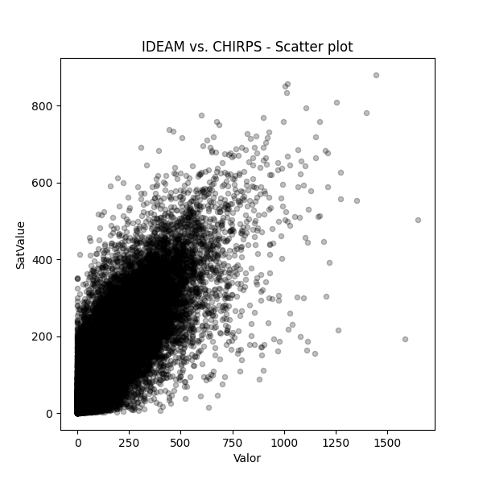

### General dataframe information

* IDEAM records: 514927
* Filtered records for Etiqueta == "PTPM_TT_M": 69603 (13.52%)

### General IDEAM vs. CHIRPS - plots

### Correlation Analysis

The correlation methods used for the analysis are:

* [Pearson correlation coefficient](https://en.wikipedia.org/wiki/Pearson_correlation_coefficient)  
* [Kendall rank correlation coefficient](https://en.wikipedia.org/wiki/Kendall_rank_correlation_coefficient)  
* [Spearman’s rank correlation coefficient](https://en.wikipedia.org/wiki/Spearman%%27s_rank_correlation_coefficient)  

#### Correlation values for date

The following table, shows the monthly average correlation values obtained from the IDEAM records and the correspondent Chirps values.

| Date                |   Year |   Month |    Pearson |    Kendall |   Spearman |
|:--------------------|-------:|--------:|-----------:|-----------:|-----------:|
| 1981-01-01 00:00:00 |   1981 |       1 | 0.612058   |  0.282219  |  0.383146  |
| 1981-02-01 00:00:00 |   1981 |       2 | 0.808769   |  0.378524  |  0.522209  |
| 1981-03-01 00:00:00 |   1981 |       3 | 0.539775   |  0.400649  |  0.569205  |
| 1981-04-01 00:00:00 |   1981 |       4 | 0.808314   |  0.377949  |  0.531696  |
| 1981-05-01 00:00:00 |   1981 |       5 | 0.643781   |  0.45438   |  0.627324  |
| 1981-06-01 00:00:00 |   1981 |       6 | 0.688421   |  0.552399  |  0.734658  |
| 1981-07-01 00:00:00 |   1981 |       7 | 0.495693   |  0.518113  |  0.703578  |
| 1981-08-01 00:00:00 |   1981 |       8 | 0.671228   |  0.431941  |  0.590448  |
| 1981-09-01 00:00:00 |   1981 |       9 | 0.609723   |  0.389817  |  0.537805  |
| 1981-10-01 00:00:00 |   1981 |      10 | 0.586131   |  0.423803  |  0.596277  |
| 1981-11-01 00:00:00 |   1981 |      11 | 0.641861   |  0.476287  |  0.671685  |
| 1981-12-01 00:00:00 |   1981 |      12 | 0.647182   |  0.489283  |  0.65906   |
| 1982-01-01 00:00:00 |   1982 |       1 | 0.774137   |  0.570714  |  0.754119  |
| 1982-02-01 00:00:00 |   1982 |       2 | 0.644174   |  0.458109  |  0.640362  |
| 1982-03-01 00:00:00 |   1982 |       3 | 0.71613    |  0.572578  |  0.749782  |
| 1982-04-01 00:00:00 |   1982 |       4 | 0.70992    |  0.538742  |  0.716901  |
| 1982-05-01 00:00:00 |   1982 |       5 | 0.630528   |  0.426531  |  0.602797  |
| 1982-06-01 00:00:00 |   1982 |       6 | 0.508836   |  0.408061  |  0.590496  |
| 1982-07-01 00:00:00 |   1982 |       7 | 0.68605    |  0.457934  |  0.637591  |
| 1982-08-01 00:00:00 |   1982 |       8 | 0.649016   |  0.470221  |  0.641039  |
| 1982-09-01 00:00:00 |   1982 |       9 | 0.612098   |  0.356416  |  0.490405  |
| 1982-10-01 00:00:00 |   1982 |      10 | 0.774179   |  0.417979  |  0.581164  |
| 1982-11-01 00:00:00 |   1982 |      11 | 0.795591   |  0.483623  |  0.665238  |
| 1982-12-01 00:00:00 |   1982 |      12 | 0.935416   |  0.382682  |  0.503019  |
| 1983-01-01 00:00:00 |   1983 |       1 | 0.665475   |  0.24156   |  0.322341  |
| 1983-02-01 00:00:00 |   1983 |       2 | 0.527949   |  0.456305  |  0.592618  |
| 1983-03-01 00:00:00 |   1983 |       3 | 0.603798   |  0.489475  |  0.675917  |
| 1983-04-01 00:00:00 |   1983 |       4 | 0.694043   |  0.529692  |  0.712004  |
| 1983-05-01 00:00:00 |   1983 |       5 | 0.72913    |  0.604743  |  0.776147  |
| 1983-06-01 00:00:00 |   1983 |       6 | 0.72672    |  0.481779  |  0.661273  |
| 1983-07-01 00:00:00 |   1983 |       7 | 0.684421   |  0.365716  |  0.510268  |
| 1983-08-01 00:00:00 |   1983 |       8 | 0.754224   |  0.554741  |  0.732593  |
| 1983-09-01 00:00:00 |   1983 |       9 | 0.805387   |  0.592026  |  0.77741   |
| 1983-10-01 00:00:00 |   1983 |      10 | 0.630253   |  0.492188  |  0.676457  |
| 1983-11-01 00:00:00 |   1983 |      11 | 0.550808   |  0.411868  |  0.569796  |
| 1983-12-01 00:00:00 |   1983 |      12 | 0.60451    |  0.442048  |  0.6168    |
| 1984-01-01 00:00:00 |   1984 |       1 | 0.703276   |  0.467201  |  0.619773  |
| 1984-02-01 00:00:00 |   1984 |       2 | 0.346839   |  0.330128  |  0.4867    |
| 1984-03-01 00:00:00 |   1984 |       3 | 0.599954   |  0.48701   |  0.660373  |
| 1984-04-01 00:00:00 |   1984 |       4 | 0.773793   |  0.647765  |  0.831608  |
| 1984-05-01 00:00:00 |   1984 |       5 | 0.795266   |  0.538248  |  0.720341  |
| 1984-06-01 00:00:00 |   1984 |       6 | 0.699226   |  0.452794  |  0.620636  |
| 1984-07-01 00:00:00 |   1984 |       7 | 0.700787   |  0.463871  |  0.65488   |
| 1984-08-01 00:00:00 |   1984 |       8 | 0.794719   |  0.559449  |  0.758433  |
| 1984-09-01 00:00:00 |   1984 |       9 | 0.623824   |  0.430889  |  0.594237  |
| 1984-10-01 00:00:00 |   1984 |      10 | 0.693342   |  0.477892  |  0.642265  |
| 1984-11-01 00:00:00 |   1984 |      11 | 0.578909   |  0.48281   |  0.660115  |
| 1984-12-01 00:00:00 |   1984 |      12 | 0.651398   |  0.302424  |  0.385755  |
| 1985-01-01 00:00:00 |   1985 |       1 | 0.488746   |  0.405176  |  0.522471  |
| 1985-02-01 00:00:00 |   1985 |       2 | 0.635806   |  0.321056  |  0.416477  |
| 1985-03-01 00:00:00 |   1985 |       3 | 0.692804   |  0.534202  |  0.711781  |
| 1985-04-01 00:00:00 |   1985 |       4 | 0.594484   |  0.559128  |  0.739981  |
| 1985-05-01 00:00:00 |   1985 |       5 | 0.739281   |  0.492348  |  0.669182  |
| 1985-06-01 00:00:00 |   1985 |       6 | 0.625975   |  0.460868  |  0.645639  |
| 1985-07-01 00:00:00 |   1985 |       7 | 0.597452   |  0.358122  |  0.498039  |
| 1985-08-01 00:00:00 |   1985 |       8 | 0.776426   |  0.467046  |  0.638565  |
| 1985-09-01 00:00:00 |   1985 |       9 | 0.699464   |  0.417397  |  0.592547  |
| 1985-10-01 00:00:00 |   1985 |      10 | 0.717803   |  0.456283  |  0.627897  |
| 1985-11-01 00:00:00 |   1985 |      11 | 0.83466    |  0.468738  |  0.642226  |
| 1985-12-01 00:00:00 |   1985 |      12 | 0.833099   |  0.43697   |  0.605685  |
| 1986-01-01 00:00:00 |   1986 |       1 | 0.733781   |  0.329713  |  0.425532  |
| 1986-02-01 00:00:00 |   1986 |       2 | 0.417436   |  0.336475  |  0.487919  |
| 1986-03-01 00:00:00 |   1986 |       3 | 0.632095   |  0.507068  |  0.694976  |
| 1986-04-01 00:00:00 |   1986 |       4 | 0.799844   |  0.501621  |  0.672769  |
| 1986-05-01 00:00:00 |   1986 |       5 | 0.802564   |  0.614403  |  0.810932  |
| 1986-06-01 00:00:00 |   1986 |       6 | 0.615454   |  0.351303  |  0.502667  |
| 1986-07-01 00:00:00 |   1986 |       7 | 0.728537   |  0.464694  |  0.637048  |
| 1986-08-01 00:00:00 |   1986 |       8 | 0.687403   |  0.354998  |  0.488718  |
| 1986-09-01 00:00:00 |   1986 |       9 | 0.821828   |  0.509026  |  0.696896  |
| 1986-10-01 00:00:00 |   1986 |      10 | 0.720635   |  0.43199   |  0.605987  |
| 1986-11-01 00:00:00 |   1986 |      11 | 0.674264   |  0.356495  |  0.506092  |
| 1986-12-01 00:00:00 |   1986 |      12 | 0.729148   |  0.321366  |  0.446529  |
| 1987-01-01 00:00:00 |   1987 |       1 | 0.518886   |  0.305535  |  0.426745  |
| 1987-02-01 00:00:00 |   1987 |       2 | 0.305346   |  0.311934  |  0.442172  |
| 1987-03-01 00:00:00 |   1987 |       3 | 0.487254   |  0.442464  |  0.598201  |
| 1987-04-01 00:00:00 |   1987 |       4 | 0.656947   |  0.462388  |  0.634917  |
| 1987-05-01 00:00:00 |   1987 |       5 | 0.611737   |  0.416172  |  0.579122  |
| 1987-06-01 00:00:00 |   1987 |       6 | 0.718846   |  0.457015  |  0.629619  |
| 1987-07-01 00:00:00 |   1987 |       7 | 0.742986   |  0.392704  |  0.559629  |
| 1987-08-01 00:00:00 |   1987 |       8 | 0.837654   |  0.454     |  0.620948  |
| 1987-09-01 00:00:00 |   1987 |       9 | 0.685293   |  0.441497  |  0.599652  |
| 1987-10-01 00:00:00 |   1987 |      10 | 0.662518   |  0.457267  |  0.633838  |
| 1987-11-01 00:00:00 |   1987 |      11 | 0.820482   |  0.544815  |  0.722334  |
| 1987-12-01 00:00:00 |   1987 |      12 | 0.771382   |  0.455196  |  0.626507  |
| 1988-01-01 00:00:00 |   1988 |       1 | 0.401901   |  0.308269  |  0.377737  |
| 1988-02-01 00:00:00 |   1988 |       2 | 0.494672   |  0.379542  |  0.51565   |
| 1988-03-01 00:00:00 |   1988 |       3 | 0.766699   |  0.509115  |  0.65973   |
| 1988-04-01 00:00:00 |   1988 |       4 | 0.528855   |  0.36198   |  0.505979  |
| 1988-05-01 00:00:00 |   1988 |       5 | 0.456579   |  0.346691  |  0.489466  |
| 1988-06-01 00:00:00 |   1988 |       6 | 0.5616     |  0.339761  |  0.475122  |
| 1988-07-01 00:00:00 |   1988 |       7 | 0.551247   |  0.368784  |  0.51192   |
| 1988-08-01 00:00:00 |   1988 |       8 | 0.771229   |  0.550388  |  0.738351  |
| 1988-09-01 00:00:00 |   1988 |       9 | 0.708319   |  0.491151  |  0.670569  |
| 1988-10-01 00:00:00 |   1988 |      10 | 0.76466    |  0.496802  |  0.692301  |
| 1988-11-01 00:00:00 |   1988 |      11 | 0.733081   |  0.432356  |  0.611407  |
| 1988-12-01 00:00:00 |   1988 |      12 | 0.884582   |  0.606868  |  0.788617  |
| 1989-01-01 00:00:00 |   1989 |       1 | 0.765013   |  0.439401  |  0.553926  |
| 1989-02-01 00:00:00 |   1989 |       2 | 0.572073   |  0.446785  |  0.614623  |
| 1989-03-01 00:00:00 |   1989 |       3 | 0.636633   |  0.478612  |  0.642165  |
| 1989-04-01 00:00:00 |   1989 |       4 | 0.661843   |  0.489631  |  0.662125  |
| 1989-05-01 00:00:00 |   1989 |       5 | 0.769166   |  0.532754  |  0.714012  |
| 1989-06-01 00:00:00 |   1989 |       6 | 0.834254   |  0.532417  |  0.714423  |
| 1989-07-01 00:00:00 |   1989 |       7 | 0.82225    |  0.447267  |  0.607109  |
| 1989-08-01 00:00:00 |   1989 |       8 | 0.715435   |  0.508522  |  0.694358  |
| 1989-09-01 00:00:00 |   1989 |       9 | 0.761334   |  0.583143  |  0.756538  |
| 1989-10-01 00:00:00 |   1989 |      10 | 0.822943   |  0.470085  |  0.634433  |
| 1989-11-01 00:00:00 |   1989 |      11 | 0.793241   |  0.491555  |  0.663919  |
| 1989-12-01 00:00:00 |   1989 |      12 | 0.415336   |  0.343698  |  0.48893   |
| 1990-01-01 00:00:00 |   1990 |       1 | 0.949898   |  0.35012   |  0.440971  |
| 1990-02-01 00:00:00 |   1990 |       2 | 0.665387   |  0.411503  |  0.543279  |
| 1990-03-01 00:00:00 |   1990 |       3 | 0.81449    |  0.573598  |  0.755102  |
| 1990-04-01 00:00:00 |   1990 |       4 | 0.732254   |  0.551283  |  0.737486  |
| 1990-05-01 00:00:00 |   1990 |       5 | 0.685783   |  0.385938  |  0.545466  |
| 1990-06-01 00:00:00 |   1990 |       6 | 0.662761   |  0.450147  |  0.616051  |
| 1990-07-01 00:00:00 |   1990 |       7 | 0.770828   |  0.365082  |  0.508908  |
| 1990-08-01 00:00:00 |   1990 |       8 | 0.708579   |  0.468585  |  0.635076  |
| 1990-09-01 00:00:00 |   1990 |       9 | 0.72072    |  0.42716   |  0.600328  |
| 1990-10-01 00:00:00 |   1990 |      10 | 0.582037   |  0.396558  |  0.555771  |
| 1990-11-01 00:00:00 |   1990 |      11 | 0.81389    |  0.499032  |  0.684661  |
| 1990-12-01 00:00:00 |   1990 |      12 | 0.729745   |  0.488282  |  0.664802  |
| 1991-01-01 00:00:00 |   1991 |       1 | 0.776482   |  0.245452  |  0.307058  |
| 1991-02-01 00:00:00 |   1991 |       2 | 0.783911   |  0.361024  |  0.486838  |
| 1991-03-01 00:00:00 |   1991 |       3 | 0.604412   |  0.525286  |  0.696318  |
| 1991-04-01 00:00:00 |   1991 |       4 | 0.860527   |  0.556787  |  0.732087  |
| 1991-05-01 00:00:00 |   1991 |       5 | 0.804223   |  0.470712  |  0.63364   |
| 1991-06-01 00:00:00 |   1991 |       6 | 0.701146   |  0.417707  |  0.556104  |
| 1991-07-01 00:00:00 |   1991 |       7 | 0.720612   |  0.446038  |  0.619762  |
| 1991-08-01 00:00:00 |   1991 |       8 | 0.570461   |  0.25304   |  0.365589  |
| 1991-09-01 00:00:00 |   1991 |       9 | 0.687495   |  0.4419    |  0.613858  |
| 1991-10-01 00:00:00 |   1991 |      10 | 0.671376   |  0.466408  |  0.642418  |
| 1991-11-01 00:00:00 |   1991 |      11 | 0.83504    |  0.410277  |  0.555026  |
| 1991-12-01 00:00:00 |   1991 |      12 | 0.890222   |  0.397691  |  0.507564  |
| 1992-01-01 00:00:00 |   1992 |       1 | 0.504782   |  0.330327  |  0.441734  |
| 1992-02-01 00:00:00 |   1992 |       2 | 0.704688   |  0.441491  |  0.577433  |
| 1992-03-01 00:00:00 |   1992 |       3 | 0.518449   |  0.445418  |  0.608973  |
| 1992-04-01 00:00:00 |   1992 |       4 | 0.71175    |  0.440021  |  0.609573  |
| 1992-05-01 00:00:00 |   1992 |       5 | 0.790649   |  0.533506  |  0.709343  |
| 1992-06-01 00:00:00 |   1992 |       6 | 0.728636   |  0.542014  |  0.729545  |
| 1992-07-01 00:00:00 |   1992 |       7 | 0.724407   |  0.440018  |  0.605182  |
| 1992-08-01 00:00:00 |   1992 |       8 | 0.722114   |  0.470109  |  0.652991  |
| 1992-09-01 00:00:00 |   1992 |       9 | 0.680463   |  0.432109  |  0.6151    |
| 1992-10-01 00:00:00 |   1992 |      10 | 0.626425   |  0.495928  |  0.670354  |
| 1992-11-01 00:00:00 |   1992 |      11 | 0.818989   |  0.610594  |  0.802671  |
| 1992-12-01 00:00:00 |   1992 |      12 | 0.832356   |  0.460367  |  0.629215  |
| 1993-01-01 00:00:00 |   1993 |       1 | 0.63213    |  0.410253  |  0.568793  |
| 1993-02-01 00:00:00 |   1993 |       2 | 0.401512   |  0.404081  |  0.554146  |
| 1993-03-01 00:00:00 |   1993 |       3 | 0.748287   |  0.473544  |  0.636207  |
| 1993-04-01 00:00:00 |   1993 |       4 | 0.760026   |  0.498384  |  0.661623  |
| 1993-05-01 00:00:00 |   1993 |       5 | 0.61397    |  0.452096  |  0.614362  |
| 1993-06-01 00:00:00 |   1993 |       6 | 0.68335    |  0.445871  |  0.613565  |
| 1993-07-01 00:00:00 |   1993 |       7 | 0.686704   |  0.361518  |  0.51016   |
| 1993-08-01 00:00:00 |   1993 |       8 | 0.693199   |  0.435343  |  0.612356  |
| 1993-09-01 00:00:00 |   1993 |       9 | 0.737537   |  0.445794  |  0.610741  |
| 1993-10-01 00:00:00 |   1993 |      10 | 0.706175   |  0.381976  |  0.523018  |
| 1993-11-01 00:00:00 |   1993 |      11 | 0.853748   |  0.486714  |  0.656401  |
| 1993-12-01 00:00:00 |   1993 |      12 | 0.806019   |  0.484756  |  0.652424  |
| 1994-01-01 00:00:00 |   1994 |       1 | 0.478124   |  0.345874  |  0.45086   |
| 1994-02-01 00:00:00 |   1994 |       2 | 0.656187   |  0.51411   |  0.693328  |
| 1994-03-01 00:00:00 |   1994 |       3 | 0.683528   |  0.561825  |  0.740097  |
| 1994-04-01 00:00:00 |   1994 |       4 | 0.788554   |  0.569722  |  0.74691   |
| 1994-05-01 00:00:00 |   1994 |       5 | 0.743518   |  0.437366  |  0.604119  |
| 1994-06-01 00:00:00 |   1994 |       6 | 0.715697   |  0.481754  |  0.64269   |
| 1994-07-01 00:00:00 |   1994 |       7 | 0.884902   |  0.540581  |  0.720412  |
| 1994-08-01 00:00:00 |   1994 |       8 | 0.716336   |  0.438143  |  0.599986  |
| 1994-09-01 00:00:00 |   1994 |       9 | 0.575235   |  0.442741  |  0.621881  |
| 1994-10-01 00:00:00 |   1994 |      10 | 0.810031   |  0.523409  |  0.711881  |
| 1994-11-01 00:00:00 |   1994 |      11 | 0.87004    |  0.416391  |  0.588776  |
| 1994-12-01 00:00:00 |   1994 |      12 | 0.869152   |  0.509068  |  0.668436  |
| 1995-01-01 00:00:00 |   1995 |       1 | 0.421771   |  0.34404   |  0.444198  |
| 1995-02-01 00:00:00 |   1995 |       2 | 0.290628   |  0.254758  |  0.345397  |
| 1995-03-01 00:00:00 |   1995 |       3 | 0.769214   |  0.515049  |  0.679385  |
| 1995-04-01 00:00:00 |   1995 |       4 | 0.688668   |  0.395187  |  0.554973  |
| 1995-05-01 00:00:00 |   1995 |       5 | 0.694521   |  0.497543  |  0.670855  |
| 1995-06-01 00:00:00 |   1995 |       6 | 0.654819   |  0.495509  |  0.676535  |
| 1995-07-01 00:00:00 |   1995 |       7 | 0.679759   |  0.469661  |  0.636964  |
| 1995-08-01 00:00:00 |   1995 |       8 | 0.596455   |  0.477233  |  0.659062  |
| 1995-09-01 00:00:00 |   1995 |       9 | 0.738295   |  0.466662  |  0.634143  |
| 1995-10-01 00:00:00 |   1995 |      10 | 0.824304   |  0.594947  |  0.766799  |
| 1995-11-01 00:00:00 |   1995 |      11 | 0.777246   |  0.521621  |  0.697318  |
| 1995-12-01 00:00:00 |   1995 |      12 | 0.844204   |  0.528593  |  0.699155  |
| 1996-01-01 00:00:00 |   1996 |       1 | 0.630333   |  0.415458  |  0.565816  |
| 1996-02-01 00:00:00 |   1996 |       2 | 0.609415   |  0.431977  |  0.598356  |
| 1996-03-01 00:00:00 |   1996 |       3 | 0.668055   |  0.549808  |  0.732378  |
| 1996-04-01 00:00:00 |   1996 |       4 | 0.756006   |  0.42176   |  0.586827  |
| 1996-05-01 00:00:00 |   1996 |       5 | 0.641742   |  0.290231  |  0.400951  |
| 1996-06-01 00:00:00 |   1996 |       6 | 0.614275   |  0.434552  |  0.583628  |
| 1996-07-01 00:00:00 |   1996 |       7 | 0.575827   |  0.353093  |  0.492406  |
| 1996-08-01 00:00:00 |   1996 |       8 | 0.764897   |  0.504518  |  0.669675  |
| 1996-09-01 00:00:00 |   1996 |       9 | 0.727969   |  0.479382  |  0.650495  |
| 1996-10-01 00:00:00 |   1996 |      10 | 0.823677   |  0.489864  |  0.666789  |
| 1996-11-01 00:00:00 |   1996 |      11 | 0.716095   |  0.452582  |  0.625447  |
| 1996-12-01 00:00:00 |   1996 |      12 | 0.962944   |  0.483129  |  0.640817  |
| 1997-01-01 00:00:00 |   1997 |       1 | 0.844213   |  0.490192  |  0.645076  |
| 1997-02-01 00:00:00 |   1997 |       2 | 0.880127   |  0.434474  |  0.552278  |
| 1997-03-01 00:00:00 |   1997 |       3 | 0.552475   |  0.533542  |  0.699973  |
| 1997-04-01 00:00:00 |   1997 |       4 | 0.650535   |  0.519535  |  0.700194  |
| 1997-05-01 00:00:00 |   1997 |       5 | 0.750352   |  0.527255  |  0.683398  |
| 1997-06-01 00:00:00 |   1997 |       6 | 0.786564   |  0.470392  |  0.645563  |
| 1997-07-01 00:00:00 |   1997 |       7 | 0.717971   |  0.516667  |  0.710349  |
| 1997-08-01 00:00:00 |   1997 |       8 | 0.727493   |  0.446399  |  0.618208  |
| 1997-09-01 00:00:00 |   1997 |       9 | 0.726954   |  0.368227  |  0.513542  |
| 1997-10-01 00:00:00 |   1997 |      10 | 0.844451   |  0.471428  |  0.642856  |
| 1997-11-01 00:00:00 |   1997 |      11 | 0.650808   |  0.4207    |  0.559427  |
| 1997-12-01 00:00:00 |   1997 |      12 | 0.633663   |  0.427011  |  0.564723  |
| 1998-01-01 00:00:00 |   1998 |       1 | 0.450178   |  0.222843  |  0.291759  |
| 1998-02-01 00:00:00 |   1998 |       2 | 0.745154   |  0.44211   |  0.594577  |
| 1998-03-01 00:00:00 |   1998 |       3 | 0.542292   |  0.4661    |  0.642656  |
| 1998-04-01 00:00:00 |   1998 |       4 | 0.859498   |  0.494558  |  0.669107  |
| 1998-05-01 00:00:00 |   1998 |       5 | 0.68868    |  0.420054  |  0.57833   |
| 1998-06-01 00:00:00 |   1998 |       6 | 0.627155   |  0.352127  |  0.499255  |
| 1998-07-01 00:00:00 |   1998 |       7 | 0.722671   |  0.52814   |  0.710129  |
| 1998-08-01 00:00:00 |   1998 |       8 | 0.657937   |  0.43758   |  0.611132  |
| 1998-09-01 00:00:00 |   1998 |       9 | 0.607246   |  0.487909  |  0.664723  |
| 1998-10-01 00:00:00 |   1998 |      10 | 0.635692   |  0.411372  |  0.585066  |
| 1998-11-01 00:00:00 |   1998 |      11 | 0.807348   |  0.517551  |  0.683097  |
| 1998-12-01 00:00:00 |   1998 |      12 | 0.884989   |  0.496647  |  0.66575   |
| 1999-01-01 00:00:00 |   1999 |       1 | 0.720544   |  0.596692  |  0.761227  |
| 1999-02-01 00:00:00 |   1999 |       2 | 0.774642   |  0.487387  |  0.691569  |
| 1999-03-01 00:00:00 |   1999 |       3 | 0.648219   |  0.52767   |  0.718096  |
| 1999-04-01 00:00:00 |   1999 |       4 | 0.688904   |  0.491552  |  0.663338  |
| 1999-05-01 00:00:00 |   1999 |       5 | 0.60313    |  0.474502  |  0.643408  |
| 1999-06-01 00:00:00 |   1999 |       6 | 0.644271   |  0.450623  |  0.632611  |
| 1999-07-01 00:00:00 |   1999 |       7 | 0.716489   |  0.521354  |  0.71087   |
| 1999-08-01 00:00:00 |   1999 |       8 | 0.438784   |  0.396256  |  0.551317  |
| 1999-09-01 00:00:00 |   1999 |       9 | 0.535081   |  0.424232  |  0.595874  |
| 1999-10-01 00:00:00 |   1999 |      10 | 0.684105   |  0.532494  |  0.70259   |
| 1999-11-01 00:00:00 |   1999 |      11 | 0.527076   |  0.41239   |  0.558573  |
| 1999-12-01 00:00:00 |   1999 |      12 | 0.875243   |  0.403543  |  0.554844  |
| 2000-01-01 00:00:00 |   2000 |       1 | 0.675203   |  0.382908  |  0.527618  |
| 2000-02-01 00:00:00 |   2000 |       2 | 0.90952    |  0.502114  |  0.684508  |
| 2000-03-01 00:00:00 |   2000 |       3 | 0.829564   |  0.568528  |  0.735972  |
| 2000-04-01 00:00:00 |   2000 |       4 | 0.610903   |  0.5142    |  0.706957  |
| 2000-05-01 00:00:00 |   2000 |       5 | 0.656033   |  0.502854  |  0.678942  |
| 2000-06-01 00:00:00 |   2000 |       6 | 0.733829   |  0.52733   |  0.710272  |
| 2000-07-01 00:00:00 |   2000 |       7 | 0.659653   |  0.445326  |  0.616425  |
| 2000-08-01 00:00:00 |   2000 |       8 | 0.651259   |  0.478336  |  0.665369  |
| 2000-09-01 00:00:00 |   2000 |       9 | 0.660458   |  0.529973  |  0.722265  |
| 2000-10-01 00:00:00 |   2000 |      10 | 0.731057   |  0.537327  |  0.723003  |
| 2000-11-01 00:00:00 |   2000 |      11 | 0.753406   |  0.58711   |  0.790455  |
| 2000-12-01 00:00:00 |   2000 |      12 | 0.641708   |  0.416232  |  0.573785  |
| 2001-01-01 00:00:00 |   2001 |       1 | 0.387503   |  0.307371  |  0.385734  |
| 2001-02-01 00:00:00 |   2001 |       2 | 0.523137   |  0.272272  |  0.340436  |
| 2001-03-01 00:00:00 |   2001 |       3 | 0.548027   |  0.511773  |  0.68219   |
| 2001-04-01 00:00:00 |   2001 |       4 | 0.569129   |  0.511511  |  0.675592  |
| 2001-05-01 00:00:00 |   2001 |       5 | 0.708522   |  0.513645  |  0.707593  |
| 2001-06-01 00:00:00 |   2001 |       6 | 0.640188   |  0.477459  |  0.664513  |
| 2001-07-01 00:00:00 |   2001 |       7 | 0.643413   |  0.412871  |  0.579972  |
| 2001-08-01 00:00:00 |   2001 |       8 | 0.639037   |  0.392568  |  0.54897   |
| 2001-09-01 00:00:00 |   2001 |       9 | 0.701943   |  0.453082  |  0.620898  |
| 2001-10-01 00:00:00 |   2001 |      10 | 0.611718   |  0.460986  |  0.632925  |
| 2001-11-01 00:00:00 |   2001 |      11 | 0.822868   |  0.549965  |  0.733715  |
| 2001-12-01 00:00:00 |   2001 |      12 | 0.852402   |  0.512093  |  0.668945  |
| 2002-01-01 00:00:00 |   2002 |       1 | 0.759308   |  0.45527   |  0.560717  |
| 2002-02-01 00:00:00 |   2002 |       2 | 0.787637   |  0.532488  |  0.681192  |
| 2002-03-01 00:00:00 |   2002 |       3 | 0.7955     |  0.507256  |  0.676584  |
| 2002-04-01 00:00:00 |   2002 |       4 | 0.844043   |  0.540159  |  0.732437  |
| 2002-05-01 00:00:00 |   2002 |       5 | 0.763381   |  0.455412  |  0.618601  |
| 2002-06-01 00:00:00 |   2002 |       6 | 0.727392   |  0.547125  |  0.742635  |
| 2002-07-01 00:00:00 |   2002 |       7 | 0.607905   |  0.34573   |  0.481351  |
| 2002-08-01 00:00:00 |   2002 |       8 | 0.465199   |  0.334605  |  0.476087  |
| 2002-09-01 00:00:00 |   2002 |       9 | 0.531921   |  0.414349  |  0.573628  |
| 2002-10-01 00:00:00 |   2002 |      10 | 0.707212   |  0.523313  |  0.707218  |
| 2002-11-01 00:00:00 |   2002 |      11 | 0.745463   |  0.402559  |  0.562468  |
| 2002-12-01 00:00:00 |   2002 |      12 | 0.342911   |  0.182286  |  0.253838  |
| 2003-01-01 00:00:00 |   2003 |       1 | 0.591989   |  0.359627  |  0.450194  |
| 2003-02-01 00:00:00 |   2003 |       2 | 0.53225    |  0.447312  |  0.577403  |
| 2003-03-01 00:00:00 |   2003 |       3 | 0.538609   |  0.463753  |  0.626168  |
| 2003-04-01 00:00:00 |   2003 |       4 | 0.616448   |  0.425757  |  0.578369  |
| 2003-05-01 00:00:00 |   2003 |       5 | 0.592451   |  0.392092  |  0.518069  |
| 2003-06-01 00:00:00 |   2003 |       6 | 0.658468   |  0.531049  |  0.71553   |
| 2003-07-01 00:00:00 |   2003 |       7 | 0.642935   |  0.464661  |  0.619013  |
| 2003-08-01 00:00:00 |   2003 |       8 | 0.628367   |  0.434462  |  0.603248  |
| 2003-09-01 00:00:00 |   2003 |       9 | 0.70104    |  0.553425  |  0.741784  |
| 2003-10-01 00:00:00 |   2003 |      10 | 0.54086    |  0.440565  |  0.61076   |
| 2003-11-01 00:00:00 |   2003 |      11 | 0.608547   |  0.375855  |  0.52797   |
| 2003-12-01 00:00:00 |   2003 |      12 | 0.674638   |  0.424366  |  0.590572  |
| 2004-01-01 00:00:00 |   2004 |       1 | 0.584864   |  0.317559  |  0.41584   |
| 2004-02-01 00:00:00 |   2004 |       2 | 0.405823   |  0.482006  |  0.632094  |
| 2004-03-01 00:00:00 |   2004 |       3 | 0.675883   |  0.58916   |  0.763641  |
| 2004-04-01 00:00:00 |   2004 |       4 | 0.787225   |  0.547558  |  0.725924  |
| 2004-05-01 00:00:00 |   2004 |       5 | 0.819884   |  0.475249  |  0.640409  |
| 2004-06-01 00:00:00 |   2004 |       6 | 0.581799   |  0.368793  |  0.515354  |
| 2004-07-01 00:00:00 |   2004 |       7 | 0.572282   |  0.38793   |  0.539984  |
| 2004-08-01 00:00:00 |   2004 |       8 | 0.687835   |  0.368826  |  0.51636   |
| 2004-09-01 00:00:00 |   2004 |       9 | 0.565788   |  0.350164  |  0.498991  |
| 2004-10-01 00:00:00 |   2004 |      10 | 0.806276   |  0.525116  |  0.701564  |
| 2004-11-01 00:00:00 |   2004 |      11 | 0.659081   |  0.349478  |  0.486526  |
| 2004-12-01 00:00:00 |   2004 |      12 | 0.819109   |  0.578401  |  0.733723  |
| 2005-01-01 00:00:00 |   2005 |       1 | 0.828806   |  0.545906  |  0.708626  |
| 2005-02-01 00:00:00 |   2005 |       2 | 0.664031   |  0.532248  |  0.71063   |
| 2005-03-01 00:00:00 |   2005 |       3 | 0.662458   |  0.544412  |  0.731437  |
| 2005-04-01 00:00:00 |   2005 |       4 | 0.752153   |  0.509313  |  0.680948  |
| 2005-05-01 00:00:00 |   2005 |       5 | 0.723379   |  0.498101  |  0.658098  |
| 2005-06-01 00:00:00 |   2005 |       6 | 0.682411   |  0.417689  |  0.575387  |
| 2005-07-01 00:00:00 |   2005 |       7 | 0.453912   |  0.304503  |  0.43842   |
| 2005-08-01 00:00:00 |   2005 |       8 | 0.654151   |  0.43112   |  0.601214  |
| 2005-09-01 00:00:00 |   2005 |       9 | 0.608523   |  0.461849  |  0.65485   |
| 2005-10-01 00:00:00 |   2005 |      10 | 0.796556   |  0.586955  |  0.77083   |
| 2005-11-01 00:00:00 |   2005 |      11 | 0.768298   |  0.545535  |  0.734988  |
| 2005-12-01 00:00:00 |   2005 |      12 | 0.772221   |  0.438518  |  0.590113  |
| 2006-01-01 00:00:00 |   2006 |       1 | 0.716326   |  0.521011  |  0.69309   |
| 2006-02-01 00:00:00 |   2006 |       2 | 0.273905   |  0.374441  |  0.501875  |
| 2006-03-01 00:00:00 |   2006 |       3 | 0.708128   |  0.58612   |  0.76812   |
| 2006-04-01 00:00:00 |   2006 |       4 | 0.739043   |  0.612467  |  0.800348  |
| 2006-05-01 00:00:00 |   2006 |       5 | 0.713791   |  0.490519  |  0.67402   |
| 2006-06-01 00:00:00 |   2006 |       6 | 0.488415   |  0.315236  |  0.460454  |
| 2006-07-01 00:00:00 |   2006 |       7 | 0.496998   |  0.382648  |  0.53615   |
| 2006-08-01 00:00:00 |   2006 |       8 | 0.501048   |  0.416868  |  0.584234  |
| 2006-09-01 00:00:00 |   2006 |       9 | 0.672591   |  0.430708  |  0.59544   |
| 2006-10-01 00:00:00 |   2006 |      10 | 0.760279   |  0.476165  |  0.660496  |
| 2006-11-01 00:00:00 |   2006 |      11 | 0.70232    |  0.39002   |  0.539005  |
| 2006-12-01 00:00:00 |   2006 |      12 | 0.747422   |  0.43257   |  0.600399  |
| 2007-01-01 00:00:00 |   2007 |       1 | 0.791345   |  0.140251  |  0.180015  |
| 2007-02-01 00:00:00 |   2007 |       2 | 0.537122   |  0.406642  |  0.532443  |
| 2007-03-01 00:00:00 |   2007 |       3 | 0.709219   |  0.51597   |  0.69981   |
| 2007-04-01 00:00:00 |   2007 |       4 | 0.687407   |  0.460963  |  0.642047  |
| 2007-05-01 00:00:00 |   2007 |       5 | 0.656411   |  0.442481  |  0.607694  |
| 2007-06-01 00:00:00 |   2007 |       6 | 0.575299   |  0.319003  |  0.4573    |
| 2007-07-01 00:00:00 |   2007 |       7 | 0.676161   |  0.522524  |  0.686086  |
| 2007-08-01 00:00:00 |   2007 |       8 | 0.642877   |  0.476246  |  0.65002   |
| 2007-09-01 00:00:00 |   2007 |       9 | 0.580575   |  0.43429   |  0.600848  |
| 2007-10-01 00:00:00 |   2007 |      10 | 0.64072    |  0.492587  |  0.649002  |
| 2007-11-01 00:00:00 |   2007 |      11 | 0.657051   |  0.347693  |  0.495809  |
| 2007-12-01 00:00:00 |   2007 |      12 | 0.914392   |  0.537073  |  0.712266  |
| 2008-01-01 00:00:00 |   2008 |       1 | 0.714356   |  0.480858  |  0.602596  |
| 2008-02-01 00:00:00 |   2008 |       2 | 0.772238   |  0.516013  |  0.682774  |
| 2008-03-01 00:00:00 |   2008 |       3 | 0.670054   |  0.547636  |  0.735196  |
| 2008-04-01 00:00:00 |   2008 |       4 | 0.738211   |  0.513624  |  0.685999  |
| 2008-05-01 00:00:00 |   2008 |       5 | 0.754173   |  0.518209  |  0.686474  |
| 2008-06-01 00:00:00 |   2008 |       6 | 0.682412   |  0.409455  |  0.581233  |
| 2008-07-01 00:00:00 |   2008 |       7 | 0.669913   |  0.428906  |  0.601516  |
| 2008-08-01 00:00:00 |   2008 |       8 | 0.673397   |  0.472985  |  0.651923  |
| 2008-09-01 00:00:00 |   2008 |       9 | 0.673355   |  0.491285  |  0.68109   |
| 2008-10-01 00:00:00 |   2008 |      10 | 0.677184   |  0.459983  |  0.633231  |
| 2008-11-01 00:00:00 |   2008 |      11 | 0.669105   |  0.409257  |  0.573469  |
| 2008-12-01 00:00:00 |   2008 |      12 | 0.567983   |  0.512906  |  0.678252  |
| 2009-01-01 00:00:00 |   2009 |       1 | 0.609333   |  0.423242  |  0.57377   |
| 2009-02-01 00:00:00 |   2009 |       2 | 0.827019   |  0.269238  |  0.357818  |
| 2009-03-01 00:00:00 |   2009 |       3 | 0.820737   |  0.615038  |  0.789561  |
| 2009-04-01 00:00:00 |   2009 |       4 | 0.798052   |  0.639287  |  0.81045   |
| 2009-05-01 00:00:00 |   2009 |       5 | 0.733001   |  0.429809  |  0.601411  |
| 2009-06-01 00:00:00 |   2009 |       6 | 0.578139   |  0.397017  |  0.562861  |
| 2009-07-01 00:00:00 |   2009 |       7 | 0.746881   |  0.394591  |  0.548057  |
| 2009-08-01 00:00:00 |   2009 |       8 | 0.656939   |  0.394454  |  0.540795  |
| 2009-09-01 00:00:00 |   2009 |       9 | 0.679189   |  0.402984  |  0.551845  |
| 2009-10-01 00:00:00 |   2009 |      10 | 0.652365   |  0.421434  |  0.594925  |
| 2009-11-01 00:00:00 |   2009 |      11 | 0.583653   |  0.390773  |  0.536701  |
| 2009-12-01 00:00:00 |   2009 |      12 | 0.639453   |  0.386426  |  0.53576   |
| 2010-01-01 00:00:00 |   2010 |       1 | 0.00408852 |  0.114963  |  0.145435  |
| 2010-02-01 00:00:00 |   2010 |       2 | 0.372217   |  0.399682  |  0.568576  |
| 2010-03-01 00:00:00 |   2010 |       3 | 0.560785   |  0.387724  |  0.542961  |
| 2010-04-01 00:00:00 |   2010 |       4 | 0.663673   |  0.317138  |  0.469267  |
| 2010-05-01 00:00:00 |   2010 |       5 | 0.63067    |  0.436126  |  0.579533  |
| 2010-06-01 00:00:00 |   2010 |       6 | 0.660678   |  0.454842  |  0.632635  |
| 2010-07-01 00:00:00 |   2010 |       7 | 0.638788   |  0.47464   |  0.65564   |
| 2010-08-01 00:00:00 |   2010 |       8 | 0.526662   |  0.405191  |  0.567096  |
| 2010-09-01 00:00:00 |   2010 |       9 | 0.641334   |  0.458212  |  0.641255  |
| 2010-10-01 00:00:00 |   2010 |      10 | 0.62896    |  0.461829  |  0.622605  |
| 2010-11-01 00:00:00 |   2010 |      11 | 0.756064   |  0.571506  |  0.763323  |
| 2010-12-01 00:00:00 |   2010 |      12 | 0.718266   |  0.451311  |  0.605804  |
| 2011-01-01 00:00:00 |   2011 |       1 | 0.28446    |  0.461286  |  0.616807  |
| 2011-02-01 00:00:00 |   2011 |       2 | 0.779287   |  0.460147  |  0.635964  |
| 2011-03-01 00:00:00 |   2011 |       3 | 0.56763    |  0.454265  |  0.620128  |
| 2011-04-01 00:00:00 |   2011 |       4 | 0.828787   |  0.67829   |  0.853732  |
| 2011-05-01 00:00:00 |   2011 |       5 | 0.63612    |  0.483543  |  0.653853  |
| 2011-06-01 00:00:00 |   2011 |       6 | 0.636367   |  0.448447  |  0.63395   |
| 2011-07-01 00:00:00 |   2011 |       7 | 0.472576   |  0.428807  |  0.597468  |
| 2011-08-01 00:00:00 |   2011 |       8 | 0.540888   |  0.408805  |  0.582813  |
| 2011-09-01 00:00:00 |   2011 |       9 | 0.556029   |  0.412377  |  0.575249  |
| 2011-10-01 00:00:00 |   2011 |      10 | 0.620834   |  0.465351  |  0.632568  |
| 2011-11-01 00:00:00 |   2011 |      11 | 0.67976    |  0.444555  |  0.616394  |
| 2011-12-01 00:00:00 |   2011 |      12 | 0.7493     |  0.456404  |  0.62975   |
| 2012-01-01 00:00:00 |   2012 |       1 | 0.691602   |  0.474192  |  0.590327  |
| 2012-02-01 00:00:00 |   2012 |       2 | 0.797643   |  0.495612  |  0.641643  |
| 2012-03-01 00:00:00 |   2012 |       3 | 0.850767   |  0.59663   |  0.771738  |
| 2012-04-01 00:00:00 |   2012 |       4 | 0.800804   |  0.590615  |  0.774618  |
| 2012-05-01 00:00:00 |   2012 |       5 | 0.440817   |  0.355042  |  0.495638  |
| 2012-06-01 00:00:00 |   2012 |       6 | 0.52089    |  0.428129  |  0.617037  |
| 2012-07-01 00:00:00 |   2012 |       7 | 0.604635   |  0.432666  |  0.609772  |
| 2012-08-01 00:00:00 |   2012 |       8 | 0.633807   |  0.473348  |  0.65687   |
| 2012-09-01 00:00:00 |   2012 |       9 | 0.599548   |  0.416439  |  0.584445  |
| 2012-10-01 00:00:00 |   2012 |      10 | 0.583431   |  0.461876  |  0.660022  |
| 2012-11-01 00:00:00 |   2012 |      11 | 0.693271   |  0.428615  |  0.597416  |
| 2012-12-01 00:00:00 |   2012 |      12 | 0.759241   |  0.565813  |  0.737312  |
| 2013-01-01 00:00:00 |   2013 |       1 | 0.281355   |  0.245968  |  0.30427   |
| 2013-02-01 00:00:00 |   2013 |       2 | 0.291143   |  0.340506  |  0.485853  |
| 2013-03-01 00:00:00 |   2013 |       3 | 0.634031   |  0.555407  |  0.752386  |
| 2013-04-01 00:00:00 |   2013 |       4 | 0.65835    |  0.567745  |  0.75323   |
| 2013-05-01 00:00:00 |   2013 |       5 | 0.750027   |  0.512956  |  0.689948  |
| 2013-06-01 00:00:00 |   2013 |       6 | 0.485205   |  0.385702  |  0.533675  |
| 2013-07-01 00:00:00 |   2013 |       7 | 0.581357   |  0.370342  |  0.508034  |
| 2013-08-01 00:00:00 |   2013 |       8 | 0.74024    |  0.551764  |  0.732503  |
| 2013-09-01 00:00:00 |   2013 |       9 | 0.714735   |  0.528413  |  0.707523  |
| 2013-10-01 00:00:00 |   2013 |      10 | 0.666992   |  0.468431  |  0.645082  |
| 2013-11-01 00:00:00 |   2013 |      11 | 0.816854   |  0.494946  |  0.659182  |
| 2013-12-01 00:00:00 |   2013 |      12 | 0.828207   |  0.62044   |  0.801774  |
| 2014-01-01 00:00:00 |   2014 |       1 | 0.506077   |  0.458606  |  0.606577  |
| 2014-02-01 00:00:00 |   2014 |       2 | 0.540584   |  0.445735  |  0.603514  |
| 2014-03-01 00:00:00 |   2014 |       3 | 0.583536   |  0.517943  |  0.694143  |
| 2014-04-01 00:00:00 |   2014 |       4 | 0.474498   |  0.38975   |  0.530169  |
| 2014-05-01 00:00:00 |   2014 |       5 | 0.626314   |  0.434524  |  0.610786  |
| 2014-06-01 00:00:00 |   2014 |       6 | 0.119051   |  0.0708604 |  0.0958695 |
| 2014-07-01 00:00:00 |   2014 |       7 | 0.0415518  |  0.0152779 |  0.0248425 |
| 2014-08-01 00:00:00 |   2014 |       8 | 0.377705   |  0.214143  |  0.304601  |
| 2014-09-01 00:00:00 |   2014 |       9 | 0.252189   |  0.10767   |  0.163646  |
| 2014-10-01 00:00:00 |   2014 |      10 | 0.470251   |  0.321469  |  0.491359  |
| 2014-11-01 00:00:00 |   2014 |      11 | 0.455694   |  0.385248  |  0.540489  |
| 2014-12-01 00:00:00 |   2014 |      12 | 0.308629   |  0.229434  |  0.324164  |
| 2015-01-01 00:00:00 |   2015 |       1 | 0.249946   | -0.0154679 | -0.0195618 |
| 2015-02-01 00:00:00 |   2015 |       2 | 0.581023   |  0.445228  |  0.608193  |
| 2015-03-01 00:00:00 |   2015 |       3 | 0.271012   |  0.484298  |  0.685415  |
| 2015-04-01 00:00:00 |   2015 |       4 | 0.251294   |  0.223172  |  0.335489  |
| 2015-05-01 00:00:00 |   2015 |       5 | 0.36231    |  0.288798  |  0.41566   |
| 2015-06-01 00:00:00 |   2015 |       6 | 0.201967   |  0.147981  |  0.218256  |
| 2015-07-01 00:00:00 |   2015 |       7 | 0.358108   |  0.193392  |  0.284694  |
| 2015-08-01 00:00:00 |   2015 |       8 | 0.368403   |  0.281194  |  0.400049  |
| 2015-09-01 00:00:00 |   2015 |       9 | 0.0667572  |  0.082961  |  0.120218  |
| 2015-10-01 00:00:00 |   2015 |      10 | 0.48689    |  0.30801   |  0.428979  |
| 2015-11-01 00:00:00 |   2015 |      11 | 0.498597   |  0.201927  |  0.289052  |
| 2015-12-01 00:00:00 |   2015 |      12 | 0.474719   |  0.165457  |  0.223821  |
| 2016-01-01 00:00:00 |   2016 |       1 | 0.146072   |  0.105635  |  0.141231  |
| 2016-02-01 00:00:00 |   2016 |       2 | 0.361717   |  0.299697  |  0.399486  |
| 2016-03-01 00:00:00 |   2016 |       3 | 0.342631   |  0.304381  |  0.428085  |
| 2016-04-01 00:00:00 |   2016 |       4 | 0.429708   |  0.31078   |  0.423981  |
| 2016-05-01 00:00:00 |   2016 |       5 | 0.444559   |  0.259401  |  0.379042  |
| 2016-06-01 00:00:00 |   2016 |       6 | 0.333509   |  0.247415  |  0.359475  |
| 2016-07-01 00:00:00 |   2016 |       7 | 0.505867   |  0.292487  |  0.425945  |
| 2016-08-01 00:00:00 |   2016 |       8 | 0.570064   |  0.413147  |  0.574427  |
| 2016-09-01 00:00:00 |   2016 |       9 | 0.454328   |  0.332538  |  0.486366  |
| 2016-10-01 00:00:00 |   2016 |      10 | 0.473113   |  0.409051  |  0.547146  |
| 2016-11-01 00:00:00 |   2016 |      11 | 0.624592   |  0.497739  |  0.693197  |
| 2016-12-01 00:00:00 |   2016 |      12 | 0.685437   |  0.487183  |  0.656253  |
| 2017-01-01 00:00:00 |   2017 |       1 | 0.718272   |  0.159715  |  0.211359  |
| 2017-02-01 00:00:00 |   2017 |       2 | 0.403057   |  0.177263  |  0.241979  |
| 2017-03-01 00:00:00 |   2017 |       3 | 0.628844   |  0.444864  |  0.595388  |
| 2017-04-01 00:00:00 |   2017 |       4 | 0.583575   |  0.283389  |  0.412926  |
| 2017-05-01 00:00:00 |   2017 |       5 | 0.473963   |  0.212074  |  0.306337  |
| 2017-06-01 00:00:00 |   2017 |       6 | 0.381841   |  0.31133   |  0.461404  |
| 2017-07-01 00:00:00 |   2017 |       7 | 0.202616   |  0.164892  |  0.263217  |
| 2017-08-01 00:00:00 |   2017 |       8 | 0.580356   |  0.414853  |  0.572272  |
| 2017-09-01 00:00:00 |   2017 |       9 | 0.407914   |  0.316274  |  0.44466   |
| 2017-10-01 00:00:00 |   2017 |      10 | 0.342383   |  0.227909  |  0.3396    |
| 2017-11-01 00:00:00 |   2017 |      11 | 0.397926   |  0.244965  |  0.346889  |
| 2017-12-01 00:00:00 |   2017 |      12 | 0.474661   |  0.426832  |  0.575854  |
| 2018-01-01 00:00:00 |   2018 |       1 | 0.357488   |  0.251639  |  0.338708  |
| 2018-02-01 00:00:00 |   2018 |       2 | 0.589456   |  0.0598689 |  0.0849494 |
| 2018-03-01 00:00:00 |   2018 |       3 | 0.512859   |  0.308461  |  0.43661   |
| 2018-04-01 00:00:00 |   2018 |       4 | 0.415993   |  0.285607  |  0.408119  |
| 2018-05-01 00:00:00 |   2018 |       5 | 0.331704   |  0.233192  |  0.332332  |
| 2018-06-01 00:00:00 |   2018 |       6 | 0.365834   |  0.280107  |  0.410734  |
| 2018-07-01 00:00:00 |   2018 |       7 | 0.318405   |  0.282568  |  0.415399  |
| 2018-08-01 00:00:00 |   2018 |       8 | 0.513883   |  0.36253   |  0.531865  |
| 2018-09-01 00:00:00 |   2018 |       9 | 0.428194   |  0.288788  |  0.41911   |
| 2018-10-01 00:00:00 |   2018 |      10 | 0.578641   |  0.387952  |  0.560485  |
| 2018-11-01 00:00:00 |   2018 |      11 | 0.63635    |  0.340611  |  0.490507  |
| 2018-12-01 00:00:00 |   2018 |      12 | 0.24116    |  0.0940691 |  0.120331  |
| 2019-01-01 00:00:00 |   2019 |       1 | 0.335199   |  0.303435  |  0.424376  |
| 2019-02-01 00:00:00 |   2019 |       2 | 0.00454535 |  0.221041  |  0.30082   |
| 2019-03-01 00:00:00 |   2019 |       3 | 0.657212   |  0.591263  |  0.779523  |
| 2019-04-01 00:00:00 |   2019 |       4 | 0.538835   |  0.238328  |  0.336366  |
| 2019-05-01 00:00:00 |   2019 |       5 | 0.473454   |  0.307928  |  0.427628  |
| 2019-06-01 00:00:00 |   2019 |       6 | 0.304595   |  0.243178  |  0.366383  |
| 2019-07-01 00:00:00 |   2019 |       7 | 0.329229   |  0.283461  |  0.408716  |
| 2019-08-01 00:00:00 |   2019 |       8 | 0.172448   |  0.205273  |  0.29102   |
| 2019-09-01 00:00:00 |   2019 |       9 | 0.188766   |  0.147484  |  0.21177   |
| 2019-10-01 00:00:00 |   2019 |      10 | 0.419301   |  0.278028  |  0.417699  |
| 2019-11-01 00:00:00 |   2019 |      11 | 0.470149   |  0.441572  |  0.607997  |
| 2019-12-01 00:00:00 |   2019 |      12 | 0.50841    |  0.413844  |  0.556981  |
| 2020-01-01 00:00:00 |   2020 |       1 | 0.477407   |  0.363899  |  0.498484  |
| 2020-02-01 00:00:00 |   2020 |       2 | 0.330905   |  0.42126   |  0.556288  |
| 2020-03-01 00:00:00 |   2020 |       3 | 0.31138    |  0.443959  |  0.592622  |
| 2020-04-01 00:00:00 |   2020 |       4 | 0.379751   |  0.280442  |  0.392357  |
| 2020-05-01 00:00:00 |   2020 |       5 | 0.405277   |  0.321466  |  0.44775   |
| 2020-06-01 00:00:00 |   2020 |       6 | 0.300411   |  0.23695   |  0.333389  |
| 2020-07-01 00:00:00 |   2020 |       7 | 0.582328   |  0.398011  |  0.569045  |
| 2020-08-01 00:00:00 |   2020 |       8 | 0.550445   |  0.411359  |  0.598834  |
| 2020-09-01 00:00:00 |   2020 |       9 | 0.576424   |  0.414181  |  0.609336  |
| 2020-10-01 00:00:00 |   2020 |      10 | 0.501594   |  0.369041  |  0.531319  |
| 2020-11-01 00:00:00 |   2020 |      11 | 0.398955   |  0.331139  |  0.479983  |
| 2020-12-01 00:00:00 |   2020 |      12 | 0.651758   |  0.392057  |  0.539636  |
| 2021-01-01 00:00:00 |   2021 |       1 | 0.712238   |  0.347116  |  0.45007   |
| 2021-02-01 00:00:00 |   2021 |       2 | 0.295655   |  0.317158  |  0.444964  |
| 2021-03-01 00:00:00 |   2021 |       3 | 0.433052   |  0.263416  |  0.374493  |
| 2021-04-01 00:00:00 |   2021 |       4 | 0.547263   |  0.35799   |  0.489321  |
| 2021-05-01 00:00:00 |   2021 |       5 | 0.395312   |  0.264118  |  0.398981  |
| 2021-06-01 00:00:00 |   2021 |       6 | 0.186817   |  0.0452113 |  0.0486043 |
| 2021-07-01 00:00:00 |   2021 |       7 | 0.472043   |  0.261918  |  0.387846  |
| 2021-08-01 00:00:00 |   2021 |       8 | 0.416536   |  0.355568  |  0.527069  |
| 2021-09-01 00:00:00 |   2021 |       9 | 0.523481   |  0.402299  |  0.577946  |
| 2021-10-01 00:00:00 |   2021 |      10 | 0.286252   |  0.154729  |  0.226714  |
| 2021-11-01 00:00:00 |   2021 |      11 | 0.735614   |  0.453125  |  0.631615  |
| 2021-12-01 00:00:00 |   2021 |      12 | 0.546456   |  0.398528  |  0.564     |
