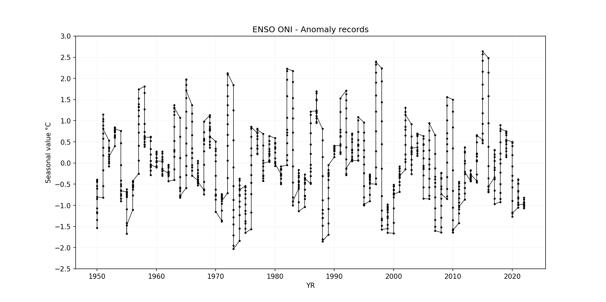
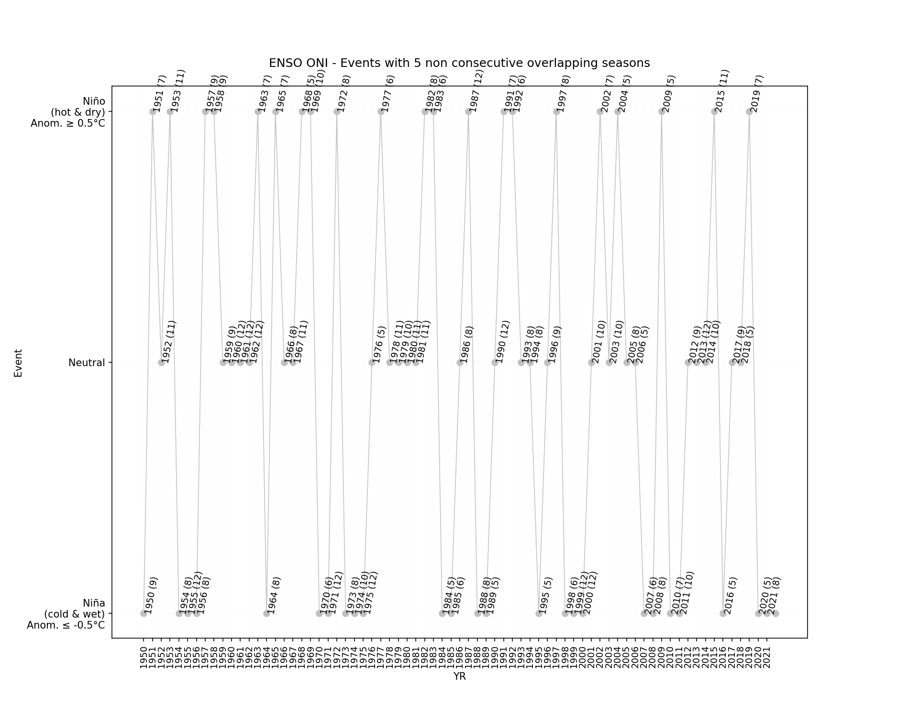

# NOAA - Oceanic Niño Index (ONI) classifier for climatological year events Niño, Niña and Neutral

The following analysis are based on a threshold of +/- 0.5°C for the Oceanic Niño Index (ONI) [3 month running mean of ERSST.v5 SST anomalies in the Niño 3.4 region (5°N-5°S, 120°-170°W)], based on centered 30-year base periods updated every 5 years.
The ONI is one measure of the El Niño-Southern Oscillation, and other indices can confirm whether features consistent with a coupled ocean-atmosphere phenomenon accompanied these periods.[^1]

* Processed file: [D:/R.LTWB/.datasets/ENSOONI/ONI_Ascii_20221118.txt](../ENSOONI/ONI_Ascii_20221118.txt)
* Execution date: 2022-11-18 10:24:46.456225
* Python version: 3.10.5 (tags/v3.10.5:f377153, Jun  6 2022, 16:14:13) [MSC v.1929 64 bit (AMD64)]
* Python path: ['D:\\R.LTWB\\.src', 'D:\\R.LTWB', 'D:\\R.GISPython.wiki', 'D:\\R.TeachingResearchGuide', 'D:\\R.GISPython']
* matplotlib version: 3.6.0
* pandas version: 1.4.3
* numpy version: 1.23.2
* Instructions & script: https://github.com/rcfdtools/R.LTWB/tree/main/Section03/ENSOONI
* License: https://github.com/rcfdtools/R.LTWB/blob/main/LICENSE.md
* Credits: r.cfdtools@gmail.com

## General ONI Ascii file information

* Ascii file from: https://www.cpc.ncep.noaa.gov/data/indices/oni.ascii.txt
* Records: 873
* Years: 72.750000

Table records

|     | SEAS   |   YR |   TOTAL |   ANOM |
|----:|:-------|-----:|--------:|-------:|
|   0 | DJF    | 1950 |   24.72 |  -1.53 |
|   1 | JFM    | 1950 |   25.17 |  -1.34 |
|   2 | FMA    | 1950 |   25.75 |  -1.16 |
|   3 | MAM    | 1950 |   26.12 |  -1.18 |
|   4 | AMJ    | 1950 |   26.32 |  -1.07 |
|   5 | MJJ    | 1950 |   26.31 |  -0.85 |
|   6 | JJA    | 1950 |   26.21 |  -0.54 |
|   7 | JAS    | 1950 |   25.96 |  -0.42 |
|   8 | ASO    | 1950 |   25.76 |  -0.39 |
|   9 | SON    | 1950 |   25.63 |  -0.44 |
|  10 | OND    | 1950 |   25.48 |  -0.6  |
|  11 | NDJ    | 1950 |   25.34 |  -0.8  |
|  12 | DJF    | 1951 |   25.42 |  -0.82 |
|  13 | JFM    | 1951 |   25.96 |  -0.54 |
|  14 | FMA    | 1951 |   26.74 |  -0.17 |
|  15 | MAM    | 1951 |   27.48 |   0.18 |
|  16 | AMJ    | 1951 |   27.75 |   0.36 |
|  17 | MJJ    | 1951 |   27.75 |   0.58 |
|  18 | JJA    | 1951 |   27.44 |   0.7  |
|  19 | JAS    | 1951 |   27.28 |   0.89 |
|  20 | ASO    | 1951 |   27.14 |   0.99 |
|  21 | SON    | 1951 |   27.22 |   1.15 |
|  22 | OND    | 1951 |   27.12 |   1.04 |
|  23 | NDJ    | 1951 |   26.95 |   0.81 |
|  24 | DJF    | 1952 |   26.78 |   0.53 |
|  25 | JFM    | 1952 |   26.87 |   0.37 |
|  26 | FMA    | 1952 |   27.25 |   0.34 |
|  27 | MAM    | 1952 |   27.6  |   0.29 |
|  28 | AMJ    | 1952 |   27.59 |   0.2  |
|  29 | MJJ    | 1952 |   27.17 |   0    |
|  30 | JJA    | 1952 |   26.67 |  -0.08 |
|  31 | JAS    | 1952 |   26.39 |   0    |
|  32 | ASO    | 1952 |   26.3  |   0.15 |
|  33 | SON    | 1952 |   26.17 |   0.1  |
|  34 | OND    | 1952 |   26.13 |   0.04 |
|  35 | NDJ    | 1952 |   26.29 |   0.15 |
|  36 | DJF    | 1953 |   26.65 |   0.4  |
|  37 | JFM    | 1953 |   27.1  |   0.6  |
|  38 | FMA    | 1953 |   27.53 |   0.63 |
|  39 | MAM    | 1953 |   27.96 |   0.66 |
|  40 | AMJ    | 1953 |   28.14 |   0.75 |
|  41 | MJJ    | 1953 |   27.94 |   0.77 |
|  42 | JJA    | 1953 |   27.49 |   0.75 |
|  43 | JAS    | 1953 |   27.12 |   0.73 |
|  44 | ASO    | 1953 |   26.93 |   0.78 |
|  45 | SON    | 1953 |   26.91 |   0.84 |
|  46 | OND    | 1953 |   26.92 |   0.84 |
|  47 | NDJ    | 1953 |   26.95 |   0.81 |
|  48 | DJF    | 1954 |   27    |   0.76 |
|  49 | JFM    | 1954 |   26.97 |   0.47 |
|  50 | FMA    | 1954 |   26.86 |  -0.05 |
|  51 | MAM    | 1954 |   26.89 |  -0.41 |
|  52 | AMJ    | 1954 |   26.85 |  -0.54 |
|  53 | MJJ    | 1954 |   26.67 |  -0.5  |
|  54 | JJA    | 1954 |   26.1  |  -0.64 |
|  55 | JAS    | 1954 |   25.54 |  -0.84 |
|  56 | ASO    | 1954 |   25.25 |  -0.9  |
|  57 | SON    | 1954 |   25.3  |  -0.77 |
|  58 | OND    | 1954 |   25.35 |  -0.73 |
|  59 | NDJ    | 1954 |   25.48 |  -0.66 |
|  60 | DJF    | 1955 |   25.57 |  -0.68 |
|  61 | JFM    | 1955 |   25.89 |  -0.62 |
|  62 | FMA    | 1955 |   26.22 |  -0.69 |
|  63 | MAM    | 1955 |   26.5  |  -0.8  |
|  64 | AMJ    | 1955 |   26.6  |  -0.79 |
|  65 | MJJ    | 1955 |   26.45 |  -0.72 |
|  66 | JJA    | 1955 |   26.06 |  -0.68 |
|  67 | JAS    | 1955 |   25.64 |  -0.75 |
|  68 | ASO    | 1955 |   25.06 |  -1.09 |
|  69 | SON    | 1955 |   24.65 |  -1.42 |
|  70 | OND    | 1955 |   24.41 |  -1.67 |
|  71 | NDJ    | 1955 |   24.72 |  -1.47 |
|  72 | DJF    | 1956 |   25.23 |  -1.11 |
|  73 | JFM    | 1956 |   25.86 |  -0.76 |
|  74 | FMA    | 1956 |   26.37 |  -0.63 |
|  75 | MAM    | 1956 |   26.82 |  -0.54 |
|  76 | AMJ    | 1956 |   26.93 |  -0.52 |
|  77 | MJJ    | 1956 |   26.72 |  -0.51 |
|  78 | JJA    | 1956 |   26.23 |  -0.57 |
|  79 | JAS    | 1956 |   25.87 |  -0.55 |
|  80 | ASO    | 1956 |   25.71 |  -0.46 |
|  81 | SON    | 1956 |   25.67 |  -0.42 |
|  82 | OND    | 1956 |   25.67 |  -0.43 |
|  83 | NDJ    | 1956 |   25.77 |  -0.43 |
|  84 | DJF    | 1957 |   26.09 |  -0.25 |
|  85 | JFM    | 1957 |   26.68 |   0.06 |
|  86 | FMA    | 1957 |   27.41 |   0.41 |
|  87 | MAM    | 1957 |   28.08 |   0.72 |
|  88 | AMJ    | 1957 |   28.37 |   0.92 |
|  89 | MJJ    | 1957 |   28.34 |   1.11 |
|  90 | JJA    | 1957 |   28.06 |   1.25 |
|  91 | JAS    | 1957 |   27.75 |   1.32 |
|  92 | ASO    | 1957 |   27.5  |   1.33 |
|  93 | SON    | 1957 |   27.48 |   1.39 |
|  94 | OND    | 1957 |   27.64 |   1.53 |
|  95 | NDJ    | 1957 |   27.94 |   1.74 |
|  96 | DJF    | 1958 |   28.15 |   1.81 |
|  97 | JFM    | 1958 |   28.27 |   1.66 |
|  98 | FMA    | 1958 |   28.26 |   1.27 |
|  99 | MAM    | 1958 |   28.28 |   0.93 |
| 100 | AMJ    | 1958 |   28.19 |   0.74 |
| 101 | MJJ    | 1958 |   27.87 |   0.64 |
| 102 | JJA    | 1958 |   27.38 |   0.57 |
| 103 | JAS    | 1958 |   26.85 |   0.43 |
| 104 | ASO    | 1958 |   26.56 |   0.39 |
| 105 | SON    | 1958 |   26.53 |   0.44 |
| 106 | OND    | 1958 |   26.6  |   0.5  |
| 107 | NDJ    | 1958 |   26.81 |   0.61 |
| 108 | DJF    | 1959 |   26.95 |   0.61 |
| 109 | JFM    | 1959 |   27.24 |   0.62 |
| 110 | FMA    | 1959 |   27.51 |   0.52 |
| 111 | MAM    | 1959 |   27.68 |   0.33 |
| 112 | AMJ    | 1959 |   27.65 |   0.2  |
| 113 | MJJ    | 1959 |   27.16 |  -0.07 |
| 114 | JJA    | 1959 |   26.63 |  -0.18 |
| 115 | JAS    | 1959 |   26.15 |  -0.28 |
| 116 | ASO    | 1959 |   26.08 |  -0.09 |
| 117 | SON    | 1959 |   26.07 |  -0.03 |
| 118 | OND    | 1959 |   26.15 |   0.05 |
| 119 | NDJ    | 1959 |   26.16 |  -0.04 |
| 120 | DJF    | 1960 |   26.24 |  -0.1  |
| 121 | JFM    | 1960 |   26.51 |  -0.1  |
| 122 | FMA    | 1960 |   26.92 |  -0.07 |
| 123 | MAM    | 1960 |   27.39 |   0.03 |
| 124 | AMJ    | 1960 |   27.47 |   0.02 |
| 125 | MJJ    | 1960 |   27.26 |   0.03 |
| 126 | JJA    | 1960 |   26.93 |   0.13 |
| 127 | JAS    | 1960 |   26.66 |   0.24 |
| 128 | ASO    | 1960 |   26.44 |   0.27 |
| 129 | SON    | 1960 |   26.3  |   0.2  |
| 130 | OND    | 1960 |   26.23 |   0.12 |
| 131 | NDJ    | 1960 |   26.23 |   0.05 |
| 132 | DJF    | 1961 |   26.34 |   0.04 |
| 133 | JFM    | 1961 |   26.58 |   0.03 |
| 134 | FMA    | 1961 |   26.96 |   0.04 |
| 135 | MAM    | 1961 |   27.35 |   0.09 |
| 136 | AMJ    | 1961 |   27.59 |   0.23 |
| 137 | MJJ    | 1961 |   27.42 |   0.27 |
| 138 | JJA    | 1961 |   26.9  |   0.14 |
| 139 | JAS    | 1961 |   26.27 |  -0.13 |
| 140 | ASO    | 1961 |   25.89 |  -0.3  |
| 141 | SON    | 1961 |   25.85 |  -0.26 |
| 142 | OND    | 1961 |   25.91 |  -0.19 |
| 143 | NDJ    | 1961 |   26    |  -0.16 |
| 144 | DJF    | 1962 |   26.05 |  -0.24 |
| 145 | JFM    | 1962 |   26.32 |  -0.22 |
| 146 | FMA    | 1962 |   26.71 |  -0.2  |
| 147 | MAM    | 1962 |   27    |  -0.26 |
| 148 | AMJ    | 1962 |   27.09 |  -0.28 |
| 149 | MJJ    | 1962 |   26.96 |  -0.2  |
| 150 | JJA    | 1962 |   26.72 |  -0.04 |
| 151 | JAS    | 1962 |   26.34 |  -0.07 |
| 152 | ASO    | 1962 |   26.07 |  -0.11 |
| 153 | SON    | 1962 |   25.88 |  -0.22 |
| 154 | OND    | 1962 |   25.79 |  -0.31 |
| 155 | NDJ    | 1962 |   25.73 |  -0.43 |
| 156 | DJF    | 1963 |   25.89 |  -0.4  |
| 157 | JFM    | 1963 |   26.39 |  -0.15 |
| 158 | FMA    | 1963 |   27.07 |   0.15 |
| 159 | MAM    | 1963 |   27.53 |   0.27 |
| 160 | AMJ    | 1963 |   27.68 |   0.31 |
| 161 | MJJ    | 1963 |   27.67 |   0.52 |
| 162 | JJA    | 1963 |   27.62 |   0.86 |
| 163 | JAS    | 1963 |   27.54 |   1.14 |
| 164 | ASO    | 1963 |   27.4  |   1.22 |
| 165 | SON    | 1963 |   27.4  |   1.29 |
| 166 | OND    | 1963 |   27.47 |   1.37 |
| 167 | NDJ    | 1963 |   27.47 |   1.31 |
| 168 | DJF    | 1964 |   27.36 |   1.07 |
| 169 | JFM    | 1964 |   27.16 |   0.62 |
| 170 | FMA    | 1964 |   27.03 |   0.12 |
| 171 | MAM    | 1964 |   26.93 |  -0.33 |
| 172 | AMJ    | 1964 |   26.78 |  -0.58 |
| 173 | MJJ    | 1964 |   26.57 |  -0.58 |
| 174 | JJA    | 1964 |   26.16 |  -0.6  |
| 175 | JAS    | 1964 |   25.74 |  -0.66 |
| 176 | ASO    | 1964 |   25.42 |  -0.76 |
| 177 | SON    | 1964 |   25.31 |  -0.8  |
| 178 | OND    | 1964 |   25.28 |  -0.82 |
| 179 | NDJ    | 1964 |   25.38 |  -0.78 |
| 180 | DJF    | 1965 |   25.69 |  -0.59 |
| 181 | JFM    | 1965 |   26.27 |  -0.28 |
| 182 | FMA    | 1965 |   26.85 |  -0.07 |
| 183 | MAM    | 1965 |   27.44 |   0.18 |
| 184 | AMJ    | 1965 |   27.82 |   0.46 |
| 185 | MJJ    | 1965 |   27.99 |   0.83 |
| 186 | JJA    | 1965 |   27.98 |   1.22 |
| 187 | JAS    | 1965 |   27.95 |   1.54 |
| 188 | ASO    | 1965 |   28.04 |   1.85 |
| 189 | SON    | 1965 |   28.09 |   1.98 |
| 190 | OND    | 1965 |   28.07 |   1.97 |
| 191 | NDJ    | 1965 |   27.91 |   1.72 |
| 192 | DJF    | 1966 |   27.72 |   1.37 |
| 193 | JFM    | 1966 |   27.81 |   1.17 |
| 194 | FMA    | 1966 |   27.98 |   0.98 |
| 195 | MAM    | 1966 |   27.97 |   0.66 |
| 196 | AMJ    | 1966 |   27.78 |   0.35 |
| 197 | MJJ    | 1966 |   27.5  |   0.24 |
| 198 | JJA    | 1966 |   27.14 |   0.24 |
| 199 | JAS    | 1966 |   26.69 |   0.12 |
| 200 | ASO    | 1966 |   26.32 |  -0.05 |
| 201 | SON    | 1966 |   26.24 |  -0.1  |
| 202 | OND    | 1966 |   26.16 |  -0.18 |
| 203 | NDJ    | 1966 |   26.04 |  -0.3  |
| 204 | DJF    | 1967 |   26.01 |  -0.41 |
| 205 | JFM    | 1967 |   26.17 |  -0.48 |
| 206 | FMA    | 1967 |   26.46 |  -0.53 |
| 207 | MAM    | 1967 |   26.87 |  -0.45 |
| 208 | AMJ    | 1967 |   27.19 |  -0.24 |
| 209 | MJJ    | 1967 |   27.26 |  -0    |
| 210 | JJA    | 1967 |   26.95 |   0.05 |
| 211 | JAS    | 1967 |   26.41 |  -0.16 |
| 212 | ASO    | 1967 |   26.08 |  -0.3  |
| 213 | SON    | 1967 |   25.96 |  -0.38 |
| 214 | OND    | 1967 |   26    |  -0.34 |
| 215 | NDJ    | 1967 |   25.9  |  -0.44 |
| 216 | DJF    | 1968 |   25.78 |  -0.64 |
| 217 | JFM    | 1968 |   25.91 |  -0.74 |
| 218 | FMA    | 1968 |   26.38 |  -0.62 |
| 219 | MAM    | 1968 |   26.88 |  -0.44 |
| 220 | AMJ    | 1968 |   27.39 |  -0.04 |
| 221 | MJJ    | 1968 |   27.54 |   0.28 |
| 222 | JJA    | 1968 |   27.48 |   0.58 |
| 223 | JAS    | 1968 |   27.1  |   0.53 |
| 224 | ASO    | 1968 |   26.82 |   0.45 |
| 225 | SON    | 1968 |   26.89 |   0.55 |
| 226 | OND    | 1968 |   27.07 |   0.73 |
| 227 | NDJ    | 1968 |   27.32 |   0.98 |
| 228 | DJF    | 1969 |   27.54 |   1.13 |
| 229 | JFM    | 1969 |   27.73 |   1.09 |
| 230 | FMA    | 1969 |   27.94 |   0.95 |
| 231 | MAM    | 1969 |   28.09 |   0.77 |
| 232 | AMJ    | 1969 |   28.04 |   0.61 |
| 233 | MJJ    | 1969 |   27.69 |   0.43 |
| 234 | JJA    | 1969 |   27.26 |   0.36 |
| 235 | JAS    | 1969 |   27.08 |   0.51 |
| 236 | ASO    | 1969 |   27.17 |   0.79 |
| 237 | SON    | 1969 |   27.2  |   0.86 |
| 238 | OND    | 1969 |   27.14 |   0.81 |
| 239 | NDJ    | 1969 |   26.98 |   0.63 |
| 240 | DJF    | 1970 |   26.93 |   0.51 |
| 241 | JFM    | 1970 |   26.98 |   0.34 |
| 242 | FMA    | 1970 |   27.29 |   0.29 |
| 243 | MAM    | 1970 |   27.51 |   0.19 |
| 244 | AMJ    | 1970 |   27.47 |   0.04 |
| 245 | MJJ    | 1970 |   26.96 |  -0.3  |
| 246 | JJA    | 1970 |   26.28 |  -0.63 |
| 247 | JAS    | 1970 |   25.81 |  -0.76 |
| 248 | ASO    | 1970 |   25.61 |  -0.77 |
| 249 | SON    | 1970 |   25.6  |  -0.74 |
| 250 | OND    | 1970 |   25.48 |  -0.86 |
| 251 | NDJ    | 1970 |   25.22 |  -1.15 |
| 252 | DJF    | 1971 |   25.1  |  -1.36 |
| 253 | JFM    | 1971 |   25.32 |  -1.38 |
| 254 | FMA    | 1971 |   25.92 |  -1.12 |
| 255 | MAM    | 1971 |   26.51 |  -0.85 |
| 256 | AMJ    | 1971 |   26.73 |  -0.73 |
| 257 | MJJ    | 1971 |   26.56 |  -0.74 |
| 258 | JJA    | 1971 |   26.15 |  -0.8  |
| 259 | JAS    | 1971 |   25.86 |  -0.77 |
| 260 | ASO    | 1971 |   25.64 |  -0.82 |
| 261 | SON    | 1971 |   25.58 |  -0.85 |
| 262 | OND    | 1971 |   25.46 |  -0.96 |
| 263 | NDJ    | 1971 |   25.52 |  -0.9  |
| 264 | DJF    | 1972 |   25.77 |  -0.71 |
| 265 | JFM    | 1972 |   26.35 |  -0.35 |
| 266 | FMA    | 1972 |   27.1  |   0.06 |
| 267 | MAM    | 1972 |   27.77 |   0.41 |
| 268 | AMJ    | 1972 |   28.13 |   0.67 |
| 269 | MJJ    | 1972 |   28.21 |   0.92 |
| 270 | JJA    | 1972 |   28.09 |   1.13 |
| 271 | JAS    | 1972 |   28    |   1.37 |
| 272 | ASO    | 1972 |   28.04 |   1.58 |
| 273 | SON    | 1972 |   28.26 |   1.84 |
| 274 | OND    | 1972 |   28.51 |   2.09 |
| 275 | NDJ    | 1972 |   28.54 |   2.12 |
| 276 | DJF    | 1973 |   28.32 |   1.84 |
| 277 | JFM    | 1973 |   27.95 |   1.25 |
| 278 | FMA    | 1973 |   27.59 |   0.54 |
| 279 | MAM    | 1973 |   27.26 |  -0.1  |
| 280 | AMJ    | 1973 |   26.92 |  -0.54 |
| 281 | MJJ    | 1973 |   26.42 |  -0.87 |
| 282 | JJA    | 1973 |   25.84 |  -1.11 |
| 283 | JAS    | 1973 |   25.35 |  -1.28 |
| 284 | ASO    | 1973 |   25.01 |  -1.45 |
| 285 | SON    | 1973 |   24.71 |  -1.71 |
| 286 | OND    | 1973 |   24.47 |  -1.95 |
| 287 | NDJ    | 1973 |   24.38 |  -2.03 |
| 288 | DJF    | 1974 |   24.64 |  -1.84 |
| 289 | JFM    | 1974 |   25.14 |  -1.55 |
| 290 | FMA    | 1974 |   25.82 |  -1.23 |
| 291 | MAM    | 1974 |   26.33 |  -1.03 |
| 292 | AMJ    | 1974 |   26.55 |  -0.91 |
| 293 | MJJ    | 1974 |   26.52 |  -0.77 |
| 294 | JJA    | 1974 |   26.42 |  -0.53 |
| 295 | JAS    | 1974 |   26.26 |  -0.37 |
| 296 | ASO    | 1974 |   26.06 |  -0.41 |
| 297 | SON    | 1974 |   25.82 |  -0.61 |
| 298 | OND    | 1974 |   25.67 |  -0.75 |
| 299 | NDJ    | 1974 |   25.78 |  -0.64 |
| 300 | DJF    | 1975 |   25.94 |  -0.54 |
| 301 | JFM    | 1975 |   26.13 |  -0.57 |
| 302 | FMA    | 1975 |   26.39 |  -0.65 |
| 303 | MAM    | 1975 |   26.63 |  -0.73 |
| 304 | AMJ    | 1975 |   26.64 |  -0.83 |
| 305 | MJJ    | 1975 |   26.31 |  -0.98 |
| 306 | JJA    | 1975 |   25.82 |  -1.13 |
| 307 | JAS    | 1975 |   25.43 |  -1.2  |
| 308 | ASO    | 1975 |   25.09 |  -1.37 |
| 309 | SON    | 1975 |   25    |  -1.43 |
| 310 | OND    | 1975 |   24.87 |  -1.55 |
| 311 | NDJ    | 1975 |   24.75 |  -1.65 |
| 312 | DJF    | 1976 |   24.9  |  -1.56 |
| 313 | JFM    | 1976 |   25.5  |  -1.17 |
| 314 | FMA    | 1976 |   26.28 |  -0.73 |
| 315 | MAM    | 1976 |   26.85 |  -0.47 |
| 316 | AMJ    | 1976 |   27.15 |  -0.28 |
| 317 | MJJ    | 1976 |   27.22 |  -0.05 |
| 318 | JJA    | 1976 |   27.15 |   0.18 |
| 319 | JAS    | 1976 |   27.04 |   0.35 |
| 320 | ASO    | 1976 |   27.15 |   0.62 |
| 321 | SON    | 1976 |   27.29 |   0.81 |
| 322 | OND    | 1976 |   27.32 |   0.86 |
| 323 | NDJ    | 1976 |   27.27 |   0.85 |
| 324 | DJF    | 1977 |   27.18 |   0.71 |
| 325 | JFM    | 1977 |   27.31 |   0.64 |
| 326 | FMA    | 1977 |   27.35 |   0.34 |
| 327 | MAM    | 1977 |   27.55 |   0.23 |
| 328 | AMJ    | 1977 |   27.64 |   0.21 |
| 329 | MJJ    | 1977 |   27.61 |   0.34 |
| 330 | JJA    | 1977 |   27.32 |   0.35 |
| 331 | JAS    | 1977 |   27.11 |   0.42 |
| 332 | ASO    | 1977 |   27.1  |   0.57 |
| 333 | SON    | 1977 |   27.21 |   0.73 |
| 334 | OND    | 1977 |   27.27 |   0.81 |
| 335 | NDJ    | 1977 |   27.21 |   0.79 |
| 336 | DJF    | 1978 |   27.15 |   0.69 |
| 337 | JFM    | 1978 |   27.09 |   0.42 |
| 338 | FMA    | 1978 |   27.08 |   0.06 |
| 339 | MAM    | 1978 |   27.14 |  -0.18 |
| 340 | AMJ    | 1978 |   27.11 |  -0.31 |
| 341 | MJJ    | 1978 |   26.98 |  -0.29 |
| 342 | JJA    | 1978 |   26.61 |  -0.36 |
| 343 | JAS    | 1978 |   26.27 |  -0.42 |
| 344 | ASO    | 1978 |   26.11 |  -0.42 |
| 345 | SON    | 1978 |   26.19 |  -0.29 |
| 346 | OND    | 1978 |   26.37 |  -0.08 |
| 347 | NDJ    | 1978 |   26.43 |   0    |
| 348 | DJF    | 1979 |   26.5  |   0.03 |
| 349 | JFM    | 1979 |   26.75 |   0.07 |
| 350 | FMA    | 1979 |   27.22 |   0.2  |
| 351 | MAM    | 1979 |   27.6  |   0.28 |
| 352 | AMJ    | 1979 |   27.66 |   0.23 |
| 353 | MJJ    | 1979 |   27.32 |   0.05 |
| 354 | JJA    | 1979 |   27    |   0.04 |
| 355 | JAS    | 1979 |   26.86 |   0.17 |
| 356 | ASO    | 1979 |   26.86 |   0.33 |
| 357 | SON    | 1979 |   26.94 |   0.45 |
| 358 | OND    | 1979 |   26.98 |   0.52 |
| 359 | NDJ    | 1979 |   27.06 |   0.64 |
| 360 | DJF    | 1980 |   27.06 |   0.59 |
| 361 | JFM    | 1980 |   27.13 |   0.46 |
| 362 | FMA    | 1980 |   27.35 |   0.34 |
| 363 | MAM    | 1980 |   27.7  |   0.38 |
| 364 | AMJ    | 1980 |   27.9  |   0.48 |
| 365 | MJJ    | 1980 |   27.73 |   0.46 |
| 366 | JJA    | 1980 |   27.22 |   0.25 |
| 367 | JAS    | 1980 |   26.72 |   0.03 |
| 368 | ASO    | 1980 |   26.46 |  -0.07 |
| 369 | SON    | 1980 |   26.5  |   0.02 |
| 370 | OND    | 1980 |   26.57 |   0.11 |
| 371 | NDJ    | 1980 |   26.48 |  -0.01 |
| 372 | DJF    | 1981 |   26.32 |  -0.26 |
| 373 | JFM    | 1981 |   26.32 |  -0.5  |
| 374 | FMA    | 1981 |   26.69 |  -0.47 |
| 375 | MAM    | 1981 |   27.11 |  -0.37 |
| 376 | AMJ    | 1981 |   27.31 |  -0.26 |
| 377 | MJJ    | 1981 |   27.09 |  -0.29 |
| 378 | JJA    | 1981 |   26.75 |  -0.3  |
| 379 | JAS    | 1981 |   26.5  |  -0.25 |
| 380 | ASO    | 1981 |   26.42 |  -0.16 |
| 381 | SON    | 1981 |   26.41 |  -0.13 |
| 382 | OND    | 1981 |   26.37 |  -0.15 |
| 383 | NDJ    | 1981 |   26.46 |  -0.08 |
| 384 | DJF    | 1982 |   26.56 |  -0.05 |
| 385 | JFM    | 1982 |   26.9  |   0.07 |
| 386 | FMA    | 1982 |   27.35 |   0.19 |
| 387 | MAM    | 1982 |   27.95 |   0.47 |
| 388 | AMJ    | 1982 |   28.23 |   0.66 |
| 389 | MJJ    | 1982 |   28.1  |   0.72 |
| 390 | JJA    | 1982 |   27.83 |   0.79 |
| 391 | JAS    | 1982 |   27.81 |   1.07 |
| 392 | ASO    | 1982 |   28.16 |   1.58 |
| 393 | SON    | 1982 |   28.5  |   1.97 |
| 394 | OND    | 1982 |   28.7  |   2.18 |
| 395 | NDJ    | 1982 |   28.76 |   2.23 |
| 396 | DJF    | 1983 |   28.79 |   2.18 |
| 397 | JFM    | 1983 |   28.75 |   1.92 |
| 398 | FMA    | 1983 |   28.71 |   1.54 |
| 399 | MAM    | 1983 |   28.76 |   1.29 |
| 400 | AMJ    | 1983 |   28.63 |   1.06 |
| 401 | MJJ    | 1983 |   28.1  |   0.72 |
| 402 | JJA    | 1983 |   27.36 |   0.31 |
| 403 | JAS    | 1983 |   26.66 |  -0.08 |
| 404 | ASO    | 1983 |   26.12 |  -0.46 |
| 405 | SON    | 1983 |   25.73 |  -0.81 |
| 406 | OND    | 1983 |   25.52 |  -1    |
| 407 | NDJ    | 1983 |   25.62 |  -0.91 |
| 408 | DJF    | 1984 |   26.01 |  -0.6  |
| 409 | JFM    | 1984 |   26.41 |  -0.42 |
| 410 | FMA    | 1984 |   26.83 |  -0.34 |
| 411 | MAM    | 1984 |   27.04 |  -0.43 |
| 412 | AMJ    | 1984 |   27.06 |  -0.51 |
| 413 | MJJ    | 1984 |   26.94 |  -0.45 |
| 414 | JJA    | 1984 |   26.74 |  -0.3  |
| 415 | JAS    | 1984 |   26.59 |  -0.16 |
| 416 | ASO    | 1984 |   26.34 |  -0.24 |
| 417 | SON    | 1984 |   25.98 |  -0.56 |
| 418 | OND    | 1984 |   25.61 |  -0.92 |
| 419 | NDJ    | 1984 |   25.39 |  -1.14 |
| 420 | DJF    | 1985 |   25.56 |  -1.04 |
| 421 | JFM    | 1985 |   25.98 |  -0.85 |
| 422 | FMA    | 1985 |   26.4  |  -0.77 |
| 423 | MAM    | 1985 |   26.69 |  -0.78 |
| 424 | AMJ    | 1985 |   26.79 |  -0.78 |
| 425 | MJJ    | 1985 |   26.76 |  -0.63 |
| 426 | JJA    | 1985 |   26.55 |  -0.49 |
| 427 | JAS    | 1985 |   26.29 |  -0.46 |
| 428 | ASO    | 1985 |   26.18 |  -0.4  |
| 429 | SON    | 1985 |   26.19 |  -0.35 |
| 430 | OND    | 1985 |   26.25 |  -0.27 |
| 431 | NDJ    | 1985 |   26.14 |  -0.36 |
| 432 | DJF    | 1986 |   26.05 |  -0.49 |
| 433 | JFM    | 1986 |   26.28 |  -0.47 |
| 434 | FMA    | 1986 |   26.81 |  -0.31 |
| 435 | MAM    | 1986 |   27.26 |  -0.2  |
| 436 | AMJ    | 1986 |   27.44 |  -0.12 |
| 437 | MJJ    | 1986 |   27.34 |  -0.04 |
| 438 | JJA    | 1986 |   27.26 |   0.22 |
| 439 | JAS    | 1986 |   27.2  |   0.44 |
| 440 | ASO    | 1986 |   27.31 |   0.71 |
| 441 | SON    | 1986 |   27.49 |   0.94 |
| 442 | OND    | 1986 |   27.64 |   1.14 |
| 443 | NDJ    | 1986 |   27.7  |   1.22 |
| 444 | DJF    | 1987 |   27.76 |   1.23 |
| 445 | JFM    | 1987 |   27.95 |   1.19 |
| 446 | FMA    | 1987 |   28.19 |   1.06 |
| 447 | MAM    | 1987 |   28.41 |   0.95 |
| 448 | AMJ    | 1987 |   28.53 |   0.97 |
| 449 | MJJ    | 1987 |   28.59 |   1.22 |
| 450 | JJA    | 1987 |   28.54 |   1.51 |
| 451 | JAS    | 1987 |   28.45 |   1.7  |
| 452 | ASO    | 1987 |   28.24 |   1.65 |
| 453 | SON    | 1987 |   28.03 |   1.48 |
| 454 | OND    | 1987 |   27.76 |   1.25 |
| 455 | NDJ    | 1987 |   27.59 |   1.11 |
| 456 | DJF    | 1988 |   27.34 |   0.81 |
| 457 | JFM    | 1988 |   27.29 |   0.54 |
| 458 | FMA    | 1988 |   27.27 |   0.14 |
| 459 | MAM    | 1988 |   27.15 |  -0.31 |
| 460 | AMJ    | 1988 |   26.69 |  -0.88 |
| 461 | MJJ    | 1988 |   26.08 |  -1.3  |
| 462 | JJA    | 1988 |   25.74 |  -1.3  |
| 463 | JAS    | 1988 |   25.65 |  -1.11 |
| 464 | ASO    | 1988 |   25.4  |  -1.19 |
| 465 | SON    | 1988 |   25.07 |  -1.48 |
| 466 | OND    | 1988 |   24.71 |  -1.8  |
| 467 | NDJ    | 1988 |   24.63 |  -1.85 |
| 468 | DJF    | 1989 |   24.84 |  -1.69 |
| 469 | JFM    | 1989 |   25.32 |  -1.43 |
| 470 | FMA    | 1989 |   26.04 |  -1.08 |
| 471 | MAM    | 1989 |   26.64 |  -0.83 |
| 472 | AMJ    | 1989 |   26.99 |  -0.58 |
| 473 | MJJ    | 1989 |   26.97 |  -0.4  |
| 474 | JJA    | 1989 |   26.73 |  -0.31 |
| 475 | JAS    | 1989 |   26.48 |  -0.27 |
| 476 | ASO    | 1989 |   26.35 |  -0.24 |
| 477 | SON    | 1989 |   26.33 |  -0.22 |
| 478 | OND    | 1989 |   26.34 |  -0.16 |
| 479 | NDJ    | 1989 |   26.43 |  -0.05 |
| 480 | DJF    | 1990 |   26.67 |   0.14 |
| 481 | JFM    | 1990 |   26.96 |   0.21 |
| 482 | FMA    | 1990 |   27.41 |   0.28 |
| 483 | MAM    | 1990 |   27.75 |   0.29 |
| 484 | AMJ    | 1990 |   27.86 |   0.29 |
| 485 | MJJ    | 1990 |   27.68 |   0.31 |
| 486 | JJA    | 1990 |   27.37 |   0.33 |
| 487 | JAS    | 1990 |   27.13 |   0.38 |
| 488 | ASO    | 1990 |   26.98 |   0.39 |
| 489 | SON    | 1990 |   26.89 |   0.35 |
| 490 | OND    | 1990 |   26.9  |   0.4  |
| 491 | NDJ    | 1990 |   26.94 |   0.41 |
| 492 | DJF    | 1991 |   27.02 |   0.41 |
| 493 | JFM    | 1991 |   27.15 |   0.26 |
| 494 | FMA    | 1991 |   27.48 |   0.22 |
| 495 | MAM    | 1991 |   27.85 |   0.26 |
| 496 | AMJ    | 1991 |   28.16 |   0.45 |
| 497 | MJJ    | 1991 |   28.17 |   0.64 |
| 498 | JJA    | 1991 |   27.94 |   0.73 |
| 499 | JAS    | 1991 |   27.57 |   0.64 |
| 500 | ASO    | 1991 |   27.41 |   0.62 |
| 501 | SON    | 1991 |   27.54 |   0.79 |
| 502 | OND    | 1991 |   27.91 |   1.21 |
| 503 | NDJ    | 1991 |   28.18 |   1.53 |
| 504 | DJF    | 1992 |   28.39 |   1.71 |
| 505 | JFM    | 1992 |   28.52 |   1.63 |
| 506 | FMA    | 1992 |   28.73 |   1.48 |
| 507 | MAM    | 1992 |   28.88 |   1.29 |
| 508 | AMJ    | 1992 |   28.76 |   1.06 |
| 509 | MJJ    | 1992 |   28.26 |   0.73 |
| 510 | JJA    | 1992 |   27.57 |   0.37 |
| 511 | JAS    | 1992 |   27.03 |   0.09 |
| 512 | ASO    | 1992 |   26.66 |  -0.13 |
| 513 | SON    | 1992 |   26.5  |  -0.25 |
| 514 | OND    | 1992 |   26.43 |  -0.28 |
| 515 | NDJ    | 1992 |   26.52 |  -0.13 |
| 516 | DJF    | 1993 |   26.77 |   0.09 |
| 517 | JFM    | 1993 |   27.18 |   0.3  |
| 518 | FMA    | 1993 |   27.75 |   0.5  |
| 519 | MAM    | 1993 |   28.27 |   0.67 |
| 520 | AMJ    | 1993 |   28.4  |   0.7  |
| 521 | MJJ    | 1993 |   28.1  |   0.57 |
| 522 | JJA    | 1993 |   27.53 |   0.32 |
| 523 | JAS    | 1993 |   27.19 |   0.25 |
| 524 | ASO    | 1993 |   26.94 |   0.15 |
| 525 | SON    | 1993 |   26.85 |   0.1  |
| 526 | OND    | 1993 |   26.75 |   0.04 |
| 527 | NDJ    | 1993 |   26.71 |   0.06 |
| 528 | DJF    | 1994 |   26.74 |   0.06 |
| 529 | JFM    | 1994 |   26.95 |   0.07 |
| 530 | FMA    | 1994 |   27.43 |   0.17 |
| 531 | MAM    | 1994 |   27.9  |   0.31 |
| 532 | AMJ    | 1994 |   28.12 |   0.42 |
| 533 | MJJ    | 1994 |   27.94 |   0.41 |
| 534 | JJA    | 1994 |   27.65 |   0.44 |
| 535 | JAS    | 1994 |   27.37 |   0.43 |
| 536 | ASO    | 1994 |   27.35 |   0.55 |
| 537 | SON    | 1994 |   27.49 |   0.74 |
| 538 | OND    | 1994 |   27.71 |   1.01 |
| 539 | NDJ    | 1994 |   27.74 |   1.09 |
| 540 | DJF    | 1995 |   27.64 |   0.96 |
| 541 | JFM    | 1995 |   27.61 |   0.72 |
| 542 | FMA    | 1995 |   27.79 |   0.53 |
| 543 | MAM    | 1995 |   27.9  |   0.3  |
| 544 | AMJ    | 1995 |   27.84 |   0.14 |
| 545 | MJJ    | 1995 |   27.5  |  -0.03 |
| 546 | JJA    | 1995 |   26.97 |  -0.24 |
| 547 | JAS    | 1995 |   26.4  |  -0.54 |
| 548 | ASO    | 1995 |   25.99 |  -0.81 |
| 549 | SON    | 1995 |   25.78 |  -0.97 |
| 550 | OND    | 1995 |   25.7  |  -1    |
| 551 | NDJ    | 1995 |   25.66 |  -0.98 |
| 552 | DJF    | 1996 |   25.76 |  -0.9  |
| 553 | JFM    | 1996 |   26.1  |  -0.75 |
| 554 | FMA    | 1996 |   26.65 |  -0.59 |
| 555 | MAM    | 1996 |   27.2  |  -0.39 |
| 556 | AMJ    | 1996 |   27.4  |  -0.31 |
| 557 | MJJ    | 1996 |   27.23 |  -0.3  |
| 558 | JJA    | 1996 |   26.93 |  -0.27 |
| 559 | JAS    | 1996 |   26.59 |  -0.32 |
| 560 | ASO    | 1996 |   26.39 |  -0.35 |
| 561 | SON    | 1996 |   26.28 |  -0.4  |
| 562 | OND    | 1996 |   26.17 |  -0.45 |
| 563 | NDJ    | 1996 |   26.09 |  -0.49 |
| 564 | DJF    | 1997 |   26.12 |  -0.5  |
| 565 | JFM    | 1997 |   26.49 |  -0.36 |
| 566 | FMA    | 1997 |   27.14 |  -0.1  |
| 567 | MAM    | 1997 |   27.87 |   0.28 |
| 568 | AMJ    | 1997 |   28.46 |   0.75 |
| 569 | MJJ    | 1997 |   28.75 |   1.22 |
| 570 | JJA    | 1997 |   28.8  |   1.6  |
| 571 | JAS    | 1997 |   28.81 |   1.9  |
| 572 | ASO    | 1997 |   28.88 |   2.14 |
| 573 | SON    | 1997 |   29.01 |   2.33 |
| 574 | OND    | 1997 |   29.02 |   2.4  |
| 575 | NDJ    | 1997 |   28.97 |   2.39 |
| 576 | DJF    | 1998 |   28.87 |   2.24 |
| 577 | JFM    | 1998 |   28.78 |   1.93 |
| 578 | FMA    | 1998 |   28.68 |   1.44 |
| 579 | MAM    | 1998 |   28.59 |   0.99 |
| 580 | AMJ    | 1998 |   28.16 |   0.45 |
| 581 | MJJ    | 1998 |   27.39 |  -0.13 |
| 582 | JJA    | 1998 |   26.42 |  -0.78 |
| 583 | JAS    | 1998 |   25.79 |  -1.12 |
| 584 | ASO    | 1998 |   25.44 |  -1.31 |
| 585 | SON    | 1998 |   25.32 |  -1.35 |
| 586 | OND    | 1998 |   25.14 |  -1.48 |
| 587 | NDJ    | 1998 |   25.01 |  -1.57 |
| 588 | DJF    | 1999 |   25.08 |  -1.55 |
| 589 | JFM    | 1999 |   25.55 |  -1.3  |
| 590 | FMA    | 1999 |   26.17 |  -1.07 |
| 591 | MAM    | 1999 |   26.62 |  -0.98 |
| 592 | AMJ    | 1999 |   26.68 |  -1.02 |
| 593 | MJJ    | 1999 |   26.49 |  -1.04 |
| 594 | JJA    | 1999 |   26.1  |  -1.1  |
| 595 | JAS    | 1999 |   25.8  |  -1.11 |
| 596 | ASO    | 1999 |   25.58 |  -1.16 |
| 597 | SON    | 1999 |   25.41 |  -1.26 |
| 598 | OND    | 1999 |   25.16 |  -1.46 |
| 599 | NDJ    | 1999 |   24.93 |  -1.65 |
| 600 | DJF    | 2000 |   24.96 |  -1.66 |
| 601 | JFM    | 2000 |   25.44 |  -1.41 |
| 602 | FMA    | 2000 |   26.17 |  -1.07 |
| 603 | MAM    | 2000 |   26.78 |  -0.81 |
| 604 | AMJ    | 2000 |   27    |  -0.71 |
| 605 | MJJ    | 2000 |   26.88 |  -0.64 |
| 606 | JJA    | 2000 |   26.65 |  -0.55 |
| 607 | JAS    | 2000 |   26.4  |  -0.51 |
| 608 | ASO    | 2000 |   26.2  |  -0.55 |
| 609 | SON    | 2000 |   26.05 |  -0.63 |
| 610 | OND    | 2000 |   25.88 |  -0.75 |
| 611 | NDJ    | 2000 |   25.81 |  -0.74 |
| 612 | DJF    | 2001 |   25.88 |  -0.68 |
| 613 | JFM    | 2001 |   26.26 |  -0.52 |
| 614 | FMA    | 2001 |   26.76 |  -0.44 |
| 615 | MAM    | 2001 |   27.25 |  -0.34 |
| 616 | AMJ    | 2001 |   27.49 |  -0.25 |
| 617 | MJJ    | 2001 |   27.47 |  -0.12 |
| 618 | JJA    | 2001 |   27.2  |  -0.08 |
| 619 | JAS    | 2001 |   26.86 |  -0.13 |
| 620 | ASO    | 2001 |   26.63 |  -0.19 |
| 621 | SON    | 2001 |   26.48 |  -0.29 |
| 622 | OND    | 2001 |   26.37 |  -0.35 |
| 623 | NDJ    | 2001 |   26.31 |  -0.31 |
| 624 | DJF    | 2002 |   26.44 |  -0.15 |
| 625 | JFM    | 2002 |   26.81 |   0.03 |
| 626 | FMA    | 2002 |   27.29 |   0.09 |
| 627 | MAM    | 2002 |   27.8  |   0.2  |
| 628 | AMJ    | 2002 |   28.18 |   0.43 |
| 629 | MJJ    | 2002 |   28.24 |   0.65 |
| 630 | JJA    | 2002 |   28.06 |   0.79 |
| 631 | JAS    | 2002 |   27.85 |   0.86 |
| 632 | ASO    | 2002 |   27.83 |   1.01 |
| 633 | SON    | 2002 |   27.97 |   1.21 |
| 634 | OND    | 2002 |   28.03 |   1.31 |
| 635 | NDJ    | 2002 |   27.76 |   1.14 |
| 636 | DJF    | 2003 |   27.51 |   0.92 |
| 637 | JFM    | 2003 |   27.41 |   0.63 |
| 638 | FMA    | 2003 |   27.58 |   0.38 |
| 639 | MAM    | 2003 |   27.56 |  -0.04 |
| 640 | AMJ    | 2003 |   27.48 |  -0.26 |
| 641 | MJJ    | 2003 |   27.42 |  -0.16 |
| 642 | JJA    | 2003 |   27.35 |   0.08 |
| 643 | JAS    | 2003 |   27.2  |   0.21 |
| 644 | ASO    | 2003 |   27.08 |   0.26 |
| 645 | SON    | 2003 |   27.05 |   0.29 |
| 646 | OND    | 2003 |   27.07 |   0.35 |
| 647 | NDJ    | 2003 |   26.97 |   0.35 |
| 648 | DJF    | 2004 |   26.95 |   0.37 |
| 649 | JFM    | 2004 |   27.08 |   0.31 |
| 650 | FMA    | 2004 |   27.43 |   0.23 |
| 651 | MAM    | 2004 |   27.76 |   0.17 |
| 652 | AMJ    | 2004 |   27.91 |   0.17 |
| 653 | MJJ    | 2004 |   27.87 |   0.28 |
| 654 | JJA    | 2004 |   27.74 |   0.47 |
| 655 | JAS    | 2004 |   27.63 |   0.64 |
| 656 | ASO    | 2004 |   27.52 |   0.7  |
| 657 | SON    | 2004 |   27.44 |   0.67 |
| 658 | OND    | 2004 |   27.38 |   0.66 |
| 659 | NDJ    | 2004 |   27.3  |   0.69 |
| 660 | DJF    | 2005 |   27.22 |   0.64 |
| 661 | JFM    | 2005 |   27.36 |   0.58 |
| 662 | FMA    | 2005 |   27.65 |   0.45 |
| 663 | MAM    | 2005 |   28.02 |   0.43 |
| 664 | AMJ    | 2005 |   28.03 |   0.29 |
| 665 | MJJ    | 2005 |   27.69 |   0.11 |
| 666 | JJA    | 2005 |   27.21 |  -0.06 |
| 667 | JAS    | 2005 |   26.85 |  -0.14 |
| 668 | ASO    | 2005 |   26.71 |  -0.11 |
| 669 | SON    | 2005 |   26.48 |  -0.29 |
| 670 | OND    | 2005 |   26.15 |  -0.57 |
| 671 | NDJ    | 2005 |   25.81 |  -0.84 |
| 672 | DJF    | 2006 |   25.8  |  -0.85 |
| 673 | JFM    | 2006 |   26.1  |  -0.77 |
| 674 | FMA    | 2006 |   26.73 |  -0.57 |
| 675 | MAM    | 2006 |   27.31 |  -0.37 |
| 676 | AMJ    | 2006 |   27.69 |  -0.14 |
| 677 | MJJ    | 2006 |   27.62 |  -0.03 |
| 678 | JJA    | 2006 |   27.4  |   0.1  |
| 679 | JAS    | 2006 |   27.26 |   0.3  |
| 680 | ASO    | 2006 |   27.3  |   0.54 |
| 681 | SON    | 2006 |   27.48 |   0.77 |
| 682 | OND    | 2006 |   27.62 |   0.94 |
| 683 | NDJ    | 2006 |   27.56 |   0.94 |
| 684 | DJF    | 2007 |   27.3  |   0.66 |
| 685 | JFM    | 2007 |   27.09 |   0.22 |
| 686 | FMA    | 2007 |   27.18 |  -0.12 |
| 687 | MAM    | 2007 |   27.37 |  -0.32 |
| 688 | AMJ    | 2007 |   27.45 |  -0.38 |
| 689 | MJJ    | 2007 |   27.18 |  -0.47 |
| 690 | JJA    | 2007 |   26.74 |  -0.56 |
| 691 | JAS    | 2007 |   26.15 |  -0.81 |
| 692 | ASO    | 2007 |   25.69 |  -1.07 |
| 693 | SON    | 2007 |   25.37 |  -1.34 |
| 694 | OND    | 2007 |   25.17 |  -1.5  |
| 695 | NDJ    | 2007 |   25.02 |  -1.6  |
| 696 | DJF    | 2008 |   25    |  -1.64 |
| 697 | JFM    | 2008 |   25.35 |  -1.52 |
| 698 | FMA    | 2008 |   26.01 |  -1.29 |
| 699 | MAM    | 2008 |   26.67 |  -1.01 |
| 700 | AMJ    | 2008 |   26.99 |  -0.84 |
| 701 | MJJ    | 2008 |   27.04 |  -0.61 |
| 702 | JJA    | 2008 |   26.92 |  -0.37 |
| 703 | JAS    | 2008 |   26.73 |  -0.23 |
| 704 | ASO    | 2008 |   26.52 |  -0.24 |
| 705 | SON    | 2008 |   26.36 |  -0.35 |
| 706 | OND    | 2008 |   26.12 |  -0.55 |
| 707 | NDJ    | 2008 |   25.88 |  -0.73 |
| 708 | DJF    | 2009 |   25.79 |  -0.85 |
| 709 | JFM    | 2009 |   26.08 |  -0.79 |
| 710 | FMA    | 2009 |   26.68 |  -0.61 |
| 711 | MAM    | 2009 |   27.36 |  -0.33 |
| 712 | AMJ    | 2009 |   27.84 |   0.01 |
| 713 | MJJ    | 2009 |   27.94 |   0.28 |
| 714 | JJA    | 2009 |   27.75 |   0.45 |
| 715 | JAS    | 2009 |   27.53 |   0.58 |
| 716 | ASO    | 2009 |   27.47 |   0.71 |
| 717 | SON    | 2009 |   27.72 |   1.01 |
| 718 | OND    | 2009 |   28.03 |   1.36 |
| 719 | NDJ    | 2009 |   28.18 |   1.56 |
| 720 | DJF    | 2010 |   28.14 |   1.5  |
| 721 | JFM    | 2010 |   28.09 |   1.22 |
| 722 | FMA    | 2010 |   28.14 |   0.84 |
| 723 | MAM    | 2010 |   28.04 |   0.35 |
| 724 | AMJ    | 2010 |   27.66 |  -0.17 |
| 725 | MJJ    | 2010 |   27    |  -0.66 |
| 726 | JJA    | 2010 |   26.25 |  -1.05 |
| 727 | JAS    | 2010 |   25.61 |  -1.35 |
| 728 | ASO    | 2010 |   25.21 |  -1.56 |
| 729 | SON    | 2010 |   25.07 |  -1.64 |
| 730 | OND    | 2010 |   25.03 |  -1.64 |
| 731 | NDJ    | 2010 |   25.02 |  -1.59 |
| 732 | DJF    | 2011 |   25.22 |  -1.42 |
| 733 | JFM    | 2011 |   25.68 |  -1.19 |
| 734 | FMA    | 2011 |   26.37 |  -0.93 |
| 735 | MAM    | 2011 |   26.95 |  -0.73 |
| 736 | AMJ    | 2011 |   27.28 |  -0.55 |
| 737 | MJJ    | 2011 |   27.21 |  -0.44 |
| 738 | JJA    | 2011 |   26.81 |  -0.48 |
| 739 | JAS    | 2011 |   26.33 |  -0.62 |
| 740 | ASO    | 2011 |   25.93 |  -0.83 |
| 741 | SON    | 2011 |   25.7  |  -1.01 |
| 742 | OND    | 2011 |   25.58 |  -1.09 |
| 743 | NDJ    | 2011 |   25.58 |  -1.04 |
| 744 | DJF    | 2012 |   25.77 |  -0.86 |
| 745 | JFM    | 2012 |   26.15 |  -0.72 |
| 746 | FMA    | 2012 |   26.71 |  -0.59 |
| 747 | MAM    | 2012 |   27.21 |  -0.47 |
| 748 | AMJ    | 2012 |   27.57 |  -0.26 |
| 749 | MJJ    | 2012 |   27.64 |  -0.01 |
| 750 | JJA    | 2012 |   27.54 |   0.25 |
| 751 | JAS    | 2012 |   27.32 |   0.37 |
| 752 | ASO    | 2012 |   27.13 |   0.37 |
| 753 | SON    | 2012 |   26.98 |   0.27 |
| 754 | OND    | 2012 |   26.73 |   0.05 |
| 755 | NDJ    | 2012 |   26.41 |  -0.21 |
| 756 | DJF    | 2013 |   26.21 |  -0.43 |
| 757 | JFM    | 2013 |   26.44 |  -0.43 |
| 758 | FMA    | 2013 |   26.96 |  -0.34 |
| 759 | MAM    | 2013 |   27.38 |  -0.3  |
| 760 | AMJ    | 2013 |   27.47 |  -0.36 |
| 761 | MJJ    | 2013 |   27.24 |  -0.41 |
| 762 | JJA    | 2013 |   26.89 |  -0.4  |
| 763 | JAS    | 2013 |   26.64 |  -0.32 |
| 764 | ASO    | 2013 |   26.51 |  -0.26 |
| 765 | SON    | 2013 |   26.54 |  -0.18 |
| 766 | OND    | 2013 |   26.5  |  -0.17 |
| 767 | NDJ    | 2013 |   26.35 |  -0.27 |
| 768 | DJF    | 2014 |   26.22 |  -0.42 |
| 769 | JFM    | 2014 |   26.41 |  -0.46 |
| 770 | FMA    | 2014 |   27.03 |  -0.27 |
| 771 | MAM    | 2014 |   27.73 |   0.04 |
| 772 | AMJ    | 2014 |   28.04 |   0.21 |
| 773 | MJJ    | 2014 |   27.82 |   0.16 |
| 774 | JJA    | 2014 |   27.34 |   0.05 |
| 775 | JAS    | 2014 |   27.02 |   0.07 |
| 776 | ASO    | 2014 |   27    |   0.23 |
| 777 | SON    | 2014 |   27.21 |   0.49 |
| 778 | OND    | 2014 |   27.31 |   0.64 |
| 779 | NDJ    | 2014 |   27.28 |   0.66 |
| 780 | DJF    | 2015 |   27.19 |   0.55 |
| 781 | JFM    | 2015 |   27.34 |   0.47 |
| 782 | FMA    | 2015 |   27.82 |   0.53 |
| 783 | MAM    | 2015 |   28.38 |   0.7  |
| 784 | AMJ    | 2015 |   28.76 |   0.93 |
| 785 | MJJ    | 2015 |   28.83 |   1.18 |
| 786 | JJA    | 2015 |   28.81 |   1.52 |
| 787 | JAS    | 2015 |   28.82 |   1.86 |
| 788 | ASO    | 2015 |   28.93 |   2.16 |
| 789 | SON    | 2015 |   29.14 |   2.42 |
| 790 | OND    | 2015 |   29.25 |   2.57 |
| 791 | NDJ    | 2015 |   29.26 |   2.64 |
| 792 | DJF    | 2016 |   29.12 |   2.48 |
| 793 | JFM    | 2016 |   29.01 |   2.14 |
| 794 | FMA    | 2016 |   28.88 |   1.58 |
| 795 | MAM    | 2016 |   28.62 |   0.94 |
| 796 | AMJ    | 2016 |   28.22 |   0.39 |
| 797 | MJJ    | 2016 |   27.59 |  -0.07 |
| 798 | JJA    | 2016 |   26.93 |  -0.36 |
| 799 | JAS    | 2016 |   26.42 |  -0.54 |
| 800 | ASO    | 2016 |   26.14 |  -0.63 |
| 801 | SON    | 2016 |   26.02 |  -0.69 |
| 802 | OND    | 2016 |   26.01 |  -0.67 |
| 803 | NDJ    | 2016 |   26.06 |  -0.56 |
| 804 | DJF    | 2017 |   26.3  |  -0.34 |
| 805 | JFM    | 2017 |   26.71 |  -0.16 |
| 806 | FMA    | 2017 |   27.35 |   0.05 |
| 807 | MAM    | 2017 |   27.89 |   0.2  |
| 808 | AMJ    | 2017 |   28.13 |   0.3  |
| 809 | MJJ    | 2017 |   27.97 |   0.31 |
| 810 | JJA    | 2017 |   27.43 |   0.14 |
| 811 | JAS    | 2017 |   26.84 |  -0.11 |
| 812 | ASO    | 2017 |   26.38 |  -0.38 |
| 813 | SON    | 2017 |   26.06 |  -0.65 |
| 814 | OND    | 2017 |   25.84 |  -0.84 |
| 815 | NDJ    | 2017 |   25.64 |  -0.97 |
| 816 | DJF    | 2018 |   25.72 |  -0.92 |
| 817 | JFM    | 2018 |   26.02 |  -0.85 |
| 818 | FMA    | 2018 |   26.6  |  -0.7  |
| 819 | MAM    | 2018 |   27.18 |  -0.5  |
| 820 | AMJ    | 2018 |   27.61 |  -0.22 |
| 821 | MJJ    | 2018 |   27.64 |  -0.01 |
| 822 | JJA    | 2018 |   27.38 |   0.09 |
| 823 | JAS    | 2018 |   27.18 |   0.23 |
| 824 | ASO    | 2018 |   27.25 |   0.49 |
| 825 | SON    | 2018 |   27.47 |   0.76 |
| 826 | OND    | 2018 |   27.57 |   0.9  |
| 827 | NDJ    | 2018 |   27.43 |   0.81 |
| 828 | DJF    | 2019 |   27.39 |   0.75 |
| 829 | JFM    | 2019 |   27.59 |   0.72 |
| 830 | FMA    | 2019 |   28.01 |   0.71 |
| 831 | MAM    | 2019 |   28.34 |   0.66 |
| 832 | AMJ    | 2019 |   28.37 |   0.54 |
| 833 | MJJ    | 2019 |   28.1  |   0.45 |
| 834 | JJA    | 2019 |   27.57 |   0.28 |
| 835 | JAS    | 2019 |   27.1  |   0.14 |
| 836 | ASO    | 2019 |   26.95 |   0.19 |
| 837 | SON    | 2019 |   27.06 |   0.35 |
| 838 | OND    | 2019 |   27.18 |   0.51 |
| 839 | NDJ    | 2019 |   27.17 |   0.55 |
| 840 | DJF    | 2020 |   27.14 |   0.5  |
| 841 | JFM    | 2020 |   27.35 |   0.48 |
| 842 | FMA    | 2020 |   27.7  |   0.4  |
| 843 | MAM    | 2020 |   27.87 |   0.19 |
| 844 | AMJ    | 2020 |   27.75 |  -0.08 |
| 845 | MJJ    | 2020 |   27.35 |  -0.3  |
| 846 | JJA    | 2020 |   26.88 |  -0.41 |
| 847 | JAS    | 2020 |   26.38 |  -0.57 |
| 848 | ASO    | 2020 |   25.87 |  -0.89 |
| 849 | SON    | 2020 |   25.54 |  -1.17 |
| 850 | OND    | 2020 |   25.4  |  -1.27 |
| 851 | NDJ    | 2020 |   25.43 |  -1.19 |
| 852 | DJF    | 2021 |   25.59 |  -1.05 |
| 853 | JFM    | 2021 |   25.94 |  -0.93 |
| 854 | FMA    | 2021 |   26.46 |  -0.84 |
| 855 | MAM    | 2021 |   27.03 |  -0.66 |
| 856 | AMJ    | 2021 |   27.35 |  -0.48 |
| 857 | MJJ    | 2021 |   27.28 |  -0.38 |
| 858 | JJA    | 2021 |   26.89 |  -0.4  |
| 859 | JAS    | 2021 |   26.46 |  -0.49 |
| 860 | ASO    | 2021 |   26.09 |  -0.67 |
| 861 | SON    | 2021 |   25.9  |  -0.81 |
| 862 | OND    | 2021 |   25.69 |  -0.98 |
| 863 | NDJ    | 2021 |   25.63 |  -0.99 |
| 864 | DJF    | 2022 |   25.67 |  -0.97 |
| 865 | JFM    | 2022 |   25.93 |  -0.94 |
| 866 | FMA    | 2022 |   26.3  |  -1    |
| 867 | MAM    | 2022 |   26.62 |  -1.07 |
| 868 | AMJ    | 2022 |   26.83 |  -1    |
| 869 | MJJ    | 2022 |   26.79 |  -0.86 |
| 870 | JJA    | 2022 |   26.48 |  -0.82 |
| 871 | JAS    | 2022 |   26.03 |  -0.92 |
| 872 | ASO    | 2022 |   25.73 |  -1.03 |

## ENSO ONI yearly events classification with 5 non-consecutive overlapping seasons and 0.5°C threshold

Classification file: [ONI_Eval_NonConsecutive.csv](ONI_Eval_NonConsecutive.csv)

Table records

|   YR |   NinaCount |   NinoCount |   NeutralCount | Event   |   EventMark |   EventLabel |
|-----:|------------:|------------:|---------------:|:--------|------------:|-------------:|
| 1950 |           9 |           0 |              3 | Niña    |          -1 |            9 |
| 1951 |           2 |           7 |              3 | Niño    |           1 |            7 |
| 1952 |           0 |           1 |             11 | Neutral |           0 |           11 |
| 1953 |           0 |          11 |              1 | Niño    |           1 |           11 |
| 1954 |           8 |           1 |              3 | Niña    |          -1 |            8 |
| 1955 |          12 |           0 |              0 | Niña    |          -1 |           12 |
| 1956 |           8 |           0 |              4 | Niña    |          -1 |            8 |
| 1957 |           0 |           9 |              3 | Niño    |           1 |            9 |
| 1958 |           0 |           9 |              3 | Niño    |           1 |            9 |
| 1959 |           0 |           3 |              9 | Neutral |           0 |            9 |
| 1960 |           0 |           0 |             12 | Neutral |           0 |           12 |
| 1961 |           0 |           0 |             12 | Neutral |           0 |           12 |
| 1962 |           0 |           0 |             12 | Neutral |           0 |           12 |
| 1963 |           0 |           7 |              5 | Niño    |           1 |            7 |
| 1964 |           8 |           2 |              2 | Niña    |          -1 |            8 |
| 1965 |           1 |           7 |              4 | Niño    |           1 |            7 |
| 1966 |           0 |           4 |              8 | Neutral |           0 |            8 |
| 1967 |           1 |           0 |             11 | Neutral |           0 |           11 |
| 1968 |           3 |           5 |              4 | Niño    |           1 |            5 |
| 1969 |           0 |          10 |              2 | Niño    |           1 |           10 |
| 1970 |           6 |           1 |              5 | Niña    |          -1 |            6 |
| 1971 |          12 |           0 |              0 | Niña    |          -1 |           12 |
| 1972 |           1 |           8 |              3 | Niño    |           1 |            8 |
| 1973 |           8 |           3 |              1 | Niña    |          -1 |            8 |
| 1974 |          10 |           0 |              2 | Niña    |          -1 |           10 |
| 1975 |          12 |           0 |              0 | Niña    |          -1 |           12 |
| 1976 |           3 |           4 |              5 | Neutral |           0 |            5 |
| 1977 |           0 |           6 |              6 | Niño    |           1 |            6 |
| 1978 |           0 |           1 |             11 | Neutral |           0 |           11 |
| 1979 |           0 |           2 |             10 | Neutral |           0 |           10 |
| 1980 |           0 |           1 |             11 | Neutral |           0 |           11 |
| 1981 |           1 |           0 |             11 | Neutral |           0 |           11 |
| 1982 |           0 |           8 |              4 | Niño    |           1 |            8 |
| 1983 |           3 |           6 |              3 | Niño    |           1 |            6 |
| 1984 |           5 |           0 |              7 | Niña    |          -1 |            5 |
| 1985 |           6 |           0 |              6 | Niña    |          -1 |            6 |
| 1986 |           0 |           4 |              8 | Neutral |           0 |            8 |
| 1987 |           0 |          12 |              0 | Niño    |           1 |           12 |
| 1988 |           8 |           2 |              2 | Niña    |          -1 |            8 |
| 1989 |           5 |           0 |              7 | Niña    |          -1 |            5 |
| 1990 |           0 |           0 |             12 | Neutral |           0 |           12 |
| 1991 |           0 |           7 |              5 | Niño    |           1 |            7 |
| 1992 |           0 |           6 |              6 | Niño    |           1 |            6 |
| 1993 |           0 |           4 |              8 | Neutral |           0 |            8 |
| 1994 |           0 |           4 |              8 | Neutral |           0 |            8 |
| 1995 |           5 |           3 |              4 | Niña    |          -1 |            5 |
| 1996 |           3 |           0 |              9 | Neutral |           0 |            9 |
| 1997 |           1 |           8 |              3 | Niño    |           1 |            8 |
| 1998 |           6 |           4 |              2 | Niña    |          -1 |            6 |
| 1999 |          12 |           0 |              0 | Niña    |          -1 |           12 |
| 2000 |          12 |           0 |              0 | Niña    |          -1 |           12 |
| 2001 |           2 |           0 |             10 | Neutral |           0 |           10 |
| 2002 |           0 |           7 |              5 | Niño    |           1 |            7 |
| 2003 |           0 |           2 |             10 | Neutral |           0 |           10 |
| 2004 |           0 |           5 |              7 | Niño    |           1 |            5 |
| 2005 |           2 |           2 |              8 | Neutral |           0 |            8 |
| 2006 |           3 |           4 |              5 | Neutral |           0 |            5 |
| 2007 |           6 |           1 |              5 | Niña    |          -1 |            6 |
| 2008 |           8 |           0 |              4 | Niña    |          -1 |            8 |
| 2009 |           3 |           5 |              4 | Niño    |           1 |            5 |
| 2010 |           7 |           3 |              2 | Niña    |          -1 |            7 |
| 2011 |          10 |           0 |              2 | Niña    |          -1 |           10 |
| 2012 |           3 |           0 |              9 | Neutral |           0 |            9 |
| 2013 |           0 |           0 |             12 | Neutral |           0 |           12 |
| 2014 |           0 |           2 |             10 | Neutral |           0 |           10 |
| 2015 |           0 |          11 |              1 | Niño    |           1 |           11 |
| 2016 |           5 |           4 |              3 | Niña    |          -1 |            5 |
| 2017 |           3 |           0 |              9 | Neutral |           0 |            9 |
| 2018 |           4 |           3 |              5 | Neutral |           0 |            5 |
| 2019 |           0 |           7 |              5 | Niño    |           1 |            7 |
| 2020 |           5 |           1 |              6 | Niña    |          -1 |            5 |
| 2021 |           8 |           0 |              4 | Niña    |          -1 |            8 |
| 2022 |           9 |           0 |              3 | Niña    |          -1 |            9 |

## ENSO ONI yearly events classification with 5 consecutive overlapping seasons and 0.5°C threshold

Classification file: [ONI_Eval_Consecutive.csv](ONI_Eval_Consecutive.csv)

Table records

|   YR |   NinaCount |   NinoCount |   NeutralCount | Event   |   EventMark |   EventLabel |
|-----:|------------:|------------:|---------------:|:--------|------------:|-------------:|
| 1950 |           7 |           0 |              5 | Niña    |          -1 |            7 |
| 1951 |           2 |           7 |              3 | Niño    |           1 |            7 |
| 1952 |           0 |           1 |             11 | Neutral |           0 |           11 |
| 1953 |           0 |          11 |              1 | Niño    |           1 |           11 |
| 1954 |           8 |           1 |              3 | Niña    |          -1 |            8 |
| 1955 |          12 |           0 |              0 | Niña    |          -1 |           12 |
| 1956 |           8 |           0 |              4 | Niña    |          -1 |            8 |
| 1957 |           0 |           9 |              3 | Niño    |           1 |            9 |
| 1958 |           0 |           7 |              5 | Niño    |           1 |            7 |
| 1959 |           0 |           3 |              9 | Neutral |           0 |            9 |
| 1960 |           0 |           0 |             12 | Neutral |           0 |           12 |
| 1961 |           0 |           0 |             12 | Neutral |           0 |           12 |
| 1962 |           0 |           0 |             12 | Neutral |           0 |           12 |
| 1963 |           0 |           7 |              5 | Niño    |           1 |            7 |
| 1964 |           8 |           2 |              2 | Niña    |          -1 |            8 |
| 1965 |           1 |           7 |              4 | Niño    |           1 |            7 |
| 1966 |           0 |           4 |              8 | Neutral |           0 |            8 |
| 1967 |           1 |           0 |             11 | Neutral |           0 |           11 |
| 1968 |           3 |           3 |              6 | Neutral |           0 |            6 |
| 1969 |           0 |           5 |              7 | Niño    |           1 |            5 |
| 1970 |           6 |           1 |              5 | Niña    |          -1 |            6 |
| 1971 |          12 |           0 |              0 | Niña    |          -1 |           12 |
| 1972 |           1 |           8 |              3 | Niño    |           1 |            8 |
| 1973 |           8 |           3 |              1 | Niña    |          -1 |            8 |
| 1974 |           7 |           0 |              5 | Niña    |          -1 |            7 |
| 1975 |          12 |           0 |              0 | Niña    |          -1 |           12 |
| 1976 |           3 |           4 |              5 | Neutral |           0 |            5 |
| 1977 |           0 |           4 |              8 | Neutral |           0 |            8 |
| 1978 |           0 |           1 |             11 | Neutral |           0 |           11 |
| 1979 |           0 |           2 |             10 | Neutral |           0 |           10 |
| 1980 |           0 |           1 |             11 | Neutral |           0 |           11 |
| 1981 |           1 |           0 |             11 | Neutral |           0 |           11 |
| 1982 |           0 |           8 |              4 | Niño    |           1 |            8 |
| 1983 |           3 |           6 |              3 | Niño    |           1 |            6 |
| 1984 |           3 |           0 |              9 | Neutral |           0 |            9 |
| 1985 |           6 |           0 |              6 | Niña    |          -1 |            6 |
| 1986 |           0 |           4 |              8 | Neutral |           0 |            8 |
| 1987 |           0 |          12 |              0 | Niño    |           1 |           12 |
| 1988 |           8 |           2 |              2 | Niña    |          -1 |            8 |
| 1989 |           5 |           0 |              7 | Niña    |          -1 |            5 |
| 1990 |           0 |           0 |             12 | Neutral |           0 |           12 |
| 1991 |           0 |           7 |              5 | Niño    |           1 |            7 |
| 1992 |           0 |           6 |              6 | Niño    |           1 |            6 |
| 1993 |           0 |           4 |              8 | Neutral |           0 |            8 |
| 1994 |           0 |           4 |              8 | Neutral |           0 |            8 |
| 1995 |           5 |           3 |              4 | Niña    |          -1 |            5 |
| 1996 |           3 |           0 |              9 | Neutral |           0 |            9 |
| 1997 |           1 |           8 |              3 | Niño    |           1 |            8 |
| 1998 |           6 |           4 |              2 | Niña    |          -1 |            6 |
| 1999 |          12 |           0 |              0 | Niña    |          -1 |           12 |
| 2000 |          12 |           0 |              0 | Niña    |          -1 |           12 |
| 2001 |           2 |           0 |             10 | Neutral |           0 |           10 |
| 2002 |           0 |           7 |              5 | Niño    |           1 |            7 |
| 2003 |           0 |           2 |             10 | Neutral |           0 |           10 |
| 2004 |           0 |           5 |              7 | Niño    |           1 |            5 |
| 2005 |           2 |           2 |              8 | Neutral |           0 |            8 |
| 2006 |           3 |           4 |              5 | Neutral |           0 |            5 |
| 2007 |           6 |           1 |              5 | Niña    |          -1 |            6 |
| 2008 |           6 |           0 |              6 | Niña    |          -1 |            6 |
| 2009 |           3 |           5 |              4 | Niño    |           1 |            5 |
| 2010 |           7 |           3 |              2 | Niña    |          -1 |            7 |
| 2011 |           5 |           0 |              7 | Niña    |          -1 |            5 |
| 2012 |           3 |           0 |              9 | Neutral |           0 |            9 |
| 2013 |           0 |           0 |             12 | Neutral |           0 |           12 |
| 2014 |           0 |           2 |             10 | Neutral |           0 |           10 |
| 2015 |           0 |          10 |              2 | Niño    |           1 |           10 |
| 2016 |           5 |           4 |              3 | Niña    |          -1 |            5 |
| 2017 |           3 |           0 |              9 | Neutral |           0 |            9 |
| 2018 |           4 |           3 |              5 | Neutral |           0 |            5 |
| 2019 |           0 |           5 |              7 | Niño    |           1 |            5 |
| 2020 |           5 |           1 |              6 | Niña    |          -1 |            5 |
| 2021 |           4 |           0 |              8 | Neutral |           0 |            8 |
| 2022 |           8 |           0 |              4 | Niña    |          -1 |            8 |

[^1]: https://origin.cpc.ncep.noaa.gov/products/analysis_monitoring/ensostuff/ONI_v5.php
