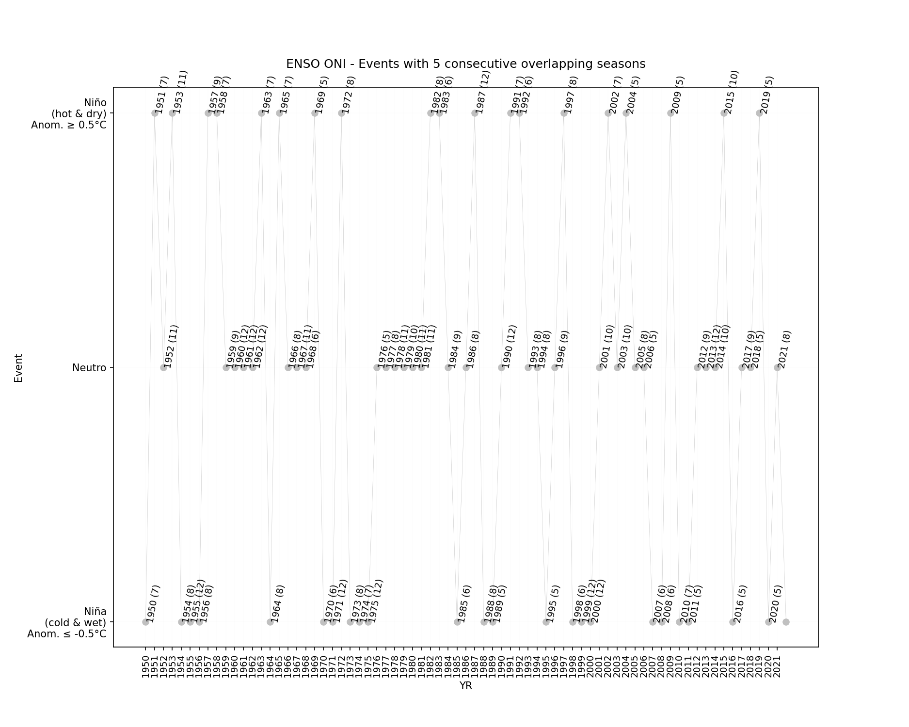

# NOAA - Oceanic Niño Index (ONI) classifier for climatological year events Niño, Niña and Neutral

The following analysis are based on a threshold of +/- 0.5°C for the Oceanic Niño Index (ONI) [3 month running mean of ERSST.v5 SST anomalies in the Niño 3.4 region (5°N-5°S, 120°-170°W)], based on centered 30-year base periods updated every 5 years.
The ONI is one measure of the El Niño-Southern Oscillation, and other indices can confirm whether features consistent with a coupled ocean-atmosphere phenomenon accompanied these periods.[^1]

* Processed file: [D:/R.LTWB/.datasets/ENSOONI/ONI_Ascii_20221118.txt](../ENSOONI/ONI_Ascii_20221118.txt)
* Execution date: 2022-11-18 10:41:21.692021
* Python version: 3.10.5 (tags/v3.10.5:f377153, Jun  6 2022, 16:14:13) [MSC v.1929 64 bit (AMD64)]
* Python path: ['D:\\R.LTWB\\.src', 'D:\\R.LTWB', 'D:\\R.GISPython', 'D:\\R.HydroTools', 'D:\\R.HydroTools.wiki']
* matplotlib version: 3.6.0
* pandas version: 1.4.3
* numpy version: 1.23.2
* Instructions & script: https://github.com/rcfdtools/R.LTWB/tree/main/Section03/ENSOONI
* License: https://github.com/rcfdtools/R.LTWB/blob/main/LICENSE.md
* Credits: r.cfdtools@gmail.com

## General ONI Ascii file information

* Ascii file from: https://www.cpc.ncep.noaa.gov/data/indices/oni.ascii.txt
* Records: 873
* Years: 72.750000

Table records

|       | 0     | 1     | 2     | 3     | 4     | 5     | 6     | 7     | 8     | 9     | 10    | 11    | 12    | 13    | 14    | 15    | 16    | 17    | 18    | 19    | 20    | 21    | 22    | 23    | 24    | 25    | 26    | 27   | 28    | 29    | 30    | 31    | 32   | 33    | 34    | 35    | 36    | 37   | 38    | 39    | 40    | 41    | 42    | 43    | 44    | 45    | 46    | 47    | 48   | 49    | 50    | 51    | 52    | 53    | 54    | 55    | 56    | 57    | 58    | 59    | 60    | 61    | 62    | 63   | 64    | 65    | 66    | 67    | 68    | 69    | 70    | 71    | 72    | 73    | 74    | 75    | 76    | 77    | 78    | 79    | 80    | 81    | 82    | 83    | 84    | 85    | 86    | 87    | 88    | 89    | 90    | 91    | 92   | 93    | 94    | 95    | 96    | 97    | 98    | 99    | 100   | 101   | 102   | 103   | 104   | 105   | 106   | 107   | 108   | 109   | 110   | 111   | 112   | 113   | 114   | 115   | 116   | 117   | 118   | 119   | 120   | 121   | 122   | 123   | 124   | 125   | 126   | 127   | 128   | 129   | 130   | 131   | 132   | 133   | 134   | 135   | 136   | 137   | 138   | 139   | 140   | 141   | 142   | 143   | 144   | 145   | 146   | 147   | 148   | 149   | 150   | 151   | 152   | 153   | 154   | 155   | 156   | 157   | 158   | 159   | 160   | 161   | 162   | 163   | 164   | 165   | 166   | 167   | 168   | 169   | 170   | 171   | 172   | 173   | 174   | 175   | 176   | 177   | 178   | 179   | 180   | 181   | 182   | 183   | 184   | 185   | 186   | 187   | 188   | 189   | 190   | 191   | 192   | 193   | 194   | 195   | 196   | 197   | 198   | 199   | 200   | 201   | 202   | 203   | 204   | 205   | 206   | 207   | 208   | 209   | 210   | 211   | 212   | 213   | 214   | 215   | 216   | 217   | 218   | 219   | 220   | 221   | 222   | 223   | 224   | 225   | 226   | 227   | 228   | 229   | 230   | 231   | 232   | 233   | 234   | 235   | 236   | 237   | 238   | 239   | 240   | 241   | 242   | 243   | 244   | 245   | 246   | 247   | 248   | 249   | 250   | 251   | 252   | 253   | 254   | 255   | 256   | 257   | 258   | 259   | 260   | 261   | 262   | 263   | 264   | 265   | 266   | 267   | 268   | 269   | 270   | 271   | 272   | 273   | 274   | 275   | 276   | 277   | 278   | 279   | 280   | 281   | 282   | 283   | 284   | 285   | 286   | 287   | 288   | 289   | 290   | 291   | 292   | 293   | 294   | 295   | 296   | 297   | 298   | 299   | 300   | 301   | 302   | 303   | 304   | 305   | 306   | 307   | 308   | 309   | 310   | 311   | 312   | 313   | 314   | 315   | 316   | 317   | 318   | 319   | 320   | 321   | 322   | 323   | 324   | 325   | 326   | 327   | 328   | 329   | 330   | 331   | 332   | 333   | 334   | 335   | 336   | 337   | 338   | 339   | 340   | 341   | 342   | 343   | 344   | 345   | 346   | 347   | 348   | 349   | 350   | 351   | 352   | 353   | 354   | 355   | 356   | 357   | 358   | 359   | 360   | 361   | 362   | 363   | 364   | 365   | 366   | 367   | 368   | 369   | 370   | 371   | 372   | 373   | 374   | 375   | 376   | 377   | 378   | 379   | 380   | 381   | 382   | 383   | 384   | 385   | 386   | 387   | 388   | 389   | 390   | 391   | 392   | 393   | 394   | 395   | 396   | 397   | 398   | 399   | 400   | 401   | 402   | 403   | 404   | 405   | 406   | 407   | 408   | 409   | 410   | 411   | 412   | 413   | 414   | 415   | 416   | 417   | 418   | 419   | 420   | 421   | 422   | 423   | 424   | 425   | 426   | 427   | 428   | 429   | 430   | 431   | 432   | 433   | 434   | 435   | 436   | 437   | 438   | 439   | 440   | 441   | 442   | 443   | 444   | 445   | 446   | 447   | 448   | 449   | 450   | 451   | 452   | 453   | 454   | 455   | 456   | 457   | 458   | 459   | 460   | 461   | 462   | 463   | 464   | 465   | 466   | 467   | 468   | 469   | 470   | 471   | 472   | 473   | 474   | 475   | 476   | 477   | 478   | 479   | 480   | 481   | 482   | 483   | 484   | 485   | 486   | 487   | 488   | 489   | 490   | 491   | 492   | 493   | 494   | 495   | 496   | 497   | 498   | 499   | 500   | 501   | 502   | 503   | 504   | 505   | 506   | 507   | 508   | 509   | 510   | 511   | 512   | 513   | 514   | 515   | 516   | 517   | 518   | 519   | 520   | 521   | 522   | 523   | 524   | 525   | 526   | 527   | 528   | 529   | 530   | 531   | 532   | 533   | 534   | 535   | 536   | 537   | 538   | 539   | 540   | 541   | 542   | 543   | 544   | 545   | 546   | 547   | 548   | 549   | 550   | 551   | 552   | 553   | 554   | 555   | 556   | 557   | 558   | 559   | 560   | 561   | 562   | 563   | 564   | 565   | 566   | 567   | 568   | 569   | 570   | 571   | 572   | 573   | 574   | 575   | 576   | 577   | 578   | 579   | 580   | 581   | 582   | 583   | 584   | 585   | 586   | 587   | 588   | 589   | 590   | 591   | 592   | 593   | 594   | 595   | 596   | 597   | 598   | 599   | 600   | 601   | 602   | 603   | 604   | 605   | 606   | 607   | 608   | 609   | 610   | 611   | 612   | 613   | 614   | 615   | 616   | 617   | 618   | 619   | 620   | 621   | 622   | 623   | 624   | 625   | 626   | 627   | 628   | 629   | 630   | 631   | 632   | 633   | 634   | 635   | 636   | 637   | 638   | 639   | 640   | 641   | 642   | 643   | 644   | 645   | 646   | 647   | 648   | 649   | 650   | 651   | 652   | 653   | 654   | 655   | 656   | 657   | 658   | 659   | 660   | 661   | 662   | 663   | 664   | 665   | 666   | 667   | 668   | 669   | 670   | 671   | 672   | 673   | 674   | 675   | 676   | 677   | 678   | 679   | 680   | 681   | 682   | 683   | 684   | 685   | 686   | 687   | 688   | 689   | 690   | 691   | 692   | 693   | 694   | 695   | 696   | 697   | 698   | 699   | 700   | 701   | 702   | 703   | 704   | 705   | 706   | 707   | 708   | 709   | 710   | 711   | 712   | 713   | 714   | 715   | 716   | 717   | 718   | 719   | 720   | 721   | 722   | 723   | 724   | 725   | 726   | 727   | 728   | 729   | 730   | 731   | 732   | 733   | 734   | 735   | 736   | 737   | 738   | 739   | 740   | 741   | 742   | 743   | 744   | 745   | 746   | 747   | 748   | 749   | 750   | 751   | 752   | 753   | 754   | 755   | 756   | 757   | 758   | 759   | 760   | 761   | 762   | 763   | 764   | 765   | 766   | 767   | 768   | 769   | 770   | 771   | 772   | 773   | 774   | 775   | 776   | 777   | 778   | 779   | 780   | 781   | 782   | 783   | 784   | 785   | 786   | 787   | 788   | 789   | 790   | 791   | 792   | 793   | 794   | 795   | 796   | 797   | 798   | 799   | 800   | 801   | 802   | 803   | 804   | 805   | 806   | 807   | 808   | 809   | 810   | 811   | 812   | 813   | 814   | 815   | 816   | 817   | 818   | 819   | 820   | 821   | 822   | 823   | 824   | 825   | 826   | 827   | 828   | 829   | 830   | 831   | 832   | 833   | 834   | 835   | 836   | 837   | 838   | 839   | 840   | 841   | 842   | 843   | 844   | 845   | 846   | 847   | 848   | 849   | 850   | 851   | 852   | 853   | 854   | 855   | 856   | 857   | 858   | 859   | 860   | 861   | 862   | 863   | 864   | 865   | 866   | 867   | 868   | 869   | 870   | 871   | 872   |
|:------|:------|:------|:------|:------|:------|:------|:------|:------|:------|:------|:------|:------|:------|:------|:------|:------|:------|:------|:------|:------|:------|:------|:------|:------|:------|:------|:------|:-----|:------|:------|:------|:------|:-----|:------|:------|:------|:------|:-----|:------|:------|:------|:------|:------|:------|:------|:------|:------|:------|:-----|:------|:------|:------|:------|:------|:------|:------|:------|:------|:------|:------|:------|:------|:------|:-----|:------|:------|:------|:------|:------|:------|:------|:------|:------|:------|:------|:------|:------|:------|:------|:------|:------|:------|:------|:------|:------|:------|:------|:------|:------|:------|:------|:------|:-----|:------|:------|:------|:------|:------|:------|:------|:------|:------|:------|:------|:------|:------|:------|:------|:------|:------|:------|:------|:------|:------|:------|:------|:------|:------|:------|:------|:------|:------|:------|:------|:------|:------|:------|:------|:------|:------|:------|:------|:------|:------|:------|:------|:------|:------|:------|:------|:------|:------|:------|:------|:------|:------|:------|:------|:------|:------|:------|:------|:------|:------|:------|:------|:------|:------|:------|:------|:------|:------|:------|:------|:------|:------|:------|:------|:------|:------|:------|:------|:------|:------|:------|:------|:------|:------|:------|:------|:------|:------|:------|:------|:------|:------|:------|:------|:------|:------|:------|:------|:------|:------|:------|:------|:------|:------|:------|:------|:------|:------|:------|:------|:------|:------|:------|:------|:------|:------|:------|:------|:------|:------|:------|:------|:------|:------|:------|:------|:------|:------|:------|:------|:------|:------|:------|:------|:------|:------|:------|:------|:------|:------|:------|:------|:------|:------|:------|:------|:------|:------|:------|:------|:------|:------|:------|:------|:------|:------|:------|:------|:------|:------|:------|:------|:------|:------|:------|:------|:------|:------|:------|:------|:------|:------|:------|:------|:------|:------|:------|:------|:------|:------|:------|:------|:------|:------|:------|:------|:------|:------|:------|:------|:------|:------|:------|:------|:------|:------|:------|:------|:------|:------|:------|:------|:------|:------|:------|:------|:------|:------|:------|:------|:------|:------|:------|:------|:------|:------|:------|:------|:------|:------|:------|:------|:------|:------|:------|:------|:------|:------|:------|:------|:------|:------|:------|:------|:------|:------|:------|:------|:------|:------|:------|:------|:------|:------|:------|:------|:------|:------|:------|:------|:------|:------|:------|:------|:------|:------|:------|:------|:------|:------|:------|:------|:------|:------|:------|:------|:------|:------|:------|:------|:------|:------|:------|:------|:------|:------|:------|:------|:------|:------|:------|:------|:------|:------|:------|:------|:------|:------|:------|:------|:------|:------|:------|:------|:------|:------|:------|:------|:------|:------|:------|:------|:------|:------|:------|:------|:------|:------|:------|:------|:------|:------|:------|:------|:------|:------|:------|:------|:------|:------|:------|:------|:------|:------|:------|:------|:------|:------|:------|:------|:------|:------|:------|:------|:------|:------|:------|:------|:------|:------|:------|:------|:------|:------|:------|:------|:------|:------|:------|:------|:------|:------|:------|:------|:------|:------|:------|:------|:------|:------|:------|:------|:------|:------|:------|:------|:------|:------|:------|:------|:------|:------|:------|:------|:------|:------|:------|:------|:------|:------|:------|:------|:------|:------|:------|:------|:------|:------|:------|:------|:------|:------|:------|:------|:------|:------|:------|:------|:------|:------|:------|:------|:------|:------|:------|:------|:------|:------|:------|:------|:------|:------|:------|:------|:------|:------|:------|:------|:------|:------|:------|:------|:------|:------|:------|:------|:------|:------|:------|:------|:------|:------|:------|:------|:------|:------|:------|:------|:------|:------|:------|:------|:------|:------|:------|:------|:------|:------|:------|:------|:------|:------|:------|:------|:------|:------|:------|:------|:------|:------|:------|:------|:------|:------|:------|:------|:------|:------|:------|:------|:------|:------|:------|:------|:------|:------|:------|:------|:------|:------|:------|:------|:------|:------|:------|:------|:------|:------|:------|:------|:------|:------|:------|:------|:------|:------|:------|:------|:------|:------|:------|:------|:------|:------|:------|:------|:------|:------|:------|:------|:------|:------|:------|:------|:------|:------|:------|:------|:------|:------|:------|:------|:------|:------|:------|:------|:------|:------|:------|:------|:------|:------|:------|:------|:------|:------|:------|:------|:------|:------|:------|:------|:------|:------|:------|:------|:------|:------|:------|:------|:------|:------|:------|:------|:------|:------|:------|:------|:------|:------|:------|:------|:------|:------|:------|:------|:------|:------|:------|:------|:------|:------|:------|:------|:------|:------|:------|:------|:------|:------|:------|:------|:------|:------|:------|:------|:------|:------|:------|:------|:------|:------|:------|:------|:------|:------|:------|:------|:------|:------|:------|:------|:------|:------|:------|:------|:------|:------|:------|:------|:------|:------|:------|:------|:------|:------|:------|:------|:------|:------|:------|:------|:------|:------|:------|:------|:------|:------|:------|:------|:------|:------|:------|:------|:------|:------|:------|:------|:------|:------|:------|:------|:------|:------|:------|:------|:------|:------|:------|:------|:------|:------|:------|:------|:------|:------|:------|:------|:------|:------|:------|:------|:------|:------|:------|:------|:------|:------|:------|:------|:------|:------|:------|:------|:------|:------|:------|:------|:------|:------|:------|:------|:------|:------|:------|:------|:------|:------|:------|:------|:------|:------|:------|:------|:------|:------|:------|:------|:------|:------|:------|:------|:------|:------|:------|:------|:------|:------|:------|:------|:------|:------|:------|:------|:------|:------|:------|:------|:------|:------|:------|:------|:------|:------|:------|:------|:------|:------|:------|:------|:------|:------|:------|:------|:------|:------|:------|:------|:------|:------|:------|:------|:------|:------|:------|:------|:------|:------|:------|:------|:------|:------|:------|:------|:------|:------|:------|:------|:------|:------|:------|:------|:------|:------|:------|:------|:------|:------|:------|:------|:------|:------|:------|:------|:------|:------|:------|:------|:------|
| SEAS  | DJF   | JFM   | FMA   | MAM   | AMJ   | MJJ   | JJA   | JAS   | ASO   | SON   | OND   | NDJ   | DJF   | JFM   | FMA   | MAM   | AMJ   | MJJ   | JJA   | JAS   | ASO   | SON   | OND   | NDJ   | DJF   | JFM   | FMA   | MAM  | AMJ   | MJJ   | JJA   | JAS   | ASO  | SON   | OND   | NDJ   | DJF   | JFM  | FMA   | MAM   | AMJ   | MJJ   | JJA   | JAS   | ASO   | SON   | OND   | NDJ   | DJF  | JFM   | FMA   | MAM   | AMJ   | MJJ   | JJA   | JAS   | ASO   | SON   | OND   | NDJ   | DJF   | JFM   | FMA   | MAM  | AMJ   | MJJ   | JJA   | JAS   | ASO   | SON   | OND   | NDJ   | DJF   | JFM   | FMA   | MAM   | AMJ   | MJJ   | JJA   | JAS   | ASO   | SON   | OND   | NDJ   | DJF   | JFM   | FMA   | MAM   | AMJ   | MJJ   | JJA   | JAS   | ASO  | SON   | OND   | NDJ   | DJF   | JFM   | FMA   | MAM   | AMJ   | MJJ   | JJA   | JAS   | ASO   | SON   | OND   | NDJ   | DJF   | JFM   | FMA   | MAM   | AMJ   | MJJ   | JJA   | JAS   | ASO   | SON   | OND   | NDJ   | DJF   | JFM   | FMA   | MAM   | AMJ   | MJJ   | JJA   | JAS   | ASO   | SON   | OND   | NDJ   | DJF   | JFM   | FMA   | MAM   | AMJ   | MJJ   | JJA   | JAS   | ASO   | SON   | OND   | NDJ   | DJF   | JFM   | FMA   | MAM   | AMJ   | MJJ   | JJA   | JAS   | ASO   | SON   | OND   | NDJ   | DJF   | JFM   | FMA   | MAM   | AMJ   | MJJ   | JJA   | JAS   | ASO   | SON   | OND   | NDJ   | DJF   | JFM   | FMA   | MAM   | AMJ   | MJJ   | JJA   | JAS   | ASO   | SON   | OND   | NDJ   | DJF   | JFM   | FMA   | MAM   | AMJ   | MJJ   | JJA   | JAS   | ASO   | SON   | OND   | NDJ   | DJF   | JFM   | FMA   | MAM   | AMJ   | MJJ   | JJA   | JAS   | ASO   | SON   | OND   | NDJ   | DJF   | JFM   | FMA   | MAM   | AMJ   | MJJ   | JJA   | JAS   | ASO   | SON   | OND   | NDJ   | DJF   | JFM   | FMA   | MAM   | AMJ   | MJJ   | JJA   | JAS   | ASO   | SON   | OND   | NDJ   | DJF   | JFM   | FMA   | MAM   | AMJ   | MJJ   | JJA   | JAS   | ASO   | SON   | OND   | NDJ   | DJF   | JFM   | FMA   | MAM   | AMJ   | MJJ   | JJA   | JAS   | ASO   | SON   | OND   | NDJ   | DJF   | JFM   | FMA   | MAM   | AMJ   | MJJ   | JJA   | JAS   | ASO   | SON   | OND   | NDJ   | DJF   | JFM   | FMA   | MAM   | AMJ   | MJJ   | JJA   | JAS   | ASO   | SON   | OND   | NDJ   | DJF   | JFM   | FMA   | MAM   | AMJ   | MJJ   | JJA   | JAS   | ASO   | SON   | OND   | NDJ   | DJF   | JFM   | FMA   | MAM   | AMJ   | MJJ   | JJA   | JAS   | ASO   | SON   | OND   | NDJ   | DJF   | JFM   | FMA   | MAM   | AMJ   | MJJ   | JJA   | JAS   | ASO   | SON   | OND   | NDJ   | DJF   | JFM   | FMA   | MAM   | AMJ   | MJJ   | JJA   | JAS   | ASO   | SON   | OND   | NDJ   | DJF   | JFM   | FMA   | MAM   | AMJ   | MJJ   | JJA   | JAS   | ASO   | SON   | OND   | NDJ   | DJF   | JFM   | FMA   | MAM   | AMJ   | MJJ   | JJA   | JAS   | ASO   | SON   | OND   | NDJ   | DJF   | JFM   | FMA   | MAM   | AMJ   | MJJ   | JJA   | JAS   | ASO   | SON   | OND   | NDJ   | DJF   | JFM   | FMA   | MAM   | AMJ   | MJJ   | JJA   | JAS   | ASO   | SON   | OND   | NDJ   | DJF   | JFM   | FMA   | MAM   | AMJ   | MJJ   | JJA   | JAS   | ASO   | SON   | OND   | NDJ   | DJF   | JFM   | FMA   | MAM   | AMJ   | MJJ   | JJA   | JAS   | ASO   | SON   | OND   | NDJ   | DJF   | JFM   | FMA   | MAM   | AMJ   | MJJ   | JJA   | JAS   | ASO   | SON   | OND   | NDJ   | DJF   | JFM   | FMA   | MAM   | AMJ   | MJJ   | JJA   | JAS   | ASO   | SON   | OND   | NDJ   | DJF   | JFM   | FMA   | MAM   | AMJ   | MJJ   | JJA   | JAS   | ASO   | SON   | OND   | NDJ   | DJF   | JFM   | FMA   | MAM   | AMJ   | MJJ   | JJA   | JAS   | ASO   | SON   | OND   | NDJ   | DJF   | JFM   | FMA   | MAM   | AMJ   | MJJ   | JJA   | JAS   | ASO   | SON   | OND   | NDJ   | DJF   | JFM   | FMA   | MAM   | AMJ   | MJJ   | JJA   | JAS   | ASO   | SON   | OND   | NDJ   | DJF   | JFM   | FMA   | MAM   | AMJ   | MJJ   | JJA   | JAS   | ASO   | SON   | OND   | NDJ   | DJF   | JFM   | FMA   | MAM   | AMJ   | MJJ   | JJA   | JAS   | ASO   | SON   | OND   | NDJ   | DJF   | JFM   | FMA   | MAM   | AMJ   | MJJ   | JJA   | JAS   | ASO   | SON   | OND   | NDJ   | DJF   | JFM   | FMA   | MAM   | AMJ   | MJJ   | JJA   | JAS   | ASO   | SON   | OND   | NDJ   | DJF   | JFM   | FMA   | MAM   | AMJ   | MJJ   | JJA   | JAS   | ASO   | SON   | OND   | NDJ   | DJF   | JFM   | FMA   | MAM   | AMJ   | MJJ   | JJA   | JAS   | ASO   | SON   | OND   | NDJ   | DJF   | JFM   | FMA   | MAM   | AMJ   | MJJ   | JJA   | JAS   | ASO   | SON   | OND   | NDJ   | DJF   | JFM   | FMA   | MAM   | AMJ   | MJJ   | JJA   | JAS   | ASO   | SON   | OND   | NDJ   | DJF   | JFM   | FMA   | MAM   | AMJ   | MJJ   | JJA   | JAS   | ASO   | SON   | OND   | NDJ   | DJF   | JFM   | FMA   | MAM   | AMJ   | MJJ   | JJA   | JAS   | ASO   | SON   | OND   | NDJ   | DJF   | JFM   | FMA   | MAM   | AMJ   | MJJ   | JJA   | JAS   | ASO   | SON   | OND   | NDJ   | DJF   | JFM   | FMA   | MAM   | AMJ   | MJJ   | JJA   | JAS   | ASO   | SON   | OND   | NDJ   | DJF   | JFM   | FMA   | MAM   | AMJ   | MJJ   | JJA   | JAS   | ASO   | SON   | OND   | NDJ   | DJF   | JFM   | FMA   | MAM   | AMJ   | MJJ   | JJA   | JAS   | ASO   | SON   | OND   | NDJ   | DJF   | JFM   | FMA   | MAM   | AMJ   | MJJ   | JJA   | JAS   | ASO   | SON   | OND   | NDJ   | DJF   | JFM   | FMA   | MAM   | AMJ   | MJJ   | JJA   | JAS   | ASO   | SON   | OND   | NDJ   | DJF   | JFM   | FMA   | MAM   | AMJ   | MJJ   | JJA   | JAS   | ASO   | SON   | OND   | NDJ   | DJF   | JFM   | FMA   | MAM   | AMJ   | MJJ   | JJA   | JAS   | ASO   | SON   | OND   | NDJ   | DJF   | JFM   | FMA   | MAM   | AMJ   | MJJ   | JJA   | JAS   | ASO   | SON   | OND   | NDJ   | DJF   | JFM   | FMA   | MAM   | AMJ   | MJJ   | JJA   | JAS   | ASO   | SON   | OND   | NDJ   | DJF   | JFM   | FMA   | MAM   | AMJ   | MJJ   | JJA   | JAS   | ASO   | SON   | OND   | NDJ   | DJF   | JFM   | FMA   | MAM   | AMJ   | MJJ   | JJA   | JAS   | ASO   | SON   | OND   | NDJ   | DJF   | JFM   | FMA   | MAM   | AMJ   | MJJ   | JJA   | JAS   | ASO   | SON   | OND   | NDJ   | DJF   | JFM   | FMA   | MAM   | AMJ   | MJJ   | JJA   | JAS   | ASO   | SON   | OND   | NDJ   | DJF   | JFM   | FMA   | MAM   | AMJ   | MJJ   | JJA   | JAS   | ASO   | SON   | OND   | NDJ   | DJF   | JFM   | FMA   | MAM   | AMJ   | MJJ   | JJA   | JAS   | ASO   | SON   | OND   | NDJ   | DJF   | JFM   | FMA   | MAM   | AMJ   | MJJ   | JJA   | JAS   | ASO   | SON   | OND   | NDJ   | DJF   | JFM   | FMA   | MAM   | AMJ   | MJJ   | JJA   | JAS   | ASO   | SON   | OND   | NDJ   | DJF   | JFM   | FMA   | MAM   | AMJ   | MJJ   | JJA   | JAS   | ASO   | SON   | OND   | NDJ   | DJF   | JFM   | FMA   | MAM   | AMJ   | MJJ   | JJA   | JAS   | ASO   | SON   | OND   | NDJ   | DJF   | JFM   | FMA   | MAM   | AMJ   | MJJ   | JJA   | JAS   | ASO   | SON   | OND   | NDJ   | DJF   | JFM   | FMA   | MAM   | AMJ   | MJJ   | JJA   | JAS   | ASO   | SON   | OND   | NDJ   | DJF   | JFM   | FMA   | MAM   | AMJ   | MJJ   | JJA   | JAS   | ASO   | SON   | OND   | NDJ   | DJF   | JFM   | FMA   | MAM   | AMJ   | MJJ   | JJA   | JAS   | ASO   |
| YR    | 1950  | 1950  | 1950  | 1950  | 1950  | 1950  | 1950  | 1950  | 1950  | 1950  | 1950  | 1950  | 1951  | 1951  | 1951  | 1951  | 1951  | 1951  | 1951  | 1951  | 1951  | 1951  | 1951  | 1951  | 1952  | 1952  | 1952  | 1952 | 1952  | 1952  | 1952  | 1952  | 1952 | 1952  | 1952  | 1952  | 1953  | 1953 | 1953  | 1953  | 1953  | 1953  | 1953  | 1953  | 1953  | 1953  | 1953  | 1953  | 1954 | 1954  | 1954  | 1954  | 1954  | 1954  | 1954  | 1954  | 1954  | 1954  | 1954  | 1954  | 1955  | 1955  | 1955  | 1955 | 1955  | 1955  | 1955  | 1955  | 1955  | 1955  | 1955  | 1955  | 1956  | 1956  | 1956  | 1956  | 1956  | 1956  | 1956  | 1956  | 1956  | 1956  | 1956  | 1956  | 1957  | 1957  | 1957  | 1957  | 1957  | 1957  | 1957  | 1957  | 1957 | 1957  | 1957  | 1957  | 1958  | 1958  | 1958  | 1958  | 1958  | 1958  | 1958  | 1958  | 1958  | 1958  | 1958  | 1958  | 1959  | 1959  | 1959  | 1959  | 1959  | 1959  | 1959  | 1959  | 1959  | 1959  | 1959  | 1959  | 1960  | 1960  | 1960  | 1960  | 1960  | 1960  | 1960  | 1960  | 1960  | 1960  | 1960  | 1960  | 1961  | 1961  | 1961  | 1961  | 1961  | 1961  | 1961  | 1961  | 1961  | 1961  | 1961  | 1961  | 1962  | 1962  | 1962  | 1962  | 1962  | 1962  | 1962  | 1962  | 1962  | 1962  | 1962  | 1962  | 1963  | 1963  | 1963  | 1963  | 1963  | 1963  | 1963  | 1963  | 1963  | 1963  | 1963  | 1963  | 1964  | 1964  | 1964  | 1964  | 1964  | 1964  | 1964  | 1964  | 1964  | 1964  | 1964  | 1964  | 1965  | 1965  | 1965  | 1965  | 1965  | 1965  | 1965  | 1965  | 1965  | 1965  | 1965  | 1965  | 1966  | 1966  | 1966  | 1966  | 1966  | 1966  | 1966  | 1966  | 1966  | 1966  | 1966  | 1966  | 1967  | 1967  | 1967  | 1967  | 1967  | 1967  | 1967  | 1967  | 1967  | 1967  | 1967  | 1967  | 1968  | 1968  | 1968  | 1968  | 1968  | 1968  | 1968  | 1968  | 1968  | 1968  | 1968  | 1968  | 1969  | 1969  | 1969  | 1969  | 1969  | 1969  | 1969  | 1969  | 1969  | 1969  | 1969  | 1969  | 1970  | 1970  | 1970  | 1970  | 1970  | 1970  | 1970  | 1970  | 1970  | 1970  | 1970  | 1970  | 1971  | 1971  | 1971  | 1971  | 1971  | 1971  | 1971  | 1971  | 1971  | 1971  | 1971  | 1971  | 1972  | 1972  | 1972  | 1972  | 1972  | 1972  | 1972  | 1972  | 1972  | 1972  | 1972  | 1972  | 1973  | 1973  | 1973  | 1973  | 1973  | 1973  | 1973  | 1973  | 1973  | 1973  | 1973  | 1973  | 1974  | 1974  | 1974  | 1974  | 1974  | 1974  | 1974  | 1974  | 1974  | 1974  | 1974  | 1974  | 1975  | 1975  | 1975  | 1975  | 1975  | 1975  | 1975  | 1975  | 1975  | 1975  | 1975  | 1975  | 1976  | 1976  | 1976  | 1976  | 1976  | 1976  | 1976  | 1976  | 1976  | 1976  | 1976  | 1976  | 1977  | 1977  | 1977  | 1977  | 1977  | 1977  | 1977  | 1977  | 1977  | 1977  | 1977  | 1977  | 1978  | 1978  | 1978  | 1978  | 1978  | 1978  | 1978  | 1978  | 1978  | 1978  | 1978  | 1978  | 1979  | 1979  | 1979  | 1979  | 1979  | 1979  | 1979  | 1979  | 1979  | 1979  | 1979  | 1979  | 1980  | 1980  | 1980  | 1980  | 1980  | 1980  | 1980  | 1980  | 1980  | 1980  | 1980  | 1980  | 1981  | 1981  | 1981  | 1981  | 1981  | 1981  | 1981  | 1981  | 1981  | 1981  | 1981  | 1981  | 1982  | 1982  | 1982  | 1982  | 1982  | 1982  | 1982  | 1982  | 1982  | 1982  | 1982  | 1982  | 1983  | 1983  | 1983  | 1983  | 1983  | 1983  | 1983  | 1983  | 1983  | 1983  | 1983  | 1983  | 1984  | 1984  | 1984  | 1984  | 1984  | 1984  | 1984  | 1984  | 1984  | 1984  | 1984  | 1984  | 1985  | 1985  | 1985  | 1985  | 1985  | 1985  | 1985  | 1985  | 1985  | 1985  | 1985  | 1985  | 1986  | 1986  | 1986  | 1986  | 1986  | 1986  | 1986  | 1986  | 1986  | 1986  | 1986  | 1986  | 1987  | 1987  | 1987  | 1987  | 1987  | 1987  | 1987  | 1987  | 1987  | 1987  | 1987  | 1987  | 1988  | 1988  | 1988  | 1988  | 1988  | 1988  | 1988  | 1988  | 1988  | 1988  | 1988  | 1988  | 1989  | 1989  | 1989  | 1989  | 1989  | 1989  | 1989  | 1989  | 1989  | 1989  | 1989  | 1989  | 1990  | 1990  | 1990  | 1990  | 1990  | 1990  | 1990  | 1990  | 1990  | 1990  | 1990  | 1990  | 1991  | 1991  | 1991  | 1991  | 1991  | 1991  | 1991  | 1991  | 1991  | 1991  | 1991  | 1991  | 1992  | 1992  | 1992  | 1992  | 1992  | 1992  | 1992  | 1992  | 1992  | 1992  | 1992  | 1992  | 1993  | 1993  | 1993  | 1993  | 1993  | 1993  | 1993  | 1993  | 1993  | 1993  | 1993  | 1993  | 1994  | 1994  | 1994  | 1994  | 1994  | 1994  | 1994  | 1994  | 1994  | 1994  | 1994  | 1994  | 1995  | 1995  | 1995  | 1995  | 1995  | 1995  | 1995  | 1995  | 1995  | 1995  | 1995  | 1995  | 1996  | 1996  | 1996  | 1996  | 1996  | 1996  | 1996  | 1996  | 1996  | 1996  | 1996  | 1996  | 1997  | 1997  | 1997  | 1997  | 1997  | 1997  | 1997  | 1997  | 1997  | 1997  | 1997  | 1997  | 1998  | 1998  | 1998  | 1998  | 1998  | 1998  | 1998  | 1998  | 1998  | 1998  | 1998  | 1998  | 1999  | 1999  | 1999  | 1999  | 1999  | 1999  | 1999  | 1999  | 1999  | 1999  | 1999  | 1999  | 2000  | 2000  | 2000  | 2000  | 2000  | 2000  | 2000  | 2000  | 2000  | 2000  | 2000  | 2000  | 2001  | 2001  | 2001  | 2001  | 2001  | 2001  | 2001  | 2001  | 2001  | 2001  | 2001  | 2001  | 2002  | 2002  | 2002  | 2002  | 2002  | 2002  | 2002  | 2002  | 2002  | 2002  | 2002  | 2002  | 2003  | 2003  | 2003  | 2003  | 2003  | 2003  | 2003  | 2003  | 2003  | 2003  | 2003  | 2003  | 2004  | 2004  | 2004  | 2004  | 2004  | 2004  | 2004  | 2004  | 2004  | 2004  | 2004  | 2004  | 2005  | 2005  | 2005  | 2005  | 2005  | 2005  | 2005  | 2005  | 2005  | 2005  | 2005  | 2005  | 2006  | 2006  | 2006  | 2006  | 2006  | 2006  | 2006  | 2006  | 2006  | 2006  | 2006  | 2006  | 2007  | 2007  | 2007  | 2007  | 2007  | 2007  | 2007  | 2007  | 2007  | 2007  | 2007  | 2007  | 2008  | 2008  | 2008  | 2008  | 2008  | 2008  | 2008  | 2008  | 2008  | 2008  | 2008  | 2008  | 2009  | 2009  | 2009  | 2009  | 2009  | 2009  | 2009  | 2009  | 2009  | 2009  | 2009  | 2009  | 2010  | 2010  | 2010  | 2010  | 2010  | 2010  | 2010  | 2010  | 2010  | 2010  | 2010  | 2010  | 2011  | 2011  | 2011  | 2011  | 2011  | 2011  | 2011  | 2011  | 2011  | 2011  | 2011  | 2011  | 2012  | 2012  | 2012  | 2012  | 2012  | 2012  | 2012  | 2012  | 2012  | 2012  | 2012  | 2012  | 2013  | 2013  | 2013  | 2013  | 2013  | 2013  | 2013  | 2013  | 2013  | 2013  | 2013  | 2013  | 2014  | 2014  | 2014  | 2014  | 2014  | 2014  | 2014  | 2014  | 2014  | 2014  | 2014  | 2014  | 2015  | 2015  | 2015  | 2015  | 2015  | 2015  | 2015  | 2015  | 2015  | 2015  | 2015  | 2015  | 2016  | 2016  | 2016  | 2016  | 2016  | 2016  | 2016  | 2016  | 2016  | 2016  | 2016  | 2016  | 2017  | 2017  | 2017  | 2017  | 2017  | 2017  | 2017  | 2017  | 2017  | 2017  | 2017  | 2017  | 2018  | 2018  | 2018  | 2018  | 2018  | 2018  | 2018  | 2018  | 2018  | 2018  | 2018  | 2018  | 2019  | 2019  | 2019  | 2019  | 2019  | 2019  | 2019  | 2019  | 2019  | 2019  | 2019  | 2019  | 2020  | 2020  | 2020  | 2020  | 2020  | 2020  | 2020  | 2020  | 2020  | 2020  | 2020  | 2020  | 2021  | 2021  | 2021  | 2021  | 2021  | 2021  | 2021  | 2021  | 2021  | 2021  | 2021  | 2021  | 2022  | 2022  | 2022  | 2022  | 2022  | 2022  | 2022  | 2022  | 2022  |
| TOTAL | 24.72 | 25.17 | 25.75 | 26.12 | 26.32 | 26.31 | 26.21 | 25.96 | 25.76 | 25.63 | 25.48 | 25.34 | 25.42 | 25.96 | 26.74 | 27.48 | 27.75 | 27.75 | 27.44 | 27.28 | 27.14 | 27.22 | 27.12 | 26.95 | 26.78 | 26.87 | 27.25 | 27.6 | 27.59 | 27.17 | 26.67 | 26.39 | 26.3 | 26.17 | 26.13 | 26.29 | 26.65 | 27.1 | 27.53 | 27.96 | 28.14 | 27.94 | 27.49 | 27.12 | 26.93 | 26.91 | 26.92 | 26.95 | 27.0 | 26.97 | 26.86 | 26.89 | 26.85 | 26.67 | 26.1  | 25.54 | 25.25 | 25.3  | 25.35 | 25.48 | 25.57 | 25.89 | 26.22 | 26.5 | 26.6  | 26.45 | 26.06 | 25.64 | 25.06 | 24.65 | 24.41 | 24.72 | 25.23 | 25.86 | 26.37 | 26.82 | 26.93 | 26.72 | 26.23 | 25.87 | 25.71 | 25.67 | 25.67 | 25.77 | 26.09 | 26.68 | 27.41 | 28.08 | 28.37 | 28.34 | 28.06 | 27.75 | 27.5 | 27.48 | 27.64 | 27.94 | 28.15 | 28.27 | 28.26 | 28.28 | 28.19 | 27.87 | 27.38 | 26.85 | 26.56 | 26.53 | 26.6  | 26.81 | 26.95 | 27.24 | 27.51 | 27.68 | 27.65 | 27.16 | 26.63 | 26.15 | 26.08 | 26.07 | 26.15 | 26.16 | 26.24 | 26.51 | 26.92 | 27.39 | 27.47 | 27.26 | 26.93 | 26.66 | 26.44 | 26.3  | 26.23 | 26.23 | 26.34 | 26.58 | 26.96 | 27.35 | 27.59 | 27.42 | 26.9  | 26.27 | 25.89 | 25.85 | 25.91 | 26.0  | 26.05 | 26.32 | 26.71 | 27.0  | 27.09 | 26.96 | 26.72 | 26.34 | 26.07 | 25.88 | 25.79 | 25.73 | 25.89 | 26.39 | 27.07 | 27.53 | 27.68 | 27.67 | 27.62 | 27.54 | 27.4  | 27.4  | 27.47 | 27.47 | 27.36 | 27.16 | 27.03 | 26.93 | 26.78 | 26.57 | 26.16 | 25.74 | 25.42 | 25.31 | 25.28 | 25.38 | 25.69 | 26.27 | 26.85 | 27.44 | 27.82 | 27.99 | 27.98 | 27.95 | 28.04 | 28.09 | 28.07 | 27.91 | 27.72 | 27.81 | 27.98 | 27.97 | 27.78 | 27.5  | 27.14 | 26.69 | 26.32 | 26.24 | 26.16 | 26.04 | 26.01 | 26.17 | 26.46 | 26.87 | 27.19 | 27.26 | 26.95 | 26.41 | 26.08 | 25.96 | 26.0  | 25.9  | 25.78 | 25.91 | 26.38 | 26.88 | 27.39 | 27.54 | 27.48 | 27.1  | 26.82 | 26.89 | 27.07 | 27.32 | 27.54 | 27.73 | 27.94 | 28.09 | 28.04 | 27.69 | 27.26 | 27.08 | 27.17 | 27.2  | 27.14 | 26.98 | 26.93 | 26.98 | 27.29 | 27.51 | 27.47 | 26.96 | 26.28 | 25.81 | 25.61 | 25.6  | 25.48 | 25.22 | 25.1  | 25.32 | 25.92 | 26.51 | 26.73 | 26.56 | 26.15 | 25.86 | 25.64 | 25.58 | 25.46 | 25.52 | 25.77 | 26.35 | 27.1  | 27.77 | 28.13 | 28.21 | 28.09 | 28.0  | 28.04 | 28.26 | 28.51 | 28.54 | 28.32 | 27.95 | 27.59 | 27.26 | 26.92 | 26.42 | 25.84 | 25.35 | 25.01 | 24.71 | 24.47 | 24.38 | 24.64 | 25.14 | 25.82 | 26.33 | 26.55 | 26.52 | 26.42 | 26.26 | 26.06 | 25.82 | 25.67 | 25.78 | 25.94 | 26.13 | 26.39 | 26.63 | 26.64 | 26.31 | 25.82 | 25.43 | 25.09 | 25.0  | 24.87 | 24.75 | 24.9  | 25.5  | 26.28 | 26.85 | 27.15 | 27.22 | 27.15 | 27.04 | 27.15 | 27.29 | 27.32 | 27.27 | 27.18 | 27.31 | 27.35 | 27.55 | 27.64 | 27.61 | 27.32 | 27.11 | 27.1  | 27.21 | 27.27 | 27.21 | 27.15 | 27.09 | 27.08 | 27.14 | 27.11 | 26.98 | 26.61 | 26.27 | 26.11 | 26.19 | 26.37 | 26.43 | 26.5  | 26.75 | 27.22 | 27.6  | 27.66 | 27.32 | 27.0  | 26.86 | 26.86 | 26.94 | 26.98 | 27.06 | 27.06 | 27.13 | 27.35 | 27.7  | 27.9  | 27.73 | 27.22 | 26.72 | 26.46 | 26.5  | 26.57 | 26.48 | 26.32 | 26.32 | 26.69 | 27.11 | 27.31 | 27.09 | 26.75 | 26.5  | 26.42 | 26.41 | 26.37 | 26.46 | 26.56 | 26.9  | 27.35 | 27.95 | 28.23 | 28.1  | 27.83 | 27.81 | 28.16 | 28.5  | 28.7  | 28.76 | 28.79 | 28.75 | 28.71 | 28.76 | 28.63 | 28.1  | 27.36 | 26.66 | 26.12 | 25.73 | 25.52 | 25.62 | 26.01 | 26.41 | 26.83 | 27.04 | 27.06 | 26.94 | 26.74 | 26.59 | 26.34 | 25.98 | 25.61 | 25.39 | 25.56 | 25.98 | 26.4  | 26.69 | 26.79 | 26.76 | 26.55 | 26.29 | 26.18 | 26.19 | 26.25 | 26.14 | 26.05 | 26.28 | 26.81 | 27.26 | 27.44 | 27.34 | 27.26 | 27.2  | 27.31 | 27.49 | 27.64 | 27.7  | 27.76 | 27.95 | 28.19 | 28.41 | 28.53 | 28.59 | 28.54 | 28.45 | 28.24 | 28.03 | 27.76 | 27.59 | 27.34 | 27.29 | 27.27 | 27.15 | 26.69 | 26.08 | 25.74 | 25.65 | 25.4  | 25.07 | 24.71 | 24.63 | 24.84 | 25.32 | 26.04 | 26.64 | 26.99 | 26.97 | 26.73 | 26.48 | 26.35 | 26.33 | 26.34 | 26.43 | 26.67 | 26.96 | 27.41 | 27.75 | 27.86 | 27.68 | 27.37 | 27.13 | 26.98 | 26.89 | 26.9  | 26.94 | 27.02 | 27.15 | 27.48 | 27.85 | 28.16 | 28.17 | 27.94 | 27.57 | 27.41 | 27.54 | 27.91 | 28.18 | 28.39 | 28.52 | 28.73 | 28.88 | 28.76 | 28.26 | 27.57 | 27.03 | 26.66 | 26.5  | 26.43 | 26.52 | 26.77 | 27.18 | 27.75 | 28.27 | 28.4  | 28.1  | 27.53 | 27.19 | 26.94 | 26.85 | 26.75 | 26.71 | 26.74 | 26.95 | 27.43 | 27.9  | 28.12 | 27.94 | 27.65 | 27.37 | 27.35 | 27.49 | 27.71 | 27.74 | 27.64 | 27.61 | 27.79 | 27.9  | 27.84 | 27.5  | 26.97 | 26.4  | 25.99 | 25.78 | 25.7  | 25.66 | 25.76 | 26.1  | 26.65 | 27.2  | 27.4  | 27.23 | 26.93 | 26.59 | 26.39 | 26.28 | 26.17 | 26.09 | 26.12 | 26.49 | 27.14 | 27.87 | 28.46 | 28.75 | 28.8  | 28.81 | 28.88 | 29.01 | 29.02 | 28.97 | 28.87 | 28.78 | 28.68 | 28.59 | 28.16 | 27.39 | 26.42 | 25.79 | 25.44 | 25.32 | 25.14 | 25.01 | 25.08 | 25.55 | 26.17 | 26.62 | 26.68 | 26.49 | 26.1  | 25.8  | 25.58 | 25.41 | 25.16 | 24.93 | 24.96 | 25.44 | 26.17 | 26.78 | 27.0  | 26.88 | 26.65 | 26.4  | 26.2  | 26.05 | 25.88 | 25.81 | 25.88 | 26.26 | 26.76 | 27.25 | 27.49 | 27.47 | 27.2  | 26.86 | 26.63 | 26.48 | 26.37 | 26.31 | 26.44 | 26.81 | 27.29 | 27.8  | 28.18 | 28.24 | 28.06 | 27.85 | 27.83 | 27.97 | 28.03 | 27.76 | 27.51 | 27.41 | 27.58 | 27.56 | 27.48 | 27.42 | 27.35 | 27.2  | 27.08 | 27.05 | 27.07 | 26.97 | 26.95 | 27.08 | 27.43 | 27.76 | 27.91 | 27.87 | 27.74 | 27.63 | 27.52 | 27.44 | 27.38 | 27.3  | 27.22 | 27.36 | 27.65 | 28.02 | 28.03 | 27.69 | 27.21 | 26.85 | 26.71 | 26.48 | 26.15 | 25.81 | 25.8  | 26.1  | 26.73 | 27.31 | 27.69 | 27.62 | 27.4  | 27.26 | 27.3  | 27.48 | 27.62 | 27.56 | 27.3  | 27.09 | 27.18 | 27.37 | 27.45 | 27.18 | 26.74 | 26.15 | 25.69 | 25.37 | 25.17 | 25.02 | 25.0  | 25.35 | 26.01 | 26.67 | 26.99 | 27.04 | 26.92 | 26.73 | 26.52 | 26.36 | 26.12 | 25.88 | 25.79 | 26.08 | 26.68 | 27.36 | 27.84 | 27.94 | 27.75 | 27.53 | 27.47 | 27.72 | 28.03 | 28.18 | 28.14 | 28.09 | 28.14 | 28.04 | 27.66 | 27.0  | 26.25 | 25.61 | 25.21 | 25.07 | 25.03 | 25.02 | 25.22 | 25.68 | 26.37 | 26.95 | 27.28 | 27.21 | 26.81 | 26.33 | 25.93 | 25.7  | 25.58 | 25.58 | 25.77 | 26.15 | 26.71 | 27.21 | 27.57 | 27.64 | 27.54 | 27.32 | 27.13 | 26.98 | 26.73 | 26.41 | 26.21 | 26.44 | 26.96 | 27.38 | 27.47 | 27.24 | 26.89 | 26.64 | 26.51 | 26.54 | 26.5  | 26.35 | 26.22 | 26.41 | 27.03 | 27.73 | 28.04 | 27.82 | 27.34 | 27.02 | 27.0  | 27.21 | 27.31 | 27.28 | 27.19 | 27.34 | 27.82 | 28.38 | 28.76 | 28.83 | 28.81 | 28.82 | 28.93 | 29.14 | 29.25 | 29.26 | 29.12 | 29.01 | 28.88 | 28.62 | 28.22 | 27.59 | 26.93 | 26.42 | 26.14 | 26.02 | 26.01 | 26.06 | 26.3  | 26.71 | 27.35 | 27.89 | 28.13 | 27.97 | 27.43 | 26.84 | 26.38 | 26.06 | 25.84 | 25.64 | 25.72 | 26.02 | 26.6  | 27.18 | 27.61 | 27.64 | 27.38 | 27.18 | 27.25 | 27.47 | 27.57 | 27.43 | 27.39 | 27.59 | 28.01 | 28.34 | 28.37 | 28.1  | 27.57 | 27.1  | 26.95 | 27.06 | 27.18 | 27.17 | 27.14 | 27.35 | 27.7  | 27.87 | 27.75 | 27.35 | 26.88 | 26.38 | 25.87 | 25.54 | 25.4  | 25.43 | 25.59 | 25.94 | 26.46 | 27.03 | 27.35 | 27.28 | 26.89 | 26.46 | 26.09 | 25.9  | 25.69 | 25.63 | 25.67 | 25.93 | 26.3  | 26.62 | 26.83 | 26.79 | 26.48 | 26.03 | 25.73 |
| ANOM  | -1.53 | -1.34 | -1.16 | -1.18 | -1.07 | -0.85 | -0.54 | -0.42 | -0.39 | -0.44 | -0.6  | -0.8  | -0.82 | -0.54 | -0.17 | 0.18  | 0.36  | 0.58  | 0.7   | 0.89  | 0.99  | 1.15  | 1.04  | 0.81  | 0.53  | 0.37  | 0.34  | 0.29 | 0.2   | 0.0   | -0.08 | 0.0   | 0.15 | 0.1   | 0.04  | 0.15  | 0.4   | 0.6  | 0.63  | 0.66  | 0.75  | 0.77  | 0.75  | 0.73  | 0.78  | 0.84  | 0.84  | 0.81  | 0.76 | 0.47  | -0.05 | -0.41 | -0.54 | -0.5  | -0.64 | -0.84 | -0.9  | -0.77 | -0.73 | -0.66 | -0.68 | -0.62 | -0.69 | -0.8 | -0.79 | -0.72 | -0.68 | -0.75 | -1.09 | -1.42 | -1.67 | -1.47 | -1.11 | -0.76 | -0.63 | -0.54 | -0.52 | -0.51 | -0.57 | -0.55 | -0.46 | -0.42 | -0.43 | -0.43 | -0.25 | 0.06  | 0.41  | 0.72  | 0.92  | 1.11  | 1.25  | 1.32  | 1.33 | 1.39  | 1.53  | 1.74  | 1.81  | 1.66  | 1.27  | 0.93  | 0.74  | 0.64  | 0.57  | 0.43  | 0.39  | 0.44  | 0.5   | 0.61  | 0.61  | 0.62  | 0.52  | 0.33  | 0.2   | -0.07 | -0.18 | -0.28 | -0.09 | -0.03 | 0.05  | -0.04 | -0.1  | -0.1  | -0.07 | 0.03  | 0.02  | 0.03  | 0.13  | 0.24  | 0.27  | 0.2   | 0.12  | 0.05  | 0.04  | 0.03  | 0.04  | 0.09  | 0.23  | 0.27  | 0.14  | -0.13 | -0.3  | -0.26 | -0.19 | -0.16 | -0.24 | -0.22 | -0.2  | -0.26 | -0.28 | -0.2  | -0.04 | -0.07 | -0.11 | -0.22 | -0.31 | -0.43 | -0.4  | -0.15 | 0.15  | 0.27  | 0.31  | 0.52  | 0.86  | 1.14  | 1.22  | 1.29  | 1.37  | 1.31  | 1.07  | 0.62  | 0.12  | -0.33 | -0.58 | -0.58 | -0.6  | -0.66 | -0.76 | -0.8  | -0.82 | -0.78 | -0.59 | -0.28 | -0.07 | 0.18  | 0.46  | 0.83  | 1.22  | 1.54  | 1.85  | 1.98  | 1.97  | 1.72  | 1.37  | 1.17  | 0.98  | 0.66  | 0.35  | 0.24  | 0.24  | 0.12  | -0.05 | -0.1  | -0.18 | -0.3  | -0.41 | -0.48 | -0.53 | -0.45 | -0.24 | -0.0  | 0.05  | -0.16 | -0.3  | -0.38 | -0.34 | -0.44 | -0.64 | -0.74 | -0.62 | -0.44 | -0.04 | 0.28  | 0.58  | 0.53  | 0.45  | 0.55  | 0.73  | 0.98  | 1.13  | 1.09  | 0.95  | 0.77  | 0.61  | 0.43  | 0.36  | 0.51  | 0.79  | 0.86  | 0.81  | 0.63  | 0.51  | 0.34  | 0.29  | 0.19  | 0.04  | -0.3  | -0.63 | -0.76 | -0.77 | -0.74 | -0.86 | -1.15 | -1.36 | -1.38 | -1.12 | -0.85 | -0.73 | -0.74 | -0.8  | -0.77 | -0.82 | -0.85 | -0.96 | -0.9  | -0.71 | -0.35 | 0.06  | 0.41  | 0.67  | 0.92  | 1.13  | 1.37  | 1.58  | 1.84  | 2.09  | 2.12  | 1.84  | 1.25  | 0.54  | -0.1  | -0.54 | -0.87 | -1.11 | -1.28 | -1.45 | -1.71 | -1.95 | -2.03 | -1.84 | -1.55 | -1.23 | -1.03 | -0.91 | -0.77 | -0.53 | -0.37 | -0.41 | -0.61 | -0.75 | -0.64 | -0.54 | -0.57 | -0.65 | -0.73 | -0.83 | -0.98 | -1.13 | -1.2  | -1.37 | -1.43 | -1.55 | -1.65 | -1.56 | -1.17 | -0.73 | -0.47 | -0.28 | -0.05 | 0.18  | 0.35  | 0.62  | 0.81  | 0.86  | 0.85  | 0.71  | 0.64  | 0.34  | 0.23  | 0.21  | 0.34  | 0.35  | 0.42  | 0.57  | 0.73  | 0.81  | 0.79  | 0.69  | 0.42  | 0.06  | -0.18 | -0.31 | -0.29 | -0.36 | -0.42 | -0.42 | -0.29 | -0.08 | 0.0   | 0.03  | 0.07  | 0.2   | 0.28  | 0.23  | 0.05  | 0.04  | 0.17  | 0.33  | 0.45  | 0.52  | 0.64  | 0.59  | 0.46  | 0.34  | 0.38  | 0.48  | 0.46  | 0.25  | 0.03  | -0.07 | 0.02  | 0.11  | -0.01 | -0.26 | -0.5  | -0.47 | -0.37 | -0.26 | -0.29 | -0.3  | -0.25 | -0.16 | -0.13 | -0.15 | -0.08 | -0.05 | 0.07  | 0.19  | 0.47  | 0.66  | 0.72  | 0.79  | 1.07  | 1.58  | 1.97  | 2.18  | 2.23  | 2.18  | 1.92  | 1.54  | 1.29  | 1.06  | 0.72  | 0.31  | -0.08 | -0.46 | -0.81 | -1.0  | -0.91 | -0.6  | -0.42 | -0.34 | -0.43 | -0.51 | -0.45 | -0.3  | -0.16 | -0.24 | -0.56 | -0.92 | -1.14 | -1.04 | -0.85 | -0.77 | -0.78 | -0.78 | -0.63 | -0.49 | -0.46 | -0.4  | -0.35 | -0.27 | -0.36 | -0.49 | -0.47 | -0.31 | -0.2  | -0.12 | -0.04 | 0.22  | 0.44  | 0.71  | 0.94  | 1.14  | 1.22  | 1.23  | 1.19  | 1.06  | 0.95  | 0.97  | 1.22  | 1.51  | 1.7   | 1.65  | 1.48  | 1.25  | 1.11  | 0.81  | 0.54  | 0.14  | -0.31 | -0.88 | -1.3  | -1.3  | -1.11 | -1.19 | -1.48 | -1.8  | -1.85 | -1.69 | -1.43 | -1.08 | -0.83 | -0.58 | -0.4  | -0.31 | -0.27 | -0.24 | -0.22 | -0.16 | -0.05 | 0.14  | 0.21  | 0.28  | 0.29  | 0.29  | 0.31  | 0.33  | 0.38  | 0.39  | 0.35  | 0.4   | 0.41  | 0.41  | 0.26  | 0.22  | 0.26  | 0.45  | 0.64  | 0.73  | 0.64  | 0.62  | 0.79  | 1.21  | 1.53  | 1.71  | 1.63  | 1.48  | 1.29  | 1.06  | 0.73  | 0.37  | 0.09  | -0.13 | -0.25 | -0.28 | -0.13 | 0.09  | 0.3   | 0.5   | 0.67  | 0.7   | 0.57  | 0.32  | 0.25  | 0.15  | 0.1   | 0.04  | 0.06  | 0.06  | 0.07  | 0.17  | 0.31  | 0.42  | 0.41  | 0.44  | 0.43  | 0.55  | 0.74  | 1.01  | 1.09  | 0.96  | 0.72  | 0.53  | 0.3   | 0.14  | -0.03 | -0.24 | -0.54 | -0.81 | -0.97 | -1.0  | -0.98 | -0.9  | -0.75 | -0.59 | -0.39 | -0.31 | -0.3  | -0.27 | -0.32 | -0.35 | -0.4  | -0.45 | -0.49 | -0.5  | -0.36 | -0.1  | 0.28  | 0.75  | 1.22  | 1.6   | 1.9   | 2.14  | 2.33  | 2.4   | 2.39  | 2.24  | 1.93  | 1.44  | 0.99  | 0.45  | -0.13 | -0.78 | -1.12 | -1.31 | -1.35 | -1.48 | -1.57 | -1.55 | -1.3  | -1.07 | -0.98 | -1.02 | -1.04 | -1.1  | -1.11 | -1.16 | -1.26 | -1.46 | -1.65 | -1.66 | -1.41 | -1.07 | -0.81 | -0.71 | -0.64 | -0.55 | -0.51 | -0.55 | -0.63 | -0.75 | -0.74 | -0.68 | -0.52 | -0.44 | -0.34 | -0.25 | -0.12 | -0.08 | -0.13 | -0.19 | -0.29 | -0.35 | -0.31 | -0.15 | 0.03  | 0.09  | 0.2   | 0.43  | 0.65  | 0.79  | 0.86  | 1.01  | 1.21  | 1.31  | 1.14  | 0.92  | 0.63  | 0.38  | -0.04 | -0.26 | -0.16 | 0.08  | 0.21  | 0.26  | 0.29  | 0.35  | 0.35  | 0.37  | 0.31  | 0.23  | 0.17  | 0.17  | 0.28  | 0.47  | 0.64  | 0.7   | 0.67  | 0.66  | 0.69  | 0.64  | 0.58  | 0.45  | 0.43  | 0.29  | 0.11  | -0.06 | -0.14 | -0.11 | -0.29 | -0.57 | -0.84 | -0.85 | -0.77 | -0.57 | -0.37 | -0.14 | -0.03 | 0.1   | 0.3   | 0.54  | 0.77  | 0.94  | 0.94  | 0.66  | 0.22  | -0.12 | -0.32 | -0.38 | -0.47 | -0.56 | -0.81 | -1.07 | -1.34 | -1.5  | -1.6  | -1.64 | -1.52 | -1.29 | -1.01 | -0.84 | -0.61 | -0.37 | -0.23 | -0.24 | -0.35 | -0.55 | -0.73 | -0.85 | -0.79 | -0.61 | -0.33 | 0.01  | 0.28  | 0.45  | 0.58  | 0.71  | 1.01  | 1.36  | 1.56  | 1.5   | 1.22  | 0.84  | 0.35  | -0.17 | -0.66 | -1.05 | -1.35 | -1.56 | -1.64 | -1.64 | -1.59 | -1.42 | -1.19 | -0.93 | -0.73 | -0.55 | -0.44 | -0.48 | -0.62 | -0.83 | -1.01 | -1.09 | -1.04 | -0.86 | -0.72 | -0.59 | -0.47 | -0.26 | -0.01 | 0.25  | 0.37  | 0.37  | 0.27  | 0.05  | -0.21 | -0.43 | -0.43 | -0.34 | -0.3  | -0.36 | -0.41 | -0.4  | -0.32 | -0.26 | -0.18 | -0.17 | -0.27 | -0.42 | -0.46 | -0.27 | 0.04  | 0.21  | 0.16  | 0.05  | 0.07  | 0.23  | 0.49  | 0.64  | 0.66  | 0.55  | 0.47  | 0.53  | 0.7   | 0.93  | 1.18  | 1.52  | 1.86  | 2.16  | 2.42  | 2.57  | 2.64  | 2.48  | 2.14  | 1.58  | 0.94  | 0.39  | -0.07 | -0.36 | -0.54 | -0.63 | -0.69 | -0.67 | -0.56 | -0.34 | -0.16 | 0.05  | 0.2   | 0.3   | 0.31  | 0.14  | -0.11 | -0.38 | -0.65 | -0.84 | -0.97 | -0.92 | -0.85 | -0.7  | -0.5  | -0.22 | -0.01 | 0.09  | 0.23  | 0.49  | 0.76  | 0.9   | 0.81  | 0.75  | 0.72  | 0.71  | 0.66  | 0.54  | 0.45  | 0.28  | 0.14  | 0.19  | 0.35  | 0.51  | 0.55  | 0.5   | 0.48  | 0.4   | 0.19  | -0.08 | -0.3  | -0.41 | -0.57 | -0.89 | -1.17 | -1.27 | -1.19 | -1.05 | -0.93 | -0.84 | -0.66 | -0.48 | -0.38 | -0.4  | -0.49 | -0.67 | -0.81 | -0.98 | -0.99 | -0.97 | -0.94 | -1.0  | -1.07 | -1.0  | -0.86 | -0.82 | -0.92 | -1.03 |

## ENSO ONI yearly events classification with 5 non-consecutive overlapping seasons and 0.5°C threshold

Classification file: [ONI_Eval_NonConsecutive.csv](ONI_Eval_NonConsecutive.csv)

Results table

|   YR |   NinaCount |   NinoCount |   NeutralCount | Event   |   EventMark |   EventLabel |
|-----:|------------:|------------:|---------------:|:--------|------------:|-------------:|
| 1950 |           9 |           0 |              3 | Niña    |          -1 |            9 |
| 1951 |           2 |           7 |              3 | Niño    |           1 |            7 |
| 1952 |           0 |           1 |             11 | Neutral |           0 |           11 |
| 1953 |           0 |          11 |              1 | Niño    |           1 |           11 |
| 1954 |           8 |           1 |              3 | Niña    |          -1 |            8 |
| 1955 |          12 |           0 |              0 | Niña    |          -1 |           12 |
| 1956 |           8 |           0 |              4 | Niña    |          -1 |            8 |
| 1957 |           0 |           9 |              3 | Niño    |           1 |            9 |
| 1958 |           0 |           9 |              3 | Niño    |           1 |            9 |
| 1959 |           0 |           3 |              9 | Neutral |           0 |            9 |
| 1960 |           0 |           0 |             12 | Neutral |           0 |           12 |
| 1961 |           0 |           0 |             12 | Neutral |           0 |           12 |
| 1962 |           0 |           0 |             12 | Neutral |           0 |           12 |
| 1963 |           0 |           7 |              5 | Niño    |           1 |            7 |
| 1964 |           8 |           2 |              2 | Niña    |          -1 |            8 |
| 1965 |           1 |           7 |              4 | Niño    |           1 |            7 |
| 1966 |           0 |           4 |              8 | Neutral |           0 |            8 |
| 1967 |           1 |           0 |             11 | Neutral |           0 |           11 |
| 1968 |           3 |           5 |              4 | Niño    |           1 |            5 |
| 1969 |           0 |          10 |              2 | Niño    |           1 |           10 |
| 1970 |           6 |           1 |              5 | Niña    |          -1 |            6 |
| 1971 |          12 |           0 |              0 | Niña    |          -1 |           12 |
| 1972 |           1 |           8 |              3 | Niño    |           1 |            8 |
| 1973 |           8 |           3 |              1 | Niña    |          -1 |            8 |
| 1974 |          10 |           0 |              2 | Niña    |          -1 |           10 |
| 1975 |          12 |           0 |              0 | Niña    |          -1 |           12 |
| 1976 |           3 |           4 |              5 | Neutral |           0 |            5 |
| 1977 |           0 |           6 |              6 | Niño    |           1 |            6 |
| 1978 |           0 |           1 |             11 | Neutral |           0 |           11 |
| 1979 |           0 |           2 |             10 | Neutral |           0 |           10 |
| 1980 |           0 |           1 |             11 | Neutral |           0 |           11 |
| 1981 |           1 |           0 |             11 | Neutral |           0 |           11 |
| 1982 |           0 |           8 |              4 | Niño    |           1 |            8 |
| 1983 |           3 |           6 |              3 | Niño    |           1 |            6 |
| 1984 |           5 |           0 |              7 | Niña    |          -1 |            5 |
| 1985 |           6 |           0 |              6 | Niña    |          -1 |            6 |
| 1986 |           0 |           4 |              8 | Neutral |           0 |            8 |
| 1987 |           0 |          12 |              0 | Niño    |           1 |           12 |
| 1988 |           8 |           2 |              2 | Niña    |          -1 |            8 |
| 1989 |           5 |           0 |              7 | Niña    |          -1 |            5 |
| 1990 |           0 |           0 |             12 | Neutral |           0 |           12 |
| 1991 |           0 |           7 |              5 | Niño    |           1 |            7 |
| 1992 |           0 |           6 |              6 | Niño    |           1 |            6 |
| 1993 |           0 |           4 |              8 | Neutral |           0 |            8 |
| 1994 |           0 |           4 |              8 | Neutral |           0 |            8 |
| 1995 |           5 |           3 |              4 | Niña    |          -1 |            5 |
| 1996 |           3 |           0 |              9 | Neutral |           0 |            9 |
| 1997 |           1 |           8 |              3 | Niño    |           1 |            8 |
| 1998 |           6 |           4 |              2 | Niña    |          -1 |            6 |
| 1999 |          12 |           0 |              0 | Niña    |          -1 |           12 |
| 2000 |          12 |           0 |              0 | Niña    |          -1 |           12 |
| 2001 |           2 |           0 |             10 | Neutral |           0 |           10 |
| 2002 |           0 |           7 |              5 | Niño    |           1 |            7 |
| 2003 |           0 |           2 |             10 | Neutral |           0 |           10 |
| 2004 |           0 |           5 |              7 | Niño    |           1 |            5 |
| 2005 |           2 |           2 |              8 | Neutral |           0 |            8 |
| 2006 |           3 |           4 |              5 | Neutral |           0 |            5 |
| 2007 |           6 |           1 |              5 | Niña    |          -1 |            6 |
| 2008 |           8 |           0 |              4 | Niña    |          -1 |            8 |
| 2009 |           3 |           5 |              4 | Niño    |           1 |            5 |
| 2010 |           7 |           3 |              2 | Niña    |          -1 |            7 |
| 2011 |          10 |           0 |              2 | Niña    |          -1 |           10 |
| 2012 |           3 |           0 |              9 | Neutral |           0 |            9 |
| 2013 |           0 |           0 |             12 | Neutral |           0 |           12 |
| 2014 |           0 |           2 |             10 | Neutral |           0 |           10 |
| 2015 |           0 |          11 |              1 | Niño    |           1 |           11 |
| 2016 |           5 |           4 |              3 | Niña    |          -1 |            5 |
| 2017 |           3 |           0 |              9 | Neutral |           0 |            9 |
| 2018 |           4 |           3 |              5 | Neutral |           0 |            5 |
| 2019 |           0 |           7 |              5 | Niño    |           1 |            7 |
| 2020 |           5 |           1 |              6 | Niña    |          -1 |            5 |
| 2021 |           8 |           0 |              4 | Niña    |          -1 |            8 |
| 2022 |           9 |           0 |              3 | Niña    |          -1 |            9 |

## ENSO ONI yearly events classification with 5 consecutive overlapping seasons and 0.5°C threshold

Classification file: [ONI_Eval_Consecutive.csv](ONI_Eval_Consecutive.csv)

Results table

|   YR |   NinaCount |   NinoCount |   NeutralCount | Event   |   EventMark |   EventLabel |
|-----:|------------:|------------:|---------------:|:--------|------------:|-------------:|
| 1950 |           7 |           0 |              5 | Niña    |          -1 |            7 |
| 1951 |           2 |           7 |              3 | Niño    |           1 |            7 |
| 1952 |           0 |           1 |             11 | Neutral |           0 |           11 |
| 1953 |           0 |          11 |              1 | Niño    |           1 |           11 |
| 1954 |           8 |           1 |              3 | Niña    |          -1 |            8 |
| 1955 |          12 |           0 |              0 | Niña    |          -1 |           12 |
| 1956 |           8 |           0 |              4 | Niña    |          -1 |            8 |
| 1957 |           0 |           9 |              3 | Niño    |           1 |            9 |
| 1958 |           0 |           7 |              5 | Niño    |           1 |            7 |
| 1959 |           0 |           3 |              9 | Neutral |           0 |            9 |
| 1960 |           0 |           0 |             12 | Neutral |           0 |           12 |
| 1961 |           0 |           0 |             12 | Neutral |           0 |           12 |
| 1962 |           0 |           0 |             12 | Neutral |           0 |           12 |
| 1963 |           0 |           7 |              5 | Niño    |           1 |            7 |
| 1964 |           8 |           2 |              2 | Niña    |          -1 |            8 |
| 1965 |           1 |           7 |              4 | Niño    |           1 |            7 |
| 1966 |           0 |           4 |              8 | Neutral |           0 |            8 |
| 1967 |           1 |           0 |             11 | Neutral |           0 |           11 |
| 1968 |           3 |           3 |              6 | Neutral |           0 |            6 |
| 1969 |           0 |           5 |              7 | Niño    |           1 |            5 |
| 1970 |           6 |           1 |              5 | Niña    |          -1 |            6 |
| 1971 |          12 |           0 |              0 | Niña    |          -1 |           12 |
| 1972 |           1 |           8 |              3 | Niño    |           1 |            8 |
| 1973 |           8 |           3 |              1 | Niña    |          -1 |            8 |
| 1974 |           7 |           0 |              5 | Niña    |          -1 |            7 |
| 1975 |          12 |           0 |              0 | Niña    |          -1 |           12 |
| 1976 |           3 |           4 |              5 | Neutral |           0 |            5 |
| 1977 |           0 |           4 |              8 | Neutral |           0 |            8 |
| 1978 |           0 |           1 |             11 | Neutral |           0 |           11 |
| 1979 |           0 |           2 |             10 | Neutral |           0 |           10 |
| 1980 |           0 |           1 |             11 | Neutral |           0 |           11 |
| 1981 |           1 |           0 |             11 | Neutral |           0 |           11 |
| 1982 |           0 |           8 |              4 | Niño    |           1 |            8 |
| 1983 |           3 |           6 |              3 | Niño    |           1 |            6 |
| 1984 |           3 |           0 |              9 | Neutral |           0 |            9 |
| 1985 |           6 |           0 |              6 | Niña    |          -1 |            6 |
| 1986 |           0 |           4 |              8 | Neutral |           0 |            8 |
| 1987 |           0 |          12 |              0 | Niño    |           1 |           12 |
| 1988 |           8 |           2 |              2 | Niña    |          -1 |            8 |
| 1989 |           5 |           0 |              7 | Niña    |          -1 |            5 |
| 1990 |           0 |           0 |             12 | Neutral |           0 |           12 |
| 1991 |           0 |           7 |              5 | Niño    |           1 |            7 |
| 1992 |           0 |           6 |              6 | Niño    |           1 |            6 |
| 1993 |           0 |           4 |              8 | Neutral |           0 |            8 |
| 1994 |           0 |           4 |              8 | Neutral |           0 |            8 |
| 1995 |           5 |           3 |              4 | Niña    |          -1 |            5 |
| 1996 |           3 |           0 |              9 | Neutral |           0 |            9 |
| 1997 |           1 |           8 |              3 | Niño    |           1 |            8 |
| 1998 |           6 |           4 |              2 | Niña    |          -1 |            6 |
| 1999 |          12 |           0 |              0 | Niña    |          -1 |           12 |
| 2000 |          12 |           0 |              0 | Niña    |          -1 |           12 |
| 2001 |           2 |           0 |             10 | Neutral |           0 |           10 |
| 2002 |           0 |           7 |              5 | Niño    |           1 |            7 |
| 2003 |           0 |           2 |             10 | Neutral |           0 |           10 |
| 2004 |           0 |           5 |              7 | Niño    |           1 |            5 |
| 2005 |           2 |           2 |              8 | Neutral |           0 |            8 |
| 2006 |           3 |           4 |              5 | Neutral |           0 |            5 |
| 2007 |           6 |           1 |              5 | Niña    |          -1 |            6 |
| 2008 |           6 |           0 |              6 | Niña    |          -1 |            6 |
| 2009 |           3 |           5 |              4 | Niño    |           1 |            5 |
| 2010 |           7 |           3 |              2 | Niña    |          -1 |            7 |
| 2011 |           5 |           0 |              7 | Niña    |          -1 |            5 |
| 2012 |           3 |           0 |              9 | Neutral |           0 |            9 |
| 2013 |           0 |           0 |             12 | Neutral |           0 |           12 |
| 2014 |           0 |           2 |             10 | Neutral |           0 |           10 |
| 2015 |           0 |          10 |              2 | Niño    |           1 |           10 |
| 2016 |           5 |           4 |              3 | Niña    |          -1 |            5 |
| 2017 |           3 |           0 |              9 | Neutral |           0 |            9 |
| 2018 |           4 |           3 |              5 | Neutral |           0 |            5 |
| 2019 |           0 |           5 |              7 | Niño    |           1 |            5 |
| 2020 |           5 |           1 |              6 | Niña    |          -1 |            5 |
| 2021 |           4 |           0 |              8 | Neutral |           0 |            8 |
| 2022 |           8 |           0 |              4 | Niña    |          -1 |            8 |

[^1]: https://origin.cpc.ncep.noaa.gov/products/analysis_monitoring/ensostuff/ONI_v5.php
