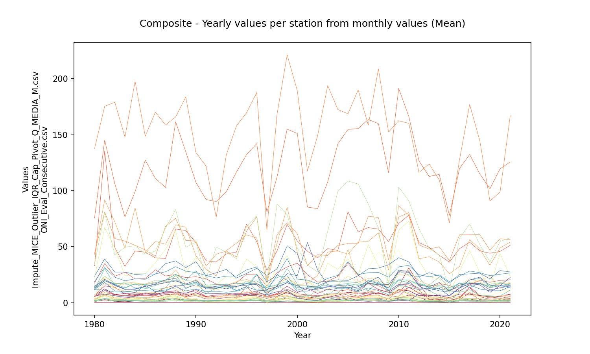
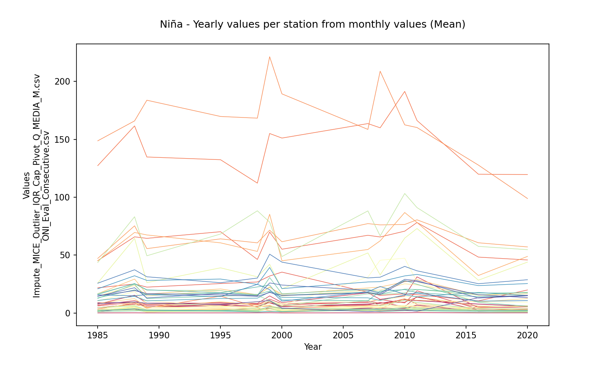
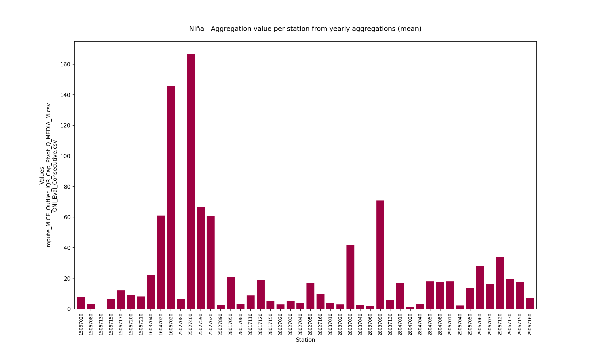
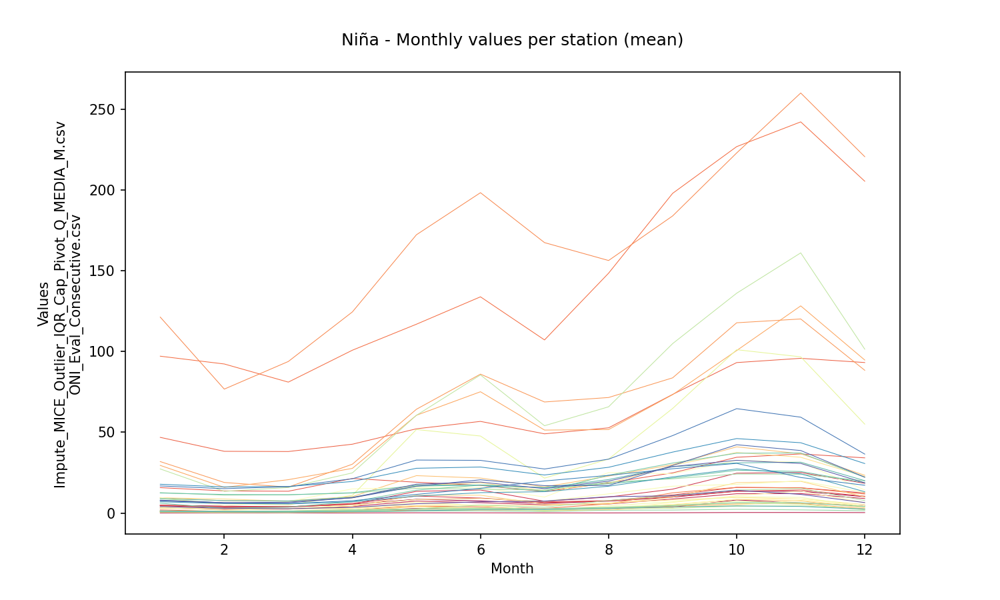
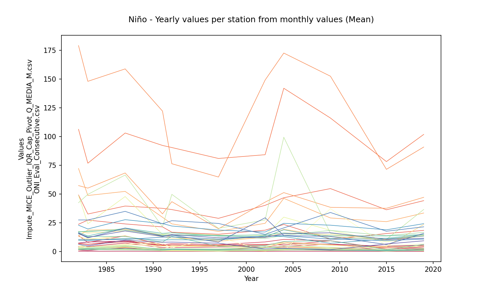
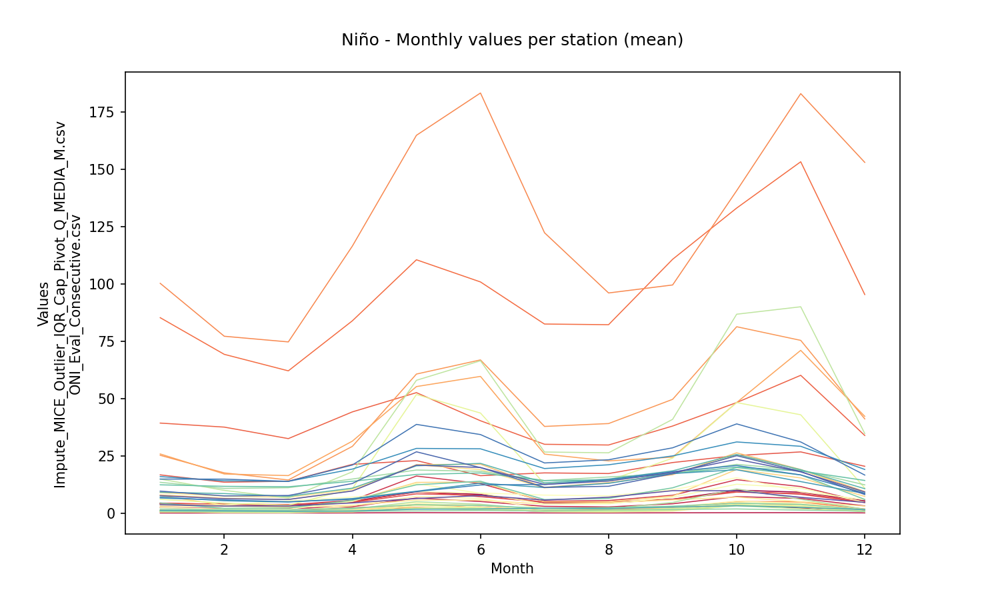
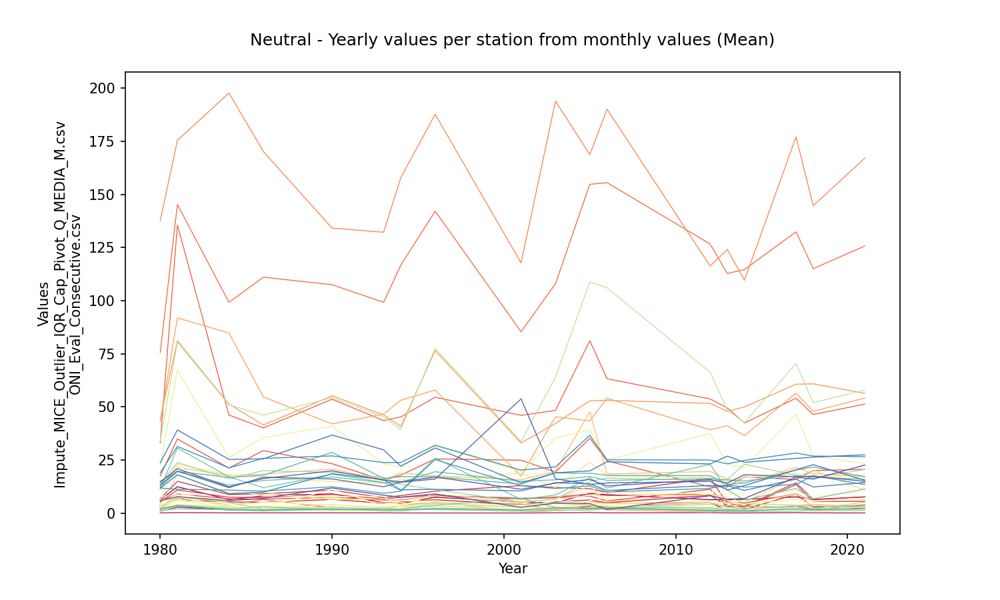
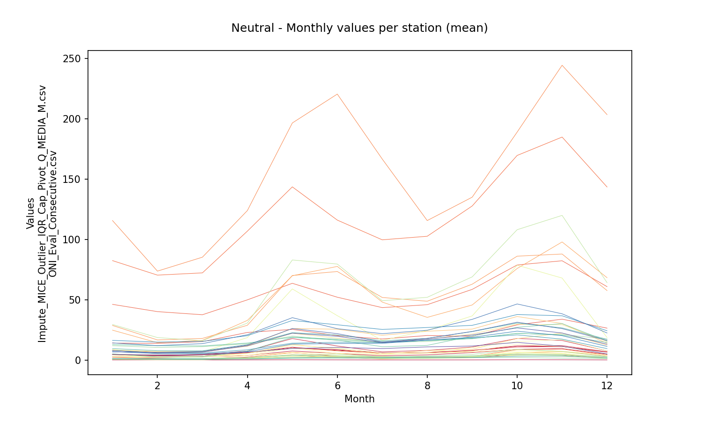
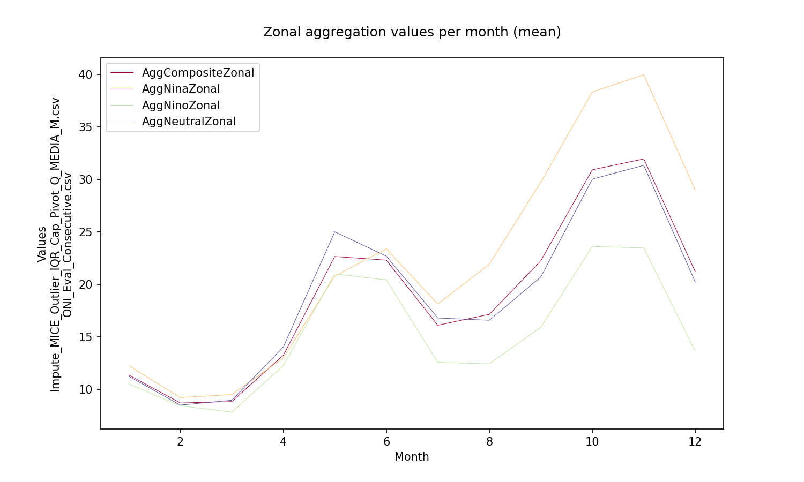

# Statistical aggregations for hydro-climatological composite series and yearly events Niño, Niña and Neutral

For further information about the NOAA - Oceanic Niño Index (ONI) classifier for climatological yearly events Niño, Niña and Neutral, check this activitie https://github.com/rcfdtools/R.LTWB/tree/main/Section03/ENSOONI

* Station records file: [Impute_MICE_Outlier_IQR_Cap_Pivot_Q_MEDIA_M.csv](../IDEAM_Impute/Impute_MICE_Outlier_IQR_Cap_Pivot_Q_MEDIA_M.csv)
* ENSO-ONI year file: [ONI_Eval_Consecutive.csv](../ENSOONI/ONI_Eval_Consecutive.csv)
* Records in station file: 504
* Daily serie: False
* Aggregation function: Mean
* Execution date: 2022-11-23 18:02:19.241963
* Python version: 3.10.5 (tags/v3.10.5:f377153, Jun  6 2022, 16:14:13) [MSC v.1929 64 bit (AMD64)]
* Python path: ['D:\\R.LTWB\\.src', 'D:\\R.LTWB', 'D:\\R.TeachingResearchGuide', 'D:\\R.HydroTools', 'D:\\R.GISPython.wiki']
* matplotlib version: 3.6.0
* pandas version: 1.4.3
* Instructions & script: https://github.com/rcfdtools/R.LTWB/tree/main/Section03/AGG
* License: https://github.com/rcfdtools/R.LTWB/blob/main/LICENSE.md
* Credits: r.cfdtools@gmail.com

## Composite - Yearly values per station from monthly values (Mean)

|   Year |   15067020 |   15067080 |   15067130 |   15067150 |   15067170 |   15067200 |   15067210 |   16037040 |   16047020 |   16067020 |   25027080 |   25027400 |   25027590 |   25027620 |   25027890 |   28017050 |   28017080 |   28017110 |   28017120 |   28017150 |   28027020 |   28027030 |   28027040 |   28027050 |   28027160 |   28037010 |   28037020 |   28037030 |   28037040 |   28037060 |   28037090 |   28037130 |   28047010 |   28047020 |   28047040 |   28047050 |   28047080 |   29067010 |   29067040 |   29067050 |   29067060 |   29067070 |   29067120 |   29067130 |   29067150 |   29067160 |
|-------:|-----------:|-----------:|-----------:|-----------:|-----------:|-----------:|-----------:|-----------:|-----------:|-----------:|-----------:|-----------:|-----------:|-----------:|-----------:|-----------:|-----------:|-----------:|-----------:|-----------:|-----------:|-----------:|-----------:|-----------:|-----------:|-----------:|-----------:|-----------:|-----------:|-----------:|-----------:|-----------:|-----------:|-----------:|-----------:|-----------:|-----------:|-----------:|-----------:|-----------:|-----------:|-----------:|-----------:|-----------:|-----------:|-----------:|
|   1980 |    6.12033 |   0.939272 |  0.0561316 |   3.45201  |    6.88016 |    5.22222 |    5.46552 |    17.4253 |    33.015  |    75.5942 |   2.71175  |   137.666  |    43.9467 |    43.0602 |   2.32767  |    13.886  |   1.12217  |    4.07275 |    11.0992 |    3.78209 |   1.6965   |   1.575    |   1.45492  |    3.32717 |    6.04967 |   1.52367  |   2.661    |   22.5053  |   1.34508  |   1.19708  |    33.9854 |    2.11692 |   13.6287  |   1.19642  |    2.02742 |   11.627   |    15.0986 |    12.4301 |   1.86233  |   11.7922  |    18.9948 |   11.6939  |    23.59   |   13.2798  |    14.5187 |    5.7938  |
|   1981 |   12.3922  |   2.74417  |  0.218617  |   6.29489  |   14.9334  |   10.8749  |    9.04535 |    34.8978 |   135.636  |   145.292  |   6.99792  |   175.492  |    81.0675 |    91.8742 |   9.34925  |    21.5765 |   3.2468   |   17.9973  |    23.0031 |    6.00219 |   3.704    |   7.45935  |   5.58807  |    9.57975 |   22.1213  |   6.54391  |   8.04179  |   67.3036  |   3.8945   |   3.25958  |    80.4671 |    7.69475 |   23.7925  |   1.89975  |    3.80592 |   30.5948  |    19.5288 |    19.5918 |   3.42917  |   11.2078  |    31.375  |   18.0551  |    39.155  |   19.7529  |    20.8726 |    7.67606 |
|   1982 |    7.19867 |   1.17667  |  0.142501  |   4.17915  |   13.7603  |    6.90689 |    7.05554 |    23.5983 |    49.0783 |   106.228  |   2.69133  |   179.075  |    57.2542 |    72.13   |   4.42292  |    13.3381 |   1.23008  |   12.998   |    17.3674 |    4.6293  |   2.24633  |   4.50317  |   2.13425  |    3.25125 |   10.3268  |   3.07867  |   3.20192  |   48.6604  |   2.67608  |   1.801    |    42.3663 |    6.21417 |   17.3933  |   1.50783  |    3.01108 |   15.1394  |    17.0525 |    16.5343 |   1.83342  |    9.50967 |    22.7717 |   10.4328  |    27.3377 |   15.5451  |    16.0439 |    6.15467 |
|   1983 |    8.203   |   0.845833 |  0.0884823 |   4.21547  |    7.81509 |    6.07654 |    6.24643 |    27.2434 |    32.515  |    76.7183 |   1.499    |   147.96   |    55.0667 |    48.631  |   2.47283  |    18.5913 |   1.82158  |   10.3737  |    15.9318 |    3.81668 |   2.04035  |   2.49975  |   1.79817  |    3.34939 |   11.3643  |   1.413    |   1.56558  |   24.0422  |   2.18592  |   1.73575  |    49.6091 |    3.50308 |   16.9228  |   1.54983  |    2.65333 |   12.9396  |    17.625  |    13.4568 |   2.101    |    9.42558 |    19.5325 |   10.1815  |    27.3383 |   11.7702  |    12.2023 |    4.95583 |
|   1984 |    6.33417 |   1.49482  |  0.0752565 |   5.24655  |    8.71871 |    7.45736 |    6.70814 |    21.1738 |    46.145  |    99.2475 |   3.67417  |   197.783  |    51.3    |    84.7783 |   4.9518   |    17.5582 |   2.14342  |    9.38683 |    17.9196 |    4.39207 |   1.6555   |   3.02633  |   3.79942  |    4.3645  |   10.995   |   2.15353  |   2.79042  |   26.0486  |   3.08258  |   2.3903   |    50.92   |    4.93733 |   16.1433  |   1.51883  |    2.06233 |   17.0057  |    13.1317 |    16.7806 |   1.54992  |   10.814   |    21.2692 |    9.07167 |    25.2485 |   11.9763  |    12.3545 |    5.83392 |
|   1985 |    8.81942 |   1.40192  |  0.0630626 |   4.59235  |    7.62974 |    6.75454 |    6.13599 |    21.7492 |    45.2433 |   127.318  |   3.46792  |   148.748  |    47.1542 |    45.0649 |   2.82733  |    16.6475 |   2.255    |    8.29783 |    14.555  |    4.62071 |   2.18062  |   2.57442  |   1.84767  |    2.94875 |   10.3444  |   1.28792  |   1.65208  |   25.9429  |   2.06917  |   2.01658  |    43.5848 |    4.635   |   16.7675  |   0.915833 |    2.57317 |   12.5954  |    13.0672 |    16.0145 |   1.67042  |   10.7933  |    20.8933 |   15.6554  |    25.7267 |   14.4299  |    14.6285 |    8.09667 |
|   1986 |    8.08217 |   1.32167  |  0.0961228 |   5.02478  |    9.07836 |    7.31553 |    6.53404 |    29.3792 |    40.0858 |   111.061  |   6.35433  |   170.229  |    41.4419 |    54.6817 |   2.19317  |    18.3253 |   2.3815   |    9.75833 |    16.8298 |    4.81899 |   2.23867  |   5.11308  |   3.26883  |    2.71408 |    8.225   |   2.10525  |   1.63803  |   35.5843  |   0.915    |   1.15675  |    46.1033 |    1.70342 |   19.9817  |   0.94375  |    3.01092 |   11.9333  |    15.3442 |    17.7877 |   1.45125  |   10.3019  |    25.7367 |    9.86008 |    25.5281 |   16.911   |    16.2442 |    6.91492 |
|   1987 |    8.89025 |   3.10741  |  0.173253  |   7.24729  |   13.5222  |    9.6486  |    8.32426 |    23.8926 |    39.4492 |   102.987  |   4.54167  |   158.776  |    68.2212 |    52.1932 |   3.34558  |    19.0665 |   4.80835  |   13.6083  |    17.775  |    6.12549 |   3.80292  |   5.21167  |   5.25566  |    6.45225 |   11.1308  |   4.76675  |   2.09508  |   47.7185  |   2.2845   |   1.71984  |    66.4417 |    5.32008 |   19.8739  |   1.24667  |    4.16917 |   12.9778  |    18.5764 |    20.3364 |   2.415    |   11.2917  |    27.5892 |   10.316   |    34.8202 |   20.2167  |    17.7475 |    9.69842 |
|   1988 |    9.07325 |   3.41516  |  0.1175    |   7.66024  |   15.3659  |   10.7386  |    9.34451 |    25.0679 |    65.7983 |   161.63   |   8.67375  |   165.97   |    75.3108 |    69.5665 |   3.24883  |    29.3025 |   5.15543  |   12.4558  |    23.7728 |    7.07705 |   4.09533  |   9.50036  |   5.78608  |    6.86558 |   18.4462  |   4.95966  |   5.56536  |   64.5062  |   4.01508  |   2.45967  |    83.1457 |    6.22942 |   25.1565  |   1.71108  |    2.66917 |   24.8531  |    19.9894 |    25.4717 |   3.6265   |   14.3657  |    32.1575 |   14.8664  |    37.3316 |   21.8106  |    19.3883 |    9.56233 |
|   1989 |    5.38233 |   1.88359  |  0.0716667 |   5.02246  |    8.52483 |    7.26442 |    6.54315 |    22.3533 |    64.4867 |   134.777  |   4.27167  |   183.833  |    55.6033 |    67.4267 |   0.773333 |    16.3408 |   1.70833  |    4.73917 |    14.7007 |    5.13081 |   2.37817  |   3.49508  |   2.67183  |   10.9639  |    8.18092 |   0.981083 |   2.0457   |   26.2474  |   1.63533  |   0.89825  |    49.4439 |    2.792   |   19.7375  |   2.04583  |    2.28967 |   12.4451  |    15.8583 |    20.05   |   2.38767  |   10.5054  |    28.1392 |   15.8538  |    31.2833 |   12.9965  |    16.7683 |    8.375   |
|   1990 |    9.05517 |   2.8738   |  0.0945833 |   6.39163  |   10.7936  |    8.76107 |    7.40365 |    23.2213 |    53.5928 |   107.521  |   2.44475  |   134.179  |    55.1946 |    42.0008 |   2.418    |    20.7395 |   4.01788  |    6.28    |    14.7888 |    7.40199 |   2.61767  |   3.80058  |   2.3745   |   11.1453  |    7.80658 |   1.03758  |   2.52325  |   40.8152  |   2.2965   |   1.27708  |    54.2719 |    2.9445  |   19.1702  |   1.82324  |    1.53642 |   18.3047  |    16.9953 |    28.597  |   1.91658  |   12.3727  |    26.9017 |   18.4722  |    36.7122 |   16.0597  |    19.8832 |   11.8133  |
|   1991 |    5.35158 |   1.08069  |  0.06075   |   3.30135  |    5.68272 |    5.35037 |    4.85766 |    21.3006 |    37.4658 |    92.1758 |   1.80249  |   122.074  |    32.6367 |    29.6875 |   1.64458  |    14.188  |   0.966667 |    4.87508 |    12.7374 |    4.5156  |   0.818667 |   1.42542  |   0.997    |    7.17575 |    2.26992 |   0.436917 |   1.06841  |   14.7668  |   0.726333 |   0.580083 |    21.3863 |    1.43008 |   14.4632  |   0.891083 |    2.272   |    8.09042 |    13.8345 |    15.6721 |   1.59074  |    9.80862 |    24.2292 |   12.3806  |    24.01   |   13.2316  |    12.9893 |    7.94458 |
|   1992 |    4.9685  |   1.26146  |  0.0594167 |   3.36486  |    6.79101 |    4.86665 |    5.88328 |    16.6917 |    36.3725 |    90.3617 |   1.42475  |    76.2675 |    43.2672 |    23.9492 |   2.11835  |    12.5874 |   2.0155   |    4.528   |    11.2903 |    4.91026 |   0.909498 |   1.21294  |   1.52583  |    3.03617 |    4.36678 |   0.514769 |   1.41867  |   16.2247  |   0.878    |   1.17333  |    49.6253 |    2.3195  |   14.6192  |   1.6044   |    2.033   |   13.0883  |    13.9152 |    16.188  |   1.77958  |   10.1553  |    22.0783 |   12.5891  |    26.7125 |   14.1037  |    14.6177 |    8.07517 |
|   1993 |    4.89433 |   1.55787  |  0.09375   |   4.59332  |    7.21938 |    6.61758 |    6.12884 |    15.4837 |    43.555  |    99.2175 |   2.48617  |   132.217  |    46.1966 |    46.5667 |   2.79883  |    15.6682 |   2.49897  |    6.673   |    14.0838 |    4.74678 |   1.57864  |   3.07625  |   2.67042  |    3.32058 |    7.8965  |   1.08325  |   1.59458  |   23.3085  |   0.684333 |   1.24292  |    45.2467 |    1.61625 |   16.8207  |   1.52533  |    2.292   |   14.4335  |    14.3215 |    16.2772 |   1.43575  |    9.3035  |    23.7683 |   15.7353  |    29.7508 |   12.3557  |    15.4371 |    8.41775 |
|   1994 |    4.49083 |   1.69175  |  0.0344167 |   5.27359  |    8.22234 |    7.42654 |    6.23301 |    17.8538 |    45.2517 |   116.708  |   3.675    |   157.958  |    40.7833 |    53.1117 |   2.8325   |    18.7667 |   2.73833  |    6.0125  |    15.7018 |    4.6635  |   1.35933  |   3.61167  |   2.75583  |    5.61534 |    2.97    |   1.21338  |   1.74583  |   21.4917  |   0.389167 |   0.6425   |    39.3278 |    1.84167 |   13.4642  |   1.67329  |    1.85917 |   10.5725  |    14.4589 |    17.1151 |   1.41442  |   10.2877  |    23.8164 |   10.919   |    22.075  |   14.4793  |    14.7492 |    7.47923 |
|   1995 |    7.02783 |   2.53942  |  0.0839167 |   6.40186  |    8.50973 |    8.92151 |    7.41195 |    25.4274 |    70.2207 |   132.423  |  14.593    |   169.797  |    64.0447 |    60.5983 |   3.18083  |    20.7802 |   3.81125  |    9.8635  |    19.2503 |    4.8892  |   2.68359  |   5.72677  |   4.11292  |    5.25983 |    6.24921 |   2.43042  |   2.68029  |   39.0238  |   1.29083  |   1.705    |    68.2223 |    2.02608 |   19.3573  |   1.55533  |    2.20833 |   14.6513  |    17.2268 |    17.4851 |   1.917    |   12.5179  |    29.305  |   14.2227  |    26.1494 |   16.9809  |    15.6442 |    7.43724 |
|   1996 |    7.44563 |   2.20759  |  0.0263333 |   6.23938  |   10.2891  |    8.37556 |    8.02478 |    25.5017 |    54.5307 |   142.102  |   4.85008  |   187.765  |    76.5078 |    57.9015 |   5.227    |    17.5933 |   3.34858  |    8.05125 |    16.0554 |    4.82251 |   2.43696  |   4.18958  |   3.12508  |    5.71008 |    9.2115  |   1.95603  |   2.1895   |   31.6604  |   3.35417  |   2.51217  |    77.6164 |    4.50812 |   11.0064  |   1.59565  |    3.62917 |   25.8284  |    19.4813 |    17.0797 |   2.04842  |   25.1458  |    31.9383 |   11.1632  |    30.6625 |   16.0078  |    16.936  |    8.9995  |
|   1997 |    4.9135  |   1.81137  |  0.03      |   3.80458  |    5.82705 |    5.59066 |    4.89983 |    14.8989 |    28.7638 |    80.8417 |   1.343    |    64.705  |    19.6481 |    17.3495 |   1.61742  |     8.7995 |   2.20681  |    5.40475 |    10.201  |    4.26335 |   0.385422 |   2.12483  |   1.42192  |   12.3113  |    4.15023 |   0.183695 |   0.249205 |   14.1687  |   0.555833 |   0.3125   |    20.0713 |    2.22852 |   14.0606  |   0.933917 |    1.44829 |    4.46367 |    13.6457 |    13.3261 |   1.51592  |    9.809   |    18.57   |   10.6954  |    24.3058 |    8.09433 |    11.8398 |    7.13717 |
|   1998 |    5.63275 |   3.18225  |  0.124     |   5.89408  |    8.19485 |    7.1869  |    7.77094 |    26.7962 |    46.2567 |   112.204  |   5.10003  |   168.335  |    60.6043 |    53.1965 |   4.32617  |    15.704  |   2.99133  |    6.83708 |    15.5189 |    5.89569 |   1.57317  |   4.73767  |   2.87363  |    9.58142 |    3.49517 |   1.30415  |   2.59638  |   31.2722  |   1.96058  |   1.20793  |    88.2985 |    4.39392 |   15.1092  |   0.8775   |    2.21775 |   15.1923  |    16.0378 |    22.5352 |   0.944667 |   12.8238  |    24.6993 |   24.7875  |    30.1816 |   14.9153  |    14.3835 |    9.76142 |
|   1999 |    9.35917 |   4.22909  |  0.231083  |   8.74198  |   14.7477  |   11.9876  |    9.4082  |    31.9425 |    69.9339 |   155.066  |   6.18692  |   221.406  |    71.5408 |    85.3058 |   1.89667  |    22.1697 |   5.16575  |   10.2862  |    22.7064 |    6.76994 |   3.36233  |   7.13983  |   3.71983  |   10.9183  |    9.15517 |   5.48215  |   5.26442  |   42.0532  |   3.5185   |   4.08222  |    78.5294 |   10.5169  |   10.7828  |   1.28442  |    5.58872 |   30.6088  |    18.9527 |    24.0833 |   1.41567  |   18.1832  |    39.3293 |   20.1693  |    50.8202 |   25.9704  |    17.7253 |   10.8384  |
|   2000 |    5.42733 |   1.30158  |  0.0485833 |   5.53357  |    9.01646 |    8.0138  |    6.76536 |    35.3034 |    55.0927 |   151.13   |   3.9335   |   189.315  |    61.5538 |    45.13   |   0.799426 |    16.2378 |   2.38267  |    6.18472 |    14.7115 |    3.17928 |   2.01106  |   0.951083 |   2.32812  |    6.72075 |    8.16783 |   1.92565  |   3.24675  |   20.8465  |   1.103    |   1.49408  |    48.7532 |    3.42428 |    5.857   |   1.38492  |    3.79985 |   16.6194  |    15.3686 |    11.3032 |   1.07042  |   13.5237  |    21.0772 |   10.27    |    43.9392 |   24.1497  |    15.11   |    4.19767 |
|   2001 |    5.13708 |   0.806417 |  0.0175381 |   3.93157  |   12.9244  |    6.97772 |    6.552   |    24.8808 |    45.9911 |    85.3755 |   4.21867  |   117.759  |    32.9872 |    17.3686 |   0.559048 |    15.6413 |   1.709    |    4.76996 |    18.6696 |    3.7325  |   0.534983 |   2.97613  |   1.15458  |    2.99875 |    5.22717 |   1.30383  |   1.68058  |   19.6345  |   1.22708  |   1.03042  |    33.788  |    2.72342 |    5.21693 |   0.898602 |    6.93288 |    6.44017 |    14.9712 |    13.6179 |   1.46817  |   12.8693  |    20.2201 |   10.4175  |    14.1954 |   53.7744  |    11.2092 |    2.68283 |
|   2002 |    3.811   |   0.411917 |  0.0293603 |   3.75865  |    8.21878 |    6.20325 |    5.52633 |    18.4531 |    40.0815 |    84.1213 |   3.33117  |   149.08   |    42.8446 |    24.4462 |   0.238868 |    12.2258 |   1.34325  |    3.25617 |    12.5098 |    3.25653 |   1.38242  |   4.02995  |   1.38625  |    0.5635  |    4.94958 |   0.94725  |   0.727667 |   13.861   |   1.22283  |   0.888583 |    27.366  |    3.14667 |   11.0841  |   0.654796 |    4.02166 |    5.02975 |    14.5013 |    12.7166 |   2.01642  |   13.5468  |    16.847  |   13.4246  |    14.8017 |   29.2704  |    12.0821 |    2.06208 |
|   2003 |    4.822   |   1.49373  |  0.127934  |   5.25672  |   12.019   |    7.18641 |    7.52013 |    19.3191 |    48.3218 |   107.964  |   1.39367  |   193.964  |    42.1744 |    45.3309 |   1.01954  |    19.6909 |   2.36384  |    6.92263 |    11.958  |    4.86127 |   2.755    |   5.6917   |   3.51     |    0.911   |    6.40011 |   3.31753  |   2.58433  |   35.2619  |   2.4925   |   1.902    |    64.0491 |    4.63417 |    6.5502  |   1.25017  |    2.63162 |    8.49458 |    15.6493 |    18.8765 |   2.40071  |   11.5783  |    21.7386 |   14.2985  |    18.9554 |   16.14    |    14.0651 |    4.66873 |
|   2004 |    6.71967 |   1.527    |  0.133667  |   4.36077  |   10.4176  |    5.49026 |    8.04626 |    23.4341 |    46.6858 |   141.938  |   3.65429  |   172.558  |    51.1354 |    46.1513 |   1.57519  |    19.2204 |   1.70225  |    7.76483 |    16.1468 |    4.61797 |   1.93265  |   7.03025  |   2.68425  |    0.88575 |    7.79508 |   2.6225   |   1.0115   |   29.8033  |   1.46117  |   2.06575  |    99.3275 |    4.63415 |   13.964   |   1.2098   |    2.53458 |    8.60972 |    16.0333 |    18.802  |   2.84093  |   12.8629  |    24.4112 |   13.7217  |    20.4423 |   13.7785  |    15.3547 |    2.52035 |
|   2005 |    9.309   |   3.14438  |  0.211333  |   6.18258  |   11.4531  |    8.00495 |    8.98727 |    35.2517 |    81.1533 |   154.774  |   5.36717  |   168.753  |    52.8536 |    43.38   |   1.98992  |    47.6639 |   3.49963  |   12.6758  |    23.9459 |    5.10272 |   1.63544  |   5.06962  |   3.73083  |    5.92142 |    8.331   |   4.13758  |   0.716083 |   39.1778  |   2.39858  |   2.61327  |   108.701  |    3.71135 |   14.8925  |   1.4395   |    1.97143 |   16.6163  |    17.1973 |    18.7222 |   2.13861  |   12.8663  |    36.602  |   13.7721  |    19.8528 |   13.4978  |    15.8056 |    4.44041 |
|   2006 |    8.68208 |   3.11887  |  0.07575   |   4.81948  |    9.59466 |    5.68627 |    8.2228  |    24.5602 |    63.2323 |   155.576  |   4.59458  |   190.191  |    53.0547 |    54.0249 |   1.48833  |    18.3933 |   1.57617  |    5.37983 |    17.5109 |    4.39194 |   2.80262  |   3.60208  |   3.24242  |    7.43105 |    9.8395  |   3.58742  |   2.09014  |   24.9854  |   1.99033  |   2.23     |   106.082  |    2.08457 |   16.4767  |   2.13236  |    2.79567 |   11.7328  |    15.3717 |    17.7469 |   2.35517  |    9.91108 |    25.0595 |   10.6391  |    24.1318 |   14.1696  |    12.7587 |    1.652   |
|   2007 |    7.78208 |   4.22571  |  0.131417  |   7.02234  |   17.449   |    9.20902 |    9.59801 |    17.8467 |    67.1333 |   163.641  |   6.46492  |   158.614  |    77.2165 |    54.8462 |   2.65583  |    21.6393 |   3.10455  |    5.54383 |    19.5655 |    3.4628  |   1.93229  |   5.00403  |   6.135    |   31.0007  |   11.0096  |   5.29225  |   2.11392  |   51.8885  |   2.76292  |   2.22575  |    88.205  |   10.7808  |   16.4525  |   2.05275  |    3.37503 |   20.4378  |    17.9663 |    10.5619 |   3.40083  |   13.073   |    26.8017 |   18.3432  |    30.2899 |   19.6298  |    17.4072 |    1.17542 |
|   2008 |    8.31939 |   4.13734  |  0.18425   |   9.06927  |   11.8095  |   11.5503  |    8.49289 |    15.1707 |    65.675  |   160.006  |   6.83525  |   208.898  |    76.1275 |    62.3301 |   2.18342  |    22.4272 |   1.73533  |    4.01883 |    19.8538 |    4.96034 |   3.54241  |   4.50697  |   5.32033  |   45.5827  |   10.8342  |   6.302    |   1.92003  |   32.9053  |   2.35317  |   1.65004  |    66.585  |    6.27208 |   16.0208  |   1.07208  |    2.79654 |   17.8567  |    16.2509 |    18.9638 |   3.44808  |   10.9099  |    27.0689 |   22.8805  |    30.9346 |   17.006   |    15.9341 |    1.67992 |
|   2009 |    6.26211 |   2.43254  |  0.0886667 |   6.27701  |    9.35692 |    9.18696 |    5.97572 |    10.5423 |    54.63   |   116.025  |   2.93675  |   152.419  |    38.3357 |    29.0742 |   0.753417 |    12.8386 |   1.79567  |    5.23775 |    14.7026 |    2.98402 |   1.55768  |   2.69966  |   2.52208  |   37.1275  |    5.6855  |   1.30493  |   1.72467  |   18.2722  |   1.55542  |   1.16142  |    15.6933 |    3.63233 |   18.2442  |   0.933583 |    2.2217  |    9.24674 |    13.5916 |    11.3628 |   1.02727  |    7.05025 |    22.7899 |   10.6529  |    33.8333 |   13.0363  |    16.2145 |    1.45233 |
|   2010 |   11.6037  |   4.05241  |  0.233063  |   5.45475  |   14.7823  |    8.73701 |    9.40382 |    16.517  |    70.6921 |   191.447  |  12.3413   |   162.54   |    76.4712 |    86.789  |   2.77975  |    26.923  |   3.46775  |   12.0951  |    25.2067 |    5.59616 |   4.8799   |   6.20383  |   5.31168  |   47.3058  |   14.0771  |   6.48425  |   5.14058  |   64.7171  |   3.37069  |   3.50974  |   103.247  |   10.9636  |   17.4479  |   1.80348  |    4.66037 |   28.0869  |    20.5775 |    20.2074 |   3.02017  |   15.6749  |    32.0364 |   16.1813  |    40.2587 |   29.0608  |    27.6137 |    2.32675 |
|   2011 |   10.6951  |   6.7537   |  0.347313  |  14.2091   |   31.1963  |   19.1541  |   13.6139  |    15.8441 |    78.1639 |   166.311  |   7.66504  |   160.237  |    80.506  |    78.1894 |   1.40967  |    28.858  |   5.24725  |   11.0584  |    24.3045 |    5.47061 |   4.16117  |   5.76732  |   7.49958  |   26.8689  |   14.448   |   9.08982  |   3.59409  |   72.9909  |   3.51283  |   2.92758  |    91.0646 |    9.09029 |   20.4017  |   1.9164   |    4.30538 |   24.8356  |    20.3033 |    17.6475 |   2.48875  |   13.9726  |    33.3287 |   17.2057  |    36.4392 |   27.925   |    27.1283 |    1.54658 |
|   2012 |    6.27836 |   4.79826  |  0.191728  |   8.38386  |   16.439   |   11.1519  |    8.99041 |    12.3488 |    53.7204 |   126.694  |   4.83283  |   116.288  |    51.6143 |    39.2167 |   0.48248  |    19.5667 |   2.25092  |    8.94803 |    16.6325 |    5.67211 |   1.1628   |   2.98208  |   2.3722   |   10.0565  |    9.072   |   4.71883  |   2.36311  |   37.4192  |   1.51458  |   1.76742  |    66.2648 |    4.12406 |   15.3319  |   0.986917 |    2.4263  |   22.9394  |    16.1949 |    17.5924 |   1.24842  |   11.5981  |    24.977  |   12.9799  |    23.1075 |   14.8649  |    15.7196 |    8.12374 |
|   2013 |    6.27438 |   1.34775  |  0.0289167 |   3.332    |    4.67108 |    3.54842 |    5.41101 |    12.2823 |    49.4841 |   112.772  |   2.82542  |   124.084  |    47.9287 |    41.0917 |   1.65374  |    15.9763 |   0.921583 |    7.34169 |    14.6774 |    4.67074 |   1.54293  |   1.69033  |   2.38313  |    8.84933 |    5.87227 |   4.6231   |   2.13161  |   23.1434  |   1.09992  |   1.82283  |    48.4824 |    3.42218 |   15.8584  |   0.683083 |    1.66499 |   10.8893  |    15.5425 |    13.5168 |   1.13708  |   13.2869  |    23.1591 |   12.8275  |    26.79   |   10.8045  |    14.09   |    6.47164 |
|   2014 |    6.41979 |   0.617416 |  0.0346667 |   1.75165  |    3.19792 |    2.78392 |    4.73807 |    17.0553 |    42.4087 |   114.644  |   3.29656  |   109.649  |    49.9699 |    36.4678 |   1.08936  |    14.067  |   0.862917 |    4.94858 |    16.7553 |    4.32657 |   1.53963  |   1.32617  |   2.34146  |    8.36428 |    4.11042 |   1.22052  |   1.42014  |   21.2561  |   0.86075  |   1.08428  |    42.6138 |    4.32556 |   22.9414  |   0.5915   |    2.14548 |    6.1321  |    15.1712 |    14.1452 |   1.08917  |   12.2141  |    24.8005 |   10.6718  |    23.8824 |   12.9315  |    18.0329 |    6.88412 |
|   2015 |    4.43004 |   0.364677 |  0.012969  |   0.708094 |    1.7375  |    2.21308 |    3.1729  |    15.5208 |    36.1945 |    78.1274 |   1.04729  |    71.3825 |    37.4956 |    25.8598 |   0.668589 |    10.0237 |   1.1095   |    4.27117 |    10.3926 |    3.86422 |   0.448146 |   0.62225  |   0.639451 |    5.08371 |    2.07453 |   0.514851 |   0.162085 |    8.33509 |   0.436667 |   0.764114 |    10.4702 |    1.3343  |   13.7219  |   0.451667 |    1.04541 |    1.50108 |    13.4243 |    11.4413 |   0.659083 |   10.78    |    18.775  |    9.45592 |    17.546  |    5.95558 |    10.4602 |    6.45272 |
|   2016 |    7.69587 |   1.42626  |  0.0946316 |   2.6458   |    4.51782 |    3.54912 |    5.69691 |    10.4462 |    48.2858 |   119.892  |   2.58999  |   127.785  |    60.66   |    32.3984 |   4.32508  |    15.3729 |   1.9956   |    9.5448  |    15.2959 |    4.96847 |   2.59428  |   3.9896   |   2.52862  |    9.53323 |    6.20397 |   1.54147  |   1.55343  |   28.3374  |   2.13825  |   1.63966  |    57.5553 |    3.64904 |   15.6198  |   0.594317 |    2.40551 |    9.17949 |    17.2165 |    14.0533 |   1.6525   |   17.7337  |    23.6422 |   10.21    |    25.2952 |   12.9308  |    15.7945 |   13.1927  |
|   2017 |    7.60834 |   3.26177  |  0.192258  |   8.80501  |   14.2395  |   13.3475  |    8.98777 |    15.8197 |    54.0643 |   132.411  |   2.59249  |   177.128  |    60.6608 |    56.4223 |   3.60796  |    21.4184 |   3.46235  |   16.8453  |    18.3815 |    6.43841 |   2.1335   |   7.03035  |   1.84755  |    9.70255 |    8.7826  |   2.72124  |   2.19187  |   46.6339  |   2.48769  |   2.42968  |    70.4497 |    3.73143 |   17.9123  |   0.947299 |    3.22394 |   11.5575  |    17.4951 |    20.2534 |   1.86007  |   13.4841  |    28.2544 |   15.9395  |    25.7293 |   20.3423  |    17.1194 |   16.9117  |
|   2018 |    6.27056 |   1.72753  |  0.0736729 |   2.7732   |    6.49039 |    5.38513 |    5.77254 |    20.0053 |    46.378  |   115.066  |   1.42831  |   144.72   |    60.8259 |    47.8978 |   4.04602  |    18.5176 |   2.14494  |   20.1597  |    16.6483 |    5.91232 |   1.02718  |   3.63104  |   0.913179 |    7.95899 |    5.50836 |   1.44915  |   1.30974  |   26.8525  |   0.871257 |   1.37335  |    51.9436 |    2.01517 |   16.5772  |   1.10364  |    3.2829  |    6.72575 |    16.8442 |    21.6423 |   1.65077  |   17.6052  |    26.8301 |   12.2694  |    26.3223 |   22.7808  |    17.4007 |   15.9613  |
|   2019 |    5.38605 |   1.33921  |  0.0327437 |   1.85166  |    4.09985 |    2.98026 |    4.66047 |    18.2617 |    44.1416 |   101.777  |   0.884071 |    90.7923 |    47.0418 |    33.3879 |   1.5992   |    13.2855 |   0.460349 |   23.4139  |    14.376  |    4.8175  |   1.34234  |   2.71242  |   1.02574  |    6.47902 |    4.81318 |   1.14208  |   0.955996 |   13.8004  |   1.14268  |   0.84538  |    36.4835 |    2.22638 |   16.5117  |   0.732747 |    2.46354 |    6.12902 |    14.6512 |    14.608  |   1.40016  |   13.4151  |    24.1137 |   10.6737  |    21.3678 |   15.6526  |    11.4333 |    9.20953 |
|   2020 |    5.71313 |   1.80171  |  0.111892  |   2.13387  |    5.13972 |    3.81316 |    5.43996 |    19.8908 |    45.814  |   119.595  |   2.96047  |    98.8779 |    57.0806 |    48.8975 |   2.07804  |    17.8804 |   1.93069  |   12.5254  |    16.5835 |    6.44437 |   1.09438  |   3.67873  |   1.47484  |    9.28063 |    5.17956 |   2.26473  |   1.10603  |   43.9652  |   1.27185  |   1.10163  |    54.7126 |    3.41733 |   17.9472  |   0.785252 |    2.44775 |    5.84756 |    17.3917 |    15.1384 |   1.89852  |   15.1473  |    25.4123 |   10.6841  |    28.7248 |   14.8617  |    13.2535 |   15.1906  |
|   2021 |    7.64336 |   2.24346  |  0.0442941 |   3.65475  |    7.51523 |    5.47154 |    6.30054 |    20.5402 |    51.2885 |   125.747  |   3.95481  |   167.106  |    56.3915 |    54.1551 |   2.93428  |    17.183  |   1.87414  |   10.782   |    17.9823 |    6.19428 |   2.94579  |   2.38095  |   1.84892  |   10.1713  |    6.55445 |   1.50856  |   1.96763  |   23.2696  |   3.39577  |   1.80271  |    57.95   |    5.10322 |   20.5243  |   1.16616  |    2.83475 |   11.2971  |    15.923  |    17.054  |   2.05406  |   13.403   |    26.5385 |   14.3768  |    27.4275 |   15.3932  |    14.9174 |   22.5894  |

Composite - Aggregation value per station from yearly aggregations (mean)

|              |   15067020 |   15067080 |   15067130 |   15067150 |   15067170 |   15067200 |   15067210 |   16037040 |   16047020 |   16067020 |   25027080 |   25027400 |   25027590 |   25027620 |   25027890 |   28017050 |   28017080 |   28017110 |   28017120 |   28017150 |   28027020 |   28027030 |   28027040 |   28027050 |   28027160 |   28037010 |   28037020 |   28037030 |   28037040 |   28037060 |   28037090 |   28037130 |   28047010 |   28047020 |   28047040 |   28047050 |   28047080 |   29067010 |   29067040 |   29067050 |   29067060 |   29067070 |   29067120 |   29067130 |   29067150 |   29067160 |
|:-------------|-----------:|-----------:|-----------:|-----------:|-----------:|-----------:|-----------:|-----------:|-----------:|-----------:|-----------:|-----------:|-----------:|-----------:|-----------:|-----------:|-----------:|-----------:|-----------:|-----------:|-----------:|-----------:|-----------:|-----------:|-----------:|-----------:|-----------:|-----------:|-----------:|-----------:|-----------:|-----------:|-----------:|-----------:|-----------:|-----------:|-----------:|-----------:|-----------:|-----------:|-----------:|-----------:|-----------:|-----------:|-----------:|-----------:|
| AggComposite |    7.04585 |    2.21665 |   0.104464 |    5.21089 |    9.97124 |     7.4521 |    7.07857 |     21.076 |    53.0007 |    121.298 |    4.23663 |    151.247 |    54.8029 |     50.046 |    2.47405 |    18.4924 |    2.44224 |    8.95685 |    16.7167 |    4.95713 |    2.11243 |    3.94239 |    2.89005 |    10.1592 |     8.0879 |    2.67798 |    2.24523 |    32.3977 |    1.91494 |    1.70715 |    58.0584 |    4.22424 |     16.043 |    1.26407 |    2.84153 |     13.894 |    16.2328 |    17.0663 |    1.91978 |    12.5458 |    25.4185 |     13.548 |    27.9287 |    17.3534 |    15.8066 |    7.43709 |

Composite - Monthly values per station (mean)

|   Month |   15067020 |   15067080 |   15067130 |   15067150 |   15067170 |   15067200 |   15067210 |   16037040 |   16047020 |   16067020 |   25027080 |   25027400 |   25027590 |   25027620 |   25027890 |   28017050 |   28017080 |   28017110 |   28017120 |   28017150 |   28027020 |   28027030 |   28027040 |   28027050 |   28027160 |   28037010 |   28037020 |   28037030 |   28037040 |   28037060 |   28037090 |   28037130 |   28047010 |   28047020 |   28047040 |   28047050 |   28047080 |   29067010 |   29067040 |   29067050 |   29067060 |   29067070 |   29067120 |   29067130 |   29067150 |   29067160 |
|--------:|-----------:|-----------:|-----------:|-----------:|-----------:|-----------:|-----------:|-----------:|-----------:|-----------:|-----------:|-----------:|-----------:|-----------:|-----------:|-----------:|-----------:|-----------:|-----------:|-----------:|-----------:|-----------:|-----------:|-----------:|-----------:|-----------:|-----------:|-----------:|-----------:|-----------:|-----------:|-----------:|-----------:|-----------:|-----------:|-----------:|-----------:|-----------:|-----------:|-----------:|-----------:|-----------:|-----------:|-----------:|-----------:|-----------:|
|       1 |    4.40861 |   0.949628 |  0.0353961 |    2.75675 |    4.30373 |    4.54453 |    4.55598 |    15.2305 |    44.5373 |    87.671  |   1.82102  |   113.329  |    28.7198 |    26.472  |   0.738589 |    8.5444  |   0.724185 |    5.05498 |    8.8113  |    3.00486 |   0.629754 |   0.94061  |   0.897373 |    5.29468 |    2.80499 |   0.791597 |   0.792822 |    8.02883 |   0.435951 |   0.654788 |    24.9352 |   0.992696 |    12.4937 |   0.926028 |    1.39273 |    5.19916 |    12.5204 |    9.19241 |   1.09839  |    7.34225 |    16.6345 |    7.16669 |    15.1377 |    7.69924 |    7.78435 |    4.15422 |
|       2 |    3.66668 |   0.640768 |  0.0198684 |    2.11109 |    3.6643  |    3.86335 |    3.96579 |    13.6532 |    38.8172 |    76.8324 |   1.13794  |    75.5039 |    17.5615 |    15.5039 |   0.495958 |    6.84854 |   0.536635 |    2.94356 |    7.6509  |    2.79676 |   0.323021 |   0.659876 |   0.509507 |    3.47739 |    1.89838 |   0.492911 |   0.442992 |    5.44362 |   0.239054 |   0.48896  |    14.7049 |   0.771007 |    10.7011 |   0.807675 |    1.17138 |    2.56563 |    11.6936 |    7.91453 |   0.816033 |    5.80958 |    15.0474 |    5.70507 |    13.6511 |    6.58482 |    6.06143 |    3.42441 |
|       3 |    3.45646 |   0.662049 |  0.0162228 |    2.43926 |    4.02525 |    4.13292 |    4.04747 |    14.328  |    36.3535 |    72.2701 |   0.963524 |    85.1024 |    16.4089 |    17.6421 |   0.655495 |    6.65348 |   0.535467 |    2.63255 |    7.11324 |    2.6462  |   0.460353 |   0.87751  |   0.588269 |    5.06795 |    2.23329 |   0.502277 |   0.351676 |    5.3492  |   0.219712 |   0.467802 |    13.4435 |   0.864249 |    11.1134 |   0.811869 |    1.21061 |    2.82767 |    11.4922 |    7.4846  |   0.668598 |    5.50388 |    15.3012 |    5.31691 |    14.4731 |    7.02714 |    6.43932 |    3.4665  |
|       4 |    5.69045 |   1.20171  |  0.0765846 |    3.58836 |    6.34586 |    5.66967 |    5.17257 |    21.9643 |    46.1006 |    98.9215 |   2.24663  |   122.107  |    29.3039 |    30.8298 |   1.46894  |   10.7836  |   1.25938  |    5.05266 |   10.4872  |    3.50907 |   1.3917   |   3.28914  |   1.87163  |    8.81048 |    5.20101 |   0.886128 |   0.944779 |   14.1327  |   0.753499 |   1.13513  |    25.5084 |   1.91735  |    13.4697 |   0.848178 |    1.95824 |    6.79312 |    13.5283 |   11.3033  |   0.870555 |    7.43209 |    19.6921 |    6.91927 |    21.0242 |   11.6067  |   10.4672  |    5.03225 |
|       5 |    9.34901 |   3.31268  |  0.172798  |    7.18972 |   15.9981  |   10.2508  |    8.98669 |    22.763  |    57.1342 |   126.61   |   4.79183  |   180.666  |    65.7714 |    63.1033 |   2.85743  |   23.8754  |   4.06195  |   12.4246  |   20.2739  |    5.62105 |   4.14072  |   8.25105  |   5.4651   |   11.5737  |   11.0744  |   3.37758  |   2.48913  |   54.7817  |   2.19561  |   1.95746  |    69.4187 |   3.86139  |    18.1295 |   1.16876  |    3.36991 |   15.6195  |    17.8381 |   20.2548  |   1.67688  |   11.7002  |    29.9883 |   11.671   |    35.308  |   23.3045  |   20.5325  |    7.50852 |
|       6 |    8.06189 |   2.15412  |  0.119757  |    5.62136 |   12.7403  |    7.98388 |    8.30264 |    18.2208 |    50.394  |   117.519  |   3.25813  |   203.824  |    75.5328 |    72.0887 |   2.3465   |   23.2034  |   2.35646  |   10.9081  |   18.481   |    5.38252 |   2.78901  |   5.38019  |   3.73332  |   10.27    |    9.35582 |   2.98911  |   2.58121  |   41.923   |   2.45583  |   1.95345  |    77.9347 |   4.62789  |    16.3047 |   1.32288  |    3.20339 |   16.0564  |    17.3352 |   19.9387  |   2.00751  |   13.6284  |    28.6552 |   13.7707  |    30.1692 |   20.9135  |   19.5612  |    8.59944 |
|       7 |    5.57984 |   1.25057  |  0.0578965 |    3.83254 |    6.49704 |    5.81671 |    5.73686 |    16.1446 |    41.6265 |    97.4424 |   1.96696  |   155.206  |    53.3769 |    43.187  |   1.83236  |   16.7149  |   1.01157  |    5.05932 |   13.5139  |    4.3846  |   1.04371  |   2.10261  |   1.40559  |    7.20249 |    5.72504 |   2.13639  |   1.37386  |   16.9499  |   1.40025  |   1.29106  |    44.7503 |   2.54291  |    14.3589 |   1.14199  |    2.45259 |   10.4373  |    15.0621 |   15.1138  |   1.98847  |   13.1502  |    23.2244 |   15.3216  |    23.5019 |   14.5333  |   14.0779  |    7.82777 |
|       8 |    6.07094 |   2.00783  |  0.0581804 |    4.22321 |    7.90191 |    6.23673 |    6.23514 |    18.9817 |    43.7408 |   111.419  |   3.18534  |   123.05   |    53.2235 |    37.0813 |   2.43163  |   20.7639  |   1.60078  |    6.37797 |   16.5056  |    5.40619 |   1.22383  |   2.08097  |   1.96704  |   12.077   |    7.41842 |   2.34063  |   1.81431  |   24.5485  |   1.8717   |   1.79395  |    49.4962 |   4.30553  |    16.5979 |   1.52677  |    2.85453 |   14.089   |    16.3096 |   17.9838  |   2.30894  |   15.5801  |    25.813  |   18.0628  |    26.9713 |   16.0023  |   17.1641  |    9.58748 |
|       9 |    7.92979 |   2.469    |  0.111141  |    6.38879 |   11.2109  |    8.47219 |    7.99285 |    21.8743 |    57.7393 |   144.947  |   5.66409  |   140.812  |    65.8108 |    48.6032 |   3.14775  |   24.6252  |   3.46807  |    8.77072 |   22.8675  |    6.83195 |   2.03561  |   4.04049  |   3.51602  |   13.2859  |   11.3633  |   3.80054  |   3.26391  |   41.9575  |   3.2676   |   2.29727  |    72.681  |   6.53295  |    18.6847 |   1.80207  |    3.69467 |   20.969   |    18.7752 |   23.7837  |   2.78692  |   19.2543  |    30.5063 |   21.2746  |    36.717  |   23.749   |   22.4183  |   10.8227  |
|      10 |   11.7376  |   5.43366  |  0.227751  |    9.3647  |   19.0981  |   12.4222  |   11.1639  |    29.7296 |    75.2018 |   177.699  |   9.9411   |   186.775  |    94.6146 |    76.2538 |   5.33782  |   35.0105  |   6.46946  |   18.4058  |   30.9242  |    8.58566 |   4.23159  |   7.92987  |   6.22401  |   19.7454  |   15.2971  |   6.81453  |   5.70539  |   77.5804  |   4.85234  |   3.59643  |   111.108  |  10.9426   |    22.4322 |   2.02411  |    5.1939  |   28.2765  |    22.9267 |   29.4113  |   3.57719  |   22.3066  |    38.5322 |   25.1867  |    50.079  |   33.0522  |   27.6373  |   13.1749  |
|      11 |   11.2976  |   4.2567   |  0.227178  |    9.43535 |   17.7059  |   12.096   |   11.4142  |    32.7999 |    80.6208 |   194.267  |   9.96669  |   233.096  |    94.5472 |   100.203  |   5.81008  |   29.2906  |   5.51766  |   19.6266  |   28.1817  |    7.07703 |   5.03807  |   8.15187  |   6.05611  |   16.9857  |   16.2564  |   5.88318  |   5.08532  |   70.2522  |   4.0303   |   3.15932  |   124.775  |   9.32271  |    21.4307 |   1.58908  |    4.84039 |   28.7817  |    21.6023 |   26.0914  |   3.33448  |   18.5035  |    36.792  |   19.782   |    42.8907 |   27.8474  |   23.7779  |   10.2674  |
|      12 |    7.30127 |   2.26113  |  0.130795  |    5.57957 |   10.1635  |    7.93611 |    7.36872 |    27.2225 |    63.7424 |   149.976  |   5.89626  |   195.494  |    62.763  |    69.5829 |   2.56607  |   15.5949  |   1.76526  |   10.2254  |   15.7894  |    4.23964 |   2.04185  |   3.60447  |   2.44664  |    8.12015 |    8.42662 |   2.12091  |   2.09732  |   27.8243  |   1.2574   |   1.69017  |    67.9439 |   4.00965  |    16.7996 |   1.19946  |    2.75602 |   15.1135  |    15.7101 |   16.3238  |   1.9034   |   10.3381  |    24.8359 |   12.3988  |    25.2215 |   15.9211  |   13.7582  |    5.3796  |

Composite - Zonal monthly values (mean)

|   Month |   AggCompositeZonal |
|--------:|--------------------:|
|       1 |            11.3512  |
|       2 |             8.68738 |
|       3 |             8.81842 |
|       4 |            13.2297  |
|       5 |            22.6494  |
|       6 |            22.3035  |
|       7 |            16.0947  |
|       8 |            17.1368  |
|       9 |            22.2395  |
|      10 |            30.9181  |
|      11 |            31.9558  |
|      12 |            21.1922  |

## ENSO-ONI Events - Yearly values per station from monthly values (Mean)

* Records in ENSO-ONI file: 73
* ENSO-ONI eventMark unique values: [-1  1  0]

### Niña events analysis (24 years identified)

|   Id |   YR |   NinaCount |   NinoCount |   NeutralCount | Event   |   EventMark |   EventLabel |
|-----:|-----:|------------:|------------:|---------------:|:--------|------------:|-------------:|
|    0 | 1950 |           7 |           0 |              5 | Niña    |          -1 |            7 |
|    4 | 1954 |           8 |           1 |              3 | Niña    |          -1 |            8 |
|    5 | 1955 |          12 |           0 |              0 | Niña    |          -1 |           12 |
|    6 | 1956 |           8 |           0 |              4 | Niña    |          -1 |            8 |
|   14 | 1964 |           8 |           2 |              2 | Niña    |          -1 |            8 |
|   20 | 1970 |           6 |           1 |              5 | Niña    |          -1 |            6 |
|   21 | 1971 |          12 |           0 |              0 | Niña    |          -1 |           12 |
|   23 | 1973 |           8 |           3 |              1 | Niña    |          -1 |            8 |
|   24 | 1974 |           7 |           0 |              5 | Niña    |          -1 |            7 |
|   25 | 1975 |          12 |           0 |              0 | Niña    |          -1 |           12 |
|   35 | 1985 |           6 |           0 |              6 | Niña    |          -1 |            6 |
|   38 | 1988 |           8 |           2 |              2 | Niña    |          -1 |            8 |
|   39 | 1989 |           5 |           0 |              7 | Niña    |          -1 |            5 |
|   45 | 1995 |           5 |           3 |              4 | Niña    |          -1 |            5 |
|   48 | 1998 |           6 |           4 |              2 | Niña    |          -1 |            6 |
|   49 | 1999 |          12 |           0 |              0 | Niña    |          -1 |           12 |
|   50 | 2000 |          12 |           0 |              0 | Niña    |          -1 |           12 |
|   57 | 2007 |           6 |           1 |              5 | Niña    |          -1 |            6 |
|   58 | 2008 |           6 |           0 |              6 | Niña    |          -1 |            6 |
|   60 | 2010 |           7 |           3 |              2 | Niña    |          -1 |            7 |
|   61 | 2011 |           5 |           0 |              7 | Niña    |          -1 |            5 |
|   66 | 2016 |           5 |           4 |              3 | Niña    |          -1 |            5 |
|   70 | 2020 |           5 |           1 |              6 | Niña    |          -1 |            5 |
|   72 | 2022 |           8 |           0 |              4 | Niña    |          -1 |            8 |

Niña - Table aggregations (Mean)

|   Year |   15067020 |   15067080 |   15067130 |   15067150 |   15067170 |   15067200 |   15067210 |   16037040 |   16047020 |   16067020 |   25027080 |   25027400 |   25027590 |   25027620 |   25027890 |   28017050 |   28017080 |   28017110 |   28017120 |   28017150 |   28027020 |   28027030 |   28027040 |   28027050 |   28027160 |   28037010 |   28037020 |   28037030 |   28037040 |   28037060 |   28037090 |   28037130 |   28047010 |   28047020 |   28047040 |   28047050 |   28047080 |   29067010 |   29067040 |   29067050 |   29067060 |   29067070 |   29067120 |   29067130 |   29067150 |   29067160 |
|-------:|-----------:|-----------:|-----------:|-----------:|-----------:|-----------:|-----------:|-----------:|-----------:|-----------:|-----------:|-----------:|-----------:|-----------:|-----------:|-----------:|-----------:|-----------:|-----------:|-----------:|-----------:|-----------:|-----------:|-----------:|-----------:|-----------:|-----------:|-----------:|-----------:|-----------:|-----------:|-----------:|-----------:|-----------:|-----------:|-----------:|-----------:|-----------:|-----------:|-----------:|-----------:|-----------:|-----------:|-----------:|-----------:|-----------:|
|   1985 |    8.81942 |    1.40192 |  0.0630626 |    4.59235 |    7.62974 |    6.75454 |    6.13599 |    21.7492 |    45.2433 |    127.318 |    3.46792 |   148.748  |    47.1542 |    45.0649 |   2.82733  |    16.6475 |    2.255   |    8.29783 |    14.555  |    4.62071 |    2.18062 |   2.57442  |    1.84767 |    2.94875 |   10.3444  |   1.28792  |    1.65208 |    25.9429 |    2.06917 |    2.01658 |    43.5848 |    4.635   |    16.7675 |   0.915833 |    2.57317 |   12.5954  |    13.0672 |    16.0145 |   1.67042  |    10.7933 |    20.8933 |    15.6554 |    25.7267 |    14.4299 |    14.6285 |    8.09667 |
|   1988 |    9.07325 |    3.41516 |  0.1175    |    7.66024 |   15.3659  |   10.7386  |    9.34451 |    25.0679 |    65.7983 |    161.63  |    8.67375 |   165.97   |    75.3108 |    69.5665 |   3.24883  |    29.3025 |    5.15543 |   12.4558  |    23.7728 |    7.07705 |    4.09533 |   9.50036  |    5.78608 |    6.86558 |   18.4462  |   4.95966  |    5.56536 |    64.5062 |    4.01508 |    2.45967 |    83.1457 |    6.22942 |    25.1565 |   1.71108  |    2.66917 |   24.8531  |    19.9894 |    25.4717 |   3.6265   |    14.3657 |    32.1575 |    14.8664 |    37.3316 |    21.8106 |    19.3883 |    9.56233 |
|   1989 |    5.38233 |    1.88359 |  0.0716667 |    5.02246 |    8.52483 |    7.26442 |    6.54315 |    22.3533 |    64.4867 |    134.777 |    4.27167 |   183.833  |    55.6033 |    67.4267 |   0.773333 |    16.3408 |    1.70833 |    4.73917 |    14.7007 |    5.13081 |    2.37817 |   3.49508  |    2.67183 |   10.9639  |    8.18092 |   0.981083 |    2.0457  |    26.2474 |    1.63533 |    0.89825 |    49.4439 |    2.792   |    19.7375 |   2.04583  |    2.28967 |   12.4451  |    15.8583 |    20.05   |   2.38767  |    10.5054 |    28.1392 |    15.8538 |    31.2833 |    12.9965 |    16.7683 |    8.375   |
|   1995 |    7.02783 |    2.53942 |  0.0839167 |    6.40186 |    8.50973 |    8.92151 |    7.41195 |    25.4274 |    70.2207 |    132.423 |   14.593   |   169.797  |    64.0447 |    60.5983 |   3.18083  |    20.7802 |    3.81125 |    9.8635  |    19.2503 |    4.8892  |    2.68359 |   5.72677  |    4.11292 |    5.25983 |    6.24921 |   2.43042  |    2.68029 |    39.0238 |    1.29083 |    1.705   |    68.2223 |    2.02608 |    19.3573 |   1.55533  |    2.20833 |   14.6513  |    17.2268 |    17.4851 |   1.917    |    12.5179 |    29.305  |    14.2227 |    26.1494 |    16.9809 |    15.6442 |    7.43724 |
|   1998 |    5.63275 |    3.18225 |  0.124     |    5.89408 |    8.19485 |    7.1869  |    7.77094 |    26.7962 |    46.2567 |    112.204 |    5.10003 |   168.335  |    60.6043 |    53.1965 |   4.32617  |    15.704  |    2.99133 |    6.83708 |    15.5189 |    5.89569 |    1.57317 |   4.73767  |    2.87363 |    9.58142 |    3.49517 |   1.30415  |    2.59638 |    31.2722 |    1.96058 |    1.20793 |    88.2985 |    4.39392 |    15.1092 |   0.8775   |    2.21775 |   15.1923  |    16.0378 |    22.5352 |   0.944667 |    12.8238 |    24.6993 |    24.7875 |    30.1816 |    14.9153 |    14.3835 |    9.76142 |
|   1999 |    9.35917 |    4.22909 |  0.231083  |    8.74198 |   14.7477  |   11.9876  |    9.4082  |    31.9425 |    69.9339 |    155.066 |    6.18692 |   221.406  |    71.5408 |    85.3058 |   1.89667  |    22.1697 |    5.16575 |   10.2862  |    22.7064 |    6.76994 |    3.36233 |   7.13983  |    3.71983 |   10.9183  |    9.15517 |   5.48215  |    5.26442 |    42.0532 |    3.5185  |    4.08222 |    78.5294 |   10.5169  |    10.7828 |   1.28442  |    5.58872 |   30.6088  |    18.9527 |    24.0833 |   1.41567  |    18.1832 |    39.3293 |    20.1693 |    50.8202 |    25.9704 |    17.7253 |   10.8384  |
|   2000 |    5.42733 |    1.30158 |  0.0485833 |    5.53357 |    9.01646 |    8.0138  |    6.76536 |    35.3034 |    55.0927 |    151.13  |    3.9335  |   189.315  |    61.5538 |    45.13   |   0.799426 |    16.2378 |    2.38267 |    6.18472 |    14.7115 |    3.17928 |    2.01106 |   0.951083 |    2.32812 |    6.72075 |    8.16783 |   1.92565  |    3.24675 |    20.8465 |    1.103   |    1.49408 |    48.7532 |    3.42428 |     5.857  |   1.38492  |    3.79985 |   16.6194  |    15.3686 |    11.3032 |   1.07042  |    13.5237 |    21.0772 |    10.27   |    43.9392 |    24.1497 |    15.11   |    4.19767 |
|   2007 |    7.78208 |    4.22571 |  0.131417  |    7.02234 |   17.449   |    9.20902 |    9.59801 |    17.8467 |    67.1333 |    163.641 |    6.46492 |   158.614  |    77.2165 |    54.8462 |   2.65583  |    21.6393 |    3.10455 |    5.54383 |    19.5655 |    3.4628  |    1.93229 |   5.00403  |    6.135   |   31.0007  |   11.0096  |   5.29225  |    2.11392 |    51.8885 |    2.76292 |    2.22575 |    88.205  |   10.7808  |    16.4525 |   2.05275  |    3.37503 |   20.4378  |    17.9663 |    10.5619 |   3.40083  |    13.073  |    26.8017 |    18.3432 |    30.2899 |    19.6298 |    17.4072 |    1.17542 |
|   2008 |    8.31939 |    4.13734 |  0.18425   |    9.06927 |   11.8095  |   11.5503  |    8.49289 |    15.1707 |    65.675  |    160.006 |    6.83525 |   208.898  |    76.1275 |    62.3301 |   2.18342  |    22.4272 |    1.73533 |    4.01883 |    19.8538 |    4.96034 |    3.54241 |   4.50697  |    5.32033 |   45.5827  |   10.8342  |   6.302    |    1.92003 |    32.9053 |    2.35317 |    1.65004 |    66.585  |    6.27208 |    16.0208 |   1.07208  |    2.79654 |   17.8567  |    16.2509 |    18.9638 |   3.44808  |    10.9099 |    27.0689 |    22.8805 |    30.9346 |    17.006  |    15.9341 |    1.67992 |
|   2010 |   11.6037  |    4.05241 |  0.233063  |    5.45475 |   14.7823  |    8.73701 |    9.40382 |    16.517  |    70.6921 |    191.447 |   12.3413  |   162.54   |    76.4712 |    86.789  |   2.77975  |    26.923  |    3.46775 |   12.0951  |    25.2067 |    5.59616 |    4.8799  |   6.20383  |    5.31168 |   47.3058  |   14.0771  |   6.48425  |    5.14058 |    64.7171 |    3.37069 |    3.50974 |   103.247  |   10.9636  |    17.4479 |   1.80348  |    4.66037 |   28.0869  |    20.5775 |    20.2074 |   3.02017  |    15.6749 |    32.0364 |    16.1813 |    40.2587 |    29.0608 |    27.6137 |    2.32675 |
|   2011 |   10.6951  |    6.7537  |  0.347313  |   14.2091  |   31.1963  |   19.1541  |   13.6139  |    15.8441 |    78.1639 |    166.311 |    7.66504 |   160.237  |    80.506  |    78.1894 |   1.40967  |    28.858  |    5.24725 |   11.0584  |    24.3045 |    5.47061 |    4.16117 |   5.76732  |    7.49958 |   26.8689  |   14.448   |   9.08982  |    3.59409 |    72.9909 |    3.51283 |    2.92758 |    91.0646 |    9.09029 |    20.4017 |   1.9164   |    4.30538 |   24.8356  |    20.3033 |    17.6475 |   2.48875  |    13.9726 |    33.3287 |    17.2057 |    36.4392 |    27.925  |    27.1283 |    1.54658 |
|   2016 |    7.69587 |    1.42626 |  0.0946316 |    2.6458  |    4.51782 |    3.54912 |    5.69691 |    10.4462 |    48.2858 |    119.892 |    2.58999 |   127.785  |    60.66   |    32.3984 |   4.32508  |    15.3729 |    1.9956  |    9.5448  |    15.2959 |    4.96847 |    2.59428 |   3.9896   |    2.52862 |    9.53323 |    6.20397 |   1.54147  |    1.55343 |    28.3374 |    2.13825 |    1.63966 |    57.5553 |    3.64904 |    15.6198 |   0.594317 |    2.40551 |    9.17949 |    17.2165 |    14.0533 |   1.6525   |    17.7337 |    23.6422 |    10.21   |    25.2952 |    12.9308 |    15.7945 |   13.1927  |
|   2020 |    5.71313 |    1.80171 |  0.111892  |    2.13387 |    5.13972 |    3.81316 |    5.43996 |    19.8908 |    45.814  |    119.595 |    2.96047 |    98.8779 |    57.0806 |    48.8975 |   2.07804  |    17.8804 |    1.93069 |   12.5254  |    16.5835 |    6.44437 |    1.09438 |   3.67873  |    1.47484 |    9.28063 |    5.17956 |   2.26473  |    1.10603 |    43.9652 |    1.27185 |    1.10163 |    54.7126 |    3.41733 |    17.9472 |   0.785252 |    2.44775 |    5.84756 |    17.3917 |    15.1384 |   1.89852  |    15.1473 |    25.4123 |    10.6841 |    28.7248 |    14.8617 |    13.2535 |   15.1906  |

Niña - Aggregation value per station from yearly aggregations (mean)

|         |   15067020 |   15067080 |   15067130 |   15067150 |   15067170 |   15067200 |   15067210 |   16037040 |   16047020 |   16067020 |   25027080 |   25027400 |   25027590 |   25027620 |   25027890 |   28017050 |   28017080 |   28017110 |   28017120 |   28017150 |   28027020 |   28027030 |   28027040 |   28027050 |   28027160 |   28037010 |   28037020 |   28037030 |   28037040 |   28037060 |   28037090 |   28037130 |   28047010 |   28047020 |   28047040 |   28047050 |   28047080 |   29067010 |   29067040 |   29067050 |   29067060 |   29067070 |   29067120 |   29067130 |   29067150 |   29067160 |
|:--------|-----------:|-----------:|-----------:|-----------:|-----------:|-----------:|-----------:|-----------:|-----------:|-----------:|-----------:|-----------:|-----------:|-----------:|-----------:|-----------:|-----------:|-----------:|-----------:|-----------:|-----------:|-----------:|-----------:|-----------:|-----------:|-----------:|-----------:|-----------:|-----------:|-----------:|-----------:|-----------:|-----------:|-----------:|-----------:|-----------:|-----------:|-----------:|-----------:|-----------:|-----------:|-----------:|-----------:|-----------:|-----------:|-----------:|
| AggNina |    7.88703 |    3.10386 |   0.141721 |     6.4909 |     12.068 |    8.99077 |    8.12504 |    21.8735 |    60.9843 |    145.803 |    6.54491 |    166.489 |    66.4518 |    60.7492 |     2.4988 |     20.791 |    3.15007 |    8.72698 |     18.925 |    5.26657 |    2.80682 |    4.86736 |    3.97001 |    17.1408 |    9.67626 |    3.79581 |    2.95993 |    41.8997 |    2.38479 |    2.07063 |    70.8729 |    6.01468 |     16.666 |    1.38455 |    3.17979 |    17.9392 |    17.4005 |    17.9627 |    2.22625 |    13.7865 |    27.9916 |    16.2562 |    33.6442 |     19.436 |    17.7523 |    7.18313 |

Niña - Monthly values per station (mean)

|   Month |   15067020 |   15067080 |   15067130 |   15067150 |   15067170 |   15067200 |   15067210 |   16037040 |   16047020 |   16067020 |   25027080 |   25027400 |   25027590 |   25027620 |   25027890 |   28017050 |   28017080 |   28017110 |   28017120 |   28017150 |   28027020 |   28027030 |   28027040 |   28027050 |   28027160 |   28037010 |   28037020 |   28037030 |   28037040 |   28037060 |   28037090 |   28037130 |   28047010 |   28047020 |   28047040 |   28047050 |   28047080 |   29067010 |   29067040 |   29067050 |   29067060 |   29067070 |   29067120 |   29067130 |   29067150 |   29067160 |
|--------:|-----------:|-----------:|-----------:|-----------:|-----------:|-----------:|-----------:|-----------:|-----------:|-----------:|-----------:|-----------:|-----------:|-----------:|-----------:|-----------:|-----------:|-----------:|-----------:|-----------:|-----------:|-----------:|-----------:|-----------:|-----------:|-----------:|-----------:|-----------:|-----------:|-----------:|-----------:|-----------:|-----------:|-----------:|-----------:|-----------:|-----------:|-----------:|-----------:|-----------:|-----------:|-----------:|-----------:|-----------:|-----------:|-----------:|
|       1 |    4.82203 |   1.30485  |  0.0398155 |    3.15882 |    4.52452 |    4.85451 |    4.70936 |    15.7243 |    46.8411 |    97.0849 |    1.94057 |   121.293  |    31.8534 |    29.4836 |   0.550585 |    9.45831 |   0.756482 |    3.93049 |    9.42876 |    2.8639  |   0.744901 |   0.885106 |   1.25491  |    9.66255 |    3.43945 |   0.890663 |   0.929619 |    8.95554 |   0.428308 |   0.595732 |    27.2832 |   0.984291 |    12.6239 |   1.03404  |    1.32782 |    6.06975 |    12.3967 |    8.93654 |   1.15161  |    6.93357 |    17.8158 |    7.96804 |    16.7761 |    7.55255 |    7.83028 |    4.0244  |
|       2 |    4.25185 |   0.715329 |  0.0183793 |    2.21233 |    3.36406 |    3.86037 |    3.86454 |    13.6982 |    38.1977 |    92.2598 |    1.02952 |    76.7055 |    18.915  |    15.8812 |   0.453097 |    7.62254 |   0.56992  |    2.66071 |    8.71347 |    2.6776  |   0.464307 |   0.535899 |   0.618477 |    4.68658 |    1.75896 |   0.590098 |   0.595134 |    5.98293 |   0.249923 |   0.479879 |    13.4134 |   1.02017  |    11.0621 |   0.875655 |    1.03919 |    3.02453 |    11.4864 |    7.71119 |   0.781598 |    5.88571 |    16.1838 |    6.38916 |    15.0998 |    6.16999 |    6.36272 |    2.957   |
|       3 |    3.95131 |   0.712684 |  0.0153828 |    2.37694 |    3.61363 |    3.82796 |    4.00241 |    13.4927 |    38.0686 |    81.034  |    1.17329 |    93.8051 |    16.0531 |    20.6462 |   0.414705 |    7.47595 |   0.626492 |    2.7134  |    7.32403 |    2.52468 |   0.82275  |   1.12338  |   0.773632 |    7.14575 |    2.56255 |   0.34504  |   0.548972 |    5.06557 |   0.259947 |   0.501489 |    15.7767 |   1.31482  |    11.2914 |   0.971479 |    1.0767  |    3.69792 |    11.3096 |    7.48238 |   0.66875  |    5.6727  |    16.4161 |    5.78495 |    16.3098 |    6.37032 |    6.70735 |    2.71752 |
|       4 |    5.43341 |   1.33725  |  0.0693042 |    4.08532 |    5.50528 |    5.9706  |    5.13768 |    21.385  |    42.5994 |   100.783  |    1.93988 |   124.484  |    30.2308 |    27.6335 |   1.29972  |   10.1513  |   1.12933  |    4.20164 |    9.34959 |    2.98304 |   1.6625   |   2.73954  |   1.92175  |   14.9687  |    5.03481 |   0.903937 |   1.26106  |   10.9469  |   0.538604 |   0.962606 |    24.8421 |   2.05149  |    12.3756 |   0.959026 |    1.70491 |    6.95639 |    12.5532 |    9.77723 |   0.881625 |    6.96072 |    19.5179 |    7.61775 |    21.2279 |    9.44252 |    9.46892 |    3.49743 |
|       5 |    8.4804  |   2.84605  |  0.15673   |    7.40272 |   13.431   |   10.5085  |    8.33704 |    19.071  |    52.1434 |   116.875  |    4.32947 |   172.241  |    64.232  |    60.5121 |   1.79779  |   23.1387  |   4.10148  |   10.924   |   17.1394  |    4.64347 |   3.79457  |   6.77555  |   5.84864  |   15.9189  |    8.31822 |   2.58861  |   2.44716  |   51.6798  |   1.35935  |   1.19285  |    60.5003 |   2.56887  |    15.2951 |   1.27228  |    2.29211 |   14.1701  |    17.1876 |   16.6743  |   1.43557  |   10.4904  |    27.6926 |   11.5263  |    32.7966 |   16.5643  |   17.8639  |    5.7549  |
|       6 |    7.47879 |   2.91793  |  0.132475  |    6.38966 |   14.2495  |    9.25508 |    9.13469 |    17.0998 |    56.7211 |   133.83   |    3.84317 |   198.289  |    85.9798 |    75.0649 |   1.89199  |   21.6553  |   2.86466  |   11.0356  |   18.6639  |    4.93158 |   2.70413  |   4.57721  |   4.46616  |   15.7949  |    8.91354 |   3.21418  |   2.71287  |   47.669   |   2.35696  |   2.13606  |    85.485  |   4.9134   |    14.7756 |   1.3551   |    3.01066 |   17.2611  |    17.3474 |   17.3842  |   2.14764  |   12.6065  |    28.4788 |   15.3095  |    32.6011 |   20.5782  |   19.1788  |    6.9061  |
|       7 |    5.97198 |   1.91697  |  0.0847035 |    5.08014 |    7.30087 |    6.85285 |    6.51655 |    13.2574 |    49.0279 |   107.147  |    2.83117 |   167.383  |    68.738  |    51.3459 |   1.92221  |   16.1725  |   1.40041  |    5.4122  |   13.9343  |    4.60983 |   1.3379   |   2.11236  |   1.99581  |    9.88461 |    7.28575 |   1.86711  |   1.52015  |   21.6071  |   1.64534  |   1.74664  |    54.0373 |   3.60109  |    14.2273 |   0.898836 |    2.75332 |   13.4966  |    15.7395 |   15.6755  |   2.12174  |   13.2133  |    23.5529 |   19.8439  |    27.2481 |   16.9394  |   15.0962  |    7.39765 |
|       8 |    7.36023 |   2.9807   |  0.0771062 |    5.56263 |    9.90352 |    7.69183 |    7.48517 |    18.65   |    52.7445 |   148.451  |    5.68221 |   156.312  |    71.5024 |    51.6675 |   3.33835  |   22.8724  |   2.03261  |    5.63529 |   18.3511  |    6.22833 |   1.86654  |   2.47272  |   3.68706  |   25.053   |   11.8519  |   4.4528   |   3.05744  |   33.3969  |   3.35405  |   3.19837  |    65.7515 |   7.76676  |    19.1021 |   1.75008  |    3.4772  |   23.3676  |    18.1178 |   20.7167  |   2.81854  |   16.5847  |    28.3093 |   23.3026  |    33.3486 |   17.0156  |   19.7629  |   10.1218  |
|       9 |    9.83357 |   3.60912  |  0.181806  |    8.67959 |   14.7782  |   11.2154  |   10.1363  |    24.8626 |    73.4192 |   197.88   |   12.5115  |   183.896  |    83.6771 |    73.2646 |   4.23153  |   29.9333  |   5.1545   |    9.79482 |   29.5274  |    8.08018 |   3.53796  |   6.52447  |   5.43863  |   24.264   |   16.6028  |   6.9804   |   4.74183  |   64.7144  |   4.76105  |   2.90561  |   104.861  |  10.8074   |    21.1799 |   1.83968  |    4.61206 |   30.9218  |    21.6925 |   28.6754  |   3.78086  |   22.3685  |    37.7079 |   27.4063  |    47.9236 |   29.4449  |   28.7509  |   10.6683  |
|      10 |   13.4938  |   8.10749  |  0.32259   |   11.9348  |   24.6612  |   15.8435  |   13.497   |    34.5129 |    93.1277 |   226.802  |   15.8903  |   222.89   |   117.768  |   100.58   |   5.63463  |   40.9778  |   8.4674   |   18.8179  |   37.5079  |    9.65019 |   4.92456  |  10.7626   |   8.47725  |   32.6282  |   17.7431  |  10.0535   |   7.2809   |  101.1     |   6.22044  |   4.17698  |   136.063  |  14.2031   |    24.1372 |   2.28274  |    6.43351 |   37.0106  |    26.492  |   31.041   |   4.41739  |   27.2865  |    46.0853 |   30.7409  |    64.6039 |   42.2805  |   32.6282  |   14.1457  |
|      11 |   13.4532  |   6.20821  |  0.330507  |   12.0355  |   25.0819  |   15.6138  |   14.2768  |    36.5792 |    95.7687 |   242.12   |   15.6048  |   259.999  |   120.123  |   128.219  |   5.87259  |   36.6611  |   7.49081  |   19.6166  |   34.523   |    8.70243 |   7.86848  |  13.5423   |   8.6539   |   31.4166  |   19.8994  |   9.71186  |   6.30929  |   96.6846  |   5.45219  |   4.48198  |   161.035  |  15.2314   |    23.9973 |   1.94051  |    6.36112 |   37.1904  |    25.711  |   31.4496  |   4.07983  |   24.2703  |    43.5075 |   21.9857  |    59.3276 |   38.6883  |   30.6932  |   11.5364  |
|      12 |   10.1138  |   4.58969  |  0.271857  |    8.97233 |   18.402   |   12.395   |   10.4029  |    34.1491 |    93.1527 |   205.373  |   11.763   |   220.571  |    88.3501 |    94.691  |   2.57838  |   23.3732  |   3.20677  |    9.98119 |   22.6374  |    5.30365 |   3.95327  |   6.35726  |   4.5039   |   14.2658  |   12.7047  |   3.9515   |   4.11471  |   54.9944  |   1.99127  |   2.46933  |   101.426  |   7.71333  |    19.9241 |   1.43521  |    4.06882 |   22.1035  |    18.7726 |   20.0285  |   2.42976  |   13.1652  |    30.6314 |   17.1988  |    36.4671 |   22.1848  |   18.6839  |    6.47036 |

Niña - Zonal monthly values (mean)

|   Month |   AggNinaZonal |
|--------:|---------------:|
|       1 |       12.2417  |
|       2 |        9.19773 |
|       3 |        9.49066 |
|       4 |       12.967   |
|       5 |       20.7896  |
|       6 |       23.3764  |
|       7 |       18.125   |
|       8 |       21.9181  |
|       9 |       29.7343  |
|      10 |       38.3414  |
|      11 |       39.9849  |
|      12 |       28.9628  |

### Niño events analysis (19 years identified)

|   Id |   YR |   NinaCount |   NinoCount |   NeutralCount | Event   |   EventMark |   EventLabel |
|-----:|-----:|------------:|------------:|---------------:|:--------|------------:|-------------:|
|    1 | 1951 |           2 |           7 |              3 | Niño    |           1 |            7 |
|    3 | 1953 |           0 |          11 |              1 | Niño    |           1 |           11 |
|    7 | 1957 |           0 |           9 |              3 | Niño    |           1 |            9 |
|    8 | 1958 |           0 |           7 |              5 | Niño    |           1 |            7 |
|   13 | 1963 |           0 |           7 |              5 | Niño    |           1 |            7 |
|   15 | 1965 |           1 |           7 |              4 | Niño    |           1 |            7 |
|   19 | 1969 |           0 |           5 |              7 | Niño    |           1 |            5 |
|   22 | 1972 |           1 |           8 |              3 | Niño    |           1 |            8 |
|   32 | 1982 |           0 |           8 |              4 | Niño    |           1 |            8 |
|   33 | 1983 |           3 |           6 |              3 | Niño    |           1 |            6 |
|   37 | 1987 |           0 |          12 |              0 | Niño    |           1 |           12 |
|   41 | 1991 |           0 |           7 |              5 | Niño    |           1 |            7 |
|   42 | 1992 |           0 |           6 |              6 | Niño    |           1 |            6 |
|   47 | 1997 |           1 |           8 |              3 | Niño    |           1 |            8 |
|   52 | 2002 |           0 |           7 |              5 | Niño    |           1 |            7 |
|   54 | 2004 |           0 |           5 |              7 | Niño    |           1 |            5 |
|   59 | 2009 |           3 |           5 |              4 | Niño    |           1 |            5 |
|   65 | 2015 |           0 |          10 |              2 | Niño    |           1 |           10 |
|   69 | 2019 |           0 |           5 |              7 | Niño    |           1 |            5 |

Niño - Table aggregations (Mean)

|   Year |   15067020 |   15067080 |   15067130 |   15067150 |   15067170 |   15067200 |   15067210 |   16037040 |   16047020 |   16067020 |   25027080 |   25027400 |   25027590 |   25027620 |   25027890 |   28017050 |   28017080 |   28017110 |   28017120 |   28017150 |   28027020 |   28027030 |   28027040 |   28027050 |   28027160 |   28037010 |   28037020 |   28037030 |   28037040 |   28037060 |   28037090 |   28037130 |   28047010 |   28047020 |   28047040 |   28047050 |   28047080 |   29067010 |   29067040 |   29067050 |   29067060 |   29067070 |   29067120 |   29067130 |   29067150 |   29067160 |
|-------:|-----------:|-----------:|-----------:|-----------:|-----------:|-----------:|-----------:|-----------:|-----------:|-----------:|-----------:|-----------:|-----------:|-----------:|-----------:|-----------:|-----------:|-----------:|-----------:|-----------:|-----------:|-----------:|-----------:|-----------:|-----------:|-----------:|-----------:|-----------:|-----------:|-----------:|-----------:|-----------:|-----------:|-----------:|-----------:|-----------:|-----------:|-----------:|-----------:|-----------:|-----------:|-----------:|-----------:|-----------:|-----------:|-----------:|
|   1982 |    7.19867 |   1.17667  |  0.142501  |   4.17915  |   13.7603  |    6.90689 |    7.05554 |    23.5983 |    49.0783 |   106.228  |   2.69133  |   179.075  |    57.2542 |    72.13   |   4.42292  |    13.3381 |   1.23008  |   12.998   |    17.3674 |    4.6293  |   2.24633  |    4.50317 |   2.13425  |    3.25125 |   10.3268  |   3.07867  |   3.20192  |   48.6604  |   2.67608  |   1.801    |    42.3663 |    6.21417 |    17.3933 |   1.50783  |    3.01108 |   15.1394  |    17.0525 |    16.5343 |   1.83342  |    9.50967 |    22.7717 |   10.4328  |    27.3377 |   15.5451  |    16.0439 |    6.15467 |
|   1983 |    8.203   |   0.845833 |  0.0884823 |   4.21547  |    7.81509 |    6.07654 |    6.24643 |    27.2434 |    32.515  |    76.7183 |   1.499    |   147.96   |    55.0667 |    48.631  |   2.47283  |    18.5913 |   1.82158  |   10.3737  |    15.9318 |    3.81668 |   2.04035  |    2.49975 |   1.79817  |    3.34939 |   11.3643  |   1.413    |   1.56558  |   24.0422  |   2.18592  |   1.73575  |    49.6091 |    3.50308 |    16.9228 |   1.54983  |    2.65333 |   12.9396  |    17.625  |    13.4568 |   2.101    |    9.42558 |    19.5325 |   10.1815  |    27.3383 |   11.7702  |    12.2023 |    4.95583 |
|   1987 |    8.89025 |   3.10741  |  0.173253  |   7.24729  |   13.5222  |    9.6486  |    8.32426 |    23.8926 |    39.4492 |   102.987  |   4.54167  |   158.776  |    68.2212 |    52.1932 |   3.34558  |    19.0665 |   4.80835  |   13.6083  |    17.775  |    6.12549 |   3.80292  |    5.21167 |   5.25566  |    6.45225 |   11.1308  |   4.76675  |   2.09508  |   47.7185  |   2.2845   |   1.71984  |    66.4417 |    5.32008 |    19.8739 |   1.24667  |    4.16917 |   12.9778  |    18.5764 |    20.3364 |   2.415    |   11.2917  |    27.5892 |   10.316   |    34.8202 |   20.2167  |    17.7475 |    9.69842 |
|   1991 |    5.35158 |   1.08069  |  0.06075   |   3.30135  |    5.68272 |    5.35037 |    4.85766 |    21.3006 |    37.4658 |    92.1758 |   1.80249  |   122.074  |    32.6367 |    29.6875 |   1.64458  |    14.188  |   0.966667 |    4.87508 |    12.7374 |    4.5156  |   0.818667 |    1.42542 |   0.997    |    7.17575 |    2.26992 |   0.436917 |   1.06841  |   14.7668  |   0.726333 |   0.580083 |    21.3863 |    1.43008 |    14.4632 |   0.891083 |    2.272   |    8.09042 |    13.8345 |    15.6721 |   1.59074  |    9.80862 |    24.2292 |   12.3806  |    24.01   |   13.2316  |    12.9893 |    7.94458 |
|   1992 |    4.9685  |   1.26146  |  0.0594167 |   3.36486  |    6.79101 |    4.86665 |    5.88328 |    16.6917 |    36.3725 |    90.3617 |   1.42475  |    76.2675 |    43.2672 |    23.9492 |   2.11835  |    12.5874 |   2.0155   |    4.528   |    11.2903 |    4.91026 |   0.909498 |    1.21294 |   1.52583  |    3.03617 |    4.36678 |   0.514769 |   1.41867  |   16.2247  |   0.878    |   1.17333  |    49.6253 |    2.3195  |    14.6192 |   1.6044   |    2.033   |   13.0883  |    13.9152 |    16.188  |   1.77958  |   10.1553  |    22.0783 |   12.5891  |    26.7125 |   14.1037  |    14.6177 |    8.07517 |
|   1997 |    4.9135  |   1.81137  |  0.03      |   3.80458  |    5.82705 |    5.59066 |    4.89983 |    14.8989 |    28.7638 |    80.8417 |   1.343    |    64.705  |    19.6481 |    17.3495 |   1.61742  |     8.7995 |   2.20681  |    5.40475 |    10.201  |    4.26335 |   0.385422 |    2.12483 |   1.42192  |   12.3113  |    4.15023 |   0.183695 |   0.249205 |   14.1687  |   0.555833 |   0.3125   |    20.0713 |    2.22852 |    14.0606 |   0.933917 |    1.44829 |    4.46367 |    13.6457 |    13.3261 |   1.51592  |    9.809   |    18.57   |   10.6954  |    24.3058 |    8.09433 |    11.8398 |    7.13717 |
|   2002 |    3.811   |   0.411917 |  0.0293603 |   3.75865  |    8.21878 |    6.20325 |    5.52633 |    18.4531 |    40.0815 |    84.1213 |   3.33117  |   149.08   |    42.8446 |    24.4462 |   0.238868 |    12.2258 |   1.34325  |    3.25617 |    12.5098 |    3.25653 |   1.38242  |    4.02995 |   1.38625  |    0.5635  |    4.94958 |   0.94725  |   0.727667 |   13.861   |   1.22283  |   0.888583 |    27.366  |    3.14667 |    11.0841 |   0.654796 |    4.02166 |    5.02975 |    14.5013 |    12.7166 |   2.01642  |   13.5468  |    16.847  |   13.4246  |    14.8017 |   29.2704  |    12.0821 |    2.06208 |
|   2004 |    6.71967 |   1.527    |  0.133667  |   4.36077  |   10.4176  |    5.49026 |    8.04626 |    23.4341 |    46.6858 |   141.938  |   3.65429  |   172.558  |    51.1354 |    46.1513 |   1.57519  |    19.2204 |   1.70225  |    7.76483 |    16.1468 |    4.61797 |   1.93265  |    7.03025 |   2.68425  |    0.88575 |    7.79508 |   2.6225   |   1.0115   |   29.8033  |   1.46117  |   2.06575  |    99.3275 |    4.63415 |    13.964  |   1.2098   |    2.53458 |    8.60972 |    16.0333 |    18.802  |   2.84093  |   12.8629  |    24.4112 |   13.7217  |    20.4423 |   13.7785  |    15.3547 |    2.52035 |
|   2009 |    6.26211 |   2.43254  |  0.0886667 |   6.27701  |    9.35692 |    9.18696 |    5.97572 |    10.5423 |    54.63   |   116.025  |   2.93675  |   152.419  |    38.3357 |    29.0742 |   0.753417 |    12.8386 |   1.79567  |    5.23775 |    14.7026 |    2.98402 |   1.55768  |    2.69966 |   2.52208  |   37.1275  |    5.6855  |   1.30493  |   1.72467  |   18.2722  |   1.55542  |   1.16142  |    15.6933 |    3.63233 |    18.2442 |   0.933583 |    2.2217  |    9.24674 |    13.5916 |    11.3628 |   1.02727  |    7.05025 |    22.7899 |   10.6529  |    33.8333 |   13.0363  |    16.2145 |    1.45233 |
|   2015 |    4.43004 |   0.364677 |  0.012969  |   0.708094 |    1.7375  |    2.21308 |    3.1729  |    15.5208 |    36.1945 |    78.1274 |   1.04729  |    71.3825 |    37.4956 |    25.8598 |   0.668589 |    10.0237 |   1.1095   |    4.27117 |    10.3926 |    3.86422 |   0.448146 |    0.62225 |   0.639451 |    5.08371 |    2.07453 |   0.514851 |   0.162085 |    8.33509 |   0.436667 |   0.764114 |    10.4702 |    1.3343  |    13.7219 |   0.451667 |    1.04541 |    1.50108 |    13.4243 |    11.4413 |   0.659083 |   10.78    |    18.775  |    9.45592 |    17.546  |    5.95558 |    10.4602 |    6.45272 |
|   2019 |    5.38605 |   1.33921  |  0.0327437 |   1.85166  |    4.09985 |    2.98026 |    4.66047 |    18.2617 |    44.1416 |   101.777  |   0.884071 |    90.7923 |    47.0418 |    33.3879 |   1.5992   |    13.2855 |   0.460349 |   23.4139  |    14.376  |    4.8175  |   1.34234  |    2.71242 |   1.02574  |    6.47902 |    4.81318 |   1.14208  |   0.955996 |   13.8004  |   1.14268  |   0.84538  |    36.4835 |    2.22638 |    16.5117 |   0.732747 |    2.46354 |    6.12902 |    14.6512 |    14.608  |   1.40016  |   13.4151  |    24.1137 |   10.6737  |    21.3678 |   15.6526  |    11.4333 |    9.20953 |

Niño - Aggregation value per station from yearly aggregations (mean)

|         |   15067020 |   15067080 |   15067130 |   15067150 |   15067170 |   15067200 |   15067210 |   16037040 |   16047020 |   16067020 |   25027080 |   25027400 |   25027590 |   25027620 |   25027890 |   28017050 |   28017080 |   28017110 |   28017120 |   28017150 |   28027020 |   28027030 |   28027040 |   28027050 |   28027160 |   28037010 |   28037020 |   28037030 |   28037040 |   28037060 |   28037090 |   28037130 |   28047010 |   28047020 |   28047040 |   28047050 |   28047080 |   29067010 |   29067040 |   29067050 |   29067060 |   29067070 |   29067120 |   29067130 |   29067150 |   29067160 |
|:--------|-----------:|-----------:|-----------:|-----------:|-----------:|-----------:|-----------:|-----------:|-----------:|-----------:|-----------:|-----------:|-----------:|-----------:|-----------:|-----------:|-----------:|-----------:|-----------:|-----------:|-----------:|-----------:|-----------:|-----------:|-----------:|-----------:|-----------:|-----------:|-----------:|-----------:|-----------:|-----------:|-----------:|-----------:|-----------:|-----------:|-----------:|-----------:|-----------:|-----------:|-----------:|-----------:|-----------:|-----------:|-----------:|-----------:|
| AggNino |    6.01222 |    1.39625 |  0.0774372 |    3.91535 |    7.92991 |    5.86487 |    5.87715 |    19.4398 |    40.4889 |     97.391 |    2.28689 |    125.917 |    44.8134 |    36.6236 |    1.85972 |     14.015 |    1.76909 |    8.70288 |    13.9482 |    4.34554 |    1.53331 |    3.09748 |     1.9446 |    7.79233 |    6.26607 |    1.53867 |    1.28916 |    22.6958 |    1.37504 |    1.18616 |    39.8946 |    3.27175 |    15.5326 |    1.06512 |    2.53398 |    8.83778 |    15.1683 |    14.9495 |    1.74359 |    10.6959 |    21.9734 |    11.3204 |    24.7742 |     14.605 |    13.7259 |    5.96935 |

Niño - Monthly values per station (mean)

|   Month |   15067020 |   15067080 |   15067130 |   15067150 |   15067170 |   15067200 |   15067210 |   16037040 |   16047020 |   16067020 |   25027080 |   25027400 |   25027590 |   25027620 |   25027890 |   28017050 |   28017080 |   28017110 |   28017120 |   28017150 |   28027020 |   28027030 |   28027040 |   28027050 |   28027160 |   28037010 |   28037020 |   28037030 |   28037040 |   28037060 |   28037090 |   28037130 |   28047010 |   28047020 |   28047040 |   28047050 |   28047080 |   29067010 |   29067040 |   29067050 |   29067060 |   29067070 |   29067120 |   29067130 |   29067150 |   29067160 |
|--------:|-----------:|-----------:|-----------:|-----------:|-----------:|-----------:|-----------:|-----------:|-----------:|-----------:|-----------:|-----------:|-----------:|-----------:|-----------:|-----------:|-----------:|-----------:|-----------:|-----------:|-----------:|-----------:|-----------:|-----------:|-----------:|-----------:|-----------:|-----------:|-----------:|-----------:|-----------:|-----------:|-----------:|-----------:|-----------:|-----------:|-----------:|-----------:|-----------:|-----------:|-----------:|-----------:|-----------:|-----------:|-----------:|-----------:|
|       1 |    3.93573 |   0.720934 |  0.0240367 |    2.44371 |    4.08157 |    4.34999 |    4.18355 |    16.6493 |    39.2436 |    85.2275 |   1.17182  |   100.218  |    25.1898 |    25.7728 |   1.1279   |    7.88341 |   0.54879  |    7.6348  |    8.89522 |    3.00445 |   0.496142 |   1.11326  |   0.67481  |    3.6563  |    2.38087 |   0.853628 |   0.541182 |    5.96073 |   0.515727 |   0.70709  |   14.8136  |   1.1098   |    13.3975 |   0.850604 |    1.71564 |    4.37019 |    12.3077 |    9.07966 |   1.10161  |    6.95515 |    15.8906 |    6.57391 |    14.8167 |    9.55401 |    7.55821 |    3.61704 |
|       2 |    3.26144 |   0.508715 |  0.0133828 |    1.95476 |    3.87951 |    3.77039 |    3.87692 |    13.449  |    37.4882 |    69.2383 |   0.809289 |    77.1299 |    17.5131 |    17.0277 |   0.580621 |    6.41744 |   0.467753 |    3.36481 |    7.36685 |    2.90986 |   0.240481 |   0.899577 |   0.451521 |    3.52429 |    1.71847 |   0.583796 |   0.305818 |    4.32405 |   0.288818 |   0.512597 |    9.88565 |   0.816812 |    10.7375 |   0.739686 |    1.36479 |    2.02788 |    11.6463 |    8.48492 |   0.952668 |    5.3493  |    14.0576 |    5.66061 |    14.7909 |    7.46715 |    6.2013  |    3.03659 |
|       3 |    3.02616 |   0.496594 |  0.0102756 |    1.95248 |    3.57903 |    3.62009 |    3.72506 |    13.8663 |    32.4728 |    62.0355 |   0.874454 |    74.6625 |    14.4206 |    16.3373 |   0.801536 |    5.88405 |   0.407093 |    2.45621 |    6.83109 |    2.65418 |   0.259724 |   0.929609 |   0.302763 |    5.27492 |    1.6839  |   0.428457 |   0.254959 |    3.38397 |   0.181364 |   0.368818 |    6.52859 |   0.805321 |    11.0475 |   0.719281 |    1.34258 |    2.19814 |    11.4612 |    7.2814  |   0.795216 |    4.80298 |    13.8259 |    4.92337 |    13.8218 |    7.6499  |    5.91889 |    3.08269 |
|       4 |    5.2309  |   0.719652 |  0.0560713 |    2.80436 |    5.54216 |    4.83371 |    4.60514 |    21.2327 |    44.1288 |    83.8725 |   2.30427  |   116.477  |    29.0807 |    31.3643 |   1.61082  |    9.72685 |   1.14334  |    5.31911 |   10.3955  |    3.39268 |   1.29502  |   3.20107  |   1.66741  |    6.96505 |    5.06932 |   0.575666 |   0.522521 |   10.644   |   0.571649 |   1.09694  |   17.9774  |   1.71021  |    14.8367 |   0.807216 |    2.13621 |    5.57952 |    13.8508 |   10.8442  |   0.874265 |    6.32312 |    19.1745 |    6.0093  |    20.9495 |   12.8848  |    9.59613 |    4.40729 |
|       5 |    9.16503 |   2.37198  |  0.155983  |    6.54041 |   16.1371  |    9.32654 |    8.36334 |    22.874  |    52.5255 |   110.499  |   3.31799  |   164.805  |    60.6348 |    55.1755 |   2.48498  |   21.1099  |   3.8028   |   13.3624  |   20.9814  |    5.61858 |   3.93979  |   7.29247  |   4.56916  |    9.32215 |   12.7772  |   3.30123  |   2.16663  |   51.702   |   2.09711  |   1.98273  |   57.9148  |   4.93767  |    18.7578 |   0.919799 |    3.63498 |   12.3156  |    16.8342 |   20.5885  |   1.67202  |    9.50243 |    28.1939 |    9.35117 |    38.6715 |   26.7123  |   20.9026  |    6.3185  |
|       6 |    8.13542 |   1.53272  |  0.114463  |    5.02113 |   12.8447  |    7.14435 |    7.73512 |    16.2971 |    40.2572 |   100.824  |   2.68372  |   183.265  |    66.807  |    59.6153 |   1.72536  |   21.2905  |   1.89855  |   13.535   |   18.9566  |    5.6226  |   3.47894  |   6.36833  |   2.57737  |    8.73494 |    8.63793 |   2.28353  |   1.97883  |   43.6253  |   2.29506  |   1.45166  |   66.4251  |   3.83763  |    18.2017 |   1.0999   |    3.28815 |   13.8634  |    17.4908 |   21.6637  |   1.77188  |   13.0435  |    28.0143 |   12.24    |    34.2348 |   19.8144  |   19.8676  |    7.65056 |
|       7 |    4.48803 |   0.720629 |  0.0462832 |    2.91876 |    5.13218 |    4.67743 |    4.8008  |    17.5088 |    29.9922 |    82.4633 |   0.955437 |   122.285  |    37.785  |    25.6983 |   1.16922  |   11.2163  |   0.840743 |    4.86175 |   10.9452  |    3.86647 |   0.649447 |   1.91561  |   0.819809 |    7.81739 |    3.90839 |   0.836702 |   0.611783 |   12.6962  |   0.682624 |   0.808673 |   26.6164  |   1.37714  |    14.1707 |   0.899736 |    2.06023 |    5.88361 |    14.1543 |   13.1604  |   2.09595  |   11.1182  |    19.4136 |   12.4753  |    21.8478 |   11.1471  |   12.4557  |    5.66148 |
|       8 |    4.46972 |   1.19271  |  0.049352  |    2.66063 |    5.44929 |    4.42023 |    4.79218 |    17.23   |    29.6805 |    82.1707 |   1.60979  |    96.0138 |    39.0358 |    22.7369 |   1.40229  |   13.2818  |   1.11682  |    4.90763 |   13.1265  |    4.46085 |   0.458506 |   1.85587  |   1.00088  |    7.51889 |    4.00155 |   0.872568 |   0.455363 |   14.1284  |   0.794801 |   0.598956 |   26.2759  |   1.88035  |    15.7429 |   1.30501  |    2.38996 |    6.38621 |    14.4954 |   14.815   |   1.91956  |   12.9564  |    21.0488 |   14.5871  |    23.2312 |   11.68    |   13.9531  |    6.89928 |
|       9 |    6.036   |   1.87553  |  0.0897172 |    4.04146 |    7.75332 |    5.96848 |    5.93211 |    22.026  |    37.9558 |   110.707  |   2.04173  |    99.5083 |    49.6025 |    24.3864 |   1.92953  |   16.7189  |   2.30973  |    7.41092 |   17.1535  |    5.72581 |   0.826346 |   2.69441  |   1.97599  |   10.1238  |    6.89587 |   1.72266  |   1.30083  |   23.9506  |   1.95449  |   1.14683  |   40.8733  |   4.60568  |    17.169  |   1.54831  |    2.98985 |   11.0025  |    17.1773 |   18.4135  |   2.58644  |   17.213   |    24.925  |   18.0503  |    28.4584 |   17.1491  |   17.6835  |    9.75034 |
|      10 |    9.98968 |   3.47463  |  0.146546  |    7.16226 |   14.5405  |    9.5201  |    9.12112 |    25.0847 |    48.1994 |   133.063  |   5.05399  |   140.654  |    81.286  |    48.2069 |   4.33906  |   26.2711  |   4.66223  |   19.0158  |   25.2294  |    6.94076 |   3.2412   |   5.17215  |   4.53264  |   15.3941  |   12.5683  |   3.77155  |   3.37561  |   48.2043  |   3.78313  |   3.07589  |   86.746   |  10.5241   |    21.2257 |   1.77706  |    4.26476 |   19.8651  |    20.0196 |   25.5553  |   3.18899  |   18.8862  |    31.0138 |   20.7267  |    38.8925 |   25.0254  |   23.4518  |    9.70752 |
|      11 |    9.09147 |   2.14886  |  0.15774   |    6.3687  |   11.5574  |    8.18335 |    8.5044  |    26.666  |    60.0878 |   153.264  |   4.85549  |   182.999  |    75.3348 |    70.9807 |   3.80756  |   18.9969  |   3.19403  |   15.3164  |   18.9404  |    4.94281 |   2.76552  |   4.22667  |   3.94035  |    9.29155 |   10.8539  |   2.64346  |   3.238    |   42.8645  |   2.68609  |   1.88106  |   89.9943  |   5.96126  |    18.8039 |   1.2701   |    3.78999 |   16.6313  |    18.3736 |   18.8934  |   2.49342  |   13.708   |    29.1153 |   16.6333  |    31.0081 |   18.1027  |   17.9508  |    6.85274 |
|      12 |    5.31699 |   0.992074 |  0.0653964 |    3.11555 |    4.6623  |    4.5637  |    4.88608 |    20.3934 |    33.8352 |    95.3259 |   1.76471  |   152.99   |    41.0703 |    42.1813 |   1.33777  |    9.38274 |   0.837208 |    7.2497  |    8.5571  |    3.00742 |   0.748619 |   1.50076  |   0.822505 |    5.88453 |    4.69716 |   0.590849 |   0.718417 |   10.8651  |   0.649595 |   0.602666 |   34.684   |   1.69504  |    12.3004 |   0.844739 |    1.43062 |    5.92993 |    14.208  |   10.6139  |   1.4711   |    8.49264 |    19.0079 |    8.61326 |    16.5667 |    8.07314 |    9.17144 |    4.64818 |

Niño - Zonal monthly values (mean)

|   Month |   AggNinoZonal |
|--------:|---------------:|
|       1 |       10.4982  |
|       2 |        8.41515 |
|       3 |        7.81275 |
|       4 |       12.2481  |
|       5 |       20.992   |
|       6 |       20.4184  |
|       7 |       12.5577  |
|       8 |       12.4143  |
|       9 |       15.8991  |
|      10 |       23.6076  |
|      11 |       23.4646  |
|      12 |       13.6166  |

### Neutral events analysis (30 years identified)

|   Id |   YR |   NinaCount |   NinoCount |   NeutralCount | Event   |   EventMark |   EventLabel |
|-----:|-----:|------------:|------------:|---------------:|:--------|------------:|-------------:|
|    2 | 1952 |           0 |           1 |             11 | Neutral |           0 |           11 |
|    9 | 1959 |           0 |           3 |              9 | Neutral |           0 |            9 |
|   10 | 1960 |           0 |           0 |             12 | Neutral |           0 |           12 |
|   11 | 1961 |           0 |           0 |             12 | Neutral |           0 |           12 |
|   12 | 1962 |           0 |           0 |             12 | Neutral |           0 |           12 |
|   16 | 1966 |           0 |           4 |              8 | Neutral |           0 |            8 |
|   17 | 1967 |           1 |           0 |             11 | Neutral |           0 |           11 |
|   18 | 1968 |           3 |           3 |              6 | Neutral |           0 |            6 |
|   26 | 1976 |           3 |           4 |              5 | Neutral |           0 |            5 |
|   27 | 1977 |           0 |           4 |              8 | Neutral |           0 |            8 |
|   28 | 1978 |           0 |           1 |             11 | Neutral |           0 |           11 |
|   29 | 1979 |           0 |           2 |             10 | Neutral |           0 |           10 |
|   30 | 1980 |           0 |           1 |             11 | Neutral |           0 |           11 |
|   31 | 1981 |           1 |           0 |             11 | Neutral |           0 |           11 |
|   34 | 1984 |           3 |           0 |              9 | Neutral |           0 |            9 |
|   36 | 1986 |           0 |           4 |              8 | Neutral |           0 |            8 |
|   40 | 1990 |           0 |           0 |             12 | Neutral |           0 |           12 |
|   43 | 1993 |           0 |           4 |              8 | Neutral |           0 |            8 |
|   44 | 1994 |           0 |           4 |              8 | Neutral |           0 |            8 |
|   46 | 1996 |           3 |           0 |              9 | Neutral |           0 |            9 |
|   51 | 2001 |           2 |           0 |             10 | Neutral |           0 |           10 |
|   53 | 2003 |           0 |           2 |             10 | Neutral |           0 |           10 |
|   55 | 2005 |           2 |           2 |              8 | Neutral |           0 |            8 |
|   56 | 2006 |           3 |           4 |              5 | Neutral |           0 |            5 |
|   62 | 2012 |           3 |           0 |              9 | Neutral |           0 |            9 |
|   63 | 2013 |           0 |           0 |             12 | Neutral |           0 |           12 |
|   64 | 2014 |           0 |           2 |             10 | Neutral |           0 |           10 |
|   67 | 2017 |           3 |           0 |              9 | Neutral |           0 |            9 |
|   68 | 2018 |           4 |           3 |              5 | Neutral |           0 |            5 |
|   71 | 2021 |           4 |           0 |              8 | Neutral |           0 |            8 |

Neutral - Table aggregations (Mean)

|   Year |   15067020 |   15067080 |   15067130 |   15067150 |   15067170 |   15067200 |   15067210 |   16037040 |   16047020 |   16067020 |   25027080 |   25027400 |   25027590 |   25027620 |   25027890 |   28017050 |   28017080 |   28017110 |   28017120 |   28017150 |   28027020 |   28027030 |   28027040 |   28027050 |   28027160 |   28037010 |   28037020 |   28037030 |   28037040 |   28037060 |   28037090 |   28037130 |   28047010 |   28047020 |   28047040 |   28047050 |   28047080 |   29067010 |   29067040 |   29067050 |   29067060 |   29067070 |   29067120 |   29067130 |   29067150 |   29067160 |
|-------:|-----------:|-----------:|-----------:|-----------:|-----------:|-----------:|-----------:|-----------:|-----------:|-----------:|-----------:|-----------:|-----------:|-----------:|-----------:|-----------:|-----------:|-----------:|-----------:|-----------:|-----------:|-----------:|-----------:|-----------:|-----------:|-----------:|-----------:|-----------:|-----------:|-----------:|-----------:|-----------:|-----------:|-----------:|-----------:|-----------:|-----------:|-----------:|-----------:|-----------:|-----------:|-----------:|-----------:|-----------:|-----------:|-----------:|
|   1980 |    6.12033 |   0.939272 |  0.0561316 |    3.45201 |    6.88016 |    5.22222 |    5.46552 |    17.4253 |    33.015  |    75.5942 |    2.71175 |    137.666 |    43.9467 |    43.0602 |   2.32767  |    13.886  |   1.12217  |    4.07275 |    11.0992 |    3.78209 |   1.6965   |    1.575   |   1.45492  |    3.32717 |    6.04967 |    1.52367 |   2.661    |    22.5053 |   1.34508  |    1.19708 |    33.9854 |    2.11692 |   13.6287  |   1.19642  |    2.02742 |   11.627   |    15.0986 |    12.4301 |    1.86233 |   11.7922  |    18.9948 |   11.6939  |    23.59   |    13.2798 |    14.5187 |    5.7938  |
|   1981 |   12.3922  |   2.74417  |  0.218617  |    6.29489 |   14.9334  |   10.8749  |    9.04535 |    34.8978 |   135.636  |   145.292  |    6.99792 |    175.492 |    81.0675 |    91.8742 |   9.34925  |    21.5765 |   3.2468   |   17.9973  |    23.0031 |    6.00219 |   3.704    |    7.45935 |   5.58807  |    9.57975 |   22.1213  |    6.54391 |   8.04179  |    67.3036 |   3.8945   |    3.25958 |    80.4671 |    7.69475 |   23.7925  |   1.89975  |    3.80592 |   30.5948  |    19.5288 |    19.5918 |    3.42917 |   11.2078  |    31.375  |   18.0551  |    39.155  |    19.7529 |    20.8726 |    7.67606 |
|   1984 |    6.33417 |   1.49482  |  0.0752565 |    5.24655 |    8.71871 |    7.45736 |    6.70814 |    21.1738 |    46.145  |    99.2475 |    3.67417 |    197.783 |    51.3    |    84.7783 |   4.9518   |    17.5582 |   2.14342  |    9.38683 |    17.9196 |    4.39207 |   1.6555   |    3.02633 |   3.79942  |    4.3645  |   10.995   |    2.15353 |   2.79042  |    26.0486 |   3.08258  |    2.3903  |    50.92   |    4.93733 |   16.1433  |   1.51883  |    2.06233 |   17.0057  |    13.1317 |    16.7806 |    1.54992 |   10.814   |    21.2692 |    9.07167 |    25.2485 |    11.9763 |    12.3545 |    5.83392 |
|   1986 |    8.08217 |   1.32167  |  0.0961228 |    5.02478 |    9.07836 |    7.31553 |    6.53404 |    29.3792 |    40.0858 |   111.061  |    6.35433 |    170.229 |    41.4419 |    54.6817 |   2.19317  |    18.3253 |   2.3815   |    9.75833 |    16.8298 |    4.81899 |   2.23867  |    5.11308 |   3.26883  |    2.71408 |    8.225   |    2.10525 |   1.63803  |    35.5843 |   0.915    |    1.15675 |    46.1033 |    1.70342 |   19.9817  |   0.94375  |    3.01092 |   11.9333  |    15.3442 |    17.7877 |    1.45125 |   10.3019  |    25.7367 |    9.86008 |    25.5281 |    16.911  |    16.2442 |    6.91492 |
|   1990 |    9.05517 |   2.8738   |  0.0945833 |    6.39163 |   10.7936  |    8.76107 |    7.40365 |    23.2213 |    53.5928 |   107.521  |    2.44475 |    134.179 |    55.1946 |    42.0008 |   2.418    |    20.7395 |   4.01788  |    6.28    |    14.7888 |    7.40199 |   2.61767  |    3.80058 |   2.3745   |   11.1453  |    7.80658 |    1.03758 |   2.52325  |    40.8152 |   2.2965   |    1.27708 |    54.2719 |    2.9445  |   19.1702  |   1.82324  |    1.53642 |   18.3047  |    16.9953 |    28.597  |    1.91658 |   12.3727  |    26.9017 |   18.4722  |    36.7122 |    16.0597 |    19.8832 |   11.8133  |
|   1993 |    4.89433 |   1.55787  |  0.09375   |    4.59332 |    7.21938 |    6.61758 |    6.12884 |    15.4837 |    43.555  |    99.2175 |    2.48617 |    132.217 |    46.1966 |    46.5667 |   2.79883  |    15.6682 |   2.49897  |    6.673   |    14.0838 |    4.74678 |   1.57864  |    3.07625 |   2.67042  |    3.32058 |    7.8965  |    1.08325 |   1.59458  |    23.3085 |   0.684333 |    1.24292 |    45.2467 |    1.61625 |   16.8207  |   1.52533  |    2.292   |   14.4335  |    14.3215 |    16.2772 |    1.43575 |    9.3035  |    23.7683 |   15.7353  |    29.7508 |    12.3557 |    15.4371 |    8.41775 |
|   1994 |    4.49083 |   1.69175  |  0.0344167 |    5.27359 |    8.22234 |    7.42654 |    6.23301 |    17.8538 |    45.2517 |   116.708  |    3.675   |    157.958 |    40.7833 |    53.1117 |   2.8325   |    18.7667 |   2.73833  |    6.0125  |    15.7018 |    4.6635  |   1.35933  |    3.61167 |   2.75583  |    5.61534 |    2.97    |    1.21338 |   1.74583  |    21.4917 |   0.389167 |    0.6425  |    39.3278 |    1.84167 |   13.4642  |   1.67329  |    1.85917 |   10.5725  |    14.4589 |    17.1151 |    1.41442 |   10.2877  |    23.8164 |   10.919   |    22.075  |    14.4793 |    14.7492 |    7.47923 |
|   1996 |    7.44563 |   2.20759  |  0.0263333 |    6.23938 |   10.2891  |    8.37556 |    8.02478 |    25.5017 |    54.5307 |   142.102  |    4.85008 |    187.765 |    76.5078 |    57.9015 |   5.227    |    17.5933 |   3.34858  |    8.05125 |    16.0554 |    4.82251 |   2.43696  |    4.18958 |   3.12508  |    5.71008 |    9.2115  |    1.95603 |   2.1895   |    31.6604 |   3.35417  |    2.51217 |    77.6164 |    4.50812 |   11.0064  |   1.59565  |    3.62917 |   25.8284  |    19.4813 |    17.0797 |    2.04842 |   25.1458  |    31.9383 |   11.1632  |    30.6625 |    16.0078 |    16.936  |    8.9995  |
|   2001 |    5.13708 |   0.806417 |  0.0175381 |    3.93157 |   12.9244  |    6.97772 |    6.552   |    24.8808 |    45.9911 |    85.3755 |    4.21867 |    117.759 |    32.9872 |    17.3686 |   0.559048 |    15.6413 |   1.709    |    4.76996 |    18.6696 |    3.7325  |   0.534983 |    2.97613 |   1.15458  |    2.99875 |    5.22717 |    1.30383 |   1.68058  |    19.6345 |   1.22708  |    1.03042 |    33.788  |    2.72342 |    5.21693 |   0.898602 |    6.93288 |    6.44017 |    14.9712 |    13.6179 |    1.46817 |   12.8693  |    20.2201 |   10.4175  |    14.1954 |    53.7744 |    11.2092 |    2.68283 |
|   2003 |    4.822   |   1.49373  |  0.127934  |    5.25672 |   12.019   |    7.18641 |    7.52013 |    19.3191 |    48.3218 |   107.964  |    1.39367 |    193.964 |    42.1744 |    45.3309 |   1.01954  |    19.6909 |   2.36384  |    6.92263 |    11.958  |    4.86127 |   2.755    |    5.6917  |   3.51     |    0.911   |    6.40011 |    3.31753 |   2.58433  |    35.2619 |   2.4925   |    1.902   |    64.0491 |    4.63417 |    6.5502  |   1.25017  |    2.63162 |    8.49458 |    15.6493 |    18.8765 |    2.40071 |   11.5783  |    21.7386 |   14.2985  |    18.9554 |    16.14   |    14.0651 |    4.66873 |
|   2005 |    9.309   |   3.14438  |  0.211333  |    6.18258 |   11.4531  |    8.00495 |    8.98727 |    35.2517 |    81.1533 |   154.774  |    5.36717 |    168.753 |    52.8536 |    43.38   |   1.98992  |    47.6639 |   3.49963  |   12.6758  |    23.9459 |    5.10272 |   1.63544  |    5.06962 |   3.73083  |    5.92142 |    8.331   |    4.13758 |   0.716083 |    39.1778 |   2.39858  |    2.61327 |   108.701  |    3.71135 |   14.8925  |   1.4395   |    1.97143 |   16.6163  |    17.1973 |    18.7222 |    2.13861 |   12.8663  |    36.602  |   13.7721  |    19.8528 |    13.4978 |    15.8056 |    4.44041 |
|   2006 |    8.68208 |   3.11887  |  0.07575   |    4.81948 |    9.59466 |    5.68627 |    8.2228  |    24.5602 |    63.2323 |   155.576  |    4.59458 |    190.191 |    53.0547 |    54.0249 |   1.48833  |    18.3933 |   1.57617  |    5.37983 |    17.5109 |    4.39194 |   2.80262  |    3.60208 |   3.24242  |    7.43105 |    9.8395  |    3.58742 |   2.09014  |    24.9854 |   1.99033  |    2.23    |   106.082  |    2.08457 |   16.4767  |   2.13236  |    2.79567 |   11.7328  |    15.3717 |    17.7469 |    2.35517 |    9.91108 |    25.0595 |   10.6391  |    24.1318 |    14.1696 |    12.7587 |    1.652   |
|   2012 |    6.27836 |   4.79826  |  0.191728  |    8.38386 |   16.439   |   11.1519  |    8.99041 |    12.3488 |    53.7204 |   126.694  |    4.83283 |    116.288 |    51.6143 |    39.2167 |   0.48248  |    19.5667 |   2.25092  |    8.94803 |    16.6325 |    5.67211 |   1.1628   |    2.98208 |   2.3722   |   10.0565  |    9.072   |    4.71883 |   2.36311  |    37.4192 |   1.51458  |    1.76742 |    66.2648 |    4.12406 |   15.3319  |   0.986917 |    2.4263  |   22.9394  |    16.1949 |    17.5924 |    1.24842 |   11.5981  |    24.977  |   12.9799  |    23.1075 |    14.8649 |    15.7196 |    8.12374 |
|   2013 |    6.27438 |   1.34775  |  0.0289167 |    3.332   |    4.67108 |    3.54842 |    5.41101 |    12.2823 |    49.4841 |   112.772  |    2.82542 |    124.084 |    47.9287 |    41.0917 |   1.65374  |    15.9763 |   0.921583 |    7.34169 |    14.6774 |    4.67074 |   1.54293  |    1.69033 |   2.38313  |    8.84933 |    5.87227 |    4.6231  |   2.13161  |    23.1434 |   1.09992  |    1.82283 |    48.4824 |    3.42218 |   15.8584  |   0.683083 |    1.66499 |   10.8893  |    15.5425 |    13.5168 |    1.13708 |   13.2869  |    23.1591 |   12.8275  |    26.79   |    10.8045 |    14.09   |    6.47164 |
|   2014 |    6.41979 |   0.617416 |  0.0346667 |    1.75165 |    3.19792 |    2.78392 |    4.73807 |    17.0553 |    42.4087 |   114.644  |    3.29656 |    109.649 |    49.9699 |    36.4678 |   1.08936  |    14.067  |   0.862917 |    4.94858 |    16.7553 |    4.32657 |   1.53963  |    1.32617 |   2.34146  |    8.36428 |    4.11042 |    1.22052 |   1.42014  |    21.2561 |   0.86075  |    1.08428 |    42.6138 |    4.32556 |   22.9414  |   0.5915   |    2.14548 |    6.1321  |    15.1712 |    14.1452 |    1.08917 |   12.2141  |    24.8005 |   10.6718  |    23.8824 |    12.9315 |    18.0329 |    6.88412 |
|   2017 |    7.60834 |   3.26177  |  0.192258  |    8.80501 |   14.2395  |   13.3475  |    8.98777 |    15.8197 |    54.0643 |   132.411  |    2.59249 |    177.128 |    60.6608 |    56.4223 |   3.60796  |    21.4184 |   3.46235  |   16.8453  |    18.3815 |    6.43841 |   2.1335   |    7.03035 |   1.84755  |    9.70255 |    8.7826  |    2.72124 |   2.19187  |    46.6339 |   2.48769  |    2.42968 |    70.4497 |    3.73143 |   17.9123  |   0.947299 |    3.22394 |   11.5575  |    17.4951 |    20.2534 |    1.86007 |   13.4841  |    28.2544 |   15.9395  |    25.7293 |    20.3423 |    17.1194 |   16.9117  |
|   2018 |    6.27056 |   1.72753  |  0.0736729 |    2.7732  |    6.49039 |    5.38513 |    5.77254 |    20.0053 |    46.378  |   115.066  |    1.42831 |    144.72  |    60.8259 |    47.8978 |   4.04602  |    18.5176 |   2.14494  |   20.1597  |    16.6483 |    5.91232 |   1.02718  |    3.63104 |   0.913179 |    7.95899 |    5.50836 |    1.44915 |   1.30974  |    26.8525 |   0.871257 |    1.37335 |    51.9436 |    2.01517 |   16.5772  |   1.10364  |    3.2829  |    6.72575 |    16.8442 |    21.6423 |    1.65077 |   17.6052  |    26.8301 |   12.2694  |    26.3223 |    22.7808 |    17.4007 |   15.9613  |
|   2021 |    7.64336 |   2.24346  |  0.0442941 |    3.65475 |    7.51523 |    5.47154 |    6.30054 |    20.5402 |    51.2885 |   125.747  |    3.95481 |    167.106 |    56.3915 |    54.1551 |   2.93428  |    17.183  |   1.87414  |   10.782   |    17.9823 |    6.19428 |   2.94579  |    2.38095 |   1.84892  |   10.1713  |    6.55445 |    1.50856 |   1.96763  |    23.2696 |   3.39577  |    1.80271 |    57.95   |    5.10322 |   20.5243  |   1.16616  |    2.83475 |   11.2971  |    15.923  |    17.054  |    2.05406 |   13.403   |    26.5385 |   14.3768  |    27.4275 |    15.3932 |    14.9174 |   22.5894  |

Neutral - Aggregation value per station from yearly aggregations (mean)

|            |   15067020 |   15067080 |   15067130 |   15067150 |   15067170 |   15067200 |   15067210 |   16037040 |   16047020 |   16067020 |   25027080 |   25027400 |   25027590 |   25027620 |   25027890 |   28017050 |   28017080 |   28017110 |   28017120 |   28017150 |   28027020 |   28027030 |   28027040 |   28027050 |   28027160 |   28037010 |   28037020 |   28037030 |   28037040 |   28037060 |   28037090 |   28037130 |   28047010 |   28047020 |   28047040 |   28047050 |   28047080 |   29067010 |   29067040 |   29067050 |   29067060 |   29067070 |   29067120 |   29067130 |   29067150 |   29067160 |
|:-----------|-----------:|-----------:|-----------:|-----------:|-----------:|-----------:|-----------:|-----------:|-----------:|-----------:|-----------:|-----------:|-----------:|-----------:|-----------:|-----------:|-----------:|-----------:|-----------:|-----------:|-----------:|-----------:|-----------:|-----------:|-----------:|-----------:|-----------:|-----------:|-----------:|-----------:|-----------:|-----------:|-----------:|-----------:|-----------:|-----------:|-----------:|-----------:|-----------:|-----------:|-----------:|-----------:|-----------:|-----------:|-----------:|-----------:|
| AggNeutral |    7.06999 |    2.07725 |  0.0940724 |    5.07816 |    9.70441 |     7.3108 |    7.05699 |       21.5 |    54.8808 |    118.209 |    3.76104 |    155.719 |    52.4944 |    50.5184 |     2.8316 |    19.5685 |     2.3424 |    9.27808 |    16.8135 |    5.10739 |    1.96484 |    3.79068 |    2.68785 |    6.56344 |    8.05408 |    2.56691 |    2.31331 |     31.464 |    1.90554 |    1.76302 |    59.9035 |    3.51323 |     15.905 |    1.29864 |    2.78518 |    14.0625 |      16.04 |    17.7126 |    1.80611 |    12.7801 |    25.6656 |    12.9535 |    25.7287 |     17.529 |     15.673 |    8.51747 |

Neutral - Monthly values per station (mean)

|   Month |   15067020 |   15067080 |   15067130 |   15067150 |   15067170 |   15067200 |   15067210 |   16037040 |   16047020 |   16067020 |   25027080 |   25027400 |   25027590 |   25027620 |   25027890 |   28017050 |   28017080 |   28017110 |   28017120 |   28017150 |   28027020 |   28027030 |   28027040 |   28027050 |   28027160 |   28037010 |   28037020 |   28037030 |   28037040 |   28037060 |   28037090 |   28037130 |   28047010 |   28047020 |   28047040 |   28047050 |   28047080 |   29067010 |   29067040 |   29067050 |   29067060 |   29067070 |   29067120 |   29067130 |   29067150 |   29067160 |
|--------:|-----------:|-----------:|-----------:|-----------:|-----------:|-----------:|-----------:|-----------:|-----------:|-----------:|-----------:|-----------:|-----------:|-----------:|-----------:|-----------:|-----------:|-----------:|-----------:|-----------:|-----------:|-----------:|-----------:|-----------:|-----------:|-----------:|-----------:|-----------:|-----------:|-----------:|-----------:|-----------:|-----------:|-----------:|-----------:|-----------:|-----------:|-----------:|-----------:|-----------:|-----------:|-----------:|-----------:|-----------:|-----------:|-----------:|
|       1 |    4.39901 |   0.832839 |  0.0391461 |    2.65767 |    4.28004 |    4.43954 |    4.6728  |    14.0068 |    46.1084 |    82.3653 |   2.13142  |   115.591  |    28.6139 |    24.7244 |   0.636459 |    8.28829 |   0.808045 |    4.29056 |    8.31407 |    3.10691 |   0.628244 |   0.875187 |   0.775165 |    3.14135 |    2.60595 |    0.68214 |   0.847805 |    8.62339 |   0.392719 |   0.665476 |    29.4249 |   0.9272   |    11.8473 |   0.894113 |    1.24228 |    5.077   |    12.7397 |    9.4461  |   1.05798  |    7.87396 |    16.236  |    6.95018 |    14.1506 |    6.67172 |    7.88938 |    4.57625 |
|       2 |    3.4917  |   0.667618 |  0.0249072 |    2.1335  |    3.74961 |    3.92231 |    4.09322 |    13.7454 |    40.0767 |    70.3311 |   1.41708  |    73.6424 |    16.6136 |    14.3002 |   0.475176 |    6.55299 |   0.554691 |    2.89041 |    7.05707 |    2.81371 |   0.271421 |   0.60293  |   0.466243 |    2.57543 |    2.10902 |    0.36718 |   0.41694  |    5.73831 |   0.200792 |   0.481073 |    18.5827 |   0.563063 |    10.4181 |   0.800128 |    1.14867 |    2.56283 |    11.8721 |    7.7128  |   0.757404 |    6.03588 |    14.8315 |    5.23818 |    11.9082 |    6.34521 |    5.75837 |    3.99898 |
|       3 |    3.36202 |   0.726591 |  0.0204639 |    2.78175 |    4.59522 |    4.66656 |    4.27705 |    15.2135 |    37.4863 |    72.1951 |   0.866459 |    85.197  |    17.8811 |    16.2699 |   0.740151 |    6.52968 |   0.548178 |    2.68192 |    7.13342 |    2.72909 |   0.321228 |   0.6681   |   0.628871 |    3.44083 |    2.33122 |    0.66095 |   0.26829  |    6.75503 |   0.214087 |   0.503963 |    15.9843 |   0.57485  |    11.025  |   0.753176 |    1.22667 |    2.58387 |    11.6431 |    7.61039 |   0.59111  |    5.81028 |    15.3976 |    5.21938 |    13.5446 |    7.12093 |    6.56379 |    4.24198 |
|       4 |    6.15693 |   1.39842  |  0.0943786 |    3.70857 |    7.44409 |    5.9632  |    5.54453 |    22.8297 |    49.8343 |   106.774  |   2.43293  |   123.832  |    28.7708 |    32.8115 |   1.50444  |   11.8861  |   1.42422  |    5.50445 |   11.3649  |    3.96012 |   1.25521  |   3.7399   |   1.96023  |    5.49061 |    5.40153 |    1.06299 |   0.9744   |   18.5655  |   1.01983  |   1.28306  |    30.5918 |   1.94705  |    13.4244 |   0.793153 |    2.03245 |    7.41684 |    14.0354 |   12.6859  |   0.860293 |    8.45023 |    20.1343 |    6.97092 |    20.9226 |   12.3887  |   11.7205  |    6.52265 |
|       5 |   10.0888  |   4.22456  |  0.194677  |    7.43269 |   17.7673  |   10.6296  |    9.83681 |    25.3616 |    63.5551 |   143.486  |   6.02645  |   196.444  |    70.0222 |    69.8196 |   3.85034  |   26.0974  |   4.19178  |   12.9353  |   22.1052  |    6.32859 |   4.51351  |   9.90248  |   5.7356   |    9.81144 |   12.0243  |    3.99405 |   2.71653  |   58.904   |   2.85977  |   2.49423  |    82.89   |   4.13714  |    19.7926 |   1.24613  |    3.98633 |   18.6854  |    18.9214 |   22.6369  |   1.85412  |   13.917   |    32.7429 |   13.1932  |    35.0664 |   26.0898  |   22.2336  |    9.50227 |
|       6 |    8.43808 |   1.98221  |  0.113808  |    5.43328 |   11.5867  |    7.57883 |    8.04854 |    20.206  |    52.0192 |   115.941  |   3.18664  |   220.386  |    73.3201 |    77.5618 |   3.05434  |   25.4904  |   2.26926  |    9.21064 |   18.0583  |    5.56147 |   2.42868  |   5.35626  |   3.91045  |    7.21783 |   10.114   |    3.25776 |   2.85424  |   36.7328  |   2.62549  |   2.12821  |    79.5153 |   4.90461  |    16.2497 |   1.43587  |    3.29078 |   16.5265  |    17.2314 |   20.7295  |   2.05029  |   14.7238  |    29.1743 |   13.5948  |    25.9284 |   21.8274  |   19.65    |   10.4023  |
|       7 |    5.96385 |   1.09314  |  0.0456329 |    3.48992 |    6.75058 |    5.76461 |    5.74579 |    17.396  |    43.391  |    99.5875 |   1.96096  |   166.531  |    51.8112 |    47.9821 |   2.17273  |   20.4669  |   0.835139 |    4.9252  |   14.7801  |    4.53856 |   1.07217  |   2.20985  |   1.33729  |    4.88963 |    5.70804 |    3.12513 |   1.73391  |   16.1859  |   1.66179  |   1.25683  |    49.1248 |   2.49109  |    14.5689 |   1.46565  |    2.47517 |   11.0106  |    15.1276 |   15.9018  |   1.82654  |   14.3465  |    25.3158 |   13.795   |    21.8071 |   14.8648  |   14.3338  |    9.46225 |
|       8 |    6.1183  |   1.80334  |  0.0499068 |    4.21077 |    7.95514 |    6.29589 |    6.21415 |    20.2918 |    45.8304 |   102.547  |   2.34488  |   115.549  |    48.6924 |    35.3129 |   2.40583  |   23.8135  |   1.58466  |    7.81289 |   17.2377  |    5.39012 |   1.22734  |   1.93561  |   1.31523  |    5.49103 |    6.30459 |    1.71233 |   1.74696  |   24.5258  |   1.45923  |   1.50991  |    51.9465 |   3.28782  |    15.3119 |   1.50101  |    2.68872 |   12.0952  |    16.1124 |   17.9464  |   2.17883  |   16.4578  |    26.9215 |   16.4025  |    24.651  |   17.9119  |   17.2494  |   10.8444  |
|       9 |    7.71217 |   2.00824  |  0.0731982 |    6.1688  |   10.7475  |    8.02104 |    7.70415 |    19.6233 |    58.5049 |   127.642  |   2.93239  |   134.936  |    62.8125 |    45.5913 |   3.10948  |   25.6232  |   2.95796  |    8.86209 |   21.5496  |    6.60644 |   1.68958  |   3.06911  |   3.0686   |    7.28973 |   10.3095  |    2.7738  |   3.39618  |   36.5263  |   2.99146  |   2.56095  |    68.8778 |   4.62363  |    17.8088 |   1.92998  |    3.46284 |   19.8716  |    17.6448 |   23.5327  |   2.1916   |   18.2528  |    28.716  |   18.8166  |    33.6704 |   23.6685  |   20.7382  |   11.5895  |
|      10 |   11.5374  |   4.69975  |  0.208881  |    8.85447 |   17.8655  |   11.7248  |   10.7273  |    29.1135 |    78.7568 |   169.513  |   8.63104  |   188.876  |    86.038  |    75.8244 |   5.73382  |   36.0415  |   6.13092  |   17.7354  |   29.6494  |    8.82205 |   4.33635  |   7.56931  |   5.63029  |   13.1003  |   15.1981  |    6.33487 |   5.99128  |   78.5463  |   4.51769  |   3.49526  |   107.974  |   8.84344  |    21.9382 |   1.98829  |    4.86643 |   27.1089  |    22.1282 |   30.5908  |   3.20761  |   20.8002  |    37.6717 |   23.9009  |    46.4249 |   31.2927  |   26.5906  |   14.5926  |
|      11 |   11.089   |   4.13539  |  0.194986  |    9.43153 |   16.1362  |   11.9465  |   11.125   |    33.8189 |    82.2285 |   184.765  |   9.01824  |   244.28   |    87.817  |    97.828  |   6.9887   |   30.2581  |   5.51259  |   22.2678  |   29.2492  |    7.20736 |   4.38267  |   6.65752  |   5.47289  |   11.2653  |   16.9267  |    5.09785 |   5.33026  |   67.8991  |   3.82485  |   2.98522  |   119.843  |   7.10958  |    21.1822 |   1.5302   |    4.384   |   30.1341  |    20.6081 |   26.6203  |   3.31016  |   17.2691  |    36.6332 |   20.1146  |    38.2813 |   25.9729  |   22.3445  |   11.4376  |
|      12 |    6.48263 |   1.35492  |  0.0688818 |    4.63503 |    7.57525 |    6.77674 |    6.69451 |    26.3934 |    60.7781 |   143.364  |   4.18397  |   203.357  |    57.5401 |    68.1947 |   3.3078   |   13.7735  |   1.29131  |   12.2203  |   15.2633  |    4.22422 |   1.45169  |   2.90194  |   1.95336  |    5.04784 |    7.61602 |    1.73386 |   1.48298  |   18.5655  |   1.09883  |   1.79204  |    64.0879 |   2.74924  |    17.2926 |   1.24596  |    2.61786 |   15.6773  |    14.4162 |   17.1375  |   1.78744  |    9.42398 |    24.212  |   11.2455  |    22.3887 |   16.1933  |   13.0038  |    5.03881 |

Neutral - Zonal monthly values (mean)

|   Month |   AggNeutralZonal |
|--------:|------------------:|
|       1 |          11.2293  |
|       2 |           8.48515 |
|       3 |           8.9475  |
|       4 |          14.0193  |
|       5 |          25.0054  |
|       6 |          22.6806  |
|       7 |          16.7898  |
|       8 |          16.5695  |
|       9 |          20.7012  |
|      10 |          30.0244  |
|      11 |          31.346   |
|      12 |          20.2096  |

## Yearly aggregation matrix values per station from yearly values (mean) and zonal monthly values (mean)

Yearly matrix values per station (required for spatial interpolations) 

|   Station |   AggComposite |    AggNina |     AggNino |   AggNeutral |
|----------:|---------------:|-----------:|------------:|-------------:|
|  15067020 |       7.04585  |   7.88703  |   6.01222   |    7.06999   |
|  15067080 |       2.21665  |   3.10386  |   1.39625   |    2.07725   |
|  15067130 |       0.104464 |   0.141721 |   0.0774372 |    0.0940724 |
|  15067150 |       5.21089  |   6.4909   |   3.91535   |    5.07816   |
|  15067170 |       9.97124  |  12.068    |   7.92991   |    9.70441   |
|  15067200 |       7.4521   |   8.99077  |   5.86487   |    7.3108    |
|  15067210 |       7.07857  |   8.12504  |   5.87715   |    7.05699   |
|  16037040 |      21.076    |  21.8735   |  19.4398    |   21.5       |
|  16047020 |      53.0007   |  60.9843   |  40.4889    |   54.8808    |
|  16067020 |     121.298    | 145.803    |  97.391     |  118.209     |
|  25027080 |       4.23663  |   6.54491  |   2.28689   |    3.76104   |
|  25027400 |     151.247    | 166.489    | 125.917     |  155.719     |
|  25027590 |      54.8029   |  66.4518   |  44.8134    |   52.4944    |
|  25027620 |      50.046    |  60.7492   |  36.6236    |   50.5184    |
|  25027890 |       2.47405  |   2.4988   |   1.85972   |    2.8316    |
|  28017050 |      18.4924   |  20.791    |  14.015     |   19.5685    |
|  28017080 |       2.44224  |   3.15007  |   1.76909   |    2.3424    |
|  28017110 |       8.95685  |   8.72698  |   8.70288   |    9.27808   |
|  28017120 |      16.7167   |  18.925    |  13.9482    |   16.8135    |
|  28017150 |       4.95713  |   5.26657  |   4.34554   |    5.10739   |
|  28027020 |       2.11243  |   2.80682  |   1.53331   |    1.96484   |
|  28027030 |       3.94239  |   4.86736  |   3.09748   |    3.79068   |
|  28027040 |       2.89005  |   3.97001  |   1.9446    |    2.68785   |
|  28027050 |      10.1592   |  17.1408   |   7.79233   |    6.56344   |
|  28027160 |       8.0879   |   9.67626  |   6.26607   |    8.05408   |
|  28037010 |       2.67798  |   3.79581  |   1.53867   |    2.56691   |
|  28037020 |       2.24523  |   2.95993  |   1.28916   |    2.31331   |
|  28037030 |      32.3977   |  41.8997   |  22.6958    |   31.464     |
|  28037040 |       1.91494  |   2.38479  |   1.37504   |    1.90554   |
|  28037060 |       1.70715  |   2.07063  |   1.18616   |    1.76302   |
|  28037090 |      58.0584   |  70.8729   |  39.8946    |   59.9035    |
|  28037130 |       4.22424  |   6.01468  |   3.27175   |    3.51323   |
|  28047010 |      16.043    |  16.666    |  15.5326    |   15.905     |
|  28047020 |       1.26407  |   1.38455  |   1.06512   |    1.29864   |
|  28047040 |       2.84153  |   3.17979  |   2.53398   |    2.78518   |
|  28047050 |      13.894    |  17.9392   |   8.83778   |   14.0625    |
|  28047080 |      16.2328   |  17.4005   |  15.1683    |   16.04      |
|  29067010 |      17.0663   |  17.9627   |  14.9495    |   17.7126    |
|  29067040 |       1.91978  |   2.22625  |   1.74359   |    1.80611   |
|  29067050 |      12.5458   |  13.7865   |  10.6959    |   12.7801    |
|  29067060 |      25.4185   |  27.9916   |  21.9734    |   25.6656    |
|  29067070 |      13.548    |  16.2562   |  11.3204    |   12.9535    |
|  29067120 |      27.9287   |  33.6442   |  24.7742    |   25.7287    |
|  29067130 |      17.3534   |  19.436    |  14.605     |   17.529     |
|  29067150 |      15.8066   |  17.7523   |  13.7259    |   15.673     |
|  29067160 |       7.43709  |   7.18313  |   5.96935   |    8.51747   |

Monthly zonal values

|   Month |   AggCompositeZonal |   AggNinaZonal |   AggNinoZonal |   AggNeutralZonal |
|--------:|--------------------:|---------------:|---------------:|------------------:|
|       1 |            11.3512  |       12.2417  |       10.4982  |          11.2293  |
|       2 |             8.68738 |        9.19773 |        8.41515 |           8.48515 |
|       3 |             8.81842 |        9.49066 |        7.81275 |           8.9475  |
|       4 |            13.2297  |       12.967   |       12.2481  |          14.0193  |
|       5 |            22.6494  |       20.7896  |       20.992   |          25.0054  |
|       6 |            22.3035  |       23.3764  |       20.4184  |          22.6806  |
|       7 |            16.0947  |       18.125   |       12.5577  |          16.7898  |
|       8 |            17.1368  |       21.9181  |       12.4143  |          16.5695  |
|       9 |            22.2395  |       29.7343  |       15.8991  |          20.7012  |
|      10 |            30.9181  |       38.3414  |       23.6076  |          30.0244  |
|      11 |            31.9558  |       39.9849  |       23.4646  |          31.346   |
|      12 |            21.1922  |       28.9628  |       13.6166  |          20.2096  |

