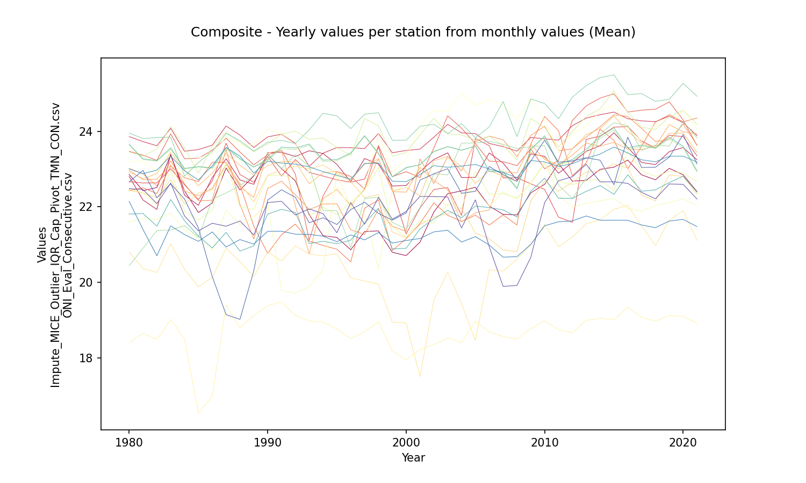
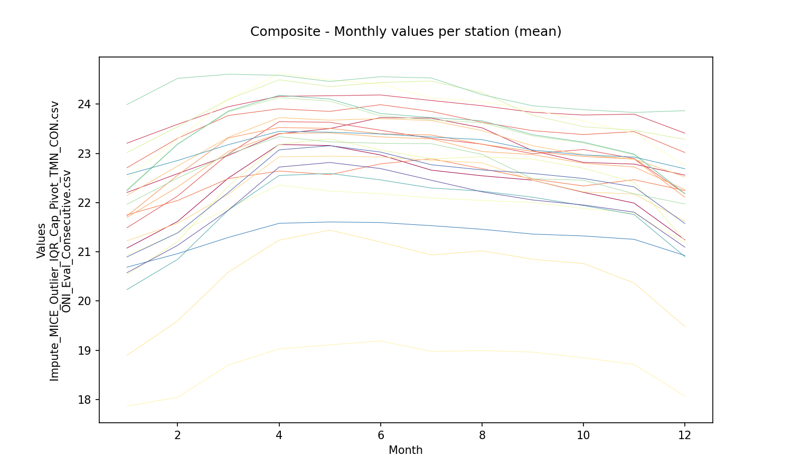
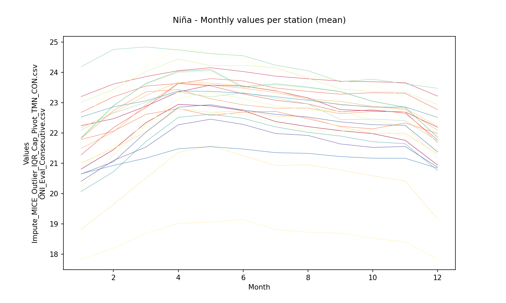
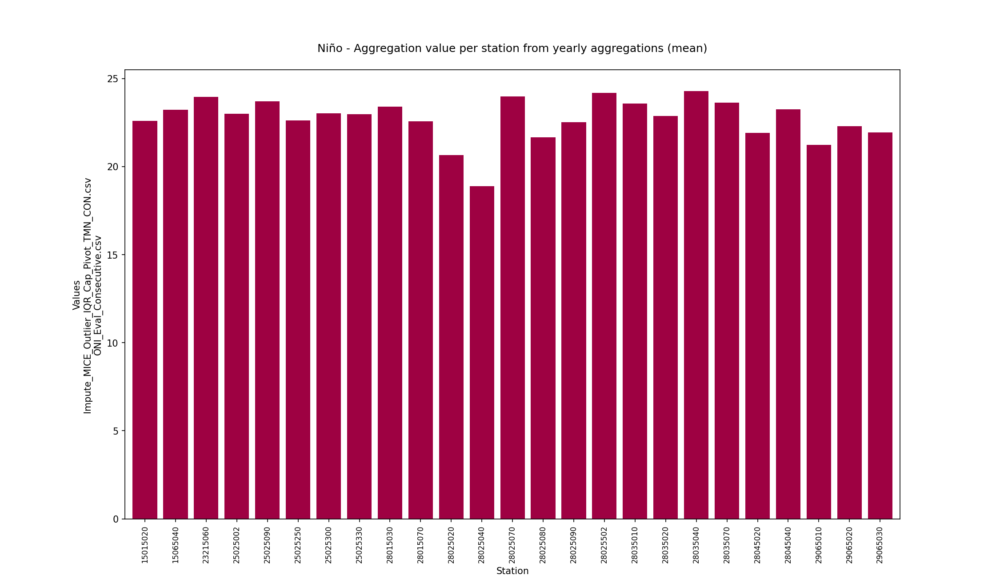
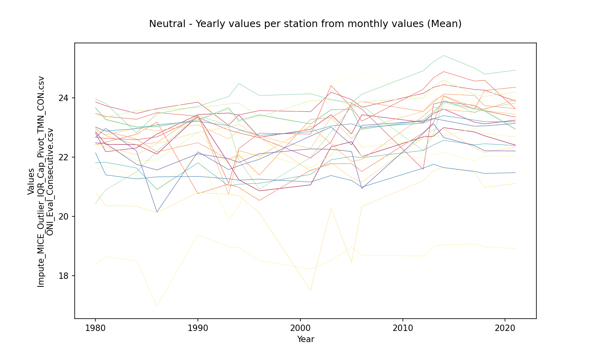
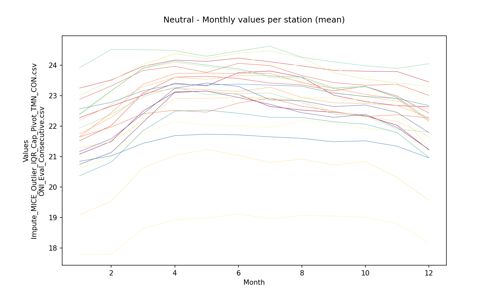

# Statistical aggregations for hydro-climatological composite series and yearly events Niño, Niña and Neutral

For further information about the NOAA - Oceanic Niño Index (ONI) classifier for climatological yearly events Niño, Niña and Neutral, check this activitie https://github.com/rcfdtools/R.LTWB/tree/main/Section03/ENSOONI

* Station records file: [Impute_MICE_Outlier_IQR_Cap_Pivot_TMN_CON.csv](../IDEAM_Impute/Impute_MICE_Outlier_IQR_Cap_Pivot_TMN_CON.csv)
* ENSO-ONI year file: [ONI_Eval_Consecutive.csv](../ENSOONI/ONI_Eval_Consecutive.csv)
* Records in stations file: 15341
* Daily series: True
* Aggregation function: Mean
* Execution date: 2022-11-23 17:20:40.426953
* Python version: 3.10.5 (tags/v3.10.5:f377153, Jun  6 2022, 16:14:13) [MSC v.1929 64 bit (AMD64)]
* Python path: ['D:\\R.LTWB\\.src', 'D:\\R.LTWB', 'D:\\R.TeachingResearchGuide', 'D:\\R.HydroTools', 'D:\\R.GISPython.wiki']
* matplotlib version: 3.6.0
* pandas version: 1.4.3
* Instructions & script: https://github.com/rcfdtools/R.LTWB/tree/main/Section03/AGG
* License: https://github.com/rcfdtools/R.LTWB/blob/main/LICENSE.md
* Credits: r.cfdtools@gmail.com

## Daily values to monthly aggregation (Mean)

|   Id | Fecha               |   15015020 |   15065040 |   23215060 |   25025002 |   25025090 |   25025250 |   25025300 |   25025330 |   28015030 |   28015070 |   28025020 |   28025040 |   28025070 |   28025080 |   28025090 |   28025502 |   28035010 |   28035020 |   28035040 |   28035070 |   28045020 |   28045040 |   29065010 |   29065020 |   29065030 |
|-----:|:--------------------|-----------:|-----------:|-----------:|-----------:|-----------:|-----------:|-----------:|-----------:|-----------:|-----------:|-----------:|-----------:|-----------:|-----------:|-----------:|-----------:|-----------:|-----------:|-----------:|-----------:|-----------:|-----------:|-----------:|-----------:|-----------:|
|    0 | 1980-01-01 00:00:00 |    21.6968 |    21.9629 |    23.5224 |    21.9901 |    23.3546 |    21.6989 |    22.3522 |    22.2713 |    21.8811 |    21.5451 |    19.7396 |    18.0678 |    21.5974 |    20.8205 |    21.5279 |    22.3991 |    22.5894 |    20.2573 |    23.4323 |    22.5713 |    20.7717 |    22.4581 |    21.7399 |    21.7895 |    21.2143 |
|    1 | 1980-02-01 00:00:00 |    21.7339 |    22.1157 |    23.5184 |    22.1444 |    23.0598 |    21.8928 |    22.5377 |    22.3888 |    22.2582 |    21.8022 |    20.0521 |    16.7348 |    22.3574 |    21.3553 |    21.7166 |    22.5015 |    23.3862 |    20.662  |    23.4731 |    23.3703 |    21.0544 |    22.5348 |    22.197  |    21.9113 |    21.1122 |
|    2 | 1980-03-01 00:00:00 |    22.6103 |    22.7103 |    23.9058 |    22.2799 |    23.6103 |    22.3377 |    22.9725 |    22.872  |    22.8162 |    22.1721 |    20.4684 |    18.6088 |    23.1348 |    21.934  |    22.3376 |    23.2978 |    24.5661 |    20.2687 |    23.9031 |    24.563  |    21.5667 |    22.941  |    21.6586 |    22.0213 |    21.2065 |
|    3 | 1980-04-01 00:00:00 |    24.0228 |    23.1914 |    24.2684 |    23.2268 |    24.1872 |    22.8649 |    23.36   |    23.5553 |    23.4815 |    22.5066 |    21.5701 |    19.1891 |    24.2972 |    23.1014 |    23.31   |    24.0448 |    23.9919 |    21.1054 |    24.3851 |    24.0241 |    22.521  |    23.3993 |    21.8338 |    23.048  |    23.4406 |
|    4 | 1980-05-01 00:00:00 |    24.0572 |    23.3757 |    24.2479 |    23.8499 |    23.8158 |    23.0861 |    23.5555 |    23.6975 |    23.6099 |    23.243  |    21.9935 |    18.1333 |    24.3625 |    22.866  |    23.6301 |    24.1226 |    24.4508 |    22.8762 |    24.4717 |    24.5026 |    22.7351 |    23.4739 |    22.2667 |    23.1821 |    23.8671 |
|    5 | 1980-06-01 00:00:00 |    23.825  |    23.3863 |    24.1587 |    23.0558 |    23.8921 |    22.967  |    23.3048 |    23.4824 |    23.6461 |    23.2064 |    21.6642 |    18.171  |    23.8577 |    22.5657 |    23.1583 |    24.1297 |    23.8628 |    19.9893 |    24.3044 |    23.9147 |    22.4013 |    23.4182 |    22.3987 |    22.8934 |    23.2789 |
|    6 | 1980-07-01 00:00:00 |    23.7182 |    23.2334 |    24.0368 |    22.8775 |    23.6298 |    22.7792 |    23.4166 |    23.3279 |    23.3843 |    22.9789 |    21.142  |    19.0353 |    23.5037 |    22.2149 |    23.0045 |    23.9765 |    23.8532 |    19.9384 |    24.1863 |    23.8956 |    22.364  |    23.287  |    22.4666 |    23.4287 |    23.0731 |
|    7 | 1980-08-01 00:00:00 |    23.1554 |    23.1374 |    23.8795 |    22.7635 |    23.2857 |    22.6502 |    23.2924 |    23.1472 |    23.2503 |    22.9199 |    21.1965 |    18.8492 |    23.484  |    21.2692 |    22.6349 |    23.8997 |    23.8554 |    19.8052 |    24.0455 |    23.8941 |    22.1451 |    23.1653 |    21.6434 |    23.3011 |    22.857  |
|    8 | 1980-09-01 00:00:00 |    23.065  |    22.9428 |    23.835  |    22.784  |    23.2687 |    22.5526 |    23.1955 |    23.0725 |    23.0717 |    22.5983 |    21.1388 |    18.7847 |    23.4823 |    21.3781 |    22.5297 |    23.6005 |    23.43   |    19.8276 |    23.9753 |    23.4616 |    22.0575 |    23.0419 |    22.9048 |    23.2751 |    23.3125 |
|    9 | 1980-10-01 00:00:00 |    22.9742 |    22.5258 |    23.8499 |    22.6824 |    23.4037 |    22.3699 |    23.0352 |    22.9954 |    22.6713 |    22.4972 |    20.8387 |    18.6726 |    23.2703 |    21.0001 |    22.4132 |    23.4271 |    23.7554 |    19.9254 |    23.9167 |    23.7781 |    21.8401 |    22.976  |    22.721  |    23.0246 |    23.0502 |
|   10 | 1980-11-01 00:00:00 |    21.7667 |    22.3408 |    23.6    |    22.2323 |    23.1563 |    21.953  |    22.5845 |    22.4148 |    22.5118 |    21.9625 |    19.9472 |    18.328  |    22.4436 |    20.2984 |    21.7535 |    22.9701 |    23.1257 |    20.2272 |    23.6497 |    23.127  |    21.1691 |    22.6656 |    22.2531 |    22.0853 |    22.074  |
|   11 | 1980-12-01 00:00:00 |    21.6748 |    22.7447 |    23.479  |    22.0839 |    22.9434 |    21.9552 |    22.5834 |    22.3819 |    22.4871 |    21.7789 |    19.9048 |    18.2322 |    22.473  |    20.3431 |    21.5435 |    23.0828 |    22.7796 |    20.393  |    23.6996 |    22.776  |    21.058  |    22.6811 |    21.6516 |    21.9819 |    21.2744 |
|   12 | 1981-01-01 00:00:00 |    21.1427 |    22.4963 |    23.4133 |    21.9604 |    23.0078 |    21.5006 |    22.3588 |    22.0799 |    21.3317 |    21.3061 |    18.6183 |    18.0563 |    23.1973 |    21.5183 |    21.6069 |    23.1663 |    22.5469 |    22.1974 |    23.9168 |    22.528  |    20.8325 |    22.6829 |    20.9765 |    21.5097 |    20.3742 |
|   13 | 1981-02-01 00:00:00 |    22.8614 |    22.8636 |    23.8461 |    22.311  |    23.6992 |    22.4223 |    22.8205 |    22.8347 |    23.0516 |    22.6066 |    20.2001 |    18.618  |    23.5014 |    21.8855 |    22.2282 |    23.4317 |    23.1908 |    19.7579 |    23.9485 |    23.2134 |    21.6641 |    22.9955 |    21.2174 |    22.2255 |    21.7587 |
|   14 | 1981-03-01 00:00:00 |    23.6893 |    21.6664 |    23.8568 |    22.5974 |    23.8179 |    22.5493 |    22.8924 |    23.1143 |    23.1718 |    22.6551 |    20.2913 |    18.7626 |    23.7216 |    21.9885 |    22.3091 |    23.8313 |    23.4613 |    19.8385 |    24.0568 |    23.4935 |    22.0558 |    23.168  |    21.5398 |    23.4493 |    22.7006 |
|   15 | 1981-04-01 00:00:00 |    23.626  |    20.8184 |    23.8066 |    23.2108 |    23.6875 |    22.9539 |    22.9095 |    23.3366 |    23.6009 |    23.14   |    21.4052 |    18.8731 |    24.0286 |    22.0759 |    22.3652 |    24.2219 |    23.8325 |    20.966  |    24.1213 |    23.884  |    22.3951 |    23.2576 |    21.8372 |    24.1424 |    23.2998 |
|   16 | 1981-05-01 00:00:00 |    23.0572 |    20.3964 |    23.6301 |    22.6824 |    23.3839 |    22.6395 |    22.59   |    22.9567 |    23.02   |    22.6949 |    21.0317 |    18.6172 |    23.3706 |    21.8443 |    22.092  |    23.4065 |    23.6084 |    19.3148 |    23.6291 |    23.6385 |    21.9536 |    22.9107 |    21.7751 |    23.64   |    23.2923 |
|   17 | 1981-06-01 00:00:00 |    22.9061 |    22.9439 |    23.9679 |    23.33   |    23.5285 |    22.8333 |    23.268  |    22.995  |    23.1353 |    22.7198 |    20.9895 |    18.9672 |    23.484  |    21.7406 |    22.8717 |    23.6588 |    23.6806 |    22.5515 |    23.8383 |    23.7145 |    22.2481 |    23.0696 |    21.7772 |    23.3271 |    23.3533 |
|   18 | 1981-07-01 00:00:00 |    22.1419 |    22.8853 |    23.7902 |    22.8415 |    23.3885 |    22.9388 |    23.1083 |    22.657  |    22.9647 |    22.2886 |    20.3964 |    18.7095 |    23.0047 |    21.5462 |    22.4172 |    23.6555 |    23.2274 |    22.2165 |    23.8098 |    23.2473 |    21.9506 |    22.9422 |    20.4539 |    23.1891 |    22.3037 |
|   19 | 1981-08-01 00:00:00 |    22.2911 |    22.7803 |    23.8452 |    22.9799 |    23.4656 |    22.94   |    23.0288 |    22.7871 |    22.8439 |    22.3749 |    20.5424 |    18.7572 |    23.1792 |    21.6087 |    22.5571 |    23.4732 |    23.3683 |    22.3689 |    24.0076 |    23.3889 |    21.9118 |    22.9348 |    21.5154 |    22.7831 |    22.6276 |
|   20 | 1981-09-01 00:00:00 |    21.7541 |    22.3621 |    23.6484 |    22.7515 |    23.1046 |    22.6618 |    22.9077 |    22.49   |    22.5772 |    22.1512 |    20.1959 |    18.6052 |    22.8483 |    21.4528 |    22.3355 |    22.8704 |    23.1886 |    22.1074 |    23.7167 |    23.1952 |    21.7156 |    22.6368 |    21.4265 |    22.8089 |    22.4467 |
|   21 | 1981-10-01 00:00:00 |    22.2221 |    22.2997 |    23.776  |    22.9468 |    23.3824 |    22.7828 |    23.0515 |    22.6802 |    22.4381 |    22.2471 |    20.5078 |    18.6899 |    23.0123 |    21.5309 |    22.5251 |    22.7507 |    23.3448 |    22.2613 |    23.7289 |    23.353  |    21.8702 |    22.6534 |    21.5477 |    23.0801 |    22.7355 |
|   22 | 1981-11-01 00:00:00 |    22.1162 |    22.338  |    23.6963 |    22.0579 |    23.1093 |    22.0087 |    22.9826 |    22.4678 |    22.4841 |    22.266  |    20.3795 |    18.6331 |    23.0351 |    21.7352 |    22.6701 |    22.7863 |    23.3228 |    18.126  |    23.2685 |    23.3319 |    21.8847 |    22.6628 |    21.5128 |    23.166  |    22.72   |
|   23 | 1981-12-01 00:00:00 |    21.3078 |    22.3058 |    23.4488 |    21.8909 |    22.8398 |    21.8079 |    22.5754 |    22.2216 |    22.3438 |    21.8798 |    19.8436 |    18.5015 |    22.1386 |    21.319  |    22.4255 |    22.8457 |    22.26   |    19.0804 |    23.6345 |    22.2627 |    21.4027 |    22.6185 |    21.2052 |    22.2419 |    21.8972 |
|   24 | 1982-01-01 00:00:00 |    20.531  |    20.3469 |    22.9234 |    21.5002 |    22.3034 |    21.2855 |    21.6063 |    21.6782 |    21.7042 |    21.1645 |    18.8495 |    18.041  |    21.3067 |    20.8907 |    20.7382 |    22.3407 |    22.2854 |    19.8822 |    23.0446 |    22.2554 |    20.2074 |    22.2498 |    20.3765 |    21.2358 |    20.6774 |
|   25 | 1982-02-01 00:00:00 |    22.0299 |    20.8284 |    23.4315 |    21.9972 |    22.9605 |    21.9942 |    22.3097 |    22.4026 |    22.6134 |    21.9834 |    19.7567 |    18.3122 |    22.6784 |    21.5112 |    21.6634 |    22.8625 |    23.8021 |    19.4584 |    23.3877 |    23.7952 |    21.1787 |    22.6529 |    21.1346 |    22.0708 |    21.6311 |
|   26 | 1982-03-01 00:00:00 |    22.2328 |    18.9106 |    23.0957 |    21.9179 |    22.8809 |    21.9042 |    21.5165 |    22.3339 |    22.5646 |    21.9399 |    19.5479 |    18.0395 |    22.7112 |    21.5229 |    20.8727 |    23.1506 |    22.8271 |    19.1612 |    23.2608 |    22.8302 |    20.8402 |    22.7067 |    21.1386 |    22.0606 |    21.6926 |
|   27 | 1982-04-01 00:00:00 |    23.7234 |    19.6155 |    23.5927 |    22.811  |    23.4815 |    22.6571 |    22.2073 |    23.1244 |    23.4735 |    22.9048 |    20.902  |    17.3084 |    23.7306 |    21.9467 |    21.8772 |    23.7757 |    23.6938 |    19.5576 |    23.659  |    23.7343 |    21.8916 |    23.1496 |    21.7923 |    23.2566 |    23.4282 |
|   28 | 1982-05-01 00:00:00 |    23.6246 |    22.2325 |    24.0004 |    23.3622 |    23.7638 |    22.561  |    22.8998 |    23.2852 |    22.818  |    22.8057 |    21.0187 |    18.9421 |    23.5168 |    21.835  |    22.7881 |    23.4936 |    23.7596 |    22.0229 |    24.1663 |    23.7947 |    22.0064 |    23.127  |    20.3742 |    22.7763 |    23.6839 |
|   29 | 1982-06-01 00:00:00 |    23.3267 |    23.2279 |    24.0215 |    23.3831 |    23.587  |    22.6422 |    23.1624 |    23.2676 |    23.1905 |    22.8156 |    20.6511 |    19.0564 |    23.4263 |    21.7641 |    23.0016 |    23.9738 |    23.6378 |    22.7783 |    24.6024 |    23.6789 |    22.1378 |    23.2798 |    20.4823 |    22.729  |    23.4333 |
|   30 | 1982-07-01 00:00:00 |    23.3484 |    22.8517 |    23.9002 |    23.1537 |    23.5963 |    22.793  |    23.1093 |    23.3449 |    23.56   |    22.6656 |    20.8442 |    19.0441 |    23.3314 |    22.7025 |    22.8557 |    23.9694 |    23.3865 |    22.5251 |    24.7805 |    23.4199 |    22.1426 |    23.266  |    20.501  |    22.7418 |    22.3322 |
|   31 | 1982-08-01 00:00:00 |    23.0241 |    23.5761 |    23.901  |    23.1373 |    23.4896 |    22.6324 |    23.0169 |    23.1025 |    23.3954 |    22.5195 |    20.7833 |    18.9255 |    23.224  |    21.6618 |    22.669  |    24.0209 |    23.3132 |    22.9149 |    24.2794 |    23.343  |    21.8037 |    23.2797 |    20.6444 |    21.8944 |    22.1331 |
|   32 | 1982-09-01 00:00:00 |    23.2596 |    23.2571 |    23.9075 |    23.1954 |    23.5046 |    22.6715 |    23.2045 |    23.1286 |    23.4229 |    22.6025 |    20.87   |    18.9778 |    23.261  |    22.0622 |    22.7583 |    24.0745 |    23.4029 |    22.6967 |    24.0923 |    23.4366 |    22.0698 |    23.281  |    20.3367 |    22.7814 |    22.4422 |
|   33 | 1982-10-01 00:00:00 |    21.8387 |    22.7543 |    23.5686 |    22.5378 |    22.9776 |    22.0037 |    22.5548 |    22.3936 |    22.4995 |    21.9903 |    20.1106 |    18.4485 |    22.5233 |    21.3525 |    21.9793 |    23.5341 |    22.9642 |    21.6746 |    23.4056 |    22.9742 |    21.2237 |    22.9046 |    20.3348 |    21.8766 |    21.8851 |
|   34 | 1982-11-01 00:00:00 |    21.5168 |    22.7772 |    23.5715 |    22.3304 |    23.1864 |    23.0138 |    22.552  |    22.1452 |    22.7413 |    21.8466 |    19.9367 |    18.3703 |    22.6504 |    21.3634 |    21.7835 |    23.5633 |    22.7949 |    21.7286 |    22.9735 |    22.7988 |    21.2861 |    22.8599 |    20.4983 |    21.8306 |    21.1333 |
|   35 | 1982-12-01 00:00:00 |    21.67   |    22.7732 |    23.4648 |    22.2706 |    23.0255 |    22.0495 |    22.5187 |    22.5663 |    22.5503 |    21.6707 |    19.8602 |    18.3279 |    22.4921 |    21.3477 |    21.6982 |    23.5815 |    22.6108 |    22.0249 |    24.3583 |    22.6085 |    21.0494 |    22.8919 |    20.8211 |    21.5986 |    20.5442 |
|   36 | 1983-01-01 00:00:00 |    22.5607 |    22.983  |    23.7039 |    22.7748 |    23.296  |    22.3586 |    22.7087 |    22.8535 |    22.9155 |    22.1763 |    20.4979 |    18.6284 |    23.0219 |    21.5812 |    22.1769 |    23.8019 |    23.0884 |    22.265  |    24.0672 |    23.1049 |    20.2307 |    23.1098 |    21.0733 |    21.7797 |    21.6146 |
|   37 | 1983-02-01 00:00:00 |    23.0576 |    23.0663 |    23.8455 |    22.9527 |    23.5211 |    22.482  |    22.8972 |    23.0035 |    22.9634 |    22.4076 |    20.2373 |    18.7685 |    23.5756 |    21.7849 |    22.4474 |    23.8713 |    23.2914 |    22.6114 |    24.2475 |    23.3156 |    21.7248 |    23.2    |    21.0758 |    22.101  |    22.0681 |
|   38 | 1983-03-01 00:00:00 |    24.4679 |    23.5645 |    24.4925 |    23.6535 |    24.9201 |    23.2486 |    23.599  |    23.7555 |    24.0477 |    23.0808 |    21.3009 |    19.338  |    24.4163 |    22.1761 |    23.3187 |    24.4602 |    23.8289 |    23.4193 |    24.8069 |    23.8791 |    24.4047 |    23.5863 |    21.2198 |    23.2343 |    22.7501 |
|   39 | 1983-04-01 00:00:00 |    24.8867 |    23.8238 |    24.4676 |    24.2743 |    24.2522 |    23.4981 |    23.8475 |    24.1425 |    24.2835 |    23.5234 |    22.7707 |    19.701  |    24.649  |    22.3061 |    24.0967 |    24.8108 |    24.411  |    23.6278 |    24.7716 |    24.4812 |    23.1976 |    23.8119 |    21.3067 |    23.5402 |    24.0333 |
|   40 | 1983-05-01 00:00:00 |    24.9742 |    23.9945 |    24.6273 |    24.2409 |    24.6402 |    23.4787 |    23.4772 |    23.9438 |    24.3905 |    23.6518 |    22.4217 |    19.7456 |    24.5543 |    22.2458 |    24.1389 |    25.0665 |    24.4    |    23.3944 |    24.2233 |    24.4783 |    22.9381 |    23.9859 |    21.86   |    22.3949 |    24.3168 |
|   41 | 1983-06-01 00:00:00 |    23.8183 |    23.7102 |    24.3468 |    23.1052 |    24.1757 |    23.1247 |    23.5129 |    23.4841 |    24.1294 |    23.2801 |    21.7997 |    19.355  |    23.9218 |    22.1373 |    23.6133 |    24.8433 |    24.008  |    19.6992 |    24.2168 |    24.0727 |    22.6877 |    23.6895 |    22.2617 |    22.8924 |    23.7078 |
|   42 | 1983-07-01 00:00:00 |    22.9514 |    24.0386 |    24.3064 |    23.0175 |    24.2629 |    23.0249 |    23.5634 |    23.0325 |    23.7531 |    22.698  |    21.4359 |    19.094  |    23.5453 |    21.8519 |    23.2873 |    24.2398 |    23.6611 |    21.1124 |    23.6931 |    23.7002 |    22.4853 |    23.3315 |    22.5226 |    23.0911 |    22.8387 |
|   43 | 1983-08-01 00:00:00 |    23.2    |    23.7353 |    24.188  |    22.7242 |    24.0662 |    22.7378 |    23.4043 |    22.7439 |    23.5221 |    22.6703 |    21.1319 |    19.0847 |    23.3891 |    21.8211 |    23.2591 |    24.0376 |    23.5225 |    20.0346 |    22.7012 |    23.5577 |    22.3106 |    23.3087 |    21.562  |    22.7701 |    22.6129 |
|   44 | 1983-09-01 00:00:00 |    23.4011 |    23.5763 |    23.9682 |    22.546  |    23.4741 |    23.2035 |    23.276  |    22.7996 |    23.1923 |    22.6664 |    21.009  |    18.9905 |    23.485  |    21.9045 |    23.1311 |    24.05   |    23.5169 |    19.2193 |    22.804  |    23.5519 |    22.2008 |    23.343  |    21.5448 |    22.5124 |    22.58   |
|   45 | 1983-10-01 00:00:00 |    22.84   |    23.0887 |    23.7443 |    22.8854 |    23.2798 |    23.4881 |    23.0347 |    22.8014 |    22.9209 |    22.2963 |    20.643  |    18.8323 |    22.819  |    21.4963 |    22.6848 |    23.9733 |    23.1752 |    22.0788 |    23.5343 |    23.1992 |    21.9564 |    23.196  |    21.3819 |    22.6689 |    22.0929 |
|   46 | 1983-11-01 00:00:00 |    22.452  |    22.818  |    24.0297 |    22.2718 |    23.8909 |    23.6084 |    22.911  |    22.7421 |    22.8861 |    22.6802 |    20.1738 |    18.6036 |    22.6517 |    21.5865 |    22.2492 |    23.38   |    23.0635 |    19.4654 |    24.0461 |    23.09   |    21.7139 |    22.9141 |    21.3424 |    22.4675 |    22.1026 |
|   47 | 1983-12-01 00:00:00 |    21.7856 |    22.3315 |    23.2323 |    21.634  |    23.3996 |    22.7201 |    22.3534 |    21.9995 |    22.2904 |    21.4643 |    18.8439 |    18.0964 |    21.6564 |    21.0765 |    21.1942 |    22.9761 |    22.3071 |    19.6819 |    23.014  |    22.294  |    20.4566 |    22.6341 |    20.7885 |    21.8452 |    20.8105 |
|   48 | 1984-01-01 00:00:00 |    20.6416 |    21.7117 |    22.1871 |    21.2318 |    22.0705 |    21.2795 |    21.7564 |    21.3758 |    21.9569 |    19.9767 |    18.6827 |    17.5462 |    21.1795 |    20.7295 |    20.0383 |    22.4521 |    21.8741 |    20.5049 |    22.0543 |    21.8117 |    19.3108 |    22.2557 |    20.3526 |    21.0277 |    19.6127 |
|   49 | 1984-02-01 00:00:00 |    23.0138 |    22.2955 |    23.1192 |    22.4084 |    23.4173 |    22.3215 |    22.5966 |    22.7899 |    23.0683 |    21.3969 |    19.7261 |    18.4167 |    22.7116 |    21.4551 |    21.5172 |    23.6461 |    22.7788 |    21.8333 |    23.9621 |    22.772  |    20.8642 |    23.0242 |    20.9497 |    22.208  |    21.1519 |
|   50 | 1984-03-01 00:00:00 |    23.2529 |    22.7966 |    23.4774 |    22.781  |    23.3056 |    22.5305 |    22.8657 |    22.9933 |    22.8898 |    21.958  |    20.1353 |    18.5711 |    23.0024 |    21.5718 |    21.8697 |    23.6241 |    23.0346 |    22.3898 |    24.1434 |    23.0432 |    21.6483 |    23.0655 |    21.1835 |    22.4115 |    21.6452 |
|   51 | 1984-04-01 00:00:00 |    24.28   |    23.1816 |    23.87   |    23.3434 |    23.5478 |    22.7594 |    23.2039 |    22.9739 |    23.3012 |    22.7561 |    20.9    |    19.1127 |    23.683  |    22.0528 |    23.0463 |    23.981  |    23.6389 |    22.3319 |    22.5781 |    23.6766 |    22.48   |    23.3927 |    21.686  |    22.9109 |    23.0128 |
|   52 | 1984-05-01 00:00:00 |    24.2789 |    23.2668 |    24.0613 |    23.547  |    23.4506 |    22.5998 |    23.0292 |    23.1495 |    23.7104 |    23.1803 |    21.135  |    18.9139 |    23.4894 |    21.7938 |    22.1869 |    24.0246 |    23.746  |    22.3974 |    23.0242 |    23.7975 |    23.2732 |    23.3433 |    21.9306 |    22.6441 |    23.5425 |
|   53 | 1984-06-01 00:00:00 |    23.3689 |    23.3805 |    24.1007 |    23.3189 |    23.7608 |    23.8156 |    23.2738 |    22.8593 |    23.5572 |    23.0577 |    21.3345 |    19.132  |    23.4667 |    21.7383 |    23.1336 |    24.1921 |    23.5841 |    22.3312 |    22.76   |    23.6317 |    22.81   |    23.3608 |    21.701  |    22.9268 |    22.7035 |
|   54 | 1984-07-01 00:00:00 |    22.3932 |    22.7157 |    23.2664 |    22.7055 |    23.4613 |    23.494  |    22.816  |    22.3398 |    22.9576 |    21.9223 |    20.4968 |    18.6795 |    22.6444 |    21.3686 |    22.3009 |    23.5239 |    23.1409 |    21.6537 |    22.4516 |    23.1499 |    21.7421 |    22.9628 |    21.4351 |    22.4349 |    22.2516 |
|   55 | 1984-08-01 00:00:00 |    22.5807 |    23.0265 |    23.0582 |    22.9287 |    23.5978 |    23.204  |    23.0111 |    22.5512 |    23.3199 |    22.2329 |    21.0658 |    18.8655 |    23.0571 |    21.4544 |    22.8087 |    23.9097 |    23.3339 |    21.9777 |    22.6273 |    23.3553 |    22.4172 |    23.1564 |    21.525  |    22.6156 |    22.2575 |
|   56 | 1984-09-01 00:00:00 |    22.2333 |    21.5946 |    23.3333 |    22.4875 |    23.5074 |    23.0441 |    22.4545 |    22.2638 |    22.9807 |    22.0783 |    20.2906 |    18.4124 |    22.4528 |    21.2719 |    21.7623 |    23.5928 |    22.9734 |    21.0114 |    22.5024 |    22.9867 |    21.8327 |    22.9352 |    21.3368 |    22.172  |    21.9199 |
|   57 | 1984-10-01 00:00:00 |    22.0383 |    21.8672 |    23.6485 |    22.6186 |    23.2793 |    23.0005 |    22.6751 |    22.2547 |    23.0586 |    22.3351 |    20.7264 |    18.7051 |    22.7395 |    21.2466 |    22.6066 |    23.6893 |    23.1325 |    21.1681 |    22.3553 |    23.1535 |    22.2182 |    23.0093 |    21.4369 |    22.3858 |    21.9935 |
|   58 | 1984-11-01 00:00:00 |    21.0533 |    20.4787 |    24.0907 |    22.0657 |    23.4526 |    22.7638 |    22.0144 |    22.0103 |    22.8412 |    22.3999 |    20.1613 |    18.2888 |    22.5126 |    21.0968 |    21.8155 |    23.3903 |    22.7523 |    20.1413 |    22.8384 |    22.7685 |    21.2322 |    22.7443 |    21.0564 |    21.8681 |    21.06   |
|   59 | 1984-12-01 00:00:00 |    19.8805 |    21.3655 |    23.4261 |    21.5507 |    22.416  |    22.3981 |    21.5767 |    21.4377 |    22.0882 |    21.5975 |    19.4921 |    17.3173 |    21.151  |    20.7801 |    19.4427 |    22.73   |    22.0573 |    20.2692 |    22.4482 |    22.0422 |    19.7479 |    22.2146 |    20.5716 |    20.8583 |    19.9332 |
|   60 | 1985-01-01 00:00:00 |    19.6323 |    21.1698 |    22.6492 |    19.4497 |    21.9355 |    21.0827 |    20.7037 |    21.1487 |    20.9623 |    21.1496 |    17.7419 |    17.868  |    20.6154 |    20.5907 |    18.5442 |    21.0583 |    21.311  |    20.2926 |    22.8581 |    21.2589 |    18.1936 |    21.5308 |    19.9203 |    20.3582 |    18.6307 |
|   61 | 1985-02-01 00:00:00 |    20.3714 |    20.3972 |    23.3514 |    21.2907 |    22.8294 |    22.0371 |    21.8627 |    21.681  |    22.4028 |    21.375  |    18.4335 |    17.8696 |    22.6538 |    21.3747 |    20.6012 |    22.7286 |    23.2607 |    20.3937 |    23.2769 |    23.2264 |    18.4066 |    22.3431 |    20.1473 |    21.4367 |    19.1981 |
|   62 | 1985-03-01 00:00:00 |    22.1677 |    19.5719 |    23.7161 |    21.9799 |    23.2938 |    22.6962 |    22.1727 |    22.6551 |    23.4714 |    22.2419 |    20.5224 |    18.0672 |    23.5593 |    21.9201 |    21.402  |    23.8579 |    24.4934 |    18.9656 |    23.5674 |    24.4998 |    20.8194 |    22.9857 |    21.0289 |    22.2559 |    21.1147 |
|   63 | 1985-04-01 00:00:00 |    23.3467 |    19.3552 |    23.8387 |    22.2591 |    23.3923 |    23.2316 |    22.1325 |    22.7733 |    23.2773 |    22.7908 |    20.3287 |    16.6649 |    23.3465 |    21.8078 |    21.6885 |    23.3551 |    23.6976 |    18.451  |    23.1615 |    23.724  |    21.9384 |    22.9953 |    21.4596 |    22.5081 |    22.4467 |
|   64 | 1985-05-01 00:00:00 |    23.6    |    22.7821 |    24.1935 |    22.4478 |    23.4113 |    22.9942 |    20.9997 |    22.8741 |    23.0074 |    22.9922 |    20.1828 |    16.2873 |    23.4015 |    21.8081 |    22.5996 |    23.2742 |    23.7314 |    18.5948 |    23.3579 |    23.7655 |    22.3781 |    23.1994 |    21.6564 |    20.8136 |    23.2075 |
|   65 | 1985-06-01 00:00:00 |    23.62   |    23.181  |    24.0297 |    23.3109 |    23.691  |    23.3048 |    22.0409 |    23.1547 |    23.2747 |    23.1098 |    20.8059 |    18.3128 |    23.6012 |    21.8808 |    22.7821 |    23.8467 |    23.9167 |    22.4963 |    23.8115 |    23.9587 |    22.5867 |    23.4811 |    21.5656 |    19.1967 |    22.8133 |
|   66 | 1985-07-01 00:00:00 |    22.671  |    23.8839 |    23.5432 |    23.177  |    23.8447 |    22.9133 |    23.1598 |    22.803  |    23.4728 |    22.8677 |    20.6452 |    15.726  |    24.621  |    21.2696 |    22.5613 |    24.0937 |    23.6803 |    23.4352 |    23.5772 |    23.7157 |    21.9161 |    23.3557 |    21.2912 |    21.1713 |    21.8    |
|   67 | 1985-08-01 00:00:00 |    22.329  |    23.367  |    23.3612 |    23.0671 |    23.8054 |    22.7524 |    23.3463 |    22.6534 |    21.9532 |    22.7096 |    20.5651 |    15.4207 |    24.5981 |    20.7918 |    22.7548 |    23.1935 |    23.2872 |    23.0519 |    23.4953 |    23.3101 |    21.9484 |    22.9442 |    21.3973 |    22.4574 |    22.0129 |
|   68 | 1985-09-01 00:00:00 |    21.5945 |    22.6465 |    23.54   |    22.8787 |    23.8079 |    23.1133 |    23.1876 |    22.4197 |    22.5021 |    22.4867 |    20.84   |    16.2858 |    24.4748 |    21.1605 |    22.7467 |    22.68   |    23.2962 |    22.5652 |    23.2018 |    23.3055 |    22.1067 |    22.6719 |    21.4015 |    22.2037 |    21.8133 |
|   69 | 1985-10-01 00:00:00 |    21.9032 |    22.9677 |    23.7676 |    23.2988 |    23.5559 |    22.4333 |    23.0286 |    22.4453 |    22.8721 |    22.7516 |    20.6316 |    15.4248 |    24.1473 |    21.1907 |    22.3977 |    22.7638 |    23.2626 |    22.5548 |    23.1407 |    23.2821 |    22.0129 |    22.7026 |    21.4837 |    22.5097 |    22.2066 |
|   70 | 1985-11-01 00:00:00 |    21.2333 |    22.6067 |    23.6205 |    22.6956 |    23.304  |    23.1223 |    22.93   |    22.0224 |    22.3125 |    22.4333 |    19.94   |    15.5781 |    22.7448 |    20.3886 |    21.7667 |    22.3667 |    22.6009 |    22.0164 |    22.8318 |    22.6072 |    22.0067 |    22.4547 |    21.2397 |    21.8722 |    21.4867 |
|   71 | 1985-12-01 00:00:00 |    19.7226 |    22.5367 |    22.5779 |    20.4346 |    22.5452 |    22.329  |    20.3675 |    20.8413 |    21.1509 |    21.4355 |    17.9097 |    14.9682 |    21.8423 |    20.0448 |    19.9087 |    21.4105 |    20.1254 |    21.4868 |    21.7827 |    20.0993 |    20.4346 |    21.8472 |    20.4303 |    20.4767 |    19.6258 |
|   72 | 1986-01-01 00:00:00 |    20.1313 |    22.3535 |    22.9929 |    21.6373 |    22.728  |    21.2864 |    21.7709 |    21.6897 |    21.321  |    21.5084 |    18.2592 |    16.8136 |    22.9529 |    20.6842 |    19.6915 |    23.0014 |    22.6719 |    21.9497 |    23.6936 |    22.6506 |    19.6973 |    22.4094 |    20.372  |    20.2925 |    19.5419 |
|   73 | 1986-02-01 00:00:00 |    20.75   |    22.4932 |    22.431  |    21.5936 |    22.7154 |    21.8825 |    22.301  |    21.9812 |    21.9129 |    20.1738 |    18.7223 |    14.7854 |    22.3071 |    19.9778 |    20.3092 |    23.4376 |    23.2869 |    21.9575 |    23.7533 |    23.2323 |    20.3077 |    22.6656 |    20.4501 |    21.468  |    19.5143 |
|   74 | 1986-03-01 00:00:00 |    21.7742 |    22.2374 |    23.2259 |    22.1659 |    23.1406 |    22.7753 |    22.2374 |    22.3789 |    22.3207 |    21.4617 |    19.1803 |    15.1113 |    22.7732 |    20.7328 |    20.9465 |    23.7527 |    23.7439 |    21.7373 |    23.8447 |    23.7323 |    20.7122 |    22.9766 |    21.6516 |    21.189  |    21.0452 |
|   75 | 1986-04-01 00:00:00 |    23.42   |    23.6814 |    23.9122 |    23.5756 |    24.0548 |    23.2996 |    23.2445 |    23.2722 |    23.5299 |    23.4067 |    21.1052 |    14.7918 |    24.5808 |    21.5012 |    23.2359 |    24.2049 |    23.7993 |    23.3642 |    24.2184 |    23.8555 |    22.3673 |    23.509  |    21.2753 |    22.1893 |    22.8855 |
|   76 | 1986-05-01 00:00:00 |    23.9466 |    23.3157 |    24.2376 |    23.5453 |    24.1181 |    24.3204 |    23.2647 |    23.0886 |    23.6075 |    23.0396 |    21.2808 |    16.7678 |    24.3357 |    21.6556 |    23.1663 |    24.1436 |    23.1882 |    22.77   |    23.1132 |    23.2402 |    21.3871 |    23.4534 |    21.4287 |    23.0897 |    23.2323 |
|   77 | 1986-06-01 00:00:00 |    22.8928 |    23.1725 |    24.1218 |    23.1853 |    23.5609 |    23.3028 |    23.0661 |    22.8051 |    23.2682 |    23.0167 |    20.9756 |    18.4017 |    23.0251 |    22.1374 |    23.1267 |    23.8467 |    23.2859 |    22.1403 |    23.2783 |    23.3303 |    20.5533 |    23.2219 |    21.88   |    22.4733 |    22.8483 |
|   78 | 1986-07-01 00:00:00 |    23.1252 |    23.5804 |    23.774  |    23.0698 |    23.77   |    23.9631 |    21.9636 |    22.821  |    24.5808 |    23.0968 |    20.5927 |    16.503  |    23.561  |    20.6696 |    22.1857 |    24.5419 |    23.745  |    22.3507 |    23.271  |    23.7935 |    21.3223 |    23.6667 |    22.9677 |    18.7355 |    22.0948 |
|   79 | 1986-08-01 00:00:00 |    23.4194 |    22.5883 |    24.008  |    23.2238 |    23.9323 |    23.6611 |    21.855  |    22.9568 |    23.8079 |    23.6452 |    20.957  |    17.0324 |    24.2545 |    21.7934 |    22.7073 |    24.4355 |    22.7437 |    22.0306 |    23.426  |    22.8142 |    21.5851 |    23.6911 |    23.3163 |    19      |    22.4129 |
|   80 | 1986-09-01 00:00:00 |    22.58   |    23.0661 |    23.8678 |    23.0128 |    23.8411 |    23.89   |    22.0144 |    22.7087 |    23.3313 |    22.9042 |    20.8133 |    18.9507 |    23.6679 |    20.3392 |    22.9393 |    23.79   |    22.4397 |    22.3846 |    23.4641 |    22.4818 |    21.46   |    23.3491 |    21.2514 |    18.98   |    21.9584 |
|   81 | 1986-10-01 00:00:00 |    22.1935 |    22.3475 |    23.6722 |    22.8719 |    23.6706 |    23.6516 |    21.8463 |    22.4813 |    22.6046 |    22.3548 |    20.8581 |    18.6784 |    23.5788 |    20.0784 |    22.5389 |    22.8419 |    22.7139 |    22.2108 |    22.9627 |    22.7268 |    21.3161 |    22.9479 |    21.2492 |    18.7742 |    21.9483 |
|   82 | 1986-11-01 00:00:00 |    21.04   |    22.2187 |    24.1584 |    22.4495 |    23.55   |    23.6969 |    21.5963 |    22.0442 |    22.2774 |    22.6362 |    19.9132 |    18.3369 |    23.2587 |    20.6278 |    21.9701 |    22.6833 |    22.6262 |    21.8211 |    23.1    |    22.6411 |    21.1521 |    22.7211 |    21.0315 |    18.4267 |    21.34   |
|   83 | 1986-12-01 00:00:00 |    19.9161 |    22.2378 |    23.1701 |    21.8185 |    22.8969 |    22.4194 |    20.9136 |    21.6254 |    22.0828 |    22.1624 |    18.8452 |    17.5867 |    22.4246 |    20.0216 |    20.0232 |    22.5387 |    21.921  |    21.6751 |    23.4452 |    21.9186 |    19.0501 |    22.4295 |    19.1157 |    17.1896 |    19.9374 |
|   84 | 1987-01-01 00:00:00 |    21.0214 |    21.8702 |    23.1864 |    21.7806 |    22.9881 |    22.3769 |    21.9484 |    22.0755 |    21.6563 |    21.7516 |    18.4    |    17.8963 |    22.364  |    21.4675 |    20.9105 |    22.3161 |    22.5426 |    21.7548 |    24.1548 |    22.5123 |    18.8528 |    22.5829 |    18.0714 |    16.985  |    18.139  |
|   85 | 1987-02-01 00:00:00 |    22.5767 |    22.8462 |    23.8192 |    23.3714 |    23.6936 |    23.4357 |    23.3857 |    22.7239 |    22.7189 |    22.6036 |    19.7321 |    18.2515 |    23.5679 |    21.3804 |    22.1955 |    23.419  |    23.7768 |    22.3929 |    23.95   |    23.7873 |    19.9395 |    23.1848 |    20.1256 |    18.5571 |    20.35   |
|   86 | 1987-03-01 00:00:00 |    23.5355 |    23.245  |    24.0877 |    24.3286 |    24.0213 |    23.3613 |    23.9065 |    23.3363 |    23.5726 |    23.1774 |    21.1742 |    19.1021 |    24.2098 |    21.4736 |    23.7023 |    24.2657 |    23.4954 |    23.1057 |    24.3493 |    23.5406 |    21.3452 |    23.6547 |    21.0701 |    19.8194 |    21.329  |
|   87 | 1987-04-01 00:00:00 |    24.2733 |    23.8456 |    24.3047 |    24.6867 |    24.1736 |    23.173  |    24.1533 |    23.5596 |    24.0172 |    23.9667 |    21.3733 |    19.5119 |    24.7228 |    22.348  |    24.1267 |    24.9433 |    23.8751 |    23.56   |    24.2533 |    23.9524 |    22.6046 |    23.9874 |    21.4589 |    20.3067 |    22.2867 |
|   88 | 1987-05-01 00:00:00 |    23.7161 |    23.2469 |    24.1251 |    24.4903 |    24.0223 |    23.529  |    23.8558 |    23.2185 |    23.6335 |    23.305  |    21.4387 |    19.4129 |    24.2312 |    22.0644 |    23.8258 |    24.2613 |    23.6149 |    22.727  |    23.6065 |    23.6645 |    22.0496 |    23.6755 |    21.2649 |    19.9228 |    21.6677 |
|   89 | 1987-06-01 00:00:00 |    23.8733 |    23.9571 |    24.4847 |    24.2667 |    23.969  |    23.34   |    23.9033 |    23.411  |    23.7728 |    23.71   |    21.4867 |    19.9067 |    23.8585 |    21.9668 |    24.0433 |    24.46   |    23.7608 |    23.0806 |    24.0667 |    23.8277 |    22.0826 |    23.7797 |    21.5477 |    19.8733 |    22.64   |
|   90 | 1987-07-01 00:00:00 |    24.1871 |    24.5007 |    24.5688 |    24.1968 |    24.0217 |    23.2839 |    23.9065 |    23.6034 |    24.0835 |    23.771  |    21.6548 |    19.6748 |    24.132  |    22.0831 |    23.7986 |    24.5194 |    23.867  |    23.0616 |    24.3258 |    23.9359 |    22.0543 |    23.8213 |    21.5812 |    19.8452 |    22.7032 |
|   91 | 1987-08-01 00:00:00 |    23.4    |    22.7195 |    24.379  |    23.6307 |    23.9022 |    23.0258 |    23.5484 |    23.3486 |    24.3876 |    23.7903 |    21.7806 |    19.4677 |    24.0639 |    22.0442 |    23.6581 |    24.8548 |    23.7437 |    22.7249 |    24.1161 |    23.8161 |    21.8786 |    23.8644 |    21.419  |    19.3032 |    22.2    |
|   92 | 1987-09-01 00:00:00 |    22.98   |    23.7777 |    23.8239 |    23.9333 |    23.9255 |    23.1933 |    23.52   |    23.6085 |    23.6414 |    23.4167 |    21.4539 |    19.5163 |    23.7469 |    22.0198 |    23.6867 |    23.86   |    23.5493 |    21.6933 |    23.8067 |    23.5981 |    21.7438 |    23.4811 |    21.3005 |    19.2867 |    21.9067 |
|   93 | 1987-10-01 00:00:00 |    23.0516 |    22.7871 |    24.1281 |    23.706  |    23.7386 |    23.0774 |    23.5839 |    22.9685 |    23.0615 |    22.629  |    21.5032 |    19.4645 |    23.9001 |    21.9943 |    23.4065 |    23.3856 |    23.629  |    21.5348 |    23.3355 |    23.6509 |    21.5397 |    23.7568 |    21.3459 |    19.2645 |    22.0452 |
|   94 | 1987-11-01 00:00:00 |    22.2067 |    23.4246 |    24.6614 |    23.3933 |    23.7953 |    23.5467 |    23.4133 |    22.5767 |    23.2228 |    22.9633 |    20.5467 |    20.7067 |    24.1569 |    22.2996 |    23      |    23.6333 |    23.4268 |    21.4467 |    23.8467 |    23.4589 |    21.3415 |    23.548  |    21.1221 |    18.7067 |    21.5299 |
|   95 | 1987-12-01 00:00:00 |    21.4968 |    23.0367 |    24.1008 |    22.4253 |    23.5314 |    22.7806 |    23.2355 |    23.0911 |    23.168  |    22.2903 |    20.3032 |    19.9097 |    23.2757 |    22.009  |    21.7361 |    23.7677 |    23.0659 |    21.3129 |    23.5226 |    23.082  |    20.4171 |    23.541  |    20.9106 |    17.8431 |    21.0258 |
|   96 | 1988-01-01 00:00:00 |    20.7226 |    22.3223 |    23.6741 |    20.4065 |    21.9115 |    21.8968 |    21.5418 |    18.3256 |    21.6901 |    21.9194 |    18.2129 |    18.8757 |    22.1934 |    20.1631 |    19.5032 |    22.7613 |    22.1616 |    20.7677 |    24.0194 |    22.1536 |    18.9386 |    22.7248 |    20.4057 |    17.4129 |    19.929  |
|   97 | 1988-02-01 00:00:00 |    22.5517 |    23.0163 |    24.4515 |    22.5724 |    22.7579 |    22.6276 |    21.731  |    19.2884 |    22.8065 |    22.6076 |    20.0759 |    18.9931 |    24.0398 |    21.2271 |    21.7427 |    23.6552 |    23.1607 |    21.6897 |    24.4621 |    23.1834 |    20.6817 |    23.6643 |    20.972  |    18.8138 |    21.1655 |
|   98 | 1988-03-01 00:00:00 |    22.671  |    23.3411 |    23.9358 |    22.6581 |    23.5032 |    23.129  |    22.9452 |    21.6708 |    23.3199 |    22.6613 |    20.8194 |    19.013  |    24.2291 |    22.1108 |    21.9412 |    24.0903 |    23.3064 |    22.4397 |    24.2968 |    23.3343 |    20.8798 |    23.4994 |    20.9341 |    18.6581 |    20.8516 |
|   99 | 1988-04-01 00:00:00 |    24.2933 |    23.4563 |    24.1826 |    23.9933 |    24.101  |    22.9333 |    22.1133 |    24.1518 |    23.7342 |    23.25   |    21.5867 |    19.5339 |    24.4211 |    22.6878 |    23.3386 |    24.1467 |    23.7392 |    22.4421 |    24.0064 |    23.7882 |    21.9321 |    23.9366 |    21.4651 |    20.3333 |    22.3    |
|  100 | 1988-05-01 00:00:00 |    24.0516 |    23.9945 |    24.2643 |    24.0332 |    24.1702 |    22.8516 |    21.9373 |    24.2782 |    23.9859 |    23.4355 |    22.0452 |    19.4967 |    24.4456 |    22.5323 |    24.1161 |    24.3802 |    23.6598 |    24.1871 |    24.1065 |    23.7146 |    22.2907 |    24.3504 |    21.3182 |    20.3548 |    21.671  |
|  101 | 1988-06-01 00:00:00 |    22.7867 |    23.3327 |    24.015  |    23.1    |    23.6702 |    22.88   |    21.4685 |    23.2563 |    23.4962 |    23.0173 |    21.2933 |    18.9789 |    23.3867 |    22.5167 |    23.0836 |    23.945  |    23.5219 |    23.4733 |    23.74   |    23.5656 |    21.4592 |    23.6548 |    21.5187 |    19.54   |    22.7092 |
|  102 | 1988-07-01 00:00:00 |    22.5161 |    22.4922 |    23.9507 |    23.2774 |    23.8147 |    22.7322 |    21.7919 |    23.5749 |    23.4486 |    23.2581 |    20.9806 |    19.01   |    23.7226 |    21.086  |    23.039  |    23.9635 |    23.4516 |    23.3935 |    23.8129 |    23.4995 |    21.4889 |    23.4219 |    21.348  |    19.6516 |    22.2008 |
|  103 | 1988-08-01 00:00:00 |    22.2387 |    22.2234 |    23.8077 |    23.1051 |    23.4694 |    21.9677 |    22.396  |    23.1561 |    23.1727 |    22.3871 |    21.0516 |    18.8063 |    23.6155 |    20.6498 |    22.6774 |    23.6545 |    23.5287 |    23.1704 |    23.7501 |    23.5501 |    21.0003 |    23.2474 |    21.3745 |    18.8    |    22.4194 |
|  104 | 1988-09-01 00:00:00 |    22.2533 |    22.4174 |    23.8995 |    23.2333 |    23.757  |    22.3133 |    21.92   |    23.7687 |    23.2366 |    22.4667 |    20.82   |    18.8351 |    23.9    |    20.2733 |    22.7571 |    23.6852 |    23.4565 |    22.5798 |    23.0223 |    23.479  |    21.1018 |    23.2701 |    21.2605 |    18.7533 |    22.06   |
|  105 | 1988-10-01 00:00:00 |    22.3161 |    22.1161 |    23.6516 |    23.1677 |    23.6875 |    22.7279 |    22.2129 |    23.4738 |    23.135  |    22.2355 |    20.5475 |    17.8301 |    23.6786 |    21.9329 |    19.6968 |    23.668  |    23.4041 |    22.3686 |    23.4839 |    23.4212 |    19.8995 |    22.6088 |    21.2889 |    18.9742 |    22.1935 |
|  106 | 1988-11-01 00:00:00 |    22.0533 |    22.6133 |    23.6976 |    22.9867 |    23.5451 |    22.7267 |    22.22   |    23.1438 |    23.0367 |    22.5    |    20.36   |    18.2631 |    23.28   |    21.7056 |    21.3052 |    23.6411 |    23.1276 |    22.5322 |    23.07   |    23.1499 |    20.7029 |    23.3773 |    21.1256 |    19.84   |    21.5867 |
|  107 | 1988-12-01 00:00:00 |    20.8839 |    21.2    |    23.2455 |    21.7226 |    23.0152 |    22.1491 |    22.471  |    22.171  |    22.1191 |    21.8226 |    18.7935 |    17.9086 |    22.6636 |    21.387  |    20.8129 |    22.8865 |    22.519  |    21.6561 |    23.2323 |    22.5103 |    19.5495 |    22.3532 |    20.5699 |    17.0936 |    20.3935 |
|  108 | 1989-01-01 00:00:00 |    21.4774 |    21.9936 |    23.0641 |    20.6595 |    22.3747 |    20.739  |    21.3583 |    20.8404 |    22.0591 |    21.2961 |    19.1935 |    17.5712 |    22.7331 |    21.1896 |    20.305  |    22.7827 |    22.5036 |    21.929  |    23.4774 |    22.4794 |    19.3023 |    22.7175 |    20.5521 |    17.5023 |    20.2516 |
|  109 | 1989-02-01 00:00:00 |    21.6286 |    21.9624 |    23.093  |    20.7597 |    22.3864 |    21.0357 |    21.7714 |    20.1039 |    21.9991 |    20.9964 |    19.2    |    17.7356 |    23.386  |    21.3304 |    20.7843 |    22.7169 |    22.6274 |    21.7562 |    23.7821 |    22.5921 |    19.4119 |    23.0544 |    20.4616 |    16.7276 |    19.9711 |
|  110 | 1989-03-01 00:00:00 |    22.9032 |    22.2646 |    23.3891 |    22.077  |    22.8657 |    21.9613 |    21.3924 |    21.0452 |    22.469  |    21.5817 |    19.5981 |    18.4466 |    23.4618 |    21.4965 |    21.5493 |    23.1446 |    22.8495 |    21.8614 |    23.5834 |    22.8381 |    20.2001 |    21.7833 |    20.7685 |    17.9548 |    20.7484 |
|  111 | 1989-04-01 00:00:00 |    23.8867 |    23.2133 |    23.9276 |    22.66   |    23.7854 |    21.7    |    21.9635 |    23.4867 |    23.2518 |    22.95   |    20.7225 |    18.8318 |    24.8667 |    22.3547 |    22.1886 |    23.748  |    23.5623 |    22.7859 |    23.3506 |    23.5949 |    20.975  |    22.9152 |    21.1283 |    18.92   |    21.58   |
|  112 | 1989-05-01 00:00:00 |    23.8774 |    23.0935 |    23.8291 |    22.9806 |    23.3366 |    21.1484 |    21.3742 |    23.0129 |    23.2601 |    22.1129 |    21.0438 |    20.0997 |    23.9858 |    21.9675 |    22.5511 |    23.7881 |    23.5255 |    23.5605 |    23.822  |    23.5412 |    21.2774 |    23.2976 |    21.3902 |    20.2258 |    22.329  |
|  113 | 1989-06-01 00:00:00 |    23.7733 |    22.9867 |    23.8549 |    22.9533 |    23.5957 |    21.9581 |    20.9867 |    23.0533 |    23.3612 |    22.7833 |    20.72   |    20.7077 |    24.1433 |    22.0589 |    22.4282 |    23.9543 |    23.3471 |    23.695  |    23.7565 |    23.3811 |    21.9619 |    23.0913 |    21.3063 |    22.76   |    21.845  |
|  114 | 1989-07-01 00:00:00 |    23.5742 |    23.0751 |    23.811  |    22.6645 |    23.4654 |    21.7419 |    21.1871 |    22.7935 |    23.2462 |    22.9294 |    20.6618 |    20.0226 |    24.1247 |    22.0381 |    22.2505 |    23.8379 |    23.3574 |    22.7336 |    23.4129 |    23.3937 |    21.7404 |    22.7817 |    21.2923 |    22.3226 |    21.8774 |
|  115 | 1989-08-01 00:00:00 |    22.9613 |    22.8616 |    23.7832 |    22.6839 |    23.4972 |    21.8839 |    20.1806 |    22.8258 |    23.3303 |    22.4961 |    20.8516 |    19.8452 |    24.025  |    21.908  |    22.186  |    23.792  |    23.2874 |    24.2258 |    23.3032 |    23.3115 |    21.5442 |    23.147  |    21.2381 |    21.5677 |    21.7171 |
|  116 | 1989-09-01 00:00:00 |    22.8733 |    22.3883 |    23.6744 |    23.42   |    23.2589 |    21.72   |    21.1733 |    22.6593 |    23.1192 |    22.4058 |    20.7533 |    19.2144 |    23.7701 |    21.7767 |    22.4015 |    23.6557 |    23.2629 |    23.5333 |    23.2933 |    23.2829 |    21.5159 |    23.1302 |    21.2248 |    21.4267 |    21.724  |
|  117 | 1989-10-01 00:00:00 |    22.729  |    22.8854 |    23.6503 |    24.1548 |    23.2311 |    21.6141 |    21.1548 |    22.7332 |    23.0875 |    22.183  |    20.5871 |    19.6452 |    23.7484 |    21.8074 |    22.444  |    23.6959 |    23.0381 |    23.1803 |    23.4312 |    23.0503 |    21.6646 |    23.0848 |    20.9977 |    22.0387 |    20.9262 |
|  118 | 1989-11-01 00:00:00 |    22.8467 |    23.0392 |    23.8364 |    24.2    |    23.474  |    22.4331 |    21.2233 |    22.7579 |    23.1869 |    22.5148 |    20.5399 |    19.0841 |    23.9062 |    21.8121 |    22.7921 |    23.7679 |    23.2858 |    23.611  |    23.3867 |    23.3104 |    21.8032 |    23.1997 |    21.2534 |    21.5467 |    21.8181 |
|  119 | 1989-12-01 00:00:00 |    21.2452 |    21.3871 |    22.9222 |    22.5677 |    22.0865 |    19.9097 |    19.9717 |    21.7076 |    21.6985 |    21.2598 |    17.9172 |    18.1923 |    21.6003 |    20.932  |    21.2274 |    22.6312 |    21.925  |    21.0878 |    23.0903 |    21.901  |    20.174  |    22.5192 |    20.5191 |    20.6833 |    20.2452 |
|  120 | 1990-01-01 00:00:00 |    21.8452 |    22.9567 |    23.3555 |    22.3897 |    22.6526 |    19.6839 |    19.8646 |    22.1956 |    22.3658 |    21.8516 |    19.3148 |    18.4998 |    23.6975 |    21.6805 |    21.449  |    23.006  |    22.7267 |    23.2624 |    23.2    |    22.7204 |    20.4147 |    22.7913 |    20.7079 |    19.8613 |    20.5954 |
|  121 | 1990-02-01 00:00:00 |    22      |    22.6285 |    23.3319 |    22.4685 |    22.7127 |    20.1714 |    20.1786 |    22.359  |    22.4028 |    21.8053 |    19.2643 |    19.2379 |    23.2444 |    21.5403 |    21.4704 |    23.1153 |    22.6016 |    23.8786 |    23.6603 |    22.5961 |    20.5337 |    22.8082 |    20.7049 |    20.3286 |    20.5214 |
|  122 | 1990-03-01 00:00:00 |    23.7677 |    23.3458 |    23.8523 |    23.5885 |    23.3728 |    20.3032 |    22.1884 |    23.349  |    23.2566 |    22.2858 |    21.0842 |    19.0622 |    24.8622 |    22.1983 |    22.4515 |    23.8246 |    23.6766 |    24.7806 |    23.9645 |    23.6944 |    21.6583 |    23.2828 |    21.3195 |    21.837  |    21.9781 |
|  123 | 1990-04-01 00:00:00 |    24.8733 |    24.0606 |    24.1903 |    24.1592 |    23.7806 |    20.7867 |    23.9571 |    24.1867 |    23.7263 |    23.5467 |    21.9485 |    19.3    |    24.6826 |    22.268  |    23.189  |    24.3212 |    24.071  |    24.6    |    23.58   |    24.1319 |    22.4121 |    23.5731 |    21.7426 |    23.2807 |    23.0267 |
|  124 | 1990-05-01 00:00:00 |    24.8774 |    24.0642 |    24.1449 |    23.9887 |    23.5915 |    20.3806 |    23.885  |    24.0644 |    23.593  |    23.6194 |    21.8452 |    19.9856 |    24.4451 |    22.0423 |    23.6565 |    24.2046 |    23.8984 |    23.7871 |    23.8531 |    23.9609 |    22.5618 |    24.0988 |    21.7448 |    23.4839 |    23.0568 |
|  125 | 1990-06-01 00:00:00 |    24.6933 |    24.0973 |    24.3126 |    23.9124 |    24.1224 |    22.3043 |    23.3733 |    24.3667 |    23.8262 |    23.68   |    21.78   |    20.4798 |    24.5731 |    20.1446 |    23.7533 |    24.3678 |    23.7516 |    23.566  |    23.8867 |    23.8186 |    22.8037 |    23.9362 |    21.7496 |    23.32   |    23      |
|  126 | 1990-07-01 00:00:00 |    24.1161 |    24.1139 |    24.1542 |    23.6218 |    23.8266 |    22.0142 |    23.2112 |    23.7935 |    23.5516 |    23.2839 |    21.4305 |    19.8302 |    24.2394 |    22.3904 |    23.6323 |    24.1275 |    23.4968 |    23.4817 |    23.9226 |    23.5486 |    22.5219 |    23.4277 |    21.5269 |    22.8387 |    22.4032 |
|  127 | 1990-08-01 00:00:00 |    23.9161 |    24.3669 |    24.121  |    23.7186 |    23.7244 |    21.071  |    22.7742 |    23.729  |    23.6424 |    23.6129 |    21.2387 |    20.1906 |    24.7159 |    23.2439 |    23.2645 |    24.371  |    23.3558 |    23.7567 |    23.8774 |    23.4218 |    22.3001 |    23.5987 |    21.5685 |    22.6187 |    22.6774 |
|  128 | 1990-09-01 00:00:00 |    23.1467 |    23.2978 |    23.8686 |    23.2265 |    23.5418 |    20.8933 |    22.9686 |    23.84   |    23.1165 |    23.1667 |    20.9632 |    19.9067 |    24.1239 |    22.9211 |    23.2667 |    23.6325 |    22.68   |    22.8108 |    23.6733 |    22.7256 |    22.0614 |    22.9452 |    21.3368 |    22.36   |    22.0167 |
|  129 | 1990-10-01 00:00:00 |    22.9355 |    22.4531 |    23.6901 |    22.9642 |    23.1363 |    20.4    |    22.8258 |    23.4194 |    22.6082 |    22.1681 |    20.8661 |    19.1806 |    23.5224 |    22.5355 |    23.1032 |    22.9    |    22.9161 |    22.0478 |    23.4387 |    22.9258 |    21.8143 |    22.4826 |    21.4267 |    22.4645 |    22.4    |
|  130 | 1990-11-01 00:00:00 |    22.7533 |    23.0373 |    23.8237 |    23.1202 |    23.3471 |    20.6667 |    22.9733 |    23.6467 |    22.8811 |    22.8882 |    20.64   |    19.4196 |    23.7533 |    22.88   |    23.04   |    23.41   |    23.09   |    22.6066 |    23.8    |    23.124  |    21.9156 |    23.2392 |    21.4207 |    22.58   |    22.4    |
|  131 | 1990-12-01 00:00:00 |    21.7032 |    22.7419 |    23.3596 |    22.8676 |    22.679  |    20.5226 |    21.6088 |    22.0895 |    22.0873 |    22.1419 |    19.2867 |    17.5103 |    22.6824 |    21.4355 |    21.571  |    22.6548 |    22.4109 |    22.1304 |    23.6323 |    22.4132 |    20.6895 |    22.2798 |    20.9398 |    21.1548 |    21.2655 |
|  132 | 1991-01-01 00:00:00 |    20.9935 |    22.5639 |    22.9623 |    20.9229 |    22.0322 |    19.4323 |    20.5369 |    21.4194 |    21.4769 |    21.5548 |    17.9452 |    18.8219 |    21.8011 |    20.8455 |    19.6492 |    22.3032 |    22.4019 |    21.8176 |    23.8509 |    22.379  |    19.3613 |    22.4209 |    20.5639 |    20.2323 |    20.471  |
|  133 | 1991-02-01 00:00:00 |    22.0571 |    23.2669 |    23.6842 |    21.4429 |    22.9786 |    19.6714 |    21.5929 |    23.1732 |    22.7975 |    22.3429 |    20.0429 |    19.292  |    23.7428 |    22.4857 |    22.4393 |    23.5393 |    23.7571 |    22.6909 |    23.8857 |    23.7675 |    21.2324 |    22.7624 |    20.9888 |    21.25   |    21.2606 |
|  134 | 1991-03-01 00:00:00 |    23.3484 |    23.3904 |    23.8378 |    22.7484 |    23.1809 |    19.7935 |    21.8761 |    24.1338 |    22.9476 |    22.7484 |    19.6501 |    19.8466 |    23.3692 |    19.1901 |    22.7973 |    23.9129 |    24.0669 |    22.7626 |    23.9677 |    24.0928 |    21.5804 |    23.2634 |    21.1345 |    22.1226 |    21.7226 |
|  135 | 1991-04-01 00:00:00 |    24.1    |    24.0103 |    24.296  |    23.2588 |    23.7159 |    19.8933 |    21.8933 |    24.6566 |    23.9621 |    23.7667 |    21.5    |    19.5803 |    24.8793 |    20.4905 |    23.7739 |    24.7467 |    25.3163 |    23.3306 |    23.7256 |    25.3774 |    22.4958 |    23.7111 |    21.566  |    22.7467 |    22.6533 |
|  136 | 1991-05-01 00:00:00 |    24.5806 |    24.1537 |    24.2772 |    23.7422 |    23.7325 |    20.2097 |    23.851  |    24.6088 |    23.8277 |    23.6452 |    21.9355 |    20.1257 |    24.6849 |    19.7677 |    24.1533 |    24.5323 |    24.2578 |    23.5625 |    23.7935 |    24.3241 |    22.8682 |    23.6644 |    21.8165 |    23.6968 |    23.2968 |
|  137 | 1991-06-01 00:00:00 |    24.2    |    24.4133 |    24.5561 |    23.9865 |    24.524  |    23.2266 |    23.9016 |    24.571  |    24.0761 |    23.8    |    22.0533 |    20.9733 |    25.1775 |    20.2856 |    24.6    |    24.5933 |    23.9728 |    23.9305 |    23.84   |    24.0454 |    23.3575 |    23.6897 |    21.8201 |    23.32   |    23.14   |
|  138 | 1991-07-01 00:00:00 |    23.8348 |    24.0222 |    24.4231 |    23.5613 |    24.4015 |    22.9082 |    23.6642 |    24.4197 |    24.2057 |    23.7742 |    21.3613 |    19.5735 |    25.1815 |    20      |    23.705  |    25.129  |    24.2083 |    23.406  |    23.9032 |    24.2831 |    22.9548 |    23.4994 |    21.6462 |    23.2129 |    22.7571 |
|  139 | 1991-08-01 00:00:00 |    23.5935 |    24.3208 |    24.2747 |    23.5806 |    23.9517 |    21.8323 |    23.6609 |    23.6246 |    23.8694 |    23.9297 |    21.5871 |    20.3742 |    25.0191 |    19.6936 |    23.6144 |    24.6355 |    23.8494 |    23.7683 |    23.7224 |    23.9256 |    22.7868 |    23.4626 |    21.7062 |    23.4129 |    22.9677 |
|  140 | 1991-09-01 00:00:00 |    23.4267 |    23.8286 |    24.1204 |    23.5267 |    23.8455 |    22.4733 |    23.5021 |    23.7062 |    23.5576 |    23.3267 |    21.3333 |    20.16   |    23.9575 |    19.4983 |    23.6535 |    24.2033 |    23.1667 |    23.2783 |    23.6    |    23.2243 |    22.6207 |    22.9219 |    21.6032 |    23.1659 |    22.6733 |
|  141 | 1991-10-01 00:00:00 |    22.0387 |    22.3921 |    23.6472 |    23.1032 |    23.3479 |    22.2194 |    22.9389 |    22.7298 |    22.5424 |    22.6645 |    20.2741 |    19.3425 |    23.2898 |    18.4699 |    22.5548 |    22.9387 |    22.3355 |    22.1262 |    23.4065 |    22.3607 |    21.7127 |    22.5548 |    21.3046 |    22.4    |    22.0516 |
|  142 | 1991-11-01 00:00:00 |    22.3933 |    22.6674 |    23.7999 |    22.9897 |    23.6057 |    22.4867 |    23.0419 |    23.2133 |    22.8469 |    22.1913 |    19.94   |    18.8733 |    23.7024 |    19.1571 |    22.84   |    23.5233 |    22.5418 |    22.4309 |    23.6356 |    22.5613 |    22.0283 |    22.7533 |    21.3282 |    22.6933 |    22.16   |
|  143 | 1991-12-01 00:00:00 |    21.5548 |    22.3035 |    23.1998 |    20.8968 |    22.6106 |    20.9613 |    21.684  |    21.7167 |    22.2538 |    21.7958 |    19.1336 |    16.809  |    22.3909 |    17.5502 |    20.279  |    23.071  |    22.6594 |    23.106  |    23.7875 |    22.6528 |    20.1931 |    23.1801 |    20.7453 |    21.1548 |    20.587  |
|  144 | 1992-01-01 00:00:00 |    21.7226 |    22.3278 |    22.7608 |    22.4126 |    20.9484 |    20.671  |    21.8739 |    20.9045 |    21.7409 |    21.5601 |    19.0968 |    17.8903 |    23.1484 |    20.7913 |    20.8839 |    22.9516 |    23.2266 |    23.1123 |    23.7032 |    23.2096 |    20.2144 |    22.4131 |    20.7923 |    20.2839 |    20.8659 |
|  145 | 1992-02-01 00:00:00 |    22.6966 |    22.3198 |    23.5967 |    23.1287 |    22.8861 |    20.8207 |    22.324  |    21.2674 |    22.9149 |    22.4228 |    20.1103 |    18.0207 |    24.1034 |    19.2695 |    22.0345 |    23.8241 |    23.9219 |    23.7465 |    23.7241 |    23.9409 |    21.2134 |    23.23   |    21.2353 |    21.1241 |    22.0138 |
|  146 | 1992-03-01 00:00:00 |    23.4387 |    23.3044 |    24.2274 |    23.7085 |    23.8555 |    21.6387 |    23.4882 |    23.1833 |    23.5417 |    23.0537 |    21.2581 |    19.2104 |    25.3161 |    20.1806 |    23.9153 |    24.1903 |    24.6839 |    24.3419 |    23.6769 |    24.7228 |    22.6797 |    23.9742 |    21.553  |    22.6065 |    22.6    |
|  147 | 1992-04-01 00:00:00 |    24.26   |    24.16   |    24.3165 |    24.0027 |    23.6153 |    21.9733 |    23.3127 |    21.5725 |    24.2471 |    23.9267 |    22.56   |    20.4067 |    25.6267 |    21.0733 |    24.7521 |    25.06   |    25.2067 |    23.9053 |    23.92   |    25.2765 |    23.4608 |    24.2933 |    21.6342 |    23.6467 |    22.39   |
|  148 | 1992-05-01 00:00:00 |    24.071  |    23.7677 |    24.0488 |    23.6291 |    23.6647 |    21.5613 |    22.8774 |    22.5968 |    23.9066 |    23.9161 |    22.1226 |    19.8898 |    25.175  |    21.1194 |    23.9484 |    24.5484 |    23.6258 |    23.4    |    24.1414 |    23.6943 |    22.9328 |    24.0455 |    21.3017 |    23.4546 |    21.3935 |
|  149 | 1992-06-01 00:00:00 |    23.66   |    24.2733 |    24.0903 |    23.473  |    23.7835 |    22.34   |    22.72   |    22.9933 |    23.9158 |    23.432  |    21.8933 |    20.3889 |    24.607  |    20.1167 |    23.5933 |    24.5933 |    23.2533 |    23.12   |    24.0933 |    23.3136 |    22.7342 |    23.5067 |    21.3591 |    23.2133 |    21.6562 |
|  150 | 1992-07-01 00:00:00 |    22.5484 |    23.9884 |    23.7831 |    23.4893 |    22.8902 |    21.6645 |    21.4581 |    21.5303 |    23.5622 |    23.329  |    21.1161 |    19.9355 |    22.8581 |    19.6226 |    22.7419 |    24.5065 |    23.1875 |    23.2452 |    23.471  |    23.251  |    21.9228 |    22.9032 |    21.6618 |    22.7314 |    23.0581 |
|  151 | 1992-08-01 00:00:00 |    22.4774 |    24.0645 |    23.749  |    23.3073 |    22.8144 |    22.0065 |    21.9226 |    20.3747 |    23.4923 |    23.3551 |    21.259  |    19.0368 |    23.3742 |    19.2968 |    23.0065 |    24.4161 |    23.6452 |    23.4581 |    23.6452 |    23.6976 |    21.991  |    22.9935 |    21.2599 |    22.2065 |    21.641  |
|  152 | 1992-09-01 00:00:00 |    22.62   |    23.0133 |    23.7082 |    23.1983 |    23.2041 |    21.6267 |    23.14   |    22.7969 |    23.137  |    23.1267 |    21.0067 |    19.4054 |    23.1067 |    18.9358 |    22.6    |    23.8267 |    23.0915 |    23.1867 |    23.4881 |    23.1341 |    21.7106 |    22.4    |    21.247  |    22.2628 |    21.6867 |
|  153 | 1992-10-01 00:00:00 |    21.7161 |    22.692  |    23.6388 |    23.0681 |    23.078  |    21.5742 |    21.9809 |    22.5924 |    23.0475 |    23.0194 |    20.9742 |    19.1162 |    22.7855 |    19.1577 |    22.6194 |    23.6032 |    23.2227 |    23.2645 |    23.6025 |    23.2573 |    21.6997 |    22.9191 |    21.1751 |    22.4323 |    21.4581 |
|  154 | 1992-11-01 00:00:00 |    22.04   |    23.5333 |    23.6755 |    23.1168 |    23.0108 |    21.28   |    21.6933 |    22.5297 |    22.8518 |    23.2933 |    20.7371 |    19.1269 |    22.8734 |    19.0133 |    22.4733 |    23.3333 |    22.9733 |    23.1267 |    23.2784 |    23.0145 |    21.5539 |    22.8467 |    21.2343 |    22.28   |    21.7467 |
|  155 | 1992-12-01 00:00:00 |    20.9935 |    22.5484 |    22.5604 |    22.4623 |    20.6373 |    21.3387 |    20.9976 |    22.0176 |    21.9527 |    22.5161 |    19.5097 |    17.0659 |    21.4806 |    17.9515 |    20.5548 |    23.1935 |    22.1513 |    22.7032 |    23.3529 |    22.1708 |    20.0867 |    22.0383 |    20.8439 |    20.7753 |    20.8868 |
|  156 | 1993-01-01 00:00:00 |    21.6065 |    22.4516 |    22.2199 |    21.3097 |    19.4065 |    20.871  |    21.2129 |    21.6745 |    21.5397 |    22.129  |    19.4    |    17.4174 |    21.6581 |    17.1118 |    20.1613 |    23.0839 |    23.2142 |    22.7677 |    23.1887 |    23.2146 |    19.8096 |    22.9639 |    20.8501 |    20.6645 |    20.9355 |
|  157 | 1993-02-01 00:00:00 |    21.7929 |    22.5756 |    22.4317 |    22.1036 |    19.6786 |    20.45   |    21.3643 |    21.6523 |    21.6583 |    22.2286 |    19.5493 |    17.6318 |    21.9071 |    17.8786 |    20.7071 |    23.1286 |    23.7872 |    22.9214 |    23.2701 |    23.789  |    20.1294 |    22.6997 |    20.9896 |    21.0214 |    21.3786 |
|  158 | 1993-03-01 00:00:00 |    22.4258 |    23.5742 |    22.8728 |    22.5613 |    20.178  |    20.9097 |    21.7742 |    19.5426 |    22.5468 |    23.2516 |    20.5963 |    19.0656 |    23.2645 |    19.0129 |    22.471  |    24.1613 |    24.5505 |    23.5226 |    23.8463 |    24.5887 |    21.3171 |    23.2593 |    21.1094 |    21.4581 |    21.4194 |
|  159 | 1993-04-01 00:00:00 |    23.3533 |    24.12   |    22.9836 |    23.2667 |    20.3367 |    20.78   |    22.38   |    19.0003 |    22.7939 |    23.7    |    21.7533 |    19.1208 |    24.1733 |    19.605  |    21.7933 |    24.1133 |    24.2464 |    23.9267 |    23.9148 |    24.3067 |    21.3567 |    23.2458 |    21.6625 |    22.1733 |    22.96   |
|  160 | 1993-05-01 00:00:00 |    22.7355 |    23.6898 |    23.1882 |    23.5742 |    21.5097 |    21.3677 |    22.2464 |    19.2971 |    22.9958 |    23.4387 |    21.8099 |    18.3254 |    23.6484 |    19.4786 |    20.9677 |    23.9065 |    23.6494 |    23.7806 |    23.9385 |    23.701  |    20.9552 |    23.0523 |    21.4736 |    21.8194 |    22.3083 |
|  161 | 1993-06-01 00:00:00 |    22.5733 |    24.6598 |    23.7548 |    23.9067 |    22.76   |    21.8267 |    23.2833 |    20.3038 |    23.5312 |    23.6267 |    21.491  |    18.3586 |    23.8874 |    21.4395 |    20.8467 |    24.5467 |    24.0933 |    23.8133 |    24.5733 |    24.1585 |    21.2651 |    23.1935 |    21.6702 |    22.6333 |    22.98   |
|  162 | 1993-07-01 00:00:00 |    22.2968 |    24.7097 |    23.6398 |    23.5065 |    22.0664 |    22.2864 |    23.2968 |    23.1232 |    23.3407 |    23.7613 |    21.2581 |    19.7413 |    23.4599 |    21.775  |    22.2645 |    24.6323 |    24.43   |    23.4065 |    24.5298 |    24.4959 |    21.678  |    23.3349 |    21.5637 |    22.1097 |    22.7045 |
|  163 | 1993-08-01 00:00:00 |    21.6886 |    23.9516 |    23.5463 |    23.1355 |    22.1161 |    21.3613 |    22.5419 |    20.5516 |    23.127  |    22.6312 |    21.0452 |    20.03   |    22.9806 |    21.231  |    22.6516 |    24.2419 |    24.0913 |    23.4194 |    24.531  |    24.121  |    21.5892 |    23.8469 |    21.3268 |    21.8581 |    22.0194 |
|  164 | 1993-09-01 00:00:00 |    21.4267 |    22.9039 |    23.0109 |    22.86   |    21.1067 |    20.9733 |    22.4465 |    19.7384 |    22.2922 |    22.8733 |    20.6137 |    19.6079 |    22.6867 |    21.0027 |    22.72   |    23.3392 |    22.9533 |    23.0667 |    24.0867 |    22.9841 |    21.1636 |    22.8993 |    21.1989 |    20.8533 |    21.8267 |
|  165 | 1993-10-01 00:00:00 |    20.9978 |    23.2098 |    23.2182 |    23.2903 |    21.5484 |    21.2516 |    21.6065 |    20.3791 |    22.831  |    23.5419 |    21.0645 |    20.3213 |    23.3032 |    21.3581 |    22.8387 |    23.8452 |    23.1424 |    23.0774 |    24.471  |    23.1974 |    21.5702 |    22.9794 |    21.3048 |    21.5355 |    22.0065 |
|  166 | 1993-11-01 00:00:00 |    20.8981 |    23.3267 |    23.1179 |    22.8867 |    21.3467 |    20.7867 |    20.9067 |    21.37   |    22.524  |    22.6867 |    20.84   |    19.3979 |    22.04   |    21.0282 |    22.5612 |    23.3833 |    22.9733 |    22.4632 |    23.9667 |    22.9996 |    21.2384 |    22.7863 |    21.2257 |    21.6867 |    21.8    |
|  167 | 1993-12-01 00:00:00 |    19.7097 |    22.6309 |    22.8533 |    22.5226 |    21.3419 |    20.2516 |    20.0516 |    22.3581 |    22.0975 |    22.1971 |    19.5285 |    18.6956 |    21.4363 |    17.7548 |    20.9806 |    23.0484 |    22.3773 |    20.6849 |    24.1218 |    22.3854 |    20.2533 |    22.4148 |    20.8509 |    21.1096 |    20.9871 |
|  168 | 1994-01-01 00:00:00 |    18.8065 |    20.9639 |    22.4324 |    20.5    |    21.3355 |    19.5484 |    18.9846 |    20.1419 |    21.4462 |    21.7419 |    18.8    |    17.3775 |    20.1828 |    17      |    19.1645 |    22.0387 |    21.6043 |    19.4645 |    24.271  |    21.584  |    18.8973 |    21.8661 |    20.3108 |    19.9613 |    19.4774 |
|  169 | 1994-02-01 00:00:00 |    19.6    |    22.7283 |    22.9767 |    21.75   |    21.9571 |    20.3    |    21.0071 |    21.2626 |    22.2095 |    22.1    |    19.4071 |    17.8052 |    21.4411 |    18.058  |    20.65   |    23.125  |    22.1391 |    21.1143 |    24.5786 |    22.1429 |    20.0148 |    22.4439 |    20.5871 |    20.5929 |    20.1429 |
|  170 | 1994-03-01 00:00:00 |    21.3097 |    22.0963 |    23.6806 |    22.8252 |    23.1903 |    20.7677 |    22.1226 |    23.5326 |    23.0538 |    22.871  |    20.7419 |    19.491  |    22.4323 |    18.5871 |    22.0774 |    23.671  |    23.852  |    21.9796 |    24.0774 |    23.8824 |    21.3563 |    22.8423 |    21.3377 |    22.4387 |    22.1548 |
|  171 | 1994-04-01 00:00:00 |    21.7733 |    24.0723 |    23.8283 |    23.5123 |    22.9267 |    20.9811 |    23.1    |    24.1962 |    23.6691 |    23.6267 |    21.9867 |    19.2704 |    23.0667 |    19.1733 |    22.7733 |    24.5067 |    23.6365 |    23.0667 |    24.6333 |    23.7036 |    21.7937 |    23.2767 |    21.6012 |    22.2467 |    22.7333 |
|  172 | 1994-05-01 00:00:00 |    21.8581 |    23.6511 |    23.417  |    23.5022 |    21.6452 |    20.9871 |    22.9419 |    23.4893 |    23.1554 |    23.6065 |    21.9419 |    19.056  |    22.8194 |    19.3548 |    23.1548 |    24.1484 |    23.634  |    22.6516 |    24.2194 |    23.698  |    21.6809 |    23.2428 |    21.7093 |    21.6065 |    23.1806 |
|  173 | 1994-06-01 00:00:00 |    21.6933 |    24.6423 |    23.7379 |    23.7133 |    22.4267 |    21.6267 |    22.0933 |    22.7828 |    23.6689 |    23.8096 |    21.5133 |    19.8114 |    22.62   |    19.52   |    22.8263 |    24.8233 |    23.7019 |    23.1867 |    24.8133 |    23.7785 |    21.9554 |    23.3389 |    21.6632 |    22.7933 |    22.9867 |
|  174 | 1994-07-01 00:00:00 |    22.1677 |    24.8423 |    23.6817 |    23.6146 |    22.2065 |    22.0065 |    22.8387 |    22.9435 |    23.7179 |    24.2516 |    21.0129 |    19.1729 |    22.2323 |    19.0065 |    22.5806 |    25.2871 |    23.6943 |    23.3329 |    25.5032 |    23.7899 |    21.7088 |    23.5835 |    21.7052 |    22.2129 |    23.271  |
|  175 | 1994-08-01 00:00:00 |    22.6903 |    24.8323 |    23.3619 |    23.3226 |    21.5048 |    21.3484 |    22.7613 |    22.5683 |    23.1712 |    23.9548 |    21.1806 |    19.6915 |    22.3355 |    22.1557 |    22.5613 |    24.5548 |    23.3052 |    22.7355 |    24.6323 |    23.381  |    21.5783 |    23.3765 |    21.4346 |    22.2774 |    22.2968 |
|  176 | 1994-09-01 00:00:00 |    22.5733 |    24.0954 |    23.3772 |    23.0997 |    21.58   |    21.28   |    23.3067 |    20.7287 |    22.8809 |    23.5133 |    21.1391 |    19.5739 |    23.04   |    23.5765 |    23.0067 |    24.0633 |    23.7859 |    22.1067 |    24.7733 |    23.8385 |    21.5619 |    23.2954 |    21.3184 |    21.3133 |    21.9965 |
|  177 | 1994-10-01 00:00:00 |    21.4774 |    22.8002 |    23.2889 |    23.2272 |    22.0194 |    20.6839 |    22.5032 |    20.8256 |    22.3535 |    22.5548 |    20.6774 |    18.9087 |    21.6968 |    22.8812 |    21.9677 |    22.9935 |    23.3355 |    21.0452 |    23.9484 |    23.3506 |    20.906  |    22.6747 |    21.2262 |    21.6516 |    21.8581 |
|  178 | 1994-11-01 00:00:00 |    21.1467 |    22.9467 |    23.6278 |    22.3524 |    23.1867 |    20.8933 |    22.2267 |    21.7162 |    22.7058 |    22.6    |    20.3754 |    18.9516 |    21.3267 |    22.74   |    22.0467 |    23.2033 |    23.0333 |    21.08   |    23.7555 |    23.0509 |    21.087  |    22.684  |    21.0209 |    22.14   |    21.1733 |
|  179 | 1994-12-01 00:00:00 |    19.6968 |    23.2559 |    23.6177 |    22.3453 |    23.4903 |    21.2839 |    20.9806 |    22.3939 |    22.8307 |    22.6258 |    19.6581 |    18.2291 |    20.9677 |    21.9806 |    21.0676 |    23.4452 |    22.6    |    20.9742 |    24.5362 |    22.6207 |    20.4865 |    22.5594 |    20.7495 |    21.271  |    20.5198 |
|  180 | 1995-01-01 00:00:00 |    19.7613 |    22.3041 |    22.7995 |    21.0387 |    21.8    |    19.7226 |    20.6129 |    22.2548 |    22.0423 |    21.8129 |    18.9871 |    17.4944 |    21.0019 |    21.2032 |    19.7474 |    23.029  |    22.1949 |    20.8581 |    24.1742 |    22.1859 |    19.4796 |    22.354  |    20.3641 |    20.4839 |    19.5127 |
|  181 | 1995-02-01 00:00:00 |    20.6286 |    22.0347 |    23.4096 |    22.0364 |    23.2286 |    19.6714 |    22.0929 |    22.1964 |    22.4363 |    22.1    |    18.95   |    17.7114 |    21.8643 |    21.7141 |    20.25   |    23.2536 |    22.9321 |    21.6786 |    25.1071 |    22.9346 |    20.0799 |    22.5284 |    20.7452 |    21.4143 |    20.7357 |
|  182 | 1995-03-01 00:00:00 |    22.6581 |    23.4129 |    23.6707 |    23.6659 |    22.8516 |    20.9548 |    23.729  |    22.9839 |    23.114  |    22.8452 |    20.8128 |    18.7665 |    22.6968 |    23.5806 |    22.129  |    24.0903 |    24.0065 |    22.2581 |    25.1806 |    24.0375 |    21.5525 |    23.1465 |    21.1883 |    22.9032 |    21.5036 |
|  183 | 1995-04-01 00:00:00 |    23.1933 |    24.2433 |    24.1982 |    24.1    |    23.7333 |    21.3533 |    23.6467 |    23.24   |    23.8958 |    23.5933 |    21.9533 |    19.2687 |    23.62   |    24.1933 |    23.24   |    24.62   |    24.2    |    22.48   |    25.4333 |    24.2644 |    22.226  |    23.5137 |    21.6725 |    22.6489 |    22.8733 |
|  184 | 1995-05-01 00:00:00 |    22.7548 |    24.0613 |    23.859  |    23.6185 |    23.0581 |    21.2645 |    23.108  |    23.529  |    23.277  |    23.3613 |    21.6194 |    18.9156 |    23.0677 |    23.0551 |    22.6    |    23.8839 |    24.0645 |    22.1935 |    24.5484 |    24.1091 |    21.729  |    23.1599 |    21.3828 |    22.4129 |    21.9944 |
|  185 | 1995-06-01 00:00:00 |    22.1333 |    23.5667 |    23.5874 |    23.1753 |    22.5333 |    21.1733 |    22.2036 |    22.9133 |    23.3251 |    23.6333 |    21.8    |    18.9458 |    22.7    |    23.7133 |    22.9    |    24.04   |    23.263  |    22.0667 |    24.5267 |    23.3226 |    21.6914 |    23.1947 |    21.3687 |    21.9533 |    21.97   |
|  186 | 1995-07-01 00:00:00 |    21.6516 |    23.5677 |    23.5196 |    23.1169 |    22.4903 |    21.5032 |    21.9613 |    22.9645 |    23.2904 |    23.3097 |    21.7613 |    19.0581 |    23.0323 |    23.3935 |    22.5161 |    24      |    23.2822 |    22.7355 |    24.6    |    23.3296 |    21.5891 |    23.0846 |    21.2005 |    21.8944 |    21.3953 |
|  187 | 1995-08-01 00:00:00 |    21.0774 |    22.9032 |    23.5797 |    22.7065 |    23.0764 |    20.871  |    21.5226 |    21.6065 |    23.0124 |    22.7677 |    21.2968 |    19.328  |    22.0839 |    22.8738 |    22.1651 |    23.3677 |    22.8406 |    21.9161 |    24.1806 |    22.8671 |    21.0519 |    22.7945 |    21.0747 |    21.2129 |    21.2073 |
|  188 | 1995-09-01 00:00:00 |    20.8733 |    23.1333 |    23.7798 |    22.2884 |    23.3942 |    21.6467 |    21.5733 |    21.9843 |    23.0231 |    23.0267 |    21.2    |    19.7803 |    23.3467 |    23.1132 |    22.2581 |    23.2867 |    23.4909 |    22.2382 |    24.1667 |    23.5193 |    21.2847 |    22.7525 |    21.1291 |    21.0333 |    21.3914 |
|  189 | 1995-10-01 00:00:00 |    20.4774 |    22.6032 |    23.5384 |    22.4001 |    23.0376 |    20.6968 |    21.9756 |    21.4309 |    22.5826 |    22.4258 |    20.7436 |    19.3097 |    23.1548 |    23.0968 |    21.8645 |    22.8839 |    23.312  |    21.7905 |    23.6387 |    23.3168 |    20.8577 |    22.5523 |    20.8788 |    20.7129 |    20.741  |
|  190 | 1995-11-01 00:00:00 |    19.84   |    23.0328 |    23.4673 |    22.3629 |    22.9067 |    21.06   |    22.1333 |    22.06   |    22.7512 |    23.1533 |    20.4566 |    18.8165 |    22.36   |    22.8091 |    21.2533 |    23.37   |    22.7982 |    21.3533 |    23.7933 |    22.834  |    20.6388 |    22.5748 |    20.9723 |    20.9996 |    21.1177 |
|  191 | 1995-12-01 00:00:00 |    19.2129 |    22.6182 |    23.411  |    22.066  |    23.1065 |    20.5871 |    20.3847 |    22.3419 |    22.5016 |    22.5968 |    19.4968 |    17.7979 |    21.4387 |    21.7251 |    20.5483 |    23.0065 |    22.2723 |    21.2258 |    23.5075 |    22.2926 |    20.0729 |    22.3382 |    20.9253 |    20.6968 |    21.2908 |
|  192 | 1996-01-01 00:00:00 |    18.5742 |    21.9597 |    23.19   |    21.325  |    22.9132 |    19.6065 |    19.9613 |    19.7946 |    21.8565 |    21.8516 |    18.7226 |    17.342  |    20.2581 |    20.947  |    19.5808 |    22.1839 |    22.392  |    19.8    |    24.1677 |    22.3757 |    19.3278 |    21.8846 |    20.5935 |    20.6968 |    20.426  |
|  193 | 1996-02-01 00:00:00 |    19.8483 |    23.0608 |    23.8422 |    22.2235 |    23.469  |    19.4069 |    20.8552 |    20.7862 |    22.8915 |    22.8828 |    19.6966 |    17.6703 |    22.269  |    22.4965 |    21.8251 |    23.5207 |    24.5292 |    21.6    |    24.9172 |    24.5463 |    20.696  |    22.7128 |    20.8461 |    20.8966 |    20.9838 |
|  194 | 1996-03-01 00:00:00 |    21.1161 |    23.2154 |    23.7389 |    22.6127 |    22.8194 |    20.329  |    22.3742 |    22.1097 |    22.8658 |    22.6903 |    20.4839 |    18.4068 |    22.9677 |    22.3729 |    22.6143 |    23.6097 |    24.1419 |    21.0839 |    24.37   |    24.1663 |    21.3285 |    22.9313 |    21.3817 |    21.4452 |    22.499  |
|  195 | 1996-04-01 00:00:00 |    21.2467 |    22.0767 |    23.6997 |    22.7673 |    22.9    |    20.3467 |    21.4527 |    23.02   |    23.1089 |    23.18   |    20.32   |    18.7966 |    22.9067 |    22.9194 |    22.686  |    23.98   |    24.3333 |    21.3533 |    24.5267 |    24.3755 |    21.741  |    22.9886 |    21.4893 |    22.88   |    22.7782 |
|  196 | 1996-05-01 00:00:00 |    21.13   |    22.3246 |    23.7024 |    22.9793 |    22.8355 |    19.9032 |    22.7032 |    22.8414 |    23.1643 |    23.1419 |    21.3161 |    19.0474 |    23.2516 |    22.8348 |    22.7432 |    23.8419 |    24.0645 |    21.2645 |    24.3202 |    24.1087 |    21.7981 |    22.9205 |    21.6769 |    22.9806 |    23.2    |
|  197 | 1996-06-01 00:00:00 |    24.0067 |    23.2034 |    23.7894 |    22.88   |    22.98   |    20.56   |    22.8933 |    23.1139 |    23.0548 |    23.22   |    21.0366 |    19.3106 |    22.7267 |    21.8196 |    22.755  |    23.7133 |    23.7    |    21.5647 |    24.0933 |    23.7462 |    21.7489 |    23.2371 |    21.6561 |    22.84   |    23.0599 |
|  198 | 1996-07-01 00:00:00 |    20.2617 |    23.0772 |    23.7414 |    23.2991 |    23.1548 |    21.1419 |    23.0129 |    23.4069 |    22.8374 |    23.0774 |    20.5526 |    18.6828 |    22.0452 |    21.3544 |    22.4814 |    23.4452 |    23.1419 |    21.2161 |    23.9507 |    23.1819 |    21.377  |    22.713  |    21.4242 |    22.0387 |    22.5736 |
|  199 | 1996-08-01 00:00:00 |    19.6903 |    23.2795 |    23.6279 |    22.9342 |    22.7878 |    20.7032 |    22.4645 |    21.9497 |    22.7025 |    23.0774 |    20.2581 |    18.7837 |    22.0581 |    22.0903 |    22.4314 |    23.4355 |    23.3097 |    20.9681 |    23.7023 |    23.3458 |    21.4056 |    22.6038 |    21.28   |    22.4968 |    22.1419 |
|  200 | 1996-09-01 00:00:00 |    19.9133 |    22.1866 |    23.3816 |    23.2179 |    22.2333 |    20.9467 |    20.4    |    22.0226 |    22.6042 |    22.7867 |    20.44   |    18.664  |    21.86   |    22.3267 |    22.7013 |    23.1933 |    23.1467 |    20.26   |    23.644  |    23.1763 |    21.4152 |    22.5967 |    21.4612 |    22.1533 |    22.7412 |
|  201 | 1996-10-01 00:00:00 |    20.3484 |    22.6607 |    23.57   |    23.1334 |    22.7613 |    20.9742 |    20.5097 |    21.4355 |    22.6207 |    22.5806 |    20.1447 |    18.6365 |    21.5161 |    22.1871 |    22.5468 |    23.1194 |    23.1806 |    21.0323 |    23.8    |    23.2014 |    21.3029 |    22.6128 |    21.3297 |    22.1097 |    22.3441 |
|  202 | 1996-11-01 00:00:00 |    22.389  |    22.3608 |    23.368  |    22.6708 |    22.44   |    21.2733 |    20.9533 |    21.2933 |    22.1938 |    21.9844 |    19.4    |    18.6096 |    21.4733 |    22.11   |    22.2445 |    22.8403 |    22.7733 |    20.3134 |    23.66   |    22.7758 |    20.9554 |    22.7842 |    21.2131 |    21.3733 |    22.1067 |
|  203 | 1996-12-01 00:00:00 |    21.8194 |    22.5668 |    23.1295 |    21.762  |    22.3419 |    21.2839 |    19.1244 |    22.6129 |    22.4779 |    21.5053 |    19.0452 |    18.1087 |    20.2    |    20.5161 |    21.0103 |    23.371  |    22.1226 |    20.5484 |    23.7097 |    22.1157 |    20.2919 |    22.7977 |    20.7177 |    21.2    |    20.4969 |
|  204 | 1997-01-01 00:00:00 |    21.5161 |    21.2669 |    23.0099 |    20.6645 |    22.329  |    20.4194 |    18.6728 |    21.6548 |    21.8037 |    22.2839 |    18.2065 |    17.7899 |    19.5823 |    20.2749 |    20.6941 |    22.4226 |    22.4839 |    19.4516 |    23.8323 |    22.4804 |    19.6901 |    22.4539 |    20.5594 |    20.3742 |    20.3007 |
|  205 | 1997-02-01 00:00:00 |    21.7143 |    23.2649 |    23.324  |    21.7289 |    21.7143 |    21.3357 |    20.0343 |    23.475  |    22.8555 |    21.9143 |    19.8857 |    18.484  |    21.85   |    22.5071 |    22.1074 |    24.1071 |    24.5571 |    21.25   |    24.6929 |    24.5585 |    20.9166 |    23.1682 |    21.0176 |    20.7929 |    21.3587 |
|  206 | 1997-03-01 00:00:00 |    20.5548 |    22.9374 |    23.4425 |    21.4065 |    22.1806 |    21.2258 |    20.7032 |    21.0452 |    22.8469 |    21.3742 |    19.7161 |    18.2647 |    21.8823 |    21.6683 |    21.8743 |    24.0161 |    24.4387 |    22.3806 |    24.5355 |    24.4274 |    20.837  |    22.9677 |    21.102  |    20.8903 |    21.7463 |
|  207 | 1997-04-01 00:00:00 |    21.2667 |    23.2179 |    23.5287 |    23.38   |    22.1067 |    21.86   |    20.7933 |    22.2167 |    23.2485 |    22.18   |    21.0467 |    18.8124 |    23.1067 |    21.2567 |    22.6416 |    24.2533 |    24.54   |    22.75   |    24.3733 |    24.5559 |    21.8686 |    23.0947 |    21.4085 |    22.6733 |    22.2373 |
|  208 | 1997-05-01 00:00:00 |    19.3484 |    23.8625 |    23.4491 |    23.5161 |    21.8194 |    22.4452 |    22.1097 |    23.529  |    23.4402 |    22.871  |    20.8452 |    18.6783 |    23.2871 |    21.171  |    22.4533 |    24.9871 |    24.7724 |    23.1871 |    24.8194 |    24.8095 |    22.1603 |    23.0326 |    21.1315 |    23.729  |    21.2561 |
|  209 | 1997-06-01 00:00:00 |    20.9667 |    23.4327 |    23.7291 |    23.2285 |    22.9133 |    21.9667 |    20.44   |    22.4867 |    23.4941 |    22.4667 |    20.8333 |    18.7702 |    22.5933 |    22.0467 |    22.5574 |    24.3833 |    24.051  |    22.3    |    24.32   |    24.0762 |    21.7873 |    23.1032 |    21.2015 |    22.5467 |    21.5842 |
|  210 | 1997-07-01 00:00:00 |    22.8129 |    24.1232 |    23.8022 |    23.7282 |    22.7419 |    22.7484 |    23.1032 |    22.4781 |    23.7022 |    22.7097 |    20.4258 |    19.2653 |    22.7272 |    23.4774 |    23.1965 |    25.3129 |    24.2597 |    23.2516 |    24.9483 |    24.3026 |    22.2597 |    23.6898 |    21.2523 |    22.8903 |    21.7087 |
|  211 | 1997-08-01 00:00:00 |    22.3161 |    24.0474 |    23.6951 |    23.1126 |    22.6065 |    23.1161 |    22.5032 |    23.0903 |    23.7076 |    22.8387 |    20.4839 |    18.9538 |    23.2065 |    22.0129 |    22.6373 |    25.2871 |    23.8831 |    23.2774 |    24.9757 |    23.9333 |    22.0358 |    23.5934 |    21.33   |    22.5097 |    21.9944 |
|  212 | 1997-09-01 00:00:00 |    21.8533 |    23.6274 |    23.613  |    22.7764 |    22.6    |    22.22   |    21.92   |    22.1267 |    23.3893 |    22.4667 |    20.26   |    18.7409 |    23.2467 |    22.1033 |    22.4013 |    24.7267 |    23.5804 |    22.2823 |    23.96   |    23.6153 |    21.893  |    23.2988 |    21.3047 |    22.8667 |    22.0088 |
|  213 | 1997-10-01 00:00:00 |    21.129  |    23.6284 |    23.6001 |    23.3096 |    22.671  |    22.1161 |    22.0387 |    22.7097 |    23.4016 |    22.2903 |    20.4455 |    19.0172 |    23.8452 |    22.1839 |    23.2387 |    24.6871 |    23.3613 |    22.9613 |    24.4209 |    23.3858 |    22.1393 |    23.3138 |    20.9064 |    22.1935 |    20.6589 |
|  214 | 1997-11-01 00:00:00 |    20.8867 |    23.1711 |    23.6954 |    23.2574 |    22.8414 |    21.9733 |    21.6933 |    22.4933 |    22.9789 |    22.15   |    19.6    |    18.9074 |    23.4    |    21.9    |    23.0767 |    24.1133 |    23.6333 |    22.06   |    24.2867 |    23.6503 |    21.8849 |    23.0817 |    21.1906 |    21.9882 |    21.9141 |
|  215 | 1997-12-01 00:00:00 |    21.7516 |    22.7499 |    23.6111 |    22.7064 |    23.1226 |    22.1355 |    21.2129 |    22.3613 |    22.6625 |    21.3903 |    18.6764 |    18.6364 |    22.0129 |    21.4742 |    22.2774 |    23.7258 |    22.8194 |    21.5161 |    24.2452 |    22.815  |    21.3513 |    22.9787 |    21.0636 |    22.0065 |    21.6737 |
|  216 | 1998-01-01 00:00:00 |    22.5097 |    23.0824 |    23.5895 |    22.873  |    23.2419 |    22.129  |    22.2323 |    22.1742 |    22.8976 |    21.8548 |    19.4194 |    18.7392 |    23.0452 |    21.9806 |    22.3677 |    23.9375 |    22.5946 |    22.6968 |    25.1097 |    22.6001 |    21.3815 |    23.1977 |    20.6986 |    21.2903 |    20.2288 |
|  217 | 1998-02-01 00:00:00 |    22.0071 |    23.3109 |    23.8618 |    23.57   |    23.0071 |    22.4643 |    23.1857 |    23.4786 |    23.1357 |    22.5714 |    20.1    |    19.1499 |    24.3143 |    21.7071 |    23.4    |    24.275  |    23.9955 |    22.9214 |    25.215  |    24.0279 |    21.7804 |    23.4117 |    21.4506 |    20.2429 |    22.7714 |
|  218 | 1998-03-01 00:00:00 |    22.4323 |    23.3855 |    24.7495 |    23.732  |    25.4839 |    22.8387 |    23.4323 |    23.2645 |    23.8914 |    22.4194 |    20.1193 |    19.1948 |    24.6819 |    20.9355 |    23.3742 |    24.5293 |    24.6323 |    22.8581 |    25.271  |    24.6605 |    22.3996 |    23.4429 |    21.5631 |    21.9871 |    22.9613 |
|  219 | 1998-04-01 00:00:00 |    20.9067 |    24.0391 |    24.074  |    24.9133 |    23.1067 |    22.9067 |    22.8933 |    24.3333 |    24.036  |    23.4167 |    21.58   |    19.5747 |    25.36   |    20.29   |    24.27   |    25.2614 |    24.6719 |    23.42   |    25.7445 |    24.7356 |    23.1212 |    23.5307 |    21.6048 |    22.9655 |    22.6883 |
|  220 | 1998-05-01 00:00:00 |    20.3032 |    23.7227 |    24.734  |    24.6516 |    25.2194 |    22.3097 |    21.8839 |    24.2893 |    24.3972 |    23.0774 |    21.1806 |    19.3601 |    24.5752 |    19.7452 |    23.9032 |    24.9728 |    24.4452 |    22.9292 |    24.9106 |    24.5011 |    22.7491 |    23.3532 |    21.7482 |    22.471  |    23.4065 |
|  221 | 1998-06-01 00:00:00 |    21.76   |    23.5241 |    24.5065 |    23.6867 |    24.96   |    22.3867 |    21.8667 |    23.7933 |    23.9872 |    23.0167 |    20.3267 |    19.1357 |    24.5842 |    19.2633 |    23.32   |    24.684  |    23.658  |    22.9447 |    24.9    |    23.712  |    22.518  |    23.3635 |    21.6301 |    22.7333 |    23.1267 |
|  222 | 1998-07-01 00:00:00 |    21.129  |    22.9536 |    24.1669 |    22.8232 |    24.3935 |    22.8452 |    20.9716 |    23.0141 |    23.448  |    22.1548 |    19.8839 |    18.8006 |    23.8903 |    19.5613 |    22.8742 |    24.0353 |    22.9355 |    21.829  |    24.3871 |    22.9623 |    22.1079 |    23.0456 |    21.547  |    22.329  |    22.9935 |
|  223 | 1998-08-01 00:00:00 |    21.5032 |    23.0632 |    24.1422 |    23.6015 |    24.1    |    22.1097 |    21.6452 |    23.6968 |    23.3069 |    22.7026 |    19.8645 |    18.9776 |    24.0065 |    19.5355 |    23.0871 |    24.0018 |    23.5742 |    22.329  |    24.1871 |    23.6093 |    22.0356 |    23.1179 |    21.4762 |    22.0032 |    22.8065 |
|  224 | 1998-09-01 00:00:00 |    21.2467 |    22.5821 |    23.6688 |    23.4304 |    23.1367 |    21.54   |    21.6467 |    23.2    |    22.7246 |    21.7333 |    19.7267 |    18.841  |    23.7467 |    20.2067 |    22.93   |    23.4511 |    22.9667 |    21.4733 |    23.9    |    22.9686 |    21.7531 |    22.8898 |    21.1891 |    21.8533 |    21.9033 |
|  225 | 1998-10-01 00:00:00 |    21.4839 |    22.827  |    23.6869 |    23.5765 |    23.1871 |    22.0613 |    22.0323 |    23.2349 |    22.8494 |    22.0484 |    19.6516 |    18.9024 |    23.6645 |    19.9581 |    22.9226 |    23.7356 |    22.8727 |    21.8194 |    24.0065 |    22.8862 |    21.7267 |    23.038  |    21.1246 |    21.5096 |    21.6839 |
|  226 | 1998-11-01 00:00:00 |    20.74   |    22.6851 |    23.3421 |    23.0375 |    22.445  |    21.8933 |    21.3393 |    23.1933 |    22.5234 |    21.7667 |    19.24   |    18.5706 |    23.2892 |    20.18   |    22.33   |    23.5733 |    22.4667 |    21.3733 |    23.0533 |    22.472  |    21.3274 |    22.8471 |    21.0117 |    21.3433 |    21.4533 |
|  227 | 1998-12-01 00:00:00 |    20.3226 |    22.412  |    22.7926 |    23.0581 |    21.2219 |    20.6839 |    19.9935 |    21.6544 |    21.9239 |    21.0968 |    18.3355 |    18.3082 |    22.0452 |    20.8937 |    21.6839 |    23.2677 |    21.8804 |    20.4194 |    23.2077 |    21.8649 |    20.6485 |    22.6403 |    20.7656 |    21.171  |    20.9419 |
|  228 | 1999-01-01 00:00:00 |    19.3516 |    21.9354 |    22.9912 |    21.1529 |    22.7161 |    20.0839 |    20.0774 |    21.1734 |    21.6464 |    20.7097 |    17.0217 |    17.2768 |    21.3613 |    20.5816 |    19.6806 |    22.6097 |    20.9131 |    19.9097 |    23.7097 |    20.8814 |    19.4217 |    22.1664 |    20.4531 |    20.2839 |    20.3484 |
|  229 | 1999-02-01 00:00:00 |    19.8071 |    22.0868 |    23.4918 |    22.1536 |    23.3857 |    20.1071 |    21.3429 |    21.7071 |    22.153  |    20.8393 |    18.2214 |    17.8355 |    22.0357 |    20.3357 |    20.8393 |    22.8784 |    22.6786 |    20.8857 |    23.7143 |    22.6452 |    20.0921 |    22.4135 |    20.7166 |    20.3964 |    20.9286 |
|  230 | 1999-03-01 00:00:00 |    20.9032 |    22.9063 |    23.5907 |    21.762  |    22.8387 |    21.1032 |    21.5871 |    22.5161 |    22.6186 |    21.7903 |    18.8065 |    18.1622 |    22.7968 |    22.1516 |    21.5    |    23.7629 |    24.1355 |    21.6    |    24.4355 |    24.1318 |    20.8866 |    22.8535 |    20.9803 |    21.4419 |    21.4903 |
|  231 | 1999-04-01 00:00:00 |    21.6    |    23.4962 |    23.6402 |    23.43   |    22.7467 |    21.7    |    22.0867 |    22.6458 |    23.1332 |    22.2833 |    19.6267 |    18.6092 |    23.6679 |    23.1757 |    21.9667 |    24.4767 |    23.9592 |    22.5067 |    24.3667 |    23.9812 |    21.5255 |    23.1777 |    21.148  |    22.2467 |    21.72   |
|  232 | 1999-05-01 00:00:00 |    21.4129 |    22.9579 |    23.6286 |    23.3023 |    22.8581 |    21.7097 |    21.6903 |    22.9706 |    22.8616 |    21.7419 |    19.7724 |    18.6431 |    24.5667 |    23.471  |    22.371  |    23.8129 |    23.4323 |    21.0556 |    24.0129 |    23.4371 |    21.8117 |    22.9493 |    21.2783 |    22.4452 |    22.129  |
|  233 | 1999-06-01 00:00:00 |    21.2    |    22.9998 |    23.5568 |    23.162  |    22.7133 |    20.96   |    21.8067 |    23.0333 |    22.8623 |    21.9667 |    19.9867 |    18.5161 |    24.2929 |    23.2467 |    22.0967 |    23.81   |    23.3625 |    22.4472 |    23.7133 |    23.3736 |    21.4457 |    22.9338 |    21.2433 |    21.8502 |    22.06   |
|  234 | 1999-07-01 00:00:00 |    21.0581 |    23.1284 |    23.6947 |    22.6033 |    23.2065 |    21.7484 |    21.8258 |    23.2261 |    22.9588 |    21.9194 |    19.2516 |    18.4253 |    22.6387 |    23.0774 |    21.836  |    24.0581 |    23.1178 |    22.2516 |    23.7004 |    23.1324 |    21.0088 |    23.0324 |    21.1948 |    20.9806 |    22.1226 |
|  235 | 1999-08-01 00:00:00 |    20.6194 |    22.783  |    23.5414 |    23.1114 |    22.871  |    21.1355 |    21.6774 |    22.8696 |    22.6969 |    21.7258 |    19.6065 |    18.4575 |    23.2548 |    23.0774 |    22.0323 |    23.571  |    22.7933 |    22.231  |    23.3226 |    22.7994 |    21.3384 |    22.7578 |    21.2598 |    22.0968 |    22.2129 |
|  236 | 1999-09-01 00:00:00 |    21.28   |    22.1149 |    23.2587 |    22.9524 |    22.3733 |    19.8267 |    21.5142 |    22.9137 |    22.1059 |    20.7833 |    19.2667 |    18.2485 |    22.87   |    22.82   |    21.54   |    22.84   |    22.62   |    21.6977 |    23.2933 |    22.5914 |    20.8633 |    22.5401 |    21.1574 |    22.0877 |    22.0067 |
|  237 | 1999-10-01 00:00:00 |    21.0452 |    22.0977 |    23.2739 |    23.3038 |    22.4194 |    20.2636 |    21.7613 |    22.3419 |    22.0224 |    20.7871 |    18.9935 |    18.335  |    22.8854 |    22.7677 |    21.7129 |    22.8065 |    22.5358 |    21.6486 |    23.5355 |    22.507  |    21.0404 |    22.4958 |    21.1392 |    22.3935 |    21.9677 |
|  238 | 1999-11-01 00:00:00 |    21.02   |    22.2125 |    23.4275 |    21.7791 |    22.9533 |    20.4933 |    21.96   |    22.4067 |    22.2244 |    20.9    |    19.0267 |    18.0711 |    22.61   |    22.8267 |    21.4133 |    22.933  |    22.5    |    21.6762 |    23.6267 |    22.4753 |    20.8925 |    22.5237 |    21.0888 |    22.21   |    21.7867 |
|  239 | 1999-12-01 00:00:00 |    20.2452 |    21.8773 |    23.0787 |    20.8939 |    22.4774 |    20.9742 |    20.4774 |    21      |    21.6945 |    20.5645 |    17.794  |    17.6449 |    22.0516 |    22.0323 |    20.6774 |    22.5226 |    21.5484 |    21.1691 |    23.7097 |    21.5125 |    20.2672 |    22.2739 |    20.8245 |    21.3258 |    21.2645 |
|  240 | 2000-01-01 00:00:00 |    18.9097 |    21.2938 |    22.5035 |    19.993  |    21.618  |    20.7097 |    20      |    19.5369 |    21.2231 |    18.6598 |    17.0645 |    16.6172 |    21.6484 |    20.5194 |    18.3791 |    22.3186 |    21.1323 |    21.0065 |    23.3032 |    21.041  |    18.9328 |    21.8907 |    20.4414 |    20.3375 |    20.2839 |
|  241 | 2000-02-01 00:00:00 |    20.0414 |    21.8914 |    23.0073 |    20.4552 |    22.1073 |    20.8897 |    20.1379 |    20.0483 |    21.7814 |    20.3103 |    18.2552 |    17.2914 |    22.4897 |    21.4931 |    19.8783 |    22.6348 |    22.9724 |    21.4621 |    24.1379 |    22.9188 |    19.8848 |    22.2452 |    20.6921 |    20.8485 |    20.7379 |
|  242 | 2000-03-01 00:00:00 |    20.988  |    22.3312 |    23.4468 |    21.1772 |    22.9019 |    21.1613 |    21.5742 |    21.7389 |    22.303  |    20.9194 |    18.8    |    17.7713 |    23.7613 |    22.3742 |    20.7839 |    23.1495 |    23.2387 |    22.4645 |    24.3571 |    23.2119 |    20.6679 |    22.5873 |    21.064  |    21.4258 |    21.7806 |
|  243 | 2000-04-01 00:00:00 |    21.9333 |    22.9773 |    23.8802 |    22.0408 |    23.4667 |    21.2    |    21.9633 |    23.2    |    23.0623 |    21.5833 |    19.68   |    18.3386 |    24.5326 |    23.2667 |    21.8    |    23.9567 |    24.14   |    22.7111 |    24.1333 |    24.1397 |    21.6771 |    22.983  |    21.404  |    22.9433 |    22.56   |
|  244 | 2000-05-01 00:00:00 |    22.1355 |    22.981  |    23.909  |    22.1419 |    23.4525 |    20.7419 |    22.2258 |    23.6645 |    23.01   |    21.8387 |    19.7935 |    18.632  |    24.4161 |    23.6806 |    22.5935 |    23.8466 |    23.8645 |    22.2194 |    24.1032 |    23.8721 |    21.9855 |    23.0292 |    21.4458 |    23.1548 |    22.6774 |
|  245 | 2000-06-01 00:00:00 |    21.48   |    23.2838 |    23.8965 |    21.6133 |    23.4767 |    21.4933 |    21.2533 |    23.2733 |    23.2962 |    21.9333 |    19.66   |    18.4507 |    24.2033 |    23.4867 |    22.24   |    24.3067 |    23.6733 |    21.88   |    24.1333 |    23.6902 |    21.9    |    23.0858 |    21.3993 |    23.02   |    22.54   |
|  246 | 2000-07-01 00:00:00 |    20.9419 |    22.9133 |    23.7502 |    21.2644 |    23.3875 |    21.5613 |    21.2903 |    23.329  |    22.8479 |    21.5323 |    18.7806 |    18.1331 |    23.8581 |    22.6484 |    21.629  |    23.8918 |    23.4096 |    20.7936 |    23.7739 |    23.4096 |    21.3963 |    22.8562 |    21.2068 |    22.4258 |    22.1677 |
|  247 | 2000-08-01 00:00:00 |    21.3548 |    23.4266 |    23.9389 |    21.8416 |    23.6327 |    22.1419 |    22.6839 |    23.4173 |    23.2622 |    22.4355 |    19.5481 |    18.3817 |    24.1516 |    22.9806 |    21.9357 |    24.3774 |    23.7677 |    20.4516 |    24.3167 |    23.7969 |    21.5578 |    23.134  |    21.3171 |    21.9174 |    22.3419 |
|  248 | 2000-09-01 00:00:00 |    20.6667 |    22.4605 |    23.468  |    21.5133 |    22.7694 |    20.52   |    21.5533 |    22.7733 |    22.338  |    21.7791 |    19.24   |    18.1376 |    22.7067 |    22.0733 |    21.7167 |    23.0833 |    23.06   |    20.1273 |    22.9967 |    23.0573 |    21.0716 |    22.5556 |    21.1485 |    22.3    |    21.9381 |
|  249 | 2000-10-01 00:00:00 |    20.4    |    22.6775 |    23.6416 |    21.4542 |    23.1351 |    21.1484 |    21.5161 |    23.2    |    22.6555 |    21.5    |    19.2387 |    18.21   |    23.2252 |    22.9032 |    21.9387 |    23.4968 |    23.1419 |    21.1677 |    23.4931 |    23.138  |    20.9503 |    22.7858 |    21.1793 |    20.702  |    22.1613 |
|  250 | 2000-11-01 00:00:00 |    20.0333 |    22.4624 |    23.4054 |    21.16   |    22.7177 |    21.0133 |    21.1933 |    22.3467 |    22.272  |    21.2    |    18.4733 |    17.8533 |    22.4067 |    22.4067 |    21.0867 |    23.2667 |    23.06   |    21.5733 |    23.3    |    23.0435 |    20.6132 |    22.5348 |    21.0469 |    21.48   |    21.8533 |
|  251 | 2000-12-01 00:00:00 |    19.6    |    22.0983 |    23.0502 |    20.7302 |    22.5068 |    21.2839 |    20.7883 |    22.1226 |    22.0704 |    20.4677 |    18.5229 |    17.4905 |    21.6139 |    22.1581 |    20.2897 |    22.9355 |    21.0711 |    21.0331 |    23.1323 |    21.0433 |    20.1761 |    22.2948 |    20.9365 |    21.4613 |    21.4661 |
|  252 | 2001-01-01 00:00:00 |    19.289  |    21.7359 |    22.7238 |    19.4362 |    22.0654 |    20.6839 |    19.3534 |    20.9613 |    21.4294 |    20.0484 |    16.9131 |    16.7116 |    21.6903 |    21.2462 |    18.6976 |    22.471  |    21.2779 |    20.0194 |    23.7548 |    21.224  |    18.9139 |    22.0671 |    20.4138 |    19.5806 |    20.271  |
|  253 | 2001-02-01 00:00:00 |    19.0689 |    22.3578 |    22.9402 |    19.2644 |    22.2742 |    20.7929 |    22.285  |    20.6786 |    22.0111 |    19.9464 |    17.8265 |    16.5235 |    22.8107 |    21.925  |    18.159  |    23.4107 |    23.0917 |    20.7643 |    24.4    |    23.0317 |    19.1079 |    22.2766 |    20.2991 |    20.2714 |    19.5571 |
|  254 | 2001-03-01 00:00:00 |    21.0065 |    22.3178 |    23.6799 |    21.8284 |    23.4086 |    21.7097 |    23.5161 |    23.3935 |    22.661  |    20.6129 |    20.2472 |    18.2416 |    23.7774 |    23.2863 |    21.8871 |    23.2065 |    23.0226 |    22.2323 |    24.0839 |    22.9927 |    21.5585 |    22.6273 |    21.2945 |    22.7613 |    22.0645 |
|  255 | 2001-04-01 00:00:00 |    21.6933 |    23.2676 |    24.4882 |    22.1133 |    24.8572 |    22.4067 |    23.4917 |    23.4615 |    22.949  |    22.05   |    17.2358 |    18.5598 |    25.3914 |    23.4649 |    22.4133 |    24.2665 |    24.8815 |    22.02   |    24.9133 |    24.892  |    22.248  |    23.0902 |    21.3487 |    23.3933 |    22.88   |
|  256 | 2001-05-01 00:00:00 |    21.9548 |    23.3245 |    23.8697 |    22.1817 |    23.0513 |    21.6258 |    23.8129 |    24.0128 |    22.6322 |    22.1935 |    17.7043 |    18.7338 |    24.9056 |    23.729  |    22.7871 |    24.3558 |    23.7935 |    23.0374 |    24.3005 |    23.8216 |    22.3776 |    23.1458 |    21.6316 |    24.071  |    23.729  |
|  257 | 2001-06-01 00:00:00 |    21.9241 |    23.371  |    23.9619 |    21.9632 |    23.6669 |    22.28   |    23.7867 |    24.0267 |    22.7232 |    21.8    |    16.9798 |    18.4479 |    24.5518 |    23.1933 |    21.9333 |    24.5474 |    23.7067 |    23.14   |    24.6667 |    23.7221 |    21.8784 |    23.1764 |    21.3026 |    23.32   |    22.7667 |
|  258 | 2001-07-01 00:00:00 |    20.9508 |    23.0507 |    23.8647 |    22.3323 |    23.5821 |    21.8252 |    23.5677 |    23.3742 |    22.3337 |    21.8871 |    16.6839 |    18.379  |    24.1998 |    23.4129 |    21.9387 |    23.9674 |    23.2645 |    22.3097 |    23.8065 |    23.2773 |    21.7062 |    22.8605 |    21.2533 |    23.2258 |    22.7548 |
|  259 | 2001-08-01 00:00:00 |    21.6235 |    24.0726 |    24.2601 |    22.9586 |    24.0365 |    22.2387 |    24.4194 |    24.0029 |    23.3609 |    22.7581 |    17.8554 |    18.8725 |    24.7913 |    24.1645 |    22.7573 |    25.2633 |    24.2903 |    23.0903 |    24.4995 |    24.3376 |    22.3976 |    23.4491 |    21.3947 |    23.5419 |    22.8903 |
|  260 | 2001-09-01 00:00:00 |    22.3828 |    23.0034 |    23.7638 |    22.4476 |    23.3627 |    21.2267 |    23.8116 |    23.0933 |    22.3782 |    21.8    |    17.3672 |    18.6824 |    24.204  |    23.36   |    22.5233 |    23.902  |    22.74   |    21.6733 |    23.6667 |    22.7524 |    21.9076 |    23.0637 |    21.2229 |    23.28   |    22.4675 |
|  261 | 2001-10-01 00:00:00 |    21.5747 |    22.7943 |    22.9546 |    22.5677 |    20.9506 |    21.1742 |    23.658  |    23.2452 |    21.6499 |    21.7896 |    17.4645 |    18.5353 |    24.6968 |    23.1806 |    22.271  |    23.6194 |    22.671  |    21.8387 |    23.751  |    22.6824 |    21.766  |    22.8376 |    21.4224 |    23.3613 |    22.9613 |
|  262 | 2001-11-01 00:00:00 |    20.256  |    22.7354 |    22.7532 |    23.0933 |    20.5467 |    21.1467 |    23.944  |    23.1    |    21.3876 |    21.5167 |    16.8821 |    18.4097 |    24.338  |    22.8867 |    22.0567 |    23.61   |    22.4133 |    21.9467 |    23.7174 |    22.4164 |    21.5106 |    22.6716 |    21.1607 |    23.0433 |    22.4733 |
|  263 | 2001-12-01 00:00:00 |    21.0298 |    23.1738 |    23.081  |    23.4337 |    21.4602 |    21.5677 |    23.5548 |    23.1161 |    21.9543 |    21.8871 |    16.9168 |    18.5935 |    24.5701 |    23.0871 |    22.1581 |    24.1699 |    22.2065 |    21.7362 |    24.0111 |    22.2283 |    21.6118 |    22.9953 |    21.1795 |    22.629  |    22.471  |
|  264 | 2002-01-01 00:00:00 |    20.8413 |    22.5416 |    21.8674 |    21.4713 |    18.6831 |    21.7935 |    21.8387 |    20.8202 |    20.713  |    20.7097 |    15.6739 |    17.5879 |    23.3871 |    21.7935 |    20.0064 |    23.5161 |    22.1806 |    21.1355 |    23.727  |    22.1522 |    20.1084 |    22.625  |    20.5498 |    21.4129 |    20.5806 |
|  265 | 2002-02-01 00:00:00 |    20.3225 |    22.4626 |    23.443  |    21.7286 |    23.0998 |    21.2714 |    22.5857 |    22.3143 |    21.6927 |    20.8393 |    15.589  |    17.8261 |    24.0013 |    21.9763 |    20.8643 |    23.3791 |    22.6786 |    21.8643 |    23.9571 |    22.6508 |    20.666  |    22.5867 |    20.6348 |    21.5107 |    21.1143 |
|  266 | 2002-03-01 00:00:00 |    21.1026 |    23.3402 |    23.9798 |    22.1892 |    23.4883 |    22.2065 |    23.8903 |    22.1935 |    23.194  |    21.792  |    19.5968 |    18.5316 |    24.6124 |    22.8387 |    22.3367 |    24.4516 |    24.7419 |    23.2988 |    24.7157 |    24.7465 |    21.8483 |    23.1472 |    21.2276 |    22.2129 |    21.9935 |
|  267 | 2002-04-01 00:00:00 |    21.9112 |    23.6112 |    24.042  |    22.9218 |    23.6044 |    22.1533 |    23.1467 |    22.5733 |    23.5892 |    22.1167 |    20.18   |    18.7658 |    24.7197 |    23.1647 |    22.4945 |    24.7933 |    24.2936 |    23.2033 |    24.1267 |    24.3178 |    22.3613 |    23.2833 |    21.4844 |    23.7567 |    22.56   |
|  268 | 2002-05-01 00:00:00 |    23.4388 |    24.0783 |    24.1049 |    23.3226 |    23.4503 |    22.5548 |    23.8371 |    23.2791 |    24.1863 |    22.4677 |    21.2839 |    19.2159 |    25.1935 |    22.3591 |    23.1624 |    25.5742 |    24.0163 |    23.8387 |    24.8986 |    24.0683 |    22.8958 |    23.7865 |    21.882  |    24.029  |    23.563  |
|  269 | 2002-06-01 00:00:00 |    22.4149 |    23.3471 |    24.133  |    23.3421 |    24.0211 |    21.72   |    23.0131 |    22.9507 |    23.7307 |    21.65   |    20.4928 |    18.8634 |    24.897  |    22.2109 |    22.5933 |    24.7033 |    23.3473 |    23.4267 |    24.213  |    23.3707 |    22.3415 |    23.338  |    21.8101 |    23.5    |    23.64   |
|  270 | 2002-07-01 00:00:00 |    21.9965 |    23.7668 |    24.4989 |    22.8689 |    24.9484 |    22.9809 |    21.541  |    23.0258 |    24.2674 |    21.9677 |    20.1505 |    18.6848 |    24.7168 |    22.1458 |    22.1355 |    25.2387 |    24.1984 |    23.7134 |    25.0067 |    24.2286 |    22.3671 |    23.4249 |    21.6808 |    23.6097 |    23.1806 |
|  271 | 2002-08-01 00:00:00 |    22.1419 |    23.6226 |    24.315  |    22.6784 |    24.5935 |    23.129  |    22.5871 |    23.3742 |    23.98   |    22.2258 |    20.4245 |    18.5689 |    24.6741 |    22.1913 |    21.9129 |    24.8839 |    23.9236 |    23.6645 |    24.8024 |    23.9565 |    22.0708 |    23.3415 |    21.5941 |    22.9194 |    22.9032 |
|  272 | 2002-09-01 00:00:00 |    22.7999 |    22.9533 |    24.0557 |    22.4733 |    24.1867 |    21.62   |    21.61   |    23.6267 |    23.3941 |    21.75   |    20.3133 |    18.4544 |    24.9141 |    22.3441 |    21.8133 |    23.9333 |    23.477  |    22.9533 |    23.64   |    23.486  |    21.9188 |    23.0579 |    21.4811 |    23.3267 |    22.56   |
|  273 | 2002-10-01 00:00:00 |    21.9339 |    22.8772 |    23.9502 |    22.3049 |    24.0731 |    21.871  |    22.5161 |    23.1863 |    23.3046 |    21.5    |    20.3839 |    18.2563 |    24.6385 |    22.1878 |    21.4355 |    23.8968 |    23.1851 |    22.6367 |    23.7621 |    23.1882 |    21.6707 |    22.9215 |    21.4378 |    23.0452 |    22.3691 |
|  274 | 2002-11-01 00:00:00 |    22.0015 |    23.2998 |    23.967  |    22.6373 |    24.3933 |    21.9933 |    22.7756 |    22.94   |    23.5043 |    21.95   |    20.362  |    18.06   |    24.5835 |    22.144  |    20.7    |    24.1667 |    22.8179 |    22.4667 |    23.8067 |    22.8347 |    21.3571 |    22.968  |    21.1789 |    22.8433 |    21.5133 |
|  275 | 2002-12-01 00:00:00 |    21.4462 |    23.1408 |    23.7534 |    21.5735 |    24.1548 |    21.9613 |    22.0787 |    22.0839 |    23.0482 |    21.8435 |    19.8    |    17.3963 |    24.3189 |    21.9286 |    19.3516 |    23.5871 |    22.6    |    22.2353 |    23.5484 |    22.6061 |    20.5655 |    22.6089 |    21.0665 |    22.3097 |    21.271  |
|  276 | 2003-01-01 00:00:00 |    21.4593 |    22.2306 |    23.7716 |    21.1097 |    24.5484 |    21.7548 |    22.3548 |    21.9935 |    22.5908 |    21.2419 |    18.7032 |    17.317  |    23.9801 |    21.8128 |    19.425  |    23.0613 |    22.8581 |    21.7806 |    23.4447 |    22.8329 |    20.3428 |    22.4646 |    20.6189 |    21.8323 |    20.1806 |
|  277 | 2003-02-01 00:00:00 |    21.7796 |    23.1529 |    24.1359 |    22.8719 |    24.7286 |    22.4714 |    23.0786 |    22.8895 |    23.1613 |    21.5357 |    19.4929 |    17.7051 |    24.7137 |    22.1737 |    19.7286 |    23.7714 |    24.3048 |    22.5    |    23.6404 |    24.2941 |    20.8497 |    22.7431 |    21.117  |    22.3571 |    21.5214 |
|  278 | 2003-03-01 00:00:00 |    22.3103 |    22.8581 |    24.1735 |    22.8779 |    24.7806 |    22.3161 |    23.3032 |    23.4481 |    23.2674 |    21.3548 |    20      |    18.0497 |    24.5602 |    22.2039 |    20.629  |    23.7548 |    23.9484 |    22.4258 |    23.529  |    23.9376 |    21.1705 |    22.8928 |    21.2452 |    22.2349 |    21.9097 |
|  279 | 2003-04-01 00:00:00 |    23.0588 |    24.0533 |    24.4313 |    23.02   |    24.6355 |    21.8267 |    24.1067 |    22.7461 |    23.8355 |    22.2833 |    21.0533 |    18.6744 |    24.4273 |    22.0204 |    22.0397 |    24.4976 |    24.1516 |    23.2194 |    22.7067 |    24.1831 |    22.1311 |    23.2826 |    21.8376 |    23.7    |    23.56   |
|  280 | 2003-05-01 00:00:00 |    24.1032 |    24.5492 |    24.7623 |    23.3636 |    25.0934 |    21.9871 |    24.2994 |    23.1684 |    24.13   |    22.629  |    21.4501 |    19.2801 |    24.5592 |    22.1198 |    23.4139 |    24.6839 |    24.5464 |    23.5871 |    23.3871 |    24.5879 |    22.7942 |    23.5959 |    21.9363 |    23.7871 |    23.7484 |
|  281 | 2003-06-01 00:00:00 |    22.4567 |    23.9467 |    24.2186 |    22.6459 |    24.0533 |    21.2467 |    23.7867 |    21.0694 |    23.4815 |    22.2333 |    20.9877 |    18.7154 |    24.3949 |    21.747  |    22.5181 |    24.1067 |    23.6832 |    23.4875 |    23.6533 |    23.7114 |    22.1086 |    23.1429 |    21.7999 |    23.2867 |    23.5533 |
|  282 | 2003-07-01 00:00:00 |    22.1161 |    24.5226 |    24.4162 |    22.7672 |    24.4645 |    21.729  |    23.2452 |    22.0897 |    23.9684 |    22.3065 |    21.1095 |    18.5554 |    24.8809 |    22.1008 |    21.9822 |    24.6968 |    24.0381 |    23.0628 |    24.4075 |    24.075  |    22.1366 |    23.242  |    21.8937 |    23.5355 |    23.8065 |
|  283 | 2003-08-01 00:00:00 |    21.4645 |    24.3806 |    24.2483 |    22.8865 |    24.3161 |    22.0968 |    23.5935 |    22.3657 |    23.5487 |    22.4194 |    20.6479 |    18.7803 |    25.0236 |    22.1923 |    22.8159 |    24.2618 |    23.5419 |    23.3484 |    24.2645 |    23.5679 |    22.3804 |    23.1084 |    21.2241 |    23.1871 |    21.6129 |
|  284 | 2003-09-01 00:00:00 |    22.3877 |    23.3467 |    23.9855 |    22.3458 |    23.7409 |    21.72   |    22.9333 |    22.8865 |    23.2181 |    21.45   |    20.6333 |    18.9157 |    24.7568 |    22.19   |    23.2902 |    23.8467 |    23.2533 |    22.6733 |    24.22   |    23.2517 |    22.4867 |    23.1128 |    21.3015 |    23.3333 |    21.8933 |
|  285 | 2003-10-01 00:00:00 |    22.549  |    22.6774 |    24.0495 |    22.2452 |    24.0117 |    20.9677 |    22.7484 |    23.1419 |    23.1289 |    21.5633 |    20.2903 |    18.8667 |    24.6234 |    22.1908 |    23.2015 |    23.671  |    23.5484 |    22.5097 |    25.5161 |    23.5464 |    22.3452 |    23.0636 |    21.3437 |    23.3323 |    22.1613 |
|  286 | 2003-11-01 00:00:00 |    22.6483 |    22.56   |    24.0946 |    21.9292 |    24.3042 |    21.26   |    23.54   |    22.9506 |    22.9715 |    21.4    |    19.8651 |    18.8808 |    24.4844 |    22.1024 |    23.333  |    23.5133 |    23.1786 |    22.6933 |    24.68   |    23.171  |    22.3136 |    23.0515 |    21.2302 |    23.04   |    21.8657 |
|  287 | 2003-12-01 00:00:00 |    21.8135 |    22.8452 |    23.9142 |    22.034  |    24.2452 |    21.9129 |    22.9677 |    20.6516 |    22.7034 |    21.3484 |    19.0194 |    18.5762 |    23.929  |    21.502  |    22.5717 |    23.3387 |    21.9935 |    22.8581 |    23.8076 |    21.9872 |    21.8185 |    22.8514 |    20.9949 |    22.4903 |    21.3097 |
|  288 | 2004-01-01 00:00:00 |    21.3548 |    20.7806 |    23.1117 |    20.9362 |    23.2065 |    21.3742 |    21.6387 |    20.4427 |    22.064  |    20.3548 |    18.1229 |    17.5815 |    23.3871 |    20.4129 |    20.2704 |    22.8779 |    21.2476 |    22.6323 |    22.7935 |    21.2082 |    20.3698 |    22.4966 |    20.5777 |    21.3306 |    20.2387 |
|  289 | 2004-02-01 00:00:00 |    22.4828 |    21.3862 |    23.7782 |    20.7927 |    24.2966 |    21.5379 |    22.6483 |    21.7365 |    22.9534 |    20.7586 |    19.0137 |    17.8949 |    24.2207 |    21.2897 |    20.8463 |    23.7621 |    23.8793 |    23.5862 |    23.4252 |    23.8419 |    20.9584 |    22.9741 |    20.5458 |    21.6966 |    19.8    |
|  290 | 2004-03-01 00:00:00 |    23.5484 |    23.5736 |    24.5209 |    22.3548 |    25.0323 |    22.2516 |    23.4516 |    22.8485 |    24.1692 |    21.5935 |    20.1473 |    18.7983 |    26.1871 |    22.0839 |    22.4972 |    25.274  |    25.3528 |    24.521  |    24.3571 |    25.3541 |    22.3999 |    23.7173 |    21.0208 |    22.729  |    20.9742 |
|  291 | 2004-04-01 00:00:00 |    24.4267 |    23.4185 |    24.4385 |    22.5171 |    24.82   |    21.4867 |    23.8067 |    22.32   |    23.6237 |    22.45   |    19.5025 |    18.8505 |    24.9885 |    23.2667 |    22.4273 |    24.6381 |    24.503  |    23.9374 |    24.8531 |    24.5318 |    22.317  |    23.5305 |    21.4454 |    23.7936 |    22.5467 |
|  292 | 2004-05-01 00:00:00 |    24.1677 |    23.6203 |    24.4196 |    22.7135 |    24.6    |    21.3935 |    23.9032 |    21.9419 |    23.8168 |    23.4839 |    20.4054 |    19.0492 |    24.6633 |    23.5419 |    22.9269 |    24.7364 |    24.671  |    24.528  |    25.3104 |    24.7265 |    22.5237 |    23.5727 |    21.4428 |    23.8839 |    22.3077 |
|  293 | 2004-06-01 00:00:00 |    22.9    |    23.7802 |    24.3829 |    21.5667 |    24.6867 |    22.04   |    23.5267 |    22.16   |    23.6923 |    23.06   |    19.6664 |    18.5922 |    26.14   |    22.7367 |    22.3805 |    24.7267 |    24.1785 |    24.0573 |    25.3978 |    24.2259 |    22.4615 |    23.3845 |    21.384  |    23.5967 |    22.3233 |
|  294 | 2004-07-01 00:00:00 |    21.7613 |    23.1934 |    23.8554 |    21.3032 |    23.6452 |    21.4323 |    23.4387 |    21.7161 |    22.9583 |    22.8871 |    19.7758 |    18.2505 |    25.3677 |    22.4323 |    21.8872 |    23.8129 |    23.3871 |    23.6129 |    24.4447 |    23.4206 |    21.8093 |    22.9257 |    21.1967 |    22.8774 |    21.7946 |
|  295 | 2004-08-01 00:00:00 |    22.3097 |    23.6606 |    24.139  |    20.71   |    24.3097 |    21.8581 |    22.3618 |    21.6387 |    23.6198 |    22.6613 |    19.8839 |    18.4301 |    25.5898 |    23.1161 |    22.3341 |    24.5645 |    23.6129 |    24.235  |    24.9355 |    23.6465 |    22.1264 |    23.3076 |    21.0698 |    22.7097 |    21.2873 |
|  296 | 2004-09-01 00:00:00 |    22.16   |    22.521  |    23.7642 |    20.3933 |    23.62   |    21.04   |    22.0948 |    21.5267 |    22.5763 |    22.05   |    19.66   |    18.1684 |    24.8067 |    22.5333 |    22.0281 |    23.0167 |    23.0667 |    23.2867 |    23.9512 |    23.0694 |    21.6139 |    22.7328 |    21.1605 |    22.54   |    21.7467 |
|  297 | 2004-10-01 00:00:00 |    21.5226 |    22.7114 |    23.7772 |    22.4824 |    23.6452 |    21.1226 |    22.6095 |    21.071  |    22.7368 |    21.8065 |    19.7068 |    18.4341 |    24.9742 |    22.8953 |    22.1772 |    23.3581 |    23.0258 |    23.2774 |    23.7419 |    23.0253 |    21.531  |    22.8329 |    21.0374 |    21.7258 |    21.397  |
|  298 | 2004-11-01 00:00:00 |    22.0513 |    22.3671 |    23.8585 |    23.0041 |    23.8667 |    21.51   |    23.3733 |    21.0771 |    22.4717 |    21.3075 |    19.18   |    18.6113 |    24.914  |    22.5028 |    22.4507 |    23.0633 |    22.9114 |    23.197  |    23.8267 |    22.8974 |    21.3652 |    22.8858 |    21.1578 |    20.6367 |    22.0027 |
|  299 | 2004-12-01 00:00:00 |    20.3767 |    22.2832 |    23.4503 |    22.5006 |    23.2452 |    22.2968 |    22.5806 |    20.7151 |    22.0939 |    21.0763 |    18.1188 |    18.1147 |    24.8737 |    21.2348 |    21.5381 |    23.0226 |    22.0737 |    23.3677 |    23.3949 |    22.0524 |    21.035  |    22.5755 |    20.7472 |    20.7649 |    20.8581 |
|  300 | 2005-01-01 00:00:00 |    21.2387 |    22.625  |    23.7285 |    22.8323 |    23.529  |    21.8452 |    22.7656 |    21.3548 |    22.4378 |    21.0324 |    18.1072 |    18.3946 |    25.2065 |    21.7507 |    21.9803 |    23.5548 |    23.4968 |    24.0968 |    23.0387 |    23.4708 |    21.1835 |    22.9283 |    20.7189 |    20.4161 |    20.7806 |
|  301 | 2005-02-01 00:00:00 |    21.5357 |    22.5354 |    23.6947 |    22.1882 |    23.4143 |    21.8286 |    22.3857 |    21.2714 |    22.0398 |    20.8225 |    16.3786 |    18.2639 |    24.7929 |    21.151  |    21.7294 |    23.5357 |    23.8071 |    23.8357 |    24.0714 |    23.7719 |    20.9203 |    22.947  |    20.5913 |    20.2403 |    20.786  |
|  302 | 2005-03-01 00:00:00 |    23.6452 |    23.4618 |    24.5025 |    24.0351 |    24.7871 |    22.3226 |    24.4888 |    22.0839 |    23.2748 |    21.81   |    18.074  |    19.3294 |    24.175  |    22.8031 |    23.4144 |    24.6903 |    24.5613 |    24.8516 |    23.7355 |    24.5726 |    21.8277 |    23.7453 |    21.2644 |    20.4516 |    22.5672 |
|  303 | 2005-04-01 00:00:00 |    24.0867 |    23.4698 |    24.6415 |    25.0933 |    24.8533 |    21.7667 |    24.1249 |    21.4251 |    23.1584 |    21.85   |    17.5067 |    19.7486 |    24.2125 |    23.8933 |    24.2294 |    24.6335 |    24.9667 |    24.8933 |    23.5333 |    24.9774 |    22.2925 |    23.8024 |    21.3823 |    21.2683 |    23.067  |
|  304 | 2005-05-01 00:00:00 |    23.6774 |    23.453  |    24.24   |    24.3226 |    23.9935 |    21.5613 |    24.7548 |    21.7484 |    22.8261 |    21.9839 |    17.2627 |    19.401  |    25.3865 |    23.3226 |    23.6574 |    24.5871 |    24.2194 |    24.6839 |    24.1226 |    24.237  |    22.8673 |    23.5015 |    21.3709 |    24.2665 |    22.8428 |
|  305 | 2005-06-01 00:00:00 |    22.9    |    22.8154 |    24.2284 |    24.3967 |    24.2933 |    21.72   |    24.34   |    21.8688 |    22.3678 |    21.6    |    16.9667 |    19.2127 |    25.7133 |    23.0708 |    23.4538 |    23.6867 |    23.9733 |    23.78   |    23.8    |    23.9687 |    22.6789 |    23.0961 |    21.2392 |    23.9    |    22.5166 |
|  306 | 2005-07-01 00:00:00 |    22.4129 |    22.7987 |    24.2097 |    24.6    |    24.3677 |    21.9226 |    24.329  |    22.4258 |    22.5461 |    21.4677 |    17.5721 |    19.2117 |    23.6613 |    22.7491 |    23.3728 |    23.7355 |    23.6065 |    23.8581 |    24.0645 |    23.6018 |    22.361  |    23.0628 |    21.2553 |    23.6065 |    22.4581 |
|  307 | 2005-08-01 00:00:00 |    22.7806 |    23.0641 |    24.0173 |    23.8645 |    23.5161 |    21.9806 |    23.8581 |    21.8065 |    23.0154 |    21.5806 |    19.4711 |    19.1677 |    24.9335 |    22.871  |    23.3771 |    24.1516 |    24.0065 |    23.8005 |    24.3677 |    24.0116 |    22.6325 |    23.2483 |    21.552  |    23.7194 |    22.9758 |
|  308 | 2005-09-01 00:00:00 |    22.8733 |    22.7462 |    23.9294 |    24.5867 |    23.6067 |    21.9667 |    24.2377 |    22.2467 |    22.5954 |    21.2667 |    18.649  |    19.203  |    25.3552 |    22.6867 |    23.3283 |    23.73   |    23.3533 |    23.3328 |    23.9667 |    23.346  |    22.5421 |    23.121  |    21.342  |    23.49   |    22.4715 |
|  309 | 2005-10-01 00:00:00 |    22.9077 |    22.4951 |    23.5712 |    23.5097 |    22.7871 |    21.2067 |    23.5665 |    22.1677 |    22.9058 |    20.6277 |    21.0226 |    18.9057 |    24.6516 |    22.0827 |    22.7537 |    23.6298 |    22.8839 |    22.8651 |    23.6452 |    22.8651 |    22.0897 |    23.0649 |    21.5676 |    23.071  |    22.7419 |
|  310 | 2005-11-01 00:00:00 |    21.7282 |    22.1584 |    23.4846 |    23.6733 |    22.8467 |    21.4112 |    23.6115 |    22.2533 |    22.4774 |    20.8088 |    20.7024 |    18.6866 |    24.56   |    21.9408 |    22.5121 |    22.9633 |    22.6741 |    22.7067 |    23.7998 |    22.6483 |    21.9285 |    22.6666 |    21.3181 |    23.06   |    21.965  |
|  311 | 2005-12-01 00:00:00 |    20.404  |    21.7463 |    23.0032 |    22.6062 |    22.071  |    21.8194 |    22.2452 |    21.471  |    21.7482 |    20.8465 |    19.7358 |    18.0774 |    23.7032 |    21.0713 |    21.4821 |    22.2323 |    21.8572 |    21.5742 |    23.7871 |    21.823  |    20.9243 |    22.2567 |    20.9303 |    21.432  |    21.0645 |
|  312 | 2006-01-01 00:00:00 |    21.5139 |    22.2479 |    23.3552 |    22.5793 |    22.6074 |    21.7097 |    22.3613 |    21.8387 |    22.6258 |    21.4465 |    20.245  |    18.4108 |    23.5802 |    21.1097 |    21.9252 |    23.3839 |    22.37   |    23.2516 |    24.3971 |    22.3692 |    21.1903 |    22.8416 |    21.2947 |    21.3161 |    22.1032 |
|  313 | 2006-02-01 00:00:00 |    21.1564 |    22.0689 |    23.3905 |    22.5857 |    22.6286 |    21.9357 |    22.9286 |    22.3214 |    22.6965 |    19.9286 |    20.194  |    18.389  |    23.7571 |    21.2686 |    21.9458 |    23.6111 |    23.2786 |    23.5786 |    24.4571 |    23.2306 |    21.2892 |    22.8705 |    21.0626 |    21.4571 |    21.3566 |
|  314 | 2006-03-01 00:00:00 |    22.0807 |    23.3248 |    23.8646 |    24.1677 |    23.3161 |    21.8129 |    24.4258 |    21.6258 |    23.0891 |    20.9419 |    19.7935 |    18.7239 |    25.6073 |    21.6878 |    22.1833 |    24.3484 |    24.733  |    24.6    |    23.8452 |    24.7096 |    22.0223 |    23.1721 |    21.0085 |    22.8903 |    21.1161 |
|  315 | 2006-04-01 00:00:00 |    22.2542 |    23.2839 |    23.8639 |    24.0697 |    23.3306 |    21.4467 |    24.1333 |    21.2367 |    22.8533 |    21.2833 |    19.1933 |    18.922  |    25.0522 |    22.502  |    22.7423 |    24.1    |    23.7267 |    24.0582 |    24.08   |    23.7208 |    22.2495 |    23.1222 |    21.2709 |    23.4733 |    22.12   |
|  316 | 2006-05-01 00:00:00 |    22.4347 |    23.2012 |    24.0065 |    24.5548 |    23.7226 |    21.3613 |    24.5032 |    21.7589 |    23.3135 |    21.1935 |    21.1097 |    19.0698 |    25.457  |    22.0064 |    23.0323 |    24.0323 |    23.9733 |    24      |    24.4082 |    23.9618 |    22.6099 |    23.1151 |    21.3026 |    23.9871 |    21.7355 |
|  317 | 2006-06-01 00:00:00 |    22.3581 |    24.642  |    23.9108 |    24.4667 |    23.5067 |    21.4333 |    24.2248 |    21.4733 |    23.2304 |    21.3    |    21.0637 |    19.0462 |    25.4204 |    22.4585 |    23.0267 |    23.9767 |    22.68   |    23.6867 |    24.3933 |    22.6763 |    22.4876 |    23.1135 |    21.0805 |    23.54   |    21.04   |
|  318 | 2006-07-01 00:00:00 |    22.4174 |    24.8559 |    24.0996 |    24.1161 |    24.1419 |    21.8065 |    24.3935 |    22.1346 |    23.588  |    21.5161 |    20.89   |    18.8964 |    25.7426 |    22.5419 |    22.6129 |    24.4258 |    22.593  |    24.2194 |    25.0516 |    22.6011 |    22.4579 |    23.2387 |    21.0556 |    23.5613 |    20.9548 |
|  319 | 2006-08-01 00:00:00 |    22.4146 |    24.2159 |    23.8066 |    23.8081 |    23.4774 |    21.5548 |    24.0129 |    22.2516 |    22.971  |    21.9194 |    20.6625 |    18.871  |    25.2481 |    22.1484 |    22.6194 |    23.6557 |    22.8129 |    24.0581 |    24.2245 |    22.8158 |    22.3648 |    22.9475 |    20.83   |    23.929  |    20.2516 |
|  320 | 2006-09-01 00:00:00 |    22.2272 |    23.52   |    23.5385 |    23.5333 |    23.0933 |    21.5133 |    24.3863 |    22.7    |    22.971  |    21.5167 |    20.5806 |    18.7897 |    25.055  |    22.5116 |    22.63   |    23.92   |    22.18   |    23.2067 |    24.377  |    22.1782 |    22.2112 |    23.0518 |    20.6766 |    23.4    |    19.8294 |
|  321 | 2006-10-01 00:00:00 |    22.3222 |    23.5862 |    23.6114 |    23.6089 |    23.1722 |    21.1548 |    23.6375 |    22.2903 |    22.9771 |    21.6129 |    20.479  |    18.757  |    24.9675 |    22.2603 |    22.5032 |    23.8465 |    22.5161 |    23.6452 |    22.9548 |    22.5152 |    22.1691 |    23.0122 |    20.7736 |    23.6258 |    20.1847 |
|  322 | 2006-11-01 00:00:00 |    21.8841 |    23.2473 |    23.3697 |    22.78   |    22.8467 |    20.9    |    23.94   |    21.8067 |    22.6545 |    20.8941 |    20.1471 |    18.3972 |    24.42   |    22.3    |    21.8867 |    23.58   |    22.0533 |    23.2533 |    23.08   |    22.0309 |    21.6228 |    22.8479 |    20.5998 |    23.02   |    19.7733 |
|  323 | 2006-12-01 00:00:00 |    21.1321 |    22.9192 |    23.3058 |    23.1355 |    22.6774 |    21.5742 |    23.4985 |    21.5742 |    22.4903 |    20.3065 |    19.6124 |    18.0532 |    23.8691 |    21.3935 |    20.8537 |    23.5129 |    22.438  |    23.1935 |    24.129  |    22.4013 |    21.0682 |    22.6615 |    20.886  |    22.6033 |    20.796  |
|  324 | 2007-01-01 00:00:00 |    20.4642 |    22.9895 |    23.2762 |    22.3677 |    22.529  |    21.9161 |    22.7971 |    22.0323 |    22.9083 |    20.2    |    19.7677 |    17.6142 |    24.071  |    21.1548 |    19.8    |    24.2097 |    23.1548 |    24.1742 |    25.2903 |    23.1214 |    20.4134 |    22.8147 |    20.9808 |    21.1742 |    21.1139 |
|  325 | 2007-02-01 00:00:00 |    20.8062 |    22.4979 |    23.2725 |    21.9286 |    22.9383 |    21.8071 |    23.5429 |    22.2225 |    22.1597 |    20.0432 |    18.5629 |    17.6645 |    23.7349 |    21.4861 |    20.2426 |    23.2179 |    22.0857 |    23.4857 |    25.1286 |    22.039  |    20.4756 |    22.5394 |    20.7303 |    21.3929 |    20.6216 |
|  326 | 2007-03-01 00:00:00 |    21.8846 |    23.3608 |    23.6645 |    23.529  |    23.4    |    21.9548 |    24.7613 |    23.9986 |    22.8164 |    20.8484 |    19.6258 |    18.6251 |    25.271  |    22.8    |    22.2344 |    23.9323 |    22.9097 |    24.3677 |    25.5548 |    22.8845 |    21.9897 |    23.0044 |    20.6029 |    22.9666 |    19.8129 |
|  327 | 2007-04-01 00:00:00 |    22.6002 |    23.8146 |    24.0177 |    24.1724 |    23.9688 |    21.5067 |    24.9333 |    23.8758 |    23.4754 |    21.0767 |    21.1    |    19.1975 |    25.7181 |    23.3894 |    23.4998 |    24.2923 |    23.16   |    24.3933 |    25.1733 |    23.1469 |    22.824  |    23.283  |    20.82   |    23.78   |    20.1867 |
|  328 | 2007-05-01 00:00:00 |    22.6341 |    23.4488 |    24.0059 |    23.9574 |    23.7225 |    21.0903 |    24.0903 |    23.4065 |    23.4411 |    21.7226 |    21.6194 |    19.1688 |    25.4261 |    22.8774 |    23.5035 |    24.0226 |    24.0194 |    24.1097 |    24.9677 |    24.0161 |    22.8714 |    23.1612 |    21.0107 |    24.3097 |    20.64   |
|  329 | 2007-06-01 00:00:00 |    22.6727 |    24.2451 |    24.0954 |    23.0267 |    23.9753 |    21.7    |    24.3162 |    23.7901 |    23.5097 |    21.98   |    21.2376 |    19.0336 |    25.488  |    22.8    |    23.3543 |    24.21   |    23.519  |    23.8467 |    25.3533 |    23.5274 |    22.7709 |    23.2491 |    20.9243 |    23.8267 |    20.4467 |
|  330 | 2007-07-01 00:00:00 |    22.239  |    24.3008 |    23.7329 |    23.6226 |    22.9742 |    22.4194 |    24.1419 |    23.3174 |    23.2489 |    21.4935 |    20.8738 |    19.1207 |    25.6509 |    23.3355 |    23.4528 |    24.3387 |    23.2839 |    23.9097 |    25.2387 |    23.2803 |    22.8137 |    23.2603 |    20.788  |    23.6323 |    20.0065 |
|  331 | 2007-08-01 00:00:00 |    21.9968 |    23.9662 |    23.4859 |    22.3935 |    22.6    |    22.001  |    23.6903 |    22.5742 |    22.5152 |    21.4387 |    20.2743 |    18.6689 |    24.2454 |    22.4793 |    22.7423 |    23.3564 |    23.0258 |    23.2323 |    24.2258 |    23.0067 |    22.0871 |    22.8502 |    20.5756 |    23.2258 |    19.5548 |
|  332 | 2007-09-01 00:00:00 |    22.0638 |    22.7932 |    23.7266 |    21.9067 |    23.6206 |    22.0354 |    23.502  |    22.9133 |    22.6987 |    21.08   |    20.1411 |    18.6803 |    24.5523 |    22.7347 |    22.9933 |    23.26   |    23.1867 |    23.0535 |    24.4133 |    23.1535 |    22.203  |    22.864  |    20.4372 |    22.9867 |    19.1667 |
|  333 | 2007-10-01 00:00:00 |    21.6854 |    22.6961 |    23.574  |    21.7935 |    23.2557 |    21.5808 |    23.2581 |    22.3657 |    22.2733 |    20.267  |    19.9717 |    18.5371 |    24.2454 |    22.3753 |    22.8258 |    22.6968 |    23.1419 |    23.0645 |    24.0065 |    23.0792 |    21.9311 |    22.6193 |    20.3591 |    22.7736 |    19      |
|  334 | 2007-11-01 00:00:00 |    21.7579 |    22.422  |    23.5238 |    22.7488 |    23.26   |    21.7513 |    23.7809 |    22.5833 |    22.6744 |    20.3633 |    20.3689 |    18.5731 |    24.2    |    22.0338 |    22.4508 |    23.3267 |    22.8634 |    23.4467 |    24.4467 |    22.8162 |    21.8571 |    22.8098 |    20.5171 |    22.7933 |    19.4333 |
|  335 | 2007-12-01 00:00:00 |    20.7931 |    21.3724 |    22.7594 |    21.7339 |    22.0968 |    21.6645 |    22.4973 |    21.9542 |    22.0082 |    19.7968 |    19.9935 |    17.8954 |    23.591  |    21.2082 |    21.1436 |    22.6548 |    21.0516 |    22.7673 |    23.6452 |    20.9896 |    20.7772 |    22.428  |    20.2499 |    21.3485 |    18.729  |
|  336 | 2008-01-01 00:00:00 |    19.962  |    21.3754 |    22.8202 |    21.2564 |    22.6303 |    21.4645 |    21.3466 |    21.9428 |    21.8407 |    19.1083 |    18.7193 |    17.1996 |    23.1775 |    19.8452 |    19.4442 |    22.4742 |    20.3217 |    23.0839 |    23.9226 |    20.2495 |    19.7242 |    22.1724 |    20.4982 |    20.2903 |    19.9091 |
|  337 | 2008-02-01 00:00:00 |    20.9144 |    22.1514 |    23.2262 |    22.3862 |    23.1733 |    22.2    |    23.0415 |    23.0257 |    22.2905 |    19.7476 |    19.7949 |    17.9045 |    24.036  |    21.4552 |    20.8621 |    22.7897 |    20.5    |    23.5862 |    24.7172 |    20.4532 |    20.8893 |    22.4438 |    20.8903 |    21.6483 |    20.8272 |
|  338 | 2008-03-01 00:00:00 |    21.1341 |    22.1186 |    23.2427 |    22.4486 |    23.1143 |    22.0516 |    22.7989 |    23.0571 |    22.4293 |    19.9058 |    20.0902 |    18.0928 |    24.7572 |    22.0194 |    21.3935 |    22.9419 |    21.271  |    23.7677 |    24.1161 |    21.2186 |    21.3692 |    22.5321 |    20.5556 |    22.3161 |    19.5817 |
|  339 | 2008-04-01 00:00:00 |    22.149  |    22.6851 |    23.6047 |    23.8653 |    23.4069 |    21.8729 |    23.7375 |    23.0372 |    22.9444 |    21.0933 |    20.8267 |    18.8545 |    25.5738 |    22.4215 |    22.82   |    23.55   |    22.2133 |    24.3467 |    24.1267 |    22.1976 |    22.3193 |    22.947  |    20.8283 |    23.1267 |    20.26   |
|  340 | 2008-05-01 00:00:00 |    21.9203 |    23.5    |    23.7691 |    23.8043 |    23.1454 |    21.4065 |    24.071  |    22.0119 |    22.8528 |    19.9324 |    21.5548 |    19.009  |    25.5256 |    23.041  |    23.4485 |    23.2419 |    23.5935 |    23.7871 |    24.3811 |    23.5349 |    22.6299 |    22.8398 |    20.9374 |    23.617  |    20.4645 |
|  341 | 2008-06-01 00:00:00 |    22.2941 |    24.02   |    23.9222 |    23.51   |    23.4467 |    21.5667 |    24.1506 |    23.5067 |    23.1359 |    20.8393 |    21.5733 |    19.064  |    25.24   |    23.18   |    23.507  |    23.6233 |    23.7586 |    24.04   |    24.5    |    23.7266 |    22.6925 |    23.0206 |    20.8708 |    23.6757 |    20.242  |
|  342 | 2008-07-01 00:00:00 |    22.0663 |    22.8041 |    23.6414 |    23.5935 |    23.0452 |    21.6065 |    23.9871 |    23.6194 |    22.8229 |    20.4535 |    21.3548 |    18.96   |    24.3261 |    22.9613 |    23.2452 |    23.3129 |    23.6903 |    23.7935 |    23.8903 |    23.6428 |    22.2881 |    22.894  |    20.7363 |    23.1226 |    19.942  |
|  343 | 2008-08-01 00:00:00 |    22.2725 |    22.51   |    23.3778 |    22.7032 |    22.6125 |    21.0452 |    23.5983 |    23.129  |    22.4138 |    21.9581 |    20.9312 |    18.672  |    24.1355 |    22.4452 |    22.7207 |    22.8839 |    23.2387 |    23.4452 |    23.3226 |    23.2259 |    21.9448 |    22.7193 |    20.6028 |    23.1871 |    19.5742 |
|  344 | 2008-09-01 00:00:00 |    22.6239 |    22.9653 |    23.6772 |    22.9017 |    23.3333 |    21.1133 |    23.6588 |    23.5133 |    23.0296 |    22.2133 |    21.3625 |    18.8444 |    24.02   |    22.7599 |    22.9733 |    23.5121 |    23.2674 |    23.4212 |    23.42   |    23.2701 |    22.1705 |    22.996  |    20.6389 |    23.32   |    19.6133 |
|  345 | 2008-10-01 00:00:00 |    22.4714 |    23.1479 |    23.7086 |    22.1334 |    23.3016 |    21.3355 |    23.5191 |    23.0645 |    23.2508 |    21.8065 |    21.2452 |    18.8002 |    24.2289 |    22.7032 |    23.0968 |    23.9647 |    23.4516 |    23.4645 |    23.5677 |    23.4484 |    22.2753 |    23.1558 |    20.6366 |    23.2    |    19.6258 |
|  346 | 2008-11-01 00:00:00 |    22.6039 |    23.1899 |    23.7201 |    22.6913 |    23.3467 |    21.1333 |    23.6533 |    23.0988 |    23.2087 |    22.1933 |    21.1933 |    18.8156 |    23.7533 |    22.7867 |    22.8833 |    23.9002 |    23.3867 |    23.26   |    23.3667 |    23.3944 |    22.0307 |    23.146  |    20.6891 |    22.9133 |    19.8667 |
|  347 | 2008-12-01 00:00:00 |    21.0159 |    22.0168 |    22.9649 |    21.9355 |    22.5419 |    21.4258 |    22.3871 |    21.7742 |    21.8688 |    20.5161 |    18.6903 |    17.7211 |    23.1032 |    20.7935 |    20.3934 |    22.704  |    21.3967 |    22.5419 |    22.9677 |    21.3525 |    20.4396 |    22.3827 |    20.2634 |    21.6645 |    19.0839 |
|  348 | 2009-01-01 00:00:00 |    21.1325 |    22.3653 |    23.1795 |    21.6774 |    22.7742 |    22.2915 |    22.3548 |    22.5475 |    22.3188 |    20.7167 |    19.182  |    17.8206 |    23.3613 |    21.1882 |    20.671  |    23.21   |    22.0955 |    22.7435 |    23.4974 |    22.0613 |    20.6885 |    22.6133 |    20.4576 |    21.4429 |    19.5613 |
|  349 | 2009-02-01 00:00:00 |    21.5103 |    22.8031 |    23.4535 |    21.65   |    23.3612 |    22.2712 |    23.2715 |    22.9643 |    22.856  |    21.4433 |    20.0929 |    17.9615 |    23.6429 |    21.0462 |    20.8786 |    23.6543 |    22.493  |    23.8005 |    24.9277 |    22.4809 |    21.024  |    22.8003 |    20.5021 |    21.9807 |    19.4046 |
|  350 | 2009-03-01 00:00:00 |    22.0709 |    22.9982 |    23.6312 |    22.651  |    23.5892 |    22.96   |    23.9222 |    23.4091 |    23.139  |    21.68   |    20.8323 |    18.4016 |    24.1742 |    21.8747 |    21.6759 |    23.8345 |    22.7548 |    21.7742 |    24.3419 |    22.751  |    21.6402 |    22.9755 |    20.6275 |    22.4296 |    19.5806 |
|  351 | 2009-04-01 00:00:00 |    22.6272 |    23.431  |    24.0637 |    23.3007 |    24.2087 |    23.9005 |    23.9591 |    24.2727 |    23.5752 |    22.239  |    20.8933 |    19.0481 |    25.1763 |    22.8589 |    23.0595 |    24.3238 |    23.3667 |    24.9401 |    25.42   |    23.384  |    22.8192 |    23.2584 |    20.9358 |    23.7533 |    20.4067 |
|  352 | 2009-05-01 00:00:00 |    22.9192 |    23.6716 |    24.2378 |    23.0641 |    24.1657 |    23.9459 |    23.9548 |    24.3161 |    23.8553 |    22.6638 |    21.329  |    19.1064 |    25.0645 |    23.1553 |    23.2765 |    24.6527 |    24.1613 |    23.8206 |    24.6581 |    24.1966 |    22.8898 |    23.4432 |    21.4126 |    23.5367 |    21.9257 |
|  353 | 2009-06-01 00:00:00 |    22.8836 |    23.6387 |    24.0994 |    22.9611 |    23.706  |    23.6567 |    24.0047 |    24.1395 |    23.7308 |    22.7168 |    21.46   |    19.1622 |    25.0068 |    23.3134 |    23.4867 |    24.5844 |    24.0394 |    23.746  |    24.6667 |    24.0775 |    22.9122 |    23.4366 |    21.4935 |    23.5032 |    22.1753 |
|  354 | 2009-07-01 00:00:00 |    22.86   |    24.1265 |    24.1687 |    23.2742 |    23.7203 |    24.1226 |    24.4323 |    24.1677 |    24.1451 |    22.9647 |    21.6839 |    19.1992 |    25.6344 |    23.2018 |    23.3129 |    25.2958 |    24.3978 |    23.7407 |    25.5677 |    24.4495 |    23.1243 |    23.6417 |    21.5433 |    23.8789 |    22.1661 |
|  355 | 2009-08-01 00:00:00 |    22.8924 |    23.8621 |    24.1389 |    23.3059 |    23.8858 |    24.1983 |    24.5871 |    24.5161 |    23.9903 |    22.3977 |    21.7677 |    19.2541 |    25.5175 |    23.2452 |    23.5583 |    24.9452 |    24.5318 |    23.5836 |    25.0516 |    24.5544 |    23.2696 |    23.5268 |    21.045  |    24.1935 |    20.4885 |
|  356 | 2009-09-01 00:00:00 |    22.8426 |    23.8403 |    24.0369 |    23.0059 |    23.7133 |    24.26   |    24.7667 |    24.2013 |    23.91   |    22.3616 |    21.8377 |    19.2144 |    25.7873 |    23.6182 |    23.5904 |    24.87   |    24.18   |    23.5991 |    25.3507 |    24.2019 |    23.2842 |    23.5048 |    20.9772 |    24.0867 |    20.2333 |
|  357 | 2009-10-01 00:00:00 |    22.5297 |    23.3601 |    23.7307 |    22.4194 |    23.0839 |    24.0732 |    24.0903 |    23.2048 |    23.3105 |    22.0637 |    21.3106 |    19.0446 |    25.1567 |    23.1949 |    23.4779 |    24.2032 |    23.7959 |    23.6452 |    24.6677 |    23.802  |    22.8666 |    23.2696 |    20.8299 |    23.3591 |    19.9742 |
|  358 | 2009-11-01 00:00:00 |    22.531  |    23.2852 |    23.7721 |    22.4681 |    23.08   |    24.08   |    24.2517 |    23.2636 |    23.2389 |    22.4462 |    21.3067 |    18.918  |    24.9786 |    23.0075 |    23.08   |    24.07   |    23.76   |    23.8425 |    24.8733 |    23.7823 |    22.6421 |    23.1935 |    21.2759 |    23.2435 |    21.4646 |
|  359 | 2009-12-01 00:00:00 |    21.6362 |    23.4236 |    23.5112 |    21.5163 |    23.0976 |    24.1742 |    23.0884 |    22.8919 |    23.2422 |    22.163  |    20.1935 |    18.1241 |    24.8245 |    22.0633 |    21.2066 |    24.4032 |    22.5677 |    23.8483 |    25.2774 |    22.59   |    21.8394 |    23.0361 |    20.9416 |    23.1372 |    20.5467 |
|  360 | 2010-01-01 00:00:00 |    21.0429 |    22.7619 |    23.1788 |    20.2258 |    22.8121 |    24.3355 |    22.7129 |    22.371  |    22.3747 |    21.735  |    18.7806 |    17.4013 |    24.0413 |    21.7161 |    19.8387 |    23.4774 |    21.8065 |    23.2526 |    25.0141 |    21.8074 |    20.7943 |    22.5839 |    20.6907 |    22.0581 |    20.1628 |
|  361 | 2010-02-01 00:00:00 |    22.9217 |    23.6827 |    24.0524 |    23.5537 |    23.6429 |    23.8492 |    25.1116 |    23.4675 |    23.7094 |    22.6666 |    21.7643 |    19.2954 |    25.6429 |    23.8741 |    23.675  |    24.5857 |    23.8511 |    24.5708 |    25.85   |    23.887  |    23.1355 |    23.4453 |    21.3849 |    23.7071 |    21.6945 |
|  362 | 2010-03-01 00:00:00 |    23.2494 |    24.2461 |    24.2082 |    23.9361 |    23.4968 |    24.0188 |    25.4558 |    23.8705 |    24.2021 |    23.2129 |    22.2839 |    19.549  |    25.3112 |    23.5247 |    23.9946 |    25.3774 |    24.971  |    24.9319 |    25.4968 |    25.0272 |    23.5498 |    23.7316 |    21.6173 |    24.6516 |    22.2737 |
|  363 | 2010-04-01 00:00:00 |    23.2676 |    24.3882 |    24.1336 |    23.7994 |    22.98   |    25.4496 |    25.32   |    23.9369 |    24.2238 |    23.7    |    22.7841 |    19.6591 |    25.5479 |    24.0048 |    24.2733 |    25.4267 |    25.3933 |    25.0148 |    25.7349 |    25.4629 |    23.7928 |    23.7878 |    21.8356 |    24.4667 |    22.7674 |
|  364 | 2010-05-01 00:00:00 |    23.4498 |    24.4092 |    24.3484 |    23.9131 |    23.7129 |    25.0909 |    24.8129 |    24.0853 |    24.4001 |    24.0065 |    22.7032 |    19.6836 |    25.6089 |    24.0708 |    24.271  |    25.3774 |    24.8194 |    25.0021 |    25.8258 |    24.9027 |    23.9053 |    23.7641 |    21.9729 |    24.929  |    23.221  |
|  365 | 2010-06-01 00:00:00 |    23.1802 |    23.6723 |    24.2639 |    22.861  |    24.0231 |    25.0529 |    24.3    |    23.5626 |    23.8491 |    23.306  |    22.0267 |    19.248  |    24.7257 |    23.3096 |    23.6    |    24.4433 |    24.36   |    23.7845 |    24.78   |    24.4118 |    23.2538 |    23.3896 |    21.6905 |    24.22   |    22.5646 |
|  366 | 2010-07-01 00:00:00 |    22.6495 |    23.3177 |    23.7054 |    22.1161 |    22.6387 |    24.5204 |    24.1848 |    23.1831 |    23.1428 |    22.8722 |    21.5125 |    18.9708 |    23.7127 |    23.1744 |    23.2167 |    23.992  |    24.1742 |    23.4354 |    24.3032 |    24.2066 |    22.6977 |    23.16   |    21.4613 |    23.7871 |    22.0143 |
|  367 | 2010-08-01 00:00:00 |    22.5145 |    23.036  |    23.7089 |    21.6323 |    22.7097 |    24.4643 |    23.6194 |    23.2476 |    23.1135 |    22.6194 |    21.9484 |    18.9268 |    23.9806 |    23.2065 |    23.3645 |    23.6548 |    23.9097 |    23.0524 |    24.4387 |    23.9351 |    22.8547 |    23.0225 |    21.6193 |    24.0839 |    22.3904 |
|  368 | 2010-09-01 00:00:00 |    22.294  |    22.7108 |    23.5389 |    22.0308 |    22.6467 |    24.0388 |    23.64   |    22.9116 |    22.7909 |    22.0392 |    21.52   |    18.7716 |    23.3067 |    22.96   |    22.9167 |    23.2867 |    23.4467 |    22.5609 |    23.8267 |    23.4501 |    22.3708 |    22.8558 |    21.2745 |    23.5855 |    21.4689 |
|  369 | 2010-10-01 00:00:00 |    22.4006 |    22.9016 |    23.5909 |    21.7097 |    22.529  |    23.8332 |    23.5742 |    23.059  |    22.8983 |    22.4065 |    21.5613 |    18.8745 |    23.5443 |    22.9742 |    23.25   |    23.5032 |    23.6968 |    22.7462 |    24.1677 |    23.7138 |    22.5127 |    22.9811 |    21.4454 |    23.4968 |    22.0178 |
|  370 | 2010-11-01 00:00:00 |    22.0988 |    22.5287 |    23.5131 |    21.9067 |    22.542  |    24.1462 |    23.6642 |    22.7325 |    22.5631 |    22.0851 |    21.12   |    18.7704 |    23.06   |    22.73   |    22.9851 |    23.0667 |    23.1    |    22.8091 |    23.68   |    23.1089 |    22.2736 |    22.7785 |    21.5405 |    23.3067 |    22.4546 |
|  371 | 2010-12-01 00:00:00 |    22.072  |    22.3788 |    23.3588 |    21.8447 |    22.3484 |    23.9097 |    23.2161 |    22.5856 |    22.3744 |    21.5613 |    20.4678 |    18.6044 |    22.8387 |    22.4361 |    22.5464 |    23.029  |    22.6581 |    22.2738 |    23.6774 |    22.6546 |    21.9141 |    22.7467 |    21.4312 |    22.9032 |    22.2961 |
|  372 | 2011-01-01 00:00:00 |    21.8559 |    22.0817 |    23.0298 |    20.7892 |    22.4903 |    22.7732 |    22.4129 |    22.1378 |    21.8475 |    21.3901 |    18.529  |    17.6805 |    21.9745 |    20.277  |    20.3419 |    22.7065 |    20.9387 |    21.9482 |    23.7935 |    20.9325 |    20.5378 |    22.4498 |    20.9843 |    22.2129 |    21.3733 |
|  373 | 2011-02-01 00:00:00 |    22.1724 |    22.517  |    23.1997 |    20.3637 |    22.5357 |    23.0571 |    22.7214 |    22.785  |    22.4667 |    21.5019 |    19.8571 |    17.8531 |    23.1071 |    20.8786 |    20.8651 |    23.3179 |    21.9429 |    22.826  |    24.75   |    21.9407 |    20.9756 |    22.7629 |    21.0362 |    22.0214 |    21.1929 |
|  374 | 2011-03-01 00:00:00 |    22.9008 |    22.8331 |    23.4224 |    21.1182 |    22.671  |    24.0238 |    23.2581 |    23.0917 |    22.7796 |    22.1699 |    20.6645 |    18.4862 |    23.9484 |    22.1624 |    22.2433 |    23.5485 |    22.1032 |    23.2243 |    24.6207 |    22.1256 |    21.9375 |    23.021  |    21.3831 |    22.6194 |    22.0452 |
|  375 | 2011-04-01 00:00:00 |    23.5467 |    23.4    |    23.7379 |    21.9671 |    22.5933 |    24.3733 |    23.7533 |    23.2925 |    23.147  |    22.8933 |    20.88   |    19.0947 |    24      |    23.2945 |    23.4007 |    24.2091 |    23.7467 |    23.7067 |    24.31   |    23.7916 |    22.7974 |    23.3626 |    21.7952 |    23.7933 |    23.2789 |
|  376 | 2011-05-01 00:00:00 |    24.0645 |    23.3432 |    24.006  |    21.9871 |    23.1871 |    25.1484 |    24.0968 |    23.7139 |    23.466  |    23.1677 |    22.1484 |    19.3094 |    24.071  |    23.3484 |    23.9033 |    24.0323 |    24.0968 |    23.5803 |    24.471  |    24.1463 |    23.1799 |    23.4001 |    21.984  |    23.9613 |    23.529  |
|  377 | 2011-06-01 00:00:00 |    24.2267 |    23.6326 |    24.3244 |    23.7375 |    23.8533 |    24.815  |    24.466  |    23.9409 |    23.854  |    23.2667 |    22.116  |    19.6317 |    24.5267 |    23.4733 |    24.16   |    24.4933 |    24.4667 |    23.7867 |    25.06   |    24.5245 |    23.3977 |    23.5942 |    22.1038 |    24.0667 |    23.96   |
|  378 | 2011-07-01 00:00:00 |    23.6194 |    23.3522 |    24.079  |    23.3819 |    23.6387 |    24.1559 |    23.9871 |    23.4665 |    23.4575 |    23.1226 |    21.5161 |    19.2419 |    23.8516 |    23.056  |    23.3516 |    24.0645 |    23.8065 |    23.3548 |    24.4581 |    23.8555 |    22.7817 |    23.3146 |    21.834  |    23.7742 |    23.2645 |
|  379 | 2011-08-01 00:00:00 |    23.5484 |    23.057  |    23.9834 |    23.1779 |    23.5029 |    24.4457 |    23.8347 |    23.4207 |    23.2529 |    22.7935 |    21.6194 |    19.2052 |    23.6903 |    22.8258 |    23.3908 |    23.6968 |    23.7161 |    22.8452 |    24.329  |    23.7504 |    22.729  |    23.1928 |    21.739  |    23.5935 |    22.9097 |
|  380 | 2011-09-01 00:00:00 |    23.24   |    22.867  |    23.8746 |    21.2267 |    23.2867 |    23.8906 |    23.5801 |    23.2893 |    23.0405 |    22.6067 |    21.4067 |    18.8585 |    23.5267 |    22.8733 |    23.1769 |    23.4533 |    23.6333 |    21.6533 |    24.3267 |    23.66   |    22.4493 |    23.0758 |    21.7058 |    23.2533 |    22.9276 |
|  381 | 2011-10-01 00:00:00 |    22.7681 |    22.4612 |    23.7093 |    21.2165 |    23.1355 |    23.0397 |    23.3409 |    22.4522 |    22.7795 |    22.0581 |    21.3911 |    18.5878 |    22.8129 |    22.1936 |    22.5895 |    23.0282 |    23.3097 |    21.3806 |    23.7742 |    23.3174 |    21.932  |    22.8311 |    21.6159 |    23.0041 |    22.7161 |
|  382 | 2011-11-01 00:00:00 |    23.0933 |    22.6438 |    24.0493 |    21.3041 |    24.0067 |    24.1333 |    23.2799 |    22.9002 |    23.0874 |    22.3733 |    21.1733 |    18.7317 |    23.2533 |    21.7178 |    22.8303 |    23.2667 |    23.42   |    21.2267 |    24.0067 |    23.4394 |    22.2794 |    22.9667 |    21.6875 |    23.1533 |    22.9267 |
|  383 | 2011-12-01 00:00:00 |    22.671  |    22.4823 |    23.7614 |    20.4387 |    23.8516 |    24.3097 |    23.088  |    22.7125 |    22.762  |    21.6065 |    19.9419 |    18.2669 |    22.9742 |    21.6202 |    21.8739 |    23.2355 |    22.1194 |    21.3818 |    24.0903 |    22.1225 |    21.7128 |    22.8444 |    21.3569 |    22.7226 |    22.1359 |
|  384 | 2012-01-01 00:00:00 |    22.1388 |    22.1341 |    23.1884 |    19.1071 |    23.071  |    22.4051 |    22.0596 |    21.1755 |    22.0745 |    21.2323 |    18.7419 |    17.3592 |    22.6581 |    21.2217 |    19.9921 |    22.7258 |    21.0807 |    21.5014 |    24.0741 |    21.0671 |    20.409  |    22.4815 |    20.8429 |    21.9161 |    20.8581 |
|  385 | 2012-02-01 00:00:00 |    22.2464 |    22.449  |    23.6231 |    19.2612 |    24.0552 |    22.1561 |    22.6853 |    22.7556 |    22.6897 |    21.4138 |    19.4528 |    17.4824 |    23.3586 |    21.7121 |    20.2483 |    23.1729 |    21.6069 |    21.6276 |    24.9724 |    21.6026 |    20.6429 |    22.6825 |    20.9864 |    21.7793 |    21.2    |
|  386 | 2012-03-01 00:00:00 |    22.7161 |    23.7425 |    24.4244 |    22.4408 |    25.0645 |    23.1665 |    24.3244 |    23.6452 |    24.2393 |    23.1806 |    22.1161 |    18.8025 |    25.0839 |    22.4218 |    22.6258 |    24.6484 |    23.2017 |    23.2225 |    25.9613 |    23.2594 |    22.3674 |    23.4193 |    21.5131 |    22.5419 |    22.1935 |
|  387 | 2012-04-01 00:00:00 |    22.5837 |    23.2334 |    24.3802 |    21.2584 |    24.2977 |    22.7732 |    23.8396 |    23.3948 |    23.7953 |    22.7933 |    22.06   |    19.0899 |    24.2298 |    22.1145 |    23.9217 |    24.12   |    24.0733 |    22.2036 |    24.76   |    24.1162 |    23.0297 |    23.2524 |    22.0245 |    23.9733 |    23.9    |
|  388 | 2012-05-01 00:00:00 |    22.8387 |    23.4593 |    24.3569 |    21.529  |    24.1932 |    23.0576 |    24.2998 |    24      |    23.844  |    23.1548 |    22.0194 |    19.1342 |    24.329  |    22.2485 |    23.8592 |    24.3303 |    24.1419 |    22.1742 |    25.0774 |    24.1955 |    22.9911 |    23.366  |    21.9616 |    23.7225 |    23.6839 |
|  389 | 2012-06-01 00:00:00 |    22.7467 |    23.4722 |    24.3602 |    21.1267 |    24.3676 |    23.0636 |    24.2455 |    23.817  |    23.8559 |    23.2667 |    21.9333 |    18.9223 |    24.5315 |    22.2628 |    23.42   |    24.3    |    23.8986 |    22.8833 |    25.14   |    23.956  |    22.8734 |    23.2962 |    21.9344 |    23.861  |    23.6    |
|  390 | 2012-07-01 00:00:00 |    22.8129 |    23.9419 |    24.3076 |    21.0258 |    24.107  |    23.1678 |    24.0966 |    23.6194 |    24.1729 |    23.5161 |    22      |    18.9249 |    24.8129 |    22.3257 |    23.329  |    24.9614 |    23.8968 |    23.2194 |    25.729  |    23.9694 |    22.9417 |    23.5244 |    21.9256 |    23.8983 |    23.5419 |
|  391 | 2012-08-01 00:00:00 |    22.9032 |    23.2747 |    24.2914 |    22.1191 |    24.3586 |    22.8075 |    24.1052 |    23.2774 |    23.6952 |    23.0516 |    21.8065 |    18.9947 |    23.6774 |    21.9021 |    23.271  |    24.0539 |    23.6903 |    21.9374 |    24.5613 |    23.7382 |    22.5924 |    23.2287 |    21.8072 |    23.6129 |    23.2323 |
|  392 | 2012-09-01 00:00:00 |    22.7803 |    23.1868 |    24.197  |    20.8633 |    24.2467 |    22.8009 |    23.5289 |    23.3086 |    23.6202 |    22.82   |    21.68   |    18.6783 |    24.2467 |    22.126  |    22.88   |    23.9551 |    23.6067 |    21.88   |    24.6467 |    23.6461 |    22.4158 |    23.1656 |    21.7013 |    23.3    |    22.92   |
|  393 | 2012-10-01 00:00:00 |    22.8132 |    22.799  |    24.2525 |    23.6347 |    24.3999 |    22.7819 |    23.6774 |    23.8387 |    23.3852 |    22.4194 |    21.5742 |    19.0638 |    23.4129 |    21.8713 |    23.071  |    23.5226 |    23.729  |    21.9484 |    24.2645 |    23.7527 |    22.4204 |    23.0119 |    21.7883 |    23.5935 |    23.2299 |
|  394 | 2012-11-01 00:00:00 |    22.8467 |    23.2525 |    24.3208 |    23.4622 |    24.8    |    23.004  |    22.5523 |    24.08   |    23.7404 |    22.8133 |    21.081  |    18.9149 |    23.7533 |    22.052  |    22.599  |    24.07   |    23.16   |    21.7631 |    24.7333 |    23.203  |    22.2868 |    23.1794 |    21.632  |    23.34   |    22.82   |
|  395 | 2012-12-01 00:00:00 |    22.7346 |    23.0767 |    24.0609 |    23.2229 |    24.4751 |    22.6717 |    22.9716 |    23.529  |    23.3518 |    22.1419 |    19.9445 |    18.6196 |    22.9456 |    21.6376 |    21.8258 |    24.029  |    22.4645 |    22.2387 |    24.9419 |    22.506  |    21.6932 |    23.1007 |    21.4034 |    23.0129 |    22.3742 |
|  396 | 2013-01-01 00:00:00 |    22.7598 |    22.9308 |    23.5469 |    21.7818 |    23.871  |    22.739  |    21.8968 |    23.2833 |    23.1059 |    21.7871 |    19.7903 |    17.518  |    23.2065 |    21.6886 |    19.2258 |    23.8129 |    21.7871 |    22.3226 |    25.4903 |    21.7871 |    20.3098 |    22.8733 |    20.9758 |    21.7032 |    21.0387 |
|  397 | 2013-02-01 00:00:00 |    22.75   |    23.0769 |    24.155  |    23.6571 |    24.8    |    22.9582 |    23.5929 |    24.0522 |    23.5853 |    22.2617 |    20.8417 |    18.5165 |    22.7857 |    21.639  |    21.3536 |    24.0071 |    22.5286 |    22.4989 |    26.1857 |    22.5595 |    21.4893 |    23.0643 |    21.5366 |    22.7857 |    22.6071 |
|  398 | 2013-03-01 00:00:00 |    22.8261 |    24.1134 |    24.9959 |    24.5484 |    25.8194 |    23.6665 |    24.5283 |    25.1108 |    24.8963 |    23.7935 |    22.7935 |    19.6156 |    23.7484 |    22.1208 |    23.9419 |    25.2258 |    24.2258 |    23.6    |    25.7355 |    24.3113 |    23.2805 |    23.6509 |    22.2176 |    24.1419 |    24.2903 |
|  399 | 2013-04-01 00:00:00 |    22.9041 |    24.1205 |    24.9506 |    24.9822 |    25.5466 |    23.8293 |    25.0338 |    25.54   |    24.7818 |    23.82   |    22.746  |    19.6935 |    24.72   |    22.5396 |    24.0805 |    25.2167 |    24.4667 |    23.6827 |    26.12   |    24.5523 |    23.5364 |    23.65   |    22.2967 |    24.46   |    24.5333 |
|  400 | 2013-05-01 00:00:00 |    22.7032 |    23.6518 |    24.6928 |    24.2632 |    24.9935 |    23.2237 |    24.4779 |    24.3161 |    24.3185 |    23.2323 |    22.5032 |    19.4966 |    24.3677 |    22.291  |    23.929  |    24.6581 |    24.3806 |    22.2748 |    25.1161 |    24.4422 |    23.2519 |    23.4297 |    22.1707 |    24.2775 |    24.2323 |
|  401 | 2013-06-01 00:00:00 |    22.5867 |    24.1348 |    24.7341 |    24.26   |    25.127  |    23.2465 |    24.52   |    23.6022 |    24.5949 |    23.62   |    22.2    |    19.4221 |    24.8867 |    22.3625 |    23.66   |    25.2433 |    24.4    |    22.74   |    25.3709 |    24.4763 |    23.2285 |    23.6013 |    21.9813 |    24.1733 |    23.66   |
|  402 | 2013-07-01 00:00:00 |    22.6968 |    24.0801 |    24.5778 |    23.9871 |    24.9419 |    23.1757 |    24.2348 |    23.4972 |    24.3923 |    23.3806 |    21.5419 |    19.2131 |    25.3923 |    22.5501 |    23.1871 |    25.1994 |    23.9548 |    22.4258 |    25.3871 |    24.025  |    22.9138 |    23.5938 |    21.8117 |    23.5742 |    23.2968 |
|  403 | 2013-08-01 00:00:00 |    22.7161 |    23.7516 |    24.4005 |    24.0581 |    24.471  |    23.2117 |    24.0258 |    23.4655 |    24.053  |    23.4258 |    21.8046 |    19.2572 |    24.8288 |    22.3659 |    23.3548 |    24.6613 |    23.9097 |    21.8273 |    25.1226 |    23.9744 |    22.7969 |    23.4396 |    21.8262 |    23.3146 |    23.3032 |
|  404 | 2013-09-01 00:00:00 |    22.7333 |    23.0184 |    24.2053 |    23.8467 |    24.223  |    22.776  |    23.8    |    23.2561 |    23.4946 |    22.64   |    21.7267 |    19.0998 |    24.5712 |    22.169  |    23.16   |    23.7618 |    23.6169 |    22.9669 |    24.4533 |    23.6501 |    22.5392 |    23.1143 |    21.7698 |    23.2586 |    23.1467 |
|  405 | 2013-10-01 00:00:00 |    22.6645 |    23.0552 |    24.2032 |    24.046  |    24.2341 |    22.771  |    24.0645 |    23.2202 |    23.4692 |    22.7806 |    21.6452 |    19.0968 |    24.2903 |    22.0594 |    23.071  |    23.7742 |    23.6065 |    22.9871 |    24.4425 |    23.6433 |    22.4471 |    23.1053 |    21.7486 |    23.1956 |    23.1032 |
|  406 | 2013-11-01 00:00:00 |    22.6667 |    22.9084 |    24.0927 |    23.1474 |    24.3473 |    23.7648 |    23.3406 |    22.0343 |    23.2935 |    22.47   |    20.9067 |    18.7854 |    23.7    |    21.6685 |    22.4333 |    23.6233 |    22.9467 |    22.76   |    24.4467 |    22.9743 |    21.9566 |    23.0522 |    21.5079 |    22.2783 |    22.48   |
|  407 | 2013-12-01 00:00:00 |    22.3934 |    22.7511 |    23.6321 |    22.8437 |    23.695  |    22.5935 |    22.6135 |    22.8562 |    22.9518 |    21.8581 |    20.1133 |    18.1858 |    23.3032 |    21.622  |    20.9161 |    23.5548 |    21.8775 |    23.0506 |    24.6452 |    21.8917 |    21.1493 |    22.8477 |    21.235  |    22.4159 |    21.8065 |
|  408 | 2014-01-01 00:00:00 |    21.1543 |    22.5027 |    23.5154 |    22.2129 |    23.5532 |    22.3601 |    22.1575 |    22.4209 |    22.6861 |    21.2581 |    19.3977 |    17.7216 |    22.4387 |    21.2229 |    20.0303 |    23.3806 |    22.1598 |    23.3161 |    24.6516 |    22.1519 |    20.3816 |    22.6125 |    21.0667 |    21.4745 |    21.5161 |
|  409 | 2014-02-01 00:00:00 |    22.0899 |    22.8842 |    24.0961 |    22.9607 |    24.8093 |    23.3143 |    23.5071 |    23.3135 |    23.4198 |    22.1429 |    20.8493 |    18.2596 |    23.3472 |    21.6697 |    21.0907 |    23.6929 |    22.4882 |    23.8857 |    25.9357 |    22.5097 |    21.2606 |    22.9021 |    21.3923 |    21.9617 |    22.1571 |
|  410 | 2014-03-01 00:00:00 |    22.7936 |    23.2413 |    24.4731 |    24.0516 |    25.0519 |    23.8516 |    24.4258 |    23.7478 |    23.9448 |    22.2516 |    21.8516 |    19.0095 |    24.3226 |    22.0749 |    22.6911 |    24.2419 |    23.9897 |    24.2618 |    25.929  |    24.0138 |    22.3762 |    23.2746 |    21.6184 |    22.7814 |    22.6147 |
|  411 | 2014-04-01 00:00:00 |    23.6515 |    24.0646 |    24.896  |    24.4892 |    25.4841 |    24.5533 |    25.0733 |    24.1983 |    24.6709 |    23.5067 |    22.5067 |    19.5211 |    25.6333 |    22.6147 |    23.6667 |    25.1579 |    24.9421 |    24.8733 |    26.1333 |    25.0107 |    23.37   |    23.7266 |    22.0434 |    23.7777 |    23.68   |
|  412 | 2014-05-01 00:00:00 |    23.6442 |    23.7038 |    24.5233 |    24.4168 |    24.9463 |    24.6645 |    24.5097 |    23.861  |    24.1981 |    23.6581 |    22.5419 |    19.5551 |    25.0221 |    22.389  |    23.8903 |    24.4696 |    23.4086 |    23.9161 |    25.2313 |    23.4792 |    23.4136 |    23.4827 |    21.8275 |    24.1626 |    22.9465 |
|  413 | 2014-06-01 00:00:00 |    24.096  |    24.7232 |    25.2132 |    24.96   |    26.2733 |    24.7867 |    25.2216 |    24.3999 |    25.3024 |    24      |    22.4533 |    19.7801 |    26.1897 |    22.8605 |    24.0254 |    26      |    24.88   |    24.82   |    26.4679 |    24.9714 |    23.8883 |    24.0621 |    21.9465 |    24.5039 |    23.3084 |
|  414 | 2014-07-01 00:00:00 |    23.8955 |    25.1577 |    25.2288 |    24.6774 |    26.0452 |    24.9071 |    25.151  |    24.5178 |    25.5402 |    24.3226 |    22.271  |    19.6216 |    25.6865 |    22.6583 |    23.5226 |    26.6097 |    25.7792 |    25.6129 |    27      |    25.8809 |    23.5806 |    24.2259 |    21.9484 |    24.1457 |    23.3633 |
|  415 | 2014-08-01 00:00:00 |    23.2608 |    23.9211 |    24.362  |    23.8378 |    24.3156 |    24.3097 |    24.1806 |    23.4947 |    24.2118 |    23.1613 |    21.9548 |    19.3695 |    25      |    22.3401 |    23.5484 |    24.9956 |    24.0683 |    23.6323 |    24.5677 |    24.1266 |    23.0001 |    23.6488 |    21.6952 |    23.188  |    22.7426 |
|  416 | 2014-09-01 00:00:00 |    23.3022 |    23.5377 |    24.4067 |    24.0467 |    24.6316 |    24.24   |    24.2118 |    23.6004 |    23.9765 |    23.1933 |    22.0933 |    19.3182 |    24.8081 |    22.2859 |    23.4467 |    24.3633 |    23.867  |    23.54   |    24.8467 |    23.9166 |    22.965  |    23.4048 |    21.7074 |    23.496  |    22.7451 |
|  417 | 2014-10-01 00:00:00 |    23.1655 |    23.2716 |    24.307  |    23.8646 |    24.3918 |    23.9097 |    23.72   |    23.5078 |    23.7059 |    23.0903 |    21.9484 |    19.3161 |    24.1677 |    22.0468 |    23.5774 |    23.9806 |    23.8492 |    23.2697 |    24.7484 |    23.8933 |    22.8941 |    23.2587 |    21.6668 |    23.6288 |    22.6733 |
|  418 | 2014-11-01 00:00:00 |    22.7373 |    23.2091 |    24.2732 |    23.9305 |    24.7266 |    24.0519 |    24.0267 |    23.2145 |    23.6366 |    22.4933 |    21.1333 |    18.788  |    24.0333 |    21.9477 |    22.11   |    24.0767 |    23.6189 |    23.145  |    24.66   |    23.6475 |    22.2103 |    23.122  |    21.4801 |    23.3467 |    22.2671 |
|  419 | 2014-12-01 00:00:00 |    22.0978 |    23.1948 |    23.9617 |    23      |    24.3109 |    23.7124 |    23.3014 |    23.0163 |    23.5347 |    22.2839 |    20.8645 |    18.271  |    23.6522 |    21.7936 |    21.0246 |    24.113  |    22.7097 |    22.8553 |    24.8797 |    22.7376 |    21.4241 |    23.0195 |    21.3301 |    22.3484 |    21.8897 |
|  420 | 2015-01-01 00:00:00 |    21.425  |    23.1871 |    23.9634 |    22.2234 |    24.4    |    24.329  |    23.0637 |    23.0005 |    23.4948 |    21.8645 |    20.1613 |    17.6737 |    22.7531 |    21.4674 |    19.594  |    24.2645 |    23.5914 |    22.6087 |    25.7226 |    23.6022 |    20.4999 |    22.9295 |    21.1833 |    21.2088 |    21.6368 |
|  421 | 2015-02-01 00:00:00 |    22.0952 |    23.3925 |    24.1248 |    23.5786 |    24.5248 |    24.3214 |    23.9786 |    23.3421 |    23.7976 |    22.1929 |    21.0571 |    18.3602 |    23.3857 |    21.7234 |    20.9714 |    24.4975 |    23.4343 |    23.1009 |    25.7643 |    23.4612 |    21.4386 |    23.1547 |    21.4152 |    22.2198 |    22.1301 |
|  422 | 2015-03-01 00:00:00 |    22.3711 |    23.606  |    24.3398 |    23.8323 |    24.9353 |    24.071  |    24.7229 |    23.5624 |    24.0354 |    22.3419 |    21.2452 |    18.4148 |    25.1355 |    22.3578 |    21.071  |    24.7516 |    23.9493 |    24.0675 |    26.0516 |    23.9808 |    21.7402 |    23.2803 |    21.4889 |    22.3221 |    22.2705 |
|  423 | 2015-04-01 00:00:00 |    23.968  |    24.4872 |    24.946  |    24.9888 |    25.5521 |    23.9467 |    25.0506 |    24.2384 |    24.9918 |    23.76   |    22.5467 |    19.8869 |    25.7867 |    22.7047 |    24.4267 |    25.71   |    24.5412 |    24.5508 |    26.0333 |    24.6245 |    23.3099 |    24.123  |    21.8475 |    22.2133 |    23.2295 |
|  424 | 2015-05-01 00:00:00 |    23.9506 |    24.4747 |    24.954  |    24.4581 |    25.5275 |    23.8602 |    24.6452 |    24.1443 |    24.9694 |    24.0194 |    22.6129 |    19.7174 |    25.3032 |    22.472  |    24.1012 |    25.6065 |    24.9935 |    25.4839 |    25.5871 |    25.0788 |    23.0604 |    24.0665 |    21.8307 |    22.0387 |    23.1832 |
|  425 | 2015-06-01 00:00:00 |    23.1164 |    24.8725 |    24.8714 |    24.8958 |    25.7767 |    23.9533 |    25.2356 |    24.2514 |    25.2975 |    24.3933 |    22.82   |    18.5067 |    26.1467 |    22.7737 |    20.5533 |    26.0864 |    25.38   |    25.8513 |    26.52   |    25.4786 |    21.725  |    23.8173 |    21.8648 |    21.8267 |    23.1171 |
|  426 | 2015-07-01 00:00:00 |    23.4961 |    24.7413 |    24.8525 |    24.34   |    25.6643 |    24.1771 |    25.2368 |    24.1499 |    25.131  |    24.1484 |    22.4645 |    19.0189 |    25.5449 |    22.5398 |    22.1362 |    25.971  |    24.653  |    25.7806 |    26.1606 |    24.7478 |    22.2222 |    23.9878 |    21.769  |    21.5419 |    22.9717 |
|  427 | 2015-08-01 00:00:00 |    23.7718 |    24.4571 |    24.5905 |    24.5871 |    24.5579 |    24.0038 |    24.0403 |    23.8874 |    24.6677 |    24.271  |    22.4839 |    19.7595 |    25.1509 |    22.3955 |    24.1947 |    25.4841 |    24.4736 |    25.1161 |    25.0362 |    24.5672 |    23.2866 |    23.9493 |    21.8517 |    23.0258 |    23.1475 |
|  428 | 2015-09-01 00:00:00 |    23.2631 |    24.1864 |    24.4557 |    24.694  |    24.4049 |    23.892  |    24.2823 |    23.8427 |    24.6563 |    23.1856 |    22.7733 |    19.4899 |    25.0994 |    22.4152 |    23.5067 |    25.4467 |    24.3214 |    23.8    |    25.2267 |    24.3873 |    23.2546 |    23.7428 |    21.8956 |    24.1267 |    23.1241 |
|  429 | 2015-10-01 00:00:00 |    23.3423 |    23.381  |    24.4289 |    24.3161 |    24.6581 |    23.0359 |    24.4645 |    23.4884 |    23.9985 |    22.7155 |    22.3742 |    19.4006 |    24.321  |    22.1194 |    23.6097 |    24.3056 |    24.0106 |    22.8645 |    24.2452 |    24.0491 |    23.0412 |    23.3573 |    21.7391 |    24.2581 |    22.8184 |
|  430 | 2015-11-01 00:00:00 |    22.9329 |    23.1583 |    24.3385 |    24      |    24.8157 |    22.7154 |    24.0533 |    23.236  |    23.6248 |    22.3905 |    21.0728 |    19.0242 |    23.8533 |    21.8923 |    22.7706 |    24.04   |    23.5674 |    23.079  |    24.6024 |    23.5933 |    22.4785 |    23.1553 |    21.4752 |    23.9763 |    22.3047 |
|  431 | 2015-12-01 00:00:00 |    22.8563 |    23.5809 |    24.2329 |    23.3806 |    25.1079 |    22.8256 |    24.4581 |    23.3182 |    24.1625 |    22.3226 |    21.5613 |    18.8088 |    23.7161 |    21.7852 |    22.2171 |    24.7419 |    21.4925 |    24.4194 |    24.9759 |    21.5399 |    21.9102 |    23.4467 |    21.3827 |    22.255  |    22.0156 |
|  432 | 2016-01-01 00:00:00 |    22.2579 |    22.6893 |    23.9057 |    23.2968 |    24.4005 |    22.0172 |    23.8814 |    22.2614 |    23.2076 |    21.389  |    20.6645 |    18.6199 |    22.8839 |    21.377  |    22.0645 |    23.6258 |    21.7091 |    23.0065 |    24.8323 |    21.7123 |    21.5106 |    22.9706 |    21.1543 |    22.2544 |    21.5636 |
|  433 | 2016-02-01 00:00:00 |    22.9321 |    23.3331 |    24.4689 |    23.9771 |    24.8655 |    22.6164 |    25.0521 |    22.8923 |    23.8963 |    22.0966 |    21.5448 |    19.1454 |    24.0709 |    21.8297 |    23.0828 |    24.4414 |    24.4    |    24.7517 |    25.7793 |    24.4182 |    22.3925 |    23.3932 |    21.4871 |    22.8511 |    22.3502 |
|  434 | 2016-03-01 00:00:00 |    23.6773 |    24.0447 |    24.7784 |    25.0384 |    25.0387 |    23.4969 |    25.7613 |    24.2241 |    24.5357 |    23.2452 |    22.5484 |    19.7125 |    25.2581 |    22.4377 |    24.0645 |    25.1966 |    25.3033 |    25.6    |    26.0968 |    25.3602 |    23.3743 |    23.7753 |    21.8523 |    23.8368 |    23.1495 |
|  435 | 2016-04-01 00:00:00 |    23.9342 |    24.3454 |    24.6851 |    24.8206 |    24.6133 |    23.7653 |    24.8534 |    24.336  |    24.8228 |    24.0599 |    23.5333 |    20.0293 |    25.3333 |    22.4834 |    24.9067 |    25.4033 |    24.7267 |    25.74   |    25.7467 |    24.8143 |    24.1139 |    23.8776 |    22.0701 |    25.1193 |    23.4672 |
|  436 | 2016-05-01 00:00:00 |    23.8616 |    24.0951 |    24.6622 |    24.7119 |    24.7935 |    23.5657 |    24.8731 |    24.0579 |    24.5114 |    23.9871 |    22.9097 |    19.7531 |    25.1995 |    22.4393 |    24.2578 |    25.0065 |    24.6613 |    24.8129 |    25.2613 |    24.7406 |    23.7425 |    23.676  |    21.9502 |    25.0387 |    23.2548 |
|  437 | 2016-06-01 00:00:00 |    23.4086 |    23.7759 |    24.0174 |    24.2538 |    24.3656 |    23.2666 |    24.3743 |    23.5979 |    24.0815 |    23.4933 |    22.3    |    19.513  |    24.9067 |    22.2864 |    23.8933 |    24.6133 |    20.1733 |    24.3467 |    25.2133 |    20.2619 |    23.3024 |    23.4902 |    21.6428 |    24.4    |    22.4163 |
|  438 | 2016-07-01 00:00:00 |    23.5677 |    24.3822 |    24.5371 |    24.339  |    24.5564 |    23.4438 |    24.3442 |    23.79   |    24.6301 |    23.8065 |    22.2839 |    19.5773 |    24.7492 |    22.2319 |    23.8    |    25.5355 |    24.3486 |    24.9226 |    25.0323 |    24.4306 |    23.2552 |    23.8456 |    21.7935 |    24.0173 |    22.9767 |
|  439 | 2016-08-01 00:00:00 |    23.2989 |    24.0595 |    24.321  |    24.2323 |    24.043  |    23.2373 |    24.2982 |    23.6574 |    24.2929 |    23.5161 |    22.3355 |    19.4532 |    24.1355 |    22.0146 |    23.5871 |    25.129  |    24.3419 |    24.1836 |    24.8065 |    24.4106 |    23.119  |    23.6256 |    21.7789 |    24.4387 |    22.9087 |
|  440 | 2016-09-01 00:00:00 |    23.2976 |    23.4228 |    24.2464 |    23.8274 |    24.0786 |    22.9337 |    23.9555 |    23.373  |    23.7428 |    23.3467 |    22.1267 |    19.3134 |    23.8267 |    21.8945 |    23.5267 |    24.1467 |    24.1698 |    23.4451 |    23.9971 |    24.221  |    22.8241 |    23.3071 |    21.6846 |    23.9733 |    22.7312 |
|  441 | 2016-10-01 00:00:00 |    23.3257 |    23.0797 |    24.197  |    24.0258 |    24.653  |    22.9115 |    24.217  |    23.8059 |    23.5696 |    23.1613 |    21.9871 |    19.2215 |    23.2258 |    21.7307 |    23.2645 |    23.6516 |    22.2342 |    23.4645 |    24.3541 |    22.2862 |    22.6187 |    23.1113 |    21.5797 |    24.0065 |    22.4527 |
|  442 | 2016-11-01 00:00:00 |    22.99   |    22.7782 |    24.1963 |    23.9733 |    24.4667 |    22.4976 |    23.9433 |    23.2515 |    23.4004 |    22.34   |    21.8067 |    19.1525 |    22.72   |    21.4611 |    23.1933 |    23.4775 |    23.3107 |    23.1867 |    24.1    |    23.3304 |    22.4246 |    23.0113 |    21.5135 |    23.8713 |    22.354  |
|  443 | 2016-12-01 00:00:00 |    22.2828 |    22.8578 |    23.9758 |    23.0188 |    24.2387 |    22.3059 |    23.1787 |    23.1175 |    23.2396 |    21.8581 |    20.471  |    18.6202 |    22.3677 |    21.3587 |    22.0642 |    23.7533 |    22.7558 |    22.2774 |    24.4231 |    22.7667 |    21.4961 |    23.0138 |    21.2197 |    22.3276 |    21.8138 |
|  444 | 2017-01-01 00:00:00 |    21.3544 |    22.2002 |    23.4561 |    21.6055 |    23.2695 |    21.7141 |    22.7677 |    22.2306 |    22.4    |    21.0452 |    19.6462 |    17.9093 |    21.7226 |    20.9868 |    20.827  |    22.9581 |    22.4555 |    22.2    |    24.3903 |    22.4326 |    20.3924 |    22.5934 |    20.9349 |    21.0028 |    21.183  |
|  445 | 2017-02-01 00:00:00 |    22.0116 |    22.8187 |    24.075  |    22.3214 |    24.4571 |    22.1786 |    23.5857 |    22.7507 |    23.2433 |    21.5857 |    20.2857 |    18.243  |    22.5214 |    21.3319 |    21.2786 |    23.7821 |    23.7259 |    22.7786 |    25.0916 |    23.7224 |    21.0893 |    22.9433 |    21.1666 |    21.9477 |    21.705  |
|  446 | 2017-03-01 00:00:00 |    22.6647 |    23.4771 |    24.132  |    23.7294 |    24.0265 |    23.0441 |    24.6484 |    23.9029 |    23.9039 |    22.3161 |    22.0258 |    18.9392 |    24.129  |    22.0354 |    22.5575 |    24.6    |    23.8636 |    24.1    |    25.4258 |    23.8949 |    22.3868 |    23.3278 |    21.6115 |    23.5006 |    22.5238 |
|  447 | 2017-04-01 00:00:00 |    23.2137 |    23.7338 |    24.3315 |    24.6533 |    24.2615 |    23.3139 |    25.0033 |    24.068  |    24.1225 |    22.8044 |    22.2133 |    19.4328 |    24.5712 |    22.2065 |    23.5    |    24.85   |    24.0767 |    24.6467 |    25.62   |    24.1245 |    23.1896 |    23.4915 |    21.77   |    24.7267 |    22.8664 |
|  448 | 2017-05-01 00:00:00 |    23.2336 |    23.5112 |    24.3124 |    24.7548 |    24.2052 |    23.1676 |    24.5034 |    23.8032 |    23.9371 |    22.8183 |    22.2323 |    19.5039 |    24.8067 |    22.2825 |    23.771  |    24.471  |    24.1096 |    24.1161 |    25.1419 |    24.1523 |    23.2325 |    23.4004 |    21.7578 |    24.505  |    22.8424 |
|  449 | 2017-06-01 00:00:00 |    23.6552 |    23.6885 |    24.7776 |    24.5295 |    25.54   |    23.9478 |    24.6667 |    24.3733 |    24.3565 |    22.9667 |    22.06   |    19.5662 |    24.7622 |    22.3711 |    23.88   |    24.7067 |    24.1111 |    23.8    |    25.0504 |    24.161  |    23.1072 |    23.622  |    21.7229 |    23.2462 |    22.8948 |
|  450 | 2017-07-01 00:00:00 |    23.6541 |    23.7051 |    24.7564 |    24.2713 |    25.4742 |    24.8258 |    24.686  |    24.099  |    24.3573 |    22.9498 |    22.0097 |    19.6374 |    24.1677 |    22.1113 |    24.0839 |    24.7581 |    23.9575 |    23.791  |    25.2911 |    24.0087 |    23.2458 |    23.6474 |    21.7299 |    23.4282 |    22.8872 |
|  451 | 2017-08-01 00:00:00 |    23.2743 |    23.2662 |    24.4564 |    23.8972 |    24.8323 |    24.129  |    24.1484 |    23.6    |    23.8852 |    22.643  |    21.9613 |    19.3563 |    23.6976 |    21.8818 |    23.6    |    24.1516 |    23.9072 |    23.3771 |    24.4903 |    23.9412 |    22.7617 |    23.3667 |    21.6298 |    23.0892 |    22.6393 |
|  452 | 2017-09-01 00:00:00 |    23.2401 |    22.8813 |    24.4393 |    24.08   |    24.8948 |    24.02   |    24.0067 |    23.655  |    23.5806 |    22.5133 |    21.92   |    19.3994 |    23.76   |    21.9012 |    23.82   |    23.5667 |    23.7476 |    23.4379 |    24.8267 |    23.7712 |    22.8097 |    23.1764 |    21.6038 |    23.1265 |    22.5844 |
|  453 | 2017-10-01 00:00:00 |    23.2133 |    23.1907 |    24.477  |    24.2171 |    24.9677 |    24.2903 |    23.783  |    23.5745 |    23.7819 |    22.7484 |    21.6742 |    19.3731 |    23.9484 |    21.9665 |    23.6065 |    23.9774 |    23.7452 |    23.3677 |    24.9433 |    23.7803 |    22.8044 |    23.2963 |    21.6009 |    23.1248 |    22.5853 |
|  454 | 2017-11-01 00:00:00 |    22.972  |    22.7153 |    24.327  |    24.3    |    24.8544 |    24.34   |    24.1034 |    23.4333 |    23.3685 |    22.0467 |    21.3167 |    19.2018 |    23.3583 |    21.7323 |    23.2333 |    23.46   |    23.4147 |    23.0133 |    24.6061 |    23.425  |    22.41   |    23.0784 |    21.4608 |    22.6919 |    22.292  |
|  455 | 2017-12-01 00:00:00 |    21.6627 |    22.9031 |    23.7707 |    22.5226 |    23.929  |    24.3161 |    22.9792 |    22.6452 |    23.3334 |    21.2194 |    20.5548 |    18.2894 |    23.6177 |    21.6905 |    21.3484 |    24.0179 |    22.2251 |    23.2968 |    25.0999 |    22.2255 |    21.5159 |    22.9799 |    21.2161 |    22.0877 |    21.5815 |
|  456 | 2018-01-01 00:00:00 |    22.2841 |    22.6286 |    24.0339 |    22.8419 |    24.2452 |    24.2968 |    23.4009 |    22.749  |    23.1634 |    21.3613 |    20.6906 |    18.7836 |    23.1304 |    21.5641 |    22.6387 |    23.5462 |    23.1855 |    22.5949 |    24.729  |    23.1777 |    22.0817 |    22.9774 |    21.2818 |    22.6137 |    21.8163 |
|  457 | 2018-02-01 00:00:00 |    21.0267 |    22.724  |    23.7343 |    21.7993 |    23.5714 |    24.1782 |    22.4061 |    21.1571 |    23.0657 |    20.375  |    19.5797 |    17.9316 |    23.4714 |    21.3716 |    20.7143 |    24.031  |    23.9381 |    23.9158 |    25.1134 |    23.9018 |    21.1717 |    22.8524 |    21.0523 |    22.047  |    21.2683 |
|  458 | 2018-03-01 00:00:00 |    22.7187 |    22.8838 |    24.4417 |    23.7419 |    25.0968 |    24.3419 |    24.7677 |    24.1959 |    23.5374 |    21.5355 |    20.9819 |    18.8415 |    24.8562 |    22.3507 |    22.4645 |    23.8774 |    24.2366 |    23.8843 |    25.0509 |    24.2324 |    22.3322 |    23.1193 |    21.4328 |    22.7704 |    22.2066 |
|  459 | 2018-04-01 00:00:00 |    22.978  |    23.4021 |    24.3548 |    23.9815 |    24.5234 |    24.3283 |    24.2067 |    24.0014 |    23.7126 |    22.8094 |    21.2807 |    19.163  |    24.9733 |    22.3744 |    23.1225 |    24.2667 |    24.1756 |    24.1133 |    25.4    |    24.2126 |    22.7105 |    23.3293 |    21.5834 |    23.0473 |    22.5377 |
|  460 | 2018-05-01 00:00:00 |    23.1097 |    23.0171 |    24.4709 |    24.3806 |    24.9677 |    24.2    |    23.4065 |    24.0425 |    23.5933 |    22.5677 |    21.3218 |    19.3053 |    24.4355 |    22.2067 |    23.4692 |    23.7387 |    24.0086 |    23.5355 |    24.5879 |    24.033  |    22.7596 |    23.1907 |    21.5497 |    23.0765 |    22.4839 |
|  461 | 2018-06-01 00:00:00 |    23.2647 |    23.6031 |    24.7156 |    24.7067 |    25.5733 |    24.3651 |    23.6312 |    24.6088 |    24.2083 |    22.9133 |    21.4329 |    19.3507 |    25.1    |    22.5214 |    23.3133 |    24.5633 |    23.903  |    23.88   |    25.3533 |    23.9497 |    22.9964 |    23.4564 |    21.6531 |    23.4948 |    22.7182 |
|  462 | 2018-07-01 00:00:00 |    23.6597 |    24.2044 |    24.6845 |    24.1043 |    25.2419 |    24.1871 |    25.5002 |    24.4828 |    24.5217 |    23.4129 |    21.699  |    19.409  |    24.5065 |    22.2519 |    23.3935 |    25.3871 |    24.037  |    24.729  |    25.4164 |    24.1078 |    22.8967 |    23.8228 |    21.6814 |    23.129  |    22.8388 |
|  463 | 2018-08-01 00:00:00 |    23.2058 |    23.7278 |    24.4674 |    23.9548 |    24.742  |    24.271  |    23.8378 |    24.1721 |    24.0953 |    22.9484 |    21.4268 |    19.366  |    24.5935 |    22.2478 |    23.5419 |    24.7645 |    23.9485 |    24.371  |    24.9313 |    23.998  |    23.0761 |    23.5222 |    21.6295 |    23.8129 |    22.6248 |
|  464 | 2018-09-01 00:00:00 |    23.0629 |    23.0789 |    24.2911 |    23.9533 |    24.66   |    24.0267 |    23.9228 |    23.9116 |    23.5058 |    22.5913 |    21.1977 |    19.1711 |    24.22   |    22.1167 |    23.2067 |    23.8267 |    23.3467 |    23.3    |    24.4806 |    23.3769 |    22.8194 |    23.1356 |    21.5233 |    24      |    22.3534 |
|  465 | 2018-10-01 00:00:00 |    23.0018 |    22.9133 |    24.1806 |    23.8731 |    24.3161 |    24.0633 |    23.7398 |    23.491  |    23.406  |    22.4645 |    21.5839 |    19.2442 |    23.7798 |    21.8847 |    23.471  |    23.6226 |    23.3226 |    23.3968 |    24.2616 |    23.3474 |    22.7529 |    23.108  |    21.5474 |    23.5645 |    22.3992 |
|  466 | 2018-11-01 00:00:00 |    23.0485 |    23.0894 |    24.2841 |    23.9733 |    24.7268 |    24.28   |    23.5945 |    24.3573 |    23.6547 |    22.4933 |    21.56   |    19.2134 |    24.3067 |    22.2161 |    23.3133 |    23.8833 |    22.89   |    23.2867 |    24.3369 |    22.9224 |    22.7369 |    23.21   |    21.5584 |    23.24   |    22.4387 |
|  467 | 2018-12-01 00:00:00 |    21.217  |    22.1452 |    23.3833 |    21.4129 |    23.3451 |    24.3806 |    22.3455 |    22.137  |    22.3369 |    20.4065 |    18.9419 |    17.9277 |    22.9452 |    21.3951 |    20.9677 |    23.0493 |    21.5192 |    22.6323 |    23.8505 |    21.4854 |    21.0507 |    22.5732 |    20.8688 |    21.7935 |    20.8604 |
|  468 | 2019-01-01 00:00:00 |    22.2062 |    22.3076 |    23.9369 |    22.2581 |    24.1613 |    24.4194 |    23      |    23.2204 |    22.6801 |    20.8    |    19.3613 |    18.8139 |    23.2982 |    21.6734 |    23.0323 |    23.1968 |    22.6919 |    23.0645 |    24.2286 |    22.665  |    22.0424 |    22.9232 |    21.0455 |    21.971  |    21.4093 |
|  469 | 2019-02-01 00:00:00 |    21.5768 |    23.153  |    24.0525 |    22.669  |    24.5367 |    24.45   |    22.813  |    23.4054 |    23.6418 |    21.5786 |    20.4964 |    17.8597 |    23.5441 |    21.7958 |    20.0571 |    24.3087 |    23.6657 |    22.8571 |    24.9429 |    23.6703 |    21.2063 |    22.9101 |    21.3085 |    22.7679 |    21.8296 |
|  470 | 2019-03-01 00:00:00 |    23.0012 |    23.6117 |    24.6342 |    24.2452 |    25.329  |    24.5258 |    23.7241 |    24.6867 |    24.3949 |    22.5687 |    22.2    |    19.165  |    24.8933 |    22.4582 |    22.9419 |    24.7194 |    24.1033 |    23.7548 |    25.3677 |    24.1427 |    22.6883 |    23.4893 |    21.7144 |    22.7776 |    22.801  |
|  471 | 2019-04-01 00:00:00 |    23.7295 |    24.108  |    24.9324 |    24.7808 |    25.9067 |    24.5733 |    24.2567 |    24.7667 |    24.8223 |    23.5233 |    22.4333 |    19.5077 |    24.96   |    22.4774 |    23.4867 |    25.1933 |    24.2341 |    24.3133 |    25.1733 |    24.3057 |    23.2616 |    23.7249 |    21.8456 |    23.8799 |    23.1028 |
|  472 | 2019-05-01 00:00:00 |    23.5481 |    23.7552 |    24.7199 |    24.2472 |    25.4036 |    24.5419 |    23.94   |    24.4997 |    24.4159 |    23.529  |    22.5097 |    19.3507 |    24.8903 |    22.4429 |    23.3613 |    24.6097 |    24.2017 |    23.7494 |    24.8581 |    24.2654 |    23.0355 |    23.5136 |    21.8227 |    23.4774 |    23.0259 |
|  473 | 2019-06-01 00:00:00 |    23.2334 |    24.1618 |    24.5905 |    24.5844 |    24.94   |    24.4667 |    24.22   |    24.68   |    24.6195 |    23.2667 |    22.1733 |    19.3937 |    24.8467 |    22.4263 |    23.27   |    25.3733 |    24.1304 |    24.1133 |    25.8867 |    24.1977 |    23.3357 |    23.6518 |    21.8337 |    24.78   |    23.0055 |
|  474 | 2019-07-01 00:00:00 |    23.3567 |    24.0916 |    24.5565 |    24.3742 |    24.8203 |    24.4902 |    24.3548 |    24.4839 |    24.4429 |    23.4194 |    21.9613 |    19.4933 |    24.629  |    22.3175 |    23.6194 |    25.2032 |    24.0453 |    24.2258 |    25.7161 |    24.1144 |    23.2978 |    23.6722 |    21.7821 |    24.2581 |    22.9409 |
|  475 | 2019-08-01 00:00:00 |    23.5575 |    23.7315 |    24.478  |    24.3166 |    24.7272 |    24.5132 |    23.8211 |    24.4452 |    24.2271 |    23.5419 |    22.4699 |    19.3925 |    24.2258 |    22.1791 |    23.4194 |    24.5806 |    24.0165 |    23.9419 |    23.4032 |    24.081  |    22.8662 |    23.5285 |    21.7774 |    23.1677 |    22.9458 |
|  476 | 2019-09-01 00:00:00 |    23.3687 |    23.3603 |    24.3799 |    24.0067 |    24.5038 |    24.3    |    23.7667 |    24.2333 |    23.8047 |    23.24   |    22.0067 |    19.5049 |    23.7733 |    22.0034 |    23.9667 |    24.09   |    23.7983 |    23.4354 |    24.7067 |    23.8489 |    23.0404 |    23.3612 |    21.7065 |    23.56   |    22.81   |
|  477 | 2019-10-01 00:00:00 |    22.9576 |    22.6812 |    24.1325 |    23.7318 |    24.1042 |    24.2555 |    23.6387 |    23.6903 |    23.1785 |    22.5032 |    21.6899 |    19.2873 |    23.4    |    21.7938 |    23.6903 |    23.2452 |    23.5833 |    23.0194 |    24.4129 |    23.6027 |    22.718  |    23.0062 |    21.574  |    23.3226 |    22.4864 |
|  478 | 2019-11-01 00:00:00 |    23.2494 |    23.2192 |    24.2264 |    23.9467 |    24.2829 |    24.299  |    24.1467 |    23.9493 |    23.4472 |    23.3867 |    21.48   |    19.2324 |    23.62   |    21.9185 |    23.27   |    23.794  |    23.6594 |    23.1933 |    24.5919 |    23.7094 |    22.6373 |    23.1898 |    21.6117 |    23.39   |    22.6225 |
|  479 | 2019-12-01 00:00:00 |    22.4499 |    23.3623 |    24.1824 |    23.5613 |    24.637  |    24.4296 |    23.671  |    24.0452 |    23.6723 |    22.8194 |    20.9484 |    18.4422 |    23.4768 |    21.8474 |    21.1935 |    24.2195 |    23.4533 |    23.6065 |    24.9022 |    23.4934 |    21.5789 |    23.1099 |    21.4556 |    22.4125 |    22.265  |
|  480 | 2020-01-01 00:00:00 |    22.5965 |    23.1724 |    24.1518 |    23.0996 |    24.3571 |    24.3141 |    23.9666 |    23.1595 |    23.4996 |    21.9032 |    20.5226 |    18.9565 |    23.3474 |    21.6254 |    22.8323 |    24.2419 |    23.3021 |    24.3419 |    24.9425 |    23.3178 |    22.2811 |    23.2659 |    21.3279 |    22.7672 |    21.984  |
|  481 | 2020-02-01 00:00:00 |    22.0534 |    23.2605 |    24.1196 |    23.269  |    24.6828 |    24.4238 |    24.0485 |    23.5931 |    23.5578 |    22.4828 |    20.6414 |    18.0971 |    23.6276 |    21.7816 |    20.4    |    24.1621 |    23.4092 |    24.5793 |    25.9475 |    23.4385 |    21.1909 |    22.985  |    21.3642 |    22.1519 |    22.0233 |
|  482 | 2020-03-01 00:00:00 |    22.8504 |    23.6657 |    24.3916 |    23.8361 |    24.6903 |    24.5714 |    24.8031 |    23.9819 |    24.1344 |    22.7032 |    21.9613 |    19.0785 |    24.805  |    22.2693 |    22.7677 |    24.754  |    23.9053 |    24.8094 |    26.3355 |    23.9491 |    22.6973 |    23.4349 |    21.6777 |    23.3031 |    22.6502 |
|  483 | 2020-04-01 00:00:00 |    23.6141 |    24.221  |    24.8131 |    25.2267 |    25.34   |    24.5063 |    25.2361 |    25.0642 |    24.8094 |    23.7667 |    23.0933 |    19.5412 |    26.2493 |    22.9358 |    23.42   |    25.2735 |    24.7491 |    25.58   |    26.34   |    24.8263 |    23.4729 |    23.7105 |    22.0136 |    24.22   |    23.3784 |
|  484 | 2020-05-01 00:00:00 |    23.5587 |    24.1691 |    24.7934 |    24.6971 |    25.2581 |    24.2014 |    25.5097 |    24.6599 |    24.9446 |    23.471  |    23.7935 |    19.4609 |    26.2163 |    22.865  |    23.4258 |    25.304  |    24.8625 |    25.4323 |    26.2839 |    24.9323 |    23.5145 |    23.7034 |    22.0667 |    24.4323 |    23.4025 |
|  485 | 2020-06-01 00:00:00 |    23.096  |    23.9222 |    24.2976 |    24.4006 |    24.0619 |    24.406  |    24.8436 |    24.3631 |    24.2165 |    23.22   |    22.4667 |    19.3524 |    25.2133 |    22.4978 |    23.3267 |    24.9901 |    24.2916 |    24.46   |    25.68   |    24.3515 |    23.2982 |    23.5165 |    21.8557 |    24.6267 |    22.9914 |
|  486 | 2020-07-01 00:00:00 |    23.2351 |    23.9403 |    24.2643 |    24.0774 |    23.8581 |    24.0818 |    23.8194 |    24.3097 |    24.2066 |    23.5161 |    22.5355 |    19.5169 |    24.9355 |    22.3975 |    23.9387 |    24.9182 |    24.1883 |    24.3935 |    24.9097 |    24.2559 |    23.5538 |    23.5472 |    21.871  |    24.929  |    23.0201 |
|  487 | 2020-08-01 00:00:00 |    23.022  |    23.8232 |    24.2142 |    24.2194 |    23.9226 |    24.0516 |    24.2229 |    24.3005 |    24.133  |    23.2355 |    22.471  |    19.2791 |    24.729  |    22.3172 |    23.2452 |    24.8303 |    24.0812 |    24.3419 |    25.0645 |    24.1405 |    23.0663 |    23.4671 |    21.8123 |    24.2631 |    22.9112 |
|  488 | 2020-09-01 00:00:00 |    22.6932 |    23.5383 |    23.9121 |    23.4667 |    23.1733 |    24.1664 |    23.3803 |    23.825  |    23.675  |    22.676  |    21.7    |    19.2024 |    24.3867 |    22.1657 |    23.44   |    24.5562 |    23.8162 |    23.4133 |    24.1133 |    23.8566 |    22.9799 |    23.3665 |    21.6487 |    24.0133 |    22.5605 |
|  489 | 2020-10-01 00:00:00 |    22.7048 |    23.0497 |    24.0066 |    23.7381 |    24.179  |    24.129  |    23.6637 |    23.8218 |    23.4393 |    22.1548 |    21.1155 |    19.161  |    23.9032 |    21.9798 |    23.2129 |    23.9349 |    22.1159 |    23.329  |    24.4839 |    22.1438 |    22.8394 |    23.1152 |    21.4589 |    24.2387 |    22.1189 |
|  490 | 2020-11-01 00:00:00 |    22.5533 |    22.8102 |    23.8265 |    23.6572 |    24.0824 |    23.9163 |    23.7133 |    23.5946 |    23.3376 |    22.08   |    21.6733 |    18.983  |    23.9067 |    21.9483 |    22.7733 |    23.569  |    21.0633 |    23.2333 |    24.4307 |    21.092  |    22.5613 |    22.9439 |    21.4782 |    23.9867 |    22.0724 |
|  491 | 2020-12-01 00:00:00 |    22.1832 |    23.2423 |    23.9433 |    22.6    |    23.9759 |    24.2508 |    23.0686 |    23.1507 |    23.4875 |    22.3935 |    20.8323 |    18.5455 |    23.6065 |    21.7787 |    21.9194 |    24.1624 |    22.9497 |    23.2258 |    24.691  |    22.9801 |    22.2429 |    23.0265 |    21.4253 |    24.0387 |    22.026  |
|  492 | 2021-01-01 00:00:00 |    21.7211 |    22.8017 |    23.783  |    21.4    |    23.54   |    24.6    |    22.2906 |    22.1339 |    23.0847 |    20.9484 |    19.7742 |    18.7089 |    22.5935 |    21.2268 |    22.9581 |    23.9762 |    22.7939 |    23.529  |    24.6258 |    22.7812 |    22.3298 |    23.0485 |    21.1389 |    23.3032 |    21.4402 |
|  493 | 2021-02-01 00:00:00 |    21.6865 |    22.9031 |    23.8733 |    22.3802 |    24.2453 |    24.7356 |    23.7571 |    23.7857 |    23.215  |    21.5    |    20.1286 |    18.1558 |    23.7214 |    21.8754 |    20.9321 |    23.9125 |    22.4733 |    23.8214 |    25.7286 |    22.4778 |    21.5988 |    22.8527 |    21.2402 |    22.9786 |    21.6416 |
|  494 | 2021-03-01 00:00:00 |    22.118  |    23.207  |    23.9796 |    22.6194 |    23.9445 |    24.5548 |    22.8387 |    24.0452 |    23.4391 |    22.0774 |    20.4968 |    18.7315 |    24.2774 |    22.0945 |    22.4194 |    24.2036 |    23.1585 |    24.6    |    25.6258 |    23.1793 |    22.2651 |    23.1515 |    21.3735 |    22.8516 |    21.9928 |
|  495 | 2021-04-01 00:00:00 |    23.0904 |    23.4793 |    24.1072 |    24.12   |    24.08   |    24.2886 |    24.36   |    24.5812 |    23.7079 |    23.1733 |    21.7933 |    19.3669 |    24.7733 |    22.3686 |    23.4995 |    24.2671 |    22.6648 |    24.5867 |    25.4    |    22.7229 |    22.9714 |    23.3423 |    21.6607 |    23.6067 |    22.6095 |
|  496 | 2021-05-01 00:00:00 |    23.0446 |    23.745  |    24.3021 |    24.0452 |    24.1355 |    24.0933 |    24.4733 |    24.2287 |    23.9849 |    23      |    21.7613 |    19.2785 |    24.6433 |    22.2721 |    23.3106 |    24.7799 |    24.4152 |    24.4323 |    25.2452 |    24.4637 |    22.7814 |    23.5295 |    21.6698 |    23.1115 |    22.7281 |
|  497 | 2021-06-01 00:00:00 |    22.6581 |    23.6464 |    24.0532 |    23.7333 |    23.6067 |    24.2573 |    23.9866 |    24.4581 |    23.857  |    22.78   |    21.8467 |    19.0335 |    24.3083 |    22.209  |    22.8133 |    24.7025 |    24.0933 |    23.82   |    24.9    |    24.137  |    22.4806 |    23.4228 |    21.6526 |    22.9054 |    22.6475 |
|  498 | 2021-07-01 00:00:00 |    22.7585 |    23.0138 |    23.7444 |    23.9484 |    23.8452 |    24.3343 |    24.308  |    24.3161 |    23.2213 |    23.1161 |    21.7226 |    19.0226 |    24.6387 |    22.2699 |    22.6355 |    23.5064 |    20.8098 |    24.7613 |    25.3939 |    20.8676 |    22.2481 |    23.0268 |    21.5302 |    22.4619 |    22.2537 |
|  499 | 2021-08-01 00:00:00 |    22.3592 |    23.2495 |    23.7522 |    23.9097 |    23.3032 |    24.2167 |    23.6948 |    24.1935 |    23.3899 |    22.529  |    21.4194 |    18.8916 |    24.0801 |    22.1037 |    22.4129 |    24.1299 |    22.7459 |    23.3742 |    24.7355 |    22.7829 |    22.1273 |    23.1694 |    21.5202 |    22.5691 |    22.3263 |
|  500 | 2021-09-01 00:00:00 |    22.4632 |    23.4714 |    23.8322 |    23.7133 |    23.0533 |    24.1914 |    23.7391 |    24.24   |    23.5828 |    22.44   |    21.6133 |    19.0873 |    24.5867 |    22.2949 |    23.0533 |    24.5249 |    23.746  |    23.46   |    24.6267 |    23.78   |    22.5663 |    23.3586 |    21.5994 |    22.9138 |    22.5077 |
|  501 | 2021-10-01 00:00:00 |    22.7409 |    23.4652 |    24.0282 |    24.129  |    23.6323 |    24.1303 |    24.0323 |    24.3309 |    23.7069 |    22.4516 |    21.6    |    19.1947 |    24.2176 |    22.1699 |    23.1677 |    24.524  |    23.7108 |    23.4506 |    24.4515 |    23.7455 |    22.5818 |    23.4015 |    21.589  |    22.9214 |    22.5413 |
|  502 | 2021-11-01 00:00:00 |    22.4587 |    23.158  |    23.6965 |    23.5589 |    23.1333 |    24.4933 |    23.26   |    23.9175 |    23.0916 |    22.4    |    20.4    |    19.0151 |    23.4467 |    21.8574 |    22.9133 |    24.0258 |    22.6314 |    22.7933 |    23.9333 |    22.6623 |    22.493  |    23.1265 |    21.388  |    23.64   |    22.0634 |
|  503 | 2021-12-01 00:00:00 |    21.7442 |    22.7825 |    23.4479 |    22.6194 |    22.9613 |    24.3097 |    22.8374 |    22.983  |    22.9746 |    21.5935 |    20.7613 |    18.5177 |    23.2    |    21.5865 |    21.9516 |    23.701  |    21.7935 |    23.2919 |    24.4516 |    21.8034 |    22.198  |    22.797  |    21.3272 |    24.3226 |    21.6978 |

## Composite - Yearly values per station from monthly values (Mean)

|   Year |   15015020 |   15065040 |   23215060 |   25025002 |   25025090 |   25025250 |   25025300 |   25025330 |   28015030 |   28015070 |   28025020 |   28025040 |   28025070 |   28025080 |   28025090 |   28025502 |   28035010 |   28035020 |   28035040 |   28035070 |   28045020 |   28045040 |   29065010 |   29065020 |   29065030 |
|-------:|-----------:|-----------:|-----------:|-----------:|-----------:|-----------:|-----------:|-----------:|-----------:|-----------:|-----------:|-----------:|-----------:|-----------:|-----------:|-----------:|-----------:|-----------:|-----------:|-----------:|-----------:|-----------:|-----------:|-----------:|-----------:|
|   1980 |    22.8584 |    22.8056 |    23.8585 |    22.6642 |    23.4673 |    22.4256 |    23.0159 |    22.9672 |    22.9225 |    22.4342 |    20.8047 |    18.4006 |    23.1887 |    21.5955 |    22.4633 |    23.4544 |    23.6372 |    20.4396 |    23.9536 |    23.6565 |    21.807  |    23.0035 |    22.1446 |    22.6619 |    22.4801 |
|   1981 |    22.4263 |    22.1797 |    23.7271 |    22.63   |    23.3679 |    22.5032 |    22.8745 |    22.7184 |    22.7469 |    22.3608 |    20.3668 |    18.6492 |    23.2101 |    21.6872 |    22.367  |    23.3415 |    23.2527 |    20.8989 |    23.8064 |    23.2709 |    21.8237 |    22.8777 |    21.3987 |    22.9636 |    22.4591 |
|   1982 |    22.5105 |    21.9293 |    23.6149 |    22.6331 |    23.2297 |    22.3507 |    22.5549 |    22.7311 |    22.8778 |    22.2424 |    20.2609 |    18.4828 |    22.9044 |    21.6634 |    22.0571 |    23.5284 |    23.2065 |    21.3688 |    23.8342 |    23.2225 |    21.4865 |    22.9708 |    20.7029 |    22.2377 |    22.0847 |
|   1983 |    23.3663 |    23.3942 |    24.0794 |    23.0067 |    23.9316 |    23.0811 |    23.2154 |    23.1085 |    23.4412 |    22.7163 |    21.0221 |    19.0198 |    23.4738 |    21.8307 |    22.9665 |    24.1259 |    23.5228 |    21.3841 |    23.8438 |    23.5604 |    22.1923 |    23.3426 |    21.4949 |    22.6081 |    22.6274 |
|   1984 |    22.4179 |    22.3067 |    23.4699 |    22.5823 |    23.2722 |    22.7676 |    22.6061 |    22.4166 |    22.9775 |    22.0743 |    20.3455 |    18.4968 |    22.6742 |    21.38   |    21.8774 |    23.563  |    23.0039 |    21.5008 |    22.8121 |    23.0157 |    21.6314 |    22.9554 |    21.2638 |    22.2053 |    21.757  |
|   1985 |    21.8493 |    22.0388 |    23.5158 |    22.1908 |    23.2847 |    22.6675 |    22.161  |    22.2893 |    22.555  |    22.362  |    19.8789 |    16.5395 |    23.3005 |    21.1857 |    21.6461 |    22.8858 |    23.0553 |    21.192  |    23.1719 |    23.0628 |    21.229  |    22.7093 |    21.0852 |    21.4384 |    21.363  |
|   1986 |    22.0991 |    22.7744 |    23.631  |    22.6791 |    23.4982 |    23.1791 |    22.1728 |    22.4878 |    22.8871 |    22.4505 |    20.1252 |    16.98   |    23.3934 |    20.8516 |    21.9034 |    23.6015 |    23.0138 |    22.1993 |    23.4642 |    23.0348 |    20.9092 |    23.0868 |    21.3325 |    20.1506 |    21.5633 |
|   1987 |    23.0265 |    23.2714 |    24.1392 |    23.6842 |    23.8152 |    23.177  |    23.53   |    23.1268 |    23.4113 |    23.1146 |    20.904  |    19.4018 |    23.8525 |    21.9292 |    23.1742 |    23.9739 |    23.5289 |    22.3663 |    23.9445 |    23.5689 |    21.3208 |    23.5731 |    20.9348 |    19.1428 |    21.4853 |
|   1988 |    22.4449 |    22.7105 |    23.898  |    22.8547 |    23.4502 |    22.5779 |    22.0624 |    22.5216 |    23.0985 |    22.6301 |    20.5489 |    18.7954 |    23.6313 |    21.5227 |    22.0012 |    23.7065 |    23.2531 |    22.5584 |    23.7502 |    23.2791 |    20.8271 |    23.3424 |    21.1318 |    19.0188 |    21.6234 |
|   1989 |    22.8147 |    22.5959 |    23.5696 |    22.6484 |    23.1131 |    21.4871 |    21.1448 |    22.2516 |    22.8391 |    22.1258 |    20.1491 |    19.1164 |    23.6459 |    21.7227 |    21.9257 |    23.4596 |    23.0477 |    22.83   |    23.4741 |    23.0564 |    20.9642 |    22.8935 |    21.011  |    20.3064 |    21.2528 |
|   1990 |    23.3857 |    23.4303 |    23.8504 |    23.3355 |    23.374  |    20.7665 |    22.4841 |    23.42   |    23.0881 |    22.8375 |    20.8052 |    19.3836 |    24.0452 |    22.1067 |    22.8206 |    23.6613 |    23.223  |    23.3924 |    23.7074 |    23.2568 |    21.8073 |    23.2053 |    21.3491 |    22.1773 |    22.1118 |
|   1991 |    23.0101 |    23.4444 |    23.9232 |    22.8133 |    23.4939 |    21.259  |    22.6787 |    23.4977 |    23.197  |    22.9617 |    20.563  |    19.481  |    23.933  |    19.7862 |    22.8383 |    23.9274 |    23.5445 |    23.0175 |    23.7599 |    23.5828 |    21.9327 |    23.157  |    21.352  |    22.4507 |    22.1451 |
|   1992 |    22.687  |    23.3328 |    23.6796 |    23.2497 |    22.8657 |    21.5413 |    22.3157 |    22.0299 |    23.1925 |    23.0793 |    20.9703 |    19.1245 |    23.7046 |    19.7107 |    22.7603 |    24.0039 |    23.5158 |    23.3842 |    23.6747 |    23.5569 |    21.85   |    23.1303 |    21.2748 |    22.2514 |    21.7831 |
|   1993 |    21.7921 |    23.4836 |    23.0698 |    22.9103 |    21.1163 |    21.093  |    21.9259 |    20.7492 |    22.6065 |    23.0055 |    20.7458 |    18.9761 |    22.8705 |    19.8897 |    21.747  |    23.7859 |    23.6257 |    23.0709 |    24.0366 |    23.6618 |    21.0271 |    23.0563 |    21.2689 |    21.5769 |    21.9438 |
|   1994 |    21.2328 |    23.4106 |    23.419  |    22.8137 |    22.2891 |    20.9756 |    22.0722 |    22.2151 |    22.9053 |    23.1047 |    20.7029 |    18.9449 |    22.0134 |    20.3361 |    21.9897 |    23.8217 |    23.1935 |    21.8948 |    24.4785 |    23.2351 |    21.0856 |    22.932  |    21.222  |    21.7088 |    21.8159 |
|   1995 |    21.1885 |    23.1235 |    23.5683 |    22.7146 |    22.9347 |    20.8754 |    22.0787 |    22.4588 |    22.9377 |    22.8855 |    20.7565 |    18.7661 |    22.5306 |    22.8726 |    21.7893 |    23.5693 |    23.2214 |    21.8995 |    24.4048 |    23.2511 |    21.0211 |    22.8328 |    21.0752 |    21.5305 |    21.3111 |
|   1996 |    20.862  |    22.6644 |    23.5651 |    22.6504 |    22.803  |    20.5396 |    21.3921 |    22.0322 |    22.6982 |    22.6649 |    20.118  |    18.5049 |    21.961  |    21.9979 |    22.135  |    23.3545 |    23.403  |    20.9171 |    24.0718 |    23.4263 |    21.1157 |    22.7319 |    21.2558 |    21.9259 |    22.1126 |
|   1997 |    21.3431 |    23.2775 |    23.5417 |    22.7346 |    22.4706 |    21.9635 |    21.2687 |    22.4722 |    23.1276 |    22.2446 |    20.0354 |    18.6934 |    22.5617 |    21.8397 |    22.4297 |    24.3352 |    23.865  |    22.2223 |    24.4508 |    23.8842 |    21.5687 |    23.148  |    21.1223 |    22.1218 |    21.5368 |
|   1998 |    21.362  |    23.1323 |    23.9429 |    23.5795 |    23.6253 |    22.1807 |    21.9269 |    23.2772 |    23.2601 |    22.3216 |    19.9523 |    18.9629 |    23.9336 |    20.3547 |    23.0386 |    24.1437 |    23.3911 |    22.2511 |    24.491  |    23.4167 |    21.9624 |    23.1565 |    21.3175 |    21.825  |    22.2471 |
|   1999 |    20.7952 |    22.5497 |    23.4312 |    22.4672 |    22.7966 |    20.8421 |    21.4839 |    22.4004 |    22.4148 |    21.3343 |    18.9479 |    18.1854 |    22.9193 |    22.4636 |    21.4722 |    23.3401 |    22.7997 |    21.5899 |    23.7617 |    22.789  |    20.8828 |    22.6765 |    21.0403 |    21.6466 |    21.6698 |
|   2000 |    20.7071 |    22.5664 |    23.4915 |    21.2821 |    22.931  |    21.1554 |    21.3483 |    22.3876 |    22.5102 |    21.18   |    18.9214 |    17.9423 |    23.2511 |    22.4992 |    21.1893 |    23.4387 |    23.0443 |    21.4075 |    23.7651 |    23.0302 |    20.9011 |    22.6652 |    21.1068 |    21.8347 |    21.8757 |
|   2001 |    21.0628 |    22.9337 |    23.5284 |    21.9684 |    22.7719 |    21.5565 |    23.2668 |    23.0388 |    22.2892 |    21.5241 |    17.5064 |    18.2242 |    24.1606 |    23.0781 |    21.6319 |    23.8991 |    23.1133 |    21.984  |    24.131  |    23.1149 |    21.4154 |    22.8551 |    21.1603 |    22.7066 |    22.2739 |
|   2002 |    21.8626 |    23.2535 |    23.8425 |    22.4593 |    23.5581 |    22.1046 |    22.6183 |    22.6973 |    23.217  |    21.7344 |    19.5209 |    18.351  |    24.5547 |    22.2737 |    21.5672 |    24.3437 |    23.455  |    22.8698 |    24.1837 |    23.4672 |    21.6809 |    23.0908 |    21.3357 |    22.873  |    22.2707 |
|   2003 |    22.3456 |    23.4269 |    24.1834 |    22.5081 |    24.4102 |    21.7741 |    23.3298 |    22.4501 |    23.3338 |    21.8138 |    20.2711 |    18.5264 |    24.5278 |    22.0297 |    22.0791 |    23.9337 |    23.5872 |    22.8455 |    23.9381 |    23.5955 |    21.9065 |    23.046  |    21.3786 |    23.0097 |    22.2602 |
|   2004 |    22.4218 |    22.7747 |    23.958  |    21.7729 |    24.0811 |    21.612  |    22.9528 |    21.5995 |    23.0647 |    21.9575 |    19.432  |    18.398  |    25.0094 |    22.3372 |    21.9803 |    23.9044 |    23.4925 |    23.6866 |    24.2027 |    23.5    |    21.7093 |    23.078  |    21.0655 |    22.3571 |    21.4397 |
|   2005 |    22.5159 |    22.7808 |    23.9376 |    23.809  |    23.6722 |    21.7793 |    23.7257 |    21.8436 |    22.6161 |    21.3081 |    18.4541 |    18.9668 |    24.696  |    22.4494 |    22.9409 |    23.7609 |    23.6172 |    23.6899 |    23.8277 |    23.6079 |    22.0207 |    23.1201 |    21.211  |    22.4101 |    22.1864 |
|   2006 |    22.0163 |    23.4261 |    23.6769 |    23.6172 |    23.2101 |    21.5169 |    23.8705 |    21.9177 |    22.955  |    21.155  |    20.3309 |    18.6938 |    24.8481 |    22.0157 |    22.3301 |    23.8661 |    22.9462 |    23.7293 |    24.1165 |    22.9342 |    21.9786 |    22.9996 |    20.9868 |    23.067  |    20.9384 |
|   2007 |    21.7998 |    23.159  |    23.5946 |    22.7651 |    23.1951 |    21.7856 |    23.776  |    22.9195 |    22.8108 |    20.8592 |    20.2947 |    18.5649 |    24.6828 |    22.3895 |    22.3536 |    23.6265 |    22.9502 |    23.6543 |    24.787  |    22.9217 |    21.9178 |    22.9069 |    20.6663 |    22.8508 |    19.8927 |
|   2008 |    21.7856 |    22.707  |    23.4729 |    22.7691 |    23.0915 |    21.5185 |    23.3291 |    22.8984 |    22.674  |    20.814  |    20.6114 |    18.4948 |    24.3231 |    22.201  |    22.2323 |    23.2416 |    22.5075 |    23.5448 |    23.8582 |    22.4762 |    21.7311 |    22.7708 |    20.679  |    22.6735 |    19.9159 |
|   2009 |    22.3696 |    23.4005 |    23.8353 |    22.6078 |    23.5321 |    23.6612 |    23.8903 |    23.6579 |    23.4427 |    22.1547 |    20.9908 |    18.7712 |    24.8604 |    22.6473 |    22.6062 |    24.3373 |    23.512  |    23.5904 |    24.8584 |    23.5276 |    22.4167 |    23.225  |    21.0035 |    23.2121 |    20.6606 |
|   2010 |    22.5951 |    23.3362 |    23.8001 |    22.4608 |    23.0068 |    24.3924 |    24.1343 |    23.2511 |    23.3035 |    22.6842 |    21.5394 |    18.9796 |    24.2767 |    23.1651 |    23.161  |    24.1017 |    23.8489 |    23.6195 |    24.7329 |    23.8807 |    22.7546 |    23.1872 |    21.497  |    23.7663 |    22.1105 |
|   2011 |    23.1423 |    22.8892 |    23.7648 |    21.7257 |    23.2294 |    24.0138 |    23.4849 |    23.1003 |    22.995  |    22.4125 |    20.937  |    18.7456 |    23.4781 |    22.3101 |    22.6773 |    23.5877 |    23.1083 |    22.5762 |    24.3325 |    23.1339 |    22.2258 |    23.068  |    21.6021 |    23.1813 |    22.6883 |
|   2012 |    22.6801 |    23.1685 |    24.147  |    21.5876 |    24.2864 |    22.8213 |    23.5322 |    23.3701 |    23.5387 |    22.6503 |    21.2008 |    18.6656 |    23.92   |    21.9913 |    22.5869 |    23.9908 |    23.2125 |    22.2166 |    24.9052 |    23.251  |    22.222  |    23.1424 |    21.6267 |    23.2127 |    22.7961 |
|   2013 |    22.7001 |    23.4661 |    24.3489 |    23.7851 |    24.6725 |    23.163  |    23.8441 |    23.6862 |    23.9114 |    22.9225 |    21.5511 |    18.9917 |    24.1501 |    22.0897 |    22.6928 |    24.3949 |    23.4751 |    22.7614 |    25.2097 |    23.524  |    22.4083 |    23.2852 |    21.7565 |    23.2982 |    23.1248 |
|   2014 |    22.9907 |    23.6177 |    24.438  |    23.8707 |    24.8783 |    24.0551 |    24.1239 |    23.6077 |    24.069  |    22.9468 |    21.6555 |    19.0443 |    24.5251 |    22.1587 |    22.7187 |    24.5902 |    23.8134 |    23.9274 |    25.4209 |    23.8616 |    22.5637 |    23.395  |    21.6436 |    23.2346 |    22.6587 |
|   2015 |    23.0491 |    23.9604 |    24.5082 |    24.1079 |    24.9938 |    23.761  |    24.436  |    23.7051 |    24.4023 |    23.1338 |    21.9311 |    19.0051 |    24.683  |    22.2205 |    22.4294 |    25.0755 |    24.034  |    24.2269 |    25.4938 |    24.0926 |    22.3306 |    23.5842 |    21.6453 |    22.5844 |    22.6624 |
|   2016 |    23.2362 |    23.572  |    24.3326 |    24.1263 |    24.5095 |    23.0048 |    24.3944 |    23.5304 |    23.9942 |    23.025  |    22.0426 |    19.3426 |    24.0564 |    21.9621 |    23.4755 |    24.4984 |    23.5112 |    24.1448 |    24.9702 |    23.5628 |    22.8478 |    23.4248 |    21.6439 |    23.8446 |    22.6199 |
|   2017 |    22.8458 |    23.1743 |    24.276  |    23.7402 |    24.5593 |    23.6073 |    24.0735 |    23.5113 |    23.6892 |    22.3047 |    21.4917 |    19.071  |    23.7552 |    21.8748 |    22.9588 |    24.1083 |    23.6116 |    23.4938 |    24.9981 |    23.6366 |    22.4121 |    23.2436 |    21.5171 |    23.0398 |    22.3821 |
|   2018 |    22.7148 |    23.1181 |    24.2535 |    23.5603 |    24.5841 |    24.2433 |    23.73   |    23.6089 |    23.5668 |    22.1566 |    20.9747 |    18.9756 |    24.1932 |    22.0418 |    22.8014 |    24.0464 |    23.5426 |    23.6366 |    24.7926 |    23.5621 |    22.4487 |    23.1914 |    21.4468 |    23.0492 |    22.2122 |
|   2019 |    23.0196 |    23.4619 |    24.4019 |    23.8935 |    24.7794 |    24.4387 |    23.7794 |    24.1755 |    23.9456 |    22.8481 |    21.6442 |    19.1203 |    24.1298 |    22.1111 |    22.9424 |    24.3778 |    23.7986 |    23.6062 |    24.8492 |    23.8414 |    22.6424 |    23.3401 |    21.6231 |    23.3137 |    22.6037 |
|   2020 |    22.8467 |    23.5679 |    24.2278 |    23.8573 |    24.2984 |    24.2516 |    24.1896 |    23.9853 |    23.9534 |    22.8002 |    21.9005 |    19.0979 |    24.5772 |    22.2135 |    22.8918 |    24.558  |    23.5612 |    24.2617 |    25.2685 |    23.607  |    22.8082 |    23.3402 |    21.6667 |    23.9142 |    22.5949 |
|   2021 |    22.4036 |    23.2436 |    23.8833 |    23.3481 |    23.6234 |    24.3504 |    23.6315 |    23.9345 |    23.438  |    22.3341 |    21.1098 |    18.917  |    24.0406 |    22.0274 |    22.6723 |    24.1878 |    22.9197 |    23.8267 |    24.9265 |    22.9503 |    22.3868 |    23.1856 |    21.4741 |    23.1322 |    22.2042 |

Composite - Aggregation value per station from yearly aggregations (mean)

|              |   15015020 |   15065040 |   23215060 |   25025002 |   25025090 |   25025250 |   25025300 |   25025330 |   28015030 |   28015070 |   28025020 |   28025040 |   28025070 |   28025080 |   28025090 |   28025502 |   28035010 |   28035020 |   28035040 |   28035070 |   28045020 |   28045040 |   29065010 |   29065020 |   29065030 |
|:-------------|-----------:|-----------:|-----------:|-----------:|-----------:|-----------:|-----------:|-----------:|-----------:|-----------:|-----------:|-----------:|-----------:|-----------:|-----------:|-----------:|-----------:|-----------:|-----------:|-----------:|-----------:|-----------:|-----------:|-----------:|-----------:|
| AggComposite |    22.2996 |    23.0681 |    23.8428 |    22.9158 |    23.5256 |    22.4481 |    22.9625 |    22.8583 |    23.1644 |    22.3255 |    20.5313 |    18.7094 |    23.7725 |    21.8289 |    22.3886 |    23.8917 |    23.3564 |    22.7066 |    24.2491 |    23.3778 |    21.8137 |    23.0935 |     21.298 |    22.3456 |    21.9463 |

Composite - Monthly values per station (mean)

|   Month |   15015020 |   15065040 |   23215060 |   25025002 |   25025090 |   25025250 |   25025300 |   25025330 |   28015030 |   28015070 |   28025020 |   28025040 |   28025070 |   28025080 |   28025090 |   28025502 |   28035010 |   28035020 |   28035040 |   28035070 |   28045020 |   28045040 |   29065010 |   29065020 |   29065030 |
|--------:|-----------:|-----------:|-----------:|-----------:|-----------:|-----------:|-----------:|-----------:|-----------:|-----------:|-----------:|-----------:|-----------:|-----------:|-----------:|-----------:|-----------:|-----------:|-----------:|-----------:|-----------:|-----------:|-----------:|-----------:|-----------:|
|       1 |    21.0764 |    22.2049 |    23.2061 |    21.4877 |    22.7073 |    21.7505 |    21.7275 |    21.6986 |    22.1444 |    21.2233 |    18.8969 |    17.867  |    22.4866 |    20.927  |    20.5332 |    23.0151 |    22.2611 |    21.9655 |    23.9902 |    22.241  |    20.2327 |    22.568  |    20.6884 |    20.8963 |    20.5751 |
|       2 |    21.6168 |    22.5872 |    23.5899 |    22.1345 |    23.3049 |    22.0423 |    22.5561 |    22.3173 |    22.7424 |    21.5794 |    19.5967 |    18.0464 |    23.2937 |    21.3815 |    21.2079 |    23.5409 |    23.1909 |    22.4971 |    24.5222 |    23.1843 |    20.8471 |    22.8541 |    20.9631 |    21.3858 |    21.132  |
|       3 |    22.4981 |    22.958  |    23.947  |    22.9868 |    23.7689 |    22.4866 |    23.3135 |    23.0399 |    23.3265 |    22.1694 |    20.5877 |    18.701  |    24.0986 |    21.883  |    22.3398 |    24.0946 |    23.8414 |    22.9789 |    24.6065 |    23.8575 |    21.8466 |    23.1764 |    21.2923 |    22.2072 |    21.8465 |
|       4 |    23.1799 |    23.397  |    24.1587 |    23.6432 |    23.9039 |    22.641  |    23.5248 |    23.405  |    23.7249 |    22.9298 |    21.2377 |    19.0287 |    24.6187 |    22.357  |    23.1807 |    24.4933 |    24.1337 |    23.3397 |    24.5848 |    24.1781 |    22.55   |    23.4457 |    21.579  |    23.0699 |    22.7208 |
|       5 |    23.1583 |    23.5028 |    24.1698 |    23.6313 |    23.8516 |    22.5674 |    23.5067 |    23.4153 |    23.674  |    22.9429 |    21.4417 |    19.1109 |    24.493  |    22.2337 |    23.2952 |    24.3552 |    24.0592 |    23.2328 |    24.4596 |    24.1032 |    22.5917 |    23.4298 |    21.6063 |    23.1552 |    22.8143 |
|       6 |    22.9674 |    23.7259 |    24.1855 |    23.4685 |    23.9878 |    22.7863 |    23.3972 |    23.3343 |    23.7039 |    22.9279 |    21.1989 |    19.1902 |    24.4079 |    22.1822 |    23.069  |    24.4379 |    23.7634 |    23.2036 |    24.5556 |    23.8094 |    22.4608 |    23.3931 |    21.5949 |    23.0259 |    22.691  |
|       7 |    22.6588 |    23.7154 |    24.0735 |    23.3031 |    23.851  |    22.8906 |    23.3723 |    23.2932 |    23.6669 |    22.8597 |    20.9356 |    18.9767 |    24.1229 |    22.0929 |    22.8884 |    24.4685 |    23.682  |    23.1963 |    24.5306 |    23.7258 |    22.296  |    23.3316 |    21.5317 |    22.7684 |    22.4539 |
|       8 |    22.5442 |    23.5182 |    23.9668 |    23.1873 |    23.6317 |    22.6885 |    23.1851 |    23.0374 |    23.4621 |    22.8065 |    21.0218 |    18.9952 |    24.0482 |    22.0435 |    22.9302 |    24.2293 |    23.6236 |    22.978  |    24.1911 |    23.6621 |    22.2325 |    23.2781 |    21.4582 |    22.6637 |    22.2185 |
|       9 |    22.4553 |    23.0529 |    23.8336 |    22.9924 |    23.4599 |    22.4781 |    23.0391 |    22.9739 |    23.1544 |    22.4557 |    20.8496 |    18.964  |    23.8891 |    22.0038 |    22.8836 |    23.7732 |    23.3543 |    22.4819 |    23.9653 |    23.3783 |    22.109  |    23.0668 |    21.3605 |    22.591  |    22.0527 |
|      10 |    22.2084 |    22.8161 |    23.7784 |    23.0778 |    23.3817 |    22.3375 |    22.9378 |    22.7987 |    22.9695 |    22.2165 |    20.763  |    18.8483 |    23.6551 |    21.8807 |    22.6982 |    23.5404 |    23.2121 |    22.455  |    23.8862 |    23.2272 |    21.9397 |    22.9669 |    21.3225 |    22.4893 |    21.9516 |
|      11 |    21.9889 |    22.7816 |    23.7953 |    22.8953 |    23.4414 |    22.4648 |    22.8831 |    22.7231 |    22.8831 |    22.1731 |    20.3657 |    18.7132 |    23.4076 |    21.7812 |    22.4107 |    23.4685 |    22.9717 |    22.178  |    23.8308 |    22.9853 |    21.7572 |    22.9252 |    21.2536 |    22.319  |    21.8052 |
|      12 |    21.243  |    22.5572 |    23.4092 |    22.182  |    23.0167 |    22.2437 |    22.1071 |    22.2629 |    22.5207 |    21.6216 |    19.4806 |    18.0712 |    22.7492 |    21.1802 |    21.2262 |    23.2839 |    22.183  |    21.9727 |    23.8659 |    22.1814 |    20.9005 |    22.6864 |    20.9252 |    21.5752 |    21.0943 |

Composite - Zonal monthly values (mean)

|   Month |   AggCompositeZonal |
|--------:|--------------------:|
|       1 |             21.5348 |
|       2 |             22.0846 |
|       3 |             22.7141 |
|       4 |             23.161  |
|       5 |             23.1521 |
|       6 |             23.0987 |
|       7 |             22.9874 |
|       8 |             22.8641 |
|       9 |             22.6647 |
|      10 |             22.5343 |
|      11 |             22.4081 |
|      12 |             21.8616 |

## ENSO-ONI Events - Yearly values per station from monthly values (Mean)

* Records in ENSO-ONI file: 73
* ENSO-ONI eventMark unique values: [-1  1  0]

### Niña events analysis (24 years identified)

|   Id |   YR |   NinaCount |   NinoCount |   NeutralCount | Event   |   EventMark |   EventLabel |
|-----:|-----:|------------:|------------:|---------------:|:--------|------------:|-------------:|
|    0 | 1950 |           7 |           0 |              5 | Niña    |          -1 |            7 |
|    4 | 1954 |           8 |           1 |              3 | Niña    |          -1 |            8 |
|    5 | 1955 |          12 |           0 |              0 | Niña    |          -1 |           12 |
|    6 | 1956 |           8 |           0 |              4 | Niña    |          -1 |            8 |
|   14 | 1964 |           8 |           2 |              2 | Niña    |          -1 |            8 |
|   20 | 1970 |           6 |           1 |              5 | Niña    |          -1 |            6 |
|   21 | 1971 |          12 |           0 |              0 | Niña    |          -1 |           12 |
|   23 | 1973 |           8 |           3 |              1 | Niña    |          -1 |            8 |
|   24 | 1974 |           7 |           0 |              5 | Niña    |          -1 |            7 |
|   25 | 1975 |          12 |           0 |              0 | Niña    |          -1 |           12 |
|   35 | 1985 |           6 |           0 |              6 | Niña    |          -1 |            6 |
|   38 | 1988 |           8 |           2 |              2 | Niña    |          -1 |            8 |
|   39 | 1989 |           5 |           0 |              7 | Niña    |          -1 |            5 |
|   45 | 1995 |           5 |           3 |              4 | Niña    |          -1 |            5 |
|   48 | 1998 |           6 |           4 |              2 | Niña    |          -1 |            6 |
|   49 | 1999 |          12 |           0 |              0 | Niña    |          -1 |           12 |
|   50 | 2000 |          12 |           0 |              0 | Niña    |          -1 |           12 |
|   57 | 2007 |           6 |           1 |              5 | Niña    |          -1 |            6 |
|   58 | 2008 |           6 |           0 |              6 | Niña    |          -1 |            6 |
|   60 | 2010 |           7 |           3 |              2 | Niña    |          -1 |            7 |
|   61 | 2011 |           5 |           0 |              7 | Niña    |          -1 |            5 |
|   66 | 2016 |           5 |           4 |              3 | Niña    |          -1 |            5 |
|   70 | 2020 |           5 |           1 |              6 | Niña    |          -1 |            5 |
|   72 | 2022 |           8 |           0 |              4 | Niña    |          -1 |            8 |

Niña - Table aggregations (Mean)

|   Year |   15015020 |   15065040 |   23215060 |   25025002 |   25025090 |   25025250 |   25025300 |   25025330 |   28015030 |   28015070 |   28025020 |   28025040 |   28025070 |   28025080 |   28025090 |   28025502 |   28035010 |   28035020 |   28035040 |   28035070 |   28045020 |   28045040 |   29065010 |   29065020 |   29065030 |
|-------:|-----------:|-----------:|-----------:|-----------:|-----------:|-----------:|-----------:|-----------:|-----------:|-----------:|-----------:|-----------:|-----------:|-----------:|-----------:|-----------:|-----------:|-----------:|-----------:|-----------:|-----------:|-----------:|-----------:|-----------:|-----------:|
|   1985 |    21.8493 |    22.0388 |    23.5158 |    22.1908 |    23.2847 |    22.6675 |    22.161  |    22.2893 |    22.555  |    22.362  |    19.8789 |    16.5395 |    23.3005 |    21.1857 |    21.6461 |    22.8858 |    23.0553 |    21.192  |    23.1719 |    23.0628 |    21.229  |    22.7093 |    21.0852 |    21.4384 |    21.363  |
|   1988 |    22.4449 |    22.7105 |    23.898  |    22.8547 |    23.4502 |    22.5779 |    22.0624 |    22.5216 |    23.0985 |    22.6301 |    20.5489 |    18.7954 |    23.6313 |    21.5227 |    22.0012 |    23.7065 |    23.2531 |    22.5584 |    23.7502 |    23.2791 |    20.8271 |    23.3424 |    21.1318 |    19.0188 |    21.6234 |
|   1989 |    22.8147 |    22.5959 |    23.5696 |    22.6484 |    23.1131 |    21.4871 |    21.1448 |    22.2516 |    22.8391 |    22.1258 |    20.1491 |    19.1164 |    23.6459 |    21.7227 |    21.9257 |    23.4596 |    23.0477 |    22.83   |    23.4741 |    23.0564 |    20.9642 |    22.8935 |    21.011  |    20.3064 |    21.2528 |
|   1995 |    21.1885 |    23.1235 |    23.5683 |    22.7146 |    22.9347 |    20.8754 |    22.0787 |    22.4588 |    22.9377 |    22.8855 |    20.7565 |    18.7661 |    22.5306 |    22.8726 |    21.7893 |    23.5693 |    23.2214 |    21.8995 |    24.4048 |    23.2511 |    21.0211 |    22.8328 |    21.0752 |    21.5305 |    21.3111 |
|   1998 |    21.362  |    23.1323 |    23.9429 |    23.5795 |    23.6253 |    22.1807 |    21.9269 |    23.2772 |    23.2601 |    22.3216 |    19.9523 |    18.9629 |    23.9336 |    20.3547 |    23.0386 |    24.1437 |    23.3911 |    22.2511 |    24.491  |    23.4167 |    21.9624 |    23.1565 |    21.3175 |    21.825  |    22.2471 |
|   1999 |    20.7952 |    22.5497 |    23.4312 |    22.4672 |    22.7966 |    20.8421 |    21.4839 |    22.4004 |    22.4148 |    21.3343 |    18.9479 |    18.1854 |    22.9193 |    22.4636 |    21.4722 |    23.3401 |    22.7997 |    21.5899 |    23.7617 |    22.789  |    20.8828 |    22.6765 |    21.0403 |    21.6466 |    21.6698 |
|   2000 |    20.7071 |    22.5664 |    23.4915 |    21.2821 |    22.931  |    21.1554 |    21.3483 |    22.3876 |    22.5102 |    21.18   |    18.9214 |    17.9423 |    23.2511 |    22.4992 |    21.1893 |    23.4387 |    23.0443 |    21.4075 |    23.7651 |    23.0302 |    20.9011 |    22.6652 |    21.1068 |    21.8347 |    21.8757 |
|   2007 |    21.7998 |    23.159  |    23.5946 |    22.7651 |    23.1951 |    21.7856 |    23.776  |    22.9195 |    22.8108 |    20.8592 |    20.2947 |    18.5649 |    24.6828 |    22.3895 |    22.3536 |    23.6265 |    22.9502 |    23.6543 |    24.787  |    22.9217 |    21.9178 |    22.9069 |    20.6663 |    22.8508 |    19.8927 |
|   2008 |    21.7856 |    22.707  |    23.4729 |    22.7691 |    23.0915 |    21.5185 |    23.3291 |    22.8984 |    22.674  |    20.814  |    20.6114 |    18.4948 |    24.3231 |    22.201  |    22.2323 |    23.2416 |    22.5075 |    23.5448 |    23.8582 |    22.4762 |    21.7311 |    22.7708 |    20.679  |    22.6735 |    19.9159 |
|   2010 |    22.5951 |    23.3362 |    23.8001 |    22.4608 |    23.0068 |    24.3924 |    24.1343 |    23.2511 |    23.3035 |    22.6842 |    21.5394 |    18.9796 |    24.2767 |    23.1651 |    23.161  |    24.1017 |    23.8489 |    23.6195 |    24.7329 |    23.8807 |    22.7546 |    23.1872 |    21.497  |    23.7663 |    22.1105 |
|   2011 |    23.1423 |    22.8892 |    23.7648 |    21.7257 |    23.2294 |    24.0138 |    23.4849 |    23.1003 |    22.995  |    22.4125 |    20.937  |    18.7456 |    23.4781 |    22.3101 |    22.6773 |    23.5877 |    23.1083 |    22.5762 |    24.3325 |    23.1339 |    22.2258 |    23.068  |    21.6021 |    23.1813 |    22.6883 |
|   2016 |    23.2362 |    23.572  |    24.3326 |    24.1263 |    24.5095 |    23.0048 |    24.3944 |    23.5304 |    23.9942 |    23.025  |    22.0426 |    19.3426 |    24.0564 |    21.9621 |    23.4755 |    24.4984 |    23.5112 |    24.1448 |    24.9702 |    23.5628 |    22.8478 |    23.4248 |    21.6439 |    23.8446 |    22.6199 |
|   2020 |    22.8467 |    23.5679 |    24.2278 |    23.8573 |    24.2984 |    24.2516 |    24.1896 |    23.9853 |    23.9534 |    22.8002 |    21.9005 |    19.0979 |    24.5772 |    22.2135 |    22.8918 |    24.558  |    23.5612 |    24.2617 |    25.2685 |    23.607  |    22.8082 |    23.3402 |    21.6667 |    23.9142 |    22.5949 |

Niña - Aggregation value per station from yearly aggregations (mean)

|         |   15015020 |   15065040 |   23215060 |   25025002 |   25025090 |   25025250 |   25025300 |   25025330 |   28015030 |   28015070 |   28025020 |   28025040 |   28025070 |   28025080 |   28025090 |   28025502 |   28035010 |   28035020 |   28035040 |   28035070 |   28045020 |   28045040 |   29065010 |   29065020 |   29065030 |
|:--------|-----------:|-----------:|-----------:|-----------:|-----------:|-----------:|-----------:|-----------:|-----------:|-----------:|-----------:|-----------:|-----------:|-----------:|-----------:|-----------:|-----------:|-----------:|-----------:|-----------:|-----------:|-----------:|-----------:|-----------:|-----------:|
| AggNina |    22.0436 |    22.9191 |    23.7392 |    22.7263 |    23.3436 |    22.3656 |    22.7319 |     22.867 |    23.0266 |    22.1103 |    20.4985 |    18.5795 |     23.739 |    22.0664 |    22.2964 |    23.7044 |    23.1769 |    22.7331 |    24.2129 |    23.1898 |    21.6979 |     22.998 |    21.1941 |    22.1409 |    21.6281 |

Niña - Monthly values per station (mean)

|   Month |   15015020 |   15065040 |   23215060 |   25025002 |   25025090 |   25025250 |   25025300 |   25025330 |   28015030 |   28015070 |   28025020 |   28025040 |   28025070 |   28025080 |   28025090 |   28025502 |   28035010 |   28035020 |   28035040 |   28035070 |   28045020 |   28045040 |   29065010 |   29065020 |   29065030 |
|--------:|-----------:|-----------:|-----------:|-----------:|-----------:|-----------:|-----------:|-----------:|-----------:|-----------:|-----------:|-----------:|-----------:|-----------:|-----------:|-----------:|-----------:|-----------:|-----------:|-----------:|-----------:|-----------:|-----------:|-----------:|-----------:|
|       1 |    20.8111 |    22.244  |    23.2026 |    21.2776 |    22.6782 |    21.7834 |    21.8188 |    21.4891 |    22.1692 |    21.0098 |    18.8173 |    17.8396 |    22.4688 |    20.9403 |    20.2192 |    23.0179 |    21.8495 |    22.0975 |    24.1882 |    21.8263 |    20.0701 |    22.5261 |    20.6517 |    20.6482 |    20.4071 |
|       2 |    21.4489 |    22.4725 |    23.6158 |    22.1782 |    23.1955 |    22.0605 |    22.7417 |    22.0377 |    22.6765 |    21.4876 |    19.6463 |    18.1959 |    23.4618 |    21.576  |    21.2787 |    23.4352 |    22.9089 |    22.6605 |    24.7591 |    22.9004 |    20.7228 |    22.8639 |    20.9291 |    21.0502 |    21.0937 |
|       3 |    22.34   |    22.8833 |    23.862  |    22.843  |    23.55   |    22.6125 |    23.3593 |    22.9306 |    23.2373 |    22.0419 |    20.5117 |    18.6897 |    24.1952 |    22.291  |    22.2598 |    24.0289 |    23.6251 |    23.0114 |    24.8394 |    23.6369 |    21.7172 |    23.0614 |    21.1705 |    22.0246 |    21.5357 |
|       4 |    22.944  |    23.3565 |    24.0564 |    23.6345 |    23.6334 |    22.8076 |    23.4333 |    23.6441 |    23.678  |    22.8044 |    21.3612 |    19.0152 |    24.7875 |    22.7927 |    23.1395 |    24.44   |    23.9969 |    23.3522 |    24.7406 |    24.036  |    22.5166 |    23.3862 |    21.4804 |    22.8517 |    22.2698 |
|       5 |    22.8942 |    23.5814 |    24.154  |    23.5575 |    23.7943 |    22.5787 |    23.1287 |    23.5811 |    23.6473 |    22.6806 |    21.5667 |    19.063  |    24.6543 |    22.6848 |    23.3496 |    24.2264 |    24.0597 |    23.1896 |    24.6194 |    24.0934 |    22.6204 |    23.3757 |    21.5494 |    22.9359 |    22.4559 |
|       6 |    22.7409 |    23.5495 |    24.0283 |    23.2916 |    23.7205 |    22.6895 |    22.929  |    23.4799 |    23.5577 |    22.7358 |    21.2548 |    19.1454 |    24.3855 |    22.5934 |    23.1301 |    24.2277 |    23.4855 |    23.3283 |    24.5514 |    23.5236 |    22.483  |    23.3127 |    21.4708 |    22.7592 |    22.2835 |
|       7 |    22.3784 |    23.3932 |    23.8767 |    23.0813 |    23.4857 |    22.7133 |    22.8194 |    23.3378 |    23.4016 |    22.5566 |    20.9263 |    18.8126 |    24.0857 |    22.3255 |    22.9009 |    24.1571 |    23.5943 |    23.1524 |    24.2382 |    23.6242 |    22.2029 |    23.2    |    21.3511 |    22.6183 |    21.9832 |
|       8 |    22.2105 |    23.16   |    23.7881 |    22.9597 |    23.3725 |    22.4698 |    22.8243 |    23.1196 |    23.112  |    22.522  |    20.9511 |    18.7248 |    23.8963 |    22.085  |    22.7607 |    23.8084 |    23.4917 |    22.9597 |    24.0571 |    23.5164 |    22.0213 |    23.0785 |    21.3281 |    22.5267 |    21.9205 |
|       9 |    22.0769 |    22.7723 |    23.7127 |    22.6982 |    23.2797 |    22.2199 |    22.6373 |    23.0419 |    22.9252 |    22.2033 |    20.7772 |    18.6933 |    23.7257 |    22.0625 |    22.7213 |    23.4536 |    23.3595 |    22.4432 |    23.6901 |    23.3704 |    21.8996 |    22.9443 |    21.2231 |    22.3685 |    21.6388 |
|      10 |    21.9778 |    22.7316 |    23.692  |    22.7672 |    23.3313 |    22.1365 |    22.7119 |    22.8792 |    22.8781 |    21.9835 |    20.5897 |    18.5261 |    23.5742 |    22.1241 |    22.4013 |    23.3715 |    23.0398 |    22.46   |    23.7757 |    23.0454 |    21.7124 |    22.8524 |    21.1683 |    22.2739 |    21.524  |
|      11 |    21.7588 |    22.6942 |    23.6635 |    22.6541 |    23.3115 |    22.3323 |    22.6949 |    22.7763 |    22.8138 |    21.9926 |    20.4132 |    18.4049 |    23.1916 |    21.9082 |    22.2356 |    23.3481 |    22.8449 |    22.4076 |    23.6225 |    22.8518 |    21.647  |    22.8591 |    21.1665 |    22.2551 |    21.5546 |
|      12 |    20.9423 |    22.1908 |    23.2186 |    21.7727 |    22.7702 |    21.9833 |    21.6838 |    22.0872 |    22.223  |    21.3058 |    19.1667 |    17.8434 |    22.4413 |    21.4129 |    21.1607 |    22.9384 |    21.8671 |    21.7343 |    23.4736 |    21.8531 |    20.762  |    22.5161 |    20.8398 |    21.378  |    20.8702 |

Niña - Zonal monthly values (mean)

|   Month |   AggNinaZonal |
|--------:|---------------:|
|       1 |        21.4421 |
|       2 |        22.0559 |
|       3 |        22.6503 |
|       4 |        23.1263 |
|       5 |        23.1217 |
|       6 |        22.9863 |
|       7 |        22.8087 |
|       8 |        22.6666 |
|       9 |        22.4775 |
|      10 |        22.3811 |
|      11 |        22.2961 |
|      12 |        21.6174 |

### Niño events analysis (19 years identified)

|   Id |   YR |   NinaCount |   NinoCount |   NeutralCount | Event   |   EventMark |   EventLabel |
|-----:|-----:|------------:|------------:|---------------:|:--------|------------:|-------------:|
|    1 | 1951 |           2 |           7 |              3 | Niño    |           1 |            7 |
|    3 | 1953 |           0 |          11 |              1 | Niño    |           1 |           11 |
|    7 | 1957 |           0 |           9 |              3 | Niño    |           1 |            9 |
|    8 | 1958 |           0 |           7 |              5 | Niño    |           1 |            7 |
|   13 | 1963 |           0 |           7 |              5 | Niño    |           1 |            7 |
|   15 | 1965 |           1 |           7 |              4 | Niño    |           1 |            7 |
|   19 | 1969 |           0 |           5 |              7 | Niño    |           1 |            5 |
|   22 | 1972 |           1 |           8 |              3 | Niño    |           1 |            8 |
|   32 | 1982 |           0 |           8 |              4 | Niño    |           1 |            8 |
|   33 | 1983 |           3 |           6 |              3 | Niño    |           1 |            6 |
|   37 | 1987 |           0 |          12 |              0 | Niño    |           1 |           12 |
|   41 | 1991 |           0 |           7 |              5 | Niño    |           1 |            7 |
|   42 | 1992 |           0 |           6 |              6 | Niño    |           1 |            6 |
|   47 | 1997 |           1 |           8 |              3 | Niño    |           1 |            8 |
|   52 | 2002 |           0 |           7 |              5 | Niño    |           1 |            7 |
|   54 | 2004 |           0 |           5 |              7 | Niño    |           1 |            5 |
|   59 | 2009 |           3 |           5 |              4 | Niño    |           1 |            5 |
|   65 | 2015 |           0 |          10 |              2 | Niño    |           1 |           10 |
|   69 | 2019 |           0 |           5 |              7 | Niño    |           1 |            5 |

Niño - Table aggregations (Mean)

|   Year |   15015020 |   15065040 |   23215060 |   25025002 |   25025090 |   25025250 |   25025300 |   25025330 |   28015030 |   28015070 |   28025020 |   28025040 |   28025070 |   28025080 |   28025090 |   28025502 |   28035010 |   28035020 |   28035040 |   28035070 |   28045020 |   28045040 |   29065010 |   29065020 |   29065030 |
|-------:|-----------:|-----------:|-----------:|-----------:|-----------:|-----------:|-----------:|-----------:|-----------:|-----------:|-----------:|-----------:|-----------:|-----------:|-----------:|-----------:|-----------:|-----------:|-----------:|-----------:|-----------:|-----------:|-----------:|-----------:|-----------:|
|   1982 |    22.5105 |    21.9293 |    23.6149 |    22.6331 |    23.2297 |    22.3507 |    22.5549 |    22.7311 |    22.8778 |    22.2424 |    20.2609 |    18.4828 |    22.9044 |    21.6634 |    22.0571 |    23.5284 |    23.2065 |    21.3688 |    23.8342 |    23.2225 |    21.4865 |    22.9708 |    20.7029 |    22.2377 |    22.0847 |
|   1983 |    23.3663 |    23.3942 |    24.0794 |    23.0067 |    23.9316 |    23.0811 |    23.2154 |    23.1085 |    23.4412 |    22.7163 |    21.0221 |    19.0198 |    23.4738 |    21.8307 |    22.9665 |    24.1259 |    23.5228 |    21.3841 |    23.8438 |    23.5604 |    22.1923 |    23.3426 |    21.4949 |    22.6081 |    22.6274 |
|   1987 |    23.0265 |    23.2714 |    24.1392 |    23.6842 |    23.8152 |    23.177  |    23.53   |    23.1268 |    23.4113 |    23.1146 |    20.904  |    19.4018 |    23.8525 |    21.9292 |    23.1742 |    23.9739 |    23.5289 |    22.3663 |    23.9445 |    23.5689 |    21.3208 |    23.5731 |    20.9348 |    19.1428 |    21.4853 |
|   1991 |    23.0101 |    23.4444 |    23.9232 |    22.8133 |    23.4939 |    21.259  |    22.6787 |    23.4977 |    23.197  |    22.9617 |    20.563  |    19.481  |    23.933  |    19.7862 |    22.8383 |    23.9274 |    23.5445 |    23.0175 |    23.7599 |    23.5828 |    21.9327 |    23.157  |    21.352  |    22.4507 |    22.1451 |
|   1992 |    22.687  |    23.3328 |    23.6796 |    23.2497 |    22.8657 |    21.5413 |    22.3157 |    22.0299 |    23.1925 |    23.0793 |    20.9703 |    19.1245 |    23.7046 |    19.7107 |    22.7603 |    24.0039 |    23.5158 |    23.3842 |    23.6747 |    23.5569 |    21.85   |    23.1303 |    21.2748 |    22.2514 |    21.7831 |
|   1997 |    21.3431 |    23.2775 |    23.5417 |    22.7346 |    22.4706 |    21.9635 |    21.2687 |    22.4722 |    23.1276 |    22.2446 |    20.0354 |    18.6934 |    22.5617 |    21.8397 |    22.4297 |    24.3352 |    23.865  |    22.2223 |    24.4508 |    23.8842 |    21.5687 |    23.148  |    21.1223 |    22.1218 |    21.5368 |
|   2002 |    21.8626 |    23.2535 |    23.8425 |    22.4593 |    23.5581 |    22.1046 |    22.6183 |    22.6973 |    23.217  |    21.7344 |    19.5209 |    18.351  |    24.5547 |    22.2737 |    21.5672 |    24.3437 |    23.455  |    22.8698 |    24.1837 |    23.4672 |    21.6809 |    23.0908 |    21.3357 |    22.873  |    22.2707 |
|   2004 |    22.4218 |    22.7747 |    23.958  |    21.7729 |    24.0811 |    21.612  |    22.9528 |    21.5995 |    23.0647 |    21.9575 |    19.432  |    18.398  |    25.0094 |    22.3372 |    21.9803 |    23.9044 |    23.4925 |    23.6866 |    24.2027 |    23.5    |    21.7093 |    23.078  |    21.0655 |    22.3571 |    21.4397 |
|   2009 |    22.3696 |    23.4005 |    23.8353 |    22.6078 |    23.5321 |    23.6612 |    23.8903 |    23.6579 |    23.4427 |    22.1547 |    20.9908 |    18.7712 |    24.8604 |    22.6473 |    22.6062 |    24.3373 |    23.512  |    23.5904 |    24.8584 |    23.5276 |    22.4167 |    23.225  |    21.0035 |    23.2121 |    20.6606 |
|   2015 |    23.0491 |    23.9604 |    24.5082 |    24.1079 |    24.9938 |    23.761  |    24.436  |    23.7051 |    24.4023 |    23.1338 |    21.9311 |    19.0051 |    24.683  |    22.2205 |    22.4294 |    25.0755 |    24.034  |    24.2269 |    25.4938 |    24.0926 |    22.3306 |    23.5842 |    21.6453 |    22.5844 |    22.6624 |
|   2019 |    23.0196 |    23.4619 |    24.4019 |    23.8935 |    24.7794 |    24.4387 |    23.7794 |    24.1755 |    23.9456 |    22.8481 |    21.6442 |    19.1203 |    24.1298 |    22.1111 |    22.9424 |    24.3778 |    23.7986 |    23.6062 |    24.8492 |    23.8414 |    22.6424 |    23.3401 |    21.6231 |    23.3137 |    22.6037 |

Niño - Aggregation value per station from yearly aggregations (mean)

|         |   15015020 |   15065040 |   23215060 |   25025002 |   25025090 |   25025250 |   25025300 |   25025330 |   28015030 |   28015070 |   28025020 |   28025040 |   28025070 |   28025080 |   28025090 |   28025502 |   28035010 |   28035020 |   28035040 |   28035070 |   28045020 |   28045040 |   29065010 |   29065020 |   29065030 |
|:--------|-----------:|-----------:|-----------:|-----------:|-----------:|-----------:|-----------:|-----------:|-----------:|-----------:|-----------:|-----------:|-----------:|-----------:|-----------:|-----------:|-----------:|-----------:|-----------:|-----------:|-----------:|-----------:|-----------:|-----------:|-----------:|
| AggNino |     22.606 |    23.2273 |    23.9567 |    22.9966 |    23.7047 |    22.6318 |    23.0218 |     22.982 |    23.3927 |    22.5625 |    20.6613 |    18.8954 |    23.9698 |    21.6682 |    22.5229 |    24.1758 |    23.5887 |    22.8839 |    24.2814 |    23.6186 |     21.921 |      23.24 |    21.2323 |    22.2866 |    21.9363 |

Niño - Monthly values per station (mean)

|   Month |   15015020 |   15065040 |   23215060 |   25025002 |   25025090 |   25025250 |   25025300 |   25025330 |   28015030 |   28015070 |   28025020 |   28025040 |   28025070 |   28025080 |   28025090 |   28025502 |   28035010 |   28035020 |   28035040 |   28035070 |   28045020 |   28045040 |   29065010 |   29065020 |   29065030 |
|--------:|-----------:|-----------:|-----------:|-----------:|-----------:|-----------:|-----------:|-----------:|-----------:|-----------:|-----------:|-----------:|-----------:|-----------:|-----------:|-----------:|-----------:|-----------:|-----------:|-----------:|-----------:|-----------:|-----------:|-----------:|-----------:|
|       1 |    21.3914 |    22.0492 |    23.146  |    21.6929 |    22.4656 |    21.8865 |    21.7494 |    21.8743 |    22.0517 |    21.3579 |    18.6816 |    18.0496 |    22.4919 |    21.126  |    20.7843 |    23.0183 |    22.5305 |    21.8607 |    23.8747 |    22.5119 |    20.206  |    22.6198 |    20.4773 |    20.7506 |    20.4996 |
|       2 |    22.0109 |    22.6173 |    23.6866 |    22.2764 |    23.4157 |    22.1447 |    22.531  |    22.7098 |    22.8914 |    21.8625 |    19.6377 |    18.2756 |    23.483  |    21.5246 |    21.5005 |    23.7477 |    23.5688 |    22.4872 |    24.2641 |    23.57   |    21.0453 |    22.9658 |    20.9076 |    21.461  |    21.1783 |
|       3 |    22.6975 |    22.9529 |    24.0263 |    23.0033 |    23.9467 |    22.4716 |    23.1637 |    23.1353 |    23.4958 |    22.3046 |    20.6062 |    18.8284 |    24.2643 |    21.6204 |    22.4548 |    24.2752 |    24.0221 |    22.9625 |    24.4937 |    24.0425 |    22.0004 |    23.3421 |    21.2088 |    22.1095 |    21.7691 |
|       4 |    23.5611 |    23.4299 |    24.2663 |    23.7202 |    24.1307 |    22.6469 |    23.3116 |    23.4039 |    23.9849 |    23.1234 |    21.4281 |    19.2163 |    24.7587 |    22.1722 |    23.3784 |    24.7499 |    24.3619 |    23.4251 |    24.5736 |    24.4129 |    22.6898 |    23.6335 |    21.5205 |    23.0515 |    22.625  |
|       5 |    23.4854 |    23.7144 |    24.2695 |    23.7079 |    24.0718 |    22.7347 |    23.5774 |    23.5785 |    23.9327 |    23.3053 |    21.6294 |    19.3849 |    24.5967 |    22.0159 |    23.4669 |    24.7335 |    24.2249 |    23.6104 |    24.5511 |    24.2819 |    22.6691 |    23.6285 |    21.4672 |    22.9946 |    22.6928 |
|       6 |    23.1267 |    23.8923 |    24.3005 |    23.5266 |    24.1894 |    22.9524 |    23.4218 |    23.4905 |    23.9681 |    23.1447 |    21.3936 |    19.3608 |    24.602  |    21.9798 |    23.063  |    24.7565 |    23.9781 |    23.2821 |    24.7112 |    24.0332 |    22.5057 |    23.5161 |    21.5508 |    22.8892 |    22.7657 |
|       7 |    23.014  |    23.9495 |    24.2469 |    23.3916 |    24.0648 |    23.0569 |    23.4371 |    23.2684 |    23.9828 |    23.1213 |    21.1704 |    19.2031 |    24.3335 |    22.0341 |    22.9705 |    24.8362 |    23.932  |    23.425  |    24.7289 |    23.9867 |    22.4218 |    23.4694 |    21.5579 |    22.789  |    22.5865 |
|       8 |    22.9713 |    23.7998 |    24.168  |    23.1901 |    23.9004 |    23.0048 |    23.2231 |    23.1042 |    23.8963 |    23.1092 |    21.2778 |    19.2044 |    24.3123 |    21.787  |    23.1149 |    24.7009 |    23.865  |    23.3381 |    24.2426 |    23.9163 |    22.4024 |    23.4687 |    21.3872 |    22.5557 |    22.211  |
|       9 |    22.9068 |    23.4493 |    23.9849 |    23.0681 |    23.7257 |    22.7728 |    23.1894 |    23.2361 |    23.5165 |    22.7448 |    21.1385 |    19.1475 |    24.1077 |    21.7671 |    23.0124 |    24.1907 |    23.5592 |    22.6756 |    24.0569 |    23.5958 |    22.3046 |    23.1932 |    21.3234 |    22.7742 |    22.1611 |
|      10 |    22.2637 |    22.9412 |    23.8497 |    23.0786 |    23.5143 |    22.6216 |    23.041  |    22.8033 |    23.0911 |    22.3162 |    20.856  |    18.9676 |    23.7867 |    21.5314 |    22.8067 |    23.7392 |    23.299  |    22.6439 |    23.8668 |    23.3178 |    22.009  |    23.0939 |    21.1879 |    22.4133 |    21.7488 |
|      11 |    22.2056 |    23.0656 |    23.9633 |    23.0378 |    23.7063 |    22.7733 |    23.0823 |    22.7424 |    23.0741 |    22.4187 |    20.3942 |    18.9486 |    23.7622 |    21.5259 |    22.5176 |    23.6982 |    23.1954 |    22.367  |    23.9789 |    23.2174 |    21.8444 |    23.036  |    21.2196 |    22.1869 |    21.8631 |
|      12 |    21.638  |    22.8667 |    23.5727 |    22.2662 |    23.3245 |    22.5157 |    22.5344 |    22.437  |    22.827  |    21.9411 |    19.7226 |    18.1574 |    23.1381 |    20.9335 |    21.2042 |    23.6627 |    22.5274 |    22.5293 |    24.0345 |    22.5368 |    20.953  |    22.9128 |    20.9788 |    21.4639 |    21.1349 |

Niño - Zonal monthly values (mean)

|   Month |   AggNinoZonal |
|--------:|---------------:|
|       1 |        21.5659 |
|       2 |        22.2305 |
|       3 |        22.7679 |
|       4 |        23.263  |
|       5 |        23.293  |
|       6 |        23.216  |
|       7 |        23.1591 |
|       8 |        23.0461 |
|       9 |        22.8641 |
|      10 |        22.5915 |
|      11 |        22.553  |
|      12 |        22.0725 |

### Neutral events analysis (30 years identified)

|   Id |   YR |   NinaCount |   NinoCount |   NeutralCount | Event   |   EventMark |   EventLabel |
|-----:|-----:|------------:|------------:|---------------:|:--------|------------:|-------------:|
|    2 | 1952 |           0 |           1 |             11 | Neutral |           0 |           11 |
|    9 | 1959 |           0 |           3 |              9 | Neutral |           0 |            9 |
|   10 | 1960 |           0 |           0 |             12 | Neutral |           0 |           12 |
|   11 | 1961 |           0 |           0 |             12 | Neutral |           0 |           12 |
|   12 | 1962 |           0 |           0 |             12 | Neutral |           0 |           12 |
|   16 | 1966 |           0 |           4 |              8 | Neutral |           0 |            8 |
|   17 | 1967 |           1 |           0 |             11 | Neutral |           0 |           11 |
|   18 | 1968 |           3 |           3 |              6 | Neutral |           0 |            6 |
|   26 | 1976 |           3 |           4 |              5 | Neutral |           0 |            5 |
|   27 | 1977 |           0 |           4 |              8 | Neutral |           0 |            8 |
|   28 | 1978 |           0 |           1 |             11 | Neutral |           0 |           11 |
|   29 | 1979 |           0 |           2 |             10 | Neutral |           0 |           10 |
|   30 | 1980 |           0 |           1 |             11 | Neutral |           0 |           11 |
|   31 | 1981 |           1 |           0 |             11 | Neutral |           0 |           11 |
|   34 | 1984 |           3 |           0 |              9 | Neutral |           0 |            9 |
|   36 | 1986 |           0 |           4 |              8 | Neutral |           0 |            8 |
|   40 | 1990 |           0 |           0 |             12 | Neutral |           0 |           12 |
|   43 | 1993 |           0 |           4 |              8 | Neutral |           0 |            8 |
|   44 | 1994 |           0 |           4 |              8 | Neutral |           0 |            8 |
|   46 | 1996 |           3 |           0 |              9 | Neutral |           0 |            9 |
|   51 | 2001 |           2 |           0 |             10 | Neutral |           0 |           10 |
|   53 | 2003 |           0 |           2 |             10 | Neutral |           0 |           10 |
|   55 | 2005 |           2 |           2 |              8 | Neutral |           0 |            8 |
|   56 | 2006 |           3 |           4 |              5 | Neutral |           0 |            5 |
|   62 | 2012 |           3 |           0 |              9 | Neutral |           0 |            9 |
|   63 | 2013 |           0 |           0 |             12 | Neutral |           0 |           12 |
|   64 | 2014 |           0 |           2 |             10 | Neutral |           0 |           10 |
|   67 | 2017 |           3 |           0 |              9 | Neutral |           0 |            9 |
|   68 | 2018 |           4 |           3 |              5 | Neutral |           0 |            5 |
|   71 | 2021 |           4 |           0 |              8 | Neutral |           0 |            8 |

Neutral - Table aggregations (Mean)

|   Year |   15015020 |   15065040 |   23215060 |   25025002 |   25025090 |   25025250 |   25025300 |   25025330 |   28015030 |   28015070 |   28025020 |   28025040 |   28025070 |   28025080 |   28025090 |   28025502 |   28035010 |   28035020 |   28035040 |   28035070 |   28045020 |   28045040 |   29065010 |   29065020 |   29065030 |
|-------:|-----------:|-----------:|-----------:|-----------:|-----------:|-----------:|-----------:|-----------:|-----------:|-----------:|-----------:|-----------:|-----------:|-----------:|-----------:|-----------:|-----------:|-----------:|-----------:|-----------:|-----------:|-----------:|-----------:|-----------:|-----------:|
|   1980 |    22.8584 |    22.8056 |    23.8585 |    22.6642 |    23.4673 |    22.4256 |    23.0159 |    22.9672 |    22.9225 |    22.4342 |    20.8047 |    18.4006 |    23.1887 |    21.5955 |    22.4633 |    23.4544 |    23.6372 |    20.4396 |    23.9536 |    23.6565 |    21.807  |    23.0035 |    22.1446 |    22.6619 |    22.4801 |
|   1981 |    22.4263 |    22.1797 |    23.7271 |    22.63   |    23.3679 |    22.5032 |    22.8745 |    22.7184 |    22.7469 |    22.3608 |    20.3668 |    18.6492 |    23.2101 |    21.6872 |    22.367  |    23.3415 |    23.2527 |    20.8989 |    23.8064 |    23.2709 |    21.8237 |    22.8777 |    21.3987 |    22.9636 |    22.4591 |
|   1984 |    22.4179 |    22.3067 |    23.4699 |    22.5823 |    23.2722 |    22.7676 |    22.6061 |    22.4166 |    22.9775 |    22.0743 |    20.3455 |    18.4968 |    22.6742 |    21.38   |    21.8774 |    23.563  |    23.0039 |    21.5008 |    22.8121 |    23.0157 |    21.6314 |    22.9554 |    21.2638 |    22.2053 |    21.757  |
|   1986 |    22.0991 |    22.7744 |    23.631  |    22.6791 |    23.4982 |    23.1791 |    22.1728 |    22.4878 |    22.8871 |    22.4505 |    20.1252 |    16.98   |    23.3934 |    20.8516 |    21.9034 |    23.6015 |    23.0138 |    22.1993 |    23.4642 |    23.0348 |    20.9092 |    23.0868 |    21.3325 |    20.1506 |    21.5633 |
|   1990 |    23.3857 |    23.4303 |    23.8504 |    23.3355 |    23.374  |    20.7665 |    22.4841 |    23.42   |    23.0881 |    22.8375 |    20.8052 |    19.3836 |    24.0452 |    22.1067 |    22.8206 |    23.6613 |    23.223  |    23.3924 |    23.7074 |    23.2568 |    21.8073 |    23.2053 |    21.3491 |    22.1773 |    22.1118 |
|   1993 |    21.7921 |    23.4836 |    23.0698 |    22.9103 |    21.1163 |    21.093  |    21.9259 |    20.7492 |    22.6065 |    23.0055 |    20.7458 |    18.9761 |    22.8705 |    19.8897 |    21.747  |    23.7859 |    23.6257 |    23.0709 |    24.0366 |    23.6618 |    21.0271 |    23.0563 |    21.2689 |    21.5769 |    21.9438 |
|   1994 |    21.2328 |    23.4106 |    23.419  |    22.8137 |    22.2891 |    20.9756 |    22.0722 |    22.2151 |    22.9053 |    23.1047 |    20.7029 |    18.9449 |    22.0134 |    20.3361 |    21.9897 |    23.8217 |    23.1935 |    21.8948 |    24.4785 |    23.2351 |    21.0856 |    22.932  |    21.222  |    21.7088 |    21.8159 |
|   1996 |    20.862  |    22.6644 |    23.5651 |    22.6504 |    22.803  |    20.5396 |    21.3921 |    22.0322 |    22.6982 |    22.6649 |    20.118  |    18.5049 |    21.961  |    21.9979 |    22.135  |    23.3545 |    23.403  |    20.9171 |    24.0718 |    23.4263 |    21.1157 |    22.7319 |    21.2558 |    21.9259 |    22.1126 |
|   2001 |    21.0628 |    22.9337 |    23.5284 |    21.9684 |    22.7719 |    21.5565 |    23.2668 |    23.0388 |    22.2892 |    21.5241 |    17.5064 |    18.2242 |    24.1606 |    23.0781 |    21.6319 |    23.8991 |    23.1133 |    21.984  |    24.131  |    23.1149 |    21.4154 |    22.8551 |    21.1603 |    22.7066 |    22.2739 |
|   2003 |    22.3456 |    23.4269 |    24.1834 |    22.5081 |    24.4102 |    21.7741 |    23.3298 |    22.4501 |    23.3338 |    21.8138 |    20.2711 |    18.5264 |    24.5278 |    22.0297 |    22.0791 |    23.9337 |    23.5872 |    22.8455 |    23.9381 |    23.5955 |    21.9065 |    23.046  |    21.3786 |    23.0097 |    22.2602 |
|   2005 |    22.5159 |    22.7808 |    23.9376 |    23.809  |    23.6722 |    21.7793 |    23.7257 |    21.8436 |    22.6161 |    21.3081 |    18.4541 |    18.9668 |    24.696  |    22.4494 |    22.9409 |    23.7609 |    23.6172 |    23.6899 |    23.8277 |    23.6079 |    22.0207 |    23.1201 |    21.211  |    22.4101 |    22.1864 |
|   2006 |    22.0163 |    23.4261 |    23.6769 |    23.6172 |    23.2101 |    21.5169 |    23.8705 |    21.9177 |    22.955  |    21.155  |    20.3309 |    18.6938 |    24.8481 |    22.0157 |    22.3301 |    23.8661 |    22.9462 |    23.7293 |    24.1165 |    22.9342 |    21.9786 |    22.9996 |    20.9868 |    23.067  |    20.9384 |
|   2012 |    22.6801 |    23.1685 |    24.147  |    21.5876 |    24.2864 |    22.8213 |    23.5322 |    23.3701 |    23.5387 |    22.6503 |    21.2008 |    18.6656 |    23.92   |    21.9913 |    22.5869 |    23.9908 |    23.2125 |    22.2166 |    24.9052 |    23.251  |    22.222  |    23.1424 |    21.6267 |    23.2127 |    22.7961 |
|   2013 |    22.7001 |    23.4661 |    24.3489 |    23.7851 |    24.6725 |    23.163  |    23.8441 |    23.6862 |    23.9114 |    22.9225 |    21.5511 |    18.9917 |    24.1501 |    22.0897 |    22.6928 |    24.3949 |    23.4751 |    22.7614 |    25.2097 |    23.524  |    22.4083 |    23.2852 |    21.7565 |    23.2982 |    23.1248 |
|   2014 |    22.9907 |    23.6177 |    24.438  |    23.8707 |    24.8783 |    24.0551 |    24.1239 |    23.6077 |    24.069  |    22.9468 |    21.6555 |    19.0443 |    24.5251 |    22.1587 |    22.7187 |    24.5902 |    23.8134 |    23.9274 |    25.4209 |    23.8616 |    22.5637 |    23.395  |    21.6436 |    23.2346 |    22.6587 |
|   2017 |    22.8458 |    23.1743 |    24.276  |    23.7402 |    24.5593 |    23.6073 |    24.0735 |    23.5113 |    23.6892 |    22.3047 |    21.4917 |    19.071  |    23.7552 |    21.8748 |    22.9588 |    24.1083 |    23.6116 |    23.4938 |    24.9981 |    23.6366 |    22.4121 |    23.2436 |    21.5171 |    23.0398 |    22.3821 |
|   2018 |    22.7148 |    23.1181 |    24.2535 |    23.5603 |    24.5841 |    24.2433 |    23.73   |    23.6089 |    23.5668 |    22.1566 |    20.9747 |    18.9756 |    24.1932 |    22.0418 |    22.8014 |    24.0464 |    23.5426 |    23.6366 |    24.7926 |    23.5621 |    22.4487 |    23.1914 |    21.4468 |    23.0492 |    22.2122 |
|   2021 |    22.4036 |    23.2436 |    23.8833 |    23.3481 |    23.6234 |    24.3504 |    23.6315 |    23.9345 |    23.438  |    22.3341 |    21.1098 |    18.917  |    24.0406 |    22.0274 |    22.6723 |    24.1878 |    22.9197 |    23.8267 |    24.9265 |    22.9503 |    22.3868 |    23.1856 |    21.4741 |    23.1322 |    22.2042 |

Neutral - Aggregation value per station from yearly aggregations (mean)

|            |   15015020 |   15065040 |   23215060 |   25025002 |   25025090 |   25025250 |   25025300 |   25025330 |   28015030 |   28015070 |   28025020 |   28025040 |   28025070 |   28025080 |   28025090 |   28025502 |   28035010 |   28035020 |   28035040 |   28035070 |   28045020 |   28045040 |   29065010 |   29065020 |   29065030 |
|:-----------|-----------:|-----------:|-----------:|-----------:|-----------:|-----------:|-----------:|-----------:|-----------:|-----------:|-----------:|-----------:|-----------:|-----------:|-----------:|-----------:|-----------:|-----------:|-----------:|-----------:|-----------:|-----------:|-----------:|-----------:|-----------:|
| AggNeutral |    22.2972 |    23.0784 |     23.848 |    23.0033 |    23.5476 |    22.3954 |    23.0929 |    22.7764 |    23.1244 |     22.336 |    20.4756 |    18.6896 |    23.6763 |    21.7556 |    22.3731 |    23.8534 |     23.344 |    22.5792 |    24.2554 |    23.3664 |    21.8317 |    23.0729 |    21.4132 |    22.5295 |    22.1823 |

Neutral - Monthly values per station (mean)

|   Month |   15015020 |   15065040 |   23215060 |   25025002 |   25025090 |   25025250 |   25025300 |   25025330 |   28015030 |   28015070 |   28025020 |   28025040 |   28025070 |   28025080 |   28025090 |   28025502 |   28035010 |   28035020 |   28035040 |   28035070 |   28045020 |   28045040 |   29065010 |   29065020 |   29065030 |
|--------:|-----------:|-----------:|-----------:|-----------:|-----------:|-----------:|-----------:|-----------:|-----------:|-----------:|-----------:|-----------:|-----------:|-----------:|-----------:|-----------:|-----------:|-----------:|-----------:|-----------:|-----------:|-----------:|-----------:|-----------:|-----------:|
|       1 |    21.0755 |    22.2719 |    23.2454 |    21.5139 |    22.876  |    21.6435 |    21.6483 |    21.7425 |    22.1832 |    21.2951 |    19.0859 |    17.7753 |    22.4961 |    20.7957 |    20.6067 |    23.0112 |    22.3936 |    21.9342 |    23.9178 |    22.375  |    20.3665 |    22.5667 |    20.8439 |    21.1646 |    20.7425 |
|       2 |    21.4973 |    22.6518 |    23.512  |    22.0163 |    23.3163 |    21.9665 |    22.4374 |    22.2795 |    22.6989 |    21.4727 |    19.536  |    17.7984 |    23.0566 |    21.1536 |    20.978  |    23.4908 |    23.1635 |    22.3851 |    24.5089 |    23.1536 |    20.8158 |    22.7789 |    21.0215 |    21.5821 |    21.1313 |
|       3 |    22.4903 |    23.015  |    23.9599 |    23.0807 |    23.8184 |    22.405  |    23.3719 |    23.0606 |    23.2875 |    22.1789 |    20.6312 |    18.6313 |    23.9276 |    21.7488 |    22.3273 |    24.0316 |    23.8871 |    22.9655 |    24.5071 |    23.9037 |    21.8461 |    23.1582 |    21.4312 |    22.3987 |    22.1182 |
|       4 |    23.1172 |    23.4062 |    24.1669 |    23.6024 |    23.9606 |    22.517  |    23.7212 |    23.233  |    23.5999 |    22.902  |    21.0321 |    18.9237 |    24.4113 |    22.1553 |    23.0897 |    24.375  |    24.0931 |    23.2784 |    24.4791 |    24.1372 |    22.4886 |    23.374  |    21.6859 |    23.2388 |    23.1051 |
|       5 |    23.1492 |    23.3167 |    24.1204 |    23.6379 |    23.7585 |    22.457  |    23.7365 |    23.1958 |    23.5352 |    22.9109 |    21.2367 |    18.978  |    24.3131 |    22.041  |    23.151  |    24.217  |    23.9576 |    23.0333 |    24.2882 |    24.0012 |    22.5236 |    23.3474 |    21.7325 |    23.4119 |    23.1474 |
|       6 |    23.0336 |    23.7516 |    24.2287 |    23.5606 |    24.0578 |    22.7546 |    23.7203 |    23.1337 |    23.6481 |    22.9343 |    21.0394 |    19.1183 |    24.3055 |    22.009  |    23.0286 |    24.3951 |    23.8327 |    23.0656 |    24.4635 |    23.879  |    22.4174 |    23.3759 |    21.7116 |    23.3021 |    22.9398 |
|       7 |    22.6442 |    23.8049 |    24.1097 |    23.4092 |    23.9842 |    22.917  |    23.732  |    23.2761 |    23.6654 |    22.9187 |    20.799  |    18.957  |    24.0211 |    21.961  |    22.8292 |    24.4687 |    23.5926 |    23.0881 |    24.6207 |    23.6398 |    22.2863 |    23.3424 |    21.646  |    22.8642 |    22.7129 |
|       8 |    22.5241 |    23.6048 |    23.9728 |    23.3501 |    23.6546 |    22.6531 |    23.4225 |    22.9373 |    23.4495 |    22.827  |    20.9164 |    19.0626 |    23.9966 |    22.1702 |    22.9397 |    24.245  |    23.5714 |    22.771  |    24.2563 |    23.612  |    22.2812 |    23.3057 |    21.5955 |    22.8286 |    22.4383 |
|       9 |    22.4525 |    23.0133 |    23.8284 |    23.1587 |    23.4276 |    22.4846 |    23.2373 |    22.7646 |    23.0988 |    22.4613 |    20.7253 |    19.0472 |    23.8736 |    22.1062 |    22.9222 |    23.7489 |    23.2253 |    22.3914 |    24.1081 |    23.2511 |    22.1406 |    23.078  |    21.4824 |    22.6397 |    22.2854 |
|      10 |    22.3411 |    22.8007 |    23.7972 |    23.3017 |    23.3369 |    22.3091 |    23.0378 |    22.7377 |    22.9613 |    22.3238 |    20.8314 |    19.0081 |    23.6331 |    21.9184 |    22.8463 |    23.5408 |    23.2836 |    22.336  |    23.9778 |    23.3032 |    22.0616 |    22.972  |    21.5161 |    22.6914 |    22.3843 |
|      11 |    22.0228 |    22.6712 |    23.7877 |    22.9824 |    23.3734 |    22.3719 |    22.8973 |    22.6728 |    22.8164 |    22.1533 |    20.3139 |    18.7921 |    23.3469 |    21.8456 |    22.4718 |    23.4152 |    22.9266 |    21.8967 |    23.8907 |    22.94   |    21.7835 |    22.9052 |    21.3372 |    22.4459 |    21.9507 |
|      12 |    21.2188 |    22.6326 |    23.4469 |    22.4262 |    23.0066 |    22.2656 |    22.1516 |    22.2834 |    22.5486 |    21.6545 |    19.5594 |    18.1829 |    22.7338 |    21.1628 |    21.2869 |    23.302  |    22.2007 |    21.8046 |    24.0462 |    22.2013 |    20.9686 |    22.671  |    20.9541 |    21.7857 |    21.2313 |

Neutral - Zonal monthly values (mean)

|   Month |   AggNeutralZonal |
|--------:|------------------:|
|       1 |           21.5828 |
|       2 |           22.0161 |
|       3 |           22.7273 |
|       4 |           23.1238 |
|       5 |           23.0879 |
|       6 |           23.1083 |
|       7 |           23.0116 |
|       8 |           22.8955 |
|       9 |           22.6781 |
|      10 |           22.6101 |
|      11 |           22.4005 |
|      12 |           21.909  |

## Yearly aggregation matrix values per station from yearly values (mean) and zonal monthly values (mean)

Yearly matrix values per station (required for spatial interpolations) 

|   Station |   AggComposite |   AggNina |   AggNino |   AggNeutral |
|----------:|---------------:|----------:|----------:|-------------:|
|  15015020 |        22.2996 |   22.0436 |   22.606  |      22.2972 |
|  15065040 |        23.0681 |   22.9191 |   23.2273 |      23.0784 |
|  23215060 |        23.8428 |   23.7392 |   23.9567 |      23.848  |
|  25025002 |        22.9158 |   22.7263 |   22.9966 |      23.0033 |
|  25025090 |        23.5256 |   23.3436 |   23.7047 |      23.5476 |
|  25025250 |        22.4481 |   22.3656 |   22.6318 |      22.3954 |
|  25025300 |        22.9625 |   22.7319 |   23.0218 |      23.0929 |
|  25025330 |        22.8583 |   22.867  |   22.982  |      22.7764 |
|  28015030 |        23.1644 |   23.0266 |   23.3927 |      23.1244 |
|  28015070 |        22.3255 |   22.1103 |   22.5625 |      22.336  |
|  28025020 |        20.5313 |   20.4985 |   20.6613 |      20.4756 |
|  28025040 |        18.7094 |   18.5795 |   18.8954 |      18.6896 |
|  28025070 |        23.7725 |   23.739  |   23.9698 |      23.6763 |
|  28025080 |        21.8289 |   22.0664 |   21.6682 |      21.7556 |
|  28025090 |        22.3886 |   22.2964 |   22.5229 |      22.3731 |
|  28025502 |        23.8917 |   23.7044 |   24.1758 |      23.8534 |
|  28035010 |        23.3564 |   23.1769 |   23.5887 |      23.344  |
|  28035020 |        22.7066 |   22.7331 |   22.8839 |      22.5792 |
|  28035040 |        24.2491 |   24.2129 |   24.2814 |      24.2554 |
|  28035070 |        23.3778 |   23.1898 |   23.6186 |      23.3664 |
|  28045020 |        21.8137 |   21.6979 |   21.921  |      21.8317 |
|  28045040 |        23.0935 |   22.998  |   23.24   |      23.0729 |
|  29065010 |        21.298  |   21.1941 |   21.2323 |      21.4132 |
|  29065020 |        22.3456 |   22.1409 |   22.2866 |      22.5295 |
|  29065030 |        21.9463 |   21.6281 |   21.9363 |      22.1823 |

Monthly zonal values

|   Month |   AggCompositeZonal |   AggNinaZonal |   AggNinoZonal |   AggNeutralZonal |
|--------:|--------------------:|---------------:|---------------:|------------------:|
|       1 |             21.5348 |        21.4421 |        21.5659 |           21.5828 |
|       2 |             22.0846 |        22.0559 |        22.2305 |           22.0161 |
|       3 |             22.7141 |        22.6503 |        22.7679 |           22.7273 |
|       4 |             23.161  |        23.1263 |        23.263  |           23.1238 |
|       5 |             23.1521 |        23.1217 |        23.293  |           23.0879 |
|       6 |             23.0987 |        22.9863 |        23.216  |           23.1083 |
|       7 |             22.9874 |        22.8087 |        23.1591 |           23.0116 |
|       8 |             22.8641 |        22.6666 |        23.0461 |           22.8955 |
|       9 |             22.6647 |        22.4775 |        22.8641 |           22.6781 |
|      10 |             22.5343 |        22.3811 |        22.5915 |           22.6101 |
|      11 |             22.4081 |        22.2961 |        22.553  |           22.4005 |
|      12 |             21.8616 |        21.6174 |        22.0725 |           21.909  |

