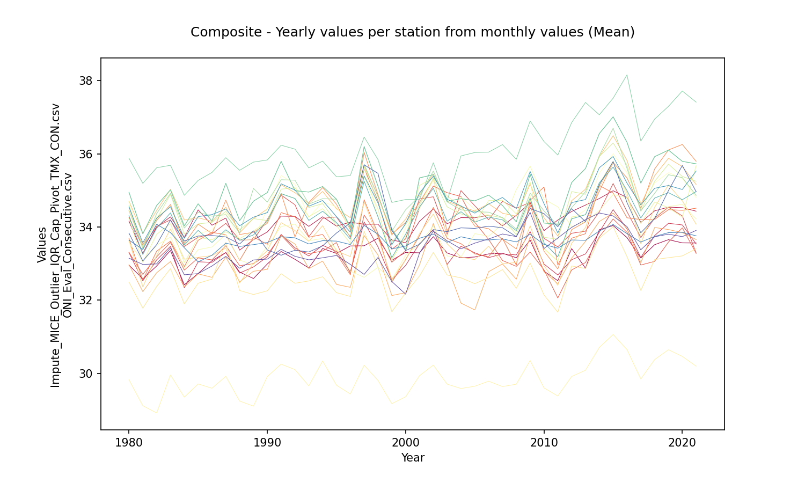
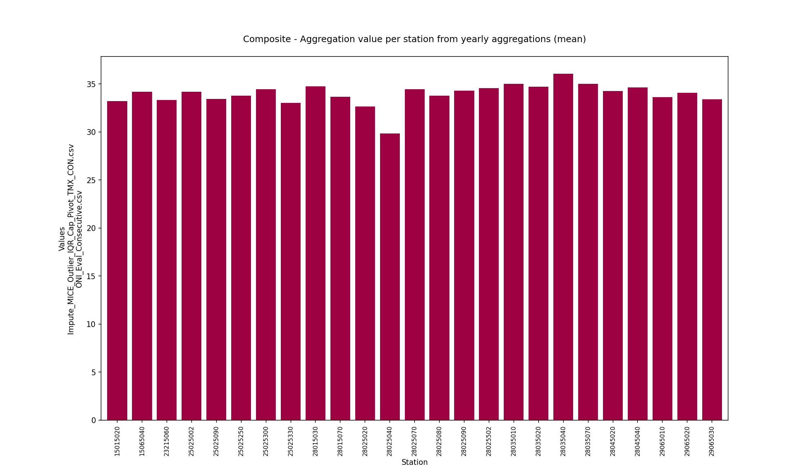
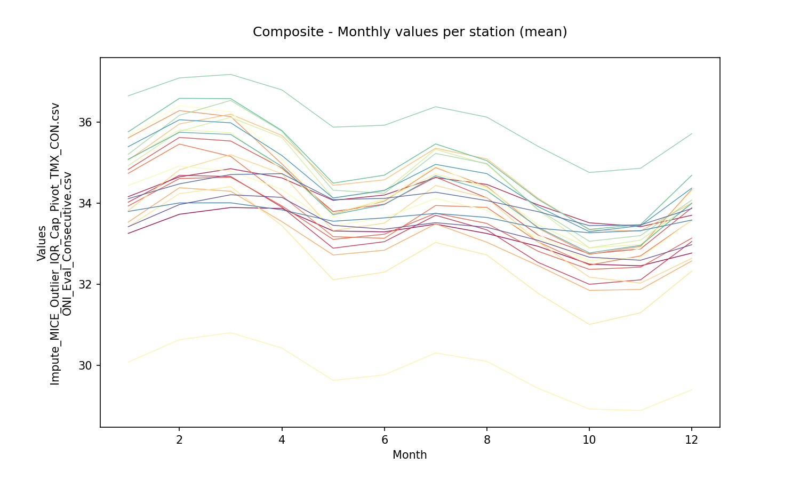
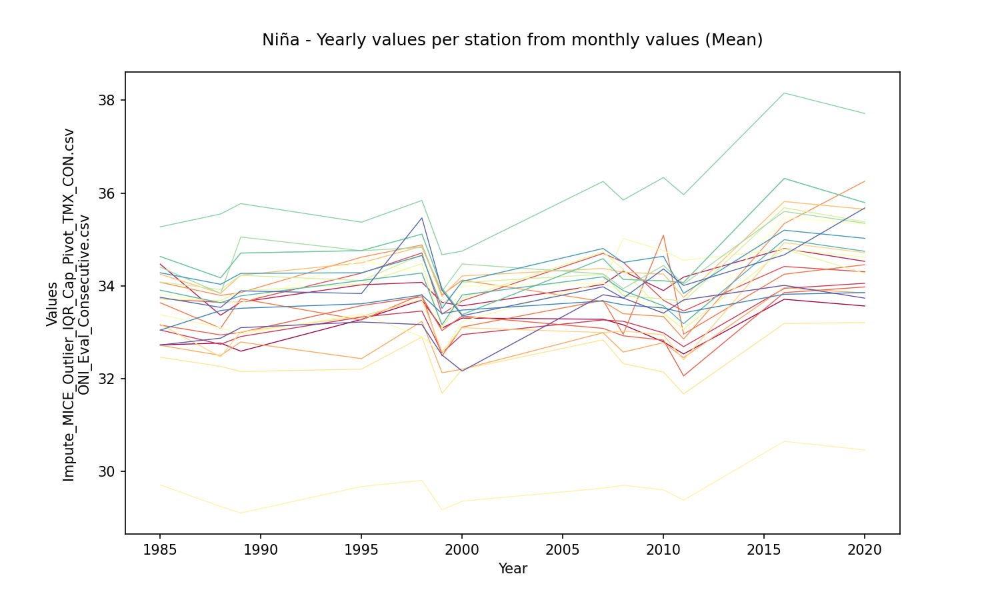
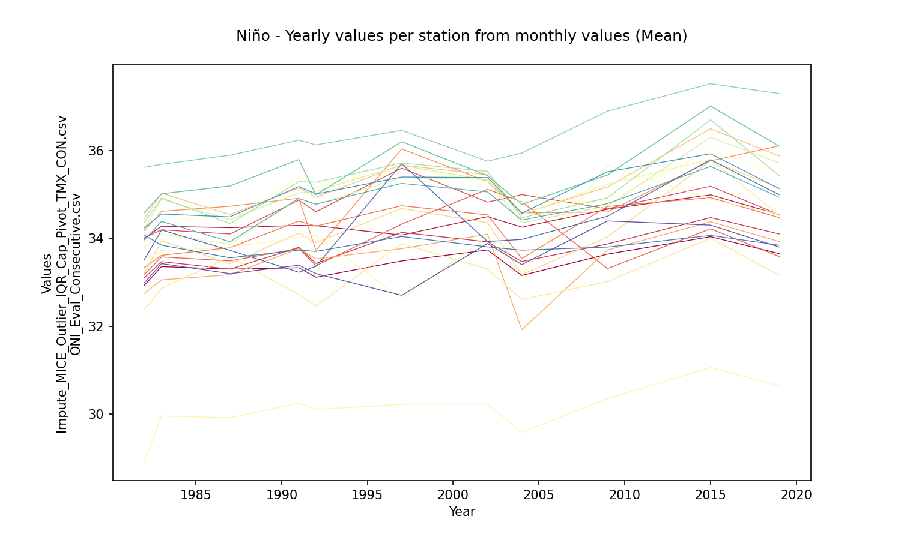
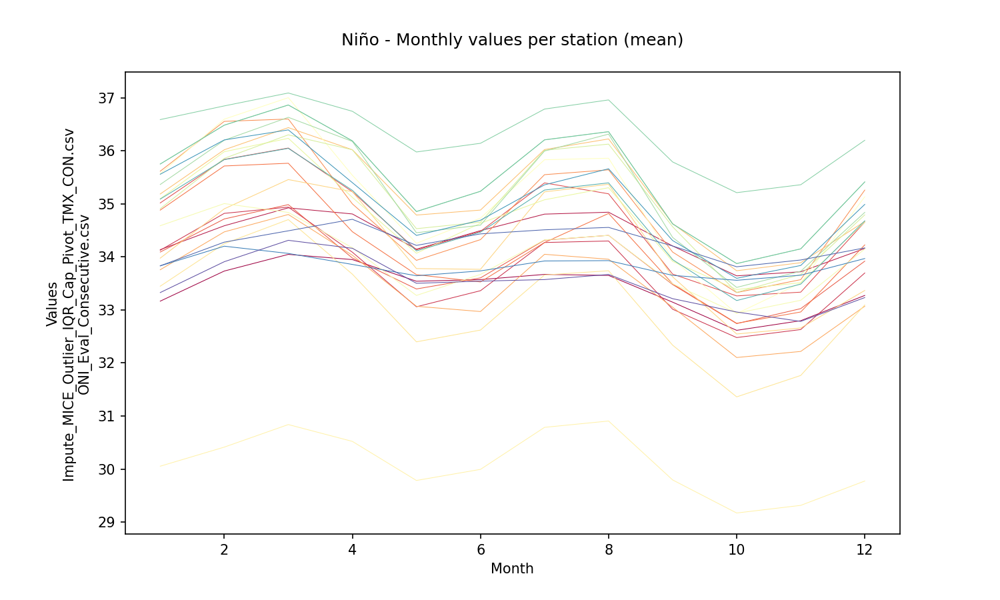
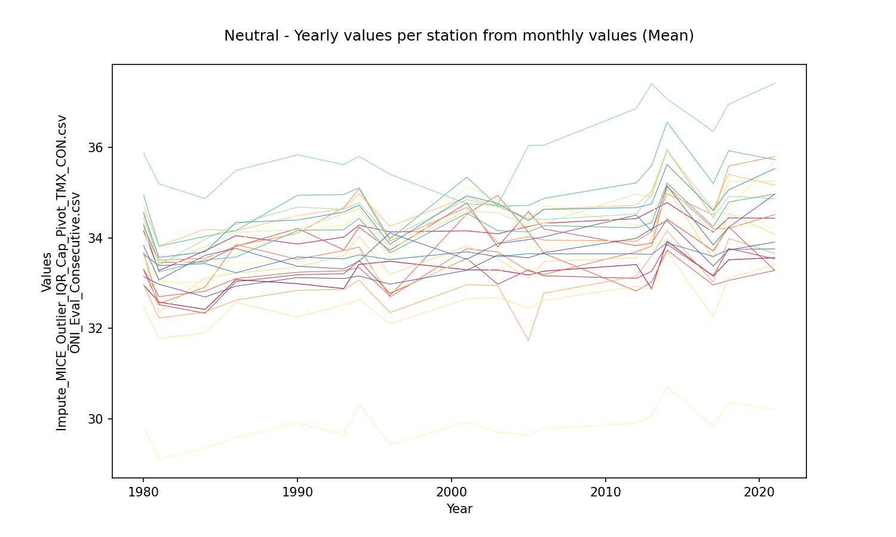
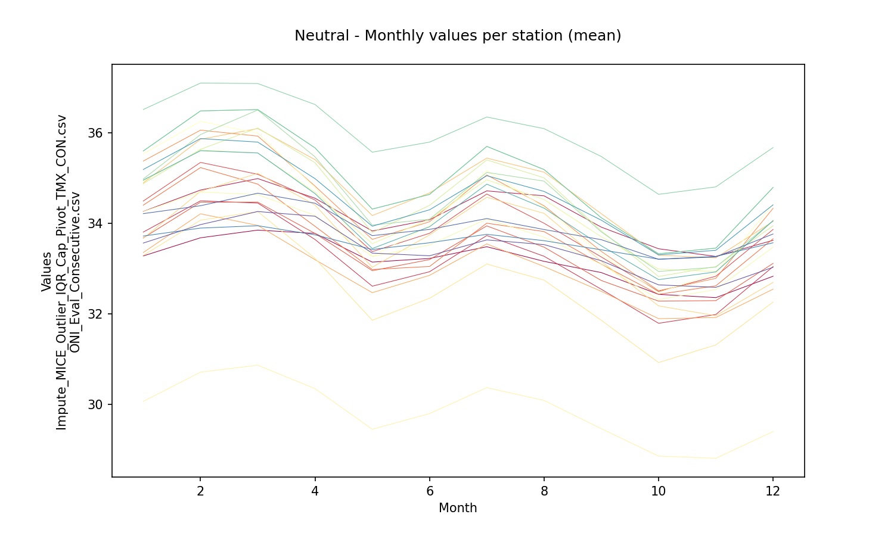
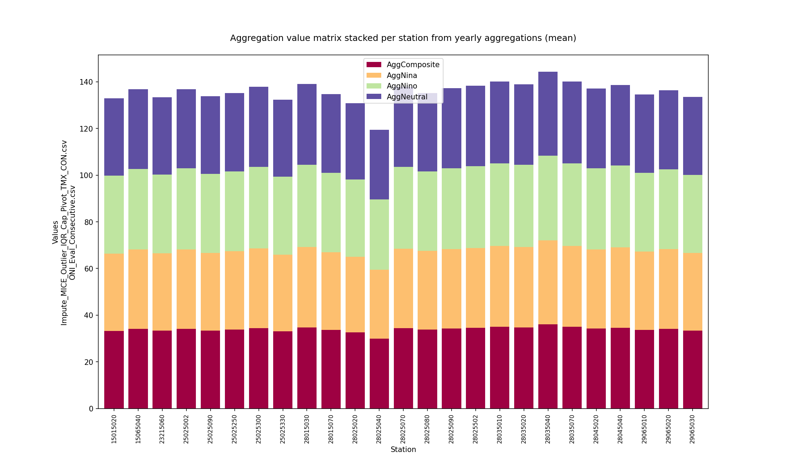
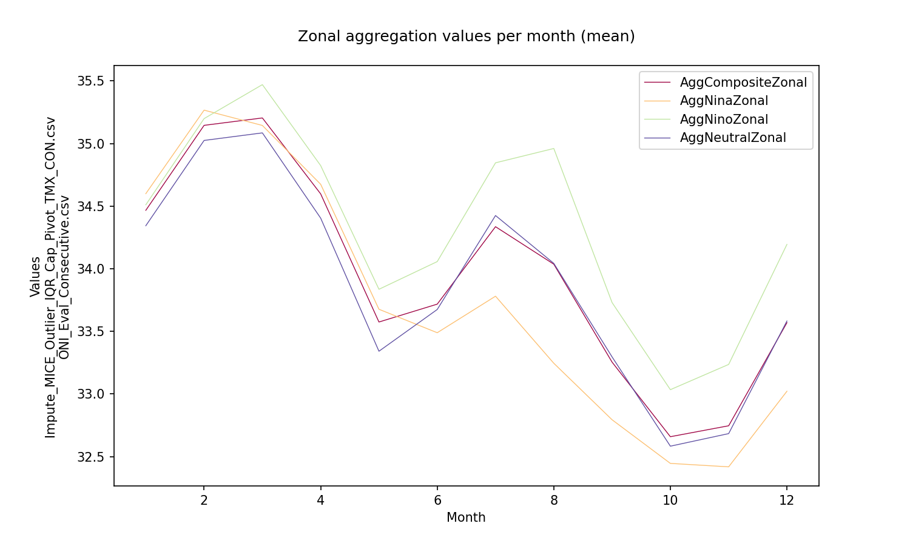

# Statistical aggregations for hydro-climatological composite series and yearly events Niño, Niña and Neutral

For further information about the NOAA - Oceanic Niño Index (ONI) classifier for climatological yearly events Niño, Niña and Neutral, check this activitie https://github.com/rcfdtools/R.LTWB/tree/main/Section03/ENSOONI

* Station records file: [Impute_MICE_Outlier_IQR_Cap_Pivot_TMX_CON.csv](../IDEAM_Impute/Impute_MICE_Outlier_IQR_Cap_Pivot_TMX_CON.csv)
* ENSO-ONI year file: [ONI_Eval_Consecutive.csv](../ENSOONI/ONI_Eval_Consecutive.csv)
* Records in station file: 15341
* Daily serie: True
* Aggregation function: Mean
* Execution date: 2022-11-23 18:09:48.233577
* Python version: 3.10.5 (tags/v3.10.5:f377153, Jun  6 2022, 16:14:13) [MSC v.1929 64 bit (AMD64)]
* Python path: ['D:\\R.LTWB\\.src', 'D:\\R.LTWB', 'D:\\R.TeachingResearchGuide', 'D:\\R.HydroTools', 'D:\\R.GISPython.wiki']
* matplotlib version: 3.6.0
* pandas version: 1.4.3
* Instructions & script: https://github.com/rcfdtools/R.LTWB/tree/main/Section03/AGG
* License: https://github.com/rcfdtools/R.LTWB/blob/main/LICENSE.md
* Credits: r.cfdtools@gmail.com

## Composite - Yearly values per station from monthly values (Mean)

|   Year |   15015020 |   15065040 |   23215060 |   25025002 |   25025090 |   25025250 |   25025300 |   25025330 |   28015030 |   28015070 |   28025020 |   28025040 |   28025070 |   28025080 |   28025090 |   28025502 |   28035010 |   28035020 |   28035040 |   28035070 |   28045020 |   28045040 |   29065010 |   29065020 |   29065030 |
|-------:|-----------:|-----------:|-----------:|-----------:|-----------:|-----------:|-----------:|-----------:|-----------:|-----------:|-----------:|-----------:|-----------:|-----------:|-----------:|-----------:|-----------:|-----------:|-----------:|-----------:|-----------:|-----------:|-----------:|-----------:|-----------:|
|   1980 |    32.9576 |    34.1582 |    33.2993 |    34.2623 |    33.3072 |    33.6806 |    34.4416 |    32.9658 |    34.7017 |    33.6272 |    32.4937 |    29.8246 |    34.6877 |    33.5753 |    34.2421 |    34.4487 |    34.9478 |    34.5805 |    35.8778 |    34.9478 |    34.3081 |    34.542  |    33.6402 |    33.8309 |    33.1461 |
|   1981 |    32.5801 |    33.2781 |    32.5262 |    33.4573 |    32.703  |    32.545  |    33.5079 |    32.2322 |    33.8185 |    32.359  |    31.78   |    29.1153 |    33.4294 |    33.058  |    33.0333 |    33.451  |    33.8142 |    33.4017 |    35.1922 |    33.8142 |    33.2479 |    33.5664 |    33.3867 |    33.0707 |    32.976  |
|   1982 |    32.933  |    34.002  |    33.0993 |    34.0136 |    33.183  |    33.3381 |    34.1778 |    32.7482 |    34.453  |    33.218  |    32.3728 |    28.9165 |    34.285  |    33.4997 |    33.7998 |    34.2142 |    34.5864 |    34.3681 |    35.6178 |    34.5864 |    33.965  |    34.2397 |    34.0758 |    33.5162 |    32.9898 |
|   1983 |    33.3574 |    34.2757 |    33.4708 |    34.1947 |    33.5788 |    33.6137 |    34.6157 |    33.0557 |    35.029  |    33.9465 |    32.8631 |    29.9573 |    34.5568 |    33.7245 |    34.0928 |    34.8937 |    35.0151 |    34.9191 |    35.6861 |    35.0151 |    34.385  |    34.5541 |    33.8448 |    34.1913 |    33.4259 |
|   1984 |    32.42   |    33.7144 |    32.3361 |    33.4663 |    32.8208 |    32.9167 |    33.5489 |    32.36   |    34.1903 |    33.1203 |    31.8971 |    29.3479 |    33.4953 |    32.8787 |    33.0197 |    33.8043 |    34.0295 |    33.9691 |    34.8645 |    34.0295 |    33.5087 |    33.6907 |    33.4321 |    33.6153 |    32.6935 |
|   1985 |    32.7273 |    34.468  |    33.0483 |    33.7209 |    33.1546 |    33.6363 |    34.0759 |    32.7184 |    34.2515 |    33.1697 |    32.462  |    29.7103 |    33.8132 |    33.3792 |    33.7162 |    34.0838 |    34.6336 |    34.4029 |    35.272  |    34.6336 |    33.9065 |    34.2821 |    33.0447 |    33.7531 |    32.7248 |
|   1986 |    33.0777 |    34.0483 |    33.0319 |    33.8097 |    33.1007 |    33.8515 |    33.8204 |    32.6229 |    34.1529 |    33.2176 |    32.5737 |    29.5921 |    33.9223 |    33.4527 |    33.6495 |    34.1253 |    34.159  |    34.2953 |    35.4898 |    34.159  |    33.5763 |    34.339  |    33.2282 |    33.7661 |    32.9331 |
|   1987 |    33.3005 |    34.243  |    33.3006 |    34.0995 |    33.4869 |    33.7903 |    34.7311 |    33.174  |    34.5394 |    33.4234 |    33.5756 |    29.9168 |    34.3782 |    33.7999 |    33.8681 |    34.4266 |    35.1935 |    34.3357 |    35.8938 |    35.1935 |    33.9231 |    34.4902 |    33.5582 |    33.7278 |    33.1972 |
|   1988 |    32.7665 |    33.3671 |    32.7402 |    33.6443 |    32.9422 |    33.0861 |    33.7937 |    32.5006 |    33.8401 |    32.469  |    32.264  |    29.2419 |    33.6614 |    33.095  |    33.6836 |    33.9205 |    34.1726 |    33.8352 |    35.5492 |    34.1726 |    33.6352 |    34.0338 |    33.4685 |    33.5349 |    32.8725 |
|   1989 |    32.5919 |    33.6499 |    32.9074 |    33.6459 |    32.9964 |    33.7234 |    33.855  |    32.7893 |    34.2309 |    33.0088 |    32.1533 |    29.1035 |    33.634  |    32.9634 |    33.8911 |    34.2278 |    34.7062 |    35.0527 |    35.7726 |    34.7062 |    33.7835 |    34.2684 |    33.5164 |    33.8927 |    33.0981 |
|   1990 |    32.9879 |    33.8629 |    33.1863 |    34.2065 |    33.2412 |    33.5255 |    34.1007 |    32.8405 |    34.492  |    33.3529 |    32.2549 |    29.9127 |    34.5082 |    33.4712 |    34.1468 |    34.1753 |    34.94   |    34.6793 |    35.8313 |    34.94   |    34.1611 |    34.3923 |    33.577  |    33.3716 |    33.1215 |
|   1991 |    33.3304 |    34.296  |    33.7964 |    34.8699 |    33.7713 |    34.3916 |    34.9137 |    33.7661 |    35.1522 |    34.1174 |    32.7221 |    30.2499 |    35.408  |    34.0151 |    34.9102 |    35.0333 |    35.794  |    35.2908 |    36.2339 |    35.794  |    34.9097 |    35.1797 |    33.7324 |    33.2279 |    33.3889 |
|   1992 |    33.1159 |    34.2883 |    33.4298 |    34.6065 |    33.3759 |    34.2787 |    33.7271 |    33.5338 |    34.9362 |    33.902  |    32.4612 |    30.1019 |    35.165  |    34.0771 |    34.7815 |    35.073  |    34.9922 |    35.2786 |    36.1274 |    34.9922 |    34.7775 |    35.0088 |    33.703  |    33.3636 |    33.1977 |
|   1993 |    32.8792 |    34.0165 |    33.2079 |    33.7352 |    33.2731 |    33.7188 |    34.6669 |    32.8626 |    34.6424 |    33.6087 |    32.5248 |    29.6563 |    34.2556 |    33.6236 |    34.2815 |    34.5309 |    34.9539 |    34.626  |    35.6149 |    34.9539 |    34.179  |    34.5677 |    33.5355 |    33.3162 |    33.102  |
|   1994 |    33.4129 |    34.2796 |    33.499  |    34.2353 |    33.3434 |    33.7957 |    35.0773 |    33.0672 |    34.971  |    34.0357 |    32.6397 |    30.3383 |    34.6893 |    33.6865 |    34.5005 |    34.6369 |    35.1056 |    34.7739 |    35.7993 |    35.1056 |    34.429  |    34.7233 |    33.6257 |    33.4838 |    33.1577 |
|   1995 |    33.2768 |    34.0228 |    33.328  |    34.2745 |    33.5746 |    33.2634 |    34.6188 |    32.43   |    34.4965 |    33.3435 |    32.2047 |    29.6749 |    34.5469 |    33.3962 |    34.0416 |    34.1149 |    34.7603 |    34.758  |    35.372  |    34.7603 |    34.1166 |    34.2823 |    33.6136 |    33.8343 |    33.2206 |
|   1996 |    33.4815 |    34.1301 |    32.7714 |    33.723  |    32.7236 |    32.6923 |    33.9287 |    32.3506 |    34.2533 |    33.1895 |    32.1015 |    29.4356 |    33.9651 |    32.7913 |    33.5495 |    33.7577 |    33.9741 |    34.0033 |    35.4046 |    33.9741 |    33.6656 |    33.8583 |    33.5197 |    34.1069 |    32.9772 |
|   1997 |    33.4861 |    34.075  |    34.1362 |    35.5992 |    34.3247 |    34.7436 |    36.0358 |    33.7658 |    35.6693 |    34.6812 |    33.8808 |    30.2218 |    35.6224 |    32.6237 |    35.377  |    35.6651 |    36.1996 |    35.7156 |    36.4583 |    36.1996 |    35.2518 |    35.3966 |    34.0423 |    35.6987 |    32.7032 |
|   1998 |    33.6941 |    34.075  |    33.4574 |    34.7097 |    33.7637 |    33.8156 |    34.8815 |    33.235  |    34.8522 |    33.705  |    32.8966 |    29.8063 |    34.28   |    32.8983 |    34.4796 |    34.6663 |    35.1157 |    34.8291 |    35.8414 |    35.1157 |    34.2757 |    34.655  |    33.8029 |    35.4656 |    33.1649 |
|   1999 |    33.0894 |    33.6448 |    32.5548 |    33.3899 |    33.0359 |    32.4896 |    33.8081 |    32.1261 |    33.7753 |    32.5803 |    31.6832 |    29.1697 |    33.0828 |    32.5349 |    33.1006 |    33.5766 |    33.9461 |    33.8858 |    34.6706 |    33.9461 |    33.1619 |    33.5161 |    33.4012 |    33.9071 |    32.5092 |
|   2000 |    33.3052 |    33.5688 |    32.9491 |    33.6762 |    33.3496 |    33.1121 |    34.1235 |    32.2042 |    34.2142 |    33.0975 |    32.1984 |    29.3588 |    33.9918 |    33.2355 |    33.7327 |    34.0715 |    33.3803 |    34.4713 |    34.7496 |    33.3803 |    33.802  |    34.0952 |    33.4782 |    33.3555 |    32.1637 |
|   2001 |    33.2934 |    34.1544 |    33.5449 |    34.7676 |    34.5253 |    33.7614 |    34.6716 |    32.962  |    34.8975 |    33.8171 |    32.6564 |    29.9339 |    34.4953 |    33.5323 |    35.134  |    34.5982 |    35.3415 |    34.8421 |    34.7501 |    35.3415 |    34.5433 |    34.9306 |    33.6917 |    33.5265 |    33.284  |
|   2002 |    33.7355 |    34.4942 |    33.9199 |    34.825  |    35.1165 |    34.5336 |    35.2938 |    34.0949 |    35.4462 |    34.3538 |    33.3048 |    30.2244 |    35.2932 |    34.0272 |    35.3436 |    35.3244 |    35.4286 |    35.5264 |    35.7557 |    35.4286 |    35.0563 |    35.3851 |    33.806  |    33.928  |    33.884  |
|   2003 |    33.2898 |    34.0881 |    32.9755 |    33.7995 |    34.9369 |    33.6878 |    33.8907 |    32.9474 |    34.7027 |    33.5395 |    32.6866 |    29.704  |    33.7152 |    33.2055 |    34.8483 |    34.5484 |    34.7012 |    34.684  |    34.7198 |    34.7012 |    34.1589 |    34.7578 |    33.5808 |    33.8716 |    33.6206 |
|   2004 |    33.156  |    34.2558 |    33.4723 |    34.9954 |    34.8315 |    33.5427 |    34.5785 |    31.9194 |    34.5577 |    33.1749 |    32.6093 |    29.585  |    34.8142 |    33.1796 |    34.5441 |    34.355  |    34.7746 |    34.4692 |    35.9418 |    34.7746 |    34.4169 |    34.5729 |    33.7315 |    33.9759 |    33.4016 |
|   2005 |    33.1793 |    34.2511 |    33.2934 |    34.5774 |    34.1261 |    33.264  |    34.0253 |    31.7319 |    34.4363 |    33.1075 |    32.4498 |    29.647  |    34.4842 |    33.8177 |    34.1056 |    34.2645 |    34.7138 |    34.4174 |    36.0351 |    34.7138 |    34.131  |    34.3783 |    33.6514 |    33.9614 |    33.5587 |
|   2006 |    33.2642 |    34.3214 |    33.1618 |    34.1956 |    33.6572 |    33.1904 |    33.9511 |    32.7791 |    34.6326 |    33.4775 |    32.6163 |    29.7848 |    34.3209 |    33.7476 |    34.7203 |    34.3216 |    34.8694 |    34.404  |    36.0456 |    34.8694 |    34.271  |    34.6278 |    33.6451 |    34.0217 |    33.6708 |
|   2007 |    33.2798 |    34.0295 |    33.2656 |    34.7001 |    33.0833 |    33.688  |    33.6637 |    32.9889 |    34.3749 |    32.9937 |    32.835  |    29.6382 |    34.0566 |    34.0819 |    34.7299 |    34.2499 |    34.5861 |    34.2567 |    36.2509 |    34.5861 |    34.1941 |    34.8056 |    33.6739 |    33.9794 |    33.8079 |
|   2008 |    33.1595 |    34.3185 |    33.2356 |    34.5113 |    32.9231 |    32.9555 |    33.3995 |    32.5722 |    34.2935 |    33.0282 |    32.3241 |    29.702  |    33.8692 |    35.0198 |    34.3557 |    33.7884 |    34.1391 |    33.9399 |    35.8497 |    34.1391 |    33.8987 |    34.5051 |    33.5914 |    33.7344 |    33.7368 |
|   2009 |    33.6415 |    34.6628 |    33.8726 |    34.6733 |    33.3139 |    34.7264 |    34.6024 |    33.7353 |    35.1733 |    34.0334 |    33.0157 |    30.3517 |    34.856  |    35.6648 |    35.2325 |    34.7386 |    35.4437 |    34.923  |    36.8978 |    35.4437 |    34.7903 |    35.5162 |    33.8022 |    34.5051 |    34.3965 |
|   2010 |    32.7925 |    33.898  |    32.9868 |    33.6893 |    32.8292 |    35.0918 |    33.3386 |    32.7758 |    34.2541 |    32.9435 |    32.1423 |    29.6027 |    33.3937 |    34.7596 |    33.4161 |    33.7175 |    34.1079 |    34.44   |    36.3357 |    34.1079 |    33.5687 |    34.6378 |    33.5232 |    34.3648 |    33.4114 |
|   2011 |    32.5321 |    34.1886 |    32.6878 |    33.4574 |    32.0593 |    32.9589 |    32.8533 |    32.4515 |    33.7505 |    32.4046 |    31.6702 |    29.3796 |    33.0618 |    34.5503 |    33.0667 |    33.6655 |    34.0738 |    34.0385 |    35.9646 |    34.0738 |    33.1846 |    33.8372 |    33.4197 |    34.0083 |    33.6974 |
|   2012 |    33.41   |    34.4239 |    33.1054 |    33.8283 |    32.8255 |    33.6931 |    33.9257 |    33.1485 |    34.7186 |    33.5554 |    32.9345 |    29.9127 |    34.2143 |    34.0105 |    34.2742 |    34.9672 |    35.2138 |    34.5267 |    36.8531 |    35.2138 |    34.2207 |    34.6671 |    33.6454 |    34.5017 |    33.9876 |
|   2013 |    32.8723 |    34.5977 |    33.2623 |    33.8847 |    33.0271 |    33.8154 |    34.138  |    33.6038 |    35.0329 |    33.9816 |    32.864  |    30.0831 |    34.4671 |    34.1481 |    34.3374 |    34.8919 |    35.5968 |    34.9658 |    37.4031 |    35.5968 |    34.3353 |    34.7479 |    33.6348 |    34.1468 |    34.1982 |
|   2014 |    33.9253 |    34.7774 |    33.8585 |    34.4129 |    33.7291 |    35.134  |    34.9747 |    34.1503 |    35.9215 |    35.0903 |    33.6937 |    30.7063 |    35.4707 |    34.4493 |    35.186  |    35.9242 |    36.5533 |    35.9513 |    37.066  |    36.5533 |    35.2075 |    35.619  |    33.8902 |    35.1504 |    34.382  |
|   2015 |    34.0384 |    34.9901 |    34.4744 |    35.1874 |    34.2181 |    34.9271 |    35.7638 |    34.3783 |    36.4947 |    35.7705 |    34.0055 |    31.0607 |    36.0021 |    34.8883 |    35.7986 |    36.2966 |    37.0107 |    36.6995 |    37.5207 |    37.0107 |    35.6367 |    35.926  |    34.0677 |    35.7889 |    34.3016 |
|   2016 |    33.7108 |    34.8052 |    33.9446 |    34.4181 |    33.8539 |    34.2509 |    35.342  |    33.9588 |    35.8181 |    34.9306 |    33.1888 |    30.6487 |    35.4795 |    34.7943 |    34.7967 |    35.6841 |    36.3156 |    35.6035 |    38.157  |    36.3156 |    34.9958 |    35.1997 |    33.8183 |    34.6683 |    34.0105 |
|   2017 |    33.1525 |    34.1234 |    33.1631 |    33.711  |    32.9597 |    34.2028 |    34.5067 |    33.0238 |    34.6209 |    33.539  |    32.2632 |    29.8456 |    34.5541 |    33.7573 |    34.0945 |    34.4298 |    35.1998 |    34.4415 |    36.349  |    35.1998 |    34.2452 |    34.6023 |    33.5879 |    33.8416 |    33.3768 |
|   2018 |    33.5153 |    34.4408 |    33.765  |    34.2422 |    33.0599 |    34.206  |    35.5843 |    33.9857 |    35.4018 |    34.5391 |    33.1109 |    30.3757 |    35.203  |    34.2808 |    34.6819 |    35.2483 |    35.922  |    34.9197 |    36.9478 |    35.922  |    34.7906 |    35.0574 |    33.7412 |    34.233  |    33.7315 |
|   2019 |    33.653  |    34.5416 |    34.1003 |    34.5404 |    33.588  |    34.4733 |    36.105  |    33.929  |    35.878  |    35.1493 |    33.16   |    30.645  |    35.4849 |    34.5551 |    34.5256 |    35.7168 |    36.1012 |    35.4281 |    37.2963 |    36.1012 |    34.9371 |    35.1335 |    33.8448 |    34.9952 |    33.8033 |
|   2020 |    33.5656 |    34.5282 |    34.0555 |    34.3025 |    33.9765 |    34.4555 |    36.2547 |    33.8461 |    35.6511 |    34.7137 |    33.209  |    30.4626 |    35.3275 |    34.6202 |    34.2674 |    35.3803 |    35.794  |    35.3493 |    37.7157 |    35.794  |    34.7455 |    35.0242 |    33.8545 |    35.6796 |    33.7352 |
|   2021 |    33.5615 |    34.4315 |    33.5345 |    33.2829 |    33.2811 |    34.5133 |    35.794  |    33.6557 |    35.1605 |    34.0756 |    33.4048 |    30.1956 |    34.8042 |    34.2185 |    35.6748 |    35.2484 |    35.7248 |    34.8625 |    37.4121 |    35.7248 |    34.9662 |    35.5285 |    33.7574 |    34.9629 |    33.9061 |

Composite - Aggregation value per station from yearly aggregations (mean)

|              |   15015020 |   15065040 |   23215060 |   25025002 |   25025090 |   25025250 |   25025300 |   25025330 |   28015030 |   28015070 |   28025020 |   28025040 |   28025070 |   28025080 |   28025090 |   28025502 |   28035010 |   28035020 |   28035040 |   28035070 |   28045020 |   28045040 |   29065010 |   29065020 |   29065030 |
|:-------------|-----------:|-----------:|-----------:|-----------:|-----------:|-----------:|-----------:|-----------:|-----------:|-----------:|-----------:|-----------:|-----------:|-----------:|-----------:|-----------:|-----------:|-----------:|-----------:|-----------:|-----------:|-----------:|-----------:|-----------:|-----------:|
| AggComposite |    33.2262 |    34.1854 |    33.3275 |    34.1748 |    33.4517 |    33.7876 |    34.4549 |    33.0473 |     34.759 |    33.6522 |    32.6702 |    29.8605 |    34.4463 |    33.7878 |    34.3103 |    34.5775 |    35.0007 |    34.7181 |    36.0616 |    35.0007 |    34.2682 |    34.6462 |    33.6473 |    34.0923 |    33.3968 |

Composite - Monthly values per station (mean)

|   Month |   15015020 |   15065040 |   23215060 |   25025002 |   25025090 |   25025250 |   25025300 |   25025330 |   28015030 |   28015070 |   28025020 |   28025040 |   28025070 |   28025080 |   28025090 |   28025502 |   28035010 |   28035020 |   28035040 |   28035070 |   28045020 |   28045040 |   29065010 |   29065020 |   29065030 |
|--------:|-----------:|-----------:|-----------:|-----------:|-----------:|-----------:|-----------:|-----------:|-----------:|-----------:|-----------:|-----------:|-----------:|-----------:|-----------:|-----------:|-----------:|-----------:|-----------:|-----------:|-----------:|-----------:|-----------:|-----------:|-----------:|
|       1 |    33.2521 |    34.1592 |    34.0224 |    34.8298 |    33.9289 |    34.7335 |    35.6097 |    33.5304 |    35.0597 |    33.8144 |    33.4124 |    30.0757 |    35.6612 |    34.4334 |    35.0544 |    34.9235 |    35.7593 |    35.2039 |    36.6477 |    35.7593 |    35.0813 |    35.3923 |    33.7943 |    34.1087 |    33.4167 |
|       2 |    33.7245 |    34.6478 |    34.6856 |    35.6216 |    34.6065 |    35.4577 |    36.2839 |    34.3803 |    35.9552 |    34.8222 |    34.2345 |    30.6283 |    36.4094 |    34.9144 |    35.8086 |    35.771  |    36.5865 |    36.1675 |    37.0899 |    36.5865 |    35.7487 |    36.0576 |    34.0043 |    34.4751 |    33.9648 |
|       3 |    33.8908 |    34.8492 |    34.6571 |    35.5328 |    34.6392 |    35.1539 |    36.1369 |    34.2924 |    36.1944 |    35.1944 |    34.4055 |    30.8005 |    36.2498 |    34.7924 |    35.7389 |    36.1176 |    36.5789 |    36.5345 |    37.177  |    36.5789 |    35.6941 |    35.9825 |    34.007  |    34.7051 |    34.206  |
|       4 |    33.8683 |    34.6219 |    33.899  |    34.8645 |    33.9306 |    34.1816 |    34.9664 |    33.5435 |    35.669  |    34.7243 |    33.4432 |    30.4228 |    35.0907 |    34.3371 |    34.8367 |    35.6191 |    35.7911 |    35.7743 |    36.7944 |    35.7911 |    34.904  |    35.1747 |    33.8317 |    34.7273 |    34.1412 |
|       5 |    33.3121 |    34.0675 |    32.8873 |    33.7913 |    33.1038 |    33.1726 |    33.7386 |    32.719  |    34.4393 |    33.3225 |    32.1083 |    29.6242 |    33.6513 |    33.4479 |    33.743  |    34.1239 |    34.4934 |    34.318  |    35.8754 |    34.4934 |    33.7133 |    34.1267 |    33.552  |    34.0837 |    33.4512 |
|       6 |    33.2902 |    34.1994 |    33.0476 |    33.9732 |    33.233  |    33.132  |    34.0492 |    32.8371 |    34.5745 |    33.505  |    32.2956 |    29.7607 |    34.0812 |    33.6319 |    34.0933 |    34.2936 |    34.6901 |    34.2422 |    35.922  |    34.6901 |    33.9632 |    34.3161 |    33.6354 |    34.1173 |    33.3557 |
|       7 |    33.4809 |    34.6308 |    33.6999 |    34.6428 |    33.7497 |    33.9409 |    34.8752 |    33.4872 |    35.3555 |    34.435  |    33.0281 |    30.3007 |    34.912  |    34.1148 |    34.7208 |    35.3298 |    35.4608 |    35.2266 |    36.3791 |    35.4608 |    34.6768 |    34.9559 |    33.7456 |    34.2687 |    33.5167 |
|       8 |    33.2499 |    34.4611 |    33.3394 |    34.1285 |    33.4985 |    33.8939 |    34.4113 |    33.0342 |    35.0904 |    34.1265 |    32.7195 |    30.0933 |    34.3547 |    33.825  |    34.3835 |    34.9571 |    35.0475 |    34.9754 |    36.1221 |    35.0475 |    34.3083 |    34.7272 |    33.6461 |    34.061  |    33.4035 |
|       9 |    32.9326 |    33.9552 |    32.5371 |    33.213  |    32.8117 |    33.0416 |    33.3809 |    32.4566 |    34.118  |    33.0462 |    31.7725 |    29.4278 |    33.2337 |    33.1364 |    33.4612 |    33.8287 |    34.0928 |    33.8421 |    35.4014 |    34.0928 |    33.4019 |    33.9128 |    33.3816 |    33.7886 |    33.0792 |
|      10 |    32.4928 |    33.5143 |    31.9962 |    32.7463 |    32.3631 |    32.4704 |    32.7349 |    31.8462 |    33.3381 |    32.1719 |    31.0051 |    28.9171 |    32.5261 |    32.5855 |    32.8953 |    32.8946 |    33.3512 |    33.0576 |    34.7558 |    33.3512 |    32.7707 |    33.2957 |    33.268  |    33.4445 |    32.6644 |
|      11 |    32.4526 |    33.4178 |    32.1056 |    32.8695 |    32.4188 |    32.6972 |    32.931  |    31.8679 |    33.3113 |    32.0256 |    31.2945 |    28.8828 |    32.8853 |    32.6539 |    32.9774 |    33.0861 |    33.4684 |    33.1986 |    34.8606 |    33.4684 |    32.9564 |    33.4417 |    33.3198 |    33.4603 |    32.5891 |
|      12 |    32.7672 |    33.7005 |    33.0531 |    33.8847 |    33.1367 |    33.5762 |    34.3412 |    32.5731 |    34.003  |    32.6385 |    32.3231 |    29.3922 |    34.3007 |    33.5813 |    34.0103 |    33.9856 |    34.6886 |    34.0767 |    35.7137 |    34.6886 |    33.9993 |    34.3716 |    33.5816 |    33.8669 |    32.9732 |

Composite - Zonal monthly values (mean)

|   Month |   AggCompositeZonal |
|--------:|--------------------:|
|       1 |             34.4666 |
|       2 |             35.1453 |
|       3 |             35.2044 |
|       4 |             34.5979 |
|       5 |             33.5744 |
|       6 |             33.7172 |
|       7 |             34.3358 |
|       8 |             34.0362 |
|       9 |             33.2539 |
|      10 |             32.6583 |
|      11 |             32.7456 |
|      12 |             33.5691 |

## ENSO-ONI Events - Yearly values per station from monthly values (Mean)

* Records in ENSO-ONI file: 73
* ENSO-ONI eventMark unique values: [-1  1  0]

### Niña events analysis (24 years identified)

|   Id |   YR |   NinaCount |   NinoCount |   NeutralCount | Event   |   EventMark |   EventLabel |
|-----:|-----:|------------:|------------:|---------------:|:--------|------------:|-------------:|
|    0 | 1950 |           7 |           0 |              5 | Niña    |          -1 |            7 |
|    4 | 1954 |           8 |           1 |              3 | Niña    |          -1 |            8 |
|    5 | 1955 |          12 |           0 |              0 | Niña    |          -1 |           12 |
|    6 | 1956 |           8 |           0 |              4 | Niña    |          -1 |            8 |
|   14 | 1964 |           8 |           2 |              2 | Niña    |          -1 |            8 |
|   20 | 1970 |           6 |           1 |              5 | Niña    |          -1 |            6 |
|   21 | 1971 |          12 |           0 |              0 | Niña    |          -1 |           12 |
|   23 | 1973 |           8 |           3 |              1 | Niña    |          -1 |            8 |
|   24 | 1974 |           7 |           0 |              5 | Niña    |          -1 |            7 |
|   25 | 1975 |          12 |           0 |              0 | Niña    |          -1 |           12 |
|   35 | 1985 |           6 |           0 |              6 | Niña    |          -1 |            6 |
|   38 | 1988 |           8 |           2 |              2 | Niña    |          -1 |            8 |
|   39 | 1989 |           5 |           0 |              7 | Niña    |          -1 |            5 |
|   45 | 1995 |           5 |           3 |              4 | Niña    |          -1 |            5 |
|   48 | 1998 |           6 |           4 |              2 | Niña    |          -1 |            6 |
|   49 | 1999 |          12 |           0 |              0 | Niña    |          -1 |           12 |
|   50 | 2000 |          12 |           0 |              0 | Niña    |          -1 |           12 |
|   57 | 2007 |           6 |           1 |              5 | Niña    |          -1 |            6 |
|   58 | 2008 |           6 |           0 |              6 | Niña    |          -1 |            6 |
|   60 | 2010 |           7 |           3 |              2 | Niña    |          -1 |            7 |
|   61 | 2011 |           5 |           0 |              7 | Niña    |          -1 |            5 |
|   66 | 2016 |           5 |           4 |              3 | Niña    |          -1 |            5 |
|   70 | 2020 |           5 |           1 |              6 | Niña    |          -1 |            5 |
|   72 | 2022 |           8 |           0 |              4 | Niña    |          -1 |            8 |

Niña - Table aggregations (Mean)

|   Year |   15015020 |   15065040 |   23215060 |   25025002 |   25025090 |   25025250 |   25025300 |   25025330 |   28015030 |   28015070 |   28025020 |   28025040 |   28025070 |   28025080 |   28025090 |   28025502 |   28035010 |   28035020 |   28035040 |   28035070 |   28045020 |   28045040 |   29065010 |   29065020 |   29065030 |
|-------:|-----------:|-----------:|-----------:|-----------:|-----------:|-----------:|-----------:|-----------:|-----------:|-----------:|-----------:|-----------:|-----------:|-----------:|-----------:|-----------:|-----------:|-----------:|-----------:|-----------:|-----------:|-----------:|-----------:|-----------:|-----------:|
|   1985 |    32.7273 |    34.468  |    33.0483 |    33.7209 |    33.1546 |    33.6363 |    34.0759 |    32.7184 |    34.2515 |    33.1697 |    32.462  |    29.7103 |    33.8132 |    33.3792 |    33.7162 |    34.0838 |    34.6336 |    34.4029 |    35.272  |    34.6336 |    33.9065 |    34.2821 |    33.0447 |    33.7531 |    32.7248 |
|   1988 |    32.7665 |    33.3671 |    32.7402 |    33.6443 |    32.9422 |    33.0861 |    33.7937 |    32.5006 |    33.8401 |    32.469  |    32.264  |    29.2419 |    33.6614 |    33.095  |    33.6836 |    33.9205 |    34.1726 |    33.8352 |    35.5492 |    34.1726 |    33.6352 |    34.0338 |    33.4685 |    33.5349 |    32.8725 |
|   1989 |    32.5919 |    33.6499 |    32.9074 |    33.6459 |    32.9964 |    33.7234 |    33.855  |    32.7893 |    34.2309 |    33.0088 |    32.1533 |    29.1035 |    33.634  |    32.9634 |    33.8911 |    34.2278 |    34.7062 |    35.0527 |    35.7726 |    34.7062 |    33.7835 |    34.2684 |    33.5164 |    33.8927 |    33.0981 |
|   1995 |    33.2768 |    34.0228 |    33.328  |    34.2745 |    33.5746 |    33.2634 |    34.6188 |    32.43   |    34.4965 |    33.3435 |    32.2047 |    29.6749 |    34.5469 |    33.3962 |    34.0416 |    34.1149 |    34.7603 |    34.758  |    35.372  |    34.7603 |    34.1166 |    34.2823 |    33.6136 |    33.8343 |    33.2206 |
|   1998 |    33.6941 |    34.075  |    33.4574 |    34.7097 |    33.7637 |    33.8156 |    34.8815 |    33.235  |    34.8522 |    33.705  |    32.8966 |    29.8063 |    34.28   |    32.8983 |    34.4796 |    34.6663 |    35.1157 |    34.8291 |    35.8414 |    35.1157 |    34.2757 |    34.655  |    33.8029 |    35.4656 |    33.1649 |
|   1999 |    33.0894 |    33.6448 |    32.5548 |    33.3899 |    33.0359 |    32.4896 |    33.8081 |    32.1261 |    33.7753 |    32.5803 |    31.6832 |    29.1697 |    33.0828 |    32.5349 |    33.1006 |    33.5766 |    33.9461 |    33.8858 |    34.6706 |    33.9461 |    33.1619 |    33.5161 |    33.4012 |    33.9071 |    32.5092 |
|   2000 |    33.3052 |    33.5688 |    32.9491 |    33.6762 |    33.3496 |    33.1121 |    34.1235 |    32.2042 |    34.2142 |    33.0975 |    32.1984 |    29.3588 |    33.9918 |    33.2355 |    33.7327 |    34.0715 |    33.3803 |    34.4713 |    34.7496 |    33.3803 |    33.802  |    34.0952 |    33.4782 |    33.3555 |    32.1637 |
|   2007 |    33.2798 |    34.0295 |    33.2656 |    34.7001 |    33.0833 |    33.688  |    33.6637 |    32.9889 |    34.3749 |    32.9937 |    32.835  |    29.6382 |    34.0566 |    34.0819 |    34.7299 |    34.2499 |    34.5861 |    34.2567 |    36.2509 |    34.5861 |    34.1941 |    34.8056 |    33.6739 |    33.9794 |    33.8079 |
|   2008 |    33.1595 |    34.3185 |    33.2356 |    34.5113 |    32.9231 |    32.9555 |    33.3995 |    32.5722 |    34.2935 |    33.0282 |    32.3241 |    29.702  |    33.8692 |    35.0198 |    34.3557 |    33.7884 |    34.1391 |    33.9399 |    35.8497 |    34.1391 |    33.8987 |    34.5051 |    33.5914 |    33.7344 |    33.7368 |
|   2010 |    32.7925 |    33.898  |    32.9868 |    33.6893 |    32.8292 |    35.0918 |    33.3386 |    32.7758 |    34.2541 |    32.9435 |    32.1423 |    29.6027 |    33.3937 |    34.7596 |    33.4161 |    33.7175 |    34.1079 |    34.44   |    36.3357 |    34.1079 |    33.5687 |    34.6378 |    33.5232 |    34.3648 |    33.4114 |
|   2011 |    32.5321 |    34.1886 |    32.6878 |    33.4574 |    32.0593 |    32.9589 |    32.8533 |    32.4515 |    33.7505 |    32.4046 |    31.6702 |    29.3796 |    33.0618 |    34.5503 |    33.0667 |    33.6655 |    34.0738 |    34.0385 |    35.9646 |    34.0738 |    33.1846 |    33.8372 |    33.4197 |    34.0083 |    33.6974 |
|   2016 |    33.7108 |    34.8052 |    33.9446 |    34.4181 |    33.8539 |    34.2509 |    35.342  |    33.9588 |    35.8181 |    34.9306 |    33.1888 |    30.6487 |    35.4795 |    34.7943 |    34.7967 |    35.6841 |    36.3156 |    35.6035 |    38.157  |    36.3156 |    34.9958 |    35.1997 |    33.8183 |    34.6683 |    34.0105 |
|   2020 |    33.5656 |    34.5282 |    34.0555 |    34.3025 |    33.9765 |    34.4555 |    36.2547 |    33.8461 |    35.6511 |    34.7137 |    33.209  |    30.4626 |    35.3275 |    34.6202 |    34.2674 |    35.3803 |    35.794  |    35.3493 |    37.7157 |    35.794  |    34.7455 |    35.0242 |    33.8545 |    35.6796 |    33.7352 |

Niña - Aggregation value per station from yearly aggregations (mean)

|         |   15015020 |   15065040 |   23215060 |   25025002 |   25025090 |   25025250 |   25025300 |   25025330 |   28015030 |   28015070 |   28025020 |   28025040 |   28025070 |   28025080 |   28025090 |   28025502 |   28035010 |   28035020 |   28035040 |   28035070 |   28045020 |   28045040 |   29065010 |   29065020 |   29065030 |
|:--------|-----------:|-----------:|-----------:|-----------:|-----------:|-----------:|-----------:|-----------:|-----------:|-----------:|-----------:|-----------:|-----------:|-----------:|-----------:|-----------:|-----------:|-----------:|-----------:|-----------:|-----------:|-----------:|-----------:|-----------:|-----------:|
| AggNina |    33.1147 |    34.0434 |    33.1662 |    34.0108 |    33.1956 |     33.579 |    34.1545 |    32.8152 |    34.4464 |    33.2606 |    32.4024 |    29.6538 |    34.0153 |    33.7945 |    33.9444 |    34.2421 |    34.5947 |    34.5279 |    35.9616 |    34.5947 |    33.9438 |    34.3956 |    33.5543 |    34.1675 |    33.2425 |

Niña - Monthly values per station (mean)

|   Month |   15015020 |   15065040 |   23215060 |   25025002 |   25025090 |   25025250 |   25025300 |   25025330 |   28015030 |   28015070 |   28025020 |   28025040 |   28025070 |   28025080 |   28025090 |   28025502 |   28035010 |   28035020 |   28035040 |   28035070 |   28045020 |   28045040 |   29065010 |   29065020 |   29065030 |
|--------:|-----------:|-----------:|-----------:|-----------:|-----------:|-----------:|-----------:|-----------:|-----------:|-----------:|-----------:|-----------:|-----------:|-----------:|-----------:|-----------:|-----------:|-----------:|-----------:|-----------:|-----------:|-----------:|-----------:|-----------:|-----------:|
|       1 |    33.2815 |    34.0293 |    34.2282 |    35.1325 |    34.1334 |    35.0611 |    35.9216 |    33.5735 |    35.1763 |    33.8733 |    33.5452 |    30.1028 |    35.9117 |    34.5355 |    35.176  |    34.9957 |    35.9827 |    35.372  |    36.8743 |    35.9827 |    35.2419 |    35.5258 |    33.8608 |    34.1903 |    33.282  |
|       2 |    33.7716 |    34.5715 |    34.8252 |    35.8131 |    34.701  |    35.5465 |    36.3587 |    34.5317 |    36.0288 |    34.9053 |    34.4439 |    30.6887 |    36.4568 |    35.1377 |    35.9169 |    35.8784 |    36.8082 |    36.4188 |    37.2761 |    36.8082 |    35.8694 |    36.1812 |    33.9818 |    34.7542 |    33.9959 |
|       3 |    33.8083 |    34.5853 |    34.7021 |    35.7078 |    34.5759 |    35.0277 |    36.0275 |    34.3244 |    36.1196 |    35.0887 |    34.3463 |    30.6733 |    35.9633 |    34.9668 |    35.564  |    35.9698 |    36.4208 |    36.4872 |    37.3644 |    36.4208 |    35.5817 |    35.8855 |    34.0337 |    34.9333 |    34.033  |
|       4 |    33.9191 |    34.5493 |    34.086  |    35.0336 |    34.0972 |    34.2688 |    35.1303 |    33.6039 |    35.7271 |    34.7315 |    33.5424 |    30.4383 |    35.1124 |    34.694  |    34.7982 |    35.6597 |    35.6199 |    35.8497 |    37.0624 |    35.6199 |    34.9432 |    35.2363 |    33.9218 |    35.128  |    34.0954 |
|       5 |    33.3454 |    34.3234 |    33.117  |    34.0724 |    33.0589 |    33.0157 |    33.6951 |    32.7639 |    34.5068 |    33.3331 |    32.203  |    29.7238 |    33.6629 |    33.8416 |    33.7267 |    34.2249 |    34.4281 |    34.6889 |    36.2015 |    34.4281 |    33.7424 |    34.1473 |    33.6466 |    34.457  |    33.5529 |
|       6 |    33.1376 |    34.1092 |    32.9369 |    33.8036 |    32.9598 |    32.9084 |    33.8285 |    32.7001 |    34.1708 |    32.9479 |    31.9477 |    29.5094 |    33.7042 |    33.7449 |    33.6289 |    33.8389 |    34.2914 |    34.1421 |    35.9051 |    34.2914 |    33.5839 |    34.0157 |    33.6333 |    34.1908 |    33.2917 |
|       7 |    33.312  |    34.356  |    33.166  |    33.9916 |    32.996  |    33.5677 |    34.0291 |    32.9251 |    34.6641 |    33.5618 |    32.387  |    29.7892 |    33.7754 |    33.9615 |    34.0792 |    34.6486 |    34.4911 |    34.7086 |    36.0678 |    34.4911 |    33.9145 |    34.4749 |    33.5725 |    34.2835 |    33.3005 |
|       8 |    33.029  |    33.9287 |    32.6127 |    33.399  |    32.7579 |    33.2095 |    33.396  |    32.2315 |    34.0677 |    32.9377 |    31.8143 |    29.4088 |    33.0702 |    33.5072 |    33.4006 |    33.8935 |    33.7339 |    33.894  |    35.4473 |    33.7339 |    33.3433 |    33.9599 |    33.4406 |    33.909  |    32.9973 |
|       9 |    32.7739 |    33.7912 |    32.1197 |    32.7543 |    32.3443 |    32.5791 |    32.7752 |    31.8902 |    33.5484 |    32.3928 |    31.1731 |    29.0645 |    32.5186 |    32.8886 |    32.7344 |    33.1893 |    33.5971 |    33.4358 |    34.9612 |    33.5971 |    32.791  |    33.355  |    33.1003 |    33.6365 |    32.8291 |
|      10 |    32.4692 |    33.5046 |    31.8646 |    32.6502 |    32.1492 |    32.284  |    32.5357 |    31.557  |    33.0517 |    31.843  |    30.8101 |    28.7801 |    32.251  |    32.6531 |    32.3448 |    32.6138 |    32.9359 |    32.9096 |    34.523  |    32.9359 |    32.4412 |    33.0249 |    33.0985 |    33.4566 |    32.4408 |
|      11 |    32.2852 |    33.3621 |    31.8217 |    32.5218 |    32.0756 |    32.5752 |    32.586  |    31.4958 |    32.9171 |    31.5761 |    30.865  |    28.6144 |    32.3355 |    32.3614 |    32.5757 |    32.643  |    32.9055 |    32.9725 |    34.5064 |    32.9055 |    32.5421 |    33.1507 |    33.1    |    33.3259 |    32.4223 |
|      12 |    32.244  |    33.4105 |    32.5146 |    33.2498 |    32.4975 |    32.9041 |    33.57   |    32.1846 |    33.3781 |    31.9363 |    31.751  |    29.052  |    33.4212 |    33.2419 |    33.3879 |    33.3494 |    33.9219 |    33.4556 |    35.3502 |    33.9219 |    33.3303 |    33.7897 |    33.2624 |    33.7452 |    32.6697 |

Niña - Zonal monthly values (mean)

|   Month |   AggNinaZonal |
|--------:|---------------:|
|       1 |        34.5996 |
|       2 |        35.2668 |
|       3 |        35.1445 |
|       4 |        34.6747 |
|       5 |        33.6763 |
|       6 |        33.4889 |
|       7 |        33.7806 |
|       8 |        33.2449 |
|       9 |        32.7936 |
|      10 |        32.4451 |
|      11 |        32.4177 |
|      12 |        33.0216 |

### Niño events analysis (19 years identified)

|   Id |   YR |   NinaCount |   NinoCount |   NeutralCount | Event   |   EventMark |   EventLabel |
|-----:|-----:|------------:|------------:|---------------:|:--------|------------:|-------------:|
|    1 | 1951 |           2 |           7 |              3 | Niño    |           1 |            7 |
|    3 | 1953 |           0 |          11 |              1 | Niño    |           1 |           11 |
|    7 | 1957 |           0 |           9 |              3 | Niño    |           1 |            9 |
|    8 | 1958 |           0 |           7 |              5 | Niño    |           1 |            7 |
|   13 | 1963 |           0 |           7 |              5 | Niño    |           1 |            7 |
|   15 | 1965 |           1 |           7 |              4 | Niño    |           1 |            7 |
|   19 | 1969 |           0 |           5 |              7 | Niño    |           1 |            5 |
|   22 | 1972 |           1 |           8 |              3 | Niño    |           1 |            8 |
|   32 | 1982 |           0 |           8 |              4 | Niño    |           1 |            8 |
|   33 | 1983 |           3 |           6 |              3 | Niño    |           1 |            6 |
|   37 | 1987 |           0 |          12 |              0 | Niño    |           1 |           12 |
|   41 | 1991 |           0 |           7 |              5 | Niño    |           1 |            7 |
|   42 | 1992 |           0 |           6 |              6 | Niño    |           1 |            6 |
|   47 | 1997 |           1 |           8 |              3 | Niño    |           1 |            8 |
|   52 | 2002 |           0 |           7 |              5 | Niño    |           1 |            7 |
|   54 | 2004 |           0 |           5 |              7 | Niño    |           1 |            5 |
|   59 | 2009 |           3 |           5 |              4 | Niño    |           1 |            5 |
|   65 | 2015 |           0 |          10 |              2 | Niño    |           1 |           10 |
|   69 | 2019 |           0 |           5 |              7 | Niño    |           1 |            5 |

Niño - Table aggregations (Mean)

|   Year |   15015020 |   15065040 |   23215060 |   25025002 |   25025090 |   25025250 |   25025300 |   25025330 |   28015030 |   28015070 |   28025020 |   28025040 |   28025070 |   28025080 |   28025090 |   28025502 |   28035010 |   28035020 |   28035040 |   28035070 |   28045020 |   28045040 |   29065010 |   29065020 |   29065030 |
|-------:|-----------:|-----------:|-----------:|-----------:|-----------:|-----------:|-----------:|-----------:|-----------:|-----------:|-----------:|-----------:|-----------:|-----------:|-----------:|-----------:|-----------:|-----------:|-----------:|-----------:|-----------:|-----------:|-----------:|-----------:|-----------:|
|   1982 |    32.933  |    34.002  |    33.0993 |    34.0136 |    33.183  |    33.3381 |    34.1778 |    32.7482 |    34.453  |    33.218  |    32.3728 |    28.9165 |    34.285  |    33.4997 |    33.7998 |    34.2142 |    34.5864 |    34.3681 |    35.6178 |    34.5864 |    33.965  |    34.2397 |    34.0758 |    33.5162 |    32.9898 |
|   1983 |    33.3574 |    34.2757 |    33.4708 |    34.1947 |    33.5788 |    33.6137 |    34.6157 |    33.0557 |    35.029  |    33.9465 |    32.8631 |    29.9573 |    34.5568 |    33.7245 |    34.0928 |    34.8937 |    35.0151 |    34.9191 |    35.6861 |    35.0151 |    34.385  |    34.5541 |    33.8448 |    34.1913 |    33.4259 |
|   1987 |    33.3005 |    34.243  |    33.3006 |    34.0995 |    33.4869 |    33.7903 |    34.7311 |    33.174  |    34.5394 |    33.4234 |    33.5756 |    29.9168 |    34.3782 |    33.7999 |    33.8681 |    34.4266 |    35.1935 |    34.3357 |    35.8938 |    35.1935 |    33.9231 |    34.4902 |    33.5582 |    33.7278 |    33.1972 |
|   1991 |    33.3304 |    34.296  |    33.7964 |    34.8699 |    33.7713 |    34.3916 |    34.9137 |    33.7661 |    35.1522 |    34.1174 |    32.7221 |    30.2499 |    35.408  |    34.0151 |    34.9102 |    35.0333 |    35.794  |    35.2908 |    36.2339 |    35.794  |    34.9097 |    35.1797 |    33.7324 |    33.2279 |    33.3889 |
|   1992 |    33.1159 |    34.2883 |    33.4298 |    34.6065 |    33.3759 |    34.2787 |    33.7271 |    33.5338 |    34.9362 |    33.902  |    32.4612 |    30.1019 |    35.165  |    34.0771 |    34.7815 |    35.073  |    34.9922 |    35.2786 |    36.1274 |    34.9922 |    34.7775 |    35.0088 |    33.703  |    33.3636 |    33.1977 |
|   1997 |    33.4861 |    34.075  |    34.1362 |    35.5992 |    34.3247 |    34.7436 |    36.0358 |    33.7658 |    35.6693 |    34.6812 |    33.8808 |    30.2218 |    35.6224 |    32.6237 |    35.377  |    35.6651 |    36.1996 |    35.7156 |    36.4583 |    36.1996 |    35.2518 |    35.3966 |    34.0423 |    35.6987 |    32.7032 |
|   2002 |    33.7355 |    34.4942 |    33.9199 |    34.825  |    35.1165 |    34.5336 |    35.2938 |    34.0949 |    35.4462 |    34.3538 |    33.3048 |    30.2244 |    35.2932 |    34.0272 |    35.3436 |    35.3244 |    35.4286 |    35.5264 |    35.7557 |    35.4286 |    35.0563 |    35.3851 |    33.806  |    33.928  |    33.884  |
|   2004 |    33.156  |    34.2558 |    33.4723 |    34.9954 |    34.8315 |    33.5427 |    34.5785 |    31.9194 |    34.5577 |    33.1749 |    32.6093 |    29.585  |    34.8142 |    33.1796 |    34.5441 |    34.355  |    34.7746 |    34.4692 |    35.9418 |    34.7746 |    34.4169 |    34.5729 |    33.7315 |    33.9759 |    33.4016 |
|   2009 |    33.6415 |    34.6628 |    33.8726 |    34.6733 |    33.3139 |    34.7264 |    34.6024 |    33.7353 |    35.1733 |    34.0334 |    33.0157 |    30.3517 |    34.856  |    35.6648 |    35.2325 |    34.7386 |    35.4437 |    34.923  |    36.8978 |    35.4437 |    34.7903 |    35.5162 |    33.8022 |    34.5051 |    34.3965 |
|   2015 |    34.0384 |    34.9901 |    34.4744 |    35.1874 |    34.2181 |    34.9271 |    35.7638 |    34.3783 |    36.4947 |    35.7705 |    34.0055 |    31.0607 |    36.0021 |    34.8883 |    35.7986 |    36.2966 |    37.0107 |    36.6995 |    37.5207 |    37.0107 |    35.6367 |    35.926  |    34.0677 |    35.7889 |    34.3016 |
|   2019 |    33.653  |    34.5416 |    34.1003 |    34.5404 |    33.588  |    34.4733 |    36.105  |    33.929  |    35.878  |    35.1493 |    33.16   |    30.645  |    35.4849 |    34.5551 |    34.5256 |    35.7168 |    36.1012 |    35.4281 |    37.2963 |    36.1012 |    34.9371 |    35.1335 |    33.8448 |    34.9952 |    33.8033 |

Niño - Aggregation value per station from yearly aggregations (mean)

|         |   15015020 |   15065040 |   23215060 |   25025002 |   25025090 |   25025250 |   25025300 |   25025330 |   28015030 |   28015070 |   28025020 |   28025040 |   28025070 |   28025080 |   28025090 |   28025502 |   28035010 |   28035020 |   28035040 |   28035070 |   28045020 |   28045040 |   29065010 |   29065020 |   29065030 |
|:--------|-----------:|-----------:|-----------:|-----------:|-----------:|-----------:|-----------:|-----------:|-----------:|-----------:|-----------:|-----------:|-----------:|-----------:|-----------:|-----------:|-----------:|-----------:|-----------:|-----------:|-----------:|-----------:|-----------:|-----------:|-----------:|
| AggNino |    33.4316 |     34.375 |    33.7339 |    34.6914 |    33.8899 |    34.2145 |    34.9586 |    33.4637 |    35.2117 |    34.1609 |    33.0883 |    30.1119 |    35.0787 |     34.005 |    34.7522 |     35.067 |    35.5036 |    35.1777 |    36.3118 |    35.5036 |    34.7317 |    35.0366 |    33.8372 |    34.2653 |    33.5172 |

Niño - Monthly values per station (mean)

|   Month |   15015020 |   15065040 |   23215060 |   25025002 |   25025090 |   25025250 |   25025300 |   25025330 |   28015030 |   28015070 |   28025020 |   28025040 |   28025070 |   28025080 |   28025090 |   28025502 |   28035010 |   28035020 |   28035040 |   28035070 |   28045020 |   28045040 |   29065010 |   29065020 |   29065030 |
|--------:|-----------:|-----------:|-----------:|-----------:|-----------:|-----------:|-----------:|-----------:|-----------:|-----------:|-----------:|-----------:|-----------:|-----------:|-----------:|-----------:|-----------:|-----------:|-----------:|-----------:|-----------:|-----------:|-----------:|-----------:|-----------:|
|       1 |    33.1669 |    34.1382 |    34.1273 |    35.02   |    34.0933 |    34.8846 |    35.6184 |    33.7597 |    35.1887 |    33.9783 |    33.4486 |    30.0528 |    35.5729 |    34.5901 |    35.1002 |    34.9107 |    35.7542 |    35.3677 |    36.5925 |    35.7542 |    35.0922 |    35.5614 |    33.8328 |    33.8336 |    33.329  |
|       2 |    33.7349 |    34.5893 |    34.8233 |    35.841  |    34.7179 |    35.7174 |    36.559  |    34.4738 |    36.023  |    34.9085 |    34.2508 |    30.4129 |    36.6006 |    35.0078 |    35.9863 |    35.8612 |    36.4873 |    36.203  |    36.8506 |    36.4873 |    35.8367 |    36.2091 |    34.2039 |    34.2802 |    33.9111 |
|       3 |    34.0493 |    34.9275 |    34.9412 |    36.0556 |    34.9879 |    35.7686 |    36.6033 |    34.802  |    36.4413 |    35.4609 |    34.7055 |    30.8384 |    37.0061 |    34.8405 |    36.2396 |    36.305  |    36.8681 |    36.6356 |    37.0942 |    36.8681 |    36.0496 |    36.3981 |    34.0673 |    34.4941 |    34.3147 |
|       4 |    33.9511 |    34.8119 |    34.0904 |    35.2311 |    33.9801 |    34.4769 |    35.002  |    34.0332 |    36.0234 |    35.2324 |    33.6758 |    30.5209 |    35.5414 |    34.1749 |    35.1244 |    36.0223 |    36.1909 |    36.1804 |    36.7491 |    36.1909 |    35.2579 |    35.4028 |    33.8596 |    34.7113 |    34.1643 |
|       5 |    33.5428 |    34.1474 |    33.0609 |    34.1341 |    33.3967 |    33.6668 |    33.9369 |    33.0702 |    34.7913 |    33.7817 |    32.3994 |    29.7836 |    34.2581 |    33.2748 |    34.0712 |    34.5341 |    34.8575 |    34.4575 |    35.9815 |    34.8575 |    34.1148 |    34.4072 |    33.6461 |    34.2189 |    33.504  |
|       6 |    33.5732 |    34.4973 |    33.3641 |    34.4833 |    33.6058 |    33.5294 |    34.3278 |    32.9709 |    34.8854 |    33.7672 |    32.6212 |    29.9928 |    34.7343 |    33.6711 |    34.6372 |    34.6577 |    35.2397 |    34.6009 |    36.1454 |    35.2397 |    34.4682 |    34.6936 |    33.7379 |    34.436  |    33.5444 |
|       7 |    33.6716 |    34.8088 |    34.2735 |    35.3981 |    34.3181 |    34.2743 |    35.5533 |    34.051  |    36.0265 |    35.2286 |    33.6608 |    30.7858 |    35.8348 |    34.3243 |    35.0797 |    36.0129 |    36.2102 |    35.9993 |    36.7914 |    36.2102 |    35.2632 |    35.3616 |    33.9251 |    34.5131 |    33.5739 |
|       8 |    33.6523 |    34.845  |    34.3019 |    35.1922 |    34.4082 |    34.8217 |    35.645  |    33.9579 |    36.2276 |    35.3717 |    33.7403 |    30.9051 |    35.8637 |    34.4069 |    35.3073 |    36.13   |    36.3642 |    36.3184 |    36.9636 |    36.3642 |    35.3987 |    35.6644 |    33.9315 |    34.5582 |    33.6708 |
|       9 |    33.148  |    34.2078 |    33.0145 |    33.6776 |    33.4805 |    33.4941 |    34.0931 |    33.053  |    34.6303 |    33.626  |    32.3361 |    29.7938 |    33.9551 |    33.495  |    33.9177 |    34.5709 |    34.6247 |    34.3693 |    35.7936 |    34.6247 |    33.95   |    34.3106 |    33.6537 |    34.2077 |    33.2136 |
|      10 |    32.6163 |    33.6444 |    32.48   |    33.266  |    32.7433 |    32.7488 |    33.3289 |    32.1034 |    33.7404 |    32.5472 |    31.3608 |    29.1698 |    32.9328 |    32.9406 |    33.3862 |    33.3337 |    33.8758 |    33.4261 |    35.2139 |    33.8758 |    33.1785 |    33.5979 |    33.5607 |    33.8157 |    32.9618 |
|      11 |    32.7981 |    33.7211 |    32.6311 |    33.3367 |    33.0257 |    32.9627 |    33.5728 |    32.2181 |    33.8922 |    32.6603 |    31.7649 |    29.3137 |    33.508  |    33.1831 |    33.5159 |    33.6706 |    34.1535 |    33.7319 |    35.3634 |    34.1535 |    33.4882 |    33.8402 |    33.6564 |    33.9435 |    32.785  |
|      12 |    33.2746 |    34.1609 |    33.6982 |    34.6606 |    33.9212 |    34.2286 |    35.2629 |    33.071  |    34.6707 |    33.3684 |    33.0948 |    29.7732 |    35.1366 |    34.1507 |    34.6603 |    34.7951 |    35.4168 |    34.842  |    36.2021 |    35.4168 |    34.6829 |    34.9925 |    33.971  |    34.1717 |    33.2345 |

Niño - Zonal monthly values (mean)

|   Month |   AggNinoZonal |
|--------:|---------------:|
|       1 |        34.5107 |
|       2 |        35.1991 |
|       3 |        35.4705 |
|       4 |        34.824  |
|       5 |        33.8358 |
|       6 |        34.057  |
|       7 |        34.846  |
|       8 |        34.9604 |
|       9 |        33.7297 |
|      10 |        33.034  |
|      11 |        33.2356 |
|      12 |        34.1943 |

### Neutral events analysis (30 years identified)

|   Id |   YR |   NinaCount |   NinoCount |   NeutralCount | Event   |   EventMark |   EventLabel |
|-----:|-----:|------------:|------------:|---------------:|:--------|------------:|-------------:|
|    2 | 1952 |           0 |           1 |             11 | Neutral |           0 |           11 |
|    9 | 1959 |           0 |           3 |              9 | Neutral |           0 |            9 |
|   10 | 1960 |           0 |           0 |             12 | Neutral |           0 |           12 |
|   11 | 1961 |           0 |           0 |             12 | Neutral |           0 |           12 |
|   12 | 1962 |           0 |           0 |             12 | Neutral |           0 |           12 |
|   16 | 1966 |           0 |           4 |              8 | Neutral |           0 |            8 |
|   17 | 1967 |           1 |           0 |             11 | Neutral |           0 |           11 |
|   18 | 1968 |           3 |           3 |              6 | Neutral |           0 |            6 |
|   26 | 1976 |           3 |           4 |              5 | Neutral |           0 |            5 |
|   27 | 1977 |           0 |           4 |              8 | Neutral |           0 |            8 |
|   28 | 1978 |           0 |           1 |             11 | Neutral |           0 |           11 |
|   29 | 1979 |           0 |           2 |             10 | Neutral |           0 |           10 |
|   30 | 1980 |           0 |           1 |             11 | Neutral |           0 |           11 |
|   31 | 1981 |           1 |           0 |             11 | Neutral |           0 |           11 |
|   34 | 1984 |           3 |           0 |              9 | Neutral |           0 |            9 |
|   36 | 1986 |           0 |           4 |              8 | Neutral |           0 |            8 |
|   40 | 1990 |           0 |           0 |             12 | Neutral |           0 |           12 |
|   43 | 1993 |           0 |           4 |              8 | Neutral |           0 |            8 |
|   44 | 1994 |           0 |           4 |              8 | Neutral |           0 |            8 |
|   46 | 1996 |           3 |           0 |              9 | Neutral |           0 |            9 |
|   51 | 2001 |           2 |           0 |             10 | Neutral |           0 |           10 |
|   53 | 2003 |           0 |           2 |             10 | Neutral |           0 |           10 |
|   55 | 2005 |           2 |           2 |              8 | Neutral |           0 |            8 |
|   56 | 2006 |           3 |           4 |              5 | Neutral |           0 |            5 |
|   62 | 2012 |           3 |           0 |              9 | Neutral |           0 |            9 |
|   63 | 2013 |           0 |           0 |             12 | Neutral |           0 |           12 |
|   64 | 2014 |           0 |           2 |             10 | Neutral |           0 |           10 |
|   67 | 2017 |           3 |           0 |              9 | Neutral |           0 |            9 |
|   68 | 2018 |           4 |           3 |              5 | Neutral |           0 |            5 |
|   71 | 2021 |           4 |           0 |              8 | Neutral |           0 |            8 |

Neutral - Table aggregations (Mean)

|   Year |   15015020 |   15065040 |   23215060 |   25025002 |   25025090 |   25025250 |   25025300 |   25025330 |   28015030 |   28015070 |   28025020 |   28025040 |   28025070 |   28025080 |   28025090 |   28025502 |   28035010 |   28035020 |   28035040 |   28035070 |   28045020 |   28045040 |   29065010 |   29065020 |   29065030 |
|-------:|-----------:|-----------:|-----------:|-----------:|-----------:|-----------:|-----------:|-----------:|-----------:|-----------:|-----------:|-----------:|-----------:|-----------:|-----------:|-----------:|-----------:|-----------:|-----------:|-----------:|-----------:|-----------:|-----------:|-----------:|-----------:|
|   1980 |    32.9576 |    34.1582 |    33.2993 |    34.2623 |    33.3072 |    33.6806 |    34.4416 |    32.9658 |    34.7017 |    33.6272 |    32.4937 |    29.8246 |    34.6877 |    33.5753 |    34.2421 |    34.4487 |    34.9478 |    34.5805 |    35.8778 |    34.9478 |    34.3081 |    34.542  |    33.6402 |    33.8309 |    33.1461 |
|   1981 |    32.5801 |    33.2781 |    32.5262 |    33.4573 |    32.703  |    32.545  |    33.5079 |    32.2322 |    33.8185 |    32.359  |    31.78   |    29.1153 |    33.4294 |    33.058  |    33.0333 |    33.451  |    33.8142 |    33.4017 |    35.1922 |    33.8142 |    33.2479 |    33.5664 |    33.3867 |    33.0707 |    32.976  |
|   1984 |    32.42   |    33.7144 |    32.3361 |    33.4663 |    32.8208 |    32.9167 |    33.5489 |    32.36   |    34.1903 |    33.1203 |    31.8971 |    29.3479 |    33.4953 |    32.8787 |    33.0197 |    33.8043 |    34.0295 |    33.9691 |    34.8645 |    34.0295 |    33.5087 |    33.6907 |    33.4321 |    33.6153 |    32.6935 |
|   1986 |    33.0777 |    34.0483 |    33.0319 |    33.8097 |    33.1007 |    33.8515 |    33.8204 |    32.6229 |    34.1529 |    33.2176 |    32.5737 |    29.5921 |    33.9223 |    33.4527 |    33.6495 |    34.1253 |    34.159  |    34.2953 |    35.4898 |    34.159  |    33.5763 |    34.339  |    33.2282 |    33.7661 |    32.9331 |
|   1990 |    32.9879 |    33.8629 |    33.1863 |    34.2065 |    33.2412 |    33.5255 |    34.1007 |    32.8405 |    34.492  |    33.3529 |    32.2549 |    29.9127 |    34.5082 |    33.4712 |    34.1468 |    34.1753 |    34.94   |    34.6793 |    35.8313 |    34.94   |    34.1611 |    34.3923 |    33.577  |    33.3716 |    33.1215 |
|   1993 |    32.8792 |    34.0165 |    33.2079 |    33.7352 |    33.2731 |    33.7188 |    34.6669 |    32.8626 |    34.6424 |    33.6087 |    32.5248 |    29.6563 |    34.2556 |    33.6236 |    34.2815 |    34.5309 |    34.9539 |    34.626  |    35.6149 |    34.9539 |    34.179  |    34.5677 |    33.5355 |    33.3162 |    33.102  |
|   1994 |    33.4129 |    34.2796 |    33.499  |    34.2353 |    33.3434 |    33.7957 |    35.0773 |    33.0672 |    34.971  |    34.0357 |    32.6397 |    30.3383 |    34.6893 |    33.6865 |    34.5005 |    34.6369 |    35.1056 |    34.7739 |    35.7993 |    35.1056 |    34.429  |    34.7233 |    33.6257 |    33.4838 |    33.1577 |
|   1996 |    33.4815 |    34.1301 |    32.7714 |    33.723  |    32.7236 |    32.6923 |    33.9287 |    32.3506 |    34.2533 |    33.1895 |    32.1015 |    29.4356 |    33.9651 |    32.7913 |    33.5495 |    33.7577 |    33.9741 |    34.0033 |    35.4046 |    33.9741 |    33.6656 |    33.8583 |    33.5197 |    34.1069 |    32.9772 |
|   2001 |    33.2934 |    34.1544 |    33.5449 |    34.7676 |    34.5253 |    33.7614 |    34.6716 |    32.962  |    34.8975 |    33.8171 |    32.6564 |    29.9339 |    34.4953 |    33.5323 |    35.134  |    34.5982 |    35.3415 |    34.8421 |    34.7501 |    35.3415 |    34.5433 |    34.9306 |    33.6917 |    33.5265 |    33.284  |
|   2003 |    33.2898 |    34.0881 |    32.9755 |    33.7995 |    34.9369 |    33.6878 |    33.8907 |    32.9474 |    34.7027 |    33.5395 |    32.6866 |    29.704  |    33.7152 |    33.2055 |    34.8483 |    34.5484 |    34.7012 |    34.684  |    34.7198 |    34.7012 |    34.1589 |    34.7578 |    33.5808 |    33.8716 |    33.6206 |
|   2005 |    33.1793 |    34.2511 |    33.2934 |    34.5774 |    34.1261 |    33.264  |    34.0253 |    31.7319 |    34.4363 |    33.1075 |    32.4498 |    29.647  |    34.4842 |    33.8177 |    34.1056 |    34.2645 |    34.7138 |    34.4174 |    36.0351 |    34.7138 |    34.131  |    34.3783 |    33.6514 |    33.9614 |    33.5587 |
|   2006 |    33.2642 |    34.3214 |    33.1618 |    34.1956 |    33.6572 |    33.1904 |    33.9511 |    32.7791 |    34.6326 |    33.4775 |    32.6163 |    29.7848 |    34.3209 |    33.7476 |    34.7203 |    34.3216 |    34.8694 |    34.404  |    36.0456 |    34.8694 |    34.271  |    34.6278 |    33.6451 |    34.0217 |    33.6708 |
|   2012 |    33.41   |    34.4239 |    33.1054 |    33.8283 |    32.8255 |    33.6931 |    33.9257 |    33.1485 |    34.7186 |    33.5554 |    32.9345 |    29.9127 |    34.2143 |    34.0105 |    34.2742 |    34.9672 |    35.2138 |    34.5267 |    36.8531 |    35.2138 |    34.2207 |    34.6671 |    33.6454 |    34.5017 |    33.9876 |
|   2013 |    32.8723 |    34.5977 |    33.2623 |    33.8847 |    33.0271 |    33.8154 |    34.138  |    33.6038 |    35.0329 |    33.9816 |    32.864  |    30.0831 |    34.4671 |    34.1481 |    34.3374 |    34.8919 |    35.5968 |    34.9658 |    37.4031 |    35.5968 |    34.3353 |    34.7479 |    33.6348 |    34.1468 |    34.1982 |
|   2014 |    33.9253 |    34.7774 |    33.8585 |    34.4129 |    33.7291 |    35.134  |    34.9747 |    34.1503 |    35.9215 |    35.0903 |    33.6937 |    30.7063 |    35.4707 |    34.4493 |    35.186  |    35.9242 |    36.5533 |    35.9513 |    37.066  |    36.5533 |    35.2075 |    35.619  |    33.8902 |    35.1504 |    34.382  |
|   2017 |    33.1525 |    34.1234 |    33.1631 |    33.711  |    32.9597 |    34.2028 |    34.5067 |    33.0238 |    34.6209 |    33.539  |    32.2632 |    29.8456 |    34.5541 |    33.7573 |    34.0945 |    34.4298 |    35.1998 |    34.4415 |    36.349  |    35.1998 |    34.2452 |    34.6023 |    33.5879 |    33.8416 |    33.3768 |
|   2018 |    33.5153 |    34.4408 |    33.765  |    34.2422 |    33.0599 |    34.206  |    35.5843 |    33.9857 |    35.4018 |    34.5391 |    33.1109 |    30.3757 |    35.203  |    34.2808 |    34.6819 |    35.2483 |    35.922  |    34.9197 |    36.9478 |    35.922  |    34.7906 |    35.0574 |    33.7412 |    34.233  |    33.7315 |
|   2021 |    33.5615 |    34.4315 |    33.5345 |    33.2829 |    33.2811 |    34.5133 |    35.794  |    33.6557 |    35.1605 |    34.0756 |    33.4048 |    30.1956 |    34.8042 |    34.2185 |    35.6748 |    35.2484 |    35.7248 |    34.8625 |    37.4121 |    35.7248 |    34.9662 |    35.5285 |    33.7574 |    34.9629 |    33.9061 |

Neutral - Aggregation value per station from yearly aggregations (mean)

|            |   15015020 |   15065040 |   23215060 |   25025002 |   25025090 |   25025250 |   25025300 |   25025330 |   28015030 |   28015070 |   28025020 |   28025040 |   28025070 |   28025080 |   28025090 |   28025502 |   28035010 |   28035020 |   28035040 |   28035070 |   28045020 |   28045040 |   29065010 |   29065020 |   29065030 |
|:-----------|-----------:|-----------:|-----------:|-----------:|-----------:|-----------:|-----------:|-----------:|-----------:|-----------:|-----------:|-----------:|-----------:|-----------:|-----------:|-----------:|-----------:|-----------:|-----------:|-----------:|-----------:|-----------:|-----------:|-----------:|-----------:|
| AggNeutral |    33.1811 |    34.1721 |    33.1957 |    33.9777 |    33.3689 |    33.6775 |    34.3641 |    32.9606 |    34.7082 |    33.6241 |    32.6081 |    29.8562 |    34.3712 |    33.6503 |    34.3044 |    34.5207 |    34.9867 |    34.5747 |    35.9809 |    34.9867 |    34.2192 |    34.5887 |    33.5984 |    33.9322 |    33.4346 |

Neutral - Monthly values per station (mean)

|   Month |   15015020 |   15065040 |   23215060 |   25025002 |   25025090 |   25025250 |   25025300 |   25025330 |   28015030 |   28015070 |   28025020 |   28025040 |   28025070 |   28025080 |   28025090 |   28025502 |   28035010 |   28035020 |   28035040 |   28035070 |   28045020 |   28045040 |   29065010 |   29065020 |   29065030 |
|--------:|-----------:|-----------:|-----------:|-----------:|-----------:|-----------:|-----------:|-----------:|-----------:|-----------:|-----------:|-----------:|-----------:|-----------:|-----------:|-----------:|-----------:|-----------:|-----------:|-----------:|-----------:|-----------:|-----------:|-----------:|-----------:|
|       1 |    33.2831 |    34.266  |    33.8095 |    34.4949 |    33.6808 |    34.4046 |    35.379  |    33.3592 |    34.8965 |    33.6717 |    33.2943 |    30.07   |    35.5343 |    34.2639 |    34.9386 |    34.8792 |    35.6012 |    34.9824 |    36.5177 |    35.6012 |    34.9586 |    35.1924 |    33.7228 |    34.2177 |    33.5676 |
|       2 |    33.6842 |    34.7386 |    34.5007 |    35.3493 |    34.4702 |    35.235  |    36.0618 |    34.2138 |    35.8606 |    34.7094 |    34.0733 |    30.7164 |    36.2582 |    34.696  |    35.6218 |    35.6384 |    36.487  |    35.9643 |    37.1018 |    36.487  |    35.6078 |    35.8758 |    33.8986 |    34.3926 |    33.9753 |
|       3 |    33.8535 |    34.992  |    34.4509 |    35.0869 |    34.4719 |    34.8694 |    35.9308 |    33.9578 |    36.0977 |    35.1078 |    34.2649 |    30.8693 |    35.9945 |    34.637  |    35.5592 |    36.1098 |    36.5164 |    36.507  |    37.0921 |    36.5164 |    35.558  |    35.7985 |    33.9508 |    34.6692 |    34.2646 |
|       4 |    33.781  |    34.5583 |    33.647  |    34.5184 |    33.7801 |    33.9383 |    34.8262 |    33.2006 |    35.4105 |    34.4085 |    33.2295 |    30.3516 |    34.7997 |    34.1784 |    34.6886 |    35.3433 |    35.6704 |    35.4717 |    36.6285 |    35.6704 |    34.6595 |    34.9908 |    33.7497 |    34.4477 |    34.1602 |
|       5 |    33.147  |    33.8339 |    32.6152 |    33.3788 |    32.9572 |    32.9839 |    33.6489 |    32.4719 |    34.1755 |    33.0342 |    31.8621 |    29.4549 |    33.272  |    33.2693 |    33.5541 |    33.8002 |    34.3181 |    33.9649 |    35.575  |    34.3181 |    33.4469 |    33.9404 |    33.4261 |    33.7316 |    33.3454 |
|       6 |    33.2275 |    34.0826 |    32.9341 |    33.784  |    33.2025 |    33.0506 |    34.0384 |    32.8543 |    34.676  |    33.747  |    32.3478 |    29.8004 |    33.9543 |    33.5264 |    34.0963 |    34.3996 |    34.6422 |    34.0954 |    35.7976 |    34.6422 |    33.9285 |    34.3022 |    33.5744 |    33.8695 |    33.2866 |
|       7 |    33.4864 |    34.7205 |    33.7349 |    34.6516 |    33.9466 |    34.0067 |    35.0719 |    33.5486 |    35.4447 |    34.5806 |    33.1046 |    30.3735 |    35.1688 |    34.0974 |    34.9649 |    35.4042 |    35.7033 |    35.1284 |    36.352  |    35.7033 |    34.8691 |    35.0555 |    33.761  |    34.1087 |    33.638  |
|       8 |    33.1635 |    34.6109 |    33.276  |    34.0053 |    33.4775 |    33.8211 |    34.3906 |    33.0493 |    35.134  |    34.2241 |    32.7493 |    30.0915 |    34.3603 |    33.6989 |    34.5288 |    35.0085 |    35.1915 |    34.9357 |    36.0951 |    35.1915 |    34.3388 |    34.7086 |    33.6202 |    33.867  |    33.5336 |
|       9 |    32.9155 |    33.9194 |    32.5469 |    33.2605 |    32.7405 |    33.099  |    33.3832 |    32.5013 |    34.2162 |    33.1639 |    31.8611 |    29.4666 |    33.3093 |    33.0962 |    33.7072 |    33.8368 |    34.1258 |    33.8133 |    35.4797 |    34.1258 |    33.5081 |    34.0726 |    33.4185 |    33.6424 |    33.1776 |
|      10 |    32.4343 |    33.4418 |    31.7956 |    32.498  |    32.2853 |    32.4348 |    32.5158 |    31.8978 |    33.2991 |    32.18   |    30.9285 |    28.8617 |    32.4763 |    32.3196 |    32.993  |    32.8292 |    33.3307 |    32.9393 |    34.644  |    33.3307 |    32.7595 |    33.3066 |    33.2116 |    33.209  |    32.6441 |
|      11 |    32.3624 |    33.2726 |    31.9896 |    32.8351 |    32.2958 |    32.6232 |    32.7881 |    31.9226 |    33.241  |    31.9623 |    31.3171 |    28.8134 |    32.9019 |    32.5417 |    32.9384 |    33.049  |    33.4564 |    33.0361 |    34.8093 |    33.4564 |    32.9306 |    33.4083 |    33.2728 |    33.262  |    32.59   |
|      12 |    32.835  |    33.6285 |    33.0479 |    33.8691 |    33.119  |    33.663  |    34.3349 |    32.5495 |    34.0464 |    32.6995 |    32.2647 |    29.405  |    34.425  |    33.4784 |    34.0625 |    33.9504 |    34.7974 |    34.0576 |    35.6778 |    34.7974 |    34.0648 |    34.4124 |    33.5742 |    33.7686 |    33.0327 |

Neutral - Zonal monthly values (mean)

|   Month |   AggNeutralZonal |
|--------:|------------------:|
|       1 |           34.3435 |
|       2 |           35.0247 |
|       3 |           35.0851 |
|       4 |           34.4043 |
|       5 |           33.341  |
|       6 |           33.6744 |
|       7 |           34.425  |
|       8 |           34.0429 |
|       9 |           33.2955 |
|      10 |           32.5826 |
|      11 |           32.683  |
|      12 |           33.5825 |

## Yearly aggregation matrix values per station from yearly values (mean) and zonal monthly values (mean)

Yearly matrix values per station (required for spatial interpolations) 

|   Station |   AggComposite |   AggNina |   AggNino |   AggNeutral |
|----------:|---------------:|----------:|----------:|-------------:|
|  15015020 |        33.2262 |   33.1147 |   33.4316 |      33.1811 |
|  15065040 |        34.1854 |   34.0434 |   34.375  |      34.1721 |
|  23215060 |        33.3275 |   33.1662 |   33.7339 |      33.1957 |
|  25025002 |        34.1748 |   34.0108 |   34.6914 |      33.9777 |
|  25025090 |        33.4517 |   33.1956 |   33.8899 |      33.3689 |
|  25025250 |        33.7876 |   33.579  |   34.2145 |      33.6775 |
|  25025300 |        34.4549 |   34.1545 |   34.9586 |      34.3641 |
|  25025330 |        33.0473 |   32.8152 |   33.4637 |      32.9606 |
|  28015030 |        34.759  |   34.4464 |   35.2117 |      34.7082 |
|  28015070 |        33.6522 |   33.2606 |   34.1609 |      33.6241 |
|  28025020 |        32.6702 |   32.4024 |   33.0883 |      32.6081 |
|  28025040 |        29.8605 |   29.6538 |   30.1119 |      29.8562 |
|  28025070 |        34.4463 |   34.0153 |   35.0787 |      34.3712 |
|  28025080 |        33.7878 |   33.7945 |   34.005  |      33.6503 |
|  28025090 |        34.3103 |   33.9444 |   34.7522 |      34.3044 |
|  28025502 |        34.5775 |   34.2421 |   35.067  |      34.5207 |
|  28035010 |        35.0007 |   34.5947 |   35.5036 |      34.9867 |
|  28035020 |        34.7181 |   34.5279 |   35.1777 |      34.5747 |
|  28035040 |        36.0616 |   35.9616 |   36.3118 |      35.9809 |
|  28035070 |        35.0007 |   34.5947 |   35.5036 |      34.9867 |
|  28045020 |        34.2682 |   33.9438 |   34.7317 |      34.2192 |
|  28045040 |        34.6462 |   34.3956 |   35.0366 |      34.5887 |
|  29065010 |        33.6473 |   33.5543 |   33.8372 |      33.5984 |
|  29065020 |        34.0923 |   34.1675 |   34.2653 |      33.9322 |
|  29065030 |        33.3968 |   33.2425 |   33.5172 |      33.4346 |

Monthly zonal values

|   Month |   AggCompositeZonal |   AggNinaZonal |   AggNinoZonal |   AggNeutralZonal |
|--------:|--------------------:|---------------:|---------------:|------------------:|
|       1 |             34.4666 |        34.5996 |        34.5107 |           34.3435 |
|       2 |             35.1453 |        35.2668 |        35.1991 |           35.0247 |
|       3 |             35.2044 |        35.1445 |        35.4705 |           35.0851 |
|       4 |             34.5979 |        34.6747 |        34.824  |           34.4043 |
|       5 |             33.5744 |        33.6763 |        33.8358 |           33.341  |
|       6 |             33.7172 |        33.4889 |        34.057  |           33.6744 |
|       7 |             34.3358 |        33.7806 |        34.846  |           34.425  |
|       8 |             34.0362 |        33.2449 |        34.9604 |           34.0429 |
|       9 |             33.2539 |        32.7936 |        33.7297 |           33.2955 |
|      10 |             32.6583 |        32.4451 |        33.034  |           32.5826 |
|      11 |             32.7456 |        32.4177 |        33.2356 |           32.683  |
|      12 |             33.5691 |        33.0216 |        34.1943 |           33.5825 |

