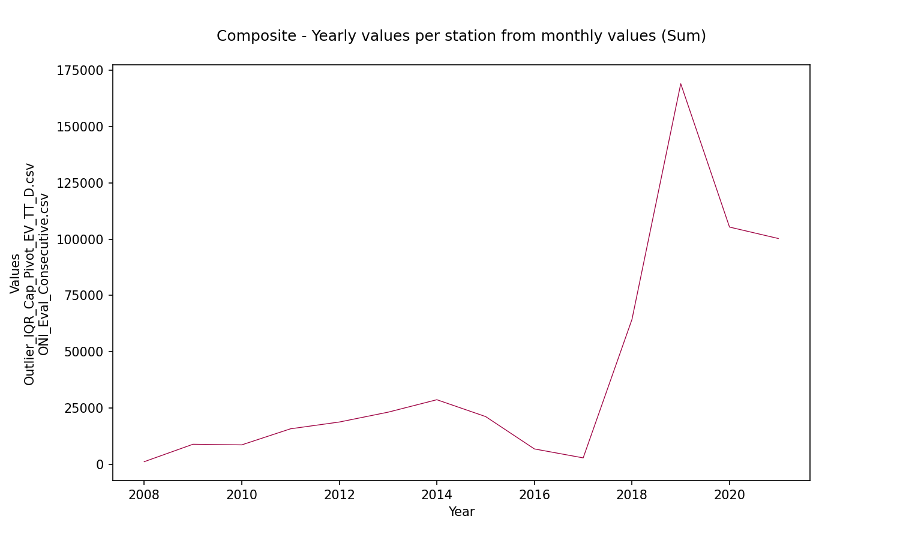
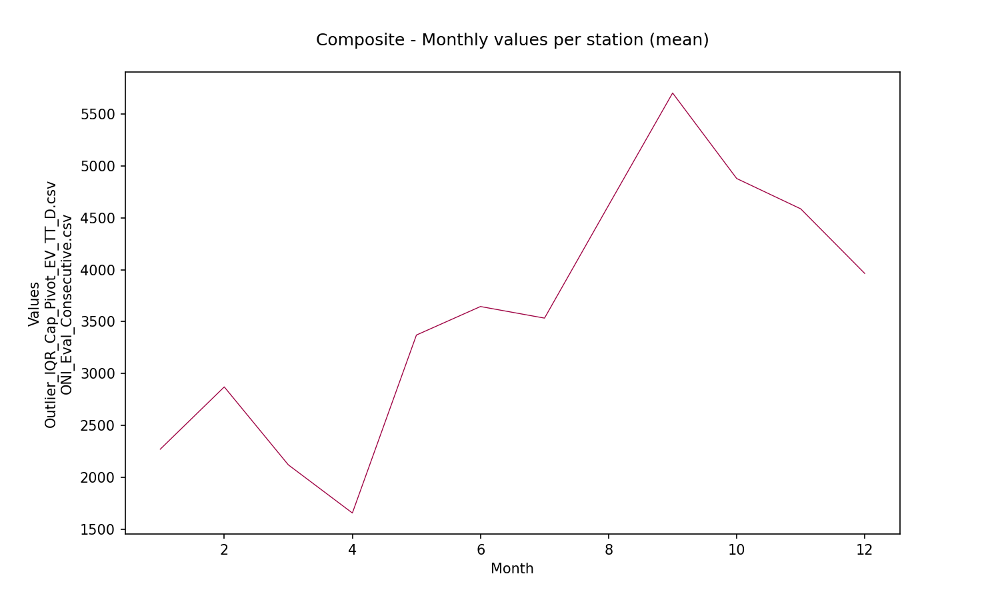
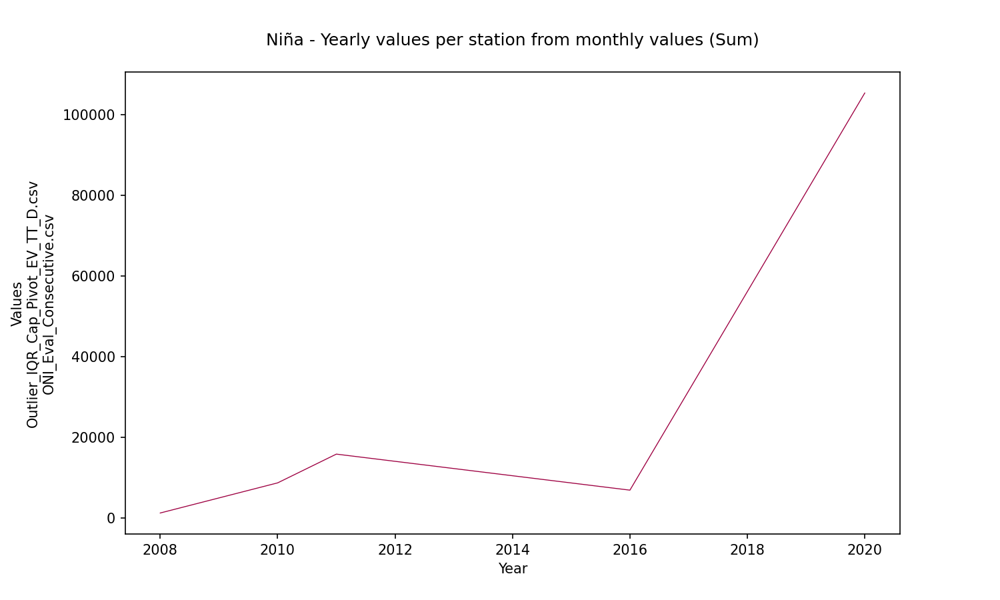
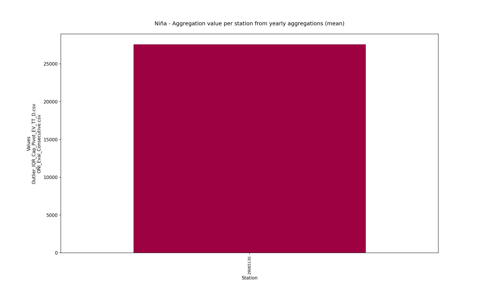
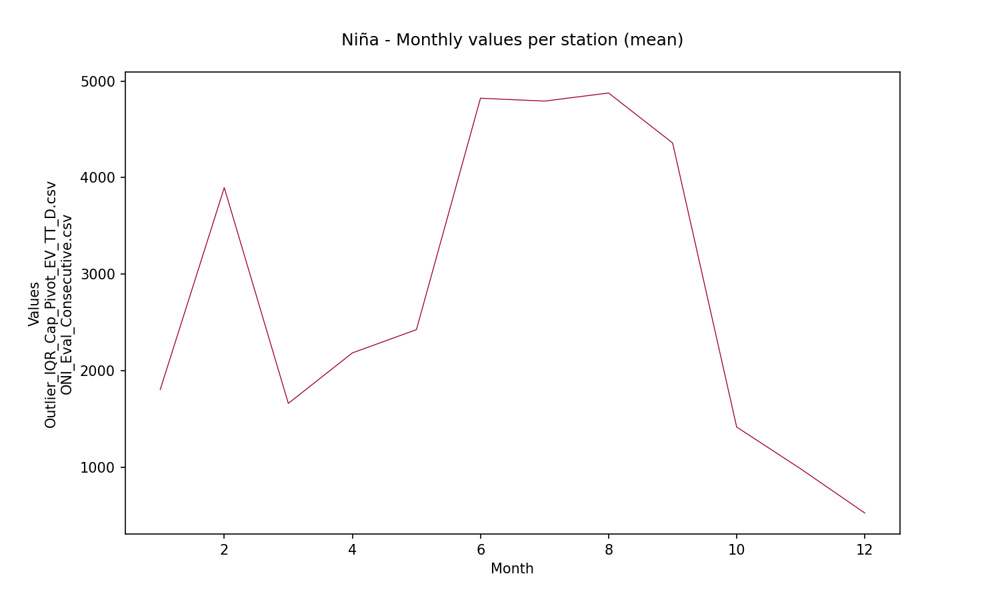
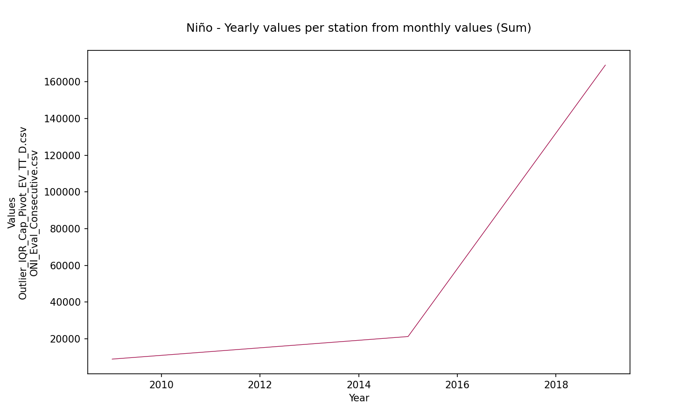
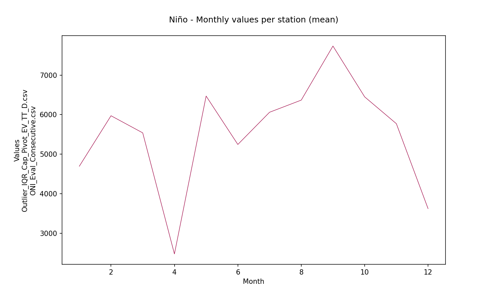
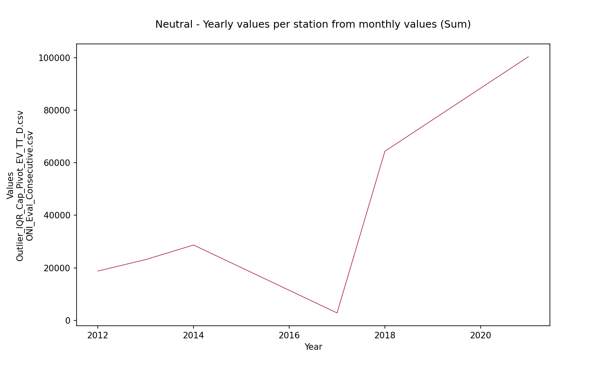
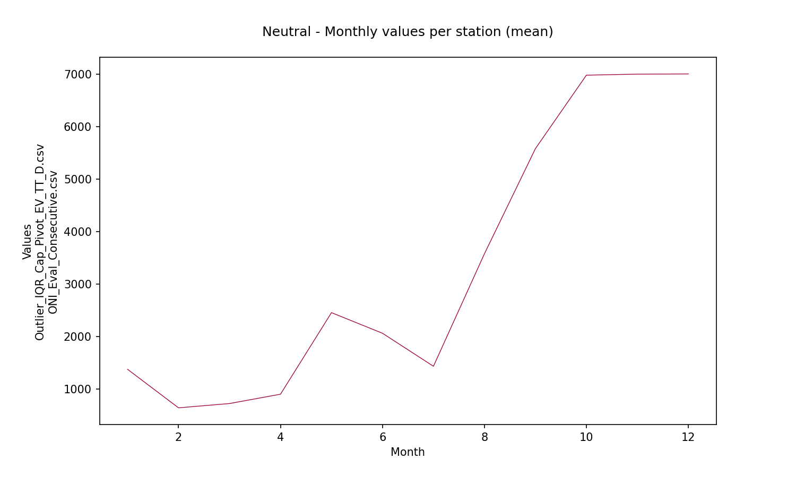
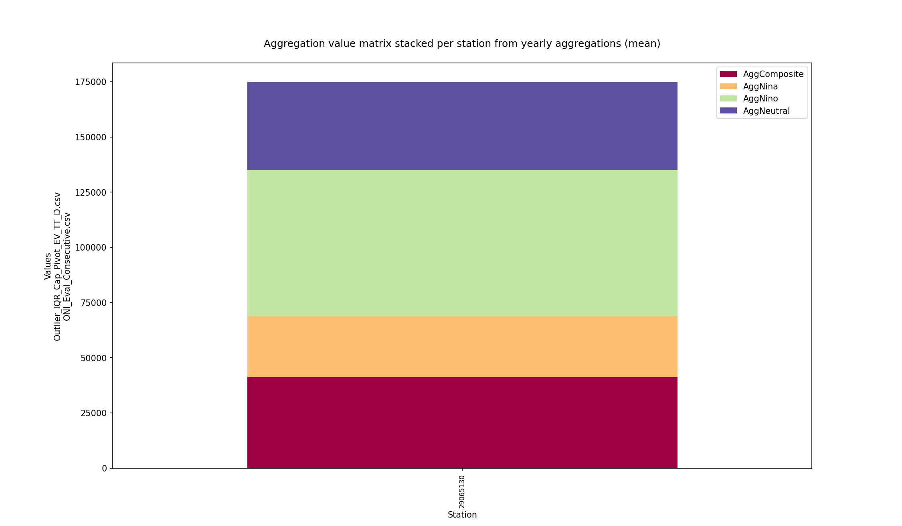

# Statistical aggregations for hydro-climatological composite series and yearly events Niño, Niña and Neutral

For further information about the NOAA - Oceanic Niño Index (ONI) classifier for climatological yearly events Niño, Niña and Neutral, check this activitie https://github.com/rcfdtools/R.LTWB/tree/main/Section03/ENSOONI

* Station records file: [Outlier_IQR_Cap_Pivot_EV_TT_D.csv](../IDEAM_Impute/Outlier_IQR_Cap_Pivot_EV_TT_D.csv)
* ENSO-ONI year file: [ONI_Eval_Consecutive.csv](../ENSOONI/ONI_Eval_Consecutive.csv)
* Stations: 1
* Records: 4821
* Daily serie: True
* Aggregation function: Sum
* Execution date: 2022-11-24 08:19:24.846821
* Python version: 3.10.5 (tags/v3.10.5:f377153, Jun  6 2022, 16:14:13) [MSC v.1929 64 bit (AMD64)]
* Python path: ['D:\\R.LTWB\\.src', 'D:\\R.LTWB', 'D:\\R.HydroTools', 'D:\\R.GISPython.wiki', 'D:\\R.TeachingResearchGuide']
* matplotlib version: 3.6.0
* pandas version: 1.4.3
* Instructions & script: https://github.com/rcfdtools/R.LTWB/tree/main/Section03/AGG
* License: https://github.com/rcfdtools/R.LTWB/blob/main/LICENSE.md
* Credits: r.cfdtools@gmail.com

## Composite - Yearly values per station from monthly values (Sum)

|   Year |   29065130 |
|-------:|-----------:|
|   2008 |    1180.52 |
|   2009 |    8929.07 |
|   2010 |    8655.55 |
|   2011 |   15791.6  |
|   2012 |   18800.1  |
|   2013 |   23175.2  |
|   2014 |   28707.2  |
|   2015 |   21223.2  |
|   2016 |    6850    |
|   2017 |    2878    |
|   2018 |   64373    |
|   2019 |  169068    |
|   2020 |  105389    |
|   2021 |  100315    |

Composite - Aggregation value per station from yearly aggregations (mean)

|              |   29065130 |
|:-------------|-----------:|
| AggComposite |    41095.4 |

Composite - Monthly values per station (mean)

|   Month |   29065130 |
|--------:|-----------:|
|       1 |    2272.37 |
|       2 |    2872.07 |
|       3 |    2121.99 |
|       4 |    1658.47 |
|       5 |    3371.16 |
|       6 |    3645.59 |
|       7 |    3534.1  |
|       8 |    4619.81 |
|       9 |    5700.69 |
|      10 |    4877.74 |
|      11 |    4585.83 |
|      12 |    3963.85 |

Composite - Zonal monthly values (mean)

|   Month |   AggCompositeZonal |
|--------:|--------------------:|
|       1 |             2272.37 |
|       2 |             2872.07 |
|       3 |             2121.99 |
|       4 |             1658.47 |
|       5 |             3371.16 |
|       6 |             3645.59 |
|       7 |             3534.1  |
|       8 |             4619.81 |
|       9 |             5700.69 |
|      10 |             4877.74 |
|      11 |             4585.83 |
|      12 |             3963.85 |

## ENSO-ONI Events - Yearly values per station from monthly values (Sum)

* Records in ENSO-ONI file: 73
* ENSO-ONI eventMark unique values: [-1  1  0]

### Niña events analysis (24 years identified)

|   Id |   YR |   NinaCount |   NinoCount |   NeutralCount | Event   |   EventMark |   EventLabel |
|-----:|-----:|------------:|------------:|---------------:|:--------|------------:|-------------:|
|    0 | 1950 |           7 |           0 |              5 | Niña    |          -1 |            7 |
|    4 | 1954 |           8 |           1 |              3 | Niña    |          -1 |            8 |
|    5 | 1955 |          12 |           0 |              0 | Niña    |          -1 |           12 |
|    6 | 1956 |           8 |           0 |              4 | Niña    |          -1 |            8 |
|   14 | 1964 |           8 |           2 |              2 | Niña    |          -1 |            8 |
|   20 | 1970 |           6 |           1 |              5 | Niña    |          -1 |            6 |
|   21 | 1971 |          12 |           0 |              0 | Niña    |          -1 |           12 |
|   23 | 1973 |           8 |           3 |              1 | Niña    |          -1 |            8 |
|   24 | 1974 |           7 |           0 |              5 | Niña    |          -1 |            7 |
|   25 | 1975 |          12 |           0 |              0 | Niña    |          -1 |           12 |
|   35 | 1985 |           6 |           0 |              6 | Niña    |          -1 |            6 |
|   38 | 1988 |           8 |           2 |              2 | Niña    |          -1 |            8 |
|   39 | 1989 |           5 |           0 |              7 | Niña    |          -1 |            5 |
|   45 | 1995 |           5 |           3 |              4 | Niña    |          -1 |            5 |
|   48 | 1998 |           6 |           4 |              2 | Niña    |          -1 |            6 |
|   49 | 1999 |          12 |           0 |              0 | Niña    |          -1 |           12 |
|   50 | 2000 |          12 |           0 |              0 | Niña    |          -1 |           12 |
|   57 | 2007 |           6 |           1 |              5 | Niña    |          -1 |            6 |
|   58 | 2008 |           6 |           0 |              6 | Niña    |          -1 |            6 |
|   60 | 2010 |           7 |           3 |              2 | Niña    |          -1 |            7 |
|   61 | 2011 |           5 |           0 |              7 | Niña    |          -1 |            5 |
|   66 | 2016 |           5 |           4 |              3 | Niña    |          -1 |            5 |
|   70 | 2020 |           5 |           1 |              6 | Niña    |          -1 |            5 |
|   72 | 2022 |           8 |           0 |              4 | Niña    |          -1 |            8 |

Niña - Table aggregations (Sum)

|   Year |   29065130 |
|-------:|-----------:|
|   2008 |    1180.52 |
|   2010 |    8655.55 |
|   2011 |   15791.6  |
|   2016 |    6850    |
|   2020 |  105389    |

Niña - Aggregation value per station from yearly aggregations (mean)

|         |   29065130 |
|:--------|-----------:|
| AggNina |    27573.4 |

Niña - Monthly values per station (mean)

|   Month |   29065130 |
|--------:|-----------:|
|       1 |   1803     |
|       2 |   3895.87  |
|       3 |   1659.63  |
|       4 |   2183     |
|       5 |   2424.04  |
|       6 |   4823.13  |
|       7 |   4793.26  |
|       8 |   4877.26  |
|       9 |   4359.23  |
|      10 |   1414.62  |
|      11 |    980.704 |
|      12 |    523.304 |

Niña - Zonal monthly values (mean)

|   Month |   AggNinaZonal |
|--------:|---------------:|
|       1 |       1803     |
|       2 |       3895.87  |
|       3 |       1659.63  |
|       4 |       2183     |
|       5 |       2424.04  |
|       6 |       4823.13  |
|       7 |       4793.26  |
|       8 |       4877.26  |
|       9 |       4359.23  |
|      10 |       1414.62  |
|      11 |        980.704 |
|      12 |        523.304 |

### Niño events analysis (19 years identified)

|   Id |   YR |   NinaCount |   NinoCount |   NeutralCount | Event   |   EventMark |   EventLabel |
|-----:|-----:|------------:|------------:|---------------:|:--------|------------:|-------------:|
|    1 | 1951 |           2 |           7 |              3 | Niño    |           1 |            7 |
|    3 | 1953 |           0 |          11 |              1 | Niño    |           1 |           11 |
|    7 | 1957 |           0 |           9 |              3 | Niño    |           1 |            9 |
|    8 | 1958 |           0 |           7 |              5 | Niño    |           1 |            7 |
|   13 | 1963 |           0 |           7 |              5 | Niño    |           1 |            7 |
|   15 | 1965 |           1 |           7 |              4 | Niño    |           1 |            7 |
|   19 | 1969 |           0 |           5 |              7 | Niño    |           1 |            5 |
|   22 | 1972 |           1 |           8 |              3 | Niño    |           1 |            8 |
|   32 | 1982 |           0 |           8 |              4 | Niño    |           1 |            8 |
|   33 | 1983 |           3 |           6 |              3 | Niño    |           1 |            6 |
|   37 | 1987 |           0 |          12 |              0 | Niño    |           1 |           12 |
|   41 | 1991 |           0 |           7 |              5 | Niño    |           1 |            7 |
|   42 | 1992 |           0 |           6 |              6 | Niño    |           1 |            6 |
|   47 | 1997 |           1 |           8 |              3 | Niño    |           1 |            8 |
|   52 | 2002 |           0 |           7 |              5 | Niño    |           1 |            7 |
|   54 | 2004 |           0 |           5 |              7 | Niño    |           1 |            5 |
|   59 | 2009 |           3 |           5 |              4 | Niño    |           1 |            5 |
|   65 | 2015 |           0 |          10 |              2 | Niño    |           1 |           10 |
|   69 | 2019 |           0 |           5 |              7 | Niño    |           1 |            5 |

Niño - Table aggregations (Sum)

|   Year |   29065130 |
|-------:|-----------:|
|   2009 |    8929.07 |
|   2015 |   21223.2  |
|   2019 |  169068    |

Niño - Aggregation value per station from yearly aggregations (mean)

|         |   29065130 |
|:--------|-----------:|
| AggNino |    66406.6 |

Niño - Monthly values per station (mean)

|   Month |   29065130 |
|--------:|-----------:|
|       1 |    4695.11 |
|       2 |    5971.99 |
|       3 |    5539.29 |
|       4 |    2477.85 |
|       5 |    6469.7  |
|       6 |    5245.66 |
|       7 |    6060.18 |
|       8 |    6367.17 |
|       9 |    7734.71 |
|      10 |    6449.86 |
|      11 |    5771.51 |
|      12 |    3623.58 |

Niño - Zonal monthly values (mean)

|   Month |   AggNinoZonal |
|--------:|---------------:|
|       1 |        4695.11 |
|       2 |        5971.99 |
|       3 |        5539.29 |
|       4 |        2477.85 |
|       5 |        6469.7  |
|       6 |        5245.66 |
|       7 |        6060.18 |
|       8 |        6367.17 |
|       9 |        7734.71 |
|      10 |        6449.86 |
|      11 |        5771.51 |
|      12 |        3623.58 |

### Neutral events analysis (30 years identified)

|   Id |   YR |   NinaCount |   NinoCount |   NeutralCount | Event   |   EventMark |   EventLabel |
|-----:|-----:|------------:|------------:|---------------:|:--------|------------:|-------------:|
|    2 | 1952 |           0 |           1 |             11 | Neutral |           0 |           11 |
|    9 | 1959 |           0 |           3 |              9 | Neutral |           0 |            9 |
|   10 | 1960 |           0 |           0 |             12 | Neutral |           0 |           12 |
|   11 | 1961 |           0 |           0 |             12 | Neutral |           0 |           12 |
|   12 | 1962 |           0 |           0 |             12 | Neutral |           0 |           12 |
|   16 | 1966 |           0 |           4 |              8 | Neutral |           0 |            8 |
|   17 | 1967 |           1 |           0 |             11 | Neutral |           0 |           11 |
|   18 | 1968 |           3 |           3 |              6 | Neutral |           0 |            6 |
|   26 | 1976 |           3 |           4 |              5 | Neutral |           0 |            5 |
|   27 | 1977 |           0 |           4 |              8 | Neutral |           0 |            8 |
|   28 | 1978 |           0 |           1 |             11 | Neutral |           0 |           11 |
|   29 | 1979 |           0 |           2 |             10 | Neutral |           0 |           10 |
|   30 | 1980 |           0 |           1 |             11 | Neutral |           0 |           11 |
|   31 | 1981 |           1 |           0 |             11 | Neutral |           0 |           11 |
|   34 | 1984 |           3 |           0 |              9 | Neutral |           0 |            9 |
|   36 | 1986 |           0 |           4 |              8 | Neutral |           0 |            8 |
|   40 | 1990 |           0 |           0 |             12 | Neutral |           0 |           12 |
|   43 | 1993 |           0 |           4 |              8 | Neutral |           0 |            8 |
|   44 | 1994 |           0 |           4 |              8 | Neutral |           0 |            8 |
|   46 | 1996 |           3 |           0 |              9 | Neutral |           0 |            9 |
|   51 | 2001 |           2 |           0 |             10 | Neutral |           0 |           10 |
|   53 | 2003 |           0 |           2 |             10 | Neutral |           0 |           10 |
|   55 | 2005 |           2 |           2 |              8 | Neutral |           0 |            8 |
|   56 | 2006 |           3 |           4 |              5 | Neutral |           0 |            5 |
|   62 | 2012 |           3 |           0 |              9 | Neutral |           0 |            9 |
|   63 | 2013 |           0 |           0 |             12 | Neutral |           0 |           12 |
|   64 | 2014 |           0 |           2 |             10 | Neutral |           0 |           10 |
|   67 | 2017 |           3 |           0 |              9 | Neutral |           0 |            9 |
|   68 | 2018 |           4 |           3 |              5 | Neutral |           0 |            5 |
|   71 | 2021 |           4 |           0 |              8 | Neutral |           0 |            8 |

Neutral - Table aggregations (Sum)

|   Year |   29065130 |
|-------:|-----------:|
|   2012 |    18800.1 |
|   2013 |    23175.2 |
|   2014 |    28707.2 |
|   2017 |     2878   |
|   2018 |    64373   |
|   2021 |   100315   |

Neutral - Aggregation value per station from yearly aggregations (mean)

|            |   29065130 |
|:-----------|-----------:|
| AggNeutral |    39708.1 |

Neutral - Monthly values per station (mean)

|   Month |   29065130 |
|--------:|-----------:|
|       1 |   1373.93  |
|       2 |    639.586 |
|       3 |    721.586 |
|       4 |    899.098 |
|       5 |   2453.3   |
|       6 |   2060.54  |
|       7 |   1431.62  |
|       8 |   3574.5   |
|       9 |   5577.99  |
|      10 |   6977.6   |
|      11 |   6997.27  |
|      12 |   7001.12  |

Neutral - Zonal monthly values (mean)

|   Month |   AggNeutralZonal |
|--------:|------------------:|
|       1 |          1373.93  |
|       2 |           639.586 |
|       3 |           721.586 |
|       4 |           899.098 |
|       5 |          2453.3   |
|       6 |          2060.54  |
|       7 |          1431.62  |
|       8 |          3574.5   |
|       9 |          5577.99  |
|      10 |          6977.6   |
|      11 |          6997.27  |
|      12 |          7001.12  |

## Yearly aggregation matrix values per station from yearly values (mean) and zonal monthly values (mean)

Yearly matrix values per station (required for spatial interpolations) 

|   Station |   AggComposite |   AggNina |   AggNino |   AggNeutral |
|----------:|---------------:|----------:|----------:|-------------:|
|  29065130 |        41095.4 |   27573.4 |   66406.6 |      39708.1 |

Monthly zonal values

|   Month |   AggCompositeZonal |   AggNinaZonal |   AggNinoZonal |   AggNeutralZonal |
|--------:|--------------------:|---------------:|---------------:|------------------:|
|       1 |             2272.37 |       1803     |        4695.11 |          1373.93  |
|       2 |             2872.07 |       3895.87  |        5971.99 |           639.586 |
|       3 |             2121.99 |       1659.63  |        5539.29 |           721.586 |
|       4 |             1658.47 |       2183     |        2477.85 |           899.098 |
|       5 |             3371.16 |       2424.04  |        6469.7  |          2453.3   |
|       6 |             3645.59 |       4823.13  |        5245.66 |          2060.54  |
|       7 |             3534.1  |       4793.26  |        6060.18 |          1431.62  |
|       8 |             4619.81 |       4877.26  |        6367.17 |          3574.5   |
|       9 |             5700.69 |       4359.23  |        7734.71 |          5577.99  |
|      10 |             4877.74 |       1414.62  |        6449.86 |          6977.6   |
|      11 |             4585.83 |        980.704 |        5771.51 |          6997.27  |
|      12 |             3963.85 |        523.304 |        3623.58 |          7001.12  |

