# Statistical aggregations for hydro-climatological composite series and yearly events Niño, Niña and Neutral

For further information about the NOAA - Oceanic Niño Index (ONI) classifier for climatological yearly events Niño, Niña and Neutral, check this activity https://github.com/rcfdtools/R.LTWB/tree/main/Section03/ENSOONI

* Station records file: [Impute_MICE_Outlier_IQR_Cap_Pivot_TMN_CON.csv](../IDEAM_Impute/Impute_MICE_Outlier_IQR_Cap_Pivot_TMN_CON.csv)
* ENSO-ONI year file: [ONI_Eval_Consecutive.csv](../ENSOONI/ONI_Eval_Consecutive.csv)
* Stations: 25
* Records: 15341
* Daily serie: True
* Aggregation function: Mean
* Execution date: 2022-11-24 15:35:19.333274
* Python version: 3.10.5 (tags/v3.10.5:f377153, Jun  6 2022, 16:14:13) [MSC v.1929 64 bit (AMD64)]
* Python path: ['D:\\R.LTWB\\.src', 'D:\\R.LTWB', 'D:\\R.HydroTools', 'D:\\R.HydroTools.wiki', 'D:\\R.TeachingResearchGuide']
* matplotlib version: 3.6.0
* pandas version: 1.4.3
* Instructions & script: https://github.com/rcfdtools/R.LTWB/tree/main/Section03/Agg
* License: https://github.com/rcfdtools/R.LTWB/blob/main/LICENSE.md
* Credits: r.cfdtools@gmail.com

## Composite - Yearly values per station from monthly values (Mean)

Daily values to year-month aggregation (Mean) file: [Agg_YM_Impute_MICE_Outlier_IQR_Cap_Pivot_TMN_CON.csv](Agg_YM_Impute_MICE_Outlier_IQR_Cap_Pivot_TMN_CON.csv)

|   Year |   15015020 |   15065040 |   23215060 |   25025002 |   25025090 |   25025250 |   25025300 |   25025330 |   28015030 |   28015070 |   28025020 |   28025040 |   28025070 |   28025080 |   28025090 |   28025502 |   28035010 |   28035020 |   28035040 |   28035070 |   28045020 |   28045040 |   29065010 |   29065020 |   29065030 |
|-------:|-----------:|-----------:|-----------:|-----------:|-----------:|-----------:|-----------:|-----------:|-----------:|-----------:|-----------:|-----------:|-----------:|-----------:|-----------:|-----------:|-----------:|-----------:|-----------:|-----------:|-----------:|-----------:|-----------:|-----------:|-----------:|
|   1980 |    22.8584 |    22.8056 |    23.8585 |    22.6642 |    23.4673 |    22.4256 |    23.0159 |    22.9672 |    22.9225 |    22.4342 |    20.8047 |    18.4006 |    23.1887 |    21.5955 |    22.4633 |    23.4544 |    23.6372 |    20.4396 |    23.9536 |    23.6565 |    21.807  |    23.0035 |    22.1446 |    22.6619 |    22.4801 |
|   1981 |    22.4263 |    22.1797 |    23.7271 |    22.63   |    23.3679 |    22.5032 |    22.8745 |    22.7184 |    22.7469 |    22.3608 |    20.3668 |    18.6492 |    23.2101 |    21.6872 |    22.367  |    23.3415 |    23.2527 |    20.8989 |    23.8064 |    23.2709 |    21.8237 |    22.8777 |    21.3987 |    22.9636 |    22.4591 |
|   1982 |    22.5105 |    21.9293 |    23.6149 |    22.6331 |    23.2297 |    22.3507 |    22.5549 |    22.7311 |    22.8778 |    22.2424 |    20.2609 |    18.4828 |    22.9044 |    21.6634 |    22.0571 |    23.5284 |    23.2065 |    21.3688 |    23.8342 |    23.2225 |    21.4865 |    22.9708 |    20.7029 |    22.2377 |    22.0847 |
|   1983 |    23.3663 |    23.3942 |    24.0794 |    23.0067 |    23.9316 |    23.0811 |    23.2154 |    23.1085 |    23.4412 |    22.7163 |    21.0221 |    19.0198 |    23.4738 |    21.8307 |    22.9665 |    24.1259 |    23.5228 |    21.3841 |    23.8438 |    23.5604 |    22.1923 |    23.3426 |    21.4949 |    22.6081 |    22.6274 |
|   1984 |    22.4179 |    22.3067 |    23.4699 |    22.5823 |    23.2722 |    22.7676 |    22.6061 |    22.4166 |    22.9775 |    22.0743 |    20.3455 |    18.4968 |    22.6742 |    21.38   |    21.8774 |    23.563  |    23.0039 |    21.5008 |    22.8121 |    23.0157 |    21.6314 |    22.9554 |    21.2638 |    22.2053 |    21.757  |
|   1985 |    21.8493 |    22.0388 |    23.5158 |    22.1908 |    23.2847 |    22.6675 |    22.161  |    22.2893 |    22.555  |    22.362  |    19.8789 |    16.5395 |    23.3005 |    21.1857 |    21.6461 |    22.8858 |    23.0553 |    21.192  |    23.1719 |    23.0628 |    21.229  |    22.7093 |    21.0852 |    21.4384 |    21.363  |
|   1986 |    22.0991 |    22.7744 |    23.631  |    22.6791 |    23.4982 |    23.1791 |    22.1728 |    22.4878 |    22.8871 |    22.4505 |    20.1252 |    16.98   |    23.3934 |    20.8516 |    21.9034 |    23.6015 |    23.0138 |    22.1993 |    23.4642 |    23.0348 |    20.9092 |    23.0868 |    21.3325 |    20.1506 |    21.5633 |
|   1987 |    23.0265 |    23.2714 |    24.1392 |    23.6842 |    23.8152 |    23.177  |    23.53   |    23.1268 |    23.4113 |    23.1146 |    20.904  |    19.4018 |    23.8525 |    21.9292 |    23.1742 |    23.9739 |    23.5289 |    22.3663 |    23.9445 |    23.5689 |    21.3208 |    23.5731 |    20.9348 |    19.1428 |    21.4853 |
|   1988 |    22.4449 |    22.7105 |    23.898  |    22.8547 |    23.4502 |    22.5779 |    22.0624 |    22.5216 |    23.0985 |    22.6301 |    20.5489 |    18.7954 |    23.6313 |    21.5227 |    22.0012 |    23.7065 |    23.2531 |    22.5584 |    23.7502 |    23.2791 |    20.8271 |    23.3424 |    21.1318 |    19.0188 |    21.6234 |
|   1989 |    22.8147 |    22.5959 |    23.5696 |    22.6484 |    23.1131 |    21.4871 |    21.1448 |    22.2516 |    22.8391 |    22.1258 |    20.1491 |    19.1164 |    23.6459 |    21.7227 |    21.9257 |    23.4596 |    23.0477 |    22.83   |    23.4741 |    23.0564 |    20.9642 |    22.8935 |    21.011  |    20.3064 |    21.2528 |
|   1990 |    23.3857 |    23.4303 |    23.8504 |    23.3355 |    23.374  |    20.7665 |    22.4841 |    23.42   |    23.0881 |    22.8375 |    20.8052 |    19.3836 |    24.0452 |    22.1067 |    22.8206 |    23.6613 |    23.223  |    23.3924 |    23.7074 |    23.2568 |    21.8073 |    23.2053 |    21.3491 |    22.1773 |    22.1118 |
|   1991 |    23.0101 |    23.4444 |    23.9232 |    22.8133 |    23.4939 |    21.259  |    22.6787 |    23.4977 |    23.197  |    22.9617 |    20.563  |    19.481  |    23.933  |    19.7862 |    22.8383 |    23.9274 |    23.5445 |    23.0175 |    23.7599 |    23.5828 |    21.9327 |    23.157  |    21.352  |    22.4507 |    22.1451 |
|   1992 |    22.687  |    23.3328 |    23.6796 |    23.2497 |    22.8657 |    21.5413 |    22.3157 |    22.0299 |    23.1925 |    23.0793 |    20.9703 |    19.1245 |    23.7046 |    19.7107 |    22.7603 |    24.0039 |    23.5158 |    23.3842 |    23.6747 |    23.5569 |    21.85   |    23.1303 |    21.2748 |    22.2514 |    21.7831 |
|   1993 |    21.7921 |    23.4836 |    23.0698 |    22.9103 |    21.1163 |    21.093  |    21.9259 |    20.7492 |    22.6065 |    23.0055 |    20.7458 |    18.9761 |    22.8705 |    19.8897 |    21.747  |    23.7859 |    23.6257 |    23.0709 |    24.0366 |    23.6618 |    21.0271 |    23.0563 |    21.2689 |    21.5769 |    21.9438 |
|   1994 |    21.2328 |    23.4106 |    23.419  |    22.8137 |    22.2891 |    20.9756 |    22.0722 |    22.2151 |    22.9053 |    23.1047 |    20.7029 |    18.9449 |    22.0134 |    20.3361 |    21.9897 |    23.8217 |    23.1935 |    21.8948 |    24.4785 |    23.2351 |    21.0856 |    22.932  |    21.222  |    21.7088 |    21.8159 |
|   1995 |    21.1885 |    23.1235 |    23.5683 |    22.7146 |    22.9347 |    20.8754 |    22.0787 |    22.4588 |    22.9377 |    22.8855 |    20.7565 |    18.7661 |    22.5306 |    22.8726 |    21.7893 |    23.5693 |    23.2214 |    21.8995 |    24.4048 |    23.2511 |    21.0211 |    22.8328 |    21.0752 |    21.5305 |    21.3111 |
|   1996 |    20.862  |    22.6644 |    23.5651 |    22.6504 |    22.803  |    20.5396 |    21.3921 |    22.0322 |    22.6982 |    22.6649 |    20.118  |    18.5049 |    21.961  |    21.9979 |    22.135  |    23.3545 |    23.403  |    20.9171 |    24.0718 |    23.4263 |    21.1157 |    22.7319 |    21.2558 |    21.9259 |    22.1126 |
|   1997 |    21.3431 |    23.2775 |    23.5417 |    22.7346 |    22.4706 |    21.9635 |    21.2687 |    22.4722 |    23.1276 |    22.2446 |    20.0354 |    18.6934 |    22.5617 |    21.8397 |    22.4297 |    24.3352 |    23.865  |    22.2223 |    24.4508 |    23.8842 |    21.5687 |    23.148  |    21.1223 |    22.1218 |    21.5368 |
|   1998 |    21.362  |    23.1323 |    23.9429 |    23.5795 |    23.6253 |    22.1807 |    21.9269 |    23.2772 |    23.2601 |    22.3216 |    19.9523 |    18.9629 |    23.9336 |    20.3547 |    23.0386 |    24.1437 |    23.3911 |    22.2511 |    24.491  |    23.4167 |    21.9624 |    23.1565 |    21.3175 |    21.825  |    22.2471 |
|   1999 |    20.7952 |    22.5497 |    23.4312 |    22.4672 |    22.7966 |    20.8421 |    21.4839 |    22.4004 |    22.4148 |    21.3343 |    18.9479 |    18.1854 |    22.9193 |    22.4636 |    21.4722 |    23.3401 |    22.7997 |    21.5899 |    23.7617 |    22.789  |    20.8828 |    22.6765 |    21.0403 |    21.6466 |    21.6698 |
|   2000 |    20.7071 |    22.5664 |    23.4915 |    21.2821 |    22.931  |    21.1554 |    21.3483 |    22.3876 |    22.5102 |    21.18   |    18.9214 |    17.9423 |    23.2511 |    22.4992 |    21.1893 |    23.4387 |    23.0443 |    21.4075 |    23.7651 |    23.0302 |    20.9011 |    22.6652 |    21.1068 |    21.8347 |    21.8757 |
|   2001 |    21.0628 |    22.9337 |    23.5284 |    21.9684 |    22.7719 |    21.5565 |    23.2668 |    23.0388 |    22.2892 |    21.5241 |    17.5064 |    18.2242 |    24.1606 |    23.0781 |    21.6319 |    23.8991 |    23.1133 |    21.984  |    24.131  |    23.1149 |    21.4154 |    22.8551 |    21.1603 |    22.7066 |    22.2739 |
|   2002 |    21.8626 |    23.2535 |    23.8425 |    22.4593 |    23.5581 |    22.1046 |    22.6183 |    22.6973 |    23.217  |    21.7344 |    19.5209 |    18.351  |    24.5547 |    22.2737 |    21.5672 |    24.3437 |    23.455  |    22.8698 |    24.1837 |    23.4672 |    21.6809 |    23.0908 |    21.3357 |    22.873  |    22.2707 |
|   2003 |    22.3456 |    23.4269 |    24.1834 |    22.5081 |    24.4102 |    21.7741 |    23.3298 |    22.4501 |    23.3338 |    21.8138 |    20.2711 |    18.5264 |    24.5278 |    22.0297 |    22.0791 |    23.9337 |    23.5872 |    22.8455 |    23.9381 |    23.5955 |    21.9065 |    23.046  |    21.3786 |    23.0097 |    22.2602 |
|   2004 |    22.4218 |    22.7747 |    23.958  |    21.7729 |    24.0811 |    21.612  |    22.9528 |    21.5995 |    23.0647 |    21.9575 |    19.432  |    18.398  |    25.0094 |    22.3372 |    21.9803 |    23.9044 |    23.4925 |    23.6866 |    24.2027 |    23.5    |    21.7093 |    23.078  |    21.0655 |    22.3571 |    21.4397 |
|   2005 |    22.5159 |    22.7808 |    23.9376 |    23.809  |    23.6722 |    21.7793 |    23.7257 |    21.8436 |    22.6161 |    21.3081 |    18.4541 |    18.9668 |    24.696  |    22.4494 |    22.9409 |    23.7609 |    23.6172 |    23.6899 |    23.8277 |    23.6079 |    22.0207 |    23.1201 |    21.211  |    22.4101 |    22.1864 |
|   2006 |    22.0163 |    23.4261 |    23.6769 |    23.6172 |    23.2101 |    21.5169 |    23.8705 |    21.9177 |    22.955  |    21.155  |    20.3309 |    18.6938 |    24.8481 |    22.0157 |    22.3301 |    23.8661 |    22.9462 |    23.7293 |    24.1165 |    22.9342 |    21.9786 |    22.9996 |    20.9868 |    23.067  |    20.9384 |
|   2007 |    21.7998 |    23.159  |    23.5946 |    22.7651 |    23.1951 |    21.7856 |    23.776  |    22.9195 |    22.8108 |    20.8592 |    20.2947 |    18.5649 |    24.6828 |    22.3895 |    22.3536 |    23.6265 |    22.9502 |    23.6543 |    24.787  |    22.9217 |    21.9178 |    22.9069 |    20.6663 |    22.8508 |    19.8927 |
|   2008 |    21.7856 |    22.707  |    23.4729 |    22.7691 |    23.0915 |    21.5185 |    23.3291 |    22.8984 |    22.674  |    20.814  |    20.6114 |    18.4948 |    24.3231 |    22.201  |    22.2323 |    23.2416 |    22.5075 |    23.5448 |    23.8582 |    22.4762 |    21.7311 |    22.7708 |    20.679  |    22.6735 |    19.9159 |
|   2009 |    22.3696 |    23.4005 |    23.8353 |    22.6078 |    23.5321 |    23.6612 |    23.8903 |    23.6579 |    23.4427 |    22.1547 |    20.9908 |    18.7712 |    24.8604 |    22.6473 |    22.6062 |    24.3373 |    23.512  |    23.5904 |    24.8584 |    23.5276 |    22.4167 |    23.225  |    21.0035 |    23.2121 |    20.6606 |
|   2010 |    22.5951 |    23.3362 |    23.8001 |    22.4608 |    23.0068 |    24.3924 |    24.1343 |    23.2511 |    23.3035 |    22.6842 |    21.5394 |    18.9796 |    24.2767 |    23.1651 |    23.161  |    24.1017 |    23.8489 |    23.6195 |    24.7329 |    23.8807 |    22.7546 |    23.1872 |    21.497  |    23.7663 |    22.1105 |
|   2011 |    23.1423 |    22.8892 |    23.7648 |    21.7257 |    23.2294 |    24.0138 |    23.4849 |    23.1003 |    22.995  |    22.4125 |    20.937  |    18.7456 |    23.4781 |    22.3101 |    22.6773 |    23.5877 |    23.1083 |    22.5762 |    24.3325 |    23.1339 |    22.2258 |    23.068  |    21.6021 |    23.1813 |    22.6883 |
|   2012 |    22.6801 |    23.1685 |    24.147  |    21.5876 |    24.2864 |    22.8213 |    23.5322 |    23.3701 |    23.5387 |    22.6503 |    21.2008 |    18.6656 |    23.92   |    21.9913 |    22.5869 |    23.9908 |    23.2125 |    22.2166 |    24.9052 |    23.251  |    22.222  |    23.1424 |    21.6267 |    23.2127 |    22.7961 |
|   2013 |    22.7001 |    23.4661 |    24.3489 |    23.7851 |    24.6725 |    23.163  |    23.8441 |    23.6862 |    23.9114 |    22.9225 |    21.5511 |    18.9917 |    24.1501 |    22.0897 |    22.6928 |    24.3949 |    23.4751 |    22.7614 |    25.2097 |    23.524  |    22.4083 |    23.2852 |    21.7565 |    23.2982 |    23.1248 |
|   2014 |    22.9907 |    23.6177 |    24.438  |    23.8707 |    24.8783 |    24.0551 |    24.1239 |    23.6077 |    24.069  |    22.9468 |    21.6555 |    19.0443 |    24.5251 |    22.1587 |    22.7187 |    24.5902 |    23.8134 |    23.9274 |    25.4209 |    23.8616 |    22.5637 |    23.395  |    21.6436 |    23.2346 |    22.6587 |
|   2015 |    23.0491 |    23.9604 |    24.5082 |    24.1079 |    24.9938 |    23.761  |    24.436  |    23.7051 |    24.4023 |    23.1338 |    21.9311 |    19.0051 |    24.683  |    22.2205 |    22.4294 |    25.0755 |    24.034  |    24.2269 |    25.4938 |    24.0926 |    22.3306 |    23.5842 |    21.6453 |    22.5844 |    22.6624 |
|   2016 |    23.2362 |    23.572  |    24.3326 |    24.1263 |    24.5095 |    23.0048 |    24.3944 |    23.5304 |    23.9942 |    23.025  |    22.0426 |    19.3426 |    24.0564 |    21.9621 |    23.4755 |    24.4984 |    23.5112 |    24.1448 |    24.9702 |    23.5628 |    22.8478 |    23.4248 |    21.6439 |    23.8446 |    22.6199 |
|   2017 |    22.8458 |    23.1743 |    24.276  |    23.7402 |    24.5593 |    23.6073 |    24.0735 |    23.5113 |    23.6892 |    22.3047 |    21.4917 |    19.071  |    23.7552 |    21.8748 |    22.9588 |    24.1083 |    23.6116 |    23.4938 |    24.9981 |    23.6366 |    22.4121 |    23.2436 |    21.5171 |    23.0398 |    22.3821 |
|   2018 |    22.7148 |    23.1181 |    24.2535 |    23.5603 |    24.5841 |    24.2433 |    23.73   |    23.6089 |    23.5668 |    22.1566 |    20.9747 |    18.9756 |    24.1932 |    22.0418 |    22.8014 |    24.0464 |    23.5426 |    23.6366 |    24.7926 |    23.5621 |    22.4487 |    23.1914 |    21.4468 |    23.0492 |    22.2122 |
|   2019 |    23.0196 |    23.4619 |    24.4019 |    23.8935 |    24.7794 |    24.4387 |    23.7794 |    24.1755 |    23.9456 |    22.8481 |    21.6442 |    19.1203 |    24.1298 |    22.1111 |    22.9424 |    24.3778 |    23.7986 |    23.6062 |    24.8492 |    23.8414 |    22.6424 |    23.3401 |    21.6231 |    23.3137 |    22.6037 |
|   2020 |    22.8467 |    23.5679 |    24.2278 |    23.8573 |    24.2984 |    24.2516 |    24.1896 |    23.9853 |    23.9534 |    22.8002 |    21.9005 |    19.0979 |    24.5772 |    22.2135 |    22.8918 |    24.558  |    23.5612 |    24.2617 |    25.2685 |    23.607  |    22.8082 |    23.3402 |    21.6667 |    23.9142 |    22.5949 |
|   2021 |    22.4036 |    23.2436 |    23.8833 |    23.3481 |    23.6234 |    24.3504 |    23.6315 |    23.9345 |    23.438  |    22.3341 |    21.1098 |    18.917  |    24.0406 |    22.0274 |    22.6723 |    24.1878 |    22.9197 |    23.8267 |    24.9265 |    22.9503 |    22.3868 |    23.1856 |    21.4741 |    23.1322 |    22.2042 |

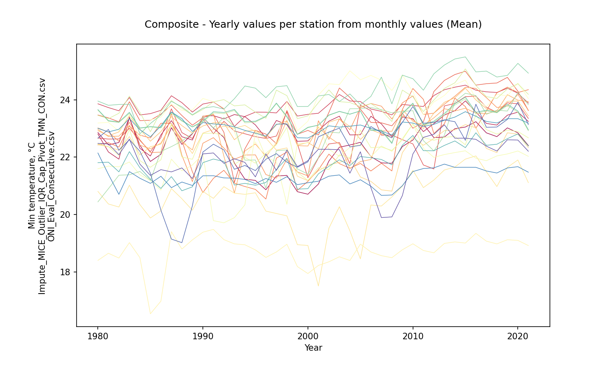

Composite - Aggregation value per station from yearly aggregations (mean)

|              |   15015020 |   15065040 |   23215060 |   25025002 |   25025090 |   25025250 |   25025300 |   25025330 |   28015030 |   28015070 |   28025020 |   28025040 |   28025070 |   28025080 |   28025090 |   28025502 |   28035010 |   28035020 |   28035040 |   28035070 |   28045020 |   28045040 |   29065010 |   29065020 |   29065030 |
|:-------------|-----------:|-----------:|-----------:|-----------:|-----------:|-----------:|-----------:|-----------:|-----------:|-----------:|-----------:|-----------:|-----------:|-----------:|-----------:|-----------:|-----------:|-----------:|-----------:|-----------:|-----------:|-----------:|-----------:|-----------:|-----------:|
| AggComposite |    22.2996 |    23.0681 |    23.8428 |    22.9158 |    23.5256 |    22.4481 |    22.9625 |    22.8583 |    23.1644 |    22.3255 |    20.5313 |    18.7094 |    23.7725 |    21.8289 |    22.3886 |    23.8917 |    23.3564 |    22.7066 |    24.2491 |    23.3778 |    21.8137 |    23.0935 |     21.298 |    22.3456 |    21.9463 |

Composite - Aggregation value per station from yearly aggregations (std - standard deviation)

|                 |   15015020 |   15065040 |   23215060 |   25025002 |   25025090 |   25025250 |   25025300 |   25025330 |   28015030 |   28015070 |   28025020 |   28025040 |   28025070 |   28025080 |   28025090 |   28025502 |   28035010 |   28035020 |   28035040 |   28035070 |   28045020 |   28045040 |   29065010 |   29065020 |   29065030 |
|:----------------|-----------:|-----------:|-----------:|-----------:|-----------:|-----------:|-----------:|-----------:|-----------:|-----------:|-----------:|-----------:|-----------:|-----------:|-----------:|-----------:|-----------:|-----------:|-----------:|-----------:|-----------:|-----------:|-----------:|-----------:|-----------:|
| StdAggComposite |   0.739298 |    0.45659 |   0.335307 |   0.705852 |   0.780667 |    1.16205 |   0.947621 |   0.725872 |   0.489559 |   0.643074 |   0.942118 |   0.561311 |   0.775182 |   0.810923 |   0.537245 |   0.435307 |   0.324555 |      1.036 |   0.622104 |    0.33823 |   0.591199 |    0.22719 |   0.305032 |    1.10005 |   0.702083 |

Composite - Monthly values per station (mean)

|   Month |   15015020 |   15065040 |   23215060 |   25025002 |   25025090 |   25025250 |   25025300 |   25025330 |   28015030 |   28015070 |   28025020 |   28025040 |   28025070 |   28025080 |   28025090 |   28025502 |   28035010 |   28035020 |   28035040 |   28035070 |   28045020 |   28045040 |   29065010 |   29065020 |   29065030 |
|--------:|-----------:|-----------:|-----------:|-----------:|-----------:|-----------:|-----------:|-----------:|-----------:|-----------:|-----------:|-----------:|-----------:|-----------:|-----------:|-----------:|-----------:|-----------:|-----------:|-----------:|-----------:|-----------:|-----------:|-----------:|-----------:|
|       1 |    21.0764 |    22.2049 |    23.2061 |    21.4877 |    22.7073 |    21.7505 |    21.7275 |    21.6986 |    22.1444 |    21.2233 |    18.8969 |    17.867  |    22.4866 |    20.927  |    20.5332 |    23.0151 |    22.2611 |    21.9655 |    23.9902 |    22.241  |    20.2327 |    22.568  |    20.6884 |    20.8963 |    20.5751 |
|       2 |    21.6168 |    22.5872 |    23.5899 |    22.1345 |    23.3049 |    22.0423 |    22.5561 |    22.3173 |    22.7424 |    21.5794 |    19.5967 |    18.0464 |    23.2937 |    21.3815 |    21.2079 |    23.5409 |    23.1909 |    22.4971 |    24.5222 |    23.1843 |    20.8471 |    22.8541 |    20.9631 |    21.3858 |    21.132  |
|       3 |    22.4981 |    22.958  |    23.947  |    22.9868 |    23.7689 |    22.4866 |    23.3135 |    23.0399 |    23.3265 |    22.1694 |    20.5877 |    18.701  |    24.0986 |    21.883  |    22.3398 |    24.0946 |    23.8414 |    22.9789 |    24.6065 |    23.8575 |    21.8466 |    23.1764 |    21.2923 |    22.2072 |    21.8465 |
|       4 |    23.1799 |    23.397  |    24.1587 |    23.6432 |    23.9039 |    22.641  |    23.5248 |    23.405  |    23.7249 |    22.9298 |    21.2377 |    19.0287 |    24.6187 |    22.357  |    23.1807 |    24.4933 |    24.1337 |    23.3397 |    24.5848 |    24.1781 |    22.55   |    23.4457 |    21.579  |    23.0699 |    22.7208 |
|       5 |    23.1583 |    23.5028 |    24.1698 |    23.6313 |    23.8516 |    22.5674 |    23.5067 |    23.4153 |    23.674  |    22.9429 |    21.4417 |    19.1109 |    24.493  |    22.2337 |    23.2952 |    24.3552 |    24.0592 |    23.2328 |    24.4596 |    24.1032 |    22.5917 |    23.4298 |    21.6063 |    23.1552 |    22.8143 |
|       6 |    22.9674 |    23.7259 |    24.1855 |    23.4685 |    23.9878 |    22.7863 |    23.3972 |    23.3343 |    23.7039 |    22.9279 |    21.1989 |    19.1902 |    24.4079 |    22.1822 |    23.069  |    24.4379 |    23.7634 |    23.2036 |    24.5556 |    23.8094 |    22.4608 |    23.3931 |    21.5949 |    23.0259 |    22.691  |
|       7 |    22.6588 |    23.7154 |    24.0735 |    23.3031 |    23.851  |    22.8906 |    23.3723 |    23.2932 |    23.6669 |    22.8597 |    20.9356 |    18.9767 |    24.1229 |    22.0929 |    22.8884 |    24.4685 |    23.682  |    23.1963 |    24.5306 |    23.7258 |    22.296  |    23.3316 |    21.5317 |    22.7684 |    22.4539 |
|       8 |    22.5442 |    23.5182 |    23.9668 |    23.1873 |    23.6317 |    22.6885 |    23.1851 |    23.0374 |    23.4621 |    22.8065 |    21.0218 |    18.9952 |    24.0482 |    22.0435 |    22.9302 |    24.2293 |    23.6236 |    22.978  |    24.1911 |    23.6621 |    22.2325 |    23.2781 |    21.4582 |    22.6637 |    22.2185 |
|       9 |    22.4553 |    23.0529 |    23.8336 |    22.9924 |    23.4599 |    22.4781 |    23.0391 |    22.9739 |    23.1544 |    22.4557 |    20.8496 |    18.964  |    23.8891 |    22.0038 |    22.8836 |    23.7732 |    23.3543 |    22.4819 |    23.9653 |    23.3783 |    22.109  |    23.0668 |    21.3605 |    22.591  |    22.0527 |
|      10 |    22.2084 |    22.8161 |    23.7784 |    23.0778 |    23.3817 |    22.3375 |    22.9378 |    22.7987 |    22.9695 |    22.2165 |    20.763  |    18.8483 |    23.6551 |    21.8807 |    22.6982 |    23.5404 |    23.2121 |    22.455  |    23.8862 |    23.2272 |    21.9397 |    22.9669 |    21.3225 |    22.4893 |    21.9516 |
|      11 |    21.9889 |    22.7816 |    23.7953 |    22.8953 |    23.4414 |    22.4648 |    22.8831 |    22.7231 |    22.8831 |    22.1731 |    20.3657 |    18.7132 |    23.4076 |    21.7812 |    22.4107 |    23.4685 |    22.9717 |    22.178  |    23.8308 |    22.9853 |    21.7572 |    22.9252 |    21.2536 |    22.319  |    21.8052 |
|      12 |    21.243  |    22.5572 |    23.4092 |    22.182  |    23.0167 |    22.2437 |    22.1071 |    22.2629 |    22.5207 |    21.6216 |    19.4806 |    18.0712 |    22.7492 |    21.1802 |    21.2262 |    23.2839 |    22.183  |    21.9727 |    23.8659 |    22.1814 |    20.9005 |    22.6864 |    20.9252 |    21.5752 |    21.0943 |

Composite - Zonal monthly values (mean)

|   Month |   AggCompositeZonal |
|--------:|--------------------:|
|       1 |             21.5348 |
|       2 |             22.0846 |
|       3 |             22.7141 |
|       4 |             23.161  |
|       5 |             23.1521 |
|       6 |             23.0987 |
|       7 |             22.9874 |
|       8 |             22.8641 |
|       9 |             22.6647 |
|      10 |             22.5343 |
|      11 |             22.4081 |
|      12 |             21.8616 |

## ENSO-ONI Events - Yearly values per station from monthly values (Mean)

* Records in ENSO-ONI file: 73
* ENSO-ONI eventMark unique values: [-1  1  0]

### Niña events analysis (24 years identified)

|   Id |   YR |   NinaCount |   NinoCount |   NeutralCount | Event   |   EventMark |   EventLabel |
|-----:|-----:|------------:|------------:|---------------:|:--------|------------:|-------------:|
|    0 | 1950 |           7 |           0 |              5 | Niña    |          -1 |            7 |
|    4 | 1954 |           8 |           1 |              3 | Niña    |          -1 |            8 |
|    5 | 1955 |          12 |           0 |              0 | Niña    |          -1 |           12 |
|    6 | 1956 |           8 |           0 |              4 | Niña    |          -1 |            8 |
|   14 | 1964 |           8 |           2 |              2 | Niña    |          -1 |            8 |
|   20 | 1970 |           6 |           1 |              5 | Niña    |          -1 |            6 |
|   21 | 1971 |          12 |           0 |              0 | Niña    |          -1 |           12 |
|   23 | 1973 |           8 |           3 |              1 | Niña    |          -1 |            8 |
|   24 | 1974 |           7 |           0 |              5 | Niña    |          -1 |            7 |
|   25 | 1975 |          12 |           0 |              0 | Niña    |          -1 |           12 |
|   35 | 1985 |           6 |           0 |              6 | Niña    |          -1 |            6 |
|   38 | 1988 |           8 |           2 |              2 | Niña    |          -1 |            8 |
|   39 | 1989 |           5 |           0 |              7 | Niña    |          -1 |            5 |
|   45 | 1995 |           5 |           3 |              4 | Niña    |          -1 |            5 |
|   48 | 1998 |           6 |           4 |              2 | Niña    |          -1 |            6 |
|   49 | 1999 |          12 |           0 |              0 | Niña    |          -1 |           12 |
|   50 | 2000 |          12 |           0 |              0 | Niña    |          -1 |           12 |
|   57 | 2007 |           6 |           1 |              5 | Niña    |          -1 |            6 |
|   58 | 2008 |           6 |           0 |              6 | Niña    |          -1 |            6 |
|   60 | 2010 |           7 |           3 |              2 | Niña    |          -1 |            7 |
|   61 | 2011 |           5 |           0 |              7 | Niña    |          -1 |            5 |
|   66 | 2016 |           5 |           4 |              3 | Niña    |          -1 |            5 |
|   70 | 2020 |           5 |           1 |              6 | Niña    |          -1 |            5 |
|   72 | 2022 |           8 |           0 |              4 | Niña    |          -1 |            8 |

Niña - Table aggregations (Mean)

|   Year |   15015020 |   15065040 |   23215060 |   25025002 |   25025090 |   25025250 |   25025300 |   25025330 |   28015030 |   28015070 |   28025020 |   28025040 |   28025070 |   28025080 |   28025090 |   28025502 |   28035010 |   28035020 |   28035040 |   28035070 |   28045020 |   28045040 |   29065010 |   29065020 |   29065030 |
|-------:|-----------:|-----------:|-----------:|-----------:|-----------:|-----------:|-----------:|-----------:|-----------:|-----------:|-----------:|-----------:|-----------:|-----------:|-----------:|-----------:|-----------:|-----------:|-----------:|-----------:|-----------:|-----------:|-----------:|-----------:|-----------:|
|   1985 |    21.8493 |    22.0388 |    23.5158 |    22.1908 |    23.2847 |    22.6675 |    22.161  |    22.2893 |    22.555  |    22.362  |    19.8789 |    16.5395 |    23.3005 |    21.1857 |    21.6461 |    22.8858 |    23.0553 |    21.192  |    23.1719 |    23.0628 |    21.229  |    22.7093 |    21.0852 |    21.4384 |    21.363  |
|   1988 |    22.4449 |    22.7105 |    23.898  |    22.8547 |    23.4502 |    22.5779 |    22.0624 |    22.5216 |    23.0985 |    22.6301 |    20.5489 |    18.7954 |    23.6313 |    21.5227 |    22.0012 |    23.7065 |    23.2531 |    22.5584 |    23.7502 |    23.2791 |    20.8271 |    23.3424 |    21.1318 |    19.0188 |    21.6234 |
|   1989 |    22.8147 |    22.5959 |    23.5696 |    22.6484 |    23.1131 |    21.4871 |    21.1448 |    22.2516 |    22.8391 |    22.1258 |    20.1491 |    19.1164 |    23.6459 |    21.7227 |    21.9257 |    23.4596 |    23.0477 |    22.83   |    23.4741 |    23.0564 |    20.9642 |    22.8935 |    21.011  |    20.3064 |    21.2528 |
|   1995 |    21.1885 |    23.1235 |    23.5683 |    22.7146 |    22.9347 |    20.8754 |    22.0787 |    22.4588 |    22.9377 |    22.8855 |    20.7565 |    18.7661 |    22.5306 |    22.8726 |    21.7893 |    23.5693 |    23.2214 |    21.8995 |    24.4048 |    23.2511 |    21.0211 |    22.8328 |    21.0752 |    21.5305 |    21.3111 |
|   1998 |    21.362  |    23.1323 |    23.9429 |    23.5795 |    23.6253 |    22.1807 |    21.9269 |    23.2772 |    23.2601 |    22.3216 |    19.9523 |    18.9629 |    23.9336 |    20.3547 |    23.0386 |    24.1437 |    23.3911 |    22.2511 |    24.491  |    23.4167 |    21.9624 |    23.1565 |    21.3175 |    21.825  |    22.2471 |
|   1999 |    20.7952 |    22.5497 |    23.4312 |    22.4672 |    22.7966 |    20.8421 |    21.4839 |    22.4004 |    22.4148 |    21.3343 |    18.9479 |    18.1854 |    22.9193 |    22.4636 |    21.4722 |    23.3401 |    22.7997 |    21.5899 |    23.7617 |    22.789  |    20.8828 |    22.6765 |    21.0403 |    21.6466 |    21.6698 |
|   2000 |    20.7071 |    22.5664 |    23.4915 |    21.2821 |    22.931  |    21.1554 |    21.3483 |    22.3876 |    22.5102 |    21.18   |    18.9214 |    17.9423 |    23.2511 |    22.4992 |    21.1893 |    23.4387 |    23.0443 |    21.4075 |    23.7651 |    23.0302 |    20.9011 |    22.6652 |    21.1068 |    21.8347 |    21.8757 |
|   2007 |    21.7998 |    23.159  |    23.5946 |    22.7651 |    23.1951 |    21.7856 |    23.776  |    22.9195 |    22.8108 |    20.8592 |    20.2947 |    18.5649 |    24.6828 |    22.3895 |    22.3536 |    23.6265 |    22.9502 |    23.6543 |    24.787  |    22.9217 |    21.9178 |    22.9069 |    20.6663 |    22.8508 |    19.8927 |
|   2008 |    21.7856 |    22.707  |    23.4729 |    22.7691 |    23.0915 |    21.5185 |    23.3291 |    22.8984 |    22.674  |    20.814  |    20.6114 |    18.4948 |    24.3231 |    22.201  |    22.2323 |    23.2416 |    22.5075 |    23.5448 |    23.8582 |    22.4762 |    21.7311 |    22.7708 |    20.679  |    22.6735 |    19.9159 |
|   2010 |    22.5951 |    23.3362 |    23.8001 |    22.4608 |    23.0068 |    24.3924 |    24.1343 |    23.2511 |    23.3035 |    22.6842 |    21.5394 |    18.9796 |    24.2767 |    23.1651 |    23.161  |    24.1017 |    23.8489 |    23.6195 |    24.7329 |    23.8807 |    22.7546 |    23.1872 |    21.497  |    23.7663 |    22.1105 |
|   2011 |    23.1423 |    22.8892 |    23.7648 |    21.7257 |    23.2294 |    24.0138 |    23.4849 |    23.1003 |    22.995  |    22.4125 |    20.937  |    18.7456 |    23.4781 |    22.3101 |    22.6773 |    23.5877 |    23.1083 |    22.5762 |    24.3325 |    23.1339 |    22.2258 |    23.068  |    21.6021 |    23.1813 |    22.6883 |
|   2016 |    23.2362 |    23.572  |    24.3326 |    24.1263 |    24.5095 |    23.0048 |    24.3944 |    23.5304 |    23.9942 |    23.025  |    22.0426 |    19.3426 |    24.0564 |    21.9621 |    23.4755 |    24.4984 |    23.5112 |    24.1448 |    24.9702 |    23.5628 |    22.8478 |    23.4248 |    21.6439 |    23.8446 |    22.6199 |
|   2020 |    22.8467 |    23.5679 |    24.2278 |    23.8573 |    24.2984 |    24.2516 |    24.1896 |    23.9853 |    23.9534 |    22.8002 |    21.9005 |    19.0979 |    24.5772 |    22.2135 |    22.8918 |    24.558  |    23.5612 |    24.2617 |    25.2685 |    23.607  |    22.8082 |    23.3402 |    21.6667 |    23.9142 |    22.5949 |

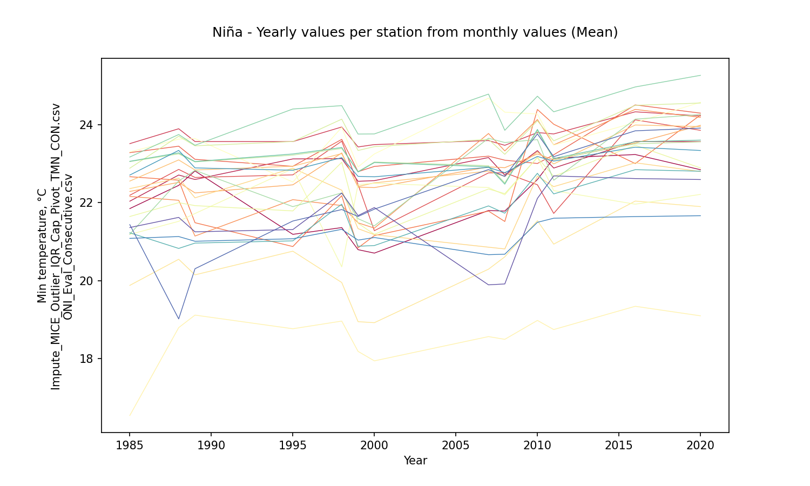

Niña - Aggregation value per station from yearly aggregations (mean)

|         |   15015020 |   15065040 |   23215060 |   25025002 |   25025090 |   25025250 |   25025300 |   25025330 |   28015030 |   28015070 |   28025020 |   28025040 |   28025070 |   28025080 |   28025090 |   28025502 |   28035010 |   28035020 |   28035040 |   28035070 |   28045020 |   28045040 |   29065010 |   29065020 |   29065030 |
|:--------|-----------:|-----------:|-----------:|-----------:|-----------:|-----------:|-----------:|-----------:|-----------:|-----------:|-----------:|-----------:|-----------:|-----------:|-----------:|-----------:|-----------:|-----------:|-----------:|-----------:|-----------:|-----------:|-----------:|-----------:|-----------:|
| AggNina |    22.0436 |    22.9191 |    23.7392 |    22.7263 |    23.3436 |    22.3656 |    22.7319 |     22.867 |    23.0266 |    22.1103 |    20.4985 |    18.5795 |     23.739 |    22.0664 |    22.2964 |    23.7044 |    23.1769 |    22.7331 |    24.2129 |    23.1898 |    21.6979 |     22.998 |    21.1941 |    22.1409 |    21.6281 |

Niña - Aggregation value per station from yearly aggregations (std - standard deviation)

|            |   15015020 |   15065040 |   23215060 |   25025002 |   25025090 |   25025250 |   25025300 |   25025330 |   28015030 |   28015070 |   28025020 |   28025040 |   28025070 |   28025080 |   28025090 |   28025502 |   28035010 |   28035020 |   28035040 |   28035070 |   28045020 |   28045040 |   29065010 |   29065020 |   29065030 |
|:-----------|-----------:|-----------:|-----------:|-----------:|-----------:|-----------:|-----------:|-----------:|-----------:|-----------:|-----------:|-----------:|-----------:|-----------:|-----------:|-----------:|-----------:|-----------:|-----------:|-----------:|-----------:|-----------:|-----------:|-----------:|-----------:|
| StdAggNina |   0.867867 |   0.446794 |    0.29125 |   0.790791 |   0.521768 |    1.25142 |    1.18001 |    0.54088 |   0.500838 |   0.786672 |   0.976603 |   0.723755 |   0.646347 |   0.738013 |    0.70741 |   0.491215 |   0.348848 |    1.04296 |   0.631791 |   0.371702 |   0.782282 |   0.270695 |   0.333875 |     1.4427 |   0.911796 |

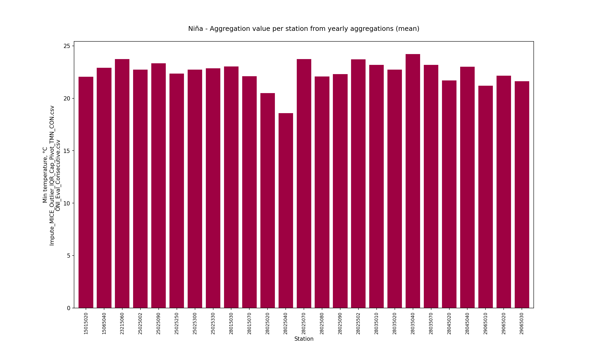

Niña - Monthly values per station (mean)

|   Month |   15015020 |   15065040 |   23215060 |   25025002 |   25025090 |   25025250 |   25025300 |   25025330 |   28015030 |   28015070 |   28025020 |   28025040 |   28025070 |   28025080 |   28025090 |   28025502 |   28035010 |   28035020 |   28035040 |   28035070 |   28045020 |   28045040 |   29065010 |   29065020 |   29065030 |
|--------:|-----------:|-----------:|-----------:|-----------:|-----------:|-----------:|-----------:|-----------:|-----------:|-----------:|-----------:|-----------:|-----------:|-----------:|-----------:|-----------:|-----------:|-----------:|-----------:|-----------:|-----------:|-----------:|-----------:|-----------:|-----------:|
|       1 |    20.8111 |    22.244  |    23.2026 |    21.2776 |    22.6782 |    21.7834 |    21.8188 |    21.4891 |    22.1692 |    21.0098 |    18.8173 |    17.8396 |    22.4688 |    20.9403 |    20.2192 |    23.0179 |    21.8495 |    22.0975 |    24.1882 |    21.8263 |    20.0701 |    22.5261 |    20.6517 |    20.6482 |    20.4071 |
|       2 |    21.4489 |    22.4725 |    23.6158 |    22.1782 |    23.1955 |    22.0605 |    22.7417 |    22.0377 |    22.6765 |    21.4876 |    19.6463 |    18.1959 |    23.4618 |    21.576  |    21.2787 |    23.4352 |    22.9089 |    22.6605 |    24.7591 |    22.9004 |    20.7228 |    22.8639 |    20.9291 |    21.0502 |    21.0937 |
|       3 |    22.34   |    22.8833 |    23.862  |    22.843  |    23.55   |    22.6125 |    23.3593 |    22.9306 |    23.2373 |    22.0419 |    20.5117 |    18.6897 |    24.1952 |    22.291  |    22.2598 |    24.0289 |    23.6251 |    23.0114 |    24.8394 |    23.6369 |    21.7172 |    23.0614 |    21.1705 |    22.0246 |    21.5357 |
|       4 |    22.944  |    23.3565 |    24.0564 |    23.6345 |    23.6334 |    22.8076 |    23.4333 |    23.6441 |    23.678  |    22.8044 |    21.3612 |    19.0152 |    24.7875 |    22.7927 |    23.1395 |    24.44   |    23.9969 |    23.3522 |    24.7406 |    24.036  |    22.5166 |    23.3862 |    21.4804 |    22.8517 |    22.2698 |
|       5 |    22.8942 |    23.5814 |    24.154  |    23.5575 |    23.7943 |    22.5787 |    23.1287 |    23.5811 |    23.6473 |    22.6806 |    21.5667 |    19.063  |    24.6543 |    22.6848 |    23.3496 |    24.2264 |    24.0597 |    23.1896 |    24.6194 |    24.0934 |    22.6204 |    23.3757 |    21.5494 |    22.9359 |    22.4559 |
|       6 |    22.7409 |    23.5495 |    24.0283 |    23.2916 |    23.7205 |    22.6895 |    22.929  |    23.4799 |    23.5577 |    22.7358 |    21.2548 |    19.1454 |    24.3855 |    22.5934 |    23.1301 |    24.2277 |    23.4855 |    23.3283 |    24.5514 |    23.5236 |    22.483  |    23.3127 |    21.4708 |    22.7592 |    22.2835 |
|       7 |    22.3784 |    23.3932 |    23.8767 |    23.0813 |    23.4857 |    22.7133 |    22.8194 |    23.3378 |    23.4016 |    22.5566 |    20.9263 |    18.8126 |    24.0857 |    22.3255 |    22.9009 |    24.1571 |    23.5943 |    23.1524 |    24.2382 |    23.6242 |    22.2029 |    23.2    |    21.3511 |    22.6183 |    21.9832 |
|       8 |    22.2105 |    23.16   |    23.7881 |    22.9597 |    23.3725 |    22.4698 |    22.8243 |    23.1196 |    23.112  |    22.522  |    20.9511 |    18.7248 |    23.8963 |    22.085  |    22.7607 |    23.8084 |    23.4917 |    22.9597 |    24.0571 |    23.5164 |    22.0213 |    23.0785 |    21.3281 |    22.5267 |    21.9205 |
|       9 |    22.0769 |    22.7723 |    23.7127 |    22.6982 |    23.2797 |    22.2199 |    22.6373 |    23.0419 |    22.9252 |    22.2033 |    20.7772 |    18.6933 |    23.7257 |    22.0625 |    22.7213 |    23.4536 |    23.3595 |    22.4432 |    23.6901 |    23.3704 |    21.8996 |    22.9443 |    21.2231 |    22.3685 |    21.6388 |
|      10 |    21.9778 |    22.7316 |    23.692  |    22.7672 |    23.3313 |    22.1365 |    22.7119 |    22.8792 |    22.8781 |    21.9835 |    20.5897 |    18.5261 |    23.5742 |    22.1241 |    22.4013 |    23.3715 |    23.0398 |    22.46   |    23.7757 |    23.0454 |    21.7124 |    22.8524 |    21.1683 |    22.2739 |    21.524  |
|      11 |    21.7588 |    22.6942 |    23.6635 |    22.6541 |    23.3115 |    22.3323 |    22.6949 |    22.7763 |    22.8138 |    21.9926 |    20.4132 |    18.4049 |    23.1916 |    21.9082 |    22.2356 |    23.3481 |    22.8449 |    22.4076 |    23.6225 |    22.8518 |    21.647  |    22.8591 |    21.1665 |    22.2551 |    21.5546 |
|      12 |    20.9423 |    22.1908 |    23.2186 |    21.7727 |    22.7702 |    21.9833 |    21.6838 |    22.0872 |    22.223  |    21.3058 |    19.1667 |    17.8434 |    22.4413 |    21.4129 |    21.1607 |    22.9384 |    21.8671 |    21.7343 |    23.4736 |    21.8531 |    20.762  |    22.5161 |    20.8398 |    21.378  |    20.8702 |

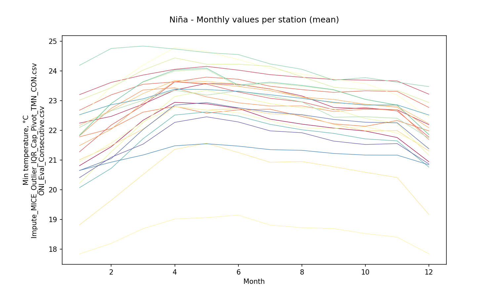

Niña - Zonal monthly values (mean)

|   Month |   AggNinaZonal |
|--------:|---------------:|
|       1 |        21.4421 |
|       2 |        22.0559 |
|       3 |        22.6503 |
|       4 |        23.1263 |
|       5 |        23.1217 |
|       6 |        22.9863 |
|       7 |        22.8087 |
|       8 |        22.6666 |
|       9 |        22.4775 |
|      10 |        22.3811 |
|      11 |        22.2961 |
|      12 |        21.6174 |

### Niño events analysis (19 years identified)

|   Id |   YR |   NinaCount |   NinoCount |   NeutralCount | Event   |   EventMark |   EventLabel |
|-----:|-----:|------------:|------------:|---------------:|:--------|------------:|-------------:|
|    1 | 1951 |           2 |           7 |              3 | Niño    |           1 |            7 |
|    3 | 1953 |           0 |          11 |              1 | Niño    |           1 |           11 |
|    7 | 1957 |           0 |           9 |              3 | Niño    |           1 |            9 |
|    8 | 1958 |           0 |           7 |              5 | Niño    |           1 |            7 |
|   13 | 1963 |           0 |           7 |              5 | Niño    |           1 |            7 |
|   15 | 1965 |           1 |           7 |              4 | Niño    |           1 |            7 |
|   19 | 1969 |           0 |           5 |              7 | Niño    |           1 |            5 |
|   22 | 1972 |           1 |           8 |              3 | Niño    |           1 |            8 |
|   32 | 1982 |           0 |           8 |              4 | Niño    |           1 |            8 |
|   33 | 1983 |           3 |           6 |              3 | Niño    |           1 |            6 |
|   37 | 1987 |           0 |          12 |              0 | Niño    |           1 |           12 |
|   41 | 1991 |           0 |           7 |              5 | Niño    |           1 |            7 |
|   42 | 1992 |           0 |           6 |              6 | Niño    |           1 |            6 |
|   47 | 1997 |           1 |           8 |              3 | Niño    |           1 |            8 |
|   52 | 2002 |           0 |           7 |              5 | Niño    |           1 |            7 |
|   54 | 2004 |           0 |           5 |              7 | Niño    |           1 |            5 |
|   59 | 2009 |           3 |           5 |              4 | Niño    |           1 |            5 |
|   65 | 2015 |           0 |          10 |              2 | Niño    |           1 |           10 |
|   69 | 2019 |           0 |           5 |              7 | Niño    |           1 |            5 |

Niño - Table aggregations (Mean)

|   Year |   15015020 |   15065040 |   23215060 |   25025002 |   25025090 |   25025250 |   25025300 |   25025330 |   28015030 |   28015070 |   28025020 |   28025040 |   28025070 |   28025080 |   28025090 |   28025502 |   28035010 |   28035020 |   28035040 |   28035070 |   28045020 |   28045040 |   29065010 |   29065020 |   29065030 |
|-------:|-----------:|-----------:|-----------:|-----------:|-----------:|-----------:|-----------:|-----------:|-----------:|-----------:|-----------:|-----------:|-----------:|-----------:|-----------:|-----------:|-----------:|-----------:|-----------:|-----------:|-----------:|-----------:|-----------:|-----------:|-----------:|
|   1982 |    22.5105 |    21.9293 |    23.6149 |    22.6331 |    23.2297 |    22.3507 |    22.5549 |    22.7311 |    22.8778 |    22.2424 |    20.2609 |    18.4828 |    22.9044 |    21.6634 |    22.0571 |    23.5284 |    23.2065 |    21.3688 |    23.8342 |    23.2225 |    21.4865 |    22.9708 |    20.7029 |    22.2377 |    22.0847 |
|   1983 |    23.3663 |    23.3942 |    24.0794 |    23.0067 |    23.9316 |    23.0811 |    23.2154 |    23.1085 |    23.4412 |    22.7163 |    21.0221 |    19.0198 |    23.4738 |    21.8307 |    22.9665 |    24.1259 |    23.5228 |    21.3841 |    23.8438 |    23.5604 |    22.1923 |    23.3426 |    21.4949 |    22.6081 |    22.6274 |
|   1987 |    23.0265 |    23.2714 |    24.1392 |    23.6842 |    23.8152 |    23.177  |    23.53   |    23.1268 |    23.4113 |    23.1146 |    20.904  |    19.4018 |    23.8525 |    21.9292 |    23.1742 |    23.9739 |    23.5289 |    22.3663 |    23.9445 |    23.5689 |    21.3208 |    23.5731 |    20.9348 |    19.1428 |    21.4853 |
|   1991 |    23.0101 |    23.4444 |    23.9232 |    22.8133 |    23.4939 |    21.259  |    22.6787 |    23.4977 |    23.197  |    22.9617 |    20.563  |    19.481  |    23.933  |    19.7862 |    22.8383 |    23.9274 |    23.5445 |    23.0175 |    23.7599 |    23.5828 |    21.9327 |    23.157  |    21.352  |    22.4507 |    22.1451 |
|   1992 |    22.687  |    23.3328 |    23.6796 |    23.2497 |    22.8657 |    21.5413 |    22.3157 |    22.0299 |    23.1925 |    23.0793 |    20.9703 |    19.1245 |    23.7046 |    19.7107 |    22.7603 |    24.0039 |    23.5158 |    23.3842 |    23.6747 |    23.5569 |    21.85   |    23.1303 |    21.2748 |    22.2514 |    21.7831 |
|   1997 |    21.3431 |    23.2775 |    23.5417 |    22.7346 |    22.4706 |    21.9635 |    21.2687 |    22.4722 |    23.1276 |    22.2446 |    20.0354 |    18.6934 |    22.5617 |    21.8397 |    22.4297 |    24.3352 |    23.865  |    22.2223 |    24.4508 |    23.8842 |    21.5687 |    23.148  |    21.1223 |    22.1218 |    21.5368 |
|   2002 |    21.8626 |    23.2535 |    23.8425 |    22.4593 |    23.5581 |    22.1046 |    22.6183 |    22.6973 |    23.217  |    21.7344 |    19.5209 |    18.351  |    24.5547 |    22.2737 |    21.5672 |    24.3437 |    23.455  |    22.8698 |    24.1837 |    23.4672 |    21.6809 |    23.0908 |    21.3357 |    22.873  |    22.2707 |
|   2004 |    22.4218 |    22.7747 |    23.958  |    21.7729 |    24.0811 |    21.612  |    22.9528 |    21.5995 |    23.0647 |    21.9575 |    19.432  |    18.398  |    25.0094 |    22.3372 |    21.9803 |    23.9044 |    23.4925 |    23.6866 |    24.2027 |    23.5    |    21.7093 |    23.078  |    21.0655 |    22.3571 |    21.4397 |
|   2009 |    22.3696 |    23.4005 |    23.8353 |    22.6078 |    23.5321 |    23.6612 |    23.8903 |    23.6579 |    23.4427 |    22.1547 |    20.9908 |    18.7712 |    24.8604 |    22.6473 |    22.6062 |    24.3373 |    23.512  |    23.5904 |    24.8584 |    23.5276 |    22.4167 |    23.225  |    21.0035 |    23.2121 |    20.6606 |
|   2015 |    23.0491 |    23.9604 |    24.5082 |    24.1079 |    24.9938 |    23.761  |    24.436  |    23.7051 |    24.4023 |    23.1338 |    21.9311 |    19.0051 |    24.683  |    22.2205 |    22.4294 |    25.0755 |    24.034  |    24.2269 |    25.4938 |    24.0926 |    22.3306 |    23.5842 |    21.6453 |    22.5844 |    22.6624 |
|   2019 |    23.0196 |    23.4619 |    24.4019 |    23.8935 |    24.7794 |    24.4387 |    23.7794 |    24.1755 |    23.9456 |    22.8481 |    21.6442 |    19.1203 |    24.1298 |    22.1111 |    22.9424 |    24.3778 |    23.7986 |    23.6062 |    24.8492 |    23.8414 |    22.6424 |    23.3401 |    21.6231 |    23.3137 |    22.6037 |

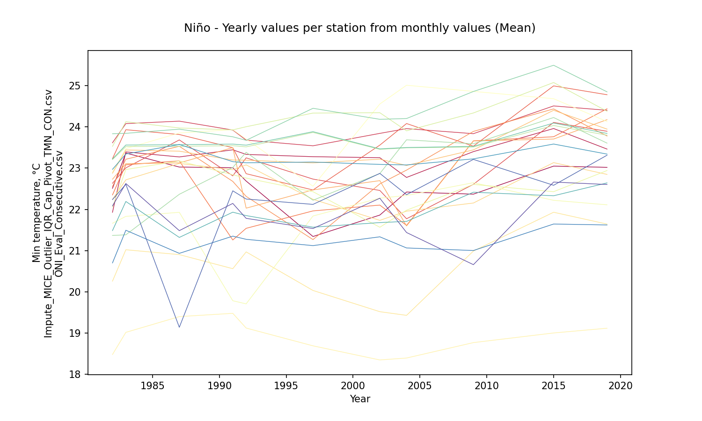

Niño - Aggregation value per station from yearly aggregations (mean)

|         |   15015020 |   15065040 |   23215060 |   25025002 |   25025090 |   25025250 |   25025300 |   25025330 |   28015030 |   28015070 |   28025020 |   28025040 |   28025070 |   28025080 |   28025090 |   28025502 |   28035010 |   28035020 |   28035040 |   28035070 |   28045020 |   28045040 |   29065010 |   29065020 |   29065030 |
|:--------|-----------:|-----------:|-----------:|-----------:|-----------:|-----------:|-----------:|-----------:|-----------:|-----------:|-----------:|-----------:|-----------:|-----------:|-----------:|-----------:|-----------:|-----------:|-----------:|-----------:|-----------:|-----------:|-----------:|-----------:|-----------:|
| AggNino |     22.606 |    23.2273 |    23.9567 |    22.9966 |    23.7047 |    22.6318 |    23.0218 |     22.982 |    23.3927 |    22.5625 |    20.6613 |    18.8954 |    23.9698 |    21.6682 |    22.5229 |    24.1758 |    23.5887 |    22.8839 |    24.2814 |    23.6186 |     21.921 |      23.24 |    21.2323 |    22.2866 |    21.9363 |

Niño - Aggregation value per station from yearly aggregations (std - standard deviation)

|            |   15015020 |   15065040 |   23215060 |   25025002 |   25025090 |   25025250 |   25025300 |   25025330 |   28015030 |   28015070 |   28025020 |   28025040 |   28025070 |   28025080 |   28025090 |   28025502 |   28035010 |   28035020 |   28035040 |   28035070 |   28045020 |   28045040 |   29065010 |   29065020 |   29065030 |
|:-----------|-----------:|-----------:|-----------:|-----------:|-----------:|-----------:|-----------:|-----------:|-----------:|-----------:|-----------:|-----------:|-----------:|-----------:|-----------:|-----------:|-----------:|-----------:|-----------:|-----------:|-----------:|-----------:|-----------:|-----------:|-----------:|
| StdAggNino |   0.594871 |   0.510247 |   0.307472 |   0.689051 |   0.746347 |    1.04957 |   0.877444 |    0.76998 |   0.433864 |   0.508372 |   0.796564 |   0.387325 |   0.787393 |   0.988525 |    0.49008 |   0.394613 |    0.22649 |   0.948033 |    0.57573 |    0.23621 |   0.422888 |   0.199649 |   0.296676 |    1.11327 |   0.623552 |

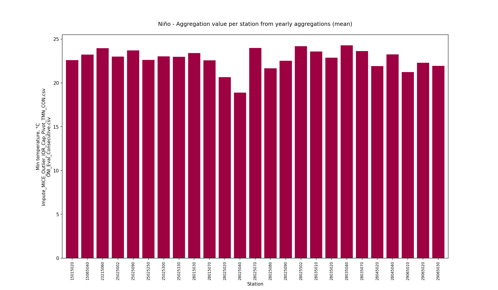

Niño - Monthly values per station (mean)

|   Month |   15015020 |   15065040 |   23215060 |   25025002 |   25025090 |   25025250 |   25025300 |   25025330 |   28015030 |   28015070 |   28025020 |   28025040 |   28025070 |   28025080 |   28025090 |   28025502 |   28035010 |   28035020 |   28035040 |   28035070 |   28045020 |   28045040 |   29065010 |   29065020 |   29065030 |
|--------:|-----------:|-----------:|-----------:|-----------:|-----------:|-----------:|-----------:|-----------:|-----------:|-----------:|-----------:|-----------:|-----------:|-----------:|-----------:|-----------:|-----------:|-----------:|-----------:|-----------:|-----------:|-----------:|-----------:|-----------:|-----------:|
|       1 |    21.3914 |    22.0492 |    23.146  |    21.6929 |    22.4656 |    21.8865 |    21.7494 |    21.8743 |    22.0517 |    21.3579 |    18.6816 |    18.0496 |    22.4919 |    21.126  |    20.7843 |    23.0183 |    22.5305 |    21.8607 |    23.8747 |    22.5119 |    20.206  |    22.6198 |    20.4773 |    20.7506 |    20.4996 |
|       2 |    22.0109 |    22.6173 |    23.6866 |    22.2764 |    23.4157 |    22.1447 |    22.531  |    22.7098 |    22.8914 |    21.8625 |    19.6377 |    18.2756 |    23.483  |    21.5246 |    21.5005 |    23.7477 |    23.5688 |    22.4872 |    24.2641 |    23.57   |    21.0453 |    22.9658 |    20.9076 |    21.461  |    21.1783 |
|       3 |    22.6975 |    22.9529 |    24.0263 |    23.0033 |    23.9467 |    22.4716 |    23.1637 |    23.1353 |    23.4958 |    22.3046 |    20.6062 |    18.8284 |    24.2643 |    21.6204 |    22.4548 |    24.2752 |    24.0221 |    22.9625 |    24.4937 |    24.0425 |    22.0004 |    23.3421 |    21.2088 |    22.1095 |    21.7691 |
|       4 |    23.5611 |    23.4299 |    24.2663 |    23.7202 |    24.1307 |    22.6469 |    23.3116 |    23.4039 |    23.9849 |    23.1234 |    21.4281 |    19.2163 |    24.7587 |    22.1722 |    23.3784 |    24.7499 |    24.3619 |    23.4251 |    24.5736 |    24.4129 |    22.6898 |    23.6335 |    21.5205 |    23.0515 |    22.625  |
|       5 |    23.4854 |    23.7144 |    24.2695 |    23.7079 |    24.0718 |    22.7347 |    23.5774 |    23.5785 |    23.9327 |    23.3053 |    21.6294 |    19.3849 |    24.5967 |    22.0159 |    23.4669 |    24.7335 |    24.2249 |    23.6104 |    24.5511 |    24.2819 |    22.6691 |    23.6285 |    21.4672 |    22.9946 |    22.6928 |
|       6 |    23.1267 |    23.8923 |    24.3005 |    23.5266 |    24.1894 |    22.9524 |    23.4218 |    23.4905 |    23.9681 |    23.1447 |    21.3936 |    19.3608 |    24.602  |    21.9798 |    23.063  |    24.7565 |    23.9781 |    23.2821 |    24.7112 |    24.0332 |    22.5057 |    23.5161 |    21.5508 |    22.8892 |    22.7657 |
|       7 |    23.014  |    23.9495 |    24.2469 |    23.3916 |    24.0648 |    23.0569 |    23.4371 |    23.2684 |    23.9828 |    23.1213 |    21.1704 |    19.2031 |    24.3335 |    22.0341 |    22.9705 |    24.8362 |    23.932  |    23.425  |    24.7289 |    23.9867 |    22.4218 |    23.4694 |    21.5579 |    22.789  |    22.5865 |
|       8 |    22.9713 |    23.7998 |    24.168  |    23.1901 |    23.9004 |    23.0048 |    23.2231 |    23.1042 |    23.8963 |    23.1092 |    21.2778 |    19.2044 |    24.3123 |    21.787  |    23.1149 |    24.7009 |    23.865  |    23.3381 |    24.2426 |    23.9163 |    22.4024 |    23.4687 |    21.3872 |    22.5557 |    22.211  |
|       9 |    22.9068 |    23.4493 |    23.9849 |    23.0681 |    23.7257 |    22.7728 |    23.1894 |    23.2361 |    23.5165 |    22.7448 |    21.1385 |    19.1475 |    24.1077 |    21.7671 |    23.0124 |    24.1907 |    23.5592 |    22.6756 |    24.0569 |    23.5958 |    22.3046 |    23.1932 |    21.3234 |    22.7742 |    22.1611 |
|      10 |    22.2637 |    22.9412 |    23.8497 |    23.0786 |    23.5143 |    22.6216 |    23.041  |    22.8033 |    23.0911 |    22.3162 |    20.856  |    18.9676 |    23.7867 |    21.5314 |    22.8067 |    23.7392 |    23.299  |    22.6439 |    23.8668 |    23.3178 |    22.009  |    23.0939 |    21.1879 |    22.4133 |    21.7488 |
|      11 |    22.2056 |    23.0656 |    23.9633 |    23.0378 |    23.7063 |    22.7733 |    23.0823 |    22.7424 |    23.0741 |    22.4187 |    20.3942 |    18.9486 |    23.7622 |    21.5259 |    22.5176 |    23.6982 |    23.1954 |    22.367  |    23.9789 |    23.2174 |    21.8444 |    23.036  |    21.2196 |    22.1869 |    21.8631 |
|      12 |    21.638  |    22.8667 |    23.5727 |    22.2662 |    23.3245 |    22.5157 |    22.5344 |    22.437  |    22.827  |    21.9411 |    19.7226 |    18.1574 |    23.1381 |    20.9335 |    21.2042 |    23.6627 |    22.5274 |    22.5293 |    24.0345 |    22.5368 |    20.953  |    22.9128 |    20.9788 |    21.4639 |    21.1349 |

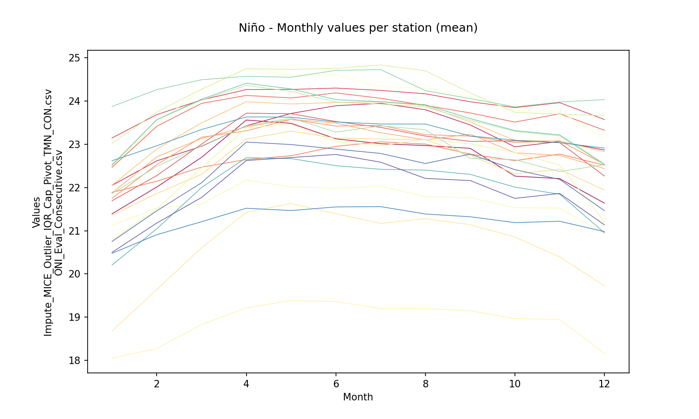

Niño - Zonal monthly values (mean)

|   Month |   AggNinoZonal |
|--------:|---------------:|
|       1 |        21.5659 |
|       2 |        22.2305 |
|       3 |        22.7679 |
|       4 |        23.263  |
|       5 |        23.293  |
|       6 |        23.216  |
|       7 |        23.1591 |
|       8 |        23.0461 |
|       9 |        22.8641 |
|      10 |        22.5915 |
|      11 |        22.553  |
|      12 |        22.0725 |

### Neutral events analysis (30 years identified)

|   Id |   YR |   NinaCount |   NinoCount |   NeutralCount | Event   |   EventMark |   EventLabel |
|-----:|-----:|------------:|------------:|---------------:|:--------|------------:|-------------:|
|    2 | 1952 |           0 |           1 |             11 | Neutral |           0 |           11 |
|    9 | 1959 |           0 |           3 |              9 | Neutral |           0 |            9 |
|   10 | 1960 |           0 |           0 |             12 | Neutral |           0 |           12 |
|   11 | 1961 |           0 |           0 |             12 | Neutral |           0 |           12 |
|   12 | 1962 |           0 |           0 |             12 | Neutral |           0 |           12 |
|   16 | 1966 |           0 |           4 |              8 | Neutral |           0 |            8 |
|   17 | 1967 |           1 |           0 |             11 | Neutral |           0 |           11 |
|   18 | 1968 |           3 |           3 |              6 | Neutral |           0 |            6 |
|   26 | 1976 |           3 |           4 |              5 | Neutral |           0 |            5 |
|   27 | 1977 |           0 |           4 |              8 | Neutral |           0 |            8 |
|   28 | 1978 |           0 |           1 |             11 | Neutral |           0 |           11 |
|   29 | 1979 |           0 |           2 |             10 | Neutral |           0 |           10 |
|   30 | 1980 |           0 |           1 |             11 | Neutral |           0 |           11 |
|   31 | 1981 |           1 |           0 |             11 | Neutral |           0 |           11 |
|   34 | 1984 |           3 |           0 |              9 | Neutral |           0 |            9 |
|   36 | 1986 |           0 |           4 |              8 | Neutral |           0 |            8 |
|   40 | 1990 |           0 |           0 |             12 | Neutral |           0 |           12 |
|   43 | 1993 |           0 |           4 |              8 | Neutral |           0 |            8 |
|   44 | 1994 |           0 |           4 |              8 | Neutral |           0 |            8 |
|   46 | 1996 |           3 |           0 |              9 | Neutral |           0 |            9 |
|   51 | 2001 |           2 |           0 |             10 | Neutral |           0 |           10 |
|   53 | 2003 |           0 |           2 |             10 | Neutral |           0 |           10 |
|   55 | 2005 |           2 |           2 |              8 | Neutral |           0 |            8 |
|   56 | 2006 |           3 |           4 |              5 | Neutral |           0 |            5 |
|   62 | 2012 |           3 |           0 |              9 | Neutral |           0 |            9 |
|   63 | 2013 |           0 |           0 |             12 | Neutral |           0 |           12 |
|   64 | 2014 |           0 |           2 |             10 | Neutral |           0 |           10 |
|   67 | 2017 |           3 |           0 |              9 | Neutral |           0 |            9 |
|   68 | 2018 |           4 |           3 |              5 | Neutral |           0 |            5 |
|   71 | 2021 |           4 |           0 |              8 | Neutral |           0 |            8 |

Neutral - Table aggregations (Mean)

|   Year |   15015020 |   15065040 |   23215060 |   25025002 |   25025090 |   25025250 |   25025300 |   25025330 |   28015030 |   28015070 |   28025020 |   28025040 |   28025070 |   28025080 |   28025090 |   28025502 |   28035010 |   28035020 |   28035040 |   28035070 |   28045020 |   28045040 |   29065010 |   29065020 |   29065030 |
|-------:|-----------:|-----------:|-----------:|-----------:|-----------:|-----------:|-----------:|-----------:|-----------:|-----------:|-----------:|-----------:|-----------:|-----------:|-----------:|-----------:|-----------:|-----------:|-----------:|-----------:|-----------:|-----------:|-----------:|-----------:|-----------:|
|   1980 |    22.8584 |    22.8056 |    23.8585 |    22.6642 |    23.4673 |    22.4256 |    23.0159 |    22.9672 |    22.9225 |    22.4342 |    20.8047 |    18.4006 |    23.1887 |    21.5955 |    22.4633 |    23.4544 |    23.6372 |    20.4396 |    23.9536 |    23.6565 |    21.807  |    23.0035 |    22.1446 |    22.6619 |    22.4801 |
|   1981 |    22.4263 |    22.1797 |    23.7271 |    22.63   |    23.3679 |    22.5032 |    22.8745 |    22.7184 |    22.7469 |    22.3608 |    20.3668 |    18.6492 |    23.2101 |    21.6872 |    22.367  |    23.3415 |    23.2527 |    20.8989 |    23.8064 |    23.2709 |    21.8237 |    22.8777 |    21.3987 |    22.9636 |    22.4591 |
|   1984 |    22.4179 |    22.3067 |    23.4699 |    22.5823 |    23.2722 |    22.7676 |    22.6061 |    22.4166 |    22.9775 |    22.0743 |    20.3455 |    18.4968 |    22.6742 |    21.38   |    21.8774 |    23.563  |    23.0039 |    21.5008 |    22.8121 |    23.0157 |    21.6314 |    22.9554 |    21.2638 |    22.2053 |    21.757  |
|   1986 |    22.0991 |    22.7744 |    23.631  |    22.6791 |    23.4982 |    23.1791 |    22.1728 |    22.4878 |    22.8871 |    22.4505 |    20.1252 |    16.98   |    23.3934 |    20.8516 |    21.9034 |    23.6015 |    23.0138 |    22.1993 |    23.4642 |    23.0348 |    20.9092 |    23.0868 |    21.3325 |    20.1506 |    21.5633 |
|   1990 |    23.3857 |    23.4303 |    23.8504 |    23.3355 |    23.374  |    20.7665 |    22.4841 |    23.42   |    23.0881 |    22.8375 |    20.8052 |    19.3836 |    24.0452 |    22.1067 |    22.8206 |    23.6613 |    23.223  |    23.3924 |    23.7074 |    23.2568 |    21.8073 |    23.2053 |    21.3491 |    22.1773 |    22.1118 |
|   1993 |    21.7921 |    23.4836 |    23.0698 |    22.9103 |    21.1163 |    21.093  |    21.9259 |    20.7492 |    22.6065 |    23.0055 |    20.7458 |    18.9761 |    22.8705 |    19.8897 |    21.747  |    23.7859 |    23.6257 |    23.0709 |    24.0366 |    23.6618 |    21.0271 |    23.0563 |    21.2689 |    21.5769 |    21.9438 |
|   1994 |    21.2328 |    23.4106 |    23.419  |    22.8137 |    22.2891 |    20.9756 |    22.0722 |    22.2151 |    22.9053 |    23.1047 |    20.7029 |    18.9449 |    22.0134 |    20.3361 |    21.9897 |    23.8217 |    23.1935 |    21.8948 |    24.4785 |    23.2351 |    21.0856 |    22.932  |    21.222  |    21.7088 |    21.8159 |
|   1996 |    20.862  |    22.6644 |    23.5651 |    22.6504 |    22.803  |    20.5396 |    21.3921 |    22.0322 |    22.6982 |    22.6649 |    20.118  |    18.5049 |    21.961  |    21.9979 |    22.135  |    23.3545 |    23.403  |    20.9171 |    24.0718 |    23.4263 |    21.1157 |    22.7319 |    21.2558 |    21.9259 |    22.1126 |
|   2001 |    21.0628 |    22.9337 |    23.5284 |    21.9684 |    22.7719 |    21.5565 |    23.2668 |    23.0388 |    22.2892 |    21.5241 |    17.5064 |    18.2242 |    24.1606 |    23.0781 |    21.6319 |    23.8991 |    23.1133 |    21.984  |    24.131  |    23.1149 |    21.4154 |    22.8551 |    21.1603 |    22.7066 |    22.2739 |
|   2003 |    22.3456 |    23.4269 |    24.1834 |    22.5081 |    24.4102 |    21.7741 |    23.3298 |    22.4501 |    23.3338 |    21.8138 |    20.2711 |    18.5264 |    24.5278 |    22.0297 |    22.0791 |    23.9337 |    23.5872 |    22.8455 |    23.9381 |    23.5955 |    21.9065 |    23.046  |    21.3786 |    23.0097 |    22.2602 |
|   2005 |    22.5159 |    22.7808 |    23.9376 |    23.809  |    23.6722 |    21.7793 |    23.7257 |    21.8436 |    22.6161 |    21.3081 |    18.4541 |    18.9668 |    24.696  |    22.4494 |    22.9409 |    23.7609 |    23.6172 |    23.6899 |    23.8277 |    23.6079 |    22.0207 |    23.1201 |    21.211  |    22.4101 |    22.1864 |
|   2006 |    22.0163 |    23.4261 |    23.6769 |    23.6172 |    23.2101 |    21.5169 |    23.8705 |    21.9177 |    22.955  |    21.155  |    20.3309 |    18.6938 |    24.8481 |    22.0157 |    22.3301 |    23.8661 |    22.9462 |    23.7293 |    24.1165 |    22.9342 |    21.9786 |    22.9996 |    20.9868 |    23.067  |    20.9384 |
|   2012 |    22.6801 |    23.1685 |    24.147  |    21.5876 |    24.2864 |    22.8213 |    23.5322 |    23.3701 |    23.5387 |    22.6503 |    21.2008 |    18.6656 |    23.92   |    21.9913 |    22.5869 |    23.9908 |    23.2125 |    22.2166 |    24.9052 |    23.251  |    22.222  |    23.1424 |    21.6267 |    23.2127 |    22.7961 |
|   2013 |    22.7001 |    23.4661 |    24.3489 |    23.7851 |    24.6725 |    23.163  |    23.8441 |    23.6862 |    23.9114 |    22.9225 |    21.5511 |    18.9917 |    24.1501 |    22.0897 |    22.6928 |    24.3949 |    23.4751 |    22.7614 |    25.2097 |    23.524  |    22.4083 |    23.2852 |    21.7565 |    23.2982 |    23.1248 |
|   2014 |    22.9907 |    23.6177 |    24.438  |    23.8707 |    24.8783 |    24.0551 |    24.1239 |    23.6077 |    24.069  |    22.9468 |    21.6555 |    19.0443 |    24.5251 |    22.1587 |    22.7187 |    24.5902 |    23.8134 |    23.9274 |    25.4209 |    23.8616 |    22.5637 |    23.395  |    21.6436 |    23.2346 |    22.6587 |
|   2017 |    22.8458 |    23.1743 |    24.276  |    23.7402 |    24.5593 |    23.6073 |    24.0735 |    23.5113 |    23.6892 |    22.3047 |    21.4917 |    19.071  |    23.7552 |    21.8748 |    22.9588 |    24.1083 |    23.6116 |    23.4938 |    24.9981 |    23.6366 |    22.4121 |    23.2436 |    21.5171 |    23.0398 |    22.3821 |
|   2018 |    22.7148 |    23.1181 |    24.2535 |    23.5603 |    24.5841 |    24.2433 |    23.73   |    23.6089 |    23.5668 |    22.1566 |    20.9747 |    18.9756 |    24.1932 |    22.0418 |    22.8014 |    24.0464 |    23.5426 |    23.6366 |    24.7926 |    23.5621 |    22.4487 |    23.1914 |    21.4468 |    23.0492 |    22.2122 |
|   2021 |    22.4036 |    23.2436 |    23.8833 |    23.3481 |    23.6234 |    24.3504 |    23.6315 |    23.9345 |    23.438  |    22.3341 |    21.1098 |    18.917  |    24.0406 |    22.0274 |    22.6723 |    24.1878 |    22.9197 |    23.8267 |    24.9265 |    22.9503 |    22.3868 |    23.1856 |    21.4741 |    23.1322 |    22.2042 |

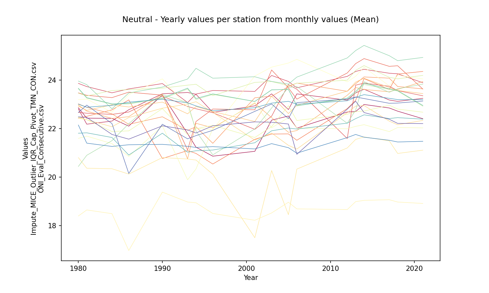

Neutral - Aggregation value per station from yearly aggregations (mean)

|            |   15015020 |   15065040 |   23215060 |   25025002 |   25025090 |   25025250 |   25025300 |   25025330 |   28015030 |   28015070 |   28025020 |   28025040 |   28025070 |   28025080 |   28025090 |   28025502 |   28035010 |   28035020 |   28035040 |   28035070 |   28045020 |   28045040 |   29065010 |   29065020 |   29065030 |
|:-----------|-----------:|-----------:|-----------:|-----------:|-----------:|-----------:|-----------:|-----------:|-----------:|-----------:|-----------:|-----------:|-----------:|-----------:|-----------:|-----------:|-----------:|-----------:|-----------:|-----------:|-----------:|-----------:|-----------:|-----------:|-----------:|
| AggNeutral |    22.2972 |    23.0784 |     23.848 |    23.0033 |    23.5476 |    22.3954 |    23.0929 |    22.7764 |    23.1244 |     22.336 |    20.4756 |    18.6896 |    23.6763 |    21.7556 |    22.3731 |    23.8534 |     23.344 |    22.5792 |    24.2554 |    23.3664 |    21.8317 |    23.0729 |    21.4132 |    22.5295 |    22.1823 |

Neutral - Aggregation value per station from yearly aggregations (std - standard deviation)

|               |   15015020 |   15065040 |   23215060 |   25025002 |   25025090 |   25025250 |   25025300 |   25025330 |   28015030 |   28015070 |   28025020 |   28025040 |   28025070 |   28025080 |   28025090 |   28025502 |   28035010 |   28035020 |   28035040 |   28035070 |   28045020 |   28045040 |   29065010 |   29065020 |   29065030 |
|:--------------|-----------:|-----------:|-----------:|-----------:|-----------:|-----------:|-----------:|-----------:|-----------:|-----------:|-----------:|-----------:|-----------:|-----------:|-----------:|-----------:|-----------:|-----------:|-----------:|-----------:|-----------:|-----------:|-----------:|-----------:|-----------:|
| StdAggNeutral |   0.683735 |   0.418614 |   0.372883 |   0.664142 |   0.950471 |     1.2138 |   0.817935 |    0.83572 |   0.490203 |   0.580215 |     1.0388 |   0.515921 |   0.868228 |    0.74911 |   0.427991 |   0.338389 |   0.279731 |     1.1198 |   0.674484 |   0.284398 |   0.536418 |    0.16736 |   0.262378 |   0.806332 |   0.486604 |

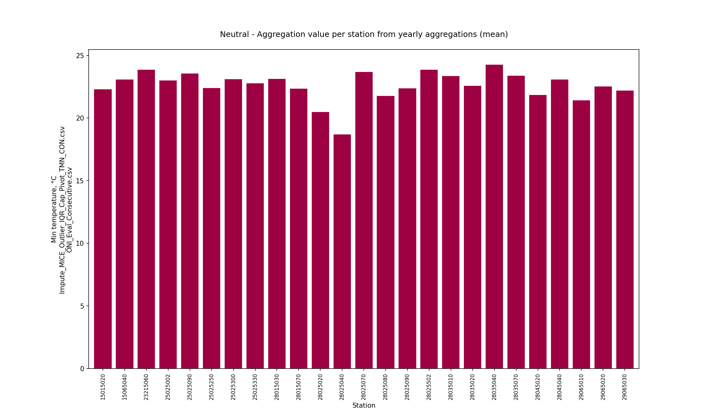

Neutral - Monthly values per station (mean)

|   Month |   15015020 |   15065040 |   23215060 |   25025002 |   25025090 |   25025250 |   25025300 |   25025330 |   28015030 |   28015070 |   28025020 |   28025040 |   28025070 |   28025080 |   28025090 |   28025502 |   28035010 |   28035020 |   28035040 |   28035070 |   28045020 |   28045040 |   29065010 |   29065020 |   29065030 |
|--------:|-----------:|-----------:|-----------:|-----------:|-----------:|-----------:|-----------:|-----------:|-----------:|-----------:|-----------:|-----------:|-----------:|-----------:|-----------:|-----------:|-----------:|-----------:|-----------:|-----------:|-----------:|-----------:|-----------:|-----------:|-----------:|
|       1 |    21.0755 |    22.2719 |    23.2454 |    21.5139 |    22.876  |    21.6435 |    21.6483 |    21.7425 |    22.1832 |    21.2951 |    19.0859 |    17.7753 |    22.4961 |    20.7957 |    20.6067 |    23.0112 |    22.3936 |    21.9342 |    23.9178 |    22.375  |    20.3665 |    22.5667 |    20.8439 |    21.1646 |    20.7425 |
|       2 |    21.4973 |    22.6518 |    23.512  |    22.0163 |    23.3163 |    21.9665 |    22.4374 |    22.2795 |    22.6989 |    21.4727 |    19.536  |    17.7984 |    23.0566 |    21.1536 |    20.978  |    23.4908 |    23.1635 |    22.3851 |    24.5089 |    23.1536 |    20.8158 |    22.7789 |    21.0215 |    21.5821 |    21.1313 |
|       3 |    22.4903 |    23.015  |    23.9599 |    23.0807 |    23.8184 |    22.405  |    23.3719 |    23.0606 |    23.2875 |    22.1789 |    20.6312 |    18.6313 |    23.9276 |    21.7488 |    22.3273 |    24.0316 |    23.8871 |    22.9655 |    24.5071 |    23.9037 |    21.8461 |    23.1582 |    21.4312 |    22.3987 |    22.1182 |
|       4 |    23.1172 |    23.4062 |    24.1669 |    23.6024 |    23.9606 |    22.517  |    23.7212 |    23.233  |    23.5999 |    22.902  |    21.0321 |    18.9237 |    24.4113 |    22.1553 |    23.0897 |    24.375  |    24.0931 |    23.2784 |    24.4791 |    24.1372 |    22.4886 |    23.374  |    21.6859 |    23.2388 |    23.1051 |
|       5 |    23.1492 |    23.3167 |    24.1204 |    23.6379 |    23.7585 |    22.457  |    23.7365 |    23.1958 |    23.5352 |    22.9109 |    21.2367 |    18.978  |    24.3131 |    22.041  |    23.151  |    24.217  |    23.9576 |    23.0333 |    24.2882 |    24.0012 |    22.5236 |    23.3474 |    21.7325 |    23.4119 |    23.1474 |
|       6 |    23.0336 |    23.7516 |    24.2287 |    23.5606 |    24.0578 |    22.7546 |    23.7203 |    23.1337 |    23.6481 |    22.9343 |    21.0394 |    19.1183 |    24.3055 |    22.009  |    23.0286 |    24.3951 |    23.8327 |    23.0656 |    24.4635 |    23.879  |    22.4174 |    23.3759 |    21.7116 |    23.3021 |    22.9398 |
|       7 |    22.6442 |    23.8049 |    24.1097 |    23.4092 |    23.9842 |    22.917  |    23.732  |    23.2761 |    23.6654 |    22.9187 |    20.799  |    18.957  |    24.0211 |    21.961  |    22.8292 |    24.4687 |    23.5926 |    23.0881 |    24.6207 |    23.6398 |    22.2863 |    23.3424 |    21.646  |    22.8642 |    22.7129 |
|       8 |    22.5241 |    23.6048 |    23.9728 |    23.3501 |    23.6546 |    22.6531 |    23.4225 |    22.9373 |    23.4495 |    22.827  |    20.9164 |    19.0626 |    23.9966 |    22.1702 |    22.9397 |    24.245  |    23.5714 |    22.771  |    24.2563 |    23.612  |    22.2812 |    23.3057 |    21.5955 |    22.8286 |    22.4383 |
|       9 |    22.4525 |    23.0133 |    23.8284 |    23.1587 |    23.4276 |    22.4846 |    23.2373 |    22.7646 |    23.0988 |    22.4613 |    20.7253 |    19.0472 |    23.8736 |    22.1062 |    22.9222 |    23.7489 |    23.2253 |    22.3914 |    24.1081 |    23.2511 |    22.1406 |    23.078  |    21.4824 |    22.6397 |    22.2854 |
|      10 |    22.3411 |    22.8007 |    23.7972 |    23.3017 |    23.3369 |    22.3091 |    23.0378 |    22.7377 |    22.9613 |    22.3238 |    20.8314 |    19.0081 |    23.6331 |    21.9184 |    22.8463 |    23.5408 |    23.2836 |    22.336  |    23.9778 |    23.3032 |    22.0616 |    22.972  |    21.5161 |    22.6914 |    22.3843 |
|      11 |    22.0228 |    22.6712 |    23.7877 |    22.9824 |    23.3734 |    22.3719 |    22.8973 |    22.6728 |    22.8164 |    22.1533 |    20.3139 |    18.7921 |    23.3469 |    21.8456 |    22.4718 |    23.4152 |    22.9266 |    21.8967 |    23.8907 |    22.94   |    21.7835 |    22.9052 |    21.3372 |    22.4459 |    21.9507 |
|      12 |    21.2188 |    22.6326 |    23.4469 |    22.4262 |    23.0066 |    22.2656 |    22.1516 |    22.2834 |    22.5486 |    21.6545 |    19.5594 |    18.1829 |    22.7338 |    21.1628 |    21.2869 |    23.302  |    22.2007 |    21.8046 |    24.0462 |    22.2013 |    20.9686 |    22.671  |    20.9541 |    21.7857 |    21.2313 |

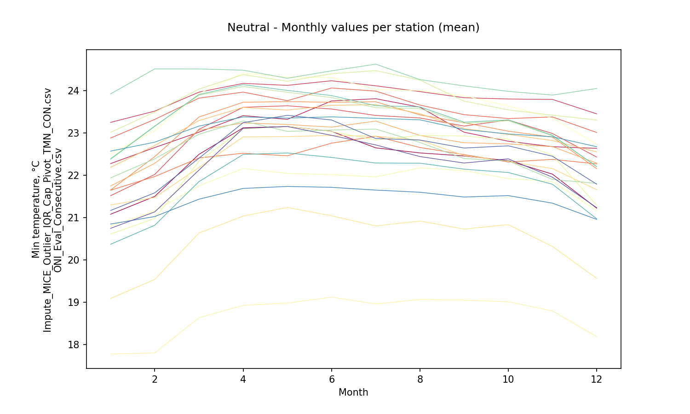

Neutral - Zonal monthly values (mean)

|   Month |   AggNeutralZonal |
|--------:|------------------:|
|       1 |           21.5828 |
|       2 |           22.0161 |
|       3 |           22.7273 |
|       4 |           23.1238 |
|       5 |           23.0879 |
|       6 |           23.1083 |
|       7 |           23.0116 |
|       8 |           22.8955 |
|       9 |           22.6781 |
|      10 |           22.6101 |
|      11 |           22.4005 |
|      12 |           21.909  |

## Yearly aggregation matrix values per station from yearly values (mean) and zonal monthly values (mean)

Yearly matrix values per station (required for spatial interpolations) File: [Agg_Impute_MICE_Outlier_IQR_Cap_Pivot_TMN_CON.csv](Agg_Impute_MICE_Outlier_IQR_Cap_Pivot_TMN_CON.csv)

|   Station |   AggComposite |   AggNina |   AggNino |   AggNeutral |
|----------:|---------------:|----------:|----------:|-------------:|
|  15015020 |        22.2996 |   22.0436 |   22.606  |      22.2972 |
|  15065040 |        23.0681 |   22.9191 |   23.2273 |      23.0784 |
|  23215060 |        23.8428 |   23.7392 |   23.9567 |      23.848  |
|  25025002 |        22.9158 |   22.7263 |   22.9966 |      23.0033 |
|  25025090 |        23.5256 |   23.3436 |   23.7047 |      23.5476 |
|  25025250 |        22.4481 |   22.3656 |   22.6318 |      22.3954 |
|  25025300 |        22.9625 |   22.7319 |   23.0218 |      23.0929 |
|  25025330 |        22.8583 |   22.867  |   22.982  |      22.7764 |
|  28015030 |        23.1644 |   23.0266 |   23.3927 |      23.1244 |
|  28015070 |        22.3255 |   22.1103 |   22.5625 |      22.336  |
|  28025020 |        20.5313 |   20.4985 |   20.6613 |      20.4756 |
|  28025040 |        18.7094 |   18.5795 |   18.8954 |      18.6896 |
|  28025070 |        23.7725 |   23.739  |   23.9698 |      23.6763 |
|  28025080 |        21.8289 |   22.0664 |   21.6682 |      21.7556 |
|  28025090 |        22.3886 |   22.2964 |   22.5229 |      22.3731 |
|  28025502 |        23.8917 |   23.7044 |   24.1758 |      23.8534 |
|  28035010 |        23.3564 |   23.1769 |   23.5887 |      23.344  |
|  28035020 |        22.7066 |   22.7331 |   22.8839 |      22.5792 |
|  28035040 |        24.2491 |   24.2129 |   24.2814 |      24.2554 |
|  28035070 |        23.3778 |   23.1898 |   23.6186 |      23.3664 |
|  28045020 |        21.8137 |   21.6979 |   21.921  |      21.8317 |
|  28045040 |        23.0935 |   22.998  |   23.24   |      23.0729 |
|  29065010 |        21.298  |   21.1941 |   21.2323 |      21.4132 |
|  29065020 |        22.3456 |   22.1409 |   22.2866 |      22.5295 |
|  29065030 |        21.9463 |   21.6281 |   21.9363 |      22.1823 |

Yearly matrix standard deviations per station File: [Agg_Std_Impute_MICE_Outlier_IQR_Cap_Pivot_TMN_CON.csv](Agg_Std_Impute_MICE_Outlier_IQR_Cap_Pivot_TMN_CON.csv)

|   Station |   StdAggComposite |   StdAggNina |   StdAggNino |   StdAggNeutral |
|----------:|------------------:|-------------:|-------------:|----------------:|
|  15015020 |          0.739298 |     0.867867 |     0.594871 |        0.683735 |
|  15065040 |          0.45659  |     0.446794 |     0.510247 |        0.418614 |
|  23215060 |          0.335307 |     0.29125  |     0.307472 |        0.372883 |
|  25025002 |          0.705852 |     0.790791 |     0.689051 |        0.664142 |
|  25025090 |          0.780667 |     0.521768 |     0.746347 |        0.950471 |
|  25025250 |          1.16205  |     1.25142  |     1.04957  |        1.2138   |
|  25025300 |          0.947621 |     1.18001  |     0.877444 |        0.817935 |
|  25025330 |          0.725872 |     0.54088  |     0.76998  |        0.83572  |
|  28015030 |          0.489559 |     0.500838 |     0.433864 |        0.490203 |
|  28015070 |          0.643074 |     0.786672 |     0.508372 |        0.580215 |
|  28025020 |          0.942118 |     0.976603 |     0.796564 |        1.0388   |
|  28025040 |          0.561311 |     0.723755 |     0.387325 |        0.515921 |
|  28025070 |          0.775182 |     0.646347 |     0.787393 |        0.868228 |
|  28025080 |          0.810923 |     0.738013 |     0.988525 |        0.74911  |
|  28025090 |          0.537245 |     0.70741  |     0.49008  |        0.427991 |
|  28025502 |          0.435307 |     0.491215 |     0.394613 |        0.338389 |
|  28035010 |          0.324555 |     0.348848 |     0.22649  |        0.279731 |
|  28035020 |          1.036    |     1.04296  |     0.948033 |        1.1198   |
|  28035040 |          0.622104 |     0.631791 |     0.57573  |        0.674484 |
|  28035070 |          0.33823  |     0.371702 |     0.23621  |        0.284398 |
|  28045020 |          0.591199 |     0.782282 |     0.422888 |        0.536418 |
|  28045040 |          0.22719  |     0.270695 |     0.199649 |        0.16736  |
|  29065010 |          0.305032 |     0.333875 |     0.296676 |        0.262378 |
|  29065020 |          1.10005  |     1.4427   |     1.11327  |        0.806332 |
|  29065030 |          0.702083 |     0.911796 |     0.623552 |        0.486604 |

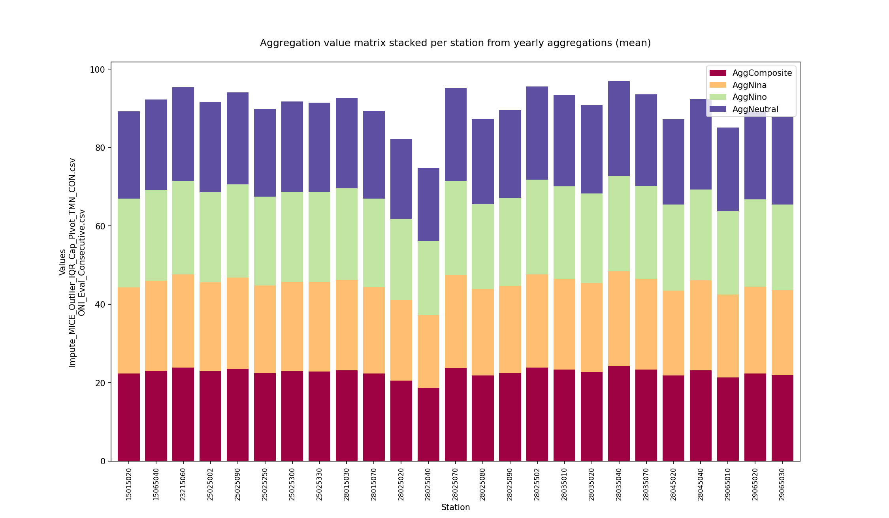

Monthly zonal values

|   Month |   AggCompositeZonal |   AggNinaZonal |   AggNinoZonal |   AggNeutralZonal |
|--------:|--------------------:|---------------:|---------------:|------------------:|
|       1 |             21.5348 |        21.4421 |        21.5659 |           21.5828 |
|       2 |             22.0846 |        22.0559 |        22.2305 |           22.0161 |
|       3 |             22.7141 |        22.6503 |        22.7679 |           22.7273 |
|       4 |             23.161  |        23.1263 |        23.263  |           23.1238 |
|       5 |             23.1521 |        23.1217 |        23.293  |           23.0879 |
|       6 |             23.0987 |        22.9863 |        23.216  |           23.1083 |
|       7 |             22.9874 |        22.8087 |        23.1591 |           23.0116 |
|       8 |             22.8641 |        22.6666 |        23.0461 |           22.8955 |
|       9 |             22.6647 |        22.4775 |        22.8641 |           22.6781 |
|      10 |             22.5343 |        22.3811 |        22.5915 |           22.6101 |
|      11 |             22.4081 |        22.2961 |        22.553  |           22.4005 |
|      12 |             21.8616 |        21.6174 |        22.0725 |           21.909  |

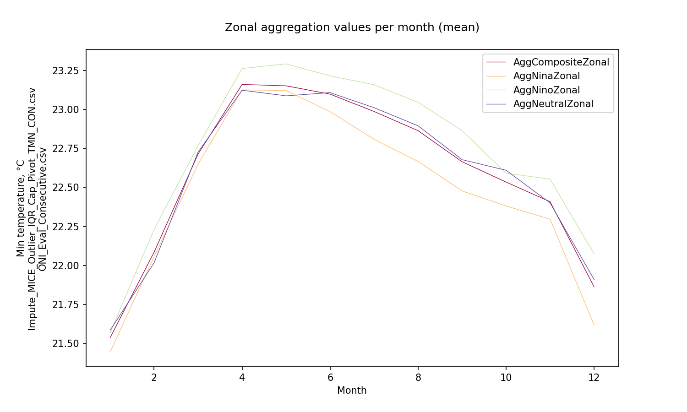
