# Statistical aggregations for hydro-climatological composite series and yearly events Niño, Niña and Neutral

For further information about the NOAA - Oceanic Niño Index (ONI) classifier for climatological yearly events Niño, Niña and Neutral, check this activity https://github.com/rcfdtools/R.LTWB/tree/main/Section03/ENSOONI

* Station records file: [Pivot_TMN_CON.csv](../IDEAM_Impute/Pivot_TMN_CON.csv)
* ENSO-ONI year file: [ONI_Eval_Consecutive.csv](../ENSOONI/ONI_Eval_Consecutive.csv)
* Stations: 25
* Records: 15341
* Daily serie: True
* Aggregation function: Mean
* Execution date: 2022-12-01 11:39:07.638890
* Python version: 3.10.5 (tags/v3.10.5:f377153, Jun  6 2022, 16:14:13) [MSC v.1929 64 bit (AMD64)]
* Python path: ['D:\\R.LTWB\\.src', 'D:\\R.LTWB', 'D:\\R.GISPython.wiki', 'D:\\R.TeachingResearchGuide', 'D:\\R.HydroTools']
* matplotlib version: 3.6.0
* pandas version: 1.4.3
* Instructions & script: https://github.com/rcfdtools/R.LTWB/tree/main/Section03/Agg
* License: https://github.com/rcfdtools/R.LTWB/blob/main/LICENSE.md
* Credits: r.cfdtools@gmail.com

## Composite - Yearly values per station from monthly values (Mean)

Daily values to year-month aggregation (Mean) file: [Agg_YM_Pivot_TMN_CON.csv](Agg_YM_Pivot_TMN_CON.csv)

|   Year |   15015020 |   15065040 |   23215060 |   25025002 |   25025090 |   25025250 |   25025300 |   25025330 |   28015030 |   28015070 |   28025020 |   28025040 |   28025070 |   28025080 |   28025090 |   28025502 |   28035010 |   28035020 |   28035040 |   28035070 |   28045020 |   28045040 |   29065010 |   29065020 |   29065030 |
|-------:|-----------:|-----------:|-----------:|-----------:|-----------:|-----------:|-----------:|-----------:|-----------:|-----------:|-----------:|-----------:|-----------:|-----------:|-----------:|-----------:|-----------:|-----------:|-----------:|-----------:|-----------:|-----------:|-----------:|-----------:|-----------:|
|   1980 |    22.9379 |    22.6658 |   nan      |   nan      |    23.4721 |   nan      |   nan      |   nan      |    23.0172 |    22.4769 |    21.0036 |    17.163  |    22.9041 |    21.6186 |   nan      |    23.3451 |    23.6847 |    18.8149 |   nan      |   nan      |   nan      |   nan      |    22.2956 |    22.7668 |    22.4139 |
|   1981 |    22.5179 |    20.2205 |   nan      |   nan      |    23.6216 |    22.9734 |   nan      |   nan      |    22.5042 |    22.9495 |    20.3586 |   nan      |    23.0755 |   nan      |    22.3553 |    23.1872 |    22.176  |    18.4284 |    23.6601 |   nan      |   nan      |   nan      |    20.686  |    23.1137 |    22.3944 |
|   1982 |    22.5527 |    21.1064 |   nan      |   nan      |    23.96   |    23.5238 |   nan      |   nan      |    23.0323 |   nan      |    20.0442 |    21.9737 |    22.7884 |    22.8087 |   nan      |    23.1359 |    23.2318 |    18.4613 |    24.0644 |   nan      |   nan      |   nan      |    20.4237 |    21.9902 |    22.1147 |
|   1983 |    23.3966 |    23.9099 |    23.6236 |   nan      |    24.1633 |    23.3071 |   nan      |   nan      |    23.2707 |   nan      |    21.0573 |   nan      |    23.4208 |   nan      |    23.1107 |    24.0888 |   nan      |    18.5699 |    23.1202 |   nan      |    21.6102 |   nan      |    21.7    |    22.4616 |    22.6222 |
|   1984 |    22.5757 |    21.4151 |    23.4482 |   nan      |    23.3218 |    22.8672 |   nan      |   nan      |    23.0897 |    22.809  |    20.3773 |   nan      |    22.5728 |    21.3653 |    21.8329 |    23.2447 |   nan      |   nan      |    22.3806 |   nan      |    21.6421 |   nan      |   nan      |   nan      |    21.7486 |
|   1985 |    21.8469 |    21.8552 |    23.4692 |    21.4133 |   nan      |    22.9456 |    22.3562 |   nan      |    22.6944 |    22.3697 |    19.936  |    16.2251 |    23.7895 |    20.8386 |    21.6705 |    22.8654 |    23.0328 |    18.4397 |    23.074  |   nan      |    21.3327 |   nan      |   nan      |    21.0834 |    21.3476 |
|   1986 |    22.1072 |    22.1863 |    23.6579 |   nan      |   nan      |    23.2317 |   nan      |   nan      |    22.6153 |    22.7889 |    20.1672 |    14.9687 |    23.4137 |    20.2227 |    21.8772 |    23.5254 |    22.7912 |   nan      |    23.2219 |   nan      |    20.7467 |   nan      |    21.2306 |    19.6874 |    21.4259 |
|   1987 |    23.0291 |    23.3104 |    24.3415 |    23.7123 |   nan      |    23.1777 |    23.5326 |    23.316  |    23.8745 |    23.1193 |    20.9075 |    19.4016 |    23.8108 |    22.1748 |    23.2015 |    23.9685 |    23.1997 |    22.3472 |    23.9454 |   nan      |    20.599  |    23.6633 |    18.7226 |    19.1125 |    21.4899 |
|   1988 |    22.4449 |    22.613  |    24.0726 |    22.8537 |   nan      |    22.5794 |    22.0514 |    22.5758 |   nan      |    22.6381 |    20.551  |    19.0969 |    23.6354 |    21.5343 |    22.0036 |    23.7248 |   nan      |    22.5921 |    23.7478 |   nan      |   nan      |    23.3454 |   nan      |    19.0137 |    21.6253 |
|   1989 |    22.8147 |    22.5905 |   nan      |    22.6366 |   nan      |    21.4    |    21.1547 |    22.151  |   nan      |    22.1683 |    20.1295 |    19.6405 |    23.6562 |   nan      |    20.216  |   nan      |   nan      |    23.5791 |    23.4533 |   nan      |   nan      |    22.654  |   nan      |    20.2534 |    21.2364 |
|   1990 |    23.3857 |    23.552  |   nan      |    22.6258 |   nan      |    20.7573 |    22.4529 |    23.6897 |   nan      |    23.0447 |    20.8073 |    19.4053 |    24.0669 |    22.0256 |    23.2346 |    23.334  |    23.1824 |    24.0865 |    23.7086 |   nan      |   nan      |    23.2923 |   nan      |    22.1316 |    22.1088 |
|   1991 |    23.0118 |    23.7815 |   nan      |    22.8039 |   nan      |    21.237  |    21.6196 |    23.544  |   nan      |    23.1577 |    20.5952 |    19.5323 |    24.0659 |    19.7075 |    22.8764 |    23.9274 |    23.5483 |    23.5407 |    23.7539 |   nan      |   nan      |    22.8695 |   nan      |    22.4535 |    22.1434 |
|   1992 |    22.687  |    23.5337 |   nan      |   nan      |    20.3916 |    21.5413 |    22.2254 |    21.7195 |   nan      |    23.3307 |    20.9854 |    19.1432 |    23.8025 |    19.4871 |    22.7703 |    24.0039 |    23.5256 |    23.3953 |    23.6913 |   nan      |   nan      |    23.1072 |   nan      |    22.252  |    21.7735 |
|   1993 |    21.7768 |    23.5647 |   nan      |    22.9103 |    21.1065 |    21.0566 |    21.9202 |    20.3178 |   nan      |    23.0422 |    20.7446 |    19.2956 |    22.8813 |    18.433  |    21.749  |    23.7858 |    23.6896 |    23.071  |    24.2177 |   nan      |   nan      |    23.4503 |   nan      |    21.6194 |    21.947  |
|   1994 |    21.2328 |    23.3509 |   nan      |    22.4921 |    22.2795 |    20.9697 |    22.0673 |    22.1346 |   nan      |    23.1144 |    20.6989 |    18.9633 |    22.0088 |    20.5106 |    21.9922 |    23.8217 |    23.7429 |    21.8818 |    24.4785 |   nan      |   nan      |   nan      |   nan      |    21.7088 |    21.8007 |
|   1995 |    21.1885 |    23.2233 |   nan      |    22.8711 |    22.9366 |    20.8754 |    22.0659 |    22.4407 |   nan      |    22.8855 |    20.7993 |    18.8395 |    22.5277 |    23.0025 |    21.7832 |    23.5693 |    23.5472 |    21.8926 |    24.4053 |   nan      |   nan      |   nan      |   nan      |    21.5332 |    21.1736 |
|   1996 |    20.8599 |    22.6993 |   nan      |    22.8536 |    22.8238 |    20.5396 |    21.3668 |    22.0355 |   nan      |    22.8489 |    20.118  |    18.5131 |    21.961  |    22.2449 |    19.5655 |    23.3534 |    23.4167 |    20.9103 |    24.0733 |   nan      |   nan      |   nan      |   nan      |    21.9259 |    22.1299 |
|   1997 |    21.3431 |    22.2136 |   nan      |    22.718  |    22.47   |    21.9635 |    21.2576 |    22.4491 |   nan      |    22.2446 |    20.0172 |   nan      |    22.5472 |    21.9911 |    22.8643 |    24.3352 |    23.8827 |    22.2169 |    24.4489 |   nan      |   nan      |   nan      |   nan      |    22.1176 |    21.2326 |
|   1998 |    21.362  |   nan      |   nan      |    23.6455 |    23.6168 |    22.1807 |    21.919  |    23.4222 |   nan      |    22.3196 |    19.9507 |   nan      |    23.9335 |    20.3539 |    23.0386 |    24.2429 |    23.5066 |    22.2599 |    24.4966 |   nan      |   nan      |   nan      |   nan      |    21.8242 |    22.2038 |
|   1999 |    20.7952 |   nan      |   nan      |    22.5836 |    22.7966 |    20.8363 |    21.4802 |    22.5452 |   nan      |    21.3343 |    18.8978 |   nan      |    22.9069 |    22.4663 |    21.4722 |    23.339  |    22.8087 |    21.5958 |    23.7622 |   nan      |   nan      |   nan      |   nan      |    21.6539 |    21.6747 |
|   2000 |    20.7081 |   nan      |   nan      |    21.2316 |    21.5909 |    21.1554 |    21.3438 |    22.3699 |   nan      |    21.0898 |    18.9292 |   nan      |    23.2403 |    22.4992 |    21.1782 |    23.4309 |    23.0448 |    21.4209 |    23.7639 |   nan      |   nan      |   nan      |   nan      |    21.8204 |    21.8932 |
|   2001 |    20.7015 |   nan      |   nan      |    21.8828 |    22.1818 |    21.555  |    23.2783 |    23.0569 |   nan      |    21.5139 |    17.1742 |   nan      |    24.1718 |    23.111  |    21.6093 |    23.9066 |    23.101  |    21.9789 |    24.1233 |   nan      |   nan      |   nan      |   nan      |    22.7066 |    22.2792 |
|   2002 |    22.0554 |    23.5391 |   nan      |    22.4396 |    23.5815 |    22.1085 |    22.6455 |    22.6974 |   nan      |    21.7295 |    19.4912 |   nan      |    24.6963 |    22.4796 |    21.5688 |    24.3445 |    23.341  |    22.8666 |    24.1657 |   nan      |   nan      |   nan      |   nan      |    22.873  |    22.2747 |
|   2003 |    22.5691 |    23.4375 |   nan      |    22.4768 |    24.4207 |    21.7741 |    23.3293 |    22.1025 |   nan      |    21.8113 |    20.256  |   nan      |    24.773  |    21.3455 |    22.1262 |    23.9328 |    23.6001 |    22.7798 |    23.9288 |   nan      |   nan      |   nan      |   nan      |    23.0124 |    22.2617 |
|   2004 |    22.4238 |    22.5489 |   nan      |    21.5217 |    24.0811 |    21.612  |    23.152  |    21.5219 |   nan      |    21.9523 |    19.2512 |   nan      |    25.089  |    22.3422 |    22.3952 |    23.9128 |    23.481  |    23.7198 |    24.0663 |   nan      |   nan      |   nan      |   nan      |    22.3486 |    21.4481 |
|   2005 |    22.3852 |    22.0375 |   nan      |    23.8235 |    23.6722 |    21.7719 |    23.795  |    21.8319 |   nan      |    21.265  |    17.1181 |   nan      |    25.5404 |    22.3721 |   nan      |    23.7763 |    23.5529 |    23.7327 |    23.8283 |   nan      |   nan      |   nan      |   nan      |    22.4122 |    22.2466 |
|   2006 |   nan      |    23.5109 |   nan      |    23.6273 |    23.2118 |    21.5169 |    23.9332 |    21.8974 |   nan      |    21.0953 |    19.9937 |   nan      |    25.0119 |    22.0137 |    22.3208 |    23.8812 |    22.9354 |    23.729  |    24.0951 |   nan      |   nan      |   nan      |   nan      |    23.0717 |    20.8934 |
|   2007 |   nan      |    23.3268 |   nan      |    22.785  |    22.8276 |    21.7428 |    23.8111 |    22.8859 |   nan      |    20.8468 |    20.3918 |   nan      |    24.7419 |    22.4109 |    22.3871 |    23.6278 |    22.9512 |    23.665  |    24.787  |   nan      |   nan      |   nan      |   nan      |    22.8575 |    19.7361 |
|   2008 |   nan      |    22.8297 |   nan      |    22.759  |    23.0753 |    21.517  |    23.4554 |    23.0539 |   nan      |    20.7815 |    20.6235 |   nan      |    24.3599 |    22.212  |    22.2642 |    23.0575 |    22.4798 |    23.5431 |    23.8587 |   nan      |   nan      |   nan      |   nan      |    22.6797 |    19.7388 |
|   2009 |   nan      |   nan      |   nan      |    22.5125 |    23.438  |    23.7102 |    23.913  |    23.9525 |   nan      |    20.544  |    21.0077 |   nan      |    24.8829 |    22.6703 |    22.6674 |    24.6397 |    23.4071 |    23.6515 |    24.8617 |   nan      |   nan      |   nan      |   nan      |    23.4104 |    19.8617 |
|   2010 |    22.2104 |   nan      |   nan      |    22.3657 |    22.8867 |    24.6461 |    24.1581 |    21.6167 |   nan      |    22.7848 |    21.5446 |   nan      |    24.2767 |    23.2809 |    23.1691 |    24.1007 |    23.8471 |    24.243  |    24.7377 |   nan      |   nan      |   nan      |   nan      |    23.7711 |    21.5042 |
|   2011 |    23.1713 |   nan      |   nan      |    21.4681 |    23.2275 |    24.1745 |    23.4943 |    22.4595 |   nan      |    22.4037 |    20.9434 |   nan      |    23.478  |    22.4143 |    22.7042 |    23.5773 |    23.1078 |    22.5718 |    24.3342 |   nan      |   nan      |   nan      |   nan      |    23.189  |    22.696  |
|   2012 |    22.699  |   nan      |   nan      |    21.4487 |    24.2416 |    21.94   |    23.5867 |    23.3672 |   nan      |    22.6503 |    21.2201 |   nan      |    23.9182 |   nan      |    22.5968 |    23.9844 |    23.2074 |    22.178  |    24.9073 |    22.42   |   nan      |   nan      |   nan      |    23.2444 |    22.8029 |
|   2013 |    22.7179 |   nan      |   nan      |    23.946  |    24.6845 |    23.8497 |    23.8461 |    23.9941 |   nan      |    22.9229 |    21.5719 |   nan      |    24.1845 |   nan      |    22.6912 |    24.3973 |    23.4703 |    22.7522 |    25.2067 |    21.7871 |   nan      |   nan      |   nan      |    23.3177 |    23.1248 |
|   2014 |   nan      |   nan      |   nan      |    23.8862 |    24.9041 |    24.1096 |    24.1285 |   nan      |   nan      |    22.9468 |    21.6829 |   nan      |    24.4628 |   nan      |    22.7088 |    24.5936 |    23.8306 |    24.2122 |    25.4252 |    25.6    |   nan      |   nan      |   nan      |    23.5385 |    22.4517 |
|   2015 |   nan      |   nan      |   nan      |    24.1094 |    25.1441 |    24.0665 |    24.5412 |   nan      |   nan      |    23.2571 |    22.0091 |   nan      |    24.6744 |   nan      |    22.3109 |    25.0787 |    24.0211 |    24.7669 |    25.6411 |   nan      |   nan      |   nan      |   nan      |    22.6908 |   nan      |
|   2016 |   nan      |   nan      |   nan      |    24.1057 |    24.5181 |   nan      |    24.4184 |    23.0576 |   nan      |    23.031  |    22.0426 |   nan      |    24.045  |   nan      |    23.4917 |    24.4963 |    23.5246 |    24.1476 |    24.9703 |   nan      |   nan      |   nan      |   nan      |    23.9047 |   nan      |
|   2017 |   nan      |   nan      |   nan      |    23.7508 |    24.716  |    24.3306 |    24.0766 |    23.6365 |   nan      |    21.925  |    21.4917 |   nan      |    23.742  |   nan      |    22.9535 |    24.114  |    23.1036 |    23.4984 |    25.0056 |   nan      |   nan      |   nan      |   nan      |    22.2145 |   nan      |
|   2018 |   nan      |   nan      |   nan      |    23.535  |    24.5845 |    24.2709 |    23.7725 |    23.6666 |   nan      |    22.1546 |    20.7103 |   nan      |    24.1902 |   nan      |    22.8004 |    24.0369 |    23.5561 |    23.7451 |    24.8831 |   nan      |   nan      |   nan      |   nan      |    23.3175 |   nan      |
|   2019 |   nan      |   nan      |   nan      |    23.9045 |    24.7753 |    24.459  |    24.0185 |    24.1946 |   nan      |    22.8455 |    21.6464 |   nan      |    24.1243 |   nan      |    22.9424 |    24.3782 |    23.2929 |    23.6087 |    24.85   |   nan      |   nan      |   nan      |   nan      |    23.3604 |   nan      |
|   2020 |   nan      |   nan      |   nan      |    23.8594 |    24.3674 |    24.3403 |    24.205  |    24.055  |   nan      |    22.7734 |    21.9719 |   nan      |    24.5839 |   nan      |    22.8918 |    24.202  |    21.436  |    24.2633 |    25.2877 |   nan      |   nan      |   nan      |   nan      |    24.2585 |   nan      |
|   2021 |   nan      |   nan      |   nan      |    23.3501 |    23.5664 |    24.4454 |    23.6211 |    23.9829 |   nan      |    22.3341 |    21.1098 |   nan      |    24.0313 |   nan      |    22.6742 |   nan      |    22.7444 |    23.8269 |    24.9241 |   nan      |   nan      |   nan      |   nan      |    23.4504 |   nan      |

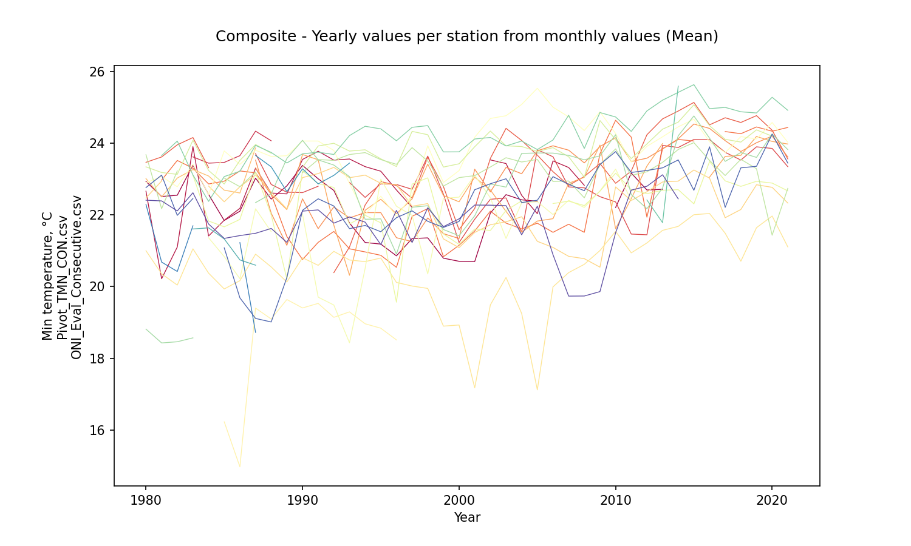

Composite - Aggregation value per station from yearly aggregations (mean)

|              |   15015020 |   15065040 |   23215060 |   25025002 |   25025090 |   25025250 |   25025300 |   25025330 |   28015030 |   28015070 |   28025020 |   28025040 |   28025070 |   28025080 |   28025090 |   28025502 |   28035010 |   28035020 |   28035040 |   28035070 |   28045020 |   28045040 |   29065010 |   29065020 |   29065030 |
|:-------------|-----------:|-----------:|-----------:|-----------:|-----------:|-----------:|-----------:|-----------:|-----------:|-----------:|-----------:|-----------:|-----------:|-----------:|-----------:|-----------:|-----------:|-----------:|-----------:|-----------:|-----------:|-----------:|-----------:|-----------:|-----------:|
| AggComposite |    22.1836 |    22.7609 |    23.7688 |    22.8831 |    23.4474 |    22.5265 |    22.9998 |    22.7801 |    23.0123 |    22.3325 |     20.484 |    18.7258 |    23.8092 |     21.722 |    22.3094 |    23.8567 |    23.2632 |    22.5246 |    24.2282 |     23.269 |    21.1861 |    23.1974 |    20.8431 |    22.3452 |    21.7663 |

Composite - Aggregation value per station from yearly aggregations (std - standard deviation)

|                 |   15015020 |   15065040 |   23215060 |   25025002 |   25025090 |   25025250 |   25025300 |   25025330 |   28015030 |   28015070 |   28025020 |   28025040 |   28025070 |   28025080 |   28025090 |   28025502 |   28035010 |   28035020 |   28035040 |   28035070 |   28045020 |   28045040 |   29065010 |   29065020 |   29065030 |
|:----------------|-----------:|-----------:|-----------:|-----------:|-----------:|-----------:|-----------:|-----------:|-----------:|-----------:|-----------:|-----------:|-----------:|-----------:|-----------:|-----------:|-----------:|-----------:|-----------:|-----------:|-----------:|-----------:|-----------:|-----------:|-----------:|
| StdAggComposite |   0.818173 |   0.915837 |   0.359528 |   0.844236 |    1.08874 |    1.28915 |    1.05715 |   0.907674 |   0.436451 |   0.767356 |    1.07457 |      1.676 |   0.843827 |    1.18161 |   0.804488 |   0.485475 |   0.499267 |    1.76224 |   0.699219 |    2.04333 |   0.486553 |   0.347114 |    1.24027 |       1.19 |   0.798121 |

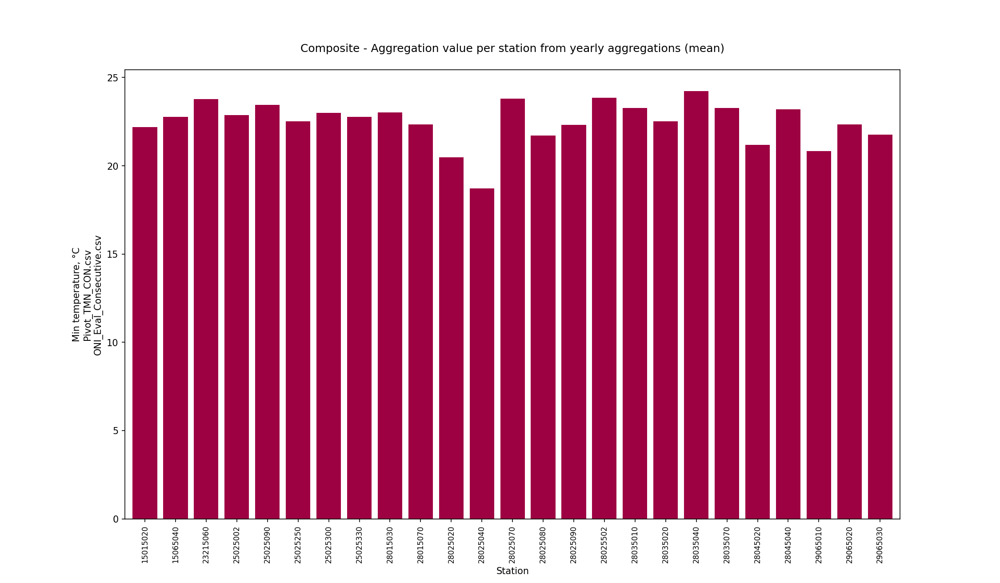

Composite - Monthly values per station (mean)

|   Month |   15015020 |   15065040 |   23215060 |   25025002 |   25025090 |   25025250 |   25025300 |   25025330 |   28015030 |   28015070 |   28025020 |   28025040 |   28025070 |   28025080 |   28025090 |   28025502 |   28035010 |   28035020 |   28035040 |   28035070 |   28045020 |   28045040 |   29065010 |   29065020 |   29065030 |
|--------:|-----------:|-----------:|-----------:|-----------:|-----------:|-----------:|-----------:|-----------:|-----------:|-----------:|-----------:|-----------:|-----------:|-----------:|-----------:|-----------:|-----------:|-----------:|-----------:|-----------:|-----------:|-----------:|-----------:|-----------:|-----------:|
|       1 |    20.9579 |    21.7476 |    22.9467 |    21.3214 |    22.7705 |    21.7645 |    21.7587 |    21.5083 |    21.596  |    21.1547 |    18.8214 |    18.6405 |    22.4518 |    20.5446 |    20.2981 |    22.953  |    22.2008 |    22.0602 |    24.0644 |    21.7871 |    18.9238 |    22.631  |    20.3297 |    20.7524 |    20.2798 |
|       2 |    21.5601 |    22.2619 |    23.3871 |    22.0304 |    23.5021 |    21.9892 |    22.6125 |    22.1811 |    22.6932 |    21.5706 |    19.5785 |    17.6482 |    23.2823 |    21.1136 |    21.0315 |    23.5135 |    23.2829 |    22.4816 |    24.6675 |   nan      |    19.6591 |    23.0927 |    20.8005 |    21.3118 |    20.9463 |
|       3 |    22.5284 |    22.359  |    23.5785 |    23.0691 |    23.9964 |    22.4356 |    23.4938 |    22.9638 |    23.0768 |    22.1821 |    20.5633 |    18.5594 |    24.2023 |    21.7606 |    22.3994 |    24.1408 |    23.971  |    23.0751 |    24.7075 |   nan      |    22.1491 |    22.9655 |    21.5404 |    22.1386 |    21.6956 |
|       4 |    23.2257 |    22.8525 |    23.868  |    23.7112 |    23.965  |    22.5489 |    23.6402 |    23.2988 |    23.3927 |    22.9455 |    21.2551 |    18.6061 |    24.7986 |    22.5047 |    23.3254 |    24.5509 |    24.2203 |    23.3659 |    24.6056 |   nan      |    22.337  |    23.5117 |    21.4492 |    23.0932 |    22.6601 |
|       5 |    23.1826 |    23.2899 |    24.189  |    23.6725 |    23.8674 |    22.476  |    23.5099 |    23.4003 |    23.5019 |    22.9553 |    21.4647 |    18.5442 |    24.546  |    22.2756 |    23.457  |    24.3385 |    24.0925 |    23.1408 |    24.4614 |   nan      |    21.7878 |    24.0324 |    21.4739 |    23.1562 |    22.7292 |
|       6 |    22.9286 |    23.9686 |    24.2986 |    23.4784 |    24.0402 |    22.7734 |    23.3841 |    23.2    |    23.6564 |    22.9425 |    21.2004 |    19.2556 |    24.4316 |    22.2468 |    23.1327 |    24.441  |    23.726  |    23.2265 |    24.5522 |   nan      |    21.9892 |    23.7544 |    21.7533 |    23.0643 |    22.4887 |
|       7 |    22.4696 |    23.9881 |    23.6543 |    23.3416 |    23.9157 |    22.8827 |    23.4556 |    23.2579 |    23.7778 |    22.8863 |    20.9042 |    18.7971 |    24.1966 |    22.1291 |    22.8953 |    24.5035 |    23.8136 |    23.3509 |    24.5117 |   nan      |    21.676  |    23.2694 |    21.7871 |    22.7891 |    22.2565 |
|       8 |    22.3475 |    23.5394 |    23.6543 |    23.1915 |    23.5727 |    22.7616 |    23.1429 |    23.0016 |    23.1913 |    22.8876 |    21.0104 |    18.7277 |    24.0779 |    21.9927 |    23.0239 |    24.2751 |    23.6157 |    22.9479 |    24.1535 |   nan      |    22.0028 |    23.4904 |    22.1404 |    22.6396 |    22.0346 |
|       9 |    22.303  |    23.1143 |    23.6207 |    23.0211 |    23.394  |    22.4891 |    23.0718 |    22.976  |    23.1433 |    22.4455 |    20.8253 |    19.1864 |    23.8885 |    21.9887 |    22.9531 |    23.6967 |    23.2677 |    22.3967 |    23.8999 |    25.6    |    21.8259 |    22.9363 |    21.706  |    22.592  |    21.883  |
|      10 |    21.9889 |    22.7063 |    23.787  |    23.1924 |    23.3679 |    22.3659 |    22.9896 |    22.7657 |    22.6298 |    22.2012 |    20.811  |    18.9494 |    23.6826 |    21.8678 |    22.7682 |    23.4344 |    23.0443 |    22.3465 |    23.8718 |   nan      |    21.8545 |    22.5724 |    21.6003 |    22.4674 |    21.6763 |
|      11 |    21.6612 |    22.7875 |    24.1061 |    23.0349 |    23.4749 |    22.5123 |    22.9538 |    22.7481 |    22.721  |    22.1484 |    20.3861 |    18.8518 |    23.5048 |    21.733  |    22.451  |    23.406  |    22.8516 |    22.1547 |    23.7969 |   nan      |    21.463  |    23.195  |    21.3964 |    22.2004 |    21.6364 |
|      12 |    21.0004 |    22.301  |    23.339  |    22.2043 |    23.0302 |    22.2599 |    22.1722 |    22.3126 |    22.5537 |    21.5971 |    19.4574 |    17.6055 |    22.7229 |    20.8423 |    21.2388 |    23.273  |    21.9205 |    21.9644 |    23.8355 |    22.42   |    20.205  |    22.6343 |    19.9359 |    21.5667 |    20.8813 |

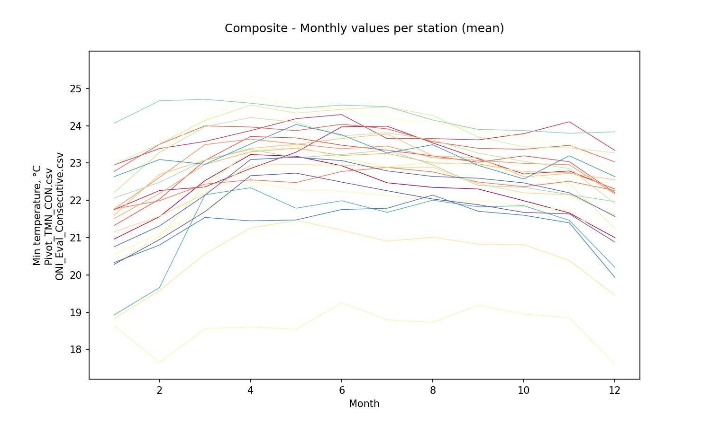

Composite - Zonal monthly values (mean)

|   Month |   AggCompositeZonal |
|--------:|--------------------:|
|       1 |             21.3706 |
|       2 |             21.9249 |
|       3 |             22.648  |
|       4 |             23.0722 |
|       5 |             23.0644 |
|       6 |             23.0806 |
|       7 |             22.9379 |
|       8 |             22.8093 |
|       9 |             22.729  |
|      10 |             22.4559 |
|      11 |             22.3823 |
|      12 |             21.7309 |

## ENSO-ONI Events - Yearly values per station from monthly values (Mean)

* Records in ENSO-ONI file: 73
* ENSO-ONI eventMark unique values: [-1  1  0]

### Niña events analysis (24 years identified)

|   Id |   YR |   NinaCount |   NinoCount |   NeutralCount | Event   |   EventMark |   EventLabel |
|-----:|-----:|------------:|------------:|---------------:|:--------|------------:|-------------:|
|    0 | 1950 |           7 |           0 |              5 | Niña    |          -1 |            7 |
|    4 | 1954 |           8 |           1 |              3 | Niña    |          -1 |            8 |
|    5 | 1955 |          12 |           0 |              0 | Niña    |          -1 |           12 |
|    6 | 1956 |           8 |           0 |              4 | Niña    |          -1 |            8 |
|   14 | 1964 |           8 |           2 |              2 | Niña    |          -1 |            8 |
|   20 | 1970 |           6 |           1 |              5 | Niña    |          -1 |            6 |
|   21 | 1971 |          12 |           0 |              0 | Niña    |          -1 |           12 |
|   23 | 1973 |           8 |           3 |              1 | Niña    |          -1 |            8 |
|   24 | 1974 |           7 |           0 |              5 | Niña    |          -1 |            7 |
|   25 | 1975 |          12 |           0 |              0 | Niña    |          -1 |           12 |
|   35 | 1985 |           6 |           0 |              6 | Niña    |          -1 |            6 |
|   38 | 1988 |           8 |           2 |              2 | Niña    |          -1 |            8 |
|   39 | 1989 |           5 |           0 |              7 | Niña    |          -1 |            5 |
|   45 | 1995 |           5 |           3 |              4 | Niña    |          -1 |            5 |
|   48 | 1998 |           6 |           4 |              2 | Niña    |          -1 |            6 |
|   49 | 1999 |          12 |           0 |              0 | Niña    |          -1 |           12 |
|   50 | 2000 |          12 |           0 |              0 | Niña    |          -1 |           12 |
|   57 | 2007 |           6 |           1 |              5 | Niña    |          -1 |            6 |
|   58 | 2008 |           6 |           0 |              6 | Niña    |          -1 |            6 |
|   60 | 2010 |           7 |           3 |              2 | Niña    |          -1 |            7 |
|   61 | 2011 |           5 |           0 |              7 | Niña    |          -1 |            5 |
|   66 | 2016 |           5 |           4 |              3 | Niña    |          -1 |            5 |
|   70 | 2020 |           5 |           1 |              6 | Niña    |          -1 |            5 |
|   72 | 2022 |           8 |           0 |              4 | Niña    |          -1 |            8 |

Niña - Table aggregations (Mean)

|   Year |   15015020 |   15065040 |   23215060 |   25025002 |   25025090 |   25025250 |   25025300 |   25025330 |   28015030 |   28015070 |   28025020 |   28025040 |   28025070 |   28025080 |   28025090 |   28025502 |   28035010 |   28035020 |   28035040 |   28035070 |   28045020 |   28045040 |   29065010 |   29065020 |   29065030 |
|-------:|-----------:|-----------:|-----------:|-----------:|-----------:|-----------:|-----------:|-----------:|-----------:|-----------:|-----------:|-----------:|-----------:|-----------:|-----------:|-----------:|-----------:|-----------:|-----------:|-----------:|-----------:|-----------:|-----------:|-----------:|-----------:|
|   1985 |    21.8469 |    21.8552 |    23.4692 |    21.4133 |   nan      |    22.9456 |    22.3562 |   nan      |    22.6944 |    22.3697 |    19.936  |    16.2251 |    23.7895 |    20.8386 |    21.6705 |    22.8654 |    23.0328 |    18.4397 |    23.074  |        nan |    21.3327 |   nan      |        nan |    21.0834 |    21.3476 |
|   1988 |    22.4449 |    22.613  |    24.0726 |    22.8537 |   nan      |    22.5794 |    22.0514 |    22.5758 |   nan      |    22.6381 |    20.551  |    19.0969 |    23.6354 |    21.5343 |    22.0036 |    23.7248 |   nan      |    22.5921 |    23.7478 |        nan |   nan      |    23.3454 |        nan |    19.0137 |    21.6253 |
|   1989 |    22.8147 |    22.5905 |   nan      |    22.6366 |   nan      |    21.4    |    21.1547 |    22.151  |   nan      |    22.1683 |    20.1295 |    19.6405 |    23.6562 |   nan      |    20.216  |   nan      |   nan      |    23.5791 |    23.4533 |        nan |   nan      |    22.654  |        nan |    20.2534 |    21.2364 |
|   1995 |    21.1885 |    23.2233 |   nan      |    22.8711 |    22.9366 |    20.8754 |    22.0659 |    22.4407 |   nan      |    22.8855 |    20.7993 |    18.8395 |    22.5277 |    23.0025 |    21.7832 |    23.5693 |    23.5472 |    21.8926 |    24.4053 |        nan |   nan      |   nan      |        nan |    21.5332 |    21.1736 |
|   1998 |    21.362  |   nan      |   nan      |    23.6455 |    23.6168 |    22.1807 |    21.919  |    23.4222 |   nan      |    22.3196 |    19.9507 |   nan      |    23.9335 |    20.3539 |    23.0386 |    24.2429 |    23.5066 |    22.2599 |    24.4966 |        nan |   nan      |   nan      |        nan |    21.8242 |    22.2038 |
|   1999 |    20.7952 |   nan      |   nan      |    22.5836 |    22.7966 |    20.8363 |    21.4802 |    22.5452 |   nan      |    21.3343 |    18.8978 |   nan      |    22.9069 |    22.4663 |    21.4722 |    23.339  |    22.8087 |    21.5958 |    23.7622 |        nan |   nan      |   nan      |        nan |    21.6539 |    21.6747 |
|   2000 |    20.7081 |   nan      |   nan      |    21.2316 |    21.5909 |    21.1554 |    21.3438 |    22.3699 |   nan      |    21.0898 |    18.9292 |   nan      |    23.2403 |    22.4992 |    21.1782 |    23.4309 |    23.0448 |    21.4209 |    23.7639 |        nan |   nan      |   nan      |        nan |    21.8204 |    21.8932 |
|   2007 |   nan      |    23.3268 |   nan      |    22.785  |    22.8276 |    21.7428 |    23.8111 |    22.8859 |   nan      |    20.8468 |    20.3918 |   nan      |    24.7419 |    22.4109 |    22.3871 |    23.6278 |    22.9512 |    23.665  |    24.787  |        nan |   nan      |   nan      |        nan |    22.8575 |    19.7361 |
|   2008 |   nan      |    22.8297 |   nan      |    22.759  |    23.0753 |    21.517  |    23.4554 |    23.0539 |   nan      |    20.7815 |    20.6235 |   nan      |    24.3599 |    22.212  |    22.2642 |    23.0575 |    22.4798 |    23.5431 |    23.8587 |        nan |   nan      |   nan      |        nan |    22.6797 |    19.7388 |
|   2010 |    22.2104 |   nan      |   nan      |    22.3657 |    22.8867 |    24.6461 |    24.1581 |    21.6167 |   nan      |    22.7848 |    21.5446 |   nan      |    24.2767 |    23.2809 |    23.1691 |    24.1007 |    23.8471 |    24.243  |    24.7377 |        nan |   nan      |   nan      |        nan |    23.7711 |    21.5042 |
|   2011 |    23.1713 |   nan      |   nan      |    21.4681 |    23.2275 |    24.1745 |    23.4943 |    22.4595 |   nan      |    22.4037 |    20.9434 |   nan      |    23.478  |    22.4143 |    22.7042 |    23.5773 |    23.1078 |    22.5718 |    24.3342 |        nan |   nan      |   nan      |        nan |    23.189  |    22.696  |
|   2016 |   nan      |   nan      |   nan      |    24.1057 |    24.5181 |   nan      |    24.4184 |    23.0576 |   nan      |    23.031  |    22.0426 |   nan      |    24.045  |   nan      |    23.4917 |    24.4963 |    23.5246 |    24.1476 |    24.9703 |        nan |   nan      |   nan      |        nan |    23.9047 |   nan      |
|   2020 |   nan      |   nan      |   nan      |    23.8594 |    24.3674 |    24.3403 |    24.205  |    24.055  |   nan      |    22.7734 |    21.9719 |   nan      |    24.5839 |   nan      |    22.8918 |    24.202  |    21.436  |    24.2633 |    25.2877 |        nan |   nan      |   nan      |        nan |    24.2585 |   nan      |

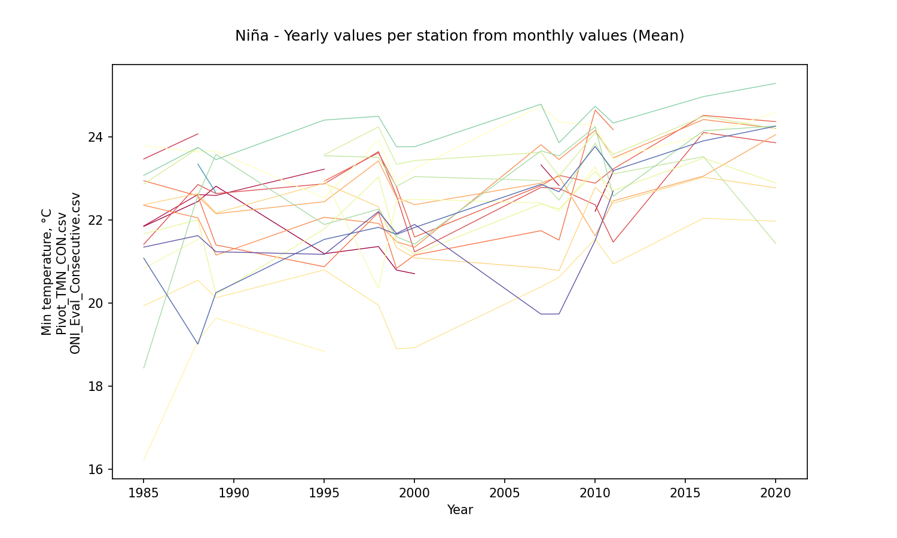

Niña - Aggregation value per station from yearly aggregations (mean)

|         |   15015020 |   15065040 |   23215060 |   25025002 |   25025090 |   25025250 |   25025300 |   25025330 |   28015030 |   28015070 |   28025020 |   28025040 |   28025070 |   28025080 |   28025090 |   28025502 |   28035010 |   28035020 |   28035040 |   28035070 |   28045020 |   28045040 |   29065010 |   29065020 |   29065030 |
|:--------|-----------:|-----------:|-----------:|-----------:|-----------:|-----------:|-----------:|-----------:|-----------:|-----------:|-----------:|-----------:|-----------:|-----------:|-----------:|-----------:|-----------:|-----------:|-----------:|-----------:|-----------:|-----------:|-----------:|-----------:|-----------:|
| AggNina |     21.838 |    22.7398 |    23.7709 |    22.6599 |    23.1844 |    22.3661 |    22.7626 |    22.7194 |    22.6944 |    22.1097 |    20.5163 |    18.4505 |    23.7827 |    22.1013 |    22.1746 |    23.6862 |     23.026 |    22.6318 |    24.2061 |        nan |    21.3327 |    22.9997 |        nan |    22.1417 |    21.3481 |

Niña - Aggregation value per station from yearly aggregations (std - standard deviation)

|            |   15015020 |   15065040 |   23215060 |   25025002 |   25025090 |   25025250 |   25025300 |   25025330 |   28015030 |   28015070 |   28025020 |   28025040 |   28025070 |   28025080 |   28025090 |   28025502 |   28035010 |   28035020 |   28035040 |   28035070 |   28045020 |   28045040 |   29065010 |   29065020 |   29065030 |
|:-----------|-----------:|-----------:|-----------:|-----------:|-----------:|-----------:|-----------:|-----------:|-----------:|-----------:|-----------:|-----------:|-----------:|-----------:|-----------:|-----------:|-----------:|-----------:|-----------:|-----------:|-----------:|-----------:|-----------:|-----------:|-----------:|
| StdAggNina |   0.883963 |   0.530549 |   0.426694 |   0.899785 |   0.839705 |    1.37687 |    1.19008 |   0.631681 |        nan |   0.807669 |   0.989153 |    1.52069 |   0.645346 |   0.923199 |   0.916376 |   0.494437 |   0.656644 |    1.61126 |   0.651028 |        nan |        nan |   0.488933 |        nan |    1.51176 |   0.910254 |

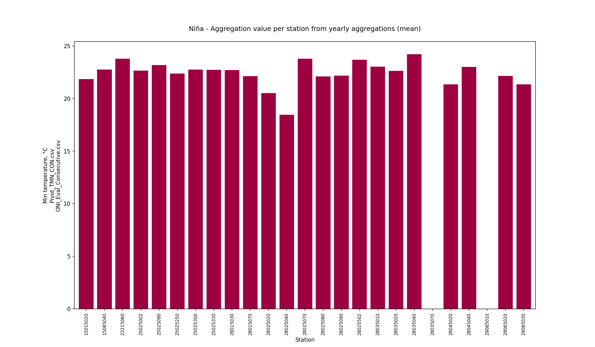

Niña - Monthly values per station (mean)

|   Month |   15015020 |   15065040 |   23215060 |   25025002 |   25025090 |   25025250 |   25025300 |   25025330 |   28015030 |   28015070 |   28025020 |   28025040 |   28025070 |   28025080 |   28025090 |   28025502 |   28035010 |   28035020 |   28035040 |   28035070 |   28045020 |   28045040 |   29065010 |   29065020 |   29065030 |
|--------:|-----------:|-----------:|-----------:|-----------:|-----------:|-----------:|-----------:|-----------:|-----------:|-----------:|-----------:|-----------:|-----------:|-----------:|-----------:|-----------:|-----------:|-----------:|-----------:|-----------:|-----------:|-----------:|-----------:|-----------:|-----------:|
|       1 |    20.5303 |    22.1728 |    23.2911 |    21.2063 |    22.8786 |    21.8522 |    21.9742 |    21.3597 |    20.9929 |    20.9095 |    18.8188 |    18.2973 |    22.4513 |    20.7925 |    20.1962 |    23.0462 |    21.4886 |    22.2801 |    24.1996 |        nan |    18.1862 |    22.6667 |        nan |    20.4865 |    19.9422 |
|       2 |    21.1517 |    21.746  |    24.0464 |    22.2172 |    23.5032 |    22.0743 |    22.8508 |    21.9949 |    22.4727 |    21.4877 |    19.6533 |    18.468  |    23.5438 |    21.5804 |    21.3701 |    23.5155 |    22.9172 |    22.8781 |    24.7677 |        nan |    18.3185 |    23.396  |        nan |    21.1834 |    20.8178 |
|       3 |    22.2156 |    22.0656 |    23.8295 |    22.9477 |    23.7251 |    22.6585 |    23.5116 |    22.7316 |    23.6731 |    22.0729 |    20.5106 |    18.477  |    24.2542 |    22.4895 |    22.3996 |    24.0559 |    23.6575 |    23.0962 |    24.8461 |        nan |    20.8194 |    22.4611 |        nan |    22.0467 |    21.2278 |
|       4 |    22.8383 |    22.6671 |    23.8571 |    23.7039 |    23.5642 |    22.7758 |    23.5635 |    23.4151 |    23.4478 |    22.8172 |    21.3999 |    18.618  |    24.9236 |    23.0439 |    23.3622 |    24.443  |    24.001  |    23.4172 |    24.733  |        nan |    21.9241 |    23.1208 |        nan |    22.8904 |    21.9245 |
|       5 |    22.775  |    23.7901 |    24.2429 |    23.6418 |    23.8075 |    22.5285 |    23.1099 |    23.6032 |    23.1708 |    22.6689 |    21.6789 |    17.865  |    24.7746 |    23.0179 |    23.5146 |    24.1638 |    24.0773 |    23.1814 |    24.6128 |        nan |    22.4133 |    23.8519 |        nan |    22.7938 |    22.2668 |
|       6 |    22.6225 |    23.6328 |   nan      |    23.219  |    23.629  |    22.6989 |    22.9291 |    23.4669 |    23.1818 |    22.7345 |    21.2806 |    19.1939 |    24.4104 |    22.7347 |    23.2052 |    24.2252 |    23.4415 |    23.4303 |    24.549  |        nan |    22.5867 |    23.7009 |        nan |    22.7638 |    22.0233 |
|       7 |    22.1452 |    23.558  |    23.1789 |    23.0661 |    23.4233 |    22.6923 |    22.8134 |    23.4128 |    23.4739 |    22.5489 |    20.9311 |    18.2902 |    24.0856 |    22.3401 |    22.9716 |    24.1114 |    23.8797 |    23.4866 |    24.2221 |        nan |    21.9161 |    23.3793 |        nan |    22.6189 |    21.6706 |
|       8 |    21.954  |    23.115  |    23.2897 |    22.8874 |    23.2596 |    22.4738 |    22.8329 |    23.0858 |    21.472  |    22.5282 |    21.0042 |    18.151  |    23.9119 |    22.0627 |    22.8343 |    23.7218 |    23.3008 |    22.9622 |    24.0428 |        nan |    21.9484 |   nan      |        nan |    22.5326 |    21.5979 |
|       9 |    21.7499 |    22.7064 |    23.54   |    22.6824 |    23.1808 |    22.2123 |    22.6558 |    23.0238 |    22.4741 |    22.1934 |    20.8333 |    18.1121 |    23.7383 |    22.1077 |    22.7563 |    23.2154 |    23.3286 |    22.425  |    23.6852 |        nan |    22.1067 |   nan      |        nan |    22.3784 |    21.4089 |
|      10 |    21.6694 |    22.779  |    23.7538 |    22.8243 |    23.1822 |    22.1686 |    22.7113 |    22.9378 |    22.8967 |    21.9624 |    20.652  |    18.0195 |    23.613  |    22.2502 |    22.3993 |    23.1665 |    22.9439 |    22.4695 |    23.7331 |        nan |    22.0129 |    21.1429 |        nan |    22.2705 |    21.2723 |
|      11 |    21.4386 |    22.7278 |    23.6276 |    22.685  |    23.2339 |    22.3458 |    22.6999 |    22.854  |    22.3821 |    21.9474 |    20.4727 |    17.6558 |    23.4439 |    22.0175 |    22.2131 |    23.1784 |    22.7751 |    22.4717 |    23.62   |        nan |    22.0067 |    23.4107 |        nan |    22.256  |    21.4295 |
|      12 |    20.693  |    21.6455 |    22.5548 |    21.7226 |    22.7249 |    21.9709 |    21.689  |    22.273  |   nan      |    21.3097 |    19.1346 |    16.7635 |    22.4215 |    21.4521 |    21.164  |    22.858  |    21.475  |    22.0183 |    23.4612 |        nan |    21.7529 |    22.325  |        nan |    21.3648 |    20.6388 |

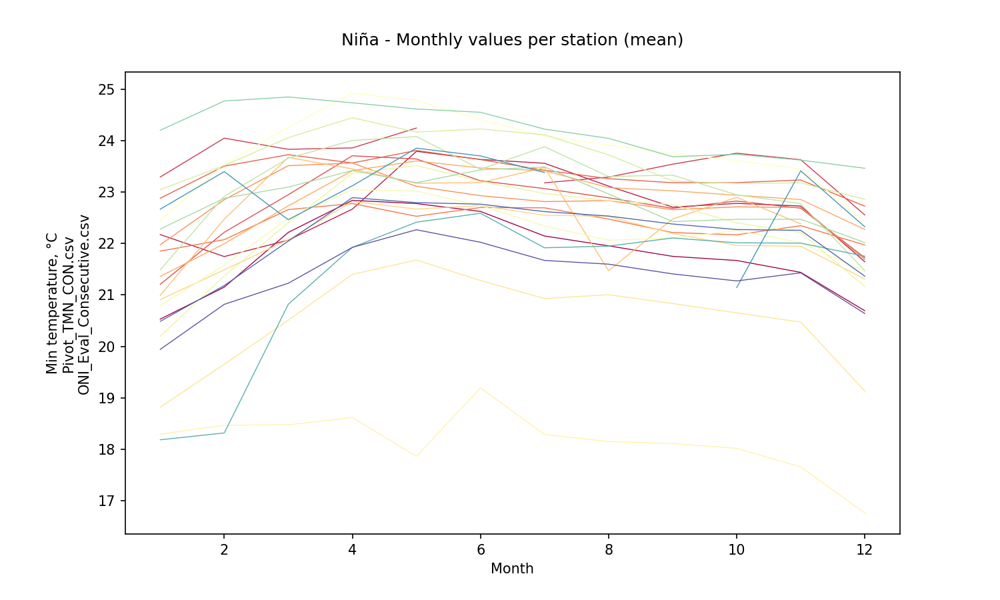

Niña - Zonal monthly values (mean)

|   Month |   AggNinaZonal |
|--------:|---------------:|
|       1 |        21.3052 |
|       2 |        21.998  |
|       3 |        22.5988 |
|       4 |        23.0631 |
|       5 |        23.1109 |
|       6 |        22.9845 |
|       7 |        22.792  |
|       8 |        22.4986 |
|       9 |        22.387  |
|      10 |        22.297  |
|      11 |        22.2997 |
|      12 |        21.5188 |

### Niño events analysis (19 years identified)

|   Id |   YR |   NinaCount |   NinoCount |   NeutralCount | Event   |   EventMark |   EventLabel |
|-----:|-----:|------------:|------------:|---------------:|:--------|------------:|-------------:|
|    1 | 1951 |           2 |           7 |              3 | Niño    |           1 |            7 |
|    3 | 1953 |           0 |          11 |              1 | Niño    |           1 |           11 |
|    7 | 1957 |           0 |           9 |              3 | Niño    |           1 |            9 |
|    8 | 1958 |           0 |           7 |              5 | Niño    |           1 |            7 |
|   13 | 1963 |           0 |           7 |              5 | Niño    |           1 |            7 |
|   15 | 1965 |           1 |           7 |              4 | Niño    |           1 |            7 |
|   19 | 1969 |           0 |           5 |              7 | Niño    |           1 |            5 |
|   22 | 1972 |           1 |           8 |              3 | Niño    |           1 |            8 |
|   32 | 1982 |           0 |           8 |              4 | Niño    |           1 |            8 |
|   33 | 1983 |           3 |           6 |              3 | Niño    |           1 |            6 |
|   37 | 1987 |           0 |          12 |              0 | Niño    |           1 |           12 |
|   41 | 1991 |           0 |           7 |              5 | Niño    |           1 |            7 |
|   42 | 1992 |           0 |           6 |              6 | Niño    |           1 |            6 |
|   47 | 1997 |           1 |           8 |              3 | Niño    |           1 |            8 |
|   52 | 2002 |           0 |           7 |              5 | Niño    |           1 |            7 |
|   54 | 2004 |           0 |           5 |              7 | Niño    |           1 |            5 |
|   59 | 2009 |           3 |           5 |              4 | Niño    |           1 |            5 |
|   65 | 2015 |           0 |          10 |              2 | Niño    |           1 |           10 |
|   69 | 2019 |           0 |           5 |              7 | Niño    |           1 |            5 |

Niño - Table aggregations (Mean)

|   Year |   15015020 |   15065040 |   23215060 |   25025002 |   25025090 |   25025250 |   25025300 |   25025330 |   28015030 |   28015070 |   28025020 |   28025040 |   28025070 |   28025080 |   28025090 |   28025502 |   28035010 |   28035020 |   28035040 |   28035070 |   28045020 |   28045040 |   29065010 |   29065020 |   29065030 |
|-------:|-----------:|-----------:|-----------:|-----------:|-----------:|-----------:|-----------:|-----------:|-----------:|-----------:|-----------:|-----------:|-----------:|-----------:|-----------:|-----------:|-----------:|-----------:|-----------:|-----------:|-----------:|-----------:|-----------:|-----------:|-----------:|
|   1982 |    22.5527 |    21.1064 |   nan      |   nan      |    23.96   |    23.5238 |   nan      |   nan      |    23.0323 |   nan      |    20.0442 |    21.9737 |    22.7884 |    22.8087 |   nan      |    23.1359 |    23.2318 |    18.4613 |    24.0644 |        nan |   nan      |   nan      |    20.4237 |    21.9902 |    22.1147 |
|   1983 |    23.3966 |    23.9099 |    23.6236 |   nan      |    24.1633 |    23.3071 |   nan      |   nan      |    23.2707 |   nan      |    21.0573 |   nan      |    23.4208 |   nan      |    23.1107 |    24.0888 |   nan      |    18.5699 |    23.1202 |        nan |    21.6102 |   nan      |    21.7    |    22.4616 |    22.6222 |
|   1987 |    23.0291 |    23.3104 |    24.3415 |    23.7123 |   nan      |    23.1777 |    23.5326 |    23.316  |    23.8745 |    23.1193 |    20.9075 |    19.4016 |    23.8108 |    22.1748 |    23.2015 |    23.9685 |    23.1997 |    22.3472 |    23.9454 |        nan |    20.599  |    23.6633 |    18.7226 |    19.1125 |    21.4899 |
|   1991 |    23.0118 |    23.7815 |   nan      |    22.8039 |   nan      |    21.237  |    21.6196 |    23.544  |   nan      |    23.1577 |    20.5952 |    19.5323 |    24.0659 |    19.7075 |    22.8764 |    23.9274 |    23.5483 |    23.5407 |    23.7539 |        nan |   nan      |    22.8695 |   nan      |    22.4535 |    22.1434 |
|   1992 |    22.687  |    23.5337 |   nan      |   nan      |    20.3916 |    21.5413 |    22.2254 |    21.7195 |   nan      |    23.3307 |    20.9854 |    19.1432 |    23.8025 |    19.4871 |    22.7703 |    24.0039 |    23.5256 |    23.3953 |    23.6913 |        nan |   nan      |    23.1072 |   nan      |    22.252  |    21.7735 |
|   1997 |    21.3431 |    22.2136 |   nan      |    22.718  |    22.47   |    21.9635 |    21.2576 |    22.4491 |   nan      |    22.2446 |    20.0172 |   nan      |    22.5472 |    21.9911 |    22.8643 |    24.3352 |    23.8827 |    22.2169 |    24.4489 |        nan |   nan      |   nan      |   nan      |    22.1176 |    21.2326 |
|   2002 |    22.0554 |    23.5391 |   nan      |    22.4396 |    23.5815 |    22.1085 |    22.6455 |    22.6974 |   nan      |    21.7295 |    19.4912 |   nan      |    24.6963 |    22.4796 |    21.5688 |    24.3445 |    23.341  |    22.8666 |    24.1657 |        nan |   nan      |   nan      |   nan      |    22.873  |    22.2747 |
|   2004 |    22.4238 |    22.5489 |   nan      |    21.5217 |    24.0811 |    21.612  |    23.152  |    21.5219 |   nan      |    21.9523 |    19.2512 |   nan      |    25.089  |    22.3422 |    22.3952 |    23.9128 |    23.481  |    23.7198 |    24.0663 |        nan |   nan      |   nan      |   nan      |    22.3486 |    21.4481 |
|   2009 |   nan      |   nan      |   nan      |    22.5125 |    23.438  |    23.7102 |    23.913  |    23.9525 |   nan      |    20.544  |    21.0077 |   nan      |    24.8829 |    22.6703 |    22.6674 |    24.6397 |    23.4071 |    23.6515 |    24.8617 |        nan |   nan      |   nan      |   nan      |    23.4104 |    19.8617 |
|   2015 |   nan      |   nan      |   nan      |    24.1094 |    25.1441 |    24.0665 |    24.5412 |   nan      |   nan      |    23.2571 |    22.0091 |   nan      |    24.6744 |   nan      |    22.3109 |    25.0787 |    24.0211 |    24.7669 |    25.6411 |        nan |   nan      |   nan      |   nan      |    22.6908 |   nan      |
|   2019 |   nan      |   nan      |   nan      |    23.9045 |    24.7753 |    24.459  |    24.0185 |    24.1946 |   nan      |    22.8455 |    21.6464 |   nan      |    24.1243 |   nan      |    22.9424 |    24.3782 |    23.2929 |    23.6087 |    24.85   |        nan |   nan      |   nan      |   nan      |    23.3604 |   nan      |

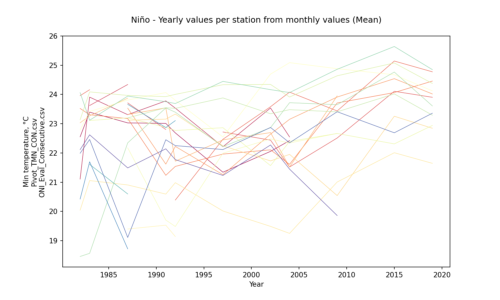

Niño - Aggregation value per station from yearly aggregations (mean)

|         |   15015020 |   15065040 |   23215060 |   25025002 |   25025090 |   25025250 |   25025300 |   25025330 |   28015030 |   28015070 |   28025020 |   28025040 |   28025070 |   28025080 |   28025090 |   28025502 |   28035010 |   28035020 |   28035040 |   28035070 |   28045020 |   28045040 |   29065010 |   29065020 |   29065030 |
|:--------|-----------:|-----------:|-----------:|-----------:|-----------:|-----------:|-----------:|-----------:|-----------:|-----------:|-----------:|-----------:|-----------:|-----------:|-----------:|-----------:|-----------:|-----------:|-----------:|-----------:|-----------:|-----------:|-----------:|-----------:|-----------:|
| AggNino |    22.5624 |    22.9929 |    23.9826 |    22.9652 |    23.5561 |    22.7915 |    22.9895 |    22.9244 |    23.3925 |    22.4645 |    20.6375 |    20.0127 |    23.9911 |    21.7077 |    22.6708 |    24.1649 |    23.4931 |    22.4677 |    24.2372 |        nan |    21.1046 |    23.2134 |    20.2821 |    22.2792 |    21.6623 |

Niño - Aggregation value per station from yearly aggregations (std - standard deviation)

|            |   15015020 |   15065040 |   23215060 |   25025002 |   25025090 |   25025250 |   25025300 |   25025330 |   28015030 |   28015070 |   28025020 |   28025040 |   28025070 |   28025080 |   28025090 |   28025502 |   28035010 |   28035020 |   28035040 |   28035070 |   28045020 |   28045040 |   29065010 |   29065020 |   29065030 |
|:-----------|-----------:|-----------:|-----------:|-----------:|-----------:|-----------:|-----------:|-----------:|-----------:|-----------:|-----------:|-----------:|-----------:|-----------:|-----------:|-----------:|-----------:|-----------:|-----------:|-----------:|-----------:|-----------:|-----------:|-----------:|-----------:|
| StdAggNino |   0.643021 |   0.964942 |   0.507653 |   0.878452 |    1.41527 |    1.12803 |    1.13021 |   0.993125 |   0.434109 |   0.933549 |   0.859126 |    1.31729 |   0.831435 |    1.32921 |    0.47824 |    0.49155 |   0.270763 |    2.07484 |   0.686286 |        nan |   0.715008 |   0.407414 |    1.49376 |    1.14792 |   0.809879 |

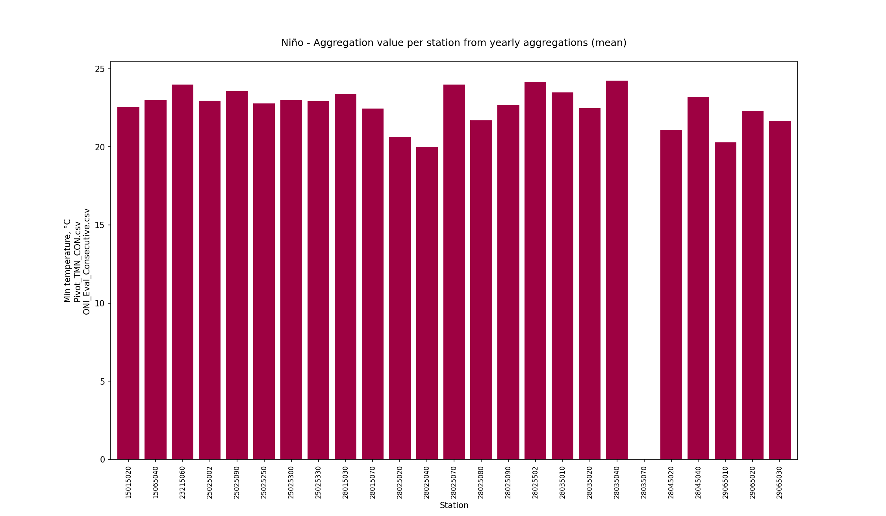

Niño - Monthly values per station (mean)

|   Month |   15015020 |   15065040 |   23215060 |   25025002 |   25025090 |   25025250 |   25025300 |   25025330 |   28015030 |   28015070 |   28025020 |   28025040 |   28025070 |   28025080 |   28025090 |   28025502 |   28035010 |   28035020 |   28035040 |   28035070 |   28045020 |   28045040 |   29065010 |   29065020 |   29065030 |
|--------:|-----------:|-----------:|-----------:|-----------:|-----------:|-----------:|-----------:|-----------:|-----------:|-----------:|-----------:|-----------:|-----------:|-----------:|-----------:|-----------:|-----------:|-----------:|-----------:|-----------:|-----------:|-----------:|-----------:|-----------:|-----------:|
|       1 |    21.5299 |    21.0246 |   nan      |    21.395  |    22.3226 |    21.9046 |    21.8748 |    21.556  |    22.8833 |    21.2329 |    18.6427 |    20.5503 |    22.43   |    20.8272 |    20.643  |    22.889  |    22.4726 |    22.093  |    23.9503 |        nan |    19.1008 |    22.4144 |    19.1855 |    20.6497 |    20.2588 |
|       2 |    22.1474 |    22.1685 |   nan      |    21.9425 |    23.7041 |    22.1242 |    22.4946 |    22.6211 |    22.8031 |    21.7471 |    19.5257 |    18.6146 |    23.4576 |    21.3304 |    21.3297 |    23.6228 |    23.573  |    22.2734 |    24.2714 |        nan |    19.8087 |    22.7895 |    20.2154 |    21.371  |    20.962  |
|       3 |    22.8032 |    22.0833 |   nan      |    22.9772 |    24.4289 |    22.4547 |    23.3474 |    23.0032 |    23.4763 |    22.2176 |    20.6078 |    19.425  |    24.3406 |    21.2743 |    22.7875 |    24.4536 |    24.3746 |    23.3397 |    24.4855 |        nan |    23.1825 |    23.9742 |    21.1862 |    21.9603 |    21.6294 |
|       4 |    23.5995 |    22.6198 |   nan      |    23.6798 |    24.4832 |    22.5715 |    23.2723 |    23.1973 |    23.5176 |    23.2112 |    21.4215 |    19.0001 |    24.8285 |    22.2472 |    23.6801 |    24.9233 |    24.5534 |    23.2704 |    24.6544 |        nan |    22.6069 |    24.2933 |    21.3067 |    23.0164 |    22.5233 |
|       5 |    23.5207 |    23.3893 |   nan      |    23.6012 |    24.1884 |    22.6991 |    23.4555 |    23.5491 |    23.3924 |    23.4118 |    21.6417 |    19.8221 |    24.5548 |    21.7743 |    23.781  |    24.7335 |    24.3337 |    23.8405 |    24.4756 |        nan |   nan      |    24.0533 |    21.1104 |    23.0103 |    22.3809 |
|       6 |    23.1478 |    23.9556 |    24.6167 |    23.5775 |    24.3414 |    22.9588 |    23.3107 |    23.4539 |    23.9233 |    23.227  |    21.3804 |    20.4538 |    24.6262 |    21.6948 |    23.2229 |    24.7729 |    23.866  |    23.1433 |    24.7002 |        nan |   nan      |    23.5067 |    21.3165 |    22.9068 |    22.373  |
|       7 |    22.9252 |    23.9478 |    24.569  |    23.4104 |    24.2709 |    23.0968 |    23.4415 |    23.0717 |    24.0884 |    23.2508 |    21.209  |    19.7394 |    24.3551 |    22.0232 |    22.8996 |    24.8868 |    24.062  |    23.3714 |    24.7134 |        nan |   nan      |    23.0873 |    21.4854 |    22.8129 |    22.2989 |
|       8 |    22.8126 |    23.7324 |    24.3966 |    23.2828 |    24.0277 |    23.0402 |    23.1625 |    23.0026 |    23.879  |    23.3328 |    21.3483 |    19.6529 |    24.3394 |    21.4589 |    23.3214 |    24.8509 |    24.0288 |    23.1829 |    24.2049 |        nan |   nan      |    23.2253 |    20.4889 |    22.5061 |    21.9939 |
|       9 |    22.8288 |    23.5443 |    23.7821 |    23.1416 |    23.6751 |    22.8202 |    23.1206 |    23.4649 |    23.4537 |    22.7681 |    21.179  |    19.6947 |    24.0939 |    21.4607 |    23.1583 |    24.2193 |    23.4252 |    22.4942 |    23.9206 |        nan |   nan      |    22.9542 |    20.2966 |    22.7788 |    21.9954 |
|      10 |    22.0195 |    22.7142 |    23.9578 |    23.233  |    23.6412 |    22.6787 |    23.1865 |    22.6789 |    22.6702 |    22.3447 |    20.9284 |    19.3335 |    23.8415 |    21.1603 |    22.9892 |    23.731  |    23.1664 |    22.3047 |    23.856  |        nan |   nan      |    23.0908 |    20.2621 |    22.3834 |    21.1698 |
|      11 |    21.9408 |    23.7539 |    24.3213 |    23.1662 |    23.8637 |    22.8624 |    23.2366 |    22.687  |    23.0474 |    22.5078 |    20.4004 |    19.5963 |    23.8829 |    21.4397 |    22.5904 |    23.7048 |    23.0873 |    22.3661 |    23.8753 |        nan |   nan      |    23.11   |    20.4643 |    22.17   |    21.5422 |
|      12 |    21.3692 |    23.1615 |    23.6696 |    22.2991 |    23.3434 |    22.5503 |    22.7467 |    22.3675 |    22.8617 |    22.0264 |    19.7285 |    17.8912 |    23.1202 |    20.3439 |    21.18   |    23.6696 |    22.1781 |    22.4334 |    24.001  |        nan |    20.2444 |    22.8568 |    20.8276 |    21.345  |    20.82   |

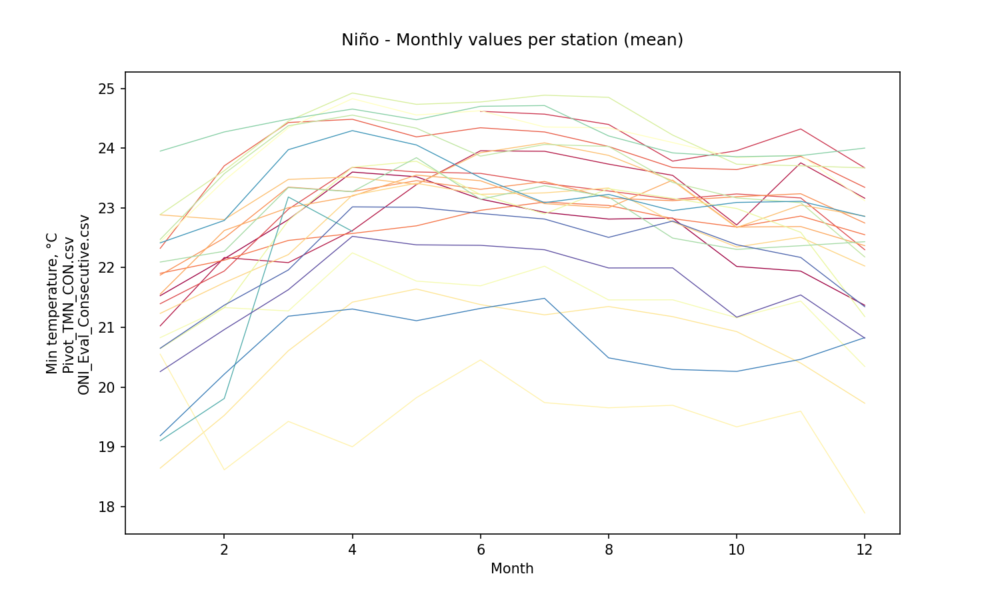

Niño - Zonal monthly values (mean)

|   Month |   AggNinoZonal |
|--------:|---------------:|
|       1 |        21.384  |
|       2 |        21.9521 |
|       3 |        22.7745 |
|       4 |        23.1512 |
|       5 |        23.2145 |
|       6 |        23.2381 |
|       7 |        23.1746 |
|       8 |        23.0118 |
|       9 |        22.7944 |
|      10 |        22.4931 |
|      11 |        22.592  |
|      12 |        21.9598 |

### Neutral events analysis (30 years identified)

|   Id |   YR |   NinaCount |   NinoCount |   NeutralCount | Event   |   EventMark |   EventLabel |
|-----:|-----:|------------:|------------:|---------------:|:--------|------------:|-------------:|
|    2 | 1952 |           0 |           1 |             11 | Neutral |           0 |           11 |
|    9 | 1959 |           0 |           3 |              9 | Neutral |           0 |            9 |
|   10 | 1960 |           0 |           0 |             12 | Neutral |           0 |           12 |
|   11 | 1961 |           0 |           0 |             12 | Neutral |           0 |           12 |
|   12 | 1962 |           0 |           0 |             12 | Neutral |           0 |           12 |
|   16 | 1966 |           0 |           4 |              8 | Neutral |           0 |            8 |
|   17 | 1967 |           1 |           0 |             11 | Neutral |           0 |           11 |
|   18 | 1968 |           3 |           3 |              6 | Neutral |           0 |            6 |
|   26 | 1976 |           3 |           4 |              5 | Neutral |           0 |            5 |
|   27 | 1977 |           0 |           4 |              8 | Neutral |           0 |            8 |
|   28 | 1978 |           0 |           1 |             11 | Neutral |           0 |           11 |
|   29 | 1979 |           0 |           2 |             10 | Neutral |           0 |           10 |
|   30 | 1980 |           0 |           1 |             11 | Neutral |           0 |           11 |
|   31 | 1981 |           1 |           0 |             11 | Neutral |           0 |           11 |
|   34 | 1984 |           3 |           0 |              9 | Neutral |           0 |            9 |
|   36 | 1986 |           0 |           4 |              8 | Neutral |           0 |            8 |
|   40 | 1990 |           0 |           0 |             12 | Neutral |           0 |           12 |
|   43 | 1993 |           0 |           4 |              8 | Neutral |           0 |            8 |
|   44 | 1994 |           0 |           4 |              8 | Neutral |           0 |            8 |
|   46 | 1996 |           3 |           0 |              9 | Neutral |           0 |            9 |
|   51 | 2001 |           2 |           0 |             10 | Neutral |           0 |           10 |
|   53 | 2003 |           0 |           2 |             10 | Neutral |           0 |           10 |
|   55 | 2005 |           2 |           2 |              8 | Neutral |           0 |            8 |
|   56 | 2006 |           3 |           4 |              5 | Neutral |           0 |            5 |
|   62 | 2012 |           3 |           0 |              9 | Neutral |           0 |            9 |
|   63 | 2013 |           0 |           0 |             12 | Neutral |           0 |           12 |
|   64 | 2014 |           0 |           2 |             10 | Neutral |           0 |           10 |
|   67 | 2017 |           3 |           0 |              9 | Neutral |           0 |            9 |
|   68 | 2018 |           4 |           3 |              5 | Neutral |           0 |            5 |
|   71 | 2021 |           4 |           0 |              8 | Neutral |           0 |            8 |

Neutral - Table aggregations (Mean)

|   Year |   15015020 |   15065040 |   23215060 |   25025002 |   25025090 |   25025250 |   25025300 |   25025330 |   28015030 |   28015070 |   28025020 |   28025040 |   28025070 |   28025080 |   28025090 |   28025502 |   28035010 |   28035020 |   28035040 |   28035070 |   28045020 |   28045040 |   29065010 |   29065020 |   29065030 |
|-------:|-----------:|-----------:|-----------:|-----------:|-----------:|-----------:|-----------:|-----------:|-----------:|-----------:|-----------:|-----------:|-----------:|-----------:|-----------:|-----------:|-----------:|-----------:|-----------:|-----------:|-----------:|-----------:|-----------:|-----------:|-----------:|
|   1980 |    22.9379 |    22.6658 |   nan      |   nan      |    23.4721 |   nan      |   nan      |   nan      |    23.0172 |    22.4769 |    21.0036 |    17.163  |    22.9041 |    21.6186 |   nan      |    23.3451 |    23.6847 |    18.8149 |   nan      |   nan      |   nan      |   nan      |    22.2956 |    22.7668 |    22.4139 |
|   1981 |    22.5179 |    20.2205 |   nan      |   nan      |    23.6216 |    22.9734 |   nan      |   nan      |    22.5042 |    22.9495 |    20.3586 |   nan      |    23.0755 |   nan      |    22.3553 |    23.1872 |    22.176  |    18.4284 |    23.6601 |   nan      |   nan      |   nan      |    20.686  |    23.1137 |    22.3944 |
|   1984 |    22.5757 |    21.4151 |    23.4482 |   nan      |    23.3218 |    22.8672 |   nan      |   nan      |    23.0897 |    22.809  |    20.3773 |   nan      |    22.5728 |    21.3653 |    21.8329 |    23.2447 |   nan      |   nan      |    22.3806 |   nan      |    21.6421 |   nan      |   nan      |   nan      |    21.7486 |
|   1986 |    22.1072 |    22.1863 |    23.6579 |   nan      |   nan      |    23.2317 |   nan      |   nan      |    22.6153 |    22.7889 |    20.1672 |    14.9687 |    23.4137 |    20.2227 |    21.8772 |    23.5254 |    22.7912 |   nan      |    23.2219 |   nan      |    20.7467 |   nan      |    21.2306 |    19.6874 |    21.4259 |
|   1990 |    23.3857 |    23.552  |   nan      |    22.6258 |   nan      |    20.7573 |    22.4529 |    23.6897 |   nan      |    23.0447 |    20.8073 |    19.4053 |    24.0669 |    22.0256 |    23.2346 |    23.334  |    23.1824 |    24.0865 |    23.7086 |   nan      |   nan      |    23.2923 |   nan      |    22.1316 |    22.1088 |
|   1993 |    21.7768 |    23.5647 |   nan      |    22.9103 |    21.1065 |    21.0566 |    21.9202 |    20.3178 |   nan      |    23.0422 |    20.7446 |    19.2956 |    22.8813 |    18.433  |    21.749  |    23.7858 |    23.6896 |    23.071  |    24.2177 |   nan      |   nan      |    23.4503 |   nan      |    21.6194 |    21.947  |
|   1994 |    21.2328 |    23.3509 |   nan      |    22.4921 |    22.2795 |    20.9697 |    22.0673 |    22.1346 |   nan      |    23.1144 |    20.6989 |    18.9633 |    22.0088 |    20.5106 |    21.9922 |    23.8217 |    23.7429 |    21.8818 |    24.4785 |   nan      |   nan      |   nan      |   nan      |    21.7088 |    21.8007 |
|   1996 |    20.8599 |    22.6993 |   nan      |    22.8536 |    22.8238 |    20.5396 |    21.3668 |    22.0355 |   nan      |    22.8489 |    20.118  |    18.5131 |    21.961  |    22.2449 |    19.5655 |    23.3534 |    23.4167 |    20.9103 |    24.0733 |   nan      |   nan      |   nan      |   nan      |    21.9259 |    22.1299 |
|   2001 |    20.7015 |   nan      |   nan      |    21.8828 |    22.1818 |    21.555  |    23.2783 |    23.0569 |   nan      |    21.5139 |    17.1742 |   nan      |    24.1718 |    23.111  |    21.6093 |    23.9066 |    23.101  |    21.9789 |    24.1233 |   nan      |   nan      |   nan      |   nan      |    22.7066 |    22.2792 |
|   2003 |    22.5691 |    23.4375 |   nan      |    22.4768 |    24.4207 |    21.7741 |    23.3293 |    22.1025 |   nan      |    21.8113 |    20.256  |   nan      |    24.773  |    21.3455 |    22.1262 |    23.9328 |    23.6001 |    22.7798 |    23.9288 |   nan      |   nan      |   nan      |   nan      |    23.0124 |    22.2617 |
|   2005 |    22.3852 |    22.0375 |   nan      |    23.8235 |    23.6722 |    21.7719 |    23.795  |    21.8319 |   nan      |    21.265  |    17.1181 |   nan      |    25.5404 |    22.3721 |   nan      |    23.7763 |    23.5529 |    23.7327 |    23.8283 |   nan      |   nan      |   nan      |   nan      |    22.4122 |    22.2466 |
|   2006 |   nan      |    23.5109 |   nan      |    23.6273 |    23.2118 |    21.5169 |    23.9332 |    21.8974 |   nan      |    21.0953 |    19.9937 |   nan      |    25.0119 |    22.0137 |    22.3208 |    23.8812 |    22.9354 |    23.729  |    24.0951 |   nan      |   nan      |   nan      |   nan      |    23.0717 |    20.8934 |
|   2012 |    22.699  |   nan      |   nan      |    21.4487 |    24.2416 |    21.94   |    23.5867 |    23.3672 |   nan      |    22.6503 |    21.2201 |   nan      |    23.9182 |   nan      |    22.5968 |    23.9844 |    23.2074 |    22.178  |    24.9073 |    22.42   |   nan      |   nan      |   nan      |    23.2444 |    22.8029 |
|   2013 |    22.7179 |   nan      |   nan      |    23.946  |    24.6845 |    23.8497 |    23.8461 |    23.9941 |   nan      |    22.9229 |    21.5719 |   nan      |    24.1845 |   nan      |    22.6912 |    24.3973 |    23.4703 |    22.7522 |    25.2067 |    21.7871 |   nan      |   nan      |   nan      |    23.3177 |    23.1248 |
|   2014 |   nan      |   nan      |   nan      |    23.8862 |    24.9041 |    24.1096 |    24.1285 |   nan      |   nan      |    22.9468 |    21.6829 |   nan      |    24.4628 |   nan      |    22.7088 |    24.5936 |    23.8306 |    24.2122 |    25.4252 |    25.6    |   nan      |   nan      |   nan      |    23.5385 |    22.4517 |
|   2017 |   nan      |   nan      |   nan      |    23.7508 |    24.716  |    24.3306 |    24.0766 |    23.6365 |   nan      |    21.925  |    21.4917 |   nan      |    23.742  |   nan      |    22.9535 |    24.114  |    23.1036 |    23.4984 |    25.0056 |   nan      |   nan      |   nan      |   nan      |    22.2145 |   nan      |
|   2018 |   nan      |   nan      |   nan      |    23.535  |    24.5845 |    24.2709 |    23.7725 |    23.6666 |   nan      |    22.1546 |    20.7103 |   nan      |    24.1902 |   nan      |    22.8004 |    24.0369 |    23.5561 |    23.7451 |    24.8831 |   nan      |   nan      |   nan      |   nan      |    23.3175 |   nan      |
|   2021 |   nan      |   nan      |   nan      |    23.3501 |    23.5664 |    24.4454 |    23.6211 |    23.9829 |   nan      |    22.3341 |    21.1098 |   nan      |    24.0313 |   nan      |    22.6742 |   nan      |    22.7444 |    23.8269 |    24.9241 |   nan      |   nan      |   nan      |   nan      |    23.4504 |   nan      |

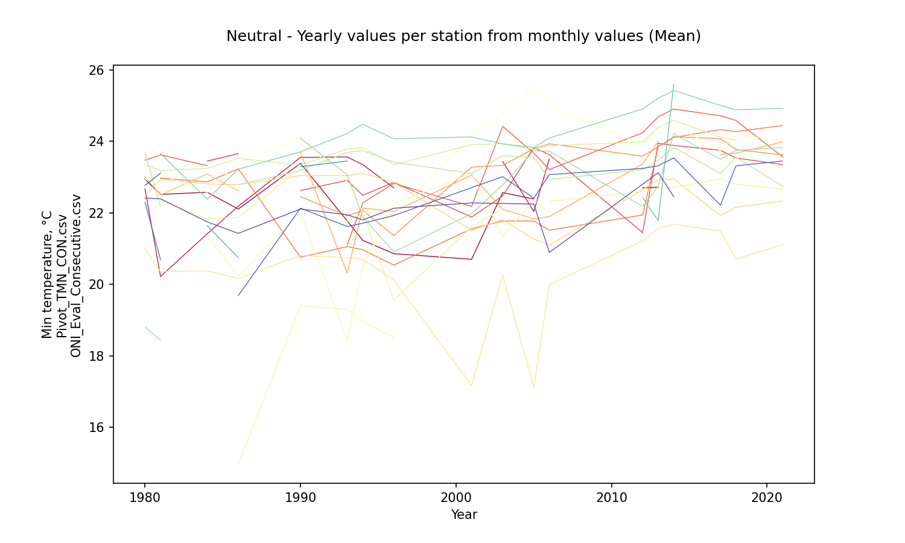

Neutral - Aggregation value per station from yearly aggregations (mean)

|            |   15015020 |   15065040 |   23215060 |   25025002 |   25025090 |   25025250 |   25025300 |   25025330 |   28015030 |   28015070 |   28025020 |   28025040 |   28025070 |   28025080 |   28025090 |   28025502 |   28035010 |   28035020 |   28035040 |   28035070 |   28045020 |   28045040 |   29065010 |   29065020 |   29065030 |
|:-----------|-----------:|-----------:|-----------:|-----------:|-----------:|-----------:|-----------:|-----------:|-----------:|-----------:|-----------:|-----------:|-----------:|-----------:|-----------:|-----------:|-----------:|-----------:|-----------:|-----------:|-----------:|-----------:|-----------:|-----------:|-----------:|
| AggNeutral |    22.1897 |    22.6037 |     23.553 |    23.0435 |    23.5506 |    22.4682 |    23.2268 |    22.7472 |    22.8066 |    22.4274 |    20.3669 |    18.0515 |    23.7172 |    21.3875 |     22.193 |    23.7777 |    23.2815 |    22.4766 |    24.2393 |     23.269 |    21.1944 |    23.3713 |    21.4041 |    22.5435 |    22.1353 |

Neutral - Aggregation value per station from yearly aggregations (std - standard deviation)

|               |   15015020 |   15065040 |   23215060 |   25025002 |   25025090 |   25025250 |   25025300 |   25025330 |   28015030 |   28015070 |   28025020 |   28025040 |   28025070 |   28025080 |   28025090 |   28025502 |   28035010 |   28035020 |   28035040 |   28035070 |   28045020 |   28045040 |   29065010 |   29065020 |   29065030 |
|:--------------|-----------:|-----------:|-----------:|-----------:|-----------:|-----------:|-----------:|-----------:|-----------:|-----------:|-----------:|-----------:|-----------:|-----------:|-----------:|-----------:|-----------:|-----------:|-----------:|-----------:|-----------:|-----------:|-----------:|-----------:|-----------:|
| StdAggNeutral |   0.818724 |    1.07236 |   0.148304 |   0.787102 |    1.06345 |    1.37152 |   0.896426 |    1.11228 |   0.290152 |   0.650803 |     1.2765 |    1.71569 |   0.992851 |    1.28002 |    0.84457 |   0.402071 |   0.440047 |    1.76425 |   0.780666 |    2.04333 |   0.633091 |    0.11169 |   0.818715 |   0.961358 |   0.538641 |

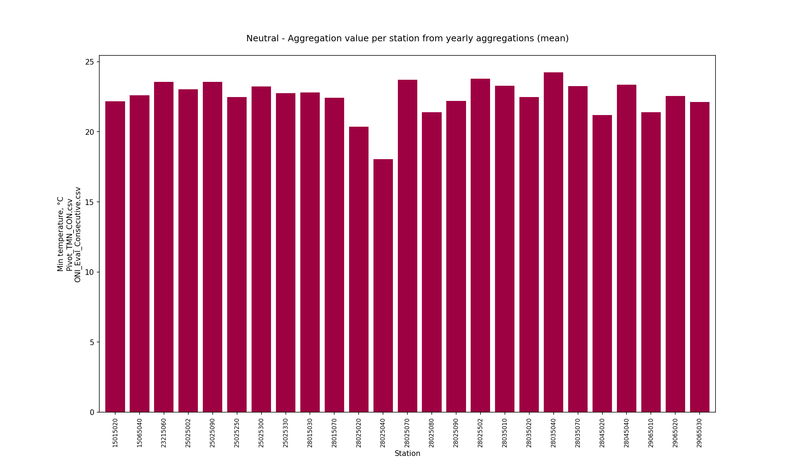

Neutral - Monthly values per station (mean)

|   Month |   15015020 |   15065040 |   23215060 |   25025002 |   25025090 |   25025250 |   25025300 |   25025330 |   28015030 |   28015070 |   28025020 |   28025040 |   28025070 |   28025080 |   28025090 |   28025502 |   28035010 |   28035020 |   28035040 |   28035070 |   28045020 |   28045040 |   29065010 |   29065020 |   29065030 |
|--------:|-----------:|-----------:|-----------:|-----------:|-----------:|-----------:|-----------:|-----------:|-----------:|-----------:|-----------:|-----------:|-----------:|-----------:|-----------:|-----------:|-----------:|-----------:|-----------:|-----------:|-----------:|-----------:|-----------:|-----------:|-----------:|
|       1 |    20.8529 |    22.0211 |    22.6022 |    21.3912 |    22.9286 |    21.6055 |    21.5077 |    21.592  |    21.425  |    21.3091 |    18.9464 |    17.5388 |    22.4664 |    20.0538 |    20.2203 |    22.9143 |    22.4645 |    21.8554 |    24.0123 |    21.7871 |    19.3071 |    22.9929 |    21.0925 |    21.0159 |    20.5176 |
|       2 |    21.4409 |    22.7103 |    22.7278 |    21.9264 |    23.4293 |    21.8296 |    22.4672 |    22.0952 |    22.6934 |    21.5601 |    19.5508 |    16.8918 |    22.9945 |    20.3988 |    20.5223 |    23.4493 |    23.3576 |    22.2884 |    24.8416 |   nan      |    20.85   |   nan      |    21.3856 |    21.391  |    21.0225 |
|       3 |    22.5517 |    22.6446 |    23.3276 |    23.2686 |    23.9846 |    22.2168 |    23.5621 |    23.1034 |    22.6116 |    22.2485 |    20.5755 |    18.073  |    24.0843 |    21.366  |    22.1304 |    24.0363 |    24.0444 |    22.9434 |    24.7227 |   nan      |    21.412  |   nan      |    21.7175 |    22.3191 |    22.0783 |
|       4 |    23.234  |    23.0906 |    23.8735 |    23.742  |    24.009  |    22.3397 |    23.9161 |    23.2611 |    23.3327 |    22.9169 |    21.0368 |    18.2837 |    24.6909 |    22.1657 |    23.0487 |    24.423  |    24.2353 |    23.3759 |    24.466  |   nan      |    22.48   |   nan      |    21.5204 |    23.3065 |    23.2325 |
|       5 |    23.2254 |    22.8615 |    24.1621 |    23.7579 |    23.7067 |    22.2875 |    23.9125 |    23.1798 |    23.7769 |    22.9601 |    21.2094 |    17.9254 |    24.3882 |    21.8583 |    23.2266 |    24.181  |    23.9827 |    22.758  |    24.3199 |   nan      |    21.475  |    24.3727 |    21.8374 |    23.6308 |    23.3163 |
|       6 |    22.9822 |    24.2592 |    24.1396 |    23.6368 |    24.1189 |    22.7218 |    23.8486 |    22.8516 |    23.6269 |    22.9694 |    21.0114 |    18.5614 |    24.3281 |    21.9818 |    23.0189 |    24.3685 |    23.8389 |    23.0961 |    24.4531 |   nan      |    21.6905 |    24.1091 |    22.19   |    23.4559 |    22.9627 |
|       7 |    22.3889 |    24.445  |    23.4347 |    23.5484 |    24.0547 |    22.8923 |    24.06   |    23.2497 |    23.672  |    22.9782 |    20.6936 |    18.5359 |    24.1799 |    21.9186 |    22.8274 |    24.5335 |    23.6536 |    23.2213 |    24.6082 |   nan      |    21.556  |    23.4138 |    21.9883 |    22.9207 |    22.6897 |
|       8 |    22.3035 |    23.7046 |    23.4655 |    23.3997 |    23.579  |    22.7852 |    23.4223 |    22.9322 |    22.8476 |    22.9376 |    20.8039 |    18.5186 |    24.0379 |    22.2116 |    22.9952 |    24.2985 |    23.6319 |    22.7857 |    24.2081 |   nan      |    22.03   |    23.7555 |    23.792  |    22.8437 |    22.4037 |
|       9 |    22.3211 |    23.1005 |    23.5803 |    23.2894 |    23.3953 |    22.4714 |    23.4373 |    22.5907 |    23.056  |    22.4776 |    20.5831 |    19.7523 |    23.8704 |    22.2085 |    22.9899 |    23.7041 |    23.1641 |    22.3127 |    24.083  |    25.6    |    21.6856 |    22.8826 |    23.1154 |    22.64   |    22.2064 |
|      10 |    22.184  |    22.6626 |    23.6327 |    23.5073 |    23.327  |    22.3098 |    23.1619 |    22.6584 |    22.5004 |    22.3176 |    20.8469 |    19.4952 |    23.6358 |    21.836  |    22.9424 |    23.4171 |    23.0708 |    22.2712 |    23.9954 |   nan      |    21.7753 |    22.4467 |    22.9385 |    22.694  |    22.3193 |
|      11 |    21.6648 |    22.4074 |    24.1303 |    23.2893 |    23.4219 |    22.4011 |    23.0482 |    22.6904 |    22.4009 |    22.1655 |    20.3078 |    19.3032 |    23.3386 |    21.6755 |    22.5577 |    23.3474 |    22.8135 |    21.7472 |    23.8861 |   nan      |    21.1912 |    23.2345 |    22.3286 |    22.1757 |    21.8594 |
|      12 |    21.0147 |    22.4967 |    23.4621 |    22.5906 |    23.0258 |    22.3167 |    22.3336 |    22.318  |    22.2458 |    21.6288 |    19.5449 |    18.0227 |    22.6977 |    20.5926 |    21.3339 |    23.2594 |    22.1141 |    21.5832 |    24.0464 |    22.42   |    19.4113 |    22.2759 |    19.4901 |    21.8747 |    21.0938 |

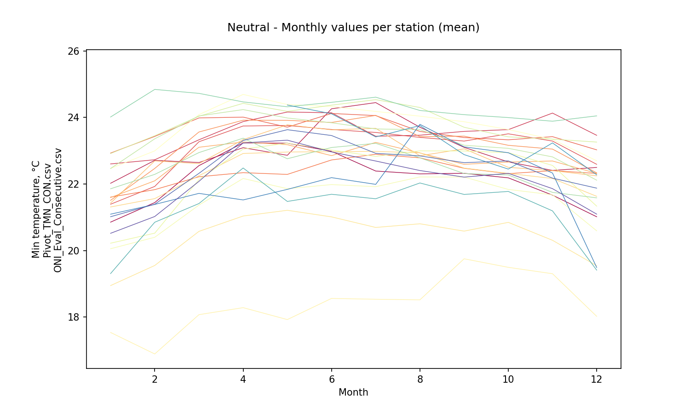

Neutral - Zonal monthly values (mean)

|   Month |   AggNeutralZonal |
|--------:|------------------:|
|       1 |           21.3768 |
|       2 |           21.8185 |
|       3 |           22.5662 |
|       4 |           23.0426 |
|       5 |           23.013  |
|       6 |           23.0926 |
|       7 |           22.9777 |
|       8 |           22.9039 |
|       9 |           22.8207 |
|      10 |           22.5811 |
|      11 |           22.3911 |
|      12 |           21.7277 |

## Yearly aggregation matrix values per station from yearly values (mean) and zonal monthly values (mean)

Yearly matrix values per station (required for spatial interpolations) File: [Agg_Pivot_TMN_CON.csv](Agg_Pivot_TMN_CON.csv)

|   Station |   AggComposite |   AggNina |   AggNino |   AggNeutral |
|----------:|---------------:|----------:|----------:|-------------:|
|  15015020 |        22.1836 |   21.838  |   22.5624 |      22.1897 |
|  15065040 |        22.7609 |   22.7398 |   22.9929 |      22.6037 |
|  23215060 |        23.7688 |   23.7709 |   23.9826 |      23.553  |
|  25025002 |        22.8831 |   22.6599 |   22.9652 |      23.0435 |
|  25025090 |        23.4474 |   23.1844 |   23.5561 |      23.5506 |
|  25025250 |        22.5265 |   22.3661 |   22.7915 |      22.4682 |
|  25025300 |        22.9998 |   22.7626 |   22.9895 |      23.2268 |
|  25025330 |        22.7801 |   22.7194 |   22.9244 |      22.7472 |
|  28015030 |        23.0123 |   22.6944 |   23.3925 |      22.8066 |
|  28015070 |        22.3325 |   22.1097 |   22.4645 |      22.4274 |
|  28025020 |        20.484  |   20.5163 |   20.6375 |      20.3669 |
|  28025040 |        18.7258 |   18.4505 |   20.0127 |      18.0515 |
|  28025070 |        23.8092 |   23.7827 |   23.9911 |      23.7172 |
|  28025080 |        21.722  |   22.1013 |   21.7077 |      21.3875 |
|  28025090 |        22.3094 |   22.1746 |   22.6708 |      22.193  |
|  28025502 |        23.8567 |   23.6862 |   24.1649 |      23.7777 |
|  28035010 |        23.2632 |   23.026  |   23.4931 |      23.2815 |
|  28035020 |        22.5246 |   22.6318 |   22.4677 |      22.4766 |
|  28035040 |        24.2282 |   24.2061 |   24.2372 |      24.2393 |
|  28035070 |        23.269  |  nan      |  nan      |      23.269  |
|  28045020 |        21.1861 |   21.3327 |   21.1046 |      21.1944 |
|  28045040 |        23.1974 |   22.9997 |   23.2134 |      23.3713 |
|  29065010 |        20.8431 |  nan      |   20.2821 |      21.4041 |
|  29065020 |        22.3452 |   22.1417 |   22.2792 |      22.5435 |
|  29065030 |        21.7663 |   21.3481 |   21.6623 |      22.1353 |

Yearly matrix standard deviations per station File: [Agg_Std_Pivot_TMN_CON.csv](Agg_Std_Pivot_TMN_CON.csv)

|   Station |   StdAggComposite |   StdAggNina |   StdAggNino |   StdAggNeutral |
|----------:|------------------:|-------------:|-------------:|----------------:|
|  15015020 |          0.818173 |     0.883963 |     0.643021 |        0.818724 |
|  15065040 |          0.915837 |     0.530549 |     0.964942 |        1.07236  |
|  23215060 |          0.359528 |     0.426694 |     0.507653 |        0.148304 |
|  25025002 |          0.844236 |     0.899785 |     0.878452 |        0.787102 |
|  25025090 |          1.08874  |     0.839705 |     1.41527  |        1.06345  |
|  25025250 |          1.28915  |     1.37687  |     1.12803  |        1.37152  |
|  25025300 |          1.05715  |     1.19008  |     1.13021  |        0.896426 |
|  25025330 |          0.907674 |     0.631681 |     0.993125 |        1.11228  |
|  28015030 |          0.436451 |   nan        |     0.434109 |        0.290152 |
|  28015070 |          0.767356 |     0.807669 |     0.933549 |        0.650803 |
|  28025020 |          1.07457  |     0.989153 |     0.859126 |        1.2765   |
|  28025040 |          1.676    |     1.52069  |     1.31729  |        1.71569  |
|  28025070 |          0.843827 |     0.645346 |     0.831435 |        0.992851 |
|  28025080 |          1.18161  |     0.923199 |     1.32921  |        1.28002  |
|  28025090 |          0.804488 |     0.916376 |     0.47824  |        0.84457  |
|  28025502 |          0.485475 |     0.494437 |     0.49155  |        0.402071 |
|  28035010 |          0.499267 |     0.656644 |     0.270763 |        0.440047 |
|  28035020 |          1.76224  |     1.61126  |     2.07484  |        1.76425  |
|  28035040 |          0.699219 |     0.651028 |     0.686286 |        0.780666 |
|  28035070 |          2.04333  |   nan        |   nan        |        2.04333  |
|  28045020 |          0.486553 |   nan        |     0.715008 |        0.633091 |
|  28045040 |          0.347114 |     0.488933 |     0.407414 |        0.11169  |
|  29065010 |          1.24027  |   nan        |     1.49376  |        0.818715 |
|  29065020 |          1.19     |     1.51176  |     1.14792  |        0.961358 |
|  29065030 |          0.798121 |     0.910254 |     0.809879 |        0.538641 |

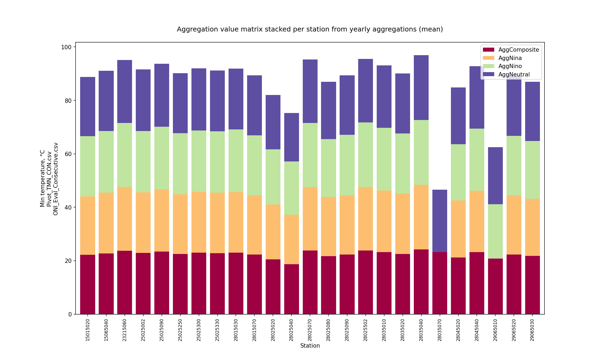

Monthly zonal values

|   Month |   AggCompositeZonal |   AggNinaZonal |   AggNinoZonal |   AggNeutralZonal |
|--------:|--------------------:|---------------:|---------------:|------------------:|
|       1 |             21.3706 |        21.3052 |        21.384  |           21.3768 |
|       2 |             21.9249 |        21.998  |        21.9521 |           21.8185 |
|       3 |             22.648  |        22.5988 |        22.7745 |           22.5662 |
|       4 |             23.0722 |        23.0631 |        23.1512 |           23.0426 |
|       5 |             23.0644 |        23.1109 |        23.2145 |           23.013  |
|       6 |             23.0806 |        22.9845 |        23.2381 |           23.0926 |
|       7 |             22.9379 |        22.792  |        23.1746 |           22.9777 |
|       8 |             22.8093 |        22.4986 |        23.0118 |           22.9039 |
|       9 |             22.729  |        22.387  |        22.7944 |           22.8207 |
|      10 |             22.4559 |        22.297  |        22.4931 |           22.5811 |
|      11 |             22.3823 |        22.2997 |        22.592  |           22.3911 |
|      12 |             21.7309 |        21.5188 |        21.9598 |           21.7277 |

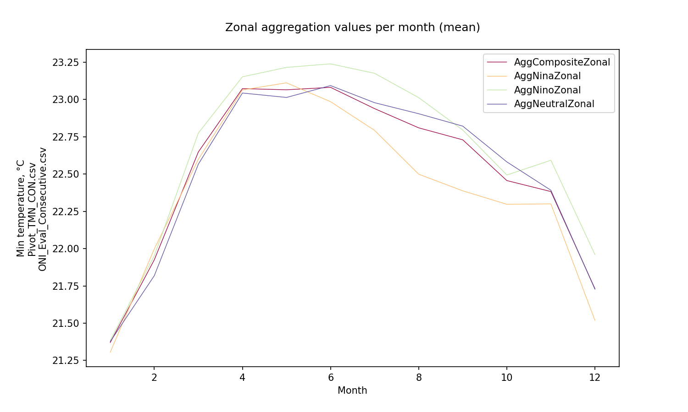
