## Exploración y análisis de series - EDA - Representación gráfica

* Archivo de resultados: D:/R.LTWB/.datasets/IDEAM_EDA/EDA.md
* Fecha y hora de inicio de ejecución: 2022-10-28 09:22:50.508518
* Python versión: 3.10.5 (tags/v3.10.5:f377153, Jun  6 2022, 16:14:13) [MSC v.1929 64 bit (AMD64)]
* Python rutas: ['D:\\R.LTWB\\.src', 'D:\\R.LTWB', 'D:\\R.GISPython', 'D:\\R.HydroTools.wiki', 'D:\\R.TeachingResearchGuide']
* matplotlib versión: 3.6.0
* Print table samples: False
* Start year: 1980
* End year: 2021
* Encuentra este script en https://github.com/rcfdtools/R.LTWB/tree/main/Section03/EDA
* Cláusulas y condiciones de uso en https://github.com/rcfdtools/R.LTWB/blob/main/LICENSE.md
* Créditos: r.cfdtools@gmail.com

### General dataframe information with 514927 IDEAM records

Datatypes in the dataset

|                  | 0              |
|:-----------------|:---------------|
| CodigoEstacion   | object         |
| NombreEstacion   | object         |
| Latitud          | float64        |
| Longitud         | float64        |
| Altitud          | int64          |
| Categoria        | object         |
| Entidad          | object         |
| AreaOperativa    | object         |
| Departamento     | object         |
| Municipio        | object         |
| FechaInstalacion | datetime64[ns] |
| FechaSuspension  | datetime64[ns] |
| IdParametro      | object         |
| Etiqueta         | object         |
| DescripcionSerie | object         |
| Frecuencia       | object         |
| Fecha            | datetime64[ns] |
| Valor            | float64        |
| Grado            | object         |
| Calificador      | object         |
| NivelAprobacion  | object         |

Null values in the dataset

|                  |      0 |
|:-----------------|-------:|
| CodigoEstacion   |      0 |
| NombreEstacion   |      0 |
| Latitud          |      0 |
| Longitud         |      0 |
| Altitud          |      0 |
| Categoria        |      0 |
| Entidad          |      0 |
| AreaOperativa    |      0 |
| Departamento     |      0 |
| Municipio        |      0 |
| FechaInstalacion |      0 |
| FechaSuspension  | 422201 |
| IdParametro      |      0 |
| Etiqueta         |      0 |
| DescripcionSerie |      0 |
| Frecuencia       |      0 |
| Fecha            |      0 |
| Valor            |      0 |
| Grado            |      0 |
| Calificador      | 506535 |
| NivelAprobacion  |      0 |

General statistics table with not year range filter

|       |       Latitud |      Longitud |    Altitud |       Valor |
|:------|--------------:|--------------:|-----------:|------------:|
| count | 514927        | 514927        | 514927     | 514927      |
| mean  |     10.0618   |    -73.6262   |    125.831 |     73.8252 |
| std   |      0.612032 |      0.456964 |    159.568 |    433.814  |
| min   |      8.58861  |    -74.39     |      2     |   -176      |
| 25%   |      9.68367  |    -74.1547   |     34     |     22.6    |
| 50%   |     10.1907   |    -73.5934   |     70     |     27.2    |
| 75%   |     10.5664   |    -73.2477   |    170     |     34.8    |
| max   |     10.9986   |    -72.7561   |   1560     |  76114      |

Stations in the dataset

|     | 0                                               |
|----:|:------------------------------------------------|
|   0 | COLEGIO AGROPECUARIO PAILITAS  - AUT [25025330] |
|   1 | GLORIA LA [23210020]                            |
|   2 | LA GLORIA [23215060]                            |
|   3 | MATA LA [23215050]                              |
|   4 | RAYA LA [25020670]                              |
|   5 | SANTA ISABEL [25021640]                         |
|   6 | TAMALAMEQUE D C [25021590]                      |
|   7 | TAMALAMEQUE [25020090]                          |
|   8 | TERROR EL HACIENDA [25020650]                   |
|   9 | ZAPATOZA [25020660]                             |
|  10 | BELLAVISTA [28040150]                           |
|  11 | CABANA LA HACIENDA [28040360]                   |
|  12 | DESTINO EL [29060150]                           |
|  13 | DONA MARIA [29060560]                           |
|  14 | FUNDACION [29060040]                            |
|  15 | MARIA LA [29060200]                             |
|  16 | MONTERRUBIO [28040100]                          |
|  17 | NUEVA GRANADA [25021630]                        |
|  18 | SAN ANGEL [28040140]                            |
|  19 | SANTA ROSA DE LIMA [29060100]                   |
|  20 | BAYANO [29060350]                               |
|  21 | BONGO EL [29060030]                             |
|  22 | CARMEN EL [29060140]                            |
|  23 | CENIZO EL [29060060]                            |
|  24 | FLORIDA LA [29060190]                           |
|  25 | GAVILAN [29060170]                              |
|  26 | PADELMA [29065020]                              |
|  27 | PALO ALTO [29060270]                            |
|  28 | UNION LA [29060240]                             |
|  29 | ZACAPA [29065010]                               |
|  30 | ESPERANZA LA [29060180]                         |
|  31 | PALMOR EL [29060340]                            |
|  32 | PLAYA LA [29060330]                             |
|  33 | POLY LA [29060220]                              |
|  34 | PRADO SEVILLA [29065030]                        |
|  35 | PROYECTOS LOS [29060250]                        |
|  36 | RUBY EL [29060550]                              |
|  37 | SAN JUAN [29060290]                             |
|  38 | SAN PABLO [29060070]                            |
|  39 | SARA LA [29060230]                              |
|  40 | ENANO EL [29060160]                             |
|  41 | PALMA LA [29060210]                             |
|  42 | SAN ISIDRO [29060280]                           |
|  43 | SEVILLANO [29060310]                            |
|  44 | TASAJERA [29060120]                             |
|  45 | YE LA [15015020]                                |
|  46 | CNO LA RAYA [16060010]                          |
|  47 | HACHARIRA [16070030]                            |
|  48 | ORU [16070040]                                  |
|  49 | PALACIO EL [16050240]                           |
|  50 | PISTA LA [16070020]                             |
|  51 | PUERTO BARCO [16070010]                         |
|  52 | ALGARROBO [28045020]                            |
|  53 | CENTENARIO HACIENDA [28025090]                  |
|  54 | CHIRIGUANA [25025250]                           |
|  55 | GUAIRA LA HACIENDA [28045040]                   |
|  56 | GUAYMARAL [28035040]                            |
|  57 | MOTILONIA CODAZZI [28025070]                    |
|  58 | SOCOMBA [28025080]                              |
|  59 | VILLA ROSA [28035010]                           |
|  60 | AEROPUERTO ALFONSO LOPEZ - [28025502]           |
|  61 | CALLAO EL [28035020]                            |
|  62 | CICOLAC [28015030]                              |
|  63 | GUATAPURI - AUT [28035070]                      |
|  64 | RINCON EL [28025020]                            |
|  65 | SAN JOSE D ORIENTE [28025040]                   |
|  66 | LA PAULINA - AUT [15065040]                     |
|  67 | URUMITA [28015070]                              |
|  68 | AEROPUERTO LAS FLORES [25025090]                |
|  69 | LOS ALAMOS - AUT [25025002]                     |
|  70 | SEIS EL [25025300]                              |
|  71 | ASTREA [25020220]                               |
|  72 | CANAL EL [25020240]                             |
|  73 | CHIMICHAGUA [25021240]                          |
|  74 | CURUMANI D C [25021580]                         |
|  75 | CURUMANI [25020250]                             |
|  76 | POPONTE [25020690]                              |
|  77 | PRIMAVERA LA [25020920]                         |
|  78 | RINCONHONDO [25020260]                          |
|  79 | SALOA [25020270]                                |
|  80 | LA GRAN VIA - AUT [29065130]                    |
|  81 | ALTO DEL ROSARIO [25027400]                     |
|  82 | ARMENIA [25027360]                              |
|  83 | CHAPETONA LA [25027620]                         |
|  84 | LAS AGUADAS [25027490]                          |
|  85 | PALOMAS LAS [25027390]                          |
|  86 | PENONCITO [25027330]                            |
|  87 | REGIDOR [25027410]                              |
|  88 | SAN ROQUE [25027320]                            |
|  89 | VICTORIA LA [25027420]                          |
|  90 | RIO NUEVO [25027630]                            |
|  91 | ARIGUANI HACIENDA - AUT [28017120]              |
|  92 | CAIMANCITO [25027590]                           |
|  93 | CHEMESQUEMENA [28017150]                        |
|  94 | FLORES LAS [28027030]                           |
|  95 | GRACIAS A DIOS HACIENDA [25027080]              |
|  96 | MATILDE LA [28027020]                           |
|  97 | MINA LA [28017110]                              |
|  98 | PUENTE CARRETERA [25027890]                     |
|  99 | REPOSO EL [28017050]                            |
| 100 | SANTA TERESA [28027040]                         |
| 101 | BECERRIL [28027050]                             |
| 102 | CANTACLARO [28037060]                           |
| 103 | CONVENCION HACIENDA [28037020]                  |
| 104 | ISLANDIA [28027160]                             |
| 105 | MARIANGOLA [28037040]                           |
| 106 | PUEBLO BELLO [28047020]                         |
| 107 | PUENTE CALLAO [28037010]                        |
| 108 | PUENTE CANOAS  - AUT [28037090]                 |
| 109 | PUENTE CARRETERA [28037130]                     |
| 110 | PUENTE SALGUERO  - AUT [28037030]               |
| 111 | BELLEZA LA [28047080]                           |
| 112 | PUENTE CARRETERA [28047040]                     |
| 113 | CARACOLI - AUT [15067210]                       |
| 114 | CERCADO EL-AUTOMAT [15067020]                   |
| 115 | CORRAL DE PIEDRA [28017080]                     |
| 116 | EL SILENCIO - AUT [15067200]                    |
| 117 | MAGUEYES LOS [15067080]                         |
| 118 | POZO HONDO [15067130]                           |
| 119 | PUENTE GUAJIRO - AUT [15067150]                 |
| 120 | SAN FRANCISCO [15067170]                        |
| 121 | CORRAL DE PIEDRA  - AUT [28017140]              |
| 122 | AURORA LA [28047010]                            |
| 123 | CANAL FLORIDA [29067050]                        |
| 124 | EL BANCO - AUT [25027020]                       |
| 125 | FUNDACION [29067120]                            |
| 126 | PALMARIGUANI  - AUT [28047050]                  |
| 127 | PUERTO RICO HACIENDA  - AUT [29067060]          |
| 128 | RIO FRIO [29067070]                             |
| 129 | SANTA ROSALIA [29067040]                        |
| 130 | TREBOL EL [29067010]                            |
| 131 | GANADERIA CARIBE  - AUT [29067150]              |
| 132 | PUENTE FERROCARRIL [29067130]                   |
| 133 | PUENTE SEVILLA  - AUT [29067160]                |
| 134 | CABLE EL [16067020]                             |
| 135 | CAMPO SEIS [16037040]                           |
| 136 | PUENTE TARRA [16047020]                         |
| 137 | PUERTO BARCO-GABARRA - AUT [16067010]           |
| 138 | JAGUA LA [25020230]                             |
| 139 | LLANOS LOS [28020230]                           |
| 140 | LOMA LA [25020280]                              |
| 141 | MOLINO EL [28040310]                            |
| 142 | PASO EL   [28040350]                            |
| 143 | PLAYAS LAS HACIENDA [28020080]                  |
| 144 | SAN GABRIEL [28020420]                          |
| 145 | YUCAL EL [25021650]                             |
| 146 | BOSCONIA [28040030]                             |
| 147 | CODAZZI DC [28020460]                           |
| 148 | ESPERANZA LA HACIENDA [28020150]                |
| 149 | MANATURE HACIENDA [28040270]                    |
| 150 | PALMARIGUANI [28040070]                         |
| 151 | PALMASOLA [28040400]                            |
| 152 | RETORNO EL [28020600]                           |
| 153 | SANTA TERESA HACIENDA [28020440]                |
| 154 | BOGOTANA LA [28020310]                          |
| 155 | CARACOLI [28030190]                             |
| 156 | CHIMILAIMA [28040200]                           |
| 157 | LETICIA [28020590]                              |
| 158 | PARIS DE FRANCIA [28010370]                     |
| 159 | PAVAS LAS [28040060]                            |
| 160 | SAN BENITO [28020410]                           |
| 161 | VILLA MARLENE [28010070]                        |
| 162 | ATANQUEZ [28010360]                             |
| 163 | CUEVAS LAS [28040170]                           |
| 164 | DESCANSO EL [28010020]                          |
| 165 | MANAURE [28010040]                              |
| 166 | PUEBLO BELLO [28040010]                         |
| 167 | SAN ANGEL [28030220]                            |
| 168 | SAN SEBASTIAN DE [29060090]                     |
| 169 | VILLA CARMELITA [28010140]                      |
| 170 | PATILLAL [28010090]                             |
| 171 | PUEBLO BELLO  [28045010]                        |
| 172 | SARACHUI [28010130]                             |
| 173 | CANAVERALES [15060080]                          |
| 174 | CONEJO EL [15060150]                            |
| 175 | HATICO D LOS INDIO [28010200]                   |
| 176 | JUGUETE EL [15060070]                           |
| 177 | PAMPLONA [28010280]                             |
| 178 | SABANAS DE MANUELA [15060050]                   |
| 179 | VILLANUEVA [28010340]                           |
| 180 | BRILLANTE EL [28040320]                         |
| 181 | IRAN [25021620]                                 |
| 182 | MENCHIQUEJO [25021040]                          |
| 183 | NEGRITOS LOS [25021200]                         |
| 184 | PUEBLITO EL [25021500]                          |
| 185 | SAN ROQUE ALERTAS [25021380]                    |
| 186 | SAN SEBASTIAN [25020900]                        |
| 187 | VILLA CONCEPCION [28040300]                     |
| 188 | AGUADAS LAS ALERTA [25021540]                   |
| 189 | BARRANCO DE LOBA [25020880]                     |
| 190 | CHILLOA [25020890]                              |
| 191 | SUDAN EL [25021320]                             |
| 192 | GANAD LA ESMERALDA  [25020040]                  |
| 193 | PLAYITAS [25020870]                             |
| 194 | SANTA ROSA [25021090]                           |

Records by parameter and station with not year range filter

|                                                                                    |     0 |
|:-----------------------------------------------------------------------------------|------:|
| ('Caudal medio mensual', 'ALTO DEL ROSARIO [25027400]')                            |   574 |
| ('Caudal medio mensual', 'ARIGUANI HACIENDA - AUT [28017120]')                     |   230 |
| ('Caudal medio mensual', 'ARMENIA [25027360]')                                     |   546 |
| ('Caudal medio mensual', 'AURORA LA [28047010]')                                   |   664 |
| ('Caudal medio mensual', 'BECERRIL [28027050]')                                    |   529 |
| ('Caudal medio mensual', 'BELLEZA LA [28047080]')                                  |    96 |
| ('Caudal medio mensual', 'CABLE EL [16067020]')                                    |   424 |
| ('Caudal medio mensual', 'CAIMANCITO [25027590]')                                  |   411 |
| ('Caudal medio mensual', 'CAMPO SEIS [16037040]')                                  |   567 |
| ('Caudal medio mensual', 'CANAL FLORIDA [29067050]')                               |   574 |
| ('Caudal medio mensual', 'CANTACLARO [28037060]')                                  |   681 |
| ('Caudal medio mensual', 'CARACOLI - AUT [15067210]')                              |    28 |
| ('Caudal medio mensual', 'CERCADO EL-AUTOMAT [15067020]')                          |   568 |
| ('Caudal medio mensual', 'CHAPETONA LA [25027620]')                                |   487 |
| ('Caudal medio mensual', 'CHEMESQUEMENA [28017150]')                               |    53 |
| ('Caudal medio mensual', 'CONVENCION HACIENDA [28037020]')                         |   536 |
| ('Caudal medio mensual', 'CORRAL DE PIEDRA  - AUT [28017140]')                     |    41 |
| ('Caudal medio mensual', 'CORRAL DE PIEDRA [28017080]')                            |   705 |
| ('Caudal medio mensual', 'EL BANCO - AUT [25027020]')                              |   592 |
| ('Caudal medio mensual', 'EL SILENCIO - AUT [15067200]')                           |   115 |
| ('Caudal medio mensual', 'FLORES LAS [28027030]')                                  |   620 |
| ('Caudal medio mensual', 'FUNDACION [29067120]')                                   |   708 |
| ('Caudal medio mensual', 'GANADERIA CARIBE  - AUT [29067150]')                     |   662 |
| ('Caudal medio mensual', 'GRACIAS A DIOS HACIENDA [25027080]')                     |   497 |
| ('Caudal medio mensual', 'ISLANDIA [28027160]')                                    |   444 |
| ('Caudal medio mensual', 'LAS AGUADAS [25027490]')                                 |   589 |
| ('Caudal medio mensual', 'MAGUEYES LOS [15067080]')                                |   292 |
| ('Caudal medio mensual', 'MARIANGOLA [28037040]')                                  |   679 |
| ('Caudal medio mensual', 'MATILDE LA [28027020]')                                  |   579 |
| ('Caudal medio mensual', 'MINA LA [28017110]')                                     |   705 |
| ('Caudal medio mensual', 'PALMARIGUANI  - AUT [28047050]')                         |   632 |
| ('Caudal medio mensual', 'PALOMAS LAS [25027390]')                                 |   540 |
| ('Caudal medio mensual', 'PENONCITO [25027330]')                                   |   572 |
| ('Caudal medio mensual', 'POZO HONDO [15067130]')                                  |   388 |
| ('Caudal medio mensual', 'PUEBLO BELLO [28047020]')                                |   726 |
| ('Caudal medio mensual', 'PUENTE CALLAO [28037010]')                               |   647 |
| ('Caudal medio mensual', 'PUENTE CANOAS  - AUT [28037090]')                        |   590 |
| ('Caudal medio mensual', 'PUENTE CARRETERA [25027890]')                            |   448 |
| ('Caudal medio mensual', 'PUENTE CARRETERA [28037130]')                            |   603 |
| ('Caudal medio mensual', 'PUENTE CARRETERA [28047040]')                            |   499 |
| ('Caudal medio mensual', 'PUENTE FERROCARRIL [29067130]')                          |   657 |
| ('Caudal medio mensual', 'PUENTE GUAJIRO - AUT [15067150]')                        |   148 |
| ('Caudal medio mensual', 'PUENTE SALGUERO  - AUT [28037030]')                      |   727 |
| ('Caudal medio mensual', 'PUENTE SEVILLA  - AUT [29067160]')                       |   398 |
| ('Caudal medio mensual', 'PUENTE TARRA [16047020]')                                |   463 |
| ('Caudal medio mensual', 'PUERTO BARCO-GABARRA - AUT [16067010]')                  |   577 |
| ('Caudal medio mensual', 'PUERTO RICO HACIENDA  - AUT [29067060]')                 |   437 |
| ('Caudal medio mensual', 'REGIDOR [25027410]')                                     |   508 |
| ('Caudal medio mensual', 'REPOSO EL [28017050]')                                   |   443 |
| ('Caudal medio mensual', 'RIO FRIO [29067070]')                                    |   607 |
| ('Caudal medio mensual', 'RIO NUEVO [25027630]')                                   |   534 |
| ('Caudal medio mensual', 'SAN FRANCISCO [15067170]')                               |   157 |
| ('Caudal medio mensual', 'SAN ROQUE [25027320]')                                   |   560 |
| ('Caudal medio mensual', 'SANTA ROSALIA [29067040]')                               |   626 |
| ('Caudal medio mensual', 'SANTA TERESA [28027040]')                                |   628 |
| ('Caudal medio mensual', 'TREBOL EL [29067010]')                                   |   711 |
| ('Caudal medio mensual', 'VICTORIA LA [25027420]')                                 |   567 |
| ('Evaporación total diaria', 'LA GRAN VIA - AUT [29065130]')                       |  4822 |
| ('Precipitación total mensual', 'AEROPUERTO LAS FLORES [25025090]')                |   665 |
| ('Precipitación total mensual', 'AGUADAS LAS ALERTA [25021540]')                   |   504 |
| ('Precipitación total mensual', 'ASTREA [25020220]')                               |   718 |
| ('Precipitación total mensual', 'ATANQUEZ [28010360]')                             |   720 |
| ('Precipitación total mensual', 'BARRANCO DE LOBA [25020880]')                     |   553 |
| ('Precipitación total mensual', 'BAYANO [29060350]')                               |   522 |
| ('Precipitación total mensual', 'BELLAVISTA [28040150]')                           |   671 |
| ('Precipitación total mensual', 'BOGOTANA LA [28020310]')                          |   415 |
| ('Precipitación total mensual', 'BONGO EL [29060030]')                             |   555 |
| ('Precipitación total mensual', 'BOSCONIA [28040030]')                             |   500 |
| ('Precipitación total mensual', 'BRILLANTE EL [28040320]')                         |   575 |
| ('Precipitación total mensual', 'CABANA LA HACIENDA [28040360]')                   |   516 |
| ('Precipitación total mensual', 'CALLAO EL [28035020]')                            |   616 |
| ('Precipitación total mensual', 'CANAL EL [25020240]')                             |   705 |
| ('Precipitación total mensual', 'CANAVERALES [15060080]')                          |   700 |
| ('Precipitación total mensual', 'CARACOLI [28030190]')                             |   613 |
| ('Precipitación total mensual', 'CARMEN EL [29060140]')                            |   659 |
| ('Precipitación total mensual', 'CENIZO EL [29060060]')                            |   732 |
| ('Precipitación total mensual', 'CENTENARIO HACIENDA [28025090]')                  |   518 |
| ('Precipitación total mensual', 'CHILLOA [25020890]')                              |   534 |
| ('Precipitación total mensual', 'CHIMICHAGUA [25021240]')                          |   594 |
| ('Precipitación total mensual', 'CHIMILAIMA [28040200]')                           |   396 |
| ('Precipitación total mensual', 'CHIRIGUANA [25025250]')                           |   532 |
| ('Precipitación total mensual', 'CNO LA RAYA [16060010]')                          |   585 |
| ('Precipitación total mensual', 'CODAZZI DC [28020460]')                           |   498 |
| ('Precipitación total mensual', 'COLEGIO AGROPECUARIO PAILITAS  - AUT [25025330]') |   340 |
| ('Precipitación total mensual', 'CONEJO EL [15060150]')                            |   554 |
| ('Precipitación total mensual', 'CUEVAS LAS [28040170]')                           |   334 |
| ('Precipitación total mensual', 'CURUMANI D C [25021580]')                         |   188 |
| ('Precipitación total mensual', 'CURUMANI [25020250]')                             |   706 |
| ('Precipitación total mensual', 'DESCANSO EL [28010020]')                          |   359 |
| ('Precipitación total mensual', 'DESTINO EL [29060150]')                           |   644 |
| ('Precipitación total mensual', 'DONA MARIA [29060560]')                           |   443 |
| ('Precipitación total mensual', 'ENANO EL [29060160]')                             |   551 |
| ('Precipitación total mensual', 'ESPERANZA LA HACIENDA [28020150]')                |   500 |
| ('Precipitación total mensual', 'ESPERANZA LA [29060180]')                         |   558 |
| ('Precipitación total mensual', 'FLORIDA LA [29060190]')                           |   502 |
| ('Precipitación total mensual', 'FUNDACION [29060040]')                            |   776 |
| ('Precipitación total mensual', 'GANAD LA ESMERALDA  [25020040]')                  |   587 |
| ('Precipitación total mensual', 'GAVILAN [29060170]')                              |   660 |
| ('Precipitación total mensual', 'GLORIA LA [23210020]')                            |   298 |
| ('Precipitación total mensual', 'GUAYMARAL [28035040]')                            |   589 |
| ('Precipitación total mensual', 'HACHARIRA [16070030]')                            |   382 |
| ('Precipitación total mensual', 'HATICO D LOS INDIO [28010200]')                   |   588 |
| ('Precipitación total mensual', 'IRAN [25021620]')                                 |   469 |
| ('Precipitación total mensual', 'JAGUA LA [25020230]')                             |   685 |
| ('Precipitación total mensual', 'JUGUETE EL [15060070]')                           |   489 |
| ('Precipitación total mensual', 'LA GLORIA [23215060]')                            |   146 |
| ('Precipitación total mensual', 'LA PAULINA - AUT [15065040]')                     |   403 |
| ('Precipitación total mensual', 'LETICIA [28020590]')                              |   449 |
| ('Precipitación total mensual', 'LLANOS LOS [28020230]')                           |   481 |
| ('Precipitación total mensual', 'LOMA LA [25020280]')                              |   658 |
| ('Precipitación total mensual', 'MANATURE HACIENDA [28040270]')                    |   621 |
| ('Precipitación total mensual', 'MANAURE [28010040]')                              |   599 |
| ('Precipitación total mensual', 'MARIA LA [29060200]')                             |   545 |
| ('Precipitación total mensual', 'MATA LA [23215050]')                              |   529 |
| ('Precipitación total mensual', 'MENCHIQUEJO [25021040]')                          |   568 |
| ('Precipitación total mensual', 'MOLINO EL [28040310]')                            |   441 |
| ('Precipitación total mensual', 'MONTERRUBIO [28040100]')                          |   698 |
| ('Precipitación total mensual', 'MOTILONIA CODAZZI [28025070]')                    |   585 |
| ('Precipitación total mensual', 'NEGRITOS LOS [25021200]')                         |   525 |
| ('Precipitación total mensual', 'NUEVA GRANADA [25021630]')                        |   461 |
| ('Precipitación total mensual', 'ORU [16070040]')                                  |   551 |
| ('Precipitación total mensual', 'PADELMA [29065020]')                              |   641 |
| ('Precipitación total mensual', 'PALACIO EL [16050240]')                           |   335 |
| ('Precipitación total mensual', 'PALMA LA [29060210]')                             |   656 |
| ('Precipitación total mensual', 'PALMARIGUANI [28040070]')                         |   699 |
| ('Precipitación total mensual', 'PALMASOLA [28040400]')                            |   358 |
| ('Precipitación total mensual', 'PALMOR EL [29060340]')                            |   530 |
| ('Precipitación total mensual', 'PALO ALTO [29060270]')                            |   658 |
| ('Precipitación total mensual', 'PAMPLONA [28010280]')                             |   118 |
| ('Precipitación total mensual', 'PARIS DE FRANCIA [28010370]')                     |   538 |
| ('Precipitación total mensual', 'PASO EL   [28040350]')                            |   591 |
| ('Precipitación total mensual', 'PATILLAL [28010090]')                             |   679 |
| ('Precipitación total mensual', 'PAVAS LAS [28040060]')                            |   344 |
| ('Precipitación total mensual', 'PISTA LA [16070020]')                             |   154 |
| ('Precipitación total mensual', 'PLAYA LA [29060330]')                             |   252 |
| ('Precipitación total mensual', 'PLAYAS LAS HACIENDA [28020080]')                  |   598 |
| ('Precipitación total mensual', 'PLAYITAS [25020870]')                             |   561 |
| ('Precipitación total mensual', 'POLY LA [29060220]')                              |   354 |
| ('Precipitación total mensual', 'POPONTE [25020690]')                              |   583 |
| ('Precipitación total mensual', 'PRADO SEVILLA [29065030]')                        |   530 |
| ('Precipitación total mensual', 'PRIMAVERA LA [25020920]')                         |   506 |
| ('Precipitación total mensual', 'PROYECTOS LOS [29060250]')                        |   656 |
| ('Precipitación total mensual', 'PUEBLITO EL [25021500]')                          |   531 |
| ('Precipitación total mensual', 'PUEBLO BELLO  [28045010]')                        |   526 |
| ('Precipitación total mensual', 'PUEBLO BELLO [28040010]')                         |   709 |
| ('Precipitación total mensual', 'PUERTO BARCO [16070010]')                         |   518 |
| ('Precipitación total mensual', 'RAYA LA [25020670]')                              |   549 |
| ('Precipitación total mensual', 'RETORNO EL [28020600]')                           |   589 |
| ('Precipitación total mensual', 'RINCON EL [28025020]')                            |   686 |
| ('Precipitación total mensual', 'RINCONHONDO [25020260]')                          |   700 |
| ('Precipitación total mensual', 'RUBY EL [29060550]')                              |   360 |
| ('Precipitación total mensual', 'SABANAS DE MANUELA [15060050]')                   |   678 |
| ('Precipitación total mensual', 'SALOA [25020270]')                                |   714 |
| ('Precipitación total mensual', 'SAN ANGEL [28030220]')                            |   401 |
| ('Precipitación total mensual', 'SAN ANGEL [28040140]')                            |   665 |
| ('Precipitación total mensual', 'SAN BENITO [28020410]')                           |   539 |
| ('Precipitación total mensual', 'SAN GABRIEL [28020420]')                          |   529 |
| ('Precipitación total mensual', 'SAN ISIDRO [29060280]')                           |   640 |
| ('Precipitación total mensual', 'SAN JOSE D ORIENTE [28025040]')                   |   237 |
| ('Precipitación total mensual', 'SAN JUAN [29060290]')                             |   305 |
| ('Precipitación total mensual', 'SAN PABLO [29060070]')                            |   723 |
| ('Precipitación total mensual', 'SAN ROQUE ALERTAS [25021380]')                    |   478 |
| ('Precipitación total mensual', 'SAN SEBASTIAN DE [29060090]')                     |   574 |
| ('Precipitación total mensual', 'SAN SEBASTIAN [25020900]')                        |   547 |
| ('Precipitación total mensual', 'SANTA ISABEL [25021640]')                         |   444 |
| ('Precipitación total mensual', 'SANTA ROSA DE LIMA [29060100]')                   |   568 |
| ('Precipitación total mensual', 'SANTA ROSA [25021090]')                           |   537 |
| ('Precipitación total mensual', 'SANTA TERESA HACIENDA [28020440]')                |   730 |
| ('Precipitación total mensual', 'SARA LA [29060230]')                              |   471 |
| ('Precipitación total mensual', 'SARACHUI [28010130]')                             |   263 |
| ('Precipitación total mensual', 'SEIS EL [25025300]')                              |   510 |
| ('Precipitación total mensual', 'SEVILLANO [29060310]')                            |   538 |
| ('Precipitación total mensual', 'SOCOMBA [28025080]')                              |   389 |
| ('Precipitación total mensual', 'SUDAN EL [25021320]')                             |   530 |
| ('Precipitación total mensual', 'TAMALAMEQUE D C [25021590]')                      |   361 |
| ('Precipitación total mensual', 'TAMALAMEQUE [25020090]')                          |   741 |
| ('Precipitación total mensual', 'TASAJERA [29060120]')                             |   678 |
| ('Precipitación total mensual', 'TERROR EL HACIENDA [25020650]')                   |   524 |
| ('Precipitación total mensual', 'UNION LA [29060240]')                             |   597 |
| ('Precipitación total mensual', 'URUMITA [28015070]')                              |   550 |
| ('Precipitación total mensual', 'VILLA CARMELITA [28010140]')                      |   388 |
| ('Precipitación total mensual', 'VILLA CONCEPCION [28040300]')                     |   564 |
| ('Precipitación total mensual', 'VILLA MARLENE [28010070]')                        |   619 |
| ('Precipitación total mensual', 'VILLA ROSA [28035010]')                           |   604 |
| ('Precipitación total mensual', 'VILLANUEVA [28010340]')                           |   578 |
| ('Precipitación total mensual', 'YE LA [15015020]')                                |   484 |
| ('Precipitación total mensual', 'YUCAL EL [25021650]')                             |   443 |
| ('Precipitación total mensual', 'ZACAPA [29065010]')                               |   308 |
| ('Precipitación total mensual', 'ZAPATOZA [25020660]')                             |   587 |
| ('Temperatura máxima diaria', 'AEROPUERTO ALFONSO LOPEZ - [28025502]')             | 12709 |
| ('Temperatura máxima diaria', 'AEROPUERTO LAS FLORES [25025090]')                  |  8874 |
| ('Temperatura máxima diaria', 'ALGARROBO [28045020]')                              |  1050 |
| ('Temperatura máxima diaria', 'CALLAO EL [28035020]')                              | 12394 |
| ('Temperatura máxima diaria', 'CENTENARIO HACIENDA [28025090]')                    | 13070 |
| ('Temperatura máxima diaria', 'CHIRIGUANA [25025250]')                             | 11914 |
| ('Temperatura máxima diaria', 'CICOLAC [28015030]')                                |  1148 |
| ('Temperatura máxima diaria', 'COLEGIO AGROPECUARIO PAILITAS  - AUT [25025330]')   |  7606 |
| ('Temperatura máxima diaria', 'GUAIRA LA HACIENDA [28045040]')                     |   784 |
| ('Temperatura máxima diaria', 'GUATAPURI - AUT [28035070]')                        |    42 |
| ('Temperatura máxima diaria', 'GUAYMARAL [28035040]')                              |  9470 |
| ('Temperatura máxima diaria', 'LA GLORIA [23215060]')                              |   960 |
| ('Temperatura máxima diaria', 'LA PAULINA - AUT [15065040]')                       |  4285 |
| ('Temperatura máxima diaria', 'LOS ALAMOS - AUT [25025002]')                       |  7702 |
| ('Temperatura máxima diaria', 'MOTILONIA CODAZZI [28025070]')                      | 13951 |
| ('Temperatura máxima diaria', 'PADELMA [29065020]')                                |  9853 |
| ('Temperatura máxima diaria', 'PRADO SEVILLA [29065030]')                          | 11118 |
| ('Temperatura máxima diaria', 'RINCON EL [28025020]')                              | 13407 |
| ('Temperatura máxima diaria', 'SAN JOSE D ORIENTE [28025040]')                     |  3056 |
| ('Temperatura máxima diaria', 'SEIS EL [25025300]')                                | 10067 |
| ('Temperatura máxima diaria', 'SOCOMBA [28025080]')                                |  7504 |
| ('Temperatura máxima diaria', 'URUMITA [28015070]')                                | 13322 |
| ('Temperatura máxima diaria', 'VILLA ROSA [28035010]')                             |  8442 |
| ('Temperatura máxima diaria', 'YE LA [15015020]')                                  | 10090 |
| ('Temperatura máxima diaria', 'ZACAPA [29065010]')                                 |  1239 |
| ('Temperatura mínima diaria', 'AEROPUERTO ALFONSO LOPEZ - [28025502]')             | 13496 |
| ('Temperatura mínima diaria', 'AEROPUERTO LAS FLORES [25025090]')                  | 10055 |
| ('Temperatura mínima diaria', 'ALGARROBO [28045020]')                              |  1052 |
| ('Temperatura mínima diaria', 'CALLAO EL [28035020]')                              | 11958 |
| ('Temperatura mínima diaria', 'CENTENARIO HACIENDA [28025090]')                    | 11991 |
| ('Temperatura mínima diaria', 'CHIRIGUANA [25025250]')                             | 12540 |
| ('Temperatura mínima diaria', 'CICOLAC [28015030]')                                |  1428 |
| ('Temperatura mínima diaria', 'COLEGIO AGROPECUARIO PAILITAS  - AUT [25025330]')   |  9275 |
| ('Temperatura mínima diaria', 'GUAIRA LA HACIENDA [28045040]')                     |  1274 |
| ('Temperatura mínima diaria', 'GUATAPURI - AUT [28035070]')                        |    42 |
| ('Temperatura mínima diaria', 'GUAYMARAL [28035040]')                              | 13461 |
| ('Temperatura mínima diaria', 'LA GLORIA [23215060]')                              |  1248 |
| ('Temperatura mínima diaria', 'LA PAULINA - AUT [15065040]')                       |  5799 |
| ('Temperatura mínima diaria', 'LOS ALAMOS - AUT [25025002]')                       | 10734 |
| ('Temperatura mínima diaria', 'MOTILONIA CODAZZI [28025070]')                      | 14405 |
| ('Temperatura mínima diaria', 'PADELMA [29065020]')                                | 13432 |
| ('Temperatura mínima diaria', 'PRADO SEVILLA [29065030]')                          | 12117 |
| ('Temperatura mínima diaria', 'RINCON EL [28025020]')                              | 13900 |
| ('Temperatura mínima diaria', 'SAN JOSE D ORIENTE [28025040]')                     |  3644 |
| ('Temperatura mínima diaria', 'SEIS EL [25025300]')                                | 11694 |
| ('Temperatura mínima diaria', 'SOCOMBA [28025080]')                                |  8056 |
| ('Temperatura mínima diaria', 'URUMITA [28015070]')                                | 13107 |
| ('Temperatura mínima diaria', 'VILLA ROSA [28035010]')                             | 10558 |
| ('Temperatura mínima diaria', 'YE LA [15015020]')                                  | 11197 |
| ('Temperatura mínima diaria', 'ZACAPA [29065010]')                                 |  1393 |

### Analysis from 1980 to 2021 for Etiqueta == "PTPM_TT_M": 55363 (10.75%)

Pivot table: [Pivot_PTPM_TT_M.csv](Pivot_PTPM_TT_M.csv)
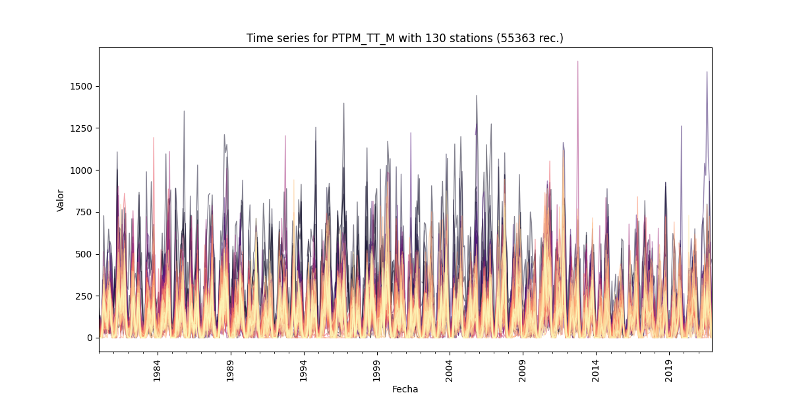
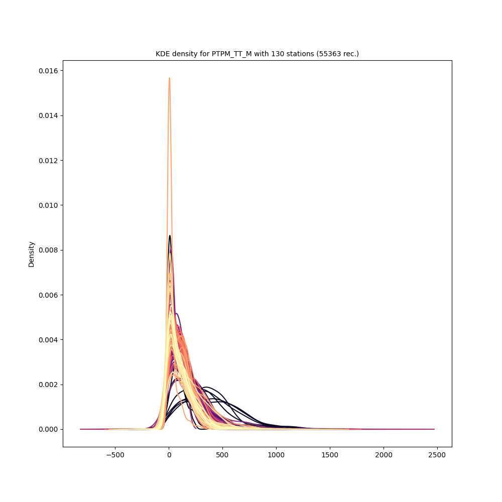

**PTPM_TT_M - Station: COLEGIO AGROPECUARIO PAILITAS  - AUT [25025330] (339 rec.)** Location over [Google Maps](http://maps.google.com/maps?q=8.954222222,-73.63008333) or [Openstreet Map](https://www.openstreetmap.org/query?lat=8.954222222&lon=-73.63008333)

Station first record

| Fecha               |   CodigoEstacion | NombreEstacion                                  |   Latitud |   Longitud |   Altitud | Categoria           | Entidad                                                     | AreaOperativa                               | Departamento   | Municipio   | FechaInstalacion    | FechaSuspension   | IdParametro   | Etiqueta   | DescripcionSerie            | Frecuencia   |   Valor |   Grado |   Calificador |   NivelAprobacion |
|:--------------------|-----------------:|:------------------------------------------------|----------:|-----------:|----------:|:--------------------|:------------------------------------------------------------|:--------------------------------------------|:---------------|:------------|:--------------------|:------------------|:--------------|:-----------|:----------------------------|:-------------|--------:|--------:|--------------:|------------------:|
| 1987-12-01 00:00:00 |         25025330 | COLEGIO AGROPECUARIO PAILITAS  - AUT [25025330] |   8.95422 |   -73.6301 |        50 | Climática Principal | INSTITUTO DE HIDROLOGIA METEOROLOGIA Y ESTUDIOS AMBIENTALES | Area Operativa 05 - Magdalena-Cesar-Guajira | Cesar          | Pailitas    | 1987-09-15 00:00:00 | NaT               | PRECIPITACION | PTPM_TT_M  | Precipitación total mensual | Mensual      |     202 |      50 |           nan |               900 |

Statistics table

|       |   Valor |
|:------|--------:|
| count | 339     |
| mean  | 164.522 |
| std   | 130.426 |
| min   |   0     |
| 25%   |  59.8   |
| 50%   | 142     |
| 75%   | 252.9   |
| max   | 693     |

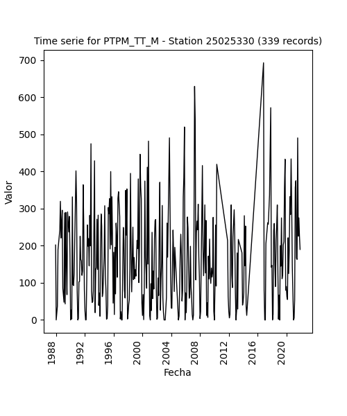
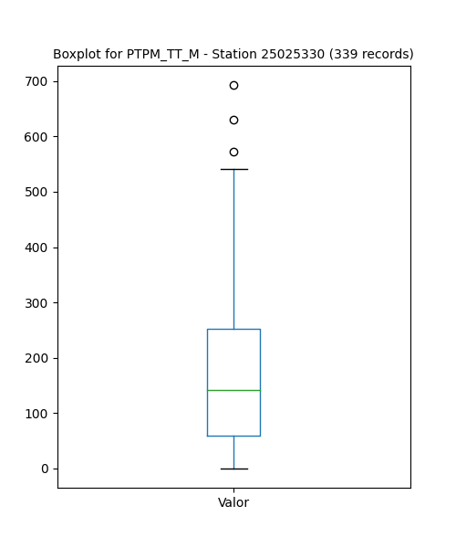
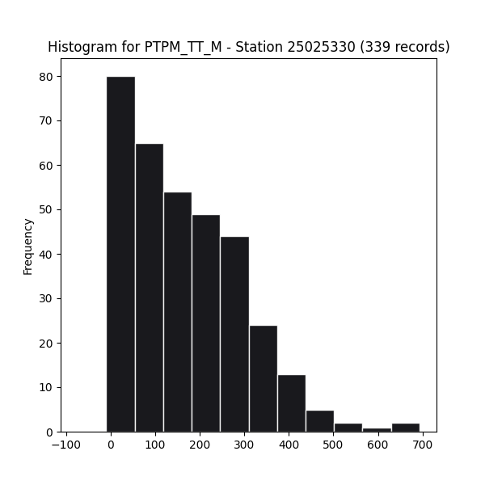
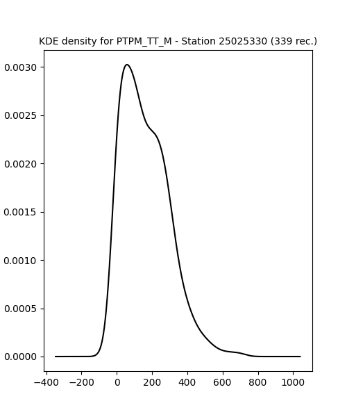

**PTPM_TT_M - Station: GLORIA LA [23210020] (297 rec.)** Location over [Google Maps](http://maps.google.com/maps?q=8.630555556,-73.80416667) or [Openstreet Map](https://www.openstreetmap.org/query?lat=8.630555556&lon=-73.80416667)

Station first record

| Fecha               |   CodigoEstacion | NombreEstacion       |   Latitud |   Longitud |   Altitud | Categoria     | Entidad                                                     | AreaOperativa                          | Departamento   | Municipio   | FechaInstalacion    | FechaSuspension   | IdParametro   | Etiqueta   | DescripcionSerie            | Frecuencia   |   Valor |   Grado |   Calificador |   NivelAprobacion |
|:--------------------|-----------------:|:---------------------|----------:|-----------:|----------:|:--------------|:------------------------------------------------------------|:---------------------------------------|:---------------|:------------|:--------------------|:------------------|:--------------|:-----------|:----------------------------|:-------------|--------:|--------:|--------------:|------------------:|
| 1995-05-01 00:00:00 |         23210020 | GLORIA LA [23210020] |   8.63056 |   -73.8042 |        40 | Pluviométrica | INSTITUTO DE HIDROLOGIA METEOROLOGIA Y ESTUDIOS AMBIENTALES | Area Operativa 08 - Santanderes-Arauca | Cesar          | La Gloria   | 1995-05-15 00:00:00 | NaT               | PRECIPITACION | PTPM_TT_M  | Precipitación total mensual | Mensual      |     183 |       4 |           nan |               900 |

Statistics table

|       |   Valor |
|:------|--------:|
| count | 297     |
| mean  | 159.691 |
| std   | 137.871 |
| min   |   0     |
| 25%   |  45     |
| 50%   | 130     |
| 75%   | 241     |
| max   | 649     |

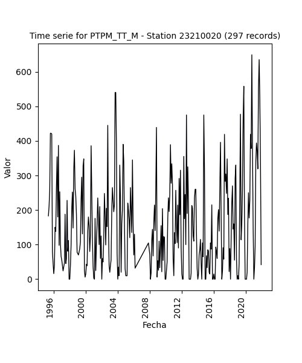
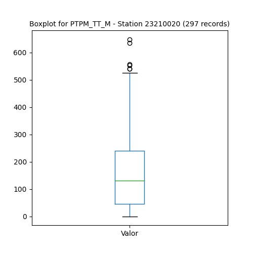
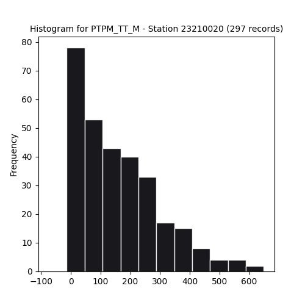
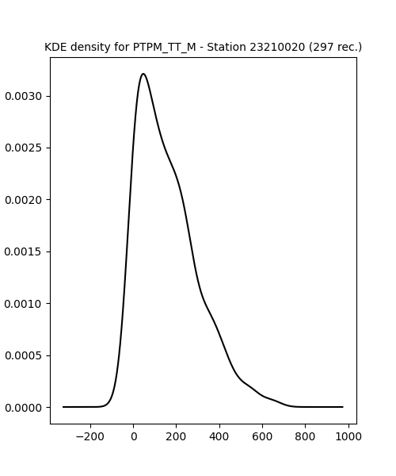

**PTPM_TT_M - Station: LA GLORIA [23215060] (146 rec.)** Location over [Google Maps](http://maps.google.com/maps?q=8.615277778,-73.800555556) or [Openstreet Map](https://www.openstreetmap.org/query?lat=8.615277778&lon=-73.800555556)

Station first record

| Fecha               |   CodigoEstacion | NombreEstacion       |   Latitud |   Longitud |   Altitud | Categoria           | Entidad                                                     | AreaOperativa                          | Departamento   | Municipio   | FechaInstalacion    | FechaSuspension     | IdParametro   | Etiqueta   | DescripcionSerie            | Frecuencia   |   Valor |   Grado |   Calificador |   NivelAprobacion |
|:--------------------|-----------------:|:---------------------|----------:|-----------:|----------:|:--------------------|:------------------------------------------------------------|:---------------------------------------|:---------------|:------------|:--------------------|:--------------------|:--------------|:-----------|:----------------------------|:-------------|--------:|--------:|--------------:|------------------:|
| 1983-10-01 00:00:00 |         23215060 | LA GLORIA [23215060] |   8.61528 |   -73.8006 |        35 | Climática Ordinaria | INSTITUTO DE HIDROLOGIA METEOROLOGIA Y ESTUDIOS AMBIENTALES | Area Operativa 08 - Santanderes-Arauca | Cesar          | La Gloria   | 1995-05-15 00:00:00 | 2018-06-19 10:35:00 | PRECIPITACION | PTPM_TT_M  | Precipitación total mensual | Mensual      |   126.2 |      50 |           nan |               900 |

Statistics table

|       |   Valor |
|:------|--------:|
| count | 146     |
| mean  | 136.245 |
| std   | 106.68  |
| min   |   0     |
| 25%   |  46.55  |
| 50%   | 122.9   |
| 75%   | 196.125 |
| max   | 422     |

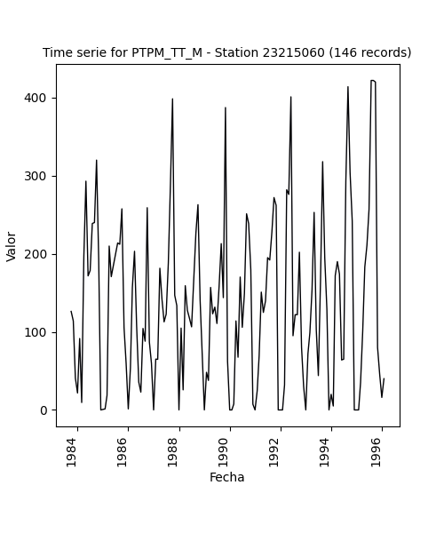
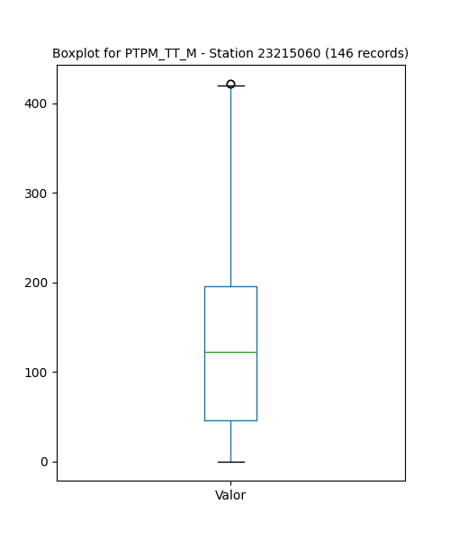
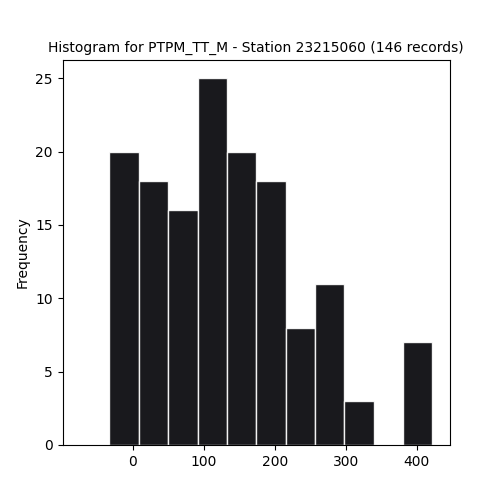
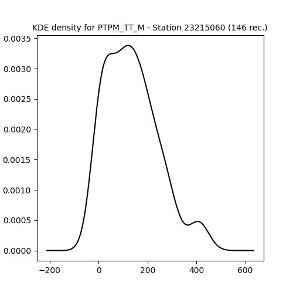

**PTPM_TT_M - Station: MATA LA [23215050] (467 rec.)** Location over [Google Maps](http://maps.google.com/maps?q=8.614444444,-73.63638889) or [Openstreet Map](https://www.openstreetmap.org/query?lat=8.614444444&lon=-73.63638889)

Station first record

| Fecha               |   CodigoEstacion | NombreEstacion     |   Latitud |   Longitud |   Altitud | Categoria     | Entidad                                                     | AreaOperativa                          | Departamento   | Municipio   | FechaInstalacion    | FechaSuspension   | IdParametro   | Etiqueta   | DescripcionSerie            | Frecuencia   |   Valor |   Grado |   Calificador |   NivelAprobacion |
|:--------------------|-----------------:|:-------------------|----------:|-----------:|----------:|:--------------|:------------------------------------------------------------|:---------------------------------------|:---------------|:------------|:--------------------|:------------------|:--------------|:-----------|:----------------------------|:-------------|--------:|--------:|--------------:|------------------:|
| 1980-01-01 00:00:00 |         23215050 | MATA LA [23215050] |   8.61444 |   -73.6364 |       163 | Pluviométrica | INSTITUTO DE HIDROLOGIA METEOROLOGIA Y ESTUDIOS AMBIENTALES | Area Operativa 08 - Santanderes-Arauca | Cesar          | La Gloria   | 1983-09-15 00:00:00 | NaT               | PRECIPITACION | PTPM_TT_M  | Precipitación total mensual | Mensual      |      50 |       4 |           nan |               900 |

Statistics table

|       |    Valor |
|:------|---------:|
| count |  467     |
| mean  |  233.842 |
| std   |  212.824 |
| min   |    0     |
| 25%   |   74.5   |
| 50%   |  182.3   |
| 75%   |  332.85  |
| max   | 1094.2   |

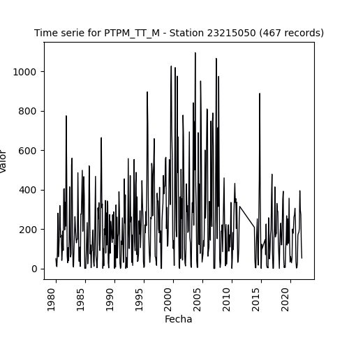
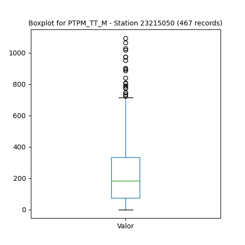
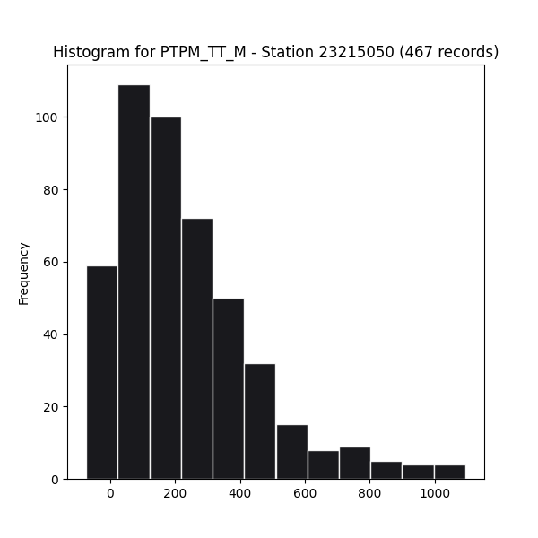
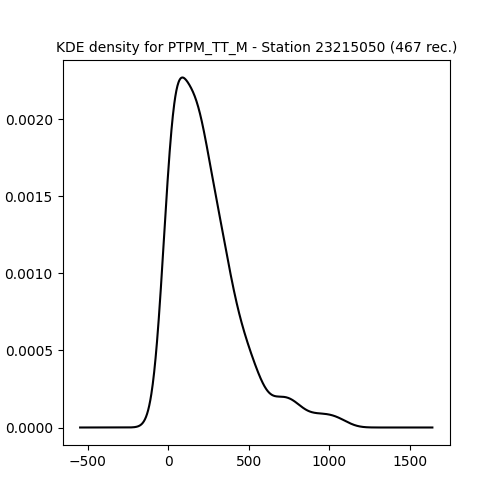

**PTPM_TT_M - Station: RAYA LA [25020670] (466 rec.)** Location over [Google Maps](http://maps.google.com/maps?q=9.050277778,-73.55972222) or [Openstreet Map](https://www.openstreetmap.org/query?lat=9.050277778&lon=-73.55972222)

Station first record

| Fecha               |   CodigoEstacion | NombreEstacion     |   Latitud |   Longitud |   Altitud | Categoria     | Entidad                                                     | AreaOperativa                               | Departamento   | Municipio   | FechaInstalacion    | FechaSuspension   | IdParametro   | Etiqueta   | DescripcionSerie            | Frecuencia   |   Valor |   Grado |   Calificador |   NivelAprobacion |
|:--------------------|-----------------:|:-------------------|----------:|-----------:|----------:|:--------------|:------------------------------------------------------------|:--------------------------------------------|:---------------|:------------|:--------------------|:------------------|:--------------|:-----------|:----------------------------|:-------------|--------:|--------:|--------------:|------------------:|
| 1980-01-01 00:00:00 |         25020670 | RAYA LA [25020670] |   9.05028 |   -73.5597 |       500 | Pluviométrica | INSTITUTO DE HIDROLOGIA METEOROLOGIA Y ESTUDIOS AMBIENTALES | Area Operativa 05 - Magdalena-Cesar-Guajira | Cesar          | Pailitas    | 1972-09-15 00:00:00 | NaT               | PRECIPITACION | PTPM_TT_M  | Precipitación total mensual | Mensual      |       0 |      50 |           nan |               900 |

Statistics table

|       |   Valor |
|:------|--------:|
| count | 466     |
| mean  | 146.059 |
| std   | 129.158 |
| min   |   0     |
| 25%   |  33     |
| 50%   | 118     |
| 75%   | 238.5   |
| max   | 814     |

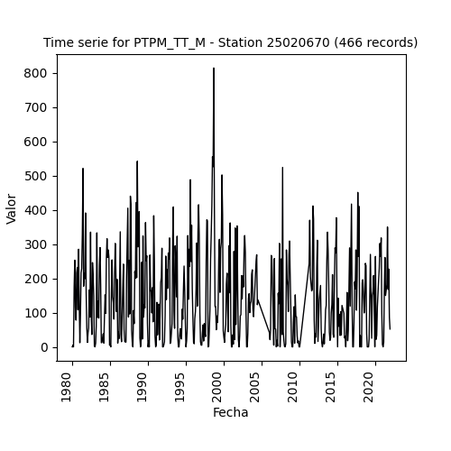
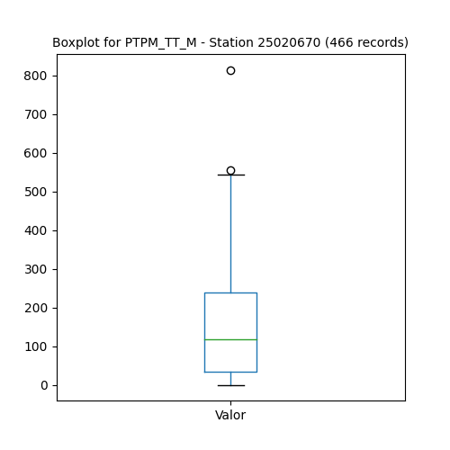
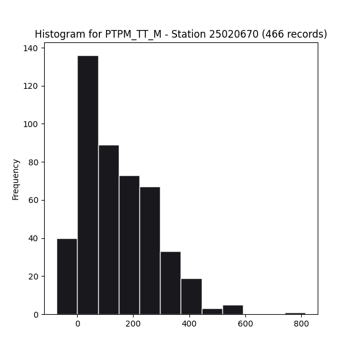
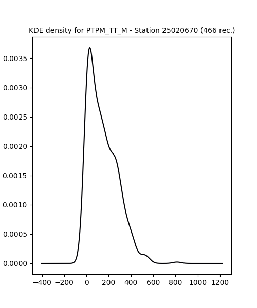

**PTPM_TT_M - Station: SANTA ISABEL [25021640] (443 rec.)** Location over [Google Maps](http://maps.google.com/maps?q=8.71275,-73.70255556) or [Openstreet Map](https://www.openstreetmap.org/query?lat=8.71275&lon=-73.70255556)

Station first record

| Fecha               |   CodigoEstacion | NombreEstacion          |   Latitud |   Longitud |   Altitud | Categoria     | Entidad                                                     | AreaOperativa                               | Departamento   | Municipio   | FechaInstalacion    | FechaSuspension   | IdParametro   | Etiqueta   | DescripcionSerie            | Frecuencia   |   Valor |   Grado |   Calificador |   NivelAprobacion |
|:--------------------|-----------------:|:------------------------|----------:|-----------:|----------:|:--------------|:------------------------------------------------------------|:--------------------------------------------|:---------------|:------------|:--------------------|:------------------|:--------------|:-----------|:----------------------------|:-------------|--------:|--------:|--------------:|------------------:|
| 1984-12-01 00:00:00 |         25021640 | SANTA ISABEL [25021640] |   8.71275 |   -73.7026 |        40 | Pluviométrica | INSTITUTO DE HIDROLOGIA METEOROLOGIA Y ESTUDIOS AMBIENTALES | Area Operativa 05 - Magdalena-Cesar-Guajira | Cesar          | Pelaya      | 1984-11-15 00:00:00 | NaT               | PRECIPITACION | PTPM_TT_M  | Precipitación total mensual | Mensual      |       0 |      50 |           nan |               900 |

Statistics table

|       |   Valor |
|:------|--------:|
| count | 443     |
| mean  | 145.321 |
| std   | 132.377 |
| min   |   0     |
| 25%   |  38.35  |
| 50%   | 115.5   |
| 75%   | 213.5   |
| max   | 717     |

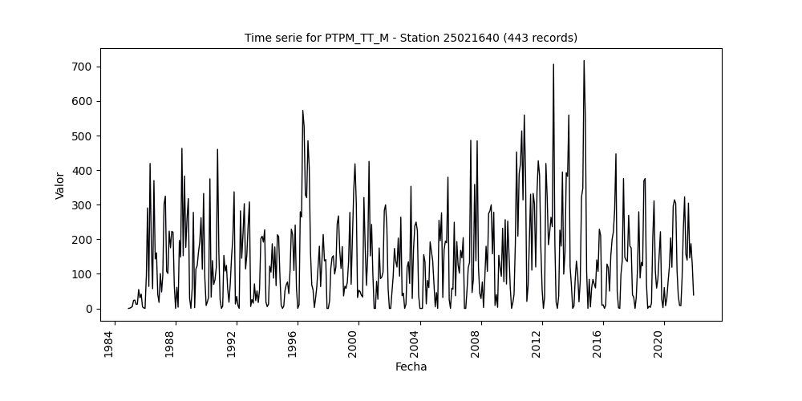

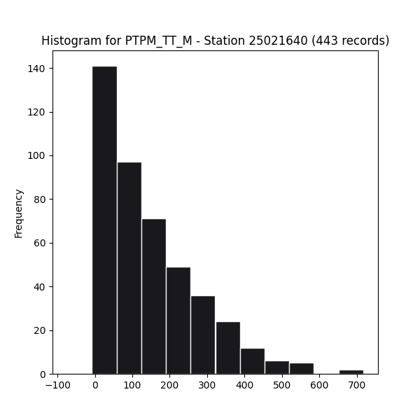
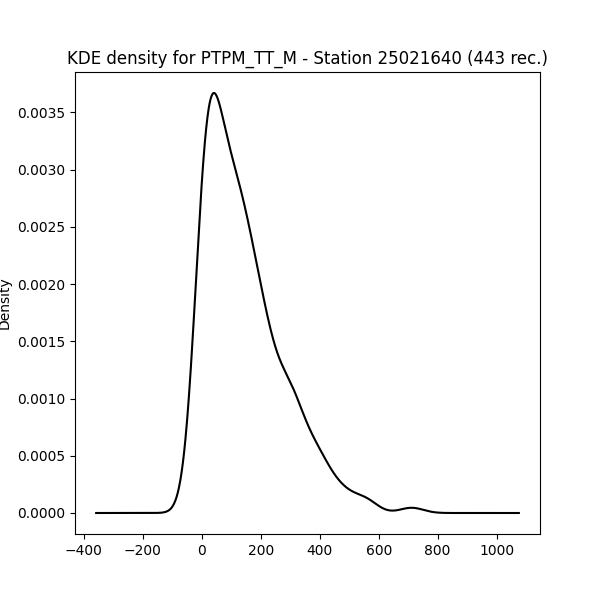

**PTPM_TT_M - Station: TAMALAMEQUE D C [25021590] (206 rec.)** Location over [Google Maps](http://maps.google.com/maps?q=8.866666667,-73.81666667) or [Openstreet Map](https://www.openstreetmap.org/query?lat=8.866666667&lon=-73.81666667)

Station first record

| Fecha               |   CodigoEstacion | NombreEstacion             |   Latitud |   Longitud |   Altitud | Categoria     | Entidad                                                     | AreaOperativa                               | Departamento   | Municipio   | FechaInstalacion    | FechaSuspension     | IdParametro   | Etiqueta   | DescripcionSerie            | Frecuencia   |   Valor |   Grado |   Calificador |   NivelAprobacion |
|:--------------------|-----------------:|:---------------------------|----------:|-----------:|----------:|:--------------|:------------------------------------------------------------|:--------------------------------------------|:---------------|:------------|:--------------------|:--------------------|:--------------|:-----------|:----------------------------|:-------------|--------:|--------:|--------------:|------------------:|
| 1980-01-01 00:00:00 |         25021590 | TAMALAMEQUE D C [25021590] |   8.86667 |   -73.8167 |        33 | Pluviométrica | INSTITUTO DE HIDROLOGIA METEOROLOGIA Y ESTUDIOS AMBIENTALES | Area Operativa 05 - Magdalena-Cesar-Guajira | Cesar          | Tamalameque | 1979-11-15 00:00:00 | 1998-06-15 00:00:00 | PRECIPITACION | PTPM_TT_M  | Precipitación total mensual | Mensual      |       0 |      50 |           nan |               900 |

Statistics table

|       |   Valor |
|:------|--------:|
| count | 206     |
| mean  | 136.508 |
| std   | 112.785 |
| min   |   0     |
| 25%   |  36.5   |
| 50%   | 125.8   |
| 75%   | 208.725 |
| max   | 512.2   |

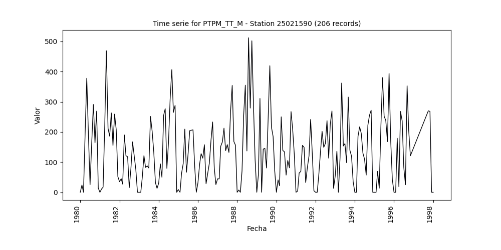
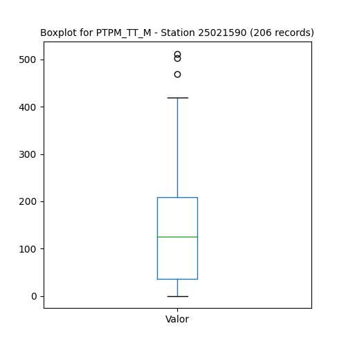
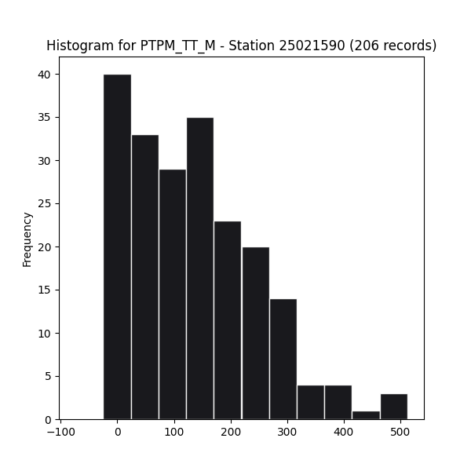
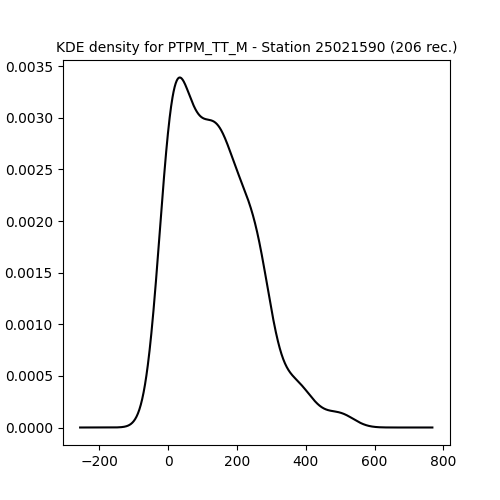

**PTPM_TT_M - Station: TAMALAMEQUE [25020090] (501 rec.)** Location over [Google Maps](http://maps.google.com/maps?q=8.860388889,-73.81544444) or [Openstreet Map](https://www.openstreetmap.org/query?lat=8.860388889&lon=-73.81544444)

Station first record

| Fecha               |   CodigoEstacion | NombreEstacion         |   Latitud |   Longitud |   Altitud | Categoria     | Entidad                                                     | AreaOperativa                               | Departamento   | Municipio   | FechaInstalacion    | FechaSuspension   | IdParametro   | Etiqueta   | DescripcionSerie            | Frecuencia   |   Valor |   Grado |   Calificador |   NivelAprobacion |
|:--------------------|-----------------:|:-----------------------|----------:|-----------:|----------:|:--------------|:------------------------------------------------------------|:--------------------------------------------|:---------------|:------------|:--------------------|:------------------|:--------------|:-----------|:----------------------------|:-------------|--------:|--------:|--------------:|------------------:|
| 1980-01-01 00:00:00 |         25020090 | TAMALAMEQUE [25020090] |   8.86039 |   -73.8154 |        20 | Pluviométrica | INSTITUTO DE HIDROLOGIA METEOROLOGIA Y ESTUDIOS AMBIENTALES | Area Operativa 05 - Magdalena-Cesar-Guajira | Cesar          | Tamalameque | 1960-02-15 00:00:00 | NaT               | PRECIPITACION | PTPM_TT_M  | Precipitación total mensual | Mensual      |       0 |      50 |           nan |               900 |

Statistics table

|       |   Valor |
|:------|--------:|
| count | 501     |
| mean  | 163.094 |
| std   | 143.448 |
| min   |   0     |
| 25%   |  44.7   |
| 50%   | 139     |
| 75%   | 246.6   |
| max   | 870.6   |

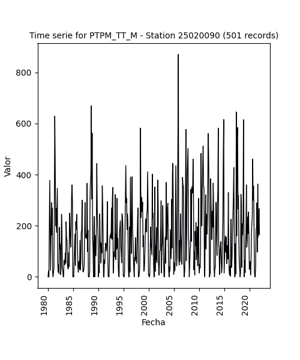
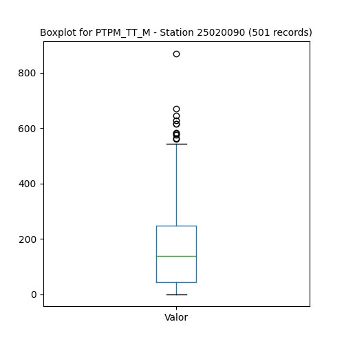
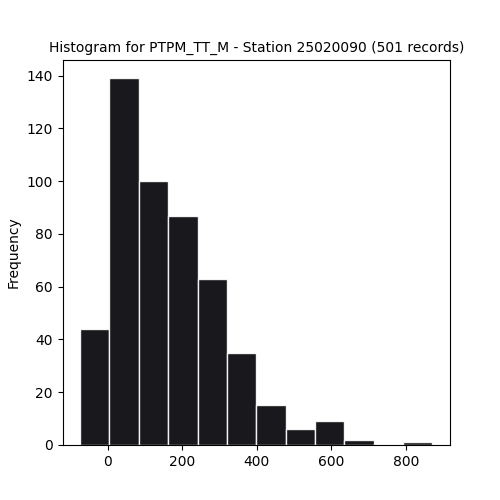
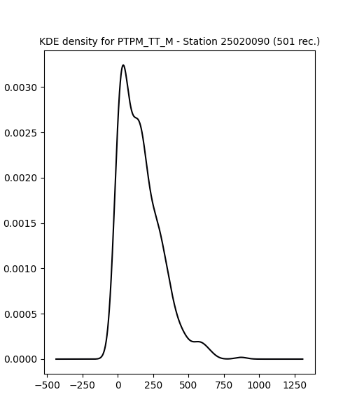

**PTPM_TT_M - Station: TERROR EL HACIENDA [25020650] (436 rec.)** Location over [Google Maps](http://maps.google.com/maps?q=8.938777778,-73.56022222) or [Openstreet Map](https://www.openstreetmap.org/query?lat=8.938777778&lon=-73.56022222)

Station first record

| Fecha               |   CodigoEstacion | NombreEstacion                |   Latitud |   Longitud |   Altitud | Categoria     | Entidad                                                     | AreaOperativa                               | Departamento   | Municipio   | FechaInstalacion    | FechaSuspension   | IdParametro   | Etiqueta   | DescripcionSerie            | Frecuencia   |   Valor |   Grado |   Calificador |   NivelAprobacion |
|:--------------------|-----------------:|:------------------------------|----------:|-----------:|----------:|:--------------|:------------------------------------------------------------|:--------------------------------------------|:---------------|:------------|:--------------------|:------------------|:--------------|:-----------|:----------------------------|:-------------|--------:|--------:|--------------:|------------------:|
| 1980-01-01 00:00:00 |         25020650 | TERROR EL HACIENDA [25020650] |   8.93878 |   -73.5602 |       250 | Pluviométrica | INSTITUTO DE HIDROLOGIA METEOROLOGIA Y ESTUDIOS AMBIENTALES | Area Operativa 05 - Magdalena-Cesar-Guajira | Cesar          | Chimichagua | 1972-09-15 00:00:00 | NaT               | PRECIPITACION | PTPM_TT_M  | Precipitación total mensual | Mensual      |      11 |      50 |           nan |               900 |

Statistics table

|       |    Valor |
|:------|---------:|
| count |  436     |
| mean  |  156.154 |
| std   |  178.632 |
| min   |    0     |
| 25%   |   30.675 |
| 50%   |  115     |
| 75%   |  226.925 |
| max   | 1585     |

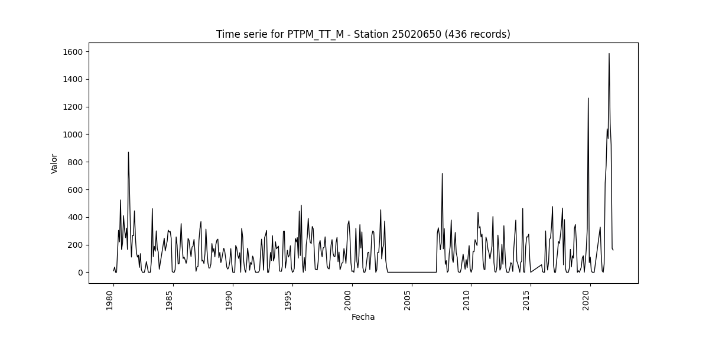
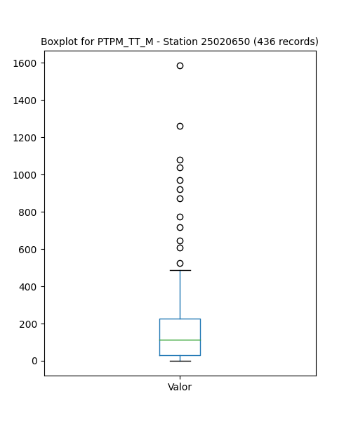
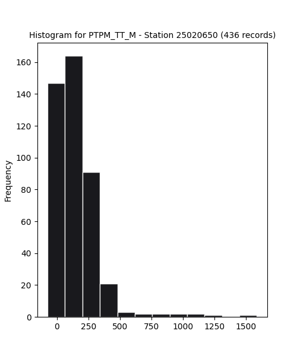
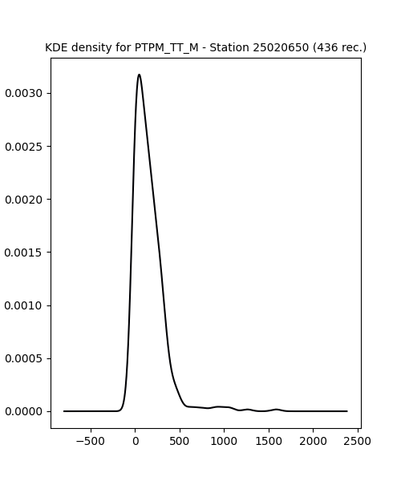

**PTPM_TT_M - Station: ZAPATOZA [25020660] (502 rec.)** Location over [Google Maps](http://maps.google.com/maps?q=9.00975,-73.75402778) or [Openstreet Map](https://www.openstreetmap.org/query?lat=9.00975&lon=-73.75402778)

Station first record

| Fecha               |   CodigoEstacion | NombreEstacion      |   Latitud |   Longitud |   Altitud | Categoria     | Entidad                                                     | AreaOperativa                               | Departamento   | Municipio   | FechaInstalacion    | FechaSuspension   | IdParametro   | Etiqueta   | DescripcionSerie            | Frecuencia   |   Valor |   Grado |   Calificador |   NivelAprobacion |
|:--------------------|-----------------:|:--------------------|----------:|-----------:|----------:|:--------------|:------------------------------------------------------------|:--------------------------------------------|:---------------|:------------|:--------------------|:------------------|:--------------|:-----------|:----------------------------|:-------------|--------:|--------:|--------------:|------------------:|
| 1980-01-01 00:00:00 |         25020660 | ZAPATOZA [25020660] |   9.00975 |    -73.754 |        90 | Pluviométrica | INSTITUTO DE HIDROLOGIA METEOROLOGIA Y ESTUDIOS AMBIENTALES | Area Operativa 05 - Magdalena-Cesar-Guajira | Cesar          | Curumaní    | 1972-09-15 00:00:00 | NaT               | PRECIPITACION | PTPM_TT_M  | Precipitación total mensual | Mensual      |       1 |      50 |           nan |               900 |

Statistics table

|       |   Valor |
|:------|--------:|
| count | 502     |
| mean  | 155.621 |
| std   | 132.496 |
| min   |   0     |
| 25%   |  49.175 |
| 50%   | 127.1   |
| 75%   | 230     |
| max   | 679     |

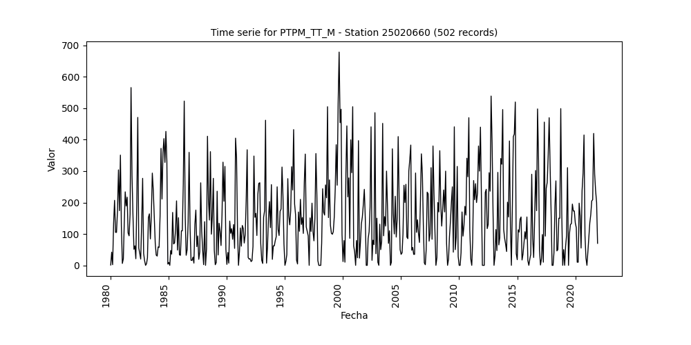
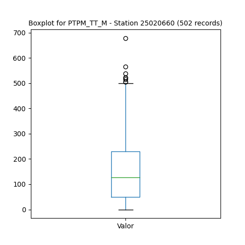
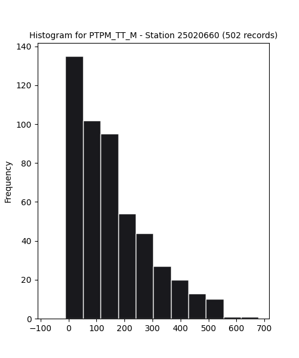
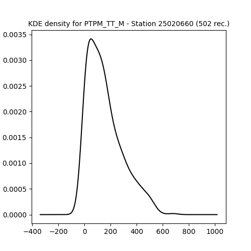

**PTPM_TT_M - Station: BELLAVISTA [28040150] (466 rec.)** Location over [Google Maps](http://maps.google.com/maps?q=10.30805556,-74.03922222) or [Openstreet Map](https://www.openstreetmap.org/query?lat=10.30805556&lon=-74.03922222)

Station first record

| Fecha               |   CodigoEstacion | NombreEstacion        |   Latitud |   Longitud |   Altitud | Categoria     | Entidad                                                     | AreaOperativa                               | Departamento   | Municipio   | FechaInstalacion    | FechaSuspension   | IdParametro   | Etiqueta   | DescripcionSerie            | Frecuencia   |   Valor |   Grado |   Calificador |   NivelAprobacion |
|:--------------------|-----------------:|:----------------------|----------:|-----------:|----------:|:--------------|:------------------------------------------------------------|:--------------------------------------------|:---------------|:------------|:--------------------|:------------------|:--------------|:-----------|:----------------------------|:-------------|--------:|--------:|--------------:|------------------:|
| 1980-01-01 00:00:00 |         28040150 | BELLAVISTA [28040150] |   10.3081 |   -74.0392 |       140 | Pluviométrica | INSTITUTO DE HIDROLOGIA METEOROLOGIA Y ESTUDIOS AMBIENTALES | Area Operativa 05 - Magdalena-Cesar-Guajira | Magdalena      | Algarrobo   | 1963-02-15 00:00:00 | NaT               | PRECIPITACION | PTPM_TT_M  | Precipitación total mensual | Mensual      |       9 |      50 |           nan |               900 |

Statistics table

|       |   Valor |
|:------|--------:|
| count | 466     |
| mean  | 116.057 |
| std   |  94.465 |
| min   |   0     |
| 25%   |  42.25  |
| 50%   | 107     |
| 75%   | 163.75  |
| max   | 710     |

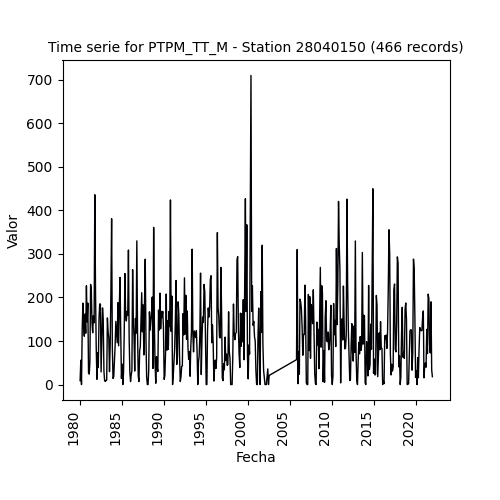
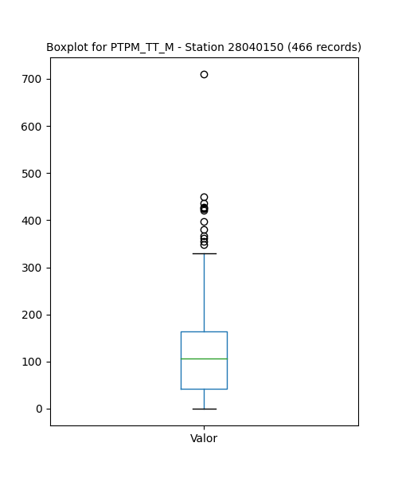

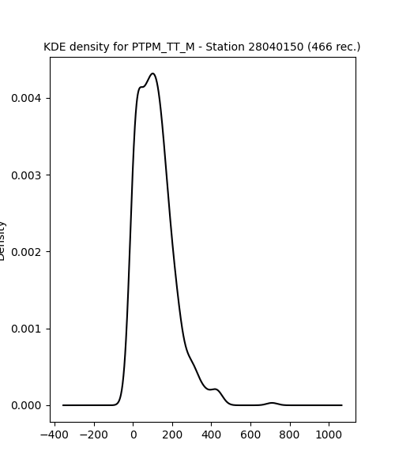

**PTPM_TT_M - Station: CABANA LA HACIENDA [28040360] (503 rec.)** Location over [Google Maps](http://maps.google.com/maps?q=9.861,-74.07672222) or [Openstreet Map](https://www.openstreetmap.org/query?lat=9.861&lon=-74.07672222)

Station first record

| Fecha               |   CodigoEstacion | NombreEstacion                |   Latitud |   Longitud |   Altitud | Categoria     | Entidad                                                     | AreaOperativa                               | Departamento   | Municipio             | FechaInstalacion    | FechaSuspension   | IdParametro   | Etiqueta   | DescripcionSerie            | Frecuencia   |   Valor |   Grado |   Calificador |   NivelAprobacion |
|:--------------------|-----------------:|:------------------------------|----------:|-----------:|----------:|:--------------|:------------------------------------------------------------|:--------------------------------------------|:---------------|:----------------------|:--------------------|:------------------|:--------------|:-----------|:----------------------------|:-------------|--------:|--------:|--------------:|------------------:|
| 1980-01-01 00:00:00 |         28040360 | CABANA LA HACIENDA [28040360] |     9.861 |   -74.0767 |       100 | Pluviométrica | INSTITUTO DE HIDROLOGIA METEOROLOGIA Y ESTUDIOS AMBIENTALES | Area Operativa 05 - Magdalena-Cesar-Guajira | Magdalena      | Ariguaní (El Dificil) | 1979-01-15 00:00:00 | NaT               | PRECIPITACION | PTPM_TT_M  | Precipitación total mensual | Mensual      |      10 |      50 |           nan |               900 |

Statistics table

|       |    Valor |
|:------|---------:|
| count | 503      |
| mean  | 124.758  |
| std   |  95.0967 |
| min   |   0      |
| 25%   |  52.5    |
| 50%   | 116      |
| 75%   | 174      |
| max   | 840      |

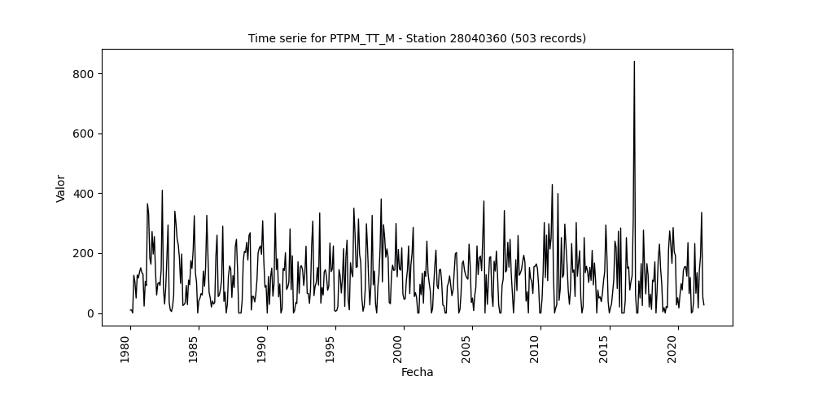
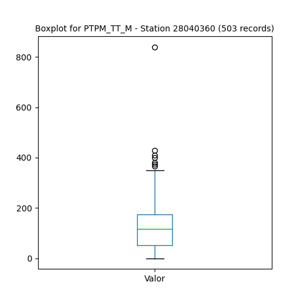
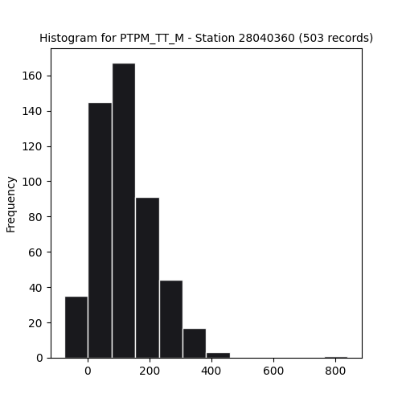
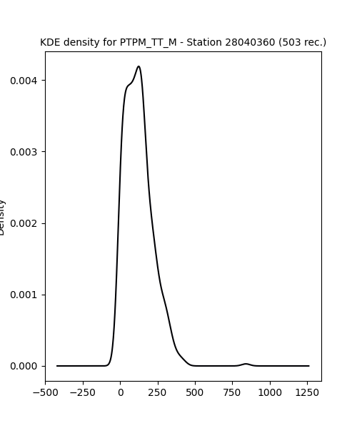

**PTPM_TT_M - Station: DESTINO EL [29060150] (488 rec.)** Location over [Google Maps](http://maps.google.com/maps?q=10.57366667,-74.22411111) or [Openstreet Map](https://www.openstreetmap.org/query?lat=10.57366667&lon=-74.22411111)

Station first record

| Fecha               |   CodigoEstacion | NombreEstacion        |   Latitud |   Longitud |   Altitud | Categoria     | Entidad                                                     | AreaOperativa                               | Departamento   | Municipio   | FechaInstalacion    | FechaSuspension   | IdParametro   | Etiqueta   | DescripcionSerie            | Frecuencia   |   Valor |   Grado |   Calificador |   NivelAprobacion |
|:--------------------|-----------------:|:----------------------|----------:|-----------:|----------:|:--------------|:------------------------------------------------------------|:--------------------------------------------|:---------------|:------------|:--------------------|:------------------|:--------------|:-----------|:----------------------------|:-------------|--------:|--------:|--------------:|------------------:|
| 1980-01-01 00:00:00 |         29060150 | DESTINO EL [29060150] |   10.5737 |   -74.2241 |        20 | Pluviométrica | INSTITUTO DE HIDROLOGIA METEOROLOGIA Y ESTUDIOS AMBIENTALES | Area Operativa 05 - Magdalena-Cesar-Guajira | Magdalena      | El Retén    | 1967-01-15 00:00:00 | NaT               | PRECIPITACION | PTPM_TT_M  | Precipitación total mensual | Mensual      |       0 |      50 |           nan |               900 |

Statistics table

|       |   Valor |
|:------|--------:|
| count | 488     |
| mean  | 134.827 |
| std   | 133.877 |
| min   |   0     |
| 25%   |  21.75  |
| 50%   | 100.5   |
| 75%   | 217.25  |
| max   | 861     |

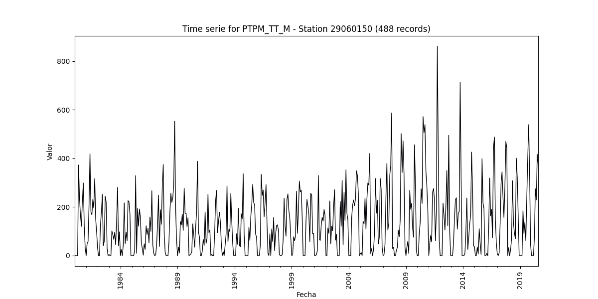
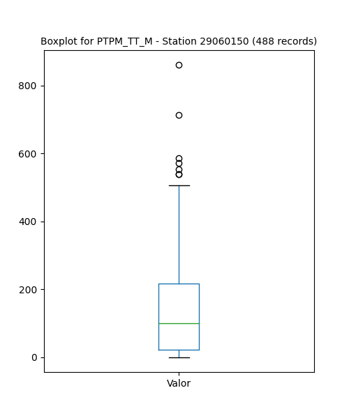
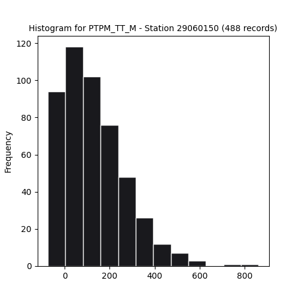
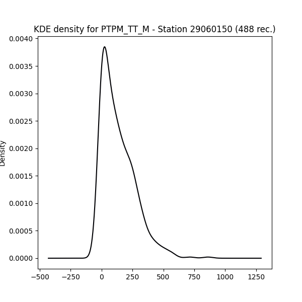

**PTPM_TT_M - Station: DONA MARIA [29060560] (442 rec.)** Location over [Google Maps](http://maps.google.com/maps?q=10.38444444,-74.17794444) or [Openstreet Map](https://www.openstreetmap.org/query?lat=10.38444444&lon=-74.17794444)

Station first record

| Fecha               |   CodigoEstacion | NombreEstacion        |   Latitud |   Longitud |   Altitud | Categoria     | Entidad                                                     | AreaOperativa                               | Departamento   | Municipio   | FechaInstalacion    | FechaSuspension   | IdParametro   | Etiqueta   | DescripcionSerie            | Frecuencia   |   Valor |   Grado |   Calificador |   NivelAprobacion |
|:--------------------|-----------------:|:----------------------|----------:|-----------:|----------:|:--------------|:------------------------------------------------------------|:--------------------------------------------|:---------------|:------------|:--------------------|:------------------|:--------------|:-----------|:----------------------------|:-------------|--------:|--------:|--------------:|------------------:|
| 1984-12-01 00:00:00 |         29060560 | DONA MARIA [29060560] |   10.3844 |   -74.1779 |        50 | Pluviométrica | INSTITUTO DE HIDROLOGIA METEOROLOGIA Y ESTUDIOS AMBIENTALES | Area Operativa 05 - Magdalena-Cesar-Guajira | Magdalena      | Fundación   | 1984-11-15 00:00:00 | NaT               | PRECIPITACION | PTPM_TT_M  | Precipitación total mensual | Mensual      |       0 |      50 |           nan |               900 |

Statistics table

|       |    Valor |
|:------|---------:|
| count | 442      |
| mean  |  97.6916 |
| std   | 101.206  |
| min   |   0      |
| 25%   |  16      |
| 50%   |  68.5    |
| 75%   | 150      |
| max   | 718      |

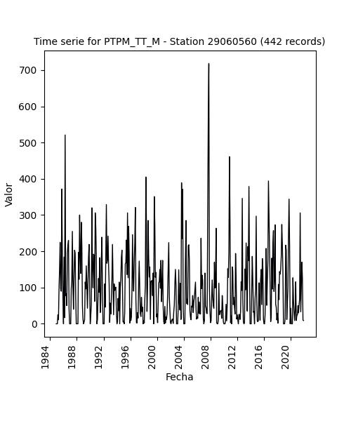
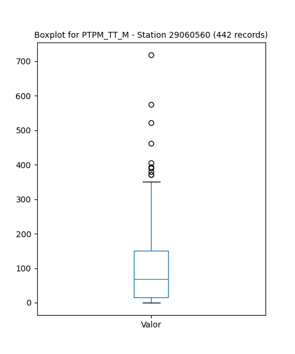
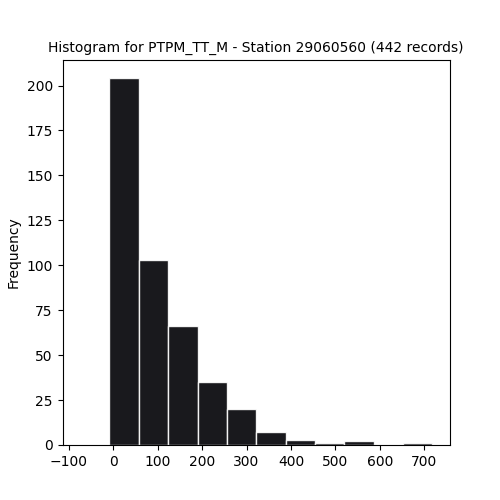
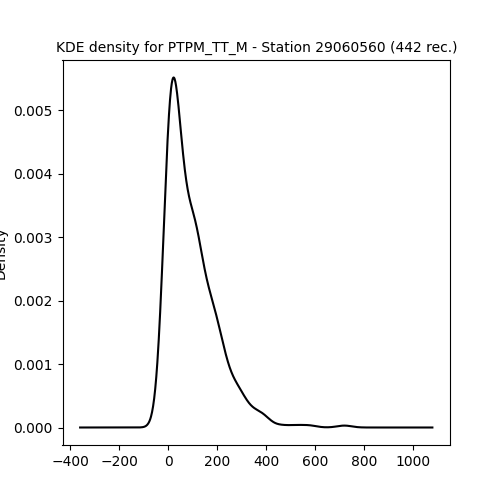

**PTPM_TT_M - Station: FUNDACION [29060040] (499 rec.)** Location over [Google Maps](http://maps.google.com/maps?q=10.52436111,-74.18222222) or [Openstreet Map](https://www.openstreetmap.org/query?lat=10.52436111&lon=-74.18222222)

Station first record

| Fecha               |   CodigoEstacion | NombreEstacion       |   Latitud |   Longitud |   Altitud | Categoria     | Entidad                                                     | AreaOperativa                               | Departamento   | Municipio   | FechaInstalacion    | FechaSuspension   | IdParametro   | Etiqueta   | DescripcionSerie            | Frecuencia   |   Valor |   Grado |   Calificador |   NivelAprobacion |
|:--------------------|-----------------:|:---------------------|----------:|-----------:|----------:|:--------------|:------------------------------------------------------------|:--------------------------------------------|:---------------|:------------|:--------------------|:------------------|:--------------|:-----------|:----------------------------|:-------------|--------:|--------:|--------------:|------------------:|
| 1980-01-01 00:00:00 |         29060040 | FUNDACION [29060040] |   10.5244 |   -74.1822 |        40 | Pluviométrica | INSTITUTO DE HIDROLOGIA METEOROLOGIA Y ESTUDIOS AMBIENTALES | Area Operativa 05 - Magdalena-Cesar-Guajira | Magdalena      | Fundación   | 1958-03-15 00:00:00 | NaT               | PRECIPITACION | PTPM_TT_M  | Precipitación total mensual | Mensual      |      15 |      50 |           nan |               900 |

Statistics table

|       |   Valor |
|:------|--------:|
| count | 499     |
| mean  | 119.442 |
| std   | 115.678 |
| min   |   0     |
| 25%   |  28     |
| 50%   |  97     |
| 75%   | 172.5   |
| max   | 757.5   |

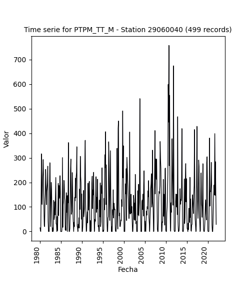
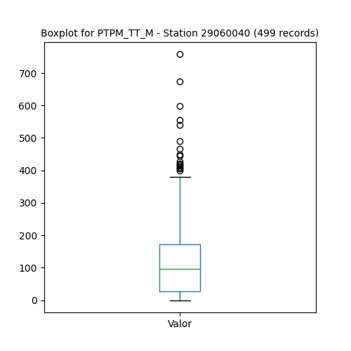

**PTPM_TT_M - Station: MARIA LA [29060200] (483 rec.)** Location over [Google Maps](http://maps.google.com/maps?q=10.54066667,-74.18697222) or [Openstreet Map](https://www.openstreetmap.org/query?lat=10.54066667&lon=-74.18697222)

Station first record

| Fecha               |   CodigoEstacion | NombreEstacion      |   Latitud |   Longitud |   Altitud | Categoria     | Entidad                                                     | AreaOperativa                               | Departamento   | Municipio   | FechaInstalacion    | FechaSuspension   | IdParametro   | Etiqueta   | DescripcionSerie            | Frecuencia   |   Valor |   Grado |   Calificador |   NivelAprobacion |
|:--------------------|-----------------:|:--------------------|----------:|-----------:|----------:|:--------------|:------------------------------------------------------------|:--------------------------------------------|:---------------|:------------|:--------------------|:------------------|:--------------|:-----------|:----------------------------|:-------------|--------:|--------:|--------------:|------------------:|
| 1980-01-01 00:00:00 |         29060200 | MARIA LA [29060200] |   10.5407 |    -74.187 |        30 | Pluviométrica | INSTITUTO DE HIDROLOGIA METEOROLOGIA Y ESTUDIOS AMBIENTALES | Area Operativa 05 - Magdalena-Cesar-Guajira | Magdalena      | Aracataca   | 1974-11-15 00:00:00 | NaT               | PRECIPITACION | PTPM_TT_M  | Precipitación total mensual | Mensual      |       0 |      50 |           nan |               900 |

Statistics table

|       |   Valor |
|:------|--------:|
| count | 483     |
| mean  | 118.879 |
| std   | 114.639 |
| min   |   0     |
| 25%   |  24     |
| 50%   | 100     |
| 75%   | 178.5   |
| max   | 685     |

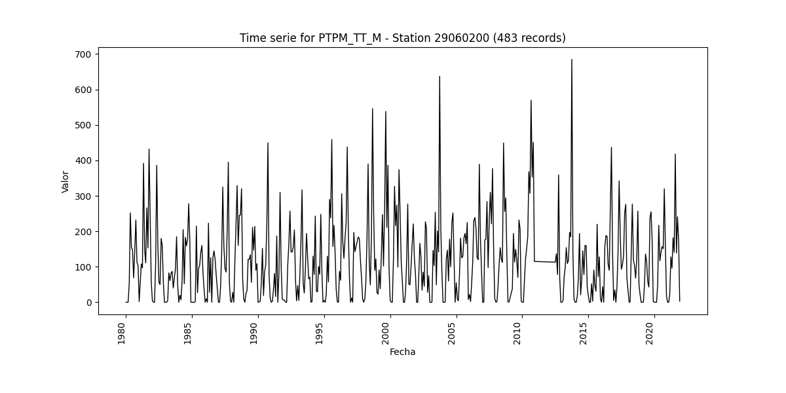

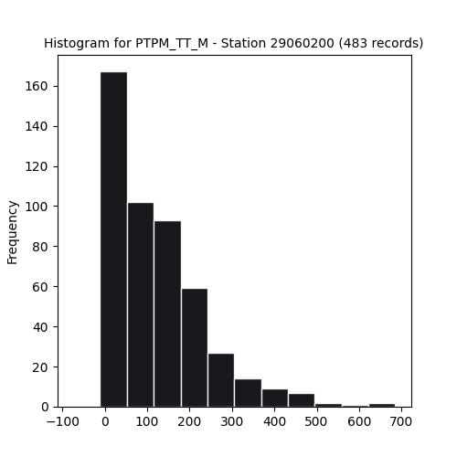
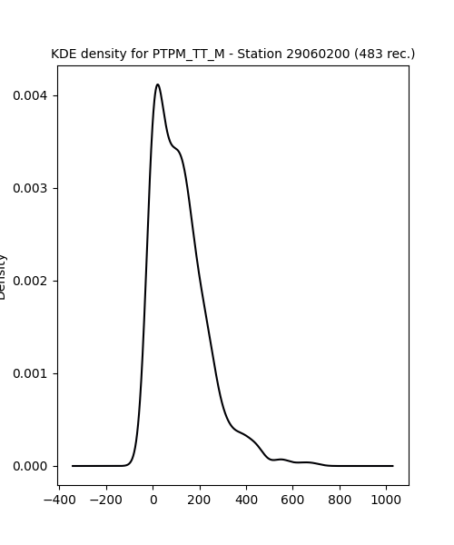

**PTPM_TT_M - Station: MONTERRUBIO [28040100] (493 rec.)** Location over [Google Maps](http://maps.google.com/maps?q=10.23369444,-74.27325) or [Openstreet Map](https://www.openstreetmap.org/query?lat=10.23369444&lon=-74.27325)

Station first record

| Fecha               |   CodigoEstacion | NombreEstacion         |   Latitud |   Longitud |   Altitud | Categoria     | Entidad                                                     | AreaOperativa                               | Departamento   | Municipio   | FechaInstalacion    | FechaSuspension   | IdParametro   | Etiqueta   | DescripcionSerie            | Frecuencia   |   Valor |   Grado |   Calificador |   NivelAprobacion |
|:--------------------|-----------------:|:-----------------------|----------:|-----------:|----------:|:--------------|:------------------------------------------------------------|:--------------------------------------------|:---------------|:------------|:--------------------|:------------------|:--------------|:-----------|:----------------------------|:-------------|--------:|--------:|--------------:|------------------:|
| 1980-01-01 00:00:00 |         28040100 | MONTERRUBIO [28040100] |   10.2337 |   -74.2733 |       100 | Pluviométrica | INSTITUTO DE HIDROLOGIA METEOROLOGIA Y ESTUDIOS AMBIENTALES | Area Operativa 05 - Magdalena-Cesar-Guajira | Magdalena      | Pivijai     | 1963-01-15 00:00:00 | NaT               | PRECIPITACION | PTPM_TT_M  | Precipitación total mensual | Mensual      |      83 |      50 |           nan |               900 |

Statistics table

|       |   Valor |
|:------|--------:|
| count | 493     |
| mean  | 144.448 |
| std   | 109.05  |
| min   |   0     |
| 25%   |  54     |
| 50%   | 137     |
| 75%   | 209     |
| max   | 741     |

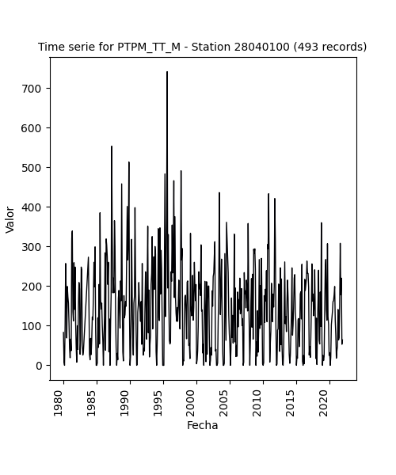
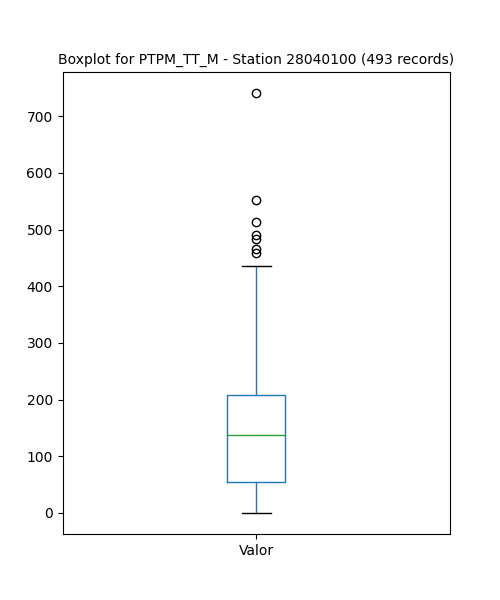

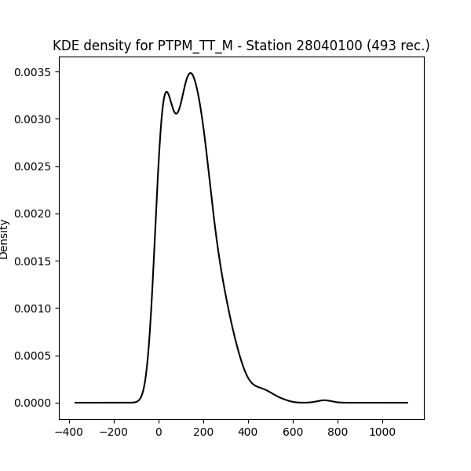

**PTPM_TT_M - Station: NUEVA GRANADA [25021630] (460 rec.)** Location over [Google Maps](http://maps.google.com/maps?q=9.80175,-74.38855556) or [Openstreet Map](https://www.openstreetmap.org/query?lat=9.80175&lon=-74.38855556)

Station first record

| Fecha               |   CodigoEstacion | NombreEstacion           |   Latitud |   Longitud |   Altitud | Categoria     | Entidad                                                     | AreaOperativa                               | Departamento   | Municipio     | FechaInstalacion    | FechaSuspension   | IdParametro   | Etiqueta   | DescripcionSerie            | Frecuencia   |   Valor |   Grado |   Calificador |   NivelAprobacion |
|:--------------------|-----------------:|:-------------------------|----------:|-----------:|----------:|:--------------|:------------------------------------------------------------|:--------------------------------------------|:---------------|:--------------|:--------------------|:------------------|:--------------|:-----------|:----------------------------|:-------------|--------:|--------:|--------------:|------------------:|
| 1982-07-01 00:00:00 |         25021630 | NUEVA GRANADA [25021630] |   9.80175 |   -74.3886 |       110 | Pluviométrica | INSTITUTO DE HIDROLOGIA METEOROLOGIA Y ESTUDIOS AMBIENTALES | Area Operativa 05 - Magdalena-Cesar-Guajira | Magdalena      | Nueva Granada | 1982-06-15 00:00:00 | NaT               | PRECIPITACION | PTPM_TT_M  | Precipitación total mensual | Mensual      |     123 |      50 |           nan |               900 |

Statistics table

|       |    Valor |
|:------|---------:|
| count | 460      |
| mean  | 111.086  |
| std   |  78.2969 |
| min   |   0      |
| 25%   |  49      |
| 50%   |  99      |
| 75%   | 165.25   |
| max   | 370      |

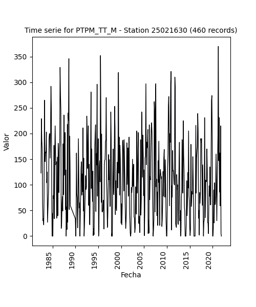
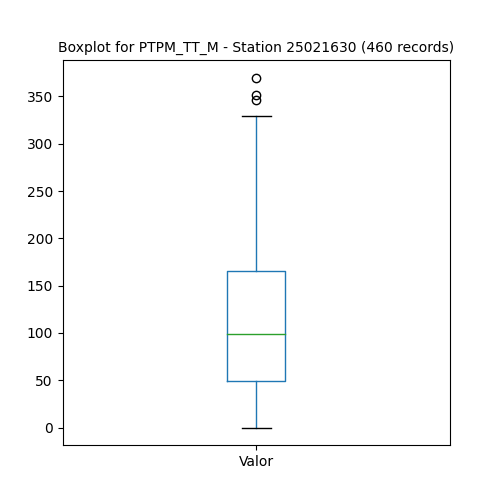
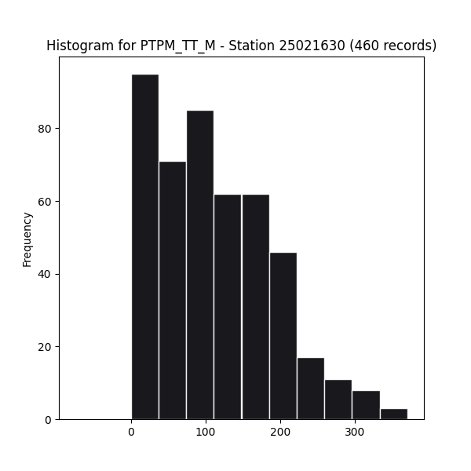
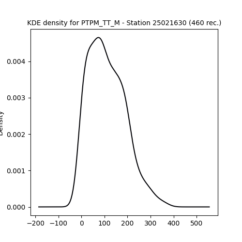

**PTPM_TT_M - Station: SAN ANGEL [28040140] (484 rec.)** Location over [Google Maps](http://maps.google.com/maps?q=10.03305556,-74.21261111) or [Openstreet Map](https://www.openstreetmap.org/query?lat=10.03305556&lon=-74.21261111)

Station first record

| Fecha               |   CodigoEstacion | NombreEstacion       |   Latitud |   Longitud |   Altitud | Categoria     | Entidad                                                     | AreaOperativa                               | Departamento   | Municipio            | FechaInstalacion    | FechaSuspension   | IdParametro   | Etiqueta   | DescripcionSerie            | Frecuencia   |   Valor |   Grado |   Calificador |   NivelAprobacion |
|:--------------------|-----------------:|:---------------------|----------:|-----------:|----------:|:--------------|:------------------------------------------------------------|:--------------------------------------------|:---------------|:---------------------|:--------------------|:------------------|:--------------|:-----------|:----------------------------|:-------------|--------:|--------:|--------------:|------------------:|
| 1980-01-01 00:00:00 |         28040140 | SAN ANGEL [28040140] |   10.0331 |   -74.2126 |       140 | Pluviométrica | INSTITUTO DE HIDROLOGIA METEOROLOGIA Y ESTUDIOS AMBIENTALES | Area Operativa 05 - Magdalena-Cesar-Guajira | Magdalena      | Sabanas De San Ángel | 1963-01-15 00:00:00 | NaT               | PRECIPITACION | PTPM_TT_M  | Precipitación total mensual | Mensual      |       6 |      50 |           nan |               900 |

Statistics table

|       |    Valor |
|:------|---------:|
| count | 484      |
| mean  |  96.3804 |
| std   |  86.5089 |
| min   |   0      |
| 25%   |  23.9    |
| 50%   |  76.15   |
| 75%   | 145      |
| max   | 435      |

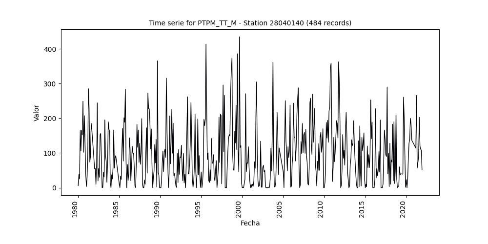
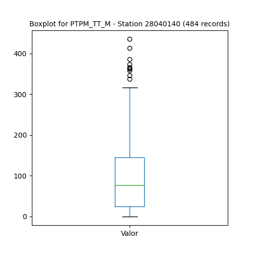

**PTPM_TT_M - Station: SANTA ROSA DE LIMA [29060100] (504 rec.)** Location over [Google Maps](http://maps.google.com/maps?q=10.40275,-74.108) or [Openstreet Map](https://www.openstreetmap.org/query?lat=10.40275&lon=-74.108)

Station first record

| Fecha               |   CodigoEstacion | NombreEstacion                |   Latitud |   Longitud |   Altitud | Categoria     | Entidad                                                     | AreaOperativa                               | Departamento   | Municipio   | FechaInstalacion    | FechaSuspension   | IdParametro   | Etiqueta   | DescripcionSerie            | Frecuencia   |   Valor |   Grado |   Calificador |   NivelAprobacion |
|:--------------------|-----------------:|:------------------------------|----------:|-----------:|----------:|:--------------|:------------------------------------------------------------|:--------------------------------------------|:---------------|:------------|:--------------------|:------------------|:--------------|:-----------|:----------------------------|:-------------|--------:|--------:|--------------:|------------------:|
| 1980-01-01 00:00:00 |         29060100 | SANTA ROSA DE LIMA [29060100] |   10.4027 |    -74.108 |        75 | Pluviométrica | INSTITUTO DE HIDROLOGIA METEOROLOGIA Y ESTUDIOS AMBIENTALES | Area Operativa 05 - Magdalena-Cesar-Guajira | Magdalena      | Fundación   | 1975-08-15 00:00:00 | NaT               | PRECIPITACION | PTPM_TT_M  | Precipitación total mensual | Mensual      |      75 |      50 |           nan |               900 |

Statistics table

|       |   Valor |
|:------|--------:|
| count | 504     |
| mean  | 130.562 |
| std   | 109.441 |
| min   |   0     |
| 25%   |  40     |
| 50%   | 117.5   |
| 75%   | 189     |
| max   | 665     |

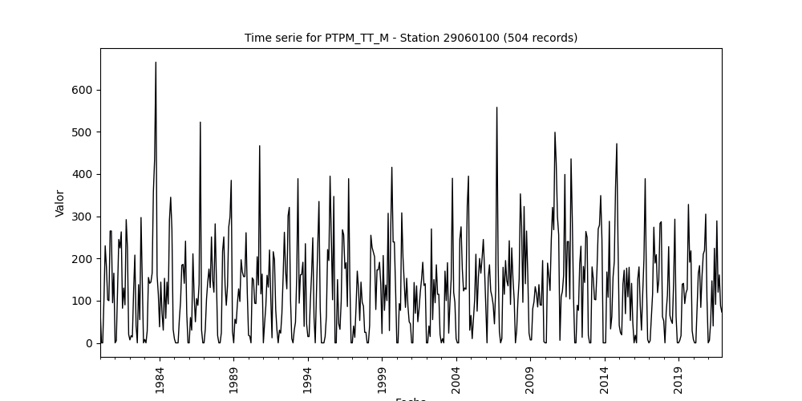
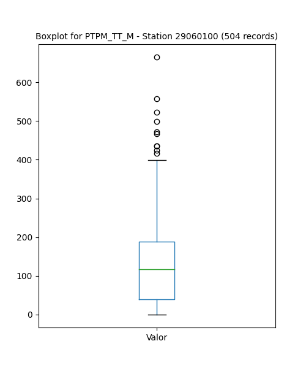
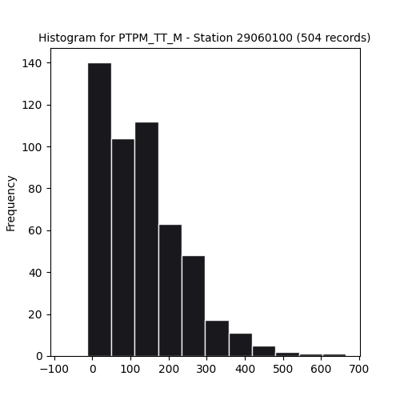
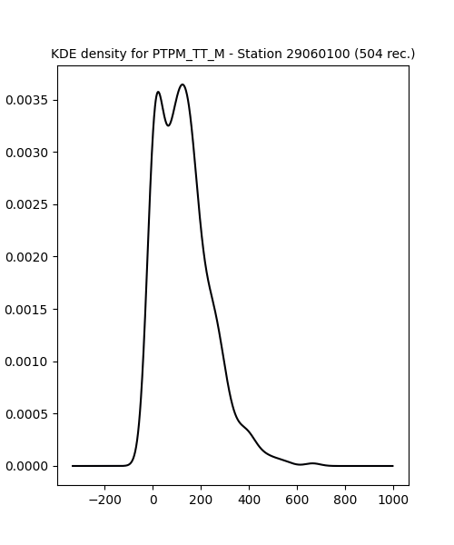

**PTPM_TT_M - Station: BAYANO [29060350] (461 rec.)** Location over [Google Maps](http://maps.google.com/maps?q=10.63116667,-74.29858333) or [Openstreet Map](https://www.openstreetmap.org/query?lat=10.63116667&lon=-74.29858333)

Station first record

| Fecha               |   CodigoEstacion | NombreEstacion    |   Latitud |   Longitud |   Altitud | Categoria     | Entidad                                                     | AreaOperativa                               | Departamento   | Municipio   | FechaInstalacion    | FechaSuspension   | IdParametro   | Etiqueta   | DescripcionSerie            | Frecuencia   |   Valor |   Grado |   Calificador |   NivelAprobacion |
|:--------------------|-----------------:|:------------------|----------:|-----------:|----------:|:--------------|:------------------------------------------------------------|:--------------------------------------------|:---------------|:------------|:--------------------|:------------------|:--------------|:-----------|:----------------------------|:-------------|--------:|--------:|--------------:|------------------:|
| 1980-01-01 00:00:00 |         29060350 | BAYANO [29060350] |   10.6312 |   -74.2986 |        30 | Pluviométrica | INSTITUTO DE HIDROLOGIA METEOROLOGIA Y ESTUDIOS AMBIENTALES | Area Operativa 05 - Magdalena-Cesar-Guajira | Magdalena      | El Retén    | 1975-01-15 00:00:00 | NaT               | PRECIPITACION | PTPM_TT_M  | Precipitación total mensual | Mensual      |       0 |      50 |           nan |               900 |

Statistics table

|       |   Valor |
|:------|--------:|
| count | 461     |
| mean  | 107.534 |
| std   | 115.366 |
| min   |   0     |
| 25%   |   5.4   |
| 50%   |  76.7   |
| 75%   | 171     |
| max   | 711     |

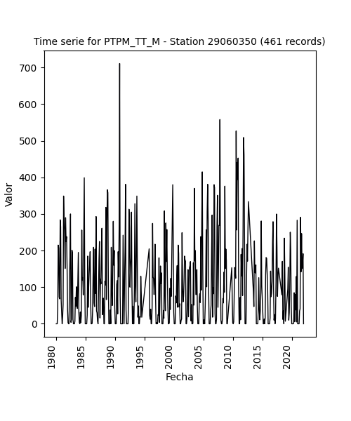
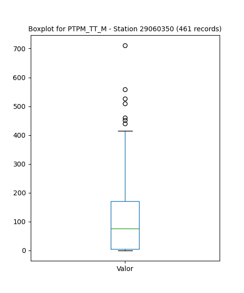

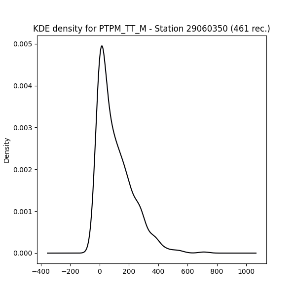

**PTPM_TT_M - Station: BONGO EL [29060030] (503 rec.)** Location over [Google Maps](http://maps.google.com/maps?q=10.64877778,-74.3755) or [Openstreet Map](https://www.openstreetmap.org/query?lat=10.64877778&lon=-74.3755)

Station first record

| Fecha               |   CodigoEstacion | NombreEstacion      |   Latitud |   Longitud |   Altitud | Categoria     | Entidad                                                     | AreaOperativa                               | Departamento   | Municipio   | FechaInstalacion    | FechaSuspension   | IdParametro   | Etiqueta   | DescripcionSerie            | Frecuencia   |   Valor |   Grado |   Calificador |   NivelAprobacion |
|:--------------------|-----------------:|:--------------------|----------:|-----------:|----------:|:--------------|:------------------------------------------------------------|:--------------------------------------------|:---------------|:------------|:--------------------|:------------------|:--------------|:-----------|:----------------------------|:-------------|--------:|--------:|--------------:|------------------:|
| 1980-01-01 00:00:00 |         29060030 | BONGO EL [29060030] |   10.6488 |   -74.3755 |        20 | Pluviométrica | INSTITUTO DE HIDROLOGIA METEOROLOGIA Y ESTUDIOS AMBIENTALES | Area Operativa 05 - Magdalena-Cesar-Guajira | Magdalena      | El Retén    | 1975-09-15 00:00:00 | NaT               | PRECIPITACION | PTPM_TT_M  | Precipitación total mensual | Mensual      |       0 |      50 |           nan |               900 |

Statistics table

|       |   Valor |
|:------|--------:|
| count | 503     |
| mean  | 112.185 |
| std   | 120.076 |
| min   |   0     |
| 25%   |   5.5   |
| 50%   |  84.2   |
| 75%   | 174.5   |
| max   | 750     |

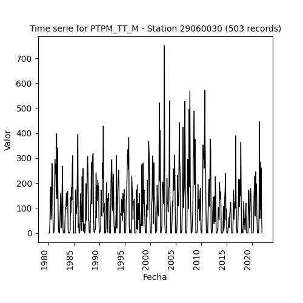
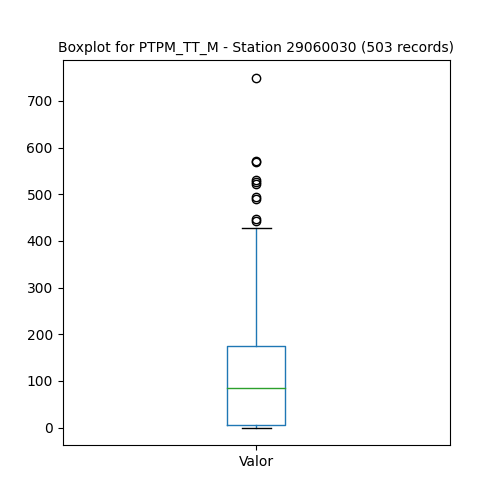
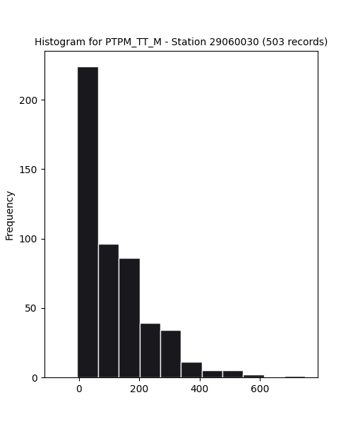
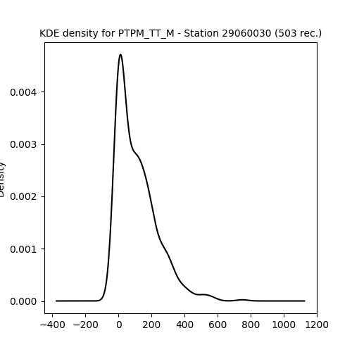

**PTPM_TT_M - Station: CARMEN EL [29060140] (503 rec.)** Location over [Google Maps](http://maps.google.com/maps?q=10.6755,-74.20644444) or [Openstreet Map](https://www.openstreetmap.org/query?lat=10.6755&lon=-74.20644444)

Station first record

| Fecha               |   CodigoEstacion | NombreEstacion       |   Latitud |   Longitud |   Altitud | Categoria     | Entidad                                                     | AreaOperativa                               | Departamento   | Municipio     | FechaInstalacion    | FechaSuspension   | IdParametro   | Etiqueta   | DescripcionSerie            | Frecuencia   |   Valor |   Grado |   Calificador |   NivelAprobacion |
|:--------------------|-----------------:|:---------------------|----------:|-----------:|----------:|:--------------|:------------------------------------------------------------|:--------------------------------------------|:---------------|:--------------|:--------------------|:------------------|:--------------|:-----------|:----------------------------|:-------------|--------:|--------:|--------------:|------------------:|
| 1980-01-01 00:00:00 |         29060140 | CARMEN EL [29060140] |   10.6755 |   -74.2064 |        25 | Pluviométrica | INSTITUTO DE HIDROLOGIA METEOROLOGIA Y ESTUDIOS AMBIENTALES | Area Operativa 05 - Magdalena-Cesar-Guajira | Magdalena      | Zona Bananera | 1967-03-15 00:00:00 | NaT               | PRECIPITACION | PTPM_TT_M  | Precipitación total mensual | Mensual      |      14 |      50 |           nan |               900 |

Statistics table

|       |    Valor |
|:------|---------:|
| count |  503     |
| mean  |  131.782 |
| std   |  154.306 |
| min   |    0     |
| 25%   |    7.5   |
| 50%   |   87     |
| 75%   |  201     |
| max   | 1116     |

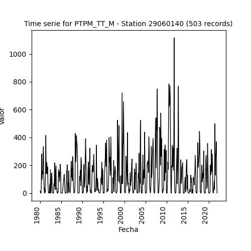
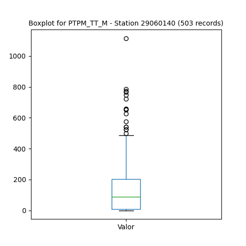
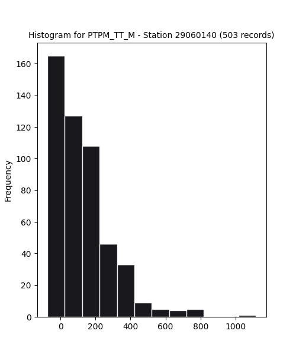
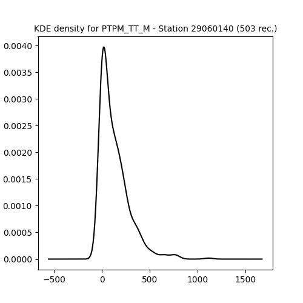

**PTPM_TT_M - Station: CENIZO EL [29060060] (492 rec.)** Location over [Google Maps](http://maps.google.com/maps?q=10.65161111,-74.07322222) or [Openstreet Map](https://www.openstreetmap.org/query?lat=10.65161111&lon=-74.07322222)

Station first record

| Fecha               |   CodigoEstacion | NombreEstacion       |   Latitud |   Longitud |   Altitud | Categoria     | Entidad                                                     | AreaOperativa                               | Departamento   | Municipio   | FechaInstalacion    | FechaSuspension   | IdParametro   | Etiqueta   | DescripcionSerie            | Frecuencia   |   Valor |   Grado |   Calificador |   NivelAprobacion |
|:--------------------|-----------------:|:---------------------|----------:|-----------:|----------:|:--------------|:------------------------------------------------------------|:--------------------------------------------|:---------------|:------------|:--------------------|:------------------|:--------------|:-----------|:----------------------------|:-------------|--------:|--------:|--------------:|------------------:|
| 1980-01-01 00:00:00 |         29060060 | CENIZO EL [29060060] |   10.6516 |   -74.0732 |       450 | Pluviométrica | INSTITUTO DE HIDROLOGIA METEOROLOGIA Y ESTUDIOS AMBIENTALES | Area Operativa 05 - Magdalena-Cesar-Guajira | Magdalena      | Aracataca   | 1959-03-15 00:00:00 | NaT               | PRECIPITACION | PTPM_TT_M  | Precipitación total mensual | Mensual      |       8 |      50 |           nan |               900 |

Statistics table

|       |   Valor |
|:------|--------:|
| count | 492     |
| mean  | 214.417 |
| std   | 188.986 |
| min   |   0     |
| 25%   |  50     |
| 50%   | 180     |
| 75%   | 325     |
| max   | 944     |

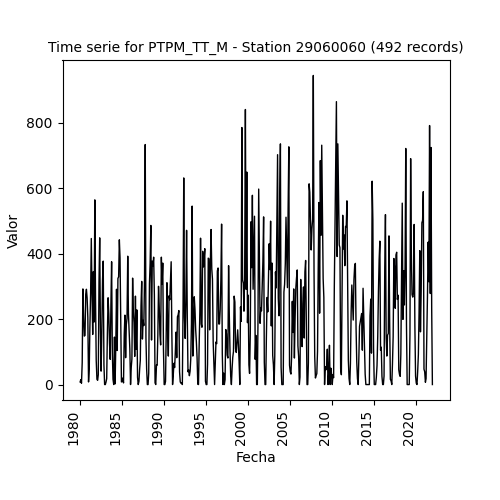
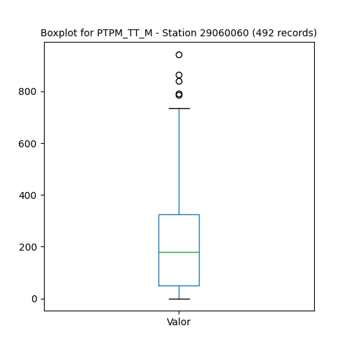
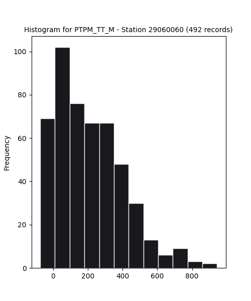
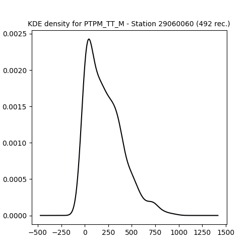

**PTPM_TT_M - Station: FLORIDA LA [29060190] (420 rec.)** Location over [Google Maps](http://maps.google.com/maps?q=10.61063889,-74.25538889) or [Openstreet Map](https://www.openstreetmap.org/query?lat=10.61063889&lon=-74.25538889)

Station first record

| Fecha               |   CodigoEstacion | NombreEstacion        |   Latitud |   Longitud |   Altitud | Categoria     | Entidad                                                     | AreaOperativa                               | Departamento   | Municipio   | FechaInstalacion    | FechaSuspension     | IdParametro   | Etiqueta   | DescripcionSerie            | Frecuencia   |   Valor |   Grado |   Calificador |   NivelAprobacion |
|:--------------------|-----------------:|:----------------------|----------:|-----------:|----------:|:--------------|:------------------------------------------------------------|:--------------------------------------------|:---------------|:------------|:--------------------|:--------------------|:--------------|:-----------|:----------------------------|:-------------|--------:|--------:|--------------:|------------------:|
| 1980-01-01 00:00:00 |         29060190 | FLORIDA LA [29060190] |   10.6106 |   -74.2554 |        26 | Pluviométrica | INSTITUTO DE HIDROLOGIA METEOROLOGIA Y ESTUDIOS AMBIENTALES | Area Operativa 05 - Magdalena-Cesar-Guajira | Magdalena      | El Retén    | 1973-04-15 00:00:00 | 2019-02-07 11:43:00 | PRECIPITACION | PTPM_TT_M  | Precipitación total mensual | Mensual      |       6 |      50 |           nan |               900 |

Statistics table

|       |   Valor |
|:------|--------:|
| count | 420     |
| mean  | 106.892 |
| std   | 119.315 |
| min   |   0     |
| 25%   |   4.75  |
| 50%   |  71.5   |
| 75%   | 158.25  |
| max   | 794     |

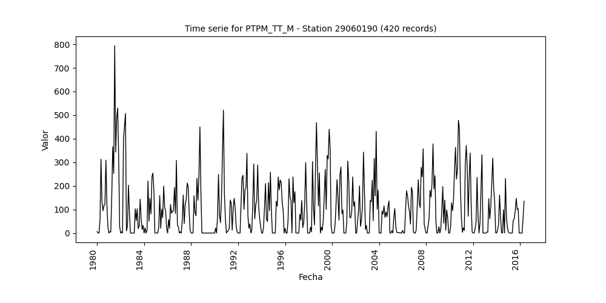
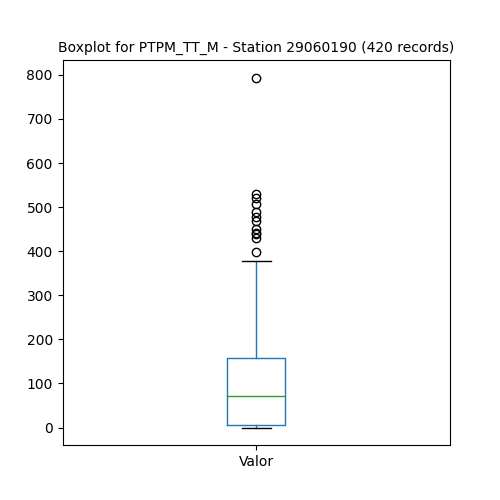
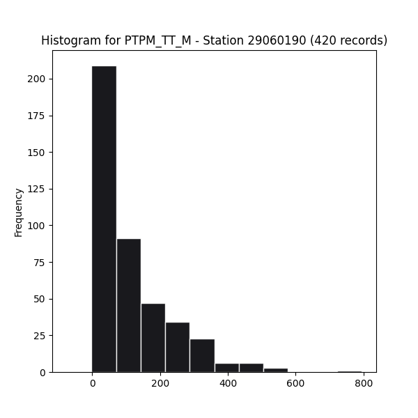
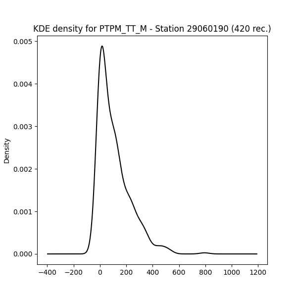

**PTPM_TT_M - Station: GAVILAN [29060170] (503 rec.)** Location over [Google Maps](http://maps.google.com/maps?q=10.68044444,-74.33069444) or [Openstreet Map](https://www.openstreetmap.org/query?lat=10.68044444&lon=-74.33069444)

Station first record

| Fecha               |   CodigoEstacion | NombreEstacion     |   Latitud |   Longitud |   Altitud | Categoria     | Entidad                                                     | AreaOperativa                               | Departamento   | Municipio   | FechaInstalacion    | FechaSuspension   | IdParametro   | Etiqueta   | DescripcionSerie            | Frecuencia   |   Valor |   Grado |   Calificador |   NivelAprobacion |
|:--------------------|-----------------:|:-------------------|----------:|-----------:|----------:|:--------------|:------------------------------------------------------------|:--------------------------------------------|:---------------|:------------|:--------------------|:------------------|:--------------|:-----------|:----------------------------|:-------------|--------:|--------:|--------------:|------------------:|
| 1980-01-01 00:00:00 |         29060170 | GAVILAN [29060170] |   10.6804 |   -74.3307 |        20 | Pluviométrica | INSTITUTO DE HIDROLOGIA METEOROLOGIA Y ESTUDIOS AMBIENTALES | Area Operativa 05 - Magdalena-Cesar-Guajira | Magdalena      | El Retén    | 1967-03-15 00:00:00 | NaT               | PRECIPITACION | PTPM_TT_M  | Precipitación total mensual | Mensual      |       0 |      50 |           nan |               900 |

Statistics table

|       |    Valor |
|:------|---------:|
| count | 503      |
| mean  |  79.0485 |
| std   |  92.832  |
| min   |   0      |
| 25%   |   0      |
| 50%   |  46      |
| 75%   | 134.15   |
| max   | 534.1    |

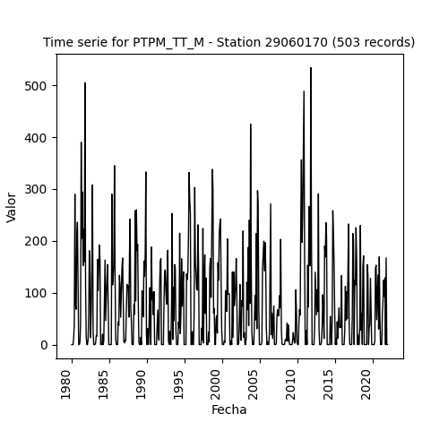
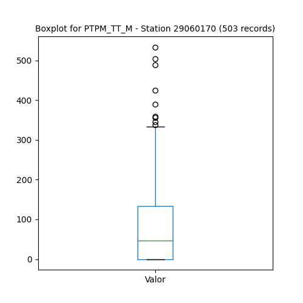
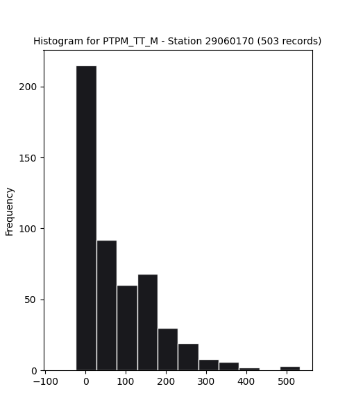
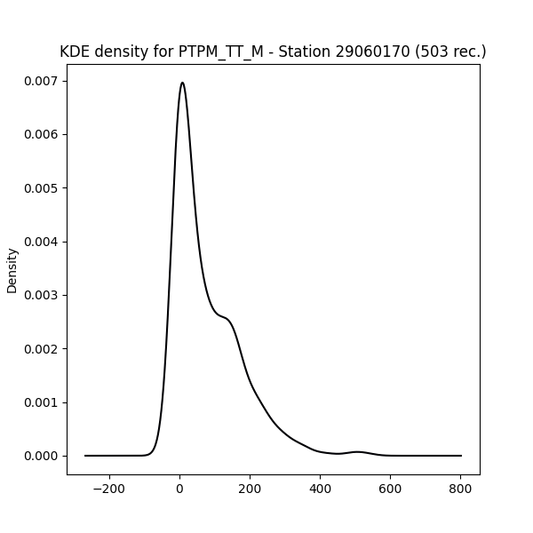

**PTPM_TT_M - Station: PADELMA [29065020] (490 rec.)** Location over [Google Maps](http://maps.google.com/maps?q=10.72111111,-74.19972222) or [Openstreet Map](https://www.openstreetmap.org/query?lat=10.72111111&lon=-74.19972222)

Station first record

| Fecha               |   CodigoEstacion | NombreEstacion     |   Latitud |   Longitud |   Altitud | Categoria           | Entidad                                                     | AreaOperativa                               | Departamento   | Municipio     | FechaInstalacion    | FechaSuspension   | IdParametro   | Etiqueta   | DescripcionSerie            | Frecuencia   |   Valor |   Grado |   Calificador |   NivelAprobacion |
|:--------------------|-----------------:|:-------------------|----------:|-----------:|----------:|:--------------------|:------------------------------------------------------------|:--------------------------------------------|:---------------|:--------------|:--------------------|:------------------|:--------------|:-----------|:----------------------------|:-------------|--------:|--------:|--------------:|------------------:|
| 1980-01-01 00:00:00 |         29065020 | PADELMA [29065020] |   10.7211 |   -74.1997 |        20 | Climática Ordinaria | INSTITUTO DE HIDROLOGIA METEOROLOGIA Y ESTUDIOS AMBIENTALES | Area Operativa 05 - Magdalena-Cesar-Guajira | Magdalena      | Zona Bananera | 1967-08-15 00:00:00 | NaT               | PRECIPITACION | PTPM_TT_M  | Precipitación total mensual | Mensual      |     3.3 |       4 |           nan |               900 |

Statistics table

|       |   Valor |
|:------|--------:|
| count | 490     |
| mean  | 102.09  |
| std   | 105.756 |
| min   |   0     |
| 25%   |   9.475 |
| 50%   |  74.05  |
| 75%   | 158.575 |
| max   | 563.1   |

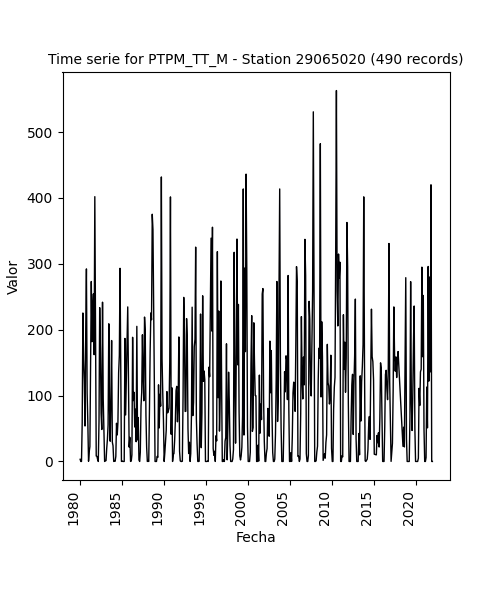
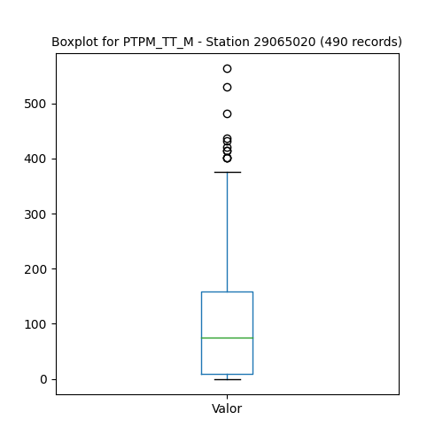
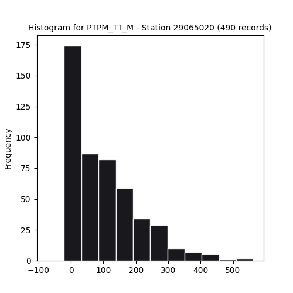
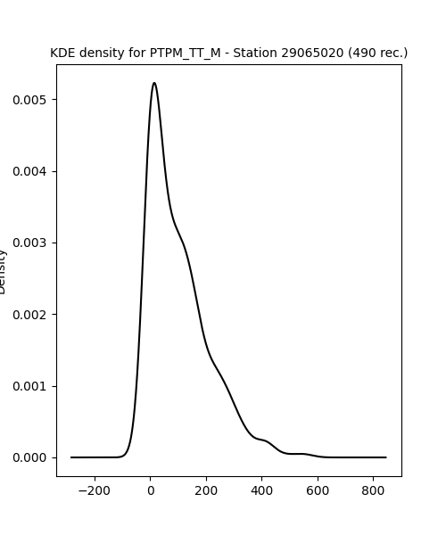

**PTPM_TT_M - Station: PALO ALTO [29060270] (501 rec.)** Location over [Google Maps](http://maps.google.com/maps?q=10.7225,-74.27191667) or [Openstreet Map](https://www.openstreetmap.org/query?lat=10.7225&lon=-74.27191667)

Station first record

| Fecha               |   CodigoEstacion | NombreEstacion       |   Latitud |   Longitud |   Altitud | Categoria     | Entidad                                                     | AreaOperativa                               | Departamento   | Municipio   | FechaInstalacion    | FechaSuspension   | IdParametro   | Etiqueta   | DescripcionSerie            | Frecuencia   |   Valor |   Grado |   Calificador |   NivelAprobacion |
|:--------------------|-----------------:|:---------------------|----------:|-----------:|----------:|:--------------|:------------------------------------------------------------|:--------------------------------------------|:---------------|:------------|:--------------------|:------------------|:--------------|:-----------|:----------------------------|:-------------|--------:|--------:|--------------:|------------------:|
| 1980-01-01 00:00:00 |         29060270 | PALO ALTO [29060270] |   10.7225 |   -74.2719 |        25 | Pluviométrica | INSTITUTO DE HIDROLOGIA METEOROLOGIA Y ESTUDIOS AMBIENTALES | Area Operativa 05 - Magdalena-Cesar-Guajira | Magdalena      | Puebloviejo | 1967-01-15 00:00:00 | NaT               | PRECIPITACION | PTPM_TT_M  | Precipitación total mensual | Mensual      |       0 |      50 |           nan |               900 |

Statistics table

|       |    Valor |
|:------|---------:|
| count | 501      |
| mean  |  86.9663 |
| std   |  99.7629 |
| min   |   0      |
| 25%   |   0      |
| 50%   |  56      |
| 75%   | 132      |
| max   | 519      |

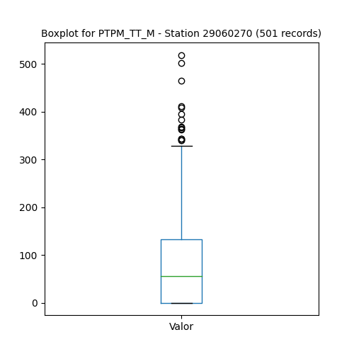
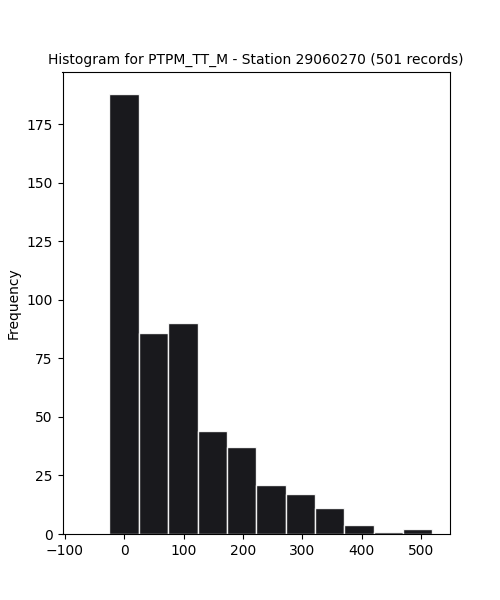
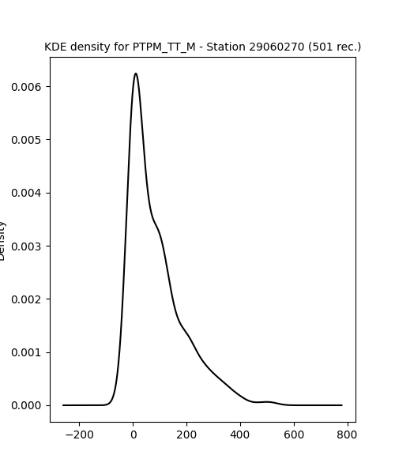

**PTPM_TT_M - Station: UNION LA [29060240] (441 rec.)** Location over [Google Maps](http://maps.google.com/maps?q=10.70655556,-74.22355556) or [Openstreet Map](https://www.openstreetmap.org/query?lat=10.70655556&lon=-74.22355556)

Station first record

| Fecha               |   CodigoEstacion | NombreEstacion      |   Latitud |   Longitud |   Altitud | Categoria     | Entidad                                                     | AreaOperativa                               | Departamento   | Municipio     | FechaInstalacion    | FechaSuspension     | IdParametro   | Etiqueta   | DescripcionSerie            | Frecuencia   |   Valor |   Grado |   Calificador |   NivelAprobacion |
|:--------------------|-----------------:|:--------------------|----------:|-----------:|----------:|:--------------|:------------------------------------------------------------|:--------------------------------------------|:---------------|:--------------|:--------------------|:--------------------|:--------------|:-----------|:----------------------------|:-------------|--------:|--------:|--------------:|------------------:|
| 1980-01-01 00:00:00 |         29060240 | UNION LA [29060240] |   10.7066 |   -74.2236 |        20 | Pluviométrica | INSTITUTO DE HIDROLOGIA METEOROLOGIA Y ESTUDIOS AMBIENTALES | Area Operativa 05 - Magdalena-Cesar-Guajira | Magdalena      | Zona Bananera | 1967-01-15 00:00:00 | 2019-02-07 11:43:00 | PRECIPITACION | PTPM_TT_M  | Precipitación total mensual | Mensual      |       0 |      50 |           nan |               900 |

Statistics table

|       |    Valor |
|:------|---------:|
| count |  441     |
| mean  |  105.639 |
| std   |  136.714 |
| min   |    0     |
| 25%   |    0     |
| 50%   |   67     |
| 75%   |  170     |
| max   | 1016     |

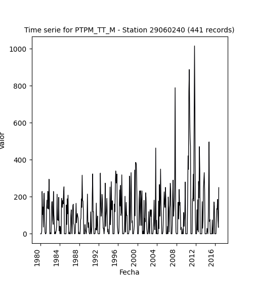
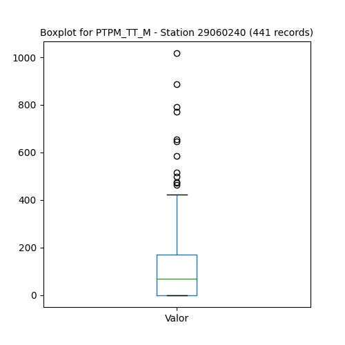
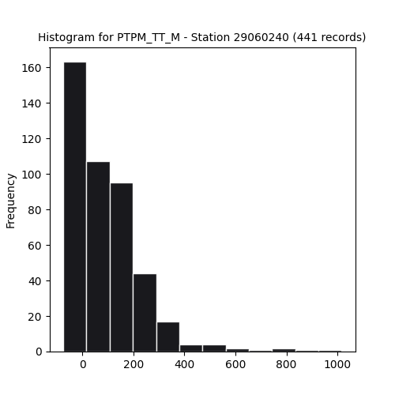
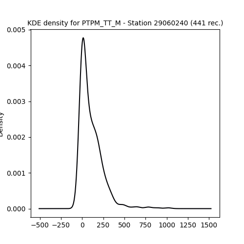

**PTPM_TT_M - Station: ZACAPA [29065010] (122 rec.)** Location over [Google Maps](http://maps.google.com/maps?q=10.58333333,-74.25) or [Openstreet Map](https://www.openstreetmap.org/query?lat=10.58333333&lon=-74.25)

Station first record

| Fecha               |   CodigoEstacion | NombreEstacion    |   Latitud |   Longitud |   Altitud | Categoria           | Entidad                                                     | AreaOperativa                               | Departamento   | Municipio   | FechaInstalacion    | FechaSuspension     | IdParametro   | Etiqueta   | DescripcionSerie            | Frecuencia   |   Valor |   Grado |   Calificador |   NivelAprobacion |
|:--------------------|-----------------:|:------------------|----------:|-----------:|----------:|:--------------------|:------------------------------------------------------------|:--------------------------------------------|:---------------|:------------|:--------------------|:--------------------|:--------------|:-----------|:----------------------------|:-------------|--------:|--------:|--------------:|------------------:|
| 1980-01-01 00:00:00 |         29065010 | ZACAPA [29065010] |   10.5833 |     -74.25 |        30 | Climática Ordinaria | INSTITUTO DE HIDROLOGIA METEOROLOGIA Y ESTUDIOS AMBIENTALES | Area Operativa 05 - Magdalena-Cesar-Guajira | Magdalena      | El Retén    | 1967-07-15 00:00:00 | 1990-04-15 00:00:00 | PRECIPITACION | PTPM_TT_M  | Precipitación total mensual | Mensual      |       0 |       4 |           nan |               900 |

Statistics table

|       |    Valor |
|:------|---------:|
| count | 122      |
| mean  |  93.5492 |
| std   |  92.2916 |
| min   |   0      |
| 25%   |  11.1    |
| 50%   |  70.65   |
| 75%   | 151.225  |
| max   | 366.7    |

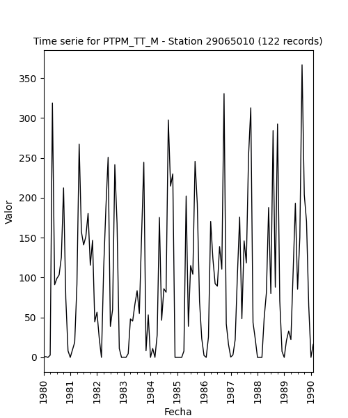
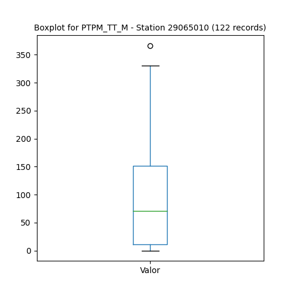
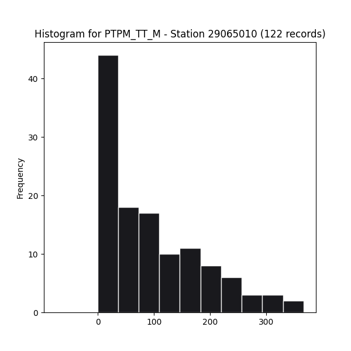
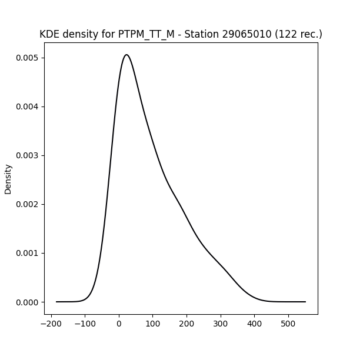

**PTPM_TT_M - Station: ESPERANZA LA [29060180] (500 rec.)** Location over [Google Maps](http://maps.google.com/maps?q=10.74252778,-74.30627778) or [Openstreet Map](https://www.openstreetmap.org/query?lat=10.74252778&lon=-74.30627778)

Station first record

| Fecha               |   CodigoEstacion | NombreEstacion          |   Latitud |   Longitud |   Altitud | Categoria     | Entidad                                                     | AreaOperativa                               | Departamento   | Municipio   | FechaInstalacion    | FechaSuspension   | IdParametro   | Etiqueta   | DescripcionSerie            | Frecuencia   |   Valor |   Grado |   Calificador |   NivelAprobacion |
|:--------------------|-----------------:|:------------------------|----------:|-----------:|----------:|:--------------|:------------------------------------------------------------|:--------------------------------------------|:---------------|:------------|:--------------------|:------------------|:--------------|:-----------|:----------------------------|:-------------|--------:|--------:|--------------:|------------------:|
| 1980-01-01 00:00:00 |         29060180 | ESPERANZA LA [29060180] |   10.7425 |   -74.3063 |        25 | Pluviométrica | INSTITUTO DE HIDROLOGIA METEOROLOGIA Y ESTUDIOS AMBIENTALES | Area Operativa 05 - Magdalena-Cesar-Guajira | Magdalena      | Puebloviejo | 1975-10-15 00:00:00 | NaT               | PRECIPITACION | PTPM_TT_M  | Precipitación total mensual | Mensual      |       0 |      50 |           nan |               900 |

Statistics table

|       |    Valor |
|:------|---------:|
| count |  500     |
| mean  |  116.55  |
| std   |  151.057 |
| min   |    0     |
| 25%   |    0     |
| 50%   |   69.5   |
| 75%   |  168     |
| max   | 1075     |

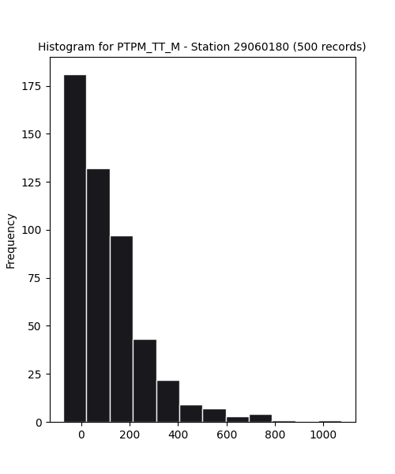

**PTPM_TT_M - Station: PALMOR EL [29060340] (490 rec.)** Location over [Google Maps](http://maps.google.com/maps?q=10.77344444,-74.02563889) or [Openstreet Map](https://www.openstreetmap.org/query?lat=10.77344444&lon=-74.02563889)

Station first record

| Fecha               |   CodigoEstacion | NombreEstacion       |   Latitud |   Longitud |   Altitud | Categoria     | Entidad                                                     | AreaOperativa                               | Departamento   | Municipio   | FechaInstalacion    | FechaSuspension   | IdParametro   | Etiqueta   | DescripcionSerie            | Frecuencia   |   Valor |   Grado |   Calificador |   NivelAprobacion |
|:--------------------|-----------------:|:---------------------|----------:|-----------:|----------:|:--------------|:------------------------------------------------------------|:--------------------------------------------|:---------------|:------------|:--------------------|:------------------|:--------------|:-----------|:----------------------------|:-------------|--------:|--------:|--------------:|------------------:|
| 1980-01-01 00:00:00 |         29060340 | PALMOR EL [29060340] |   10.7734 |   -74.0256 |      1200 | Pluviométrica | INSTITUTO DE HIDROLOGIA METEOROLOGIA Y ESTUDIOS AMBIENTALES | Area Operativa 05 - Magdalena-Cesar-Guajira | Magdalena      | Ciénaga     | 1975-09-15 00:00:00 | NaT               | PRECIPITACION | PTPM_TT_M  | Precipitación total mensual | Mensual      |      67 |      50 |           nan |               900 |

Statistics table

|       |   Valor |
|:------|--------:|
| count | 490     |
| mean  | 192.753 |
| std   | 165.79  |
| min   |   0     |
| 25%   |  52.5   |
| 50%   | 165.5   |
| 75%   | 282.75  |
| max   | 875     |

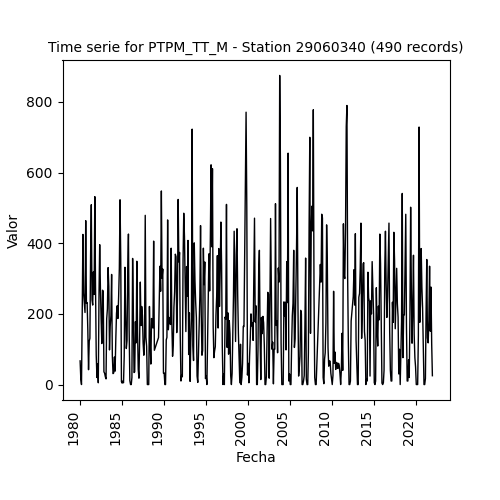
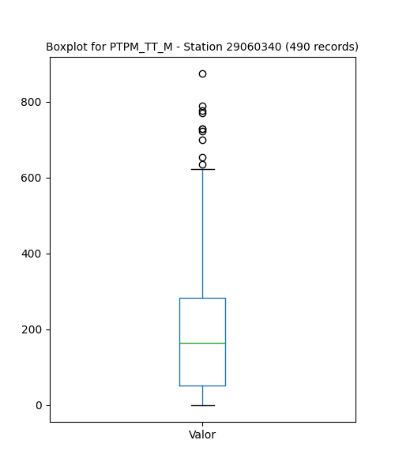
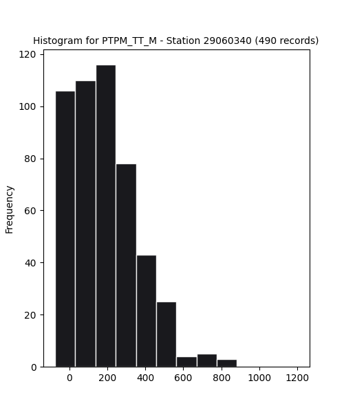
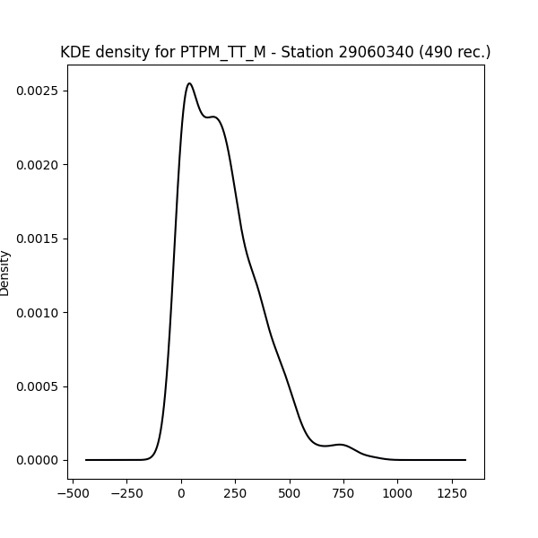

**PTPM_TT_M - Station: PLAYA LA [29060330] (252 rec.)** Location over [Google Maps](http://maps.google.com/maps?q=10.76197222,-74.12047222) or [Openstreet Map](https://www.openstreetmap.org/query?lat=10.76197222&lon=-74.12047222)

Station first record

| Fecha               |   CodigoEstacion | NombreEstacion      |   Latitud |   Longitud |   Altitud | Categoria     | Entidad                                                     | AreaOperativa                               | Departamento   | Municipio     | FechaInstalacion    | FechaSuspension     | IdParametro   | Etiqueta   | DescripcionSerie            | Frecuencia   |   Valor |   Grado |   Calificador |   NivelAprobacion |
|:--------------------|-----------------:|:--------------------|----------:|-----------:|----------:|:--------------|:------------------------------------------------------------|:--------------------------------------------|:---------------|:--------------|:--------------------|:--------------------|:--------------|:-----------|:----------------------------|:-------------|--------:|--------:|--------------:|------------------:|
| 1990-01-01 00:00:00 |         29060330 | PLAYA LA [29060330] |    10.762 |   -74.1205 |        20 | Pluviométrica | INSTITUTO DE HIDROLOGIA METEOROLOGIA Y ESTUDIOS AMBIENTALES | Area Operativa 05 - Magdalena-Cesar-Guajira | Magdalena      | Zona Bananera | 1990-01-15 00:00:00 | 2019-02-07 11:32:00 | PRECIPITACION | PTPM_TT_M  | Precipitación total mensual | Mensual      |       0 |       4 |           nan |               900 |

Statistics table

|       |   Valor |
|:------|--------:|
| count | 252     |
| mean  | 131.828 |
| std   | 139.738 |
| min   |   0     |
| 25%   |  11.5   |
| 50%   |  97     |
| 75%   | 208.25  |
| max   | 615     |

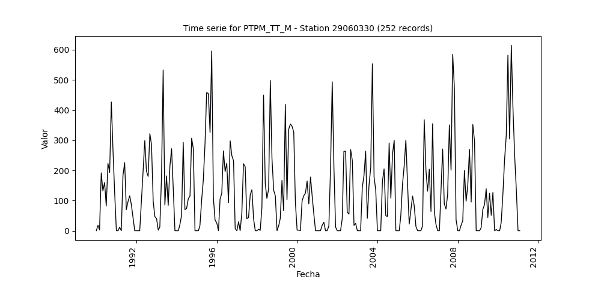
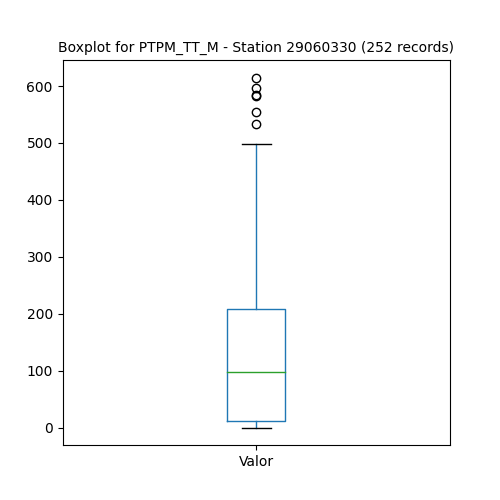
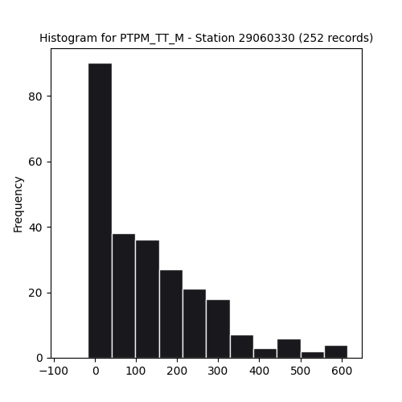
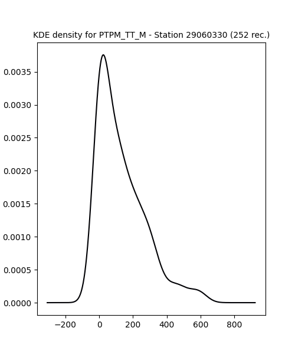

**PTPM_TT_M - Station: POLY LA [29060220] (258 rec.)** Location over [Google Maps](http://maps.google.com/maps?q=10.81666667,-74.18333333) or [Openstreet Map](https://www.openstreetmap.org/query?lat=10.81666667&lon=-74.18333333)

Station first record

| Fecha               |   CodigoEstacion | NombreEstacion     |   Latitud |   Longitud |   Altitud | Categoria     | Entidad                                                     | AreaOperativa                               | Departamento   | Municipio     | FechaInstalacion    | FechaSuspension     | IdParametro   | Etiqueta   | DescripcionSerie            | Frecuencia   |   Valor |   Grado |   Calificador |   NivelAprobacion |
|:--------------------|-----------------:|:-------------------|----------:|-----------:|----------:|:--------------|:------------------------------------------------------------|:--------------------------------------------|:---------------|:--------------|:--------------------|:--------------------|:--------------|:-----------|:----------------------------|:-------------|--------:|--------:|--------------:|------------------:|
| 1980-01-01 00:00:00 |         29060220 | POLY LA [29060220] |   10.8167 |   -74.1833 |        24 | Pluviométrica | INSTITUTO DE HIDROLOGIA METEOROLOGIA Y ESTUDIOS AMBIENTALES | Area Operativa 05 - Magdalena-Cesar-Guajira | Magdalena      | Zona Bananera | 1972-01-15 00:00:00 | 2002-02-15 00:00:00 | PRECIPITACION | PTPM_TT_M  | Precipitación total mensual | Mensual      |       0 |      50 |           nan |               900 |

Statistics table

|       |   Valor |
|:------|--------:|
| count | 258     |
| mean  | 114.547 |
| std   | 152.219 |
| min   |   0     |
| 25%   |   0     |
| 50%   |  64.5   |
| 75%   | 157.75  |
| max   | 941     |

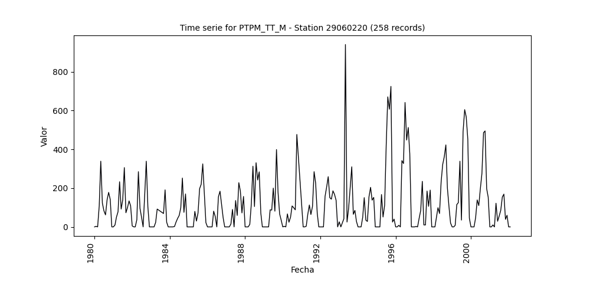
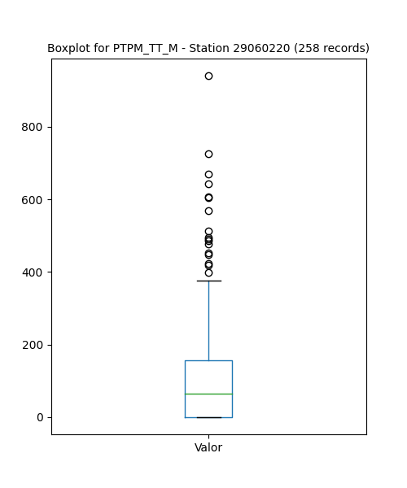
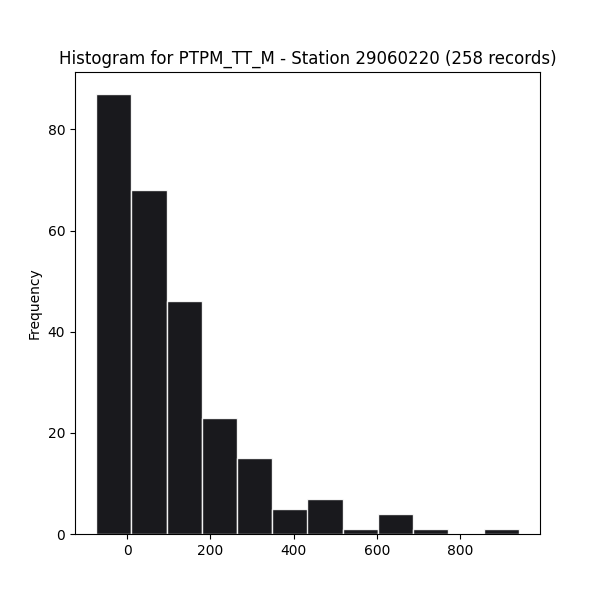
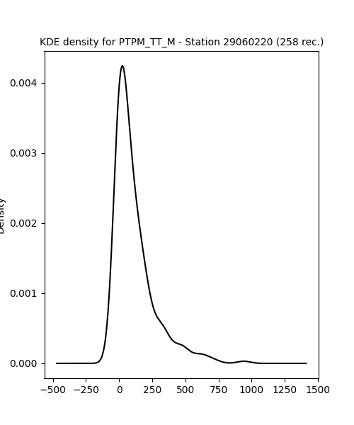

**PTPM_TT_M - Station: PRADO SEVILLA [29065030] (412 rec.)** Location over [Google Maps](http://maps.google.com/maps?q=10.76416667,-74.15472222) or [Openstreet Map](https://www.openstreetmap.org/query?lat=10.76416667&lon=-74.15472222)

Station first record

| Fecha               |   CodigoEstacion | NombreEstacion           |   Latitud |   Longitud |   Altitud | Categoria           | Entidad                                                     | AreaOperativa                               | Departamento   | Municipio     | FechaInstalacion    | FechaSuspension     | IdParametro   | Etiqueta   | DescripcionSerie            | Frecuencia   |   Valor |   Grado |   Calificador |   NivelAprobacion |
|:--------------------|-----------------:|:-------------------------|----------:|-----------:|----------:|:--------------------|:------------------------------------------------------------|:--------------------------------------------|:---------------|:--------------|:--------------------|:--------------------|:--------------|:-----------|:----------------------------|:-------------|--------:|--------:|--------------:|------------------:|
| 1980-01-01 00:00:00 |         29065030 | PRADO SEVILLA [29065030] |   10.7642 |   -74.1547 |        18 | Climática Ordinaria | INSTITUTO DE HIDROLOGIA METEOROLOGIA Y ESTUDIOS AMBIENTALES | Area Operativa 05 - Magdalena-Cesar-Guajira | Magdalena      | Zona Bananera | 1970-07-15 00:00:00 | 2019-02-07 11:32:00 | PRECIPITACION | PTPM_TT_M  | Precipitación total mensual | Mensual      |       0 |      50 |           nan |               900 |

Statistics table

|       |   Valor |
|:------|--------:|
| count | 412     |
| mean  | 121.007 |
| std   | 122.086 |
| min   |   0     |
| 25%   |  11.3   |
| 50%   |  96.5   |
| 75%   | 179.975 |
| max   | 637.9   |

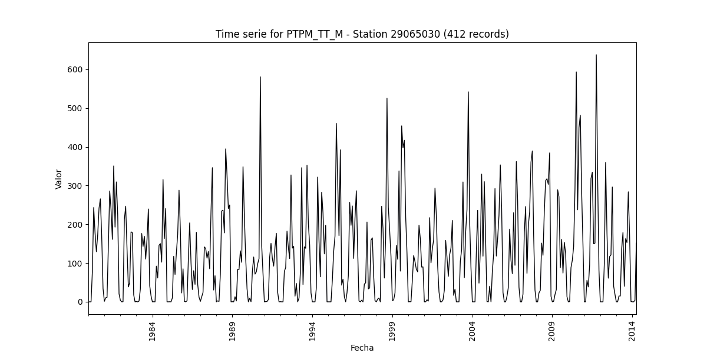
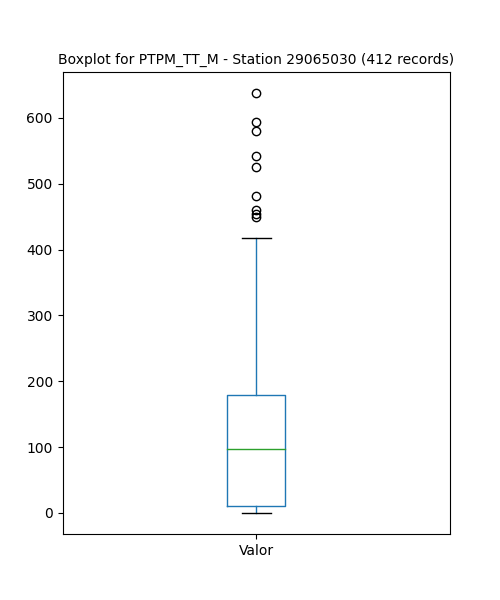
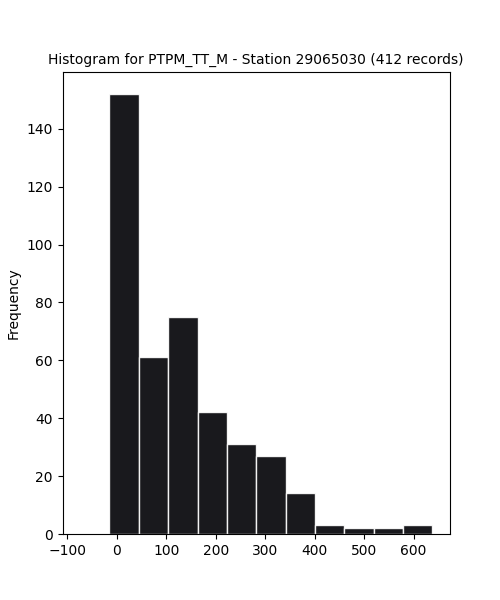
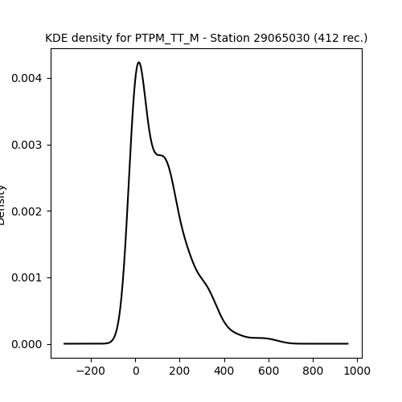

**PTPM_TT_M - Station: PROYECTOS LOS [29060250] (499 rec.)** Location over [Google Maps](http://maps.google.com/maps?q=10.73672222,-74.23708333) or [Openstreet Map](https://www.openstreetmap.org/query?lat=10.73672222&lon=-74.23708333)

Station first record

| Fecha               |   CodigoEstacion | NombreEstacion           |   Latitud |   Longitud |   Altitud | Categoria     | Entidad                                                     | AreaOperativa                               | Departamento   | Municipio     | FechaInstalacion    | FechaSuspension   | IdParametro   | Etiqueta   | DescripcionSerie            | Frecuencia   |   Valor |   Grado |   Calificador |   NivelAprobacion |
|:--------------------|-----------------:|:-------------------------|----------:|-----------:|----------:|:--------------|:------------------------------------------------------------|:--------------------------------------------|:---------------|:--------------|:--------------------|:------------------|:--------------|:-----------|:----------------------------|:-------------|--------:|--------:|--------------:|------------------:|
| 1980-01-01 00:00:00 |         29060250 | PROYECTOS LOS [29060250] |   10.7367 |   -74.2371 |        20 | Pluviométrica | INSTITUTO DE HIDROLOGIA METEOROLOGIA Y ESTUDIOS AMBIENTALES | Area Operativa 05 - Magdalena-Cesar-Guajira | Magdalena      | Zona Bananera | 1967-01-15 00:00:00 | NaT               | PRECIPITACION | PTPM_TT_M  | Precipitación total mensual | Mensual      |       0 |      50 |           nan |               900 |

Statistics table

|       |    Valor |
|:------|---------:|
| count | 499      |
| mean  |  82.9495 |
| std   | 102.98   |
| min   |   0      |
| 25%   |   0      |
| 50%   |  50      |
| 75%   | 122.05   |
| max   | 627.6    |

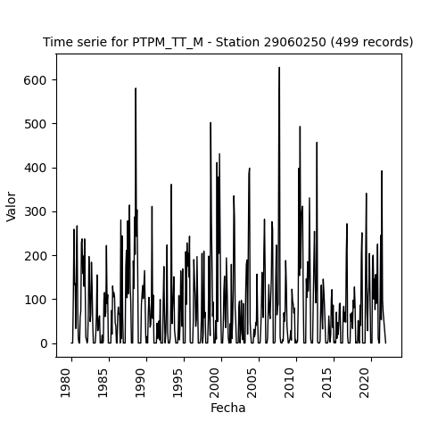
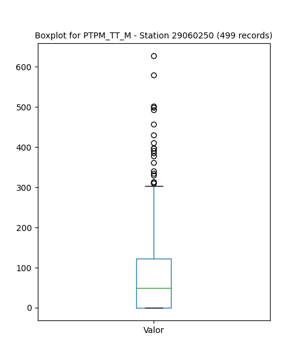
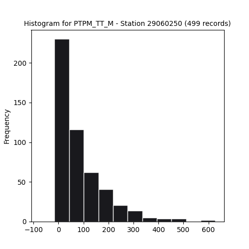
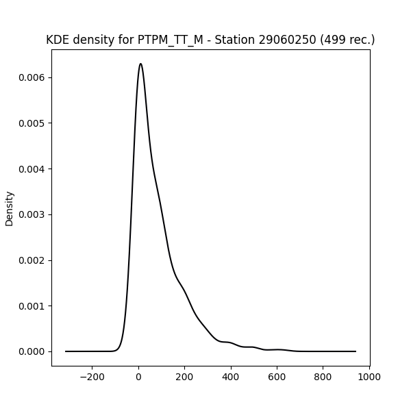

**PTPM_TT_M - Station: RUBY EL [29060550] (360 rec.)** Location over [Google Maps](http://maps.google.com/maps?q=10.84513889,-74.18822222) or [Openstreet Map](https://www.openstreetmap.org/query?lat=10.84513889&lon=-74.18822222)

Station first record

| Fecha               |   CodigoEstacion | NombreEstacion     |   Latitud |   Longitud |   Altitud | Categoria     | Entidad                                                     | AreaOperativa                               | Departamento   | Municipio     | FechaInstalacion    | FechaSuspension     | IdParametro   | Etiqueta   | DescripcionSerie            | Frecuencia   |   Valor |   Grado |   Calificador |   NivelAprobacion |
|:--------------------|-----------------:|:-------------------|----------:|-----------:|----------:|:--------------|:------------------------------------------------------------|:--------------------------------------------|:---------------|:--------------|:--------------------|:--------------------|:--------------|:-----------|:----------------------------|:-------------|--------:|--------:|--------------:|------------------:|
| 1984-04-01 00:00:00 |         29060550 | RUBY EL [29060550] |   10.8451 |   -74.1882 |        20 | Pluviométrica | INSTITUTO DE HIDROLOGIA METEOROLOGIA Y ESTUDIOS AMBIENTALES | Area Operativa 05 - Magdalena-Cesar-Guajira | Magdalena      | Zona Bananera | 1984-03-15 00:00:00 | 2019-02-07 11:33:00 | PRECIPITACION | PTPM_TT_M  | Precipitación total mensual | Mensual      |       4 |      50 |           nan |               900 |

Statistics table

|       |    Valor |
|:------|---------:|
| count | 360      |
| mean  |  97.5958 |
| std   | 110.703  |
| min   |   0      |
| 25%   |   0      |
| 50%   |  68      |
| 75%   | 160.05   |
| max   | 652      |

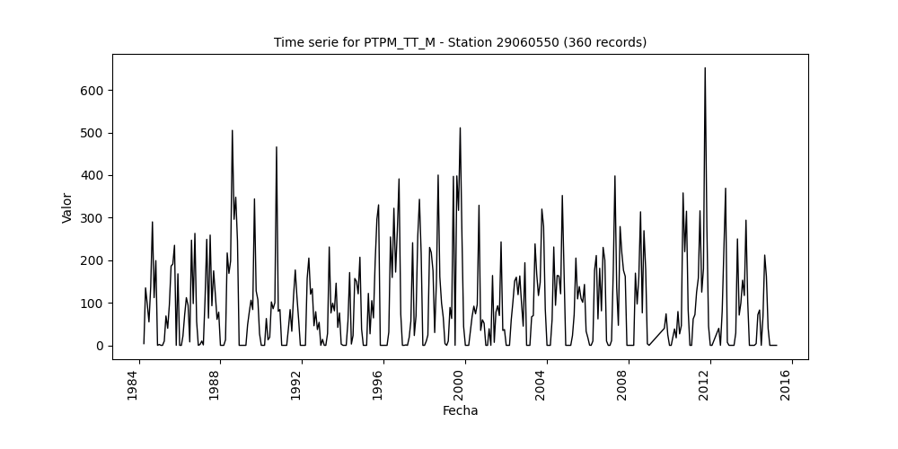
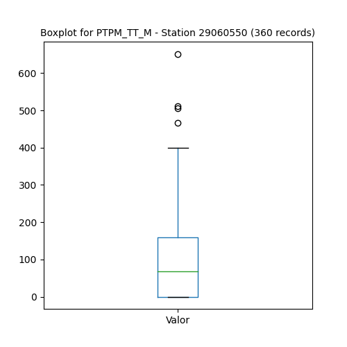
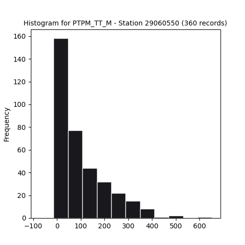
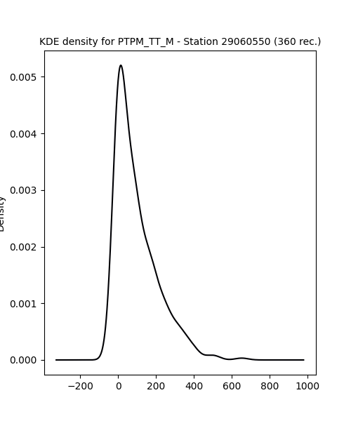

**PTPM_TT_M - Station: SAN JUAN [29060290] (249 rec.)** Location over [Google Maps](http://maps.google.com/maps?q=10.76666667,-74.16666667) or [Openstreet Map](https://www.openstreetmap.org/query?lat=10.76666667&lon=-74.16666667)

Station first record

| Fecha               |   CodigoEstacion | NombreEstacion      |   Latitud |   Longitud |   Altitud | Categoria     | Entidad                                                     | AreaOperativa                               | Departamento   | Municipio     | FechaInstalacion    | FechaSuspension     | IdParametro   | Etiqueta   | DescripcionSerie            | Frecuencia   |   Valor |   Grado |   Calificador |   NivelAprobacion |
|:--------------------|-----------------:|:--------------------|----------:|-----------:|----------:|:--------------|:------------------------------------------------------------|:--------------------------------------------|:---------------|:--------------|:--------------------|:--------------------|:--------------|:-----------|:----------------------------|:-------------|--------:|--------:|--------------:|------------------:|
| 1980-01-01 00:00:00 |         29060290 | SAN JUAN [29060290] |   10.7667 |   -74.1667 |        25 | Pluviométrica | INSTITUTO DE HIDROLOGIA METEOROLOGIA Y ESTUDIOS AMBIENTALES | Area Operativa 05 - Magdalena-Cesar-Guajira | Magdalena      | Zona Bananera | 1975-05-15 00:00:00 | 2002-02-15 00:00:00 | PRECIPITACION | PTPM_TT_M  | Precipitación total mensual | Mensual      |       0 |      50 |           nan |               900 |

Statistics table

|       |   Valor |
|:------|--------:|
| count | 249     |
| mean  | 103.559 |
| std   | 124.612 |
| min   |   0     |
| 25%   |   0     |
| 50%   |  60     |
| 75%   | 149     |
| max   | 627     |

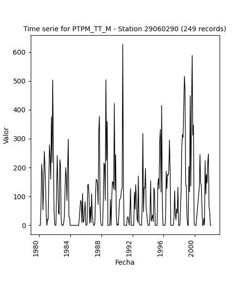
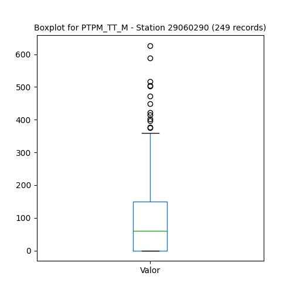
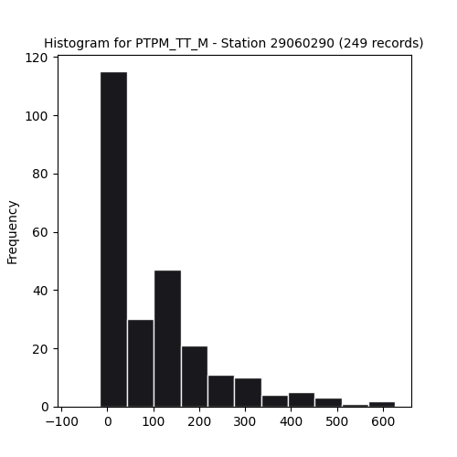
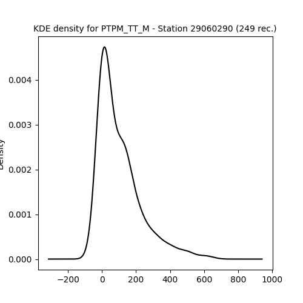

**PTPM_TT_M - Station: SAN PABLO [29060070] (502 rec.)** Location over [Google Maps](http://maps.google.com/maps?q=10.80819444,-74.02680556) or [Openstreet Map](https://www.openstreetmap.org/query?lat=10.80819444&lon=-74.02680556)

Station first record

| Fecha               |   CodigoEstacion | NombreEstacion       |   Latitud |   Longitud |   Altitud | Categoria     | Entidad                                                     | AreaOperativa                               | Departamento   | Municipio   | FechaInstalacion    | FechaSuspension   | IdParametro   | Etiqueta   | DescripcionSerie            | Frecuencia   |   Valor |   Grado |   Calificador |   NivelAprobacion |
|:--------------------|-----------------:|:---------------------|----------:|-----------:|----------:|:--------------|:------------------------------------------------------------|:--------------------------------------------|:---------------|:------------|:--------------------|:------------------|:--------------|:-----------|:----------------------------|:-------------|--------:|--------:|--------------:|------------------:|
| 1980-01-01 00:00:00 |         29060070 | SAN PABLO [29060070] |   10.8082 |   -74.0268 |       800 | Pluviométrica | INSTITUTO DE HIDROLOGIA METEOROLOGIA Y ESTUDIOS AMBIENTALES | Area Operativa 05 - Magdalena-Cesar-Guajira | Magdalena      | Ciénaga     | 1960-08-15 00:00:00 | NaT               | PRECIPITACION | PTPM_TT_M  | Precipitación total mensual | Mensual      |    24.3 |      50 |           nan |               900 |

Statistics table

|       |   Valor |
|:------|--------:|
| count | 502     |
| mean  | 199.184 |
| std   | 159.074 |
| min   |   0     |
| 25%   |  61.5   |
| 50%   | 179     |
| 75%   | 306     |
| max   | 927     |

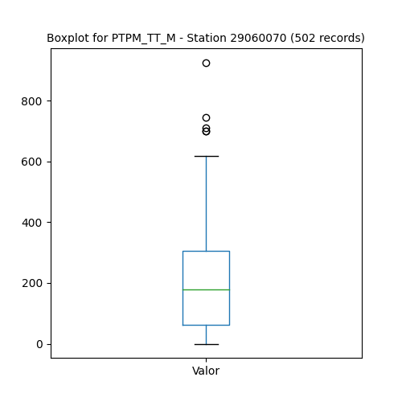
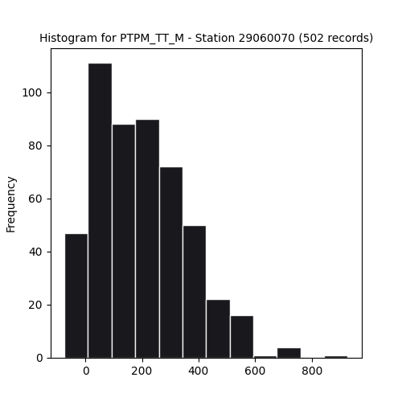

**PTPM_TT_M - Station: SARA LA [29060230] (370 rec.)** Location over [Google Maps](http://maps.google.com/maps?q=10.83622222,-74.16102778) or [Openstreet Map](https://www.openstreetmap.org/query?lat=10.83622222&lon=-74.16102778)

Station first record

| Fecha               |   CodigoEstacion | NombreEstacion     |   Latitud |   Longitud |   Altitud | Categoria     | Entidad                                                     | AreaOperativa                               | Departamento   | Municipio     | FechaInstalacion    | FechaSuspension     | IdParametro   | Etiqueta   | DescripcionSerie            | Frecuencia   |   Valor |   Grado |   Calificador |   NivelAprobacion |
|:--------------------|-----------------:|:-------------------|----------:|-----------:|----------:|:--------------|:------------------------------------------------------------|:--------------------------------------------|:---------------|:--------------|:--------------------|:--------------------|:--------------|:-----------|:----------------------------|:-------------|--------:|--------:|--------------:|------------------:|
| 1980-01-01 00:00:00 |         29060230 | SARA LA [29060230] |   10.8362 |    -74.161 |        25 | Pluviométrica | INSTITUTO DE HIDROLOGIA METEOROLOGIA Y ESTUDIOS AMBIENTALES | Area Operativa 05 - Magdalena-Cesar-Guajira | Magdalena      | Zona Bananera | 1971-08-15 00:00:00 | 2019-02-07 11:33:00 | PRECIPITACION | PTPM_TT_M  | Precipitación total mensual | Mensual      |       0 |      50 |           nan |               900 |

Statistics table

|       |   Valor |
|:------|--------:|
| count | 370     |
| mean  | 101.154 |
| std   | 108.271 |
| min   |   0     |
| 25%   |   6     |
| 50%   |  72     |
| 75%   | 158.5   |
| max   | 549     |

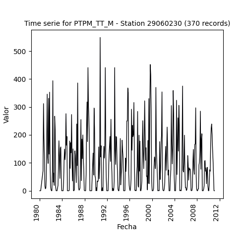
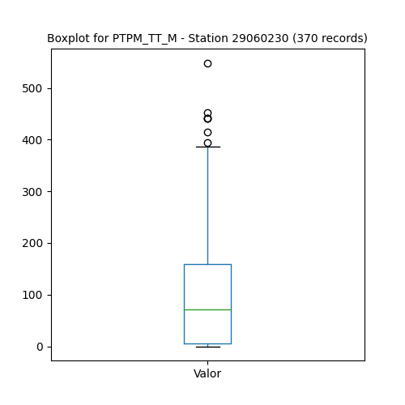
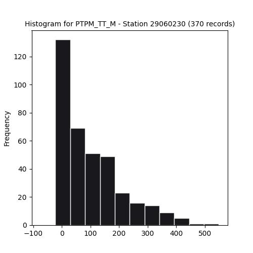
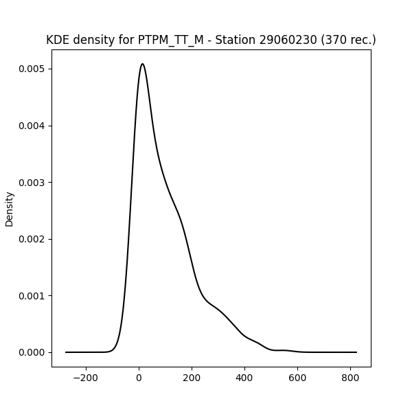

**PTPM_TT_M - Station: ENANO EL [29060160] (489 rec.)** Location over [Google Maps](http://maps.google.com/maps?q=10.90219444,-74.18947222) or [Openstreet Map](https://www.openstreetmap.org/query?lat=10.90219444&lon=-74.18947222)

Station first record

| Fecha               |   CodigoEstacion | NombreEstacion      |   Latitud |   Longitud |   Altitud | Categoria     | Entidad                                                     | AreaOperativa                               | Departamento   | Municipio     | FechaInstalacion    | FechaSuspension   | IdParametro   | Etiqueta   | DescripcionSerie            | Frecuencia   |   Valor |   Grado |   Calificador |   NivelAprobacion |
|:--------------------|-----------------:|:--------------------|----------:|-----------:|----------:|:--------------|:------------------------------------------------------------|:--------------------------------------------|:---------------|:--------------|:--------------------|:------------------|:--------------|:-----------|:----------------------------|:-------------|--------:|--------:|--------------:|------------------:|
| 1980-01-01 00:00:00 |         29060160 | ENANO EL [29060160] |   10.9022 |   -74.1895 |        25 | Pluviométrica | INSTITUTO DE HIDROLOGIA METEOROLOGIA Y ESTUDIOS AMBIENTALES | Area Operativa 05 - Magdalena-Cesar-Guajira | Magdalena      | Zona Bananera | 1974-11-15 00:00:00 | NaT               | PRECIPITACION | PTPM_TT_M  | Precipitación total mensual | Mensual      |       0 |      50 |           nan |               900 |

Statistics table

|       |   Valor |
|:------|--------:|
| count | 489     |
| mean  |  83.846 |
| std   | 104.429 |
| min   |   0     |
| 25%   |   0     |
| 50%   |  40     |
| 75%   | 136.1   |
| max   | 655.1   |

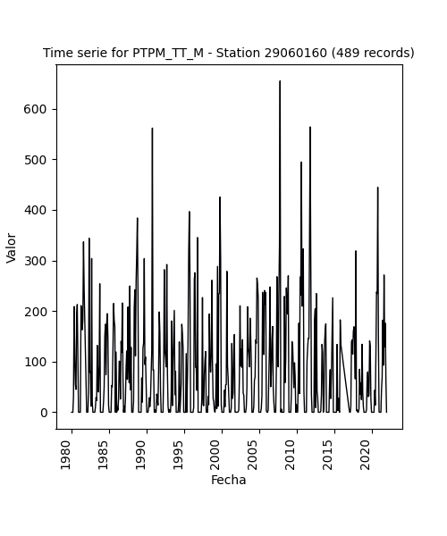
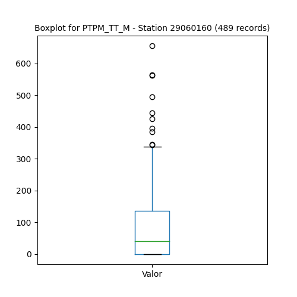
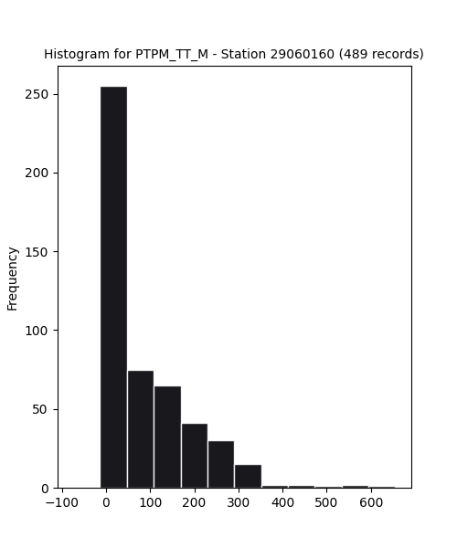
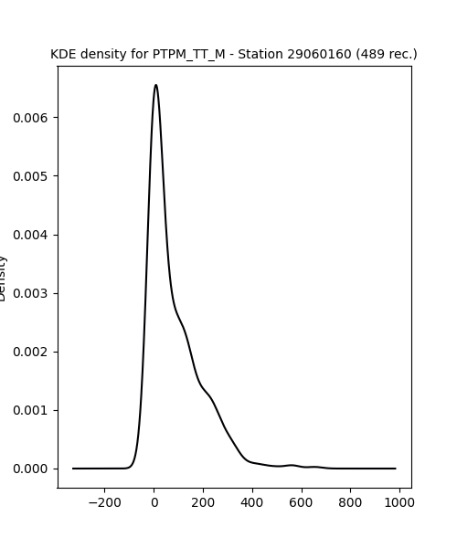

**PTPM_TT_M - Station: PALMA LA [29060210] (501 rec.)** Location over [Google Maps](http://maps.google.com/maps?q=10.96683333,-74.20469444) or [Openstreet Map](https://www.openstreetmap.org/query?lat=10.96683333&lon=-74.20469444)

Station first record

| Fecha               |   CodigoEstacion | NombreEstacion      |   Latitud |   Longitud |   Altitud | Categoria     | Entidad                                                     | AreaOperativa                               | Departamento   | Municipio   | FechaInstalacion    | FechaSuspension   | IdParametro   | Etiqueta   | DescripcionSerie            | Frecuencia   |   Valor |   Grado |   Calificador |   NivelAprobacion |
|:--------------------|-----------------:|:--------------------|----------:|-----------:|----------:|:--------------|:------------------------------------------------------------|:--------------------------------------------|:---------------|:------------|:--------------------|:------------------|:--------------|:-----------|:----------------------------|:-------------|--------:|--------:|--------------:|------------------:|
| 1980-01-01 00:00:00 |         29060210 | PALMA LA [29060210] |   10.9668 |   -74.2047 |        23 | Pluviométrica | INSTITUTO DE HIDROLOGIA METEOROLOGIA Y ESTUDIOS AMBIENTALES | Area Operativa 05 - Magdalena-Cesar-Guajira | Magdalena      | Ciénaga     | 1967-03-15 00:00:00 | NaT               | PRECIPITACION | PTPM_TT_M  | Precipitación total mensual | Mensual      |       0 |      50 |           nan |               900 |

Statistics table

|       |    Valor |
|:------|---------:|
| count | 501      |
| mean  |  70.4112 |
| std   |  85.1528 |
| min   |   0      |
| 25%   |   1.2    |
| 50%   |  39.4    |
| 75%   | 108.6    |
| max   | 549.8    |

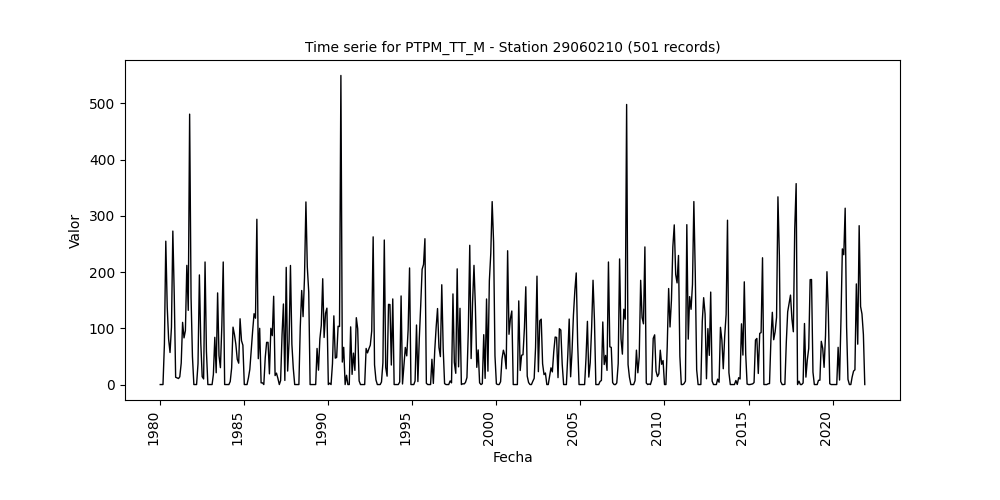

**PTPM_TT_M - Station: SAN ISIDRO [29060280] (484 rec.)** Location over [Google Maps](http://maps.google.com/maps?q=10.90083333,-74.22061111) or [Openstreet Map](https://www.openstreetmap.org/query?lat=10.90083333&lon=-74.22061111)

Station first record

| Fecha               |   CodigoEstacion | NombreEstacion        |   Latitud |   Longitud |   Altitud | Categoria     | Entidad                                                     | AreaOperativa                               | Departamento   | Municipio     | FechaInstalacion    | FechaSuspension   | IdParametro   | Etiqueta   | DescripcionSerie            | Frecuencia   |   Valor |   Grado |   Calificador |   NivelAprobacion |
|:--------------------|-----------------:|:----------------------|----------:|-----------:|----------:|:--------------|:------------------------------------------------------------|:--------------------------------------------|:---------------|:--------------|:--------------------|:------------------|:--------------|:-----------|:----------------------------|:-------------|--------:|--------:|--------------:|------------------:|
| 1980-01-01 00:00:00 |         29060280 | SAN ISIDRO [29060280] |   10.9008 |   -74.2206 |        25 | Pluviométrica | INSTITUTO DE HIDROLOGIA METEOROLOGIA Y ESTUDIOS AMBIENTALES | Area Operativa 05 - Magdalena-Cesar-Guajira | Magdalena      | Zona Bananera | 1967-01-15 00:00:00 | NaT               | PRECIPITACION | PTPM_TT_M  | Precipitación total mensual | Mensual      |       0 |      50 |           nan |               900 |

Statistics table

|       |    Valor |
|:------|---------:|
| count | 484      |
| mean  |  69.8316 |
| std   |  89.7702 |
| min   |   0      |
| 25%   |   0      |
| 50%   |  35.2    |
| 75%   | 110.625  |
| max   | 630.2    |

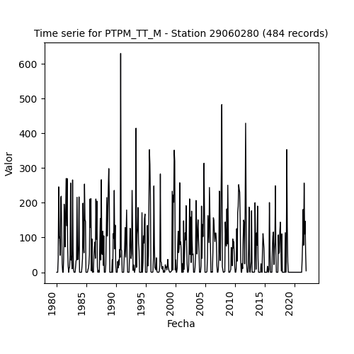
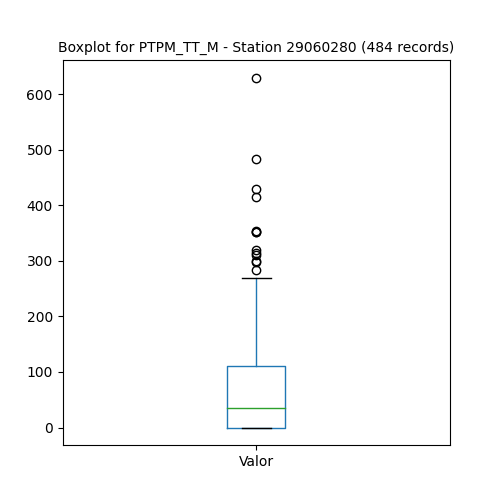
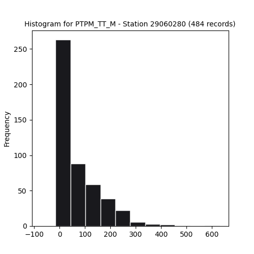
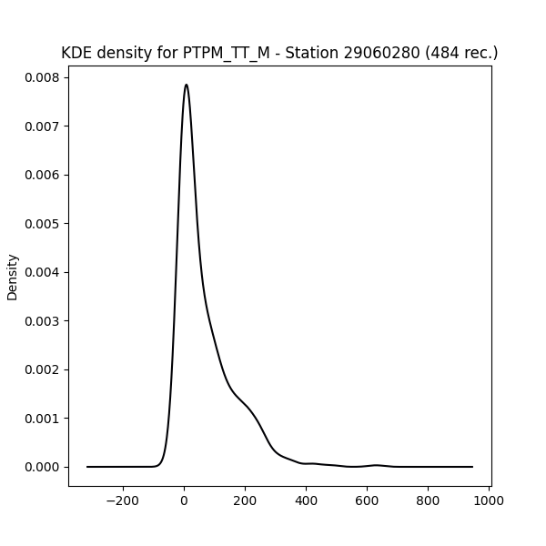

**PTPM_TT_M - Station: SEVILLANO [29060310] (504 rec.)** Location over [Google Maps](http://maps.google.com/maps?q=10.93305556,-74.25244444) or [Openstreet Map](https://www.openstreetmap.org/query?lat=10.93305556&lon=-74.25244444)

Station first record

| Fecha               |   CodigoEstacion | NombreEstacion       |   Latitud |   Longitud |   Altitud | Categoria     | Entidad                                                     | AreaOperativa                               | Departamento   | Municipio   | FechaInstalacion    | FechaSuspension   | IdParametro   | Etiqueta   | DescripcionSerie            | Frecuencia   |   Valor |   Grado |   Calificador |   NivelAprobacion |
|:--------------------|-----------------:|:---------------------|----------:|-----------:|----------:|:--------------|:------------------------------------------------------------|:--------------------------------------------|:---------------|:------------|:--------------------|:------------------|:--------------|:-----------|:----------------------------|:-------------|--------:|--------:|--------------:|------------------:|
| 1980-01-01 00:00:00 |         29060310 | SEVILLANO [29060310] |   10.9331 |   -74.2524 |         5 | Pluviométrica | INSTITUTO DE HIDROLOGIA METEOROLOGIA Y ESTUDIOS AMBIENTALES | Area Operativa 05 - Magdalena-Cesar-Guajira | Magdalena      | Ciénaga     | 1979-09-15 00:00:00 | NaT               | PRECIPITACION | PTPM_TT_M  | Precipitación total mensual | Mensual      |       0 |      50 |           nan |               900 |

Statistics table

|       |    Valor |
|:------|---------:|
| count | 504      |
| mean  |  79.7937 |
| std   | 116.537  |
| min   |   0      |
| 25%   |   0      |
| 50%   |  33      |
| 75%   | 128      |
| max   | 930      |

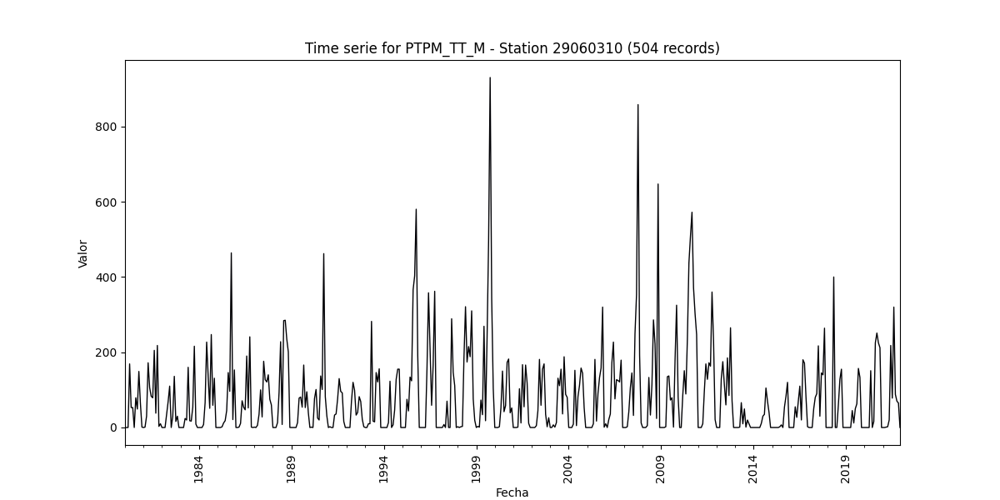
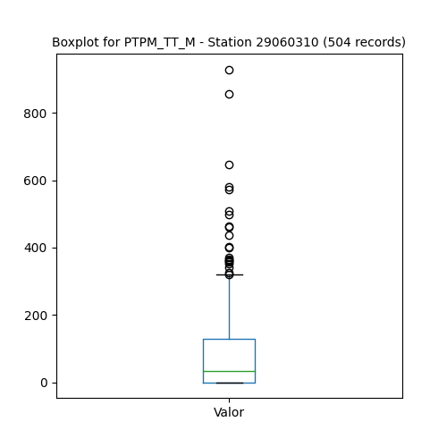
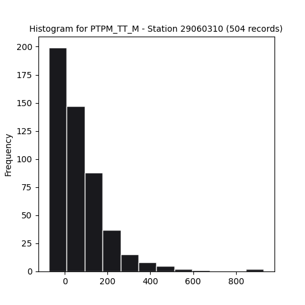
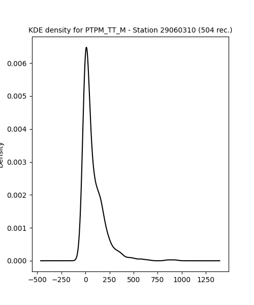

**PTPM_TT_M - Station: TASAJERA [29060120] (504 rec.)** Location over [Google Maps](http://maps.google.com/maps?q=10.97622222,-74.36175) or [Openstreet Map](https://www.openstreetmap.org/query?lat=10.97622222&lon=-74.36175)

Station first record

| Fecha               |   CodigoEstacion | NombreEstacion      |   Latitud |   Longitud |   Altitud | Categoria     | Entidad                                                     | AreaOperativa                               | Departamento   | Municipio   | FechaInstalacion    | FechaSuspension   | IdParametro   | Etiqueta   | DescripcionSerie            | Frecuencia   |   Valor |   Grado |   Calificador |   NivelAprobacion |
|:--------------------|-----------------:|:--------------------|----------:|-----------:|----------:|:--------------|:------------------------------------------------------------|:--------------------------------------------|:---------------|:------------|:--------------------|:------------------|:--------------|:-----------|:----------------------------|:-------------|--------:|--------:|--------------:|------------------:|
| 1980-01-01 00:00:00 |         29060120 | TASAJERA [29060120] |   10.9762 |   -74.3618 |         2 | Pluviométrica | INSTITUTO DE HIDROLOGIA METEOROLOGIA Y ESTUDIOS AMBIENTALES | Area Operativa 05 - Magdalena-Cesar-Guajira | Magdalena      | Puebloviejo | 1965-08-15 00:00:00 | NaT               | PRECIPITACION | PTPM_TT_M  | Precipitación total mensual | Mensual      |       0 |      50 |           nan |               900 |

Statistics table

|       |    Valor |
|:------|---------:|
| count | 504      |
| mean  |  30.9839 |
| std   |  60.6528 |
| min   |   0      |
| 25%   |   0      |
| 50%   |   6      |
| 75%   |  30      |
| max   | 485      |

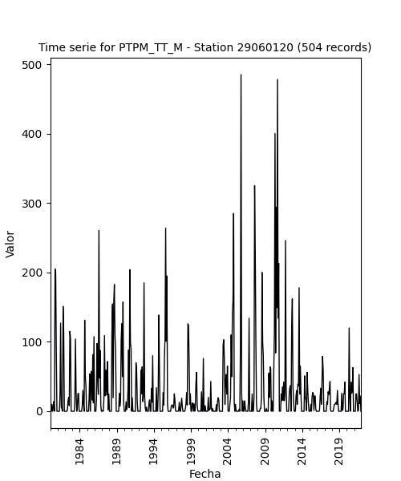
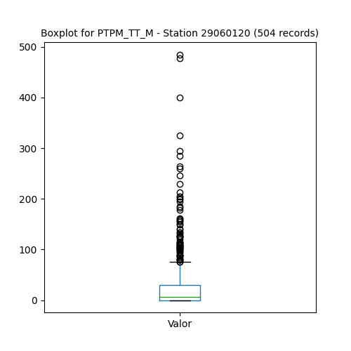
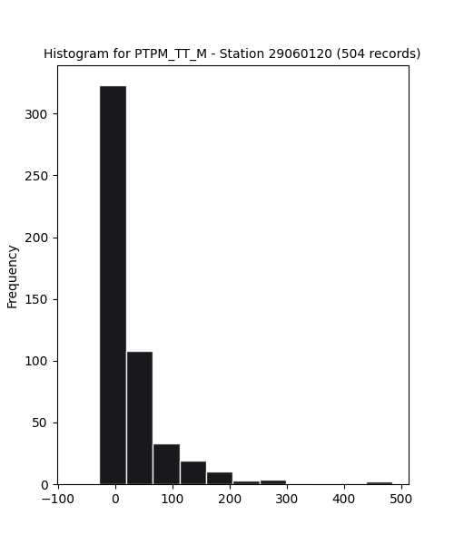
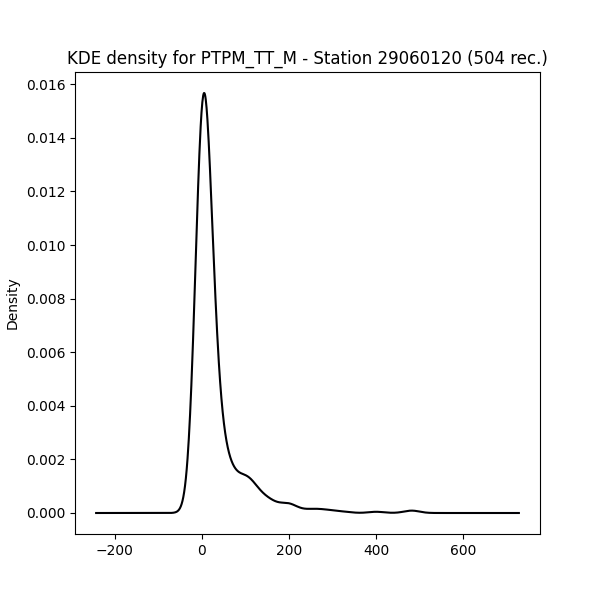

**PTPM_TT_M - Station: YE LA [15015020] (339 rec.)** Location over [Google Maps](http://maps.google.com/maps?q=10.99241667,-74.21113889) or [Openstreet Map](https://www.openstreetmap.org/query?lat=10.99241667&lon=-74.21113889)

Station first record

| Fecha               |   CodigoEstacion | NombreEstacion   |   Latitud |   Longitud |   Altitud | Categoria           | Entidad                                                     | AreaOperativa                               | Departamento   | Municipio   | FechaInstalacion    | FechaSuspension     | IdParametro   | Etiqueta   | DescripcionSerie            | Frecuencia   |   Valor |   Grado |   Calificador |   NivelAprobacion |
|:--------------------|-----------------:|:-----------------|----------:|-----------:|----------:|:--------------------|:------------------------------------------------------------|:--------------------------------------------|:---------------|:------------|:--------------------|:--------------------|:--------------|:-----------|:----------------------------|:-------------|--------:|--------:|--------------:|------------------:|
| 1980-01-01 00:00:00 |         15015020 | YE LA [15015020] |   10.9924 |   -74.2111 |        20 | Climática Ordinaria | INSTITUTO DE HIDROLOGIA METEOROLOGIA Y ESTUDIOS AMBIENTALES | Area Operativa 05 - Magdalena-Cesar-Guajira | Magdalena      | Ciénaga     | 1967-07-15 00:00:00 | 2019-02-07 11:34:00 | PRECIPITACION | PTPM_TT_M  | Precipitación total mensual | Mensual      |       0 |      50 |           nan |               900 |

Statistics table

|       |    Valor |
|:------|---------:|
| count | 339      |
| mean  |  59.7829 |
| std   |  74.2829 |
| min   |   0      |
| 25%   |   0.5    |
| 50%   |  30.1    |
| 75%   |  85.2    |
| max   | 407      |

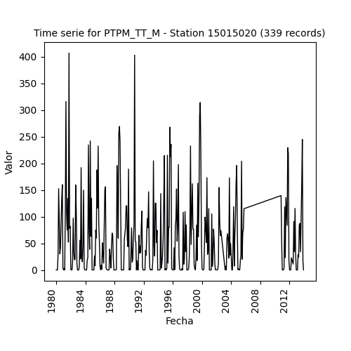
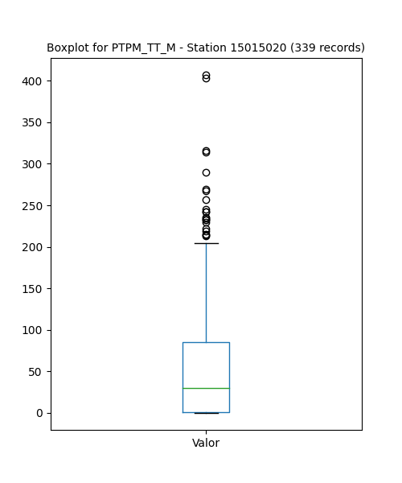
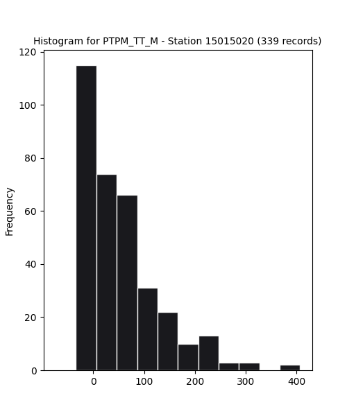

**PTPM_TT_M - Station: CNO LA RAYA [16060010] (504 rec.)** Location over [Google Maps](http://maps.google.com/maps?q=8.834722222,-72.79166667) or [Openstreet Map](https://www.openstreetmap.org/query?lat=8.834722222&lon=-72.79166667)

Station first record

| Fecha               |   CodigoEstacion | NombreEstacion         |   Latitud |   Longitud |   Altitud | Categoria     | Entidad                                                     | AreaOperativa                          | Departamento       | Municipio   | FechaInstalacion    | FechaSuspension   | IdParametro   | Etiqueta   | DescripcionSerie            | Frecuencia   |   Valor |   Grado |   Calificador |   NivelAprobacion |
|:--------------------|-----------------:|:-----------------------|----------:|-----------:|----------:|:--------------|:------------------------------------------------------------|:---------------------------------------|:-------------------|:------------|:--------------------|:------------------|:--------------|:-----------|:----------------------------|:-------------|--------:|--------:|--------------:|------------------:|
| 1980-01-01 00:00:00 |         16060010 | CNO LA RAYA [16060010] |   8.83472 |   -72.7917 |        75 | Pluviométrica | INSTITUTO DE HIDROLOGIA METEOROLOGIA Y ESTUDIOS AMBIENTALES | Area Operativa 08 - Santanderes-Arauca | Norte De Santander | Tibú        | 1973-04-15 00:00:00 | NaT               | PRECIPITACION | PTPM_TT_M  | Precipitación total mensual | Mensual      |      53 |      50 |           nan |               900 |

Statistics table

|       |    Valor |
|:------|---------:|
| count |  504     |
| mean  |  304.344 |
| std   |  206.676 |
| min   |    0     |
| 25%   |  146.25  |
| 50%   |  284.5   |
| 75%   |  426.25  |
| max   | 1005     |

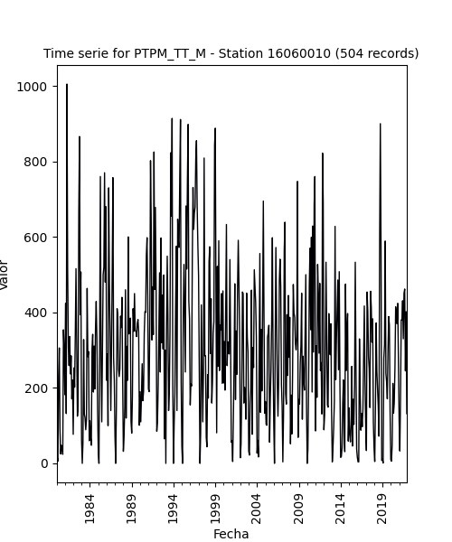
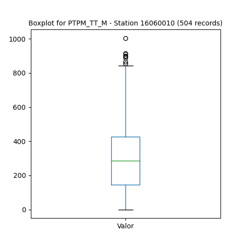
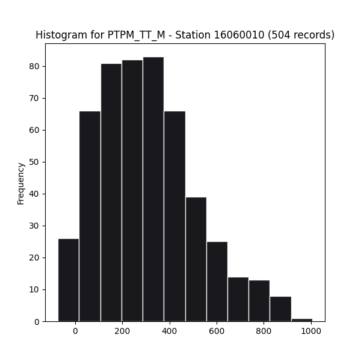
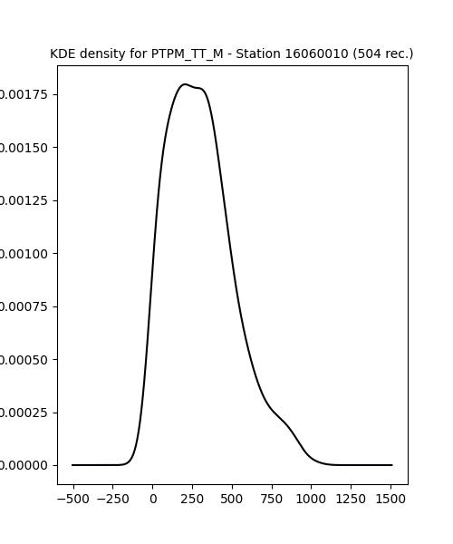

**PTPM_TT_M - Station: HACHARIRA [16070030] (309 rec.)** Location over [Google Maps](http://maps.google.com/maps?q=8.875833333,-72.98222222) or [Openstreet Map](https://www.openstreetmap.org/query?lat=8.875833333&lon=-72.98222222)

Station first record

| Fecha               |   CodigoEstacion | NombreEstacion       |   Latitud |   Longitud |   Altitud | Categoria     | Entidad                                                     | AreaOperativa                          | Departamento       | Municipio   | FechaInstalacion    | FechaSuspension     | IdParametro   | Etiqueta   | DescripcionSerie            | Frecuencia   |   Valor |   Grado |   Calificador |   NivelAprobacion |
|:--------------------|-----------------:|:---------------------|----------:|-----------:|----------:|:--------------|:------------------------------------------------------------|:---------------------------------------|:-------------------|:------------|:--------------------|:--------------------|:--------------|:-----------|:----------------------------|:-------------|--------:|--------:|--------------:|------------------:|
| 1980-01-01 00:00:00 |         16070030 | HACHARIRA [16070030] |   8.87583 |   -72.9822 |        75 | Pluviométrica | INSTITUTO DE HIDROLOGIA METEOROLOGIA Y ESTUDIOS AMBIENTALES | Area Operativa 08 - Santanderes-Arauca | Norte De Santander | El Tarra    | 1973-04-15 00:00:00 | 2018-07-13 12:10:00 | PRECIPITACION | PTPM_TT_M  | Precipitación total mensual | Mensual      |     200 |      50 |           nan |               900 |

Statistics table

|       |    Valor |
|:------|---------:|
| count |  309     |
| mean  |  390.891 |
| std   |  245.702 |
| min   |    0     |
| 25%   |  216     |
| 50%   |  359     |
| 75%   |  524     |
| max   | 1351     |

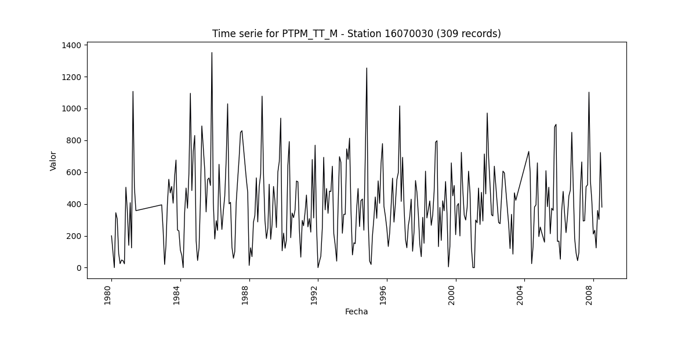
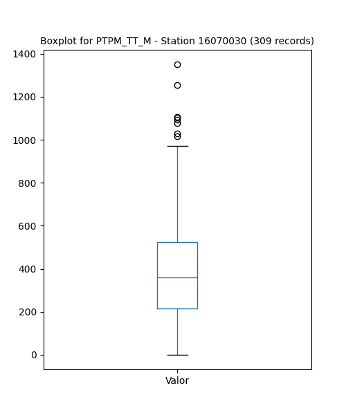
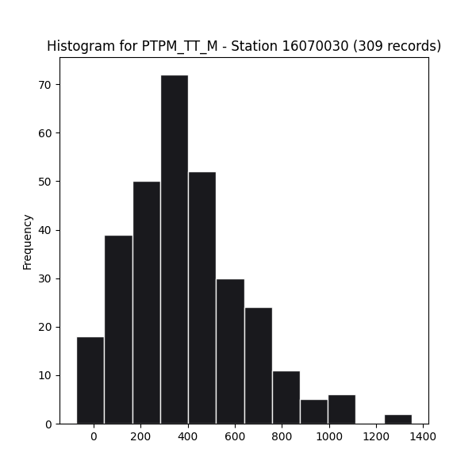
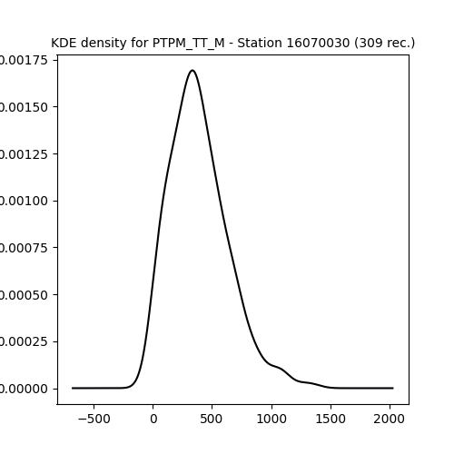

**PTPM_TT_M - Station: ORU [16070040] (472 rec.)** Location over [Google Maps](http://maps.google.com/maps?q=8.641111111,-72.90944444) or [Openstreet Map](https://www.openstreetmap.org/query?lat=8.641111111&lon=-72.90944444)

Station first record

| Fecha               |   CodigoEstacion | NombreEstacion   |   Latitud |   Longitud |   Altitud | Categoria     | Entidad                                                     | AreaOperativa                          | Departamento       | Municipio   | FechaInstalacion    | FechaSuspension   | IdParametro   | Etiqueta   | DescripcionSerie            | Frecuencia   |   Valor |   Grado |   Calificador |   NivelAprobacion |
|:--------------------|-----------------:|:-----------------|----------:|-----------:|----------:|:--------------|:------------------------------------------------------------|:---------------------------------------|:-------------------|:------------|:--------------------|:------------------|:--------------|:-----------|:----------------------------|:-------------|--------:|--------:|--------------:|------------------:|
| 1980-01-01 00:00:00 |         16070040 | ORU [16070040]   |   8.64111 |   -72.9094 |       150 | Pluviométrica | INSTITUTO DE HIDROLOGIA METEOROLOGIA Y ESTUDIOS AMBIENTALES | Area Operativa 08 - Santanderes-Arauca | Norte De Santander | Tibú        | 1973-04-15 00:00:00 | NaT               | PRECIPITACION | PTPM_TT_M  | Precipitación total mensual | Mensual      |      67 |      50 |           nan |               900 |

Statistics table

|       |    Valor |
|:------|---------:|
| count |  472     |
| mean  |  353.798 |
| std   |  208.838 |
| min   |    8     |
| 25%   |  204.5   |
| 50%   |  341     |
| 75%   |  485.25  |
| max   | 1173     |

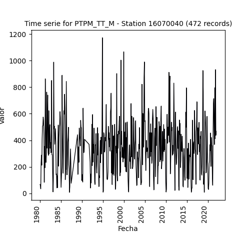
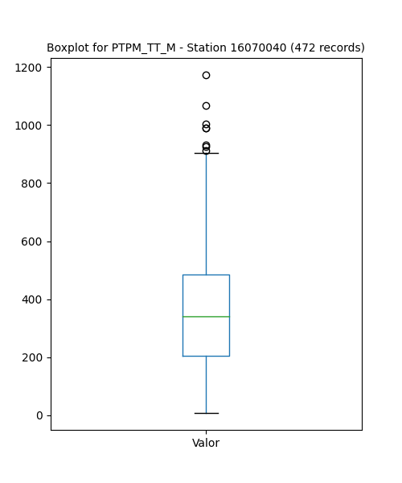
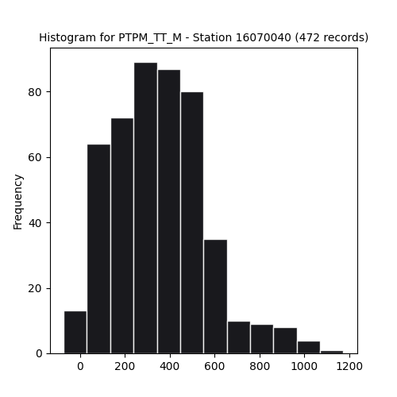
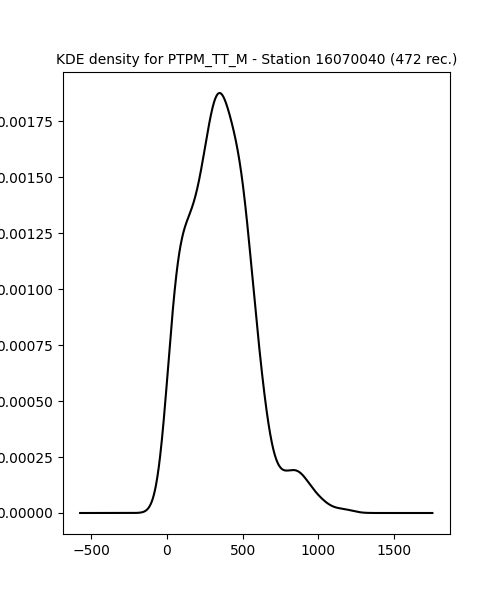

**PTPM_TT_M - Station: PALACIO EL [16050240] (327 rec.)** Location over [Google Maps](http://maps.google.com/maps?q=8.610333333,-73.35113889) or [Openstreet Map](https://www.openstreetmap.org/query?lat=8.610333333&lon=-73.35113889)

Station first record

| Fecha               |   CodigoEstacion | NombreEstacion        |   Latitud |   Longitud |   Altitud | Categoria     | Entidad                                                     | AreaOperativa                          | Departamento       | Municipio   | FechaInstalacion    | FechaSuspension     | IdParametro   | Etiqueta   | DescripcionSerie            | Frecuencia   |   Valor |   Grado |   Calificador |   NivelAprobacion |
|:--------------------|-----------------:|:----------------------|----------:|-----------:|----------:|:--------------|:------------------------------------------------------------|:---------------------------------------|:-------------------|:------------|:--------------------|:--------------------|:--------------|:-----------|:----------------------------|:-------------|--------:|--------:|--------------:|------------------:|
| 1984-03-01 00:00:00 |         16050240 | PALACIO EL [16050240] |   8.61033 |   -73.3511 |      1280 | Pluviométrica | INSTITUTO DE HIDROLOGIA METEOROLOGIA Y ESTUDIOS AMBIENTALES | Area Operativa 08 - Santanderes-Arauca | Norte De Santander | Convención  | 1984-03-15 00:00:00 | 2014-08-28 00:00:00 | PRECIPITACION | PTPM_TT_M  | Precipitación total mensual | Mensual      |       3 |      50 |           nan |               900 |

Statistics table

|       |    Valor |
|:------|---------:|
| count |  327     |
| mean  |  178.577 |
| std   |  136.351 |
| min   |    0     |
| 25%   |   82     |
| 50%   |  156     |
| 75%   |  246     |
| max   | 1150     |

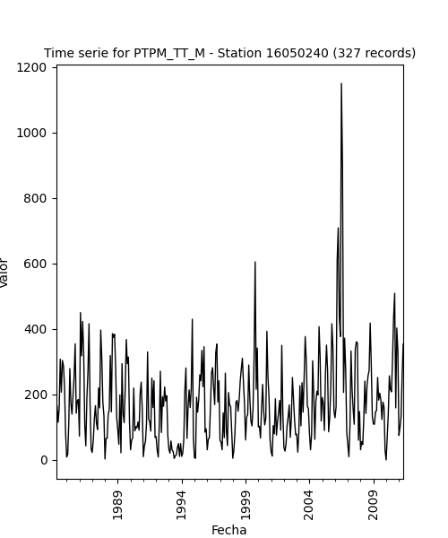

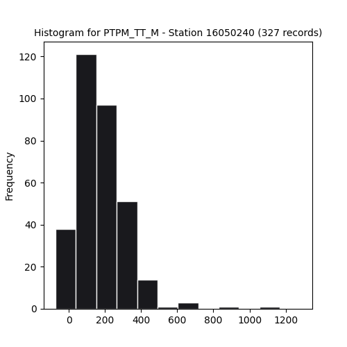
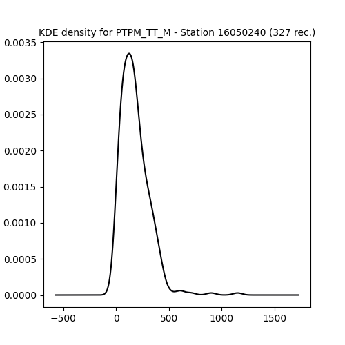

**PTPM_TT_M - Station: PISTA LA [16070020] (154 rec.)** Location over [Google Maps](http://maps.google.com/maps?q=9.116666667,-72.86666667) or [Openstreet Map](https://www.openstreetmap.org/query?lat=9.116666667&lon=-72.86666667)

Station first record

| Fecha               |   CodigoEstacion | NombreEstacion      |   Latitud |   Longitud |   Altitud | Categoria     | Entidad                                                     | AreaOperativa                          | Departamento       | Municipio   | FechaInstalacion    | FechaSuspension     | IdParametro   | Etiqueta   | DescripcionSerie            | Frecuencia   |   Valor |   Grado |   Calificador |   NivelAprobacion |
|:--------------------|-----------------:|:--------------------|----------:|-----------:|----------:|:--------------|:------------------------------------------------------------|:---------------------------------------|:-------------------|:------------|:--------------------|:--------------------|:--------------|:-----------|:----------------------------|:-------------|--------:|--------:|--------------:|------------------:|
| 1986-03-01 00:00:00 |         16070020 | PISTA LA [16070020] |   9.11667 |   -72.8667 |        50 | Pluviométrica | INSTITUTO DE HIDROLOGIA METEOROLOGIA Y ESTUDIOS AMBIENTALES | Area Operativa 08 - Santanderes-Arauca | Norte De Santander | Tibú        | 1986-02-15 00:00:00 | 2019-01-21 08:00:00 | PRECIPITACION | PTPM_TT_M  | Precipitación total mensual | Mensual      |     144 |      50 |           nan |               900 |

Statistics table

|       |    Valor |
|:------|---------:|
| count |  154     |
| mean  |  393.565 |
| std   |  269.214 |
| min   |    0     |
| 25%   |  162.25  |
| 50%   |  366     |
| 75%   |  557.5   |
| max   | 1210     |

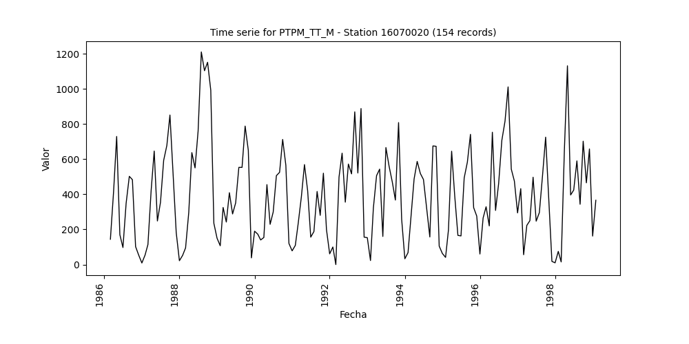
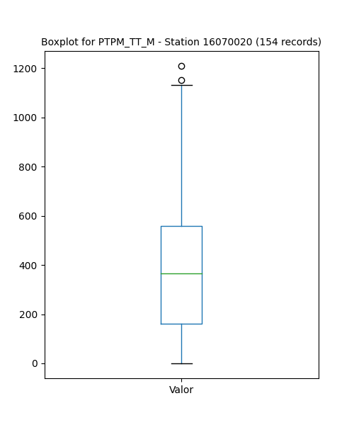
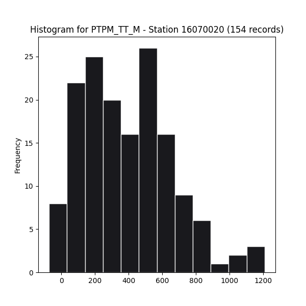
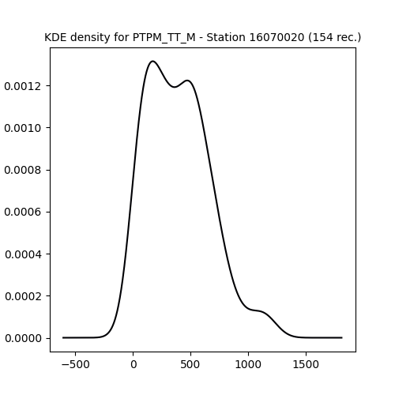

**PTPM_TT_M - Station: PUERTO BARCO [16070010] (437 rec.)** Location over [Google Maps](http://maps.google.com/maps?q=8.998055556,-72.89694444) or [Openstreet Map](https://www.openstreetmap.org/query?lat=8.998055556&lon=-72.89694444)

Station first record

| Fecha               |   CodigoEstacion | NombreEstacion          |   Latitud |   Longitud |   Altitud | Categoria     | Entidad                                                     | AreaOperativa                          | Departamento       | Municipio   | FechaInstalacion    | FechaSuspension   | IdParametro   | Etiqueta   | DescripcionSerie            | Frecuencia   |   Valor |   Grado |   Calificador |   NivelAprobacion |
|:--------------------|-----------------:|:------------------------|----------:|-----------:|----------:|:--------------|:------------------------------------------------------------|:---------------------------------------|:-------------------|:------------|:--------------------|:------------------|:--------------|:-----------|:----------------------------|:-------------|--------:|--------:|--------------:|------------------:|
| 1980-01-01 00:00:00 |         16070010 | PUERTO BARCO [16070010] |   8.99806 |   -72.8969 |        50 | Pluviométrica | INSTITUTO DE HIDROLOGIA METEOROLOGIA Y ESTUDIOS AMBIENTALES | Area Operativa 08 - Santanderes-Arauca | Norte De Santander | Tibú        | 1973-04-15 00:00:00 | NaT               | PRECIPITACION | PTPM_TT_M  | Precipitación total mensual | Mensual      |      50 |      50 |           nan |               900 |

Statistics table

|       |    Valor |
|:------|---------:|
| count |  437     |
| mean  |  410.432 |
| std   |  267.691 |
| min   |    0     |
| 25%   |  196     |
| 50%   |  396     |
| 75%   |  578     |
| max   | 1444     |

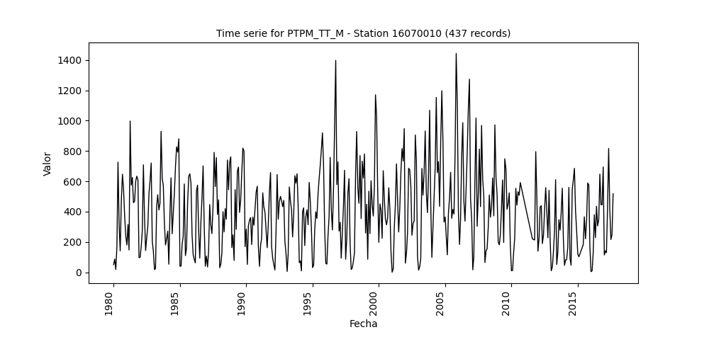
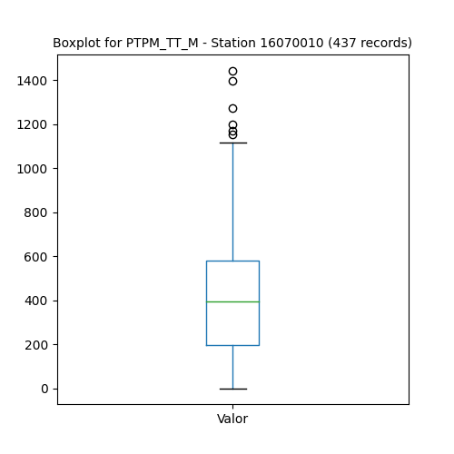
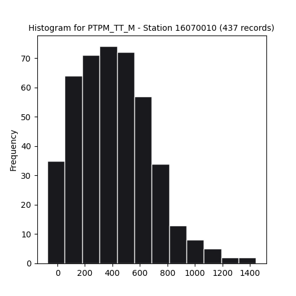
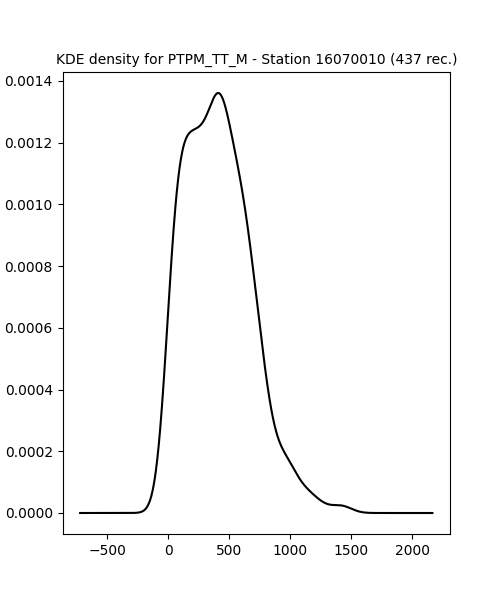

**PTPM_TT_M - Station: ASTREA [25020220] (503 rec.)** Location over [Google Maps](http://maps.google.com/maps?q=9.492944444,-73.97288889) or [Openstreet Map](https://www.openstreetmap.org/query?lat=9.492944444&lon=-73.97288889)

Station first record

| Fecha               |   CodigoEstacion | NombreEstacion    |   Latitud |   Longitud |   Altitud | Categoria     | Entidad                                                     | AreaOperativa                               | Departamento   | Municipio   | FechaInstalacion    | FechaSuspension   | IdParametro   | Etiqueta   | DescripcionSerie            | Frecuencia   |   Valor |   Grado |   Calificador |   NivelAprobacion |
|:--------------------|-----------------:|:------------------|----------:|-----------:|----------:|:--------------|:------------------------------------------------------------|:--------------------------------------------|:---------------|:------------|:--------------------|:------------------|:--------------|:-----------|:----------------------------|:-------------|--------:|--------:|--------------:|------------------:|
| 1980-01-01 00:00:00 |         25020220 | ASTREA [25020220] |   9.49294 |   -73.9729 |        50 | Pluviométrica | INSTITUTO DE HIDROLOGIA METEOROLOGIA Y ESTUDIOS AMBIENTALES | Area Operativa 05 - Magdalena-Cesar-Guajira | Cesar          | Astrea      | 1962-04-15 00:00:00 | NaT               | PRECIPITACION | PTPM_TT_M  | Precipitación total mensual | Mensual      |       0 |      50 |           nan |               900 |

Statistics table

|       |   Valor |
|:------|--------:|
| count | 503     |
| mean  | 125.969 |
| std   | 101.616 |
| min   |   0     |
| 25%   |  43.3   |
| 50%   | 111.1   |
| 75%   | 189.85  |
| max   | 534     |

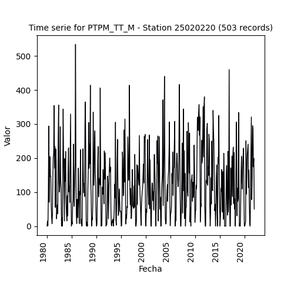
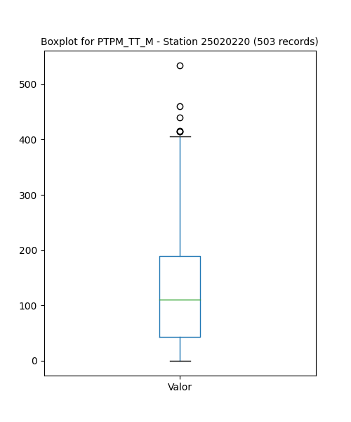
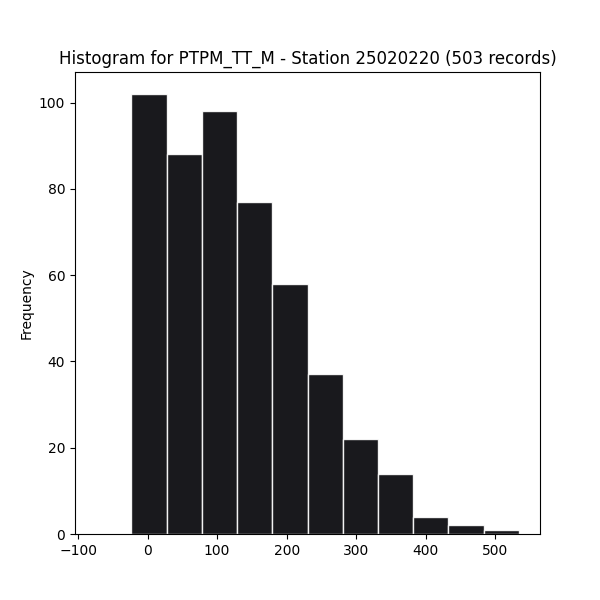
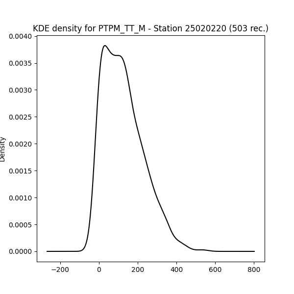

**PTPM_TT_M - Station: CANAL EL [25020240] (502 rec.)** Location over [Google Maps](http://maps.google.com/maps?q=9.410472222,-73.89041667) or [Openstreet Map](https://www.openstreetmap.org/query?lat=9.410472222&lon=-73.89041667)

Station first record

| Fecha               |   CodigoEstacion | NombreEstacion      |   Latitud |   Longitud |   Altitud | Categoria     | Entidad                                                     | AreaOperativa                               | Departamento   | Municipio   | FechaInstalacion    | FechaSuspension   | IdParametro   | Etiqueta   | DescripcionSerie            | Frecuencia   |   Valor |   Grado |   Calificador |   NivelAprobacion |
|:--------------------|-----------------:|:--------------------|----------:|-----------:|----------:|:--------------|:------------------------------------------------------------|:--------------------------------------------|:---------------|:------------|:--------------------|:------------------|:--------------|:-----------|:----------------------------|:-------------|--------:|--------:|--------------:|------------------:|
| 1980-01-01 00:00:00 |         25020240 | CANAL EL [25020240] |   9.41047 |   -73.8904 |        70 | Pluviométrica | INSTITUTO DE HIDROLOGIA METEOROLOGIA Y ESTUDIOS AMBIENTALES | Area Operativa 05 - Magdalena-Cesar-Guajira | Cesar          | Chimichagua | 1963-03-15 00:00:00 | NaT               | PRECIPITACION | PTPM_TT_M  | Precipitación total mensual | Mensual      |       0 |      50 |           nan |               900 |

Statistics table

|       |   Valor |
|:------|--------:|
| count | 502     |
| mean  | 136.406 |
| std   | 120.364 |
| min   |   0     |
| 25%   |  43     |
| 50%   | 112.5   |
| 75%   | 194     |
| max   | 735     |

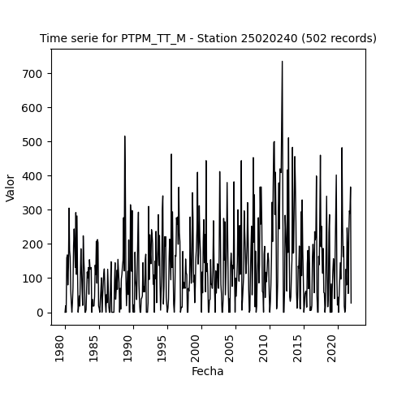
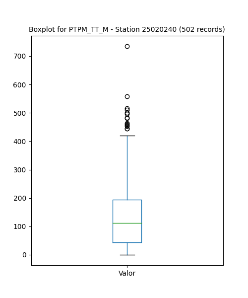
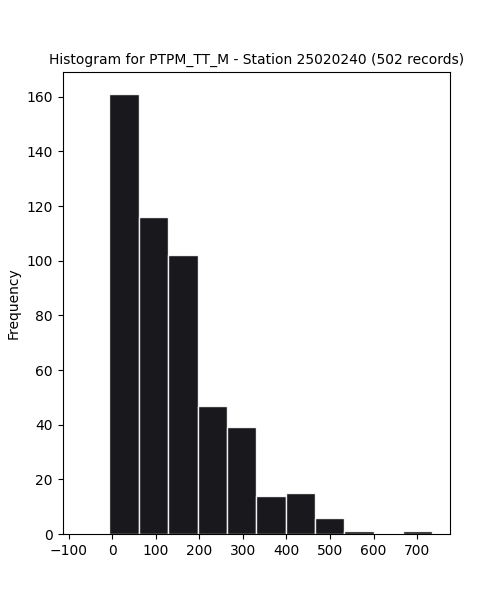
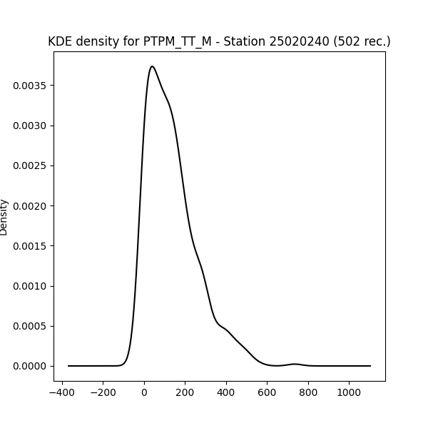

**PTPM_TT_M - Station: CHIMICHAGUA [25021240] (504 rec.)** Location over [Google Maps](http://maps.google.com/maps?q=9.260083333,-73.80986111) or [Openstreet Map](https://www.openstreetmap.org/query?lat=9.260083333&lon=-73.80986111)

Station first record

| Fecha               |   CodigoEstacion | NombreEstacion         |   Latitud |   Longitud |   Altitud | Categoria     | Entidad                                                     | AreaOperativa                               | Departamento   | Municipio   | FechaInstalacion    | FechaSuspension   | IdParametro   | Etiqueta   | DescripcionSerie            | Frecuencia   |   Valor |   Grado |   Calificador |   NivelAprobacion |
|:--------------------|-----------------:|:-----------------------|----------:|-----------:|----------:|:--------------|:------------------------------------------------------------|:--------------------------------------------|:---------------|:------------|:--------------------|:------------------|:--------------|:-----------|:----------------------------|:-------------|--------:|--------:|--------------:|------------------:|
| 1980-01-01 00:00:00 |         25021240 | CHIMICHAGUA [25021240] |   9.26008 |   -73.8099 |       138 | Pluviométrica | INSTITUTO DE HIDROLOGIA METEOROLOGIA Y ESTUDIOS AMBIENTALES | Area Operativa 05 - Magdalena-Cesar-Guajira | Cesar          | Chimichagua | 1972-07-15 00:00:00 | NaT               | PRECIPITACION | PTPM_TT_M  | Precipitación total mensual | Mensual      |       0 |      50 |           nan |               900 |

Statistics table

|       |   Valor |
|:------|--------:|
| count | 504     |
| mean  | 169.907 |
| std   | 147.9   |
| min   |   0     |
| 25%   |  46.875 |
| 50%   | 141.85  |
| 75%   | 265     |
| max   | 696.6   |

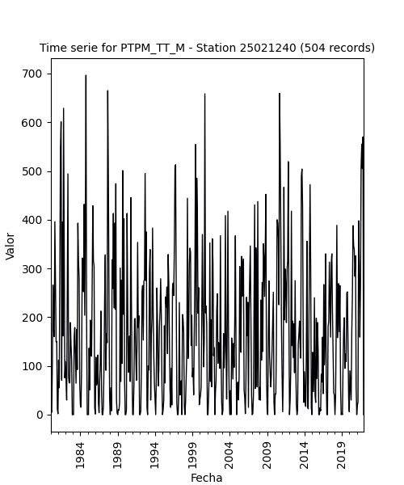
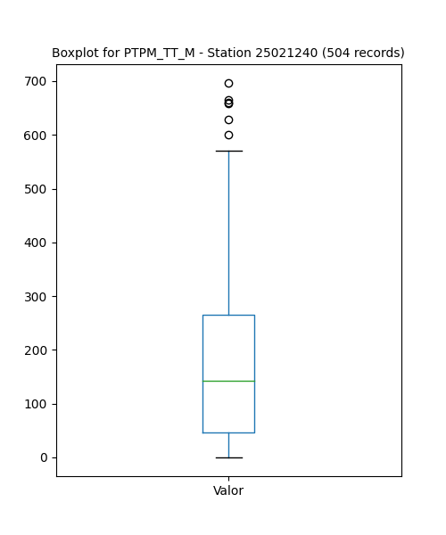

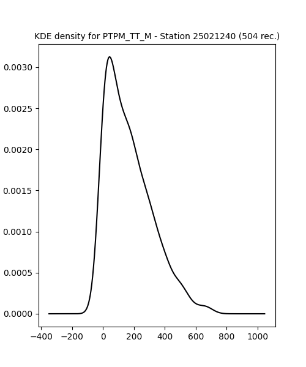

**PTPM_TT_M - Station: CHIRIGUANA [25025250] (453 rec.)** Location over [Google Maps](http://maps.google.com/maps?q=9.361027778,-73.59338889) or [Openstreet Map](https://www.openstreetmap.org/query?lat=9.361027778&lon=-73.59338889)

Station first record

| Fecha               |   CodigoEstacion | NombreEstacion        |   Latitud |   Longitud |   Altitud | Categoria           | Entidad                                                     | AreaOperativa                               | Departamento   | Municipio   | FechaInstalacion    | FechaSuspension   | IdParametro   | Etiqueta   | DescripcionSerie            | Frecuencia   |   Valor |   Grado |   Calificador |   NivelAprobacion |
|:--------------------|-----------------:|:----------------------|----------:|-----------:|----------:|:--------------------|:------------------------------------------------------------|:--------------------------------------------|:---------------|:------------|:--------------------|:------------------|:--------------|:-----------|:----------------------------|:-------------|--------:|--------:|--------------:|------------------:|
| 1980-01-01 00:00:00 |         25025250 | CHIRIGUANA [25025250] |   9.36103 |   -73.5934 |        40 | Climática Ordinaria | INSTITUTO DE HIDROLOGIA METEOROLOGIA Y ESTUDIOS AMBIENTALES | Area Operativa 05 - Magdalena-Cesar-Guajira | Cesar          | Chiriguaná  | 1973-06-15 00:00:00 | NaT               | PRECIPITACION | PTPM_TT_M  | Precipitación total mensual | Mensual      |    28.7 |      50 |           nan |               900 |

Statistics table

|       |   Valor |
|:------|--------:|
| count | 453     |
| mean  | 135.746 |
| std   | 116.256 |
| min   |   0     |
| 25%   |  35     |
| 50%   | 115.4   |
| 75%   | 196.6   |
| max   | 549.9   |

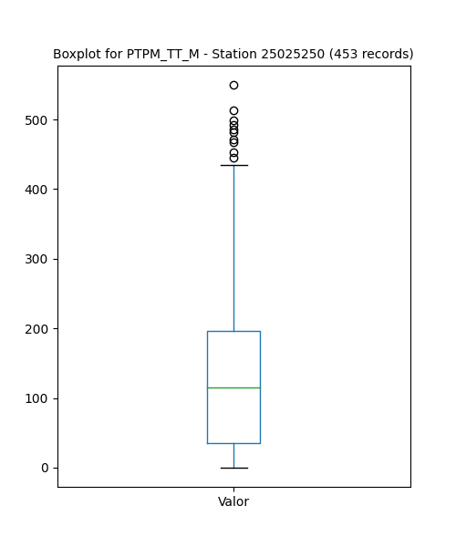
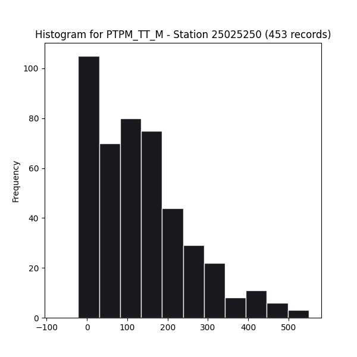
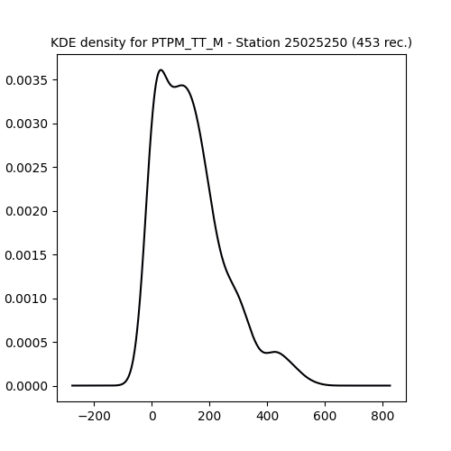

**PTPM_TT_M - Station: CURUMANI D C [25021580] (188 rec.)** Location over [Google Maps](http://maps.google.com/maps?q=9.183333333,-73.53333333) or [Openstreet Map](https://www.openstreetmap.org/query?lat=9.183333333&lon=-73.53333333)

Station first record

| Fecha               |   CodigoEstacion | NombreEstacion          |   Latitud |   Longitud |   Altitud | Categoria     | Entidad                                                     | AreaOperativa                               | Departamento   | Municipio   | FechaInstalacion    | FechaSuspension     | IdParametro   | Etiqueta   | DescripcionSerie            | Frecuencia   |   Valor |   Grado |   Calificador |   NivelAprobacion |
|:--------------------|-----------------:|:------------------------|----------:|-----------:|----------:|:--------------|:------------------------------------------------------------|:--------------------------------------------|:---------------|:------------|:--------------------|:--------------------|:--------------|:-----------|:----------------------------|:-------------|--------:|--------:|--------------:|------------------:|
| 1981-01-01 00:00:00 |         25021580 | CURUMANI D C [25021580] |   9.18333 |   -73.5333 |       100 | Pluviométrica | INSTITUTO DE HIDROLOGIA METEOROLOGIA Y ESTUDIOS AMBIENTALES | Area Operativa 05 - Magdalena-Cesar-Guajira | Cesar          | Curumaní    | 1979-11-15 00:00:00 | 1996-08-15 00:00:00 | PRECIPITACION | PTPM_TT_M  | Precipitación total mensual | Mensual      |       2 |       4 |           nan |               900 |

Statistics table

|       |   Valor |
|:------|--------:|
| count | 188     |
| mean  | 144.556 |
| std   | 116.792 |
| min   |   0     |
| 25%   |  52.75  |
| 50%   | 109.5   |
| 75%   | 217.75  |
| max   | 494     |

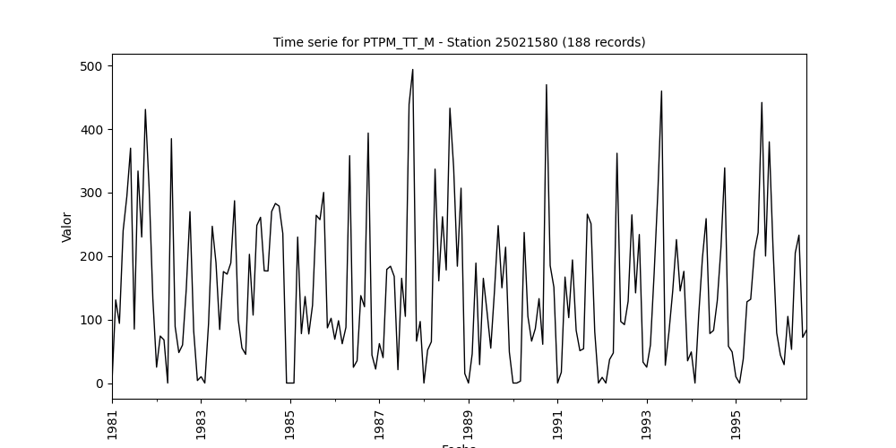
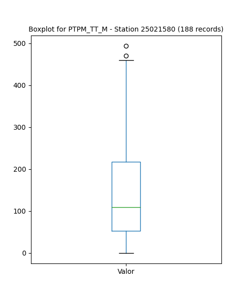

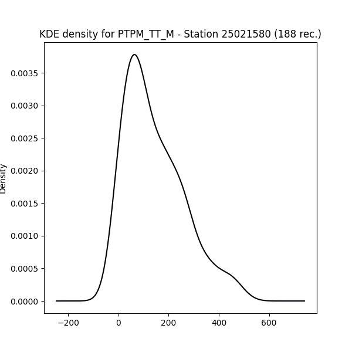

**PTPM_TT_M - Station: CURUMANI [25020250] (501 rec.)** Location over [Google Maps](http://maps.google.com/maps?q=9.197194444,-73.54194444) or [Openstreet Map](https://www.openstreetmap.org/query?lat=9.197194444&lon=-73.54194444)

Station first record

| Fecha               |   CodigoEstacion | NombreEstacion      |   Latitud |   Longitud |   Altitud | Categoria     | Entidad                                                     | AreaOperativa                               | Departamento   | Municipio   | FechaInstalacion    | FechaSuspension   | IdParametro   | Etiqueta   | DescripcionSerie            | Frecuencia   |   Valor |   Grado |   Calificador |   NivelAprobacion |
|:--------------------|-----------------:|:--------------------|----------:|-----------:|----------:|:--------------|:------------------------------------------------------------|:--------------------------------------------|:---------------|:------------|:--------------------|:------------------|:--------------|:-----------|:----------------------------|:-------------|--------:|--------:|--------------:|------------------:|
| 1980-01-01 00:00:00 |         25020250 | CURUMANI [25020250] |   9.19719 |   -73.5419 |       100 | Pluviométrica | INSTITUTO DE HIDROLOGIA METEOROLOGIA Y ESTUDIOS AMBIENTALES | Area Operativa 05 - Magdalena-Cesar-Guajira | Cesar          | Curumaní    | 1963-03-15 00:00:00 | NaT               | PRECIPITACION | PTPM_TT_M  | Precipitación total mensual | Mensual      |       0 |      50 |           nan |               900 |

Statistics table

|       |   Valor |
|:------|--------:|
| count | 501     |
| mean  | 142.694 |
| std   | 118.441 |
| min   |   0     |
| 25%   |  48     |
| 50%   | 117.9   |
| 75%   | 208.9   |
| max   | 644.3   |

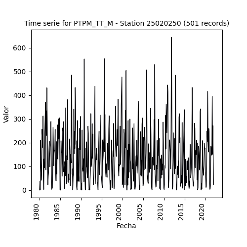
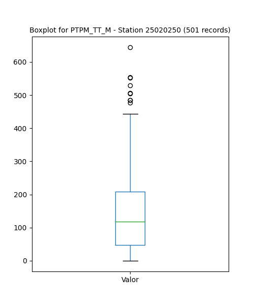
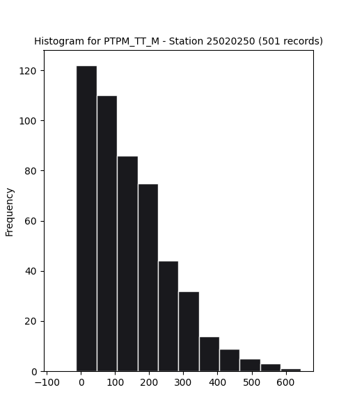
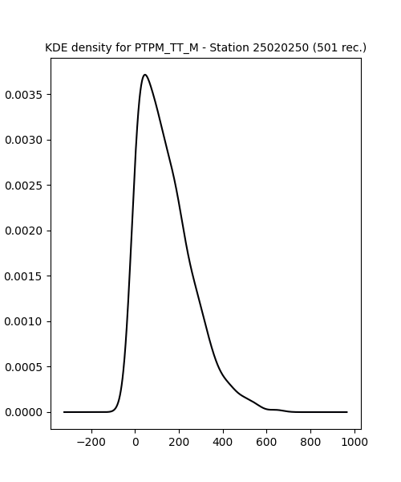

**PTPM_TT_M - Station: POPONTE [25020690] (504 rec.)** Location over [Google Maps](http://maps.google.com/maps?q=9.423277778,-73.41094444) or [Openstreet Map](https://www.openstreetmap.org/query?lat=9.423277778&lon=-73.41094444)

Station first record

| Fecha               |   CodigoEstacion | NombreEstacion     |   Latitud |   Longitud |   Altitud | Categoria     | Entidad                                                     | AreaOperativa                               | Departamento   | Municipio   | FechaInstalacion    | FechaSuspension   | IdParametro   | Etiqueta   | DescripcionSerie            | Frecuencia   |   Valor |   Grado |   Calificador |   NivelAprobacion |
|:--------------------|-----------------:|:-------------------|----------:|-----------:|----------:|:--------------|:------------------------------------------------------------|:--------------------------------------------|:---------------|:------------|:--------------------|:------------------|:--------------|:-----------|:----------------------------|:-------------|--------:|--------:|--------------:|------------------:|
| 1980-01-01 00:00:00 |         25020690 | POPONTE [25020690] |   9.42328 |   -73.4109 |       500 | Pluviométrica | INSTITUTO DE HIDROLOGIA METEOROLOGIA Y ESTUDIOS AMBIENTALES | Area Operativa 05 - Magdalena-Cesar-Guajira | Cesar          | Curumaní    | 1972-09-15 00:00:00 | NaT               | PRECIPITACION | PTPM_TT_M  | Precipitación total mensual | Mensual      |      60 |      50 |           nan |               900 |

Statistics table

|       |   Valor |
|:------|--------:|
| count | 504     |
| mean  | 153.358 |
| std   | 146.017 |
| min   |   0     |
| 25%   |  37     |
| 50%   | 112     |
| 75%   | 233.5   |
| max   | 753     |

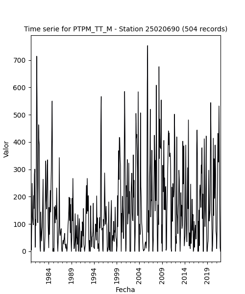
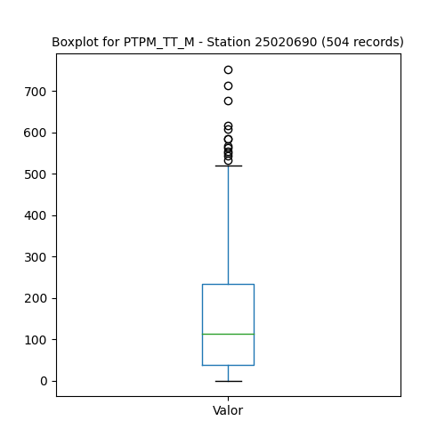
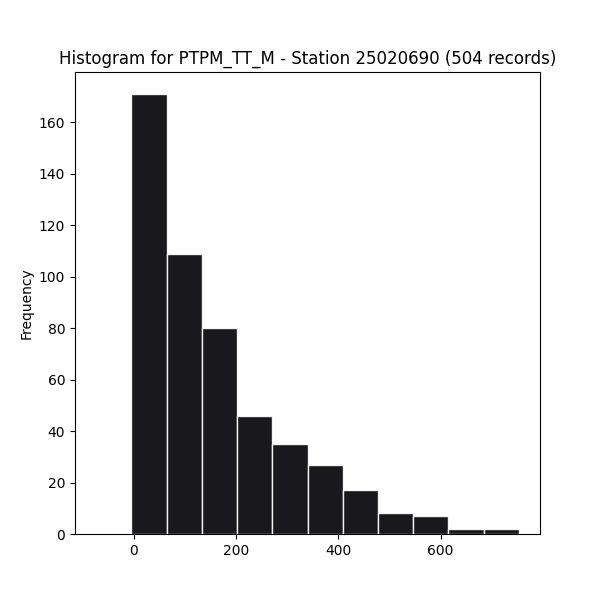
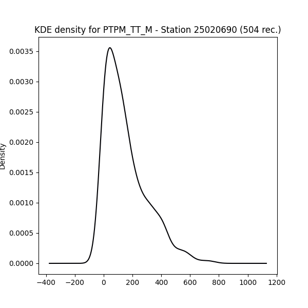

**PTPM_TT_M - Station: PRIMAVERA LA [25020920] (418 rec.)** Location over [Google Maps](http://maps.google.com/maps?q=9.216666667,-73.41666667) or [Openstreet Map](https://www.openstreetmap.org/query?lat=9.216666667&lon=-73.41666667)

Station first record

| Fecha               |   CodigoEstacion | NombreEstacion          |   Latitud |   Longitud |   Altitud | Categoria     | Entidad                                                     | AreaOperativa                               | Departamento   | Municipio   | FechaInstalacion    | FechaSuspension     | IdParametro   | Etiqueta   | DescripcionSerie            | Frecuencia   |   Valor |   Grado |   Calificador |   NivelAprobacion |
|:--------------------|-----------------:|:------------------------|----------:|-----------:|----------:|:--------------|:------------------------------------------------------------|:--------------------------------------------|:---------------|:------------|:--------------------|:--------------------|:--------------|:-----------|:----------------------------|:-------------|--------:|--------:|--------------:|------------------:|
| 1980-01-01 00:00:00 |         25020920 | PRIMAVERA LA [25020920] |   9.21667 |   -73.4167 |       500 | Pluviométrica | INSTITUTO DE HIDROLOGIA METEOROLOGIA Y ESTUDIOS AMBIENTALES | Area Operativa 05 - Magdalena-Cesar-Guajira | Cesar          | Curumaní    | 1972-09-15 00:00:00 | 2019-02-07 11:35:00 | PRECIPITACION | PTPM_TT_M  | Precipitación total mensual | Mensual      |       5 |      50 |           nan |               900 |

Statistics table

|       |    Valor |
|:------|---------:|
| count |  418     |
| mean  |  139.157 |
| std   |  173.081 |
| min   |    0     |
| 25%   |   30     |
| 50%   |   88.5   |
| 75%   |  184.475 |
| max   | 1274     |

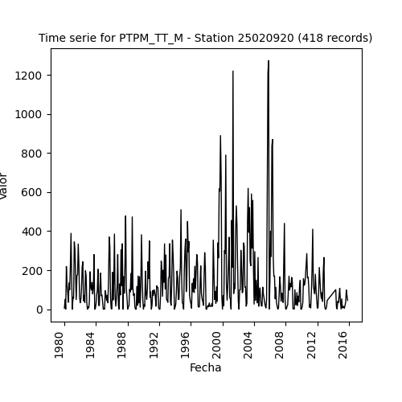
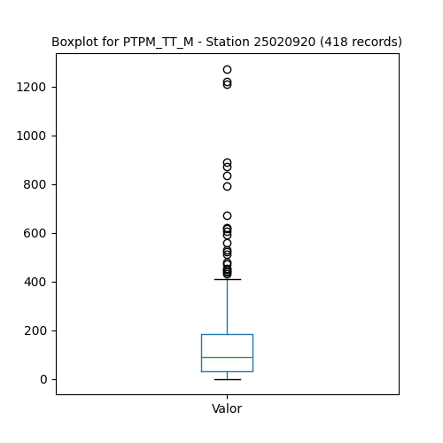
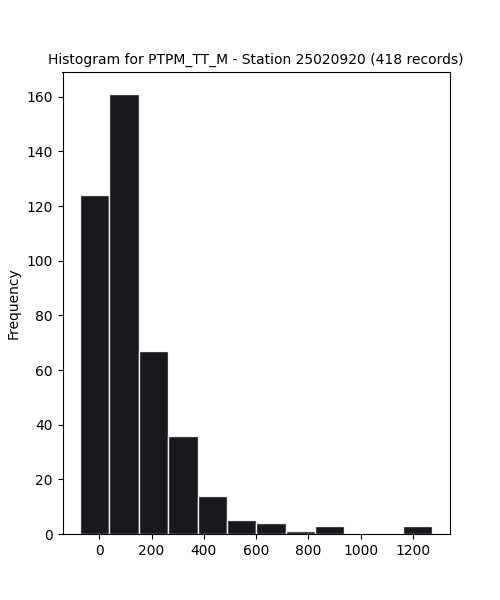
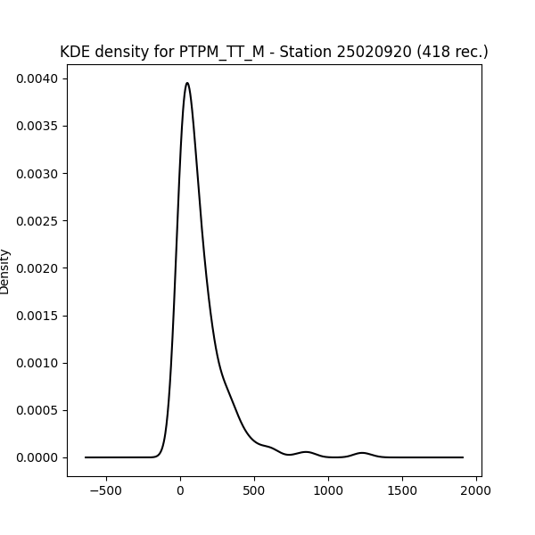

**PTPM_TT_M - Station: RINCONHONDO [25020260] (495 rec.)** Location over [Google Maps](http://maps.google.com/maps?q=9.397027778,-73.48802778) or [Openstreet Map](https://www.openstreetmap.org/query?lat=9.397027778&lon=-73.48802778)

Station first record

| Fecha               |   CodigoEstacion | NombreEstacion         |   Latitud |   Longitud |   Altitud | Categoria     | Entidad                                                     | AreaOperativa                               | Departamento   | Municipio   | FechaInstalacion    | FechaSuspension   | IdParametro   | Etiqueta   | DescripcionSerie            | Frecuencia   |   Valor |   Grado |   Calificador |   NivelAprobacion |
|:--------------------|-----------------:|:-----------------------|----------:|-----------:|----------:|:--------------|:------------------------------------------------------------|:--------------------------------------------|:---------------|:------------|:--------------------|:------------------|:--------------|:-----------|:----------------------------|:-------------|--------:|--------:|--------------:|------------------:|
| 1980-01-01 00:00:00 |         25020260 | RINCONHONDO [25020260] |   9.39703 |    -73.488 |       100 | Pluviométrica | INSTITUTO DE HIDROLOGIA METEOROLOGIA Y ESTUDIOS AMBIENTALES | Area Operativa 05 - Magdalena-Cesar-Guajira | Cesar          | Chiriguaná  | 1963-03-15 00:00:00 | NaT               | PRECIPITACION | PTPM_TT_M  | Precipitación total mensual | Mensual      |      43 |      50 |           nan |               900 |

Statistics table

|       |    Valor |
|:------|---------:|
| count |  495     |
| mean  |  221.96  |
| std   |  172.012 |
| min   |    0     |
| 25%   |   89     |
| 50%   |  205     |
| 75%   |  318.5   |
| max   | 1163     |

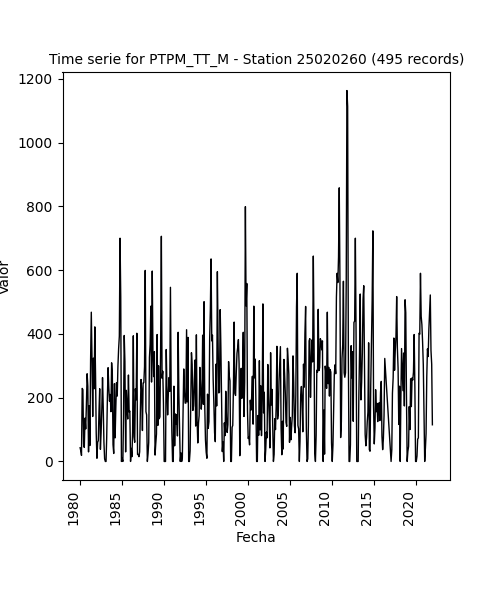
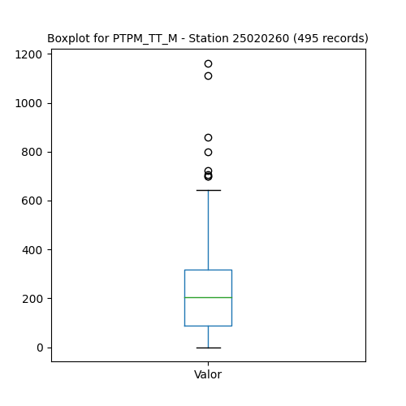
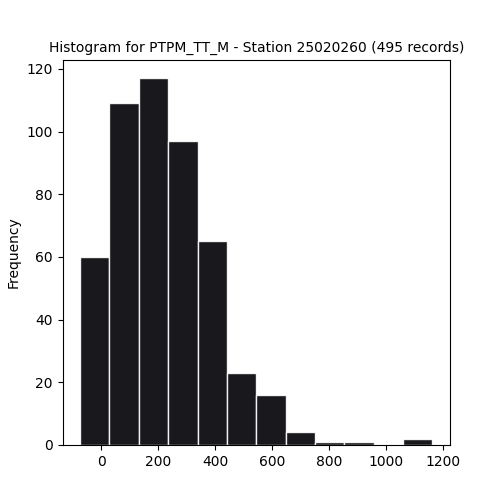
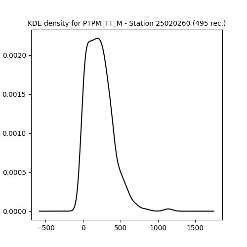

**PTPM_TT_M - Station: SALOA [25020270] (500 rec.)** Location over [Google Maps](http://maps.google.com/maps?q=9.193166667,-73.73130556) or [Openstreet Map](https://www.openstreetmap.org/query?lat=9.193166667&lon=-73.73130556)

Station first record

| Fecha               |   CodigoEstacion | NombreEstacion   |   Latitud |   Longitud |   Altitud | Categoria     | Entidad                                                     | AreaOperativa                               | Departamento   | Municipio   | FechaInstalacion    | FechaSuspension   | IdParametro   | Etiqueta   | DescripcionSerie            | Frecuencia   |   Valor |   Grado |   Calificador |   NivelAprobacion |
|:--------------------|-----------------:|:-----------------|----------:|-----------:|----------:|:--------------|:------------------------------------------------------------|:--------------------------------------------|:---------------|:------------|:--------------------|:------------------|:--------------|:-----------|:----------------------------|:-------------|--------:|--------:|--------------:|------------------:|
| 1980-01-01 00:00:00 |         25020270 | SALOA [25020270] |   9.19317 |   -73.7313 |        90 | Pluviométrica | INSTITUTO DE HIDROLOGIA METEOROLOGIA Y ESTUDIOS AMBIENTALES | Area Operativa 05 - Magdalena-Cesar-Guajira | Cesar          | Chimichagua | 1963-04-15 00:00:00 | NaT               | PRECIPITACION | PTPM_TT_M  | Precipitación total mensual | Mensual      |      31 |      50 |           nan |               900 |

Statistics table

|       |   Valor |
|:------|--------:|
| count | 500     |
| mean  | 168.683 |
| std   | 144.303 |
| min   |   0     |
| 25%   |  48     |
| 50%   | 136     |
| 75%   | 262     |
| max   | 627     |

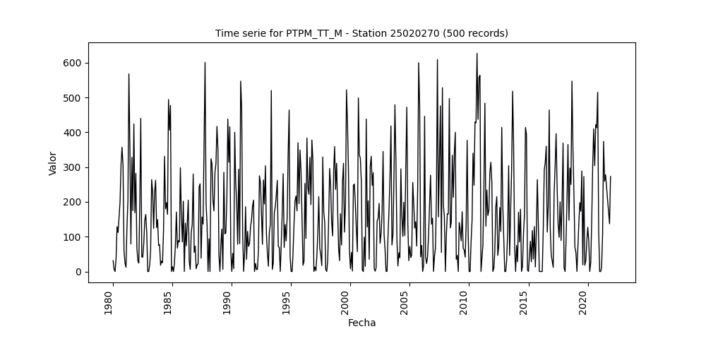
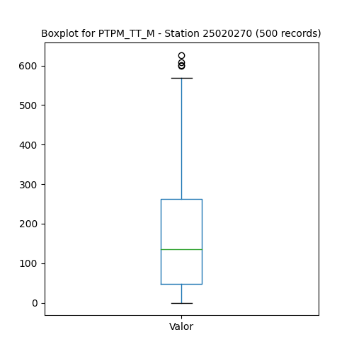
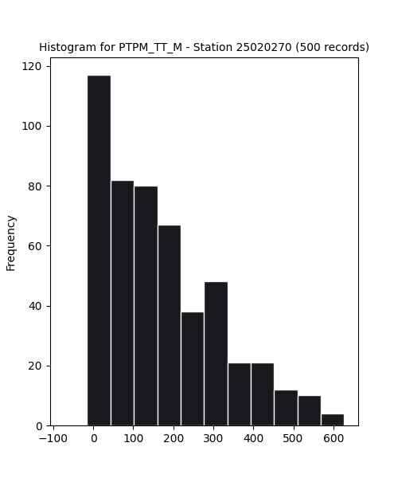
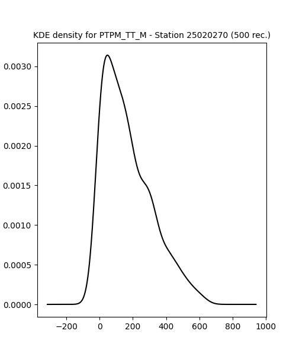

**PTPM_TT_M - Station: CENTENARIO HACIENDA [28025090] (500 rec.)** Location over [Google Maps](http://maps.google.com/maps?q=9.85025,-73.26547222) or [Openstreet Map](https://www.openstreetmap.org/query?lat=9.85025&lon=-73.26547222)

Station first record

| Fecha               |   CodigoEstacion | NombreEstacion                 |   Latitud |   Longitud |   Altitud | Categoria           | Entidad                                                     | AreaOperativa                               | Departamento   | Municipio       | FechaInstalacion    | FechaSuspension   | IdParametro   | Etiqueta   | DescripcionSerie            | Frecuencia   |   Valor |   Grado |   Calificador |   NivelAprobacion |
|:--------------------|-----------------:|:-------------------------------|----------:|-----------:|----------:|:--------------------|:------------------------------------------------------------|:--------------------------------------------|:---------------|:----------------|:--------------------|:------------------|:--------------|:-----------|:----------------------------|:-------------|--------:|--------:|--------------:|------------------:|
| 1980-01-01 00:00:00 |         28025090 | CENTENARIO HACIENDA [28025090] |   9.85025 |   -73.2655 |       100 | Climática Ordinaria | INSTITUTO DE HIDROLOGIA METEOROLOGIA Y ESTUDIOS AMBIENTALES | Area Operativa 05 - Magdalena-Cesar-Guajira | Cesar          | Agustín Codazzi | 1976-12-15 00:00:00 | NaT               | PRECIPITACION | PTPM_TT_M  | Precipitación total mensual | Mensual      |       0 |      50 |           nan |               900 |

Statistics table

|       |    Valor |
|:------|---------:|
| count | 500      |
| mean  | 123.833  |
| std   |  97.4444 |
| min   |   0      |
| 25%   |  45.3    |
| 50%   | 110.3    |
| 75%   | 187.725  |
| max   | 504.6    |

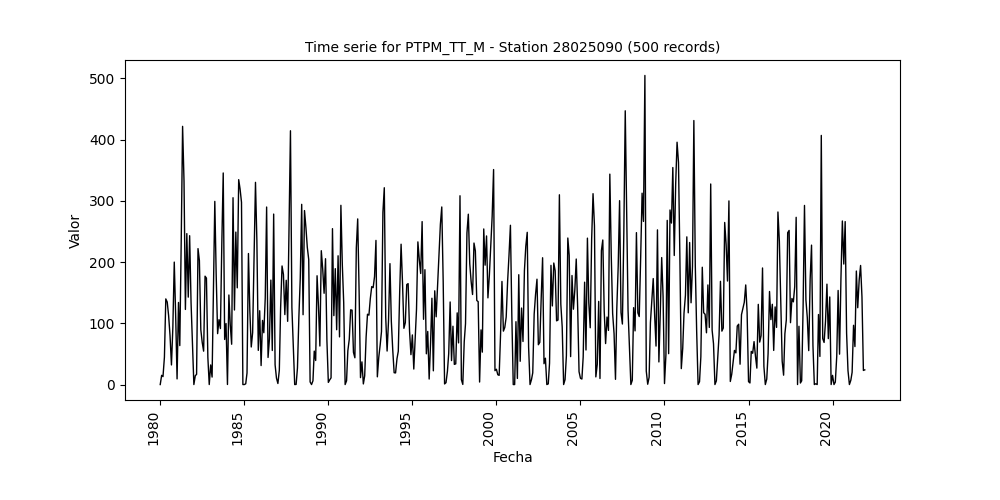
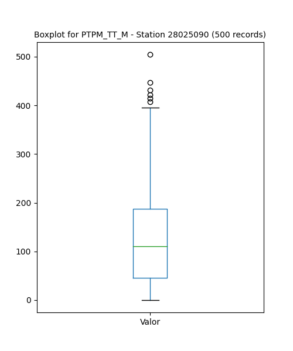
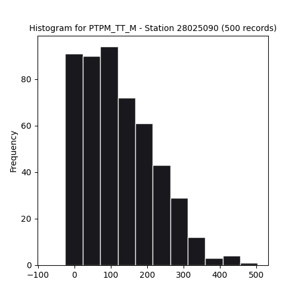
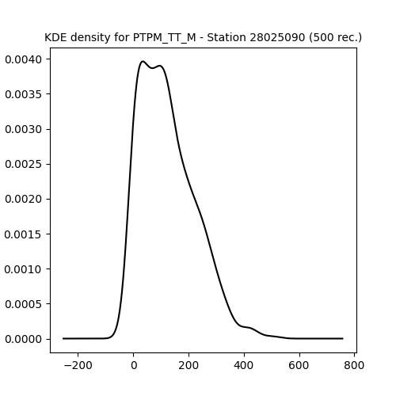

**PTPM_TT_M - Station: JAGUA LA [25020230] (482 rec.)** Location over [Google Maps](http://maps.google.com/maps?q=9.562166667,-73.33947222) or [Openstreet Map](https://www.openstreetmap.org/query?lat=9.562166667&lon=-73.33947222)

Station first record

| Fecha               |   CodigoEstacion | NombreEstacion      |   Latitud |   Longitud |   Altitud | Categoria     | Entidad                                                     | AreaOperativa                               | Departamento   | Municipio           | FechaInstalacion    | FechaSuspension   | IdParametro   | Etiqueta   | DescripcionSerie            | Frecuencia   |   Valor |   Grado |   Calificador |   NivelAprobacion |
|:--------------------|-----------------:|:--------------------|----------:|-----------:|----------:|:--------------|:------------------------------------------------------------|:--------------------------------------------|:---------------|:--------------------|:--------------------|:------------------|:--------------|:-----------|:----------------------------|:-------------|--------:|--------:|--------------:|------------------:|
| 1980-01-01 00:00:00 |         25020230 | JAGUA LA [25020230] |   9.56217 |   -73.3395 |       170 | Pluviométrica | INSTITUTO DE HIDROLOGIA METEOROLOGIA Y ESTUDIOS AMBIENTALES | Area Operativa 05 - Magdalena-Cesar-Guajira | Cesar          | La Jagua De Ibirico | 1963-08-15 00:00:00 | NaT               | PRECIPITACION | PTPM_TT_M  | Precipitación total mensual | Mensual      |       2 |      50 |           nan |               900 |

Statistics table

|       |   Valor |
|:------|--------:|
| count | 482     |
| mean  | 164.951 |
| std   | 141.109 |
| min   |   0     |
| 25%   |  56.225 |
| 50%   | 137     |
| 75%   | 241.5   |
| max   | 926     |

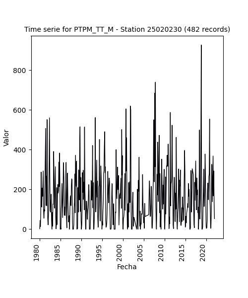
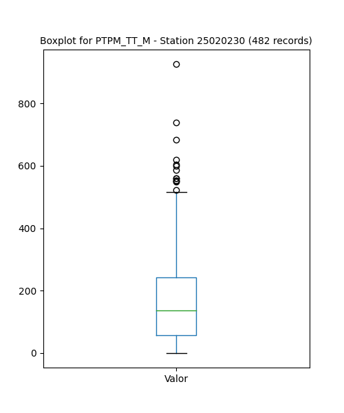
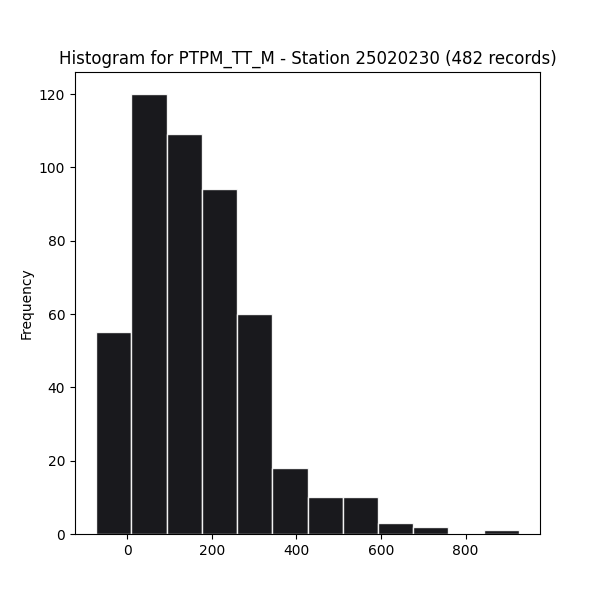
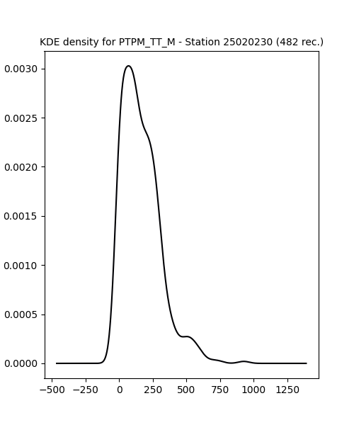

**PTPM_TT_M - Station: LLANOS LOS [28020230] (266 rec.)** Location over [Google Maps](http://maps.google.com/maps?q=9.733333333,-73.3) or [Openstreet Map](https://www.openstreetmap.org/query?lat=9.733333333&lon=-73.3)

Station first record

| Fecha               |   CodigoEstacion | NombreEstacion        |   Latitud |   Longitud |   Altitud | Categoria     | Entidad                                                     | AreaOperativa                               | Departamento   | Municipio   | FechaInstalacion    | FechaSuspension     | IdParametro   | Etiqueta   | DescripcionSerie            | Frecuencia   |   Valor |   Grado |   Calificador |   NivelAprobacion |
|:--------------------|-----------------:|:----------------------|----------:|-----------:|----------:|:--------------|:------------------------------------------------------------|:--------------------------------------------|:---------------|:------------|:--------------------|:--------------------|:--------------|:-----------|:----------------------------|:-------------|--------:|--------:|--------------:|------------------:|
| 1980-01-01 00:00:00 |         28020230 | LLANOS LOS [28020230] |   9.73333 |      -73.3 |       100 | Pluviométrica | INSTITUTO DE HIDROLOGIA METEOROLOGIA Y ESTUDIOS AMBIENTALES | Area Operativa 05 - Magdalena-Cesar-Guajira | Cesar          | Becerrill   | 1962-09-15 00:00:00 | 2010-10-15 00:00:00 | PRECIPITACION | PTPM_TT_M  | Precipitación total mensual | Mensual      |       0 |      50 |           nan |               900 |

Statistics table

|       |   Valor |
|:------|--------:|
| count | 266     |
| mean  | 125.781 |
| std   | 120.656 |
| min   |   0     |
| 25%   |  24.775 |
| 50%   | 110.1   |
| 75%   | 179.875 |
| max   | 675.7   |

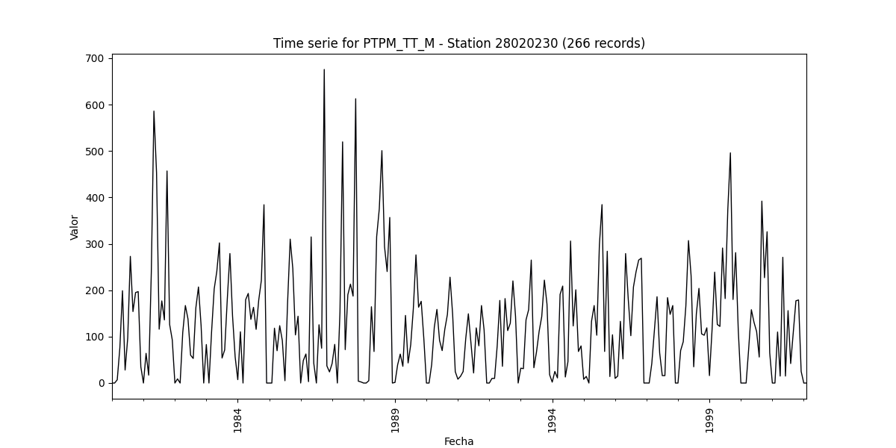
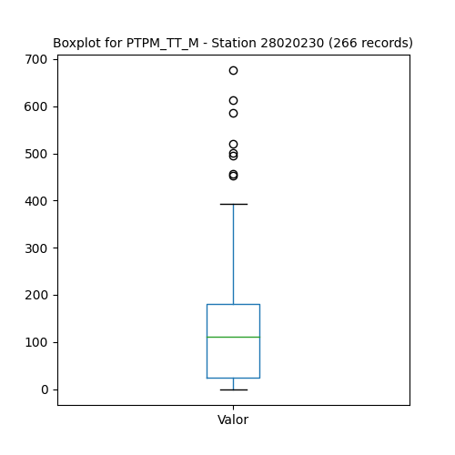
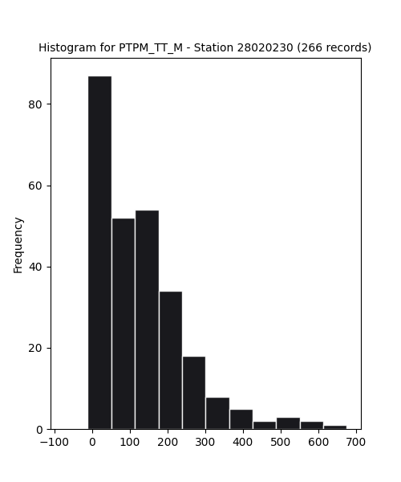

**PTPM_TT_M - Station: LOMA LA [25020280] (467 rec.)** Location over [Google Maps](http://maps.google.com/maps?q=9.606527778,-73.61197222) or [Openstreet Map](https://www.openstreetmap.org/query?lat=9.606527778&lon=-73.61197222)

Station first record

| Fecha               |   CodigoEstacion | NombreEstacion     |   Latitud |   Longitud |   Altitud | Categoria     | Entidad                                                     | AreaOperativa                               | Departamento   | Municipio   | FechaInstalacion    | FechaSuspension   | IdParametro   | Etiqueta   | DescripcionSerie            | Frecuencia   |   Valor |   Grado |   Calificador |   NivelAprobacion |
|:--------------------|-----------------:|:-------------------|----------:|-----------:|----------:|:--------------|:------------------------------------------------------------|:--------------------------------------------|:---------------|:------------|:--------------------|:------------------|:--------------|:-----------|:----------------------------|:-------------|--------:|--------:|--------------:|------------------:|
| 1980-01-01 00:00:00 |         25020280 | LOMA LA [25020280] |   9.60653 |    -73.612 |        30 | Pluviométrica | INSTITUTO DE HIDROLOGIA METEOROLOGIA Y ESTUDIOS AMBIENTALES | Area Operativa 05 - Magdalena-Cesar-Guajira | Cesar          | El Paso     | 1963-10-15 00:00:00 | NaT               | PRECIPITACION | PTPM_TT_M  | Precipitación total mensual | Mensual      |       0 |      50 |           nan |               900 |

Statistics table

|       |   Valor |
|:------|--------:|
| count | 467     |
| mean  | 127.036 |
| std   | 118.767 |
| min   |   0     |
| 25%   |  35     |
| 50%   | 102     |
| 75%   | 185     |
| max   | 749     |

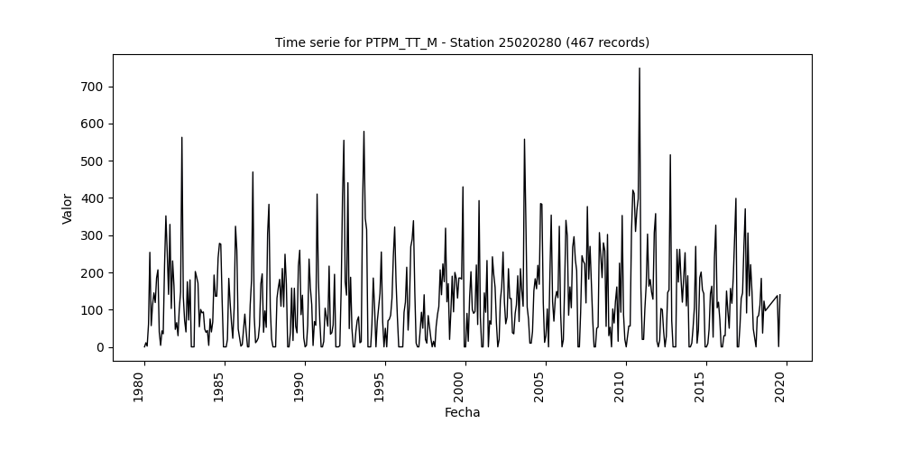
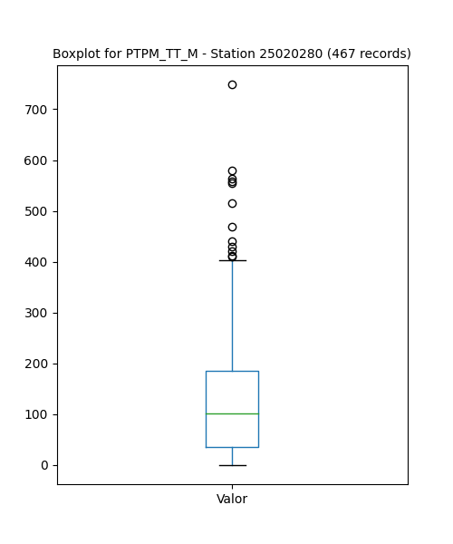
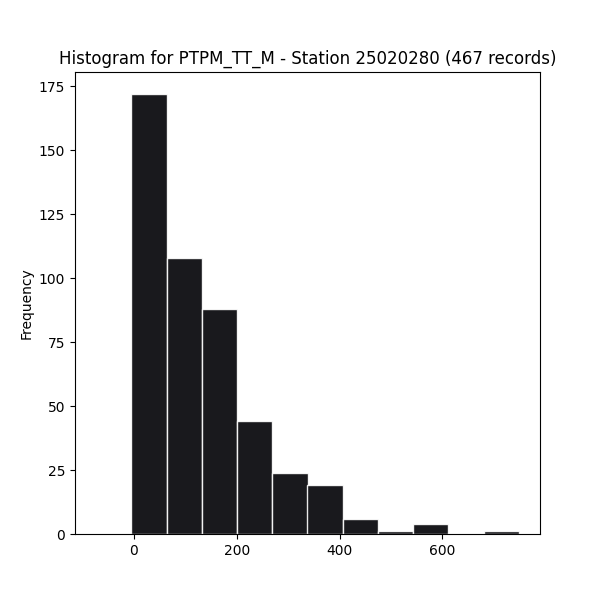
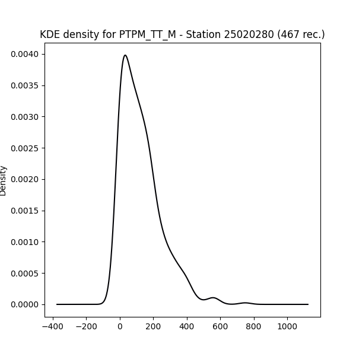

**PTPM_TT_M - Station: MOLINO EL [28040310] (357 rec.)** Location over [Google Maps](http://maps.google.com/maps?q=9.776055556,-73.74341667) or [Openstreet Map](https://www.openstreetmap.org/query?lat=9.776055556&lon=-73.74341667)

Station first record

| Fecha               |   CodigoEstacion | NombreEstacion       |   Latitud |   Longitud |   Altitud | Categoria     | Entidad                                                     | AreaOperativa                               | Departamento   | Municipio   | FechaInstalacion    | FechaSuspension     | IdParametro   | Etiqueta   | DescripcionSerie            | Frecuencia   |   Valor |   Grado |   Calificador |   NivelAprobacion |
|:--------------------|-----------------:|:---------------------|----------:|-----------:|----------:|:--------------|:------------------------------------------------------------|:--------------------------------------------|:---------------|:------------|:--------------------|:--------------------|:--------------|:-----------|:----------------------------|:-------------|--------:|--------:|--------------:|------------------:|
| 1980-01-01 00:00:00 |         28040310 | MOLINO EL [28040310] |   9.77606 |   -73.7434 |       110 | Pluviométrica | INSTITUTO DE HIDROLOGIA METEOROLOGIA Y ESTUDIOS AMBIENTALES | Area Operativa 05 - Magdalena-Cesar-Guajira | Cesar          | El Paso     | 1972-08-15 00:00:00 | 2016-06-01 00:00:00 | PRECIPITACION | PTPM_TT_M  | Precipitación total mensual | Mensual      |       0 |      50 |           nan |               900 |

Statistics table

|       |   Valor |
|:------|--------:|
| count | 357     |
| mean  | 114.399 |
| std   |  94.932 |
| min   |   0     |
| 25%   |  40     |
| 50%   | 101     |
| 75%   | 165     |
| max   | 521     |

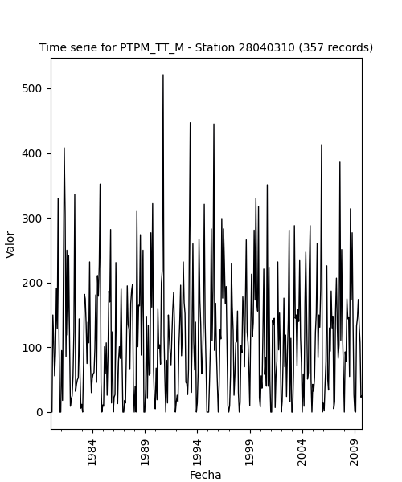
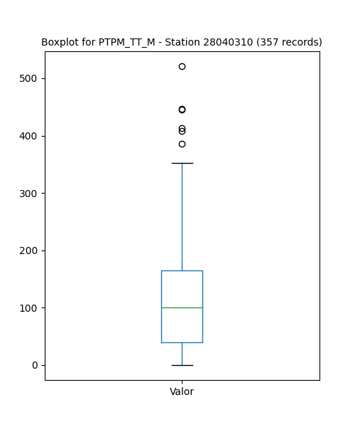

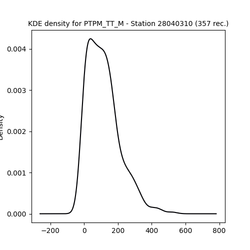

**PTPM_TT_M - Station: PASO EL   [28040350] (504 rec.)** Location over [Google Maps](http://maps.google.com/maps?q=9.656972222,-73.74369444) or [Openstreet Map](https://www.openstreetmap.org/query?lat=9.656972222&lon=-73.74369444)

Station first record

| Fecha               |   CodigoEstacion | NombreEstacion       |   Latitud |   Longitud |   Altitud | Categoria     | Entidad                                                     | AreaOperativa                               | Departamento   | Municipio   | FechaInstalacion    | FechaSuspension   | IdParametro   | Etiqueta   | DescripcionSerie            | Frecuencia   |   Valor |   Grado |   Calificador |   NivelAprobacion |
|:--------------------|-----------------:|:---------------------|----------:|-----------:|----------:|:--------------|:------------------------------------------------------------|:--------------------------------------------|:---------------|:------------|:--------------------|:------------------|:--------------|:-----------|:----------------------------|:-------------|--------:|--------:|--------------:|------------------:|
| 1980-01-01 00:00:00 |         28040350 | PASO EL   [28040350] |   9.65697 |   -73.7437 |        30 | Pluviométrica | INSTITUTO DE HIDROLOGIA METEOROLOGIA Y ESTUDIOS AMBIENTALES | Area Operativa 05 - Magdalena-Cesar-Guajira | Cesar          | El Paso     | 1972-08-15 00:00:00 | NaT               | PRECIPITACION | PTPM_TT_M  | Precipitación total mensual | Mensual      |       4 |      50 |           nan |               900 |

Statistics table

|       |    Valor |
|:------|---------:|
| count | 504      |
| mean  | 110.536  |
| std   |  99.4701 |
| min   |   0      |
| 25%   |  31.8    |
| 50%   |  93.6    |
| 75%   | 160.8    |
| max   | 673.4    |

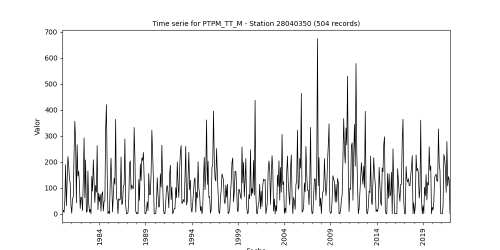
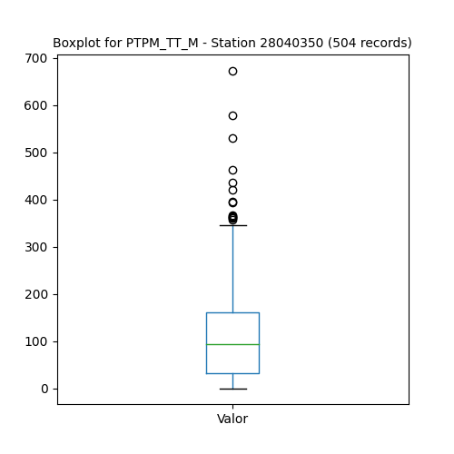
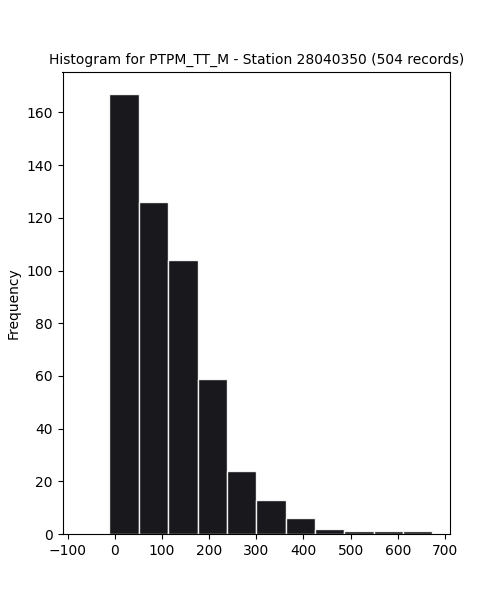
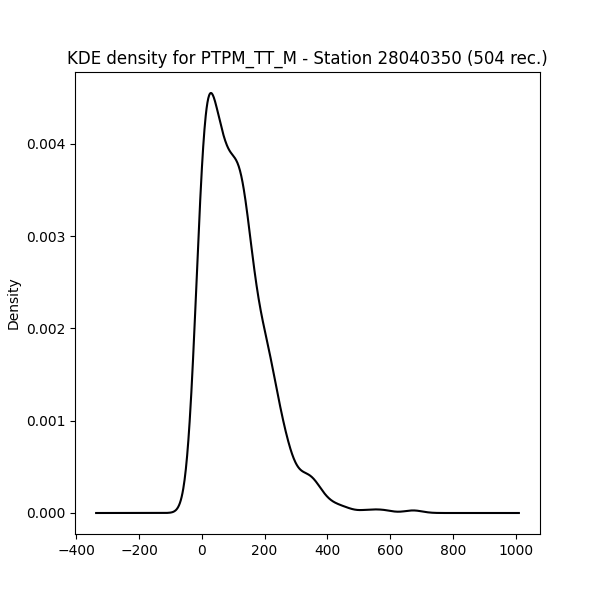

**PTPM_TT_M - Station: PLAYAS LAS HACIENDA [28020080] (470 rec.)** Location over [Google Maps](http://maps.google.com/maps?q=9.848083333,-73.46219444) or [Openstreet Map](https://www.openstreetmap.org/query?lat=9.848083333&lon=-73.46219444)

Station first record

| Fecha               |   CodigoEstacion | NombreEstacion                 |   Latitud |   Longitud |   Altitud | Categoria     | Entidad                                                     | AreaOperativa                               | Departamento   | Municipio       | FechaInstalacion    | FechaSuspension   | IdParametro   | Etiqueta   | DescripcionSerie            | Frecuencia   |   Valor |   Grado |   Calificador |   NivelAprobacion |
|:--------------------|-----------------:|:-------------------------------|----------:|-----------:|----------:|:--------------|:------------------------------------------------------------|:--------------------------------------------|:---------------|:----------------|:--------------------|:------------------|:--------------|:-----------|:----------------------------|:-------------|--------:|--------:|--------------:|------------------:|
| 1980-01-01 00:00:00 |         28020080 | PLAYAS LAS HACIENDA [28020080] |   9.84808 |   -73.4622 |        60 | Pluviométrica | INSTITUTO DE HIDROLOGIA METEOROLOGIA Y ESTUDIOS AMBIENTALES | Area Operativa 05 - Magdalena-Cesar-Guajira | Cesar          | Agustín Codazzi | 1959-08-15 00:00:00 | NaT               | PRECIPITACION | PTPM_TT_M  | Precipitación total mensual | Mensual      |       0 |      50 |           nan |               900 |

Statistics table

|       |   Valor |
|:------|--------:|
| count | 470     |
| mean  | 115.409 |
| std   | 105.649 |
| min   |   0     |
| 25%   |  30.25  |
| 50%   |  94     |
| 75%   | 172.5   |
| max   | 733     |

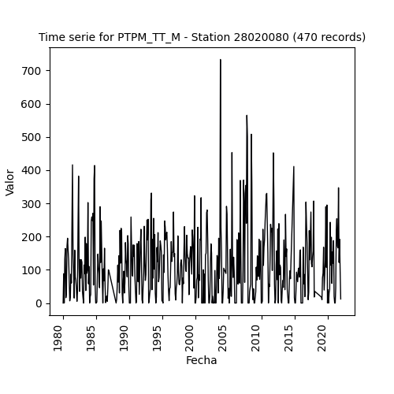
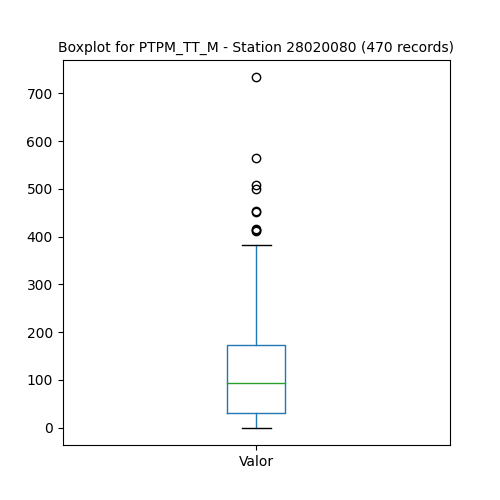

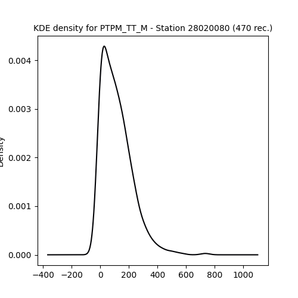

**PTPM_TT_M - Station: SAN GABRIEL [28020420] (448 rec.)** Location over [Google Maps](http://maps.google.com/maps?q=9.844611111,-73.54769444) or [Openstreet Map](https://www.openstreetmap.org/query?lat=9.844611111&lon=-73.54769444)

Station first record

| Fecha               |   CodigoEstacion | NombreEstacion         |   Latitud |   Longitud |   Altitud | Categoria     | Entidad                                                     | AreaOperativa                               | Departamento   | Municipio   | FechaInstalacion    | FechaSuspension   | IdParametro   | Etiqueta   | DescripcionSerie            | Frecuencia   |   Valor |   Grado |   Calificador |   NivelAprobacion |
|:--------------------|-----------------:|:-----------------------|----------:|-----------:|----------:|:--------------|:------------------------------------------------------------|:--------------------------------------------|:---------------|:------------|:--------------------|:------------------|:--------------|:-----------|:----------------------------|:-------------|--------:|--------:|--------------:|------------------:|
| 1980-01-01 00:00:00 |         28020420 | SAN GABRIEL [28020420] |   9.84461 |   -73.5477 |        70 | Pluviométrica | INSTITUTO DE HIDROLOGIA METEOROLOGIA Y ESTUDIOS AMBIENTALES | Area Operativa 05 - Magdalena-Cesar-Guajira | Cesar          | San Diego   | 1972-09-15 00:00:00 | NaT               | PRECIPITACION | PTPM_TT_M  | Precipitación total mensual | Mensual      |       0 |      50 |           nan |               900 |

Statistics table

|       |   Valor |
|:------|--------:|
| count | 448     |
| mean  | 122.556 |
| std   | 108.867 |
| min   |   0     |
| 25%   |  34.5   |
| 50%   | 102     |
| 75%   | 188     |
| max   | 567     |

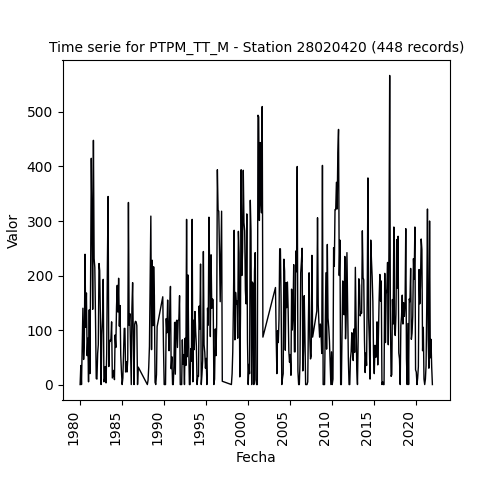
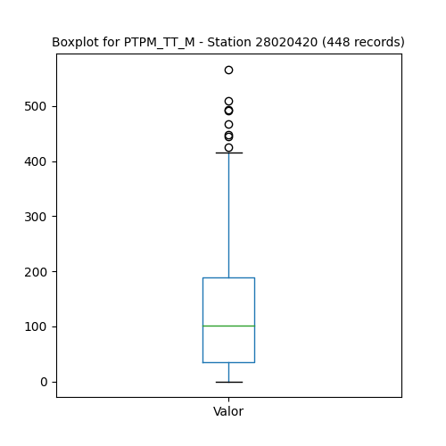
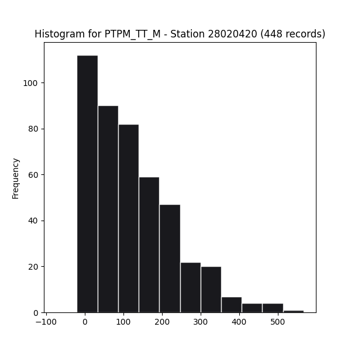

**PTPM_TT_M - Station: SOCOMBA [28025080] (347 rec.)** Location over [Google Maps](http://maps.google.com/maps?q=9.686666667,-73.24055556) or [Openstreet Map](https://www.openstreetmap.org/query?lat=9.686666667&lon=-73.24055556)

Station first record

| Fecha               |   CodigoEstacion | NombreEstacion     |   Latitud |   Longitud |   Altitud | Categoria           | Entidad                                                     | AreaOperativa                               | Departamento   | Municipio   | FechaInstalacion    | FechaSuspension     | IdParametro   | Etiqueta   | DescripcionSerie            | Frecuencia   |   Valor |   Grado |   Calificador |   NivelAprobacion |
|:--------------------|-----------------:|:-------------------|----------:|-----------:|----------:|:--------------------|:------------------------------------------------------------|:--------------------------------------------|:---------------|:------------|:--------------------|:--------------------|:--------------|:-----------|:----------------------------|:-------------|--------:|--------:|--------------:|------------------:|
| 1980-01-01 00:00:00 |         28025080 | SOCOMBA [28025080] |   9.68667 |   -73.2406 |       170 | Climática Principal | INSTITUTO DE HIDROLOGIA METEOROLOGIA Y ESTUDIOS AMBIENTALES | Area Operativa 05 - Magdalena-Cesar-Guajira | Cesar          | Becerrill   | 1976-12-15 00:00:00 | 2019-02-07 11:41:00 | PRECIPITACION | PTPM_TT_M  | Precipitación total mensual | Mensual      |    18.5 |      50 |           nan |               900 |

Statistics table

|       |    Valor |
|:------|---------:|
| count | 347      |
| mean  | 127.758  |
| std   |  98.1071 |
| min   |   0      |
| 25%   |  46.6    |
| 50%   | 113      |
| 75%   | 188.65   |
| max   | 496.9    |

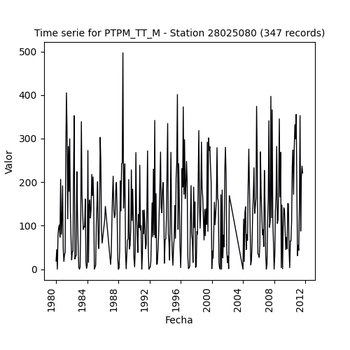

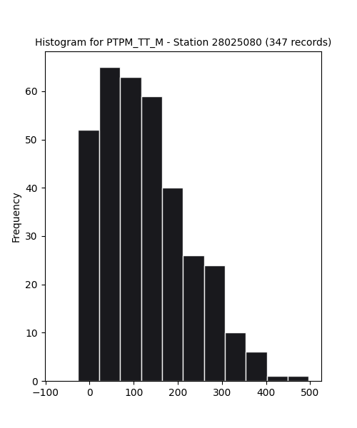
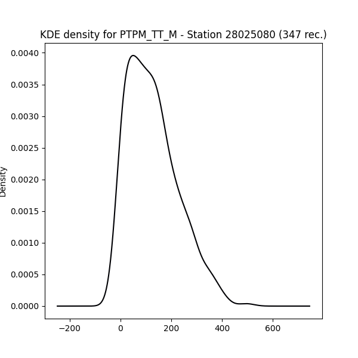

**PTPM_TT_M - Station: YUCAL EL [25021650] (442 rec.)** Location over [Google Maps](http://maps.google.com/maps?q=9.557388889,-73.87619444) or [Openstreet Map](https://www.openstreetmap.org/query?lat=9.557388889&lon=-73.87619444)

Station first record

| Fecha               |   CodigoEstacion | NombreEstacion      |   Latitud |   Longitud |   Altitud | Categoria     | Entidad                                                     | AreaOperativa                               | Departamento   | Municipio   | FechaInstalacion    | FechaSuspension   | IdParametro   | Etiqueta   | DescripcionSerie            | Frecuencia   |   Valor |   Grado |   Calificador |   NivelAprobacion |
|:--------------------|-----------------:|:--------------------|----------:|-----------:|----------:|:--------------|:------------------------------------------------------------|:--------------------------------------------|:---------------|:------------|:--------------------|:------------------|:--------------|:-----------|:----------------------------|:-------------|--------:|--------:|--------------:|------------------:|
| 1984-12-01 00:00:00 |         25021650 | YUCAL EL [25021650] |   9.55739 |   -73.8762 |        40 | Pluviométrica | INSTITUTO DE HIDROLOGIA METEOROLOGIA Y ESTUDIOS AMBIENTALES | Area Operativa 05 - Magdalena-Cesar-Guajira | Cesar          | Astrea      | 1984-11-15 00:00:00 | NaT               | PRECIPITACION | PTPM_TT_M  | Precipitación total mensual | Mensual      |       0 |      50 |           nan |               900 |

Statistics table

|       |   Valor |
|:------|--------:|
| count | 442     |
| mean  | 132.213 |
| std   | 129.695 |
| min   |   0     |
| 25%   |  32.25  |
| 50%   | 102.6   |
| 75%   | 198.5   |
| max   | 910     |

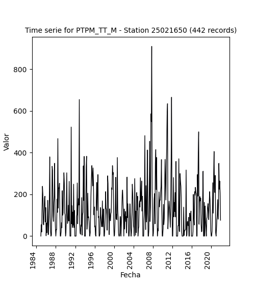
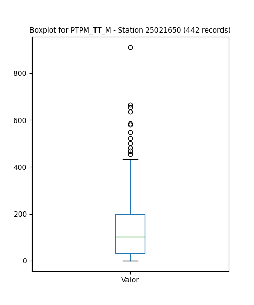
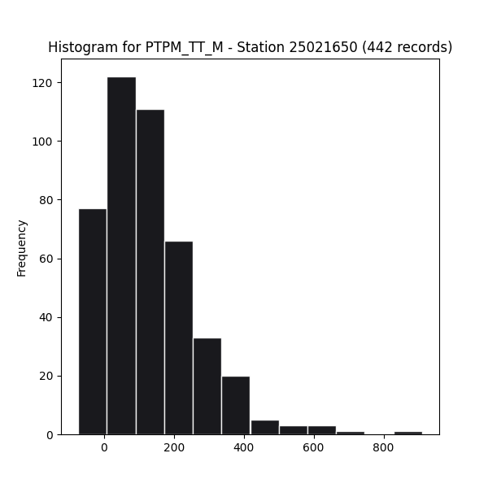
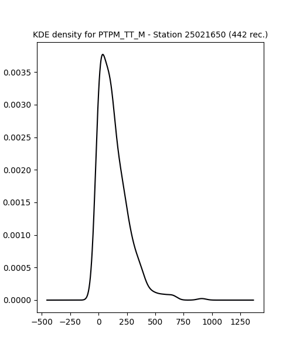

**PTPM_TT_M - Station: BOSCONIA [28040030] (499 rec.)** Location over [Google Maps](http://maps.google.com/maps?q=9.97575,-73.88175) or [Openstreet Map](https://www.openstreetmap.org/query?lat=9.97575&lon=-73.88175)

Station first record

| Fecha               |   CodigoEstacion | NombreEstacion      |   Latitud |   Longitud |   Altitud | Categoria     | Entidad                                                     | AreaOperativa                               | Departamento   | Municipio   | FechaInstalacion    | FechaSuspension   | IdParametro   | Etiqueta   | DescripcionSerie            | Frecuencia   |   Valor |   Grado |   Calificador |   NivelAprobacion |
|:--------------------|-----------------:|:--------------------|----------:|-----------:|----------:|:--------------|:------------------------------------------------------------|:--------------------------------------------|:---------------|:------------|:--------------------|:------------------|:--------------|:-----------|:----------------------------|:-------------|--------:|--------:|--------------:|------------------:|
| 1980-01-01 00:00:00 |         28040030 | BOSCONIA [28040030] |   9.97575 |   -73.8817 |       130 | Pluviométrica | INSTITUTO DE HIDROLOGIA METEOROLOGIA Y ESTUDIOS AMBIENTALES | Area Operativa 05 - Magdalena-Cesar-Guajira | Cesar          | Bosconia    | 1979-11-15 00:00:00 | NaT               | PRECIPITACION | PTPM_TT_M  | Precipitación total mensual | Mensual      |      30 |       4 |           nan |               900 |

Statistics table

|       |    Valor |
|:------|---------:|
| count |  499     |
| mean  |  116.19  |
| std   |  125.578 |
| min   |    0     |
| 25%   |   28     |
| 50%   |   90     |
| 75%   |  156.8   |
| max   | 1053     |

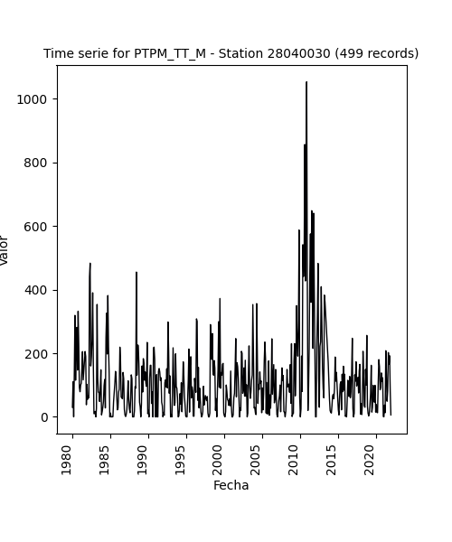
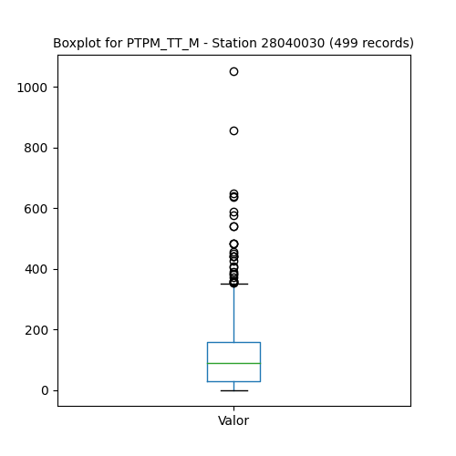
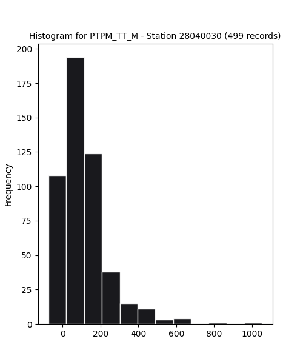
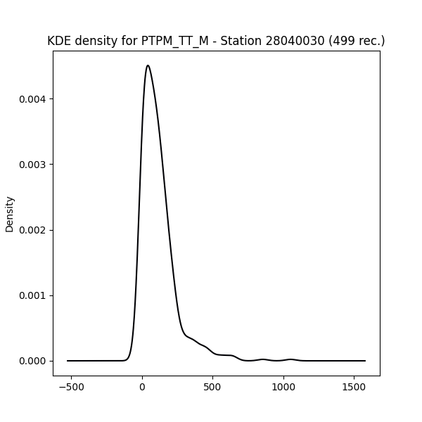

**PTPM_TT_M - Station: CODAZZI DC [28020460] (498 rec.)** Location over [Google Maps](http://maps.google.com/maps?q=10.04463889,-73.24338889) or [Openstreet Map](https://www.openstreetmap.org/query?lat=10.04463889&lon=-73.24338889)

Station first record

| Fecha               |   CodigoEstacion | NombreEstacion        |   Latitud |   Longitud |   Altitud | Categoria     | Entidad                                                     | AreaOperativa                               | Departamento   | Municipio       | FechaInstalacion    | FechaSuspension   | IdParametro   | Etiqueta   | DescripcionSerie            | Frecuencia   |   Valor |   Grado |   Calificador |   NivelAprobacion |
|:--------------------|-----------------:|:----------------------|----------:|-----------:|----------:|:--------------|:------------------------------------------------------------|:--------------------------------------------|:---------------|:----------------|:--------------------|:------------------|:--------------|:-----------|:----------------------------|:-------------|--------:|--------:|--------------:|------------------:|
| 1980-01-01 00:00:00 |         28020460 | CODAZZI DC [28020460] |   10.0446 |   -73.2434 |        90 | Pluviométrica | INSTITUTO DE HIDROLOGIA METEOROLOGIA Y ESTUDIOS AMBIENTALES | Area Operativa 05 - Magdalena-Cesar-Guajira | Cesar          | Agustín Codazzi | 1979-11-15 00:00:00 | NaT               | PRECIPITACION | PTPM_TT_M  | Precipitación total mensual | Mensual      |       0 |       4 |           nan |               900 |

Statistics table

|       |   Valor |
|:------|--------:|
| count | 498     |
| mean  | 128.521 |
| std   | 108.515 |
| min   |   0     |
| 25%   |  46.25  |
| 50%   | 104.5   |
| 75%   | 192.75  |
| max   | 591     |

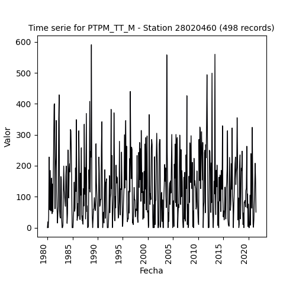
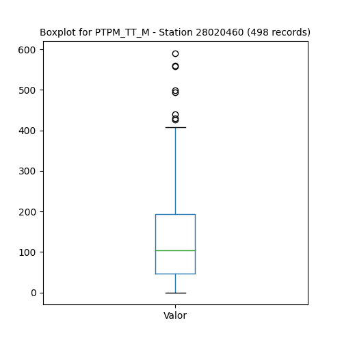

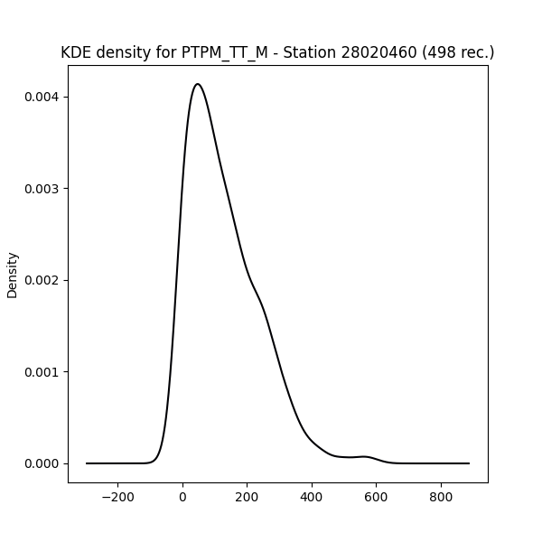

**PTPM_TT_M - Station: ESPERANZA LA HACIENDA [28020150] (431 rec.)** Location over [Google Maps](http://maps.google.com/maps?q=10.02997222,-73.66883333) or [Openstreet Map](https://www.openstreetmap.org/query?lat=10.02997222&lon=-73.66883333)

Station first record

| Fecha               |   CodigoEstacion | NombreEstacion                   |   Latitud |   Longitud |   Altitud | Categoria     | Entidad                                                     | AreaOperativa                               | Departamento   | Municipio   | FechaInstalacion    | FechaSuspension   | IdParametro   | Etiqueta   | DescripcionSerie            | Frecuencia   |   Valor |   Grado |   Calificador |   NivelAprobacion |
|:--------------------|-----------------:|:---------------------------------|----------:|-----------:|----------:|:--------------|:------------------------------------------------------------|:--------------------------------------------|:---------------|:------------|:--------------------|:------------------|:--------------|:-----------|:----------------------------|:-------------|--------:|--------:|--------------:|------------------:|
| 1986-01-01 00:00:00 |         28020150 | ESPERANZA LA HACIENDA [28020150] |     10.03 |   -73.6688 |        60 | Pluviométrica | INSTITUTO DE HIDROLOGIA METEOROLOGIA Y ESTUDIOS AMBIENTALES | Area Operativa 05 - Magdalena-Cesar-Guajira | Cesar          | Valledupar  | 1961-05-15 00:00:00 | NaT               | PRECIPITACION | PTPM_TT_M  | Precipitación total mensual | Mensual      |       0 |       4 |           nan |               900 |

Statistics table

|       |    Valor |
|:------|---------:|
| count | 431      |
| mean  | 108.619  |
| std   |  88.2291 |
| min   |   0      |
| 25%   |  42      |
| 50%   |  89.2    |
| 75%   | 159      |
| max   | 518      |

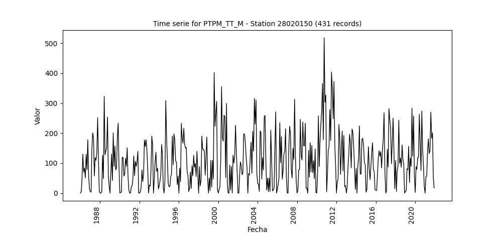
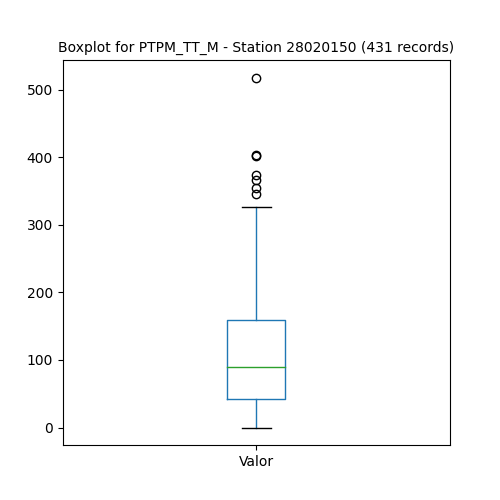
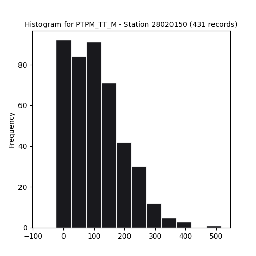

**PTPM_TT_M - Station: GUAYMARAL [28035040] (492 rec.)** Location over [Google Maps](http://maps.google.com/maps?q=9.904916667,-73.64752778) or [Openstreet Map](https://www.openstreetmap.org/query?lat=9.904916667&lon=-73.64752778)

Station first record

| Fecha               |   CodigoEstacion | NombreEstacion       |   Latitud |   Longitud |   Altitud | Categoria           | Entidad                                                     | AreaOperativa                               | Departamento   | Municipio   | FechaInstalacion    | FechaSuspension   | IdParametro   | Etiqueta   | DescripcionSerie            | Frecuencia   |   Valor |   Grado |   Calificador |   NivelAprobacion |
|:--------------------|-----------------:|:---------------------|----------:|-----------:|----------:|:--------------------|:------------------------------------------------------------|:--------------------------------------------|:---------------|:------------|:--------------------|:------------------|:--------------|:-----------|:----------------------------|:-------------|--------:|--------:|--------------:|------------------:|
| 1980-01-01 00:00:00 |         28035040 | GUAYMARAL [28035040] |   9.90492 |   -73.6475 |        50 | Climática Ordinaria | INSTITUTO DE HIDROLOGIA METEOROLOGIA Y ESTUDIOS AMBIENTALES | Area Operativa 05 - Magdalena-Cesar-Guajira | Cesar          | Valledupar  | 1972-08-15 00:00:00 | NaT               | PRECIPITACION | PTPM_TT_M  | Precipitación total mensual | Mensual      |       0 |      50 |           nan |               900 |

Statistics table

|       |   Valor |
|:------|--------:|
| count | 492     |
| mean  | 107.14  |
| std   |  84.195 |
| min   |   0     |
| 25%   |  33.375 |
| 50%   |  97.45  |
| 75%   | 154.225 |
| max   | 425     |

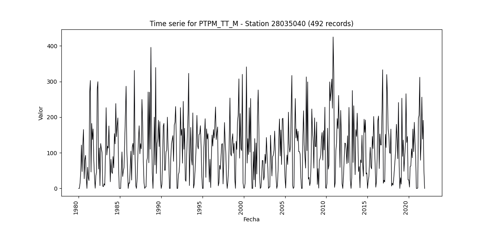
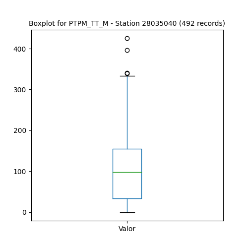

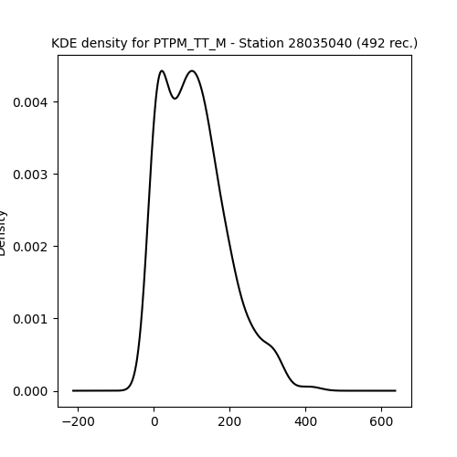

**PTPM_TT_M - Station: MANATURE HACIENDA [28040270] (484 rec.)** Location over [Google Maps](http://maps.google.com/maps?q=10.03511111,-73.78852778) or [Openstreet Map](https://www.openstreetmap.org/query?lat=10.03511111&lon=-73.78852778)

Station first record

| Fecha               |   CodigoEstacion | NombreEstacion               |   Latitud |   Longitud |   Altitud | Categoria     | Entidad                                                     | AreaOperativa                               | Departamento   | Municipio   | FechaInstalacion    | FechaSuspension   | IdParametro   | Etiqueta   | DescripcionSerie            | Frecuencia   |   Valor |   Grado |   Calificador |   NivelAprobacion |
|:--------------------|-----------------:|:-----------------------------|----------:|-----------:|----------:|:--------------|:------------------------------------------------------------|:--------------------------------------------|:---------------|:------------|:--------------------|:------------------|:--------------|:-----------|:----------------------------|:-------------|--------:|--------:|--------------:|------------------:|
| 1980-01-01 00:00:00 |         28040270 | MANATURE HACIENDA [28040270] |   10.0351 |   -73.7885 |       150 | Pluviométrica | INSTITUTO DE HIDROLOGIA METEOROLOGIA Y ESTUDIOS AMBIENTALES | Area Operativa 05 - Magdalena-Cesar-Guajira | Cesar          | Bosconia    | 1968-09-15 00:00:00 | NaT               | PRECIPITACION | PTPM_TT_M  | Precipitación total mensual | Mensual      |       0 |      50 |           nan |               900 |

Statistics table

|       |    Valor |
|:------|---------:|
| count | 484      |
| mean  | 107.482  |
| std   |  89.9329 |
| min   |   0      |
| 25%   |  30      |
| 50%   |  98      |
| 75%   | 159      |
| max   | 560      |

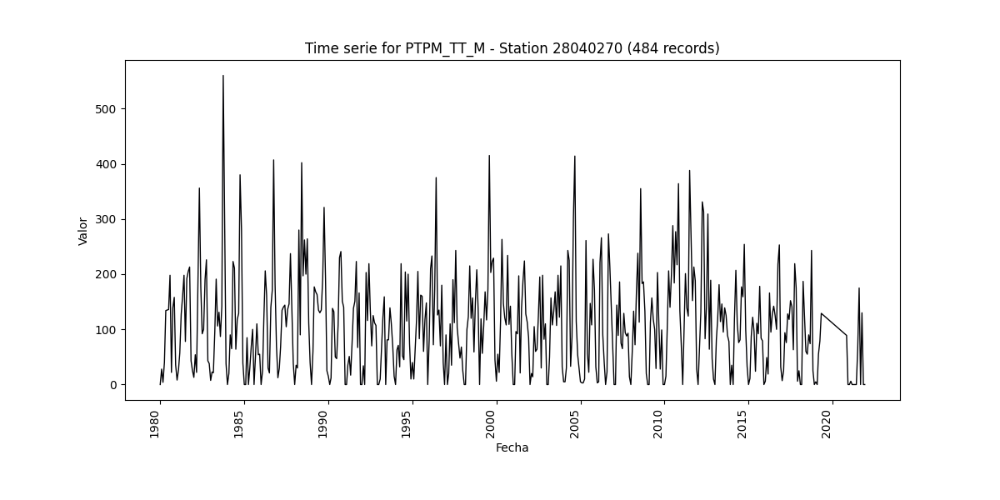
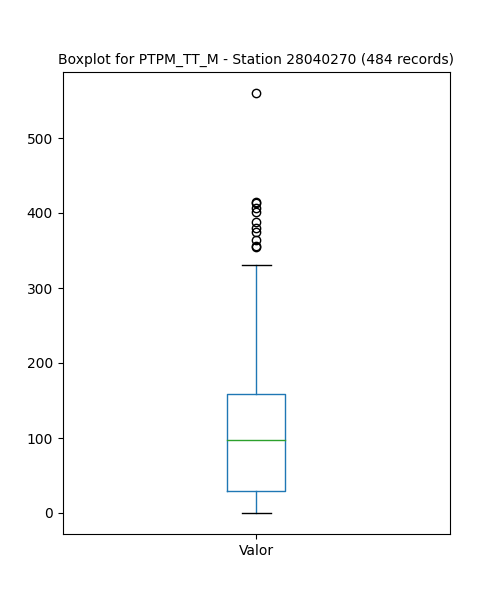
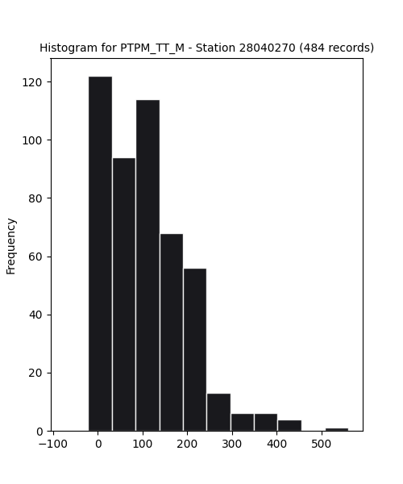
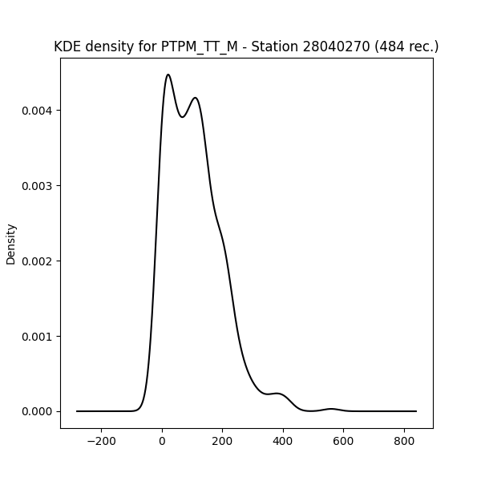

**PTPM_TT_M - Station: MOTILONIA CODAZZI [28025070] (504 rec.)** Location over [Google Maps](http://maps.google.com/maps?q=10.00180556,-73.24938889) or [Openstreet Map](https://www.openstreetmap.org/query?lat=10.00180556&lon=-73.24938889)

Station first record

| Fecha               |   CodigoEstacion | NombreEstacion               |   Latitud |   Longitud |   Altitud | Categoria         | Entidad                                                     | AreaOperativa                               | Departamento   | Municipio       | FechaInstalacion    | FechaSuspension   | IdParametro   | Etiqueta   | DescripcionSerie            | Frecuencia   |   Valor |   Grado |   Calificador |   NivelAprobacion |
|:--------------------|-----------------:|:-----------------------------|----------:|-----------:|----------:|:------------------|:------------------------------------------------------------|:--------------------------------------------|:---------------|:----------------|:--------------------|:------------------|:--------------|:-----------|:----------------------------|:-------------|--------:|--------:|--------------:|------------------:|
| 1980-01-01 00:00:00 |         28025070 | MOTILONIA CODAZZI [28025070] |   10.0018 |   -73.2494 |       180 | Agrometeorológica | INSTITUTO DE HIDROLOGIA METEOROLOGIA Y ESTUDIOS AMBIENTALES | Area Operativa 05 - Magdalena-Cesar-Guajira | Cesar          | Agustín Codazzi | 1956-01-15 00:00:00 | NaT               | PRECIPITACION | PTPM_TT_M  | Precipitación total mensual | Mensual      |       0 |      50 |           nan |               900 |

Statistics table

|       |   Valor |
|:------|--------:|
| count | 504     |
| mean  | 131.555 |
| std   | 104.05  |
| min   |   0     |
| 25%   |  47.95  |
| 50%   | 114.7   |
| 75%   | 194.45  |
| max   | 550.8   |

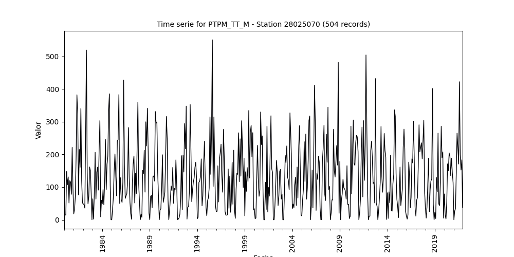
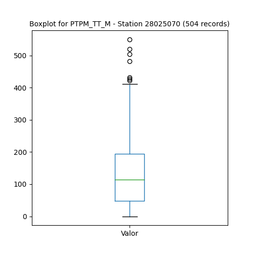
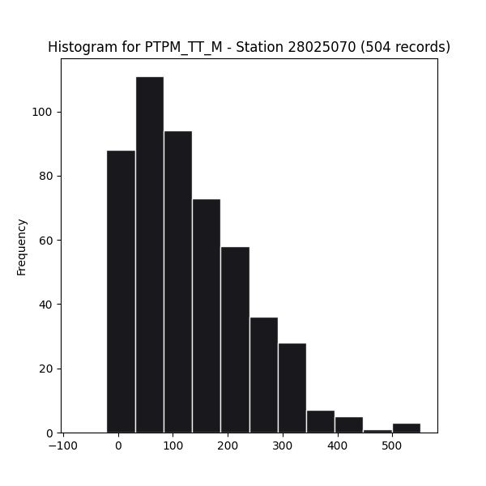
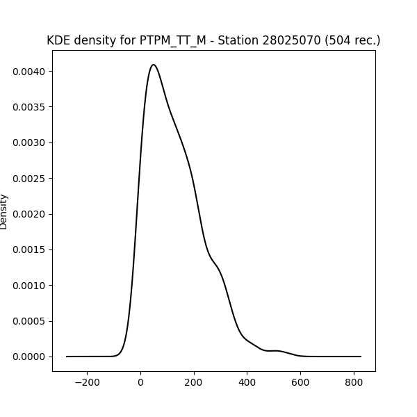

**PTPM_TT_M - Station: PALMARIGUANI [28040070] (494 rec.)** Location over [Google Maps](http://maps.google.com/maps?q=9.930083333,-73.95488889) or [Openstreet Map](https://www.openstreetmap.org/query?lat=9.930083333&lon=-73.95488889)

Station first record

| Fecha               |   CodigoEstacion | NombreEstacion          |   Latitud |   Longitud |   Altitud | Categoria     | Entidad                                                     | AreaOperativa                               | Departamento   | Municipio   | FechaInstalacion    | FechaSuspension   | IdParametro   | Etiqueta   | DescripcionSerie            | Frecuencia   |   Valor |   Grado |   Calificador |   NivelAprobacion |
|:--------------------|-----------------:|:------------------------|----------:|-----------:|----------:|:--------------|:------------------------------------------------------------|:--------------------------------------------|:---------------|:------------|:--------------------|:------------------|:--------------|:-----------|:----------------------------|:-------------|--------:|--------:|--------------:|------------------:|
| 1980-01-01 00:00:00 |         28040070 | PALMARIGUANI [28040070] |   9.93008 |   -73.9549 |        80 | Pluviométrica | INSTITUTO DE HIDROLOGIA METEOROLOGIA Y ESTUDIOS AMBIENTALES | Area Operativa 05 - Magdalena-Cesar-Guajira | Cesar          | Bosconia    | 1963-01-15 00:00:00 | NaT               | PRECIPITACION | PTPM_TT_M  | Precipitación total mensual | Mensual      |       5 |      50 |           nan |               900 |

Statistics table

|       |    Valor |
|:------|---------:|
| count | 494      |
| mean  | 111.56   |
| std   |  88.4919 |
| min   |   0      |
| 25%   |  40      |
| 50%   | 100      |
| 75%   | 165      |
| max   | 415      |

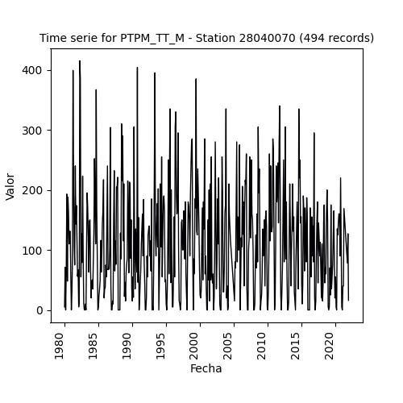
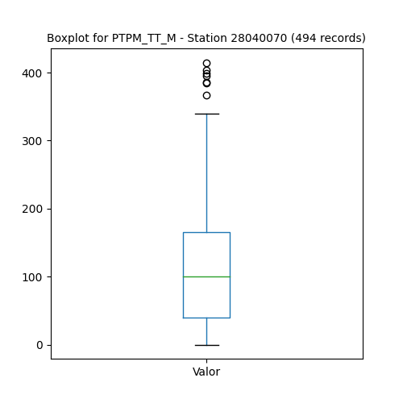

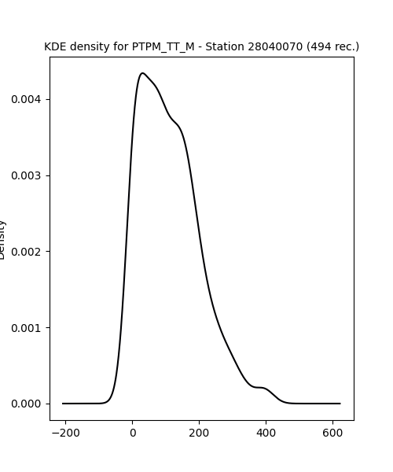

**PTPM_TT_M - Station: PALMASOLA [28040400] (358 rec.)** Location over [Google Maps](http://maps.google.com/maps?q=9.977416667,-73.88930556) or [Openstreet Map](https://www.openstreetmap.org/query?lat=9.977416667&lon=-73.88930556)

Station first record

| Fecha               |   CodigoEstacion | NombreEstacion       |   Latitud |   Longitud |   Altitud | Categoria     | Entidad                                                     | AreaOperativa                               | Departamento   | Municipio   | FechaInstalacion    | FechaSuspension     | IdParametro   | Etiqueta   | DescripcionSerie            | Frecuencia   |   Valor |   Grado |   Calificador |   NivelAprobacion |
|:--------------------|-----------------:|:---------------------|----------:|-----------:|----------:|:--------------|:------------------------------------------------------------|:--------------------------------------------|:---------------|:------------|:--------------------|:--------------------|:--------------|:-----------|:----------------------------|:-------------|--------:|--------:|--------------:|------------------:|
| 1984-06-01 00:00:00 |         28040400 | PALMASOLA [28040400] |   9.97742 |   -73.8893 |        50 | Pluviométrica | INSTITUTO DE HIDROLOGIA METEOROLOGIA Y ESTUDIOS AMBIENTALES | Area Operativa 05 - Magdalena-Cesar-Guajira | Cesar          | Bosconia    | 1984-06-15 00:00:00 | 2019-02-07 11:42:00 | PRECIPITACION | PTPM_TT_M  | Precipitación total mensual | Mensual      |    86.2 |       4 |           nan |               900 |

Statistics table

|       |    Valor |
|:------|---------:|
| count | 358      |
| mean  | 103.43   |
| std   |  86.8242 |
| min   |   0      |
| 25%   |  34.25   |
| 50%   |  85      |
| 75%   | 148      |
| max   | 398      |

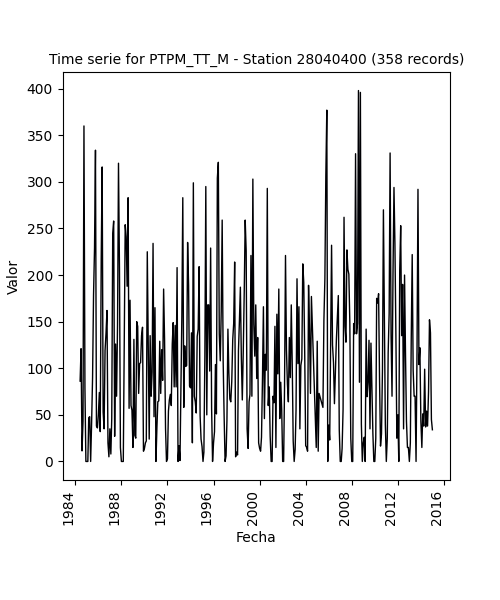
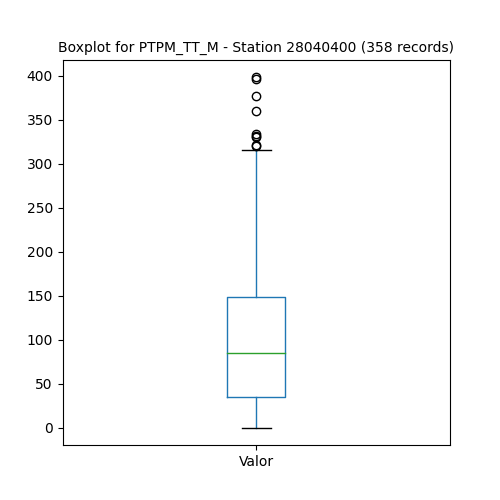
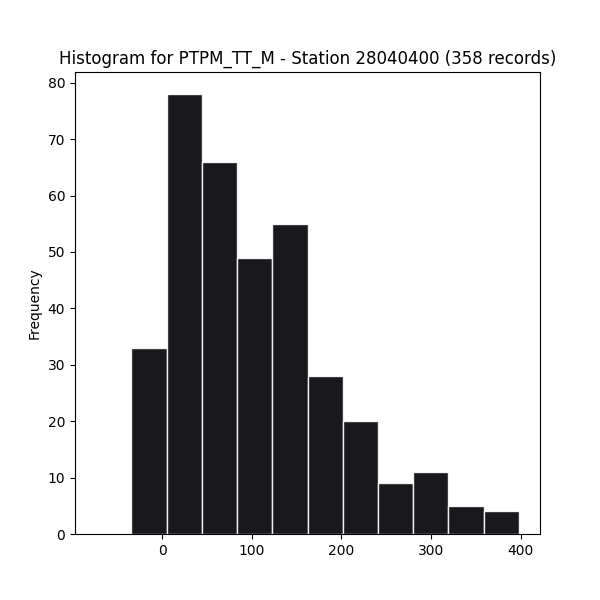

**PTPM_TT_M - Station: RETORNO EL [28020600] (468 rec.)** Location over [Google Maps](http://maps.google.com/maps?q=9.854722222,-73.35716667) or [Openstreet Map](https://www.openstreetmap.org/query?lat=9.854722222&lon=-73.35716667)

Station first record

| Fecha               |   CodigoEstacion | NombreEstacion        |   Latitud |   Longitud |   Altitud | Categoria     | Entidad                                                     | AreaOperativa                               | Departamento   | Municipio       | FechaInstalacion    | FechaSuspension   | IdParametro   | Etiqueta   | DescripcionSerie            | Frecuencia   |   Valor |   Grado |   Calificador |   NivelAprobacion |
|:--------------------|-----------------:|:----------------------|----------:|-----------:|----------:|:--------------|:------------------------------------------------------------|:--------------------------------------------|:---------------|:----------------|:--------------------|:------------------|:--------------|:-----------|:----------------------------|:-------------|--------:|--------:|--------------:|------------------:|
| 1981-12-01 00:00:00 |         28020600 | RETORNO EL [28020600] |   9.85472 |   -73.3572 |       150 | Pluviométrica | INSTITUTO DE HIDROLOGIA METEOROLOGIA Y ESTUDIOS AMBIENTALES | Area Operativa 05 - Magdalena-Cesar-Guajira | Cesar          | Agustín Codazzi | 1979-02-15 00:00:00 | NaT               | PRECIPITACION | PTPM_TT_M  | Precipitación total mensual | Mensual      |      56 |       4 |           nan |               900 |

Statistics table

|       |   Valor |
|:------|--------:|
| count | 468     |
| mean  | 112.204 |
| std   |  97.752 |
| min   |   0     |
| 25%   |  33.75  |
| 50%   |  86     |
| 75%   | 172.85  |
| max   | 609     |

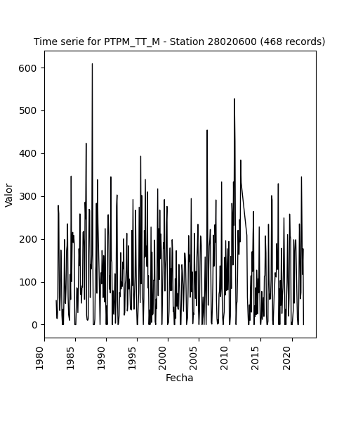
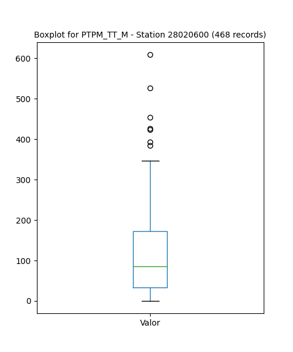
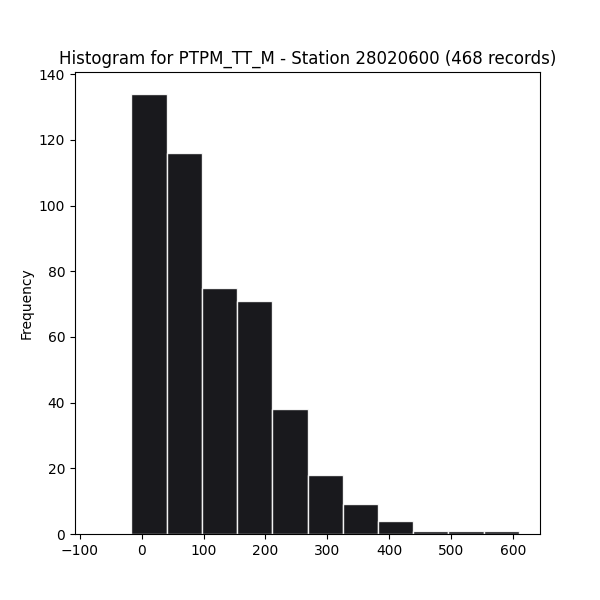
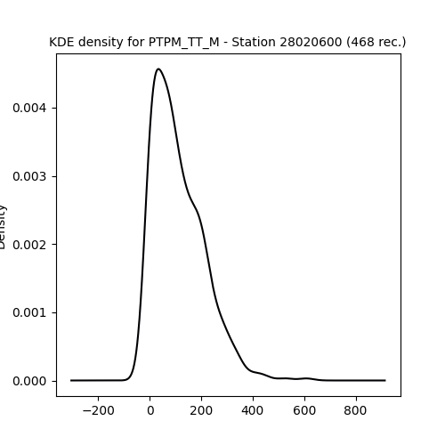

**PTPM_TT_M - Station: SANTA TERESA HACIENDA [28020440] (492 rec.)** Location over [Google Maps](http://maps.google.com/maps?q=9.917027778,-73.28613889) or [Openstreet Map](https://www.openstreetmap.org/query?lat=9.917027778&lon=-73.28613889)

Station first record

| Fecha               |   CodigoEstacion | NombreEstacion                   |   Latitud |   Longitud |   Altitud | Categoria     | Entidad                                                     | AreaOperativa                               | Departamento   | Municipio       | FechaInstalacion    | FechaSuspension   | IdParametro   | Etiqueta   | DescripcionSerie            | Frecuencia   |   Valor |   Grado |   Calificador |   NivelAprobacion |
|:--------------------|-----------------:|:---------------------------------|----------:|-----------:|----------:|:--------------|:------------------------------------------------------------|:--------------------------------------------|:---------------|:----------------|:--------------------|:------------------|:--------------|:-----------|:----------------------------|:-------------|--------:|--------:|--------------:|------------------:|
| 1980-01-01 00:00:00 |         28020440 | SANTA TERESA HACIENDA [28020440] |   9.91703 |   -73.2861 |        80 | Pluviométrica | INSTITUTO DE HIDROLOGIA METEOROLOGIA Y ESTUDIOS AMBIENTALES | Area Operativa 05 - Magdalena-Cesar-Guajira | Cesar          | Agustín Codazzi | 1959-04-15 00:00:00 | NaT               | PRECIPITACION | PTPM_TT_M  | Precipitación total mensual | Mensual      |       0 |      50 |           nan |               900 |

Statistics table

|       |   Valor |
|:------|--------:|
| count | 492     |
| mean  | 127.331 |
| std   | 101.811 |
| min   |   0     |
| 25%   |  45     |
| 50%   | 109.4   |
| 75%   | 192     |
| max   | 610.6   |

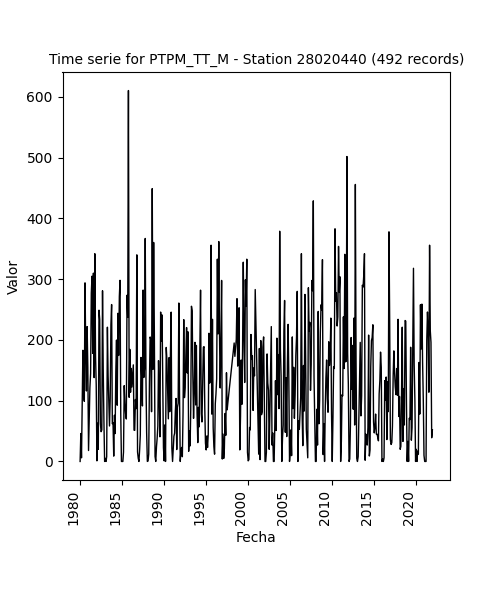
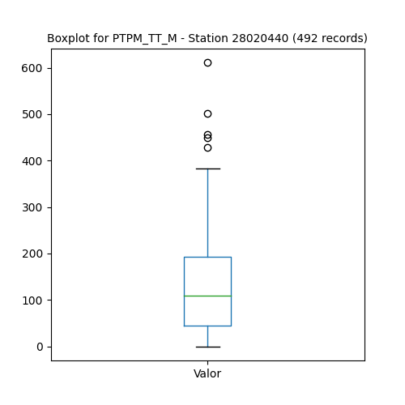
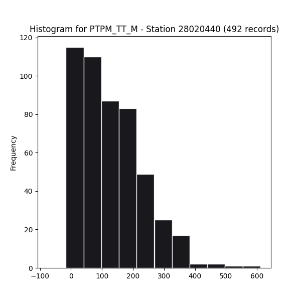
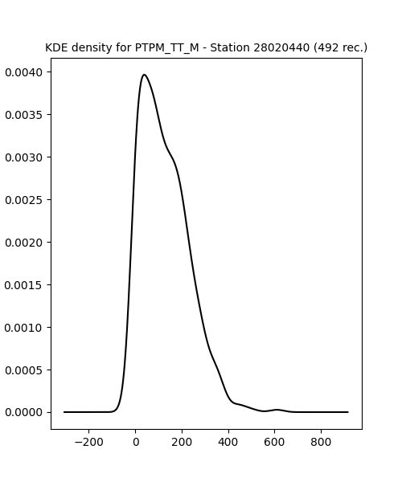

**PTPM_TT_M - Station: BOGOTANA LA [28020310] (281 rec.)** Location over [Google Maps](http://maps.google.com/maps?q=10.1,-73.15) or [Openstreet Map](https://www.openstreetmap.org/query?lat=10.1&lon=-73.15)

Station first record

| Fecha               |   CodigoEstacion | NombreEstacion         |   Latitud |   Longitud |   Altitud | Categoria     | Entidad                                                     | AreaOperativa                               | Departamento   | Municipio       | FechaInstalacion    | FechaSuspension     | IdParametro   | Etiqueta   | DescripcionSerie            | Frecuencia   |   Valor |   Grado |   Calificador |   NivelAprobacion |
|:--------------------|-----------------:|:-----------------------|----------:|-----------:|----------:|:--------------|:------------------------------------------------------------|:--------------------------------------------|:---------------|:----------------|:--------------------|:--------------------|:--------------|:-----------|:----------------------------|:-------------|--------:|--------:|--------------:|------------------:|
| 1980-01-01 00:00:00 |         28020310 | BOGOTANA LA [28020310] |      10.1 |     -73.15 |       200 | Pluviométrica | INSTITUTO DE HIDROLOGIA METEOROLOGIA Y ESTUDIOS AMBIENTALES | Area Operativa 05 - Magdalena-Cesar-Guajira | Cesar          | Agustín Codazzi | 1968-09-15 00:00:00 | 2004-08-15 00:00:00 | PRECIPITACION | PTPM_TT_M  | Precipitación total mensual | Mensual      |       2 |      50 |           nan |               900 |

Statistics table

|       |   Valor |
|:------|--------:|
| count | 281     |
| mean  | 180.133 |
| std   | 148.914 |
| min   |   0     |
| 25%   |  63     |
| 50%   | 145     |
| 75%   | 261     |
| max   | 723     |

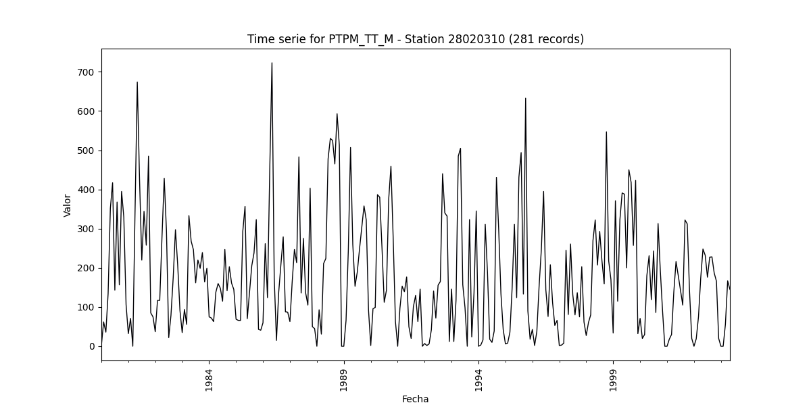
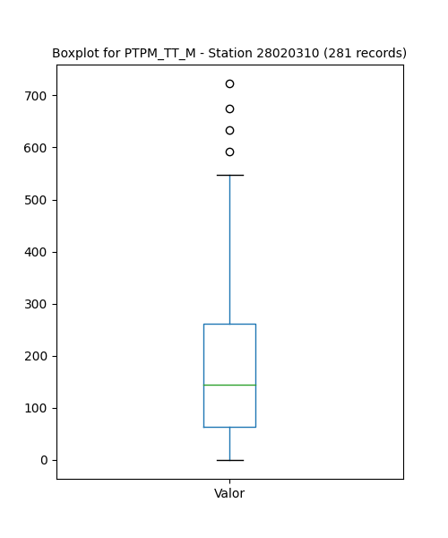
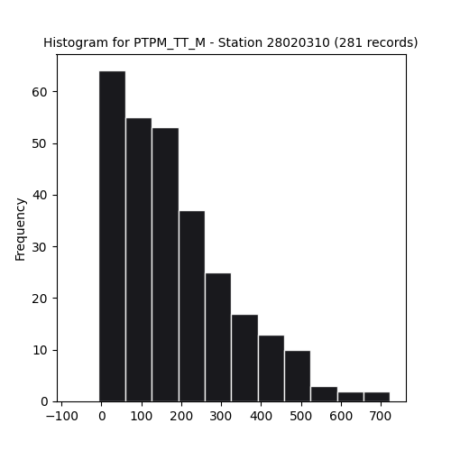
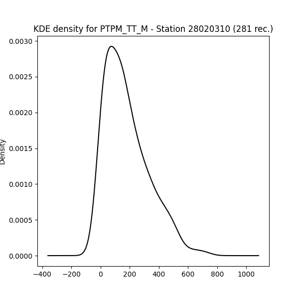

**PTPM_TT_M - Station: CARACOLI [28030190] (504 rec.)** Location over [Google Maps](http://maps.google.com/maps?q=10.08869444,-73.73172222) or [Openstreet Map](https://www.openstreetmap.org/query?lat=10.08869444&lon=-73.73172222)

Station first record

| Fecha               |   CodigoEstacion | NombreEstacion      |   Latitud |   Longitud |   Altitud | Categoria     | Entidad                                                     | AreaOperativa                               | Departamento   | Municipio   | FechaInstalacion    | FechaSuspension   | IdParametro   | Etiqueta   | DescripcionSerie            | Frecuencia   |   Valor |   Grado |   Calificador |   NivelAprobacion |
|:--------------------|-----------------:|:--------------------|----------:|-----------:|----------:|:--------------|:------------------------------------------------------------|:--------------------------------------------|:---------------|:------------|:--------------------|:------------------|:--------------|:-----------|:----------------------------|:-------------|--------:|--------:|--------------:|------------------:|
| 1980-01-01 00:00:00 |         28030190 | CARACOLI [28030190] |   10.0887 |   -73.7317 |       220 | Pluviométrica | INSTITUTO DE HIDROLOGIA METEOROLOGIA Y ESTUDIOS AMBIENTALES | Area Operativa 05 - Magdalena-Cesar-Guajira | Cesar          | Valledupar  | 1972-07-15 00:00:00 | NaT               | PRECIPITACION | PTPM_TT_M  | Precipitación total mensual | Mensual      |      14 |      50 |           nan |               900 |

Statistics table

|       |    Valor |
|:------|---------:|
| count | 504      |
| mean  |  93.3151 |
| std   |  86.66   |
| min   |   0      |
| 25%   |  14.475  |
| 50%   |  82.8    |
| 75%   | 144.55   |
| max   | 450.8    |

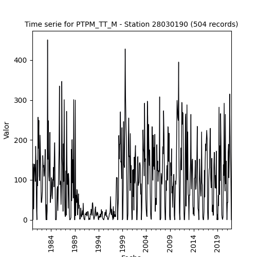
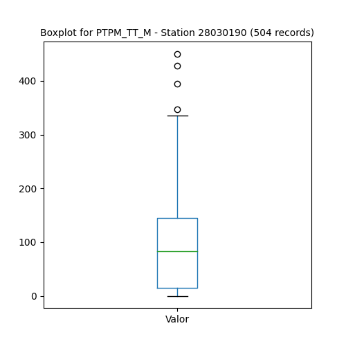
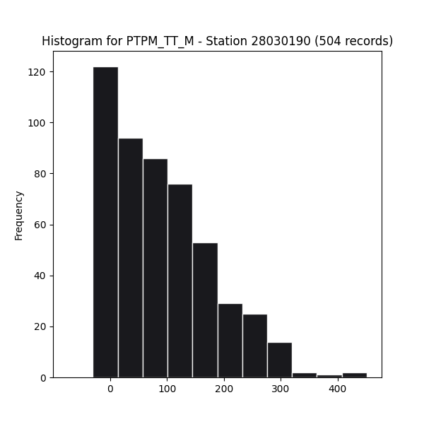

**PTPM_TT_M - Station: CHIMILAIMA [28040200] (187 rec.)** Location over [Google Maps](http://maps.google.com/maps?q=10.06666667,-73.76666667) or [Openstreet Map](https://www.openstreetmap.org/query?lat=10.06666667&lon=-73.76666667)

Station first record

| Fecha               |   CodigoEstacion | NombreEstacion        |   Latitud |   Longitud |   Altitud | Categoria     | Entidad                                                     | AreaOperativa                               | Departamento   | Municipio   | FechaInstalacion    | FechaSuspension     | IdParametro   | Etiqueta   | DescripcionSerie            | Frecuencia   |   Valor |   Grado |   Calificador |   NivelAprobacion |
|:--------------------|-----------------:|:----------------------|----------:|-----------:|----------:|:--------------|:------------------------------------------------------------|:--------------------------------------------|:---------------|:------------|:--------------------|:--------------------|:--------------|:-----------|:----------------------------|:-------------|--------:|--------:|--------------:|------------------:|
| 1980-01-01 00:00:00 |         28040200 | CHIMILAIMA [28040200] |   10.0667 |   -73.7667 |       120 | Pluviométrica | INSTITUTO DE HIDROLOGIA METEOROLOGIA Y ESTUDIOS AMBIENTALES | Area Operativa 05 - Magdalena-Cesar-Guajira | Cesar          | Bosconia    | 1962-08-15 00:00:00 | 1996-12-15 00:00:00 | PRECIPITACION | PTPM_TT_M  | Precipitación total mensual | Mensual      |       0 |      50 |           nan |               900 |

Statistics table

|       |    Valor |
|:------|---------:|
| count | 187      |
| mean  |  96.7465 |
| std   |  74.8121 |
| min   |   0      |
| 25%   |  33.5    |
| 50%   |  91      |
| 75%   | 146.5    |
| max   | 374      |

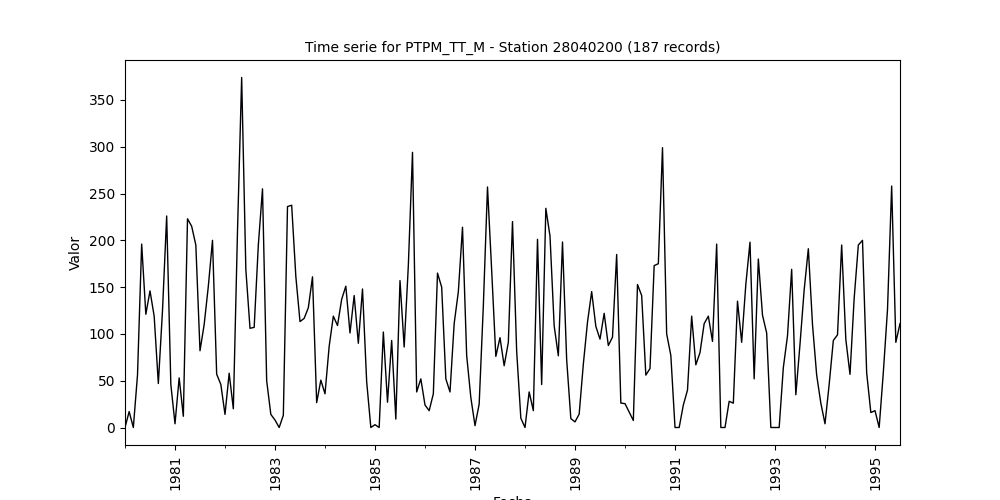

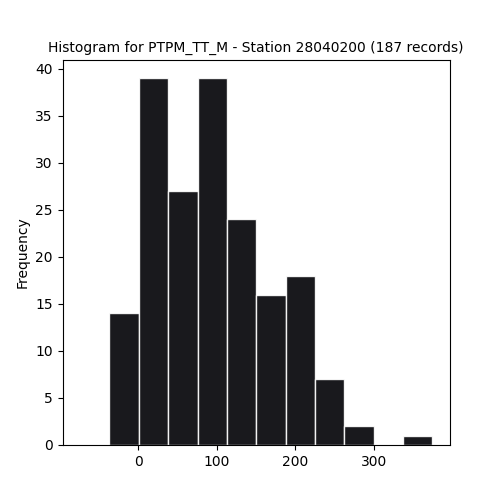
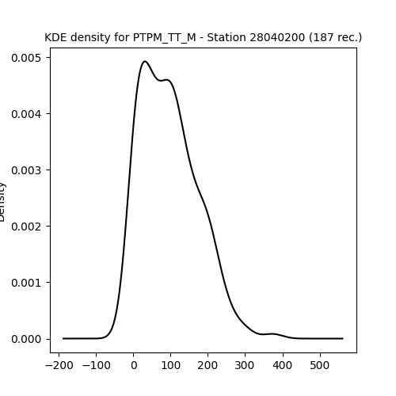

**PTPM_TT_M - Station: LETICIA [28020590] (448 rec.)** Location over [Google Maps](http://maps.google.com/maps?q=10.15238889,-73.22172222) or [Openstreet Map](https://www.openstreetmap.org/query?lat=10.15238889&lon=-73.22172222)

Station first record

| Fecha               |   CodigoEstacion | NombreEstacion     |   Latitud |   Longitud |   Altitud | Categoria     | Entidad                                                     | AreaOperativa                               | Departamento   | Municipio   | FechaInstalacion    | FechaSuspension   | IdParametro   | Etiqueta   | DescripcionSerie            | Frecuencia   |   Valor |   Grado |   Calificador |   NivelAprobacion |
|:--------------------|-----------------:|:-------------------|----------:|-----------:|----------:|:--------------|:------------------------------------------------------------|:--------------------------------------------|:---------------|:------------|:--------------------|:------------------|:--------------|:-----------|:----------------------------|:-------------|--------:|--------:|--------------:|------------------:|
| 1980-01-01 00:00:00 |         28020590 | LETICIA [28020590] |   10.1524 |   -73.2217 |       140 | Pluviométrica | INSTITUTO DE HIDROLOGIA METEOROLOGIA Y ESTUDIOS AMBIENTALES | Area Operativa 05 - Magdalena-Cesar-Guajira | Cesar          | San Diego   | 1979-01-15 00:00:00 | NaT               | PRECIPITACION | PTPM_TT_M  | Precipitación total mensual | Mensual      |      15 |       4 |           nan |               900 |

Statistics table

|       |    Valor |
|:------|---------:|
| count | 448      |
| mean  | 103.627  |
| std   |  91.3379 |
| min   |   0      |
| 25%   |  29      |
| 50%   |  83.3    |
| 75%   | 156      |
| max   | 542      |

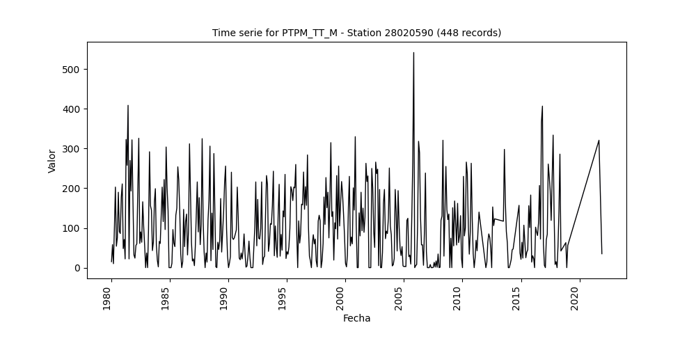
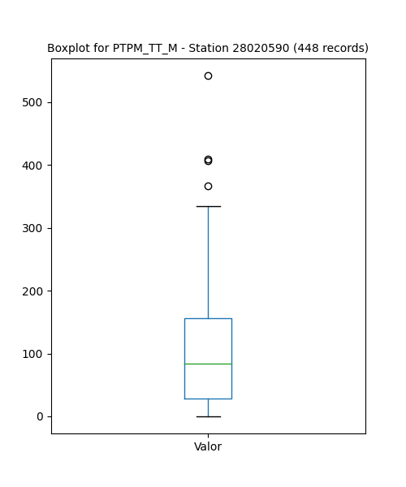
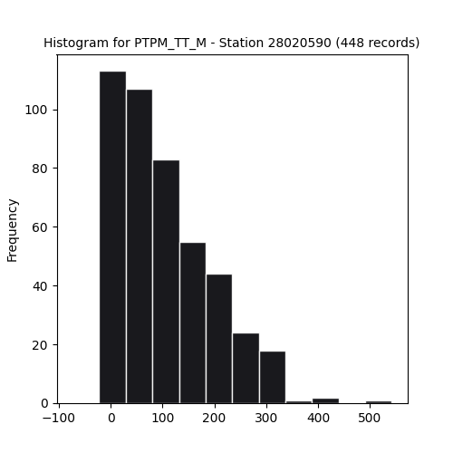
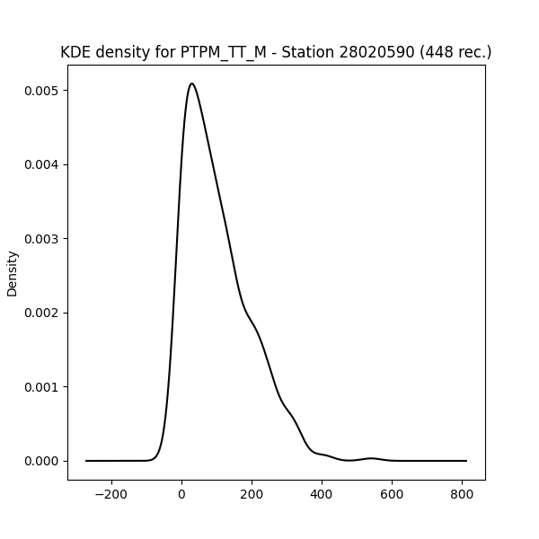

**PTPM_TT_M - Station: PARIS DE FRANCIA [28010370] (501 rec.)** Location over [Google Maps](http://maps.google.com/maps?q=10.30708333,-73.32544444) or [Openstreet Map](https://www.openstreetmap.org/query?lat=10.30708333&lon=-73.32544444)

Station first record

| Fecha               |   CodigoEstacion | NombreEstacion              |   Latitud |   Longitud |   Altitud | Categoria     | Entidad                                                     | AreaOperativa                               | Departamento   | Municipio   | FechaInstalacion    | FechaSuspension   | IdParametro   | Etiqueta   | DescripcionSerie            | Frecuencia   |   Valor |   Grado |   Calificador |   NivelAprobacion |
|:--------------------|-----------------:|:----------------------------|----------:|-----------:|----------:|:--------------|:------------------------------------------------------------|:--------------------------------------------|:---------------|:------------|:--------------------|:------------------|:--------------|:-----------|:----------------------------|:-------------|--------:|--------:|--------------:|------------------:|
| 1980-01-01 00:00:00 |         28010370 | PARIS DE FRANCIA [28010370] |   10.3071 |   -73.3254 |       180 | Pluviométrica | INSTITUTO DE HIDROLOGIA METEOROLOGIA Y ESTUDIOS AMBIENTALES | Area Operativa 05 - Magdalena-Cesar-Guajira | Cesar          | Valledupar  | 1971-11-15 00:00:00 | NaT               | PRECIPITACION | PTPM_TT_M  | Precipitación total mensual | Mensual      |       0 |       4 |           nan |               900 |

Statistics table

|       |   Valor |
|:------|--------:|
| count | 501     |
| mean  | 108.373 |
| std   |  94.421 |
| min   |   0     |
| 25%   |  26     |
| 50%   |  88     |
| 75%   | 171     |
| max   | 508     |

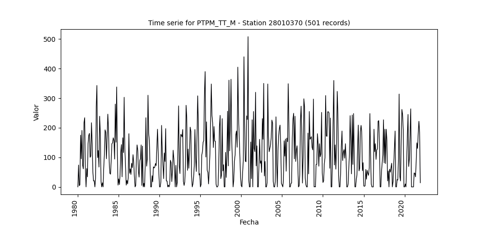
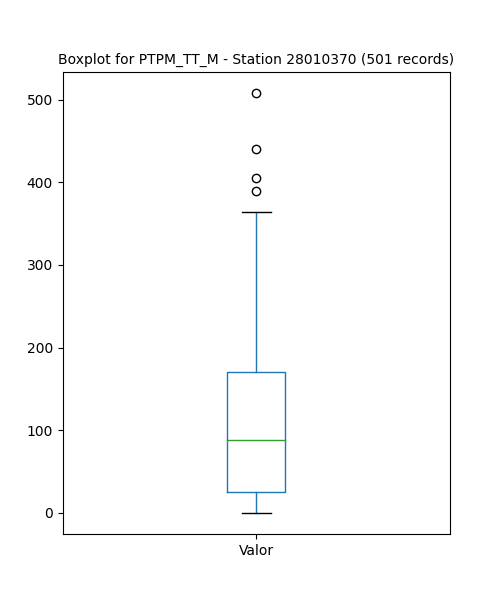
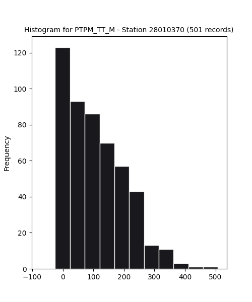
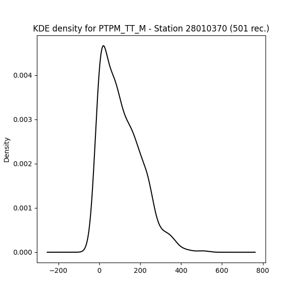

**PTPM_TT_M - Station: PAVAS LAS [28040060] (140 rec.)** Location over [Google Maps](http://maps.google.com/maps?q=10.06666667,-73.88333333) or [Openstreet Map](https://www.openstreetmap.org/query?lat=10.06666667&lon=-73.88333333)

Station first record

| Fecha               |   CodigoEstacion | NombreEstacion       |   Latitud |   Longitud |   Altitud | Categoria     | Entidad                                                     | AreaOperativa                               | Departamento   | Municipio   | FechaInstalacion    | FechaSuspension     | IdParametro   | Etiqueta   | DescripcionSerie            | Frecuencia   |   Valor |   Grado |   Calificador |   NivelAprobacion |
|:--------------------|-----------------:|:---------------------|----------:|-----------:|----------:|:--------------|:------------------------------------------------------------|:--------------------------------------------|:---------------|:------------|:--------------------|:--------------------|:--------------|:-----------|:----------------------------|:-------------|--------:|--------:|--------------:|------------------:|
| 1980-01-01 00:00:00 |         28040060 | PAVAS LAS [28040060] |   10.0667 |   -73.8833 |       150 | Pluviométrica | INSTITUTO DE HIDROLOGIA METEOROLOGIA Y ESTUDIOS AMBIENTALES | Area Operativa 05 - Magdalena-Cesar-Guajira | Cesar          | Bosconia    | 1963-01-15 00:00:00 | 1992-07-15 00:00:00 | PRECIPITACION | PTPM_TT_M  | Precipitación total mensual | Mensual      |      55 |      50 |           nan |               900 |

Statistics table

|       |   Valor |
|:------|--------:|
| count | 140     |
| mean  | 105.394 |
| std   |  98.432 |
| min   |   0     |
| 25%   |  30     |
| 50%   |  72.5   |
| 75%   | 152.75  |
| max   | 500     |

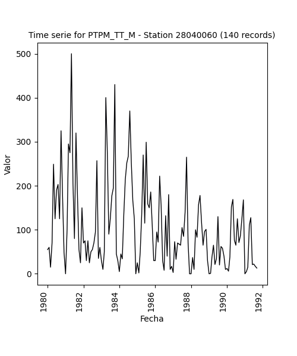
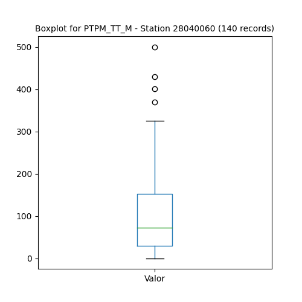
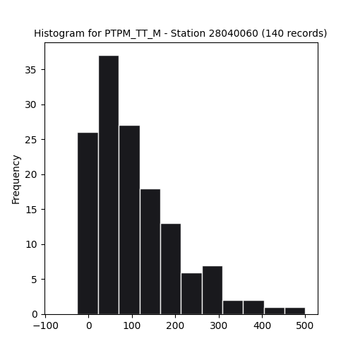
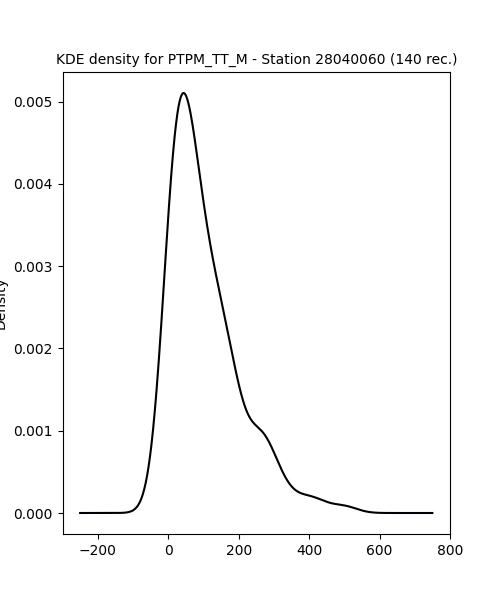

**PTPM_TT_M - Station: RINCON EL [28025020] (494 rec.)** Location over [Google Maps](http://maps.google.com/maps?q=10.27138889,-73.13138889) or [Openstreet Map](https://www.openstreetmap.org/query?lat=10.27138889&lon=-73.13138889)

Station first record

| Fecha               |   CodigoEstacion | NombreEstacion       |   Latitud |   Longitud |   Altitud | Categoria           | Entidad                                                     | AreaOperativa                               | Departamento   | Municipio   | FechaInstalacion    | FechaSuspension   | IdParametro   | Etiqueta   | DescripcionSerie            | Frecuencia   |   Valor |   Grado |   Calificador |   NivelAprobacion |
|:--------------------|-----------------:|:---------------------|----------:|-----------:|----------:|:--------------------|:------------------------------------------------------------|:--------------------------------------------|:---------------|:------------|:--------------------|:------------------|:--------------|:-----------|:----------------------------|:-------------|--------:|--------:|--------------:|------------------:|
| 1980-01-01 00:00:00 |         28025020 | RINCON EL [28025020] |   10.2714 |   -73.1314 |       350 | Climática Ordinaria | INSTITUTO DE HIDROLOGIA METEOROLOGIA Y ESTUDIOS AMBIENTALES | Area Operativa 05 - Magdalena-Cesar-Guajira | Cesar          | San Diego   | 1964-02-15 00:00:00 | NaT               | PRECIPITACION | PTPM_TT_M  | Precipitación total mensual | Mensual      |     9.6 |      50 |           nan |               900 |

Statistics table

|       |    Valor |
|:------|---------:|
| count | 494      |
| mean  | 110.783  |
| std   |  82.2089 |
| min   |   0      |
| 25%   |  42.025  |
| 50%   | 104.8    |
| 75%   | 165.05   |
| max   | 421.2    |

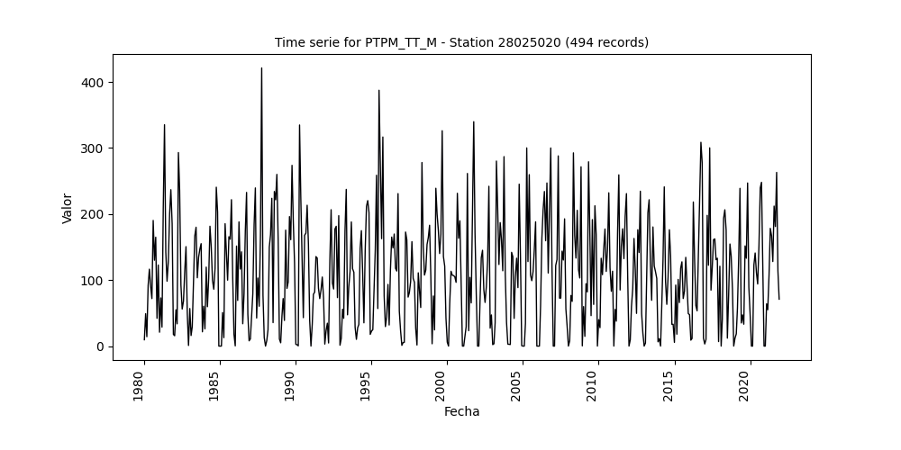
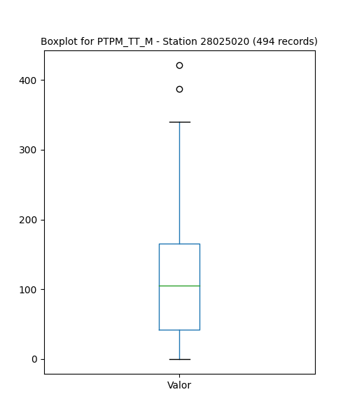
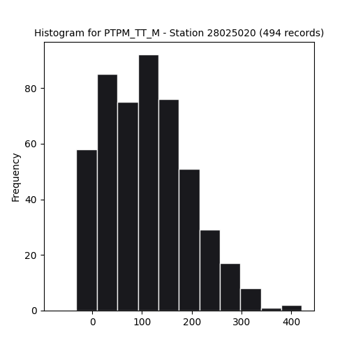
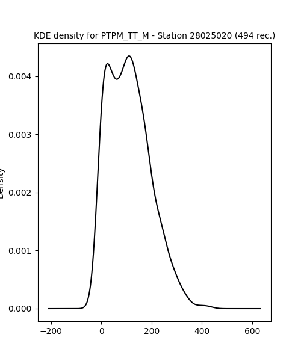

**PTPM_TT_M - Station: SAN BENITO [28020410] (457 rec.)** Location over [Google Maps](http://maps.google.com/maps?q=10.18416667,-73.31702778) or [Openstreet Map](https://www.openstreetmap.org/query?lat=10.18416667&lon=-73.31702778)

Station first record

| Fecha               |   CodigoEstacion | NombreEstacion        |   Latitud |   Longitud |   Altitud | Categoria     | Entidad                                                     | AreaOperativa                               | Departamento   | Municipio   | FechaInstalacion    | FechaSuspension   | IdParametro   | Etiqueta   | DescripcionSerie            | Frecuencia   |   Valor |   Grado |   Calificador |   NivelAprobacion |
|:--------------------|-----------------:|:----------------------|----------:|-----------:|----------:|:--------------|:------------------------------------------------------------|:--------------------------------------------|:---------------|:------------|:--------------------|:------------------|:--------------|:-----------|:----------------------------|:-------------|--------:|--------:|--------------:|------------------:|
| 1980-01-01 00:00:00 |         28020410 | SAN BENITO [28020410] |   10.1842 |    -73.317 |       150 | Pluviométrica | INSTITUTO DE HIDROLOGIA METEOROLOGIA Y ESTUDIOS AMBIENTALES | Area Operativa 05 - Magdalena-Cesar-Guajira | Cesar          | San Diego   | 1972-09-15 00:00:00 | NaT               | PRECIPITACION | PTPM_TT_M  | Precipitación total mensual | Mensual      |       0 |      50 |           nan |               900 |

Statistics table

|       |   Valor |
|:------|--------:|
| count | 457     |
| mean  | 107.139 |
| std   | 101.903 |
| min   |   0     |
| 25%   |  27.9   |
| 50%   |  82     |
| 75%   | 156     |
| max   | 757     |

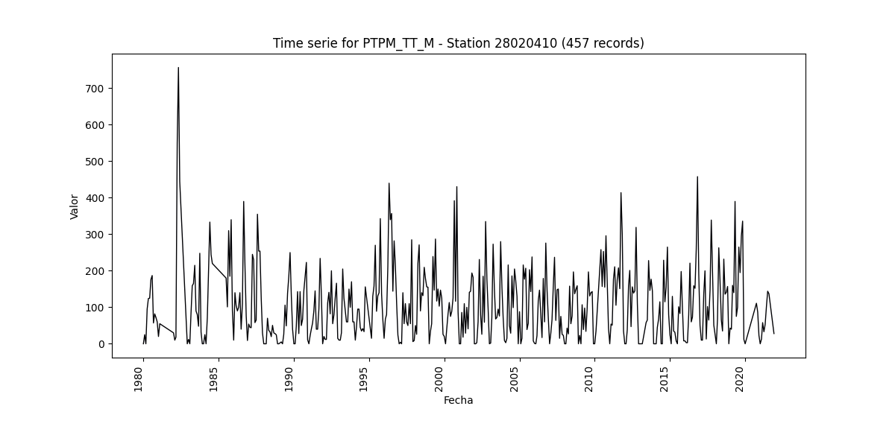
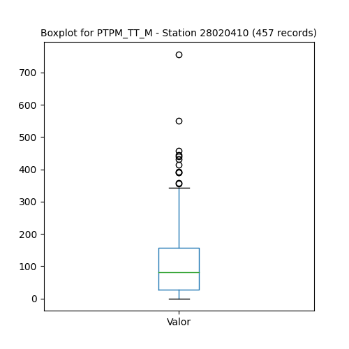
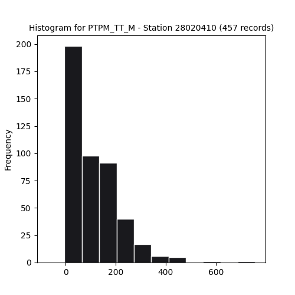
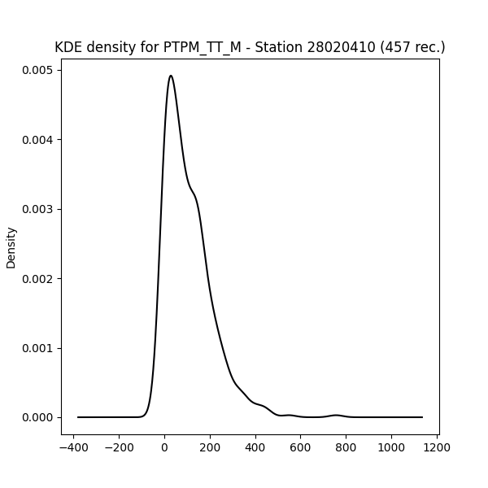

**PTPM_TT_M - Station: VILLA MARLENE [28010070] (432 rec.)** Location over [Google Maps](http://maps.google.com/maps?q=10.1855,-73.46711111) or [Openstreet Map](https://www.openstreetmap.org/query?lat=10.1855&lon=-73.46711111)

Station first record

| Fecha               |   CodigoEstacion | NombreEstacion           |   Latitud |   Longitud |   Altitud | Categoria     | Entidad                                                     | AreaOperativa                               | Departamento   | Municipio   | FechaInstalacion    | FechaSuspension   | IdParametro   | Etiqueta   | DescripcionSerie            | Frecuencia   |   Valor |   Grado |   Calificador |   NivelAprobacion |
|:--------------------|-----------------:|:-------------------------|----------:|-----------:|----------:|:--------------|:------------------------------------------------------------|:--------------------------------------------|:---------------|:------------|:--------------------|:------------------|:--------------|:-----------|:----------------------------|:-------------|--------:|--------:|--------------:|------------------:|
| 1986-01-01 00:00:00 |         28010070 | VILLA MARLENE [28010070] |   10.1855 |   -73.4671 |       120 | Pluviométrica | INSTITUTO DE HIDROLOGIA METEOROLOGIA Y ESTUDIOS AMBIENTALES | Area Operativa 05 - Magdalena-Cesar-Guajira | Cesar          | Valledupar  | 1987-01-15 00:00:00 | NaT               | PRECIPITACION | PTPM_TT_M  | Precipitación total mensual | Mensual      |       0 |       4 |           nan |               900 |

Statistics table

|       |   Valor |
|:------|--------:|
| count | 432     |
| mean  | 116.327 |
| std   | 106.916 |
| min   |   0     |
| 25%   |  32.75  |
| 50%   |  98.3   |
| 75%   | 179.75  |
| max   | 581     |

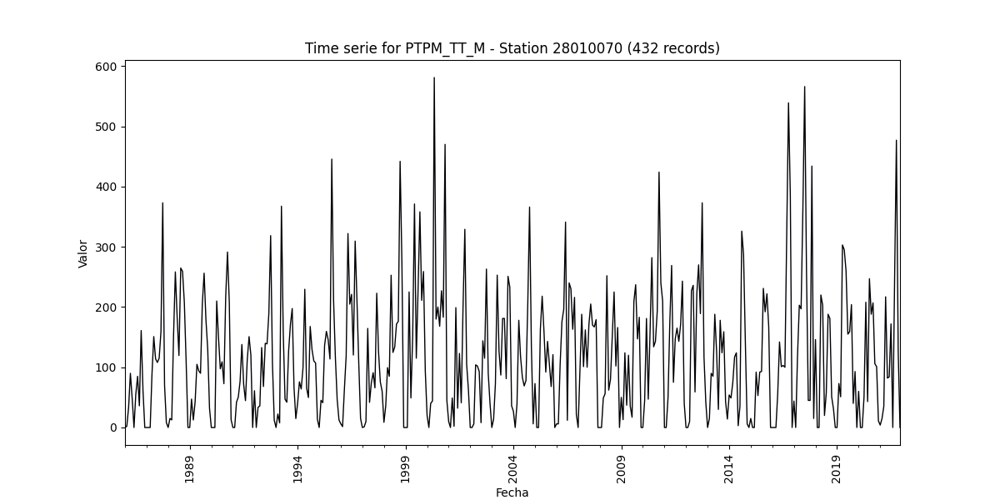
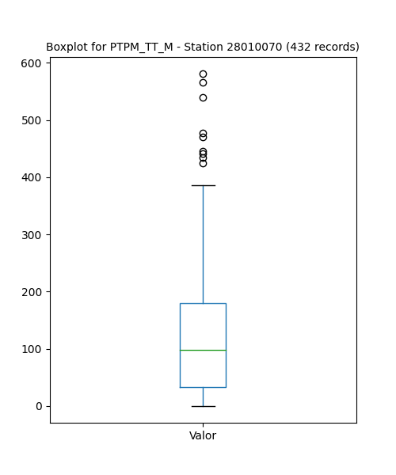
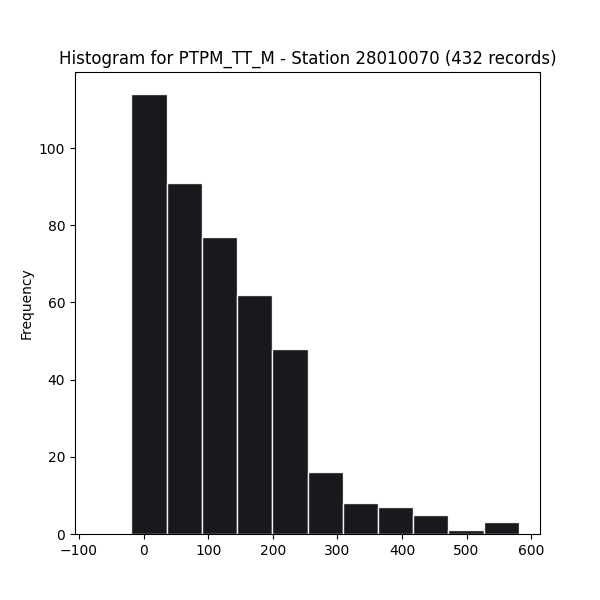
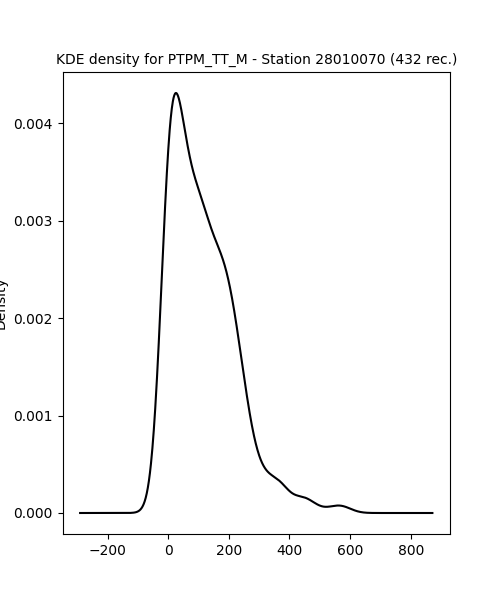

**PTPM_TT_M - Station: VILLA ROSA [28035010] (462 rec.)** Location over [Google Maps](http://maps.google.com/maps?q=10.19066667,-73.54738889) or [Openstreet Map](https://www.openstreetmap.org/query?lat=10.19066667&lon=-73.54738889)

Station first record

| Fecha               |   CodigoEstacion | NombreEstacion        |   Latitud |   Longitud |   Altitud | Categoria           | Entidad                                                     | AreaOperativa                               | Departamento   | Municipio   | FechaInstalacion    | FechaSuspension   | IdParametro   | Etiqueta   | DescripcionSerie            | Frecuencia   |   Valor |   Grado |   Calificador |   NivelAprobacion |
|:--------------------|-----------------:|:----------------------|----------:|-----------:|----------:|:--------------------|:------------------------------------------------------------|:--------------------------------------------|:---------------|:------------|:--------------------|:------------------|:--------------|:-----------|:----------------------------|:-------------|--------:|--------:|--------------:|------------------:|
| 1980-01-01 00:00:00 |         28035010 | VILLA ROSA [28035010] |   10.1907 |   -73.5474 |        70 | Climática Ordinaria | INSTITUTO DE HIDROLOGIA METEOROLOGIA Y ESTUDIOS AMBIENTALES | Area Operativa 05 - Magdalena-Cesar-Guajira | Cesar          | Valledupar  | 1968-03-15 00:00:00 | NaT               | PRECIPITACION | PTPM_TT_M  | Precipitación total mensual | Mensual      |       0 |       4 |           nan |               900 |

Statistics table

|       |   Valor |
|:------|--------:|
| count | 462     |
| mean  | 110.852 |
| std   |  91.875 |
| min   |   0     |
| 25%   |  30.25  |
| 50%   |  95.75  |
| 75%   | 168.375 |
| max   | 479.6   |

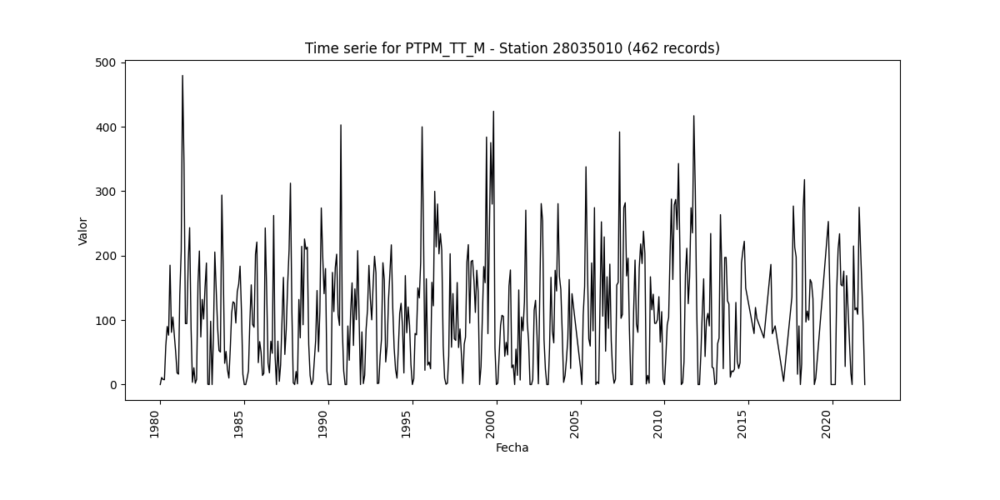
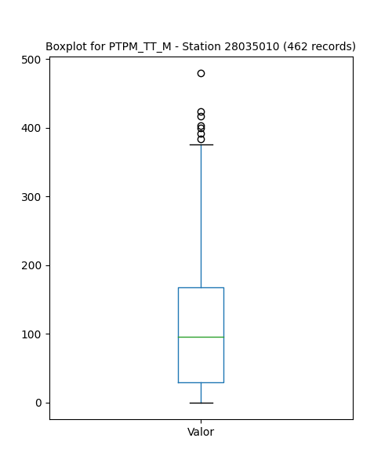
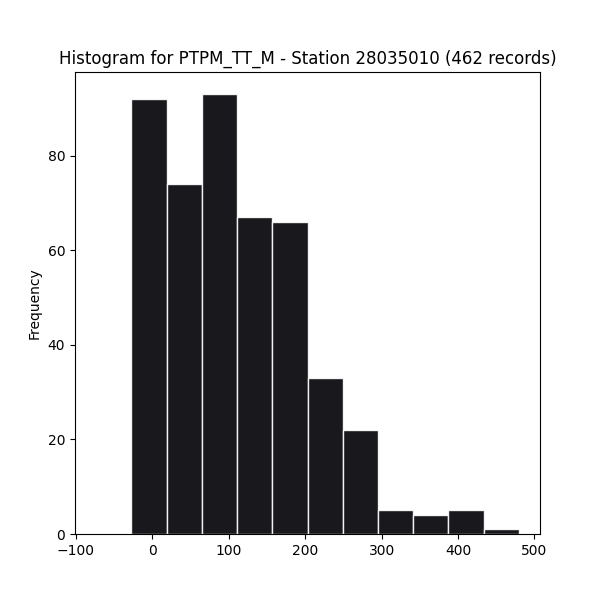
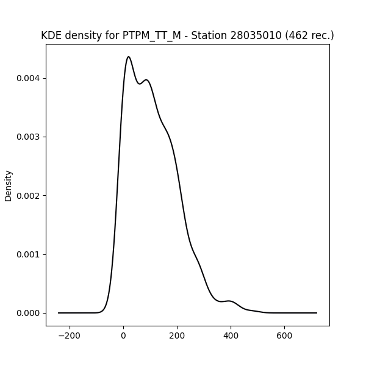

**PTPM_TT_M - Station: ATANQUEZ [28010360] (470 rec.)** Location over [Google Maps](http://maps.google.com/maps?q=10.69733333,-73.35305556) or [Openstreet Map](https://www.openstreetmap.org/query?lat=10.69733333&lon=-73.35305556)

Station first record

| Fecha               |   CodigoEstacion | NombreEstacion      |   Latitud |   Longitud |   Altitud | Categoria     | Entidad                                                     | AreaOperativa                               | Departamento   | Municipio   | FechaInstalacion    | FechaSuspension   | IdParametro   | Etiqueta   | DescripcionSerie            | Frecuencia   |   Valor |   Grado |   Calificador |   NivelAprobacion |
|:--------------------|-----------------:|:--------------------|----------:|-----------:|----------:|:--------------|:------------------------------------------------------------|:--------------------------------------------|:---------------|:------------|:--------------------|:------------------|:--------------|:-----------|:----------------------------|:-------------|--------:|--------:|--------------:|------------------:|
| 1980-01-01 00:00:00 |         28010360 | ATANQUEZ [28010360] |   10.6973 |   -73.3531 |       800 | Pluviométrica | INSTITUTO DE HIDROLOGIA METEOROLOGIA Y ESTUDIOS AMBIENTALES | Area Operativa 05 - Magdalena-Cesar-Guajira | Cesar          | Valledupar  | 1959-04-15 00:00:00 | NaT               | PRECIPITACION | PTPM_TT_M  | Precipitación total mensual | Mensual      |       0 |      50 |           nan |               900 |

Statistics table

|       |    Valor |
|:------|---------:|
| count |  470     |
| mean  |  172.4   |
| std   |  212.311 |
| min   |    0     |
| 25%   |   20     |
| 50%   |  102.05  |
| 75%   |  252.425 |
| max   | 1647.3   |

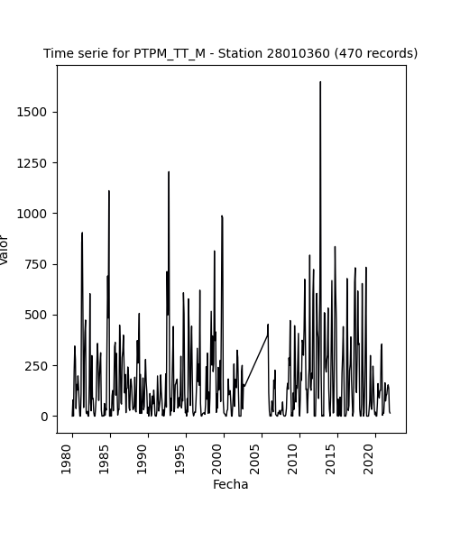
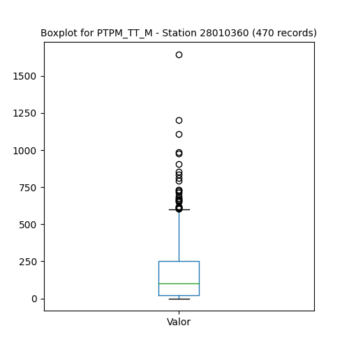
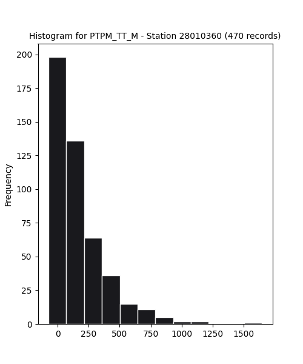
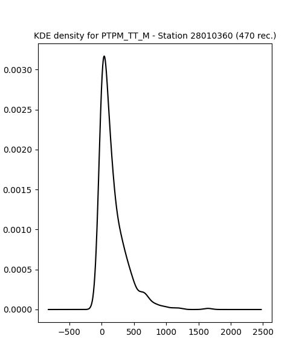

**PTPM_TT_M - Station: CALLAO EL [28035020] (474 rec.)** Location over [Google Maps](http://maps.google.com/maps?q=10.36305556,-73.31944444) or [Openstreet Map](https://www.openstreetmap.org/query?lat=10.36305556&lon=-73.31944444)

Station first record

| Fecha               |   CodigoEstacion | NombreEstacion       |   Latitud |   Longitud |   Altitud | Categoria           | Entidad                                                     | AreaOperativa                               | Departamento   | Municipio   | FechaInstalacion    | FechaSuspension   | IdParametro   | Etiqueta   | DescripcionSerie            | Frecuencia   |   Valor |   Grado |   Calificador |   NivelAprobacion |
|:--------------------|-----------------:|:---------------------|----------:|-----------:|----------:|:--------------------|:------------------------------------------------------------|:--------------------------------------------|:---------------|:------------|:--------------------|:------------------|:--------------|:-----------|:----------------------------|:-------------|--------:|--------:|--------------:|------------------:|
| 1980-01-01 00:00:00 |         28035020 | CALLAO EL [28035020] |   10.3631 |   -73.3194 |       110 | Climática Ordinaria | INSTITUTO DE HIDROLOGIA METEOROLOGIA Y ESTUDIOS AMBIENTALES | Area Operativa 05 - Magdalena-Cesar-Guajira | Cesar          | Valledupar  | 1968-03-15 00:00:00 | NaT               | PRECIPITACION | PTPM_TT_M  | Precipitación total mensual | Mensual      |       0 |       4 |           nan |               900 |

Statistics table

|       |    Valor |
|:------|---------:|
| count | 474      |
| mean  |  98.4741 |
| std   |  84.522  |
| min   |   0      |
| 25%   |  21.025  |
| 50%   |  85.35   |
| 75%   | 152.45   |
| max   | 464.2    |

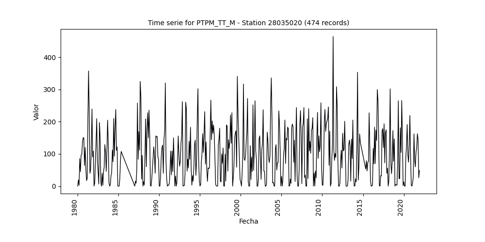
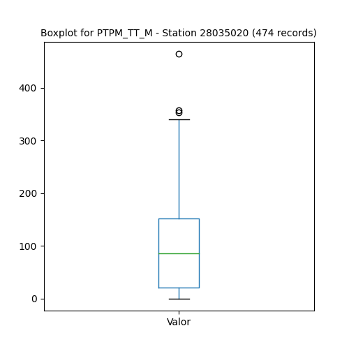
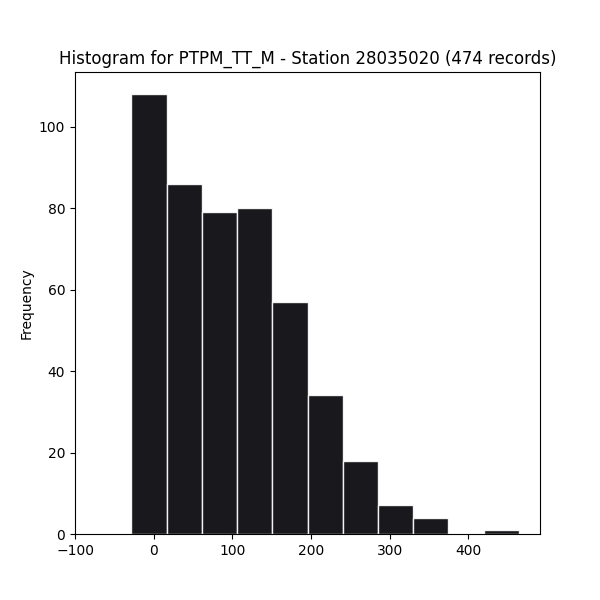
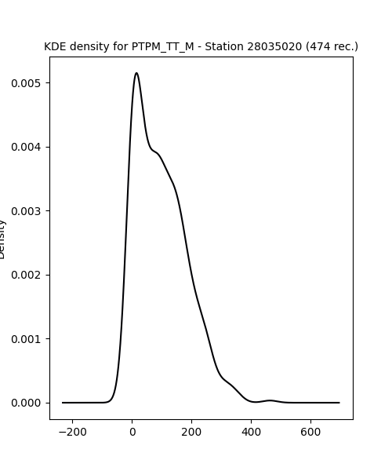

**PTPM_TT_M - Station: CUEVAS LAS [28040170] (106 rec.)** Location over [Google Maps](http://maps.google.com/maps?q=10.46666667,-73.56666667) or [Openstreet Map](https://www.openstreetmap.org/query?lat=10.46666667&lon=-73.56666667)

Station first record

| Fecha               |   CodigoEstacion | NombreEstacion        |   Latitud |   Longitud |   Altitud | Categoria     | Entidad                                                     | AreaOperativa                               | Departamento   | Municipio    | FechaInstalacion    | FechaSuspension     | IdParametro   | Etiqueta   | DescripcionSerie            | Frecuencia   |   Valor |   Grado |   Calificador |   NivelAprobacion |
|:--------------------|-----------------:|:----------------------|----------:|-----------:|----------:|:--------------|:------------------------------------------------------------|:--------------------------------------------|:---------------|:-------------|:--------------------|:--------------------|:--------------|:-----------|:----------------------------|:-------------|--------:|--------:|--------------:|------------------:|
| 1980-01-01 00:00:00 |         28040170 | CUEVAS LAS [28040170] |   10.4667 |   -73.5667 |      1260 | Pluviográfica | INSTITUTO DE HIDROLOGIA METEOROLOGIA Y ESTUDIOS AMBIENTALES | Area Operativa 05 - Magdalena-Cesar-Guajira | Cesar          | Pueblo Bello | 1963-06-15 00:00:00 | 1996-02-15 00:00:00 | PRECIPITACION | PTPM_TT_M  | Precipitación total mensual | Mensual      |      63 |      50 |           nan |               900 |

Statistics table

|       |   Valor |
|:------|--------:|
| count | 106     |
| mean  | 115.199 |
| std   | 121.212 |
| min   |   0     |
| 25%   |  18.15  |
| 50%   |  60.5   |
| 75%   | 200.25  |
| max   | 505     |

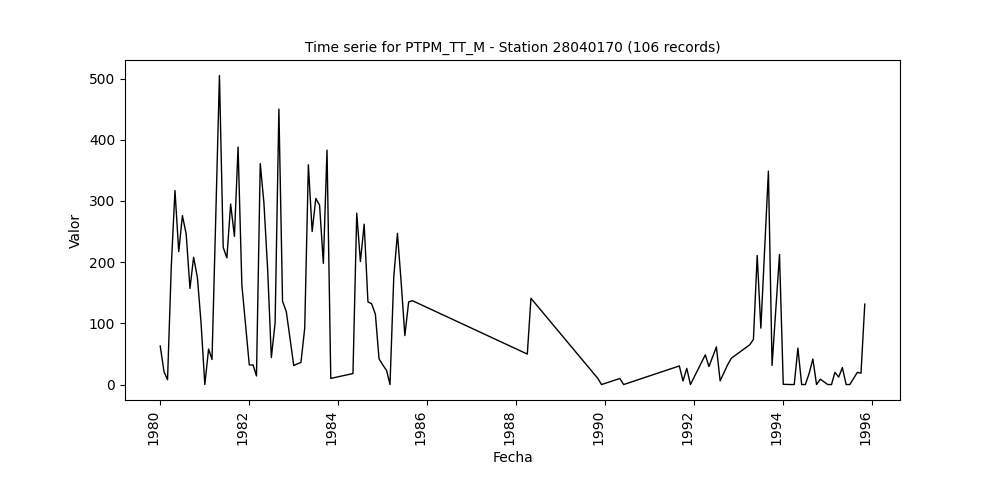
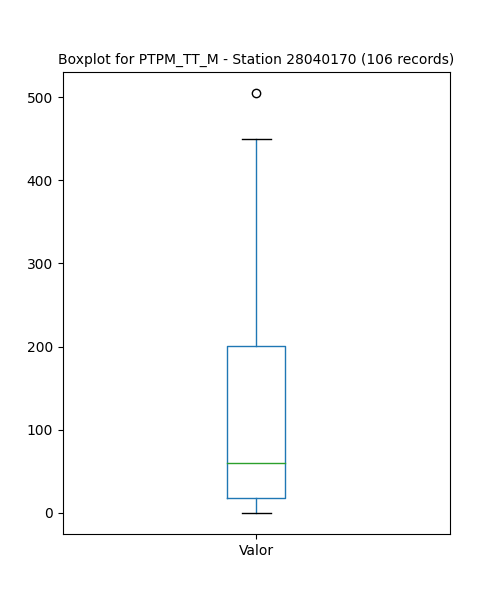
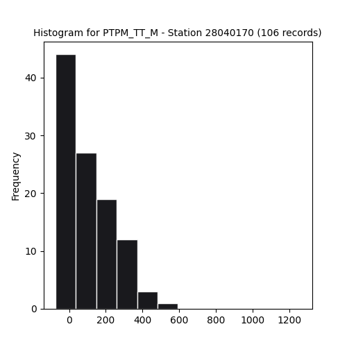
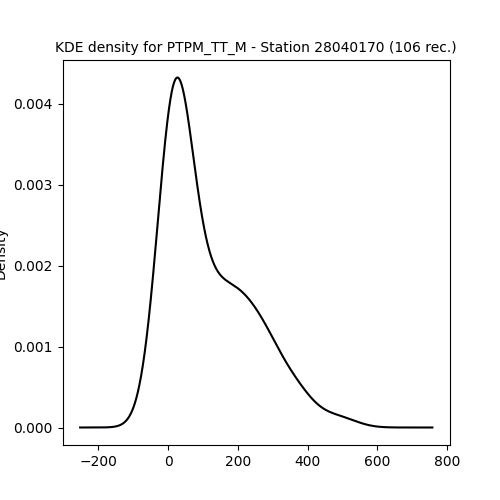

**PTPM_TT_M - Station: DESCANSO EL [28010020] (359 rec.)** Location over [Google Maps](http://maps.google.com/maps?q=10.48011111,-73.23719444) or [Openstreet Map](https://www.openstreetmap.org/query?lat=10.48011111&lon=-73.23719444)

Station first record

| Fecha               |   CodigoEstacion | NombreEstacion         |   Latitud |   Longitud |   Altitud | Categoria     | Entidad                                                     | AreaOperativa                               | Departamento   | Municipio   | FechaInstalacion    | FechaSuspension     | IdParametro   | Etiqueta   | DescripcionSerie            | Frecuencia   |   Valor |   Grado |   Calificador |   NivelAprobacion |
|:--------------------|-----------------:|:-----------------------|----------:|-----------:|----------:|:--------------|:------------------------------------------------------------|:--------------------------------------------|:---------------|:------------|:--------------------|:--------------------|:--------------|:-----------|:----------------------------|:-------------|--------:|--------:|--------------:|------------------:|
| 1986-01-01 00:00:00 |         28010020 | DESCANSO EL [28010020] |   10.4801 |   -73.2372 |       160 | Pluviométrica | INSTITUTO DE HIDROLOGIA METEOROLOGIA Y ESTUDIOS AMBIENTALES | Area Operativa 05 - Magdalena-Cesar-Guajira | Cesar          | Valledupar  | 1986-04-15 00:00:00 | 2019-02-07 11:41:00 | PRECIPITACION | PTPM_TT_M  | Precipitación total mensual | Mensual      |       0 |       4 |           nan |               900 |

Statistics table

|       |    Valor |
|:------|---------:|
| count | 359      |
| mean  |  78.6925 |
| std   |  88.7822 |
| min   |   0      |
| 25%   |  10      |
| 50%   |  55      |
| 75%   | 125      |
| max   | 713      |

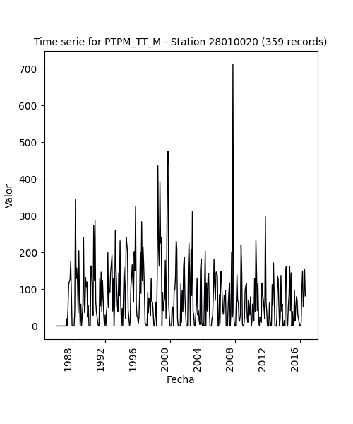
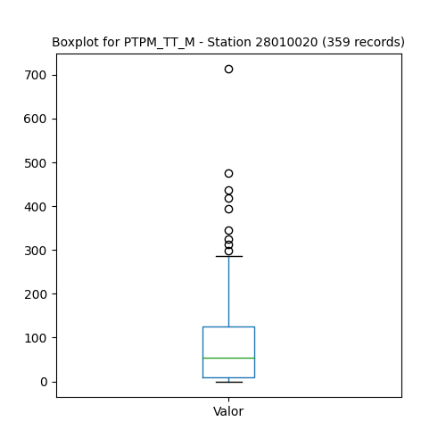
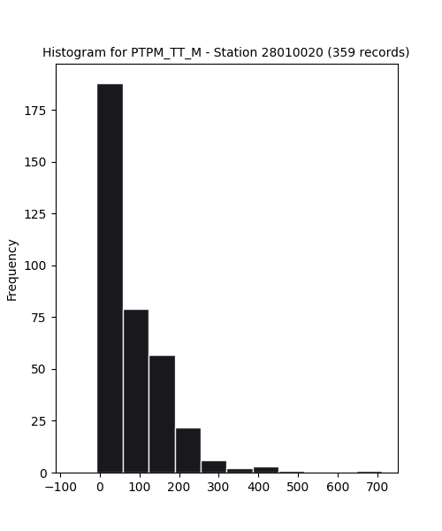

**PTPM_TT_M - Station: MANAURE [28010040] (498 rec.)** Location over [Google Maps](http://maps.google.com/maps?q=10.39138889,-73.02527778) or [Openstreet Map](https://www.openstreetmap.org/query?lat=10.39138889&lon=-73.02527778)

Station first record

| Fecha               |   CodigoEstacion | NombreEstacion     |   Latitud |   Longitud |   Altitud | Categoria     | Entidad                                                     | AreaOperativa                               | Departamento   | Municipio                | FechaInstalacion    | FechaSuspension   | IdParametro   | Etiqueta   | DescripcionSerie            | Frecuencia   |   Valor |   Grado |   Calificador |   NivelAprobacion |
|:--------------------|-----------------:|:-------------------|----------:|-----------:|----------:|:--------------|:------------------------------------------------------------|:--------------------------------------------|:---------------|:-------------------------|:--------------------|:------------------|:--------------|:-----------|:----------------------------|:-------------|--------:|--------:|--------------:|------------------:|
| 1980-01-01 00:00:00 |         28010040 | MANAURE [28010040] |   10.3914 |   -73.0253 |       740 | Pluviométrica | INSTITUTO DE HIDROLOGIA METEOROLOGIA Y ESTUDIOS AMBIENTALES | Area Operativa 05 - Magdalena-Cesar-Guajira | Cesar          | Manaure Balcón Del Cesar | 1975-09-15 00:00:00 | NaT               | PRECIPITACION | PTPM_TT_M  | Precipitación total mensual | Mensual      |       7 |      50 |           nan |               900 |

Statistics table

|       |   Valor |
|:------|--------:|
| count | 498     |
| mean  | 151.934 |
| std   | 128.693 |
| min   |   0     |
| 25%   |  48.325 |
| 50%   | 130.1   |
| 75%   | 220.625 |
| max   | 748.7   |

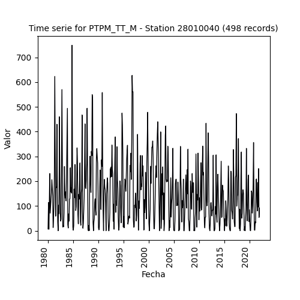
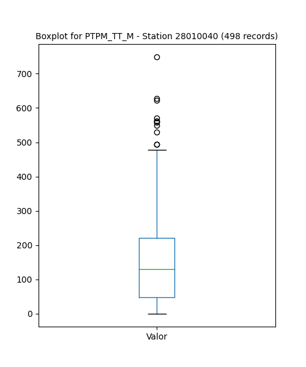
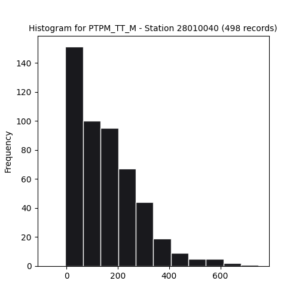
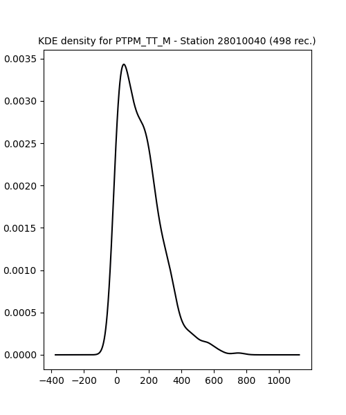

**PTPM_TT_M - Station: PUEBLO BELLO [28040010] (504 rec.)** Location over [Google Maps](http://maps.google.com/maps?q=10.41463889,-73.58502778) or [Openstreet Map](https://www.openstreetmap.org/query?lat=10.41463889&lon=-73.58502778)

Station first record

| Fecha               |   CodigoEstacion | NombreEstacion          |   Latitud |   Longitud |   Altitud | Categoria     | Entidad                                                     | AreaOperativa                               | Departamento   | Municipio    | FechaInstalacion    | FechaSuspension   | IdParametro   | Etiqueta   | DescripcionSerie            | Frecuencia   |   Valor |   Grado |   Calificador |   NivelAprobacion |
|:--------------------|-----------------:|:------------------------|----------:|-----------:|----------:|:--------------|:------------------------------------------------------------|:--------------------------------------------|:---------------|:-------------|:--------------------|:------------------|:--------------|:-----------|:----------------------------|:-------------|--------:|--------:|--------------:|------------------:|
| 1980-01-01 00:00:00 |         28040010 | PUEBLO BELLO [28040010] |   10.4146 |    -73.585 |        10 | Pluviométrica | INSTITUTO DE HIDROLOGIA METEOROLOGIA Y ESTUDIOS AMBIENTALES | Area Operativa 05 - Magdalena-Cesar-Guajira | Cesar          | Pueblo Bello | 1963-01-15 00:00:00 | NaT               | PRECIPITACION | PTPM_TT_M  | Precipitación total mensual | Mensual      |       0 |      50 |           nan |               900 |

Statistics table

|       |    Valor |
|:------|---------:|
| count |  504     |
| mean  |  178.377 |
| std   |  153.483 |
| min   |    0     |
| 25%   |   53.75  |
| 50%   |  157.5   |
| 75%   |  261.25  |
| max   | 1193     |

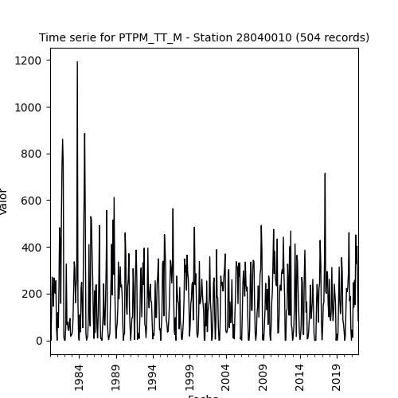
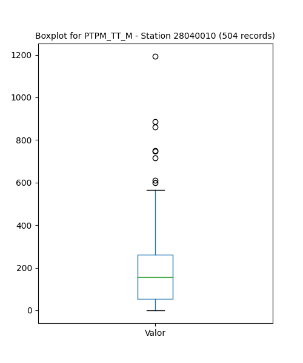
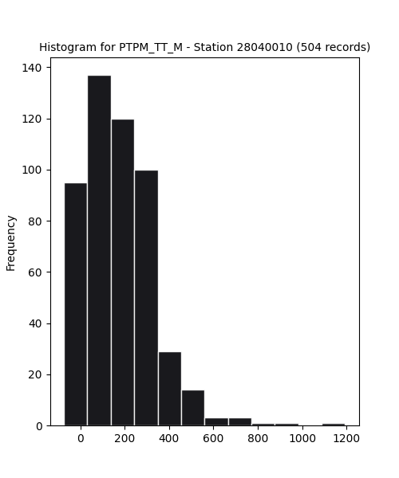
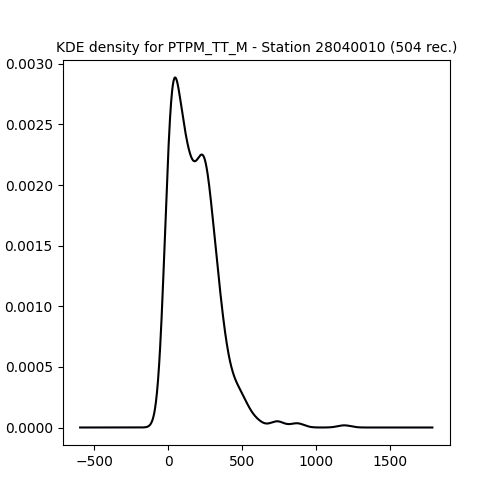

**PTPM_TT_M - Station: SAN ANGEL [28030220] (401 rec.)** Location over [Google Maps](http://maps.google.com/maps?q=10.34705556,-73.44413889) or [Openstreet Map](https://www.openstreetmap.org/query?lat=10.34705556&lon=-73.44413889)

Station first record

| Fecha               |   CodigoEstacion | NombreEstacion       |   Latitud |   Longitud |   Altitud | Categoria     | Entidad                                                     | AreaOperativa                               | Departamento   | Municipio   | FechaInstalacion    | FechaSuspension   | IdParametro   | Etiqueta   | DescripcionSerie            | Frecuencia   |   Valor |   Grado |   Calificador |   NivelAprobacion |
|:--------------------|-----------------:|:---------------------|----------:|-----------:|----------:|:--------------|:------------------------------------------------------------|:--------------------------------------------|:---------------|:------------|:--------------------|:------------------|:--------------|:-----------|:----------------------------|:-------------|--------:|--------:|--------------:|------------------:|
| 1983-07-01 00:00:00 |         28030220 | SAN ANGEL [28030220] |   10.3471 |   -73.4441 |       244 | Pluviométrica | INSTITUTO DE HIDROLOGIA METEOROLOGIA Y ESTUDIOS AMBIENTALES | Area Operativa 05 - Magdalena-Cesar-Guajira | Cesar          | Valledupar  | 1983-06-15 00:00:00 | NaT               | PRECIPITACION | PTPM_TT_M  | Precipitación total mensual | Mensual      |      79 |       4 |           nan |               900 |

Statistics table

|       |    Valor |
|:------|---------:|
| count | 401      |
| mean  |  85.2723 |
| std   |  91.6286 |
| min   |   0      |
| 25%   |   1.3    |
| 50%   |  58.3    |
| 75%   | 135      |
| max   | 525      |

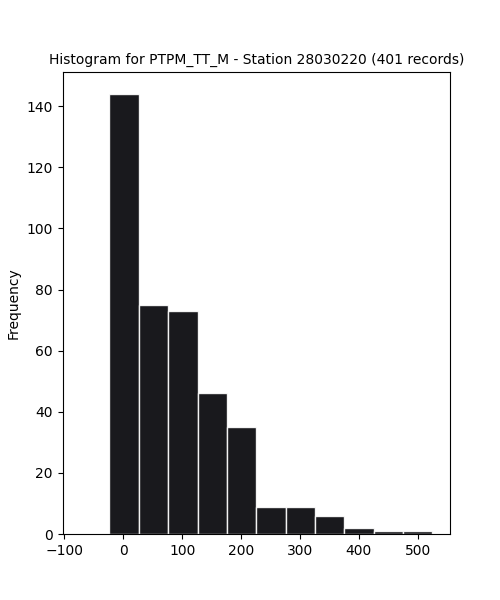
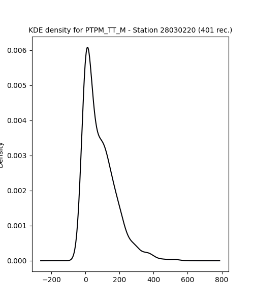

**PTPM_TT_M - Station: SAN JOSE D ORIENTE [28025040] (171 rec.)** Location over [Google Maps](http://maps.google.com/maps?q=10.35,-73.05) or [Openstreet Map](https://www.openstreetmap.org/query?lat=10.35&lon=-73.05)

Station first record

| Fecha               |   CodigoEstacion | NombreEstacion                |   Latitud |   Longitud |   Altitud | Categoria           | Entidad                                                     | AreaOperativa                               | Departamento   | Municipio   | FechaInstalacion    | FechaSuspension     | IdParametro   | Etiqueta   | DescripcionSerie            | Frecuencia   |   Valor |   Grado |   Calificador |   NivelAprobacion |
|:--------------------|-----------------:|:------------------------------|----------:|-----------:|----------:|:--------------------|:------------------------------------------------------------|:--------------------------------------------|:---------------|:------------|:--------------------|:--------------------|:--------------|:-----------|:----------------------------|:-------------|--------:|--------:|--------------:|------------------:|
| 1980-01-01 00:00:00 |         28025040 | SAN JOSE D ORIENTE [28025040] |     10.35 |     -73.05 |       850 | Climática Ordinaria | INSTITUTO DE HIDROLOGIA METEOROLOGIA Y ESTUDIOS AMBIENTALES | Area Operativa 05 - Magdalena-Cesar-Guajira | Cesar          | La Paz      | 1975-08-15 00:00:00 | 1998-05-15 00:00:00 | PRECIPITACION | PTPM_TT_M  | Precipitación total mensual | Mensual      |     3.7 |      50 |           nan |               900 |

Statistics table

|       |    Valor |
|:------|---------:|
| count | 171      |
| mean  |  96.6094 |
| std   |  90.3915 |
| min   |   0      |
| 25%   |  26.1    |
| 50%   |  68.8    |
| 75%   | 143.5    |
| max   | 360.6    |

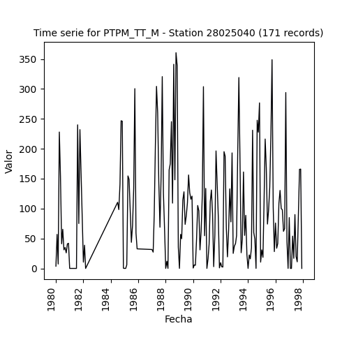
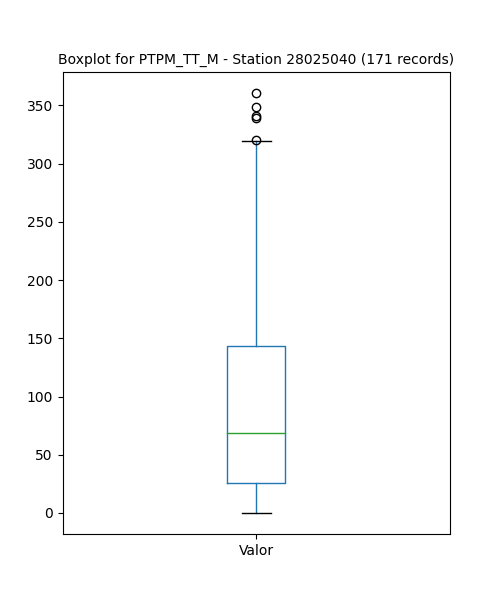
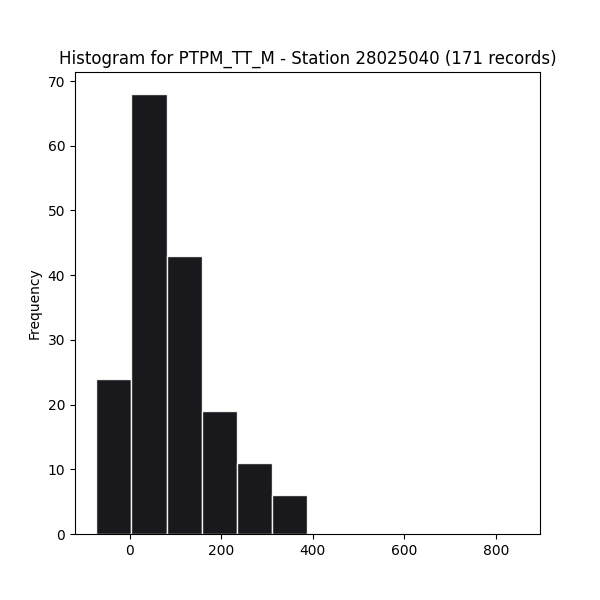
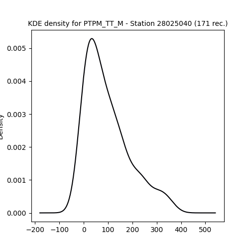

**PTPM_TT_M - Station: SAN SEBASTIAN DE [29060090] (501 rec.)** Location over [Google Maps](http://maps.google.com/maps?q=10.56330556,-73.60380556) or [Openstreet Map](https://www.openstreetmap.org/query?lat=10.56330556&lon=-73.60380556)

Station first record

| Fecha               |   CodigoEstacion | NombreEstacion              |   Latitud |   Longitud |   Altitud | Categoria     | Entidad                                                     | AreaOperativa                               | Departamento   | Municipio    | FechaInstalacion    | FechaSuspension   | IdParametro   | Etiqueta   | DescripcionSerie            | Frecuencia   |   Valor |   Grado |   Calificador |   NivelAprobacion |
|:--------------------|-----------------:|:----------------------------|----------:|-----------:|----------:|:--------------|:------------------------------------------------------------|:--------------------------------------------|:---------------|:-------------|:--------------------|:------------------|:--------------|:-----------|:----------------------------|:-------------|--------:|--------:|--------------:|------------------:|
| 1980-01-01 00:00:00 |         29060090 | SAN SEBASTIAN DE [29060090] |   10.5633 |   -73.6038 |        20 | Pluviométrica | INSTITUTO DE HIDROLOGIA METEOROLOGIA Y ESTUDIOS AMBIENTALES | Area Operativa 05 - Magdalena-Cesar-Guajira | Cesar          | Pueblo Bello | 1968-05-15 00:00:00 | NaT               | PRECIPITACION | PTPM_TT_M  | Precipitación total mensual | Mensual      |      11 |      50 |           nan |               900 |

Statistics table

|       |   Valor |
|:------|--------:|
| count | 501     |
| mean  | 109.604 |
| std   |  77.811 |
| min   |   0     |
| 25%   |  42     |
| 50%   | 106     |
| 75%   | 168     |
| max   | 382     |

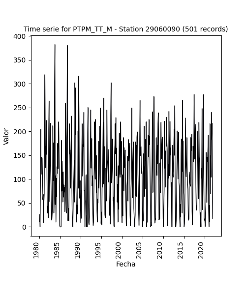
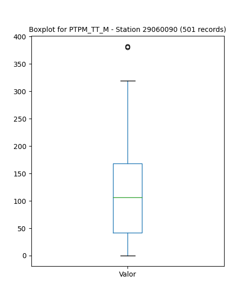
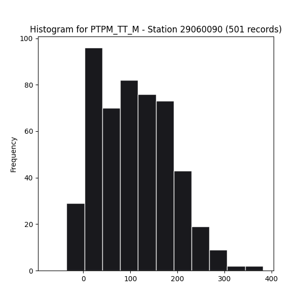
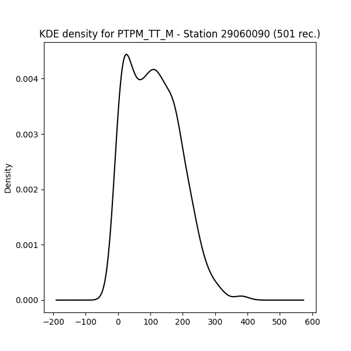

**PTPM_TT_M - Station: VILLA CARMELITA [28010140] (255 rec.)** Location over [Google Maps](http://maps.google.com/maps?q=10.53333333,-73.3) or [Openstreet Map](https://www.openstreetmap.org/query?lat=10.53333333&lon=-73.3)

Station first record

| Fecha               |   CodigoEstacion | NombreEstacion             |   Latitud |   Longitud |   Altitud | Categoria     | Entidad                                                     | AreaOperativa                               | Departamento   | Municipio   | FechaInstalacion    | FechaSuspension     | IdParametro   | Etiqueta   | DescripcionSerie            | Frecuencia   |   Valor |   Grado |   Calificador |   NivelAprobacion |
|:--------------------|-----------------:|:---------------------------|----------:|-----------:|----------:|:--------------|:------------------------------------------------------------|:--------------------------------------------|:---------------|:------------|:--------------------|:--------------------|:--------------|:-----------|:----------------------------|:-------------|--------:|--------:|--------------:|------------------:|
| 1980-01-01 00:00:00 |         28010140 | VILLA CARMELITA [28010140] |   10.5333 |      -73.3 |       450 | Pluviométrica | INSTITUTO DE HIDROLOGIA METEOROLOGIA Y ESTUDIOS AMBIENTALES | Area Operativa 05 - Magdalena-Cesar-Guajira | Cesar          | Valledupar  | 1968-09-15 00:00:00 | 2004-08-15 00:00:00 | PRECIPITACION | PTPM_TT_M  | Precipitación total mensual | Mensual      |       3 |      50 |           nan |               900 |

Statistics table

|       |   Valor |
|:------|--------:|
| count | 255     |
| mean  | 131.152 |
| std   | 134.891 |
| min   |   0     |
| 25%   |  24     |
| 50%   |  89     |
| 75%   | 194     |
| max   | 630     |

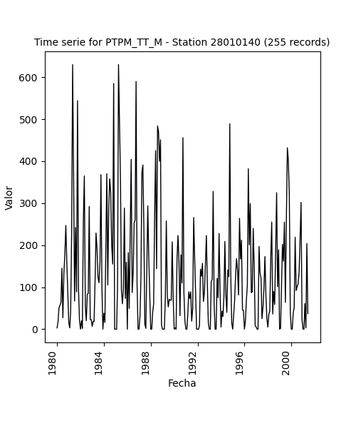
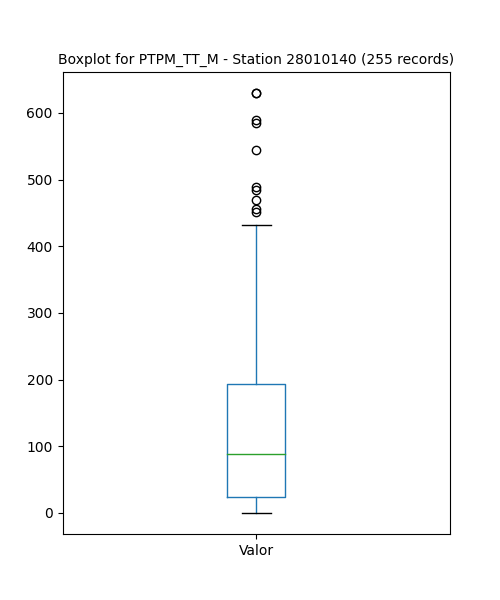
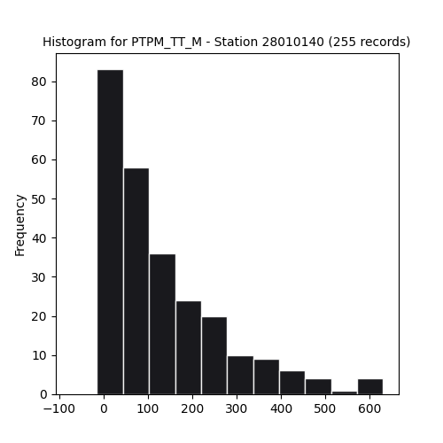
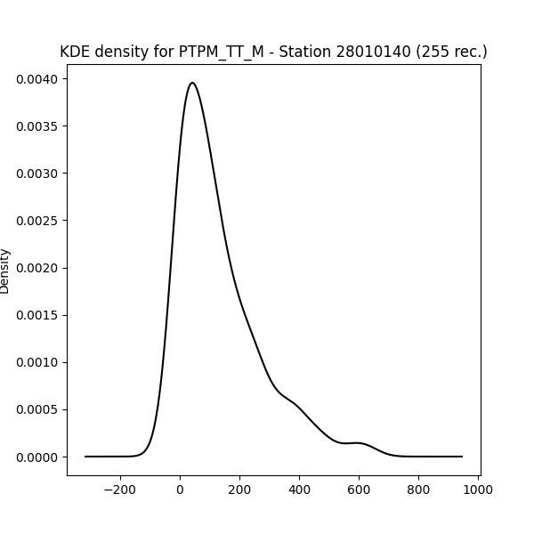

**PTPM_TT_M - Station: PATILLAL [28010090] (474 rec.)** Location over [Google Maps](http://maps.google.com/maps?q=10.70386111,-73.21161111) or [Openstreet Map](https://www.openstreetmap.org/query?lat=10.70386111&lon=-73.21161111)

Station first record

| Fecha               |   CodigoEstacion | NombreEstacion      |   Latitud |   Longitud |   Altitud | Categoria     | Entidad                                                     | AreaOperativa                               | Departamento   | Municipio   | FechaInstalacion    | FechaSuspension   | IdParametro   | Etiqueta   | DescripcionSerie            | Frecuencia   |   Valor |   Grado |   Calificador |   NivelAprobacion |
|:--------------------|-----------------:|:--------------------|----------:|-----------:|----------:|:--------------|:------------------------------------------------------------|:--------------------------------------------|:---------------|:------------|:--------------------|:------------------|:--------------|:-----------|:----------------------------|:-------------|--------:|--------:|--------------:|------------------:|
| 1980-01-01 00:00:00 |         28010090 | PATILLAL [28010090] |   10.7039 |   -73.2116 |       450 | Pluviométrica | INSTITUTO DE HIDROLOGIA METEOROLOGIA Y ESTUDIOS AMBIENTALES | Area Operativa 05 - Magdalena-Cesar-Guajira | Cesar          | Valledupar  | 1962-12-15 00:00:00 | NaT               | PRECIPITACION | PTPM_TT_M  | Precipitación total mensual | Mensual      |       0 |      50 |           nan |               900 |

Statistics table

|       |    Valor |
|:------|---------:|
| count | 474      |
| mean  |  92.6331 |
| std   |  95.1618 |
| min   |   0      |
| 25%   |  10      |
| 50%   |  71.5    |
| 75%   | 138      |
| max   | 631      |

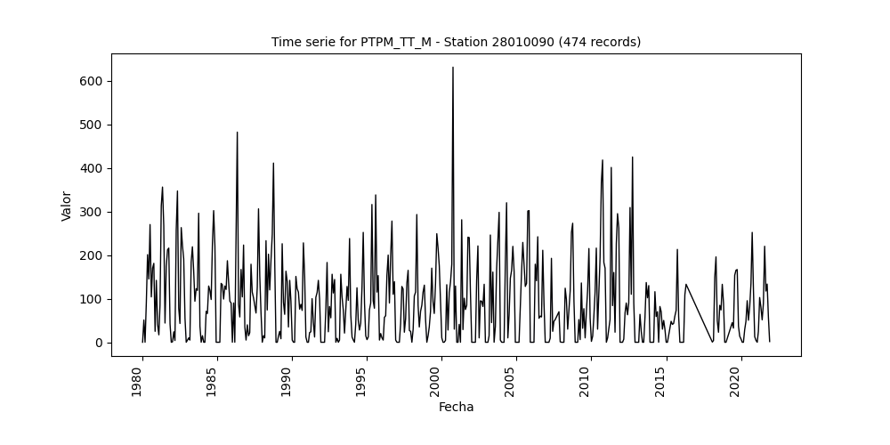
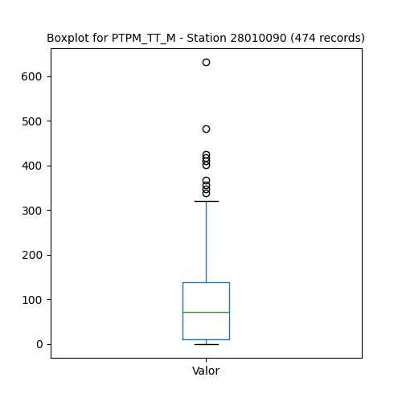
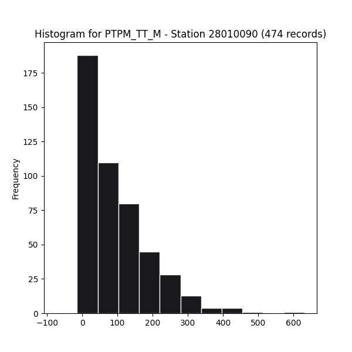
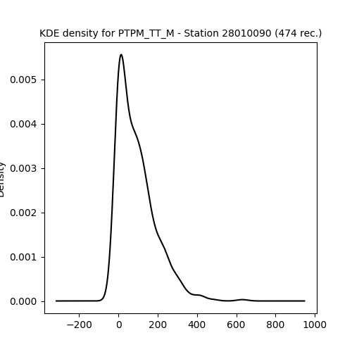

**PTPM_TT_M - Station: PUEBLO BELLO  [28045010] (228 rec.)** Location over [Google Maps](http://maps.google.com/maps?q=10.37,-73.63) or [Openstreet Map](https://www.openstreetmap.org/query?lat=10.37&lon=-73.63)

Station first record

| Fecha               |   CodigoEstacion | NombreEstacion           |   Latitud |   Longitud |   Altitud | Categoria           | Entidad                          | AreaOperativa                               | Departamento   | Municipio    | FechaInstalacion    | FechaSuspension     | IdParametro   | Etiqueta   | DescripcionSerie            | Frecuencia   |   Valor |   Grado |   Calificador |   NivelAprobacion |
|:--------------------|-----------------:|:-------------------------|----------:|-----------:|----------:|:--------------------|:---------------------------------|:--------------------------------------------|:---------------|:-------------|:--------------------|:--------------------|:--------------|:-----------|:----------------------------|:-------------|--------:|--------:|--------------:|------------------:|
| 1980-01-01 00:00:00 |         28045010 | PUEBLO BELLO  [28045010] |     10.37 |     -73.63 |      1000 | Climática Ordinaria | FEDERACION NACIONAL DE CAFETEROS | Area Operativa 05 - Magdalena-Cesar-Guajira | Cesar          | Pueblo Bello | 1954-02-15 00:00:00 | 2020-10-21 17:13:00 | PRECIPITACION | PTPM_TT_M  | Precipitación total mensual | Mensual      |    47.7 |      50 |           nan |               900 |

Statistics table

|       |   Valor |
|:------|--------:|
| count | 228     |
| mean  | 129.799 |
| std   | 131.563 |
| min   |   0     |
| 25%   |   0     |
| 50%   |  93.3   |
| 75%   | 224.7   |
| max   | 502.1   |

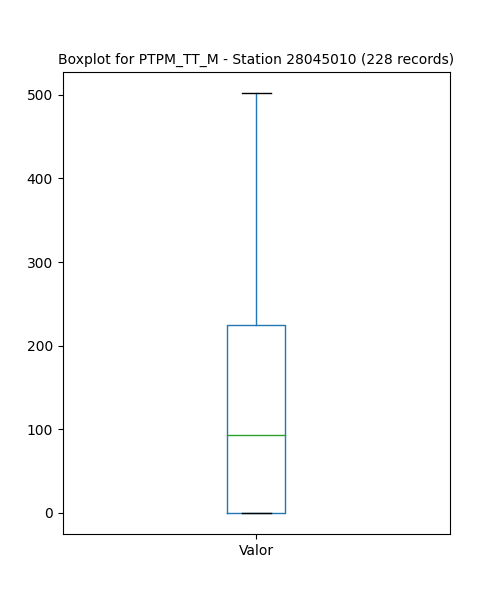
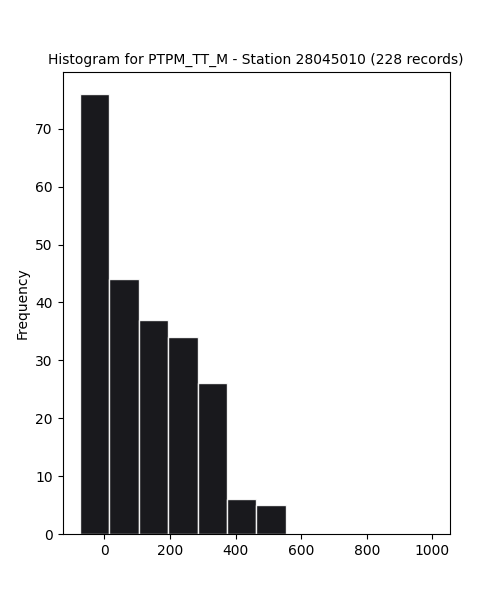
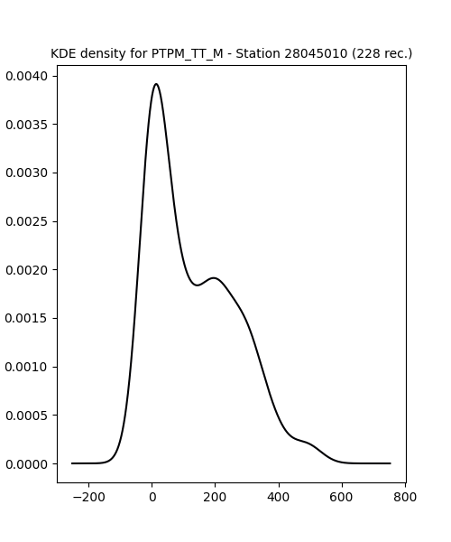

**PTPM_TT_M - Station: SARACHUI [28010130] (122 rec.)** Location over [Google Maps](http://maps.google.com/maps?q=10.78333333,-73.4) or [Openstreet Map](https://www.openstreetmap.org/query?lat=10.78333333&lon=-73.4)

Station first record

| Fecha               |   CodigoEstacion | NombreEstacion      |   Latitud |   Longitud |   Altitud | Categoria     | Entidad                                                     | AreaOperativa                               | Departamento   | Municipio   | FechaInstalacion    | FechaSuspension     | IdParametro   | Etiqueta   | DescripcionSerie            | Frecuencia   |   Valor |   Grado |   Calificador |   NivelAprobacion |
|:--------------------|-----------------:|:--------------------|----------:|-----------:|----------:|:--------------|:------------------------------------------------------------|:--------------------------------------------|:---------------|:------------|:--------------------|:--------------------|:--------------|:-----------|:----------------------------|:-------------|--------:|--------:|--------------:|------------------:|
| 1980-01-01 00:00:00 |         28010130 | SARACHUI [28010130] |   10.7833 |      -73.4 |      1560 | Pluviométrica | INSTITUTO DE HIDROLOGIA METEOROLOGIA Y ESTUDIOS AMBIENTALES | Area Operativa 05 - Magdalena-Cesar-Guajira | Cesar          | Valledupar  | 1968-04-15 00:00:00 | 1990-05-15 00:00:00 | PRECIPITACION | PTPM_TT_M  | Precipitación total mensual | Mensual      |      27 |      50 |           nan |               900 |

Statistics table

|       |    Valor |
|:------|---------:|
| count |  122     |
| mean  |  230.704 |
| std   |  218.823 |
| min   |    0     |
| 25%   |   60     |
| 50%   |  162     |
| 75%   |  342.25  |
| max   | 1009     |

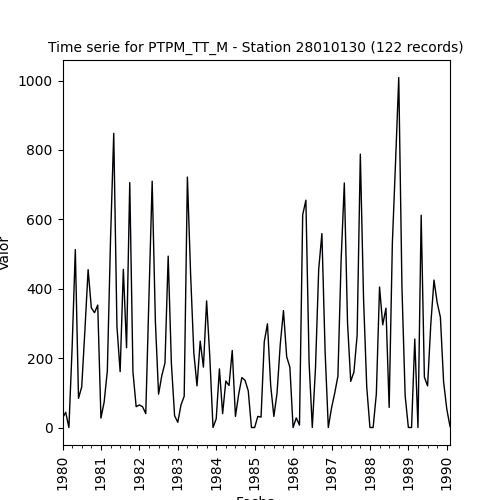
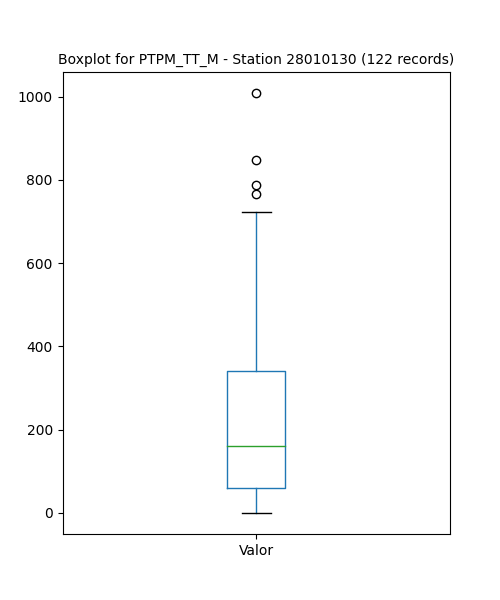
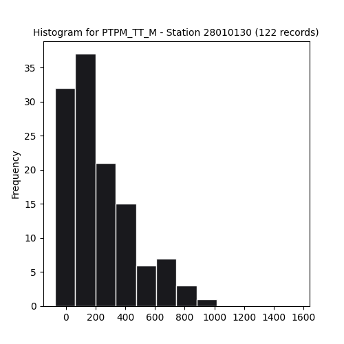
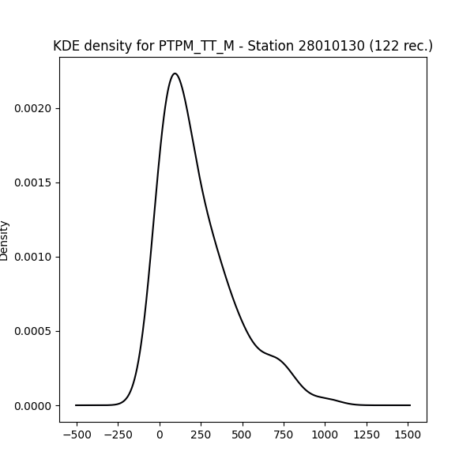

**PTPM_TT_M - Station: CANAVERALES [15060080] (503 rec.)** Location over [Google Maps](http://maps.google.com/maps?q=10.75777778,-72.84522222) or [Openstreet Map](https://www.openstreetmap.org/query?lat=10.75777778&lon=-72.84522222)

Station first record

| Fecha               |   CodigoEstacion | NombreEstacion         |   Latitud |   Longitud |   Altitud | Categoria     | Entidad                                                     | AreaOperativa                               | Departamento   | Municipio          | FechaInstalacion    | FechaSuspension   | IdParametro   | Etiqueta   | DescripcionSerie            | Frecuencia   |   Valor |   Grado |   Calificador |   NivelAprobacion |
|:--------------------|-----------------:|:-----------------------|----------:|-----------:|----------:|:--------------|:------------------------------------------------------------|:--------------------------------------------|:---------------|:-------------------|:--------------------|:------------------|:--------------|:-----------|:----------------------------|:-------------|--------:|--------:|--------------:|------------------:|
| 1980-01-01 00:00:00 |         15060080 | CANAVERALES [15060080] |   10.7578 |   -72.8452 |       230 | Pluviométrica | INSTITUTO DE HIDROLOGIA METEOROLOGIA Y ESTUDIOS AMBIENTALES | Area Operativa 05 - Magdalena-Cesar-Guajira | La Guajira     | San Juan Del Cesar | 1963-08-15 00:00:00 | NaT               | PRECIPITACION | PTPM_TT_M  | Precipitación total mensual | Mensual      |       0 |      50 |           nan |               900 |

Statistics table

|       |    Valor |
|:------|---------:|
| count | 503      |
| mean  |  98.771  |
| std   |  93.6652 |
| min   |   0      |
| 25%   |  15      |
| 50%   |  83      |
| 75%   | 148.5    |
| max   | 722      |

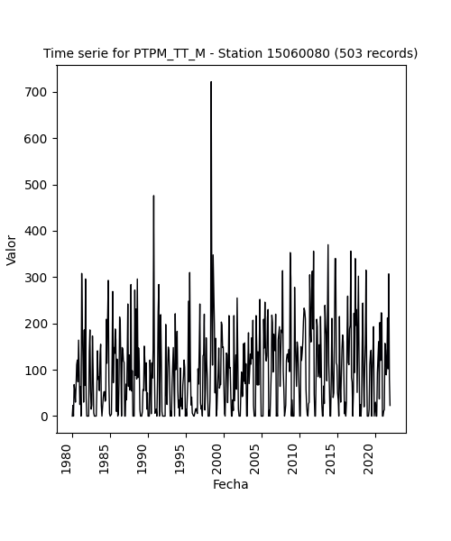
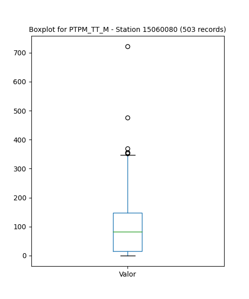
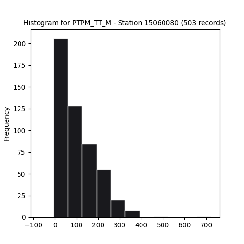
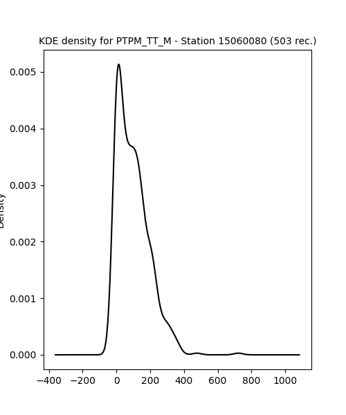

**PTPM_TT_M - Station: CONEJO EL [15060150] (504 rec.)** Location over [Google Maps](http://maps.google.com/maps?q=10.77794444,-72.79819444) or [Openstreet Map](https://www.openstreetmap.org/query?lat=10.77794444&lon=-72.79819444)

Station first record

| Fecha               |   CodigoEstacion | NombreEstacion       |   Latitud |   Longitud |   Altitud | Categoria     | Entidad                                                     | AreaOperativa                               | Departamento   | Municipio   | FechaInstalacion    | FechaSuspension   | IdParametro   | Etiqueta   | DescripcionSerie            | Frecuencia   |   Valor |   Grado |   Calificador |   NivelAprobacion |
|:--------------------|-----------------:|:---------------------|----------:|-----------:|----------:|:--------------|:------------------------------------------------------------|:--------------------------------------------|:---------------|:------------|:--------------------|:------------------|:--------------|:-----------|:----------------------------|:-------------|--------:|--------:|--------------:|------------------:|
| 1980-01-01 00:00:00 |         15060150 | CONEJO EL [15060150] |   10.7779 |   -72.7982 |       350 | Pluviométrica | INSTITUTO DE HIDROLOGIA METEOROLOGIA Y ESTUDIOS AMBIENTALES | Area Operativa 05 - Magdalena-Cesar-Guajira | La Guajira     | Fonseca     | 1975-10-15 00:00:00 | NaT               | PRECIPITACION | PTPM_TT_M  | Precipitación total mensual | Mensual      |       0 |      50 |           nan |               900 |

Statistics table

|       |    Valor |
|:------|---------:|
| count | 504      |
| mean  |  72.1262 |
| std   |  80.4786 |
| min   |   0      |
| 25%   |   8      |
| 50%   |  46.1    |
| 75%   | 107.375  |
| max   | 383      |

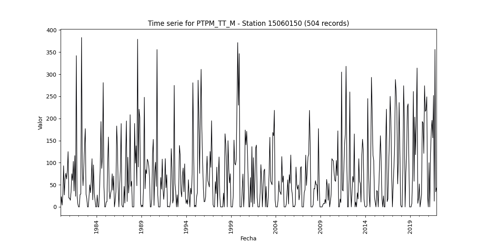
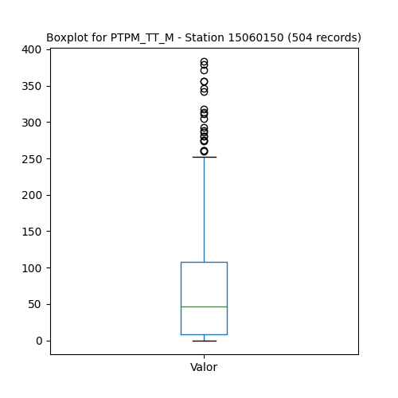
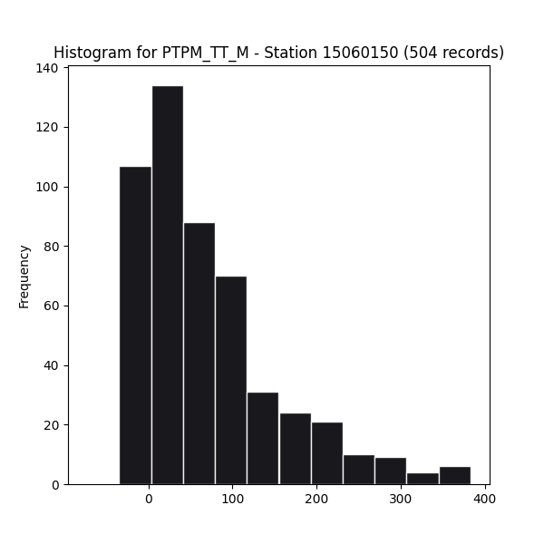
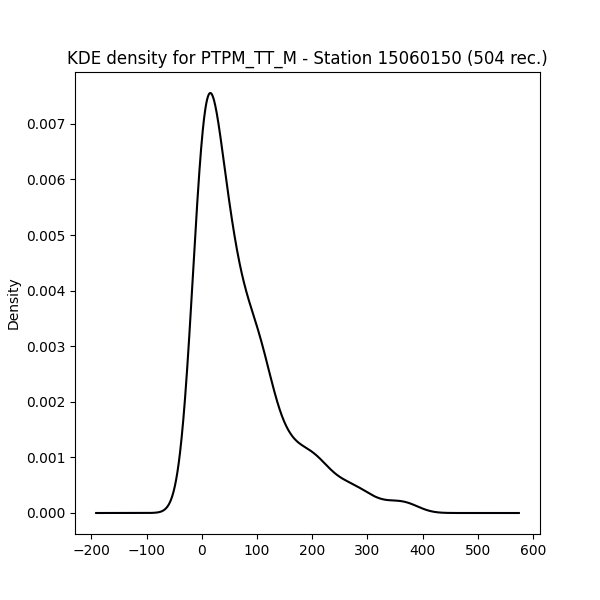

**PTPM_TT_M - Station: HATICO D LOS INDIO [28010200] (471 rec.)** Location over [Google Maps](http://maps.google.com/maps?q=10.86022222,-73.11416667) or [Openstreet Map](https://www.openstreetmap.org/query?lat=10.86022222&lon=-73.11416667)

Station first record

| Fecha               |   CodigoEstacion | NombreEstacion                |   Latitud |   Longitud |   Altitud | Categoria     | Entidad                                                     | AreaOperativa                               | Departamento   | Municipio          | FechaInstalacion    | FechaSuspension   | IdParametro   | Etiqueta   | DescripcionSerie            | Frecuencia   |   Valor |   Grado |   Calificador |   NivelAprobacion |
|:--------------------|-----------------:|:------------------------------|----------:|-----------:|----------:|:--------------|:------------------------------------------------------------|:--------------------------------------------|:---------------|:-------------------|:--------------------|:------------------|:--------------|:-----------|:----------------------------|:-------------|--------:|--------:|--------------:|------------------:|
| 1980-01-01 00:00:00 |         28010200 | HATICO D LOS INDIO [28010200] |   10.8602 |   -73.1142 |       594 | Pluviométrica | INSTITUTO DE HIDROLOGIA METEOROLOGIA Y ESTUDIOS AMBIENTALES | Area Operativa 05 - Magdalena-Cesar-Guajira | La Guajira     | San Juan Del Cesar | 1970-01-15 00:00:00 | NaT               | PRECIPITACION | PTPM_TT_M  | Precipitación total mensual | Mensual      |       0 |      50 |           nan |               900 |

Statistics table

|       |    Valor |
|:------|---------:|
| count | 471      |
| mean  |  82.41   |
| std   |  90.3403 |
| min   |   0      |
| 25%   |   5.4    |
| 50%   |  52      |
| 75%   | 129.4    |
| max   | 556      |

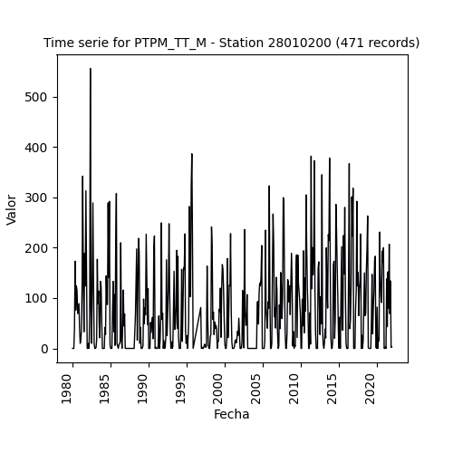
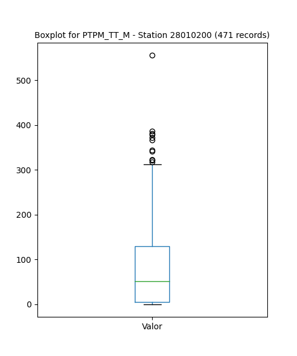
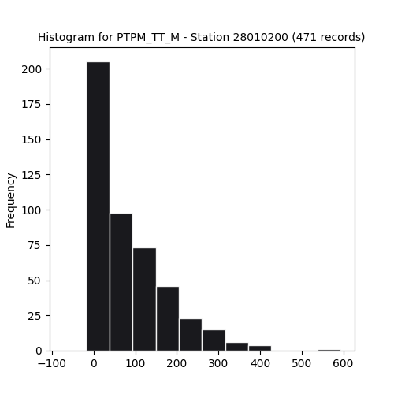
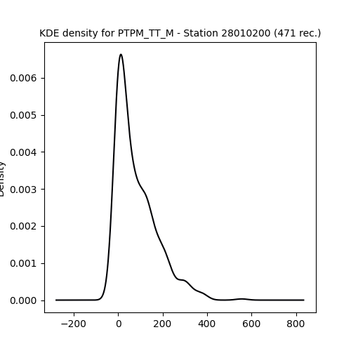

**PTPM_TT_M - Station: JUGUETE EL [15060070] (387 rec.)** Location over [Google Maps](http://maps.google.com/maps?q=10.786,-72.76836111) or [Openstreet Map](https://www.openstreetmap.org/query?lat=10.786&lon=-72.76836111)

Station first record

| Fecha               |   CodigoEstacion | NombreEstacion        |   Latitud |   Longitud |   Altitud | Categoria     | Entidad                                                     | AreaOperativa                               | Departamento   | Municipio   | FechaInstalacion    | FechaSuspension     | IdParametro   | Etiqueta   | DescripcionSerie            | Frecuencia   |   Valor |   Grado |   Calificador |   NivelAprobacion |
|:--------------------|-----------------:|:----------------------|----------:|-----------:|----------:|:--------------|:------------------------------------------------------------|:--------------------------------------------|:---------------|:------------|:--------------------|:--------------------|:--------------|:-----------|:----------------------------|:-------------|--------:|--------:|--------------:|------------------:|
| 1980-01-01 00:00:00 |         15060070 | JUGUETE EL [15060070] |    10.786 |   -72.7684 |       390 | Pluviométrica | INSTITUTO DE HIDROLOGIA METEOROLOGIA Y ESTUDIOS AMBIENTALES | Area Operativa 05 - Magdalena-Cesar-Guajira | La Guajira     | Fonseca     | 1971-05-15 00:00:00 | 2014-08-28 00:00:00 | PRECIPITACION | PTPM_TT_M  | Precipitación total mensual | Mensual      |       0 |      50 |           nan |               900 |

Statistics table

|       |   Valor |
|:------|--------:|
| count | 387     |
| mean  | 103.287 |
| std   | 105.964 |
| min   |   0     |
| 25%   |  15     |
| 50%   |  82     |
| 75%   | 150     |
| max   | 655     |

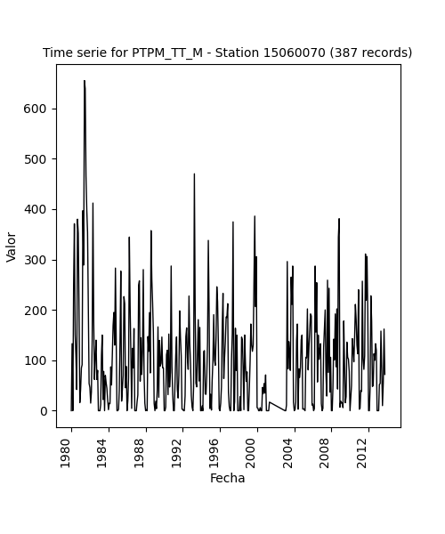
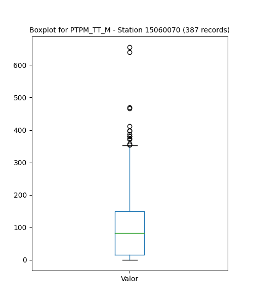
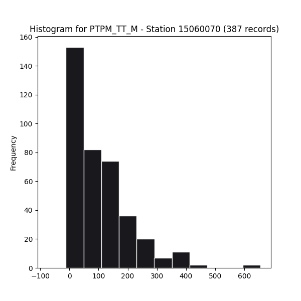
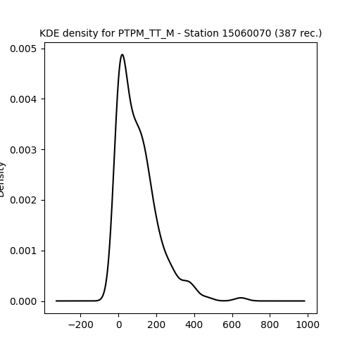

**PTPM_TT_M - Station: LA PAULINA - AUT [15065040] (243 rec.)** Location over [Google Maps](http://maps.google.com/maps?q=10.89813889,-72.82847222) or [Openstreet Map](https://www.openstreetmap.org/query?lat=10.89813889&lon=-72.82847222)

Station first record

| Fecha               |   CodigoEstacion | NombreEstacion              |   Latitud |   Longitud |   Altitud | Categoria           | Entidad                                                     | AreaOperativa                               | Departamento   | Municipio   | FechaInstalacion    | FechaSuspension   | IdParametro   | Etiqueta   | DescripcionSerie            | Frecuencia   |   Valor |   Grado |   Calificador |   NivelAprobacion |
|:--------------------|-----------------:|:----------------------------|----------:|-----------:|----------:|:--------------------|:------------------------------------------------------------|:--------------------------------------------|:---------------|:------------|:--------------------|:------------------|:--------------|:-----------|:----------------------------|:-------------|--------:|--------:|--------------:|------------------:|
| 1980-04-01 00:00:00 |         15065040 | LA PAULINA - AUT [15065040] |   10.8981 |   -72.8285 |       170 | Climática Principal | INSTITUTO DE HIDROLOGIA METEOROLOGIA Y ESTUDIOS AMBIENTALES | Area Operativa 05 - Magdalena-Cesar-Guajira | La Guajira     | Fonseca     | 1966-09-15 00:00:00 | NaT               | PRECIPITACION | PTPM_TT_M  | Precipitación total mensual | Mensual      |    72.3 |       4 |           nan |               900 |

Statistics table

|       |    Valor |
|:------|---------:|
| count | 243      |
| mean  |  65.5008 |
| std   |  59.54   |
| min   |   0      |
| 25%   |  10.8    |
| 50%   |  53      |
| 75%   | 107.75   |
| max   | 237.7    |

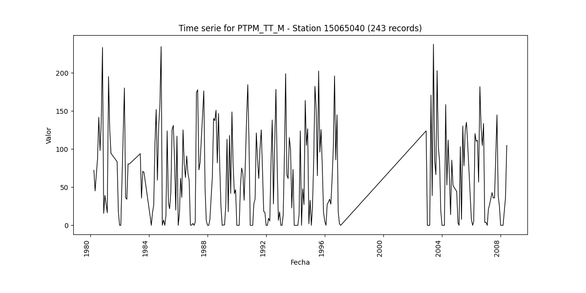
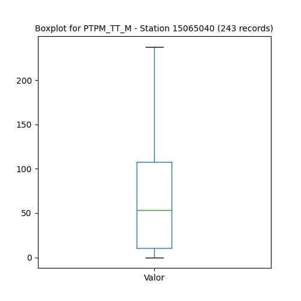
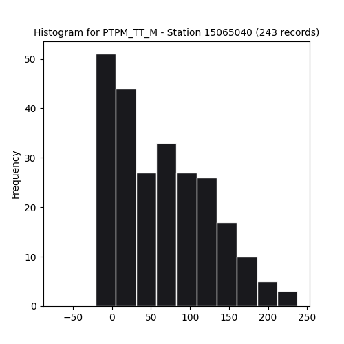
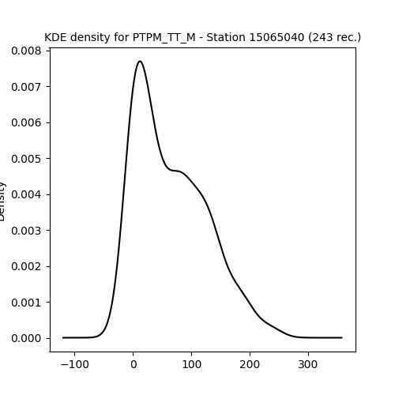

**PTPM_TT_M - Station: PAMPLONA [28010280] (15 rec.)** Location over [Google Maps](http://maps.google.com/maps?q=10.65,-72.85) or [Openstreet Map](https://www.openstreetmap.org/query?lat=10.65&lon=-72.85)

Station first record

| Fecha               |   CodigoEstacion | NombreEstacion      |   Latitud |   Longitud |   Altitud | Categoria     | Entidad                                                     | AreaOperativa                               | Departamento   | Municipio          | FechaInstalacion    | FechaSuspension     | IdParametro   | Etiqueta   | DescripcionSerie            | Frecuencia   |   Valor |   Grado |   Calificador |   NivelAprobacion |
|:--------------------|-----------------:|:--------------------|----------:|-----------:|----------:|:--------------|:------------------------------------------------------------|:--------------------------------------------|:---------------|:-------------------|:--------------------|:--------------------|:--------------|:-----------|:----------------------------|:-------------|--------:|--------:|--------------:|------------------:|
| 1980-01-01 00:00:00 |         28010280 | PAMPLONA [28010280] |     10.65 |     -72.85 |       690 | Pluviométrica | INSTITUTO DE HIDROLOGIA METEOROLOGIA Y ESTUDIOS AMBIENTALES | Area Operativa 05 - Magdalena-Cesar-Guajira | La Guajira     | San Juan Del Cesar | 1971-05-15 00:00:00 | 1993-11-15 00:00:00 | PRECIPITACION | PTPM_TT_M  | Precipitación total mensual | Mensual      |       2 |      50 |           nan |               900 |

Statistics table

|       |    Valor |
|:------|---------:|
| count |  15      |
| mean  |  52.2667 |
| std   |  55.7577 |
| min   |   2      |
| 25%   |  12.5    |
| 50%   |  26      |
| 75%   |  77      |
| max   | 169      |

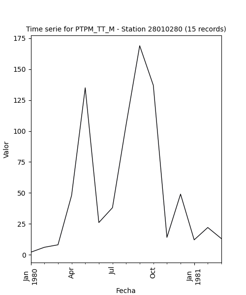
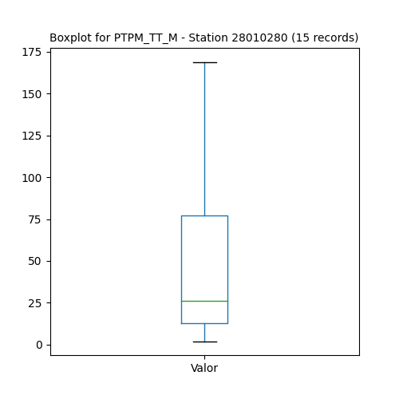
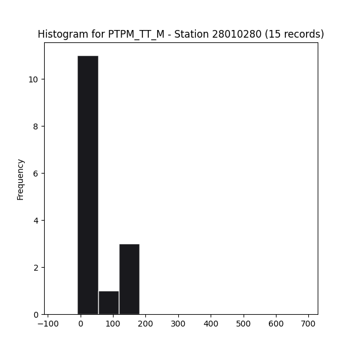
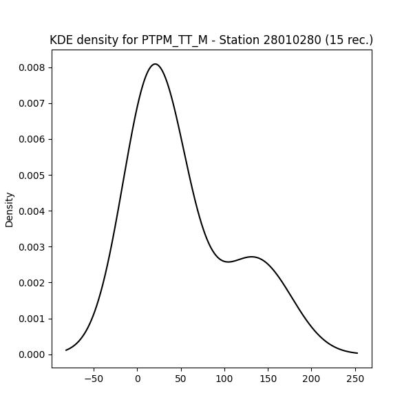

**PTPM_TT_M - Station: SABANAS DE MANUELA [15060050] (487 rec.)** Location over [Google Maps](http://maps.google.com/maps?q=10.953,-73.04797222) or [Openstreet Map](https://www.openstreetmap.org/query?lat=10.953&lon=-73.04797222)

Station first record

| Fecha               |   CodigoEstacion | NombreEstacion                |   Latitud |   Longitud |   Altitud | Categoria     | Entidad                                                     | AreaOperativa                               | Departamento   | Municipio   | FechaInstalacion    | FechaSuspension   | IdParametro   | Etiqueta   | DescripcionSerie            | Frecuencia   |   Valor |   Grado |   Calificador |   NivelAprobacion |
|:--------------------|-----------------:|:------------------------------|----------:|-----------:|----------:|:--------------|:------------------------------------------------------------|:--------------------------------------------|:---------------|:------------|:--------------------|:------------------|:--------------|:-----------|:----------------------------|:-------------|--------:|--------:|--------------:|------------------:|
| 1980-01-01 00:00:00 |         15060050 | SABANAS DE MANUELA [15060050] |    10.953 |    -73.048 |       420 | Pluviométrica | INSTITUTO DE HIDROLOGIA METEOROLOGIA Y ESTUDIOS AMBIENTALES | Area Operativa 05 - Magdalena-Cesar-Guajira | La Guajira     | Distracción | 1963-08-15 00:00:00 | NaT               | PRECIPITACION | PTPM_TT_M  | Precipitación total mensual | Mensual      |       0 |      50 |           nan |               900 |

Statistics table

|       |    Valor |
|:------|---------:|
| count | 487      |
| mean  |  87.9507 |
| std   |  83.7311 |
| min   |   0      |
| 25%   |  12.1    |
| 50%   |  74      |
| 75%   | 138.1    |
| max   | 489.2    |

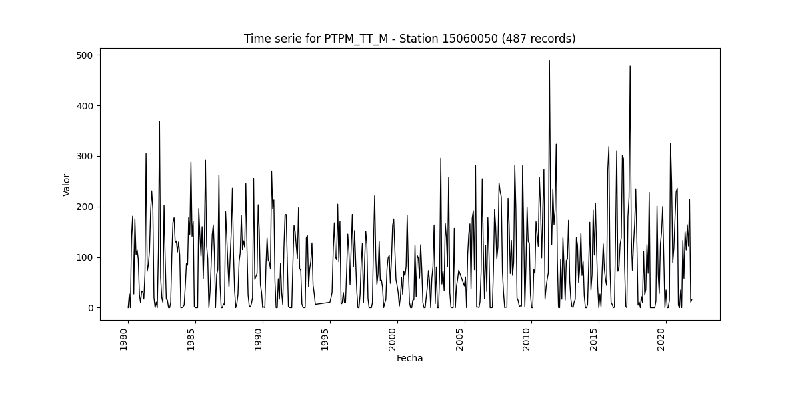
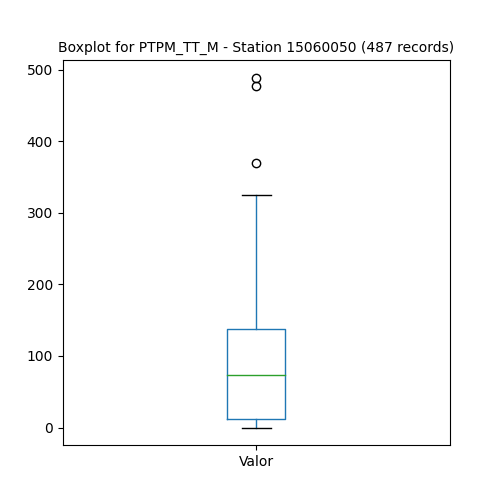
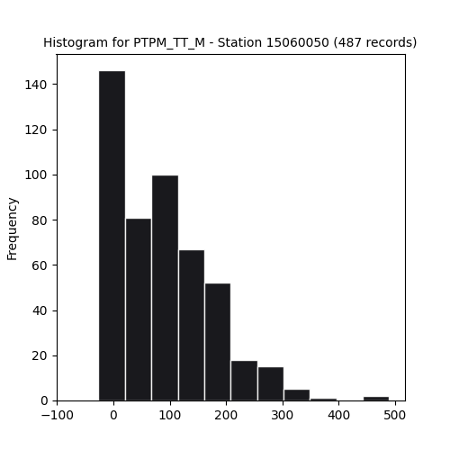
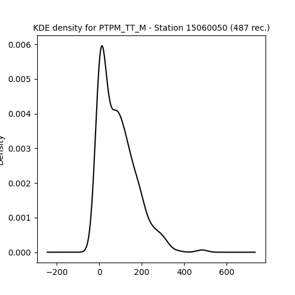

**PTPM_TT_M - Station: URUMITA [28015070] (499 rec.)** Location over [Google Maps](http://maps.google.com/maps?q=10.56638889,-73.01638889) or [Openstreet Map](https://www.openstreetmap.org/query?lat=10.56638889&lon=-73.01638889)

Station first record

| Fecha               |   CodigoEstacion | NombreEstacion     |   Latitud |   Longitud |   Altitud | Categoria           | Entidad                                                     | AreaOperativa                               | Departamento   | Municipio   | FechaInstalacion    | FechaSuspension   | IdParametro   | Etiqueta   | DescripcionSerie            | Frecuencia   |   Valor |   Grado |   Calificador |   NivelAprobacion |
|:--------------------|-----------------:|:-------------------|----------:|-----------:|----------:|:--------------------|:------------------------------------------------------------|:--------------------------------------------|:---------------|:------------|:--------------------|:------------------|:--------------|:-----------|:----------------------------|:-------------|--------:|--------:|--------------:|------------------:|
| 1980-01-01 00:00:00 |         28015070 | URUMITA [28015070] |   10.5664 |   -73.0164 |       255 | Climática Ordinaria | INSTITUTO DE HIDROLOGIA METEOROLOGIA Y ESTUDIOS AMBIENTALES | Area Operativa 05 - Magdalena-Cesar-Guajira | La Guajira     | Urumita     | 1975-08-15 00:00:00 | NaT               | PRECIPITACION | PTPM_TT_M  | Precipitación total mensual | Mensual      |       0 |      50 |           nan |               900 |

Statistics table

|       |    Valor |
|:------|---------:|
| count | 499      |
| mean  |  98.0299 |
| std   |  84.267  |
| min   |   0      |
| 25%   |  28.35   |
| 50%   |  87.9    |
| 75%   | 150.7    |
| max   | 456.1    |

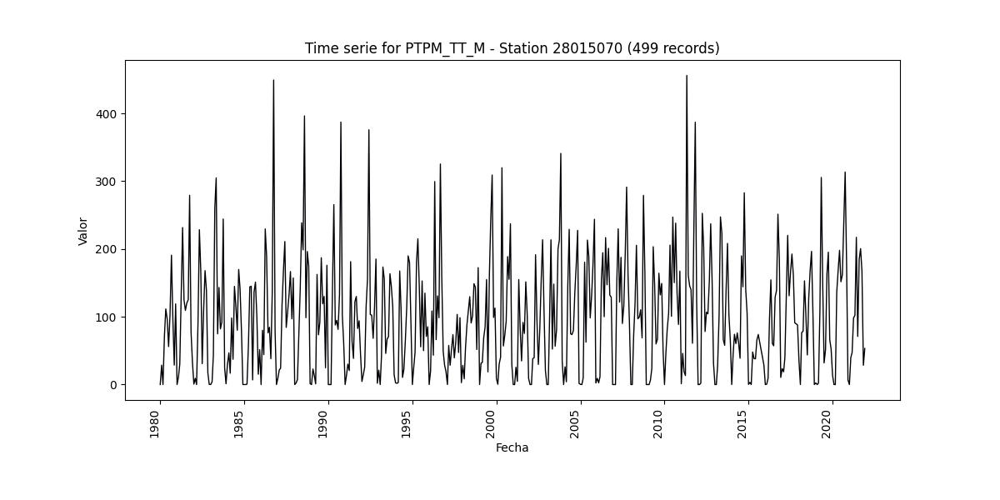
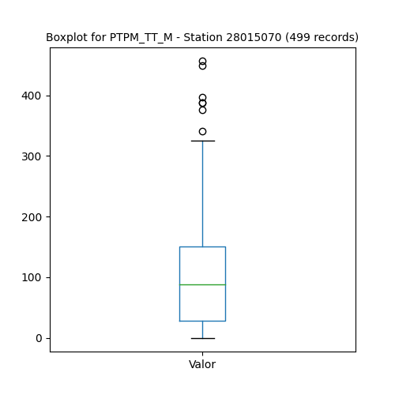
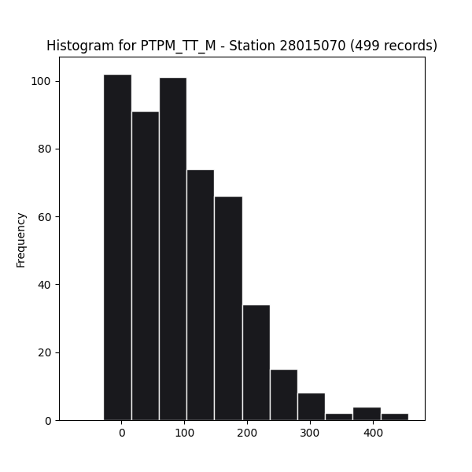
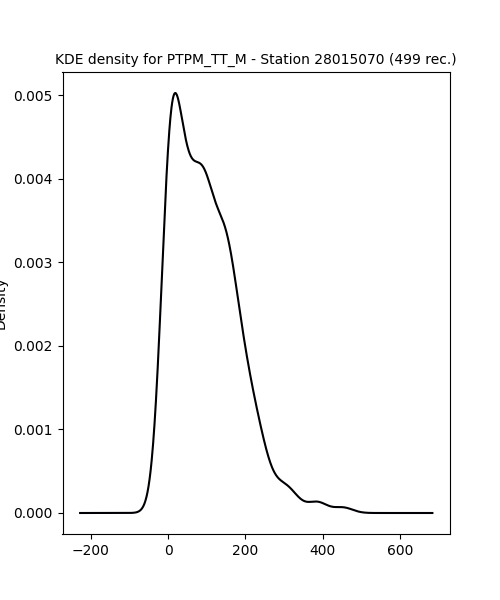

**PTPM_TT_M - Station: VILLANUEVA [28010340] (492 rec.)** Location over [Google Maps](http://maps.google.com/maps?q=10.61583333,-72.98194444) or [Openstreet Map](https://www.openstreetmap.org/query?lat=10.61583333&lon=-72.98194444)

Station first record

| Fecha               |   CodigoEstacion | NombreEstacion        |   Latitud |   Longitud |   Altitud | Categoria     | Entidad                                                     | AreaOperativa                               | Departamento   | Municipio   | FechaInstalacion    | FechaSuspension   | IdParametro   | Etiqueta   | DescripcionSerie            | Frecuencia   |   Valor |   Grado |   Calificador |   NivelAprobacion |
|:--------------------|-----------------:|:----------------------|----------:|-----------:|----------:|:--------------|:------------------------------------------------------------|:--------------------------------------------|:---------------|:------------|:--------------------|:------------------|:--------------|:-----------|:----------------------------|:-------------|--------:|--------:|--------------:|------------------:|
| 1980-01-01 00:00:00 |         28010340 | VILLANUEVA [28010340] |   10.6158 |   -72.9819 |       340 | Pluviométrica | INSTITUTO DE HIDROLOGIA METEOROLOGIA Y ESTUDIOS AMBIENTALES | Area Operativa 05 - Magdalena-Cesar-Guajira | La Guajira     | Villanueva  | 1970-08-15 00:00:00 | NaT               | PRECIPITACION | PTPM_TT_M  | Precipitación total mensual | Mensual      |       0 |      50 |           nan |               900 |

Statistics table

|       |    Valor |
|:------|---------:|
| count | 492      |
| mean  |  99.5524 |
| std   |  92.5377 |
| min   |   0      |
| 25%   |  16.975  |
| 50%   |  82.5    |
| 75%   | 154      |
| max   | 457      |

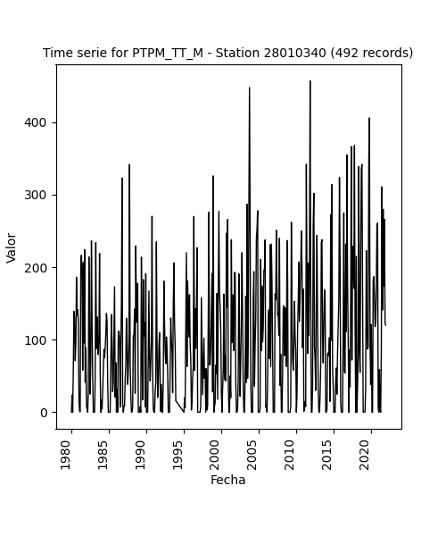
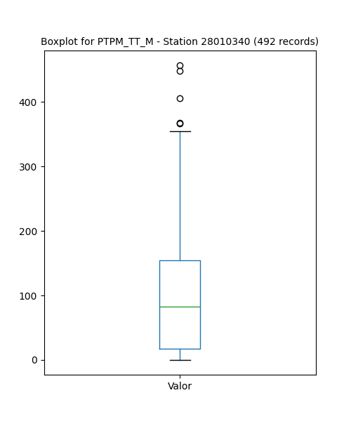
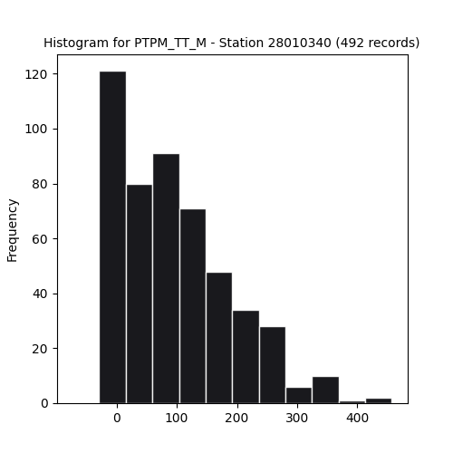
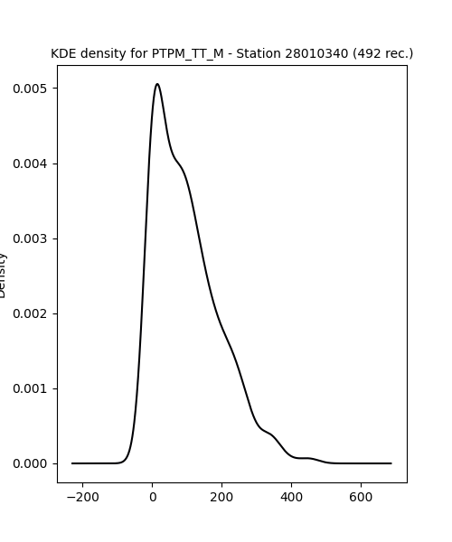

**PTPM_TT_M - Station: AEROPUERTO LAS FLORES [25025090] (466 rec.)** Location over [Google Maps](http://maps.google.com/maps?q=9.046333333,-73.97083333) or [Openstreet Map](https://www.openstreetmap.org/query?lat=9.046333333&lon=-73.97083333)

Station first record

| Fecha               |   CodigoEstacion | NombreEstacion                   |   Latitud |   Longitud |   Altitud | Categoria           | Entidad                                                     | AreaOperativa                               | Departamento   | Municipio   | FechaInstalacion    | FechaSuspension   | IdParametro   | Etiqueta   | DescripcionSerie            | Frecuencia   |   Valor |   Grado |   Calificador |   NivelAprobacion |
|:--------------------|-----------------:|:---------------------------------|----------:|-----------:|----------:|:--------------------|:------------------------------------------------------------|:--------------------------------------------|:---------------|:------------|:--------------------|:------------------|:--------------|:-----------|:----------------------------|:-------------|--------:|--------:|--------------:|------------------:|
| 1980-01-01 00:00:00 |         25025090 | AEROPUERTO LAS FLORES [25025090] |   9.04633 |   -73.9708 |        34 | Climática Principal | INSTITUTO DE HIDROLOGIA METEOROLOGIA Y ESTUDIOS AMBIENTALES | Area Operativa 05 - Magdalena-Cesar-Guajira | Magdalena      | El Banco    | 1952-02-15 00:00:00 | NaT               | PRECIPITACION | PTPM_TT_M  | Precipitación total mensual | Mensual      |      70 |      50 |           nan |               900 |

Statistics table

|       |   Valor |
|:------|--------:|
| count | 466     |
| mean  | 164.917 |
| std   | 134.386 |
| min   |   0     |
| 25%   |  53.3   |
| 50%   | 139.15  |
| 75%   | 246.2   |
| max   | 609.3   |

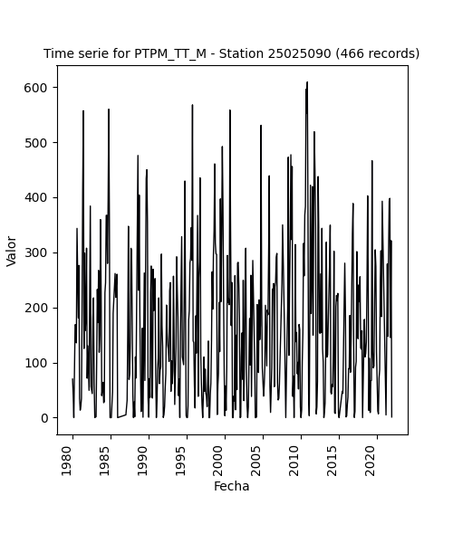

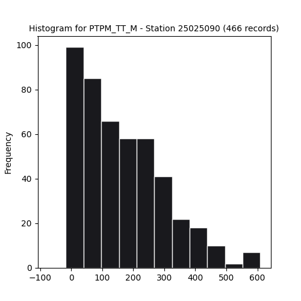
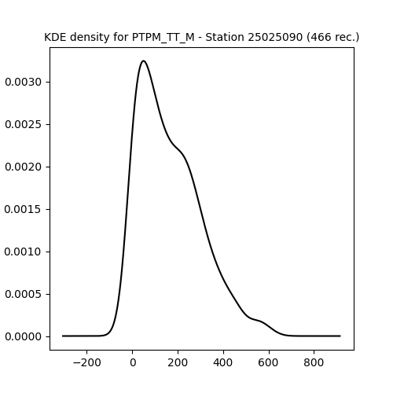

**PTPM_TT_M - Station: BRILLANTE EL [28040320] (487 rec.)** Location over [Google Maps](http://maps.google.com/maps?q=9.70275,-73.95913889) or [Openstreet Map](https://www.openstreetmap.org/query?lat=9.70275&lon=-73.95913889)

Station first record

| Fecha               |   CodigoEstacion | NombreEstacion          |   Latitud |   Longitud |   Altitud | Categoria     | Entidad                                                     | AreaOperativa                               | Departamento   | Municipio   | FechaInstalacion    | FechaSuspension   | IdParametro   | Etiqueta   | DescripcionSerie            | Frecuencia   |   Valor |   Grado |   Calificador |   NivelAprobacion |
|:--------------------|-----------------:|:------------------------|----------:|-----------:|----------:|:--------------|:------------------------------------------------------------|:--------------------------------------------|:---------------|:------------|:--------------------|:------------------|:--------------|:-----------|:----------------------------|:-------------|--------:|--------:|--------------:|------------------:|
| 1980-01-01 00:00:00 |         28040320 | BRILLANTE EL [28040320] |   9.70275 |   -73.9591 |       135 | Pluviométrica | INSTITUTO DE HIDROLOGIA METEOROLOGIA Y ESTUDIOS AMBIENTALES | Area Operativa 05 - Magdalena-Cesar-Guajira | Magdalena      | Santa Ana   | 1972-07-15 00:00:00 | NaT               | PRECIPITACION | PTPM_TT_M  | Precipitación total mensual | Mensual      |       7 |      50 |           nan |               900 |

Statistics table

|       |    Valor |
|:------|---------:|
| count | 487      |
| mean  | 124.416  |
| std   |  96.7825 |
| min   |   0      |
| 25%   |  50.5    |
| 50%   | 107      |
| 75%   | 172.5    |
| max   | 491      |

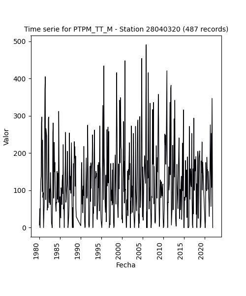
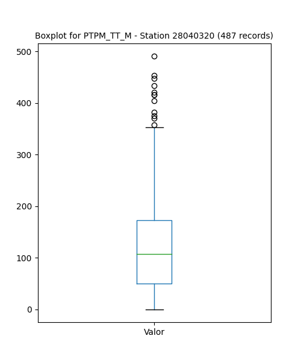
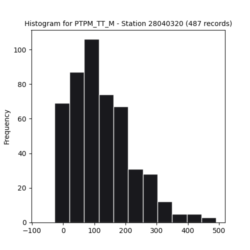
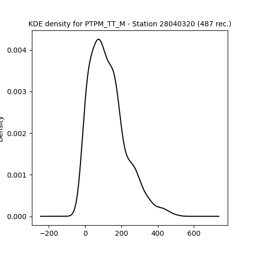

**PTPM_TT_M - Station: IRAN [25021620] (468 rec.)** Location over [Google Maps](http://maps.google.com/maps?q=9.683777778,-74.32216667) or [Openstreet Map](https://www.openstreetmap.org/query?lat=9.683777778&lon=-74.32216667)

Station first record

| Fecha               |   CodigoEstacion | NombreEstacion   |   Latitud |   Longitud |   Altitud | Categoria     | Entidad                                                     | AreaOperativa                               | Departamento   | Municipio     | FechaInstalacion    | FechaSuspension   | IdParametro   | Etiqueta   | DescripcionSerie            | Frecuencia   |   Valor |   Grado |   Calificador |   NivelAprobacion |
|:--------------------|-----------------:|:-----------------|----------:|-----------:|----------:|:--------------|:------------------------------------------------------------|:--------------------------------------------|:---------------|:--------------|:--------------------|:------------------|:--------------|:-----------|:----------------------------|:-------------|--------:|--------:|--------------:|------------------:|
| 1982-07-01 00:00:00 |         25021620 | IRAN [25021620]  |   9.68378 |   -74.3222 |        80 | Pluviométrica | INSTITUTO DE HIDROLOGIA METEOROLOGIA Y ESTUDIOS AMBIENTALES | Area Operativa 05 - Magdalena-Cesar-Guajira | Magdalena      | Nueva Granada | 1982-06-15 00:00:00 | NaT               | PRECIPITACION | PTPM_TT_M  | Precipitación total mensual | Mensual      |      63 |       4 |           nan |               900 |

Statistics table

|       |   Valor |
|:------|--------:|
| count | 468     |
| mean  | 116.16  |
| std   |  92.907 |
| min   |   0     |
| 25%   |  44.75  |
| 50%   | 101.5   |
| 75%   | 161     |
| max   | 716     |

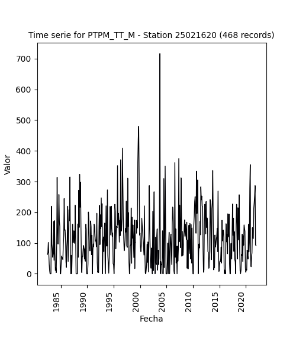
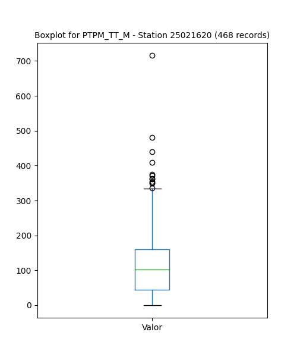
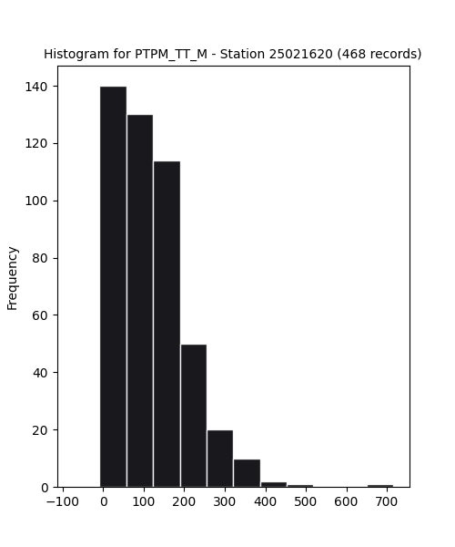

**PTPM_TT_M - Station: MENCHIQUEJO [25021040] (503 rec.)** Location over [Google Maps](http://maps.google.com/maps?q=9.188055556,-74.04422222) or [Openstreet Map](https://www.openstreetmap.org/query?lat=9.188055556&lon=-74.04422222)

Station first record

| Fecha               |   CodigoEstacion | NombreEstacion         |   Latitud |   Longitud |   Altitud | Categoria     | Entidad                                                     | AreaOperativa                               | Departamento   | Municipio   | FechaInstalacion    | FechaSuspension   | IdParametro   | Etiqueta   | DescripcionSerie            | Frecuencia   |   Valor |   Grado |   Calificador |   NivelAprobacion |
|:--------------------|-----------------:|:-----------------------|----------:|-----------:|----------:|:--------------|:------------------------------------------------------------|:--------------------------------------------|:---------------|:------------|:--------------------|:------------------|:--------------|:-----------|:----------------------------|:-------------|--------:|--------:|--------------:|------------------:|
| 1980-01-01 00:00:00 |         25021040 | MENCHIQUEJO [25021040] |   9.18806 |   -74.0442 |        25 | Pluviométrica | INSTITUTO DE HIDROLOGIA METEOROLOGIA Y ESTUDIOS AMBIENTALES | Area Operativa 05 - Magdalena-Cesar-Guajira | Magdalena      | El Banco    | 1974-09-15 00:00:00 | NaT               | PRECIPITACION | PTPM_TT_M  | Precipitación total mensual | Mensual      |       0 |      50 |           nan |               900 |

Statistics table

|       |   Valor |
|:------|--------:|
| count | 503     |
| mean  | 161.868 |
| std   | 139.083 |
| min   |   0     |
| 25%   |  45     |
| 50%   | 139     |
| 75%   | 245.5   |
| max   | 739     |

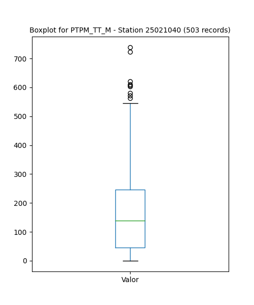
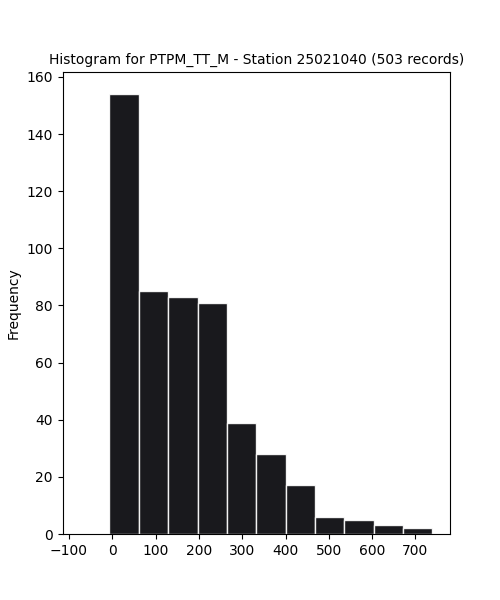
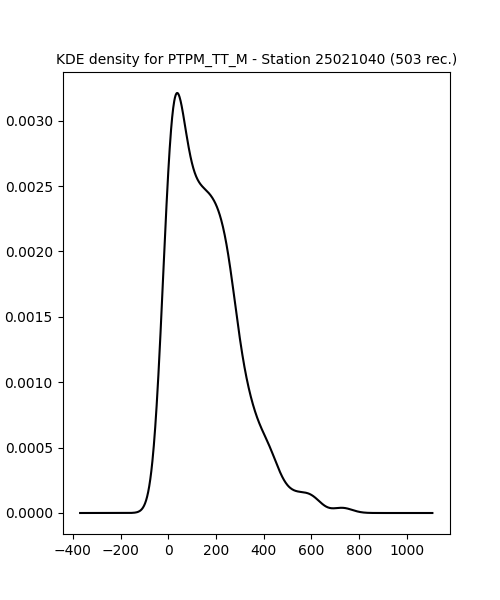

**PTPM_TT_M - Station: NEGRITOS LOS [25021200] (484 rec.)** Location over [Google Maps](http://maps.google.com/maps?q=9.026666667,-74.07944444) or [Openstreet Map](https://www.openstreetmap.org/query?lat=9.026666667&lon=-74.07944444)

Station first record

| Fecha               |   CodigoEstacion | NombreEstacion          |   Latitud |   Longitud |   Altitud | Categoria     | Entidad                                                     | AreaOperativa                               | Departamento   | Municipio   | FechaInstalacion    | FechaSuspension   | IdParametro   | Etiqueta   | DescripcionSerie            | Frecuencia   |   Valor |   Grado |   Calificador |   NivelAprobacion |
|:--------------------|-----------------:|:------------------------|----------:|-----------:|----------:|:--------------|:------------------------------------------------------------|:--------------------------------------------|:---------------|:------------|:--------------------|:------------------|:--------------|:-----------|:----------------------------|:-------------|--------:|--------:|--------------:|------------------:|
| 1980-01-01 00:00:00 |         25021200 | NEGRITOS LOS [25021200] |   9.02667 |   -74.0794 |        26 | Pluviométrica | INSTITUTO DE HIDROLOGIA METEOROLOGIA Y ESTUDIOS AMBIENTALES | Area Operativa 02 - Atlántico-Bolivar-Sucre | Magdalena      | El Banco    | 1976-07-15 00:00:00 | NaT               | PRECIPITACION | PTPM_TT_M  | Precipitación total mensual | Mensual      |      21 |      50 |           nan |               900 |

Statistics table

|       |   Valor |
|:------|--------:|
| count | 484     |
| mean  | 190.166 |
| std   | 168.025 |
| min   |   0     |
| 25%   |  50     |
| 50%   | 149     |
| 75%   | 284.5   |
| max   | 934     |

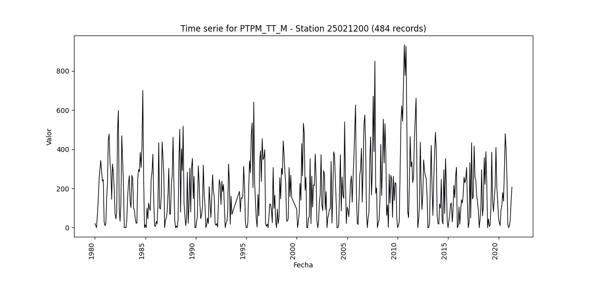
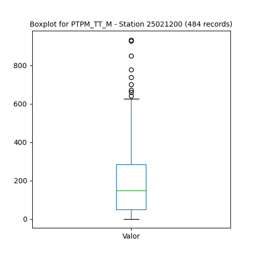
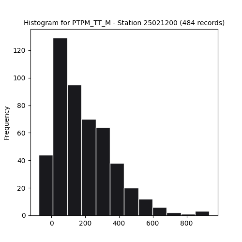
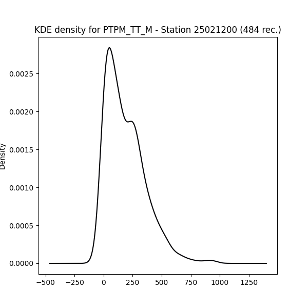

**PTPM_TT_M - Station: PUEBLITO EL [25021500] (492 rec.)** Location over [Google Maps](http://maps.google.com/maps?q=9.581166667,-74.35225) or [Openstreet Map](https://www.openstreetmap.org/query?lat=9.581166667&lon=-74.35225)

Station first record

| Fecha               |   CodigoEstacion | NombreEstacion         |   Latitud |   Longitud |   Altitud | Categoria     | Entidad                                                     | AreaOperativa                               | Departamento   | Municipio   | FechaInstalacion    | FechaSuspension   | IdParametro   | Etiqueta   | DescripcionSerie            | Frecuencia   |   Valor |   Grado |   Calificador |   NivelAprobacion |
|:--------------------|-----------------:|:-----------------------|----------:|-----------:|----------:|:--------------|:------------------------------------------------------------|:--------------------------------------------|:---------------|:------------|:--------------------|:------------------|:--------------|:-----------|:----------------------------|:-------------|--------:|--------:|--------------:|------------------:|
| 1980-01-01 00:00:00 |         25021500 | PUEBLITO EL [25021500] |   9.58117 |   -74.3522 |        35 | Pluviométrica | INSTITUTO DE HIDROLOGIA METEOROLOGIA Y ESTUDIOS AMBIENTALES | Area Operativa 05 - Magdalena-Cesar-Guajira | Magdalena      | Santa Ana   | 1976-10-15 00:00:00 | NaT               | PRECIPITACION | PTPM_TT_M  | Precipitación total mensual | Mensual      |       4 |      50 |           nan |               900 |

Statistics table

|       |    Valor |
|:------|---------:|
| count | 492      |
| mean  |  99.214  |
| std   |  74.7592 |
| min   |   0      |
| 25%   |  41      |
| 50%   |  88      |
| 75%   | 145      |
| max   | 368      |

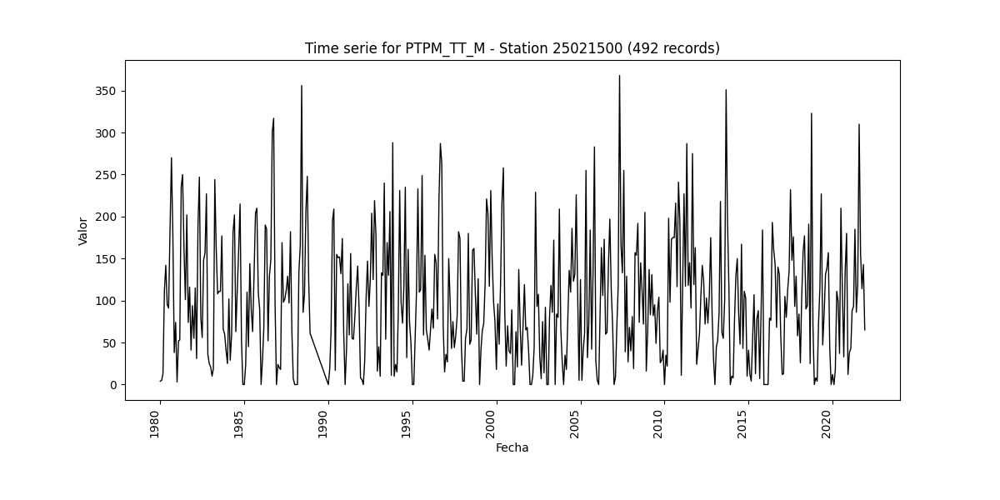
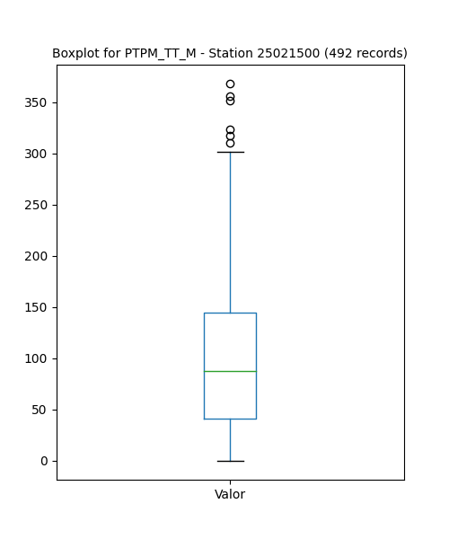
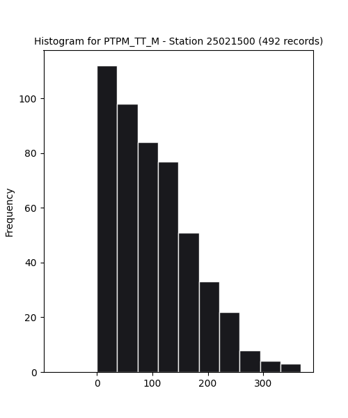
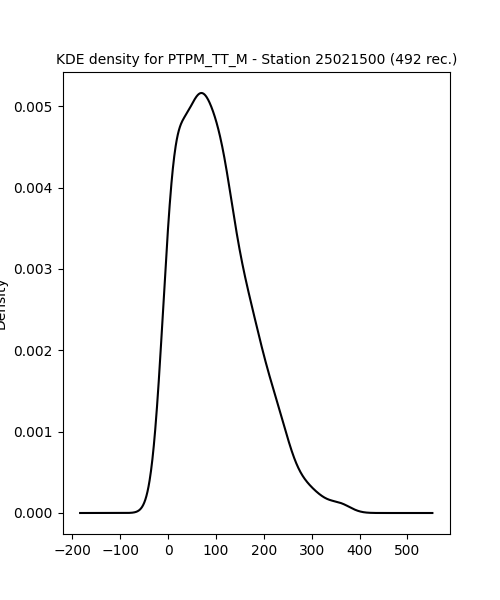

**PTPM_TT_M - Station: SAN ROQUE ALERTAS [25021380] (477 rec.)** Location over [Google Maps](http://maps.google.com/maps?q=9.07,-74.15) or [Openstreet Map](https://www.openstreetmap.org/query?lat=9.07&lon=-74.15)

Station first record

| Fecha               |   CodigoEstacion | NombreEstacion               |   Latitud |   Longitud |   Altitud | Categoria     | Entidad                                                     | AreaOperativa                               | Departamento   | Municipio   | FechaInstalacion    | FechaSuspension   | IdParametro   | Etiqueta   | DescripcionSerie            | Frecuencia   |   Valor |   Grado |   Calificador |   NivelAprobacion |
|:--------------------|-----------------:|:-----------------------------|----------:|-----------:|----------:|:--------------|:------------------------------------------------------------|:--------------------------------------------|:---------------|:------------|:--------------------|:------------------|:--------------|:-----------|:----------------------------|:-------------|--------:|--------:|--------------:|------------------:|
| 1980-06-01 00:00:00 |         25021380 | SAN ROQUE ALERTAS [25021380] |      9.07 |     -74.15 |        24 | Pluviométrica | INSTITUTO DE HIDROLOGIA METEOROLOGIA Y ESTUDIOS AMBIENTALES | Area Operativa 02 - Atlántico-Bolivar-Sucre | Magdalena      | El Banco    | 1980-05-15 00:00:00 | NaT               | PRECIPITACION | PTPM_TT_M  | Precipitación total mensual | Mensual      |     231 |      50 |           nan |               900 |

Statistics table

|       |   Valor |
|:------|--------:|
| count | 477     |
| mean  | 167.207 |
| std   | 139.418 |
| min   |   0     |
| 25%   |  53     |
| 50%   | 140     |
| 75%   | 257     |
| max   | 724     |

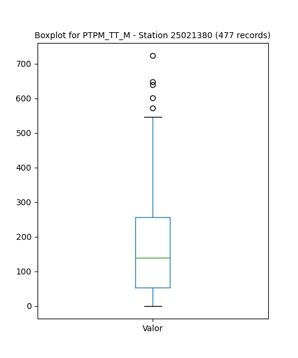
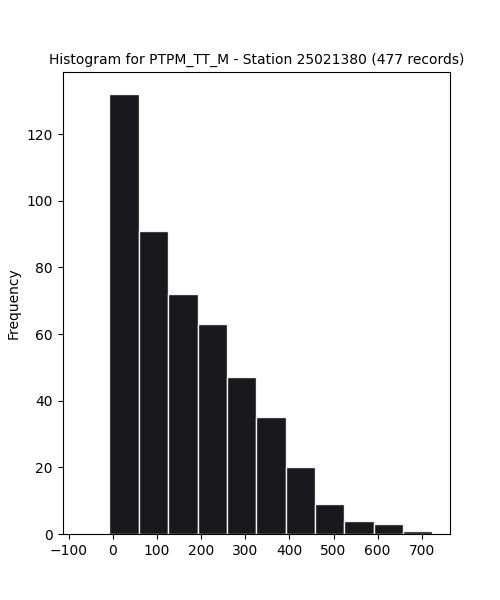
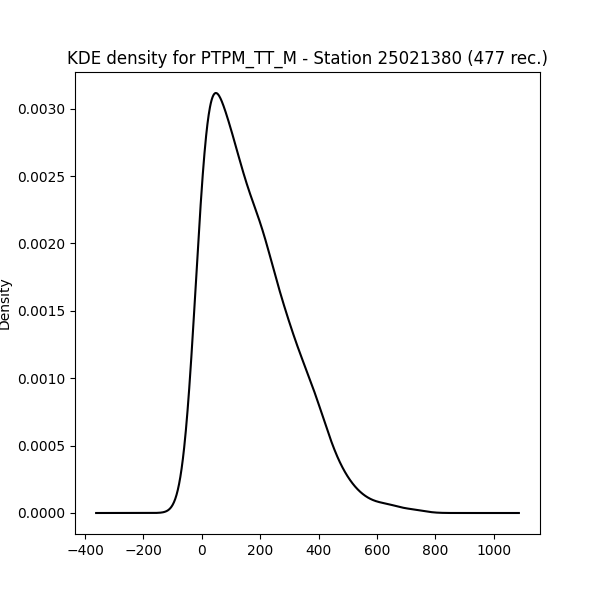

**PTPM_TT_M - Station: SAN SEBASTIAN [25020900] (492 rec.)** Location over [Google Maps](http://maps.google.com/maps?q=9.233888889,-74.35583333) or [Openstreet Map](https://www.openstreetmap.org/query?lat=9.233888889&lon=-74.35583333)

Station first record

| Fecha               |   CodigoEstacion | NombreEstacion           |   Latitud |   Longitud |   Altitud | Categoria     | Entidad                                                     | AreaOperativa                               | Departamento   | Municipio                   | FechaInstalacion    | FechaSuspension   | IdParametro   | Etiqueta   | DescripcionSerie            | Frecuencia   |   Valor |   Grado |   Calificador |   NivelAprobacion |
|:--------------------|-----------------:|:-------------------------|----------:|-----------:|----------:|:--------------|:------------------------------------------------------------|:--------------------------------------------|:---------------|:----------------------------|:--------------------|:------------------|:--------------|:-----------|:----------------------------|:-------------|--------:|--------:|--------------:|------------------:|
| 1980-01-01 00:00:00 |         25020900 | SAN SEBASTIAN [25020900] |   9.23389 |   -74.3558 |        65 | Pluviométrica | INSTITUTO DE HIDROLOGIA METEOROLOGIA Y ESTUDIOS AMBIENTALES | Area Operativa 02 - Atlántico-Bolivar-Sucre | Magdalena      | San Sebastián De Buenavista | 1974-01-15 00:00:00 | NaT               | PRECIPITACION | PTPM_TT_M  | Precipitación total mensual | Mensual      |       0 |      50 |           nan |               900 |

Statistics table

|       |   Valor |
|:------|--------:|
| count | 492     |
| mean  | 131.34  |
| std   | 114.881 |
| min   |   0     |
| 25%   |  30     |
| 50%   | 106     |
| 75%   | 207     |
| max   | 510     |

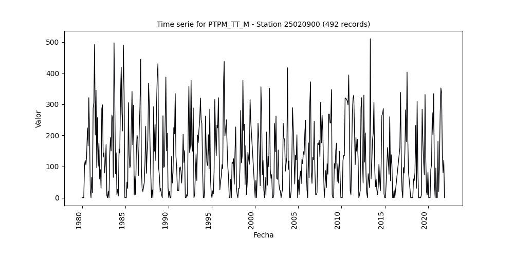
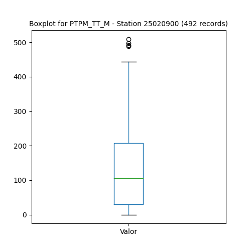
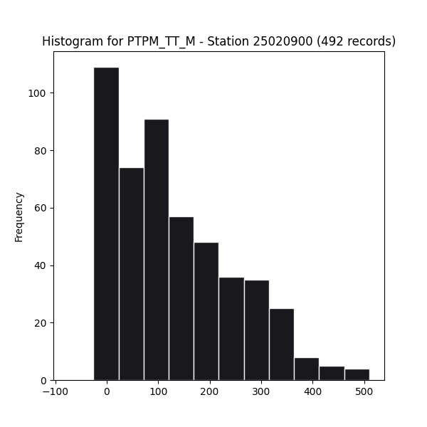
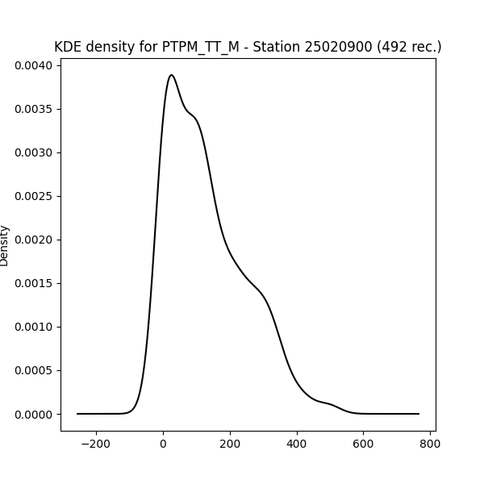

**PTPM_TT_M - Station: SEIS EL [25025300] (470 rec.)** Location over [Google Maps](http://maps.google.com/maps?q=9.683666667,-74.32227778) or [Openstreet Map](https://www.openstreetmap.org/query?lat=9.683666667&lon=-74.32227778)

Station first record

| Fecha               |   CodigoEstacion | NombreEstacion     |   Latitud |   Longitud |   Altitud | Categoria           | Entidad                                                     | AreaOperativa                               | Departamento   | Municipio                   | FechaInstalacion    | FechaSuspension   | IdParametro   | Etiqueta   | DescripcionSerie            | Frecuencia   |   Valor |   Grado |   Calificador |   NivelAprobacion |
|:--------------------|-----------------:|:-------------------|----------:|-----------:|----------:|:--------------------|:------------------------------------------------------------|:--------------------------------------------|:---------------|:----------------------------|:--------------------|:------------------|:--------------|:-----------|:----------------------------|:-------------|--------:|--------:|--------------:|------------------:|
| 1980-01-01 00:00:00 |         25025300 | SEIS EL [25025300] |   9.68367 |   -74.3223 |        50 | Climática Ordinaria | INSTITUTO DE HIDROLOGIA METEOROLOGIA Y ESTUDIOS AMBIENTALES | Area Operativa 05 - Magdalena-Cesar-Guajira | Magdalena      | San Sebastián De Buenavista | 1984-11-15 00:00:00 | NaT               | PRECIPITACION | PTPM_TT_M  | Precipitación total mensual | Mensual      |       0 |      50 |           nan |               900 |

Statistics table

|       |    Valor |
|:------|---------:|
| count | 470      |
| mean  | 110.96   |
| std   |  92.9367 |
| min   |   0      |
| 25%   |  35.225  |
| 50%   |  90.9    |
| 75%   | 163.8    |
| max   | 459.2    |

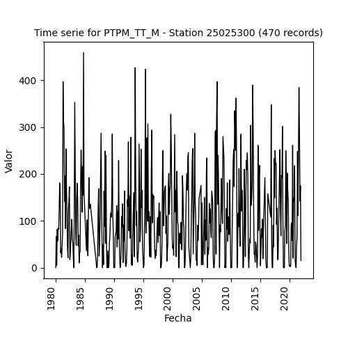
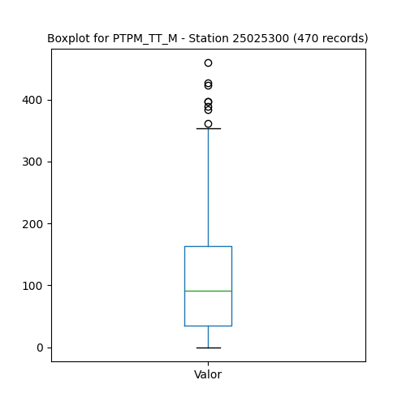
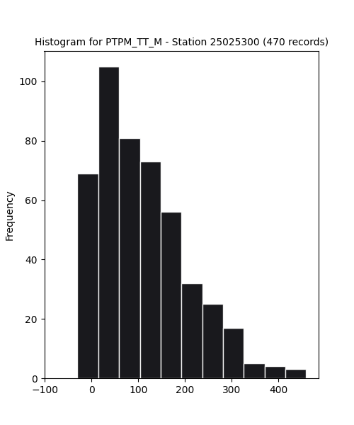
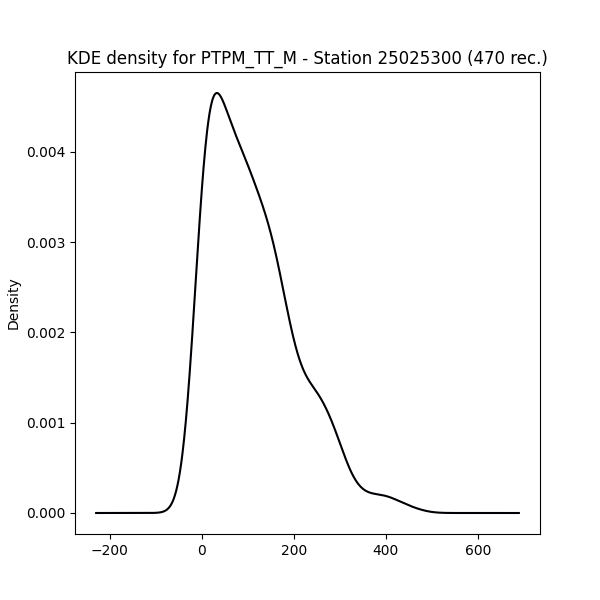

**PTPM_TT_M - Station: VILLA CONCEPCION [28040300] (480 rec.)** Location over [Google Maps](http://maps.google.com/maps?q=9.706305556,-73.85944444) or [Openstreet Map](https://www.openstreetmap.org/query?lat=9.706305556&lon=-73.85944444)

Station first record

| Fecha               |   CodigoEstacion | NombreEstacion              |   Latitud |   Longitud |   Altitud | Categoria     | Entidad                                                     | AreaOperativa                               | Departamento   | Municipio             | FechaInstalacion    | FechaSuspension   | IdParametro   | Etiqueta   | DescripcionSerie            | Frecuencia   |   Valor |   Grado |   Calificador |   NivelAprobacion |
|:--------------------|-----------------:|:----------------------------|----------:|-----------:|----------:|:--------------|:------------------------------------------------------------|:--------------------------------------------|:---------------|:----------------------|:--------------------|:------------------|:--------------|:-----------|:----------------------------|:-------------|--------:|--------:|--------------:|------------------:|
| 1980-01-01 00:00:00 |         28040300 | VILLA CONCEPCION [28040300] |   9.70631 |   -73.8594 |       120 | Pluviométrica | INSTITUTO DE HIDROLOGIA METEOROLOGIA Y ESTUDIOS AMBIENTALES | Area Operativa 05 - Magdalena-Cesar-Guajira | Magdalena      | Ariguaní (El Dificil) | 1972-07-15 00:00:00 | NaT               | PRECIPITACION | PTPM_TT_M  | Precipitación total mensual | Mensual      |       0 |      50 |           nan |               900 |

Statistics table

|       |    Valor |
|:------|---------:|
| count | 480      |
| mean  | 114.796  |
| std   |  97.6011 |
| min   |   0      |
| 25%   |  39      |
| 50%   |  96      |
| 75%   | 162      |
| max   | 564      |

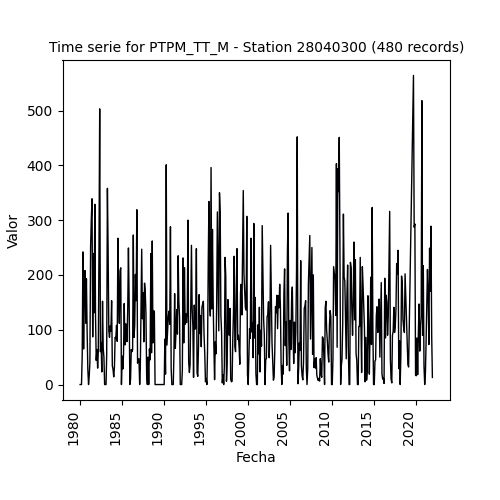
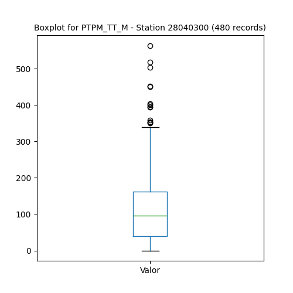
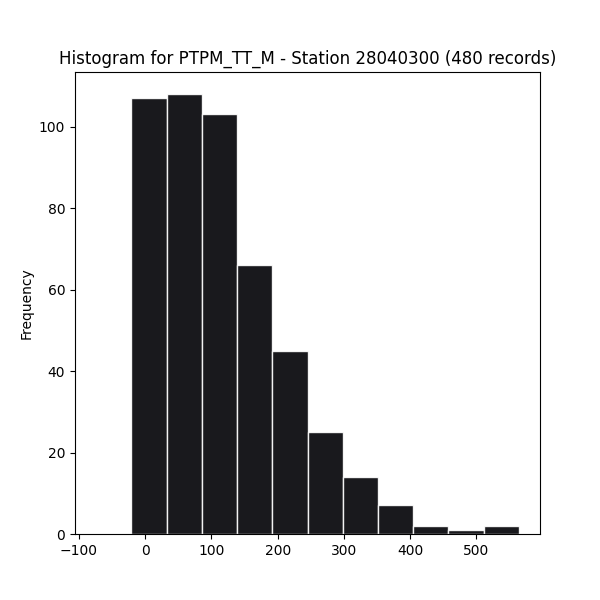
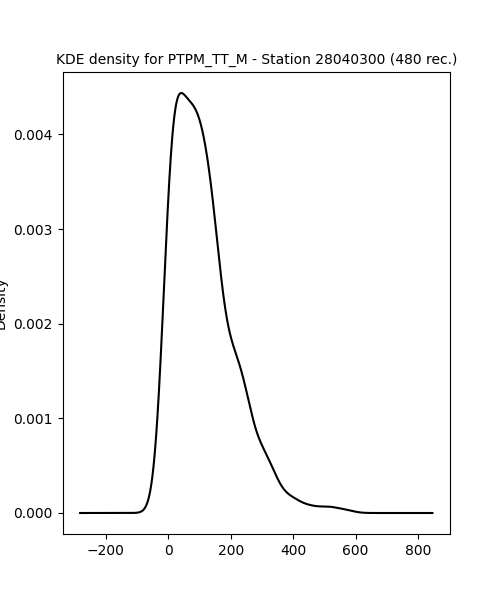

**PTPM_TT_M - Station: AGUADAS LAS ALERTA [25021540] (490 rec.)** Location over [Google Maps](http://maps.google.com/maps?q=8.949997222,-74.049997222) or [Openstreet Map](https://www.openstreetmap.org/query?lat=8.949997222&lon=-74.049997222)

Station first record

| Fecha               |   CodigoEstacion | NombreEstacion                |   Latitud |   Longitud |   Altitud | Categoria     | Entidad                                                     | AreaOperativa                               | Departamento   | Municipio          | FechaInstalacion    | FechaSuspension   | IdParametro   | Etiqueta   | DescripcionSerie            | Frecuencia   |   Valor |   Grado |   Calificador |   NivelAprobacion |
|:--------------------|-----------------:|:------------------------------|----------:|-----------:|----------:|:--------------|:------------------------------------------------------------|:--------------------------------------------|:---------------|:-------------------|:--------------------|:------------------|:--------------|:-----------|:----------------------------|:-------------|--------:|--------:|--------------:|------------------:|
| 1980-01-01 00:00:00 |         25021540 | AGUADAS LAS ALERTA [25021540] |      8.95 |     -74.05 |        30 | Pluviométrica | INSTITUTO DE HIDROLOGIA METEOROLOGIA Y ESTUDIOS AMBIENTALES | Area Operativa 02 - Atlántico-Bolivar-Sucre | Bolivar        | San Martín De Loba | 1978-11-15 00:00:00 | NaT               | PRECIPITACION | PTPM_TT_M  | Precipitación total mensual | Mensual      |       0 |      50 |           nan |               900 |

Statistics table

|       |   Valor |
|:------|--------:|
| count | 490     |
| mean  | 178.49  |
| std   | 144.689 |
| min   |   0     |
| 25%   |  66.25  |
| 50%   | 144.5   |
| 75%   | 264.925 |
| max   | 721     |

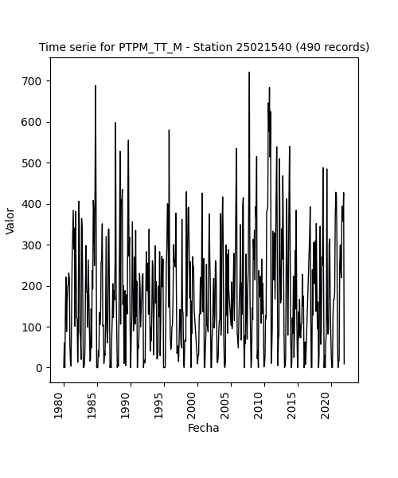

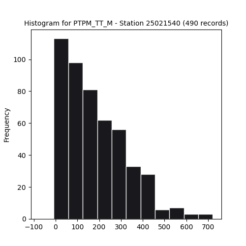
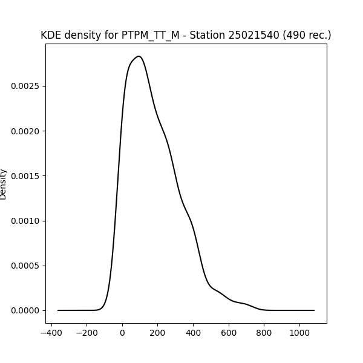

**PTPM_TT_M - Station: BARRANCO DE LOBA [25020880] (490 rec.)** Location over [Google Maps](http://maps.google.com/maps?q=8.946666667,-74.11055556) or [Openstreet Map](https://www.openstreetmap.org/query?lat=8.946666667&lon=-74.11055556)

Station first record

| Fecha               |   CodigoEstacion | NombreEstacion              |   Latitud |   Longitud |   Altitud | Categoria     | Entidad                                                     | AreaOperativa                               | Departamento   | Municipio        | FechaInstalacion    | FechaSuspension   | IdParametro   | Etiqueta   | DescripcionSerie            | Frecuencia   |   Valor |   Grado |   Calificador |   NivelAprobacion |
|:--------------------|-----------------:|:----------------------------|----------:|-----------:|----------:|:--------------|:------------------------------------------------------------|:--------------------------------------------|:---------------|:-----------------|:--------------------|:------------------|:--------------|:-----------|:----------------------------|:-------------|--------:|--------:|--------------:|------------------:|
| 1980-01-01 00:00:00 |         25020880 | BARRANCO DE LOBA [25020880] |   8.94667 |   -74.1106 |        25 | Pluviométrica | INSTITUTO DE HIDROLOGIA METEOROLOGIA Y ESTUDIOS AMBIENTALES | Area Operativa 02 - Atlántico-Bolivar-Sucre | Bolivar        | Barranco De Loba | 1974-09-15 00:00:00 | NaT               | PRECIPITACION | PTPM_TT_M  | Precipitación total mensual | Mensual      |       0 |       4 |           nan |               900 |

Statistics table

|       |   Valor |
|:------|--------:|
| count | 490     |
| mean  | 193.8   |
| std   | 160.698 |
| min   |   0     |
| 25%   |  60     |
| 50%   | 163.5   |
| 75%   | 291     |
| max   | 764     |

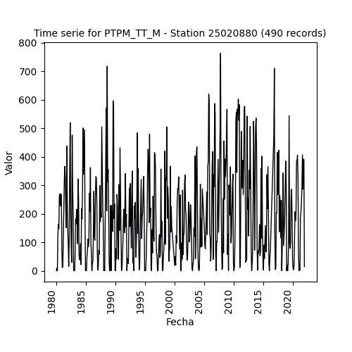
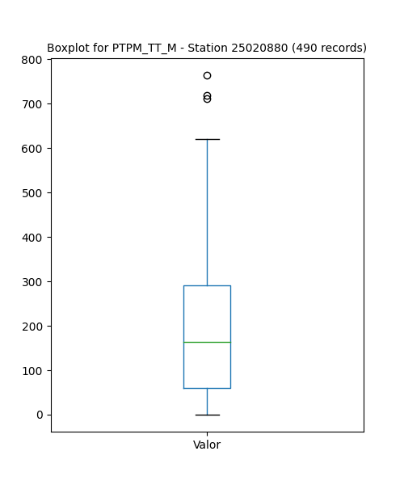
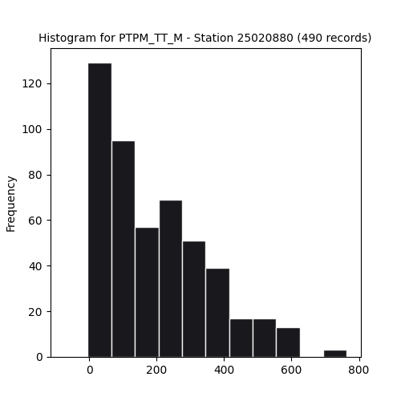
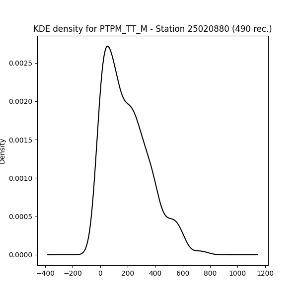

**PTPM_TT_M - Station: CHILLOA [25020890] (483 rec.)** Location over [Google Maps](http://maps.google.com/maps?q=9.119388889,-74.22194444) or [Openstreet Map](https://www.openstreetmap.org/query?lat=9.119388889&lon=-74.22194444)

Station first record

| Fecha               |   CodigoEstacion | NombreEstacion     |   Latitud |   Longitud |   Altitud | Categoria     | Entidad                                                     | AreaOperativa                               | Departamento   | Municipio   | FechaInstalacion    | FechaSuspension   | IdParametro   | Etiqueta   | DescripcionSerie            | Frecuencia   |   Valor |   Grado |   Calificador |   NivelAprobacion |
|:--------------------|-----------------:|:-------------------|----------:|-----------:|----------:|:--------------|:------------------------------------------------------------|:--------------------------------------------|:---------------|:------------|:--------------------|:------------------|:--------------|:-----------|:----------------------------|:-------------|--------:|--------:|--------------:|------------------:|
| 1980-01-01 00:00:00 |         25020890 | CHILLOA [25020890] |   9.11939 |   -74.2219 |        20 | Pluviométrica | INSTITUTO DE HIDROLOGIA METEOROLOGIA Y ESTUDIOS AMBIENTALES | Area Operativa 02 - Atlántico-Bolivar-Sucre | Bolivar        | Margarita   | 1974-09-15 00:00:00 | NaT               | PRECIPITACION | PTPM_TT_M  | Precipitación total mensual | Mensual      |      15 |      50 |           nan |               900 |

Statistics table

|       |   Valor |
|:------|--------:|
| count | 483     |
| mean  | 155.821 |
| std   | 128.157 |
| min   |   0     |
| 25%   |  49     |
| 50%   | 130     |
| 75%   | 244     |
| max   | 593     |

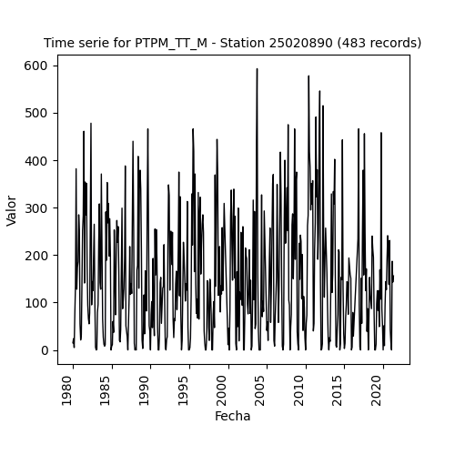
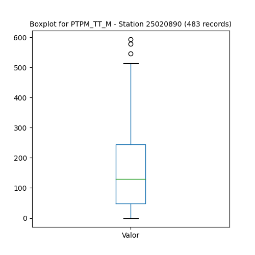
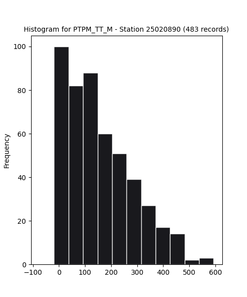

**PTPM_TT_M - Station: SUDAN EL [25021320] (491 rec.)** Location over [Google Maps](http://maps.google.com/maps?q=8.643333333,-74.21222222) or [Openstreet Map](https://www.openstreetmap.org/query?lat=8.643333333&lon=-74.21222222)

Station first record

| Fecha               |   CodigoEstacion | NombreEstacion      |   Latitud |   Longitud |   Altitud | Categoria     | Entidad                                                     | AreaOperativa                               | Departamento   | Municipio              | FechaInstalacion    | FechaSuspension   | IdParametro   | Etiqueta   | DescripcionSerie            | Frecuencia   |   Valor |   Grado |   Calificador |   NivelAprobacion |
|:--------------------|-----------------:|:--------------------|----------:|-----------:|----------:|:--------------|:------------------------------------------------------------|:--------------------------------------------|:---------------|:-----------------------|:--------------------|:------------------|:--------------|:-----------|:----------------------------|:-------------|--------:|--------:|--------------:|------------------:|
| 1980-01-01 00:00:00 |         25021320 | SUDAN EL [25021320] |   8.64333 |   -74.2122 |        23 | Pluviométrica | INSTITUTO DE HIDROLOGIA METEOROLOGIA Y ESTUDIOS AMBIENTALES | Area Operativa 02 - Atlántico-Bolivar-Sucre | Bolivar        | Tiquisio (Puerto Rico) | 1976-10-15 00:00:00 | NaT               | PRECIPITACION | PTPM_TT_M  | Precipitación total mensual | Mensual      |    20.9 |      50 |           nan |               900 |

Statistics table

|       |   Valor |
|:------|--------:|
| count | 491     |
| mean  | 160.853 |
| std   | 141.005 |
| min   |   0     |
| 25%   |  48     |
| 50%   | 133     |
| 75%   | 240     |
| max   | 744     |

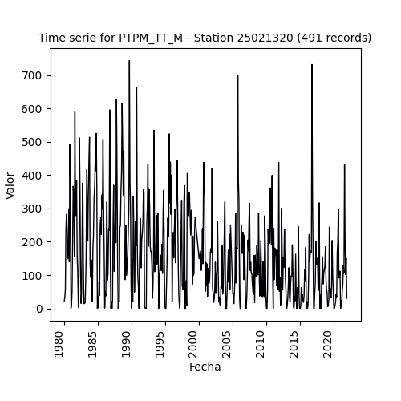
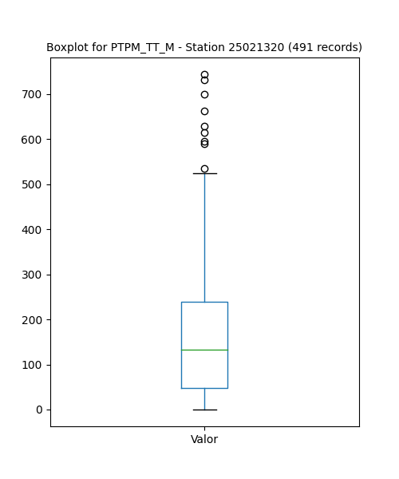
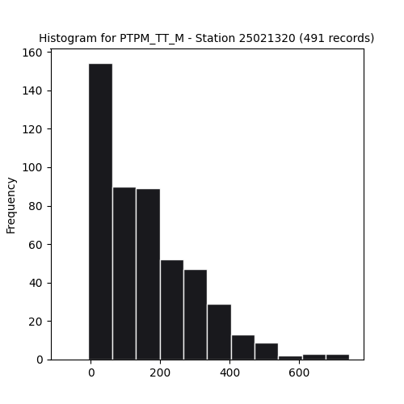
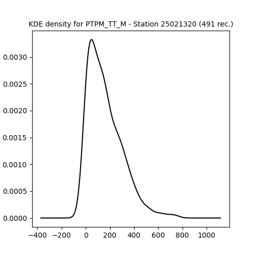

**PTPM_TT_M - Station: PLAYITAS [25020870] (497 rec.)** Location over [Google Maps](http://maps.google.com/maps?q=8.822777778,-73.96583333) or [Openstreet Map](https://www.openstreetmap.org/query?lat=8.822777778&lon=-73.96583333)

Station first record

| Fecha               |   CodigoEstacion | NombreEstacion      |   Latitud |   Longitud |   Altitud | Categoria     | Entidad                                                     | AreaOperativa                               | Departamento   | Municipio          | FechaInstalacion    | FechaSuspension   | IdParametro   | Etiqueta   | DescripcionSerie            | Frecuencia   |   Valor |   Grado |   Calificador |   NivelAprobacion |
|:--------------------|-----------------:|:--------------------|----------:|-----------:|----------:|:--------------|:------------------------------------------------------------|:--------------------------------------------|:---------------|:-------------------|:--------------------|:------------------|:--------------|:-----------|:----------------------------|:-------------|--------:|--------:|--------------:|------------------:|
| 1980-01-01 00:00:00 |         25020870 | PLAYITAS [25020870] |   8.82278 |   -73.9658 |        40 | Pluviométrica | INSTITUTO DE HIDROLOGIA METEOROLOGIA Y ESTUDIOS AMBIENTALES | Area Operativa 02 - Atlántico-Bolivar-Sucre | Bolivar        | San Martín De Loba | 1974-09-15 00:00:00 | NaT               | PRECIPITACION | PTPM_TT_M  | Precipitación total mensual | Mensual      |      12 |      50 |           nan |               900 |

Statistics table

|       |   Valor |
|:------|--------:|
| count | 497     |
| mean  | 155.739 |
| std   | 135.675 |
| min   |   0     |
| 25%   |  45     |
| 50%   | 136     |
| 75%   | 233     |
| max   | 835     |

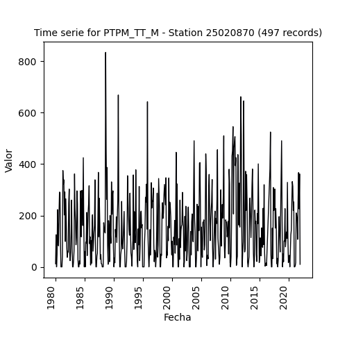
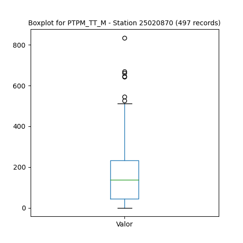
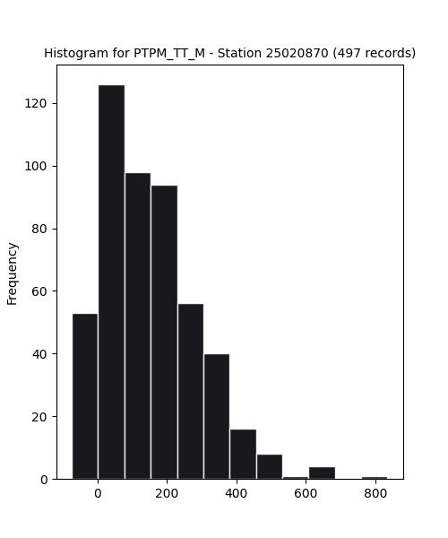
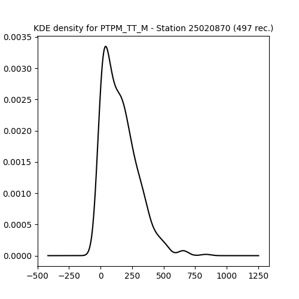

**PTPM_TT_M - Station: SANTA ROSA [25021090] (475 rec.)** Location over [Google Maps](http://maps.google.com/maps?q=9.093333333,-74.31388889) or [Openstreet Map](https://www.openstreetmap.org/query?lat=9.093333333&lon=-74.31388889)

Station first record

| Fecha               |   CodigoEstacion | NombreEstacion        |   Latitud |   Longitud |   Altitud | Categoria     | Entidad                                                     | AreaOperativa                               | Departamento   | Municipio    | FechaInstalacion    | FechaSuspension   | IdParametro   | Etiqueta   | DescripcionSerie            | Frecuencia   |   Valor |   Grado |   Calificador |   NivelAprobacion |
|:--------------------|-----------------:|:----------------------|----------:|-----------:|----------:|:--------------|:------------------------------------------------------------|:--------------------------------------------|:---------------|:-------------|:--------------------|:------------------|:--------------|:-----------|:----------------------------|:-------------|--------:|--------:|--------------:|------------------:|
| 1980-01-01 00:00:00 |         25021090 | SANTA ROSA [25021090] |   9.09333 |   -74.3139 |        40 | Pluviométrica | INSTITUTO DE HIDROLOGIA METEOROLOGIA Y ESTUDIOS AMBIENTALES | Area Operativa 02 - Atlántico-Bolivar-Sucre | Bolivar        | San Fernando | 1974-10-15 00:00:00 | NaT               | PRECIPITACION | PTPM_TT_M  | Precipitación total mensual | Mensual      |       5 |      50 |           nan |               900 |

Statistics table

|       |   Valor |
|:------|--------:|
| count | 475     |
| mean  | 157.96  |
| std   | 141.425 |
| min   |   0     |
| 25%   |  40     |
| 50%   | 125     |
| 75%   | 240.9   |
| max   | 680     |

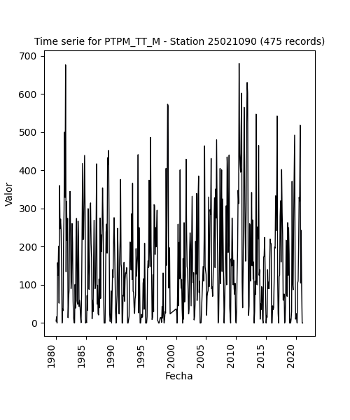
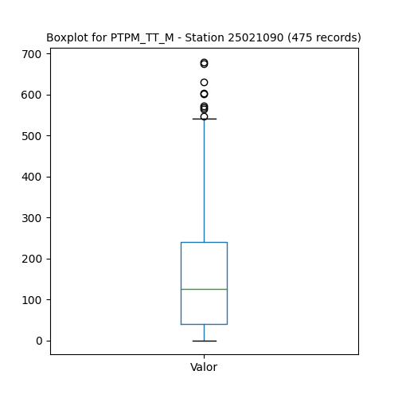
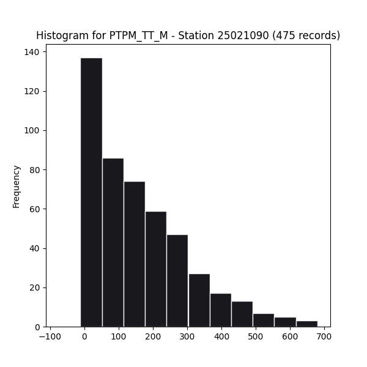
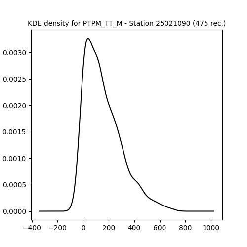

#### Correlation analysis matrix and statistics for PTPM_TT_M

General statistics table
|       |   15015020 |    15060050 |   15060070 |    15060080 |    15060150 |    15065040 |    16050240 |   16060010 |   16070010 |    16070020 |   16070030 |    16070040 |   23210020 |    23215050 |    23215060 |    25020090 |    25020220 |    25020230 |    25020240 |    25020250 |    25020260 |    25020270 |    25020280 |    25020650 |    25020660 |    25020670 |   25020690 |    25020870 |    25020880 |    25020890 |   25020900 |    25020920 |    25021040 |    25021090 |    25021200 |    25021240 |    25021320 |    25021380 |    25021500 |    25021540 |    25021580 |    25021590 |    25021620 |    25021630 |    25021640 |    25021650 |    25025090 |   25025250 |    25025300 |   25025330 |    28010020 |    28010040 |    28010070 |    28010090 |   28010130 |    28010140 |   28010200 |   28010280 |   28010340 |    28010360 |    28010370 |    28015070 |    28020080 |    28020150 |    28020230 |    28020310 |    28020410 |    28020420 |    28020440 |    28020460 |    28020590 |    28020600 |    28025020 |   28025040 |    28025070 |   28025080 |    28025090 |    28030190 |    28030220 |    28035010 |    28035020 |    28035040 |    28040010 |    28040030 |    28040060 |    28040070 |    28040100 |    28040140 |    28040150 |   28040170 |   28040200 |    28040270 |    28040300 |   28040310 |    28040320 |    28040350 |    28040360 |    28040400 |   28045010 |    29060030 |    29060040 |    29060060 |   29060070 |    29060090 |    29060100 |   29060120 |   29060140 |    29060150 |   29060160 |    29060170 |   29060180 |    29060190 |    29060200 |   29060210 |   29060220 |   29060230 |   29060240 |   29060250 |   29060270 |   29060280 |   29060290 |   29060310 |   29060330 |   29060340 |   29060350 |   29060550 |    29060560 |   29065010 |   29065020 |   29065030 |
|:------|-----------:|------------:|-----------:|------------:|------------:|------------:|------------:|-----------:|-----------:|------------:|-----------:|------------:|-----------:|------------:|------------:|------------:|------------:|------------:|------------:|------------:|------------:|------------:|------------:|------------:|------------:|------------:|-----------:|------------:|------------:|------------:|-----------:|------------:|------------:|------------:|------------:|------------:|------------:|------------:|------------:|------------:|------------:|------------:|------------:|------------:|------------:|------------:|------------:|-----------:|------------:|-----------:|------------:|------------:|------------:|------------:|-----------:|------------:|-----------:|-----------:|-----------:|------------:|------------:|------------:|------------:|------------:|------------:|------------:|------------:|------------:|------------:|------------:|------------:|------------:|------------:|-----------:|------------:|-----------:|------------:|------------:|------------:|------------:|------------:|------------:|------------:|------------:|------------:|------------:|------------:|------------:|------------:|-----------:|-----------:|------------:|------------:|-----------:|------------:|------------:|------------:|------------:|-----------:|------------:|------------:|------------:|-----------:|------------:|------------:|-----------:|-----------:|------------:|-----------:|------------:|-----------:|------------:|------------:|-----------:|-----------:|-----------:|-----------:|-----------:|-----------:|-----------:|-----------:|-----------:|-----------:|-----------:|-----------:|-----------:|------------:|-----------:|-----------:|-----------:|
| count | 130        | 130         | 130        | 130         | 130         | 130         | 129         | 130        | 130        | 129         | 130        | 130         | 126        | 130         | 129         | 130         | 130         | 130         | 130         | 130         | 130         | 130         | 130         | 130         | 130         | 130         | 130        | 130         | 130         | 130         | 130        | 130         | 130         | 130         | 130         | 130         | 130         | 130         | 130         | 130         | 130         | 130         | 129         | 129         | 129         | 129         | 130         | 130        | 130         | 129        | 129         | 130         | 129         | 130         | 129        | 130         | 130        | 112        | 130        | 130         | 130         | 130         | 130         | 129         | 130         | 130         | 130         | 130         | 130         | 130         | 130         | 129         | 130         | 130        | 130         | 130        | 130         | 130         | 129         | 130         | 130         | 130         | 130         | 130         | 129         | 130         | 130         | 130         | 130         | 130        | 130        | 130         | 130         | 130        | 130         | 130         | 130         | 129         | 130        | 130         | 130         | 130         | 130        | 130         | 130         | 130        | 130        | 130         | 130        | 130         | 130        | 130         | 130         | 130        | 130        | 130        | 130        | 130        | 130        | 130        | 130        | 130        | 129        | 130        | 130        | 129        | 129         | 129        | 130        | 130        |
| mean  |   0.563975 |   0.564465  |   0.523832 |   0.535121  |   0.508961  |   0.543721  |   0.464047  |   0.42996  |   0.512507 |   0.590106  |   0.441981 |   0.444055  |   0.54836  |   0.563714  |   0.593535  |   0.605295  |   0.593157  |   0.589807  |   0.595865  |   0.628081  |   0.621343  |   0.605315  |   0.560091  |   0.462629  |   0.570519  |   0.583925  |   0.480569 |   0.609151  |   0.628949  |   0.621937  |   0.573338 |   0.396018  |   0.60195   |   0.600383  |   0.628259  |   0.609626  |   0.503975  |   0.642619  |   0.527604  |   0.642317  |   0.645344  |   0.616993  |   0.514387  |   0.478306  |   0.562039  |   0.508769  |   0.629337  |   0.616796 |   0.55846   |   0.59554  |   0.480367  |   0.557871  |   0.545072  |   0.569907  |   0.593421 |   0.56889   |   0.555294 |   0.62617  |   0.575196 |   0.447692  |   0.558481  |   0.580204  |   0.507486  |   0.568671  |   0.615301  |   0.552305  |   0.487628  |   0.470121  |   0.628076  |   0.582416  |   0.523655  |   0.571349  |   0.598941  |   0.558241 |   0.629911  |   0.623493 |   0.628309  |   0.463412  |   0.501173  |   0.607142  |   0.600098  |   0.576406  |   0.587832  |   0.445317  |   0.446919  |   0.571464  |   0.514026  |   0.499327  |   0.561668  |   0.335302 |   0.589021 |   0.504877  |   0.547358  |   0.58918  |   0.572577  |   0.600018  |   0.525103  |   0.515623  |   0.492604 |   0.597351  |   0.611514  |   0.577089  |   0.573826 |   0.561642  |   0.579452  |   0.39709  |   0.593489 |   0.620128  |   0.588455 |   0.567144  |   0.548753 |   0.570149  |   0.626573  |   0.581038 |   0.553148 |   0.606499 |   0.580369 |   0.560606 |   0.596212 |   0.560691 |   0.618814 |   0.531564 |   0.602803 |   0.542243 |   0.603426 |   0.589275 |   0.49459   |   0.652296 |   0.62462  |   0.646967 |
| std   |   0.104212 |   0.0811445 |   0.076985 |   0.0823922 |   0.0887662 |   0.0863384 |   0.0911732 |   0.107033 |   0.087679 |   0.0976918 |   0.105958 |   0.0831378 |   0.182066 |   0.0893782 |   0.10417   |   0.0915825 |   0.0840761 |   0.0821245 |   0.0933694 |   0.0861864 |   0.0952962 |   0.0845141 |   0.0775559 |   0.0925769 |   0.0833377 |   0.0808769 |   0.088555 |   0.0887356 |   0.0944205 |   0.0868902 |   0.080413 |   0.0987846 |   0.0839068 |   0.0888027 |   0.0919523 |   0.0882176 |   0.0958618 |   0.0959092 |   0.0889631 |   0.0922555 |   0.0945899 |   0.0974396 |   0.0933877 |   0.0784008 |   0.108368  |   0.0947847 |   0.0925022 |   0.085901 |   0.0898764 |   0.10448  |   0.0867261 |   0.0838616 |   0.0942117 |   0.0736647 |   0.168577 |   0.0775933 |   0.081842 |   0.207208 |   0.084924 |   0.0794407 |   0.0812102 |   0.0800601 |   0.0860124 |   0.0986167 |   0.0853653 |   0.0754223 |   0.0860056 |   0.0855672 |   0.0800566 |   0.0799648 |   0.0839706 |   0.0872873 |   0.0842263 |   0.103929 |   0.0857932 |   0.08172  |   0.0924195 |   0.0893202 |   0.0784149 |   0.0800482 |   0.0817348 |   0.0833231 |   0.0771318 |   0.0952328 |   0.0919163 |   0.0782734 |   0.0846821 |   0.0795893 |   0.0790129 |   0.179048 |   0.140574 |   0.0798387 |   0.0824328 |   0.088127 |   0.0803527 |   0.0852917 |   0.0772065 |   0.0946015 |   0.103057 |   0.0954879 |   0.0998742 |   0.0847359 |   0.091747 |   0.0762858 |   0.0817343 |   0.105144 |   0.113104 |   0.0961263 |   0.109932 |   0.0908668 |   0.10428  |   0.0941239 |   0.0968081 |   0.103862 |   0.118282 |   0.105184 |   0.112835 |   0.103344 |   0.104047 |   0.10855  |   0.107543 |   0.109064 |   0.186211 |   0.09172  |   0.103081 |   0.108308 |   0.0904473 |   0.105465 |   0.104212 |   0.104307 |
| min   |   0.342972 |   0.316228  |   0.29505  |   0.322343  |   0.222953  |   0.108204  |   0.040698  |  -0.111292 |   0.269588 |   0.070323  |  -0.213101 |   0.241212  |  -0.715819 |   0.294302  |   0.0754899 |   0.343658  |   0.382669  |   0.395367  |   0.332348  |   0.322531  |   0.25997   |   0.309703  |   0.394823  |   0.215256  |   0.283263  |   0.328981  |   0.236588 |   0.281907  |   0.364726  |   0.397754  |   0.347128 |   0.160968  |   0.419967  |   0.322709  |   0.361066  |   0.38285   |   0.283845  |   0.333541  |   0.305892  |   0.367123  |   0.312046  |   0.280099  |  -0.0915187 |   0.172647  |  -0.0768605 |   0.0857991 |   0.300118  |   0.405198 |   0.255957  |   0.020218 |   0.188753  |   0.308629  |   0.0884951 |   0.386407  |  -1        |   0.378723  |   0.331437 |  -0.213101 |   0.290191 |   0.258419  |   0.34973   |   0.322424  |   0.23947   |  -0.0775404 |   0.387657  |   0.336041  |   0.19911   |   0.255646  |   0.418112  |   0.358806  |   0.256558  |   0.15815   |   0.317374  |   0.143989 |   0.328934  |   0.419707 |   0.124171  |   0.220852  |   0.27445   |   0.349542  |   0.377941  |   0.295108  |   0.341586  |   0.160968  |   0.145953  |   0.327667  |   0.190185  |   0.274251  |   0.345074  |  -0.593934 |  -0.715819 |   0.266037  |   0.338698  |   0.308163 |   0.353405  |   0.349669  |   0.295942  |  -0.0146196 |   0.132277 |   0.318153  |   0.361478  |   0.308309  |   0.296913 |   0.325231  |   0.295557  |   0.145315 |   0.22988  |   0.381379  |   0.332096 |   0.334333  |   0.286275 |   0.30375   |   0.384     |   0.295774 |   0.142911 |   0.362479 |   0.30736  |   0.330515 |   0.325044 |   0.332538 |   0.291903 |   0.18599  |  -1        |   0.275089 |   0.336641 |   0.166316 |  -0.0217159 |   0.318611 |   0.372412 |   0.413588 |
| 25%   |   0.506112 |   0.511732  |   0.481951 |   0.489733  |   0.470224  |   0.511474  |   0.419387  |   0.392317 |   0.462952 |   0.537415  |   0.40181  |   0.400876  |   0.525509 |   0.524866  |   0.545503  |   0.548872  |   0.543702  |   0.549486  |   0.53897   |   0.576098  |   0.572117  |   0.555882  |   0.50783   |   0.410204  |   0.526103  |   0.541128  |   0.424878 |   0.550199  |   0.558736  |   0.568984  |   0.531992 |   0.335543  |   0.550785  |   0.544353  |   0.567187  |   0.558687  |   0.45456   |   0.587532  |   0.48032   |   0.580426  |   0.602027  |   0.563571  |   0.472586  |   0.440659  |   0.510951  |   0.465088  |   0.573464  |   0.56534  |   0.507115  |   0.545685 |   0.438086  |   0.520049  |   0.512359  |   0.536296  |   0.555276 |   0.530195  |   0.518023 |   0.524838 |   0.524391 |   0.401802  |   0.51926   |   0.535077  |   0.464277  |   0.540673  |   0.562676  |   0.515123  |   0.442317  |   0.418808  |   0.583887  |   0.541505  |   0.474822  |   0.530517  |   0.552365  |   0.514266 |   0.584379  |   0.571708 |   0.588679  |   0.420386  |   0.459145  |   0.566253  |   0.552538  |   0.529441  |   0.542087  |   0.395952  |   0.395252  |   0.534982  |   0.482713  |   0.460291  |   0.531058  |   0.282246 |   0.54764  |   0.459305  |   0.488959  |   0.55157  |   0.530763  |   0.557391  |   0.481493  |   0.472354  |   0.4391   |   0.537047  |   0.554605  |   0.542509  |   0.528663 |   0.52729   |   0.545302  |   0.329344 |   0.530436 |   0.554627  |   0.523924 |   0.506088  |   0.492628 |   0.518264  |   0.590819  |   0.520441 |   0.488298 |   0.553235 |   0.504269 |   0.501154 |   0.540839 |   0.502474 |   0.547869 |   0.469376 |   0.560743 |   0.493954 |   0.542452 |   0.53232  |   0.464943  |   0.587779 |   0.564196 |   0.570319 |
| 50%   |   0.56148  |   0.568001  |   0.527437 |   0.542694  |   0.509884  |   0.555458  |   0.457507  |   0.443976 |   0.510567 |   0.601375  |   0.438177 |   0.434724  |   0.568801 |   0.574375  |   0.600238  |   0.603055  |   0.588546  |   0.593122  |   0.603172  |   0.627834  |   0.621725  |   0.611049  |   0.558619  |   0.461831  |   0.570063  |   0.590333  |   0.483565 |   0.60824   |   0.628473  |   0.630866  |   0.574182 |   0.389519  |   0.598055  |   0.59383   |   0.619747  |   0.607502  |   0.504356  |   0.642198  |   0.519247  |   0.637546  |   0.646602  |   0.62082   |   0.516504  |   0.482191  |   0.571674  |   0.508723  |   0.622944  |   0.623857 |   0.556711  |   0.60267  |   0.493726  |   0.561234  |   0.549507  |   0.569676  |   0.606783 |   0.573968  |   0.56382  |   0.675945 |   0.577751 |   0.45358   |   0.560757  |   0.587703  |   0.511324  |   0.57785   |   0.628856  |   0.555162  |   0.489187  |   0.467768  |   0.626384  |   0.58331   |   0.528463  |   0.576063  |   0.606166  |   0.578178 |   0.637382  |   0.628177 |   0.632785  |   0.476961  |   0.504348  |   0.621835  |   0.615227  |   0.578857  |   0.601161  |   0.442308  |   0.454238  |   0.573867  |   0.524837  |   0.506055  |   0.563587  |   0.368127 |   0.607406 |   0.513968  |   0.543479  |   0.599247 |   0.575026  |   0.595124  |   0.522868  |   0.525176  |   0.497567 |   0.599361  |   0.622542  |   0.574085  |   0.574109 |   0.568331  |   0.585142  |   0.388652 |   0.586738 |   0.624037  |   0.589135 |   0.567774  |   0.545004 |   0.568015  |   0.636808  |   0.583312 |   0.55201  |   0.614754 |   0.565175 |   0.54668  |   0.58065  |   0.55864  |   0.625466 |   0.517381 |   0.62181  |   0.556663 |   0.606257 |   0.593524 |   0.502715  |   0.661279 |   0.614448 |   0.644478 |
| 75%   |   0.607352 |   0.613582  |   0.561559 |   0.58156   |   0.557359  |   0.590571  |   0.50543   |   0.477673 |   0.541489 |   0.648645  |   0.484885 |   0.481371  |   0.615132 |   0.609587  |   0.648886  |   0.666065  |   0.652371  |   0.637984  |   0.653777  |   0.676957  |   0.692162  |   0.655434  |   0.615425  |   0.512043  |   0.612046  |   0.628244  |   0.541302 |   0.658371  |   0.675179  |   0.671716  |   0.614816 |   0.428616  |   0.640963  |   0.644156  |   0.684055  |   0.674491  |   0.555762  |   0.692405  |   0.570659  |   0.692708  |   0.699562  |   0.677402  |   0.560921  |   0.517293  |   0.621982  |   0.558505  |   0.688195  |   0.669794 |   0.614663  |   0.659394 |   0.522039  |   0.597268  |   0.586792  |   0.612047  |   0.664976 |   0.615384  |   0.605087 |   0.773756 |   0.622067 |   0.488035  |   0.601925  |   0.623644  |   0.548712  |   0.616897  |   0.66284   |   0.587226  |   0.538719  |   0.507739  |   0.678277  |   0.631257  |   0.571687  |   0.619272  |   0.642998  |   0.620711 |   0.679665  |   0.675057 |   0.677784  |   0.511761  |   0.547042  |   0.660334  |   0.649121  |   0.628225  |   0.629162  |   0.495678  |   0.501826  |   0.621117  |   0.559883  |   0.544752  |   0.597404  |   0.424225 |   0.651797 |   0.541267  |   0.60106   |   0.637689 |   0.624131  |   0.657607  |   0.566187  |   0.565338  |   0.550157 |   0.652214  |   0.667064  |   0.622669  |   0.627707 |   0.5989    |   0.619514  |   0.454378 |   0.662933 |   0.682705  |   0.638125 |   0.62201   |   0.612684 |   0.61625   |   0.685419  |   0.638474 |   0.615622 |   0.650363 |   0.653172 |   0.618329 |   0.643662 |   0.603543 |   0.691564 |   0.601024 |   0.687622 |   0.590194 |   0.673296 |   0.651414 |   0.531352  |   0.722597 |   0.688773 |   0.719995 |
| max   |   1        |   1         |   1        |   1         |   1         |   1         |   1         |   1        |   1        |   1         |   1        |   1         |   1        |   1         |   1         |   1         |   1         |   1         |   1         |   1         |   1         |   1         |   1         |   1         |   1         |   1         |   1        |   1         |   1         |   1         |   1        |   1         |   1         |   1         |   1         |   1         |   1         |   1         |   1         |   1         |   1         |   1         |   1         |   1         |   1         |   1         |   1         |   1        |   1         |   1        |   1         |   1         |   1         |   1         |   1        |   1         |   1        |   1        |   1        |   1         |   1         |   1         |   1         |   1         |   1         |   1         |   1         |   1         |   1         |   1         |   1         |   1         |   1         |   1        |   1         |   1        |   1         |   1         |   1         |   1         |   1         |   1         |   1         |   1         |   1         |   1         |   1         |   1         |   1         |   1        |   1        |   1         |   1         |   1        |   1         |   1         |   1         |   1         |   1        |   1         |   1         |   1         |   1        |   1         |   1         |   1        |   1        |   1         |   1        |   1         |   1        |   1         |   1         |   1        |   1        |   1        |   1        |   1        |   1        |   1        |   1        |   1        |   1        |   1        |   1        |   1        |   1         |   1        |   1        |   1        |

Correlation matrix [Pivot_PTPM_TT_M_Correlation.csv](Pivot_PTPM_TT_M_Correlation.csv)
|          |   15015020 |   15060050 |   15060070 |   15060080 |   15060150 |   15065040 |   16050240 |    16060010 |   16070010 |   16070020 |   16070030 |   16070040 |   23210020 |   23215050 |    23215060 |   25020090 |   25020220 |   25020230 |   25020240 |   25020250 |   25020260 |   25020270 |   25020280 |   25020650 |   25020660 |   25020670 |   25020690 |   25020870 |   25020880 |   25020890 |   25020900 |   25020920 |   25021040 |   25021090 |   25021200 |   25021240 |   25021320 |   25021380 |   25021500 |   25021540 |   25021580 |   25021590 |    25021620 |   25021630 |    25021640 |    25021650 |   25025090 |   25025250 |   25025300 |   25025330 |   28010020 |   28010040 |    28010070 |   28010090 |   28010130 |   28010140 |   28010200 |   28010280 |   28010340 |   28010360 |   28010370 |   28015070 |   28020080 |    28020150 |   28020230 |   28020310 |   28020410 |   28020420 |   28020440 |   28020460 |   28020590 |   28020600 |   28025020 |   28025040 |   28025070 |   28025080 |   28025090 |   28030190 |   28030220 |   28035010 |   28035020 |   28035040 |   28040010 |   28040030 |   28040060 |   28040070 |   28040100 |   28040140 |   28040150 |    28040170 |   28040200 |   28040270 |   28040300 |   28040310 |   28040320 |   28040350 |   28040360 |    28040400 |   28045010 |   29060030 |   29060040 |   29060060 |   29060070 |   29060090 |   29060100 |   29060120 |   29060140 |   29060150 |   29060160 |   29060170 |   29060180 |   29060190 |   29060200 |   29060210 |   29060220 |   29060230 |   29060240 |   29060250 |   29060270 |   29060280 |   29060290 |   29060310 |    29060330 |   29060340 |   29060350 |   29060550 |    29060560 |   29065010 |   29065020 |   29065030 |
|---------:|-----------:|-----------:|-----------:|-----------:|-----------:|-----------:|-----------:|------------:|-----------:|-----------:|-----------:|-----------:|-----------:|-----------:|------------:|-----------:|-----------:|-----------:|-----------:|-----------:|-----------:|-----------:|-----------:|-----------:|-----------:|-----------:|-----------:|-----------:|-----------:|-----------:|-----------:|-----------:|-----------:|-----------:|-----------:|-----------:|-----------:|-----------:|-----------:|-----------:|-----------:|-----------:|------------:|-----------:|------------:|------------:|-----------:|-----------:|-----------:|-----------:|-----------:|-----------:|------------:|-----------:|-----------:|-----------:|-----------:|-----------:|-----------:|-----------:|-----------:|-----------:|-----------:|------------:|-----------:|-----------:|-----------:|-----------:|-----------:|-----------:|-----------:|-----------:|-----------:|-----------:|-----------:|-----------:|-----------:|-----------:|-----------:|-----------:|-----------:|-----------:|-----------:|-----------:|-----------:|-----------:|-----------:|-----------:|-----------:|------------:|-----------:|-----------:|-----------:|-----------:|-----------:|-----------:|-----------:|------------:|-----------:|-----------:|-----------:|-----------:|-----------:|-----------:|-----------:|-----------:|-----------:|-----------:|-----------:|-----------:|-----------:|-----------:|-----------:|-----------:|-----------:|-----------:|-----------:|-----------:|-----------:|-----------:|-----------:|-----------:|------------:|-----------:|-----------:|-----------:|------------:|-----------:|-----------:|-----------:|
| 15015020 |   1        |   0.532868 |   0.507959 |   0.500289 |   0.556173 |   0.547384 |   0.524545 |  0.35022    |   0.454962 |   0.582979 |   0.363616 |   0.342972 |   0.574216 |   0.544172 |   0.521407  |   0.607    |   0.551237 |   0.587199 |   0.543773 |   0.605259 |   0.588045 |   0.606388 |   0.503263 |   0.514141 |   0.59643  |   0.606325 |   0.419072 |   0.601446 |   0.600443 |   0.585334 |   0.545037 |   0.374512 |   0.539344 |   0.594943 |   0.587716 |   0.576378 |   0.535509 |   0.603267 |   0.489366 |   0.610881 |   0.612742 |   0.605399 |   0.514526  |   0.459295 |   0.484426  |   0.441136  |   0.576289 |   0.631773 |   0.457175 |   0.606299 |   0.559966 |   0.556476 |   0.549507  |   0.512949 |   0.555276 |   0.622946 |   0.631797 |   0.588667 |   0.572583 |   0.456927 |   0.447001 |   0.575234 |   0.429516 |   0.488168  |   0.607469 |   0.522894 |   0.40774  |   0.366963 |   0.607505 |   0.543562 |   0.505019 |   0.530517 |   0.562833 |   0.620944 |   0.607836 |   0.601097 |   0.606165 |   0.359203 |   0.51637  |   0.592655 |   0.560127 |   0.498289 |   0.591391 |   0.372198 |   0.362267 |   0.541567 |   0.486986 |   0.504708 |   0.563001 |  0.40768    |   0.505496 |   0.445809 |   0.465332 |   0.556913 |   0.515188 |   0.542504 |   0.477155 |   0.443768  |   0.471331 |   0.658076 |   0.634736 |   0.546156 |   0.661538 |   0.521219 |   0.600424 |   0.518554 |   0.640205 |   0.676819 |   0.793485 |   0.672188 |   0.610499 |   0.588764 |   0.65463  |   0.853924 |   0.700635 |   0.769845 |   0.654627 |   0.631335 |   0.715559 |   0.771654 |   0.726938 |   0.753074 |   0.691629  |   0.57898  |   0.673456 |   0.769888 |   0.517772  |   0.580043 |   0.721136 |   0.746397 |
| 15060050 |   0.532868 |   1        |   0.609089 |   0.658237 |   0.612845 |   0.646522 |   0.496489 |  0.432921   |   0.495661 |   0.64698  |   0.484957 |   0.470048 |   0.532913 |   0.472265 |   0.674349  |   0.5776   |   0.589788 |   0.585625 |   0.583532 |   0.576978 |   0.609256 |   0.582321 |   0.550555 |   0.433468 |   0.536685 |   0.528455 |   0.475905 |   0.554312 |   0.623196 |   0.605402 |   0.531867 |   0.32409  |   0.573578 |   0.584762 |   0.602033 |   0.542642 |   0.45262  |   0.616005 |   0.510915 |   0.61804  |   0.644729 |   0.612345 |   0.434341  |   0.466502 |   0.510951  |   0.540889  |   0.572522 |   0.550577 |   0.527568 |   0.627287 |   0.438086 |   0.6129   |   0.529584  |   0.642823 |   0.664976 |   0.649815 |   0.737764 |   0.66167  |   0.670589 |   0.500368 |   0.567467 |   0.689878 |   0.481996 |   0.56827   |   0.631535 |   0.556177 |   0.542618 |   0.449797 |   0.613809 |   0.547255 |   0.498678 |   0.567855 |   0.636786 |   0.625672 |   0.641811 |   0.626811 |   0.60174  |   0.466052 |   0.545552 |   0.627469 |   0.643115 |   0.615421 |   0.611634 |   0.470566 |   0.451612 |   0.558566 |   0.489232 |   0.470394 |   0.539527 |  0.520863   |   0.68335  |   0.481737 |   0.527816 |   0.609251 |   0.546419 |   0.617231 |   0.503825 |   0.507605  |   0.592749 |   0.570011 |   0.60713  |   0.592655 |   0.568697 |   0.634911 |   0.562027 |   0.316228 |   0.546103 |   0.622222 |   0.570127 |   0.502836 |   0.524847 |   0.567912 |   0.611626 |   0.56694  |   0.510235 |   0.586524 |   0.516054 |   0.484733 |   0.545832 |   0.514073 |   0.56809  |   0.463276 |   0.592303  |   0.626445 |   0.583675 |   0.552332 |   0.49247   |   0.708956 |   0.590607 |   0.620373 |
| 15060070 |   0.507959 |   0.609089 |   1        |   0.556287 |   0.635646 |   0.639009 |   0.50984  |  0.421219   |   0.500629 |   0.625975 |   0.444448 |   0.408713 |   0.568514 |   0.429554 |   0.613149  |   0.534224 |   0.518532 |   0.520722 |   0.485455 |   0.562588 |   0.508891 |   0.538391 |   0.481355 |   0.523944 |   0.472444 |   0.550811 |   0.437693 |   0.53468  |   0.532495 |   0.571492 |   0.539761 |   0.362783 |   0.496586 |   0.561752 |   0.535458 |   0.531853 |   0.480338 |   0.59383  |   0.501766 |   0.548637 |   0.623016 |   0.545034 |   0.534804  |   0.422577 |   0.505683  |   0.480962  |   0.528425 |   0.534414 |   0.508252 |   0.589596 |   0.495694 |   0.553503 |   0.513106  |   0.586488 |   0.579258 |   0.546395 |   0.525947 |   0.755294 |   0.582115 |   0.452853 |   0.507599 |   0.584344 |   0.434577 |   0.541783  |   0.516153 |   0.555527 |   0.458274 |   0.426285 |   0.552705 |   0.543554 |   0.483738 |   0.525069 |   0.553994 |   0.486129 |   0.583904 |   0.577477 |   0.558324 |   0.400253 |   0.459145 |   0.569095 |   0.552334 |   0.480534 |   0.574818 |   0.355056 |   0.429289 |   0.518264 |   0.432316 |   0.449434 |   0.450046 |  0.419323   |   0.549398 |   0.398932 |   0.479114 |   0.553128 |   0.494961 |   0.514702 |   0.469356 |   0.542648  |   0.487236 |   0.577366 |   0.489106 |   0.504638 |   0.587988 |   0.526449 |   0.468609 |   0.29505  |   0.465008 |   0.534156 |   0.58618  |   0.528804 |   0.524501 |   0.604008 |   0.519973 |   0.560983 |   0.40709  |   0.601823 |   0.466925 |   0.508285 |   0.540716 |   0.562295 |   0.523033 |   0.456212 |   0.605503  |   0.544861 |   0.587365 |   0.5821   |   0.502532  |   0.554854 |   0.576323 |   0.57671  |
| 15060080 |   0.500289 |   0.658237 |   0.556287 |   1        |   0.625035 |   0.63349  |   0.44009  |  0.404123   |   0.496315 |   0.520055 |   0.406715 |   0.428686 |   0.521064 |   0.523864 |   0.446208  |   0.604409 |   0.531028 |   0.581434 |   0.562288 |   0.583208 |   0.595169 |   0.5355   |   0.489623 |   0.388048 |   0.557171 |   0.559636 |   0.445289 |   0.604068 |   0.620325 |   0.590022 |   0.505122 |   0.329066 |   0.570577 |   0.574778 |   0.563422 |   0.560967 |   0.41456  |   0.581133 |   0.484729 |   0.631277 |   0.603751 |   0.509078 |   0.443255  |   0.448187 |   0.520904  |   0.457431  |   0.521731 |   0.509024 |   0.554631 |   0.526822 |   0.399617 |   0.540783 |   0.523643  |   0.576842 |   0.613952 |   0.500522 |   0.60708  |   0.479994 |   0.687386 |   0.523794 |   0.556763 |   0.643391 |   0.465753 |   0.544604  |   0.556224 |   0.483635 |   0.428287 |   0.400523 |   0.571826 |   0.566491 |   0.486967 |   0.50938  |   0.627139 |   0.538233 |   0.634519 |   0.582082 |   0.593601 |   0.533057 |   0.425178 |   0.592326 |   0.592145 |   0.545164 |   0.579378 |   0.389307 |   0.407681 |   0.553696 |   0.474348 |   0.490061 |   0.517601 |  0.408269   |   0.59716  |   0.451991 |   0.465363 |   0.580519 |   0.53836  |   0.539024 |   0.467878 |   0.514048  |   0.495739 |   0.586891 |   0.596268 |   0.572565 |   0.569844 |   0.576441 |   0.55636  |   0.322343 |   0.569558 |   0.623996 |   0.545445 |   0.513071 |   0.54498  |   0.503726 |   0.641486 |   0.581602 |   0.372258 |   0.611989 |   0.533381 |   0.503279 |   0.565098 |   0.501302 |   0.57641  |   0.472372 |   0.574601  |   0.590084 |   0.621544 |   0.531835 |   0.480322  |   0.580199 |   0.603307 |   0.623731 |
| 15060150 |   0.556173 |   0.612845 |   0.635646 |   0.625035 |   1        |   0.599082 |   0.407273 |  0.400419   |   0.420184 |   0.577471 |   0.42574  |   0.420399 |   0.572223 |   0.463986 |   0.550447  |   0.509707 |   0.480788 |   0.591579 |   0.510273 |   0.566322 |   0.584646 |   0.559564 |   0.469451 |   0.401496 |   0.541125 |   0.556898 |   0.392502 |   0.523537 |   0.5479   |   0.543416 |   0.469033 |   0.370454 |   0.512574 |   0.500221 |   0.494876 |   0.522686 |   0.415474 |   0.535056 |   0.421462 |   0.559441 |   0.647159 |   0.519684 |   0.471505  |   0.374431 |   0.493875  |   0.483131  |   0.490239 |   0.510061 |   0.46893  |   0.510625 |   0.506643 |   0.574496 |   0.518507  |   0.549184 |   0.658939 |   0.595814 |   0.610909 |   0.543954 |   0.630022 |   0.493836 |   0.47694  |   0.622609 |   0.477467 |   0.505196  |   0.544112 |   0.535602 |   0.435458 |   0.382788 |   0.525538 |   0.5087   |   0.469422 |   0.482311 |   0.532022 |   0.634247 |   0.577411 |   0.573533 |   0.490394 |   0.399832 |   0.420397 |   0.558134 |   0.532083 |   0.491613 |   0.536699 |   0.300533 |   0.238937 |   0.476585 |   0.451985 |   0.378339 |   0.485047 |  0.222953   |   0.610051 |   0.433051 |   0.494925 |   0.517599 |   0.435346 |   0.479345 |   0.410151 |   0.455471  |   0.470207 |   0.485108 |   0.513264 |   0.571735 |   0.598017 |   0.527545 |   0.499821 |   0.261548 |   0.459406 |   0.540215 |   0.500893 |   0.505333 |   0.491891 |   0.507381 |   0.557513 |   0.58388  |   0.498788 |   0.609506 |   0.480634 |   0.500953 |   0.539216 |   0.516805 |   0.581632 |   0.459278 |   0.587554  |   0.523838 |   0.505092 |   0.53232  |   0.470276  |   0.565522 |   0.584353 |   0.533224 |
| 15065040 |   0.547384 |   0.646522 |   0.639009 |   0.63349  |   0.599082 |   1        |   0.433963 |  0.391462   |   0.497863 |   0.591469 |   0.434388 |   0.415553 |   0.532955 |   0.542376 |   0.620327  |   0.577705 |   0.545349 |   0.525965 |   0.522689 |   0.587776 |   0.578205 |   0.587854 |   0.524826 |   0.514429 |   0.565545 |   0.627012 |   0.385837 |   0.546656 |   0.600446 |   0.604999 |   0.543841 |   0.448076 |   0.556353 |   0.604425 |   0.588112 |   0.597213 |   0.581395 |   0.566683 |   0.48014  |   0.621696 |   0.622009 |   0.579279 |   0.424065  |   0.422867 |   0.471491  |   0.467232  |   0.569972 |   0.578922 |   0.491897 |   0.539465 |   0.466584 |   0.590078 |   0.591881  |   0.626142 |   0.526276 |   0.563744 |   0.634146 |   0.108204 |   0.565583 |   0.522199 |   0.554562 |   0.562587 |   0.431403 |   0.540752  |   0.614158 |   0.541986 |   0.424544 |   0.467964 |   0.538553 |   0.55158  |   0.533117 |   0.551598 |   0.586343 |   0.584336 |   0.559231 |   0.550145 |   0.645163 |   0.403391 |   0.43877  |   0.503188 |   0.60298  |   0.535948 |   0.610271 |   0.472703 |   0.401431 |   0.577573 |   0.502951 |   0.51141  |   0.58103  |  0.317611   |   0.612915 |   0.442427 |   0.52275  |   0.582237 |   0.515791 |   0.557364 |   0.505435 |   0.51866   |   0.46725  |   0.579239 |   0.577542 |   0.601767 |   0.628786 |   0.571895 |   0.511667 |   0.37037  |   0.513161 |   0.587654 |   0.575712 |   0.543822 |   0.538871 |   0.575486 |   0.594193 |   0.540826 |   0.540783 |   0.619332 |   0.517538 |   0.581269 |   0.564227 |   0.590736 |   0.641188 |   0.491465 |   0.604198  |   0.503987 |   0.604149 |   0.594901 |   0.511255  |   0.570845 |   0.591984 |   0.651611 |
| 16050240 |   0.524545 |   0.496489 |   0.50984  |   0.44009  |   0.407273 |   0.433963 |   1        |  0.39454    |   0.50543  |   0.635934 |   0.450628 |   0.512147 |   0.573963 |   0.459108 |   0.545503  |   0.49361  |   0.506642 |   0.395367 |   0.513472 |   0.490964 |   0.499065 |   0.498022 |   0.461906 |   0.591316 |   0.445369 |   0.425368 |   0.393135 |   0.496263 |   0.533228 |   0.48529  |   0.457507 |   0.370942 |   0.523827 |   0.534839 |   0.572541 |   0.446151 |   0.411143 |   0.559895 |   0.392218 |   0.544488 |   0.587806 |   0.64152  |   0.437952  |   0.453001 |   0.47665   |   0.401858  |   0.556805 |   0.488791 |   0.408731 |   0.416132 |   0.328626 |   0.4187   |   0.413643  |   0.484094 |   0.604176 |   0.573693 |   0.439441 | nan        |   0.504899 |   0.339222 |   0.432909 |   0.526144 |   0.337769 |   0.43586   |   0.553098 |   0.50948  |   0.386307 |   0.255646 |   0.460684 |   0.452787 |   0.382292 |   0.42825  |   0.514246 |   0.559491 |   0.488739 |   0.49661  |   0.512359 |   0.434553 |   0.419387 |   0.489492 |   0.4627   |   0.485337 |   0.541261 |   0.360676 |   0.464935 |   0.412203 |   0.370868 |   0.35949  |   0.408189 |  0.040698   |   0.420888 |   0.394394 |   0.338698 |   0.35236  |   0.454134 |   0.455458 |   0.404928 |   0.395383  |   0.542166 |   0.460056 |   0.490358 |   0.463481 |   0.429231 |   0.482146 |   0.450224 |   0.355697 |   0.493035 |   0.531941 |   0.480681 |   0.425164 |   0.419858 |   0.438518 |   0.483381 |   0.420665 |   0.483566 |   0.432083 |   0.435542 |   0.451174 |   0.43705  |   0.426802 |   0.50917  |   0.456492 |   0.446154  |   0.347157 |   0.450569 |   0.471077 |   0.389408  |   0.662756 |   0.488704 |   0.501296 |
| 16060010 |   0.35022  |   0.432921 |   0.421219 |   0.404123 |   0.400419 |   0.391462 |   0.39454  |  1          |   0.584614 |   0.551185 |   0.636691 |   0.614543 |   0.525326 |   0.474608 |   0.575291  |   0.462496 |   0.456725 |   0.437277 |   0.455249 |   0.49372  |   0.490493 |   0.492406 |   0.448526 |   0.347181 |   0.449925 |   0.455121 |   0.29527  |   0.52907  |   0.522053 |   0.495439 |   0.473654 |   0.325959 |   0.453725 |   0.451626 |   0.51287  |   0.490044 |   0.459731 |   0.526813 |   0.484334 |   0.509458 |   0.452231 |   0.395006 |   0.490632  |   0.417639 |   0.478694  |   0.411731  |   0.519184 |   0.539012 |   0.46422  |   0.511849 |   0.394156 |   0.534891 |   0.367221  |   0.446005 |   0.508784 |   0.378723 |   0.397902 |  -0.111292 |   0.46137  |   0.346628 |   0.460215 |   0.468971 |   0.394863 |   0.407056  |   0.387657 |   0.336041 |   0.427332 |   0.371541 |   0.494135 |   0.454042 |   0.430483 |   0.458263 |   0.490728 |   0.46891  |   0.516244 |   0.499775 |   0.496134 |   0.251069 |   0.389564 |   0.465337 |   0.468415 |   0.484957 |   0.406486 |   0.301618 |   0.240263 |   0.472383 |   0.479235 |   0.382998 |   0.444477 |  0.00209148 |   0.479662 |   0.394219 |   0.461578 |   0.412303 |   0.419374 |   0.457033 |   0.447113 |   0.40146   |   0.165749 |   0.428217 |   0.389631 |   0.443476 |   0.444779 |   0.428728 |   0.447508 |   0.237847 |   0.358388 |   0.381379 |   0.369963 |   0.386183 |   0.302692 |   0.335902 |   0.415948 |   0.375457 |   0.418356 |   0.463669 |   0.366086 |   0.355889 |   0.396243 |   0.364812 |   0.291903 |   0.391704 |   0.458259  |   0.407445 |   0.408991 |   0.42535  |   0.427198  |   0.457283 |   0.428242 |   0.416538 |
| 16070010 |   0.454962 |   0.495661 |   0.500629 |   0.496315 |   0.420184 |   0.497863 |   0.50543  |  0.584614   |   1        |   0.770404 |   0.627528 |   0.565617 |   0.537662 |   0.599501 |   0.648886  |   0.579688 |   0.521844 |   0.490959 |   0.493394 |   0.56325  |   0.545021 |   0.578036 |   0.513729 |   0.531162 |   0.538789 |   0.531378 |   0.42844  |   0.526756 |   0.558694 |   0.567015 |   0.513632 |   0.451762 |   0.555141 |   0.533681 |   0.596743 |   0.535294 |   0.536947 |   0.590384 |   0.480858 |   0.577981 |   0.622136 |   0.658651 |   0.427287  |   0.415661 |   0.457411  |   0.460628  |   0.590004 |   0.600307 |   0.501096 |   0.516086 |   0.4628   |   0.54908  |   0.463411  |   0.538311 |   0.561376 |   0.474349 |   0.430929 |   0.886335 |   0.53438  |   0.384674 |   0.504153 |   0.522693 |   0.43789  |   0.488374  |   0.54785  |   0.496673 |   0.447434 |   0.368108 |   0.531866 |   0.462528 |   0.479687 |   0.463816 |   0.550984 |   0.523539 |   0.530936 |   0.538772 |   0.56176  |   0.380162 |   0.441109 |   0.519611 |   0.524121 |   0.480643 |   0.538668 |   0.269588 |   0.399119 |   0.496831 |   0.441054 |   0.429774 |   0.462702 |  0.359726   |   0.52619  |   0.431002 |   0.468813 |   0.496575 |   0.523949 |   0.504255 |   0.444764 |   0.475581  |   0.432094 |   0.588954 |   0.488555 |   0.540012 |   0.500709 |   0.460505 |   0.541982 |   0.301969 |   0.49263  |   0.537852 |   0.496204 |   0.46427  |   0.398869 |   0.468118 |   0.528432 |   0.444003 |   0.505799 |   0.52757  |   0.45832  |   0.452384 |   0.531537 |   0.463652 |   0.571966 |   0.468723 |   0.507501  |   0.532377 |   0.560497 |   0.535604 |   0.41925   |   0.661279 |   0.555527 |   0.536667 |
| 16070020 |   0.582979 |   0.64698  |   0.625975 |   0.520055 |   0.577471 |   0.591469 |   0.635934 |  0.551185   |   0.770404 |   1        |   0.658687 |   0.564481 |   0.51761  |   0.555072 |   0.518152  |   0.696852 |   0.614153 |   0.592972 |   0.661431 |   0.629234 |   0.677543 |   0.676878 |   0.537415 |   0.562252 |   0.595449 |   0.648132 |   0.33676  |   0.64892  |   0.666348 |   0.66323  |   0.683463 |   0.531549 |   0.593139 |   0.624098 |   0.612071 |   0.687386 |   0.697603 |   0.692601 |   0.622491 |   0.653611 |   0.64145  |   0.677133 |   0.696497  |   0.462525 |   0.578851  |   0.502181  |   0.661759 |   0.638765 |   0.513023 |   0.653573 |   0.496081 |   0.716009 |   0.612258  |   0.648645 |   0.7598   |   0.636127 |   0.543695 | nan        |   0.614373 |   0.454306 |   0.527077 |   0.574217 |   0.568829 |   0.517009  |   0.652569 |   0.5733   |   0.454033 |   0.534566 |   0.671332 |   0.592802 |   0.575334 |   0.551336 |   0.613499 |   0.651345 |   0.634185 |   0.61033  |   0.655306 |   0.299189 |   0.559604 |   0.587081 |   0.675357 |   0.649144 |   0.691866 |   0.446355 |   0.506972 |   0.529499 |   0.500796 |   0.376337 |   0.531575 |  0.070323   |   0.563007 |   0.499829 |   0.48279  |   0.533444 |   0.539527 |   0.627771 |   0.603746 |   0.566706  |   0.510406 |   0.627534 |   0.544123 |   0.640852 |   0.643906 |   0.550174 |   0.584891 |   0.43045  |   0.678577 |   0.691895 |   0.618654 |   0.591137 |   0.612891 |   0.619882 |   0.603773 |   0.593067 |   0.470742 |   0.628417 |   0.601375 |   0.599824 |   0.635395 |   0.463923 |   0.580482 |   0.535586 |   0.582462  |   0.507515 |   0.606605 |   0.682284 |   0.531352  |   0.666531 |   0.621785 |   0.640069 |
| 16070030 |   0.363616 |   0.484957 |   0.444448 |   0.406715 |   0.42574  |   0.434388 |   0.450628 |  0.636691   |   0.627528 |   0.658687 |   1        |   0.636203 |   0.39778  |   0.420967 |   0.55503   |   0.477948 |   0.422006 |   0.45482  |   0.413491 |   0.519403 |   0.532368 |   0.530653 |   0.465154 |   0.410049 |   0.477815 |   0.465595 |   0.31455  |   0.491258 |   0.531406 |   0.513069 |   0.478902 |   0.315866 |   0.457628 |   0.484668 |   0.543299 |   0.482397 |   0.536077 |   0.574287 |   0.456954 |   0.552798 |   0.495438 |   0.52344  |   0.442225  |   0.400387 |   0.431027  |   0.427494  |   0.52617  |   0.510621 |   0.363379 |   0.513584 |   0.43185  |   0.523954 |   0.401784  |   0.476798 |   0.432094 |   0.500011 |   0.405912 |  -0.213101 |   0.459737 |   0.397906 |   0.403639 |   0.480236 |   0.439559 |   0.44866   |   0.41501  |   0.359437 |   0.478034 |   0.309657 |   0.483599 |   0.497728 |   0.469454 |   0.431356 |   0.485209 |   0.559605 |   0.497946 |   0.464836 |   0.518267 |   0.264307 |   0.386097 |   0.401887 |   0.4892   |   0.489655 |   0.517364 |   0.269888 |   0.358363 |   0.421379 |   0.426791 |   0.282399 |   0.418343 |  0.200645   |   0.436795 |   0.396371 |   0.44141  |   0.378023 |   0.353405 |   0.433691 |   0.447906 |   0.411094  |   0.394604 |   0.441508 |   0.377464 |   0.436605 |   0.40646  |   0.41905  |   0.456342 |   0.237993 |   0.396516 |   0.469648 |   0.420451 |   0.396629 |   0.36541  |   0.418788 |   0.399325 |   0.400449 |   0.328598 |   0.421853 |   0.428317 |   0.392685 |   0.442057 |   0.392486 |   0.347395 |   0.398998 |   0.469451  |   0.454183 |   0.452587 |   0.406587 |   0.415365  |   0.496292 |   0.472959 |   0.436631 |
| 16070040 |   0.342972 |   0.470048 |   0.408713 |   0.428686 |   0.420399 |   0.415553 |   0.512147 |  0.614543   |   0.565617 |   0.564481 |   0.636203 |   1        |   0.445516 |   0.409318 |   0.552825  |   0.455049 |   0.477151 |   0.423764 |   0.440482 |   0.498664 |   0.488567 |   0.510742 |   0.452461 |   0.454936 |   0.502779 |   0.452653 |   0.409276 |   0.518878 |   0.520054 |   0.477763 |   0.461889 |   0.241212 |   0.48206  |   0.498788 |   0.529701 |   0.47153  |   0.457757 |   0.541441 |   0.476906 |   0.543348 |   0.523548 |   0.511875 |   0.402235  |   0.454435 |   0.435619  |   0.428687  |   0.513774 |   0.480328 |   0.465631 |   0.415198 |   0.332583 |   0.44272  |   0.371145  |   0.422992 |   0.585002 |   0.42908  |   0.409431 |   0.63422  |   0.442505 |   0.372819 |   0.40746  |   0.456352 |   0.386522 |   0.387155  |   0.388521 |   0.417716 |   0.421091 |   0.394457 |   0.468805 |   0.4327   |   0.451596 |   0.443365 |   0.491305 |   0.469878 |   0.489591 |   0.481719 |   0.488238 |   0.410946 |   0.376675 |   0.443674 |   0.433828 |   0.486436 |   0.463386 |   0.363463 |   0.510211 |   0.449463 |   0.418667 |   0.400422 |   0.463694 |  0.3162     |   0.51398  |   0.352688 |   0.432388 |   0.397151 |   0.471525 |   0.455032 |   0.468583 |   0.413195  |   0.468462 |   0.428204 |   0.423226 |   0.511316 |   0.406437 |   0.409347 |   0.482186 |   0.275419 |   0.379365 |   0.413358 |   0.346338 |   0.381099 |   0.357254 |   0.340132 |   0.419625 |   0.384555 |   0.296952 |   0.391559 |   0.373316 |   0.330515 |   0.39156  |   0.367823 |   0.36947  |   0.31828  |   0.408877  |   0.368378 |   0.425851 |   0.390973 |   0.367308  |   0.494246 |   0.425408 |   0.413588 |
| 23210020 |   0.574216 |   0.532913 |   0.568514 |   0.521064 |   0.572223 |   0.532955 |   0.573963 |  0.525326   |   0.537662 |   0.51761  |   0.39778  |   0.445516 |   1        |   0.550957 |   1         |   0.64708  |   0.623552 |   0.571791 |   0.63386  |   0.595967 |   0.614852 |   0.60857  |   0.569088 |   0.623602 |   0.572018 |   0.595606 |   0.52975  |   0.672859 |   0.649385 |   0.64626  |   0.580403 |   0.324652 |   0.630421 |   0.603668 |   0.628686 |   0.666475 |   0.479514 |   0.672988 |   0.527026 |   0.702844 |   0.704742 |   0.461752 |   0.47922   |   0.459596 |   0.620654  |   0.505948  |   0.656783 |   0.607634 |   0.636979 |   0.630895 |   0.546063 |   0.505839 |   0.512359  |   0.544365 | nan        |   0.526061 |   0.533057 | nan        |   0.618947 |   0.406356 |   0.579818 |   0.613567 |   0.488379 |   0.550084  |   0.575729 |   0.567483 |   0.588389 |   0.408376 |   0.617608 |   0.518155 |   0.58905  |   0.579826 |   0.606244 |   0.655167 |   0.640275 |   0.615226 |   0.580175 |   0.559579 |   0.505316 |   0.566643 |   0.582458 |   0.498127 |   0.641505 |   0.352472 | nan        |   0.560021 |   0.542789 |   0.51169  |   0.470417 | -0.593934   |  -0.715819 |   0.457827 |   0.566904 |   0.551376 |   0.622803 |   0.569232 |   0.494168 |   0.501541  |   0.132277 |   0.579826 |   0.553856 |   0.570119 |   0.61064  |   0.554604 |   0.557459 |   0.318496 |   0.554827 |   0.635469 |   0.598538 |   0.543889 |   0.512515 |   0.533565 |   0.590239 |   0.60916  |   0.732267 |   0.667787 |   0.546808 |   0.547808 |   0.606527 |   0.535321 |   0.665802 |   0.517399 |   0.627611  |   0.542915 |   0.539329 |   0.558356 |   0.522489  | nan        |   0.605968 |   0.623977 |
| 23215050 |   0.544172 |   0.472265 |   0.429554 |   0.523864 |   0.463986 |   0.542376 |   0.459108 |  0.474608   |   0.599501 |   0.555072 |   0.420967 |   0.409318 |   0.550957 |   1        |   0.75175   |   0.613467 |   0.602525 |   0.582647 |   0.61315  |   0.682142 |   0.620083 |   0.631743 |   0.578039 |   0.405789 |   0.668033 |   0.611366 |   0.533468 |   0.540938 |   0.596038 |   0.63365  |   0.537519 |   0.498657 |   0.587584 |   0.57085  |   0.624711 |   0.634547 |   0.476157 |   0.61584  |   0.477907 |   0.599086 |   0.741522 |   0.607611 |   0.538365  |   0.460718 |   0.623263  |   0.476061  |   0.604026 |   0.643582 |   0.57594  |   0.623796 |   0.540867 |   0.572809 |   0.564547  |   0.5246   |   0.581937 |   0.539696 |   0.519961 |   0.841292 |   0.584514 |   0.368637 |   0.627025 |   0.563317 |   0.542673 |   0.572349  |   0.633898 |   0.489712 |   0.473855 |   0.473936 |   0.608533 |   0.564078 |   0.502954 |   0.508163 |   0.606087 |   0.585504 |   0.632786 |   0.638616 |   0.613571 |   0.465221 |   0.449829 |   0.602401 |   0.617393 |   0.567007 |   0.56862  |   0.332251 |   0.418875 |   0.58027  |   0.525665 |   0.451243 |   0.592654 |  0.294302   |   0.604978 |   0.528521 |   0.546402 |   0.609939 |   0.618788 |   0.576016 |   0.503835 |   0.531267  |   0.437605 |   0.645457 |   0.591592 |   0.595139 |   0.571295 |   0.549255 |   0.55766  |   0.352797 |   0.579917 |   0.588372 |   0.596331 |   0.584991 |   0.50304  |   0.535087 |   0.682392 |   0.551369 |   0.670922 |   0.610335 |   0.587649 |   0.564023 |   0.576694 |   0.55297  |   0.671632 |   0.534063 |   0.567295  |   0.603452 |   0.592095 |   0.5865   |   0.453665  |   0.655319 |   0.607008 |   0.637188 |
| 23215060 |   0.521407 |   0.674349 |   0.613149 |   0.446208 |   0.550447 |   0.620327 |   0.545503 |  0.575291   |   0.648886 |   0.518152 |   0.55503  |   0.552825 |   1        |   0.75175  |   1         |   0.590121 |   0.564232 |   0.662091 |   0.637639 |   0.646269 |   0.635034 |   0.65346  |   0.651794 |   0.588864 |   0.598879 |   0.614062 |   0.455261 |   0.581827 |   0.614726 |   0.659131 |   0.613871 |   0.559551 |   0.631616 |   0.587499 |   0.651588 |   0.628409 |   0.640333 |   0.646801 |   0.506275 |   0.676566 |   0.650674 |   0.649168 |   0.543599  |   0.466632 |   0.46455   |   0.492505  |   0.689333 |   0.670631 |   0.600238 |   0.60267  |   0.51387  |   0.660176 |   0.648615  |   0.56193  |   0.524083 |   0.484338 |   0.623851 | nan        |   0.575626 |   0.395563 |   0.638412 |   0.501195 |   0.613339 |   0.616351  |   0.559611 |   0.465478 |   0.492843 |   0.508076 |   0.6069   |   0.547168 |   0.556052 |   0.587546 |   0.675371 |   0.606975 |   0.615839 |   0.531989 |   0.637149 |   0.220852 |   0.477741 |   0.67441  |   0.617135 |   0.553975 |   0.588968 |   0.439466 |   0.513944 |   0.554195 |   0.578473 |   0.505997 |   0.607216 |  0.0754899  |   0.653526 |   0.492755 |   0.573012 |   0.616284 |   0.646603 |   0.645741 |   0.51083  |   0.493529  |   0.465809 |   0.729552 |   0.68443  |   0.726854 |   0.728855 |   0.575116 |   0.589925 |   0.496026 |   0.58669  |   0.695434 |   0.622907 |   0.698948 |   0.497056 |   0.66581  |   0.667229 |   0.540296 |   0.642868 |   0.592183 |   0.654052 |   0.541535 |   0.58979  |   0.580265 |   0.575838 |   0.621723 |   0.703233  |   0.733847 |   0.672817 |   0.59003  |   0.587278  |   0.705251 |   0.668578 |   0.648074 |
| 25020090 |   0.607    |   0.5776   |   0.534224 |   0.604409 |   0.509707 |   0.577705 |   0.49361  |  0.462496   |   0.579688 |   0.696852 |   0.477948 |   0.455049 |   0.64708  |   0.613467 |   0.590121  |   1        |   0.667335 |   0.65729  |   0.694458 |   0.691435 |   0.744734 |   0.688235 |   0.578975 |   0.465978 |   0.675539 |   0.655459 |   0.571061 |   0.731748 |   0.759792 |   0.688087 |   0.58826  |   0.421076 |   0.656779 |   0.685229 |   0.739291 |   0.696535 |   0.50703  |   0.744899 |   0.571223 |   0.749606 |   0.674059 |   0.907288 |   0.536435  |   0.500825 |   0.712692  |   0.567579  |   0.737165 |   0.666836 |   0.639683 |   0.71707  |   0.463447 |   0.536941 |   0.543577  |   0.581085 |   0.589544 |   0.592211 |   0.574054 |   0.691987 |   0.622869 |   0.529505 |   0.587712 |   0.618956 |   0.530128 |   0.604676  |   0.698195 |   0.610634 |   0.509318 |   0.493117 |   0.666769 |   0.619187 |   0.561226 |   0.586896 |   0.601702 |   0.608721 |   0.680671 |   0.710883 |   0.690998 |   0.475933 |   0.542339 |   0.652585 |   0.640957 |   0.594844 |   0.597116 |   0.429257 |   0.420668 |   0.578215 |   0.518271 |   0.538754 |   0.557323 |  0.343658   |   0.533157 |   0.511912 |   0.553483 |   0.624359 |   0.642958 |   0.670229 |   0.567022 |   0.596422  |   0.524643 |   0.631826 |   0.632681 |   0.606402 |   0.531014 |   0.549204 |   0.592364 |   0.441023 |   0.653829 |   0.679847 |   0.608508 |   0.548762 |   0.607538 |   0.595634 |   0.646638 |   0.592215 |   0.578257 |   0.61291  |   0.638901 |   0.594743 |   0.612454 |   0.557635 |   0.679845 |   0.537033 |   0.609561  |   0.562376 |   0.633572 |   0.632177 |   0.493305  |   0.737868 |   0.663953 |   0.690576 |
| 25020220 |   0.551237 |   0.589788 |   0.518532 |   0.531028 |   0.480788 |   0.545349 |   0.506642 |  0.456725   |   0.521844 |   0.614153 |   0.422006 |   0.477151 |   0.623552 |   0.602525 |   0.564232  |   0.667335 |   1        |   0.622313 |   0.723491 |   0.659657 |   0.67086  |   0.622075 |   0.640361 |   0.473387 |   0.580513 |   0.604897 |   0.530172 |   0.666296 |   0.708494 |   0.701071 |   0.631646 |   0.382669 |   0.676565 |   0.681627 |   0.698886 |   0.722506 |   0.464982 |   0.715749 |   0.635503 |   0.710336 |   0.638298 |   0.627215 |   0.581785  |   0.518705 |   0.653799  |   0.582229  |   0.684885 |   0.688485 |   0.664757 |   0.675126 |   0.442228 |   0.554828 |   0.564173  |   0.600862 |   0.669872 |   0.527155 |   0.565033 |   0.733218 |   0.59622  |   0.417825 |   0.551977 |   0.59571  |   0.549246 |   0.633464  |   0.617772 |   0.547557 |   0.559201 |   0.537196 |   0.70823  |   0.641646 |   0.581406 |   0.640711 |   0.635706 |   0.53374  |   0.679686 |   0.674451 |   0.664112 |   0.544272 |   0.492303 |   0.666935 |   0.595835 |   0.661272 |   0.619352 |   0.539752 |   0.43981  |   0.630258 |   0.543511 |   0.574376 |   0.57255  |  0.425268   |   0.671114 |   0.530543 |   0.654654 |   0.648086 |   0.657513 |   0.733552 |   0.577285 |   0.57656   |   0.547604 |   0.617729 |   0.622558 |   0.574043 |   0.55284  |   0.579061 |   0.592977 |   0.41482  |   0.580924 |   0.616506 |   0.583193 |   0.540702 |   0.558523 |   0.582552 |   0.633766 |   0.566868 |   0.497015 |   0.553187 |   0.572941 |   0.534134 |   0.542913 |   0.523992 |   0.571499 |   0.517363 |   0.591387  |   0.533442 |   0.605908 |   0.587303 |   0.445469  |   0.702157 |   0.612796 |   0.663965 |
| 25020230 |   0.587199 |   0.585625 |   0.520722 |   0.581434 |   0.591579 |   0.525965 |   0.395367 |  0.437277   |   0.490959 |   0.592972 |   0.45482  |   0.423764 |   0.571791 |   0.582647 |   0.662091  |   0.65729  |   0.622313 |   1        |   0.620493 |   0.710656 |   0.693687 |   0.673857 |   0.615669 |   0.453977 |   0.633853 |   0.604874 |   0.542197 |   0.635427 |   0.678419 |   0.646164 |   0.573014 |   0.397613 |   0.680935 |   0.584938 |   0.649727 |   0.636334 |   0.49513  |   0.683051 |   0.549446 |   0.692366 |   0.752939 |   0.662311 |   0.500298  |   0.451128 |   0.631101  |   0.581056  |   0.66435  |   0.670142 |   0.604256 |   0.664701 |   0.533551 |   0.589923 |   0.541974  |   0.581897 |   0.626165 |   0.609142 |   0.602734 |   0.63564  |   0.599829 |   0.485298 |   0.622666 |   0.587156 |   0.620041 |   0.580378  |   0.661182 |   0.594088 |   0.514394 |   0.488068 |   0.673845 |   0.631561 |   0.536075 |   0.591885 |   0.641376 |   0.567644 |   0.700427 |   0.747492 |   0.679035 |   0.444493 |   0.551409 |   0.651246 |   0.633854 |   0.644219 |   0.603581 |   0.454566 |   0.409941 |   0.583911 |   0.526316 |   0.518784 |   0.559762 |  0.40808    |   0.675739 |   0.50214  |   0.596234 |   0.636315 |   0.582729 |   0.660849 |   0.520102 |   0.506102  |   0.552984 |   0.599342 |   0.62661  |   0.611892 |   0.534919 |   0.592941 |   0.579366 |   0.401034 |   0.592478 |   0.611117 |   0.588512 |   0.567484 |   0.531174 |   0.590852 |   0.638534 |   0.640751 |   0.588245 |   0.600395 |   0.596207 |   0.549607 |   0.576284 |   0.600611 |   0.646188 |   0.540381 |   0.617933  |   0.616075 |   0.593272 |   0.566698 |   0.552801  |   0.647043 |   0.643475 |   0.647938 |
| 25020240 |   0.543773 |   0.583532 |   0.485455 |   0.562288 |   0.510273 |   0.522689 |   0.513472 |  0.455249   |   0.493394 |   0.661431 |   0.413491 |   0.440482 |   0.63386  |   0.61315  |   0.637639  |   0.694458 |   0.723491 |   0.620493 |   1        |   0.642756 |   0.743587 |   0.643248 |   0.642441 |   0.443884 |   0.605682 |   0.585755 |   0.532887 |   0.710462 |   0.726432 |   0.698379 |   0.583979 |   0.360944 |   0.674594 |   0.704973 |   0.718828 |   0.675566 |   0.409665 |   0.702177 |   0.576388 |   0.725437 |   0.572199 |   0.654197 |   0.542098  |   0.472511 |   0.710943  |   0.597653  |   0.70903  |   0.672878 |   0.639402 |   0.647417 |   0.468697 |   0.53408  |   0.595426  |   0.558699 |   0.652153 |   0.524373 |   0.580273 |   0.764637 |   0.617204 |   0.489074 |   0.58671  |   0.619278 |   0.50126  |   0.628309  |   0.624071 |   0.583529 |   0.508668 |   0.508348 |   0.677097 |   0.63416  |   0.524047 |   0.578707 |   0.59891  |   0.543617 |   0.65252  |   0.711082 |   0.620338 |   0.48984  |   0.529123 |   0.670255 |   0.61873  |   0.633216 |   0.604998 |   0.558121 |   0.352584 |   0.61168  |   0.540422 |   0.556076 |   0.572105 |  0.332348   |   0.58549  |   0.523028 |   0.607172 |   0.699052 |   0.670269 |   0.692533 |   0.553707 |   0.532503  |   0.42906  |   0.61604  |   0.658002 |   0.602588 |   0.523937 |   0.563848 |   0.61828  |   0.426352 |   0.660241 |   0.706932 |   0.599824 |   0.571868 |   0.683478 |   0.603757 |   0.698652 |   0.590083 |   0.605312 |   0.586522 |   0.697481 |   0.536735 |   0.630085 |   0.55093  |   0.646672 |   0.538487 |   0.691253  |   0.565502 |   0.627374 |   0.619269 |   0.457224  |   0.589855 |   0.646145 |   0.667116 |
| 25020250 |   0.605259 |   0.576978 |   0.562588 |   0.583208 |   0.566322 |   0.587776 |   0.490964 |  0.49372    |   0.56325  |   0.629234 |   0.519403 |   0.498664 |   0.595967 |   0.682142 |   0.646269  |   0.691435 |   0.659657 |   0.710656 |   0.642756 |   1        |   0.79218  |   0.740684 |   0.651947 |   0.514423 |   0.690934 |   0.732738 |   0.573613 |   0.720635 |   0.697095 |   0.671814 |   0.583131 |   0.518111 |   0.667082 |   0.622777 |   0.668084 |   0.702412 |   0.621803 |   0.696015 |   0.560412 |   0.718714 |   0.950968 |   0.713332 |   0.54265   |   0.533845 |   0.67024   |   0.594773  |   0.706622 |   0.787502 |   0.615067 |   0.734524 |   0.552152 |   0.627476 |   0.600226  |   0.640954 |   0.628193 |   0.652434 |   0.577167 |   0.504765 |   0.619691 |   0.502371 |   0.626135 |   0.626245 |   0.593198 |   0.632128  |   0.736666 |   0.607517 |   0.539353 |   0.521107 |   0.764516 |   0.673331 |   0.587019 |   0.690164 |   0.657128 |   0.623321 |   0.741925 |   0.744921 |   0.755763 |   0.494738 |   0.540578 |   0.678166 |   0.671535 |   0.651347 |   0.660881 |   0.488955 |   0.477675 |   0.620197 |   0.577845 |   0.5695   |   0.636912 |  0.322531   |   0.642224 |   0.534799 |   0.612889 |   0.683904 |   0.656302 |   0.687374 |   0.56444  |   0.541096  |   0.559306 |   0.649362 |   0.68384  |   0.594465 |   0.621164 |   0.563756 |   0.659749 |   0.46809  |   0.631238 |   0.666106 |   0.631878 |   0.656422 |   0.575789 |   0.616284 |   0.685566 |   0.65146  |   0.575804 |   0.647484 |   0.633659 |   0.616644 |   0.637959 |   0.627108 |   0.680391 |   0.583633 |   0.64375   |   0.5905   |   0.67871  |   0.617939 |   0.56192   |   0.618713 |   0.680401 |   0.701298 |
| 25020260 |   0.588045 |   0.609256 |   0.508891 |   0.595169 |   0.584646 |   0.578205 |   0.499065 |  0.490493   |   0.545021 |   0.677543 |   0.532368 |   0.488567 |   0.614852 |   0.620083 |   0.635034  |   0.744734 |   0.67086  |   0.693687 |   0.743587 |   0.79218  |   1        |   0.722934 |   0.632993 |   0.484125 |   0.692774 |   0.652755 |   0.616142 |   0.701494 |   0.75925  |   0.701313 |   0.608195 |   0.38134  |   0.720888 |   0.688913 |   0.726938 |   0.692324 |   0.503235 |   0.742694 |   0.570721 |   0.765334 |   0.777866 |   0.731512 |   0.589254  |   0.500629 |   0.72595   |   0.655936  |   0.736795 |   0.747759 |   0.664185 |   0.691678 |   0.518263 |   0.562204 |   0.574989  |   0.592945 |   0.571772 |   0.649286 |   0.616323 |   0.363293 |   0.625542 |   0.542023 |   0.587451 |   0.633273 |   0.589455 |   0.645221  |   0.72146  |   0.595343 |   0.50392  |   0.491871 |   0.706045 |   0.641105 |   0.537553 |   0.643045 |   0.618244 |   0.612938 |   0.69451  |   0.744226 |   0.69768  |   0.491453 |   0.529167 |   0.699272 |   0.651564 |   0.619935 |   0.623367 |   0.532871 |   0.411912 |   0.617551 |   0.565597 |   0.604748 |   0.611202 |  0.25997    |   0.547916 |   0.526569 |   0.586328 |   0.64635  |   0.630971 |   0.703813 |   0.596254 |   0.558203  |   0.494178 |   0.597721 |   0.694924 |   0.636968 |   0.573551 |   0.557773 |   0.666814 |   0.440852 |   0.693594 |   0.707611 |   0.636241 |   0.583378 |   0.667753 |   0.577673 |   0.709195 |   0.624881 |   0.609812 |   0.639569 |   0.728847 |   0.573153 |   0.637283 |   0.589055 |   0.688004 |   0.590153 |   0.689762  |   0.571378 |   0.664777 |   0.652292 |   0.525256  |   0.659708 |   0.690889 |   0.708368 |
| 25020270 |   0.606388 |   0.582321 |   0.538391 |   0.5355   |   0.559564 |   0.587854 |   0.498022 |  0.492406   |   0.578036 |   0.676878 |   0.530653 |   0.510742 |   0.60857  |   0.631743 |   0.65346   |   0.688235 |   0.622075 |   0.673857 |   0.643248 |   0.740684 |   0.722934 |   1        |   0.619793 |   0.517734 |   0.684607 |   0.628655 |   0.527329 |   0.656093 |   0.672962 |   0.646597 |   0.585714 |   0.479185 |   0.702533 |   0.641546 |   0.700998 |   0.720232 |   0.555469 |   0.715198 |   0.577894 |   0.707466 |   0.754577 |   0.715751 |   0.575865  |   0.447767 |   0.675081  |   0.543319  |   0.718562 |   0.768549 |   0.644318 |   0.6933   |   0.525673 |   0.615113 |   0.548687  |   0.627061 |   0.675036 |   0.632272 |   0.540965 |   0.665935 |   0.607042 |   0.476497 |   0.559029 |   0.612114 |   0.536193 |   0.580177  |   0.703539 |   0.565388 |   0.491342 |   0.486673 |   0.677522 |   0.617168 |   0.557634 |   0.562635 |   0.629436 |   0.609984 |   0.67472  |   0.738425 |   0.689925 |   0.453407 |   0.469735 |   0.631541 |   0.628805 |   0.62962  |   0.5994   |   0.445716 |   0.466404 |   0.56045  |   0.539845 |   0.50747  |   0.573277 |  0.309703   |   0.589491 |   0.510709 |   0.60002  |   0.669579 |   0.608468 |   0.639808 |   0.529097 |   0.557118  |   0.547184 |   0.622343 |   0.642029 |   0.643917 |   0.574615 |   0.515513 |   0.627062 |   0.451267 |   0.617786 |   0.637592 |   0.587853 |   0.586722 |   0.541591 |   0.617453 |   0.684979 |   0.617402 |   0.599433 |   0.630537 |   0.62049  |   0.571625 |   0.635259 |   0.59005  |   0.686697 |   0.559629 |   0.641141  |   0.575545 |   0.616823 |   0.608769 |   0.501091  |   0.704769 |   0.666255 |   0.682981 |
| 25020280 |   0.503263 |   0.550555 |   0.481355 |   0.489623 |   0.469451 |   0.524826 |   0.461906 |  0.448526   |   0.513729 |   0.537415 |   0.465154 |   0.452461 |   0.569088 |   0.578039 |   0.651794  |   0.578975 |   0.640361 |   0.615669 |   0.642441 |   0.651947 |   0.632993 |   0.619793 |   1        |   0.546307 |   0.54951  |   0.560206 |   0.48473  |   0.600661 |   0.652312 |   0.671423 |   0.589803 |   0.394823 |   0.594929 |   0.628329 |   0.664733 |   0.636557 |   0.457099 |   0.669473 |   0.539109 |   0.62919  |   0.621454 |   0.561915 |   0.476495  |   0.494403 |   0.587427  |   0.540096  |   0.629496 |   0.653107 |   0.591591 |   0.602884 |   0.404954 |   0.532772 |   0.574484  |   0.499099 |   0.653438 |   0.504065 |   0.552731 |   0.683341 |   0.576905 |   0.423006 |   0.546316 |   0.579523 |   0.51925  |   0.598709  |   0.592146 |   0.472079 |   0.49944  |   0.48251  |   0.617984 |   0.567131 |   0.522543 |   0.560356 |   0.582944 |   0.453938 |   0.620059 |   0.648892 |   0.63765  |   0.477331 |   0.486299 |   0.638478 |   0.589006 |   0.659506 |   0.544564 |   0.518948 |   0.442893 |   0.566262 |   0.529584 |   0.506112 |   0.556369 |  0.413536   |   0.629016 |   0.533522 |   0.608029 |   0.616201 |   0.574604 |   0.664078 |   0.502283 |   0.458974  |   0.512983 |   0.592586 |   0.622525 |   0.554679 |   0.527962 |   0.564659 |   0.560486 |   0.410909 |   0.561714 |   0.597999 |   0.557032 |   0.542229 |   0.520833 |   0.572745 |   0.614692 |   0.533392 |   0.502915 |   0.532952 |   0.555008 |   0.541403 |   0.570534 |   0.526782 |   0.535932 |   0.463388 |   0.554966  |   0.48595  |   0.594432 |   0.522786 |   0.502211  |   0.709458 |   0.6161   |   0.620237 |
| 25020650 |   0.514141 |   0.433468 |   0.523944 |   0.388048 |   0.401496 |   0.514429 |   0.591316 |  0.347181   |   0.531162 |   0.562252 |   0.410049 |   0.454936 |   0.623602 |   0.405789 |   0.588864  |   0.465978 |   0.473387 |   0.453977 |   0.443884 |   0.514423 |   0.484125 |   0.517734 |   0.546307 |   1        |   0.491335 |   0.482623 |   0.500319 |   0.452779 |   0.423554 |   0.488922 |   0.424534 |   0.416232 |   0.509398 |   0.473699 |   0.51212  |   0.524168 |   0.325719 |   0.480539 |   0.428323 |   0.464713 |   0.581516 |   0.539513 |   0.463641  |   0.430647 |   0.440257  |   0.412471  |   0.496514 |   0.501484 |   0.546676 |   0.595582 |   0.502465 |   0.369084 |   0.404655  |   0.399547 |   0.513475 |   0.568619 |   0.365221 |   0.233466 |   0.467995 |   0.304964 |   0.403207 |   0.434897 |   0.423313 |   0.475401  |   0.582069 |   0.547685 |   0.360703 |   0.364077 |   0.493133 |   0.456755 |   0.552525 |   0.503203 |   0.496694 |   0.434922 |   0.511813 |   0.672819 |   0.445332 |   0.426517 |   0.573304 |   0.474779 |   0.441552 |   0.432707 |   0.445199 |   0.263755 |   0.57626  |   0.46711  |   0.381646 |   0.372074 |   0.391112 |  0.382935   |   0.512384 |   0.266037 |   0.484056 |   0.569094 |   0.504312 |   0.502101 |   0.410669 |   0.526125  |   0.381944 |   0.443264 |   0.460022 |   0.465495 |   0.417399 |   0.416031 |   0.435095 |   0.215256 |   0.406288 |   0.525431 |   0.400802 |   0.381402 |   0.366963 |   0.494357 |   0.480371 |   0.420847 |   0.422127 |   0.509515 |   0.480764 |   0.363047 |   0.457288 |   0.428781 |   0.480699 |   0.354244 |   0.660509  |   0.363086 |   0.398849 |   0.542123 |   0.392018  |   0.318611 |   0.441464 |   0.528121 |
| 25020660 |   0.59643  |   0.536685 |   0.472444 |   0.557171 |   0.541125 |   0.565545 |   0.445369 |  0.449925   |   0.538789 |   0.595449 |   0.477815 |   0.502779 |   0.572018 |   0.668033 |   0.598879  |   0.675539 |   0.580513 |   0.633853 |   0.605682 |   0.690934 |   0.692774 |   0.684607 |   0.54951  |   0.491335 |   1        |   0.633077 |   0.558816 |   0.634726 |   0.645847 |   0.604618 |   0.539958 |   0.462721 |   0.632427 |   0.574932 |   0.655724 |   0.642529 |   0.510103 |   0.690474 |   0.524126 |   0.67262  |   0.73989  |   0.662549 |   0.533019  |   0.440659 |   0.668337  |   0.467478  |   0.690311 |   0.66048  |   0.592274 |   0.697723 |   0.526273 |   0.557841 |   0.547856  |   0.54389  |   0.526046 |   0.597717 |   0.548421 |   0.599823 |   0.576092 |   0.514634 |   0.599595 |   0.591422 |   0.496367 |   0.532756  |   0.631207 |   0.519645 |   0.525149 |   0.443266 |   0.630949 |   0.589676 |   0.567106 |   0.570912 |   0.611191 |   0.570189 |   0.66314  |   0.634572 |   0.639202 |   0.47847  |   0.475648 |   0.569409 |   0.612331 |   0.569938 |   0.55931  |   0.40459  |   0.40457  |   0.548959 |   0.49664  |   0.482217 |   0.597296 |  0.283263   |   0.547549 |   0.52171  |   0.540028 |   0.595226 |   0.575448 |   0.595305 |   0.512689 |   0.480116  |   0.499486 |   0.564243 |   0.615681 |   0.576033 |   0.577317 |   0.525904 |   0.626358 |   0.330883 |   0.587195 |   0.567362 |   0.549493 |   0.556362 |   0.530506 |   0.527784 |   0.662501 |   0.585965 |   0.609748 |   0.626906 |   0.571289 |   0.497017 |   0.58103  |   0.530925 |   0.688132 |   0.508091 |   0.609926  |   0.56447  |   0.567073 |   0.602949 |   0.456709  |   0.558404 |   0.603663 |   0.643841 |
| 25020670 |   0.606325 |   0.528455 |   0.550811 |   0.559636 |   0.556898 |   0.627012 |   0.425368 |  0.455121   |   0.531378 |   0.648132 |   0.465595 |   0.452653 |   0.595606 |   0.611366 |   0.614062  |   0.655459 |   0.604897 |   0.604874 |   0.585755 |   0.732738 |   0.652755 |   0.628655 |   0.560206 |   0.482623 |   0.633077 |   1        |   0.464877 |   0.634118 |   0.616045 |   0.635167 |   0.585855 |   0.429703 |   0.593027 |   0.614042 |   0.611788 |   0.673325 |   0.562542 |   0.63403  |   0.545807 |   0.642259 |   0.773983 |   0.745512 |   0.515329  |   0.515707 |   0.618663  |   0.548803  |   0.660208 |   0.678087 |   0.545418 |   0.681013 |   0.593382 |   0.617355 |   0.552949  |   0.56295  |   0.676506 |   0.584249 |   0.507775 |   0.524274 |   0.523431 |   0.471699 |   0.576152 |   0.579056 |   0.487632 |   0.577267  |   0.673466 |   0.621272 |   0.488785 |   0.475961 |   0.651371 |   0.594549 |   0.609621 |   0.63074  |   0.58832  |   0.65116  |   0.679085 |   0.659077 |   0.690325 |   0.46036  |   0.525568 |   0.643904 |   0.615214 |   0.608922 |   0.601628 |   0.416058 |   0.460784 |   0.567958 |   0.567771 |   0.539724 |   0.566648 |  0.328981   |   0.595967 |   0.493644 |   0.570595 |   0.59607  |   0.592346 |   0.595744 |   0.521169 |   0.536595  |   0.519561 |   0.575358 |   0.601087 |   0.528755 |   0.641288 |   0.558393 |   0.560177 |   0.420268 |   0.586556 |   0.562919 |   0.603959 |   0.617827 |   0.490543 |   0.606138 |   0.606126 |   0.641611 |   0.623096 |   0.643908 |   0.545338 |   0.586906 |   0.571683 |   0.531564 |   0.730132 |   0.571381 |   0.62      |   0.556594 |   0.577975 |   0.639174 |   0.516569  |   0.675614 |   0.608899 |   0.642069 |
| 25020690 |   0.419072 |   0.475905 |   0.437693 |   0.445289 |   0.392502 |   0.385837 |   0.393135 |  0.29527    |   0.42844  |   0.33676  |   0.31455  |   0.409276 |   0.52975  |   0.533468 |   0.455261  |   0.571061 |   0.530172 |   0.542197 |   0.532887 |   0.573613 |   0.616142 |   0.527329 |   0.48473  |   0.500319 |   0.558816 |   0.464877 |   1        |   0.532485 |   0.568769 |   0.561063 |   0.47898  |   0.456579 |   0.574139 |   0.538619 |   0.595875 |   0.528323 |   0.313017 |   0.568091 |   0.426434 |   0.579983 |   0.506489 |   0.445154 |   0.413984  |   0.397372 |   0.517079  |   0.440369  |   0.571341 |   0.557822 |   0.536649 |   0.565698 |   0.342365 |   0.40067  |   0.436822  |   0.480532 |   0.343683 |   0.493192 |   0.516643 |   0.460577 |   0.507779 |   0.384346 |   0.542984 |   0.473952 |   0.50383  |   0.550771  |   0.561784 |   0.410113 |   0.391441 |   0.504373 |   0.577189 |   0.512987 |   0.502956 |   0.432384 |   0.511803 |   0.236588 |   0.576009 |   0.543557 |   0.597842 |   0.51647  |   0.351251 |   0.550752 |   0.534185 |   0.475537 |   0.510045 |   0.403394 |   0.566836 |   0.431419 |   0.366897 |   0.431933 |   0.488479 |  0.506649   |   0.40866  |   0.412082 |   0.452859 |   0.484173 |   0.543746 |   0.557471 |   0.424359 |   0.416806  |   0.385456 |   0.526293 |   0.558731 |   0.554871 |   0.435245 |   0.465699 |   0.518776 |   0.323522 |   0.549999 |   0.58987  |   0.469585 |   0.419179 |   0.529874 |   0.510044 |   0.550625 |   0.448282 |   0.407587 |   0.37234  |   0.51001  |   0.434676 |   0.482957 |   0.446826 |   0.458802 |   0.46224  |   0.460312  |   0.476274 |   0.45673  |   0.409729 |   0.329301  |   0.374717 |   0.547409 |   0.548159 |
| 25020870 |   0.601446 |   0.554312 |   0.53468  |   0.604068 |   0.523537 |   0.546656 |   0.496263 |  0.52907    |   0.526756 |   0.64892  |   0.491258 |   0.518878 |   0.672859 |   0.540938 |   0.581827  |   0.731748 |   0.666296 |   0.635427 |   0.710462 |   0.720635 |   0.701494 |   0.656093 |   0.600661 |   0.452779 |   0.634726 |   0.634118 |   0.532485 |   1        |   0.780356 |   0.720582 |   0.62827  |   0.381536 |   0.710079 |   0.687166 |   0.739562 |   0.67743  |   0.566685 |   0.779404 |   0.548109 |   0.782078 |   0.688188 |   0.691713 |   0.566143  |   0.514037 |   0.66004   |   0.516023  |   0.753665 |   0.68513  |   0.623671 |   0.658901 |   0.466093 |   0.563399 |   0.55701   |   0.565523 |   0.596302 |   0.582632 |   0.569651 |   0.867562 |   0.63833  |   0.499418 |   0.63385  |   0.635847 |   0.534194 |   0.588989  |   0.660829 |   0.591198 |   0.546951 |   0.514029 |   0.702262 |   0.624245 |   0.548828 |   0.643742 |   0.627266 |   0.587693 |   0.697053 |   0.686681 |   0.669316 |   0.522711 |   0.572915 |   0.622605 |   0.639645 |   0.60628  |   0.60337  |   0.53683  |   0.435175 |   0.622096 |   0.540898 |   0.579645 |   0.539006 |  0.281907   |   0.58189  |   0.544208 |   0.57257  |   0.649492 |   0.616104 |   0.651277 |   0.572218 |   0.542562  |   0.50514  |   0.641093 |   0.631219 |   0.570009 |   0.570045 |   0.568782 |   0.61658  |   0.493605 |   0.635645 |   0.67049  |   0.636151 |   0.605789 |   0.612289 |   0.568119 |   0.634968 |   0.649304 |   0.572517 |   0.647541 |   0.683248 |   0.597242 |   0.632448 |   0.610201 |   0.663312 |   0.595153 |   0.679323  |   0.506239 |   0.649673 |   0.656781 |   0.493891  |   0.587779 |   0.670288 |   0.695349 |
| 25020880 |   0.600443 |   0.623196 |   0.532495 |   0.620325 |   0.5479   |   0.600446 |   0.533228 |  0.522053   |   0.558694 |   0.666348 |   0.531406 |   0.520054 |   0.649385 |   0.596038 |   0.614726  |   0.759792 |   0.708494 |   0.678419 |   0.726432 |   0.697095 |   0.75925  |   0.672962 |   0.652312 |   0.423554 |   0.645847 |   0.616045 |   0.568769 |   0.780356 |   1        |   0.786589 |   0.672465 |   0.390011 |   0.745497 |   0.772354 |   0.85982  |   0.728248 |   0.553912 |   0.854512 |   0.597292 |   0.892566 |   0.698373 |   0.737991 |   0.565752  |   0.543558 |   0.694472  |   0.620691  |   0.817185 |   0.726301 |   0.661087 |   0.652335 |   0.498195 |   0.545124 |   0.569189  |   0.608144 |   0.544893 |   0.548189 |   0.6358   |   0.625971 |   0.640987 |   0.473289 |   0.626989 |   0.650574 |   0.55547  |   0.626713  |   0.637148 |   0.54901  |   0.543717 |   0.486496 |   0.725059 |   0.652309 |   0.53578  |   0.640032 |   0.648672 |   0.567276 |   0.709753 |   0.695403 |   0.729429 |   0.528167 |   0.550552 |   0.658314 |   0.676472 |   0.652751 |   0.62283  |   0.541508 |   0.364726 |   0.634941 |   0.533821 |   0.555096 |   0.560165 |  0.435844   |   0.622514 |   0.540248 |   0.588069 |   0.598864 |   0.632799 |   0.659637 |   0.624071 |   0.554967  |   0.580411 |   0.666493 |   0.667203 |   0.64655  |   0.558863 |   0.597846 |   0.603656 |   0.488625 |   0.673688 |   0.685181 |   0.668031 |   0.582646 |   0.634871 |   0.609191 |   0.69621  |   0.636454 |   0.589559 |   0.62787  |   0.70041  |   0.63552  |   0.659184 |   0.599934 |   0.702379 |   0.629076 |   0.665498  |   0.550299 |   0.675676 |   0.643447 |   0.527504  |   0.721576 |   0.715716 |   0.740749 |
| 25020890 |   0.585334 |   0.605402 |   0.571492 |   0.590022 |   0.543416 |   0.604999 |   0.48529  |  0.495439   |   0.567015 |   0.66323  |   0.513069 |   0.477763 |   0.64626  |   0.63365  |   0.659131  |   0.688087 |   0.701071 |   0.646164 |   0.698379 |   0.671814 |   0.701313 |   0.646597 |   0.671423 |   0.488922 |   0.604618 |   0.635167 |   0.561063 |   0.720582 |   0.786589 |   1        |   0.762873 |   0.413588 |   0.757624 |   0.810523 |   0.78544  |   0.712985 |   0.584421 |   0.856588 |   0.641706 |   0.761962 |   0.716653 |   0.689587 |   0.591397  |   0.577897 |   0.628468  |   0.597659  |   0.754732 |   0.693619 |   0.68223  |   0.640832 |   0.489121 |   0.5586   |   0.548968  |   0.622237 |   0.637955 |   0.581959 |   0.602895 |   0.397754 |   0.632848 |   0.462203 |   0.640303 |   0.632619 |   0.547108 |   0.622258  |   0.678394 |   0.558741 |   0.551266 |   0.50489  |   0.695692 |   0.63834  |   0.566491 |   0.615896 |   0.646448 |   0.516882 |   0.702731 |   0.686077 |   0.669492 |   0.514688 |   0.56566  |   0.666574 |   0.678039 |   0.633281 |   0.632194 |   0.497323 |   0.495819 |   0.630327 |   0.514482 |   0.568761 |   0.562476 |  0.472359   |   0.643502 |   0.61006  |   0.577975 |   0.655579 |   0.630665 |   0.645562 |   0.587282 |   0.565338  |   0.569652 |   0.672585 |   0.671965 |   0.644339 |   0.564693 |   0.610212 |   0.617481 |   0.44331  |   0.640286 |   0.673972 |   0.631952 |   0.614585 |   0.583228 |   0.631067 |   0.684804 |   0.61484  |   0.574947 |   0.642691 |   0.643143 |   0.605212 |   0.657376 |   0.577119 |   0.691921 |   0.553541 |   0.663709  |   0.58405  |   0.662285 |   0.592389 |   0.508288  |   0.697011 |   0.713805 |   0.73518  |
| 25020900 |   0.545037 |   0.531867 |   0.539761 |   0.505122 |   0.469033 |   0.543841 |   0.457507 |  0.473654   |   0.513632 |   0.683463 |   0.478902 |   0.461889 |   0.580403 |   0.537519 |   0.613871  |   0.58826  |   0.631646 |   0.573014 |   0.583979 |   0.583131 |   0.608195 |   0.585714 |   0.589803 |   0.424534 |   0.539958 |   0.585855 |   0.47898  |   0.62827  |   0.672465 |   0.762873 |   1        |   0.347128 |   0.652966 |   0.739033 |   0.668227 |   0.675449 |   0.577158 |   0.729321 |   0.617531 |   0.687659 |   0.64543  |   0.622644 |   0.501165  |   0.502585 |   0.592457  |   0.546986  |   0.710879 |   0.653083 |   0.671396 |   0.550441 |   0.466683 |   0.544602 |   0.521754  |   0.57535  |   0.575951 |   0.606341 |   0.557154 |   0.688415 |   0.517121 |   0.424585 |   0.553342 |   0.55825  |   0.52243  |   0.533062  |   0.661495 |   0.514217 |   0.502562 |   0.462479 |   0.642608 |   0.585444 |   0.529641 |   0.58044  |   0.571414 |   0.521884 |   0.654243 |   0.613799 |   0.628691 |   0.495689 |   0.556289 |   0.587753 |   0.566598 |   0.615131 |   0.622928 |   0.44401  |   0.500005 |   0.589167 |   0.534808 |   0.499848 |   0.550286 |  0.416985   |   0.603633 |   0.55488  |   0.56474  |   0.607066 |   0.556884 |   0.618725 |   0.545582 |   0.555749  |   0.539603 |   0.59938  |   0.609801 |   0.556819 |   0.582752 |   0.598108 |   0.56604  |   0.383169 |   0.551645 |   0.578478 |   0.596356 |   0.57901  |   0.49048  |   0.619467 |   0.592558 |   0.562726 |   0.527356 |   0.628196 |   0.541089 |   0.532365 |   0.59176  |   0.551427 |   0.629397 |   0.55683  |   0.647577  |   0.504948 |   0.603747 |   0.601268 |   0.484352  |   0.687656 |   0.629321 |   0.645785 |
| 25020920 |   0.374512 |   0.32409  |   0.362783 |   0.329066 |   0.370454 |   0.448076 |   0.370942 |  0.325959   |   0.451762 |   0.531549 |   0.315866 |   0.241212 |   0.324652 |   0.498657 |   0.559551  |   0.421076 |   0.382669 |   0.397613 |   0.360944 |   0.518111 |   0.38134  |   0.479185 |   0.394823 |   0.416232 |   0.462721 |   0.429703 |   0.456579 |   0.381536 |   0.390011 |   0.413588 |   0.347128 |   1        |   0.419967 |   0.322709 |   0.361066 |   0.390828 |   0.367945 |   0.384105 |   0.335177 |   0.378925 |   0.711168 |   0.573142 |   0.353829  |   0.26233  |   0.320468  |   0.264601  |   0.390267 |   0.494451 |   0.363204 |   0.482278 |   0.351643 |   0.432481 |   0.345537  |   0.422775 |   0.613308 |   0.463651 |   0.331437 |   0.264141 |   0.407658 |   0.298544 |   0.446151 |   0.415946 |   0.281559 |   0.407053  |   0.525281 |   0.408424 |   0.280219 |   0.400793 |   0.418112 |   0.406897 |   0.506976 |   0.315851 |   0.446661 |   0.579362 |   0.477026 |   0.470285 |   0.428889 |   0.318162 |   0.27445  |   0.422989 |   0.401815 |   0.389027 |   0.37383  |   0.160968 |   0.416914 |   0.353945 |   0.300632 |   0.274251 |   0.383894 |  0.25394    |   0.646703 |   0.336819 |   0.403103 |   0.426392 |   0.435402 |   0.349669 |   0.323459 |   0.404541  |   0.380546 |   0.430355 |   0.361478 |   0.402391 |   0.416476 |   0.349323 |   0.322605 |   0.232891 |   0.330196 |   0.381847 |   0.332096 |   0.334333 |   0.286275 |   0.41087  |   0.403451 |   0.364345 |   0.460739 |   0.390649 |   0.30736  |   0.402083 |   0.427796 |   0.384632 |   0.491259 |   0.386956 |   0.33504   |   0.401415 |   0.336641 |   0.350187 |   0.252432  |   0.526593 |   0.435107 |   0.417493 |
| 25021040 |   0.539344 |   0.573578 |   0.496586 |   0.570577 |   0.512574 |   0.556353 |   0.523827 |  0.453725   |   0.555141 |   0.593139 |   0.457628 |   0.48206  |   0.630421 |   0.587584 |   0.631616  |   0.656779 |   0.676565 |   0.680935 |   0.674594 |   0.667082 |   0.720888 |   0.702533 |   0.594929 |   0.509398 |   0.632427 |   0.593027 |   0.574139 |   0.710079 |   0.745497 |   0.757624 |   0.652966 |   0.419967 |   1        |   0.698721 |   0.777869 |   0.697278 |   0.550404 |   0.805844 |   0.625436 |   0.762588 |   0.632369 |   0.615529 |   0.552392  |   0.551928 |   0.680296  |   0.596099  |   0.777915 |   0.709775 |   0.722779 |   0.68681  |   0.512286 |   0.577609 |   0.545258  |   0.629419 |   0.528315 |   0.57215  |   0.546964 |   0.709704 |   0.578178 |   0.434943 |   0.605958 |   0.600552 |   0.516637 |   0.640104  |   0.683881 |   0.537763 |   0.506091 |   0.468016 |   0.670822 |   0.597299 |   0.529181 |   0.597747 |   0.635068 |   0.485376 |   0.665728 |   0.689505 |   0.64414  |   0.543316 |   0.572729 |   0.651439 |   0.609464 |   0.612879 |   0.618487 |   0.490631 |   0.497976 |   0.628946 |   0.557106 |   0.545514 |   0.561435 |  0.424774   |   0.583038 |   0.544558 |   0.604559 |   0.614509 |   0.633935 |   0.657866 |   0.556991 |   0.598362  |   0.498715 |   0.619225 |   0.635091 |   0.631678 |   0.561002 |   0.608763 |   0.603661 |   0.452932 |   0.609537 |   0.626393 |   0.609555 |   0.570648 |   0.560828 |   0.56761  |   0.637414 |   0.586274 |   0.523428 |   0.593062 |   0.611614 |   0.537711 |   0.636009 |   0.580271 |   0.619691 |   0.549255 |   0.637818  |   0.590649 |   0.661902 |   0.583262 |   0.482233  |   0.588153 |   0.643074 |   0.641249 |
| 25021090 |   0.594943 |   0.584762 |   0.561752 |   0.574778 |   0.500221 |   0.604425 |   0.534839 |  0.451626   |   0.533681 |   0.624098 |   0.484668 |   0.498788 |   0.603668 |   0.57085  |   0.587499  |   0.685229 |   0.681627 |   0.584938 |   0.704973 |   0.622777 |   0.688913 |   0.641546 |   0.628329 |   0.473699 |   0.574932 |   0.614042 |   0.538619 |   0.687166 |   0.772354 |   0.810523 |   0.739033 |   0.322709 |   0.698721 |   1        |   0.787937 |   0.687637 |   0.541245 |   0.803721 |   0.585841 |   0.773265 |   0.656281 |   0.665315 |   0.536347  |   0.552962 |   0.632124  |   0.576982  |   0.770517 |   0.66875  |   0.63076  |   0.568895 |   0.407357 |   0.517351 |   0.52107   |   0.547602 |   0.589491 |   0.558991 |   0.545125 |   0.668399 |   0.619743 |   0.430014 |   0.56633  |   0.607499 |   0.521447 |   0.596369  |   0.651002 |   0.574391 |   0.544174 |   0.517525 |   0.665489 |   0.592718 |   0.506583 |   0.575019 |   0.597261 |   0.535741 |   0.642104 |   0.642896 |   0.644576 |   0.543293 |   0.512823 |   0.623772 |   0.61875  |   0.596668 |   0.619798 |   0.516028 |   0.477143 |   0.568524 |   0.472203 |   0.530253 |   0.577203 |  0.516235   |   0.544892 |   0.522209 |   0.597639 |   0.602496 |   0.585391 |   0.631799 |   0.560271 |   0.504229  |   0.570962 |   0.639826 |   0.675967 |   0.573058 |   0.561351 |   0.543927 |   0.582514 |   0.446451 |   0.65493  |   0.66371  |   0.630411 |   0.583446 |   0.621441 |   0.633328 |   0.659356 |   0.618786 |   0.561106 |   0.632069 |   0.641551 |   0.618891 |   0.65869  |   0.572234 |   0.73659  |   0.587705 |   0.667195  |   0.496405 |   0.683916 |   0.618328 |   0.464943  |   0.691351 |   0.711853 |   0.720302 |
| 25021200 |   0.587716 |   0.602033 |   0.535458 |   0.563422 |   0.494876 |   0.588112 |   0.572541 |  0.51287    |   0.596743 |   0.612071 |   0.543299 |   0.529701 |   0.628686 |   0.624711 |   0.651588  |   0.739291 |   0.698886 |   0.649727 |   0.718828 |   0.668084 |   0.726938 |   0.700998 |   0.664733 |   0.51212  |   0.655724 |   0.611788 |   0.595875 |   0.739562 |   0.85982  |   0.78544  |   0.668227 |   0.361066 |   0.777869 |   0.787937 |   1        |   0.728301 |   0.541461 |   0.86206  |   0.608626 |   0.86375  |   0.684065 |   0.704441 |   0.570147  |   0.545978 |   0.684027  |   0.61593   |   0.842347 |   0.735771 |   0.685124 |   0.627895 |   0.508154 |   0.566201 |   0.532463  |   0.656672 |   0.584079 |   0.585324 |   0.590041 |   0.561102 |   0.611646 |   0.445031 |   0.621195 |   0.604763 |   0.562442 |   0.640211  |   0.65672  |   0.581245 |   0.562596 |   0.496352 |   0.701674 |   0.646068 |   0.5191   |   0.650722 |   0.619965 |   0.545525 |   0.681543 |   0.694048 |   0.706511 |   0.536998 |   0.518511 |   0.652562 |   0.624907 |   0.642685 |   0.602879 |   0.573779 |   0.436348 |   0.632719 |   0.548813 |   0.555726 |   0.556072 |  0.422577   |   0.649094 |   0.56401  |   0.605626 |   0.619529 |   0.651295 |   0.674445 |   0.571857 |   0.605324  |   0.548202 |   0.695539 |   0.697949 |   0.678538 |   0.54012  |   0.576183 |   0.612787 |   0.532379 |   0.702756 |   0.683657 |   0.676136 |   0.610382 |   0.642145 |   0.616042 |   0.716914 |   0.617056 |   0.620463 |   0.591733 |   0.722189 |   0.606098 |   0.666923 |   0.596811 |   0.690494 |   0.657004 |   0.686206  |   0.513172 |   0.693031 |   0.605149 |   0.514823  |   0.69917  |   0.69927  |   0.720576 |
| 25021240 |   0.576378 |   0.542642 |   0.531853 |   0.560967 |   0.522686 |   0.597213 |   0.446151 |  0.490044   |   0.535294 |   0.687386 |   0.482397 |   0.47153  |   0.666475 |   0.634547 |   0.628409  |   0.696535 |   0.722506 |   0.636334 |   0.675566 |   0.702412 |   0.692324 |   0.720232 |   0.636557 |   0.524168 |   0.642529 |   0.673325 |   0.528323 |   0.67743  |   0.728248 |   0.712985 |   0.675449 |   0.390828 |   0.697278 |   0.687637 |   0.728301 |   1        |   0.544844 |   0.761066 |   0.611833 |   0.74957  |   0.74948  |   0.688748 |   0.582426  |   0.53789  |   0.676257  |   0.572625  |   0.773865 |   0.727756 |   0.661497 |   0.677341 |   0.49547  |   0.616416 |   0.590538  |   0.564465 |   0.547148 |   0.557364 |   0.554375 |   0.735366 |   0.550964 |   0.440937 |   0.592103 |   0.564413 |   0.581385 |   0.61227   |   0.681352 |   0.563591 |   0.561944 |   0.506074 |   0.673241 |   0.654668 |   0.605754 |   0.598731 |   0.64308  |   0.565731 |   0.693574 |   0.71176  |   0.681118 |   0.47971  |   0.487    |   0.664046 |   0.627239 |   0.646618 |   0.676264 |   0.455391 |   0.457352 |   0.629144 |   0.564533 |   0.542287 |   0.599196 |  0.393412   |   0.608319 |   0.539354 |   0.628225 |   0.653522 |   0.659346 |   0.64553  |   0.578016 |   0.601434  |   0.587013 |   0.638688 |   0.641081 |   0.606685 |   0.58226  |   0.578309 |   0.605295 |   0.38285  |   0.595734 |   0.615392 |   0.589758 |   0.584011 |   0.558199 |   0.601206 |   0.69657  |   0.580887 |   0.563246 |   0.650454 |   0.59785  |   0.560152 |   0.641306 |   0.533935 |   0.708287 |   0.498835 |   0.665051  |   0.521475 |   0.630822 |   0.615845 |   0.489679  |   0.67488  |   0.645511 |   0.692161 |
| 25021320 |   0.535509 |   0.45262  |   0.480338 |   0.41456  |   0.415474 |   0.581395 |   0.411143 |  0.459731   |   0.536947 |   0.697603 |   0.536077 |   0.457757 |   0.479514 |   0.476157 |   0.640333  |   0.50703  |   0.464982 |   0.49513  |   0.409665 |   0.621803 |   0.503235 |   0.555469 |   0.457099 |   0.325719 |   0.510103 |   0.562542 |   0.313017 |   0.566685 |   0.553912 |   0.584421 |   0.577158 |   0.367945 |   0.550404 |   0.541245 |   0.541461 |   0.544844 |   1        |   0.585197 |   0.488965 |   0.581755 |   0.720412 |   0.71709  |   0.414148  |   0.464204 |   0.436582  |   0.374219  |   0.597594 |   0.58825  |   0.453232 |   0.557593 |   0.421643 |   0.588082 |   0.426293  |   0.546673 |   0.590663 |   0.595709 |   0.403606 |   0.37414  |   0.420729 |   0.3419   |   0.484596 |   0.494308 |   0.391803 |   0.364122  |   0.661861 |   0.5494   |   0.470199 |   0.361182 |   0.555192 |   0.470868 |   0.505478 |   0.546742 |   0.518491 |   0.637297 |   0.555859 |   0.557192 |   0.578208 |   0.283845 |   0.474178 |   0.468075 |   0.50713  |   0.505558 |   0.578236 |   0.295009 |   0.474803 |   0.506643 |   0.482576 |   0.418936 |   0.469131 |  0.509462   |   0.624365 |   0.496345 |   0.491393 |   0.563029 |   0.476901 |   0.496252 |   0.505631 |   0.463113  |   0.558122 |   0.507266 |   0.478916 |   0.422246 |   0.567284 |   0.459668 |   0.521538 |   0.382205 |   0.391271 |   0.42459  |   0.537262 |   0.498574 |   0.311811 |   0.475725 |   0.513813 |   0.536361 |   0.597469 |   0.619607 |   0.379211 |   0.450858 |   0.500383 |   0.516236 |   0.630214 |   0.46831  |   0.482747  |   0.453714 |   0.528105 |   0.518727 |   0.429272  |   0.696377 |   0.515499 |   0.532253 |
| 25021380 |   0.603267 |   0.616005 |   0.59383  |   0.581133 |   0.535056 |   0.566683 |   0.559895 |  0.526813   |   0.590384 |   0.692601 |   0.574287 |   0.541441 |   0.672988 |   0.61584  |   0.646801  |   0.744899 |   0.715749 |   0.683051 |   0.702177 |   0.696015 |   0.742694 |   0.715198 |   0.669473 |   0.480539 |   0.690474 |   0.63403  |   0.568091 |   0.779404 |   0.854512 |   0.856588 |   0.729321 |   0.384105 |   0.805844 |   0.803721 |   0.86206  |   0.761066 |   0.585197 |   1        |   0.652109 |   0.856132 |   0.733258 |   0.758818 |   0.628954  |   0.541098 |   0.68203   |   0.622602  |   0.840196 |   0.727781 |   0.687409 |   0.690529 |   0.519093 |   0.580363 |   0.527673  |   0.655406 |   0.637337 |   0.605102 |   0.592751 |   0.555686 |   0.618402 |   0.440317 |   0.627406 |   0.627361 |   0.588142 |   0.647483  |   0.700583 |   0.598936 |   0.542777 |   0.47928  |   0.736193 |   0.668539 |   0.530099 |   0.662921 |   0.656225 |   0.583059 |   0.719608 |   0.718447 |   0.715699 |   0.53752  |   0.555586 |   0.668675 |   0.639602 |   0.667231 |   0.654285 |   0.524986 |   0.465748 |   0.646566 |   0.541703 |   0.564452 |   0.549354 |  0.333541   |   0.642105 |   0.572493 |   0.615636 |   0.635634 |   0.640586 |   0.674194 |   0.596492 |   0.614573  |   0.58787  |   0.661864 |   0.700497 |   0.666187 |   0.587901 |   0.599657 |   0.642292 |   0.485206 |   0.690244 |   0.687893 |   0.66909  |   0.626355 |   0.59961  |   0.686386 |   0.703872 |   0.65196  |   0.61071  |   0.650089 |   0.691816 |   0.60417  |   0.696788 |   0.60254  |   0.679877 |   0.61748  |   0.697854  |   0.587419 |   0.680205 |   0.657409 |   0.569041  |   0.790422 |   0.731207 |   0.748537 |
| 25021500 |   0.489366 |   0.510915 |   0.501766 |   0.484729 |   0.421462 |   0.48014  |   0.392218 |  0.484334   |   0.480858 |   0.622491 |   0.456954 |   0.476906 |   0.527026 |   0.477907 |   0.506275  |   0.571223 |   0.635503 |   0.549446 |   0.576388 |   0.560412 |   0.570721 |   0.577894 |   0.539109 |   0.428323 |   0.524126 |   0.545807 |   0.426434 |   0.548109 |   0.597292 |   0.641706 |   0.617531 |   0.335177 |   0.625436 |   0.585841 |   0.608626 |   0.611833 |   0.488965 |   0.652109 |   1        |   0.606709 |   0.593317 |   0.61163  |   0.596309  |   0.54429  |   0.536447  |   0.488255  |   0.606476 |   0.546036 |   0.665087 |   0.6012   |   0.398399 |   0.525526 |   0.464969  |   0.548237 |   0.695992 |   0.522305 |   0.510869 |   0.937355 |   0.520335 |   0.37908  |   0.457506 |   0.555149 |   0.46555  |   0.48448   |   0.582823 |   0.533238 |   0.456172 |   0.441962 |   0.570472 |   0.552546 |   0.48581  |   0.535905 |   0.556561 |   0.457684 |   0.599785 |   0.577473 |   0.561821 |   0.452378 |   0.444774 |   0.566196 |   0.517155 |   0.580609 |   0.49949  |   0.426328 |   0.505815 |   0.58615  |   0.531964 |   0.494699 |   0.487577 |  0.339147   |   0.663586 |   0.502634 |   0.562428 |   0.563084 |   0.573787 |   0.564301 |   0.522359 |   0.5501    |   0.454667 |   0.504773 |   0.555269 |   0.510159 |   0.488799 |   0.585667 |   0.566731 |   0.305892 |   0.511226 |   0.50121  |   0.479067 |   0.49542  |   0.392613 |   0.518158 |   0.565989 |   0.478397 |   0.457961 |   0.514865 |   0.47022  |   0.446479 |   0.505269 |   0.454388 |   0.471047 |   0.402448 |   0.484434  |   0.49221  |   0.528174 |   0.501602 |   0.441072  |   0.637402 |   0.513939 |   0.513275 |
| 25021540 |   0.610881 |   0.61804  |   0.548637 |   0.631277 |   0.559441 |   0.621696 |   0.544488 |  0.509458   |   0.577981 |   0.653611 |   0.552798 |   0.543348 |   0.702844 |   0.599086 |   0.676566  |   0.749606 |   0.710336 |   0.692366 |   0.725437 |   0.718714 |   0.765334 |   0.707466 |   0.62919  |   0.464713 |   0.67262  |   0.642259 |   0.579983 |   0.782078 |   0.892566 |   0.761962 |   0.687659 |   0.378925 |   0.762588 |   0.773265 |   0.86375  |   0.74957  |   0.581755 |   0.856132 |   0.606709 |   1        |   0.706646 |   0.75804  |   0.57387   |   0.531107 |   0.692823  |   0.614795  |   0.834335 |   0.757432 |   0.685473 |   0.65988  |   0.518531 |   0.591064 |   0.575081  |   0.635694 |   0.604727 |   0.571373 |   0.62314  |   0.719597 |   0.643138 |   0.512831 |   0.637993 |   0.633364 |   0.567626 |   0.663497  |   0.681075 |   0.582128 |   0.546433 |   0.506727 |   0.725551 |   0.667644 |   0.574338 |   0.661793 |   0.682039 |   0.618314 |   0.718861 |   0.675251 |   0.738914 |   0.54523  |   0.544385 |   0.652967 |   0.643686 |   0.653344 |   0.661127 |   0.563617 |   0.436333 |   0.632936 |   0.560114 |   0.566106 |   0.567627 |  0.367123   |   0.623858 |   0.564505 |   0.607877 |   0.611425 |   0.64285  |   0.670259 |   0.607845 |   0.541595  |   0.596982 |   0.677893 |   0.674436 |   0.669312 |   0.610371 |   0.604343 |   0.637099 |   0.487704 |   0.669633 |   0.696853 |   0.666508 |   0.622133 |   0.63268  |   0.625515 |   0.704372 |   0.652767 |   0.603562 |   0.631346 |   0.708351 |   0.64701  |   0.675149 |   0.598242 |   0.721092 |   0.664778 |   0.719893  |   0.571763 |   0.684769 |   0.614396 |   0.562055  |   0.726541 |   0.72813  |   0.754431 |
| 25021580 |   0.612742 |   0.644729 |   0.623016 |   0.603751 |   0.647159 |   0.622009 |   0.587806 |  0.452231   |   0.622136 |   0.64145  |   0.495438 |   0.523548 |   0.704742 |   0.741522 |   0.650674  |   0.674059 |   0.638298 |   0.752939 |   0.572199 |   0.950968 |   0.777866 |   0.754577 |   0.621454 |   0.581516 |   0.73989  |   0.773983 |   0.506489 |   0.688188 |   0.698373 |   0.716653 |   0.64543  |   0.711168 |   0.632369 |   0.656281 |   0.684065 |   0.74948  |   0.720412 |   0.733258 |   0.593317 |   0.706646 |   1        |   0.723059 |   0.596692  |   0.531345 |   0.496056  |   0.601452  |   0.708855 |   0.780465 |   0.612933 |   0.798751 |   0.544462 |   0.654159 |   0.672762  |   0.661964 |   0.623739 |   0.633006 |   0.643754 |   0.781301 |   0.680772 |   0.477436 |   0.621569 |   0.603811 |   0.599037 |   0.558168  |   0.741909 |   0.644626 |   0.386203 |   0.562578 |   0.711349 |   0.683688 |   0.663934 |   0.720827 |   0.6978   |   0.664602 |   0.731405 |   0.724827 |   0.790741 |   0.374275 |   0.522436 |   0.660215 |   0.699958 |   0.642763 |   0.666448 |   0.443126 |   0.502835 |   0.646044 |   0.529851 |   0.593003 |   0.654659 |  0.312046   |   0.642321 |   0.558616 |   0.61908  |   0.705057 |   0.611377 |   0.686989 |   0.619881 |   0.632601  |   0.59322  |   0.704345 |   0.672796 |   0.737112 |   0.700864 |   0.634219 |   0.672273 |   0.534956 |   0.591654 |   0.671962 |   0.67867  |   0.644819 |   0.549462 |   0.524818 |   0.697854 |   0.6618   |   0.586842 |   0.693267 |   0.632115 |   0.669686 |   0.611747 |   0.656088 |   0.695359 |   0.621225 |   0.758567  |   0.604208 |   0.697942 |   0.636564 |   0.591495  |   0.653965 |   0.673186 |   0.735218 |
| 25021590 |   0.605399 |   0.612345 |   0.545034 |   0.509078 |   0.519684 |   0.579279 |   0.64152  |  0.395006   |   0.658651 |   0.677133 |   0.52344  |   0.511875 |   0.461752 |   0.607611 |   0.649168  |   0.907288 |   0.627215 |   0.662311 |   0.654197 |   0.713332 |   0.731512 |   0.715751 |   0.561915 |   0.539513 |   0.662549 |   0.745512 |   0.445154 |   0.691713 |   0.737991 |   0.689587 |   0.622644 |   0.573142 |   0.615529 |   0.665315 |   0.704441 |   0.688748 |   0.71709  |   0.758818 |   0.61163  |   0.75804  |   0.723059 |   1        |   0.600685  |   0.577475 |   0.571674  |   0.587897  |   0.734485 |   0.674632 |   0.542001 |   0.747481 |   0.48882  |   0.633823 |   0.63732   |   0.583048 |   0.633638 |   0.577017 |   0.539237 |   0.693875 |   0.598342 |   0.518013 |   0.568536 |   0.590675 |   0.598293 |   0.58102   |   0.64401  |   0.618997 |   0.362153 |   0.550854 |   0.67025  |   0.636393 |   0.634527 |   0.66839  |   0.685327 |   0.665227 |   0.665829 |   0.658965 |   0.724576 |   0.280099 |   0.554169 |   0.60046  |   0.665347 |   0.592056 |   0.631212 |   0.437017 |   0.467958 |   0.599938 |   0.531883 |   0.514268 |   0.614764 |  0.336142   |   0.529197 |   0.473531 |   0.536863 |   0.604846 |   0.538843 |   0.660275 |   0.559136 |   0.557165  |   0.550809 |   0.681411 |   0.700382 |   0.677492 |   0.685118 |   0.592616 |   0.580026 |   0.454389 |   0.681401 |   0.711904 |   0.623781 |   0.612168 |   0.597586 |   0.603439 |   0.658361 |   0.555323 |   0.582533 |   0.663115 |   0.635726 |   0.682754 |   0.635437 |   0.574274 |   0.6924   |   0.583374 |   0.743276  |   0.632637 |   0.682668 |   0.67796  |   0.528869  |   0.759783 |   0.667559 |   0.730892 |
| 25021620 |   0.514526 |   0.434341 |   0.534804 |   0.443255 |   0.471505 |   0.424065 |   0.437952 |  0.490632   |   0.427287 |   0.696497 |   0.442225 |   0.402235 |   0.47922  |   0.538365 |   0.543599  |   0.536435 |   0.581785 |   0.500298 |   0.542098 |   0.54265  |   0.589254 |   0.575865 |   0.476495 |   0.463641 |   0.533019 |   0.515329 |   0.413984 |   0.566143 |   0.565752 |   0.591397 |   0.501165 |   0.353829 |   0.552392 |   0.536347 |   0.570147 |   0.582426 |   0.414148 |   0.628954 |   0.596309 |   0.57387  |   0.596692 |   0.600685 |   1         |   0.5152   |   0.569634  |   0.465088  |   0.566032 |   0.578332 |   0.579468 |   0.557382 |   0.451173 |   0.477665 |   0.484944  |   0.472586 |   0.593745 |   0.547409 |   0.480545 | nan        |   0.504293 |   0.433208 |   0.500996 |   0.51549  |   0.52824  |   0.53163   |   0.623719 |   0.477959 |   0.452082 |   0.381951 |   0.585107 |   0.555979 |   0.453978 |   0.551932 |   0.531651 |   0.527668 |   0.556    |   0.5941   |   0.560166 |   0.412852 |   0.431635 |   0.565832 |   0.514465 |   0.559586 |   0.502527 |   0.42116  |   0.46803  |   0.497957 |   0.494316 |   0.467311 |   0.477832 | -0.0915187  |   0.606492 |   0.452901 |   0.541933 |   0.467345 |   0.533281 |   0.51088  |   0.484849 |   0.449951  |   0.357023 |   0.506592 |   0.550171 |   0.557253 |   0.516504 |   0.503289 |   0.508803 |   0.293231 |   0.539068 |   0.469299 |   0.495702 |   0.524729 |   0.497073 |   0.575517 |   0.581788 |   0.517024 |   0.557063 |   0.560921 |   0.563412 |   0.530779 |   0.550801 |   0.457953 |   0.487342 |   0.506486 |   0.557393  |   0.514801 |   0.4893   |   0.587989 |   0.445723  |   0.667611 |   0.561748 |   0.566964 |
| 25021630 |   0.459295 |   0.466502 |   0.422577 |   0.448187 |   0.374431 |   0.422867 |   0.453001 |  0.417639   |   0.415661 |   0.462525 |   0.400387 |   0.454435 |   0.459596 |   0.460718 |   0.466632  |   0.500825 |   0.518705 |   0.451128 |   0.472511 |   0.533845 |   0.500629 |   0.447767 |   0.494403 |   0.430647 |   0.440659 |   0.515707 |   0.397372 |   0.514037 |   0.543558 |   0.577897 |   0.502585 |   0.26233  |   0.551928 |   0.552962 |   0.545978 |   0.53789  |   0.464204 |   0.541098 |   0.54429  |   0.531107 |   0.531345 |   0.577475 |   0.5152    |   1        |   0.480372  |   0.424772  |   0.557477 |   0.495769 |   0.517293 |   0.534033 |   0.35428  |   0.453527 |   0.439703  |   0.452013 |   0.431969 |   0.40174  |   0.406884 | nan        |   0.440223 |   0.33272  |   0.468604 |   0.491841 |   0.420529 |   0.442309  |   0.540703 |   0.483583 |   0.459477 |   0.394799 |   0.514285 |   0.468367 |   0.441108 |   0.490576 |   0.515102 |   0.503183 |   0.526394 |   0.566957 |   0.513129 |   0.420315 |   0.499299 |   0.52464  |   0.507651 |   0.563339 |   0.520065 |   0.402132 |   0.524996 |   0.534728 |   0.52473  |   0.45986  |   0.526182 |  0.172647   |   0.556335 |   0.450565 |   0.514948 |   0.513666 |   0.542215 |   0.51093  |   0.500717 |   0.467212  |   0.441445 |   0.469209 |   0.494808 |   0.442208 |   0.456344 |   0.522631 |   0.49702  |   0.336354 |   0.462732 |   0.499204 |   0.437056 |   0.482191 |   0.384644 |   0.504924 |   0.505561 |   0.407848 |   0.431103 |   0.491248 |   0.474042 |   0.491505 |   0.493802 |   0.431629 |   0.425629 |   0.346324 |   0.483149  |   0.422438 |   0.463335 |   0.540135 |   0.402877  |   0.645652 |   0.497671 |   0.533299 |
| 25021640 |   0.484426 |   0.510951 |   0.505683 |   0.520904 |   0.493875 |   0.471491 |   0.47665  |  0.478694   |   0.457411 |   0.578851 |   0.431027 |   0.435619 |   0.620654 |   0.623263 |   0.46455   |   0.712692 |   0.653799 |   0.631101 |   0.710943 |   0.67024  |   0.72595  |   0.675081 |   0.587427 |   0.440257 |   0.668337 |   0.618663 |   0.517079 |   0.66004  |   0.694472 |   0.628468 |   0.592457 |   0.320468 |   0.680296 |   0.632124 |   0.684027 |   0.676257 |   0.436582 |   0.68203  |   0.536447 |   0.692823 |   0.496056 |   0.571674 |   0.569634  |   0.480372 |   1         |   0.542601  |   0.689947 |   0.651076 |   0.630564 |   0.666582 |   0.420097 |   0.565859 |   0.533491  |   0.545567 |   0.578348 |   0.548797 |   0.574015 | nan        |   0.563977 |   0.512306 |   0.539429 |   0.611815 |   0.487021 |   0.606357  |   0.561665 |   0.472478 |   0.559233 |   0.504158 |   0.63609  |   0.568049 |   0.480517 |   0.571293 |   0.535285 |   0.463011 |   0.614107 |   0.685383 |   0.625109 |   0.471365 |   0.525337 |   0.651003 |   0.596393 |   0.606033 |   0.594022 |   0.547113 |   0.236797 |   0.613161 |   0.535734 |   0.449824 |   0.55347  | -0.0768605  |   0.573897 |   0.57602  |   0.613449 |   0.562087 |   0.60621  |   0.665563 |   0.553805 |   0.482035  |   0.274043 |   0.542252 |   0.622767 |   0.541689 |   0.503579 |   0.538727 |   0.577486 |   0.408658 |   0.623407 |   0.649344 |   0.572008 |   0.578834 |   0.621982 |   0.577535 |   0.631751 |   0.578538 |   0.533591 |   0.573334 |   0.618301 |   0.570389 |   0.587721 |   0.534947 |   0.547569 |   0.541933 |   0.574605  |   0.485491 |   0.606909 |   0.60126  |   0.485095  |   0.49796  |   0.60346  |   0.617398 |
| 25021650 |   0.441136 |   0.540889 |   0.480962 |   0.457431 |   0.483131 |   0.467232 |   0.401858 |  0.411731   |   0.460628 |   0.502181 |   0.427494 |   0.428687 |   0.505948 |   0.476061 |   0.492505  |   0.567579 |   0.582229 |   0.581056 |   0.597653 |   0.594773 |   0.655936 |   0.543319 |   0.540096 |   0.412471 |   0.467478 |   0.548803 |   0.440369 |   0.516023 |   0.620691 |   0.597659 |   0.546986 |   0.264601 |   0.596099 |   0.576982 |   0.61593  |   0.572625 |   0.374219 |   0.622602 |   0.488255 |   0.614795 |   0.601452 |   0.587897 |   0.465088  |   0.424772 |   0.542601  |   1         |   0.5917   |   0.587393 |   0.567233 |   0.515948 |   0.445313 |   0.473895 |   0.454633  |   0.482254 |   0.734315 |   0.530094 |   0.489475 | nan        |   0.453749 |   0.320396 |   0.463112 |   0.532566 |   0.553418 |   0.502214  |   0.58904  |   0.523922 |   0.417969 |   0.359784 |   0.570381 |   0.530724 |   0.404092 |   0.532687 |   0.521825 |   0.46875  |   0.561218 |   0.536257 |   0.604861 |   0.398205 |   0.502115 |   0.556055 |   0.491576 |   0.541391 |   0.615008 |   0.359558 |   0.362159 |   0.489092 |   0.455406 |   0.453372 |   0.507803 |  0.0857991  |   0.557585 |   0.405053 |   0.477329 |   0.515118 |   0.558505 |   0.572182 |   0.432309 |   0.483887  |   0.368296 |   0.5316   |   0.558157 |   0.495029 |   0.420289 |   0.496075 |   0.48279  |   0.337333 |   0.53344  |   0.569709 |   0.528108 |   0.473944 |   0.509246 |   0.522312 |   0.59327  |   0.508723 |   0.501087 |   0.459402 |   0.54611  |   0.482563 |   0.534046 |   0.495702 |   0.480162 |   0.511175 |   0.512663  |   0.480808 |   0.563304 |   0.492209 |   0.505303  |   0.733903 |   0.56926  |   0.557528 |
| 25025090 |   0.576289 |   0.572522 |   0.528425 |   0.521731 |   0.490239 |   0.569972 |   0.556805 |  0.519184   |   0.590004 |   0.661759 |   0.52617  |   0.513774 |   0.656783 |   0.604026 |   0.689333  |   0.737165 |   0.684885 |   0.66435  |   0.70903  |   0.706622 |   0.736795 |   0.718562 |   0.629496 |   0.496514 |   0.690311 |   0.660208 |   0.571341 |   0.753665 |   0.817185 |   0.754732 |   0.710879 |   0.390267 |   0.777915 |   0.770517 |   0.842347 |   0.773865 |   0.597594 |   0.840196 |   0.606476 |   0.834335 |   0.708855 |   0.734485 |   0.566032  |   0.557477 |   0.689947  |   0.5917    |   1        |   0.750799 |   0.671791 |   0.680294 |   0.517272 |   0.585014 |   0.580004  |   0.6228   |   0.5186   |   0.593076 |   0.577043 |   0.627674 |   0.582532 |   0.478343 |   0.638872 |   0.598258 |   0.538024 |   0.662143  |   0.703784 |   0.60454  |   0.595424 |   0.488497 |   0.709699 |   0.632323 |   0.606447 |   0.64884  |   0.657158 |   0.570048 |   0.738644 |   0.716889 |   0.726392 |   0.569143 |   0.555179 |   0.66316  |   0.643374 |   0.624039 |   0.650623 |   0.52     |   0.498216 |   0.642286 |   0.559882 |   0.567467 |   0.586457 |  0.300118   |   0.582582 |   0.586631 |   0.610656 |   0.637824 |   0.673543 |   0.689428 |   0.577611 |   0.583381  |   0.557926 |   0.637869 |   0.690565 |   0.618801 |   0.5822   |   0.551084 |   0.620283 |   0.46499  |   0.66005  |   0.654449 |   0.636024 |   0.614483 |   0.602586 |   0.600245 |   0.689299 |   0.58767  |   0.592555 |   0.623087 |   0.662969 |   0.597758 |   0.645883 |   0.563679 |   0.723464 |   0.607074 |   0.680974  |   0.548347 |   0.655959 |   0.643709 |   0.55048   |   0.726173 |   0.660565 |   0.719077 |
| 25025250 |   0.631773 |   0.550577 |   0.534414 |   0.509024 |   0.510061 |   0.578922 |   0.488791 |  0.539012   |   0.600307 |   0.638765 |   0.510621 |   0.480328 |   0.607634 |   0.643582 |   0.670631  |   0.666836 |   0.688485 |   0.670142 |   0.672878 |   0.787502 |   0.747759 |   0.768549 |   0.653107 |   0.501484 |   0.66048  |   0.678087 |   0.557822 |   0.68513  |   0.726301 |   0.693619 |   0.653083 |   0.494451 |   0.709775 |   0.66875  |   0.735771 |   0.727756 |   0.58825  |   0.727781 |   0.546036 |   0.757432 |   0.780465 |   0.674632 |   0.578332  |   0.495769 |   0.651076  |   0.587393  |   0.750799 |   1        |   0.642173 |   0.719792 |   0.473838 |   0.615986 |   0.584958  |   0.61292  |   0.673846 |   0.650409 |   0.558616 |   0.585364 |   0.633328 |   0.469633 |   0.601864 |   0.602381 |   0.557902 |   0.591743  |   0.738511 |   0.567216 |   0.518739 |   0.515669 |   0.701014 |   0.650732 |   0.589725 |   0.650013 |   0.648961 |   0.585569 |   0.710757 |   0.710665 |   0.731861 |   0.448242 |   0.505448 |   0.673862 |   0.645676 |   0.629833 |   0.635047 |   0.443344 |   0.504679 |   0.575417 |   0.565629 |   0.536104 |   0.59405  |  0.405198   |   0.609964 |   0.514673 |   0.620053 |   0.658009 |   0.647647 |   0.678709 |   0.590264 |   0.563676  |   0.469568 |   0.628098 |   0.632611 |   0.613011 |   0.594521 |   0.573605 |   0.625567 |   0.424864 |   0.642507 |   0.634392 |   0.624036 |   0.590665 |   0.552489 |   0.565244 |   0.692283 |   0.621118 |   0.624343 |   0.639848 |   0.622404 |   0.585118 |   0.589935 |   0.623679 |   0.677273 |   0.601464 |   0.687622  |   0.558587 |   0.628229 |   0.631911 |   0.505313  |   0.642521 |   0.666652 |   0.694144 |
| 25025300 |   0.457175 |   0.527568 |   0.508252 |   0.554631 |   0.46893  |   0.491897 |   0.408731 |  0.46422    |   0.501096 |   0.513023 |   0.363379 |   0.465631 |   0.636979 |   0.57594  |   0.600238  |   0.639683 |   0.664757 |   0.604256 |   0.639402 |   0.615067 |   0.664185 |   0.644318 |   0.591591 |   0.546676 |   0.592274 |   0.545418 |   0.536649 |   0.623671 |   0.661087 |   0.68223  |   0.671396 |   0.363204 |   0.722779 |   0.63076  |   0.685124 |   0.661497 |   0.453232 |   0.687409 |   0.665087 |   0.685473 |   0.612933 |   0.542001 |   0.579468  |   0.517293 |   0.630564  |   0.567233  |   0.671791 |   0.642173 |   1        |   0.634583 |   0.434573 |   0.513607 |   0.529826  |   0.544237 |   0.467392 |   0.472366 |   0.549046 |   0.793228 |   0.585076 |   0.436936 |   0.52606  |   0.581662 |   0.535359 |   0.571206  |   0.613449 |   0.483232 |   0.51358  |   0.48219  |   0.606464 |   0.548385 |   0.54124  |   0.591823 |   0.577791 |   0.412281 |   0.627234 |   0.64348  |   0.617043 |   0.515786 |   0.494915 |   0.628468 |   0.571819 |   0.576024 |   0.580115 |   0.444947 |   0.549388 |   0.597533 |   0.512575 |   0.511823 |   0.531001 |  0.255957   |   0.552809 |   0.491314 |   0.603622 |   0.631668 |   0.624574 |   0.627319 |   0.542689 |   0.575387  |   0.405778 |   0.56721  |   0.584891 |   0.619848 |   0.542386 |   0.587784 |   0.560609 |   0.36092  |   0.537603 |   0.559728 |   0.500461 |   0.49885  |   0.506736 |   0.53     |   0.618296 |   0.497426 |   0.475184 |   0.53979  |   0.55669  |   0.463515 |   0.532465 |   0.47011  |   0.588526 |   0.470998 |   0.606977  |   0.556733 |   0.582795 |   0.500344 |   0.463632  |   0.518251 |   0.59349  |   0.570265 |
| 25025330 |   0.606299 |   0.627287 |   0.589596 |   0.526822 |   0.510625 |   0.539465 |   0.416132 |  0.511849   |   0.516086 |   0.653573 |   0.513584 |   0.415198 |   0.630895 |   0.623796 |   0.60267   |   0.71707  |   0.675126 |   0.664701 |   0.647417 |   0.734524 |   0.691678 |   0.6933   |   0.602884 |   0.595582 |   0.697723 |   0.681013 |   0.565698 |   0.658901 |   0.652335 |   0.640832 |   0.550441 |   0.482278 |   0.68681  |   0.568895 |   0.627895 |   0.677341 |   0.557593 |   0.690529 |   0.6012   |   0.65988  |   0.798751 |   0.747481 |   0.557382  |   0.534033 |   0.666582  |   0.515948  |   0.680294 |   0.719792 |   0.634583 |   1        |   0.497968 |   0.58904  |   0.609945  |   0.594859 |   0.69349  |   0.648431 |   0.578106 | nan        |   0.606034 |   0.400769 |   0.616953 |   0.639204 |   0.573917 |   0.64981   |   0.756364 |   0.57899  |   0.636236 |   0.545343 |   0.706353 |   0.579128 |   0.600937 |   0.622159 |   0.664988 |   0.597989 |   0.721825 |   0.707894 |   0.708247 |   0.422964 |   0.612376 |   0.661957 |   0.671463 |   0.695964 |   0.658052 |   0.436993 |   0.380622 |   0.573225 |   0.559884 |   0.510424 |   0.544232 |  0.020218   |   0.678721 |   0.508624 |   0.659394 |   0.669987 |   0.634748 |   0.683982 |   0.593358 |   0.579498  |   0.35464  |   0.537029 |   0.62894  |   0.557827 |   0.52008  |   0.556742 |   0.60383  |   0.328831 |   0.590719 |   0.612477 |   0.576597 |   0.516762 |   0.467104 |   0.611636 |   0.628268 |   0.611985 |   0.594977 |   0.594595 |   0.577062 |   0.501755 |   0.545685 |   0.515664 |   0.590562 |   0.491865 |   0.618461  |   0.595257 |   0.503954 |   0.583157 |   0.488368  |   0.668103 |   0.581754 |   0.627877 |
| 28010020 |   0.559966 |   0.438086 |   0.495694 |   0.399617 |   0.506643 |   0.466584 |   0.328626 |  0.394156   |   0.4628   |   0.496081 |   0.43185  |   0.332583 |   0.546063 |   0.540867 |   0.51387   |   0.463447 |   0.442228 |   0.533551 |   0.468697 |   0.552152 |   0.518263 |   0.525673 |   0.404954 |   0.502465 |   0.526273 |   0.593382 |   0.342365 |   0.466093 |   0.498195 |   0.489121 |   0.466683 |   0.351643 |   0.512286 |   0.407357 |   0.508154 |   0.49547  |   0.421643 |   0.519093 |   0.398399 |   0.518531 |   0.544462 |   0.48882  |   0.451173  |   0.35428  |   0.420097  |   0.445313  |   0.517272 |   0.473838 |   0.434573 |   0.497968 |   1        |   0.578536 |   0.502429  |   0.497963 |   0.439176 |   0.557152 |   0.444992 | nan        |   0.479151 |   0.390199 |   0.55997  |   0.536355 |   0.408091 |   0.44412   |   0.469134 |   0.507875 |   0.442213 |   0.374952 |   0.562456 |   0.509432 |   0.462229 |   0.432988 |   0.517946 |   0.513515 |   0.54832  |   0.529841 |   0.524165 |   0.285772 |   0.502694 |   0.510192 |   0.581777 |   0.474721 |   0.582114 |   0.233153 |   0.373645 |   0.512075 |   0.432892 |   0.391015 |   0.415181 |  0.188753   |   0.526511 |   0.356244 |   0.399306 |   0.489746 |   0.473756 |   0.45495  |   0.469003 |   0.425346  |   0.426502 |   0.53018  |   0.431882 |   0.431104 |   0.516329 |   0.493726 |   0.464333 |   0.271543 |   0.507546 |   0.488247 |   0.550644 |   0.505092 |   0.453724 |   0.521273 |   0.46683  |   0.573482 |   0.617259 |   0.565933 |   0.484094 |   0.479029 |   0.57404  |   0.502394 |   0.615723 |   0.588036 |   0.5484    |   0.522039 |   0.500081 |   0.501757 |   0.477938  |   0.526858 |   0.511879 |   0.539978 |
| 28010040 |   0.556476 |   0.6129   |   0.553503 |   0.540783 |   0.574496 |   0.590078 |   0.4187   |  0.534891   |   0.54908  |   0.716009 |   0.523954 |   0.44272  |   0.505839 |   0.572809 |   0.660176  |   0.536941 |   0.554828 |   0.589923 |   0.53408  |   0.627476 |   0.562204 |   0.615113 |   0.532772 |   0.369084 |   0.557841 |   0.617355 |   0.40067  |   0.563399 |   0.545124 |   0.5586   |   0.544602 |   0.432481 |   0.577609 |   0.517351 |   0.566201 |   0.616416 |   0.588082 |   0.580363 |   0.525526 |   0.591064 |   0.654159 |   0.633823 |   0.477665  |   0.453527 |   0.565859  |   0.473895  |   0.585014 |   0.615986 |   0.513607 |   0.58904  |   0.578536 |   1        |   0.560482  |   0.660048 |   0.685752 |   0.640303 |   0.559483 |   0.710376 |   0.553938 |   0.50797  |   0.589365 |   0.603593 |   0.506131 |   0.555794  |   0.672215 |   0.574246 |   0.51991  |   0.472101 |   0.612416 |   0.624566 |   0.579233 |   0.55927  |   0.688597 |   0.704386 |   0.629102 |   0.618808 |   0.6386   |   0.368608 |   0.527959 |   0.594498 |   0.656867 |   0.577864 |   0.63136  |   0.333148 |   0.432884 |   0.545877 |   0.571523 |   0.434909 |   0.563225 |  0.308629   |   0.61795  |   0.518311 |   0.504059 |   0.598191 |   0.508444 |   0.562154 |   0.466711 |   0.520467  |   0.463368 |   0.561054 |   0.561413 |   0.525779 |   0.642222 |   0.578921 |   0.592596 |   0.346328 |   0.51556  |   0.548713 |   0.526876 |   0.55558  |   0.437419 |   0.57165  |   0.616427 |   0.542453 |   0.542708 |   0.612266 |   0.464854 |   0.502441 |   0.541209 |   0.516211 |   0.590007 |   0.479179 |   0.584189  |   0.592055 |   0.569443 |   0.599713 |   0.516437  |   0.623081 |   0.551568 |   0.582499 |
| 28010070 |   0.549507 |   0.529584 |   0.513106 |   0.523643 |   0.518507 |   0.591881 |   0.413643 |  0.367221   |   0.463411 |   0.612258 |   0.401784 |   0.371145 |   0.512359 |   0.564547 |   0.648615  |   0.543577 |   0.564173 |   0.541974 |   0.595426 |   0.600226 |   0.574989 |   0.548687 |   0.574484 |   0.404655 |   0.547856 |   0.552949 |   0.436822 |   0.55701  |   0.569189 |   0.548968 |   0.521754 |   0.345537 |   0.545258 |   0.52107  |   0.532463 |   0.590538 |   0.426293 |   0.527673 |   0.464969 |   0.575081 |   0.672762 |   0.63732  |   0.484944  |   0.439703 |   0.533491  |   0.454633  |   0.580004 |   0.584958 |   0.529826 |   0.609945 |   0.502429 |   0.560482 |   1         |   0.561377 |   0.69379  |   0.586792 |   0.560235 | nan        |   0.535552 |   0.416602 |   0.663502 |   0.577632 |   0.494912 |   0.620461  |   0.646828 |   0.538003 |   0.570829 |   0.446871 |   0.635866 |   0.570265 |   0.557394 |   0.576063 |   0.627888 |   0.537238 |   0.626361 |   0.634143 |   0.615013 |   0.471996 |   0.605948 |   0.677644 |   0.649158 |   0.599859 |   0.664338 |   0.418658 |   0.51898  |   0.57284  |   0.480906 |   0.484537 |   0.579712 |  0.0884951  |   0.619052 |   0.515994 |   0.539903 |   0.612959 |   0.590403 |   0.586311 |   0.553559 |   0.502147  |   0.451564 |   0.5371   |   0.548144 |   0.499877 |   0.530927 |   0.540908 |   0.529336 |   0.277965 |   0.553885 |   0.553728 |   0.491817 |   0.553776 |   0.524509 |   0.593981 |   0.610527 |   0.537395 |   0.57686  |   0.565452 |   0.521474 |   0.502699 |   0.580271 |   0.475018 |   0.695898 |   0.469305 |   0.576949  |   0.465049 |   0.529087 |   0.571814 |   0.455609  |   0.786682 |   0.586534 |   0.609821 |
| 28010090 |   0.512949 |   0.642823 |   0.586488 |   0.576842 |   0.549184 |   0.626142 |   0.484094 |  0.446005   |   0.538311 |   0.648645 |   0.476798 |   0.422992 |   0.544365 |   0.5246   |   0.56193   |   0.581085 |   0.600862 |   0.581897 |   0.558699 |   0.640954 |   0.592945 |   0.627061 |   0.499099 |   0.399547 |   0.54389  |   0.56295  |   0.480532 |   0.565523 |   0.608144 |   0.622237 |   0.57535  |   0.422775 |   0.629419 |   0.547602 |   0.656672 |   0.564465 |   0.546673 |   0.655406 |   0.548237 |   0.635694 |   0.661964 |   0.583048 |   0.472586  |   0.452013 |   0.545567  |   0.482254  |   0.6228   |   0.61292  |   0.544237 |   0.594859 |   0.497963 |   0.660048 |   0.561377  |   1        |   0.757578 |   0.653426 |   0.643338 |   0.628011 |   0.590761 |   0.558969 |   0.581316 |   0.632832 |   0.482658 |   0.544509  |   0.631002 |   0.599982 |   0.525021 |   0.445208 |   0.623848 |   0.620985 |   0.55085  |   0.609031 |   0.622736 |   0.606747 |   0.64486  |   0.625814 |   0.680683 |   0.482812 |   0.484275 |   0.604969 |   0.655197 |   0.557946 |   0.621096 |   0.465348 |   0.536451 |   0.595782 |   0.497935 |   0.456519 |   0.529469 |  0.571889   |   0.685573 |   0.526592 |   0.557475 |   0.536244 |   0.605275 |   0.578042 |   0.522809 |   0.529222  |   0.584709 |   0.573572 |   0.595524 |   0.563472 |   0.597244 |   0.635591 |   0.578772 |   0.386407 |   0.541661 |   0.60943  |   0.57663  |   0.571964 |   0.531326 |   0.550415 |   0.598326 |   0.549697 |   0.467346 |   0.575181 |   0.550177 |   0.548528 |   0.567463 |   0.552116 |   0.529173 |   0.506016 |   0.560783  |   0.551825 |   0.618235 |   0.546252 |   0.500873  |   0.64588  |   0.572931 |   0.607803 |
| 28010130 |   0.555276 |   0.664976 |   0.579258 |   0.613952 |   0.658939 |   0.526276 |   0.604176 |  0.508784   |   0.561376 |   0.7598   |   0.432094 |   0.585002 | nan        |   0.581937 |   0.524083  |   0.589544 |   0.669872 |   0.626165 |   0.652153 |   0.628193 |   0.571772 |   0.675036 |   0.653438 |   0.513475 |   0.526046 |   0.676506 |   0.343683 |   0.596302 |   0.544893 |   0.637955 |   0.575951 |   0.613308 |   0.528315 |   0.589491 |   0.584079 |   0.547148 |   0.590663 |   0.637337 |   0.695992 |   0.604727 |   0.623739 |   0.633638 |   0.593745  |   0.431969 |   0.578348  |   0.734315  |   0.5186   |   0.673846 |   0.467392 |   0.69349  |   0.439176 |   0.685752 |   0.69379   |   0.757578 |   1        |   0.652405 |   0.627291 |   0.823629 |   0.749399 |   0.523351 |   0.46056  |   0.697206 |   0.408675 |   0.689111  |   0.65922  |   0.730653 |   0.388    |   0.639496 |   0.603929 |   0.705906 |   0.651407 |   0.650206 |   0.741556 |   0.697933 |   0.683346 |   0.65744  |   0.632483 |   0.519096 |   0.463261 |   0.685981 |   0.649011 |   0.621998 |   0.486592 |   0.49074  |   0.409671 |   0.606783 |   0.572707 |   0.559966 |   0.675862 |  0.59977    |   0.665306 |   0.548178 |   0.641525 |   0.611891 |   0.56736  |   0.661133 |   0.6679   |   0.5863    |   0.668053 |   0.618208 |   0.648854 |   0.721242 |   0.711571 |   0.676127 |   0.545994 |   0.434601 |   0.620621 |   0.676962 |   0.592313 |   0.559266 |   0.517904 |   0.491644 |   0.694645 |   0.590362 |   0.551844 |   0.634953 |   0.502186 |   0.603861 |   0.558804 |   0.563839 |   0.660737 |   0.47827  |  -1         |   0.644595 |   0.684816 |   0.563818 |   0.585854  |   0.581884 |   0.604805 |   0.645116 |
| 28010140 |   0.622946 |   0.649815 |   0.546395 |   0.500522 |   0.595814 |   0.563744 |   0.573693 |  0.378723   |   0.474349 |   0.636127 |   0.500011 |   0.42908  |   0.526061 |   0.539696 |   0.484338  |   0.592211 |   0.527155 |   0.609142 |   0.524373 |   0.652434 |   0.649286 |   0.632272 |   0.504065 |   0.568619 |   0.597717 |   0.584249 |   0.493192 |   0.582632 |   0.548189 |   0.581959 |   0.606341 |   0.463651 |   0.57215  |   0.558991 |   0.585324 |   0.557364 |   0.595709 |   0.605102 |   0.522305 |   0.571373 |   0.633006 |   0.577017 |   0.547409  |   0.40174  |   0.548797  |   0.530094  |   0.593076 |   0.650409 |   0.472366 |   0.648431 |   0.557152 |   0.640303 |   0.586792  |   0.653426 |   0.652405 |   1        |   0.588347 |   0.650591 |   0.637166 |   0.543537 |   0.517764 |   0.658371 |   0.50189  |   0.580299  |   0.698144 |   0.628954 |   0.457436 |   0.445489 |   0.61822  |   0.603444 |   0.57579  |   0.653915 |   0.624519 |   0.681633 |   0.618802 |   0.642224 |   0.689663 |   0.43899  |   0.588396 |   0.623094 |   0.686388 |   0.592511 |   0.591351 |   0.435361 |   0.448331 |   0.554388 |   0.400751 |   0.411259 |   0.592298 |  0.461105   |   0.54662  |   0.552006 |   0.585052 |   0.552153 |   0.530498 |   0.598346 |   0.499967 |   0.508859  |   0.533556 |   0.571439 |   0.557426 |   0.561767 |   0.613264 |   0.619062 |   0.602088 |   0.443956 |   0.554106 |   0.624077 |   0.589869 |   0.566356 |   0.584417 |   0.504679 |   0.599377 |   0.574244 |   0.4525   |   0.643576 |   0.535809 |   0.564729 |   0.549064 |   0.56265  |   0.623522 |   0.531476 |   0.697033  |   0.48468  |   0.594058 |   0.584239 |   0.560563  |   0.472933 |   0.569636 |   0.616091 |
| 28010200 |   0.631797 |   0.737764 |   0.525947 |   0.60708  |   0.610909 |   0.634146 |   0.439441 |  0.397902   |   0.430929 |   0.543695 |   0.405912 |   0.409431 |   0.533057 |   0.519961 |   0.623851  |   0.574054 |   0.565033 |   0.602734 |   0.580273 |   0.577167 |   0.616323 |   0.540965 |   0.552731 |   0.365221 |   0.548421 |   0.507775 |   0.516643 |   0.569651 |   0.6358   |   0.602895 |   0.557154 |   0.331437 |   0.546964 |   0.545125 |   0.590041 |   0.554375 |   0.403606 |   0.592751 |   0.510869 |   0.62314  |   0.643754 |   0.539237 |   0.480545  |   0.406884 |   0.574015  |   0.489475  |   0.577043 |   0.558616 |   0.549046 |   0.578106 |   0.444992 |   0.559483 |   0.560235  |   0.643338 |   0.627291 |   0.588347 |   1        |   0.623092 |   0.620154 |   0.559596 |   0.567701 |   0.602758 |   0.502926 |   0.57785   |   0.565354 |   0.536774 |   0.534389 |   0.462403 |   0.623814 |   0.589269 |   0.527746 |   0.550613 |   0.574095 |   0.620015 |   0.644978 |   0.599924 |   0.605818 |   0.451763 |   0.533234 |   0.614847 |   0.618393 |   0.566789 |   0.565065 |   0.442143 |   0.356306 |   0.561822 |   0.495902 |   0.464129 |   0.540418 |  0.410838   |   0.666708 |   0.480105 |   0.54001  |   0.517377 |   0.524912 |   0.606423 |   0.491419 |   0.482654  |   0.489587 |   0.538819 |   0.600046 |   0.57136  |   0.573602 |   0.624028 |   0.576619 |   0.364921 |   0.545812 |   0.648072 |   0.615952 |   0.548941 |   0.591647 |   0.533952 |   0.641933 |   0.610678 |   0.592876 |   0.619969 |   0.548894 |   0.506749 |   0.562607 |   0.596557 |   0.508798 |   0.499983 |   0.594241  |   0.599127 |   0.565063 |   0.605866 |   0.494221  |   0.651766 |   0.623105 |   0.638474 |
| 28010280 |   0.588667 |   0.66167  |   0.755294 |   0.479994 |   0.543954 |   0.108204 | nan        | -0.111292   |   0.886335 | nan        |  -0.213101 |   0.63422  | nan        |   0.841292 | nan         |   0.691987 |   0.733218 |   0.63564  |   0.764637 |   0.504765 |   0.363293 |   0.665935 |   0.683341 |   0.233466 |   0.599823 |   0.524274 |   0.460577 |   0.867562 |   0.625971 |   0.397754 |   0.688415 |   0.264141 |   0.709704 |   0.668399 |   0.561102 |   0.735366 |   0.37414  |   0.555686 |   0.937355 |   0.719597 |   0.781301 |   0.693875 | nan         | nan        | nan         | nan         |   0.627674 |   0.585364 |   0.793228 | nan        | nan        |   0.710376 | nan         |   0.628011 |   0.823629 |   0.650591 |   0.623092 |   1        |   0.738444 |   0.546412 |   0.360023 |   0.852699 |   0.804688 | nan         |   0.735962 |   0.548475 |   0.409351 |   0.725776 |   0.58348  |   0.358806 |   0.473854 | nan        |   0.818179 |   0.228795 |   0.328934 |   0.425255 |   0.124171 |   0.309056 | nan        |   0.447453 |   0.712675 |   0.463759 |   0.673153 |   0.689752 |   0.501826 |   0.613117 |   0.76275  |   0.525026 |   0.678737 |  0.613927   |   0.371871 |   0.368253 |   0.756247 |   0.699371 |   0.530761 |   0.825198 |   0.60921  | nan         |   0.786262 |   0.761985 |   0.844298 |   0.698028 |   0.839419 |   0.772325 |   0.80437  |   0.666074 |   0.87601  |   0.75038  |   0.817129 |   0.483923 |   0.709685 |   0.761135 |   0.693872 |   0.641807 |   0.680908 |   0.855881 |   0.778048 |   0.784984 |   0.643663 |   0.832466 |   0.852009 |   0.493866 | nan         |   0.806519 |   0.823622 | nan        | nan         |   0.778953 |   0.792734 |   0.826694 |
| 28010340 |   0.572583 |   0.670589 |   0.582115 |   0.687386 |   0.630022 |   0.565583 |   0.504899 |  0.46137    |   0.53438  |   0.614373 |   0.459737 |   0.442505 |   0.618947 |   0.584514 |   0.575626  |   0.622869 |   0.59622  |   0.599829 |   0.617204 |   0.619691 |   0.625542 |   0.607042 |   0.576905 |   0.467995 |   0.576092 |   0.523431 |   0.507779 |   0.63833  |   0.640987 |   0.632848 |   0.517121 |   0.407658 |   0.578178 |   0.619743 |   0.611646 |   0.550964 |   0.420729 |   0.618402 |   0.520335 |   0.643138 |   0.680772 |   0.598342 |   0.504293  |   0.440223 |   0.563977  |   0.453749  |   0.582532 |   0.633328 |   0.585076 |   0.606034 |   0.479151 |   0.553938 |   0.535552  |   0.590761 |   0.749399 |   0.637166 |   0.620154 |   0.738444 |   1        |   0.494369 |   0.598894 |   0.793407 |   0.48395  |   0.563853  |   0.699264 |   0.550201 |   0.530624 |   0.427698 |   0.612289 |   0.581176 |   0.544633 |   0.553179 |   0.642043 |   0.630977 |   0.648021 |   0.674474 |   0.586446 |   0.511928 |   0.504732 |   0.623209 |   0.665779 |   0.527272 |   0.562325 |   0.397768 |   0.494469 |   0.530944 |   0.484357 |   0.467327 |   0.543474 |  0.504965   |   0.673031 |   0.469358 |   0.554774 |   0.598117 |   0.559195 |   0.563149 |   0.474723 |   0.517391  |   0.519819 |   0.611638 |   0.63419  |   0.608208 |   0.569636 |   0.607594 |   0.6032   |   0.290191 |   0.578645 |   0.684891 |   0.560958 |   0.531739 |   0.557529 |   0.555215 |   0.65298  |   0.612314 |   0.518762 |   0.653504 |   0.561142 |   0.527764 |   0.583026 |   0.563029 |   0.641963 |   0.479681 |   0.622704  |   0.570717 |   0.599125 |   0.577324 |   0.462303  |   0.679467 |   0.634361 |   0.679871 |
| 28010360 |   0.456927 |   0.500368 |   0.452853 |   0.523794 |   0.493836 |   0.522199 |   0.339222 |  0.346628   |   0.384674 |   0.454306 |   0.397906 |   0.372819 |   0.406356 |   0.368637 |   0.395563  |   0.529505 |   0.417825 |   0.485298 |   0.489074 |   0.502371 |   0.542023 |   0.476497 |   0.423006 |   0.304964 |   0.514634 |   0.471699 |   0.384346 |   0.499418 |   0.473289 |   0.462203 |   0.424585 |   0.298544 |   0.434943 |   0.430014 |   0.445031 |   0.440937 |   0.3419   |   0.440317 |   0.37908  |   0.512831 |   0.477436 |   0.518013 |   0.433208  |   0.33272  |   0.512306  |   0.320396  |   0.478343 |   0.469633 |   0.436936 |   0.400769 |   0.390199 |   0.50797  |   0.416602  |   0.558969 |   0.523351 |   0.543537 |   0.559596 |   0.546412 |   0.494369 |   1        |   0.425264 |   0.489578 |   0.37775  |   0.425216  |   0.496225 |   0.49523  |   0.427446 |   0.377412 |   0.484915 |   0.540555 |   0.436075 |   0.404901 |   0.466916 |   0.421094 |   0.535065 |   0.485634 |   0.523927 |   0.380177 |   0.397635 |   0.486021 |   0.466935 |   0.406954 |   0.482395 |   0.384024 |   0.464217 |   0.423415 |   0.335404 |   0.377638 |   0.413671 |  0.258419   |   0.461256 |   0.411992 |   0.411771 |   0.44214  |   0.441689 |   0.484528 |   0.357287 |   0.310605  |   0.47198  |   0.387499 |   0.472455 |   0.420492 |   0.499896 |   0.450204 |   0.522921 |   0.262422 |   0.465096 |   0.485546 |   0.38653  |   0.482674 |   0.497545 |   0.451909 |   0.459228 |   0.410388 |   0.388501 |   0.521012 |   0.469065 |   0.417345 |   0.457412 |   0.387198 |   0.475669 |   0.397674 |   0.488707  |   0.473706 |   0.458848 |   0.44493  |   0.347391  |   0.525726 |   0.463463 |   0.484013 |
| 28010370 |   0.447001 |   0.567467 |   0.507599 |   0.556763 |   0.47694  |   0.554562 |   0.432909 |  0.460215   |   0.504153 |   0.527077 |   0.403639 |   0.40746  |   0.579818 |   0.627025 |   0.638412  |   0.587712 |   0.551977 |   0.622666 |   0.58671  |   0.626135 |   0.587451 |   0.559029 |   0.546316 |   0.403207 |   0.599595 |   0.576152 |   0.542984 |   0.63385  |   0.626989 |   0.640303 |   0.553342 |   0.446151 |   0.605958 |   0.56633  |   0.621195 |   0.592103 |   0.484596 |   0.627406 |   0.457506 |   0.637993 |   0.621569 |   0.568536 |   0.500996  |   0.468604 |   0.539429  |   0.463112  |   0.638872 |   0.601864 |   0.52606  |   0.616953 |   0.55997  |   0.589365 |   0.663502  |   0.581316 |   0.46056  |   0.517764 |   0.567701 |   0.360023 |   0.598894 |   0.425264 |   1        |   0.612987 |   0.534358 |   0.647972  |   0.54776  |   0.514689 |   0.601945 |   0.502181 |   0.641629 |   0.603307 |   0.584863 |   0.554848 |   0.696218 |   0.476473 |   0.679601 |   0.654043 |   0.654542 |   0.492612 |   0.57735  |   0.616265 |   0.807392 |   0.590702 |   0.609803 |   0.439109 |   0.503918 |   0.597377 |   0.529728 |   0.476    |   0.563948 |  0.361561   |   0.651683 |   0.537681 |   0.533179 |   0.598742 |   0.571913 |   0.580458 |   0.521293 |   0.527527  |   0.498953 |   0.593508 |   0.576216 |   0.559382 |   0.559837 |   0.582521 |   0.545071 |   0.34973  |   0.561545 |   0.598442 |   0.534759 |   0.551134 |   0.516246 |   0.518582 |   0.606495 |   0.521509 |   0.548717 |   0.5652   |   0.553713 |   0.538668 |   0.574534 |   0.534236 |   0.575665 |   0.473337 |   0.567856  |   0.5442   |   0.53351  |   0.537198 |   0.49107   |   0.603739 |   0.611248 |   0.635054 |
| 28015070 |   0.575234 |   0.689878 |   0.584344 |   0.643391 |   0.622609 |   0.562587 |   0.526144 |  0.468971   |   0.522693 |   0.574217 |   0.480236 |   0.456352 |   0.613567 |   0.563317 |   0.501195  |   0.618956 |   0.59571  |   0.587156 |   0.619278 |   0.626245 |   0.633273 |   0.612114 |   0.579523 |   0.434897 |   0.591422 |   0.579056 |   0.473952 |   0.635847 |   0.650574 |   0.632619 |   0.55825  |   0.415946 |   0.600552 |   0.607499 |   0.604763 |   0.564413 |   0.494308 |   0.627361 |   0.555149 |   0.633364 |   0.603811 |   0.590675 |   0.51549   |   0.491841 |   0.611815  |   0.532566  |   0.598258 |   0.602381 |   0.581662 |   0.639204 |   0.536355 |   0.603593 |   0.577632  |   0.632832 |   0.697206 |   0.658371 |   0.602758 |   0.852699 |   0.793407 |   0.489578 |   0.612987 |   1        |   0.502373 |   0.570597  |   0.647069 |   0.548958 |   0.501837 |   0.416367 |   0.630519 |   0.560587 |   0.496262 |   0.556122 |   0.63033  |   0.60936  |   0.641435 |   0.627411 |   0.636765 |   0.508046 |   0.581423 |   0.623756 |   0.70475  |   0.571855 |   0.623308 |   0.429816 |   0.424457 |   0.585944 |   0.502307 |   0.44954  |   0.59744  |  0.441523   |   0.631164 |   0.518577 |   0.564705 |   0.599629 |   0.559373 |   0.586397 |   0.529715 |   0.534719  |   0.532974 |   0.595045 |   0.614876 |   0.594937 |   0.596024 |   0.63879  |   0.612155 |   0.322424 |   0.586786 |   0.646639 |   0.567331 |   0.521876 |   0.566777 |   0.553294 |   0.626994 |   0.593969 |   0.519237 |   0.635202 |   0.536153 |   0.571079 |   0.588251 |   0.577316 |   0.597527 |   0.506803 |   0.628768  |   0.577099 |   0.600024 |   0.593524 |   0.524145  |   0.634898 |   0.645158 |   0.633872 |
| 28020080 |   0.429516 |   0.481996 |   0.434577 |   0.465753 |   0.477467 |   0.431403 |   0.337769 |  0.394863   |   0.43789  |   0.568829 |   0.439559 |   0.386522 |   0.488379 |   0.542673 |   0.613339  |   0.530128 |   0.549246 |   0.620041 |   0.50126  |   0.593198 |   0.589455 |   0.536193 |   0.51925  |   0.423313 |   0.496367 |   0.487632 |   0.50383  |   0.534194 |   0.55547  |   0.547108 |   0.52243  |   0.281559 |   0.516637 |   0.521447 |   0.562442 |   0.581385 |   0.391803 |   0.588142 |   0.46555  |   0.567626 |   0.599037 |   0.598293 |   0.52824   |   0.420529 |   0.487021  |   0.553418  |   0.538024 |   0.557902 |   0.535359 |   0.573917 |   0.408091 |   0.506131 |   0.494912  |   0.482658 |   0.408675 |   0.50189  |   0.502926 |   0.804688 |   0.48395  |   0.37775  |   0.534358 |   0.502373 |   1        |   0.557969  |   0.532172 |   0.489251 |   0.481303 |   0.462667 |   0.61723  |   0.605439 |   0.395252 |   0.545264 |   0.554368 |   0.516517 |   0.615956 |   0.543876 |   0.60231  |   0.417955 |   0.443251 |   0.531045 |   0.576253 |   0.583551 |   0.517582 |   0.422335 |   0.41484  |   0.475103 |   0.441496 |   0.453108 |   0.531269 |  0.23947    |   0.537692 |   0.415112 |   0.538632 |   0.544475 |   0.523254 |   0.576446 |   0.463892 |   0.436572  |   0.465435 |   0.54217  |   0.588832 |   0.545994 |   0.42672  |   0.499821 |   0.57169  |   0.315021 |   0.534408 |   0.521546 |   0.481025 |   0.497269 |   0.468519 |   0.467323 |   0.577201 |   0.455725 |   0.45139  |   0.438748 |   0.556485 |   0.489797 |   0.519786 |   0.485468 |   0.486552 |   0.42116  |   0.610542  |   0.538318 |   0.516727 |   0.467605 |   0.492508  |   0.505701 |   0.543982 |   0.570483 |
| 28020150 |   0.488168 |   0.56827  |   0.541783 |   0.544604 |   0.505196 |   0.540752 |   0.43586  |  0.407056   |   0.488374 |   0.517009 |   0.44866  |   0.387155 |   0.550084 |   0.572349 |   0.616351  |   0.604676 |   0.633464 |   0.580378 |   0.628309 |   0.632128 |   0.645221 |   0.580177 |   0.598709 |   0.475401 |   0.532756 |   0.577267 |   0.550771 |   0.588989 |   0.626713 |   0.622258 |   0.533062 |   0.407053 |   0.640104 |   0.596369 |   0.640211 |   0.61227  |   0.364122 |   0.647483 |   0.48448  |   0.663497 |   0.558168 |   0.58102  |   0.53163   |   0.442309 |   0.606357  |   0.502214  |   0.662143 |   0.591743 |   0.571206 |   0.64981  |   0.44412  |   0.555794 |   0.620461  |   0.544509 |   0.689111 |   0.580299 |   0.57785  | nan        |   0.563853 |   0.425216 |   0.647972 |   0.570597 |   0.557969 |   1         |   0.593905 |   0.549595 |   0.560414 |   0.542613 |   0.659194 |   0.602052 |   0.56335  |   0.578065 |   0.610975 |   0.544855 |   0.640244 |   0.645699 |   0.647492 |   0.660789 |   0.55264  |   0.676382 |   0.650739 |   0.695858 |   0.660763 |   0.587272 |   0.48044  |   0.602367 |   0.504233 |   0.500579 |   0.616897 | -0.0775404  |   0.780146 |   0.661206 |   0.590156 |   0.600792 |   0.617965 |   0.649015 |   0.532158 |   0.516575  |   0.442552 |   0.568505 |   0.603668 |   0.610405 |   0.544729 |   0.55554  |   0.620233 |   0.34435  |   0.613622 |   0.613769 |   0.549532 |   0.585174 |   0.619489 |   0.587326 |   0.612249 |   0.570768 |   0.542467 |   0.540673 |   0.593861 |   0.521565 |   0.578449 |   0.51974  |   0.568035 |   0.529717 |   0.545899  |   0.518918 |   0.557819 |   0.552012 |   0.505948  |   0.683891 |   0.598847 |   0.608985 |
| 28020230 |   0.607469 |   0.631535 |   0.516153 |   0.556224 |   0.544112 |   0.614158 |   0.553098 |  0.387657   |   0.54785  |   0.652569 |   0.41501  |   0.388521 |   0.575729 |   0.633898 |   0.559611  |   0.698195 |   0.617772 |   0.661182 |   0.624071 |   0.736666 |   0.72146  |   0.703539 |   0.592146 |   0.582069 |   0.631207 |   0.673466 |   0.561784 |   0.660829 |   0.637148 |   0.678394 |   0.661495 |   0.525281 |   0.683881 |   0.651002 |   0.65672  |   0.681352 |   0.661861 |   0.700583 |   0.582823 |   0.681075 |   0.741909 |   0.64401  |   0.623719  |   0.540703 |   0.561665  |   0.58904   |   0.703784 |   0.738511 |   0.613449 |   0.756364 |   0.469134 |   0.672215 |   0.646828  |   0.631002 |   0.65922  |   0.698144 |   0.565354 |   0.735962 |   0.699264 |   0.496225 |   0.54776  |   0.647069 |   0.532172 |   0.593905  |   1        |   0.645345 |   0.44915  |   0.441877 |   0.703174 |   0.641061 |   0.645327 |   0.650921 |   0.703734 |   0.593212 |   0.684061 |   0.73397  |   0.739371 |   0.477915 |   0.579734 |   0.693292 |   0.695004 |   0.645262 |   0.643368 |   0.424944 |   0.502905 |   0.596029 |   0.502364 |   0.511086 |   0.569819 |  0.429567   |   0.599102 |   0.577587 |   0.626711 |   0.647316 |   0.626103 |   0.697691 |   0.566015 |   0.614111  |   0.521879 |   0.623158 |   0.64938  |   0.641102 |   0.636972 |   0.614894 |   0.619196 |   0.450483 |   0.626092 |   0.68393  |   0.590202 |   0.633157 |   0.603318 |   0.560199 |   0.663167 |   0.603901 |   0.540624 |   0.66426  |   0.632344 |   0.647767 |   0.612524 |   0.555691 |   0.637344 |   0.520873 |   0.676587  |   0.556459 |   0.613265 |   0.649884 |   0.529131  |   0.677174 |   0.652531 |   0.687464 |
| 28020310 |   0.522894 |   0.556177 |   0.555527 |   0.483635 |   0.535602 |   0.541986 |   0.50948  |  0.336041   |   0.496673 |   0.5733   |   0.359437 |   0.417716 |   0.567483 |   0.489712 |   0.465478  |   0.610634 |   0.547557 |   0.594088 |   0.583529 |   0.607517 |   0.595343 |   0.565388 |   0.472079 |   0.547685 |   0.519645 |   0.621272 |   0.410113 |   0.591198 |   0.54901  |   0.558741 |   0.514217 |   0.408424 |   0.537763 |   0.574391 |   0.581245 |   0.563591 |   0.5494   |   0.598936 |   0.533238 |   0.582128 |   0.644626 |   0.618997 |   0.477959  |   0.483583 |   0.472478  |   0.523922  |   0.60454  |   0.567216 |   0.483232 |   0.57899  |   0.507875 |   0.574246 |   0.538003  |   0.599982 |   0.730653 |   0.628954 |   0.536774 |   0.548475 |   0.550201 |   0.49523  |   0.514689 |   0.548958 |   0.489251 |   0.549595  |   0.645345 |   1        |   0.362718 |   0.455963 |   0.593029 |   0.630344 |   0.551584 |   0.579319 |   0.672385 |   0.605673 |   0.68309  |   0.619232 |   0.641586 |   0.434482 |   0.454546 |   0.585205 |   0.65089  |   0.544248 |   0.540649 |   0.502068 |   0.45675  |   0.573448 |   0.47603  |   0.516425 |   0.538483 |  0.472415   |   0.631977 |   0.538275 |   0.576838 |   0.598525 |   0.576039 |   0.58734  |   0.554796 |   0.588043  |   0.540669 |   0.529979 |   0.554384 |   0.565123 |   0.596824 |   0.558911 |   0.576647 |   0.450739 |   0.574758 |   0.619877 |   0.558066 |   0.560391 |   0.532468 |   0.553541 |   0.586883 |   0.567764 |   0.482594 |   0.586506 |   0.539586 |   0.578234 |   0.557448 |   0.529847 |   0.608515 |   0.469589 |   0.665178  |   0.5103   |   0.591314 |   0.503684 |   0.545984  |   0.559751 |   0.577931 |   0.63177  |
| 28020410 |   0.40774  |   0.542618 |   0.458274 |   0.428287 |   0.435458 |   0.424544 |   0.386307 |  0.427332   |   0.447434 |   0.454033 |   0.478034 |   0.421091 |   0.588389 |   0.473855 |   0.492843  |   0.509318 |   0.559201 |   0.514394 |   0.508668 |   0.539353 |   0.50392  |   0.491342 |   0.49944  |   0.360703 |   0.525149 |   0.488785 |   0.391441 |   0.546951 |   0.543717 |   0.551266 |   0.502562 |   0.280219 |   0.506091 |   0.544174 |   0.562596 |   0.561944 |   0.470199 |   0.542777 |   0.456172 |   0.546433 |   0.386203 |   0.362153 |   0.452082  |   0.459477 |   0.559233  |   0.417969  |   0.595424 |   0.518739 |   0.51358  |   0.636236 |   0.442213 |   0.51991  |   0.570829  |   0.525021 |   0.388    |   0.457436 |   0.534389 |   0.409351 |   0.530624 |   0.427446 |   0.601945 |   0.501837 |   0.481303 |   0.560414  |   0.44915  |   0.362718 |   1        |   0.461711 |   0.571667 |   0.550322 |   0.612607 |   0.565868 |   0.577253 |   0.368332 |   0.610811 |   0.559315 |   0.580391 |   0.399421 |   0.521507 |   0.566506 |   0.617307 |   0.506794 |   0.489588 |   0.4477   |   0.30216  |   0.586547 |   0.448105 |   0.372727 |   0.487133 |  0.458068   |   0.562067 |   0.487456 |   0.573916 |   0.495253 |   0.527879 |   0.579822 |   0.522926 |   0.505949  |   0.336738 |   0.479092 |   0.530104 |   0.430219 |   0.459326 |   0.473831 |   0.459223 |   0.19911  |   0.45497  |   0.511201 |   0.429978 |   0.509938 |   0.44263  |   0.528747 |   0.504548 |   0.444898 |   0.424142 |   0.475595 |   0.467073 |   0.405394 |   0.427817 |   0.398255 |   0.439223 |   0.350574 |   0.536817  |   0.453189 |   0.464563 |   0.516991 |   0.423547  |   0.478242 |   0.470315 |   0.511554 |
| 28020420 |   0.366963 |   0.449797 |   0.426285 |   0.400523 |   0.382788 |   0.467964 |   0.255646 |  0.371541   |   0.368108 |   0.534566 |   0.309657 |   0.394457 |   0.408376 |   0.473936 |   0.508076  |   0.493117 |   0.537196 |   0.488068 |   0.508348 |   0.521107 |   0.491871 |   0.486673 |   0.48251  |   0.364077 |   0.443266 |   0.475961 |   0.504373 |   0.514029 |   0.486496 |   0.50489  |   0.462479 |   0.400793 |   0.468016 |   0.517525 |   0.496352 |   0.506074 |   0.361182 |   0.47928  |   0.441962 |   0.506727 |   0.562578 |   0.550854 |   0.381951  |   0.394799 |   0.504158  |   0.359784  |   0.488497 |   0.515669 |   0.48219  |   0.545343 |   0.374952 |   0.472101 |   0.446871  |   0.445208 |   0.639496 |   0.445489 |   0.462403 |   0.725776 |   0.427698 |   0.377412 |   0.502181 |   0.416367 |   0.462667 |   0.542613  |   0.441877 |   0.455963 |   0.461711 |   1        |   0.585232 |   0.525123 |   0.533868 |   0.489976 |   0.494554 |   0.506049 |   0.547697 |   0.543533 |   0.545991 |   0.458159 |   0.38211  |   0.558617 |   0.526763 |   0.621313 |   0.459096 |   0.442472 |   0.560153 |   0.534879 |   0.453052 |   0.394325 |   0.510109 |  0.456417   |   0.65158  |   0.485843 |   0.566234 |   0.567627 |   0.540417 |   0.549035 |   0.505735 |   0.391864  |   0.398249 |   0.444175 |   0.472241 |   0.503557 |   0.452583 |   0.491688 |   0.447504 |   0.269829 |   0.447917 |   0.476668 |   0.419489 |   0.42316  |   0.451107 |   0.424796 |   0.482563 |   0.419648 |   0.375235 |   0.411603 |   0.417116 |   0.406429 |   0.44232  |   0.367035 |   0.467572 |   0.424179 |   0.418581  |   0.404055 |   0.386718 |   0.363919 |   0.376388  |   0.545619 |   0.451046 |   0.497273 |
| 28020440 |   0.607505 |   0.613809 |   0.552705 |   0.571826 |   0.525538 |   0.538553 |   0.460684 |  0.494135   |   0.531866 |   0.671332 |   0.483599 |   0.468805 |   0.617608 |   0.608533 |   0.6069    |   0.666769 |   0.70823  |   0.673845 |   0.677097 |   0.764516 |   0.706045 |   0.677522 |   0.617984 |   0.493133 |   0.630949 |   0.651371 |   0.577189 |   0.702262 |   0.725059 |   0.695692 |   0.642608 |   0.418112 |   0.670822 |   0.665489 |   0.701674 |   0.673241 |   0.555192 |   0.736193 |   0.570472 |   0.725551 |   0.711349 |   0.67025  |   0.585107  |   0.514285 |   0.63609   |   0.570381  |   0.709699 |   0.701014 |   0.606464 |   0.706353 |   0.562456 |   0.612416 |   0.635866  |   0.623848 |   0.603929 |   0.61822  |   0.623814 |   0.58348  |   0.612289 |   0.484915 |   0.641629 |   0.630519 |   0.61723  |   0.659194  |   0.703174 |   0.593029 |   0.571667 |   0.585232 |   1        |   0.730475 |   0.61421  |   0.717581 |   0.662198 |   0.597889 |   0.797656 |   0.742493 |   0.808427 |   0.547165 |   0.574215 |   0.688689 |   0.702962 |   0.691396 |   0.689486 |   0.522504 |   0.501993 |   0.633714 |   0.56698  |   0.581243 |   0.652704 |  0.473468   |   0.632781 |   0.520994 |   0.621736 |   0.694118 |   0.654086 |   0.721505 |   0.552332 |   0.575262  |   0.599647 |   0.652219 |   0.688625 |   0.61835  |   0.593746 |   0.626071 |   0.661593 |   0.426272 |   0.66383  |   0.695742 |   0.625493 |   0.637246 |   0.617733 |   0.61615  |   0.686305 |   0.650291 |   0.555396 |   0.598913 |   0.632509 |   0.61263  |   0.643656 |   0.612662 |   0.626696 |   0.602185 |   0.678529  |   0.589928 |   0.635315 |   0.650735 |   0.542609  |   0.68697  |   0.691681 |   0.70556  |
| 28020460 |   0.543562 |   0.547255 |   0.543554 |   0.566491 |   0.5087   |   0.55158  |   0.452787 |  0.454042   |   0.462528 |   0.592802 |   0.497728 |   0.4327   |   0.518155 |   0.564078 |   0.547168  |   0.619187 |   0.641646 |   0.631561 |   0.63416  |   0.673331 |   0.641105 |   0.617168 |   0.567131 |   0.456755 |   0.589676 |   0.594549 |   0.512987 |   0.624245 |   0.652309 |   0.63834  |   0.585444 |   0.406897 |   0.597299 |   0.592718 |   0.646068 |   0.654668 |   0.470868 |   0.668539 |   0.552546 |   0.667644 |   0.683688 |   0.636393 |   0.555979  |   0.468367 |   0.568049  |   0.530724  |   0.632323 |   0.650732 |   0.548385 |   0.579128 |   0.509432 |   0.624566 |   0.570265  |   0.620985 |   0.705906 |   0.603444 |   0.589269 |   0.358806 |   0.581176 |   0.540555 |   0.603307 |   0.560587 |   0.605439 |   0.602052  |   0.641061 |   0.630344 |   0.550322 |   0.525123 |   0.730475 |   1        |   0.634996 |   0.628935 |   0.684303 |   0.611446 |   0.805435 |   0.718509 |   0.704144 |   0.484861 |   0.550001 |   0.631615 |   0.650189 |   0.653566 |   0.614661 |   0.498053 |   0.503239 |   0.608711 |   0.511768 |   0.505948 |   0.576816 |  0.416104   |   0.669401 |   0.513264 |   0.53553  |   0.641195 |   0.609466 |   0.648782 |   0.529481 |   0.540823  |   0.533193 |   0.580217 |   0.593617 |   0.564536 |   0.552526 |   0.565646 |   0.578785 |   0.3735   |   0.593814 |   0.61003  |   0.580579 |   0.571174 |   0.550083 |   0.546381 |   0.636203 |   0.585844 |   0.53873  |   0.604728 |   0.563591 |   0.54069  |   0.591354 |   0.55624  |   0.607338 |   0.497825 |   0.637555  |   0.56947  |   0.572052 |   0.602673 |   0.521894  |   0.66196  |   0.593758 |   0.630016 |
| 28020590 |   0.505019 |   0.498678 |   0.483738 |   0.486967 |   0.469422 |   0.533117 |   0.382292 |  0.430483   |   0.479687 |   0.575334 |   0.469454 |   0.451596 |   0.58905  |   0.502954 |   0.556052  |   0.561226 |   0.581406 |   0.536075 |   0.524047 |   0.587019 |   0.537553 |   0.557634 |   0.522543 |   0.552525 |   0.567106 |   0.609621 |   0.502956 |   0.548828 |   0.53578  |   0.566491 |   0.529641 |   0.506976 |   0.529181 |   0.506583 |   0.5191   |   0.605754 |   0.505478 |   0.530099 |   0.48581  |   0.574338 |   0.663934 |   0.634527 |   0.453978  |   0.441108 |   0.480517  |   0.404092  |   0.606447 |   0.589725 |   0.54124  |   0.600937 |   0.462229 |   0.579233 |   0.557394  |   0.55085  |   0.651407 |   0.57579  |   0.527746 |   0.473854 |   0.544633 |   0.436075 |   0.584863 |   0.496262 |   0.395252 |   0.56335   |   0.645327 |   0.551584 |   0.612607 |   0.533868 |   0.61421  |   0.634996 |   1        |   0.523424 |   0.646316 |   0.6185   |   0.63427  |   0.592239 |   0.624609 |   0.464764 |   0.501566 |   0.563918 |   0.602717 |   0.572234 |   0.582875 |   0.392787 |   0.498324 |   0.565413 |   0.483124 |   0.462163 |   0.552729 |  0.386461   |   0.64     |   0.482126 |   0.566456 |   0.570045 |   0.563821 |   0.575149 |   0.545065 |   0.569494  |   0.540065 |   0.50847  |   0.449831 |   0.454879 |   0.564151 |   0.537897 |   0.503634 |   0.256558 |   0.40384  |   0.477728 |   0.43469  |   0.492033 |   0.429375 |   0.491883 |   0.506469 |   0.473331 |   0.49439  |   0.482285 |   0.376985 |   0.420226 |   0.469918 |   0.400471 |   0.600784 |   0.391714 |   0.425427  |   0.465443 |   0.424708 |   0.455247 |   0.344114  |   0.627526 |   0.478864 |   0.50599  |
| 28020600 |   0.530517 |   0.567855 |   0.525069 |   0.50938  |   0.482311 |   0.551598 |   0.42825  |  0.458263   |   0.463816 |   0.551336 |   0.431356 |   0.443365 |   0.579826 |   0.508163 |   0.587546  |   0.586896 |   0.640711 |   0.591885 |   0.578707 |   0.690164 |   0.643045 |   0.562635 |   0.560356 |   0.503203 |   0.570912 |   0.63074  |   0.432384 |   0.643742 |   0.640032 |   0.615896 |   0.58044  |   0.315851 |   0.597747 |   0.575019 |   0.650722 |   0.598731 |   0.546742 |   0.662921 |   0.535905 |   0.661793 |   0.720827 |   0.66839  |   0.551932  |   0.490576 |   0.571293  |   0.532687  |   0.64884  |   0.650013 |   0.591823 |   0.622159 |   0.432988 |   0.55927  |   0.576063  |   0.609031 |   0.650206 |   0.653915 |   0.550613 | nan        |   0.553179 |   0.404901 |   0.554848 |   0.556122 |   0.545264 |   0.578065  |   0.650921 |   0.579319 |   0.565868 |   0.489976 |   0.717581 |   0.628935 |   0.523424 |   1        |   0.631702 |   0.632622 |   0.689439 |   0.65414  |   0.721371 |   0.476591 |   0.504348 |   0.660373 |   0.609311 |   0.619272 |   0.610632 |   0.526024 |   0.475545 |   0.622347 |   0.53502  |   0.5262   |   0.575079 |  0.15815    |   0.651798 |   0.507415 |   0.601407 |   0.569554 |   0.595612 |   0.621761 |   0.542051 |   0.529361  |   0.515251 |   0.558073 |   0.62567  |   0.553502 |   0.593518 |   0.580668 |   0.597765 |   0.390897 |   0.581632 |   0.60556  |   0.598173 |   0.591165 |   0.529633 |   0.616044 |   0.646616 |   0.600476 |   0.503297 |   0.553376 |   0.572751 |   0.543472 |   0.531123 |   0.553433 |   0.577035 |   0.517329 |   0.606534  |   0.491587 |   0.615723 |   0.571699 |   0.505549  |   0.691404 |   0.577253 |   0.595791 |
| 28025020 |   0.562833 |   0.636786 |   0.553994 |   0.627139 |   0.532022 |   0.586343 |   0.514246 |  0.490728   |   0.550984 |   0.613499 |   0.485209 |   0.491305 |   0.606244 |   0.606087 |   0.675371  |   0.601702 |   0.635706 |   0.641376 |   0.59891  |   0.657128 |   0.618244 |   0.629436 |   0.582944 |   0.496694 |   0.611191 |   0.58832  |   0.511803 |   0.627266 |   0.648672 |   0.646448 |   0.571414 |   0.446661 |   0.635068 |   0.597261 |   0.619965 |   0.64308  |   0.518491 |   0.656225 |   0.556561 |   0.682039 |   0.6978   |   0.685327 |   0.531651  |   0.515102 |   0.535285  |   0.521825  |   0.657158 |   0.648961 |   0.577791 |   0.664988 |   0.517946 |   0.688597 |   0.627888  |   0.622736 |   0.741556 |   0.624519 |   0.574095 |   0.818179 |   0.642043 |   0.466916 |   0.696218 |   0.63033  |   0.554368 |   0.610975  |   0.703734 |   0.672385 |   0.577253 |   0.494554 |   0.662198 |   0.684303 |   0.646316 |   0.631702 |   1        |   0.676337 |   0.723316 |   0.674208 |   0.695892 |   0.484798 |   0.570622 |   0.658084 |   0.721481 |   0.634971 |   0.684246 |   0.422008 |   0.442243 |   0.642437 |   0.597926 |   0.539643 |   0.56639  |  0.317374   |   0.677385 |   0.531332 |   0.574563 |   0.637286 |   0.597529 |   0.625119 |   0.552294 |   0.5921    |   0.596355 |   0.631839 |   0.611066 |   0.611918 |   0.637046 |   0.64275  |   0.619362 |   0.324793 |   0.565897 |   0.59328  |   0.541573 |   0.552579 |   0.487725 |   0.557135 |   0.645967 |   0.558564 |   0.548803 |   0.613381 |   0.497097 |   0.52865  |   0.591656 |   0.535186 |   0.636428 |   0.491347 |   0.638906  |   0.601247 |   0.596728 |   0.568789 |   0.517124  |   0.724998 |   0.605556 |   0.668942 |
| 28025040 |   0.620944 |   0.625672 |   0.486129 |   0.538233 |   0.634247 |   0.584336 |   0.559491 |  0.46891    |   0.523539 |   0.651345 |   0.559605 |   0.469878 |   0.655167 |   0.585504 |   0.606975  |   0.608721 |   0.53374  |   0.567644 |   0.543617 |   0.623321 |   0.612938 |   0.609984 |   0.453938 |   0.434922 |   0.570189 |   0.65116  |   0.236588 |   0.587693 |   0.567276 |   0.516882 |   0.521884 |   0.579362 |   0.485376 |   0.535741 |   0.545525 |   0.565731 |   0.637297 |   0.583059 |   0.457684 |   0.618314 |   0.664602 |   0.665227 |   0.527668  |   0.503183 |   0.463011  |   0.46875   |   0.570048 |   0.585569 |   0.412281 |   0.597989 |   0.513515 |   0.704386 |   0.537238  |   0.606747 |   0.697933 |   0.681633 |   0.620015 |   0.228795 |   0.630977 |   0.421094 |   0.476473 |   0.60936  |   0.516517 |   0.544855  |   0.593212 |   0.605673 |   0.368332 |   0.506049 |   0.597889 |   0.611446 |   0.6185   |   0.632622 |   0.676337 |   1        |   0.63195  |   0.599475 |   0.66344  |   0.356572 |   0.557156 |   0.458697 |   0.62135  |   0.589045 |   0.604493 |   0.331346 |   0.315149 |   0.559002 |   0.49244  |   0.374676 |   0.663343 |  0.143989   |   0.560459 |   0.522431 |   0.484184 |   0.543351 |   0.448924 |   0.586135 |   0.413173 |   0.574212  |   0.44475  |   0.588185 |   0.571297 |   0.650216 |   0.656488 |   0.533002 |   0.623309 |   0.441142 |   0.611994 |   0.628827 |   0.647154 |   0.508351 |   0.472318 |   0.447344 |   0.638511 |   0.618031 |   0.542012 |   0.651211 |   0.575001 |   0.654897 |   0.567301 |   0.590283 |   0.592642 |   0.652794 |   0.641409  |   0.576994 |   0.617646 |   0.688244 |   0.562243  |   0.593071 |   0.586997 |   0.62614  |
| 28025070 |   0.607836 |   0.641811 |   0.583904 |   0.634519 |   0.577411 |   0.559231 |   0.488739 |  0.516244   |   0.530936 |   0.634185 |   0.497946 |   0.489591 |   0.640275 |   0.632786 |   0.615839  |   0.680671 |   0.679686 |   0.700427 |   0.65252  |   0.741925 |   0.69451  |   0.67472  |   0.620059 |   0.511813 |   0.66314  |   0.679085 |   0.576009 |   0.697053 |   0.709753 |   0.702731 |   0.654243 |   0.477026 |   0.665728 |   0.642104 |   0.681543 |   0.693574 |   0.555859 |   0.719608 |   0.599785 |   0.718861 |   0.731405 |   0.665829 |   0.556     |   0.526394 |   0.614107  |   0.561218  |   0.738644 |   0.710757 |   0.627234 |   0.721825 |   0.54832  |   0.629102 |   0.626361  |   0.64486  |   0.683346 |   0.618802 |   0.644978 |   0.328934 |   0.648021 |   0.535065 |   0.679601 |   0.641435 |   0.615956 |   0.640244  |   0.684061 |   0.68309  |   0.610811 |   0.547697 |   0.797656 |   0.805435 |   0.63427  |   0.689439 |   0.723316 |   0.63195  |   1        |   0.745253 |   0.773182 |   0.53951  |   0.555824 |   0.709601 |   0.700181 |   0.679238 |   0.671355 |   0.464162 |   0.450311 |   0.643939 |   0.600343 |   0.578363 |   0.628975 |  0.374623   |   0.678585 |   0.539759 |   0.60222  |   0.721701 |   0.661916 |   0.721669 |   0.566972 |   0.585804  |   0.589738 |   0.6412   |   0.668474 |   0.629895 |   0.601844 |   0.599172 |   0.65323  |   0.37855  |   0.629766 |   0.67012  |   0.638753 |   0.629861 |   0.579172 |   0.593369 |   0.690225 |   0.647353 |   0.559344 |   0.645231 |   0.593078 |   0.57862  |   0.625979 |   0.601638 |   0.668377 |   0.561604 |   0.669191  |   0.630934 |   0.648256 |   0.636011 |   0.551196  |   0.730035 |   0.670024 |   0.694816 |
| 28025080 |   0.601097 |   0.626811 |   0.577477 |   0.582082 |   0.573533 |   0.550145 |   0.49661  |  0.499775   |   0.538772 |   0.61033  |   0.464836 |   0.481719 |   0.615226 |   0.638616 |   0.531989  |   0.710883 |   0.674451 |   0.747492 |   0.711082 |   0.744921 |   0.744226 |   0.738425 |   0.648892 |   0.672819 |   0.634572 |   0.659077 |   0.543557 |   0.686681 |   0.695403 |   0.686077 |   0.613799 |   0.470285 |   0.689505 |   0.642896 |   0.694048 |   0.71176  |   0.557192 |   0.718447 |   0.577473 |   0.675251 |   0.724827 |   0.658965 |   0.5941    |   0.566957 |   0.685383  |   0.536257  |   0.716889 |   0.710665 |   0.64348  |   0.707894 |   0.529841 |   0.618808 |   0.634143  |   0.625814 |   0.65744  |   0.642224 |   0.599924 |   0.425255 |   0.674474 |   0.485634 |   0.654043 |   0.627411 |   0.543876 |   0.645699  |   0.73397  |   0.619232 |   0.559315 |   0.543533 |   0.742493 |   0.718509 |   0.592239 |   0.65414  |   0.674208 |   0.599475 |   0.745253 |   1        |   0.744004 |   0.502354 |   0.597832 |   0.709686 |   0.686337 |   0.696554 |   0.628942 |   0.471445 |   0.502352 |   0.665164 |   0.571611 |   0.556588 |   0.571032 |  0.419707   |   0.656045 |   0.51747  |   0.647799 |   0.690077 |   0.670355 |   0.692314 |   0.632818 |   0.612741  |   0.484334 |   0.617911 |   0.634839 |   0.623404 |   0.586188 |   0.612623 |   0.605464 |   0.439647 |   0.639338 |   0.636954 |   0.635822 |   0.600899 |   0.633899 |   0.572    |   0.690245 |   0.616597 |   0.549489 |   0.662471 |   0.632514 |   0.607125 |   0.6254   |   0.566365 |   0.62029  |   0.560795 |   0.689693  |   0.570465 |   0.622463 |   0.646579 |   0.553668  |   0.59063  |   0.668666 |   0.683498 |
| 28025090 |   0.606165 |   0.60174  |   0.558324 |   0.593601 |   0.490394 |   0.645163 |   0.512359 |  0.496134   |   0.56176  |   0.655306 |   0.518267 |   0.488238 |   0.580175 |   0.613571 |   0.637149  |   0.690998 |   0.664112 |   0.679035 |   0.620338 |   0.755763 |   0.69768  |   0.689925 |   0.63765  |   0.445332 |   0.639202 |   0.690325 |   0.597842 |   0.669316 |   0.729429 |   0.669492 |   0.628691 |   0.428889 |   0.64414  |   0.644576 |   0.706511 |   0.681118 |   0.578208 |   0.715699 |   0.561821 |   0.738914 |   0.790741 |   0.724576 |   0.560166  |   0.513129 |   0.625109  |   0.604861  |   0.726392 |   0.731861 |   0.617043 |   0.708247 |   0.524165 |   0.6386   |   0.615013  |   0.680683 |   0.632483 |   0.689663 |   0.605818 |   0.124171 |   0.586446 |   0.523927 |   0.654542 |   0.636765 |   0.60231  |   0.647492  |   0.739371 |   0.641586 |   0.580391 |   0.545991 |   0.808427 |   0.704144 |   0.624609 |   0.721371 |   0.695892 |   0.66344  |   0.773182 |   0.744004 |   1        |   0.551511 |   0.552171 |   0.712729 |   0.694903 |   0.672428 |   0.70142  |   0.508559 |   0.594387 |   0.627604 |   0.572668 |   0.559505 |   0.63023  |  0.364281   |   0.667343 |   0.561543 |   0.60237  |   0.664193 |   0.652087 |   0.701888 |   0.56997  |   0.587973  |   0.585439 |   0.652199 |   0.662481 |   0.641292 |   0.627739 |   0.631111 |   0.657409 |   0.448228 |   0.679991 |   0.665059 |   0.633087 |   0.62491  |   0.590797 |   0.61276  |   0.670629 |   0.625595 |   0.552176 |   0.622832 |   0.607695 |   0.612939 |   0.622121 |   0.594271 |   0.662025 |   0.604148 |   0.66848   |   0.597703 |   0.67403  |   0.651414 |   0.553039  |   0.722513 |   0.670475 |   0.735881 |
| 28030190 |   0.359203 |   0.466052 |   0.400253 |   0.533057 |   0.399832 |   0.403391 |   0.434553 |  0.251069   |   0.380162 |   0.299189 |   0.264307 |   0.410946 |   0.559579 |   0.465221 |   0.220852  |   0.475933 |   0.544272 |   0.444493 |   0.48984  |   0.494738 |   0.491453 |   0.453407 |   0.477331 |   0.426517 |   0.47847  |   0.46036  |   0.51647  |   0.522711 |   0.528167 |   0.514688 |   0.495689 |   0.318162 |   0.543316 |   0.543293 |   0.536998 |   0.47971  |   0.283845 |   0.53752  |   0.452378 |   0.54523  |   0.374275 |   0.280099 |   0.412852  |   0.420315 |   0.471365  |   0.398205  |   0.569143 |   0.448242 |   0.515786 |   0.422964 |   0.285772 |   0.368608 |   0.471996  |   0.482812 |   0.519096 |   0.43899  |   0.451763 |   0.309056 |   0.511928 |   0.380177 |   0.492612 |   0.508046 |   0.417955 |   0.660789  |   0.477915 |   0.434482 |   0.399421 |   0.458159 |   0.547165 |   0.484861 |   0.464764 |   0.476591 |   0.484798 |   0.356572 |   0.53951  |   0.502354 |   0.551511 |   1        |   0.403631 |   0.544802 |   0.50111  |   0.511262 |   0.505467 |   0.502727 |   0.520188 |   0.484129 |   0.382723 |   0.461583 |   0.502939 |  0.586079   |   0.52626  |   0.547037 |   0.488905 |   0.415038 |   0.536234 |   0.514287 |   0.467128 |   0.43385   |   0.554617 |   0.477711 |   0.522184 |   0.534767 |   0.440063 |   0.515113 |   0.480723 |   0.316004 |   0.496112 |   0.536928 |   0.436263 |   0.444159 |   0.503765 |   0.460693 |   0.501436 |   0.456984 |   0.2537   |   0.406621 |   0.467696 |   0.489083 |   0.483405 |   0.420597 |   0.461559 |   0.448868 |   0.396713  |   0.394288 |   0.489169 |   0.483131 |   0.398531  |   0.461643 |   0.481511 |   0.500575 |
| 28030220 |   0.51637  |   0.545552 |   0.459145 |   0.425178 |   0.420397 |   0.43877  |   0.419387 |  0.389564   |   0.441109 |   0.559604 |   0.386097 |   0.376675 |   0.505316 |   0.449829 |   0.477741  |   0.542339 |   0.492303 |   0.551409 |   0.529123 |   0.540578 |   0.529167 |   0.469735 |   0.486299 |   0.573304 |   0.475648 |   0.525568 |   0.351251 |   0.572915 |   0.550552 |   0.56566  |   0.556289 |   0.27445  |   0.572729 |   0.512823 |   0.518511 |   0.487    |   0.474178 |   0.555586 |   0.444774 |   0.544385 |   0.522436 |   0.554169 |   0.431635  |   0.499299 |   0.525337  |   0.502115  |   0.555179 |   0.505448 |   0.494915 |   0.612376 |   0.502694 |   0.527959 |   0.605948  |   0.484275 |   0.463261 |   0.588396 |   0.533234 | nan        |   0.504732 |   0.397635 |   0.57735  |   0.581423 |   0.443251 |   0.55264   |   0.579734 |   0.454546 |   0.521507 |   0.38211  |   0.574215 |   0.550001 |   0.501566 |   0.504348 |   0.570622 |   0.557156 |   0.555824 |   0.597832 |   0.552171 |   0.403631 |   1        |   0.569311 |   0.642645 |   0.576053 |   0.588553 |   0.361849 |   0.39507  |   0.531586 |   0.436724 |   0.441607 |   0.531489 |  0.338205   |   0.501714 |   0.446994 |   0.467616 |   0.473698 |   0.46041  |   0.533748 |   0.509024 |   0.469434  |   0.405828 |   0.485049 |   0.515455 |   0.450326 |   0.487658 |   0.541898 |   0.520964 |   0.317524 |   0.464207 |   0.537556 |   0.498441 |   0.488204 |   0.421466 |   0.478173 |   0.479889 |   0.51282  |   0.439361 |   0.547042 |   0.460238 |   0.449376 |   0.519947 |   0.520363 |   0.492105 |   0.45281  |   0.59895   |   0.454952 |   0.468494 |   0.55871  |   0.480139  |   0.48772  |   0.530473 |   0.531179 |
| 28035010 |   0.592655 |   0.627469 |   0.569095 |   0.592326 |   0.558134 |   0.503188 |   0.489492 |  0.465337   |   0.519611 |   0.587081 |   0.401887 |   0.443674 |   0.566643 |   0.602401 |   0.67441   |   0.652585 |   0.666935 |   0.651246 |   0.670255 |   0.678166 |   0.699272 |   0.631541 |   0.638478 |   0.474779 |   0.569409 |   0.643904 |   0.550752 |   0.622605 |   0.658314 |   0.666574 |   0.587753 |   0.422989 |   0.651439 |   0.623772 |   0.652562 |   0.664046 |   0.468075 |   0.668675 |   0.566196 |   0.652967 |   0.660215 |   0.60046  |   0.565832  |   0.52464  |   0.651003  |   0.556055  |   0.66316  |   0.673862 |   0.628468 |   0.661957 |   0.510192 |   0.594498 |   0.677644  |   0.604969 |   0.685981 |   0.623094 |   0.614847 |   0.447453 |   0.623209 |   0.486021 |   0.616265 |   0.623756 |   0.531045 |   0.676382  |   0.693292 |   0.585205 |   0.566506 |   0.558617 |   0.688689 |   0.631615 |   0.563918 |   0.660373 |   0.658084 |   0.458697 |   0.709601 |   0.709686 |   0.712729 |   0.544802 |   0.569311 |   1        |   0.689237 |   0.664987 |   0.665035 |   0.518297 |   0.522132 |   0.657844 |   0.553147 |   0.611718 |   0.621363 |  0.402526   |   0.684722 |   0.57679  |   0.62618  |   0.673619 |   0.669122 |   0.681117 |   0.606432 |   0.555809  |   0.496045 |   0.650396 |   0.658627 |   0.615889 |   0.593954 |   0.662081 |   0.615036 |   0.349542 |   0.622307 |   0.657097 |   0.594804 |   0.61106  |   0.609543 |   0.604625 |   0.663204 |   0.566423 |   0.594294 |   0.637571 |   0.596855 |   0.562318 |   0.624409 |   0.577659 |   0.668362 |   0.554443 |   0.643251  |   0.605126 |   0.639043 |   0.654003 |   0.547085  |   0.69795  |   0.656868 |   0.679654 |
| 28035020 |   0.560127 |   0.643115 |   0.552334 |   0.592145 |   0.532083 |   0.60298  |   0.4627   |  0.468415   |   0.524121 |   0.675357 |   0.4892   |   0.433828 |   0.582458 |   0.617393 |   0.617135  |   0.640957 |   0.595835 |   0.633854 |   0.61873  |   0.671535 |   0.651564 |   0.628805 |   0.589006 |   0.441552 |   0.612331 |   0.615214 |   0.534185 |   0.639645 |   0.676472 |   0.678039 |   0.566598 |   0.401815 |   0.609464 |   0.61875  |   0.624907 |   0.627239 |   0.50713  |   0.639602 |   0.517155 |   0.643686 |   0.699958 |   0.665347 |   0.514465  |   0.507651 |   0.596393  |   0.491576  |   0.643374 |   0.645676 |   0.571819 |   0.671463 |   0.581777 |   0.656867 |   0.649158  |   0.655197 |   0.649011 |   0.686388 |   0.618393 |   0.712675 |   0.665779 |   0.466935 |   0.807392 |   0.70475  |   0.576253 |   0.650739  |   0.695004 |   0.65089  |   0.617307 |   0.526763 |   0.702962 |   0.650189 |   0.602717 |   0.609311 |   0.721481 |   0.62135  |   0.700181 |   0.686337 |   0.694903 |   0.50111  |   0.642645 |   0.689237 |   1        |   0.61989  |   0.622971 |   0.436521 |   0.475457 |   0.623743 |   0.540486 |   0.498912 |   0.634175 |  0.41132    |   0.616487 |   0.510952 |   0.548978 |   0.658425 |   0.605312 |   0.625545 |   0.551654 |   0.540055  |   0.558366 |   0.61524  |   0.602664 |   0.578557 |   0.571895 |   0.640885 |   0.619454 |   0.377941 |   0.603291 |   0.659145 |   0.547952 |   0.568065 |   0.553148 |   0.56273  |   0.652813 |   0.554427 |   0.53942  |   0.635239 |   0.540476 |   0.57736  |   0.57747  |   0.564746 |   0.663979 |   0.501604 |   0.62181   |   0.564953 |   0.579261 |   0.592179 |   0.529828  |   0.68491  |   0.629875 |   0.68323  |
| 28035040 |   0.498289 |   0.615421 |   0.480534 |   0.545164 |   0.491613 |   0.535948 |   0.485337 |  0.484957   |   0.480643 |   0.649144 |   0.489655 |   0.486436 |   0.498127 |   0.567007 |   0.553975  |   0.594844 |   0.661272 |   0.644219 |   0.633216 |   0.651347 |   0.619935 |   0.62962  |   0.659506 |   0.432707 |   0.569938 |   0.608922 |   0.475537 |   0.60628  |   0.652751 |   0.633281 |   0.615131 |   0.389027 |   0.612879 |   0.596668 |   0.642685 |   0.646618 |   0.505558 |   0.667231 |   0.580609 |   0.653344 |   0.642763 |   0.592056 |   0.559586  |   0.563339 |   0.606033  |   0.541391  |   0.624039 |   0.629833 |   0.576024 |   0.695964 |   0.474721 |   0.577864 |   0.599859  |   0.557946 |   0.621998 |   0.592511 |   0.566789 |   0.463759 |   0.527272 |   0.406954 |   0.590702 |   0.571855 |   0.583551 |   0.695858  |   0.645262 |   0.544248 |   0.506794 |   0.621313 |   0.691396 |   0.653566 |   0.572234 |   0.619272 |   0.634971 |   0.589045 |   0.679238 |   0.696554 |   0.672428 |   0.511262 |   0.576053 |   0.664987 |   0.61989  |   1        |   0.595605 |   0.546578 |   0.351025 |   0.640579 |   0.564712 |   0.514545 |   0.595326 |  0.295108   |   0.676676 |   0.572783 |   0.682358 |   0.701387 |   0.650055 |   0.689143 |   0.588489 |   0.539262  |   0.514726 |   0.554623 |   0.587542 |   0.579849 |   0.564952 |   0.622225 |   0.583533 |   0.342692 |   0.576652 |   0.583391 |   0.550251 |   0.521612 |   0.515993 |   0.539011 |   0.603167 |   0.537766 |   0.510967 |   0.560584 |   0.558625 |   0.508301 |   0.569231 |   0.51585  |   0.526434 |   0.478301 |   0.57037   |   0.491051 |   0.55182  |   0.558942 |   0.520598  |   0.647976 |   0.582824 |   0.592749 |
| 28040010 |   0.591391 |   0.611634 |   0.574818 |   0.579378 |   0.536699 |   0.610271 |   0.541261 |  0.406486   |   0.538668 |   0.691866 |   0.517364 |   0.463386 |   0.641505 |   0.56862  |   0.588968  |   0.597116 |   0.619352 |   0.603581 |   0.604998 |   0.660881 |   0.623367 |   0.5994   |   0.544564 |   0.445199 |   0.55931  |   0.601628 |   0.510045 |   0.60337  |   0.62283  |   0.632194 |   0.622928 |   0.37383  |   0.618487 |   0.619798 |   0.602879 |   0.676264 |   0.578236 |   0.654285 |   0.49949  |   0.661127 |   0.666448 |   0.631212 |   0.502527  |   0.520065 |   0.594022  |   0.615008  |   0.650623 |   0.635047 |   0.580115 |   0.658052 |   0.582114 |   0.63136  |   0.664338  |   0.621096 |   0.486592 |   0.591351 |   0.565065 |   0.673153 |   0.562325 |   0.482395 |   0.609803 |   0.623308 |   0.517582 |   0.660763  |   0.643368 |   0.540649 |   0.489588 |   0.459096 |   0.689486 |   0.614661 |   0.582875 |   0.610632 |   0.684246 |   0.604493 |   0.671355 |   0.628942 |   0.70142  |   0.505467 |   0.588553 |   0.665035 |   0.622971 |   0.595605 |   1        |   0.395346 |   0.503244 |   0.583364 |   0.523605 |   0.512551 |   0.618114 |  0.417297   |   0.50911  |   0.559086 |   0.530969 |   0.6075   |   0.594356 |   0.629236 |   0.534531 |   0.571227  |   0.633689 |   0.601998 |   0.605369 |   0.576034 |   0.637794 |   0.692124 |   0.640551 |   0.341586 |   0.556452 |   0.617248 |   0.59012  |   0.601209 |   0.524056 |   0.602148 |   0.622646 |   0.596712 |   0.495014 |   0.601114 |   0.529048 |   0.519188 |   0.599331 |   0.559645 |   0.635226 |   0.505221 |   0.685441  |   0.590231 |   0.609316 |   0.618908 |   0.581812  |   0.648967 |   0.639694 |   0.650391 |
| 28040030 |   0.372198 |   0.470566 |   0.355056 |   0.389307 |   0.300533 |   0.472703 |   0.360676 |  0.301618   |   0.269588 |   0.446355 |   0.269888 |   0.363463 |   0.352472 |   0.332251 |   0.439466  |   0.429257 |   0.539752 |   0.454566 |   0.558121 |   0.488955 |   0.532871 |   0.445716 |   0.518948 |   0.263755 |   0.40459  |   0.416058 |   0.403394 |   0.53683  |   0.541508 |   0.497323 |   0.44401  |   0.160968 |   0.490631 |   0.516028 |   0.573779 |   0.455391 |   0.295009 |   0.524986 |   0.426328 |   0.563617 |   0.443126 |   0.437017 |   0.42116   |   0.402132 |   0.547113  |   0.359558  |   0.52     |   0.443344 |   0.444947 |   0.436993 |   0.233153 |   0.333148 |   0.418658  |   0.465348 |   0.49074  |   0.435361 |   0.442143 |   0.689752 |   0.397768 |   0.384024 |   0.439109 |   0.429816 |   0.422335 |   0.587272  |   0.424944 |   0.502068 |   0.4477   |   0.442472 |   0.522504 |   0.498053 |   0.392787 |   0.526024 |   0.422008 |   0.331346 |   0.464162 |   0.471445 |   0.508559 |   0.502727 |   0.361849 |   0.518297 |   0.436521 |   0.546578 |   0.395346 |   1        |   0.428372 |   0.548163 |   0.376236 |   0.468154 |   0.422043 |  0.490609   |   0.628629 |   0.516283 |   0.489122 |   0.485061 |   0.490406 |   0.544843 |   0.463181 |   0.364708  |   0.486667 |   0.390737 |   0.525787 |   0.432954 |   0.378474 |   0.435867 |   0.455888 |   0.352578 |   0.529434 |   0.454242 |   0.427655 |   0.475994 |   0.565246 |   0.441401 |   0.475773 |   0.415063 |   0.335091 |   0.362479 |   0.545688 |   0.412654 |   0.426496 |   0.380571 |   0.47949  |   0.421027 |   0.406688  |   0.282904 |   0.447072 |   0.359571 |   0.325384  |   0.517135 |   0.435059 |   0.476403 |
| 28040060 |   0.362267 |   0.451612 |   0.429289 |   0.407681 |   0.238937 |   0.401431 |   0.464935 |  0.240263   |   0.399119 |   0.506972 |   0.358363 |   0.510211 | nan        |   0.418875 |   0.513944  |   0.420668 |   0.43981  |   0.409941 |   0.352584 |   0.477675 |   0.411912 |   0.466404 |   0.442893 |   0.57626  |   0.40457  |   0.460784 |   0.566836 |   0.435175 |   0.364726 |   0.495819 |   0.500005 |   0.416914 |   0.497976 |   0.477143 |   0.436348 |   0.457352 |   0.474803 |   0.465748 |   0.505815 |   0.436333 |   0.502835 |   0.467958 |   0.46803   |   0.524996 |   0.236797  |   0.362159  |   0.498216 |   0.504679 |   0.549388 |   0.380622 |   0.373645 |   0.432884 |   0.51898   |   0.536451 |   0.409671 |   0.448331 |   0.356306 |   0.501826 |   0.494469 |   0.464217 |   0.503918 |   0.424457 |   0.41484  |   0.48044   |   0.502905 |   0.45675  |   0.30216  |   0.560153 |   0.501993 |   0.503239 |   0.498324 |   0.475545 |   0.442243 |   0.315149 |   0.450311 |   0.502352 |   0.594387 |   0.520188 |   0.39507  |   0.522132 |   0.475457 |   0.351025 |   0.503244 |   0.428372 |   1        |   0.432283 |   0.385959 |   0.45785  |   0.49364  |  0.530724   |   0.50551  |   0.389474 |   0.475925 |   0.498172 |   0.558874 |   0.475974 |   0.536952 |   0.385288  |   0.575317 |   0.47628  |   0.442578 |   0.530911 |   0.517565 |   0.53464  |   0.476329 |   0.145953 |   0.437018 |   0.488505 |   0.355601 |   0.421863 |   0.401389 |   0.30375  |   0.3845   |   0.295774 |   0.353915 |   0.370026 |   0.451491 |   0.371737 |   0.378688 |   0.332538 |   0.360495 |   0.316836 |   0.484289  |   0.441378 |   0.395252 |   0.326789 |   0.602722  |   0.469667 |   0.372412 |   0.454238 |
| 28040070 |   0.541567 |   0.558566 |   0.518264 |   0.553696 |   0.476585 |   0.577573 |   0.412203 |  0.472383   |   0.496831 |   0.529499 |   0.421379 |   0.449463 |   0.560021 |   0.58027  |   0.554195  |   0.578215 |   0.630258 |   0.583911 |   0.61168  |   0.620197 |   0.617551 |   0.56045  |   0.566262 |   0.46711  |   0.548959 |   0.567958 |   0.431419 |   0.622096 |   0.634941 |   0.630327 |   0.589167 |   0.353945 |   0.628946 |   0.568524 |   0.632719 |   0.629144 |   0.506643 |   0.646566 |   0.58615  |   0.632936 |   0.646044 |   0.599938 |   0.497957  |   0.534728 |   0.613161  |   0.489092  |   0.642286 |   0.575417 |   0.597533 |   0.573225 |   0.512075 |   0.545877 |   0.57284   |   0.595782 |   0.606783 |   0.554388 |   0.561822 |   0.613117 |   0.530944 |   0.423415 |   0.597377 |   0.585944 |   0.475103 |   0.602367  |   0.596029 |   0.573448 |   0.586547 |   0.534879 |   0.633714 |   0.608711 |   0.565413 |   0.622347 |   0.642437 |   0.559002 |   0.643939 |   0.665164 |   0.627604 |   0.484129 |   0.531586 |   0.657844 |   0.623743 |   0.640579 |   0.583364 |   0.548163 |   0.432283 |   1        |   0.56658  |   0.568025 |   0.606508 |  0.43562    |   0.714391 |   0.635795 |   0.614059 |   0.693693 |   0.681322 |   0.643638 |   0.653817 |   0.724535  |   0.470108 |   0.549064 |   0.57891  |   0.551959 |   0.573568 |   0.621423 |   0.585394 |   0.327667 |   0.540972 |   0.557323 |   0.571018 |   0.542894 |   0.516837 |   0.523348 |   0.59863  |   0.514393 |   0.574166 |   0.633818 |   0.502355 |   0.51922  |   0.5558   |   0.535292 |   0.63398  |   0.472734 |   0.542297  |   0.546529 |   0.579778 |   0.603223 |   0.486758  |   0.664918 |   0.578545 |   0.642682 |
| 28040100 |   0.486986 |   0.489232 |   0.432316 |   0.474348 |   0.451985 |   0.502951 |   0.370868 |  0.479235   |   0.441054 |   0.500796 |   0.426791 |   0.418667 |   0.542789 |   0.525665 |   0.578473  |   0.518271 |   0.543511 |   0.526316 |   0.540422 |   0.577845 |   0.565597 |   0.539845 |   0.529584 |   0.381646 |   0.49664  |   0.567771 |   0.366897 |   0.540898 |   0.533821 |   0.514482 |   0.534808 |   0.300632 |   0.557106 |   0.472203 |   0.548813 |   0.564533 |   0.482576 |   0.541703 |   0.531964 |   0.560114 |   0.529851 |   0.531883 |   0.494316  |   0.52473  |   0.535734  |   0.455406  |   0.559882 |   0.565629 |   0.512575 |   0.559884 |   0.432892 |   0.571523 |   0.480906  |   0.497935 |   0.572707 |   0.400751 |   0.495902 |   0.76275  |   0.484357 |   0.335404 |   0.529728 |   0.502307 |   0.441496 |   0.504233  |   0.502364 |   0.47603  |   0.448105 |   0.453052 |   0.56698  |   0.511768 |   0.483124 |   0.53502  |   0.597926 |   0.49244  |   0.600343 |   0.571611 |   0.572668 |   0.382723 |   0.436724 |   0.553147 |   0.540486 |   0.564712 |   0.523605 |   0.376236 |   0.385959 |   0.56658  |   1        |   0.50872  |   0.574263 |  0.190185   |   0.588669 |   0.511022 |   0.551575 |   0.574907 |   0.540369 |   0.553803 |   0.51789  |   0.488849  |   0.296409 |   0.557988 |   0.588431 |   0.561427 |   0.600759 |   0.599164 |   0.576785 |   0.368111 |   0.504154 |   0.562331 |   0.534043 |   0.565701 |   0.469788 |   0.495939 |   0.604223 |   0.521034 |   0.492974 |   0.53967  |   0.479118 |   0.483425 |   0.545498 |   0.52301  |   0.462355 |   0.472657 |   0.560743  |   0.524944 |   0.573877 |   0.519744 |   0.489256  |   0.656707 |   0.554542 |   0.553737 |
| 28040140 |   0.504708 |   0.470394 |   0.449434 |   0.490061 |   0.378339 |   0.51141  |   0.35949  |  0.382998   |   0.429774 |   0.376337 |   0.282399 |   0.400422 |   0.51169  |   0.451243 |   0.505997  |   0.538754 |   0.574376 |   0.518784 |   0.556076 |   0.5695   |   0.604748 |   0.50747  |   0.506112 |   0.372074 |   0.482217 |   0.539724 |   0.431933 |   0.579645 |   0.555096 |   0.568761 |   0.499848 |   0.274251 |   0.545514 |   0.530253 |   0.555726 |   0.542287 |   0.418936 |   0.564452 |   0.494699 |   0.566106 |   0.593003 |   0.514268 |   0.467311  |   0.45986  |   0.449824  |   0.453372  |   0.567467 |   0.536104 |   0.511823 |   0.510424 |   0.391015 |   0.434909 |   0.484537  |   0.456519 |   0.559966 |   0.411259 |   0.464129 |   0.525026 |   0.467327 |   0.377638 |   0.476    |   0.44954  |   0.453108 |   0.500579  |   0.511086 |   0.516425 |   0.372727 |   0.394325 |   0.581243 |   0.505948 |   0.462163 |   0.5262   |   0.539643 |   0.374676 |   0.578363 |   0.556588 |   0.559505 |   0.461583 |   0.441607 |   0.611718 |   0.498912 |   0.514545 |   0.512551 |   0.468154 |   0.45785  |   0.568025 |   0.50872  |   1        |   0.542467 |  0.364017   |   0.531572 |   0.438868 |   0.479678 |   0.496353 |   0.568775 |   0.530327 |   0.525632 |   0.506788  |   0.427146 |   0.528221 |   0.554209 |   0.491493 |   0.475972 |   0.482657 |   0.547864 |   0.350702 |   0.566406 |   0.519751 |   0.504752 |   0.503399 |   0.50476  |   0.505    |   0.576603 |   0.516668 |   0.484724 |   0.536199 |   0.538952 |   0.492703 |   0.558151 |   0.467107 |   0.600699 |   0.501943 |   0.55067   |   0.462655 |   0.52153  |   0.550816 |   0.417056  |   0.573867 |   0.569075 |   0.606699 |
| 28040150 |   0.563001 |   0.539527 |   0.450046 |   0.517601 |   0.485047 |   0.58103  |   0.408189 |  0.444477   |   0.462702 |   0.531575 |   0.418343 |   0.463694 |   0.470417 |   0.592654 |   0.607216  |   0.557323 |   0.57255  |   0.559762 |   0.572105 |   0.636912 |   0.611202 |   0.573277 |   0.556369 |   0.391112 |   0.597296 |   0.566648 |   0.488479 |   0.539006 |   0.560165 |   0.562476 |   0.550286 |   0.383894 |   0.561435 |   0.577203 |   0.556072 |   0.599196 |   0.469131 |   0.549354 |   0.487577 |   0.567627 |   0.654659 |   0.614764 |   0.477832  |   0.526182 |   0.55347   |   0.507803  |   0.586457 |   0.59405  |   0.531001 |   0.544232 |   0.415181 |   0.563225 |   0.579712  |   0.529469 |   0.675862 |   0.592298 |   0.540418 |   0.678737 |   0.543474 |   0.413671 |   0.563948 |   0.59744  |   0.531269 |   0.616897  |   0.569819 |   0.538483 |   0.487133 |   0.510109 |   0.652704 |   0.576816 |   0.552729 |   0.575079 |   0.56639  |   0.663343 |   0.628975 |   0.571032 |   0.63023  |   0.502939 |   0.531489 |   0.621363 |   0.634175 |   0.595326 |   0.618114 |   0.422043 |   0.49364  |   0.606508 |   0.574263 |   0.542467 |   1        |  0.416006   |   0.666192 |   0.564306 |   0.584344 |   0.620058 |   0.607906 |   0.585122 |   0.534507 |   0.523918  |   0.556387 |   0.579576 |   0.658871 |   0.5812   |   0.613709 |   0.600957 |   0.717125 |   0.345074 |   0.576489 |   0.650524 |   0.531228 |   0.596448 |   0.50294  |   0.576007 |   0.684164 |   0.582745 |   0.509699 |   0.578601 |   0.54288  |   0.545552 |   0.560795 |   0.540535 |   0.692477 |   0.502274 |   0.562523  |   0.526569 |   0.608207 |   0.544984 |   0.571666  |   0.738962 |   0.620212 |   0.635962 |
| 28040170 |   0.40768  |   0.520863 |   0.419323 |   0.408269 |   0.222953 |   0.317611 |   0.040698 |  0.00209148 |   0.359726 |   0.070323 |   0.200645 |   0.3162   |  -0.593934 |   0.294302 |   0.0754899 |   0.343658 |   0.425268 |   0.40808  |   0.332348 |   0.322531 |   0.25997  |   0.309703 |   0.413536 |   0.382935 |   0.283263 |   0.328981 |   0.506649 |   0.281907 |   0.435844 |   0.472359 |   0.416985 |   0.25394  |   0.424774 |   0.516235 |   0.422577 |   0.393412 |   0.509462 |   0.333541 |   0.339147 |   0.367123 |   0.312046 |   0.336142 |  -0.0915187 |   0.172647 |  -0.0768605 |   0.0857991 |   0.300118 |   0.405198 |   0.255957 |   0.020218 |   0.188753 |   0.308629 |   0.0884951 |   0.571889 |   0.59977  |   0.461105 |   0.410838 |   0.613927 |   0.504965 |   0.258419 |   0.361561 |   0.441523 |   0.23947  |  -0.0775404 |   0.429567 |   0.472415 |   0.458068 |   0.456417 |   0.473468 |   0.416104 |   0.386461 |   0.15815  |   0.317374 |   0.143989 |   0.374623 |   0.419707 |   0.364281 |   0.586079 |   0.338205 |   0.402526 |   0.41132  |   0.295108 |   0.417297 |   0.490609 |   0.530724 |   0.43562  |   0.190185 |   0.364017 |   0.416006 |  1          |   0.468561 |   0.374956 |   0.410682 |   0.308163 |   0.374382 |   0.368006 |   0.477013 |  -0.0146196 |   0.558839 |   0.318153 |   0.383301 |   0.308309 |   0.296913 |   0.470341 |   0.295557 |   0.145315 |   0.22988  |   0.467406 |   0.422404 |   0.368248 |   0.44496  |   0.401058 |   0.384    |   0.411096 |   0.142911 |   0.413547 |   0.317385 |   0.355993 |   0.325044 |   0.411041 |   0.548767 |   0.18599  |   0.0151728 |   0.275089 |   0.395876 |   0.166316 |  -0.0217159 |   0.541236 |   0.41202  |   0.445309 |
| 28040200 |   0.505496 |   0.68335  |   0.549398 |   0.59716  |   0.610051 |   0.612915 |   0.420888 |  0.479662   |   0.52619  |   0.563007 |   0.436795 |   0.51398  |  -0.715819 |   0.604978 |   0.653526  |   0.533157 |   0.671114 |   0.675739 |   0.58549  |   0.642224 |   0.547916 |   0.589491 |   0.629016 |   0.512384 |   0.547549 |   0.595967 |   0.40866  |   0.58189  |   0.622514 |   0.643502 |   0.603633 |   0.646703 |   0.583038 |   0.544892 |   0.649094 |   0.608319 |   0.624365 |   0.642105 |   0.663586 |   0.623858 |   0.642321 |   0.529197 |   0.606492  |   0.556335 |   0.573897  |   0.557585  |   0.582582 |   0.609964 |   0.552809 |   0.678721 |   0.526511 |   0.61795  |   0.619052  |   0.685573 |   0.665306 |   0.54662  |   0.666708 |   0.371871 |   0.673031 |   0.461256 |   0.651683 |   0.631164 |   0.537692 |   0.780146  |   0.599102 |   0.631977 |   0.562067 |   0.65158  |   0.632781 |   0.669401 |   0.64     |   0.651798 |   0.677385 |   0.560459 |   0.678585 |   0.656045 |   0.667343 |   0.52626  |   0.501714 |   0.684722 |   0.616487 |   0.676676 |   0.50911  |   0.628629 |   0.50551  |   0.714391 |   0.588669 |   0.531572 |   0.666192 |  0.468561   |   1        |   0.697911 |   0.685439 |   0.680862 |   0.651792 |   0.666727 |   0.657051 |   0.678326  |   0.601399 |   0.628024 |   0.644888 |   0.678915 |   0.659692 |   0.665304 |   0.582963 |   0.360207 |   0.475205 |   0.643395 |   0.574056 |   0.605632 |   0.487239 |   0.5554   |   0.635184 |   0.566808 |   0.511259 |   0.589593 |   0.56146  |   0.542342 |   0.542519 |   0.56464  |   0.542942 |   0.517451 |   0.669682  |   0.608478 |   0.631034 |   0.528048 |   0.665642  |   0.593519 |   0.562402 |   0.620051 |
| 28040270 |   0.445809 |   0.481737 |   0.398932 |   0.451991 |   0.433051 |   0.442427 |   0.394394 |  0.394219   |   0.431002 |   0.499829 |   0.396371 |   0.352688 |   0.457827 |   0.528521 |   0.492755  |   0.511912 |   0.530543 |   0.50214  |   0.523028 |   0.534799 |   0.526569 |   0.510709 |   0.533522 |   0.266037 |   0.52171  |   0.493644 |   0.412082 |   0.544208 |   0.540248 |   0.61006  |   0.55488  |   0.336819 |   0.544558 |   0.522209 |   0.56401  |   0.539354 |   0.496345 |   0.572493 |   0.502634 |   0.564505 |   0.558616 |   0.473531 |   0.452901  |   0.450565 |   0.57602   |   0.405053  |   0.586631 |   0.514673 |   0.491314 |   0.508624 |   0.356244 |   0.518311 |   0.515994  |   0.526592 |   0.548178 |   0.552006 |   0.480105 |   0.368253 |   0.469358 |   0.411992 |   0.537681 |   0.518577 |   0.415112 |   0.661206  |   0.577587 |   0.538275 |   0.487456 |   0.485843 |   0.520994 |   0.513264 |   0.482126 |   0.507415 |   0.531332 |   0.522431 |   0.539759 |   0.51747  |   0.561543 |   0.547037 |   0.446994 |   0.57679  |   0.510952 |   0.572783 |   0.559086 |   0.516283 |   0.389474 |   0.635795 |   0.511022 |   0.438868 |   0.564306 |  0.374956   |   0.697911 |   1        |   0.545025 |   0.559981 |   0.541607 |   0.549254 |   0.534147 |   0.533731  |   0.500807 |   0.506122 |   0.539316 |   0.524528 |   0.525378 |   0.562403 |   0.599574 |   0.348864 |   0.488687 |   0.526946 |   0.498249 |   0.49874  |   0.461515 |   0.477068 |   0.555209 |   0.504259 |   0.430669 |   0.530469 |   0.453483 |   0.469616 |   0.504379 |   0.458569 |   0.5468   |   0.428503 |   0.448113  |   0.454676 |   0.528961 |   0.494793 |   0.414536  |   0.63539  |   0.515616 |   0.55218  |
| 28040300 |   0.465332 |   0.527816 |   0.479114 |   0.465363 |   0.494925 |   0.52275  |   0.338698 |  0.461578   |   0.468813 |   0.48279  |   0.44141  |   0.432388 |   0.566904 |   0.546402 |   0.573012  |   0.553483 |   0.654654 |   0.596234 |   0.607172 |   0.612889 |   0.586328 |   0.60002  |   0.608029 |   0.484056 |   0.540028 |   0.570595 |   0.452859 |   0.57257  |   0.588069 |   0.577975 |   0.56474  |   0.403103 |   0.604559 |   0.597639 |   0.605626 |   0.628225 |   0.491393 |   0.615636 |   0.562428 |   0.607877 |   0.61908  |   0.536863 |   0.541933  |   0.514948 |   0.613449  |   0.477329  |   0.610656 |   0.620053 |   0.603622 |   0.659394 |   0.399306 |   0.504059 |   0.539903  |   0.557475 |   0.641525 |   0.585052 |   0.54001  |   0.756247 |   0.554774 |   0.411771 |   0.533179 |   0.564705 |   0.538632 |   0.590156  |   0.626711 |   0.576838 |   0.573916 |   0.566234 |   0.621736 |   0.53553  |   0.566456 |   0.601407 |   0.574563 |   0.484184 |   0.60222  |   0.647799 |   0.60237  |   0.488905 |   0.467616 |   0.62618  |   0.548978 |   0.682358 |   0.530969 |   0.489122 |   0.475925 |   0.614059 |   0.551575 |   0.479678 |   0.584344 |  0.410682   |   0.685439 |   0.545025 |   1        |   0.699262 |   0.67099  |   0.667698 |   0.605882 |   0.53341   |   0.41681  |   0.487911 |   0.568485 |   0.504779 |   0.547656 |   0.596674 |   0.536186 |   0.361993 |   0.477839 |   0.53786  |   0.461624 |   0.510207 |   0.494839 |   0.50727  |   0.593069 |   0.520244 |   0.486739 |   0.508085 |   0.477343 |   0.491352 |   0.531481 |   0.459466 |   0.528267 |   0.427223 |   0.501263  |   0.464592 |   0.51489  |   0.478662 |   0.468996  |   0.619016 |   0.540293 |   0.529751 |
| 28040310 |   0.556913 |   0.609251 |   0.553128 |   0.580519 |   0.517599 |   0.582237 |   0.35236  |  0.412303   |   0.496575 |   0.533444 |   0.378023 |   0.397151 |   0.551376 |   0.609939 |   0.616284  |   0.624359 |   0.648086 |   0.636315 |   0.699052 |   0.683904 |   0.64635  |   0.669579 |   0.616201 |   0.569094 |   0.595226 |   0.59607  |   0.484173 |   0.649492 |   0.598864 |   0.655579 |   0.607066 |   0.426392 |   0.614509 |   0.602496 |   0.619529 |   0.653522 |   0.563029 |   0.635634 |   0.563084 |   0.611425 |   0.705057 |   0.604846 |   0.467345  |   0.513666 |   0.562087  |   0.515118  |   0.637824 |   0.658009 |   0.631668 |   0.669987 |   0.489746 |   0.598191 |   0.612959  |   0.536244 |   0.611891 |   0.552153 |   0.517377 |   0.699371 |   0.598117 |   0.44214  |   0.598742 |   0.599629 |   0.544475 |   0.600792  |   0.647316 |   0.598525 |   0.495253 |   0.567627 |   0.694118 |   0.641195 |   0.570045 |   0.569554 |   0.637286 |   0.543351 |   0.721701 |   0.690077 |   0.664193 |   0.415038 |   0.473698 |   0.673619 |   0.658425 |   0.701387 |   0.6075   |   0.485061 |   0.498172 |   0.693693 |   0.574907 |   0.496353 |   0.620058 |  0.308163   |   0.680862 |   0.559981 |   0.699262 |   1        |   0.724231 |   0.760347 |   0.627976 |   0.648178  |   0.44436  |   0.610742 |   0.645004 |   0.54497  |   0.598743 |   0.596648 |   0.619534 |   0.409836 |   0.5976   |   0.646765 |   0.592243 |   0.537513 |   0.548765 |   0.55588  |   0.680457 |   0.565255 |   0.594168 |   0.629135 |   0.566758 |   0.553445 |   0.612728 |   0.569771 |   0.603231 |   0.47674  |   0.617706  |   0.62843  |   0.618052 |   0.581123 |   0.524831  |   0.604151 |   0.632129 |   0.655915 |
| 28040320 |   0.515188 |   0.546419 |   0.494961 |   0.53836  |   0.435346 |   0.515791 |   0.454134 |  0.419374   |   0.523949 |   0.539527 |   0.353405 |   0.471525 |   0.622803 |   0.618788 |   0.646603  |   0.642958 |   0.657513 |   0.582729 |   0.670269 |   0.656302 |   0.630971 |   0.608468 |   0.574604 |   0.504312 |   0.575448 |   0.592346 |   0.543746 |   0.616104 |   0.632799 |   0.630665 |   0.556884 |   0.435402 |   0.633935 |   0.585391 |   0.651295 |   0.659346 |   0.476901 |   0.640586 |   0.573787 |   0.64285  |   0.611377 |   0.538843 |   0.533281  |   0.542215 |   0.60621   |   0.558505  |   0.673543 |   0.647647 |   0.624574 |   0.634748 |   0.473756 |   0.508444 |   0.590403  |   0.605275 |   0.56736  |   0.530498 |   0.524912 |   0.530761 |   0.559195 |   0.441689 |   0.571913 |   0.559373 |   0.523254 |   0.617965  |   0.626103 |   0.576039 |   0.527879 |   0.540417 |   0.654086 |   0.609466 |   0.563821 |   0.595612 |   0.597529 |   0.448924 |   0.661916 |   0.670355 |   0.652087 |   0.536234 |   0.46041  |   0.669122 |   0.605312 |   0.650055 |   0.594356 |   0.490406 |   0.558874 |   0.681322 |   0.540369 |   0.568775 |   0.607906 |  0.374382   |   0.651792 |   0.541607 |   0.67099  |   0.724231 |   1        |   0.700277 |   0.61519  |   0.638128  |   0.428601 |   0.587452 |   0.615473 |   0.546121 |   0.530767 |   0.587697 |   0.57172  |   0.372534 |   0.581247 |   0.604402 |   0.52294  |   0.583716 |   0.545027 |   0.531655 |   0.641181 |   0.497273 |   0.537672 |   0.549805 |   0.527826 |   0.517777 |   0.575454 |   0.481565 |   0.616684 |   0.452895 |   0.582438  |   0.561877 |   0.562478 |   0.599687 |   0.501258  |   0.549468 |   0.581327 |   0.637456 |
| 28040350 |   0.542504 |   0.617231 |   0.514702 |   0.539024 |   0.479345 |   0.557364 |   0.455458 |  0.457033   |   0.504255 |   0.627771 |   0.433691 |   0.455032 |   0.569232 |   0.576016 |   0.645741  |   0.670229 |   0.733552 |   0.660849 |   0.692533 |   0.687374 |   0.703813 |   0.639808 |   0.664078 |   0.502101 |   0.595305 |   0.595744 |   0.557471 |   0.651277 |   0.659637 |   0.645562 |   0.618725 |   0.349669 |   0.657866 |   0.631799 |   0.674445 |   0.64553  |   0.496252 |   0.674194 |   0.564301 |   0.670259 |   0.686989 |   0.660275 |   0.51088   |   0.51093  |   0.665563  |   0.572182  |   0.689428 |   0.678709 |   0.627319 |   0.683982 |   0.45495  |   0.562154 |   0.586311  |   0.578042 |   0.661133 |   0.598346 |   0.606423 |   0.825198 |   0.563149 |   0.484528 |   0.580458 |   0.586397 |   0.576446 |   0.649015  |   0.697691 |   0.58734  |   0.579822 |   0.549035 |   0.721505 |   0.648782 |   0.575149 |   0.621761 |   0.625119 |   0.586135 |   0.721669 |   0.692314 |   0.701888 |   0.514287 |   0.533748 |   0.681117 |   0.625545 |   0.689143 |   0.629236 |   0.544843 |   0.475974 |   0.643638 |   0.553803 |   0.530327 |   0.585122 |  0.368006   |   0.666727 |   0.549254 |   0.667698 |   0.760347 |   0.700277 |   1        |   0.592221 |   0.588174  |   0.489626 |   0.609621 |   0.641402 |   0.566906 |   0.564147 |   0.57201  |   0.623176 |   0.433983 |   0.620646 |   0.636837 |   0.594032 |   0.589576 |   0.599911 |   0.540536 |   0.628652 |   0.564349 |   0.555379 |   0.562401 |   0.576581 |   0.538321 |   0.576758 |   0.562086 |   0.57598  |   0.522331 |   0.608138  |   0.582413 |   0.601734 |   0.594942 |   0.485449  |   0.697327 |   0.607004 |   0.656828 |
| 28040360 |   0.477155 |   0.503825 |   0.469356 |   0.467878 |   0.410151 |   0.505435 |   0.404928 |  0.447113   |   0.444764 |   0.603746 |   0.447906 |   0.468583 |   0.494168 |   0.503835 |   0.51083   |   0.567022 |   0.577285 |   0.520102 |   0.553707 |   0.56444  |   0.596254 |   0.529097 |   0.502283 |   0.410669 |   0.512689 |   0.521169 |   0.424359 |   0.572218 |   0.624071 |   0.587282 |   0.545582 |   0.323459 |   0.556991 |   0.560271 |   0.571857 |   0.578016 |   0.505631 |   0.596492 |   0.522359 |   0.607845 |   0.619881 |   0.559136 |   0.484849  |   0.500717 |   0.553805  |   0.432309  |   0.577611 |   0.590264 |   0.542689 |   0.593358 |   0.469003 |   0.466711 |   0.553559  |   0.522809 |   0.6679   |   0.499967 |   0.491419 |   0.60921  |   0.474723 |   0.357287 |   0.521293 |   0.529715 |   0.463892 |   0.532158  |   0.566015 |   0.554796 |   0.522926 |   0.505735 |   0.552332 |   0.529481 |   0.545065 |   0.542051 |   0.552294 |   0.413173 |   0.566972 |   0.632818 |   0.56997  |   0.467128 |   0.509024 |   0.606432 |   0.551654 |   0.588489 |   0.534531 |   0.463181 |   0.536952 |   0.653817 |   0.51789  |   0.525632 |   0.534507 |  0.477013   |   0.657051 |   0.534147 |   0.605882 |   0.627976 |   0.61519  |   0.592221 |   1        |   0.605078  |   0.525894 |   0.480552 |   0.50586  |   0.490092 |   0.499005 |   0.573415 |   0.535248 |   0.295942 |   0.503658 |   0.512075 |   0.513605 |   0.468376 |   0.441668 |   0.471143 |   0.543893 |   0.494181 |   0.484495 |   0.566244 |   0.486382 |   0.437641 |   0.484318 |   0.436494 |   0.553424 |   0.393689 |   0.516111  |   0.458753 |   0.468739 |   0.539671 |   0.455805  |   0.606695 |   0.507047 |   0.550746 |
| 28040400 |   0.443768 |   0.507605 |   0.542648 |   0.514048 |   0.455471 |   0.51866  |   0.395383 |  0.40146    |   0.475581 |   0.566706 |   0.411094 |   0.413195 |   0.501541 |   0.531267 |   0.493529  |   0.596422 |   0.57656  |   0.506102 |   0.532503 |   0.541096 |   0.558203 |   0.557118 |   0.458974 |   0.526125 |   0.480116 |   0.536595 |   0.416806 |   0.542562 |   0.554967 |   0.565338 |   0.555749 |   0.404541 |   0.598362 |   0.504229 |   0.605324 |   0.601434 |   0.463113 |   0.614573 |   0.5501   |   0.541595 |   0.632601 |   0.557165 |   0.449951  |   0.467212 |   0.482035  |   0.483887  |   0.583381 |   0.563676 |   0.575387 |   0.579498 |   0.425346 |   0.520467 |   0.502147  |   0.529222 |   0.5863   |   0.508859 |   0.482654 | nan        |   0.517391 |   0.310605 |   0.527527 |   0.534719 |   0.436572 |   0.516575  |   0.614111 |   0.588043 |   0.505949 |   0.391864 |   0.575262 |   0.540823 |   0.569494 |   0.529361 |   0.5921   |   0.574212 |   0.585804 |   0.612741 |   0.587973 |   0.43385  |   0.469434 |   0.555809 |   0.540055 |   0.539262 |   0.571227 |   0.364708 |   0.385288 |   0.724535 |   0.488849 |   0.506788 |   0.523918 | -0.0146196  |   0.678326 |   0.533731 |   0.53341  |   0.648178 |   0.638128 |   0.588174 |   0.605078 |   1         |   0.396983 |   0.509406 |   0.472059 |   0.513524 |   0.470022 |   0.528045 |   0.572598 |   0.335652 |   0.514144 |   0.530458 |   0.516467 |   0.439952 |   0.402235 |   0.488814 |   0.567686 |   0.493247 |   0.48255  |   0.535912 |   0.388248 |   0.449299 |   0.472354 |   0.443706 |   0.538634 |   0.378646 |   0.479084  |   0.525176 |   0.516226 |   0.531284 |   0.442794  |   0.604025 |   0.53696  |   0.523621 |
| 28045010 |   0.471331 |   0.592749 |   0.487236 |   0.495739 |   0.470207 |   0.46725  |   0.542166 |  0.165749   |   0.432094 |   0.510406 |   0.394604 |   0.468462 |   0.132277 |   0.437605 |   0.465809  |   0.524643 |   0.547604 |   0.552984 |   0.42906  |   0.559306 |   0.494178 |   0.547184 |   0.512983 |   0.381944 |   0.499486 |   0.519561 |   0.385456 |   0.50514  |   0.580411 |   0.569652 |   0.539603 |   0.380546 |   0.498715 |   0.570962 |   0.548202 |   0.587013 |   0.558122 |   0.58787  |   0.454667 |   0.596982 |   0.59322  |   0.550809 |   0.357023  |   0.441445 |   0.274043  |   0.368296  |   0.557926 |   0.469568 |   0.405778 |   0.35464  |   0.426502 |   0.463368 |   0.451564  |   0.584709 |   0.668053 |   0.533556 |   0.489587 |   0.786262 |   0.519819 |   0.47198  |   0.498953 |   0.532974 |   0.465435 |   0.442552  |   0.521879 |   0.540669 |   0.336738 |   0.398249 |   0.599647 |   0.533193 |   0.540065 |   0.515251 |   0.596355 |   0.44475  |   0.589738 |   0.484334 |   0.585439 |   0.554617 |   0.405828 |   0.496045 |   0.558366 |   0.514726 |   0.633689 |   0.486667 |   0.575317 |   0.470108 |   0.296409 |   0.427146 |   0.556387 |  0.558839   |   0.601399 |   0.500807 |   0.41681  |   0.44436  |   0.428601 |   0.489626 |   0.525894 |   0.396983  |   1        |   0.51055  |   0.506982 |   0.551301 |   0.542103 |   0.600136 |   0.472135 |   0.340985 |   0.434645 |   0.55978  |   0.51758  |   0.48034  |   0.409409 |   0.492315 |   0.49642  |   0.484822 |   0.255734 |   0.463102 |   0.446689 |   0.509743 |   0.438318 |   0.412371 |   0.533481 |   0.363227 |   0.348315  |   0.400381 |   0.555639 |   0.432719 |   0.470806  |   0.737729 |   0.525011 |   0.546768 |
| 29060030 |   0.658076 |   0.570011 |   0.577366 |   0.586891 |   0.485108 |   0.579239 |   0.460056 |  0.428217   |   0.588954 |   0.627534 |   0.441508 |   0.428204 |   0.579826 |   0.645457 |   0.729552  |   0.631826 |   0.617729 |   0.599342 |   0.61604  |   0.649362 |   0.597721 |   0.622343 |   0.592586 |   0.443264 |   0.564243 |   0.575358 |   0.526293 |   0.641093 |   0.666493 |   0.672585 |   0.59938  |   0.430355 |   0.619225 |   0.639826 |   0.695539 |   0.638688 |   0.507266 |   0.661864 |   0.504773 |   0.677893 |   0.704345 |   0.681411 |   0.506592  |   0.469209 |   0.542252  |   0.5316    |   0.637869 |   0.628098 |   0.56721  |   0.537029 |   0.53018  |   0.561054 |   0.5371    |   0.573572 |   0.618208 |   0.571439 |   0.538819 |   0.761985 |   0.611638 |   0.387499 |   0.593508 |   0.595045 |   0.54217  |   0.568505  |   0.623158 |   0.529979 |   0.479092 |   0.444175 |   0.652219 |   0.580217 |   0.50847  |   0.558073 |   0.631839 |   0.588185 |   0.6412   |   0.617911 |   0.652199 |   0.477711 |   0.485049 |   0.650396 |   0.61524  |   0.554623 |   0.601998 |   0.390737 |   0.47628  |   0.549064 |   0.557988 |   0.528221 |   0.579576 |  0.318153   |   0.628024 |   0.506122 |   0.487911 |   0.610742 |   0.587452 |   0.609621 |   0.480552 |   0.509406  |   0.51055  |   1        |   0.709131 |   0.649745 |   0.627613 |   0.560455 |   0.639986 |   0.534078 |   0.714345 |   0.722592 |   0.678139 |   0.69008  |   0.659072 |   0.689623 |   0.726215 |   0.650768 |   0.652324 |   0.675451 |   0.677964 |   0.669219 |   0.754724 |   0.691312 |   0.697687 |   0.63987  |   0.745972  |   0.574366 |   0.785805 |   0.655895 |   0.494709  |   0.765155 |   0.769153 |   0.758574 |
| 29060040 |   0.634736 |   0.60713  |   0.489106 |   0.596268 |   0.513264 |   0.577542 |   0.490358 |  0.389631   |   0.488555 |   0.544123 |   0.377464 |   0.423226 |   0.553856 |   0.591592 |   0.68443   |   0.632681 |   0.622558 |   0.62661  |   0.658002 |   0.68384  |   0.694924 |   0.642029 |   0.622525 |   0.460022 |   0.615681 |   0.601087 |   0.558731 |   0.631219 |   0.667203 |   0.671965 |   0.609801 |   0.361478 |   0.635091 |   0.675967 |   0.697949 |   0.641081 |   0.478916 |   0.700497 |   0.555269 |   0.674436 |   0.672796 |   0.700382 |   0.550171  |   0.494808 |   0.622767  |   0.558157  |   0.690565 |   0.632611 |   0.584891 |   0.62894  |   0.431882 |   0.561413 |   0.548144  |   0.595524 |   0.648854 |   0.557426 |   0.600046 |   0.844298 |   0.63419  |   0.472455 |   0.576216 |   0.614876 |   0.588832 |   0.603668  |   0.64938  |   0.554384 |   0.530104 |   0.472241 |   0.688625 |   0.593617 |   0.449831 |   0.62567  |   0.611066 |   0.571297 |   0.668474 |   0.634839 |   0.662481 |   0.522184 |   0.515455 |   0.658627 |   0.602664 |   0.587542 |   0.605369 |   0.525787 |   0.442578 |   0.57891  |   0.588431 |   0.554209 |   0.658871 |  0.383301   |   0.644888 |   0.539316 |   0.568485 |   0.645004 |   0.615473 |   0.641402 |   0.50586  |   0.472059  |   0.506982 |   0.709131 |   1        |   0.651211 |   0.631903 |   0.584144 |   0.685456 |   0.511369 |   0.769524 |   0.822023 |   0.666646 |   0.685694 |   0.672314 |   0.715001 |   0.891387 |   0.664909 |   0.643278 |   0.650521 |   0.746806 |   0.648535 |   0.733775 |   0.63659  |   0.707464 |   0.624571 |   0.719925  |   0.594832 |   0.728513 |   0.684342 |   0.519289  |   0.813296 |   0.73923  |   0.775028 |
| 29060060 |   0.546156 |   0.592655 |   0.504638 |   0.572565 |   0.571735 |   0.601767 |   0.463481 |  0.443476   |   0.540012 |   0.640852 |   0.436605 |   0.511316 |   0.570119 |   0.595139 |   0.726854  |   0.606402 |   0.574043 |   0.611892 |   0.602588 |   0.594465 |   0.636968 |   0.643917 |   0.554679 |   0.465495 |   0.576033 |   0.528755 |   0.554871 |   0.570009 |   0.64655  |   0.644339 |   0.556819 |   0.402391 |   0.631678 |   0.573058 |   0.678538 |   0.606685 |   0.422246 |   0.666187 |   0.510159 |   0.669312 |   0.737112 |   0.677492 |   0.557253  |   0.442208 |   0.541689  |   0.495029  |   0.618801 |   0.613011 |   0.619848 |   0.557827 |   0.431104 |   0.525779 |   0.499877  |   0.563472 |   0.721242 |   0.561767 |   0.57136  |   0.698028 |   0.608208 |   0.420492 |   0.559382 |   0.594937 |   0.545994 |   0.610405  |   0.641102 |   0.565123 |   0.430219 |   0.503557 |   0.61835  |   0.564536 |   0.454879 |   0.553502 |   0.611918 |   0.650216 |   0.629895 |   0.623404 |   0.641292 |   0.534767 |   0.450326 |   0.615889 |   0.578557 |   0.579849 |   0.576034 |   0.432954 |   0.530911 |   0.551959 |   0.561427 |   0.491493 |   0.5812   |  0.308309   |   0.678915 |   0.524528 |   0.504779 |   0.54497  |   0.546121 |   0.566906 |   0.490092 |   0.513524  |   0.551301 |   0.649745 |   0.651211 |   1        |   0.56751  |   0.573304 |   0.620463 |   0.410299 |   0.653635 |   0.654888 |   0.603858 |   0.549571 |   0.601229 |   0.58408  |   0.671082 |   0.597498 |   0.567725 |   0.616127 |   0.611617 |   0.574127 |   0.636828 |   0.603877 |   0.624236 |   0.556827 |   0.632756  |   0.593001 |   0.631558 |   0.556243 |   0.479397  |   0.779735 |   0.673007 |   0.675551 |
| 29060070 |   0.661538 |   0.568697 |   0.587988 |   0.569844 |   0.598017 |   0.628786 |   0.429231 |  0.444779   |   0.500709 |   0.643906 |   0.40646  |   0.406437 |   0.61064  |   0.571295 |   0.728855  |   0.531014 |   0.55284  |   0.534919 |   0.523937 |   0.621164 |   0.573551 |   0.574615 |   0.527962 |   0.417399 |   0.577317 |   0.641288 |   0.435245 |   0.570045 |   0.558863 |   0.564693 |   0.582752 |   0.416476 |   0.561002 |   0.561351 |   0.54012  |   0.58226  |   0.567284 |   0.587901 |   0.488799 |   0.610371 |   0.700864 |   0.685118 |   0.516504  |   0.456344 |   0.503579  |   0.420289  |   0.5822   |   0.594521 |   0.542386 |   0.52008  |   0.516329 |   0.642222 |   0.530927  |   0.597244 |   0.711571 |   0.613264 |   0.573602 |   0.839419 |   0.569636 |   0.499896 |   0.559837 |   0.596024 |   0.42672  |   0.544729  |   0.636972 |   0.596824 |   0.459326 |   0.452583 |   0.593746 |   0.552526 |   0.564151 |   0.593518 |   0.637046 |   0.656488 |   0.601844 |   0.586188 |   0.627739 |   0.440063 |   0.487658 |   0.593954 |   0.571895 |   0.564952 |   0.637794 |   0.378474 |   0.517565 |   0.573568 |   0.600759 |   0.475972 |   0.613709 |  0.296913   |   0.659692 |   0.525378 |   0.547656 |   0.598743 |   0.530767 |   0.564147 |   0.499005 |   0.470022  |   0.542103 |   0.627613 |   0.631903 |   0.56751  |   1        |   0.630958 |   0.602102 |   0.394059 |   0.574671 |   0.616193 |   0.61415  |   0.658834 |   0.531062 |   0.65413  |   0.675664 |   0.634277 |   0.684344 |   0.731524 |   0.510572 |   0.590009 |   0.634535 |   0.614476 |   0.660547 |   0.567518 |   0.658043  |   0.639791 |   0.640644 |   0.603497 |   0.470337  |   0.786453 |   0.644816 |   0.693775 |
| 29060090 |   0.521219 |   0.634911 |   0.526449 |   0.576441 |   0.527545 |   0.571895 |   0.482146 |  0.428728   |   0.460505 |   0.550174 |   0.41905  |   0.409347 |   0.554604 |   0.549255 |   0.575116  |   0.549204 |   0.579061 |   0.592941 |   0.563848 |   0.563756 |   0.557773 |   0.515513 |   0.564659 |   0.416031 |   0.525904 |   0.558393 |   0.465699 |   0.568782 |   0.597846 |   0.610212 |   0.598108 |   0.349323 |   0.608763 |   0.543927 |   0.576183 |   0.578309 |   0.459668 |   0.599657 |   0.585667 |   0.604343 |   0.634219 |   0.592616 |   0.503289  |   0.522631 |   0.538727  |   0.496075  |   0.551084 |   0.573605 |   0.587784 |   0.556742 |   0.493726 |   0.578921 |   0.540908  |   0.635591 |   0.676127 |   0.619062 |   0.624028 |   0.772325 |   0.607594 |   0.450204 |   0.582521 |   0.63879  |   0.499821 |   0.55554   |   0.614894 |   0.558911 |   0.473831 |   0.491688 |   0.626071 |   0.565646 |   0.537897 |   0.580668 |   0.64275  |   0.533002 |   0.599172 |   0.612623 |   0.631111 |   0.515113 |   0.541898 |   0.662081 |   0.640885 |   0.622225 |   0.692124 |   0.435867 |   0.53464  |   0.621423 |   0.599164 |   0.482657 |   0.600957 |  0.470341   |   0.665304 |   0.562403 |   0.596674 |   0.596648 |   0.587697 |   0.57201  |   0.573415 |   0.528045  |   0.600136 |   0.560455 |   0.584144 |   0.573304 |   0.630958 |   1        |   0.621822 |   0.325231 |   0.54632  |   0.588256 |   0.542183 |   0.517279 |   0.500603 |   0.568851 |   0.599843 |   0.5367   |   0.484558 |   0.586895 |   0.45271  |   0.524925 |   0.55797  |   0.531645 |   0.568933 |   0.467166 |   0.584956  |   0.574569 |   0.573263 |   0.5297   |   0.527205  |   0.6721   |   0.56788  |   0.590125 |
| 29060100 |   0.600424 |   0.562027 |   0.468609 |   0.55636  |   0.499821 |   0.511667 |   0.450224 |  0.447508   |   0.541982 |   0.584891 |   0.456342 |   0.482186 |   0.557459 |   0.55766  |   0.589925  |   0.592364 |   0.592977 |   0.579366 |   0.61828  |   0.659749 |   0.666814 |   0.627062 |   0.560486 |   0.435095 |   0.626358 |   0.560177 |   0.518776 |   0.61658  |   0.603656 |   0.617481 |   0.56604  |   0.322605 |   0.603661 |   0.582514 |   0.612787 |   0.605295 |   0.521538 |   0.642292 |   0.566731 |   0.637099 |   0.672273 |   0.580026 |   0.508803  |   0.49702  |   0.577486  |   0.48279   |   0.620283 |   0.625567 |   0.560609 |   0.60383  |   0.464333 |   0.592596 |   0.529336  |   0.578772 |   0.545994 |   0.602088 |   0.576619 |   0.80437  |   0.6032   |   0.522921 |   0.545071 |   0.612155 |   0.57169  |   0.620233  |   0.619196 |   0.576647 |   0.459223 |   0.447504 |   0.661593 |   0.578785 |   0.503634 |   0.597765 |   0.619362 |   0.623309 |   0.65323  |   0.605464 |   0.657409 |   0.480723 |   0.520964 |   0.615036 |   0.619454 |   0.583533 |   0.640551 |   0.455888 |   0.476329 |   0.585394 |   0.576785 |   0.547864 |   0.717125 |  0.295557   |   0.582963 |   0.599574 |   0.536186 |   0.619534 |   0.57172  |   0.623176 |   0.535248 |   0.572598  |   0.472135 |   0.639986 |   0.685456 |   0.620463 |   0.602102 |   0.621822 |   1        |   0.4151   |   0.651272 |   0.672971 |   0.583898 |   0.609087 |   0.546102 |   0.555662 |   0.68371  |   0.604373 |   0.561278 |   0.621004 |   0.612913 |   0.530866 |   0.620799 |   0.589231 |   0.617108 |   0.523882 |   0.724795  |   0.547165 |   0.638519 |   0.607032 |   0.547065  |   0.613928 |   0.660766 |   0.687974 |
| 29060120 |   0.518554 |   0.316228 |   0.29505  |   0.322343 |   0.261548 |   0.37037  |   0.355697 |  0.237847   |   0.301969 |   0.43045  |   0.237993 |   0.275419 |   0.318496 |   0.352797 |   0.496026  |   0.441023 |   0.41482  |   0.401034 |   0.426352 |   0.46809  |   0.440852 |   0.451267 |   0.410909 |   0.215256 |   0.330883 |   0.420268 |   0.323522 |   0.493605 |   0.488625 |   0.44331  |   0.383169 |   0.232891 |   0.452932 |   0.446451 |   0.532379 |   0.38285  |   0.382205 |   0.485206 |   0.305892 |   0.487704 |   0.534956 |   0.454389 |   0.293231  |   0.336354 |   0.408658  |   0.337333  |   0.46499  |   0.424864 |   0.36092  |   0.328831 |   0.271543 |   0.346328 |   0.277965  |   0.386407 |   0.434601 |   0.443956 |   0.364921 |   0.666074 |   0.290191 |   0.262422 |   0.34973  |   0.322424 |   0.315021 |   0.34435   |   0.450483 |   0.450739 |   0.19911  |   0.269829 |   0.426272 |   0.3735   |   0.256558 |   0.390897 |   0.324793 |   0.441142 |   0.37855  |   0.439647 |   0.448228 |   0.316004 |   0.317524 |   0.349542 |   0.377941 |   0.342692 |   0.341586 |   0.352578 |   0.145953 |   0.327667 |   0.368111 |   0.350702 |   0.345074 |  0.145315   |   0.360207 |   0.348864 |   0.361993 |   0.409836 |   0.372534 |   0.433983 |   0.295942 |   0.335652  |   0.340985 |   0.534078 |   0.511369 |   0.410299 |   0.394059 |   0.325231 |   0.4151   |   1        |   0.519727 |   0.502366 |   0.505747 |   0.476944 |   0.422101 |   0.419881 |   0.454345 |   0.49098  |   0.449063 |   0.461969 |   0.511724 |   0.530903 |   0.508493 |   0.507776 |   0.510403 |   0.479757 |   0.48234   |   0.305719 |   0.554122 |   0.458662 |   0.351576  |   0.503051 |   0.505493 |   0.555299 |
| 29060140 |   0.640205 |   0.546103 |   0.465008 |   0.569558 |   0.459406 |   0.513161 |   0.493035 |  0.358388   |   0.49263  |   0.678577 |   0.396516 |   0.379365 |   0.554827 |   0.579917 |   0.58669   |   0.653829 |   0.580924 |   0.592478 |   0.660241 |   0.631238 |   0.693594 |   0.617786 |   0.561714 |   0.406288 |   0.587195 |   0.586556 |   0.549999 |   0.635645 |   0.673688 |   0.640286 |   0.551645 |   0.330196 |   0.609537 |   0.65493  |   0.702756 |   0.595734 |   0.391271 |   0.690244 |   0.511226 |   0.669633 |   0.591654 |   0.681401 |   0.539068  |   0.462732 |   0.623407  |   0.53344   |   0.66005  |   0.642507 |   0.537603 |   0.590719 |   0.507546 |   0.51556  |   0.553885  |   0.541661 |   0.620621 |   0.554106 |   0.545812 |   0.87601  |   0.578645 |   0.465096 |   0.561545 |   0.586786 |   0.534408 |   0.613622  |   0.626092 |   0.574758 |   0.45497  |   0.447917 |   0.66383  |   0.593814 |   0.40384  |   0.581632 |   0.565897 |   0.611994 |   0.629766 |   0.639338 |   0.679991 |   0.496112 |   0.464207 |   0.622307 |   0.603291 |   0.576652 |   0.556452 |   0.529434 |   0.437018 |   0.540972 |   0.504154 |   0.566406 |   0.576489 |  0.22988    |   0.475205 |   0.488687 |   0.477839 |   0.5976   |   0.581247 |   0.620646 |   0.503658 |   0.514144  |   0.434645 |   0.714345 |   0.769524 |   0.653635 |   0.574671 |   0.54632  |   0.651272 |   0.519727 |   1        |   0.752951 |   0.732379 |   0.650443 |   0.747471 |   0.690266 |   0.749483 |   0.692267 |   0.694642 |   0.677336 |   0.80447  |   0.734551 |   0.766131 |   0.667377 |   0.753757 |   0.70903  |   0.758719  |   0.564004 |   0.724909 |   0.741552 |   0.505354  |   0.722597 |   0.798783 |   0.804763 |
| 29060150 |   0.676819 |   0.622222 |   0.534156 |   0.623996 |   0.540215 |   0.587654 |   0.531941 |  0.381379   |   0.537852 |   0.691895 |   0.469648 |   0.413358 |   0.635469 |   0.588372 |   0.695434  |   0.679847 |   0.616506 |   0.611117 |   0.706932 |   0.666106 |   0.707611 |   0.637592 |   0.597999 |   0.525431 |   0.567362 |   0.562919 |   0.58987  |   0.67049  |   0.685181 |   0.673972 |   0.578478 |   0.381847 |   0.626393 |   0.66371  |   0.683657 |   0.615392 |   0.42459  |   0.687893 |   0.50121  |   0.696853 |   0.671962 |   0.711904 |   0.469299  |   0.499204 |   0.649344  |   0.569709  |   0.654449 |   0.634392 |   0.559728 |   0.612477 |   0.488247 |   0.548713 |   0.553728  |   0.60943  |   0.676962 |   0.624077 |   0.648072 |   0.75038  |   0.684891 |   0.485546 |   0.598442 |   0.646639 |   0.521546 |   0.613769  |   0.68393  |   0.619877 |   0.511201 |   0.476668 |   0.695742 |   0.61003  |   0.477728 |   0.60556  |   0.59328  |   0.628827 |   0.67012  |   0.636954 |   0.665059 |   0.536928 |   0.537556 |   0.657097 |   0.659145 |   0.583391 |   0.617248 |   0.454242 |   0.488505 |   0.557323 |   0.562331 |   0.519751 |   0.650524 |  0.467406   |   0.643395 |   0.526946 |   0.53786  |   0.646765 |   0.604402 |   0.636837 |   0.512075 |   0.530458  |   0.55978  |   0.722592 |   0.822023 |   0.654888 |   0.616193 |   0.588256 |   0.672971 |   0.502366 |   0.752951 |   1        |   0.713781 |   0.669232 |   0.711317 |   0.700512 |   0.822334 |   0.711996 |   0.674853 |   0.695155 |   0.743464 |   0.654791 |   0.706324 |   0.686386 |   0.724186 |   0.622649 |   0.709805  |   0.612058 |   0.763227 |   0.694491 |   0.531536  |   0.850716 |   0.753591 |   0.794768 |
| 29060160 |   0.793485 |   0.570127 |   0.58618  |   0.545445 |   0.500893 |   0.575712 |   0.480681 |  0.369963   |   0.496204 |   0.618654 |   0.420451 |   0.346338 |   0.598538 |   0.596331 |   0.622907  |   0.608508 |   0.583193 |   0.588512 |   0.599824 |   0.631878 |   0.636241 |   0.587853 |   0.557032 |   0.400802 |   0.549493 |   0.603959 |   0.469585 |   0.636151 |   0.668031 |   0.631952 |   0.596356 |   0.332096 |   0.609555 |   0.630411 |   0.676136 |   0.589758 |   0.537262 |   0.66909  |   0.479067 |   0.666508 |   0.67867  |   0.623781 |   0.495702  |   0.437056 |   0.572008  |   0.528108  |   0.636024 |   0.624036 |   0.500461 |   0.576597 |   0.550644 |   0.526876 |   0.491817  |   0.57663  |   0.592313 |   0.589869 |   0.615952 |   0.817129 |   0.560958 |   0.38653  |   0.534759 |   0.567331 |   0.481025 |   0.549532  |   0.590202 |   0.558066 |   0.429978 |   0.419489 |   0.625493 |   0.580579 |   0.43469  |   0.598173 |   0.541573 |   0.647154 |   0.638753 |   0.635822 |   0.633087 |   0.436263 |   0.498441 |   0.594804 |   0.547952 |   0.550251 |   0.59012  |   0.427655 |   0.355601 |   0.571018 |   0.534043 |   0.504752 |   0.531228 |  0.422404   |   0.574056 |   0.498249 |   0.461624 |   0.592243 |   0.52294  |   0.594032 |   0.513605 |   0.516467  |   0.51758  |   0.678139 |   0.666646 |   0.603858 |   0.61415  |   0.542183 |   0.583898 |   0.505747 |   0.732379 |   0.713781 |   1        |   0.653406 |   0.669592 |   0.650273 |   0.671875 |   0.835722 |   0.721881 |   0.785074 |   0.735815 |   0.656369 |   0.748511 |   0.847792 |   0.724591 |   0.760905 |   0.681867  |   0.567846 |   0.7568   |   0.761002 |   0.482453  |   0.73951  |   0.75826  |   0.785511 |
| 29060170 |   0.672188 |   0.502836 |   0.528804 |   0.513071 |   0.505333 |   0.543822 |   0.425164 |  0.386183   |   0.46427  |   0.591137 |   0.396629 |   0.381099 |   0.543889 |   0.584991 |   0.698948  |   0.548762 |   0.540702 |   0.567484 |   0.571868 |   0.656422 |   0.583378 |   0.586722 |   0.542229 |   0.381402 |   0.556362 |   0.617827 |   0.419179 |   0.605789 |   0.582646 |   0.614585 |   0.57901  |   0.334333 |   0.570648 |   0.583446 |   0.610382 |   0.584011 |   0.498574 |   0.626355 |   0.49542  |   0.622133 |   0.644819 |   0.612168 |   0.524729  |   0.482191 |   0.578834  |   0.473944  |   0.614483 |   0.590665 |   0.49885  |   0.516762 |   0.505092 |   0.55558  |   0.553776  |   0.571964 |   0.559266 |   0.566356 |   0.548941 |   0.483923 |   0.531739 |   0.482674 |   0.551134 |   0.521876 |   0.497269 |   0.585174  |   0.633157 |   0.560391 |   0.509938 |   0.42316  |   0.637246 |   0.571174 |   0.492033 |   0.591165 |   0.552579 |   0.508351 |   0.629861 |   0.600899 |   0.62491  |   0.444159 |   0.488204 |   0.61106  |   0.568065 |   0.521612 |   0.601209 |   0.475994 |   0.421863 |   0.542894 |   0.565701 |   0.503399 |   0.596448 |  0.368248   |   0.605632 |   0.49874  |   0.510207 |   0.537513 |   0.583716 |   0.589576 |   0.468376 |   0.439952  |   0.48034  |   0.69008  |   0.685694 |   0.549571 |   0.658834 |   0.517279 |   0.609087 |   0.476944 |   0.650443 |   0.669232 |   0.653406 |   1        |   0.664042 |   0.657909 |   0.683826 |   0.639147 |   0.621643 |   0.682513 |   0.70609  |   0.64949  |   0.700931 |   0.624484 |   0.715035 |   0.565776 |   0.693732  |   0.563522 |   0.709793 |   0.672389 |   0.504609  |   0.647052 |   0.717324 |   0.720876 |
| 29060180 |   0.610499 |   0.524847 |   0.524501 |   0.54498  |   0.491891 |   0.538871 |   0.419858 |  0.302692   |   0.398869 |   0.612891 |   0.36541  |   0.357254 |   0.512515 |   0.50304  |   0.497056  |   0.607538 |   0.558523 |   0.531174 |   0.683478 |   0.575789 |   0.667753 |   0.541591 |   0.520833 |   0.366963 |   0.530506 |   0.490543 |   0.529874 |   0.612289 |   0.634871 |   0.583228 |   0.49048  |   0.286275 |   0.560828 |   0.621441 |   0.642145 |   0.558199 |   0.311811 |   0.59961  |   0.392613 |   0.63268  |   0.549462 |   0.597586 |   0.497073  |   0.384644 |   0.621982  |   0.509246  |   0.602586 |   0.552489 |   0.506736 |   0.467104 |   0.453724 |   0.437419 |   0.524509  |   0.531326 |   0.517904 |   0.584417 |   0.591647 |   0.709685 |   0.557529 |   0.497545 |   0.516246 |   0.566777 |   0.468519 |   0.619489  |   0.603318 |   0.532468 |   0.44263  |   0.451107 |   0.617733 |   0.550083 |   0.429375 |   0.529633 |   0.487725 |   0.472318 |   0.579172 |   0.633899 |   0.590797 |   0.503765 |   0.421466 |   0.609543 |   0.553148 |   0.515993 |   0.524056 |   0.565246 |   0.401389 |   0.516837 |   0.469788 |   0.50476  |   0.50294  |  0.44496    |   0.487239 |   0.461515 |   0.494839 |   0.548765 |   0.545027 |   0.599911 |   0.441668 |   0.402235  |   0.409409 |   0.659072 |   0.672314 |   0.601229 |   0.531062 |   0.500603 |   0.546102 |   0.422101 |   0.747471 |   0.711317 |   0.669592 |   0.664042 |   1        |   0.628098 |   0.674084 |   0.631902 |   0.595624 |   0.638883 |   0.765302 |   0.6369   |   0.75935  |   0.611079 |   0.687534 |   0.612815 |   0.695642  |   0.503106 |   0.664639 |   0.657043 |   0.410292  |   0.574802 |   0.71139  |   0.707912 |
| 29060190 |   0.588764 |   0.567912 |   0.604008 |   0.503726 |   0.507381 |   0.575486 |   0.438518 |  0.335902   |   0.468118 |   0.619882 |   0.418788 |   0.340132 |   0.533565 |   0.535087 |   0.66581   |   0.595634 |   0.582552 |   0.590852 |   0.603757 |   0.616284 |   0.577673 |   0.617453 |   0.572745 |   0.494357 |   0.527784 |   0.606138 |   0.510044 |   0.568119 |   0.609191 |   0.631067 |   0.619467 |   0.41087  |   0.56761  |   0.633328 |   0.616042 |   0.601206 |   0.475725 |   0.686386 |   0.518158 |   0.625515 |   0.524818 |   0.603439 |   0.575517  |   0.504924 |   0.577535  |   0.522312  |   0.600245 |   0.565244 |   0.53     |   0.611636 |   0.521273 |   0.57165  |   0.593981  |   0.550415 |   0.491644 |   0.504679 |   0.533952 |   0.761135 |   0.555215 |   0.451909 |   0.518582 |   0.553294 |   0.467323 |   0.587326  |   0.560199 |   0.553541 |   0.528747 |   0.424796 |   0.61615  |   0.546381 |   0.491883 |   0.616044 |   0.557135 |   0.447344 |   0.593369 |   0.572    |   0.61276  |   0.460693 |   0.478173 |   0.604625 |   0.56273  |   0.539011 |   0.602148 |   0.441401 |   0.30375  |   0.523348 |   0.495939 |   0.505    |   0.576007 |  0.401058   |   0.5554   |   0.477068 |   0.50727  |   0.55588  |   0.531655 |   0.540536 |   0.471143 |   0.488814  |   0.492315 |   0.689623 |   0.715001 |   0.58408  |   0.65413  |   0.568851 |   0.555662 |   0.419881 |   0.690266 |   0.700512 |   0.650273 |   0.657909 |   0.628098 |   1        |   0.732553 |   0.663842 |   0.535719 |   0.639514 |   0.646723 |   0.685391 |   0.714079 |   0.646202 |   0.685212 |   0.563261 |   0.741439  |   0.567607 |   0.720316 |   0.695568 |   0.535262  |   0.676616 |   0.745344 |   0.736988 |
| 29060200 |   0.65463  |   0.611626 |   0.519973 |   0.641486 |   0.557513 |   0.594193 |   0.483381 |  0.415948   |   0.528432 |   0.603773 |   0.399325 |   0.419625 |   0.590239 |   0.682392 |   0.667229  |   0.646638 |   0.633766 |   0.638534 |   0.698652 |   0.685566 |   0.709195 |   0.684979 |   0.614692 |   0.480371 |   0.662501 |   0.606126 |   0.550625 |   0.634968 |   0.69621  |   0.684804 |   0.592558 |   0.403451 |   0.637414 |   0.659356 |   0.716914 |   0.69657  |   0.513813 |   0.703872 |   0.565989 |   0.704372 |   0.697854 |   0.658361 |   0.581788  |   0.505561 |   0.631751  |   0.59327   |   0.689299 |   0.692283 |   0.618296 |   0.628268 |   0.46683  |   0.616427 |   0.610527  |   0.598326 |   0.694645 |   0.599377 |   0.641933 |   0.693872 |   0.65298  |   0.459228 |   0.606495 |   0.626994 |   0.577201 |   0.612249  |   0.663167 |   0.586883 |   0.504548 |   0.482563 |   0.686305 |   0.636203 |   0.506469 |   0.646616 |   0.645967 |   0.638511 |   0.690225 |   0.690245 |   0.670629 |   0.501436 |   0.479889 |   0.663204 |   0.652813 |   0.603167 |   0.622646 |   0.475773 |   0.3845   |   0.59863  |   0.604223 |   0.576603 |   0.684164 |  0.384      |   0.635184 |   0.555209 |   0.593069 |   0.680457 |   0.641181 |   0.628652 |   0.543893 |   0.567686  |   0.49642  |   0.726215 |   0.891387 |   0.671082 |   0.675664 |   0.599843 |   0.68371  |   0.454345 |   0.749483 |   0.822334 |   0.671875 |   0.683826 |   0.674084 |   0.732553 |   1        |   0.688774 |   0.667431 |   0.721777 |   0.724391 |   0.650216 |   0.72322  |   0.636139 |   0.770372 |   0.599701 |   0.762452  |   0.617949 |   0.717943 |   0.701182 |   0.592762  |   0.735271 |   0.765792 |   0.776088 |
| 29060210 |   0.853924 |   0.56694  |   0.560983 |   0.581602 |   0.58388  |   0.540826 |   0.420665 |  0.375457   |   0.444003 |   0.593067 |   0.400449 |   0.384555 |   0.60916  |   0.551369 |   0.540296  |   0.592215 |   0.566868 |   0.640751 |   0.590083 |   0.65146  |   0.624881 |   0.617402 |   0.533392 |   0.420847 |   0.585965 |   0.641611 |   0.448282 |   0.649304 |   0.636454 |   0.61484  |   0.562726 |   0.364345 |   0.586274 |   0.618786 |   0.617056 |   0.580887 |   0.536361 |   0.65196  |   0.478397 |   0.652767 |   0.6618   |   0.555323 |   0.517024  |   0.407848 |   0.578538  |   0.508723  |   0.58767  |   0.621118 |   0.497426 |   0.611985 |   0.573482 |   0.542453 |   0.537395  |   0.549697 |   0.590362 |   0.574244 |   0.610678 |   0.641807 |   0.612314 |   0.410388 |   0.521509 |   0.593969 |   0.455725 |   0.570768  |   0.603901 |   0.567764 |   0.444898 |   0.419648 |   0.650291 |   0.585844 |   0.473331 |   0.600476 |   0.558564 |   0.618031 |   0.647353 |   0.616597 |   0.625595 |   0.456984 |   0.51282  |   0.566423 |   0.554427 |   0.537766 |   0.596712 |   0.415063 |   0.295774 |   0.514393 |   0.521034 |   0.516668 |   0.582745 |  0.411096   |   0.566808 |   0.504259 |   0.520244 |   0.565255 |   0.497273 |   0.564349 |   0.494181 |   0.493247  |   0.484822 |   0.650768 |   0.664909 |   0.597498 |   0.634277 |   0.5367   |   0.604373 |   0.49098  |   0.692267 |   0.711996 |   0.835722 |   0.639147 |   0.631902 |   0.663842 |   0.688774 |   1        |   0.681958 |   0.766059 |   0.681379 |   0.650722 |   0.706944 |   0.786552 |   0.749057 |   0.746529 |   0.693769  |   0.563691 |   0.701091 |   0.729262 |   0.50964   |   0.632285 |   0.745455 |   0.759415 |
| 29060220 |   0.700635 |   0.510235 |   0.40709  |   0.372258 |   0.498788 |   0.540783 |   0.483566 |  0.418356   |   0.505799 |   0.470742 |   0.328598 |   0.296952 |   0.732267 |   0.670922 |   0.642868  |   0.578257 |   0.497015 |   0.588245 |   0.605312 |   0.575804 |   0.609812 |   0.599433 |   0.502915 |   0.422127 |   0.609748 |   0.623096 |   0.407587 |   0.572517 |   0.589559 |   0.574947 |   0.527356 |   0.460739 |   0.523428 |   0.561106 |   0.620463 |   0.563246 |   0.597469 |   0.61071  |   0.457961 |   0.603562 |   0.586842 |   0.582533 |   0.557063  |   0.431103 |   0.533591  |   0.501087  |   0.592555 |   0.624343 |   0.475184 |   0.594977 |   0.617259 |   0.542708 |   0.57686   |   0.467346 |   0.551844 |   0.4525   |   0.592876 |   0.680908 |   0.518762 |   0.388501 |   0.548717 |   0.519237 |   0.45139  |   0.542467  |   0.540624 |   0.482594 |   0.424142 |   0.375235 |   0.555396 |   0.53873  |   0.49439  |   0.503297 |   0.548803 |   0.542012 |   0.559344 |   0.549489 |   0.552176 |   0.2537   |   0.439361 |   0.594294 |   0.53942  |   0.510967 |   0.495014 |   0.335091 |   0.353915 |   0.574166 |   0.492974 |   0.484724 |   0.509699 |  0.142911   |   0.511259 |   0.430669 |   0.486739 |   0.594168 |   0.537672 |   0.555379 |   0.484495 |   0.48255   |   0.255734 |   0.652324 |   0.643278 |   0.567725 |   0.684344 |   0.484558 |   0.561278 |   0.449063 |   0.694642 |   0.674853 |   0.721881 |   0.621643 |   0.595624 |   0.535719 |   0.667431 |   0.681958 |   1        |   0.790553 |   0.731458 |   0.660162 |   0.674749 |   0.684991 |   0.705583 |   0.75676  |   0.733955  |   0.68218  |   0.632777 |   0.753481 |   0.521355  |   0.785772 |   0.684284 |   0.750835 |
| 29060230 |   0.769845 |   0.586524 |   0.601823 |   0.611989 |   0.609506 |   0.619332 |   0.432083 |  0.463669   |   0.52757  |   0.628417 |   0.421853 |   0.391559 |   0.667787 |   0.610335 |   0.592183  |   0.61291  |   0.553187 |   0.600395 |   0.586522 |   0.647484 |   0.639569 |   0.630537 |   0.532952 |   0.509515 |   0.626906 |   0.643908 |   0.37234  |   0.647541 |   0.62787  |   0.642691 |   0.628196 |   0.390649 |   0.593062 |   0.632069 |   0.591733 |   0.650454 |   0.619607 |   0.650089 |   0.514865 |   0.631346 |   0.693267 |   0.663115 |   0.560921  |   0.491248 |   0.573334  |   0.459402  |   0.623087 |   0.639848 |   0.53979  |   0.594595 |   0.565933 |   0.612266 |   0.565452  |   0.575181 |   0.634953 |   0.643576 |   0.619969 |   0.855881 |   0.653504 |   0.521012 |   0.5652   |   0.635202 |   0.438748 |   0.540673  |   0.66426  |   0.586506 |   0.475595 |   0.411603 |   0.598913 |   0.604728 |   0.482285 |   0.553376 |   0.613381 |   0.651211 |   0.645231 |   0.662471 |   0.622832 |   0.406621 |   0.547042 |   0.637571 |   0.635239 |   0.560584 |   0.601114 |   0.362479 |   0.370026 |   0.633818 |   0.53967  |   0.536199 |   0.578601 |  0.413547   |   0.589593 |   0.530469 |   0.508085 |   0.629135 |   0.549805 |   0.562401 |   0.566244 |   0.535912  |   0.463102 |   0.675451 |   0.650521 |   0.616127 |   0.731524 |   0.586895 |   0.621004 |   0.461969 |   0.677336 |   0.695155 |   0.785074 |   0.682513 |   0.638883 |   0.639514 |   0.721777 |   0.766059 |   0.790553 |   1        |   0.650535 |   0.695478 |   0.768808 |   0.784671 |   0.772096 |   0.658388 |   0.757924  |   0.645666 |   0.71     |   0.837661 |   0.575736  |   0.768871 |   0.764188 |   0.807761 |
| 29060240 |   0.654627 |   0.516054 |   0.466925 |   0.533381 |   0.480634 |   0.517538 |   0.435542 |  0.366086   |   0.45832  |   0.601375 |   0.428317 |   0.373316 |   0.546808 |   0.587649 |   0.654052  |   0.638901 |   0.572941 |   0.596207 |   0.697481 |   0.633659 |   0.728847 |   0.62049  |   0.555008 |   0.480764 |   0.571289 |   0.545338 |   0.51001  |   0.683248 |   0.70041  |   0.643143 |   0.541089 |   0.30736  |   0.611614 |   0.641551 |   0.722189 |   0.59785  |   0.379211 |   0.691816 |   0.47022  |   0.708351 |   0.632115 |   0.635726 |   0.563412  |   0.474042 |   0.618301  |   0.54611   |   0.662969 |   0.622404 |   0.55669  |   0.577062 |   0.484094 |   0.464854 |   0.521474  |   0.550177 |   0.502186 |   0.535809 |   0.548894 |   0.778048 |   0.561142 |   0.469065 |   0.553713 |   0.536153 |   0.556485 |   0.593861  |   0.632344 |   0.539586 |   0.467073 |   0.417116 |   0.632509 |   0.563591 |   0.376985 |   0.572751 |   0.497097 |   0.575001 |   0.593078 |   0.632514 |   0.607695 |   0.467696 |   0.460238 |   0.596855 |   0.540476 |   0.558625 |   0.529048 |   0.545688 |   0.451491 |   0.502355 |   0.479118 |   0.538952 |   0.54288  |  0.317385   |   0.56146  |   0.453483 |   0.477343 |   0.566758 |   0.527826 |   0.576581 |   0.486382 |   0.388248  |   0.446689 |   0.677964 |   0.746806 |   0.611617 |   0.510572 |   0.45271  |   0.612913 |   0.511724 |   0.80447  |   0.743464 |   0.735815 |   0.70609  |   0.765302 |   0.646723 |   0.724391 |   0.681379 |   0.731458 |   0.650535 |   1        |   0.685551 |   0.781029 |   0.680368 |   0.74979  |   0.691374 |   0.740704  |   0.512231 |   0.719851 |   0.678323 |   0.476752  |   0.75342  |   0.773175 |   0.754155 |
| 29060250 |   0.631335 |   0.484733 |   0.508285 |   0.503279 |   0.500953 |   0.581269 |   0.451174 |  0.355889   |   0.452384 |   0.599824 |   0.392685 |   0.330515 |   0.547808 |   0.564023 |   0.541535  |   0.594743 |   0.534134 |   0.549607 |   0.536735 |   0.616644 |   0.573153 |   0.571625 |   0.541403 |   0.363047 |   0.497017 |   0.586906 |   0.434676 |   0.597242 |   0.63552  |   0.605212 |   0.532365 |   0.402083 |   0.537711 |   0.618891 |   0.606098 |   0.560152 |   0.450858 |   0.60417  |   0.446479 |   0.64701  |   0.669686 |   0.682754 |   0.530779  |   0.491505 |   0.570389  |   0.482563  |   0.597758 |   0.585118 |   0.463515 |   0.501755 |   0.479029 |   0.502441 |   0.502699  |   0.548528 |   0.603861 |   0.564729 |   0.506749 |   0.784984 |   0.527764 |   0.417345 |   0.538668 |   0.571079 |   0.489797 |   0.521565  |   0.647767 |   0.578234 |   0.405394 |   0.406429 |   0.61263  |   0.54069  |   0.420226 |   0.543472 |   0.52865  |   0.654897 |   0.57862  |   0.607125 |   0.612939 |   0.489083 |   0.449376 |   0.562318 |   0.57736  |   0.508301 |   0.519188 |   0.412654 |   0.371737 |   0.51922  |   0.483425 |   0.492703 |   0.545552 |  0.355993   |   0.542342 |   0.469616 |   0.491352 |   0.553445 |   0.517777 |   0.538321 |   0.437641 |   0.449299  |   0.509743 |   0.669219 |   0.648535 |   0.574127 |   0.590009 |   0.524925 |   0.530866 |   0.530903 |   0.734551 |   0.654791 |   0.656369 |   0.64949  |   0.6369   |   0.685391 |   0.650216 |   0.650722 |   0.660162 |   0.695478 |   0.685551 |   1        |   0.780837 |   0.682653 |   0.769371 |   0.641147 |   0.701386  |   0.52365  |   0.693726 |   0.686754 |   0.536001  |   0.738999 |   0.773887 |   0.764383 |
| 29060270 |   0.715559 |   0.545832 |   0.540716 |   0.565098 |   0.539216 |   0.564227 |   0.43705  |  0.396243   |   0.531537 |   0.635395 |   0.442057 |   0.39156  |   0.606527 |   0.576694 |   0.58979   |   0.612454 |   0.542913 |   0.576284 |   0.630085 |   0.637959 |   0.637283 |   0.635259 |   0.570534 |   0.457288 |   0.58103  |   0.571683 |   0.482957 |   0.632448 |   0.659184 |   0.657376 |   0.59176  |   0.427796 |   0.636009 |   0.65869  |   0.666923 |   0.641306 |   0.500383 |   0.696788 |   0.505269 |   0.675149 |   0.611747 |   0.635437 |   0.550801  |   0.493802 |   0.587721  |   0.534046  |   0.645883 |   0.589935 |   0.532465 |   0.545685 |   0.57404  |   0.541209 |   0.580271  |   0.567463 |   0.558804 |   0.549064 |   0.562607 |   0.643663 |   0.583026 |   0.457412 |   0.574534 |   0.588251 |   0.519786 |   0.578449  |   0.612524 |   0.557448 |   0.427817 |   0.44232  |   0.643656 |   0.591354 |   0.469918 |   0.531123 |   0.591656 |   0.567301 |   0.625979 |   0.6254   |   0.622121 |   0.483405 |   0.519947 |   0.624409 |   0.57747  |   0.569231 |   0.599331 |   0.426496 |   0.378688 |   0.5558   |   0.545498 |   0.558151 |   0.560795 |  0.325044   |   0.542519 |   0.504379 |   0.531481 |   0.612728 |   0.575454 |   0.576758 |   0.484318 |   0.472354  |   0.438318 |   0.754724 |   0.733775 |   0.636828 |   0.634535 |   0.55797  |   0.620799 |   0.508493 |   0.766131 |   0.706324 |   0.748511 |   0.700931 |   0.75935  |   0.714079 |   0.72322  |   0.706944 |   0.674749 |   0.768808 |   0.781029 |   0.780837 |   1        |   0.733538 |   0.76376  |   0.68067  |   0.763616  |   0.570578 |   0.742218 |   0.750099 |   0.525762  |   0.723087 |   0.835131 |   0.801454 |
| 29060280 |   0.771654 |   0.514073 |   0.562295 |   0.501302 |   0.516805 |   0.590736 |   0.426802 |  0.364812   |   0.463652 |   0.463923 |   0.392486 |   0.367823 |   0.535321 |   0.55297  |   0.580265  |   0.557635 |   0.523992 |   0.600611 |   0.55093  |   0.627108 |   0.589055 |   0.59005  |   0.526782 |   0.428781 |   0.530925 |   0.531564 |   0.446826 |   0.610201 |   0.599934 |   0.577119 |   0.551427 |   0.384632 |   0.580271 |   0.572234 |   0.596811 |   0.533935 |   0.516236 |   0.60254  |   0.454388 |   0.598242 |   0.656088 |   0.574274 |   0.457953  |   0.431629 |   0.534947  |   0.495702  |   0.563679 |   0.623679 |   0.47011  |   0.515664 |   0.502394 |   0.516211 |   0.475018  |   0.552116 |   0.563839 |   0.56265  |   0.596557 |   0.832466 |   0.563029 |   0.387198 |   0.534236 |   0.577316 |   0.485468 |   0.51974   |   0.555691 |   0.529847 |   0.398255 |   0.367035 |   0.612662 |   0.55624  |   0.400471 |   0.553433 |   0.535186 |   0.590283 |   0.601638 |   0.566365 |   0.594271 |   0.420597 |   0.520363 |   0.577659 |   0.564746 |   0.51585  |   0.559645 |   0.380571 |   0.332538 |   0.535292 |   0.52301  |   0.467107 |   0.540535 |  0.411041   |   0.56464  |   0.458569 |   0.459466 |   0.569771 |   0.481565 |   0.562086 |   0.436494 |   0.443706  |   0.412371 |   0.691312 |   0.63659  |   0.603877 |   0.614476 |   0.531645 |   0.589231 |   0.507776 |   0.667377 |   0.686386 |   0.847792 |   0.624484 |   0.611079 |   0.646202 |   0.636139 |   0.786552 |   0.684991 |   0.784671 |   0.680368 |   0.682653 |   0.733538 |   1        |   0.642887 |   0.679395 |   0.690075  |   0.563859 |   0.745107 |   0.747152 |   0.502715  |   0.692611 |   0.743247 |   0.757526 |
| 29060290 |   0.726938 |   0.56809  |   0.523033 |   0.57641  |   0.581632 |   0.641188 |   0.50917  |  0.291903   |   0.571966 |   0.580482 |   0.347395 |   0.36947  |   0.665802 |   0.671632 |   0.575838  |   0.679845 |   0.571499 |   0.646188 |   0.646672 |   0.680391 |   0.688004 |   0.686697 |   0.535932 |   0.480699 |   0.688132 |   0.730132 |   0.458802 |   0.663312 |   0.702379 |   0.691921 |   0.629397 |   0.491259 |   0.619691 |   0.73659  |   0.690494 |   0.708287 |   0.630214 |   0.679877 |   0.471047 |   0.721092 |   0.695359 |   0.6924   |   0.487342  |   0.425629 |   0.547569  |   0.480162  |   0.723464 |   0.677273 |   0.588526 |   0.590562 |   0.615723 |   0.590007 |   0.695898  |   0.529173 |   0.660737 |   0.623522 |   0.508798 |   0.852009 |   0.641963 |   0.475669 |   0.575665 |   0.597527 |   0.486552 |   0.568035  |   0.637344 |   0.608515 |   0.439223 |   0.467572 |   0.626696 |   0.607338 |   0.600784 |   0.577035 |   0.636428 |   0.592642 |   0.668377 |   0.62029  |   0.662025 |   0.461559 |   0.492105 |   0.668362 |   0.663979 |   0.526434 |   0.635226 |   0.47949  |   0.360495 |   0.63398  |   0.462355 |   0.600699 |   0.692477 |  0.548767   |   0.542942 |   0.5468   |   0.528267 |   0.603231 |   0.616684 |   0.57598  |   0.553424 |   0.538634  |   0.533481 |   0.697687 |   0.707464 |   0.624236 |   0.660547 |   0.568933 |   0.617108 |   0.510403 |   0.753757 |   0.724186 |   0.724591 |   0.715035 |   0.687534 |   0.685212 |   0.770372 |   0.749057 |   0.705583 |   0.772096 |   0.74979  |   0.769371 |   0.76376  |   0.642887 |   1        |   0.677405 |   0.743953  |   0.59363  |   0.72237  |   0.74108  |   0.542032  |   0.741329 |   0.783834 |   0.831852 |
| 29060310 |   0.753074 |   0.463276 |   0.456212 |   0.472372 |   0.459278 |   0.491465 |   0.456492 |  0.391704   |   0.468723 |   0.535586 |   0.398998 |   0.31828  |   0.517399 |   0.534063 |   0.621723  |   0.537033 |   0.517363 |   0.540381 |   0.538487 |   0.583633 |   0.590153 |   0.559629 |   0.463388 |   0.354244 |   0.508091 |   0.571381 |   0.46224  |   0.595153 |   0.629076 |   0.553541 |   0.55683  |   0.386956 |   0.549255 |   0.587705 |   0.657004 |   0.498835 |   0.46831  |   0.61748  |   0.402448 |   0.664778 |   0.621225 |   0.583374 |   0.506486  |   0.346324 |   0.541933  |   0.511175  |   0.607074 |   0.601464 |   0.470998 |   0.491865 |   0.588036 |   0.479179 |   0.469305  |   0.506016 |   0.47827  |   0.531476 |   0.499983 |   0.493866 |   0.479681 |   0.397674 |   0.473337 |   0.506803 |   0.42116  |   0.529717  |   0.520873 |   0.469589 |   0.350574 |   0.424179 |   0.602185 |   0.497825 |   0.391714 |   0.517329 |   0.491347 |   0.652794 |   0.561604 |   0.560795 |   0.604148 |   0.448868 |   0.45281  |   0.554443 |   0.501604 |   0.478301 |   0.505221 |   0.421027 |   0.316836 |   0.472734 |   0.472657 |   0.501943 |   0.502274 |  0.18599    |   0.517451 |   0.428503 |   0.427223 |   0.47674  |   0.452895 |   0.522331 |   0.393689 |   0.378646  |   0.363227 |   0.63987  |   0.624571 |   0.556827 |   0.567518 |   0.467166 |   0.523882 |   0.479757 |   0.70903  |   0.622649 |   0.760905 |   0.565776 |   0.612815 |   0.563261 |   0.599701 |   0.746529 |   0.75676  |   0.658388 |   0.691374 |   0.641147 |   0.68067  |   0.679395 |   0.677405 |   1        |   0.677885  |   0.493137 |   0.652931 |   0.67136  |   0.484094  |   0.603871 |   0.69027  |   0.715535 |
| 29060330 |   0.691629 |   0.592303 |   0.605503 |   0.574601 |   0.587554 |   0.604198 |   0.446154 |  0.458259   |   0.507501 |   0.582462 |   0.469451 |   0.408877 |   0.627611 |   0.567295 |   0.703233  |   0.609561 |   0.591387 |   0.617933 |   0.691253 |   0.64375  |   0.689762 |   0.641141 |   0.554966 |   0.660509 |   0.609926 |   0.62     |   0.460312 |   0.679323 |   0.665498 |   0.663709 |   0.647577 |   0.33504  |   0.637818 |   0.667195 |   0.686206 |   0.665051 |   0.482747 |   0.697854 |   0.484434 |   0.719893 |   0.758567 |   0.743276 |   0.557393  |   0.483149 |   0.574605  |   0.512663  |   0.680974 |   0.687622 |   0.606977 |   0.618461 |   0.5484   |   0.584189 |   0.576949  |   0.560783 |  -1        |   0.697033 |   0.594241 | nan        |   0.622704 |   0.488707 |   0.567856 |   0.628768 |   0.610542 |   0.545899  |   0.676587 |   0.665178 |   0.536817 |   0.418581 |   0.678529 |   0.637555 |   0.425427 |   0.606534 |   0.638906 |   0.641409 |   0.669191 |   0.689693 |   0.66848  |   0.396713 |   0.59895  |   0.643251 |   0.62181  |   0.57037  |   0.685441 |   0.406688 |   0.484289 |   0.542297 |   0.560743 |   0.55067  |   0.562523 |  0.0151728  |   0.669682 |   0.448113 |   0.501263 |   0.617706 |   0.582438 |   0.608138 |   0.516111 |   0.479084  |   0.348315 |   0.745972 |   0.719925 |   0.632756 |   0.658043 |   0.584956 |   0.724795 |   0.48234  |   0.758719 |   0.709805 |   0.681867 |   0.693732 |   0.695642 |   0.741439 |   0.762452 |   0.693769 |   0.733955 |   0.757924 |   0.740704 |   0.701386 |   0.763616 |   0.690075 |   0.743953 |   0.677885 |   1         |   0.583973 |   0.689026 |   0.680287 |   0.618424  |   1        |   0.797174 |   0.835097 |
| 29060340 |   0.57898  |   0.626445 |   0.544861 |   0.590084 |   0.523838 |   0.503987 |   0.347157 |  0.407445   |   0.532377 |   0.507515 |   0.454183 |   0.368378 |   0.542915 |   0.603452 |   0.733847  |   0.562376 |   0.533442 |   0.616075 |   0.565502 |   0.5905   |   0.571378 |   0.575545 |   0.48595  |   0.363086 |   0.56447  |   0.556594 |   0.476274 |   0.506239 |   0.550299 |   0.58405  |   0.504948 |   0.401415 |   0.590649 |   0.496405 |   0.513172 |   0.521475 |   0.453714 |   0.587419 |   0.49221  |   0.571763 |   0.604208 |   0.632637 |   0.514801  |   0.422438 |   0.485491  |   0.480808  |   0.548347 |   0.558587 |   0.556733 |   0.595257 |   0.522039 |   0.592055 |   0.465049  |   0.551825 |   0.644595 |   0.48468  |   0.599127 |   0.806519 |   0.570717 |   0.473706 |   0.5442   |   0.577099 |   0.538318 |   0.518918  |   0.556459 |   0.5103   |   0.453189 |   0.404055 |   0.589928 |   0.56947  |   0.465443 |   0.491587 |   0.601247 |   0.576994 |   0.630934 |   0.570465 |   0.597703 |   0.394288 |   0.454952 |   0.605126 |   0.564953 |   0.491051 |   0.590231 |   0.282904 |   0.441378 |   0.546529 |   0.524944 |   0.462655 |   0.526569 |  0.275089   |   0.608478 |   0.454676 |   0.464592 |   0.62843  |   0.561877 |   0.582413 |   0.458753 |   0.525176  |   0.400381 |   0.574366 |   0.594832 |   0.593001 |   0.639791 |   0.574569 |   0.547165 |   0.305719 |   0.564004 |   0.612058 |   0.567846 |   0.563522 |   0.503106 |   0.567607 |   0.617949 |   0.563691 |   0.68218  |   0.645666 |   0.512231 |   0.52365  |   0.570578 |   0.563859 |   0.59363  |   0.493137 |   0.583973  |   1        |   0.574208 |   0.596229 |   0.514964  |   0.740532 |   0.610419 |   0.645353 |
| 29060350 |   0.673456 |   0.583675 |   0.587365 |   0.621544 |   0.505092 |   0.604149 |   0.450569 |  0.408991   |   0.560497 |   0.606605 |   0.452587 |   0.425851 |   0.539329 |   0.592095 |   0.672817  |   0.633572 |   0.605908 |   0.593272 |   0.627374 |   0.67871  |   0.664777 |   0.616823 |   0.594432 |   0.398849 |   0.567073 |   0.577975 |   0.45673  |   0.649673 |   0.675676 |   0.662285 |   0.603747 |   0.336641 |   0.661902 |   0.683916 |   0.693031 |   0.630822 |   0.528105 |   0.680205 |   0.528174 |   0.684769 |   0.697942 |   0.682668 |   0.4893    |   0.463335 |   0.606909  |   0.563304  |   0.655959 |   0.628229 |   0.582795 |   0.503954 |   0.500081 |   0.569443 |   0.529087  |   0.618235 |   0.684816 |   0.594058 |   0.565063 |   0.823622 |   0.599125 |   0.458848 |   0.53351  |   0.600024 |   0.516727 |   0.557819  |   0.613265 |   0.591314 |   0.464563 |   0.386718 |   0.635315 |   0.572052 |   0.424708 |   0.615723 |   0.596728 |   0.617646 |   0.648256 |   0.622463 |   0.67403  |   0.489169 |   0.468494 |   0.639043 |   0.579261 |   0.55182  |   0.609316 |   0.447072 |   0.395252 |   0.579778 |   0.573877 |   0.52153  |   0.608207 |  0.395876   |   0.631034 |   0.528961 |   0.51489  |   0.618052 |   0.562478 |   0.601734 |   0.468739 |   0.516226  |   0.555639 |   0.785805 |   0.728513 |   0.631558 |   0.640644 |   0.573263 |   0.638519 |   0.554122 |   0.724909 |   0.763227 |   0.7568   |   0.709793 |   0.664639 |   0.720316 |   0.717943 |   0.701091 |   0.632777 |   0.71     |   0.719851 |   0.693726 |   0.742218 |   0.745107 |   0.72237  |   0.652931 |   0.689026  |   0.574208 |   1        |   0.6895   |   0.524454  |   0.823847 |   0.769907 |   0.781204 |
| 29060550 |   0.769888 |   0.552332 |   0.5821   |   0.531835 |   0.53232  |   0.594901 |   0.471077 |  0.42535    |   0.535604 |   0.682284 |   0.406587 |   0.390973 |   0.558356 |   0.5865   |   0.59003   |   0.632177 |   0.587303 |   0.566698 |   0.619269 |   0.617939 |   0.652292 |   0.608769 |   0.522786 |   0.542123 |   0.602949 |   0.639174 |   0.409729 |   0.656781 |   0.643447 |   0.592389 |   0.601268 |   0.350187 |   0.583262 |   0.618328 |   0.605149 |   0.615845 |   0.518727 |   0.657409 |   0.501602 |   0.614396 |   0.636564 |   0.67796  |   0.587989  |   0.540135 |   0.60126   |   0.492209  |   0.643709 |   0.631911 |   0.500344 |   0.583157 |   0.501757 |   0.599713 |   0.571814  |   0.546252 |   0.563818 |   0.584239 |   0.605866 | nan        |   0.577324 |   0.44493  |   0.537198 |   0.593524 |   0.467605 |   0.552012  |   0.649884 |   0.503684 |   0.516991 |   0.363919 |   0.650735 |   0.602673 |   0.455247 |   0.571699 |   0.568789 |   0.688244 |   0.636011 |   0.646579 |   0.651414 |   0.483131 |   0.55871  |   0.654003 |   0.592179 |   0.558942 |   0.618908 |   0.359571 |   0.326789 |   0.603223 |   0.519744 |   0.550816 |   0.544984 |  0.166316   |   0.528048 |   0.494793 |   0.478662 |   0.581123 |   0.599687 |   0.594942 |   0.539671 |   0.531284  |   0.432719 |   0.655895 |   0.684342 |   0.556243 |   0.603497 |   0.5297   |   0.607032 |   0.458662 |   0.741552 |   0.694491 |   0.761002 |   0.672389 |   0.657043 |   0.695568 |   0.701182 |   0.729262 |   0.753481 |   0.837661 |   0.678323 |   0.686754 |   0.750099 |   0.747152 |   0.74108  |   0.67136  |   0.680287  |   0.596229 |   0.6895   |   1        |   0.517102  |   0.756765 |   0.740345 |   0.786986 |
| 29060560 |   0.517772 |   0.49247  |   0.502532 |   0.480322 |   0.470276 |   0.511255 |   0.389408 |  0.427198   |   0.41925  |   0.531352 |   0.415365 |   0.367308 |   0.522489 |   0.453665 |   0.587278  |   0.493305 |   0.445469 |   0.552801 |   0.457224 |   0.56192  |   0.525256 |   0.501091 |   0.502211 |   0.392018 |   0.456709 |   0.516569 |   0.329301 |   0.493891 |   0.527504 |   0.508288 |   0.484352 |   0.252432 |   0.482233 |   0.464943 |   0.514823 |   0.489679 |   0.429272 |   0.569041 |   0.441072 |   0.562055 |   0.591495 |   0.528869 |   0.445723  |   0.402877 |   0.485095  |   0.505303  |   0.55048  |   0.505313 |   0.463632 |   0.488368 |   0.477938 |   0.516437 |   0.455609  |   0.500873 |   0.585854 |   0.560563 |   0.494221 | nan        |   0.462303 |   0.347391 |   0.49107  |   0.524145 |   0.492508 |   0.505948  |   0.529131 |   0.545984 |   0.423547 |   0.376388 |   0.542609 |   0.521894 |   0.344114 |   0.505549 |   0.517124 |   0.562243 |   0.551196 |   0.553668 |   0.553039 |   0.398531 |   0.480139 |   0.547085 |   0.529828 |   0.520598 |   0.581812 |   0.325384 |   0.602722 |   0.486758 |   0.489256 |   0.417056 |   0.571666 | -0.0217159  |   0.665642 |   0.414536 |   0.468996 |   0.524831 |   0.501258 |   0.485449 |   0.455805 |   0.442794  |   0.470806 |   0.494709 |   0.519289 |   0.479397 |   0.470337 |   0.527205 |   0.547065 |   0.351576 |   0.505354 |   0.531536 |   0.482453 |   0.504609 |   0.410292 |   0.535262 |   0.592762 |   0.50964  |   0.521355 |   0.575736 |   0.476752 |   0.536001 |   0.525762 |   0.502715 |   0.542032 |   0.484094 |   0.618424  |   0.514964 |   0.524454 |   0.517102 |   1         |   0.58745  |   0.562968 |   0.541738 |
| 29065010 |   0.580043 |   0.708956 |   0.554854 |   0.580199 |   0.565522 |   0.570845 |   0.662756 |  0.457283   |   0.661279 |   0.666531 |   0.496292 |   0.494246 | nan        |   0.655319 |   0.705251  |   0.737868 |   0.702157 |   0.647043 |   0.589855 |   0.618713 |   0.659708 |   0.704769 |   0.709458 |   0.318611 |   0.558404 |   0.675614 |   0.374717 |   0.587779 |   0.721576 |   0.697011 |   0.687656 |   0.526593 |   0.588153 |   0.691351 |   0.69917  |   0.67488  |   0.696377 |   0.790422 |   0.637402 |   0.726541 |   0.653965 |   0.759783 |   0.667611  |   0.645652 |   0.49796   |   0.733903  |   0.726173 |   0.642521 |   0.518251 |   0.668103 |   0.526858 |   0.623081 |   0.786682  |   0.64588  |   0.581884 |   0.472933 |   0.651766 |   0.778953 |   0.679467 |   0.525726 |   0.603739 |   0.634898 |   0.505701 |   0.683891  |   0.677174 |   0.559751 |   0.478242 |   0.545619 |   0.68697  |   0.66196  |   0.627526 |   0.691404 |   0.724998 |   0.593071 |   0.730035 |   0.59063  |   0.722513 |   0.461643 |   0.48772  |   0.69795  |   0.68491  |   0.647976 |   0.648967 |   0.517135 |   0.469667 |   0.664918 |   0.656707 |   0.573867 |   0.738962 |  0.541236   |   0.593519 |   0.63539  |   0.619016 |   0.604151 |   0.549468 |   0.697327 |   0.606695 |   0.604025  |   0.737729 |   0.765155 |   0.813296 |   0.779735 |   0.786453 |   0.6721   |   0.613928 |   0.503051 |   0.722597 |   0.850716 |   0.73951  |   0.647052 |   0.574802 |   0.676616 |   0.735271 |   0.632285 |   0.785772 |   0.768871 |   0.75342  |   0.738999 |   0.723087 |   0.692611 |   0.741329 |   0.603871 |   1         |   0.740532 |   0.823847 |   0.756765 |   0.58745   |   1        |   0.785305 |   0.806347 |
| 29065020 |   0.721136 |   0.590607 |   0.576323 |   0.603307 |   0.584353 |   0.591984 |   0.488704 |  0.428242   |   0.555527 |   0.621785 |   0.472959 |   0.425408 |   0.605968 |   0.607008 |   0.668578  |   0.663953 |   0.612796 |   0.643475 |   0.646145 |   0.680401 |   0.690889 |   0.666255 |   0.6161   |   0.441464 |   0.603663 |   0.608899 |   0.547409 |   0.670288 |   0.715716 |   0.713805 |   0.629321 |   0.435107 |   0.643074 |   0.711853 |   0.69927  |   0.645511 |   0.515499 |   0.731207 |   0.513939 |   0.72813  |   0.673186 |   0.667559 |   0.561748  |   0.497671 |   0.60346   |   0.56926   |   0.660565 |   0.666652 |   0.59349  |   0.581754 |   0.511879 |   0.551568 |   0.586534  |   0.572931 |   0.604805 |   0.569636 |   0.623105 |   0.792734 |   0.634361 |   0.463463 |   0.611248 |   0.645158 |   0.543982 |   0.598847  |   0.652531 |   0.577931 |   0.470315 |   0.451046 |   0.691681 |   0.593758 |   0.478864 |   0.577253 |   0.605556 |   0.586997 |   0.670024 |   0.668666 |   0.670475 |   0.481511 |   0.530473 |   0.656868 |   0.629875 |   0.582824 |   0.639694 |   0.435059 |   0.372412 |   0.578545 |   0.554542 |   0.569075 |   0.620212 |  0.41202    |   0.562402 |   0.515616 |   0.540293 |   0.632129 |   0.581327 |   0.607004 |   0.507047 |   0.53696   |   0.525011 |   0.769153 |   0.73923  |   0.673007 |   0.644816 |   0.56788  |   0.660766 |   0.505493 |   0.798783 |   0.753591 |   0.75826  |   0.717324 |   0.71139  |   0.745344 |   0.765792 |   0.745455 |   0.684284 |   0.764188 |   0.773175 |   0.773887 |   0.835131 |   0.743247 |   0.783834 |   0.69027  |   0.797174  |   0.610419 |   0.769907 |   0.740345 |   0.562968  |   0.785305 |   1        |   0.86254  |
| 29065030 |   0.746397 |   0.620373 |   0.57671  |   0.623731 |   0.533224 |   0.651611 |   0.501296 |  0.416538   |   0.536667 |   0.640069 |   0.436631 |   0.413588 |   0.623977 |   0.637188 |   0.648074  |   0.690576 |   0.663965 |   0.647938 |   0.667116 |   0.701298 |   0.708368 |   0.682981 |   0.620237 |   0.528121 |   0.643841 |   0.642069 |   0.548159 |   0.695349 |   0.740749 |   0.73518  |   0.645785 |   0.417493 |   0.641249 |   0.720302 |   0.720576 |   0.692161 |   0.532253 |   0.748537 |   0.513275 |   0.754431 |   0.735218 |   0.730892 |   0.566964  |   0.533299 |   0.617398  |   0.557528  |   0.719077 |   0.694144 |   0.570265 |   0.627877 |   0.539978 |   0.582499 |   0.609821  |   0.607803 |   0.645116 |   0.616091 |   0.638474 |   0.826694 |   0.679871 |   0.484013 |   0.635054 |   0.633872 |   0.570483 |   0.608985  |   0.687464 |   0.63177  |   0.511554 |   0.497273 |   0.70556  |   0.630016 |   0.50599  |   0.595791 |   0.668942 |   0.62614  |   0.694816 |   0.683498 |   0.735881 |   0.500575 |   0.531179 |   0.679654 |   0.68323  |   0.592749 |   0.650391 |   0.476403 |   0.454238 |   0.642682 |   0.553737 |   0.606699 |   0.635962 |  0.445309   |   0.620051 |   0.55218  |   0.529751 |   0.655915 |   0.637456 |   0.656828 |   0.550746 |   0.523621  |   0.546768 |   0.758574 |   0.775028 |   0.675551 |   0.693775 |   0.590125 |   0.687974 |   0.555299 |   0.804763 |   0.794768 |   0.785511 |   0.720876 |   0.707912 |   0.736988 |   0.776088 |   0.759415 |   0.750835 |   0.807761 |   0.754155 |   0.764383 |   0.801454 |   0.757526 |   0.831852 |   0.715535 |   0.835097  |   0.645353 |   0.781204 |   0.786986 |   0.541738  |   0.806347 |   0.86254  |   1        |

Correlation statistics table
|       |   15015020 |    15060050 |   15060070 |    15060080 |    15060150 |    15065040 |    16050240 |   16060010 |   16070010 |    16070020 |   16070030 |    16070040 |   23210020 |    23215050 |    23215060 |    25020090 |    25020220 |    25020230 |    25020240 |    25020250 |    25020260 |    25020270 |    25020280 |    25020650 |    25020660 |    25020670 |   25020690 |    25020870 |    25020880 |    25020890 |   25020900 |    25020920 |    25021040 |    25021090 |    25021200 |    25021240 |    25021320 |    25021380 |    25021500 |    25021540 |    25021580 |    25021590 |    25021620 |    25021630 |    25021640 |    25021650 |    25025090 |   25025250 |    25025300 |   25025330 |    28010020 |    28010040 |    28010070 |    28010090 |   28010130 |    28010140 |   28010200 |   28010280 |   28010340 |    28010360 |    28010370 |    28015070 |    28020080 |    28020150 |    28020230 |    28020310 |    28020410 |    28020420 |    28020440 |    28020460 |    28020590 |    28020600 |    28025020 |   28025040 |    28025070 |   28025080 |    28025090 |    28030190 |    28030220 |    28035010 |    28035020 |    28035040 |    28040010 |    28040030 |    28040060 |    28040070 |    28040100 |    28040140 |    28040150 |   28040170 |   28040200 |    28040270 |    28040300 |   28040310 |    28040320 |    28040350 |    28040360 |    28040400 |   28045010 |    29060030 |    29060040 |    29060060 |   29060070 |    29060090 |    29060100 |   29060120 |   29060140 |    29060150 |   29060160 |    29060170 |   29060180 |    29060190 |    29060200 |   29060210 |   29060220 |   29060230 |   29060240 |   29060250 |   29060270 |   29060280 |   29060290 |   29060310 |   29060330 |   29060340 |   29060350 |   29060550 |    29060560 |   29065010 |   29065020 |   29065030 |
|:------|-----------:|------------:|-----------:|------------:|------------:|------------:|------------:|-----------:|-----------:|------------:|-----------:|------------:|-----------:|------------:|------------:|------------:|------------:|------------:|------------:|------------:|------------:|------------:|------------:|------------:|------------:|------------:|-----------:|------------:|------------:|------------:|-----------:|------------:|------------:|------------:|------------:|------------:|------------:|------------:|------------:|------------:|------------:|------------:|------------:|------------:|------------:|------------:|------------:|-----------:|------------:|-----------:|------------:|------------:|------------:|------------:|-----------:|------------:|-----------:|-----------:|-----------:|------------:|------------:|------------:|------------:|------------:|------------:|------------:|------------:|------------:|------------:|------------:|------------:|------------:|------------:|-----------:|------------:|-----------:|------------:|------------:|------------:|------------:|------------:|------------:|------------:|------------:|------------:|------------:|------------:|------------:|------------:|-----------:|-----------:|------------:|------------:|-----------:|------------:|------------:|------------:|------------:|-----------:|------------:|------------:|------------:|-----------:|------------:|------------:|-----------:|-----------:|------------:|-----------:|------------:|-----------:|------------:|------------:|-----------:|-----------:|-----------:|-----------:|-----------:|-----------:|-----------:|-----------:|-----------:|-----------:|-----------:|-----------:|-----------:|------------:|-----------:|-----------:|-----------:|
| count | 130        | 130         | 130        | 130         | 130         | 130         | 129         | 130        | 130        | 129         | 130        | 130         | 126        | 130         | 129         | 130         | 130         | 130         | 130         | 130         | 130         | 130         | 130         | 130         | 130         | 130         | 130        | 130         | 130         | 130         | 130        | 130         | 130         | 130         | 130         | 130         | 130         | 130         | 130         | 130         | 130         | 130         | 129         | 129         | 129         | 129         | 130         | 130        | 130         | 129        | 129         | 130         | 129         | 130         | 129        | 130         | 130        | 112        | 130        | 130         | 130         | 130         | 130         | 129         | 130         | 130         | 130         | 130         | 130         | 130         | 130         | 129         | 130         | 130        | 130         | 130        | 130         | 130         | 129         | 130         | 130         | 130         | 130         | 130         | 129         | 130         | 130         | 130         | 130         | 130        | 130        | 130         | 130         | 130        | 130         | 130         | 130         | 129         | 130        | 130         | 130         | 130         | 130        | 130         | 130         | 130        | 130        | 130         | 130        | 130         | 130        | 130         | 130         | 130        | 130        | 130        | 130        | 130        | 130        | 130        | 130        | 130        | 129        | 130        | 130        | 129        | 129         | 129        | 130        | 130        |
| mean  |   0.563975 |   0.564465  |   0.523832 |   0.535121  |   0.508961  |   0.543721  |   0.464047  |   0.42996  |   0.512507 |   0.590106  |   0.441981 |   0.444055  |   0.54836  |   0.563714  |   0.593535  |   0.605295  |   0.593157  |   0.589807  |   0.595865  |   0.628081  |   0.621343  |   0.605315  |   0.560091  |   0.462629  |   0.570519  |   0.583925  |   0.480569 |   0.609151  |   0.628949  |   0.621937  |   0.573338 |   0.396018  |   0.60195   |   0.600383  |   0.628259  |   0.609626  |   0.503975  |   0.642619  |   0.527604  |   0.642317  |   0.645344  |   0.616993  |   0.514387  |   0.478306  |   0.562039  |   0.508769  |   0.629337  |   0.616796 |   0.55846   |   0.59554  |   0.480367  |   0.557871  |   0.545072  |   0.569907  |   0.593421 |   0.56889   |   0.555294 |   0.62617  |   0.575196 |   0.447692  |   0.558481  |   0.580204  |   0.507486  |   0.568671  |   0.615301  |   0.552305  |   0.487628  |   0.470121  |   0.628076  |   0.582416  |   0.523655  |   0.571349  |   0.598941  |   0.558241 |   0.629911  |   0.623493 |   0.628309  |   0.463412  |   0.501173  |   0.607142  |   0.600098  |   0.576406  |   0.587832  |   0.445317  |   0.446919  |   0.571464  |   0.514026  |   0.499327  |   0.561668  |   0.335302 |   0.589021 |   0.504877  |   0.547358  |   0.58918  |   0.572577  |   0.600018  |   0.525103  |   0.515623  |   0.492604 |   0.597351  |   0.611514  |   0.577089  |   0.573826 |   0.561642  |   0.579452  |   0.39709  |   0.593489 |   0.620128  |   0.588455 |   0.567144  |   0.548753 |   0.570149  |   0.626573  |   0.581038 |   0.553148 |   0.606499 |   0.580369 |   0.560606 |   0.596212 |   0.560691 |   0.618814 |   0.531564 |   0.602803 |   0.542243 |   0.603426 |   0.589275 |   0.49459   |   0.652296 |   0.62462  |   0.646967 |
| std   |   0.104212 |   0.0811445 |   0.076985 |   0.0823922 |   0.0887662 |   0.0863384 |   0.0911732 |   0.107033 |   0.087679 |   0.0976918 |   0.105958 |   0.0831378 |   0.182066 |   0.0893782 |   0.10417   |   0.0915825 |   0.0840761 |   0.0821245 |   0.0933694 |   0.0861864 |   0.0952962 |   0.0845141 |   0.0775559 |   0.0925769 |   0.0833377 |   0.0808769 |   0.088555 |   0.0887356 |   0.0944205 |   0.0868902 |   0.080413 |   0.0987846 |   0.0839068 |   0.0888027 |   0.0919523 |   0.0882176 |   0.0958618 |   0.0959092 |   0.0889631 |   0.0922555 |   0.0945899 |   0.0974396 |   0.0933877 |   0.0784008 |   0.108368  |   0.0947847 |   0.0925022 |   0.085901 |   0.0898764 |   0.10448  |   0.0867261 |   0.0838616 |   0.0942117 |   0.0736647 |   0.168577 |   0.0775933 |   0.081842 |   0.207208 |   0.084924 |   0.0794407 |   0.0812102 |   0.0800601 |   0.0860124 |   0.0986167 |   0.0853653 |   0.0754223 |   0.0860056 |   0.0855672 |   0.0800566 |   0.0799648 |   0.0839706 |   0.0872873 |   0.0842263 |   0.103929 |   0.0857932 |   0.08172  |   0.0924195 |   0.0893202 |   0.0784149 |   0.0800482 |   0.0817348 |   0.0833231 |   0.0771318 |   0.0952328 |   0.0919163 |   0.0782734 |   0.0846821 |   0.0795893 |   0.0790129 |   0.179048 |   0.140574 |   0.0798387 |   0.0824328 |   0.088127 |   0.0803527 |   0.0852917 |   0.0772065 |   0.0946015 |   0.103057 |   0.0954879 |   0.0998742 |   0.0847359 |   0.091747 |   0.0762858 |   0.0817343 |   0.105144 |   0.113104 |   0.0961263 |   0.109932 |   0.0908668 |   0.10428  |   0.0941239 |   0.0968081 |   0.103862 |   0.118282 |   0.105184 |   0.112835 |   0.103344 |   0.104047 |   0.10855  |   0.107543 |   0.109064 |   0.186211 |   0.09172  |   0.103081 |   0.108308 |   0.0904473 |   0.105465 |   0.104212 |   0.104307 |
| min   |   0.342972 |   0.316228  |   0.29505  |   0.322343  |   0.222953  |   0.108204  |   0.040698  |  -0.111292 |   0.269588 |   0.070323  |  -0.213101 |   0.241212  |  -0.715819 |   0.294302  |   0.0754899 |   0.343658  |   0.382669  |   0.395367  |   0.332348  |   0.322531  |   0.25997   |   0.309703  |   0.394823  |   0.215256  |   0.283263  |   0.328981  |   0.236588 |   0.281907  |   0.364726  |   0.397754  |   0.347128 |   0.160968  |   0.419967  |   0.322709  |   0.361066  |   0.38285   |   0.283845  |   0.333541  |   0.305892  |   0.367123  |   0.312046  |   0.280099  |  -0.0915187 |   0.172647  |  -0.0768605 |   0.0857991 |   0.300118  |   0.405198 |   0.255957  |   0.020218 |   0.188753  |   0.308629  |   0.0884951 |   0.386407  |  -1        |   0.378723  |   0.331437 |  -0.213101 |   0.290191 |   0.258419  |   0.34973   |   0.322424  |   0.23947   |  -0.0775404 |   0.387657  |   0.336041  |   0.19911   |   0.255646  |   0.418112  |   0.358806  |   0.256558  |   0.15815   |   0.317374  |   0.143989 |   0.328934  |   0.419707 |   0.124171  |   0.220852  |   0.27445   |   0.349542  |   0.377941  |   0.295108  |   0.341586  |   0.160968  |   0.145953  |   0.327667  |   0.190185  |   0.274251  |   0.345074  |  -0.593934 |  -0.715819 |   0.266037  |   0.338698  |   0.308163 |   0.353405  |   0.349669  |   0.295942  |  -0.0146196 |   0.132277 |   0.318153  |   0.361478  |   0.308309  |   0.296913 |   0.325231  |   0.295557  |   0.145315 |   0.22988  |   0.381379  |   0.332096 |   0.334333  |   0.286275 |   0.30375   |   0.384     |   0.295774 |   0.142911 |   0.362479 |   0.30736  |   0.330515 |   0.325044 |   0.332538 |   0.291903 |   0.18599  |  -1        |   0.275089 |   0.336641 |   0.166316 |  -0.0217159 |   0.318611 |   0.372412 |   0.413588 |
| 25%   |   0.506112 |   0.511732  |   0.481951 |   0.489733  |   0.470224  |   0.511474  |   0.419387  |   0.392317 |   0.462952 |   0.537415  |   0.40181  |   0.400876  |   0.525509 |   0.524866  |   0.545503  |   0.548872  |   0.543702  |   0.549486  |   0.53897   |   0.576098  |   0.572117  |   0.555882  |   0.50783   |   0.410204  |   0.526103  |   0.541128  |   0.424878 |   0.550199  |   0.558736  |   0.568984  |   0.531992 |   0.335543  |   0.550785  |   0.544353  |   0.567187  |   0.558687  |   0.45456   |   0.587532  |   0.48032   |   0.580426  |   0.602027  |   0.563571  |   0.472586  |   0.440659  |   0.510951  |   0.465088  |   0.573464  |   0.56534  |   0.507115  |   0.545685 |   0.438086  |   0.520049  |   0.512359  |   0.536296  |   0.555276 |   0.530195  |   0.518023 |   0.524838 |   0.524391 |   0.401802  |   0.51926   |   0.535077  |   0.464277  |   0.540673  |   0.562676  |   0.515123  |   0.442317  |   0.418808  |   0.583887  |   0.541505  |   0.474822  |   0.530517  |   0.552365  |   0.514266 |   0.584379  |   0.571708 |   0.588679  |   0.420386  |   0.459145  |   0.566253  |   0.552538  |   0.529441  |   0.542087  |   0.395952  |   0.395252  |   0.534982  |   0.482713  |   0.460291  |   0.531058  |   0.282246 |   0.54764  |   0.459305  |   0.488959  |   0.55157  |   0.530763  |   0.557391  |   0.481493  |   0.472354  |   0.4391   |   0.537047  |   0.554605  |   0.542509  |   0.528663 |   0.52729   |   0.545302  |   0.329344 |   0.530436 |   0.554627  |   0.523924 |   0.506088  |   0.492628 |   0.518264  |   0.590819  |   0.520441 |   0.488298 |   0.553235 |   0.504269 |   0.501154 |   0.540839 |   0.502474 |   0.547869 |   0.469376 |   0.560743 |   0.493954 |   0.542452 |   0.53232  |   0.464943  |   0.587779 |   0.564196 |   0.570319 |
| 50%   |   0.56148  |   0.568001  |   0.527437 |   0.542694  |   0.509884  |   0.555458  |   0.457507  |   0.443976 |   0.510567 |   0.601375  |   0.438177 |   0.434724  |   0.568801 |   0.574375  |   0.600238  |   0.603055  |   0.588546  |   0.593122  |   0.603172  |   0.627834  |   0.621725  |   0.611049  |   0.558619  |   0.461831  |   0.570063  |   0.590333  |   0.483565 |   0.60824   |   0.628473  |   0.630866  |   0.574182 |   0.389519  |   0.598055  |   0.59383   |   0.619747  |   0.607502  |   0.504356  |   0.642198  |   0.519247  |   0.637546  |   0.646602  |   0.62082   |   0.516504  |   0.482191  |   0.571674  |   0.508723  |   0.622944  |   0.623857 |   0.556711  |   0.60267  |   0.493726  |   0.561234  |   0.549507  |   0.569676  |   0.606783 |   0.573968  |   0.56382  |   0.675945 |   0.577751 |   0.45358   |   0.560757  |   0.587703  |   0.511324  |   0.57785   |   0.628856  |   0.555162  |   0.489187  |   0.467768  |   0.626384  |   0.58331   |   0.528463  |   0.576063  |   0.606166  |   0.578178 |   0.637382  |   0.628177 |   0.632785  |   0.476961  |   0.504348  |   0.621835  |   0.615227  |   0.578857  |   0.601161  |   0.442308  |   0.454238  |   0.573867  |   0.524837  |   0.506055  |   0.563587  |   0.368127 |   0.607406 |   0.513968  |   0.543479  |   0.599247 |   0.575026  |   0.595124  |   0.522868  |   0.525176  |   0.497567 |   0.599361  |   0.622542  |   0.574085  |   0.574109 |   0.568331  |   0.585142  |   0.388652 |   0.586738 |   0.624037  |   0.589135 |   0.567774  |   0.545004 |   0.568015  |   0.636808  |   0.583312 |   0.55201  |   0.614754 |   0.565175 |   0.54668  |   0.58065  |   0.55864  |   0.625466 |   0.517381 |   0.62181  |   0.556663 |   0.606257 |   0.593524 |   0.502715  |   0.661279 |   0.614448 |   0.644478 |
| 75%   |   0.607352 |   0.613582  |   0.561559 |   0.58156   |   0.557359  |   0.590571  |   0.50543   |   0.477673 |   0.541489 |   0.648645  |   0.484885 |   0.481371  |   0.615132 |   0.609587  |   0.648886  |   0.666065  |   0.652371  |   0.637984  |   0.653777  |   0.676957  |   0.692162  |   0.655434  |   0.615425  |   0.512043  |   0.612046  |   0.628244  |   0.541302 |   0.658371  |   0.675179  |   0.671716  |   0.614816 |   0.428616  |   0.640963  |   0.644156  |   0.684055  |   0.674491  |   0.555762  |   0.692405  |   0.570659  |   0.692708  |   0.699562  |   0.677402  |   0.560921  |   0.517293  |   0.621982  |   0.558505  |   0.688195  |   0.669794 |   0.614663  |   0.659394 |   0.522039  |   0.597268  |   0.586792  |   0.612047  |   0.664976 |   0.615384  |   0.605087 |   0.773756 |   0.622067 |   0.488035  |   0.601925  |   0.623644  |   0.548712  |   0.616897  |   0.66284   |   0.587226  |   0.538719  |   0.507739  |   0.678277  |   0.631257  |   0.571687  |   0.619272  |   0.642998  |   0.620711 |   0.679665  |   0.675057 |   0.677784  |   0.511761  |   0.547042  |   0.660334  |   0.649121  |   0.628225  |   0.629162  |   0.495678  |   0.501826  |   0.621117  |   0.559883  |   0.544752  |   0.597404  |   0.424225 |   0.651797 |   0.541267  |   0.60106   |   0.637689 |   0.624131  |   0.657607  |   0.566187  |   0.565338  |   0.550157 |   0.652214  |   0.667064  |   0.622669  |   0.627707 |   0.5989    |   0.619514  |   0.454378 |   0.662933 |   0.682705  |   0.638125 |   0.62201   |   0.612684 |   0.61625   |   0.685419  |   0.638474 |   0.615622 |   0.650363 |   0.653172 |   0.618329 |   0.643662 |   0.603543 |   0.691564 |   0.601024 |   0.687622 |   0.590194 |   0.673296 |   0.651414 |   0.531352  |   0.722597 |   0.688773 |   0.719995 |
| max   |   1        |   1         |   1        |   1         |   1         |   1         |   1         |   1        |   1        |   1         |   1        |   1         |   1        |   1         |   1         |   1         |   1         |   1         |   1         |   1         |   1         |   1         |   1         |   1         |   1         |   1         |   1        |   1         |   1         |   1         |   1        |   1         |   1         |   1         |   1         |   1         |   1         |   1         |   1         |   1         |   1         |   1         |   1         |   1         |   1         |   1         |   1         |   1        |   1         |   1        |   1         |   1         |   1         |   1         |   1        |   1         |   1        |   1        |   1        |   1         |   1         |   1         |   1         |   1         |   1         |   1         |   1         |   1         |   1         |   1         |   1         |   1         |   1         |   1        |   1         |   1        |   1         |   1         |   1         |   1         |   1         |   1         |   1         |   1         |   1         |   1         |   1         |   1         |   1         |   1        |   1        |   1         |   1         |   1        |   1         |   1         |   1         |   1         |   1        |   1         |   1         |   1         |   1        |   1         |   1         |   1        |   1        |   1         |   1        |   1         |   1        |   1         |   1         |   1        |   1        |   1        |   1        |   1        |   1        |   1        |   1        |   1        |   1        |   1        |   1        |   1        |   1         |   1        |   1        |   1        |

### Analysis from 1980 to 2021 for Etiqueta == "TMX_CON": 185849 (36.09%)

Pivot table: [Pivot_TMX_CON.csv](Pivot_TMX_CON.csv)
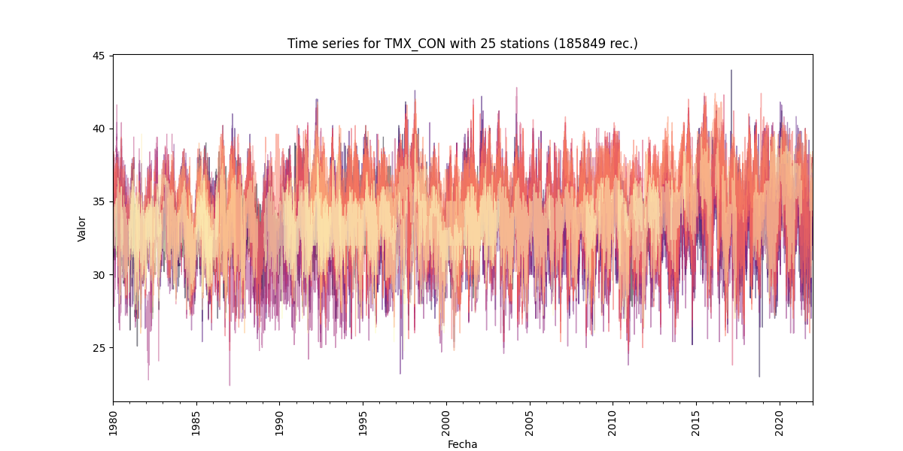
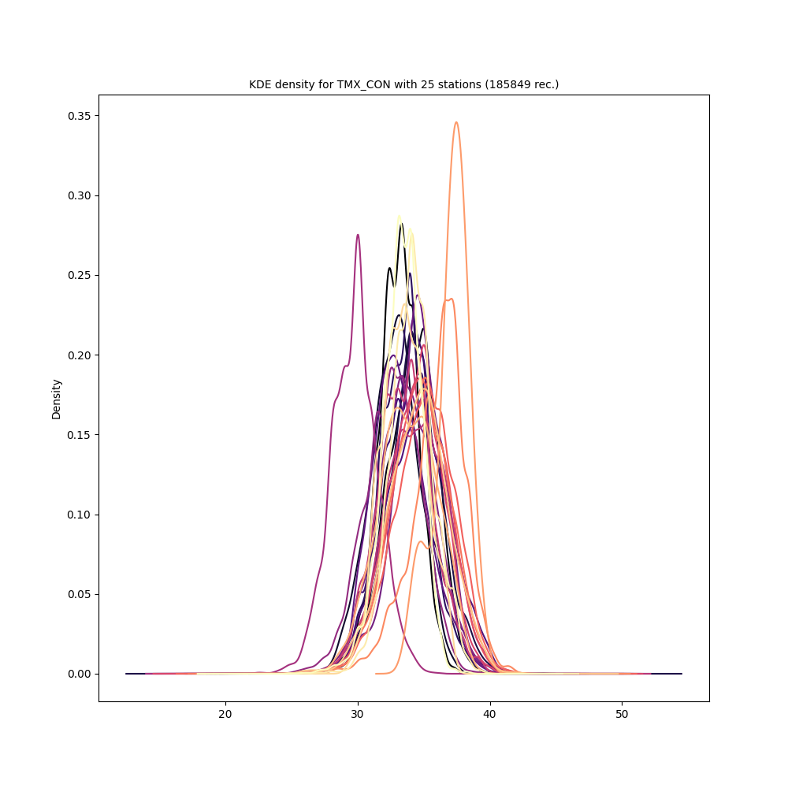

**TMX_CON - Station: ALGARROBO [28045020] (1050 rec.)** Location over [Google Maps](http://maps.google.com/maps?q=10.15,-74.06666667) or [Openstreet Map](https://www.openstreetmap.org/query?lat=10.15&lon=-74.06666667)

Station first record

| Fecha               |   CodigoEstacion | NombreEstacion       |   Latitud |   Longitud |   Altitud | Categoria           | Entidad                                                     | AreaOperativa                               | Departamento   | Municipio   | FechaInstalacion    | FechaSuspension     | IdParametro   | Etiqueta   | DescripcionSerie          | Frecuencia   |   Valor |   Grado |   Calificador |   NivelAprobacion |
|:--------------------|-----------------:|:---------------------|----------:|-----------:|----------:|:--------------------|:------------------------------------------------------------|:--------------------------------------------|:---------------|:------------|:--------------------|:--------------------|:--------------|:-----------|:--------------------------|:-------------|--------:|--------:|--------------:|------------------:|
| 1983-01-01 00:00:00 |         28045020 | ALGARROBO [28045020] |     10.15 |   -74.0667 |        60 | Climática Ordinaria | INSTITUTO DE HIDROLOGIA METEOROLOGIA Y ESTUDIOS AMBIENTALES | Area Operativa 05 - Magdalena-Cesar-Guajira | Cesar          | El Copey    | 1964-02-15 00:00:00 | 1987-04-15 00:00:00 | TEMPERATURA   | TMX_CON    | Temperatura máxima diaria | Diaria       |      36 |      50 |           nan |              1200 |

Statistics table

|       |      Valor |
|:------|-----------:|
| count | 1050       |
| mean  |   33.8226  |
| std   |    2.13222 |
| min   |   27.2     |
| 25%   |   32.25    |
| 50%   |   33.8     |
| 75%   |   35.4     |
| max   |   39.2     |

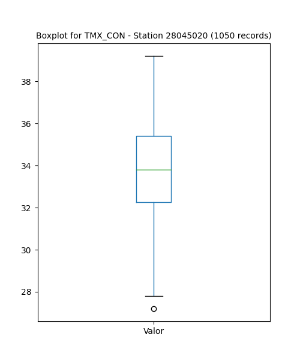
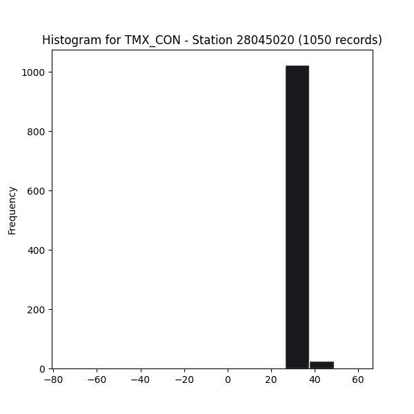
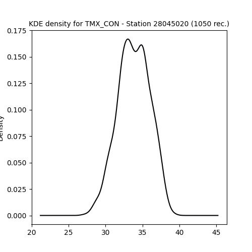

**TMX_CON - Station: CENTENARIO HACIENDA [28025090] (12953 rec.)** Location over [Google Maps](http://maps.google.com/maps?q=9.85025,-73.26547222) or [Openstreet Map](https://www.openstreetmap.org/query?lat=9.85025&lon=-73.26547222)

Station first record

| Fecha               |   CodigoEstacion | NombreEstacion                 |   Latitud |   Longitud |   Altitud | Categoria           | Entidad                                                     | AreaOperativa                               | Departamento   | Municipio       | FechaInstalacion    | FechaSuspension   | IdParametro   | Etiqueta   | DescripcionSerie          | Frecuencia   |   Valor |   Grado |   Calificador |   NivelAprobacion |
|:--------------------|-----------------:|:-------------------------------|----------:|-----------:|----------:|:--------------------|:------------------------------------------------------------|:--------------------------------------------|:---------------|:----------------|:--------------------|:------------------|:--------------|:-----------|:--------------------------|:-------------|--------:|--------:|--------------:|------------------:|
| 1981-01-03 00:00:00 |         28025090 | CENTENARIO HACIENDA [28025090] |   9.85025 |   -73.2655 |       100 | Climática Ordinaria | INSTITUTO DE HIDROLOGIA METEOROLOGIA Y ESTUDIOS AMBIENTALES | Area Operativa 05 - Magdalena-Cesar-Guajira | Cesar          | Agustín Codazzi | 1976-12-15 00:00:00 | NaT               | TEMPERATURA   | TMX_CON    | Temperatura máxima diaria | Diaria       |    32.6 |      50 |           nan |              1200 |

Statistics table

|       |       Valor |
|:------|------------:|
| count | 12953       |
| mean  |    34.3336  |
| std   |     2.09333 |
| min   |    23.8     |
| 25%   |    33       |
| 50%   |    34.4     |
| 75%   |    35.8     |
| max   |    42.3     |

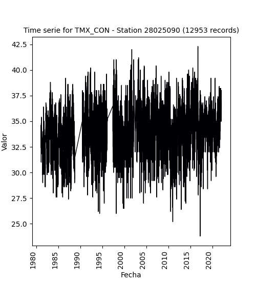
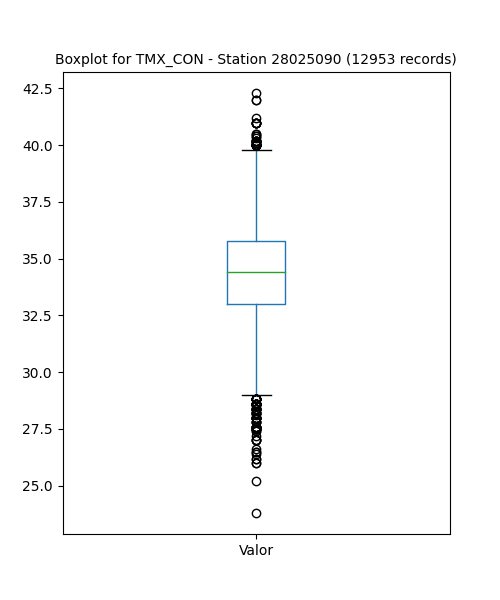
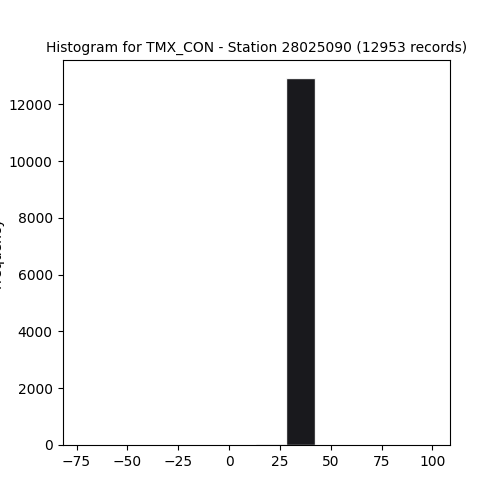

**TMX_CON - Station: CHIRIGUANA [25025250] (11758 rec.)** Location over [Google Maps](http://maps.google.com/maps?q=9.361027778,-73.59338889) or [Openstreet Map](https://www.openstreetmap.org/query?lat=9.361027778&lon=-73.59338889)

Station first record

| Fecha               |   CodigoEstacion | NombreEstacion        |   Latitud |   Longitud |   Altitud | Categoria           | Entidad                                                     | AreaOperativa                               | Departamento   | Municipio   | FechaInstalacion    | FechaSuspension   | IdParametro   | Etiqueta   | DescripcionSerie          | Frecuencia   |   Valor |   Grado |   Calificador |   NivelAprobacion |
|:--------------------|-----------------:|:----------------------|----------:|-----------:|----------:|:--------------------|:------------------------------------------------------------|:--------------------------------------------|:---------------|:------------|:--------------------|:------------------|:--------------|:-----------|:--------------------------|:-------------|--------:|--------:|--------------:|------------------:|
| 1981-04-01 00:00:00 |         25025250 | CHIRIGUANA [25025250] |   9.36103 |   -73.5934 |        40 | Climática Ordinaria | INSTITUTO DE HIDROLOGIA METEOROLOGIA Y ESTUDIOS AMBIENTALES | Area Operativa 05 - Magdalena-Cesar-Guajira | Cesar          | Chiriguaná  | 1973-06-15 00:00:00 | NaT               | TEMPERATURA   | TMX_CON    | Temperatura máxima diaria | Diaria       |    37.6 |      50 |           nan |              1200 |

Statistics table

|       |       Valor |
|:------|------------:|
| count | 11758       |
| mean  |    33.787   |
| std   |     2.07519 |
| min   |    26.6     |
| 25%   |    32.4     |
| 50%   |    34       |
| 75%   |    35       |
| max   |    42.6     |

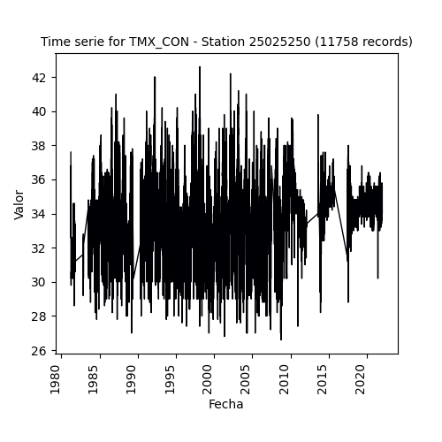
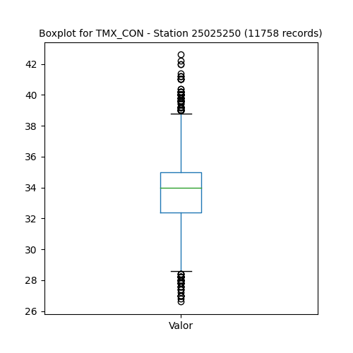
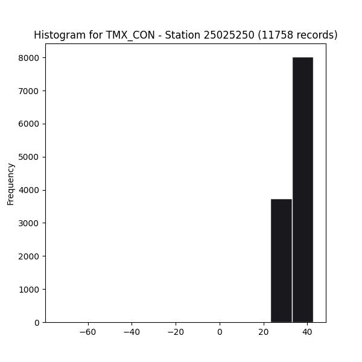
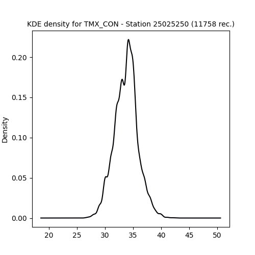

**TMX_CON - Station: COLEGIO AGROPECUARIO PAILITAS  - AUT [25025330] (7606 rec.)** Location over [Google Maps](http://maps.google.com/maps?q=8.954222222,-73.63008333) or [Openstreet Map](https://www.openstreetmap.org/query?lat=8.954222222&lon=-73.63008333)

Station first record

| Fecha               |   CodigoEstacion | NombreEstacion                                  |   Latitud |   Longitud |   Altitud | Categoria           | Entidad                                                     | AreaOperativa                               | Departamento   | Municipio   | FechaInstalacion    | FechaSuspension   | IdParametro   | Etiqueta   | DescripcionSerie          | Frecuencia   |   Valor |   Grado |   Calificador |   NivelAprobacion |
|:--------------------|-----------------:|:------------------------------------------------|----------:|-----------:|----------:|:--------------------|:------------------------------------------------------------|:--------------------------------------------|:---------------|:------------|:--------------------|:------------------|:--------------|:-----------|:--------------------------|:-------------|--------:|--------:|--------------:|------------------:|
| 1990-03-27 00:00:00 |         25025330 | COLEGIO AGROPECUARIO PAILITAS  - AUT [25025330] |   8.95422 |   -73.6301 |        50 | Climática Principal | INSTITUTO DE HIDROLOGIA METEOROLOGIA Y ESTUDIOS AMBIENTALES | Area Operativa 05 - Magdalena-Cesar-Guajira | Cesar          | Pailitas    | 1987-09-15 00:00:00 | NaT               | TEMPERATURA   | TMX_CON    | Temperatura máxima diaria | Diaria       |    34.2 |      50 |           nan |              1200 |

Statistics table

|       |     Valor |
|:------|----------:|
| count | 7606      |
| mean  |   33.2243 |
| std   |    2.0554 |
| min   |   23.2    |
| 25%   |   31.8    |
| 50%   |   33      |
| 75%   |   34.6    |
| max   |   41.6    |

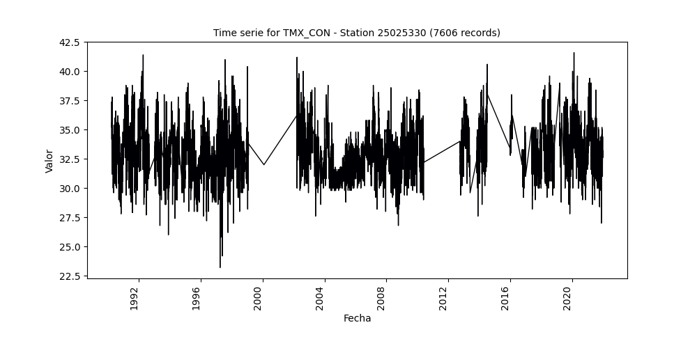
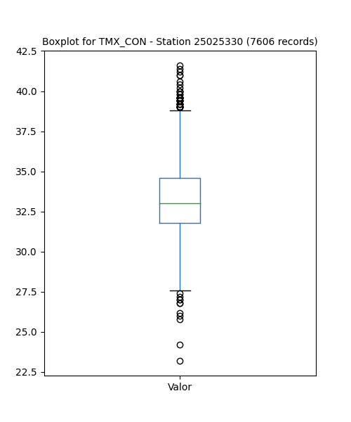
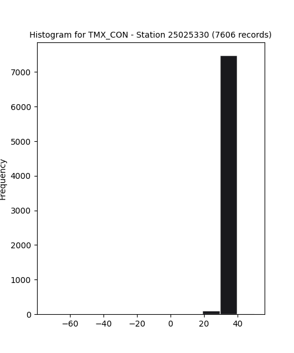
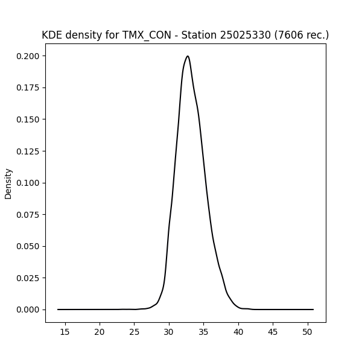

**TMX_CON - Station: GUAIRA LA HACIENDA [28045040] (784 rec.)** Location over [Google Maps](http://maps.google.com/maps?q=9.616666667,-73.8) or [Openstreet Map](https://www.openstreetmap.org/query?lat=9.616666667&lon=-73.8)

Station first record

| Fecha               |   CodigoEstacion | NombreEstacion                |   Latitud |   Longitud |   Altitud | Categoria           | Entidad                                                     | AreaOperativa                               | Departamento   | Municipio   | FechaInstalacion    | FechaSuspension     | IdParametro   | Etiqueta   | DescripcionSerie          | Frecuencia   |   Valor |   Grado |   Calificador |   NivelAprobacion |
|:--------------------|-----------------:|:------------------------------|----------:|-----------:|----------:|:--------------------|:------------------------------------------------------------|:--------------------------------------------|:---------------|:------------|:--------------------|:--------------------|:--------------|:-----------|:--------------------------|:-------------|--------:|--------:|--------------:|------------------:|
| 1987-09-10 00:00:00 |         28045040 | GUAIRA LA HACIENDA [28045040] |   9.61667 |      -73.8 |        50 | Climática Principal | INSTITUTO DE HIDROLOGIA METEOROLOGIA Y ESTUDIOS AMBIENTALES | Area Operativa 05 - Magdalena-Cesar-Guajira | Cesar          | El Paso     | 1987-09-15 00:00:00 | 1994-07-15 00:00:00 | TEMPERATURA   | TMX_CON    | Temperatura máxima diaria | Diaria       |    32.4 |      50 |           nan |              1200 |

Statistics table

|       |     Valor |
|:------|----------:|
| count | 784       |
| mean  |  34.5605  |
| std   |   2.25236 |
| min   |  26       |
| 25%   |  33       |
| 50%   |  34.6     |
| 75%   |  36       |
| max   |  41.8     |

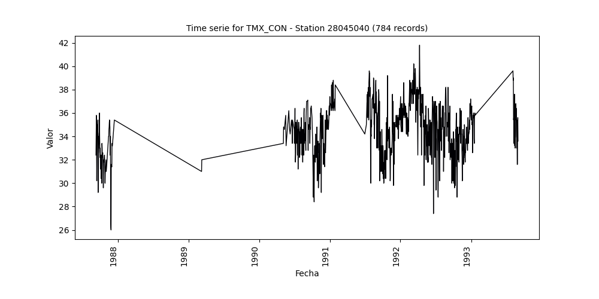
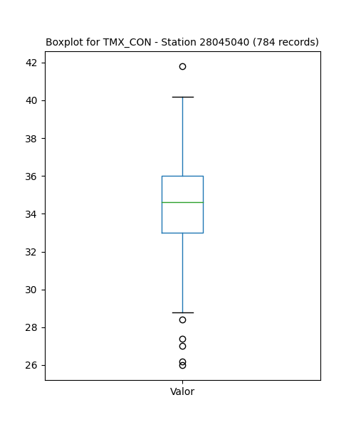

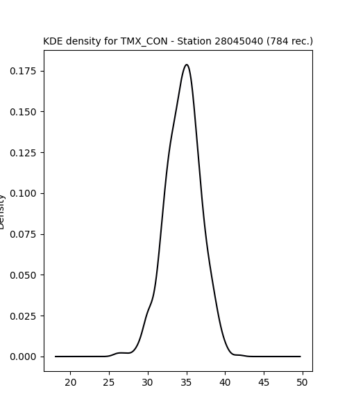

**TMX_CON - Station: GUAYMARAL [28035040] (9424 rec.)** Location over [Google Maps](http://maps.google.com/maps?q=9.904916667,-73.64752778) or [Openstreet Map](https://www.openstreetmap.org/query?lat=9.904916667&lon=-73.64752778)

Station first record

| Fecha               |   CodigoEstacion | NombreEstacion       |   Latitud |   Longitud |   Altitud | Categoria           | Entidad                                                     | AreaOperativa                               | Departamento   | Municipio   | FechaInstalacion    | FechaSuspension   | IdParametro   | Etiqueta   | DescripcionSerie          | Frecuencia   |   Valor |   Grado |   Calificador |   NivelAprobacion |
|:--------------------|-----------------:|:---------------------|----------:|-----------:|----------:|:--------------------|:------------------------------------------------------------|:--------------------------------------------|:---------------|:------------|:--------------------|:------------------|:--------------|:-----------|:--------------------------|:-------------|--------:|--------:|--------------:|------------------:|
| 1981-06-01 00:00:00 |         28035040 | GUAYMARAL [28035040] |   9.90492 |   -73.6475 |        50 | Climática Ordinaria | INSTITUTO DE HIDROLOGIA METEOROLOGIA Y ESTUDIOS AMBIENTALES | Area Operativa 05 - Magdalena-Cesar-Guajira | Cesar          | Valledupar  | 1972-08-15 00:00:00 | NaT               | TEMPERATURA   | TMX_CON    | Temperatura máxima diaria | Diaria       |    35.2 |      50 |           nan |              1200 |

Statistics table

|       |      Valor |
|:------|-----------:|
| count | 9424       |
| mean  |   36.1116  |
| std   |    2.03179 |
| min   |   26       |
| 25%   |   35       |
| 50%   |   36.4     |
| 75%   |   37.4     |
| max   |   42.4     |

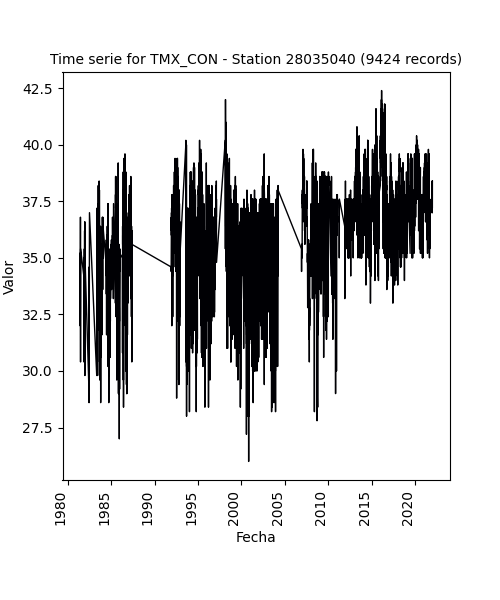
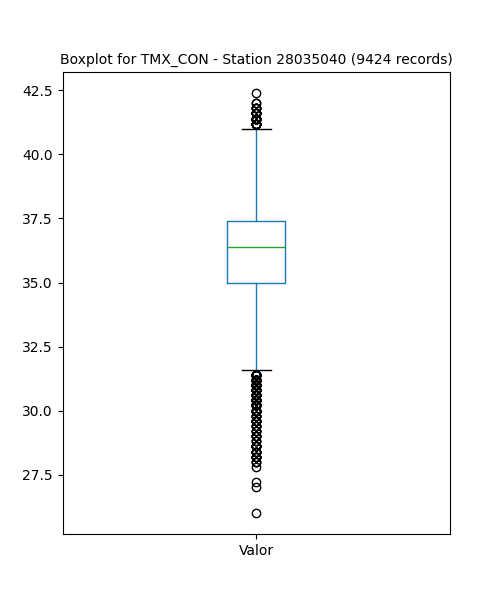
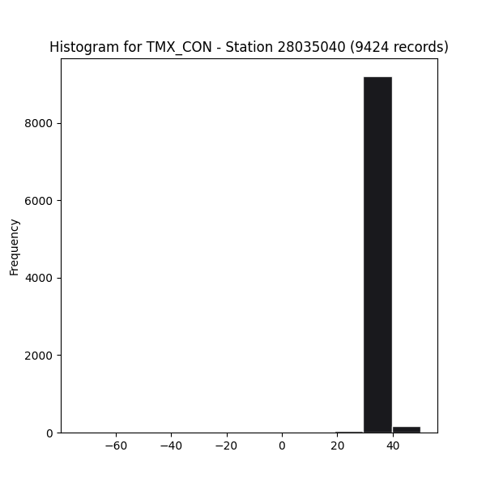
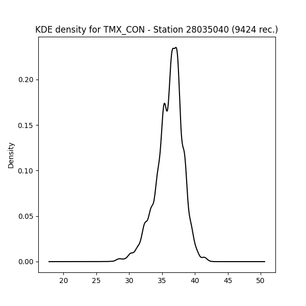

**TMX_CON - Station: LA GLORIA [23215060] (960 rec.)** Location over [Google Maps](http://maps.google.com/maps?q=8.615277778,-73.800555556) or [Openstreet Map](https://www.openstreetmap.org/query?lat=8.615277778&lon=-73.800555556)

Station first record

| Fecha               |   CodigoEstacion | NombreEstacion       |   Latitud |   Longitud |   Altitud | Categoria           | Entidad                                                     | AreaOperativa                          | Departamento   | Municipio   | FechaInstalacion    | FechaSuspension     | IdParametro   | Etiqueta   | DescripcionSerie          | Frecuencia   |   Valor |   Grado |   Calificador |   NivelAprobacion |
|:--------------------|-----------------:|:---------------------|----------:|-----------:|----------:|:--------------------|:------------------------------------------------------------|:---------------------------------------|:---------------|:------------|:--------------------|:--------------------|:--------------|:-----------|:--------------------------|:-------------|--------:|--------:|--------------:|------------------:|
| 1983-09-17 00:00:00 |         23215060 | LA GLORIA [23215060] |   8.61528 |   -73.8006 |        35 | Climática Ordinaria | INSTITUTO DE HIDROLOGIA METEOROLOGIA Y ESTUDIOS AMBIENTALES | Area Operativa 08 - Santanderes-Arauca | Cesar          | La Gloria   | 1995-05-15 00:00:00 | 2018-06-19 10:35:00 | TEMPERATURA   | TMX_CON    | Temperatura máxima diaria | Diaria       |      33 |      50 |           nan |              1200 |

Statistics table

|       |     Valor |
|:------|----------:|
| count | 960       |
| mean  |  32.7978  |
| std   |   1.77501 |
| min   |  27       |
| 25%   |  31.6     |
| 50%   |  32.8     |
| 75%   |  34       |
| max   |  37.4     |

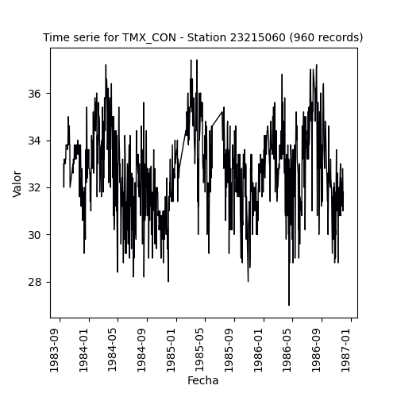
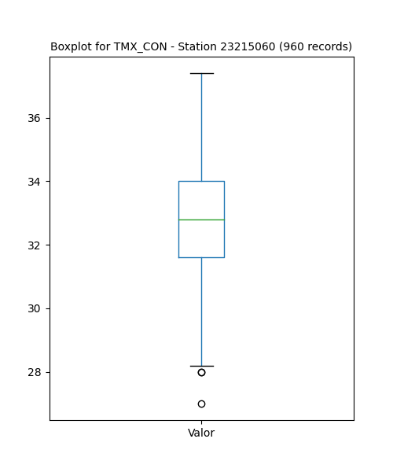

**TMX_CON - Station: MOTILONIA CODAZZI [28025070] (13398 rec.)** Location over [Google Maps](http://maps.google.com/maps?q=10.00180556,-73.24938889) or [Openstreet Map](https://www.openstreetmap.org/query?lat=10.00180556&lon=-73.24938889)

Station first record

| Fecha               |   CodigoEstacion | NombreEstacion               |   Latitud |   Longitud |   Altitud | Categoria         | Entidad                                                     | AreaOperativa                               | Departamento   | Municipio       | FechaInstalacion    | FechaSuspension   | IdParametro   | Etiqueta   | DescripcionSerie          | Frecuencia   |   Valor |   Grado |   Calificador |   NivelAprobacion |
|:--------------------|-----------------:|:-----------------------------|----------:|-----------:|----------:|:------------------|:------------------------------------------------------------|:--------------------------------------------|:---------------|:----------------|:--------------------|:------------------|:--------------|:-----------|:--------------------------|:-------------|--------:|--------:|--------------:|------------------:|
| 1980-01-01 00:00:00 |         28025070 | MOTILONIA CODAZZI [28025070] |   10.0018 |   -73.2494 |       180 | Agrometeorológica | INSTITUTO DE HIDROLOGIA METEOROLOGIA Y ESTUDIOS AMBIENTALES | Area Operativa 05 - Magdalena-Cesar-Guajira | Cesar          | Agustín Codazzi | 1956-01-15 00:00:00 | NaT               | TEMPERATURA   | TMX_CON    | Temperatura máxima diaria | Diaria       |    34.8 |      50 |           nan |              1200 |

Statistics table

|       |       Valor |
|:------|------------:|
| count | 13398       |
| mean  |    34.4325  |
| std   |     2.35604 |
| min   |    24.1     |
| 25%   |    32.8     |
| 50%   |    34.4     |
| 75%   |    36.2     |
| max   |    42.8     |

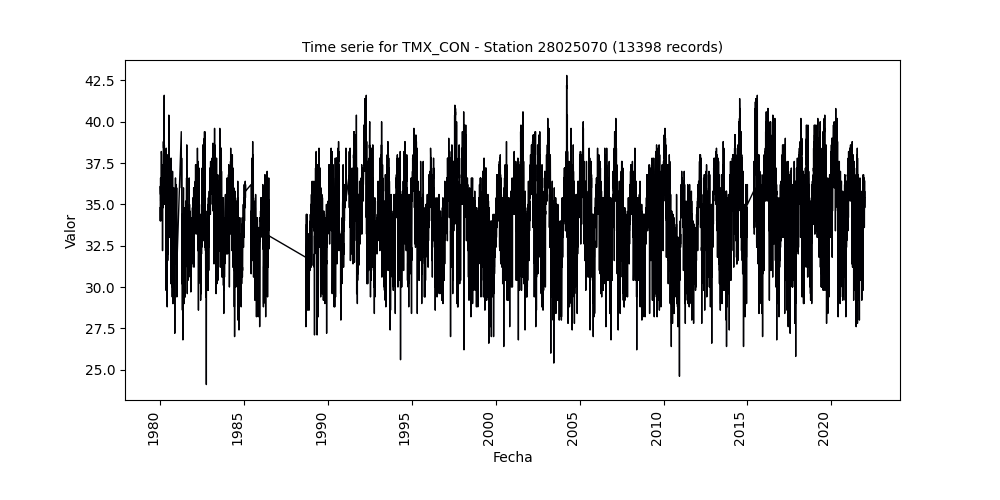
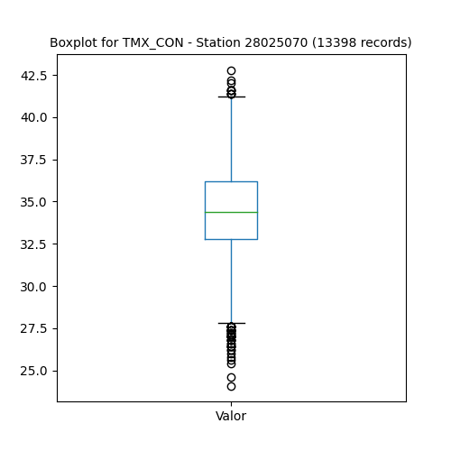
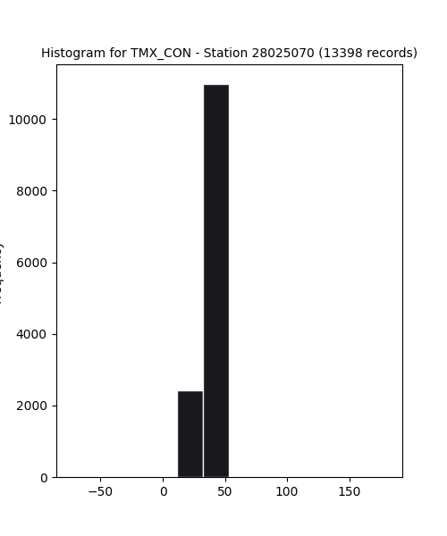
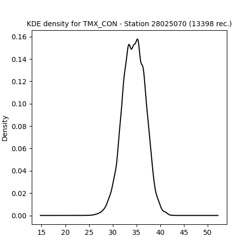

**TMX_CON - Station: SOCOMBA [28025080] (7076 rec.)** Location over [Google Maps](http://maps.google.com/maps?q=9.686666667,-73.24055556) or [Openstreet Map](https://www.openstreetmap.org/query?lat=9.686666667&lon=-73.24055556)

Station first record

| Fecha               |   CodigoEstacion | NombreEstacion     |   Latitud |   Longitud |   Altitud | Categoria           | Entidad                                                     | AreaOperativa                               | Departamento   | Municipio   | FechaInstalacion    | FechaSuspension     | IdParametro   | Etiqueta   | DescripcionSerie          | Frecuencia   |   Valor |   Grado |   Calificador |   NivelAprobacion |
|:--------------------|-----------------:|:-------------------|----------:|-----------:|----------:|:--------------------|:------------------------------------------------------------|:--------------------------------------------|:---------------|:------------|:--------------------|:--------------------|:--------------|:-----------|:--------------------------|:-------------|--------:|--------:|--------------:|------------------:|
| 1980-01-03 00:00:00 |         28025080 | SOCOMBA [28025080] |   9.68667 |   -73.2406 |       170 | Climática Principal | INSTITUTO DE HIDROLOGIA METEOROLOGIA Y ESTUDIOS AMBIENTALES | Area Operativa 05 - Magdalena-Cesar-Guajira | Cesar          | Becerrill   | 1976-12-15 00:00:00 | 2019-02-07 11:41:00 | TEMPERATURA   | TMX_CON    | Temperatura máxima diaria | Diaria       |      35 |      50 |           nan |              1200 |

Statistics table

|       |      Valor |
|:------|-----------:|
| count | 7076       |
| mean  |   33.5969  |
| std   |    2.05285 |
| min   |   26.4     |
| 25%   |   32.2     |
| 50%   |   33.6     |
| 75%   |   35       |
| max   |   40       |

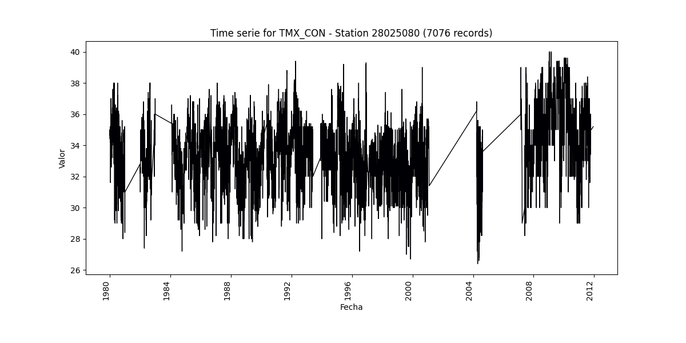
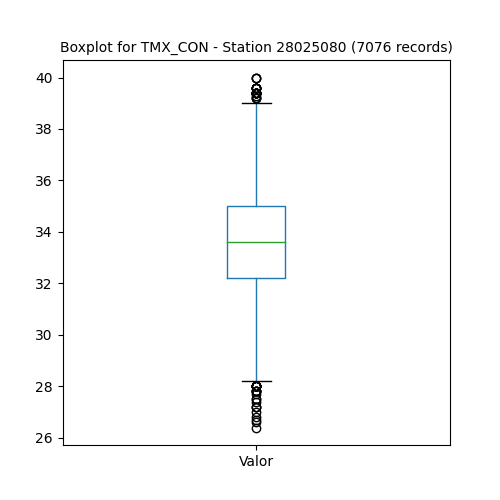
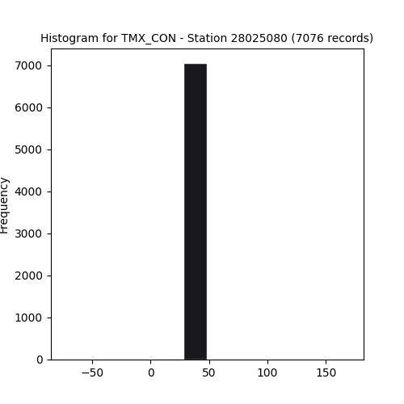
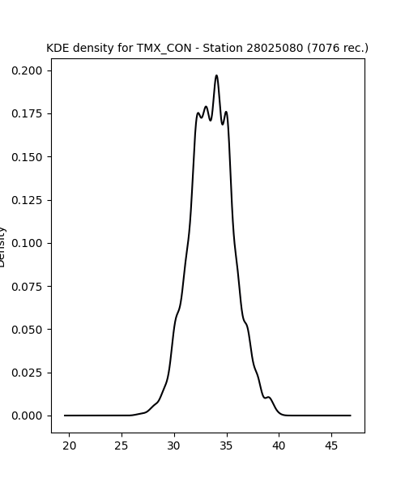

**TMX_CON - Station: VILLA ROSA [28035010] (8442 rec.)** Location over [Google Maps](http://maps.google.com/maps?q=10.19066667,-73.54738889) or [Openstreet Map](https://www.openstreetmap.org/query?lat=10.19066667&lon=-73.54738889)

Station first record

| Fecha               |   CodigoEstacion | NombreEstacion        |   Latitud |   Longitud |   Altitud | Categoria           | Entidad                                                     | AreaOperativa                               | Departamento   | Municipio   | FechaInstalacion    | FechaSuspension   | IdParametro   | Etiqueta   | DescripcionSerie          | Frecuencia   |   Valor |   Grado |   Calificador |   NivelAprobacion |
|:--------------------|-----------------:|:----------------------|----------:|-----------:|----------:|:--------------------|:------------------------------------------------------------|:--------------------------------------------|:---------------|:------------|:--------------------|:------------------|:--------------|:-----------|:--------------------------|:-------------|--------:|--------:|--------------:|------------------:|
| 1980-01-11 00:00:00 |         28035010 | VILLA ROSA [28035010] |   10.1907 |   -73.5474 |        70 | Climática Ordinaria | INSTITUTO DE HIDROLOGIA METEOROLOGIA Y ESTUDIOS AMBIENTALES | Area Operativa 05 - Magdalena-Cesar-Guajira | Cesar          | Valledupar  | 1968-03-15 00:00:00 | NaT               | TEMPERATURA   | TMX_CON    | Temperatura máxima diaria | Diaria       |    35.2 |      50 |           nan |              1200 |

Statistics table

|       |      Valor |
|:------|-----------:|
| count | 8442       |
| mean  |   35.0506  |
| std   |    2.25909 |
| min   |   25       |
| 25%   |   33.6     |
| 50%   |   35.2     |
| 75%   |   36.6     |
| max   |   42.4     |

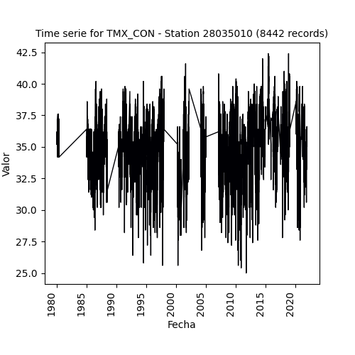
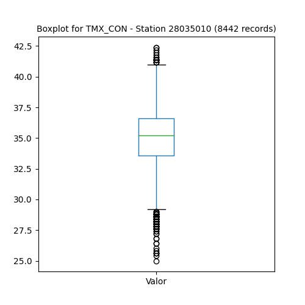
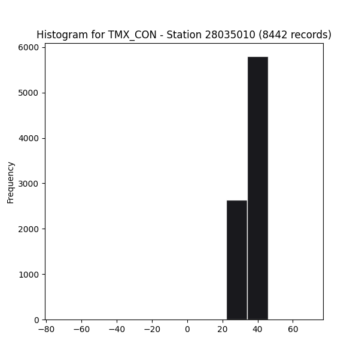
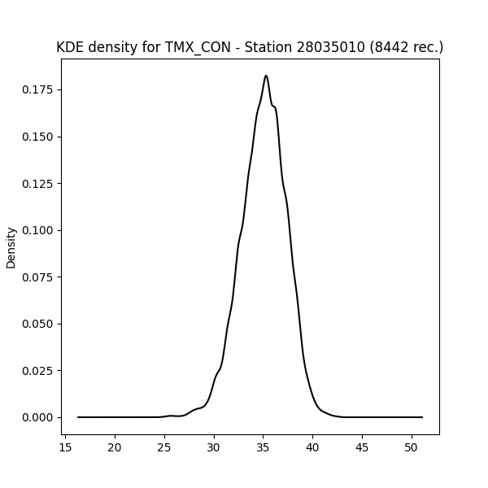

**TMX_CON - Station: AEROPUERTO ALFONSO LOPEZ - [28025502] (11456 rec.)** Location over [Google Maps](http://maps.google.com/maps?q=10.43616667,-73.24766667) or [Openstreet Map](https://www.openstreetmap.org/query?lat=10.43616667&lon=-73.24766667)

Station first record

| Fecha               |   CodigoEstacion | NombreEstacion                        |   Latitud |   Longitud |   Altitud | Categoria           | Entidad                                                     | AreaOperativa                               | Departamento   | Municipio   | FechaInstalacion    | FechaSuspension   | IdParametro   | Etiqueta   | DescripcionSerie          | Frecuencia   |   Valor |   Grado |   Calificador |   NivelAprobacion |
|:--------------------|-----------------:|:--------------------------------------|----------:|-----------:|----------:|:--------------------|:------------------------------------------------------------|:--------------------------------------------|:---------------|:------------|:--------------------|:------------------|:--------------|:-----------|:--------------------------|:-------------|--------:|--------:|--------------:|------------------:|
| 1983-04-02 00:00:00 |         28025502 | AEROPUERTO ALFONSO LOPEZ - [28025502] |   10.4362 |   -73.2477 |       138 | Sinóptica Principal | INSTITUTO DE HIDROLOGIA METEOROLOGIA Y ESTUDIOS AMBIENTALES | Area Operativa 05 - Magdalena-Cesar-Guajira | Cesar          | Valledupar  | 2016-01-07 00:00:00 | NaT               | TEMPERATURA   | TMX_CON    | Temperatura máxima diaria | Diaria       |    39.2 |      50 |           nan |              1200 |

Statistics table

|       |       Valor |
|:------|------------:|
| count | 11456       |
| mean  |    34.6493  |
| std   |     2.18198 |
| min   |    24.8     |
| 25%   |    33.2     |
| 50%   |    34.7     |
| 75%   |    36.2     |
| max   |    41.8     |

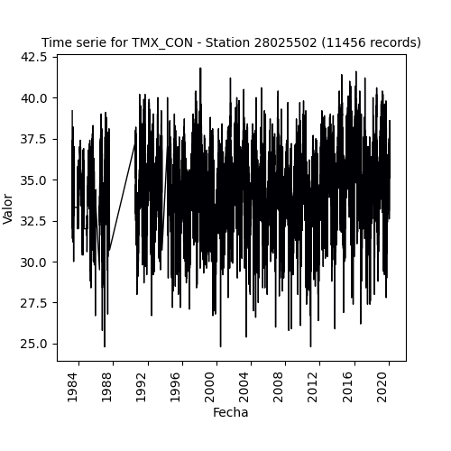
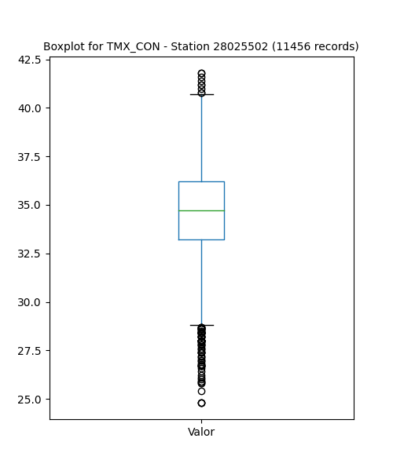
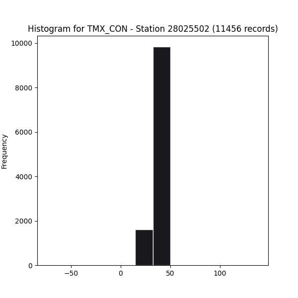
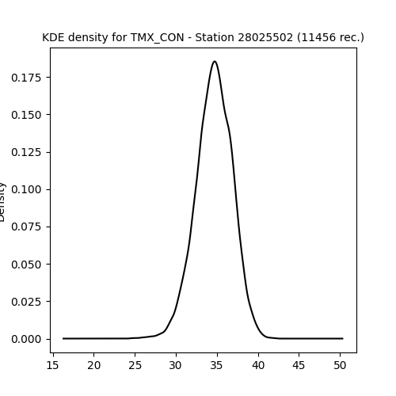

**TMX_CON - Station: CALLAO EL [28035020] (12136 rec.)** Location over [Google Maps](http://maps.google.com/maps?q=10.36305556,-73.31944444) or [Openstreet Map](https://www.openstreetmap.org/query?lat=10.36305556&lon=-73.31944444)

Station first record

| Fecha               |   CodigoEstacion | NombreEstacion       |   Latitud |   Longitud |   Altitud | Categoria           | Entidad                                                     | AreaOperativa                               | Departamento   | Municipio   | FechaInstalacion    | FechaSuspension   | IdParametro   | Etiqueta   | DescripcionSerie          | Frecuencia   |   Valor |   Grado |   Calificador |   NivelAprobacion |
|:--------------------|-----------------:|:---------------------|----------:|-----------:|----------:|:--------------------|:------------------------------------------------------------|:--------------------------------------------|:---------------|:------------|:--------------------|:------------------|:--------------|:-----------|:--------------------------|:-------------|--------:|--------:|--------------:|------------------:|
| 1980-01-01 00:00:00 |         28035020 | CALLAO EL [28035020] |   10.3631 |   -73.3194 |       110 | Climática Ordinaria | INSTITUTO DE HIDROLOGIA METEOROLOGIA Y ESTUDIOS AMBIENTALES | Area Operativa 05 - Magdalena-Cesar-Guajira | Cesar          | Valledupar  | 1968-03-15 00:00:00 | NaT               | TEMPERATURA   | TMX_CON    | Temperatura máxima diaria | Diaria       |    34.6 |      50 |           nan |              1200 |

Statistics table

|       |       Valor |
|:------|------------:|
| count | 12136       |
| mean  |    34.7338  |
| std   |     2.21035 |
| min   |    25.4     |
| 25%   |    33.2     |
| 50%   |    34.8     |
| 75%   |    36.4     |
| max   |    41.8     |

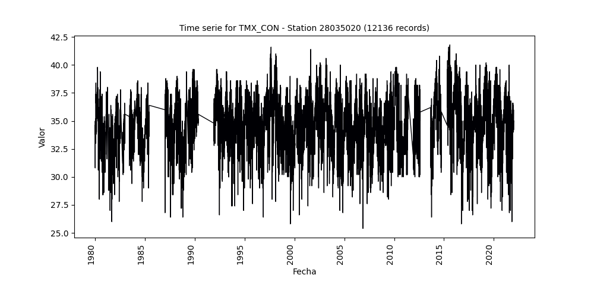
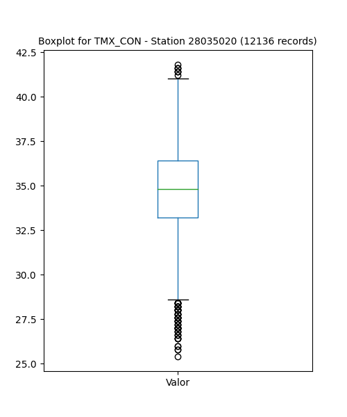
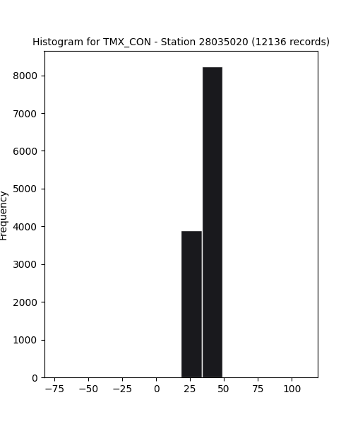
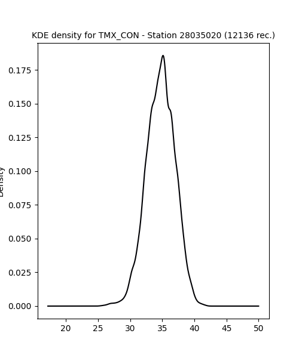

**TMX_CON - Station: CICOLAC [28015030] (1127 rec.)** Location over [Google Maps](http://maps.google.com/maps?q=10.48333333,-73.26666667) or [Openstreet Map](https://www.openstreetmap.org/query?lat=10.48333333&lon=-73.26666667)

Station first record

| Fecha               |   CodigoEstacion | NombreEstacion     |   Latitud |   Longitud |   Altitud | Categoria           | Entidad                                                     | AreaOperativa                               | Departamento   | Municipio   | FechaInstalacion    | FechaSuspension     | IdParametro   | Etiqueta   | DescripcionSerie          | Frecuencia   |   Valor |   Grado |   Calificador |   NivelAprobacion |
|:--------------------|-----------------:|:-------------------|----------:|-----------:|----------:|:--------------------|:------------------------------------------------------------|:--------------------------------------------|:---------------|:------------|:--------------------|:--------------------|:--------------|:-----------|:--------------------------|:-------------|--------:|--------:|--------------:|------------------:|
| 1980-01-03 00:00:00 |         28015030 | CICOLAC [28015030] |   10.4833 |   -73.2667 |       180 | Climática Principal | INSTITUTO DE HIDROLOGIA METEOROLOGIA Y ESTUDIOS AMBIENTALES | Area Operativa 05 - Magdalena-Cesar-Guajira | Cesar          | Valledupar  | 1964-01-15 00:00:00 | 1988-05-15 00:00:00 | TEMPERATURA   | TMX_CON    | Temperatura máxima diaria | Diaria       |    34.3 |      50 |           nan |              1200 |

Statistics table

|       |      Valor |
|:------|-----------:|
| count | 1127       |
| mean  |   34.5657  |
| std   |    1.85704 |
| min   |   26.3     |
| 25%   |   33.4     |
| 50%   |   34.6     |
| 75%   |   35.8     |
| max   |   40.4     |

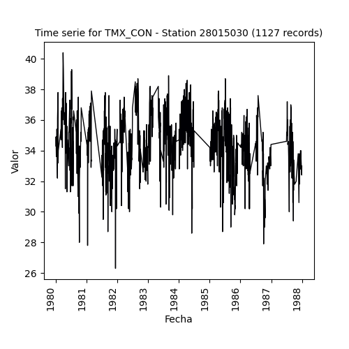
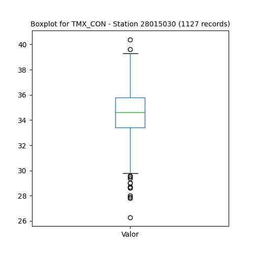
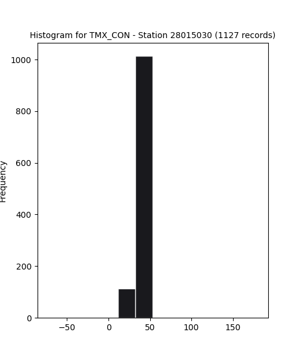
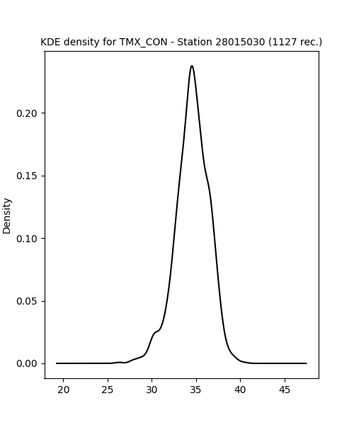

**TMX_CON - Station: GUATAPURI - AUT [28035070] (42 rec.)** Location over [Google Maps](http://maps.google.com/maps?q=10.73213889,-73.39241667) or [Openstreet Map](https://www.openstreetmap.org/query?lat=10.73213889&lon=-73.39241667)

Station first record

| Fecha               |   CodigoEstacion | NombreEstacion             |   Latitud |   Longitud |   Altitud | Categoria           | Entidad                                                     | AreaOperativa                               | Departamento   | Municipio   | FechaInstalacion    | FechaSuspension     | IdParametro   | Etiqueta   | DescripcionSerie          | Frecuencia   |   Valor |   Grado |   Calificador |   NivelAprobacion |
|:--------------------|-----------------:|:---------------------------|----------:|-----------:|----------:|:--------------------|:------------------------------------------------------------|:--------------------------------------------|:---------------|:------------|:--------------------|:--------------------|:--------------|:-----------|:--------------------------|:-------------|--------:|--------:|--------------:|------------------:|
| 2012-12-01 00:00:00 |         28035070 | GUATAPURI - AUT [28035070] |   10.7321 |   -73.3924 |      1315 | Climática Principal | INSTITUTO DE HIDROLOGIA METEOROLOGIA Y ESTUDIOS AMBIENTALES | Area Operativa 05 - Magdalena-Cesar-Guajira | Cesar          | Valledupar  | 2006-02-26 00:00:00 | 2018-06-11 10:25:00 | TEMPERATURA   | TMX_CON    | Temperatura máxima diaria | Diaria       |    35.8 |      50 |           nan |              1200 |

Statistics table

|       |    Valor |
|:------|---------:|
| count | 42       |
| mean  | 37.1095  |
| std   |  1.26738 |
| min   | 34       |
| 25%   | 36.6     |
| 50%   | 37.4     |
| 75%   | 38       |
| max   | 39.2     |

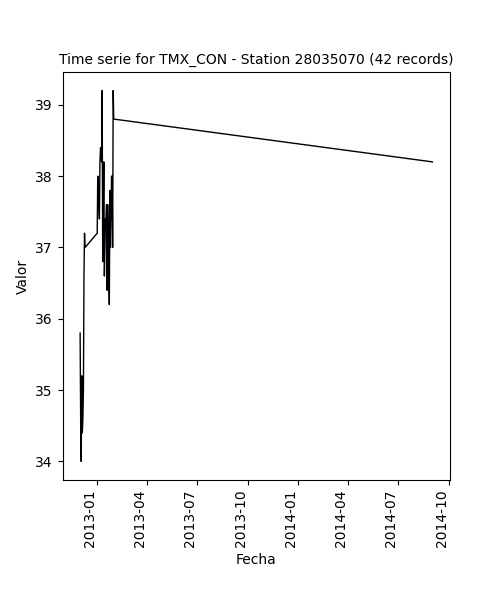
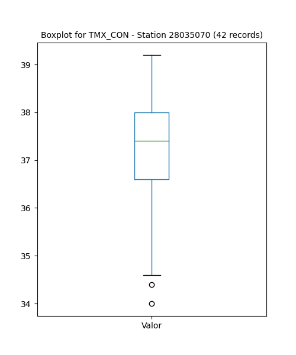
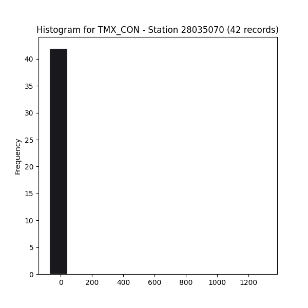
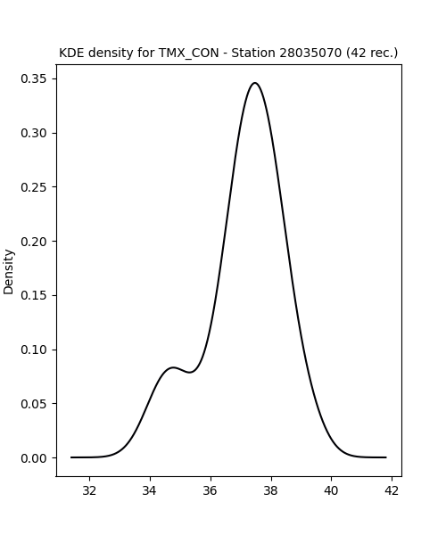

**TMX_CON - Station: RINCON EL [28025020] (12966 rec.)** Location over [Google Maps](http://maps.google.com/maps?q=10.27138889,-73.13138889) or [Openstreet Map](https://www.openstreetmap.org/query?lat=10.27138889&lon=-73.13138889)

Station first record

| Fecha               |   CodigoEstacion | NombreEstacion       |   Latitud |   Longitud |   Altitud | Categoria           | Entidad                                                     | AreaOperativa                               | Departamento   | Municipio   | FechaInstalacion    | FechaSuspension   | IdParametro   | Etiqueta   | DescripcionSerie          | Frecuencia   |   Valor |   Grado |   Calificador |   NivelAprobacion |
|:--------------------|-----------------:|:---------------------|----------:|-----------:|----------:|:--------------------|:------------------------------------------------------------|:--------------------------------------------|:---------------|:------------|:--------------------|:------------------|:--------------|:-----------|:--------------------------|:-------------|--------:|--------:|--------------:|------------------:|
| 1980-02-01 00:00:00 |         28025020 | RINCON EL [28025020] |   10.2714 |   -73.1314 |       350 | Climática Ordinaria | INSTITUTO DE HIDROLOGIA METEOROLOGIA Y ESTUDIOS AMBIENTALES | Area Operativa 05 - Magdalena-Cesar-Guajira | Cesar          | San Diego   | 1964-02-15 00:00:00 | NaT               | TEMPERATURA   | TMX_CON    | Temperatura máxima diaria | Diaria       |    32.3 |      50 |           nan |              1200 |

Statistics table

|       |       Valor |
|:------|------------:|
| count | 12966       |
| mean  |    32.6602  |
| std   |     2.08594 |
| min   |    24.6     |
| 25%   |    31.3     |
| 50%   |    32.7     |
| 75%   |    34.2     |
| max   |    39.7     |

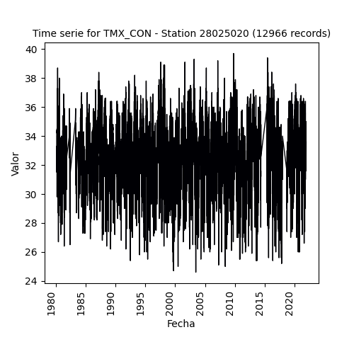
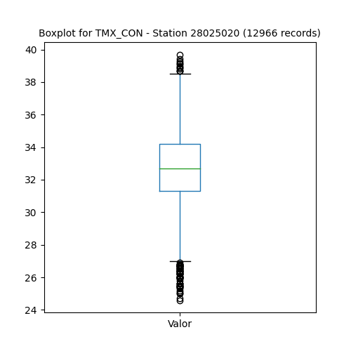
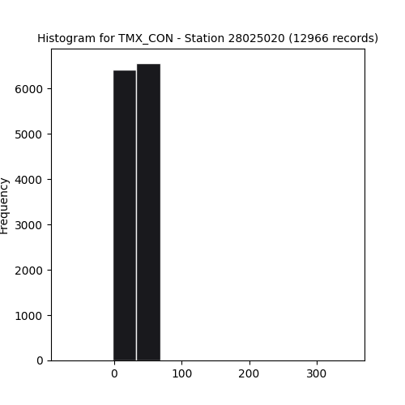
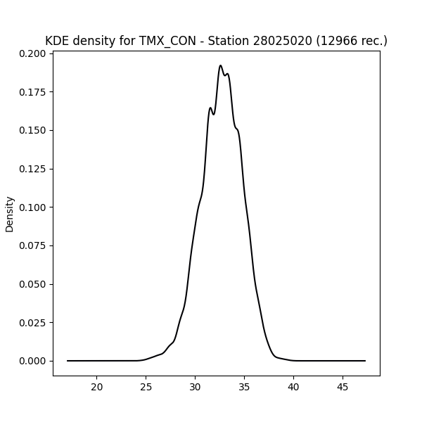

**TMX_CON - Station: SAN JOSE D ORIENTE [28025040] (2613 rec.)** Location over [Google Maps](http://maps.google.com/maps?q=10.35,-73.05) or [Openstreet Map](https://www.openstreetmap.org/query?lat=10.35&lon=-73.05)

Station first record

| Fecha               |   CodigoEstacion | NombreEstacion                |   Latitud |   Longitud |   Altitud | Categoria           | Entidad                                                     | AreaOperativa                               | Departamento   | Municipio   | FechaInstalacion    | FechaSuspension     | IdParametro   | Etiqueta   | DescripcionSerie          | Frecuencia   |   Valor |   Grado |   Calificador |   NivelAprobacion |
|:--------------------|-----------------:|:------------------------------|----------:|-----------:|----------:|:--------------------|:------------------------------------------------------------|:--------------------------------------------|:---------------|:------------|:--------------------|:--------------------|:--------------|:-----------|:--------------------------|:-------------|--------:|--------:|--------------:|------------------:|
| 1980-01-02 00:00:00 |         28025040 | SAN JOSE D ORIENTE [28025040] |     10.35 |     -73.05 |       850 | Climática Ordinaria | INSTITUTO DE HIDROLOGIA METEOROLOGIA Y ESTUDIOS AMBIENTALES | Area Operativa 05 - Magdalena-Cesar-Guajira | Cesar          | La Paz      | 1975-08-15 00:00:00 | 1998-05-15 00:00:00 | TEMPERATURA   | TMX_CON    | Temperatura máxima diaria | Diaria       |    29.8 |      50 |           nan |              1200 |

Statistics table

|       |      Valor |
|:------|-----------:|
| count | 2613       |
| mean  |   29.7907  |
| std   |    1.74453 |
| min   |   22.4     |
| 25%   |   28.6     |
| 50%   |   30       |
| 75%   |   31       |
| max   |   39.2     |

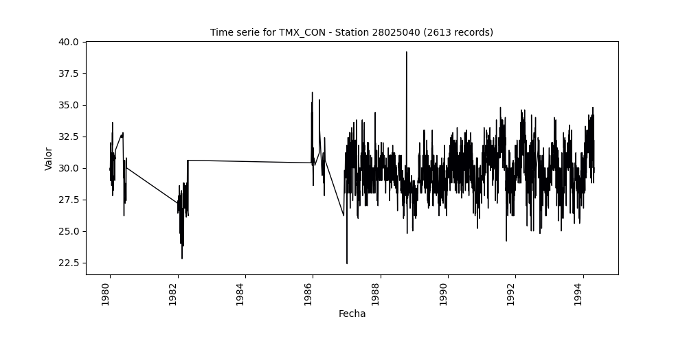
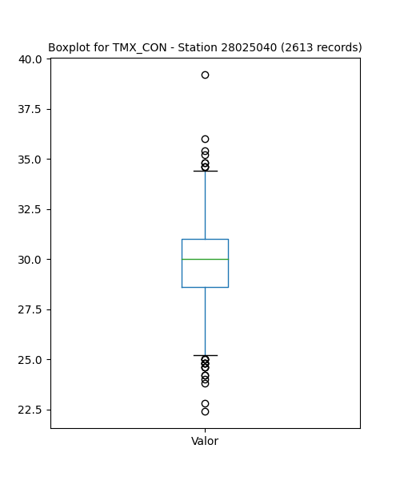
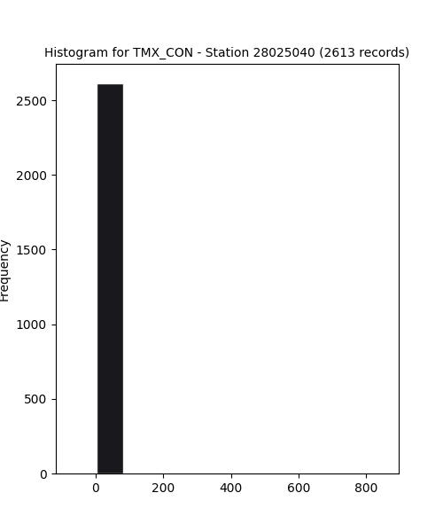

**TMX_CON - Station: LA PAULINA - AUT [15065040] (3465 rec.)** Location over [Google Maps](http://maps.google.com/maps?q=10.89813889,-72.82847222) or [Openstreet Map](https://www.openstreetmap.org/query?lat=10.89813889&lon=-72.82847222)

Station first record

| Fecha               |   CodigoEstacion | NombreEstacion              |   Latitud |   Longitud |   Altitud | Categoria           | Entidad                                                     | AreaOperativa                               | Departamento   | Municipio   | FechaInstalacion    | FechaSuspension   | IdParametro   | Etiqueta   | DescripcionSerie          | Frecuencia   |   Valor |   Grado |   Calificador |   NivelAprobacion |
|:--------------------|-----------------:|:----------------------------|----------:|-----------:|----------:|:--------------------|:------------------------------------------------------------|:--------------------------------------------|:---------------|:------------|:--------------------|:------------------|:--------------|:-----------|:--------------------------|:-------------|--------:|--------:|--------------:|------------------:|
| 1980-04-01 00:00:00 |         15065040 | LA PAULINA - AUT [15065040] |   10.8981 |   -72.8285 |       170 | Climática Principal | INSTITUTO DE HIDROLOGIA METEOROLOGIA Y ESTUDIOS AMBIENTALES | Area Operativa 05 - Magdalena-Cesar-Guajira | La Guajira     | Fonseca     | 1966-09-15 00:00:00 | NaT               | TEMPERATURA   | TMX_CON    | Temperatura máxima diaria | Diaria       |    35.2 |      50 |           nan |              1200 |

Statistics table

|       |      Valor |
|:------|-----------:|
| count | 3465       |
| mean  |   34.0803  |
| std   |    1.83791 |
| min   |   25.1     |
| 25%   |   33       |
| 50%   |   34.2     |
| 75%   |   35.4     |
| max   |   39.4     |

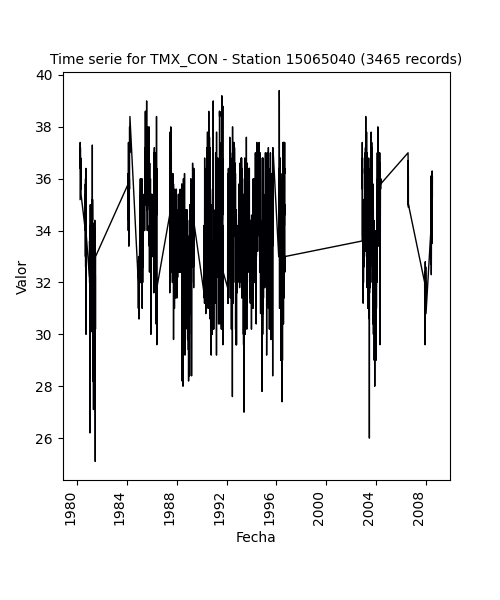
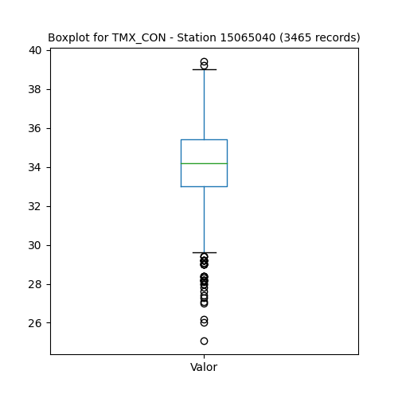
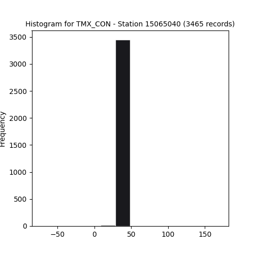

**TMX_CON - Station: URUMITA [28015070] (12645 rec.)** Location over [Google Maps](http://maps.google.com/maps?q=10.56638889,-73.01638889) or [Openstreet Map](https://www.openstreetmap.org/query?lat=10.56638889&lon=-73.01638889)

Station first record

| Fecha               |   CodigoEstacion | NombreEstacion     |   Latitud |   Longitud |   Altitud | Categoria           | Entidad                                                     | AreaOperativa                               | Departamento   | Municipio   | FechaInstalacion    | FechaSuspension   | IdParametro   | Etiqueta   | DescripcionSerie          | Frecuencia   |   Valor |   Grado |   Calificador |   NivelAprobacion |
|:--------------------|-----------------:|:-------------------|----------:|-----------:|----------:|:--------------------|:------------------------------------------------------------|:--------------------------------------------|:---------------|:------------|:--------------------|:------------------|:--------------|:-----------|:--------------------------|:-------------|--------:|--------:|--------------:|------------------:|
| 1980-01-01 00:00:00 |         28015070 | URUMITA [28015070] |   10.5664 |   -73.0164 |       255 | Climática Ordinaria | INSTITUTO DE HIDROLOGIA METEOROLOGIA Y ESTUDIOS AMBIENTALES | Area Operativa 05 - Magdalena-Cesar-Guajira | La Guajira     | Urumita     | 1975-08-15 00:00:00 | NaT               | TEMPERATURA   | TMX_CON    | Temperatura máxima diaria | Diaria       |    32.4 |      50 |           nan |              1200 |

Statistics table

|       |       Valor |
|:------|------------:|
| count | 12645       |
| mean  |    33.7017  |
| std   |     2.18347 |
| min   |    23.8     |
| 25%   |    32.2     |
| 50%   |    33.6     |
| 75%   |    35.2     |
| max   |    42.2     |

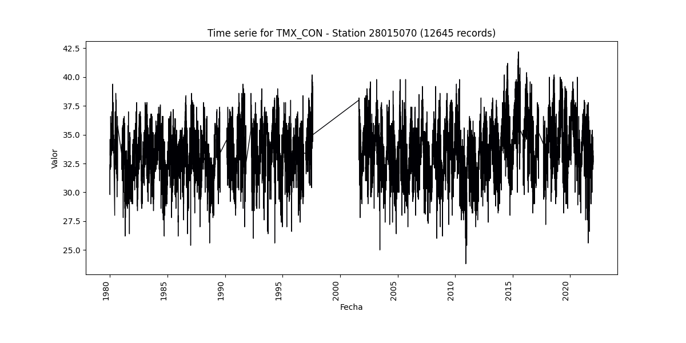
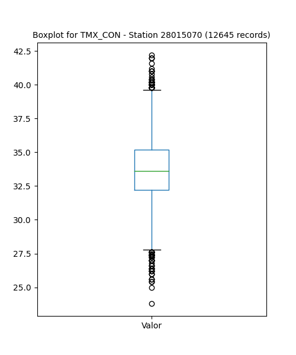
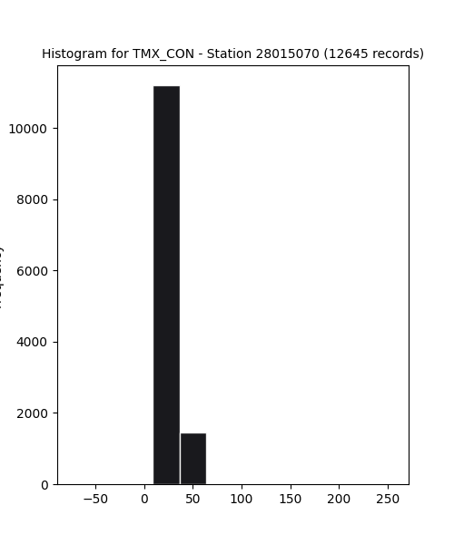
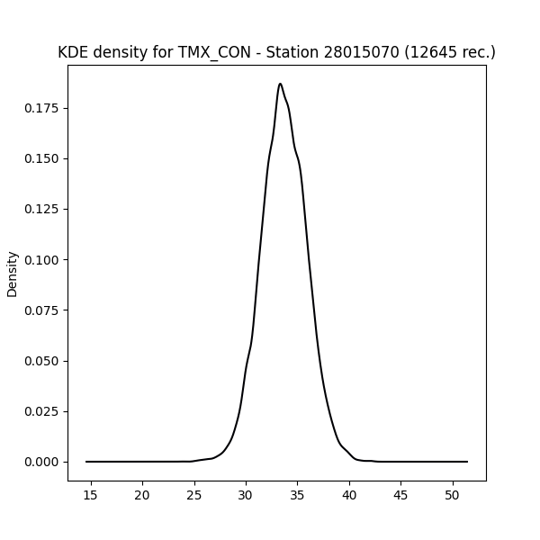

**TMX_CON - Station: AEROPUERTO LAS FLORES [25025090] (8486 rec.)** Location over [Google Maps](http://maps.google.com/maps?q=9.046333333,-73.97083333) or [Openstreet Map](https://www.openstreetmap.org/query?lat=9.046333333&lon=-73.97083333)

Station first record

| Fecha               |   CodigoEstacion | NombreEstacion                   |   Latitud |   Longitud |   Altitud | Categoria           | Entidad                                                     | AreaOperativa                               | Departamento   | Municipio   | FechaInstalacion    | FechaSuspension   | IdParametro   | Etiqueta   | DescripcionSerie          | Frecuencia   |   Valor |   Grado |   Calificador |   NivelAprobacion |
|:--------------------|-----------------:|:---------------------------------|----------:|-----------:|----------:|:--------------------|:------------------------------------------------------------|:--------------------------------------------|:---------------|:------------|:--------------------|:------------------|:--------------|:-----------|:--------------------------|:-------------|--------:|--------:|--------------:|------------------:|
| 1980-01-01 00:00:00 |         25025090 | AEROPUERTO LAS FLORES [25025090] |   9.04633 |   -73.9708 |        34 | Climática Principal | INSTITUTO DE HIDROLOGIA METEOROLOGIA Y ESTUDIOS AMBIENTALES | Area Operativa 05 - Magdalena-Cesar-Guajira | Magdalena      | El Banco    | 1952-02-15 00:00:00 | NaT               | TEMPERATURA   | TMX_CON    | Temperatura máxima diaria | Diaria       |    33.6 |      50 |           nan |              1200 |

Statistics table

|       |     Valor |
|:------|----------:|
| count | 8486      |
| mean  |   33.5555 |
| std   |    1.8415 |
| min   |   26.4    |
| 25%   |   32.4    |
| 50%   |   33.6    |
| 75%   |   34.8    |
| max   |   40      |

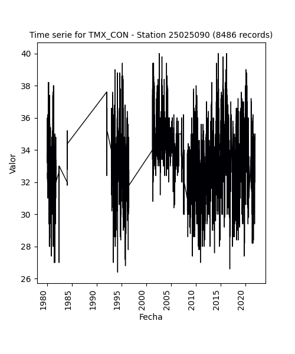
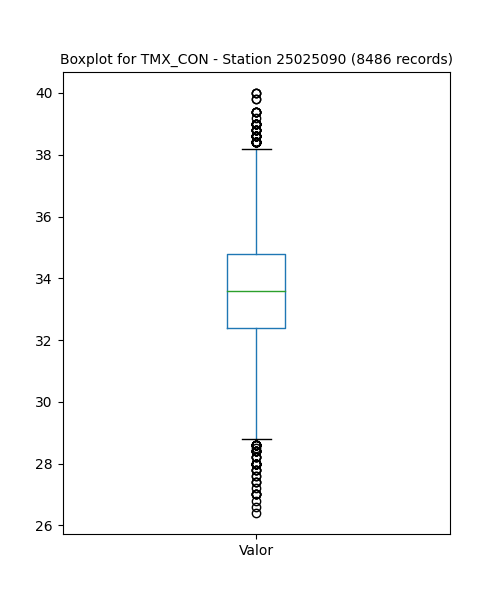

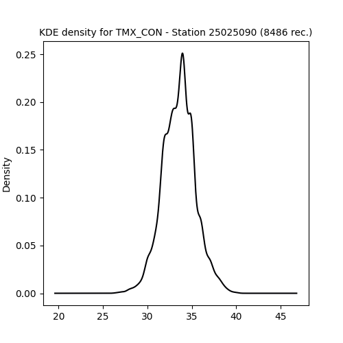

**TMX_CON - Station: LOS ALAMOS - AUT [25025002] (7701 rec.)** Location over [Google Maps](http://maps.google.com/maps?q=9.304055556,-74.27363889) or [Openstreet Map](https://www.openstreetmap.org/query?lat=9.304055556&lon=-74.27363889)

Station first record

| Fecha               |   CodigoEstacion | NombreEstacion              |   Latitud |   Longitud |   Altitud | Categoria           | Entidad                                                     | AreaOperativa                               | Departamento   | Municipio                   | FechaInstalacion    | FechaSuspension   | IdParametro   | Etiqueta   | DescripcionSerie          | Frecuencia   |   Valor |   Grado |   Calificador |   NivelAprobacion |
|:--------------------|-----------------:|:----------------------------|----------:|-----------:|----------:|:--------------------|:------------------------------------------------------------|:--------------------------------------------|:---------------|:----------------------------|:--------------------|:------------------|:--------------|:-----------|:--------------------------|:-------------|--------:|--------:|--------------:|------------------:|
| 1985-01-06 00:00:00 |         25025002 | LOS ALAMOS - AUT [25025002] |   9.30406 |   -74.2736 |        25 | Climática Principal | INSTITUTO DE HIDROLOGIA METEOROLOGIA Y ESTUDIOS AMBIENTALES | Area Operativa 05 - Magdalena-Cesar-Guajira | Magdalena      | San Sebastián De Buenavista | 2013-05-05 00:00:00 | NaT               | TEMPERATURA   | TMX_CON    | Temperatura máxima diaria | Diaria       |    32.4 |      50 |           nan |              1200 |

Statistics table

|       |      Valor |
|:------|-----------:|
| count | 7701       |
| mean  |   34.3217  |
| std   |    2.06657 |
| min   |   23       |
| 25%   |   33       |
| 50%   |   34.2     |
| 75%   |   35.6     |
| max   |   44       |

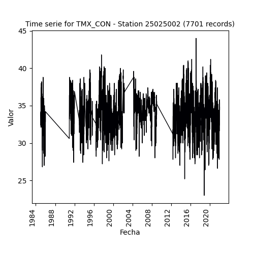
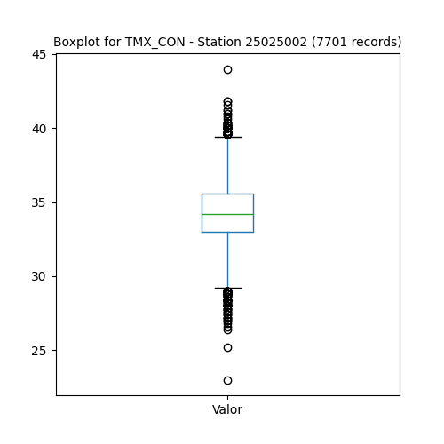
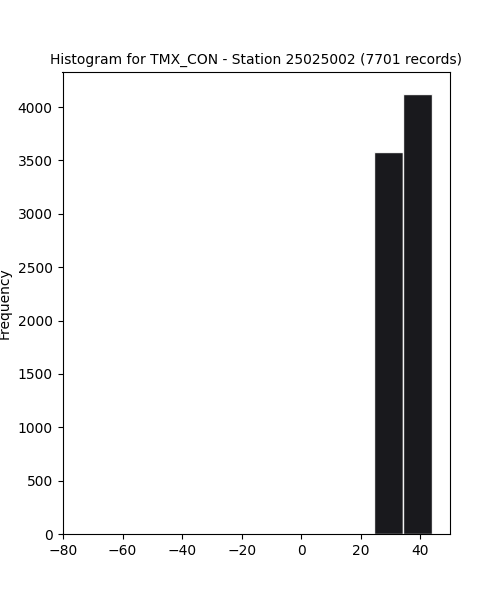
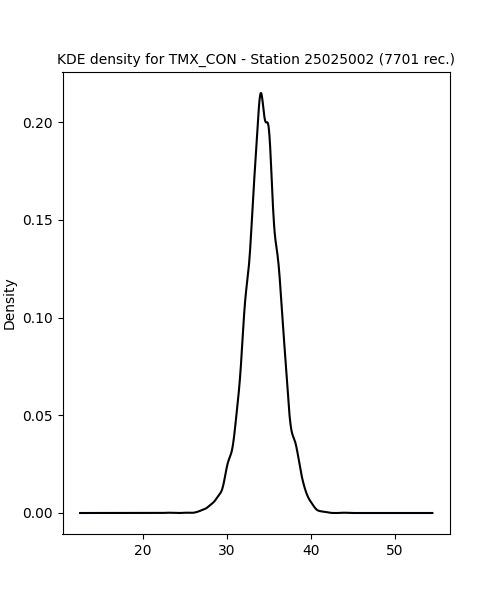

**TMX_CON - Station: PADELMA [29065020] (9406 rec.)** Location over [Google Maps](http://maps.google.com/maps?q=10.72111111,-74.19972222) or [Openstreet Map](https://www.openstreetmap.org/query?lat=10.72111111&lon=-74.19972222)

Station first record

| Fecha               |   CodigoEstacion | NombreEstacion     |   Latitud |   Longitud |   Altitud | Categoria           | Entidad                                                     | AreaOperativa                               | Departamento   | Municipio     | FechaInstalacion    | FechaSuspension   | IdParametro   | Etiqueta   | DescripcionSerie          | Frecuencia   |   Valor |   Grado |   Calificador |   NivelAprobacion |
|:--------------------|-----------------:|:-------------------|----------:|-----------:|----------:|:--------------------|:------------------------------------------------------------|:--------------------------------------------|:---------------|:--------------|:--------------------|:------------------|:--------------|:-----------|:--------------------------|:-------------|--------:|--------:|--------------:|------------------:|
| 1980-03-01 00:00:00 |         29065020 | PADELMA [29065020] |   10.7211 |   -74.1997 |        20 | Climática Ordinaria | INSTITUTO DE HIDROLOGIA METEOROLOGIA Y ESTUDIOS AMBIENTALES | Area Operativa 05 - Magdalena-Cesar-Guajira | Magdalena      | Zona Bananera | 1967-08-15 00:00:00 | NaT               | TEMPERATURA   | TMX_CON    | Temperatura máxima diaria | Diaria       |    33.2 |      50 |           nan |              1200 |

Statistics table

|       |      Valor |
|:------|-----------:|
| count | 9406       |
| mean  |   34.1372  |
| std   |    1.63127 |
| min   |   26       |
| 25%   |   33       |
| 50%   |   34.2     |
| 75%   |   35.2     |
| max   |   39.8     |

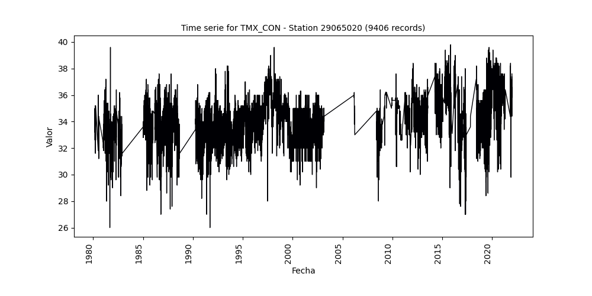
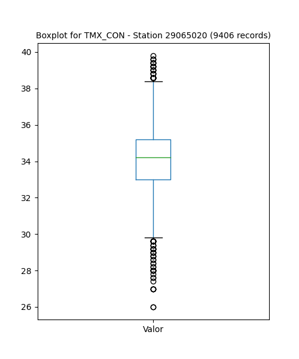
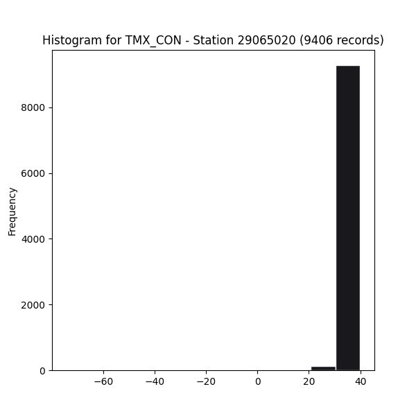
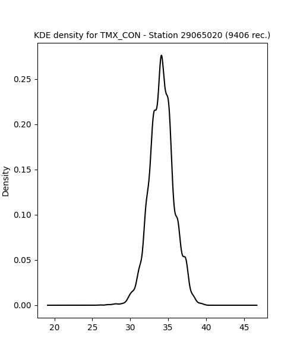

**TMX_CON - Station: PRADO SEVILLA [29065030] (10537 rec.)** Location over [Google Maps](http://maps.google.com/maps?q=10.76416667,-74.15472222) or [Openstreet Map](https://www.openstreetmap.org/query?lat=10.76416667&lon=-74.15472222)

Station first record

| Fecha               |   CodigoEstacion | NombreEstacion           |   Latitud |   Longitud |   Altitud | Categoria           | Entidad                                                     | AreaOperativa                               | Departamento   | Municipio     | FechaInstalacion    | FechaSuspension     | IdParametro   | Etiqueta   | DescripcionSerie          | Frecuencia   |   Valor |   Grado |   Calificador |   NivelAprobacion |
|:--------------------|-----------------:|:-------------------------|----------:|-----------:|----------:|:--------------------|:------------------------------------------------------------|:--------------------------------------------|:---------------|:--------------|:--------------------|:--------------------|:--------------|:-----------|:--------------------------|:-------------|--------:|--------:|--------------:|------------------:|
| 1980-01-01 00:00:00 |         29065030 | PRADO SEVILLA [29065030] |   10.7642 |   -74.1547 |        18 | Climática Ordinaria | INSTITUTO DE HIDROLOGIA METEOROLOGIA Y ESTUDIOS AMBIENTALES | Area Operativa 05 - Magdalena-Cesar-Guajira | Magdalena      | Zona Bananera | 1970-07-15 00:00:00 | 2019-02-07 11:32:00 | TEMPERATURA   | TMX_CON    | Temperatura máxima diaria | Diaria       |    33.2 |      50 |           nan |              1200 |

Statistics table

|       |      Valor |
|:------|-----------:|
| count | 10537      |
| mean  |    33.3129 |
| std   |     1.4911 |
| min   |    24.8    |
| 25%   |    32.4    |
| 50%   |    33.4    |
| 75%   |    34.2    |
| max   |    38.6    |

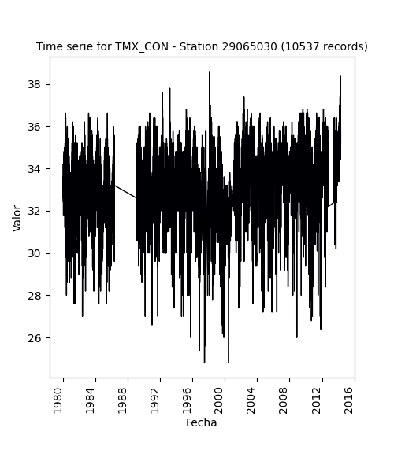
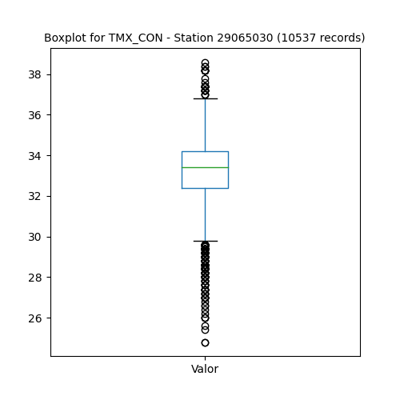
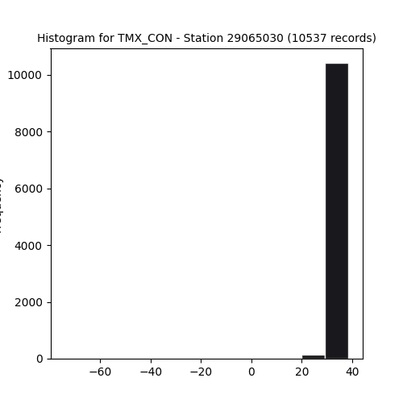
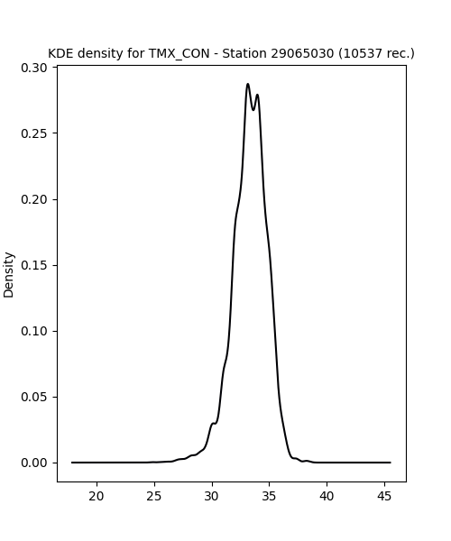

**TMX_CON - Station: SEIS EL [25025300] (10066 rec.)** Location over [Google Maps](http://maps.google.com/maps?q=9.683666667,-74.32227778) or [Openstreet Map](https://www.openstreetmap.org/query?lat=9.683666667&lon=-74.32227778)

Station first record

| Fecha               |   CodigoEstacion | NombreEstacion     |   Latitud |   Longitud |   Altitud | Categoria           | Entidad                                                     | AreaOperativa                               | Departamento   | Municipio                   | FechaInstalacion    | FechaSuspension   | IdParametro   | Etiqueta   | DescripcionSerie          | Frecuencia   |   Valor |   Grado |   Calificador |   NivelAprobacion |
|:--------------------|-----------------:|:-------------------|----------:|-----------:|----------:|:--------------------|:------------------------------------------------------------|:--------------------------------------------|:---------------|:----------------------------|:--------------------|:------------------|:--------------|:-----------|:--------------------------|:-------------|--------:|--------:|--------------:|------------------:|
| 1985-05-01 00:00:00 |         25025300 | SEIS EL [25025300] |   9.68367 |   -74.3223 |        50 | Climática Ordinaria | INSTITUTO DE HIDROLOGIA METEOROLOGIA Y ESTUDIOS AMBIENTALES | Area Operativa 05 - Magdalena-Cesar-Guajira | Magdalena      | San Sebastián De Buenavista | 1984-11-15 00:00:00 | NaT               | TEMPERATURA   | TMX_CON    | Temperatura máxima diaria | Diaria       |    35.2 |      50 |           nan |              1200 |

Statistics table

|       |      Valor |
|:------|-----------:|
| count | 10066      |
| mean  |    34.5617 |
| std   |     2.3698 |
| min   |    25.2    |
| 25%   |    32.8    |
| 50%   |    34.6    |
| 75%   |    36.2    |
| max   |    41.8    |

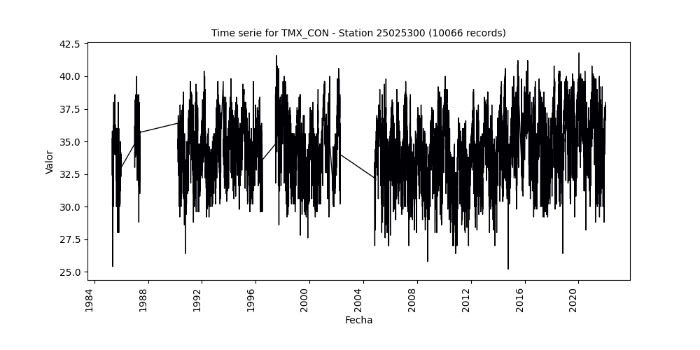
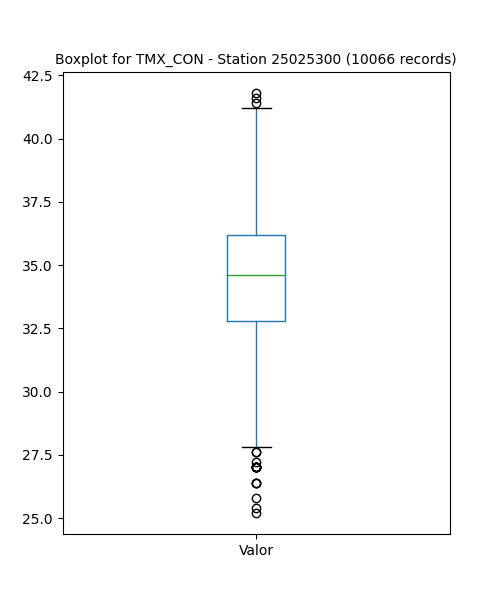
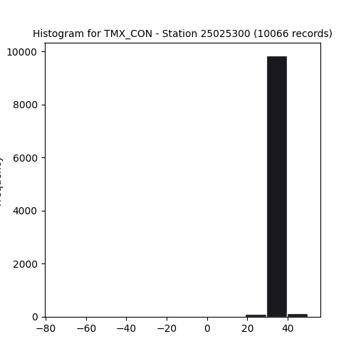
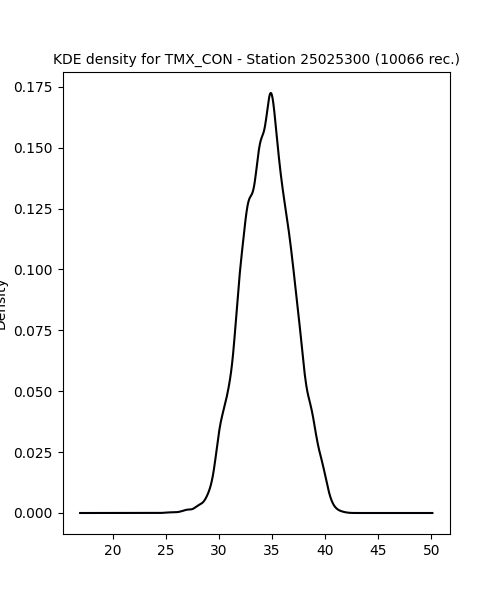

**TMX_CON - Station: YE LA [15015020] (8859 rec.)** Location over [Google Maps](http://maps.google.com/maps?q=10.99241667,-74.21113889) or [Openstreet Map](https://www.openstreetmap.org/query?lat=10.99241667&lon=-74.21113889)

Station first record

| Fecha               |   CodigoEstacion | NombreEstacion   |   Latitud |   Longitud |   Altitud | Categoria           | Entidad                                                     | AreaOperativa                               | Departamento   | Municipio   | FechaInstalacion    | FechaSuspension     | IdParametro   | Etiqueta   | DescripcionSerie          | Frecuencia   |   Valor |   Grado |   Calificador |   NivelAprobacion |
|:--------------------|-----------------:|:-----------------|----------:|-----------:|----------:|:--------------------|:------------------------------------------------------------|:--------------------------------------------|:---------------|:------------|:--------------------|:--------------------|:--------------|:-----------|:--------------------------|:-------------|--------:|--------:|--------------:|------------------:|
| 1980-01-01 00:00:00 |         15015020 | YE LA [15015020] |   10.9924 |   -74.2111 |        20 | Climática Ordinaria | INSTITUTO DE HIDROLOGIA METEOROLOGIA Y ESTUDIOS AMBIENTALES | Area Operativa 05 - Magdalena-Cesar-Guajira | Magdalena      | Ciénaga     | 1967-07-15 00:00:00 | 2019-02-07 11:34:00 | TEMPERATURA   | TMX_CON    | Temperatura máxima diaria | Diaria       |    32.2 |      50 |           nan |              1200 |

Statistics table

|       |      Valor |
|:------|-----------:|
| count | 8859       |
| mean  |   33.0729  |
| std   |    1.48932 |
| min   |   25.4     |
| 25%   |   32.2     |
| 50%   |   33.2     |
| 75%   |   34.2     |
| max   |   38.4     |

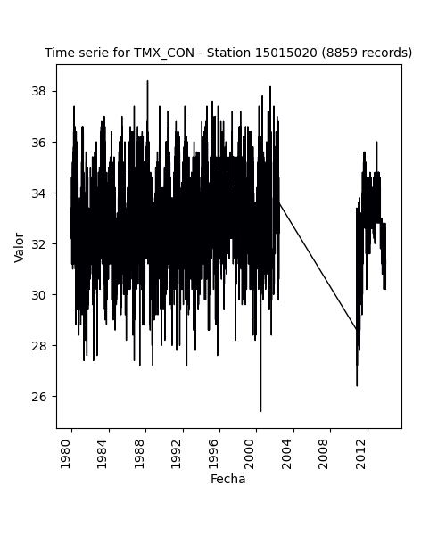
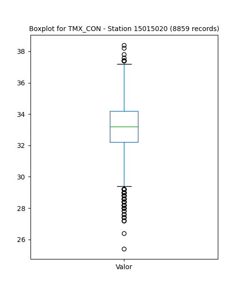
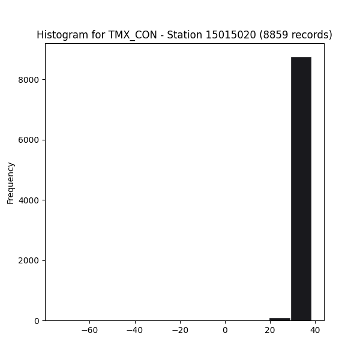
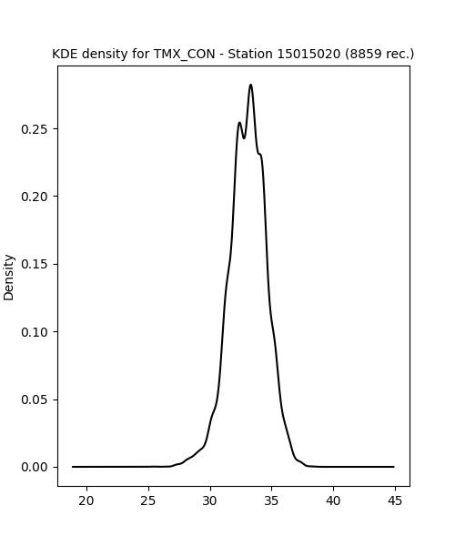

**TMX_CON - Station: ZACAPA [29065010] (893 rec.)** Location over [Google Maps](http://maps.google.com/maps?q=10.58333333,-74.25) or [Openstreet Map](https://www.openstreetmap.org/query?lat=10.58333333&lon=-74.25)

Station first record

| Fecha               |   CodigoEstacion | NombreEstacion    |   Latitud |   Longitud |   Altitud | Categoria           | Entidad                                                     | AreaOperativa                               | Departamento   | Municipio   | FechaInstalacion    | FechaSuspension     | IdParametro   | Etiqueta   | DescripcionSerie          | Frecuencia   |   Valor |   Grado |   Calificador |   NivelAprobacion |
|:--------------------|-----------------:|:------------------|----------:|-----------:|----------:|:--------------------|:------------------------------------------------------------|:--------------------------------------------|:---------------|:------------|:--------------------|:--------------------|:--------------|:-----------|:--------------------------|:-------------|--------:|--------:|--------------:|------------------:|
| 1981-01-01 00:00:00 |         29065010 | ZACAPA [29065010] |   10.5833 |     -74.25 |        30 | Climática Ordinaria | INSTITUTO DE HIDROLOGIA METEOROLOGIA Y ESTUDIOS AMBIENTALES | Area Operativa 05 - Magdalena-Cesar-Guajira | Magdalena      | El Retén    | 1967-07-15 00:00:00 | 1990-04-15 00:00:00 | TEMPERATURA   | TMX_CON    | Temperatura máxima diaria | Diaria       |    33.6 |      50 |           nan |              1200 |

Statistics table

|       |     Valor |
|:------|----------:|
| count | 893       |
| mean  |  33.5259  |
| std   |   1.58034 |
| min   |  29.4     |
| 25%   |  32.4     |
| 50%   |  33.6     |
| 75%   |  34.6     |
| max   |  37.2     |

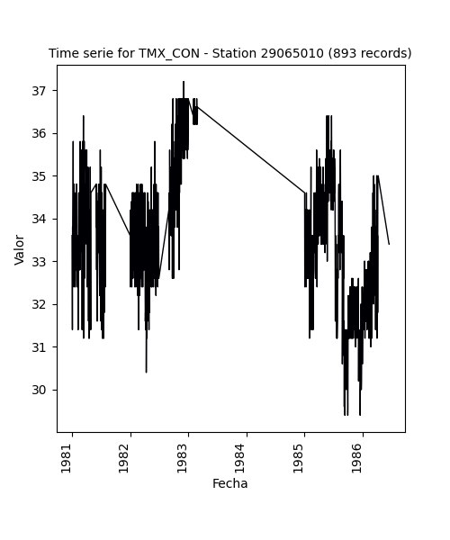
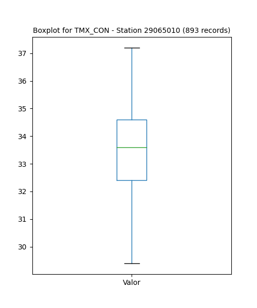

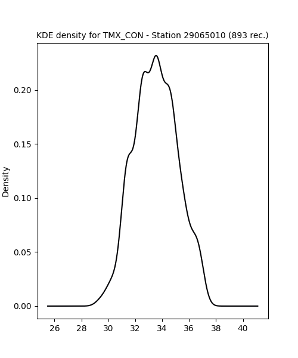

#### Correlation analysis matrix and statistics for TMX_CON

General statistics table
|       |   15015020 |   15065040 |    23215060 |   25025002 |   25025090 |   25025250 |   25025300 |   25025330 |   28015030 |   28015070 |   28025020 |   28025040 |   28025070 |   28025080 |   28025090 |   28025502 |   28035010 |   28035020 |   28035040 |   28035070 |   28045020 |   28045040 |   29065010 |   29065020 |   29065030 |
|:------|-----------:|-----------:|------------:|-----------:|-----------:|-----------:|-----------:|-----------:|-----------:|-----------:|-----------:|-----------:|-----------:|-----------:|-----------:|-----------:|-----------:|-----------:|-----------:|-----------:|-----------:|-----------:|-----------:|-----------:|-----------:|
| count |  25        | 24         | 22          |  25        |  25        | 24         |  25        |  21        |  23        |  25        |  25        |  24        |  25        |  24        |  25        |  25        |  25        |  24        |  25        |  14        | 22         |  21        |  22        |  25        |  24        |
| mean  |   0.485275 |  0.328672  |  0.605415   |   0.568628 |   0.567105 |  0.529372  |   0.576688 |   0.578698 |   0.596234 |   0.626491 |   0.649811 |   0.439414 |   0.666625 |   0.528159 |   0.630151 |   0.661114 |   0.598575 |   0.630268 |   0.549669 |   0.756098 |  0.669555  |   0.634467 |   0.249636 |   0.437393 |   0.517032 |
| std   |   0.13771  |  0.224878  |  0.211184   |   0.181782 |   0.171946 |  0.185211  |   0.16388  |   0.147815 |   0.204846 |   0.16585  |   0.139902 |   0.262899 |   0.160852 |   0.161417 |   0.156928 |   0.152307 |   0.188862 |   0.187328 |   0.148572 |   0.185839 |  0.193771  |   0.144236 |   0.269875 |   0.159717 |   0.139792 |
| min   |   0.245101 | -0.0929321 | -0.00969472 |   0.101968 |   0.254148 | -0.0109439 |   0.23458  |   0.293993 |   0.117764 |   0.160883 |   0.418946 |  -0.524476 |   0.312793 |   0.23976  |   0.320697 |   0.333377 |   0.206258 |   0.076478 |   0.243703 |   0.339464 | -0.0471268 |   0.369965 |  -0.524476 |   0.206779 |   0.286303 |
| 25%   |   0.430889 |  0.270886  |  0.531977   |   0.455897 |   0.445784 |  0.454269  |   0.451632 |   0.535392 |   0.502376 |   0.549697 |   0.549775 |   0.411246 |   0.560817 |   0.452645 |   0.541424 |   0.587696 |   0.465552 |   0.510453 |   0.488275 |   0.702695 |  0.648051  |   0.579404 |   0.206388 |   0.353432 |   0.444103 |
| 50%   |   0.473951 |  0.322289  |  0.629778   |   0.555606 |   0.590056 |  0.567249  |   0.621195 |   0.561975 |   0.625621 |   0.594328 |   0.665406 |   0.487886 |   0.704608 |   0.505731 |   0.635485 |   0.644854 |   0.613335 |   0.615785 |   0.575565 |   0.794133 |  0.689778  |   0.650279 |   0.270226 |   0.41148  |   0.52412  |
| 75%   |   0.513981 |  0.394696  |  0.721037   |   0.655904 |   0.683741 |  0.616164  |   0.665406 |   0.627858 |   0.702775 |   0.716959 |   0.717016 |   0.543031 |   0.758177 |   0.577765 |   0.70466  |   0.774513 |   0.706935 |   0.759754 |   0.611022 |   0.854801 |  0.756771  |   0.704608 |   0.330207 |   0.477814 |   0.550403 |
| max   |   1        |  1         |  1          |   1        |   1        |  1         |   1        |   1        |   1        |   1        |   1        |   1        |   1        |   1        |   1        |   1        |   1        |   1        |   1        |   1        |  1         |   1        |   1        |   1        |   1        |

Correlation matrix [Pivot_TMX_CON_Correlation.csv](Pivot_TMX_CON_Correlation.csv)
|          |   15015020 |     15065040 |     23215060 |   25025002 |   25025090 |    25025250 |   25025300 |   25025330 |   28015030 |   28015070 |   28025020 |   28025040 |   28025070 |   28025080 |   28025090 |   28025502 |   28035010 |   28035020 |   28035040 |   28035070 |    28045020 |   28045040 |    29065010 |   29065020 |   29065030 |
|---------:|-----------:|-------------:|-------------:|-----------:|-----------:|------------:|-----------:|-----------:|-----------:|-----------:|-----------:|-----------:|-----------:|-----------:|-----------:|-----------:|-----------:|-----------:|-----------:|-----------:|------------:|-----------:|------------:|-----------:|-----------:|
| 15015020 |   1        |   0.324393   |   0.619453   |   0.473951 |   0.449564 |   0.456341  |   0.429168 |   0.47931  |   0.508089 |   0.493737 |   0.490082 |   0.424957 |   0.513981 |   0.455771 |   0.515397 |   0.473638 |   0.359467 |   0.468019 |   0.430889 |   0.339464 |   0.669083  |   0.516251 |   0.245101  |   0.477814 |   0.517954 |
| 15065040 |   0.324393 |   1          |  -0.00969472 |   0.101968 |   0.320185 |   0.225079  |   0.23458  |   0.293993 |   0.38593  |   0.631524 |   0.420994 |   0.488812 |   0.359178 |   0.3008   |   0.338189 |   0.55503  |   0.292016 |   0.464048 |   0.301925 | nan        |  -0.0471268 |   0.369965 |  -0.0929321 |   0.282988 |   0.346285 |
| 23215060 |   0.619453 |  -0.00969472 |   1          |   0.820785 |   0.714515 |   0.613962  |   0.494542 | nan        |   0.522458 |   0.560533 |   0.680205 |   0.213702 |   0.723211 |   0.734229 |   0.77891  |   0.644854 |   0.465552 |   0.693042 |   0.639734 | nan        |   0.782275  | nan        |   0.401186  |   0.605852 |   0.619823 |
| 25025002 |   0.473951 |   0.101968   |   0.820785   |   1        |   0.772943 |   0.455897  |   0.655904 |   0.561281 |   0.547988 |   0.534387 |   0.597185 |   0.454802 |   0.68153  |   0.443267 |   0.539378 |   0.590122 |   0.555606 |   0.607958 |   0.496125 |   0.796837 |   0.746532  |   0.650279 |   0.366219  |   0.353432 |   0.411316 |
| 25025090 |   0.449564 |   0.320185   |   0.714515   |   0.772943 |   1        |   0.428247  |   0.695888 |   0.569544 |   0.63262  |   0.557567 |   0.611875 |   0.454186 |   0.683741 |   0.389673 |   0.574637 |   0.594603 |   0.620089 |   0.590056 |   0.385496 |   0.733733 |   0.759792  |   0.626527 |   0.254148  |   0.312204 |   0.445784 |
| 25025250 |   0.456341 |   0.225079   |   0.613962   |   0.455897 |   0.428247 |   1         |   0.577092 |   0.595744 |   0.412744 |   0.516531 |   0.62277  |   0.461858 |   0.661211 |   0.565683 |   0.650943 |   0.589407 |   0.568815 |   0.6026   |   0.563419 | nan        |   0.634171  |   0.703074 |  -0.0109439 |   0.360899 |   0.449384 |
| 25025300 |   0.429168 |   0.23458    |   0.494542   |   0.655904 |   0.695888 |   0.577092  |   1        |   0.636562 |   0.496663 |   0.621195 |   0.665406 |   0.451632 |   0.745769 |   0.416081 |   0.635485 |   0.662272 |   0.672793 |   0.623611 |   0.55413  |   0.76115  |   0.676762  |   0.608418 |   0.287401  |   0.389179 |   0.425525 |
| 25025330 |   0.47931  |   0.293993   | nan          |   0.561281 |   0.569544 |   0.595744  |   0.636562 |   1        | nan        |   0.555184 |   0.593308 |   0.552061 |   0.627858 |   0.507866 |   0.537332 |   0.587696 |   0.651109 |   0.561975 |   0.535392 |   0.83193  | nan         |   0.684107 | nan         |   0.351341 |   0.439061 |
| 28015030 |   0.508089 |   0.38593    |   0.522458   |   0.547988 |   0.63262  |   0.412744  |   0.496663 | nan        |   1        |   0.83218  |   0.68243  |   0.117764 |   0.72312  |   0.653093 |   0.647379 |   0.850696 |   0.440278 |   0.851111 |   0.611022 | nan        |   0.641075  |   0.778416 |   0.211331  |   0.541376 |   0.625621 |
| 28015070 |   0.493737 |   0.631524   |   0.560533   |   0.534387 |   0.557567 |   0.516531  |   0.621195 |   0.555184 |   0.83218  |   1        |   0.749781 |   0.554571 |   0.716959 |   0.465886 |   0.635259 |   0.878037 |   0.706935 |   0.802682 |   0.58482  |   0.791429 |   0.66898   |   0.594328 |   0.160883  |   0.499189 |   0.549697 |
| 28025020 |   0.490082 |   0.420994   |   0.680205   |   0.597185 |   0.611875 |   0.62277   |   0.665406 |   0.593308 |   0.68243  |   0.749781 |   1        |   0.547851 |   0.797722 |   0.548304 |   0.701971 |   0.827537 |   0.717016 |   0.766432 |   0.598125 |   0.840007 |   0.678975  |   0.706952 |   0.418946  |   0.431613 |   0.549775 |
| 28025040 |   0.424957 |   0.488812   |   0.213702   |   0.454802 |   0.454186 |   0.461858  |   0.451632 |   0.552061 |   0.117764 |   0.554571 |   0.547851 |   1        |   0.512977 |   0.48696  |   0.541424 |   0.698418 |   0.527424 |   0.493359 |   0.348572 | nan        |   0.489639  |   0.579404 |  -0.524476  |   0.299926 |   0.370113 |
| 28025070 |   0.513981 |   0.359178   |   0.723211   |   0.68153  |   0.683741 |   0.661211  |   0.745769 |   0.627858 |   0.72312  |   0.716959 |   0.797722 |   0.512977 |   1        |   0.560817 |   0.749226 |   0.791514 |   0.776209 |   0.758177 |   0.643601 |   0.859733 |   0.826642  |   0.704608 |   0.312793  |   0.394699 |   0.54034  |
| 28025080 |   0.455771 |   0.3008     |   0.734229   |   0.443267 |   0.389673 |   0.565683  |   0.416081 |   0.507866 |   0.653093 |   0.465886 |   0.548304 |   0.48696  |   0.560817 |   1        |   0.584364 |   0.500185 |   0.461859 |   0.503596 |   0.575565 | nan        |   0.747707  |   0.687663 |   0.314162  |   0.23976  |   0.532528 |
| 28025090 |   0.515397 |   0.338189   |   0.77891    |   0.539378 |   0.574637 |   0.650943  |   0.635485 |   0.537332 |   0.647379 |   0.635259 |   0.701971 |   0.541424 |   0.749226 |   0.584364 |   1        |   0.70466  |   0.676205 |   0.653788 |   0.576324 |   0.874623 |   0.808821  |   0.770127 |   0.320697  |   0.386343 |   0.552288 |
| 28025502 |   0.473638 |   0.55503    |   0.644854   |   0.590122 |   0.594603 |   0.589407  |   0.662272 |   0.587696 |   0.850696 |   0.878037 |   0.827537 |   0.698418 |   0.791514 |   0.500185 |   0.70466  |   1        |   0.774513 |   0.861855 |   0.619776 |   0.606036 |   0.699402  |   0.667457 |   0.333377  |   0.459009 |   0.557744 |
| 28035010 |   0.359467 |   0.292016   |   0.465552   |   0.555606 |   0.620089 |   0.568815  |   0.672793 |   0.651109 |   0.440278 |   0.706935 |   0.717016 |   0.527424 |   0.776209 |   0.461859 |   0.676205 |   0.774513 |   1        |   0.713312 |   0.610819 |   1        |   0.613335  |   0.620132 |   0.206258  |   0.404157 |   0.530467 |
| 28035020 |   0.468019 |   0.464048   |   0.693042   |   0.607958 |   0.590056 |   0.6026    |   0.623611 |   0.561975 |   0.851111 |   0.802682 |   0.766432 |   0.493359 |   0.758177 |   0.503596 |   0.653788 |   0.861855 |   0.713312 |   1        |   0.579637 | nan        |   0.764482  |   0.74862  |   0.076478  |   0.428847 |   0.512738 |
| 28035040 |   0.430889 |   0.301925   |   0.639734   |   0.496125 |   0.385496 |   0.563419  |   0.55413  |   0.535392 |   0.611022 |   0.58482  |   0.598125 |   0.348572 |   0.643601 |   0.575565 |   0.576324 |   0.619776 |   0.610819 |   0.579637 |   1        |   0.692349 |   0.681961  |   0.449777 |   0.243703  |   0.488275 |   0.530286 |
| 28035070 |   0.339464 | nan          | nan          |   0.796837 |   0.733733 | nan         |   0.76115  |   0.83193  | nan        |   0.791429 |   0.840007 | nan        |   0.859733 | nan        |   0.874623 |   0.606036 |   1        | nan        |   0.692349 |   1        | nan         | nan        | nan         |   0.458083 | nan        |
| 28045020 |   0.669083 |  -0.0471268  |   0.782275   |   0.746532 |   0.759792 |   0.634171  |   0.676762 | nan        |   0.641075 |   0.66898  |   0.678975 |   0.489639 |   0.826642 |   0.747707 |   0.808821 |   0.699402 |   0.613335 |   0.764482 |   0.681961 | nan        |   1         | nan        |   0.474575  |   0.697595 |   0.715535 |
| 28045040 |   0.516251 |   0.369965   | nan          |   0.650279 |   0.626527 |   0.703074  |   0.608418 |   0.684107 |   0.778416 |   0.594328 |   0.706952 |   0.579404 |   0.704608 |   0.687663 |   0.770127 |   0.667457 |   0.620132 |   0.74862  |   0.449777 | nan        | nan         |   1        | nan         |   0.41148  |   0.446218 |
| 29065010 |   0.245101 |  -0.0929321  |   0.401186   |   0.366219 |   0.254148 |  -0.0109439 |   0.287401 | nan        |   0.211331 |   0.160883 |   0.418946 |  -0.524476 |   0.312793 |   0.314162 |   0.320697 |   0.333377 |   0.206258 |   0.076478 |   0.243703 | nan        |   0.474575  | nan        |   1         |   0.206779 |   0.286303 |
| 29065020 |   0.477814 |   0.282988   |   0.605852   |   0.353432 |   0.312204 |   0.360899  |   0.389179 |   0.351341 |   0.541376 |   0.499189 |   0.431613 |   0.299926 |   0.394699 |   0.23976  |   0.386343 |   0.459009 |   0.404157 |   0.428847 |   0.488275 |   0.458083 |   0.697595  |   0.41148  |   0.206779  |   1        |   0.453993 |
| 29065030 |   0.517954 |   0.346285   |   0.619823   |   0.411316 |   0.445784 |   0.449384  |   0.425525 |   0.439061 |   0.625621 |   0.549697 |   0.549775 |   0.370113 |   0.54034  |   0.532528 |   0.552288 |   0.557744 |   0.530467 |   0.512738 |   0.530286 | nan        |   0.715535  |   0.446218 |   0.286303  |   0.453993 |   1        |

Correlation statistics table
|       |   15015020 |   15065040 |    23215060 |   25025002 |   25025090 |   25025250 |   25025300 |   25025330 |   28015030 |   28015070 |   28025020 |   28025040 |   28025070 |   28025080 |   28025090 |   28025502 |   28035010 |   28035020 |   28035040 |   28035070 |   28045020 |   28045040 |   29065010 |   29065020 |   29065030 |
|:------|-----------:|-----------:|------------:|-----------:|-----------:|-----------:|-----------:|-----------:|-----------:|-----------:|-----------:|-----------:|-----------:|-----------:|-----------:|-----------:|-----------:|-----------:|-----------:|-----------:|-----------:|-----------:|-----------:|-----------:|-----------:|
| count |  25        | 24         | 22          |  25        |  25        | 24         |  25        |  21        |  23        |  25        |  25        |  24        |  25        |  24        |  25        |  25        |  25        |  24        |  25        |  14        | 22         |  21        |  22        |  25        |  24        |
| mean  |   0.485275 |  0.328672  |  0.605415   |   0.568628 |   0.567105 |  0.529372  |   0.576688 |   0.578698 |   0.596234 |   0.626491 |   0.649811 |   0.439414 |   0.666625 |   0.528159 |   0.630151 |   0.661114 |   0.598575 |   0.630268 |   0.549669 |   0.756098 |  0.669555  |   0.634467 |   0.249636 |   0.437393 |   0.517032 |
| std   |   0.13771  |  0.224878  |  0.211184   |   0.181782 |   0.171946 |  0.185211  |   0.16388  |   0.147815 |   0.204846 |   0.16585  |   0.139902 |   0.262899 |   0.160852 |   0.161417 |   0.156928 |   0.152307 |   0.188862 |   0.187328 |   0.148572 |   0.185839 |  0.193771  |   0.144236 |   0.269875 |   0.159717 |   0.139792 |
| min   |   0.245101 | -0.0929321 | -0.00969472 |   0.101968 |   0.254148 | -0.0109439 |   0.23458  |   0.293993 |   0.117764 |   0.160883 |   0.418946 |  -0.524476 |   0.312793 |   0.23976  |   0.320697 |   0.333377 |   0.206258 |   0.076478 |   0.243703 |   0.339464 | -0.0471268 |   0.369965 |  -0.524476 |   0.206779 |   0.286303 |
| 25%   |   0.430889 |  0.270886  |  0.531977   |   0.455897 |   0.445784 |  0.454269  |   0.451632 |   0.535392 |   0.502376 |   0.549697 |   0.549775 |   0.411246 |   0.560817 |   0.452645 |   0.541424 |   0.587696 |   0.465552 |   0.510453 |   0.488275 |   0.702695 |  0.648051  |   0.579404 |   0.206388 |   0.353432 |   0.444103 |
| 50%   |   0.473951 |  0.322289  |  0.629778   |   0.555606 |   0.590056 |  0.567249  |   0.621195 |   0.561975 |   0.625621 |   0.594328 |   0.665406 |   0.487886 |   0.704608 |   0.505731 |   0.635485 |   0.644854 |   0.613335 |   0.615785 |   0.575565 |   0.794133 |  0.689778  |   0.650279 |   0.270226 |   0.41148  |   0.52412  |
| 75%   |   0.513981 |  0.394696  |  0.721037   |   0.655904 |   0.683741 |  0.616164  |   0.665406 |   0.627858 |   0.702775 |   0.716959 |   0.717016 |   0.543031 |   0.758177 |   0.577765 |   0.70466  |   0.774513 |   0.706935 |   0.759754 |   0.611022 |   0.854801 |  0.756771  |   0.704608 |   0.330207 |   0.477814 |   0.550403 |
| max   |   1        |  1         |  1          |   1        |   1        |  1         |   1        |   1        |   1        |   1        |   1        |   1        |   1        |   1        |   1        |   1        |   1        |   1        |   1        |   1        |  1         |   1        |   1        |   1        |   1        |

### Analysis from 1980 to 2021 for Etiqueta == "TMN_CON": 209823 (40.75%)

Pivot table: [Pivot_TMN_CON.csv](Pivot_TMN_CON.csv)
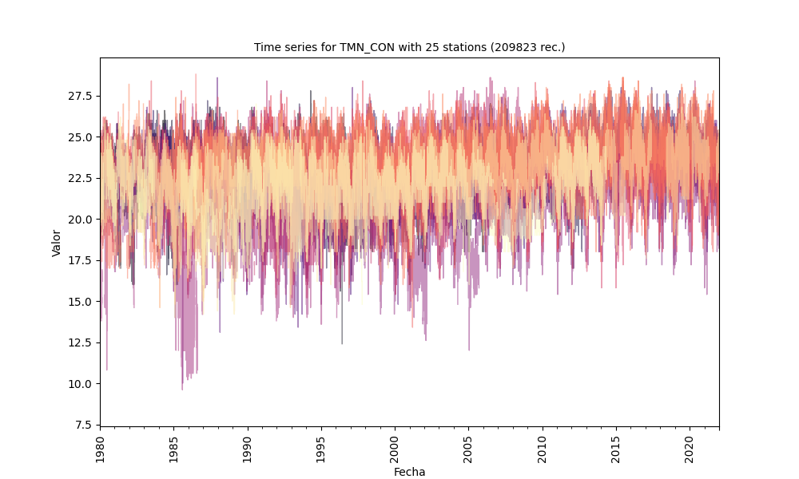
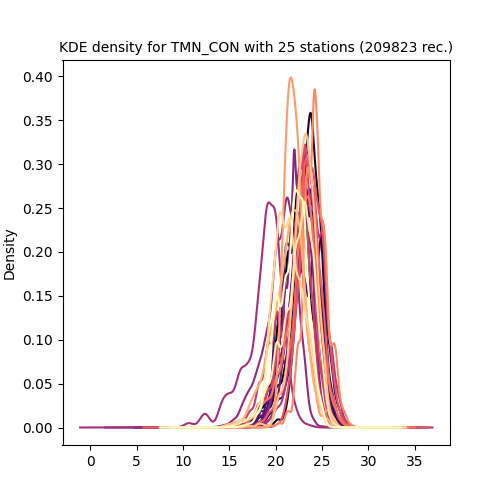

**TMN_CON - Station: AEROPUERTO ALFONSO LOPEZ - [28025502] (12238 rec.)** Location over [Google Maps](http://maps.google.com/maps?q=10.43616667,-73.24766667) or [Openstreet Map](https://www.openstreetmap.org/query?lat=10.43616667&lon=-73.24766667)

Station first record

| Fecha               |   CodigoEstacion | NombreEstacion                        |   Latitud |   Longitud |   Altitud | Categoria           | Entidad                                                     | AreaOperativa                               | Departamento   | Municipio   | FechaInstalacion    | FechaSuspension   | IdParametro   | Etiqueta   | DescripcionSerie          | Frecuencia   |   Valor |   Grado |   Calificador |   NivelAprobacion |
|:--------------------|-----------------:|:--------------------------------------|----------:|-----------:|----------:|:--------------------|:------------------------------------------------------------|:--------------------------------------------|:---------------|:------------|:--------------------|:------------------|:--------------|:-----------|:--------------------------|:-------------|--------:|--------:|--------------:|------------------:|
| 1980-01-02 00:00:00 |         28025502 | AEROPUERTO ALFONSO LOPEZ - [28025502] |   10.4362 |   -73.2477 |       138 | Sinóptica Principal | INSTITUTO DE HIDROLOGIA METEOROLOGIA Y ESTUDIOS AMBIENTALES | Area Operativa 05 - Magdalena-Cesar-Guajira | Cesar          | Valledupar  | 2016-01-07 00:00:00 | NaT               | TEMPERATURA   | TMN_CON    | Temperatura mínima diaria | Diaria       |      24 |      50 |           nan |              1200 |

Statistics table

|       |       Valor |
|:------|------------:|
| count | 12238       |
| mean  |    23.8861  |
| std   |     1.27915 |
| min   |    18.4     |
| 25%   |    23       |
| 50%   |    23.8     |
| 75%   |    24.8     |
| max   |    28.6     |

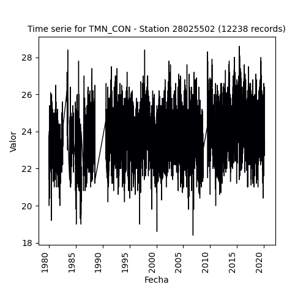
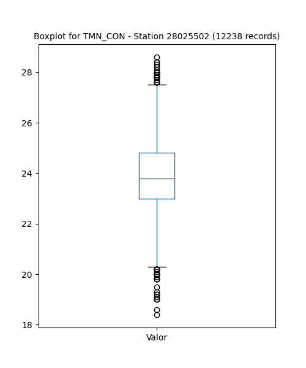
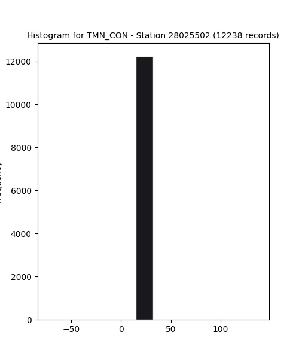
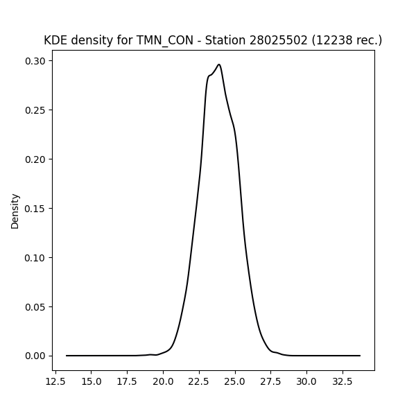

**TMN_CON - Station: CENTENARIO HACIENDA [28025090] (11867 rec.)** Location over [Google Maps](http://maps.google.com/maps?q=9.85025,-73.26547222) or [Openstreet Map](https://www.openstreetmap.org/query?lat=9.85025&lon=-73.26547222)

Station first record

| Fecha               |   CodigoEstacion | NombreEstacion                 |   Latitud |   Longitud |   Altitud | Categoria           | Entidad                                                     | AreaOperativa                               | Departamento   | Municipio       | FechaInstalacion    | FechaSuspension   | IdParametro   | Etiqueta   | DescripcionSerie          | Frecuencia   |   Valor |   Grado |   Calificador |   NivelAprobacion |
|:--------------------|-----------------:|:-------------------------------|----------:|-----------:|----------:|:--------------------|:------------------------------------------------------------|:--------------------------------------------|:---------------|:----------------|:--------------------|:------------------|:--------------|:-----------|:--------------------------|:-------------|--------:|--------:|--------------:|------------------:|
| 1981-01-03 00:00:00 |         28025090 | CENTENARIO HACIENDA [28025090] |   9.85025 |   -73.2655 |       100 | Climática Ordinaria | INSTITUTO DE HIDROLOGIA METEOROLOGIA Y ESTUDIOS AMBIENTALES | Area Operativa 05 - Magdalena-Cesar-Guajira | Cesar          | Agustín Codazzi | 1976-12-15 00:00:00 | NaT               | TEMPERATURA   | TMN_CON    | Temperatura mínima diaria | Diaria       |    22.2 |      50 |           nan |              1200 |

Statistics table

|       |       Valor |
|:------|------------:|
| count | 11867       |
| mean  |    22.4272  |
| std   |     1.67337 |
| min   |    15       |
| 25%   |    21.6     |
| 50%   |    22.8     |
| 75%   |    23.6     |
| max   |    27.4     |

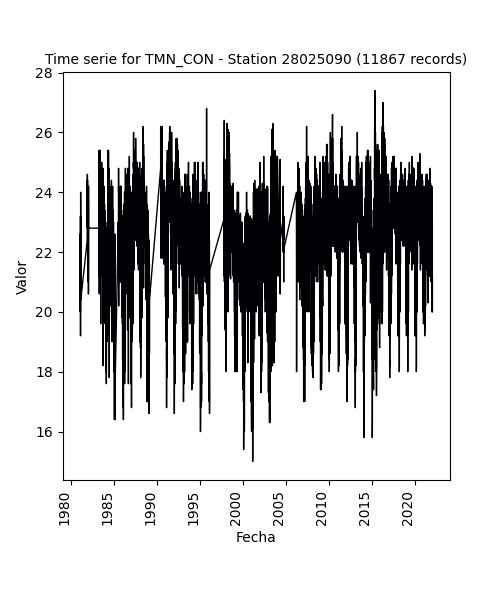
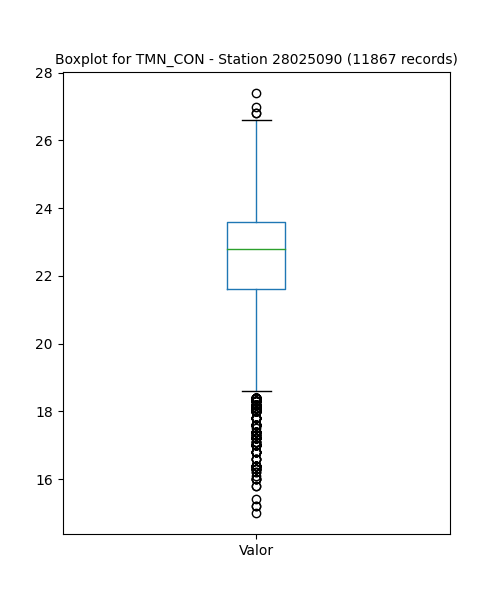
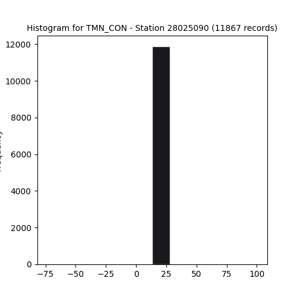
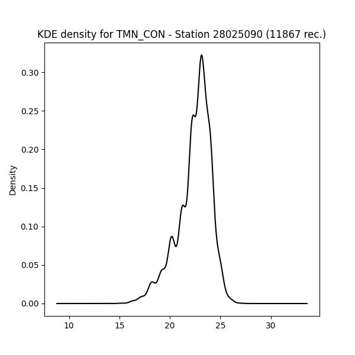

**TMN_CON - Station: CHIRIGUANA [25025250] (12340 rec.)** Location over [Google Maps](http://maps.google.com/maps?q=9.361027778,-73.59338889) or [Openstreet Map](https://www.openstreetmap.org/query?lat=9.361027778&lon=-73.59338889)

Station first record

| Fecha               |   CodigoEstacion | NombreEstacion        |   Latitud |   Longitud |   Altitud | Categoria           | Entidad                                                     | AreaOperativa                               | Departamento   | Municipio   | FechaInstalacion    | FechaSuspension   | IdParametro   | Etiqueta   | DescripcionSerie          | Frecuencia   |   Valor |   Grado |   Calificador |   NivelAprobacion |
|:--------------------|-----------------:|:----------------------|----------:|-----------:|----------:|:--------------------|:------------------------------------------------------------|:--------------------------------------------|:---------------|:------------|:--------------------|:------------------|:--------------|:-----------|:--------------------------|:-------------|--------:|--------:|--------------:|------------------:|
| 1981-04-01 00:00:00 |         25025250 | CHIRIGUANA [25025250] |   9.36103 |   -73.5934 |        40 | Climática Ordinaria | INSTITUTO DE HIDROLOGIA METEOROLOGIA Y ESTUDIOS AMBIENTALES | Area Operativa 05 - Magdalena-Cesar-Guajira | Cesar          | Chiriguaná  | 1973-06-15 00:00:00 | NaT               | TEMPERATURA   | TMN_CON    | Temperatura mínima diaria | Diaria       |    22.2 |      50 |           nan |              1200 |

Statistics table

|       |       Valor |
|:------|------------:|
| count | 12340       |
| mean  |    22.3963  |
| std   |     1.63717 |
| min   |    17       |
| 25%   |    21.2     |
| 50%   |    22.4     |
| 75%   |    23.8     |
| max   |    27.1     |

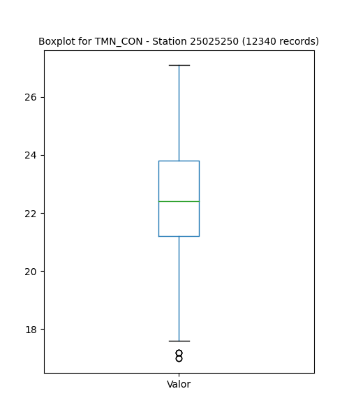
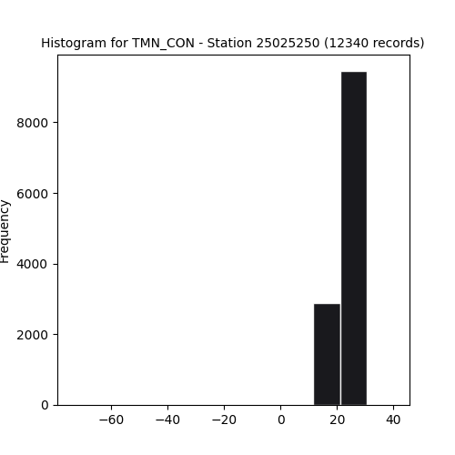
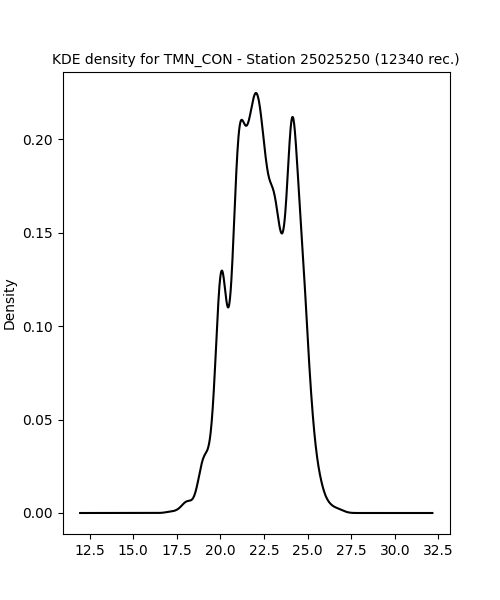

**TMN_CON - Station: CICOLAC [28015030] (1404 rec.)** Location over [Google Maps](http://maps.google.com/maps?q=10.48333333,-73.26666667) or [Openstreet Map](https://www.openstreetmap.org/query?lat=10.48333333&lon=-73.26666667)

Station first record

| Fecha               |   CodigoEstacion | NombreEstacion     |   Latitud |   Longitud |   Altitud | Categoria           | Entidad                                                     | AreaOperativa                               | Departamento   | Municipio   | FechaInstalacion    | FechaSuspension     | IdParametro   | Etiqueta   | DescripcionSerie          | Frecuencia   |   Valor |   Grado |   Calificador |   NivelAprobacion |
|:--------------------|-----------------:|:-------------------|----------:|-----------:|----------:|:--------------------|:------------------------------------------------------------|:--------------------------------------------|:---------------|:------------|:--------------------|:--------------------|:--------------|:-----------|:--------------------------|:-------------|--------:|--------:|--------------:|------------------:|
| 1980-01-02 00:00:00 |         28015030 | CICOLAC [28015030] |   10.4833 |   -73.2667 |       180 | Climática Principal | INSTITUTO DE HIDROLOGIA METEOROLOGIA Y ESTUDIOS AMBIENTALES | Area Operativa 05 - Magdalena-Cesar-Guajira | Cesar          | Valledupar  | 1964-01-15 00:00:00 | 1988-05-15 00:00:00 | TEMPERATURA   | TMN_CON    | Temperatura mínima diaria | Diaria       |    23.3 |      50 |           nan |              1200 |

Statistics table

|       |      Valor |
|:------|-----------:|
| count | 1404       |
| mean  |   22.9291  |
| std   |    1.32774 |
| min   |   10       |
| 25%   |   22.2     |
| 50%   |   23       |
| 75%   |   23.8     |
| max   |   26.8     |

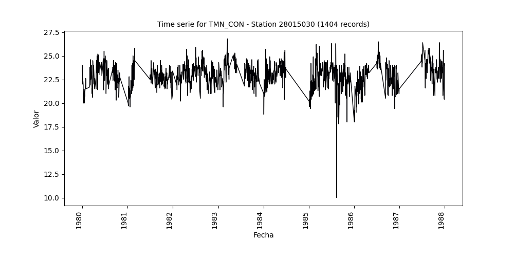
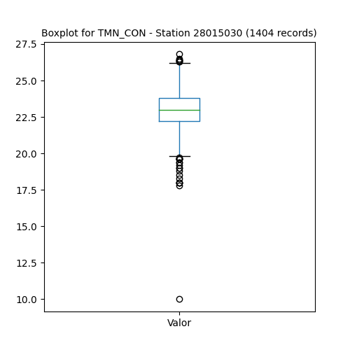
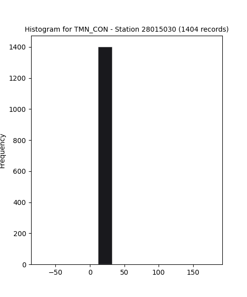
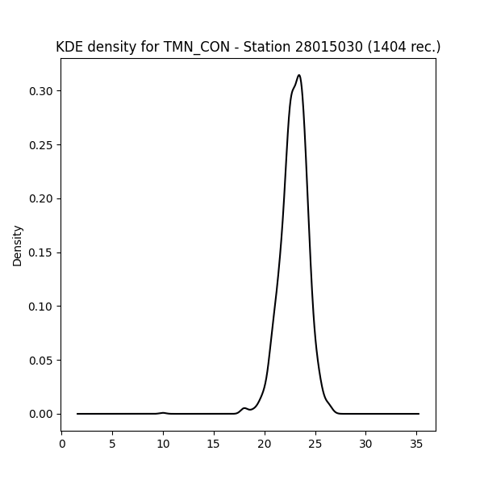

**TMN_CON - Station: COLEGIO AGROPECUARIO PAILITAS  - AUT [25025330] (9275 rec.)** Location over [Google Maps](http://maps.google.com/maps?q=8.954222222,-73.63008333) or [Openstreet Map](https://www.openstreetmap.org/query?lat=8.954222222&lon=-73.63008333)

Station first record

| Fecha               |   CodigoEstacion | NombreEstacion                                  |   Latitud |   Longitud |   Altitud | Categoria           | Entidad                                                     | AreaOperativa                               | Departamento   | Municipio   | FechaInstalacion    | FechaSuspension   | IdParametro   | Etiqueta   | DescripcionSerie          | Frecuencia   |   Valor |   Grado |   Calificador |   NivelAprobacion |
|:--------------------|-----------------:|:------------------------------------------------|----------:|-----------:|----------:|:--------------------|:------------------------------------------------------------|:--------------------------------------------|:---------------|:------------|:--------------------|:------------------|:--------------|:-----------|:--------------------------|:-------------|--------:|--------:|--------------:|------------------:|
| 1987-09-14 00:00:00 |         25025330 | COLEGIO AGROPECUARIO PAILITAS  - AUT [25025330] |   8.95422 |   -73.6301 |        50 | Climática Principal | INSTITUTO DE HIDROLOGIA METEOROLOGIA Y ESTUDIOS AMBIENTALES | Area Operativa 05 - Magdalena-Cesar-Guajira | Cesar          | Pailitas    | 1987-09-15 00:00:00 | NaT               | TEMPERATURA   | TMN_CON    | Temperatura mínima diaria | Diaria       |      23 |      50 |           nan |              1200 |

Statistics table

|       |     Valor |
|:------|----------:|
| count | 9275      |
| mean  |   22.7791 |
| std   |    1.6933 |
| min   |   13.1    |
| 25%   |   21.8    |
| 50%   |   23      |
| 75%   |   24      |
| max   |   28.6    |

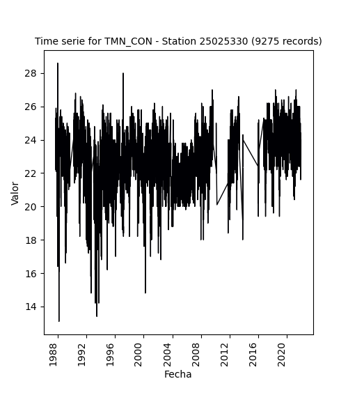
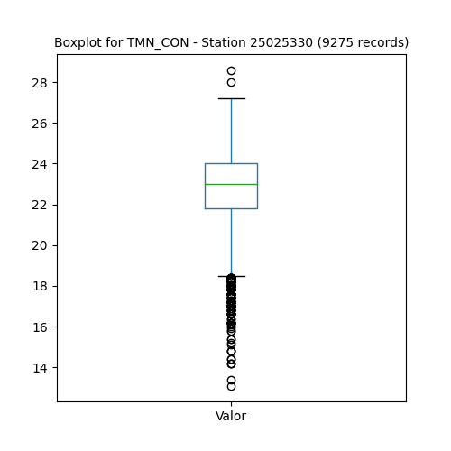
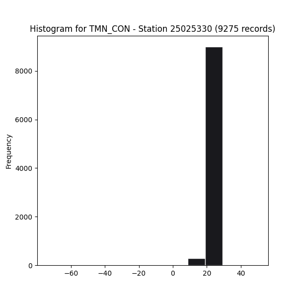
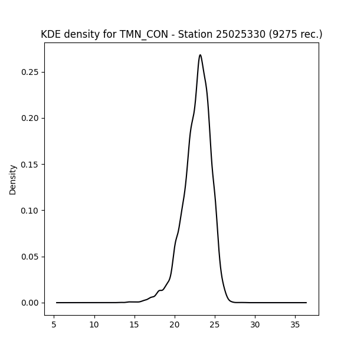

**TMN_CON - Station: LA GLORIA [23215060] (1248 rec.)** Location over [Google Maps](http://maps.google.com/maps?q=8.615277778,-73.800555556) or [Openstreet Map](https://www.openstreetmap.org/query?lat=8.615277778&lon=-73.800555556)

Station first record

| Fecha               |   CodigoEstacion | NombreEstacion       |   Latitud |   Longitud |   Altitud | Categoria           | Entidad                                                     | AreaOperativa                          | Departamento   | Municipio   | FechaInstalacion    | FechaSuspension     | IdParametro   | Etiqueta   | DescripcionSerie          | Frecuencia   |   Valor |   Grado |   Calificador |   NivelAprobacion |
|:--------------------|-----------------:|:---------------------|----------:|-----------:|----------:|:--------------------|:------------------------------------------------------------|:---------------------------------------|:---------------|:------------|:--------------------|:--------------------|:--------------|:-----------|:--------------------------|:-------------|--------:|--------:|--------------:|------------------:|
| 1983-10-27 00:00:00 |         23215060 | LA GLORIA [23215060] |   8.61528 |   -73.8006 |        35 | Climática Ordinaria | INSTITUTO DE HIDROLOGIA METEOROLOGIA Y ESTUDIOS AMBIENTALES | Area Operativa 08 - Santanderes-Arauca | Cesar          | La Gloria   | 1995-05-15 00:00:00 | 2018-06-19 10:35:00 | TEMPERATURA   | TMN_CON    | Temperatura mínima diaria | Diaria       |    20.2 |      50 |           nan |              1200 |

Statistics table

|       |      Valor |
|:------|-----------:|
| count | 1248       |
| mean  |   23.6837  |
| std   |    1.20744 |
| min   |   16.6     |
| 25%   |   23       |
| 50%   |   23.8     |
| 75%   |   24.6     |
| max   |   26.8     |

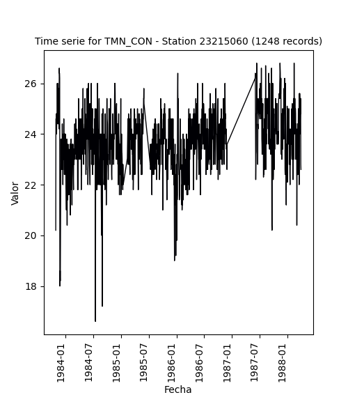
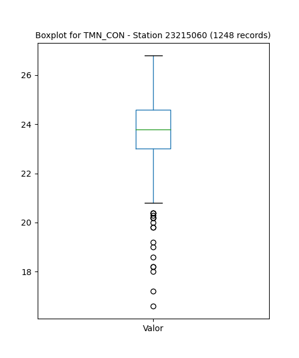
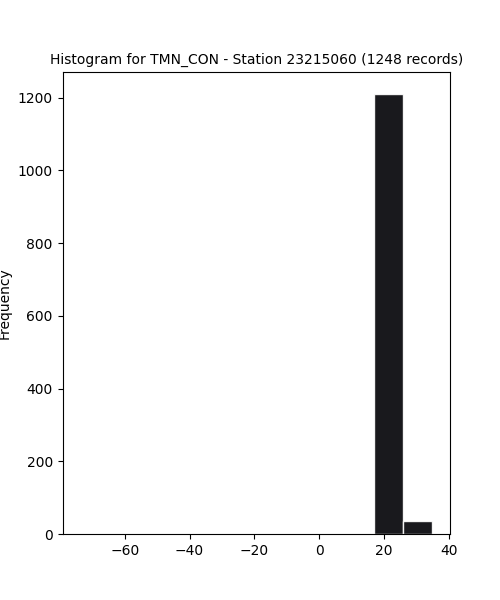
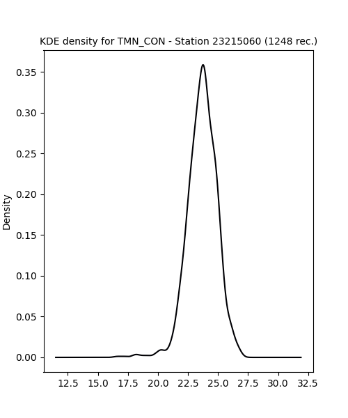

**TMN_CON - Station: MOTILONIA CODAZZI [28025070] (13818 rec.)** Location over [Google Maps](http://maps.google.com/maps?q=10.00180556,-73.24938889) or [Openstreet Map](https://www.openstreetmap.org/query?lat=10.00180556&lon=-73.24938889)

Station first record

| Fecha               |   CodigoEstacion | NombreEstacion               |   Latitud |   Longitud |   Altitud | Categoria         | Entidad                                                     | AreaOperativa                               | Departamento   | Municipio       | FechaInstalacion    | FechaSuspension   | IdParametro   | Etiqueta   | DescripcionSerie          | Frecuencia   |   Valor |   Grado |   Calificador |   NivelAprobacion |
|:--------------------|-----------------:|:-----------------------------|----------:|-----------:|----------:|:------------------|:------------------------------------------------------------|:--------------------------------------------|:---------------|:----------------|:--------------------|:------------------|:--------------|:-----------|:--------------------------|:-------------|--------:|--------:|--------------:|------------------:|
| 1980-01-01 00:00:00 |         28025070 | MOTILONIA CODAZZI [28025070] |   10.0018 |   -73.2494 |       180 | Agrometeorológica | INSTITUTO DE HIDROLOGIA METEOROLOGIA Y ESTUDIOS AMBIENTALES | Area Operativa 05 - Magdalena-Cesar-Guajira | Cesar          | Agustín Codazzi | 1956-01-15 00:00:00 | NaT               | TEMPERATURA   | TMN_CON    | Temperatura mínima diaria | Diaria       |    22.8 |      50 |           nan |              1200 |

Statistics table

|       |       Valor |
|:------|------------:|
| count | 13818       |
| mean  |    23.7666  |
| std   |     1.54724 |
| min   |    17.4     |
| 25%   |    22.8     |
| 50%   |    23.8     |
| 75%   |    25       |
| max   |    28.6     |

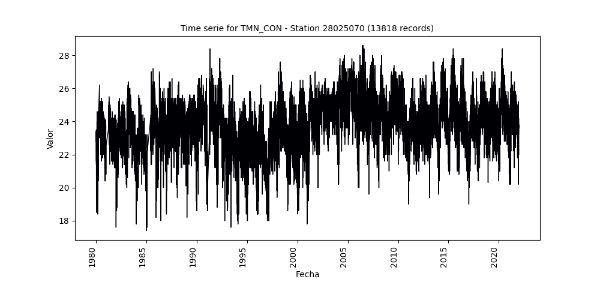
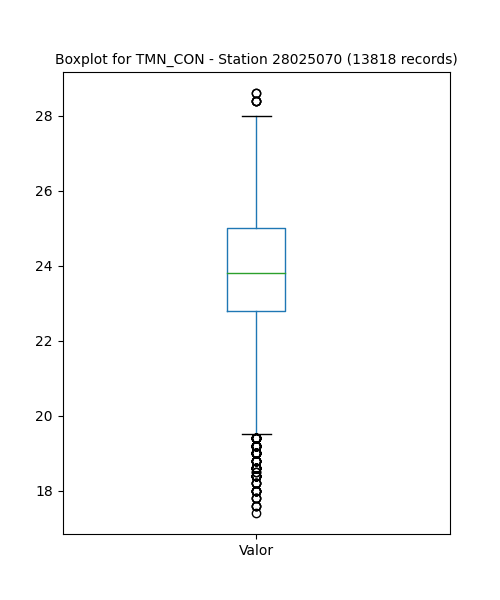
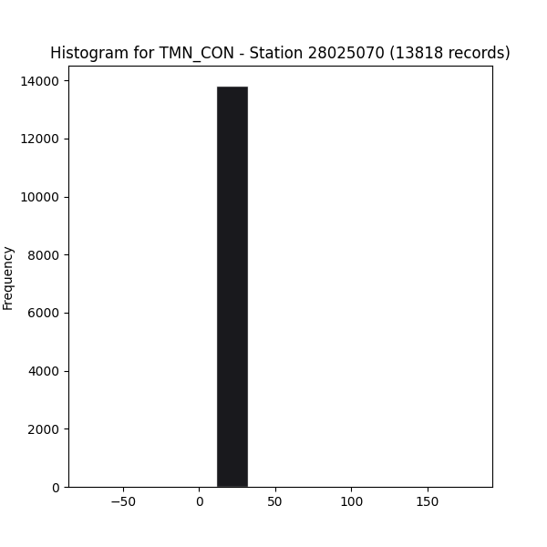
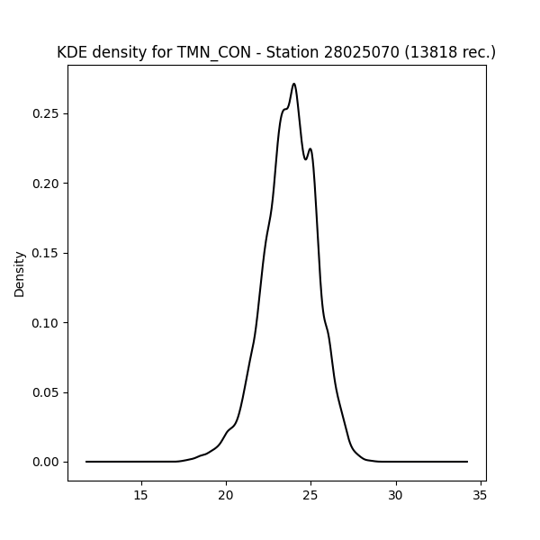

**TMN_CON - Station: RINCON EL [28025020] (13452 rec.)** Location over [Google Maps](http://maps.google.com/maps?q=10.27138889,-73.13138889) or [Openstreet Map](https://www.openstreetmap.org/query?lat=10.27138889&lon=-73.13138889)

Station first record

| Fecha               |   CodigoEstacion | NombreEstacion       |   Latitud |   Longitud |   Altitud | Categoria           | Entidad                                                     | AreaOperativa                               | Departamento   | Municipio   | FechaInstalacion    | FechaSuspension   | IdParametro   | Etiqueta   | DescripcionSerie          | Frecuencia   |   Valor |   Grado |   Calificador |   NivelAprobacion |
|:--------------------|-----------------:|:---------------------|----------:|-----------:|----------:|:--------------------|:------------------------------------------------------------|:--------------------------------------------|:---------------|:------------|:--------------------|:------------------|:--------------|:-----------|:--------------------------|:-------------|--------:|--------:|--------------:|------------------:|
| 1980-02-02 00:00:00 |         28025020 | RINCON EL [28025020] |   10.2714 |   -73.1314 |       350 | Climática Ordinaria | INSTITUTO DE HIDROLOGIA METEOROLOGIA Y ESTUDIOS AMBIENTALES | Area Operativa 05 - Magdalena-Cesar-Guajira | Cesar          | San Diego   | 1964-02-15 00:00:00 | NaT               | TEMPERATURA   | TMN_CON    | Temperatura mínima diaria | Diaria       |    18.8 |      50 |           nan |              1200 |

Statistics table

|       |       Valor |
|:------|------------:|
| count | 13452       |
| mean  |    20.547   |
| std   |     1.73534 |
| min   |    12       |
| 25%   |    19.6     |
| 50%   |    20.8     |
| 75%   |    21.8     |
| max   |    26       |

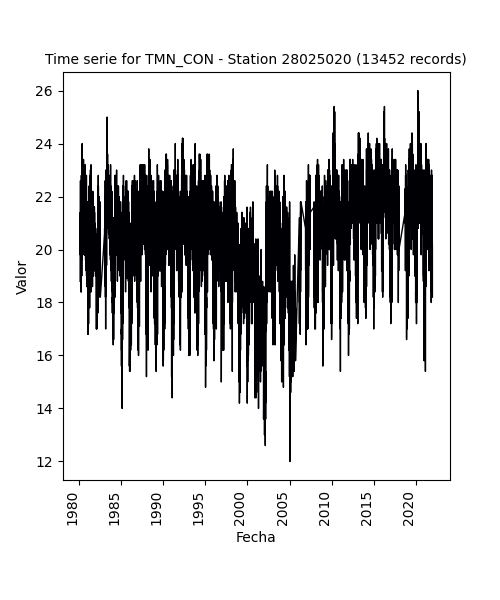
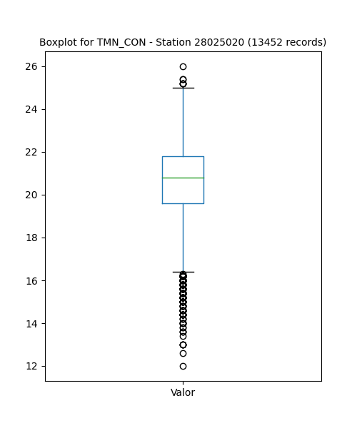
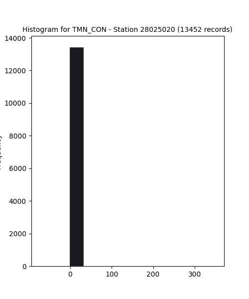
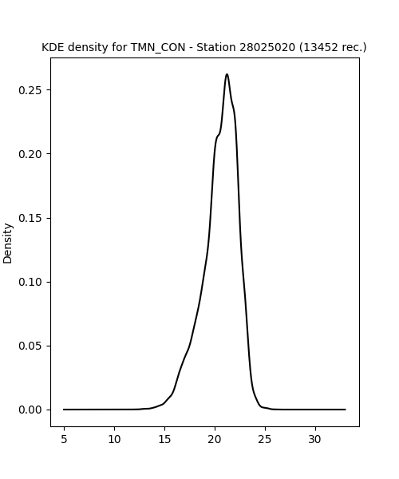

**TMN_CON - Station: SAN JOSE D ORIENTE [28025040] (3231 rec.)** Location over [Google Maps](http://maps.google.com/maps?q=10.35,-73.05) or [Openstreet Map](https://www.openstreetmap.org/query?lat=10.35&lon=-73.05)

Station first record

| Fecha               |   CodigoEstacion | NombreEstacion                |   Latitud |   Longitud |   Altitud | Categoria           | Entidad                                                     | AreaOperativa                               | Departamento   | Municipio   | FechaInstalacion    | FechaSuspension     | IdParametro   | Etiqueta   | DescripcionSerie          | Frecuencia   |   Valor |   Grado |   Calificador |   NivelAprobacion |
|:--------------------|-----------------:|:------------------------------|----------:|-----------:|----------:|:--------------------|:------------------------------------------------------------|:--------------------------------------------|:---------------|:------------|:--------------------|:--------------------|:--------------|:-----------|:--------------------------|:-------------|--------:|--------:|--------------:|------------------:|
| 1980-01-01 00:00:00 |         28025040 | SAN JOSE D ORIENTE [28025040] |     10.35 |     -73.05 |       850 | Climática Ordinaria | INSTITUTO DE HIDROLOGIA METEOROLOGIA Y ESTUDIOS AMBIENTALES | Area Operativa 05 - Magdalena-Cesar-Guajira | Cesar          | La Paz      | 1975-08-15 00:00:00 | 1998-05-15 00:00:00 | TEMPERATURA   | TMN_CON    | Temperatura mínima diaria | Diaria       |    20.2 |      50 |           nan |              1200 |

Statistics table

|       |      Valor |
|:------|-----------:|
| count | 3231       |
| mean  |   18.674   |
| std   |    2.11514 |
| min   |    8.4     |
| 25%   |   18       |
| 50%   |   19.2     |
| 75%   |   20       |
| max   |   27.4     |

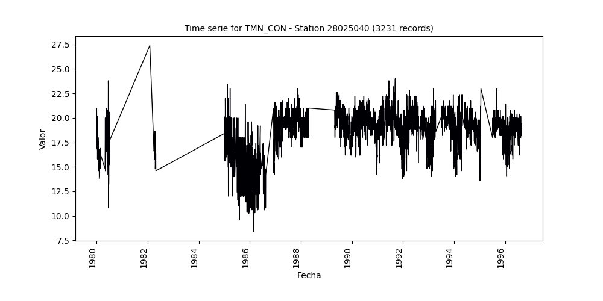
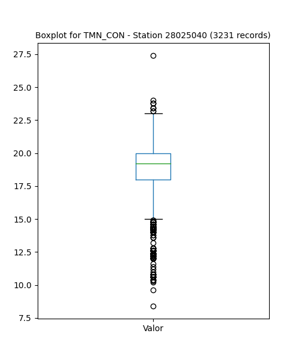
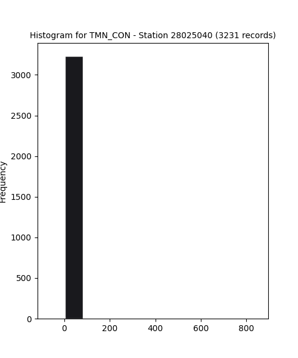
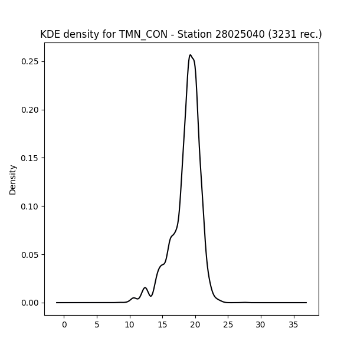

**TMN_CON - Station: SOCOMBA [28025080] (7636 rec.)** Location over [Google Maps](http://maps.google.com/maps?q=9.686666667,-73.24055556) or [Openstreet Map](https://www.openstreetmap.org/query?lat=9.686666667&lon=-73.24055556)

Station first record

| Fecha               |   CodigoEstacion | NombreEstacion     |   Latitud |   Longitud |   Altitud | Categoria           | Entidad                                                     | AreaOperativa                               | Departamento   | Municipio   | FechaInstalacion    | FechaSuspension     | IdParametro   | Etiqueta   | DescripcionSerie          | Frecuencia   |   Valor |   Grado |   Calificador |   NivelAprobacion |
|:--------------------|-----------------:|:-------------------|----------:|-----------:|----------:|:--------------------|:------------------------------------------------------------|:--------------------------------------------|:---------------|:------------|:--------------------|:--------------------|:--------------|:-----------|:--------------------------|:-------------|--------:|--------:|--------------:|------------------:|
| 1980-01-01 00:00:00 |         28025080 | SOCOMBA [28025080] |   9.68667 |   -73.2406 |       170 | Climática Principal | INSTITUTO DE HIDROLOGIA METEOROLOGIA Y ESTUDIOS AMBIENTALES | Area Operativa 05 - Magdalena-Cesar-Guajira | Cesar          | Becerrill   | 1976-12-15 00:00:00 | 2019-02-07 11:41:00 | TEMPERATURA   | TMN_CON    | Temperatura mínima diaria | Diaria       |    21.8 |      50 |           nan |              1200 |

Statistics table

|       |      Valor |
|:------|-----------:|
| count | 7636       |
| mean  |   21.7751  |
| std   |    1.87894 |
| min   |   15.2     |
| 25%   |   20.4     |
| 50%   |   22.2     |
| 75%   |   23.2     |
| max   |   27       |

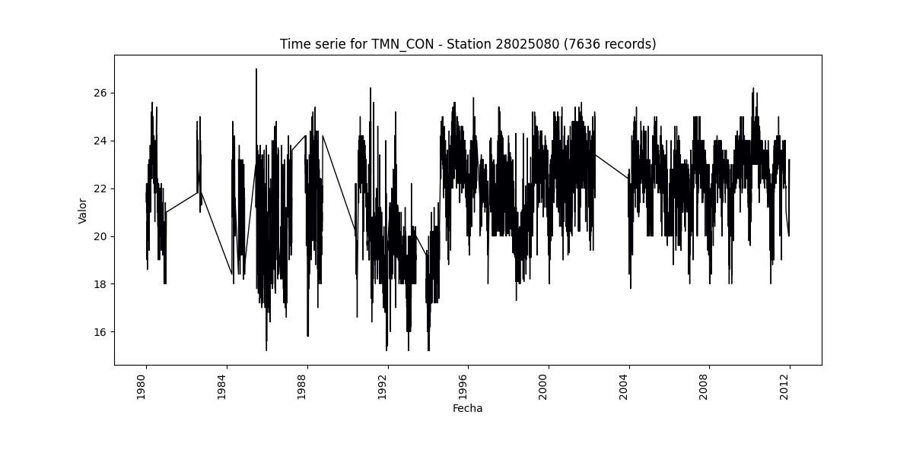
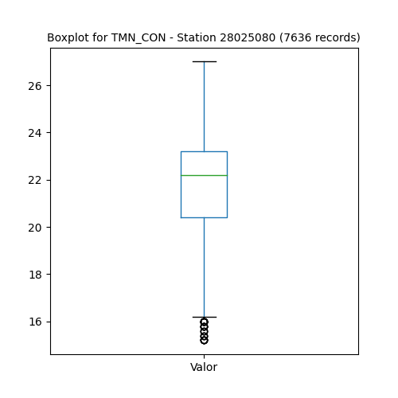

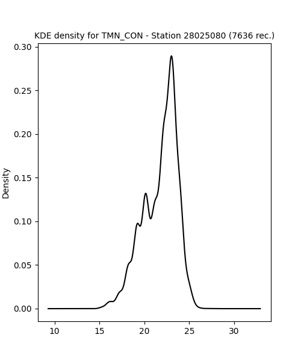

**TMN_CON - Station: ALGARROBO [28045020] (1052 rec.)** Location over [Google Maps](http://maps.google.com/maps?q=10.15,-74.06666667) or [Openstreet Map](https://www.openstreetmap.org/query?lat=10.15&lon=-74.06666667)

Station first record

| Fecha               |   CodigoEstacion | NombreEstacion       |   Latitud |   Longitud |   Altitud | Categoria           | Entidad                                                     | AreaOperativa                               | Departamento   | Municipio   | FechaInstalacion    | FechaSuspension     | IdParametro   | Etiqueta   | DescripcionSerie          | Frecuencia   |   Valor |   Grado |   Calificador |   NivelAprobacion |
|:--------------------|-----------------:|:---------------------|----------:|-----------:|----------:|:--------------------|:------------------------------------------------------------|:--------------------------------------------|:---------------|:------------|:--------------------|:--------------------|:--------------|:-----------|:--------------------------|:-------------|--------:|--------:|--------------:|------------------:|
| 1983-01-02 00:00:00 |         28045020 | ALGARROBO [28045020] |     10.15 |   -74.0667 |        60 | Climática Ordinaria | INSTITUTO DE HIDROLOGIA METEOROLOGIA Y ESTUDIOS AMBIENTALES | Area Operativa 05 - Magdalena-Cesar-Guajira | Cesar          | El Copey    | 1964-02-15 00:00:00 | 1987-04-15 00:00:00 | TEMPERATURA   | TMN_CON    | Temperatura mínima diaria | Diaria       |    17.6 |      50 |           nan |              1200 |

Statistics table

|       |      Valor |
|:------|-----------:|
| count | 1052       |
| mean  |   21.2974  |
| std   |    1.79272 |
| min   |   14.6     |
| 25%   |   20.2     |
| 50%   |   21.6     |
| 75%   |   22.6     |
| max   |   26.4     |

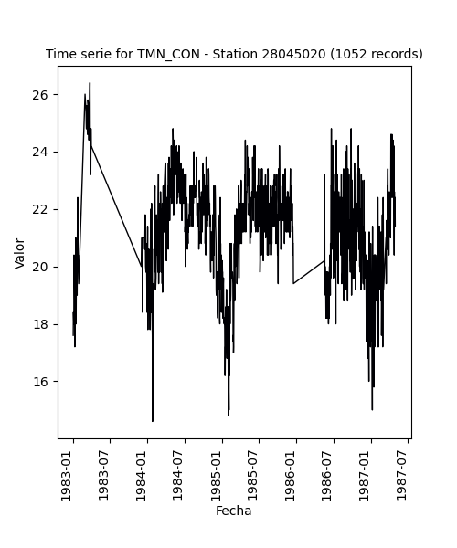
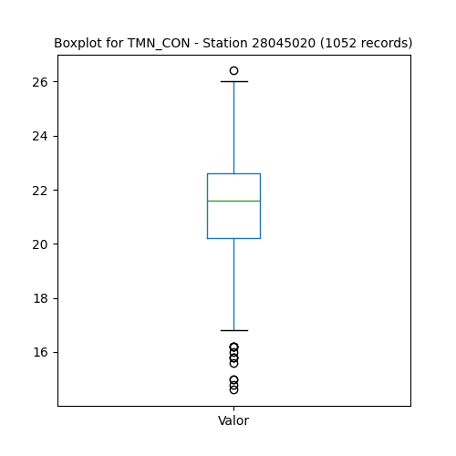
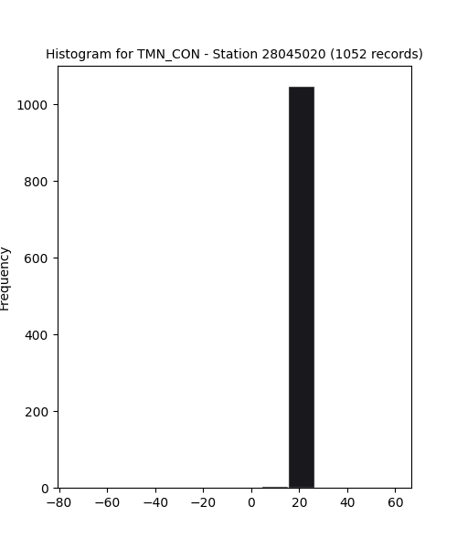
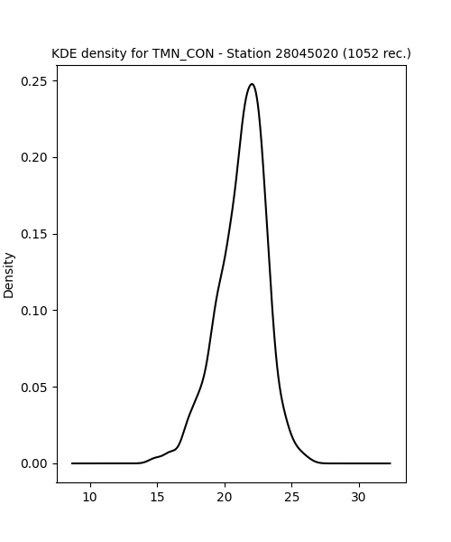

**TMN_CON - Station: CALLAO EL [28035020] (11824 rec.)** Location over [Google Maps](http://maps.google.com/maps?q=10.36305556,-73.31944444) or [Openstreet Map](https://www.openstreetmap.org/query?lat=10.36305556&lon=-73.31944444)

Station first record

| Fecha               |   CodigoEstacion | NombreEstacion       |   Latitud |   Longitud |   Altitud | Categoria           | Entidad                                                     | AreaOperativa                               | Departamento   | Municipio   | FechaInstalacion    | FechaSuspension   | IdParametro   | Etiqueta   | DescripcionSerie          | Frecuencia   |   Valor |   Grado |   Calificador |   NivelAprobacion |
|:--------------------|-----------------:|:---------------------|----------:|-----------:|----------:|:--------------------|:------------------------------------------------------------|:--------------------------------------------|:---------------|:------------|:--------------------|:------------------|:--------------|:-----------|:--------------------------|:-------------|--------:|--------:|--------------:|------------------:|
| 1980-01-01 00:00:00 |         28035020 | CALLAO EL [28035020] |   10.3631 |   -73.3194 |       110 | Climática Ordinaria | INSTITUTO DE HIDROLOGIA METEOROLOGIA Y ESTUDIOS AMBIENTALES | Area Operativa 05 - Magdalena-Cesar-Guajira | Cesar          | Valledupar  | 1968-03-15 00:00:00 | NaT               | TEMPERATURA   | TMN_CON    | Temperatura mínima diaria | Diaria       |    19.4 |      50 |           nan |              1200 |

Statistics table

|       |       Valor |
|:------|------------:|
| count | 11824       |
| mean  |    22.8005  |
| std   |     1.82844 |
| min   |    15.8     |
| 25%   |    21.8     |
| 50%   |    23       |
| 75%   |    24       |
| max   |    28.6     |

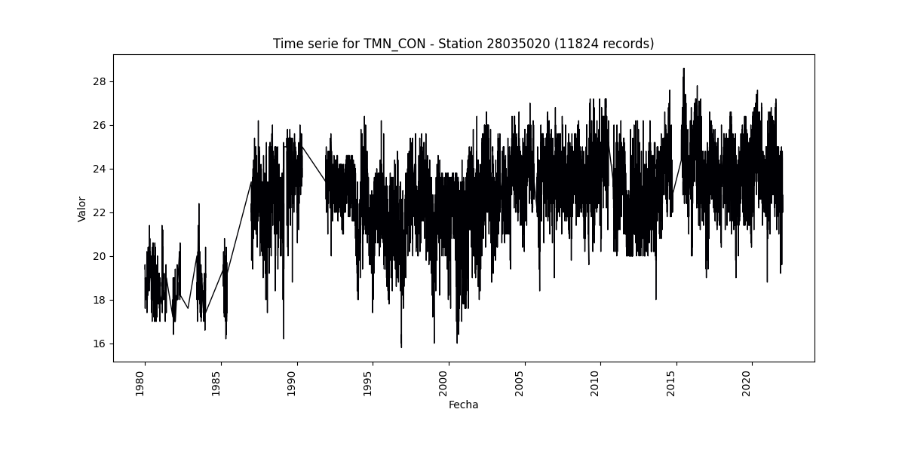
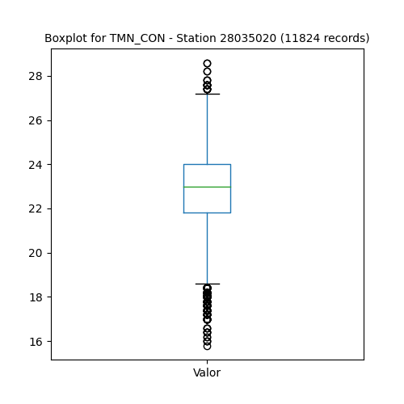

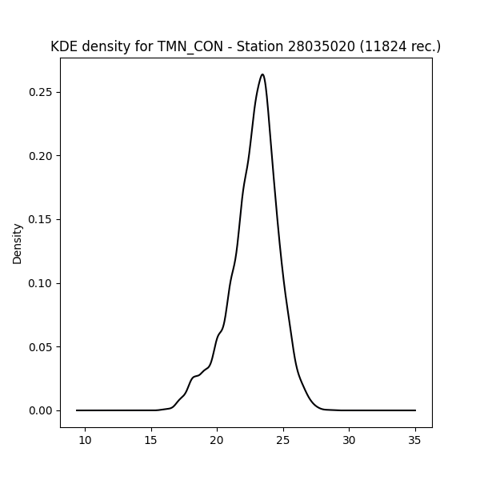

**TMN_CON - Station: GUAIRA LA HACIENDA [28045040] (1274 rec.)** Location over [Google Maps](http://maps.google.com/maps?q=9.616666667,-73.8) or [Openstreet Map](https://www.openstreetmap.org/query?lat=9.616666667&lon=-73.8)

Station first record

| Fecha               |   CodigoEstacion | NombreEstacion                |   Latitud |   Longitud |   Altitud | Categoria           | Entidad                                                     | AreaOperativa                               | Departamento   | Municipio   | FechaInstalacion    | FechaSuspension     | IdParametro   | Etiqueta   | DescripcionSerie          | Frecuencia   |   Valor |   Grado |   Calificador |   NivelAprobacion |
|:--------------------|-----------------:|:------------------------------|----------:|-----------:|----------:|:--------------------|:------------------------------------------------------------|:--------------------------------------------|:---------------|:------------|:--------------------|:--------------------|:--------------|:-----------|:--------------------------|:-------------|--------:|--------:|--------------:|------------------:|
| 1987-09-11 00:00:00 |         28045040 | GUAIRA LA HACIENDA [28045040] |   9.61667 |      -73.8 |        50 | Climática Principal | INSTITUTO DE HIDROLOGIA METEOROLOGIA Y ESTUDIOS AMBIENTALES | Area Operativa 05 - Magdalena-Cesar-Guajira | Cesar          | El Paso     | 1987-09-15 00:00:00 | 1994-07-15 00:00:00 | TEMPERATURA   | TMN_CON    | Temperatura mínima diaria | Diaria       |      23 |      50 |           nan |              1200 |

Statistics table

|       |      Valor |
|:------|-----------:|
| count | 1274       |
| mean  |   23.128   |
| std   |    1.26701 |
| min   |   14.6     |
| 25%   |   22.4     |
| 50%   |   23.2     |
| 75%   |   24       |
| max   |   26.6     |

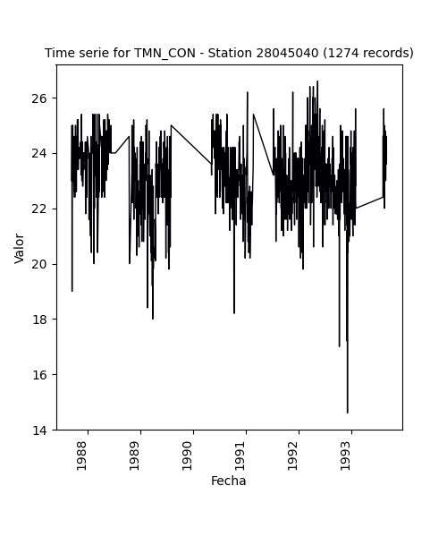
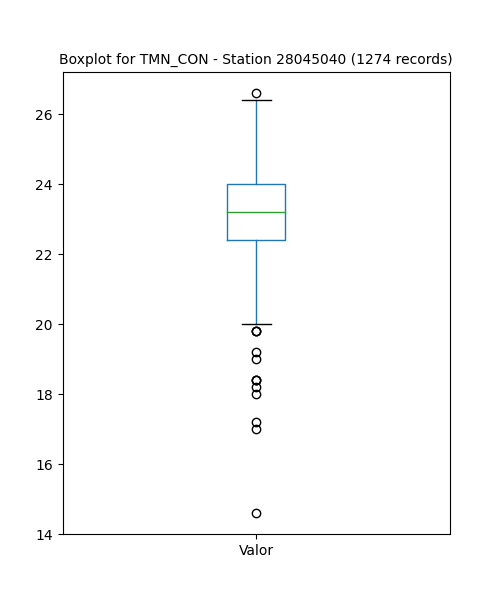
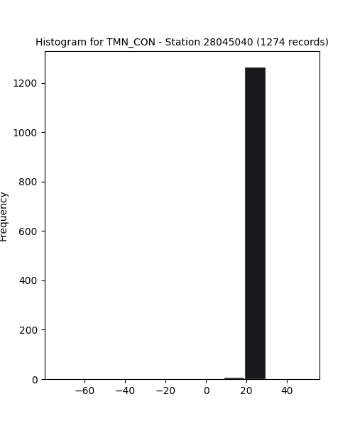
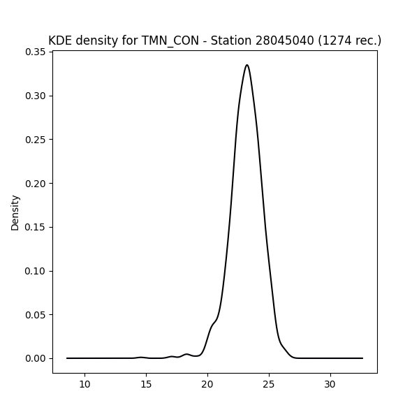

**TMN_CON - Station: GUATAPURI - AUT [28035070] (42 rec.)** Location over [Google Maps](http://maps.google.com/maps?q=10.73213889,-73.39241667) or [Openstreet Map](https://www.openstreetmap.org/query?lat=10.73213889&lon=-73.39241667)

Station first record

| Fecha               |   CodigoEstacion | NombreEstacion             |   Latitud |   Longitud |   Altitud | Categoria           | Entidad                                                     | AreaOperativa                               | Departamento   | Municipio   | FechaInstalacion    | FechaSuspension     | IdParametro   | Etiqueta   | DescripcionSerie          | Frecuencia   |   Valor |   Grado |   Calificador |   NivelAprobacion |
|:--------------------|-----------------:|:---------------------------|----------:|-----------:|----------:|:--------------------|:------------------------------------------------------------|:--------------------------------------------|:---------------|:------------|:--------------------|:--------------------|:--------------|:-----------|:--------------------------|:-------------|--------:|--------:|--------------:|------------------:|
| 2012-12-01 00:00:00 |         28035070 | GUATAPURI - AUT [28035070] |   10.7321 |   -73.3924 |      1315 | Climática Principal | INSTITUTO DE HIDROLOGIA METEOROLOGIA Y ESTUDIOS AMBIENTALES | Area Operativa 05 - Magdalena-Cesar-Guajira | Cesar          | Valledupar  | 2006-02-26 00:00:00 | 2018-06-11 10:25:00 | TEMPERATURA   | TMN_CON    | Temperatura mínima diaria | Diaria       |    21.8 |      50 |           nan |              1200 |

Statistics table

|       |    Valor |
|:------|---------:|
| count | 42       |
| mean  | 22.0286  |
| std   |  1.01844 |
| min   | 20.6     |
| 25%   | 21.4     |
| 50%   | 21.8     |
| 75%   | 22.6     |
| max   | 25.6     |

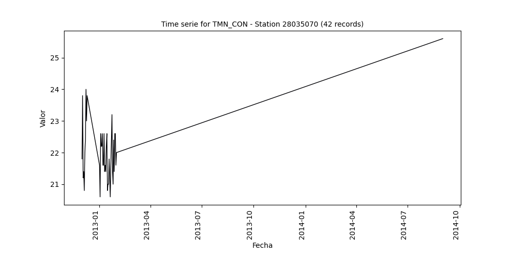
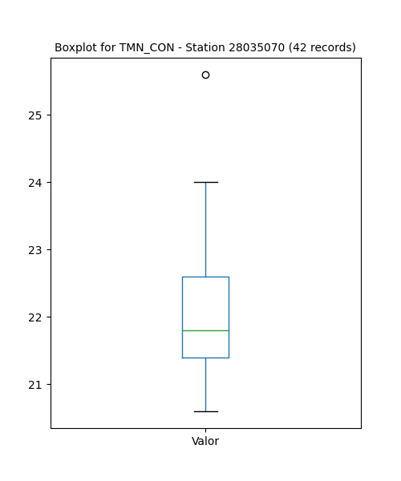

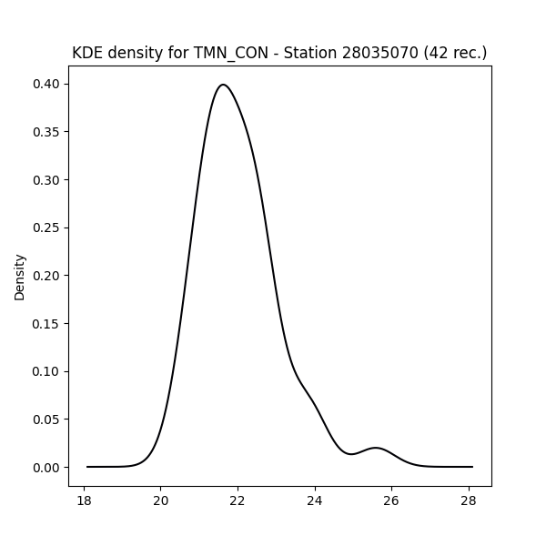

**TMN_CON - Station: GUAYMARAL [28035040] (13405 rec.)** Location over [Google Maps](http://maps.google.com/maps?q=9.904916667,-73.64752778) or [Openstreet Map](https://www.openstreetmap.org/query?lat=9.904916667&lon=-73.64752778)

Station first record

| Fecha               |   CodigoEstacion | NombreEstacion       |   Latitud |   Longitud |   Altitud | Categoria           | Entidad                                                     | AreaOperativa                               | Departamento   | Municipio   | FechaInstalacion    | FechaSuspension   | IdParametro   | Etiqueta   | DescripcionSerie          | Frecuencia   |   Valor |   Grado |   Calificador |   NivelAprobacion |
|:--------------------|-----------------:|:---------------------|----------:|-----------:|----------:|:--------------------|:------------------------------------------------------------|:--------------------------------------------|:---------------|:------------|:--------------------|:------------------|:--------------|:-----------|:--------------------------|:-------------|--------:|--------:|--------------:|------------------:|
| 1981-06-01 00:00:00 |         28035040 | GUAYMARAL [28035040] |   9.90492 |   -73.6475 |        50 | Climática Ordinaria | INSTITUTO DE HIDROLOGIA METEOROLOGIA Y ESTUDIOS AMBIENTALES | Area Operativa 05 - Magdalena-Cesar-Guajira | Cesar          | Valledupar  | 1972-08-15 00:00:00 | NaT               | TEMPERATURA   | TMN_CON    | Temperatura mínima diaria | Diaria       |    24.2 |      50 |           nan |              1200 |

Statistics table

|       |       Valor |
|:------|------------:|
| count | 13405       |
| mean  |    24.269   |
| std   |     1.23846 |
| min   |    17.2     |
| 25%   |    23.4     |
| 50%   |    24.2     |
| 75%   |    25       |
| max   |    28.6     |

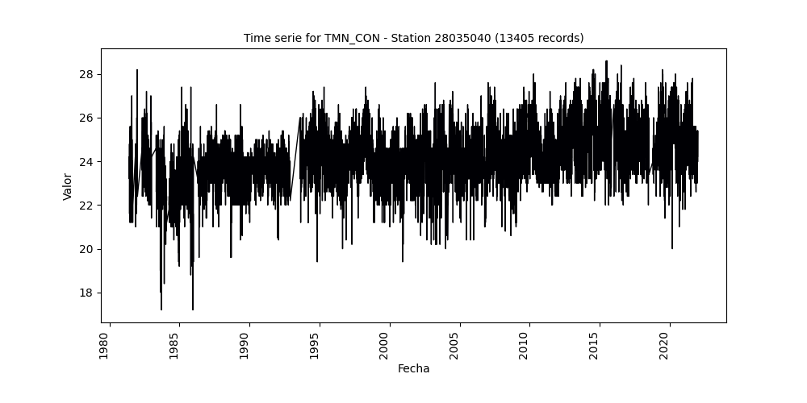
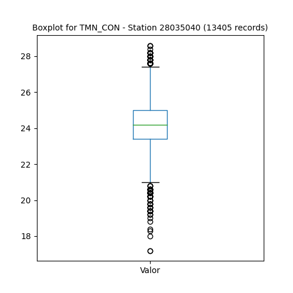

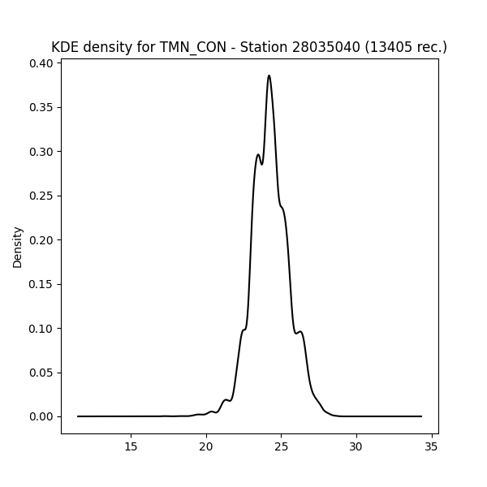

**TMN_CON - Station: VILLA ROSA [28035010] (10557 rec.)** Location over [Google Maps](http://maps.google.com/maps?q=10.19066667,-73.54738889) or [Openstreet Map](https://www.openstreetmap.org/query?lat=10.19066667&lon=-73.54738889)

Station first record

| Fecha               |   CodigoEstacion | NombreEstacion        |   Latitud |   Longitud |   Altitud | Categoria           | Entidad                                                     | AreaOperativa                               | Departamento   | Municipio   | FechaInstalacion    | FechaSuspension   | IdParametro   | Etiqueta   | DescripcionSerie          | Frecuencia   |   Valor |   Grado |   Calificador |   NivelAprobacion |
|:--------------------|-----------------:|:----------------------|----------:|-----------:|----------:|:--------------------|:------------------------------------------------------------|:--------------------------------------------|:---------------|:------------|:--------------------|:------------------|:--------------|:-----------|:--------------------------|:-------------|--------:|--------:|--------------:|------------------:|
| 1980-01-03 00:00:00 |         28035010 | VILLA ROSA [28035010] |   10.1907 |   -73.5474 |        70 | Climática Ordinaria | INSTITUTO DE HIDROLOGIA METEOROLOGIA Y ESTUDIOS AMBIENTALES | Area Operativa 05 - Magdalena-Cesar-Guajira | Cesar          | Valledupar  | 1968-03-15 00:00:00 | NaT               | TEMPERATURA   | TMN_CON    | Temperatura mínima diaria | Diaria       |    22.4 |      50 |           nan |              1200 |

Statistics table

|       |       Valor |
|:------|------------:|
| count | 10557       |
| mean  |    23.3278  |
| std   |     1.49337 |
| min   |    13.4     |
| 25%   |    22.6     |
| 50%   |    23.4     |
| 75%   |    24.2     |
| max   |    28.8     |

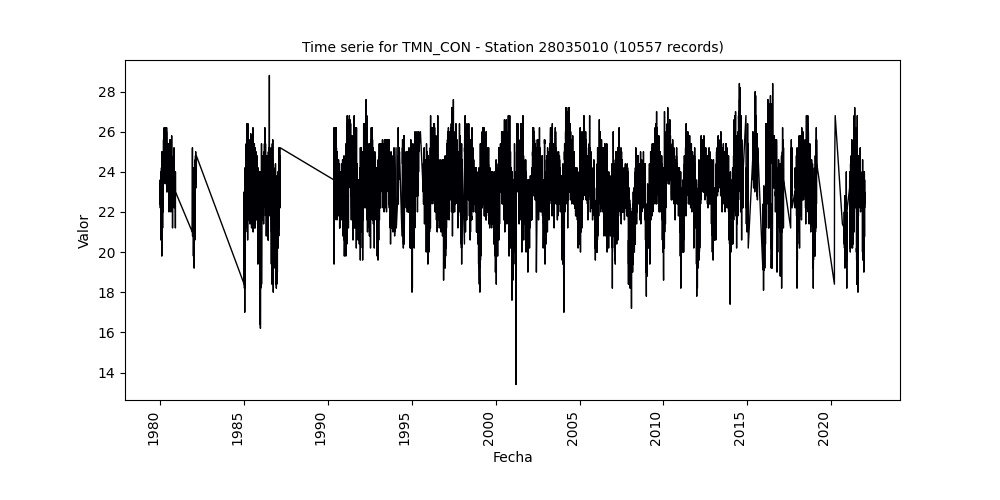
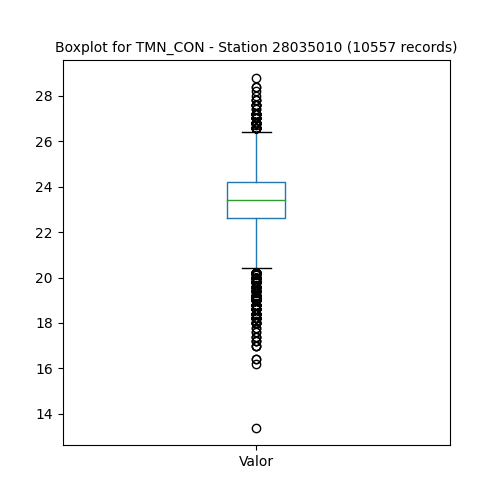
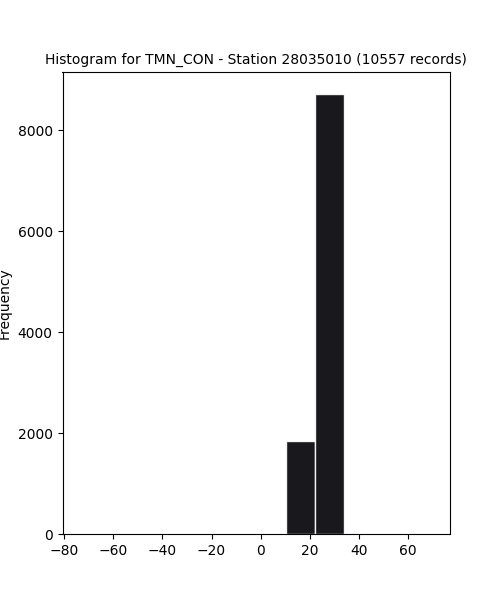

**TMN_CON - Station: LA PAULINA - AUT [15065040] (4949 rec.)** Location over [Google Maps](http://maps.google.com/maps?q=10.89813889,-72.82847222) or [Openstreet Map](https://www.openstreetmap.org/query?lat=10.89813889&lon=-72.82847222)

Station first record

| Fecha               |   CodigoEstacion | NombreEstacion              |   Latitud |   Longitud |   Altitud | Categoria           | Entidad                                                     | AreaOperativa                               | Departamento   | Municipio   | FechaInstalacion    | FechaSuspension   | IdParametro   | Etiqueta   | DescripcionSerie          | Frecuencia   |   Valor |   Grado |   Calificador |   NivelAprobacion |
|:--------------------|-----------------:|:----------------------------|----------:|-----------:|----------:|:--------------------|:------------------------------------------------------------|:--------------------------------------------|:---------------|:------------|:--------------------|:------------------|:--------------|:-----------|:--------------------------|:-------------|--------:|--------:|--------------:|------------------:|
| 1980-09-05 00:00:00 |         15065040 | LA PAULINA - AUT [15065040] |   10.8981 |   -72.8285 |       170 | Climática Principal | INSTITUTO DE HIDROLOGIA METEOROLOGIA Y ESTUDIOS AMBIENTALES | Area Operativa 05 - Magdalena-Cesar-Guajira | La Guajira     | Fonseca     | 1966-09-15 00:00:00 | NaT               | TEMPERATURA   | TMN_CON    | Temperatura mínima diaria | Diaria       |      22 |      50 |           nan |              1200 |

Statistics table

|       |      Valor |
|:------|-----------:|
| count | 4949       |
| mean  |   22.9664  |
| std   |    1.75384 |
| min   |   12.4     |
| 25%   |   22.2     |
| 50%   |   23.2     |
| 75%   |   24.2     |
| max   |   27.8     |

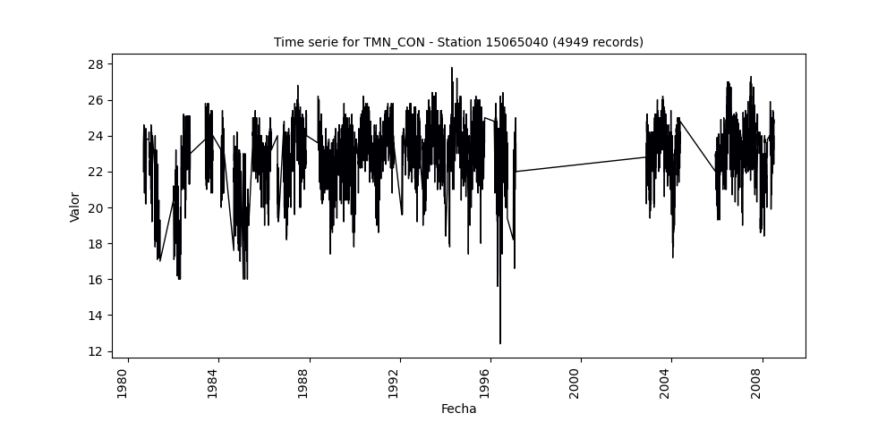
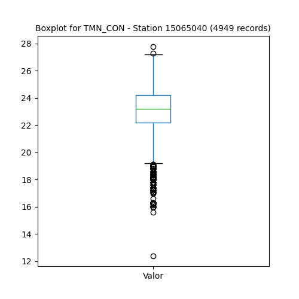
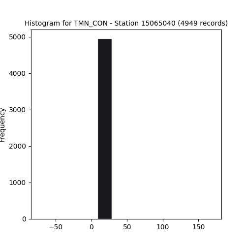
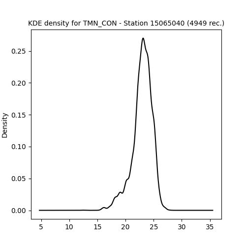

**TMN_CON - Station: URUMITA [28015070] (12475 rec.)** Location over [Google Maps](http://maps.google.com/maps?q=10.56638889,-73.01638889) or [Openstreet Map](https://www.openstreetmap.org/query?lat=10.56638889&lon=-73.01638889)

Station first record

| Fecha               |   CodigoEstacion | NombreEstacion     |   Latitud |   Longitud |   Altitud | Categoria           | Entidad                                                     | AreaOperativa                               | Departamento   | Municipio   | FechaInstalacion    | FechaSuspension   | IdParametro   | Etiqueta   | DescripcionSerie          | Frecuencia   |   Valor |   Grado |   Calificador |   NivelAprobacion |
|:--------------------|-----------------:|:-------------------|----------:|-----------:|----------:|:--------------------|:------------------------------------------------------------|:--------------------------------------------|:---------------|:------------|:--------------------|:------------------|:--------------|:-----------|:--------------------------|:-------------|--------:|--------:|--------------:|------------------:|
| 1980-01-01 00:00:00 |         28015070 | URUMITA [28015070] |   10.5664 |   -73.0164 |       255 | Climática Ordinaria | INSTITUTO DE HIDROLOGIA METEOROLOGIA Y ESTUDIOS AMBIENTALES | Area Operativa 05 - Magdalena-Cesar-Guajira | La Guajira     | Urumita     | 1975-08-15 00:00:00 | NaT               | TEMPERATURA   | TMN_CON    | Temperatura mínima diaria | Diaria       |      23 |      50 |           nan |              1200 |

Statistics table

|       |       Valor |
|:------|------------:|
| count | 12475       |
| mean  |    22.34    |
| std   |     1.33165 |
| min   |    15.4     |
| 25%   |    21.5     |
| 50%   |    22.5     |
| 75%   |    23.2     |
| max   |    26.2     |

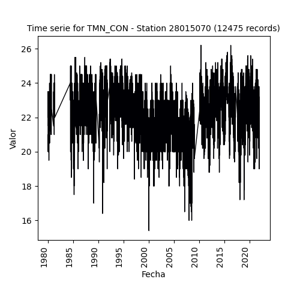
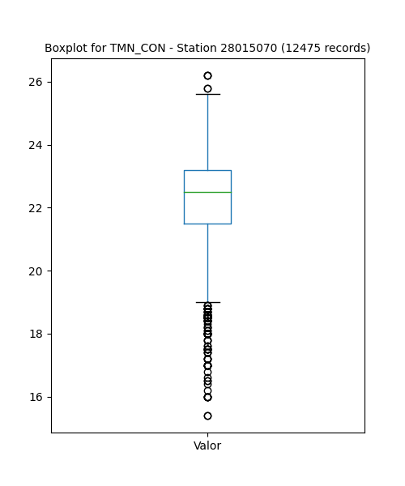
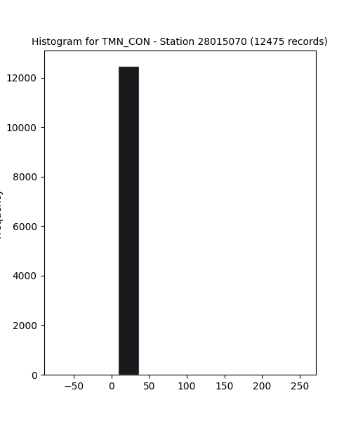
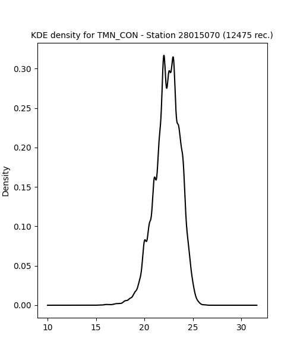

**TMN_CON - Station: LOS ALAMOS - AUT [25025002] (10733 rec.)** Location over [Google Maps](http://maps.google.com/maps?q=9.304055556,-74.27363889) or [Openstreet Map](https://www.openstreetmap.org/query?lat=9.304055556&lon=-74.27363889)

Station first record

| Fecha               |   CodigoEstacion | NombreEstacion              |   Latitud |   Longitud |   Altitud | Categoria           | Entidad                                                     | AreaOperativa                               | Departamento   | Municipio                   | FechaInstalacion    | FechaSuspension   | IdParametro   | Etiqueta   | DescripcionSerie          | Frecuencia   |   Valor |   Grado |   Calificador |   NivelAprobacion |
|:--------------------|-----------------:|:----------------------------|----------:|-----------:|----------:|:--------------------|:------------------------------------------------------------|:--------------------------------------------|:---------------|:----------------------------|:--------------------|:------------------|:--------------|:-----------|:--------------------------|:-------------|--------:|--------:|--------------:|------------------:|
| 1985-01-06 00:00:00 |         25025002 | LOS ALAMOS - AUT [25025002] |   9.30406 |   -74.2736 |        25 | Climática Principal | INSTITUTO DE HIDROLOGIA METEOROLOGIA Y ESTUDIOS AMBIENTALES | Area Operativa 05 - Magdalena-Cesar-Guajira | Magdalena      | San Sebastián De Buenavista | 2013-05-05 00:00:00 | NaT               | TEMPERATURA   | TMN_CON    | Temperatura mínima diaria | Diaria       |    23.4 |      50 |           nan |              1200 |

Statistics table

|       |       Valor |
|:------|------------:|
| count | 10733       |
| mean  |    22.9428  |
| std   |     1.56303 |
| min   |    16.8     |
| 25%   |    22       |
| 50%   |    23       |
| 75%   |    24       |
| max   |    27.2     |

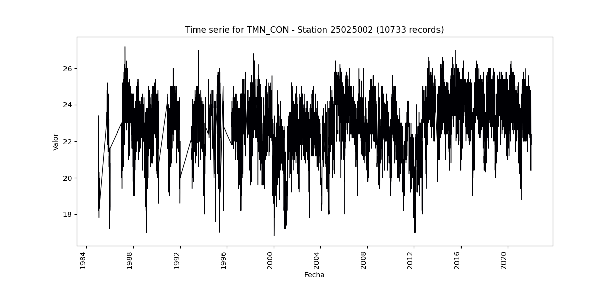
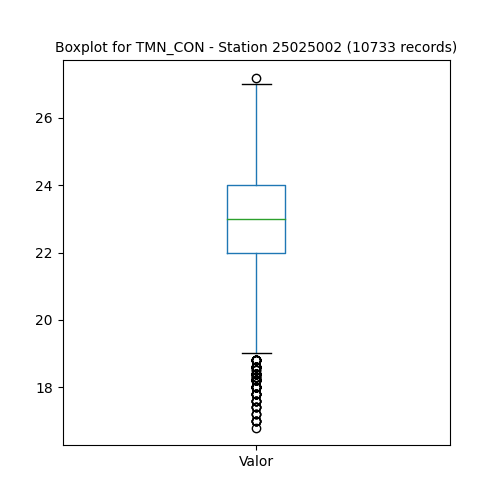

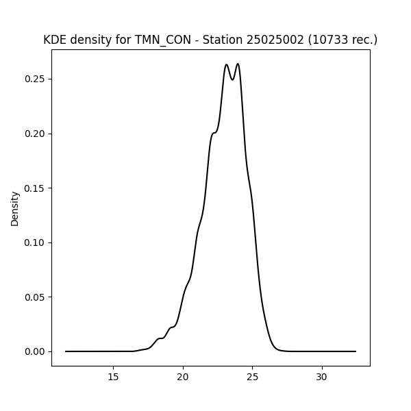

**TMN_CON - Station: YE LA [15015020] (9964 rec.)** Location over [Google Maps](http://maps.google.com/maps?q=10.99241667,-74.21113889) or [Openstreet Map](https://www.openstreetmap.org/query?lat=10.99241667&lon=-74.21113889)

Station first record

| Fecha               |   CodigoEstacion | NombreEstacion   |   Latitud |   Longitud |   Altitud | Categoria           | Entidad                                                     | AreaOperativa                               | Departamento   | Municipio   | FechaInstalacion    | FechaSuspension     | IdParametro   | Etiqueta   | DescripcionSerie          | Frecuencia   |   Valor |   Grado |   Calificador |   NivelAprobacion |
|:--------------------|-----------------:|:-----------------|----------:|-----------:|----------:|:--------------------|:------------------------------------------------------------|:--------------------------------------------|:---------------|:------------|:--------------------|:--------------------|:--------------|:-----------|:--------------------------|:-------------|--------:|--------:|--------------:|------------------:|
| 1980-01-01 00:00:00 |         15015020 | YE LA [15015020] |   10.9924 |   -74.2111 |        20 | Climática Ordinaria | INSTITUTO DE HIDROLOGIA METEOROLOGIA Y ESTUDIOS AMBIENTALES | Area Operativa 05 - Magdalena-Cesar-Guajira | Magdalena      | Ciénaga     | 1967-07-15 00:00:00 | 2019-02-07 11:34:00 | TEMPERATURA   | TMN_CON    | Temperatura mínima diaria | Diaria       |    23.2 |      50 |           nan |              1200 |

Statistics table

|       |      Valor |
|:------|-----------:|
| count | 9964       |
| mean  |   22.1888  |
| std   |    1.60856 |
| min   |   16       |
| 25%   |   21.2     |
| 50%   |   22.4     |
| 75%   |   23.2     |
| max   |   26.8     |

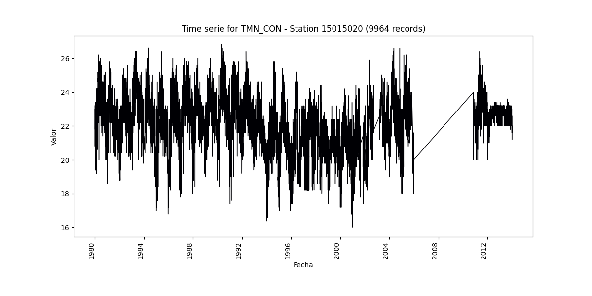
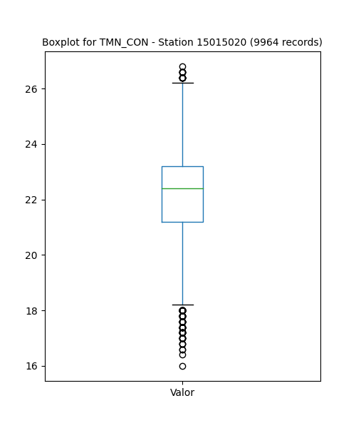
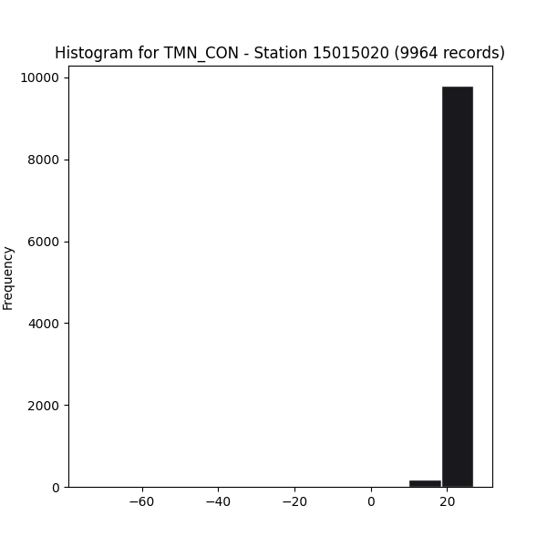
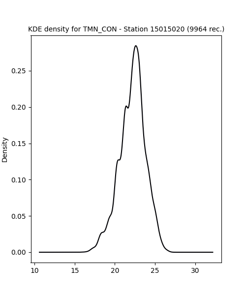

**TMN_CON - Station: AEROPUERTO LAS FLORES [25025090] (9774 rec.)** Location over [Google Maps](http://maps.google.com/maps?q=9.046333333,-73.97083333) or [Openstreet Map](https://www.openstreetmap.org/query?lat=9.046333333&lon=-73.97083333)

Station first record

| Fecha               |   CodigoEstacion | NombreEstacion                   |   Latitud |   Longitud |   Altitud | Categoria           | Entidad                                                     | AreaOperativa                               | Departamento   | Municipio   | FechaInstalacion    | FechaSuspension   | IdParametro   | Etiqueta   | DescripcionSerie          | Frecuencia   |   Valor |   Grado |   Calificador |   NivelAprobacion |
|:--------------------|-----------------:|:---------------------------------|----------:|-----------:|----------:|:--------------------|:------------------------------------------------------------|:--------------------------------------------|:---------------|:------------|:--------------------|:------------------|:--------------|:-----------|:--------------------------|:-------------|--------:|--------:|--------------:|------------------:|
| 1980-01-01 00:00:00 |         25025090 | AEROPUERTO LAS FLORES [25025090] |   9.04633 |   -73.9708 |        34 | Climática Principal | INSTITUTO DE HIDROLOGIA METEOROLOGIA Y ESTUDIOS AMBIENTALES | Area Operativa 05 - Magdalena-Cesar-Guajira | Magdalena      | El Banco    | 1952-02-15 00:00:00 | NaT               | TEMPERATURA   | TMN_CON    | Temperatura mínima diaria | Diaria       |    24.2 |      50 |           nan |              1200 |

Statistics table

|       |      Valor |
|:------|-----------:|
| count | 9774       |
| mean  |   23.5651  |
| std   |    1.53376 |
| min   |   17       |
| 25%   |   22.6     |
| 50%   |   23.6     |
| 75%   |   24.8     |
| max   |   28       |

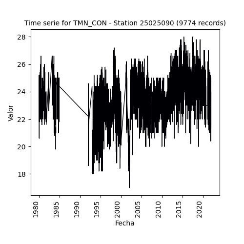
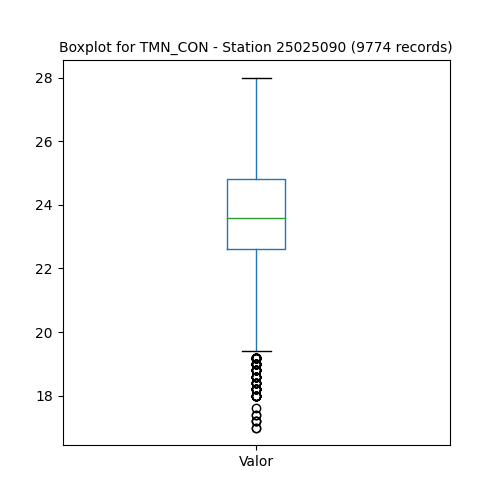
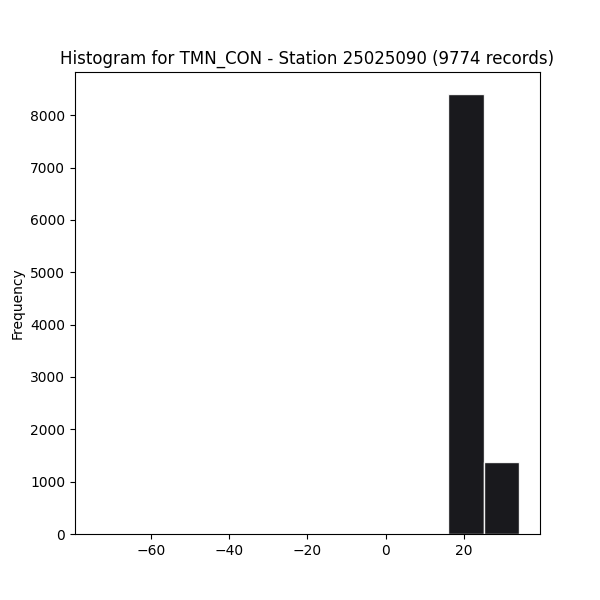
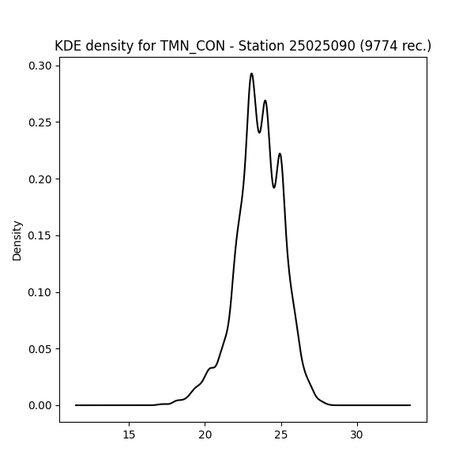

**TMN_CON - Station: PADELMA [29065020] (12983 rec.)** Location over [Google Maps](http://maps.google.com/maps?q=10.72111111,-74.19972222) or [Openstreet Map](https://www.openstreetmap.org/query?lat=10.72111111&lon=-74.19972222)

Station first record

| Fecha               |   CodigoEstacion | NombreEstacion     |   Latitud |   Longitud |   Altitud | Categoria           | Entidad                                                     | AreaOperativa                               | Departamento   | Municipio     | FechaInstalacion    | FechaSuspension   | IdParametro   | Etiqueta   | DescripcionSerie          | Frecuencia   |   Valor |   Grado |   Calificador |   NivelAprobacion |
|:--------------------|-----------------:|:-------------------|----------:|-----------:|----------:|:--------------------|:------------------------------------------------------------|:--------------------------------------------|:---------------|:--------------|:--------------------|:------------------|:--------------|:-----------|:--------------------------|:-------------|--------:|--------:|--------------:|------------------:|
| 1980-03-01 00:00:00 |         29065020 | PADELMA [29065020] |   10.7211 |   -74.1997 |        20 | Climática Ordinaria | INSTITUTO DE HIDROLOGIA METEOROLOGIA Y ESTUDIOS AMBIENTALES | Area Operativa 05 - Magdalena-Cesar-Guajira | Magdalena      | Zona Bananera | 1967-08-15 00:00:00 | NaT               | TEMPERATURA   | TMN_CON    | Temperatura mínima diaria | Diaria       |    21.8 |      50 |           nan |              1200 |

Statistics table

|       |       Valor |
|:------|------------:|
| count | 12983       |
| mean  |    22.327   |
| std   |     1.85521 |
| min   |    14.2     |
| 25%   |    21.2     |
| 50%   |    22.6     |
| 75%   |    23.6     |
| max   |    27.4     |

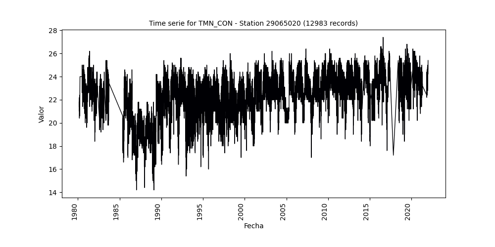
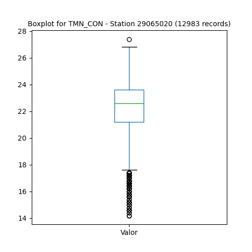
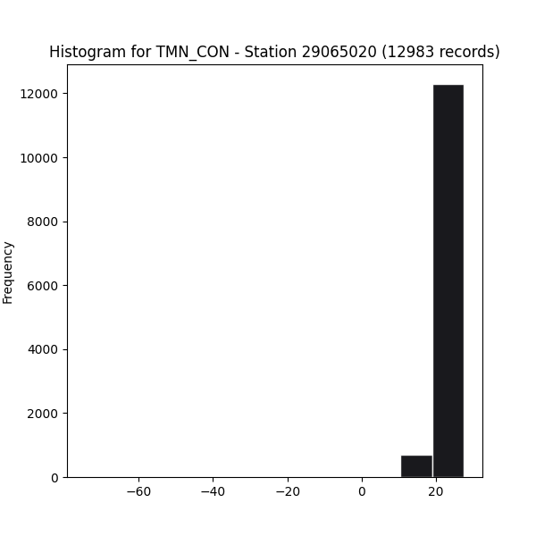
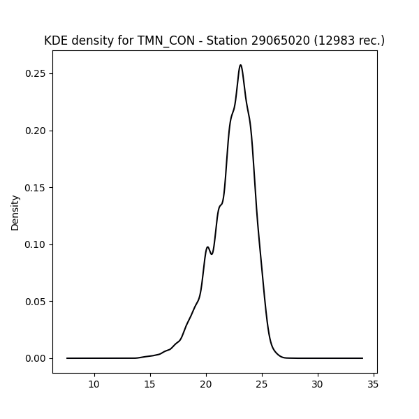

**TMN_CON - Station: PRADO SEVILLA [29065030] (11526 rec.)** Location over [Google Maps](http://maps.google.com/maps?q=10.76416667,-74.15472222) or [Openstreet Map](https://www.openstreetmap.org/query?lat=10.76416667&lon=-74.15472222)

Station first record

| Fecha               |   CodigoEstacion | NombreEstacion           |   Latitud |   Longitud |   Altitud | Categoria           | Entidad                                                     | AreaOperativa                               | Departamento   | Municipio     | FechaInstalacion    | FechaSuspension     | IdParametro   | Etiqueta   | DescripcionSerie          | Frecuencia   |   Valor |   Grado |   Calificador |   NivelAprobacion |
|:--------------------|-----------------:|:-------------------------|----------:|-----------:|----------:|:--------------------|:------------------------------------------------------------|:--------------------------------------------|:---------------|:--------------|:--------------------|:--------------------|:--------------|:-----------|:--------------------------|:-------------|--------:|--------:|--------------:|------------------:|
| 1980-01-01 00:00:00 |         29065030 | PRADO SEVILLA [29065030] |   10.7642 |   -74.1547 |        18 | Climática Ordinaria | INSTITUTO DE HIDROLOGIA METEOROLOGIA Y ESTUDIOS AMBIENTALES | Area Operativa 05 - Magdalena-Cesar-Guajira | Magdalena      | Zona Bananera | 1970-07-15 00:00:00 | 2019-02-07 11:32:00 | TEMPERATURA   | TMN_CON    | Temperatura mínima diaria | Diaria       |    21.4 |      50 |           nan |              1200 |

Statistics table

|       |       Valor |
|:------|------------:|
| count | 11526       |
| mean  |    21.8104  |
| std   |     1.55983 |
| min   |    14       |
| 25%   |    20.8     |
| 50%   |    22       |
| 75%   |    23       |
| max   |    27       |

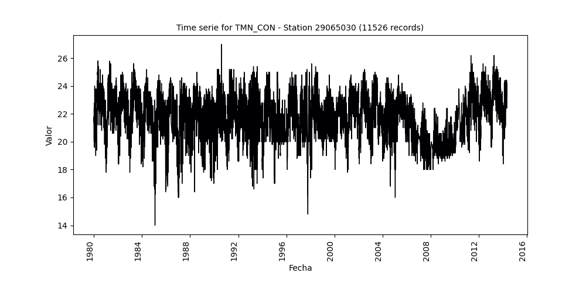
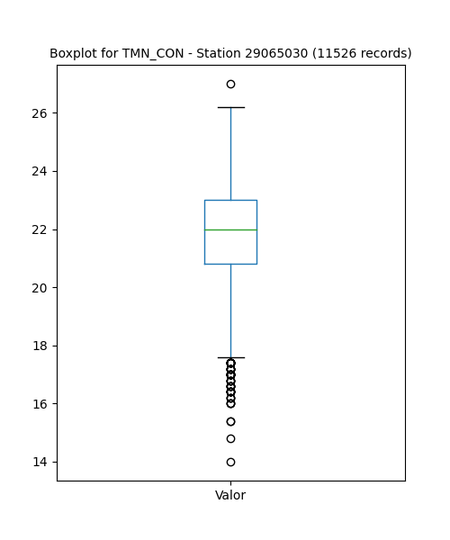
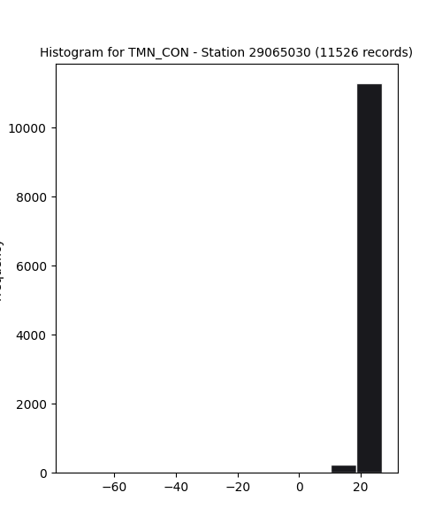
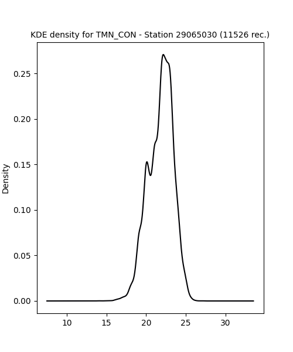

**TMN_CON - Station: SEIS EL [25025300] (11693 rec.)** Location over [Google Maps](http://maps.google.com/maps?q=9.683666667,-74.32227778) or [Openstreet Map](https://www.openstreetmap.org/query?lat=9.683666667&lon=-74.32227778)

Station first record

| Fecha               |   CodigoEstacion | NombreEstacion     |   Latitud |   Longitud |   Altitud | Categoria           | Entidad                                                     | AreaOperativa                               | Departamento   | Municipio                   | FechaInstalacion    | FechaSuspension   | IdParametro   | Etiqueta   | DescripcionSerie          | Frecuencia   |   Valor |   Grado |   Calificador |   NivelAprobacion |
|:--------------------|-----------------:|:-------------------|----------:|-----------:|----------:|:--------------------|:------------------------------------------------------------|:--------------------------------------------|:---------------|:----------------------------|:--------------------|:------------------|:--------------|:-----------|:--------------------------|:-------------|--------:|--------:|--------------:|------------------:|
| 1985-05-01 00:00:00 |         25025300 | SEIS EL [25025300] |   9.68367 |   -74.3223 |        50 | Climática Ordinaria | INSTITUTO DE HIDROLOGIA METEOROLOGIA Y ESTUDIOS AMBIENTALES | Area Operativa 05 - Magdalena-Cesar-Guajira | Magdalena      | San Sebastián De Buenavista | 1984-11-15 00:00:00 | NaT               | TEMPERATURA   | TMN_CON    | Temperatura mínima diaria | Diaria       |    20.4 |      50 |           nan |              1200 |

Statistics table

|       |       Valor |
|:------|------------:|
| count | 11693       |
| mean  |    22.9902  |
| std   |     1.75271 |
| min   |    15.4     |
| 25%   |    22       |
| 50%   |    23.2     |
| 75%   |    24.2     |
| max   |    27.8     |

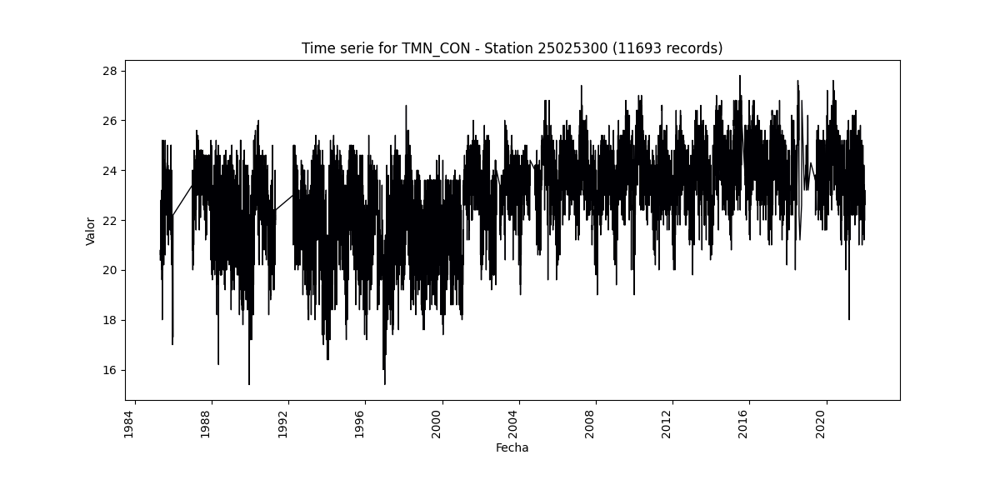
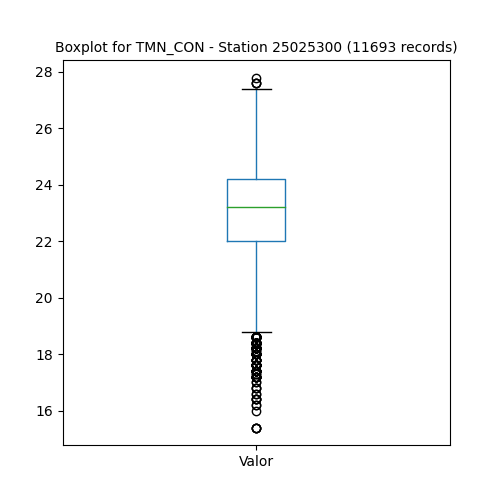
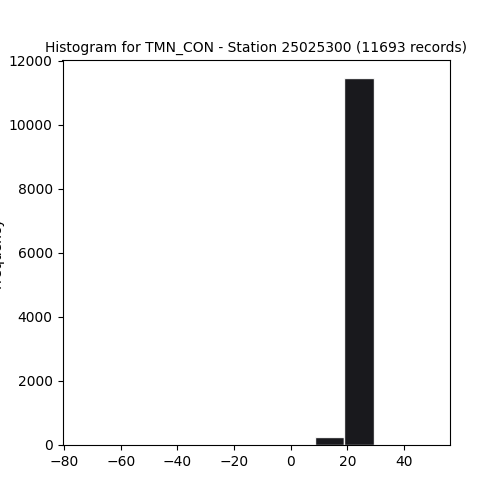
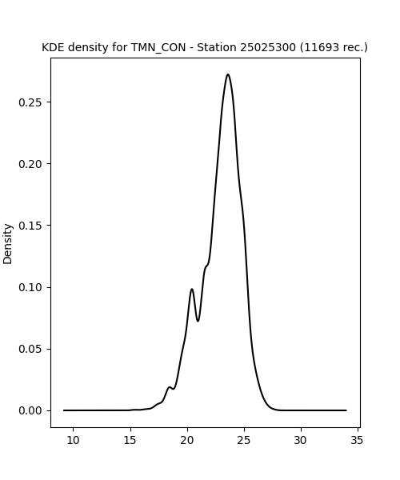

**TMN_CON - Station: ZACAPA [29065010] (1063 rec.)** Location over [Google Maps](http://maps.google.com/maps?q=10.58333333,-74.25) or [Openstreet Map](https://www.openstreetmap.org/query?lat=10.58333333&lon=-74.25)

Station first record

| Fecha               |   CodigoEstacion | NombreEstacion    |   Latitud |   Longitud |   Altitud | Categoria           | Entidad                                                     | AreaOperativa                               | Departamento   | Municipio   | FechaInstalacion    | FechaSuspension     | IdParametro   | Etiqueta   | DescripcionSerie          | Frecuencia   |   Valor |   Grado |   Calificador |   NivelAprobacion |
|:--------------------|-----------------:|:------------------|----------:|-----------:|----------:|:--------------------|:------------------------------------------------------------|:--------------------------------------------|:---------------|:------------|:--------------------|:--------------------|:--------------|:-----------|:--------------------------|:-------------|--------:|--------:|--------------:|------------------:|
| 1980-01-01 00:00:00 |         29065010 | ZACAPA [29065010] |   10.5833 |     -74.25 |        30 | Climática Ordinaria | INSTITUTO DE HIDROLOGIA METEOROLOGIA Y ESTUDIOS AMBIENTALES | Area Operativa 05 - Magdalena-Cesar-Guajira | Magdalena      | El Retén    | 1967-07-15 00:00:00 | 1990-04-15 00:00:00 | TEMPERATURA   | TMN_CON    | Temperatura mínima diaria | Diaria       |    21.4 |      50 |           nan |              1200 |

Statistics table

|       |      Valor |
|:------|-----------:|
| count | 1063       |
| mean  |   21.3162  |
| std   |    1.60256 |
| min   |   15.2     |
| 25%   |   20.4     |
| 50%   |   21.4     |
| 75%   |   22.4     |
| max   |   25.2     |

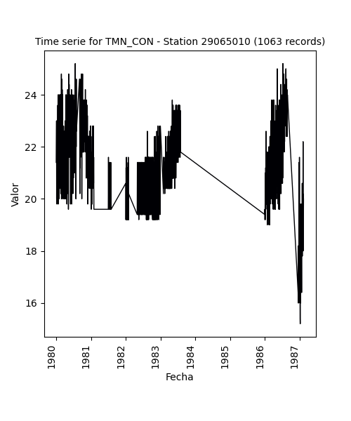
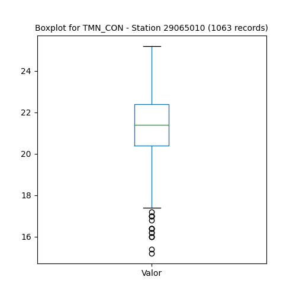
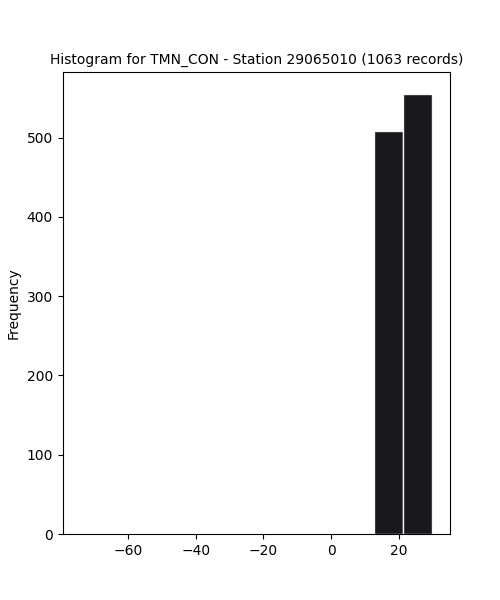
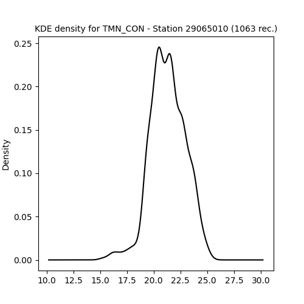

#### Correlation analysis matrix and statistics for TMN_CON

General statistics table
|       |   15015020 |   15065040 |   23215060 |   25025002 |   25025090 |   25025250 |   25025300 |   25025330 |   28015030 |   28015070 |   28025020 |   28025040 |   28025070 |   28025080 |   28025090 |   28025502 |   28035010 |   28035020 |   28035040 |   28035070 |   28045020 |   28045040 |   29065010 |   29065020 |   29065030 |
|:------|-----------:|-----------:|-----------:|-----------:|-----------:|-----------:|-----------:|-----------:|-----------:|-----------:|-----------:|-----------:|-----------:|-----------:|-----------:|-----------:|-----------:|-----------:|-----------:|-----------:|-----------:|-----------:|-----------:|-----------:|-----------:|
| count | 25         | 24         | 24         |  25        |  25        | 24         |  25        |  23        | 24         | 25         | 25         |  24        |  25        | 24         |  25        |  25        |  25        |  25        |  25        | 16         |  22        |  22        |  22        | 25         | 25         |
| mean  |  0.36959   |  0.268286  |  0.302055  |   0.419721 |   0.342449 |  0.289948  |   0.371871 |   0.322837 |  0.370029  |  0.375143  |  0.409914  |   0.223234 |   0.402754 |  0.221282  |   0.424713 |   0.437358 |   0.356861 |   0.306004 |   0.280459 |  0.480595  |   0.353794 |   0.295699 |   0.233076 |  0.31787   |  0.324609  |
| std   |  0.183293  |  0.19119   |  0.183027  |   0.160397 |   0.206286 |  0.191693  |   0.170519 |   0.173867 |  0.207709  |  0.180186  |  0.158886  |   0.224456 |   0.153714 |  0.18548   |   0.155303 |   0.154452 |   0.212418 |   0.256882 |   0.203466 |  0.232576  |   0.273052 |   0.180295 |   0.297331 |  0.185556  |  0.196272  |
| min   |  0.0808038 |  0.0402257 | -0.0467398 |   0.157642 |  -0.135987 | -0.0526369 |   0.063041 |   0.118671 | -0.0102709 |  0.0187116 |  0.0812954 |  -0.193127 |   0.206783 |  0.0187116 |   0.188156 |   0.221015 |   0.139358 |  -0.511045 |  -0.157742 |  0.0822157 |  -0.189765 |   0.131564 |  -0.511045 | -0.0467398 |  0.0340393 |
| 25%   |  0.290339  |  0.144693  |  0.24443   |   0.330302 |   0.262479 |  0.192958  |   0.27212  |   0.24579  |  0.246009  |  0.267598  |  0.348455  |   0.155536 |   0.312936 |  0.146687  |   0.317148 |   0.333597 |   0.256473 |   0.250578 |   0.188156 |  0.360043  |   0.202663 |   0.186731 |   0.120176 |  0.233961  |  0.197737  |
| 50%   |  0.331036  |  0.248206  |  0.297582  |   0.395377 |   0.30623  |  0.298129  |   0.381175 |   0.315337 |  0.317045  |  0.362073  |  0.381175  |   0.217845 |   0.388017 |  0.16729   |   0.411539 |   0.404819 |   0.310216 |   0.31574  |   0.28264  |  0.425691  |   0.395691 |   0.278063 |   0.312991 |  0.317903  |  0.305204  |
| 75%   |  0.452851  |  0.334232  |  0.329465  |   0.458555 |   0.422259 |  0.336113  |   0.455033 |   0.367992 |  0.466831  |  0.434622  |  0.454345  |   0.291262 |   0.452851 |  0.246848  |   0.471839 |   0.505994 |   0.366833 |   0.398163 |   0.344757 |  0.50251   |   0.541663 |   0.335394 |   0.364308 |  0.37338   |  0.399279  |
| max   |  1         |  1         |  1         |   1        |   1        |  1         |   1        |   1        |  1         |  1         |  1         |   1        |   1        |  1         |   1        |   1        |   1        |   1        |   1        |  1         |   1        |   1        |   1        |  1         |  1         |

Correlation matrix [Pivot_TMN_CON_Correlation.csv](Pivot_TMN_CON_Correlation.csv)
|          |   15015020 |    15065040 |    23215060 |   25025002 |   25025090 |    25025250 |   25025300 |   25025330 |    28015030 |   28015070 |   28025020 |    28025040 |   28025070 |    28025080 |   28025090 |   28025502 |   28035010 |   28035020 |   28035040 |    28035070 |    28045020 |   28045040 |    29065010 |   29065020 |   29065030 |
|---------:|-----------:|------------:|------------:|-----------:|-----------:|------------:|-----------:|-----------:|------------:|-----------:|-----------:|------------:|-----------:|------------:|-----------:|-----------:|-----------:|-----------:|-----------:|------------:|------------:|-----------:|------------:|-----------:|-----------:|
| 15015020 |  1         |   0.250952  |   0.300464  |   0.337698 |  0.30623   |   0.299549  |   0.391916 |   0.256988 |   0.484918  |  0.432942  |  0.487388  |   0.290339  |   0.452851 |   0.150458  |   0.558816 |   0.400667 |   0.33754  |  0.281394  |  0.0808038 |   0.0822157 |   0.556011  |   0.330948 |   0.331036  |  0.317903  |  0.519733  |
| 15065040 |  0.250952  |   1         |   0.132892  |   0.33335  |  0.0747713 |   0.0402257 |   0.27212  |   0.118671 |   0.092726  |  0.362073  |  0.345594  |   0.218515  |   0.312077 |   0.148627  |   0.30543  |   0.467279 |   0.274011 |  0.398163  |  0.245461  | nan         |   0.202872  |   0.336877 |   0.0987683 |  0.233961  |  0.173441  |
| 23215060 |  0.300464  |   0.132892  |   1         |   0.531285 |  0.262479  |   0.261272  |   0.328087 |   0.155508 |   0.309139  |  0.382021  |  0.295647  |   0.307559  |   0.359654 |   0.151543  |   0.3483   |   0.333597 |   0.282111 |  0.250578  |  0.299517  | nan         |   0.225987  |   0.204183 |   0.269026  | -0.0467398 |  0.305204  |
| 25025002 |  0.337698  |   0.33335   |   0.531285  |   1        |  0.387819  |   0.296709  |   0.458555 |   0.407842 |   0.593251  |  0.405772  |  0.434721  |   0.395377  |   0.408085 |   0.157642  |   0.523715 |   0.419212 |   0.330302 |  0.393207  |  0.274543  |   0.462385  |   0.648452  |   0.300091 |   0.379544  |  0.315916  |  0.297564  |
| 25025090 |  0.30623   |   0.0747713 |   0.262479  |   0.387819 |  1         |   0.437069  |   0.455488 |   0.422259 |   0.460219  |  0.232797  |  0.296631  |   0.103679  |   0.410116 |   0.277723  |   0.286367 |   0.357382 |   0.244197 |  0.301618  |  0.371648  |   0.609463  |   0.574603  |   0.265678 |  -0.135987  |  0.312485  |  0.246494  |
| 25025250 |  0.299549  |   0.0402257 |   0.261272  |   0.296709 |  0.437069  |   1         |   0.455033 |   0.387634 |   0.283435  |  0.24407   |  0.353244  |  -0.0526369 |   0.303349 |   0.154417  |   0.303243 |   0.309114 |   0.139358 |  0.331898  |  0.319824  | nan         |   0.202593  |   0.145423 |   0.348759  |  0.231118  |  0.164052  |
| 25025300 |  0.391916  |   0.27212   |   0.328087  |   0.458555 |  0.455488  |   0.455033  |   1        |   0.342541 |   0.247898  |  0.240349  |  0.381175  |   0.179477  |   0.517465 |   0.358027  |   0.416775 |   0.403363 |   0.286364 |  0.462395  |  0.388409  |   0.475224  |   0.063041  |   0.25168  |   0.299492  |  0.424152  |  0.197737  |
| 25025330 |  0.256988  |   0.118671  |   0.155508  |   0.407842 |  0.422259  |   0.387634  |   0.342541 |   1        |   0.319469  |  0.315337  |  0.348455  |   0.287918  |   0.319323 |   0.176938  |   0.431398 |   0.311427 |   0.175066 |  0.239671  |  0.289347  |   0.362604  | nan         |   0.131564 | nan         |  0.37338   |  0.251908  |
| 28015030 |  0.484918  |   0.092726  |   0.309139  |   0.593251 |  0.460219  |   0.283435  |   0.247898 |   0.319469 |   1         |  0.456085  |  0.507326  |   0.150956  |   0.411162 |   0.236557  |   0.471839 |   0.671773 |   0.294162 |  0.465162  |  0.170714  | nan         |   0.309929  |   0.314622 |   0.240345  | -0.0102709 |  0.399279  |
| 28015070 |  0.432942  |   0.362073  |   0.382021  |   0.405772 |  0.232797  |   0.24407   |   0.240349 |   0.315337 |   0.456085  |  1         |  0.555969  |   0.267598  |   0.253664 |   0.0187116 |   0.471006 |   0.528353 |   0.421438 |  0.273169  |  0.271199  |   0.553671  |   0.434622  |   0.293519 |   0.341165  |  0.199426  |  0.423604  |
| 28025020 |  0.487388  |   0.345594  |   0.295647  |   0.434721 |  0.296631  |   0.353244  |   0.381175 |   0.348455 |   0.507326  |  0.555969  |  1         |   0.289343  |   0.392671 |   0.0812954 |   0.571744 |   0.454345 |   0.366833 |  0.356484  |  0.295104  |   0.412088  |   0.498618  |   0.413928 |   0.392612  |  0.359246  |  0.357377  |
| 28025040 |  0.290339  |   0.218515  |   0.307559  |   0.395377 |  0.103679  |  -0.0526369 |   0.179477 |   0.287918 |   0.150956  |  0.267598  |  0.289343  |   1         |   0.206783 |   0.143162  |   0.401121 |   0.294033 |   0.157063 |  0.31574   |  0.170425  | nan         |  -0.189765  |   0.168399 |  -0.193127  |  0.228491  |  0.217175  |
| 28025070 |  0.452851  |   0.312077  |   0.359654  |   0.408085 |  0.410116  |   0.303349  |   0.517465 |   0.319323 |   0.411162  |  0.253664  |  0.392671  |   0.206783  |   1        |   0.312936  |   0.492847 |   0.511294 |   0.388017 |  0.520712  |  0.361496  |   0.439294  |   0.467219  |   0.382847 |   0.240885  |  0.375264  |  0.228844  |
| 28025080 |  0.150458  |   0.148627  |   0.151543  |   0.157642 |  0.277723  |   0.154417  |   0.358027 |   0.176938 |   0.236557  |  0.0187116 |  0.0812954 |   0.143162  |   0.312936 |   1         |   0.289944 |   0.221015 |   0.22251  |  0.147862  |  0.222902  | nan         |   0.115018  |   0.185938 |   0.0997332 |  0.329643  |  0.10816   |
| 28025090 |  0.558816  |   0.30543   |   0.3483    |   0.523715 |  0.286367  |   0.303243  |   0.416775 |   0.431398 |   0.471839  |  0.471006  |  0.571744  |   0.401121  |   0.492847 |   0.289944  |   1        |   0.406832 |   0.411539 |  0.317148  |  0.188156  |   0.324325  |   0.56418   |   0.290449 |   0.39116   |  0.425587  |  0.425901  |
| 28025502 |  0.400667  |   0.467279  |   0.333597  |   0.419212 |  0.357382  |   0.309114  |   0.403363 |   0.311427 |   0.671773  |  0.528353  |  0.454345  |   0.294033  |   0.511294 |   0.221015  |   0.406832 |   1        |   0.525683 |  0.550271  |  0.505994  |   0.485457  |   0.364993  |   0.404819 |   0.32649   |  0.32452   |  0.356045  |
| 28035010 |  0.33754   |   0.274011  |   0.282111  |   0.330302 |  0.244197  |   0.139358  |   0.286364 |   0.175066 |   0.294162  |  0.421438  |  0.366833  |   0.157063  |   0.388017 |   0.22251   |   0.411539 |   0.525683 |   1        |  0.310216  |  0.344757  |   0.996006  |   0.256473  |   0.366733 |   0.181506  |  0.27371   |  0.335927  |
| 28035020 |  0.281394  |   0.398163  |   0.250578  |   0.393207 |  0.301618  |   0.331898  |   0.462395 |   0.239671 |   0.465162  |  0.273169  |  0.356484  |   0.31574   |   0.520712 |   0.147862  |   0.317148 |   0.550271 |   0.310216 |  1         |  0.413293  |   0.352359  |  -0.0511999 |   0.207293 |  -0.511045  |  0.289684  |  0.0340393 |
| 28035040 |  0.0808038 |   0.245461  |   0.299517  |   0.274543 |  0.371648  |   0.319824  |   0.388409 |   0.289347 |   0.170714  |  0.271199  |  0.295104  |   0.170425  |   0.361496 |   0.222902  |   0.188156 |   0.505994 |   0.344757 |  0.413293  |  1         |   0.340107  |   0.0157243 |   0.18911  |  -0.157742  |  0.28264   |  0.128044  |
| 28035070 |  0.0822157 | nan         | nan         |   0.462385 |  0.609463  | nan         |   0.475224 |   0.362604 | nan         |  0.553671  |  0.412088  | nan         |   0.439294 | nan         |   0.324325 |   0.485457 |   0.996006 |  0.352359  |  0.340107  |   1         | nan         | nan        | nan         |  0.39174   |  0.402582  |
| 28045020 |  0.556011  |   0.202872  |   0.225987  |   0.648452 |  0.574603  |   0.202593  |   0.063041 | nan        |   0.309929  |  0.434622  |  0.498618  |  -0.189765  |   0.467219 |   0.115018  |   0.56418  |   0.364993 |   0.256473 | -0.0511999 |  0.0157243 | nan         |   1         | nan        |   0.457084  |  0.426388  |  0.640617  |
| 28045040 |  0.330948  |   0.336877  |   0.204183  |   0.300091 |  0.265678  |   0.145423  |   0.25168  |   0.131564 |   0.314622  |  0.293519  |  0.413928  |   0.168399  |   0.382847 |   0.185938  |   0.290449 |   0.404819 |   0.366733 |  0.207293  |  0.18911   | nan         | nan         |   1        | nan         |  0.15479   |  0.166497  |
| 29065010 |  0.331036  |   0.0987683 |   0.269026  |   0.379544 | -0.135987  |   0.348759  |   0.299492 | nan        |   0.240345  |  0.341165  |  0.392612  |  -0.193127  |   0.240885 |   0.0997332 |   0.39116  |   0.32649  |   0.181506 | -0.511045  | -0.157742  | nan         |   0.457084  | nan        |   1         |  0.363337  |  0.364631  |
| 29065020 |  0.317903  |   0.233961  |  -0.0467398 |   0.315916 |  0.312485  |   0.231118  |   0.424152 |   0.37338  |  -0.0102709 |  0.199426  |  0.359246  |   0.228491  |   0.375264 |   0.329643  |   0.425587 |   0.32452  |   0.27371  |  0.289684  |  0.28264   |   0.39174   |   0.426388  |   0.15479  |   0.363337  |  1         |  0.370375  |
| 29065030 |  0.519733  |   0.173441  |   0.305204  |   0.297564 |  0.246494  |   0.164052  |   0.197737 |   0.251908 |   0.399279  |  0.423604  |  0.357377  |   0.217175  |   0.228844 |   0.10816   |   0.425901 |   0.356045 |   0.335927 |  0.0340393 |  0.128044  |   0.402582  |   0.640617  |   0.166497 |   0.364631  |  0.370375  |  1         |

Correlation statistics table
|       |   15015020 |   15065040 |   23215060 |   25025002 |   25025090 |   25025250 |   25025300 |   25025330 |   28015030 |   28015070 |   28025020 |   28025040 |   28025070 |   28025080 |   28025090 |   28025502 |   28035010 |   28035020 |   28035040 |   28035070 |   28045020 |   28045040 |   29065010 |   29065020 |   29065030 |
|:------|-----------:|-----------:|-----------:|-----------:|-----------:|-----------:|-----------:|-----------:|-----------:|-----------:|-----------:|-----------:|-----------:|-----------:|-----------:|-----------:|-----------:|-----------:|-----------:|-----------:|-----------:|-----------:|-----------:|-----------:|-----------:|
| count | 25         | 24         | 24         |  25        |  25        | 24         |  25        |  23        | 24         | 25         | 25         |  24        |  25        | 24         |  25        |  25        |  25        |  25        |  25        | 16         |  22        |  22        |  22        | 25         | 25         |
| mean  |  0.36959   |  0.268286  |  0.302055  |   0.419721 |   0.342449 |  0.289948  |   0.371871 |   0.322837 |  0.370029  |  0.375143  |  0.409914  |   0.223234 |   0.402754 |  0.221282  |   0.424713 |   0.437358 |   0.356861 |   0.306004 |   0.280459 |  0.480595  |   0.353794 |   0.295699 |   0.233076 |  0.31787   |  0.324609  |
| std   |  0.183293  |  0.19119   |  0.183027  |   0.160397 |   0.206286 |  0.191693  |   0.170519 |   0.173867 |  0.207709  |  0.180186  |  0.158886  |   0.224456 |   0.153714 |  0.18548   |   0.155303 |   0.154452 |   0.212418 |   0.256882 |   0.203466 |  0.232576  |   0.273052 |   0.180295 |   0.297331 |  0.185556  |  0.196272  |
| min   |  0.0808038 |  0.0402257 | -0.0467398 |   0.157642 |  -0.135987 | -0.0526369 |   0.063041 |   0.118671 | -0.0102709 |  0.0187116 |  0.0812954 |  -0.193127 |   0.206783 |  0.0187116 |   0.188156 |   0.221015 |   0.139358 |  -0.511045 |  -0.157742 |  0.0822157 |  -0.189765 |   0.131564 |  -0.511045 | -0.0467398 |  0.0340393 |
| 25%   |  0.290339  |  0.144693  |  0.24443   |   0.330302 |   0.262479 |  0.192958  |   0.27212  |   0.24579  |  0.246009  |  0.267598  |  0.348455  |   0.155536 |   0.312936 |  0.146687  |   0.317148 |   0.333597 |   0.256473 |   0.250578 |   0.188156 |  0.360043  |   0.202663 |   0.186731 |   0.120176 |  0.233961  |  0.197737  |
| 50%   |  0.331036  |  0.248206  |  0.297582  |   0.395377 |   0.30623  |  0.298129  |   0.381175 |   0.315337 |  0.317045  |  0.362073  |  0.381175  |   0.217845 |   0.388017 |  0.16729   |   0.411539 |   0.404819 |   0.310216 |   0.31574  |   0.28264  |  0.425691  |   0.395691 |   0.278063 |   0.312991 |  0.317903  |  0.305204  |
| 75%   |  0.452851  |  0.334232  |  0.329465  |   0.458555 |   0.422259 |  0.336113  |   0.455033 |   0.367992 |  0.466831  |  0.434622  |  0.454345  |   0.291262 |   0.452851 |  0.246848  |   0.471839 |   0.505994 |   0.366833 |   0.398163 |   0.344757 |  0.50251   |   0.541663 |   0.335394 |   0.364308 |  0.37338   |  0.399279  |
| max   |  1         |  1         |  1         |   1        |   1        |  1         |   1        |   1        |  1         |  1         |  1         |   1        |   1        |  1         |   1        |   1        |   1        |   1        |   1        |  1         |   1        |   1        |   1        |  1         |  1         |

### Analysis from 1980 to 2021 for Etiqueta == "EV_TT_D": 4821 (0.94%)

Pivot table: [Pivot_EV_TT_D.csv](Pivot_EV_TT_D.csv)
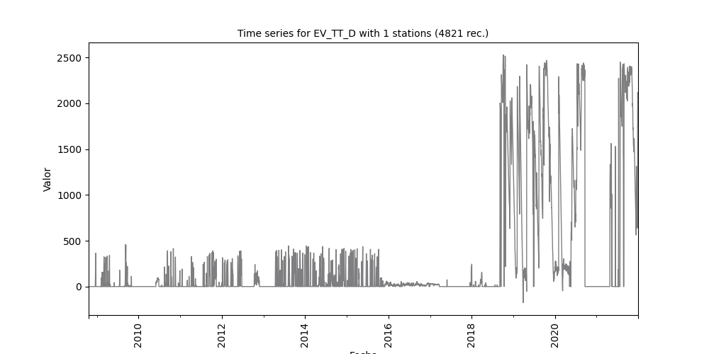
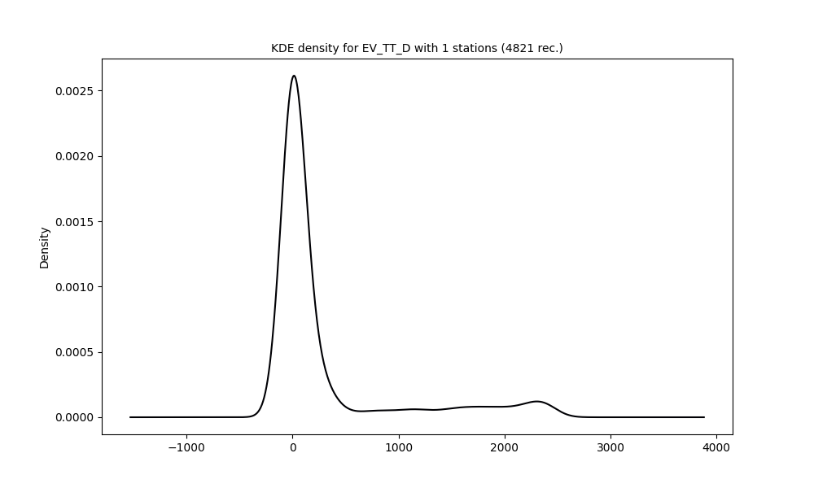

**EV_TT_D - Station: LA GRAN VIA - AUT [29065130] (4821 rec.)** Location over [Google Maps](http://maps.google.com/maps?q=10.85,-74.13333333) or [Openstreet Map](https://www.openstreetmap.org/query?lat=10.85&lon=-74.13333333)

Station first record

| Fecha               |   CodigoEstacion | NombreEstacion               |   Latitud |   Longitud |   Altitud | Categoria         | Entidad                                                     | AreaOperativa                               | Departamento   | Municipio     | FechaInstalacion    | FechaSuspension   | IdParametro   | Etiqueta   | DescripcionSerie         | Frecuencia   |   Valor |   Grado |   Calificador |   NivelAprobacion |
|:--------------------|-----------------:|:-----------------------------|----------:|-----------:|----------:|:------------------|:------------------------------------------------------------|:--------------------------------------------|:---------------|:--------------|:--------------------|:------------------|:--------------|:-----------|:-------------------------|:-------------|--------:|--------:|--------------:|------------------:|
| 2008-10-20 00:00:00 |         29065130 | LA GRAN VIA - AUT [29065130] |     10.85 |   -74.1333 |        30 | Agrometeorológica | INSTITUTO DE HIDROLOGIA METEOROLOGIA Y ESTUDIOS AMBIENTALES | Area Operativa 05 - Magdalena-Cesar-Guajira | Magdalena      | Zona Bananera | 2008-01-10 00:00:00 | NaT               | EVAPORACION   | EV_TT_D    | Evaporación total diaria | Diaria       |       0 |      50 |           nan |               900 |

Statistics table

|       |    Valor |
|:------|---------:|
| count | 4821     |
| mean  |  281.089 |
| std   |  625.398 |
| min   | -176     |
| 25%   |    0     |
| 50%   |    0     |
| 75%   |  139     |
| max   | 2529     |

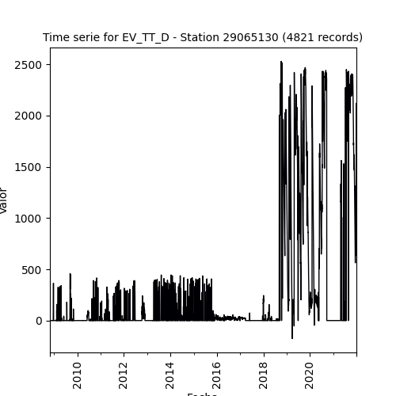
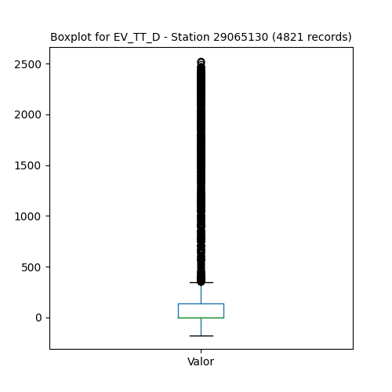

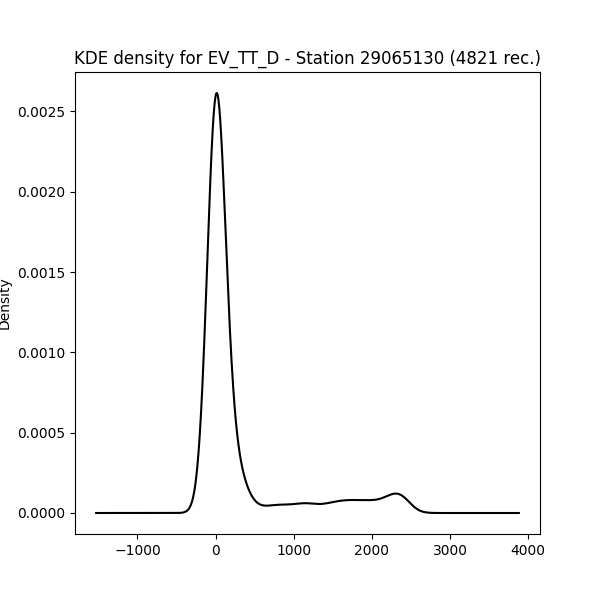

#### Correlation analysis matrix and statistics for EV_TT_D

General statistics table
|       |   29065130 |
|:------|-----------:|
| count |          1 |
| mean  |          1 |
| std   |        nan |
| min   |          1 |
| 25%   |          1 |
| 50%   |          1 |
| 75%   |          1 |
| max   |          1 |

Correlation matrix [Pivot_EV_TT_D_Correlation.csv](Pivot_EV_TT_D_Correlation.csv)
|          |   29065130 |
|---------:|-----------:|
| 29065130 |          1 |

Correlation statistics table
|       |   29065130 |
|:------|-----------:|
| count |          1 |
| mean  |          1 |
| std   |        nan |
| min   |          1 |
| 25%   |          1 |
| 50%   |          1 |
| 75%   |          1 |
| max   |          1 |

### Analysis from 1980 to 2021 for Etiqueta == "Q_MEDIA_M": 21126 (4.1%)

Pivot table: [Pivot_Q_MEDIA_M.csv](Pivot_Q_MEDIA_M.csv)
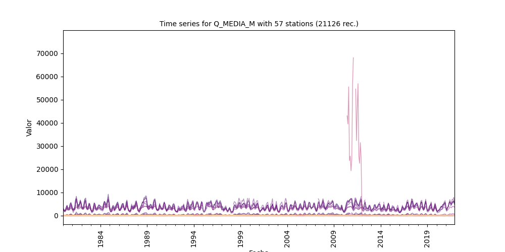
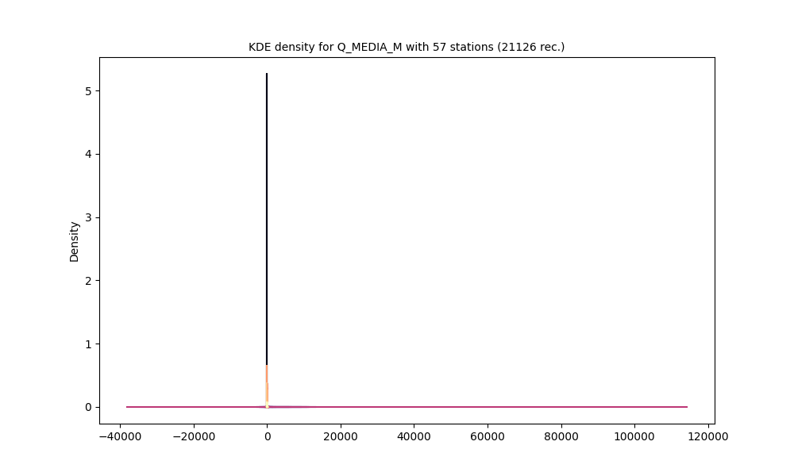

**Q_MEDIA_M - Station: ALTO DEL ROSARIO [25027400] (489 rec.)** Location over [Google Maps](http://maps.google.com/maps?q=8.794444444,-74.16027778) or [Openstreet Map](https://www.openstreetmap.org/query?lat=8.794444444&lon=-74.16027778)

Station first record

| Fecha               |   CodigoEstacion | NombreEstacion              |   Latitud |   Longitud |   Altitud | Categoria    | Entidad                                                     | AreaOperativa                               | Departamento   | Municipio         | FechaInstalacion    | FechaSuspension   | IdParametro   | Etiqueta   | DescripcionSerie     | Frecuencia   |   Valor |   Grado |   Calificador |   NivelAprobacion |
|:--------------------|-----------------:|:----------------------------|----------:|-----------:|----------:|:-------------|:------------------------------------------------------------|:--------------------------------------------|:---------------|:------------------|:--------------------|:------------------|:--------------|:-----------|:---------------------|:-------------|--------:|--------:|--------------:|------------------:|
| 1980-01-01 00:00:00 |         25027400 | ALTO DEL ROSARIO [25027400] |   8.79444 |   -74.1603 |        24 | Limnimétrica | INSTITUTO DE HIDROLOGIA METEOROLOGIA Y ESTUDIOS AMBIENTALES | Area Operativa 02 - Atlántico-Bolivar-Sucre | Bolivar        | Altos Del Rosario | 1973-07-15 00:00:00 | NaT               | CAUDAL        | Q_MEDIA_M  | Caudal medio mensual | Mensual      |   128.4 |      50 |           nan |               900 |

Statistics table

|       |    Valor |
|:------|---------:|
| count | 489      |
| mean  | 151.668  |
| std   |  70.7867 |
| min   |   4.846  |
| 25%   |  95.15   |
| 50%   | 151      |
| 75%   | 205      |
| max   | 328.7    |

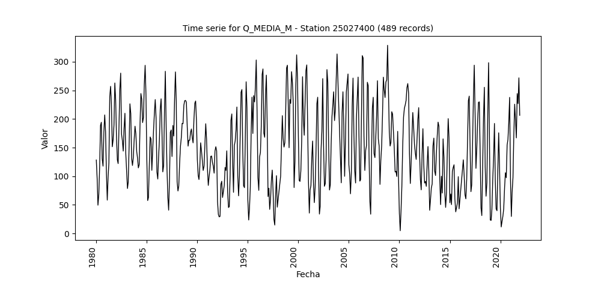
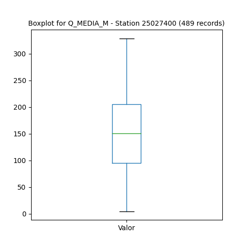
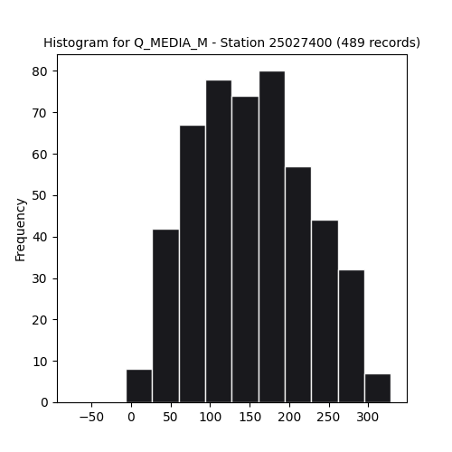
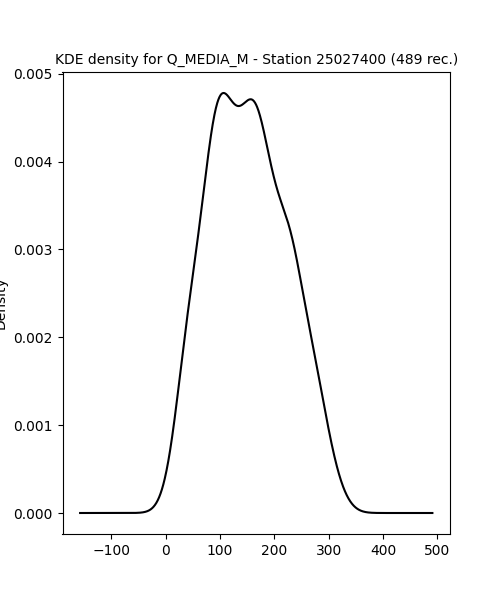

**Q_MEDIA_M - Station: ARMENIA [25027360] (462 rec.)** Location over [Google Maps](http://maps.google.com/maps?q=8.898333333,-74.39) or [Openstreet Map](https://www.openstreetmap.org/query?lat=8.898333333&lon=-74.39)

Station first record

| Fecha               |   CodigoEstacion | NombreEstacion     |   Latitud |   Longitud |   Altitud | Categoria    | Entidad                                                     | AreaOperativa                               | Departamento   | Municipio   | FechaInstalacion    | FechaSuspension   | IdParametro   | Etiqueta   | DescripcionSerie     | Frecuencia   |   Valor |   Grado |   Calificador |   NivelAprobacion |
|:--------------------|-----------------:|:-------------------|----------:|-----------:|----------:|:-------------|:------------------------------------------------------------|:--------------------------------------------|:---------------|:------------|:--------------------|:------------------|:--------------|:-----------|:---------------------|:-------------|--------:|--------:|--------------:|------------------:|
| 1980-01-01 00:00:00 |         25027360 | ARMENIA [25027360] |   8.89833 |     -74.39 |        22 | Limnimétrica | INSTITUTO DE HIDROLOGIA METEOROLOGIA Y ESTUDIOS AMBIENTALES | Area Operativa 02 - Atlántico-Bolivar-Sucre | Bolivar        | Pinillos    | 1973-03-15 00:00:00 | NaT               | CAUDAL        | Q_MEDIA_M  | Caudal medio mensual | Mensual      |    2350 |      50 |           nan |               900 |

Statistics table

|       |    Valor |
|:------|---------:|
| count |  462     |
| mean  | 2790.92  |
| std   |  695.773 |
| min   | 1099.06  |
| 25%   | 2304.75  |
| 50%   | 2800.5   |
| 75%   | 3309     |
| max   | 4208.35  |

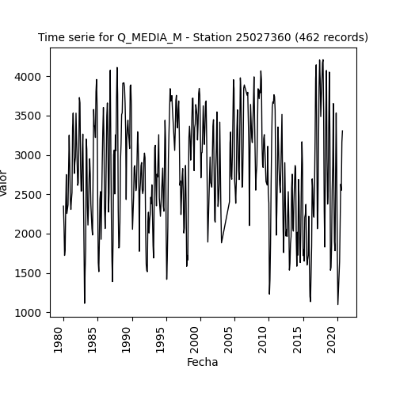
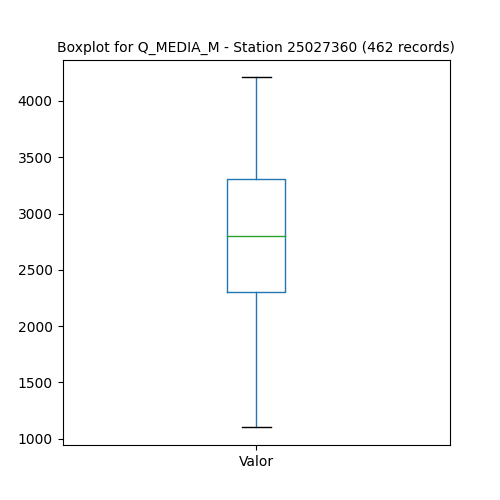
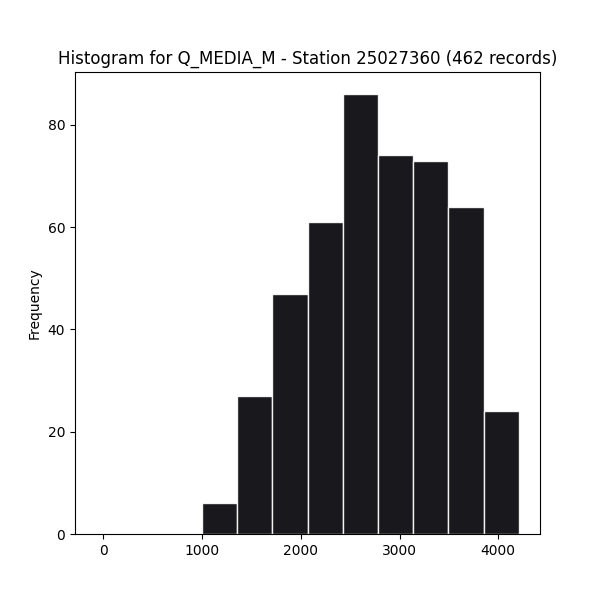
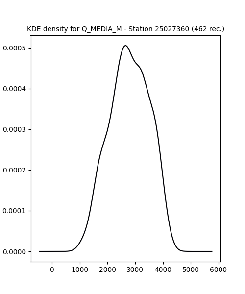

**Q_MEDIA_M - Station: CHAPETONA LA [25027620] (415 rec.)** Location over [Google Maps](http://maps.google.com/maps?q=8.8875,-73.96916667) or [Openstreet Map](https://www.openstreetmap.org/query?lat=8.8875&lon=-73.96916667)

Station first record

| Fecha               |   CodigoEstacion | NombreEstacion          |   Latitud |   Longitud |   Altitud | Categoria    | Entidad                                                     | AreaOperativa                               | Departamento   | Municipio   | FechaInstalacion    | FechaSuspension   | IdParametro   | Etiqueta   | DescripcionSerie     | Frecuencia   |   Valor |   Grado | Calificador    |   NivelAprobacion |
|:--------------------|-----------------:|:------------------------|----------:|-----------:|----------:|:-------------|:------------------------------------------------------------|:--------------------------------------------|:---------------|:------------|:--------------------|:------------------|:--------------|:-----------|:---------------------|:-------------|--------:|--------:|:---------------|------------------:|
| 1980-01-01 00:00:00 |         25027620 | CHAPETONA LA [25027620] |    8.8875 |   -73.9692 |        30 | Limnimétrica | INSTITUTO DE HIDROLOGIA METEOROLOGIA Y ESTUDIOS AMBIENTALES | Area Operativa 02 - Atlántico-Bolivar-Sucre | Bolivar        | El Peñón    | 1974-09-15 00:00:00 | NaT               | CAUDAL        | Q_MEDIA_M  | Caudal medio mensual | Mensual      |   34.14 |       4 | EST. REGRESION |               900 |

Statistics table

|       |    Valor |
|:------|---------:|
| count | 415      |
| mean  |  49.625  |
| std   |  38.9781 |
| min   |   1.309  |
| 25%   |  18.975  |
| 50%   |  38.6171 |
| 75%   |  72.32   |
| max   | 202.2    |

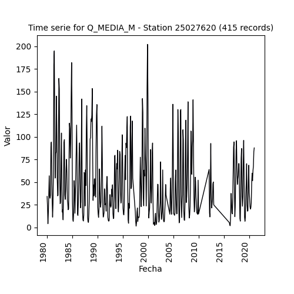
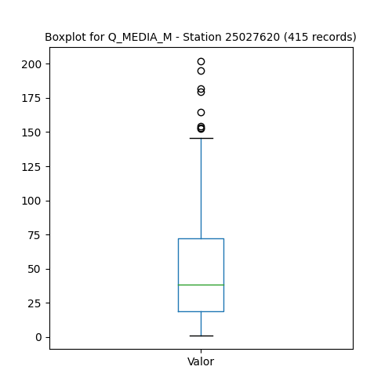
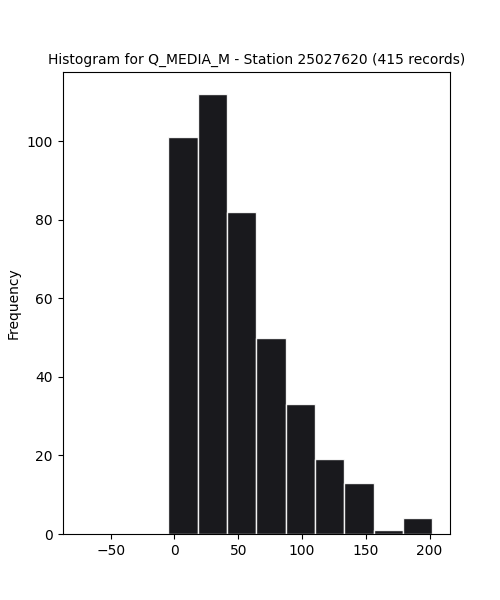
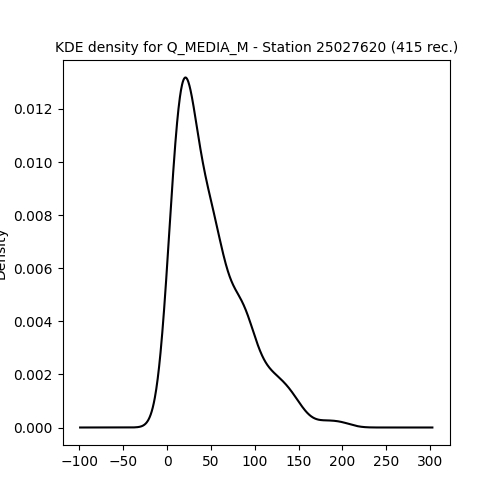

**Q_MEDIA_M - Station: LAS AGUADAS [25027490] (504 rec.)** Location over [Google Maps](http://maps.google.com/maps?q=8.949997222,-74.049997222) or [Openstreet Map](https://www.openstreetmap.org/query?lat=8.949997222&lon=-74.049997222)

Station first record

| Fecha               |   CodigoEstacion | NombreEstacion         |   Latitud |   Longitud |   Altitud | Categoria    | Entidad                                                     | AreaOperativa                               | Departamento   | Municipio          | FechaInstalacion    | FechaSuspension   | IdParametro   | Etiqueta   | DescripcionSerie     | Frecuencia   |   Valor |   Grado |   Calificador |   NivelAprobacion |
|:--------------------|-----------------:|:-----------------------|----------:|-----------:|----------:|:-------------|:------------------------------------------------------------|:--------------------------------------------|:---------------|:-------------------|:--------------------|:------------------|:--------------|:-----------|:---------------------|:-------------|--------:|--------:|--------------:|------------------:|
| 1980-01-01 00:00:00 |         25027490 | LAS AGUADAS [25027490] |      8.95 |     -74.05 |        27 | Limnimétrica | INSTITUTO DE HIDROLOGIA METEOROLOGIA Y ESTUDIOS AMBIENTALES | Area Operativa 02 - Atlántico-Bolivar-Sucre | Bolivar        | San Martín De Loba | 1973-03-15 00:00:00 | NaT               | CAUDAL        | Q_MEDIA_M  | Caudal medio mensual | Mensual      |    2761 |      50 |           nan |               900 |

Statistics table

|       |   Valor |
|:------|--------:|
| count |  504    |
| mean  | 3661.52 |
| std   | 1335.23 |
| min   | 1292    |
| 25%   | 2605    |
| 50%   | 3467    |
| 75%   | 4490.53 |
| max   | 7841.87 |

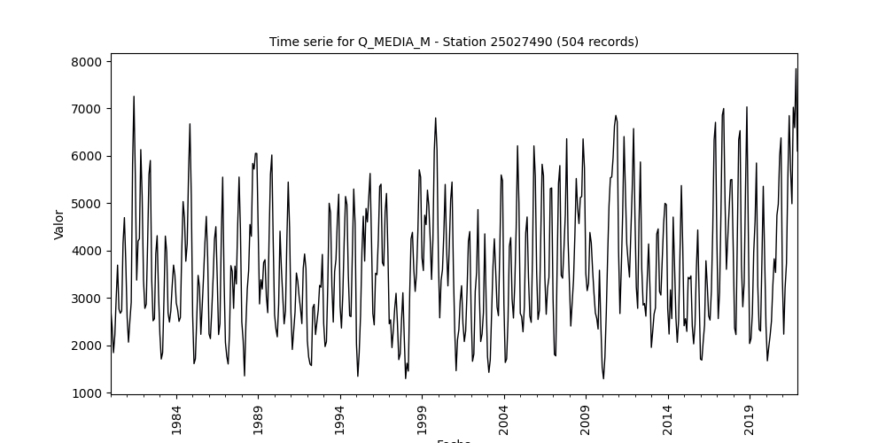
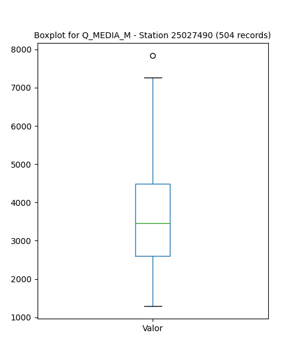
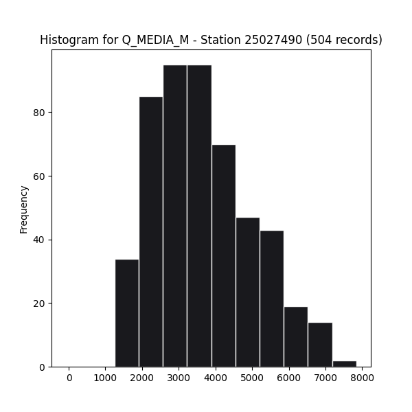
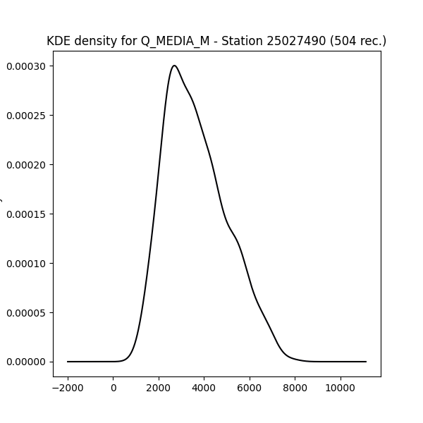

**Q_MEDIA_M - Station: PALOMAS LAS [25027390] (456 rec.)** Location over [Google Maps](http://maps.google.com/maps?q=8.830555556,-74.17055556) or [Openstreet Map](https://www.openstreetmap.org/query?lat=8.830555556&lon=-74.17055556)

Station first record

| Fecha               |   CodigoEstacion | NombreEstacion         |   Latitud |   Longitud |   Altitud | Categoria    | Entidad                                                     | AreaOperativa                               | Departamento   | Municipio         | FechaInstalacion    | FechaSuspension   | IdParametro   | Etiqueta   | DescripcionSerie     | Frecuencia   |   Valor |   Grado |   Calificador |   NivelAprobacion |
|:--------------------|-----------------:|:-----------------------|----------:|-----------:|----------:|:-------------|:------------------------------------------------------------|:--------------------------------------------|:---------------|:------------------|:--------------------|:------------------|:--------------|:-----------|:---------------------|:-------------|--------:|--------:|--------------:|------------------:|
| 1980-01-01 00:00:00 |         25027390 | PALOMAS LAS [25027390] |   8.83056 |   -74.1706 |        24 | Limnimétrica | INSTITUTO DE HIDROLOGIA METEOROLOGIA Y ESTUDIOS AMBIENTALES | Area Operativa 02 - Atlántico-Bolivar-Sucre | Bolivar        | Altos Del Rosario | 1973-07-15 00:00:00 | NaT               | CAUDAL        | Q_MEDIA_M  | Caudal medio mensual | Mensual      |    2550 |      50 |           nan |               900 |

Statistics table

|       |   Valor |
|:------|--------:|
| count |  456    |
| mean  | 3334.22 |
| std   | 1006.61 |
| min   | 1250    |
| 25%   | 2557.75 |
| 50%   | 3251    |
| 75%   | 3985    |
| max   | 6532    |

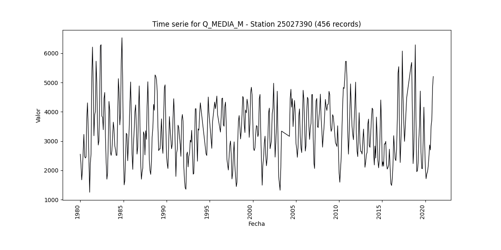
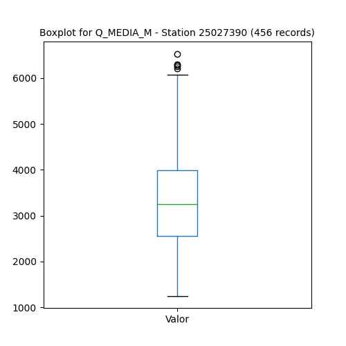
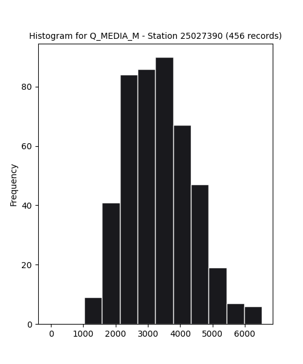
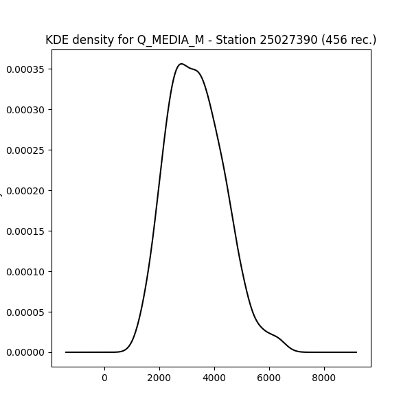

**Q_MEDIA_M - Station: PENONCITO [25027330] (484 rec.)** Location over [Google Maps](http://maps.google.com/maps?q=8.989722222,-73.94722222) or [Openstreet Map](https://www.openstreetmap.org/query?lat=8.989722222&lon=-73.94722222)

Station first record

| Fecha               |   CodigoEstacion | NombreEstacion       |   Latitud |   Longitud |   Altitud | Categoria    | Entidad                                                     | AreaOperativa                               | Departamento   | Municipio   | FechaInstalacion    | FechaSuspension   | IdParametro   | Etiqueta   | DescripcionSerie     | Frecuencia   |   Valor |   Grado |   Calificador |   NivelAprobacion |
|:--------------------|-----------------:|:---------------------|----------:|-----------:|----------:|:-------------|:------------------------------------------------------------|:--------------------------------------------|:---------------|:------------|:--------------------|:------------------|:--------------|:-----------|:---------------------|:-------------|--------:|--------:|--------------:|------------------:|
| 1980-01-01 00:00:00 |         25027330 | PENONCITO [25027330] |   8.98972 |   -73.9472 |        28 | Limnimétrica | INSTITUTO DE HIDROLOGIA METEOROLOGIA Y ESTUDIOS AMBIENTALES | Area Operativa 02 - Atlántico-Bolivar-Sucre | Bolivar        | El Peñón    | 1972-09-15 00:00:00 | NaT               | CAUDAL        | Q_MEDIA_M  | Caudal medio mensual | Mensual      |    2902 |      50 |           nan |               900 |

Statistics table

|       |   Valor |
|:------|--------:|
| count |  484    |
| mean  | 3977.16 |
| std   | 1256.45 |
| min   | 1171.66 |
| 25%   | 3003.75 |
| 50%   | 3845    |
| 75%   | 4853.25 |
| max   | 7464    |

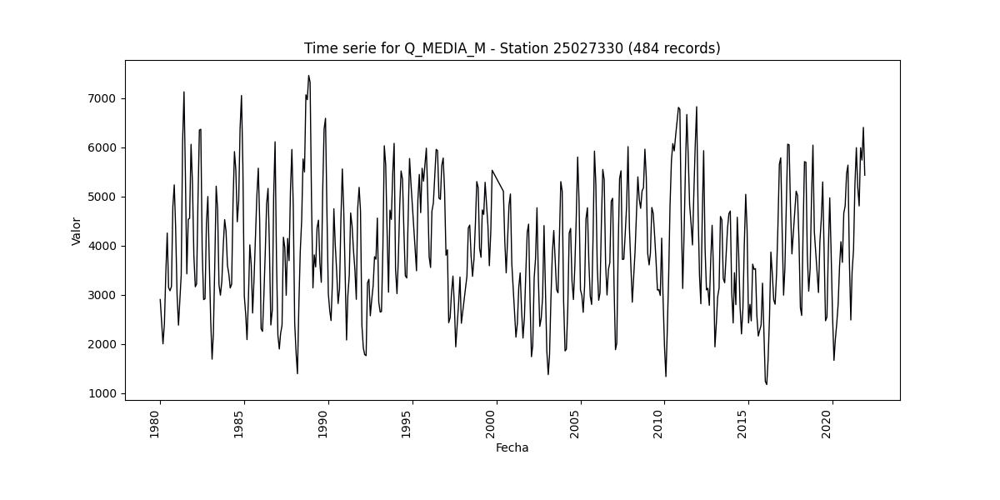

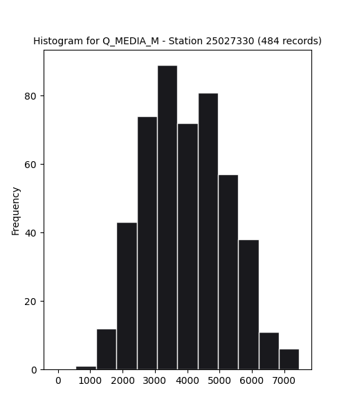
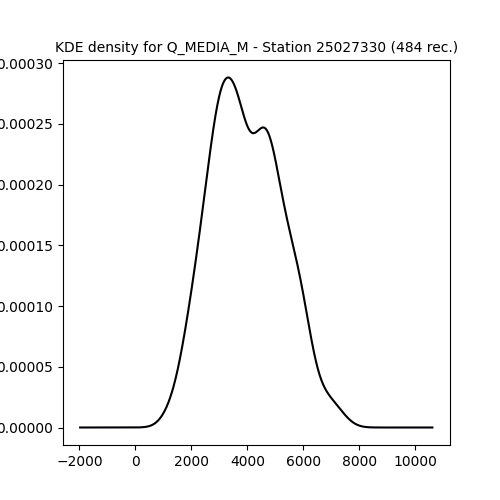

**Q_MEDIA_M - Station: REGIDOR [25027410] (423 rec.)** Location over [Google Maps](http://maps.google.com/maps?q=8.666333333,-73.82080556) or [Openstreet Map](https://www.openstreetmap.org/query?lat=8.666333333&lon=-73.82080556)

Station first record

| Fecha               |   CodigoEstacion | NombreEstacion     |   Latitud |   Longitud |   Altitud | Categoria    | Entidad                                                     | AreaOperativa                          | Departamento   | Municipio   | FechaInstalacion    | FechaSuspension   | IdParametro   | Etiqueta   | DescripcionSerie     | Frecuencia   |   Valor |   Grado |   Calificador |   NivelAprobacion |
|:--------------------|-----------------:|:-------------------|----------:|-----------:|----------:|:-------------|:------------------------------------------------------------|:---------------------------------------|:---------------|:------------|:--------------------|:------------------|:--------------|:-----------|:---------------------|:-------------|--------:|--------:|--------------:|------------------:|
| 1980-01-01 00:00:00 |         25027410 | REGIDOR [25027410] |   8.66633 |   -73.8208 |        35 | Limnimétrica | INSTITUTO DE HIDROLOGIA METEOROLOGIA Y ESTUDIOS AMBIENTALES | Area Operativa 08 - Santanderes-Arauca | Bolivar        | Regidor     | 1973-04-15 00:00:00 | NaT               | CAUDAL        | Q_MEDIA_M  | Caudal medio mensual | Mensual      |    2200 |      50 |           nan |               900 |

Statistics table

|       |   Valor |
|:------|--------:|
| count |  423    |
| mean  | 4282.86 |
| std   | 1514.27 |
| min   | 1507    |
| 25%   | 3054    |
| 50%   | 4174    |
| 75%   | 5356.16 |
| max   | 8177    |

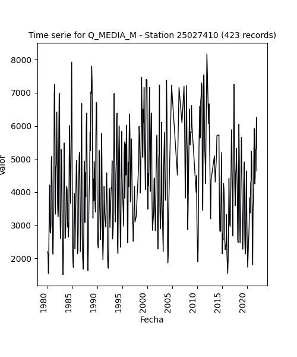
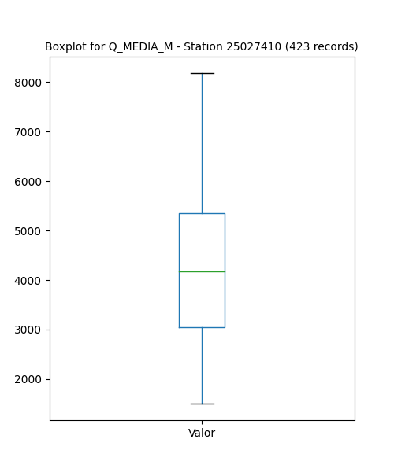
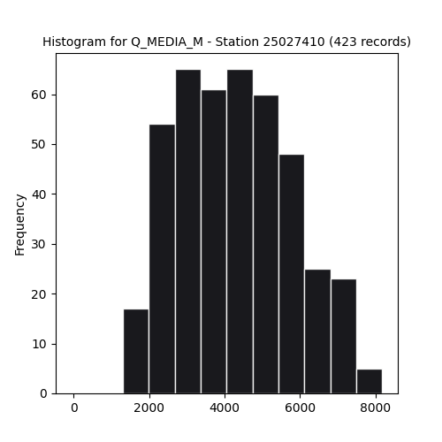
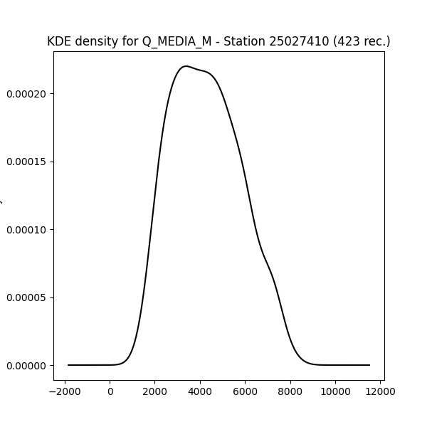

**Q_MEDIA_M - Station: SAN ROQUE [25027320] (473 rec.)** Location over [Google Maps](http://maps.google.com/maps?q=9.07,-74.16) or [Openstreet Map](https://www.openstreetmap.org/query?lat=9.07&lon=-74.16)

Station first record

| Fecha               |   CodigoEstacion | NombreEstacion       |   Latitud |   Longitud |   Altitud | Categoria    | Entidad                                                     | AreaOperativa                               | Departamento   | Municipio   | FechaInstalacion    | FechaSuspension   | IdParametro   | Etiqueta   | DescripcionSerie     | Frecuencia   |   Valor |   Grado |   Calificador |   NivelAprobacion |
|:--------------------|-----------------:|:---------------------|----------:|-----------:|----------:|:-------------|:------------------------------------------------------------|:--------------------------------------------|:---------------|:------------|:--------------------|:------------------|:--------------|:-----------|:---------------------|:-------------|--------:|--------:|--------------:|------------------:|
| 1980-01-01 00:00:00 |         25027320 | SAN ROQUE [25027320] |      9.07 |     -74.16 |        24 | Limnimétrica | INSTITUTO DE HIDROLOGIA METEOROLOGIA Y ESTUDIOS AMBIENTALES | Area Operativa 02 - Atlántico-Bolivar-Sucre | Bolivar        | Margarita   | 1972-09-15 00:00:00 | NaT               | CAUDAL        | Q_MEDIA_M  | Caudal medio mensual | Mensual      |   219.5 |      50 |           nan |               900 |

Statistics table

|       |    Valor |
|:------|---------:|
| count |  473     |
| mean  |  503.54  |
| std   |  278.127 |
| min   |   35.15  |
| 25%   |  288.8   |
| 50%   |  462.8   |
| 75%   |  681.7   |
| max   | 1489     |

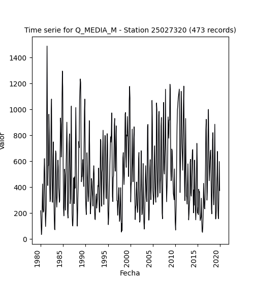
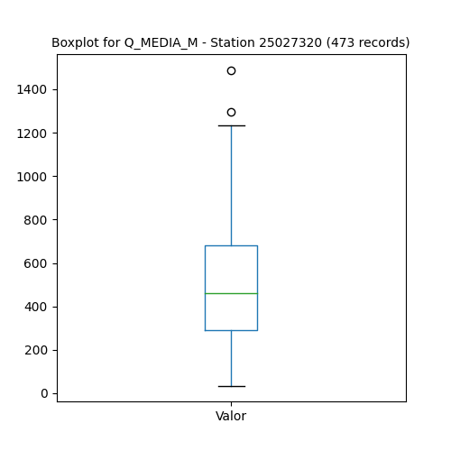
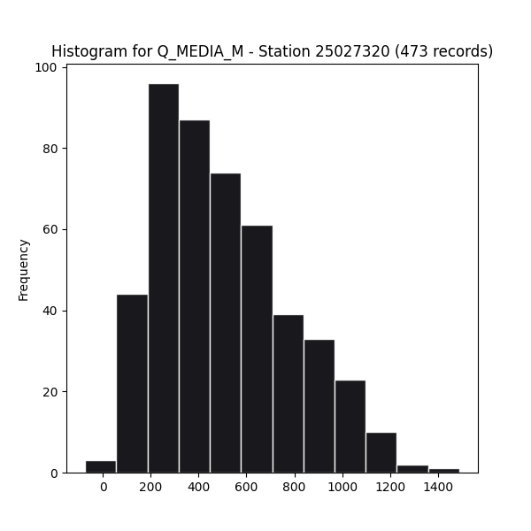
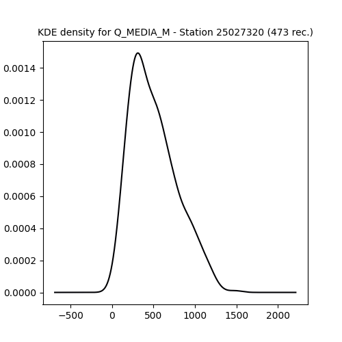

**Q_MEDIA_M - Station: VICTORIA LA [25027420] (482 rec.)** Location over [Google Maps](http://maps.google.com/maps?q=8.965,-74.22083333) or [Openstreet Map](https://www.openstreetmap.org/query?lat=8.965&lon=-74.22083333)

Station first record

| Fecha               |   CodigoEstacion | NombreEstacion         |   Latitud |   Longitud |   Altitud | Categoria    | Entidad                                                     | AreaOperativa                               | Departamento   | Municipio   | FechaInstalacion    | FechaSuspension   | IdParametro   | Etiqueta   | DescripcionSerie     | Frecuencia   |   Valor |   Grado |   Calificador |   NivelAprobacion |
|:--------------------|-----------------:|:-----------------------|----------:|-----------:|----------:|:-------------|:------------------------------------------------------------|:--------------------------------------------|:---------------|:------------|:--------------------|:------------------|:--------------|:-----------|:---------------------|:-------------|--------:|--------:|--------------:|------------------:|
| 1980-01-01 00:00:00 |         25027420 | VICTORIA LA [25027420] |     8.965 |   -74.2208 |        24 | Limnimétrica | INSTITUTO DE HIDROLOGIA METEOROLOGIA Y ESTUDIOS AMBIENTALES | Area Operativa 02 - Atlántico-Bolivar-Sucre | Bolivar        | Margarita   | 1973-07-15 00:00:00 | NaT               | CAUDAL        | Q_MEDIA_M  | Caudal medio mensual | Mensual      |     198 |      50 |           nan |               900 |

Statistics table

|       |   Valor |
|:------|--------:|
| count | 482     |
| mean  | 365.328 |
| std   | 206.827 |
| min   |   4.306 |
| 25%   | 197.85  |
| 50%   | 334.85  |
| 75%   | 521.858 |
| max   | 884.3   |

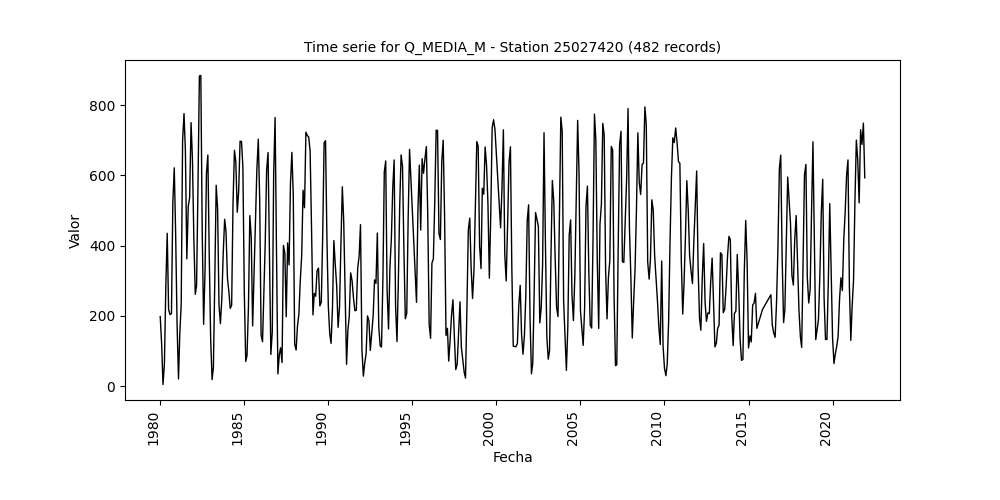
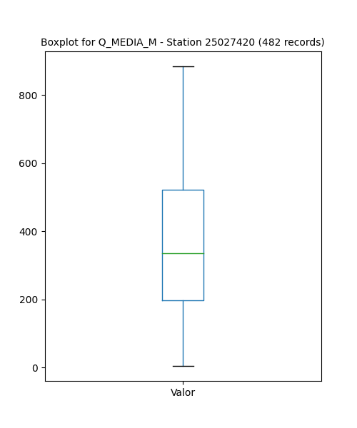
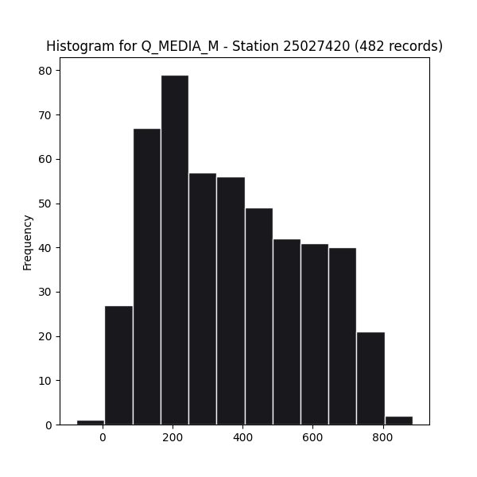
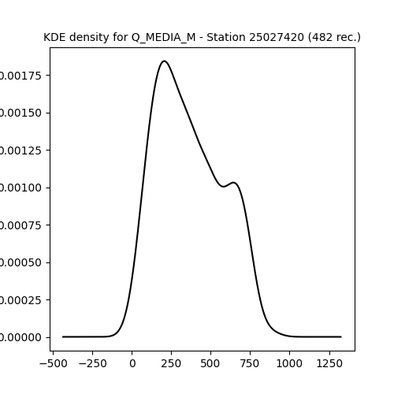

**Q_MEDIA_M - Station: RIO NUEVO [25027630] (461 rec.)** Location over [Google Maps](http://maps.google.com/maps?q=8.809722222,-74.25444444) or [Openstreet Map](https://www.openstreetmap.org/query?lat=8.809722222&lon=-74.25444444)

Station first record

| Fecha               |   CodigoEstacion | NombreEstacion       |   Latitud |   Longitud |   Altitud | Categoria    | Entidad                                                     | AreaOperativa                               | Departamento   | Municipio        | FechaInstalacion    | FechaSuspension   | IdParametro   | Etiqueta   | DescripcionSerie     | Frecuencia   |   Valor |   Grado | Calificador    |   NivelAprobacion |
|:--------------------|-----------------:|:---------------------|----------:|-----------:|----------:|:-------------|:------------------------------------------------------------|:--------------------------------------------|:---------------|:-----------------|:--------------------|:------------------|:--------------|:-----------|:---------------------|:-------------|--------:|--------:|:---------------|------------------:|
| 1980-01-01 00:00:00 |         25027630 | RIO NUEVO [25027630] |   8.80972 |   -74.2544 |        23 | Limnimétrica | INSTITUTO DE HIDROLOGIA METEOROLOGIA Y ESTUDIOS AMBIENTALES | Area Operativa 02 - Atlántico-Bolivar-Sucre | Bolivar        | Barranco De Loba | 1971-08-15 00:00:00 | NaT               | CAUDAL        | Q_MEDIA_M  | Caudal medio mensual | Mensual      |    2480 |       4 | EST. REGRESION |               900 |

Statistics table

|       |    Valor |
|:------|---------:|
| count |  461     |
| mean  | 2922.8   |
| std   |  719.798 |
| min   |  894.8   |
| 25%   | 2348     |
| 50%   | 2849     |
| 75%   | 3513     |
| max   | 4625     |

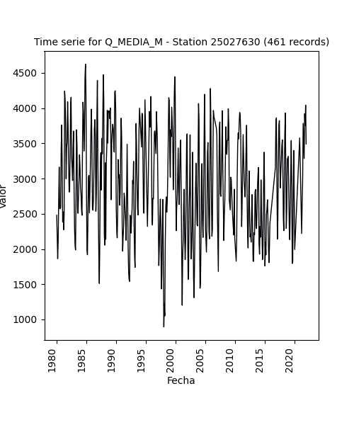
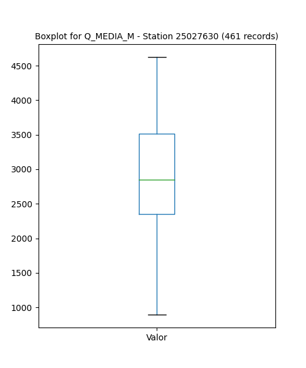
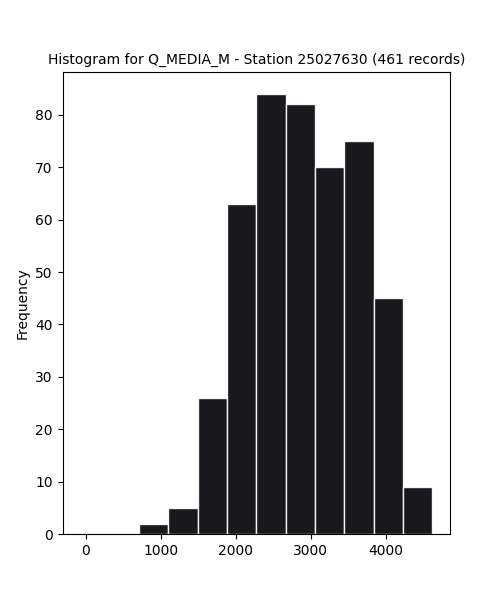
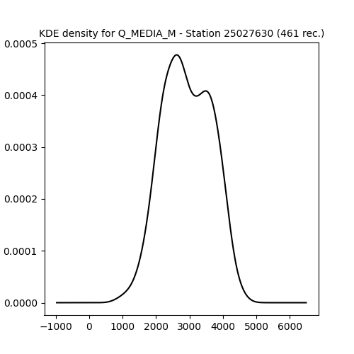

**Q_MEDIA_M - Station: ARIGUANI HACIENDA - AUT [28017120] (230 rec.)** Location over [Google Maps](http://maps.google.com/maps?q=10.57419444,-73.397) or [Openstreet Map](https://www.openstreetmap.org/query?lat=10.57419444&lon=-73.397)

Station first record

| Fecha               |   CodigoEstacion | NombreEstacion                     |   Latitud |   Longitud |   Altitud | Categoria    | Entidad                                                     | AreaOperativa                               | Departamento   | Municipio   | FechaInstalacion    | FechaSuspension     | IdParametro   | Etiqueta   | DescripcionSerie     | Frecuencia   |   Valor |   Grado | Calificador    |   NivelAprobacion |
|:--------------------|-----------------:|:-----------------------------------|----------:|-----------:|----------:|:-------------|:------------------------------------------------------------|:--------------------------------------------|:---------------|:------------|:--------------------|:--------------------|:--------------|:-----------|:---------------------|:-------------|--------:|--------:|:---------------|------------------:|
| 1982-01-01 00:00:00 |         28017120 | ARIGUANI HACIENDA - AUT [28017120] |   10.5742 |    -73.397 |       550 | Limnigráfica | INSTITUTO DE HIDROLOGIA METEOROLOGIA Y ESTUDIOS AMBIENTALES | Area Operativa 05 - Magdalena-Cesar-Guajira | Cesar          | Valledupar  | 1980-12-15 00:00:00 | 2010-09-29 00:00:00 | CAUDAL        | Q_MEDIA_M  | Caudal medio mensual | Mensual      |   6.809 |       4 | EST. REGRESION |               900 |

Statistics table

|       |     Valor |
|:------|----------:|
| count | 230       |
| mean  |  16.453   |
| std   |  13.6106  |
| min   |   2.48    |
| 25%   |   7.12875 |
| 50%   |  12.635   |
| 75%   |  20.425   |
| max   | 106.2     |

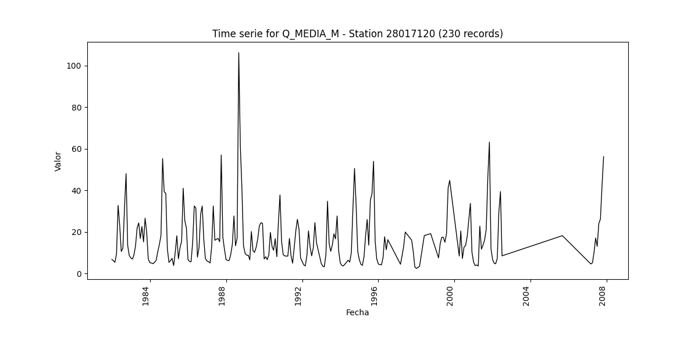
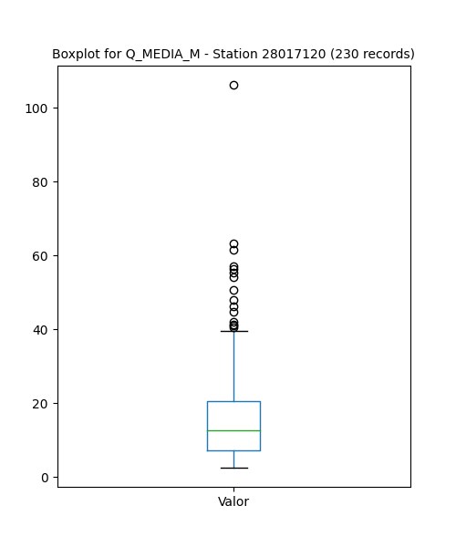
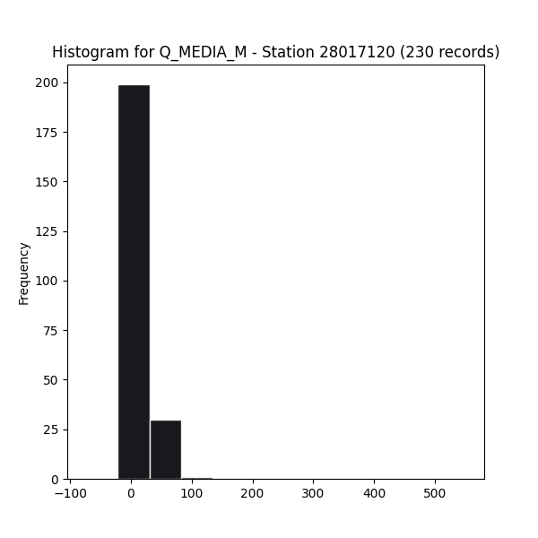
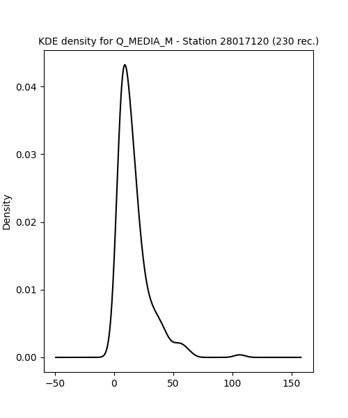

**Q_MEDIA_M - Station: CAIMANCITO [25027590] (339 rec.)** Location over [Google Maps](http://maps.google.com/maps?q=9.571138889,-73.79472222) or [Openstreet Map](https://www.openstreetmap.org/query?lat=9.571138889&lon=-73.79472222)

Station first record

| Fecha               |   CodigoEstacion | NombreEstacion        |   Latitud |   Longitud |   Altitud | Categoria    | Entidad                                                     | AreaOperativa                               | Departamento   | Municipio   | FechaInstalacion    | FechaSuspension     | IdParametro   | Etiqueta   | DescripcionSerie     | Frecuencia   |   Valor |   Grado |   Calificador |   NivelAprobacion |
|:--------------------|-----------------:|:----------------------|----------:|-----------:|----------:|:-------------|:------------------------------------------------------------|:--------------------------------------------|:---------------|:------------|:--------------------|:--------------------|:--------------|:-----------|:---------------------|:-------------|--------:|--------:|--------------:|------------------:|
| 1980-01-01 00:00:00 |         25027590 | CAIMANCITO [25027590] |   9.57114 |   -73.7947 |        40 | Limnimétrica | INSTITUTO DE HIDROLOGIA METEOROLOGIA Y ESTUDIOS AMBIENTALES | Area Operativa 05 - Magdalena-Cesar-Guajira | Cesar          | Astrea      | 1974-07-15 00:00:00 | 2019-02-07 11:40:00 | CAUDAL        | Q_MEDIA_M  | Caudal medio mensual | Mensual      |   54.68 |      50 |           nan |               900 |

Statistics table

|       |    Valor |
|:------|---------:|
| count | 339      |
| mean  |  53.8843 |
| std   |  39.6006 |
| min   |   0.723  |
| 25%   |  17.325  |
| 50%   |  44.15   |
| 75%   |  87.27   |
| max   | 158.1    |

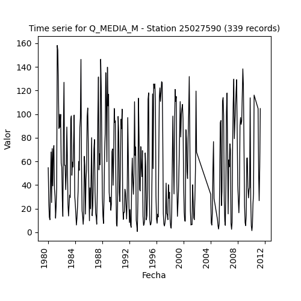
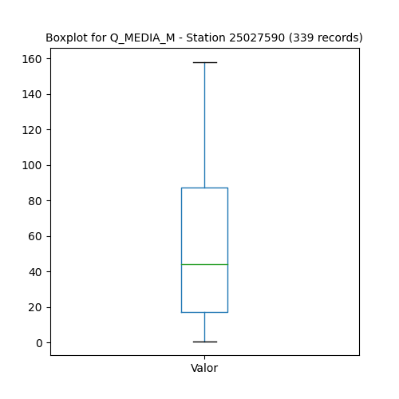
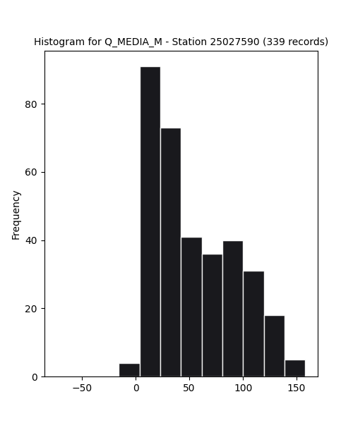

**Q_MEDIA_M - Station: CHEMESQUEMENA [28017150] (52 rec.)** Location over [Google Maps](http://maps.google.com/maps?q=10.71222222,-73.40222222) or [Openstreet Map](https://www.openstreetmap.org/query?lat=10.71222222&lon=-73.40222222)

Station first record

| Fecha               |   CodigoEstacion | NombreEstacion           |   Latitud |   Longitud |   Altitud | Categoria    | Entidad                                                     | AreaOperativa                               | Departamento   | Municipio   | FechaInstalacion    | FechaSuspension   | IdParametro   | Etiqueta   | DescripcionSerie     | Frecuencia   |   Valor |   Grado |   Calificador |   NivelAprobacion |
|:--------------------|-----------------:|:-------------------------|----------:|-----------:|----------:|:-------------|:------------------------------------------------------------|:--------------------------------------------|:---------------|:------------|:--------------------|:------------------|:--------------|:-----------|:---------------------|:-------------|--------:|--------:|--------------:|------------------:|
| 2017-06-01 00:00:00 |         28017150 | CHEMESQUEMENA [28017150] |   10.7122 |   -73.4022 |      1160 | Limnimétrica | INSTITUTO DE HIDROLOGIA METEOROLOGIA Y ESTUDIOS AMBIENTALES | Area Operativa 05 - Magdalena-Cesar-Guajira | Cesar          | Valledupar  | 2014-01-10 00:00:00 | NaT               | CAUDAL        | Q_MEDIA_M  | Caudal medio mensual | Mensual      | 7.90542 |       4 |           nan |               900 |

Statistics table

|       |    Valor |
|:------|---------:|
| count | 52       |
| mean  |  6.36198 |
| std   |  3.45506 |
| min   |  1.67986 |
| 25%   |  3.65216 |
| 50%   |  6.36845 |
| 75%   |  7.92197 |
| max   | 15.2573  |

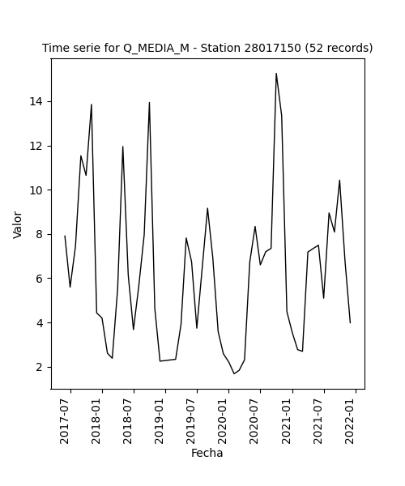
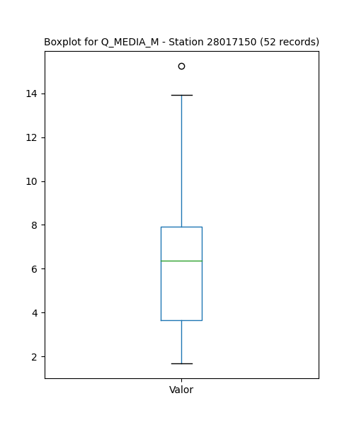
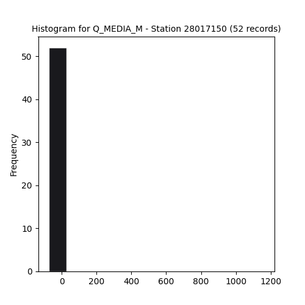
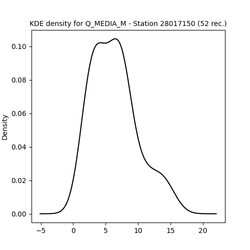

**Q_MEDIA_M - Station: FLORES LAS [28027030] (439 rec.)** Location over [Google Maps](http://maps.google.com/maps?q=10.09652778,-73.24352778) or [Openstreet Map](https://www.openstreetmap.org/query?lat=10.09652778&lon=-73.24352778)

Station first record

| Fecha               |   CodigoEstacion | NombreEstacion        |   Latitud |   Longitud |   Altitud | Categoria    | Entidad                                                     | AreaOperativa                               | Departamento   | Municipio   | FechaInstalacion    | FechaSuspension   | IdParametro   | Etiqueta   | DescripcionSerie     | Frecuencia   |   Valor |   Grado |   Calificador |   NivelAprobacion |
|:--------------------|-----------------:|:----------------------|----------:|-----------:|----------:|:-------------|:------------------------------------------------------------|:--------------------------------------------|:---------------|:------------|:--------------------|:------------------|:--------------|:-----------|:---------------------|:-------------|--------:|--------:|--------------:|------------------:|
| 1980-01-01 00:00:00 |         28027030 | FLORES LAS [28027030] |   10.0965 |   -73.2435 |       112 | Limnimétrica | INSTITUTO DE HIDROLOGIA METEOROLOGIA Y ESTUDIOS AMBIENTALES | Area Operativa 05 - Magdalena-Cesar-Guajira | Cesar          | La Paz      | 1962-10-15 00:00:00 | NaT               | CAUDAL        | Q_MEDIA_M  | Caudal medio mensual | Mensual      |   2.045 |      50 |           nan |               900 |

Statistics table

|       |     Valor |
|:------|----------:|
| count | 439       |
| mean  |   4.1023  |
| std   |   6.57997 |
| min   |   0       |
| 25%   |   0.815   |
| 50%   |   2.055   |
| 75%   |   5.4085  |
| max   |  95.94    |

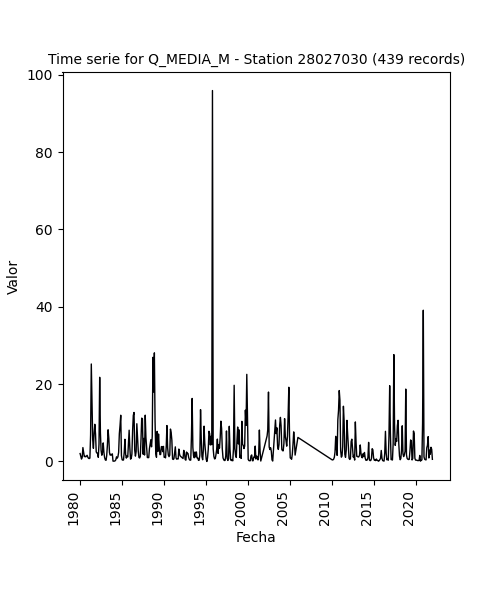
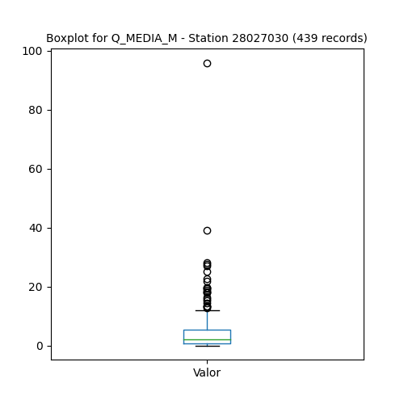
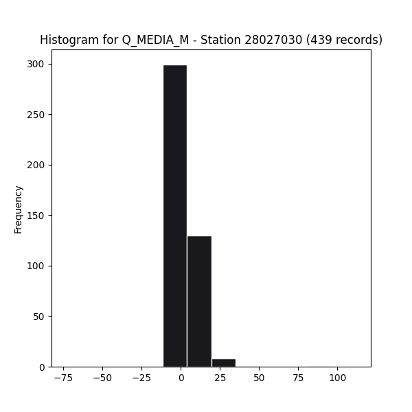
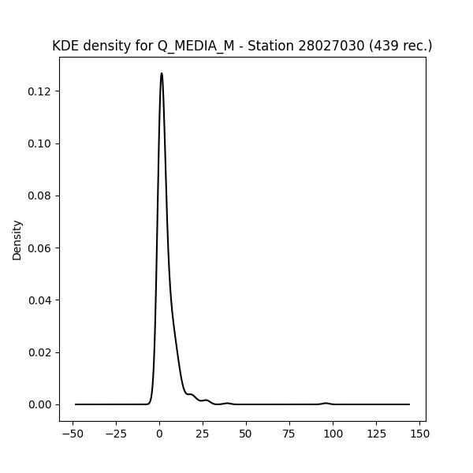

**Q_MEDIA_M - Station: GRACIAS A DIOS HACIENDA [25027080] (449 rec.)** Location over [Google Maps](http://maps.google.com/maps?q=9.194472222,-73.57652778) or [Openstreet Map](https://www.openstreetmap.org/query?lat=9.194472222&lon=-73.57652778)

Station first record

| Fecha               |   CodigoEstacion | NombreEstacion                     |   Latitud |   Longitud |   Altitud | Categoria    | Entidad                                                     | AreaOperativa                               | Departamento   | Municipio   | FechaInstalacion    | FechaSuspension   | IdParametro   | Etiqueta   | DescripcionSerie     | Frecuencia   |   Valor |   Grado |   Calificador |   NivelAprobacion |
|:--------------------|-----------------:|:-----------------------------------|----------:|-----------:|----------:|:-------------|:------------------------------------------------------------|:--------------------------------------------|:---------------|:------------|:--------------------|:------------------|:--------------|:-----------|:---------------------|:-------------|--------:|--------:|--------------:|------------------:|
| 1980-01-01 00:00:00 |         25027080 | GRACIAS A DIOS HACIENDA [25027080] |   9.19447 |   -73.5765 |        46 | Limnimétrica | INSTITUTO DE HIDROLOGIA METEOROLOGIA Y ESTUDIOS AMBIENTALES | Area Operativa 05 - Magdalena-Cesar-Guajira | Cesar          | Curumaní    | 1963-07-15 00:00:00 | NaT               | CAUDAL        | Q_MEDIA_M  | Caudal medio mensual | Mensual      |   2.381 |      50 |           nan |               900 |

Statistics table

|       |     Valor |
|:------|----------:|
| count | 449       |
| mean  |   4.61716 |
| std   |   7.4523  |
| min   |   0.018   |
| 25%   |   0.8775  |
| 50%   |   1.999   |
| 75%   |   4.948   |
| max   |  73.81    |

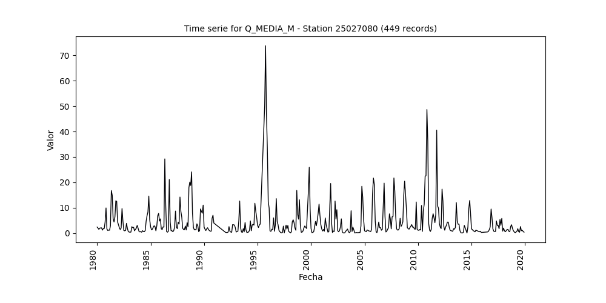
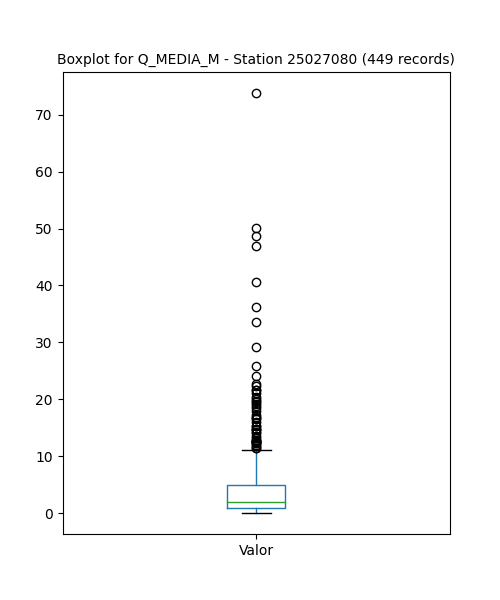
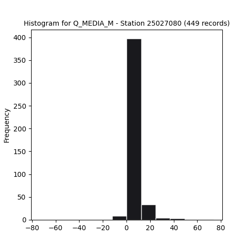
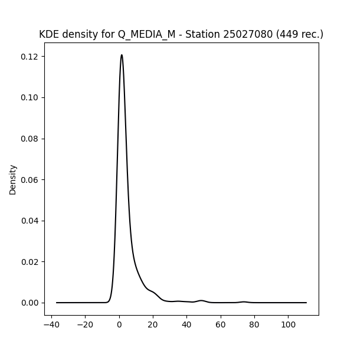

**Q_MEDIA_M - Station: MATILDE LA [28027020] (399 rec.)** Location over [Google Maps](http://maps.google.com/maps?q=10.16561111,-73.25833333) or [Openstreet Map](https://www.openstreetmap.org/query?lat=10.16561111&lon=-73.25833333)

Station first record

| Fecha               |   CodigoEstacion | NombreEstacion        |   Latitud |   Longitud |   Altitud | Categoria    | Entidad                                                     | AreaOperativa                               | Departamento   | Municipio   | FechaInstalacion    | FechaSuspension   | IdParametro   | Etiqueta   | DescripcionSerie     | Frecuencia   |   Valor |   Grado |   Calificador |   NivelAprobacion |
|:--------------------|-----------------:|:----------------------|----------:|-----------:|----------:|:-------------|:------------------------------------------------------------|:--------------------------------------------|:---------------|:------------|:--------------------|:------------------|:--------------|:-----------|:---------------------|:-------------|--------:|--------:|--------------:|------------------:|
| 1980-01-01 00:00:00 |         28027020 | MATILDE LA [28027020] |   10.1656 |   -73.2583 |       114 | Limnimétrica | INSTITUTO DE HIDROLOGIA METEOROLOGIA Y ESTUDIOS AMBIENTALES | Area Operativa 05 - Magdalena-Cesar-Guajira | Cesar          | San Diego   | 1962-07-15 00:00:00 | NaT               | CAUDAL        | Q_MEDIA_M  | Caudal medio mensual | Mensual      |   1.363 |      50 |           nan |               900 |

Statistics table

|       |     Valor |
|:------|----------:|
| count | 399       |
| mean  |   2.40145 |
| std   |   2.89938 |
| min   |   0       |
| 25%   |   0.4485  |
| 50%   |   1.3     |
| 75%   |   3.4115  |
| max   |  17.66    |

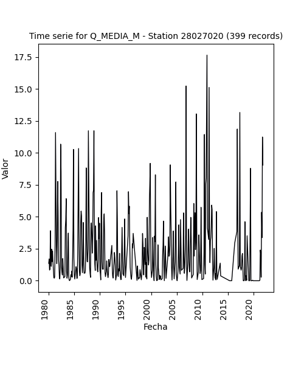
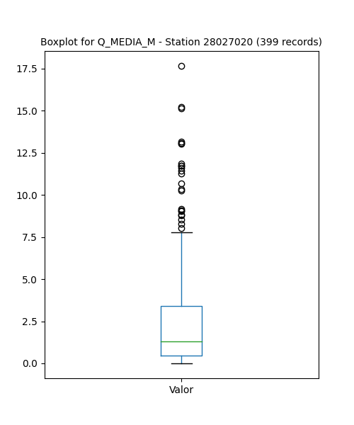
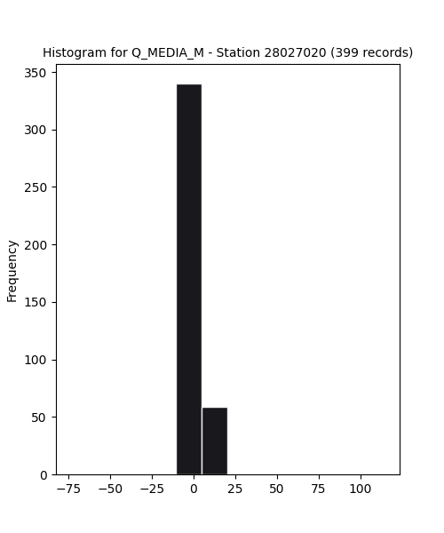
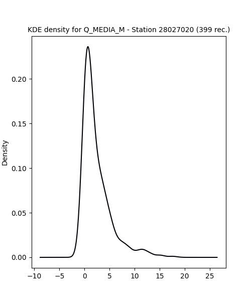

**Q_MEDIA_M - Station: MINA LA [28017110] (465 rec.)** Location over [Google Maps](http://maps.google.com/maps?q=10.68672222,-73.26983333) or [Openstreet Map](https://www.openstreetmap.org/query?lat=10.68672222&lon=-73.26983333)

Station first record

| Fecha               |   CodigoEstacion | NombreEstacion     |   Latitud |   Longitud |   Altitud | Categoria    | Entidad                                                     | AreaOperativa                               | Departamento   | Municipio   | FechaInstalacion    | FechaSuspension   | IdParametro   | Etiqueta   | DescripcionSerie     | Frecuencia   |   Valor |   Grado |   Calificador |   NivelAprobacion |
|:--------------------|-----------------:|:-------------------|----------:|-----------:|----------:|:-------------|:------------------------------------------------------------|:--------------------------------------------|:---------------|:------------|:--------------------|:------------------|:--------------|:-----------|:---------------------|:-------------|--------:|--------:|--------------:|------------------:|
| 1980-01-01 00:00:00 |         28017110 | MINA LA [28017110] |   10.6867 |   -73.2698 |       429 | Limnigráfica | INSTITUTO DE HIDROLOGIA METEOROLOGIA Y ESTUDIOS AMBIENTALES | Area Operativa 05 - Magdalena-Cesar-Guajira | Cesar          | Valledupar  | 1969-12-15 00:00:00 | NaT               | CAUDAL        | Q_MEDIA_M  | Caudal medio mensual | Mensual      |   3.582 |      50 |           nan |               900 |

Statistics table

|       |     Valor |
|:------|----------:|
| count | 465       |
| mean  |   9.51238 |
| std   |  12.7092  |
| min   |   0.118   |
| 25%   |   3.361   |
| 50%   |   5.64    |
| 75%   |  10.0068  |
| max   | 116.79    |

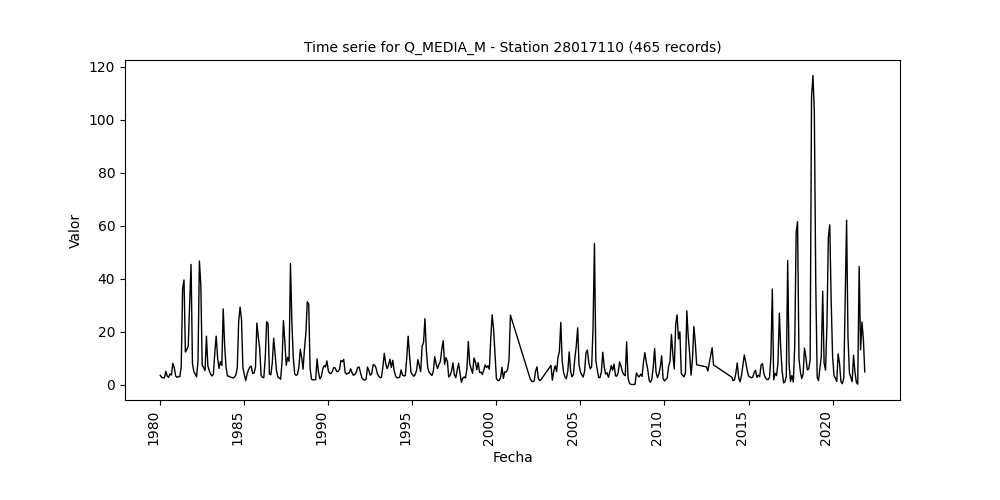
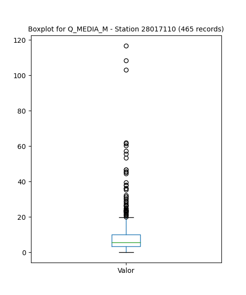
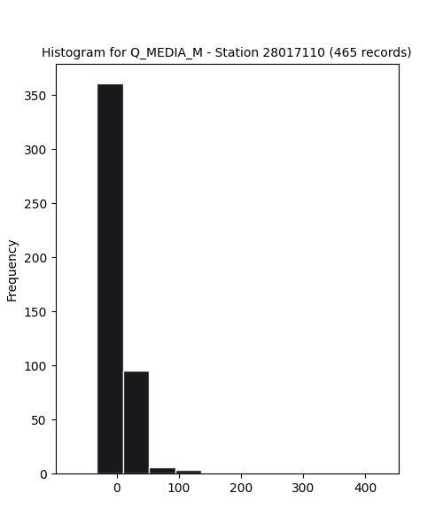
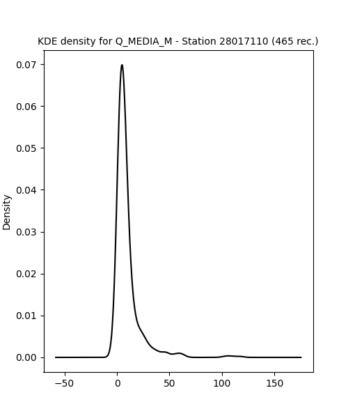

**Q_MEDIA_M - Station: PUENTE CARRETERA [25027890] (424 rec.)** Location over [Google Maps](http://maps.google.com/maps?q=9.342333333,-73.49088889) or [Openstreet Map](https://www.openstreetmap.org/query?lat=9.342333333&lon=-73.49088889)

Station first record

| Fecha               |   CodigoEstacion | NombreEstacion              |   Latitud |   Longitud |   Altitud | Categoria    | Entidad                                                     | AreaOperativa                               | Departamento   | Municipio   | FechaInstalacion    | FechaSuspension   | IdParametro   | Etiqueta   | DescripcionSerie     | Frecuencia   |   Valor |   Grado |   Calificador |   NivelAprobacion |
|:--------------------|-----------------:|:----------------------------|----------:|-----------:|----------:|:-------------|:------------------------------------------------------------|:--------------------------------------------|:---------------|:------------|:--------------------|:------------------|:--------------|:-----------|:---------------------|:-------------|--------:|--------:|--------------:|------------------:|
| 1980-01-01 00:00:00 |         25027890 | PUENTE CARRETERA [25027890] |   9.34233 |   -73.4909 |       120 | Limnimétrica | INSTITUTO DE HIDROLOGIA METEOROLOGIA Y ESTUDIOS AMBIENTALES | Area Operativa 05 - Magdalena-Cesar-Guajira | Cesar          | Chiriguaná  | 1978-09-15 00:00:00 | NaT               | CAUDAL        | Q_MEDIA_M  | Caudal medio mensual | Mensual      |   1.176 |      50 |           nan |               900 |

Statistics table

|       |     Valor |
|:------|----------:|
| count | 424       |
| mean  |   2.66422 |
| std   |   3.14918 |
| min   |   0.007   |
| 25%   |   0.5025  |
| 50%   |   1.33    |
| 75%   |   3.70275 |
| max   |  18.55    |

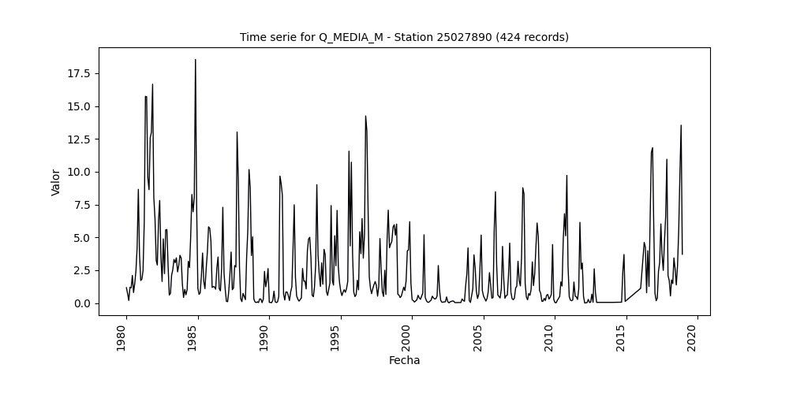
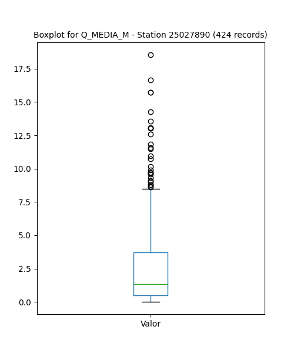

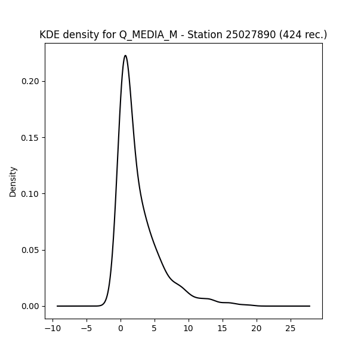

**Q_MEDIA_M - Station: REPOSO EL [28017050] (263 rec.)** Location over [Google Maps](http://maps.google.com/maps?q=10.52719444,-73.33636111) or [Openstreet Map](https://www.openstreetmap.org/query?lat=10.52719444&lon=-73.33636111)

Station first record

| Fecha               |   CodigoEstacion | NombreEstacion       |   Latitud |   Longitud |   Altitud | Categoria    | Entidad                                                     | AreaOperativa                               | Departamento   | Municipio   | FechaInstalacion    | FechaSuspension     | IdParametro   | Etiqueta   | DescripcionSerie     | Frecuencia   |   Valor |   Grado |   Calificador |   NivelAprobacion |
|:--------------------|-----------------:|:---------------------|----------:|-----------:|----------:|:-------------|:------------------------------------------------------------|:--------------------------------------------|:---------------|:------------|:--------------------|:--------------------|:--------------|:-----------|:---------------------|:-------------|--------:|--------:|--------------:|------------------:|
| 1980-01-01 00:00:00 |         28017050 | REPOSO EL [28017050] |   10.5272 |   -73.3364 |       350 | Limnigráfica | INSTITUTO DE HIDROLOGIA METEOROLOGIA Y ESTUDIOS AMBIENTALES | Area Operativa 05 - Magdalena-Cesar-Guajira | Cesar          | Valledupar  | 1958-03-15 00:00:00 | 2019-02-07 11:41:00 | CAUDAL        | Q_MEDIA_M  | Caudal medio mensual | Mensual      |   9.391 |      50 |           nan |               900 |

Statistics table

|       |    Valor |
|:------|---------:|
| count | 263      |
| mean  |  20.0189 |
| std   |  28.2952 |
| min   |   3      |
| 25%   |   7.33   |
| 50%   |  13.44   |
| 75%   |  22.74   |
| max   | 252      |

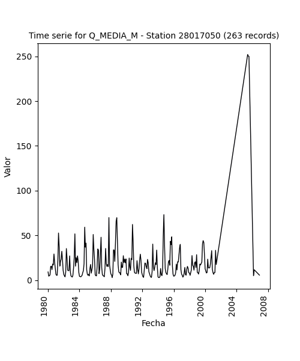
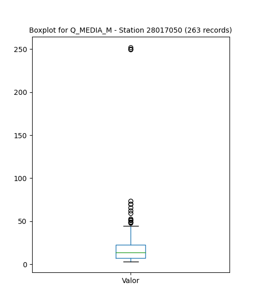
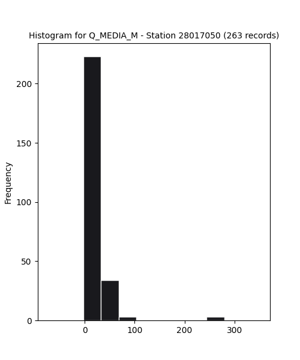

**Q_MEDIA_M - Station: SANTA TERESA [28027040] (412 rec.)** Location over [Google Maps](http://maps.google.com/maps?q=9.915944444,-73.28369444) or [Openstreet Map](https://www.openstreetmap.org/query?lat=9.915944444&lon=-73.28369444)

Station first record

| Fecha               |   CodigoEstacion | NombreEstacion          |   Latitud |   Longitud |   Altitud | Categoria    | Entidad                                                     | AreaOperativa                               | Departamento   | Municipio   | FechaInstalacion    | FechaSuspension   | IdParametro   | Etiqueta   | DescripcionSerie     | Frecuencia   |   Valor |   Grado |   Calificador |   NivelAprobacion |
|:--------------------|-----------------:|:------------------------|----------:|-----------:|----------:|:-------------|:------------------------------------------------------------|:--------------------------------------------|:---------------|:------------|:--------------------|:------------------|:--------------|:-----------|:---------------------|:-------------|--------:|--------:|--------------:|------------------:|
| 1980-01-01 00:00:00 |         28027040 | SANTA TERESA [28027040] |   9.91594 |   -73.2837 |        80 | Limnimétrica | INSTITUTO DE HIDROLOGIA METEOROLOGIA Y ESTUDIOS AMBIENTALES | Area Operativa 05 - Magdalena-Cesar-Guajira | Cesar          | Becerrill   | 1962-11-15 00:00:00 | NaT               | CAUDAL        | Q_MEDIA_M  | Caudal medio mensual | Mensual      |   0.944 |      50 |           nan |               900 |

Statistics table

|       |       Valor |
|:------|------------:|
| count | 412         |
| mean  |   3.04977   |
| std   |   4.03069   |
| min   |   0.0190909 |
| 25%   |   0.67875   |
| 50%   |   1.585     |
| 75%   |   3.8395    |
| max   |  44         |

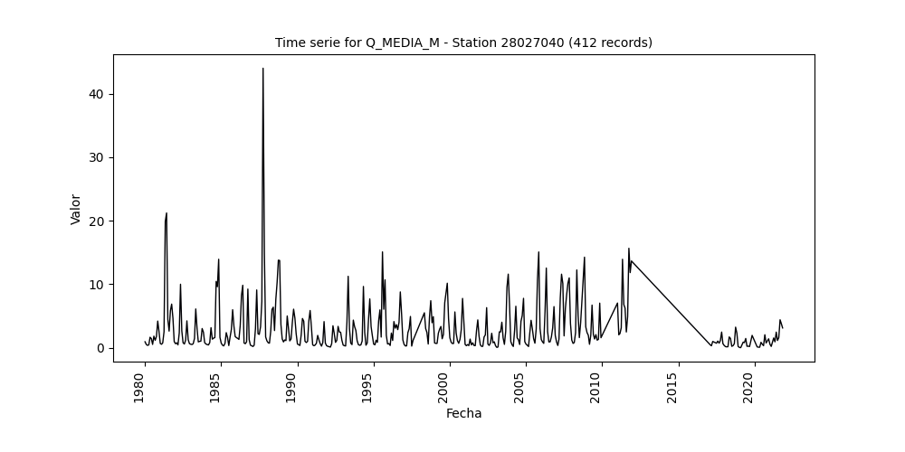
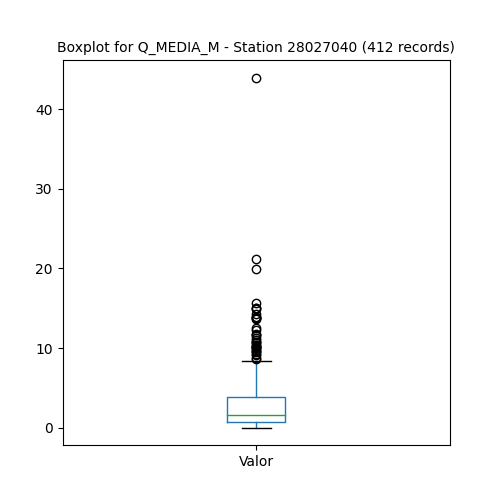
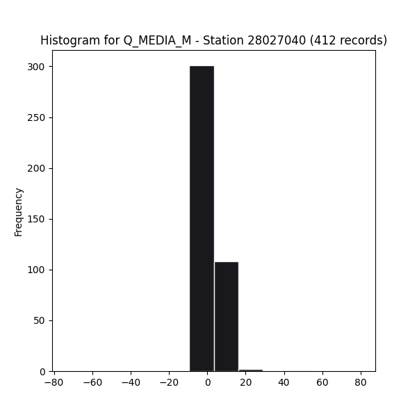
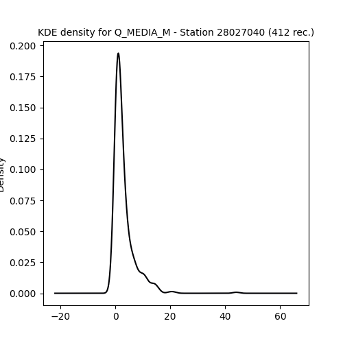

**Q_MEDIA_M - Station: BECERRIL [28027050] (349 rec.)** Location over [Google Maps](http://maps.google.com/maps?q=9.686611111,-73.27919444) or [Openstreet Map](https://www.openstreetmap.org/query?lat=9.686611111&lon=-73.27919444)

Station first record

| Fecha               |   CodigoEstacion | NombreEstacion      |   Latitud |   Longitud |   Altitud | Categoria    | Entidad                                                     | AreaOperativa                               | Departamento   | Municipio   | FechaInstalacion    | FechaSuspension   | IdParametro   | Etiqueta   | DescripcionSerie     | Frecuencia   |   Valor |   Grado | Calificador    |   NivelAprobacion |
|:--------------------|-----------------:|:--------------------|----------:|-----------:|----------:|:-------------|:------------------------------------------------------------|:--------------------------------------------|:---------------|:------------|:--------------------|:------------------|:--------------|:-----------|:---------------------|:-------------|--------:|--------:|:---------------|------------------:|
| 1980-01-01 00:00:00 |         28027050 | BECERRIL [28027050] |   9.68661 |   -73.2792 |       106 | Limnimétrica | INSTITUTO DE HIDROLOGIA METEOROLOGIA Y ESTUDIOS AMBIENTALES | Area Operativa 05 - Magdalena-Cesar-Guajira | Cesar          | Becerrill   | 1963-06-15 00:00:00 | NaT               | CAUDAL        | Q_MEDIA_M  | Caudal medio mensual | Mensual      |    1.28 |       4 | EST. REGRESION |               900 |

Statistics table

|       |    Valor |
|:------|---------:|
| count | 349      |
| mean  |  11.311  |
| std   |  22.5481 |
| min   |   0.161  |
| 25%   |   1.625  |
| 50%   |   4.267  |
| 75%   |  10.11   |
| max   | 294.1    |

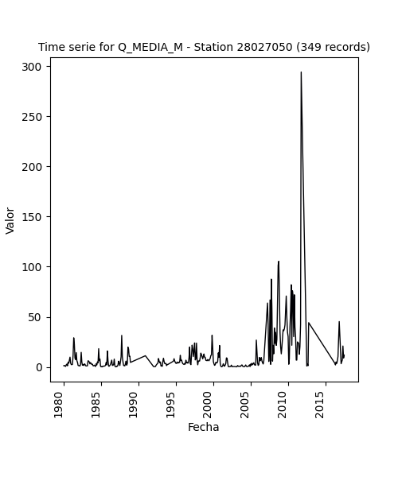
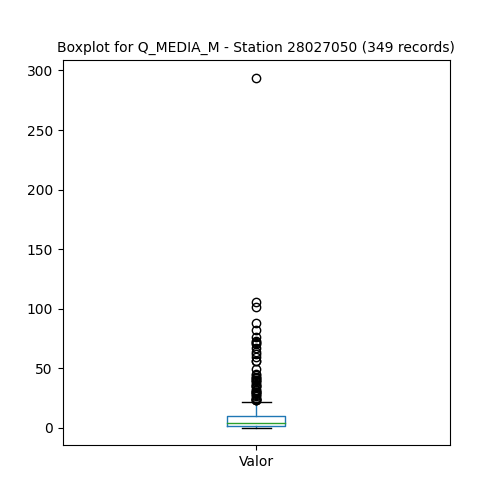
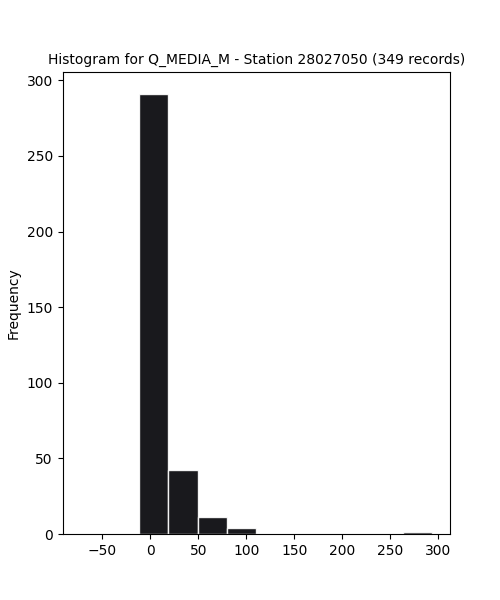
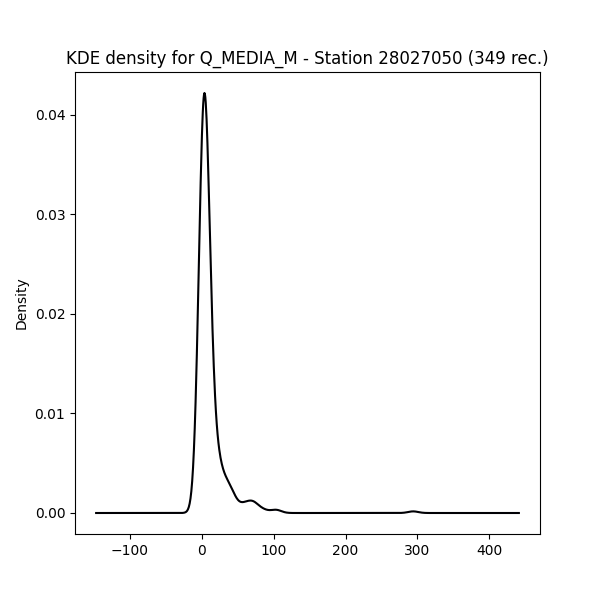

**Q_MEDIA_M - Station: CANTACLARO [28037060] (482 rec.)** Location over [Google Maps](http://maps.google.com/maps?q=10.08847222,-73.73280556) or [Openstreet Map](https://www.openstreetmap.org/query?lat=10.08847222&lon=-73.73280556)

Station first record

| Fecha               |   CodigoEstacion | NombreEstacion        |   Latitud |   Longitud |   Altitud | Categoria    | Entidad                                                     | AreaOperativa                               | Departamento   | Municipio   | FechaInstalacion    | FechaSuspension   | IdParametro   | Etiqueta   | DescripcionSerie     | Frecuencia   |   Valor |   Grado |   Calificador |   NivelAprobacion |
|:--------------------|-----------------:|:----------------------|----------:|-----------:|----------:|:-------------|:------------------------------------------------------------|:--------------------------------------------|:---------------|:------------|:--------------------|:------------------|:--------------|:-----------|:---------------------|:-------------|--------:|--------:|--------------:|------------------:|
| 1980-01-01 00:00:00 |         28037060 | CANTACLARO [28037060] |   10.0885 |   -73.7328 |       120 | Limnigráfica | INSTITUTO DE HIDROLOGIA METEOROLOGIA Y ESTUDIOS AMBIENTALES | Area Operativa 05 - Magdalena-Cesar-Guajira | Cesar          | Valledupar  | 1963-03-15 00:00:00 | NaT               | CAUDAL        | Q_MEDIA_M  | Caudal medio mensual | Mensual      |   0.531 |      50 |           nan |               900 |

Statistics table

|       |     Valor |
|:------|----------:|
| count | 482       |
| mean  |   1.77203 |
| std   |   2.00638 |
| min   |   0.03    |
| 25%   |   0.5315  |
| 50%   |   1.04342 |
| 75%   |   2.36855 |
| max   |  17.87    |

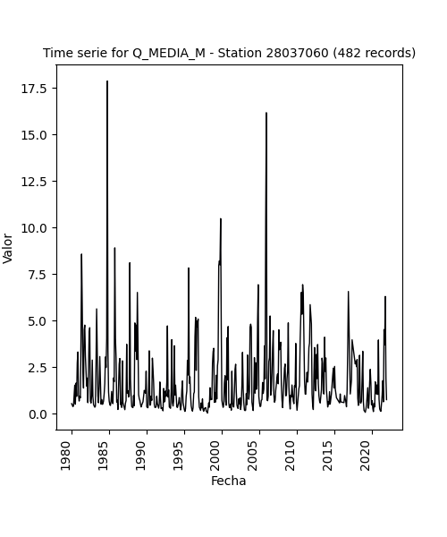
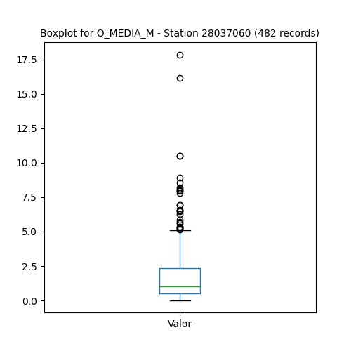
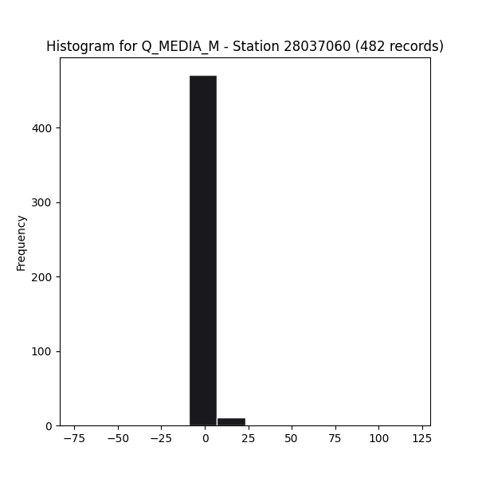
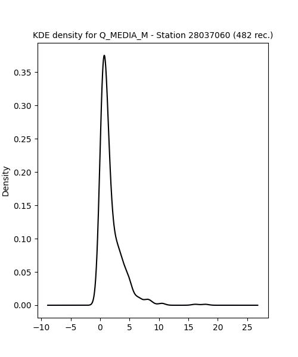

**Q_MEDIA_M - Station: CONVENCION HACIENDA [28037020] (362 rec.)** Location over [Google Maps](http://maps.google.com/maps?q=10.26783333,-73.41713889) or [Openstreet Map](https://www.openstreetmap.org/query?lat=10.26783333&lon=-73.41713889)

Station first record

| Fecha               |   CodigoEstacion | NombreEstacion                 |   Latitud |   Longitud |   Altitud | Categoria    | Entidad                                                     | AreaOperativa                               | Departamento   | Municipio   | FechaInstalacion    | FechaSuspension   | IdParametro   | Etiqueta   | DescripcionSerie     | Frecuencia   |   Valor |   Grado |   Calificador |   NivelAprobacion |
|:--------------------|-----------------:|:-------------------------------|----------:|-----------:|----------:|:-------------|:------------------------------------------------------------|:--------------------------------------------|:---------------|:------------|:--------------------|:------------------|:--------------|:-----------|:---------------------|:-------------|--------:|--------:|--------------:|------------------:|
| 1980-01-01 00:00:00 |         28037020 | CONVENCION HACIENDA [28037020] |   10.2678 |   -73.4171 |       104 | Limnimétrica | INSTITUTO DE HIDROLOGIA METEOROLOGIA Y ESTUDIOS AMBIENTALES | Area Operativa 05 - Magdalena-Cesar-Guajira | Cesar          | Valledupar  | 1962-12-15 00:00:00 | NaT               | CAUDAL        | Q_MEDIA_M  | Caudal medio mensual | Mensual      |   2.411 |      50 |           nan |               900 |

Statistics table

|       |     Valor |
|:------|----------:|
| count | 362       |
| mean  |   2.65542 |
| std   |   3.09609 |
| min   |   0       |
| 25%   |   0.444   |
| 50%   |   1.469   |
| 75%   |   3.7135  |
| max   |  20.24    |

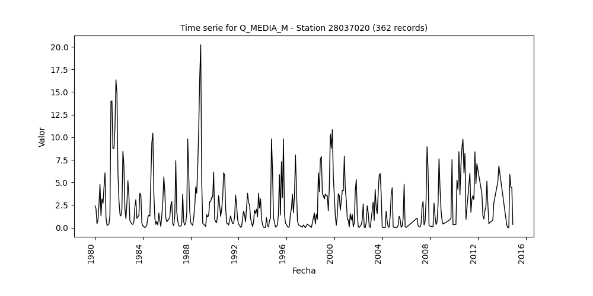
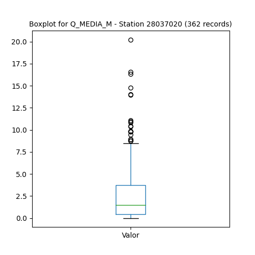
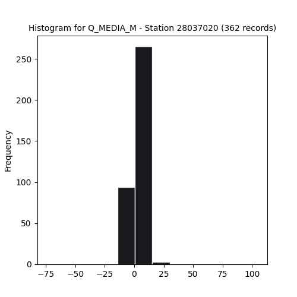
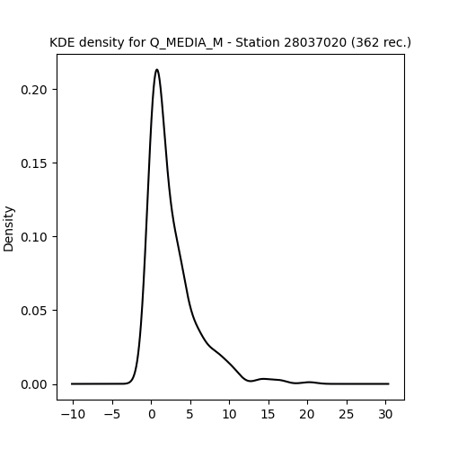

**Q_MEDIA_M - Station: ISLANDIA [28027160] (372 rec.)** Location over [Google Maps](http://maps.google.com/maps?q=9.632527778,-73.63572222) or [Openstreet Map](https://www.openstreetmap.org/query?lat=9.632527778&lon=-73.63572222)

Station first record

| Fecha               |   CodigoEstacion | NombreEstacion      |   Latitud |   Longitud |   Altitud | Categoria    | Entidad                                                     | AreaOperativa                               | Departamento   | Municipio   | FechaInstalacion    | FechaSuspension     | IdParametro   | Etiqueta   | DescripcionSerie     | Frecuencia   |   Valor |   Grado |   Calificador |   NivelAprobacion |
|:--------------------|-----------------:|:--------------------|----------:|-----------:|----------:|:-------------|:------------------------------------------------------------|:--------------------------------------------|:---------------|:------------|:--------------------|:--------------------|:--------------|:-----------|:---------------------|:-------------|--------:|--------:|--------------:|------------------:|
| 1980-01-01 00:00:00 |         28027160 | ISLANDIA [28027160] |   9.63253 |   -73.6357 |        45 | Limnimétrica | INSTITUTO DE HIDROLOGIA METEOROLOGIA Y ESTUDIOS AMBIENTALES | Area Operativa 05 - Magdalena-Cesar-Guajira | Cesar          | El Paso     | 1974-11-15 00:00:00 | 2019-02-07 11:40:00 | CAUDAL        | Q_MEDIA_M  | Caudal medio mensual | Mensual      |   3.109 |      50 |           nan |               900 |

Statistics table

|       |     Valor |
|:------|----------:|
| count | 372       |
| mean  |   8.80949 |
| std   |   8.92743 |
| min   |   0.013   |
| 25%   |   2.68175 |
| 50%   |   6.026   |
| 75%   |  12.655   |
| max   |  69.15    |

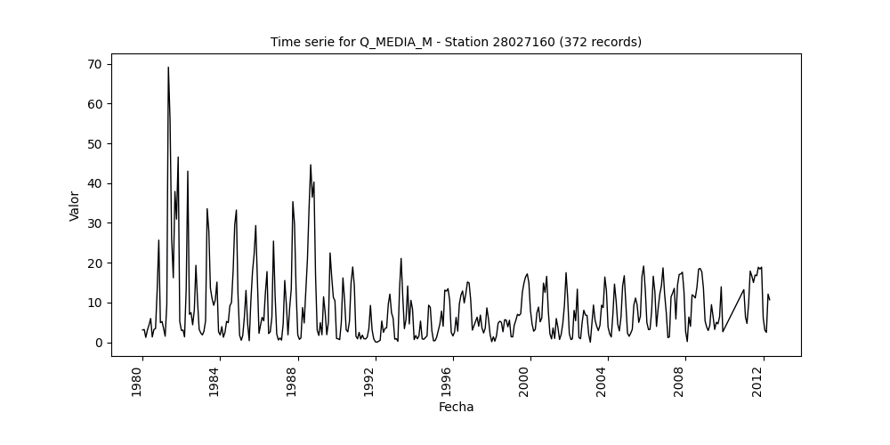
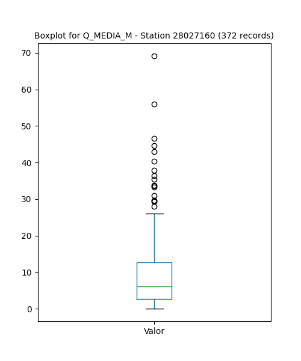
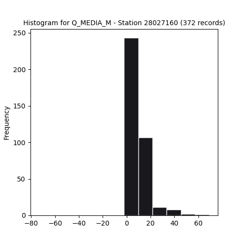
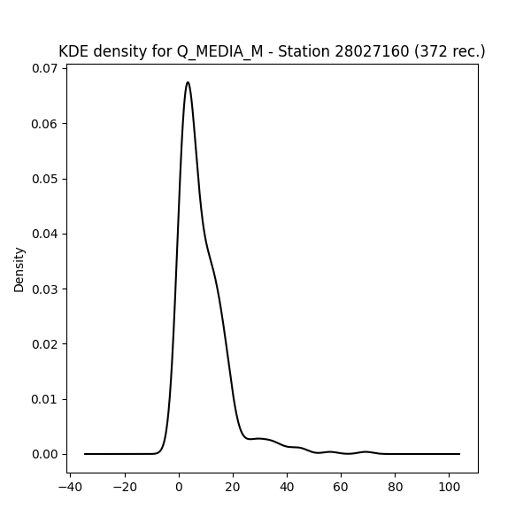

**Q_MEDIA_M - Station: MARIANGOLA [28037040] (474 rec.)** Location over [Google Maps](http://maps.google.com/maps?q=10.18741667,-73.58519444) or [Openstreet Map](https://www.openstreetmap.org/query?lat=10.18741667&lon=-73.58519444)

Station first record

| Fecha               |   CodigoEstacion | NombreEstacion        |   Latitud |   Longitud |   Altitud | Categoria    | Entidad                                                     | AreaOperativa                               | Departamento   | Municipio   | FechaInstalacion    | FechaSuspension   | IdParametro   | Etiqueta   | DescripcionSerie     | Frecuencia   |   Valor |   Grado |   Calificador |   NivelAprobacion |
|:--------------------|-----------------:|:----------------------|----------:|-----------:|----------:|:-------------|:------------------------------------------------------------|:--------------------------------------------|:---------------|:------------|:--------------------|:------------------|:--------------|:-----------|:---------------------|:-------------|--------:|--------:|--------------:|------------------:|
| 1980-01-01 00:00:00 |         28037040 | MARIANGOLA [28037040] |   10.1874 |   -73.5852 |        90 | Limnigráfica | INSTITUTO DE HIDROLOGIA METEOROLOGIA Y ESTUDIOS AMBIENTALES | Area Operativa 05 - Magdalena-Cesar-Guajira | Cesar          | Valledupar  | 1963-01-15 00:00:00 | NaT               | CAUDAL        | Q_MEDIA_M  | Caudal medio mensual | Mensual      |   0.564 |      50 |           nan |               900 |

Statistics table

|       |      Valor |
|:------|-----------:|
| count | 474        |
| mean  |   1.99652  |
| std   |   2.4448   |
| min   |   0.01     |
| 25%   |   0.367828 |
| 50%   |   1.01634  |
| 75%   |   2.6945   |
| max   |  13.28     |

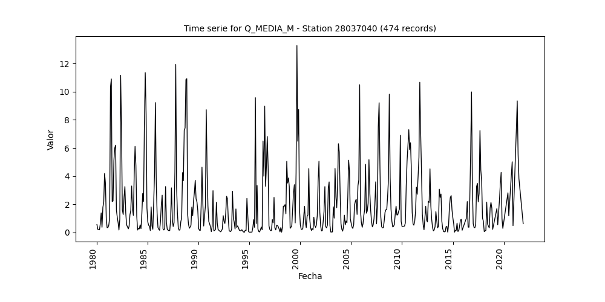
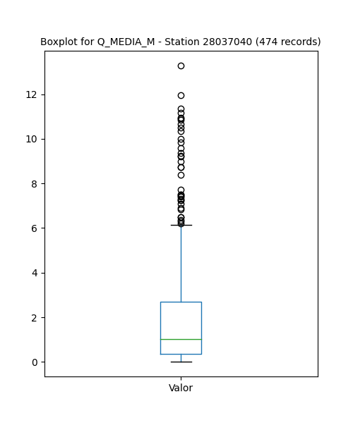
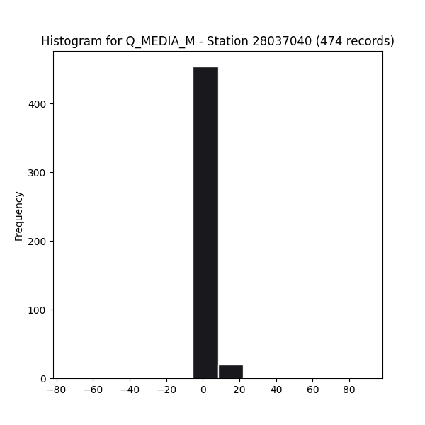
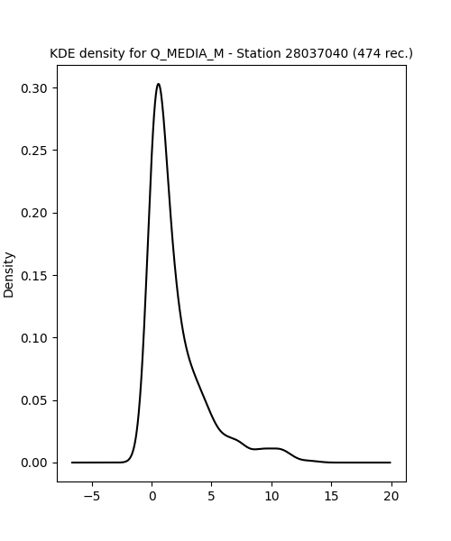

**Q_MEDIA_M - Station: PUEBLO BELLO [28047020] (474 rec.)** Location over [Google Maps](http://maps.google.com/maps?q=10.41984722,-73.58883333) or [Openstreet Map](https://www.openstreetmap.org/query?lat=10.41984722&lon=-73.58883333)

Station first record

| Fecha               |   CodigoEstacion | NombreEstacion          |   Latitud |   Longitud |   Altitud | Categoria    | Entidad                                                     | AreaOperativa                               | Departamento   | Municipio    | FechaInstalacion    | FechaSuspension   | IdParametro   | Etiqueta   | DescripcionSerie     | Frecuencia   |   Valor |   Grado |   Calificador |   NivelAprobacion |
|:--------------------|-----------------:|:------------------------|----------:|-----------:|----------:|:-------------|:------------------------------------------------------------|:--------------------------------------------|:---------------|:-------------|:--------------------|:------------------|:--------------|:-----------|:---------------------|:-------------|--------:|--------:|--------------:|------------------:|
| 1980-01-01 00:00:00 |         28047020 | PUEBLO BELLO [28047020] |   10.4198 |   -73.5888 |      1125 | Limnigráfica | INSTITUTO DE HIDROLOGIA METEOROLOGIA Y ESTUDIOS AMBIENTALES | Area Operativa 05 - Magdalena-Cesar-Guajira | Cesar          | Pueblo Bello | 1963-01-15 00:00:00 | NaT               | CAUDAL        | Q_MEDIA_M  | Caudal medio mensual | Mensual      |   1.224 |      50 |           nan |               900 |

Statistics table

|       |      Valor |
|:------|-----------:|
| count | 474        |
| mean  |   1.28277  |
| std   |   0.950413 |
| min   |   0.244    |
| 25%   |   0.658511 |
| 50%   |   1.03365  |
| 75%   |   1.539    |
| max   |   6.531    |

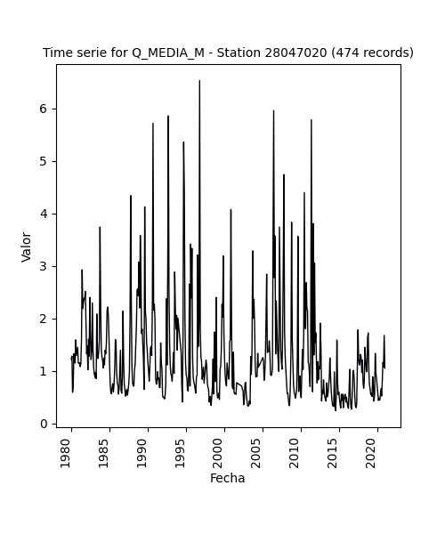
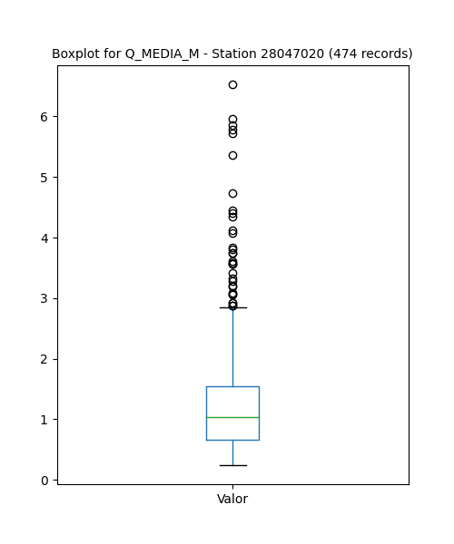
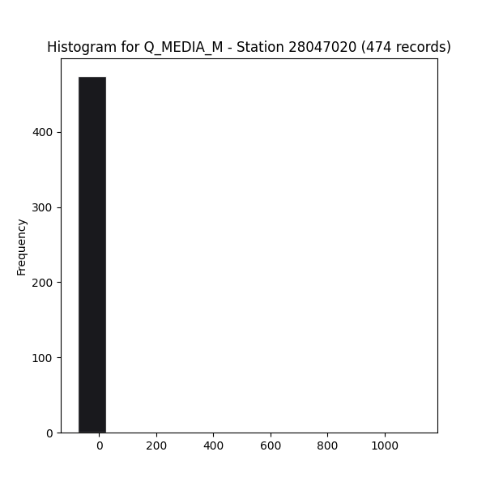
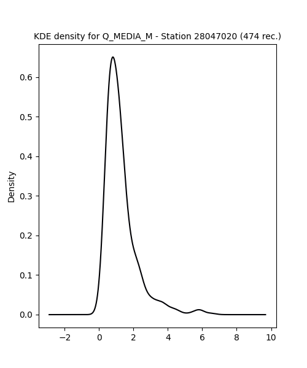

**Q_MEDIA_M - Station: PUENTE CALLAO [28037010] (437 rec.)** Location over [Google Maps](http://maps.google.com/maps?q=10.36288889,-73.31736111) or [Openstreet Map](https://www.openstreetmap.org/query?lat=10.36288889&lon=-73.31736111)

Station first record

| Fecha               |   CodigoEstacion | NombreEstacion           |   Latitud |   Longitud |   Altitud | Categoria    | Entidad                                                     | AreaOperativa                               | Departamento   | Municipio   | FechaInstalacion    | FechaSuspension   | IdParametro   | Etiqueta   | DescripcionSerie     | Frecuencia   |   Valor |   Grado |   Calificador |   NivelAprobacion |
|:--------------------|-----------------:|:-------------------------|----------:|-----------:|----------:|:-------------|:------------------------------------------------------------|:--------------------------------------------|:---------------|:------------|:--------------------|:------------------|:--------------|:-----------|:---------------------|:-------------|--------:|--------:|--------------:|------------------:|
| 1980-01-01 00:00:00 |         28037010 | PUENTE CALLAO [28037010] |   10.3629 |   -73.3174 |       120 | Limnimétrica | INSTITUTO DE HIDROLOGIA METEOROLOGIA Y ESTUDIOS AMBIENTALES | Area Operativa 05 - Magdalena-Cesar-Guajira | Cesar          | Valledupar  | 1962-12-15 00:00:00 | NaT               | CAUDAL        | Q_MEDIA_M  | Caudal medio mensual | Mensual      |   0.424 |      50 |           nan |               900 |

Statistics table

|       |     Valor |
|:------|----------:|
| count | 437       |
| mean  |   3.03674 |
| std   |   4.55045 |
| min   |   0.009   |
| 25%   |   0.34    |
| 50%   |   1.402   |
| 75%   |   3.684   |
| max   |  30.45    |

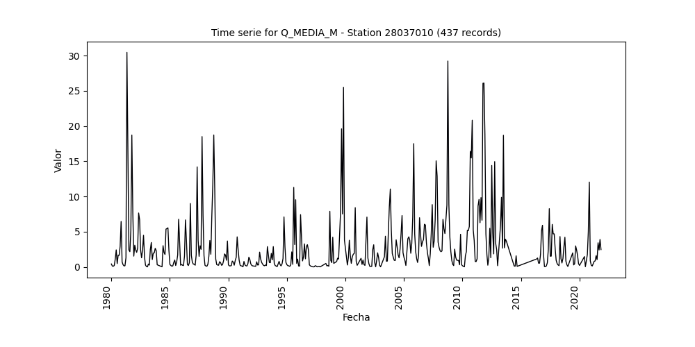
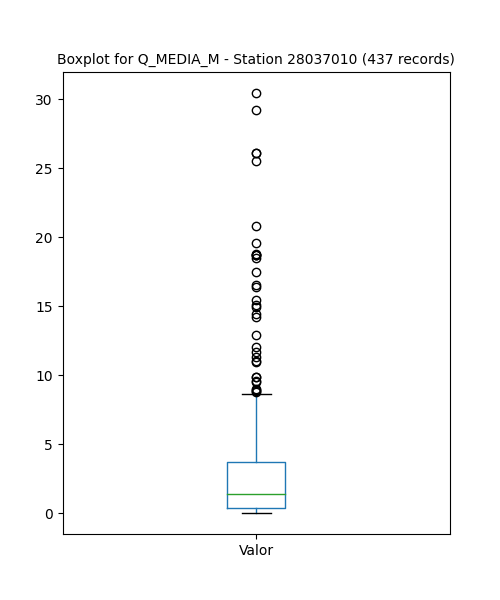
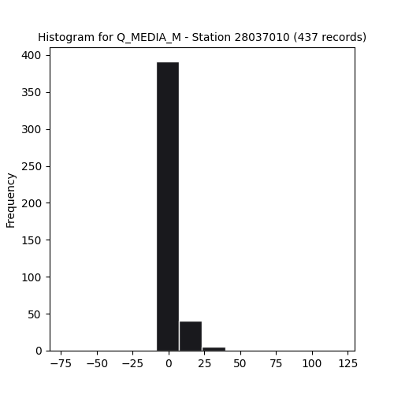
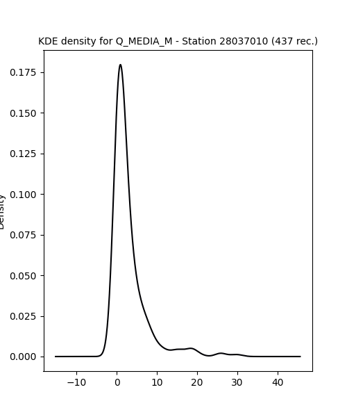

**Q_MEDIA_M - Station: PUENTE CANOAS  - AUT [28037090] (410 rec.)** Location over [Google Maps](http://maps.google.com/maps?q=9.646333333,-73.65183333) or [Openstreet Map](https://www.openstreetmap.org/query?lat=9.646333333&lon=-73.65183333)

Station first record

| Fecha               |   CodigoEstacion | NombreEstacion                  |   Latitud |   Longitud |   Altitud | Categoria    | Entidad                                                     | AreaOperativa                               | Departamento   | Municipio   | FechaInstalacion    | FechaSuspension   | IdParametro   | Etiqueta   | DescripcionSerie     | Frecuencia   |   Valor |   Grado |   Calificador |   NivelAprobacion |
|:--------------------|-----------------:|:--------------------------------|----------:|-----------:|----------:|:-------------|:------------------------------------------------------------|:--------------------------------------------|:---------------|:------------|:--------------------|:------------------|:--------------|:-----------|:---------------------|:-------------|--------:|--------:|--------------:|------------------:|
| 1980-01-01 00:00:00 |         28037090 | PUENTE CANOAS  - AUT [28037090] |   9.64633 |   -73.6518 |        45 | Limnimétrica | INSTITUTO DE HIDROLOGIA METEOROLOGIA Y ESTUDIOS AMBIENTALES | Area Operativa 05 - Magdalena-Cesar-Guajira | Cesar          | El Paso     | 1965-04-15 00:00:00 | NaT               | CAUDAL        | Q_MEDIA_M  | Caudal medio mensual | Mensual      |   30.47 |      50 |           nan |               900 |

Statistics table

|       |       Valor |
|:------|------------:|
| count | 410         |
| mean  |  56.379     |
| std   |  51.3416    |
| min   |   0.0106789 |
| 25%   |  12.65      |
| 50%   |  41.18      |
| 75%   |  90.1875    |
| max   | 209.741     |

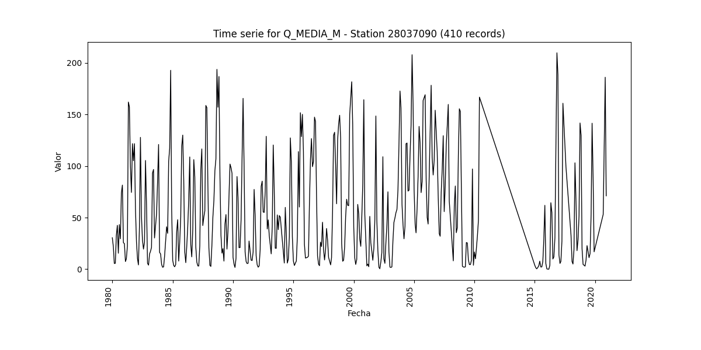
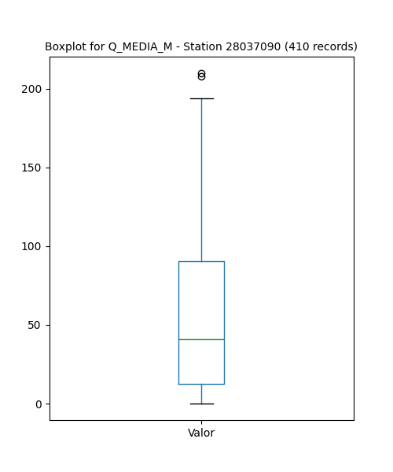
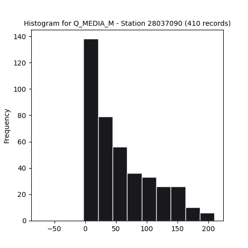
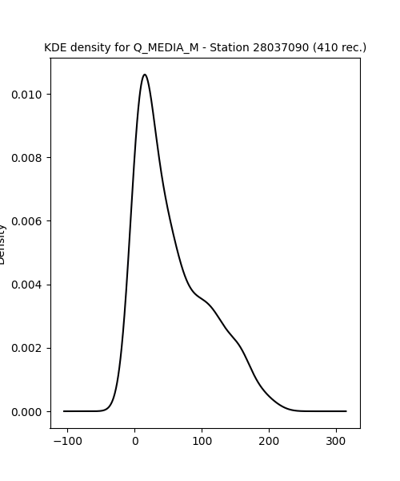

**Q_MEDIA_M - Station: PUENTE CARRETERA [28037130] (422 rec.)** Location over [Google Maps](http://maps.google.com/maps?q=10.15752778,-73.62477778) or [Openstreet Map](https://www.openstreetmap.org/query?lat=10.15752778&lon=-73.62477778)

Station first record

| Fecha               |   CodigoEstacion | NombreEstacion              |   Latitud |   Longitud |   Altitud | Categoria    | Entidad                                                     | AreaOperativa                               | Departamento   | Municipio   | FechaInstalacion    | FechaSuspension   | IdParametro   | Etiqueta   | DescripcionSerie     | Frecuencia   |   Valor |   Grado |   Calificador |   NivelAprobacion |
|:--------------------|-----------------:|:----------------------------|----------:|-----------:|----------:|:-------------|:------------------------------------------------------------|:--------------------------------------------|:---------------|:------------|:--------------------|:------------------|:--------------|:-----------|:---------------------|:-------------|--------:|--------:|--------------:|------------------:|
| 1980-01-01 00:00:00 |         28037130 | PUENTE CARRETERA [28037130] |   10.1575 |   -73.6248 |        80 | Limnigráfica | INSTITUTO DE HIDROLOGIA METEOROLOGIA Y ESTUDIOS AMBIENTALES | Area Operativa 05 - Magdalena-Cesar-Guajira | Cesar          | Valledupar  | 1972-10-15 00:00:00 | NaT               | CAUDAL        | Q_MEDIA_M  | Caudal medio mensual | Mensual      |   0.899 |      50 |           nan |               900 |

Statistics table

|       |       Valor |
|:------|------------:|
| count | 422         |
| mean  |   4.41579   |
| std   |   5.69845   |
| min   |   0.0140806 |
| 25%   |   0.944     |
| 50%   |   2.01      |
| 75%   |   5.36175   |
| max   |  35.46      |

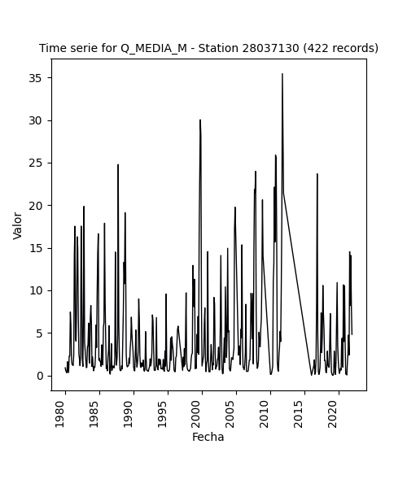
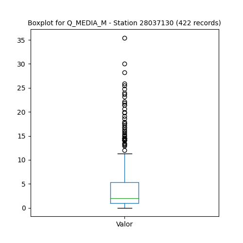
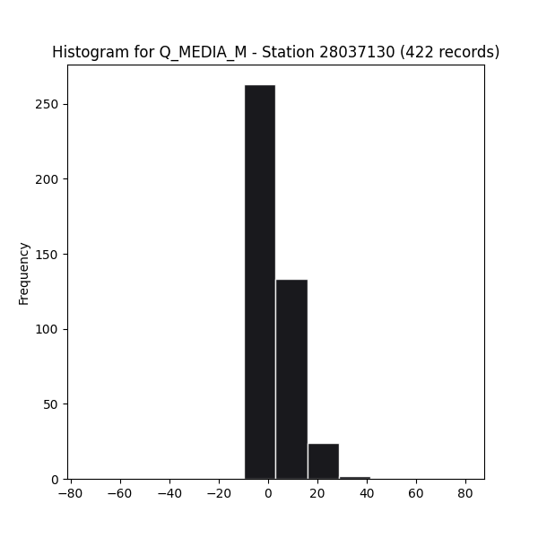
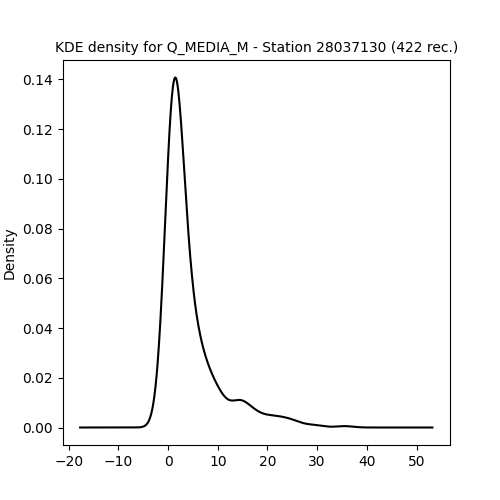

**Q_MEDIA_M - Station: PUENTE SALGUERO  - AUT [28037030] (474 rec.)** Location over [Google Maps](http://maps.google.com/maps?q=10.38411111,-73.23247222) or [Openstreet Map](https://www.openstreetmap.org/query?lat=10.38411111&lon=-73.23247222)

Station first record

| Fecha               |   CodigoEstacion | NombreEstacion                    |   Latitud |   Longitud |   Altitud | Categoria    | Entidad                                                     | AreaOperativa                               | Departamento   | Municipio   | FechaInstalacion    | FechaSuspension   | IdParametro   | Etiqueta   | DescripcionSerie     | Frecuencia   |   Valor |   Grado |   Calificador |   NivelAprobacion |
|:--------------------|-----------------:|:----------------------------------|----------:|-----------:|----------:|:-------------|:------------------------------------------------------------|:--------------------------------------------|:---------------|:------------|:--------------------|:------------------|:--------------|:-----------|:---------------------|:-------------|--------:|--------:|--------------:|------------------:|
| 1980-01-01 00:00:00 |         28037030 | PUENTE SALGUERO  - AUT [28037030] |   10.3841 |   -73.2325 |       113 | Limnigráfica | INSTITUTO DE HIDROLOGIA METEOROLOGIA Y ESTUDIOS AMBIENTALES | Area Operativa 05 - Magdalena-Cesar-Guajira | Cesar          | Valledupar  | 1962-12-15 00:00:00 | NaT               | CAUDAL        | Q_MEDIA_M  | Caudal medio mensual | Mensual      |   16.16 |      50 |           nan |               900 |

Statistics table

|       |    Valor |
|:------|---------:|
| count | 474      |
| mean  |  33.6422 |
| std   |  38.3711 |
| min   |   1.221  |
| 25%   |   7.753  |
| 50%   |  20.465  |
| 75%   |  41.5703 |
| max   | 232.8    |

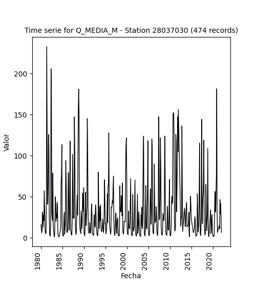
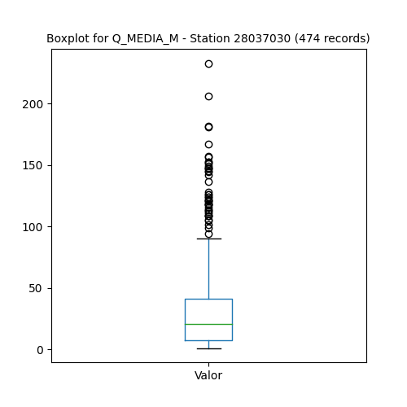

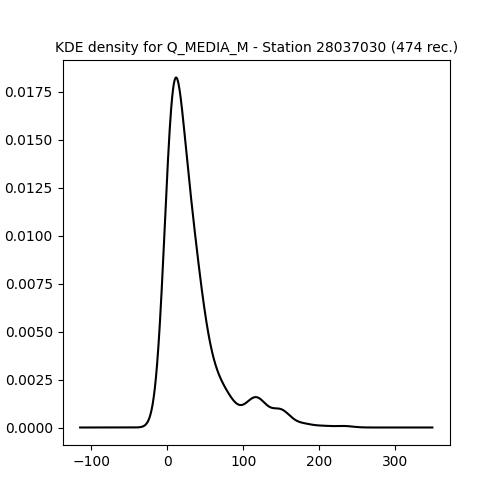

**Q_MEDIA_M - Station: BELLEZA LA [28047080] (96 rec.)** Location over [Google Maps](http://maps.google.com/maps?q=10.33333333,-73.95) or [Openstreet Map](https://www.openstreetmap.org/query?lat=10.33333333&lon=-73.95)

Station first record

| Fecha               |   CodigoEstacion | NombreEstacion        |   Latitud |   Longitud |   Altitud | Categoria    | Entidad                                                     | AreaOperativa                               | Departamento   | Municipio   | FechaInstalacion    | FechaSuspension     | IdParametro   | Etiqueta   | DescripcionSerie     | Frecuencia   |   Valor |   Grado | Calificador    |   NivelAprobacion |
|:--------------------|-----------------:|:----------------------|----------:|-----------:|----------:|:-------------|:------------------------------------------------------------|:--------------------------------------------|:---------------|:------------|:--------------------|:--------------------|:--------------|:-----------|:---------------------|:-------------|--------:|--------:|:---------------|------------------:|
| 1982-01-01 00:00:00 |         28047080 | BELLEZA LA [28047080] |   10.3333 |     -73.95 |       250 | Limnimétrica | INSTITUTO DE HIDROLOGIA METEOROLOGIA Y ESTUDIOS AMBIENTALES | Area Operativa 05 - Magdalena-Cesar-Guajira | Cesar          | El Copey    | 1982-06-15 00:00:00 | 1992-09-15 00:00:00 | CAUDAL        | Q_MEDIA_M  | Caudal medio mensual | Mensual      |    13.8 |       4 | EST. REGRESION |               900 |

Statistics table

|       |    Valor |
|:------|---------:|
| count | 96       |
| mean  | 16.3821  |
| std   |  6.47651 |
| min   |  6.365   |
| 25%   | 11.7875  |
| 50%   | 15.865   |
| 75%   | 18.8225  |
| max   | 47.38    |

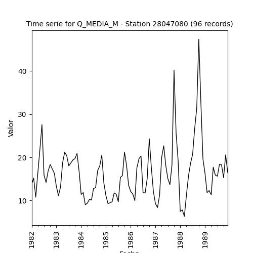
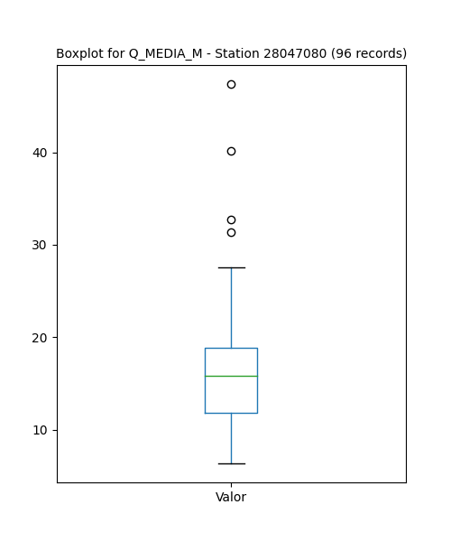
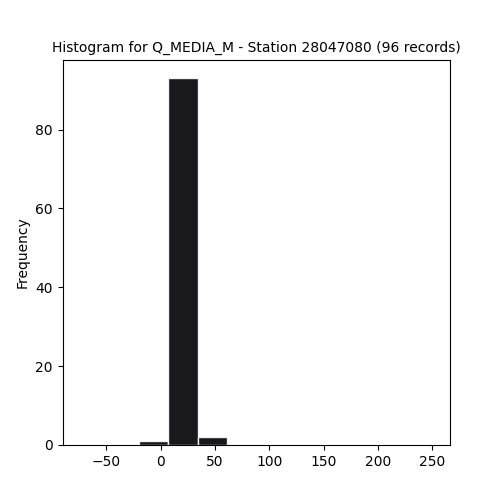
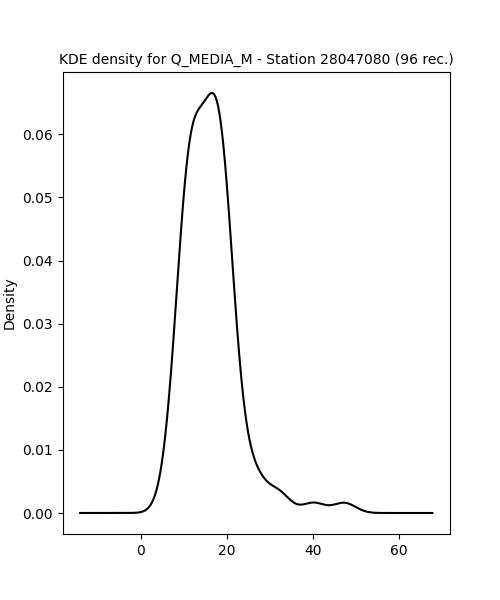

**Q_MEDIA_M - Station: PUENTE CARRETERA [28047040] (247 rec.)** Location over [Google Maps](http://maps.google.com/maps?q=10.271,-73.97266667) or [Openstreet Map](https://www.openstreetmap.org/query?lat=10.271&lon=-73.97266667)

Station first record

| Fecha               |   CodigoEstacion | NombreEstacion              |   Latitud |   Longitud |   Altitud | Categoria    | Entidad                                                     | AreaOperativa                               | Departamento   | Municipio   | FechaInstalacion    | FechaSuspension   | IdParametro   | Etiqueta   | DescripcionSerie     | Frecuencia   |   Valor |   Grado |   Calificador |   NivelAprobacion |
|:--------------------|-----------------:|:----------------------------|----------:|-----------:|----------:|:-------------|:------------------------------------------------------------|:--------------------------------------------|:---------------|:------------|:--------------------|:------------------|:--------------|:-----------|:---------------------|:-------------|--------:|--------:|--------------:|------------------:|
| 1980-01-01 00:00:00 |         28047040 | PUENTE CARRETERA [28047040] |    10.271 |   -73.9727 |       151 | Limnigráfica | INSTITUTO DE HIDROLOGIA METEOROLOGIA Y ESTUDIOS AMBIENTALES | Area Operativa 05 - Magdalena-Cesar-Guajira | Cesar          | El Copey    | 1963-02-15 00:00:00 | NaT               | CAUDAL        | Q_MEDIA_M  | Caudal medio mensual | Mensual      |    1.46 |      50 |           nan |               900 |

Statistics table

|       |     Valor |
|:------|----------:|
| count | 247       |
| mean  |   2.64994 |
| std   |   2.25132 |
| min   |   0.25    |
| 25%   |   1.2385  |
| 50%   |   1.997   |
| 75%   |   3.318   |
| max   |  13.65    |

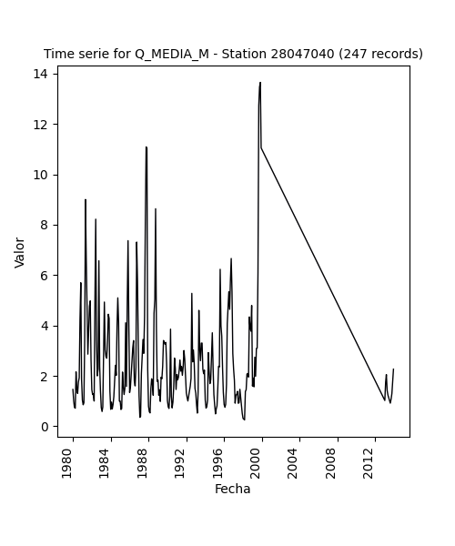
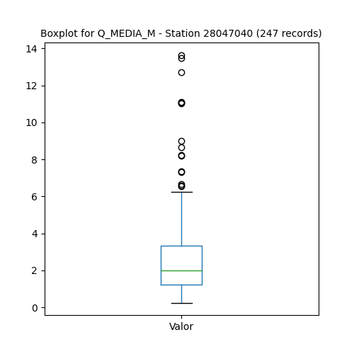
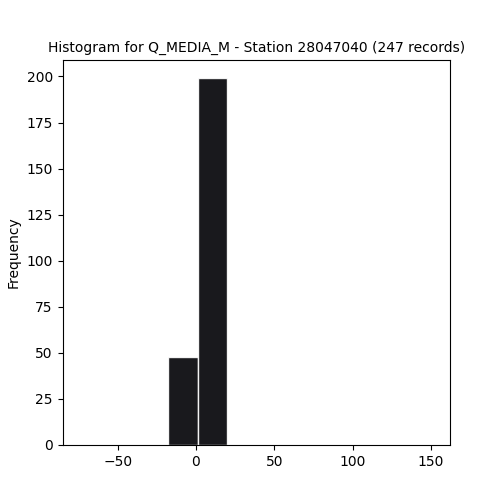
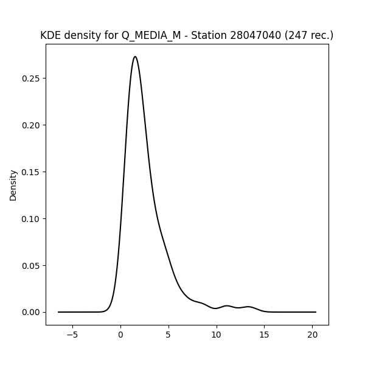

**Q_MEDIA_M - Station: CARACOLI - AUT [15067210] (28 rec.)** Location over [Google Maps](http://maps.google.com/maps?q=10.95011111,-73.05102778) or [Openstreet Map](https://www.openstreetmap.org/query?lat=10.95011111&lon=-73.05102778)

Station first record

| Fecha               |   CodigoEstacion | NombreEstacion            |   Latitud |   Longitud |   Altitud | Categoria    | Entidad                                                     | AreaOperativa                               | Departamento   | Municipio          | FechaInstalacion    | FechaSuspension   | IdParametro   | Etiqueta   | DescripcionSerie     | Frecuencia   |   Valor |   Grado |   Calificador |   NivelAprobacion |
|:--------------------|-----------------:|:--------------------------|----------:|-----------:|----------:|:-------------|:------------------------------------------------------------|:--------------------------------------------|:---------------|:-------------------|:--------------------|:------------------|:--------------|:-----------|:---------------------|:-------------|--------:|--------:|--------------:|------------------:|
| 2012-04-01 00:00:00 |         15067210 | CARACOLI - AUT [15067210] |   10.9501 |    -73.051 |       460 | Limnigráfica | INSTITUTO DE HIDROLOGIA METEOROLOGIA Y ESTUDIOS AMBIENTALES | Area Operativa 05 - Magdalena-Cesar-Guajira | La Guajira     | San Juan Del Cesar | 2011-01-12 00:00:00 | NaT               | CAUDAL        | Q_MEDIA_M  | Caudal medio mensual | Mensual      |   8.695 |      50 |           nan |               900 |

Statistics table

|       |    Valor |
|:------|---------:|
| count | 28       |
| mean  |  5.99268 |
| std   |  4.02808 |
| min   |  1.51655 |
| 25%   |  3.0025  |
| 50%   |  4.716   |
| 75%   |  8.31065 |
| max   | 17.14    |

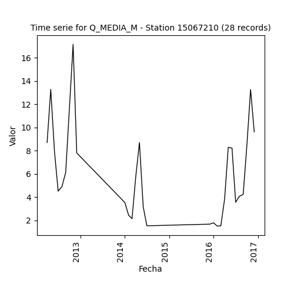
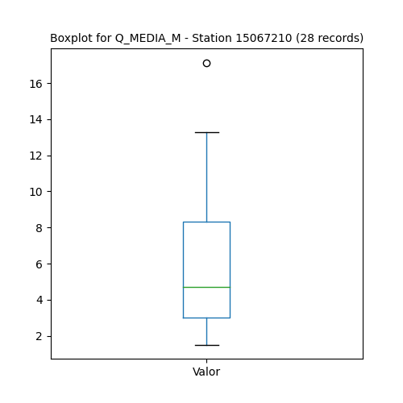
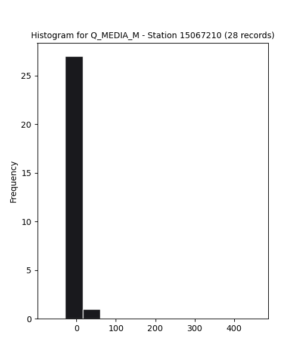
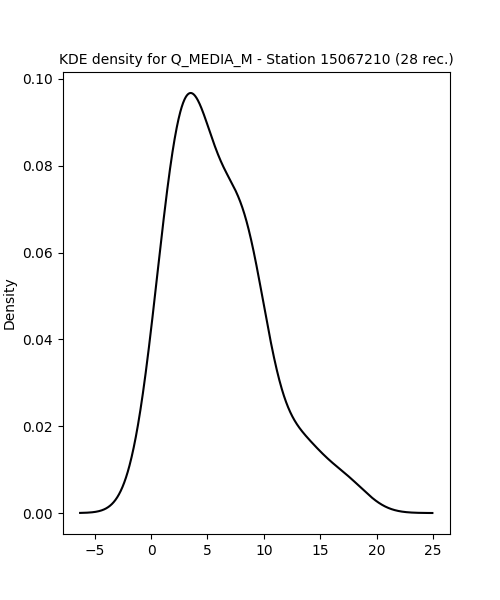

**Q_MEDIA_M - Station: CERCADO EL-AUTOMAT [15067020] (328 rec.)** Location over [Google Maps](http://maps.google.com/maps?q=10.9075,-73.00833333) or [Openstreet Map](https://www.openstreetmap.org/query?lat=10.9075&lon=-73.00833333)

Station first record

| Fecha               |   CodigoEstacion | NombreEstacion                |   Latitud |   Longitud |   Altitud | Categoria    | Entidad                                                     | AreaOperativa                               | Departamento   | Municipio   | FechaInstalacion    | FechaSuspension   | IdParametro   | Etiqueta   | DescripcionSerie     | Frecuencia   |   Valor |   Grado |   Calificador |   NivelAprobacion |
|:--------------------|-----------------:|:------------------------------|----------:|-----------:|----------:|:-------------|:------------------------------------------------------------|:--------------------------------------------|:---------------|:------------|:--------------------|:------------------|:--------------|:-----------|:---------------------|:-------------|--------:|--------:|--------------:|------------------:|
| 1980-01-01 00:00:00 |         15067020 | CERCADO EL-AUTOMAT [15067020] |   10.9075 |   -73.0083 |       335 | Limnigráfica | INSTITUTO DE HIDROLOGIA METEOROLOGIA Y ESTUDIOS AMBIENTALES | Area Operativa 05 - Magdalena-Cesar-Guajira | La Guajira     | Fonseca     | 2004-04-09 00:00:00 | NaT               | CAUDAL        | Q_MEDIA_M  | Caudal medio mensual | Mensual      |    6.81 |      50 |           nan |               900 |

Statistics table

|       |     Valor |
|:------|----------:|
| count | 328       |
| mean  |   6.88666 |
| std   |   4.37317 |
| min   |   1.114   |
| 25%   |   3.963   |
| 50%   |   5.5075  |
| 75%   |   8.558   |
| max   |  27.85    |

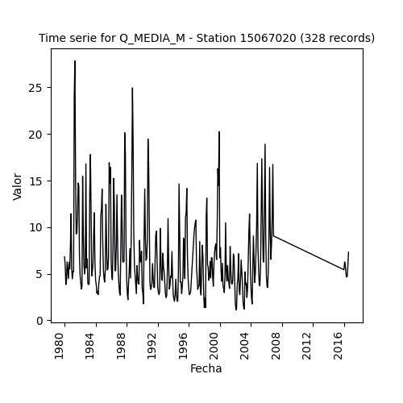

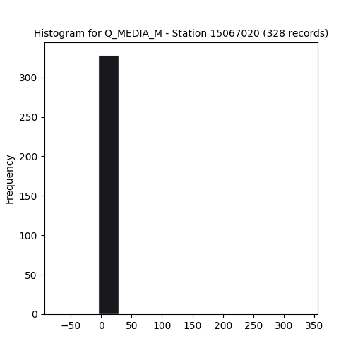
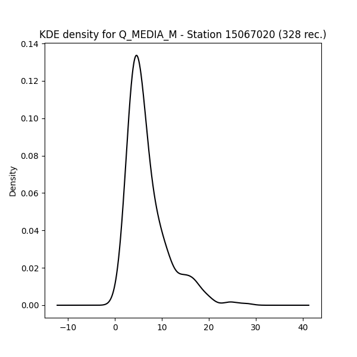

**Q_MEDIA_M - Station: CORRAL DE PIEDRA [28017080] (465 rec.)** Location over [Google Maps](http://maps.google.com/maps?q=10.81891667,-73.05508333) or [Openstreet Map](https://www.openstreetmap.org/query?lat=10.81891667&lon=-73.05508333)

Station first record

| Fecha               |   CodigoEstacion | NombreEstacion              |   Latitud |   Longitud |   Altitud | Categoria    | Entidad                                                     | AreaOperativa                               | Departamento   | Municipio          | FechaInstalacion    | FechaSuspension   | IdParametro   | Etiqueta   | DescripcionSerie     | Frecuencia   |   Valor |   Grado |   Calificador |   NivelAprobacion |
|:--------------------|-----------------:|:----------------------------|----------:|-----------:|----------:|:-------------|:------------------------------------------------------------|:--------------------------------------------|:---------------|:-------------------|:--------------------|:------------------|:--------------|:-----------|:---------------------|:-------------|--------:|--------:|--------------:|------------------:|
| 1980-01-01 00:00:00 |         28017080 | CORRAL DE PIEDRA [28017080] |   10.8189 |   -73.0551 |       275 | Limnimétrica | INSTITUTO DE HIDROLOGIA METEOROLOGIA Y ESTUDIOS AMBIENTALES | Area Operativa 05 - Magdalena-Cesar-Guajira | La Guajira     | San Juan Del Cesar | 1970-03-15 00:00:00 | NaT               | CAUDAL        | Q_MEDIA_M  | Caudal medio mensual | Mensual      |   0.865 |      50 |           nan |               900 |

Statistics table

|       |       Valor |
|:------|------------:|
| count | 465         |
| mean  |   2.49671   |
| std   |   3.54568   |
| min   |   0.0238819 |
| 25%   |   0.606     |
| 50%   |   1.13      |
| 75%   |   2.725     |
| max   |  22.94      |

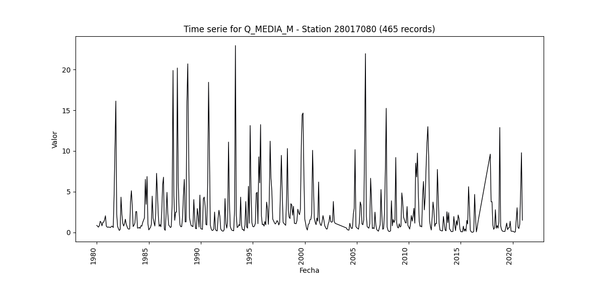
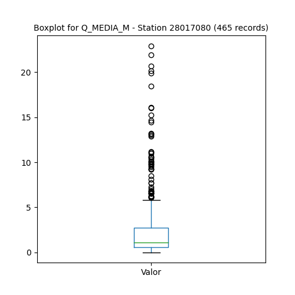
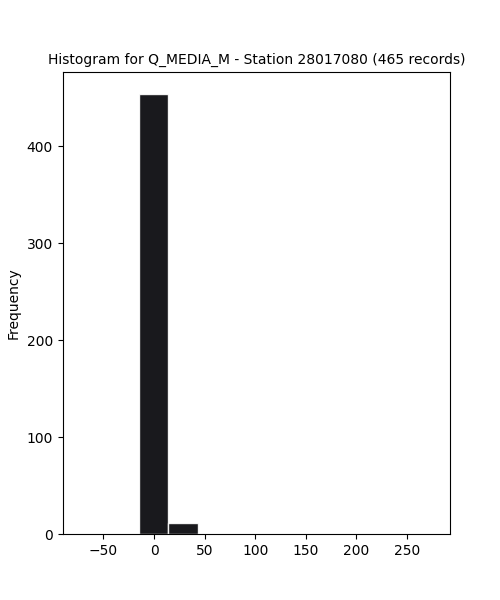
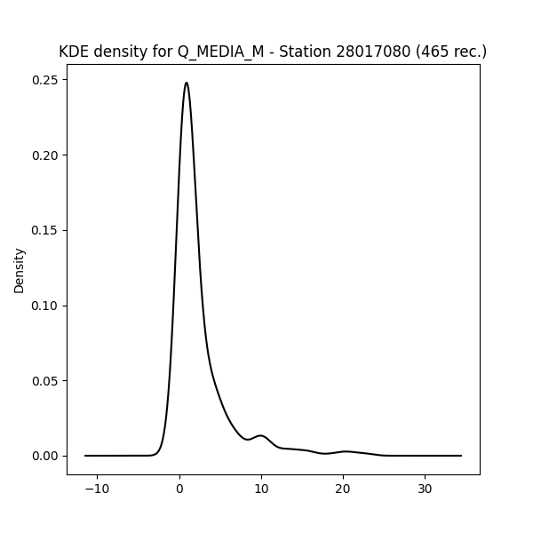

**Q_MEDIA_M - Station: EL SILENCIO - AUT [15067200] (115 rec.)** Location over [Google Maps](http://maps.google.com/maps?q=10.91708333,-72.91533333) or [Openstreet Map](https://www.openstreetmap.org/query?lat=10.91708333&lon=-72.91533333)

Station first record

| Fecha               |   CodigoEstacion | NombreEstacion               |   Latitud |   Longitud |   Altitud | Categoria    | Entidad                                                     | AreaOperativa                               | Departamento   | Municipio   | FechaInstalacion    | FechaSuspension   | IdParametro   | Etiqueta   | DescripcionSerie     | Frecuencia   |   Valor |   Grado |   Calificador |   NivelAprobacion |
|:--------------------|-----------------:|:-----------------------------|----------:|-----------:|----------:|:-------------|:------------------------------------------------------------|:--------------------------------------------|:---------------|:------------|:--------------------|:------------------|:--------------|:-----------|:---------------------|:-------------|--------:|--------:|--------------:|------------------:|
| 2010-06-01 00:00:00 |         15067200 | EL SILENCIO - AUT [15067200] |   10.9171 |   -72.9153 |       255 | Limnigráfica | INSTITUTO DE HIDROLOGIA METEOROLOGIA Y ESTUDIOS AMBIENTALES | Area Operativa 05 - Magdalena-Cesar-Guajira | La Guajira     | Fonseca     | 2010-06-25 00:00:00 | NaT               | CAUDAL        | Q_MEDIA_M  | Caudal medio mensual | Mensual      |   6.725 |      50 |           nan |               900 |

Statistics table

|       |     Valor |
|:------|----------:|
| count | 115       |
| mean  |   7.45147 |
| std   |   7.71757 |
| min   |   1.019   |
| 25%   |   2.61302 |
| 50%   |   4.30484 |
| 75%   |   9.2741  |
| max   |  38.9706  |

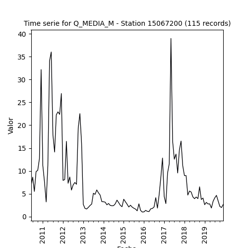
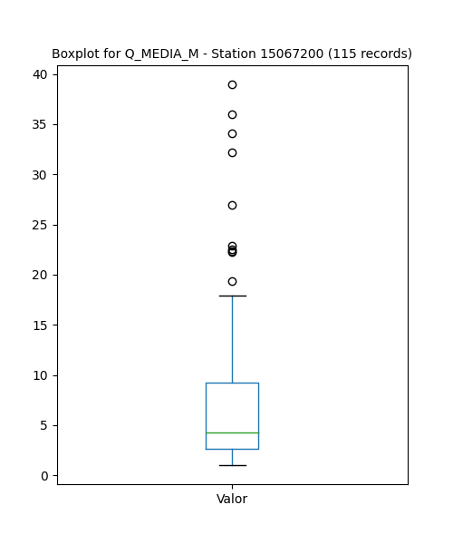
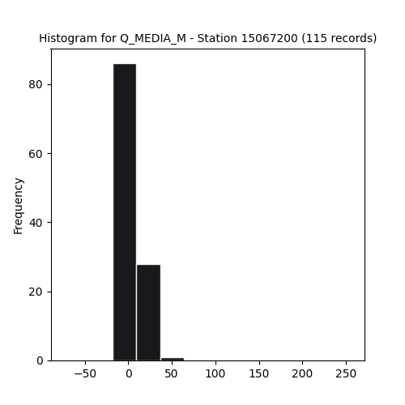
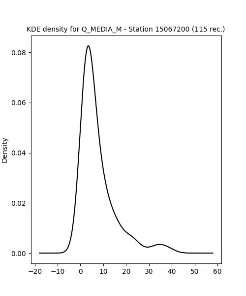

**Q_MEDIA_M - Station: MAGUEYES LOS [15067080] (291 rec.)** Location over [Google Maps](http://maps.google.com/maps?q=10.94672222,-72.77227778) or [Openstreet Map](https://www.openstreetmap.org/query?lat=10.94672222&lon=-72.77227778)

Station first record

| Fecha               |   CodigoEstacion | NombreEstacion          |   Latitud |   Longitud |   Altitud | Categoria    | Entidad                                                     | AreaOperativa                               | Departamento   | Municipio   | FechaInstalacion    | FechaSuspension   | IdParametro   | Etiqueta   | DescripcionSerie     | Frecuencia   |   Valor |   Grado |   Calificador |   NivelAprobacion |
|:--------------------|-----------------:|:------------------------|----------:|-----------:|----------:|:-------------|:------------------------------------------------------------|:--------------------------------------------|:---------------|:------------|:--------------------|:------------------|:--------------|:-----------|:---------------------|:-------------|--------:|--------:|--------------:|------------------:|
| 1980-07-01 00:00:00 |         15067080 | MAGUEYES LOS [15067080] |   10.9467 |   -72.7723 |       140 | Limnimétrica | INSTITUTO DE HIDROLOGIA METEOROLOGIA Y ESTUDIOS AMBIENTALES | Area Operativa 05 - Magdalena-Cesar-Guajira | La Guajira     | Barrancas   | 1980-07-15 00:00:00 | NaT               | CAUDAL        | Q_MEDIA_M  | Caudal medio mensual | Mensual      |   0.544 |      50 |           nan |               900 |

Statistics table

|       |      Valor |
|:------|-----------:|
| count | 291        |
| mean  |   2.17867  |
| std   |   3.43166  |
| min   |   0.124    |
| 25%   |   0.575597 |
| 50%   |   0.977419 |
| 75%   |   2.45689  |
| max   |  31.85     |

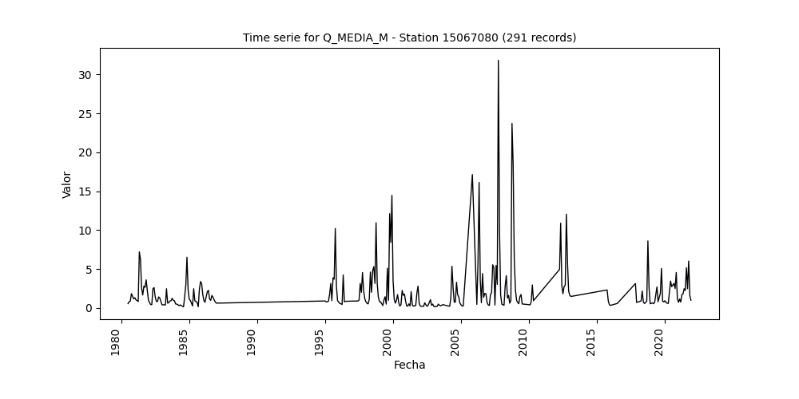

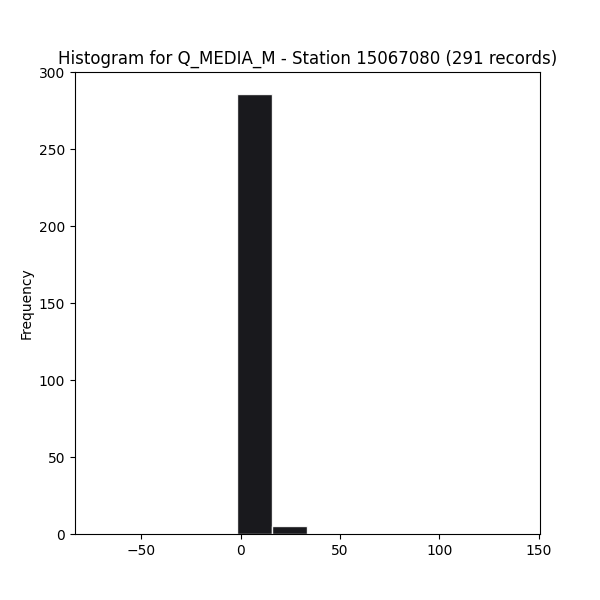
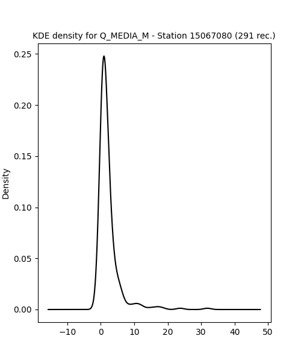

**Q_MEDIA_M - Station: POZO HONDO [15067130] (388 rec.)** Location over [Google Maps](http://maps.google.com/maps?q=10.99855556,-72.81955556) or [Openstreet Map](https://www.openstreetmap.org/query?lat=10.99855556&lon=-72.81955556)

Station first record

| Fecha               |   CodigoEstacion | NombreEstacion        |   Latitud |   Longitud |   Altitud | Categoria    | Entidad                                                     | AreaOperativa                               | Departamento   | Municipio   | FechaInstalacion    | FechaSuspension   | IdParametro   | Etiqueta   | DescripcionSerie     | Frecuencia   |   Valor |   Grado |   Calificador |   NivelAprobacion |
|:--------------------|-----------------:|:----------------------|----------:|-----------:|----------:|:-------------|:------------------------------------------------------------|:--------------------------------------------|:---------------|:------------|:--------------------|:------------------|:--------------|:-----------|:---------------------|:-------------|--------:|--------:|--------------:|------------------:|
| 1987-08-01 00:00:00 |         15067130 | POZO HONDO [15067130] |   10.9986 |   -72.8196 |       210 | Limnigráfica | INSTITUTO DE HIDROLOGIA METEOROLOGIA Y ESTUDIOS AMBIENTALES | Area Operativa 05 - Magdalena-Cesar-Guajira | La Guajira     | Barrancas   | 1987-07-15 00:00:00 | NaT               | CAUDAL        | Q_MEDIA_M  | Caudal medio mensual | Mensual      |    0.12 |      50 |           nan |               900 |

Statistics table

|       |       Valor |
|:------|------------:|
| count | 388         |
| mean  |   0.107405  |
| std   |   0.156455  |
| min   |   0.002     |
| 25%   |   0.016     |
| 50%   |   0.0363357 |
| 75%   |   0.125     |
| max   |   0.936     |

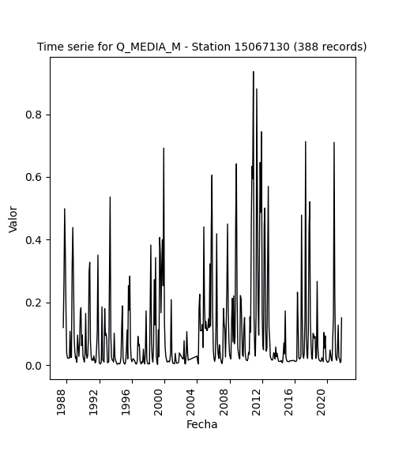
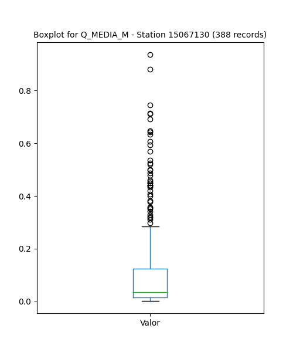
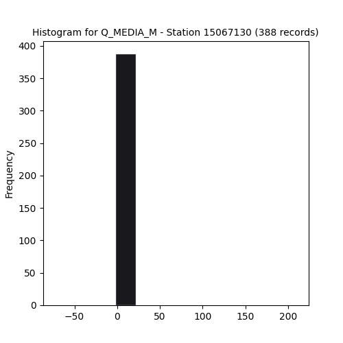
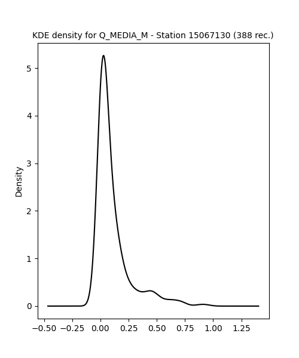

**Q_MEDIA_M - Station: PUENTE GUAJIRO - AUT [15067150] (148 rec.)** Location over [Google Maps](http://maps.google.com/maps?q=10.92644444,-72.80438889) or [Openstreet Map](https://www.openstreetmap.org/query?lat=10.92644444&lon=-72.80438889)

Station first record

| Fecha               |   CodigoEstacion | NombreEstacion                  |   Latitud |   Longitud |   Altitud | Categoria    | Entidad                                                     | AreaOperativa                               | Departamento   | Municipio   | FechaInstalacion    | FechaSuspension   | IdParametro   | Etiqueta   | DescripcionSerie     | Frecuencia   |   Valor |   Grado |   Calificador |   NivelAprobacion |
|:--------------------|-----------------:|:--------------------------------|----------:|-----------:|----------:|:-------------|:------------------------------------------------------------|:--------------------------------------------|:---------------|:------------|:--------------------|:------------------|:--------------|:-----------|:---------------------|:-------------|--------:|--------:|--------------:|------------------:|
| 2008-11-01 00:00:00 |         15067150 | PUENTE GUAJIRO - AUT [15067150] |   10.9264 |   -72.8044 |       485 | Limnigráfica | INSTITUTO DE HIDROLOGIA METEOROLOGIA Y ESTUDIOS AMBIENTALES | Area Operativa 05 - Magdalena-Cesar-Guajira | La Guajira     | Barrancas   | 2008-07-22 00:00:00 | NaT               | CAUDAL        | Q_MEDIA_M  | Caudal medio mensual | Mensual      |      25 |       4 |           nan |               900 |

Statistics table

|       |       Valor |
|:------|------------:|
| count | 148         |
| mean  |   5.06216   |
| std   |   5.59392   |
| min   |   0.0811156 |
| 25%   |   1.54901   |
| 50%   |   2.6945    |
| 75%   |   6.2928    |
| max   |  25.5854    |

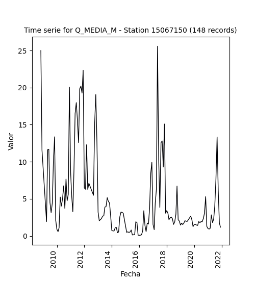
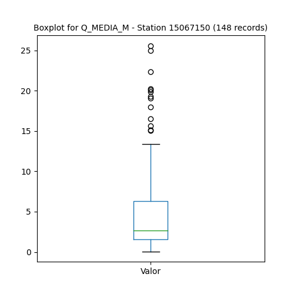

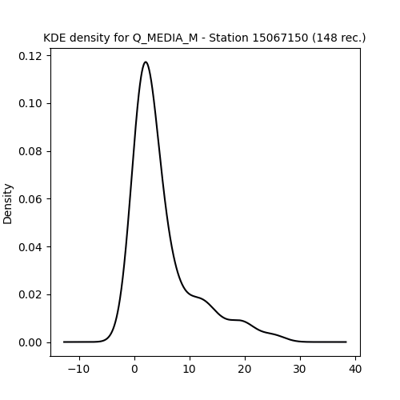

**Q_MEDIA_M - Station: SAN FRANCISCO [15067170] (156 rec.)** Location over [Google Maps](http://maps.google.com/maps?q=10.99122222,-72.75608333) or [Openstreet Map](https://www.openstreetmap.org/query?lat=10.99122222&lon=-72.75608333)

Station first record

| Fecha               |   CodigoEstacion | NombreEstacion           |   Latitud |   Longitud |   Altitud | Categoria    | Entidad                                                     | AreaOperativa                               | Departamento   | Municipio   | FechaInstalacion    | FechaSuspension   | IdParametro   | Etiqueta   | DescripcionSerie     | Frecuencia   |   Valor |   Grado |   Calificador |   NivelAprobacion |
|:--------------------|-----------------:|:-------------------------|----------:|-----------:|----------:|:-------------|:------------------------------------------------------------|:--------------------------------------------|:---------------|:------------|:--------------------|:------------------|:--------------|:-----------|:---------------------|:-------------|--------:|--------:|--------------:|------------------:|
| 2008-12-01 00:00:00 |         15067170 | SAN FRANCISCO [15067170] |   10.9912 |   -72.7561 |       450 | Limnigráfica | INSTITUTO DE HIDROLOGIA METEOROLOGIA Y ESTUDIOS AMBIENTALES | Area Operativa 05 - Magdalena-Cesar-Guajira | La Guajira     | Barrancas   | 2008-07-22 00:00:00 | NaT               | CAUDAL        | Q_MEDIA_M  | Caudal medio mensual | Mensual      |   10.19 |       4 |           nan |               900 |

Statistics table

|       |     Valor |
|:------|----------:|
| count | 156       |
| mean  |   9.50479 |
| std   |  12.6864  |
| min   |   0.516   |
| 25%   |   2.53293 |
| 50%   |   4.73477 |
| 75%   |  10.7563  |
| max   |  71.51    |

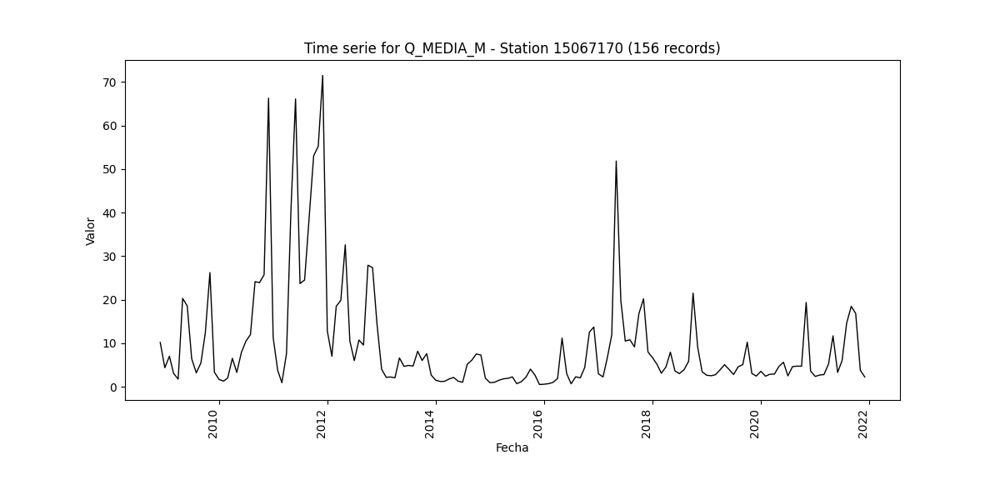
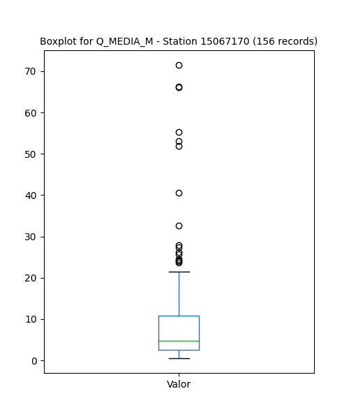
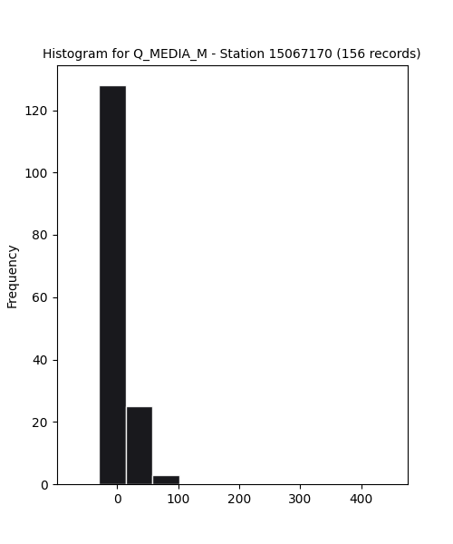
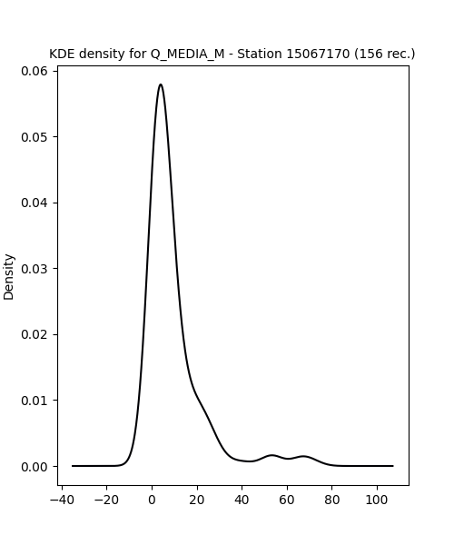

**Q_MEDIA_M - Station: CORRAL DE PIEDRA  - AUT [28017140] (41 rec.)** Location over [Google Maps](http://maps.google.com/maps?q=10.83,-73.07) or [Openstreet Map](https://www.openstreetmap.org/query?lat=10.83&lon=-73.07)

Station first record

| Fecha               |   CodigoEstacion | NombreEstacion                     |   Latitud |   Longitud |   Altitud | Categoria    | Entidad                                                     | AreaOperativa                               | Departamento   | Municipio          | FechaInstalacion    | FechaSuspension   | IdParametro   | Etiqueta   | DescripcionSerie     | Frecuencia   |   Valor |   Grado |   Calificador |   NivelAprobacion |
|:--------------------|-----------------:|:-----------------------------------|----------:|-----------:|----------:|:-------------|:------------------------------------------------------------|:--------------------------------------------|:---------------|:-------------------|:--------------------|:------------------|:--------------|:-----------|:---------------------|:-------------|--------:|--------:|--------------:|------------------:|
| 2010-01-01 00:00:00 |         28017140 | CORRAL DE PIEDRA  - AUT [28017140] |     10.83 |     -73.07 |       275 | Limnigráfica | INSTITUTO DE HIDROLOGIA METEOROLOGIA Y ESTUDIOS AMBIENTALES | Area Operativa 05 - Magdalena-Cesar-Guajira | La Guajira     | San Juan Del Cesar | 2004-09-15 00:00:00 | NaT               | CAUDAL        | Q_MEDIA_M  | Caudal medio mensual | Mensual      |   76114 |      50 |           nan |               900 |

Statistics table

|       |     Valor |
|:------|----------:|
| count |    41     |
| mean  | 18933.9   |
| std   | 23607.6   |
| min   |     0.562 |
| 25%   |     1.504 |
| 50%   |     3.513 |
| 75%   | 32296     |
| max   | 76114     |

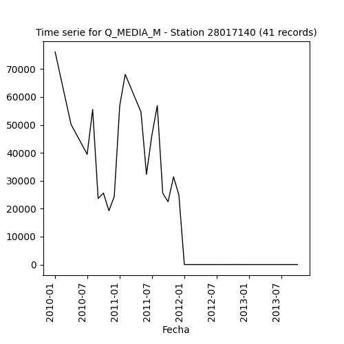
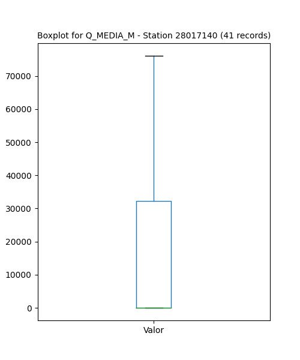
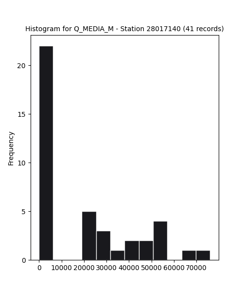
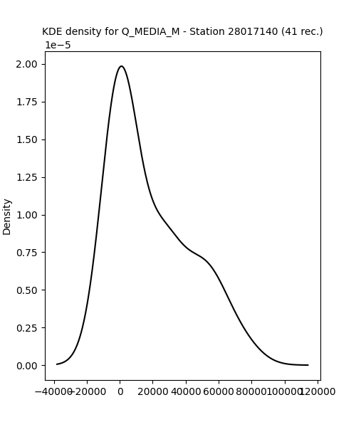

**Q_MEDIA_M - Station: AURORA LA [28047010] (412 rec.)** Location over [Google Maps](http://maps.google.com/maps?q=10.27686111,-73.97780556) or [Openstreet Map](https://www.openstreetmap.org/query?lat=10.27686111&lon=-73.97780556)

Station first record

| Fecha               |   CodigoEstacion | NombreEstacion       |   Latitud |   Longitud |   Altitud | Categoria    | Entidad                                                     | AreaOperativa                               | Departamento   | Municipio   | FechaInstalacion    | FechaSuspension   | IdParametro   | Etiqueta   | DescripcionSerie     | Frecuencia   |   Valor |   Grado |   Calificador |   NivelAprobacion |
|:--------------------|-----------------:|:---------------------|----------:|-----------:|----------:|:-------------|:------------------------------------------------------------|:--------------------------------------------|:---------------|:------------|:--------------------|:------------------|:--------------|:-----------|:---------------------|:-------------|--------:|--------:|--------------:|------------------:|
| 1980-01-01 00:00:00 |         28047010 | AURORA LA [28047010] |   10.2769 |   -73.9778 |       150 | Limnimétrica | INSTITUTO DE HIDROLOGIA METEOROLOGIA Y ESTUDIOS AMBIENTALES | Area Operativa 05 - Magdalena-Cesar-Guajira | Magdalena      | Fundación   | 1961-05-15 00:00:00 | NaT               | CAUDAL        | Q_MEDIA_M  | Caudal medio mensual | Mensual      |   16.83 |      50 |           nan |               900 |

Statistics table

|       |     Valor |
|:------|----------:|
| count | 412       |
| mean  |  16.1567  |
| std   |   8.49034 |
| min   |   0.625   |
| 25%   |  11.3293  |
| 50%   |  14.845   |
| 75%   |  19.2775  |
| max   |  65.28    |

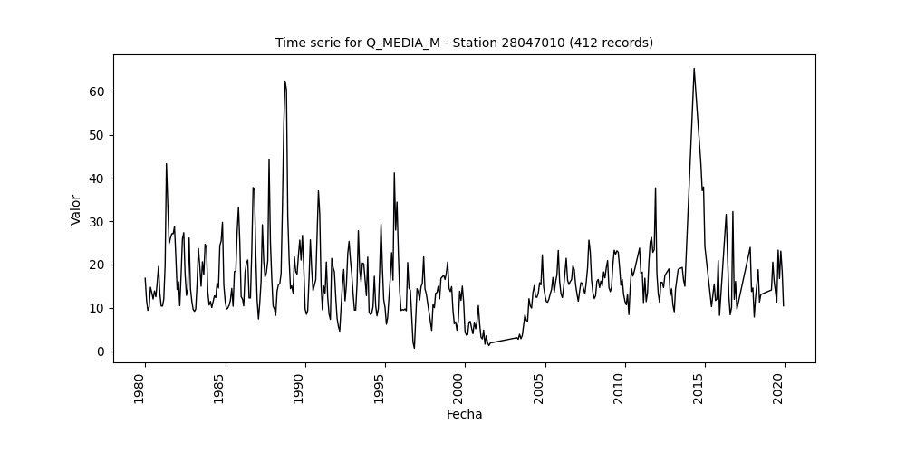
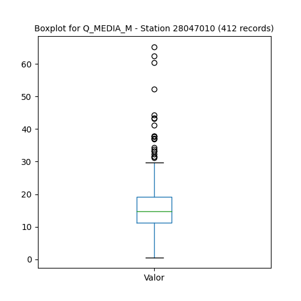
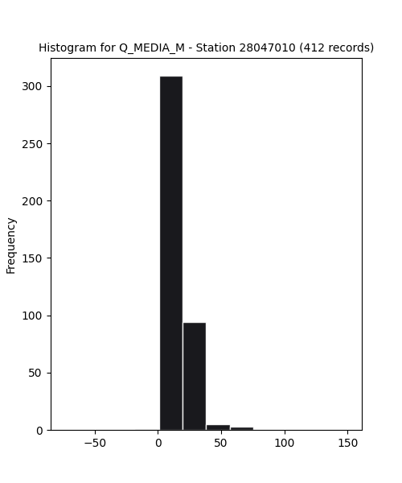
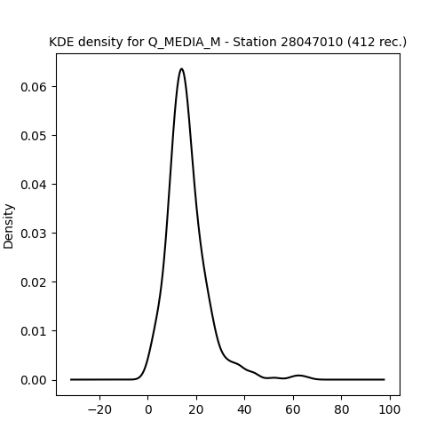

**Q_MEDIA_M - Station: CANAL FLORIDA [29067050] (393 rec.)** Location over [Google Maps](http://maps.google.com/maps?q=10.75886111,-74.10663889) or [Openstreet Map](https://www.openstreetmap.org/query?lat=10.75886111&lon=-74.10663889)

Station first record

| Fecha               |   CodigoEstacion | NombreEstacion           |   Latitud |   Longitud |   Altitud | Categoria    | Entidad                                                     | AreaOperativa                               | Departamento   | Municipio     | FechaInstalacion    | FechaSuspension   | IdParametro   | Etiqueta   | DescripcionSerie     | Frecuencia   |   Valor |   Grado |   Calificador |   NivelAprobacion |
|:--------------------|-----------------:|:-------------------------|----------:|-----------:|----------:|:-------------|:------------------------------------------------------------|:--------------------------------------------|:---------------|:--------------|:--------------------|:------------------|:--------------|:-----------|:---------------------|:-------------|--------:|--------:|--------------:|------------------:|
| 1980-01-01 00:00:00 |         29067050 | CANAL FLORIDA [29067050] |   10.7589 |   -74.1066 |        60 | Limnigráfica | INSTITUTO DE HIDROLOGIA METEOROLOGIA Y ESTUDIOS AMBIENTALES | Area Operativa 05 - Magdalena-Cesar-Guajira | Magdalena      | Zona Bananera | 1965-05-15 00:00:00 | NaT               | CAUDAL        | Q_MEDIA_M  | Caudal medio mensual | Mensual      |   7.816 |      50 |           nan |               900 |

Statistics table

|       |     Valor |
|:------|----------:|
| count | 393       |
| mean  |  12.6539  |
| std   |   9.55028 |
| min   |   1.572   |
| 25%   |   6.14022 |
| 50%   |  10.8     |
| 75%   |  16.3514  |
| max   |  94.89    |

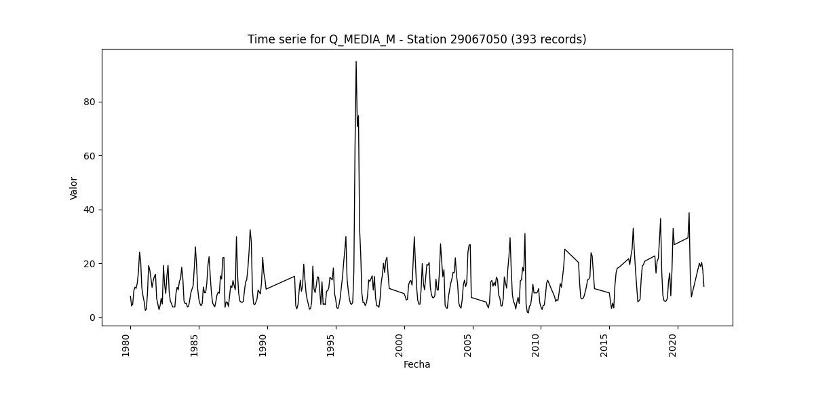
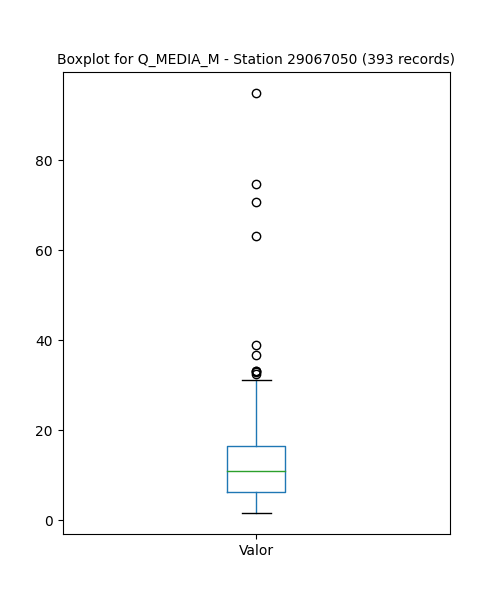
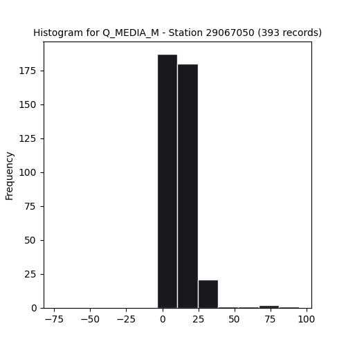
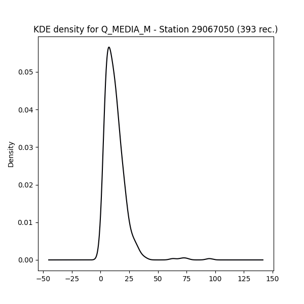

**Q_MEDIA_M - Station: EL BANCO - AUT [25027020] (504 rec.)** Location over [Google Maps](http://maps.google.com/maps?q=8.992527778,-73.96944444) or [Openstreet Map](https://www.openstreetmap.org/query?lat=8.992527778&lon=-73.96944444)

Station first record

| Fecha               |   CodigoEstacion | NombreEstacion            |   Latitud |   Longitud |   Altitud | Categoria    | Entidad                                                     | AreaOperativa                               | Departamento   | Municipio   | FechaInstalacion    | FechaSuspension   | IdParametro   | Etiqueta   | DescripcionSerie     | Frecuencia   |   Valor |   Grado |   Calificador |   NivelAprobacion |
|:--------------------|-----------------:|:--------------------------|----------:|-----------:|----------:|:-------------|:------------------------------------------------------------|:--------------------------------------------|:---------------|:------------|:--------------------|:------------------|:--------------|:-----------|:---------------------|:-------------|--------:|--------:|--------------:|------------------:|
| 1980-01-01 00:00:00 |         25027020 | EL BANCO - AUT [25027020] |   8.99253 |   -73.9694 |        29 | Limnigráfica | INSTITUTO DE HIDROLOGIA METEOROLOGIA Y ESTUDIOS AMBIENTALES | Area Operativa 02 - Atlántico-Bolivar-Sucre | Magdalena      | El Banco    | 1934-01-15 00:00:00 | NaT               | CAUDAL        | Q_MEDIA_M  | Caudal medio mensual | Mensual      |    3231 |      50 |           nan |               900 |

Statistics table

|       |   Valor |
|:------|--------:|
| count |  504    |
| mean  | 4075.69 |
| std   | 1368.36 |
| min   | 1245.65 |
| 25%   | 3091.5  |
| 50%   | 3956.67 |
| 75%   | 4960.75 |
| max   | 9171    |

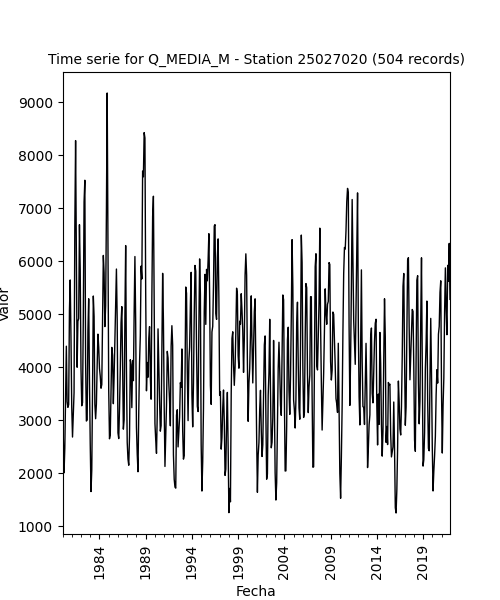
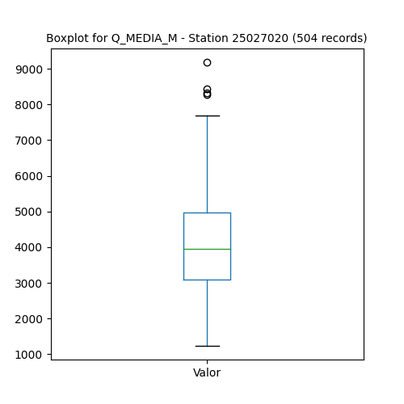
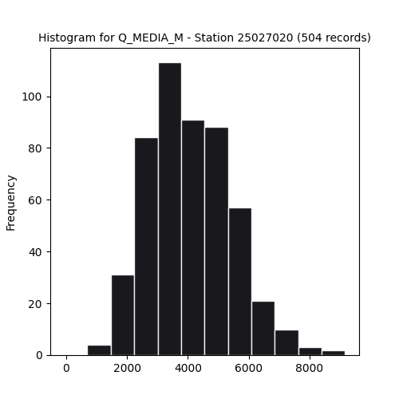
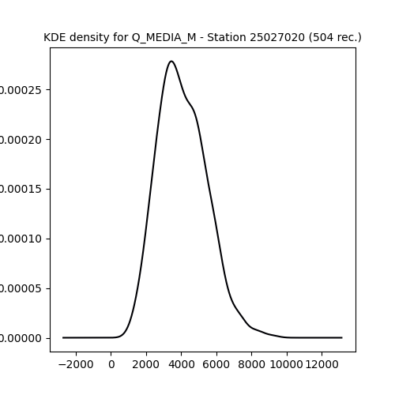

**Q_MEDIA_M - Station: FUNDACION [29067120] (444 rec.)** Location over [Google Maps](http://maps.google.com/maps?q=10.52325,-74.18280556) or [Openstreet Map](https://www.openstreetmap.org/query?lat=10.52325&lon=-74.18280556)

Station first record

| Fecha               |   CodigoEstacion | NombreEstacion       |   Latitud |   Longitud |   Altitud | Categoria    | Entidad                                                     | AreaOperativa                               | Departamento   | Municipio   | FechaInstalacion    | FechaSuspension   | IdParametro   | Etiqueta   | DescripcionSerie     | Frecuencia   |   Valor |   Grado |   Calificador |   NivelAprobacion |
|:--------------------|-----------------:|:---------------------|----------:|-----------:|----------:|:-------------|:------------------------------------------------------------|:--------------------------------------------|:---------------|:------------|:--------------------|:------------------|:--------------|:-----------|:---------------------|:-------------|--------:|--------:|--------------:|------------------:|
| 1980-01-01 00:00:00 |         29067120 | FUNDACION [29067120] |   10.5233 |   -74.1828 |        55 | Limnimétrica | INSTITUTO DE HIDROLOGIA METEOROLOGIA Y ESTUDIOS AMBIENTALES | Area Operativa 05 - Magdalena-Cesar-Guajira | Magdalena      | Fundación   | 1958-04-15 00:00:00 | NaT               | CAUDAL        | Q_MEDIA_M  | Caudal medio mensual | Mensual      |   21.44 |      50 |           nan |               900 |

Statistics table

|       |    Valor |
|:------|---------:|
| count | 444      |
| mean  |  28.2809 |
| std   |  18.1198 |
| min   |   4.831  |
| 25%   |  15.86   |
| 50%   |  24.445  |
| 75%   |  35.5075 |
| max   | 140.9    |

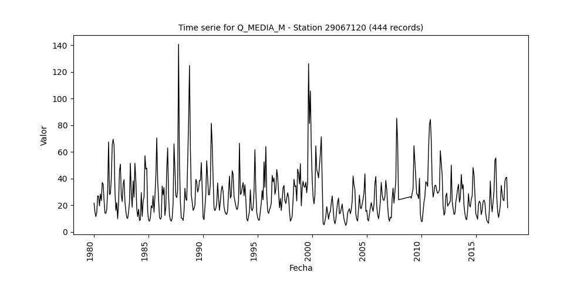
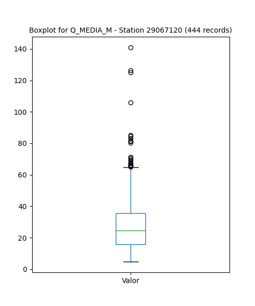
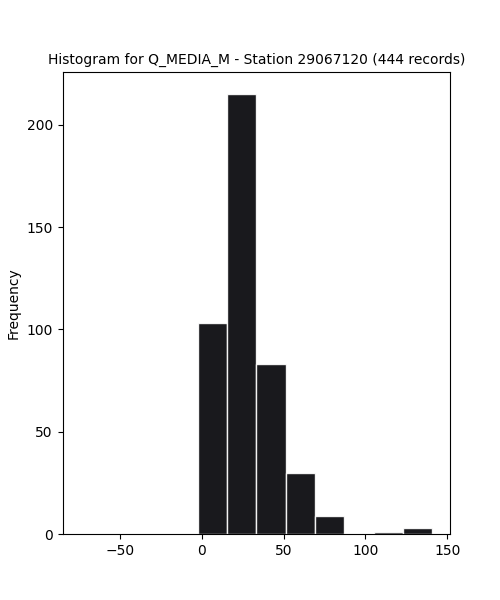
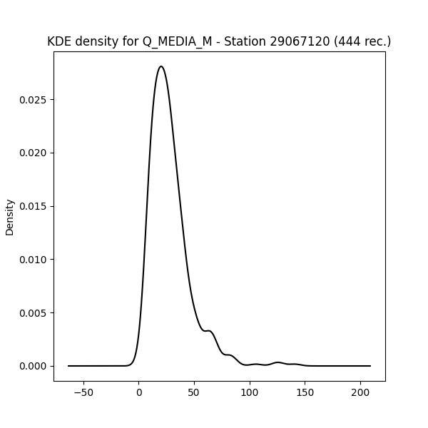

**Q_MEDIA_M - Station: PALMARIGUANI  - AUT [28047050] (451 rec.)** Location over [Google Maps](http://maps.google.com/maps?q=9.930972222,-73.95880556) or [Openstreet Map](https://www.openstreetmap.org/query?lat=9.930972222&lon=-73.95880556)

Station first record

| Fecha               |   CodigoEstacion | NombreEstacion                 |   Latitud |   Longitud |   Altitud | Categoria    | Entidad                                                     | AreaOperativa                               | Departamento   | Municipio             | FechaInstalacion    | FechaSuspension   | IdParametro   | Etiqueta   | DescripcionSerie     | Frecuencia   |   Valor |   Grado |   Calificador |   NivelAprobacion |
|:--------------------|-----------------:|:-------------------------------|----------:|-----------:|----------:|:-------------|:------------------------------------------------------------|:--------------------------------------------|:---------------|:----------------------|:--------------------|:------------------|:--------------|:-----------|:---------------------|:-------------|--------:|--------:|--------------:|------------------:|
| 1980-01-01 00:00:00 |         28047050 | PALMARIGUANI  - AUT [28047050] |   9.93097 |   -73.9588 |        80 | Limnigráfica | INSTITUTO DE HIDROLOGIA METEOROLOGIA Y ESTUDIOS AMBIENTALES | Area Operativa 05 - Magdalena-Cesar-Guajira | Magdalena      | Ariguaní (El Dificil) | 1978-10-15 00:00:00 | NaT               | CAUDAL        | Q_MEDIA_M  | Caudal medio mensual | Mensual      |   10.28 |      50 |           nan |               900 |

Statistics table

|       |    Valor |
|:------|---------:|
| count | 451      |
| mean  |  13.5702 |
| std   |  13.6383 |
| min   |   0.127  |
| 25%   |   2.9885 |
| 50%   |   8.391  |
| 75%   |  20.35   |
| max   |  63.14   |

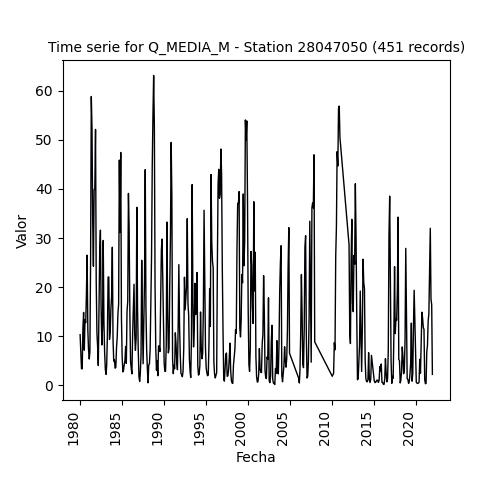
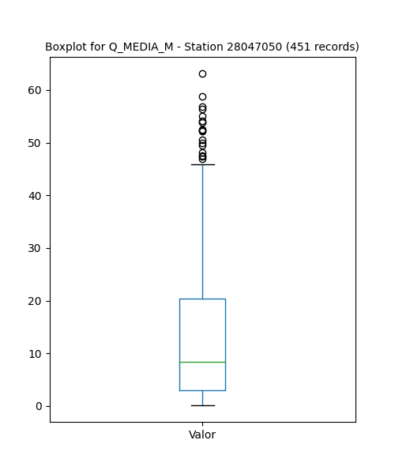
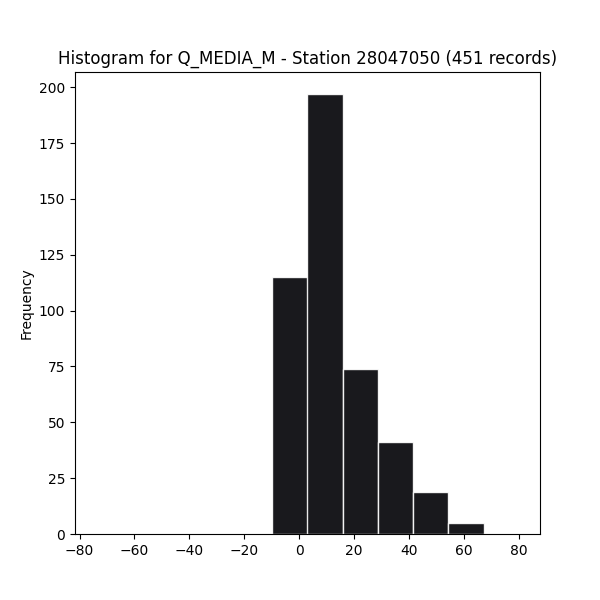
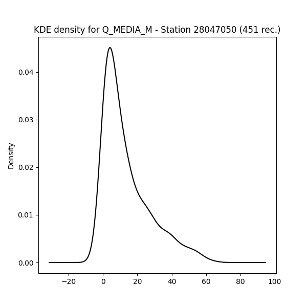

**Q_MEDIA_M - Station: PUERTO RICO HACIENDA  - AUT [29067060] (257 rec.)** Location over [Google Maps](http://maps.google.com/maps?q=10.5,-74.13333333) or [Openstreet Map](https://www.openstreetmap.org/query?lat=10.5&lon=-74.13333333)

Station first record

| Fecha               |   CodigoEstacion | NombreEstacion                         |   Latitud |   Longitud |   Altitud | Categoria    | Entidad                                                     | AreaOperativa                               | Departamento   | Municipio   | FechaInstalacion    | FechaSuspension   | IdParametro   | Etiqueta   | DescripcionSerie     | Frecuencia   |   Valor |   Grado |   Calificador |   NivelAprobacion |
|:--------------------|-----------------:|:---------------------------------------|----------:|-----------:|----------:|:-------------|:------------------------------------------------------------|:--------------------------------------------|:---------------|:------------|:--------------------|:------------------|:--------------|:-----------|:---------------------|:-------------|--------:|--------:|--------------:|------------------:|
| 1980-01-01 00:00:00 |         29067060 | PUERTO RICO HACIENDA  - AUT [29067060] |      10.5 |   -74.1333 |        55 | Limnigráfica | INSTITUTO DE HIDROLOGIA METEOROLOGIA Y ESTUDIOS AMBIENTALES | Area Operativa 05 - Magdalena-Cesar-Guajira | Magdalena      | Aracataca   | 1967-06-15 00:00:00 | NaT               | CAUDAL        | Q_MEDIA_M  | Caudal medio mensual | Mensual      |   17.88 |      50 |           nan |               900 |

Statistics table

|       |    Valor |
|:------|---------:|
| count | 257      |
| mean  |  24.8152 |
| std   |  12.422  |
| min   |   4.068  |
| 25%   |  15.44   |
| 50%   |  22.37   |
| 75%   |  32.55   |
| max   |  88.67   |

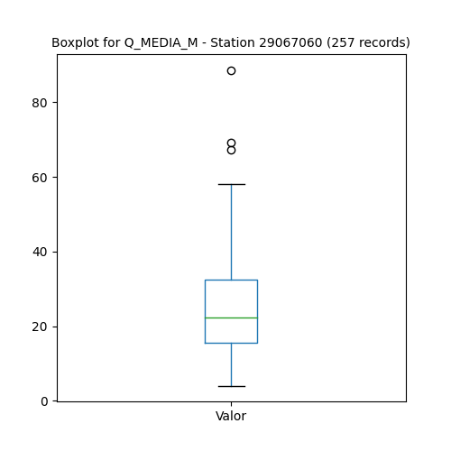
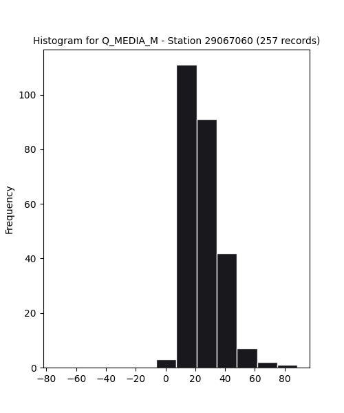
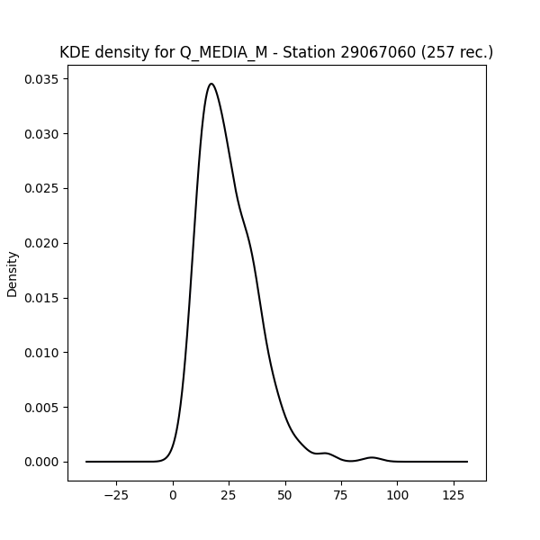

**Q_MEDIA_M - Station: RIO FRIO [29067070] (426 rec.)** Location over [Google Maps](http://maps.google.com/maps?q=10.90541667,-74.15411111) or [Openstreet Map](https://www.openstreetmap.org/query?lat=10.90541667&lon=-74.15411111)

Station first record

| Fecha               |   CodigoEstacion | NombreEstacion      |   Latitud |   Longitud |   Altitud | Categoria    | Entidad                                                     | AreaOperativa                               | Departamento   | Municipio   | FechaInstalacion    | FechaSuspension   | IdParametro   | Etiqueta   | DescripcionSerie     | Frecuencia   |   Valor |   Grado |   Calificador |   NivelAprobacion |
|:--------------------|-----------------:|:--------------------|----------:|-----------:|----------:|:-------------|:------------------------------------------------------------|:--------------------------------------------|:---------------|:------------|:--------------------|:------------------|:--------------|:-----------|:---------------------|:-------------|--------:|--------:|--------------:|------------------:|
| 1980-01-01 00:00:00 |         29067070 | RIO FRIO [29067070] |   10.9054 |   -74.1541 |        30 | Limnigráfica | INSTITUTO DE HIDROLOGIA METEOROLOGIA Y ESTUDIOS AMBIENTALES | Area Operativa 05 - Magdalena-Cesar-Guajira | Magdalena      | Ciénaga     | 1978-07-15 00:00:00 | NaT               | CAUDAL        | Q_MEDIA_M  | Caudal medio mensual | Mensual      |   7.213 |      50 |           nan |               900 |

Statistics table

|       |     Valor |
|:------|----------:|
| count | 426       |
| mean  |  13.4932  |
| std   |   9.06389 |
| min   |   2.06    |
| 25%   |   6.24475 |
| 50%   |  11.37    |
| 75%   |  18.18    |
| max   |  59.47    |

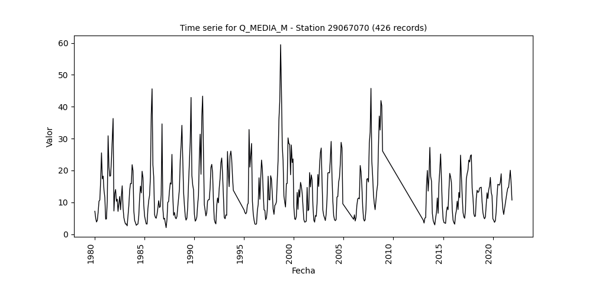
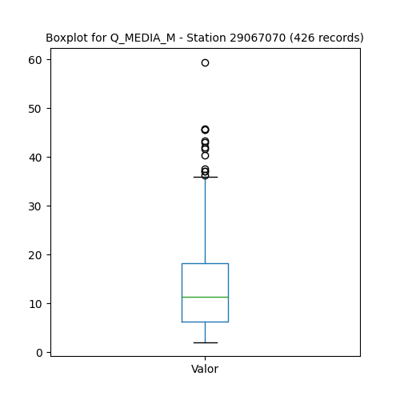
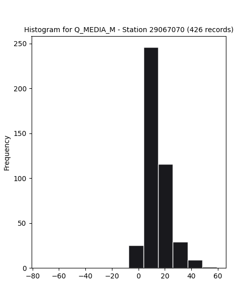
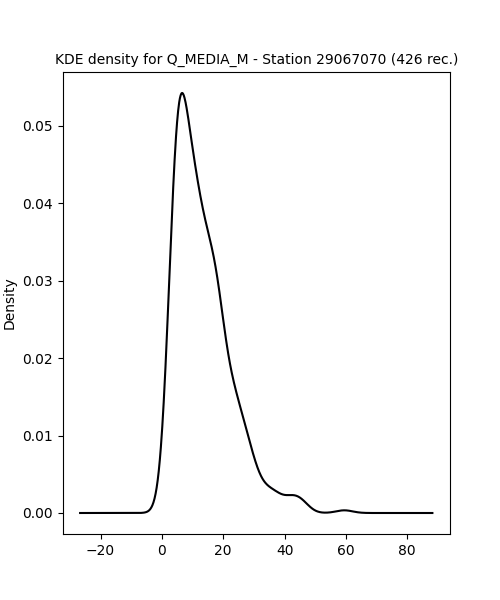

**Q_MEDIA_M - Station: SANTA ROSALIA [29067040] (446 rec.)** Location over [Google Maps](http://maps.google.com/maps?q=10.83080556,-74.12055556) or [Openstreet Map](https://www.openstreetmap.org/query?lat=10.83080556&lon=-74.12055556)

Station first record

| Fecha               |   CodigoEstacion | NombreEstacion           |   Latitud |   Longitud |   Altitud | Categoria    | Entidad                                                     | AreaOperativa                               | Departamento   | Municipio     | FechaInstalacion    | FechaSuspension   | IdParametro   | Etiqueta   | DescripcionSerie     | Frecuencia   |   Valor |   Grado |   Calificador |   NivelAprobacion |
|:--------------------|-----------------:|:-------------------------|----------:|-----------:|----------:|:-------------|:------------------------------------------------------------|:--------------------------------------------|:---------------|:--------------|:--------------------|:------------------|:--------------|:-----------|:---------------------|:-------------|--------:|--------:|--------------:|------------------:|
| 1980-01-01 00:00:00 |         29067040 | SANTA ROSALIA [29067040] |   10.8308 |   -74.1206 |        55 | Limnimétrica | INSTITUTO DE HIDROLOGIA METEOROLOGIA Y ESTUDIOS AMBIENTALES | Area Operativa 05 - Magdalena-Cesar-Guajira | Magdalena      | Zona Bananera | 1965-05-15 00:00:00 | NaT               | CAUDAL        | Q_MEDIA_M  | Caudal medio mensual | Mensual      |   0.514 |      50 |           nan |               900 |

Statistics table

|       |     Valor |
|:------|----------:|
| count | 446       |
| mean  |   1.91476 |
| std   |   1.48993 |
| min   |   0.106   |
| 25%   |   0.78925 |
| 50%   |   1.439   |
| 75%   |   2.73225 |
| max   |   7.354   |

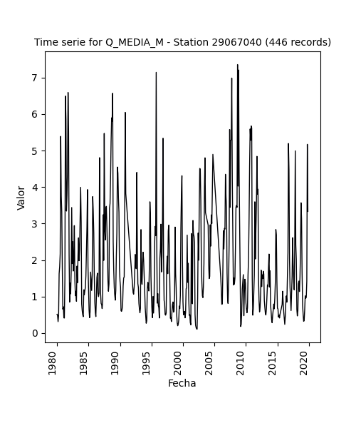
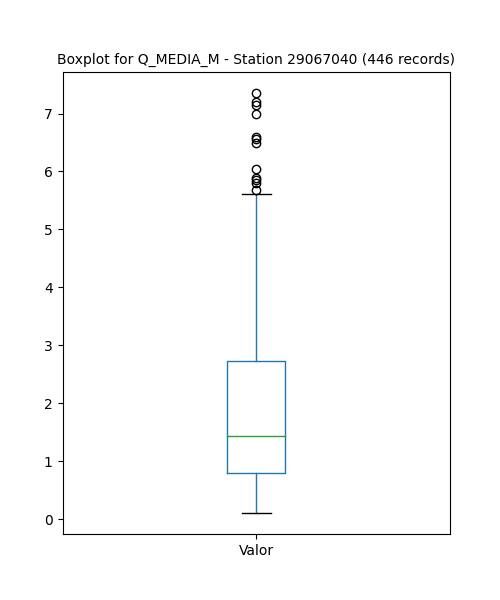
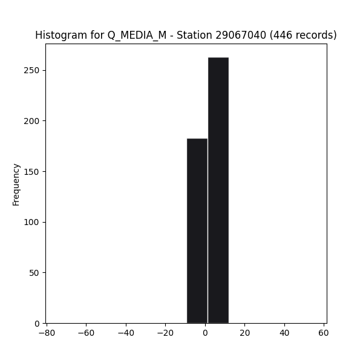

**Q_MEDIA_M - Station: TREBOL EL [29067010] (448 rec.)** Location over [Google Maps](http://maps.google.com/maps?q=10.63591667,-74.14633333) or [Openstreet Map](https://www.openstreetmap.org/query?lat=10.63591667&lon=-74.14633333)

Station first record

| Fecha               |   CodigoEstacion | NombreEstacion       |   Latitud |   Longitud |   Altitud | Categoria    | Entidad                                                     | AreaOperativa                               | Departamento   | Municipio   | FechaInstalacion    | FechaSuspension   | IdParametro   | Etiqueta   | DescripcionSerie     | Frecuencia   |   Valor |   Grado | Calificador    |   NivelAprobacion |
|:--------------------|-----------------:|:---------------------|----------:|-----------:|----------:|:-------------|:------------------------------------------------------------|:--------------------------------------------|:---------------|:------------|:--------------------|:------------------|:--------------|:-----------|:---------------------|:-------------|--------:|--------:|:---------------|------------------:|
| 1980-01-01 00:00:00 |         29067010 | TREBOL EL [29067010] |   10.6359 |   -74.1463 |        60 | Limnigráfica | INSTITUTO DE HIDROLOGIA METEOROLOGIA Y ESTUDIOS AMBIENTALES | Area Operativa 05 - Magdalena-Cesar-Guajira | Magdalena      | Ciénaga     | 1958-03-15 00:00:00 | NaT               | CAUDAL        | Q_MEDIA_M  | Caudal medio mensual | Mensual      |   7.281 |       4 | EST. REGRESION |               900 |

Statistics table

|       |     Valor |
|:------|----------:|
| count | 448       |
| mean  |  17.5998  |
| std   |  11.6086  |
| min   |   2.966   |
| 25%   |   9.71225 |
| 50%   |  15.525   |
| 75%   |  21.6225  |
| max   | 119       |

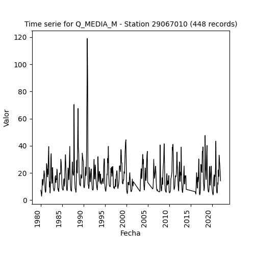
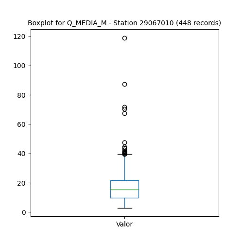
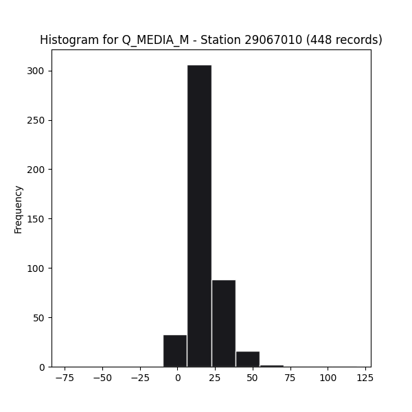
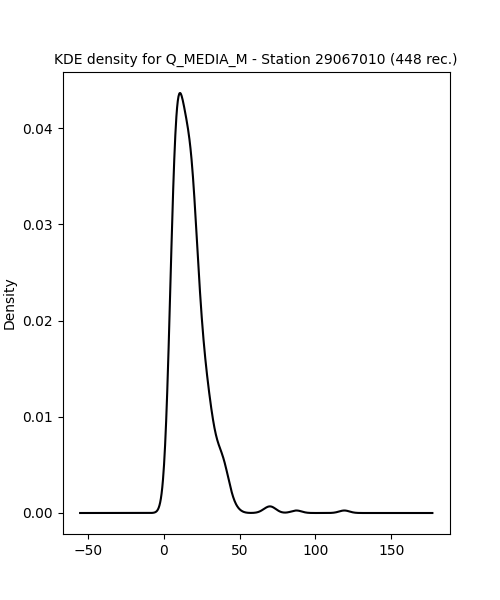

**Q_MEDIA_M - Station: GANADERIA CARIBE  - AUT [29067150] (481 rec.)** Location over [Google Maps](http://maps.google.com/maps?q=10.57491667,-74.12666667) or [Openstreet Map](https://www.openstreetmap.org/query?lat=10.57491667&lon=-74.12666667)

Station first record

| Fecha               |   CodigoEstacion | NombreEstacion                     |   Latitud |   Longitud |   Altitud | Categoria    | Entidad                                                     | AreaOperativa                               | Departamento   | Municipio   | FechaInstalacion    | FechaSuspension   | IdParametro   | Etiqueta   | DescripcionSerie     | Frecuencia   |   Valor |   Grado |   Calificador |   NivelAprobacion |
|:--------------------|-----------------:|:-----------------------------------|----------:|-----------:|----------:|:-------------|:------------------------------------------------------------|:--------------------------------------------|:---------------|:------------|:--------------------|:------------------|:--------------|:-----------|:---------------------|:-------------|--------:|--------:|--------------:|------------------:|
| 1980-01-01 00:00:00 |         29067150 | GANADERIA CARIBE  - AUT [29067150] |   10.5749 |   -74.1267 |        67 | Limnigráfica | INSTITUTO DE HIDROLOGIA METEOROLOGIA Y ESTUDIOS AMBIENTALES | Area Operativa 05 - Magdalena-Cesar-Guajira | Magdalena      | Aracataca   | 1965-05-15 00:00:00 | NaT               | CAUDAL        | Q_MEDIA_M  | Caudal medio mensual | Mensual      |   11.91 |      50 |           nan |               900 |

Statistics table

|       |      Valor |
|:------|-----------:|
| count | 481        |
| mean  |  15.9357   |
| std   |   9.25158  |
| min   |   0.479067 |
| 25%   |   8.836    |
| 50%   |  14.42     |
| 75%   |  21.58     |
| max   |  55.25     |

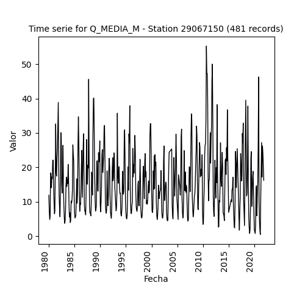
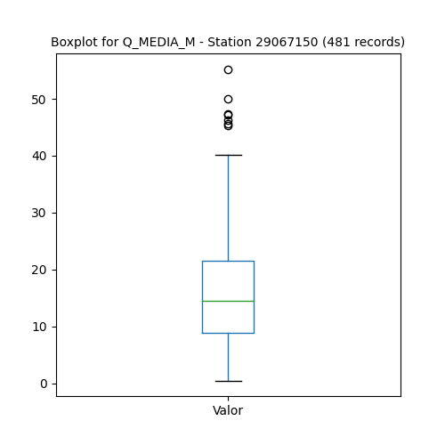
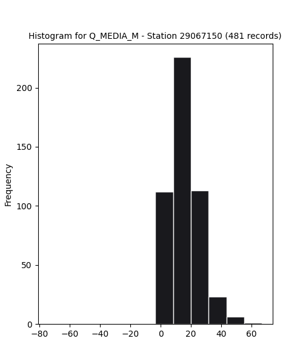
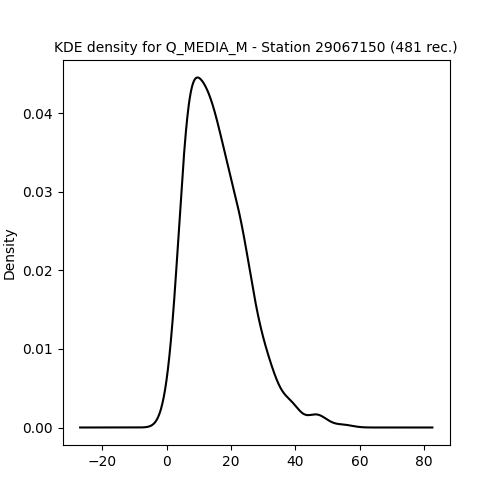

**Q_MEDIA_M - Station: PUENTE FERROCARRIL [29067130] (476 rec.)** Location over [Google Maps](http://maps.google.com/maps?q=10.58580556,-74.19211111) or [Openstreet Map](https://www.openstreetmap.org/query?lat=10.58580556&lon=-74.19211111)

Station first record

| Fecha               |   CodigoEstacion | NombreEstacion                |   Latitud |   Longitud |   Altitud | Categoria    | Entidad                                                     | AreaOperativa                               | Departamento   | Municipio   | FechaInstalacion    | FechaSuspension   | IdParametro   | Etiqueta   | DescripcionSerie     | Frecuencia   |   Valor |   Grado |   Calificador |   NivelAprobacion |
|:--------------------|-----------------:|:------------------------------|----------:|-----------:|----------:|:-------------|:------------------------------------------------------------|:--------------------------------------------|:---------------|:------------|:--------------------|:------------------|:--------------|:-----------|:---------------------|:-------------|--------:|--------:|--------------:|------------------:|
| 1980-01-01 00:00:00 |         29067130 | PUENTE FERROCARRIL [29067130] |   10.5858 |   -74.1921 |        37 | Limnimétrica | INSTITUTO DE HIDROLOGIA METEOROLOGIA Y ESTUDIOS AMBIENTALES | Area Operativa 05 - Magdalena-Cesar-Guajira | Magdalena      | Aracataca   | 1965-05-15 00:00:00 | NaT               | CAUDAL        | Q_MEDIA_M  | Caudal medio mensual | Mensual      |   7.851 |      50 |           nan |               900 |

Statistics table

|       |     Valor |
|:------|----------:|
| count | 476       |
| mean  |  17.6187  |
| std   |  14.6576  |
| min   |   1.95487 |
| 25%   |   7.617   |
| 50%   |  13.59    |
| 75%   |  22.0241  |
| max   |  97.6     |

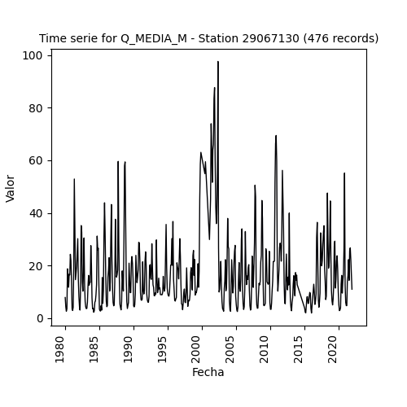
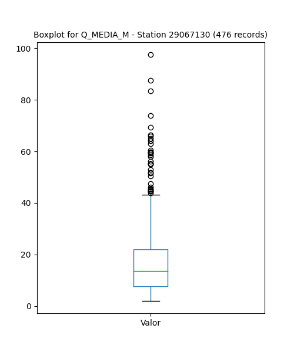
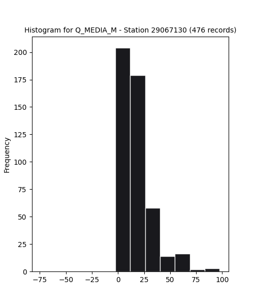
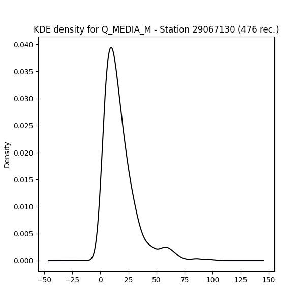

**Q_MEDIA_M - Station: PUENTE SEVILLA  - AUT [29067160] (397 rec.)** Location over [Google Maps](http://maps.google.com/maps?q=10.79883333,-74.02858333) or [Openstreet Map](https://www.openstreetmap.org/query?lat=10.79883333&lon=-74.02858333)

Station first record

| Fecha               |   CodigoEstacion | NombreEstacion                   |   Latitud |   Longitud |   Altitud | Categoria    | Entidad                                                     | AreaOperativa                               | Departamento   | Municipio   | FechaInstalacion    | FechaSuspension   | IdParametro   | Etiqueta   | DescripcionSerie     | Frecuencia   |   Valor |   Grado | Calificador    |   NivelAprobacion |
|:--------------------|-----------------:|:---------------------------------|----------:|-----------:|----------:|:-------------|:------------------------------------------------------------|:--------------------------------------------|:---------------|:------------|:--------------------|:------------------|:--------------|:-----------|:---------------------|:-------------|--------:|--------:|:---------------|------------------:|
| 1982-01-01 00:00:00 |         29067160 | PUENTE SEVILLA  - AUT [29067160] |   10.7988 |   -74.0286 |        10 | Limnigráfica | INSTITUTO DE HIDROLOGIA METEOROLOGIA Y ESTUDIOS AMBIENTALES | Area Operativa 05 - Magdalena-Cesar-Guajira | Magdalena      | Ciénaga     | 1982-07-15 00:00:00 | NaT               | CAUDAL        | Q_MEDIA_M  | Caudal medio mensual | Mensual      |   3.595 |       4 | EST. REGRESION |               900 |

Statistics table

|       |     Valor |
|:------|----------:|
| count | 397       |
| mean  |   7.71179 |
| std   |   8.21195 |
| min   |   0.546   |
| 25%   |   2.326   |
| 50%   |   5.185   |
| 75%   |  10.81    |
| max   |  71.7432  |

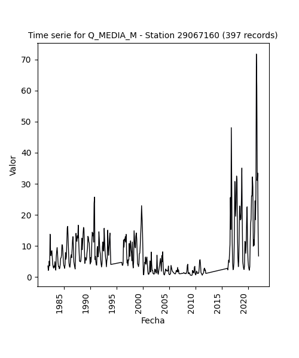
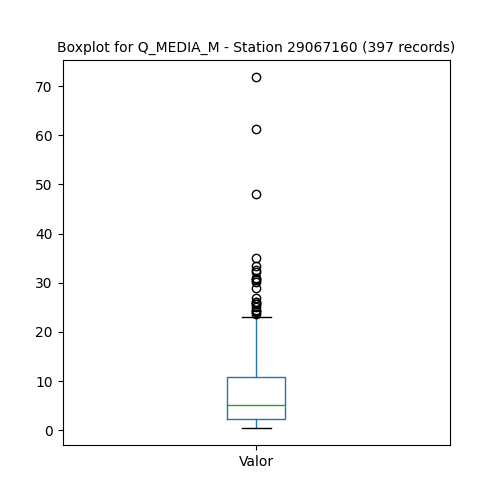
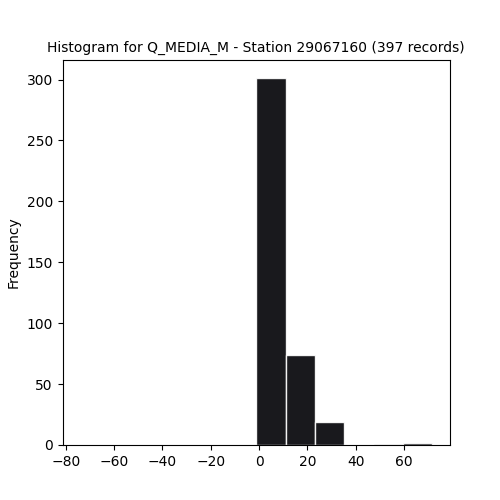
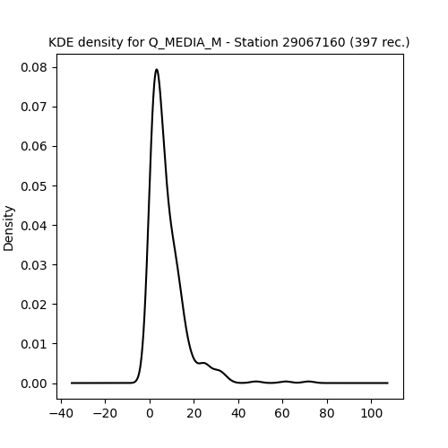

**Q_MEDIA_M - Station: CABLE EL [16067020] (244 rec.)** Location over [Google Maps](http://maps.google.com/maps?q=8.676388889,-72.94972222) or [Openstreet Map](https://www.openstreetmap.org/query?lat=8.676388889&lon=-72.94972222)

Station first record

| Fecha               |   CodigoEstacion | NombreEstacion      |   Latitud |   Longitud |   Altitud | Categoria    | Entidad                                                     | AreaOperativa                          | Departamento       | Municipio   | FechaInstalacion    | FechaSuspension     | IdParametro   | Etiqueta   | DescripcionSerie     | Frecuencia   |   Valor |   Grado |   Calificador |   NivelAprobacion |
|:--------------------|-----------------:|:--------------------|----------:|-----------:|----------:|:-------------|:------------------------------------------------------------|:---------------------------------------|:-------------------|:------------|:--------------------|:--------------------|:--------------|:-----------|:---------------------|:-------------|--------:|--------:|--------------:|------------------:|
| 1980-01-01 00:00:00 |         16067020 | CABLE EL [16067020] |   8.67639 |   -72.9497 |       110 | Limnigráfica | INSTITUTO DE HIDROLOGIA METEOROLOGIA Y ESTUDIOS AMBIENTALES | Area Operativa 08 - Santanderes-Arauca | Norte De Santander | El Tarra    | 1976-08-15 00:00:00 | 2001-04-20 00:00:00 | CAUDAL        | Q_MEDIA_M  | Caudal medio mensual | Mensual      |   68.34 |      50 |           nan |               900 |

Statistics table

|       |    Valor |
|:------|---------:|
| count | 244      |
| mean  | 115.375  |
| std   |  66.9092 |
| min   |  28.67   |
| 25%   |  64.19   |
| 50%   |  95.225  |
| 75%   | 154.075  |
| max   | 340.3    |

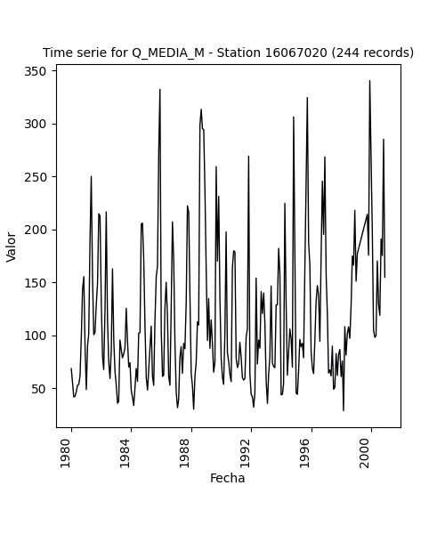

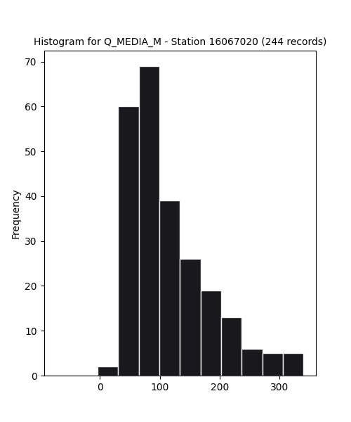
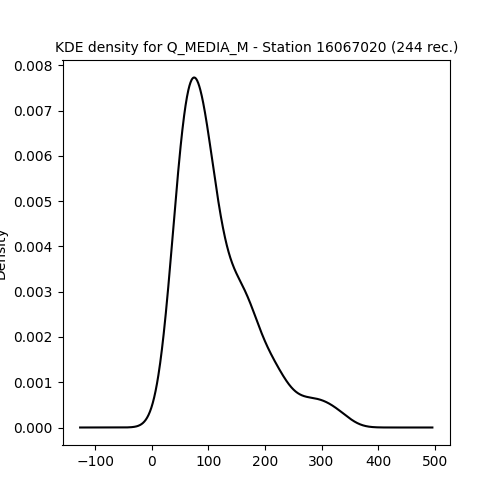

**Q_MEDIA_M - Station: CAMPO SEIS [16037040] (387 rec.)** Location over [Google Maps](http://maps.google.com/maps?q=8.601111111,-72.80861111) or [Openstreet Map](https://www.openstreetmap.org/query?lat=8.601111111&lon=-72.80861111)

Station first record

| Fecha               |   CodigoEstacion | NombreEstacion        |   Latitud |   Longitud |   Altitud | Categoria    | Entidad                                                     | AreaOperativa                          | Departamento       | Municipio   | FechaInstalacion    | FechaSuspension   | IdParametro   | Etiqueta   | DescripcionSerie     | Frecuencia   |   Valor |   Grado | Calificador        |   NivelAprobacion |
|:--------------------|-----------------:|:----------------------|----------:|-----------:|----------:|:-------------|:------------------------------------------------------------|:---------------------------------------|:-------------------|:------------|:--------------------|:------------------|:--------------|:-----------|:---------------------|:-------------|--------:|--------:|:-------------------|------------------:|
| 1980-01-01 00:00:00 |         16037040 | CAMPO SEIS [16037040] |   8.60111 |   -72.8086 |        70 | Limnimétrica | INSTITUTO DE HIDROLOGIA METEOROLOGIA Y ESTUDIOS AMBIENTALES | Area Operativa 08 - Santanderes-Arauca | Norte De Santander | Tibú        | 1973-04-15 00:00:00 | NaT               | CAUDAL        | Q_MEDIA_M  | Caudal medio mensual | Mensual      |   9.241 |       4 | EST. INTERPOLACION |               900 |

Statistics table

|       |    Valor |
|:------|---------:|
| count | 387      |
| mean  |  21.8745 |
| std   |  17.4017 |
| min   |   3.445  |
| 25%   |  11.475  |
| 50%   |  16.64   |
| 75%   |  27.555  |
| max   | 208.9    |

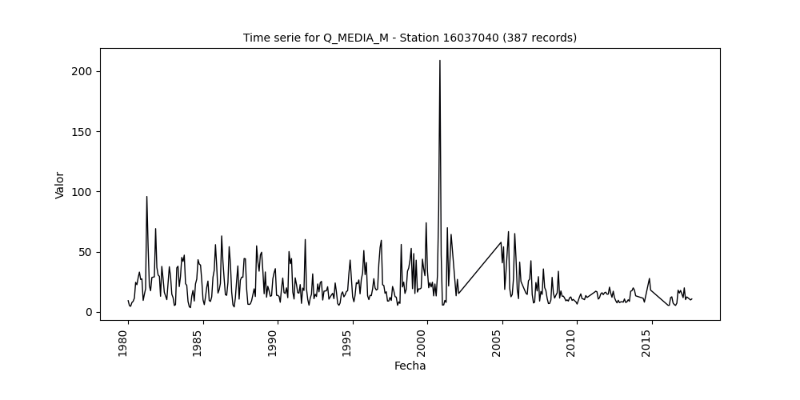
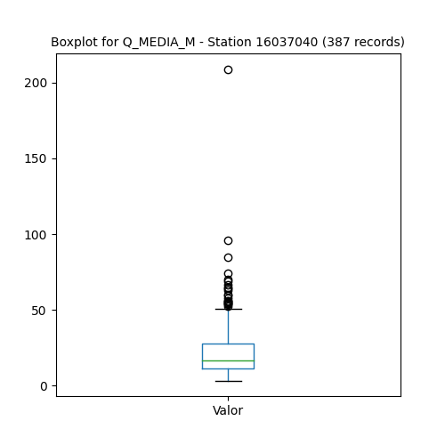
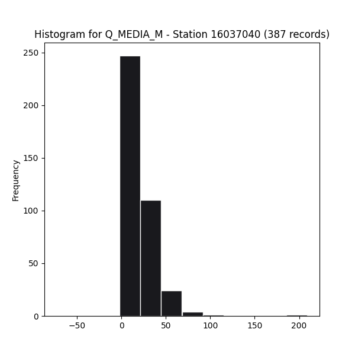
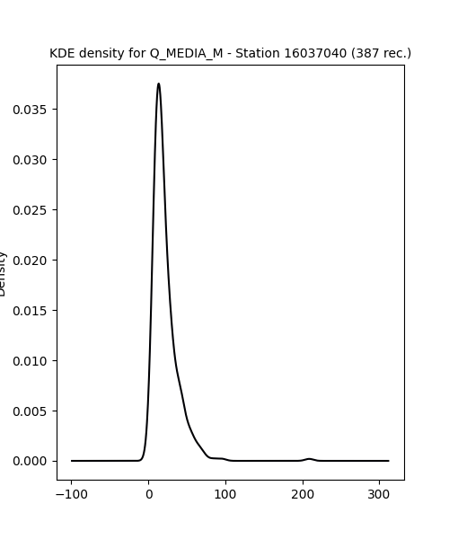

**Q_MEDIA_M - Station: PUENTE TARRA [16047020] (283 rec.)** Location over [Google Maps](http://maps.google.com/maps?q=8.588611111,-73.08111111) or [Openstreet Map](https://www.openstreetmap.org/query?lat=8.588611111&lon=-73.08111111)

Station first record

| Fecha               |   CodigoEstacion | NombreEstacion          |   Latitud |   Longitud |   Altitud | Categoria    | Entidad                                                     | AreaOperativa                          | Departamento       | Municipio   | FechaInstalacion    | FechaSuspension     | IdParametro   | Etiqueta   | DescripcionSerie     | Frecuencia   |   Valor |   Grado |   Calificador |   NivelAprobacion |
|:--------------------|-----------------:|:------------------------|----------:|-----------:|----------:|:-------------|:------------------------------------------------------------|:---------------------------------------|:-------------------|:------------|:--------------------|:--------------------|:--------------|:-----------|:---------------------|:-------------|--------:|--------:|--------------:|------------------:|
| 1980-01-01 00:00:00 |         16047020 | PUENTE TARRA [16047020] |   8.58861 |   -73.0811 |       140 | Limnimétrica | INSTITUTO DE HIDROLOGIA METEOROLOGIA Y ESTUDIOS AMBIENTALES | Area Operativa 08 - Santanderes-Arauca | Norte De Santander | El Tarra    | 1971-11-15 00:00:00 | 2014-06-18 00:00:00 | CAUDAL        | Q_MEDIA_M  | Caudal medio mensual | Mensual      |   32.22 |      50 |           nan |               900 |

Statistics table

|       |    Valor |
|:------|---------:|
| count | 283      |
| mean  |  54.4958 |
| std   |  36.5487 |
| min   |  10.16   |
| 25%   |  29.87   |
| 50%   |  42.16   |
| 75%   |  67.44   |
| max   | 237.6    |

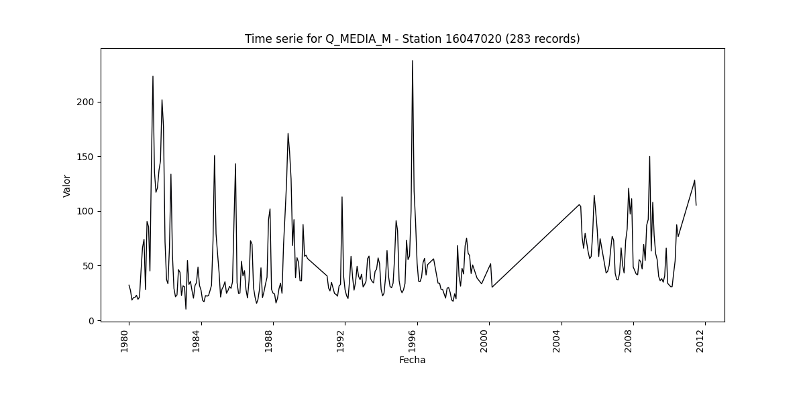
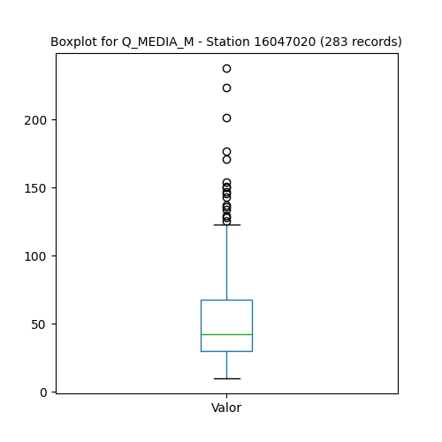
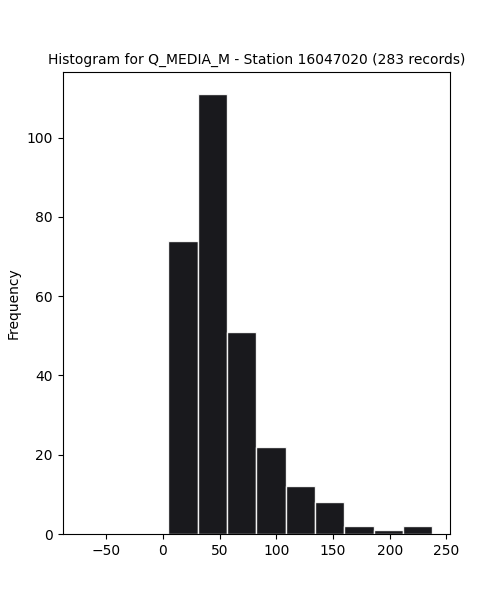
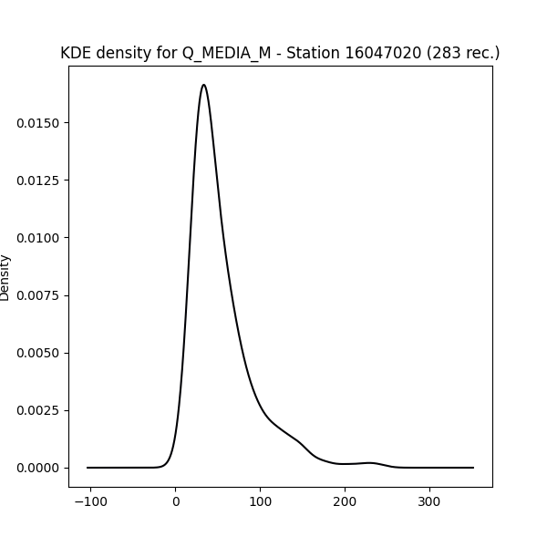

**Q_MEDIA_M - Station: PUERTO BARCO-GABARRA - AUT [16067010] (397 rec.)** Location over [Google Maps](http://maps.google.com/maps?q=9.003611111,-72.9) or [Openstreet Map](https://www.openstreetmap.org/query?lat=9.003611111&lon=-72.9)

Station first record

| Fecha               |   CodigoEstacion | NombreEstacion                        |   Latitud |   Longitud |   Altitud | Categoria    | Entidad                                                     | AreaOperativa                          | Departamento       | Municipio   | FechaInstalacion    | FechaSuspension   | IdParametro   | Etiqueta   | DescripcionSerie     | Frecuencia   |   Valor |   Grado |   Calificador |   NivelAprobacion |
|:--------------------|-----------------:|:--------------------------------------|----------:|-----------:|----------:|:-------------|:------------------------------------------------------------|:---------------------------------------|:-------------------|:------------|:--------------------|:------------------|:--------------|:-----------|:---------------------|:-------------|--------:|--------:|--------------:|------------------:|
| 1980-01-01 00:00:00 |         16067010 | PUERTO BARCO-GABARRA - AUT [16067010] |   9.00361 |      -72.9 |        19 | Limnigráfica | INSTITUTO DE HIDROLOGIA METEOROLOGIA Y ESTUDIOS AMBIENTALES | Area Operativa 08 - Santanderes-Arauca | Norte De Santander | Tibú        | 1969-08-15 00:00:00 | NaT               | CAUDAL        | Q_MEDIA_M  | Caudal medio mensual | Mensual      |   149.3 |      50 |           nan |               900 |

Statistics table

|       |    Valor |
|:------|---------:|
| count | 397      |
| mean  | 249.957  |
| std   | 137.419  |
| min   |  43.6941 |
| 25%   | 134.3    |
| 50%   | 225.4    |
| 75%   | 335.5    |
| max   | 914.8    |

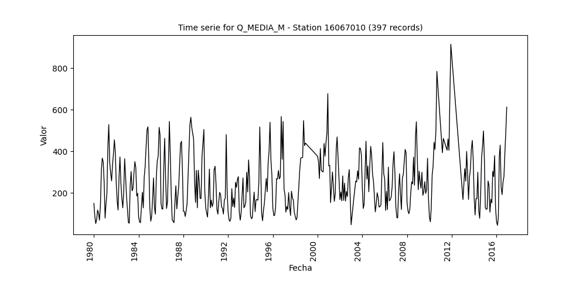
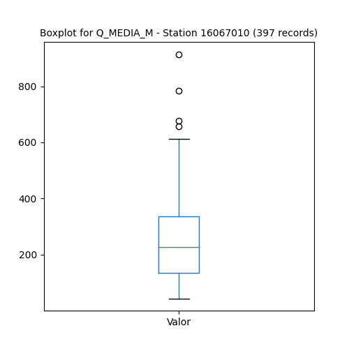
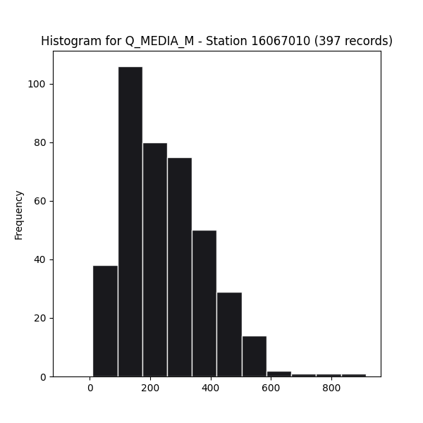
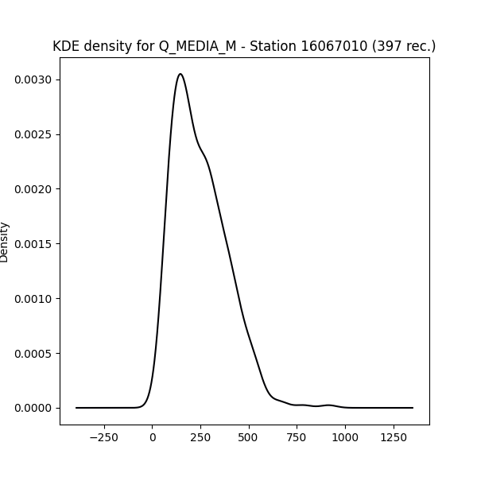

#### Correlation analysis matrix and statistics for Q_MEDIA_M

General statistics table
|       |   15067020 |   15067080 |   15067130 |   15067150 |   15067170 |   15067200 |   15067210 |   16037040 |   16047020 |   16067010 |   16067020 |   25027020 |   25027080 |   25027320 |   25027330 |   25027360 |   25027390 |   25027400 |   25027410 |   25027420 |   25027490 |   25027590 |   25027620 |   25027630 |   25027890 |   28017050 |   28017080 |   28017110 |   28017120 |   28017140 |   28017150 |   28027020 |   28027030 |   28027040 |   28027050 |   28027160 |   28037010 |   28037020 |   28037030 |   28037040 |   28037060 |   28037090 |   28037130 |   28047010 |   28047020 |   28047040 |   28047050 |   28047080 |   29067010 |   29067040 |   29067050 |   29067060 |   29067070 |   29067120 |   29067130 |   29067150 |   29067160 |
|:------|-----------:|-----------:|-----------:|-----------:|-----------:|-----------:|-----------:|-----------:|-----------:|-----------:|-----------:|-----------:|-----------:|-----------:|-----------:|-----------:|-----------:|-----------:|-----------:|-----------:|-----------:|-----------:|-----------:|-----------:|-----------:|-----------:|-----------:|-----------:|-----------:|-----------:|-----------:|-----------:|-----------:|-----------:|-----------:|-----------:|-----------:|-----------:|-----------:|-----------:|-----------:|-----------:|-----------:|-----------:|-----------:|-----------:|-----------:|-----------:|-----------:|-----------:|-----------:|-----------:|-----------:|-----------:|-----------:|-----------:|-----------:|
| count |  55        |  57        | 57         |  52        |  52        |  52        |  47        | 57         |  55        |  56        |  51        |  57        |  57        |  57        |  57        |  57        |  57        |  57        | 57         |  57        |  57        |  55        |  57        |  57        | 57         |  51        |  57        |  57        |  51        |  50        |  43        |  57        |  57        |  56        |  57        |  56        | 57         |  56        | 57         |  57        |  57        |  57        |  57        | 57         |  57        |  55        |  57        |  51        | 57         |  57        |  57        |  51        |  57        |  57        |  57        |  57        |  57        |
| mean  |   0.557774 |   0.461289 |  0.54445   |   0.481561 |   0.513756 |   0.472621 |   0.597568 |  0.337708  |   0.517625 |   0.575476 |   0.610278 |   0.610954 |   0.473521 |   0.609116 |   0.600405 |   0.564291 |   0.59012  |   0.547893 |  0.597939  |   0.582887 |   0.603996 |   0.622659 |   0.608625 |   0.567755 |  0.479938  |   0.401123 |   0.535165 |   0.427956 |   0.622802 |   0.126043 |   0.561295 |   0.546672 |   0.48244  |   0.556751 |   0.298831 |   0.583853 |  0.533858  |   0.596248 |  0.645537  |   0.581166 |   0.529621 |   0.627778 |   0.549577 |  0.457655  |   0.412771 |   0.541459 |   0.656742 |   0.711413 |  0.535453  |   0.535399 |   0.379104 |   0.661562 |   0.497779 |   0.60705  |   0.508741 |   0.620929 |   0.261553 |
| std   |   0.269414 |   0.171152 |  0.162662  |   0.289361 |   0.306301 |   0.274411 |   0.38307  |  0.159577  |   0.185612 |   0.156469 |   0.111382 |   0.196814 |   0.142225 |   0.200443 |   0.1979   |   0.181609 |   0.197984 |   0.202243 |  0.202251  |   0.203222 |   0.196763 |   0.218607 |   0.182807 |   0.193114 |  0.170589  |   0.196525 |   0.148195 |   0.18829  |   0.122545 |   0.365201 |   0.310007 |   0.136248 |   0.139753 |   0.214686 |   0.255908 |   0.261972 |  0.175427  |   0.144152 |  0.16006   |   0.138578 |   0.135215 |   0.222746 |   0.224435 |  0.172153  |   0.121625 |   0.307766 |   0.138687 |   0.112087 |  0.152074  |   0.117059 |   0.206415 |   0.101954 |   0.126504 |   0.148368 |   0.144995 |   0.139068 |   0.238636 |
| min   |  -0.585924 |  -0.122978 |  0.0985726 |  -0.605893 |  -0.641974 |  -0.502113 |  -1        | -0.0377385 |  -0.234568 |   0.118417 |   0.388691 |   0.211358 |   0.064929 |   0.164049 |   0.242992 |   0.233861 |   0.208955 |   0.139639 | -0.0331951 |   0.204268 |   0.179377 |  -0.653053 |   0.230205 |   0.167827 | -0.0209619 |   0.190032 |   0.184126 |  -0.185248 |   0.340802 |  -0.740717 |  -1        |   0.124032 |   0.143556 |  -0.557756 |  -1        |  -1        |  0.0292651 |   0.276464 |  0.0161295 |   0.25897  |   0.189409 |  -0.734865 |  -0.740717 |  0.0443397 |   0.098396 |  -0.641974 |   0.22551  |   0.462444 | -0.0421932 |   0.249249 |  -0.363212 |   0.433597 |   0.227769 |   0.151486 |   0.197075 |   0.222421 |  -0.618154 |
| 25%   |   0.526694 |   0.374257 |  0.479481  |   0.410422 |   0.445012 |   0.392117 |   0.514556 |  0.262582  |   0.48604  |   0.513288 |   0.534646 |   0.490505 |   0.425393 |   0.463401 |   0.475364 |   0.442528 |   0.471564 |   0.425375 |  0.479333  |   0.439867 |   0.463719 |   0.552785 |   0.457049 |   0.431213 |  0.423223  |   0.264441 |   0.440018 |   0.350894 |   0.544773 |  -0.020864 |   0.45148  |   0.482958 |   0.416804 |   0.49581  |   0.223531 |   0.517948 |  0.459934  |   0.521706 |  0.59121   |   0.491752 |   0.46864  |   0.575409 |   0.50427  |  0.361221  |   0.354227 |   0.529559 |   0.592902 |   0.611344 |  0.472273  |   0.481387 |   0.30962  |   0.606619 |   0.428794 |   0.552215 |   0.429717 |   0.550525 |   0.139639 |
| 50%   |   0.60564  |   0.443911 |  0.549287  |   0.515246 |   0.56635  |   0.469311 |   0.712822 |  0.349629  |   0.547968 |   0.604196 |   0.616454 |   0.579824 |   0.486243 |   0.595408 |   0.565176 |   0.521222 |   0.568908 |   0.497966 |  0.600352  |   0.554246 |   0.562307 |   0.660576 |   0.602673 |   0.532282 |  0.516186  |   0.327608 |   0.520048 |   0.400946 |   0.61126  |   0.177425 |   0.611289 |   0.563792 |   0.474593 |   0.582981 |   0.278838 |   0.633024 |  0.533345  |   0.609808 |  0.65755   |   0.564571 |   0.537345 |   0.671338 |   0.566327 |  0.470038  |   0.402997 |   0.608683 |   0.668284 |   0.722011 |  0.521221  |   0.526735 |   0.388691 |   0.658746 |   0.457264 |   0.602237 |   0.484516 |   0.623055 |   0.264419 |
| 75%   |   0.67396  |   0.5469   |  0.635196  |   0.633647 |   0.674083 |   0.627662 |   0.809725 |  0.403438  |   0.591279 |   0.665927 |   0.681395 |   0.709582 |   0.525985 |   0.72647  |   0.6943   |   0.692691 |   0.678075 |   0.649447 |  0.706641  |   0.685347 |   0.714007 |   0.750018 |   0.732506 |   0.66852  |  0.562542  |   0.46731  |   0.625942 |   0.526569 |   0.704829 |   0.31187  |   0.716509 |   0.62966  |   0.546647 |   0.664402 |   0.412471 |   0.708156 |  0.655725  |   0.676451 |  0.757057  |   0.684208 |   0.604643 |   0.719203 |   0.663283 |  0.561317  |   0.454205 |   0.67439  |   0.752158 |   0.785459 |  0.630438  |   0.599109 |   0.467765 |   0.710871 |   0.577407 |   0.684339 |   0.562298 |   0.693475 |   0.384692 |
| max   |   1        |   1        |  1         |   1        |   1        |   1        |   1        |  1         |   1        |   1        |   1        |   1        |   1        |   1        |   1        |   1        |   1        |   1        |  1         |   1        |   1        |   1        |   1        |   1        |  1         |   1        |   1        |   1        |   1        |   1        |   1        |   1        |   1        |   1        |   1        |   1        |  1         |   1        |  1         |   1        |   1        |   1        |   1        |  1         |   1        |   1        |   1        |   1        |  1         |   1        |   1        |   1        |   1        |   1        |   1        |   1        |   1        |

Correlation matrix [Pivot_Q_MEDIA_M_Correlation.csv](Pivot_Q_MEDIA_M_Correlation.csv)
|          |   15067020 |   15067080 |   15067130 |    15067150 |    15067170 |     15067200 |   15067210 |   16037040 |    16047020 |   16067010 |   16067020 |   25027020 |   25027080 |   25027320 |   25027330 |   25027360 |   25027390 |   25027400 |   25027410 |   25027420 |   25027490 |   25027590 |   25027620 |   25027630 |   25027890 |   28017050 |   28017080 |   28017110 |   28017120 |    28017140 |    28017150 |   28027020 |   28027030 |   28027040 |   28027050 |   28027160 |   28037010 |   28037020 |   28037030 |   28037040 |   28037060 |   28037090 |   28037130 |   28047010 |   28047020 |    28047040 |   28047050 |   28047080 |   29067010 |   29067040 |    29067050 |   29067060 |   29067070 |   29067120 |   29067130 |   29067150 |   29067160 |
|---------:|-----------:|-----------:|-----------:|------------:|------------:|-------------:|-----------:|-----------:|------------:|-----------:|-----------:|-----------:|-----------:|-----------:|-----------:|-----------:|-----------:|-----------:|-----------:|-----------:|-----------:|-----------:|-----------:|-----------:|-----------:|-----------:|-----------:|-----------:|-----------:|------------:|------------:|-----------:|-----------:|-----------:|-----------:|-----------:|-----------:|-----------:|-----------:|-----------:|-----------:|-----------:|-----------:|-----------:|-----------:|------------:|-----------:|-----------:|-----------:|-----------:|------------:|-----------:|-----------:|-----------:|-----------:|-----------:|-----------:|
| 15067020 |   1        |   0.525982 |  0.747472  |  -0.296304  |  -0.485833  |   0.642282   |  -0.585924 |  0.485357  |   0.620819  |   0.578962 |   0.633769 |   0.603905 |  0.46853   |   0.604918 |   0.580296 |   0.536518 |   0.587981 |   0.505501 |  0.538307  |   0.588642 |   0.616584 |   0.678299 |   0.649277 |   0.585512 |  0.599728  |   0.45972  |   0.646062 |   0.715453 |   0.725584 | nan         | nan         |   0.712982 |   0.527406 |   0.663635 |  0.515849  |   0.753429 |  0.667176  |   0.65712  |  0.811348  |   0.673293 |   0.60564  |   0.717629 |   0.615367 |  0.642892  |   0.413585 |   0.674626  |   0.725459 |   0.781772 |  0.594491  |   0.56116  |  0.448253   |   0.643937 |   0.443486 |   0.677606 |   0.42768  |   0.698401 |  0.46595   |
| 15067080 |   0.525982 |   1        |  0.644735  |   0.723985  |   0.807634  |   0.566946   |   0.8141   |  0.14067   |   0.392858  |   0.384243 |   0.56253  |   0.387538 |  0.42098   |   0.448767 |   0.373031 |   0.348438 |   0.329851 |   0.322923 |  0.4095    |   0.374257 |   0.421403 |   0.506409 |   0.440083 |   0.356653 |  0.368801  |   0.504705 |   0.5469   |   0.240301 |   0.452592 |  -0.122978  |   0.71269   |   0.377034 |   0.481098 |   0.603193 |  0.568926  |   0.348838 |  0.5796    |   0.430116 |  0.572271  |   0.443911 |   0.413033 |   0.525792 |   0.521332 |  0.307088  |   0.436503 |   0.61844   |   0.509433 |   0.462444 |  0.437411  |   0.422639 |  0.289527   |   0.548593 |   0.496014 |   0.485687 |   0.33845  |   0.527617 |  0.141958  |
| 15067130 |   0.747472 |   0.644735 |  1         |   0.721572  |   0.843931  |   0.789213   |   0.689769 |  0.218834  |   0.542683  |   0.559847 |   0.592357 |   0.530941 |  0.486288  |   0.572789 |   0.512884 |   0.445384 |   0.542368 |   0.427658 |  0.563024  |   0.467721 |   0.549287 |   0.551856 |   0.518708 |   0.448096 |  0.394982  |   0.360446 |   0.641609 |   0.377617 |   0.61126  |   0.158823  |   0.61424   |   0.635363 |   0.532081 |   0.640526 |  0.419274  |   0.584204 |  0.60843   |   0.528159 |  0.784499  |   0.534612 |   0.534799 |   0.649523 |   0.605795 |  0.343962  |   0.336335 |   0.652026  |   0.592281 |   0.827191 |  0.483884  |   0.479481 |  0.233728   |   0.62997  |   0.486121 |   0.56791  |   0.48335  |   0.635196 |  0.0985726 |
| 15067150 |  -0.296304 |   0.723985 |  0.721572  |   1         |   0.878195  |   0.937169   |   0.828685 |  0.171232  |   0.667373  |   0.656351 | nan        |   0.529306 |  0.436877  |   0.63152  |   0.515403 |   0.470683 |   0.475115 |   0.473379 |  0.620639  |   0.397058 |   0.42221  |   0.798355 |   0.438235 |   0.395919 |  0.0823297 | nan        |   0.615721 |   0.150132 | nan        |   0.145335  |   0.578168  |   0.51509  |   0.510203 |   0.82165  |  0.385437  |   0.845355 |  0.512855  |   0.314283 |  0.65755   |   0.480475 |   0.537345 |   0.575409 |   0.551864 |  0.193     |   0.414876 |  -0.605893  |   0.592902 | nan        |  0.432503  |   0.524406 |  0.173512   | nan        |   0.640026 |   0.486663 |   0.562298 |   0.525039 | -0.0703087 |
| 15067170 |  -0.485833 |   0.807634 |  0.843931  |   0.878195  |   1         |   0.897411   |   0.832782 |  0.147116  |   0.565253  |   0.67315  | nan        |   0.596349 |  0.583057  |   0.643782 |   0.565176 |   0.425514 |   0.517021 |   0.467736 |  0.65141   |   0.427568 |   0.484178 |   0.712379 |   0.472816 |   0.431213 |  0.154742  | nan        |   0.73823  |   0.228601 | nan        |   0.175472  |   0.676884  |   0.567446 |   0.612497 |   0.856449 |  0.412471  |   0.818778 |  0.629646  |   0.503081 |  0.777406  |   0.510919 |   0.579182 |   0.615667 |   0.569891 |  0.183648  |   0.449612 |  -0.641974  |   0.700092 | nan        |  0.470243  |   0.562083 |  0.192187   | nan        |   0.487648 |   0.552281 |   0.655157 |   0.604847 | -0.0657253 |
| 15067200 |   0.642282 |   0.566946 |  0.789213  |   0.937169  |   0.897411  |   1          |   0.738937 |  0.116242  |   0.963609  |   0.669633 | nan        |   0.579447 |  0.412668  |   0.616378 |   0.57012  |   0.447263 |   0.488013 |   0.466249 |  0.623637  |   0.421844 |   0.497135 |   0.472374 |   0.394644 |   0.450466 | -0.0209619 | nan        |   0.640511 |   0.127448 | nan        |   0.377237  |   0.420092  |   0.556712 |   0.639737 |   0.78809  |  0.278838  |   0.721437 |  0.436026  |   0.342446 |  0.712499  |   0.458423 |   0.448118 |   0.514353 |   0.376296 |  0.0443397 |   0.497448 |  -0.502113  |   0.511416 | nan        |  0.322709  |   0.453367 |  0.00702619 | nan        |   0.384538 |   0.422826 |   0.527323 |   0.454417 | -0.125995  |
| 15067210 |  -0.585924 |   0.8141   |  0.689769  |   0.828685  |   0.832782  |   0.738937   |   1        |  0.439637  | nan         |   0.84407  | nan        |   0.800456 |  0.628855  |   0.810894 |   0.813316 |   0.712123 |   0.746115 |   0.751705 |  0.912416  |   0.699774 |   0.770098 | nan        |   0.808557 |   0.66852  |  0.171451  | nan        |   0.868349 |   0.681407 | nan        |   0.945222  | nan         |   0.418022 |   0.712822 | nan        |  0.779419  |  -1        |  0.18349   |   0.729477 |  0.84601   |   0.543195 |   0.586805 |   0.920064 |   0.798583 |  0.11947   |   0.425571 | nan         |   0.79008  | nan        |  0.715486  |   0.477413 | -0.277231   | nan        |   0.64524  |   0.636369 |   0.674659 |   0.483531 |  0.485916  |
| 16037040 |   0.485357 |   0.14067  |  0.218834  |   0.171232  |   0.147116  |   0.116242   |   0.439637 |  1         |   0.557257  |   0.482348 |   0.671473 |   0.358983 |  0.289435  |   0.354729 |   0.333976 |   0.390467 |   0.365664 |   0.40821  |  0.349629  |   0.403438 |   0.356211 |   0.418653 |   0.420211 |   0.371336 |  0.363007  |   0.254108 |   0.330798 |   0.398299 |   0.444504 |   0.045319  |   0.0611107 |   0.297212 |   0.262582 |   0.284039 | -0.0377385 |   0.37023  |  0.200176  |   0.358901 |  0.329714  |   0.289875 |   0.311771 |   0.438899 |   0.255692 |  0.241626  |   0.289381 |   0.521303  |   0.380893 |   0.604689 |  0.3061    |   0.294417 |  0.212494   |   0.433597 |   0.262637 |   0.399289 |   0.372921 |   0.287972 |  0.132455  |
| 16047020 |   0.620819 |   0.392858 |  0.542683  |   0.667373  |   0.565253  |   0.963609   | nan        |  0.557257  |   1         |   0.679361 |   0.738831 |   0.607133 |  0.573405  |   0.595613 |   0.566709 |   0.536205 |   0.580964 |   0.497113 |  0.578623  |   0.547968 |   0.617279 |   0.519478 |   0.588711 |   0.500864 |  0.528553  |   0.24418  |   0.370983 |   0.560684 |   0.545769 |  -0.234568  | nan         |   0.500696 |   0.575388 |   0.476488 |  0.216395  |   0.619978 |  0.549256  |   0.642263 |  0.606901  |   0.485686 |   0.439323 |   0.566397 |   0.492755 |  0.56555   |   0.369899 |   0.486394  |   0.601428 |   0.557041 |  0.407435  |   0.543597 |  0.247208   |   0.593847 |   0.408959 |   0.459107 |   0.504523 |   0.537489 | -0.0383107 |
| 16067010 |   0.578962 |   0.384243 |  0.559847  |   0.656351  |   0.67315   |   0.669633   |   0.84407  |  0.482348  |   0.679361  |   1        |   0.874823 |   0.671421 |  0.504199  |   0.680354 |   0.682196 |   0.631349 |   0.668939 |   0.591566 |  0.706641  |   0.639708 |   0.708298 |   0.660576 |   0.657875 |   0.59693  |  0.51061   |   0.219434 |   0.440018 |   0.524057 |   0.640604 |   0.118417  | nan         |   0.551894 |   0.40781  |   0.551254 |  0.263883  |   0.61624  |  0.530315  |   0.638359 |  0.623299  |   0.57835  |   0.532175 |   0.656863 |   0.584597 |  0.478514  |   0.325468 |   0.664923  |   0.661526 |   0.681137 |  0.470205  |   0.514181 |  0.42628    |   0.678111 |   0.531642 |   0.611462 |   0.550019 |   0.659237 |  0.182928  |
| 16067020 |   0.633769 |   0.56253  |  0.592357  | nan         | nan         | nan          | nan        |  0.671473  |   0.738831  |   0.874823 |   1        |   0.691718 |  0.564591  |   0.700555 |   0.703727 |   0.692691 |   0.668884 |   0.649447 |  0.698758  |   0.682154 |   0.714007 |   0.644338 |   0.673643 |   0.645351 |  0.515271  |   0.603433 |   0.454759 |   0.542882 |   0.664206 | nan         | nan         |   0.602463 |   0.48051  |   0.496847 |  0.481373  |   0.602069 |  0.475643  |   0.609638 |  0.628957  |   0.537478 |   0.510391 |   0.682657 |   0.537688 |  0.564098  |   0.402814 |   0.604893  |   0.685505 |   0.680636 |  0.514706  |   0.531814 |  0.388691   |   0.712921 |   0.492306 |   0.616454 |   0.631752 |   0.631865 |  0.435816  |
| 25027020 |   0.603905 |   0.387538 |  0.530941  |   0.529306  |   0.596349  |   0.579447   |   0.800456 |  0.358983  |   0.607133  |   0.671421 |   0.691718 |   1        |  0.515076  |   0.962816 |   0.982771 |   0.85618  |   0.929097 |   0.870479 |  0.891631  |   0.929488 |   0.937461 |   0.766574 |   0.909354 |   0.904489 |  0.550603  |   0.26643  |   0.460031 |   0.401674 |   0.543778 |   0.295143  |   0.478327  |   0.625028 |   0.477547 |   0.573733 |  0.245253  |   0.685405 |  0.490505  |   0.638989 |  0.644319  |   0.579824 |   0.56055  |   0.709582 |   0.535537 |  0.510223  |   0.402917 |   0.552188  |   0.724698 |   0.616019 |  0.524568  |   0.533254 |  0.391263   |   0.671515 |   0.434905 |   0.595178 |   0.448572 |   0.632856 |  0.211358  |
| 25027080 |   0.46853  |   0.42098  |  0.486288  |   0.436877  |   0.583057  |   0.412668   |   0.628855 |  0.289435  |   0.573405  |   0.504199 |   0.564591 |   0.515076 |  1         |   0.505254 |   0.48896  |   0.440057 |   0.458801 |   0.439881 |  0.452871  |   0.467878 |   0.482918 |   0.502541 |   0.504329 |   0.452084 |  0.422854  |   0.192088 |   0.498026 |   0.257181 |   0.53745  |   0.0704355 |   0.743244  |   0.486243 |   0.645554 |   0.517894 |  0.381779  |   0.459065 |  0.536254  |   0.525985 |  0.603024  |   0.475244 |   0.428804 |   0.514881 |   0.517378 |  0.420504  |   0.306799 |   0.375015  |   0.546697 |   0.685766 |  0.425393  |   0.519298 |  0.290146   |   0.534962 |   0.397784 |   0.506034 |   0.473925 |   0.550525 |  0.064929  |
| 25027320 |   0.604918 |   0.448767 |  0.572789  |   0.63152   |   0.643782  |   0.616378   |   0.810894 |  0.354729  |   0.595613  |   0.680354 |   0.700555 |   0.962816 |  0.505254  |   1        |   0.950875 |   0.862495 |   0.913493 |   0.876616 |  0.907049  |   0.930314 |   0.95145  |   0.762253 |   0.926563 |   0.888332 |  0.489336  |   0.258569 |   0.44733  |   0.36591  |   0.547468 |   0.342575  |   0.346608  |   0.595755 |   0.463401 |   0.592228 |  0.281474  |   0.653451 |  0.510502  |   0.609977 |  0.636284  |   0.573753 |   0.568112 |   0.736105 |   0.552576 |  0.455854  |   0.392567 |   0.595408  |   0.72647  |   0.594165 |  0.507231  |   0.522363 |  0.342725   |   0.669567 |   0.455294 |   0.582298 |   0.444293 |   0.598123 |  0.164049  |
| 25027330 |   0.580296 |   0.373031 |  0.512884  |   0.515403  |   0.565176  |   0.57012    |   0.813316 |  0.333976  |   0.566709  |   0.682196 |   0.703727 |   0.982771 |  0.48896   |   0.950875 |   1        |   0.849606 |   0.92131  |   0.847739 |  0.898135  |   0.925335 |   0.945819 |   0.751024 |   0.899117 |   0.898353 |  0.537476  |   0.242992 |   0.460285 |   0.416487 |   0.527383 |   0.287653  |   0.475364  |   0.605586 |   0.451744 |   0.552005 |  0.253468  |   0.659417 |  0.465369  |   0.609631 |  0.620551  |   0.555345 |   0.530833 |   0.691489 |   0.50427  |  0.502533  |   0.378644 |   0.542462  |   0.6943   |   0.661649 |  0.524402  |   0.49947  |  0.381438   |   0.668124 |   0.428794 |   0.591832 |   0.438751 |   0.623055 |  0.264419  |
| 25027360 |   0.536518 |   0.348438 |  0.445384  |   0.470683  |   0.425514  |   0.447263   |   0.712123 |  0.390467  |   0.536205  |   0.631349 |   0.692691 |   0.85618  |  0.440057  |   0.862495 |   0.849606 |   1        |   0.872487 |   0.889823 |  0.817759  |   0.869764 |   0.858247 |   0.729303 |   0.764008 |   0.869442 |  0.457169  |   0.305369 |   0.417719 |   0.383792 |   0.540867 |   0.41331   |   0.464273  |   0.513855 |   0.442528 |   0.475217 |  0.233861  |   0.557026 |  0.39252   |   0.49768  |  0.533767  |   0.521222 |   0.493213 |   0.714034 |   0.475539 |  0.375815  |   0.386448 |   0.59738   |   0.6233   |   0.602717 |  0.500271  |   0.52725  |  0.392779   |   0.677635 |   0.486127 |   0.552215 |   0.484516 |   0.557808 |  0.251557  |
| 25027390 |   0.587981 |   0.329851 |  0.542368  |   0.475115  |   0.517021  |   0.488013   |   0.746115 |  0.365664  |   0.580964  |   0.668939 |   0.668884 |   0.929097 |  0.458801  |   0.913493 |   0.92131  |   0.872487 |   1        |   0.887845 |  0.872642  |   0.920658 |   0.927938 |   0.751395 |   0.852591 |   0.874389 |  0.552246  |   0.262984 |   0.413371 |   0.464434 |   0.553047 |   0.250074  |   0.388094  |   0.622993 |   0.471564 |   0.519336 |  0.223531  |   0.678075 |  0.459934  |   0.610427 |  0.636716  |   0.568924 |   0.542604 |   0.720891 |   0.517697 |  0.476839  |   0.352496 |   0.58387   |   0.666879 |   0.599848 |  0.523908  |   0.529506 |  0.348559   |   0.644003 |   0.429825 |   0.568908 |   0.486872 |   0.605864 |  0.208955  |
| 25027400 |   0.505501 |   0.322923 |  0.427658  |   0.473379  |   0.467736  |   0.466249   |   0.751705 |  0.40821   |   0.497113  |   0.591566 |   0.649447 |   0.870479 |  0.439881  |   0.876616 |   0.847739 |   0.889823 |   0.887845 |   1        |  0.84198   |   0.920916 |   0.86166  |   0.753181 |   0.833807 |   0.888656 |  0.454495  |   0.274013 |   0.388139 |   0.349653 |   0.494006 |   0.234948  |   0.44063   |   0.550032 |   0.425375 |   0.4927   |  0.173986  |   0.536093 |  0.402457  |   0.510308 |  0.519677  |   0.486828 |   0.49889  |   0.684013 |   0.443372 |  0.327275  |   0.359714 |   0.563899  |   0.619012 |   0.593879 |  0.472273  |   0.497966 |  0.361008   |   0.583574 |   0.424529 |   0.500259 |   0.42004  |   0.533139 |  0.139639  |
| 25027410 |   0.538307 |   0.4095   |  0.563024  |   0.620639  |   0.65141   |   0.623637   |   0.912416 |  0.349629  |   0.578623  |   0.706641 |   0.698758 |   0.891631 |  0.452871  |   0.907049 |   0.898135 |   0.817759 |   0.872642 |   0.84198  |  1         |   0.883689 |   0.887816 |   0.727167 |   0.830738 |   0.814772 |  0.423223  |   0.540174 |   0.479333 |   0.365382 |   0.557098 |  -0.0331951 |   0.560365  |   0.62966  |   0.473926 |   0.603733 |  0.292458  |   0.602087 |  0.533345  |   0.600352 |  0.637676  |   0.538637 |   0.557157 |   0.735898 |   0.553524 |  0.406767  |   0.354227 |   0.57518   |   0.691111 |   0.677152 |  0.501764  |   0.464964 |  0.318284   |   0.674462 |   0.452568 |   0.606908 |   0.508683 |   0.617674 |  0.103129  |
| 25027420 |   0.588642 |   0.374257 |  0.467721  |   0.397058  |   0.427568  |   0.421844   |   0.699774 |  0.403438  |   0.547968  |   0.639708 |   0.682154 |   0.929488 |  0.467878  |   0.930314 |   0.925335 |   0.869764 |   0.920658 |   0.920916 |  0.883689  |   1        |   0.925304 |   0.771664 |   0.899814 |   0.910412 |  0.532266  |   0.248125 |   0.443409 |   0.39645  |   0.536684 |   0.317446  |   0.439867  |   0.588738 |   0.450957 |   0.539939 |  0.204268  |   0.630358 |  0.453023  |   0.585669 |  0.59121   |   0.554246 |   0.55937  |   0.706127 |   0.527042 |  0.396731  |   0.362442 |   0.608683  |   0.685347 |   0.597894 |  0.503271  |   0.50473  |  0.374877   |   0.651689 |   0.426833 |   0.572839 |   0.445026 |   0.577751 |  0.205867  |
| 25027490 |   0.616584 |   0.421403 |  0.549287  |   0.42221   |   0.484178  |   0.497135   |   0.770098 |  0.356211  |   0.617279  |   0.708298 |   0.714007 |   0.937461 |  0.482918  |   0.95145  |   0.945819 |   0.858247 |   0.927938 |   0.86166  |  0.887816  |   0.925304 |   1        |   0.793655 |   0.896018 |   0.872161 |  0.540029  |   0.270902 |   0.46366  |   0.462808 |   0.562307 |   0.179377  |   0.442938  |   0.624042 |   0.463719 |   0.532851 |  0.273228  |   0.657024 |  0.483299  |   0.636513 |  0.620594  |   0.549858 |   0.555234 |   0.748119 |   0.537492 |  0.44758   |   0.346387 |   0.613225  |   0.668284 |   0.636771 |  0.5333    |   0.50928  |  0.396187   |   0.701505 |   0.439241 |   0.604153 |   0.47324  |   0.624729 |  0.33275   |
| 25027590 |   0.678299 |   0.506409 |  0.551856  |   0.798355  |   0.712379  |   0.472374   | nan        |  0.418653  |   0.519478  |   0.660576 |   0.644338 |   0.766574 |  0.502541  |   0.762253 |   0.751024 |   0.729303 |   0.751395 |   0.753181 |  0.727167  |   0.771664 |   0.793655 |   1        |   0.783787 |   0.75139  |  0.64045   |   0.378294 |   0.524167 |   0.610641 |   0.631991 |  -0.653053  | nan         |   0.634636 |   0.465238 |   0.671398 |  0.320403  |   0.719038 |  0.601881  |   0.673354 |  0.727913  |   0.684208 |   0.610497 |   0.85273  |   0.645199 |  0.559642  |   0.477224 |   0.660898  |   0.828072 |   0.7208   |  0.567017  |   0.639715 |  0.553714   |   0.757949 |   0.590029 |   0.669932 |   0.52739  |   0.749012 |  0.399213  |
| 25027620 |   0.649277 |   0.440083 |  0.518708  |   0.438235  |   0.472816  |   0.394644   |   0.808557 |  0.420211  |   0.588711  |   0.657875 |   0.673643 |   0.909354 |  0.504329  |   0.926563 |   0.899117 |   0.764008 |   0.852591 |   0.833807 |  0.830738  |   0.899814 |   0.896018 |   0.783787 |   1        |   0.877508 |  0.632944  |   0.233478 |   0.456983 |   0.409156 |   0.56176  |   0.409739  |   0.500102  |   0.631417 |   0.457049 |   0.602673 |  0.230205  |   0.715802 |  0.544537  |   0.68027  |  0.685701  |   0.615701 |   0.603065 |   0.732506 |   0.593305 |  0.540332  |   0.407562 |   0.655007  |   0.736556 |   0.608274 |  0.542906  |   0.523086 |  0.365541   |   0.638668 |   0.43611  |   0.586191 |   0.411258 |   0.598367 |  0.304964  |
| 25027630 |   0.585512 |   0.356653 |  0.448096  |   0.395919  |   0.431213  |   0.450466   |   0.66852  |  0.371336  |   0.500864  |   0.59693  |   0.645351 |   0.904489 |  0.452084  |   0.888332 |   0.898353 |   0.869442 |   0.874389 |   0.888656 |  0.814772  |   0.910412 |   0.872161 |   0.75139  |   0.877508 |   1        |  0.546349  |   0.228189 |   0.435135 |   0.396043 |   0.507202 |   0.486437  |   0.386755  |   0.550857 |   0.416804 |   0.522542 |  0.167827  |   0.613316 |  0.41417   |   0.568815 |  0.566909  |   0.532282 |   0.525789 |   0.671338 |   0.468731 |  0.439673  |   0.411647 |   0.580604  |   0.660831 |   0.539228 |  0.519988  |   0.493966 |  0.353929   |   0.669645 |   0.42417  |   0.569508 |   0.402288 |   0.571075 |  0.267172  |
| 25027890 |   0.599728 |   0.368801 |  0.394982  |   0.0823297 |   0.154742  |  -0.0209619  |   0.171451 |  0.363007  |   0.528553  |   0.51061  |   0.515271 |   0.550603 |  0.422854  |   0.489336 |   0.537476 |   0.457169 |   0.552246 |   0.454495 |  0.423223  |   0.532266 |   0.540029 |   0.64045  |   0.632944 |   0.546349 |  1         |   0.238561 |   0.516186 |   0.5189   |   0.583657 |   0.0369786 |   0.547175  |   0.468302 |   0.445151 |   0.56834  |  0.180763  |   0.707492 |  0.47114   |   0.667912 |  0.616034  |   0.626097 |   0.49661  |   0.610444 |   0.513463 |  0.501667  |   0.364448 |   0.520862  |   0.661594 |   0.526289 |  0.544948  |   0.542289 |  0.393138   |   0.562799 |   0.453426 |   0.566912 |   0.380931 |   0.562542 |  0.513484  |
| 28017050 |   0.45972  |   0.504705 |  0.360446  | nan         | nan         | nan          | nan        |  0.254108  |   0.24418   |   0.219434 |   0.603433 |   0.26643  |  0.192088  |   0.258569 |   0.242992 |   0.305369 |   0.262984 |   0.274013 |  0.540174  |   0.248125 |   0.270902 |   0.378294 |   0.233478 |   0.228189 |  0.238561  |   1        |   0.327608 |   0.350894 |   0.890459 | nan         | nan         |   0.39014  |   0.265898 |   0.31237  |  0.190032  |   0.318243 |  0.338996  |   0.276464 |  0.411413  |   0.349709 |   0.293144 |   0.474899 |   0.290753 |  0.304406  |   0.330167 |   0.637066  |   0.772972 |   0.810165 |  0.702185  |   0.683669 |  0.450024   |   0.768035 |   0.594529 |   0.325342 |   0.332019 |   0.451772 |  0.227717  |
| 28017080 |   0.646062 |   0.5469   |  0.641609  |   0.615721  |   0.73823   |   0.640511   |   0.868349 |  0.330798  |   0.370983  |   0.440018 |   0.454759 |   0.460031 |  0.498026  |   0.44733  |   0.460285 |   0.417719 |   0.413371 |   0.388139 |  0.479333  |   0.443409 |   0.46366  |   0.524167 |   0.456983 |   0.435135 |  0.516186  |   0.327608 |   1        |   0.422657 |   0.701397 |   0.184126  |   0.758198  |   0.525328 |   0.567862 |   0.640519 |  0.239652  |   0.50813  |  0.59165   |   0.577522 |  0.723635  |   0.610624 |   0.520048 |   0.590062 |   0.584076 |  0.46779   |   0.402997 |   0.548237  |   0.625942 |   0.772878 |  0.639559  |   0.481387 |  0.396073   |   0.624687 |   0.43886  |   0.733962 |   0.526407 |   0.690137 |  0.384692  |
| 28017110 |   0.715453 |   0.240301 |  0.377617  |   0.150132  |   0.228601  |   0.127448   |   0.681407 |  0.398299  |   0.560684  |   0.524057 |   0.542882 |   0.401674 |  0.257181  |   0.36591  |   0.416487 |   0.383792 |   0.464434 |   0.349653 |  0.365382  |   0.39645  |   0.462808 |   0.610641 |   0.409156 |   0.396043 |  0.5189    |   0.350894 |   0.422657 |   1        |   0.702212 |  -0.185248  |   0.248524  |   0.533297 |   0.400946 |   0.37055  |  0.175909  |   0.737984 |  0.346206  |   0.72177  |  0.526569  |   0.404665 |   0.368137 |   0.465092 |   0.355834 |  0.433562  |   0.207979 |   0.674154  |   0.365792 |   0.756424 |  0.368512  |   0.371736 |  0.308319   |   0.630485 |   0.227769 |   0.575271 |   0.429717 |   0.42806  |  0.324321  |
| 28017120 |   0.725584 |   0.452592 |  0.61126   | nan         | nan         | nan          | nan        |  0.444504  |   0.545769  |   0.640604 |   0.664206 |   0.543778 |  0.53745   |   0.547468 |   0.527383 |   0.540867 |   0.553047 |   0.494006 |  0.557098  |   0.536684 |   0.562307 |   0.631991 |   0.56176  |   0.507202 |  0.583657  |   0.890459 |   0.701397 |   0.702212 |   1        | nan         | nan         |   0.587161 |   0.5722   |   0.653698 |  0.340802  |   0.707445 |  0.72964   |   0.748872 |  0.764089  |   0.676355 |   0.566568 |   0.769492 |   0.664752 |  0.696658  |   0.462728 |   0.620679  |   0.734324 |   0.733428 |  0.637066  |   0.650078 |  0.480364   |   0.752163 |   0.558584 |   0.74261  |   0.610176 |   0.812227 |  0.427466  |
| 28017140 | nan        |  -0.122978 |  0.158823  |   0.145335  |   0.175472  |   0.377237   |   0.945222 |  0.045319  |  -0.234568  |   0.118417 | nan        |   0.295143 |  0.0704355 |   0.342575 |   0.287653 |   0.41331  |   0.250074 |   0.234948 | -0.0331951 |   0.317446 |   0.179377 |  -0.653053 |   0.409739 |   0.486437 |  0.0369786 | nan        |   0.184126 |  -0.185248 | nan        |   1         | nan         |   0.35466  |   0.143556 |  -0.557756 | -0.0442162 |   0.42598  |  0.0292651 |   0.373078 |  0.0161295 |   0.25897  |   0.226306 |  -0.734865 |  -0.740717 |  0.150942  |   0.446607 |  -0.0765084 |   0.22551  | nan        | -0.0421932 |   0.269654 | -0.363212   | nan        |   0.739383 |   0.151486 |   0.200803 |   0.222421 | -0.618154  |
| 28017150 | nan        |   0.71269  |  0.61424   |   0.578168  |   0.676884  |   0.420092   | nan        |  0.0611107 | nan         | nan        | nan        |   0.478327 |  0.743244  |   0.346608 |   0.475364 |   0.464273 |   0.388094 |   0.44063  |  0.560365  |   0.439867 |   0.442938 | nan        |   0.500102 |   0.386755 |  0.547175  | nan        |   0.758198 |   0.248524 | nan        | nan         |   1         |   0.460023 |   0.682916 |   0.461937 | -1         | nan        |  0.752146  | nan        |  0.84301   |   0.517519 |   0.659061 |   0.716814 |   0.625912 |  0.658182  |   0.683096 | nan         |   0.689335 | nan        |  0.861484  |   0.440503 |  0.812      | nan        |   0.716204 |   0.946557 |   0.8342   |   0.87984  |  0.611289  |
| 28027020 |   0.712982 |   0.377034 |  0.635363  |   0.51509   |   0.567446  |   0.556712   |   0.418022 |  0.297212  |   0.500696  |   0.551894 |   0.602463 |   0.625028 |  0.486243  |   0.595755 |   0.605586 |   0.513855 |   0.622993 |   0.550032 |  0.62966   |   0.588738 |   0.624042 |   0.634636 |   0.631417 |   0.550857 |  0.468302  |   0.39014  |   0.525328 |   0.533297 |   0.587161 |   0.35466   |   0.460023  |   1        |   0.572961 |   0.686374 |  0.295119  |   0.670654 |  0.528834  |   0.647381 |  0.721711  |   0.563792 |   0.538444 |   0.67913  |   0.589189 |  0.475706  |   0.346603 |   0.655809  |   0.637777 |   0.718655 |  0.482958  |   0.491411 |  0.320895   |   0.634957 |   0.346438 |   0.622956 |   0.478002 |   0.617852 |  0.124032  |
| 28027030 |   0.527406 |   0.481098 |  0.532081  |   0.510203  |   0.612497  |   0.639737   |   0.712822 |  0.262582  |   0.575388  |   0.40781  |   0.48051  |   0.477547 |  0.645554  |   0.463401 |   0.451744 |   0.442528 |   0.471564 |   0.425375 |  0.473926  |   0.450957 |   0.463719 |   0.465238 |   0.457049 |   0.416804 |  0.445151  |   0.265898 |   0.567862 |   0.400946 |   0.5722   |   0.143556  |   0.682916  |   0.572961 |   1        |   0.523903 |  0.174669  |   0.474593 |  0.484257  |   0.520056 |  0.680602  |   0.467886 |   0.394272 |   0.58288  |   0.399761 |  0.408421  |   0.311735 |   0.391364  |   0.46119  |   0.722011 |  0.482412  |   0.520802 |  0.296921   |   0.567588 |   0.325536 |   0.500324 |   0.512741 |   0.546647 |  0.249473  |
| 28027040 |   0.663635 |   0.603193 |  0.640526  |   0.82165   |   0.856449  |   0.78809    | nan        |  0.284039  |   0.476488  |   0.551254 |   0.496847 |   0.573733 |  0.517894  |   0.592228 |   0.552005 |   0.475217 |   0.519336 |   0.4927   |  0.603733  |   0.539939 |   0.532851 |   0.671398 |   0.602673 |   0.522542 |  0.56834   |   0.31237  |   0.640519 |   0.37055  |   0.653698 |  -0.557756  |   0.461937  |   0.686374 |   0.523903 |   1        |  0.375798  |   0.710148 |  0.736983  |   0.649311 |  0.76524   |   0.679875 |   0.592521 |   0.664129 |   0.646423 |  0.561317  |   0.448565 |   0.64028   |   0.679271 |   0.726507 |  0.504047  |   0.526735 |  0.316892   |   0.60648  |   0.423255 |   0.684339 |   0.480126 |   0.665219 |  0.056218  |
| 28027050 |   0.515849 |   0.568926 |  0.419274  |   0.385437  |   0.412471  |   0.278838   |   0.779419 | -0.0377385 |   0.216395  |   0.263883 |   0.481373 |   0.245253 |  0.381779  |   0.281474 |   0.253468 |   0.233861 |   0.223531 |   0.173986 |  0.292458  |   0.204268 |   0.273228 |   0.320403 |   0.230205 |   0.167827 |  0.180763  |   0.190032 |   0.239652 |   0.175909 |   0.340802 |  -0.0442162 |  -1         |   0.295119 |   0.174669 |   0.375798 |  1         |   0.230494 |  0.502659  |   0.283748 |  0.370846  |   0.369038 |   0.255454 |   0.268172 |   0.52107  |  0.179457  |   0.229407 |   0.581399  |   0.467242 |   0.700291 |  0.228481  |   0.341509 |  0.122071   |   0.505346 |   0.438718 |   0.334658 |   0.274966 |   0.448927 | -0.114988  |
| 28027160 |   0.753429 |   0.348838 |  0.584204  |   0.845355  |   0.818778  |   0.721437   |  -1        |  0.37023   |   0.619978  |   0.61624  |   0.602069 |   0.685405 |  0.459065  |   0.653451 |   0.659417 |   0.557026 |   0.678075 |   0.536093 |  0.602087  |   0.630358 |   0.657024 |   0.719038 |   0.715802 |   0.613316 |  0.707492  |   0.318243 |   0.50813  |   0.737984 |   0.707445 |   0.42598   | nan         |   0.670654 |   0.474593 |   0.710148 |  0.230494  |   1        |  0.66021   |   0.764018 |  0.788778  |   0.736078 |   0.62044  |   0.698441 |   0.611752 |  0.677716  |   0.392919 |   0.617405  |   0.75905  |   0.77297  |  0.521221  |   0.639882 |  0.35772    |   0.601168 |   0.452701 |   0.63569  |   0.469163 |   0.675886 |  0.30467   |
| 28037010 |   0.667176 |   0.5796   |  0.60843   |   0.512855  |   0.629646  |   0.436026   |   0.18349  |  0.200176  |   0.549256  |   0.530315 |   0.475643 |   0.490505 |  0.536254  |   0.510502 |   0.465369 |   0.39252  |   0.459934 |   0.402457 |  0.533345  |   0.453023 |   0.483299 |   0.601881 |   0.544537 |   0.41417  |  0.47114   |   0.338996 |   0.59165  |   0.346206 |   0.72964  |   0.0292651 |   0.752146  |   0.528834 |   0.484257 |   0.736983 |  0.502659  |   0.66021  |  1         |   0.675178 |  0.757057  |   0.700894 |   0.613424 |   0.636512 |   0.749496 |  0.470038  |   0.389968 |   0.691567  |   0.667708 |   0.855828 |  0.466993  |   0.560283 |  0.308047   |   0.655725 |   0.458531 |   0.655454 |   0.559157 |   0.663746 |  0.061894  |
| 28037020 |   0.65712  |   0.430116 |  0.528159  |   0.314283  |   0.503081  |   0.342446   |   0.729477 |  0.358901  |   0.642263  |   0.638359 |   0.609638 |   0.638989 |  0.525985  |   0.609977 |   0.609631 |   0.49768  |   0.610427 |   0.510308 |  0.600352  |   0.585669 |   0.636513 |   0.673354 |   0.68027  |   0.568815 |  0.667912  |   0.276464 |   0.577522 |   0.72177  |   0.748872 |   0.373078  | nan         |   0.647381 |   0.520056 |   0.649311 |  0.283748  |   0.764018 |  0.675178  |   1        |  0.775432  |   0.777195 |   0.604643 |   0.673767 |   0.684447 |  0.59103   |   0.526965 |   0.630847  |   0.802796 |   0.811742 |  0.554679  |   0.599109 |  0.381573   |   0.708821 |   0.51064  |   0.751896 |   0.522256 |   0.703452 |  0.371496  |
| 28037030 |   0.811348 |   0.572271 |  0.784499  |   0.65755   |   0.777406  |   0.712499   |   0.84601  |  0.329714  |   0.606901  |   0.623299 |   0.628957 |   0.644319 |  0.603024  |   0.636284 |   0.620551 |   0.533767 |   0.636716 |   0.519677 |  0.637676  |   0.59121  |   0.620594 |   0.727913 |   0.685701 |   0.566909 |  0.616034  |   0.411413 |   0.723635 |   0.526569 |   0.764089 |   0.0161295 |   0.84301   |   0.721711 |   0.680602 |   0.76524  |  0.370846  |   0.788778 |  0.757057  |   0.775432 |  1         |   0.768003 |   0.624067 |   0.766692 |   0.704959 |  0.582946  |   0.442139 |   0.700266  |   0.752158 |   0.831646 |  0.665375  |   0.653764 |  0.436794   |   0.726256 |   0.530259 |   0.738919 |   0.663863 |   0.807086 |  0.265052  |
| 28037040 |   0.673293 |   0.443911 |  0.534612  |   0.480475  |   0.510919  |   0.458423   |   0.543195 |  0.289875  |   0.485686  |   0.57835  |   0.537478 |   0.579824 |  0.475244  |   0.573753 |   0.555345 |   0.521222 |   0.568924 |   0.486828 |  0.538637  |   0.554246 |   0.549858 |   0.684208 |   0.615701 |   0.532282 |  0.626097  |   0.349709 |   0.610624 |   0.404665 |   0.676355 |   0.25897   |   0.517519  |   0.563792 |   0.467886 |   0.679875 |  0.369038  |   0.736078 |  0.700894  |   0.777195 |  0.768003  |   1        |   0.731442 |   0.716087 |   0.785438 |  0.491752  |   0.476383 |   0.71438   |   0.767159 |   0.770774 |  0.582881  |   0.646945 |  0.53938    |   0.731218 |   0.566754 |   0.733744 |   0.564571 |   0.695375 |  0.333212  |
| 28037060 |   0.60564  |   0.413033 |  0.534799  |   0.537345  |   0.579182  |   0.448118   |   0.586805 |  0.311771  |   0.439323  |   0.532175 |   0.510391 |   0.56055  |  0.428804  |   0.568112 |   0.530833 |   0.493213 |   0.542604 |   0.49889  |  0.557157  |   0.55937  |   0.555234 |   0.610497 |   0.603065 |   0.525789 |  0.49661   |   0.293144 |   0.520048 |   0.368137 |   0.566568 |   0.226306  |   0.659061  |   0.538444 |   0.394272 |   0.592521 |  0.255454  |   0.62044  |  0.613424  |   0.604643 |  0.624067  |   0.731442 |   1        |   0.654802 |   0.720062 |  0.361221  |   0.38706  |   0.707711  |   0.74994  |   0.529306 |  0.516427  |   0.529958 |  0.477214   |   0.610779 |   0.457264 |   0.608102 |   0.46864  |   0.583223 |  0.189409  |
| 28037090 |   0.717629 |   0.525792 |  0.649523  |   0.575409  |   0.615667  |   0.514353   |   0.920064 |  0.438899  |   0.566397  |   0.656863 |   0.682657 |   0.709582 |  0.514881  |   0.736105 |   0.691489 |   0.714034 |   0.720891 |   0.684013 |  0.735898  |   0.706127 |   0.748119 |   0.85273  |   0.732506 |   0.671338 |  0.610444  |   0.474899 |   0.590062 |   0.465092 |   0.769492 |  -0.734865  |   0.716814  |   0.67913  |   0.58288  |   0.664129 |  0.268172  |   0.698441 |  0.636512  |   0.673767 |  0.766692  |   0.716087 |   0.654802 |   1        |   0.669147 |  0.511366  |   0.529198 |   0.719203  |   0.778526 |   0.787328 |  0.654404  |   0.674606 |  0.516716   |   0.801294 |   0.584166 |   0.643545 |   0.503879 |   0.725048 |  0.371411  |
| 28037130 |   0.615367 |   0.521332 |  0.605795  |   0.551864  |   0.569891  |   0.376296   |   0.798583 |  0.255692  |   0.492755  |   0.584597 |   0.537688 |   0.535537 |  0.517378  |   0.552576 |   0.50427  |   0.475539 |   0.517697 |   0.443372 |  0.553524  |   0.527042 |   0.537492 |   0.645199 |   0.593305 |   0.468731 |  0.513463  |   0.290753 |   0.584076 |   0.355834 |   0.664752 |  -0.740717  |   0.625912  |   0.589189 |   0.399761 |   0.646423 |  0.52107   |   0.611752 |  0.749496  |   0.684447 |  0.704959  |   0.785438 |   0.720062 |   0.669147 |   1        |  0.442225  |   0.419679 |   0.784521  |   0.775126 |   0.745343 |  0.516424  |   0.631998 |  0.46676    |   0.663283 |   0.566327 |   0.701891 |   0.574216 |   0.693475 |  0.187276  |
| 28047010 |   0.642892 |   0.307088 |  0.343962  |   0.193     |   0.183648  |   0.0443397  |   0.11947  |  0.241626  |   0.56555   |   0.478514 |   0.564098 |   0.510223 |  0.420504  |   0.455854 |   0.502533 |   0.375815 |   0.476839 |   0.327275 |  0.406767  |   0.396731 |   0.44758  |   0.559642 |   0.540332 |   0.439673 |  0.501667  |   0.304406 |   0.46779  |   0.433562 |   0.696658 |   0.150942  |   0.658182  |   0.475706 |   0.408421 |   0.561317 |  0.179457  |   0.677716 |  0.470038  |   0.59103  |  0.582946  |   0.491752 |   0.361221 |   0.511366 |   0.442225 |  1         |   0.322441 |   0.484704  |   0.563099 |   0.878859 |  0.558731  |   0.492472 |  0.31798    |   0.658746 |   0.389086 |   0.574371 |   0.408598 |   0.599925 |  0.326991  |
| 28047020 |   0.413585 |   0.436503 |  0.336335  |   0.414876  |   0.449612  |   0.497448   |   0.425571 |  0.289381  |   0.369899  |   0.325468 |   0.402814 |   0.402917 |  0.306799  |   0.392567 |   0.378644 |   0.386448 |   0.352496 |   0.359714 |  0.354227  |   0.362442 |   0.346387 |   0.477224 |   0.407562 |   0.411647 |  0.364448  |   0.330167 |   0.402997 |   0.207979 |   0.462728 |   0.446607  |   0.683096  |   0.346603 |   0.311735 |   0.448565 |  0.229407  |   0.392919 |  0.389968  |   0.526965 |  0.442139  |   0.476383 |   0.38706  |   0.529198 |   0.419679 |  0.322441  |   1        |   0.458971  |   0.541593 |   0.614414 |  0.410988  |   0.454205 |  0.30962    |   0.507855 |   0.407295 |   0.469306 |   0.355594 |   0.478088 |  0.098396  |
| 28047040 |   0.674626 |   0.61844  |  0.652026  |  -0.605893  |  -0.641974  |  -0.502113   | nan        |  0.521303  |   0.486394  |   0.664923 |   0.604893 |   0.552188 |  0.375015  |   0.595408 |   0.542462 |   0.59738  |   0.58387  |   0.563899 |  0.57518   |   0.608683 |   0.613225 |   0.660898 |   0.655007 |   0.580604 |  0.520862  |   0.637066 |   0.548237 |   0.674154 |   0.620679 |  -0.0765084 | nan         |   0.655809 |   0.391364 |   0.64028  |  0.581399  |   0.617405 |  0.691567  |   0.630847 |  0.700266  |   0.71438  |   0.707711 |   0.719203 |   0.784521 |  0.484704  |   0.458971 |   1         |   0.757977 |   0.751974 |  0.498325  |   0.537816 |  0.514035   |   0.732438 |   0.452419 |   0.766232 |   0.805894 |   0.683472 |  0.600288  |
| 28047050 |   0.725459 |   0.509433 |  0.592281  |   0.592902  |   0.700092  |   0.511416   |   0.79008  |  0.380893  |   0.601428  |   0.661526 |   0.685505 |   0.724698 |  0.546697  |   0.72647  |   0.6943   |   0.6233   |   0.666879 |   0.619012 |  0.691111  |   0.685347 |   0.668284 |   0.828072 |   0.736556 |   0.660831 |  0.661594  |   0.772972 |   0.625942 |   0.365792 |   0.734324 |   0.22551   |   0.689335  |   0.637777 |   0.46119  |   0.679271 |  0.467242  |   0.75905  |  0.667708  |   0.802796 |  0.752158  |   0.767159 |   0.74994  |   0.778526 |   0.775126 |  0.563099  |   0.541593 |   0.757977  |   1        |   0.83122  |  0.659801  |   0.662326 |  0.555926   |   0.820511 |   0.641497 |   0.807863 |   0.557515 |   0.756178 |  0.282781  |
| 28047080 |   0.781772 |   0.462444 |  0.827191  | nan         | nan         | nan          | nan        |  0.604689  |   0.557041  |   0.681137 |   0.680636 |   0.616019 |  0.685766  |   0.594165 |   0.661649 |   0.602717 |   0.599848 |   0.593879 |  0.677152  |   0.597894 |   0.636771 |   0.7208   |   0.608274 |   0.539228 |  0.526289  |   0.810165 |   0.772878 |   0.756424 |   0.733428 | nan         | nan         |   0.718655 |   0.722011 |   0.726507 |  0.700291  |   0.77297  |  0.855828  |   0.811742 |  0.831646  |   0.770774 |   0.529306 |   0.787328 |   0.745343 |  0.878859  |   0.614414 |   0.751974  |   0.83122  |   1        |  0.78359   |   0.722963 |  0.759718   |   0.843582 |   0.577407 |   0.888115 |   0.847757 |   0.81743  |  0.664378  |
| 29067010 |   0.594491 |   0.437411 |  0.483884  |   0.432503  |   0.470243  |   0.322709   |   0.715486 |  0.3061    |   0.407435  |   0.470205 |   0.514706 |   0.524568 |  0.425393  |   0.507231 |   0.524402 |   0.500271 |   0.523908 |   0.472273 |  0.501764  |   0.503271 |   0.5333   |   0.567017 |   0.542906 |   0.519988 |  0.544948  |   0.702185 |   0.639559 |   0.368512 |   0.637066 |  -0.0421932 |   0.861484  |   0.482958 |   0.482412 |   0.504047 |  0.228481  |   0.521221 |  0.466993  |   0.554679 |  0.665375  |   0.582881 |   0.516427 |   0.654404 |   0.516424 |  0.558731  |   0.410988 |   0.498325  |   0.659801 |   0.78359  |  1         |   0.568233 |  0.537646   |   0.681828 |   0.634935 |   0.691784 |   0.630438 |   0.749851 |  0.425359  |
| 29067040 |   0.56116  |   0.422639 |  0.479481  |   0.524406  |   0.562083  |   0.453367   |   0.477413 |  0.294417  |   0.543597  |   0.514181 |   0.531814 |   0.533254 |  0.519298  |   0.522363 |   0.49947  |   0.52725  |   0.529506 |   0.497966 |  0.464964  |   0.50473  |   0.50928  |   0.639715 |   0.523086 |   0.493966 |  0.542289  |   0.683669 |   0.481387 |   0.371736 |   0.650078 |   0.269654  |   0.440503  |   0.491411 |   0.520802 |   0.526735 |  0.341509  |   0.639882 |  0.560283  |   0.599109 |  0.653764  |   0.646945 |   0.529958 |   0.674606 |   0.631998 |  0.492472  |   0.454205 |   0.537816  |   0.662326 |   0.722963 |  0.568233  |   1        |  0.467765   |   0.61121  |   0.654168 |   0.578209 |   0.474812 |   0.658586 |  0.249249  |
| 29067050 |   0.448253 |   0.289527 |  0.233728  |   0.173512  |   0.192187  |   0.00702619 |  -0.277231 |  0.212494  |   0.247208  |   0.42628  |   0.388691 |   0.391263 |  0.290146  |   0.342725 |   0.381438 |   0.392779 |   0.348559 |   0.361008 |  0.318284  |   0.374877 |   0.396187 |   0.553714 |   0.365541 |   0.353929 |  0.393138  |   0.450024 |   0.396073 |   0.308319 |   0.480364 |  -0.363212  |   0.812     |   0.320895 |   0.296921 |   0.316892 |  0.122071  |   0.35772  |  0.308047  |   0.381573 |  0.436794  |   0.53938  |   0.477214 |   0.516716 |   0.46676  |  0.31798   |   0.30962  |   0.514035  |   0.555926 |   0.759718 |  0.537646  |   0.467765 |  1          |   0.523371 |   0.48936  |   0.46417  |   0.423684 |   0.558728 |  0.457085  |
| 29067060 |   0.643937 |   0.548593 |  0.62997   | nan         | nan         | nan          | nan        |  0.433597  |   0.593847  |   0.678111 |   0.712921 |   0.671515 |  0.534962  |   0.669567 |   0.668124 |   0.677635 |   0.644003 |   0.583574 |  0.674462  |   0.651689 |   0.701505 |   0.757949 |   0.638668 |   0.669645 |  0.562799  |   0.768035 |   0.624687 |   0.630485 |   0.752163 | nan         | nan         |   0.634957 |   0.567588 |   0.60648  |  0.505346  |   0.601168 |  0.655725  |   0.708821 |  0.726256  |   0.731218 |   0.610779 |   0.801294 |   0.663283 |  0.658746  |   0.507855 |   0.732438  |   0.820511 |   0.843582 |  0.681828  |   0.61121  |  0.523371   |   1        |   0.606757 |   0.821932 |   0.501624 |   0.828765 |  0.665674  |
| 29067070 |   0.443486 |   0.496014 |  0.486121  |   0.640026  |   0.487648  |   0.384538   |   0.64524  |  0.262637  |   0.408959  |   0.531642 |   0.492306 |   0.434905 |  0.397784  |   0.455294 |   0.428794 |   0.486127 |   0.429825 |   0.424529 |  0.452568  |   0.426833 |   0.439241 |   0.590029 |   0.43611  |   0.42417  |  0.453426  |   0.594529 |   0.43886  |   0.227769 |   0.558584 |   0.739383  |   0.716204  |   0.346438 |   0.325536 |   0.423255 |  0.438718  |   0.452701 |  0.458531  |   0.51064  |  0.530259  |   0.566754 |   0.457264 |   0.584166 |   0.566327 |  0.389086  |   0.407295 |   0.452419  |   0.641497 |   0.577407 |  0.634935  |   0.654168 |  0.48936    |   0.606757 |   1        |   0.602237 |   0.431931 |   0.670365 |  0.321754  |
| 29067120 |   0.677606 |   0.485687 |  0.56791   |   0.486663  |   0.552281  |   0.422826   |   0.636369 |  0.399289  |   0.459107  |   0.611462 |   0.616454 |   0.595178 |  0.506034  |   0.582298 |   0.591832 |   0.552215 |   0.568908 |   0.500259 |  0.606908  |   0.572839 |   0.604153 |   0.669932 |   0.586191 |   0.569508 |  0.566912  |   0.325342 |   0.733962 |   0.575271 |   0.74261  |   0.151486  |   0.946557  |   0.622956 |   0.500324 |   0.684339 |  0.334658  |   0.63569  |  0.655454  |   0.751896 |  0.738919  |   0.733744 |   0.608102 |   0.643545 |   0.701891 |  0.574371  |   0.469306 |   0.766232  |   0.807863 |   0.888115 |  0.691784  |   0.578209 |  0.46417    |   0.821932 |   0.602237 |   1        |   0.603816 |   0.81118  |  0.447073  |
| 29067130 |   0.42768  |   0.33845  |  0.48335   |   0.562298  |   0.655157  |   0.527323   |   0.674659 |  0.372921  |   0.504523  |   0.550019 |   0.631752 |   0.448572 |  0.473925  |   0.444293 |   0.438751 |   0.484516 |   0.486872 |   0.42004  |  0.508683  |   0.445026 |   0.47324  |   0.52739  |   0.411258 |   0.402288 |  0.380931  |   0.332019 |   0.526407 |   0.429717 |   0.610176 |   0.200803  |   0.8342    |   0.478002 |   0.512741 |   0.480126 |  0.274966  |   0.469163 |  0.559157  |   0.522256 |  0.663863  |   0.564571 |   0.46864  |   0.503879 |   0.574216 |  0.408598  |   0.355594 |   0.805894  |   0.557515 |   0.847757 |  0.630438  |   0.474812 |  0.423684   |   0.501624 |   0.431931 |   0.603816 |   1        |   0.680688 |  0.197075  |
| 29067150 |   0.698401 |   0.527617 |  0.635196  |   0.525039  |   0.604847  |   0.454417   |   0.483531 |  0.287972  |   0.537489  |   0.659237 |   0.631865 |   0.632856 |  0.550525  |   0.598123 |   0.623055 |   0.557808 |   0.605864 |   0.533139 |  0.617674  |   0.577751 |   0.624729 |   0.749012 |   0.598367 |   0.571075 |  0.562542  |   0.451772 |   0.690137 |   0.42806  |   0.812227 |   0.222421  |   0.87984   |   0.617852 |   0.546647 |   0.665219 |  0.448927  |   0.675886 |  0.663746  |   0.703452 |  0.807086  |   0.695375 |   0.583223 |   0.725048 |   0.693475 |  0.599925  |   0.478088 |   0.683472  |   0.756178 |   0.81743  |  0.749851  |   0.658586 |  0.558728   |   0.828765 |   0.670365 |   0.81118  |   0.680688 |   1        |  0.341195  |
| 29067160 |   0.46595  |   0.141958 |  0.0985726 |  -0.0703087 |  -0.0657253 |  -0.125995   |   0.485916 |  0.132455  |  -0.0383107 |   0.182928 |   0.435816 |   0.211358 |  0.064929  |   0.164049 |   0.264419 |   0.251557 |   0.208955 |   0.139639 |  0.103129  |   0.205867 |   0.33275  |   0.399213 |   0.304964 |   0.267172 |  0.513484  |   0.227717 |   0.384692 |   0.324321 |   0.427466 |  -0.618154  |   0.611289  |   0.124032 |   0.249473 |   0.056218 | -0.114988  |   0.30467  |  0.061894  |   0.371496 |  0.265052  |   0.333212 |   0.189409 |   0.371411 |   0.187276 |  0.326991  |   0.098396 |   0.600288  |   0.282781 |   0.664378 |  0.425359  |   0.249249 |  0.457085   |   0.665674 |   0.321754 |   0.447073 |   0.197075 |   0.341195 |  1         |

Correlation statistics table
|       |   15067020 |   15067080 |   15067130 |   15067150 |   15067170 |   15067200 |   15067210 |   16037040 |   16047020 |   16067010 |   16067020 |   25027020 |   25027080 |   25027320 |   25027330 |   25027360 |   25027390 |   25027400 |   25027410 |   25027420 |   25027490 |   25027590 |   25027620 |   25027630 |   25027890 |   28017050 |   28017080 |   28017110 |   28017120 |   28017140 |   28017150 |   28027020 |   28027030 |   28027040 |   28027050 |   28027160 |   28037010 |   28037020 |   28037030 |   28037040 |   28037060 |   28037090 |   28037130 |   28047010 |   28047020 |   28047040 |   28047050 |   28047080 |   29067010 |   29067040 |   29067050 |   29067060 |   29067070 |   29067120 |   29067130 |   29067150 |   29067160 |
|:------|-----------:|-----------:|-----------:|-----------:|-----------:|-----------:|-----------:|-----------:|-----------:|-----------:|-----------:|-----------:|-----------:|-----------:|-----------:|-----------:|-----------:|-----------:|-----------:|-----------:|-----------:|-----------:|-----------:|-----------:|-----------:|-----------:|-----------:|-----------:|-----------:|-----------:|-----------:|-----------:|-----------:|-----------:|-----------:|-----------:|-----------:|-----------:|-----------:|-----------:|-----------:|-----------:|-----------:|-----------:|-----------:|-----------:|-----------:|-----------:|-----------:|-----------:|-----------:|-----------:|-----------:|-----------:|-----------:|-----------:|-----------:|
| count |  55        |  57        | 57         |  52        |  52        |  52        |  47        | 57         |  55        |  56        |  51        |  57        |  57        |  57        |  57        |  57        |  57        |  57        | 57         |  57        |  57        |  55        |  57        |  57        | 57         |  51        |  57        |  57        |  51        |  50        |  43        |  57        |  57        |  56        |  57        |  56        | 57         |  56        | 57         |  57        |  57        |  57        |  57        | 57         |  57        |  55        |  57        |  51        | 57         |  57        |  57        |  51        |  57        |  57        |  57        |  57        |  57        |
| mean  |   0.557774 |   0.461289 |  0.54445   |   0.481561 |   0.513756 |   0.472621 |   0.597568 |  0.337708  |   0.517625 |   0.575476 |   0.610278 |   0.610954 |   0.473521 |   0.609116 |   0.600405 |   0.564291 |   0.59012  |   0.547893 |  0.597939  |   0.582887 |   0.603996 |   0.622659 |   0.608625 |   0.567755 |  0.479938  |   0.401123 |   0.535165 |   0.427956 |   0.622802 |   0.126043 |   0.561295 |   0.546672 |   0.48244  |   0.556751 |   0.298831 |   0.583853 |  0.533858  |   0.596248 |  0.645537  |   0.581166 |   0.529621 |   0.627778 |   0.549577 |  0.457655  |   0.412771 |   0.541459 |   0.656742 |   0.711413 |  0.535453  |   0.535399 |   0.379104 |   0.661562 |   0.497779 |   0.60705  |   0.508741 |   0.620929 |   0.261553 |
| std   |   0.269414 |   0.171152 |  0.162662  |   0.289361 |   0.306301 |   0.274411 |   0.38307  |  0.159577  |   0.185612 |   0.156469 |   0.111382 |   0.196814 |   0.142225 |   0.200443 |   0.1979   |   0.181609 |   0.197984 |   0.202243 |  0.202251  |   0.203222 |   0.196763 |   0.218607 |   0.182807 |   0.193114 |  0.170589  |   0.196525 |   0.148195 |   0.18829  |   0.122545 |   0.365201 |   0.310007 |   0.136248 |   0.139753 |   0.214686 |   0.255908 |   0.261972 |  0.175427  |   0.144152 |  0.16006   |   0.138578 |   0.135215 |   0.222746 |   0.224435 |  0.172153  |   0.121625 |   0.307766 |   0.138687 |   0.112087 |  0.152074  |   0.117059 |   0.206415 |   0.101954 |   0.126504 |   0.148368 |   0.144995 |   0.139068 |   0.238636 |
| min   |  -0.585924 |  -0.122978 |  0.0985726 |  -0.605893 |  -0.641974 |  -0.502113 |  -1        | -0.0377385 |  -0.234568 |   0.118417 |   0.388691 |   0.211358 |   0.064929 |   0.164049 |   0.242992 |   0.233861 |   0.208955 |   0.139639 | -0.0331951 |   0.204268 |   0.179377 |  -0.653053 |   0.230205 |   0.167827 | -0.0209619 |   0.190032 |   0.184126 |  -0.185248 |   0.340802 |  -0.740717 |  -1        |   0.124032 |   0.143556 |  -0.557756 |  -1        |  -1        |  0.0292651 |   0.276464 |  0.0161295 |   0.25897  |   0.189409 |  -0.734865 |  -0.740717 |  0.0443397 |   0.098396 |  -0.641974 |   0.22551  |   0.462444 | -0.0421932 |   0.249249 |  -0.363212 |   0.433597 |   0.227769 |   0.151486 |   0.197075 |   0.222421 |  -0.618154 |
| 25%   |   0.526694 |   0.374257 |  0.479481  |   0.410422 |   0.445012 |   0.392117 |   0.514556 |  0.262582  |   0.48604  |   0.513288 |   0.534646 |   0.490505 |   0.425393 |   0.463401 |   0.475364 |   0.442528 |   0.471564 |   0.425375 |  0.479333  |   0.439867 |   0.463719 |   0.552785 |   0.457049 |   0.431213 |  0.423223  |   0.264441 |   0.440018 |   0.350894 |   0.544773 |  -0.020864 |   0.45148  |   0.482958 |   0.416804 |   0.49581  |   0.223531 |   0.517948 |  0.459934  |   0.521706 |  0.59121   |   0.491752 |   0.46864  |   0.575409 |   0.50427  |  0.361221  |   0.354227 |   0.529559 |   0.592902 |   0.611344 |  0.472273  |   0.481387 |   0.30962  |   0.606619 |   0.428794 |   0.552215 |   0.429717 |   0.550525 |   0.139639 |
| 50%   |   0.60564  |   0.443911 |  0.549287  |   0.515246 |   0.56635  |   0.469311 |   0.712822 |  0.349629  |   0.547968 |   0.604196 |   0.616454 |   0.579824 |   0.486243 |   0.595408 |   0.565176 |   0.521222 |   0.568908 |   0.497966 |  0.600352  |   0.554246 |   0.562307 |   0.660576 |   0.602673 |   0.532282 |  0.516186  |   0.327608 |   0.520048 |   0.400946 |   0.61126  |   0.177425 |   0.611289 |   0.563792 |   0.474593 |   0.582981 |   0.278838 |   0.633024 |  0.533345  |   0.609808 |  0.65755   |   0.564571 |   0.537345 |   0.671338 |   0.566327 |  0.470038  |   0.402997 |   0.608683 |   0.668284 |   0.722011 |  0.521221  |   0.526735 |   0.388691 |   0.658746 |   0.457264 |   0.602237 |   0.484516 |   0.623055 |   0.264419 |
| 75%   |   0.67396  |   0.5469   |  0.635196  |   0.633647 |   0.674083 |   0.627662 |   0.809725 |  0.403438  |   0.591279 |   0.665927 |   0.681395 |   0.709582 |   0.525985 |   0.72647  |   0.6943   |   0.692691 |   0.678075 |   0.649447 |  0.706641  |   0.685347 |   0.714007 |   0.750018 |   0.732506 |   0.66852  |  0.562542  |   0.46731  |   0.625942 |   0.526569 |   0.704829 |   0.31187  |   0.716509 |   0.62966  |   0.546647 |   0.664402 |   0.412471 |   0.708156 |  0.655725  |   0.676451 |  0.757057  |   0.684208 |   0.604643 |   0.719203 |   0.663283 |  0.561317  |   0.454205 |   0.67439  |   0.752158 |   0.785459 |  0.630438  |   0.599109 |   0.467765 |   0.710871 |   0.577407 |   0.684339 |   0.562298 |   0.693475 |   0.384692 |
| max   |   1        |   1        |  1         |   1        |   1        |   1        |   1        |  1         |   1        |   1        |   1        |   1        |   1        |   1        |   1        |   1        |   1        |   1        |  1         |   1        |   1        |   1        |   1        |   1        |  1         |   1        |   1        |   1        |   1        |   1        |   1        |   1        |   1        |   1        |   1        |   1        |  1         |   1        |  1         |   1        |   1        |   1        |   1        |  1         |   1        |   1        |   1        |   1        |  1         |   1        |   1        |   1        |   1        |   1        |   1        |   1        |   1        |
