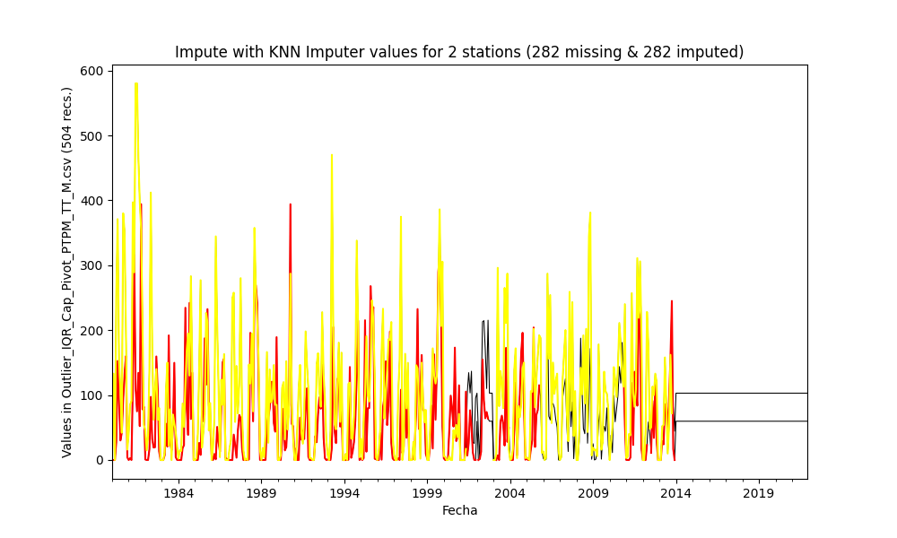
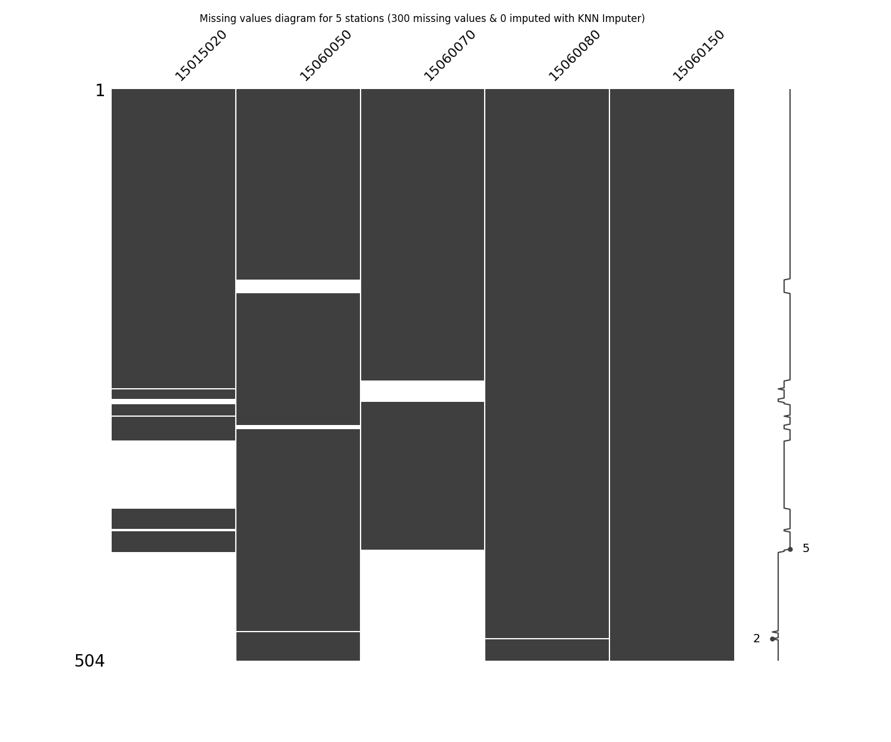
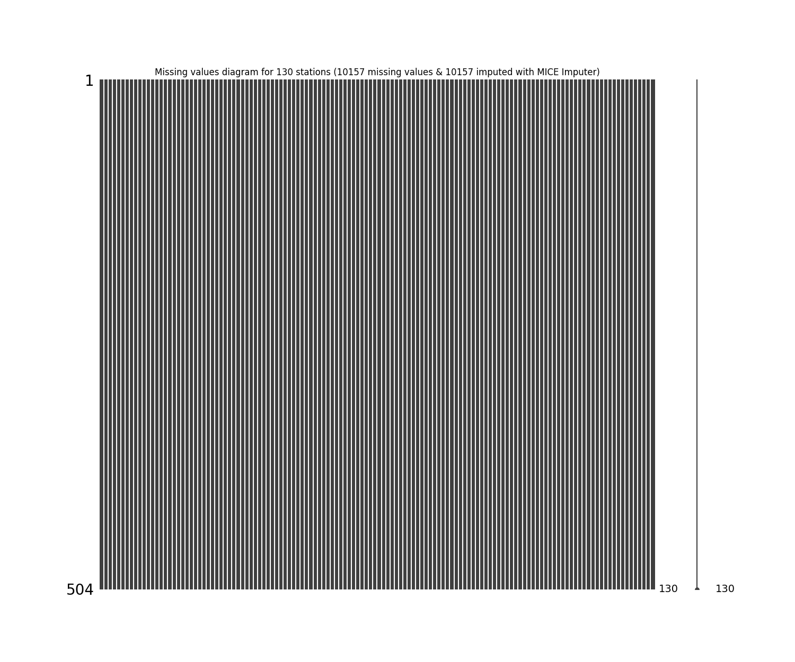

## Impute missing values in time series through statistical methods

* Processed file: [D:/R.LTWB/.datasets/IDEAM_Outlier/Outlier_IQR_Cap_Pivot_PTPM_TT_M.csv](../IDEAM_Outlier/Outlier_IQR_Cap_Pivot_PTPM_TT_M.csv)
* Execution date: 2022-11-12 09:23:50.776342
* Python version: 3.10.5 (tags/v3.10.5:f377153, Jun  6 2022, 16:14:13) [MSC v.1929 64 bit (AMD64)]
* Python path: ['D:\\R.LTWB\\.src', 'D:\\R.LTWB', 'D:\\R.HydroTools.wiki', 'D:\\R.HydroTools', 'D:\\R.GISPython']
* matplotlib version: 3.6.0
* pandas version: 1.4.3
* numpy version: 1.23.2
* missingno version: 0.5.1
* sklearn version: 1.1.3
* Stations exclude: ['28017140', '25027020', '25027410', '25027490', '25027330', '25027390', '25027630', '25027360', '25027320', '16067010', '25027420']
* Stations include: ['15015020', '15060050', '15060070', '15060080', '15060150']
* Print table sample: True
* Instructions & script: https://github.com/rcfdtools/R.LTWB/tree/main/Section03/Impute
* License: https://github.com/rcfdtools/R.LTWB/blob/main/LICENSE.md
* Credits: r.cfdtools@gmail.com

### General dataframe information with 504 IDEAM records for 5 stations

Dataframe records head sample

| Fecha               |   15015020 |   15060050 |   15060070 |   15060080 |   15060150 |
|:--------------------|-----------:|-----------:|-----------:|-----------:|-----------:|
| 1980-01-01 00:00:00 |          0 |          0 |          0 |          0 |          0 |
| 1980-02-01 00:00:00 |          0 |         27 |        133 |         23 |         23 |
| 1980-03-01 00:00:00 |          0 |          0 |          0 |          0 |          4 |

Dataframe records tail sample

| Fecha               |   15015020 |   15060050 |   15060070 |   15060080 |   15060150 |
|:--------------------|-----------:|-----------:|-----------:|-----------:|-----------:|
| 2021-10-01 00:00:00 |        nan |        214 |        nan |        307 |        356 |
| 2021-11-01 00:00:00 |        nan |         11 |        nan |         81 |         34 |
| 2021-12-01 00:00:00 |        nan |         16 |        nan |         23 |         43 |

Datatypes for station and nulls values in the initial file
|       | 15015020   | 15060050   | 15060070   | 15060080   | 15060150   |
|:------|:-----------|:-----------|:-----------|:-----------|:-----------|
| Dtype | float64    | float64    | float64    | float64    | float64    |
| Nulls | 165        | 17         | 117        | 1          | 0          |

General statistics table - Initial file

|          |   count |     mean |      std |   min |   25% |   50% |     75% |     max |
|---------:|--------:|---------:|---------:|------:|------:|------:|--------:|--------:|
| 15015020 |     339 |  59.718  |  73.9846 |     0 |   0.5 |  30.1 |  85.2   | 394.056 |
| 15060050 |     487 |  87.9507 |  83.7311 |     0 |  12.1 |  74   | 138.1   | 489.2   |
| 15060070 |     387 | 102.941  | 104.28   |     0 |  15   |  82   | 150     | 580.127 |
| 15060080 |     503 |  98.3699 |  91.3956 |     0 |  15   |  83   | 148.5   | 520.264 |
| 15060150 |     504 |  72.1262 |  80.4786 |     0 |   8   |  46.1 | 107.375 | 383     |

### Method 1 - Imputing with mean values
According to this technique, the missing values are imputed using the mean value in each feature and the serie has been completed filled.

General statistics table - Imputed file

|          |   count |     mean |     std |   min |    25% |     50% |     75% |     max |
|---------:|--------:|---------:|--------:|------:|-------:|--------:|--------:|--------:|
| 15015020 |     504 |  59.718  | 60.6479 |     0 | 12.225 |  59.718 |  60.275 | 394.056 |
| 15060050 |     504 |  87.9507 | 82.304  |     0 | 15     |  76.4   | 132.475 | 489.2   |
| 15060070 |     504 | 102.941  | 91.3508 |     0 | 33.025 | 102.941 | 132.25  | 580.127 |
| 15060080 |     504 |  98.3699 | 91.3048 |     0 | 15     |  83     | 148.25  | 520.264 |
| 15060150 |     504 |  72.1262 | 80.4786 |     0 |  8     |  46.1   | 107.375 | 383     |

### Method 2 - Imputing with median values
According to this technique, the missing values are imputed using the median value in each feature and the serie has been completed filled.

General statistics table - Imputed file

|          |   count |    mean |     std |   min |    25% |   50% |     75% |     max |
|---------:|--------:|--------:|--------:|------:|-------:|------:|--------:|--------:|
| 15015020 |     504 | 50.0217 | 62.2231 |     0 | 12.225 |  30.1 |  60.275 | 394.056 |
| 15060050 |     504 | 87.4802 | 82.3426 |     0 | 15     |  74   | 132.475 | 489.2   |
| 15060070 |     504 | 98.0797 | 91.7785 |     0 | 33.025 |  82   | 132.25  | 580.127 |
| 15060080 |     504 | 98.3394 | 91.3073 |     0 | 15     |  83   | 148.25  | 520.264 |
| 15060150 |     504 | 72.1262 | 80.4786 |     0 |  8     |  46.1 | 107.375 | 383     |

### Method 3 - Imputing with Last Observation Carried Forward (LOCF) values
According to this technique, the missing values are imputed using the immediate values before it in the time series and the missing values at the start are not filled but the series are completed fillet to the end.

General statistics table - Imputed file

|          |   count |    mean |     std |   min |    25% |   50% |     75% |     max |
|---------:|--------:|--------:|--------:|------:|-------:|------:|--------:|--------:|
| 15015020 |     504 | 54.6675 | 68.6241 |     0 |  0     | 23.05 | 110.55  | 394.056 |
| 15060050 |     504 | 86.123  | 83.3989 |     0 | 10.1   | 73.2  | 133     | 489.2   |
| 15060070 |     504 | 93.6848 | 93.4057 |     0 | 18.575 | 72    | 132.25  | 580.127 |
| 15060080 |     504 | 98.3612 | 91.305  |     0 | 15     | 83    | 148.25  | 520.264 |
| 15060150 |     504 | 72.1262 | 80.4786 |     0 |  8     | 46.1  | 107.375 | 383     |

### Method 4 - Imputing with Next Observation Carried Backward (NOCB) values
According to this technique, the missing values are imputed using the immediate values after it in the time series and the missing values at the end are not filled but the series are completed fillet to the start.

General statistics table - Imputed file

|          |   count |    mean |      std |   min |    25% |   50% |     75% |     max |
|---------:|--------:|--------:|---------:|------:|-------:|------:|--------:|--------:|
| 15015020 |     408 | 70.1873 |  73.8053 |     0 |  1.5   | 51.2  | 139.5   | 394.056 |
| 15060050 |     504 | 85.5754 |  83.3238 |     0 | 10.5   | 71.9  | 132.475 | 489.2   |
| 15060070 |     406 | 98.1235 | 104.106  |     0 |  7.175 | 75.35 | 146.85  | 580.127 |
| 15060080 |     504 | 98.4942 |  91.3474 |     0 | 15     | 83    | 149     | 520.264 |
| 15060150 |     504 | 72.1262 |  80.4786 |     0 |  8     | 46.1  | 107.375 | 383     |

### Method 5 - Impute missing values with Linear Interpolation values
According to this technique, the missing values are imputed using the linear interpolation between knowing pair values in the time series and the missing values at the start are not filled but the series are completed fillet to the end.

General statistics table - Imputed file

|          |   count |    mean |     std |   min |     25% |   50% |     75% |     max |
|---------:|--------:|--------:|--------:|------:|--------:|------:|--------:|--------:|
| 15015020 |     504 | 55.7429 | 70.1337 |     0 |  0      | 22.95 | 110.55  | 394.056 |
| 15060050 |     504 | 85.8492 | 83.2329 |     0 | 10.1692 | 72    | 132.475 | 489.2   |
| 15060070 |     504 | 93.3644 | 93.6873 |     0 | 18.575  | 72    | 132.25  | 580.127 |
| 15060080 |     504 | 98.4277 | 91.314  |     0 | 15      | 83    | 148.25  | 520.264 |
| 15060150 |     504 | 72.1262 | 80.4786 |     0 |  8      | 46.1  | 107.375 | 383     |

### Method 6 - Impute missing values with Exponential (Weighted) Moving Average - EWM = 3
According to this technique, the missing values are imputed using the moving average values in the time series and the missing values at the start are not filled but the series are completed fillet to the end.

General statistics table - Imputed file

|          |   count |    mean |     std |   min |     25% |     50% |      75% |     max |
|---------:|--------:|--------:|--------:|------:|--------:|--------:|---------:|--------:|
| 15015020 |     504 | 64.0103 | 61.0386 |     0 | 12.225  | 73.3108 |  74.9122 | 394.056 |
| 15060050 |     504 | 86.9911 | 82.4987 |     0 | 15      | 72      | 132.475  | 489.2   |
| 15060070 |     504 | 95.4326 | 93.0202 |     0 | 18.8089 | 80.6381 | 132.25   | 580.127 |
| 15060080 |     504 | 98.2779 | 91.3281 |     0 | 15      | 82.5    | 148.25   | 520.264 |
| 15060150 |     504 | 72.1262 | 80.4786 |     0 |  8      | 46.1    | 107.375  | 383     |

### Method 7 - Impute missing values with Natural Neigborns - KNN = 5 Imputer from Scikit Learn
According to this technique, the missing values are imputed using the natural neighbors values and the serie has been completed filled.

Imputer = KNNImputer()

General statistics table - Imputed file

|          |   count |     mean |      std |   min |   25% |   50% |     75% |     max |
|---------:|--------:|---------:|---------:|------:|------:|------:|--------:|--------:|
| 15015020 |     504 |  61.0714 |  69.0837 |     0 |  2.4  | 37.93 |  95.595 | 394.056 |
| 15060050 |     504 |  86.9695 |  83.0991 |     0 | 11.15 | 73.45 | 137.85  | 489.2   |
| 15060070 |     504 | 106.437  | 101.356  |     0 | 17.36 | 85    | 161.355 | 580.127 |
| 15060080 |     504 |  98.5287 |  91.3743 |     0 | 15    | 83    | 149     | 520.264 |
| 15060150 |     504 |  72.1262 |  80.4786 |     0 |  8    | 46.1  | 107.375 | 383     |

### Method 8 - Impute missing values with Multivariate Imputation by Chained Equation - MICE from Scikit Learn
According to this technique, the missing values are imputed using MICE values and the serie has been completed filled.

Imputer = IterativeImputer(estimator=BayesianRidge(), min_value=0, n_nearest_features=5)

General statistics table - Imputed file

|          |   count |     mean |      std |   min |     25% |    50% |      75% |     max |
|---------:|--------:|---------:|---------:|------:|--------:|-------:|---------:|--------:|
| 15015020 |     504 |  62.6732 |  68.1491 |     0 |  6.875  | 44.364 |  94.7332 | 394.056 |
| 15060050 |     504 |  87.4035 |  83.0137 |     0 | 13.9401 | 74     | 137.85   | 489.2   |
| 15060070 |     504 | 106.994  | 101.826  |     0 | 21.7535 | 85     | 156.5    | 580.127 |
| 15060080 |     504 |  98.6999 |  91.6048 |     0 | 15      | 83     | 149      | 520.264 |
| 15060150 |     504 |  72.1262 |  80.4786 |     0 |  8      | 46.1   | 107.375  | 383     |

Complementary report with individual graphs for stations in [Impute_Station_Outlier_IQR_Cap_Pivot_PTPM_TT_M.csv.md](Impute_Station_Outlier_IQR_Cap_Pivot_PTPM_TT_M.csv.md)

> As you notice, some of the techniques showed above can`t fill complete the missing values at the start or at the end, however, you can first choice a method and then apply another complementary method for get full filled the missin values.
