## Impute missing values in time series through statistical methods

* Processed file: [D:/R.LTWB/.datasets/IDEAM_Outlier/Outlier_IQR_Cap_Pivot_PTPM_TT_M.csv](../IDEAM_EDA/Outlier_IQR_Cap_Pivot_PTPM_TT_M.csv)
* Execution date: 2022-11-10 17:04:24.162911
* Python version: 3.10.5 (tags/v3.10.5:f377153, Jun  6 2022, 16:14:13) [MSC v.1929 64 bit (AMD64)]
* Python path: ['D:\\R.LTWB\\.src', 'D:\\R.LTWB', 'D:\\R.HydroTools.wiki', 'D:\\R.TeachingResearchGuide', 'D:\\R.HydroTools']
* matplotlib version: 3.6.0
* pandas version: 1.4.3
* numpy version: 1.23.2
* missingno version: 0.5.1
* Stations exclude: ['28017140', '25027020', '25027410', '25027490', '25027330', '25027390', '25027630', '25027360', '25027320', '16067010', '25027420']
* Print table sample: True
* Instructions & script: https://github.com/rcfdtools/R.LTWB/tree/main/Section03/Impute
* License: https://github.com/rcfdtools/R.LTWB/blob/main/LICENSE.md
* Credits: r.cfdtools@gmail.com

### General dataframe information with 504 IDEAM records for 130 stations

Dataframe records head sample

| Fecha               |   15015020 |   15060050 |   15060070 |   15060080 |   15060150 |   15065040 |   16050240 |   16060010 |   16070010 |   16070020 |   16070030 |   16070040 |   23210020 |   23215050 |   23215060 |   25020090 |   25020220 |   25020230 |   25020240 |   25020250 |   25020260 |   25020270 |   25020280 |   25020650 |   25020660 |   25020670 |   25020690 |   25020870 |   25020880 |   25020890 |   25020900 |   25020920 |   25021040 |   25021090 |   25021200 |   25021240 |   25021320 |   25021380 |   25021500 |   25021540 |   25021580 |   25021590 |   25021620 |   25021630 |   25021640 |   25021650 |   25025090 |   25025250 |   25025300 |   25025330 |   28010020 |   28010040 |   28010070 |   28010090 |   28010130 |   28010140 |   28010200 |   28010280 |   28010340 |   28010360 |   28010370 |   28015070 |   28020080 |   28020150 |   28020230 |   28020310 |   28020410 |   28020420 |   28020440 |   28020460 |   28020590 |   28020600 |   28025020 |   28025040 |   28025070 |   28025080 |   28025090 |   28030190 |   28030220 |   28035010 |   28035020 |   28035040 |   28040010 |   28040030 |   28040060 |   28040070 |   28040100 |   28040140 |   28040150 |   28040170 |   28040200 |   28040270 |   28040300 |   28040310 |   28040320 |   28040350 |   28040360 |   28040400 |   28045010 |   29060030 |   29060040 |   29060060 |   29060070 |   29060090 |   29060100 |   29060120 |   29060140 |   29060150 |   29060160 |   29060170 |   29060180 |   29060190 |   29060200 |   29060210 |   29060220 |   29060230 |   29060240 |   29060250 |   29060270 |   29060280 |   29060290 |   29060310 |   29060330 |   29060340 |   29060350 |   29060550 |   29060560 |   29065010 |   29065020 |   29065030 |
|:--------------------|-----------:|-----------:|-----------:|-----------:|-----------:|-----------:|-----------:|-----------:|-----------:|-----------:|-----------:|-----------:|-----------:|-----------:|-----------:|-----------:|-----------:|-----------:|-----------:|-----------:|-----------:|-----------:|-----------:|-----------:|-----------:|-----------:|-----------:|-----------:|-----------:|-----------:|-----------:|-----------:|-----------:|-----------:|-----------:|-----------:|-----------:|-----------:|-----------:|-----------:|-----------:|-----------:|-----------:|-----------:|-----------:|-----------:|-----------:|-----------:|-----------:|-----------:|-----------:|-----------:|-----------:|-----------:|-----------:|-----------:|-----------:|-----------:|-----------:|-----------:|-----------:|-----------:|-----------:|-----------:|-----------:|-----------:|-----------:|-----------:|-----------:|-----------:|-----------:|-----------:|-----------:|-----------:|-----------:|-----------:|-----------:|-----------:|-----------:|-----------:|-----------:|-----------:|-----------:|-----------:|-----------:|-----------:|-----------:|-----------:|-----------:|-----------:|-----------:|-----------:|-----------:|-----------:|-----------:|-----------:|-----------:|-----------:|-----------:|-----------:|-----------:|-----------:|-----------:|-----------:|-----------:|-----------:|-----------:|-----------:|-----------:|-----------:|-----------:|-----------:|-----------:|-----------:|-----------:|-----------:|-----------:|-----------:|-----------:|-----------:|-----------:|-----------:|-----------:|-----------:|-----------:|-----------:|-----------:|-----------:|-----------:|-----------:|
| 1980-01-01 00:00:00 |          0 |          0 |          0 |          0 |          0 |        nan |        nan |         53 |         50 |        nan |        200 |         67 |        nan |         50 |        nan |          0 |          0 |          2 |          0 |          0 |         43 |         31 |          0 |         11 |          1 |          0 |         60 |         12 |          0 |         15 |          0 |          5 |          0 |          5 |         21 |          0 |       20.9 |        nan |          4 |          0 |        nan |          0 |        nan |        nan |        nan |        nan |       70   |       28.7 |          0 |        nan |        nan |          7 |        nan |          0 |         27 |        3   |          0 |          2 |          0 |          0 |          0 |        0   |          0 |        nan |          0 |          2 |          0 |          0 |          0 |          0 |         15 |        nan |        9.6 |        3.7 |        0   |       18.5 |        0   |         14 |        nan |        0   |        0   |        0   |          0 |         30 |         55 |          5 |         83 |          6 |          9 |         63 |          0 |          0 |          0 |          0 |          7 |          4 |         10 |        nan |       47.7 |          0 |         15 |          8 |       24.3 |         11 |         75 |          0 |         14 |          0 |          0 |          0 |          0 |          6 |          0 |          0 |          0 |          0 |          0 |          0 |          0 |          0 |          0 |          0 |        nan |         67 |          0 |        nan |        nan |          0 |        3.3 |          0 |
| 1980-02-01 00:00:00 |          0 |         27 |        133 |         23 |         23 |        nan |        nan |         16 |         87 |        nan |         97 |         59 |        nan |         14 |        nan |         24 |         15 |         44 |         19 |         36 |         33 |          6 |         11 |         38 |         42 |          5 |         28 |        125 |         10 |         24 |          0 |         51 |         47 |         16 |         10 |         10 |       33.7 |        nan |          5 |         60 |        nan |         24 |        nan |        nan |        nan |        nan |       39.6 |       14.7 |         67 |        nan |        nan |        114 |        nan |         51 |         44 |       17.2 |          0 |          6 |         24 |         79 |         74 |       28.6 |         88 |        nan |          0 |         62 |         25 |         35 |         46 |         19 |         58 |        nan |       49.1 |       56.9 |       14.7 |       44.9 |       15.1 |          0 |        nan |       10.9 |       18.9 |        0   |         27 |        110 |         60 |         71 |          8 |         38 |         56 |         21 |         17 |         28 |          0 |          0 |         51 |         14 |         10 |        nan |       38.3 |          0 |          5 |         15 |       29.1 |         26 |          0 |          0 |          0 |          0 |          0 |          0 |          0 |          0 |          0 |          0 |          3 |          0 |          0 |          0 |          0 |          0 |          0 |          0 |        nan |         15 |          0 |        nan |        nan |          1 |        0   |          0 |
| 1980-03-01 00:00:00 |          0 |          0 |          0 |          0 |          4 |        nan |        nan |          6 |         18 |        nan |          0 |         34 |        nan |          9 |        nan |          0 |          1 |         13 |          0 |          0 |         19 |          0 |          2 |          0 |          2 |          0 |          5 |          0 |          0 |          5 |          0 |          0 |          6 |          0 |          0 |          5 |       56.2 |        nan |         13 |          0 |        nan |          0 |        nan |        nan |        nan |        nan |        0   |        4.4 |          5 |        nan |        nan |          6 |        nan |          0 |          0 |       50.3 |          0 |          8 |          0 |          0 |          4 |        0   |          0 |        nan |          7 |         36 |          0 |          0 |          6 |          0 |         10 |        nan |       14.2 |        7.3 |       14.6 |        0   |       13   |          0 |        nan |        7.9 |        2.4 |       14.2 |          0 |          0 |         15 |          0 |          0 |         25 |          0 |          8 |          0 |          4 |          0 |          0 |          0 |          5 |          0 |        nan |       10.5 |          0 |          0 |          4 |      nan   |          0 |          0 |          0 |          0 |          0 |          0 |          0 |          0 |          0 |          0 |          0 |          0 |          0 |          0 |          0 |          0 |          0 |          0 |          0 |        nan |          0 |          0 |        nan |        nan |          0 |        0   |          0 |

Dataframe records tail sample

| Fecha               |   15015020 |   15060050 |   15060070 |   15060080 |   15060150 |   15065040 |   16050240 |   16060010 |   16070010 |   16070020 |   16070030 |   16070040 |   23210020 |   23215050 |   23215060 |   25020090 |   25020220 |   25020230 |   25020240 |   25020250 |   25020260 |   25020270 |   25020280 |   25020650 |   25020660 |   25020670 |   25020690 |   25020870 |   25020880 |   25020890 |   25020900 |   25020920 |   25021040 |   25021090 |   25021200 |   25021240 |   25021320 |   25021380 |   25021500 |   25021540 |   25021580 |   25021590 |   25021620 |   25021630 |   25021640 |   25021650 |   25025090 |   25025250 |   25025300 |   25025330 |   28010020 |   28010040 |   28010070 |   28010090 |   28010130 |   28010140 |   28010200 |   28010280 |   28010340 |   28010360 |   28010370 |   28015070 |   28020080 |   28020150 |   28020230 |   28020310 |   28020410 |   28020420 |   28020440 |   28020460 |   28020590 |   28020600 |   28025020 |   28025040 |   28025070 |   28025080 |   28025090 |   28030190 |   28030220 |   28035010 |   28035020 |   28035040 |   28040010 |   28040030 |   28040060 |   28040070 |   28040100 |   28040140 |   28040150 |   28040170 |   28040200 |   28040270 |   28040300 |   28040310 |   28040320 |   28040350 |   28040360 |   28040400 |   28045010 |   29060030 |   29060040 |   29060060 |   29060070 |   29060090 |   29060100 |   29060120 |   29060140 |   29060150 |   29060160 |   29060170 |   29060180 |   29060190 |   29060200 |   29060210 |   29060220 |   29060230 |   29060240 |   29060250 |   29060270 |   29060280 |   29060290 |   29060310 |   29060330 |   29060340 |   29060350 |   29060550 |   29060560 |   29065010 |   29065020 |   29065030 |
|:--------------------|-----------:|-----------:|-----------:|-----------:|-----------:|-----------:|-----------:|-----------:|-----------:|-----------:|-----------:|-----------:|-----------:|-----------:|-----------:|-----------:|-----------:|-----------:|-----------:|-----------:|-----------:|-----------:|-----------:|-----------:|-----------:|-----------:|-----------:|-----------:|-----------:|-----------:|-----------:|-----------:|-----------:|-----------:|-----------:|-----------:|-----------:|-----------:|-----------:|-----------:|-----------:|-----------:|-----------:|-----------:|-----------:|-----------:|-----------:|-----------:|-----------:|-----------:|-----------:|-----------:|-----------:|-----------:|-----------:|-----------:|-----------:|-----------:|-----------:|-----------:|-----------:|-----------:|-----------:|-----------:|-----------:|-----------:|-----------:|-----------:|-----------:|-----------:|-----------:|-----------:|-----------:|-----------:|-----------:|-----------:|-----------:|-----------:|-----------:|-----------:|-----------:|-----------:|-----------:|-----------:|-----------:|-----------:|-----------:|-----------:|-----------:|-----------:|-----------:|-----------:|-----------:|-----------:|-----------:|-----------:|-----------:|-----------:|-----------:|-----------:|-----------:|-----------:|-----------:|-----------:|-----------:|-----------:|-----------:|-----------:|-----------:|-----------:|-----------:|-----------:|-----------:|-----------:|-----------:|-----------:|-----------:|-----------:|-----------:|-----------:|-----------:|-----------:|-----------:|-----------:|-----------:|-----------:|-----------:|-----------:|-----------:|-----------:|
| 2021-10-01 00:00:00 |        nan |        214 |        nan |        307 |        356 |        nan |        nan |        245 |        nan |        nan |        nan |        932 |        525 |      273.3 |        nan |        176 |        174 |        293 |        290 |        271 |        348 |        nan |        nan |    959.998 |        237 |        227 |        137 |        226 |        392 |        nan |         80 |        nan |        333 |        nan |        nan |        505 |        101 |        342 |        114 |        363 |        nan |        nan |        287 |        215 |      187.2 |        264 |      145.5 |        160 |      142.5 |        275 |        nan |      251   |        477 |      133.5 |        nan |        nan |        134 |        nan |        266 |        138 |        222 |      167   |        192 |        201 |        nan |        nan |        nan |         83 |        196 |        nan |        nan |        117 |        263 |        nan |      152.3 |        nan |        143 |        156 |        nan |        nan |      145.9 |      191.2 |        403 |      192   |        nan |         78 |        220 |        111 |      190.1 |        nan |        nan |        130 |        289 |        nan |        347 |        143 |        336 |        nan |        nan |        261 |        284 |        724 |        239 |        217 |      161   |         11 |        369 |        nan |        176 |      167.1 |        500 |        nan |        241 |      125.6 |        nan |        nan |        nan |        nan |        502 |        147 |        nan |         70 |        nan |        276 |      160.1 |        nan |        125 |        nan |        420 |        nan |
| 2021-11-01 00:00:00 |        nan |         11 |        nan |         81 |         34 |        nan |        nan |        402 |        nan |        nan |        nan |        437 |        330 |      123   |        nan |        267 |        199 |        131 |        367 |        112 |        305 |        137 |        nan |    173     |        200 |         86 |         15 |        362 |        390 |        nan |        120 |        nan |        232 |        nan |        nan |        570 |        150 |        421 |        143 |        427 |        nan |        nan |         94 |          5 |      124.9 |        207 |      321.2 |        128 |      174.9 |        225 |        nan |       53.9 |        127 |       56.8 |        nan |        nan |          2 |        nan |        123 |         23 |        186 |       28.4 |         92 |         52 |        nan |        nan |        nan |         32 |         39 |        nan |        nan |        177 |        114 |        nan |      183.5 |        nan |         23 |        104 |        nan |         83 |       26   |       51   |        239 |       78.2 |        nan |        127 |         53 |        108 |       33.3 |        nan |        nan |          0 |         89 |        nan |        162 |        130 |         53 |        nan |        nan |         63 |        140 |        232 |        145 |         53 |       87.5 |         22 |         90 |        nan |         62 |        0   |        235 |        nan |        175 |       89   |        nan |        nan |        nan |        nan |        105 |         56 |        nan |         65 |        nan |        114 |      191.4 |        nan |         10 |        nan |          0 |        nan |
| 2021-12-01 00:00:00 |        nan |         16 |        nan |         23 |         43 |        nan |        nan |        132 |        nan |        nan |        nan |        468 |         42 |       52.5 |        nan |        165 |         50 |         53 |         27 |         22 |        115 |        273 |        nan |    161     |         70 |         52 |          0 |         10 |         14 |        nan |          0 |        nan |          0 |        nan |        nan |          0 |         30 |         20 |         65 |          9 |        nan |        nan |         92 |          0 |       38.7 |         76 |        1.1 |         18 |       15.2 |        190 |        nan |       91.6 |          0 |        1.6 |        nan |        nan |          3 |        nan |        120 |         15 |         14 |       53.2 |         12 |         17 |        nan |        nan |         28 |          0 |         52 |        nan |         35 |          0 |         71 |        nan |       37.2 |        nan |         24 |          0 |        nan |          0 |       48.5 |        0   |         84 |        6   |        nan |         16 |         64 |         51 |       18   |        nan |        nan |          0 |         13 |        nan |          0 |          0 |         27 |        nan |        nan |          0 |         29 |          0 |         21 |         17 |       73   |          0 |          0 |        nan |          0 |        0   |          0 |        nan |          3 |        0   |        nan |        nan |        nan |          0 |          0 |          4 |        nan |          0 |        nan |         25 |        0   |        nan |          9 |        nan |          0 |        nan |

Datatypes for station and nulls values in the initial file
|       | 15015020   | 15060050   | 15060070   | 15060080   | 15060150   | 15065040   | 16050240   | 16060010   | 16070010   | 16070020   | 16070030   | 16070040   | 23210020   | 23215050   | 23215060   | 25020090   | 25020220   | 25020230   | 25020240   | 25020250   | 25020260   | 25020270   | 25020280   | 25020650   | 25020660   | 25020670   | 25020690   | 25020870   | 25020880   | 25020890   | 25020900   | 25020920   | 25021040   | 25021090   | 25021200   | 25021240   | 25021320   | 25021380   | 25021500   | 25021540   | 25021580   | 25021590   | 25021620   | 25021630   | 25021640   | 25021650   | 25025090   | 25025250   | 25025300   | 25025330   | 28010020   | 28010040   | 28010070   | 28010090   | 28010130   | 28010140   | 28010200   | 28010280   | 28010340   | 28010360   | 28010370   | 28015070   | 28020080   | 28020150   | 28020230   | 28020310   | 28020410   | 28020420   | 28020440   | 28020460   | 28020590   | 28020600   | 28025020   | 28025040   | 28025070   | 28025080   | 28025090   | 28030190   | 28030220   | 28035010   | 28035020   | 28035040   | 28040010   | 28040030   | 28040060   | 28040070   | 28040100   | 28040140   | 28040150   | 28040170   | 28040200   | 28040270   | 28040300   | 28040310   | 28040320   | 28040350   | 28040360   | 28040400   | 28045010   | 29060030   | 29060040   | 29060060   | 29060070   | 29060090   | 29060100   | 29060120   | 29060140   | 29060150   | 29060160   | 29060170   | 29060180   | 29060190   | 29060200   | 29060210   | 29060220   | 29060230   | 29060240   | 29060250   | 29060270   | 29060280   | 29060290   | 29060310   | 29060330   | 29060340   | 29060350   | 29060550   | 29060560   | 29065010   | 29065020   | 29065030   |
|:------|:-----------|:-----------|:-----------|:-----------|:-----------|:-----------|:-----------|:-----------|:-----------|:-----------|:-----------|:-----------|:-----------|:-----------|:-----------|:-----------|:-----------|:-----------|:-----------|:-----------|:-----------|:-----------|:-----------|:-----------|:-----------|:-----------|:-----------|:-----------|:-----------|:-----------|:-----------|:-----------|:-----------|:-----------|:-----------|:-----------|:-----------|:-----------|:-----------|:-----------|:-----------|:-----------|:-----------|:-----------|:-----------|:-----------|:-----------|:-----------|:-----------|:-----------|:-----------|:-----------|:-----------|:-----------|:-----------|:-----------|:-----------|:-----------|:-----------|:-----------|:-----------|:-----------|:-----------|:-----------|:-----------|:-----------|:-----------|:-----------|:-----------|:-----------|:-----------|:-----------|:-----------|:-----------|:-----------|:-----------|:-----------|:-----------|:-----------|:-----------|:-----------|:-----------|:-----------|:-----------|:-----------|:-----------|:-----------|:-----------|:-----------|:-----------|:-----------|:-----------|:-----------|:-----------|:-----------|:-----------|:-----------|:-----------|:-----------|:-----------|:-----------|:-----------|:-----------|:-----------|:-----------|:-----------|:-----------|:-----------|:-----------|:-----------|:-----------|:-----------|:-----------|:-----------|:-----------|:-----------|:-----------|:-----------|:-----------|:-----------|:-----------|:-----------|:-----------|:-----------|:-----------|:-----------|:-----------|:-----------|:-----------|:-----------|
| Dtype | float64    | float64    | float64    | float64    | float64    | float64    | float64    | float64    | float64    | float64    | float64    | float64    | float64    | float64    | float64    | float64    | float64    | float64    | float64    | float64    | float64    | float64    | float64    | float64    | float64    | float64    | float64    | float64    | float64    | float64    | float64    | float64    | float64    | float64    | float64    | float64    | float64    | float64    | float64    | float64    | float64    | float64    | float64    | float64    | float64    | float64    | float64    | float64    | float64    | float64    | float64    | float64    | float64    | float64    | float64    | float64    | float64    | float64    | float64    | float64    | float64    | float64    | float64    | float64    | float64    | float64    | float64    | float64    | float64    | float64    | float64    | float64    | float64    | float64    | float64    | float64    | float64    | float64    | float64    | float64    | float64    | float64    | float64    | float64    | float64    | float64    | float64    | float64    | float64    | float64    | float64    | float64    | float64    | float64    | float64    | float64    | float64    | float64    | float64    | float64    | float64    | float64    | float64    | float64    | float64    | float64    | float64    | float64    | float64    | float64    | float64    | float64    | float64    | float64    | float64    | float64    | float64    | float64    | float64    | float64    | float64    | float64    | float64    | float64    | float64    | float64    | float64    | float64    | float64    | float64    |
| Nulls | 165        | 17         | 117        | 1          | 0          | 261        | 177        | 0          | 67         | 350        | 195        | 32         | 207        | 37         | 358        | 3          | 1          | 22         | 2          | 3          | 9          | 4          | 37         | 68         | 2          | 38         | 0          | 7          | 14         | 21         | 12         | 86         | 1          | 29         | 20         | 0          | 13         | 27         | 12         | 14         | 316        | 298        | 36         | 44         | 61         | 62         | 38         | 51         | 34         | 165        | 145        | 6          | 72         | 30         | 382        | 249        | 33         | 489        | 12         | 34         | 3          | 5          | 34         | 73         | 238        | 223        | 47         | 56         | 12         | 6          | 56         | 36         | 10         | 333        | 0          | 157        | 4          | 0          | 103        | 42         | 30         | 12         | 0          | 5          | 364        | 10         | 11         | 20         | 38         | 398        | 317        | 20         | 24         | 147        | 17         | 0          | 1          | 146        | 276        | 1          | 5          | 12         | 2          | 3          | 0          | 0          | 1          | 16         | 15         | 1          | 4          | 84         | 21         | 3          | 246        | 134        | 63         | 5          | 3          | 20         | 255        | 0          | 252        | 14         | 43         | 144        | 62         | 382        | 14         | 92         |

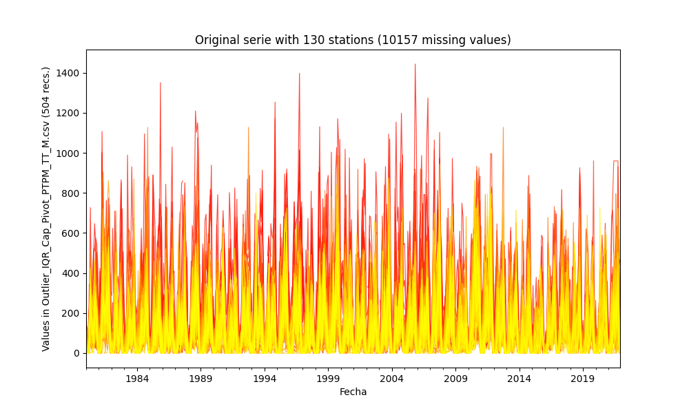

General statistics table - Initial file

|          |   count |     mean |      std |   min |     25% |    50% |     75% |      max |
|---------:|--------:|---------:|---------:|------:|--------:|-------:|--------:|---------:|
| 15015020 |     339 |  59.718  |  73.9846 |     0 |   0.5   |  30.1  |  85.2   |  394.056 |
| 15060050 |     487 |  87.9507 |  83.7311 |     0 |  12.1   |  74    | 138.1   |  489.2   |
| 15060070 |     387 | 102.941  | 104.28   |     0 |  15     |  82    | 150     |  580.127 |
| 15060080 |     503 |  98.3699 |  91.3956 |     0 |  15     |  83    | 148.5   |  520.264 |
| 15060150 |     504 |  72.1262 |  80.4786 |     0 |   8     |  46.1  | 107.375 |  383     |
| 15065040 |     243 |  65.5008 |  59.54   |     0 |  10.8   |  53    | 107.75  |  237.7   |
| 16050240 |     327 | 177.153  | 128.094  |     0 |  82     | 156    | 246     |  792.155 |
| 16060010 |     504 | 304.344  | 206.676  |     0 | 146.25  | 284.5  | 426.25  | 1005     |
| 16070010 |     437 | 410.432  | 267.691  |     0 | 196     | 396    | 578     | 1444     |
| 16070020 |     154 | 393.565  | 269.214  |     0 | 162.25  | 366    | 557.5   | 1210     |
| 16070030 |     309 | 390.891  | 245.702  |     0 | 216     | 359    | 524     | 1351     |
| 16070040 |     472 | 353.798  | 208.838  |     8 | 204.5   | 341    | 485.25  | 1173     |
| 23210020 |     297 | 159.691  | 137.871  |     0 |  45     | 130    | 241     |  649     |
| 23215050 |     467 | 233.842  | 212.824  |     0 |  74.5   | 182.3  | 332.85  | 1094.2   |
| 23215060 |     146 | 136.245  | 106.68   |     0 |  46.55  | 122.9  | 196.125 |  422     |
| 25020090 |     501 | 162.97   | 142.862  |     0 |  44.7   | 139    | 246.6   |  808.61  |
| 25020220 |     503 | 125.969  | 101.616  |     0 |  43.3   | 111.1  | 189.85  |  534     |
| 25020230 |     482 | 164.689  | 139.807  |     0 |  56.225 | 137    | 241.5   |  799.943 |
| 25020240 |     502 | 136.406  | 120.364  |     0 |  43     | 112.5  | 194     |  735     |
| 25020250 |     501 | 142.694  | 118.441  |     0 |  48     | 117.9  | 208.9   |  644.3   |
| 25020260 |     495 | 221.387  | 169.156  |     0 |  89     | 205    | 318.5   |  996.014 |
| 25020270 |     500 | 168.683  | 144.303  |     0 |  48     | 136    | 262     |  627     |
| 25020280 |     467 | 126.848  | 117.849  |     0 |  35     | 102    | 185     |  661.486 |
| 25020650 |     436 | 153.847  | 164.343  |     0 |  30.675 | 115    | 226.925 |  959.998 |
| 25020660 |     502 | 155.621  | 132.496  |     0 |  49.175 | 127.1  | 230     |  679     |
| 25020670 |     466 | 145.873  | 128.253  |     0 |  33     | 118    | 238.5   |  727.269 |
| 25020690 |     504 | 153.358  | 146.017  |     0 |  37     | 112    | 233.5   |  753     |
| 25020870 |     497 | 155.739  | 135.675  |     0 |  45     | 136    | 233     |  835     |
| 25020880 |     490 | 193.8    | 160.698  |     0 |  60     | 163.5  | 291     |  764     |
| 25020890 |     483 | 155.821  | 128.157  |     0 |  49     | 130    | 244     |  593     |
| 25020900 |     492 | 131.34   | 114.881  |     0 |  30     | 106    | 207     |  510     |
| 25020920 |     418 | 137.263  | 161.997  |     0 |  30     |  88.5  | 184.475 |  918.023 |
| 25021040 |     503 | 161.868  | 139.083  |     0 |  45     | 139    | 245.5   |  739     |
| 25021090 |     475 | 157.96   | 141.425  |     0 |  40     | 125    | 240.9   |  680     |
| 25021200 |     484 | 190.166  | 168.025  |     0 |  50     | 149    | 284.5   |  934     |
| 25021240 |     504 | 169.907  | 147.9    |     0 |  46.875 | 141.85 | 265     |  696.6   |
| 25021320 |     491 | 160.853  | 141.005  |     0 |  48     | 133    | 240     |  744     |
| 25021380 |     477 | 167.207  | 139.418  |     0 |  53     | 140    | 257     |  724     |
| 25021500 |     492 |  99.214  |  74.7592 |     0 |  41     |  88    | 145     |  368     |
| 25021540 |     490 | 178.49   | 144.689  |     0 |  66.25  | 144.5  | 264.925 |  721     |
| 25021580 |     188 | 144.556  | 116.792  |     0 |  52.75  | 109.5  | 217.75  |  494     |
| 25021590 |     206 | 136.508  | 112.785  |     0 |  36.5   | 125.8  | 208.725 |  512.2   |
| 25021620 |     468 | 115.772  |  90.749  |     0 |  44.75  | 101.5  | 161     |  534.242 |
| 25021630 |     460 | 111.086  |  78.2969 |     0 |  49     |  99    | 165.25  |  370     |
| 25021640 |     443 | 145.321  | 132.377  |     0 |  38.35  | 115.5  | 213.5   |  717     |
| 25021650 |     442 | 131.773  | 127.362  |     0 |  32.25  | 102.6  | 198.5   |  715.84  |
| 25025090 |     466 | 164.917  | 134.386  |     0 |  53.3   | 139.15 | 246.2   |  609.3   |
| 25025250 |     453 | 135.746  | 116.256  |     0 |  35     | 115.4  | 196.6   |  549.9   |
| 25025300 |     470 | 110.96   |  92.9367 |     0 |  35.225 |  90.9  | 163.8   |  459.2   |
| 25025330 |     339 | 164.522  | 130.426  |     0 |  59.8   | 142    | 252.9   |  693     |
| 28010020 |     359 |  78.0446 |  84.9045 |     0 |  10     |  55    | 125     |  478.212 |
| 28010040 |     498 | 151.934  | 128.693  |     0 |  48.325 | 130.1  | 220.625 |  748.7   |
| 28010070 |     432 | 116.327  | 106.916  |     0 |  32.75  |  98.3  | 179.75  |  581     |
| 28010090 |     474 |  92.4008 |  93.9715 |     0 |  10     |  71.5  | 138     |  520.861 |
| 28010130 |     122 | 230.704  | 218.823  |     0 |  60     | 162    | 342.25  | 1009     |
| 28010140 |     255 | 131.152  | 134.891  |     0 |  24     |  89    | 194     |  630     |
| 28010200 |     471 |  82.2676 |  89.6425 |     0 |   5.4   |  52    | 129.4   |  488.941 |
| 28010280 |      15 |  52.2667 |  55.7577 |     2 |  12.5   |  26    |  77     |  169     |
| 28010340 |     492 |  99.5524 |  92.5377 |     0 |  16.975 |  82.5  | 154     |  457     |
| 28010360 |     470 | 171.171  | 205.259  |     0 |  20     | 102.05 | 252.425 | 1127.8   |
| 28010370 |     501 | 108.373  |  94.421  |     0 |  26     |  88    | 171     |  508     |
| 28015070 |     499 |  98.0299 |  84.267  |     0 |  28.35  |  87.9  | 150.7   |  456.1   |
| 28020080 |     470 | 115.107  | 104.068  |     0 |  30.25  |  94    | 172.5   |  590.828 |
| 28020150 |     431 | 108.619  |  88.2291 |     0 |  42     |  89.2  | 159     |  518     |
| 28020230 |     266 | 125.781  | 120.656  |     0 |  24.775 | 110.1  | 179.875 |  675.7   |
| 28020310 |     281 | 180.133  | 148.914  |     0 |  63     | 145    | 261     |  723     |
| 28020410 |     457 | 106.72   |  99.594  |     0 |  27.9   |  82    | 156     |  565.7   |
| 28020420 |     448 | 122.556  | 108.867  |     0 |  34.5   | 102    | 188     |  567     |
| 28020440 |     492 | 127.331  | 101.811  |     0 |  45     | 109.4  | 192     |  610.6   |
| 28020460 |     498 | 128.521  | 108.515  |     0 |  46.25  | 104.5  | 192.75  |  591     |
| 28020590 |     448 | 103.627  |  91.3379 |     0 |  29     |  83.3  | 156     |  542     |
| 28020600 |     468 | 112.083  |  97.1663 |     0 |  33.75  |  86    | 172.85  |  552.088 |
| 28025020 |     494 | 110.783  |  82.2089 |     0 |  42.025 | 104.8  | 165.05  |  421.2   |
| 28025040 |     171 |  96.6094 |  90.3915 |     0 |  26.1   |  68.8  | 143.5   |  360.6   |
| 28025070 |     504 | 131.555  | 104.05   |     0 |  47.95  | 114.7  | 194.45  |  550.8   |
| 28025080 |     347 | 127.758  |  98.1071 |     0 |  46.6   | 113    | 188.65  |  496.9   |
| 28025090 |     500 | 123.833  |  97.4444 |     0 |  45.3   | 110.3  | 187.725 |  504.6   |
| 28030190 |     504 |  93.3151 |  86.66   |     0 |  14.475 |  82.8  | 144.55  |  450.8   |
| 28030220 |     401 |  85.204  |  91.3095 |     0 |   1.3   |  58.3  | 135     |  497.601 |
| 28035010 |     462 | 110.852  |  91.875  |     0 |  30.25  |  95.75 | 168.375 |  479.6   |
| 28035020 |     474 |  98.4741 |  84.522  |     0 |  21.025 |  85.35 | 152.45  |  464.2   |
| 28035040 |     492 | 107.14   |  84.195  |     0 |  33.375 |  97.45 | 154.225 |  425     |
| 28040010 |     504 | 177.7    | 149.703  |     0 |  53.75  | 157.5  | 261.25  |  869.048 |
| 28040030 |     499 | 115.524  | 121.033  |     0 |  28     |  90    | 156.8   |  681.291 |
| 28040060 |     140 | 105.394  |  98.432  |     0 |  30     |  72.5  | 152.75  |  500     |
| 28040070 |     494 | 111.56   |  88.4919 |     0 |  40     | 100    | 165     |  415     |
| 28040100 |     493 | 144.233  | 107.972  |     0 |  54     | 137    | 209     |  635.172 |
| 28040140 |     484 |  96.3804 |  86.5089 |     0 |  23.9   |  76.15 | 145     |  435     |
| 28040150 |     466 | 115.695  |  92.485  |     0 |  42.25  | 107    | 163.75  |  541.15  |
| 28040170 |     106 | 115.199  | 121.212  |     0 |  18.15  |  60.5  | 200.25  |  505     |
| 28040200 |     187 |  96.7465 |  74.8121 |     0 |  33.5   |  91    | 146.5   |  374     |
| 28040270 |     484 | 107.383  |  89.4598 |     0 |  30     |  98    | 159     |  512.18  |
| 28040300 |     480 | 114.796  |  97.6011 |     0 |  39     |  96    | 162     |  564     |
| 28040310 |     357 | 114.399  |  94.932  |     0 |  40     | 101    | 165     |  521     |
| 28040320 |     487 | 124.416  |  96.7825 |     0 |  50.5   | 107    | 172.5   |  491     |
| 28040350 |     504 | 110.307  |  98.2992 |     0 |  31.8   |  93.6  | 160.8   |  578     |
| 28040360 |     503 | 124.187  |  91.5903 |     0 |  52.5   | 116    | 174     |  552.693 |
| 28040400 |     358 | 103.43   |  86.8242 |     0 |  34.25  |  85    | 148     |  398     |
| 28045010 |     228 | 129.799  | 131.563  |     0 |   0     |  93.3  | 224.7   |  502.1   |
| 29060030 |     503 | 111.991  | 119.119  |     0 |   5.5   |  84.2  | 174.5   |  652.526 |
| 29060040 |     499 | 119.138  | 114.164  |     0 |  28     |  97    | 172.5   |  639.993 |
| 29060060 |     492 | 214.417  | 188.986  |     0 |  50     | 180    | 325     |  944     |
| 29060070 |     502 | 199.184  | 159.074  |     0 |  61.5   | 179    | 306     |  927     |
| 29060090 |     501 | 109.604  |  77.811  |     0 |  42     | 106    | 168     |  382     |
| 29060100 |     504 | 130.562  | 109.441  |     0 |  40     | 117.5  | 189     |  665     |
| 29060120 |     504 |  30.2694 |  55.9905 |     0 |   0     |   6    |  30     |  303.921 |
| 29060140 |     503 | 131.206  | 151.132  |     0 |   7.5   |  87    | 201     |  826.16  |
| 29060150 |     488 | 134.573  | 132.61   |     0 |  21.75  | 100.5  | 217.25  |  737.271 |
| 29060160 |     489 |  83.6388 | 103.389  |     0 |   0     |  40    | 136.1   |  564.2   |
| 29060170 |     503 |  78.9743 |  92.482  |     0 |   0     |  46    | 134.15  |  505     |
| 29060180 |     500 | 116.126  | 148.588  |     0 |   0     |  69.5  | 168     |  796.306 |
| 29060190 |     420 | 106.535  | 117.462  |     0 |   4.75  |  71.5  | 158.25  |  643.811 |
| 29060200 |     483 | 118.775  | 114.146  |     0 |  24     | 100    | 178.5   |  637     |
| 29060210 |     501 |  70.0754 |  83.481  |     0 |   1.2   |  39.4  | 108.6   |  453.599 |
| 29060220 |     258 | 113.999  | 149.46   |     0 |   0     |  64.5  | 157.75  |  799.53  |
| 29060230 |     370 | 101.154  | 108.271  |     0 |   6     |  72    | 158.5   |  549     |
| 29060240 |     441 | 104.468  | 130.217  |     0 |   0     |  67    | 170     |  720.851 |
| 29060250 |     499 |  82.7193 | 101.86   |     0 |   0     |  50    | 122.05  |  546.36  |
| 29060270 |     501 |  86.9663 |  99.7629 |     0 |   0     |  56    | 132     |  519     |
| 29060280 |     484 |  69.5085 |  88.0132 |     0 |   0     |  35.2  | 110.625 |  482.9   |
| 29060290 |     249 | 103.559  | 124.612  |     0 |   0     |  60    | 149     |  627     |
| 29060310 |     504 |  78.6707 | 109.789  |     0 |   0     |  33    | 128     |  604.211 |
| 29060330 |     252 | 131.828  | 139.738  |     0 |  11.5   |  97    | 208.25  |  615     |
| 29060340 |     490 | 192.753  | 165.79   |     0 |  52.5   | 165.5  | 282.75  |  875     |
| 29060350 |     461 | 107.352  | 114.471  |     0 |   5.4   |  76.7  | 171     |  626.681 |
| 29060550 |     360 |  97.4396 | 109.956  |     0 |   0     |  68    | 160.05  |  595.759 |
| 29060560 |     442 |  97.2691 |  98.9643 |     0 |  16     |  68.5  | 150     |  553.117 |
| 29065010 |     122 |  93.5492 |  92.2916 |     0 |  11.1   |  70.65 | 151.225 |  366.7   |
| 29065020 |     490 | 102.09   | 105.756  |     0 |   9.475 |  74.05 | 158.575 |  563.1   |
| 29065030 |     412 | 121.007  | 122.086  |     0 |  11.3   |  96.5  | 179.975 |  637.9   |

### Method 1 - Imputing with mean values

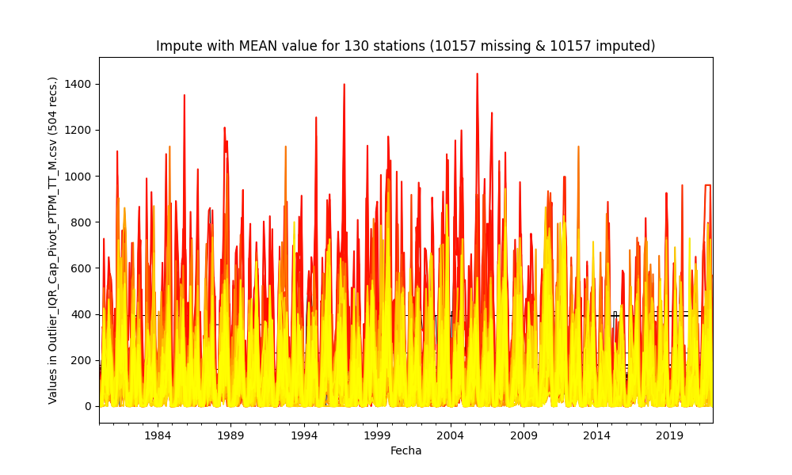

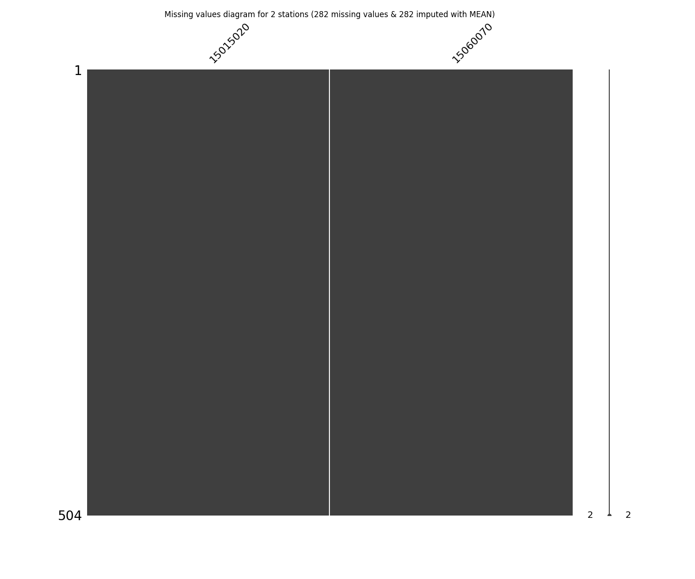

|          |   count |     mean |       std |   min |      25% |      50% |      75% |      max |
|---------:|--------:|---------:|----------:|------:|---------:|---------:|---------:|---------:|
| 15015020 |     504 |  59.718  |  60.6479  |     0 |  12.225  |  59.718  |  60.275  |  394.056 |
| 15060050 |     504 |  87.9507 |  82.304   |     0 |  15      |  76.4    | 132.475  |  489.2   |
| 15060070 |     504 | 102.941  |  91.3508  |     0 |  33.025  | 102.941  | 132.25   |  580.127 |
| 15060080 |     504 |  98.3699 |  91.3048  |     0 |  15      |  83      | 148.25   |  520.264 |
| 15060150 |     504 |  72.1262 |  80.4786  |     0 |   8      |  46.1    | 107.375  |  383     |
| 15065040 |     504 |  65.5008 |  41.2984  |     0 |  61.05   |  65.5008 |  65.5008 |  237.7   |
| 16050240 |     504 | 177.153  | 103.122   |     0 | 123.5    | 177.153  | 186.25   |  792.155 |
| 16060010 |     504 | 304.344  | 206.676   |     0 | 146.25   | 284.5    | 426.25   | 1005     |
| 16070010 |     504 | 410.432  | 249.226   |     0 | 228.5    | 410.432  | 549.5    | 1444     |
| 16070020 |     504 | 393.565  | 148.477   |     0 | 393.565  | 393.565  | 393.565  | 1210     |
| 16070030 |     504 | 390.891  | 192.265   |     0 | 312      | 390.891  | 408      | 1351     |
| 16070040 |     504 | 353.798  | 202.086   |     8 | 215      | 353.798  | 469.5    | 1173     |
| 23210020 |     504 | 159.691  | 105.763   |     0 | 102.825  | 159.691  | 160      |  649     |
| 23215050 |     504 | 233.842  | 204.847   |     0 |  83.15   | 200.55   | 316.6    | 1094.2   |
| 23215060 |     504 | 136.245  |  57.2772  |     0 | 136.245  | 136.245  | 136.245  |  422     |
| 25020090 |     504 | 162.97   | 142.435   |     0 |  44.925  | 142.5    | 246.525  |  808.61  |
| 25020220 |     504 | 125.969  | 101.515   |     0 |  43.45   | 111.25   | 189.725  |  534     |
| 25020230 |     504 | 164.689  | 136.715   |     0 |  60      | 146      | 236.5    |  799.943 |
| 25020240 |     504 | 136.406  | 120.124   |     0 |  43      | 113.5    | 194      |  735     |
| 25020250 |     504 | 142.694  | 118.087   |     0 |  48.15   | 119.5    | 208.225  |  644.3   |
| 25020260 |     504 | 221.387  | 167.636   |     0 |  90      | 209.5    | 313.75   |  996.014 |
| 25020270 |     504 | 168.683  | 143.728   |     0 |  48      | 137      | 259.75   |  627     |
| 25020280 |     504 | 126.848  | 113.432   |     0 |  40      | 112      | 181      |  661.486 |
| 25020650 |     504 | 153.847  | 152.832   |     0 |  39.65   | 146.1    | 202.1    |  959.998 |
| 25020660 |     504 | 155.621  | 132.232   |     0 |  49.725  | 127.6    | 230      |  679     |
| 25020670 |     504 | 145.873  | 123.313   |     0 |  37      | 135.5    | 225.25   |  727.269 |
| 25020690 |     504 | 153.358  | 146.017   |     0 |  37      | 112      | 233.5    |  753     |
| 25020870 |     504 | 155.739  | 134.727   |     0 |  45      | 137.65   | 229.75   |  835     |
| 25020880 |     504 | 193.8    | 158.446   |     0 |  62.75   | 175.5    | 290      |  764     |
| 25020890 |     504 | 155.821  | 125.453   |     0 |  51      | 139.5    | 234      |  593     |
| 25020900 |     504 | 131.34   | 113.502   |     0 |  30      | 108      | 203.5    |  510     |
| 25020920 |     504 | 137.263  | 147.5     |     0 |  40      | 114.5    | 160.25   |  918.023 |
| 25021040 |     504 | 161.868  | 138.945   |     0 |  45      | 139      | 245.25   |  739     |
| 25021090 |     504 | 157.96   | 137.287   |     0 |  43.875  | 135      | 229.125  |  680     |
| 25021200 |     504 | 190.166  | 164.651   |     0 |  51      | 161      | 277.75   |  934     |
| 25021240 |     504 | 169.907  | 147.9     |     0 |  46.875  | 141.85   | 265      |  696.6   |
| 25021320 |     504 | 160.853  | 139.171   |     0 |  50      | 135.5    | 238.25   |  744     |
| 25021380 |     504 | 167.207  | 135.625   |     0 |  56      | 150      | 245      |  724     |
| 25021500 |     504 |  99.214  |  73.8621  |     0 |  41.75   |  90      | 143.125  |  368     |
| 25021540 |     504 | 178.49   | 142.661   |     0 |  68.75   | 156.5    | 262.25   |  721     |
| 25021580 |     504 | 144.556  |  71.2112  |     0 | 144.556  | 144.556  | 144.556  |  494     |
| 25021590 |     504 | 136.508  |  72.0018  |     0 | 136.508  | 136.508  | 136.508  |  512.2   |
| 25021620 |     504 | 115.772  |  87.4412  |     0 |  48      | 112.5    | 159.25   |  534.242 |
| 25021630 |     504 | 111.086  |  74.794   |     0 |  53.75   | 111.043  | 160      |  370     |
| 25021640 |     504 | 145.321  | 124.091   |     0 |  49.775  | 137.7    | 195.95   |  717     |
| 25021650 |     504 | 131.773  | 119.255   |     0 |  41.925  | 120      | 177.15   |  715.84  |
| 25025090 |     504 | 164.917  | 129.21    |     0 |  59.8    | 154.45   | 240.85   |  609.3   |
| 25025250 |     504 | 135.746  | 110.205   |     0 |  49.55   | 132.2    | 180.6    |  549.9   |
| 25025300 |     504 | 110.96   |  89.7408  |     0 |  38.375  | 102.5    | 158.175  |  459.2   |
| 25025330 |     504 | 164.522  | 106.915   |     0 |  93.65   | 164.522  | 199.1    |  693     |
| 28010020 |     504 |  78.0446 |  71.6289  |     0 |  25      |  78.0446 |  89.25   |  478.212 |
| 28010040 |     504 | 151.934  | 127.923   |     0 |  49.075  | 132.9    | 218.375  |  748.7   |
| 28010070 |     504 | 116.327  |  98.9685  |     0 |  41.575  | 116.327  | 165.25   |  581     |
| 28010090 |     504 |  92.4008 |  91.126   |     0 |  12      |  81.25   | 134.925  |  520.861 |
| 28010130 |     504 | 230.704  | 107.325   |     0 | 230.704  | 230.704  | 230.704  | 1009     |
| 28010140 |     504 | 131.152  |  95.8552  |     0 |  89      | 131.152  | 131.152  |  630     |
| 28010200 |     504 |  82.2676 |  86.652   |     0 |   8.35   |  64.75   | 124.7    |  488.941 |
| 28010280 |     504 |  52.2667 |   9.30219 |     2 |  52.2667 |  52.2667 |  52.2667 |  169     |
| 28010340 |     504 |  99.5524 |  91.4272  |     0 |  19.5    |  85.5    | 150.5    |  457     |
| 28010360 |     504 | 171.171  | 198.2     |     0 |  23.15   | 121.35   | 239.55   | 1127.8   |
| 28010370 |     504 | 108.373  |  94.139   |     0 |  26      |  88.5    | 171      |  508     |
| 28015070 |     504 |  98.0299 |  83.8471  |     0 |  28.475  |  88.4    | 149.775  |  456.1   |
| 28020080 |     504 | 115.107  | 100.49    |     0 |  35      | 105      | 165.25   |  590.828 |
| 28020150 |     504 | 108.619  |  81.576   |     0 |  50.75   | 108.619  | 146      |  518     |
| 28020230 |     504 | 125.781  |  87.5766  |     0 | 103      | 125.781  | 125.781  |  675.7   |
| 28020310 |     504 | 180.133  | 111.104   |     0 | 136      | 180.133  | 180.133  |  723     |
| 28020410 |     504 | 106.72   |  94.8269  |     0 |  32.6    |  97.5    | 148.25   |  565.7   |
| 28020420 |     504 | 122.556  | 102.628   |     0 |  45.5    | 117      | 168.25   |  567     |
| 28020440 |     504 | 127.331  | 100.589   |     0 |  45.975  | 112      | 189.5    |  610.6   |
| 28020460 |     504 | 128.521  | 107.866   |     0 |  47      | 108.5    | 192      |  591     |
| 28020590 |     504 | 103.627  |  86.1035  |     0 |  35      |  98      | 143.5    |  542     |
| 28020600 |     504 | 112.083  |  93.6246  |     0 |  37      | 100.3    | 167.475  |  552.088 |
| 28025020 |     504 | 110.783  |  81.3876  |     0 |  42.475  | 107.05   | 163.475  |  421.2   |
| 28025040 |     504 |  96.6094 |  52.5494  |     0 |  96.6094 |  96.6094 |  96.6094 |  360.6   |
| 28025070 |     504 | 131.555  | 104.05    |     0 |  47.95   | 114.7    | 194.45   |  550.8   |
| 28025080 |     504 | 127.758  |  81.3682  |     0 |  77.575  | 127.758  | 147.45   |  496.9   |
| 28025090 |     504 | 123.833  |  97.0561  |     0 |  45.55   | 110.8    | 186.375  |  504.6   |
| 28030190 |     504 |  93.3151 |  86.66    |     0 |  14.475  |  82.8    | 144.55   |  450.8   |
| 28030220 |     504 |  85.204  |  81.4258  |     0 |  14      |  85.204  | 113.375  |  497.601 |
| 28035010 |     504 | 110.852  |  87.9556  |     0 |  35.3    | 107.4    | 163      |  479.6   |
| 28035020 |     504 |  98.4741 |  81.9627  |     0 |  23.55   |  91.95   | 149.55   |  464.2   |
| 28035040 |     504 | 107.14   |  83.1846  |     0 |  35.5    | 101.15   | 152.95   |  425     |
| 28040010 |     504 | 177.7    | 149.703   |     0 |  53.75   | 157.5    | 261.25   |  869.048 |
| 28040030 |     504 | 115.524  | 120.43    |     0 |  29.5    |  90      | 155.225  |  681.291 |
| 28040060 |     504 | 105.394  |  51.7439  |     0 | 105.394  | 105.394  | 105.394  |  500     |
| 28040070 |     504 | 111.56   |  87.6078  |     0 |  40      | 100      | 165      |  415     |
| 28040100 |     504 | 144.233  | 106.785   |     0 |  54.75   | 139.5    | 205      |  635.172 |
| 28040140 |     504 |  96.3804 |  84.7716  |     0 |  25      |  81      | 143.125  |  435     |
| 28040150 |     504 | 115.695  |  88.9229  |     0 |  48.75   | 114.7    | 157.175  |  541.15  |
| 28040170 |     504 | 115.199  |  55.3803  |     0 | 115.199  | 115.199  | 115.199  |  505     |
| 28040200 |     504 |  96.7465 |  45.493   |     0 |  96.7465 |  96.7465 |  96.7465 |  374     |
| 28040270 |     504 | 107.383  |  87.6632  |     0 |  32.75   | 104.85   | 153.25   |  512.18  |
| 28040300 |     504 | 114.796  |  95.2442  |     0 |  43.75   | 101.5    | 155      |  564     |
| 28040310 |     504 | 114.399  |  79.8645  |     0 |  60.75   | 114.399  | 137      |  521     |
| 28040320 |     504 | 124.416  |  95.133   |     0 |  53.25   | 110      | 172      |  491     |
| 28040350 |     504 | 110.307  |  98.2992  |     0 |  31.8    |  93.6    | 160.8    |  578     |
| 28040360 |     504 | 124.187  |  91.4992  |     0 |  52.75   | 116.5    | 174      |  552.693 |
| 28040400 |     504 | 103.43   |  73.146   |     0 |  52.75   | 103.43   | 127.25   |  398     |
| 28045010 |     504 | 129.799  |  88.382   |     0 | 118.225  | 129.799  | 129.799  |  502.1   |
| 29060030 |     504 | 111.991  | 119.001   |     0 |   5.75   |  85.1    | 174.25   |  652.526 |
| 29060040 |     504 | 119.138  | 113.595   |     0 |  28.875  |  99      | 171.25   |  639.993 |
| 29060060 |     504 | 214.417  | 186.718   |     0 |  53.75   | 185      | 322.5    |  944     |
| 29060070 |     504 | 199.184  | 158.758   |     0 |  62.5    | 180      | 306      |  927     |
| 29060090 |     504 | 109.604  |  77.5786  |     0 |  42.75   | 107      | 168      |  382     |
| 29060100 |     504 | 130.562  | 109.441   |     0 |  40      | 117.5    | 189      |  665     |
| 29060120 |     504 |  30.2694 |  55.9905  |     0 |   0      |   6      |  30      |  303.921 |
| 29060140 |     504 | 131.206  | 150.982   |     0 |   7.75   |  88      | 201      |  826.16  |
| 29060150 |     504 | 134.573  | 130.483   |     0 |  25      | 106      | 215.25   |  737.271 |
| 29060160 |     504 |  83.6388 | 101.835   |     0 |   0      |  45      | 134.225  |  564.2   |
| 29060170 |     504 |  78.9743 |  92.39    |     0 |   0      |  46.5    | 134.075  |  505     |
| 29060180 |     504 | 116.126  | 147.996   |     0 |   0      |  71      | 166.5    |  796.306 |
| 29060190 |     504 | 106.535  | 107.206   |     0 |  15.75   | 104      | 138      |  643.811 |
| 29060200 |     504 | 118.775  | 111.738   |     0 |  27.75   | 106.35   | 173      |  637     |
| 29060210 |     504 |  70.0754 |  83.2317  |     0 |   1.2    |  41.35   | 108.15   |  453.599 |
| 29060220 |     504 | 113.999  | 106.833   |     0 |  61.5    | 113.999  | 113.999  |  799.53  |
| 29060230 |     504 | 101.154  |  92.7346  |     0 |  20.5    | 101.154  | 121      |  549     |
| 29060240 |     504 | 104.468  | 121.79    |     0 |   0      |  94.5    | 154.25   |  720.851 |
| 29060250 |     504 |  82.7193 | 101.353   |     0 |   0      |  52.1    | 120.375  |  546.36  |
| 29060270 |     504 |  86.9663 |  99.4649  |     0 |   0      |  56.5    | 132      |  519     |
| 29060280 |     504 |  69.5085 |  86.2456  |     0 |   0      |  38      | 107.625  |  482.9   |
| 29060290 |     504 | 103.559  |  87.4985  |     0 |  63.925  | 103.559  | 103.559  |  627     |
| 29060310 |     504 |  78.6707 | 109.789   |     0 |   0      |  33      | 128      |  604.211 |
| 29060330 |     504 | 131.828  |  98.7115  |     0 |  97      | 131.828  | 131.828  |  615     |
| 29060340 |     504 | 192.753  | 163.466   |     0 |  59.75   | 175      | 276.5    |  875     |
| 29060350 |     504 | 107.352  | 109.468   |     0 |  10.95   |  87.8    | 159      |  626.681 |
| 29060550 |     504 |  97.4396 |  92.8924  |     0 |  23      |  97.4396 | 106.25   |  595.759 |
| 29060560 |     504 |  97.2691 |  92.6646  |     0 |  25      |  96      | 128.25   |  553.117 |
| 29065010 |     504 |  93.5492 |  45.2659  |     0 |  93.5492 |  93.5492 |  93.5492 |  366.7   |
| 29065020 |     504 | 102.09   | 104.274   |     0 |  10.775  |  77.8    | 155.875  |  563.1   |
| 29065030 |     504 | 121.007  | 110.357   |     0 |  23.95   | 121.007  | 162.425  |  637.9   |

### Method 2 - Imputing with median values

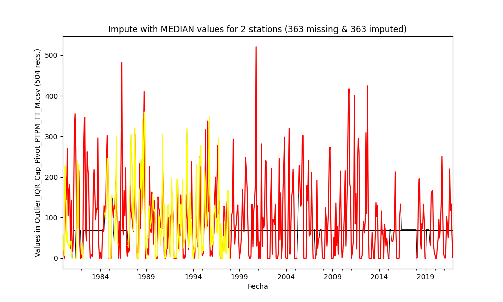

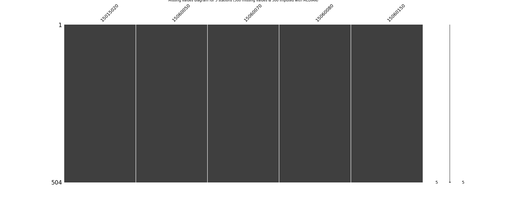

|          |   count |     mean |      std |   min |     25% |    50% |     75% |      max |
|---------:|--------:|---------:|---------:|------:|--------:|-------:|--------:|---------:|
| 15015020 |     504 |  50.0217 |  62.2231 |     0 |  12.225 |  30.1  |  60.275 |  394.056 |
| 15060050 |     504 |  87.4802 |  82.3426 |     0 |  15     |  74    | 132.475 |  489.2   |
| 15060070 |     504 |  98.0797 |  91.7785 |     0 |  33.025 |  82    | 132.25  |  580.127 |
| 15060080 |     504 |  98.3394 |  91.3073 |     0 |  15     |  83    | 148.25  |  520.264 |
| 15060150 |     504 |  72.1262 |  80.4786 |     0 |   8     |  46.1  | 107.375 |  383     |
| 15065040 |     504 |  59.0272 |  41.769  |     0 |  53     |  53    |  53     |  237.7   |
| 16050240 |     504 | 169.724  | 103.616  |     0 | 123.5   | 156    | 186.25  |  792.155 |
| 16060010 |     504 | 304.344  | 206.676  |     0 | 146.25  | 284.5  | 426.25  | 1005     |
| 16070010 |     504 | 408.513  | 249.274  |     0 | 228.5   | 396    | 549.5   | 1444     |
| 16070020 |     504 | 374.423  | 149.02   |     0 | 366     | 366    | 366     | 1210     |
| 16070030 |     504 | 378.552  | 192.892  |     0 | 312     | 359    | 408     | 1351     |
| 16070040 |     504 | 352.985  | 202.11   |     8 | 215     | 341    | 469.5   | 1173     |
| 23210020 |     504 | 147.496  | 106.769  |     0 | 102.825 | 130    | 160     |  649     |
| 23215050 |     504 | 230.058  | 205.289  |     0 |  83.15  | 182.3  | 316.6   | 1094.2   |
| 23215060 |     504 | 126.766  |  57.5969 |     0 | 122.9   | 122.9  | 122.9   |  422     |
| 25020090 |     504 | 162.828  | 142.447  |     0 |  44.925 | 139    | 246.525 |  808.61  |
| 25020220 |     504 | 125.939  | 101.517  |     0 |  43.45  | 111.1  | 189.725 |  534     |
| 25020230 |     504 | 163.481  | 136.832  |     0 |  60     | 137    | 236.5   |  799.943 |
| 25020240 |     504 | 136.312  | 120.133  |     0 |  43     | 112.5  | 194     |  735     |
| 25020250 |     504 | 142.547  | 118.103  |     0 |  48.15  | 117.9  | 208.225 |  644.3   |
| 25020260 |     504 | 221.094  | 167.65   |     0 |  90     | 205    | 313.75  |  996.014 |
| 25020270 |     504 | 168.423  | 143.757  |     0 |  48     | 136    | 259.75  |  627     |
| 25020280 |     504 | 125.024  | 113.617  |     0 |  40     | 102    | 181     |  661.486 |
| 25020650 |     504 | 148.606  | 153.408  |     0 |  39.65  | 115    | 202.1   |  959.998 |
| 25020660 |     504 | 155.508  | 132.245  |     0 |  49.725 | 127.1  | 230     |  679     |
| 25020670 |     504 | 143.771  | 123.533  |     0 |  37     | 118    | 225.25  |  727.269 |
| 25020690 |     504 | 153.358  | 146.017  |     0 |  37     | 112    | 233.5   |  753     |
| 25020870 |     504 | 155.465  | 134.747  |     0 |  45     | 136    | 229.75  |  835     |
| 25020880 |     504 | 192.959  | 158.525  |     0 |  62.75  | 163.5  | 290     |  764     |
| 25020890 |     504 | 154.745  | 125.559  |     0 |  51     | 130    | 234     |  593     |
| 25020900 |     504 | 130.737  | 113.568  |     0 |  30     | 106    | 203.5   |  510     |
| 25020920 |     504 | 128.942  | 148.638  |     0 |  40     |  88.5  | 160.25  |  918.023 |
| 25021040 |     504 | 161.823  | 138.949  |     0 |  45     | 139    | 245.25  |  739     |
| 25021090 |     504 | 156.063  | 137.502  |     0 |  43.875 | 125    | 229.125 |  680     |
| 25021200 |     504 | 188.533  | 164.847  |     0 |  51     | 149    | 277.75  |  934     |
| 25021240 |     504 | 169.907  | 147.9    |     0 |  46.875 | 141.85 | 265     |  696.6   |
| 25021320 |     504 | 160.134  | 139.241  |     0 |  50     | 133    | 238.25  |  744     |
| 25021380 |     504 | 165.749  | 135.763  |     0 |  56     | 140    | 245     |  724     |
| 25021500 |     504 |  98.947  |  73.8819 |     0 |  41.75  |  88    | 143.125 |  368     |
| 25021540 |     504 | 177.546  | 142.771  |     0 |  68.75  | 144.5  | 262.25  |  721     |
| 25021580 |     504 | 122.576  |  73.2053 |     0 | 109.5   | 109.5  | 109.5   |  494     |
| 25021590 |     504 | 130.177  |  72.1943 |     0 | 125.8   | 125.8  | 125.8   |  512.2   |
| 25021620 |     504 | 114.752  |  87.5186 |     0 |  48     | 101.5  | 159.25  |  534.242 |
| 25021630 |     504 | 110.031  |  74.8719 |     0 |  53.75  |  99    | 160     |  370     |
| 25021640 |     504 | 141.712  | 124.472  |     0 |  49.775 | 115.5  | 195.95  |  717     |
| 25021650 |     504 | 128.185  | 119.64   |     0 |  41.925 | 102.6  | 177.15  |  715.84  |
| 25025090 |     504 | 162.975  | 129.389  |     0 |  59.8   | 139.15 | 240.85  |  609.3   |
| 25025250 |     504 | 133.687  | 110.376  |     0 |  49.55  | 115.4  | 180.6   |  549.9   |
| 25025300 |     504 | 109.607  |  89.882  |     0 |  38.375 |  90.9  | 158.175 |  459.2   |
| 25025330 |     504 | 157.148  | 107.437  |     0 |  93.65  | 142    | 199.1   |  693     |
| 28010020 |     504 |  71.4147 |  72.386  |     0 |  25     |  55    |  89.25  |  478.212 |
| 28010040 |     504 | 151.674  | 127.945  |     0 |  49.075 | 130.1  | 218.375 |  748.7   |
| 28010070 |     504 | 113.752  |  99.1697 |     0 |  41.575 |  98.3  | 165.25  |  581     |
| 28010090 |     504 |  91.1567 |  91.2604 |     0 |  12     |  71.5  | 134.925 |  520.861 |
| 28010130 |     504 | 178.631  | 111.294  |     0 | 162     | 162    | 162     | 1009     |
| 28010140 |     504 | 110.327  |  98.1491 |     0 |  89     |  89    |  89.25  |  630     |
| 28010200 |     504 |  80.2858 |  86.9755 |     0 |   8.35  |  52    | 124.7   |  488.941 |
| 28010280 |     504 |  26.7817 |  10.3195 |     2 |  26     |  26    |  26     |  169     |
| 28010340 |     504 |  99.1464 |  91.4642 |     0 |  19.5   |  82.5  | 150.5   |  457     |
| 28010360 |     504 | 166.508  | 198.959  |     0 |  23.15  | 102.05 | 239.55  | 1127.8   |
| 28010370 |     504 | 108.251  |  94.152  |     0 |  26     |  88    | 171     |  508     |
| 28015070 |     504 |  97.9294 |  83.8531 |     0 |  28.475 |  87.9  | 149.775 |  456.1   |
| 28020080 |     504 | 113.683  | 100.629  |     0 |  35     |  94    | 165.25  |  590.828 |
| 28020150 |     504 | 105.806  |  81.8623 |     0 |  50.75  |  89.2  | 146     |  518     |
| 28020230 |     504 | 118.376  |  87.9265 |     0 | 103     | 110.1  | 114.1   |  675.7   |
| 28020310 |     504 | 164.588  | 112.469  |     0 | 136     | 145    | 161.25  |  723     |
| 28020410 |     504 | 104.415  |  95.0995 |     0 |  32.6   |  82    | 148.25  |  565.7   |
| 28020420 |     504 | 120.272  | 102.831  |     0 |  45.5   | 102    | 168.25  |  567     |
| 28020440 |     504 | 126.904  | 100.626  |     0 |  45.975 | 109.4  | 189.5   |  610.6   |
| 28020460 |     504 | 128.235  | 107.898  |     0 |  47     | 104.5  | 192     |  591     |
| 28020590 |     504 | 101.369  |  86.3406 |     0 |  35     |  83.3  | 143.5   |  542     |
| 28020600 |     504 | 110.22   |  93.8657 |     0 |  37     |  86    | 167.475 |  552.088 |
| 28025020 |     504 | 110.664  |  81.3919 |     0 |  42.475 | 104.8  | 163.475 |  421.2   |
| 28025040 |     504 |  78.2353 |  54.177  |     0 |  68.8   |  68.8  |  68.8   |  360.6   |
| 28025070 |     504 | 131.555  | 104.05   |     0 |  47.95  | 114.7  | 194.45  |  550.8   |
| 28025080 |     504 | 123.161  |  81.6553 |     0 |  77.575 | 113    | 147.45  |  496.9   |
| 28025090 |     504 | 123.726  |  97.0636 |     0 |  45.55  | 110.3  | 186.375 |  504.6   |
| 28030190 |     504 |  93.3151 |  86.66   |     0 |  14.475 |  82.8  | 144.55  |  450.8   |
| 28030220 |     504 |  79.7058 |  82.1468 |     0 |  14     |  58.3  | 113.375 |  497.601 |
| 28035010 |     504 | 109.593  |  88.0548 |     0 |  35.3   |  95.75 | 163     |  479.6   |
| 28035020 |     504 |  97.6929 |  82.0217 |     0 |  23.55  |  85.35 | 149.55  |  464.2   |
| 28035040 |     504 | 106.91   |  83.1978 |     0 |  35.5   |  97.45 | 152.95  |  425     |
| 28040010 |     504 | 177.7    | 149.703  |     0 |  53.75  | 157.5  | 261.25  |  869.048 |
| 28040030 |     504 | 115.271  | 120.457  |     0 |  29.5   |  90    | 155.225 |  681.291 |
| 28040060 |     504 |  81.6371 |  53.8046 |     0 |  72.5   |  72.5  |  72.5   |  500     |
| 28040070 |     504 | 111.331  |  87.6227 |     0 |  40     | 100    | 165     |  415     |
| 28040100 |     504 | 144.075  | 106.79   |     0 |  54.75  | 137    | 205     |  635.172 |
| 28040140 |     504 |  95.5776 |  84.8637 |     0 |  25     |  76.15 | 143.125 |  435     |
| 28040150 |     504 | 115.039  |  88.9526 |     0 |  48.75  | 107    | 157.175 |  541.15  |
| 28040170 |     504 |  72.0042 |  59.7067 |     0 |  60.5   |  60.5  |  60.5   |  505     |
| 28040200 |     504 |  93.1321 |  45.5777 |     0 |  91     |  91    |  91     |  374     |
| 28040270 |     504 | 107.011  |  87.6824 |     0 |  32.75  |  98    | 153.25  |  512.18  |
| 28040300 |     504 | 113.901  |  95.3284 |     0 |  43.75  |  96    | 155     |  564     |
| 28040310 |     504 | 110.491  |  80.0968 |     0 |  60.75  | 101    | 137     |  521     |
| 28040320 |     504 | 123.828  |  95.185  |     0 |  53.25  | 107    | 172     |  491     |
| 28040350 |     504 | 110.307  |  98.2992 |     0 |  31.8   |  93.6  | 160.8   |  578     |
| 28040360 |     504 | 124.171  |  91.4999 |     0 |  52.75  | 116    | 174     |  552.693 |
| 28040400 |     504 |  98.0909 |  73.6232 |     0 |  52.75  |  85    | 127.25  |  398     |
| 28045010 |     504 | 109.812  |  90.2334 |     0 |  93.3   |  93.3  |  93.3   |  502.1   |
| 29060030 |     504 | 111.936  | 119.007  |     0 |   5.75  |  84.2  | 174.25  |  652.526 |
| 29060040 |     504 | 118.918  | 113.616  |     0 |  28.875 |  97    | 171.25  |  639.993 |
| 29060060 |     504 | 213.597  | 186.792  |     0 |  53.75  | 180    | 322.5   |  944     |
| 29060070 |     504 | 199.104  | 158.763  |     0 |  62.5   | 179    | 306     |  927     |
| 29060090 |     504 | 109.582  |  77.5791 |     0 |  42.75  | 106    | 168     |  382     |
| 29060100 |     504 | 130.562  | 109.441  |     0 |  40     | 117.5  | 189     |  665     |
| 29060120 |     504 |  30.2694 |  55.9905 |     0 |   0     |   6    |  30     |  303.921 |
| 29060140 |     504 | 131.118  | 150.995  |     0 |   7.75  |  87    | 201     |  826.16  |
| 29060150 |     504 | 133.491  | 130.62   |     0 |  25     | 100.5  | 215.25  |  737.271 |
| 29060160 |     504 |  82.34   | 102.105  |     0 |   0     |  40    | 134.225 |  564.2   |
| 29060170 |     504 |  78.9089 |  92.4017 |     0 |   0     |  46    | 134.075 |  505     |
| 29060180 |     504 | 115.756  | 148.054  |     0 |   0     |  69.5  | 166.5   |  796.306 |
| 29060190 |     504 | 100.696  | 108      |     0 |  15.75  |  71.5  | 138     |  643.811 |
| 29060200 |     504 | 117.992  | 111.801  |     0 |  27.75  | 100    | 173     |  637     |
| 29060210 |     504 |  69.8928 |  83.2652 |     0 |   1.2   |  39.4  | 108.15  |  453.599 |
| 29060220 |     504 |  89.8386 | 109.667  |     0 |  61.5   |  64.5  |  67.5   |  799.53  |
| 29060230 |     504 |  93.4028 |  93.6266 |     0 |  20.5   |  72    | 121     |  549     |
| 29060240 |     504 |  99.7842 | 122.42   |     0 |   0     |  67    | 154.25  |  720.851 |
| 29060250 |     504 |  82.3947 | 101.405  |     0 |   0     |  50    | 120.375 |  546.36  |
| 29060270 |     504 |  86.7819 |  99.4935 |     0 |   0     |  56    | 132     |  519     |
| 29060280 |     504 |  68.147  |  86.5058 |     0 |   0     |  35.2  | 107.625 |  482.9   |
| 29060290 |     504 |  81.5204 |  90.1733 |     0 |  60     |  60    |  60     |  627     |
| 29060310 |     504 |  78.6707 | 109.789  |     0 |   0     |  33    | 128     |  604.211 |
| 29060330 |     504 | 114.414  | 100.239  |     0 |  97     |  97    |  97     |  615     |
| 29060340 |     504 | 191.996  | 163.528  |     0 |  59.75  | 165.5  | 276.5   |  875     |
| 29060350 |     504 | 104.736  | 109.803  |     0 |  10.95  |  76.7  | 159     |  626.681 |
| 29060550 |     504 |  89.0283 |  93.8415 |     0 |  23     |  68    | 106.25  |  595.759 |
| 29060560 |     504 |  93.73   |  93.1461 |     0 |  25     |  68.5  | 128.25  |  553.117 |
| 29065010 |     504 |  76.1931 |  46.3184 |     0 |  70.65  |  70.65 |  70.65  |  366.7   |
| 29065020 |     504 | 101.311  | 104.376  |     0 |  10.775 |  74.05 | 155.875 |  563.1   |
| 29065030 |     504 | 116.534  | 110.764  |     0 |  23.95  |  96.5  | 162.425 |  637.9   |

### Method 3 - Imputing with Last Observation Carried Forward (LOCF) values

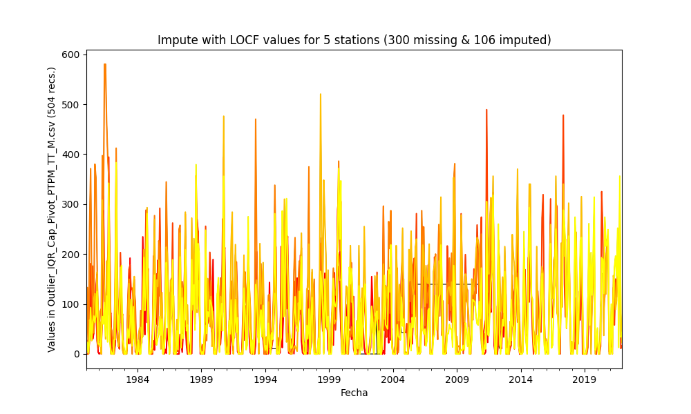

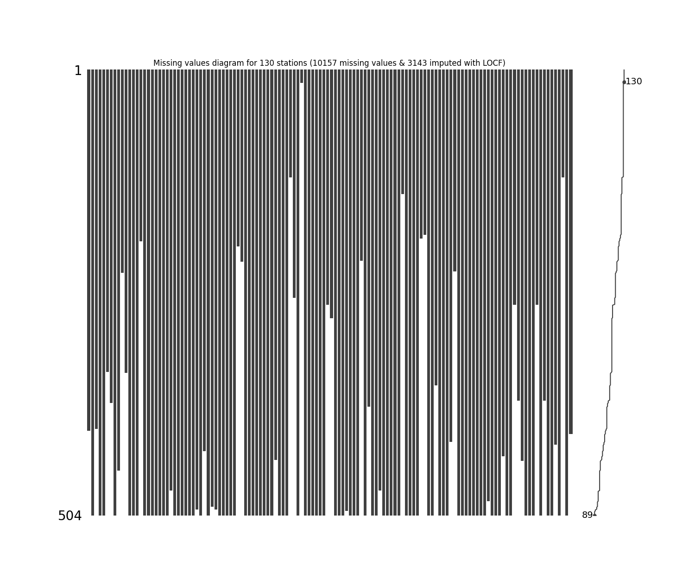

|          |   count |     mean |      std |   min |     25% |    50% |     75% |      max |
|---------:|--------:|---------:|---------:|------:|--------:|-------:|--------:|---------:|
| 15015020 |     408 |  70.1873 |  73.8053 |     0 |   1.5   |  51.2  | 139.5   |  394.056 |
| 15060050 |     504 |  85.5754 |  83.3238 |     0 |  10.5   |  71.9  | 132.475 |  489.2   |
| 15060070 |     406 |  98.1235 | 104.106  |     0 |   7.175 |  75.35 | 146.85  |  580.127 |
| 15060080 |     504 |  98.4942 |  91.3474 |     0 |  15     |  83    | 149     |  520.264 |
| 15060150 |     504 |  72.1262 |  80.4786 |     0 |   8     |  46.1  | 107.375 |  383     |
| 15065040 |     342 |  77.8336 |  56.9421 |     0 |  20.25  |  83.5  | 124     |  237.7   |
| 16050240 |     377 | 154.056  | 133.133  |     0 |  49     | 134    | 224     |  792.155 |
| 16060010 |     504 | 304.344  | 206.676  |     0 | 146.25  | 284.5  | 426.25  | 1005     |
| 16070010 |     453 | 405.518  | 265.859  |     0 | 197     | 388    | 575     | 1444     |
| 16070020 |     230 | 312.648  | 249.51   |     0 | 144     | 164.5  | 487     | 1210     |
| 16070030 |     343 | 398.378  | 240.054  |     0 | 233.5   | 378    | 542.5   | 1351     |
| 16070040 |     504 | 356.642  | 202.87   |     8 | 215     | 358    | 469.5   | 1173     |
| 23210020 |     504 | 165.338  | 107.483  |     0 |  99.75  | 183    | 183     |  649     |
| 23215050 |     504 | 231.5    | 205.603  |     0 |  79.8   | 195.45 | 319     | 1094.2   |
| 23215060 |     194 | 134.019  |  93.4098 |     0 |  69.55  | 126.2  | 177.45  |  422     |
| 25020090 |     504 | 163.61   | 143.305  |     0 |  44.925 | 140.7  | 246.7   |  808.61  |
| 25020220 |     504 | 126.024  | 101.522  |     0 |  43.45  | 111.25 | 189.725 |  534     |
| 25020230 |     504 | 160.783  | 139.087  |     0 |  55.45  | 130    | 238.725 |  799.943 |
| 25020240 |     504 | 137.111  | 120.77   |     0 |  43     | 113.5  | 195     |  735     |
| 25020250 |     504 | 143.011  | 118.262  |     0 |  48.15  | 118.45 | 209.35  |  644.3   |
| 25020260 |     504 | 218.147  | 170.026  |     0 |  81.75  | 201    | 316.5   |  996.014 |
| 25020270 |     504 | 168.437  | 143.754  |     0 |  48     | 137    | 259.75  |  627     |
| 25020280 |     476 | 126.761  | 116.88   |     0 |  36.5   | 104    | 184     |  661.486 |
| 25020650 |     504 | 140.727  | 161.125  |     0 |  16     |  99.75 | 216.7   |  959.998 |
| 25020660 |     504 | 155.458  | 132.264  |     0 |  49.725 | 127.1  | 230     |  679     |
| 25020670 |     504 | 145.312  | 126.272  |     0 |  36.75  | 117.6  | 243.2   |  727.269 |
| 25020690 |     504 | 153.358  | 146.017  |     0 |  37     | 112    | 233.5   |  753     |
| 25020870 |     504 | 158.604  | 136.999  |     0 |  45     | 137.65 | 242.25  |  835     |
| 25020880 |     504 | 195.125  | 162.331  |     0 |  58.75  | 162.5  | 292.5   |  764     |
| 25020890 |     497 | 154.615  | 127.766  |     0 |  47     | 130    | 236     |  593     |
| 25020900 |     504 | 130.266  | 114.321  |     0 |  30     | 106    | 203.5   |  510     |
| 25020920 |     431 | 138.037  | 164.029  |     0 |  32     |  91    | 181     |  918.023 |
| 25021040 |     504 | 161.6    | 139.075  |     0 |  45     | 138.5  | 245.25  |  739     |
| 25021090 |     494 | 155.128  | 141.369  |     0 |  37     | 119    | 236.75  |  680     |
| 25021200 |     497 | 189.126  | 166.082  |     0 |  51     | 152    | 281     |  934     |
| 25021240 |     504 | 169.907  | 147.9    |     0 |  46.875 | 141.85 | 265     |  696.6   |
| 25021320 |     504 | 160.18   | 139.951  |     0 |  47     | 134    | 239.25  |  744     |
| 25021380 |     504 | 165.263  | 137.629  |     0 |  51.75  | 134.5  | 251.25  |  724     |
| 25021500 |     504 |  96.8518 |  75.3979 |     0 |  37.75  |  86    | 143.125 |  368     |
| 25021540 |     504 | 178.068  | 144.628  |     0 |  64.75  | 143    | 265     |  721     |
| 25021580 |     200 | 136.002  | 118.193  |     0 |  44.925 | 102.5  | 208.75  |  494     |
| 25021590 |     217 | 142.376  | 113.492  |     0 |  44.5   | 132    | 222     |  512.2   |
| 25021620 |     504 | 111.919  |  88.5461 |     0 |  48     |  94    | 159.25  |  534.242 |
| 25021630 |     504 | 109.987  |  75.7849 |     0 |  48.75  | 106    | 160     |  370     |
| 25021640 |     504 | 128.015  | 132.722  |     0 |  12.575 |  92.75 | 195.95  |  717     |
| 25021650 |     504 | 116.428  | 126.733  |     0 |   1.125 |  88    | 180     |  715.84  |
| 25025090 |     504 | 159.744  | 135.467  |     0 |  45.6   | 132.6  | 244.925 |  609.3   |
| 25025250 |     504 | 135.179  | 116.602  |     0 |  31     | 112.65 | 201.2   |  549.9   |
| 25025300 |     504 | 108.364  |  92.6031 |     0 |  30.775 |  90.4  | 163.8   |  459.2   |
| 25025330 |     504 | 204.367  | 163.486  |     0 |  87.2   | 202    | 247.975 |  693     |
| 28010020 |     441 |  63.5556 |  82.3816 |     0 |   0     |  30    | 104     |  478.212 |
| 28010040 |     504 | 152.138  | 128.672  |     0 |  48.075 | 131.4  | 223.05  |  748.7   |
| 28010070 |     504 |  99.7091 | 107.028  |     0 |   0     |  72    | 165.25  |  581     |
| 28010090 |     504 |  88.0559 |  93.1409 |     0 |   5     |  65    | 135     |  520.861 |
| 28010130 |     122 | 230.704  | 218.823  |     0 |  60     | 162    | 342.25  | 1009     |
| 28010140 |     258 | 132.704  | 135.744  |     0 |  25     |  89    | 198.875 |  630     |
| 28010200 |     504 |  78.6533 |  88.2696 |     0 |   2.425 |  48.85 | 124.7   |  488.941 |
| 28010280 |      15 |  52.2667 |  55.7577 |     2 |  12.5   |  26    |  77     |  169     |
| 28010340 |     504 |  97.1821 |  92.6808 |     0 |   9.8   |  80.2  | 150.5   |  457     |
| 28010360 |     504 | 186.405  | 206.151  |     0 |  23.15  | 121.35 | 299.85  | 1127.8   |
| 28010370 |     504 | 108.636  |  94.2843 |     0 |  26     |  88    | 172.25  |  508     |
| 28015070 |     504 |  98.1341 |  84.588  |     0 |  28.475 |  86.6  | 150.5   |  456.1   |
| 28020080 |     504 | 112.489  | 107.431  |     0 |  19.75  |  89    | 168.5   |  590.828 |
| 28020150 |     504 |  92.8863 |  90.1048 |     0 |   7.875 |  77    | 146     |  518     |
| 28020230 |     266 | 125.781  | 120.656  |     0 |  24.775 | 110.1  | 179.875 |  675.7   |
| 28020310 |     281 | 180.133  | 148.914  |     0 |  63     | 145    | 261     |  723     |
| 28020410 |     504 | 105.19   |  98.1142 |     0 |  28     |  81    | 156.25  |  565.7   |
| 28020420 |     504 | 118.976  | 106.884  |     0 |  26     | 103    | 178     |  567     |
| 28020440 |     504 | 127.49   | 101.473  |     0 |  45     | 110    | 195     |  610.6   |
| 28020460 |     499 | 128.518  | 108.406  |     0 |  46.5   | 105    | 192.5   |  591     |
| 28020590 |     504 | 116.528  | 101.58   |     0 |  32     |  91    | 174.675 |  542     |
| 28020600 |     504 | 110.863  |  95.6262 |     0 |  36     |  84    | 173.25  |  552.088 |
| 28025020 |     504 | 110.764  |  83.4755 |     0 |  40.15  | 104.3  | 165.225 |  421.2   |
| 28025040 |     216 |  92.362  |  83.1571 |     0 |  31.475 |  75.45 | 123     |  360.6   |
| 28025070 |     504 | 131.555  | 104.05   |     0 |  47.95  | 114.7  | 194.45  |  550.8   |
| 28025080 |     381 | 117.71   |  99.4725 |     0 |  34     | 101.7  | 175.7   |  496.9   |
| 28025090 |     504 | 124.055  |  97.3514 |     0 |  45.3   | 110.5  | 187.725 |  504.6   |
| 28030190 |     504 |  93.3151 |  86.66   |     0 |  14.475 |  82.8  | 144.55  |  450.8   |
| 28030220 |     476 |  80.2359 |  86.7697 |     0 |   4     |  65    | 120     |  497.601 |
| 28035010 |     504 | 110.846  |  91.4069 |     0 |  28     |  94.8  | 169     |  479.6   |
| 28035020 |     504 |  94.1312 |  84.3314 |     0 |  15.75  |  79.85 | 149.55  |  464.2   |
| 28035040 |     504 | 106.597  |  84.6272 |     0 |  32.425 |  96.5  | 153.65  |  425     |
| 28040010 |     504 | 177.7    | 149.703  |     0 |  53.75  | 157.5  | 261.25  |  869.048 |
| 28040030 |     504 | 115.939  | 120.532  |     0 |  29.5   |  90    | 159.25  |  681.291 |
| 28040060 |     141 | 105.107  |  98.1388 |     0 |  30     |  72    | 152     |  500     |
| 28040070 |     504 | 110.418  |  88.0406 |     0 |  39.25  |  95    | 165     |  415     |
| 28040100 |     504 | 146.403  | 108.263  |     0 |  54     | 138.5  | 213     |  635.172 |
| 28040140 |     504 |  95.202  |  85.6885 |     0 |  24     |  74.25 | 143.625 |  435     |
| 28040150 |     504 | 111.277  |  90.2614 |     0 |  48.75  |  92.6  | 157.175 |  541.15  |
| 28040170 |     191 |  81.5372 | 101.787  |     0 |  17.95  |  48.5  |  96.55  |  505     |
| 28040200 |     187 |  96.7465 |  74.8121 |     0 |  33.5   |  91    | 146.5   |  374     |
| 28040270 |     504 | 106.134  |  88.0988 |     0 |  32     |  92    | 153.25  |  512.18  |
| 28040300 |     504 | 117.113  | 108.79   |     0 |  35.75  |  95    | 162.25  |  564     |
| 28040310 |     357 | 114.399  |  94.932  |     0 |  40     | 101    | 165     |  521     |
| 28040320 |     504 | 120.517  |  97.4054 |     0 |  46     | 104    | 172     |  491     |
| 28040350 |     504 | 110.307  |  98.2992 |     0 |  31.8   |  93.6  | 160.8   |  578     |
| 28040360 |     504 | 124.256  |  91.5123 |     0 |  52.75  | 116.5  | 174     |  552.693 |
| 28040400 |     421 |  99.9487 |  80.9806 |     0 |  38     |  86.2  | 138     |  398     |
| 28045010 |     228 | 129.799  | 131.563  |     0 |   0     |  93.3  | 224.7   |  502.1   |
| 29060030 |     504 | 111.876  | 119.029  |     0 |   5.75  |  84.1  | 174.25  |  652.526 |
| 29060040 |     504 | 118.484  | 113.783  |     0 |  28.875 |  94.75 | 171.25  |  639.993 |
| 29060060 |     504 | 213.548  | 189.4    |     0 |  49.75  | 180    | 324.25  |  944     |
| 29060070 |     504 | 198.654  | 159.034  |     0 |  61     | 179    | 306     |  927     |
| 29060090 |     504 | 109.848  |  77.7128 |     0 |  42.75  | 106.5  | 168     |  382     |
| 29060100 |     504 | 130.562  | 109.441  |     0 |  40     | 117.5  | 189     |  665     |
| 29060120 |     504 |  30.2694 |  55.9905 |     0 |   0     |   6    |  30     |  303.921 |
| 29060140 |     504 | 131.049  | 151.023  |     0 |   7.75  |  86.5  | 201     |  826.16  |
| 29060150 |     488 | 134.573  | 132.61   |     0 |  21.75  | 100.5  | 217.25  |  737.271 |
| 29060160 |     504 |  81.34   | 102.681  |     0 |   0     |  35.65 | 134.225 |  564.2   |
| 29060170 |     504 |  79.0121 |  92.3939 |     0 |   0     |  46.5  | 134.075 |  505     |
| 29060180 |     504 | 116.229  | 148.299  |     0 |   0     |  70    | 168     |  796.306 |
| 29060190 |     437 | 103.551  | 118.468  |     0 |   0     |  65    | 157     |  643.811 |
| 29060200 |     504 | 118.643  | 111.895  |     0 |  26.75  | 106    | 175.25  |  637     |
| 29060210 |     504 |  69.927  |  83.3005 |     0 |   1.2   |  39.2  | 108.15  |  453.599 |
| 29060220 |     266 | 111.608  | 147.909  |     0 |   0     |  64    | 155     |  799.53  |
| 29060230 |     374 | 100.832  | 107.734  |     0 |   6     |  71    | 157     |  549     |
| 29060240 |     442 | 104.231  | 130.165  |     0 |   0     |  66.5  | 170     |  720.851 |
| 29060250 |     504 |  81.9502 | 101.646  |     0 |   0     |  49.35 | 120.375 |  546.36  |
| 29060270 |     504 |  86.7323 |  99.5526 |     0 |   0     |  55    | 132     |  519     |
| 29060280 |     504 |  66.7821 |  87.2871 |     0 |   0     |  28    | 107.625 |  482.9   |
| 29060290 |     266 | 100.211  | 122.769  |     0 |   0     |  58    | 143.75  |  627     |
| 29060310 |     504 |  78.6707 | 109.789  |     0 |   0     |  33    | 128     |  604.211 |
| 29060330 |     374 |  89.8575 | 130.451  |     0 |   0     |  15    | 138.75  |  615     |
| 29060340 |     504 | 194.013  | 164.957  |     0 |  58.75  | 166.5  | 290     |  875     |
| 29060350 |     504 | 109.582  | 111.082  |     0 |  10     |  82    | 173.25  |  626.681 |
| 29060550 |     424 |  85.2117 | 106.921  |     0 |   4     |  40    | 135.25  |  595.759 |
| 29060560 |     504 |  85.3392 |  97.9978 |     0 |   5     |  50.5  | 128.25  |  553.117 |
| 29065010 |     122 |  93.5492 |  92.2916 |     0 |  11.1   |  70.65 | 151.225 |  366.7   |
| 29065020 |     504 | 100.206  | 105.281  |     0 |  10     |  70.4  | 157.125 |  563.1   |
| 29065030 |     412 | 121.007  | 122.086  |     0 |  11.3   |  96.5  | 179.975 |  637.9   |

### Method 4 - Imputing with Next Observation Carried Backward (NOCB) values

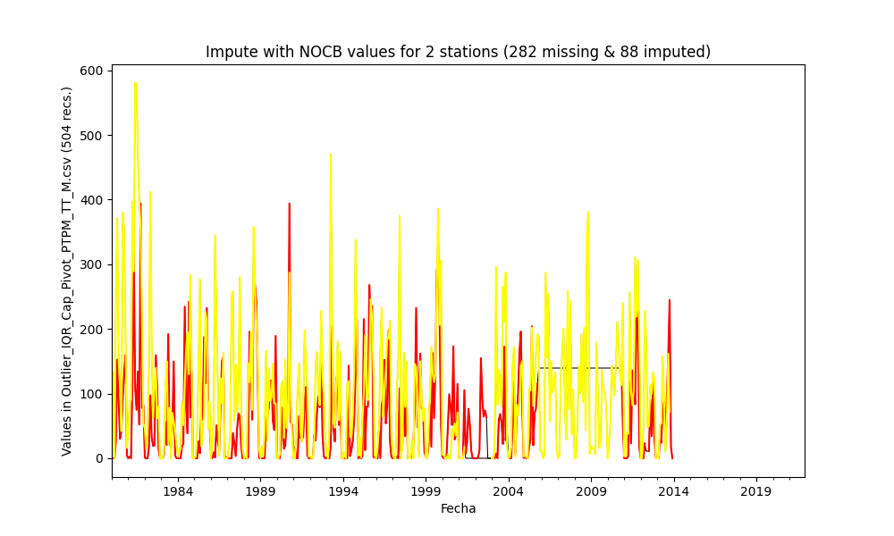

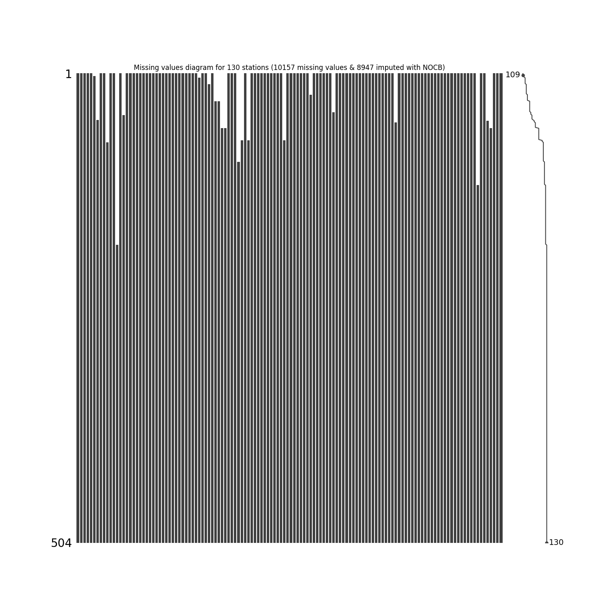

|          |   count |     mean |      std |   min |     25% |    50% |     75% |      max |
|---------:|--------:|---------:|---------:|------:|--------:|-------:|--------:|---------:|
| 15015020 |     504 |  54.6675 |  68.6241 |     0 |   0     |  23.05 | 110.55  |  394.056 |
| 15060050 |     504 |  86.123  |  83.3989 |     0 |  10.1   |  73.2  | 133     |  489.2   |
| 15060070 |     504 |  93.6848 |  93.4057 |     0 |  18.575 |  72    | 132.25  |  580.127 |
| 15060080 |     504 |  98.3612 |  91.305  |     0 |  15     |  83    | 148.25  |  520.264 |
| 15060150 |     504 |  72.1262 |  80.4786 |     0 |   8     |  46.1  | 107.375 |  383     |
| 15065040 |     501 |  69.2156 |  53.3627 |     0 |   5.6   |  86    | 104.9   |  237.7   |
| 16050240 |     454 | 226.624  | 134.623  |     0 | 111.25  | 219.95 | 354     |  792.155 |
| 16060010 |     504 | 304.344  | 206.676  |     0 | 146.25  | 284.5  | 426.25  | 1005     |
| 16070010 |     504 | 421.466  | 254.652  |     0 | 220.75  | 433    | 568     | 1444     |
| 16070020 |     430 | 375.453  | 162.083  |     0 | 366     | 366    | 366     | 1210     |
| 16070030 |     504 | 390.49   | 196.475  |     0 | 309.5   | 380    | 423     | 1351     |
| 16070040 |     504 | 346.702  | 209.566  |     8 | 185.75  | 340.5  | 471.25  | 1173     |
| 23210020 |     320 | 150.934  | 136.594  |     0 |  32.75  | 113.75 | 231     |  649     |
| 23215050 |     504 | 236.717  | 206.501  |     0 |  79.8   | 195.2  | 319     | 1094.2   |
| 23215060 |     459 |  71.0963 |  75.2655 |     0 |  40     |  40    |  40     |  422     |
| 25020090 |     504 | 163.151  | 142.928  |     0 |  44.925 | 138.5  | 246.7   |  808.61  |
| 25020220 |     504 | 125.915  | 101.522  |     0 |  43.45  | 111.05 | 189.725 |  534     |
| 25020230 |     504 | 161.612  | 138.489  |     0 |  55.75  | 130.5  | 238.175 |  799.943 |
| 25020240 |     504 | 136.286  | 120.218  |     0 |  43     | 112.5  | 194     |  735     |
| 25020250 |     504 | 142.177  | 118.361  |     0 |  47.975 | 117.8  | 208.225 |  644.3   |
| 25020260 |     504 | 223.058  | 168.122  |     0 |  90     | 209.5  | 323     |  996.014 |
| 25020270 |     504 | 168.999  | 144.172  |     0 |  48     | 136.5  | 263.25  |  627     |
| 25020280 |     504 | 126.954  | 113.591  |     0 |  40     | 106    | 181     |  661.486 |
| 25020650 |     504 | 133.947  | 161.208  |     0 |   6.75  |  90.35 | 202.1   |  959.998 |
| 25020660 |     504 | 155.336  | 132.332  |     0 |  48.825 | 126    | 230     |  679     |
| 25020670 |     504 | 141.204  | 125.732  |     0 |  31     | 119    | 225.25  |  727.269 |
| 25020690 |     504 | 153.358  | 146.017  |     0 |  37     | 112    | 233.5   |  753     |
| 25020870 |     504 | 154.272  | 135.921  |     0 |  43     | 133.5  | 232.25  |  835     |
| 25020880 |     504 | 192.534  | 159.193  |     0 |  62.75  | 159    | 290     |  764     |
| 25020890 |     504 | 156.65   | 127.574  |     0 |  49     | 134.5  | 247     |  593     |
| 25020900 |     504 | 130.953  | 114.962  |     0 |  30     | 106    | 208     |  510     |
| 25020920 |     504 | 121.53   | 151.532  |     0 |  40     |  60    | 160.25  |  918.023 |
| 25021040 |     504 | 161.89   | 138.946  |     0 |  45     | 139    | 245.25  |  739     |
| 25021090 |     504 | 151.872  | 141.269  |     0 |  29.55  | 116.5  | 233.75  |  680     |
| 25021200 |     504 | 188.102  | 165.409  |     0 |  51     | 152    | 277.75  |  934     |
| 25021240 |     504 | 169.907  | 147.9    |     0 |  46.875 | 141.85 | 265     |  696.6   |
| 25021320 |     504 | 161.709  | 140.387  |     0 |  49     | 134    | 249     |  744     |
| 25021380 |     499 | 163.973  | 138.914  |     0 |  46     | 139    | 251.5   |  724     |
| 25021500 |     504 |  98.3042 |  74.0919 |     0 |  41.75  |  86    | 143.125 |  368     |
| 25021540 |     504 | 176.136  | 143.905  |     0 |  64     | 142.5  | 262.25  |  721     |
| 25021580 |     492 | 106.521  |  78.0475 |     0 |  83     |  83    |  83     |  494     |
| 25021590 |     504 |  58.527  |  98.6414 |     0 |   0     |   0    | 105.875 |  512.2   |
| 25021620 |     474 | 116.079  |  90.4484 |     0 |  46     | 102    | 162.75  |  534.242 |
| 25021630 |     474 | 109.387  |  77.7766 |     0 |  49.25  |  96    | 163     |  370     |
| 25021640 |     445 | 145.41   | 132.098  |     0 |  38.7   | 117.5  | 213     |  717     |
| 25021650 |     445 | 131.176  | 127.156  |     0 |  31.7   | 102    | 197     |  715.84  |
| 25025090 |     504 | 159.604  | 136.435  |     0 |  44     | 129.65 | 245.05  |  609.3   |
| 25025250 |     504 | 126.083  | 115.38   |     0 |  28.15  | 106.55 | 181.425 |  549.9   |
| 25025300 |     504 | 111.923  |  90.9075 |     0 |  37.35  |  96.75 | 160.15  |  459.2   |
| 25025330 |     409 | 166.95   | 137.48   |     0 |  47     | 145.6  | 255.8   |  693     |
| 28010020 |     432 |  77.2825 |  78.2841 |     0 |  15     |  68.5  | 110     |  478.212 |
| 28010040 |     504 | 151.893  | 129.077  |     0 |  48     | 130.1  | 221.25  |  748.7   |
| 28010070 |     432 | 116.327  | 106.916  |     0 |  32.75  |  98.3  | 179.75  |  581     |
| 28010090 |     504 |  92.3848 |  92.2593 |     0 |  10     |  74    | 134.925 |  520.861 |
| 28010130 |     504 |  58.1188 | 145.087  |     0 |   3     |   3    |   3     | 1009     |
| 28010140 |     504 |  85.7976 | 109.529  |     0 |  37     |  37    |  90.5   |  630     |
| 28010200 |     504 |  76.881  |  89.0142 |     0 |   0     |  43.9  | 124.7   |  488.941 |
| 28010280 |     504 |  14.1687 |  11.4517 |     2 |  13     |  13    |  13     |  169     |
| 28010340 |     504 |  97.5631 |  92.312  |     0 |  16     |  80.2  | 150.5   |  457     |
| 28010360 |     504 | 170.039  | 198.245  |     0 |  23.15  | 121.35 | 239.55  | 1127.8   |
| 28010370 |     504 | 107.894  |  94.3498 |     0 |  24.75  |  86.5  | 171     |  508     |
| 28015070 |     504 |  97.8329 |  84.013  |     0 |  28.375 |  85.15 | 150.5   |  456.1   |
| 28020080 |     504 | 112.371  | 101.381  |     0 |  35     |  93    | 166.25  |  590.828 |
| 28020150 |     432 | 108.684  |  88.1373 |     0 |  42     |  90.1  | 159     |  518     |
| 28020230 |     504 |  66.3845 | 107.799  |     0 |   0     |   0    | 114.1   |  675.7   |
| 28020310 |     504 | 164.588  | 112.469  |     0 | 136     | 145    | 161.25  |  723     |
| 28020410 |     504 | 109.292  | 103.549  |     0 |  28     |  81.5  | 157     |  565.7   |
| 28020420 |     504 | 115.296  | 105.434  |     0 |  32     |  87    | 168.25  |  567     |
| 28020440 |     504 | 128.085  | 101.612  |     0 |  45.975 | 108.9  | 195.25  |  610.6   |
| 28020460 |     504 | 128.467  | 109.371  |     0 |  47     | 102.5  | 192.25  |  591     |
| 28020590 |     504 | 101.077  |  88.4379 |     0 |  35     |  74.5  | 145.025 |  542     |
| 28020600 |     481 | 117.195  | 101.037  |     0 |  35.7   |  91    | 182.7   |  552.088 |
| 28025020 |     504 | 110.525  |  82.2852 |     0 |  41.975 | 104.8  | 165.225 |  421.2   |
| 28025040 |     504 |  34.7726 |  70.756  |     0 |   0     |   0    |  32.7   |  360.6   |
| 28025070 |     504 | 131.555  | 104.05   |     0 |  47.95  | 114.7  | 194.45  |  550.8   |
| 28025080 |     504 | 152.036  |  91.6648 |     0 |  73.225 | 165.7  | 220.9   |  496.9   |
| 28025090 |     504 | 124.057  |  97.1987 |     0 |  45.55  | 110.5  | 187.725 |  504.6   |
| 28030190 |     504 |  93.3151 |  86.66   |     0 |  14.475 |  82.8  | 144.55  |  450.8   |
| 28030220 |     462 |  86.4195 |  91.2965 |     0 |   0     |  60    | 148     |  497.601 |
| 28035010 |     504 | 108.929  |  90.5012 |     0 |  26.725 |  95    | 164.65  |  479.6   |
| 28035020 |     504 |  99.1234 |  82.531  |     0 |  23.35  |  91.45 | 149.75  |  464.2   |
| 28035040 |     504 | 107.465  |  84.1381 |     0 |  33.375 |  98.05 | 157.075 |  425     |
| 28040010 |     504 | 177.7    | 149.703  |     0 |  53.75  | 157.5  | 261.25  |  869.048 |
| 28040030 |     504 | 117.422  | 122.377  |     0 |  29.5   |  90    | 159.25  |  681.291 |
| 28040060 |     504 |  38.778  |  66.2877 |     0 |  13     |  13    |  13     |  500     |
| 28040070 |     504 | 112.164  |  87.7934 |     0 |  40     | 100    | 165.25  |  415     |
| 28040100 |     504 | 143.615  | 108.684  |     0 |  52     | 135.5  | 209     |  635.172 |
| 28040140 |     504 |  96.9371 |  85.2431 |     0 |  25     |  79.35 | 144.25  |  435     |
| 28040150 |     504 | 108.555  |  92.3778 |     0 |  26.75  |  92.6  | 157.175 |  541.15  |
| 28040170 |     504 | 120.072  |  63.7931 |     0 | 131.4   | 131.4  | 131.4   |  505     |
| 28040200 |     504 | 105.712  |  46.0121 |     0 | 111     | 111    | 111     |  374     |
| 28040270 |     504 | 108.434  |  88.0412 |     0 |  32.75  | 103.85 | 157     |  512.18  |
| 28040300 |     504 | 111.772  |  97.6524 |     0 |  34     |  94.5  | 162     |  564     |
| 28040310 |     504 |  88.3246 |  89.6259 |     0 |  25     |  51    | 137     |  521     |
| 28040320 |     504 | 122.656  |  96.3889 |     0 |  47.75  | 105.5  | 173.25  |  491     |
| 28040350 |     504 | 110.307  |  98.2992 |     0 |  31.8   |  93.6  | 160.8   |  578     |
| 28040360 |     504 | 124.53   |  91.8224 |     0 |  52.75  | 116.5  | 174.25  |  552.693 |
| 28040400 |     451 |  91.5849 |  82.7518 |     0 |  34     |  64    | 136     |  398     |
| 28045010 |     504 | 175.635  |  97.7262 |     0 | 118.225 | 213.5  | 213.5   |  502.1   |
| 29060030 |     504 | 111.975  | 119.001  |     0 |   5.75  |  85.1  | 174.25  |  652.526 |
| 29060040 |     504 | 120.952  | 115.034  |     0 |  28.875 |  99    | 177.875 |  639.993 |
| 29060060 |     504 | 212.925  | 188.525  |     0 |  49.75  | 178.55 | 324     |  944     |
| 29060070 |     504 | 198.472  | 159.161  |     0 |  61     | 179    | 306     |  927     |
| 29060090 |     504 | 109.654  |  77.6038 |     0 |  42.75  | 106.5  | 168     |  382     |
| 29060100 |     504 | 130.562  | 109.441  |     0 |  40     | 117.5  | 189     |  665     |
| 29060120 |     504 |  30.2694 |  55.9905 |     0 |   0     |   6    |  30     |  303.921 |
| 29060140 |     504 | 130.945  | 151.095  |     0 |   7     |  86.5  | 201     |  826.16  |
| 29060150 |     504 | 142.079  | 136.922  |     0 |  25     | 106    | 229     |  737.271 |
| 29060160 |     504 |  85.7936 | 102.852  |     0 |   0     |  45    | 135.95  |  564.2   |
| 29060170 |     504 |  79.0101 |  92.3935 |     0 |   0     |  46.5  | 134.075 |  505     |
| 29060180 |     504 | 115.869  | 148.096  |     0 |   0     |  70    | 166.5   |  796.306 |
| 29060190 |     504 | 107.541  | 110.119  |     0 |   6     |  95    | 138     |  643.811 |
| 29060200 |     504 | 118.502  | 111.873  |     0 |  26.75  | 106    | 173     |  637     |
| 29060210 |     504 |  69.7377 |  83.3506 |     0 |   1.175 |  38.95 | 108.15  |  453.599 |
| 29060220 |     504 |  62.7532 | 125.77   |     0 |   0     |   0    |  75.75  |  799.53  |
| 29060230 |     504 |  74.2599 | 102.96   |     0 |   0     |  17    | 121     |  549     |
| 29060240 |     504 | 122.493  | 130.864  |     0 |   0     |  94.5  | 221.25  |  720.851 |
| 29060250 |     504 |  83.0792 | 101.6    |     0 |   0     |  52.1  | 122.95  |  546.36  |
| 29060270 |     504 |  86.7284 |  99.6448 |     0 |   0     |  55    | 132.5   |  519     |
| 29060280 |     504 |  66.9248 |  87.2628 |     0 |   0     |  28.3  | 107.625 |  482.9   |
| 29060290 |     504 |  51.3651 | 101.669  |     0 |   0     |   0    |  59.25  |  627     |
| 29060310 |     504 |  78.6707 | 109.789  |     0 |   0     |  33    | 128     |  604.211 |
| 29060330 |     384 |  86.5698 | 129.301  |     0 |   0     |   6    | 136     |  615     |
| 29060340 |     504 | 189.754  | 164.874  |     0 |  50     | 164.5  | 276.5   |  875     |
| 29060350 |     504 | 106.932  | 115.802  |     0 |   7     |  74.8  | 170.225 |  626.681 |
| 29060550 |     453 |  77.6121 | 105.555  |     0 |   0     |  29    | 121     |  595.759 |
| 29060560 |     445 |  99.2695 | 101.581  |     0 |  16     |  70    | 150     |  553.117 |
| 29065010 |     504 |  34.9992 |  56.0893 |     0 |  16.3   |  16.3  |  16.3   |  366.7   |
| 29065020 |     504 | 101.662  | 105.095  |     0 |   9.825 |  74.05 | 158.925 |  563.1   |
| 29065030 |     504 | 126.573  | 110.985  |     0 |  23.95  | 136.2  | 162.425 |  637.9   |

### Method 5 - Impute missing values with Linear Interpolation values

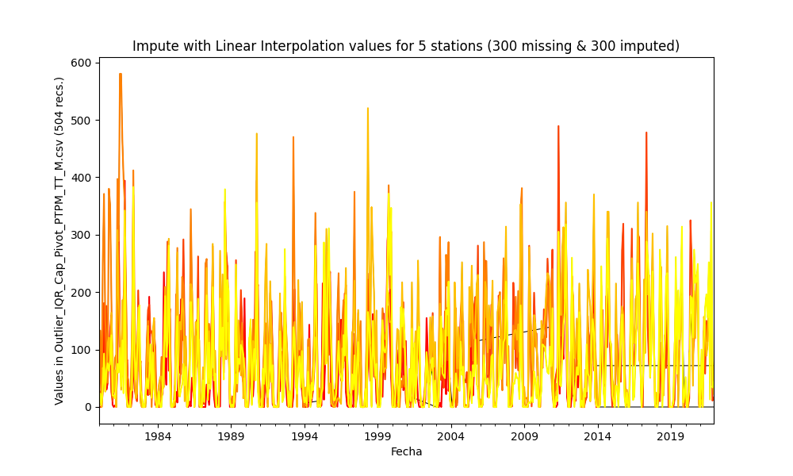

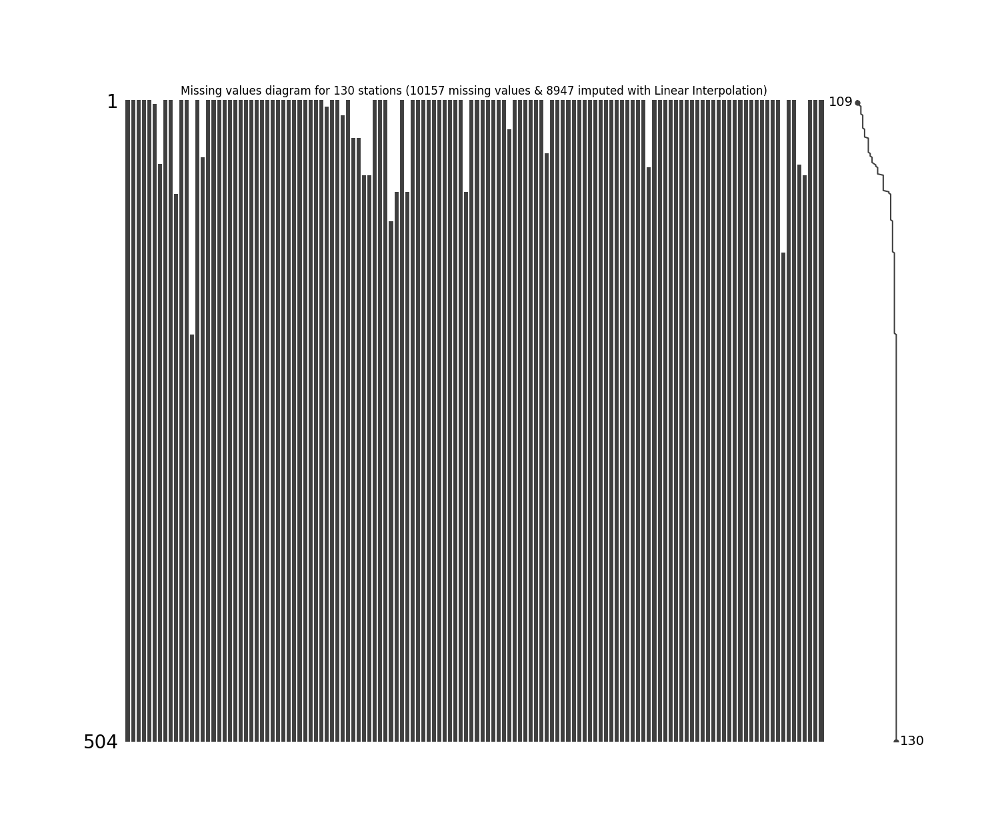

|          |   count |     mean |      std |   min |       25% |      50% |      75% |      max |
|---------:|--------:|---------:|---------:|------:|----------:|---------:|---------:|---------:|
| 15015020 |     504 |  55.7429 |  70.1337 |     0 |   0       |  22.95   | 110.55   |  394.056 |
| 15060050 |     504 |  85.8492 |  83.2329 |     0 |  10.1692  |  72      | 132.475  |  489.2   |
| 15060070 |     504 |  93.3644 |  93.6873 |     0 |  18.575   |  72      | 132.25   |  580.127 |
| 15060080 |     504 |  98.4277 |  91.314  |     0 |  15       |  83      | 148.25   |  520.264 |
| 15060150 |     504 |  72.1262 |  80.4786 |     0 |   8       |  46.1    | 107.375  |  383     |
| 15065040 |     501 |  77.9172 |  47.697  |     0 |  35.8     |  97.4286 | 104.9    |  237.7   |
| 16050240 |     454 | 226.624  | 134.623  |     0 | 111.25    | 219.95   | 354      |  792.155 |
| 16060010 |     504 | 304.344  | 206.676  |     0 | 146.25    | 284.5    | 426.25   | 1005     |
| 16070010 |     504 | 419.183  | 252.871  |     0 | 223.5     | 431.5    | 551.75   | 1444     |
| 16070020 |     430 | 375.56   | 161.407  |     0 | 366       | 366      | 366      | 1210     |
| 16070030 |     504 | 391.499  | 195.543  |     0 | 311.5     | 380      | 441.75   | 1351     |
| 16070040 |     504 | 351.672  | 204.024  |     8 | 207.5     | 341.5    | 471.25   | 1173     |
| 23210020 |     320 | 153.059  | 135.068  |     0 |  45       | 113.75   | 231      |  649     |
| 23215050 |     504 | 234.109  | 205.405  |     0 |  83.15    | 195.2    | 316.6    | 1094.2   |
| 23215060 |     459 |  71.1916 |  75.4035 |     0 |  40       |  40      |  40      |  422     |
| 25020090 |     504 | 163.381  | 143.046  |     0 |  44.925   | 138.5    | 246.7    |  808.61  |
| 25020220 |     504 | 125.97   | 101.515  |     0 |  43.45    | 111.25   | 189.725  |  534     |
| 25020230 |     504 | 161.197  | 138.489  |     0 |  55.95    | 130      | 238.175  |  799.943 |
| 25020240 |     504 | 136.698  | 120.315  |     0 |  43       | 113.5    | 194.25   |  735     |
| 25020250 |     504 | 142.594  | 118.119  |     0 |  48.15    | 118.45   | 208.225  |  644.3   |
| 25020260 |     504 | 220.603  | 168.166  |     0 |  89.5     | 205      | 313.75   |  996.014 |
| 25020270 |     504 | 168.718  | 143.844  |     0 |  48       | 136.5    | 259.75   |  627     |
| 25020280 |     504 | 127.228  | 113.58   |     0 |  39.8     | 109.55   | 181      |  661.486 |
| 25020650 |     504 | 137.337  | 160.11   |     0 |  15.15    |  98.7    | 206.35   |  959.998 |
| 25020660 |     504 | 155.397  | 132.282  |     0 |  49.725   | 126      | 230      |  679     |
| 25020670 |     504 | 143.258  | 124.43   |     0 |  36       | 116.444  | 226.247  |  727.269 |
| 25020690 |     504 | 153.358  | 146.017  |     0 |  37       | 112      | 233.5    |  753     |
| 25020870 |     504 | 156.438  | 135.279  |     0 |  45       | 136.5    | 235.25   |  835     |
| 25020880 |     504 | 193.83   | 159.462  |     0 |  61.75    | 166.5    | 291      |  764     |
| 25020890 |     504 | 155.642  | 125.861  |     0 |  51       | 134.5    | 234.5    |  593     |
| 25020900 |     504 | 130.61   | 113.868  |     0 |  30       | 106      | 203.75   |  510     |
| 25020920 |     504 | 123.046  | 152.096  |     0 |  40       |  67      | 161.5    |  918.023 |
| 25021040 |     504 | 161.745  | 138.972  |     0 |  45       | 138.5    | 245.25   |  739     |
| 25021090 |     504 | 151.961  | 140.814  |     0 |  32.5     | 116      | 231      |  680     |
| 25021200 |     504 | 188.738  | 165.031  |     0 |  51       | 148.5    | 277.75   |  934     |
| 25021240 |     504 | 169.907  | 147.9    |     0 |  46.875   | 141.85   | 265      |  696.6   |
| 25021320 |     504 | 160.944  | 139.575  |     0 |  49.75    | 134      | 239.25   |  744     |
| 25021380 |     499 | 164.289  | 138.191  |     0 |  53.5     | 133      | 251.5    |  724     |
| 25021500 |     504 |  97.578  |  74.6447 |     0 |  40       |  86      | 143.125  |  368     |
| 25021540 |     504 | 177.102  | 143.345  |     0 |  66.75    | 143      | 263      |  721     |
| 25021580 |     492 | 106.521  |  78.0475 |     0 |  83       |  83      |  83      |  494     |
| 25021590 |     504 |  59.9139 | 100.19   |     0 |   0       |   0      | 105.875  |  512.2   |
| 25021620 |     474 | 115.547  |  90.3017 |     0 |  46       | 101.5    | 161      |  534.242 |
| 25021630 |     474 | 109.275  |  77.8526 |     0 |  47.5962  |  96      | 163      |  370     |
| 25021640 |     445 | 145.199  | 132.129  |     0 |  38.7     | 115.5    | 213      |  717     |
| 25021650 |     445 | 131.52   | 127.03   |     0 |  32       | 103      | 197      |  715.84  |
| 25025090 |     504 | 159.674  | 133.781  |     0 |  45.6     | 133.767  | 244.025  |  609.3   |
| 25025250 |     504 | 130.631  | 113.843  |     0 |  30.8842  | 110.6    | 190.125  |  549.9   |
| 25025300 |     504 | 110.143  |  90.9105 |     0 |  36       |  91.7    | 160.838  |  459.2   |
| 25025330 |     409 | 185.933  | 142.079  |     0 |  72.5     | 171.8    | 275      |  693     |
| 28010020 |     432 |  77.0602 |  78.1673 |     0 |  15       |  68.5    | 107.75   |  478.212 |
| 28010040 |     504 | 152.015  | 128.166  |     0 |  49.075   | 130.1    | 221.25   |  748.7   |
| 28010070 |     432 | 116.327  | 106.916  |     0 |  32.75    |  98.3    | 179.75   |  581     |
| 28010090 |     504 |  90.2204 |  91.9677 |     0 |  10       |  70      | 134.925  |  520.861 |
| 28010130 |     504 |  58.1188 | 145.087  |     0 |   3       |   3      |   3      | 1009     |
| 28010140 |     504 |  85.8945 | 108.415  |     0 |  37       |  37      |  92.125  |  630     |
| 28010200 |     504 |  77.7671 |  88.5001 |     0 |   2.425   |  45.85   | 124.7    |  488.941 |
| 28010280 |     504 |  14.1687 |  11.4517 |     2 |  13       |  13      |  13      |  169     |
| 28010340 |     504 |  97.3726 |  92.4909 |     0 |  13       |  80.2    | 150.5    |  457     |
| 28010360 |     504 | 178.222  | 200.711  |     0 |  23.15    | 121.35   | 269.884  | 1127.8   |
| 28010370 |     504 | 108.265  |  94.1767 |     0 |  26       |  87.5    | 171      |  508     |
| 28015070 |     504 |  97.9835 |  84.1645 |     0 |  28.475   |  85.15   | 150.5    |  456.1   |
| 28020080 |     504 | 112.43   | 103.112  |     0 |  30       |  90      | 168      |  590.828 |
| 28020150 |     432 | 108.526  |  88.1479 |     0 |  42       |  89.1    | 159      |  518     |
| 28020230 |     504 |  66.3845 | 107.799  |     0 |   0       |   0      | 114.1    |  675.7   |
| 28020310 |     504 | 164.588  | 112.469  |     0 | 136       | 145      | 161.25   |  723     |
| 28020410 |     504 | 107.241  |  98.164  |     0 |  30       |  82      | 157      |  565.7   |
| 28020420 |     504 | 117.136  | 105.751  |     0 |  27.7692  | 102      | 169.986  |  567     |
| 28020440 |     504 | 127.787  | 100.826  |     0 |  45.975   | 110.5    | 191      |  610.6   |
| 28020460 |     504 | 128.103  | 108.453  |     0 |  47       | 102.5    | 192.25   |  591     |
| 28020590 |     504 | 108.803  |  90.8175 |     0 |  35       |  90      | 162      |  542     |
| 28020600 |     481 | 115.341  |  98.5731 |     0 |  35.7     |  90      | 178      |  552.088 |
| 28025020 |     504 | 110.645  |  82.0854 |     0 |  41.975   | 104.8    | 164.95   |  421.2   |
| 28025040 |     504 |  37.1782 |  69.795  |     0 |   0       |   0      |  43.95   |  360.6   |
| 28025070 |     504 | 131.555  | 104.05   |     0 |  47.95    | 114.7    | 194.45   |  550.8   |
| 28025080 |     504 | 147.464  |  92.9013 |     0 |  67.6     | 147.6    | 220.9    |  496.9   |
| 28025090 |     504 | 124.056  |  97.1363 |     0 |  45.55    | 110.8    | 187.725  |  504.6   |
| 28030190 |     504 |  93.3151 |  86.66   |     0 |  14.475   |  82.8    | 144.55   |  450.8   |
| 28030220 |     462 |  86.407  |  90.5867 |     0 |   2.17857 |  61.5    | 147.5    |  497.601 |
| 28035010 |     504 | 109.888  |  89.1089 |     0 |  33.975   |  95.25   | 164.65   |  479.6   |
| 28035020 |     504 |  96.6273 |  82.675  |     0 |  22.45    |  84.0812 | 149.55   |  464.2   |
| 28035040 |     504 | 107.031  |  83.4923 |     0 |  35.5     |  96.5    | 153.45   |  425     |
| 28040010 |     504 | 177.7    | 149.703  |     0 |  53.75    | 157.5    | 261.25   |  869.048 |
| 28040030 |     504 | 116.68   | 121.226  |     0 |  29.5     |  90      | 159.25   |  681.291 |
| 28040060 |     504 |  38.773  |  66.2854 |     0 |  13       |  13      |  13      |  500     |
| 28040070 |     504 | 111.291  |  87.7508 |     0 |  40       | 100      | 165      |  415     |
| 28040100 |     504 | 145.009  | 107.506  |     0 |  54.75    | 137.5    | 209.25   |  635.172 |
| 28040140 |     504 |  96.0695 |  85.074  |     0 |  25       |  76.9    | 143.125  |  435     |
| 28040150 |     504 | 109.916  |  91.2437 |     0 |  37.4962  |  92.6    | 157.175  |  541.15  |
| 28040170 |     504 | 116.288  |  63.6248 |     0 | 100.858   | 131.4    | 131.4    |  505     |
| 28040200 |     504 | 105.712  |  46.0121 |     0 | 111       | 111      | 111      |  374     |
| 28040270 |     504 | 107.284  |  87.7843 |     0 |  32       | 100      | 153.25   |  512.18  |
| 28040300 |     504 | 114.442  | 100.008  |     0 |  35.75    |  95.5    | 162      |  564     |
| 28040310 |     504 |  88.3246 |  89.6259 |     0 |  25       |  51      | 137      |  521     |
| 28040320 |     504 | 121.586  |  96.6424 |     0 |  47       | 104.5    | 172      |  491     |
| 28040350 |     504 | 110.307  |  98.2992 |     0 |  31.8     |  93.6    | 160.8    |  578     |
| 28040360 |     504 | 124.393  |  91.616  |     0 |  52.75    | 116.5    | 174.25   |  552.693 |
| 28040400 |     451 |  90.5062 |  82.0799 |     0 |  34       |  62      | 135      |  398     |
| 28045010 |     504 | 175.635  |  97.7262 |     0 | 118.225   | 213.5    | 213.5    |  502.1   |
| 29060030 |     504 | 111.925  | 119.01   |     0 |   5.75    |  84.1    | 174.25   |  652.526 |
| 29060040 |     504 | 119.718  | 113.893  |     0 |  28.875   |  98.75   | 174.75   |  639.993 |
| 29060060 |     504 | 213.236  | 188.591  |     0 |  50       | 180      | 324.25   |  944     |
| 29060070 |     504 | 198.563  | 159.081  |     0 |  61       | 179      | 306      |  927     |
| 29060090 |     504 | 109.751  |  77.6222 |     0 |  42.75    | 106.5    | 168      |  382     |
| 29060100 |     504 | 130.562  | 109.441  |     0 |  40       | 117.5    | 189      |  665     |
| 29060120 |     504 |  30.2694 |  55.9905 |     0 |   0       |   6      |  30      |  303.921 |
| 29060140 |     504 | 130.997  | 151.055  |     0 |   7.75    |  86.5    | 201      |  826.16  |
| 29060150 |     504 | 142.079  | 136.922  |     0 |  25       | 106      | 229      |  737.271 |
| 29060160 |     504 |  83.5668 | 102.099  |     0 |   0       |  43.5    | 134.325  |  564.2   |
| 29060170 |     504 |  79.0111 |  92.3937 |     0 |   0       |  46.5    | 134.075  |  505     |
| 29060180 |     504 | 116.049  | 148.028  |     0 |   0       |  70      | 166.5    |  796.306 |
| 29060190 |     504 | 107.636  | 110.44   |     0 |   6       |  95      | 138      |  643.811 |
| 29060200 |     504 | 118.573  | 111.876  |     0 |  26.75    | 106      | 173      |  637     |
| 29060210 |     504 |  69.8323 |  83.3092 |     0 |   1.2     |  39.2    | 108.15   |  453.599 |
| 29060220 |     504 |  60.8286 | 122.035  |     0 |   0       |   0      |  74.8125 |  799.53  |
| 29060230 |     504 |  74.5417 | 102.815  |     0 |   0       |  18      | 121      |  549     |
| 29060240 |     504 | 122.328  | 130.861  |     0 |   0       |  93.5    | 221.25   |  720.851 |
| 29060250 |     504 |  82.5147 | 101.453  |     0 |   0       |  50.5    | 121.775  |  546.36  |
| 29060270 |     504 |  86.7304 |  99.5217 |     0 |   0       |  55      | 132      |  519     |
| 29060280 |     504 |  66.8535 |  87.2603 |     0 |   0       |  28.3    | 107.625  |  482.9   |
| 29060290 |     504 |  52.127  | 101.725  |     0 |   0       |   0      |  60.925  |  627     |
| 29060310 |     504 |  78.6707 | 109.789  |     0 |   0       |  33      | 128      |  604.211 |
| 29060330 |     384 |  87.0436 | 129.21   |     0 |   0       |   8.5    | 136      |  615     |
| 29060340 |     504 | 191.884  | 163.978  |     0 |  58.75    | 165      | 279      |  875     |
| 29060350 |     504 | 108.257  | 111.367  |     0 |  10.95    |  80      | 170.025  |  626.681 |
| 29060550 |     453 |  78.4592 | 105.449  |     0 |   0       |  31      | 121      |  595.759 |
| 29060560 |     445 |  97.9617 |  99.2016 |     0 |  16       |  70      | 150      |  553.117 |
| 29065010 |     504 |  34.9992 |  56.0893 |     0 |  16.3     |  16.3    |  16.3    |  366.7   |
| 29065020 |     504 | 100.934  | 104.823  |     0 |  10       |  73.55   | 155.875  |  563.1   |
| 29065030 |     504 | 126.573  | 110.985  |     0 |  23.95    | 136.2    | 162.425  |  637.9   |

### Method 6 - Impute missing values with Exponential (Weighted) Moving Average - EWM

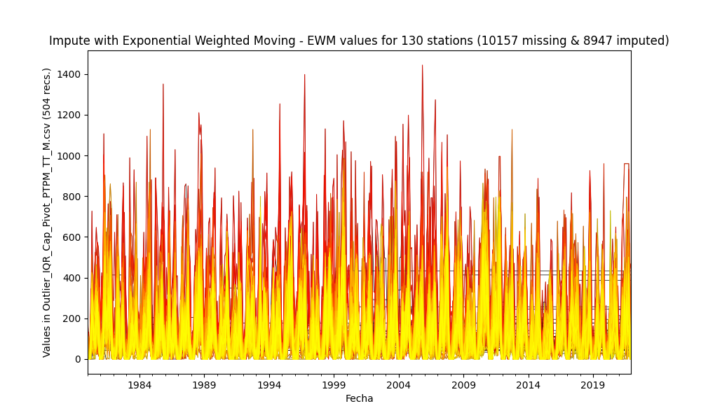

|          |   count |     mean |       std |   min |      25% |      50% |      75% |      max |
|---------:|--------:|---------:|----------:|------:|---------:|---------:|---------:|---------:|
| 15015020 |     504 |  64.0103 |  61.0386  |     0 |  12.225  |  73.3108 |  74.9122 |  394.056 |
| 15060050 |     504 |  86.9911 |  82.4987  |     0 |  15      |  72      | 132.475  |  489.2   |
| 15060070 |     504 |  95.4326 |  93.0202  |     0 |  18.8089 |  80.6381 | 132.25   |  580.127 |
| 15060080 |     504 |  98.2779 |  91.3281  |     0 |  15      |  82.5    | 148.25   |  520.264 |
| 15060150 |     504 |  72.1262 |  80.4786  |     0 |   8      |  46.1    | 107.375  |  383     |
| 15065040 |     501 |  57.6942 |  42.7212  |     0 |  46.613  |  46.613  |  67.0514 |  237.7   |
| 16050240 |     454 | 196.146  | 112.866   |     0 | 111.25   | 219.95   | 245.049  |  792.155 |
| 16060010 |     504 | 304.344  | 206.676   |     0 | 146.25   | 284.5    | 426.25   | 1005     |
| 16070010 |     504 | 407.988  | 249.694   |     0 | 228.5    | 387.106  | 549.5    | 1444     |
| 16070020 |     430 | 418.767  | 161.986   |     0 | 433.235  | 433.235  | 433.235  | 1210     |
| 16070030 |     504 | 399.801  | 193.47    |     0 | 312      | 413.167  | 418.25   | 1351     |
| 16070040 |     504 | 348.936  | 203.945   |     8 | 204.902  | 340.5    | 471.25   | 1173     |
| 23210020 |     320 | 158.144  | 132.975   |     0 |  49.85   | 135.518  | 231      |  649     |
| 23215050 |     504 | 231.228  | 205.215   |     0 |  79.8    | 194.9    | 316.6    | 1094.2   |
| 23215060 |     459 | 139.163  |  60.0718  |     0 | 140.472  | 140.472  | 140.472  |  422     |
| 25020090 |     504 | 162.9    | 142.535   |     0 |  44.925  | 138.5    | 246.525  |  808.61  |
| 25020220 |     504 | 125.886  | 101.532   |     0 |  43.45   | 111.05   | 189.725  |  534     |
| 25020230 |     504 | 161.98   | 137.485   |     0 |  60      | 131.5    | 236.5    |  799.943 |
| 25020240 |     504 | 136.246  | 120.154   |     0 |  43      | 112      | 194      |  735     |
| 25020250 |     504 | 142.775  | 118.119   |     0 |  48.15   | 118.45   | 208.225  |  644.3   |
| 25020260 |     504 | 220.522  | 167.759   |     0 |  90      | 201      | 313.75   |  996.014 |
| 25020270 |     504 | 168.958  | 143.779   |     0 |  48      | 137      | 259.75   |  627     |
| 25020280 |     504 | 124.825  | 113.696   |     0 |  40      |  96.3    | 181      |  661.486 |
| 25020650 |     504 | 145.93   | 154.447   |     0 |  38.575  | 102.35   | 202.1    |  959.998 |
| 25020660 |     504 | 155.592  | 132.256   |     0 |  49.725  | 127.1    | 230      |  679     |
| 25020670 |     504 | 143.42   | 124.829   |     0 |  33.942  | 119      | 225.25   |  727.269 |
| 25020690 |     504 | 153.358  | 146.017   |     0 |  37      | 112      | 233.5    |  753     |
| 25020870 |     504 | 154.712  | 135.158   |     0 |  45      | 133.5    | 229.75   |  835     |
| 25020880 |     504 | 192.546  | 158.737   |     0 |  62.75   | 163.994  | 290      |  764     |
| 25020890 |     504 | 154.939  | 125.901   |     0 |  51      | 128.9    | 234      |  593     |
| 25020900 |     504 | 130.742  | 113.953   |     0 |  30      | 106      | 203.5    |  510     |
| 25020920 |     504 | 121.936  | 151.336   |     0 |  40      |  60      | 160.25   |  918.023 |
| 25021040 |     504 | 161.801  | 138.953   |     0 |  45      | 138.5    | 245.25   |  739     |
| 25021090 |     504 | 158.264  | 137.664   |     0 |  43.875  | 127.231  | 231.5    |  680     |
| 25021200 |     504 | 188.317  | 164.983   |     0 |  51      | 145.5    | 277.75   |  934     |
| 25021240 |     504 | 169.907  | 147.9     |     0 |  46.875  | 141.85   | 265      |  696.6   |
| 25021320 |     504 | 160.954  | 139.351   |     0 |  50      | 134.336  | 238.25   |  744     |
| 25021380 |     499 | 165.654  | 136.612   |     0 |  55.5    | 139      | 249.5    |  724     |
| 25021500 |     504 | 100.077  |  74.0687  |     0 |  41.75   |  90      | 143.125  |  368     |
| 25021540 |     504 | 177.388  | 143.156   |     0 |  68.75   | 146      | 262.25   |  721     |
| 25021580 |     492 | 133.558  |  72.5942  |     0 | 126.756  | 126.756  | 126.756  |  494     |
| 25021590 |     504 | 120.52   |  73.6318  |     0 | 107.579  | 107.579  | 107.579  |  512.2   |
| 25021620 |     474 | 116.016  |  90.309   |     0 |  46      | 102      | 162.75   |  534.242 |
| 25021630 |     474 | 111.665  |  77.2963  |     0 |  50      | 101.5    | 163      |  370     |
| 25021640 |     445 | 145.145  | 132.105   |     0 |  38.7    | 115      | 213      |  717     |
| 25021650 |     445 | 131.472  | 127.006   |     0 |  33      | 102.2    | 197      |  715.84  |
| 25025090 |     504 | 164.046  | 130.111   |     0 |  58.825  | 144.3    | 241.625  |  609.3   |
| 25025250 |     504 | 133.664  | 111.96    |     0 |  45.6    | 116.35   | 181.425  |  549.9   |
| 25025300 |     504 | 111.329  |  90.3792  |     0 |  38.375  |  95.05   | 162.5    |  459.2   |
| 25025330 |     409 | 160.47   | 120.149   |     0 |  75.6    | 135.5    | 225.9    |  693     |
| 28010020 |     432 |  77.3643 |  78.147   |     0 |  15      |  68.5    | 107.75   |  478.212 |
| 28010040 |     504 | 152.152  | 128.367   |     0 |  49.075  | 130.1    | 221.25   |  748.7   |
| 28010070 |     432 | 116.327  | 106.916   |     0 |  32.75   |  98.3    | 179.75   |  581     |
| 28010090 |     504 |  90.5269 |  91.4604  |     0 |  12      |  65.2881 | 134.925  |  520.861 |
| 28010130 |     504 | 190.189  | 109.745   |     0 | 177.249  | 177.249  | 177.249  | 1009     |
| 28010140 |     504 | 107.642  |  99.0441  |     0 |  83.1385 |  83.1385 |  90.5    |  630     |
| 28010200 |     504 |  82.384  |  87.688   |     0 |   8.35   |  48.85   | 131.9    |  488.941 |
| 28010280 |     504 |  43.2091 |   9.43675 |     2 |  42.9312 |  42.9312 |  42.9312 |  169     |
| 28010340 |     504 |  99.2655 |  91.4457  |     0 |  19.5    |  85.5    | 150.5    |  457     |
| 28010360 |     504 | 168.807  | 198.396   |     0 |  23.15   | 121.35   | 239.55   | 1127.8   |
| 28010370 |     504 | 108.054  |  94.233   |     0 |  26      |  86.5    | 171      |  508     |
| 28015070 |     504 |  97.8003 |  83.9218  |     0 |  28.475  |  85.15   | 149.775  |  456.1   |
| 28020080 |     504 | 113.636  | 100.904   |     0 |  35      |  93      | 165.25   |  590.828 |
| 28020150 |     432 | 108.651  |  88.1293  |     0 |  42      |  90.1    | 159      |  518     |
| 28020230 |     504 |  98.7388 |  92.1337  |     0 |  68.515  |  68.515  | 114.1    |  675.7   |
| 28020310 |     504 | 149.71   | 116.245   |     0 | 111.374  | 111.374  | 161.25   |  723     |
| 28020410 |     504 | 109.417  |  98.3994  |     0 |  32.6    |  86.5    | 157      |  565.7   |
| 28020420 |     504 | 127.702  | 108.007   |     0 |  45.5    | 104.201  | 190.25   |  567     |
| 28020440 |     504 | 127.101  | 100.734   |     0 |  45.975  | 108.9    | 189.5    |  610.6   |
| 28020460 |     504 | 128.623  | 108.075   |     0 |  47      | 108.5    | 192.25   |  591     |
| 28020590 |     504 | 100.978  |  88.0016  |     0 |  35      |  75.8    | 145.025  |  542     |
| 28020600 |     481 | 114.928  |  97.7263  |     0 |  35.7    |  91      | 178      |  552.088 |
| 28025020 |     504 | 110.773  |  81.498   |     0 |  42.475  | 104.6    | 163.475  |  421.2   |
| 28025040 |     504 |  81.2528 |  54.3381  |     0 |  74.4529 |  74.4529 |  74.4529 |  360.6   |
| 28025070 |     504 | 131.555  | 104.05    |     0 |  47.95   | 114.7    | 194.45   |  550.8   |
| 28025080 |     504 | 143.058  |  86.8722  |     0 |  77.575  | 145.65   | 195.244  |  496.9   |
| 28025090 |     504 | 123.807  |  97.0809  |     0 |  45.55   | 110.5    | 186.375  |  504.6   |
| 28030190 |     504 |  93.3151 |  86.66    |     0 |  14.475  |  82.8    | 144.55   |  450.8   |
| 28030220 |     462 |  87.8032 |  85.4535  |     0 |  11.15   |  85      | 120.75   |  497.601 |
| 28035010 |     504 | 109.913  |  88.3687  |     0 |  35.3    |  95.15   | 163      |  479.6   |
| 28035020 |     504 |  97.5912 |  82.1596  |     0 |  23.55   |  83.4513 | 149.55   |  464.2   |
| 28035040 |     504 | 106.844  |  83.3441  |     0 |  35.5    |  97.45   | 152.95   |  425     |
| 28040010 |     504 | 177.7    | 149.703   |     0 |  53.75   | 157.5    | 261.25   |  869.048 |
| 28040030 |     504 | 116.523  | 121.045   |     0 |  29.5    |  90      | 159.25   |  681.291 |
| 28040060 |     504 |  60.0703 |  58.9029  |     0 |  42.5959 |  42.5959 |  42.5959 |  500     |
| 28040070 |     504 | 111.373  |  87.6428  |     0 |  40      | 100      | 165      |  415     |
| 28040100 |     504 | 143.695  | 106.997   |     0 |  54.75   | 135.5    | 205.383  |  635.172 |
| 28040140 |     504 |  96.5732 |  85.0079  |     0 |  25      |  79.35   | 143.141  |  435     |
| 28040150 |     504 | 109.243  |  91.754   |     0 |  30.1212 |  92.6    | 157.175  |  541.15  |
| 28040170 |     504 |  65.1348 |  68.3727  |     0 |  41.6409 |  41.6409 |  41.6409 |  505     |
| 28040200 |     504 | 104.884  |  45.9211  |     0 | 109.684  | 109.684  | 109.684  |  374     |
| 28040270 |     504 | 106.364  |  87.9571  |     0 |  32.75   |  94      | 156.627  |  512.18  |
| 28040300 |     504 | 114.212  |  95.443   |     0 |  43.75   |  96.4711 | 155.25   |  564     |
| 28040310 |     504 | 105.889  |  80.9604  |     0 |  60.75   |  85.2204 | 137      |  521     |
| 28040320 |     504 | 124.206  |  95.1674  |     0 |  53.25   | 110      | 172      |  491     |
| 28040350 |     504 | 110.307  |  98.2992  |     0 |  31.8    |  93.6    | 160.8    |  578     |
| 28040360 |     504 | 124.292  |  91.5297  |     0 |  52.75   | 116.5    | 174.25   |  552.693 |
| 28040400 |     451 |  97.7383 |  78.2908  |     0 |  46      |  72.9299 | 134.5    |  398     |
| 28045010 |     504 | 199.469  | 108.762   |     0 | 118.225  | 257.023  | 257.023  |  502.1   |
| 29060030 |     504 | 111.881  | 119.026   |     0 |   5.75   |  84.1    | 174.25   |  652.526 |
| 29060040 |     504 | 119.627  | 113.7     |     0 |  28.875  |  99      | 171.25   |  639.993 |
| 29060060 |     504 | 213.714  | 187.108   |     0 |  53.75   | 181.5    | 322.5    |  944     |
| 29060070 |     504 | 198.786  | 158.948   |     0 |  61      | 179      | 306      |  927     |
| 29060090 |     504 | 109.52   |  77.6145  |     0 |  42.75   | 106      | 168      |  382     |
| 29060100 |     504 | 130.562  | 109.441   |     0 |  40      | 117.5    | 189      |  665     |
| 29060120 |     504 |  30.2694 |  55.9905  |     0 |   0      |   6      |  30      |  303.921 |
| 29060140 |     504 | 131.026  | 151.036   |     0 |   7.75   |  86.5    | 201      |  826.16  |
| 29060150 |     504 | 138.054  | 131.895   |     0 |  25      | 106      | 229      |  737.271 |
| 29060160 |     504 |  83.9996 | 102.172   |     0 |   0      |  45      | 135.95   |  564.2   |
| 29060170 |     504 |  79.0023 |  92.3921  |     0 |   0      |  46.5    | 134.075  |  505     |
| 29060180 |     504 | 115.88   | 148.025   |     0 |   0      |  70      | 166.5    |  796.306 |
| 29060190 |     504 | 101.071  | 108.985   |     0 |  15.75   |  58.8314 | 148      |  643.811 |
| 29060200 |     504 | 124.565  | 115.691   |     0 |  27.75   | 106.35   | 185      |  637     |
| 29060210 |     504 |  70.0012 |  83.289   |     0 |   1.2    |  39.2    | 109.1    |  453.599 |
| 29060220 |     504 |  86.6528 | 110.814   |     0 |  56.2044 |  56.2044 |  71.25   |  799.53  |
| 29060230 |     504 |  94.1557 |  93.7076  |     0 |  18      |  77.1345 | 121      |  549     |
| 29060240 |     504 | 106.05   | 121.88    |     0 |   0      |  94.5    | 155      |  720.851 |
| 29060250 |     504 |  83.088  | 101.427   |     0 |   0      |  52.1    | 124.9    |  546.36  |
| 29060270 |     504 |  86.6969 |  99.5304  |     0 |   0      |  54.7208 | 132      |  519     |
| 29060280 |     504 |  67.949  |  86.6014  |     0 |   0      |  28.4926 | 107.625  |  482.9   |
| 29060290 |     504 |  89.3045 |  88.9149  |     0 |  47.2329 |  76.4879 |  76.4879 |  627     |
| 29060310 |     504 |  78.6707 | 109.789   |     0 |   0      |  33      | 128      |  604.211 |
| 29060330 |     384 | 147.134  | 115.222   |     0 |  47      | 177.456  | 177.456  |  615     |
| 29060340 |     504 | 192.646  | 163.507   |     0 |  59.75   | 172.738  | 276.5    |  875     |
| 29060350 |     504 | 107.879  | 110.591   |     0 |  10.95   |  80      | 170.225  |  626.681 |
| 29060550 |     453 |  85.1696 | 101.691   |     0 |  10      |  38.5    | 122      |  595.759 |
| 29060560 |     445 |  97.743  |  98.7973  |     0 |  16      |  70      | 150      |  553.117 |
| 29065010 |     504 |  95.226  |  45.2758  |     0 |  95.7615 |  95.7615 |  95.7615 |  366.7   |
| 29065020 |     504 | 102.502  | 104.416   |     0 |  10.775  |  76.75   | 155.875  |  563.1   |
| 29065030 |     504 | 113.375  | 111.535   |     0 |  23.95   |  79.1942 | 162.425  |  637.9   |

