# Impute missing values in time series through statistical methods

* Processed file: [D:/R.LTWB/.datasets/IDEAM_Outlier/Outlier_IQR_Cap_Pivot_Q_MEDIA_M.csv](../IDEAM_Outlier/Outlier_IQR_Cap_Pivot_Q_MEDIA_M.csv)
* Execution date: 2022-11-12 10:46:17.366713
* Python version: 3.10.5 (tags/v3.10.5:f377153, Jun  6 2022, 16:14:13) [MSC v.1929 64 bit (AMD64)]
* Python path: ['D:\\R.LTWB\\.src', 'D:\\R.LTWB', 'D:\\R.HydroTools.wiki', 'D:\\R.HydroTools', 'D:\\R.GISPython']
* matplotlib version: 3.6.0
* pandas version: 1.4.3
* numpy version: 1.23.2
* missingno version: 0.5.1
* sklearn version: 1.1.3
* Stations exclude: ['28017140', '25027020', '25027410', '25027490', '25027330', '25027390', '25027630', '25027360', '25027320', '16067010', '25027420']
* Stations include: ['15015020', '15060050', '15060070', '15060080', '15060150']
* Print table sample: True
* Instructions & script: https://github.com/rcfdtools/R.LTWB/tree/main/Section03/Impute
* License: https://github.com/rcfdtools/R.LTWB/blob/main/LICENSE.md
* Credits: r.cfdtools@gmail.com

## General dataframe information with 504 IDEAM records for 46 stations

Dataframe records head sample

| Fecha               |   15067020 |   15067080 |   15067130 |   15067150 |   15067170 |   15067200 |   15067210 |   16037040 |   16047020 |   16067020 |   25027080 |   25027400 |   25027590 |   25027620 |   25027890 |   28017050 |   28017080 |   28017110 |   28017120 |   28017150 |   28027020 |   28027030 |   28027040 |   28027050 |   28027160 |   28037010 |   28037020 |   28037030 |   28037040 |   28037060 |   28037090 |   28037130 |   28047010 |   28047020 |   28047040 |   28047050 |   28047080 |   29067010 |   29067040 |   29067050 |   29067060 |   29067070 |   29067120 |   29067130 |   29067150 |   29067160 |
|:--------------------|-----------:|-----------:|-----------:|-----------:|-----------:|-----------:|-----------:|-----------:|-----------:|-----------:|-----------:|-----------:|-----------:|-----------:|-----------:|-----------:|-----------:|-----------:|-----------:|-----------:|-----------:|-----------:|-----------:|-----------:|-----------:|-----------:|-----------:|-----------:|-----------:|-----------:|-----------:|-----------:|-----------:|-----------:|-----------:|-----------:|-----------:|-----------:|-----------:|-----------:|-----------:|-----------:|-----------:|-----------:|-----------:|-----------:|
| 1980-01-01 00:00:00 |      6.81  |        nan |        nan |        nan |        nan |        nan |        nan |      9.241 |      32.22 |      68.34 |      2.381 |     128.4  |      54.68 |     34.14  |      1.176 |      9.391 |      0.865 |      3.582 |        nan |        nan |      1.363 |      2.045 |      0.944 |       1.28 |      3.109 |      0.424 |      2.411 |     16.16  |      0.564 |      0.531 |     30.47  |      0.899 |     16.83  |      1.224 |      1.46  |     10.28  |        nan |      7.281 |      0.514 |      7.816 |     17.88  |      7.213 |      21.44 |      7.851 |      11.91 |        nan |
| 1980-02-01 00:00:00 |      5.829 |        nan |        nan |        nan |        nan |        nan |        nan |      5.077 |      27.17 |      54.4  |      1.961 |      95.48 |      25.86 |     22.07  |      0.707 |      4.655 |      0.751 |      2.843 |        nan |        nan |      1.7   |      1.289 |      0.519 |       1.6  |      3.2   |      0.127 |      2.078 |     10.05  |      0.212 |      0.464 |     21.78  |      0.523 |     11.81  |      1.284 |      0.998 |      6.622 |        nan |      5.391 |      0.482 |      4.224 |     12.67  |      5.03  |      14.8  |      4.309 |       7.24 |        nan |
| 1980-03-01 00:00:00 |      3.833 |        nan |        nan |        nan |        nan |        nan |        nan |      4.551 |      18.51 |      41.71 |      1.481 |      49.44 |      12.85 |      3.943 |      0.201 |      5.295 |      0.655 |      2.695 |        nan |        nan |      0.833 |      0.617 |      0.377 |       0.9  |      1.236 |      0.098 |      0.438 |      6.077 |      0.196 |      0.373 |      5.548 |      0.443 |      9.395 |      0.594 |      0.747 |      3.342 |        nan |      2.966 |      0.312 |      4.774 |      9.948 |      3.847 |      11.41 |      2.634 |       4.87 |        nan |

Dataframe records tail sample

| Fecha               |   15067020 |   15067080 |   15067130 |   15067150 |   15067170 |   15067200 |   15067210 |   16037040 |   16047020 |   16067020 |   25027080 |   25027400 |   25027590 |   25027620 |   25027890 |   28017050 |   28017080 |   28017110 |   28017120 |   28017150 |   28027020 |   28027030 |   28027040 |   28027050 |   28027160 |   28037010 |   28037020 |   28037030 |   28037040 |   28037060 |   28037090 |   28037130 |   28047010 |   28047020 |   28047040 |   28047050 |   28047080 |   29067010 |   29067040 |   29067050 |   29067060 |   29067070 |   29067120 |   29067130 |   29067150 |   29067160 |
|:--------------------|-----------:|-----------:|-----------:|-----------:|-----------:|-----------:|-----------:|-----------:|-----------:|-----------:|-----------:|-----------:|-----------:|-----------:|-----------:|-----------:|-----------:|-----------:|-----------:|-----------:|-----------:|-----------:|-----------:|-----------:|-----------:|-----------:|-----------:|-----------:|-----------:|-----------:|-----------:|-----------:|-----------:|-----------:|-----------:|-----------:|-----------:|-----------:|-----------:|-----------:|-----------:|-----------:|-----------:|-----------:|-----------:|-----------:|
| 2021-10-01 00:00:00 |        nan |   6.02323  |   0.151132 |    6.1546  |   16.8213  |        nan |        nan |        nan |        nan |        nan |        nan |    226.797 |        nan |        nan |        nan |        nan |        nan |   23.6937  |        nan |   10.4313  |   11.2509  |   3.66587  |    3.79899 |        nan |        nan |    3.89628 |        nan |   41.7338  | nan        |   6.29435  |        nan |   14.0926  |        nan |        nan |        nan |   17.5766  |        nan |    26.0038 |        nan |    20.3681 |        nan |    20.0748 |        nan |    22.245  |    20.3878 |    33.4677 |
| 2021-11-01 00:00:00 |        nan |   1.56031  | nan        |    1.71422 |    3.79966 |        nan |        nan |        nan |        nan |        nan |        nan |    271.822 |        nan |        nan |        nan |        nan |        nan |   17.1144  |        nan |    6.7664  |    9.04849 |   3.14376  |    3.11471 |        nan |        nan |    2.46154 |        nan |   25.8821  | nan        |   1.90571  |        nan |    7.98137 |        nan |        nan |        nan |   16.38    |        nan |    20.7463 |        nan |    17.4662 |        nan |    16.0404 |        nan |    16.4489 |    16.2355 |    14.2386 |
| 2021-12-01 00:00:00 |        nan |   0.977419 | nan        |    1.17995 |    2.25346 |        nan |        nan |        nan |        nan |        nan |        nan |    206.388 |        nan |        nan |        nan |        nan |        nan |    4.88972 |        nan |    3.98445 |  nan       |   0.552185 |  nan       |        nan |        nan |  nan       |        nan |    6.61865 |   0.616957 |   0.747762 |        nan |    4.82141 |        nan |        nan |        nan |    2.19985 |        nan |    14.1797 |        nan |    11.4257 |        nan |    10.721  |        nan |    11.0097 |   nan      |     6.7579 |

Datatypes for station and nulls values in the initial file
|       | 15067020   | 15067080   | 15067130   | 15067150   | 15067170   | 15067200   | 15067210   | 16037040   | 16047020   | 16067020   | 25027080   | 25027400   | 25027590   | 25027620   | 25027890   | 28017050   | 28017080   | 28017110   | 28017120   | 28017150   | 28027020   | 28027030   | 28027040   | 28027050   | 28027160   | 28037010   | 28037020   | 28037030   | 28037040   | 28037060   | 28037090   | 28037130   | 28047010   | 28047020   | 28047040   | 28047050   | 28047080   | 29067010   | 29067040   | 29067050   | 29067060   | 29067070   | 29067120   | 29067130   | 29067150   | 29067160   |
|:------|:-----------|:-----------|:-----------|:-----------|:-----------|:-----------|:-----------|:-----------|:-----------|:-----------|:-----------|:-----------|:-----------|:-----------|:-----------|:-----------|:-----------|:-----------|:-----------|:-----------|:-----------|:-----------|:-----------|:-----------|:-----------|:-----------|:-----------|:-----------|:-----------|:-----------|:-----------|:-----------|:-----------|:-----------|:-----------|:-----------|:-----------|:-----------|:-----------|:-----------|:-----------|:-----------|:-----------|:-----------|:-----------|:-----------|
| Dtype | float64    | float64    | float64    | float64    | float64    | float64    | float64    | float64    | float64    | float64    | float64    | float64    | float64    | float64    | float64    | float64    | float64    | float64    | float64    | float64    | float64    | float64    | float64    | float64    | float64    | float64    | float64    | float64    | float64    | float64    | float64    | float64    | float64    | float64    | float64    | float64    | float64    | float64    | float64    | float64    | float64    | float64    | float64    | float64    | float64    | float64    |
| Nulls | 176        | 213        | 116        | 356        | 348        | 389        | 476        | 117        | 221        | 260        | 55         | 15         | 165        | 89         | 80         | 241        | 39         | 39         | 274        | 452        | 105        | 65         | 92         | 155        | 132        | 67         | 142        | 30         | 30         | 22         | 94         | 82         | 92         | 30         | 257        | 53         | 408        | 56         | 58         | 111        | 247        | 78         | 60         | 28         | 23         | 107        |

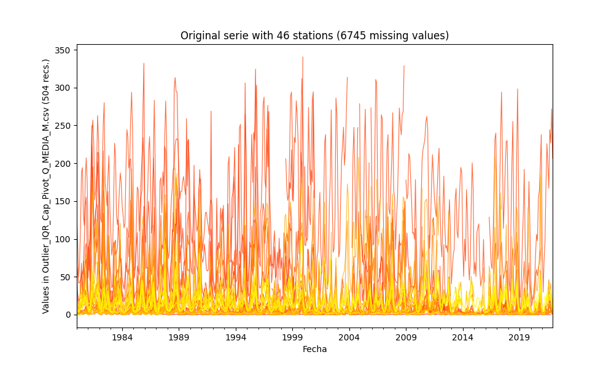

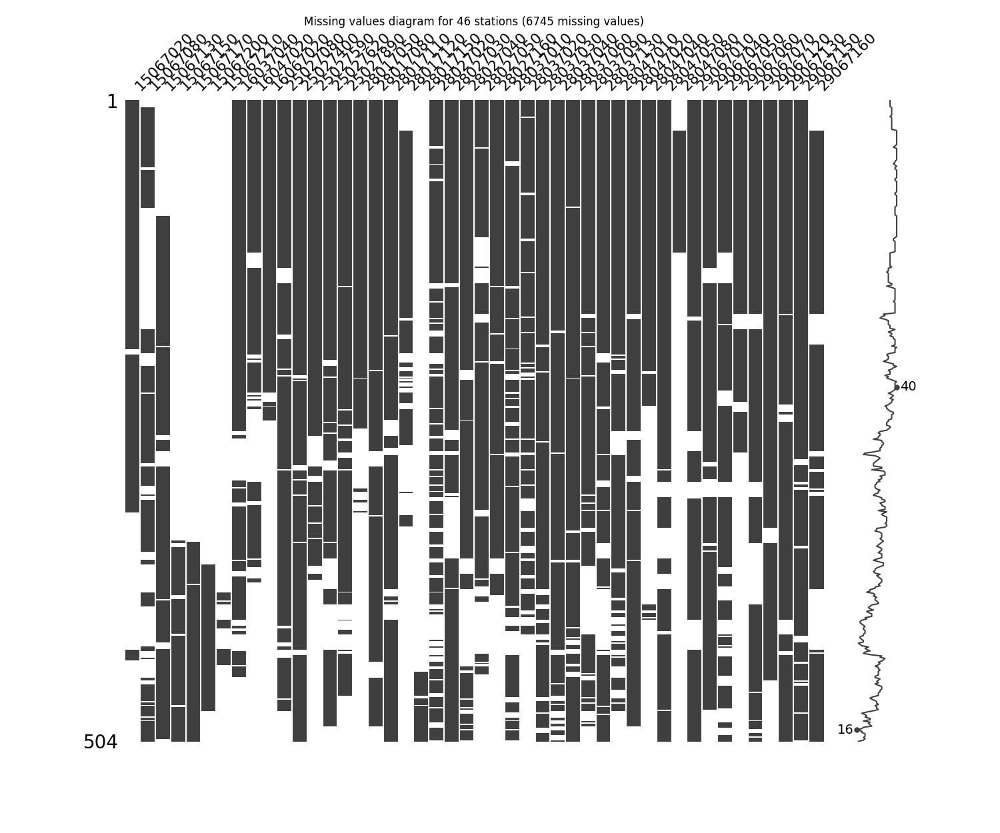

General statistics table - Initial file

|          |   count |      mean |       std |        min |       25% |         50% |       75% |       max |
|---------:|--------:|----------:|----------:|-----------:|----------:|------------:|----------:|----------:|
| 15067020 |     328 |   6.88666 |  4.37317  |  1.114     |  3.963    |   5.5075    |   8.558   |  27.85    |
| 15067080 |     291 |   2.10051 |  2.89856  |  0.124     |  0.575597 |   0.977419  |   2.45689 |  15.3906  |
| 15067130 |     388 |   0.10638 |  0.151762 |  0.002     |  0.016    |   0.0363357 |   0.125   |   0.744   |
| 15067150 |     148 |   5.06216 |  5.59392  |  0.0811156 |  1.54901  |   2.6945    |   6.2928  |  25.5854  |
| 15067170 |     156 |   9.33953 | 11.9453   |  0.516     |  2.53293  |   4.73477   |  10.7563  |  58.3473  |
| 15067200 |     115 |   7.43576 |  7.65443  |  1.019     |  2.61302  |   4.30484   |   9.2741  |  37.1641  |
| 15067210 |      28 |   5.99268 |  4.02808  |  1.51655   |  3.0025   |   4.716     |   8.31065 |  17.14    |
| 16037040 |     387 |  21.5464  | 14.8726   |  3.445     | 11.475    |  16.64      |  27.555   |  88.8711  |
| 16047020 |     283 |  54.346   | 35.8763   | 10.16      | 29.87     |  42.16      |  67.44    | 223.5     |
| 16067020 |     244 | 115.375   | 66.9092   | 28.67      | 64.19     |  95.225     | 154.075   | 340.3     |
| 25027080 |     449 |   4.40157 |  6.14185  |  0.018     |  0.8775   |   1.999     |   4.948   |  33.3085  |
| 25027400 |     489 | 151.668   | 70.7867   |  4.846     | 95.15     | 151         | 205       | 328.7     |
| 25027590 |     339 |  53.8843  | 39.6006   |  0.723     | 17.325    |  44.15      |  87.27    | 158.1     |
| 25027620 |     415 |  49.625   | 38.9781   |  1.309     | 18.975    |  38.6171    |  72.32    | 202.2     |
| 25027890 |     424 |   2.65535 |  3.10937  |  0.007     |  0.5025   |   1.33      |   3.70275 |  16.67    |
| 28017050 |     263 |  18.6302  | 18.0344   |  3         |  7.33     |  13.44      |  22.74    | 128.956   |
| 28017080 |     465 |   2.44034 |  3.27585  |  0.0238819 |  0.606    |   1.13      |   2.725   |  16.1476  |
| 28017110 |     465 |   9.18378 | 10.5851   |  0.118     |  3.361    |   5.64      |  10.0068  |  58.4429  |
| 28017120 |     230 |  16.2906  | 12.7295   |  2.48      |  7.12875  |  12.635     |  20.425   |  68.8537  |
| 28017150 |      52 |   6.36198 |  3.45506  |  1.67986   |  3.65216  |   6.36845   |   7.92197 |  15.2573  |
| 28027020 |     399 |   2.38306 |  2.81764  |  0         |  0.4485   |   1.3       |   3.4115  |  13.5641  |
| 28027030 |     439 |   3.95124 |  5.02231  |  0         |  0.815    |   2.055     |   5.4085  |  29.4352  |
| 28027040 |     412 |   2.97842 |  3.52513  |  0.0190909 |  0.67875  |   1.585     |   3.8395  |  18.5679  |
| 28027050 |     349 |  10.8588  | 17.7893   |  0.161     |  1.625    |   4.267     |  10.11    |  98.121   |
| 28027160 |     372 |   8.69272 |  8.32717  |  0.013     |  2.68175  |   6.026     |  12.655   |  43.1801  |
| 28037010 |     437 |   2.98061 |  4.25404  |  0.009     |  0.34     |   1.402     |   3.684   |  20.556   |
| 28037020 |     362 |   2.63977 |  3.02036  |  0         |  0.444    |   1.469     |   3.7135  |  16.56    |
| 28037030 |     474 |  33.5337  | 37.8762   |  1.221     |  7.753    |  20.465     |  41.5703  | 205.8     |
| 28037040 |     474 |   1.99257 |  2.428    |  0.01      |  0.367828 |   1.01634   |   2.6945  |  11.94    |
| 28037060 |     482 |   1.73671 |  1.79864  |  0.03      |  0.5315   |   1.04342   |   2.36855 |   9.49659 |
| 28037090 |     410 |  56.379   | 51.3416   |  0.0106789 | 12.65     |  41.18      |  90.1875  | 209.741   |
| 28037130 |     422 |   4.39422 |  5.59696  |  0.0140806 |  0.944    |   2.01      |   5.36175 |  30.04    |
| 28047010 |     412 |  16.0481  |  7.96938  |  0.625     | 11.3293   |  14.845     |  19.2775  |  48.8445  |
| 28047020 |     474 |   1.27103 |  0.897028 |  0.244     |  0.658511 |   1.03365   |   1.539   |   4.94186 |
| 28047040 |     247 |   2.62607 |  2.14552  |  0.25      |  1.2385   |   1.997     |   3.318   |  11.3175  |
| 28047050 |     451 |  13.5702  | 13.6383   |  0.127     |  2.9885   |   8.391     |  20.35    |  63.14    |
| 28047080 |      96 |  16.3306  |  6.24065  |  6.365     | 11.7875   |  15.865     |  18.8225  |  41.3167  |
| 29067010 |     448 |  17.3664  | 10.2364   |  2.966     |  9.71225  |  15.525     |  21.6225  |  62.2928  |
| 29067040 |     446 |   1.91476 |  1.48993  |  0.106     |  0.78925  |   1.439     |   2.73225 |   7.354   |
| 29067050 |     393 |  12.3847  |  7.92064  |  1.572     |  6.14022  |  10.8       |  16.3514  |  49.4225  |
| 29067060 |     257 |  24.7528  | 12.1371   |  4.068     | 15.44     |  22.37      |  32.55    |  72.6401  |
| 29067070 |     426 |  13.4672  |  8.94678  |  2.06      |  6.24475  |  11.37      |  18.18    |  48.3892  |
| 29067120 |     444 |  28.0603  | 17.0248   |  4.831     | 15.86     |  24.445     |  35.5075  | 105.8     |
| 29067130 |     476 |  17.5207  | 14.2128   |  1.95487   |  7.617    |  13.59      |  22.0241  |  74.0504  |
| 29067150 |     481 |  15.9357  |  9.25158  |  0.479067  |  8.836    |  14.42      |  21.58    |  55.25    |
| 29067160 |     397 |   7.55266 |  7.29747  |  0.546     |  2.326    |   5.185     |  10.81    |  39.3278  |

## Method 1 - Imputing with mean values
According to this technique, the missing values are imputed using the mean value in each feature and the serie has been completed filled.

Imputed file: [Impute_Mean_Outlier_IQR_Cap_Pivot_Q_MEDIA_M.csv](Impute_Mean_Outlier_IQR_Cap_Pivot_Q_MEDIA_M.csv)

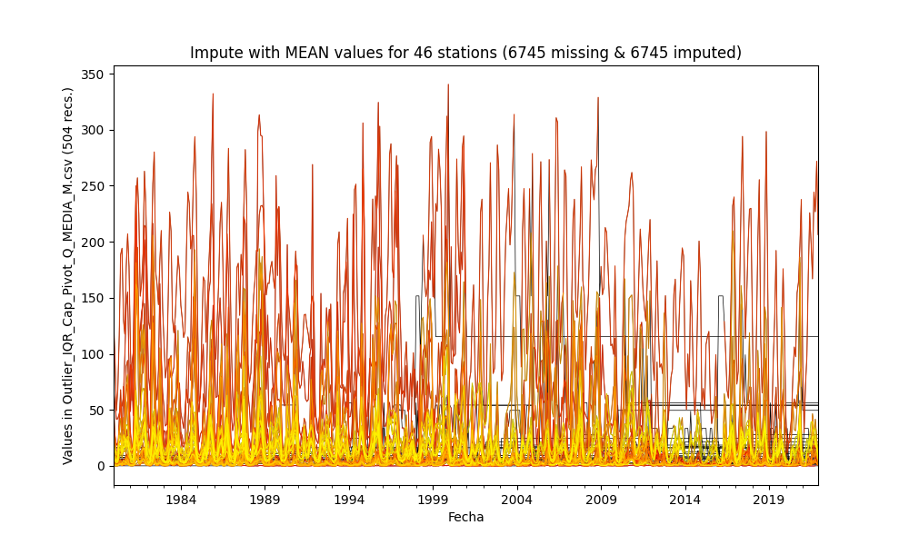

General statistics table - Imputed file

|          |   count |      mean |       std |        min |       25% |         50% |       75% |       max |
|---------:|--------:|----------:|----------:|-----------:|----------:|------------:|----------:|----------:|
| 15067020 |     504 |   6.88666 |  3.52603  |  1.114     |  4.684    |   6.88666   |   6.88666 |  27.85    |
| 15067080 |     504 |   2.10051 |  2.20089  |  0.124     |  0.88225  |   2.10051   |   2.10051 |  15.3906  |
| 15067130 |     504 |   0.10638 |  0.133118 |  0.002     |  0.02     |   0.0895888 |   0.10638 |   0.744   |
| 15067150 |     504 |   5.06216 |  3.02406  |  0.0811156 |  5.06216  |   5.06216   |   5.06216 |  25.5854  |
| 15067170 |     504 |   9.33953 |  6.63101  |  0.516     |  9.33953  |   9.33953   |   9.33953 |  58.3473  |
| 15067200 |     504 |   7.43576 |  3.64402  |  1.019     |  7.43576  |   7.43576   |   7.43576 |  37.1641  |
| 15067210 |     504 |   5.99268 |  0.933246 |  1.51655   |  5.99268  |   5.99268   |   5.99268 |  17.14    |
| 16037040 |     504 |  21.5464  | 13.0285   |  3.445     | 12.8325   |  21.5464    |  23.3     |  88.8711  |
| 16047020 |     504 |  54.346   | 26.8626   | 10.16      | 38.8425   |  54.346     |  54.346   | 223.5     |
| 16067020 |     504 | 115.375   | 46.5056   | 28.67      | 96.6325   | 115.375     | 115.375   | 340.3     |
| 25027080 |     504 |   4.40157 |  5.79635  |  0.018     |  0.95975  |   2.379     |   4.40157 |  33.3085  |
| 25027400 |     504 | 151.668   | 69.7232   |  4.846     | 97.3201   | 151.668     | 202.3     | 328.7     |
| 25027590 |     504 |  53.8843  | 32.4621   |  0.723     | 30.7525   |  53.8843    |  63.1025  | 158.1     |
| 25027620 |     504 |  49.625   | 35.362    |  1.309     | 22.79     |  49.625     |  62.5824  | 202.2     |
| 25027890 |     504 |   2.65535 |  2.8514   |  0.007     |  0.6025   |   2.221     |   3.183   |  16.67    |
| 28017050 |     504 |  18.6302  | 13.0157   |  3         | 13.14     |  18.6302    |  18.6302  | 128.956   |
| 28017080 |     504 |   2.44034 |  3.14629  |  0.0238819 |  0.653311 |   1.243     |   2.4985  |  16.1476  |
| 28017110 |     504 |   9.18378 | 10.1664   |  0.118     |  3.53339  |   6.187     |   9.19134 |  58.4429  |
| 28017120 |     504 |  16.2906  |  8.58903  |  2.48      | 13.605    |  16.2906    |  16.2906  |  68.8537  |
| 28017150 |     504 |   6.36198 |  1.10016  |  1.67986   |  6.36198  |   6.36198   |   6.36198 |  15.2573  |
| 28027020 |     504 |   2.38306 |  2.50635  |  0         |  0.6      |   2.192     |   2.7635  |  13.5641  |
| 28027030 |     504 |   3.95124 |  4.68659  |  0         |  0.9425   |   2.7995    |   4.40075 |  29.4352  |
| 28027040 |     504 |   2.97842 |  3.18649  |  0.0190909 |  0.78025  |   2.3805    |   3.017   |  18.5679  |
| 28027050 |     504 |  10.8588  | 14.7967   |  0.161     |  2.75975  |   9.0224    |  10.8588  |  98.121   |
| 28027160 |     504 |   8.69272 |  7.15155  |  0.013     |  3.65125  |   8.69272   |  10.075   |  43.1801  |
| 28037010 |     504 |   2.98061 |  3.9606   |  0.009     |  0.465796 |   1.86647   |   3.03575 |  20.556   |
| 28037020 |     504 |   2.63977 |  2.55875  |  0         |  0.8225   |   2.63977   |   2.845   |  16.56    |
| 28037030 |     504 |  33.5337  | 36.7294   |  1.221     |  8.6325   |  23.17      |  40.25    | 205.8     |
| 28037040 |     504 |   1.99257 |  2.35448  |  0.01      |  0.38825  |   1.191     |   2.491   |  11.94    |
| 28037060 |     504 |   1.73671 |  1.75887  |  0.03      |  0.54925  |   1.0825    |   2.2885  |   9.49659 |
| 28037090 |     504 |  56.379   | 46.2964   |  0.0106789 | 18.5502   |  56.379     |  75.3925  | 209.741   |
| 28037130 |     504 |   4.39422 |  5.12047  |  0.0140806 |  1.06525  |   2.821     |   4.40008 |  30.04    |
| 28047010 |     504 |  16.0481  |  7.2038   |  0.625     | 12.02     |  16.0481    |  17.9825  |  48.8445  |
| 28047020 |     504 |   1.27103 |  0.869866 |  0.244     |  0.686    |   1.07414   |   1.45526 |   4.94186 |
| 28047040 |     504 |   2.62607 |  1.50043  |  0.25      |  2.01875  |   2.62607   |   2.62607 |  11.3175  |
| 28047050 |     504 |  13.5702  | 12.8998   |  0.127     |  3.35325  |  10.585     |  17.9     |  63.14    |
| 28047080 |     504 |  16.3306  |  2.71211  |  6.365     | 16.3306   |  16.3306    |  16.3306  |  41.3167  |
| 29067010 |     504 |  17.3664  |  9.64974  |  2.966     | 10.31     |  17.225     |  20.7747  |  62.2928  |
| 29067040 |     504 |   1.91476 |  1.4014   |  0.106     |  0.848572 |   1.6185    |   2.42693 |   7.354   |
| 29067050 |     504 |  12.3847  |  6.99229  |  1.572     |  7.36175  |  12.3847    |  14.2625  |  49.4225  |
| 29067060 |     504 |  24.7528  |  8.65869  |  4.068     | 22.16     |  24.7528    |  24.7528  |  72.6401  |
| 29067070 |     504 |  13.4672  |  8.22389  |  2.06      |  7.19975  |  13.4672    |  16.9725  |  48.3892  |
| 29067120 |     504 |  28.0603  | 15.9772   |  4.831     | 17.1482   |  27.025     |  33.3475  | 105.8     |
| 29067130 |     504 |  17.5207  | 13.8115   |  1.95487   |  8.18     |  14.42      |  21.6375  |  74.0504  |
| 29067150 |     504 |  15.9357  |  9.03759  |  0.479067  |  8.9625   |  15.005     |  21.0006  |  55.25    |
| 29067160 |     504 |   7.55266 |  6.47495  |  0.546     |  3.157    |   7.55266   |   8.49925 |  39.3278  |

## Method 2 - Imputing with median values
According to this technique, the missing values are imputed using the median value in each feature and the serie has been completed filled.

Imputed file: [Impute_Median_Outlier_IQR_Cap_Pivot_Q_MEDIA_M.csv](Impute_Median_Outlier_IQR_Cap_Pivot_Q_MEDIA_M.csv)

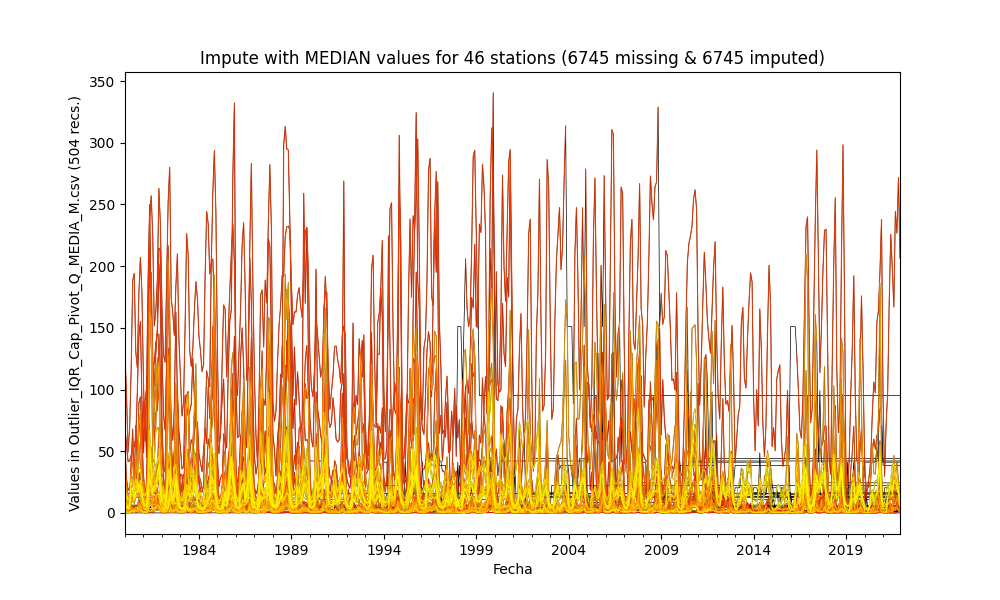

General statistics table - Imputed file

|          |   count |        mean |       std |        min |       25% |         50% |       75% |       max |
|---------:|--------:|------------:|----------:|-----------:|----------:|------------:|----------:|----------:|
| 15067020 |     504 |   6.40505   |  3.58693  |  1.114     |  4.684    |   5.5075    |   6.51375 |  27.85    |
| 15067080 |     504 |   1.62587   |  2.26987  |  0.124     |  0.88225  |   0.977419  |   1.27    |  15.3906  |
| 15067130 |     504 |   0.0902588 |  0.13635  |  0.002     |  0.02     |   0.0363357 |   0.09675 |   0.744   |
| 15067150 |     504 |   3.38977   |  3.21092  |  0.0811156 |  2.6945   |   2.6945    |   2.6945  |  25.5854  |
| 15067170 |     504 |   6.16005   |  6.96498  |  0.516     |  4.73477  |   4.73477   |   4.73477 |  58.3473  |
| 15067200 |     504 |   5.01924   |  3.87411  |  1.019     |  4.30484  |   4.30484   |   4.30484 |  37.1641  |
| 15067210 |     504 |   4.78693   |  0.978078 |  1.51655   |  4.716    |   4.716     |   4.716   |  17.14    |
| 16037040 |     504 |  20.4074    | 13.1925   |  3.445     | 12.8325   |  16.64      |  23.3     |  88.8711  |
| 16047020 |     504 |  49.0025    | 27.5361   | 10.16      | 38.8425   |  42.16      |  45.4375  | 223.5     |
| 16067020 |     504 | 104.98      | 47.5855   | 28.67      | 95.225    |  95.225     |  95.225   | 340.3     |
| 25027080 |     504 |   4.13938   |  5.84465  |  0.018     |  0.95975  |   1.999     |   4.3795  |  33.3085  |
| 25027400 |     504 | 151.648     | 69.7233   |  4.846     | 97.3201   | 151         | 202.3     | 328.7     |
| 25027590 |     504 |  50.6975    | 32.7825   |  0.723     | 30.7525   |  44.15      |  63.1025  | 158.1     |
| 25027620 |     504 |  47.6811    | 35.6108   |  1.309     | 22.79     |  38.6171    |  62.5824  | 202.2     |
| 25027890 |     504 |   2.44497   |  2.89232  |  0.007     |  0.6025   |   1.33      |   3.183   |  16.67    |
| 28017050 |     504 |  16.1484    | 13.2719   |  3         | 13.14     |  13.44      |  14.135   | 128.956   |
| 28017080 |     504 |   2.33895   |  3.16575  |  0.0238819 |  0.653311 |   1.13      |   2.4985  |  16.1476  |
| 28017110 |     504 |   8.90956   | 10.2105   |  0.118     |  3.53339  |   5.64      |   9.175   |  58.4429  |
| 28017120 |     504 |  14.3032    |  8.78028  |  2.48      | 12.635    |  12.635     |  12.635   |  68.8537  |
| 28017150 |     504 |   6.36778   |  1.10016  |  1.67986   |  6.36845  |   6.36845   |   6.36845 |  15.2573  |
| 28027020 |     504 |   2.15742   |  2.54473  |  0         |  0.6      |   1.3       |   2.7635  |  13.5641  |
| 28027030 |     504 |   3.70668   |  4.72957  |  0         |  0.9425   |   2.055     |   4.40075 |  29.4352  |
| 28027040 |     504 |   2.72406   |  3.23172  |  0.0190909 |  0.78025  |   1.585     |   3.017   |  18.5679  |
| 28027050 |     504 |   8.83156   | 15.1068   |  0.161     |  2.75975  |   4.267     |   6.40575 |  98.121   |
| 28027160 |     504 |   7.99429   |  7.24721  |  0.013     |  3.65125  |   6.026     |  10.075   |  43.1801  |
| 28037010 |     504 |   2.77075   |  3.99677  |  0.009     |  0.465796 |   1.402     |   3.03575 |  20.556   |
| 28037020 |     504 |   2.30991   |  2.6125   |  0         |  0.8225   |   1.469     |   2.845   |  16.56    |
| 28037030 |     504 |  32.7558    | 36.8596   |  1.221     |  8.6325   |  20.465     |  40.25    | 205.8     |
| 28037040 |     504 |   1.93447   |  2.36581  |  0.01      |  0.38825  |   1.01634   |   2.491   |  11.94    |
| 28037060 |     504 |   1.70645   |  1.76458  |  0.03      |  0.54925  |   1.04342   |   2.2885  |   9.49659 |
| 28037090 |     504 |  53.5443    | 46.6741   |  0.0106789 | 18.5502   |  41.18      |  75.3925  | 209.741   |
| 28037130 |     504 |   4.00631   |  5.19568  |  0.0140806 |  1.06525  |   2.01      |   4.40008 |  30.04    |
| 28047010 |     504 |  15.8285    |  7.2188   |  0.625     | 12.02     |  14.845     |  17.9825  |  48.8445  |
| 28047020 |     504 |   1.2569    |  0.871681 |  0.244     |  0.686    |   1.03365   |   1.45526 |   4.94186 |
| 28047040 |     504 |   2.30529   |  1.53309  |  0.25      |  1.997    |   1.997     |   1.997   |  11.3175  |
| 28047050 |     504 |  13.0256    | 12.9975   |  0.127     |  3.35325  |   8.391     |  17.9     |  63.14    |
| 28047080 |     504 |  15.9537    |  2.71828  |  6.365     | 15.865    |  15.865     |  15.865   |  41.3167  |
| 29067010 |     504 |  17.1618    |  9.66711  |  2.966     | 10.31     |  15.525     |  20.7747  |  62.2928  |
| 29067040 |     504 |   1.86001   |  1.40962  |  0.106     |  0.848572 |   1.439     |   2.42693 |   7.354   |
| 29067050 |     504 |  12.0357    |  7.02312  |  1.572     |  7.36175  |  10.8       |  14.2625  |  49.4225  |
| 29067060 |     504 |  23.585     |  8.74041  |  4.068     | 22.16     |  22.37      |  23.075   |  72.6401  |
| 29067070 |     504 |  13.1426    |  8.25886  |  2.06      |  7.19975  |  11.37      |  16.9725  |  48.3892  |
| 29067120 |     504 |  27.6299    | 16.0201   |  4.831     | 17.1482   |  24.445     |  33.3475  | 105.8     |
| 29067130 |     504 |  17.3023    | 13.8409   |  1.95487   |  8.18     |  13.59      |  21.6375  |  74.0504  |
| 29067150 |     504 |  15.8666    |  9.04313  |  0.479067  |  8.9625   |  14.42      |  21.0006  |  55.25    |
| 29067160 |     504 |   7.05      |  6.54708  |  0.546     |  3.157    |   5.185     |   8.49925 |  39.3278  |

## Method 3 - Imputing with Last Observation Carried Forward (LOCF) values
According to this technique, the missing values are imputed using the immediate values before it in the time series and the missing values at the start are not filled but the series are completed fillet to the end.

Imputed file: [Impute_LOCF_Outlier_IQR_Cap_Pivot_Q_MEDIA_M.csv](Impute_LOCF_Outlier_IQR_Cap_Pivot_Q_MEDIA_M.csv)

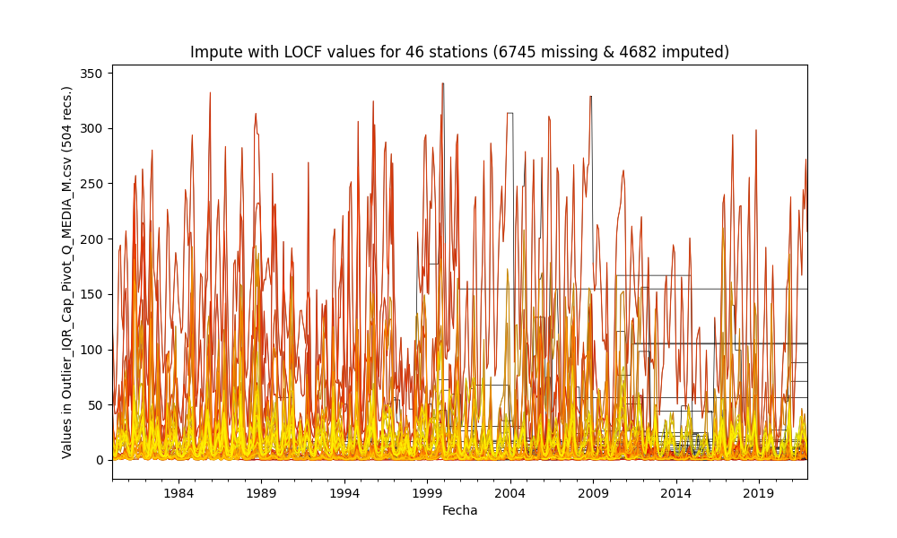

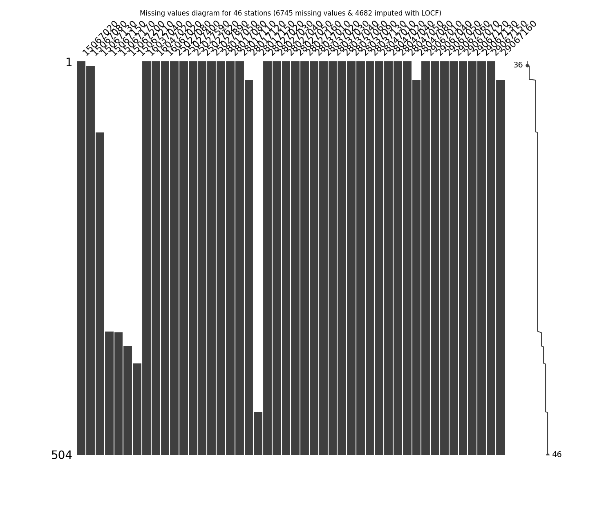

General statistics table - Imputed file

|          |   count |       mean |       std |        min |       25% |         50% |       75% |       max |
|---------:|--------:|-----------:|----------:|-----------:|----------:|------------:|----------:|----------:|
| 15067020 |     504 |   7.37645  |  3.65273  |  1.114     |  4.61475  |   7.31637   |   9.058   |  27.85    |
| 15067080 |     498 |   1.63324  |  2.55661  |  0.124     |  0.604    |   0.7785    |   1.464   |  15.3906  |
| 15067130 |     413 |   0.101844 |  0.14845  |  0.002     |  0.016    |   0.0332903 |   0.12    |   0.744   |
| 15067150 |     158 |   5.16012  |  5.50916  |  0.0811156 |  1.57187  |   2.99308   |   6.75122 |  25.5854  |
| 15067170 |     157 |   9.43622  | 11.9685   |  0.516     |  2.54009  |   4.74583   |  10.8052  |  58.3473  |
| 15067200 |     139 |   6.61245  |  7.18834  |  1.019     |  2.66742  |   3.274     |   8.029   |  37.1641  |
| 15067210 |     117 |   7.42293  |  3.39493  |  1.51655   |  4.521    |   9.60315   |   9.60315 |  17.14    |
| 16037040 |     504 |  19.993    | 14.0027   |  3.445     | 10.6587   |  15.21      |  24.2225  |  88.8711  |
| 16047020 |     504 |  64.5146   | 36.7289   | 10.16      | 30.28     |  55.57      | 105.4     | 223.5     |
| 16067020 |     504 | 136.293    | 51.468    | 28.67      | 96.6325   | 154.6       | 154.6     | 340.3     |
| 25027080 |     504 |   4.0837   |  5.8911   |  0.018     |  0.713876 |   1.8595    |   4.3795  |  33.3085  |
| 25027400 |     504 | 151.998    | 72.9399   |  4.846     | 94.0238   | 150.75      | 206.097   | 328.7     |
| 25027590 |     504 |  68.1203   | 39.733    |  0.723     | 29.3325   |  68.295     | 104.7     | 158.1     |
| 25027620 |     504 |  46.8487   | 37.5572   |  1.309     | 17.8328   |  34.1517    |  66.8779  | 202.2     |
| 25027890 |     504 |   2.51041  |  2.95873  |  0.007     |  0.3605   |   1.2875    |   3.71755 |  16.67    |
| 28017050 |     504 |  15.1552   | 19.0356   |  3         |  5.814    |   7.9435    |  17.66    | 128.956   |
| 28017080 |     504 |   2.35251  |  3.16162  |  0.0238819 |  0.648184 |   1.174     |   2.4985  |  16.1476  |
| 28017110 |     504 |   9.48117  | 10.5617   |  0.118     |  3.4135   |   6.027     |  10.135   |  58.4429  |
| 28017120 |     480 |  30.0406   | 21.581    |  2.48      |  8.611    |  19.21      |  56.22    |  68.8537  |
| 28017150 |      55 |   6.16477  |  3.46241  |  1.67986   |  3.56449  |   5.66327   |   7.86296 |  15.2573  |
| 28027020 |     504 |   2.07937  |  2.66237  |  0         |  0.253    |   1.0125    |   3.1115  |  13.5641  |
| 28027030 |     504 |   4.06994  |  4.77777  |  0         |  0.8515   |   2.4435    |   6.218   |  29.4352  |
| 28027040 |     504 |   4.18293  |  4.77112  |  0.0190909 |  0.763    |   1.9465    |   6       |  18.5679  |
| 28027050 |     504 |  14.7614   | 20.5931   |  0.161     |  2.545    |   6.1715    |  12.165   |  98.121   |
| 28027160 |     504 |   8.93307  |  7.30786  |  0.013     |  3.15075  |   9.355     |  10.69    |  43.1801  |
| 28037010 |     504 |   2.6875   |  4.06693  |  0.009     |  0.234484 |   1.155     |   3.46775 |  20.556   |
| 28037020 |     504 |   2.14383  |  2.84285  |  0         |  0.349    |   0.8345    |   3.10525 |  16.56    |
| 28037030 |     504 |  33.6177   | 39.0781   |  1.221     |  7.46791  |  20.18      |  41.155   | 205.8     |
| 28037040 |     504 |   1.92295  |  2.38928  |  0.01      |  0.34375  |   0.962     |   2.54975 |  11.94    |
| 28037060 |     504 |   1.73675  |  1.80878  |  0.03      |  0.52975  |   1.0125    |   2.37605 |   9.49659 |
| 28037090 |     504 |  68.4681   | 58.5673   |  0.0106789 | 16.8358   |  51.87      | 114.025   | 209.741   |
| 28037130 |     504 |   6.38891  |  7.45793  |  0.0140806 |  1.0275   |   2.59186   |   9.25275 |  30.04    |
| 28047010 |     504 |  15.339    |  8.48873  |  0.625     | 10.4372   |  14.156     |  18.4971  |  48.8445  |
| 28047020 |     504 |   1.26362  |  0.877056 |  0.244     |  0.68575  |   1.05205   |   1.5155  |   4.94186 |
| 28047040 |     504 |   5.15195  |  4.23181  |  0.25      |  1.96125  |   2.37      |  11.05    |  11.3175  |
| 28047050 |     504 |  13.9842   | 14.2034   |  0.127     |  3.351    |   8.825     |  20.1375  |  63.14    |
| 28047080 |     480 |  16.4661   |  2.78006  |  6.365     | 16.5      |  16.5       |  16.5     |  41.3167  |
| 29067010 |     504 |  16.6538   |  9.89771  |  2.966     |  8.91084  |  13.695     |  20.7747  |  62.2928  |
| 29067040 |     504 |   2.13276  |  1.54638  |  0.106     |  0.848572 |   1.6085    |   3.33136 |   7.354   |
| 29067050 |     504 |  12.8728   |  7.739    |  1.572     |  7.352    |  10.67      |  16.9544  |  49.4225  |
| 29067060 |     504 |  16.3842   | 14.9283   |  4.068     |  4.72     |  11.745     |  24.135   |  72.6401  |
| 29067070 |     504 |  14.5476   |  9.07279  |  2.06      |  6.95     |  12.8       |  20.1424  |  48.3892  |
| 29067120 |     504 |  27.0085   | 16.2531   |  4.831     | 17.1482   |  23.16      |  33.3475  | 105.8     |
| 29067130 |     504 |  18.338    | 15.4252   |  1.95487   |  8.00025  |  13.555     |  22.44    |  74.0504  |
| 29067150 |     504 |  15.835    |  9.22097  |  0.479067  |  8.73975  |  14.37      |  21.625   |  55.25    |
| 29067160 |     480 |   6.59915  |  6.97771  |  0.546     |  1.423    |   4.046     |   9.12875 |  39.3278  |

## Method 4 - Imputing with Next Observation Carried Backward (NOCB) values
According to this technique, the missing values are imputed using the immediate values after it in the time series and the missing values at the end are not filled but the series are completed fillet to the start.

Imputed file: [Impute_NOCB_Outlier_IQR_Cap_Pivot_Q_MEDIA_M.csv](Impute_NOCB_Outlier_IQR_Cap_Pivot_Q_MEDIA_M.csv)

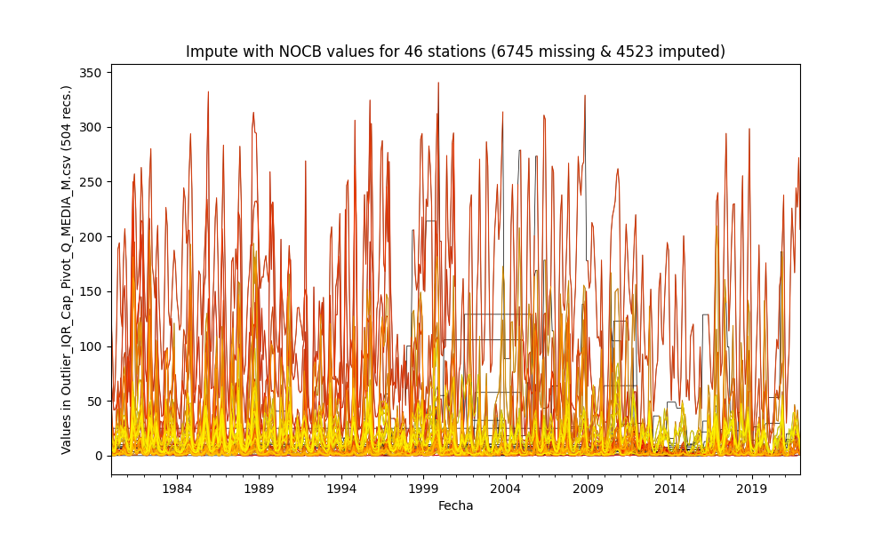

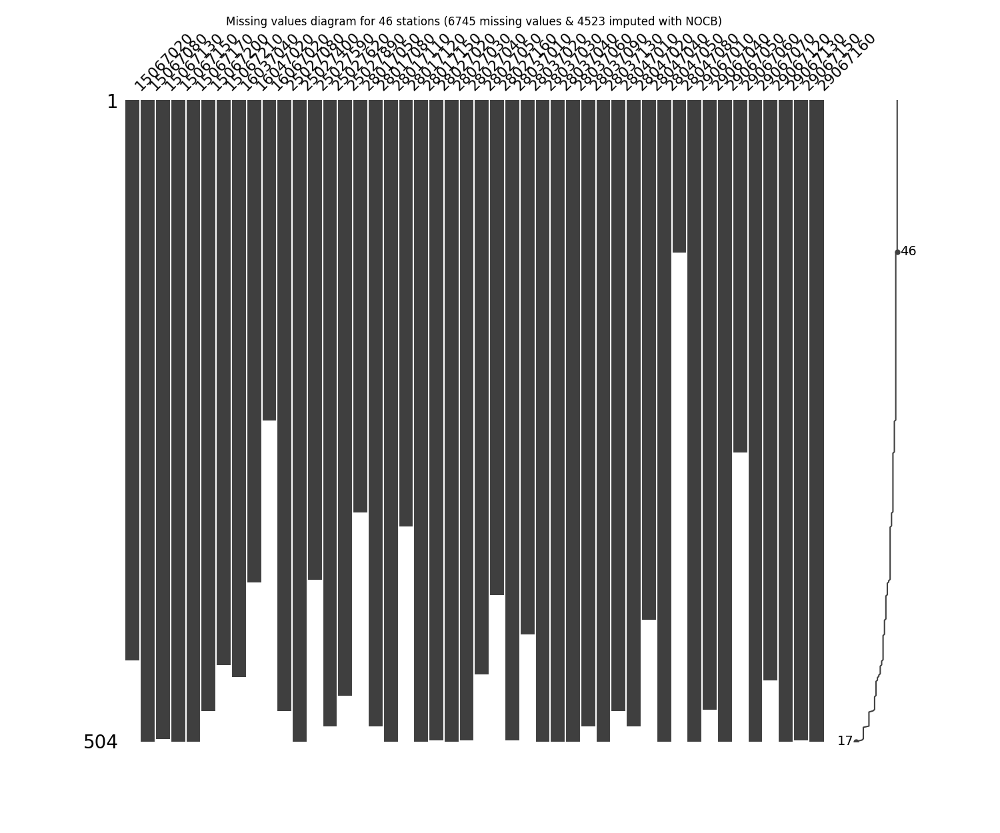

General statistics table - Imputed file

|          |   count |       mean |       std |        min |        25% |       50% |       75% |       max |
|---------:|--------:|-----------:|----------:|-----------:|-----------:|----------:|----------:|----------:|
| 15067020 |     440 |   6.54943  |  3.83389  |  1.114     |  4.44275   |   5.43016 |   7.1625  |  27.85    |
| 15067080 |     504 |   2.10959  |  2.85675  |  0.124     |  0.73475   |   0.883   |   2.3     |  15.3906  |
| 15067130 |     502 |   0.106154 |  0.136215 |  0.002     |  0.0197278 |   0.061   |   0.12    |   0.744   |
| 15067150 |     504 |  18.7059   |  9.80976  |  0.0811156 |  7.49756   |  25       |  25       |  25.5854  |
| 15067170 |     504 |  10.0118   |  6.91495  |  0.516     | 10.19      |  10.19    |  10.19    |  58.3473  |
| 15067200 |     480 |   6.89529  |  3.74653  |  1.019     |  6.725     |   6.725   |   6.725   |  37.1641  |
| 15067210 |     444 |   8.15176  |  1.95173  |  1.51655   |  8.695     |   8.695   |   8.695   |  17.14    |
| 16037040 |     453 |  23.5245   | 17.1778   |  3.445     | 11.41      |  17.1     |  29.43    |  88.8711  |
| 16047020 |     379 |  62.8056   | 37.6034   | 10.16      | 33.38      |  50.34    | 103.1     | 223.5     |
| 16067020 |     252 | 118.433    | 67.9825   | 28.67      | 65.37      |  96.415   | 158.65    | 340.3     |
| 25027080 |     480 |   4.41976  |  6.56955  |  0.018     |  0.73075   |   1.84867 |   4.74054 |  33.3085  |
| 25027400 |     504 | 151.331    | 70.5798   |  4.846     | 95.0916    | 148.8     | 204.4     | 328.7     |
| 25027590 |     377 |  53.0403   | 39.2249   |  0.723     | 18.7       |  39.38    |  86.84    | 158.1     |
| 25027620 |     492 |  45.9681   | 38.2164   |  1.309     | 15.165     |  34.64    |  63.9     | 202.2     |
| 25027890 |     468 |   2.4619   |  3.03517  |  0.007     |  0.3925    |   1.12609 |   3.5695  |  16.67    |
| 28017050 |     324 |  34.0876   | 42.4536   |  3         |  7.41325   |  15.465   |  34.0225  | 128.956   |
| 28017080 |     492 |   2.59525  |  3.4164   |  0.0238819 |  0.579797  |   1.13    |   2.944   |  16.1476  |
| 28017110 |     504 |   8.81254  | 10.2717   |  0.118     |  3.04075   |   5.405   |   9.223   |  58.4429  |
| 28017120 |     335 |  14.7022   | 11.3279   |  2.48      |  6.809     |  11.98    |  18.22    |  68.8537  |
| 28017150 |     504 |   7.72656  |  1.24545  |  1.67986   |  7.90542   |   7.90542 |   7.90542 |  15.2573  |
| 28027020 |     503 |   2.09807  |  2.63656  |  0         |  0.2505    |   1.09    |   3.033   |  13.5641  |
| 28027030 |     504 |   3.67902  |  4.8561   |  0         |  0.5425    |   1.68224 |   5.14124 |  29.4352  |
| 28027040 |     503 |   2.76667  |  3.39076  |  0.0190909 |  0.457518  |   1.31    |   3.6605  |  18.5679  |
| 28027050 |     451 |  10.3574   | 17.0015   |  0.161     |  1.7995    |   3.845   |  10.64    |  98.121   |
| 28027160 |     389 |   8.79107  |  8.19627  |  0.013     |  2.784     |   6.326   |  13.04    |  43.1801  |
| 28037010 |     503 |   2.74444  |  4.0415   |  0.009     |  0.336     |   1.221   |   3.223   |  20.556   |
| 28037020 |     420 |   2.46782  |  2.90815  |  0         |  0.39375   |   1.285   |   3.6145  |  16.56    |
| 28037030 |     504 |  32.785    | 36.967    |  1.221     |  8.18775   |  20.425   |  40.6375  | 205.8     |
| 28037040 |     504 |   2.00903  |  2.41705  |  0.01      |  0.378894  |   1.01734 |   2.76925 |  11.94    |
| 28037060 |     504 |   1.71578  |  1.77077  |  0.03      |  0.546969  |   1.04342 |   2.37605 |   9.49659 |
| 28037090 |     492 |  50.2079   | 51.2012   |  0.0106789 |  7.3055    |  30.9379  |  80.375   | 209.741   |
| 28037130 |     504 |   3.8105   |  5.39959  |  0.0140806 |  0.595     |   1.723   |   4.4245  |  30.04    |
| 28047010 |     480 |  16.3267   |  9.27683  |  0.625     | 10.5575    |  14.705   |  20.0475  |  48.8445  |
| 28047020 |     492 |   1.26436  |  0.883031 |  0.244     |  0.6775    |   1.037   |   1.48025 |   4.94186 |
| 28047040 |     408 |   1.99271  |  1.84509  |  0.25      |  1.021     |   1.021   |   2.30475 |  11.3175  |
| 28047050 |     504 |  12.9602   | 13.5288   |  0.127     |  2.25925   |   7.7305  |  20.1375  |  63.14    |
| 28047080 |     120 |  15.8245   |  5.66784  |  6.365     | 12.28      |  13.8     |  18.31    |  41.3167  |
| 29067010 |     504 |  16.2662   | 10.1663   |  2.966     |  8.253     |  13.8288  |  20.7747  |  62.2928  |
| 29067040 |     479 |   1.88891  |  1.44964  |  0.106     |  0.81      |   1.473   |   2.676   |   7.354   |
| 29067050 |     504 |  13.0741   |  7.89456  |  1.572     |  6.8625    |  11.39    |  17.5359  |  49.4225  |
| 29067060 |     277 |  24.1122   | 11.9138   |  4.068     | 15.43      |  21.12    |  31.87    |  72.6401  |
| 29067070 |     504 |  12.2727   |  8.76329  |  2.06      |  4.87756   |   9.7555  |  17.0575  |  48.3892  |
| 29067120 |     456 |  28.0142   | 16.8012   |  4.831     | 15.99      |  25.165   |  34.9825  | 105.8     |
| 29067130 |     504 |  17.7419   | 14.6292   |  1.95487   |  7.04349   |  13.555   |  22.44    |  74.0504  |
| 29067150 |     503 |  15.9905   |  9.33304  |  0.479067  |  8.8425    |  14.36    |  21.82    |  55.25    |
| 29067160 |     504 |   6.69145  |  6.70067  |  0.546     |  2.7813    |   4.346   |   8.49925 |  39.3278  |

## Method 5 - Impute missing values with Linear Interpolation values
According to this technique, the missing values are imputed using the linear interpolation between knowing pair values in the time series and the missing values at the start are not filled but the series are completed fillet to the end.

Imputed file: [Impute_InterpolateLinear_Outlier_IQR_Cap_Pivot_Q_MEDIA_M.csv](Impute_InterpolateLinear_Outlier_IQR_Cap_Pivot_Q_MEDIA_M.csv)

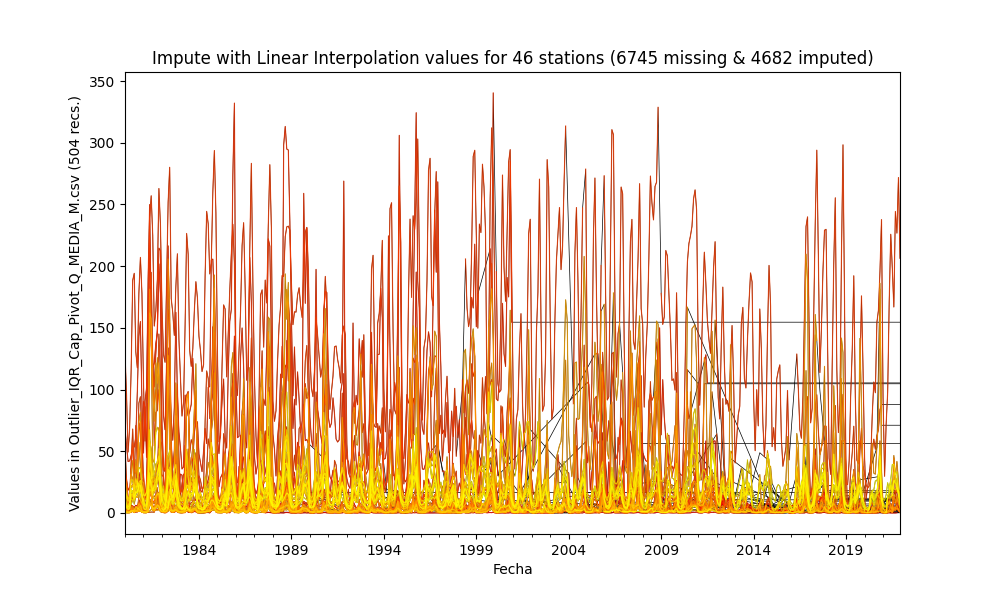

General statistics table - Imputed file

|          |   count |       mean |       std |        min |       25% |         50% |       75% |       max |
|---------:|--------:|-----------:|----------:|-----------:|----------:|------------:|----------:|----------:|
| 15067020 |     504 |   7.01164  |  3.56631  |  1.114     |  4.65638  |   6.709     |   7.94075 |  27.85    |
| 15067080 |     498 |   1.88085  |  2.52606  |  0.124     |  0.664781 |   0.879545  |   2.13227 |  15.3906  |
| 15067130 |     413 |   0.102583 |  0.148721 |  0.002     |  0.016    |   0.0319916 |   0.12    |   0.744   |
| 15067150 |     158 |   5.04131  |  5.44924  |  0.0811156 |  1.55682  |   2.7698    |   6.29516 |  25.5854  |
| 15067170 |     157 |   9.52712  | 12.1367   |  0.516     |  2.54009  |   4.74583   |  10.8052  |  58.3473  |
| 15067200 |     139 |   6.61245  |  7.18834  |  1.019     |  2.66742  |   3.274     |   8.029   |  37.1641  |
| 15067210 |     117 |   7.26106  |  3.458    |  1.51655   |  4.19785  |   9.60315   |   9.60315 |  17.14    |
| 16037040 |     504 |  21.1078   | 14.6345   |  3.445     | 10.6587   |  15.66      |  27.3675  |  88.8711  |
| 16047020 |     504 |  68.9421   | 35.7034   | 10.16      | 36.7023   |  60.5838    | 105.4     | 223.5     |
| 16067020 |     504 | 136.405    | 51.2589   | 28.67      | 96.6325   | 154.6       | 154.6     | 340.3     |
| 25027080 |     504 |   4.15489  |  6.06652  |  0.018     |  0.706377 |   1.8015    |   4.4705  |  33.3085  |
| 25027400 |     504 | 151.664    | 70.9592   |  4.846     | 94.4154   | 150.75      | 205.85    | 328.7     |
| 25027590 |     504 |  67.089    | 39.9965   |  0.723     | 29.3325   |  68.15      | 104.7     | 158.1     |
| 25027620 |     504 |  46.9062   | 37.461    |  1.309     | 17.8328   |  34.5079    |  66.8779  | 202.2     |
| 25027890 |     504 |   2.531    |  2.948    |  0.007     |  0.423    |   1.3045    |   3.71755 |  16.67    |
| 28017050 |     504 |  19.5725   | 25.289    |  3         |  5.814    |   7.85      |  20.7025  | 128.956   |
| 28017080 |     504 |   2.46083  |  3.22062  |  0.0238819 |  0.642031 |   1.174     |   2.77611 |  16.1476  |
| 28017110 |     504 |   9.14685  | 10.2877   |  0.118     |  3.48408  |   5.807     |  10.0301  |  58.4429  |
| 28017120 |     480 |  29.8776   | 21.4781   |  2.48      | 10.6125   |  18.8612    |  56.22    |  68.8537  |
| 28017150 |      55 |   6.21558  |  3.44473  |  1.67986   |  3.56449  |   6.13642   |   7.86296 |  15.2573  |
| 28027020 |     504 |   2.09561  |  2.6337   |  0         |  0.321    |   1.074     |   2.95601 |  13.5641  |
| 28027030 |     504 |   3.87448  |  4.73266  |  0         |  0.9085   |   2.3132    |   5.12951 |  29.4352  |
| 28027040 |     504 |   3.47514  |  3.71805  |  0.0190909 |  0.77225  |   2.0444    |   4.75829 |  18.5679  |
| 28027050 |     504 |  12.6428   | 16.9032   |  0.161     |  2.64875  |   6.76283   |  11.9436  |  98.121   |
| 28027160 |     504 |   9.07871  |  7.23966  |  0.013     |  3.54075  |   9.47      |  10.69    |  43.1801  |
| 28037010 |     504 |   2.71569  |  4.03432  |  0.009     |  0.340993 |   1.21227   |   3.18553 |  20.556   |
| 28037020 |     504 |   2.12926  |  2.77317  |  0         |  0.349    |   0.8935    |   3.18075 |  16.56    |
| 28037030 |     504 |  33.2013   | 37.5796   |  1.221     |  8.19367  |  20.265     |  41.155   | 205.8     |
| 28037040 |     504 |   1.96599  |  2.38     |  0.01      |  0.3765   |   1.02083   |   2.5815  |  11.94    |
| 28037060 |     504 |   1.72627  |  1.78003  |  0.03      |  0.546656 |   1.0278    |   2.37605 |   9.49659 |
| 28037090 |     504 |  59.5869   | 50.6202   |  0.0106789 | 16.79     |  47.03      |  95.846   | 209.741   |
| 28037130 |     504 |   5.0997   |  5.92381  |  0.0140806 |  1.0275   |   2.4565    |   6.94201 |  30.04    |
| 28047010 |     504 |  15.6926   |  8.53897  |  0.625     | 10.4372   |  14.395     |  19.1925  |  48.8445  |
| 28047020 |     504 |   1.26146  |  0.874172 |  0.244     |  0.686    |   1.05205   |   1.5025  |   4.94186 |
| 28047040 |     504 |   3.59826  |  2.7427   |  0.25      |  1.8295   |   2.265     |   4.80968 |  11.3175  |
| 28047050 |     504 |  13.4722   | 13.7828   |  0.127     |  3.12475  |   7.79163   |  20.1375  |  63.14    |
| 28047080 |     480 |  16.4661   |  2.78006  |  6.365     | 16.5      |  16.5       |  16.5     |  41.3167  |
| 29067010 |     504 |  16.46     | 10.015    |  2.966     |  8.6505   |  13.7888    |  20.7747  |  62.2928  |
| 29067040 |     504 |   2.04661  |  1.4667   |  0.106     |  0.848572 |   1.596     |   3.08685 |   7.354   |
| 29067050 |     504 |  12.9734   |  7.76469  |  1.572     |  7.0085   |  11.2066    |  17.0875  |  49.4225  |
| 29067060 |     504 |  15.8811   | 13.6948   |  4.068     |  4.72     |  11.745     |  24.045   |  72.6401  |
| 29067070 |     504 |  13.4101   |  8.53805  |  2.06      |  6.77975  |  11.3896    |  18.0283  |  48.3892  |
| 29067120 |     504 |  27.0355   | 16.2494   |  4.831     | 17.1482   |  23.16      |  33.3475  | 105.8     |
| 29067130 |     504 |  18.0399   | 14.9478   |  1.95487   |  7.65482  |  13.555     |  22.44    |  74.0504  |
| 29067150 |     504 |  15.913    |  9.17554  |  0.479067  |  8.833    |  14.5       |  21.5875  |  55.25    |
| 29067160 |     480 |   6.72271  |  6.89777  |  0.546     |  2.08388  |   4.31124   |   9.12875 |  39.3278  |

## Method 6 - Impute missing values with Exponential (Weighted) Moving Average - EWM = 3
According to this technique, the missing values are imputed using the moving average values in the time series and the missing values at the start are not filled but the series are completed fillet to the end.

Imputed file: [Impute_MeanEWM_Outlier_IQR_Cap_Pivot_Q_MEDIA_M.csv](Impute_MeanEWM_Outlier_IQR_Cap_Pivot_Q_MEDIA_M.csv)

General statistics table - Imputed file

|          |   count |       mean |       std |        min |       25% |       50% |       75% |       max |
|---------:|--------:|-----------:|----------:|-----------:|----------:|----------:|----------:|----------:|
| 15067020 |     504 |   7.48431  |  3.85758  |  1.114     |  4.684    |   6.107   |  10.3853  |  27.85    |
| 15067080 |     498 |   1.93414  |  2.39007  |  0.124     |  0.756094 |   1.11961 |   2.19571 |  15.3906  |
| 15067130 |     413 |   0.102587 |  0.148136 |  0.002     |  0.016    |   0.037   |   0.12    |   0.744   |
| 15067150 |     158 |   5.33473  |  5.744    |  0.0811156 |  1.57187  |   2.7698  |   6.75122 |  25.5854  |
| 15067170 |     157 |   9.44566  | 11.981    |  0.516     |  2.54009  |   4.74583 |  10.8052  |  58.3473  |
| 15067200 |     139 |   6.67419  |  7.15542  |  1.019     |  2.79327  |   3.274   |   8.029   |  37.1641  |
| 15067210 |     117 |   6.90228  |  2.472    |  1.51655   |  4.521    |   7.63191 |   7.63191 |  17.14    |
| 16037040 |     504 |  20.6899   | 13.6137   |  3.445     | 11.5065   |  16.415   |  25.4624  |  88.8711  |
| 16047020 |     504 |  67.1122   | 37.2937   | 10.16      | 38.8425   |  55.173   | 111.217   | 223.5     |
| 16067020 |     504 | 147.442    | 56.09     | 28.67      | 96.6325   | 178.021   | 178.021   | 340.3     |
| 25027080 |     504 |   4.12876  |  5.86292  |  0.018     |  0.911457 |   1.8895  |   4.3795  |  33.3085  |
| 25027400 |     504 | 151.322    | 70.9549   |  4.846     | 93.7489   | 150.75    | 205.85    | 328.7     |
| 25027590 |     504 |  57.1103   | 33.0817   |  0.723     | 30.7525   |  65.78    |  67.2137  | 158.1     |
| 25027620 |     504 |  47.9438   | 36.0934   |  1.309     | 22.4951   |  37.5633  |  63.9675  | 202.2     |
| 25027890 |     504 |   2.7329   |  3.02808  |  0.007     |  0.53425  |   1.51808 |   4.25775 |  16.67    |
| 28017050 |     504 |  17.5707   | 18.2062   |  3         | 11.9745   |  11.9745  |  17.1825  | 128.956   |
| 28017080 |     504 |   2.39728  |  3.1569   |  0.0238819 |  0.653311 |   1.20009 |   2.77611 |  16.1476  |
| 28017110 |     504 |   9.17818  | 10.1999   |  0.118     |  3.4135   |   6.027   |  10.3716  |  58.4429  |
| 28017120 |     480 |  21.8067   | 11.4025   |  2.48      | 12.43     |  19.0886  |  31.3396  |  68.8537  |
| 28017150 |      55 |   6.33954  |  3.36054  |  1.67986   |  3.70741  |   6.2521  |   7.86296 |  15.2573  |
| 28027020 |     504 |   2.23052  |  2.59435  |  0         |  0.51925  |   1.33491 |   2.99625 |  13.5641  |
| 28027030 |     504 |   3.98093  |  4.70138  |  0         |  0.9425   |   2.501   |   4.67726 |  29.4352  |
| 28027040 |     504 |   3.74198  |  3.89787  |  0.0190909 |  0.758509 |   2.08403 |   5.9675  |  18.5679  |
| 28027050 |     504 |  11.8931   | 15.577    |  0.161     |  2.73325  |   7.2955  |  12.165   |  98.121   |
| 28027160 |     504 |   9.0318   |  7.21684  |  0.013     |  3.6      |   9.416   |  10.5149  |  43.1801  |
| 28037010 |     504 |   2.86435  |  4.04305  |  0.009     |  0.4155   |   1.34449 |   3.47675 |  20.556   |
| 28037020 |     504 |   2.60808  |  2.62595  |  0         |  0.78275  |   2.2955  |   3.27625 |  16.56    |
| 28037030 |     504 |  34.2635   | 37.486    |  1.221     |  8.6325   |  22.065   |  42.615   | 205.8     |
| 28037040 |     504 |   1.99204  |  2.38278  |  0.01      |  0.38825  |   1.10937 |   2.54975 |  11.94    |
| 28037060 |     504 |   1.73037  |  1.76443  |  0.03      |  0.546969 |   1.05223 |   2.37605 |   9.49659 |
| 28037090 |     504 |  58.1827   | 47.2293   |  0.0106789 | 18.5502   |  53.1711  |  89.1835  | 209.741   |
| 28037130 |     504 |   5.56596  |  6.0742   |  0.0140806 |  1.05625  |   2.6655  |   8.64846 |  30.04    |
| 28047010 |     504 |  15.8192   |  7.99813  |  0.625     | 11.4175   |  15.0344  |  18.414   |  48.8445  |
| 28047020 |     504 |   1.26384  |  0.874831 |  0.244     |  0.686    |   1.029   |   1.5155  |   4.94186 |
| 28047040 |     504 |   4.10922  |  3.09957  |  0.25      |  1.55872  |   2.37    |   8.11084 |  11.3175  |
| 28047050 |     504 |  14.7457   | 13.858    |  0.127     |  3.35325  |  10.325   |  24.265   |  63.14    |
| 28047080 |     480 |  17.2694   |  2.81867  |  6.365     | 17.5041   |  17.5041  |  17.5041  |  41.3167  |
| 29067010 |     504 |  17.1711   |  9.75671  |  2.966     | 10.31     |  15.03    |  21.605   |  62.2928  |
| 29067040 |     504 |   2.01214  |  1.44129  |  0.106     |  0.848572 |   1.6185  |   2.89148 |   7.354   |
| 29067050 |     504 |  12.99     |  7.18879  |  1.572     |  7.36175  |  13.0766  |  16.2721  |  49.4225  |
| 29067060 |     504 |  20.6388   | 10.3426   |  4.068     | 14.9807   |  14.9807  |  24.135   |  72.6401  |
| 29067070 |     504 |  15.1644   |  9.47617  |  2.06      |  7.19975  |  13.2799  |  20.1424  |  48.3892  |
| 29067120 |     504 |  28.4868   | 16.087    |  4.831     | 17.1482   |  27.025   |  34.9825  | 105.8     |
| 29067130 |     504 |  17.9568   | 14.4662   |  1.95487   |  8.00025  |  13.555   |  22.44    |  74.0504  |
| 29067150 |     504 |  15.9549   |  9.04992  |  0.479067  |  8.9625   |  14.675   |  21.0006  |  55.25    |
| 29067160 |     480 |   6.92856  |  6.89915  |  0.546     |  1.87208  |   4.57551 |   9.12875 |  39.3278  |

## Method 7 - Impute missing values with Natural Neigborns - KNN = 5 Imputer from Scikit Learn
According to this technique, the missing values are imputed using the natural neighbors values and the serie has been completed filled. More information in https://scikit-learn.org/stable/modules/generated/sklearn.impute.KNNImputer.html

Imputer = KNNImputer(n_neighbors=n_neighbors, weights=uniform, metric=nan_euclidean)

Imputed file: [Impute_KNN_Outlier_IQR_Cap_Pivot_Q_MEDIA_M.csv](Impute_KNN_Outlier_IQR_Cap_Pivot_Q_MEDIA_M.csv)

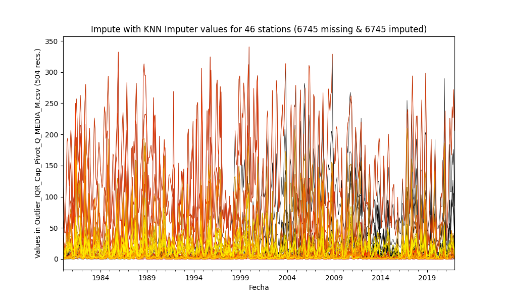

General statistics table - Imputed file

|          |   count |       mean |       std |        min |       25% |       50% |       75% |       max |
|---------:|--------:|-----------:|----------:|-----------:|----------:|----------:|----------:|----------:|
| 15067020 |     504 |   6.88993  |  4.20289  |  1.114     |  4.06375  |   5.5075  |   8.5964  |  27.85    |
| 15067080 |     504 |   2.1734   |  2.59388  |  0.124     |  0.676442 |   1.23993 |   2.6445  |  15.3906  |
| 15067130 |     504 |   0.105281 |  0.148709 |  0.002     |  0.016    |   0.039   |   0.12    |   0.744   |
| 15067150 |     504 |   4.72619  |  4.38151  |  0.0811156 |  1.80564  |   3.55204 |   5.74811 |  25.5854  |
| 15067170 |     504 |   9.62308  | 10.9037   |  0.516     |  2.91415  |   6.24275 |  10.9775  |  58.3473  |
| 15067200 |     504 |   7.0341   |  5.80291  |  1.019     |  3.42492  |   5.34069 |   8.0114  |  37.1641  |
| 15067210 |     504 |   6.97809  |  3.64312  |  1.51655   |  3.6304   |   6.28423 |  10.646   |  17.14    |
| 16037040 |     504 |  20.6192   | 13.9998   |  3.445     | 11.385    |  16.22    |  25.8605  |  88.8711  |
| 16047020 |     504 |  53.4358   | 32.1685   | 10.16      | 30.234    |  42.865   |  69.002   | 223.5     |
| 16067020 |     504 | 112.92     | 59.9975   | 28.67      | 67.5725   |  95.745   | 146.5     | 340.3     |
| 25027080 |     504 |   4.25604  |  5.91415  |  0.018     |  0.8199   |   1.962   |   4.8384  |  33.3085  |
| 25027400 |     504 | 150.309    | 71.2247   |  4.846     | 93.5206   | 146.75    | 203.375   | 328.7     |
| 25027590 |     504 |  52.4647   | 38.5969   |  0.723     | 16.595    |  42.983   |  85.293   | 158.1     |
| 25027620 |     504 |  48.3995   | 38.5961   |  1.309     | 17.1259   |  36.725   |  70.4454  | 202.2     |
| 25027890 |     504 |   2.52111  |  2.91731  |  0.007     |  0.57225  |   1.38906 |   3.4515  |  16.67    |
| 28017050 |     504 |  18.6744   | 15.9737   |  3         |  7.1146   |  14.1749  |  23.97    | 128.956   |
| 28017080 |     504 |   2.40642  |  3.19792  |  0.0238819 |  0.60825  |   1.138   |   2.704   |  16.1476  |
| 28017110 |     504 |   8.89143  | 10.2554   |  0.118     |  3.347    |   5.5005  |   9.524   |  58.4429  |
| 28017120 |     504 |  16.0468   | 11.796    |  2.48      |  7.14405  |  13.0299  |  21.1945  |  68.8537  |
| 28017150 |     504 |   6.22219  |  2.66868  |  1.67986   |  4.21354  |   5.75007 |   7.57209 |  15.2573  |
| 28027020 |     504 |   2.09418  |  2.64039  |  0         |  0.32635  |   1.047   |   2.96359 |  13.5641  |
| 28027030 |     504 |   3.9343   |  4.88943  |  0         |  0.8385   |   2.14232 |   5.41929 |  29.4352  |
| 28027040 |     504 |   2.85165  |  3.42152  |  0.0190909 |  0.596    |   1.52509 |   3.53172 |  18.5679  |
| 28027050 |     504 |  10.4927   | 15.6433   |  0.161     |  2.1725   |   4.9878  |  10.7417  |  98.121   |
| 28027160 |     504 |   8.22225  |  7.98542  |  0.013     |  2.46805  |   5.5725  |  12.1625  |  43.1801  |
| 28037010 |     504 |   2.71281  |  4.0444   |  0.009     |  0.313871 |   1.2135  |   3.19351 |  20.556   |
| 28037020 |     504 |   2.34287  |  2.77384  |  0         |  0.392    |   1.285   |   3.5215  |  16.56    |
| 28037030 |     504 |  32.0692   | 37.2624   |  1.221     |  6.59885  |  19.8928  |  40.6375  | 205.8     |
| 28037040 |     504 |   1.91947  |  2.38718  |  0.01      |  0.33775  |   0.962   |   2.534   |  11.94    |
| 28037060 |     504 |   1.70257  |  1.77917  |  0.03      |  0.5275   |   1.00167 |   2.3     |   9.49659 |
| 28037090 |     504 |  57.1671   | 50.7506   |  0.0106789 | 15.6971   |  41.6942  |  90.121   | 209.741   |
| 28037130 |     504 |   4.0859   |  5.28291  |  0.0140806 |  0.85     |   1.9025  |   5.0804  |  30.04    |
| 28047010 |     504 |  15.9268   |  7.71557  |  0.625     | 11.2575   |  14.67    |  18.9975  |  48.8445  |
| 28047020 |     504 |   1.25709  |  0.882697 |  0.244     |  0.65     |   1.03157 |   1.52625 |   4.94186 |
| 28047040 |     504 |   2.46542  |  1.92268  |  0.25      |  1.2196   |   1.8958  |   3.1019  |  11.3175  |
| 28047050 |     504 |  13.6985   | 13.4288   |  0.127     |  3.12475  |   8.83048 |  20.79    |  63.14    |
| 28047080 |     504 |  15.3485   |  5.17215  |  6.365     | 11.4383   |  15.199   |  18.073   |  41.3167  |
| 29067010 |     504 |  16.9179   |  9.9324   |  2.966     |  9.57868  |  15.08    |  21.2078  |  62.2928  |
| 29067040 |     504 |   1.88558  |  1.4367   |  0.106     |  0.80275  |   1.454   |   2.69375 |   7.354   |
| 29067050 |     504 |  12.2241   |  7.474    |  1.572     |  6.28981  |  10.965   |  15.8925  |  49.4225  |
| 29067060 |     504 |  24.6602   | 11.6615   |  4.068     | 15.2148   |  23.0882  |  31.849   |  72.6401  |
| 29067070 |     504 |  13.6336   |  8.732    |  2.06      |  6.56775  |  11.7432  |  18.235   |  48.3892  |
| 29067120 |     504 |  27.6705   | 16.628    |  4.831     | 15.7139   |  24.28    |  34.8522  | 105.8     |
| 29067130 |     504 |  17.3341   | 13.9946   |  1.95487   |  7.14643  |  13.555   |  21.905   |  74.0504  |
| 29067150 |     504 |  15.8412   |  9.21863  |  0.479067  |  8.7905   |  14.35    |  21.5417  |  55.25    |
| 29067160 |     504 |   7.81324  |  6.96157  |  0.546     |  2.99175  |   5.589   |  10.9     |  39.3278  |

## Method 8 - Impute missing values with Multivariate Imputation by Chained Equation - MICE from Scikit Learn
According to this technique, the missing values are imputed using MICE values and the serie has been completed filled. More information in https://scikit-learn.org/stable/modules/generated/sklearn.impute.IterativeImputer.html

Imputer = IterativeImputer(estimator=BayesianRidge(), min_value=0, n_nearest_features=5)

Imputed file: [Impute_MICE_Outlier_IQR_Cap_Pivot_Q_MEDIA_M.csv](Impute_MICE_Outlier_IQR_Cap_Pivot_Q_MEDIA_M.csv)

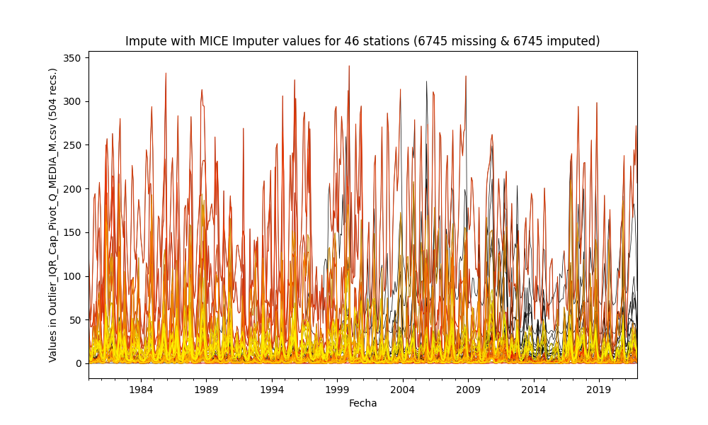

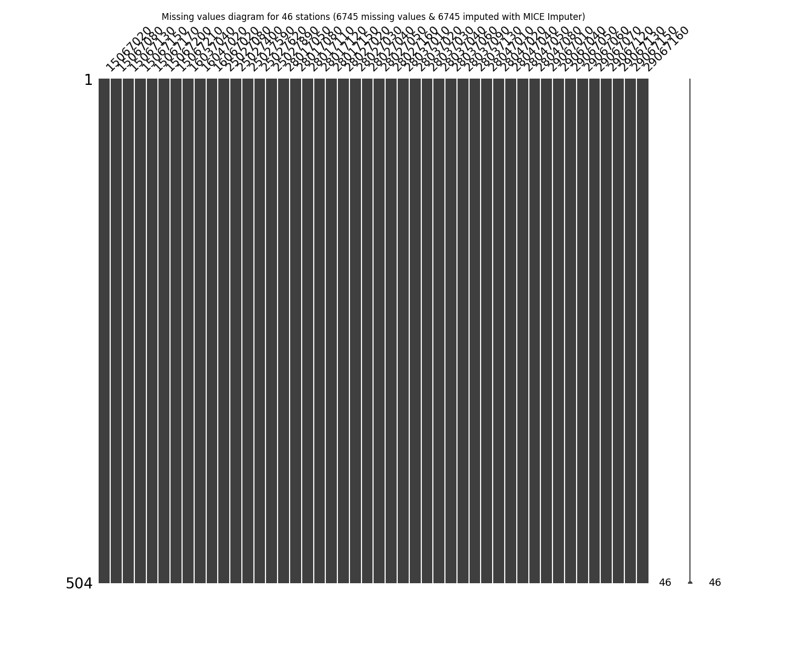

General statistics table - Imputed file

|          |   count |       mean |       std |        min |       25% |         50% |       75% |       max |
|---------:|--------:|-----------:|----------:|-----------:|----------:|------------:|----------:|----------:|
| 15067020 |     504 |   7.07786  |  4.0513   |  1.114     |  4.29144  |   5.885     |   8.78557 |  27.85    |
| 15067080 |     504 |   2.14873  |  2.50686  |  0         |  0.625198 |   1.33241   |   2.745   |  15.3906  |
| 15067130 |     504 |   0.100738 |  0.140267 |  0         |  0.016    |   0.0398616 |   0.12    |   0.744   |
| 15067150 |     504 |   5.05495  |  4.25924  |  0         |  2.18717  |   3.67146   |   6.31259 |  25.5854  |
| 15067170 |     504 |   9.5249   | 10.0123   |  0.516     |  3.20844  |   5.87023   |  11.2849  |  58.3473  |
| 15067200 |     504 |   7.45936  |  5.64649  |  0.938922  |  3.88357  |   5.62406   |   8.87734 |  37.1641  |
| 15067210 |     504 |   7.54365  |  4.96768  |  1.51655   |  4.20952  |   6.03213   |   8.53568 |  27.8675  |
| 16037040 |     504 |  20.838    | 13.3771   |  3.445     | 12.6025   |  16.4851    |  25.4754  |  88.8711  |
| 16047020 |     504 |  54.2041   | 30.411    | 10.16      | 35.2851   |  45.195     |  63.1073  | 223.5     |
| 16067020 |     504 | 113.522    | 56.0341   | 28.67      | 73.0297   |  97.3407    | 142.217   | 340.3     |
| 25027080 |     504 |   4.23111  |  5.90534  |  0         |  0.874875 |   1.9885    |   4.74054 |  33.3085  |
| 25027400 |     504 | 151.552    | 70.5535   |  4.846     | 97.3201   | 148.8       | 204.4     | 328.7     |
| 25027590 |     504 |  52.5351   | 36.1793   |  0.723     | 23.8      |  42.5553    |  76.77    | 158.1     |
| 25027620 |     504 |  49.1084   | 37.8986   |  1.309     | 20.2664   |  37.6866    |  70.3723  | 202.2     |
| 25027890 |     504 |   2.48638  |  2.92212  |  0         |  0.5025   |   1.30036   |   3.4515  |  16.67    |
| 28017050 |     504 |  19.3574   | 15.2418   |  3         | 10.8951   |  14.8402    |  23.11    | 128.956   |
| 28017080 |     504 |   2.42987  |  3.19066  |  0         |  0.6055   |   1.15302   |   2.85875 |  16.1476  |
| 28017110 |     504 |   9.05613  | 10.2382   |  0.118     |  3.53339  |   5.68155   |   9.70175 |  58.4429  |
| 28017120 |     504 |  16.2817   | 10.2761   |  2.48      |  9.09043  |  13.5194    |  20.1293  |  68.8537  |
| 28017150 |     504 |   4.97349  |  2.41784  |  1.67986   |  3.209    |   4.4231    |   6.13117 |  15.5201  |
| 28027020 |     504 |   2.09922  |  2.63529  |  0         |  0.305702 |   1.084     |   2.99625 |  13.5641  |
| 28027030 |     504 |   4.03666  |  4.94167  |  0         |  0.8325   |   2.20593   |   5.643   |  29.4352  |
| 28027040 |     504 |   2.88528  |  3.4034   |  0         |  0.641752 |   1.5745    |   3.80099 |  18.5679  |
| 28027050 |     504 |  10.0646   | 15.1624   |  0.161     |  2.4507   |   5.34054   |  10.7084  |  98.121   |
| 28027160 |     504 |   8.18109  |  7.83817  |  0         |  2.6125   |   5.5529    |  11.9245  |  43.1801  |
| 28037010 |     504 |   2.65706  |  4.05978  |  0         |  0.2665   |   1.155     |   3.148   |  20.556   |
| 28037020 |     504 |   2.32362  |  2.72811  |  0         |  0.427659 |   1.3645    |   3.27625 |  16.56    |
| 28037030 |     504 |  32.1858   | 37.238    |  0         |  6.77325  |  20.105     |  40.6375  | 205.8     |
| 28037040 |     504 |   1.92447  |  2.38382  |  0         |  0.35525  |   0.962     |   2.54975 |  11.94    |
| 28037060 |     504 |   1.70824  |  1.77375  |  0.03      |  0.5275   |   1.02397   |   2.3     |   9.49659 |
| 28037090 |     504 |  58.0073   | 50.8176   |  0.0106789 | 16.689    |  43.015     |  89.8504  | 211.003   |
| 28037130 |     504 |   4.22318  |  5.34301  |  0.0140806 |  0.98325  |   2.005     |   5.10225 |  30.04    |
| 28047010 |     504 |  15.8067   |  7.43137  |  0.625     | 11.4825   |  14.6025    |  18.7103  |  48.8445  |
| 28047020 |     504 |   1.26545  |  0.874144 |  0.244     |  0.686    |   1.037     |   1.52625 |   4.94186 |
| 28047040 |     504 |   2.61429  |  1.87765  |  0.25      |  1.33228  |   2.09554   |   3.30269 |  11.3175  |
| 28047050 |     504 |  13.6372   | 13.3656   |  0.127     |  3.24675  |   8.5705    |  20.1375  |  63.14    |
| 28047080 |     504 |  15.3304   |  4.58298  |  6.365     | 11.9975   |  14.4819    |  17.3074  |  41.3167  |
| 29067010 |     504 |  17.1189   |  9.89261  |  2.966     |  9.78603  |  15.37      |  21.2709  |  62.2928  |
| 29067040 |     504 |   1.89713  |  1.43361  |  0.106     |  0.823007 |   1.47352   |   2.6575  |   7.354   |
| 29067050 |     504 |  12.4209   |  7.47896  |  1.572     |  7.03625  |  10.7519    |  16.0841  |  49.4225  |
| 29067060 |     504 |  25.428    | 11.7332   |  4.068     | 16.293    |  22.9357    |  32.3741  |  72.6401  |
| 29067070 |     504 |  13.8492   |  8.77891  |  2.06      |  6.95     |  11.8433    |  18.2576  |  48.3892  |
| 29067120 |     504 |  28.2711   | 16.9589   |  4.831     | 15.9325   |  25.0421    |  35.76    | 105.8     |
| 29067130 |     504 |  17.3691   | 13.9397   |  1.95487   |  7.74225  |  13.575     |  21.9297  |  74.0504  |
| 29067150 |     504 |  15.8533   |  9.15989  |  0.479067  |  8.84325  |  14.27      |  21.4922  |  55.25    |
| 29067160 |     504 |   7.55254  |  6.62537  |  0.546     |  3.157    |   5.91382   |   9.81191 |  39.3278  |

Complementary report with individual graphs for stations in [Impute_Station_Outlier_IQR_Cap_Pivot_Q_MEDIA_M.csv.md](Impute_Station_Outlier_IQR_Cap_Pivot_Q_MEDIA_M.csv.md)

> As you notice, some of the techniques showed above can`t fill complete the missing values at the start or at the end, however, you can first choice a method and then apply another complementary method for get full filled the missin values.
