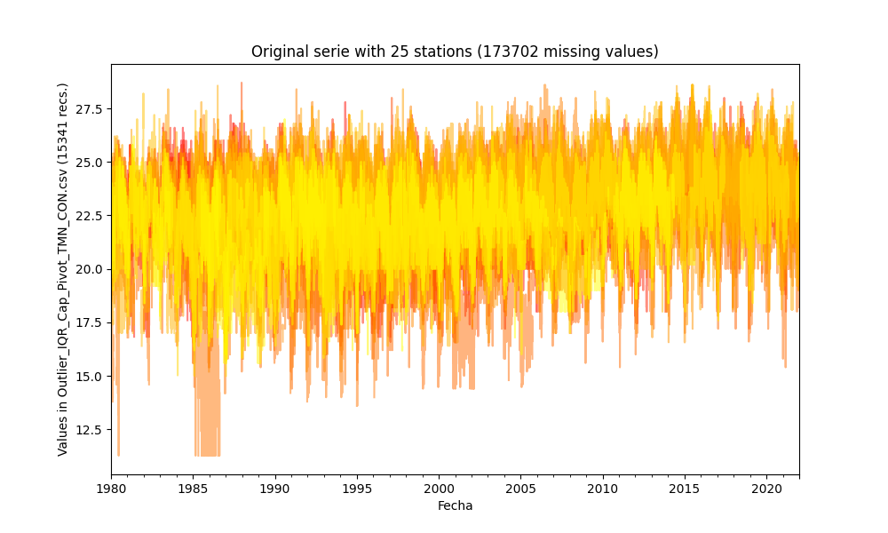
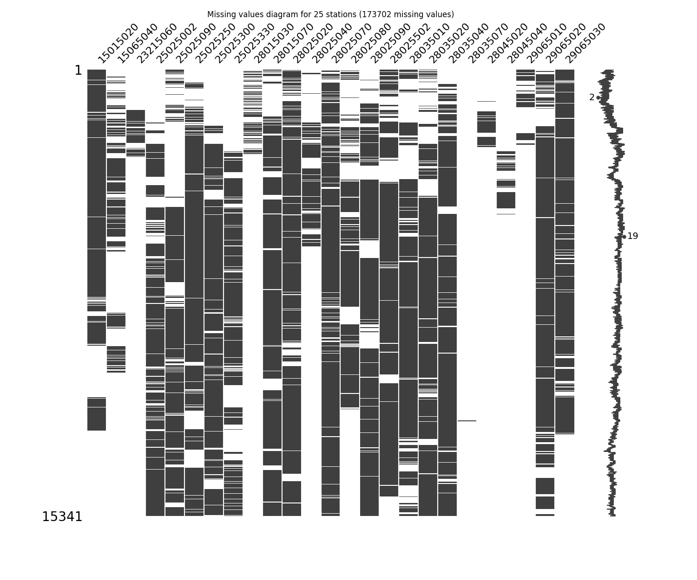
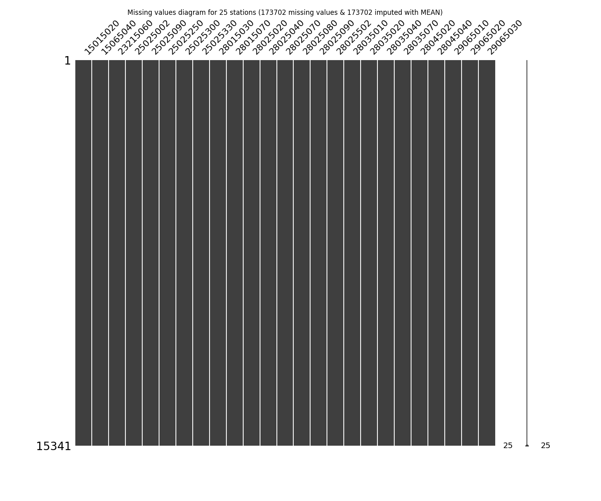
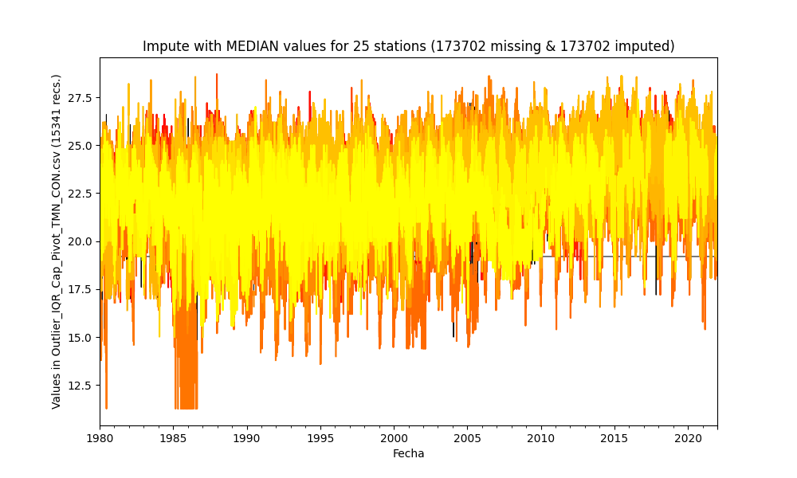
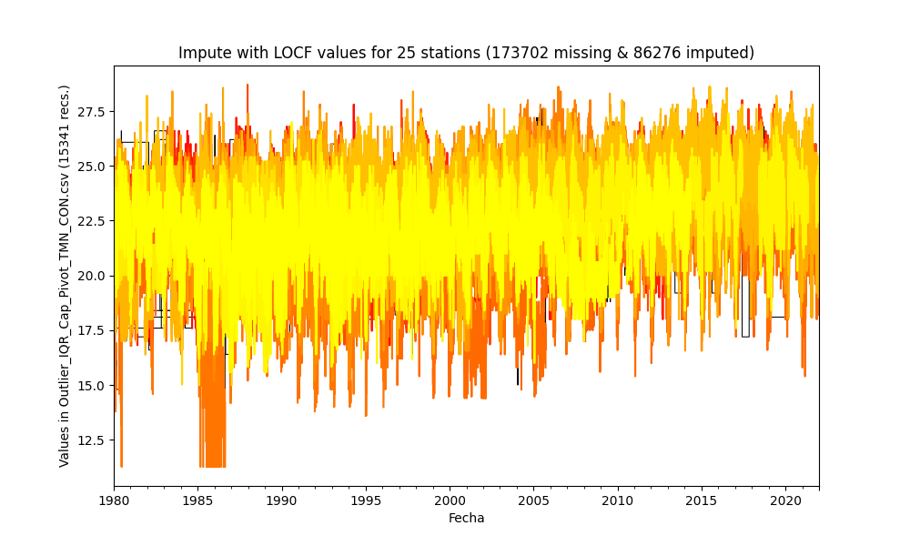
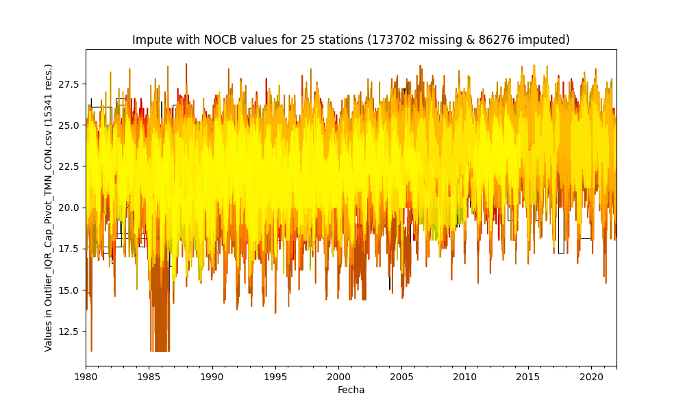
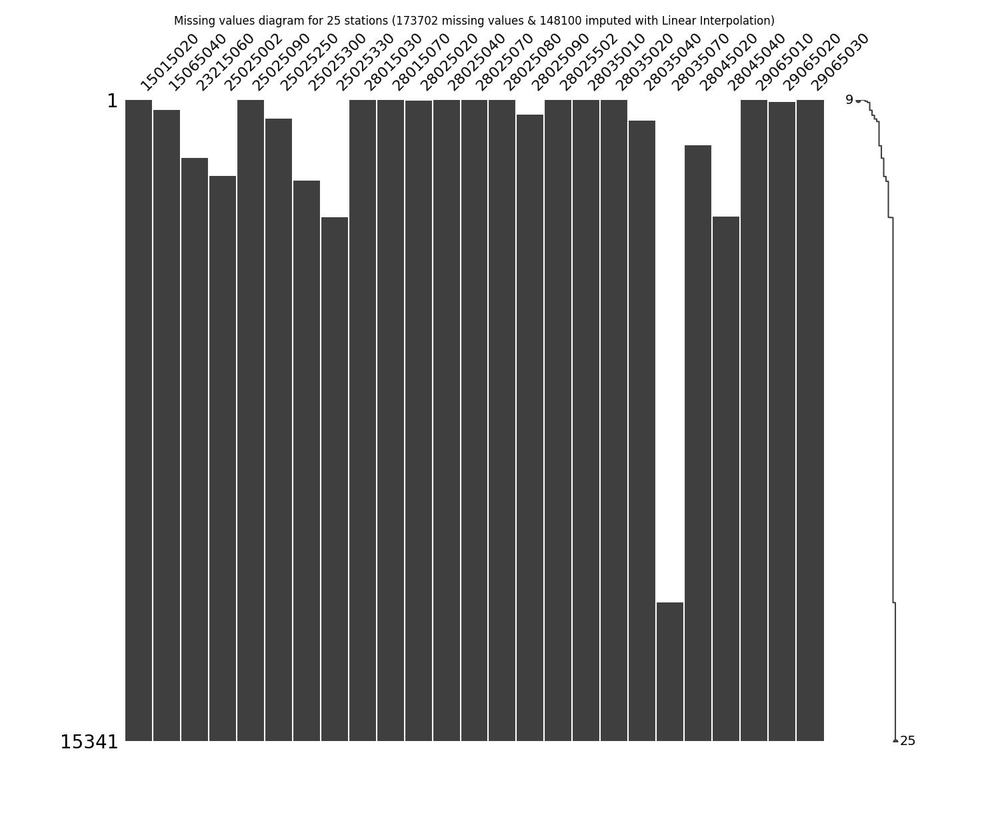
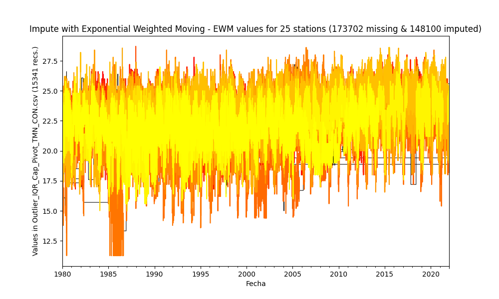

## Impute missing values in time series through statistical methods

* Processed file: [D:/R.LTWB/.datasets/IDEAM_Outlier/Outlier_IQR_Cap_Pivot_TMN_CON.csv](../IDEAM_EDA/Outlier_IQR_Cap_Pivot_TMN_CON.csv)
* Execution date: 2022-11-10 17:16:57.064466
* Python version: 3.10.5 (tags/v3.10.5:f377153, Jun  6 2022, 16:14:13) [MSC v.1929 64 bit (AMD64)]
* Python path: ['D:\\R.LTWB\\.src', 'D:\\R.LTWB', 'D:\\R.HydroTools.wiki', 'D:\\R.TeachingResearchGuide', 'D:\\R.HydroTools']
* matplotlib version: 3.6.0
* pandas version: 1.4.3
* numpy version: 1.23.2
* missingno version: 0.5.1
* Stations exclude: ['28017140', '25027020', '25027410', '25027490', '25027330', '25027390', '25027630', '25027360', '25027320', '16067010', '25027420']
* Print table sample: True
* Instructions & script: https://github.com/rcfdtools/R.LTWB/tree/main/Section03/Impute
* License: https://github.com/rcfdtools/R.LTWB/blob/main/LICENSE.md
* Credits: r.cfdtools@gmail.com

### General dataframe information with 15341 IDEAM records for 25 stations

Dataframe records head sample

| Fecha               |   15015020 |   15065040 |   23215060 |   25025002 |   25025090 |   25025250 |   25025300 |   25025330 |   28015030 |   28015070 |   28025020 |   28025040 |   28025070 |   28025080 |   28025090 |   28025502 |   28035010 |   28035020 |   28035040 |   28035070 |   28045020 |   28045040 |   29065010 |   29065020 |   29065030 |
|:--------------------|-----------:|-----------:|-----------:|-----------:|-----------:|-----------:|-----------:|-----------:|-----------:|-----------:|-----------:|-----------:|-----------:|-----------:|-----------:|-----------:|-----------:|-----------:|-----------:|-----------:|-----------:|-----------:|-----------:|-----------:|-----------:|
| 1980-01-01 00:00:00 |       23.2 |        nan |        nan |        nan |       24.2 |        nan |        nan |        nan |      nan   |       23   |        nan |       20.2 |       22.8 |       21.8 |        nan |        nan |      nan   |       19.4 |        nan |        nan |        nan |        nan |       21.4 |        nan |       21.4 |
| 1980-01-02 00:00:00 |       22.4 |        nan |        nan |        nan |       24.2 |        nan |        nan |        nan |       23.3 |       23.5 |        nan |       21   |       23.4 |       21.6 |        nan |         24 |      nan   |       19.6 |        nan |        nan |        nan |        nan |      nan   |        nan |       21.8 |
| 1980-01-03 00:00:00 |       20.8 |        nan |        nan |        nan |       24.6 |        nan |        nan |        nan |       24   |      nan   |        nan |       19.8 |       23.4 |       21.4 |        nan |        nan |       22.4 |       19   |        nan |        nan |        nan |        nan |      nan   |        nan |      nan   |

Dataframe records tail sample

| Fecha               |   15015020 |   15065040 |   23215060 |   25025002 |   25025090 |   25025250 |   25025300 |   25025330 |   28015030 |   28015070 |   28025020 |   28025040 |   28025070 |   28025080 |   28025090 |   28025502 |   28035010 |   28035020 |   28035040 |   28035070 |   28045020 |   28045040 |   29065010 |   29065020 |   29065030 |
|:--------------------|-----------:|-----------:|-----------:|-----------:|-----------:|-----------:|-----------:|-----------:|-----------:|-----------:|-----------:|-----------:|-----------:|-----------:|-----------:|-----------:|-----------:|-----------:|-----------:|-----------:|-----------:|-----------:|-----------:|-----------:|-----------:|
| 2021-12-29 00:00:00 |        nan |        nan |        nan |       21.8 |       23   |       24.8 |       23.2 |         23 |        nan |       21.8 |       18.8 |        nan |       23   |        nan |       21.2 |        nan |       22.6 |       22.8 |       25.4 |        nan |        nan |        nan |        nan |       25   |        nan |
| 2021-12-30 00:00:00 |        nan |        nan |        nan |       22.4 |       24   |       24.4 |       22.6 |         24 |        nan |       21   |       18.2 |        nan |       22.8 |        nan |       20   |        nan |       20.8 |       22.4 |       24.4 |        nan |        nan |        nan |        nan |       24.8 |        nan |
| 2021-12-31 00:00:00 |        nan |        nan |        nan |       20.4 |       21.4 |       24.2 |       22   |        nan |        nan |       20.2 |       20.2 |        nan |       22   |        nan |       21.2 |        nan |       20.8 |       22   |       24   |        nan |        nan |        nan |        nan |       25.4 |        nan |

Datatypes for station and nulls values in the initial file
|       | 15015020   | 15065040   | 23215060   | 25025002   | 25025090   | 25025250   | 25025300   | 25025330   | 28015030   | 28015070   | 28025020   | 28025040   | 28025070   | 28025080   | 28025090   | 28025502   | 28035010   | 28035020   | 28035040   | 28035070   | 28045020   | 28045040   | 29065010   | 29065020   | 29065030   |
|:------|:-----------|:-----------|:-----------|:-----------|:-----------|:-----------|:-----------|:-----------|:-----------|:-----------|:-----------|:-----------|:-----------|:-----------|:-----------|:-----------|:-----------|:-----------|:-----------|:-----------|:-----------|:-----------|:-----------|:-----------|:-----------|
| Dtype | float64    | float64    | float64    | float64    | float64    | float64    | float64    | float64    | float64    | float64    | float64    | float64    | float64    | float64    | float64    | float64    | float64    | float64    | float64    | float64    | float64    | float64    | float64    | float64    | float64    |
| Nulls | 5377       | 10392      | 14093      | 4608       | 5567       | 3001       | 3648       | 6066       | 13937      | 2866       | 1889       | 12110      | 1523       | 7705       | 3474       | 3103       | 4784       | 3517       | 1936       | 15299      | 14289      | 14067      | 14278      | 2358       | 3815       |

General statistics table - Initial file

|          |   count |    mean |     std |     min |   25% |   50% |   75% |     max |
|---------:|--------:|--------:|--------:|--------:|------:|------:|------:|--------:|
| 15015020 |    9964 | 22.1889 | 1.60836 | 16.4    |  21.2 |  22.4 |  23.2 | 26.8    |
| 15065040 |    4949 | 22.9699 | 1.73975 | 16.828  |  22.2 |  23.2 |  24.2 | 27.8    |
| 23215060 |    1248 | 23.6922 | 1.17043 | 19.4576 |  23   |  23.8 |  24.6 | 26.8    |
| 25025002 |   10733 | 22.9432 | 1.56162 | 17.4722 |  22   |  23   |  24   | 27.2    |
| 25025090 |    9774 | 23.5659 | 1.53079 | 18      |  22.6 |  23.6 |  24.8 | 28      |
| 25025250 |   12340 | 22.3963 | 1.63717 | 17      |  21.2 |  22.4 |  23.8 | 27.1    |
| 25025300 |   11693 | 22.991  | 1.7495  | 16.6    |  22   |  23.2 |  24.2 | 27.8    |
| 25025330 |    9275 | 22.784  | 1.67325 | 16.8526 |  21.8 |  23   |  24   | 28.7057 |
| 28015030 |    1404 | 22.9361 | 1.28381 | 18.282  |  22.2 |  23   |  23.8 | 26.8    |
| 28015070 |   12475 | 22.342  | 1.32337 | 17.2    |  21.5 |  22.5 |  23.2 | 26.2    |
| 28025020 |   13452 | 20.5484 | 1.72989 | 14.4    |  19.6 |  20.8 |  21.8 | 26      |
| 28025040 |    3231 | 18.6727 | 2.11411 | 11.271  |  18   |  19.2 |  20   | 26.077  |
| 28025070 |   13818 | 23.7672 | 1.54528 | 18.2    |  22.8 |  23.8 |  25   | 28.6    |
| 28025080 |    7636 | 21.7751 | 1.87894 | 15.2    |  20.4 |  22.2 |  23.2 | 27      |
| 28025090 |   11867 | 22.4284 | 1.66885 | 16.5704 |  21.6 |  22.8 |  23.6 | 27.4    |
| 28025502 |   12238 | 23.8863 | 1.2782  | 19.1    |  23   |  23.8 |  24.8 | 28.6    |
| 28035010 |   10557 | 23.3291 | 1.48753 | 18.101  |  22.6 |  23.4 |  24.2 | 28.5546 |
| 28035020 |   11824 | 22.8007 | 1.82776 | 16.4    |  21.8 |  23   |  24   | 28.6    |
| 28035040 |   13405 | 24.2706 | 1.23193 | 19.9343 |  23.4 |  24.2 |  25   | 28.6    |
| 28035070 |      42 | 22.0284 | 1.01785 | 20.6    |  21.4 |  21.8 |  22.6 | 25.5931 |
| 28045020 |    1052 | 21.298  | 1.7905  | 15      |  20.2 |  21.6 |  22.6 | 26.4    |
| 28045040 |    1274 | 23.1351 | 1.2346  | 18.6935 |  22.4 |  23.2 |  24   | 26.6    |
| 29065010 |    1063 | 21.3169 | 1.59977 | 15.7072 |  20.4 |  21.4 |  22.4 | 25.2    |
| 29065020 |   12983 | 22.3291 | 1.84749 | 15.6    |  21.2 |  22.6 |  23.6 | 27.4    |
| 29065030 |   11526 | 21.8109 | 1.55779 | 16      |  20.8 |  22   |  23   | 27      |

### Method 1 - Imputing with mean values

|          |   count |    mean |       std |     min |     25% |     50% |     75% |     max |
|---------:|--------:|--------:|----------:|--------:|--------:|--------:|--------:|--------:|
| 15015020 |   15341 | 22.1889 | 1.29618   | 16.4    | 21.8    | 22.1889 | 22.8    | 26.8    |
| 15065040 |   15341 | 22.9699 | 0.988074  | 16.828  | 22.9699 | 22.9699 | 22.9699 | 27.8    |
| 23215060 |   15341 | 23.6922 | 0.333707  | 19.4576 | 23.6922 | 23.6922 | 23.6922 | 26.8    |
| 25025002 |   15341 | 22.9432 | 1.30618   | 17.4722 | 22.5    | 22.9432 | 23.6    | 27.2    |
| 25025090 |   15341 | 23.5659 | 1.22185   | 18      | 23.2    | 23.5659 | 24      | 28      |
| 25025250 |   15341 | 22.3963 | 1.46832   | 17      | 21.4    | 22.3963 | 23.4    | 27.1    |
| 25025300 |   15341 | 22.991  | 1.52738   | 16.6    | 22.6    | 22.991  | 24      | 27.8    |
| 25025330 |   15341 | 22.784  | 1.30102   | 16.8526 | 22.6    | 22.784  | 23.3    | 28.7057 |
| 28015030 |   15341 | 22.9361 | 0.388254  | 18.282  | 22.9361 | 22.9361 | 22.9361 | 26.8    |
| 28015070 |   15341 | 22.342  | 1.19336   | 17.2    | 21.8    | 22.342  | 23      | 26.2    |
| 28025020 |   15341 | 20.5484 | 1.61988   | 14.4    | 19.8    | 20.5484 | 21.6    | 26      |
| 28025040 |   15341 | 18.6727 | 0.970099  | 11.271  | 18.6727 | 18.6727 | 18.6727 | 26.077  |
| 28025070 |   15341 | 23.7672 | 1.46657   | 18.2    | 23      | 23.7672 | 24.8    | 28.6    |
| 28025080 |   15341 | 21.7751 | 1.32558   | 15.2    | 21.7751 | 21.7751 | 22.2    | 27      |
| 28025090 |   15341 | 22.4284 | 1.46776   | 16.5704 | 22      | 22.4284 | 23.3    | 27.4    |
| 28025502 |   15341 | 23.8863 | 1.14163   | 19.1    | 23.2    | 23.8863 | 24.6    | 28.6    |
| 28035010 |   15341 | 23.3291 | 1.23397   | 18.101  | 23      | 23.3291 | 24      | 28.5546 |
| 28035020 |   15341 | 22.8007 | 1.60462   | 16.4    | 22.2    | 22.8007 | 23.6    | 28.6    |
| 28035040 |   15341 | 24.2706 | 1.15157   | 19.9343 | 23.6    | 24.2706 | 25      | 28.6    |
| 28035070 |   15341 | 22.0284 | 0.0526213 | 20.6    | 22.0284 | 22.0284 | 22.0284 | 25.5931 |
| 28045020 |   15341 | 21.298  | 0.468667  | 15      | 21.298  | 21.298  | 21.298  | 26.4    |
| 28045040 |   15341 | 23.1351 | 0.355655  | 18.6935 | 23.1351 | 23.1351 | 23.1351 | 26.6    |
| 29065010 |   15341 | 21.3169 | 0.420927  | 15.7072 | 21.3169 | 21.3169 | 21.3169 | 25.2    |
| 29065020 |   15341 | 22.3291 | 1.69957   | 15.6    | 21.6    | 22.3291 | 23.4    | 27.4    |
| 29065030 |   15341 | 21.8109 | 1.35026   | 16      | 21.2    | 21.8109 | 22.6    | 27      |

### Method 2 - Imputing with median values

|          |   count |    mean |       std |     min |   25% |   50% |   75% |     max |
|---------:|--------:|--------:|----------:|--------:|------:|------:|------:|--------:|
| 15015020 |   15341 | 22.2629 | 1.30009   | 16.4    |  21.8 |  22.4 |  22.8 | 26.8    |
| 15065040 |   15341 | 23.1258 | 0.99391   | 16.828  |  23.2 |  23.2 |  23.2 | 27.8    |
| 23215060 |   15341 | 23.7912 | 0.335006  | 19.4576 |  23.8 |  23.8 |  23.8 | 26.8    |
| 25025002 |   15341 | 22.9603 | 1.30644   | 17.4722 |  22.5 |  23   |  23.6 | 27.2    |
| 25025090 |   15341 | 23.5783 | 1.22196   | 18      |  23.2 |  23.6 |  24   | 28      |
| 25025250 |   15341 | 22.397  | 1.46832   | 17      |  21.4 |  22.4 |  23.4 | 27.1    |
| 25025300 |   15341 | 23.0407 | 1.52997   | 16.6    |  22.6 |  23.2 |  24   | 27.8    |
| 25025330 |   15341 | 22.8694 | 1.3053    | 16.8526 |  22.6 |  23   |  23.3 | 28.7057 |
| 28015030 |   15341 | 22.9942 | 0.388692  | 18.282  |  23   |  23   |  23   | 26.8    |
| 28015070 |   15341 | 22.3715 | 1.19495   | 17.2    |  21.8 |  22.5 |  23   | 26.2    |
| 28025020 |   15341 | 20.5794 | 1.62199   | 14.4    |  19.8 |  20.8 |  21.6 | 26      |
| 28025040 |   15341 | 19.0889 | 0.993643  | 11.271  |  19.2 |  19.2 |  19.2 | 26.077  |
| 28025070 |   15341 | 23.7704 | 1.4666    | 18.2    |  23   |  23.8 |  24.8 | 28.6    |
| 28025080 |   15341 | 21.9885 | 1.34249   | 15.2    |  22.2 |  22.2 |  22.2 | 27      |
| 28025090 |   15341 | 22.5125 | 1.47598   | 16.5704 |  22   |  22.8 |  23.3 | 27.4    |
| 28025502 |   15341 | 23.8689 | 1.14216   | 19.1    |  23.2 |  23.8 |  24.6 | 28.6    |
| 28035010 |   15341 | 23.3512 | 1.2344    | 18.101  |  23   |  23.4 |  24   | 28.5546 |
| 28035020 |   15341 | 22.8464 | 1.6068    | 16.4    |  22.2 |  23   |  23.6 | 28.6    |
| 28035040 |   15341 | 24.2617 | 1.1518    | 19.9343 |  23.6 |  24.2 |  25   | 28.6    |
| 28035070 |   15341 | 21.8006 | 0.0539578 | 20.6    |  21.8 |  21.8 |  21.8 | 25.5931 |
| 28045020 |   15341 | 21.5793 | 0.474839  | 15      |  21.6 |  21.6 |  21.6 | 26.4    |
| 28045040 |   15341 | 23.1946 | 0.356105  | 18.6935 |  23.2 |  23.2 |  23.2 | 26.6    |
| 29065010 |   15341 | 21.3942 | 0.421455  | 15.7072 |  21.4 |  21.4 |  21.4 | 25.2    |
| 29065020 |   15341 | 22.3707 | 1.70238   | 15.6    |  21.6 |  22.6 |  23.4 | 27.4    |
| 29065030 |   15341 | 21.8579 | 1.35273   | 16      |  21.2 |  22   |  22.6 | 27      |

### Method 3 - Imputing with Last Observation Carried Forward (LOCF) values

|          |   count |    mean |      std |     min |   25% |   50% |    75% |     max |
|---------:|--------:|--------:|---------:|--------:|------:|------:|-------:|--------:|
| 15015020 |   12412 | 22.4437 | 1.60576  | 16.4    |  21.4 |  22.6 | 24     | 26.8    |
| 15065040 |   10417 | 22.6796 | 1.70147  | 16.828  |  22   |  22.8 | 23.8   | 27.8    |
| 23215060 |    3013 | 22.2004 | 2.10938  | 19.4576 |  20.2 |  22   | 24     | 26.8    |
| 25025002 |   15341 | 22.9827 | 1.40729  | 17.4722 |  22.2 |  23.2 | 24     | 27.2    |
| 25025090 |   15341 | 23.4867 | 1.51685  | 18      |  22.2 |  23.4 | 24.8   | 28      |
| 25025250 |   15341 | 22.5035 | 1.58455  | 17      |  21.4 |  22.6 | 24     | 27.1    |
| 25025300 |   15341 | 22.7152 | 1.80086  | 16.6    |  21.2 |  23   | 24     | 27.8    |
| 25025330 |   15340 | 22.7901 | 1.4873   | 16.8526 |  22.2 |  23   | 23.6   | 28.7057 |
| 28015030 |    2921 | 22.6403 | 1.53327  | 18.282  |  21.7 |  22.7 | 23.8   | 26.8    |
| 28015070 |   15341 | 22.4494 | 1.3322   | 17.2    |  21.6 |  22.5 | 23.5   | 26.2    |
| 28025020 |   15341 | 20.5373 | 1.69397  | 14.4    |  19.6 |  20.8 | 21.6   | 26      |
| 28025040 |    6080 | 19.3734 | 2.85405  | 11.271  |  18.2 |  19   | 20.6   | 26.077  |
| 28025070 |   15341 | 23.8251 | 1.54866  | 18.2    |  22.8 |  24   | 25     | 28.6    |
| 28025080 |   11682 | 21.5524 | 1.88707  | 15.2    |  20.2 |  22   | 23     | 27      |
| 28025090 |   15341 | 22.5926 | 1.59598  | 16.5704 |  22   |  22.8 | 23.6   | 27.4    |
| 28025502 |   14670 | 23.9223 | 1.27819  | 19.1    |  23   |  24   | 24.775 | 28.6    |
| 28035010 |   15341 | 22.7463 | 2.09038  | 18.101  |  21.8 |  23.2 | 24     | 28.5546 |
| 28035020 |   15341 | 22.5186 | 2.07687  | 16.4    |  21.4 |  23   | 23.8   | 28.6    |
| 28035040 |   15341 | 24.2777 | 1.22452  | 19.9343 |  23.4 |  24.2 | 25     | 28.6    |
| 28035070 |   12663 | 21.9733 | 0.793225 | 20.6    |  21.8 |  21.8 | 21.8   | 25.5931 |
| 28045020 |    2677 | 19.6499 | 2.19033  | 15      |  17.6 |  19.8 | 21.2   | 26.4    |
| 28045040 |    4992 | 23.0944 | 0.731317 | 18.6935 |  23   |  23   | 23.2   | 26.6    |
| 29065010 |    2601 | 20.2872 | 1.67916  | 15.7072 |  19.4 |  19.6 | 21.2   | 25.2    |
| 29065020 |   15341 | 22.2643 | 1.90037  | 15.6    |  21   |  22.6 | 23.6   | 27.4    |
| 29065030 |   12539 | 21.7591 | 1.56649  | 16      |  20.6 |  22   | 23     | 27      |

### Method 4 - Imputing with Next Observation Carried Backward (NOCB) values

|          |   count |    mean |      std |     min |     25% |     50% |     75% |     max |
|---------:|--------:|--------:|---------:|--------:|--------:|--------:|--------:|--------:|
| 15015020 |   15341 | 21.8967 | 1.49166  | 16.4    | 21      | 22      | 22.8    | 26.8    |
| 15065040 |   15093 | 23.3519 | 1.77778  | 16.828  | 22      | 24      | 24.7    | 27.8    |
| 23215060 |   13946 | 22.7306 | 0.529142 | 19.4576 | 22.6    | 22.6    | 22.6    | 26.8    |
| 25025002 |   13509 | 22.6603 | 1.71965  | 17.4722 | 21.6    | 22.8    | 24      | 27.2    |
| 25025090 |   15341 | 23.5282 | 1.53731  | 18      | 22.8    | 24      | 24.4    | 28      |
| 25025250 |   14885 | 22.5316 | 1.61129  | 17      | 21.4    | 22.6    | 24      | 27.1    |
| 25025300 |   13394 | 23.0277 | 1.71559  | 16.6    | 22.2    | 23.2    | 24.2    | 27.8    |
| 25025330 |   12528 | 22.7607 | 1.66454  | 16.8526 | 21.8    | 23      | 24      | 28.7057 |
| 28015030 |   15340 | 23.8101 | 0.663503 | 18.282  | 24      | 24      | 24      | 26.8    |
| 28015070 |   15341 | 22.287  | 1.31063  | 17.2    | 21.5    | 22.4    | 23      | 26.2    |
| 28025020 |   15309 | 20.4513 | 1.77352  | 14.4    | 19.6    | 20.8    | 21.8    | 26      |
| 28025040 |   15341 | 18.8631 | 1.81284  | 11.271  | 19.2    | 19.4    | 19.4    | 26.077  |
| 28025070 |   15341 | 23.784  | 1.58311  | 18.2    | 22.8    | 23.8    | 25      | 28.6    |
| 28025080 |   15341 | 22.1772 | 1.71838  | 15.2    | 21      | 23      | 23.2    | 27      |
| 28025090 |   14973 | 22.235  | 1.66785  | 16.5704 | 21.4    | 22.4    | 23.4    | 27.4    |
| 28025502 |   15340 | 23.7094 | 1.29218  | 19.1    | 23      | 23.7    | 24.6    | 28.6    |
| 28035010 |   15339 | 23.6099 | 1.54385  | 18.101  | 22.8    | 23.8    | 24.8    | 28.5546 |
| 28035020 |   15341 | 22.3498 | 2.31317  | 16.4    | 21      | 22.8    | 24      | 28.6    |
| 28035040 |   14824 | 24.1725 | 1.27175  | 19.9343 | 23.4    | 24.2    | 25      | 28.6    |
| 28035070 |    3318 | 24.9118 | 1.40553  | 20.6    | 25.5931 | 25.5931 | 25.5931 | 25.5931 |
| 28045020 |   14244 | 21.4129 | 0.67985  | 15      | 21.4    | 21.4    | 21.4    | 26.4    |
| 28045040 |   12531 | 23.9067 | 0.60644  | 18.6935 | 24      | 24      | 24      | 26.6    |
| 29065010 |   15341 | 20.236  | 0.774914 | 15.7072 | 20      | 20      | 20      | 25.2    |
| 29065020 |   15281 | 22.3611 | 1.87799  | 15.6    | 21.3    | 22.8    | 23.6    | 27.4    |
| 29065030 |   15341 | 22.1951 | 1.70869  | 16      | 21      | 22.4    | 23.8    | 27      |

### Method 5 - Impute missing values with Linear Interpolation values

|          |   count |    mean |      std |     min |     25% |     50% |     75% |     max |
|---------:|--------:|--------:|---------:|--------:|--------:|--------:|--------:|--------:|
| 15015020 |   15341 | 22.1279 | 1.37931  | 16.4    | 21.4    | 22      | 23      | 26.8    |
| 15065040 |   15093 | 23.3509 | 1.6619   | 16.828  | 22.4    | 23.7758 | 24.7    | 27.8    |
| 23215060 |   13946 | 22.7422 | 0.561312 | 19.4576 | 22.6    | 22.6    | 22.6    | 26.8    |
| 25025002 |   13509 | 22.7932 | 1.54184  | 17.4722 | 21.8333 | 22.9629 | 24      | 27.2    |
| 25025090 |   15341 | 23.5074 | 1.38318  | 18      | 22.7182 | 23.51   | 24.4    | 28      |
| 25025250 |   14885 | 22.5222 | 1.58997  | 17      | 21.4    | 22.5243 | 24      | 27.1    |
| 25025300 |   13394 | 23.0397 | 1.68671  | 16.6    | 22.2    | 23.2    | 24.2    | 27.8    |
| 25025330 |   12528 | 22.7518 | 1.60981  | 16.8526 | 21.8    | 23      | 23.8073 | 28.7057 |
| 28015030 |   15340 | 23.7756 | 0.707605 | 18.282  | 24      | 24      | 24      | 26.8    |
| 28015070 |   15341 | 22.3682 | 1.27657  | 17.2    | 21.5886 | 22.5    | 23.25   | 26.2    |
| 28025020 |   15309 | 20.4961 | 1.70502  | 14.4    | 19.6    | 20.8    | 21.6141 | 26      |
| 28025040 |   15341 | 19.1263 | 1.59019  | 11.271  | 19.4    | 19.4    | 19.4    | 26.077  |
| 28025070 |   15341 | 23.8046 | 1.5526   | 18.2    | 22.8    | 23.84   | 25      | 28.6    |
| 28025080 |   15341 | 22.0613 | 1.67396  | 15.2    | 21.0317 | 22.8    | 23.2    | 27      |
| 28025090 |   14973 | 22.4186 | 1.57779  | 16.5704 | 21.6    | 22.8    | 23.4    | 27.4    |
| 28025502 |   15340 | 23.8066 | 1.22534  | 19.1    | 23      | 23.7    | 24.6    | 28.6    |
| 28035010 |   15339 | 23.1781 | 1.62296  | 18.101  | 22.3288 | 23.4    | 24.2412 | 28.5546 |
| 28035020 |   15341 | 22.4342 | 2.15448  | 16.4    | 21.2    | 23      | 24      | 28.6    |
| 28035040 |   14824 | 24.2265 | 1.23058  | 19.9343 | 23.4    | 24.2    | 25      | 28.6    |
| 28035070 |    3318 | 25.2172 | 0.914141 | 20.6    | 25.5931 | 25.5931 | 25.5931 | 25.5931 |
| 28045020 |   14244 | 21.3883 | 0.58405  | 15      | 21.4    | 21.4    | 21.4    | 26.4    |
| 28045040 |   12531 | 23.8851 | 0.557421 | 18.6935 | 24      | 24      | 24      | 26.6    |
| 29065010 |   15341 | 20.1424 | 0.646993 | 15.7072 | 20      | 20      | 20      | 25.2    |
| 29065020 |   15281 | 22.3136 | 1.79749  | 15.6    | 21.2    | 22.6    | 23.6    | 27.4    |
| 29065030 |   15341 | 22.2    | 1.69505  | 16      | 21      | 22.4    | 23.8    | 27      |

### Method 6 - Impute missing values with Exponential (Weighted) Moving Average - EWM

|          |   count |    mean |      std |     min |     25% |     50% |     75% |     max |
|---------:|--------:|--------:|---------:|--------:|--------:|--------:|--------:|--------:|
| 15015020 |   15341 | 21.9331 | 1.50143  | 16.4    | 20.8    | 22.204  | 22.8    | 26.8    |
| 15065040 |   15093 | 23.3345 | 1.4421   | 16.828  | 23.2    | 23.9462 | 24.148  | 27.8    |
| 23215060 |   13946 | 24.0125 | 0.385663 | 19.4576 | 24.0531 | 24.0531 | 24.0531 | 26.8    |
| 25025002 |   13509 | 22.6532 | 1.69009  | 17.4722 | 21.6    | 22.9431 | 24      | 27.2    |
| 25025090 |   15341 | 23.4681 | 1.4323   | 18      | 22.8    | 23.8068 | 24.2    | 28      |
| 25025250 |   14885 | 22.5277 | 1.58804  | 17      | 21.4    | 22.5163 | 23.9648 | 27.1    |
| 25025300 |   13394 | 22.9498 | 1.76725  | 16.6    | 22      | 23.2    | 24.2    | 27.8    |
| 25025330 |   12528 | 22.7177 | 1.65258  | 16.8526 | 21.8    | 23      | 23.8    | 28.7057 |
| 28015030 |   15340 | 23.0681 | 0.4904   | 18.282  | 23.0903 | 23.0903 | 23.0903 | 26.8    |
| 28015070 |   15341 | 22.3709 | 1.2596   | 17.2    | 21.6    | 22.5935 | 23.0293 | 26.2    |
| 28025020 |   15309 | 20.4829 | 1.71033  | 14.4    | 19.6    | 20.8    | 21.6    | 26      |
| 28025040 |   15341 | 18.5578 | 1.5028   | 11.271  | 18.8804 | 18.8804 | 18.8804 | 26.077  |
| 28025070 |   15341 | 23.7703 | 1.55684  | 18.2    | 22.8    | 23.8    | 25      | 28.6    |
| 28025080 |   15341 | 21.9231 | 1.58612  | 15.2    | 21      | 22.6    | 22.8    | 27      |
| 28025090 |   14973 | 22.176  | 1.69485  | 16.5704 | 21.2    | 22.4    | 23.4    | 27.4    |
| 28025502 |   15340 | 23.8108 | 1.20355  | 19.1    | 23      | 23.8    | 24.6    | 28.6    |
| 28035010 |   15339 | 23.4755 | 1.38496  | 18.101  | 22.8    | 23.6755 | 24.2    | 28.5546 |
| 28035020 |   15341 | 22.3188 | 2.23455  | 16.4    | 21      | 22.8    | 24      | 28.6    |
| 28035040 |   14824 | 24.1893 | 1.23998  | 19.9343 | 23.4    | 24.2    | 25      | 28.6    |
| 28035070 |    3318 | 24.8988 | 1.42662  | 20.6    | 25.5931 | 25.5931 | 25.5931 | 25.5931 |
| 28045020 |   14244 | 22.1147 | 0.671175 | 15      | 22.1634 | 22.1634 | 22.1634 | 26.4    |
| 28045040 |   12531 | 23.9012 | 0.520234 | 18.6935 | 24.0369 | 24.0369 | 24.0369 | 26.6    |
| 29065010 |   15341 | 19.7994 | 1.0087   | 15.7072 | 19.4155 | 19.4155 | 19.4155 | 25.2    |
| 29065020 |   15281 | 22.3456 | 1.85733  | 15.6    | 21.4    | 22.8    | 23.6    | 27.4    |
| 29065030 |   15341 | 22.0839 | 1.56673  | 16      | 21      | 22.4    | 23.5367 | 27      |

