# Impute missing values in time series through statistical methods

* Processed file: [D:/R.LTWB/.datasets/IDEAM_Outlier/Outlier_IQR_Cap_Pivot_TMX_CON.csv](../IDEAM_Outlier/Outlier_IQR_Cap_Pivot_TMX_CON.csv)
* Execution date: 2022-11-21 10:24:30.204425
* Python version: 3.10.5 (tags/v3.10.5:f377153, Jun  6 2022, 16:14:13) [MSC v.1929 64 bit (AMD64)]
* Python path: ['D:\\R.LTWB\\.src', 'D:\\R.LTWB', 'D:\\R.GISPython.wiki', 'D:\\R.TeachingResearchGuide', 'D:\\R.GISPython']
* matplotlib version: 3.6.0
* pandas version: 1.4.3
* numpy version: 1.23.2
* missingno version: 0.5.1
* sklearn version: 1.1.3
* Stations exclude: ['28017140', '25027020', '25027410', '25027490', '25027330', '25027390', '25027630', '25027360', '25027320', '16067010', '25027420']
* Stations include: ['15015020', '15060050', '15060070', '15060080', '15060150']
* Print table sample: True
* Instructions & script: https://github.com/rcfdtools/R.LTWB/tree/main/Section03/Impute
* License: https://github.com/rcfdtools/R.LTWB/blob/main/LICENSE.md
* Credits: r.cfdtools@gmail.com

## General dataframe information with 15341 IDEAM records for 25 stations

Dataframe records head sample

| Fecha               |   15015020 |   15065040 |   23215060 |   25025002 |   25025090 |   25025250 |   25025300 |   25025330 |   28015030 |   28015070 |   28025020 |   28025040 |   28025070 |   28025080 |   28025090 |   28025502 |   28035010 |   28035020 |   28035040 |   28035070 |   28045020 |   28045040 |   29065010 |   29065020 |   29065030 |
|:--------------------|-----------:|-----------:|-----------:|-----------:|-----------:|-----------:|-----------:|-----------:|-----------:|-----------:|-----------:|-----------:|-----------:|-----------:|-----------:|-----------:|-----------:|-----------:|-----------:|-----------:|-----------:|-----------:|-----------:|-----------:|-----------:|
| 1980-01-01 00:00:00 |       32.2 |        nan |        nan |        nan |       33.6 |        nan |        nan |        nan |      nan   |       32.4 |        nan |      nan   |       34.8 |        nan |        nan |        nan |        nan |       34.6 |        nan |        nan |        nan |        nan |        nan |        nan |       33.2 |
| 1980-01-02 00:00:00 |       32.6 |        nan |        nan |        nan |       33.4 |        nan |        nan |        nan |      nan   |       29.8 |        nan |       29.8 |       34   |        nan |        nan |        nan |        nan |       30.8 |        nan |        nan |        nan |        nan |        nan |        nan |       32.8 |
| 1980-01-03 00:00:00 |       33   |        nan |        nan |        nan |       33.8 |        nan |        nan |        nan |       34.3 |       32.4 |        nan |       30   |      nan   |         35 |        nan |        nan |        nan |       34.4 |        nan |        nan |        nan |        nan |        nan |        nan |       33.4 |

Dataframe records tail sample

| Fecha               |   15015020 |   15065040 |   23215060 |   25025002 |   25025090 |   25025250 |   25025300 |   25025330 |   28015030 |   28015070 |   28025020 |   28025040 |   28025070 |   28025080 |   28025090 |   28025502 |   28035010 |   28035020 |   28035040 |   28035070 |   28045020 |   28045040 |   29065010 |   29065020 |   29065030 |
|:--------------------|-----------:|-----------:|-----------:|-----------:|-----------:|-----------:|-----------:|-----------:|-----------:|-----------:|-----------:|-----------:|-----------:|-----------:|-----------:|-----------:|-----------:|-----------:|-----------:|-----------:|-----------:|-----------:|-----------:|-----------:|-----------:|
| 2021-12-29 00:00:00 |        nan |        nan |        nan |       35.4 |       34.8 |       34.2 |       36.6 |       33.2 |        nan |       33.2 |       32.6 |        nan |       34.8 |        nan |       36   |        nan |       35.6 |       34.8 |       37.2 |        nan |        nan |        nan |        nan |       35.2 |        nan |
| 2021-12-30 00:00:00 |        nan |        nan |        nan |       34.4 |       35   |       34   |       37.2 |      nan   |        nan |       33.4 |       32.4 |        nan |       35.2 |        nan |       37   |        nan |       35   |       35   |       38   |        nan |        nan |        nan |        nan |       34.4 |        nan |
| 2021-12-31 00:00:00 |        nan |        nan |        nan |       34.8 |       34.6 |       35.6 |       38   |      nan   |        nan |       33.6 |       33.6 |        nan |       36.4 |        nan |       36.2 |        nan |       36.6 |       35   |       38.4 |        nan |        nan |        nan |        nan |       37.6 |        nan |

Datatypes for station and nulls values in the initial file
|       | 15015020   | 15065040   | 23215060   | 25025002   | 25025090   | 25025250   | 25025300   | 25025330   | 28015030   | 28015070   | 28025020   | 28025040   | 28025070   | 28025080   | 28025090   | 28025502   | 28035010   | 28035020   | 28035040   | 28035070   | 28045020   | 28045040   | 29065010   | 29065020   | 29065030   |
|:------|:-----------|:-----------|:-----------|:-----------|:-----------|:-----------|:-----------|:-----------|:-----------|:-----------|:-----------|:-----------|:-----------|:-----------|:-----------|:-----------|:-----------|:-----------|:-----------|:-----------|:-----------|:-----------|:-----------|:-----------|:-----------|
| Dtype | float64    | float64    | float64    | float64    | float64    | float64    | float64    | float64    | float64    | float64    | float64    | float64    | float64    | float64    | float64    | float64    | float64    | float64    | float64    | float64    | float64    | float64    | float64    | float64    | float64    |
| Nulls | 6482       | 11876      | 14381      | 7640       | 6855       | 3583       | 5275       | 7735       | 14214      | 2696       | 2375       | 12728      | 1943       | 8265       | 2388       | 3885       | 6899       | 3205       | 5917       | 15299      | 14291      | 14557      | 14448      | 5935       | 4804       |

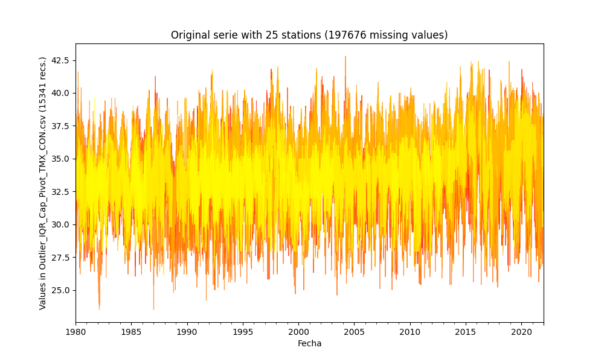

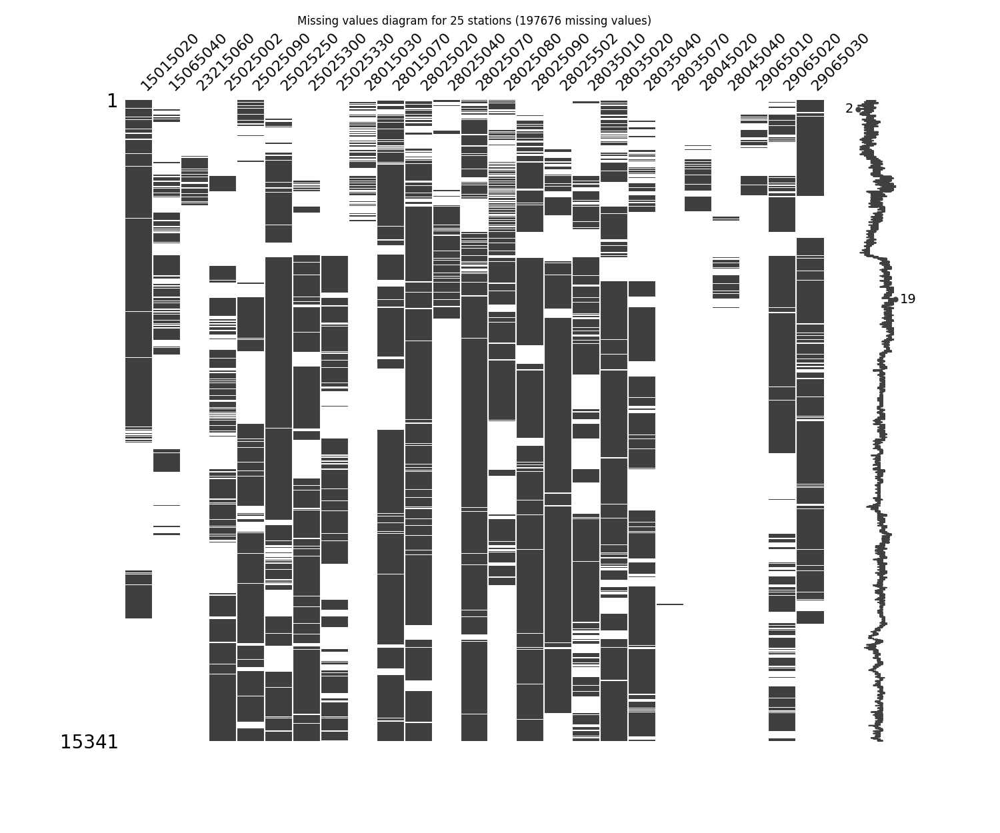

General statistics table - Initial file

|          |   count |    mean |     std |     min |   25% |   50% |   75% |     max |
|---------:|--------:|--------:|--------:|--------:|------:|------:|------:|--------:|
| 15015020 |    8859 | 33.0737 | 1.48617 | 27.7114 | 32.2  |  33.2 |  34.2 | 38.4345 |
| 15065040 |    3465 | 34.082  | 1.83098 | 27.3    | 33    |  34.2 |  35.4 | 39.4    |
| 23215060 |     960 | 32.7978 | 1.77501 | 27      | 31.6  |  32.8 |  34   | 37.4    |
| 25025002 |    7701 | 34.3222 | 2.06183 | 26.8    | 33    |  34.2 |  35.6 | 41.8    |
| 25025090 |    8486 | 33.5557 | 1.84131 | 26.9261 | 32.4  |  33.6 |  34.8 | 40.1849 |
| 25025250 |   11758 | 33.7867 | 2.07458 | 26.3163 | 32.4  |  34   |  35   | 41.2576 |
| 25025300 |   10066 | 34.5619 | 2.36926 | 25.8    | 32.8  |  34.6 |  36.2 | 41.8    |
| 25025330 |    7606 | 33.2245 | 2.05156 | 25.8    | 31.8  |  33   |  34.6 | 40.6238 |
| 28015030 |    1127 | 34.5671 | 1.85119 | 27.8803 | 33.4  |  34.6 |  35.8 | 40.4    |
| 28015070 |   12645 | 33.7018 | 2.18237 | 25.4    | 32.2  |  33.6 |  35.2 | 42      |
| 28025020 |   12966 | 32.6602 | 2.08594 | 24.6    | 31.3  |  32.7 |  34.2 | 39.7    |
| 28025040 |    2613 | 29.7902 | 1.73652 | 23.5104 | 28.6  |  30   |  31   | 36.071  |
| 28025070 |   13398 | 34.4328 | 2.35485 | 25.8    | 32.8  |  34.4 |  36.2 | 42.8    |
| 28025080 |    7076 | 33.5968 | 2.05295 | 26.2066 | 32.2  |  33.6 |  35   | 40      |
| 28025090 |   12953 | 34.3342 | 2.09049 | 26.7976 | 33    |  34.4 |  35.8 | 41.8696 |
| 28025502 |   11456 | 34.6505 | 2.17731 | 26.6    | 33.2  |  34.7 |  36.2 | 41.8    |
| 28035010 |    8442 | 35.0518 | 2.25426 | 26.8    | 33.6  |  35.2 |  36.6 | 42.4    |
| 28035020 |   12136 | 34.7342 | 2.2088  | 26.4    | 33.2  |  34.8 |  36.4 | 41.8    |
| 28035040 |    9424 | 36.1131 | 2.02555 | 28.7971 | 35    |  36.4 |  37.4 | 42.4    |
| 28035070 |      42 | 37.1095 | 1.26738 | 34      | 36.6  |  37.4 |  38   | 39.2    |
| 28045020 |    1050 | 33.8226 | 2.13222 | 27.2    | 32.25 |  33.8 |  35.4 | 39.2    |
| 28045040 |     784 | 34.561  | 2.25023 | 26.2    | 33    |  34.6 |  36   | 41.8    |
| 29065010 |     893 | 33.5259 | 1.58034 | 29.4    | 32.4  |  33.6 |  34.6 | 37.2    |
| 29065020 |    9406 | 34.1386 | 1.6254  | 28.2646 | 33    |  34.2 |  35.2 | 39.8    |
| 29065030 |   10537 | 33.3167 | 1.47557 | 27.945  | 32.4  |  33.4 |  34.2 | 38.6809 |

## Method 1 - Imputing with mean values
According to this technique, the missing values are imputed using the mean value in each feature and the serie has been completed filled.

Imputed file: [Impute_Mean_Outlier_IQR_Cap_Pivot_TMX_CON.csv](Impute_Mean_Outlier_IQR_Cap_Pivot_TMX_CON.csv)

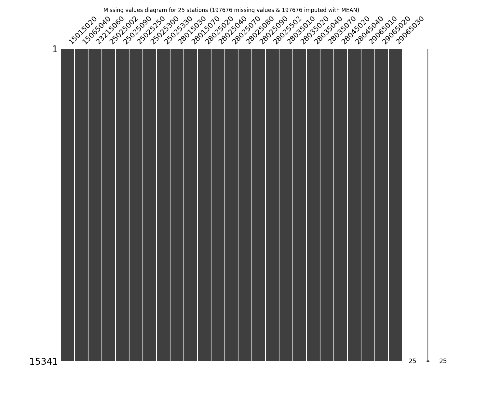

General statistics table - Imputed file

|          |   count |    mean |       std |     min |     25% |     50% |     75% |     max |
|---------:|--------:|--------:|----------:|--------:|--------:|--------:|--------:|--------:|
| 15015020 |   15341 | 33.0737 | 1.12933   | 27.7114 | 32.8    | 33.0737 | 33.4    | 38.4345 |
| 15065040 |   15341 | 34.082  | 0.870081  | 27.3    | 34.082  | 34.082  | 34.082  | 39.4    |
| 23215060 |   15341 | 32.7978 | 0.44381   | 27      | 32.7978 | 32.7978 | 32.7978 | 37.4    |
| 25025002 |   15341 | 34.3222 | 1.46078   | 26.8    | 34.2    | 34.3222 | 34.3222 | 41.8    |
| 25025090 |   15341 | 33.5557 | 1.36943   | 26.9261 | 33.4    | 33.5557 | 33.8    | 40.1849 |
| 25025250 |   15341 | 33.7867 | 1.81621   | 26.3163 | 33      | 33.7867 | 34.6    | 41.2576 |
| 25025300 |   15341 | 34.5619 | 1.91914   | 25.8    | 33.8    | 34.5619 | 35.2    | 41.8    |
| 25025330 |   15341 | 33.2245 | 1.44451   | 25.8    | 33      | 33.2245 | 33.2245 | 40.6238 |
| 28015030 |   15341 | 34.5671 | 0.501542  | 27.8803 | 34.5671 | 34.5671 | 34.5671 | 40.4    |
| 28015070 |   15341 | 33.7018 | 1.98134   | 25.4    | 32.6    | 33.7018 | 34.8    | 42      |
| 28025020 |   15341 | 32.6602 | 1.91768   | 24.6    | 31.5    | 32.6602 | 33.8    | 39.7    |
| 28025040 |   15341 | 29.7902 | 0.716562  | 23.5104 | 29.7902 | 29.7902 | 29.7902 | 36.071  |
| 28025070 |   15341 | 34.4328 | 2.20066   | 25.8    | 33      | 34.4328 | 35.8    | 42.8    |
| 28025080 |   15341 | 33.5968 | 1.39421   | 26.2066 | 33.5968 | 33.5968 | 33.5968 | 40      |
| 28025090 |   15341 | 34.3342 | 1.9209    | 26.7976 | 33.2    | 34.3342 | 35.4    | 41.8696 |
| 28025502 |   15341 | 34.6505 | 1.8815    | 26.6    | 33.8    | 34.6505 | 35.6    | 41.8    |
| 28035010 |   15341 | 35.0518 | 1.6722    | 26.8    | 35      | 35.0518 | 35.4    | 42.4    |
| 28035020 |   15341 | 34.7342 | 1.96456   | 26.4    | 33.6    | 34.7342 | 35.8    | 41.8    |
| 28035040 |   15341 | 36.1131 | 1.58754   | 28.7971 | 36      | 36.1131 | 36.8    | 42.4    |
| 28035070 |   15341 | 37.1095 | 0.0655218 | 34      | 37.1095 | 37.1095 | 37.1095 | 39.2    |
| 28045020 |   15341 | 33.8226 | 0.557579  | 27.2    | 33.8226 | 33.8226 | 33.8226 | 39.2    |
| 28045040 |   15341 | 34.561  | 0.508387  | 26.2    | 34.561  | 34.561  | 34.561  | 41.8    |
| 29065010 |   15341 | 33.5259 | 0.381084  | 29.4    | 33.5259 | 33.5259 | 33.5259 | 37.2    |
| 29065020 |   15341 | 34.1386 | 1.2727    | 28.2646 | 33.8    | 34.1386 | 34.4    | 39.8    |
| 29065030 |   15341 | 33.3167 | 1.22288   | 27.945  | 33      | 33.3167 | 34      | 38.6809 |

## Method 2 - Imputing with median values
According to this technique, the missing values are imputed using the median value in each feature and the serie has been completed filled.

Imputed file: [Impute_Median_Outlier_IQR_Cap_Pivot_TMX_CON.csv](Impute_Median_Outlier_IQR_Cap_Pivot_TMX_CON.csv)

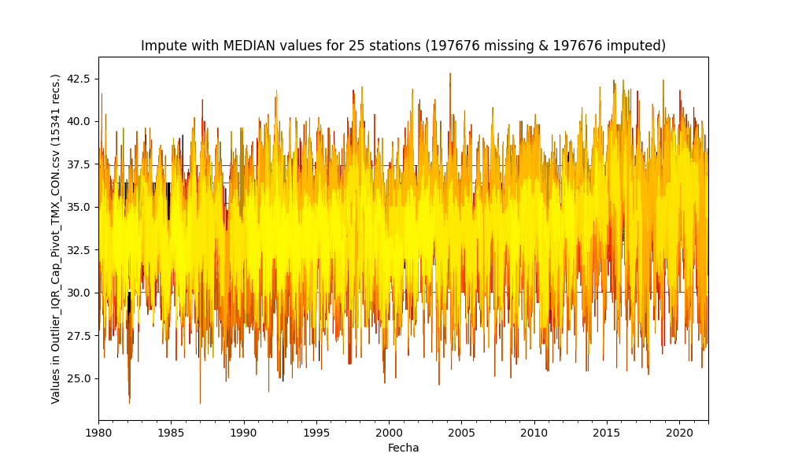

General statistics table - Imputed file

|          |   count |    mean |       std |     min |   25% |   50% |   75% |     max |
|---------:|--------:|--------:|----------:|--------:|------:|------:|------:|--------:|
| 15015020 |   15341 | 33.1271 | 1.13106   | 27.7114 |  32.8 |  33.2 |  33.4 | 38.4345 |
| 15065040 |   15341 | 34.1733 | 0.87148   | 27.3    |  34.2 |  34.2 |  34.2 | 39.4    |
| 23215060 |   15341 | 32.7999 | 0.443811  | 27      |  32.8 |  32.8 |  32.8 | 37.4    |
| 25025002 |   15341 | 34.2613 | 1.46206   | 26.8    |  34.2 |  34.2 |  34.3 | 41.8    |
| 25025090 |   15341 | 33.5755 | 1.3696    | 26.9261 |  33.4 |  33.6 |  33.8 | 40.1849 |
| 25025250 |   15341 | 33.8365 | 1.81845   | 26.3163 |  33   |  34   |  34.6 | 41.2576 |
| 25025300 |   15341 | 34.575  | 1.91922   | 25.8    |  33.8 |  34.6 |  35.2 | 41.8    |
| 25025330 |   15341 | 33.1113 | 1.44886   | 25.8    |  33   |  33   |  33   | 40.6238 |
| 28015030 |   15341 | 34.5976 | 0.501616  | 27.8803 |  34.6 |  34.6 |  34.6 | 40.4    |
| 28015070 |   15341 | 33.6839 | 1.98172   | 25.4    |  32.6 |  33.6 |  34.8 | 42      |
| 28025020 |   15341 | 32.6664 | 1.91773   | 24.6    |  31.5 |  32.7 |  33.8 | 39.7    |
| 28025040 |   15341 | 29.9643 | 0.720888  | 23.5104 |  30   |  30   |  30   | 36.071  |
| 28025070 |   15341 | 34.4287 | 2.20069   | 25.8    |  33   |  34.4 |  35.8 | 42.8    |
| 28025080 |   15341 | 33.5985 | 1.39421   | 26.2066 |  33.6 |  33.6 |  33.6 | 40      |
| 28025090 |   15341 | 34.3445 | 1.92105   | 26.7976 |  33.2 |  34.4 |  35.4 | 41.8696 |
| 28025502 |   15341 | 34.663  | 1.88162   | 26.6    |  33.8 |  34.7 |  35.6 | 41.8    |
| 28035010 |   15341 | 35.1185 | 1.67383   | 26.8    |  35   |  35.2 |  35.4 | 42.4    |
| 28035020 |   15341 | 34.748  | 1.96474   | 26.4    |  33.6 |  34.8 |  35.8 | 41.8    |
| 28035040 |   15341 | 36.2238 | 1.59367   | 28.7971 |  36   |  36.4 |  36.8 | 42.4    |
| 28035070 |   15341 | 37.3992 | 0.0672569 | 34      |  37.4 |  37.4 |  37.4 | 39.2    |
| 28045020 |   15341 | 33.8015 | 0.557608  | 27.2    |  33.8 |  33.8 |  33.8 | 39.2    |
| 28045040 |   15341 | 34.598  | 0.50846   | 26.2    |  34.6 |  34.6 |  34.6 | 41.8    |
| 29065010 |   15341 | 33.5957 | 0.381479  | 29.4    |  33.6 |  33.6 |  33.6 | 37.2    |
| 29065020 |   15341 | 34.1624 | 1.27305   | 28.2646 |  33.8 |  34.2 |  34.4 | 39.8    |
| 29065030 |   15341 | 33.3428 | 1.22349   | 27.945  |  33   |  33.4 |  34   | 38.6809 |

## Method 3 - Imputing with Last Observation Carried Forward (LOCF) values
According to this technique, the missing values are imputed using the immediate values before it in the time series and the missing values at the start are not filled but the series are completed fillet to the end.

Imputed file: [Impute_LOCF_Outlier_IQR_Cap_Pivot_TMX_CON.csv](Impute_LOCF_Outlier_IQR_Cap_Pivot_TMX_CON.csv)

General statistics table - Imputed file

|          |   count |    mean |      std |     min |   25% |   50% |   75% |     max |
|---------:|--------:|--------:|---------:|--------:|------:|------:|------:|--------:|
| 15015020 |   15341 | 32.8218 | 1.43228  | 27.7114 |  31.2 |  33.2 |  33.6 | 38.4345 |
| 15065040 |   15250 | 34.3611 | 1.5596   | 27.3    |  33   |  35   |  35.3 | 39.4    |
| 23215060 |   13986 | 31.8876 | 0.592759 | 27      |  31.8 |  31.8 |  31.8 | 37.4    |
| 25025002 |   13509 | 34.5587 | 1.84622  | 26.8    |  33.6 |  34.2 |  35.6 | 41.8    |
| 25025090 |   15341 | 33.4983 | 1.66799  | 26.9261 |  32   |  33.8 |  34.4 | 40.1849 |
| 25025250 |   14885 | 33.7295 | 2.10225  | 26.3163 |  32.2 |  33.8 |  35.2 | 41.2576 |
| 25025300 |   13394 | 34.5788 | 2.16891  | 25.8    |  33.2 |  34.6 |  35.8 | 41.8    |
| 25025330 |   11603 | 33.2763 | 2.15458  | 25.8    |  32   |  32.8 |  34.4 | 40.6238 |
| 28015030 |   15339 | 33.3491 | 1.08483  | 27.8803 |  33   |  33   |  33   | 40.4    |
| 28015070 |   15341 | 33.867  | 2.06402  | 25.4    |  32.6 |  34   |  35   | 42      |
| 28025020 |   15310 | 32.6546 | 2.01492  | 24.6    |  31.3 |  32.6 |  34   | 39.7    |
| 28025040 |   15340 | 30.0267 | 0.819262 | 23.5104 |  30   |  30   |  30   | 36.071  |
| 28025070 |   15341 | 34.3636 | 2.29916  | 25.8    |  33   |  34.4 |  36   | 42.8    |
| 28025080 |   15339 | 33.8083 | 1.93181  | 26.2066 |  32.2 |  34   |  35.2 | 40      |
| 28025090 |   14973 | 34.2577 | 2.11808  | 26.7976 |  32.8 |  34.4 |  35.6 | 41.8696 |
| 28025502 |   14154 | 34.2581 | 2.30357  | 26.6    |  32.7 |  34.5 |  35.8 | 41.8    |
| 28035010 |   15331 | 35.214  | 2.30562  | 26.8    |  34.2 |  35.4 |  36.4 | 42.4    |
| 28035020 |   15341 | 34.9331 | 2.11907  | 26.4    |  33.6 |  35.2 |  36.4 | 41.8    |
| 28035040 |   14824 | 36.1561 | 1.81955  | 28.7971 |  35.2 |  36.2 |  37.6 | 42.4    |
| 28035070 |    3318 | 38.2829 | 0.315863 | 34      |  38.2 |  38.2 |  38.2 | 39.2    |
| 28045020 |   14245 | 32.7734 | 0.823818 | 27.2    |  32.6 |  32.6 |  32.6 | 39.2    |
| 28045040 |   12532 | 33.7755 | 0.983237 | 26.2    |  33.6 |  33.6 |  33.6 | 41.8    |
| 29065010 |   14975 | 33.5803 | 0.807707 | 29.4    |  33.4 |  33.4 |  33.4 | 37.2    |
| 29065020 |   15281 | 33.9958 | 1.64403  | 28.2646 |  33   |  34.2 |  35   | 39.8    |
| 29065030 |   15341 | 33.6278 | 1.46765  | 27.945  |  32.8 |  33.6 |  35.2 | 38.6809 |

## Method 4 - Imputing with Next Observation Carried Backward (NOCB) values
According to this technique, the missing values are imputed using the immediate values after it in the time series and the missing values at the end are not filled but the series are completed fillet to the start.

Imputed file: [Impute_NOCB_Outlier_IQR_Cap_Pivot_TMX_CON.csv](Impute_NOCB_Outlier_IQR_Cap_Pivot_TMX_CON.csv)

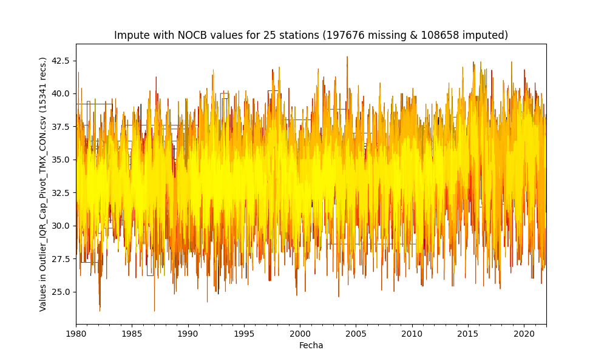

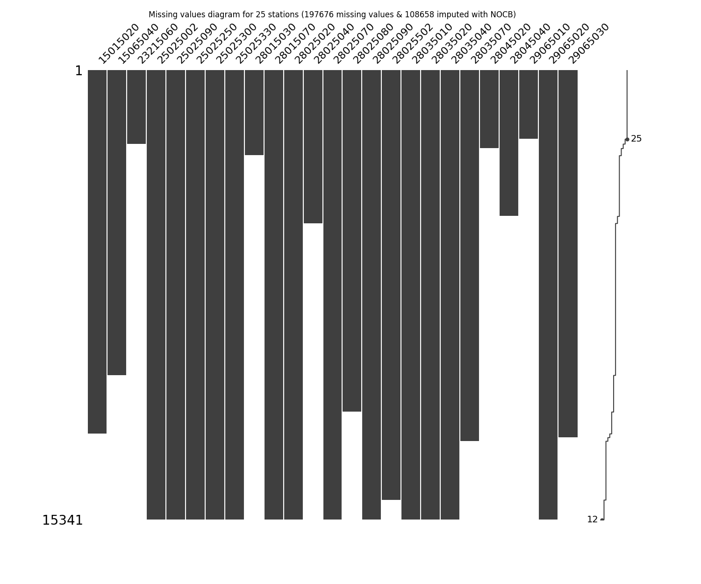

General statistics table - Imputed file

|          |   count |    mean |      std |     min |   25% |   50% |   75% |     max |
|---------:|--------:|--------:|---------:|--------:|------:|------:|------:|--------:|
| 15015020 |   12412 | 31.9541 | 2.32025  | 27.7114 |  28.6 |  32.4 |  33.8 | 38.4345 |
| 15065040 |   10417 | 34.1171 | 1.72093  | 27.3    |  33   |  33.6 |  35.8 | 39.4    |
| 23215060 |    2526 | 32.9477 | 1.22008  | 27      |  33   |  33   |  33   | 37.4    |
| 25025002 |   15341 | 33.5689 | 2.41237  | 26.8    |  31.6 |  33   |  35   | 41.8    |
| 25025090 |   15341 | 34.2668 | 2.18866  | 26.9261 |  32.6 |  34   |  35.8 | 40.1849 |
| 25025250 |   15341 | 33.7386 | 2.10405  | 26.3163 |  32.2 |  34   |  35   | 41.2576 |
| 25025300 |   15341 | 34.6479 | 2.14379  | 25.8    |  33   |  35   |  36.2 | 41.8    |
| 25025330 |   15339 | 33.666  | 1.75691  | 25.8    |  32.4 |  34   |  34.2 | 40.6238 |
| 28015030 |    2921 | 34.4534 | 1.77221  | 27.8803 |  33.4 |  34.5 |  35.4 | 40.4    |
| 28015070 |   15341 | 34.1438 | 2.39295  | 25.4    |  32.6 |  34   |  35.6 | 42      |
| 28025020 |   15341 | 32.7512 | 2.10353  | 24.6    |  31.4 |  32.8 |  34.3 | 39.7    |
| 28025040 |    5234 | 29.561  | 1.76082  | 23.5104 |  28.2 |  30.2 |  30.4 | 36.071  |
| 28025070 |   15341 | 34.3382 | 2.38208  | 25.8    |  32.6 |  34.4 |  36.2 | 42.8    |
| 28025080 |   11666 | 34.1417 | 2.04287  | 26.2066 |  32.8 |  34.2 |  36   | 40      |
| 28025090 |   15341 | 34.359  | 2.0401   | 26.7976 |  33   |  34.6 |  35.8 | 41.8696 |
| 28025502 |   14670 | 35.1653 | 2.47536  | 26.6    |  33.4 |  35.2 |  37.2 | 41.8    |
| 28035010 |   15341 | 35.4613 | 1.91572  | 26.8    |  34.4 |  35.6 |  36.4 | 42.4    |
| 28035020 |   15341 | 34.7547 | 2.11133  | 26.4    |  33.4 |  34.8 |  36.2 | 41.8    |
| 28035040 |   15341 | 35.7726 | 2.21623  | 28.7971 |  34.6 |  35.4 |  37.2 | 42.4    |
| 28035070 |   12663 | 35.916  | 0.512989 | 34      |  35.8 |  35.8 |  35.8 | 39.2    |
| 28045020 |    2677 | 34.8308 | 1.80596  | 27.2    |  33.6 |  36   |  36   | 39.2    |
| 28045040 |    4992 | 33.1205 | 1.93492  | 26.2    |  32.4 |  32.4 |  33.4 | 41.8    |
| 29065010 |    2359 | 33.9173 | 1.16368  | 29.4    |  33.6 |  33.8 |  34.6 | 37.2    |
| 29065020 |   15341 | 34.357  | 1.59064  | 28.2646 |  33.4 |  34.4 |  35.4 | 39.8    |
| 29065030 |   12539 | 33.213  | 1.44471  | 27.945  |  32.4 |  33.2 |  34.2 | 38.6809 |

## Method 5 - Impute missing values with Linear Interpolation values
According to this technique, the missing values are imputed using the linear interpolation between knowing pair values in the time series and the missing values at the start are not filled but the series are completed fillet to the end.

Imputed file: [Impute_InterpolateLinear_Outlier_IQR_Cap_Pivot_TMX_CON.csv](Impute_InterpolateLinear_Outlier_IQR_Cap_Pivot_TMX_CON.csv)

General statistics table - Imputed file

|          |   count |    mean |      std |     min |     25% |     50% |     75% |     max |
|---------:|--------:|--------:|---------:|--------:|--------:|--------:|--------:|--------:|
| 15015020 |   15341 | 32.316  | 1.62844  | 27.7114 | 31.2    | 32.2    | 33.4    | 38.4345 |
| 15065040 |   15250 | 34.4268 | 1.40285  | 27.3    | 33.347  | 35      | 35.3    | 39.4    |
| 23215060 |   13986 | 31.8893 | 0.588767 | 27      | 31.8    | 31.8    | 31.8    | 37.4    |
| 25025002 |   13509 | 34.1431 | 2.08354  | 26.8    | 32.7172 | 34      | 35.4    | 41.8    |
| 25025090 |   15341 | 33.8826 | 1.85366  | 26.9261 | 32.5179 | 33.8    | 35.0362 | 40.1849 |
| 25025250 |   14885 | 33.6749 | 2.01004  | 26.3163 | 32.2    | 33.8    | 35      | 41.2576 |
| 25025300 |   13394 | 34.5732 | 2.19921  | 25.8    | 33      | 34.6    | 36.0883 | 41.8    |
| 25025330 |   11603 | 33.3851 | 1.9208   | 25.8    | 32.2    | 33.2    | 34.6    | 40.6238 |
| 28015030 |   15339 | 33.3128 | 0.972405 | 27.8803 | 33      | 33      | 33      | 40.4    |
| 28015070 |   15341 | 34.0054 | 2.19211  | 25.4    | 32.6    | 34      | 35.5905 | 42      |
| 28025020 |   15310 | 32.7033 | 2.00998  | 24.6    | 31.4    | 32.8    | 34.0748 | 39.7    |
| 28025040 |   15340 | 29.9385 | 0.885158 | 23.5104 | 30      | 30      | 30      | 36.071  |
| 28025070 |   15341 | 34.3509 | 2.31298  | 25.8    | 32.6    | 34.4    | 36      | 42.8    |
| 28025080 |   15339 | 34.1017 | 1.78751  | 26.2066 | 32.823  | 34.7023 | 35.2    | 40      |
| 28025090 |   14973 | 34.3299 | 2.04622  | 26.7976 | 33      | 34.4    | 35.8    | 41.8696 |
| 28025502 |   14154 | 34.541  | 2.11206  | 26.6    | 33.2    | 34.7    | 36      | 41.8    |
| 28035010 |   15331 | 35.3377 | 2.02728  | 26.8    | 34.2    | 35.5776 | 36.5369 | 42.4    |
| 28035020 |   15341 | 34.8439 | 2.07276  | 26.4    | 33.4    | 35      | 36.2    | 41.8    |
| 28035040 |   14824 | 35.9744 | 1.90249  | 28.7971 | 35      | 36.0905 | 37.2101 | 42.4    |
| 28035070 |    3318 | 38.2314 | 0.249921 | 34      | 38.2    | 38.2    | 38.2    | 39.2    |
| 28045020 |   14245 | 32.7655 | 0.801571 | 27.2    | 32.6    | 32.6    | 32.6    | 39.2    |
| 28045040 |   12532 | 33.7267 | 0.947271 | 26.2    | 33.6    | 33.6    | 33.6    | 41.8    |
| 29065010 |   14975 | 33.5285 | 0.643892 | 29.4    | 33.4    | 33.4    | 33.4    | 37.2    |
| 29065020 |   15281 | 34.1787 | 1.5606   | 28.2646 | 33.0623 | 34.2    | 35.2    | 39.8    |
| 29065030 |   15341 | 33.6019 | 1.47463  | 27.945  | 32.6382 | 33.6    | 35.2    | 38.6809 |

## Method 6 - Impute missing values with Exponential (Weighted) Moving Average - EWM = 3
According to this technique, the missing values are imputed using the moving average values in the time series and the missing values at the start are not filled but the series are completed fillet to the end.

Imputed file: [Impute_MeanEWM_Outlier_IQR_Cap_Pivot_TMX_CON.csv](Impute_MeanEWM_Outlier_IQR_Cap_Pivot_TMX_CON.csv)

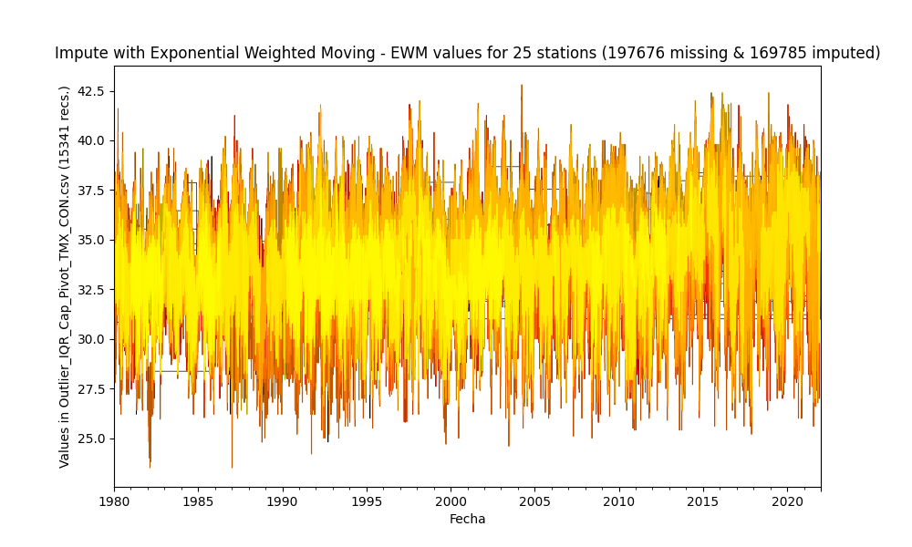

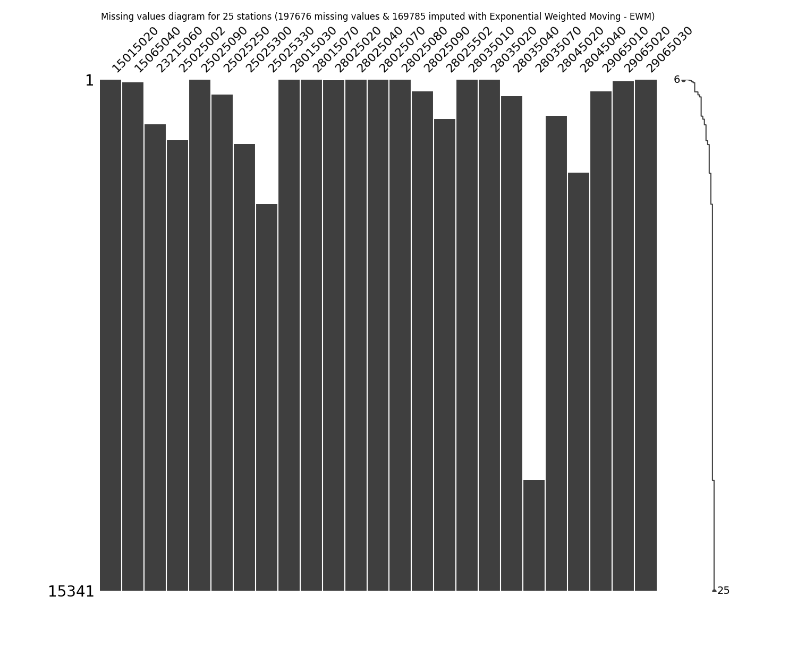

General statistics table - Imputed file

|          |   count |    mean |      std |     min |     25% |     50% |     75% |     max |
|---------:|--------:|--------:|---------:|--------:|--------:|--------:|--------:|--------:|
| 15015020 |   15341 | 32.6945 | 1.36275  | 27.7114 | 31.2209 | 32.9919 | 33.4    | 38.4345 |
| 15065040 |   15250 | 34.4428 | 1.43669  | 27.3    | 33.7834 | 35.2572 | 35.2572 | 39.4    |
| 23215060 |   13986 | 31.9685 | 0.552703 | 27      | 31.8891 | 31.8891 | 31.8891 | 37.4    |
| 25025002 |   13509 | 34.4125 | 1.78619  | 26.8    | 33.4    | 34.3943 | 35.6    | 41.8    |
| 25025090 |   15341 | 33.5153 | 1.62851  | 26.9261 | 32.0287 | 33.8    | 34.4813 | 40.1849 |
| 25025250 |   14885 | 33.7106 | 2.05084  | 26.3163 | 32.2    | 33.8    | 35.2    | 41.2576 |
| 25025300 |   13394 | 34.5231 | 2.15446  | 25.8    | 33.2    | 34.4302 | 35.8    | 41.8    |
| 25025330 |   11603 | 33.3145 | 2.10068  | 25.8    | 32      | 32.8219 | 34.4    | 40.6238 |
| 28015030 |   15339 | 33.125  | 0.96345  | 27.8803 | 32.7895 | 32.7895 | 32.7895 | 40.4    |
| 28015070 |   15341 | 33.9411 | 2.13371  | 25.4    | 32.4556 | 34      | 35.7389 | 42      |
| 28025020 |   15310 | 32.6578 | 1.96731  | 24.6    | 31.4133 | 32.7435 | 34      | 39.7    |
| 28025040 |   15340 | 30.4817 | 1.13711  | 23.5104 | 30.2    | 31.0086 | 31.0086 | 36.071  |
| 28025070 |   15341 | 34.4141 | 2.26317  | 25.8    | 33      | 34.4    | 36      | 42.8    |
| 28025080 |   15339 | 33.9301 | 1.748    | 26.2066 | 32.9656 | 34.1    | 35.2    | 40      |
| 28025090 |   14973 | 34.2222 | 2.12422  | 26.7976 | 32.8    | 34.4    | 35.6    | 41.8696 |
| 28025502 |   14154 | 34.6439 | 2.07754  | 26.6    | 33.2249 | 34.6    | 36.2    | 41.8    |
| 28035010 |   15331 | 35.4382 | 2.16649  | 26.8    | 34.2    | 35.5334 | 36.9098 | 42.4    |
| 28035020 |   15341 | 34.7932 | 2.04869  | 26.4    | 33.6    | 35      | 36      | 41.8    |
| 28035040 |   14824 | 36.0052 | 1.80144  | 28.7971 | 34.9098 | 36.2    | 37.4    | 42.4    |
| 28035070 |    3318 | 38.1322 | 0.265718 | 34      | 38.2    | 38.2    | 38.2    | 39.2    |
| 28045020 |   14245 | 33.4698 | 0.684813 | 27.2    | 33.4011 | 33.4011 | 33.4011 | 39.2    |
| 28045040 |   12532 | 34.1153 | 0.864591 | 26.2    | 34.0926 | 34.0926 | 34.0926 | 41.8    |
| 29065010 |   14975 | 33.5535 | 0.755933 | 29.4    | 33.4    | 33.4    | 33.4    | 37.2    |
| 29065020 |   15281 | 34.0123 | 1.51932  | 28.2646 | 33      | 34      | 35      | 39.8    |
| 29065030 |   15341 | 33.8335 | 1.79807  | 27.945  | 32.4313 | 33.6    | 35.2    | 38.6809 |

## Method 7 - Impute missing values with Natural Neigborns - KNN = 5 Imputer from Scikit Learn
According to this technique, the missing values are imputed using the natural neighbors values and the serie has been completed filled. More information in https://scikit-learn.org/stable/modules/generated/sklearn.impute.KNNImputer.html

Imputer = KNNImputer(n_neighbors=n_neighbors, weights=uniform, metric=nan_euclidean)

Imputed file: [Impute_KNN_Outlier_IQR_Cap_Pivot_TMX_CON.csv](Impute_KNN_Outlier_IQR_Cap_Pivot_TMX_CON.csv)

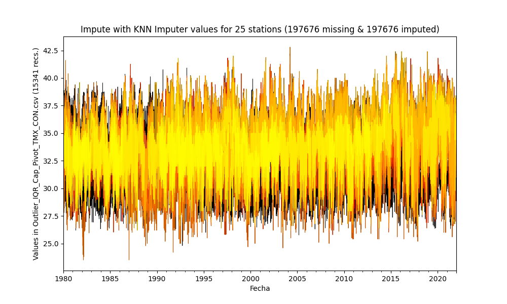

General statistics table - Imputed file

|          |   count |    mean |      std |     min |   25% |   50% |   75% |     max |
|---------:|--------:|--------:|---------:|--------:|------:|------:|------:|--------:|
| 15015020 |   15341 | 33.1279 | 1.30787  | 27.7114 | 32.36 | 33.2  | 34    | 38.4345 |
| 15065040 |   15341 | 33.7452 | 1.45426  | 27.3    | 32.8  | 33.8  | 34.78 | 39.4    |
| 23215060 |   15341 | 33.4269 | 1.47153  | 27      | 32.44 | 33.48 | 34.56 | 37.4    |
| 25025002 |   15341 | 34.1497 | 1.81518  | 26.8    | 33    | 34    | 35.2  | 41.8    |
| 25025090 |   15341 | 33.4317 | 1.64706  | 26.9261 | 32.4  | 33.4  | 34.4  | 40.1849 |
| 25025250 |   15341 | 33.8121 | 1.95398  | 26.3163 | 32.6  | 34    | 35    | 41.2576 |
| 25025300 |   15341 | 34.4874 | 2.22012  | 25.8    | 32.88 | 34.6  | 36    | 41.8    |
| 25025330 |   15341 | 33.0904 | 1.7555   | 25.8    | 31.92 | 32.88 | 34.16 | 40.6238 |
| 28015030 |   15341 | 34.8738 | 1.52559  | 27.8803 | 33.98 | 34.9  | 35.96 | 40.4    |
| 28015070 |   15341 | 33.6785 | 2.08011  | 25.4    | 32.4  | 33.6  | 35    | 42      |
| 28025020 |   15341 | 32.6265 | 1.99182  | 24.6    | 31.4  | 32.62 | 34    | 39.7    |
| 28025040 |   15341 | 29.6763 | 1.2675   | 23.5104 | 28.8  | 29.68 | 30.52 | 36.071  |
| 28025070 |   15341 | 34.4644 | 2.29351  | 25.8    | 32.94 | 34.56 | 36.2  | 42.8    |
| 28025080 |   15341 | 33.6624 | 1.78312  | 26.2066 | 32.4  | 33.8  | 34.94 | 40      |
| 28025090 |   15341 | 34.341  | 2.00832  | 26.7976 | 33    | 34.4  | 35.6  | 41.8696 |
| 28025502 |   15341 | 34.606  | 2.0652   | 26.6    | 33.3  | 34.7  | 36    | 41.8    |
| 28035010 |   15341 | 35.0738 | 2.00382  | 26.8    | 33.8  | 35.2  | 36.4  | 42.4    |
| 28035020 |   15341 | 34.7199 | 2.0933   | 26.4    | 33.4  | 34.8  | 36.2  | 41.8    |
| 28035040 |   15341 | 36.014  | 1.90373  | 28.7971 | 34.88 | 36.24 | 37.32 | 42.4    |
| 28035070 |   15341 | 36.1069 | 1.36309  | 34      | 34.8  | 35.68 | 37.28 | 39.2    |
| 28045020 |   15341 | 34.5903 | 1.80295  | 27.2    | 33.28 | 34.92 | 36    | 39.2    |
| 28045040 |   15341 | 34.553  | 1.79094  | 26.2    | 33.4  | 34.64 | 35.72 | 41.8    |
| 29065010 |   15341 | 34.1712 | 0.868644 | 29.4    | 33.6  | 34.16 | 34.72 | 37.2    |
| 29065020 |   15341 | 34.0627 | 1.44524  | 28.2646 | 33.16 | 34.04 | 35    | 39.8    |
| 29065030 |   15341 | 33.3665 | 1.32088  | 27.945  | 32.6  | 33.4  | 34.2  | 38.6809 |

## Method 8 - Impute missing values with Multivariate Imputation by Chained Equation - MICE from Scikit Learn
According to this technique, the missing values are imputed using MICE values and the serie has been completed filled. More information in https://scikit-learn.org/stable/modules/generated/sklearn.impute.IterativeImputer.html

Imputer = IterativeImputer(estimator=BayesianRidge(), min_value=0, n_nearest_features=5)

Imputed file: [Impute_MICE_Outlier_IQR_Cap_Pivot_TMX_CON.csv](Impute_MICE_Outlier_IQR_Cap_Pivot_TMX_CON.csv)

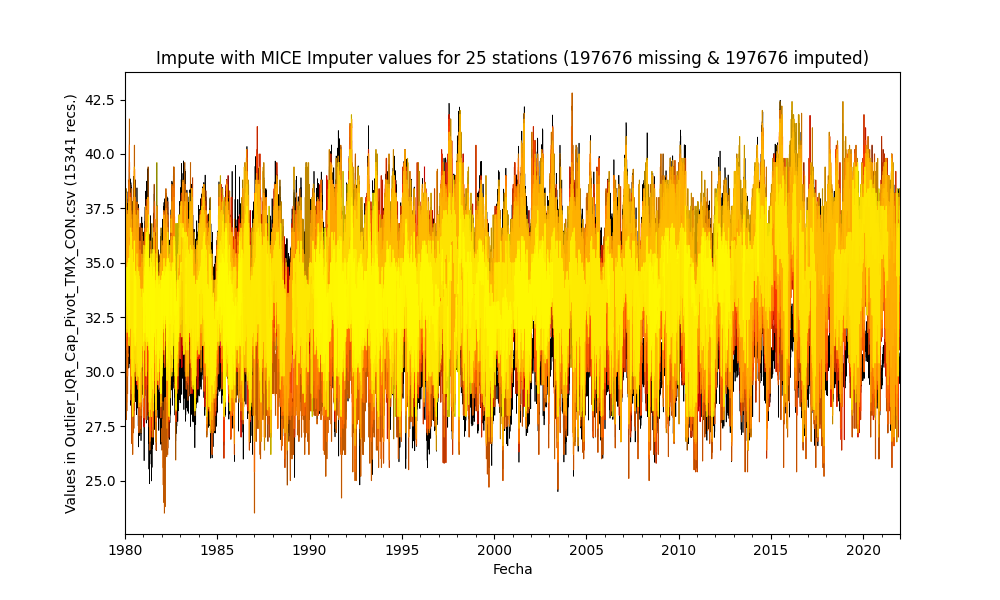

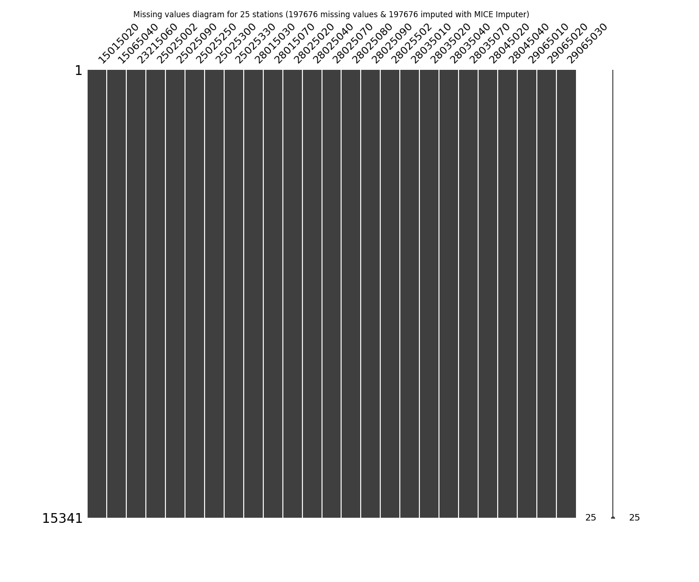

General statistics table - Imputed file

|          |   count |    mean |      std |     min |     25% |     50% |     75% |     max |
|---------:|--------:|--------:|---------:|--------:|--------:|--------:|--------:|--------:|
| 15015020 |   15341 | 33.2235 | 1.29537  | 27.7114 | 32.4    | 33.2982 | 34.0905 | 38.4345 |
| 15065040 |   15341 | 34.1835 | 1.20367  | 27.3    | 33.5284 | 34.2388 | 34.9592 | 39.4    |
| 23215060 |   15341 | 33.3221 | 1.56129  | 27      | 32.2421 | 33.3382 | 34.4142 | 38.715  |
| 25025002 |   15341 | 34.1689 | 1.79172  | 26.8    | 33      | 34.174  | 35.3099 | 41.8    |
| 25025090 |   15341 | 33.447  | 1.61479  | 26.9261 | 32.4    | 33.4309 | 34.4423 | 40.1849 |
| 25025250 |   15341 | 33.7809 | 1.94634  | 26.3163 | 32.5779 | 34      | 35      | 41.2576 |
| 25025300 |   15341 | 34.448  | 2.2335   | 25.8    | 32.8365 | 34.518  | 36      | 41.8    |
| 25025330 |   15341 | 33.0415 | 1.75394  | 25.8    | 31.8572 | 32.9989 | 34.0897 | 40.6238 |
| 28015030 |   15341 | 34.7539 | 1.80466  | 27.8803 | 33.5385 | 34.7568 | 35.9996 | 41.7483 |
| 28015070 |   15341 | 33.6471 | 2.11831  | 25.4    | 32.2    | 33.6    | 35      | 42      |
| 28025020 |   15341 | 32.6636 | 2.04062  | 24.6    | 31.4    | 32.7    | 34.1    | 39.7    |
| 28025040 |   15341 | 29.8574 | 1.32187  | 23.5104 | 29      | 29.9052 | 30.7493 | 36.071  |
| 28025070 |   15341 | 34.4385 | 2.32481  | 25.8    | 32.8    | 34.4    | 36.2    | 42.8    |
| 28025080 |   15341 | 33.7834 | 1.71393  | 26.2066 | 32.7392 | 33.8933 | 34.9819 | 40      |
| 28025090 |   15341 | 34.3042 | 2.03351  | 26.7976 | 33      | 34.4    | 35.6    | 41.8696 |
| 28025502 |   15341 | 34.5727 | 2.08777  | 26.6    | 33.2    | 34.6    | 36      | 41.8    |
| 28035010 |   15341 | 34.9943 | 2.09871  | 26.8    | 33.6    | 35.0918 | 36.4    | 42.4    |
| 28035020 |   15341 | 34.7123 | 2.14788  | 26.0186 | 33.2997 | 34.8    | 36.2    | 41.8    |
| 28035040 |   15341 | 36.0574 | 1.78219  | 28.7971 | 35.0689 | 36.2    | 37.2    | 42.4    |
| 28035070 |   15341 | 34.9943 | 2.09871  | 26.8    | 33.6    | 35.0918 | 36.4    | 42.4    |
| 28045020 |   15341 | 34.2622 | 1.78416  | 27.2    | 33.0452 | 34.3069 | 35.5294 | 39.8844 |
| 28045040 |   15341 | 34.6404 | 1.67268  | 26.2    | 33.5354 | 34.7038 | 35.7955 | 41.8    |
| 29065010 |   15341 | 33.6458 | 0.591379 | 29.4    | 33.3162 | 33.6575 | 33.9902 | 37.2    |
| 29065020 |   15341 | 34.0902 | 1.37559  | 28.2646 | 33.2234 | 34.0449 | 34.9079 | 39.8    |
| 29065030 |   15341 | 33.3938 | 1.34866  | 27.945  | 32.6    | 33.4426 | 34.2193 | 38.6809 |

Complementary report with individual graphs for stations in [Impute_Station_Outlier_IQR_Cap_Pivot_TMX_CON.csv.md](Impute_Station_Outlier_IQR_Cap_Pivot_TMX_CON.csv.md)

> As you notice, some of the techniques showed above can`t fill complete the missing values at the start or at the end, however, you can first choice a method and then apply another complementary method for get full filled the missin values.
