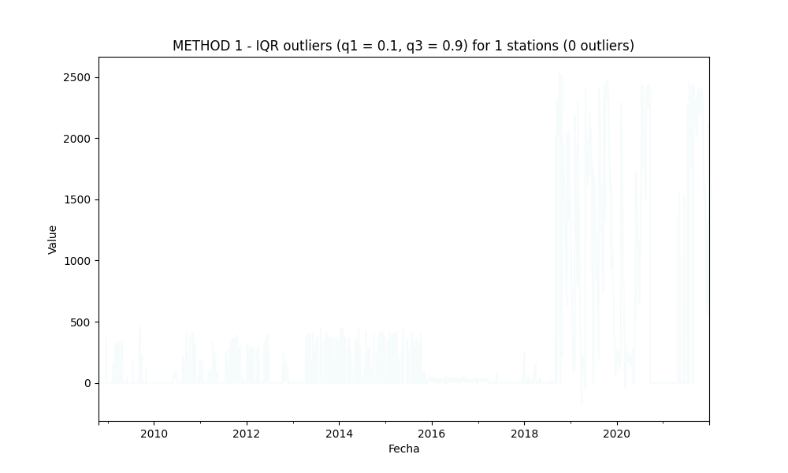

## Outliers detection and processing

* Processed file: D:/R.LTWB/.datasets/IDEAM_EDA/Pivot_EV_TT_D.csv
* Execution date: 2022-11-02 17:30:55.722025
* Python version: 3.10.5 (tags/v3.10.5:f377153, Jun  6 2022, 16:14:13) [MSC v.1929 64 bit (AMD64)]
* Python path: ['D:\\R.LTWB\\.src', 'D:\\R.LTWB', 'D:\\R.TeachingResearchGuide', 'D:\\R.HydroTools.wiki', 'D:\\R.GISPython']
* matplotlib version: 3.6.0
* pandas version: 1.4.3
* Print table sample: True
* Instructions & script: https://github.com/rcfdtools/R.LTWB/tree/main/Section03/Outlier
* Licence: https://github.com/rcfdtools/R.LTWB/blob/main/LICENSE.md
* Credits: r.cfdtools@gmail.com

### General dataframe information with 4821 IDEAM records for 1 stations

Dataframe records head sample

| Fecha               |   29065130 |
|:--------------------|-----------:|
| 2008-10-20 00:00:00 |          0 |
| 2008-10-21 00:00:00 |          0 |
| 2008-10-22 00:00:00 |          0 |

Dataframe records tail sample

| Fecha               |   29065130 |
|:--------------------|-----------:|
| 2021-12-29 00:00:00 |       2013 |
| 2021-12-30 00:00:00 |       1963 |
| 2021-12-31 00:00:00 |       1847 |

Datatypes and nulls values in the dataset

|          | Dtype   |   Nulls |
|---------:|:--------|--------:|
| 29065130 | float64 |       0 |

General statistics table

|       |   29065130 |
|:------|-----------:|
| count |   4821     |
| mean  |    281.089 |
| std   |    625.398 |
| min   |   -176     |
| 25%   |      0     |
| 50%   |      0     |
| 75%   |    139     |
| max   |   2529     |

### METHOD 1 - Outliers processing using the interquartile range IQR (q1 = 0.25, q3 = 0.75)

Outliers table: [Outlier_IQR_Pivot_EV_TT_D.csv](../../.datasets/IDEAM_Outlier/Outlier_IQR_Pivot_EV_TT_D.csv)

Outliers parameters
* q1: quartile 0.25
* q3: quartile 0.75
* IQR: interquartile range (q3-q1)
* OlBottomLim: outlier bottom limit (q1-1.5*IQR)
* OlTopLim: outlier top limit (q3+1.5*IQR)
* OlMinVal: minimum outlier value founded
* OlMaxVal: maximum outlier value founded
* OlCount: # outliers founded

|          |   q1 |   q3 |   IQR |   OlBottomLim |   OlTopLim |   OlMinVal |   OlMaxVal |   OlCount |
|---------:|-----:|-----:|------:|--------------:|-----------:|-----------:|-----------:|----------:|
| 29065130 |    0 |  139 |   139 |         208.5 |      347.5 |        350 |       2529 |       781 |

IQR outliers identified: 781
