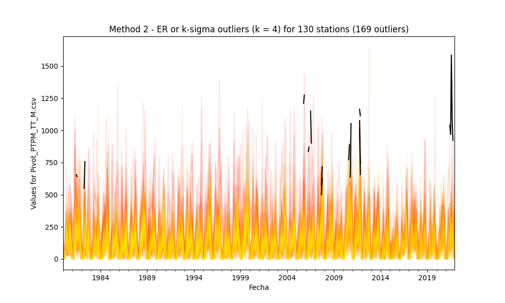
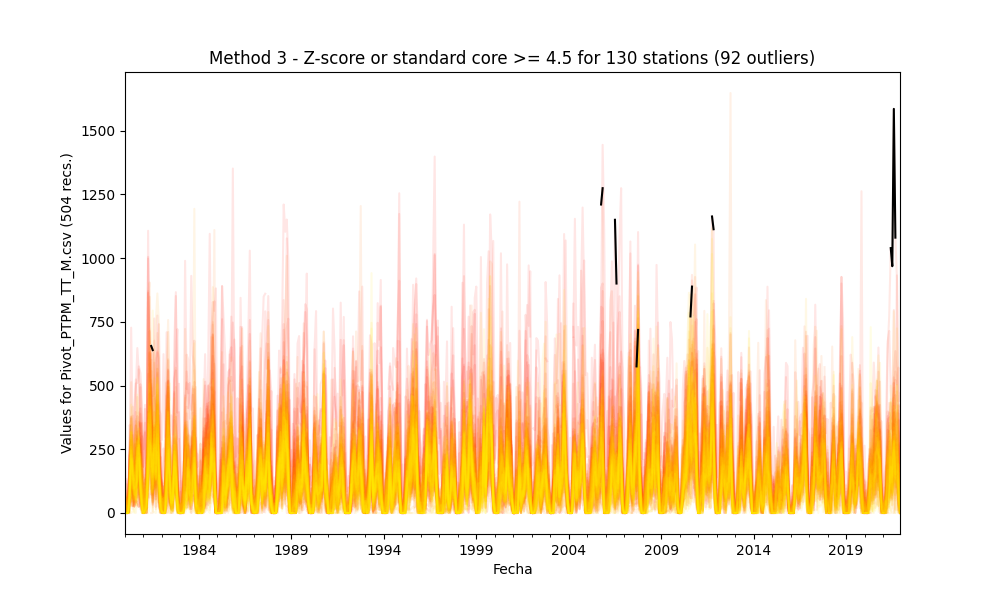

## Outliers detection and processing through statistical methods

* Processed file: [D:/R.LTWB/.datasets/IDEAM_EDA/Pivot_PTPM_TT_M.csv](../IDEAM_EDA/Pivot_PTPM_TT_M.csv)
* Execution date: 2022-11-05 16:20:11.604416
* Python version: 3.10.5 (tags/v3.10.5:f377153, Jun  6 2022, 16:14:13) [MSC v.1929 64 bit (AMD64)]
* Python path: ['D:\\R.LTWB\\.src', 'D:\\R.LTWB', 'D:\\R.HydroTools', 'D:\\R.GISPython.wiki', 'D:\\R.TeachingResearchGuide']
* matplotlib version: 3.6.0
* pandas version: 1.4.3
* numpy version: 1.23.2
* Stations exclude: ['28017140', '25027020', '25027410', '25027490', '25027330', '25027390', '25027630', '25027360', '25027320', '16067010', '25027420']
* Print table sample: True
* Instructions & script: https://github.com/rcfdtools/R.LTWB/tree/main/Section03/Outlier
* License: https://github.com/rcfdtools/R.LTWB/blob/main/LICENSE.md
* Credits: r.cfdtools@gmail.com

### General dataframe information with 504 IDEAM records for 130 stations

Dataframe records head sample

| Fecha               |   15015020 |   15060050 |   15060070 |   15060080 |   15060150 |   15065040 |   16050240 |   16060010 |   16070010 |   16070020 |   16070030 |   16070040 |   23210020 |   23215050 |   23215060 |   25020090 |   25020220 |   25020230 |   25020240 |   25020250 |   25020260 |   25020270 |   25020280 |   25020650 |   25020660 |   25020670 |   25020690 |   25020870 |   25020880 |   25020890 |   25020900 |   25020920 |   25021040 |   25021090 |   25021200 |   25021240 |   25021320 |   25021380 |   25021500 |   25021540 |   25021580 |   25021590 |   25021620 |   25021630 |   25021640 |   25021650 |   25025090 |   25025250 |   25025300 |   25025330 |   28010020 |   28010040 |   28010070 |   28010090 |   28010130 |   28010140 |   28010200 |   28010280 |   28010340 |   28010360 |   28010370 |   28015070 |   28020080 |   28020150 |   28020230 |   28020310 |   28020410 |   28020420 |   28020440 |   28020460 |   28020590 |   28020600 |   28025020 |   28025040 |   28025070 |   28025080 |   28025090 |   28030190 |   28030220 |   28035010 |   28035020 |   28035040 |   28040010 |   28040030 |   28040060 |   28040070 |   28040100 |   28040140 |   28040150 |   28040170 |   28040200 |   28040270 |   28040300 |   28040310 |   28040320 |   28040350 |   28040360 |   28040400 |   28045010 |   29060030 |   29060040 |   29060060 |   29060070 |   29060090 |   29060100 |   29060120 |   29060140 |   29060150 |   29060160 |   29060170 |   29060180 |   29060190 |   29060200 |   29060210 |   29060220 |   29060230 |   29060240 |   29060250 |   29060270 |   29060280 |   29060290 |   29060310 |   29060330 |   29060340 |   29060350 |   29060550 |   29060560 |   29065010 |   29065020 |   29065030 |
|:--------------------|-----------:|-----------:|-----------:|-----------:|-----------:|-----------:|-----------:|-----------:|-----------:|-----------:|-----------:|-----------:|-----------:|-----------:|-----------:|-----------:|-----------:|-----------:|-----------:|-----------:|-----------:|-----------:|-----------:|-----------:|-----------:|-----------:|-----------:|-----------:|-----------:|-----------:|-----------:|-----------:|-----------:|-----------:|-----------:|-----------:|-----------:|-----------:|-----------:|-----------:|-----------:|-----------:|-----------:|-----------:|-----------:|-----------:|-----------:|-----------:|-----------:|-----------:|-----------:|-----------:|-----------:|-----------:|-----------:|-----------:|-----------:|-----------:|-----------:|-----------:|-----------:|-----------:|-----------:|-----------:|-----------:|-----------:|-----------:|-----------:|-----------:|-----------:|-----------:|-----------:|-----------:|-----------:|-----------:|-----------:|-----------:|-----------:|-----------:|-----------:|-----------:|-----------:|-----------:|-----------:|-----------:|-----------:|-----------:|-----------:|-----------:|-----------:|-----------:|-----------:|-----------:|-----------:|-----------:|-----------:|-----------:|-----------:|-----------:|-----------:|-----------:|-----------:|-----------:|-----------:|-----------:|-----------:|-----------:|-----------:|-----------:|-----------:|-----------:|-----------:|-----------:|-----------:|-----------:|-----------:|-----------:|-----------:|-----------:|-----------:|-----------:|-----------:|-----------:|-----------:|-----------:|-----------:|-----------:|-----------:|-----------:|-----------:|
| 1980-01-01 00:00:00 |          0 |          0 |          0 |          0 |          0 |        nan |        nan |         53 |         50 |        nan |        200 |         67 |        nan |         50 |        nan |          0 |          0 |          2 |          0 |          0 |         43 |         31 |          0 |         11 |          1 |          0 |         60 |         12 |          0 |         15 |          0 |          5 |          0 |          5 |         21 |          0 |       20.9 |        nan |          4 |          0 |        nan |          0 |        nan |        nan |        nan |        nan |       70   |       28.7 |          0 |        nan |        nan |          7 |        nan |          0 |         27 |        3   |          0 |          2 |          0 |          0 |          0 |        0   |          0 |        nan |          0 |          2 |          0 |          0 |          0 |          0 |         15 |        nan |        9.6 |        3.7 |        0   |       18.5 |        0   |         14 |        nan |        0   |        0   |        0   |          0 |         30 |         55 |          5 |         83 |          6 |          9 |         63 |          0 |          0 |          0 |          0 |          7 |          4 |         10 |        nan |       47.7 |          0 |         15 |          8 |       24.3 |         11 |         75 |          0 |         14 |          0 |          0 |          0 |          0 |          6 |          0 |          0 |          0 |          0 |          0 |          0 |          0 |          0 |          0 |          0 |        nan |         67 |          0 |        nan |        nan |          0 |        3.3 |          0 |
| 1980-02-01 00:00:00 |          0 |         27 |        133 |         23 |         23 |        nan |        nan |         16 |         87 |        nan |         97 |         59 |        nan |         14 |        nan |         24 |         15 |         44 |         19 |         36 |         33 |          6 |         11 |         38 |         42 |          5 |         28 |        125 |         10 |         24 |          0 |         51 |         47 |         16 |         10 |         10 |       33.7 |        nan |          5 |         60 |        nan |         24 |        nan |        nan |        nan |        nan |       39.6 |       14.7 |         67 |        nan |        nan |        114 |        nan |         51 |         44 |       17.2 |          0 |          6 |         24 |         79 |         74 |       28.6 |         88 |        nan |          0 |         62 |         25 |         35 |         46 |         19 |         58 |        nan |       49.1 |       56.9 |       14.7 |       44.9 |       15.1 |          0 |        nan |       10.9 |       18.9 |        0   |         27 |        110 |         60 |         71 |          8 |         38 |         56 |         21 |         17 |         28 |          0 |          0 |         51 |         14 |         10 |        nan |       38.3 |          0 |          5 |         15 |       29.1 |         26 |          0 |          0 |          0 |          0 |          0 |          0 |          0 |          0 |          0 |          0 |          3 |          0 |          0 |          0 |          0 |          0 |          0 |          0 |        nan |         15 |          0 |        nan |        nan |          1 |        0   |          0 |
| 1980-03-01 00:00:00 |          0 |          0 |          0 |          0 |          4 |        nan |        nan |          6 |         18 |        nan |          0 |         34 |        nan |          9 |        nan |          0 |          1 |         13 |          0 |          0 |         19 |          0 |          2 |          0 |          2 |          0 |          5 |          0 |          0 |          5 |          0 |          0 |          6 |          0 |          0 |          5 |       56.2 |        nan |         13 |          0 |        nan |          0 |        nan |        nan |        nan |        nan |        0   |        4.4 |          5 |        nan |        nan |          6 |        nan |          0 |          0 |       50.3 |          0 |          8 |          0 |          0 |          4 |        0   |          0 |        nan |          7 |         36 |          0 |          0 |          6 |          0 |         10 |        nan |       14.2 |        7.3 |       14.6 |        0   |       13   |          0 |        nan |        7.9 |        2.4 |       14.2 |          0 |          0 |         15 |          0 |          0 |         25 |          0 |          8 |          0 |          4 |          0 |          0 |          0 |          5 |          0 |        nan |       10.5 |          0 |          0 |          4 |      nan   |          0 |          0 |          0 |          0 |          0 |          0 |          0 |          0 |          0 |          0 |          0 |          0 |          0 |          0 |          0 |          0 |          0 |          0 |          0 |        nan |          0 |          0 |        nan |        nan |          0 |        0   |          0 |

Dataframe records tail sample

| Fecha               |   15015020 |   15060050 |   15060070 |   15060080 |   15060150 |   15065040 |   16050240 |   16060010 |   16070010 |   16070020 |   16070030 |   16070040 |   23210020 |   23215050 |   23215060 |   25020090 |   25020220 |   25020230 |   25020240 |   25020250 |   25020260 |   25020270 |   25020280 |   25020650 |   25020660 |   25020670 |   25020690 |   25020870 |   25020880 |   25020890 |   25020900 |   25020920 |   25021040 |   25021090 |   25021200 |   25021240 |   25021320 |   25021380 |   25021500 |   25021540 |   25021580 |   25021590 |   25021620 |   25021630 |   25021640 |   25021650 |   25025090 |   25025250 |   25025300 |   25025330 |   28010020 |   28010040 |   28010070 |   28010090 |   28010130 |   28010140 |   28010200 |   28010280 |   28010340 |   28010360 |   28010370 |   28015070 |   28020080 |   28020150 |   28020230 |   28020310 |   28020410 |   28020420 |   28020440 |   28020460 |   28020590 |   28020600 |   28025020 |   28025040 |   28025070 |   28025080 |   28025090 |   28030190 |   28030220 |   28035010 |   28035020 |   28035040 |   28040010 |   28040030 |   28040060 |   28040070 |   28040100 |   28040140 |   28040150 |   28040170 |   28040200 |   28040270 |   28040300 |   28040310 |   28040320 |   28040350 |   28040360 |   28040400 |   28045010 |   29060030 |   29060040 |   29060060 |   29060070 |   29060090 |   29060100 |   29060120 |   29060140 |   29060150 |   29060160 |   29060170 |   29060180 |   29060190 |   29060200 |   29060210 |   29060220 |   29060230 |   29060240 |   29060250 |   29060270 |   29060280 |   29060290 |   29060310 |   29060330 |   29060340 |   29060350 |   29060550 |   29060560 |   29065010 |   29065020 |   29065030 |
|:--------------------|-----------:|-----------:|-----------:|-----------:|-----------:|-----------:|-----------:|-----------:|-----------:|-----------:|-----------:|-----------:|-----------:|-----------:|-----------:|-----------:|-----------:|-----------:|-----------:|-----------:|-----------:|-----------:|-----------:|-----------:|-----------:|-----------:|-----------:|-----------:|-----------:|-----------:|-----------:|-----------:|-----------:|-----------:|-----------:|-----------:|-----------:|-----------:|-----------:|-----------:|-----------:|-----------:|-----------:|-----------:|-----------:|-----------:|-----------:|-----------:|-----------:|-----------:|-----------:|-----------:|-----------:|-----------:|-----------:|-----------:|-----------:|-----------:|-----------:|-----------:|-----------:|-----------:|-----------:|-----------:|-----------:|-----------:|-----------:|-----------:|-----------:|-----------:|-----------:|-----------:|-----------:|-----------:|-----------:|-----------:|-----------:|-----------:|-----------:|-----------:|-----------:|-----------:|-----------:|-----------:|-----------:|-----------:|-----------:|-----------:|-----------:|-----------:|-----------:|-----------:|-----------:|-----------:|-----------:|-----------:|-----------:|-----------:|-----------:|-----------:|-----------:|-----------:|-----------:|-----------:|-----------:|-----------:|-----------:|-----------:|-----------:|-----------:|-----------:|-----------:|-----------:|-----------:|-----------:|-----------:|-----------:|-----------:|-----------:|-----------:|-----------:|-----------:|-----------:|-----------:|-----------:|-----------:|-----------:|-----------:|-----------:|-----------:|
| 2021-10-01 00:00:00 |        nan |        214 |        nan |        307 |        356 |        nan |        nan |        245 |        nan |        nan |        nan |        932 |        525 |      273.3 |        nan |        176 |        174 |        293 |        290 |        271 |        348 |        nan |        nan |        922 |        237 |        227 |        137 |        226 |        392 |        nan |         80 |        nan |        333 |        nan |        nan |        505 |        101 |        342 |        114 |        363 |        nan |        nan |        287 |        215 |      187.2 |        264 |      145.5 |        160 |      142.5 |        275 |        nan |      251   |        477 |      133.5 |        nan |        nan |        134 |        nan |        266 |        138 |        222 |      167   |        192 |        201 |        nan |        nan |        nan |         83 |        196 |        nan |        nan |        117 |        263 |        nan |      152.3 |        nan |        143 |        156 |        nan |        nan |      145.9 |      191.2 |        403 |      192   |        nan |         78 |        220 |        111 |      190.1 |        nan |        nan |        130 |        289 |        nan |        347 |        143 |        336 |        nan |        nan |        261 |        284 |        724 |        239 |        217 |      161   |         11 |        369 |        nan |        176 |      167.1 |        500 |        nan |        241 |      125.6 |        nan |        nan |        nan |        nan |        502 |        147 |        nan |         70 |        nan |        276 |      160.1 |        nan |        125 |        nan |        420 |        nan |
| 2021-11-01 00:00:00 |        nan |         11 |        nan |         81 |         34 |        nan |        nan |        402 |        nan |        nan |        nan |        437 |        330 |      123   |        nan |        267 |        199 |        131 |        367 |        112 |        305 |        137 |        nan |        173 |        200 |         86 |         15 |        362 |        390 |        nan |        120 |        nan |        232 |        nan |        nan |        570 |        150 |        421 |        143 |        427 |        nan |        nan |         94 |          5 |      124.9 |        207 |      321.2 |        128 |      174.9 |        225 |        nan |       53.9 |        127 |       56.8 |        nan |        nan |          2 |        nan |        123 |         23 |        186 |       28.4 |         92 |         52 |        nan |        nan |        nan |         32 |         39 |        nan |        nan |        177 |        114 |        nan |      183.5 |        nan |         23 |        104 |        nan |         83 |       26   |       51   |        239 |       78.2 |        nan |        127 |         53 |        108 |       33.3 |        nan |        nan |          0 |         89 |        nan |        162 |        130 |         53 |        nan |        nan |         63 |        140 |        232 |        145 |         53 |       87.5 |         22 |         90 |        nan |         62 |        0   |        235 |        nan |        175 |       89   |        nan |        nan |        nan |        nan |        105 |         56 |        nan |         65 |        nan |        114 |      191.4 |        nan |         10 |        nan |          0 |        nan |
| 2021-12-01 00:00:00 |        nan |         16 |        nan |         23 |         43 |        nan |        nan |        132 |        nan |        nan |        nan |        468 |         42 |       52.5 |        nan |        165 |         50 |         53 |         27 |         22 |        115 |        273 |        nan |        161 |         70 |         52 |          0 |         10 |         14 |        nan |          0 |        nan |          0 |        nan |        nan |          0 |         30 |         20 |         65 |          9 |        nan |        nan |         92 |          0 |       38.7 |         76 |        1.1 |         18 |       15.2 |        190 |        nan |       91.6 |          0 |        1.6 |        nan |        nan |          3 |        nan |        120 |         15 |         14 |       53.2 |         12 |         17 |        nan |        nan |         28 |          0 |         52 |        nan |         35 |          0 |         71 |        nan |       37.2 |        nan |         24 |          0 |        nan |          0 |       48.5 |        0   |         84 |        6   |        nan |         16 |         64 |         51 |       18   |        nan |        nan |          0 |         13 |        nan |          0 |          0 |         27 |        nan |        nan |          0 |         29 |          0 |         21 |         17 |       73   |          0 |          0 |        nan |          0 |        0   |          0 |        nan |          3 |        0   |        nan |        nan |        nan |          0 |          0 |          4 |        nan |          0 |        nan |         25 |        0   |        nan |          9 |        nan |          0 |        nan |

Datatypes for station and nulls values in the initial file

|       | 15015020   | 15060050   | 15060070   | 15060080   | 15060150   | 15065040   | 16050240   | 16060010   | 16070010   | 16070020   | 16070030   | 16070040   | 23210020   | 23215050   | 23215060   | 25020090   | 25020220   | 25020230   | 25020240   | 25020250   | 25020260   | 25020270   | 25020280   | 25020650   | 25020660   | 25020670   | 25020690   | 25020870   | 25020880   | 25020890   | 25020900   | 25020920   | 25021040   | 25021090   | 25021200   | 25021240   | 25021320   | 25021380   | 25021500   | 25021540   | 25021580   | 25021590   | 25021620   | 25021630   | 25021640   | 25021650   | 25025090   | 25025250   | 25025300   | 25025330   | 28010020   | 28010040   | 28010070   | 28010090   | 28010130   | 28010140   | 28010200   | 28010280   | 28010340   | 28010360   | 28010370   | 28015070   | 28020080   | 28020150   | 28020230   | 28020310   | 28020410   | 28020420   | 28020440   | 28020460   | 28020590   | 28020600   | 28025020   | 28025040   | 28025070   | 28025080   | 28025090   | 28030190   | 28030220   | 28035010   | 28035020   | 28035040   | 28040010   | 28040030   | 28040060   | 28040070   | 28040100   | 28040140   | 28040150   | 28040170   | 28040200   | 28040270   | 28040300   | 28040310   | 28040320   | 28040350   | 28040360   | 28040400   | 28045010   | 29060030   | 29060040   | 29060060   | 29060070   | 29060090   | 29060100   | 29060120   | 29060140   | 29060150   | 29060160   | 29060170   | 29060180   | 29060190   | 29060200   | 29060210   | 29060220   | 29060230   | 29060240   | 29060250   | 29060270   | 29060280   | 29060290   | 29060310   | 29060330   | 29060340   | 29060350   | 29060550   | 29060560   | 29065010   | 29065020   | 29065030   |
|:------|:-----------|:-----------|:-----------|:-----------|:-----------|:-----------|:-----------|:-----------|:-----------|:-----------|:-----------|:-----------|:-----------|:-----------|:-----------|:-----------|:-----------|:-----------|:-----------|:-----------|:-----------|:-----------|:-----------|:-----------|:-----------|:-----------|:-----------|:-----------|:-----------|:-----------|:-----------|:-----------|:-----------|:-----------|:-----------|:-----------|:-----------|:-----------|:-----------|:-----------|:-----------|:-----------|:-----------|:-----------|:-----------|:-----------|:-----------|:-----------|:-----------|:-----------|:-----------|:-----------|:-----------|:-----------|:-----------|:-----------|:-----------|:-----------|:-----------|:-----------|:-----------|:-----------|:-----------|:-----------|:-----------|:-----------|:-----------|:-----------|:-----------|:-----------|:-----------|:-----------|:-----------|:-----------|:-----------|:-----------|:-----------|:-----------|:-----------|:-----------|:-----------|:-----------|:-----------|:-----------|:-----------|:-----------|:-----------|:-----------|:-----------|:-----------|:-----------|:-----------|:-----------|:-----------|:-----------|:-----------|:-----------|:-----------|:-----------|:-----------|:-----------|:-----------|:-----------|:-----------|:-----------|:-----------|:-----------|:-----------|:-----------|:-----------|:-----------|:-----------|:-----------|:-----------|:-----------|:-----------|:-----------|:-----------|:-----------|:-----------|:-----------|:-----------|:-----------|:-----------|:-----------|:-----------|:-----------|:-----------|:-----------|:-----------|
| Dtype | float64    | float64    | float64    | float64    | float64    | float64    | float64    | float64    | float64    | float64    | float64    | float64    | float64    | float64    | float64    | float64    | float64    | float64    | float64    | float64    | float64    | float64    | float64    | float64    | float64    | float64    | float64    | float64    | float64    | float64    | float64    | float64    | float64    | float64    | float64    | float64    | float64    | float64    | float64    | float64    | float64    | float64    | float64    | float64    | float64    | float64    | float64    | float64    | float64    | float64    | float64    | float64    | float64    | float64    | float64    | float64    | float64    | float64    | float64    | float64    | float64    | float64    | float64    | float64    | float64    | float64    | float64    | float64    | float64    | float64    | float64    | float64    | float64    | float64    | float64    | float64    | float64    | float64    | float64    | float64    | float64    | float64    | float64    | float64    | float64    | float64    | float64    | float64    | float64    | float64    | float64    | float64    | float64    | float64    | float64    | float64    | float64    | float64    | float64    | float64    | float64    | float64    | float64    | float64    | float64    | float64    | float64    | float64    | float64    | float64    | float64    | float64    | float64    | float64    | float64    | float64    | float64    | float64    | float64    | float64    | float64    | float64    | float64    | float64    | float64    | float64    | float64    | float64    | float64    | float64    |
| Nulls | 165        | 17         | 117        | 1          | 0          | 261        | 177        | 0          | 67         | 350        | 195        | 32         | 207        | 37         | 358        | 3          | 1          | 22         | 2          | 3          | 9          | 4          | 37         | 68         | 2          | 38         | 0          | 7          | 14         | 21         | 12         | 86         | 1          | 29         | 20         | 0          | 13         | 27         | 12         | 14         | 316        | 298        | 36         | 44         | 61         | 62         | 38         | 51         | 34         | 165        | 145        | 6          | 72         | 30         | 382        | 249        | 33         | 489        | 12         | 34         | 3          | 5          | 34         | 73         | 238        | 223        | 47         | 56         | 12         | 6          | 56         | 36         | 10         | 333        | 0          | 157        | 4          | 0          | 103        | 42         | 30         | 12         | 0          | 5          | 364        | 10         | 11         | 20         | 38         | 398        | 317        | 20         | 24         | 147        | 17         | 0          | 1          | 146        | 276        | 1          | 5          | 12         | 2          | 3          | 0          | 0          | 1          | 16         | 15         | 1          | 4          | 84         | 21         | 3          | 246        | 134        | 63         | 5          | 3          | 20         | 255        | 0          | 252        | 14         | 43         | 144        | 62         | 382        | 14         | 92         |

General statistics table - Initial file

|          |   count |     mean |      std |   min |     25% |    50% |     75% |    max |
|---------:|--------:|---------:|---------:|------:|--------:|-------:|--------:|-------:|
| 15015020 |     339 |  59.7829 |  74.2829 |     0 |   0.5   |  30.1  |  85.2   |  407   |
| 15060050 |     487 |  87.9507 |  83.7311 |     0 |  12.1   |  74    | 138.1   |  489.2 |
| 15060070 |     387 | 103.287  | 105.964  |     0 |  15     |  82    | 150     |  655   |
| 15060080 |     503 |  98.771  |  93.6652 |     0 |  15     |  83    | 148.5   |  722   |
| 15060150 |     504 |  72.1262 |  80.4786 |     0 |   8     |  46.1  | 107.375 |  383   |
| 15065040 |     243 |  65.5008 |  59.54   |     0 |  10.8   |  53    | 107.75  |  237.7 |
| 16050240 |     327 | 178.577  | 136.351  |     0 |  82     | 156    | 246     | 1150   |
| 16060010 |     504 | 304.344  | 206.676  |     0 | 146.25  | 284.5  | 426.25  | 1005   |
| 16070010 |     437 | 410.432  | 267.691  |     0 | 196     | 396    | 578     | 1444   |
| 16070020 |     154 | 393.565  | 269.214  |     0 | 162.25  | 366    | 557.5   | 1210   |
| 16070030 |     309 | 390.891  | 245.702  |     0 | 216     | 359    | 524     | 1351   |
| 16070040 |     472 | 353.798  | 208.838  |     8 | 204.5   | 341    | 485.25  | 1173   |
| 23210020 |     297 | 159.691  | 137.871  |     0 |  45     | 130    | 241     |  649   |
| 23215050 |     467 | 233.842  | 212.824  |     0 |  74.5   | 182.3  | 332.85  | 1094.2 |
| 23215060 |     146 | 136.245  | 106.68   |     0 |  46.55  | 122.9  | 196.125 |  422   |
| 25020090 |     501 | 163.094  | 143.448  |     0 |  44.7   | 139    | 246.6   |  870.6 |
| 25020220 |     503 | 125.969  | 101.616  |     0 |  43.3   | 111.1  | 189.85  |  534   |
| 25020230 |     482 | 164.951  | 141.109  |     0 |  56.225 | 137    | 241.5   |  926   |
| 25020240 |     502 | 136.406  | 120.364  |     0 |  43     | 112.5  | 194     |  735   |
| 25020250 |     501 | 142.694  | 118.441  |     0 |  48     | 117.9  | 208.9   |  644.3 |
| 25020260 |     495 | 221.96   | 172.012  |     0 |  89     | 205    | 318.5   | 1163   |
| 25020270 |     500 | 168.683  | 144.303  |     0 |  48     | 136    | 262     |  627   |
| 25020280 |     467 | 127.036  | 118.767  |     0 |  35     | 102    | 185     |  749   |
| 25020650 |     436 | 156.154  | 178.632  |     0 |  30.675 | 115    | 226.925 | 1585   |
| 25020660 |     502 | 155.621  | 132.496  |     0 |  49.175 | 127.1  | 230     |  679   |
| 25020670 |     466 | 146.059  | 129.158  |     0 |  33     | 118    | 238.5   |  814   |
| 25020690 |     504 | 153.358  | 146.017  |     0 |  37     | 112    | 233.5   |  753   |
| 25020870 |     497 | 155.739  | 135.675  |     0 |  45     | 136    | 233     |  835   |
| 25020880 |     490 | 193.8    | 160.698  |     0 |  60     | 163.5  | 291     |  764   |
| 25020890 |     483 | 155.821  | 128.157  |     0 |  49     | 130    | 244     |  593   |
| 25020900 |     492 | 131.34   | 114.881  |     0 |  30     | 106    | 207     |  510   |
| 25020920 |     418 | 139.157  | 173.081  |     0 |  30     |  88.5  | 184.475 | 1274   |
| 25021040 |     503 | 161.868  | 139.083  |     0 |  45     | 139    | 245.5   |  739   |
| 25021090 |     475 | 157.96   | 141.425  |     0 |  40     | 125    | 240.9   |  680   |
| 25021200 |     484 | 190.166  | 168.025  |     0 |  50     | 149    | 284.5   |  934   |
| 25021240 |     504 | 169.907  | 147.9    |     0 |  46.875 | 141.85 | 265     |  696.6 |
| 25021320 |     491 | 160.853  | 141.005  |     0 |  48     | 133    | 240     |  744   |
| 25021380 |     477 | 167.207  | 139.418  |     0 |  53     | 140    | 257     |  724   |
| 25021500 |     492 |  99.214  |  74.7592 |     0 |  41     |  88    | 145     |  368   |
| 25021540 |     490 | 178.49   | 144.689  |     0 |  66.25  | 144.5  | 264.925 |  721   |
| 25021580 |     188 | 144.556  | 116.792  |     0 |  52.75  | 109.5  | 217.75  |  494   |
| 25021590 |     206 | 136.508  | 112.785  |     0 |  36.5   | 125.8  | 208.725 |  512.2 |
| 25021620 |     468 | 116.16   |  92.907  |     0 |  44.75  | 101.5  | 161     |  716   |
| 25021630 |     460 | 111.086  |  78.2969 |     0 |  49     |  99    | 165.25  |  370   |
| 25021640 |     443 | 145.321  | 132.377  |     0 |  38.35  | 115.5  | 213.5   |  717   |
| 25021650 |     442 | 132.213  | 129.695  |     0 |  32.25  | 102.6  | 198.5   |  910   |
| 25025090 |     466 | 164.917  | 134.386  |     0 |  53.3   | 139.15 | 246.2   |  609.3 |
| 25025250 |     453 | 135.746  | 116.256  |     0 |  35     | 115.4  | 196.6   |  549.9 |
| 25025300 |     470 | 110.96   |  92.9367 |     0 |  35.225 |  90.9  | 163.8   |  459.2 |
| 25025330 |     339 | 164.522  | 130.426  |     0 |  59.8   | 142    | 252.9   |  693   |
| 28010020 |     359 |  78.6925 |  88.7822 |     0 |  10     |  55    | 125     |  713   |
| 28010040 |     498 | 151.934  | 128.693  |     0 |  48.325 | 130.1  | 220.625 |  748.7 |
| 28010070 |     432 | 116.327  | 106.916  |     0 |  32.75  |  98.3  | 179.75  |  581   |
| 28010090 |     474 |  92.6331 |  95.1618 |     0 |  10     |  71.5  | 138     |  631   |
| 28010130 |     122 | 230.704  | 218.823  |     0 |  60     | 162    | 342.25  | 1009   |
| 28010140 |     255 | 131.152  | 134.891  |     0 |  24     |  89    | 194     |  630   |
| 28010200 |     471 |  82.41   |  90.3403 |     0 |   5.4   |  52    | 129.4   |  556   |
| 28010280 |      15 |  52.2667 |  55.7577 |     2 |  12.5   |  26    |  77     |  169   |
| 28010340 |     492 |  99.5524 |  92.5377 |     0 |  16.975 |  82.5  | 154     |  457   |
| 28010360 |     470 | 172.4    | 212.311  |     0 |  20     | 102.05 | 252.425 | 1647.3 |
| 28010370 |     501 | 108.373  |  94.421  |     0 |  26     |  88    | 171     |  508   |
| 28015070 |     499 |  98.0299 |  84.267  |     0 |  28.35  |  87.9  | 150.7   |  456.1 |
| 28020080 |     470 | 115.409  | 105.649  |     0 |  30.25  |  94    | 172.5   |  733   |
| 28020150 |     431 | 108.619  |  88.2291 |     0 |  42     |  89.2  | 159     |  518   |
| 28020230 |     266 | 125.781  | 120.656  |     0 |  24.775 | 110.1  | 179.875 |  675.7 |
| 28020310 |     281 | 180.133  | 148.914  |     0 |  63     | 145    | 261     |  723   |
| 28020410 |     457 | 107.139  | 101.903  |     0 |  27.9   |  82    | 156     |  757   |
| 28020420 |     448 | 122.556  | 108.867  |     0 |  34.5   | 102    | 188     |  567   |
| 28020440 |     492 | 127.331  | 101.811  |     0 |  45     | 109.4  | 192     |  610.6 |
| 28020460 |     498 | 128.521  | 108.515  |     0 |  46.25  | 104.5  | 192.75  |  591   |
| 28020590 |     448 | 103.627  |  91.3379 |     0 |  29     |  83.3  | 156     |  542   |
| 28020600 |     468 | 112.204  |  97.752  |     0 |  33.75  |  86    | 172.85  |  609   |
| 28025020 |     494 | 110.783  |  82.2089 |     0 |  42.025 | 104.8  | 165.05  |  421.2 |
| 28025040 |     171 |  96.6094 |  90.3915 |     0 |  26.1   |  68.8  | 143.5   |  360.6 |
| 28025070 |     504 | 131.555  | 104.05   |     0 |  47.95  | 114.7  | 194.45  |  550.8 |
| 28025080 |     347 | 127.758  |  98.1071 |     0 |  46.6   | 113    | 188.65  |  496.9 |
| 28025090 |     500 | 123.833  |  97.4444 |     0 |  45.3   | 110.3  | 187.725 |  504.6 |
| 28030190 |     504 |  93.3151 |  86.66   |     0 |  14.475 |  82.8  | 144.55  |  450.8 |
| 28030220 |     401 |  85.2723 |  91.6286 |     0 |   1.3   |  58.3  | 135     |  525   |
| 28035010 |     462 | 110.852  |  91.875  |     0 |  30.25  |  95.75 | 168.375 |  479.6 |
| 28035020 |     474 |  98.4741 |  84.522  |     0 |  21.025 |  85.35 | 152.45  |  464.2 |
| 28035040 |     492 | 107.14   |  84.195  |     0 |  33.375 |  97.45 | 154.225 |  425   |
| 28040010 |     504 | 178.377  | 153.483  |     0 |  53.75  | 157.5  | 261.25  | 1193   |
| 28040030 |     499 | 116.19   | 125.578  |     0 |  28     |  90    | 156.8   | 1053   |
| 28040060 |     140 | 105.394  |  98.432  |     0 |  30     |  72.5  | 152.75  |  500   |
| 28040070 |     494 | 111.56   |  88.4919 |     0 |  40     | 100    | 165     |  415   |
| 28040100 |     493 | 144.448  | 109.05   |     0 |  54     | 137    | 209     |  741   |
| 28040140 |     484 |  96.3804 |  86.5089 |     0 |  23.9   |  76.15 | 145     |  435   |
| 28040150 |     466 | 116.057  |  94.465  |     0 |  42.25  | 107    | 163.75  |  710   |
| 28040170 |     106 | 115.199  | 121.212  |     0 |  18.15  |  60.5  | 200.25  |  505   |
| 28040200 |     187 |  96.7465 |  74.8121 |     0 |  33.5   |  91    | 146.5   |  374   |
| 28040270 |     484 | 107.482  |  89.9329 |     0 |  30     |  98    | 159     |  560   |
| 28040300 |     480 | 114.796  |  97.6011 |     0 |  39     |  96    | 162     |  564   |
| 28040310 |     357 | 114.399  |  94.932  |     0 |  40     | 101    | 165     |  521   |
| 28040320 |     487 | 124.416  |  96.7825 |     0 |  50.5   | 107    | 172.5   |  491   |
| 28040350 |     504 | 110.536  |  99.4701 |     0 |  31.8   |  93.6  | 160.8   |  673.4 |
| 28040360 |     503 | 124.758  |  95.0967 |     0 |  52.5   | 116    | 174     |  840   |
| 28040400 |     358 | 103.43   |  86.8242 |     0 |  34.25  |  85    | 148     |  398   |
| 28045010 |     228 | 129.799  | 131.563  |     0 |   0     |  93.3  | 224.7   |  502.1 |
| 29060030 |     503 | 112.185  | 120.076  |     0 |   5.5   |  84.2  | 174.5   |  750   |
| 29060040 |     499 | 119.442  | 115.678  |     0 |  28     |  97    | 172.5   |  757.5 |
| 29060060 |     492 | 214.417  | 188.986  |     0 |  50     | 180    | 325     |  944   |
| 29060070 |     502 | 199.184  | 159.074  |     0 |  61.5   | 179    | 306     |  927   |
| 29060090 |     501 | 109.604  |  77.811  |     0 |  42     | 106    | 168     |  382   |
| 29060100 |     504 | 130.562  | 109.441  |     0 |  40     | 117.5  | 189     |  665   |
| 29060120 |     504 |  30.9839 |  60.6528 |     0 |   0     |   6    |  30     |  485   |
| 29060140 |     503 | 131.782  | 154.306  |     0 |   7.5   |  87    | 201     | 1116   |
| 29060150 |     488 | 134.827  | 133.877  |     0 |  21.75  | 100.5  | 217.25  |  861   |
| 29060160 |     489 |  83.846  | 104.429  |     0 |   0     |  40    | 136.1   |  655.1 |
| 29060170 |     503 |  79.0485 |  92.832  |     0 |   0     |  46    | 134.15  |  534.1 |
| 29060180 |     500 | 116.55   | 151.057  |     0 |   0     |  69.5  | 168     | 1075   |
| 29060190 |     420 | 106.892  | 119.315  |     0 |   4.75  |  71.5  | 158.25  |  794   |
| 29060200 |     483 | 118.879  | 114.639  |     0 |  24     | 100    | 178.5   |  685   |
| 29060210 |     501 |  70.4112 |  85.1528 |     0 |   1.2   |  39.4  | 108.6   |  549.8 |
| 29060220 |     258 | 114.547  | 152.219  |     0 |   0     |  64.5  | 157.75  |  941   |
| 29060230 |     370 | 101.154  | 108.271  |     0 |   6     |  72    | 158.5   |  549   |
| 29060240 |     441 | 105.639  | 136.714  |     0 |   0     |  67    | 170     | 1016   |
| 29060250 |     499 |  82.9495 | 102.98   |     0 |   0     |  50    | 122.05  |  627.6 |
| 29060270 |     501 |  86.9663 |  99.7629 |     0 |   0     |  56    | 132     |  519   |
| 29060280 |     484 |  69.8316 |  89.7702 |     0 |   0     |  35.2  | 110.625 |  630.2 |
| 29060290 |     249 | 103.559  | 124.612  |     0 |   0     |  60    | 149     |  627   |
| 29060310 |     504 |  79.7937 | 116.537  |     0 |   0     |  33    | 128     |  930   |
| 29060330 |     252 | 131.828  | 139.738  |     0 |  11.5   |  97    | 208.25  |  615   |
| 29060340 |     490 | 192.753  | 165.79   |     0 |  52.5   | 165.5  | 282.75  |  875   |
| 29060350 |     461 | 107.534  | 115.366  |     0 |   5.4   |  76.7  | 171     |  711   |
| 29060550 |     360 |  97.5958 | 110.703  |     0 |   0     |  68    | 160.05  |  652   |
| 29060560 |     442 |  97.6916 | 101.206  |     0 |  16     |  68.5  | 150     |  718   |
| 29065010 |     122 |  93.5492 |  92.2916 |     0 |  11.1   |  70.65 | 151.225 |  366.7 |
| 29065020 |     490 | 102.09   | 105.756  |     0 |   9.475 |  74.05 | 158.575 |  563.1 |
| 29065030 |     412 | 121.007  | 122.086  |     0 |  11.3   |  96.5  | 179.975 |  637.9 |

### Method 1 - Outliers processing using the interquartile range IQR (q1 = 0.1, q3 = 0.9)

Since the data doesn`t follow a normal distribution, we will calculate the outlier data points using the statistical method called interquartile range (IQR) instead of using Z-score. Using the IQR, the outlier data points are the ones falling below Q1 - 1.5 IQR or above Q3 + 1.5 IQR. The Q1 could be the 25th percentile and Q3 could be the 75th percentile of the dataset, and IQR represents the interquartile range calculated by Q3 minus Q1 (Q3-Q1). [^1]

Outliers parameters:
* mean: mean value
* std: standard deviation value
* q1: quartile 0.1
* q3: quartile 0.9
* IQR: interquartile range (q3-q1)
* OlLowerLim: outlier bottom limit (q1-1.5*IQR)
* OlUpperLim: outlier top limit (q3+1.5*IQR)
* OlMinVal: minimum outlier value founded
* OlMaxVal: maximum outlier value founded
* OlCount: # outliers founded
* CapLowerLim: capped lower limit for outliers replacement ( $\mu$ - 4.5 * $\sigma$ )
* CapUpperLim: capped upper limit for outliers replacement ( $\mu$ + 4.5 * $\sigma$ )

|          |     mean |      std |    q1 |     q3 |    IQR |   OlLowerLim |   OlUpperLim |   OlMinVal |   OlMaxVal |   OlCount |   CapLowerLim |   CapUpperLim |
|---------:|---------:|---------:|------:|-------:|-------:|-------------:|-------------:|-----------:|-----------:|----------:|--------------:|--------------:|
| 15015020 |  59.7829 |  74.2829 |  0    | 160.34 | 160.34 |      240.51  |      400.85  |      403.1 |      407   |         2 |      -274.49  |       394.056 |
| 15060050 |  87.9507 |  83.7311 |  0    | 198.38 | 198.38 |      297.57  |      495.95  |      nan   |      nan   |         0 |      -288.839 |       464.741 |
| 15060070 | 103.287  | 105.964  |  0    | 244.16 | 244.16 |      366.24  |      610.4   |      639   |      655   |         2 |      -373.553 |       580.127 |
| 15060080 |  98.771  |  93.6652 |  0    | 219.8  | 219.8  |      329.7   |      549.5   |      722   |      722   |         1 |      -322.722 |       520.264 |
| 15060150 |  72.1262 |  80.4786 |  0    | 193    | 193    |      289.5   |      482.5   |      nan   |      nan   |         0 |      -290.027 |       434.28  |
| 15065040 |  65.5008 |  59.54   |  0    | 146.54 | 146.54 |      219.81  |      366.35  |      nan   |      nan   |         0 |      -202.429 |       333.431 |
| 16050240 | 178.577  | 136.351  | 31    | 344.8  | 313.8  |      501.7   |      815.5   |      900   |     1150   |         2 |      -435.001 |       792.155 |
| 16060010 | 304.344  | 206.676  | 52.3  | 588.4  | 536.1  |      856.45  |     1392.55  |      nan   |      nan   |         0 |      -625.699 |      1234.39  |
| 16070010 | 410.432  | 267.691  | 80.4  | 744.2  | 663.8  |     1076.1   |     1739.9   |      nan   |      nan   |         0 |      -794.178 |      1615.04  |
| 16070020 | 393.565  | 269.214  | 61.6  | 727.8  | 666.2  |     1060.9   |     1727.1   |      nan   |      nan   |         0 |      -817.897 |      1605.03  |
| 16070030 | 390.891  | 245.702  | 96.4  | 700.2  | 603.8  |     1002.1   |     1605.9   |      nan   |      nan   |         0 |      -714.767 |      1496.55  |
| 16070040 | 353.798  | 208.838  | 85    | 599.8  | 514.8  |      857.2   |     1372     |      nan   |      nan   |         0 |      -585.975 |      1293.57  |
| 23210020 | 159.691  | 137.871  |  4.8  | 354.4  | 349.6  |      529.2   |      878.8   |      nan   |      nan   |         0 |      -460.727 |       780.108 |
| 23215050 | 233.842  | 212.824  | 13    | 501.4  | 488.4  |      745.6   |     1234     |      nan   |      nan   |         0 |      -723.867 |      1191.55  |
| 23215060 | 136.245  | 106.68   |  0.65 | 274    | 273.35 |      410.675 |      684.025 |      nan   |      nan   |         0 |      -343.813 |       616.304 |
| 25020090 | 163.094  | 143.448  |  7    | 352    | 345    |      524.5   |      869.5   |      870.6 |      870.6 |         1 |      -482.422 |       808.61  |
| 25020220 | 125.969  | 101.616  |  2    | 267.48 | 265.48 |      400.22  |      665.7   |      nan   |      nan   |         0 |      -331.303 |       583.24  |
| 25020230 | 164.951  | 141.109  |  4.1  | 325.9  | 321.8  |      486.8   |      808.6   |      926   |      926   |         1 |      -470.042 |       799.943 |
| 25020240 | 136.406  | 120.364  |  0    | 297    | 297    |      445.5   |      742.5   |      nan   |      nan   |         0 |      -405.23  |       678.042 |
| 25020250 | 142.694  | 118.441  | 10.4  | 304.3  | 293.9  |      451.25  |      745.15  |      nan   |      nan   |         0 |      -390.29  |       675.679 |
| 25020260 | 221.96   | 172.012  | 20.4  | 433.2  | 412.8  |      639.6   |     1052.4   |     1113   |     1163   |         2 |      -552.093 |       996.014 |
| 25020270 | 168.683  | 144.303  |  6    | 377.1  | 371.1  |      562.65  |      933.75  |      nan   |      nan   |         0 |      -480.68  |       818.046 |
| 25020280 | 127.036  | 118.767  |  0    | 297.2  | 297.2  |      445.8   |      743     |      749   |      749   |         1 |      -407.414 |       661.486 |
| 25020650 | 156.154  | 178.632  |  0    | 318.15 | 318.15 |      477.225 |      795.375 |      870   |     1585   |         7 |      -647.69  |       959.998 |
| 25020660 | 155.621  | 132.496  | 10    | 354.93 | 344.93 |      527.395 |      872.325 |      nan   |      nan   |         0 |      -440.611 |       751.854 |
| 25020670 | 146.059  | 129.158  |  5    | 323.5  | 318.5  |      482.75  |      801.25  |      814   |      814   |         1 |      -435.151 |       727.269 |
| 25020690 | 153.358  | 146.017  |  0    | 374.2  | 374.2  |      561.3   |      935.5   |      nan   |      nan   |         0 |      -503.717 |       810.434 |
| 25020870 | 155.739  | 135.675  |  0    | 334.8  | 334.8  |      502.2   |      837     |      nan   |      nan   |         0 |      -454.797 |       766.275 |
| 25020880 | 193.8    | 160.698  |  6.9  | 415    | 408.1  |      619.05  |     1027.15  |      nan   |      nan   |         0 |      -529.343 |       916.943 |
| 25020890 | 155.821  | 128.157  |  6    | 341.4  | 335.4  |      509.1   |      844.5   |      nan   |      nan   |         0 |      -420.885 |       732.528 |
| 25020900 | 131.34   | 114.881  |  0    | 305.9  | 305.9  |      458.85  |      764.75  |      nan   |      nan   |         0 |      -385.624 |       648.304 |
| 25020920 | 139.157  | 173.081  |  5    | 335.15 | 330.15 |      500.225 |      830.375 |      835   |     1274   |         6 |      -639.708 |       918.023 |
| 25021040 | 161.868  | 139.083  |  6    | 344    | 338    |      513     |      851     |      nan   |      nan   |         0 |      -464.006 |       787.742 |
| 25021090 | 157.96   | 141.425  |  4.46 | 349.8  | 345.34 |      522.47  |      867.81  |      nan   |      nan   |         0 |      -478.45  |       794.37  |
| 25021200 | 190.166  | 168.025  | 10.3  | 414.7  | 404.4  |      616.9   |     1021.3   |      nan   |      nan   |         0 |      -565.948 |       946.28  |
| 25021240 | 169.907  | 147.9    |  3.65 | 386.5  | 382.85 |      577.925 |      960.775 |      nan   |      nan   |         0 |      -495.644 |       835.458 |
| 25021320 | 160.853  | 141.005  |  8    | 355    | 347    |      528.5   |      875.5   |      nan   |      nan   |         0 |      -473.668 |       795.374 |
| 25021380 | 167.207  | 139.418  |  7    | 370    | 363    |      551.5   |      914.5   |      nan   |      nan   |         0 |      -460.174 |       794.588 |
| 25021500 |  99.214  |  74.7592 |  8.1  | 204    | 195.9  |      301.95  |      497.85  |      nan   |      nan   |         0 |      -237.202 |       435.63  |
| 25021540 | 178.49   | 144.689  |  8    | 384    | 376    |      572     |      948     |      nan   |      nan   |         0 |      -472.61  |       829.591 |
| 25021580 | 144.556  | 116.792  | 10    | 302.8  | 292.8  |      449.2   |      742     |      nan   |      nan   |         0 |      -381.006 |       670.118 |
| 25021590 | 136.508  | 112.785  |  0    | 271.25 | 271.25 |      406.875 |      678.125 |      nan   |      nan   |         0 |      -371.024 |       644.039 |
| 25021620 | 116.16   |  92.907  |  5    | 228.9  | 223.9  |      340.85  |      564.75  |      716   |      716   |         1 |      -301.921 |       534.242 |
| 25021630 | 111.086  |  78.2969 | 15    | 215    | 200    |      315     |      515     |      nan   |      nan   |         0 |      -241.25  |       463.422 |
| 25021640 | 145.321  | 132.377  |  4.62 | 327.84 | 323.22 |      489.45  |      812.67  |      nan   |      nan   |         0 |      -450.376 |       741.018 |
| 25021650 | 132.213  | 129.695  |  0    | 296.9  | 296.9  |      445.35  |      742.25  |      910   |      910   |         1 |      -451.415 |       715.84  |
| 25025090 | 164.917  | 134.386  |  8.2  | 349.6  | 341.4  |      520.3   |      861.7   |      nan   |      nan   |         0 |      -439.819 |       769.654 |
| 25025250 | 135.746  | 116.256  |  5.32 | 301.62 | 296.3  |      449.77  |      746.07  |      nan   |      nan   |         0 |      -387.408 |       658.9   |
| 25025300 | 110.96   |  92.9367 |  3.09 | 249.82 | 246.73 |      373.185 |      619.915 |      nan   |      nan   |         0 |      -307.255 |       529.176 |
| 25025330 | 164.522  | 130.426  |  6.54 | 331.76 | 325.22 |      494.37  |      819.59  |      nan   |      nan   |         0 |      -422.398 |       751.441 |
| 28010020 |  78.6925 |  88.7822 |  0    | 184    | 184    |      276     |      460     |      476   |      713   |         2 |      -320.828 |       478.212 |
| 28010040 | 151.934  | 128.693  |  8.28 | 323.26 | 314.98 |      480.75  |      795.73  |      nan   |      nan   |         0 |      -427.182 |       731.05  |
| 28010070 | 116.327  | 106.916  |  0    | 250.6  | 250.6  |      375.9   |      626.5   |      nan   |      nan   |         0 |      -364.794 |       597.449 |
| 28010090 |  92.6331 |  95.1618 |  0    | 225.1  | 225.1  |      337.65  |      562.75  |      631   |      631   |         1 |      -335.595 |       520.861 |
| 28010130 | 230.704  | 218.823  |  3.38 | 541.8  | 538.42 |      811.01  |     1349.43  |      nan   |      nan   |         0 |      -753.999 |      1215.41  |
| 28010140 | 131.152  | 134.891  |  0    | 325    | 325    |      487.5   |      812.5   |      nan   |      nan   |         0 |      -475.858 |       738.161 |
| 28010200 |  82.41   |  90.3403 |  0    | 205.4  | 205.4  |      308.1   |      513.5   |      556   |      556   |         1 |      -324.121 |       488.941 |
| 28010280 |  52.2667 |  55.7577 |  6.8  | 136.2  | 129.4  |      200.9   |      330.3   |      nan   |      nan   |         0 |      -198.643 |       303.176 |
| 28010340 |  99.5524 |  92.5377 |  0    | 233.8  | 233.8  |      350.7   |      584.5   |      nan   |      nan   |         0 |      -316.867 |       515.972 |
| 28010360 | 172.4    | 212.311  |  0    | 441.81 | 441.81 |      662.715 |     1104.53  |     1110   |     1647.3 |         3 |      -782.997 |      1127.8   |
| 28010370 | 108.373  |  94.421  |  0    | 239    | 239    |      358.5   |      597.5   |      nan   |      nan   |         0 |      -316.522 |       533.267 |
| 28015070 |  98.0299 |  84.267  |  0    | 205.56 | 205.56 |      308.34  |      513.9   |      nan   |      nan   |         0 |      -281.172 |       477.231 |
| 28020080 | 115.409  | 105.649  |  0    | 247.67 | 247.67 |      371.505 |      619.175 |      733   |      733   |         1 |      -360.01  |       590.828 |
| 28020150 | 108.619  |  88.2291 |  5    | 233    | 228    |      347     |      575     |      nan   |      nan   |         0 |      -288.412 |       505.65  |
| 28020230 | 125.781  | 120.656  |  0    | 279.05 | 279.05 |      418.575 |      697.625 |      nan   |      nan   |         0 |      -417.171 |       668.734 |
| 28020310 | 180.133  | 148.914  | 15    | 395    | 380    |      585     |      965     |      nan   |      nan   |         0 |      -489.982 |       850.247 |
| 28020410 | 107.139  | 101.903  |  0    | 237.4  | 237.4  |      356.1   |      593.5   |      757   |      757   |         1 |      -351.423 |       565.7   |
| 28020420 | 122.556  | 108.867  |  0    | 281.3  | 281.3  |      421.95  |      703.25  |      nan   |      nan   |         0 |      -367.345 |       612.456 |
| 28020440 | 127.331  | 101.811  |  6    | 264.9  | 258.9  |      394.35  |      653.25  |      nan   |      nan   |         0 |      -330.818 |       585.48  |
| 28020460 | 128.521  | 108.515  |  4.7  | 275    | 270.3  |      410.15  |      680.45  |      nan   |      nan   |         0 |      -359.798 |       616.84  |
| 28020590 | 103.627  |  91.3379 |  1.37 | 235.3  | 233.93 |      352.265 |      586.195 |      nan   |      nan   |         0 |      -307.393 |       514.648 |
| 28020600 | 112.204  |  97.752  |  0    | 236.79 | 236.79 |      355.185 |      591.975 |      609   |      609   |         1 |      -327.679 |       552.088 |
| 28025020 | 110.783  |  82.2089 |  5.6  | 229.13 | 223.53 |      340.895 |      564.425 |      nan   |      nan   |         0 |      -259.157 |       480.723 |
| 28025040 |  96.6094 |  90.3915 |  0.4  | 232    | 231.6  |      347.8   |      579.4   |      nan   |      nan   |         0 |      -310.152 |       503.371 |
| 28025070 | 131.555  | 104.05   | 11.69 | 285.99 | 274.3  |      423.14  |      697.44  |      nan   |      nan   |         0 |      -336.668 |       599.777 |
| 28025080 | 127.758  |  98.1071 | 10.48 | 272.06 | 261.58 |      402.85  |      664.43  |      nan   |      nan   |         0 |      -313.724 |       569.24  |
| 28025090 | 123.833  |  97.4444 |  7.72 | 261.98 | 254.26 |      389.11  |      643.37  |      nan   |      nan   |         0 |      -314.667 |       562.333 |
| 28030190 |  93.3151 |  86.66   |  1.06 | 218.4  | 217.34 |      327.07  |      544.41  |      nan   |      nan   |         0 |      -296.655 |       483.285 |
| 28030220 |  85.2723 |  91.6286 |  0    | 207    | 207    |      310.5   |      517.5   |      525   |      525   |         1 |      -327.056 |       497.601 |
| 28035010 | 110.852  |  91.875  |  1.61 | 232.34 | 230.73 |      347.705 |      578.435 |      nan   |      nan   |         0 |      -302.586 |       524.289 |
| 28035020 |  98.4741 |  84.522  |  0    | 212.26 | 212.26 |      318.39  |      530.65  |      nan   |      nan   |         0 |      -281.875 |       478.823 |
| 28035040 | 107.14   |  84.195  |  3.8  | 224.8  | 221    |      335.3   |      556.3   |      nan   |      nan   |         0 |      -271.737 |       486.018 |
| 28040010 | 178.377  | 153.483  |  8.3  | 352.5  | 344.2  |      524.6   |      868.8   |      886   |     1193   |         2 |      -512.295 |       869.048 |
| 28040030 | 116.19   | 125.578  |  3.8  | 236.6  | 232.8  |      353     |      585.8   |      587   |     1053   |         6 |      -448.912 |       681.291 |
| 28040060 | 105.394  |  98.432  | 10    | 252.95 | 242.95 |      374.425 |      617.375 |      nan   |      nan   |         0 |      -337.55  |       548.337 |
| 28040070 | 111.56   |  88.4919 |  5    | 234.1  | 229.1  |      348.65  |      577.75  |      nan   |      nan   |         0 |      -286.654 |       509.773 |
| 28040100 | 144.448  | 109.05   | 11.2  | 282    | 270.8  |      417.4   |      688.2   |      741   |      741   |         1 |      -346.276 |       635.172 |
| 28040140 |  96.3804 |  86.5089 |  1    | 212.21 | 211.21 |      317.815 |      529.025 |      nan   |      nan   |         0 |      -292.91  |       485.67  |
| 28040150 | 116.057  |  94.465  |  9    | 229.2  | 220.2  |      339.3   |      559.5   |      710   |      710   |         1 |      -309.035 |       541.15  |
| 28040170 | 115.199  | 121.212  |  0    | 294    | 294    |      441     |      735     |      nan   |      nan   |         0 |      -430.254 |       660.652 |
| 28040200 |  96.7465 |  74.8121 |  6.9  | 198.92 | 192.02 |      294.93  |      486.95  |      nan   |      nan   |         0 |      -239.908 |       433.401 |
| 28040270 | 107.482  |  89.9329 |  0    | 219    | 219    |      328.5   |      547.5   |      560   |      560   |         1 |      -297.216 |       512.18  |
| 28040300 | 114.796  |  97.6011 |  6    | 248.1  | 242.1  |      369.15  |      611.25  |      nan   |      nan   |         0 |      -324.409 |       554.001 |
| 28040310 | 114.399  |  94.932  |  5    | 248.2  | 243.2  |      369.8   |      613     |      nan   |      nan   |         0 |      -312.794 |       541.593 |
| 28040320 | 124.416  |  96.7825 |  8.6  | 262.4  | 253.8  |      389.3   |      643.1   |      nan   |      nan   |         0 |      -311.106 |       559.937 |
| 28040350 | 110.536  |  99.4701 |  2    | 235.16 | 233.16 |      351.74  |      584.9   |      673.4 |      673.4 |         1 |      -337.08  |       558.151 |
| 28040360 | 124.758  |  95.0967 | 12.4  | 251.8  | 239.4  |      371.5   |      610.9   |      840   |      840   |         1 |      -303.177 |       552.693 |
| 28040400 | 103.43   |  86.8242 |  6.7  | 226.3  | 219.6  |      336.1   |      555.7   |      nan   |      nan   |         0 |      -287.279 |       494.138 |
| 28045010 | 129.799  | 131.563  |  0    | 312.79 | 312.79 |      469.185 |      781.975 |      nan   |      nan   |         0 |      -462.236 |       721.834 |
| 29060030 | 112.185  | 120.076  |  0    | 280    | 280    |      420     |      700     |      750   |      750   |         1 |      -428.157 |       652.526 |
| 29060040 | 119.442  | 115.678  |  0    | 268.6  | 268.6  |      402.9   |      671.5   |      674.5 |      757.5 |         2 |      -401.108 |       639.993 |
| 29060060 | 214.417  | 188.986  |  0    | 482.9  | 482.9  |      724.35  |     1207.25  |      nan   |      nan   |         0 |      -636.019 |      1064.85  |
| 29060070 | 199.184  | 159.074  | 11    | 415.7  | 404.7  |      618.05  |     1022.75  |      nan   |      nan   |         0 |      -516.649 |       915.018 |
| 29060090 | 109.604  |  77.811  | 10    | 216    | 206    |      319     |      525     |      nan   |      nan   |         0 |      -240.546 |       459.753 |
| 29060100 | 130.562  | 109.441  |  0    | 272.8  | 272.8  |      409.2   |      682     |      nan   |      nan   |         0 |      -361.924 |       623.048 |
| 29060120 |  30.9839 |  60.6528 |  0    | 101.92 | 101.92 |      152.88  |      254.8   |      260.5 |      485   |         8 |      -241.954 |       303.921 |
| 29060140 | 131.782  | 154.306  |  0    | 336.8  | 336.8  |      505.2   |      842     |     1116   |     1116   |         1 |      -562.597 |       826.16  |
| 29060150 | 134.827  | 133.877  |  0    | 317    | 317    |      475.5   |      792.5   |      861   |      861   |         1 |      -467.618 |       737.271 |
| 29060160 |  83.846  | 104.429  |  0    | 234.5  | 234.5  |      351.75  |      586.25  |      655.1 |      655.1 |         1 |      -386.084 |       553.776 |
| 29060170 |  79.0485 |  92.832  |  0    | 205.9  | 205.9  |      308.85  |      514.75  |      534.1 |      534.1 |         1 |      -338.696 |       496.793 |
| 29060180 | 116.55   | 151.057  |  0    | 293    | 293    |      439.5   |      732.5   |      740   |     1075   |         4 |      -563.206 |       796.306 |
| 29060190 | 106.892  | 119.315  |  0    | 270.8  | 270.8  |      406.2   |      677     |      794   |      794   |         1 |      -430.026 |       643.811 |
| 29060200 | 118.879  | 114.639  |  0    | 256    | 256    |      384     |      640     |      685   |      685   |         1 |      -396.996 |       634.754 |
| 29060210 |  70.4112 |  85.1528 |  0    | 190    | 190    |      285     |      475     |      481   |      549.8 |         3 |      -312.776 |       453.599 |
| 29060220 | 114.547  | 152.219  |  0    | 322.2  | 322.2  |      483.3   |      805.5   |      941   |      941   |         1 |      -570.436 |       799.53  |
| 29060230 | 101.154  | 108.271  |  0    | 261.4  | 261.4  |      392.1   |      653.5   |      nan   |      nan   |         0 |      -386.066 |       588.374 |
| 29060240 | 105.639  | 136.714  |  0    | 262    | 262    |      393     |      655     |      656   |     1016   |         5 |      -509.572 |       720.851 |
| 29060250 |  82.9495 | 102.98   |  0    | 213.2  | 213.2  |      319.8   |      533     |      580   |      627.6 |         2 |      -380.461 |       546.36  |
| 29060270 |  86.9663 |  99.7629 |  0    | 229    | 229    |      343.5   |      572.5   |      nan   |      nan   |         0 |      -361.967 |       535.899 |
| 29060280 |  69.8316 |  89.7702 |  0    | 201.43 | 201.43 |      302.145 |      503.575 |      630.2 |      630.2 |         1 |      -334.134 |       473.797 |
| 29060290 | 103.559  | 124.612  |  0    | 272.6  | 272.6  |      408.9   |      681.5   |      nan   |      nan   |         0 |      -457.193 |       664.312 |
| 29060310 |  79.7937 | 116.537  |  0    | 216.7  | 216.7  |      325.05  |      541.75  |      572   |      930   |         5 |      -444.624 |       604.211 |
| 29060330 | 131.828  | 139.738  |  0    | 315.1  | 315.1  |      472.65  |      787.75  |      nan   |      nan   |         0 |      -496.994 |       760.65  |
| 29060340 | 192.753  | 165.79   |  5    | 426.1  | 421.1  |      636.65  |     1057.75  |      nan   |      nan   |         0 |      -553.301 |       938.806 |
| 29060350 | 107.534  | 115.366  |  0    | 271    | 271    |      406.5   |      677.5   |      711   |      711   |         1 |      -411.612 |       626.681 |
| 29060550 |  97.5958 | 110.703  |  0    | 254.74 | 254.74 |      382.11  |      636.85  |      652   |      652   |         1 |      -400.567 |       595.759 |
| 29060560 |  97.6916 | 101.206  |  0    | 223.9  | 223.9  |      335.85  |      559.75  |      575   |      718   |         2 |      -357.734 |       553.117 |
| 29065010 |  93.5492 |  92.2916 |  0    | 240.34 | 240.34 |      360.51  |      600.85  |      nan   |      nan   |         0 |      -321.763 |       508.862 |
| 29065020 | 102.09   | 105.756  |  0    | 254.22 | 254.22 |      381.33  |      635.55  |      nan   |      nan   |         0 |      -373.811 |       577.991 |
| 29065030 | 121.007  | 122.086  |  0    | 293.57 | 293.57 |      440.355 |      733.925 |      nan   |      nan   |         0 |      -428.378 |       670.393 |

#### Identified and cleaning tables for 94 IQR outliers founded
* Outliers identified file: [Outlier_IQR_Pivot_PTPM_TT_M.csv](../../.datasets/IDEAM_Outlier/Outlier_IQR_Pivot_PTPM_TT_M.csv)
* Outliers dropped file: [Outlier_IQR_Drop_Pivot_PTPM_TT_M.csv](../../.datasets/IDEAM_Outlier/Outlier_IQR_Drop_Pivot_PTPM_TT_M.csv)
* Outliers capped file: [Outlier_IQR_Cap_Pivot_PTPM_TT_M.csv](../../.datasets/IDEAM_Outlier/Outlier_IQR_Cap_Pivot_PTPM_TT_M.csv)
* Outliers imputed file: [Outlier_IQR_Impute_Pivot_PTPM_TT_M.csv](../../.datasets/IDEAM_Outlier/Outlier_IQR_Impute_Pivot_PTPM_TT_M.csv)

#### Statistical values for the capped and imputed file

IQR - General statistics table - Capped file

|          |   count |     mean |      std |   min |     25% |    50% |     75% |      max |
|---------:|--------:|---------:|---------:|------:|--------:|-------:|--------:|---------:|
| 15015020 |     339 |  59.718  |  73.9846 |     0 |   0.5   |  30.1  |  85.2   |  394.056 |
| 15060050 |     487 |  87.9507 |  83.7311 |     0 |  12.1   |  74    | 138.1   |  489.2   |
| 15060070 |     387 | 102.941  | 104.28   |     0 |  15     |  82    | 150     |  580.127 |
| 15060080 |     503 |  98.3699 |  91.3956 |     0 |  15     |  83    | 148.5   |  520.264 |
| 15060150 |     504 |  72.1262 |  80.4786 |     0 |   8     |  46.1  | 107.375 |  383     |
| 15065040 |     243 |  65.5008 |  59.54   |     0 |  10.8   |  53    | 107.75  |  237.7   |
| 16050240 |     327 | 177.153  | 128.094  |     0 |  82     | 156    | 246     |  792.155 |
| 16060010 |     504 | 304.344  | 206.676  |     0 | 146.25  | 284.5  | 426.25  | 1005     |
| 16070010 |     437 | 410.432  | 267.691  |     0 | 196     | 396    | 578     | 1444     |
| 16070020 |     154 | 393.565  | 269.214  |     0 | 162.25  | 366    | 557.5   | 1210     |
| 16070030 |     309 | 390.891  | 245.702  |     0 | 216     | 359    | 524     | 1351     |
| 16070040 |     472 | 353.798  | 208.838  |     8 | 204.5   | 341    | 485.25  | 1173     |
| 23210020 |     297 | 159.691  | 137.871  |     0 |  45     | 130    | 241     |  649     |
| 23215050 |     467 | 233.842  | 212.824  |     0 |  74.5   | 182.3  | 332.85  | 1094.2   |
| 23215060 |     146 | 136.245  | 106.68   |     0 |  46.55  | 122.9  | 196.125 |  422     |
| 25020090 |     501 | 162.97   | 142.862  |     0 |  44.7   | 139    | 246.6   |  808.61  |
| 25020220 |     503 | 125.969  | 101.616  |     0 |  43.3   | 111.1  | 189.85  |  534     |
| 25020230 |     482 | 164.689  | 139.807  |     0 |  56.225 | 137    | 241.5   |  799.943 |
| 25020240 |     502 | 136.406  | 120.364  |     0 |  43     | 112.5  | 194     |  735     |
| 25020250 |     501 | 142.694  | 118.441  |     0 |  48     | 117.9  | 208.9   |  644.3   |
| 25020260 |     495 | 221.387  | 169.156  |     0 |  89     | 205    | 318.5   |  996.014 |
| 25020270 |     500 | 168.683  | 144.303  |     0 |  48     | 136    | 262     |  627     |
| 25020280 |     467 | 126.848  | 117.849  |     0 |  35     | 102    | 185     |  661.486 |
| 25020650 |     436 | 153.847  | 164.343  |     0 |  30.675 | 115    | 226.925 |  959.998 |
| 25020660 |     502 | 155.621  | 132.496  |     0 |  49.175 | 127.1  | 230     |  679     |
| 25020670 |     466 | 145.873  | 128.253  |     0 |  33     | 118    | 238.5   |  727.269 |
| 25020690 |     504 | 153.358  | 146.017  |     0 |  37     | 112    | 233.5   |  753     |
| 25020870 |     497 | 155.739  | 135.675  |     0 |  45     | 136    | 233     |  835     |
| 25020880 |     490 | 193.8    | 160.698  |     0 |  60     | 163.5  | 291     |  764     |
| 25020890 |     483 | 155.821  | 128.157  |     0 |  49     | 130    | 244     |  593     |
| 25020900 |     492 | 131.34   | 114.881  |     0 |  30     | 106    | 207     |  510     |
| 25020920 |     418 | 137.263  | 161.997  |     0 |  30     |  88.5  | 184.475 |  918.023 |
| 25021040 |     503 | 161.868  | 139.083  |     0 |  45     | 139    | 245.5   |  739     |
| 25021090 |     475 | 157.96   | 141.425  |     0 |  40     | 125    | 240.9   |  680     |
| 25021200 |     484 | 190.166  | 168.025  |     0 |  50     | 149    | 284.5   |  934     |
| 25021240 |     504 | 169.907  | 147.9    |     0 |  46.875 | 141.85 | 265     |  696.6   |
| 25021320 |     491 | 160.853  | 141.005  |     0 |  48     | 133    | 240     |  744     |
| 25021380 |     477 | 167.207  | 139.418  |     0 |  53     | 140    | 257     |  724     |
| 25021500 |     492 |  99.214  |  74.7592 |     0 |  41     |  88    | 145     |  368     |
| 25021540 |     490 | 178.49   | 144.689  |     0 |  66.25  | 144.5  | 264.925 |  721     |
| 25021580 |     188 | 144.556  | 116.792  |     0 |  52.75  | 109.5  | 217.75  |  494     |
| 25021590 |     206 | 136.508  | 112.785  |     0 |  36.5   | 125.8  | 208.725 |  512.2   |
| 25021620 |     468 | 115.772  |  90.749  |     0 |  44.75  | 101.5  | 161     |  534.242 |
| 25021630 |     460 | 111.086  |  78.2969 |     0 |  49     |  99    | 165.25  |  370     |
| 25021640 |     443 | 145.321  | 132.377  |     0 |  38.35  | 115.5  | 213.5   |  717     |
| 25021650 |     442 | 131.773  | 127.362  |     0 |  32.25  | 102.6  | 198.5   |  715.84  |
| 25025090 |     466 | 164.917  | 134.386  |     0 |  53.3   | 139.15 | 246.2   |  609.3   |
| 25025250 |     453 | 135.746  | 116.256  |     0 |  35     | 115.4  | 196.6   |  549.9   |
| 25025300 |     470 | 110.96   |  92.9367 |     0 |  35.225 |  90.9  | 163.8   |  459.2   |
| 25025330 |     339 | 164.522  | 130.426  |     0 |  59.8   | 142    | 252.9   |  693     |
| 28010020 |     359 |  78.0446 |  84.9045 |     0 |  10     |  55    | 125     |  478.212 |
| 28010040 |     498 | 151.934  | 128.693  |     0 |  48.325 | 130.1  | 220.625 |  748.7   |
| 28010070 |     432 | 116.327  | 106.916  |     0 |  32.75  |  98.3  | 179.75  |  581     |
| 28010090 |     474 |  92.4008 |  93.9715 |     0 |  10     |  71.5  | 138     |  520.861 |
| 28010130 |     122 | 230.704  | 218.823  |     0 |  60     | 162    | 342.25  | 1009     |
| 28010140 |     255 | 131.152  | 134.891  |     0 |  24     |  89    | 194     |  630     |
| 28010200 |     471 |  82.2676 |  89.6425 |     0 |   5.4   |  52    | 129.4   |  488.941 |
| 28010280 |      15 |  52.2667 |  55.7577 |     2 |  12.5   |  26    |  77     |  169     |
| 28010340 |     492 |  99.5524 |  92.5377 |     0 |  16.975 |  82.5  | 154     |  457     |
| 28010360 |     470 | 171.171  | 205.259  |     0 |  20     | 102.05 | 252.425 | 1127.8   |
| 28010370 |     501 | 108.373  |  94.421  |     0 |  26     |  88    | 171     |  508     |
| 28015070 |     499 |  98.0299 |  84.267  |     0 |  28.35  |  87.9  | 150.7   |  456.1   |
| 28020080 |     470 | 115.107  | 104.068  |     0 |  30.25  |  94    | 172.5   |  590.828 |
| 28020150 |     431 | 108.619  |  88.2291 |     0 |  42     |  89.2  | 159     |  518     |
| 28020230 |     266 | 125.781  | 120.656  |     0 |  24.775 | 110.1  | 179.875 |  675.7   |
| 28020310 |     281 | 180.133  | 148.914  |     0 |  63     | 145    | 261     |  723     |
| 28020410 |     457 | 106.72   |  99.594  |     0 |  27.9   |  82    | 156     |  565.7   |
| 28020420 |     448 | 122.556  | 108.867  |     0 |  34.5   | 102    | 188     |  567     |
| 28020440 |     492 | 127.331  | 101.811  |     0 |  45     | 109.4  | 192     |  610.6   |
| 28020460 |     498 | 128.521  | 108.515  |     0 |  46.25  | 104.5  | 192.75  |  591     |
| 28020590 |     448 | 103.627  |  91.3379 |     0 |  29     |  83.3  | 156     |  542     |
| 28020600 |     468 | 112.083  |  97.1663 |     0 |  33.75  |  86    | 172.85  |  552.088 |
| 28025020 |     494 | 110.783  |  82.2089 |     0 |  42.025 | 104.8  | 165.05  |  421.2   |
| 28025040 |     171 |  96.6094 |  90.3915 |     0 |  26.1   |  68.8  | 143.5   |  360.6   |
| 28025070 |     504 | 131.555  | 104.05   |     0 |  47.95  | 114.7  | 194.45  |  550.8   |
| 28025080 |     347 | 127.758  |  98.1071 |     0 |  46.6   | 113    | 188.65  |  496.9   |
| 28025090 |     500 | 123.833  |  97.4444 |     0 |  45.3   | 110.3  | 187.725 |  504.6   |
| 28030190 |     504 |  93.3151 |  86.66   |     0 |  14.475 |  82.8  | 144.55  |  450.8   |
| 28030220 |     401 |  85.204  |  91.3095 |     0 |   1.3   |  58.3  | 135     |  497.601 |
| 28035010 |     462 | 110.852  |  91.875  |     0 |  30.25  |  95.75 | 168.375 |  479.6   |
| 28035020 |     474 |  98.4741 |  84.522  |     0 |  21.025 |  85.35 | 152.45  |  464.2   |
| 28035040 |     492 | 107.14   |  84.195  |     0 |  33.375 |  97.45 | 154.225 |  425     |
| 28040010 |     504 | 177.7    | 149.703  |     0 |  53.75  | 157.5  | 261.25  |  869.048 |
| 28040030 |     499 | 115.524  | 121.033  |     0 |  28     |  90    | 156.8   |  681.291 |
| 28040060 |     140 | 105.394  |  98.432  |     0 |  30     |  72.5  | 152.75  |  500     |
| 28040070 |     494 | 111.56   |  88.4919 |     0 |  40     | 100    | 165     |  415     |
| 28040100 |     493 | 144.233  | 107.972  |     0 |  54     | 137    | 209     |  635.172 |
| 28040140 |     484 |  96.3804 |  86.5089 |     0 |  23.9   |  76.15 | 145     |  435     |
| 28040150 |     466 | 115.695  |  92.485  |     0 |  42.25  | 107    | 163.75  |  541.15  |
| 28040170 |     106 | 115.199  | 121.212  |     0 |  18.15  |  60.5  | 200.25  |  505     |
| 28040200 |     187 |  96.7465 |  74.8121 |     0 |  33.5   |  91    | 146.5   |  374     |
| 28040270 |     484 | 107.383  |  89.4598 |     0 |  30     |  98    | 159     |  512.18  |
| 28040300 |     480 | 114.796  |  97.6011 |     0 |  39     |  96    | 162     |  564     |
| 28040310 |     357 | 114.399  |  94.932  |     0 |  40     | 101    | 165     |  521     |
| 28040320 |     487 | 124.416  |  96.7825 |     0 |  50.5   | 107    | 172.5   |  491     |
| 28040350 |     504 | 110.307  |  98.2992 |     0 |  31.8   |  93.6  | 160.8   |  578     |
| 28040360 |     503 | 124.187  |  91.5903 |     0 |  52.5   | 116    | 174     |  552.693 |
| 28040400 |     358 | 103.43   |  86.8242 |     0 |  34.25  |  85    | 148     |  398     |
| 28045010 |     228 | 129.799  | 131.563  |     0 |   0     |  93.3  | 224.7   |  502.1   |
| 29060030 |     503 | 111.991  | 119.119  |     0 |   5.5   |  84.2  | 174.5   |  652.526 |
| 29060040 |     499 | 119.138  | 114.164  |     0 |  28     |  97    | 172.5   |  639.993 |
| 29060060 |     492 | 214.417  | 188.986  |     0 |  50     | 180    | 325     |  944     |
| 29060070 |     502 | 199.184  | 159.074  |     0 |  61.5   | 179    | 306     |  927     |
| 29060090 |     501 | 109.604  |  77.811  |     0 |  42     | 106    | 168     |  382     |
| 29060100 |     504 | 130.562  | 109.441  |     0 |  40     | 117.5  | 189     |  665     |
| 29060120 |     504 |  30.2694 |  55.9905 |     0 |   0     |   6    |  30     |  303.921 |
| 29060140 |     503 | 131.206  | 151.132  |     0 |   7.5   |  87    | 201     |  826.16  |
| 29060150 |     488 | 134.573  | 132.61   |     0 |  21.75  | 100.5  | 217.25  |  737.271 |
| 29060160 |     489 |  83.6388 | 103.389  |     0 |   0     |  40    | 136.1   |  564.2   |
| 29060170 |     503 |  78.9743 |  92.482  |     0 |   0     |  46    | 134.15  |  505     |
| 29060180 |     500 | 116.126  | 148.588  |     0 |   0     |  69.5  | 168     |  796.306 |
| 29060190 |     420 | 106.535  | 117.462  |     0 |   4.75  |  71.5  | 158.25  |  643.811 |
| 29060200 |     483 | 118.775  | 114.146  |     0 |  24     | 100    | 178.5   |  637     |
| 29060210 |     501 |  70.0754 |  83.481  |     0 |   1.2   |  39.4  | 108.6   |  453.599 |
| 29060220 |     258 | 113.999  | 149.46   |     0 |   0     |  64.5  | 157.75  |  799.53  |
| 29060230 |     370 | 101.154  | 108.271  |     0 |   6     |  72    | 158.5   |  549     |
| 29060240 |     441 | 104.468  | 130.217  |     0 |   0     |  67    | 170     |  720.851 |
| 29060250 |     499 |  82.7193 | 101.86   |     0 |   0     |  50    | 122.05  |  546.36  |
| 29060270 |     501 |  86.9663 |  99.7629 |     0 |   0     |  56    | 132     |  519     |
| 29060280 |     484 |  69.5085 |  88.0132 |     0 |   0     |  35.2  | 110.625 |  482.9   |
| 29060290 |     249 | 103.559  | 124.612  |     0 |   0     |  60    | 149     |  627     |
| 29060310 |     504 |  78.6707 | 109.789  |     0 |   0     |  33    | 128     |  604.211 |
| 29060330 |     252 | 131.828  | 139.738  |     0 |  11.5   |  97    | 208.25  |  615     |
| 29060340 |     490 | 192.753  | 165.79   |     0 |  52.5   | 165.5  | 282.75  |  875     |
| 29060350 |     461 | 107.352  | 114.471  |     0 |   5.4   |  76.7  | 171     |  626.681 |
| 29060550 |     360 |  97.4396 | 109.956  |     0 |   0     |  68    | 160.05  |  595.759 |
| 29060560 |     442 |  97.2691 |  98.9643 |     0 |  16     |  68.5  | 150     |  553.117 |
| 29065010 |     122 |  93.5492 |  92.2916 |     0 |  11.1   |  70.65 | 151.225 |  366.7   |
| 29065020 |     490 | 102.09   | 105.756  |     0 |   9.475 |  74.05 | 158.575 |  563.1   |
| 29065030 |     412 | 121.007  | 122.086  |     0 |  11.3   |  96.5  | 179.975 |  637.9   |

IQR - General statistics table - Imputed file

|          |   count |     mean |      std |   min |     25% |    50% |     75% |    max |
|---------:|--------:|---------:|---------:|------:|--------:|-------:|--------:|-------:|
| 15015020 |     339 |  57.7459 |  69.3425 |     0 |   0.5   |  30.1  |  84.2   |  316.1 |
| 15060050 |     487 |  87.9507 |  83.7311 |     0 |  12.1   |  74    | 138.1   |  489.2 |
| 15060070 |     387 | 100.477  |  98.4301 |     0 |  15     |  82    | 148.4   |  470.1 |
| 15060080 |     503 |  97.532  |  89.4309 |     0 |  15     |  83    | 148     |  476   |
| 15060150 |     504 |  72.1262 |  80.4786 |     0 |   8     |  46.1  | 107.375 |  383   |
| 15065040 |     243 |  65.5008 |  59.54   |     0 |  10.8   |  53    | 107.75  |  237.7 |
| 16050240 |     327 | 173.4    | 118.632  |     0 |  82     | 156    | 242     |  709   |
| 16060010 |     504 | 304.344  | 206.676  |     0 | 146.25  | 284.5  | 426.25  | 1005   |
| 16070010 |     437 | 410.432  | 267.691  |     0 | 196     | 396    | 578     | 1444   |
| 16070020 |     154 | 393.565  | 269.214  |     0 | 162.25  | 366    | 557.5   | 1210   |
| 16070030 |     309 | 390.891  | 245.702  |     0 | 216     | 359    | 524     | 1351   |
| 16070040 |     472 | 353.798  | 208.838  |     8 | 204.5   | 341    | 485.25  | 1173   |
| 23210020 |     297 | 159.691  | 137.871  |     0 |  45     | 130    | 241     |  649   |
| 23215050 |     467 | 233.842  | 212.824  |     0 |  74.5   | 182.3  | 332.85  | 1094.2 |
| 23215060 |     146 | 136.245  | 106.68   |     0 |  46.55  | 122.9  | 196.125 |  422   |
| 25020090 |     501 | 161.682  | 139.908  |     0 |  44.7   | 139    | 246.5   |  669.7 |
| 25020220 |     503 | 125.969  | 101.616  |     0 |  43.3   | 111.1  | 189.85  |  534   |
| 25020230 |     482 | 163.372  | 136.767  |     0 |  56.225 | 137    | 239.7   |  739   |
| 25020240 |     502 | 136.406  | 120.364  |     0 |  43     | 112.5  | 194     |  735   |
| 25020250 |     501 | 142.694  | 118.441  |     0 |  48     | 117.9  | 208.9   |  644.3 |
| 25020260 |     495 | 218.259  | 161.786  |     0 |  89     | 205    | 314.5   |  858   |
| 25020270 |     500 | 168.683  | 144.303  |     0 |  48     | 136    | 262     |  627   |
| 25020280 |     467 | 125.704  | 115.211  |     0 |  35     | 102    | 184.5   |  579   |
| 25020650 |     436 | 140.941  | 128      |     0 |  30.675 | 115    | 216.7   |  773   |
| 25020660 |     502 | 155.621  | 132.496  |     0 |  49.175 | 127.1  | 230     |  679   |
| 25020670 |     466 | 144.626  | 125.38   |     0 |  33     | 118    | 236.75  |  555   |
| 25020690 |     504 | 153.358  | 146.017  |     0 |  37     | 112    | 233.5   |  753   |
| 25020870 |     497 | 155.739  | 135.675  |     0 |  45     | 136    | 233     |  835   |
| 25020880 |     490 | 193.8    | 160.698  |     0 |  60     | 163.5  | 291     |  764   |
| 25020890 |     483 | 155.821  | 128.157  |     0 |  49     | 130    | 244     |  593   |
| 25020900 |     492 | 131.34   | 114.881  |     0 |  30     | 106    | 207     |  510   |
| 25020920 |     418 | 126.083  | 131.707  |     0 |  30     |  88.5  | 172.75  |  790   |
| 25021040 |     503 | 161.868  | 139.083  |     0 |  45     | 139    | 245.5   |  739   |
| 25021090 |     475 | 157.96   | 141.425  |     0 |  40     | 125    | 240.9   |  680   |
| 25021200 |     484 | 190.166  | 168.025  |     0 |  50     | 149    | 284.5   |  934   |
| 25021240 |     504 | 169.907  | 147.9    |     0 |  46.875 | 141.85 | 265     |  696.6 |
| 25021320 |     491 | 160.853  | 141.005  |     0 |  48     | 133    | 240     |  744   |
| 25021380 |     477 | 167.207  | 139.418  |     0 |  53     | 140    | 257     |  724   |
| 25021500 |     492 |  99.214  |  74.7592 |     0 |  41     |  88    | 145     |  368   |
| 25021540 |     490 | 178.49   | 144.689  |     0 |  66.25  | 144.5  | 264.925 |  721   |
| 25021580 |     188 | 144.556  | 116.792  |     0 |  52.75  | 109.5  | 217.75  |  494   |
| 25021590 |     206 | 136.508  | 112.785  |     0 |  36.5   | 125.8  | 208.725 |  512.2 |
| 25021620 |     468 | 114.879  |  88.6544 |     0 |  44.75  | 101.5  | 161     |  480   |
| 25021630 |     460 | 111.086  |  78.2969 |     0 |  49     |  99    | 165.25  |  370   |
| 25021640 |     443 | 145.321  | 132.377  |     0 |  38.35  | 115.5  | 213.5   |  717   |
| 25021650 |     442 | 130.453  | 124.282  |     0 |  32.25  | 102.6  | 195.75  |  666   |
| 25025090 |     466 | 164.917  | 134.386  |     0 |  53.3   | 139.15 | 246.2   |  609.3 |
| 25025250 |     453 | 135.746  | 116.256  |     0 |  35     | 115.4  | 196.6   |  549.9 |
| 25025300 |     470 | 110.96   |  92.9367 |     0 |  35.225 |  90.9  | 163.8   |  459.2 |
| 25025330 |     339 | 164.522  | 130.426  |     0 |  59.8   | 142    | 252.9   |  693   |
| 28010020 |     359 |  75.8189 |  79.4305 |     0 |  10     |  55    | 122.85  |  436   |
| 28010040 |     498 | 151.934  | 128.693  |     0 |  48.325 | 130.1  | 220.625 |  748.7 |
| 28010070 |     432 | 116.327  | 106.916  |     0 |  32.75  |  98.3  | 179.75  |  581   |
| 28010090 |     474 |  91.4973 |  91.8787 |     0 |  10     |  71.5  | 137.75  |  482   |
| 28010130 |     122 | 230.704  | 218.823  |     0 |  60     | 162    | 342.25  | 1009   |
| 28010140 |     255 | 131.152  | 134.891  |     0 |  24     |  89    | 194     |  630   |
| 28010200 |     471 |  81.4045 |  87.6535 |     0 |   5.4   |  52    | 128.7   |  386.4 |
| 28010280 |      15 |  52.2667 |  55.7577 |     2 |  12.5   |  26    |  77     |  169   |
| 28010340 |     492 |  99.5524 |  92.5377 |     0 |  16.975 |  82.5  | 154     |  457   |
| 28010360 |     470 | 165.072  | 190.369  |     0 |  20     | 102.05 | 248.25  |  987   |
| 28010370 |     501 | 108.373  |  94.421  |     0 |  26     |  88    | 171     |  508   |
| 28015070 |     499 |  98.0299 |  84.267  |     0 |  28.35  |  87.9  | 150.7   |  456.1 |
| 28020080 |     470 | 114.095  | 101.718  |     0 |  30.25  |  94    | 171     |  565   |
| 28020150 |     431 | 108.619  |  88.2291 |     0 |  42     |  89.2  | 159     |  518   |
| 28020230 |     266 | 125.781  | 120.656  |     0 |  24.775 | 110.1  | 179.875 |  675.7 |
| 28020310 |     281 | 180.133  | 148.914  |     0 |  63     | 145    | 261     |  723   |
| 28020410 |     457 | 105.716  |  97.2419 |     0 |  27.9   |  82    | 155     |  550   |
| 28020420 |     448 | 122.556  | 108.867  |     0 |  34.5   | 102    | 188     |  567   |
| 28020440 |     492 | 127.331  | 101.811  |     0 |  45     | 109.4  | 192     |  610.6 |
| 28020460 |     498 | 128.521  | 108.515  |     0 |  46.25  | 104.5  | 192.75  |  591   |
| 28020590 |     448 | 103.627  |  91.3379 |     0 |  29     |  83.3  | 156     |  542   |
| 28020600 |     468 | 111.143  |  95.0043 |     0 |  33.75  |  86    | 172.425 |  527   |
| 28025020 |     494 | 110.783  |  82.2089 |     0 |  42.025 | 104.8  | 165.05  |  421.2 |
| 28025040 |     171 |  96.6094 |  90.3915 |     0 |  26.1   |  68.8  | 143.5   |  360.6 |
| 28025070 |     504 | 131.555  | 104.05   |     0 |  47.95  | 114.7  | 194.45  |  550.8 |
| 28025080 |     347 | 127.758  |  98.1071 |     0 |  46.6   | 113    | 188.65  |  496.9 |
| 28025090 |     500 | 123.833  |  97.4444 |     0 |  45.3   | 110.3  | 187.725 |  504.6 |
| 28030190 |     504 |  93.3151 |  86.66   |     0 |  14.475 |  82.8  | 144.55  |  450.8 |
| 28030220 |     401 |  84.1757 |  88.9449 |     0 |   1.3   |  58.3  | 134     |  459   |
| 28035010 |     462 | 110.852  |  91.875  |     0 |  30.25  |  95.75 | 168.375 |  479.6 |
| 28035020 |     474 |  98.4741 |  84.522  |     0 |  21.025 |  85.35 | 152.45  |  464.2 |
| 28035040 |     492 | 107.14   |  84.195  |     0 |  33.375 |  97.45 | 154.225 |  425   |
| 28040010 |     504 | 174.959  | 143.189  |     0 |  53.75  | 157.5  | 261     |  861.1 |
| 28040030 |     499 | 108.729  | 103.664  |     0 |  28     |  90    | 152     |  575   |
| 28040060 |     140 | 105.394  |  98.432  |     0 |  30     |  72.5  | 152.75  |  500   |
| 28040070 |     494 | 111.56   |  88.4919 |     0 |  40     | 100    | 165     |  415   |
| 28040100 |     493 | 143.238  | 105.674  |     0 |  54     | 137    | 207     |  553   |
| 28040140 |     484 |  96.3804 |  86.5089 |     0 |  23.9   |  76.15 | 145     |  435   |
| 28040150 |     466 | 114.783  |  90.3514 |     0 |  42.25  | 107    | 163     |  449.8 |
| 28040170 |     106 | 115.199  | 121.212  |     0 |  18.15  |  60.5  | 200.25  |  505   |
| 28040200 |     187 |  96.7465 |  74.8121 |     0 |  33.5   |  91    | 146.5   |  374   |
| 28040270 |     484 | 106.547  |  87.5391 |     0 |  30     |  98    | 158.25  |  415   |
| 28040300 |     480 | 114.796  |  97.6011 |     0 |  39     |  96    | 162     |  564   |
| 28040310 |     357 | 114.399  |  94.932  |     0 |  40     | 101    | 165     |  521   |
| 28040320 |     487 | 124.416  |  96.7825 |     0 |  50.5   | 107    | 172.5   |  491   |
| 28040350 |     504 | 109.419  |  96.2455 |     0 |  31.8   |  93.6  | 160.1   |  578   |
| 28040360 |     503 | 123.336  |  89.5672 |     0 |  52.5   | 116    | 174     |  429   |
| 28040400 |     358 | 103.43   |  86.8242 |     0 |  34.25  |  85    | 148     |  398   |
| 28045010 |     228 | 129.799  | 131.563  |     0 |   0     |  93.3  | 224.7   |  502.1 |
| 29060030 |     503 | 110.917  | 116.646  |     0 |   5.5   |  84.2  | 174     |  572   |
| 29060040 |     499 | 117.051  | 109.268  |     0 |  28     |  97    | 170.75  |  598.7 |
| 29060060 |     492 | 214.417  | 188.986  |     0 |  50     | 180    | 325     |  944   |
| 29060070 |     502 | 199.184  | 159.074  |     0 |  61.5   | 179    | 306     |  927   |
| 29060090 |     501 | 109.604  |  77.811  |     0 |  42     | 106    | 168     |  382   |
| 29060100 |     504 | 130.562  | 109.441  |     0 |  40     | 117.5  | 189     |  665   |
| 29060120 |     504 |  25.937  |  43.8761 |     0 |   0     |   6    |  30     |  246   |
| 29060140 |     503 | 129.825  | 147.909  |     0 |   7.5   |  87    | 201     |  785   |
| 29060150 |     488 | 133.339  | 129.761  |     0 |  21.75  | 100.5  | 217     |  714   |
| 29060160 |     489 |  82.6778 | 101.17   |     0 |   0     |  40    | 135.9   |  564.2 |
| 29060170 |     503 |  78.1438 |  90.5785 |     0 |   0     |  46    | 134     |  505   |
| 29060180 |     500 | 110.688  | 135.426  |     0 |   0     |  69.5  | 166     |  725   |
| 29060190 |     420 | 105.256  | 114.484  |     0 |   4.75  |  71.5  | 158     |  530   |
| 29060200 |     483 | 117.707  | 111.695  |     0 |  24     | 100    | 178     |  637   |
| 29060210 |     501 |  67.7809 |  77.9824 |     0 |   1.2   |  39.4  | 105.9   |  357.4 |
| 29060220 |     258 | 111.344  | 143.187  |     0 |   0     |  64.5  | 156.5   |  725   |
| 29060230 |     370 | 101.154  | 108.271  |     0 |   6     |  72    | 158.5   |  549   |
| 29060240 |     441 |  97.4925 | 112.207  |     0 |   0     |  67    | 166     |  646   |
| 29060250 |     499 |  80.8619 |  97.513  |     0 |   0     |  50    | 119.7   |  502   |
| 29060270 |     501 |  86.9663 |  99.7629 |     0 |   0     |  56    | 132     |  519   |
| 29060280 |     484 |  68.6738 |  86.0652 |     0 |   0     |  35.2  | 110.125 |  482.9 |
| 29060290 |     249 | 103.559  | 124.612  |     0 |   0     |  60    | 149     |  627   |
| 29060310 |     504 |  73.4682 |  96.3384 |     0 |   0     |  33    | 123.25  |  508   |
| 29060330 |     252 | 131.828  | 139.738  |     0 |  11.5   |  97    | 208.25  |  615   |
| 29060340 |     490 | 192.753  | 165.79   |     0 |  52.5   | 165.5  | 282.75  |  875   |
| 29060350 |     461 | 106.225  | 111.875  |     0 |   5.4   |  76.7  | 170.6   |  558   |
| 29060550 |     360 |  96.0558 | 106.755  |     0 |   0     |  68    | 159.475 |  511   |
| 29060560 |     442 |  95.2083 |  94.06   |     0 |  16     |  68.5  | 148.25  |  521   |
| 29065010 |     122 |  93.5492 |  92.2916 |     0 |  11.1   |  70.65 | 151.225 |  366.7 |
| 29065020 |     490 | 102.09   | 105.756  |     0 |   9.475 |  74.05 | 158.575 |  563.1 |
| 29065030 |     412 | 121.007  | 122.086  |     0 |  11.3   |  96.5  | 179.975 |  637.9 |

### Method 2 - Outliers processing through empirical rule - ER or _k-sigma_ ( $\mu$ - _k_ * $\sigma$ ) with _k_ = 4.5

The empirical rule, also referred to as the three-sigma rule or 68-95-99.7 rule, is a statistical rule which states that for a normal distribution, almost all observed data will fall within three standard deviations (denoted by $\sigma$) of the mean or average (denoted by $\mu$). In particular, the empirical rule predicts that 68% of observations falls within the first standard deviation ( $\mu$ ± $\sigma$ ), 95% within the first two standard deviations ( $\mu$ ± 2 $\sigma$ ), and 99.7% within the first three standard deviations ( $\mu$ ± 3 $\sigma$ ).[^2]

Outliers parameters:
* mean: mean value
* std: standard deviation value
* OlMinVal: minimum outlier value founded
* OlMaxVal: maximum outlier value founded
* OlCount: # outliers founded
* CapLowerLim: capped lower limit for outliers replacement ( $\mu$ - 4.5 * $\sigma$ )
* CapUpperLim: capped upper limit for outliers replacement ( $\mu$ + 4.5 * $\sigma$ )

|          |     mean |      std |   OlMinVal |   OlMaxVal |   OlCount |   CapLowerLim |   CapUpperLim |
|---------:|---------:|---------:|-----------:|-----------:|----------:|--------------:|--------------:|
| 15015020 |  59.7829 |  74.2829 |      403.1 |      407   |         2 |      -274.49  |       394.056 |
| 15060050 |  87.9507 |  83.7311 |      478   |      489.2 |         2 |      -288.839 |       464.741 |
| 15060070 | 103.287  | 105.964  |      639   |      655   |         2 |      -373.553 |       580.127 |
| 15060080 |  98.771  |  93.6652 |      722   |      722   |         1 |      -322.722 |       520.264 |
| 15060150 |  72.1262 |  80.4786 |      nan   |      nan   |         0 |      -290.027 |       434.28  |
| 15065040 |  65.5008 |  59.54   |      nan   |      nan   |         0 |      -202.429 |       333.431 |
| 16050240 | 178.577  | 136.351  |      900   |     1150   |         2 |      -435.001 |       792.155 |
| 16060010 | 304.344  | 206.676  |      nan   |      nan   |         0 |      -625.699 |      1234.39  |
| 16070010 | 410.432  | 267.691  |      nan   |      nan   |         0 |      -794.178 |      1615.04  |
| 16070020 | 393.565  | 269.214  |      nan   |      nan   |         0 |      -817.897 |      1605.03  |
| 16070030 | 390.891  | 245.702  |      nan   |      nan   |         0 |      -714.767 |      1496.55  |
| 16070040 | 353.798  | 208.838  |      nan   |      nan   |         0 |      -585.975 |      1293.57  |
| 23210020 | 159.691  | 137.871  |      nan   |      nan   |         0 |      -460.727 |       780.108 |
| 23215050 | 233.842  | 212.824  |      nan   |      nan   |         0 |      -723.867 |      1191.55  |
| 23215060 | 136.245  | 106.68   |      nan   |      nan   |         0 |      -343.813 |       616.304 |
| 25020090 | 163.094  | 143.448  |      870.6 |      870.6 |         1 |      -482.422 |       808.61  |
| 25020220 | 125.969  | 101.616  |      nan   |      nan   |         0 |      -331.303 |       583.24  |
| 25020230 | 164.951  | 141.109  |      926   |      926   |         1 |      -470.042 |       799.943 |
| 25020240 | 136.406  | 120.364  |      735   |      735   |         1 |      -405.23  |       678.042 |
| 25020250 | 142.694  | 118.441  |      nan   |      nan   |         0 |      -390.29  |       675.679 |
| 25020260 | 221.96   | 172.012  |     1113   |     1163   |         2 |      -552.093 |       996.014 |
| 25020270 | 168.683  | 144.303  |      nan   |      nan   |         0 |      -480.68  |       818.046 |
| 25020280 | 127.036  | 118.767  |      749   |      749   |         1 |      -407.414 |       661.486 |
| 25020650 | 156.154  | 178.632  |      968   |     1585   |         5 |      -647.69  |       959.998 |
| 25020660 | 155.621  | 132.496  |      nan   |      nan   |         0 |      -440.611 |       751.854 |
| 25020670 | 146.059  | 129.158  |      814   |      814   |         1 |      -435.151 |       727.269 |
| 25020690 | 153.358  | 146.017  |      nan   |      nan   |         0 |      -503.717 |       810.434 |
| 25020870 | 155.739  | 135.675  |      835   |      835   |         1 |      -454.797 |       766.275 |
| 25020880 | 193.8    | 160.698  |      nan   |      nan   |         0 |      -529.343 |       916.943 |
| 25020890 | 155.821  | 128.157  |      nan   |      nan   |         0 |      -420.885 |       732.528 |
| 25020900 | 131.34   | 114.881  |      nan   |      nan   |         0 |      -385.624 |       648.304 |
| 25020920 | 139.157  | 173.081  |     1210   |     1274   |         3 |      -639.708 |       918.023 |
| 25021040 | 161.868  | 139.083  |      nan   |      nan   |         0 |      -464.006 |       787.742 |
| 25021090 | 157.96   | 141.425  |      nan   |      nan   |         0 |      -478.45  |       794.37  |
| 25021200 | 190.166  | 168.025  |      nan   |      nan   |         0 |      -565.948 |       946.28  |
| 25021240 | 169.907  | 147.9    |      nan   |      nan   |         0 |      -495.644 |       835.458 |
| 25021320 | 160.853  | 141.005  |      nan   |      nan   |         0 |      -473.668 |       795.374 |
| 25021380 | 167.207  | 139.418  |      nan   |      nan   |         0 |      -460.174 |       794.588 |
| 25021500 |  99.214  |  74.7592 |      nan   |      nan   |         0 |      -237.202 |       435.63  |
| 25021540 | 178.49   | 144.689  |      nan   |      nan   |         0 |      -472.61  |       829.591 |
| 25021580 | 144.556  | 116.792  |      nan   |      nan   |         0 |      -381.006 |       670.118 |
| 25021590 | 136.508  | 112.785  |      nan   |      nan   |         0 |      -371.024 |       644.039 |
| 25021620 | 116.16   |  92.907  |      716   |      716   |         1 |      -301.921 |       534.242 |
| 25021630 | 111.086  |  78.2969 |      nan   |      nan   |         0 |      -241.25  |       463.422 |
| 25021640 | 145.321  | 132.377  |      nan   |      nan   |         0 |      -450.376 |       741.018 |
| 25021650 | 132.213  | 129.695  |      910   |      910   |         1 |      -451.415 |       715.84  |
| 25025090 | 164.917  | 134.386  |      nan   |      nan   |         0 |      -439.819 |       769.654 |
| 25025250 | 135.746  | 116.256  |      nan   |      nan   |         0 |      -387.408 |       658.9   |
| 25025300 | 110.96   |  92.9367 |      nan   |      nan   |         0 |      -307.255 |       529.176 |
| 25025330 | 164.522  | 130.426  |      nan   |      nan   |         0 |      -422.398 |       751.441 |
| 28010020 |  78.6925 |  88.7822 |      713   |      713   |         1 |      -320.828 |       478.212 |
| 28010040 | 151.934  | 128.693  |      748.7 |      748.7 |         1 |      -427.182 |       731.05  |
| 28010070 | 116.327  | 106.916  |      nan   |      nan   |         0 |      -364.794 |       597.449 |
| 28010090 |  92.6331 |  95.1618 |      631   |      631   |         1 |      -335.595 |       520.861 |
| 28010130 | 230.704  | 218.823  |      nan   |      nan   |         0 |      -753.999 |      1215.41  |
| 28010140 | 131.152  | 134.891  |      nan   |      nan   |         0 |      -475.858 |       738.161 |
| 28010200 |  82.41   |  90.3403 |      556   |      556   |         1 |      -324.121 |       488.941 |
| 28010280 |  52.2667 |  55.7577 |      nan   |      nan   |         0 |      -198.643 |       303.176 |
| 28010340 |  99.5524 |  92.5377 |      nan   |      nan   |         0 |      -316.867 |       515.972 |
| 28010360 | 172.4    | 212.311  |     1204   |     1647.3 |         2 |      -782.997 |      1127.8   |
| 28010370 | 108.373  |  94.421  |      nan   |      nan   |         0 |      -316.522 |       533.267 |
| 28015070 |  98.0299 |  84.267  |      nan   |      nan   |         0 |      -281.172 |       477.231 |
| 28020080 | 115.409  | 105.649  |      733   |      733   |         1 |      -360.01  |       590.828 |
| 28020150 | 108.619  |  88.2291 |      518   |      518   |         1 |      -288.412 |       505.65  |
| 28020230 | 125.781  | 120.656  |      675.7 |      675.7 |         1 |      -417.171 |       668.734 |
| 28020310 | 180.133  | 148.914  |      nan   |      nan   |         0 |      -489.982 |       850.247 |
| 28020410 | 107.139  | 101.903  |      757   |      757   |         1 |      -351.423 |       565.7   |
| 28020420 | 122.556  | 108.867  |      nan   |      nan   |         0 |      -367.345 |       612.456 |
| 28020440 | 127.331  | 101.811  |      610.6 |      610.6 |         1 |      -330.818 |       585.48  |
| 28020460 | 128.521  | 108.515  |      nan   |      nan   |         0 |      -359.798 |       616.84  |
| 28020590 | 103.627  |  91.3379 |      542   |      542   |         1 |      -307.393 |       514.648 |
| 28020600 | 112.204  |  97.752  |      609   |      609   |         1 |      -327.679 |       552.088 |
| 28025020 | 110.783  |  82.2089 |      nan   |      nan   |         0 |      -259.157 |       480.723 |
| 28025040 |  96.6094 |  90.3915 |      nan   |      nan   |         0 |      -310.152 |       503.371 |
| 28025070 | 131.555  | 104.05   |      nan   |      nan   |         0 |      -336.668 |       599.777 |
| 28025080 | 127.758  |  98.1071 |      nan   |      nan   |         0 |      -313.724 |       569.24  |
| 28025090 | 123.833  |  97.4444 |      nan   |      nan   |         0 |      -314.667 |       562.333 |
| 28030190 |  93.3151 |  86.66   |      nan   |      nan   |         0 |      -296.655 |       483.285 |
| 28030220 |  85.2723 |  91.6286 |      525   |      525   |         1 |      -327.056 |       497.601 |
| 28035010 | 110.852  |  91.875  |      nan   |      nan   |         0 |      -302.586 |       524.289 |
| 28035020 |  98.4741 |  84.522  |      nan   |      nan   |         0 |      -281.875 |       478.823 |
| 28035040 | 107.14   |  84.195  |      nan   |      nan   |         0 |      -271.737 |       486.018 |
| 28040010 | 178.377  | 153.483  |      886   |     1193   |         2 |      -512.295 |       869.048 |
| 28040030 | 116.19   | 125.578  |      856   |     1053   |         2 |      -448.912 |       681.291 |
| 28040060 | 105.394  |  98.432  |      nan   |      nan   |         0 |      -337.55  |       548.337 |
| 28040070 | 111.56   |  88.4919 |      nan   |      nan   |         0 |      -286.654 |       509.773 |
| 28040100 | 144.448  | 109.05   |      741   |      741   |         1 |      -346.276 |       635.172 |
| 28040140 |  96.3804 |  86.5089 |      nan   |      nan   |         0 |      -292.91  |       485.67  |
| 28040150 | 116.057  |  94.465  |      710   |      710   |         1 |      -309.035 |       541.15  |
| 28040170 | 115.199  | 121.212  |      nan   |      nan   |         0 |      -430.254 |       660.652 |
| 28040200 |  96.7465 |  74.8121 |      nan   |      nan   |         0 |      -239.908 |       433.401 |
| 28040270 | 107.482  |  89.9329 |      560   |      560   |         1 |      -297.216 |       512.18  |
| 28040300 | 114.796  |  97.6011 |      564   |      564   |         1 |      -324.409 |       554.001 |
| 28040310 | 114.399  |  94.932  |      nan   |      nan   |         0 |      -312.794 |       541.593 |
| 28040320 | 124.416  |  96.7825 |      nan   |      nan   |         0 |      -311.106 |       559.937 |
| 28040350 | 110.536  |  99.4701 |      578   |      673.4 |         2 |      -337.08  |       558.151 |
| 28040360 | 124.758  |  95.0967 |      840   |      840   |         1 |      -303.177 |       552.693 |
| 28040400 | 103.43   |  86.8242 |      nan   |      nan   |         0 |      -287.279 |       494.138 |
| 28045010 | 129.799  | 131.563  |      nan   |      nan   |         0 |      -462.236 |       721.834 |
| 29060030 | 112.185  | 120.076  |      750   |      750   |         1 |      -428.157 |       652.526 |
| 29060040 | 119.442  | 115.678  |      674.5 |      757.5 |         2 |      -401.108 |       639.993 |
| 29060060 | 214.417  | 188.986  |      nan   |      nan   |         0 |      -636.019 |      1064.85  |
| 29060070 | 199.184  | 159.074  |      927   |      927   |         1 |      -516.649 |       915.018 |
| 29060090 | 109.604  |  77.811  |      nan   |      nan   |         0 |      -240.546 |       459.753 |
| 29060100 | 130.562  | 109.441  |      665   |      665   |         1 |      -361.924 |       623.048 |
| 29060120 |  30.9839 |  60.6528 |      325   |      485   |         4 |      -241.954 |       303.921 |
| 29060140 | 131.782  | 154.306  |     1116   |     1116   |         1 |      -562.597 |       826.16  |
| 29060150 | 134.827  | 133.877  |      861   |      861   |         1 |      -467.618 |       737.271 |
| 29060160 |  83.846  | 104.429  |      561.8 |      655.1 |         3 |      -386.084 |       553.776 |
| 29060170 |  79.0485 |  92.832  |      505   |      534.1 |         2 |      -338.696 |       496.793 |
| 29060180 | 116.55   | 151.057  |      802   |     1075   |         2 |      -563.206 |       796.306 |
| 29060190 | 106.892  | 119.315  |      794   |      794   |         1 |      -430.026 |       643.811 |
| 29060200 | 118.879  | 114.639  |      637   |      685   |         2 |      -396.996 |       634.754 |
| 29060210 |  70.4112 |  85.1528 |      481   |      549.8 |         3 |      -312.776 |       453.599 |
| 29060220 | 114.547  | 152.219  |      941   |      941   |         1 |      -570.436 |       799.53  |
| 29060230 | 101.154  | 108.271  |      nan   |      nan   |         0 |      -386.066 |       588.374 |
| 29060240 | 105.639  | 136.714  |      771   |     1016   |         4 |      -509.572 |       720.851 |
| 29060250 |  82.9495 | 102.98   |      580   |      627.6 |         2 |      -380.461 |       546.36  |
| 29060270 |  86.9663 |  99.7629 |      nan   |      nan   |         0 |      -361.967 |       535.899 |
| 29060280 |  69.8316 |  89.7702 |      482.9 |      630.2 |         2 |      -334.134 |       473.797 |
| 29060290 | 103.559  | 124.612  |      nan   |      nan   |         0 |      -457.193 |       664.312 |
| 29060310 |  79.7937 | 116.537  |      647   |      930   |         3 |      -444.624 |       604.211 |
| 29060330 | 131.828  | 139.738  |      nan   |      nan   |         0 |      -496.994 |       760.65  |
| 29060340 | 192.753  | 165.79   |      nan   |      nan   |         0 |      -553.301 |       938.806 |
| 29060350 | 107.534  | 115.366  |      711   |      711   |         1 |      -411.612 |       626.681 |
| 29060550 |  97.5958 | 110.703  |      652   |      652   |         1 |      -400.567 |       595.759 |
| 29060560 |  97.6916 | 101.206  |      575   |      718   |         2 |      -357.734 |       553.117 |
| 29065010 |  93.5492 |  92.2916 |      nan   |      nan   |         0 |      -321.763 |       508.862 |
| 29065020 | 102.09   | 105.756  |      nan   |      nan   |         0 |      -373.811 |       577.991 |
| 29065030 | 121.007  | 122.086  |      nan   |      nan   |         0 |      -428.378 |       670.393 |

#### Identified and cleaning tables for 92 ER or k-sigma outliers founded
* Outliers identified file: [Outlier_ER_Pivot_PTPM_TT_M.csv](../../.datasets/IDEAM_Outlier/Outlier_ER_Pivot_PTPM_TT_M.csv)
* Outliers dropped file: [Outlier_ER_Drop_Pivot_PTPM_TT_M.csv](../../.datasets/IDEAM_Outlier/Outlier_ER_Drop_Pivot_PTPM_TT_M.csv)
* Outliers capped file: [Outlier_ER_Cap_Pivot_PTPM_TT_M.csv](../../.datasets/IDEAM_Outlier/Outlier_ER_Cap_Pivot_PTPM_TT_M.csv)
* Outliers imputed file: [Outlier_ER_Impute_Pivot_PTPM_TT_M.csv](../../.datasets/IDEAM_Outlier/Outlier_ER_Impute_Pivot_PTPM_TT_M.csv)

#### Statistical values for the capped and imputed file

ER - General statistics table - Capped file

|          |   count |     mean |      std |   min |     25% |    50% |     75% |      max |
|---------:|--------:|---------:|---------:|------:|--------:|-------:|--------:|---------:|
| 15015020 |     339 |  59.718  |  73.9846 |     0 |   0.5   |  30.1  |  85.2   |  394.056 |
| 15060050 |     487 |  87.8733 |  83.3715 |     0 |  12.1   |  74    | 138.1   |  464.741 |
| 15060070 |     387 | 102.941  | 104.28   |     0 |  15     |  82    | 150     |  580.127 |
| 15060080 |     503 |  98.3699 |  91.3956 |     0 |  15     |  83    | 148.5   |  520.264 |
| 15060150 |     504 |  72.1262 |  80.4786 |     0 |   8     |  46.1  | 107.375 |  383     |
| 15065040 |     243 |  65.5008 |  59.54   |     0 |  10.8   |  53    | 107.75  |  237.7   |
| 16050240 |     327 | 177.153  | 128.094  |     0 |  82     | 156    | 246     |  792.155 |
| 16060010 |     504 | 304.344  | 206.676  |     0 | 146.25  | 284.5  | 426.25  | 1005     |
| 16070010 |     437 | 410.432  | 267.691  |     0 | 196     | 396    | 578     | 1444     |
| 16070020 |     154 | 393.565  | 269.214  |     0 | 162.25  | 366    | 557.5   | 1210     |
| 16070030 |     309 | 390.891  | 245.702  |     0 | 216     | 359    | 524     | 1351     |
| 16070040 |     472 | 353.798  | 208.838  |     8 | 204.5   | 341    | 485.25  | 1173     |
| 23210020 |     297 | 159.691  | 137.871  |     0 |  45     | 130    | 241     |  649     |
| 23215050 |     467 | 233.842  | 212.824  |     0 |  74.5   | 182.3  | 332.85  | 1094.2   |
| 23215060 |     146 | 136.245  | 106.68   |     0 |  46.55  | 122.9  | 196.125 |  422     |
| 25020090 |     501 | 162.97   | 142.862  |     0 |  44.7   | 139    | 246.6   |  808.61  |
| 25020220 |     503 | 125.969  | 101.616  |     0 |  43.3   | 111.1  | 189.85  |  534     |
| 25020230 |     482 | 164.689  | 139.807  |     0 |  56.225 | 137    | 241.5   |  799.943 |
| 25020240 |     502 | 136.293  | 119.824  |     0 |  43     | 112.5  | 194     |  678.042 |
| 25020250 |     501 | 142.694  | 118.441  |     0 |  48     | 117.9  | 208.9   |  644.3   |
| 25020260 |     495 | 221.387  | 169.156  |     0 |  89     | 205    | 318.5   |  996.014 |
| 25020270 |     500 | 168.683  | 144.303  |     0 |  48     | 136    | 262     |  627     |
| 25020280 |     467 | 126.848  | 117.849  |     0 |  35     | 102    | 185     |  661.486 |
| 25020650 |     436 | 153.553  | 162.961  |     0 |  30.675 | 115    | 226.925 |  959.998 |
| 25020660 |     502 | 155.621  | 132.496  |     0 |  49.175 | 127.1  | 230     |  679     |
| 25020670 |     466 | 145.873  | 128.253  |     0 |  33     | 118    | 238.5   |  727.269 |
| 25020690 |     504 | 153.358  | 146.017  |     0 |  37     | 112    | 233.5   |  753     |
| 25020870 |     497 | 155.601  | 135.014  |     0 |  45     | 136    | 233     |  766.275 |
| 25020880 |     490 | 193.8    | 160.698  |     0 |  60     | 163.5  | 291     |  764     |
| 25020890 |     483 | 155.821  | 128.157  |     0 |  49     | 130    | 244     |  593     |
| 25020900 |     492 | 131.34   | 114.881  |     0 |  30     | 106    | 207     |  510     |
| 25020920 |     418 | 136.882  | 160.222  |     0 |  30     |  88.5  | 184.475 |  918.023 |
| 25021040 |     503 | 161.868  | 139.083  |     0 |  45     | 139    | 245.5   |  739     |
| 25021090 |     475 | 157.96   | 141.425  |     0 |  40     | 125    | 240.9   |  680     |
| 25021200 |     484 | 190.166  | 168.025  |     0 |  50     | 149    | 284.5   |  934     |
| 25021240 |     504 | 169.907  | 147.9    |     0 |  46.875 | 141.85 | 265     |  696.6   |
| 25021320 |     491 | 160.853  | 141.005  |     0 |  48     | 133    | 240     |  744     |
| 25021380 |     477 | 167.207  | 139.418  |     0 |  53     | 140    | 257     |  724     |
| 25021500 |     492 |  99.214  |  74.7592 |     0 |  41     |  88    | 145     |  368     |
| 25021540 |     490 | 178.49   | 144.689  |     0 |  66.25  | 144.5  | 264.925 |  721     |
| 25021580 |     188 | 144.556  | 116.792  |     0 |  52.75  | 109.5  | 217.75  |  494     |
| 25021590 |     206 | 136.508  | 112.785  |     0 |  36.5   | 125.8  | 208.725 |  512.2   |
| 25021620 |     468 | 115.772  |  90.749  |     0 |  44.75  | 101.5  | 161     |  534.242 |
| 25021630 |     460 | 111.086  |  78.2969 |     0 |  49     |  99    | 165.25  |  370     |
| 25021640 |     443 | 145.321  | 132.377  |     0 |  38.35  | 115.5  | 213.5   |  717     |
| 25021650 |     442 | 131.773  | 127.362  |     0 |  32.25  | 102.6  | 198.5   |  715.84  |
| 25025090 |     466 | 164.917  | 134.386  |     0 |  53.3   | 139.15 | 246.2   |  609.3   |
| 25025250 |     453 | 135.746  | 116.256  |     0 |  35     | 115.4  | 196.6   |  549.9   |
| 25025300 |     470 | 110.96   |  92.9367 |     0 |  35.225 |  90.9  | 163.8   |  459.2   |
| 25025330 |     339 | 164.522  | 130.426  |     0 |  59.8   | 142    | 252.9   |  693     |
| 28010020 |     359 |  78.0385 |  84.8754 |     0 |  10     |  55    | 125     |  478.212 |
| 28010040 |     498 | 151.899  | 128.53   |     0 |  48.325 | 130.1  | 220.625 |  731.05  |
| 28010070 |     432 | 116.327  | 106.916  |     0 |  32.75  |  98.3  | 179.75  |  581     |
| 28010090 |     474 |  92.4008 |  93.9715 |     0 |  10     |  71.5  | 138     |  520.861 |
| 28010130 |     122 | 230.704  | 218.823  |     0 |  60     | 162    | 342.25  | 1009     |
| 28010140 |     255 | 131.152  | 134.891  |     0 |  24     |  89    | 194     |  630     |
| 28010200 |     471 |  82.2676 |  89.6425 |     0 |   5.4   |  52    | 129.4   |  488.941 |
| 28010280 |      15 |  52.2667 |  55.7577 |     2 |  12.5   |  26    |  77     |  169     |
| 28010340 |     492 |  99.5524 |  92.5377 |     0 |  16.975 |  82.5  | 154     |  457     |
| 28010360 |     470 | 171.133  | 205.084  |     0 |  20     | 102.05 | 252.425 | 1127.8   |
| 28010370 |     501 | 108.373  |  94.421  |     0 |  26     |  88    | 171     |  508     |
| 28015070 |     499 |  98.0299 |  84.267  |     0 |  28.35  |  87.9  | 150.7   |  456.1   |
| 28020080 |     470 | 115.107  | 104.068  |     0 |  30.25  |  94    | 172.5   |  590.828 |
| 28020150 |     431 | 108.59   |  88.0978 |     0 |  42     |  89.2  | 159     |  505.65  |
| 28020230 |     266 | 125.755  | 120.537  |     0 |  24.775 | 110.1  | 179.875 |  668.734 |
| 28020310 |     281 | 180.133  | 148.914  |     0 |  63     | 145    | 261     |  723     |
| 28020410 |     457 | 106.72   |  99.594  |     0 |  27.9   |  82    | 156     |  565.7   |
| 28020420 |     448 | 122.556  | 108.867  |     0 |  34.5   | 102    | 188     |  567     |
| 28020440 |     492 | 127.28   | 101.574  |     0 |  45     | 109.4  | 192     |  585.48  |
| 28020460 |     498 | 128.521  | 108.515  |     0 |  46.25  | 104.5  | 192.75  |  591     |
| 28020590 |     448 | 103.566  |  91.0529 |     0 |  29     |  83.3  | 156     |  514.648 |
| 28020600 |     468 | 112.083  |  97.1663 |     0 |  33.75  |  86    | 172.85  |  552.088 |
| 28025020 |     494 | 110.783  |  82.2089 |     0 |  42.025 | 104.8  | 165.05  |  421.2   |
| 28025040 |     171 |  96.6094 |  90.3915 |     0 |  26.1   |  68.8  | 143.5   |  360.6   |
| 28025070 |     504 | 131.555  | 104.05   |     0 |  47.95  | 114.7  | 194.45  |  550.8   |
| 28025080 |     347 | 127.758  |  98.1071 |     0 |  46.6   | 113    | 188.65  |  496.9   |
| 28025090 |     500 | 123.833  |  97.4444 |     0 |  45.3   | 110.3  | 187.725 |  504.6   |
| 28030190 |     504 |  93.3151 |  86.66   |     0 |  14.475 |  82.8  | 144.55  |  450.8   |
| 28030220 |     401 |  85.204  |  91.3095 |     0 |   1.3   |  58.3  | 135     |  497.601 |
| 28035010 |     462 | 110.852  |  91.875  |     0 |  30.25  |  95.75 | 168.375 |  479.6   |
| 28035020 |     474 |  98.4741 |  84.522  |     0 |  21.025 |  85.35 | 152.45  |  464.2   |
| 28035040 |     492 | 107.14   |  84.195  |     0 |  33.375 |  97.45 | 154.225 |  425     |
| 28040010 |     504 | 177.7    | 149.703  |     0 |  53.75  | 157.5  | 261.25  |  869.048 |
| 28040030 |     499 | 115.095  | 119.121  |     0 |  28     |  90    | 156.8   |  681.291 |
| 28040060 |     140 | 105.394  |  98.432  |     0 |  30     |  72.5  | 152.75  |  500     |
| 28040070 |     494 | 111.56   |  88.4919 |     0 |  40     | 100    | 165     |  415     |
| 28040100 |     493 | 144.233  | 107.972  |     0 |  54     | 137    | 209     |  635.172 |
| 28040140 |     484 |  96.3804 |  86.5089 |     0 |  23.9   |  76.15 | 145     |  435     |
| 28040150 |     466 | 115.695  |  92.485  |     0 |  42.25  | 107    | 163.75  |  541.15  |
| 28040170 |     106 | 115.199  | 121.212  |     0 |  18.15  |  60.5  | 200.25  |  505     |
| 28040200 |     187 |  96.7465 |  74.8121 |     0 |  33.5   |  91    | 146.5   |  374     |
| 28040270 |     484 | 107.383  |  89.4598 |     0 |  30     |  98    | 159     |  512.18  |
| 28040300 |     480 | 114.775  |  97.5061 |     0 |  39     |  96    | 162     |  554.001 |
| 28040310 |     357 | 114.399  |  94.932  |     0 |  40     | 101    | 165     |  521     |
| 28040320 |     487 | 124.416  |  96.7825 |     0 |  50.5   | 107    | 172.5   |  491     |
| 28040350 |     504 | 110.268  |  98.1152 |     0 |  31.8   |  93.6  | 160.8   |  558.151 |
| 28040360 |     503 | 124.187  |  91.5903 |     0 |  52.5   | 116    | 174     |  552.693 |
| 28040400 |     358 | 103.43   |  86.8242 |     0 |  34.25  |  85    | 148     |  398     |
| 28045010 |     228 | 129.799  | 131.563  |     0 |   0     |  93.3  | 224.7   |  502.1   |
| 29060030 |     503 | 111.991  | 119.119  |     0 |   5.5   |  84.2  | 174.5   |  652.526 |
| 29060040 |     499 | 119.138  | 114.164  |     0 |  28     |  97    | 172.5   |  639.993 |
| 29060060 |     492 | 214.417  | 188.986  |     0 |  50     | 180    | 325     |  944     |
| 29060070 |     502 | 199.161  | 158.966  |     0 |  61.5   | 179    | 306     |  915.018 |
| 29060090 |     501 | 109.604  |  77.811  |     0 |  42     | 106    | 168     |  382     |
| 29060100 |     504 | 130.478  | 109.049  |     0 |  40     | 117.5  | 189     |  623.048 |
| 29060120 |     504 |  30.0468 |  54.9603 |     0 |   0     |   6    |  30     |  303.921 |
| 29060140 |     503 | 131.206  | 151.132  |     0 |   7.5   |  87    | 201     |  826.16  |
| 29060150 |     488 | 134.573  | 132.61   |     0 |  21.75  | 100.5  | 217.25  |  737.271 |
| 29060160 |     489 |  83.6011 | 103.215  |     0 |   0     |  40    | 136.1   |  553.776 |
| 29060170 |     503 |  78.958  |  92.4073 |     0 |   0     |  46    | 134.15  |  496.793 |
| 29060180 |     500 | 115.981  | 147.944  |     0 |   0     |  69.5  | 168     |  796.306 |
| 29060190 |     420 | 106.535  | 117.462  |     0 |   4.75  |  71.5  | 158.25  |  643.811 |
| 29060200 |     483 | 118.77   | 114.125  |     0 |  24     | 100    | 178.5   |  634.754 |
| 29060210 |     501 |  70.0754 |  83.481  |     0 |   1.2   |  39.4  | 108.6   |  453.599 |
| 29060220 |     258 | 113.999  | 149.46   |     0 |   0     |  64.5  | 157.75  |  799.53  |
| 29060230 |     370 | 101.154  | 108.271  |     0 |   6     |  72    | 158.5   |  549     |
| 29060240 |     441 | 104.321  | 129.555  |     0 |   0     |  67    | 170     |  720.851 |
| 29060250 |     499 |  82.7193 | 101.86   |     0 |   0     |  50    | 122.05  |  546.36  |
| 29060270 |     501 |  86.9663 |  99.7629 |     0 |   0     |  56    | 132     |  519     |
| 29060280 |     484 |  69.4897 |  87.9256 |     0 |   0     |  35.2  | 110.625 |  473.797 |
| 29060290 |     249 | 103.559  | 124.612  |     0 |   0     |  60    | 149     |  627     |
| 29060310 |     504 |  78.5588 | 109.266  |     0 |   0     |  33    | 128     |  604.211 |
| 29060330 |     252 | 131.828  | 139.738  |     0 |  11.5   |  97    | 208.25  |  615     |
| 29060340 |     490 | 192.753  | 165.79   |     0 |  52.5   | 165.5  | 282.75  |  875     |
| 29060350 |     461 | 107.352  | 114.471  |     0 |   5.4   |  76.7  | 171     |  626.681 |
| 29060550 |     360 |  97.4396 | 109.956  |     0 |   0     |  68    | 160.05  |  595.759 |
| 29060560 |     442 |  97.2691 |  98.9643 |     0 |  16     |  68.5  | 150     |  553.117 |
| 29065010 |     122 |  93.5492 |  92.2916 |     0 |  11.1   |  70.65 | 151.225 |  366.7   |
| 29065020 |     490 | 102.09   | 105.756  |     0 |   9.475 |  74.05 | 158.575 |  563.1   |
| 29065030 |     412 | 121.007  | 122.086  |     0 |  11.3   |  96.5  | 179.975 |  637.9   |

ER - General statistics table - Imputed file

|          |   count |     mean |      std |   min |     25% |    50% |     75% |    max |
|---------:|--------:|---------:|---------:|------:|--------:|-------:|--------:|-------:|
| 15015020 |     339 |  57.7459 |  69.3425 |     0 |   0.5   |  30.1  |  84.2   |  316.1 |
| 15060050 |     487 |  86.3259 |  79.7743 |     0 |  12.1   |  74    | 135.4   |  369   |
| 15060070 |     387 | 100.477  |  98.4301 |     0 |  15     |  82    | 148.4   |  470.1 |
| 15060080 |     503 |  97.532  |  89.4309 |     0 |  15     |  83    | 148     |  476   |
| 15060150 |     504 |  72.1262 |  80.4786 |     0 |   8     |  46.1  | 107.375 |  383   |
| 15065040 |     243 |  65.5008 |  59.54   |     0 |  10.8   |  53    | 107.75  |  237.7 |
| 16050240 |     327 | 173.4    | 118.632  |     0 |  82     | 156    | 242     |  709   |
| 16060010 |     504 | 304.344  | 206.676  |     0 | 146.25  | 284.5  | 426.25  | 1005   |
| 16070010 |     437 | 410.432  | 267.691  |     0 | 196     | 396    | 578     | 1444   |
| 16070020 |     154 | 393.565  | 269.214  |     0 | 162.25  | 366    | 557.5   | 1210   |
| 16070030 |     309 | 390.891  | 245.702  |     0 | 216     | 359    | 524     | 1351   |
| 16070040 |     472 | 353.798  | 208.838  |     8 | 204.5   | 341    | 485.25  | 1173   |
| 23210020 |     297 | 159.691  | 137.871  |     0 |  45     | 130    | 241     |  649   |
| 23215050 |     467 | 233.842  | 212.824  |     0 |  74.5   | 182.3  | 332.85  | 1094.2 |
| 23215060 |     146 | 136.245  | 106.68   |     0 |  46.55  | 122.9  | 196.125 |  422   |
| 25020090 |     501 | 161.682  | 139.908  |     0 |  44.7   | 139    | 246.5   |  669.7 |
| 25020220 |     503 | 125.969  | 101.616  |     0 |  43.3   | 111.1  | 189.85  |  534   |
| 25020230 |     482 | 163.372  | 136.767  |     0 |  56.225 | 137    | 239.7   |  739   |
| 25020240 |     502 | 135.214  | 117.349  |     0 |  43     | 112.5  | 194     |  558   |
| 25020250 |     501 | 142.694  | 118.441  |     0 |  48     | 117.9  | 208.9   |  644.3 |
| 25020260 |     495 | 218.259  | 161.786  |     0 |  89     | 205    | 314.5   |  858   |
| 25020270 |     500 | 168.683  | 144.303  |     0 |  48     | 136    | 262     |  627   |
| 25020280 |     467 | 125.704  | 115.211  |     0 |  35     | 102    | 184.5   |  579   |
| 25020650 |     436 | 144.335  | 137.825  |     0 |  30.675 | 115    | 220     |  922   |
| 25020660 |     502 | 155.621  | 132.496  |     0 |  49.175 | 127.1  | 230     |  679   |
| 25020670 |     466 | 144.626  | 125.38   |     0 |  33     | 118    | 236.75  |  555   |
| 25020690 |     504 | 153.358  | 146.017  |     0 |  37     | 112    | 233.5   |  753   |
| 25020870 |     497 | 154.372  | 132.195  |     0 |  45     | 136    | 232     |  669   |
| 25020880 |     490 | 193.8    | 160.698  |     0 |  60     | 163.5  | 291     |  764   |
| 25020890 |     483 | 155.821  | 128.157  |     0 |  49     | 130    | 244     |  593   |
| 25020900 |     492 | 131.34   | 114.881  |     0 |  30     | 106    | 207     |  510   |
| 25020920 |     418 | 131.293  | 145.774  |     0 |  30     |  88.5  | 178.5   |  890   |
| 25021040 |     503 | 161.868  | 139.083  |     0 |  45     | 139    | 245.5   |  739   |
| 25021090 |     475 | 157.96   | 141.425  |     0 |  40     | 125    | 240.9   |  680   |
| 25021200 |     484 | 190.166  | 168.025  |     0 |  50     | 149    | 284.5   |  934   |
| 25021240 |     504 | 169.907  | 147.9    |     0 |  46.875 | 141.85 | 265     |  696.6 |
| 25021320 |     491 | 160.853  | 141.005  |     0 |  48     | 133    | 240     |  744   |
| 25021380 |     477 | 167.207  | 139.418  |     0 |  53     | 140    | 257     |  724   |
| 25021500 |     492 |  99.214  |  74.7592 |     0 |  41     |  88    | 145     |  368   |
| 25021540 |     490 | 178.49   | 144.689  |     0 |  66.25  | 144.5  | 264.925 |  721   |
| 25021580 |     188 | 144.556  | 116.792  |     0 |  52.75  | 109.5  | 217.75  |  494   |
| 25021590 |     206 | 136.508  | 112.785  |     0 |  36.5   | 125.8  | 208.725 |  512.2 |
| 25021620 |     468 | 114.879  |  88.6544 |     0 |  44.75  | 101.5  | 161     |  480   |
| 25021630 |     460 | 111.086  |  78.2969 |     0 |  49     |  99    | 165.25  |  370   |
| 25021640 |     443 | 145.321  | 132.377  |     0 |  38.35  | 115.5  | 213.5   |  717   |
| 25021650 |     442 | 130.453  | 124.282  |     0 |  32.25  | 102.6  | 195.75  |  666   |
| 25025090 |     466 | 164.917  | 134.386  |     0 |  53.3   | 139.15 | 246.2   |  609.3 |
| 25025250 |     453 | 135.746  | 116.256  |     0 |  35     | 115.4  | 196.6   |  549.9 |
| 25025300 |     470 | 110.96   |  92.9367 |     0 |  35.225 |  90.9  | 163.8   |  459.2 |
| 25025330 |     339 | 164.522  | 130.426  |     0 |  59.8   | 142    | 252.9   |  693   |
| 28010020 |     359 |  76.9256 |  82.1905 |     0 |  10     |  55    | 124.5   |  476   |
| 28010040 |     498 | 150.736  | 125.872  |     0 |  48.325 | 130.1  | 219.125 |  627   |
| 28010070 |     432 | 116.327  | 106.916  |     0 |  32.75  |  98.3  | 179.75  |  581   |
| 28010090 |     474 |  91.4973 |  91.8787 |     0 |  10     |  71.5  | 137.75  |  482   |
| 28010130 |     122 | 230.704  | 218.823  |     0 |  60     | 162    | 342.25  | 1009   |
| 28010140 |     255 | 131.152  | 134.891  |     0 |  24     |  89    | 194     |  630   |
| 28010200 |     471 |  81.4045 |  87.6535 |     0 |   5.4   |  52    | 128.7   |  386.4 |
| 28010280 |      15 |  52.2667 |  55.7577 |     2 |  12.5   |  26    |  77     |  169   |
| 28010340 |     492 |  99.5524 |  92.5377 |     0 |  16.975 |  82.5  | 154     |  457   |
| 28010360 |     470 | 167.067  | 195.295  |     0 |  20     | 102.05 | 249.6   | 1110   |
| 28010370 |     501 | 108.373  |  94.421  |     0 |  26     |  88    | 171     |  508   |
| 28015070 |     499 |  98.0299 |  84.267  |     0 |  28.35  |  87.9  | 150.7   |  456.1 |
| 28020080 |     470 | 114.095  | 101.718  |     0 |  30.25  |  94    | 171     |  565   |
| 28020150 |     431 | 107.669  |  85.9868 |     0 |  42     |  89.2  | 158.5   |  404   |
| 28020230 |     266 | 123.714  | 115.812  |     0 |  24.775 | 110.1  | 179.375 |  612.6 |
| 28020310 |     281 | 180.133  | 148.914  |     0 |  63     | 145    | 261     |  723   |
| 28020410 |     457 | 105.716  |  97.2419 |     0 |  27.9   |  82    | 155     |  550   |
| 28020420 |     448 | 122.556  | 108.867  |     0 |  34.5   | 102    | 188     |  567   |
| 28020440 |     492 | 126.349  |  99.4425 |     0 |  45     | 109.4  | 191     |  502   |
| 28020460 |     498 | 128.521  | 108.515  |     0 |  46.25  | 104.5  | 192.75  |  591   |
| 28020590 |     448 | 102.649  |  88.948  |     0 |  29     |  83.3  | 156     |  409   |
| 28020600 |     468 | 111.143  |  95.0043 |     0 |  33.75  |  86    | 172.425 |  527   |
| 28025020 |     494 | 110.783  |  82.2089 |     0 |  42.025 | 104.8  | 165.05  |  421.2 |
| 28025040 |     171 |  96.6094 |  90.3915 |     0 |  26.1   |  68.8  | 143.5   |  360.6 |
| 28025070 |     504 | 131.555  | 104.05   |     0 |  47.95  | 114.7  | 194.45  |  550.8 |
| 28025080 |     347 | 127.758  |  98.1071 |     0 |  46.6   | 113    | 188.65  |  496.9 |
| 28025090 |     500 | 123.833  |  97.4444 |     0 |  45.3   | 110.3  | 187.725 |  504.6 |
| 28030190 |     504 |  93.3151 |  86.66   |     0 |  14.475 |  82.8  | 144.55  |  450.8 |
| 28030220 |     401 |  84.1757 |  88.9449 |     0 |   1.3   |  58.3  | 134     |  459   |
| 28035010 |     462 | 110.852  |  91.875  |     0 |  30.25  |  95.75 | 168.375 |  479.6 |
| 28035020 |     474 |  98.4741 |  84.522  |     0 |  21.025 |  85.35 | 152.45  |  464.2 |
| 28035040 |     492 | 107.14   |  84.195  |     0 |  33.375 |  97.45 | 154.225 |  425   |
| 28040010 |     504 | 174.959  | 143.189  |     0 |  53.75  | 157.5  | 261     |  861.1 |
| 28040030 |     499 | 112.83   | 113.566  |     0 |  28     |  90    | 154.55  |  648   |
| 28040060 |     140 | 105.394  |  98.432  |     0 |  30     |  72.5  | 152.75  |  500   |
| 28040070 |     494 | 111.56   |  88.4919 |     0 |  40     | 100    | 165     |  415   |
| 28040100 |     493 | 143.238  | 105.674  |     0 |  54     | 137    | 207     |  553   |
| 28040140 |     484 |  96.3804 |  86.5089 |     0 |  23.9   |  76.15 | 145     |  435   |
| 28040150 |     466 | 114.783  |  90.3514 |     0 |  42.25  | 107    | 163     |  449.8 |
| 28040170 |     106 | 115.199  | 121.212  |     0 |  18.15  |  60.5  | 200.25  |  505   |
| 28040200 |     187 |  96.7465 |  74.8121 |     0 |  33.5   |  91    | 146.5   |  374   |
| 28040270 |     484 | 106.547  |  87.5391 |     0 |  30     |  98    | 158.25  |  415   |
| 28040300 |     480 | 113.86   |  95.414  |     0 |  39     |  96    | 162     |  518   |
| 28040310 |     357 | 114.399  |  94.932  |     0 |  40     | 101    | 165     |  521   |
| 28040320 |     487 | 124.416  |  96.7825 |     0 |  50.5   | 107    | 172.5   |  491   |
| 28040350 |     504 | 108.492  |  93.9458 |     0 |  31.8   |  93.6  | 158.275 |  529.7 |
| 28040360 |     503 | 123.336  |  89.5672 |     0 |  52.5   | 116    | 174     |  429   |
| 28040400 |     358 | 103.43   |  86.8242 |     0 |  34.25  |  85    | 148     |  398   |
| 28045010 |     228 | 129.799  | 131.563  |     0 |   0     |  93.3  | 224.7   |  502.1 |
| 29060030 |     503 | 110.917  | 116.646  |     0 |   5.5   |  84.2  | 174     |  572   |
| 29060040 |     499 | 117.051  | 109.268  |     0 |  28     |  97    | 170.75  |  598.7 |
| 29060060 |     492 | 214.417  | 188.986  |     0 |  50     | 180    | 325     |  944   |
| 29060070 |     502 | 197.735  | 155.709  |     0 |  61.5   | 179    | 305.25  |  746   |
| 29060090 |     501 | 109.604  |  77.811  |     0 |  42     | 106    | 168     |  382   |
| 29060100 |     504 | 129.501  | 106.81   |     0 |  40     | 117.5  | 187.5   |  558   |
| 29060120 |     504 |  27.8806 |  49.1881 |     0 |   0     |   6    |  30     |  294   |
| 29060140 |     503 | 129.825  | 147.909  |     0 |   7.5   |  87    | 201     |  785   |
| 29060150 |     488 | 133.339  | 129.761  |     0 |  21.75  | 100.5  | 217     |  714   |
| 29060160 |     489 |  80.7181 |  96.3636 |     0 |   0     |  40    | 134.3   |  494.6 |
| 29060170 |     503 |  77.297  |  88.5482 |     0 |   0     |  46    | 133.8   |  488.6 |
| 29060180 |     500 | 113.262  | 141.509  |     0 |   0     |  69.5  | 166     |  780   |
| 29060190 |     420 | 105.256  | 114.484  |     0 |   4.75  |  71.5  | 158     |  530   |
| 29060200 |     483 | 116.634  | 109.157  |     0 |  24     | 100    | 177     |  570   |
| 29060210 |     501 |  67.7809 |  77.9824 |     0 |   1.2   |  39.4  | 105.9   |  357.4 |
| 29060220 |     258 | 111.344  | 143.187  |     0 |   0     |  64.5  | 156.5   |  725   |
| 29060230 |     370 | 101.154  | 108.271  |     0 |   6     |  72    | 158.5   |  549   |
| 29060240 |     441 |  98.7405 | 115.316  |     0 |   0     |  67    | 166     |  656   |
| 29060250 |     499 |  80.8619 |  97.513  |     0 |   0     |  50    | 119.7   |  502   |
| 29060270 |     501 |  86.9663 |  99.7629 |     0 |   0     |  56    | 132     |  519   |
| 29060280 |     484 |  67.8204 |  83.9717 |     0 |   0     |  35.2  | 109.85  |  429.3 |
| 29060290 |     249 | 103.559  | 124.612  |     0 |   0     |  60    | 149     |  627   |
| 29060310 |     504 |  75.4373 | 101.396  |     0 |   0     |  33    | 125.5   |  580   |
| 29060330 |     252 | 131.828  | 139.738  |     0 |  11.5   |  97    | 208.25  |  615   |
| 29060340 |     490 | 192.753  | 165.79   |     0 |  52.5   | 165.5  | 282.75  |  875   |
| 29060350 |     461 | 106.225  | 111.875  |     0 |   5.4   |  76.7  | 170.6   |  558   |
| 29060550 |     360 |  96.0558 | 106.755  |     0 |   0     |  68    | 159.475 |  511   |
| 29060560 |     442 |  95.2083 |  94.06   |     0 |  16     |  68.5  | 148.25  |  521   |
| 29065010 |     122 |  93.5492 |  92.2916 |     0 |  11.1   |  70.65 | 151.225 |  366.7 |
| 29065020 |     490 | 102.09   | 105.756  |     0 |   9.475 |  74.05 | 158.575 |  563.1 |
| 29065030 |     412 | 121.007  | 122.086  |     0 |  11.3   |  96.5  | 179.975 |  637.9 |

### Method 3 - Outliers processing through Z-score >= 4.5 or standard core

Z score is an important concept in statistics. Z score is also called standard score. This score helps to understand if each data value is greater or smaller than mean and how far away it is from the mean. More specifically, Z score tells how many standard deviations away a data point is from the mean. Z = ( x - $\mu$ ) / $\sigma$.[^3]

> Altought with this method, the identified outliers are the same obtained in Method 2 that uses the empirical rule when the Z-score threshold is the same _k-sigma_ value, the Method 3 creates the Z-score table values. Use this method to compare the identified outliers with differents _k-sigma_ values.

Outliers parameters:
* mean: mean value
* std: standard deviation value
* OlMinVal: minimum outlier value founded
* OlMaxVal: maximum outlier value founded
* OlCount: # outliers founded
* CapLowerLim: capped lower limit for outliers replacement ( $\mu$ - 4.5 * $\sigma$ )
* CapUpperLim: capped upper limit for outliers replacement ( $\mu$ + 4.5 * $\sigma$ )

|          |     mean |      std |   OlMinVal |   OlMaxVal |   OlCount |   CapLowerLim |   CapUpperLim |
|---------:|---------:|---------:|-----------:|-----------:|----------:|--------------:|--------------:|
| 15015020 |  59.7829 |  74.2829 |      403.1 |      407   |         2 |      -274.49  |       394.056 |
| 15060050 |  87.9507 |  83.7311 |      478   |      489.2 |         2 |      -288.839 |       464.741 |
| 15060070 | 103.287  | 105.964  |      639   |      655   |         2 |      -373.553 |       580.127 |
| 15060080 |  98.771  |  93.6652 |      722   |      722   |         1 |      -322.722 |       520.264 |
| 15060150 |  72.1262 |  80.4786 |      nan   |      nan   |         0 |      -290.027 |       434.28  |
| 15065040 |  65.5008 |  59.54   |      nan   |      nan   |         0 |      -202.429 |       333.431 |
| 16050240 | 178.577  | 136.351  |      900   |     1150   |         2 |      -435.001 |       792.155 |
| 16060010 | 304.344  | 206.676  |      nan   |      nan   |         0 |      -625.699 |      1234.39  |
| 16070010 | 410.432  | 267.691  |      nan   |      nan   |         0 |      -794.178 |      1615.04  |
| 16070020 | 393.565  | 269.214  |      nan   |      nan   |         0 |      -817.897 |      1605.03  |
| 16070030 | 390.891  | 245.702  |      nan   |      nan   |         0 |      -714.767 |      1496.55  |
| 16070040 | 353.798  | 208.838  |      nan   |      nan   |         0 |      -585.975 |      1293.57  |
| 23210020 | 159.691  | 137.871  |      nan   |      nan   |         0 |      -460.727 |       780.108 |
| 23215050 | 233.842  | 212.824  |      nan   |      nan   |         0 |      -723.867 |      1191.55  |
| 23215060 | 136.245  | 106.68   |      nan   |      nan   |         0 |      -343.813 |       616.304 |
| 25020090 | 163.094  | 143.448  |      870.6 |      870.6 |         1 |      -482.422 |       808.61  |
| 25020220 | 125.969  | 101.616  |      nan   |      nan   |         0 |      -331.303 |       583.24  |
| 25020230 | 164.951  | 141.109  |      926   |      926   |         1 |      -470.042 |       799.943 |
| 25020240 | 136.406  | 120.364  |      735   |      735   |         1 |      -405.23  |       678.042 |
| 25020250 | 142.694  | 118.441  |      nan   |      nan   |         0 |      -390.29  |       675.679 |
| 25020260 | 221.96   | 172.012  |     1113   |     1163   |         2 |      -552.093 |       996.014 |
| 25020270 | 168.683  | 144.303  |      nan   |      nan   |         0 |      -480.68  |       818.046 |
| 25020280 | 127.036  | 118.767  |      749   |      749   |         1 |      -407.414 |       661.486 |
| 25020650 | 156.154  | 178.632  |      968   |     1585   |         5 |      -647.69  |       959.998 |
| 25020660 | 155.621  | 132.496  |      nan   |      nan   |         0 |      -440.611 |       751.854 |
| 25020670 | 146.059  | 129.158  |      814   |      814   |         1 |      -435.151 |       727.269 |
| 25020690 | 153.358  | 146.017  |      nan   |      nan   |         0 |      -503.717 |       810.434 |
| 25020870 | 155.739  | 135.675  |      835   |      835   |         1 |      -454.797 |       766.275 |
| 25020880 | 193.8    | 160.698  |      nan   |      nan   |         0 |      -529.343 |       916.943 |
| 25020890 | 155.821  | 128.157  |      nan   |      nan   |         0 |      -420.885 |       732.528 |
| 25020900 | 131.34   | 114.881  |      nan   |      nan   |         0 |      -385.624 |       648.304 |
| 25020920 | 139.157  | 173.081  |     1210   |     1274   |         3 |      -639.708 |       918.023 |
| 25021040 | 161.868  | 139.083  |      nan   |      nan   |         0 |      -464.006 |       787.742 |
| 25021090 | 157.96   | 141.425  |      nan   |      nan   |         0 |      -478.45  |       794.37  |
| 25021200 | 190.166  | 168.025  |      nan   |      nan   |         0 |      -565.948 |       946.28  |
| 25021240 | 169.907  | 147.9    |      nan   |      nan   |         0 |      -495.644 |       835.458 |
| 25021320 | 160.853  | 141.005  |      nan   |      nan   |         0 |      -473.668 |       795.374 |
| 25021380 | 167.207  | 139.418  |      nan   |      nan   |         0 |      -460.174 |       794.588 |
| 25021500 |  99.214  |  74.7592 |      nan   |      nan   |         0 |      -237.202 |       435.63  |
| 25021540 | 178.49   | 144.689  |      nan   |      nan   |         0 |      -472.61  |       829.591 |
| 25021580 | 144.556  | 116.792  |      nan   |      nan   |         0 |      -381.006 |       670.118 |
| 25021590 | 136.508  | 112.785  |      nan   |      nan   |         0 |      -371.024 |       644.039 |
| 25021620 | 116.16   |  92.907  |      716   |      716   |         1 |      -301.921 |       534.242 |
| 25021630 | 111.086  |  78.2969 |      nan   |      nan   |         0 |      -241.25  |       463.422 |
| 25021640 | 145.321  | 132.377  |      nan   |      nan   |         0 |      -450.376 |       741.018 |
| 25021650 | 132.213  | 129.695  |      910   |      910   |         1 |      -451.415 |       715.84  |
| 25025090 | 164.917  | 134.386  |      nan   |      nan   |         0 |      -439.819 |       769.654 |
| 25025250 | 135.746  | 116.256  |      nan   |      nan   |         0 |      -387.408 |       658.9   |
| 25025300 | 110.96   |  92.9367 |      nan   |      nan   |         0 |      -307.255 |       529.176 |
| 25025330 | 164.522  | 130.426  |      nan   |      nan   |         0 |      -422.398 |       751.441 |
| 28010020 |  78.6925 |  88.7822 |      713   |      713   |         1 |      -320.828 |       478.212 |
| 28010040 | 151.934  | 128.693  |      748.7 |      748.7 |         1 |      -427.182 |       731.05  |
| 28010070 | 116.327  | 106.916  |      nan   |      nan   |         0 |      -364.794 |       597.449 |
| 28010090 |  92.6331 |  95.1618 |      631   |      631   |         1 |      -335.595 |       520.861 |
| 28010130 | 230.704  | 218.823  |      nan   |      nan   |         0 |      -753.999 |      1215.41  |
| 28010140 | 131.152  | 134.891  |      nan   |      nan   |         0 |      -475.858 |       738.161 |
| 28010200 |  82.41   |  90.3403 |      556   |      556   |         1 |      -324.121 |       488.941 |
| 28010280 |  52.2667 |  55.7577 |      nan   |      nan   |         0 |      -198.643 |       303.176 |
| 28010340 |  99.5524 |  92.5377 |      nan   |      nan   |         0 |      -316.867 |       515.972 |
| 28010360 | 172.4    | 212.311  |     1204   |     1647.3 |         2 |      -782.997 |      1127.8   |
| 28010370 | 108.373  |  94.421  |      nan   |      nan   |         0 |      -316.522 |       533.267 |
| 28015070 |  98.0299 |  84.267  |      nan   |      nan   |         0 |      -281.172 |       477.231 |
| 28020080 | 115.409  | 105.649  |      733   |      733   |         1 |      -360.01  |       590.828 |
| 28020150 | 108.619  |  88.2291 |      518   |      518   |         1 |      -288.412 |       505.65  |
| 28020230 | 125.781  | 120.656  |      675.7 |      675.7 |         1 |      -417.171 |       668.734 |
| 28020310 | 180.133  | 148.914  |      nan   |      nan   |         0 |      -489.982 |       850.247 |
| 28020410 | 107.139  | 101.903  |      757   |      757   |         1 |      -351.423 |       565.7   |
| 28020420 | 122.556  | 108.867  |      nan   |      nan   |         0 |      -367.345 |       612.456 |
| 28020440 | 127.331  | 101.811  |      610.6 |      610.6 |         1 |      -330.818 |       585.48  |
| 28020460 | 128.521  | 108.515  |      nan   |      nan   |         0 |      -359.798 |       616.84  |
| 28020590 | 103.627  |  91.3379 |      542   |      542   |         1 |      -307.393 |       514.648 |
| 28020600 | 112.204  |  97.752  |      609   |      609   |         1 |      -327.679 |       552.088 |
| 28025020 | 110.783  |  82.2089 |      nan   |      nan   |         0 |      -259.157 |       480.723 |
| 28025040 |  96.6094 |  90.3915 |      nan   |      nan   |         0 |      -310.152 |       503.371 |
| 28025070 | 131.555  | 104.05   |      nan   |      nan   |         0 |      -336.668 |       599.777 |
| 28025080 | 127.758  |  98.1071 |      nan   |      nan   |         0 |      -313.724 |       569.24  |
| 28025090 | 123.833  |  97.4444 |      nan   |      nan   |         0 |      -314.667 |       562.333 |
| 28030190 |  93.3151 |  86.66   |      nan   |      nan   |         0 |      -296.655 |       483.285 |
| 28030220 |  85.2723 |  91.6286 |      525   |      525   |         1 |      -327.056 |       497.601 |
| 28035010 | 110.852  |  91.875  |      nan   |      nan   |         0 |      -302.586 |       524.289 |
| 28035020 |  98.4741 |  84.522  |      nan   |      nan   |         0 |      -281.875 |       478.823 |
| 28035040 | 107.14   |  84.195  |      nan   |      nan   |         0 |      -271.737 |       486.018 |
| 28040010 | 178.377  | 153.483  |      886   |     1193   |         2 |      -512.295 |       869.048 |
| 28040030 | 116.19   | 125.578  |      856   |     1053   |         2 |      -448.912 |       681.291 |
| 28040060 | 105.394  |  98.432  |      nan   |      nan   |         0 |      -337.55  |       548.337 |
| 28040070 | 111.56   |  88.4919 |      nan   |      nan   |         0 |      -286.654 |       509.773 |
| 28040100 | 144.448  | 109.05   |      741   |      741   |         1 |      -346.276 |       635.172 |
| 28040140 |  96.3804 |  86.5089 |      nan   |      nan   |         0 |      -292.91  |       485.67  |
| 28040150 | 116.057  |  94.465  |      710   |      710   |         1 |      -309.035 |       541.15  |
| 28040170 | 115.199  | 121.212  |      nan   |      nan   |         0 |      -430.254 |       660.652 |
| 28040200 |  96.7465 |  74.8121 |      nan   |      nan   |         0 |      -239.908 |       433.401 |
| 28040270 | 107.482  |  89.9329 |      560   |      560   |         1 |      -297.216 |       512.18  |
| 28040300 | 114.796  |  97.6011 |      564   |      564   |         1 |      -324.409 |       554.001 |
| 28040310 | 114.399  |  94.932  |      nan   |      nan   |         0 |      -312.794 |       541.593 |
| 28040320 | 124.416  |  96.7825 |      nan   |      nan   |         0 |      -311.106 |       559.937 |
| 28040350 | 110.536  |  99.4701 |      578   |      673.4 |         2 |      -337.08  |       558.151 |
| 28040360 | 124.758  |  95.0967 |      840   |      840   |         1 |      -303.177 |       552.693 |
| 28040400 | 103.43   |  86.8242 |      nan   |      nan   |         0 |      -287.279 |       494.138 |
| 28045010 | 129.799  | 131.563  |      nan   |      nan   |         0 |      -462.236 |       721.834 |
| 29060030 | 112.185  | 120.076  |      750   |      750   |         1 |      -428.157 |       652.526 |
| 29060040 | 119.442  | 115.678  |      674.5 |      757.5 |         2 |      -401.108 |       639.993 |
| 29060060 | 214.417  | 188.986  |      nan   |      nan   |         0 |      -636.019 |      1064.85  |
| 29060070 | 199.184  | 159.074  |      927   |      927   |         1 |      -516.649 |       915.018 |
| 29060090 | 109.604  |  77.811  |      nan   |      nan   |         0 |      -240.546 |       459.753 |
| 29060100 | 130.562  | 109.441  |      665   |      665   |         1 |      -361.924 |       623.048 |
| 29060120 |  30.9839 |  60.6528 |      325   |      485   |         4 |      -241.954 |       303.921 |
| 29060140 | 131.782  | 154.306  |     1116   |     1116   |         1 |      -562.597 |       826.16  |
| 29060150 | 134.827  | 133.877  |      861   |      861   |         1 |      -467.618 |       737.271 |
| 29060160 |  83.846  | 104.429  |      561.8 |      655.1 |         3 |      -386.084 |       553.776 |
| 29060170 |  79.0485 |  92.832  |      505   |      534.1 |         2 |      -338.696 |       496.793 |
| 29060180 | 116.55   | 151.057  |      802   |     1075   |         2 |      -563.206 |       796.306 |
| 29060190 | 106.892  | 119.315  |      794   |      794   |         1 |      -430.026 |       643.811 |
| 29060200 | 118.879  | 114.639  |      637   |      685   |         2 |      -396.996 |       634.754 |
| 29060210 |  70.4112 |  85.1528 |      481   |      549.8 |         3 |      -312.776 |       453.599 |
| 29060220 | 114.547  | 152.219  |      941   |      941   |         1 |      -570.436 |       799.53  |
| 29060230 | 101.154  | 108.271  |      nan   |      nan   |         0 |      -386.066 |       588.374 |
| 29060240 | 105.639  | 136.714  |      771   |     1016   |         4 |      -509.572 |       720.851 |
| 29060250 |  82.9495 | 102.98   |      580   |      627.6 |         2 |      -380.461 |       546.36  |
| 29060270 |  86.9663 |  99.7629 |      nan   |      nan   |         0 |      -361.967 |       535.899 |
| 29060280 |  69.8316 |  89.7702 |      482.9 |      630.2 |         2 |      -334.134 |       473.797 |
| 29060290 | 103.559  | 124.612  |      nan   |      nan   |         0 |      -457.193 |       664.312 |
| 29060310 |  79.7937 | 116.537  |      647   |      930   |         3 |      -444.624 |       604.211 |
| 29060330 | 131.828  | 139.738  |      nan   |      nan   |         0 |      -496.994 |       760.65  |
| 29060340 | 192.753  | 165.79   |      nan   |      nan   |         0 |      -553.301 |       938.806 |
| 29060350 | 107.534  | 115.366  |      711   |      711   |         1 |      -411.612 |       626.681 |
| 29060550 |  97.5958 | 110.703  |      652   |      652   |         1 |      -400.567 |       595.759 |
| 29060560 |  97.6916 | 101.206  |      575   |      718   |         2 |      -357.734 |       553.117 |
| 29065010 |  93.5492 |  92.2916 |      nan   |      nan   |         0 |      -321.763 |       508.862 |
| 29065020 | 102.09   | 105.756  |      nan   |      nan   |         0 |      -373.811 |       577.991 |
| 29065030 | 121.007  | 122.086  |      nan   |      nan   |         0 |      -428.378 |       670.393 |

#### Identified and cleaning tables for 92 Z-score or standard core outliers founded
* Outliers Z-score values file: [Outlier_ZScore_Value_Pivot_PTPM_TT_M.csv](../../.datasets/IDEAM_Outlier/Outlier_ZScore_Value_Pivot_PTPM_TT_M.csv)
* Outliers identified file: [Outlier_ZScore_Pivot_PTPM_TT_M.csv](../../.datasets/IDEAM_Outlier/Outlier_ZScore_Pivot_PTPM_TT_M.csv)
* Outliers dropped file: [Outlier_ZScore_Drop_Pivot_PTPM_TT_M.csv](../../.datasets/IDEAM_Outlier/Outlier_ZScore_Drop_Pivot_PTPM_TT_M.csv)
* Outliers capped file: [Outlier_ZScore_Cap_Pivot_PTPM_TT_M.csv](../../.datasets/IDEAM_Outlier/Outlier_ZScore_Cap_Pivot_PTPM_TT_M.csv)
* Outliers imputed file: [Outlier_ZScore_Impute_Pivot_PTPM_TT_M.csv](../../.datasets/IDEAM_Outlier/Outlier_ZScore_Impute_Pivot_PTPM_TT_M.csv)

#### Statistical values for the capped and imputed file

Z-score - General statistics table - Capped file

|          |   count |     mean |      std |   min |     25% |    50% |     75% |      max |
|---------:|--------:|---------:|---------:|------:|--------:|-------:|--------:|---------:|
| 15015020 |     339 |  59.718  |  73.9846 |     0 |   0.5   |  30.1  |  85.2   |  394.056 |
| 15060050 |     487 |  87.8733 |  83.3715 |     0 |  12.1   |  74    | 138.1   |  464.741 |
| 15060070 |     387 | 102.941  | 104.28   |     0 |  15     |  82    | 150     |  580.127 |
| 15060080 |     503 |  98.3699 |  91.3956 |     0 |  15     |  83    | 148.5   |  520.264 |
| 15060150 |     504 |  72.1262 |  80.4786 |     0 |   8     |  46.1  | 107.375 |  383     |
| 15065040 |     243 |  65.5008 |  59.54   |     0 |  10.8   |  53    | 107.75  |  237.7   |
| 16050240 |     327 | 177.153  | 128.094  |     0 |  82     | 156    | 246     |  792.155 |
| 16060010 |     504 | 304.344  | 206.676  |     0 | 146.25  | 284.5  | 426.25  | 1005     |
| 16070010 |     437 | 410.432  | 267.691  |     0 | 196     | 396    | 578     | 1444     |
| 16070020 |     154 | 393.565  | 269.214  |     0 | 162.25  | 366    | 557.5   | 1210     |
| 16070030 |     309 | 390.891  | 245.702  |     0 | 216     | 359    | 524     | 1351     |
| 16070040 |     472 | 353.798  | 208.838  |     8 | 204.5   | 341    | 485.25  | 1173     |
| 23210020 |     297 | 159.691  | 137.871  |     0 |  45     | 130    | 241     |  649     |
| 23215050 |     467 | 233.842  | 212.824  |     0 |  74.5   | 182.3  | 332.85  | 1094.2   |
| 23215060 |     146 | 136.245  | 106.68   |     0 |  46.55  | 122.9  | 196.125 |  422     |
| 25020090 |     501 | 162.97   | 142.862  |     0 |  44.7   | 139    | 246.6   |  808.61  |
| 25020220 |     503 | 125.969  | 101.616  |     0 |  43.3   | 111.1  | 189.85  |  534     |
| 25020230 |     482 | 164.689  | 139.807  |     0 |  56.225 | 137    | 241.5   |  799.943 |
| 25020240 |     502 | 136.293  | 119.824  |     0 |  43     | 112.5  | 194     |  678.042 |
| 25020250 |     501 | 142.694  | 118.441  |     0 |  48     | 117.9  | 208.9   |  644.3   |
| 25020260 |     495 | 221.387  | 169.156  |     0 |  89     | 205    | 318.5   |  996.014 |
| 25020270 |     500 | 168.683  | 144.303  |     0 |  48     | 136    | 262     |  627     |
| 25020280 |     467 | 126.848  | 117.849  |     0 |  35     | 102    | 185     |  661.486 |
| 25020650 |     436 | 153.553  | 162.961  |     0 |  30.675 | 115    | 226.925 |  959.998 |
| 25020660 |     502 | 155.621  | 132.496  |     0 |  49.175 | 127.1  | 230     |  679     |
| 25020670 |     466 | 145.873  | 128.253  |     0 |  33     | 118    | 238.5   |  727.269 |
| 25020690 |     504 | 153.358  | 146.017  |     0 |  37     | 112    | 233.5   |  753     |
| 25020870 |     497 | 155.601  | 135.014  |     0 |  45     | 136    | 233     |  766.275 |
| 25020880 |     490 | 193.8    | 160.698  |     0 |  60     | 163.5  | 291     |  764     |
| 25020890 |     483 | 155.821  | 128.157  |     0 |  49     | 130    | 244     |  593     |
| 25020900 |     492 | 131.34   | 114.881  |     0 |  30     | 106    | 207     |  510     |
| 25020920 |     418 | 136.882  | 160.222  |     0 |  30     |  88.5  | 184.475 |  918.023 |
| 25021040 |     503 | 161.868  | 139.083  |     0 |  45     | 139    | 245.5   |  739     |
| 25021090 |     475 | 157.96   | 141.425  |     0 |  40     | 125    | 240.9   |  680     |
| 25021200 |     484 | 190.166  | 168.025  |     0 |  50     | 149    | 284.5   |  934     |
| 25021240 |     504 | 169.907  | 147.9    |     0 |  46.875 | 141.85 | 265     |  696.6   |
| 25021320 |     491 | 160.853  | 141.005  |     0 |  48     | 133    | 240     |  744     |
| 25021380 |     477 | 167.207  | 139.418  |     0 |  53     | 140    | 257     |  724     |
| 25021500 |     492 |  99.214  |  74.7592 |     0 |  41     |  88    | 145     |  368     |
| 25021540 |     490 | 178.49   | 144.689  |     0 |  66.25  | 144.5  | 264.925 |  721     |
| 25021580 |     188 | 144.556  | 116.792  |     0 |  52.75  | 109.5  | 217.75  |  494     |
| 25021590 |     206 | 136.508  | 112.785  |     0 |  36.5   | 125.8  | 208.725 |  512.2   |
| 25021620 |     468 | 115.772  |  90.749  |     0 |  44.75  | 101.5  | 161     |  534.242 |
| 25021630 |     460 | 111.086  |  78.2969 |     0 |  49     |  99    | 165.25  |  370     |
| 25021640 |     443 | 145.321  | 132.377  |     0 |  38.35  | 115.5  | 213.5   |  717     |
| 25021650 |     442 | 131.773  | 127.362  |     0 |  32.25  | 102.6  | 198.5   |  715.84  |
| 25025090 |     466 | 164.917  | 134.386  |     0 |  53.3   | 139.15 | 246.2   |  609.3   |
| 25025250 |     453 | 135.746  | 116.256  |     0 |  35     | 115.4  | 196.6   |  549.9   |
| 25025300 |     470 | 110.96   |  92.9367 |     0 |  35.225 |  90.9  | 163.8   |  459.2   |
| 25025330 |     339 | 164.522  | 130.426  |     0 |  59.8   | 142    | 252.9   |  693     |
| 28010020 |     359 |  78.0385 |  84.8754 |     0 |  10     |  55    | 125     |  478.212 |
| 28010040 |     498 | 151.899  | 128.53   |     0 |  48.325 | 130.1  | 220.625 |  731.05  |
| 28010070 |     432 | 116.327  | 106.916  |     0 |  32.75  |  98.3  | 179.75  |  581     |
| 28010090 |     474 |  92.4008 |  93.9715 |     0 |  10     |  71.5  | 138     |  520.861 |
| 28010130 |     122 | 230.704  | 218.823  |     0 |  60     | 162    | 342.25  | 1009     |
| 28010140 |     255 | 131.152  | 134.891  |     0 |  24     |  89    | 194     |  630     |
| 28010200 |     471 |  82.2676 |  89.6425 |     0 |   5.4   |  52    | 129.4   |  488.941 |
| 28010280 |      15 |  52.2667 |  55.7577 |     2 |  12.5   |  26    |  77     |  169     |
| 28010340 |     492 |  99.5524 |  92.5377 |     0 |  16.975 |  82.5  | 154     |  457     |
| 28010360 |     470 | 171.133  | 205.084  |     0 |  20     | 102.05 | 252.425 | 1127.8   |
| 28010370 |     501 | 108.373  |  94.421  |     0 |  26     |  88    | 171     |  508     |
| 28015070 |     499 |  98.0299 |  84.267  |     0 |  28.35  |  87.9  | 150.7   |  456.1   |
| 28020080 |     470 | 115.107  | 104.068  |     0 |  30.25  |  94    | 172.5   |  590.828 |
| 28020150 |     431 | 108.59   |  88.0978 |     0 |  42     |  89.2  | 159     |  505.65  |
| 28020230 |     266 | 125.755  | 120.537  |     0 |  24.775 | 110.1  | 179.875 |  668.734 |
| 28020310 |     281 | 180.133  | 148.914  |     0 |  63     | 145    | 261     |  723     |
| 28020410 |     457 | 106.72   |  99.594  |     0 |  27.9   |  82    | 156     |  565.7   |
| 28020420 |     448 | 122.556  | 108.867  |     0 |  34.5   | 102    | 188     |  567     |
| 28020440 |     492 | 127.28   | 101.574  |     0 |  45     | 109.4  | 192     |  585.48  |
| 28020460 |     498 | 128.521  | 108.515  |     0 |  46.25  | 104.5  | 192.75  |  591     |
| 28020590 |     448 | 103.566  |  91.0529 |     0 |  29     |  83.3  | 156     |  514.648 |
| 28020600 |     468 | 112.083  |  97.1663 |     0 |  33.75  |  86    | 172.85  |  552.088 |
| 28025020 |     494 | 110.783  |  82.2089 |     0 |  42.025 | 104.8  | 165.05  |  421.2   |
| 28025040 |     171 |  96.6094 |  90.3915 |     0 |  26.1   |  68.8  | 143.5   |  360.6   |
| 28025070 |     504 | 131.555  | 104.05   |     0 |  47.95  | 114.7  | 194.45  |  550.8   |
| 28025080 |     347 | 127.758  |  98.1071 |     0 |  46.6   | 113    | 188.65  |  496.9   |
| 28025090 |     500 | 123.833  |  97.4444 |     0 |  45.3   | 110.3  | 187.725 |  504.6   |
| 28030190 |     504 |  93.3151 |  86.66   |     0 |  14.475 |  82.8  | 144.55  |  450.8   |
| 28030220 |     401 |  85.204  |  91.3095 |     0 |   1.3   |  58.3  | 135     |  497.601 |
| 28035010 |     462 | 110.852  |  91.875  |     0 |  30.25  |  95.75 | 168.375 |  479.6   |
| 28035020 |     474 |  98.4741 |  84.522  |     0 |  21.025 |  85.35 | 152.45  |  464.2   |
| 28035040 |     492 | 107.14   |  84.195  |     0 |  33.375 |  97.45 | 154.225 |  425     |
| 28040010 |     504 | 177.7    | 149.703  |     0 |  53.75  | 157.5  | 261.25  |  869.048 |
| 28040030 |     499 | 115.095  | 119.121  |     0 |  28     |  90    | 156.8   |  681.291 |
| 28040060 |     140 | 105.394  |  98.432  |     0 |  30     |  72.5  | 152.75  |  500     |
| 28040070 |     494 | 111.56   |  88.4919 |     0 |  40     | 100    | 165     |  415     |
| 28040100 |     493 | 144.233  | 107.972  |     0 |  54     | 137    | 209     |  635.172 |
| 28040140 |     484 |  96.3804 |  86.5089 |     0 |  23.9   |  76.15 | 145     |  435     |
| 28040150 |     466 | 115.695  |  92.485  |     0 |  42.25  | 107    | 163.75  |  541.15  |
| 28040170 |     106 | 115.199  | 121.212  |     0 |  18.15  |  60.5  | 200.25  |  505     |
| 28040200 |     187 |  96.7465 |  74.8121 |     0 |  33.5   |  91    | 146.5   |  374     |
| 28040270 |     484 | 107.383  |  89.4598 |     0 |  30     |  98    | 159     |  512.18  |
| 28040300 |     480 | 114.775  |  97.5061 |     0 |  39     |  96    | 162     |  554.001 |
| 28040310 |     357 | 114.399  |  94.932  |     0 |  40     | 101    | 165     |  521     |
| 28040320 |     487 | 124.416  |  96.7825 |     0 |  50.5   | 107    | 172.5   |  491     |
| 28040350 |     504 | 110.268  |  98.1152 |     0 |  31.8   |  93.6  | 160.8   |  558.151 |
| 28040360 |     503 | 124.187  |  91.5903 |     0 |  52.5   | 116    | 174     |  552.693 |
| 28040400 |     358 | 103.43   |  86.8242 |     0 |  34.25  |  85    | 148     |  398     |
| 28045010 |     228 | 129.799  | 131.563  |     0 |   0     |  93.3  | 224.7   |  502.1   |
| 29060030 |     503 | 111.991  | 119.119  |     0 |   5.5   |  84.2  | 174.5   |  652.526 |
| 29060040 |     499 | 119.138  | 114.164  |     0 |  28     |  97    | 172.5   |  639.993 |
| 29060060 |     492 | 214.417  | 188.986  |     0 |  50     | 180    | 325     |  944     |
| 29060070 |     502 | 199.161  | 158.966  |     0 |  61.5   | 179    | 306     |  915.018 |
| 29060090 |     501 | 109.604  |  77.811  |     0 |  42     | 106    | 168     |  382     |
| 29060100 |     504 | 130.478  | 109.049  |     0 |  40     | 117.5  | 189     |  623.048 |
| 29060120 |     504 |  30.0468 |  54.9603 |     0 |   0     |   6    |  30     |  303.921 |
| 29060140 |     503 | 131.206  | 151.132  |     0 |   7.5   |  87    | 201     |  826.16  |
| 29060150 |     488 | 134.573  | 132.61   |     0 |  21.75  | 100.5  | 217.25  |  737.271 |
| 29060160 |     489 |  83.6011 | 103.215  |     0 |   0     |  40    | 136.1   |  553.776 |
| 29060170 |     503 |  78.958  |  92.4073 |     0 |   0     |  46    | 134.15  |  496.793 |
| 29060180 |     500 | 115.981  | 147.944  |     0 |   0     |  69.5  | 168     |  796.306 |
| 29060190 |     420 | 106.535  | 117.462  |     0 |   4.75  |  71.5  | 158.25  |  643.811 |
| 29060200 |     483 | 118.77   | 114.125  |     0 |  24     | 100    | 178.5   |  634.754 |
| 29060210 |     501 |  70.0754 |  83.481  |     0 |   1.2   |  39.4  | 108.6   |  453.599 |
| 29060220 |     258 | 113.999  | 149.46   |     0 |   0     |  64.5  | 157.75  |  799.53  |
| 29060230 |     370 | 101.154  | 108.271  |     0 |   6     |  72    | 158.5   |  549     |
| 29060240 |     441 | 104.321  | 129.555  |     0 |   0     |  67    | 170     |  720.851 |
| 29060250 |     499 |  82.7193 | 101.86   |     0 |   0     |  50    | 122.05  |  546.36  |
| 29060270 |     501 |  86.9663 |  99.7629 |     0 |   0     |  56    | 132     |  519     |
| 29060280 |     484 |  69.4897 |  87.9256 |     0 |   0     |  35.2  | 110.625 |  473.797 |
| 29060290 |     249 | 103.559  | 124.612  |     0 |   0     |  60    | 149     |  627     |
| 29060310 |     504 |  78.5588 | 109.266  |     0 |   0     |  33    | 128     |  604.211 |
| 29060330 |     252 | 131.828  | 139.738  |     0 |  11.5   |  97    | 208.25  |  615     |
| 29060340 |     490 | 192.753  | 165.79   |     0 |  52.5   | 165.5  | 282.75  |  875     |
| 29060350 |     461 | 107.352  | 114.471  |     0 |   5.4   |  76.7  | 171     |  626.681 |
| 29060550 |     360 |  97.4396 | 109.956  |     0 |   0     |  68    | 160.05  |  595.759 |
| 29060560 |     442 |  97.2691 |  98.9643 |     0 |  16     |  68.5  | 150     |  553.117 |
| 29065010 |     122 |  93.5492 |  92.2916 |     0 |  11.1   |  70.65 | 151.225 |  366.7   |
| 29065020 |     490 | 102.09   | 105.756  |     0 |   9.475 |  74.05 | 158.575 |  563.1   |
| 29065030 |     412 | 121.007  | 122.086  |     0 |  11.3   |  96.5  | 179.975 |  637.9   |

Z-score - General statistics table - Imputed file

|          |   count |     mean |      std |   min |     25% |    50% |     75% |    max |
|---------:|--------:|---------:|---------:|------:|--------:|-------:|--------:|-------:|
| 15015020 |     339 |  57.7459 |  69.3425 |     0 |   0.5   |  30.1  |  84.2   |  316.1 |
| 15060050 |     487 |  86.3259 |  79.7743 |     0 |  12.1   |  74    | 135.4   |  369   |
| 15060070 |     387 | 100.477  |  98.4301 |     0 |  15     |  82    | 148.4   |  470.1 |
| 15060080 |     503 |  97.532  |  89.4309 |     0 |  15     |  83    | 148     |  476   |
| 15060150 |     504 |  72.1262 |  80.4786 |     0 |   8     |  46.1  | 107.375 |  383   |
| 15065040 |     243 |  65.5008 |  59.54   |     0 |  10.8   |  53    | 107.75  |  237.7 |
| 16050240 |     327 | 173.4    | 118.632  |     0 |  82     | 156    | 242     |  709   |
| 16060010 |     504 | 304.344  | 206.676  |     0 | 146.25  | 284.5  | 426.25  | 1005   |
| 16070010 |     437 | 410.432  | 267.691  |     0 | 196     | 396    | 578     | 1444   |
| 16070020 |     154 | 393.565  | 269.214  |     0 | 162.25  | 366    | 557.5   | 1210   |
| 16070030 |     309 | 390.891  | 245.702  |     0 | 216     | 359    | 524     | 1351   |
| 16070040 |     472 | 353.798  | 208.838  |     8 | 204.5   | 341    | 485.25  | 1173   |
| 23210020 |     297 | 159.691  | 137.871  |     0 |  45     | 130    | 241     |  649   |
| 23215050 |     467 | 233.842  | 212.824  |     0 |  74.5   | 182.3  | 332.85  | 1094.2 |
| 23215060 |     146 | 136.245  | 106.68   |     0 |  46.55  | 122.9  | 196.125 |  422   |
| 25020090 |     501 | 161.682  | 139.908  |     0 |  44.7   | 139    | 246.5   |  669.7 |
| 25020220 |     503 | 125.969  | 101.616  |     0 |  43.3   | 111.1  | 189.85  |  534   |
| 25020230 |     482 | 163.372  | 136.767  |     0 |  56.225 | 137    | 239.7   |  739   |
| 25020240 |     502 | 135.214  | 117.349  |     0 |  43     | 112.5  | 194     |  558   |
| 25020250 |     501 | 142.694  | 118.441  |     0 |  48     | 117.9  | 208.9   |  644.3 |
| 25020260 |     495 | 218.259  | 161.786  |     0 |  89     | 205    | 314.5   |  858   |
| 25020270 |     500 | 168.683  | 144.303  |     0 |  48     | 136    | 262     |  627   |
| 25020280 |     467 | 125.704  | 115.211  |     0 |  35     | 102    | 184.5   |  579   |
| 25020650 |     436 | 144.335  | 137.825  |     0 |  30.675 | 115    | 220     |  922   |
| 25020660 |     502 | 155.621  | 132.496  |     0 |  49.175 | 127.1  | 230     |  679   |
| 25020670 |     466 | 144.626  | 125.38   |     0 |  33     | 118    | 236.75  |  555   |
| 25020690 |     504 | 153.358  | 146.017  |     0 |  37     | 112    | 233.5   |  753   |
| 25020870 |     497 | 154.372  | 132.195  |     0 |  45     | 136    | 232     |  669   |
| 25020880 |     490 | 193.8    | 160.698  |     0 |  60     | 163.5  | 291     |  764   |
| 25020890 |     483 | 155.821  | 128.157  |     0 |  49     | 130    | 244     |  593   |
| 25020900 |     492 | 131.34   | 114.881  |     0 |  30     | 106    | 207     |  510   |
| 25020920 |     418 | 131.293  | 145.774  |     0 |  30     |  88.5  | 178.5   |  890   |
| 25021040 |     503 | 161.868  | 139.083  |     0 |  45     | 139    | 245.5   |  739   |
| 25021090 |     475 | 157.96   | 141.425  |     0 |  40     | 125    | 240.9   |  680   |
| 25021200 |     484 | 190.166  | 168.025  |     0 |  50     | 149    | 284.5   |  934   |
| 25021240 |     504 | 169.907  | 147.9    |     0 |  46.875 | 141.85 | 265     |  696.6 |
| 25021320 |     491 | 160.853  | 141.005  |     0 |  48     | 133    | 240     |  744   |
| 25021380 |     477 | 167.207  | 139.418  |     0 |  53     | 140    | 257     |  724   |
| 25021500 |     492 |  99.214  |  74.7592 |     0 |  41     |  88    | 145     |  368   |
| 25021540 |     490 | 178.49   | 144.689  |     0 |  66.25  | 144.5  | 264.925 |  721   |
| 25021580 |     188 | 144.556  | 116.792  |     0 |  52.75  | 109.5  | 217.75  |  494   |
| 25021590 |     206 | 136.508  | 112.785  |     0 |  36.5   | 125.8  | 208.725 |  512.2 |
| 25021620 |     468 | 114.879  |  88.6544 |     0 |  44.75  | 101.5  | 161     |  480   |
| 25021630 |     460 | 111.086  |  78.2969 |     0 |  49     |  99    | 165.25  |  370   |
| 25021640 |     443 | 145.321  | 132.377  |     0 |  38.35  | 115.5  | 213.5   |  717   |
| 25021650 |     442 | 130.453  | 124.282  |     0 |  32.25  | 102.6  | 195.75  |  666   |
| 25025090 |     466 | 164.917  | 134.386  |     0 |  53.3   | 139.15 | 246.2   |  609.3 |
| 25025250 |     453 | 135.746  | 116.256  |     0 |  35     | 115.4  | 196.6   |  549.9 |
| 25025300 |     470 | 110.96   |  92.9367 |     0 |  35.225 |  90.9  | 163.8   |  459.2 |
| 25025330 |     339 | 164.522  | 130.426  |     0 |  59.8   | 142    | 252.9   |  693   |
| 28010020 |     359 |  76.9256 |  82.1905 |     0 |  10     |  55    | 124.5   |  476   |
| 28010040 |     498 | 150.736  | 125.872  |     0 |  48.325 | 130.1  | 219.125 |  627   |
| 28010070 |     432 | 116.327  | 106.916  |     0 |  32.75  |  98.3  | 179.75  |  581   |
| 28010090 |     474 |  91.4973 |  91.8787 |     0 |  10     |  71.5  | 137.75  |  482   |
| 28010130 |     122 | 230.704  | 218.823  |     0 |  60     | 162    | 342.25  | 1009   |
| 28010140 |     255 | 131.152  | 134.891  |     0 |  24     |  89    | 194     |  630   |
| 28010200 |     471 |  81.4045 |  87.6535 |     0 |   5.4   |  52    | 128.7   |  386.4 |
| 28010280 |      15 |  52.2667 |  55.7577 |     2 |  12.5   |  26    |  77     |  169   |
| 28010340 |     492 |  99.5524 |  92.5377 |     0 |  16.975 |  82.5  | 154     |  457   |
| 28010360 |     470 | 167.067  | 195.295  |     0 |  20     | 102.05 | 249.6   | 1110   |
| 28010370 |     501 | 108.373  |  94.421  |     0 |  26     |  88    | 171     |  508   |
| 28015070 |     499 |  98.0299 |  84.267  |     0 |  28.35  |  87.9  | 150.7   |  456.1 |
| 28020080 |     470 | 114.095  | 101.718  |     0 |  30.25  |  94    | 171     |  565   |
| 28020150 |     431 | 107.669  |  85.9868 |     0 |  42     |  89.2  | 158.5   |  404   |
| 28020230 |     266 | 123.714  | 115.812  |     0 |  24.775 | 110.1  | 179.375 |  612.6 |
| 28020310 |     281 | 180.133  | 148.914  |     0 |  63     | 145    | 261     |  723   |
| 28020410 |     457 | 105.716  |  97.2419 |     0 |  27.9   |  82    | 155     |  550   |
| 28020420 |     448 | 122.556  | 108.867  |     0 |  34.5   | 102    | 188     |  567   |
| 28020440 |     492 | 126.349  |  99.4425 |     0 |  45     | 109.4  | 191     |  502   |
| 28020460 |     498 | 128.521  | 108.515  |     0 |  46.25  | 104.5  | 192.75  |  591   |
| 28020590 |     448 | 102.649  |  88.948  |     0 |  29     |  83.3  | 156     |  409   |
| 28020600 |     468 | 111.143  |  95.0043 |     0 |  33.75  |  86    | 172.425 |  527   |
| 28025020 |     494 | 110.783  |  82.2089 |     0 |  42.025 | 104.8  | 165.05  |  421.2 |
| 28025040 |     171 |  96.6094 |  90.3915 |     0 |  26.1   |  68.8  | 143.5   |  360.6 |
| 28025070 |     504 | 131.555  | 104.05   |     0 |  47.95  | 114.7  | 194.45  |  550.8 |
| 28025080 |     347 | 127.758  |  98.1071 |     0 |  46.6   | 113    | 188.65  |  496.9 |
| 28025090 |     500 | 123.833  |  97.4444 |     0 |  45.3   | 110.3  | 187.725 |  504.6 |
| 28030190 |     504 |  93.3151 |  86.66   |     0 |  14.475 |  82.8  | 144.55  |  450.8 |
| 28030220 |     401 |  84.1757 |  88.9449 |     0 |   1.3   |  58.3  | 134     |  459   |
| 28035010 |     462 | 110.852  |  91.875  |     0 |  30.25  |  95.75 | 168.375 |  479.6 |
| 28035020 |     474 |  98.4741 |  84.522  |     0 |  21.025 |  85.35 | 152.45  |  464.2 |
| 28035040 |     492 | 107.14   |  84.195  |     0 |  33.375 |  97.45 | 154.225 |  425   |
| 28040010 |     504 | 174.959  | 143.189  |     0 |  53.75  | 157.5  | 261     |  861.1 |
| 28040030 |     499 | 112.83   | 113.566  |     0 |  28     |  90    | 154.55  |  648   |
| 28040060 |     140 | 105.394  |  98.432  |     0 |  30     |  72.5  | 152.75  |  500   |
| 28040070 |     494 | 111.56   |  88.4919 |     0 |  40     | 100    | 165     |  415   |
| 28040100 |     493 | 143.238  | 105.674  |     0 |  54     | 137    | 207     |  553   |
| 28040140 |     484 |  96.3804 |  86.5089 |     0 |  23.9   |  76.15 | 145     |  435   |
| 28040150 |     466 | 114.783  |  90.3514 |     0 |  42.25  | 107    | 163     |  449.8 |
| 28040170 |     106 | 115.199  | 121.212  |     0 |  18.15  |  60.5  | 200.25  |  505   |
| 28040200 |     187 |  96.7465 |  74.8121 |     0 |  33.5   |  91    | 146.5   |  374   |
| 28040270 |     484 | 106.547  |  87.5391 |     0 |  30     |  98    | 158.25  |  415   |
| 28040300 |     480 | 113.86   |  95.414  |     0 |  39     |  96    | 162     |  518   |
| 28040310 |     357 | 114.399  |  94.932  |     0 |  40     | 101    | 165     |  521   |
| 28040320 |     487 | 124.416  |  96.7825 |     0 |  50.5   | 107    | 172.5   |  491   |
| 28040350 |     504 | 108.492  |  93.9458 |     0 |  31.8   |  93.6  | 158.275 |  529.7 |
| 28040360 |     503 | 123.336  |  89.5672 |     0 |  52.5   | 116    | 174     |  429   |
| 28040400 |     358 | 103.43   |  86.8242 |     0 |  34.25  |  85    | 148     |  398   |
| 28045010 |     228 | 129.799  | 131.563  |     0 |   0     |  93.3  | 224.7   |  502.1 |
| 29060030 |     503 | 110.917  | 116.646  |     0 |   5.5   |  84.2  | 174     |  572   |
| 29060040 |     499 | 117.051  | 109.268  |     0 |  28     |  97    | 170.75  |  598.7 |
| 29060060 |     492 | 214.417  | 188.986  |     0 |  50     | 180    | 325     |  944   |
| 29060070 |     502 | 197.735  | 155.709  |     0 |  61.5   | 179    | 305.25  |  746   |
| 29060090 |     501 | 109.604  |  77.811  |     0 |  42     | 106    | 168     |  382   |
| 29060100 |     504 | 129.501  | 106.81   |     0 |  40     | 117.5  | 187.5   |  558   |
| 29060120 |     504 |  27.8806 |  49.1881 |     0 |   0     |   6    |  30     |  294   |
| 29060140 |     503 | 129.825  | 147.909  |     0 |   7.5   |  87    | 201     |  785   |
| 29060150 |     488 | 133.339  | 129.761  |     0 |  21.75  | 100.5  | 217     |  714   |
| 29060160 |     489 |  80.7181 |  96.3636 |     0 |   0     |  40    | 134.3   |  494.6 |
| 29060170 |     503 |  77.297  |  88.5482 |     0 |   0     |  46    | 133.8   |  488.6 |
| 29060180 |     500 | 113.262  | 141.509  |     0 |   0     |  69.5  | 166     |  780   |
| 29060190 |     420 | 105.256  | 114.484  |     0 |   4.75  |  71.5  | 158     |  530   |
| 29060200 |     483 | 116.634  | 109.157  |     0 |  24     | 100    | 177     |  570   |
| 29060210 |     501 |  67.7809 |  77.9824 |     0 |   1.2   |  39.4  | 105.9   |  357.4 |
| 29060220 |     258 | 111.344  | 143.187  |     0 |   0     |  64.5  | 156.5   |  725   |
| 29060230 |     370 | 101.154  | 108.271  |     0 |   6     |  72    | 158.5   |  549   |
| 29060240 |     441 |  98.7405 | 115.316  |     0 |   0     |  67    | 166     |  656   |
| 29060250 |     499 |  80.8619 |  97.513  |     0 |   0     |  50    | 119.7   |  502   |
| 29060270 |     501 |  86.9663 |  99.7629 |     0 |   0     |  56    | 132     |  519   |
| 29060280 |     484 |  67.8204 |  83.9717 |     0 |   0     |  35.2  | 109.85  |  429.3 |
| 29060290 |     249 | 103.559  | 124.612  |     0 |   0     |  60    | 149     |  627   |
| 29060310 |     504 |  75.4373 | 101.396  |     0 |   0     |  33    | 125.5   |  580   |
| 29060330 |     252 | 131.828  | 139.738  |     0 |  11.5   |  97    | 208.25  |  615   |
| 29060340 |     490 | 192.753  | 165.79   |     0 |  52.5   | 165.5  | 282.75  |  875   |
| 29060350 |     461 | 106.225  | 111.875  |     0 |   5.4   |  76.7  | 170.6   |  558   |
| 29060550 |     360 |  96.0558 | 106.755  |     0 |   0     |  68    | 159.475 |  511   |
| 29060560 |     442 |  95.2083 |  94.06   |     0 |  16     |  68.5  | 148.25  |  521   |
| 29065010 |     122 |  93.5492 |  92.2916 |     0 |  11.1   |  70.65 | 151.225 |  366.7 |
| 29065020 |     490 | 102.09   | 105.756  |     0 |   9.475 |  74.05 | 158.575 |  563.1 |
| 29065030 |     412 | 121.007  | 122.086  |     0 |  11.3   |  96.5  | 179.975 |  637.9 |

> The _drop files_ contains the database values without the outliers identified.
>
> The _capped files_ contains the database values and the outliers has been replaced with the lower or upper capped value calculated. Lower outliers could be replaced with negative values because the limit is defined with (mean() - cap_multiplier * std()). In some cases like _temperature analysis_, the upper outliers values could be replaced with values over the original values and you can try to fix this issue changing the parameter _cap_multiplier_ that defines the stripe values range.
>
> The imputation method replace each outlier value with the mean value that contains the original outliers values.

[^1]: Adapted from: https://careerfoundry.com/en/blog/data-analytics/how-to-find-outliers/
[^2]: https://www.investopedia.com/terms/e/empirical-rule.asp
[^3]: Adapted from: https://www.geeksforgeeks.org/z-score-for-outlier-detection-python/
