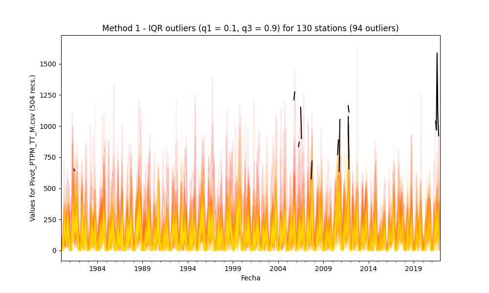

## Outliers detection and processing through statistical methods

* Processed file: [D:/R.LTWB/.datasets/IDEAM_EDA/Pivot_PTPM_TT_M.csv](../IDEAM_EDA/Pivot_PTPM_TT_M.csv)
* Execution date: 2022-11-05 09:24:42.130631
* Python version: 3.10.5 (tags/v3.10.5:f377153, Jun  6 2022, 16:14:13) [MSC v.1929 64 bit (AMD64)]
* Python path: ['D:\\R.LTWB\\.src', 'D:\\R.LTWB', 'D:\\R.TeachingResearchGuide', 'D:\\R.GISPython', 'D:\\R.HydroTools.wiki']
* matplotlib version: 3.6.0
* pandas version: 1.4.3
* numpy version: 1.23.2
* Stations exclude: ['28017140', '25027020', '25027410', '25027490', '25027330', '25027390', '25027630', '25027360', '25027320', '16067010', '25027420']
* Print table sample: True
* Instructions & script: https://github.com/rcfdtools/R.LTWB/tree/main/Section03/Outlier
* License: https://github.com/rcfdtools/R.LTWB/blob/main/LICENSE.md
* Credits: r.cfdtools@gmail.com

### General dataframe information with 504 IDEAM records for 130 stations

Dataframe records head sample

| Fecha               |   15015020 |   15060050 |   15060070 |   15060080 |   15060150 |   15065040 |   16050240 |   16060010 |   16070010 |   16070020 |   16070030 |   16070040 |   23210020 |   23215050 |   23215060 |   25020090 |   25020220 |   25020230 |   25020240 |   25020250 |   25020260 |   25020270 |   25020280 |   25020650 |   25020660 |   25020670 |   25020690 |   25020870 |   25020880 |   25020890 |   25020900 |   25020920 |   25021040 |   25021090 |   25021200 |   25021240 |   25021320 |   25021380 |   25021500 |   25021540 |   25021580 |   25021590 |   25021620 |   25021630 |   25021640 |   25021650 |   25025090 |   25025250 |   25025300 |   25025330 |   28010020 |   28010040 |   28010070 |   28010090 |   28010130 |   28010140 |   28010200 |   28010280 |   28010340 |   28010360 |   28010370 |   28015070 |   28020080 |   28020150 |   28020230 |   28020310 |   28020410 |   28020420 |   28020440 |   28020460 |   28020590 |   28020600 |   28025020 |   28025040 |   28025070 |   28025080 |   28025090 |   28030190 |   28030220 |   28035010 |   28035020 |   28035040 |   28040010 |   28040030 |   28040060 |   28040070 |   28040100 |   28040140 |   28040150 |   28040170 |   28040200 |   28040270 |   28040300 |   28040310 |   28040320 |   28040350 |   28040360 |   28040400 |   28045010 |   29060030 |   29060040 |   29060060 |   29060070 |   29060090 |   29060100 |   29060120 |   29060140 |   29060150 |   29060160 |   29060170 |   29060180 |   29060190 |   29060200 |   29060210 |   29060220 |   29060230 |   29060240 |   29060250 |   29060270 |   29060280 |   29060290 |   29060310 |   29060330 |   29060340 |   29060350 |   29060550 |   29060560 |   29065010 |   29065020 |   29065030 |
|:--------------------|-----------:|-----------:|-----------:|-----------:|-----------:|-----------:|-----------:|-----------:|-----------:|-----------:|-----------:|-----------:|-----------:|-----------:|-----------:|-----------:|-----------:|-----------:|-----------:|-----------:|-----------:|-----------:|-----------:|-----------:|-----------:|-----------:|-----------:|-----------:|-----------:|-----------:|-----------:|-----------:|-----------:|-----------:|-----------:|-----------:|-----------:|-----------:|-----------:|-----------:|-----------:|-----------:|-----------:|-----------:|-----------:|-----------:|-----------:|-----------:|-----------:|-----------:|-----------:|-----------:|-----------:|-----------:|-----------:|-----------:|-----------:|-----------:|-----------:|-----------:|-----------:|-----------:|-----------:|-----------:|-----------:|-----------:|-----------:|-----------:|-----------:|-----------:|-----------:|-----------:|-----------:|-----------:|-----------:|-----------:|-----------:|-----------:|-----------:|-----------:|-----------:|-----------:|-----------:|-----------:|-----------:|-----------:|-----------:|-----------:|-----------:|-----------:|-----------:|-----------:|-----------:|-----------:|-----------:|-----------:|-----------:|-----------:|-----------:|-----------:|-----------:|-----------:|-----------:|-----------:|-----------:|-----------:|-----------:|-----------:|-----------:|-----------:|-----------:|-----------:|-----------:|-----------:|-----------:|-----------:|-----------:|-----------:|-----------:|-----------:|-----------:|-----------:|-----------:|-----------:|-----------:|-----------:|-----------:|-----------:|-----------:|-----------:|
| 1980-01-01 00:00:00 |          0 |          0 |          0 |          0 |          0 |        nan |        nan |         53 |         50 |        nan |        200 |         67 |        nan |         50 |        nan |          0 |          0 |          2 |          0 |          0 |         43 |         31 |          0 |         11 |          1 |          0 |         60 |         12 |          0 |         15 |          0 |          5 |          0 |          5 |         21 |          0 |       20.9 |        nan |          4 |          0 |        nan |          0 |        nan |        nan |        nan |        nan |       70   |       28.7 |          0 |        nan |        nan |          7 |        nan |          0 |         27 |        3   |          0 |          2 |          0 |          0 |          0 |        0   |          0 |        nan |          0 |          2 |          0 |          0 |          0 |          0 |         15 |        nan |        9.6 |        3.7 |        0   |       18.5 |        0   |         14 |        nan |        0   |        0   |        0   |          0 |         30 |         55 |          5 |         83 |          6 |          9 |         63 |          0 |          0 |          0 |          0 |          7 |          4 |         10 |        nan |       47.7 |          0 |         15 |          8 |       24.3 |         11 |         75 |          0 |         14 |          0 |          0 |          0 |          0 |          6 |          0 |          0 |          0 |          0 |          0 |          0 |          0 |          0 |          0 |          0 |        nan |         67 |          0 |        nan |        nan |          0 |        3.3 |          0 |
| 1980-02-01 00:00:00 |          0 |         27 |        133 |         23 |         23 |        nan |        nan |         16 |         87 |        nan |         97 |         59 |        nan |         14 |        nan |         24 |         15 |         44 |         19 |         36 |         33 |          6 |         11 |         38 |         42 |          5 |         28 |        125 |         10 |         24 |          0 |         51 |         47 |         16 |         10 |         10 |       33.7 |        nan |          5 |         60 |        nan |         24 |        nan |        nan |        nan |        nan |       39.6 |       14.7 |         67 |        nan |        nan |        114 |        nan |         51 |         44 |       17.2 |          0 |          6 |         24 |         79 |         74 |       28.6 |         88 |        nan |          0 |         62 |         25 |         35 |         46 |         19 |         58 |        nan |       49.1 |       56.9 |       14.7 |       44.9 |       15.1 |          0 |        nan |       10.9 |       18.9 |        0   |         27 |        110 |         60 |         71 |          8 |         38 |         56 |         21 |         17 |         28 |          0 |          0 |         51 |         14 |         10 |        nan |       38.3 |          0 |          5 |         15 |       29.1 |         26 |          0 |          0 |          0 |          0 |          0 |          0 |          0 |          0 |          0 |          0 |          3 |          0 |          0 |          0 |          0 |          0 |          0 |          0 |        nan |         15 |          0 |        nan |        nan |          1 |        0   |          0 |
| 1980-03-01 00:00:00 |          0 |          0 |          0 |          0 |          4 |        nan |        nan |          6 |         18 |        nan |          0 |         34 |        nan |          9 |        nan |          0 |          1 |         13 |          0 |          0 |         19 |          0 |          2 |          0 |          2 |          0 |          5 |          0 |          0 |          5 |          0 |          0 |          6 |          0 |          0 |          5 |       56.2 |        nan |         13 |          0 |        nan |          0 |        nan |        nan |        nan |        nan |        0   |        4.4 |          5 |        nan |        nan |          6 |        nan |          0 |          0 |       50.3 |          0 |          8 |          0 |          0 |          4 |        0   |          0 |        nan |          7 |         36 |          0 |          0 |          6 |          0 |         10 |        nan |       14.2 |        7.3 |       14.6 |        0   |       13   |          0 |        nan |        7.9 |        2.4 |       14.2 |          0 |          0 |         15 |          0 |          0 |         25 |          0 |          8 |          0 |          4 |          0 |          0 |          0 |          5 |          0 |        nan |       10.5 |          0 |          0 |          4 |      nan   |          0 |          0 |          0 |          0 |          0 |          0 |          0 |          0 |          0 |          0 |          0 |          0 |          0 |          0 |          0 |          0 |          0 |          0 |          0 |        nan |          0 |          0 |        nan |        nan |          0 |        0   |          0 |

Dataframe records tail sample

| Fecha               |   15015020 |   15060050 |   15060070 |   15060080 |   15060150 |   15065040 |   16050240 |   16060010 |   16070010 |   16070020 |   16070030 |   16070040 |   23210020 |   23215050 |   23215060 |   25020090 |   25020220 |   25020230 |   25020240 |   25020250 |   25020260 |   25020270 |   25020280 |   25020650 |   25020660 |   25020670 |   25020690 |   25020870 |   25020880 |   25020890 |   25020900 |   25020920 |   25021040 |   25021090 |   25021200 |   25021240 |   25021320 |   25021380 |   25021500 |   25021540 |   25021580 |   25021590 |   25021620 |   25021630 |   25021640 |   25021650 |   25025090 |   25025250 |   25025300 |   25025330 |   28010020 |   28010040 |   28010070 |   28010090 |   28010130 |   28010140 |   28010200 |   28010280 |   28010340 |   28010360 |   28010370 |   28015070 |   28020080 |   28020150 |   28020230 |   28020310 |   28020410 |   28020420 |   28020440 |   28020460 |   28020590 |   28020600 |   28025020 |   28025040 |   28025070 |   28025080 |   28025090 |   28030190 |   28030220 |   28035010 |   28035020 |   28035040 |   28040010 |   28040030 |   28040060 |   28040070 |   28040100 |   28040140 |   28040150 |   28040170 |   28040200 |   28040270 |   28040300 |   28040310 |   28040320 |   28040350 |   28040360 |   28040400 |   28045010 |   29060030 |   29060040 |   29060060 |   29060070 |   29060090 |   29060100 |   29060120 |   29060140 |   29060150 |   29060160 |   29060170 |   29060180 |   29060190 |   29060200 |   29060210 |   29060220 |   29060230 |   29060240 |   29060250 |   29060270 |   29060280 |   29060290 |   29060310 |   29060330 |   29060340 |   29060350 |   29060550 |   29060560 |   29065010 |   29065020 |   29065030 |
|:--------------------|-----------:|-----------:|-----------:|-----------:|-----------:|-----------:|-----------:|-----------:|-----------:|-----------:|-----------:|-----------:|-----------:|-----------:|-----------:|-----------:|-----------:|-----------:|-----------:|-----------:|-----------:|-----------:|-----------:|-----------:|-----------:|-----------:|-----------:|-----------:|-----------:|-----------:|-----------:|-----------:|-----------:|-----------:|-----------:|-----------:|-----------:|-----------:|-----------:|-----------:|-----------:|-----------:|-----------:|-----------:|-----------:|-----------:|-----------:|-----------:|-----------:|-----------:|-----------:|-----------:|-----------:|-----------:|-----------:|-----------:|-----------:|-----------:|-----------:|-----------:|-----------:|-----------:|-----------:|-----------:|-----------:|-----------:|-----------:|-----------:|-----------:|-----------:|-----------:|-----------:|-----------:|-----------:|-----------:|-----------:|-----------:|-----------:|-----------:|-----------:|-----------:|-----------:|-----------:|-----------:|-----------:|-----------:|-----------:|-----------:|-----------:|-----------:|-----------:|-----------:|-----------:|-----------:|-----------:|-----------:|-----------:|-----------:|-----------:|-----------:|-----------:|-----------:|-----------:|-----------:|-----------:|-----------:|-----------:|-----------:|-----------:|-----------:|-----------:|-----------:|-----------:|-----------:|-----------:|-----------:|-----------:|-----------:|-----------:|-----------:|-----------:|-----------:|-----------:|-----------:|-----------:|-----------:|-----------:|-----------:|-----------:|-----------:|
| 2021-10-01 00:00:00 |        nan |        214 |        nan |        307 |        356 |        nan |        nan |        245 |        nan |        nan |        nan |        932 |        525 |      273.3 |        nan |        176 |        174 |        293 |        290 |        271 |        348 |        nan |        nan |        922 |        237 |        227 |        137 |        226 |        392 |        nan |         80 |        nan |        333 |        nan |        nan |        505 |        101 |        342 |        114 |        363 |        nan |        nan |        287 |        215 |      187.2 |        264 |      145.5 |        160 |      142.5 |        275 |        nan |      251   |        477 |      133.5 |        nan |        nan |        134 |        nan |        266 |        138 |        222 |      167   |        192 |        201 |        nan |        nan |        nan |         83 |        196 |        nan |        nan |        117 |        263 |        nan |      152.3 |        nan |        143 |        156 |        nan |        nan |      145.9 |      191.2 |        403 |      192   |        nan |         78 |        220 |        111 |      190.1 |        nan |        nan |        130 |        289 |        nan |        347 |        143 |        336 |        nan |        nan |        261 |        284 |        724 |        239 |        217 |      161   |         11 |        369 |        nan |        176 |      167.1 |        500 |        nan |        241 |      125.6 |        nan |        nan |        nan |        nan |        502 |        147 |        nan |         70 |        nan |        276 |      160.1 |        nan |        125 |        nan |        420 |        nan |
| 2021-11-01 00:00:00 |        nan |         11 |        nan |         81 |         34 |        nan |        nan |        402 |        nan |        nan |        nan |        437 |        330 |      123   |        nan |        267 |        199 |        131 |        367 |        112 |        305 |        137 |        nan |        173 |        200 |         86 |         15 |        362 |        390 |        nan |        120 |        nan |        232 |        nan |        nan |        570 |        150 |        421 |        143 |        427 |        nan |        nan |         94 |          5 |      124.9 |        207 |      321.2 |        128 |      174.9 |        225 |        nan |       53.9 |        127 |       56.8 |        nan |        nan |          2 |        nan |        123 |         23 |        186 |       28.4 |         92 |         52 |        nan |        nan |        nan |         32 |         39 |        nan |        nan |        177 |        114 |        nan |      183.5 |        nan |         23 |        104 |        nan |         83 |       26   |       51   |        239 |       78.2 |        nan |        127 |         53 |        108 |       33.3 |        nan |        nan |          0 |         89 |        nan |        162 |        130 |         53 |        nan |        nan |         63 |        140 |        232 |        145 |         53 |       87.5 |         22 |         90 |        nan |         62 |        0   |        235 |        nan |        175 |       89   |        nan |        nan |        nan |        nan |        105 |         56 |        nan |         65 |        nan |        114 |      191.4 |        nan |         10 |        nan |          0 |        nan |
| 2021-12-01 00:00:00 |        nan |         16 |        nan |         23 |         43 |        nan |        nan |        132 |        nan |        nan |        nan |        468 |         42 |       52.5 |        nan |        165 |         50 |         53 |         27 |         22 |        115 |        273 |        nan |        161 |         70 |         52 |          0 |         10 |         14 |        nan |          0 |        nan |          0 |        nan |        nan |          0 |         30 |         20 |         65 |          9 |        nan |        nan |         92 |          0 |       38.7 |         76 |        1.1 |         18 |       15.2 |        190 |        nan |       91.6 |          0 |        1.6 |        nan |        nan |          3 |        nan |        120 |         15 |         14 |       53.2 |         12 |         17 |        nan |        nan |         28 |          0 |         52 |        nan |         35 |          0 |         71 |        nan |       37.2 |        nan |         24 |          0 |        nan |          0 |       48.5 |        0   |         84 |        6   |        nan |         16 |         64 |         51 |       18   |        nan |        nan |          0 |         13 |        nan |          0 |          0 |         27 |        nan |        nan |          0 |         29 |          0 |         21 |         17 |       73   |          0 |          0 |        nan |          0 |        0   |          0 |        nan |          3 |        0   |        nan |        nan |        nan |          0 |          0 |          4 |        nan |          0 |        nan |         25 |        0   |        nan |          9 |        nan |          0 |        nan |

Datatypes for station and nulls values in the initial file

|       | 15015020   | 15060050   | 15060070   | 15060080   | 15060150   | 15065040   | 16050240   | 16060010   | 16070010   | 16070020   | 16070030   | 16070040   | 23210020   | 23215050   | 23215060   | 25020090   | 25020220   | 25020230   | 25020240   | 25020250   | 25020260   | 25020270   | 25020280   | 25020650   | 25020660   | 25020670   | 25020690   | 25020870   | 25020880   | 25020890   | 25020900   | 25020920   | 25021040   | 25021090   | 25021200   | 25021240   | 25021320   | 25021380   | 25021500   | 25021540   | 25021580   | 25021590   | 25021620   | 25021630   | 25021640   | 25021650   | 25025090   | 25025250   | 25025300   | 25025330   | 28010020   | 28010040   | 28010070   | 28010090   | 28010130   | 28010140   | 28010200   | 28010280   | 28010340   | 28010360   | 28010370   | 28015070   | 28020080   | 28020150   | 28020230   | 28020310   | 28020410   | 28020420   | 28020440   | 28020460   | 28020590   | 28020600   | 28025020   | 28025040   | 28025070   | 28025080   | 28025090   | 28030190   | 28030220   | 28035010   | 28035020   | 28035040   | 28040010   | 28040030   | 28040060   | 28040070   | 28040100   | 28040140   | 28040150   | 28040170   | 28040200   | 28040270   | 28040300   | 28040310   | 28040320   | 28040350   | 28040360   | 28040400   | 28045010   | 29060030   | 29060040   | 29060060   | 29060070   | 29060090   | 29060100   | 29060120   | 29060140   | 29060150   | 29060160   | 29060170   | 29060180   | 29060190   | 29060200   | 29060210   | 29060220   | 29060230   | 29060240   | 29060250   | 29060270   | 29060280   | 29060290   | 29060310   | 29060330   | 29060340   | 29060350   | 29060550   | 29060560   | 29065010   | 29065020   | 29065030   |
|:------|:-----------|:-----------|:-----------|:-----------|:-----------|:-----------|:-----------|:-----------|:-----------|:-----------|:-----------|:-----------|:-----------|:-----------|:-----------|:-----------|:-----------|:-----------|:-----------|:-----------|:-----------|:-----------|:-----------|:-----------|:-----------|:-----------|:-----------|:-----------|:-----------|:-----------|:-----------|:-----------|:-----------|:-----------|:-----------|:-----------|:-----------|:-----------|:-----------|:-----------|:-----------|:-----------|:-----------|:-----------|:-----------|:-----------|:-----------|:-----------|:-----------|:-----------|:-----------|:-----------|:-----------|:-----------|:-----------|:-----------|:-----------|:-----------|:-----------|:-----------|:-----------|:-----------|:-----------|:-----------|:-----------|:-----------|:-----------|:-----------|:-----------|:-----------|:-----------|:-----------|:-----------|:-----------|:-----------|:-----------|:-----------|:-----------|:-----------|:-----------|:-----------|:-----------|:-----------|:-----------|:-----------|:-----------|:-----------|:-----------|:-----------|:-----------|:-----------|:-----------|:-----------|:-----------|:-----------|:-----------|:-----------|:-----------|:-----------|:-----------|:-----------|:-----------|:-----------|:-----------|:-----------|:-----------|:-----------|:-----------|:-----------|:-----------|:-----------|:-----------|:-----------|:-----------|:-----------|:-----------|:-----------|:-----------|:-----------|:-----------|:-----------|:-----------|:-----------|:-----------|:-----------|:-----------|:-----------|:-----------|:-----------|:-----------|
| Dtype | float64    | float64    | float64    | float64    | float64    | float64    | float64    | float64    | float64    | float64    | float64    | float64    | float64    | float64    | float64    | float64    | float64    | float64    | float64    | float64    | float64    | float64    | float64    | float64    | float64    | float64    | float64    | float64    | float64    | float64    | float64    | float64    | float64    | float64    | float64    | float64    | float64    | float64    | float64    | float64    | float64    | float64    | float64    | float64    | float64    | float64    | float64    | float64    | float64    | float64    | float64    | float64    | float64    | float64    | float64    | float64    | float64    | float64    | float64    | float64    | float64    | float64    | float64    | float64    | float64    | float64    | float64    | float64    | float64    | float64    | float64    | float64    | float64    | float64    | float64    | float64    | float64    | float64    | float64    | float64    | float64    | float64    | float64    | float64    | float64    | float64    | float64    | float64    | float64    | float64    | float64    | float64    | float64    | float64    | float64    | float64    | float64    | float64    | float64    | float64    | float64    | float64    | float64    | float64    | float64    | float64    | float64    | float64    | float64    | float64    | float64    | float64    | float64    | float64    | float64    | float64    | float64    | float64    | float64    | float64    | float64    | float64    | float64    | float64    | float64    | float64    | float64    | float64    | float64    | float64    |
| Nulls | 165        | 17         | 117        | 1          | 0          | 261        | 177        | 0          | 67         | 350        | 195        | 32         | 207        | 37         | 358        | 3          | 1          | 22         | 2          | 3          | 9          | 4          | 37         | 68         | 2          | 38         | 0          | 7          | 14         | 21         | 12         | 86         | 1          | 29         | 20         | 0          | 13         | 27         | 12         | 14         | 316        | 298        | 36         | 44         | 61         | 62         | 38         | 51         | 34         | 165        | 145        | 6          | 72         | 30         | 382        | 249        | 33         | 489        | 12         | 34         | 3          | 5          | 34         | 73         | 238        | 223        | 47         | 56         | 12         | 6          | 56         | 36         | 10         | 333        | 0          | 157        | 4          | 0          | 103        | 42         | 30         | 12         | 0          | 5          | 364        | 10         | 11         | 20         | 38         | 398        | 317        | 20         | 24         | 147        | 17         | 0          | 1          | 146        | 276        | 1          | 5          | 12         | 2          | 3          | 0          | 0          | 1          | 16         | 15         | 1          | 4          | 84         | 21         | 3          | 246        | 134        | 63         | 5          | 3          | 20         | 255        | 0          | 252        | 14         | 43         | 144        | 62         | 382        | 14         | 92         |

General statistics table - Initial file

|          |   count |     mean |      std |   min |     25% |    50% |     75% |    max |
|---------:|--------:|---------:|---------:|------:|--------:|-------:|--------:|-------:|
| 15015020 |     339 |  59.7829 |  74.2829 |     0 |   0.5   |  30.1  |  85.2   |  407   |
| 15060050 |     487 |  87.9507 |  83.7311 |     0 |  12.1   |  74    | 138.1   |  489.2 |
| 15060070 |     387 | 103.287  | 105.964  |     0 |  15     |  82    | 150     |  655   |
| 15060080 |     503 |  98.771  |  93.6652 |     0 |  15     |  83    | 148.5   |  722   |
| 15060150 |     504 |  72.1262 |  80.4786 |     0 |   8     |  46.1  | 107.375 |  383   |
| 15065040 |     243 |  65.5008 |  59.54   |     0 |  10.8   |  53    | 107.75  |  237.7 |
| 16050240 |     327 | 178.577  | 136.351  |     0 |  82     | 156    | 246     | 1150   |
| 16060010 |     504 | 304.344  | 206.676  |     0 | 146.25  | 284.5  | 426.25  | 1005   |
| 16070010 |     437 | 410.432  | 267.691  |     0 | 196     | 396    | 578     | 1444   |
| 16070020 |     154 | 393.565  | 269.214  |     0 | 162.25  | 366    | 557.5   | 1210   |
| 16070030 |     309 | 390.891  | 245.702  |     0 | 216     | 359    | 524     | 1351   |
| 16070040 |     472 | 353.798  | 208.838  |     8 | 204.5   | 341    | 485.25  | 1173   |
| 23210020 |     297 | 159.691  | 137.871  |     0 |  45     | 130    | 241     |  649   |
| 23215050 |     467 | 233.842  | 212.824  |     0 |  74.5   | 182.3  | 332.85  | 1094.2 |
| 23215060 |     146 | 136.245  | 106.68   |     0 |  46.55  | 122.9  | 196.125 |  422   |
| 25020090 |     501 | 163.094  | 143.448  |     0 |  44.7   | 139    | 246.6   |  870.6 |
| 25020220 |     503 | 125.969  | 101.616  |     0 |  43.3   | 111.1  | 189.85  |  534   |
| 25020230 |     482 | 164.951  | 141.109  |     0 |  56.225 | 137    | 241.5   |  926   |
| 25020240 |     502 | 136.406  | 120.364  |     0 |  43     | 112.5  | 194     |  735   |
| 25020250 |     501 | 142.694  | 118.441  |     0 |  48     | 117.9  | 208.9   |  644.3 |
| 25020260 |     495 | 221.96   | 172.012  |     0 |  89     | 205    | 318.5   | 1163   |
| 25020270 |     500 | 168.683  | 144.303  |     0 |  48     | 136    | 262     |  627   |
| 25020280 |     467 | 127.036  | 118.767  |     0 |  35     | 102    | 185     |  749   |
| 25020650 |     436 | 156.154  | 178.632  |     0 |  30.675 | 115    | 226.925 | 1585   |
| 25020660 |     502 | 155.621  | 132.496  |     0 |  49.175 | 127.1  | 230     |  679   |
| 25020670 |     466 | 146.059  | 129.158  |     0 |  33     | 118    | 238.5   |  814   |
| 25020690 |     504 | 153.358  | 146.017  |     0 |  37     | 112    | 233.5   |  753   |
| 25020870 |     497 | 155.739  | 135.675  |     0 |  45     | 136    | 233     |  835   |
| 25020880 |     490 | 193.8    | 160.698  |     0 |  60     | 163.5  | 291     |  764   |
| 25020890 |     483 | 155.821  | 128.157  |     0 |  49     | 130    | 244     |  593   |
| 25020900 |     492 | 131.34   | 114.881  |     0 |  30     | 106    | 207     |  510   |
| 25020920 |     418 | 139.157  | 173.081  |     0 |  30     |  88.5  | 184.475 | 1274   |
| 25021040 |     503 | 161.868  | 139.083  |     0 |  45     | 139    | 245.5   |  739   |
| 25021090 |     475 | 157.96   | 141.425  |     0 |  40     | 125    | 240.9   |  680   |
| 25021200 |     484 | 190.166  | 168.025  |     0 |  50     | 149    | 284.5   |  934   |
| 25021240 |     504 | 169.907  | 147.9    |     0 |  46.875 | 141.85 | 265     |  696.6 |
| 25021320 |     491 | 160.853  | 141.005  |     0 |  48     | 133    | 240     |  744   |
| 25021380 |     477 | 167.207  | 139.418  |     0 |  53     | 140    | 257     |  724   |
| 25021500 |     492 |  99.214  |  74.7592 |     0 |  41     |  88    | 145     |  368   |
| 25021540 |     490 | 178.49   | 144.689  |     0 |  66.25  | 144.5  | 264.925 |  721   |
| 25021580 |     188 | 144.556  | 116.792  |     0 |  52.75  | 109.5  | 217.75  |  494   |
| 25021590 |     206 | 136.508  | 112.785  |     0 |  36.5   | 125.8  | 208.725 |  512.2 |
| 25021620 |     468 | 116.16   |  92.907  |     0 |  44.75  | 101.5  | 161     |  716   |
| 25021630 |     460 | 111.086  |  78.2969 |     0 |  49     |  99    | 165.25  |  370   |
| 25021640 |     443 | 145.321  | 132.377  |     0 |  38.35  | 115.5  | 213.5   |  717   |
| 25021650 |     442 | 132.213  | 129.695  |     0 |  32.25  | 102.6  | 198.5   |  910   |
| 25025090 |     466 | 164.917  | 134.386  |     0 |  53.3   | 139.15 | 246.2   |  609.3 |
| 25025250 |     453 | 135.746  | 116.256  |     0 |  35     | 115.4  | 196.6   |  549.9 |
| 25025300 |     470 | 110.96   |  92.9367 |     0 |  35.225 |  90.9  | 163.8   |  459.2 |
| 25025330 |     339 | 164.522  | 130.426  |     0 |  59.8   | 142    | 252.9   |  693   |
| 28010020 |     359 |  78.6925 |  88.7822 |     0 |  10     |  55    | 125     |  713   |
| 28010040 |     498 | 151.934  | 128.693  |     0 |  48.325 | 130.1  | 220.625 |  748.7 |
| 28010070 |     432 | 116.327  | 106.916  |     0 |  32.75  |  98.3  | 179.75  |  581   |
| 28010090 |     474 |  92.6331 |  95.1618 |     0 |  10     |  71.5  | 138     |  631   |
| 28010130 |     122 | 230.704  | 218.823  |     0 |  60     | 162    | 342.25  | 1009   |
| 28010140 |     255 | 131.152  | 134.891  |     0 |  24     |  89    | 194     |  630   |
| 28010200 |     471 |  82.41   |  90.3403 |     0 |   5.4   |  52    | 129.4   |  556   |
| 28010280 |      15 |  52.2667 |  55.7577 |     2 |  12.5   |  26    |  77     |  169   |
| 28010340 |     492 |  99.5524 |  92.5377 |     0 |  16.975 |  82.5  | 154     |  457   |
| 28010360 |     470 | 172.4    | 212.311  |     0 |  20     | 102.05 | 252.425 | 1647.3 |
| 28010370 |     501 | 108.373  |  94.421  |     0 |  26     |  88    | 171     |  508   |
| 28015070 |     499 |  98.0299 |  84.267  |     0 |  28.35  |  87.9  | 150.7   |  456.1 |
| 28020080 |     470 | 115.409  | 105.649  |     0 |  30.25  |  94    | 172.5   |  733   |
| 28020150 |     431 | 108.619  |  88.2291 |     0 |  42     |  89.2  | 159     |  518   |
| 28020230 |     266 | 125.781  | 120.656  |     0 |  24.775 | 110.1  | 179.875 |  675.7 |
| 28020310 |     281 | 180.133  | 148.914  |     0 |  63     | 145    | 261     |  723   |
| 28020410 |     457 | 107.139  | 101.903  |     0 |  27.9   |  82    | 156     |  757   |
| 28020420 |     448 | 122.556  | 108.867  |     0 |  34.5   | 102    | 188     |  567   |
| 28020440 |     492 | 127.331  | 101.811  |     0 |  45     | 109.4  | 192     |  610.6 |
| 28020460 |     498 | 128.521  | 108.515  |     0 |  46.25  | 104.5  | 192.75  |  591   |
| 28020590 |     448 | 103.627  |  91.3379 |     0 |  29     |  83.3  | 156     |  542   |
| 28020600 |     468 | 112.204  |  97.752  |     0 |  33.75  |  86    | 172.85  |  609   |
| 28025020 |     494 | 110.783  |  82.2089 |     0 |  42.025 | 104.8  | 165.05  |  421.2 |
| 28025040 |     171 |  96.6094 |  90.3915 |     0 |  26.1   |  68.8  | 143.5   |  360.6 |
| 28025070 |     504 | 131.555  | 104.05   |     0 |  47.95  | 114.7  | 194.45  |  550.8 |
| 28025080 |     347 | 127.758  |  98.1071 |     0 |  46.6   | 113    | 188.65  |  496.9 |
| 28025090 |     500 | 123.833  |  97.4444 |     0 |  45.3   | 110.3  | 187.725 |  504.6 |
| 28030190 |     504 |  93.3151 |  86.66   |     0 |  14.475 |  82.8  | 144.55  |  450.8 |
| 28030220 |     401 |  85.2723 |  91.6286 |     0 |   1.3   |  58.3  | 135     |  525   |
| 28035010 |     462 | 110.852  |  91.875  |     0 |  30.25  |  95.75 | 168.375 |  479.6 |
| 28035020 |     474 |  98.4741 |  84.522  |     0 |  21.025 |  85.35 | 152.45  |  464.2 |
| 28035040 |     492 | 107.14   |  84.195  |     0 |  33.375 |  97.45 | 154.225 |  425   |
| 28040010 |     504 | 178.377  | 153.483  |     0 |  53.75  | 157.5  | 261.25  | 1193   |
| 28040030 |     499 | 116.19   | 125.578  |     0 |  28     |  90    | 156.8   | 1053   |
| 28040060 |     140 | 105.394  |  98.432  |     0 |  30     |  72.5  | 152.75  |  500   |
| 28040070 |     494 | 111.56   |  88.4919 |     0 |  40     | 100    | 165     |  415   |
| 28040100 |     493 | 144.448  | 109.05   |     0 |  54     | 137    | 209     |  741   |
| 28040140 |     484 |  96.3804 |  86.5089 |     0 |  23.9   |  76.15 | 145     |  435   |
| 28040150 |     466 | 116.057  |  94.465  |     0 |  42.25  | 107    | 163.75  |  710   |
| 28040170 |     106 | 115.199  | 121.212  |     0 |  18.15  |  60.5  | 200.25  |  505   |
| 28040200 |     187 |  96.7465 |  74.8121 |     0 |  33.5   |  91    | 146.5   |  374   |
| 28040270 |     484 | 107.482  |  89.9329 |     0 |  30     |  98    | 159     |  560   |
| 28040300 |     480 | 114.796  |  97.6011 |     0 |  39     |  96    | 162     |  564   |
| 28040310 |     357 | 114.399  |  94.932  |     0 |  40     | 101    | 165     |  521   |
| 28040320 |     487 | 124.416  |  96.7825 |     0 |  50.5   | 107    | 172.5   |  491   |
| 28040350 |     504 | 110.536  |  99.4701 |     0 |  31.8   |  93.6  | 160.8   |  673.4 |
| 28040360 |     503 | 124.758  |  95.0967 |     0 |  52.5   | 116    | 174     |  840   |
| 28040400 |     358 | 103.43   |  86.8242 |     0 |  34.25  |  85    | 148     |  398   |
| 28045010 |     228 | 129.799  | 131.563  |     0 |   0     |  93.3  | 224.7   |  502.1 |
| 29060030 |     503 | 112.185  | 120.076  |     0 |   5.5   |  84.2  | 174.5   |  750   |
| 29060040 |     499 | 119.442  | 115.678  |     0 |  28     |  97    | 172.5   |  757.5 |
| 29060060 |     492 | 214.417  | 188.986  |     0 |  50     | 180    | 325     |  944   |
| 29060070 |     502 | 199.184  | 159.074  |     0 |  61.5   | 179    | 306     |  927   |
| 29060090 |     501 | 109.604  |  77.811  |     0 |  42     | 106    | 168     |  382   |
| 29060100 |     504 | 130.562  | 109.441  |     0 |  40     | 117.5  | 189     |  665   |
| 29060120 |     504 |  30.9839 |  60.6528 |     0 |   0     |   6    |  30     |  485   |
| 29060140 |     503 | 131.782  | 154.306  |     0 |   7.5   |  87    | 201     | 1116   |
| 29060150 |     488 | 134.827  | 133.877  |     0 |  21.75  | 100.5  | 217.25  |  861   |
| 29060160 |     489 |  83.846  | 104.429  |     0 |   0     |  40    | 136.1   |  655.1 |
| 29060170 |     503 |  79.0485 |  92.832  |     0 |   0     |  46    | 134.15  |  534.1 |
| 29060180 |     500 | 116.55   | 151.057  |     0 |   0     |  69.5  | 168     | 1075   |
| 29060190 |     420 | 106.892  | 119.315  |     0 |   4.75  |  71.5  | 158.25  |  794   |
| 29060200 |     483 | 118.879  | 114.639  |     0 |  24     | 100    | 178.5   |  685   |
| 29060210 |     501 |  70.4112 |  85.1528 |     0 |   1.2   |  39.4  | 108.6   |  549.8 |
| 29060220 |     258 | 114.547  | 152.219  |     0 |   0     |  64.5  | 157.75  |  941   |
| 29060230 |     370 | 101.154  | 108.271  |     0 |   6     |  72    | 158.5   |  549   |
| 29060240 |     441 | 105.639  | 136.714  |     0 |   0     |  67    | 170     | 1016   |
| 29060250 |     499 |  82.9495 | 102.98   |     0 |   0     |  50    | 122.05  |  627.6 |
| 29060270 |     501 |  86.9663 |  99.7629 |     0 |   0     |  56    | 132     |  519   |
| 29060280 |     484 |  69.8316 |  89.7702 |     0 |   0     |  35.2  | 110.625 |  630.2 |
| 29060290 |     249 | 103.559  | 124.612  |     0 |   0     |  60    | 149     |  627   |
| 29060310 |     504 |  79.7937 | 116.537  |     0 |   0     |  33    | 128     |  930   |
| 29060330 |     252 | 131.828  | 139.738  |     0 |  11.5   |  97    | 208.25  |  615   |
| 29060340 |     490 | 192.753  | 165.79   |     0 |  52.5   | 165.5  | 282.75  |  875   |
| 29060350 |     461 | 107.534  | 115.366  |     0 |   5.4   |  76.7  | 171     |  711   |
| 29060550 |     360 |  97.5958 | 110.703  |     0 |   0     |  68    | 160.05  |  652   |
| 29060560 |     442 |  97.6916 | 101.206  |     0 |  16     |  68.5  | 150     |  718   |
| 29065010 |     122 |  93.5492 |  92.2916 |     0 |  11.1   |  70.65 | 151.225 |  366.7 |
| 29065020 |     490 | 102.09   | 105.756  |     0 |   9.475 |  74.05 | 158.575 |  563.1 |
| 29065030 |     412 | 121.007  | 122.086  |     0 |  11.3   |  96.5  | 179.975 |  637.9 |

### Method 1 - Outliers processing using the interquartile range IQR (q1 = 0.25, q3 = 0.75)

Outliers parameters:
* q1: quartile 0.25
* q3: quartile 0.75
* IQR: interquartile range (q3-q1)
* OlLowerLim: outlier bottom limit (q1-1.5*IQR)
* OlUpperLim: outlier top limit (q3+1.5*IQR)
* OlMinVal: minimum outlier value founded
* OlMaxVal: maximum outlier value founded
* OlCount: # outliers founded
* CapLowerLim: capped lower limit for outliers replacement (mean() - 3 * std())
* CapUpperLim: capped upper limit for outliers replacement (mean() + 3 * std())

|          |      q1 |      q3 |     IQR |   OlLowerLim |   OlUpperLim |   OlMinVal |   OlMaxVal |   OlCount |   CapLowerLim |   CapUpperLim |
|---------:|--------:|--------:|--------:|-------------:|-------------:|-----------:|-----------:|----------:|--------------:|--------------:|
| 15015020 |   0.5   |  85.2   |  84.7   |      127.55  |      212.25  |      212.8 |      407   |        21 |      -163.066 |       282.632 |
| 15060050 |  12.1   | 138.1   | 126     |      201.1   |      327.1   |      369   |      489.2 |         3 |      -163.243 |       339.144 |
| 15060070 |  15     | 150     | 135     |      217.5   |      352.5   |      354   |      655   |        14 |      -214.607 |       421.18  |
| 15060080 |  15     | 148.5   | 133.5   |      215.25  |      348.75  |      353   |      722   |         6 |      -182.225 |       379.766 |
| 15060150 |   8     | 107.375 |  99.375 |      157.062 |      256.438 |      260   |      383   |        22 |      -169.309 |       313.562 |
| 15065040 |  10.8   | 107.75  |  96.95  |      156.225 |      253.175 |      nan   |      nan   |         0 |      -113.119 |       244.121 |
| 16050240 |  82     | 246     | 164     |      328     |      492     |      509   |     1150   |         6 |      -230.475 |       587.629 |
| 16060010 | 146.25  | 426.25  | 280     |      566.25  |      846.25  |      855   |     1005   |         8 |      -315.685 |       924.373 |
| 16070010 | 196     | 578     | 382     |      769     |     1151     |     1154   |     1444   |         6 |      -392.641 |      1213.5   |
| 16070020 | 162.25  | 557.5   | 395.25  |      755.125 |     1150.38  |     1151   |     1210   |         2 |      -414.076 |      1201.21  |
| 16070030 | 216     | 524     | 308     |      678     |      986     |     1016   |     1351   |         8 |      -346.214 |      1128     |
| 16070040 | 204.5   | 485.25  | 280.75  |      625.625 |      906.375 |      912   |     1173   |         8 |      -272.717 |       980.313 |
| 23210020 |  45     | 241     | 196     |      339     |      535     |      540   |      649   |         6 |      -253.921 |       573.302 |
| 23215050 |  74.5   | 332.85  | 258.35  |      462.025 |      720.375 |      724.9 |     1094.2 |        21 |      -404.63  |       872.315 |
| 23215060 |  46.55  | 196.125 | 149.575 |      270.912 |      420.487 |      422   |      422   |         2 |      -183.794 |       456.284 |
| 25020090 |  44.7   | 246.6   | 201.9   |      347.55  |      549.45  |      561   |      870.6 |        12 |      -267.25  |       593.438 |
| 25020220 |  43.3   | 189.85  | 146.55  |      263.125 |      409.675 |      414   |      534   |         6 |      -178.879 |       430.816 |
| 25020230 |  56.225 | 241.5   | 185.275 |      334.138 |      519.413 |      523   |      926   |        13 |      -258.377 |       588.279 |
| 25020240 |  43     | 194     | 151     |      269.5   |      420.5   |      444   |      735   |        14 |      -224.684 |       497.497 |
| 25020250 |  48     | 208.9   | 160.9   |      289.35  |      450.25  |      476.4 |      644.3 |         9 |      -212.629 |       498.017 |
| 25020260 |  89     | 318.5   | 229.5   |      433.25  |      662.75  |      700   |     1163   |         8 |      -294.075 |       737.996 |
| 25020270 |  48     | 262     | 214     |      369     |      583     |      600   |      627   |         4 |      -264.226 |       601.592 |
| 25020280 |  35     | 185     | 150     |      260     |      410     |      410.5 |      749   |        12 |      -229.264 |       483.336 |
| 25020650 |  30.675 | 226.925 | 196.25  |      325.05  |      521.3   |      524   |     1585   |        12 |      -379.742 |       692.05  |
| 25020660 |  49.175 | 230     | 180.825 |      320.412 |      501.237 |      505   |      679   |         8 |      -241.867 |       553.11  |
| 25020670 |  33     | 238.5   | 205.5   |      341.25  |      546.75  |      555   |      814   |         2 |      -241.415 |       533.533 |
| 25020690 |  37     | 233.5   | 196.5   |      331.75  |      528.25  |      532   |      753   |        13 |      -284.692 |       591.409 |
| 25020870 |  45     | 233     | 188     |      327     |      515     |      525   |      835   |         7 |      -251.285 |       562.763 |
| 25020880 |  60     | 291     | 231     |      406.5   |      637.5   |      711   |      764   |         3 |      -288.295 |       675.895 |
| 25020890 |  49     | 244     | 195     |      341.5   |      536.5   |      546   |      593   |         3 |      -228.65  |       540.292 |
| 25020900 |  30     | 207     | 177     |      295.5   |      472.5   |      489   |      510   |         4 |      -213.303 |       475.983 |
| 25020920 |  30     | 184.475 | 154.475 |      261.713 |      416.188 |      430   |     1274   |        23 |      -380.086 |       658.401 |
| 25021040 |  45     | 245.5   | 200.5   |      345.75  |      546.25  |      563.4 |      739   |         9 |      -255.381 |       579.117 |
| 25021090 |  40     | 240.9   | 200.9   |      341.35  |      542.25  |      547   |      680   |         9 |      -266.314 |       582.234 |
| 25021200 |  50     | 284.5   | 234.5   |      401.75  |      636.25  |      641   |      934   |         9 |      -313.91  |       694.242 |
| 25021240 |  46.875 | 265     | 218.125 |      374.062 |      592.188 |      601   |      696.6 |         6 |      -273.794 |       613.608 |
| 25021320 |  48     | 240     | 192     |      336     |      528     |      535   |      744   |         9 |      -262.161 |       583.867 |
| 25021380 |  53     | 257     | 204     |      359     |      563     |      572   |      724   |         5 |      -251.047 |       585.461 |
| 25021500 |  41     | 145     | 104     |      197     |      301     |      310   |      368   |         6 |      -125.064 |       323.492 |
| 25021540 |  66.25  | 264.925 | 198.675 |      364.263 |      562.938 |      577   |      721   |         8 |      -255.577 |       612.557 |
| 25021580 |  52.75  | 217.75  | 165     |      300.25  |      465.25  |      470   |      494   |         2 |      -205.819 |       494.93  |
| 25021590 |  36.5   | 208.725 | 172.225 |      294.838 |      467.063 |      469   |      512.2 |         3 |      -201.846 |       474.862 |
| 25021620 |  44.75  | 161     | 116.25  |      219.125 |      335.375 |      336   |      716   |        12 |      -162.561 |       394.881 |
| 25021630 |  49     | 165.25  | 116.25  |      223.375 |      339.625 |      346   |      370   |         3 |      -123.805 |       345.976 |
| 25021640 |  38.35  | 213.5   | 175.15  |      301.075 |      476.225 |      484.6 |      717   |        11 |      -251.811 |       542.452 |
| 25021650 |  32.25  | 198.5   | 166.25  |      281.625 |      447.875 |      455   |      910   |        12 |      -256.872 |       521.297 |
| 25025090 |  53.3   | 246.2   | 192.9   |      342.65  |      535.55  |      552.9 |      609.3 |         7 |      -238.24  |       568.075 |
| 25025250 |  35     | 196.6   | 161.6   |      277.4   |      439     |      445.2 |      549.9 |        10 |      -213.023 |       484.515 |
| 25025300 |  35.225 | 163.8   | 128.575 |      228.088 |      356.663 |      362   |      459.2 |         8 |      -167.85  |       389.771 |
| 25025330 |  59.8   | 252.9   | 193.1   |      349.45  |      542.55  |      572   |      693   |         3 |      -226.758 |       555.801 |
| 28010020 |  10     | 125     | 115     |      182.5   |      297.5   |      298   |      713   |         9 |      -187.654 |       345.039 |
| 28010040 |  48.325 | 220.625 | 172.3   |      306.775 |      479.075 |      494.2 |      748.7 |        11 |      -234.143 |       538.012 |
| 28010070 |  32.75  | 179.75  | 147     |      253.25  |      400.25  |      424   |      581   |         9 |      -204.42  |       437.075 |
| 28010090 |  10     | 138     | 128     |      202     |      330     |      338   |      631   |        10 |      -192.852 |       378.118 |
| 28010130 |  60     | 342.25  | 282.25  |      483.375 |      765.625 |      766   |     1009   |         4 |      -425.765 |       887.173 |
| 28010140 |  24     | 194     | 170     |      279     |      449     |      451   |      630   |        10 |      -273.521 |       535.825 |
| 28010200 |   5.4   | 129.4   | 124     |      191.4   |      315.4   |      318   |      556   |        11 |      -188.611 |       353.431 |
| 28010280 |  12.5   |  77     |  64.5   |      109.25  |      173.75  |      nan   |      nan   |         0 |      -115.007 |       219.54  |
| 28010340 |  16.975 | 154     | 137.025 |      222.513 |      359.538 |      366.5 |      457   |         5 |      -178.061 |       377.165 |
| 28010360 |  20     | 252.425 | 232.425 |      368.638 |      601.062 |      603   |     1647.3 |        27 |      -464.532 |       809.332 |
| 28010370 |  26     | 171     | 145     |      243.5   |      388.5   |      390   |      508   |         4 |      -174.89  |       391.636 |
| 28015070 |  28.35  | 150.7   | 122.35  |      211.875 |      334.225 |      341.1 |      456.1 |         7 |      -154.771 |       350.831 |
| 28020080 |  30.25  | 172.5   | 142.25  |      243.625 |      385.875 |      411   |      733   |         9 |      -201.537 |       432.355 |
| 28020150 |  42     | 159     | 117     |      217.5   |      334.5   |      345   |      518   |         7 |      -156.069 |       373.306 |
| 28020230 |  24.775 | 179.875 | 155.1   |      257.425 |      412.525 |      453   |      675.7 |         8 |      -236.187 |       487.75  |
| 28020310 |  63     | 261     | 198     |      360     |      558     |      593   |      723   |         4 |      -266.61  |       626.876 |
| 28020410 |  27.9   | 156     | 128.1   |      220.05  |      348.15  |      355   |      757   |        12 |      -198.569 |       412.846 |
| 28020420 |  34.5   | 188     | 153.5   |      264.75  |      418.25  |      425   |      567   |         8 |      -204.044 |       449.156 |
| 28020440 |  45     | 192     | 147     |      265.5   |      412.5   |      429   |      610.6 |         5 |      -178.102 |       432.763 |
| 28020460 |  46.25  | 192.75  | 146.5   |      266     |      412.5   |      426   |      591   |         8 |      -197.025 |       454.067 |
| 28020590 |  29     | 156     | 127     |      219.5   |      346.5   |      367   |      542   |         4 |      -170.387 |       377.641 |
| 28020600 |  33.75  | 172.85  | 139.1   |      242.4   |      381.5   |      384   |      609   |         7 |      -181.051 |       405.46  |
| 28025020 |  42.025 | 165.05  | 123.025 |      226.563 |      349.588 |      387.4 |      421.2 |         2 |      -135.844 |       357.41  |
| 28025040 |  26.1   | 143.5   | 117.4   |      202.2   |      319.6   |      320.6 |      360.6 |         5 |      -174.565 |       367.784 |
| 28025070 |  47.95  | 194.45  | 146.5   |      267.7   |      414.2   |      422.6 |      550.8 |         7 |      -180.594 |       443.703 |
| 28025080 |  46.6   | 188.65  | 142.05  |      259.675 |      401.725 |      405   |      496.9 |         2 |      -166.563 |       422.08  |
| 28025090 |  45.3   | 187.725 | 142.425 |      258.938 |      401.363 |      406.7 |      504.6 |         6 |      -168.5   |       416.166 |
| 28030190 |  14.475 | 144.55  | 130.075 |      209.588 |      339.663 |      346.7 |      450.8 |         4 |      -166.665 |       353.295 |
| 28030220 |   1.3   | 135     | 133.7   |      201.85  |      335.55  |      337   |      525   |         9 |      -189.613 |       360.158 |
| 28035010 |  30.25  | 168.375 | 138.125 |      237.438 |      375.562 |      384   |      479.6 |         7 |      -164.773 |       386.477 |
| 28035020 |  21.025 | 152.45  | 131.425 |      218.162 |      349.587 |      353.5 |      464.2 |         3 |      -155.092 |       352.04  |
| 28035040 |  33.375 | 154.225 | 120.85  |      214.65  |      335.5   |      339.3 |      425   |         4 |      -145.445 |       359.725 |
| 28040010 |  53.75  | 261.25  | 207.5   |      365     |      572.5   |      600   |     1193   |         8 |      -282.071 |       638.824 |
| 28040030 |  28     | 156.8   | 128.8   |      221.2   |      350     |      353   |     1053   |        29 |      -260.545 |       492.924 |
| 28040060 |  30     | 152.75  | 122.75  |      214.125 |      336.875 |      370   |      500   |         4 |      -189.902 |       400.689 |
| 28040070 |  40     | 165     | 125     |      227.5   |      352.5   |      367   |      415   |         7 |      -153.916 |       377.036 |
| 28040100 |  54     | 209     | 155     |      286.5   |      441.5   |      458   |      741   |         7 |      -182.702 |       471.597 |
| 28040140 |  23.9   | 145     | 121.1   |      205.55  |      326.65  |      337   |      435   |        10 |      -163.146 |       355.907 |
| 28040150 |  42.25  | 163.75  | 121.5   |      224.5   |      346     |      349   |      710   |        13 |      -167.338 |       399.452 |
| 28040170 |  18.15  | 200.25  | 182.1   |      291.3   |      473.4   |      505   |      505   |         1 |      -248.436 |       478.834 |
| 28040200 |  33.5   | 146.5   | 113     |      203     |      316     |      374   |      374   |         1 |      -127.69  |       321.183 |
| 28040270 |  30     | 159     | 129     |      223.5   |      352.5   |      355   |      560   |        11 |      -162.317 |       377.281 |
| 28040300 |  39     | 162     | 123     |      223.5   |      346.5   |      350   |      564   |        13 |      -178.008 |       407.599 |
| 28040310 |  40     | 165     | 125     |      227.5   |      352.5   |      386   |      521   |         6 |      -170.397 |       399.195 |
| 28040320 |  50.5   | 172.5   | 122     |      233.5   |      355.5   |      358   |      491   |        12 |      -165.932 |       414.763 |
| 28040350 |  31.8   | 160.8   | 129     |      225.3   |      354.3   |      356   |      673.4 |        14 |      -187.874 |       408.946 |
| 28040360 |  52.5   | 174     | 121.5   |      234.75  |      356.25  |      365   |      840   |         7 |      -160.532 |       410.048 |
| 28040400 |  34.25  | 148     | 113.75  |      204.875 |      318.625 |      320   |      398   |         9 |      -157.043 |       363.902 |
| 28045010 |   0     | 224.7   | 224.7   |      337.05  |      561.75  |      nan   |      nan   |         0 |      -264.891 |       524.489 |
| 29060030 |   5.5   | 174.5   | 169     |      259     |      428     |      442   |      750   |        10 |      -248.043 |       472.412 |
| 29060040 |  28     | 172.5   | 144.5   |      244.75  |      389.25  |      398.5 |      757.5 |        17 |      -227.591 |       466.476 |
| 29060060 |  50     | 325     | 275     |      462.5   |      737.5   |      785   |      944   |         5 |      -352.541 |       781.374 |
| 29060070 |  61.5   | 306     | 244.5   |      428.25  |      672.75  |      700   |      927   |         5 |      -278.038 |       676.407 |
| 29060090 |  42     | 168     | 126     |      231     |      357     |      380   |      382   |         2 |      -123.829 |       343.037 |
| 29060100 |  40     | 189     | 149     |      263.5   |      412.5   |      416   |      665   |        10 |      -197.762 |       458.886 |
| 29060120 |   0     |  30     |  30     |       45     |       75     |       76   |      485   |        69 |      -150.974 |       212.942 |
| 29060140 |   7.5   | 201     | 193.5   |      297.75  |      491.25  |      499   |     1116   |        16 |      -331.137 |       594.701 |
| 29060150 |  21.75  | 217.25  | 195.5   |      315     |      510.5   |      539   |      861   |         7 |      -266.803 |       536.456 |
| 29060160 |   0     | 136.1   | 136.1   |      204.15  |      340.25  |      344   |      655.1 |        10 |      -229.441 |       397.133 |
| 29060170 |   0     | 134.15  | 134.15  |      201.225 |      335.375 |      338   |      534.1 |         9 |      -199.448 |       357.545 |
| 29060180 |   0     | 168     | 168     |      252     |      420     |      427   |     1075   |        23 |      -336.621 |       569.721 |
| 29060190 |   4.75  | 158.25  | 153.5   |      235     |      388.5   |      399   |      794   |        12 |      -251.054 |       464.838 |
| 29060200 |  24     | 178.5   | 154.5   |      255.75  |      410.25  |      418   |      685   |        13 |      -225.038 |       462.795 |
| 29060210 |   1.2   | 108.6   | 107.4   |      162.3   |      269.7   |      273   |      549.8 |        16 |      -185.047 |       325.869 |
| 29060220 |   0     | 157.75  | 157.75  |      236.625 |      394.375 |      399   |      941   |        17 |      -342.109 |       571.202 |
| 29060230 |   6     | 158.5   | 152.5   |      234.75  |      387.25  |      394   |      549   |         7 |      -223.659 |       425.967 |
| 29060240 |   0     | 170     | 170     |      255     |      425     |      464   |     1016   |        12 |      -304.501 |       515.78  |
| 29060250 |   0     | 122.05  | 122.05  |      183.075 |      305.125 |      311   |      627.6 |        20 |      -225.991 |       391.89  |
| 29060270 |   0     | 132     | 132     |      198     |      330     |      341   |      519   |        15 |      -212.322 |       386.255 |
| 29060280 |   0     | 110.625 | 110.625 |      165.938 |      276.562 |      283   |      630.2 |        13 |      -199.479 |       339.142 |
| 29060290 |   0     | 149     | 149     |      223.5   |      372.5   |      376   |      627   |        13 |      -270.276 |       477.394 |
| 29060310 |   0     | 128     | 128     |      192     |      320     |      321   |      930   |        21 |      -269.818 |       429.405 |
| 29060330 |  11.5   | 208.25  | 196.75  |      306.625 |      503.375 |      533   |      615   |         6 |      -287.386 |       551.043 |
| 29060340 |  52.5   | 282.75  | 230.25  |      397.875 |      628.125 |      635   |      875   |        10 |      -304.616 |       690.122 |
| 29060350 |   5.4   | 171     | 165.6   |      253.8   |      419.4   |      440.8 |      711   |         7 |      -238.563 |       453.632 |
| 29060550 |   0     | 160.05  | 160.05  |      240.075 |      400.125 |      466   |      652   |         4 |      -234.513 |       429.705 |
| 29060560 |  16     | 150     | 134     |      217     |      351     |      371   |      718   |        10 |      -205.925 |       401.309 |
| 29065010 |  11.1   | 151.225 | 140.125 |      221.287 |      361.413 |      366.7 |      366.7 |         1 |      -183.326 |       370.424 |
| 29065020 |   9.475 | 158.575 | 149.1   |      233.125 |      382.225 |      401.6 |      563.1 |        11 |      -215.177 |       419.357 |
| 29065030 |  11.3   | 179.975 | 168.675 |      264.312 |      432.988 |      449.4 |      637.9 |         9 |      -245.25  |       487.264 |

#### Identified and cleaning tables for 1198 IQR outliers founded
* Outliers identified file: [Outlier_IQR_Pivot_PTPM_TT_M.csv](../../.datasets/IDEAM_Outlier/Outlier_IQR_Pivot_PTPM_TT_M.csv)
* Outliers dropped file: [Outlier_IQR_Drop_Pivot_PTPM_TT_M.csv](../../.datasets/IDEAM_Outlier/Outlier_IQR_Drop_Pivot_PTPM_TT_M.csv)
* Outliers capped file: [Outlier_IQR_Cap_Pivot_PTPM_TT_M.csv](../../.datasets/IDEAM_Outlier/Outlier_IQR_Cap_Pivot_PTPM_TT_M.csv)
* Outliers imputed file: [Outlier_IQR_Impute_Pivot_PTPM_TT_M.csv](../../.datasets/IDEAM_Outlier/Outlier_IQR_Impute_Pivot_PTPM_TT_M.csv)

> The _drop file_ contains the database values without the outliers identified.
>
> The _capped file_ contains the database values and the outliers has been replaced with the lower or upper capped value calculated. Lower outliers could be replaced with negative values because the limit is defined with (mean() - cap_multiplier * std()). In some cases like _temperature analysis_, the upper outliers values could be replaced with values over the original values and you can try to fix this issue changing the parameter _cap_multiplier_ that defines the stripe values range.
>
> The imputation method replace each outlier value with the mean value that contains the original outliers values.

#### Statistical values for the capped and imputed file

General statistics table - Capped file

|          |   count |     mean |      std |   min |     25% |    50% |     75% |      max |
|---------:|--------:|---------:|---------:|------:|--------:|-------:|--------:|---------:|
| 15015020 |     339 |  61.0677 |  76.6615 |     0 |   0.5   |  30.1  |  85.2   |  282.632 |
| 15060050 |     487 |  87.2962 |  81.198  |     0 |  12.1   |  74    | 138.1   |  339.144 |
| 15060070 |     387 | 102.912  | 103.27   |     0 |  15     |  82    | 150     |  421.18  |
| 15060080 |     503 |  98.0664 |  90.1126 |     0 |  15     |  83    | 148.5   |  379.766 |
| 15060150 |     504 |  72.2892 |  80.5357 |     0 |   8     |  46.1  | 107.375 |  313.562 |
| 15065040 |     243 |  65.5008 |  59.54   |     0 |  10.8   |  53    | 107.75  |  237.7   |
| 16050240 |     327 | 175.65   | 121.839  |     0 |  82     | 156    | 246     |  587.629 |
| 16060010 |     504 | 304.658  | 207.532  |     0 | 146.25  | 284.5  | 426.25  |  924.373 |
| 16070010 |     437 | 409.613  | 264.798  |     0 | 196     | 396    | 578     | 1213.5   |
| 16070020 |     154 | 393.834  | 269.993  |     0 | 162.25  | 366    | 557.5   | 1201.21  |
| 16070030 |     309 | 390.868  | 245.019  |     0 | 216     | 359    | 524     | 1128     |
| 16070040 |     472 | 353.478  | 207.592  |     8 | 204.5   | 341    | 485.25  |  980.313 |
| 23210020 |     297 | 159.572  | 137.361  |     0 |  45     | 130    | 241     |  573.302 |
| 23215050 |     467 | 233.842  | 211.429  |     0 |  74.5   | 182.3  | 332.85  |  872.315 |
| 23215060 |     146 | 136.715  | 108.013  |     0 |  46.55  | 122.9  | 196.125 |  456.284 |
| 25020090 |     501 | 162.351  | 140.554  |     0 |  44.7   | 139    | 246.6   |  593.438 |
| 25020220 |     503 | 125.784  | 100.936  |     0 |  43.3   | 111.1  | 189.85  |  430.816 |
| 25020230 |     482 | 164.099  | 137.34   |     0 |  56.225 | 137    | 241.5   |  588.279 |
| 25020240 |     502 | 136.333  | 119.533  |     0 |  43     | 112.5  | 194     |  497.497 |
| 25020250 |     501 | 142.185  | 116.646  |     0 |  48     | 117.9  | 208.9   |  498.017 |
| 25020260 |     495 | 220.227  | 164.612  |     0 |  89     | 205    | 318.5   |  737.996 |
| 25020270 |     500 | 168.622  | 144.114  |     0 |  48     | 136    | 262     |  601.592 |
| 25020280 |     467 | 126.384  | 115.71   |     0 |  35     | 102    | 185     |  483.336 |
| 25020650 |     436 | 149.987  | 146.873  |     0 |  30.675 | 115    | 226.925 |  692.05  |
| 25020660 |     502 | 155.766  | 132.749  |     0 |  49.175 | 127.1  | 230     |  553.11  |
| 25020670 |     466 | 145.411  | 126.523  |     0 |  33     | 118    | 238.5   |  542     |
| 25020690 |     504 | 153.046  | 144.667  |     0 |  37     | 112    | 233.5   |  591.409 |
| 25020870 |     497 | 154.558  | 131.229  |     0 |  45     | 136    | 233     |  562.763 |
| 25020880 |     490 | 193.463  | 159.612  |     0 |  60     | 163.5  | 291     |  675.895 |
| 25020890 |     483 | 155.622  | 127.523  |     0 |  49     | 130    | 244     |  540.292 |
| 25020900 |     492 | 131.169  | 114.348  |     0 |  30     | 106    | 207     |  475.983 |
| 25020920 |     418 | 138.341  | 159.544  |     0 |  30     |  88.5  | 184.475 |  658.401 |
| 25021040 |     503 | 161.056  | 136.249  |     0 |  45     | 139    | 245.5   |  579.117 |
| 25021090 |     475 | 157.529  | 139.946  |     0 |  40     | 125    | 240.9   |  582.234 |
| 25021200 |     484 | 188.819  | 162.979  |     0 |  50     | 149    | 284.5   |  694.242 |
| 25021240 |     504 | 169.456  | 146.442  |     0 |  46.875 | 141.85 | 265     |  613.608 |
| 25021320 |     491 | 159.734  | 137.055  |     0 |  48     | 133    | 240     |  583.867 |
| 25021380 |     477 | 166.662  | 137.567  |     0 |  53     | 140    | 257     |  585.461 |
| 25021500 |     492 |  99.0432 |  74.1885 |     0 |  41     |  88    | 145     |  323.492 |
| 25021540 |     490 | 178.044  | 143.153  |     0 |  66.25  | 144.5  | 264.925 |  612.557 |
| 25021580 |     188 | 144.693  | 117.191  |     0 |  52.75  | 109.5  | 217.75  |  494.93  |
| 25021590 |     206 | 136.223  | 111.876  |     0 |  36.5   | 125.8  | 208.725 |  474.862 |
| 25021620 |     468 | 115.798  |  90.3481 |     0 |  44.75  | 101.5  | 161     |  394.881 |
| 25021630 |     460 | 111.02   |  78.0915 |     0 |  49     |  99    | 165.25  |  345.976 |
| 25021640 |     443 | 144.884  | 130.454  |     0 |  38.35  | 115.5  | 213.5   |  542.452 |
| 25021650 |     442 | 130.506  | 122.42   |     0 |  32.25  | 102.6  | 198.5   |  521.297 |
| 25025090 |     466 | 164.865  | 134.204  |     0 |  53.3   | 139.15 | 246.2   |  568.075 |
| 25025250 |     453 | 135.716  | 116.085  |     0 |  35     | 115.4  | 196.6   |  484.515 |
| 25025300 |     470 | 110.703  |  92.0635 |     0 |  35.225 |  90.9  | 163.8   |  389.771 |
| 25025330 |     339 | 163.852  | 128.11   |     0 |  59.8   | 142    | 252.9   |  555.801 |
| 28010020 |     359 |  76.9859 |  80.5396 |     0 |  10     |  55    | 125     |  345.039 |
| 28010040 |     498 | 151.136  | 125.741  |     0 |  48.325 | 130.1  | 220.625 |  538.012 |
| 28010070 |     432 | 115.298  | 103.2    |     0 |  32.75  |  98.3  | 179.75  |  437.075 |
| 28010090 |     474 |  91.8023 |  91.6705 |     0 |  10     |  71.5  | 138     |  378.118 |
| 28010130 |     122 | 231.833  | 221.446  |     0 |  60     | 162    | 342.25  |  887.173 |
| 28010140 |     255 | 131.267  | 134.568  |     0 |  24     |  89    | 194     |  535.825 |
| 28010200 |     471 |  81.9797 |  88.4667 |     0 |   5.4   |  52    | 129.4   |  353.431 |
| 28010280 |      15 |  52.2667 |  55.7577 |     2 |  12.5   |  26    |  77     |  169     |
| 28010340 |     492 |  99.2279 |  91.418  |     0 |  16.975 |  82.5  | 154     |  377.165 |
| 28010360 |     470 | 173.419  | 208.181  |     0 |  20     | 102.05 | 252.425 |  809.332 |
| 28010370 |     501 | 108.02   |  93.1833 |     0 |  26     |  88    | 171     |  391.636 |
| 28015070 |     499 |  97.3531 |  81.8835 |     0 |  28.35  |  87.9  | 150.7   |  350.831 |
| 28020080 |     470 | 114.216  | 100.728  |     0 |  30.25  |  94    | 172.5   |  432.355 |
| 28020150 |     431 | 108.271  |  86.8574 |     0 |  42     |  89.2  | 159     |  373.306 |
| 28020230 |     266 | 124.282  | 114.999  |     0 |  24.775 | 110.1  | 179.875 |  487.75  |
| 28020310 |     281 | 179.722  | 147.518  |     0 |  63     | 145    | 261     |  626.876 |
| 28020410 |     457 | 106.21   |  97.4005 |     0 |  27.9   |  82    | 156     |  412.846 |
| 28020420 |     448 | 121.989  | 106.915  |     0 |  34.5   | 102    | 188     |  449.156 |
| 28020440 |     492 | 126.756  |  99.6855 |     0 |  45     | 109.4  | 192     |  432.763 |
| 28020460 |     498 | 127.789  | 105.854  |     0 |  46.25  | 104.5  | 192.75  |  454.067 |
| 28020590 |     448 | 103.149  |  89.5247 |     0 |  29     |  83.3  | 156     |  377.641 |
| 28020600 |     468 | 111.394  |  94.6061 |     0 |  33.75  |  86    | 172.85  |  405.46  |
| 28025020 |     494 | 110.593  |  81.5743 |     0 |  42.025 | 104.8  | 165.05  |  357.41  |
| 28025040 |     171 |  97.3621 |  92.4994 |     0 |  26.1   |  68.8  | 143.5   |  367.784 |
| 28025070 |     504 | 131.093  | 102.427  |     0 |  47.95  | 114.7  | 194.45  |  443.703 |
| 28025080 |     347 | 127.592  |  97.5178 |     0 |  46.6   | 113    | 188.65  |  422.08  |
| 28025090 |     500 | 123.577  |  96.577  |     0 |  45.3   | 110.3  | 187.725 |  416.166 |
| 28030190 |     504 |  92.9037 |  85.217  |     0 |  14.475 |  82.8  | 144.55  |  353.295 |
| 28030220 |     401 |  84.4183 |  88.4393 |     0 |   1.3   |  58.3  | 135     |  360.158 |
| 28035010 |     462 | 110.431  |  90.4638 |     0 |  30.25  |  95.75 | 168.375 |  386.477 |
| 28035020 |     474 |  98.2226 |  83.603  |     0 |  21.025 |  85.35 | 152.45  |  352.04  |
| 28035040 |     492 | 107.014  |  83.7358 |     0 |  33.375 |  97.45 | 154.225 |  359.725 |
| 28040010 |     504 | 175.891  | 142.703  |     0 |  53.75  | 157.5  | 261.25  |  638.824 |
| 28040030 |     499 | 116.179  | 119.768  |     0 |  28     |  90    | 156.8   |  492.924 |
| 28040060 |     140 | 104.696  |  95.8623 |     0 |  30     |  72.5  | 152.75  |  400.689 |
| 28040070 |     494 | 111.335  |  87.7743 |     0 |  40     | 100    | 165     |  377.036 |
| 28040100 |     493 | 143.629  | 105.774  |     0 |  54     | 137    | 209     |  471.597 |
| 28040140 |     484 |  96.0037 |  85.2288 |     0 |  23.9   |  76.15 | 145     |  355.907 |
| 28040150 |     466 | 115.39   |  91.1437 |     0 |  42.25  | 107    | 163.75  |  399.452 |
| 28040170 |     106 | 114.952  | 120.435  |     0 |  18.15  |  60.5  | 200.25  |  478.834 |
| 28040200 |     187 |  96.4641 |  73.8533 |     0 |  33.5   |  91    | 146.5   |  321.183 |
| 28040270 |     484 | 106.933  |  87.8067 |     0 |  30     |  98    | 159     |  377.281 |
| 28040300 |     480 | 114.385  |  95.6861 |     0 |  39     |  96    | 162     |  407.599 |
| 28040310 |     357 | 113.77   |  92.7186 |     0 |  40     | 101    | 165     |  399.195 |
| 28040320 |     487 | 124.428  |  96.6423 |     0 |  50.5   | 107    | 172.5   |  414.763 |
| 28040350 |     504 | 109.87   |  96.1016 |     0 |  31.8   |  93.6  | 160.8   |  408.946 |
| 28040360 |     503 | 124.107  |  91.066  |     0 |  52.5   | 116    | 174     |  410.048 |
| 28040400 |     358 | 103.731  |  87.5779 |     0 |  34.25  |  85    | 148     |  363.902 |
| 28045010 |     228 | 129.799  | 131.563  |     0 |   0     |  93.3  | 224.7   |  502.1   |
| 29060030 |     503 | 110.96   | 115.407  |     0 |   5.5   |  84.2  | 174.5   |  472.412 |
| 29060040 |     499 | 118.737  | 111.899  |     0 |  28     |  97    | 172.5   |  466.476 |
| 29060060 |     492 | 213.772  | 186.836  |     0 |  50     | 180    | 325     |  781.374 |
| 29060070 |     502 | 198.382  | 156.194  |     0 |  61.5   | 179    | 306     |  676.407 |
| 29060090 |     501 | 109.452  |  77.3167 |     0 |  42     | 106    | 168     |  343.037 |
| 29060100 |     504 | 129.952  | 107.015  |     0 |  40     | 117.5  | 189     |  458.886 |
| 29060120 |     504 |  39.0252 |  71.0926 |     0 |   0     |   6    |  30     |  212.942 |
| 29060140 |     503 | 129.42   | 143.959  |     0 |   7.5   |  87    | 201     |  594.701 |
| 29060150 |     488 | 133.577  | 128.942  |     0 |  21.75  | 100.5  | 217.25  |  536.456 |
| 29060160 |     489 |  82.5273 |  98.9402 |     0 |   0     |  40    | 136.1   |  397.133 |
| 29060170 |     503 |  78.008  |  88.792  |     0 |   0     |  46    | 134.15  |  357.545 |
| 29060180 |     500 | 115.013  | 142.584  |     0 |   0     |  69.5  | 168     |  569.721 |
| 29060190 |     420 | 106.014  | 115.353  |     0 |   4.75  |  71.5  | 158.25  |  464.838 |
| 29060200 |     483 | 117.857  | 110.507  |     0 |  24     | 100    | 178.5   |  462.795 |
| 29060210 |     501 |  69.8471 |  82.0137 |     0 |   1.2   |  39.4  | 108.6   |  325.869 |
| 29060220 |     258 | 115.901  | 152.278  |     0 |   0     |  64.5  | 157.75  |  571.202 |
| 29060230 |     370 | 100.745  | 106.81   |     0 |   6     |  72    | 158.5   |  425.967 |
| 29060240 |     441 | 102.046  | 120.048  |     0 |   0     |  67    | 170     |  515.78  |
| 29060250 |     499 |  82.1134 |  98.811  |     0 |   0     |  50    | 122.05  |  391.89  |
| 29060270 |     501 |  86.7224 |  98.5415 |     0 |   0     |  56    | 132     |  386.255 |
| 29060280 |     484 |  68.9396 |  85.5071 |     0 |   0     |  35.2  | 110.625 |  339.142 |
| 29060290 |     249 | 104.194  | 125.263  |     0 |   0     |  60    | 149     |  477.394 |
| 29060310 |     504 |  78.009  | 105.544  |     0 |   0     |  33    | 128     |  429.405 |
| 29060330 |     252 | 131.198  | 137.703  |     0 |  11.5   |  97    | 208.25  |  551.043 |
| 29060340 |     490 | 191.763  | 162.364  |     0 |  52.5   | 165.5  | 282.75  |  690.122 |
| 29060350 |     461 | 106.485  | 111.326  |     0 |   5.4   |  76.7  | 171     |  453.632 |
| 29060550 |     360 |  96.4426 | 106.349  |     0 |   0     |  68    | 160.05  |  429.705 |
| 29060560 |     442 |  96.3986 |  95.4561 |     0 |  16     |  68.5  | 150     |  401.309 |
| 29065010 |     122 |  93.5797 |  92.3833 |     0 |  11.1   |  70.65 | 151.225 |  370.424 |
| 29065020 |     490 | 101.51   | 103.617  |     0 |   9.475 |  74.05 | 158.575 |  419.357 |
| 29065030 |     412 | 120.18   | 119.055  |     0 |  11.3   |  96.5  | 179.975 |  487.264 |

General statistics table - Imputed file

|          |   count |     mean |      std |   min |     25% |    50% |     75% |    max |
|---------:|--------:|---------:|---------:|------:|--------:|-------:|--------:|-------:|
| 15015020 |     339 |  47.263  |  51.3414 |     0 |   0.5   |  30.1  |  76.8   |  204.6 |
| 15060050 |     487 |  85.7488 |  78.7349 |     0 |  12.1   |  74    | 133     |  325   |
| 15060070 |     387 |  91.4124 |  82.8141 |     0 |  15     |  82    | 141.5   |  352   |
| 15060080 |     503 |  94.7146 |  84.6201 |     0 |  15     |  83    | 147     |  348   |
| 15060150 |     504 |  61.7503 |  61.8761 |     0 |   8     |  46.1  |  93.325 |  252   |
| 15065040 |     243 |  65.5008 |  59.54   |     0 |  10.8   |  53    | 107.75  |  237.7 |
| 16050240 |     327 | 168.145  | 108.002  |     0 |  82     | 156    | 237.5   |  450   |
| 16060010 |     504 | 294.816  | 192.001  |     0 | 146.25  | 284.5  | 411     |  844   |
| 16070010 |     437 | 398.586  | 247.19   |     0 | 196     | 396    | 568     | 1114   |
| 16070020 |     154 | 383.345  | 253.505  |     0 | 162.25  | 366    | 552.25  | 1131   |
| 16070030 |     309 | 371.784  | 213.438  |     0 | 216     | 359    | 508     |  971   |
| 16070040 |     472 | 342.859  | 190.546  |     8 | 204.5   | 341    | 469.5   |  903   |
| 23210020 |     297 | 151.216  | 123.807  |     0 |  45     | 130    | 230     |  525   |
| 23215050 |     467 | 205.132  | 159.706  |     0 |  74.5   | 182.3  | 293.7   |  713.5 |
| 23215060 |     146 | 132.331  | 101.187  |     0 |  46.55  | 122.9  | 194.575 |  420   |
| 25020090 |     501 | 152.043  | 123.243  |     0 |  44.7   | 139    | 232     |  544   |
| 25020220 |     503 | 122.147  |  95.1982 |     0 |  43.3   | 111.1  | 183.5   |  406   |
| 25020230 |     482 | 152.682  | 117.765  |     0 |  56.225 | 137    | 232     |  515   |
| 25020240 |     502 | 126.262  | 102.672  |     0 |  43     | 112.5  | 185.25  |  420   |
| 25020250 |     501 | 135.802  | 106.238  |     0 |  48     | 117.9  | 203.6   |  442.8 |
| 25020260 |     495 | 211.887  | 150.619  |     0 |  89     | 205    | 305.5   |  644   |
| 25020270 |     500 | 165.158  | 138.759  |     0 |  48     | 136    | 256.25  |  568   |
| 25020280 |     467 | 117.229  | 100.119  |     0 |  35     | 102    | 177.95  |  403   |
| 25020650 |     436 | 135.237  | 115.104  |     0 |  30.675 | 115    | 209.925 |  486   |
| 25020660 |     502 | 149.432  | 122.724  |     0 |  49.175 | 127.1  | 217     |  499   |
| 25020670 |     466 | 143.748  | 123.925  |     0 |  33     | 118    | 235.75  |  542   |
| 25020690 |     504 | 141.748  | 125.834  |     0 |  37     | 112    | 205.25  |  520   |
| 25020870 |     497 | 148.826  | 121.805  |     0 |  45     | 136    | 226     |  512   |
| 25020880 |     490 | 190.511  | 155.046  |     0 |  60     | 163.5  | 290     |  620   |
| 25020890 |     483 | 153.234  | 123.836  |     0 |  49     | 130    | 238     |  515   |
| 25020900 |     492 | 128.367  | 109.995  |     0 |  30     | 106    | 203     |  444   |
| 25020920 |     418 | 109.771  |  98.5832 |     0 |  30     |  88.5  | 160     |  410   |
| 25021040 |     503 | 153.591  | 123.994  |     0 |  45     | 139    | 237.5   |  545.7 |
| 25021090 |     475 | 149.49   | 126.867  |     0 |  40     | 125    | 225.5   |  542   |
| 25021200 |     484 | 179.446  | 147.357  |     0 |  50     | 149    | 272.025 |  626   |
| 25021240 |     504 | 164.173  | 138.073  |     0 |  46.875 | 141.85 | 253.55  |  570   |
| 25021320 |     491 | 151.98   | 124.176  |     0 |  48     | 133    | 234     |  525   |
| 25021380 |     477 | 162.278  | 130.626  |     0 |  53     | 140    | 251     |  547   |
| 25021500 |     492 |  96.3081 |  69.863  |     0 |  41     |  88    | 142     |  301   |
| 25021540 |     490 | 170.958  | 131.733  |     0 |  66.25  | 144.5  | 261     |  555   |
| 25021580 |     188 | 140.966  | 111.391  |     0 |  52.75  | 109.5  | 214     |  460   |
| 25021590 |     206 | 131.296  | 103.989  |     0 |  36.5   | 125.8  | 206.275 |  419.5 |
| 25021620 |     468 | 108.652  |  78.1679 |     0 |  44.75  | 101.5  | 158.25  |  334   |
| 25021630 |     460 | 109.489  |  75.7306 |     0 |  49     |  99    | 163.25  |  329   |
| 25021640 |     443 | 135.023  | 113.961  |     0 |  38.35  | 115.5  | 203.2   |  463.1 |
| 25021650 |     442 | 119.943  | 103.534  |     0 |  32.25  | 102.6  | 181.5   |  433   |
| 25025090 |     466 | 158.809  | 124.605  |     0 |  53.3   | 139.15 | 243.575 |  530.6 |
| 25025250 |     453 | 128.017  | 103.56   |     0 |  35     | 115.4  | 185.4   |  434.5 |
| 25025300 |     470 | 105.957  |  84.4079 |     0 |  35.225 |  90.9  | 158.525 |  353   |
| 25025330 |     339 | 160.389  | 122.624  |     0 |  59.8   | 142    | 249.7   |  541.1 |
| 28010020 |     359 |  70.3087 |  68.0855 |     0 |  10     |  55    | 117     |  287   |
| 28010040 |     498 | 142.608  | 111.468  |     0 |  48.325 | 130.1  | 208.85  |  478.3 |
| 28010070 |     432 | 108.615  |  91.8883 |     0 |  32.75  |  98.3  | 171.275 |  386   |
| 28010090 |     474 |  85.7794 |  81.4494 |     0 |  10     |  71.5  | 133     |  320   |
| 28010130 |     122 | 210.309  | 185.402  |     0 |  60     | 162    | 305     |  722   |
| 28010140 |     255 | 115.398  | 106.827  |     0 |  24     |  89    | 169.5   |  432   |
| 28010200 |     471 |  75.6501 |  77.8566 |     0 |   5.4   |  52    | 124.15  |  313   |
| 28010280 |      15 |  52.2667 |  55.7577 |     2 |  12.5   |  26    |  77     |  169   |
| 28010340 |     492 |  96.4066 |  86.9634 |     0 |  16.975 |  82.5  | 148.25  |  355   |
| 28010360 |     470 | 136.829  | 136.812  |     0 |  20     | 102.05 | 197.975 |  600   |
| 28010370 |     501 | 105.759  |  89.6354 |     0 |  26     |  88    | 167     |  364   |
| 28015070 |     499 |  93.8068 |  76.0867 |     0 |  28.35  |  87.9  | 147.3   |  325.4 |
| 28020080 |     470 | 108.147  |  90.371  |     0 |  30.25  |  94    | 164.75  |  382   |
| 28020150 |     431 | 103.972  |  79.8886 |     0 |  42     |  89.2  | 155     |  327   |
| 28020230 |     266 | 113.396  |  95.4865 |     0 |  24.775 | 110.1  | 171.575 |  392   |
| 28020310 |     281 | 173.362  | 137.349  |     0 |  63     | 145    | 253     |  547   |
| 28020410 |     457 |  98.1826 |  83.3543 |     0 |  27.9   |  82    | 148     |  343   |
| 28020420 |     448 | 116.157  |  97.3713 |     0 |  34.5   | 102    | 178.5   |  415   |
| 28020440 |     492 | 123.652  |  94.731  |     0 |  45     | 109.4  | 188     |  383   |
| 28020460 |     498 | 122.56   |  97.2833 |     0 |  46.25  | 104.5  | 186.5   |  408   |
| 28020590 |     448 | 100.702  |  85.6413 |     0 |  29     |  83.3  | 151.5   |  334   |
| 28020600 |     468 | 107.008  |  87.3776 |     0 |  33.75  |  86    | 168.775 |  346.5 |
| 28025020 |     494 | 109.595  |  80.0389 |     0 |  42.025 | 104.8  | 164.025 |  339.8 |
| 28025040 |     171 |  89.433  |  79.6373 |     0 |  26.1   |  68.8  | 133.2   |  319.1 |
| 28025070 |     504 | 126.758  |  95.4588 |     0 |  47.95  | 114.7  | 190.725 |  412.2 |
| 28025080 |     347 | 125.895  |  94.8976 |     0 |  46.6   | 113    | 184.3   |  401.1 |
| 28025090 |     500 | 120.069  |  91.0243 |     0 |  45.3   | 110.3  | 179.425 |  395.6 |
| 28030190 |     504 |  90.8404 |  81.9663 |     0 |  14.475 |  82.8  | 141.325 |  335   |
| 28030220 |     401 |  78.2488 |  77.9271 |     0 |   1.3   |  58.3  | 126     |  335   |
| 28035010 |     462 | 106.255  |  83.7207 |     0 |  30.25  |  95.75 | 164.1   |  375.4 |
| 28035020 |     474 |  96.6178 |  81.1066 |     0 |  21.025 |  85.35 | 150.35  |  340.8 |
| 28035040 |     492 | 104.96   |  80.5431 |     0 |  33.375 |  97.45 | 152.725 |  333   |
| 28040010 |     504 | 168.583  | 130.008  |     0 |  53.75  | 157.5  | 257     |  564   |
| 28040030 |     499 |  94.2844 |  74.8233 |     0 |  28     |  90    | 138.5   |  349   |
| 28040060 |     140 |  96.2591 |  81.22   |     0 |  30     |  72.5  | 137     |  325   |
| 28040070 |     494 | 107.573  |  81.7787 |     0 |  40     | 100    | 160     |  340   |
| 28040100 |     493 | 138.984  |  98.1644 |     0 |  54     | 137    | 204     |  436   |
| 28040140 |     484 |  90.6415 |  76.3976 |     0 |  23.9   |  76.15 | 140     |  315.8 |
| 28040150 |     466 | 107.484  |  77.3864 |     0 |  42.25  | 107    | 154.8   |  330   |
| 28040170 |     106 | 111.522  | 115.028  |     0 |  18.15  |  60.5  | 197     |  450   |
| 28040200 |     187 |  95.2639 |  71.9817 |     0 |  33.5   |  91    | 145.6   |  299   |
| 28040270 |     484 | 100.801  |  77.5101 |     0 |  30     |  98    | 147.25  |  331   |
| 28040300 |     480 | 106.455  |  82.216  |     0 |  39     |  96    | 152     |  339   |
| 28040310 |     357 | 108.983  |  84.857  |     0 |  40     | 101    | 158     |  352   |
| 28040320 |     487 | 117.274  |  84.8947 |     0 |  50.5   | 107    | 170     |  352.5 |
| 28040350 |     504 | 101.581  |  81.7136 |     0 |  31.8   |  93.6  | 151.25  |  346.1 |
| 28040360 |     503 | 120.136  |  84.4814 |     0 |  52.5   | 116    | 169     |  350   |
| 28040400 |     358 |  97.1829 |  76.9444 |     0 |  34.25  |  85    | 142     |  316   |
| 28045010 |     228 | 129.799  | 131.563  |     0 |   0     |  93.3  | 224.7   |  502.1 |
| 29060030 |     503 | 103.798  | 103.27   |     0 |   5.5   |  84.2  | 171.5   |  428   |
| 29060040 |     499 | 106.914  |  90.8483 |     0 |  28     |  97    | 159.7   |  380.5 |
| 29060060 |     492 | 208.011  | 177.747  |     0 |  50     | 180    | 321     |  735   |
| 29060070 |     502 | 193.629  | 148.638  |     0 |  61.5   | 179    | 296.75  |  618   |
| 29060090 |     501 | 108.52   |  75.8864 |     0 |  42     | 106    | 168     |  319   |
| 29060100 |     504 | 123.438  |  96.2214 |     0 |  40     | 117.5  | 180     |  399   |
| 29060120 |     504 |  14.1143 |  17.0887 |     0 |   0     |   6    |  30     |   75   |
| 29060140 |     503 | 114.695  | 116.65   |     0 |   7.5   |  87    | 182     |  486   |
| 29060150 |     488 | 127.816  | 119.415  |     0 |  21.75  | 100.5  | 208.25  |  506   |
| 29060160 |     489 |  76.1206 |  87.8627 |     0 |   0     |  40    | 129     |  338.5 |
| 29060170 |     503 |  73.0249 |  80.3631 |     0 |   0     |  46    | 128.9   |  332.9 |
| 29060180 |     500 |  94.1673 | 101.809  |     0 |   0     |  69.5  | 145.5   |  420   |
| 29060190 |     420 |  95.7869 |  97.54   |     0 |   4.75  |  71.5  | 144.5   |  378   |
| 29060200 |     483 | 108.601  |  94.4293 |     0 |  24     | 100    | 161     |  395   |
| 29060210 |     501 |  61.6888 |  67.5429 |     0 |   1.2   |  39.4  | 101.8   |  262.7 |
| 29060220 |     258 |  85.8116 |  92.5597 |     0 |   0     |  64.5  | 131.75  |  377   |
| 29060230 |     370 |  94.6002 |  96.7683 |     0 |   6     |  72    | 150.75  |  386   |
| 29060240 |     441 |  90.8859 |  98.074  |     0 |   0     |  67    | 156     |  421   |
| 29060250 |     499 |  69.731  |  75.8692 |     0 |   0     |  50    | 105     |  303   |
| 29060270 |     501 |  77.7617 |  83.297  |     0 |   0     |  56    | 119     |  328   |
| 29060280 |     484 |  61.706  |  72.7598 |     0 |   0     |  35.2  |  98.1   |  270   |
| 29060290 |     249 |  84.677  |  89.4842 |     0 |   0     |  60    | 136     |  360   |
| 29060310 |     504 |  63.4418 |  75.9732 |     0 |   0     |  33    | 105.25  |  320   |
| 29060330 |     252 | 121.217  | 121.03   |     0 |  11.5   |  97    | 198.5   |  498.2 |
| 29060340 |     490 | 181.613  | 145.533  |     0 |  52.5   | 165.5  | 268.5   |  622   |
| 29060350 |     461 | 101.229  | 102.625  |     0 |   5.4   |  76.7  | 160.1   |  415   |
| 29060550 |     360 |  92.7525 | 100.295  |     0 |   0     |  68    | 157     |  400   |
| 29060560 |     442 |  89.5294 |  83.4053 |     0 |  16     |  68.5  | 137.75  |  351   |
| 29065010 |     122 |  91.3102 |  88.8598 |     0 |  11.1   |  70.65 | 149.475 |  330.5 |
| 29065020 |     490 |  94.3879 |  91.7228 |     0 |   9.475 |  74.05 | 150.3   |  375.3 |
| 29065030 |     412 | 112.18   | 105.637  |     0 |  11.3   |  96.5  | 174.85  |  417.1 |

### Method 2 - Outliers processing through empirical rule - ER or k-sigma (mean() - k * std()) with k = 3
