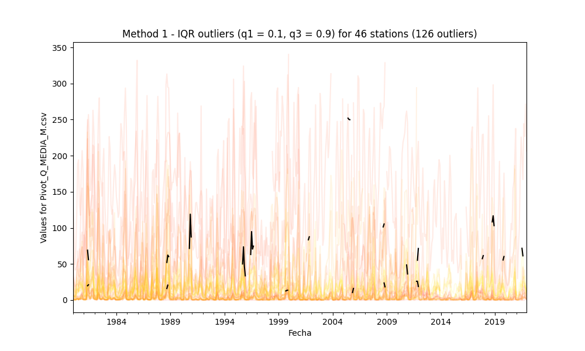

## Outliers detection and processing

* Processed file: D:/R.LTWB/.datasets/IDEAM_EDA/Pivot_Q_MEDIA_M.csv
* Execution date: 2022-11-02 17:31:38.320011
* Python version: 3.10.5 (tags/v3.10.5:f377153, Jun  6 2022, 16:14:13) [MSC v.1929 64 bit (AMD64)]
* Python path: ['D:\\R.LTWB\\.src', 'D:\\R.LTWB', 'D:\\R.TeachingResearchGuide', 'D:\\R.HydroTools.wiki', 'D:\\R.GISPython']
* matplotlib version: 3.6.0
* pandas version: 1.4.3
* Print table sample: True
* Instructions & script: https://github.com/rcfdtools/R.LTWB/tree/main/Section03/Outlier
* Licence: https://github.com/rcfdtools/R.LTWB/blob/main/LICENSE.md
* Credits: r.cfdtools@gmail.com

### General dataframe information with 504 IDEAM records for 57 stations

Dataframe records head sample

| Fecha               |   15067020 |   15067080 |   15067130 |   15067150 |   15067170 |   15067200 |   15067210 |   16037040 |   16047020 |   16067010 |   16067020 |   25027020 |   25027080 |   25027320 |   25027330 |   25027360 |   25027390 |   25027400 |   25027410 |   25027420 |   25027490 |   25027590 |   25027620 |   25027630 |   25027890 |   28017050 |   28017080 |   28017110 |   28017120 |   28017140 |   28017150 |   28027020 |   28027030 |   28027040 |   28027050 |   28027160 |   28037010 |   28037020 |   28037030 |   28037040 |   28037060 |   28037090 |   28037130 |   28047010 |   28047020 |   28047040 |   28047050 |   28047080 |   29067010 |   29067040 |   29067050 |   29067060 |   29067070 |   29067120 |   29067130 |   29067150 |   29067160 |
|:--------------------|-----------:|-----------:|-----------:|-----------:|-----------:|-----------:|-----------:|-----------:|-----------:|-----------:|-----------:|-----------:|-----------:|-----------:|-----------:|-----------:|-----------:|-----------:|-----------:|-----------:|-----------:|-----------:|-----------:|-----------:|-----------:|-----------:|-----------:|-----------:|-----------:|-----------:|-----------:|-----------:|-----------:|-----------:|-----------:|-----------:|-----------:|-----------:|-----------:|-----------:|-----------:|-----------:|-----------:|-----------:|-----------:|-----------:|-----------:|-----------:|-----------:|-----------:|-----------:|-----------:|-----------:|-----------:|-----------:|-----------:|-----------:|
| 1980-01-01 00:00:00 |      6.81  |        nan |        nan |        nan |        nan |        nan |        nan |      9.241 |      32.22 |     149.3  |      68.34 |       3231 |      2.381 |     219.5  |       2902 |       2350 |       2550 |     128.4  |       2200 |    198     |       2761 |      54.68 |     34.14  |       2480 |      1.176 |      9.391 |      0.865 |      3.582 |        nan |        nan |        nan |      1.363 |      2.045 |      0.944 |       1.28 |      3.109 |      0.424 |      2.411 |     16.16  |      0.564 |      0.531 |     30.47  |      0.899 |     16.83  |      1.224 |      1.46  |     10.28  |        nan |      7.281 |      0.514 |      7.816 |     17.88  |      7.213 |      21.44 |      7.851 |      11.91 |        nan |
| 1980-02-01 00:00:00 |      5.829 |        nan |        nan |        nan |        nan |        nan |        nan |      5.077 |      27.17 |      87.4  |      54.4  |       2680 |      1.961 |     118.8  |       2421 |       2090 |       2179 |      95.48 |       2118 |    118.6   |       2394 |      25.86 |     22.07  |       2177 |      0.707 |      4.655 |      0.751 |      2.843 |        nan |        nan |        nan |      1.7   |      1.289 |      0.519 |       1.6  |      3.2   |      0.127 |      2.078 |     10.05  |      0.212 |      0.464 |     21.78  |      0.523 |     11.81  |      1.284 |      0.998 |      6.622 |        nan |      5.391 |      0.482 |      4.224 |     12.67  |      5.03  |      14.8  |      4.309 |       7.24 |        nan |
| 1980-03-01 00:00:00 |      3.833 |        nan |        nan |        nan |        nan |        nan |        nan |      4.551 |      18.51 |      52.39 |      41.71 |       2004 |      1.481 |      35.15 |       2001 |       1723 |       1674 |      49.44 |       1546 |      4.306 |       1843 |      12.85 |      3.943 |       1863 |      0.201 |      5.295 |      0.655 |      2.695 |        nan |        nan |        nan |      0.833 |      0.617 |      0.377 |       0.9  |      1.236 |      0.098 |      0.438 |      6.077 |      0.196 |      0.373 |      5.548 |      0.443 |      9.395 |      0.594 |      0.747 |      3.342 |        nan |      2.966 |      0.312 |      4.774 |      9.948 |      3.847 |      11.41 |      2.634 |       4.87 |        nan |

Dataframe records tail sample

| Fecha               |   15067020 |   15067080 |   15067130 |   15067150 |   15067170 |   15067200 |   15067210 |   16037040 |   16047020 |   16067010 |   16067020 |   25027020 |   25027080 |   25027320 |   25027330 |   25027360 |   25027390 |   25027400 |   25027410 |   25027420 |   25027490 |   25027590 |   25027620 |   25027630 |   25027890 |   28017050 |   28017080 |   28017110 |   28017120 |   28017140 |   28017150 |   28027020 |   28027030 |   28027040 |   28027050 |   28027160 |   28037010 |   28037020 |   28037030 |   28037040 |   28037060 |   28037090 |   28037130 |   28047010 |   28047020 |   28047040 |   28047050 |   28047080 |   29067010 |   29067040 |   29067050 |   29067060 |   29067070 |   29067120 |   29067130 |   29067150 |   29067160 |
|:--------------------|-----------:|-----------:|-----------:|-----------:|-----------:|-----------:|-----------:|-----------:|-----------:|-----------:|-----------:|-----------:|-----------:|-----------:|-----------:|-----------:|-----------:|-----------:|-----------:|-----------:|-----------:|-----------:|-----------:|-----------:|-----------:|-----------:|-----------:|-----------:|-----------:|-----------:|-----------:|-----------:|-----------:|-----------:|-----------:|-----------:|-----------:|-----------:|-----------:|-----------:|-----------:|-----------:|-----------:|-----------:|-----------:|-----------:|-----------:|-----------:|-----------:|-----------:|-----------:|-----------:|-----------:|-----------:|-----------:|-----------:|-----------:|
| 2021-10-01 00:00:00 |        nan |   6.02323  |   0.151132 |    6.1546  |   16.8213  |        nan |        nan |        nan |        nan |        nan |        nan |    5618.71 |        nan |        nan |    5740.27 |        nan |        nan |    226.797 |    5311.56 |    687.841 |    6596.06 |        nan |        nan |    3752.1  |        nan |        nan |        nan |   23.6937  |        nan |        nan |   10.4313  |   11.2509  |   3.66587  |    3.79899 |        nan |        nan |    3.89628 |        nan |   41.7338  | nan        |   6.29435  |        nan |   14.0926  |        nan |        nan |        nan |   17.5766  |        nan |    26.0038 |        nan |    20.3681 |        nan |    20.0748 |        nan |    22.245  |    20.3878 |    33.4677 |
| 2021-11-01 00:00:00 |        nan |   1.56031  | nan        |    1.71422 |    3.79966 |        nan |        nan |        nan |        nan |        nan |        nan |    6333.08 |        nan |        nan |    6406.38 |        nan |        nan |    271.822 |    6259.04 |    748.592 |    7841.87 |        nan |        nan |    4043.31 |        nan |        nan |        nan |   17.1144  |        nan |        nan |    6.7664  |    9.04849 |   3.14376  |    3.11471 |        nan |        nan |    2.46154 |        nan |   25.8821  | nan        |   1.90571  |        nan |    7.98137 |        nan |        nan |        nan |   16.38    |        nan |    20.7463 |        nan |    17.4662 |        nan |    16.0404 |        nan |    16.4489 |    16.2355 |    14.2386 |
| 2021-12-01 00:00:00 |        nan |   0.977419 | nan        |    1.17995 |    2.25346 |        nan |        nan |        nan |        nan |        nan |        nan |    5277.24 |        nan |        nan |    5433.5  |        nan |        nan |    206.388 |    4634.1  |    592.838 |    6101.83 |        nan |        nan |    3492.18 |        nan |        nan |        nan |    4.88972 |        nan |        nan |    3.98445 |  nan       |   0.552185 |  nan       |        nan |        nan |  nan       |        nan |    6.61865 |   0.616957 |   0.747762 |        nan |    4.82141 |        nan |        nan |        nan |    2.19985 |        nan |    14.1797 |        nan |    11.4257 |        nan |    10.721  |        nan |    11.0097 |   nan      |     6.7579 |

Datatypes and nulls values in the dataset

|          | Dtype   |   Nulls |
|---------:|:--------|--------:|
| 15067020 | float64 |     176 |
| 15067080 | float64 |     213 |
| 15067130 | float64 |     116 |
| 15067150 | float64 |     356 |
| 15067170 | float64 |     348 |
| 15067200 | float64 |     389 |
| 15067210 | float64 |     476 |
| 16037040 | float64 |     117 |
| 16047020 | float64 |     221 |
| 16067010 | float64 |     107 |
| 16067020 | float64 |     260 |
| 25027020 | float64 |       0 |
| 25027080 | float64 |      55 |
| 25027320 | float64 |      31 |
| 25027330 | float64 |      20 |
| 25027360 | float64 |      42 |
| 25027390 | float64 |      48 |
| 25027400 | float64 |      15 |
| 25027410 | float64 |      81 |
| 25027420 | float64 |      22 |
| 25027490 | float64 |       0 |
| 25027590 | float64 |     165 |
| 25027620 | float64 |      89 |
| 25027630 | float64 |      43 |
| 25027890 | float64 |      80 |
| 28017050 | float64 |     241 |
| 28017080 | float64 |      39 |
| 28017110 | float64 |      39 |
| 28017120 | float64 |     274 |
| 28017140 | float64 |     463 |
| 28017150 | float64 |     452 |
| 28027020 | float64 |     105 |
| 28027030 | float64 |      65 |
| 28027040 | float64 |      92 |
| 28027050 | float64 |     155 |
| 28027160 | float64 |     132 |
| 28037010 | float64 |      67 |
| 28037020 | float64 |     142 |
| 28037030 | float64 |      30 |
| 28037040 | float64 |      30 |
| 28037060 | float64 |      22 |
| 28037090 | float64 |      94 |
| 28037130 | float64 |      82 |
| 28047010 | float64 |      92 |
| 28047020 | float64 |      30 |
| 28047040 | float64 |     257 |
| 28047050 | float64 |      53 |
| 28047080 | float64 |     408 |
| 29067010 | float64 |      56 |
| 29067040 | float64 |      58 |
| 29067050 | float64 |     111 |
| 29067060 | float64 |     247 |
| 29067070 | float64 |      78 |
| 29067120 | float64 |      60 |
| 29067130 | float64 |      28 |
| 29067150 | float64 |      23 |
| 29067160 | float64 |     107 |

General statistics table

|       |   15067020 |   15067080 |    15067130 |    15067150 |   15067170 |   15067200 |   15067210 |   16037040 |   16047020 |   16067010 |   16067020 |   25027020 |   25027080 |   25027320 |   25027330 |   25027360 |   25027390 |   25027400 |   25027410 |   25027420 |   25027490 |   25027590 |   25027620 |   25027630 |   25027890 |   28017050 |    28017080 |   28017110 |   28017120 |   28017140 |   28017150 |   28027020 |   28027030 |    28027040 |   28027050 |   28027160 |   28037010 |   28037020 |   28037030 |   28037040 |   28037060 |    28037090 |    28037130 |   28047010 |   28047020 |   28047040 |   28047050 |   28047080 |   29067010 |   29067040 |   29067050 |   29067060 |   29067070 |   29067120 |   29067130 |   29067150 |   29067160 |
|:------|-----------:|-----------:|------------:|------------:|-----------:|-----------:|-----------:|-----------:|-----------:|-----------:|-----------:|-----------:|-----------:|-----------:|-----------:|-----------:|-----------:|-----------:|-----------:|-----------:|-----------:|-----------:|-----------:|-----------:|-----------:|-----------:|------------:|-----------:|-----------:|-----------:|-----------:|-----------:|-----------:|------------:|-----------:|-----------:|-----------:|-----------:|-----------:|-----------:|-----------:|------------:|------------:|-----------:|-----------:|-----------:|-----------:|-----------:|-----------:|-----------:|-----------:|-----------:|-----------:|-----------:|-----------:|-----------:|-----------:|
| count |  328       | 291        | 388         | 148         |  156       |  115       |   28       |   387      |   283      |   397      |   244      |     504    |  449       |    473     |     484    |    462     |     456    |   489      |     423    |    482     |     504    |   339      |   415      |    461     |  424       |   263      | 465         |  465       |  230       |     41     |   52       |  399       |  439       | 412         |   349      |  372       |  437       |  362       |   474      | 474        |  482       | 410         | 422         |  412       | 474        |  247       |   451      |   96       |  448       |  446       |  393       |   257      |  426       |   444      |  476       | 481        |  397       |
| mean  |    6.88666 |   2.17867  |   0.107405  |   5.06216   |    9.50479 |    7.45147 |    5.99268 |    21.8745 |    54.4958 |   249.957  |   115.375  |    4075.69 |    4.61716 |    503.54  |    3977.16 |   2790.92  |    3334.22 |   151.668  |    4282.86 |    365.328 |    3661.52 |    53.8843 |    49.625  |   2922.8   |    2.66422 |    20.0189 |   2.49671   |    9.51238 |   16.453   |  18933.9   |    6.36198 |    2.40145 |    4.1023  |   3.04977   |    11.311  |    8.80949 |    3.03674 |    2.65542 |    33.6422 |   1.99652  |    1.77203 |  56.379     |   4.41579   |   16.1567  |   1.28277  |    2.64994 |    13.5702 |   16.3821  |   17.5998  |    1.91476 |   12.6539  |    24.8152 |   13.4932  |    28.2809 |   17.6187  |  15.9357   |    7.71179 |
| std   |    4.37317 |   3.43166  |   0.156455  |   5.59392   |   12.6864  |    7.71757 |    4.02808 |    17.4017 |    36.5487 |   137.419  |    66.9092 |    1368.36 |    7.4523  |    278.127 |    1256.45 |    695.773 |    1006.61 |    70.7867 |    1514.27 |    206.827 |    1335.23 |    39.6006 |    38.9781 |    719.798 |    3.14918 |    28.2952 |   3.54568   |   12.7092  |   13.6106  |  23607.6   |    3.45506 |    2.89938 |    6.57997 |   4.03069   |    22.5481 |    8.92743 |    4.55045 |    3.09609 |    38.3711 |   2.4448   |    2.00638 |  51.3416    |   5.69845   |    8.49034 |   0.950413 |    2.25132 |    13.6383 |    6.47651 |   11.6086  |    1.48993 |    9.55028 |    12.422  |    9.06389 |    18.1198 |   14.6576  |   9.25158  |    8.21195 |
| min   |    1.114   |   0.124    |   0.002     |   0.0811156 |    0.516   |    1.019   |    1.51655 |     3.445  |    10.16   |    43.6941 |    28.67   |    1245.65 |    0.018   |     35.15  |    1171.66 |   1099.06  |    1250    |     4.846  |    1507    |      4.306 |    1292    |     0.723  |     1.309  |    894.8   |    0.007   |     3      |   0.0238819 |    0.118   |    2.48    |      0.562 |    1.67986 |    0       |    0       |   0.0190909 |     0.161  |    0.013   |    0.009   |    0       |     1.221  |   0.01     |    0.03    |   0.0106789 |   0.0140806 |    0.625   |   0.244    |    0.25    |     0.127  |    6.365   |    2.966   |    0.106   |    1.572   |     4.068  |    2.06    |     4.831  |    1.95487 |   0.479067 |    0.546   |
| 25%   |    3.963   |   0.575597 |   0.016     |   1.54901   |    2.53293 |    2.61302 |    3.0025  |    11.475  |    29.87   |   134.3    |    64.19   |    3091.5  |    0.8775  |    288.8   |    3003.75 |   2304.75  |    2557.75 |    95.15   |    3054    |    197.85  |    2605    |    17.325  |    18.975  |   2348     |    0.5025  |     7.33   |   0.606     |    3.361   |    7.12875 |      1.504 |    3.65216 |    0.4485  |    0.815   |   0.67875   |     1.625  |    2.68175 |    0.34    |    0.444   |     7.753  |   0.367828 |    0.5315  |  12.65      |   0.944     |   11.3293  |   0.658511 |    1.2385  |     2.9885 |   11.7875  |    9.71225 |    0.78925 |    6.14022 |    15.44   |    6.24475 |    15.86   |    7.617   |   8.836    |    2.326   |
| 50%   |    5.5075  |   0.977419 |   0.0363357 |   2.6945    |    4.73477 |    4.30484 |    4.716   |    16.64   |    42.16   |   225.4    |    95.225  |    3956.67 |    1.999   |    462.8   |    3845    |   2800.5   |    3251    |   151      |    4174    |    334.85  |    3467    |    44.15   |    38.6171 |   2849     |    1.33    |    13.44   |   1.13      |    5.64    |   12.635   |      3.513 |    6.36845 |    1.3     |    2.055   |   1.585     |     4.267  |    6.026   |    1.402   |    1.469   |    20.465  |   1.01634  |    1.04342 |  41.18      |   2.01      |   14.845   |   1.03365  |    1.997   |     8.391  |   15.865   |   15.525   |    1.439   |   10.8     |    22.37   |   11.37    |    24.445  |   13.59    |  14.42     |    5.185   |
| 75%   |    8.558   |   2.45689  |   0.125     |   6.2928    |   10.7563  |    9.2741  |    8.31065 |    27.555  |    67.44   |   335.5    |   154.075  |    4960.75 |    4.948   |    681.7   |    4853.25 |   3309     |    3985    |   205      |    5356.16 |    521.858 |    4490.53 |    87.27   |    72.32   |   3513     |    3.70275 |    22.74   |   2.725     |   10.0068  |   20.425   |  32296     |    7.92197 |    3.4115  |    5.4085  |   3.8395    |    10.11   |   12.655   |    3.684   |    3.7135  |    41.5703 |   2.6945   |    2.36855 |  90.1875    |   5.36175   |   19.2775  |   1.539    |    3.318   |    20.35   |   18.8225  |   21.6225  |    2.73225 |   16.3514  |    32.55   |   18.18    |    35.5075 |   22.0241  |  21.58     |   10.81    |
| max   |   27.85    |  31.85     |   0.936     |  25.5854    |   71.51    |   38.9706  |   17.14    |   208.9    |   237.6    |   914.8    |   340.3    |    9171    |   73.81    |   1489     |    7464    |   4208.35  |    6532    |   328.7    |    8177    |    884.3   |    7841.87 |   158.1    |   202.2    |   4625     |   18.55    |   252      |  22.94      |  116.79    |  106.2     |  76114     |   15.2573  |   17.66    |   95.94    |  44         |   294.1    |   69.15    |   30.45    |   20.24    |   232.8    |  13.28     |   17.87    | 209.741     |  35.46      |   65.28    |   6.531    |   13.65    |    63.14   |   47.38    |  119       |    7.354   |   94.89    |    88.67   |   59.47    |   140.9    |   97.6     |  55.25     |   71.7432  |

### METHOD 1 - Outliers processing using the interquartile range IQR (q1 = 0.25, q3 = 0.75)

Outliers table: [Outlier_IQR_Pivot_Q_MEDIA_M.csv](../../.datasets/IDEAM_Outlier/Outlier_IQR_Pivot_Q_MEDIA_M.csv)

Outliers parameters
* q1: quartile 0.25
* q3: quartile 0.75
* IQR: interquartile range (q3-q1)
* OlBottomLim: outlier bottom limit (q1-1.5*IQR)
* OlTopLim: outlier top limit (q3+1.5*IQR)
* OlMinVal: minimum outlier value founded
* OlMaxVal: maximum outlier value founded
* OlCount: # outliers founded

|          |          q1 |          q3 |          IQR |   OlBottomLim |    OlTopLim |   OlMinVal |   OlMaxVal |   OlCount |
|---------:|------------:|------------:|-------------:|--------------:|------------:|-----------:|-----------:|----------:|
| 15067020 |    3.963    |     8.558   |     4.595    |      10.8555  |    15.4505  |    15.46   |    27.85   |        22 |
| 15067080 |    0.575597 |     2.45689 |     1.88129  |       3.39754 |     5.27883 |     5.303  |    31.85   |        25 |
| 15067130 |    0.016    |     0.125   |     0.109    |       0.1795  |     0.2885  |     0.298  |     0.936  |        41 |
| 15067150 |    1.54901  |     6.2928  |     4.74379  |       8.6647  |    13.4085  |    15.06   |    25.5854 |        13 |
| 15067170 |    2.53293  |    10.7563  |     8.22336  |      14.868   |    23.0913  |    23.71   |    71.51   |        16 |
| 15067200 |    2.61302  |     9.2741  |     6.66108  |      12.6046  |    19.2657  |    19.34   |    38.9706 |        10 |
| 15067210 |    3.0025   |     8.31065 |     5.30815  |      10.9647  |    16.2729  |    17.14   |    17.14   |         1 |
| 16037040 |   11.475    |    27.555   |    16.08     |      35.595   |    51.675   |    52.69   |   208.9    |        21 |
| 16047020 |   29.87     |    67.44    |    37.57     |      86.225   |   123.795   |   125.7    |   237.6    |        17 |
| 16067010 |  134.3      |   335.5     |   201.2      |     436.1     |   637.3     |   658.1    |   914.8    |         4 |
| 16067020 |   64.19     |   154.075   |    89.885    |     199.017   |   288.902   |   294.1    |   340.3    |         8 |
| 25027020 | 3091.5      |  4960.75    |  1869.25     |    5895.38    |  7764.62    |  8273      |  9171      |         4 |
| 25027080 |    0.8775   |     4.948   |     4.0705   |       6.98325 |    11.0537  |    11.38   |    73.81   |        49 |
| 25027320 |  288.8      |   681.7     |   392.9      |     878.15    |  1271.05    |  1296      |  1489      |         2 |
| 25027330 | 3003.75     |  4853.25    |  1849.5      |    5778       |  7627.5     |   nan      |   nan      |         0 |
| 25027360 | 2304.75     |  3309       |  1004.25     |    3811.12    |  4815.38    |   nan      |   nan      |         0 |
| 25027390 | 2557.75     |  3985       |  1427.25     |    4698.62    |  6125.88    |  6213      |  6532      |         5 |
| 25027400 |   95.15     |   205       |   109.85     |     259.925   |   369.775   |   nan      |   nan      |         0 |
| 25027410 | 3054        |  5356.16    |  2302.16     |    6507.24    |  8809.39    |   nan      |   nan      |         0 |
| 25027420 |  197.85     |   521.858   |   324.008    |     683.862   |  1007.87    |   nan      |   nan      |         0 |
| 25027490 | 2605        |  4490.53    |  1885.53     |    5433.3     |  7318.84    |  7841.87   |  7841.87   |         1 |
| 25027590 |   17.325    |    87.27    |    69.945    |     122.243   |   192.188   |   nan      |   nan      |         0 |
| 25027620 |   18.975    |    72.32    |    53.345    |      98.9925  |   152.337   |   152.7    |   202.2    |         8 |
| 25027630 | 2348        |  3513       |  1165        |    4095.5     |  5260.5     |   nan      |   nan      |         0 |
| 25027890 |    0.5025   |     3.70275 |     3.20025  |       5.30288 |     8.50313 |     8.636  |    18.55   |        27 |
| 28017050 |    7.33     |    22.74    |    15.41     |      30.445   |    45.855   |    48.09   |   252      |        15 |
| 28017080 |    0.606    |     2.725   |     2.119    |       3.7845  |     5.9035  |     6.087  |    22.94   |        51 |
| 28017110 |    3.361    |    10.0068  |     6.64579  |      13.3297  |    19.9755  |    19.99   |   116.79   |        49 |
| 28017120 |    7.12875  |    20.425   |    13.2962   |      27.0731  |    40.3694  |    40.6    |   106.2    |        15 |
| 28017140 |    1.504    | 32296       | 32294.5      |   48443.2     | 80737.7     |   nan      |   nan      |         0 |
| 28017150 |    3.65216  |     7.92197 |     4.26981  |      10.0569  |    14.3267  |    15.2573 |    15.2573 |         1 |
| 28027020 |    0.4485   |     3.4115  |     2.963    |       4.893   |     7.856   |     8.044  |    17.66   |        23 |
| 28027030 |    0.815    |     5.4085  |     4.5935   |       7.70525 |    12.2988  |    12.67   |    95.94   |        23 |
| 28027040 |    0.67875  |     3.8395  |     3.16075  |       5.41988 |     8.58063 |     8.595  |    44      |        37 |
| 28027050 |    1.625    |    10.11    |     8.485    |      14.3525  |    22.8375  |    22.97   |   294.1    |        46 |
| 28027160 |    2.68175  |    12.655   |     9.97325  |      17.6416  |    27.6149  |    28.05   |    69.15   |        17 |
| 28037010 |    0.34     |     3.684   |     3.344    |       5.356   |     8.7     |     8.76   |    30.45   |        34 |
| 28037020 |    0.444    |     3.7135  |     3.2695   |       5.34825 |     8.61775 |     8.741  |    20.24   |        21 |
| 28037030 |    7.753    |    41.5703  |    33.8173   |      58.479   |    92.2964  |    94.01   |   232.8    |        44 |
| 28037040 |    0.367828 |     2.6945  |     2.32667  |       3.85784 |     6.18451 |     6.199  |    13.28   |        36 |
| 28037060 |    0.5315   |     2.36855 |     1.83705  |       3.28708 |     5.12413 |     5.171  |    17.87   |        26 |
| 28037090 |   12.65     |    90.1875  |    77.5375   |     128.956   |   206.494   |   207.9    |   209.741  |         2 |
| 28037130 |    0.944    |     5.36175 |     4.41775  |       7.57062 |    11.9884  |    12.06   |    35.46   |        44 |
| 28047010 |   11.3293   |    19.2775  |     7.94824  |      23.2516  |    31.1999  |    31.2    |    65.28   |        22 |
| 28047020 |    0.658511 |     1.539   |     0.880489 |       1.97924 |     2.85973 |     2.883  |     6.531  |        32 |
| 28047040 |    1.2385   |     3.318   |     2.0795   |       4.35775 |     6.43725 |     6.553  |    13.65   |        15 |
| 28047050 |    2.9885   |    20.35    |    17.3615   |      29.0307  |    46.3923  |    46.97   |    63.14   |        17 |
| 28047080 |   11.7875   |    18.8225  |     7.035    |      22.34    |    29.375   |    31.4    |    47.38   |         4 |
| 29067010 |    9.71225  |    21.6225  |    11.9103   |      27.5776  |    39.4879  |    39.61   |   119      |        16 |
| 29067040 |    0.78925  |     2.73225 |     1.943    |       3.70375 |     5.64675 |     5.673  |     7.354  |        12 |
| 29067050 |    6.14022  |    16.3514  |    10.2112   |      21.4571  |    31.6683  |    32.45   |    94.89   |        10 |
| 29067060 |   15.44     |    32.55    |    17.11     |      41.105   |    58.215   |    67.38   |    88.67   |         3 |
| 29067070 |    6.24475  |    18.18    |    11.9352   |      24.1476  |    36.0829  |    36.32   |    59.47   |        13 |
| 29067120 |   15.86     |    35.5075  |    19.6475   |      45.3313  |    64.9788  |    65.14   |   140.9    |        21 |
| 29067130 |    7.617    |    22.0241  |    14.4071   |      29.2276  |    43.6347  |    43.87   |    97.6    |        33 |
| 29067150 |    8.836    |    21.58    |    12.744    |      27.952   |    40.696   |    45.27   |    55.25   |         7 |
| 29067160 |    2.326    |    10.81    |     8.484    |      15.052   |    23.536   |    23.68   |    71.7432 |        22 |

IQR outliers identified: 985
