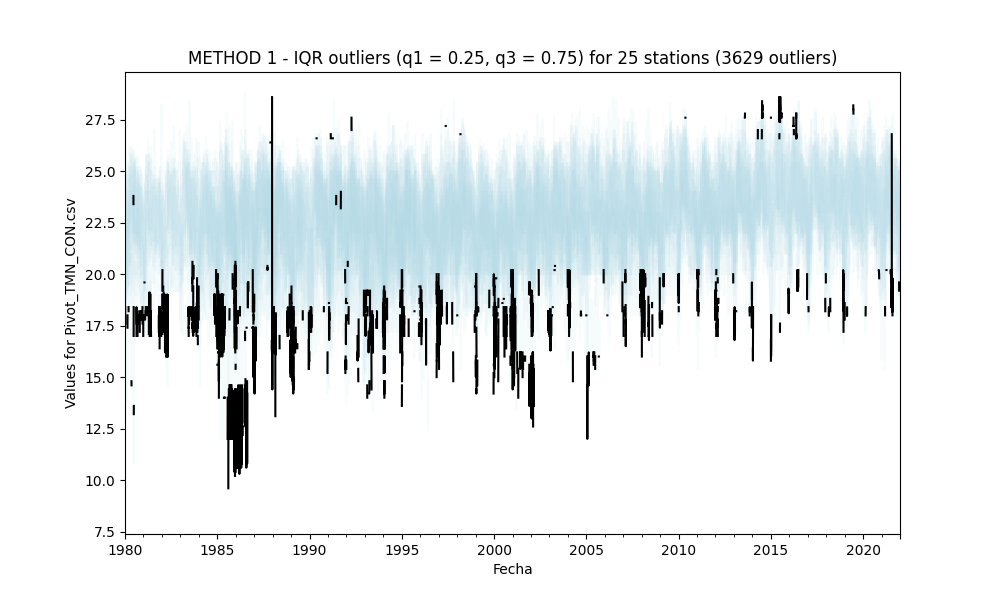

## Outliers detection and processing

* Processed file: D:/R.LTWB/.datasets/IDEAM_EDA/Pivot_TMN_CON.csv
* Execution date: 2022-11-02 17:21:56.288240
* Python version: 3.10.5 (tags/v3.10.5:f377153, Jun  6 2022, 16:14:13) [MSC v.1929 64 bit (AMD64)]
* Python path: ['D:\\R.LTWB\\.src', 'D:\\R.LTWB', 'D:\\R.TeachingResearchGuide', 'D:\\R.HydroTools.wiki', 'D:\\R.GISPython']
* matplotlib version: 3.6.0
* pandas version: 1.4.3
* Print table sample: True
* Instructions & script: https://github.com/rcfdtools/R.LTWB/tree/main/Section03/Outlier
* Licence: https://github.com/rcfdtools/R.LTWB/blob/main/LICENSE.md
* Credits: r.cfdtools@gmail.com

### General dataframe information with 15341 IDEAM records for 25 stations

Dataframe records head sample

| Fecha               |   15015020 |   15065040 |   23215060 |   25025002 |   25025090 |   25025250 |   25025300 |   25025330 |   28015030 |   28015070 |   28025020 |   28025040 |   28025070 |   28025080 |   28025090 |   28025502 |   28035010 |   28035020 |   28035040 |   28035070 |   28045020 |   28045040 |   29065010 |   29065020 |   29065030 |
|:--------------------|-----------:|-----------:|-----------:|-----------:|-----------:|-----------:|-----------:|-----------:|-----------:|-----------:|-----------:|-----------:|-----------:|-----------:|-----------:|-----------:|-----------:|-----------:|-----------:|-----------:|-----------:|-----------:|-----------:|-----------:|-----------:|
| 1980-01-01 00:00:00 |       23.2 |        nan |        nan |        nan |       24.2 |        nan |        nan |        nan |      nan   |       23   |        nan |       20.2 |       22.8 |       21.8 |        nan |        nan |      nan   |       19.4 |        nan |        nan |        nan |        nan |       21.4 |        nan |       21.4 |
| 1980-01-02 00:00:00 |       22.4 |        nan |        nan |        nan |       24.2 |        nan |        nan |        nan |       23.3 |       23.5 |        nan |       21   |       23.4 |       21.6 |        nan |         24 |      nan   |       19.6 |        nan |        nan |        nan |        nan |      nan   |        nan |       21.8 |
| 1980-01-03 00:00:00 |       20.8 |        nan |        nan |        nan |       24.6 |        nan |        nan |        nan |       24   |      nan   |        nan |       19.8 |       23.4 |       21.4 |        nan |        nan |       22.4 |       19   |        nan |        nan |        nan |        nan |      nan   |        nan |      nan   |

Dataframe records tail sample

| Fecha               |   15015020 |   15065040 |   23215060 |   25025002 |   25025090 |   25025250 |   25025300 |   25025330 |   28015030 |   28015070 |   28025020 |   28025040 |   28025070 |   28025080 |   28025090 |   28025502 |   28035010 |   28035020 |   28035040 |   28035070 |   28045020 |   28045040 |   29065010 |   29065020 |   29065030 |
|:--------------------|-----------:|-----------:|-----------:|-----------:|-----------:|-----------:|-----------:|-----------:|-----------:|-----------:|-----------:|-----------:|-----------:|-----------:|-----------:|-----------:|-----------:|-----------:|-----------:|-----------:|-----------:|-----------:|-----------:|-----------:|-----------:|
| 2021-12-29 00:00:00 |        nan |        nan |        nan |       21.8 |       23   |       24.8 |       23.2 |         23 |        nan |       21.8 |       18.8 |        nan |       23   |        nan |       21.2 |        nan |       22.6 |       22.8 |       25.4 |        nan |        nan |        nan |        nan |       25   |        nan |
| 2021-12-30 00:00:00 |        nan |        nan |        nan |       22.4 |       24   |       24.4 |       22.6 |         24 |        nan |       21   |       18.2 |        nan |       22.8 |        nan |       20   |        nan |       20.8 |       22.4 |       24.4 |        nan |        nan |        nan |        nan |       24.8 |        nan |
| 2021-12-31 00:00:00 |        nan |        nan |        nan |       20.4 |       21.4 |       24.2 |       22   |        nan |        nan |       20.2 |       20.2 |        nan |       22   |        nan |       21.2 |        nan |       20.8 |       22   |       24   |        nan |        nan |        nan |        nan |       25.4 |        nan |

Datatypes and nulls values in the dataset

|          | Dtype   |   Nulls |
|---------:|:--------|--------:|
| 15015020 | float64 |    5377 |
| 15065040 | float64 |   10392 |
| 23215060 | float64 |   14093 |
| 25025002 | float64 |    4608 |
| 25025090 | float64 |    5567 |
| 25025250 | float64 |    3001 |
| 25025300 | float64 |    3648 |
| 25025330 | float64 |    6066 |
| 28015030 | float64 |   13937 |
| 28015070 | float64 |    2866 |
| 28025020 | float64 |    1889 |
| 28025040 | float64 |   12110 |
| 28025070 | float64 |    1523 |
| 28025080 | float64 |    7705 |
| 28025090 | float64 |    3474 |
| 28025502 | float64 |    3103 |
| 28035010 | float64 |    4784 |
| 28035020 | float64 |    3517 |
| 28035040 | float64 |    1936 |
| 28035070 | float64 |   15299 |
| 28045020 | float64 |   14289 |
| 28045040 | float64 |   14067 |
| 29065010 | float64 |   14278 |
| 29065020 | float64 |    2358 |
| 29065030 | float64 |    3815 |

General statistics table

|       |   15015020 |   15065040 |   23215060 |    25025002 |   25025090 |    25025250 |    25025300 |   25025330 |   28015030 |    28015070 |    28025020 |   28025040 |    28025070 |   28025080 |    28025090 |    28025502 |    28035010 |    28035020 |    28035040 |   28035070 |   28045020 |   28045040 |   29065010 |    29065020 |    29065030 |
|:------|-----------:|-----------:|-----------:|------------:|-----------:|------------:|------------:|-----------:|-----------:|------------:|------------:|-----------:|------------:|-----------:|------------:|------------:|------------:|------------:|------------:|-----------:|-----------:|-----------:|-----------:|------------:|------------:|
| count | 9964       | 4949       | 1248       | 10733       | 9774       | 12340       | 11693       |  9275      | 1404       | 12475       | 13452       | 3231       | 13818       | 7636       | 11867       | 12238       | 10557       | 11824       | 13405       |   42       | 1052       | 1274       | 1063       | 12983       | 11526       |
| mean  |   22.1888  |   22.9664  |   23.6837  |    22.9428  |   23.5651  |    22.3963  |    22.9902  |    22.7791 |   22.9291  |    22.34    |    20.547   |   18.674   |    23.7666  |   21.7751  |    22.4272  |    23.8861  |    23.3278  |    22.8005  |    24.269   |   22.0286  |   21.2974  |   23.128   |   21.3162  |    22.327   |    21.8104  |
| std   |    1.60856 |    1.75384 |    1.20744 |     1.56303 |    1.53376 |     1.63717 |     1.75271 |     1.6933 |    1.32774 |     1.33165 |     1.73534 |    2.11514 |     1.54724 |    1.87894 |     1.67337 |     1.27915 |     1.49337 |     1.82844 |     1.23846 |    1.01844 |    1.79272 |    1.26701 |    1.60256 |     1.85521 |     1.55983 |
| min   |   16       |   12.4     |   16.6     |    16.8     |   17       |    17       |    15.4     |    13.1    |   10       |    15.4     |    12       |    8.4     |    17.4     |   15.2     |    15       |    18.4     |    13.4     |    15.8     |    17.2     |   20.6     |   14.6     |   14.6     |   15.2     |    14.2     |    14       |
| 25%   |   21.2     |   22.2     |   23       |    22       |   22.6     |    21.2     |    22       |    21.8    |   22.2     |    21.5     |    19.6     |   18       |    22.8     |   20.4     |    21.6     |    23       |    22.6     |    21.8     |    23.4     |   21.4     |   20.2     |   22.4     |   20.4     |    21.2     |    20.8     |
| 50%   |   22.4     |   23.2     |   23.8     |    23       |   23.6     |    22.4     |    23.2     |    23      |   23       |    22.5     |    20.8     |   19.2     |    23.8     |   22.2     |    22.8     |    23.8     |    23.4     |    23       |    24.2     |   21.8     |   21.6     |   23.2     |   21.4     |    22.6     |    22       |
| 75%   |   23.2     |   24.2     |   24.6     |    24       |   24.8     |    23.8     |    24.2     |    24      |   23.8     |    23.2     |    21.8     |   20       |    25       |   23.2     |    23.6     |    24.8     |    24.2     |    24       |    25       |   22.6     |   22.6     |   24       |   22.4     |    23.6     |    23       |
| max   |   26.8     |   27.8     |   26.8     |    27.2     |   28       |    27.1     |    27.8     |    28.6    |   26.8     |    26.2     |    26       |   27.4     |    28.6     |   27       |    27.4     |    28.6     |    28.8     |    28.6     |    28.6     |   25.6     |   26.4     |   26.6     |   25.2     |    27.4     |    27       |

### METHOD 1 - Outliers processing using the interquartile range IQR (q1 = 0.1, q3 = 0.9)

Outliers table: [Outlier_IQR_Pivot_TMN_CON.csv](../../.datasets/IDEAM_Outlier/Outlier_IQR_Pivot_TMN_CON.csv)

Outliers parameters
* q1: quartile 0.1
* q3: quartile 0.9
* IQR: interquartile range (q3-q1)
* OlBottomLim: outlier bottom limit (q1-1.5*IQR)
* OlTopLim: outlier top limit (q3+1.5*IQR)
* OlMinVal: minimum outlier value founded
* OlMaxVal: maximum outlier value founded
* OlCount: # outliers founded

|          |   q1 |    q3 |   IQR |   OlBottomLim |   OlTopLim |   OlMinVal |   OlMaxVal |   OlCount |
|---------:|-----:|------:|------:|--------------:|-----------:|-----------:|-----------:|----------:|
| 15015020 | 20.2 | 24.2  |  4    |         26.2  |      30.2  |      nan   |      nan   |         0 |
| 15065040 | 20.6 | 25    |  4.4  |         27.2  |      31.6  |       12.4 |       12.4 |         1 |
| 23215060 | 22.2 | 25    |  2.8  |         26.4  |      29.2  |       16.6 |       17.2 |         2 |
| 25025002 | 20.8 | 24.8  |  4    |         26.8  |      30.8  |      nan   |      nan   |         0 |
| 25025090 | 21.8 | 25.4  |  3.6  |         27.2  |      30.8  |      nan   |      nan   |         0 |
| 25025250 | 20.2 | 24.6  |  4.4  |         26.8  |      31.2  |      nan   |      nan   |         0 |
| 25025300 | 20.4 | 25    |  4.6  |         27.3  |      31.9  |      nan   |      nan   |         0 |
| 25025330 | 20.6 | 24.8  |  4.2  |         26.9  |      31.1  |       13.1 |       14.2 |         5 |
| 28015030 | 21.3 | 24.4  |  3.1  |         25.95 |      29.05 |       10   |       10   |         1 |
| 28015070 | 20.5 | 24    |  3.5  |         25.75 |      29.25 |      nan   |      nan   |         0 |
| 28025020 | 18.2 | 22.4  |  4.2  |         24.5  |      28.7  |      nan   |      nan   |         0 |
| 28025040 | 15.8 | 20.8  |  5    |         23.3  |      28.3  |      nan   |      nan   |         0 |
| 28025070 | 21.8 | 25.6  |  3.8  |         27.5  |      31.3  |      nan   |      nan   |         0 |
| 28025080 | 19.1 | 24    |  4.9  |         26.45 |      31.35 |      nan   |      nan   |         0 |
| 28025090 | 20   | 24.2  |  4.2  |         26.3  |      30.5  |      nan   |      nan   |         0 |
| 28025502 | 22.2 | 25.5  |  3.3  |         27.15 |      30.45 |      nan   |      nan   |         0 |
| 28035010 | 21.4 | 25.04 |  3.64 |         26.86 |      30.5  |       13.4 |       13.4 |         1 |
| 28035020 | 20.4 | 25    |  4.6  |         27.3  |      31.9  |      nan   |      nan   |         0 |
| 28035040 | 22.8 | 26    |  3.2  |         27.6  |      30.8  |       17.2 |       17.2 |         2 |
| 28035070 | 21   | 23.18 |  2.18 |         24.27 |      26.45 |      nan   |      nan   |         0 |
| 28045020 | 19   | 23.2  |  4.2  |         25.3  |      29.5  |      nan   |      nan   |         0 |
| 28045040 | 21.6 | 24.6  |  3    |         26.1  |      29.1  |       14.6 |       17   |         2 |
| 29065010 | 19.4 | 23.6  |  4.2  |         25.7  |      29.9  |      nan   |      nan   |         0 |
| 29065020 | 19.8 | 24.4  |  4.6  |         26.7  |      31.3  |      nan   |      nan   |         0 |
| 29065030 | 19.6 | 23.6  |  4    |         25.6  |      29.6  |      nan   |      nan   |         0 |

IQR outliers identified: 14
