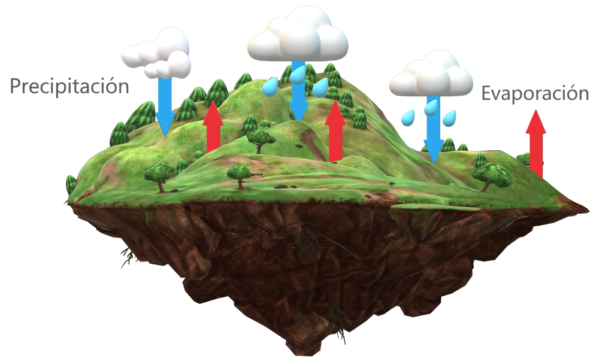

## ¿Qué son y para qué sirven los balances hidrológicos de largo plazo – LTWB?
Keywords: `Long-term-water-balance` 'Hydraulics' 'Hydrology'

Explicación general de la metodología para la realización de balances hidrológicos e identificación de información base requerida. En esta clase también se listan algunas de las aplicaciones generales de los caudales medios de largo plazo en la realización de estudios de ingeniería y estudios ambientales

### Objetivos

* Entender 

### Procedimiento general

Para la ejecución completa de un balance hidrológico 

  
Convenciones generales en diagramas: clases de entidad en azul, dataset en gris oscuro, grillas en color verde, geo-procesos en rojo, procesos automáticos o semiautomáticos en guiones rojos y procesos manuales en amarillo. Líneas conectoras con guiones corresponden a procedimientos opcionales.  

## Estimación del caudal medio

Para la estimación de caudales medios se realiza un balance hidrológico de largo plazo en cada una de las celdas que cubre la zona de estudio. La siguiente expresión permite determinar el caudal medio en cada celda en el que, al valor estimado de precipitación por celda, se le resta la abstracción correspondiente a la evapotranspiración real. El valor correspondiente al área sobre el cual se estima el caudal corresponde al total de celdas convergentes multiplicadas por el tamaño de cada pixel el cual es definido por la resolución espacial de las grillas utilizadas.

Qm = (( P – E ) * A) / t

Donde,

* Qm: caudal medio, m³/s
* P: precipitación, mm/año
* E: evapotranspiración real, mm/año
* A: área de cada celda, m²
* t: tiempo en segundos en un año, (365 dias x 24 horas x 60 minutos x 60 segundos = 31.536.000.000)

## Utilidad y campo de aplicación de los LTWB en ingeniería

* Estimación de caudales ecológicos
* Diseño de estructuras ecológicas
* Estimación de caudales para concesión por captación y vertimiento.

### Actividades complementarias:pencil2:

En la siguiente tabla se listan las actividades complementarias que deben ser desarrolladas y documentadas por el estudiante en un único archivo de Adobe Acrobat .pdf. El documento debe incluir portada (mostrar nombre completo, código y enlace a su cuenta de GitHub), numeración de páginas, tabla de contenido, lista de tablas, lista de ilustraciones, introducción, objetivo general, capítulos por cada ítem solicitado, conclusiones y referencias bibliográficas.

| Actividad | Alcance |
|:---------:|:--------|
|     1     | ....    | 

### Referencias

* 

### Compatibilidad

* Este curso puede ser desarrollado con cualquier software SIG que disponga de herramientas para reacondicionamiento de modelos de terreno, creación de mosaicos, algebra de mapas y herramientas de análisis espacial.
 

### Control de versiones

| Versión    | Descripción     | Autor                                      | Horas |
|------------|:----------------|--------------------------------------------|:-----:|
| 2022.12.22 | Versión inicial | [rcfdtools](https://github.com/rcfdtools)  |   0   |

_R.LTWB es de uso libre para fines académicos, conoce nuestra licencia, cláusulas, condiciones de uso y como referenciar los contenidos publicados en este repositorio, dando [clic aquí](https://github.com/rcfdtools/R.LTWB/wiki/License)._

_¡Encontraste útil este repositorio!, apoya su difusión marcando este repositorio con una ⭐ o síguenos dando clic en el botón Follow de [rcfdtools](https://github.com/rcfdtools) en GitHub._

| [Actividad anterior](../xxxx) | [Inicio](../../) | [:beginner: Ayuda](https://github.com/rcfdtools/R.LTWB/discussions/99999) | [Actividad siguiente]()  |
|-------------------------------|------------------|---------------------------------------------------------------------------|--------------------------|

[^1]: 