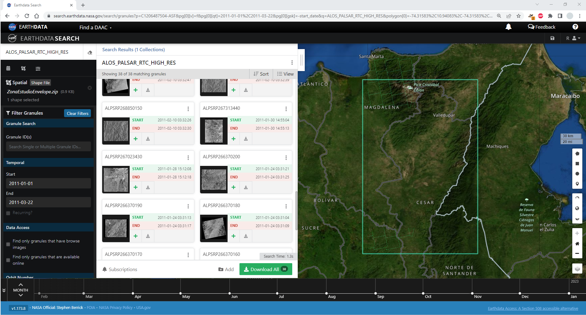
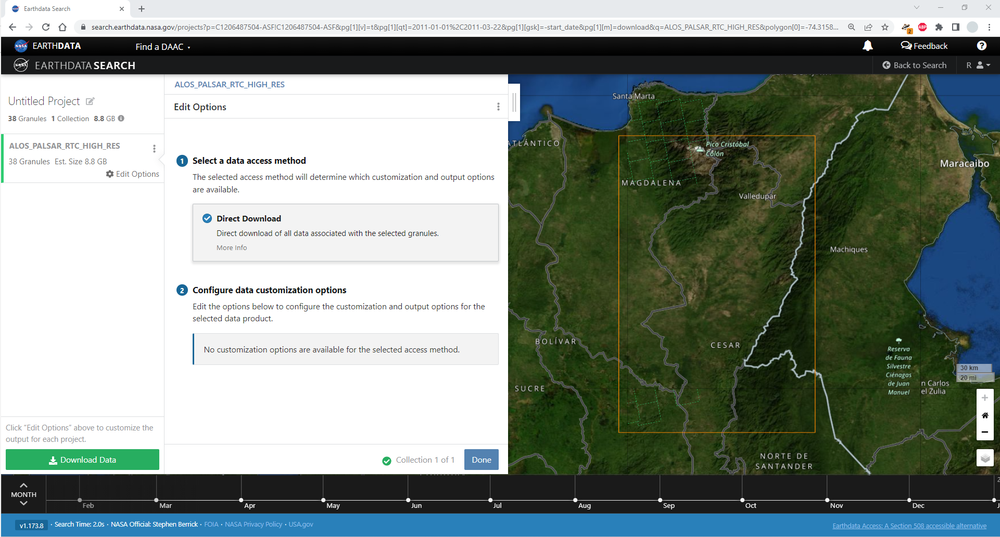
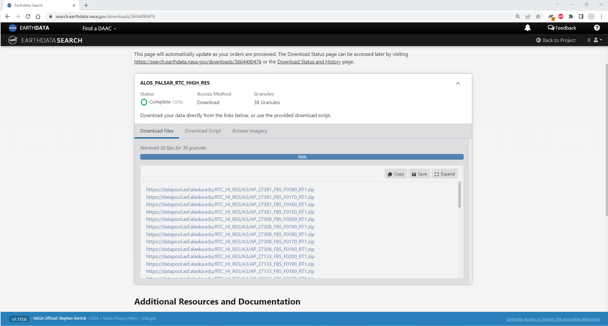
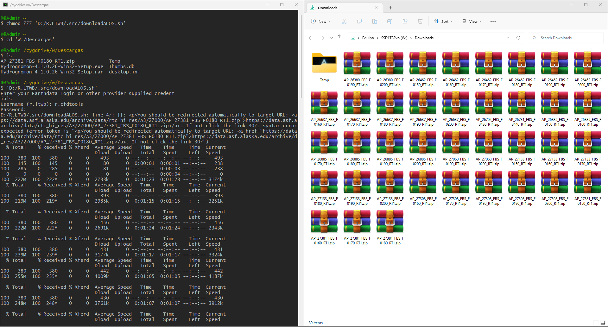
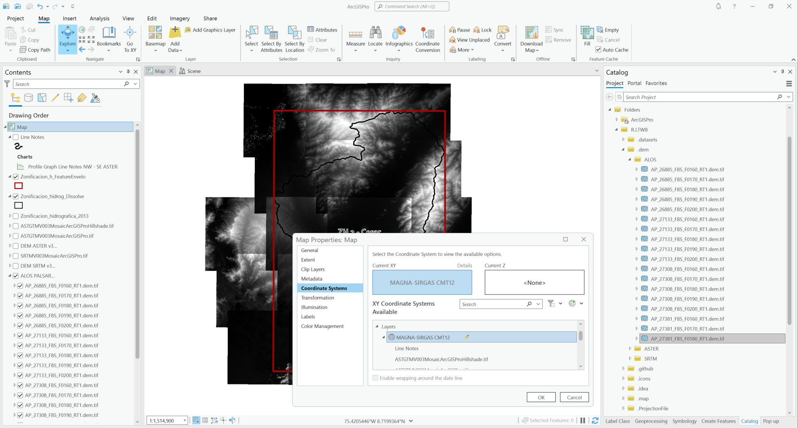
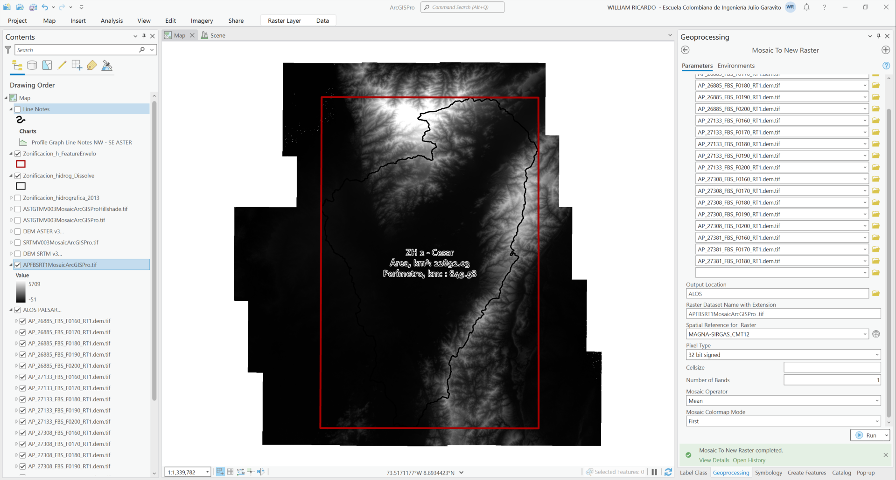
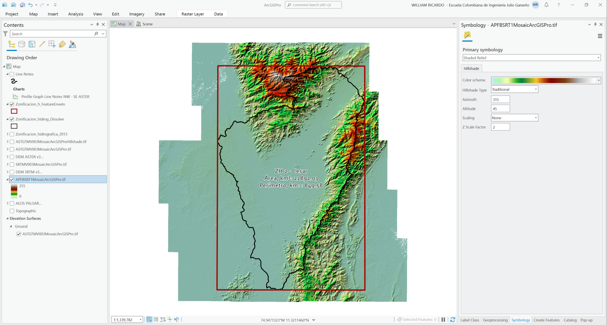

<div align="center"><a href="https://www.escuelaing.edu.co/es/investigacion-e-innovacion/centro-de-estudios-hidraulicos/" target="_blank"></a></div>

## Descarga y procesamiento de modelo digital de elevación - DEM - ALOS PALSAR (12.5 m)
Keywords: `NASA` `JAXA` `ALOS` `PALSAR` `Cygwin` `Shell-script-.sh` `Earthdata` `Mosaic-to-New-Raster`

<br>

ALOS Phased Array type L-band Synthetic Aperture Radar, es uno de los instrumentos de observación avanzada de la superficie terrestre, que permite entre otros, obtener un modelo digital de la tierra en alta resolución.[^1]

<div align="center"><br><a href="http://www.youtube.com/watch?feature=player_embedded&v=smDvgats7os" target="_blank"></a><sub><br>Playlist: https://www.youtube.com/playlist?list=PLneiG4vC_8YupZFL2DtUEdcgtXyWT7Apt</sub><br><br></div>

<div align="center">

Especificaciones técnicas y modos de captura  
| Detail             | Fine Resolution   | Fine Resolution   | ScanSAR           | Polarimetric      |
|--------------------|-------------------|-------------------|-------------------|-------------------|
| Beam Mode          | FBS, DSN          | FBD               | WB1, WB2          | PLR               |
| Center Frequency   | L-Band (1.27 GHz) | L-Band (1.27 GHz) | L-Band (1.27 GHz) | L-Band (1.27 GHz) |
| Polarization       | HH or VV          | HH+HV or VV+VH    | HH or VV          | HH+HV+VV+VH       |
| Spatial Resolution | 10 m              | 20 m              | 100 m             | 30 m              |
| Swath Width        | 70 km             | 70 km             | 250-350 km        | 30 km             |
| Off-Nadir Angle    | 34.3° (default)   | 34.3° (default)   | 27.1° (default)   | 21.5° (default)   |

</div>

> PALSAR no realiza captura de información por encima de la latitud 87.8° norte y 75.9° sur cuando el ángulo off-nadir es 41.5°.


### Objetivos

* Descargar manualmente imágenes de terreno para la zona de estudio.
* Descargar masivamente imágenes desde la consola Cygwin a través del script downloadALOS.sh.
* Cargar y visualizar imágenes satelitales en herramientas SIG.
* Crear y reproyectar el mosaico de terreno a partir de las imágenes individuales obtenidas.

> La resolución aproximada de los modelos digitales de elevación ALOS PALSAR en modo FBS es de 12.5 metros.

> Para aprender a visualizar perfiles de elevación, crear representaciones 3D y mapas de sombreado de colinas - Hillshade utilizando ArcGIS for Desktop, ArcGIS Pro y QGIS, consulte la actividad [:mortar_board:Descarga y procesamiento del modelo digital de elevación - DEM - NASA ASTER GDEM v3 (30 m)](../DEMAster).


### Requerimientos

* [ArcGIS Pro 2+](https://pro.arcgis.com/en/pro-app/latest/get-started/download-arcgis-pro.htm)
* [Cygwin terminal for Windows](https://www.cygwin.com/)
* Cuenta de usuario [NASA Eathdata](../UserCreation).
* [Polígono envolvente que delimita la zona de estudio. ](../../.shp/ZonaEstudioEnvelope.zip)[:mortar_board:Aprender.](../../Section01/CaseStudy)


### Diagrama general de procesos

El siguiente diagrama representa los procesos generales requeridos para el desarrollo de esta actividad.

<div align="center">
<br><br>
<sub>Convenciones generales en diagramas: clases de entidad en azul, dataset en gris oscuro, grillas en color verde, geo-procesos en rojo, procesos automáticos o semiautomáticos en guiones rojos y procesos manuales en amarillo. Líneas conectoras con guiones corresponden a procedimientos opcionales.</sub><br><br>
</div>


### Procedimiento de descarga

1. Ingresar al servicio web de la NASA: https://search.earthdata.nasa.gov y dar clic en Earthdata login.

> Realizar el ingreso de usuario usando _LOG IN_ o realizar el registro de nuevo usuario dando clic en _REGISTER_ [(ver instrucciones detalladas)](../UserCreation)

2. Delimitar en la vista satelital la extensión de la zona a descargar, para ello podrá utilizar diferentes métodos como:

| Método    | Descripción                                                                                                                                                                                                            |
|-----------|------------------------------------------------------------------------------------------------------------------------------------------------------------------------------------------------------------------------|
| Polygon   | Acercarse a la zona requerida y mediante clics definir un polígono de delimitación.                                                                                                                                    |
| Rectangle | Cree un rectángulo especificando las esquinas SW y NE en valores de latitud y longitud en grados decimales, p. ej. para el Departamento del Cesar en Colombia deberá ingresar SW: 7,-75 NE: 11,-72.                    |
| Point     | Coordenada de un punto indicando la latitud y longitud en grados decimales referenciados en el sistema de proyección de coordenadas WGS84 o dando clic en pantalla.                                                    |
| Circle    | Circunferencia especificando un punto central y el radio de aferencia. En pantalla se puede realizar manualmente localizando el puntero cerca a la localización requerida y clic definiendo manualmente el radio.      |
| File      | Permite seleccionar un archivo comprimido .zip que contenga el o los polígonos que delimiten la zona de estudio. Los formatos admisibles son ESRI Shapefile, Keyhole Markup Languaje (.kml or .kmz), GeoJSON y GeoRSS. |

> Para búsquedas a partir de la opción rectangle especificando las coordenadas, p. ej. SW: 7,-75 NE: 11,-72 se resta internamente 0.1 grados alrededor del rectángulo SW: 7.1,-74.9 NE: 10.9,-72.1. Lo anterior para seleccionar únicamente las cuadrículas internas.

Para el caso de estudio, utilizaremos el método _File_ para definir la máscara de selección de elementos a descargar.

Desde la carpeta _.shp_ contenida en _D:\R.LTWB_, seleccione y comprima en formato .zip los archivos _ZonaEstudioEnvelope.dbf, ZonaEstudioEnvelope.prj, ZonaEstudioEnvelope.shp_ y _ZonaEstudioEnvelope.shx_ que conforman el Shapefile del polígono envolvente de la zona de estudio. El archivo comprimido [ZonaEstudioEnvelope.zip](../../.shp/ZonaEstudioEnvelope.zip) tendrá embebido el sistema de coordenadas geográfico GCS_MAGNA que podrá ser interpretado directamente por Earthdata.

> Para archivos de formas que utilicen un sistema de coordenadas proyectado, será necesario crear un mapa nuevo en blanco en ArcGIS o QGIS, asignar el sistema de proyección de coordenadas geográfico WGS84 correspondiente al EPSG 4326, cargar y exportar la capa ZonaEstudioEnvelope.shp utilizando el sistema de coordenadas del proyecto, nombrando el archivo exportado como ZonaEstudioEnvelopeWGS84.shp


3. En la casilla de búsqueda ingresar **ALOS_PALSAR_RTC_HIGH_RES** para descargas en resolución de 12.5 metros. Para la zona de estudio se obtendrán 23 imágenes únicas, de las 38 mostradas en los resultados para las fechas requeridas.

En el panel izquierdo, definir el rango de fechas requerido, para la zona de estudio utilizaremos las últimas trayectorias obtenidas entre el 10 de febrero y el 22 de marzo de 2011.

Como podrá observar, al localizarse sobre el mapa y desplazar el puntero sobre la imagen, las cuadrículas contienen traslapos debido a que corresponde a un modelo no integrado y recortado por cuadrantes de 1 grado. 



4. Verifique en el mapa de previsualización que las celdas solicitadas corresponden al polígono de la zona de estudio y de clic en la opción de descarga de datos _Download All_. Seleccione _Direct Download_ para obtener los 23 archivos requeridos que tienen un peso aproximado de 5.3 GB (222 MB por archivo comprimido y 71 MB para cada archivo .dem.tif aproximadamente) y de clic en _Done_ y _Download Data_.

> Para la zona de estudio utilizaremos las 18 imágenes más recientes correspondientes a las secuencias ALPSRP27381, ALPSRP27308, ALPSRP27133, ALPSRP26885.



En la ventana de descarga de clic derecho y seleccione la opción _Open link in new tab_ en los archivos .zip correspondientes a los archivos comprimidos del modelo digital de elevación. 



Listado de enlaces requeridos  
* https://datapool.asf.alaska.edu/RTC_HI_RES/A3/AP_27381_FBS_F0180_RT1.zip
* https://datapool.asf.alaska.edu/RTC_HI_RES/A3/AP_27381_FBS_F0170_RT1.zip
* https://datapool.asf.alaska.edu/RTC_HI_RES/A3/AP_27381_FBS_F0160_RT1.zip
* https://datapool.asf.alaska.edu/RTC_HI_RES/A3/AP_27308_FBS_F0200_RT1.zip
* https://datapool.asf.alaska.edu/RTC_HI_RES/A3/AP_27308_FBS_F0190_RT1.zip
* https://datapool.asf.alaska.edu/RTC_HI_RES/A3/AP_27308_FBS_F0180_RT1.zip
* https://datapool.asf.alaska.edu/RTC_HI_RES/A3/AP_27308_FBS_F0170_RT1.zip
* https://datapool.asf.alaska.edu/RTC_HI_RES/A3/AP_27308_FBS_F0160_RT1.zip
* https://datapool.asf.alaska.edu/RTC_HI_RES/A3/AP_27133_FBS_F0200_RT1.zip
* https://datapool.asf.alaska.edu/RTC_HI_RES/A3/AP_27133_FBS_F0190_RT1.zip
* https://datapool.asf.alaska.edu/RTC_HI_RES/A3/AP_27133_FBS_F0180_RT1.zip
* https://datapool.asf.alaska.edu/RTC_HI_RES/A3/AP_27133_FBS_F0170_RT1.zip
* https://datapool.asf.alaska.edu/RTC_HI_RES/A3/AP_27133_FBS_F0160_RT1.zip
* https://datapool.asf.alaska.edu/RTC_HI_RES/A3/AP_26885_FBS_F0200_RT1.zip
* https://datapool.asf.alaska.edu/RTC_HI_RES/A3/AP_26885_FBS_F0190_RT1.zip
* https://datapool.asf.alaska.edu/RTC_HI_RES/A3/AP_26885_FBS_F0180_RT1.zip
* https://datapool.asf.alaska.edu/RTC_HI_RES/A3/AP_26885_FBS_F0170_RT1.zip
* https://datapool.asf.alaska.edu/RTC_HI_RES/A3/AP_26885_FBS_F0160_RT1.zip

De los archivos .zip obtenidos, descomprima las imágenes con terminación _.dem.tif_ en la carpeta _.dem/ALOS_ del directorio _D:\R.LTWB_

> Tenga en cuenta que las imágenes obtenidas utilizan el sistema de referencia espacial geográfico GCS_WGS_1984 y que las elevaciones de cada celda o pixel corresponden a valores enteros en metros.

5. Descarga mediante shell script .sh con Cygwin [^1]

> Earthdata directions for Linux: You must first make the script an executable by running the line 'chmod 777 download.sh' from the command line. After that is complete, the file can be executed by typing './download.sh'. For a detailed walk through of this process, please reference this How To guide.

> Earthdata directions for Windows: The file can be executed within Windows by first installing a Unix-like command line utility such as Cygwin. After installing Cygwin (or a similar utility), run the line 'chmod 777 download.sh' from the utility's command line, and then execute by typing './download.sh'.

Desde https://www.cygwin.com/, descargue e instale _Cygwin_ para Windows en la ruta _C:\cygwin64_ y ejecute la aplicación _Cygwin64 Terminal_ e ingrese los siguientes comandos:

* `chmod 777 'D:/R.LTWB/.src/downloadALOS.sh'` para establecer los permisos de lectura, escritura y ejecución por cualquier usuario con acceso a la consola y al archivo.
* `cd 'D:/R.LTWB/.dem/ALOS'` para ingresar al directorio ASTER de modelos digitales de elevación.
* `ls` para listar el contenido del directorio. Podrá observar que no existen archivos GeoTiFF correspondientes al modelo de terreno ni archivos de cookies.
* `'D:/R.LTWB/.src/downloadALOS.sh'` para ejecutar _downloadALOS.sh_ y obtener los archivos del modelo de terreno y almacenarlos en el directorio _.dem/ALOS_

En la consola deberá ingresar su nombre de usuario y contraseña Earthdata para iniciar la descarga.



Al finalizar la ejecución ejecute nuevamente el comando `ls` para listar los archivos descargados o verifique manualmente el directorio de descarga _.dem/ALOS_

Shell script [downloadALOS.sh](../../.src/downloadALOS.sh) de Earthdata
```
#!/bin/bash

GREP_OPTIONS=''

cookiejar=$(mktemp cookies.XXXXXXXXXX)
netrc=$(mktemp netrc.XXXXXXXXXX)
chmod 0600 "$cookiejar" "$netrc"
function finish {
  rm -rf "$cookiejar" "$netrc"
}

trap finish EXIT
WGETRC="$wgetrc"

prompt_credentials() {
    echo "Enter your Earthdata Login or other provider supplied credentials"
    read -p "Username (r.ltwb): " username
    username=${username:-r.ltwb}
    read -s -p "Password: " password
    echo "machine urs.earthdata.nasa.gov login $username password $password" >> $netrc
    echo
}

exit_with_error() {
    echo
    echo "Unable to Retrieve Data"
    echo
    echo $1
    echo
    echo "https://datapool.asf.alaska.edu/RTC_HI_RES/A3/AP_27381_FBS_F0180_RT1.zip"
    echo
    exit 1
}

prompt_credentials
  detect_app_approval() {
    approved=`curl -s -b "$cookiejar" -c "$cookiejar" -L --max-redirs 5 --netrc-file "$netrc" https://datapool.asf.alaska.edu/RTC_HI_RES/A3/AP_27381_FBS_F0180_RT1.zip -w %{http_code} | tail  -1`
    if [ "$approved" -ne "302" ]; then
        # User didn't approve the app. Direct users to approve the app in URS
        exit_with_error "Please ensure that you have authorized the remote application by visiting the link below "
    fi
}

setup_auth_curl() {
    # Firstly, check if it require URS authentication
    status=$(curl -s -z "$(date)" -w %{http_code} https://datapool.asf.alaska.edu/RTC_HI_RES/A3/AP_27381_FBS_F0180_RT1.zip | tail -1)
    if [[ "$status" -ne "200" && "$status" -ne "304" ]]; then
        # URS authentication is required. Now further check if the application/remote service is approved.
        detect_app_approval
    fi
}

setup_auth_wget() {
    # The safest way to auth via curl is netrc. Note: there's no checking or feedback
    # if login is unsuccessful
    touch ~/.netrc
    chmod 0600 ~/.netrc
    credentials=$(grep 'machine urs.earthdata.nasa.gov' ~/.netrc)
    if [ -z "$credentials" ]; then
        cat "$netrc" >> ~/.netrc
    fi
}

fetch_urls() {
  if command -v curl >/dev/null 2>&1; then
      setup_auth_curl
      while read -r line; do
        # Get everything after the last '/'
        filename="${line##*/}"

        # Strip everything after '?'
        stripped_query_params="${filename%%\?*}"

        curl -f -b "$cookiejar" -c "$cookiejar" -L --netrc-file "$netrc" -g -o $stripped_query_params -- $line && echo || exit_with_error "Command failed with error. Please retrieve the data manually."
      done;
  elif command -v wget >/dev/null 2>&1; then
      # We can't use wget to poke provider server to get info whether or not URS was integrated without download at least one of the files.
      echo
      echo "WARNING: Can't find curl, use wget instead."
      echo "WARNING: Script may not correctly identify Earthdata Login integrations."
      echo
      setup_auth_wget
      while read -r line; do
        # Get everything after the last '/'
        filename="${line##*/}"

        # Strip everything after '?'
        stripped_query_params="${filename%%\?*}"

        wget --load-cookies "$cookiejar" --save-cookies "$cookiejar" --output-document $stripped_query_params --keep-session-cookies -- $line && echo || exit_with_error "Command failed with error. Please retrieve the data manually."
      done;
  else
      exit_with_error "Error: Could not find a command-line downloader.  Please install curl or wget"
  fi
}

fetch_urls <<'EDSCEOF'
https://datapool.asf.alaska.edu/RTC_HI_RES/A3/AP_27381_FBS_F0180_RT1.zip
https://datapool.asf.alaska.edu/RTC_HI_RES/A3/AP_27381_FBS_F0170_RT1.zip
https://datapool.asf.alaska.edu/RTC_HI_RES/A3/AP_27381_FBS_F0160_RT1.zip
https://datapool.asf.alaska.edu/RTC_HI_RES/A3/AP_27308_FBS_F0200_RT1.zip
https://datapool.asf.alaska.edu/RTC_HI_RES/A3/AP_27308_FBS_F0190_RT1.zip
https://datapool.asf.alaska.edu/RTC_HI_RES/A3/AP_27308_FBS_F0180_RT1.zip
https://datapool.asf.alaska.edu/RTC_HI_RES/A3/AP_27308_FBS_F0170_RT1.zip
https://datapool.asf.alaska.edu/RTC_HI_RES/A3/AP_27308_FBS_F0160_RT1.zip
https://datapool.asf.alaska.edu/RTC_HI_RES/A3/AP_27133_FBS_F0200_RT1.zip
https://datapool.asf.alaska.edu/RTC_HI_RES/A3/AP_27133_FBS_F0190_RT1.zip
https://datapool.asf.alaska.edu/RTC_HI_RES/A3/AP_27133_FBS_F0180_RT1.zip
https://datapool.asf.alaska.edu/RTC_HI_RES/A3/AP_27133_FBS_F0170_RT1.zip
https://datapool.asf.alaska.edu/RTC_HI_RES/A3/AP_27133_FBS_F0160_RT1.zip
https://datapool.asf.alaska.edu/RTC_HI_RES/A3/AP_26885_FBS_F0200_RT1.zip
https://datapool.asf.alaska.edu/RTC_HI_RES/A3/AP_26885_FBS_F0190_RT1.zip
https://datapool.asf.alaska.edu/RTC_HI_RES/A3/AP_26885_FBS_F0180_RT1.zip
https://datapool.asf.alaska.edu/RTC_HI_RES/A3/AP_26885_FBS_F0170_RT1.zip
https://datapool.asf.alaska.edu/RTC_HI_RES/A3/AP_26885_FBS_F0160_RT1.zip
EDSCEOF
```
> Modificando el listado de hiperenlaces contenido al final del script download.sh en la sección _fetch_urls_, podrá ingresar los cuadrantes requeridos para cualquier zona del mundo y realizar la descarga masiva de estos archivos.


### Creación y reproyección de mosaico

Luego de los procesos de obtención de las imágenes satelitales, es necesaria la construcción de un mosaico único a partir de las imágenes individuales obtenidas para cada modelo de terreno. El balance hidrológico de largo plazo podrá ser realizado utilizando diferentes modelos de terreno y permitirá comparar la oferta hídrica obtenida utilizando diferentes superficies.

> Para conocer como realizar este procedimiento en ArcGIS for Desktop y QGIS, consulte la actividad [Descarga y procesamiento del modelo digital de elevación - DEM - NASA ASTER GDEM v3 (30 m)](../DEMAster)

#### Instrucciones en ArcGIS Pro (3.0.0)

1. Abra el mapa _ArcGISPro.aprx_ localizado en la carpeta _.map\ArcGISPro_, agregue las 18 imágenes del modelo de elevación ALOS PALSAR y agrupe como _ALOS PALSAR_. Verifique que el sistema de proyección de coordenadas del mapa esté establecido con MAGNA_Colombia_CTM12 correspondiente al identificador ESRI 103599.



2. Utilizando la herramienta _Mosaic to New Raster_, cree el mosaico a partir de las 9 imágenes independientes seleccionando _Pixel Type_ en _32 bit signed_. Nombre como _APFBSRT1MosaicArcGISPro.tif_. Para la zona de estudio, el archivo de mosaico tendrá un tamaño aproximado de 412 MB.

> Debido a que las imágenes utilizadas se traslapan, en la herramienta de geoprocesamiento _Mosaic to New Raster_ es necesario seleccionar el operador de mosaico `Mean` para obtener el promedio de las elevaciones en cada celda.



3. Simbolice el mosaico en modo de relieve sombreado o _Shaded Relief_ con _Z Scale Factor en 2_.



En este momento dispone de la grilla integrada de elevación ALOS PALSAR que cubre toda la zona de estudio.

<div align="center">

| Aplicación / grilla | Descargar :open_file_folder:                                                                                                                                                                                                                                                                                                    |
|:--------------------|:--------------------------------------------------------------------------------------------------------------------------------------------------------------------------------------------------------------------------------------------------------------------------------------------------------------------------------|
| ArcGIS Pro / mosaic | [part1.rar](../../.dem/ALOS/APFBSRT1MosaicArcGISPro.part1.rar), [part2.rar](../../.dem/ALOS/APFBSRT1MosaicArcGISPro.part2.rar), [part3.rar](../../.dem/ALOS/APFBSRT1MosaicArcGISPro.part3.rar), [part4.rar](../../.dem/ALOS/APFBSRT1MosaicArcGISPro.part4.rar), [part5.rar](../../.dem/ALOS/APFBSRT1MosaicArcGISPro.part5.rar), |

</div>


### Actividades complementarias:pencil2:

En la siguiente tabla se listan las actividades complementarias que deben ser desarrolladas y documentadas por el estudiante en un único archivo de Adobe Acrobat .pdf. El documento debe incluir portada (mostrar nombre completo, código y enlace a su cuenta de GitHub), numeración de páginas, tabla de contenido, lista de tablas, lista de ilustraciones, introducción, objetivo general, capítulos por cada ítem solicitado, conclusiones y referencias bibliográficas.

| Actividad | Alcance                                                                                                                                                                                                                                                                                                                                                                                                                                               |
|:---------:|:------------------------------------------------------------------------------------------------------------------------------------------------------------------------------------------------------------------------------------------------------------------------------------------------------------------------------------------------------------------------------------------------------------------------------------------------------|
|     1     | Realice el procedimiento presentado en esta clase en ArcGIS for Desktop, ArcGIS Pro y QGIS.                                                                                                                                                                                                                                                                                                                                                           |
|     2     | Sobre el DEM, trace una linea de muestreo, divida en 20 partes iguales y realice el abscisado de los segmentos. Obtenga los nodos iniciales de los segmentos y estime las elevación en cada nodo para los modelos ASTER, SRTM y ALOS. Cree un gráfico de abscisa vs. elevación que permita comparar los perfiles obtenidos y cree una matriz de dispersión entre los 3 valores de elevación obtenidos. Evalúe y explique las diferencias encontradas. |
|     3     | Investigue y documente otros tipos de modelos digitales de elevación que puedan ser utilizados en el desarrollo de proyectos hidrológicos, p. ej. Lidar.                                                                                                                                                                                                                                                                                              |

> Para la obtención simultánea de los valores de elevación de los 3 modelos de terreno sobre los nodos de muestreo, utilice la herramienta _Extract Values to Points_ de _Spatial Analyst Tools_ de ArcGIS.

### Compatibilidad

* Esta actividad puede ser desarrollada con cualquier software SIG que disponga de herramientas para la creación de mosaicos o unión de imágenes.
* Para la descarga puede utilizar cualquier navegador de Internet actualizado.
* Descargas mediante script pueden ser realizadas en Linux, subsistemas de Linux para Windows o desde terminales emuladoras como Cygwin.


### Referencias

* [ALOS_PALSAR_LEVEL1.0](https://search.earthdata.nasa.gov/search/granules?p=C1206485320-ASF)
* [ALOS_PALSAR_LEVEL1.1](https://search.earthdata.nasa.gov/search/granules?p=C1206485527-ASF)
* [ALOS_PALSAR_RTC_LOW_RES](https://search.earthdata.nasa.gov/search/granules?p=C1206487217-ASF)
* [NASA ARSET: Basics of Synthetic Aperture Radar (SAR), Session 1/4 (Youtube video)](https://www.youtube.com/watch?v=Xemo2ZpduHA)
* https://asf.alaska.edu/data-sets/sar-data-sets/alos-palsar/
* https://asf.alaska.edu/data-sets/sar-data-sets/alos-palsar/alos-palsar-about/
* https://learningzone.rspsoc.org.uk/index.php/Datasets/Palsar/Introduction-ALOS-PALSAR


### Control de versiones

| Versión    | Descripción                                                                                                         | Autor                                      | Horas |
|------------|:--------------------------------------------------------------------------------------------------------------------|--------------------------------------------|:-----:|
| 2023.01.28 | Guión, audio, video, edición y publicación.                                                                         | [rcfdtools](https://github.com/rcfdtools)  |  1.5  |
| 2022.07.20 | Inclusión de diagrama de procesos.                                                                                  | [rcfdtools](https://github.com/rcfdtools)  |  0.5  |
| 2022.07.17 | Versión inicial con descarga manual y con script. Creación y reproyección de mosaico - Instrucciones en ArcGIS Pro. | [rcfdtools](https://github.com/rcfdtools)  |   2   |
| 2022.07.13 | Versión inicial con descarga manual y con script. Creación y reproyección de mosaico - Instrucciones en ArcGIS Pro. | [rcfdtools](https://github.com/rcfdtools)  |   3   |


##

_R.LTWB es de uso libre para fines académicos, conoce nuestra licencia, cláusulas, condiciones de uso y como referenciar los contenidos publicados en este repositorio, dando [clic aquí](https://github.com/rcfdtools/R.LTWB/wiki/License)._

_¡Encontraste útil este repositorio!, apoya su difusión marcando este repositorio con una ⭐ o síguenos dando clic en el botón Follow de [rcfdtools](https://github.com/rcfdtools) en GitHub._

| [Anterior](../DEMSrtm) | [:house: Inicio](../../Readme.md) | [:beginner: Ayuda / Colabora](https://github.com/rcfdtools/R.LTWB/discussions/6) | [Siguiente](../GDB100k) |
|------------------------|-----------------------------------|----------------------------------------------------------------------------------|-------------------------|

[^1]: https://asf.alaska.edu/data-sets/sar-data-sets/alos-palsar/

<div align="center"><a href="https://enlace-academico.escuelaing.edu.co/psc/FORMULARIO/EMPLOYEE/SA/c/EC_LOCALIZACION_RE.LC_FRM_ADMEDCO_FL.GBL" target="_blank"></a><sub><br>Este curso guía, ha sido desarrollado con el apoyo de la Escuela Colombiana de Ingeniería - Julio Garavito. Encuentra más contenidos en https://github.com/uescuelaing</sub><br><br></div>
