## Descarga y procesamiento del modelo digital de elevación - DEM - NASA ASTER GDEM v3 (30 m)
Keywords: `NASA` `jpl` `ASTER` `ArcScene` `3D-view` `Cygwin` `Shell-script-.sh` `Earthdata` `Mosaic-to-New-Raster` `Profile-view` `Line-notes` `Merge` `Raster-layer-statistics` `Hillshade`

<div align="center">
  
  <br><b>Balance hidrológico de largo plazo para estimación de caudales medios usando SIG</b><br><br><b>Universidad Escuela Colombiana de Ingeniería Julio Garavito</b><br>William Ricardo Aguilar Piña<br>Profesor del Centro de Estudios Hidráulicos<br>william.aguilar@escuelaing.edu.co<br>
</div><br>

<br>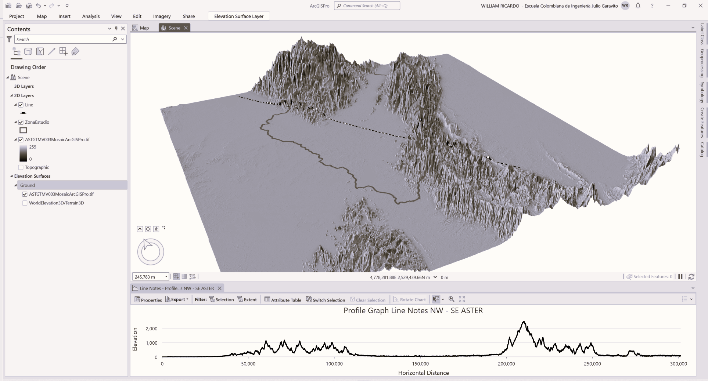

Los sensores remotos japoneses Advanced Spaceborne Thermal Emission and Reflection Radiometer o ASTER, proveen imágenes de alta resolución del Planeta Tierra y las capturas están compuestas por 14 diferentes bandas del espectro electromagnético en el rango visible de la luz termal infrarroja. Las imágenes son capturadas en resoluciones entre 15 y 90 metros permitiendo crear mapas detallados de la temperatura y elevación de la tierra en celdas o píxeles con variaciones cada 1 metro.

A partir del segundo semestre de 2019, los modelos de terreno ASTER GDEM v2 han sido reemplazados por la versión 3 integrada de todo el mundo, como novedad, la versión 3 no presenta problemas de sobre-elevaciones debidas a nubes.

<div align="center"><br><a href="http://www.youtube.com/watch?feature=player_embedded&v=41cqQdkuOto" target="_blank"></a><sub><br>Playlist: https://www.youtube.com/playlist?list=PLneiG4vC_8YupZFL2DtUEdcgtXyWT7Apt</sub><br><br></div>


### Objetivos

* Descargar manualmente imágenes de terreno para la zona de estudio.
* Descargar masivamente imágenes desde la consola Cygwin a través del script downloadASTER.sh.
* Cargar y visualizar imágenes satelitales en herramientas SIG.
* Crear y reproyectar el mosaico de terreno a partir de las imágenes individuales obtenidas.
* Visualizar perfiles de elevación.
* Crear representaciones 3D.
* Crear mapas de sombreado de colinas - Hillshade

> La resolución aproximada de los modelos digitales de elevación ASTER versión 3 obtenidos desde el servicio NASA Earthdata es de 30 metros.


### Requerimientos

* [ArcGIS for Desktop 10+](https://desktop.arcgis.com/es/desktop/) (opcional)
* [ArcGIS Pro 2+](https://pro.arcgis.com/en/pro-app/latest/get-started/download-arcgis-pro.htm) (opcional)
* [QGIS 3+](https://qgis.org/) (opcional)
* QGIS plugin: [Profile tool](https://plugins.qgis.org/plugins/profiletool/)
* QGIS plugin: [QGis2threejs](https://plugins.qgis.org/plugins/Qgis2threejs/)
* [Cygwin terminal for Windows](https://www.cygwin.com/)
* Cuenta de usuario [NASA Eathdata](../UserCreation).
* [Polígono envolvente que delimita la zona de estudio. ](../../.shp/ZonaEstudioEnvelope.zip)[:mortar_board:Aprender.](../../Section01/CaseStudy)


### Diagrama general de procesos

El siguiente diagrama representa los procesos generales requeridos para el desarrollo de esta actividad.

<div align="center">
<br><br>
<sub>Convenciones generales en diagramas: clases de entidad en azul, dataset en gris oscuro, grillas en color verde, geo-procesos en rojo, procesos automáticos o semiautomáticos en guiones rojos y procesos manuales en amarillo. Líneas conectoras con guiones corresponden a procedimientos opcionales.</sub><br><br>
</div>


### Procedimiento de descarga

1. Ingresar al servicio web de la NASA: https://search.earthdata.nasa.gov y dar clic en Earthdata login.

> Realizar el ingreso de usuario usando _LOG IN_ o realizar el registro de nuevo usuario dando clic en _REGISTER_ [(ver instrucciones detalladas.)](../UserCreation)

2. Delimitar en la vista satelital la extensión de la zona a descargar, para ello podrá utilizar diferentes métodos como:

| Método    | Descripción                                                                                                                                                                                                            |
|-----------|------------------------------------------------------------------------------------------------------------------------------------------------------------------------------------------------------------------------|
| Polygon   | Acercarse a la zona requerida y mediante clics definir un polígono de delimitación.                                                                                                                                    |
| Rectangle | Cree un rectángulo especificando las esquinas SW y NE en valores de latitud y longitud en grados decimales, p. ej. para el Departamento del Cesar en Colombia deberá ingresar SW: 7,-75 NE: 11,-72.                    |
| Point     | Coordenada de un punto indicando la latitud y longitud en grados decimales referenciados en el sistema de proyección de coordenadas WGS84 o dando clic en pantalla.                                                    |
| Circle    | Circunferencia especificando un punto central y el radio de aferencia. En pantalla se puede realizar manualmente localizando el puntero cerca a la localización requerida y clic definiendo manualmente el radio.      |
| File      | Permite seleccionar un archivo comprimido .zip que contenga el o los polígonos que delimiten la zona de estudio. Los formatos admisibles son ESRI Shapefile, Keyhole Markup Languaje (.kml or .kmz), GeoJSON y GeoRSS. |

> Para búsquedas a partir de la opción rectangle especificando las coordenadas, p. ej. SW: 7,-75 NE: 11,-72 se resta internamente 0.1 grados alrededor del rectángulo SW: 7.1,-74.9 NE: 10.9,-72.1. Lo anterior para seleccionar únicamente las cuadrículas internas.

Para el caso de estudio, utilizaremos el método _File_ para definir la máscara de selección de elementos a descargar.

Desde la carpeta _.shp_ contenida en _D:\R.LTWB_, seleccione y comprima en formato .zip los archivos _ZonaEstudioEnvelope.dbf, ZonaEstudioEnvelope.prj, ZonaEstudioEnvelope.shp_ y _ZonaEstudioEnvelope.shx_ que conforman el Shapefile del polígono envolvente de la zona de estudio. El archivo comprimido [ZonaEstudioEnvelope.zip](../../.shp/ZonaEstudioEnvelope.zip) tendrá embebido el sistema de coordenadas geográfico GCS_MAGNA que podrá ser interpretado directamente por Earthdata.

> Para archivos de formas que utilicen un sistema de coordenadas proyectado, será necesario crear un mapa nuevo en blanco en ArcGIS o QGIS, asignar el sistema de proyección de coordenadas geográfico WGS84 correspondiente al EPSG 4326, cargar y exportar la capa ZonaEstudioEnvelope.shp utilizando el sistema de coordenadas del proyecto, nombrando el archivo exportado como ZonaEstudioEnvelopeWGS84.shp

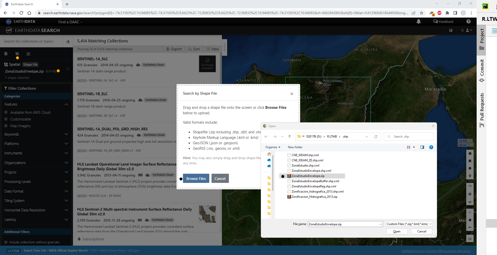

3. En la casilla de búsqueda ingresar **ASTER Global Digital Elevation Model V003**. Para la zona de estudio, es necesario descargar 9 cuadrículas.

Como puede observar, las cuadrículas son ortogonales y no contienen traslapos debido a que corresponde a un modelo ya procesado y recortado. Para la zona de estudio, la información del modelo digital de elevación ha sido obtenida, procesada e integrada desde 2000.03.01 hasta 2013.11.30.

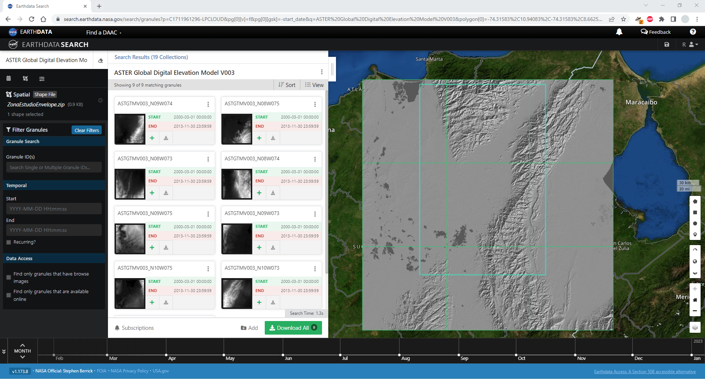

> Cada archivo o cuadrante seleccionado será uno de los 22600 cuadrantes de la superficie terrestre que han sido divididos en grados de 1º x 1º que aproximadamente cubren 111.11 km x 111.11 km de superficie.

4. Verifique en el mapa de previsualización que las celdas solicitadas corresponden al polígono de la zona de estudio y de clic en la opción de descarga de datos _Download All_. Seleccione _Direct Download_ para obtener los 9 archivos requeridos que tienen un peso aproximado de 213.1 MB y de clic en _Done_ y _Download Data_.

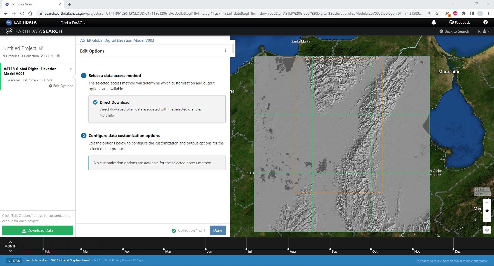

En la ventana de descarga de clic derecho y seleccione la opción _Open link in new tab_ en los archivos _dem.tif correspondientes a los archivos GeoTIFF del modelo digital de elevación. 

> Los archivos _*num.tif corresponden a validación y marcación de celdas ajustadas y no son requeridos para el ensamble del mosaico del modelo digital de elevación.

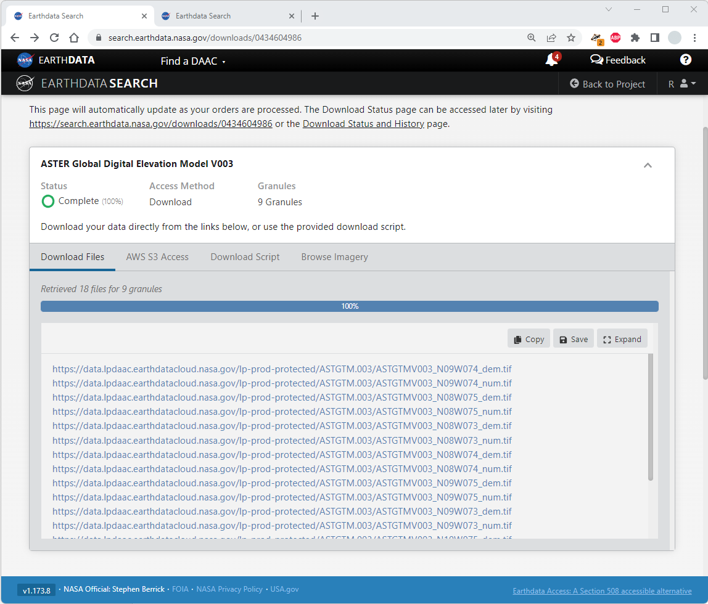

Listado de enlaces obtenidos  
* https://data.lpdaac.earthdatacloud.nasa.gov/lp-prod-protected/ASTGTM.003/ASTGTMV003_N09W074_dem.tif
* https://data.lpdaac.earthdatacloud.nasa.gov/lp-prod-protected/ASTGTM.003/ASTGTMV003_N09W074_num.tif
* https://data.lpdaac.earthdatacloud.nasa.gov/lp-prod-protected/ASTGTM.003/ASTGTMV003_N08W075_dem.tif
* https://data.lpdaac.earthdatacloud.nasa.gov/lp-prod-protected/ASTGTM.003/ASTGTMV003_N08W075_num.tif
* https://data.lpdaac.earthdatacloud.nasa.gov/lp-prod-protected/ASTGTM.003/ASTGTMV003_N08W073_dem.tif
* https://data.lpdaac.earthdatacloud.nasa.gov/lp-prod-protected/ASTGTM.003/ASTGTMV003_N08W073_num.tif
* https://data.lpdaac.earthdatacloud.nasa.gov/lp-prod-protected/ASTGTM.003/ASTGTMV003_N08W074_dem.tif
* https://data.lpdaac.earthdatacloud.nasa.gov/lp-prod-protected/ASTGTM.003/ASTGTMV003_N08W074_num.tif
* https://data.lpdaac.earthdatacloud.nasa.gov/lp-prod-protected/ASTGTM.003/ASTGTMV003_N09W075_dem.tif
* https://data.lpdaac.earthdatacloud.nasa.gov/lp-prod-protected/ASTGTM.003/ASTGTMV003_N09W075_num.tif
* https://data.lpdaac.earthdatacloud.nasa.gov/lp-prod-protected/ASTGTM.003/ASTGTMV003_N09W073_dem.tif
* https://data.lpdaac.earthdatacloud.nasa.gov/lp-prod-protected/ASTGTM.003/ASTGTMV003_N09W073_num.tif
* https://data.lpdaac.earthdatacloud.nasa.gov/lp-prod-protected/ASTGTM.003/ASTGTMV003_N10W075_dem.tif
* https://data.lpdaac.earthdatacloud.nasa.gov/lp-prod-protected/ASTGTM.003/ASTGTMV003_N10W075_num.tif
* https://data.lpdaac.earthdatacloud.nasa.gov/lp-prod-protected/ASTGTM.003/ASTGTMV003_N10W073_dem.tif
* https://data.lpdaac.earthdatacloud.nasa.gov/lp-prod-protected/ASTGTM.003/ASTGTMV003_N10W073_num.tif
* https://data.lpdaac.earthdatacloud.nasa.gov/lp-prod-protected/ASTGTM.003/ASTGTMV003_N10W074_dem.tif
* https://data.lpdaac.earthdatacloud.nasa.gov/lp-prod-protected/ASTGTM.003/ASTGTMV003_N10W074_num.tif

Copie los archivos con terminación _dem.tif_ en la carpeta _.dem/ASTER_ del directorio _D:\R.LTWB_

> Tenga en cuenta que las imágenes obtenidas utilizan el sistema de referencia espacial geográfico GCS_WGS_1984 y que las elevaciones de cada celda o pixel corresponden a valores enteros en metros.

5. Descarga mediante shell script .sh con Cygwin [^1]

Con el propósito de realizar la descarga desde la consola de comandos a través de un script .sh, renombre la carpeta que contiene los archivos descargados manualmente desde Earthdata de .dem/ASTER a .dem/ASTER1 y cree una carpeta nueva vacía con el nombre .dem/ASTER.

> Earthdata directions for Linux: You must first make the script an executable by running the line 'chmod 777 download.sh' from the command line. After that is complete, the file can be executed by typing './download.sh'. For a detailed walk through of this process, please reference this How To guide.

> Earthdata directions for Windows: The file can be executed within Windows by first installing a Unix-like command line utility such as Cygwin. After installing Cygwin (or a similar utility), run the line 'chmod 777 download.sh' from the utility's command line, and then execute by typing './download.sh'.

Desde https://www.cygwin.com/, descargue e instale _Cygwin_ para Windows en la ruta _C:\cygwin64_ y ejecute la aplicación _Cygwin64 Terminal_ e ingrese los siguientes comandos:

* `chmod 777 'D:/R.LTWB/.src/downloadASTER.sh'` para establecer los permisos de lectura, escritura y ejecución por cualquier usuario con acceso a la consola y al archivo.
* `cd 'D:/R.LTWB/.dem/ASTER'` para ingresar al directorio ASTER de modelos digitales de elevación.
* `ls` para listar el contenido del directorio. Podrá observar que no existen archivos GeoTiFF correspondientes al modelo de terreno ni archivos de cookies.
* `'D:/R.LTWB/.src/downloadASTER.sh'` para ejecutar _download.sh_ y obtener los archivos del modelo de terreno y almacenarlos en el directorio _.dem/ASTER_

En la consola deberá ingresar su nombre de usuario y contraseña Earthdata para iniciar la descarga.

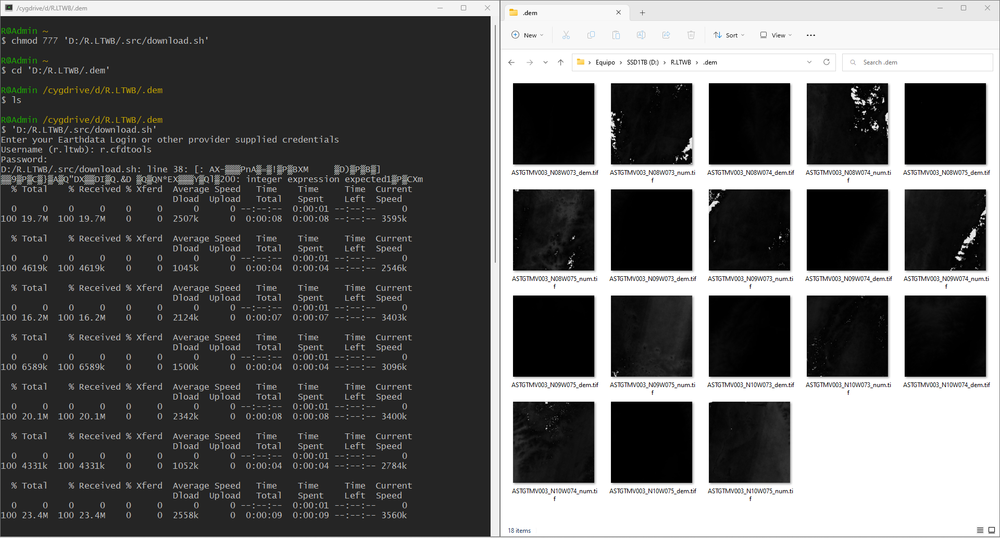

Al finalizar la ejecución ejecute nuevamente el comando `ls` para listar los archivos descargados o verifique manualmente el directorio de descarga _.dem/ASTER_

Shell script [donwloadASTER.sh](../../.src/downloadASTER.sh) de Earthdata
```
#!/bin/bash

GREP_OPTIONS=''

cookiejar=$(mktemp cookies.XXX) #Original was XXXXXXXXXX
netrc=$(mktemp netrc.XXX)
chmod 0600 "$cookiejar" "$netrc"
function finish {
  rm -rf "$cookiejar" "$netrc"
}

trap finish EXIT
WGETRC="$wgetrc"

prompt_credentials() {
    echo "Enter your Earthdata Login or other provider supplied credentials"
    read -p "Username (r.ltwb): " username
    username=${username:-r.ltwb}
    read -s -p "Password: " password
    echo "machine urs.earthdata.nasa.gov login $username password $password" >> $netrc
    echo
}

exit_with_error() {
    echo
    echo "Unable to Retrieve Data"
    echo
    echo $1
    echo
    echo "https://data.lpdaac.earthdatacloud.nasa.gov/lp-prod-protected/ASTGTM.003/ASTGTMV003_N09W074_dem.tif"
    echo
    exit 1
}

prompt_credentials
  detect_app_approval() {
    approved=`curl -s -b "$cookiejar" -c "$cookiejar" -L --max-redirs 5 --netrc-file "$netrc" https://data.lpdaac.earthdatacloud.nasa.gov/lp-prod-protected/ASTGTM.003/ASTGTMV003_N09W074_dem.tif -w %{http_code} | tail  -1`
    if [ "$approved" -ne "302" ]; then
        # User didn't approve the app. Direct users to approve the app in URS
        exit_with_error "Please ensure that you have authorized the remote application by visiting the link below "
    fi
}

setup_auth_curl() {
    # Firstly, check if it require URS authentication
    status=$(curl -s -z "$(date)" -w %{http_code} https://data.lpdaac.earthdatacloud.nasa.gov/lp-prod-protected/ASTGTM.003/ASTGTMV003_N09W074_dem.tif | tail -1)
    if [[ "$status" -ne "200" && "$status" -ne "304" ]]; then
        # URS authentication is required. Now further check if the application/remote service is approved.
        detect_app_approval
    fi
}

setup_auth_wget() {
    # The safest way to auth via curl is netrc. Note: there's no checking or feedback
    # if login is unsuccessful
    touch ~/.netrc
    chmod 0600 ~/.netrc
    credentials=$(grep 'machine urs.earthdata.nasa.gov' ~/.netrc)
    if [ -z "$credentials" ]; then
        cat "$netrc" >> ~/.netrc
    fi
}

fetch_urls() {
  if command -v curl >/dev/null 2>&1; then
      setup_auth_curl
      while read -r line; do
        # Get everything after the last '/'
        filename="${line##*/}"

        # Strip everything after '?'
        stripped_query_params="${filename%%\?*}"

        curl -f -b "$cookiejar" -c "$cookiejar" -L --netrc-file "$netrc" -g -o $stripped_query_params -- $line && echo || exit_with_error "Command failed with error. Please retrieve the data manually."
      done;
  elif command -v wget >/dev/null 2>&1; then
      # We can't use wget to poke provider server to get info whether or not URS was integrated without download at least one of the files.
      echo
      echo "WARNING: Can't find curl, use wget instead."
      echo "WARNING: Script may not correctly identify Earthdata Login integrations."
      echo
      setup_auth_wget
      while read -r line; do
        # Get everything after the last '/'
        filename="${line##*/}"

        # Strip everything after '?'
        stripped_query_params="${filename%%\?*}"

        wget --load-cookies "$cookiejar" --save-cookies "$cookiejar" --output-document $stripped_query_params --keep-session-cookies -- $line && echo || exit_with_error "Command failed with error. Please retrieve the data manually."
      done;
  else
      exit_with_error "Error: Could not find a command-line downloader.  Please install curl or wget"
  fi
}

fetch_urls <<'EDSCEOF'
https://data.lpdaac.earthdatacloud.nasa.gov/lp-prod-protected/ASTGTM.003/ASTGTMV003_N09W074_dem.tif
https://data.lpdaac.earthdatacloud.nasa.gov/lp-prod-protected/ASTGTM.003/ASTGTMV003_N09W074_num.tif
https://data.lpdaac.earthdatacloud.nasa.gov/lp-prod-protected/ASTGTM.003/ASTGTMV003_N08W075_dem.tif
https://data.lpdaac.earthdatacloud.nasa.gov/lp-prod-protected/ASTGTM.003/ASTGTMV003_N08W075_num.tif
https://data.lpdaac.earthdatacloud.nasa.gov/lp-prod-protected/ASTGTM.003/ASTGTMV003_N08W073_dem.tif
https://data.lpdaac.earthdatacloud.nasa.gov/lp-prod-protected/ASTGTM.003/ASTGTMV003_N08W073_num.tif
https://data.lpdaac.earthdatacloud.nasa.gov/lp-prod-protected/ASTGTM.003/ASTGTMV003_N08W074_dem.tif
https://data.lpdaac.earthdatacloud.nasa.gov/lp-prod-protected/ASTGTM.003/ASTGTMV003_N08W074_num.tif
https://data.lpdaac.earthdatacloud.nasa.gov/lp-prod-protected/ASTGTM.003/ASTGTMV003_N09W075_dem.tif
https://data.lpdaac.earthdatacloud.nasa.gov/lp-prod-protected/ASTGTM.003/ASTGTMV003_N09W075_num.tif
https://data.lpdaac.earthdatacloud.nasa.gov/lp-prod-protected/ASTGTM.003/ASTGTMV003_N09W073_dem.tif
https://data.lpdaac.earthdatacloud.nasa.gov/lp-prod-protected/ASTGTM.003/ASTGTMV003_N09W073_num.tif
https://data.lpdaac.earthdatacloud.nasa.gov/lp-prod-protected/ASTGTM.003/ASTGTMV003_N10W075_dem.tif
https://data.lpdaac.earthdatacloud.nasa.gov/lp-prod-protected/ASTGTM.003/ASTGTMV003_N10W075_num.tif
https://data.lpdaac.earthdatacloud.nasa.gov/lp-prod-protected/ASTGTM.003/ASTGTMV003_N10W073_dem.tif
https://data.lpdaac.earthdatacloud.nasa.gov/lp-prod-protected/ASTGTM.003/ASTGTMV003_N10W073_num.tif
https://data.lpdaac.earthdatacloud.nasa.gov/lp-prod-protected/ASTGTM.003/ASTGTMV003_N10W074_dem.tif
https://data.lpdaac.earthdatacloud.nasa.gov/lp-prod-protected/ASTGTM.003/ASTGTMV003_N10W074_num.tif
EDSCEOF
```
> Modificando el listado de hiperenlaces contenido al final del script download.sh en la sección _fetch_urls_, podrá ingresar los cuadrantes requeridos para cualquier zona del mundo y realizar la descarga masiva de estos archivos.


### Creación y reproyección de mosaicos, visualización y representación 3D

Luego de los procesos de obtención de las imágenes satelitales, es necesaria la construcción de un mosaico único a partir de las imágenes individuales obtenidas para cada modelo de terreno. El balance hidrológico de largo plazo podrá ser realizado utilizando diferentes modelos de terreno y permitirá comparar la oferta hídrica obtenida utilizando diferentes superficies.

#### Instrucciones en ArcGIS for Desktop (10.2.2)

1. Abra el mapa _R.LTWB.mxd_ creado en la definición del [Caso de Estudio](../../Section01/CaseStudy) localizado en la carpeta _.map_ y agregue las 9 imágenes del modelo de elevación ASTER v3 y agrupe como _DEM ASTER v3_. Verifique que el sistema de proyección de coordenadas del mapa esté establecido como MAGNA_Colombia_CTM12. Desde las propiedades de cualquier imagen verifique su resolución, podrá observar que corresponde a 0.00027777778 x 0.00027777778 grados decimales debido a que el Datum es D_WGS_1984. 

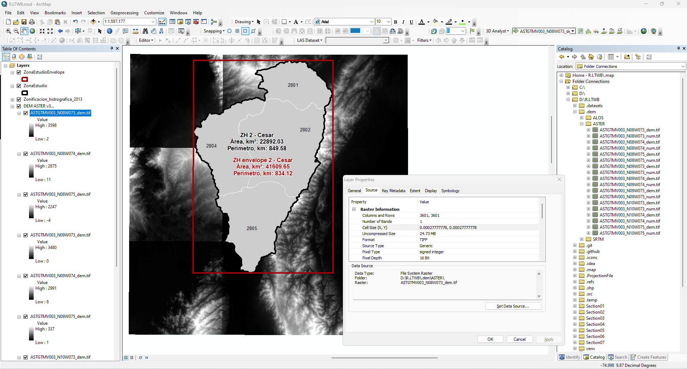

2. Utilizando la herramienta _ArcToolBox / Data Management Tools / Raster / Raster Dataset / Mosaic to New Raster_, cree el mosaico de terreno a partir de las 9 imágenes, seleccionando y arrastrando las imágenes desde la tabla de contenido hacia la herramienta de mosaico, establezca los siguientes parámetros:

* Output Location: D:\R.LTWB\.dem\ASTER
* Raster Dataset Name with Extension: ASTGTMV003Mosaic.tif
* Spatial Reference for Raster (optional): MAGNA_Colombia_CTM12
* Pixel Type: 32_BIT_FLOAT (para conservar valores numéricos enteros puede utilizar el tipo original 16_BIT)
* Number of Bands: 1

> No es necesario establecer `Cellsize` debido a que el valor equivalente en metros será recalculado automáticamente a partir de la resolución original de las imágenes. Por tratarse de imágenes sin superposición, no es necesario modificar el operador y el modo de color del mosaico resultante.

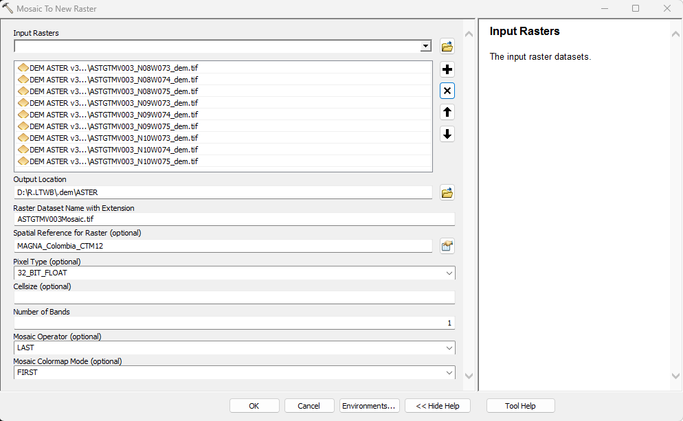

Una vez finalice el ensamble del mosaico, este será cargado automáticamente al proyecto. Verifique que la imagen resultante utilice el sistema de referencia espacial MAGNA_Colombia_CTM12 y que la resolución de las celdas se encuentre en metros con valores aproximados de 30.68464585 x 30.68464585 metros. Para el mosaico creado, los valores de elevación se encuentran entre el rango de -84 a 5687 m.s.n.m.

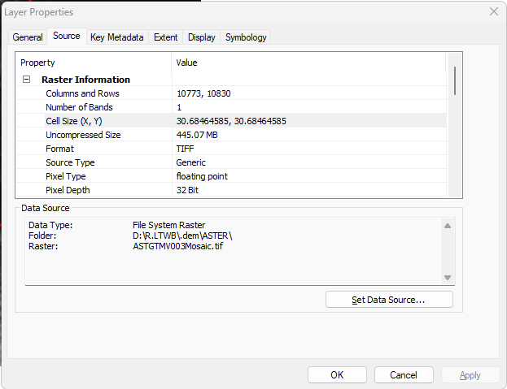

> Debido a que el tamaño del archivo de mosaico es superior a 100 MB, se han creado en GitHub dos archivos comprimidos en _.dem/ASTER_ denominados ASTGTMV003Mosaic.part1.rar y ASTGTMV003Mosaic.part2.rar

> El rango de elevaciones de la imagen de mosaico puede no coincidir en la representación con el rango de valores de las imágenes originales, para recalcular los estadísticos de una grilla en _ArcCatalog_ de clic en la imagen y seleccione la opción _Calculate Statistics_.

3. Simbolice el mosaico de terreno de forma ajustada _Stretched_ con efecto de falso sombreado o _Hillshade_ con Z:1 por tipo _Histogram Equalize_ e invirtiendo la rampa de color Negro a blanco. 


4. En el menú _Customize / Toolbars_ active la barra de _3D Analyst_, seleccione el DEM correspondiente al mosaico, cree manualmente una línea interpolada de muestreo en la dirección NW - SE del polígono [ZonaEstudioEnvelope.shp](../../.shp/ZonaEstudioEnvelope.zip) y visualice el gráfico de perfil. Rotule el gráfico de perfil como _Profile Graph NW - SE ASTER v3_

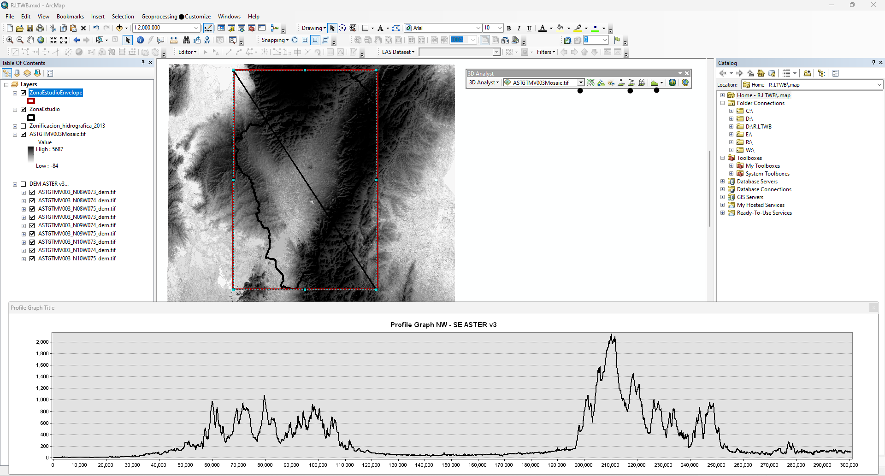

5. En ArcScene, agregue la grilla _ASTGTMV003Mosaic.tif_, simbolice como efecto de falso Hillshade y defina las elevaciones en Z a partir de los valores discretos de los píxeles de la misma grilla y en las propiedades de la escena establezca 20 como exageración vertical. Agregue el archivo de formas de la zona de estudio _[ZonaEstudio.shp](../../.shp/ZonaEstudio.zip)_ y establezca la altura base a partir del DEM. Guarde la escena como _R.LTWB.sxd_ en la carpeta _.map_.

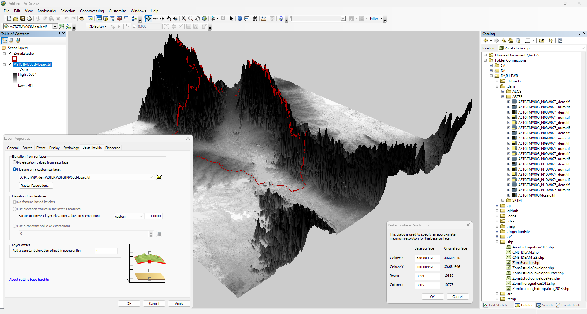


#### Instrucciones en ArcGIS Pro (3.0.0)

1. Abra el mapa _ArcGISPro.aprx_ localizado en la carpeta _.map\ArcGISPro_, agregue las 9 imágenes del modelo de elevación ASTER v3 y agrupe como _DEM ASTER v3_. Verifique que el sistema de proyección de coordenadas del mapa esté establecido con MAGNA_Colombia_CTM12 correspondiente al identificador ESRI 103599.

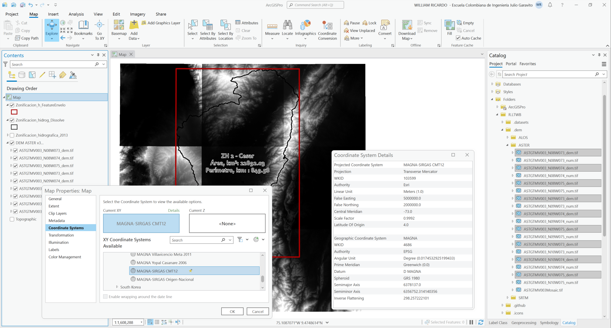

2. Utilizando la herramienta _Mosaic to New Raster_, cree el mosaico a partir de las 9 imágenes independientes seleccionando _Pixel Type_ en _32 bit signed_. Nombre como _ASTGTMV003MosaicArcGISPro.tif_.

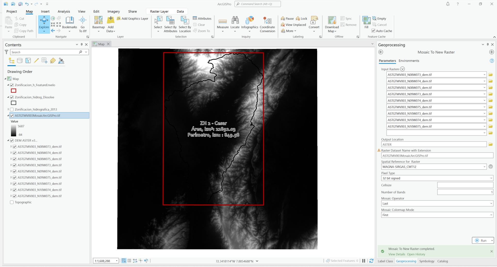

3. Simbolice el mosaico en modo de relieve sombreado o _Shaded Relief_ con _Z Scale Factor en 2_.


4. En el menú _Map_ y en la sección _Layer_, seleccione la opción _Elevation Source Layer_ y establezca el modelo de terreno _ASTGTMV003MosaicArcGISPro.tif_.

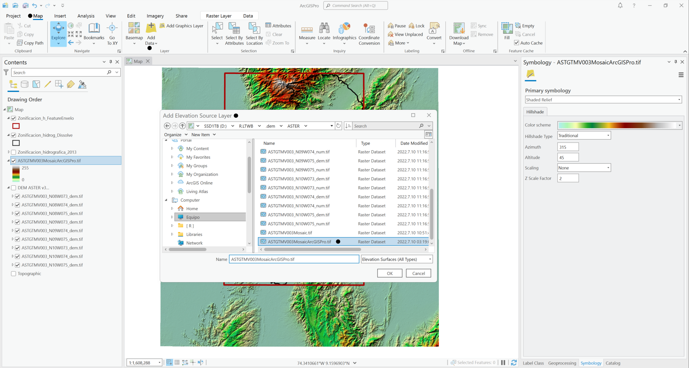

5. Para visualizar perfiles a partir de líneas, en el menú Insert y en la sección Layer Templates, seleccione Line Map Notes. Automáticamente, se cargará una nueva capa denominada _Line Notes_.

Seleccione la capa _Line Notes_, de clic en el menú _Edit_ y establezca en la sección _Elevation Mode - Surface_ y _Ground_.

De clic en _Create_ y en el panel derecho de clic derecho sobre _Line Notes_ y seleccione _Properties_.

En la ventana de propiedades, seleccione en el panel izquierdo _Tools_ y en _Densify Lines_ establezca 30 metros para que al dibujar la línea de muestreo se obtengan valores en cada pixel del MDE. Recuerde que el modelo digital de elevación tiene una resolución aproximada de 30 metros.

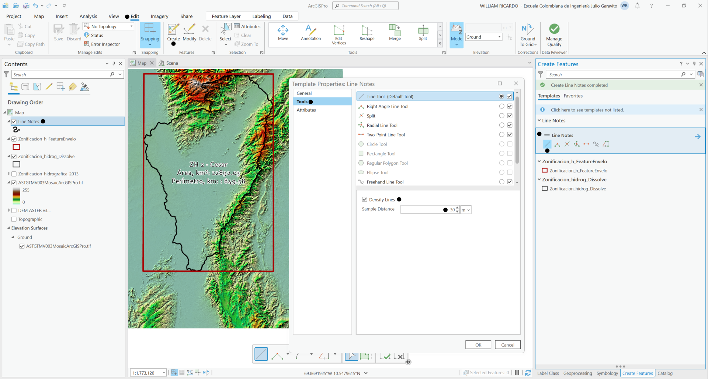

En el panel de creación de entidades, seleccione la opción _Line_ y trace una línea en el sentido NW - SE del recuadro de la zona de estudio. La finalización de la línea de muestreo tomará algunos segundos debido a que corresponde a una línea 3D con múltiples nodos de acuerdo a la distancia de densificación indicada. En el menú _Edit_, de clic en _Save_ para terminar la edición de la capa.

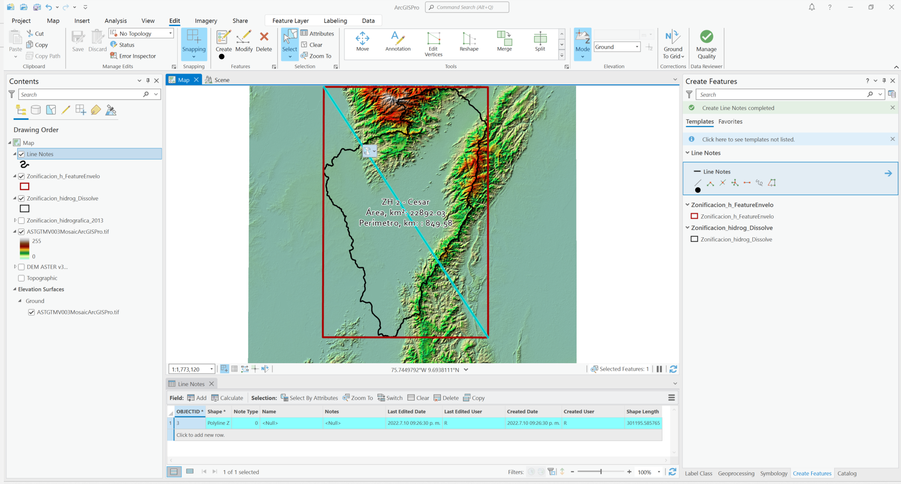

Con la línea seleccionada, en el panel _Contents_ ubicado a la izquierda, de clic derecho sobre la capa _Line Notes_, seleccione la opción _Create Chart - Profile Graph_.

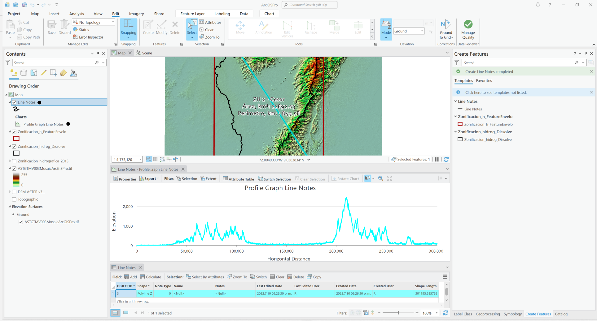

6. Para representación 3D, en el menú _Insert_ y en la sección _Project_, seleccione la opción _New Map_ y agregue una nueva escena local. 

En el menú _Map_ y en la sección _Layer_, seleccione la opción _Elevation Source Layer_ y establezca el modelo de terreno _ASTGTMV003MosaicArcGISPro.tif_ como superficie de la escena.

En la tabla de contenido o _Contents_, seleccione _Ground_ en _Elevation Surfaces_, luego en el menú _Elevation Surface Layer_ ingrese en el panel _Drawing_ un valor de 20 como _Vertical Exaggeration_. 

Rote la escena utilizando clic sostenido de la rueda del mouse. Cambie la simbología primaria del DEM a _Shaded Relief_ y agregue el polígono de la zona de estudio.

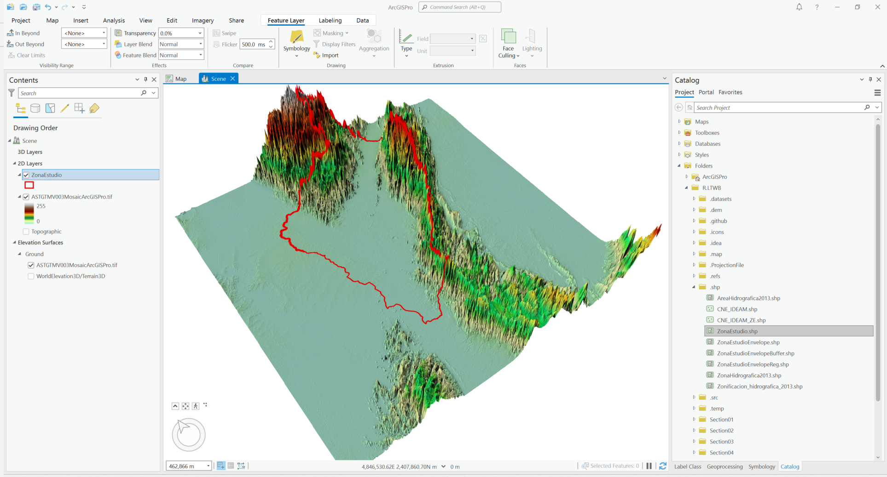


#### Instrucciones en QGIS (3.26.0)

1. Abra el mapa _R.LTWB.qgz_ localizado en la carpeta _.map_ y agregue las 9 imágenes del modelo de elevación ASTER v3. Verifique que el sistema de proyección de coordenadas del mapa esté establecido con MAGNA_Colombia_CTM12 correspondiente al identificador _EPSG: 9377_.

En el cuadro de búsqueda del _Processing Toolbox_ ingrese _Merge_ y seleccione la opción _Merge_ disponible en _Raster miscellaneous_ de _GDAL_. Desde la opción _Input rasters_, seleccione las 9 imágenes cargadas en el mapa, establezca en tipo _Int16_ correspondiente a valores enteros como en las imágenes originales y de clic en Run. No es necesario definir un nombre de archivo de salida en _Merged_ debido a que primero crearemos un archivo temporal denominado _Merged_ que luego podrá ser exportado y reproyectado al sistema de coordenadas requerido.

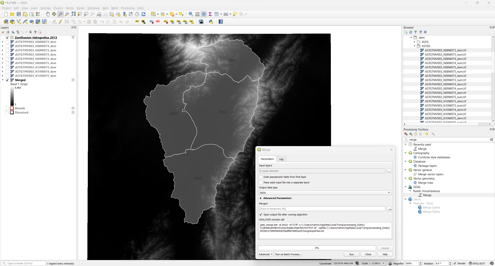

2. Desde el panel _Layers_, de clic derecho en la capa temporal _Merged_ y, exporte en la carpeta _./dem/ASTER_ la imagen de mosaico como _ASTGTMV003MosaicQGIS.tif_ asignando el EPSG 9377.

> En QGIS, el tamaño regular de las celdas originales de 30.68464585 metros obtenido de la conversión de grados a metros por el cambio del sistema de coordenadas no se mantiene, se recomienda ingresar un valor idéntico de resolución horizontal y vertical. Considerar que para el desarrollo del balance hidrológico de largo plazo, el tamaño de las celdas debe ser verificado y establecido en función de los valores obtenidos en la grilla.

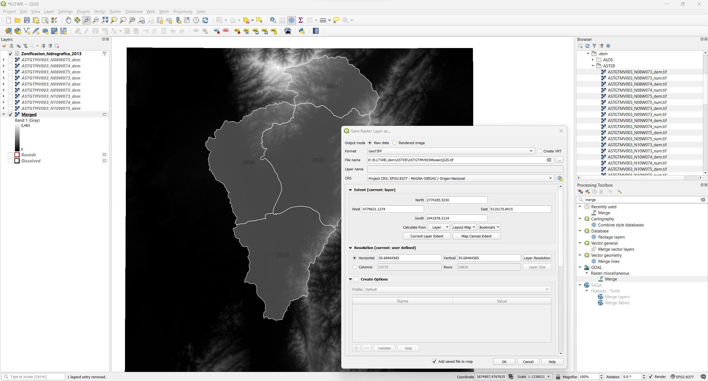

3. Luego de cargar la grilla, podrá observar que el rango de valores de la grilla resultante inicia en cero, lo cual visualmente no es correcto debido a que en las imágenes originales existen valores de -84 metros. Lo anterior debido a que es necesario recalcular los estadísticos de la grilla, para ello utilizar la opción _Raster layer statistics_ disponible en el _Processing Toolbox_ dentro del grupo de herramientas _Raster analysis_. 

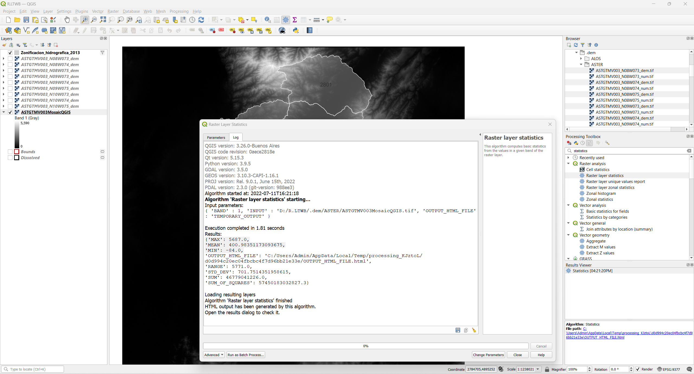

> En QGIS, el tamaño del archivo del mapa grillado Merged puede ser considerable mayor al obtenido mediante ArcGIS.

4. Para la visualización de perfiles de muestreo, en el menú _Plugins_ seleccione _Manage and Install Plugins..._, en la caja de búsqueda ingrese _Profile tool_ e instale esta herramienta.

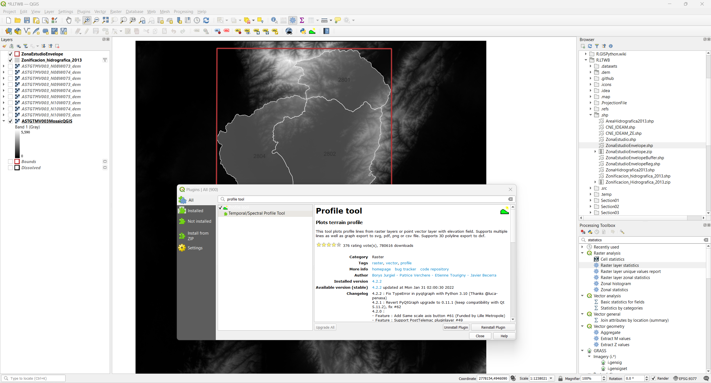

En el panel _Layers_, seleccione el modelo de elevación _ASTGTMV003MosaicQGIS.tif_ y en el _Profile tool_ de clic en _Add Layer_, luego cree una línea temporal en el sentido NW - SE del recuadro de la zona de estudio.

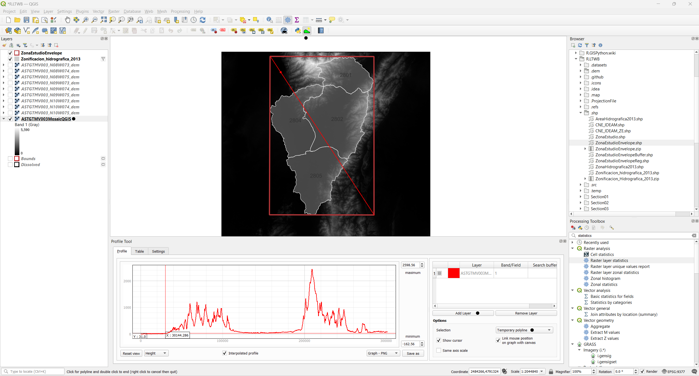

5. Para la representación 3D instale el complemento QGis2threejs.


En el menu _WEB_, seleccione la opción _QGis2threejs Exporter_, active el DEM correspondiente al modelo de terreno _ASTGTMV003MosaicQGIS.tif_, observará que el modelo
3D no permite visualizar las variaciones de la altura. En el menú _Scene_ seleccione _Scene Settings_ y defina _Z exaggereation en 20_.

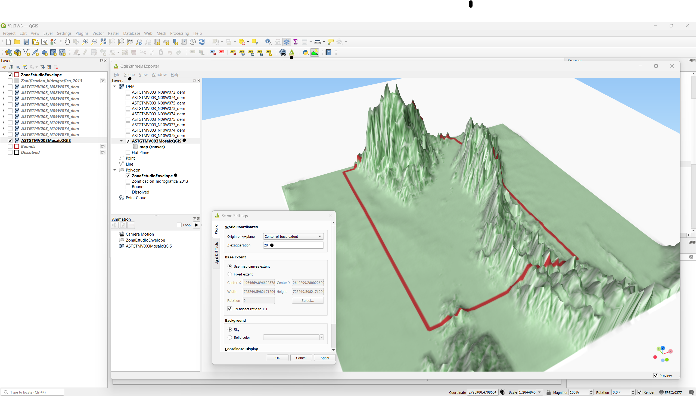

### Sombreado de colinas - Hillshade

A través de la herramienta Hillshade, se crea un mapa de relieve sombreado simplificado teniendo en cuenta el ángulo y altura de la fuente de iluminación, es frecuentemente utilizado para interpretar el relieve del terreno de una forma visualmente clara o como mapa base en la representación espacial de otros fenómenos. Si bien las herramientas SIG disponen de simbologías de representación al vuelo para falso Hillshade, la creación de este mapa es útil debido a que la grilla resultante es ligera de representar y contiene valores discretos enteros de celdas entre 0 y 254 o 0 y 255 dependiendo de la herramienta SIG usada para su creación.

> Para la generación correcta del mapa de sombreado de colinas es necesario que el mapa utilice un sistema de coordenadas proyectado, para el caso de estudio utilizar MAGNA origen único nacional o CTM12.

En ArcGIS for Desktop, el mapa de sombreado puede ser creado con la herramienta _Spatial Analyst_ o _3D Analyst_ / Surface / Hillshade. Los parámetros requeridos son la grilla de mosaico, el azimuth y la altitud de la posición del sol en grados. Nombre el mapa como ASTGTMV003MosaicHillshade.tif

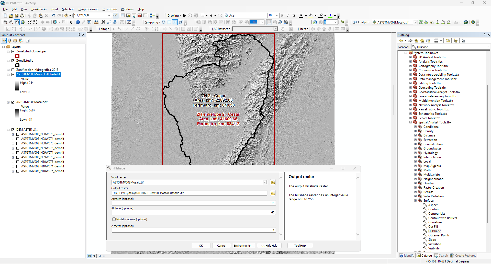

En ArcGIS Pro, el mapa de sombreado puede es creado con la herramienta _Spatial Analyst Tools_ o _3D Analyst_ / Surface / Hillshade. Los parámetros requeridos son los mismos requeridos por ArcGIS for Desktop. Nombre el mapa como ASTGTMV003MosaicArcGISProHillshade.tif

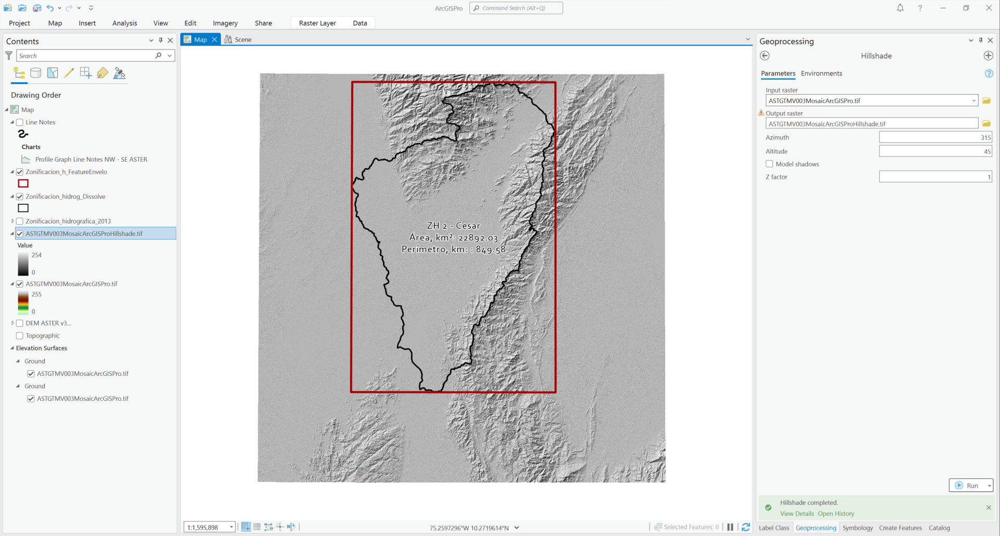

En QGIS, el mapa de sombreado puede es creado con la herramienta _Processing Toolbox / Raster terrain analysis / Hillshade_ o también con GDAL. AL igual que en ArcGIS, los parámetros son el azimut o ángulo horizontal y el ángulo vertical. Generar solo temporalmente y no guardar en disco.

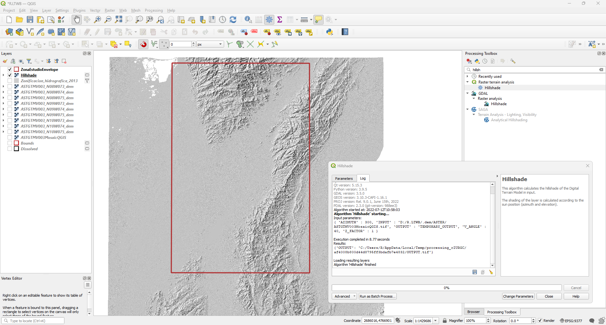

En este momento dispone de grillas integradas de elevación ASTER que cubren toda la zona de estudio y mapas de representación de colinas hillshade. 

<div align="center">

| Aplicación / grilla            | Descargar :open_file_folder:                                                                                                                           |
|:-------------------------------|:-------------------------------------------------------------------------------------------------------------------------------------------------------|
| ArcGIS for Desktop / mosaic    | [part1.rar](../../.dem/ASTER/ASTGTMV003Mosaic.part1.rar), [part2.rar](../../.dem/ASTER/ASTGTMV003Mosaic.part2.rar)                                     |
| ArcGIS for Desktop / hillshade | [part1.rar](../../.dem/ASTER/ASTGTMV003MosaicHillshade.part1.rar), [part2.rar](../../.dem/ASTER/ASTGTMV003MosaicHillshade.part2.rar)                   |
| ArcGIS Pro / mosaic            | [part1.rar](../../.dem/ASTER/ASTGTMV003MosaicArcGISPro.part1.rar), [part2.rar](../../.dem/ASTER/ASTGTMV003MosaicArcGISPro.part2.rar)                   |
| ArcGIS Pro / hillshade         | [part1.rar](../../.dem/ASTER/ASTGTMV003MosaicArcGISProHillshade.part1.rar), [part2.rar](../../.dem/ASTER/ASTGTMV003MosaicArcGISProHillshade.part2.rar) |
| QGIS                           | [.rar](../../.dem/ASTER/ASTGTMV003MosaicQGIS.rar)                                                                                                      |

</div>


### Actividades complementarias:pencil2:

En la siguiente tabla se listan las actividades complementarias que deben ser desarrolladas y documentadas por el estudiante en un único archivo de Adobe Acrobat .pdf. El documento debe incluir portada (mostrar nombre completo, código y enlace a su cuenta de GitHub), numeración de páginas, tabla de contenido, lista de tablas, lista de ilustraciones, introducción, objetivo general, capítulos por cada ítem solicitado, conclusiones y referencias bibliográficas.

| Actividad | Alcance                                                                                            |
|:---------:|:---------------------------------------------------------------------------------------------------|
|     1     | Realice el procedimiento presentado en esta clase en ArcGIS for Desktop, ArcGIS Pro y QGIS.        |
|     2     | Investigue y documente a través de que librerías Python se pueden descargar archivos de EarthData. |
|     3     | Investigue y documente las diferencias entre las versiones 1, 2 y 3 del modelo ASTER GDEM.         |


### Compatibilidad

* Esta actividad puede ser desarrollada con cualquier herramienta SIG que disponga de herramientas de visualización 3D.
* Para la descarga puede utilizar cualquier navegador de Internet actualizado.
* Descargas mediante script pueden ser realizadas en Linux, subsistemas de Linux para Windows o desde terminales emuladoras como Cygwin.


### Referencias

* https://doi.org/10.5067/ASTER/ASTGTM.003
* https://lpdaac.usgs.gov
* https://asterweb.jpl.nasa.gov/
* https://pro.arcgis.com/en/pro-app/2.8/help/mapping/navigation/profile-viewing.htm
* https://pro.arcgis.com/en/pro-app/latest/help/mapping/layer-properties/elevation-surfaces.htm
* https://www.qgistutorials.com/en/docs/3/raster_mosaicing_and_clipping.html
* [Using the Profile Tool plugin in QGIS](https://www.youtube.com/watch?v=UD0Oumv5y1w)
* [ASTER Global Water Bodies Database NetCDF V001](https://search.earthdata.nasa.gov/search/granules?p=C1575734501-LPDAAC_ECS)
* [ASTER Global Digital Elevation Model Attributes NetCDF V003](https://search.earthdata.nasa.gov/search/granules?p=C1575733858-LPDAAC_ECS)
* [ASTER Global Digital Elevation Model NetCDF V003](https://search.earthdata.nasa.gov/search/granules?p=C1575731655-LPDAAC_ECS)
* Montenegro Gambini, Julio. El Modelo Digital Global ASTER GDEM, caracterización y aplicaciones en distintas áreas. Laboratorio Nacional de Hidráulica. Lima, Perú. Abril del 2012.
* https://pro.arcgis.com/en/pro-app/latest/tool-reference/data-management/mosaic-to-new-raster.htm
* https://pro.arcgis.com/en/pro-app/latest/help/analysis/raster-functions/hillshade-function.htm


### Control de versiones

| Versión    | Descripción                                                                                                                       | Autor                                      | Horas |
|------------|:----------------------------------------------------------------------------------------------------------------------------------|--------------------------------------------|:-----:|
| 2023.01.25 | Guión, audio, video, edición y publicación.                                                                                       | [rcfdtools](https://github.com/rcfdtools)  |  2.5  |
| 2022.07.20 | Inclusión de diagrama de procesos.                                                                                                | [rcfdtools](https://github.com/rcfdtools)  |  0.5  |
| 2022.07.12 | Creación de mapa de sombreado de colinas - Hillshade.                                                                             | [rcfdtools](https://github.com/rcfdtools)  |   1   |
| 2022.07.11 | Creación de mosaico, reproyección, visualización y representación 3D - Instrucciones en QGIS.                                     | [rcfdtools](https://github.com/rcfdtools)  |   3   |
| 2022.07.10 | Creación de mosaico, reproyección, visualización y representación 3D - Instrucciones en ArcGIS for Desktop (10.2.2) y ArcGIS Pro. | [rcfdtools](https://github.com/rcfdtools)  |   5   |
| 2022.07.09 | Versión inicial con descarga manual y descarga desde consola utilizando Cygwin y el script download.sh de Earthdata.              | [rcfdtools](https://github.com/rcfdtools)  |  7.5  |


##

_R.LTWB es de uso libre para fines académicos, conoce nuestra licencia, cláusulas, condiciones de uso y como referenciar los contenidos publicados en este repositorio, dando [clic aquí](https://github.com/rcfdtools/R.LTWB/wiki/License)._

_¡Encontraste útil este repositorio!, apoya su difusión marcando este repositorio con una ⭐ o síguenos dando clic en el botón Follow de [rcfdtools](https://github.com/rcfdtools) en GitHub._

| [Anterior](../UserCreation) | [:house: Inicio](../../Readme.md) | [:beginner: Ayuda / Colabora](https://github.com/rcfdtools/R.LTWB/discussions/4) | [Siguiente](../DEMSrtm) |
|-----------------------------|-----------------------------------|----------------------------------------------------------------------------------|-------------------------|

[^1]: Script .sh tomado de la ventana de descarga de https://search.earthdata.nasa.gov/ 

<div align="center"><a href="https://enlace-academico.escuelaing.edu.co/psc/FORMULARIO/EMPLOYEE/SA/c/EC_LOCALIZACION_RE.LC_FRM_ADMEDCO_FL.GBL" target="_blank"></a></div>


##

<div align="center"><a href="http://www.escuelaing.edu.co" target="_blank"></a><sub><br>Este curso guía ha sido desarrollado con el apoyo de la Escuela Colombiana de Ingeniería - Julio Garavito. Encuentra más contenidos en https://github.com/uescuelaing</sub><br><br></div>