## Descarga de GDB nacional del IGAC en escala 1:100.000 y fotorrestitución de redes de drenaje
Keywords: `IGAC` `GDB` `1:100000` `Pairwise-Clip` `Clip` `Polygon-to-Centerline` `Merge` `HCMGIS` `Skeleton-Medial-Axis` `Edit` `Extend`

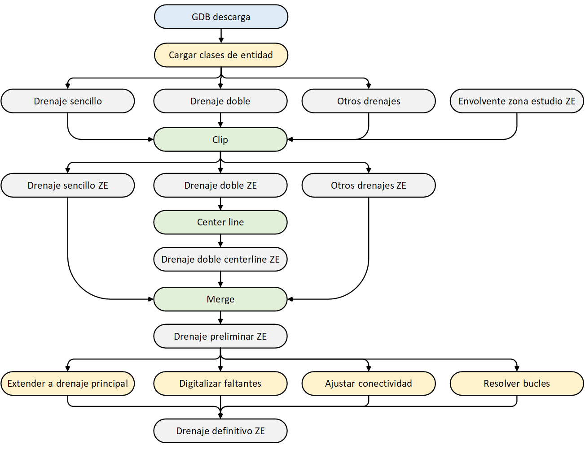

Para los procesos de reacondicionamiento del modelo de terreno que garantice el flujo de todas las celdas del modelo hacia celdas específicas de la red de drenaje, es necesaria la descarga y complementación de las líneas de drenaje pertenecientes a la zona de estudio.

Los drenajes corresponden al flujo de agua superficial que depende de la precipitación pluvial y/o afloramiento de aguas subterráneas y van a desembocar en otra corriente, en una laguna o en el mar. Los drenajes dispersos son aquellos que no desembocan en otro cuerpo de agua, o desaparecen al ser no fotointerpretables, por ejemplo, en corrientes subterráneas.[^1]

 https://www.youtube.com/watch?v=n_fRhFfK6xc Playlist: https://youtube.com/playlist?list=PLZGvAjHkhphDKXvnhkp0oQb22EHWVd0W8  

### Objetivos

* Descargar la GDB IGAC a escala 1:100.000.
* Identificar las redes de drenaje de la zona de estudio.
* Conocer el catálogo de objetos de la clase de entidad Drenaje_Sencillo del IGAC.
* Conocer los subtipos asociados al dominio de estados de drenaje del IGAC.
* Extender los tramos de drenajes sencillos hasta el eje central de drenajes dobles.
* Completar o ajustar las redes de drenaje por ausencia de digitalización, errores de conexión y bucles.

### Requerimientos

* [ArcGIS Pro 2+](https://pro.arcgis.com/en/pro-app/latest/get-started/download-arcgis-pro.htm)
* [ArcGIS for Desktop 10+](https://desktop.arcgis.com/es/desktop/) (opcional)
* [QGIS 3+](https://qgis.org/) (opcional)
* QGIS plugin: [HCMGIS](https://plugins.qgis.org/plugins/HCMGIS/)
* [Polígono envolvente que delimita la zona de estudio. ](../../.shp/ZonaEstudioEnvelope.zip)[:mortar_board:Aprender.](../../Section01/CaseStudy)

### Diagrama general de procesos

Para la obtención de la red de drenaje definitiva que será utilizada para el reacondicionamiento del modelo de terreno necesario para el desarrollo del balance, es necesario descargar los vectores disponibles en la base de datos nacional del IGAC de Colombia, luego recortar los drenajes hasta el límite de la zona de estudio, integrar los drenajes y completar los vectores faltantes como se describe en el siguiente diagrama:

 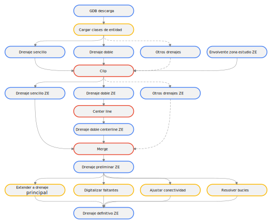 
Convenciones generales en diagramas: clases de entidad en azul, dataset en gris oscuro, grillas en color verde, geo-procesos en rojo, procesos automáticos o semiautomáticos en guiones rojos y procesos manuales en amarillo. Líneas conectoras con guiones corresponden a procedimientos opcionales.  

### Procedimiento general

1. Ingrese al portal https://www.colombiaenmapas.gov.co/, en temática seleccione _Cartografía Básica_ y busque _Base de datos vectorial básica. Colombia. Escala 1:100.000_ del año 2022. En la parte inferior del _Detalle del Servicio_ seleccione en _Formato de descarga Geodatabase_ y de clic en _Descargar_, automáticamente iniciará la descarga a través de una orden de servicio. La GDB comprimida tiene un tamaño aproximado de 665 MB.

> En caso de que el portal indique que requiere de una cuenta de usuario, ingrese al portal, p.ej, con su cuenta de correo de Google.

2. Descomprima la base de datos geográfica en la carpeta de descargas de su equipo, luego, abra el mapa _D:\R.LTWB\.map\R.LTWB.mxd_ de ArcGIS for Desktop o _D:\R.LTWB\.map\ArcGISPro\ArcGISPro.aprx_ de ArcGIS Pro, agregue el mapa base _World Light Gray Canvas Base_ y desde el dataset _Superficies_Agua_, agregue la capa _Drenaje_Sencillo_. Podrá observar que la capa se simboliza automáticamente en drenajes _Permanentes_ e _Intermitentes_ a partir del dominio _Estado_Drenaje_. La versión descargada contiene 426964 entidades para todo el territorio nacional.

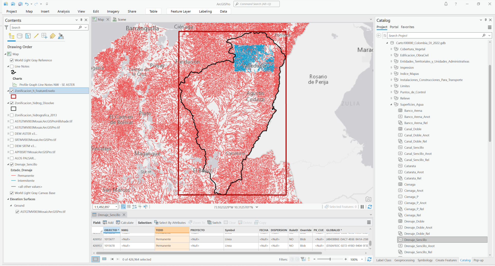

> Tenga en cuenta que los drenajes restituídos pueden no estar actualizados de acuerdo a las condiciones particulares de la zona de estudio evaluada. Se recomienda verificar con imágenes satelitales recientes, la correspondencia entre las redes de drenaje digitalizadas por el IGAC y las redes de drenajes visibles en imágenes. Por ejemplo, en la zona de explotación minera a cielo abierto del Departamento del Cesar en Colombia, los drenajes sobre los polígonos de concesión pueden no corresponder a las condiciones actuales debido a realineamiento de cauces.

3. Utilizando la herramienta de geoprocesamiento _Clip_, recorte la clase de entidad _Drenaje_Sencillo_ y guarde en un archivo de formas en formato Shapefile dentro de la carpeta _.shp_ de _D:\R.LTWB_ con el nombre _[DrenajeSencilloIGAC100kZE.shp](../../.shp/DrenajeSencilloIGAC100kZE.zip)_. Para el recorte, use como máscara el polígono envolvente de la zona de estudio denominado [ZonaEstudioEnvelope.shp](../../.shp/ZonaEstudioEnvelope.zip). La versión recortada contiene 15342 tramos de drenaje dentro de la zona de estudio.

> En ArcGIS Pro puede utilizar también la herramienta _Pairwise Clip_ que contiene funcionalidades extendidas de la herramienta _Clip_.
>
> En QGIS, utilice la herramienta _Processing Toolbox / Vector overlay / Clip_. 

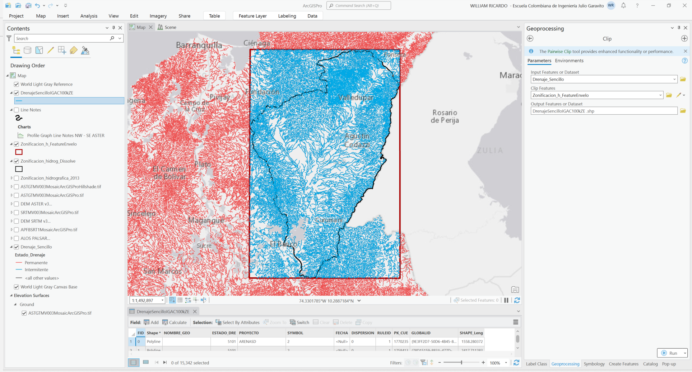

> Para el desarrollo del caso de estudio no se ha utilizado la digitalización de la Base de datos vectorial básica - Colombia a Escala 1:25.000 del año 2018 debido a que aún no se encuentran todas las planchas del país digitalizadas y almacenadas en la GDB disponible para descarga como se muestra en la siguiente imagen.

Información disponible a escala 1:25k

Catálogo de objetos en Drenaje_Sencillo para capa en formato Shapefile

| Nombre      | Alias       | Definición                                                                                          | Tipo de dato           |
|:------------|:------------|:----------------------------------------------------------------------------------------------------|:-----------------------|
| OBJECTID    | OBJECTID    | Identificador único de objeto.                                                                      | Numérico               |
| Shape       | Shape       | Tipo de geometría.                                                                                  | Geometría              |
| ESTADO_DRE  | TEDD        | Indica si el drenaje es permanente o intermitente. Subtipo.                                         | Texto                  |
| SYMBOL      | Symbol      | En este campo se especifica la geometría como se representará el objeto (punto, línea o polígono).  | Numérico y texto, 255  |
| PROYECTO    | PROYECTO    | Proyecto en el cual se desarrollaron los datos.                                                     | Numérico y texto, 255  |
| FECHA       | FECHA       | Fecha de realización de los datos.                                                                  | Dato                   |
| DISPERSION  | Dispersión  | Indica si el drenaje es disperso no no.                                                             | Dato                   |
| NOMBRE_GEO  | NMG         | Nombre de la entidad geográfica.                                                                    | Numérico y texto, 255  |
| PK_CUE      | PK_CUE      | Identificador único global de cada elemento.                                                        | Numérico               |
| RULEID      | RuleID      | Identificador único de la representación.                                                           | Texto                  |
| GLOBALID    | GLOBALID    | Identificador global en la base de datos espacial.                                                  | Texto                  |
| SHAPE_Leng  | SHAPE_Leng  | Longitud del elemento.                                                                              | Numérico               |

Estado de drenajes - Subtipos

| Code               | Description  |
|--------------------|--------------|
| 5101               | Permanente   | 
| 5102               | Intermitente |

4. Desde el dataset _Superficies_Agua_, agregue la capa _Drenaje_Doble_ y con la herramienta _Clip_ realice el recorte hasta el polígono envolvente de la zona de estudio y nombre como _[DrenajeDobleIGAC100kZE.shp](../../.shp/DrenajeDobleIGAC100kZE.zip)_. Para el caso de estudio y la versión descargada hemos obtenido 61 polígonos.

> Los drenajes dobles corresponden a superficies de agua digitalizadas como polígonos y son requeridos para completar la red de drenajes sencillos que será utilizada en el reacondicionamiento del modelo digital de elevación. 

 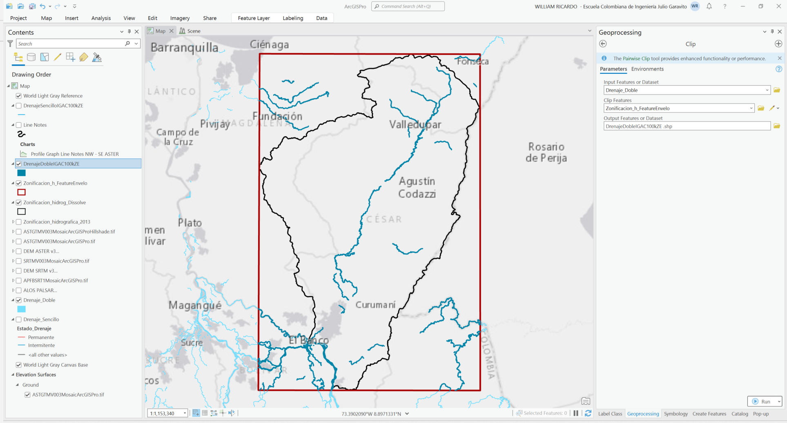

5. A partir de los polígonos de los drenajes dobles y utilizando la herramienta de geoprocesamiento _Topographic Production Tools / Polygon to Centerline_ de ArcGIS Pro, cree las líneas centrales que demarcan cada drenaje sencillo y nombre la capa resultante como _DrenajeDobleIGAC100kZECenterline_ dentro de la GDB de ArcGIS Pro y seleccione en _Connecting Features_ la capa correspondiente a los drenajes sencillos de la zona de estudio, denominada previamente como _[DrenajeSencilloIGAC100kZE.shp](../../.shp/DrenajeSencilloIGAC100kZE.zip)_ para obtener líneas conectoras desde los drenajes sencillos hasta las líneas centrales.

> Debido a que internamente esta herramienta debe crear campos de atributos que contienen los nombres de las capas de entrada, los nombres de atributos pueden contener más de 10 caracteres, lo que generará un error de ejecución. Para obtener las líneas centrales, primero genere una capa geográfica de líneas centrales en la GDB de ArcGIS Pro y luego exporte a un archivo de formas shapefile.
>
> Para conocer como realizar este procedimiento en ArcGIS for Desktop, [clic aquí](https://support.esri.com/en/technical-article/000012414). El procedimiento consiste en convertir primero los polígonos a líneas utilizando la herramienta _ArcToolBox / Data Management Tools / Features / Polygon to Line_, luego eliminar los extremos que confinan cada polígono y finalmente con la herramienta _ArcToolBox / Cartography Tools / Generalization / Collapse Dual Lines To Centerline_ obtener una line central a lo largo de las líneas paralelas externas que delimitan cada drenaje doble.

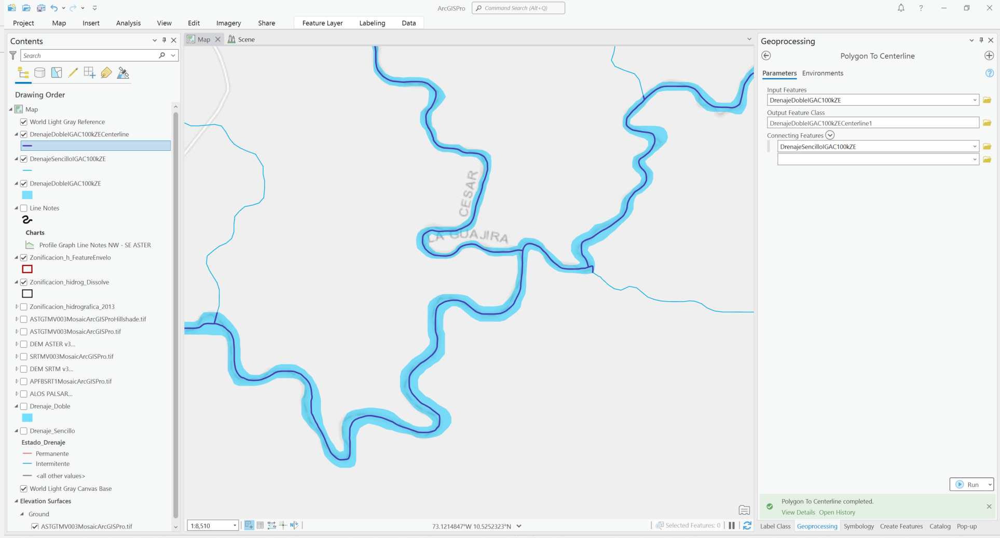

> Para la obtención de líneas centrales en QGIS, instale el plugin _HCMGIS_, seleccione el drenaje doble y desde la barra de menús despliegue las opciones de _HCMGIS / Geometry Processing / Skeleton Medial Axis_. 

6. Exporte la clase de entidad de líneas centrales de drenajes dobles a un archivo shapefile dentro de la carpeta _.shp_ nombrándolo como _[DrenajeDobleIGAC100kZECenterline.shp](../../.shp/DrenajeDobleIGAC100kZECenterline.zip)_, verifique que las líneas conectoras desde los drenajes sencillos hasta la línea central se encuentren a lo largo de toda la red. Podrá observar que no todas las conexiones laterales a los cuerpos dobles han sido trazadas.

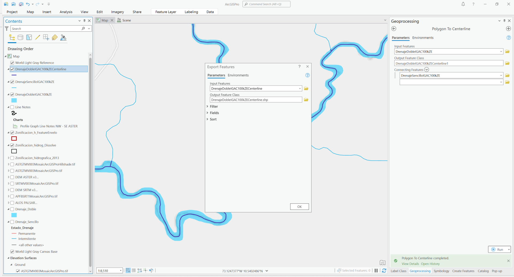

7. Realice la unión de la capa de drenajes sencillos y las líneas centrales obtenidas de polígonos de los drenajes dobles en una nueva capa geográfica, para ello utilice la herramienta de geoprocesamiento _Data Management Tools / Merge_ y nombre la capa como _[DrenajeSencilloIGAC100kZEMerge.shp](../../.shp/DrenajeSencilloIGAC100kZEMerge.zip)_.

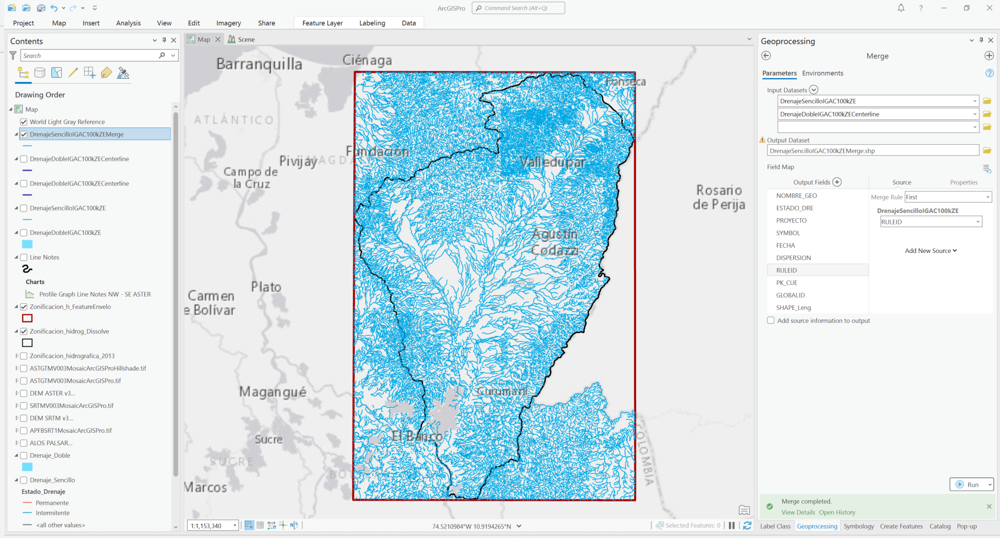

> En ArcGIS for Desktop utilice la herramienta _Merge_ disponible en el menú _Geoprocessing_.
>
> En QGIS utilice la herramienta _Processing Toolbox / Vector general / Merge vector layers_. 

En la base de datos geográfica del IGAC pueden existir elementos adicionales como canales sencillos, canales dobles, madreviejas y raudales rápidos que pueden ser o no incorporados a la red de drenaje. Para el caso de estudio no incluiremos estos vectores debido a que p. ej. como en el caso de los canales sencillos, intersecan transversalmente varios drenajes.

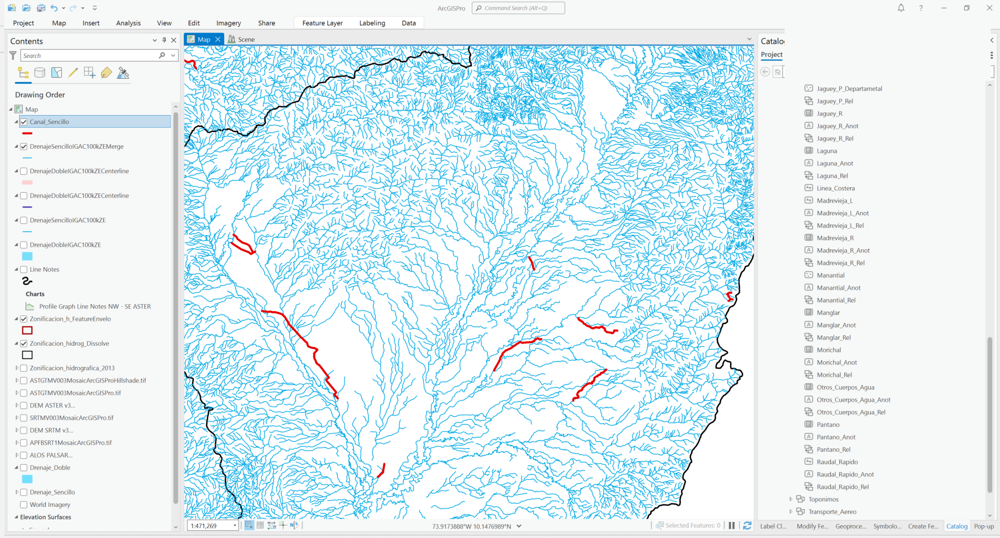

8. Utilizando el editor geográfico de ArcGIS Pro, ArcGIS for Desktop o QGIS, conecte o extienda manualmente las líneas de drenajes sencillos hasta el eje central de los drenajes dobles. 

> La extensión y conectividad de los tramos de drenajes sencillos hasta el eje central de los tramos de drenajes dobles es vital para garantizar que la acumulación de flujo por los cauces principales se realice de forma correcta. 

En la tabla de contenido de clic en _List By Selection_ y únicamente active la capa _DrenajeSencilloIGAC100kZEMerge.shp_. Para facilitar la edición, en la visualización, utilice como referencia de localización los tramos principales de la capa _DrenajeDobleIGAC100kZECenterline.shp_ 

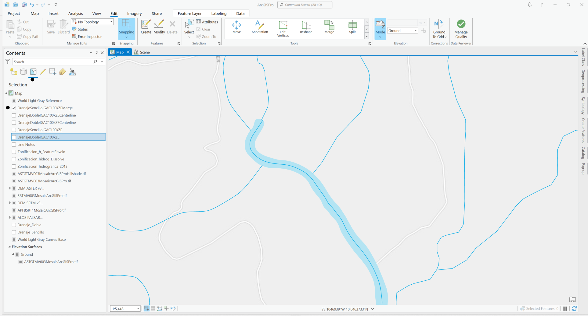

En ArcGIS Pro, seleccione en la tabla de contenidos o _Contents_ la capa _DrenajeSencilloIGAC100kZEMerge.shp_ y en el Menú _Edit_ de clic en _Modify_ y seleccione la opción _Extend or Trim_. 

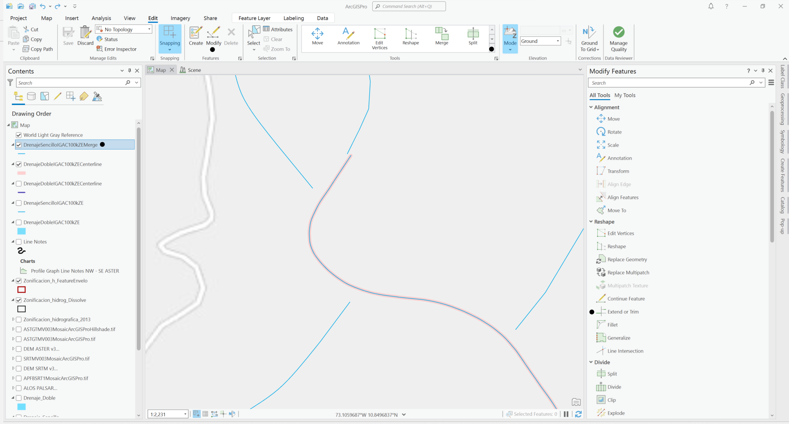

Extienda una a una las líneas laterales hasta el drenaje principal y conecte manualmente los tramos iniciales a través de la edición de los vértices. Rotule la capa utilizando el campo _NOMBRE_GEO_. Verifique y realice este procedimiento sobre toda la red y al finalizar de clic en el menú _Edit / Save_.

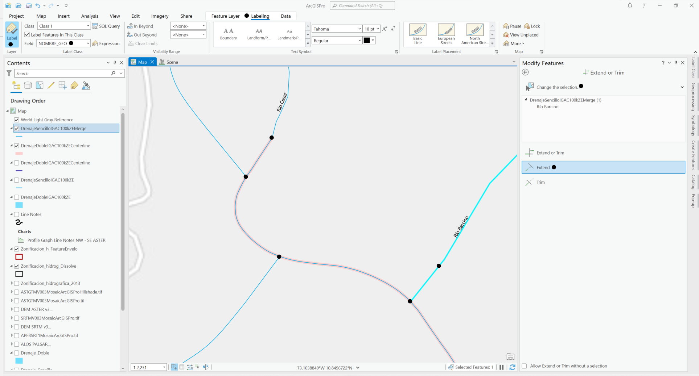

> Tenga en cuenta que pueden existir bucles en la red de drenaje correspondientes a tramos que se interconectan entre sí. Esto puede causar errores en los procesos de acumulación de flujo, por lo que es conveniente evaluar a partir de imágenes satelitales, cuál es el tramo dominante y proceder manualmente a editar y a abrir estos bucles.
>
> En cuerpos de agua como ciénagas, embalses, humedales, jaguey, lagunas, madreviejas, manglares, morichales, pantanos y otros cuerpos de agua, pueden presentarse discontinuidades en la red de drenaje, es recomendable agregar estos elementos al mapa para realizar la conexión de los drenajes sobre los cuerpos a los drenajes inmediatamente aguas abajo.    

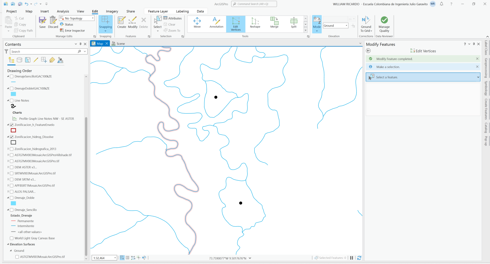

9. Visualmente, identifique y digitalice las zonas geográficas en las que no se encuentra completa la digitalización de drenajes, por ejemplo en:

| #   | Coordenadas geográficas   | Descripción                                      |                          Google Maps                          |
|-----|:--------------------------|:-------------------------------------------------|:-------------------------------------------------------------:|
| 1   | 74.0525387°W 10.0341833°N | Drenaje a borde de vía en zona de cultivo.       |  [Ver](http://maps.google.com/maps?q=10.0341833,-74.0525387)  |
| 2   | 73.6459877°W 9.5544233°N  | Conexión de drenaje sobre cuerpo de agua léntico |  [Ver](http://maps.google.com/maps?q=9.5544233,-73.6459877)   |
| 3   | 73.4706062°W 9.6966152°N  | Red de drenaje natural sobre zona minera         |  [Ver](http://maps.google.com/maps?q=9.6966152,-73.4706062)   |
| 4   | 73.4916086°W 9.7628290°N  | Red de drenaje natural sobre zona minera         |  [Ver](http://maps.google.com/maps?q=9.7628290,-73.4916086)   |
| 5   | 73.4926365°W 9.5579971°N  | Red de drenaje natural sobre zona minera         |  [Ver](http://maps.google.com/maps?q=9.5579971,-73.4926365)   |
| 6   | 73.6128227°W 9.3748515°N  | Conexión de drenaje sobre cuerpo de agua léntico |  [Ver](http://maps.google.com/maps?q=9.3748515,-73.6128227)   |

Utilice la herramienta _Go To XY_ disponible en el menú _Map_ y el panel _Navigate_ de ArcGIS Pro, luego desde el menú _Edit_ cree los elementos faltantes en la red digitalizando a escala 1:1500 o inferior. Verifique y complete la red de drenaje en las localizaciones mostradas anteriormente y sobre toda la red de drenaje dentro de la zona de estudio.

Ejemplo localización 1
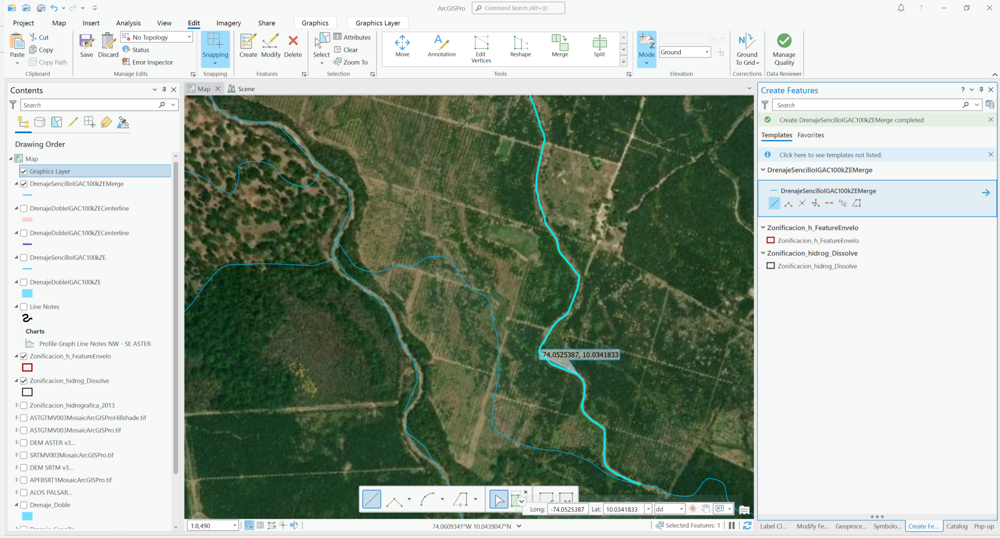

Ejemplo localización 2
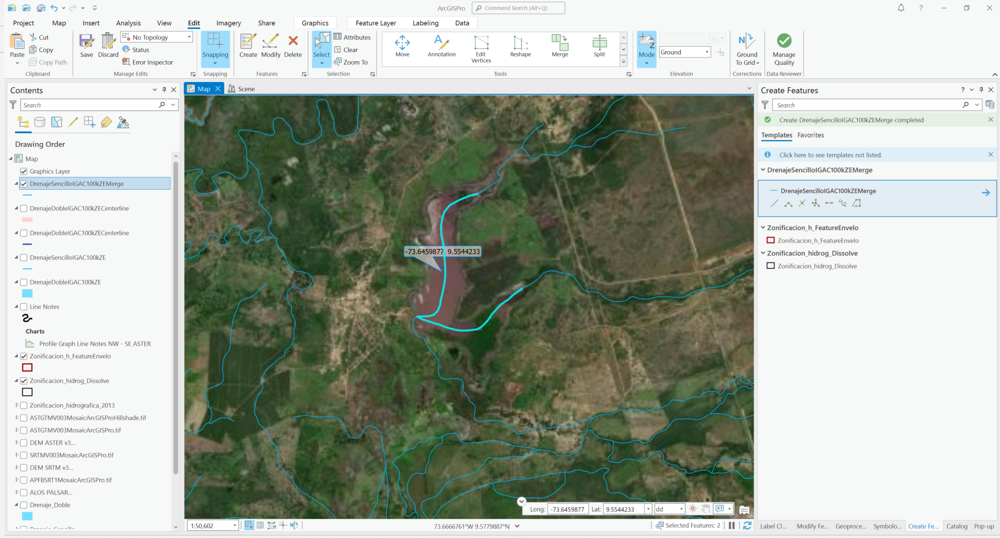

Ejemplo localización 3

> En la digitalización IGAC, las redes digitalizadas sobre zonas mineras a cielo abierto corresponden a la condición natural predominante antes del inicio de la operación. Para el caso de estudio consideraremos que el balance hidrológico de largo plazo corresponde a la condición natural de la red de drenaje.

En este momento ya dispone de la red de drenaje que será utilizada para la rectificación del modelo de terreno.

| Shapefile                            |              Descargar :open_file_folder:               |
|:-------------------------------------|:-------------------------------------------------------:|
| DrenajeSencilloIGAC100kZE.shp        |    [.zip](../../.shp/DrenajeSencilloIGAC100kZE.zip)     |
| DrenajeDobleIGAC100kZE.shp           |      [.zip](../../.shp/DrenajeDobleIGAC100kZE.zip)      |
| DrenajeDobleIGAC100kZECenterline.shp | [.zip](../../.shp/DrenajeDobleIGAC100kZECenterline.zip) |
| DrenajeSencilloIGAC100kZEMerge.shp   |  [.zip](../../.shp/DrenajeSencilloIGAC100kZEMerge.zip)  |

### Actividades complementarias:pencil2:

En la siguiente tabla se listan las actividades complementarias que deben ser desarrolladas y documentadas por el estudiante en un único archivo de Adobe Acrobat .pdf. El documento debe incluir portada (mostrar nombre completo, código y enlace a su cuenta de GitHub), numeración de páginas, tabla de contenido, lista de tablas, lista de ilustraciones, introducción, objetivo general, capítulos por cada ítem solicitado, conclusiones y referencias bibliográficas.

| Actividad | Alcance                                                                                                                                                                                                                                                                                                                                                                                                                                                                                                                            |
|:---------:|:-----------------------------------------------------------------------------------------------------------------------------------------------------------------------------------------------------------------------------------------------------------------------------------------------------------------------------------------------------------------------------------------------------------------------------------------------------------------------------------------------------------------------------------|
|     1     | Realice el procedimiento presentado en esta clase en ArcGIS for Desktop, ArcGIS Pro y QGIS.                                                                                                                                                                                                                                                                                                                                                                                                                                        |
|     2     | En el documento soporte de desarrollo, incluya una tabla indicando las coordenadas de las localizaciones donde se realizaron ajustes y presente capturas de pantalla detalladas de los ajustes manuales realizados a la red de drenaje, p.ej. en conexiones laterales a drenajes dobles o cauces obtenidos como polígonos, ejes de drenaje y líneas conectoras en embalses y cuerpos de agua de gran extensión, descarga de embalses a cauces principales receptores, apertura de bucles y ajustes de conexiones erradas. |
|     3     | Investigue y documente otros servicios en línea desde donde se puedan obtener vectores de drenaje (p. ej. [IDECA](https://www.ideca.gov.co/), [CAR Cundinamarca - Colombia](https://www.car.gov.co/), [ESRI](https://datosabiertos.esri.co/)). Descargue y compare con los disponibles en el IGAC - Colombia y con fotografías satelitales actualizadas.                                                                                                                                                                           |

### Compatibilidad

* Esta actividad puede ser desarrollada con cualquier software SIG que disponga de herramientas para de digitalización con opciones de encajado o snapping.
* Para la descarga puede utilizar cualquier navegador de Internet actualizado.

### Referencias

* http://www.ideam.gov.co/capas-geo
* http://www.siac.gov.co/catalogo-de-mapas
* http://visor.ideam.gov.co/geovisor/#!/profiles/3
* https://www.igac.gov.co/sites/igac.gov.co/files/anexo_1.1_catalogo_objetos_cartografiabasica_v1.0_.pdf
* http://sites.tufts.edu/gis/files/2013/11/Watershed-and-Drainage-Delineation-by-Pour-Point.pdf
* https://gisrsstudy.com/drainage-density-arcgis/
* https://pro.arcgis.com/en/pro-app/latest/tool-reference/topographic-production/polygon-to-centerline.htm
* [Línea central de un polígono en QGIS](https://www.youtube.com/watch?v=aVWnMI-QdSs)

### Control de versiones

| Versión    | Descripción                                                                                                                                                                                                                                                          | Autor                                      | Horas |
|------------|:---------------------------------------------------------------------------------------------------------------------------------------------------------------------------------------------------------------------------------------------------------------------|--------------------------------------------|:-----:|
| 2023.01.29 | Guión, audio, video, edición y publicación.                                                                                                                                                                                                                          | [rcfdtools](https://github.com/rcfdtools)  |  2.5  |
| 2022.07.18 | Identificación de bucles, digitalización de tramos faltantes, actualización general de ilustraciones. Incorporación de diagrama de procesos.                                                                                                                         | [rcfdtools](https://github.com/rcfdtools)  |  3.5  |
| 2022.07.17 | Versión inicial con descarga manual GDB IGAC Colombia escala 1:100.000, extracción de drenajes sencillos y dobles de la zona de estudio, obtención de líneas centrales en drenajes dobles, integración, edición y conexión de tramos laterales a cauces principales. | [rcfdtools](https://github.com/rcfdtools)  |   5   |

##

_R.LTWB es de uso libre para fines académicos, conoce nuestra licencia, cláusulas, condiciones de uso y como referenciar los contenidos publicados en este repositorio, dando [clic aquí](https://github.com/rcfdtools/R.LTWB/wiki/License)._

_¡Encontraste útil este repositorio!, apoya su difusión marcando este repositorio con una ⭐ o síguenos dando clic en el botón Follow de [rcfdtools](https://github.com/rcfdtools) en GitHub._

| [Anterior](../DEMAlos) | [:house: Inicio](../../Readme.md) | [:beginner: Ayuda / Colabora](https://github.com/rcfdtools/R.LTWB/discussions/7) | [Siguiente](../AgreeDEM) |
|------------------------|-----------------------------------|----------------------------------------------------------------------------------|--------------------------|

[^1]: https://www.igac.gov.co/sites/igac.gov.co/files/anexo_1.1_catalogo_objetos_cartografiabasica_v1.0_.pdf