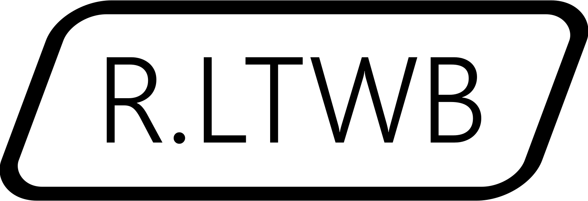
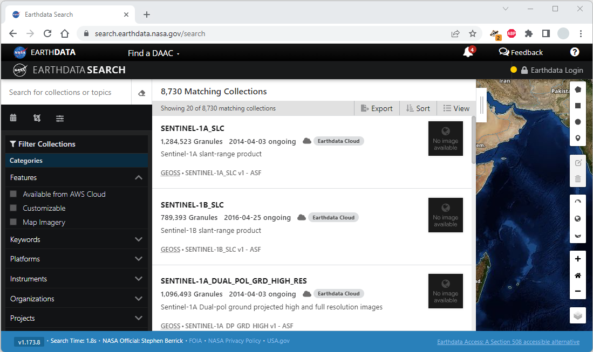
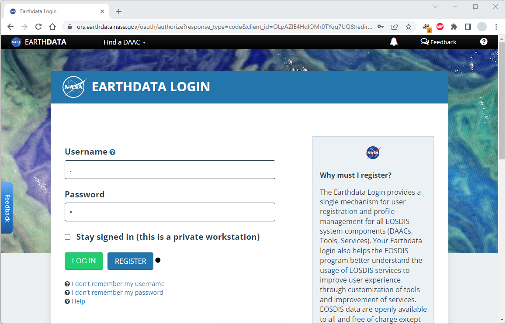
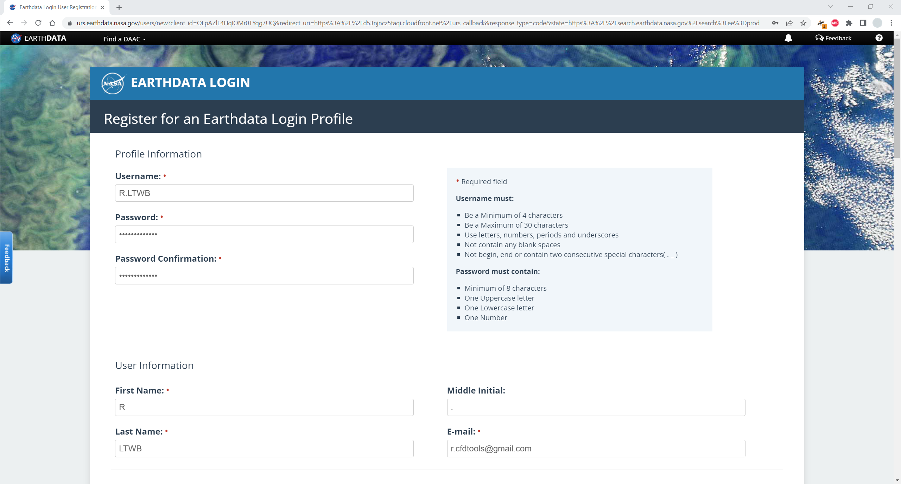
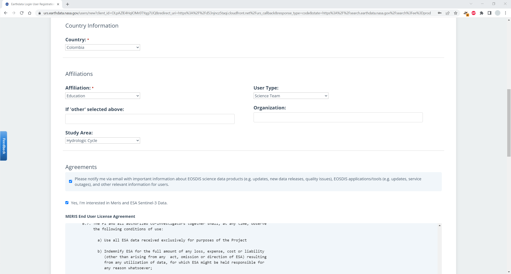
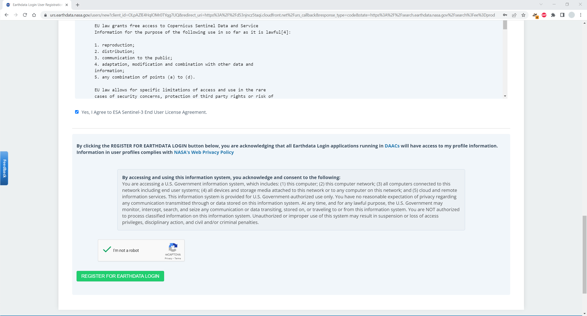
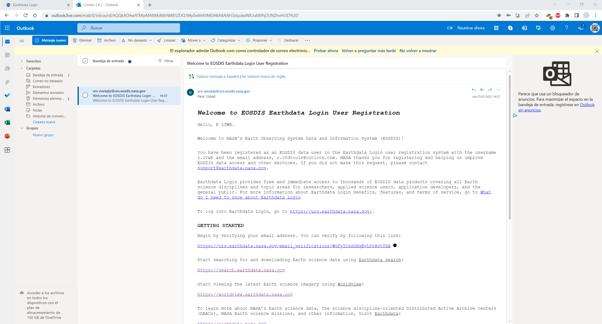
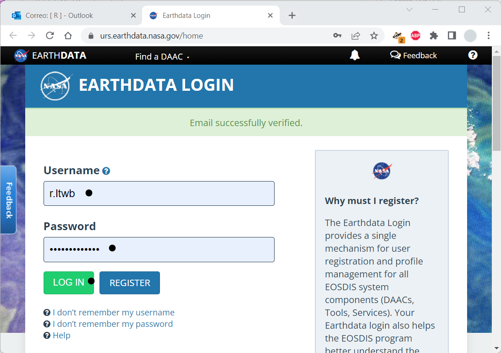
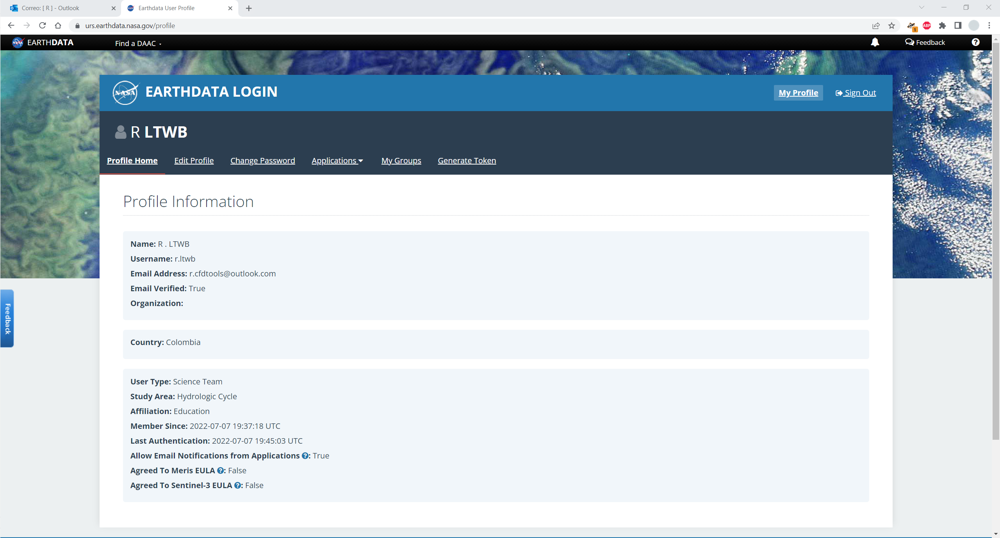

## Creación de usuario NASA Earthdata 
Keywords: `NASA` `EarthData` `User-creation`

  
   Balance hidrológico de largo plazo. Long-term water balance <b>Universidad Escuela Colombiana de Ingeniería Julio Garavito</b> William Ricardo Aguilar Piña Profesor del Centro de Estudios Hidráulicos william.aguilar@escuelaing.edu.co 

Para la descarga de los modelos digitales de elevación y la información climatológica obtenida mediante sensores remotos, es necesaria la creación de una cuenta de usuario en el servidor EarthData de la NASA o Agencia Nacional de Aeronáutica y Administración Espacial de los Estados Unidos de América. Para la descarga de imágenes de modelos de terreno ASTER GDEM con resolución 12.5 m, no es necesaria la creación de una cuenta independiente en el servidor Vertex de la Universidad de Alaska, se utiliza la misma cuenta del servicio EarthData.[^1]

  

  Playlist: https://www.youtube.com/playlist?list=PLneiG4vC_8YupZFL2DtUEdcgtXyWT7Apt  

### Objetivos

* Crear cuentas de usuario para la descarga de datos climatológicos satelitales y modelos de terreno.
* Verificar la activación de las cuentas de usuario.

### Requerimientos

* Cualquier navegador actualizado de Internet

### Diagrama general de procesos

El siguiente diagrama representa los procesos generales requeridos para el desarrollo de esta actividad.

  
Convenciones generales en diagramas: clases de entidad en azul, dataset en gris oscuro, grillas en color verde, geo-procesos en rojo, procesos automáticos o semiautomáticos en guiones rojos y procesos manuales en amarillo. Líneas conectoras con guiones corresponden a procedimientos opcionales.  

### Procedimiento para Earthdata

Antes de iniciar con la creación de la cuenta NASA Earthdata, se recomienda crear una cuenta de correo electrónico de [Google](https://mail.google.com/) que podrá utilizar para crear posteriormente una cuenta en [GitHub](https://github.com/) y clonar el contenido completo de este curso, incluidos los paquetes de datos, scripts y documentación oficial.

1. Ingresar al servicio web [Eathdata](https://search.earthdata.nasa.gov) de la NASA y dar clic en [Earthdata login](https://d53njncz5taqi.cloudfront.net/login?ee=prod&state=https%3A%2F%2Fsearch.earthdata.nasa.gov%2Fsearch). 

2. En la ventana Earthdata Login, clic en Register.

3. En la ventana de registro, ingrese en información de perfil un nombre de usuario y contraseña, los datos correspondientes a la información del usuario, país, asociaciones, acepte las condiciones de uso y la validación de usuario humano reCAPTCHA.

Especificaciones para nombres de usuario  
* Debe ser mínimo de 4 caracteres. Be a Minimum of 4 characters
* Debe ser máximo de 30 caracteres. Be a Maximum of 30 characters
* Se pueden utilizar letras, números, puntos y guiones bajos. Use letters, numbers, periods and underscores
* No puede contener espacios en blanco. Not contain any blank spaces
* No puede iniciar, terminar o contener dos caracteres consecutivos como punto o guion bajo. Not begin, end or contain two consecutive special characters( . _ )

Especificaciones para contraseña  
* Como mínimo de 8 caracteres. Minimum of 8 characters
* Al menos 1 carácter en mayúscula. One Uppercase letter
* Al menos 1 carácter en minúscula. One Lowercase letter
* Al menos un número One Number

> Para la creación de la cuenta ejemplo se ha seleccionado _Education_ en _Affiliation_, _Science Team_ en _User Type_ y _Hydrologic Cycle_ como _Study Area_. Seleccione las afiliaciones o suscripciones que más se adapten a su perfil profesional.

En la sección de Acuerdo de Uso o Agreements, marque las casillas correspondientes a notificaciones [EOSDIS](https://www.earthdata.nasa.gov/eosdis) y [Meris and ESA Sentinel-3 Data](https://earth.esa.int/eogateway/instruments/meris) y de clic en el botón `REGISTER FOR EARTHDATA LOGIN`

4. Ingrese a su cuenta de correo y verifique la cuenta creada dando clic en el enlace de verificación, automáticamente será redirigido a la ventana de acceso de Eathdata Login, ingrese su nombre de usuario y contraseña y realice el ingreso. En la ventana principal del servicio podrá encontrar información relacionada con el perfil, opciones para actualización de datos, aplicaciones, grupos y generadores de Tokens para aplicaciones integradas.

Su cuenta ha sido creada, validada y está lista para ser utilizada en el buscador de Earthdata.

### Compatibilidad

* La creación de cuenta NASA EarthData puede ser realizada desde cualquier navegador actualizado de Internet.

### Control de versiones

| Versión    | Descripción                                           | Autor                                      | Horas |
|------------|:------------------------------------------------------|--------------------------------------------|:-----:|
| 2023.01.25 | Guión, audio, video, edición y publicación.           | [rcfdtools](https://github.com/rcfdtools)  |   1   |
| 2022.07.20 | Inclusión de diagrama de procesos.                    | [rcfdtools](https://github.com/rcfdtools)  |  0.5  |
| 2022.07.07 | Versión inicial creación de cuenta en NASA EarthData. | [rcfdtools](https://github.com/rcfdtools)  |  1.5  |

##

_R.LTWB es de uso libre para fines académicos, conoce nuestra licencia, cláusulas, condiciones de uso y como referenciar los contenidos publicados en este repositorio, dando [clic aquí](https://github.com/rcfdtools/R.LTWB/wiki/License)._

_¡Encontraste útil este repositorio!, apoya su difusión marcando este repositorio con una ⭐ o síguenos dando clic en el botón Follow de [rcfdtools](https://github.com/rcfdtools) en GitHub._

| [Anterior](../../Section02) | [:house: Inicio](../../Readme.md) | [:beginner: Ayuda / Colabora](https://github.com/rcfdtools/R.LTWB/discussions/3) | [Siguiente](../DEMAster) |
|-----------------------------|-----------------------------------|----------------------------------------------------------------------------------|--------------------------|

[^1]: Logo NASA tomado de https://www.pngwing.com/

##

 Este curso guía ha sido desarrollado con el apoyo de la Escuela Colombiana de Ingeniería - Julio Garavito. Encuentra más contenidos en https://github.com/uescuelaing  
