<div align="center"><a href="https://www.escuelaing.edu.co/es/investigacion-e-innovacion/centro-de-estudios-hidraulicos/" target="_blank"></a></div>

## Exploración y análisis de series - EDA - Representación gráfica
Keywords: `EDA` `matplotlib` `pandas` `tabulate` `dtypes` `isnull` `describe` `unique` `size` `correlation` `pivot-table` `stats` `histogram` `density` `boxplot` 

<div align="center">
  
  <br><b>Balance hidrológico de largo plazo para estimación de caudales medios usando SIG</b><br><br><b>Universidad Escuela Colombiana de Ingeniería Julio Garavito</b><br>William Ricardo Aguilar Piña<br>Profesor del Centro de Estudios Hidráulicos<br>william.aguilar@escuelaing.edu.co<br>
</div><br>

<div align="center">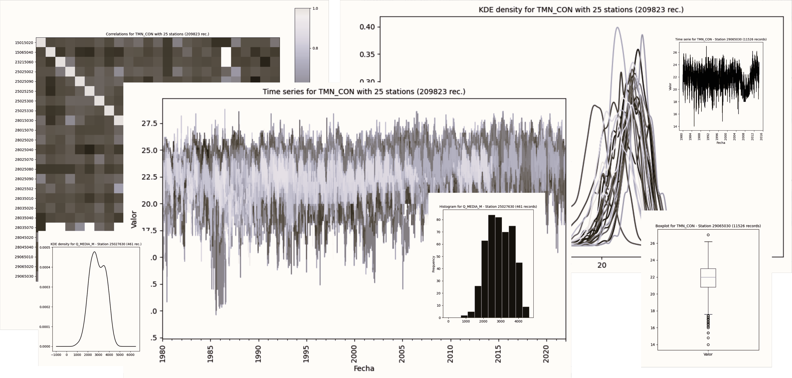</div> 

Durante el proceso de revisión, validación y comprensión de los datos, es necesario utilizar diferentes técnicas que permitan identificar discontinuidades, cambios en el comportamiento temporal y en general revisar los estadísticos característicos de cada serie por parámetro.

<div align="center"><br><a href="http://www.youtube.com/watch?feature=player_embedded&v=sLP0ImJpzLM" target="_blank"></a><sub><br>Playlist: https://www.youtube.com/playlist?list=PLneiG4vC_8YupZFL2DtUEdcgtXyWT7Apt</sub><br><br></div>

**¿Qué es y para que sirve la EDA?** [^1]

La exploración y análisis de datos o EDA por sus siglas en inglés, se refiere al proceso de investigación, mejoramiento, descubrimiento de patrones de comportamiento e identificación de anomalías sobre conjuntos de datos; además, permite realizar pruebas de hipótesis y revisar las suposiciones que frecuentemente realizamos frente a ciertas variables climatológicas por medio de resúmenes estadísticos, tablas dinámicas y gráficas detalladas. Como buena práctica y antes de crear modelos complejos de análisis o pronóstico, se recomienda entender primero los datos para tener una idea de su comportamiento y relación. 


### Objetivos

* Aplicar técnicas de exploración y análisis de datos a series temporales.
* Identificar los tipos de datos contenidos en el conjunto de datos IDEAM.
* Identificar valores nulos en las colecciones de datos para cada objeto o variable.
* Obtener estadísticas generales para las variables numéricas del conjunto de datos.
* Identificar las estaciones contenidas en el conjunto de datos.
* Contar el número de registros por estación para cada parámetro.
* Crear tablas dinámicas (pivot table) por parámetro.
* Crear tablas de correlación por parámetro.
* Realizar análisis segmentados generales de cada parámetro (visualización conjunta de series temporales y densidades KDE, estadísticos generales, matriz de correlación, estadísticos de correlación) y análisis individuales por estación (metadatos por estación, análisis estadístico para los valores registrados, gráficos de serie de tiempo, caja de bigotes, histograma y densidad).


### Requerimientos

* [Python 3+](https://www.python.org/)
* [Pandas](https://pandas.pydata.org/docs/index.html) para Python
* [Tabulate](https://pypi.org/project/tabulate/) para Python, requerido para impresión de tablas en formato Markdown desde pandas.
* Series de datos discretos climatológicos de estaciones terrestres del IDEAM. [:mortar_board:Aprender.](../CNEStationDatasetDownload)


### Procedimiento general

<div align="center">
<br>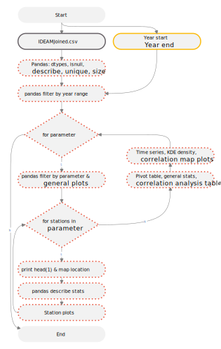<br>
<sub>Convenciones generales en diagramas: clases de entidad en azul, dataset en gris oscuro, grillas en color verde, geo-procesos en rojo, procesos automáticos o semiautomáticos en guiones rojos y procesos manuales en amarillo. Líneas conectoras con guiones corresponden a procedimientos opcionales.</sub><br><br>
</div>

1. Para realizar el análisis exploratorio de datos, descargue el script [EDA.py](../../.src/EDA.py) y guárdelo en la carpeta local `D:\R.LTWB\.src` de su equipo.

Funcionalidades del script

* Permite definir la ventana de tiempo para el análisis a partir de un año inicial y final.
* Generación de reporte detallado Markdown [EDA.md](../../.datasets/IDEAM_EDA/EDA.md).
* Análisis masivo de registros por parámetro generando tablas dinámicas y gráficas generales de análisis.
* Análisis masivo de estaciones por parámetro generando estadísticos y gráficas detalladas de análisis.

> Para el ejemplo, se ha establecido como ventana de tiempo 1980 a 2021.

Contenido del script

```
# -*- coding: UTF-8 -*-
# Name: EDA.py
# Description: exploratory data analysis
# Requirements: Python 3+, pandas, tabulate
# Attention: do not convert the .csv file into an Excel file because you would need process more than 1048576 records.


# Libraries
import sys
import pandas as pd
import matplotlib
import matplotlib.pyplot as plt
import tabulate  # required for print tables in Markdown using pandas
from datetime import datetime


# Function for print and show results in a file
def print_log(txt_print, on_screen=True, center_div=False):
    if on_screen:
        print(txt_print)
    if center_div:
        file_log.write('\n<div align="center">\n' + '\n')
    file_log.write(txt_print + '\n')
    if center_div:
        file_log.write('\n</div>\n' + '\n')


# General variables
station_file = 'D:/R.LTWB/.datasets/IDEAM/IDEAMJoined.csv'  # Current IDEAM records file
path = 'D:/R.LTWB/.datasets/IDEAM_EDA/'  # Your local files path, use ../.datasets/IDEAM_EDA/ for relative path
file_log_name = path + 'EDA.md'
file_log = open(file_log_name, 'w+')   # w+ create the file if it doesn't exist
station_code = 'CodigoEstacion'  # IDEAM station code name
station_name = 'NombreEstacion'  # IDEAM station code name
date_install_name = 'FechaInstalacion'  # IDEAM installation date field name
date_suspend_name = 'FechaSuspension'  # IDEAM suspension date field name
date_record_name = 'Fecha'  # IDEAM date field name for the record values
latitude_name = 'Latitud'  # IDEAM latitude name
longitude_name = 'Longitud'  # IDEAM longitude name
value_name = 'Valor'  # IDEAM value field name
grade_name = 'Grado'  # IDEAM grade field name
approved_name = 'NivelAprobacion'  # IDEAM approved level field name
tag_name = 'Etiqueta'  # IDEAM record parameter frequency tag
tag_desc_name = 'DescripcionSerie'  # IDEAM record parameter frequency tag
plot_colormap = 'magma'  # Color theme for plot graphics, https://matplotlib.org/stable/tutorials/colors/colormaps.html
sample_records = 3  # Records to show in the sample table head and tail
histogram_binds = 12
fig_size = 5  # Height size for figures plot
print_table_sample = False
start_year = 1980  # Chirps values starts at 1981
end_year = 2021  # This value have to correspond with the end of the IDEAM series

# Header
print_log('## Exploración y análisis de series - EDA - Representación gráfica')
print_log('\n* Archivo de resultados: ' + file_log_name +
          '\n* Fecha y hora de inicio de ejecución: ' + str(datetime.now()) +
          '\n* Python versión: ' + str(sys.version) +
          '\n* Python rutas: ' + str(sys.path[0:5]) +
          '\n* matplotlib versión: ' + str(matplotlib.__version__) +
          '\n* pandas versión: ' + str(pd.__version__) +
          '\n* Print table samples: ' + str(print_table_sample) +
          '\n* Start year: ' + str(start_year) +
          '\n* End year: ' + str(end_year) +
          '\n* Encuentra este script en https://github.com/rcfdtools/R.LTWB/tree/main/Section03/EDA'
          '\n* Cláusulas y condiciones de uso en https://github.com/rcfdtools/R.LTWB/blob/main/LICENSE.md'
          '\n* Créditos: r.cfdtools@gmail.com')

# Open the IDEAM station dataframe and show general information
# Learn more about the IDEAM file in https://github.com/rcfdtools/R.LTWB/tree/main/Section03/CNEStationDatasetDownload
station_df = pd.read_csv(station_file, low_memory=False, parse_dates=[date_install_name, date_suspend_name, date_record_name], converters={station_code: str, grade_name: str, approved_name: str})
ideam_regs = station_df.shape[0]
print_log('\n\n### General dataframe information with %d IDEAM records' % ideam_regs)
print(station_df.info())
print_log('Datatypes in the dataset', center_div=True)
print_log(station_df.dtypes.to_markdown(), center_div=True)
print_log('Null values in the dataset', center_div=True)
print_log(station_df.isnull().sum().to_markdown(), center_div=True)
if print_table_sample:
    print_log('\nDataframe records head sample\n')
    print_log(station_df.head(sample_records).to_markdown())
    print_log('\nDataframe records tail sample\n')
    print_log(station_df.tail(sample_records).to_markdown())
print_log('General statistics table with not year range filter', center_div=True)
print_log(station_df.describe().to_markdown(), center_div=True)
print_log('Stations in the dataset', center_div=True)
stations_np = pd.DataFrame(station_df[station_name].unique())
print_log(stations_np.to_markdown(), center_div=True)
print_log('Records by parameter and station with not year range filter', center_div=True)
stations_np = station_df.groupby([tag_desc_name, station_name]).size()
print_log(stations_np.to_markdown(), center_div=True)


# Slice data from each parameter and station
parameter_list = station_df[tag_name].unique()

for parameter in parameter_list:
    # General information per parameter
    parameter_name = tag_name + ' == "' + parameter + '"'  # Parameter filter
    station_df1 = station_df.query(parameter_name)  # Filter for parameter
    station_df1 = station_df1[(station_df[date_record_name] >= str(start_year) + '-01-01') & (station_df[date_record_name] <= str(end_year) + '-12-31')]  # Filter per date range
    # station_df1.reset_index()
    ideam_regs_query = station_df1.shape[0]
    print_log('\n\n### Analysis from %d to %d for %s: %i (%s%%)' % (start_year, end_year, parameter_name, ideam_regs_query, str(round((ideam_regs_query / ideam_regs) * 100, 2))))
    # print_log('\n\n### Analysis from %d to %d for %s (%s): %i (%s%%)' % (start_year, end_year, station_df1[tag_desc_name][0], parameter_name, ideam_regs_query,str(round((ideam_regs_query / ideam_regs) * 100, 2))))
    pivot_file = 'Pivot_' + parameter + '.csv'
    corr_file = 'Pivot_' + parameter + '_Correlation.csv'
    print_log('\nPivot table: [%s](%s)' % (pivot_file, pivot_file))
    fig_name = 'Plot_' + parameter + '_TimeSerie.png'
    print_log('' % fig_name, center_div=False)
    fig_name = 'Plot_' + parameter + '_DensityKDE.png'
    print_log('' % fig_name, center_div=False)

    # Data analysis per station
    station_df1.set_index(date_record_name, inplace=True)
    station_list = station_df1[station_code].unique()
    for station in station_list:
        station_filter = station_code + ' == "' + station + '"'
        df = station_df1.query(station_filter)
        # df.set_index(date_record_name, inplace=True)  # Already indexed in station_df1
        map_location = ('Location over [Google Maps](http://maps.google.com/maps?q=' + str(df[latitude_name][0]) + ',' + str(
            df[longitude_name][0]) + ') or [Openstreet Map](https://www.openstreetmap.org/query?lat=' + str(df[latitude_name][0]) + '&lon=' + str(
            df[longitude_name][0]) + ')')
        print_log('\n\n**%s - Station: %s (%s rec.)**<br>%s' % (parameter, df[station_name][0], df.shape[0], map_location), center_div=True)
        print_log('\nStation first record\n')
        print_log(df.head(1).to_markdown())
        print_log('Statistics table', center_div=True)
        print_log(df[value_name].describe().to_markdown(), center_div=True)
        fig = df.plot(y=value_name, figsize=(fig_size, fig_size+1), rot=90, colormap=plot_colormap, legend=False, alpha=1, lw=1)
        fig.set_ylabel(value_name)
        plt.title('Time serie for %s - Station %s (%d records)' % (parameter, station, df.shape[0]), fontsize=10)
        fig_name = 'Plot_' + parameter + '_' + station + '_TimeSerie.png'
        plt.savefig(path + 'Graph/' + fig_name)
        print_log('\n' % fig_name, center_div=False)
        plt.close('all')  # After the fig is saved, close the fig release memory and clean the plot
        fig = df.boxplot(column=value_name, figsize=(fig_size, fig_size+1), grid=False)
        plt.title('Boxplot for %s - Station %s (%d records)' % (parameter, station, df.shape[0]), fontsize=10)
        fig_name = 'Plot_' + parameter + '_' + station + '_Boxplot.png'
        plt.savefig(path + 'Graph/' + fig_name)
        print_log('' % fig_name, center_div=False)
        plt.close('all')
        fig = df.plot.hist(column=value_name, bins=histogram_binds, alpha=0.9, figsize=(fig_size, fig_size+1), colormap=plot_colormap, edgecolor='white', legend=False)
        plt.title('Histogram for %s - Station %s (%d records)' % (parameter, station, df.shape[0]), fontsize=10)
        fig_name = 'Plot_' + parameter + '_' + station + '_Histogram.png'
        plt.savefig(path + 'Graph/' + fig_name)
        print_log('' % fig_name, center_div=False)
        plt.close('all')  # After the fig is saved, close the fig release memory
        fig = df[value_name].plot.kde(colormap=plot_colormap, figsize=(fig_size, fig_size+1))
        plt.title('KDE density for %s - Station %s (%d rec.)' % (parameter, station, df.shape[0]), fontsize=10)
        fig_name = 'Plot_' + parameter + '_' + station + '_DensityKDE.png'
        plt.savefig(path + 'Graph/' + fig_name)
        print_log('' % fig_name, center_div=False)
        plt.close('all')

    # Pivot table, plot, describe and correlations
    print_log('\n\n#### Pivot table statistics and correlation analysis for %s' % parameter)
    pivot_table = station_df1.pivot_table(index=date_record_name, columns=station_code, values=value_name)
    pivot_table.to_csv(path + pivot_file)
    pivot_table.corr().to_csv(path + corr_file)
    print_log('\nGeneral statistics table', center_div=False)
    print_log(pivot_table.describe().to_markdown(), center_div=False)
    print_log('\nCorrelation matrix [%s](%s)' % (corr_file, corr_file), center_div=False)
    print_log(pivot_table.corr().to_markdown())
    print_log('\nCorrelation statistics table', center_div=False)
    print_log(pivot_table.corr().describe().to_markdown(), center_div=False)
    fig = pivot_table.plot(figsize=(fig_size*2, fig_size+1), rot=90, colormap=plot_colormap, legend=False, alpha=0.5, lw=1)
    fig.set_ylabel(value_name)
    plt.title('Time series for %s with %d stations (%d rec.)' % (parameter, len(station_list), ideam_regs_query), fontsize=10)
    plt.savefig(path + 'Graph/Plot_' + parameter + '_TimeSerie.png')
    fig = pivot_table.plot.kde(colormap=plot_colormap, figsize=(fig_size*2, fig_size+1), legend=False)
    plt.title('KDE density for %s with %d stations (%d rec.)' % (parameter, len(station_list), ideam_regs_query), fontsize=10)
    plt.savefig(path + 'Graph/Plot_' + parameter + '_DensityKDE.png')
    plt.close('all')
    # Plot correlations in heatmap style
    plt.figure(figsize=(fig_size*3, fig_size*3))
    plt.imshow(pivot_table.corr(), cmap=plot_colormap)
    plt.colorbar()
    plt.xticks(range(len(pivot_table.corr())), pivot_table.corr().columns)
    plt.yticks(range(len(pivot_table.corr())), pivot_table.corr().index)
    plt.xticks(rotation=90)
    plt.title('Correlations for %s with %d stations (%d rec.)' % (parameter, len(station_list), ideam_regs_query), fontsize=10)
    plt.savefig(path + 'Graph/Plot_' + parameter + '_Correlation.png')
    fig_name = 'Plot_' + parameter + '_Correlation.png'
    print_log('\n' % fig_name, center_div=False)
    # plt.show()
    plt.close('all')
```

2. Cree una nueva carpeta en blanco con el nombre `IDEAM_EDA` en su directorio de proyecto local `D:\R.LTWB\.datasets`. Verifique que la carpeta `D:\R.LTWB\.datasets\IDEAM`, contenga el archivo [IDEAMJoined.csv](../../.datasets/IDEAM/IDEAMJoined.csv) que fue procesado en la actividad denominada [CNEStationDatasetDownload](../CNEStationDatasetDownload). 

3. En Microsoft Windows, ejecute el _Command Prompt_ o _CMD_, ingrese `D:` y de <kbd>Enter</kbd> para cambiar a la unidad D:\ donde se encuentra el repositorio R.LTWB. Utilizando el comando  `CD D:\R.LTWB\.datasets\IDEAM_EDA` ubíquese dentro de la carpeta IDEAM_EDA.

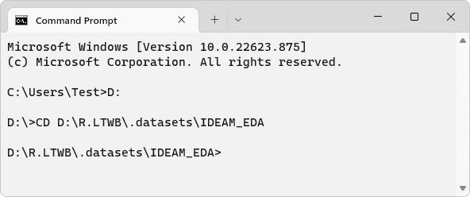

4. En él `CMD`, ejecute la instrucción `C:\Python3.10.5\python.exe "D:\R.LTWB\.src\EDA.py"` que realizará el procesamiento y análisis de los datos. Durante la ejecución, podrá observar que en la consola se presenta el detalle de los procesos ejecutados para cada parámetro y sus estaciones, además de la previsualización de diferentes tablas en formato Markdown.

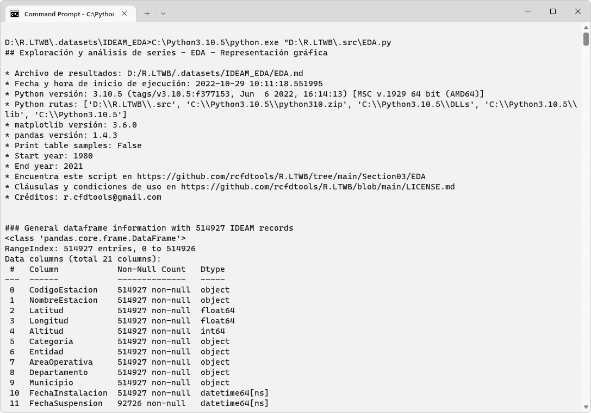
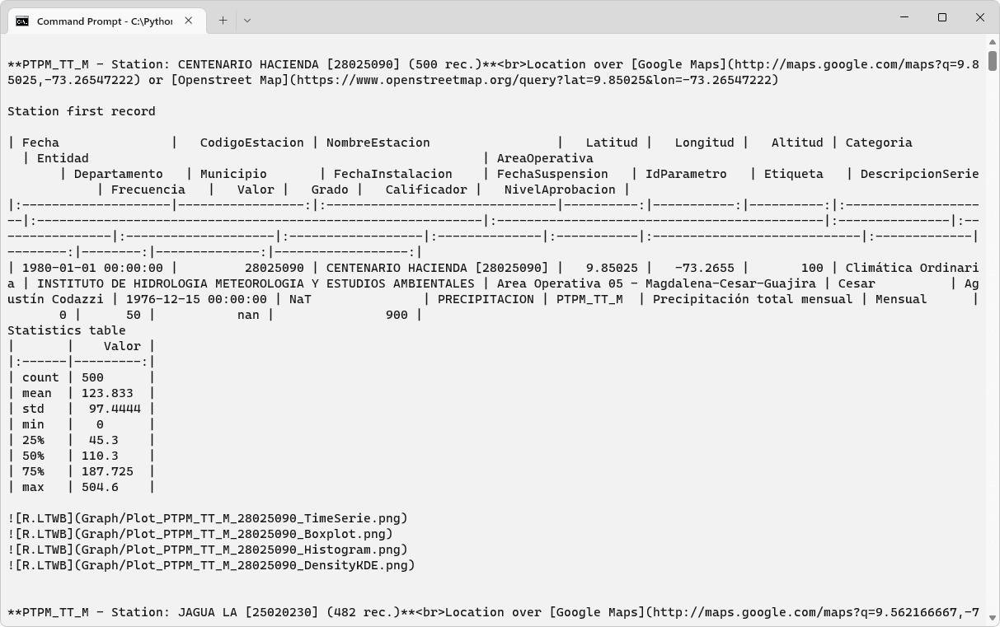
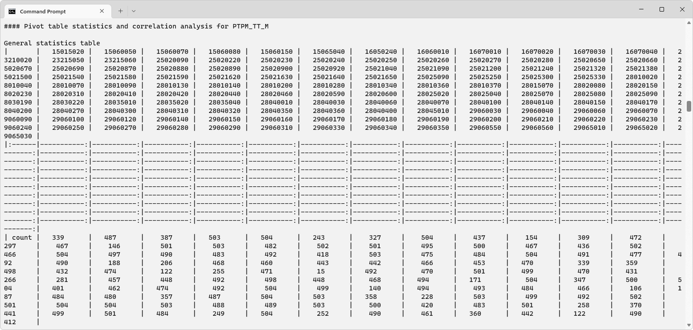
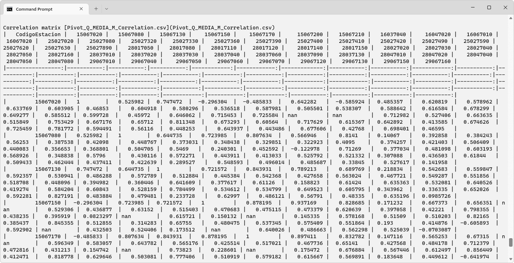


Luego de la ejecución, podrá observar que en la carpeta local `D:\R.LTWB\.datasets\IDEAM_EDA` se han generado diferentes archivos de resultados.

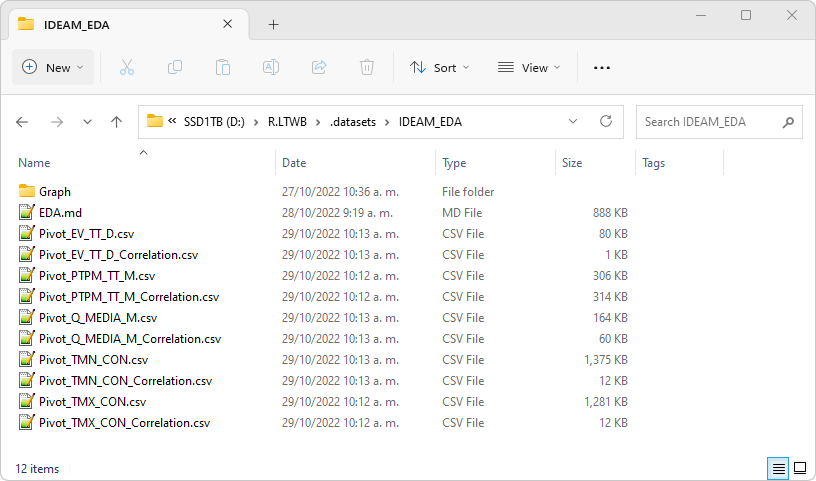

Dentro de la carpeta `D:\R.LTWB\.datasets\IDEAM_EDA\Graph`, han sido exportadas las diferentes gráficas generales y detalladas de análisis.

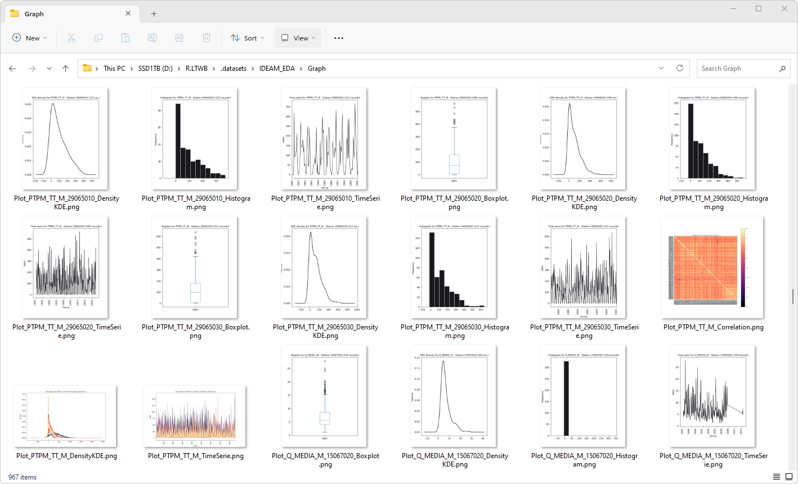


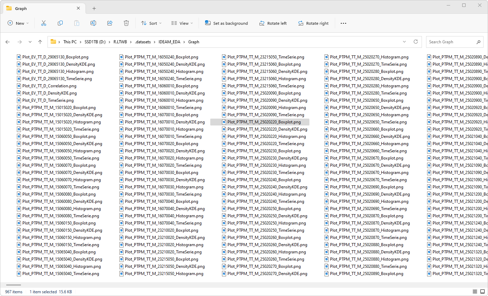
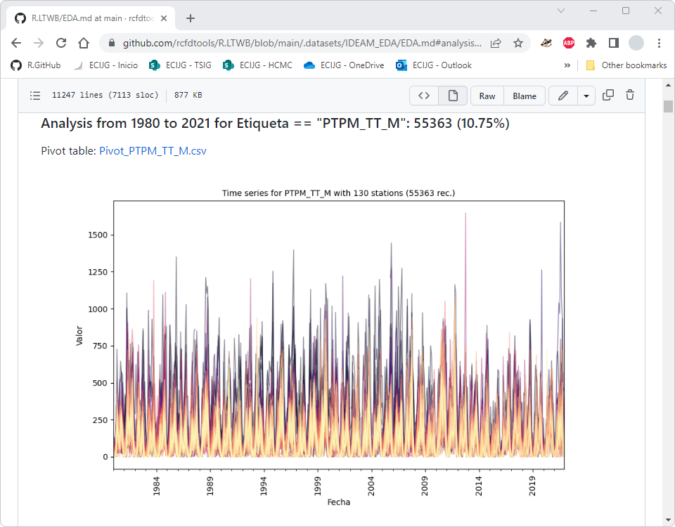
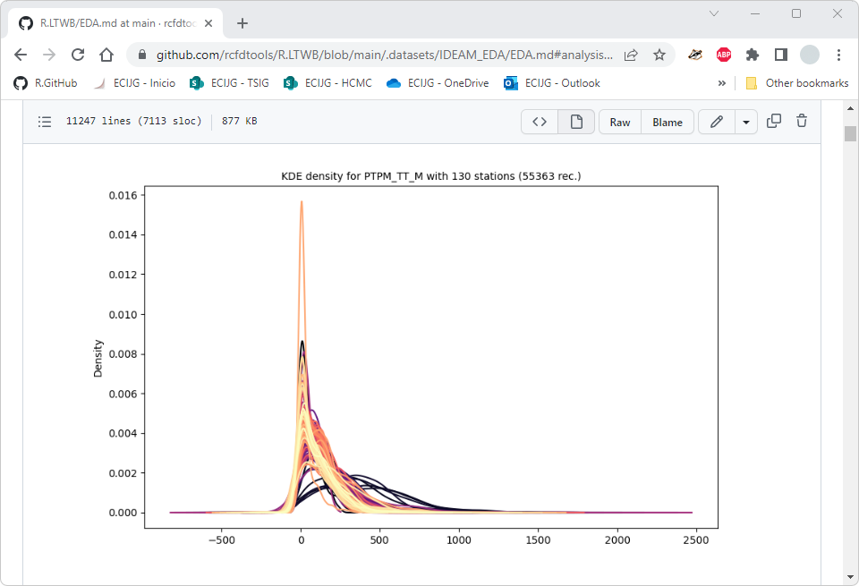

Una vez finalizado el proceso de ejecución, podrá sincronizar en la nube los resultados en su repositorio de proyectos de GitHub y podrá observar el reporte detallado en formato Markdown [EDA.md](../../.datasets/IDEAM_EDA/EDA.md).

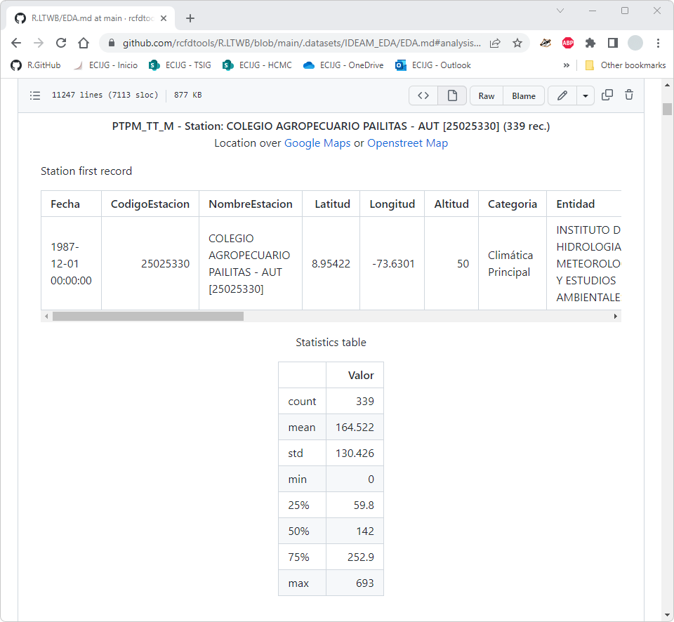

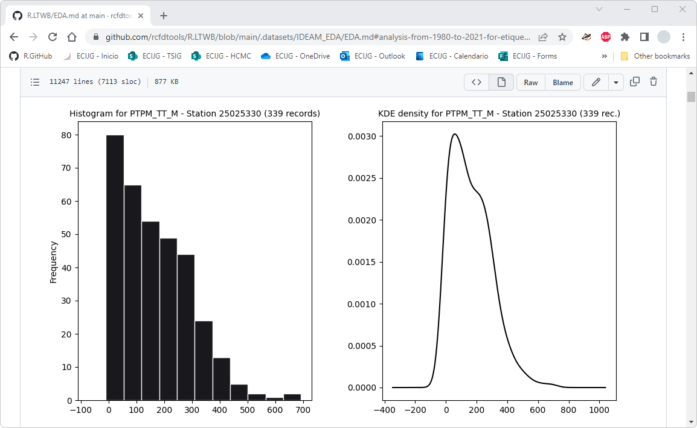
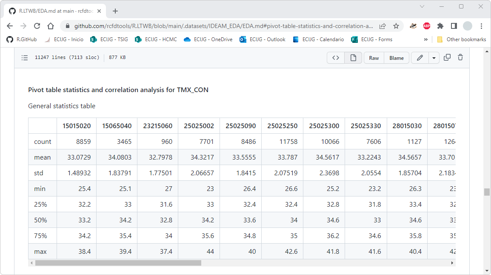
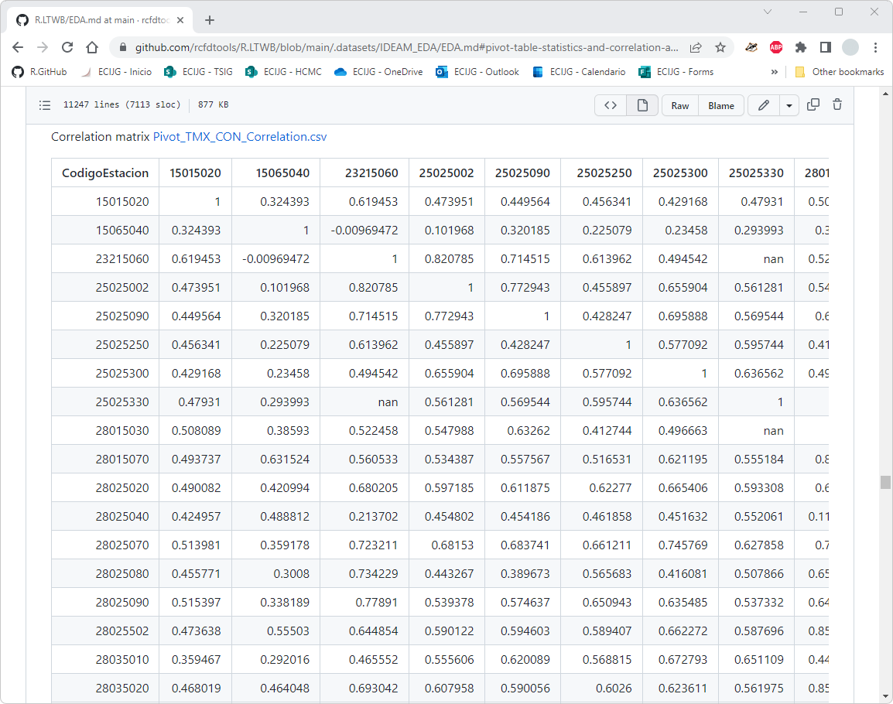

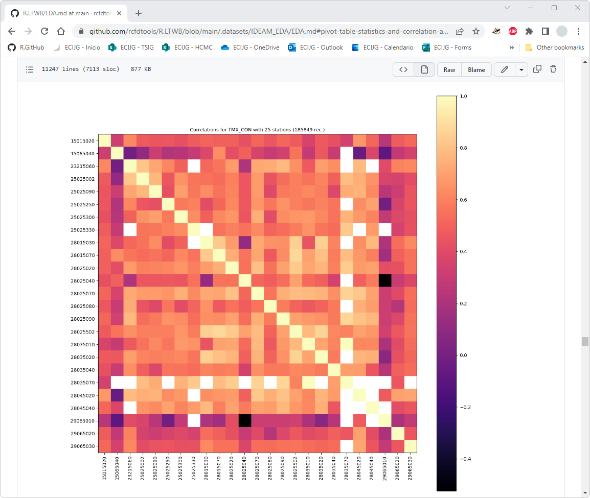


### Tablas de resultados y análisis generales

Durante el proceso de ejecución del script, se genera automáticamente las gráficas de análisis que son almacenadas en la carpeta [IDEAM_EDA/Graph](../../.datasets/IDEAM_EDA/Graph), un reporte integrado de resultados en formato Markdown con el nombre [D:\R.LTWB\.datasets\IDEAM_EDA\EDA.md](../../.datasets/IDEAM_EDA/EDA.md) y las siguientes tablas en formato .csv:

| Tabla                                                                                        | Descripción                                                      | Estaciones |
|----------------------------------------------------------------------------------------------|------------------------------------------------------------------|:----------:|
| [Pivot_EV_TT_D.csv](../../.datasets/IDEAM_EDA/Pivot_EV_TT_D.csv)                             | Tabla dinámica con series de evaporación diaria.                 |     1      |
| [Pivot_EV_TT_D_Correlation.csv](../../.datasets/IDEAM_EDA/Pivot_EV_TT_D_Correlation.csv)     | Tabla de correlaciones para series de evaporación diaria.        |     1      |
| [Pivot_PTPM_TT_M.csv](../../.datasets/IDEAM_EDA/Pivot_PTPM_TT_M.csv)                         | Tabla dinámica con series de precipitación mensual.              |    130     |
| [Pivot_PTPM_TT_M_Correlation.csv](../../.datasets/IDEAM_EDA/Pivot_PTPM_TT_M_Correlation.csv) | Tabla de correlaciones para series de precipitación mensual.     |    130     |
| [Pivot_Q_MEDIA_M.csv](../../.datasets/IDEAM_EDA/Pivot_Q_MEDIA_M.csv)                         | Tabla dinámica con series de caudal mensual.                     |     57     |
| [Pivot_Q_MEDIA_M_Correlation.csv](../../.datasets/IDEAM_EDA/Pivot_Q_MEDIA_M_Correlation.csv) | Tabla de correlaciones para series de caudal mensual.            |     57     |
| [Pivot_TMN_CON.csv](../../.datasets/IDEAM_EDA/Pivot_TMN_CON.csv)                             | Tabla dinámica con series de temperatura mínima diaria.          |     25     |
| [Pivot_TMN_CON_Correlation.csv](../../.datasets/IDEAM_EDA/Pivot_TMN_CON_Correlation.csv)     | Tabla de correlaciones para series de temperatura mínima diaria. |     25     |
| [Pivot_TMX_CON.csv](../../.datasets/IDEAM_EDA/Pivot_TMX_CON.csv)                             | Tabla dinámica con series de temperatura máxima diaria.          |     25     |
| [Pivot_TMX_CON_Correlation.csv](../../.datasets/IDEAM_EDA/Pivot_TMX_CON_Correlation.csv)     | Tabla de correlaciones para series de temperatura máxima diaria. |     25     |

Consulte el reporte detallado de resultados [EDA.md](../../.datasets/IDEAM_EDA/EDA.md).

En este momento, dispone de un reporte detallado de análisis, tablas dinámicas (pivot tables) y tablas de correlaciones por parámetro.


### Actividades complementarias:pencil2:

En la siguiente tabla se listan las actividades complementarias que deben ser desarrolladas y documentadas por el estudiante en un único archivo de Adobe Acrobat .pdf. El documento debe incluir portada (mostrar nombre completo, código y enlace a su cuenta de GitHub), numeración de páginas, tabla de contenido, lista de tablas, lista de ilustraciones, introducción, objetivo general, capítulos por cada ítem solicitado, conclusiones y referencias bibliográficas.

| Actividad | Alcance                                                                                                                                                                                                                                                                                                                                                                                                                  |
|:---------:|:-------------------------------------------------------------------------------------------------------------------------------------------------------------------------------------------------------------------------------------------------------------------------------------------------------------------------------------------------------------------------------------------------------------------------|
|     1     | A partir del conteo de registros por estación obtenido para cada grupo de parámetros dentro de la ventana de tiempo establecida, calcule la longitud del registro obtenido y compare con la longitud de registro hipotética de la estación. En la actividad https://github.com/rcfdtools/R.LTWB/tree/main/Section03/CNEStation se realizó el análisis de longitud hipotética.                                            | 
|     2     | Utilizando el script [EDA.py](../../.src/EDA.py), realice el análisis de las variables definidas como actividad complementaria en la actividad de [descarga de datos hidroclimatológicos](../CNEStationDatasetDownload), correspondientes a brillo solar, radiación solar, humedad del aire cerca al suelo y parámetros relacionados con viento y nubosidad.                                                             |
|     3     | Para todas las variables y a partir de las gráficas y tablas de análisis generadas mediante el script [EDA.py](../../.src/EDA.py), presente un análisis cualitativo identificando y explicando posibles datos atípicos, datos fuera de rango y estaciones que deberían ser excluidas del arreglo geográfico de estaciones definido para la zona de estudio por no tener correspondencia espacial o estacional similares. | 


### Referencias

* https://kanoki.org/2020/01/21/pandas-dataframe-filter-with-multiple-conditions/
* https://stackoverflow.com/questions/49684951/pandas-read-csv-dtype-read-all-columns-but-few-as-string
* https://sparkbyexamples.com/pandas/pandas-find-unique-values-from-columns
* https://www.w3schools.com/python/pandas/ref_df_describe.asp
* https://pandas.pydata.org/docs/reference/api/pandas.DataFrame.describe.html
* https://stackoverflow.com/questions/29370057/select-dataframe-rows-between-two-dates
* https://www.dataquest.io/blog/tutorial-time-series-analysis-with-pandas/
* https://www.statology.org/pandas-plot-distribution-of-column/
* https://pandas.pydata.org/docs/reference/api/pandas.DataFrame.plot.kde.html
* https://towardsdatascience.com/histograms-and-density-plots-in-python-f6bda88f5ac0
* https://www.digitalocean.com/community/tutorials/exploratory-data-analysis-python
* https://datatofish.com/numpy-array-to-pandas-dataframe/
* https://stackoverflow.com/questions/12286607/making-heatmap-from-pandas-dataframe
* https://stackoverflow.com/questions/17679089/pandas-dataframe-groupby-two-columns-and-get-counts
* https://www.easytweaks.com/pandas-group-one-multiple-columns/
* https://www.geeksforgeeks.org/display-the-pandas-dataframe-in-heatmap-style/
* https://towardsdatascience.com/how-to-plot-time-series-86b5358197d6
* https://faculty.washington.edu/yenchic/18W_425/Lec6_hist_KDE.pdf


### Control de versiones

| Versión    | Descripción                                                                                                                                                                                                                                                                                                                                                                                                                                          | Autor                                      | Horas |
|------------|:-----------------------------------------------------------------------------------------------------------------------------------------------------------------------------------------------------------------------------------------------------------------------------------------------------------------------------------------------------------------------------------------------------------------------------------------------------|--------------------------------------------|:-----:|
| 2023.02.08 | Guión, audio, video, edición y publicación.                                                                                                                                                                                                                                                                                                                                                                                                          | [rcfdtools](https://github.com/rcfdtools)  |   2   |
| 2022.10.31 | Ilustración cabecera y diagrama de procesos.                                                                                                                                                                                                                                                                                                                                                                                                         | [rcfdtools](https://github.com/rcfdtools)  |   1   |
| 2022.10.29 | Documentación y procedimiento general. Diagrama de procesos.                                                                                                                                                                                                                                                                                                                                                                                         | [rcfdtools](https://github.com/rcfdtools)  |  7.5  |
| 2022.10.28 | Estadísticos generales para cada tabla pivot creada por parámetros. Generación de tablas de correlaciones por cada tabla pivot. Estadísticos generales de las tablas de correlación. Graficación de mapa de calor para correlaciones por parámetro.                                                                                                                                                                                                  | [rcfdtools](https://github.com/rcfdtools)  |   4   |
| 2022.10.27 | Gráfica de análisis de densidad KDE por cada parámetro. Gráficas de análisis por parámetro para cada estación: serie tiempo, boxplot, histograma, densidad KDE. Generación de archivo Markdown EDA.md con análisis general por parámetro y detallado por estación.                                                                                                                                                                                   | [rcfdtools](https://github.com/rcfdtools)  |   8   |
| 2022.10.24 | Inicio creación script EDA.py. Creación de tablas pivot .csv para cada parámetro contenido en el archivo IDEAMJoined.csv: Pivot_EV_TT_D.csv, Pivot_PTPM_TT_M.csv, Pivot_Q_MEDIA_M.csv, Pivot_TMN_CON.csv, Pivot_TMX_CON.csv. Creación de gráficas de series temporales agrupadas para cada parámetro: Plot_EV_TT_D_TimeSerie.png, Plot_PTPM_TT_M_TimeSerie.png, Plot_Q_MEDIA_M_TimeSerie.png, Plot_TMN_CON_TimeSerie.png, Plot_TMX_CON_TimeSerie.png | [rcfdtools](https://github.com/rcfdtools)  |   8   |


_R.LTWB es de uso libre para fines académicos, conoce nuestra licencia, cláusulas, condiciones de uso y como referenciar los contenidos publicados en este repositorio, dando [clic aquí](https://github.com/rcfdtools/R.LTWB/wiki/License)._

_¡Encontraste útil este repositorio!, apoya su difusión marcando este repositorio con una ⭐ o síguenos dando clic en el botón Follow de [rcfdtools](https://github.com/rcfdtools) en GitHub._

| [Actividad anterior](../RemoteSensing) | [Inicio](../../Readme.md) | [:beginner: Ayuda](https://github.com/rcfdtools/R.LTWB/discussions/23) | [Actividad siguiente](../Outlier) |
|----------------------------------------|---------------------------|------------------------------------------------------------------------|-----------------------------------|

[^1]: Tomado o adaptado de https://towardsdatascience.com/exploratory-data-analysis-8fc1cb20fd15

<div align="center"><a href="https://enlace-academico.escuelaing.edu.co/psc/FORMULARIO/EMPLOYEE/SA/c/EC_LOCALIZACION_RE.LC_FRM_ADMEDCO_FL.GBL" target="_blank"></a></div>


##

<div align="center"><a href="http://www.escuelaing.edu.co" target="_blank"></a><sub><br>Este curso guía ha sido desarrollado con el apoyo de la Escuela Colombiana de Ingeniería - Julio Garavito. Encuentra más contenidos en https://github.com/uescuelaing</sub><br><br></div>