## Completado y extendido de series - Imputación
Keywords: `Outlier` `matplotlib` `pandas` `tabulate` `numpy` `missingo` `sklearn` `dtypes` `isnull` `describe` `Impute` 

<div align="center"></div> 

Este procedimiento de completado se realiza a partir de la generación de datos sintéticos utilizando diferentes métodos estadísticos y su propósito general es la conformación de series homogéneas y continuas para las diferentes variables en estudio.

Para el desarrollo de esta actividad se utilizarán los siguientes métodos:

| Método                                                 | Descripción imputación valores nulos o vacíos                                                                          | Alcance                                                                                                      |
|--------------------------------------------------------|------------------------------------------------------------------------------------------------------------------------|--------------------------------------------------------------------------------------------------------------|
| 1. Media                                               | Con la media de cada estación.                                                                                         | Toda la serie es completada.                                                                                 |
| 2. Mediana                                             | Con la mediana de cada estación.                                                                                       | Toda la serie es completada.                                                                                 |
| 3. Última observación anterior - LOCF                  | Es cada segmento faltante, la serie es rellenada con el valor inmediatamente anterior y hacia abajo.                   | Se completa desde los faltantes hasta el final de la serie. Valores faltantes al inicio se mantienen vacíos. |
| 4. Última observación siguiente - NOCB                 | Es cada segmento faltante, la serie es rellenada con el valor inmediatamente siguiente y hacia arriba.                 | Se completa desde los faltantes hasta el inicio de la serie. Valores faltantes al final se mantienen vacíos. |
| 5. Interpolación lineal                                | Es cada segmento faltante, la serie es rellenada con los valores de interpolación lineal próximos.                     | Se completa desde los faltantes hasta el final de la serie. Valores faltantes al inicio se mantienen vacíos. |
| 6. Media móvil - EWM                                   | Es cada segmento faltante, la serie es rellenada con los valores de la media móvil N y hacia abajo.                    | Se completa desde los faltantes hasta el final de la serie. Valores faltantes al inicio se mantienen vacíos. |
| 7. Vecino natural - KNN                                | Completado con n vecinos naturales definidos, pesos uniformes y distancias euclidianas.                                | Toda la serie es completada.                                                                                 |
| 8. Multivariante con ecuación de encadenamiento - MICE | Completado con n vecinos naturales definidos, estrategia inicial a partir de valores medios y modelo lineal Bayesiano. | Toda la serie es completada.                                                                                 |


### Objetivos

* Para cada parámetros hidroclimatológico, imputar los valores faltantes en series de datos a partir de diferentes métodos estadísticos.
* Visualizar gráficamente los datos faltantes en las diferentes estaciones asociadas a cada parámetro hidroclimatológico.
* Obtener y comparar los estadísticos característicos de los datos iniciales y completados.
* Graficar las series de datos de estación para visualizar los datos iniciales y completados en cada método. 


### Requerimientos

* [Python 3+](https://www.python.org/)
* [Pandas](https://pandas.pydata.org/docs/index.html) para Python
* [Tabulate](https://pypi.org/project/tabulate/) para Python, requerido para impresión de tablas en formato Markdown desde pandas.
* [numpy](https://numpy.org/) para python.
* [missingno](https://github.com/ResidentMario/missingno) para Python
* [scikit-learn](https://scikit-learn.org) para Python
* [Notepad++](https://notepad-plus-plus.org/), editor de texto y código.
* Tablas dinámicas (pivot tables) con series de datos discretos con outliers identificados y ajustados de estaciones terrestres  del IDEAM por parámetro hidroclimatológico. [:mortar_board:Aprender.](../Outlier)


### Procedimiento general

<div align="center">
<br>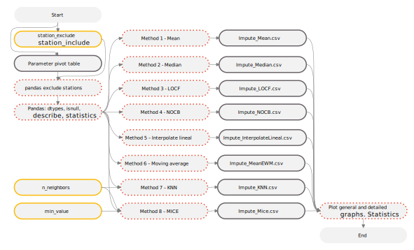<br>
<sub>Convenciones generales en diagramas: clases de entidad en azul, dataset en gris oscuro, grillas en color verde, geo-procesos en rojo, procesos automáticos o semiautomáticos en guiones rojos y procesos manuales en amarillo. Líneas conectoras con guiones corresponden a procedimientos opcionales.</sub><br><br>
</div>

1. Para realizar la identificación y procesamiento de datos atípicos, descargue el script [Impute.py](../../.src/Outlier.py) y guárdelo en la carpeta local `D:\R.LTWB\.src` de su equipo.

Funcionalidades del script

* Completado y extendido de series por 8 métodos estadísticos.
* Permite definir la tabla dinámica (pivot table original o con valores atípicos identificados, eliminados y/o ajustados) del parámetro hidroclimatológico a evaluar.
* El usuario puede excluir estaciones del análisis a través de la variable `station_exclude` o definir las estaciones a utilizar a través de las variables `station_include` y `only_included`.
* Análisis masivo de estaciones por parámetro hidroclimatológico con estadísticos, parámetros de evaluación y gráficas generales y detalladas por estación con representación de datos completados y/o extendidos.
* Generación de reportes detallados Markdown y reporte complementario gráfico por estación para cada parámetro hidroclimatológico evaluado. [IDEAM_Impute](../../.datasets/IDEAM_Impute).
* Para cada método y cada parámetro hidroclimatológico analizado, crea tablas en formato de texto separado por comas .csv.

> Para el ejemplo, se han excluido diferentes estaciones con registros de caudal sobre el Río Magdalena y otros ríos con caudales altos.

Contenido del script

```
```

2. Cree una nueva carpeta en blanco con el nombre `IDEAM_Impute` en su directorio de proyecto local `D:\R.LTWB\.datasets` y dentro de ella la carpeta `Graph`. Verifique que las carpetas locales `D:\R.LTWB\.datasets\IDEAM_EDA` y/o  `D:\R.LTWB\.datasets\IDEAM_Outlier`, contengan los archivos de las tablas dinámicas de cada parámetro hicroclimatológico [IDEAM_EDA](../../.datasets/IDEAM_EDA) o [IDEAM_Outlier](../../.datasets/IDEAM_Outlier) que fueron obtenidas en las actividades denominadas [EDA](../EDA) y [Outlier](../Outlier).

> Para la identificación de valores atípicos no son requeridas las tablas de datos de correlaciones identificadas con nombre terminado en _correlation.csv.
> 
> Dependiendo del tipo de parámetro y de los análisis previamente realizados en actividades anteriores, para el desarrollo de esta actividad de completado de datos, podrá utilizar las series de datos iniciales o la series con identificación y ajuste de valores atípicos.

3. Desde el editor de texto [Notepad++](https://notepad-plus-plus.org/), abra el archivo [D:\R.LTWB\.src\Impute.py](../../.src/Impute.py), y defina las siguientes variables:

* `pivot_table_name = 'Outlier_IQR_Cap_Pivot_PTPM_TT_M.csv'`: corresponde a la tabla dinámica (pivot table) a procesar, p.ej., Outlier_IQR_Cap_Pivot_PTPM_TT_M.csv corresponde a datos de precipitación mensual total, Outlier_IQR_Cap_Pivot_EV_TT_D.csv corresponde a datos de evaporación diaria total, Outlier_IQR_Cap_Pivot_Q_MEDIA_M.csv corresponde a datos de caudal medio mensual, Outlier_IQR_Cap_Pivot_TMN_CON.csv corresponde a datos de temperatura mínima diaria y Outlier_IQR_Cap_Pivot_TMX_CON.csv corresponde a datos de temperatura máxima diaria, todos con identificación y ajuste de valores atípicos a partir del método de rango intercuartílico - IQR y reemplazo Cap con $\mu$ +- K * $\sigma$.
* `min_value = 0`: corresponde al valor mínimo a imputar en el Método 8 - MICE, p.ej, para lluvia, evaporación y caudal, el valor mínimo es cero, pero dependiendo de la zona geográfica y para temperatura mínima y máxima, este valor puede ser negativo y puede ser establecido como menos infinito `-inf`. Para los datos del caso de estudio utilizaremos cero debido a que no existen estaciones con registros de temperatura negativos.
* `n_neighbors = 5`: número de vecinos naturales a utilizar en el Método 7 - KNN y en el Método 8 - MICE. Este valor depende del número de estaciones disponibles en cada parámetro. 

> Debido a que en evaporación solo disponemos de una estación, no se realizarán procesos de imputación de datos faltantes para este parámetro.
> 
> Tenga en cuenta que los resultados del Método 8 - MICE pueden variar de ejecución a ejecución del script debido al tipo de imputador utilizado.

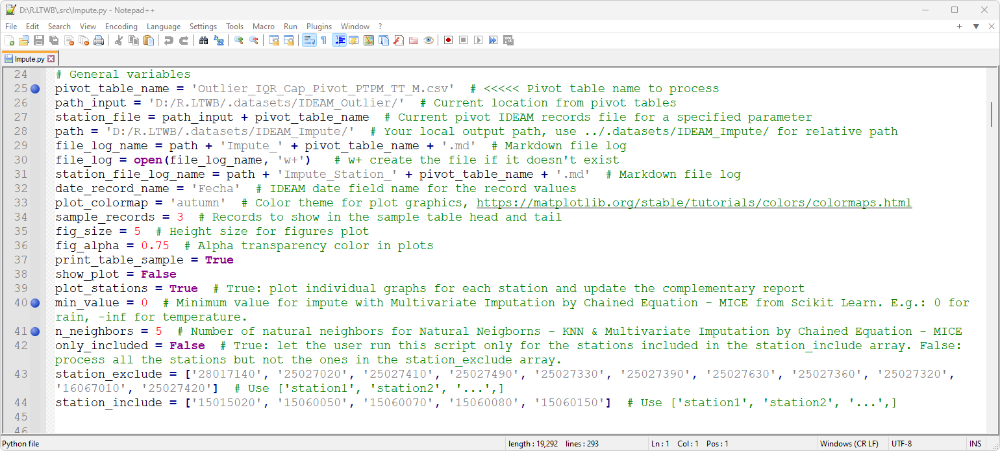

4. En Microsoft Windows, ejecute el _Command Prompt_ o _CMD_, ingrese `D:` y de <kbd>Enter</kbd> para cambiar a la unidad D:\ donde se encuentra el repositorio R.LTWB. Utilizando el comando  `CD D:\R.LTWB\.datasets\IDEAM_Impute` ubíquese dentro de la carpeta IDEAM_Impute.

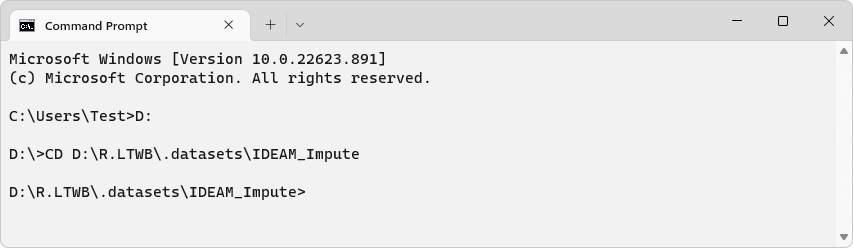

5. En él `CMD`, ejecute la instrucción `C:\Python3.10.5\python.exe "D:\R.LTWB\.src\Impute.py"` que realizará el procesamiento de imputación de datos faltantes. Durante la ejecución, podrá observar que en la consola se presenta el detalle de los procesos ejecutados para cada método, además de la previsualización de diferentes tablas en formato Markdown.

> Para visualizar durante la ejecución las gráficas generales de análisis, establezca la variable `show_plot = True`.

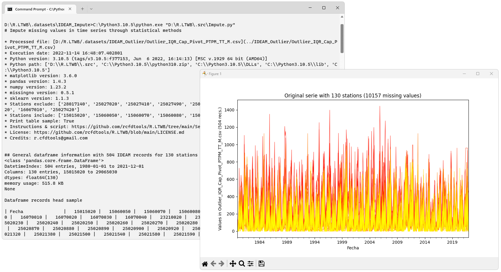
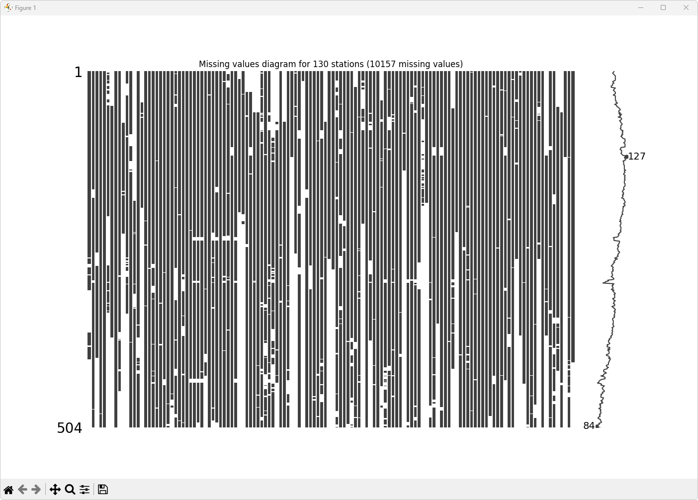
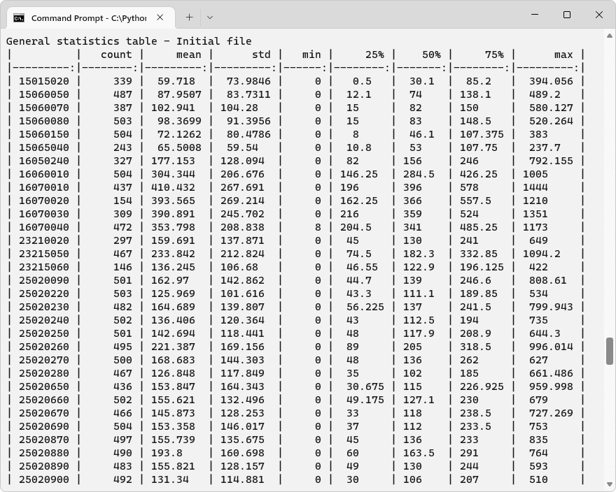


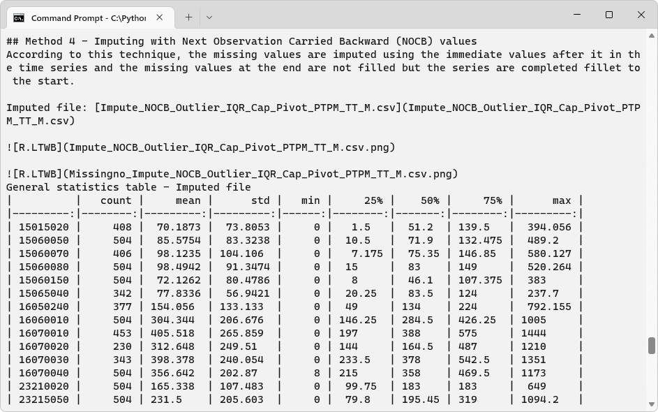

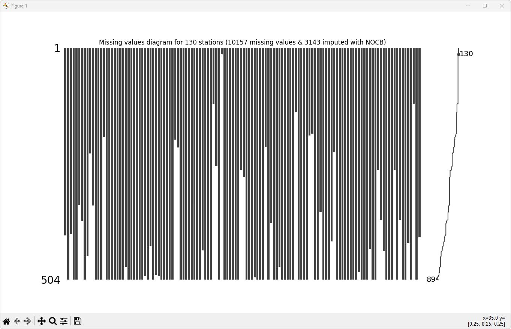


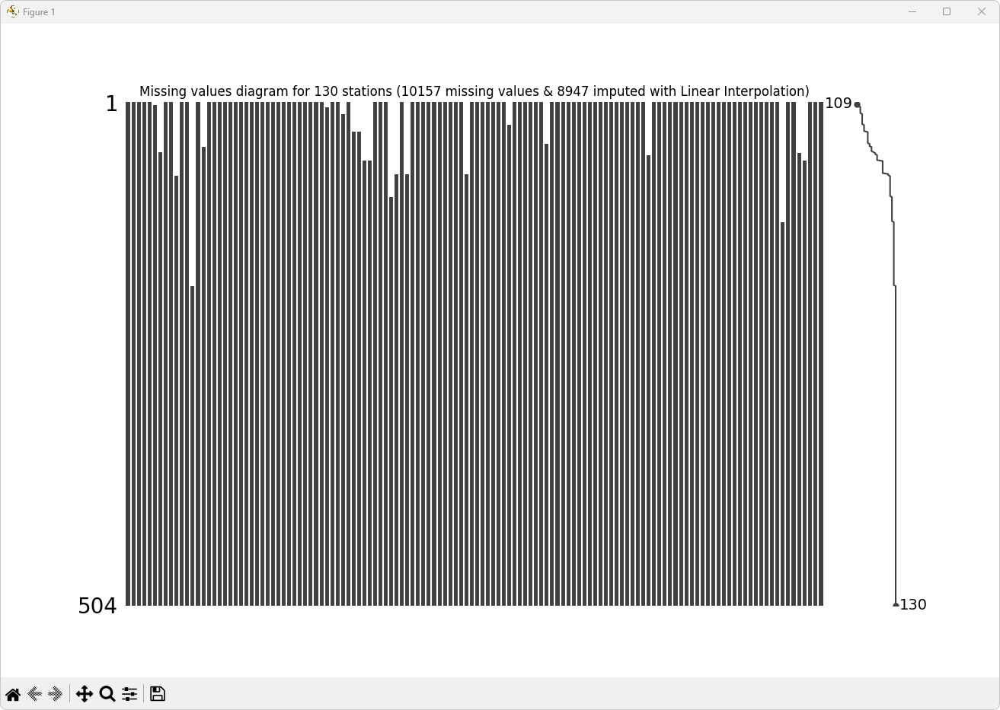
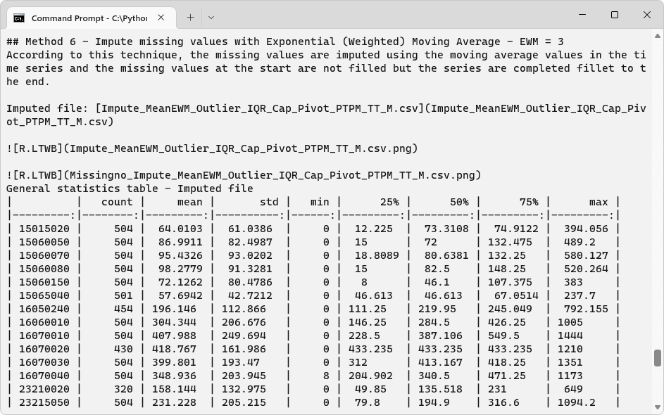


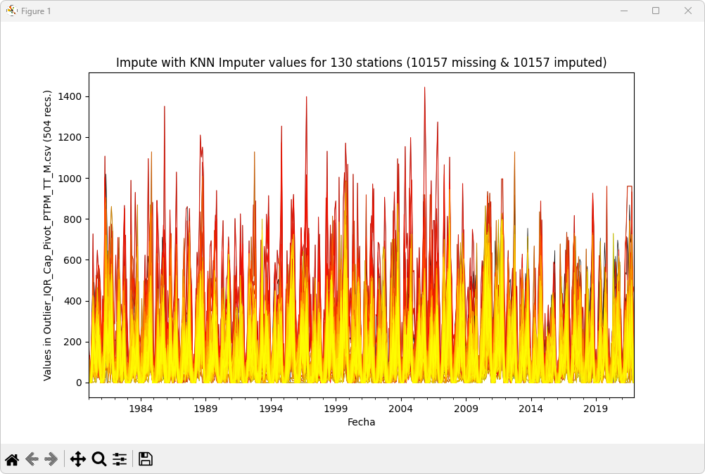

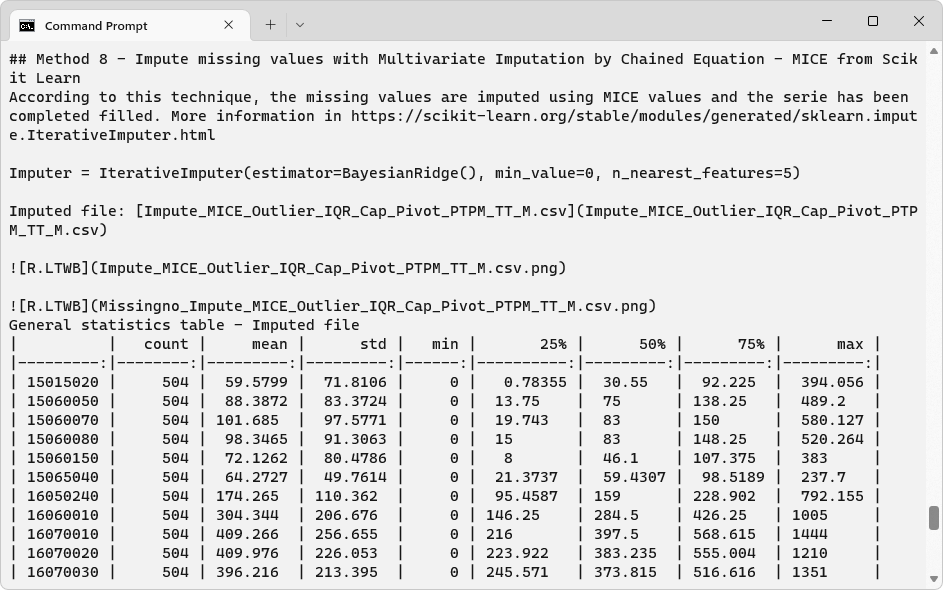

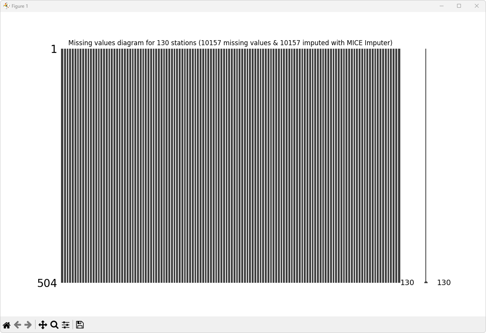

Luego de la ejecución, podrá observar que en la carpeta local `D:\R.LTWB\.datasets\IDEAM_Impute` se han generado diferentes archivos de resultados por cada método para la tabla de datos de precipitación mensual total Outlier_IQR_Cap_Pivot_PTPM_TT_M.csv.


De igual manera, en la carpeta local  `D:\R.LTWB\.datasets\IDEAM_Impute\Graph` se ha generado para cada estación, 8 gráficas de comparación de las series iniciales y las imputadas. Para las 130 estaciones, se han generado 1040 gráficas.

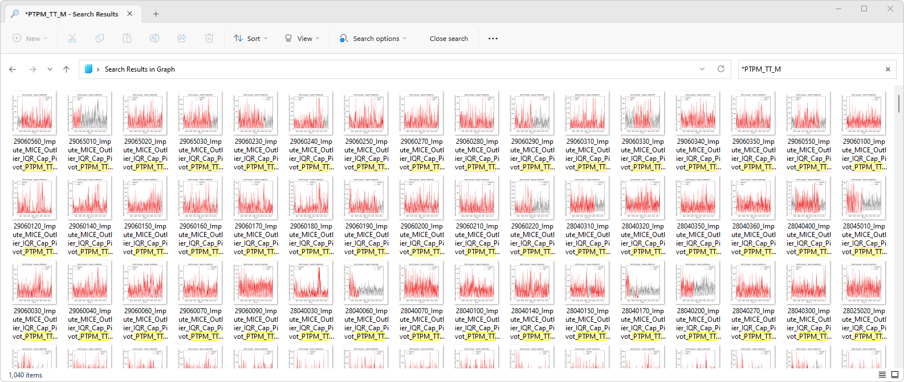

Una vez finalizado el proceso de ejecución, podrá sincronizar en la nube los resultados en su repositorio de proyectos de GitHub y podrá observar el reporte detallado en formato Markdown [Impute_Outlier_IQR_Cap_Pivot_PTPM_TT_M.csv.md](../../.datasets/IDEAM_Impute/Impute_Outlier_IQR_Cap_Pivot_PTPM_TT_M.csv.md) y el reporte complementario de gráficos por estación [Impute_Station_Outlier_IQR_Cap_Pivot_PTPM_TT_M.csv.md](../../.datasets/IDEAM_Impute/Impute_Station_Outlier_IQR_Cap_Pivot_PTPM_TT_M.csv.md).

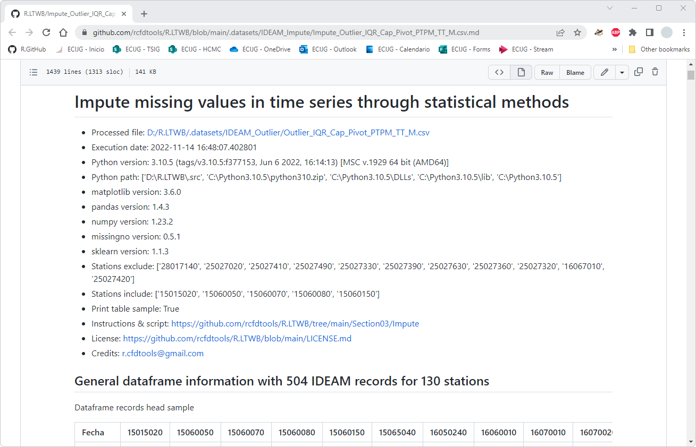


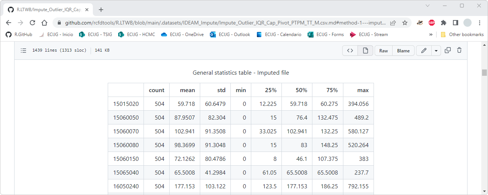

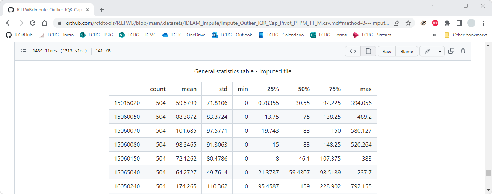
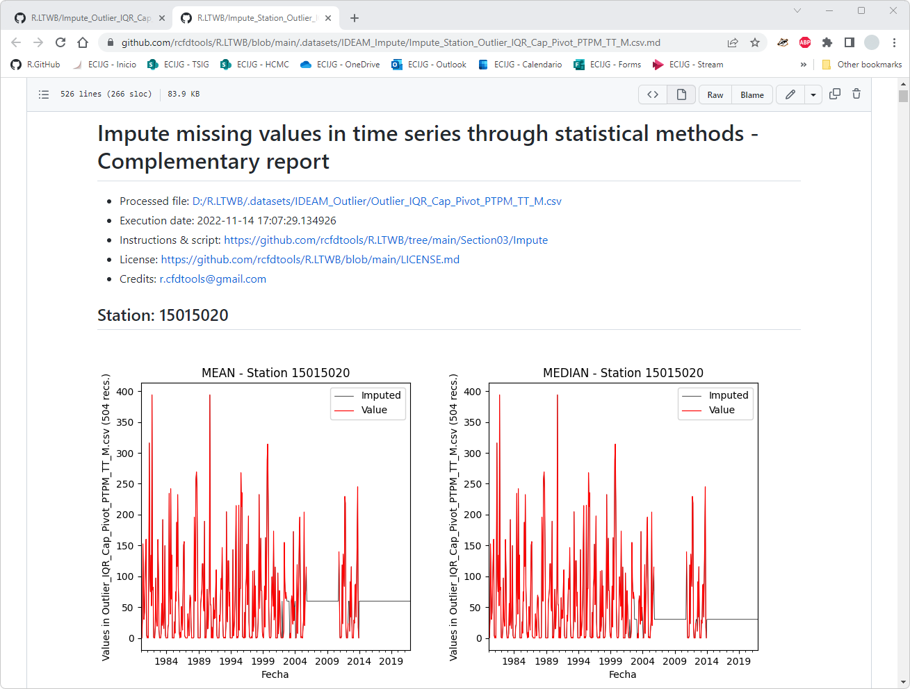
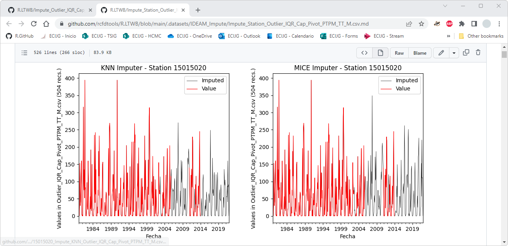

6. Repita el procedimiento anterior para los datos de caudal, temperatura mínima y máxima.

Durante el proceso de ejecución del script, se generan automáticamente para cada parámetro hidroclimatológico, un reporte integrado de resultados en formato Markdown (.md), gráficas de análisis y diferentes tablas en formato .csv.

| Reporte                                                                                                                                                                                                                                                                     | Descripción                      | Estaciones | Registros | Faltantes |   M1   |   M2   |   M3   |   M4   |   M5   |   M6   |   M7   |   M8   |
|-----------------------------------------------------------------------------------------------------------------------------------------------------------------------------------------------------------------------------------------------------------------------------|----------------------------------|:----------:|:---------:|:---------:|:------:|:------:|:------:|:------:|:------:|:------:|:------:|:------:|
| [Impute_Outlier_IQR_Cap_Pivot_PTPM_TT_M.csv.md](../../.datasets/IDEAM_Impute/Impute_Outlier_IQR_Cap_Pivot_PTPM_TT_M.csv.md)<br>[Impute_Station_Outlier_IQR_Cap_Pivot_PTPM_TT_M.csv.md](../../.datasets/IDEAM_Impute/Impute_Station_Outlier_IQR_Cap_Pivot_PTPM_TT_M.csv.md)  | Precipitación mensual total, mm. |    130     |    504    |   10157   | 10157  | 10157  |  8947  |  3143  |  8947  |  8947  | 10157  | 10157  |
| [Impute_Outlier_IQR_Cap_Pivot_Q_MEDIA_M.csv.md](../../.datasets/IDEAM_Impute/Impute_Outlier_IQR_Cap_Pivot_Q_MEDIA_M.csv.md)<br>[Impute_Station_Outlier_IQR_Cap_Pivot_Q_MEDIA_M.csv.md](../../.datasets/IDEAM_Impute/Impute_Station_Outlier_IQR_Cap_Pivot_Q_MEDIA_M.csv.md)  | Caudal medio mensual, m³/s.      |     46     |    504    |   6745    |  6745  |  6745  |  4682  |  4523  |  4682  |  4682  |  6745  |  6745  |
| [Impute_Outlier_IQR_Cap_Pivot_TMN_CON.csv.md](../../.datasets/IDEAM_Impute/Impute_Outlier_IQR_Cap_Pivot_TMN_CON.csv.md)<br>[Impute_Station_Outlier_IQR_Cap_Pivot_TMN_CON.csv.md](../../.datasets/IDEAM_Impute/Impute_Station_Outlier_IQR_Cap_Pivot_TMN_CON.csv.md)          | Temperatura diaria mínima, °C.   |     25     |   15341   |  173702   | 173702 | 173702 | 148100 | 86276  | 148100 | 148100 | 173702 | 173702 |
| [Impute_Outlier_IQR_Cap_Pivot_TMX_CON.csv.md](../../.datasets/IDEAM_Impute/Impute_Outlier_IQR_Cap_Pivot_TMX_CON.csv.md)<br>[Impute_Station_Outlier_IQR_Cap_Pivot_TMX_CON.csv.md](../../.datasets/IDEAM_Impute/Impute_Station_Outlier_IQR_Cap_Pivot_TMX_CON.csv.md)          | Temperatura diaria máxima, °C.   |     25     |   15341   |  197676   | 197676 | 197676 | 169785 | 108658 | 169785 | 169785 | 197676 | 197676 |

> En la tabla anterior, las columnas M1 a M8 contienen el número de datos imputados por cada método utilizado.
>
> Para todos los parámetros se han utilizado 5 vecinos naturales para la generación de datos sintéticos por los métodos KNN y MICE.  

Al revisar los estadísticos característicos, p. ej. de la estación 15015020, correspondiente a datos de precipitación total mensual, se pueden observar los siguientes valores de media y desviación estándar:

<div align='center'>

| Método                                                                                                   | $\mu$, media | $\sigma$, std |
|:---------------------------------------------------------------------------------------------------------|:-------------|:--------------|
| Serie original                                                                                           | 59.7829      | 74.2829       |
| Serie con atípicos identificados con rango intercuartílico - IQR.<br>Reemplazo con $\mu$ +- K * $\sigma$ | 59.718       | 73.9846       |
| M1. Imputación con media, $\mu$                                                                          | 59.718       | 60.6479       |
| M2. Imputación con mediana                                                                               | 50.0217      | 62.2231       |
| M3. Imputación LOCF                                                                                      | 54.6675      | 68.6241       |
| M4. Imputación NOCB                                                                                      | 70.1873      | 73.8053       |
| M5. Imputación pir interpolación lineal                                                                  | 55.7429      | 70.1337       |
| M6. Media móvil - EWM                                                                                    | 64.0103      | 61.0386       |
| M7. Vecino natural - KNN                                                                                 | 56.6695      | 68.2329       |
| M8. Multivariante con ecuación de encadenamiento - MICE                                                  | 59.5799      | 71.8106       |

</div>


**Conclusión general**

Existen diferentes metodologías estadísticas para el completado y extendido de series, su aplicación en hidrología depende del tipo de parámetro hidroclimatológico a estudiar, del número de datos faltantes, del número de estaciones simultáneas evaluadas y de la ventana de tiempo definida para los análisis. Si bien existen metodologías geo-estadísticas en las que se evalúan las relaciones espaciales (basadas en distancia y/o proximidad, bandas de elevación y correlación con otros parámetros) entre las estaciones utilizadas, con métodos estadísticos como vecino natural - KNN o multivariante - MICE, se pueden obtener datos sintéticos que mantienen la tendencia general de la zona estudiada a partir de las estaciones definidas. Para el desarrollo de las actividades posteriores de este curso, usaremos las series de datos completadas y extendidas por el Método 8 Multivariante con ecuación de encadenamiento - MICE, debido a que permite mantener la tendencia general de los datos zonales y utiliza como semilla la media propia de cada estación. 

En este momento, dispone de reportes detallados de completado y extendido de datos por cada parámetro hidroclimatológico y diferentes tablas en formato de texto separado por comas `.csv` para los diferentes métodos implementados.


### Actividades complementarias:pencil2:

En la siguiente tabla se listan las actividades complementarias que deben ser desarrolladas y documentadas por el estudiante en un único archivo de Adobe Acrobat .pdf. El documento debe incluir portada (mostrar nombre completo, código y enlace a su cuenta de GitHub), numeración de páginas, tabla de contenido, lista de tablas, lista de ilustraciones, introducción, objetivo general, capítulos por cada ítem solicitado, conclusiones y referencias bibliográficas.

| Actividad | Alcance                                                                                                                                                                                                                                                                                                                                                                                               |
|:---------:|:------------------------------------------------------------------------------------------------------------------------------------------------------------------------------------------------------------------------------------------------------------------------------------------------------------------------------------------------------------------------------------------------------|
|     1     | A partir del script [Impute.py](../../.src/Impute.py), realice el análisis de valores atípicos de los parámetros climatológicos definidos como actividad complementaria en la actividad de [descarga de datos hidroclimatológicos](../CNEStationDatasetDownload); correspondientes a brillo solar, radiación solar, humedad del aire cerca al suelo y parámetros relacionados con viento y nubosidad. |
|     2     | Para todas los parámetros climatológicos y a partir de las gráficas y tablas de análisis generadas mediante el script [Impute.py](../../.src/Impute.py), presente un análisis cualitativo e identifique en que estaciones no se han obtenido datos sintéticos consistentes para los métodos implementados.                                                                                            | 


### Referencias

* https://www.projectpro.io/recipes/deal-with-missing-values-in-timeseries-in-python
* https://towardsdatascience.com/8-methods-for-handling-missing-values-with-python-pandas-842544cdf891
* https://towardsdatascience.com/4-techniques-to-handle-missing-values-in-time-series-data-c3568589b5a8
* https://www.section.io/engineering-education/missing-values-in-time-series/
* https://www.kaggle.com/code/parulpandey/a-guide-to-handling-missing-values-in-python
* https://pandas.pydata.org/docs/reference/api/pandas.DataFrame.interpolate.html
* https://github.com/ResidentMario/missingno
* https://towardsdatascience.com/imputing-missing-data-with-simple-and-advanced-techniques-f5c7b157fb87#:~:text=Time%20Series%20Imputation&text=One%20way%20to%20impute%20missing,with%20the%20previously%20observed%20value
* https://scikit-learn.org/stable/modules/generated/sklearn.impute.KNNImputer.html
* https://scikit-learn.org/stable/modules/generated/sklearn.impute.IterativeImputer.html


### Control de versiones

| Versión    | Descripción | Autor                                      | Horas |
|------------|:------------|--------------------------------------------|:-----:|
| 2022.11.07 |             | [rcfdtools](https://github.com/rcfdtools)  |  xx   |


_R.LTWB es de uso libre para fines académicos, conoce nuestra licencia, cláusulas, condiciones de uso y como referenciar los contenidos publicados en este repositorio, dando [clic aquí](https://github.com/rcfdtools/R.LTWB/wiki/License)._

_¡Encontraste útil este repositorio!, apoya su difusión marcando este repositorio con una ⭐ o síguenos dando clic en el botón Follow de [rcfdtools](https://github.com/rcfdtools) en GitHub._

| [Actividad anterior](../Outlier) | [Inicio](../../Readme.md) | [:beginner: Ayuda](https://github.com/rcfdtools/R.LTWB/discussions/99999) | [Actividad siguiente]() |
|----------------------------------|---------------------------|---------------------------------------------------------------------------|-------------------------|

