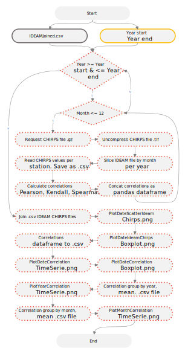

## Obtención de series de datos discretos climatológicos satelitales y correlación con datos terrestres
Keywords: `Remote sensing` `Chirps` `rasterio` `requests`

Para la validación o el contraste de información terrestre, se pueden obtener datos satelitales de precipitación diaria total, temperatura y evapotranspiración sobre las localizaciones específicas de la red climatológica utilizada. A partir de la información recopilada y validada para la red estaciones a usar en la zona de estudio y la conformación de series a partir de datos satelitales en las localizaciones específicas de la red, se correlacionan estos datos para evaluar si existe correspondencia y homogeneidad entre ellos.                                                                                                                                                                                                 

### Objetivos

* 

### Requerimientos

* [Python 3+](https://www.python.org/)
* Series de datos discretos climatológicos de estaciones terrestres del IDEAM. [:mortar_board:Aprender.](../CNEStationDatasetDownload)

### Procedimiento general

  
Convenciones del diagrama: Base de datos geográfica GDB en azul, Clases de entidad en gris, Geo-procesos en verde y Procesos manuales en amarillo. Líneas con guiones corresponden a procedimientos opcionales.  

1. 

En este momento, dispone de registros IDEAM de precipitación con el registro de valores Chirps.

### Referencias

* https://www.earthdata.nasa.gov/learn/backgrounders/remote-sensing
* https://data.chc.ucsb.edu/products/CHIRPS-2.0/global_monthly/tifs/
* https://hatarilabs.com/ih-en/extract-point-value-from-a-raster-file-with-python-geopandas-and-rasterio-tutorial
* https://www.youtube.com/watch?v=6zzneGT4mkg
* https://sparkbyexamples.com/pandas/pandas-dataframe-filter/
* https://towardsdatascience.com/8-ways-to-filter-pandas-dataframes-d34ba585c1b8
* https://towardsdatascience.com/4-tricks-you-should-know-to-parse-date-columns-with-pandas-read-csv-27355bb2ad0e
* https://www.codegrepper.com/code-examples/python/how+to+extract+gz+file+python
* https://www.geeksforgeeks.org/python-pandas-dataframe-corr/
* https://stackoverflow.com/questions/42579908/use-corr-to-get-the-correlation-between-two-columns
* https://stackoverflow.com/questions/36454494
* https://www.geeksforgeeks.org/python-pandas-dataframe-set_index/
* https://pandas.pydata.org/docs/getting_started/intro_tutorials/05_add_columns.html
* https://pandas.pydata.org/docs/reference/api/pandas.DataFrame.corr.html
* https://pandas.pydata.org/docs/reference/api/pandas.concat.html
* https://pandas.pydata.org/docs/getting_started/intro_tutorials/04_plotting.html

### Compatibilidad

* Esta actividad puede ser desarrollada con cualquier software SIG que disponga de herramientas para de digitalización con opciones de encajado o snapping.
* 

### Control de versiones

| Versión    | Descripción     | Autor                                      | Horas |
|------------|:----------------|--------------------------------------------|:-----:|
| 2022.10.07 | Versión inicial | [rcfdtools](https://github.com/rcfdtools)  |   0   |

_R.LTWB es de uso libre para fines académicos, conoce nuestra licencia, cláusulas, condiciones de uso y como referenciar los contenidos publicados en este repositorio, dando [clic aquí](https://github.com/rcfdtools/R.LTWB/wiki/License)._

_¡Encontraste útil este repositorio!, apoya su difusión marcando este repositorio con una ⭐ o síguenos dando clic en el botón Follow de [rcfdtools](https://github.com/rcfdtools) en GitHub._

| [Actividad anterior](https://github.com/rcfdtools/R.LTWB/tree/main/Section02/DEMAlos) | [Inicio](https://github.com/rcfdtools/R.LTWB/wiki)  | [:beginner: Ayuda](https://github.com/rcfdtools/R.LTWB/discussions/99999) | [Actividad siguiente]()  |
|---------------------------------------------------------------------------------------|-----------------------------------------------------|---------------------------------------------------------------------------|--------------------------|

[^1]: 