## Análisis y mapa de temperatura media
Keywords: `Elevation` `Temperature` `Scatter-plot` `Trend-line`

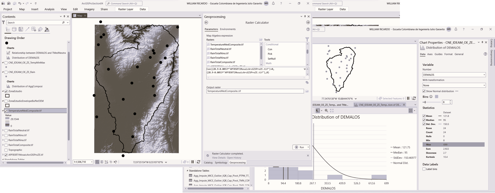

A partir de las series agregadas de temperatura máxima y mínima a nivel anual, se estima la temperatura media anual en cada estación, requerida para la estimación de la evapotranspiración potencial.

### Objetivos

* Calcular la temperatura media multianual en cada estación a partir del promedio de la temperatura máxima y mínima.
* Evaluar el rango de elevaciones y la localización de las estaciones con datos de temperatura disponible. 
* A partir de relación entre los datos de temperatura y elevación, obtener y evaluar ecuaciones características.
* A partir de ecuaciones regionales, crear el mapa de temperatura de la zona de estudio a partir del modelo digital de elevación.

### Requerimientos

* [ArcGIS Pro 2+](https://pro.arcgis.com/en/pro-app/latest/get-started/download-arcgis-pro.htm)
* [ArcGIS for Desktop 10+](https://desktop.arcgis.com/es/desktop/) (opcional)
* [QGIS 3+](https://qgis.org/) (opcional)
* Estaciones hidroclimatológicas de la zona de estudio con validación de altitud a partir de información satelital. [:mortar_board:Aprender.](../../Section03/CNEStationElevation)
* Tablas de valores agregados promedio multianual por parámetro hidroclimatológico. [:mortar_board:Aprender.](../../Section03/Agg)

### Procedimiento general para interpolación de precipitación total

  
Convenciones generales en diagramas: clases de entidad en azul, dataset en gris oscuro, grillas en color verde, geo-procesos en rojo, procesos automáticos o semiautomáticos en guiones rojos y procesos manuales en amarillo. Líneas conectoras con guiones corresponden a procedimientos opcionales.  

1. En ArcGIS Pro, abra el proyecto _ArcGISProSection04.aprx_ que se encuentra en la ruta _D:\R.LTWB\\.map_ y que fué creado en la actividad anterior.

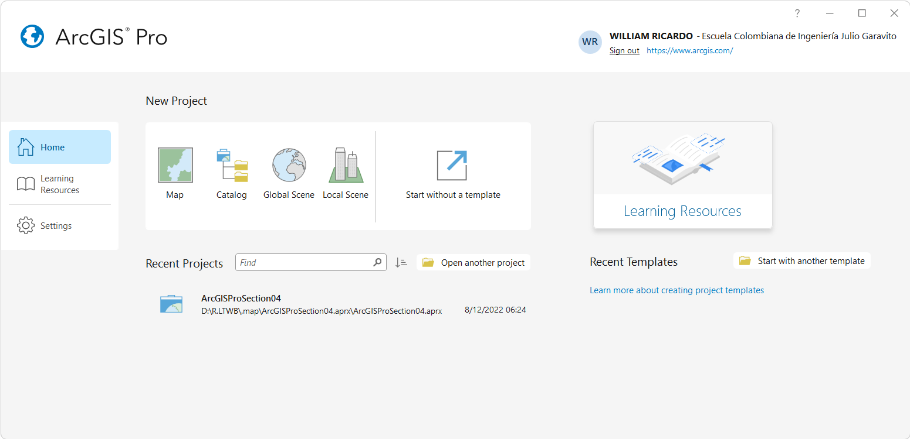

> Tenga en cuenta que previamente asignamos al mapa el sistema de coordenadas 9377 de Colombia, correspondiente a MAGNA-SIRGAS Origen-Nacional.

2. Desde la tabla de contenido del mapa, renombre la clase de entidad _CNE_IDEAM_OE_ZE_ como _CNE_IDEAM_OE_ZE_Rain_ para conservar la unión y los filtros previamente realizados con los datos de precipitación.

3. Desde la tabla de contenido del mapa y dando clic derecho en _CNE_IDEAM_OE_ZE_Rain_, cree una copia de esta capa y nómbrela como _CNE_IDEAM_OE_ZE_TempMinMax_, luego elimine las uniones, gráficas y filtros existentes asociados a la capa copiada.

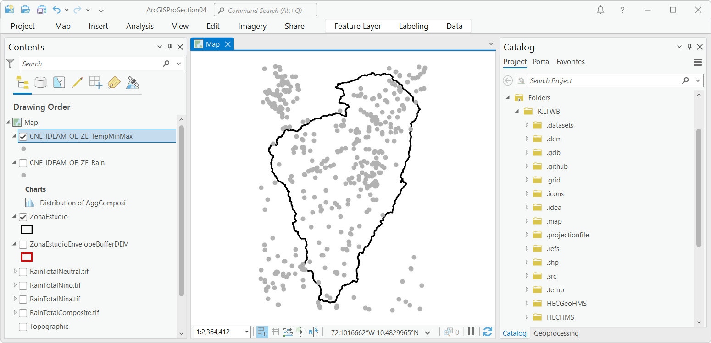

4. Desde la carpeta _.datasets/IDEAM_Agg_ disponible en el catálogo, agregue al mapa actual (botón derecho sobre el archivo / Add To Current Map) los archivos [Agg_Impute_MICE_Outlier_IQR_Cap_Pivot_TMN_CON.csv](../../.datasets/IDEAM_Agg/Agg_Impute_MICE_Outlier_IQR_Cap_Pivot_TMN_CON.csv) y [Agg_Impute_MICE_Outlier_IQR_Cap_Pivot_TMX_CON.csv](../../.datasets/IDEAM_Agg/Agg_Impute_MICE_Outlier_IQR_Cap_Pivot_TMX_CON.csv) correspondientes a las tablas de agregaciones multianuales de temperatura mínima y máxima por estación. Luego desde la tabla de contenido o Contents, abra los archivos; podrá observar que se componen de 25 registros o estaciones y que contienen datos compuestos y por fenómeno climatológico.

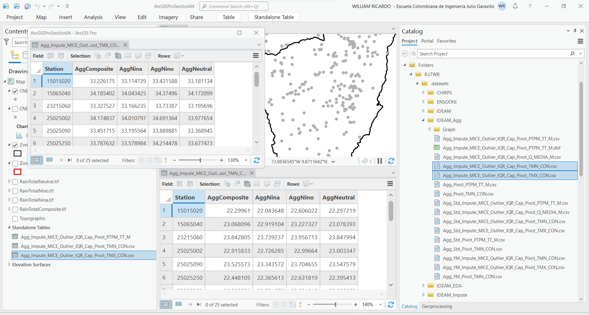

5. Desde la tabla de contenido y dando clic derecho sobre cada tabla y mediante la opción _Data / Export Table_, exporte los archivos .csv a archivos dBase .dbf en la misma ruta original y con los nombres [Agg_Impute_MICE_Outlier_IQR_Cap_Pivot_TMN_CON.dbf](../../.datasets/IDEAM_Agg/Agg_Impute_MICE_Outlier_IQR_Cap_Pivot_TMN_CON.dbf) y [Agg_Impute_MICE_Outlier_IQR_Cap_Pivot_TMX_CON.dbf](../../.datasets/IDEAM_Agg/Agg_Impute_MICE_Outlier_IQR_Cap_Pivot_TMX_CON.dbf)

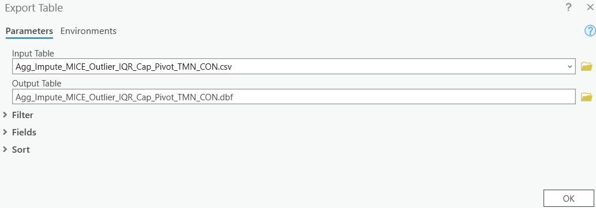

> El proceso de conversión es requerido debido a que es necesario modificar la estructura de la tabla agregando un campo de atributos tipo texto que contendrá el código de la estación, lo anterior debido a que el campo Station es interpretado como un campo numérico entero y el código de las estaciones del catálogo del IDEAM ha sido definido como cadena de texto.

Luego del proceso de exportación, serán cargadas la tabla .dbf al mapa. Remover los archivo .csv de la tabla de contenido y abrir los archivos .dbf.

6. Modifique la estructura de las tablas agregando un nuevo campo de atributos tipo texto de 255 caracteres con el nombre `CODIGO`.

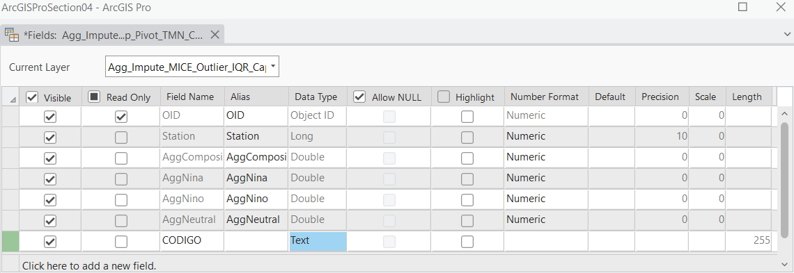

7. Desde la cabecera del campo `CODIGO` y utilizando la herramienta _Calculate Field_, asigne a este campo los valores contenidos en el campo Station.

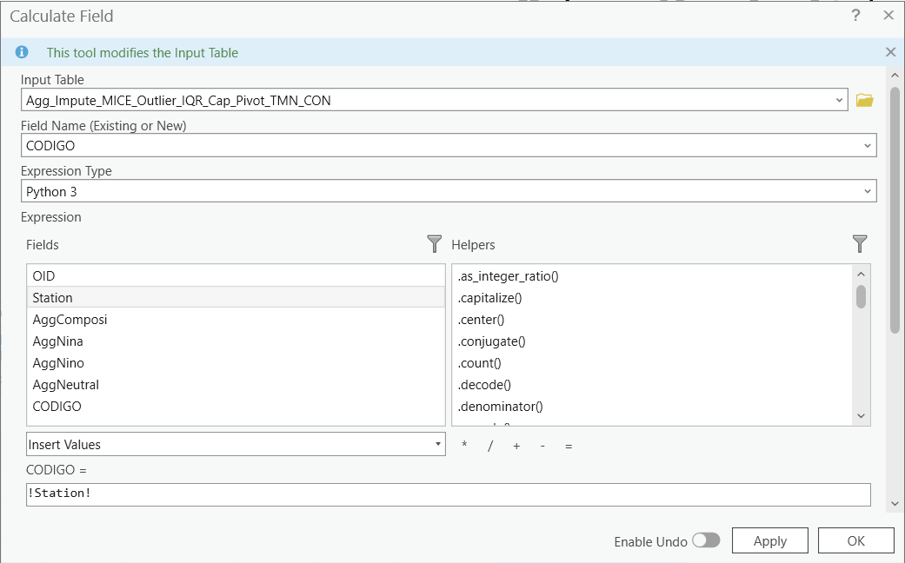

8. En la capa de estaciones _CNE_IDEAM_OE_ZE_TempMinMax_, realice dos uniones (clic derecho sobre la capa geográfica / Join) con los datos de las tablas de agregación Agg_Impute_MICE_Outlier_IQR_Cap_Pivot_TMN_CON.dbf y Agg_Impute_MICE_Outlier_IQR_Cap_Pivot_TMX_CON.dbf, utilice como llave de unión el campo `CODIGO`.

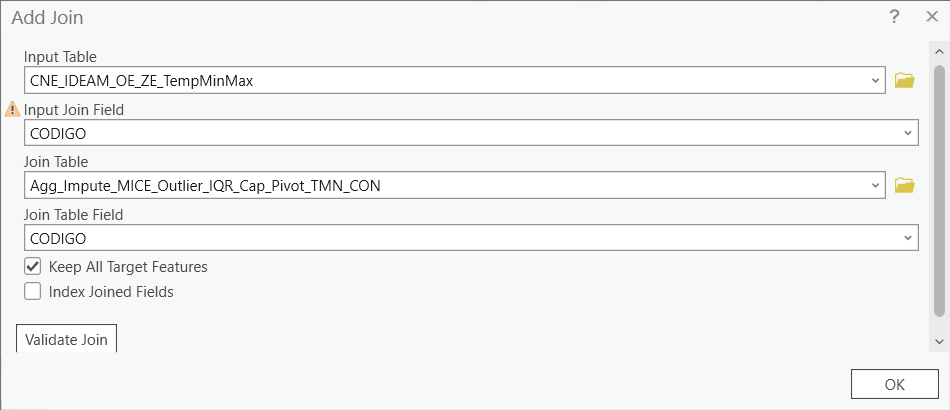

> Tenga en cuenta que los nombres de los campos de atributos AggComposi, AggNina, AggNino y AggNeutral son idénticos en las tablas de agregaciones de datos de temperatura máxima y mínima. Las uniones mantendrán el nombre de las tablas originales antes del nombre del campo, para que pueda identificar su correspondencia, para lo cual, las primeras columnas corresponderán a los datos de temperatura mínima y las columnas finales a temperatura máxima.

9. Abra la tabla de atributos de la capa _CNE_IDEAM_OE_ZE_TempMinMax_ y verifique los datos asociados mediante la unión, podrá observar que existen datos de temperatura  en 25 de las 440 estaciones seleccionadas para la zona de estudio.

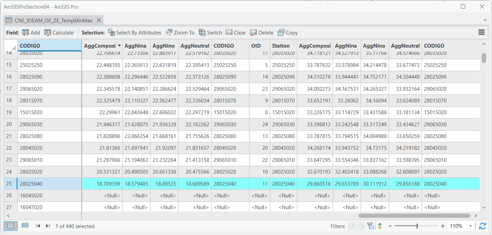

10. Desde las propiedades de la capa _CNE_IDEAM_OE_ZE_TempMinMax_, realice un filtro (Definition Query con `Agg_Impute_MICE_Outlier_IQR_Cap_Pivot_TMN_CON.OID >= 0`) para códigos OID mayores o iguales a cero correspondientes a los identificadores de ordenamiento de la tabla .dbf de agregaciones. Luego de dar clic en _Ok_ podrá observar en pantalla la localización de las estaciones con datos de temperatura y los registros correspondientes en la tabla de atributos.

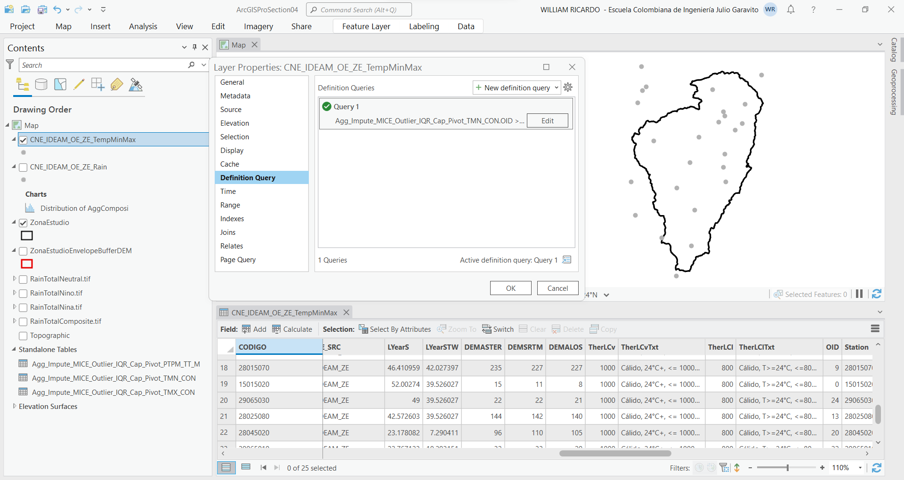

11. Desde la tabla de contenido, exporte la capa geográfica _CNE_IDEAM_OE_ZE_TempMinMax_ que contiene las uniones y el filtro como _CNE_IDEAM_OE_ZE_TempMinMax.shp_ en el directorio `D:\R.LTWB\.shp`. Automáticamente, será agregada la capa al mapa con la misma simbología de la capa original.

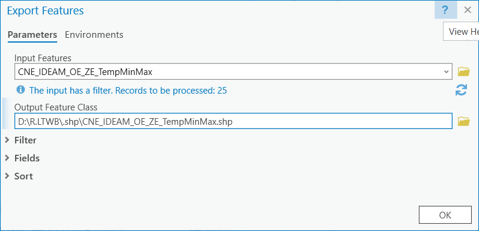

12. Modifique la estructura de la capa _CNE_IDEAM_OE_ZE_TempMinMax.shp_ agregando 4 campos de atributos numéricos dobles con los nombres `TMedComp`, `TMedNina`, `TMedNino` y `TMedNeutra`.

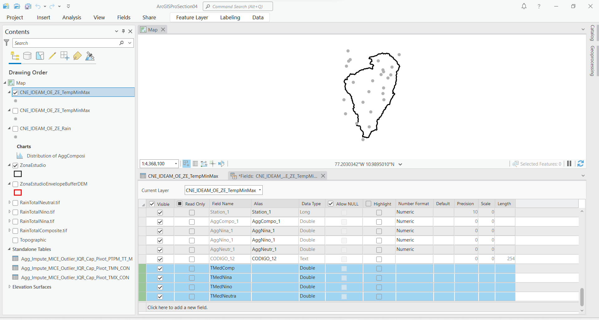

13. Desde la cabecera de cada uno de los campos creados y utilizando la herramienta _Calculate Field_, calcule la temperatura media por estación utilizando las siguientes expresiones:

* `(!AggCompo_1! + !AggComposi!)/2`
* `(!AggNina_1! + !AggNina!)/2`
* `(!AggNino_1! + !AggNino!)/2`
* `(!AggNeutr_1! + !AggNeutral!)/2`

> Los campos cuyo nombre contienen el sufijo `_1` corresponden a los valores de temperatura máxima.

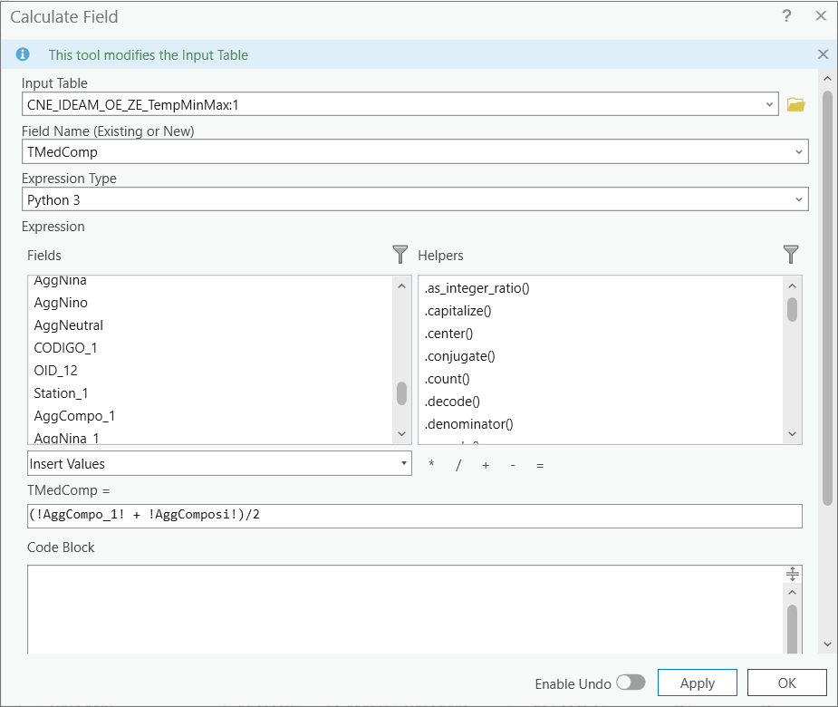

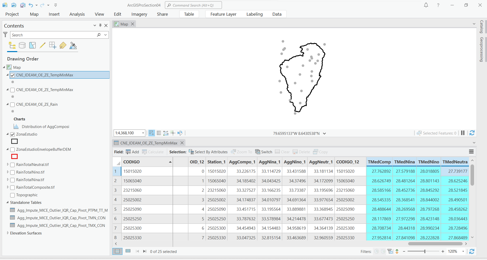

14. En la tabla de contenido, de clic derecho en la capa _CNE_IDEAM_OE_ZE_TempMinMax_ y seleccione la opción _Create Chart / Scatter Plot_. En el eje X seleccione el campo de atributos `DEMALOS` correspondiente a las elevaciones de las estaciones a partir del modelo digital de elevación ALOS PALSAR, en el eje Y seleccione el campo `TMedComp` correspondiente a valores de temperatura compuesta.

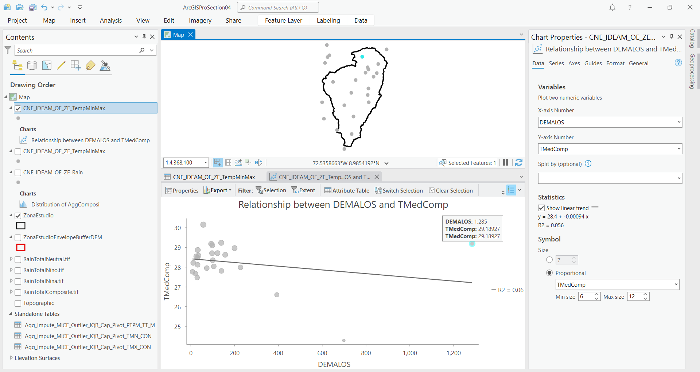

Como puede observar en la regresión, una de las estaciones se encuentra dispersa dentro del conjunto de datos incluidos en el análisis con temperatura de 29.19 °C y altitud 1285 msnm.

15. Utilizando la tecla <kbd>Ctrl</kbd>, seleccione la estación e identifique su código en la tabla de atributos, observará que corresponde a la estación 28035070. Utilizando el _Definition Query_ de la capa, exclúyala utilizando la expresión `CODIGO NOT IN ('28035070')`

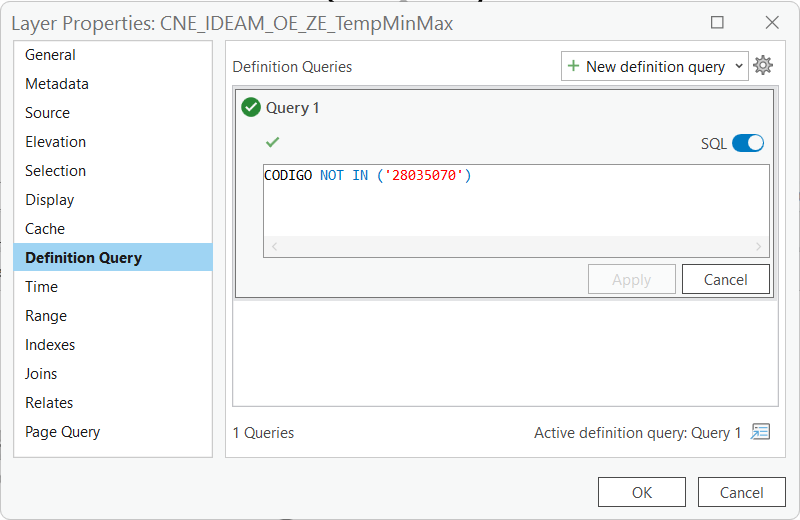

Para la exclusión realizada, la tendencia presenta la ecuación lineal `y = 28.9 - 0.0053 x` con R² = 0.53, donde `x` representa el valor de la altura y `y` corresponde a temperatura.

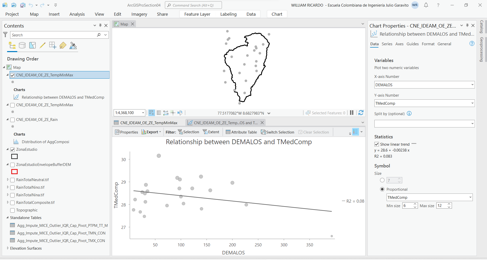

16. Utilizando el mismo filtro de exclusión de la estación 28035070, obtenga las ecuaciones características lineales para los datos de temperatura correspondientes a fenómenos climatológicos, para todas las series obtendrá las siguientes expresiones zonales:

| Fenómeno  | Expresión            | R²   |
|-----------|----------------------|------|
| Compuesto | y = 28.9 - 0.0053 x  | 0.53 |
| Niña      | y = 28.7 - 0.0054 x  | 0.55 |
| Niño      | y = 29.1 - 0.0053 x  | 0.49 |
| Neutro    | y = 28.8 - 0.0054 x  | 0.55 |

> Como puede observar, los valores obtenidos de los coeficientes de determinación R² son bajos debido a la alta dispersión que existe entre los datos y a que disponemos solo de 24 estaciones IDEAM en la zona de estudio.
> 
> De acuerdo a las elevaciones DEMALOS de la tabla de atributos, los valores presentados en las expresiones corresponden a estaciones dentro del rango de elevaciones de 8 a 699 msnm.

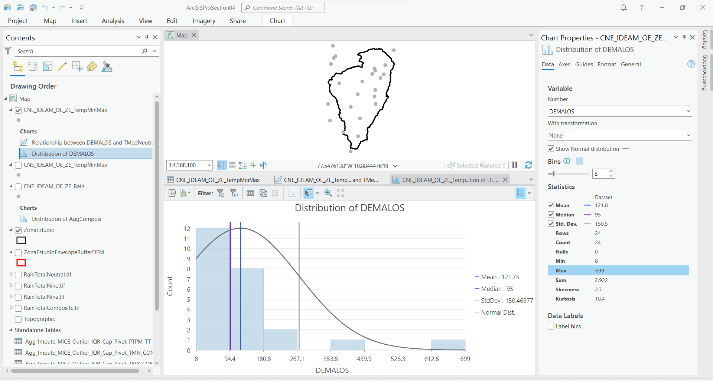

### Ecuaciones regionales 

Las expresiones obtenidas previamente, permiten describir la temperatura media en un rango limitado de elevaciones y debido a que para el balance hidrológico son requeridos datos de temperatura (para la estimación de la evapotranspiración potencial) con cobertura sobre toda la zona de estudio y para elevaciones superiores a la altitud 699 msnm, es necesario el uso de ecuaciones regionales.

El [Centro Nacional de Investigaciones de Café - Cenicafé](https://www.cenicafe.org/) de Colombia - Suramérica, ha realizado diferentes estudios relacionados con variables climatológicas, obteniendo ecuaciones que describen el comportamiento de la temperatura en función de la altitud para valores máximos, mínimos y medios. Las expresiones obtenidas para la región Atlántica dentro de la cual se encuentra la zona de estudio son:

| Expresión              | Altitud, m | R²   |
|------------------------|------------|------|
| Tm = 27.72 - 0.0055H   | 2 - 4000   | 0.99 |
| Tmax = 33.06 - 0.0062H | 2 - 4000   | 0.79 |
| Tmin = 23.10 - 0.0061H | 2 - 4000   | 0.90 |

> Las ecuaciones de Cenicafé describen el comportamiento compuesto de los datos de temperatura en un amplio rango de elevaciones y con coeficientes de determinación altos, sin embargo, los valores corresponden a datos analizados antes o hasta el año 1998.

Al comparar los valores estimados a partir de la ecuación regional de temperatura media de Cenicafé y la ecuación compuesta zonal obtenida a partir de 24 de las 25 estaciones de la zona de estudio, podemos observar una tendencia similar, sin embargo, las temperaturas de Cenicafé son inferiores en aproximadamente 1.25 °C respecto a las zonales evaluadas a partir de las series procesadas en este curso.

> La diferencia de temperatura puede estar asociada a diferentes factores, por una parte, el análisis de temperatura media realizado por Cenicafé fué realizado a partir los registros de 239 estaciones, por otra parte, los análisis zonales realizados utilizan series hasta el año 2021 y pueden evidenciar el aumento en la temperatura media de la zona debida a los efectos del calentamiento global.

En el libro de Microsoft Excel [Temperature.xlsx](Temperature.xlsx), hemos incluido un análisis comparativo entre datos proyectados utilizando la ecuación regional de Cenicafé y la ecuación zonal obtenida. Se puede observar que la pendiente de las gráficas es similar, así como la banda de diferencias para valores entre la cota 0 y 700 msnm.

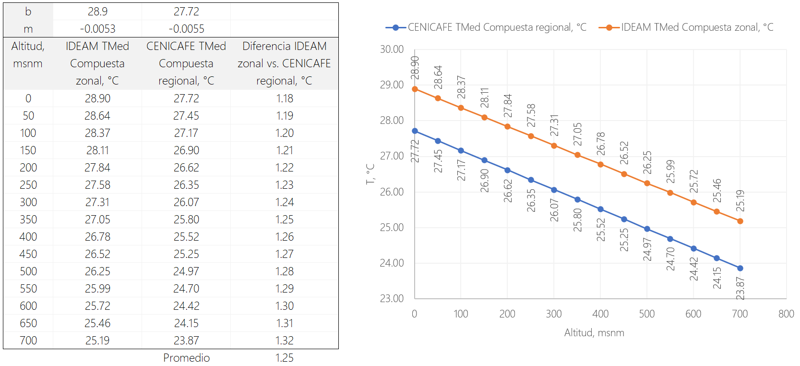

### Mapas de temperatura

Con el propósito de realizar balances hidrológicos compuestos y por fenómeno climatológico, la creación de los mapas de temperatura será realizada utilizando las expresiones zonales obtenidas a partir de series IDEAM.

Estimando, por las dos ecuaciones, valores hasta la cota 4000 msnm, es posible observar que la tendencia es similar, sin embargo, la pendiente de los datos zonales es menor, por lo que la diferencia para altitudes cercanas a la cota máxima es de hasta 1.98 °C.  

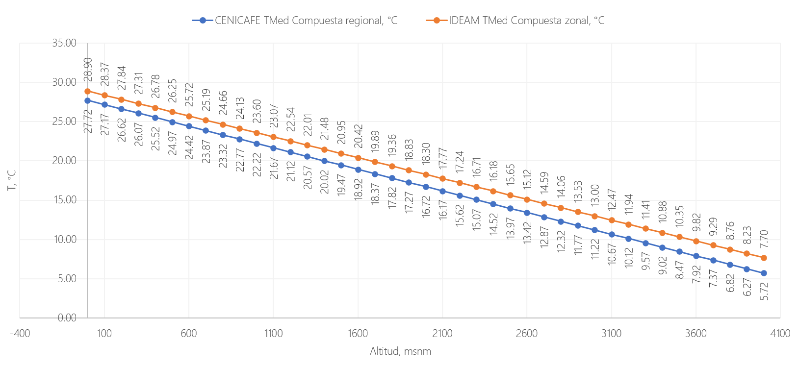

> Opcionalmente, para la creación del mapa de temperatura podríamos utilizar la expresión de Cenicafé para altitudes iguales o superiores a 700 msnm y la expresión zonal para elevaciones inferiores a esta altitud, sin embargo, las series corresponden a periodos diferentes de análisis.

1. En ArcGIS Pro, agregue desde la carpeta `D:\R.LTWB\.dem\ALOS` el modelo de terreno _APFBSRT1MosaicArcGISProZE.tif_, modifique la simbología de representación a _Shaded Relief_ con la rampa de color continua denominada _Greens_. Establezca el color de las estaciones en negro.  

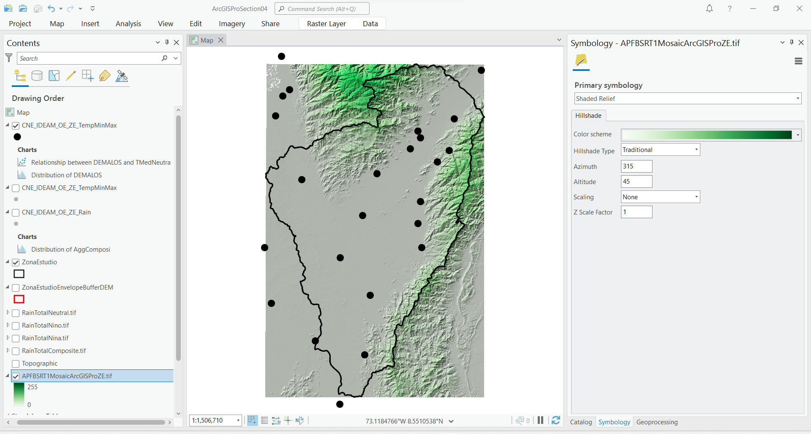

> Previamente en la Sección 2 de este curso, realizamos la descarga y procesamiento del modelo de terreno y asignamos el sistema de coordenadas 9377 de Colombia, correspondiente a MAGNA-SIRGAS Origen-Nacional.

2. Utilizando la herramienta _Geoprocessing / Raster Calculator_, cree los mapas de temperatura a partir del modelo digital de elevación ALOS PALSAR, utilice las siguientes expresiones y nombres de archivos dentro de la carpeta `D:\R.LTWB\.grid`:

| Fenómeno  | Expresión Raster Calculator                                                                            | Mapa de temperatura         |
|-----------|--------------------------------------------------------------------------------------------------------|-----------------------------|
| Compuesto | `Con((28.9-0.0053*"APFBSRT1MosaicArcGISProZE.tif")>0,(28.9-0.0053*"APFBSRT1MosaicArcGISProZE.tif"),0)` | TemperatureMedComposite.tif |
| Niña      | `Con((28.7-0.0054*"APFBSRT1MosaicArcGISProZE.tif")>0,(28.7-0.0054*"APFBSRT1MosaicArcGISProZE.tif"),0)` | TemperatureMedNina.tif      |
| Niño      | `Con((29.1-0.0053*"APFBSRT1MosaicArcGISProZE.tif")>0,(29.1-0.0053*"APFBSRT1MosaicArcGISProZE.tif"),0)` | TemperatureMedNino.tif      |
| Neutro    | `Con((28.8-0.0054*"APFBSRT1MosaicArcGISProZE.tif")>0,(28.8-0.0054*"APFBSRT1MosaicArcGISProZE.tif"),0)` | TemperatureMedNeutral.tif   |

Tabla de grillas obtenidas y de comparación de resultados
| Fenómeno  | Mínimo en estación | Máximo en estación | Mínimo en grilla | Máximo en grilla | Grilla                                                                                                 | Tamaño sin compresión |
|-----------|:---------------:|:---------------:|:------------------:|:------------------:|:--------------------------------------------------------------------------------------------------------:|:-----------------------:|
| Compuesto | 363.2           | 4933.6             | 363.234          | 4933.619         | [Part1](../../.grid/RainTotalComposite.part01.rar), [Part2](../../.grid/RainTotalComposite.part02.rar) | 1.2 GB                |
| Niño      | 252.7              | 4590.4             | 252.749          | 4590.447         | [Part1](../../.grid/RainTotalNino.part01.rar), [Part2](../../.grid/RainTotalNino.part02.rar)           | 1.2 GB                |
| Niña      | 536.3              | 5420.7             | 536.31           | 5420.688         | [Part1](../../.grid/RainTotalNina.part01.rar), [Part2](../../.grid/RainTotalNina.part02.rar)           | 1.2 GB                |
| Neutro    | 305.8              | 4891.5             | 305.754          | 4891.527         | [Part1](../../.grid/RainTotalNeutral.part01.rar), [Part2](../../.grid/RainTotalNeutral.part02.rar)     | 1.2 GB                |

> Debido al tamaño de los archivos generados, cada grilla ha sido comprimida en archivos .rar en partes de 95 MB.
>
> Si bien el método IDW no permite generar isoyetas con apariencia suavizada como el método de líneas espirales, permite obtener valores interpolados próximos al rango de valores de las estaciones utilizadas.

En este momento dispone de grillas interpoladas de precipitación total, requeridas para el balance hidrológico de largo plazo.

### Actividades complementarias:pencil2:

En la siguiente tabla se listan las actividades complementarias que deben ser desarrolladas y documentadas por el estudiante en un único archivo de Adobe Acrobat .pdf. El documento debe incluir portada (mostrar nombre completo, código y enlace a su cuenta de GitHub), numeración de páginas, tabla de contenido, lista de tablas, lista de ilustraciones, introducción, objetivo general, capítulos por cada ítem solicitado, conclusiones y referencias bibliográficas.

| Actividad | Alcance |
|:---------:|:--------|
|     1     | xxx     |
|     2     | xxx     |

### Referencias

* https://biblioteca.cenicafe.org/bitstream/10778/860/1/arc%2049%283%29224-230.pdf
* https://biblioteca.cenicafe.org/bitstream/10778/859/8/6.%20Temperatura.pdf

### Compatibilidad

* Esta actividad puede ser desarrollada con cualquier software SIG que disponga de herramientas de interpolación espacial.

### Control de versiones

| Versión    | Descripción | Autor                                      | Horas |
|------------|:------------|--------------------------------------------|:-----:|
| 2022.12.03 | xxxx        | [rcfdtools](https://github.com/rcfdtools)  |  2.5  |

_R.LTWB es de uso libre para fines académicos, conoce nuestra licencia, cláusulas, condiciones de uso y como referenciar los contenidos publicados en este repositorio, dando [clic aquí](https://github.com/rcfdtools/R.LTWB/wiki/License)._

_¡Encontraste útil este repositorio!, apoya su difusión marcando este repositorio con una ⭐ o síguenos dando clic en el botón Follow de [rcfdtools](https://github.com/rcfdtools) en GitHub._

| [Actividad anterior](../) | [Inicio](../../Readme.md) | [:beginner: Ayuda](https://github.com/rcfdtools/R.LTWB/discussions/99999) | [Actividad siguiente]()  |
|---------------------------|---------------------------|---------------------------------------------------------------------------|--------------------------|
