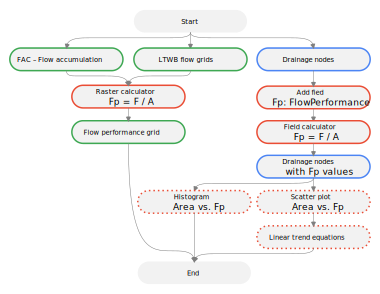
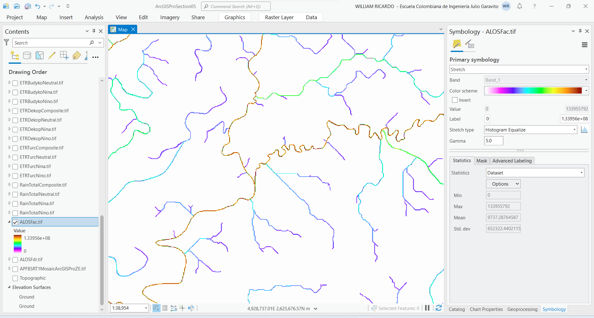
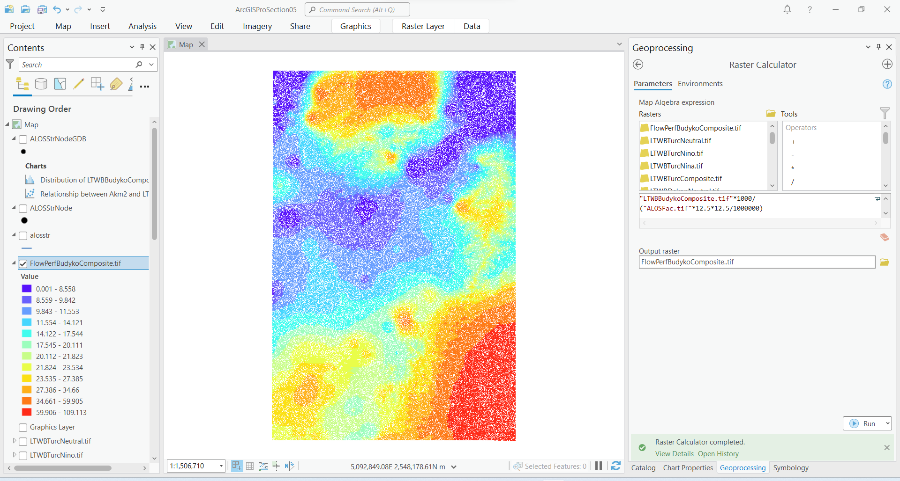

## Mapa de isorendimiento medio
Keywords: `LTWB` `Flow` `Flow-performance` `Raster-calculator`

Utilizando los valores de caudal medio, número de celdas y área de aportación en las diferentes localizaciones de la red de drenaje, se construye el mapa de isorendimientos medios y se obtienen ecuaciones características que permiten estimar rendimientos en función del área de aportación.

### Objetivos

* Utilizando algebra de mapas, generar el mapa de isorendimientos a partir de la grilla de acumulación de flujo y los mapas de caudal medio.
* En cada punto característico y a partir de los valores previamente obtenidos de área y caudal medio, calcular el isorendimineto y a partir de matrices de dispersión, obtener ecuaciones características.

### Requerimientos

* [ArcGIS Pro 2+](https://pro.arcgis.com/en/pro-app/latest/get-started/download-arcgis-pro.htm)
* [ArcGIS for Desktop 10+](https://desktop.arcgis.com/es/desktop/) (opcional)
* [QGIS 3+](https://qgis.org/) (opcional)
* Nodos característicos con valores de caudal. [:mortar_board:Aprender.](../../Section05/FlowPoint)
* Grilla de acumulación de flujo - FAC. [:mortar_board:Aprender.](../../Section02/FacDEM)
* Mapas de caudal medio obtenidos del balance hidrológico de largo plazo. [:mortar_board:Aprender.](../../Section05/LTWB)

### Procedimiento general

  
Convenciones generales en diagramas: clases de entidad en azul, dataset en gris oscuro, grillas en color verde, geo-procesos en rojo, procesos automáticos o semiautomáticos en guiones rojos y procesos manuales en amarillo. Líneas conectoras con guiones corresponden a procedimientos opcionales.  

1. En ArcGIS Pro, abra el proyecto _ArcGISProSection05.aprx_ creado en la primera actividad de esta sección y almacenado en la ruta _D:\R.LTWB\\.map_.

> Tenga en cuenta que automáticamente fué asignado al proyecto, el sistema de coordenadas geográficas 9377 de Colombia, correspondiente a MAGNA-SIRGAS Origen-Nacional.

2. Desde la carpeta _D:\R.LTWB\HECGeoHMS\Layers_ disponible en el catálogo, agregue al proyecto la grilla de acumulación de flujo denominada ALOSFac.tif. Modifique la simbología de representación a _Stretch_ utilizando la paleta de color _Temperature_ y _Stretch type: Histogram Equalize_

3. Utilizando la herramienta _Geoprocessing / Spatial Analyst Tools / Map Algebra / Raster Calculator_, cree mapas de isorendimiento y almacénelos dentro de la carpeta `D:\R.LTWB\.grid`. 

> Para este ejemplo, generaremos el mapa de isorendimiento a partir de los caudales medios obtenidos con el mapa de evapotranspiración real compuesta de Budyko utilizando la siguiente expresión:

Im = Qm / A

Donde,

* Im: isorendimiento medio, lps/km²
* Qm: caudal medio, lps
* A: área de aportación,km²

Expresión algebra de mapas: `FlowPerfBudykoComposite.tif = "LTWBBudykoComposite.tif"*1000/("ALOSFac.tif"*12.5*12.5/1000000)`

Modifique la simbología de representación a _Classify_ utilizando la paleta de color _Spectrum by Wavelength - Fullbright_ y _Method: Quantile_ en 12 clases

Matriz de isorendimiento Budyko Compuesto

Como observa en la ilustración, se han obtenido valores de hasta 109.113 lps/km² y los rendimientos cercanos a este valor se encuentran localizados en la zona norte sobre la Sierra Nevada de Santa Marta y al sur este en la zona de la cordillera oriental.

4. Abra la tabla de atributos de la clase de entidad _ALOSStrNodeGDB_ contenida en la geodatabase del proyecto creado en ArcGIS Pro para la sección 5, podrá observar que contiene los valores leídos de las diferentes grillas de caudal.

5. A partir de la capa _ALOSStrNodeGDB_, cree gráficos de dispersión relacionando el área de aportación `Akm2` con los valores de caudal medio obtenidos. Obtenga los parámetros de la tendencia lineal y los valores del coeficiente de determinación R².

Matriz de dispersión Budyko Compuesto

En este momento dispone para la zona de estudio, de ecuaciones características a partir de las cuales se puede estimar el caudal medio en función del área de aportación en km².

### Actividades complementarias:pencil2:

En la siguiente tabla se listan las actividades complementarias que deben ser desarrolladas y documentadas por el estudiante en un único archivo de Adobe Acrobat .pdf. El documento debe incluir portada (mostrar nombre completo, código y enlace a su cuenta de GitHub), numeración de páginas, tabla de contenido, lista de tablas, lista de ilustraciones, introducción, objetivo general, capítulos por cada ítem solicitado, conclusiones y referencias bibliográficas.

| Actividad | Alcance |
|:---------:|:--------|
|     1     | xxx     |
|     2     | xxx     |

### Referencias

* 

### Compatibilidad

* Esta actividad puede ser desarrollada con cualquier software SIG que disponga de herramientas de extracción o estadísticas zonales.

### Control de versiones

| Versión    | Descripción | Autor                                     | Horas |
|------------|:------------|-------------------------------------------|:-----:|
| 2022.12.16 | xxx         | [rcfdtools](https://github.com/rcfdtools) |   x   |

_R.LTWB es de uso libre para fines académicos, conoce nuestra licencia, cláusulas, condiciones de uso y como referenciar los contenidos publicados en este repositorio, dando [clic aquí](https://github.com/rcfdtools/R.LTWB/wiki/License)._

_¡Encontraste útil este repositorio!, apoya su difusión marcando este repositorio con una ⭐ o síguenos dando clic en el botón Follow de [rcfdtools](https://github.com/rcfdtools) en GitHub._

| [Actividad anterior](../FlowPoint) | [Inicio](../../Readme.md) | [:beginner: Ayuda](https://github.com/rcfdtools/R.LTWB/discussions/999) | [Actividad siguiente](../../xxx) |
|------------------------------------|---------------------------|-------------------------------------------------------------------------|----------------------------------|

