## Lectura y análisis de caudales y áreas de aportación en nodos característicos
Keywords: `LTWB` `Flow` `Extract-multi-values-to-points` `Linear-trend` `Histogram`

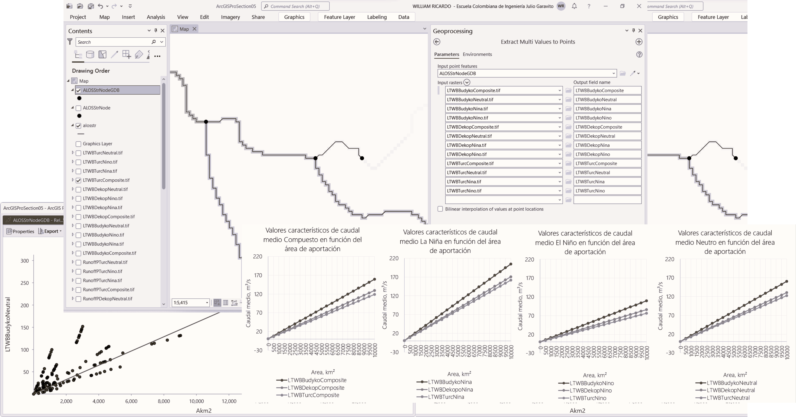

Una vez obtenida la red de puntos característicos para lectura de resultados que contienen el número de celdas aportantes y sus áreas de drenaje equivalentes, se procede a realizar la estadística zonal o la extracción de valores de mapas raster a nodos para la obtención de caudales y ecuaciones características.

### Objetivos

* A partir de puntos característicos identificados sobre la red de drenaje de la zona de estudio, realizar la lectura o extracción de los valores obtenidos en las grillas de caudal medio.
* A partir de las áreas de aportación estimadas en puntos característicos y los valores de caudal extraídos por punto, crear la matriz de dispersión y obtener ecuaciones características que permitan estimar el caudal compuesto y por fenómeno climatológico en función del área de aportación.

### Requerimientos

* [ArcGIS Pro 2+](https://pro.arcgis.com/en/pro-app/latest/get-started/download-arcgis-pro.htm)
* [ArcGIS for Desktop 10+](https://desktop.arcgis.com/es/desktop/) (opcional)
* [QGIS 3+](https://qgis.org/) (opcional)
* Red hidrológica de drenaje y nodos característicos. [:mortar_board:Aprender.](../../Section02/StrDEM)
* Mapas de caudal medio obtenidos del balance hidrológico de largo plazo. [:mortar_board:Aprender.](../../Section05/LTWB)

### Procedimiento general

 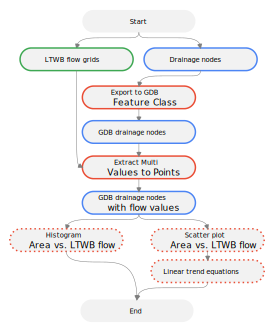 
Convenciones generales en diagramas: clases de entidad en azul, dataset en gris oscuro, grillas en color verde, geo-procesos en rojo, procesos automáticos o semiautomáticos en guiones rojos y procesos manuales en amarillo. Líneas conectoras con guiones corresponden a procedimientos opcionales.  

1. En ArcGIS Pro, abra el proyecto _ArcGISProSection05.aprx_ creado y almacenado en la actividad anterior en la ruta _D:\R.LTWB\\.map_.

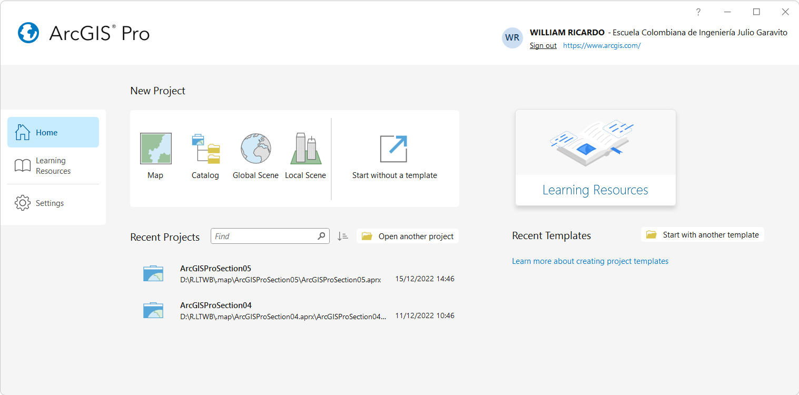

> Tenga en cuenta que automáticamente fué asignado al proyecto, el sistema de coordenadas geográficas 9377 de Colombia, correspondiente a MAGNA-SIRGAS Origen-Nacional.

2. Desde la carpeta _R.LTWB/.shp_ disponible en el catálogo, agregue al mapa los archivos de formas [alosstr.shp](../../.shp/alosstr.zip) y [ALOSStrNode.shp](../../.shp/ALOSStrNode.zip). Modifique la simbología de representación de la red de drenaje _alosstr_ a líneas de color _Ultra Blue_ y los nodos característicos a color negro en tamaño 8.

> Tenga en cuenta que la capa ALOSStrNode.shp contiene 32708 nodos característicos localizados en los puntos de inicio y unión de cada tramo de río. Debido al número de nodos, es posible que el visor de ArcGIS, no permita visualizar todos los nodos, realice un acercamiento a escala 1:510.000. 
> 
> La red de drenaje alosstr.shp corresponde a líneas hidrológicas trazadas en las celdas del modelo de terreno y no a líneas suavizadas. [:mortar_board:Mas información...](../../Section02/StrDEM)

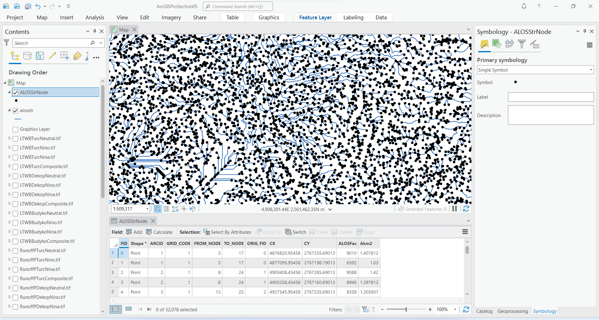

3. Para visualizar correctamente la capa de nodos, exporte como `ALOSStrNodeGDB` dentro de la Geodatabase del proyecto en la ruta `D:\R.LTWB\.map\ArcGISProSection05\ArcGISProSection05.gdb\`. En la pestaña _Environments_ establezca el sistema de coordenadas 9377 de Colombia.

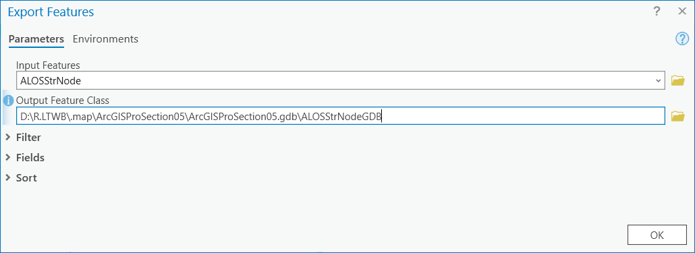

Acérquese a la red de drenaje y verifique que la localización de las líneas y nodos corresponda a las celdas donde se visualizan los caudales medios acumulados.

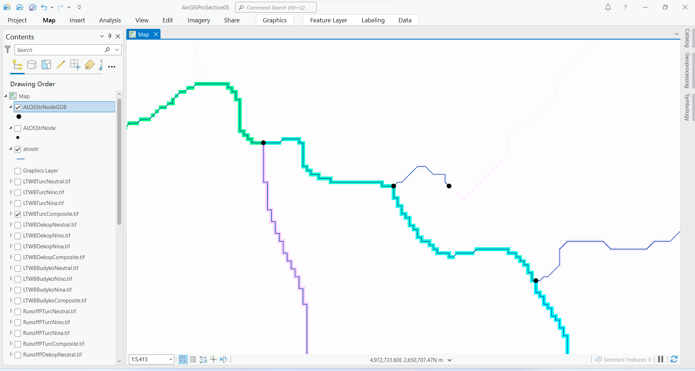

3. Utilizando la herramienta _Geoprocessing / Spatial Analyst Tools / Extraction / Extract Multi Values to Points_, obtenga los valores de caudal medio en todos los nodos característicos `ALOSStrNodeGDB`, seleccione las 12 grillas de caudales medios generadas en la actividad anterior (3 grillas por cada método de evapotranspiración real para 4 fenómenos climatológicos). Para los nombres de campo utilice los mismos nombres de las grillas de entrada.

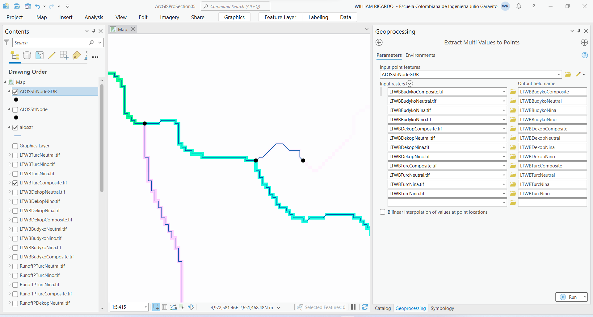

> Debido a que la extracción de los valores de las celdas correspondientes a cada nodo se realizará dentro de una clase de entidad alojada dentro de una base de datos espacial, el nombre de los campos podrá contener más de 10 caracteres. Para extracciones usando archivos Shapefile, asegúrese de que los nombres de campos no contengan más de 10 caracteres.
> 
> En caso de ser necesario y utilizando la herramienta _Zonal Statistics As Table_, podrá obtener en una nueva tabla los valores en cada nodo característico a partir de una única grilla.   

4. Abra la tabla de atributos de la capa _ALOSStrNodeGDB_, podrá observar que contiene los valores leídos de las diferentes grillas de caudal.

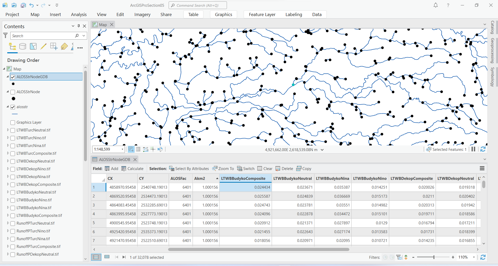

5. A partir de la capa _ALOSStrNodeGDB_, cree un histograma para los caudales _LTWBBudykoComposite_, utilice 6 bandas y analice los resultados obtenidos. Podrá observar que 31879 nodos contienen caudales inferiores a 51.9 m³/s con media 1.49 m³/s y desviación estándar de 10.44 m³/s.

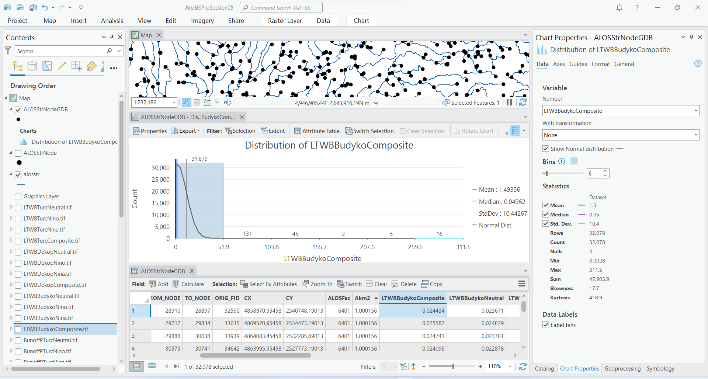

6. A partir de la capa _ALOSStrNodeGDB_, cree gráficos de dispersión relacionando el área de aportación `Akm2` con los valores de caudal medio obtenidos. Obtenga los parámetros de la tendencia lineal y los valores del coeficiente de determinación R².

**Bydyko**

Matriz de dispersión Budyko Compuesto
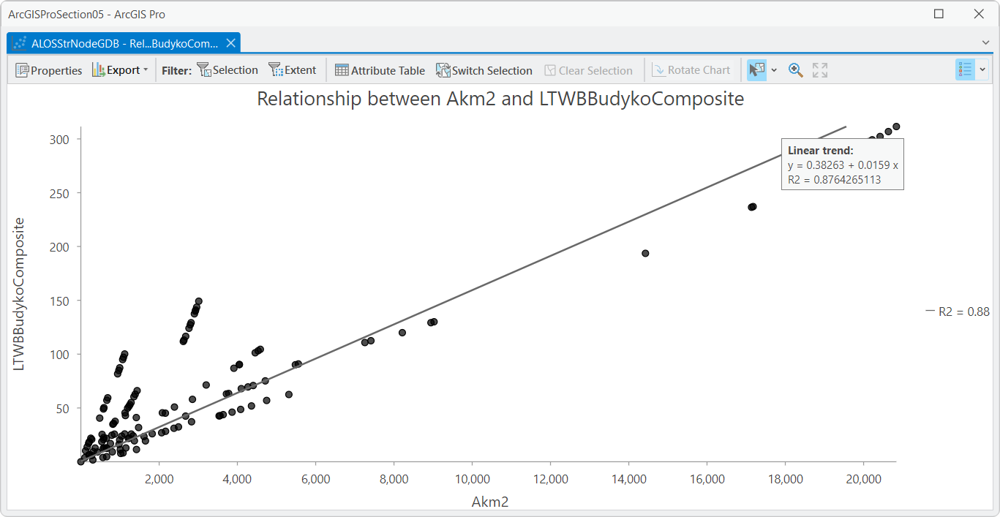

Matriz de dispersión Budyko La Niña
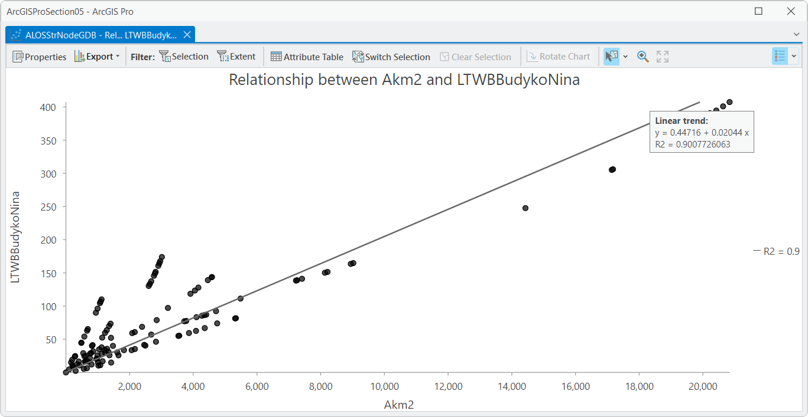

Matriz de dispersión Budyko El Niño

Matriz de dispersión Budyko Neutro

**Dekop**

Matriz de dispersión Dekop Compuesto
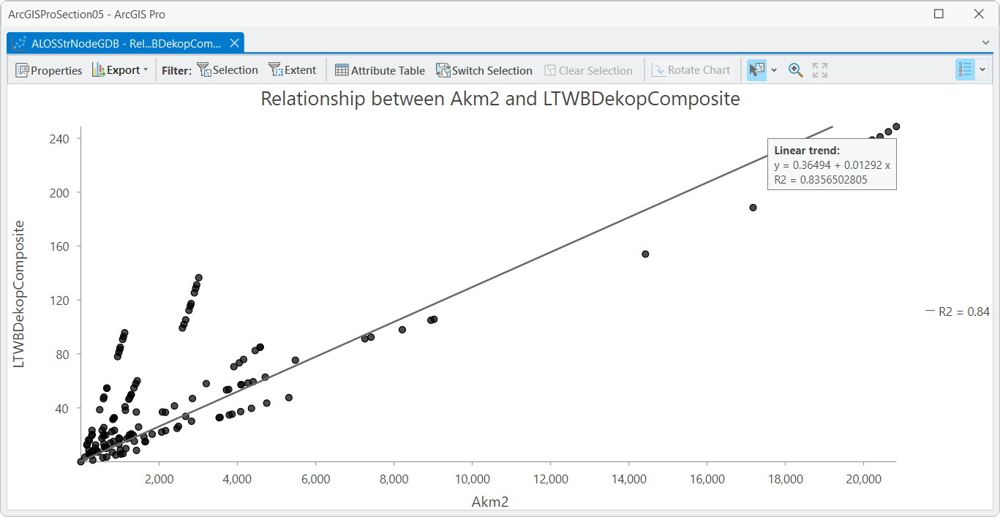

Matriz de dispersión Dekop La Niña

Matriz de dispersión Dekop El Niño

Matriz de dispersión Dekop Neutro

**Turc**

Matriz de dispersión Turc Compuesto

Matriz de dispersión Turc La Niña
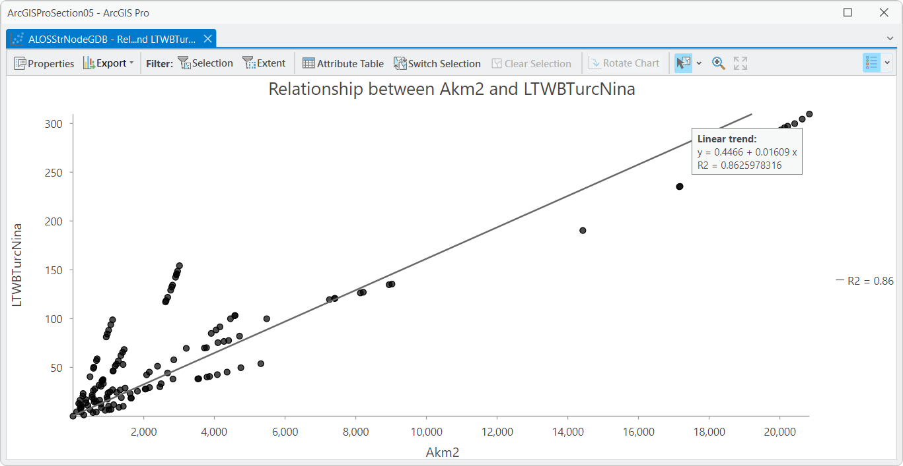

Matriz de dispersión Turc El Niño
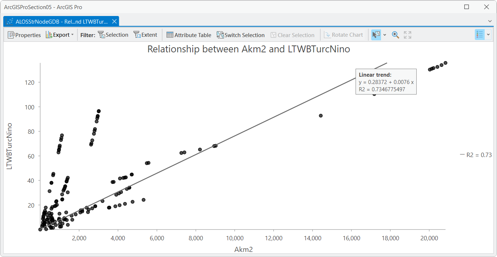

Matriz de dispersión Turc Neutro
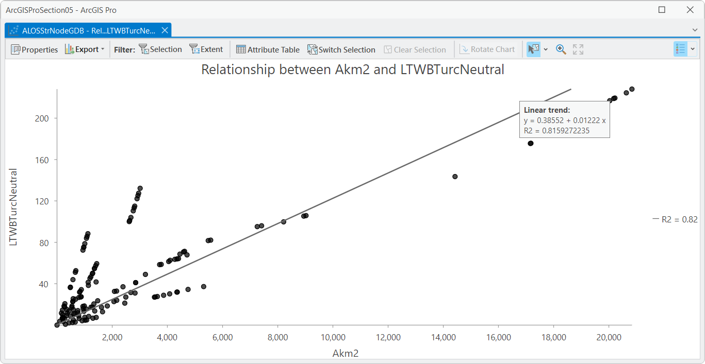

| Caudal medio        | Tendencia lineal        | R²   |
|---------------------|-------------------------|------|
| **Budyko**          |                         |      |
| LTWBBudykoComposite | y = 0.38263 + 0.0159 x  | 0.88 |
| LTWBBudykoNina      | y = 0.44716 + 0.02044 x | 0.90 |
| LTWBBudykoNino      | y = 0.29555 + 0.01091 x | 0.83 |
| LTWBBudykoNeutral   | y = 0.3915 + 0.01603 x  | 0.87 |
| **Dekop**           |                         |      |
| LTWBDekopComposite  | y = 0.36494 + 0.01292 x | 0.84 |
| LTWBDekopoNina      | y = 0.43502 + 0.01703 x | 0.87 |
| LTWBDekopNino       | y = 0.27466 + 0.00856 x | 0.77 |
| LTWBDekopNeutral    | y = 0.37332 + 0.01305 x | 0.83 |
| **Turc**            |                         |      |
| LTWBTurcComposite   | y = 0.37412 + 0.01189 x | 0.82 |
| LTWBTurcNina        | y = 0.4466 + 0.01609 x  | 0.86 |
| LTWBTurcNino        | y = 0.28372 + 0.0076 x  | 0.73 |
| LTWBTurcNeutral     | y = 0.38552 + 0.01222 x | 0.82 |

> En la ecuación, `y` corresponde al valor del caudal en m³/s y `x` corresponde al valor del área.

7. A partir de las ecuaciones características y en Microsoft Excel, cree una tabla y gráficas que permitan estimar el caudal medio en función de las áreas de aportación.

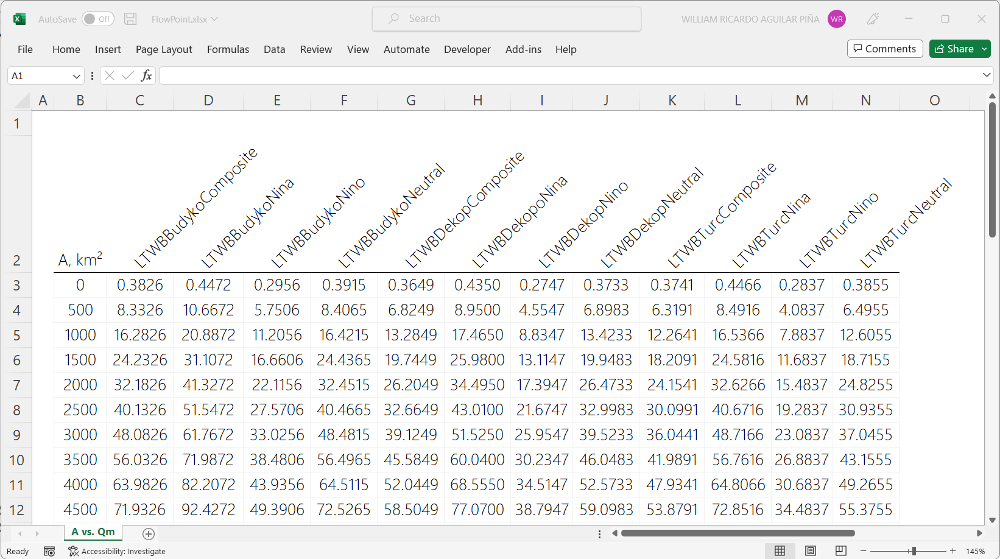
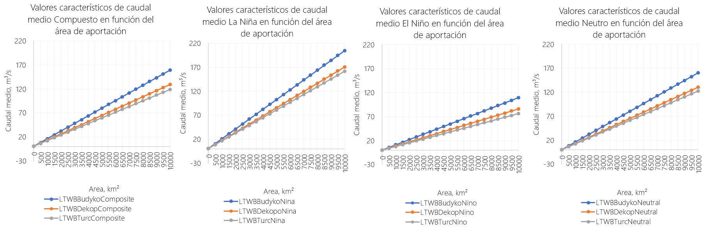

### Caudales medios LTWB vs. Caudales medios IDEAM

En la siguiente tabla encontrará la lectura de los valores medios obtenidos en el balance hidrológico en las localizaciones específicas de algunas de las estaciones del IDEAM.

| Estación                    | Latitud, °  | Longitud, ° | Área ap., km² | Qm IDEAM, m³/s | Qm Budyko, m³/s | Qm Dekop, m³/s | Qm Turc, m³/s | Google Maps                                              | 
|-----------------------------|:-----------:|:-----------:|:-------------:|:--------------:|:---------------:|:--------------:|:-------------:|----------------------------------------------------------|
| BECERRIL [28027050]         |  9.686611   | -73.279194  |    538.274    |     10.159     |    9.569801     |    7.785855    |   8.092049    | [Ver](http://maps.google.com/maps?q=9.686611,-73.279194) |
| SANTA TERESA [28027040]     |  9.915944   | -73.283694  |    186.611    |     2.890      |    3.019509     |    2.396705    |   2.187955    |                                                          |
| CORRAL DE PIEDRA [28017080] |  10.818917  | -73.055083  |    205.476    |     2.442      |    1.848604     |    1.398234    |   1.358367    |                                                          |
| CHEMESQUEMENA [28017150]    |  10.712222  | -73.402222  |    181.879    |     4.957      |    8.328819     |    7.873452    |   9.028386    |                                                          |
| MINA LA [28017110]          |  10.686722  | -73.269833  |    475.526    |     8.957      |    14.097835    |   12.497024    |   13.677804   |                                                          |
| REPOSO EL [28017050]        |  10.527194  | -73.336361  |    794.136    |     18.492     |    24.713205    |   22.371595    |   25.744001   |                                                          |
| PUENTE CALLAO [28037010]    |  10.362889  | -73.317361  |    174.808    |     2.678      |    2.123941     |    1.653559    |   1.568016    |                                                          |
| MATILDE LA [28027020]       |  10.165611  | -73.258333  |    258.850    |     2.112      |    3.824053     |    3.058464    |   3.196313    |                                                          |
| PUENTE CARRETERA [25027890] |  9.342333   | -73.490889  |    378.691    |     2.474      |    9.268123     |    7.769629    |   7.421470    |                                                          |
| BELLEZA LA [28047080]       |  10.333333  |   -73.95    |    696.900    |     16.233     |    12.885714    |   10.540203    |   10.991765   |                                                          |
 
> Los caudales medios registrados en la tabla corresponden a caudales compuestos. [Caudales medios IDEAM](../../.datasets/IDEAM_Agg/Agg_Impute_MICE_Outlier_IQR_Cap_Pivot_Q_MEDIA_M.csv) obtenidos por agregación estadística a partir de registros en estaciones.
> 
> Las áreas de aportación han sido obtenidas a partir de la lectura del número de celdas de la grilla [ALOSFac.tif](../../.grid) del modelo de acumulación FAC correspondientes al modelo digital de elevación ALOS PALSAR 

En este momento dispone para la zona de estudio, de ecuaciones características a partir de las cuales se puede estimar el caudal medio en función del área de aportación en km².

### Actividades complementarias:pencil2:

En la siguiente tabla se listan las actividades complementarias que deben ser desarrolladas y documentadas por el estudiante en un único archivo de Adobe Acrobat .pdf. El documento debe incluir portada (mostrar nombre completo, código y enlace a su cuenta de GitHub), numeración de páginas, tabla de contenido, lista de tablas, lista de ilustraciones, introducción, objetivo general, capítulos por cada ítem solicitado, conclusiones y referencias bibliográficas.

| Actividad | Alcance                                                                                                                                                                                                                                                                                                                                                                                                                                                                                                                                              |
|:---------:|:-----------------------------------------------------------------------------------------------------------------------------------------------------------------------------------------------------------------------------------------------------------------------------------------------------------------------------------------------------------------------------------------------------------------------------------------------------------------------------------------------------------------------------------------------------|
|     1     | A partir de las áreas de aportación disponibles en cada nodo característico y de los valores extraídos de caudales, filtre por rangos de áreas y cree ecuaciones características segmentadas que permitan, por ejemplo, analizar caudales medios en cuencas inferiores a 25 km².                                                                                                                                                                                                                                                                     |
|     2     | A partir de los mapas de caudal medio obtenidos para los métodos de evapotranspiración real investigados, realice la extracción de los caudales en nodos característicos, analice, cree ecuaciones y compare con los valores obtenidos en la presente actividad.                                                                                                                                                                                                                                                                                     |
|     3     | A través de una matriz de dispersión, compare en 20 localizaciones diferentes, los [caudales medios multianuales agregados estadísticamente](../../.datasets/IDEAM_Agg/Agg_Impute_MICE_Outlier_IQR_Cap_Pivot_Q_MEDIA_M.csv.md) a partir de los datos registrados en estaciones limnimétricas, con los datos obtenidos a partir del balance hidrológico de largo plazo. Para esta comparación es necesario identificar el nodo característico más próximo a cada estación o realizar la lectura en el pixel más próximo de las grillas de resultados. |

### Referencias

* https://pro.arcgis.com/en/pro-app/latest/tool-reference/spatial-analyst/extract-multi-values-to-points.htm

### Compatibilidad

* Esta actividad puede ser desarrollada con cualquier software SIG que disponga de herramientas de extracción o estadísticas zonales.

### Control de versiones

| Versión    | Descripción                                                                                                                                                                                                                                                                         | Autor                                     | Horas |
|------------|:------------------------------------------------------------------------------------------------------------------------------------------------------------------------------------------------------------------------------------------------------------------------------------|-------------------------------------------|:-----:|
| 2022.12.16 | Documentación. Extracción de valores en nodos característicos a partir de las 12 grillas de caudal medio. Histograma. Matriz de dispersión, ecuación de tendencia lineal, estimación y comparación de valores a partir de ecuaciones.  Ilustración cabecera y diagrama de procesos. | [rcfdtools](https://github.com/rcfdtools) |   5   |
| 2022.12.15 | Inicio documentación. Cargue y verificación de capas requeridas en proyecto ArcGIS Pro.                                                                                                                                                                                             | [rcfdtools](https://github.com/rcfdtools) |   2   |

_R.LTWB es de uso libre para fines académicos, conoce nuestra licencia, cláusulas, condiciones de uso y como referenciar los contenidos publicados en este repositorio, dando [clic aquí](https://github.com/rcfdtools/R.LTWB/wiki/License)._

_¡Encontraste útil este repositorio!, apoya su difusión marcando este repositorio con una ⭐ o síguenos dando clic en el botón Follow de [rcfdtools](https://github.com/rcfdtools) en GitHub._

| [Actividad anterior](../LTWB) | [Inicio](../../Readme.md) | [:beginner: Ayuda](https://github.com/rcfdtools/R.LTWB/discussions/34) | [Actividad siguiente](../FlowPerformance) |
|-------------------------------|---------------------------|------------------------------------------------------------------------|-------------------------------------------|

