## Balance hidrológico distribuido usando SIG
Keywords: `ETR` `Precipitation` `FDR` `Budyko` `Turc` `Dekop` `Raster-calculator` `FAC`

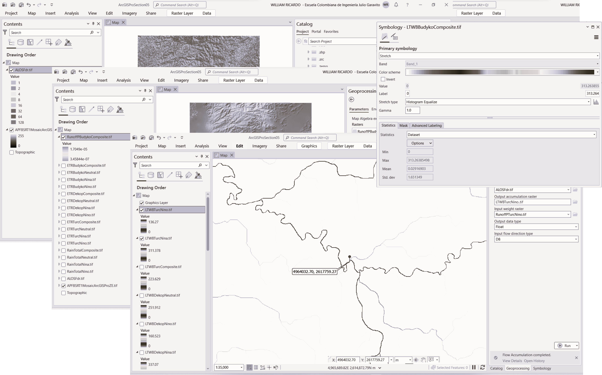

Los balances hidrológicos de largo plazo pueden ser realizados en SIG a través de herramientas de acumulación de flujo. Para cada una de las celdas del mapa de direcciones de flujo o FDR, se calcula el número de celdas de drenaje convergentes a las cuales se les puede acumular el valor del potencial de escurrimiento de cada celda obtenido a partir de los valores de precipitación media y evapotranspiración real.

 https://www.youtube.com/watch?v=G4uPo7EVKu8 Playlist: https://youtube.com/playlist?list=PLZGvAjHkhphDKXvnhkp0oQb22EHWVd0W8  

Spatial Analyst Tools de ArcGIS for Desktop y ArcGIS Pro, dispone de un grupo de herramientas de hidrología entre las cuales se encuentra el acumulador de flujo por celdas o Flow Accumulation - FAC; esta herramienta permite a través de un mapa de direcciones de flujo o FDR y una grilla de pesos o valores, realizar no solamente la acumulación de celdas sino además la agregación de una variable adicional que para el caso de la obtención de caudales medios de largo plazo, corresponde al potencial de escurrimiento de cada celda a partir de la diferencia entre los valores de la precipitación media multianual y la evapotranspiración real - ETR.

### Objetivos

* Calcular el potencial de escurrimiento de cada celda del modelo digital de elevación - DEM, a partir de los mapas de precipitación total y evapotranspiración real compuesta y por fenómeno climatológico. Este potencial corresponde a los pesos que serán utilizados en la acumulación de flujo - FAC.
* Realizar la acumulación de flujo y obtener los balances compuestos y por fenómeno climatológico.

### Requerimientos

* [ArcGIS Pro 2+](https://pro.arcgis.com/en/pro-app/latest/get-started/download-arcgis-pro.htm)
* [ArcGIS for Desktop 10+](https://desktop.arcgis.com/es/desktop/) (opcional)
* [QGIS 3+](https://qgis.org/) (opcional)
* Grilla de direcciones de flujo - FDR. [:mortar_board:Aprender.](../../Section02/FdrDEM)
* Mapas de precipitación total. [:mortar_board:Aprender.](../../Section04/Rain)
* Mapa de evapotranspiración real. [:mortar_board:Aprender.](../../Section04/ETR)

### Procedimiento general

 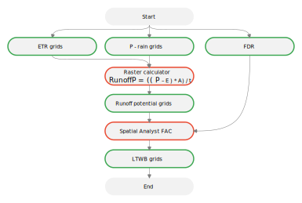 
Convenciones generales en diagramas: clases de entidad en azul, dataset en gris oscuro, grillas en color verde, geo-procesos en rojo, procesos automáticos o semiautomáticos en guiones rojos y procesos manuales en amarillo. Líneas conectoras con guiones corresponden a procedimientos opcionales.  

Para la estimación de caudales medios se realiza un balance hidrológico de largo plazo en cada una de las celdas que cubre la zona de estudio. La siguiente expresión permite determinar el caudal medio en cada celda en el que, al valor estimado de precipitación por celda, se le resta la abstracción correspondiente a la evapotranspiración real. El valor correspondiente al área sobre el cual se estima el caudal corresponde al total de celdas convergentes multiplicadas por el tamaño de cada pixel el cual es definido por la resolución espacial de las grillas utilizadas.

Qm = (( P – E ) * A) / t

Donde,

* Qm: caudal medio, m³/s
* P: precipitación, mm/año
* E: evapotranspiración real, mm/año
* A: área de cada celda, m²
* t: tiempo en segundos en un año, (365 días x 24 horas x 60 minutos x 60 segundos = 31.536.000.000)

1. En ArcGIS Pro, cree un proyecto nuevo en blanco en la ruta _D:\R.LTWB\\.map_ y nómbrelo como _ArcGISProSection05.aprx_. Automáticamente, serán generados el mapa de proyecto, la base de datos geográfica en formato .gdb, la carpeta para volcado de informes de registro de importación _ImportLog_ y la carpeta _Index_. Utilizando el Panel de catálogo y desde la sección Folders, realice la conexión a la carpeta D:\R.LTWB. 

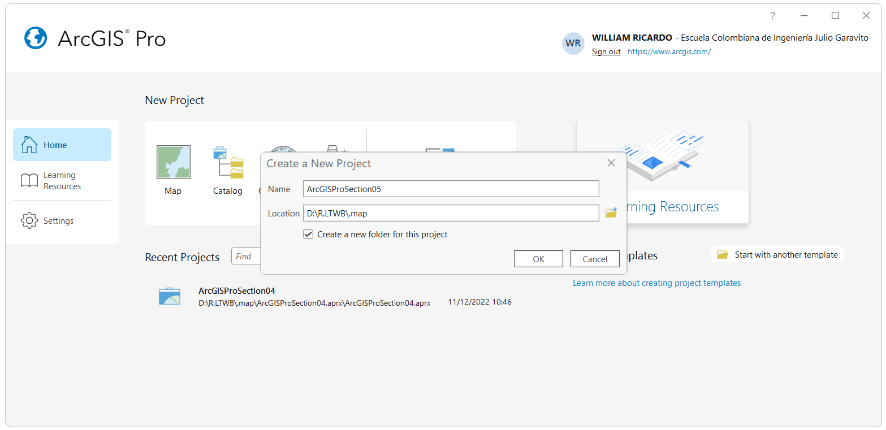

2. Desde la carpeta _.dem_ disponible en el catálogo, agregue al mapa la grilla del modelo digital de elevación - DEM ALOS PALSAR [APFBSRT1MosaicArcGISProZE.tif](../../.dem/ALOS). Modifique la simbología de representación a _Shaded Relief_ con el esquema de color _Black to White_.

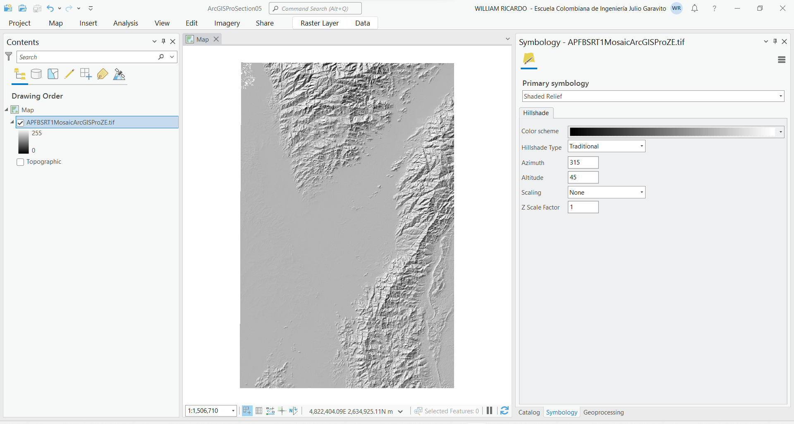

> Tenga en cuenta que automáticamente ha sido asignado el sistema de coordenadas geográficas 9377 de Colombia, correspondiente a MAGNA-SIRGAS Origen-Nacional, debido a que el DEM contiene integrado este sistema.
> 
> Recuerde que el tamaño de celdas de las grillas DEM ALOS PALSAR es de 12.5 metros.

3. Desde la carpeta _HECGeoHMS_ disponible en el catálogo, agregue al proyecto la grilla de direcciones de flujo denominada [ALOSFdr.tif](../../HECGeoHMS/Layers). Modifique la simbología de representación a _Unique Values_ con el esquema de color _Aspect_ y establezca transparencia en 50%.

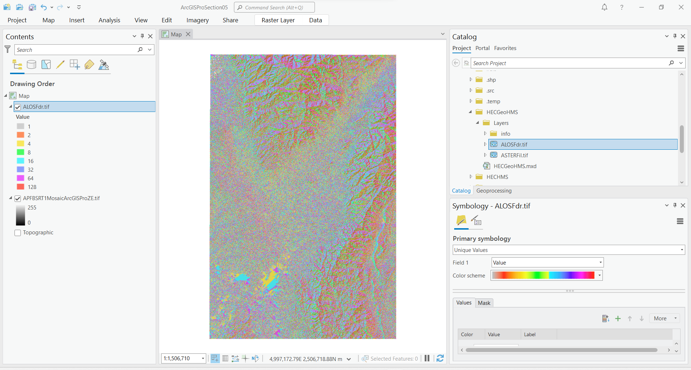

Recuerde que las direcciones de flujo en ArcGIS se definen como:

| Orientación | ArcGIS |
|:-----------:|:------:|
|    Este     |   1    |
|   Sureste   |   2    |
|     Sur     |   4    |
|  Suroeste   |   8    |
|    Oeste    |   16   |
|  Noroeste   |   32   |
|    Norte    |   64   |
|  Nordeste   |  128   |
|  No drena   |  255   |

4. Desde la carpeta _.grid_ disponible en el catálogo, agregue al proyecto los 4 [Mapas de precipitación total](../../Section04/Rain) creados en la primera actividad de la sección 4 y que fueron nombrados como RainTotalComposite.tif, RainTotalNina.tif, RainTotalNino.tif y RainTotalNeutral.tif. Seleccione los 4 mapas y establezca transparencia al 50%. [:open_file_folder: Descargar archivos](../../.grid).

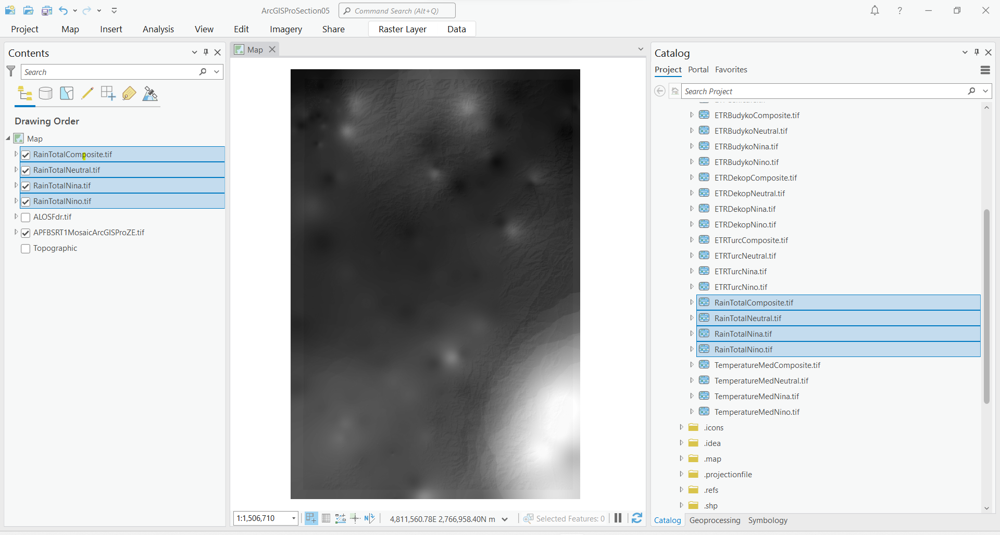

5. Desde la carpeta _.grid_ disponible en el catálogo, agregue al proyecto los 12 [Mapas de evapotranspiración real - ETR](../../Section04/ETR) creados en la última actividad de la sección 4, correspondientes a series compuestas y por fenómeno climatológico usando las expresiones de Budyko, Dekop y Turc. Seleccione los mapas y establezca transparencia al 50%. [:open_file_folder: Descargar archivos](../../.grid).

6. Utilizando la herramienta _Geoprocessing / Spatial Analyst Tools / Map Algebra / Raster Calculator_, cree los mapas de flujo potencial de escurrimiento o grillas de pesos distribuidos, utilice las siguientes expresiones y nombres de archivo de salida dentro de la carpeta `D:\R.LTWB\.grid`:

| Mapa                       | Expresión Raster Calculator                                                              | Rango, m³/s          | Grilla raster :open_file_folder:                                                                                                                                                                                                                                                              |
|:---------------------------|:-----------------------------------------------------------------------------------------|----------------------|----------------------------------------------------------------------------------------------------------------------------------------------------------------------------------------------------------------------------------------------------------------------------------------|
| **Budyko**                 |                                                                                          |                      |                                                                                                                                                                                                                                                                                        |
| RunoffPBudykoComposite.tif | `(("RainTotalComposite.tif"-"ETRBudykoComposite.tif")/1000) *(12.5*12.5)/(365*24*60*60)` | 3.46E-07 - 1.71E-05  | [Part1](../../.grid/RunoffPBudykoComposite.part01.rar), [Part2](../../.grid/RunoffPBudykoComposite.part02.rar), [Part3](../../.grid/RunoffPBudykoComposite.part03.rar), [Part4](../../.grid/RunoffPBudykoComposite.part04.rar), [Part5](../../.grid/RunoffPBudykoComposite.part05.rar) |
| RunoffPBudykoNina.tif      | `(("RainTotalNina.tif"-"ETRBudykoNina.tif")/1000) *(12.5*12.5)/(365*24*60*60)`           | 5.06E-07 - 1.94E-05  | [Part1](../../.grid/RunoffPBudykoNina.part01.rar), [Part2](../../.grid/RunoffPBudykoNina.part02.rar), [Part3](../../.grid/RunoffPBudykoNina.part03.rar), [Part4](../../.grid/RunoffPBudykoNina.part04.rar), [Part5](../../.grid/RunoffPBudykoNina.part05.rar)                          |
| RunoffPBudykoNino.tif      | `(("RainTotalNino.tif"-"ETRBudykoNino.tif")/1000) *(12.5*12.5)/(365*24*60*60)`           | 1.13E-07 - 1.53E-05  | [Part1](../../.grid/RunoffPBudykoNino.part01.rar), [Part2](../../.grid/RunoffPBudykoNino.part02.rar), [Part3](../../.grid/RunoffPBudykoNino.part03.rar), [Part4](../../.grid/RunoffPBudykoNino.part04.rar), [Part5](../../.grid/RunoffPBudykoNino.part05.rar)                          |
| RunoffPBudykoNeutral.tif   | `(("RainTotalNeutral.tif"-"ETRBudykoNeutral.tif")/1000) *(12.5*12.5)/(365*24*60*60)`     | 2.58E-07 - 1.69E-05  | [Part1](../../.grid/RunoffPBudykoNeutral.part01.rar), [Part2](../../.grid/RunoffPBudykoNeutral.part02.rar), [Part3](../../.grid/RunoffPBudykoNeutral.part03.rar), [Part4](../../.grid/RunoffPBudykoNeutral.part04.rar), [Part5](../../.grid/RunoffPBudykoNeutral.part05.rar)           |
| **Dekop**                  |                                                                                          |                      |                                                                                                                                                                                                                                                                                        |
| RunoffPDekopComposite.tif  | `(("RainTotalComposite.tif"-"ETRDekopComposite.tif")/1000) *(12.5*12.5)/(365*24*60*60)`  | 2.51E-07 - 1.65E-05  | [Part1](../../.grid/RunoffPDekopComposite.part01.rar), [Part2](../../.grid/RunoffPDekopComposite.part02.rar), [Part3](../../.grid/RunoffPDekopComposite.part03.rar), [Part4](../../.grid/RunoffPDekopComposite.part04.rar), [Part5](../../.grid/RunoffPDekopComposite.part05.rar)      |
| RunoffPDekopNina.tif       | `(("RainTotalNina.tif"-"ETRDekopNina.tif")/1000) *(12.5*12.5)/(365*24*60*60)`            | 3.60E-07 - 1.88E-05  | [Part1](../../.grid/RunoffPDekopNina.part01.rar), [Part2](../../.grid/RunoffPDekopNina.part02.rar), [Part3](../../.grid/RunoffPDekopNina.part03.rar), [Part4](../../.grid/RunoffPDekopNina.part04.rar), [Part5](../../.grid/RunoffPDekopNina.part05.rar)                               |
| RunoffPDekopNino.tif       | `(("RainTotalNino.tif"-"ETRDekopNino.tif")/1000) *(12.5*12.5)/(365*24*60*60)`            | 9.60E-08 - 9.46E-08  | [Part1](../../.grid/RunoffPDekopNino.part01.rar), [Part2](../../.grid/RunoffPDekopNino.part02.rar), [Part3](../../.grid/RunoffPDekopNino.part03.rar), [Part4](../../.grid/RunoffPDekopNino.part04.rar), [Part5](../../.grid/RunoffPDekopNino.part05.rar)                               |
| RunoffPDekopNeutral.tif    | `(("RainTotalNeutral.tif"-"ETRDekopNeutral.tif")/1000) *(12.5*12.5)/(365*24*60*60)`      | 1.92E-07 - 1.63E-05  | [Part1](../../.grid/RunoffPDekopNeutral.part01.rar), [Part2](../../.grid/RunoffPDekopNeutral.part02.rar), [Part3](../../.grid/RunoffPDekopNeutral.part03.rar), [Part4](../../.grid/RunoffPDekopNeutral.part04.rar), [Part5](../../.grid/RunoffPDekopNeutral.part05.rar)                |
| **Turc**                   |                                                                                          |                      |                                                                                                                                                                                                                                                                                        |
| RunoffPTurcComposite.tif   | `(("RainTotalComposite.tif"-"ETRTurcComposite.tif")/1000) *(12.5*12.5)/(365*24*60*60)`   | 4.26E-08 - 1.51E-05  | [Part1](../../.grid/RunoffPTurcComposite.part01.rar), [Part2](../../.grid/RunoffPTurcComposite.part02.rar), [Part3](../../.grid/RunoffPTurcComposite.part03.rar), [Part4](../../.grid/RunoffPTurcComposite.part04.rar), [Part5](../../.grid/RunoffPTurcComposite.part05.rar)           |
| RunoffPTurcNina.tif        | `(("RainTotalNina.tif"-"ETRTurcNina.tif")/1000) *(12.5*12.5)/(365*24*60*60)`             | 1.53E-07 - 1.75E-05  | [Part1](../../.grid/RunoffPTurcNina.part01.rar), [Part2](../../.grid/RunoffPTurcNina.part02.rar), [Part3](../../.grid/RunoffPTurcNina.part03.rar), [Part4](../../.grid/RunoffPTurcNina.part04.rar), [Part5](../../.grid/RunoffPTurcNina.part05.rar)                                    |
| RunoffPTurcNino.tif        | `(("RainTotalNino.tif"-"ETRTurcNino.tif")/1000) *(12.5*12.5)/(365*24*60*60)`             | -2.55E-10 - 1.34E-05 | [Part1](../../.grid/RunoffPTurcNino.part01.rar), [Part2](../../.grid/RunoffPTurcNino.part02.rar), [Part3](../../.grid/RunoffPTurcNino.part03.rar), [Part4](../../.grid/RunoffPTurcNino.part04.rar), [Part5](../../.grid/RunoffPTurcNino.part05.rar)                                    |
| RunoffPTurcNeutral.tif     | `(("RainTotalNeutral.tif"-"ETRTurcNeutral.tif")/1000) *(12.5*12.5)/(365*24*60*60)`       | 4.96E-09 - 1.50E-05  | [Part1](../../.grid/RunoffPTurcNeutral.part01.rar), [Part2](../../.grid/RunoffPTurcNeutral.part02.rar), [Part3](../../.grid/RunoffPTurcNeutral.part03.rar), [Part4](../../.grid/RunoffPTurcNeutral.part04.rar), [Part5](../../.grid/RunoffPTurcNeutral.part05.rar)                     |

> Recuerde que el tamaño de celdas definido para la creación de los diferentes mapas de parámetros climatológicos fué de 12.5 metros correspondiente al mismo tamaño de celda de los modelos digital de elevación ALOS PALSAR.
> 
> Debido al tamaño de los archivos generados (aproximadamente 1.1 GB por cada grilla), las grillas han sido comprimidas en archivos .rar en partes de 95 MB.

Luego de creados los mapas, modifique la simbología de representación utilizando el esquema de color _Prediction_ y establezca transparencia en 50%.

**Budyko**

Flujo potencial de escurrimiento Budyko Compuesto, m³/s

Flujo potencial de escurrimiento Budyko La Niña, m³/s
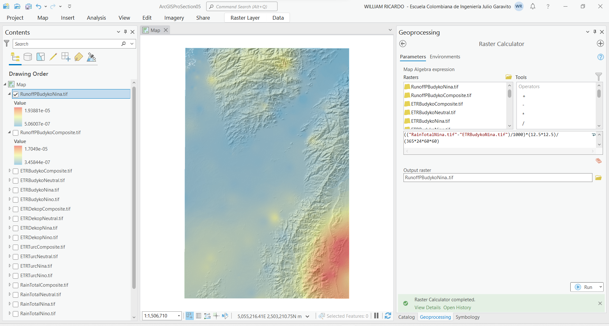

Flujo potencial de escurrimiento Budyko El Niño, m³/s

Flujo potencial de escurrimiento Budyko Neutro, m³/s

**Dekop**

Flujo potencial de escurrimiento Dekop Compuesto, m³/s
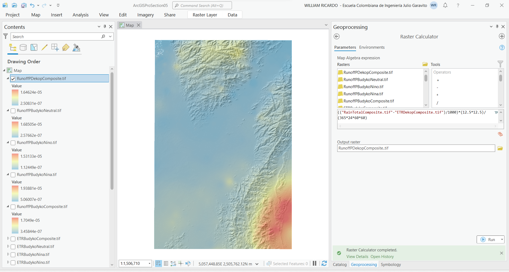

Flujo potencial de escurrimiento Dekop La Niña, m³/s

Flujo potencial de escurrimiento Dekop El Niño, m³/s
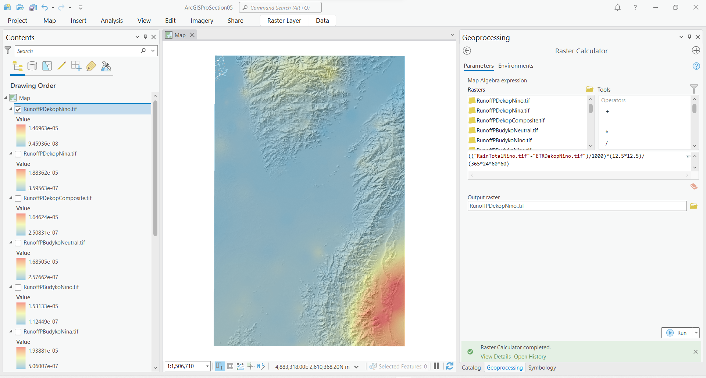

Flujo potencial de escurrimiento Dekop Neutro, m³/s

**Turc**

Flujo potencial de escurrimiento Turc Compuesto, m³/s
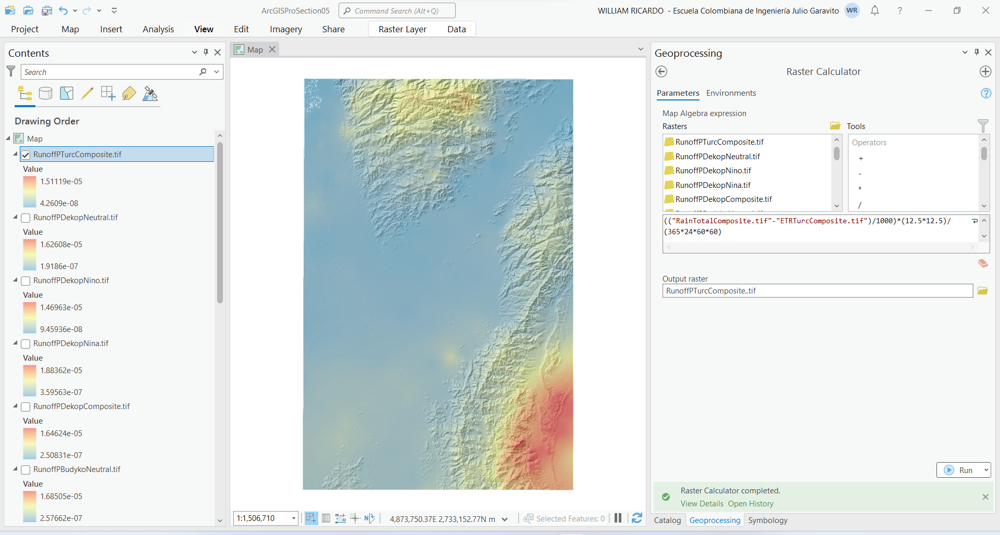

Flujo potencial de escurrimiento Turc La Niña, m³/s
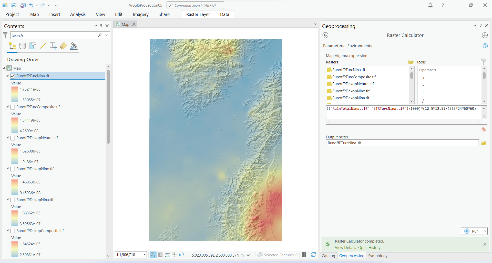

Flujo potencial de escurrimiento Turc El Niño, m³/s
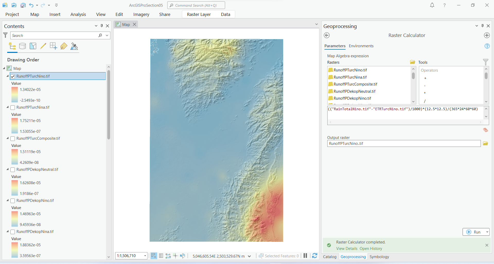

Flujo potencial de escurrimiento Turc Neutro, m³/s
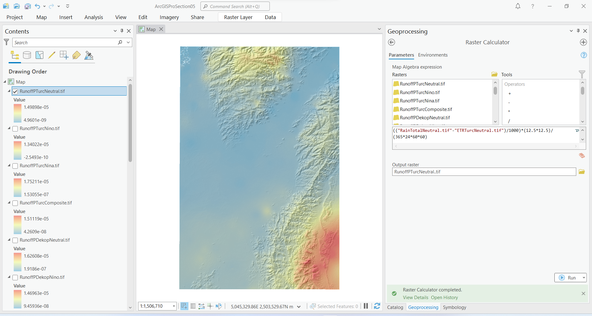

7. Utilizando la herramienta _Geoprocessing / Spatial Analyst Tools / Hydrology / Flow Accumulation_, cree los mapas de caudales medios de largo plazo dentro de la carpeta `D:\R.LTWB\.grid`:

> En el parámetro _Input flow direction type_, seleccione la opción _D8_ correspondiente a las 8 posibles direcciones convencionales de flujo que han sido asignadas al mapa FDR.

| Mapa                    | Rango, m³/s | Grilla raster :open_file_folder:                                                                                                                                                                                                                                                                                                                                                                                                                                                            |
|:------------------------|:-----------:|---------------------------------------------------------------------------------------------------------------------------------------------------------------------------------------------------------------------------------------------------------------------------------------------------------------------------------------------------------------------------------------------------------------------------------------------------------------------------------------------|
| **Budyko**              |             |                                                                                                                                                                                                                                                                                                                                                                                                                                                                                             |
| LTWBBudykoComposite.tif | 0 - 313.263 | [Part1](../../.grid/LTWBBudykoComposite.part01.rar), [Part2](../../.grid/LTWBBudykoComposite.part02.rar), [Part3](../../.grid/LTWBBudykoComposite.part03.rar), [Part4](../../.grid/LTWBBudykoComposite.part04.rar), [Part5](../../.grid/LTWBBudykoComposite.part05.rar), [Part6](../../.grid/LTWBBudykoComposite.part06.rar), [Part7](../../.grid/LTWBBudykoComposite.part07.rar), [Part8](../../.grid/LTWBBudykoComposite.part08.rar), [Part9](../../.grid/LTWBBudykoComposite.part09.rar) |
| LTWBBudykoNina.tif      | 0 - 409.946 | [Part1](../../.grid/LTWBBudykoNina.part01.rar), [Part2](../../.grid/LTWBBudykoNina.part02.rar), [Part3](../../.grid/LTWBBudykoNina.part03.rar), [Part4](../../.grid/LTWBBudykoNina.part04.rar), [Part5](../../.grid/LTWBBudykoNina.part05.rar), [Part6](../../.grid/LTWBBudykoNina.part06.rar), [Part7](../../.grid/LTWBBudykoNina.part07.rar), [Part8](../../.grid/LTWBBudykoNina.part08.rar), [Part9](../../.grid/LTWBBudykoNina.part09.rar)                                              |
| LTWBBudykoNino.tif      | 0 - 209.282 | [Part1](../../.grid/LTWBBudykoNino.part01.rar), [Part2](../../.grid/LTWBBudykoNino.part02.rar), [Part3](../../.grid/LTWBBudykoNino.part03.rar), [Part4](../../.grid/LTWBBudykoNino.part04.rar), [Part5](../../.grid/LTWBBudykoNino.part05.rar), [Part6](../../.grid/LTWBBudykoNino.part06.rar), [Part7](../../.grid/LTWBBudykoNino.part07.rar), [Part8](../../.grid/LTWBBudykoNino.part08.rar), [Part9](../../.grid/LTWBBudykoNino.part09.rar)                                              |
| LTWBBudykoNeutral.tif   | 0 - 314.89  | [Part1](../../.grid/LTWBBudykoNeutral.part01.rar), [Part2](../../.grid/LTWBBudykoNeutral.part02.rar), [Part3](../../.grid/LTWBBudykoNeutral.part03.rar), [Part4](../../.grid/LTWBBudykoNeutral.part04.rar), [Part5](../../.grid/LTWBBudykoNeutral.part05.rar), [Part6](../../.grid/LTWBBudykoNeutral.part06.rar), [Part7](../../.grid/LTWBBudykoNeutral.part07.rar), [Part8](../../.grid/LTWBBudykoNeutral.part08.rar), [Part9](../../.grid/LTWBBudykoNeutral.part09.rar)                   |
| **Dekop**               |             |                                                                                                                                                                                                                                                                                                                                                                                                                                                                                             |
| LTWBDekopComposite.tif  | 0 - 250.091 | [Part1](../../.grid/LTWBDekopComposite.part01.rar), [Part2](../../.grid/LTWBDekopComposite.part02.rar), [Part3](../../.grid/LTWBDekopComposite.part03.rar), [Part4](../../.grid/LTWBDekopComposite.part04.rar), [Part5](../../.grid/LTWBDekopComposite.part05.rar), [Part6](../../.grid/LTWBDekopComposite.part06.rar), [Part7](../../.grid/LTWBDekopComposite.part07.rar), [Part8](../../.grid/LTWBDekopComposite.part08.rar), [Part9](../../.grid/LTWBDekopComposite.part09.rar)          |
| LTWBDekopNina.tif       | 0 - 337.07  | [Part1](../../.grid/LTWBDekopNina.part01.rar), [Part2](../../.grid/LTWBDekopNina.part02.rar), [Part3](../../.grid/LTWBDekopNina.part03.rar), [Part4](../../.grid/LTWBDekopNina.part04.rar), [Part5](../../.grid/LTWBDekopNina.part05.rar), [Part6](../../.grid/LTWBDekopNina.part06.rar), [Part7](../../.grid/LTWBDekopNina.part07.rar), [Part8](../../.grid/LTWBDekopNina.part08.rar), [Part9](../../.grid/LTWBDekopNina.part09.rar)                                                       |
| LTWBDekopNino.tif       | 0 - 160.523 | [Part1](../../.grid/LTWBDekopNino.part01.rar), [Part2](../../.grid/LTWBDekopNino.part02.rar), [Part3](../../.grid/LTWBDekopNino.part03.rar), [Part4](../../.grid/LTWBDekopNino.part04.rar), [Part5](../../.grid/LTWBDekopNino.part05.rar), [Part6](../../.grid/LTWBDekopNino.part06.rar), [Part7](../../.grid/LTWBDekopNino.part07.rar), [Part8](../../.grid/LTWBDekopNino.part08.rar), [Part9](../../.grid/LTWBDekopNino.part09.rar)                                                       |
| LTWBDekopNeutral.tif    | 0 - 251.912 | [Part1](../../.grid/LTWBDekopNeutral.part01.rar), [Part2](../../.grid/LTWBDekopNeutral.part02.rar), [Part3](../../.grid/LTWBDekopNeutral.part03.rar), [Part4](../../.grid/LTWBDekopNeutral.part04.rar), [Part5](../../.grid/LTWBDekopNeutral.part05.rar), [Part6](../../.grid/LTWBDekopNeutral.part06.rar), [Part7](../../.grid/LTWBDekopNeutral.part07.rar), [Part8](../../.grid/LTWBDekopNeutral.part08.rar), [Part9](../../.grid/LTWBDekopNeutral.part09.rar)                            |
| **Turc**                |             |                                                                                                                                                                                                                                                                                                                                                                                                                                                                                             |
| LTWBTurcComposite.tif   | 0 - 223.629 | [Part1](../../.grid/LTWBTurcComposite.part01.rar), [Part2](../../.grid/LTWBTurcComposite.part02.rar), [Part3](../../.grid/LTWBTurcComposite.part03.rar), [Part4](../../.grid/LTWBTurcComposite.part04.rar), [Part5](../../.grid/LTWBTurcComposite.part05.rar), [Part6](../../.grid/LTWBTurcComposite.part06.rar), [Part7](../../.grid/LTWBTurcComposite.part07.rar), [Part8](../../.grid/LTWBTurcComposite.part08.rar), [Part9](../../.grid/LTWBTurcComposite.part09.rar)                   |
| LTWBTurcNina.tif        | 0 - 311.378 | [Part1](../../.grid/LTWBTurcNina.part01.rar), [Part2](../../.grid/LTWBTurcNina.part02.rar), [Part3](../../.grid/LTWBTurcNina.part03.rar), [Part4](../../.grid/LTWBTurcNina.part04.rar), [Part5](../../.grid/LTWBTurcNina.part05.rar), [Part6](../../.grid/LTWBTurcNina.part06.rar), [Part7](../../.grid/LTWBTurcNina.part07.rar), [Part8](../../.grid/LTWBTurcNina.part08.rar), [Part9](../../.grid/LTWBTurcNina.part09.rar)                                                                |
| LTWBTurcNino.tif        | 0 - 136.27  | [Part1](../../.grid/LTWBTurcNino.part01.rar), [Part2](../../.grid/LTWBTurcNino.part02.rar), [Part3](../../.grid/LTWBTurcNino.part03.rar), [Part4](../../.grid/LTWBTurcNino.part04.rar), [Part5](../../.grid/LTWBTurcNino.part05.rar), [Part6](../../.grid/LTWBTurcNino.part06.rar), [Part7](../../.grid/LTWBTurcNino.part07.rar), [Part8](../../.grid/LTWBTurcNino.part08.rar), [Part9](../../.grid/LTWBTurcNino.part09.rar)                                                                |
| LTWBTurcNeutral.tif     | 0 - 229.219 | [Part1](../../.grid/LTWBTurcNeutral.part01.rar), [Part2](../../.grid/LTWBTurcNeutral.part02.rar), [Part3](../../.grid/LTWBTurcNeutral.part03.rar), [Part4](../../.grid/LTWBTurcNeutral.part04.rar), [Part5](../../.grid/LTWBTurcNeutral.part05.rar), [Part6](../../.grid/LTWBTurcNeutral.part06.rar), [Part7](../../.grid/LTWBTurcNeutral.part07.rar), [Part8](../../.grid/LTWBTurcNeutral.part08.rar), [Part9](../../.grid/LTWBTurcNeutral.part09.rar)                                     | 

> Los valores máximos mostrados en la columna de rango en m³/s corresponden a caudales medios sobre el Río Cesar.

Luego de creadas las grillas de caudales medios, cambie la simbología de representación a _Stretch_ utilizando la paleta de color _Temperature_ y _Stretch type: Histogram Equalize_, luego, acérquese a escala 1:35.000, y con la herramienta _Go To XY_, desplácese a la coordenada 4964032.70E, 2617759.27N. Podrá observar varios drenajes y su conectividad a través de los valores de caudal medio obtenidos. 

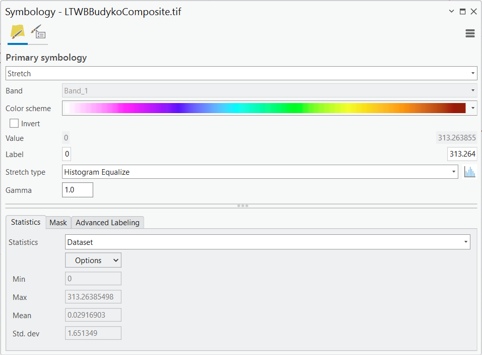

**Budyko**

Caudal medio Budyko Compuesto, m³/s
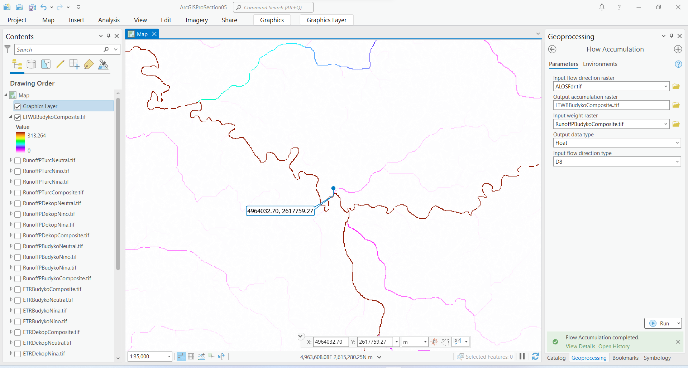

Caudal medio Budyko La Niña, m³/s
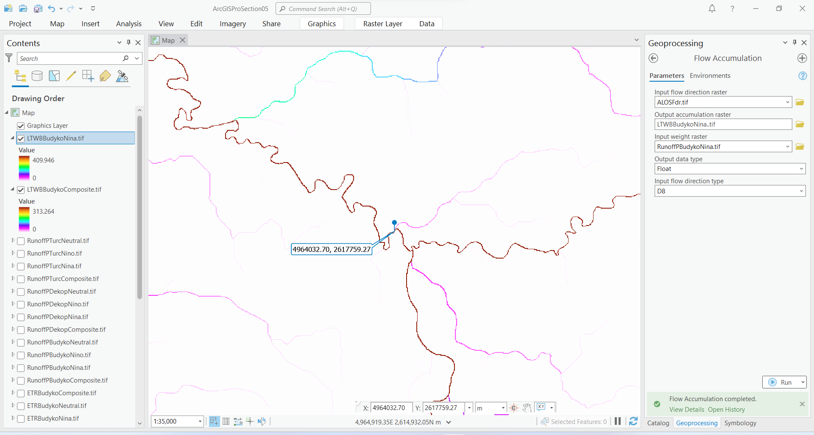

Caudal medio Budyko El Niño, m³/s
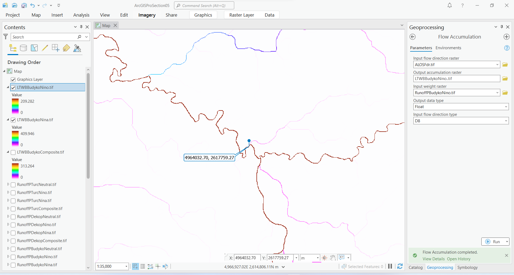

Caudal medio Budyko Neutro, m³/s
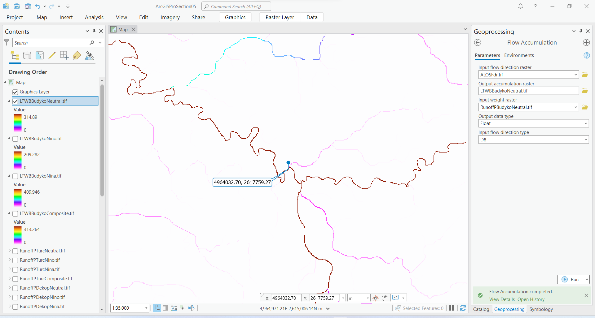

**Dekop**

Caudal medio Dekop Compuesto, m³/s
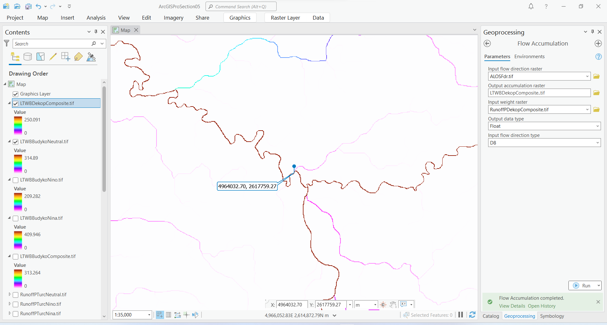

Caudal medio Dekop La Niña, m³/s
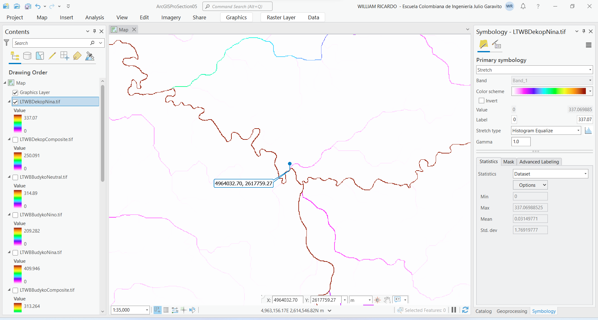

Caudal medio Dekop El Niño, m³/s
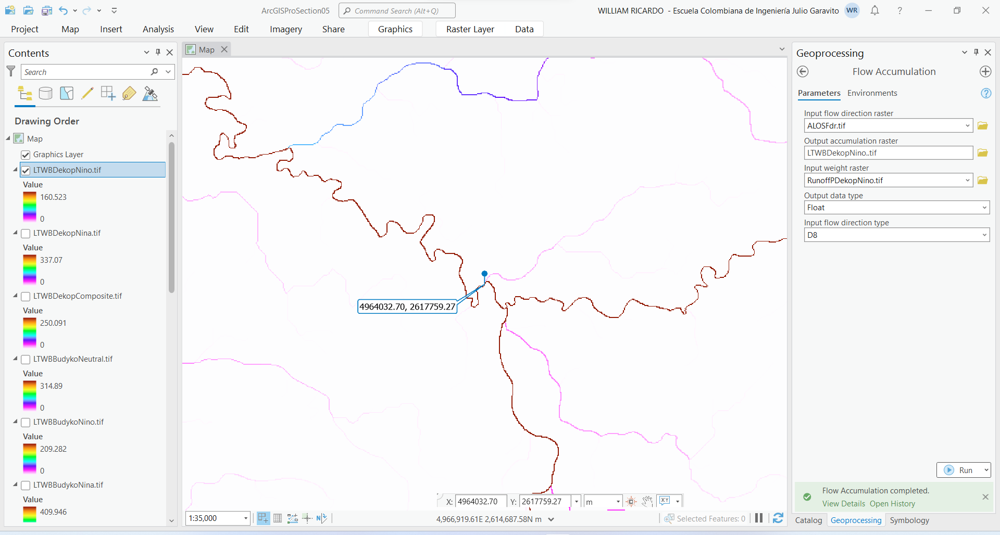

Caudal medio Dekop Neutro, m³/s
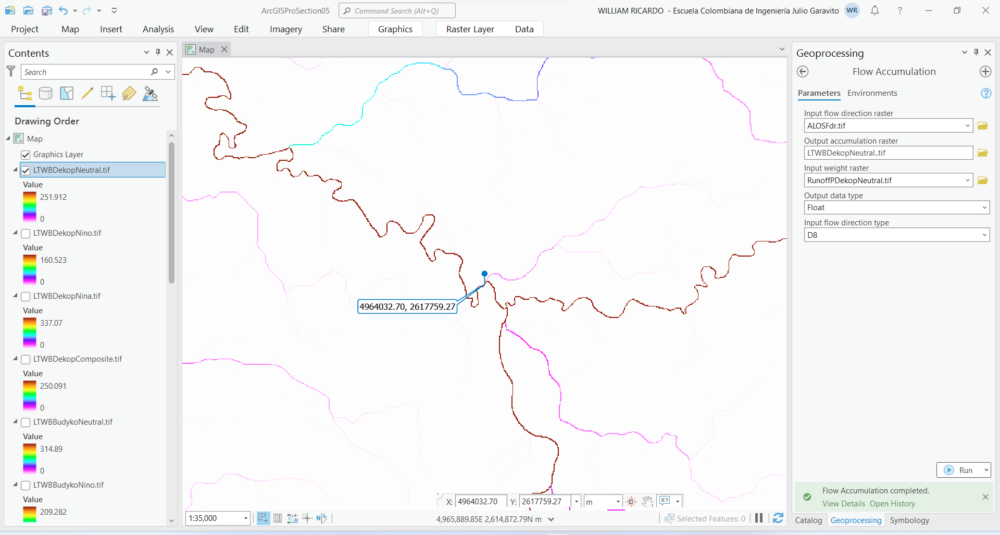

**Turc**

Caudal medio Turc Compuesto, m³/s

Caudal medio Turc La Niña, m³/s
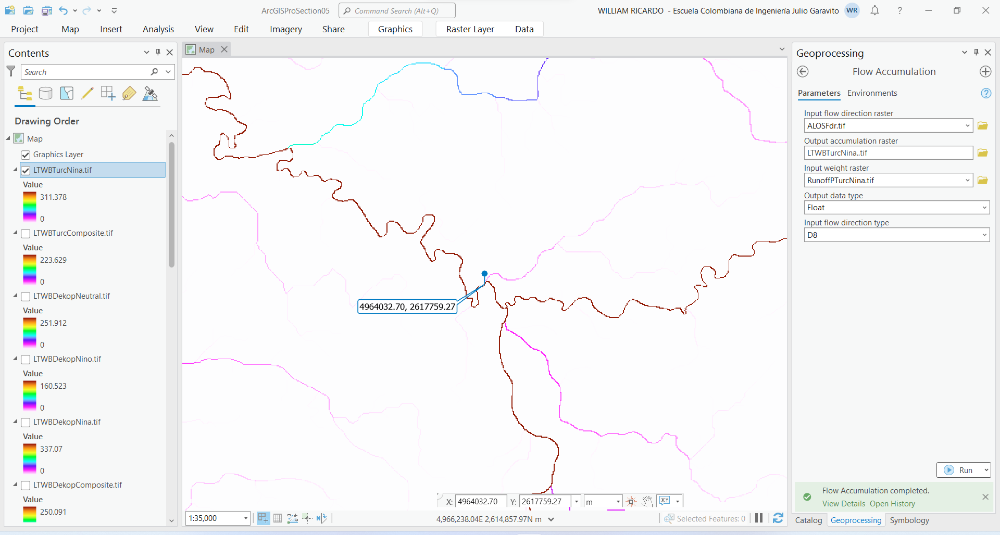

Caudal medio Turc El Niño, m³/s
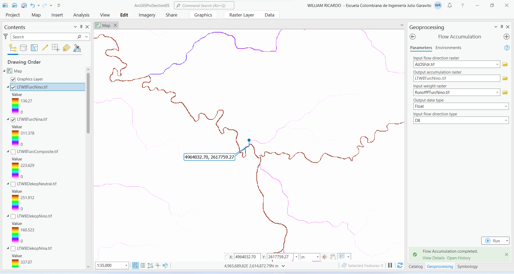

Caudal medio Turc Neutro, m³/s
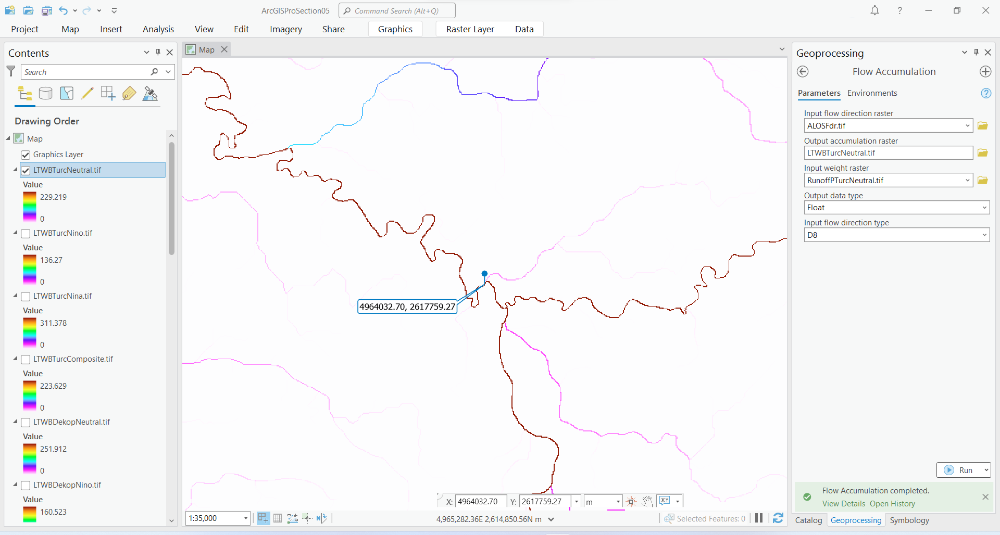

> Debido al tamaño de los archivos generados (aproximadamente 900 MB por cada grilla), las grillas han sido comprimidas en archivos .rar en partes de 95 MB.

En este momento dispone de grillas de potencial de escurrimiento o pesos distribuidos y grillas de caudal medio obtenidas del balance hidrológico de largo plazo.

### Actividades complementarias:pencil2:

En la siguiente tabla se listan las actividades complementarias que deben ser desarrolladas y documentadas por el estudiante en un único archivo de Adobe Acrobat .pdf. El documento debe incluir portada (mostrar nombre completo, código y enlace a su cuenta de GitHub), numeración de páginas, tabla de contenido, lista de tablas, lista de ilustraciones, introducción, objetivo general, capítulos por cada ítem solicitado, conclusiones y referencias bibliográficas.

| Actividad | Alcance                                                                                                                                                                                                                                                     |
|:---------:|:------------------------------------------------------------------------------------------------------------------------------------------------------------------------------------------------------------------------------------------------------------|
|     1     | Utilizando los mapas de direcciones de flujo - FDR generados en la sección 2 a partir de los modelos de terreno ASTER GDEM y SRTM, realice los balances hidrológicos de largo plazo y compare los resultados obtenidos con los obtenidos en esta actividad. |
|     2     | Para los mapas complementarios de evapotranspiración real asignados como actividad complementaria en la sección 4, realice los balances hidrológicos y compare con los resultados obtenidos en esta actividad.                                              |
|     3     | Para los mapas compuestos de evapotranspiración real - ETR, realice el balance hidrológico en ArcGIS for Desktop y en QGIS, compare los resultados con los obtenidos en esta actividad.                                                                     |

### Compatibilidad

* Esta actividad puede ser desarrollada con cualquier software SIG que disponga de herramientas de algebra de mapas y acumulación de flujo que incluyan grillas de pesos distribuidos.

### Referencias

* https://hess.copernicus.org/articles/24/1975/2020/#:~:text=3.1%20Long%2Dterm%20water%20balance,precipitation%20(%E2%80%9Csupply%E2%80%9D)
* https://pro.arcgis.com/en/pro-app/latest/tool-reference/spatial-analyst/flow-direction.htm

### Control de versiones

| Versión    | Descripción                                                                                                                           | Autor                                     | Horas |
|------------|:--------------------------------------------------------------------------------------------------------------------------------------|-------------------------------------------|:-----:|
| 2023.02.19 | Guión, audio, video, edición y publicación.                                                                                           | [rcfdtools](https://github.com/rcfdtools) |   3   |
| 2022.12.14 | Creación mapas balance hidrológico largo plazo. Compresión y publicación. Documentación. Ilustración cabecera y diagrama de procesos. | [rcfdtools](https://github.com/rcfdtools) |   8   |
| 2022.12.13 | Finalización creación mapas de flujo potencial de escurrimiento o grillas de pesos distribuidos. Compresión y publicación.            | [rcfdtools](https://github.com/rcfdtools) |   5   |
| 2022.12.12 | Inicio documentación y creación mapas de flujo potencial de escurrimiento o grillas de pesos distribuidos                             | [rcfdtools](https://github.com/rcfdtools) |   2   |

_R.LTWB es de uso libre para fines académicos, conoce nuestra licencia, cláusulas, condiciones de uso y como referenciar los contenidos publicados en este repositorio, dando [clic aquí](https://github.com/rcfdtools/R.LTWB/wiki/License)._

_¡Encontraste útil este repositorio!, apoya su difusión marcando este repositorio con una ⭐ o síguenos dando clic en el botón Follow de [rcfdtools](https://github.com/rcfdtools) en GitHub._

| [Actividad anterior](../) | [Inicio](../../Readme.md) | [:beginner: Ayuda](https://github.com/rcfdtools/R.LTWB/discussions/33) | [Actividad siguiente](../FlowPoint) |
|---------------------------|---------------------------|------------------------------------------------------------------------|-------------------------------------|

