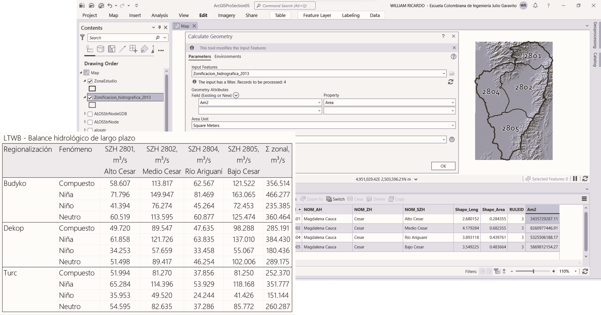
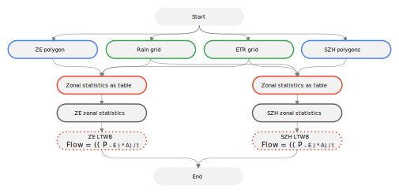
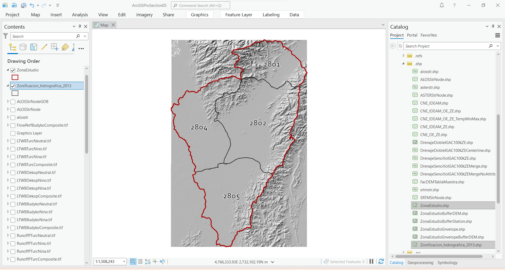
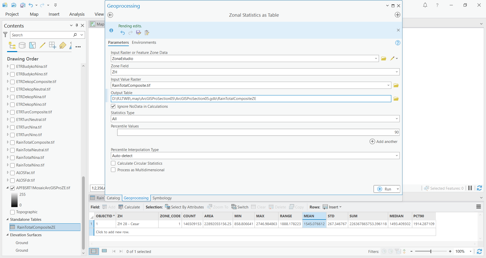
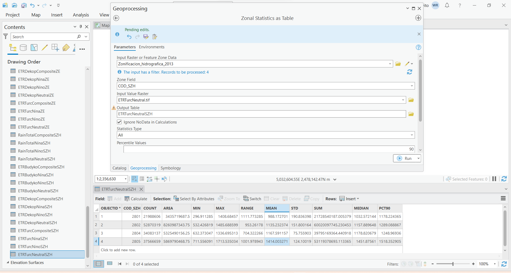
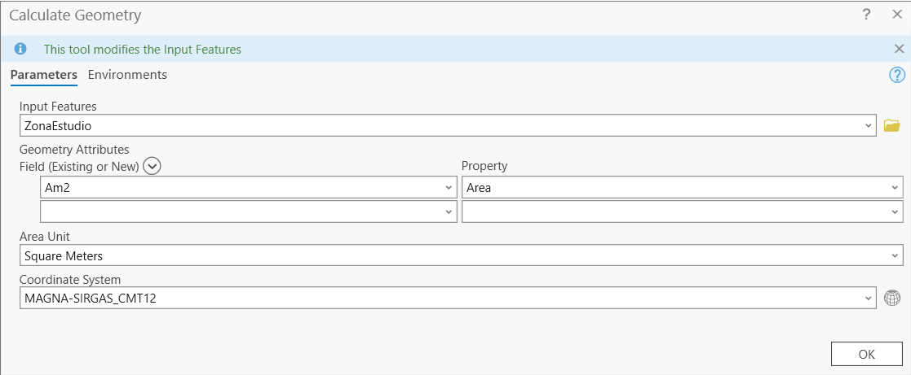
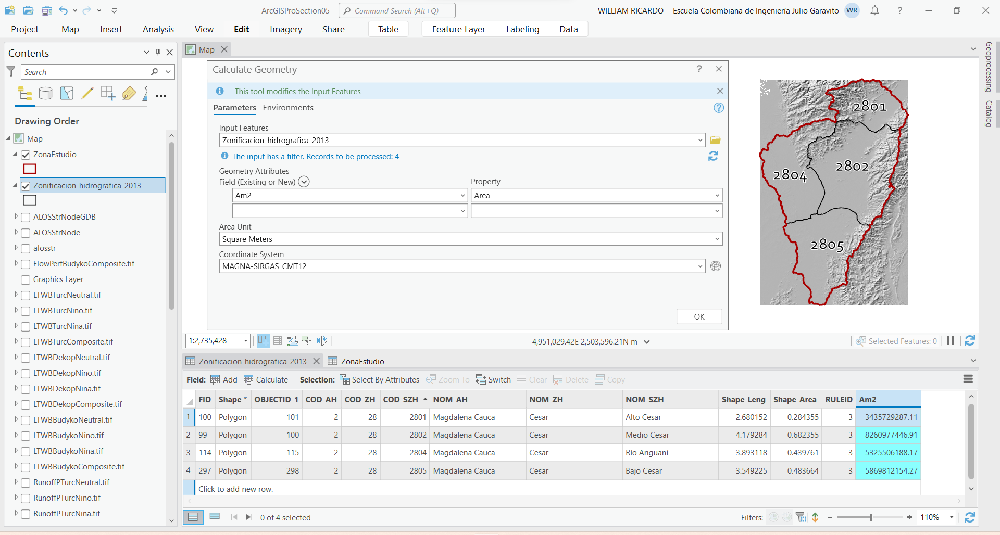
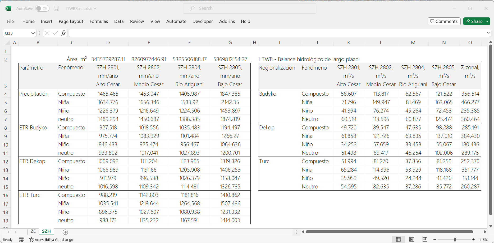

## Balance hidrológico a partir de cuencas delimitadas
Keywords: `LTWB` `Flow` `Zonal-statistics-as-table` `Add-field` `Calculate-geometry`

Cuando existen zonas delimitadas tales como cuencas hidrográficas, es posible mediante estadísticos zonales, estimar manualmente el balance hidrológico a partir de los mapas de precipitación media y evapotranspiración real.

  Playlist: https://www.youtube.com/playlist?list=PLneiG4vC_8YupZFL2DtUEdcgtXyWT7Apt  

### Objetivos

* A partir de los mapas de precipitación total y evapotranspiración real compuesta y por fenómeno climatológico, obtener los valores medios zonales y estimar el balance hidrológico de largo plazo, para la zona 28 y subzonas hidrográficas asociadas definidas por el IDEAM.
* Analizar los resultados obtenidos para series compuestas y por fenómeno climatológico.

### Requerimientos

* [ArcGIS Pro 2+](https://pro.arcgis.com/en/pro-app/latest/get-started/download-arcgis-pro.htm)
* [ArcGIS for Desktop 10+](https://desktop.arcgis.com/es/desktop/) (opcional)
* [QGIS 3+](https://qgis.org/) (opcional)
* Polígono envolvente que delimita la zona de estudio. [:mortar_board:Aprender.](../../Section01/CaseStudy)
* Subzonas hidrográficas IDEAM - Colombia. [:mortar_board:Aprender.](../../Section01/CaseStudy) 
* Mapas de precipitación total. [:mortar_board:Aprender.](../../Section04/Rain)
* Mapa de evapotranspiración real. [:mortar_board:Aprender.](../../Section04/ETR)

### Procedimiento general

  
Convenciones generales en diagramas: clases de entidad en azul, dataset en gris oscuro, grillas en color verde, geo-procesos en rojo, procesos automáticos o semiautomáticos en guiones rojos y procesos manuales en amarillo. Líneas conectoras con guiones corresponden a procedimientos opcionales.  

1. En ArcGIS Pro, abra el proyecto _ArcGISProSection05.aprx_ creado en la primera actividad de esta sección y almacenado en la ruta _D:\R.LTWB\\.map_.

> Tenga en cuenta que automáticamente fué asignado al proyecto, el sistema de coordenadas geográficas 9377 de Colombia, correspondiente a MAGNA-SIRGAS Origen-Nacional.

2. Desde la carpeta _D:\R.LTWB\HECGeoHMS\.shp_ disponible en el catálogo, agregue al proyecto los archivos de formas [ZonaEstudio.shp](../../.shp/ZonaEstudio.zip) y [Zonificacion_hidrografica_2013.shp](../../.shp/Zonificacion_Hidrografica_2013.zip). Modifique la simbología de representación para la zona de estudio a borde rojo, grosor 3 sin relleno y para las subzonas en borde negro, grosor 1 sin relleno. Utilizando la expresión `COD_ZH = 28`, filtre la capa de zonificación hidrográfica para solo los polígonos asociados a la subzona hidrográfica 28 y rotule a partir del campo `COD_SZH`.

3. Utilizando la herramienta _Geoprocessing / Spatial Analyst Tools / Zonal / Zonal Statistics as Table_, obtenga los estadísticos zonales para la zona de estudio a partir de los mapas de precipitación total y evapotranspiración real.

Nombre los archivos de estadísticas zonales de acuerdo con las indicaciones de las siguientes tablas y almacene dentro de la Geodatabase del proyecto _ArcGISProSection05.aprx_ en `D:\R.LTWB\\.map`. Registre los valores zonales medios obtenidos.

Ejemplo para precipitación total compuesta en zona de estudio

**Zona de estudio - ZE**

| Fenómeno / Zona               | Tabla zonal          | General, mm/año |
|-------------------------------|----------------------|:---------------:|
| **Precipitación**             |                      |                 |
| Compuesto / Zona estudio - ZE | RainTotalCompositeZE |    1545.077     |
| Niña / Zona estudio - ZE      | RainTotalNinaZE      |    1760.878     |
| Niño / Zona estudio - ZE      | RainTotalNinoZE      |    1280.771     |
| neutro / Zona estudio - ZE    | RainTotalNeutralZE   |    1550.741     |
| **ETR Budyko**                |                      |                 |
| Compuesto / Zona estudio - ZE | ETRBudykoCompositeZE |    1053.944     |
| Niña / Zona estudio - ZE      | ETRBudykoNinaZE      |    1118.535     |
| Niño / Zona estudio - ZE      | ETRBudykoNinoZE      |     956.504     |
| neutro / Zona estudio - ZE    | ETRBudykoNeutralZE   |    1054.165     |
| **ETR Dekop**                 |                      |                 |
| Compuesto / Zona estudio - ZE | ETRDekopCompositeZE  |    1152.198     |
| Niña / Zona estudio - ZE      | ETRDekopNinaZE       |    1231.288     |
| Niño / Zona estudio - ZE      | ETRDekopNinoZE       |    1032.202     |
| neutro / Zona estudio - ZE    | ETRDekopNeutralZE    |    1152.373     |
| **ETR Turc**                  |                      |                 |
| Compuesto / Zona estudio - ZE | ETRTurcCompositeZE   |    1197.412     |
| Niña / Zona estudio - ZE      | ETRTurcNinaZE        |    1276.271     |
| Niño / Zona estudio - ZE      | ETRTurcNinoZE        |    1072.555     |
| neutro / Zona estudio - ZE    | ETRTurcNeutralZE     |    1192.169     |

Ejemplo para evapotranspiración real por subzona hidrográfica 

**Subzona hidrográfica - SZH**

| Fenómeno / Zona                        | Tabla zonal           | SZH 2801, mm/año Alto Cesar | SZH 2802, mm/año Medio Cesar | SZH 2804, mm/año Río Ariguaní | SZH 2805, mm/año Bajo Cesar |
|----------------------------------------|-----------------------|:------------------------------:|:-------------------------------:|:--------------------------------:|:------------------------------:|
| **Precipitación**                      |                       |                                |                                 |                                  |                                |
| Compuesto / Subzona hidrográfica - SZH | RainTotalCompositeSZH |            1465.465            |            1453.047             |             1405.987             |            1847.385            |
| Niña / Subzona hidrográfica - SZH      | RainTotalNinaSZH      |            1634.776            |            1656.346             |             1583.920             |            2142.350            |
| Niño / Subzona hidrográfica - SZH      | RainTotalNinoSZH      |            1226.379            |            1216.649             |             1224.506             |            1453.897            |
| neutro / Subzona hidrográfica - SZH    | RainTotalNeutralSZH   |            1489.294            |            1450.687             |             1388.385             |            1874.819            |
| **ETR Budyko**                         |                       |                                |                                 |                                  |                                |
| Compuesto / Subzona hidrográfica - SZH | ETRBudykoCompositeSZH |            927.518             |            1018.556             |             1035.483             |            1194.497            |
| Niña / Subzona hidrográfica - SZH      | ETRBudykoNinaSZH      |            975.774             |            1083.929             |             1101.484             |            1266.270            |
| Niño / Subzona hidrográfica - SZH      | ETRBudykoNinoSZH      |            846.433             |             925.474             |             956.467              |            1064.636            |
| neutro / Subzona hidrográfica - SZH    | ETRBudykoNeutralSZH   |            933.802             |            1017.041             |             1027.893             |            1200.701            |
| **ETR Dekop**                          |                       |                                |                                 |                                  |                                |
| Compuesto / Subzona hidrográfica - SZH | ETRDekopCompositeSZH  |            1009.092            |            1111.204             |             1123.905             |            1319.326            |
| Niña / Subzona hidrográfica - SZH      | ETRDekopNinaSZH       |            1066.989            |            1191.660             |             1205.908             |            1406.253            |
| Niño / Subzona hidrográfica - SZH      | ETRDekopNinoSZH       |            911.979             |             996.538             |             1026.379             |            1158.047            |
| neutro / Subzona hidrográfica - SZH    | ETRDekopNeutralSZH    |            1016.598            |            1109.342             |             1114.481             |            1326.785            |
| **ETR Turc**                           |                       |                                |                                 |                                  |                                |
| Compuesto / Subzona hidrográfica - SZH | ETRTurcCompositeSZH   |            988.219             |            1142.803             |             1181.816             |            1410.862            |
| Niña / Subzona hidrográfica - SZH      | ETRTurcNinaSZH        |            1035.541            |            1219.644             |             1264.568             |            1507.486            |
| Niño / Subzona hidrográfica - SZH      | ETRTurcNinoSZH        |            896.375             |            1027.607             |             1080.938             |            1231.332            |
| neutro / Subzona hidrográfica - SZH    | ETRTurcNeutralSZH     |            988.173             |            1135.232             |             1167.591             |            1414.003            |

4. En las tablas de atributos de las capas ZonaEstudio.shp y Zonificacion_hidrografica_2013.shp, cree un campo de atributos numérico doble con el nombre `Am2` y a través del calculador de geometría de campo, calcule el área planar en m² de cada polígono. Utilice el sistema de proyección de coordenadas 9377.

5. Una vez obtenidos los valores promedio de precipitación, evaporación y áreas de aportación por polígono, en un libro de Microsoft Excel, realice el cálculo del balance hidrológico.

Qm = (( P – E ) * A) / t

Donde,

* Qm: caudal medio, m³/s
* P: precipitación, mm/año
* E: evapotranspiración real, mm/año
* A: área de cada celda, m²
* t: tiempo en segundos en un año, (365 dias x 24 horas x 60 minutos x 60 segundos = 31.536.000.000)

Ejemplo de formulación en Excel: `=((D4-D8)/1000)*$D$2/(365*24*60*60)`

Resultados para el polígono de la zona de estudio - ZE

Resultados en polígonos de subzonas hidrográficas - SZH

Como puede observar en los resultados, los caudales medios obtenidos por fenómeno a partir del mapa de evapotranspiración real de Budyko, son mayores a los obtenidos por Dekop y Turc. Para el área de aportación de 22892.03 km² de la zona de estudio, se ha obtenido un caudal medio compuesto por Budyko de 356.51 m³/s.
 
Con respecto a las subzonas hidrográficas, Bajo Cesar identificada con el código 2805 y área de aportación de 5869.81 km², no es la subzona de mayor extensión pero si la subzona con mayor oferta hídrica superficial, con un caudal medio compuesto por Budyko de 121.52 m³/s. 

En este momento dispone de valores de caudal medio obtenidos del balance hidrológico de largo plazo para el polígono que delimita la zona de estudio y por subzonas hidrográficas.

### Actividades complementarias:pencil2:

En la siguiente tabla se listan las actividades complementarias que deben ser desarrolladas y documentadas por el estudiante en un único archivo de Adobe Acrobat .pdf. El documento debe incluir portada (mostrar nombre completo, código y enlace a su cuenta de GitHub), numeración de páginas, tabla de contenido, lista de tablas, lista de ilustraciones, introducción, objetivo general, capítulos por cada ítem solicitado, conclusiones y referencias bibliográficas.

| Actividad | Alcance                                                                                                                                                                                   |
|:---------:|:------------------------------------------------------------------------------------------------------------------------------------------------------------------------------------------|
|     1     | Para los métodos de evapotranspiración real asignados como actividad complementaria en la sección 4, realice el balance hidrológico por cuencas delimitadas.                              |
|     2     | Compare los valores de los métodos complementarios con los obtenidos en la presente actividad e indique y justifique cuales caudales utilizaría para el diseño de estructuras ecológicas. |

### Compatibilidad

* Esta actividad puede ser desarrollada con cualquier software SIG que disponga de herramientas de estadística zonal.

### Referencias

* https://pro.arcgis.com/en/pro-app/latest/tool-reference/spatial-analyst/zonal-statistics-as-table.htm
* https://pro.arcgis.com/en/pro-app/latest/tool-reference/data-management/calculate-geometry-attributes.htm

### Control de versiones

| Versión    | Descripción                                                                                                                                    | Autor                                     | Horas |
|------------|:-----------------------------------------------------------------------------------------------------------------------------------------------|-------------------------------------------|:-----:|
| 2023.02.22 | Guión, audio, video, edición y publicación.                                                                                                    | [rcfdtools](https://github.com/rcfdtools) | 1.75  |
| 2022.12.21 | Libro de Microsoft Excel con balance hidrológico zona de estudio y por subzonas hidrográficas. Ilustración cabecera y diagrama de procesos.    | [rcfdtools](https://github.com/rcfdtools) |   3   |
| 2022.12.20 | Documentación. Estadísticas zonales como tabla para precipitación total y evapotranspiración potencial compuesta y por fenómeno climatológico. | [rcfdtools](https://github.com/rcfdtools) |   4   |

_R.LTWB es de uso libre para fines académicos, conoce nuestra licencia, cláusulas, condiciones de uso y como referenciar los contenidos publicados en este repositorio, dando [clic aquí](https://github.com/rcfdtools/R.LTWB/wiki/License)._

_¡Encontraste útil este repositorio!, apoya su difusión marcando este repositorio con una ⭐ o síguenos dando clic en el botón Follow de [rcfdtools](https://github.com/rcfdtools) en GitHub._

| [Actividad anterior](../FlowPerformance) | [Inicio](../../Readme.md) | [:beginner: Ayuda](https://github.com/rcfdtools/R.LTWB/discussions/36) |
|------------------------------------------|---------------------------|------------------------------------------------------------------------|

 Este curso guía, ha sido desarrollado con el apoyo de la Escuela Colombiana de Ingeniería - Julio Garavito. Encuentra más contenidos en https://github.com/uescuelaing  

